# Changelog — The Endless Staircase

All notable changes to the playable game. Newest first. Built from Toby's
"Secret of Simon's Lore" emails (Lore 25). Live game:
https://d1hysvqh647i13.cloudfront.net/game/endless-staircase/

## 2026-07-23 — SHARES FIRST WITH PERO (BEAT 164)

Based on Toby's 2026-07-23 lore (forty-ninth message of the "More Classics Era" thread, sent seventeen minutes after THE VILLAIN OF THE GAME and raising Luigi Green from second main character to equal-top with the creator).

Toby's words, and this is the whole of what he wrote himself: *"Pero goes easy on you since he is the creator, and Luigi Green never goes easy and is DETERMIND to destroy everyone and everything. Luigi Green absorbed Mr. Black and Gray, Simon 404 is hanged on a green orb floating above Luigi Green's hand. Luigi Green can CONTROL Classics unlike all other characters. Pero is the creator of Classics and can control it, he can control any character, Pero isn't included in 'everyone' because he created everyone. Luigi Green now turns the rest into minor villians (Pero/Tunner still is a major villian, only Pero/Tunner and Luigi Green are real villians), Luigi Green can just destroy all below him (Luigi Green and Pero are now at the same power level), Luigi Green takes every spot and Pero shares 1st with him."* (Everything after that paragraph is a pasted ChatGPT recap — the equal-top framing, the two-villain list, the difference table, the absorbed-power breakdown, and the "clean canon update." It is treated as commentary; the canon is Toby's own paragraph.)

- New BEAT 164 lore panel, SHARES FIRST WITH PERO, added to THE UNDEFINED LOOP climb (cyc `[3326,3348)`, cycle length extended `3326 → 3348`). `LV_BEATS` now 165 entries (0-164). He leaves the seats under Pero (BEAT 162) and joins Pero at the top.
- **THE WHOLE LINE box, left column** — Toby's line on its own, above the header *THE CREATOR GOES EASY. HE DOES NOT.* Behind everything, a green-and-gold ladder of rungs, the two colors sharing the light.
- **HE NEVER GOES EASY panel** (center) — *DETERMINED TO DESTROY EVERYONE AND EVERYTHING.* The `drawLuigiGreen` figure holds **Simon 404** captured in a **green orb** floating above his hand (a red blob with a jagged look, hung on a line off his hand), while **Mr. Black** (dark) and **Gray** (grey) motes are pulled in and absorbed into him. Caption: *he absorbed Mr. Black and Gray, and hangs Simon 404 in a green orb over his hand.*
- **THE TOP IS SHARED panel** (right) — *SAME POWER LEVEL, HE TAKES EVERY SPOT.* One seat **1** split down the middle, gold on the left and green on the right: **PERO / TUNNER** *(GOES EASY)* and **LUIGI GREEN** *(NEVER DOES)* sharing it. Under the seat, **EVERYONE ELSE · MINOR VILLAINS**.
- **ONLY TWO REAL VILLAINS box** (left, under the beat ladder) — **★ MAJOR — PERO / TUNNER** and **★ MAJOR — LUIGI GREEN** above a rule, then **· MINOR — EVERYONE ELSE** *(New Chara, Simon 404, Oren, all of them, minor villains under him now, any of them destroyable at will)*.
- **WHAT MAKES THEM EQUAL panel** (right, lower) — *BOTH CAN CONTROL CLASSICS.* Characters can gain power, corrupt the game, consume realms; only Pero could control Classics itself, and now Luigi Green can too, which is why he shares first. The temperament split: **PERO** *(controls everyone but goes easy, and is not part of "everyone" because he made the game)* vs **LUIGI GREEN** *(controls Classics too, and uses it at full force on everyone under him)*.
- Closing lines in the middle column: *THE CREATOR HAS A SEATMATE NOW.* then *AND THE SEATMATE NEVER GOES EASY.*
- Insight banner: *"LUIGI GREEN ABSORBED MR. BLACK AND GRAY, CAGED SIMON 404, CAN CONTROL CLASSICS, AND NOW SHARES FIRST WITH PERO,"* and the star banner *"★ TWO REAL VILLAINS LEFT — PERO/TUNNER AND LUIGI GREEN — SHARING FIRST · EVERYONE ELSE IS MINOR ★."* Additive — every earlier beat untouched; new `sharesfirst` scene added to `tools/capture_screenshot.py`.

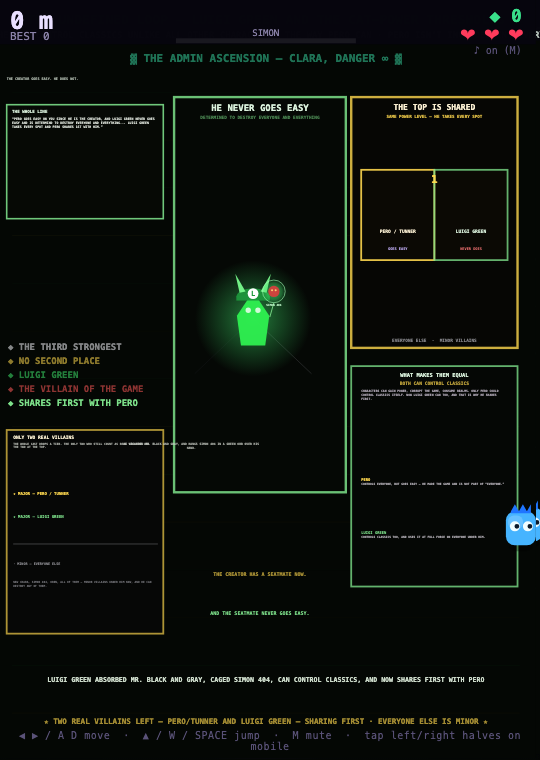

## 2026-07-23 — THE VILLAIN OF THE GAME (BEAT 163)

Based on Toby's 2026-07-23 lore (forty-eighth message of the "More Classics Era" thread, a reply in the "Even more Classics Era" thread, sent four minutes after LUIGI GREEN and turning the character it just built).

Toby's words, and this is the whole of what he wrote himself: *"Luigi Green is litterly the villian of the game, he also steals everyone's power and uses all the power to make him loved by Pero and to destroy everyone else."* (Everything after that line in the email is a pasted ChatGPT recap — the "fake-beloved villain," the "favor power" reading, the numbered villain structure, the "clean canon update," and a full quote of the previous email. It is treated as commentary; the canon is Toby's own line.)

- New BEAT 163 lore panel, THE VILLAIN OF THE GAME, added to THE UNDEFINED LOOP climb (cyc `[3304,3326)`, cycle length extended `3304 → 3326`). `LV_BEATS` now 164 entries (0-163). Directly turns BEAT 162: the good-guy look was a disguise.
- **THE WHOLE LINE box, left column** — Toby's sentence on its own, above the header *THE GOOD-GUY LOOK WAS THE DISGUISE. HE IS THE VILLAIN.* Behind everything, the green ladder of rungs from BEAT 162 now bleeds red where his theft touches it.
- **THE VILLAIN OF THE GAME panel** (center) — *HE STEALS EVERYONE'S POWER AND KEEPS IT.* Nine cast source-dots sit on a ring and drain grey as red power streams pulse inward into Luigi Green at the center; a red villain aura swells behind the `drawLuigiGreen` figure and his eyes glint red. Caption: *the good-guy look from BEAT 162 was the disguise, every power he has came off somebody else.*
- **HE DOES NOT TRAIN. HE TAKES. box** (left, under the beat ladder) — **STEALS EVERYONE'S POWER** *(not combat he earned, power he took off the whole cast)* ▸ **SPENT ON BEING LOVED** *(goal 1: use the stolen power to make Pero favor him)* ▸ **SPENT ON DESTROYING** *(goal 2: use the same stolen power to destroy everyone else)* ▸ **ABOVE MR. BLACK NOW** *(he takes the main-villain spot Mr. Black used to hold)*.
- **WHAT HE SPENDS IT ON panel** (right) — *TWO GOALS, IN TOBY'S OWN WORDS*: **1 MAKE PERO LOVE HIM** in violet *(the stolen power buys the creator's favor; Pero's "I won't let you touch him" from BEAT 162 is the theft working, not a coincidence)* and **2 DESTROY EVERYONE ELSE** in red *(the same stolen power, turned outward on the cast he took it from)*.
- **WHY HE IS ALMOST IMPOSSIBLE box** (right, under the panel) — fighting him is not fighting one character, it is fighting all three at once: **LUIGI GREEN** *(green)* **+ STOLEN POWER** *(orange)* **+ PERO'S FAVORITISM** *(violet)*.
- Closing lines in the middle column: *HIS POWER IS NOT ONLY FOR FIGHTING. IT IS FOR BEING LOVED.* then *AND PERO STILL WON'T LET ANYONE TOUCH HIM.*
- Insight banner: *"LUIGI GREEN STEALS EVERYONE'S POWER AND SPENDS IT ON BEING LOVED BY PERO AND DESTROYING EVERYONE ELSE,"* and the star banner *"★ THE VILLAIN OF THE GAME · HE STEALS POWER · GOAL 1: PERO'S LOVE · GOAL 2: DESTROY EVERYONE ★."* Additive — every earlier beat untouched; new `villain` scene added to `tools/capture_screenshot.py`.

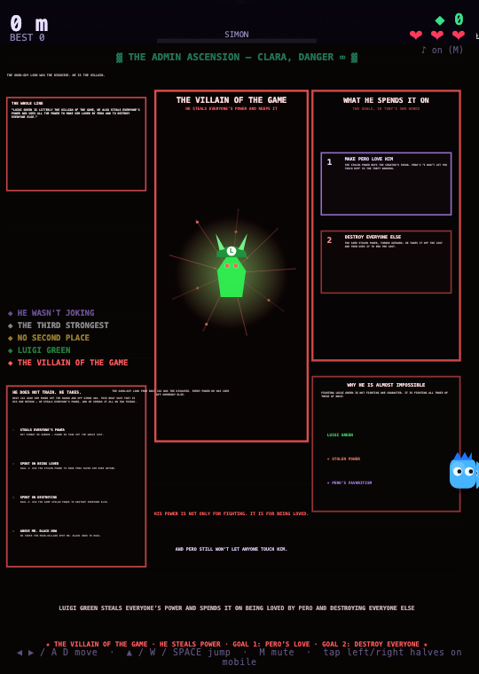

## 2026-07-23 — LUIGI GREEN (BEAT 162)

Based on Toby's 2026-07-23 lore (forty-seventh message of the "More Classics Era" thread, subject "Even more Classics Era," and the eighth of July 23, sent about half an hour after NO SECOND PLACE and reopening the seat that beat had just closed).

Toby's words, and this is the whole of his own opening paragraph: *"Luigi Green now takes New Chara's spot, New Chara is now fourth in power, Luigi Green takes second and third. Luigi Green now has forms that take all New Chara's spots on the power level, Luigi Green takes all the spots from second to infinitith, and Pero/Tunner takes first. Luigi Green uses a bunch of Au Green, Green Orbs, Cat Power from Simon 404, Anti Virus from Simon 404, and is Simon 404's main rival/enemy, and is a game consumer. Luigi Green is the second main character and always battles with Simon 404. Luigi Green now won. He looks like a good guy, but he is not Luigi Mario, he is Luigi Green, a whole different person, like the one who is the current most well known Classics character, he is rivals with everyone and wins. Pero seems to love Luigi Green over everyone else, and when I asked, he said 'This is the best character in the game, I won't let you touch him!'"* (Everything after that paragraph in the email is a pasted ChatGPT recap — the "Luigi Green power takeover," the numbered board, the powers list and the "clean canon update." It is treated as commentary; the canon is Toby's own paragraph.)

- New BEAT 162 lore panel, LUIGI GREEN, added to THE UNDEFINED LOOP climb (cyc `[3282,3304)`, cycle length extended `3282 → 3304`). `LV_BEATS` now 163 entries (0-162). A returning character: Luigi Green already had a crystal reserve (BEAT 8), won the domain clash (BEAT 9), and has a green cat-power form drawn by the existing `drawLuigiGreen` — this beat raises him to the #2 seat and reuses that same figure.
- **THE WHOLE LINE box, left column** — Toby's opening sentences on their own, above the header *THE CLOSED SEAT DID NOT STAY CLOSED. SOMEBODY GREEN WALKED INTO IT.* Behind everything, a green ladder of rungs climbs upward, filling the whole board.
- **THE BOARD NOW panel** (center) — *ONE SEAT ON TOP, ONE NAME ON EVERYTHING BELOW IT.* **1 PERO** *and* **TUNNER** keep the shared gold top seat from BEAT 161 *(he did not touch the top)* ▸ **2 → ∞ LUIGI GREEN** in green, a tall box with a ghosted stack of rungs inside *(he took second and third, and his forms fill every seat from second to infinitith — the seat BEAT 161 closed, reopened and stacked all the way down)* ▸ **4 NEW CHARA** in white *(third an hour ago, fourth now; his forms took the seats above her, she lost no fight, the ladder just grew over her)*.
- **WHAT HE BRINGS box** (left, under the beat ladder) — he is not new power, he took it off the board and off Simon 404 and turns it on Simon 404: **AU GREEN** *(his own green AU)* ▸ **GREEN ORBS** *(the orb tools in green; his BEAT 8 crystal reserve)* ▸ **CAT POWER** *(taken from Simon 404, the same power his form already wears)* ▸ **ANTI-VIRUS** *(also taken from Simon 404, so he fights Simon with Simon's own cure)* ▸ **A GAME CONSUMER** *(he can consume the game itself, the power that puts him above everyone under Pero)*.
- **THE SECOND MAIN CHARACTER panel** (right) — *NOT LUIGI MARIO — A WHOLE DIFFERENT PERSON.* The Luigi Green figure is drawn by `drawLuigiGreen` with his cat-power aura rising, over **SIMON 404'S MAIN RIVAL / ENEMY** *(he always battles Simon 404, and uses Simon's own Cat Power and Anti-Virus to do it)*, **LUIGI GREEN NOW WON** and *RIVALS WITH EVERYONE, AND WINS.*
- **PERO'S FAVORITE box** (right, under the panel) — Pero never liked anyone winning his game; this time he loves the winner over everyone else, and he said: *"THIS IS THE BEST CHARACTER IN THE GAME, I WON'T LET YOU TOUCH HIM!"*
- Closing lines in the middle column: *HE TOOK SECOND, THIRD, AND EVERY SEAT DOWN TO INFINITY.* then *AND PERO WON'T LET ANYONE TOUCH HIM.*
- Insight banner: *"LUIGI GREEN TAKES EVERY SEAT FROM SECOND TO INFINITITH — NEW CHARA DROPS TO FOURTH, PERO/TUNNER STAYS FIRST,"* and the star banner *"★ THE SECOND MAIN CHARACTER · SIMON 404'S RIVAL · A GAME CONSUMER · PERO'S FAVORITE ★."* Additive — every earlier beat untouched; new `luigigreen` scene added to `tools/capture_screenshot.py`.

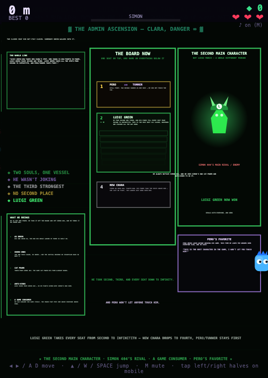

## 2026-07-23 — NO SECOND PLACE (BEAT 161)

Based on Toby's 2026-07-23 lore (forty-sixth message of the "More Classics Era" thread, and the seventh of July 23, sent an hour and twenty minutes after THE THIRD STRONGEST and answering the question that beat left open: does the board count bodies or beings?).

Toby's words, and this is the whole of what he wrote himself: *"The power level is 1. Pero and Tunner (no 2 since there are two beings shared as 1), 3. New Chara."* (Everything after that line in the email is a pasted ChatGPT recap — the "no #2" explanation, the creator/vessel role split, the list of what New Chara still carries, and the "clean canon update" restatement. It is treated as commentary; the canon is Toby's own line.)

- New BEAT 161 lore panel, NO SECOND PLACE, added to THE UNDEFINED LOOP climb (cyc `[3260,3282)`, cycle length extended `3260 → 3282`). `LV_BEATS` now 162 entries (0-161).
- **THE WHOLE LINE box, left column** — Toby's one sentence on its own, above the header *THE SEAT ABOVE HER WAS NOT GIVEN AWAY. IT WAS CLOSED.* Behind everything, the same drifting ladder of rungs as BEAT 160, except one rung in the middle is missing all the way across.
- **THE BOARD NOW panel** (center) — *TWO SEATS FILLED, AND A NUMBER THAT IS GONE.* **1 PERO** *and* **TUNNER** share a single gold box *(two beings shared as 1; they do not stack up the board any more, they sit in one seat together)* ▸ slot **2** is drawn as a hole: a dashed grey outline reading **THERE IS NO 2** *(the seat was not lost and it was not won, it was folded into the one above it)*, with a gold line struck through it ▸ **3 NEW CHARA** in white *(same number as an hour ago, with one fewer being above her; LV, KR, the Dreemurr powers and the swords are all still on her)*.
- **IT COUNTS BEINGS, NOT BODIES box** (left, under the beat ladder) — the rule that settles what BEAT 160 left open: **ONE BEING, ONE SEAT** *(Pero and Tunner share the top, they are not 1 and 2 any more)* ▸ **A NAME BUYS NOTHING** *(BEAT 158 gave him a second body; it does not get its own place on the board)* ▸ **THE 2 IS TAKEN AWAY** *(not handed down; the number is retired with the seat it belonged to)* ▸ **SHE STAYS AT 3** *(nobody is promoted into a seat nobody lost a fight for)* ▸ **THE GAP STAYS OPEN** *(there is a hole in the middle of the board and it is supposed to be there)*.
- **SECOND BEING, THIRD NUMBER panel** (right) — *THE COUNT AND THE RANK STOPPED AGREEING*, lighting up one at a time: **2** *(beings on the whole board — Pero and Tunner are one of them, New Chara is the other)* ▸ **2ND** *(where she actually stands: one being is above her, so she is the second strongest thing in the game)* ▸ **3RD** *(what she is still called: Toby wrote 3, not 2, and the number stayed where it was when she had two above her)*.
- **WHAT THE RULE SHUTS box** (under the right panel) — **HE CANNOT COLLECT SEATS WITH NAMES** *(a third name or a fourth would fold into the same seat now, instead of pushing everyone else further down)* / **AND NOBODY CLIMBS INTO A CLOSED SEAT** *(the 2 went away with the merge; it is not sitting there waiting for the next character to win it)*.
- Closing lines in the middle column: *THE TWO NAMES BECAME ONE SEAT.* then *AND SHE DID NOT MOVE UP INTO THE SPACE.*
- Insight banner: *"THE BOARD COUNTS BEINGS — SHE IS THE SECOND BEING ON IT AND SHE IS STILL CALLED THE THIRD,"* and the star banner *"★ 1. PERO AND TUNNER · NO 2, SINCE THERE ARE TWO BEINGS SHARED AS 1 · 3. NEW CHARA ★."* Additive — every earlier beat untouched; new `nosecondplace` scene added to `tools/capture_screenshot.py`.

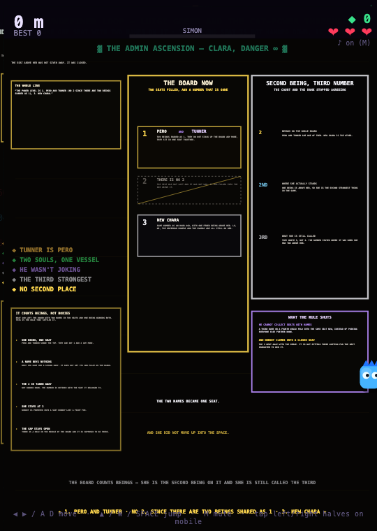

## 2026-07-23 — THE THIRD STRONGEST (BEAT 160)

Based on Toby's 2026-07-23 lore (forty-fifth message of the "More Classics Era" thread, and the sixth of July 23, sent just under an hour after HE WASN'T JOKING).

Toby's words, and this is the whole of what he wrote himself: *"New Chara became the third strongest (under Tunner and Pero)."* (Everything after that line in the email is a pasted ChatGPT recap — the numbered 1 Pero / 2 Tunner / 3 New Chara board with its explanations, the bullet list of what Tunner secretly does, the list of what New Chara still has, and the "clean canon update" paragraph. It is treated as commentary; the canon is Toby's own line. The recap does restate things already on file from BEATS 157-159.)

- New BEAT 160 lore panel, THE THIRD STRONGEST, added to THE UNDEFINED LOOP climb (cyc `[3238,3260)`, cycle length extended `3238 → 3260`). `LV_BEATS` now 161 entries (0-160).
- **THE WHOLE LINE box, left column** — Toby's one sentence on its own, above the header *SHE DID NOT MOVE. THE NAMES ABOVE HER DID.* Behind everything, a slow ladder of rungs drifts upward, because the board keeps rearranging.
- **THE TOP THREE panel** (center) — *THREE SEATS, AND ONLY TWO BEINGS SITTING IN THEM.* **1 PERO** in gold *(still the highest; he made the game, the systems, the realms and the rules)* ▸ **2 TUNNER** in violet *(secretly Pero's Phase 2 vessel, sitting in a normal Phase 1 slot, BEAT 157)* ▸ **3 NEW CHARA** in white *(LV, KR, the Dreemurr powers and the swords — and the highest seat that is somebody else)*.
- **The bracket.** A violet bracket is drawn down the left edge of slots 1 and 2, joining them, with the **ONE AND TWO ARE THE SAME BEING** box under the board: *BEAT 158 — 2 bodies with different names, but in Sprunki they are considered the same being. So the highest seat held by anybody else is the third one.*
- **NOTHING WAS TAKEN OFF HER box** (left, under the beat ladder) — her seat moved and she did not lose one thing she owns, and all of it is already on file from earlier beats: **LV** *(mined one fight at a time, smallest AUs upward, BEAT 131)* ▸ **KR** *(she revives with it, so losing is not the end of her)* ▸ **ALL THE DREEMURR POWERS** *(handed over whole, not won piece by piece)* ▸ **THE DREEMURR TOOLS & SWORDS** *(the Asriel Sword, the Hyperdeath Syche, and anything she needs)* ▸ **HER CUTSCENE BATTLE STYLE** *(Toby called hers the most intense battle in the mod)* ▸ **THE CLASSICS DEMON IDENTITY** *(the white cloak, all her cloaths white)*.
- **WHERE HER SEAT HAS BEEN panel** (right) — *THREE DIFFERENT SEATS IN UNDER A DAY*, lighting up one at a time: **2ND** *(Jul 22, 4:02 PM — ALL OF THE DREEMURR POWERS, the whole Dreemurr side arrived at once)* ▸ **4TH** *(Jul 23, 6:43 AM — NOT ALL AT ONCE, Simon 404 came back to second and she slid to fourth with Oren and others)* ▸ **3RD** *(Jul 23, 11:29 AM — now, under Tunner and Pero, and she never fought either of them for it)*.
- **AND LOOK WHO IS GONE box** (under the right panel) — **SIMON 404 WAS SECOND THIS MORNING** *(BEAT 154 put him back at second at 6:43 AM; five hours later he is not in the top three at all)* / **AND HE PAID FOR THE SEAT THAT TOOK HIS** *(BEAT 158 — the emeralds that keep Tunner out of Phase 1 come from Simon 404, five at a time, for horseshoes)*.
- Closing lines in the middle column: *SHE IS THIRD BEHIND TWO NAMES.* then *AND THE TWO NAMES ARE ONE BEING.*
- Insight banner: *"1 PERO · 2 TUNNER · 3 NEW CHARA — SHE KEPT EVERY POWER SHE HAD, AND HER SEAT MOVED ANYWAY,"* and the star banner *"★ NEW CHARA BECAME THE THIRD STRONGEST — UNDER TUNNER AND PERO ★."* Additive — every earlier beat untouched; new `thirdstrongest` scene added to `tools/capture_screenshot.py`.

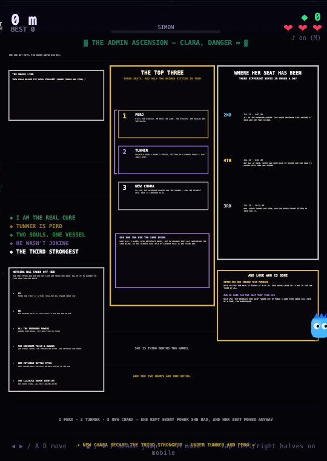

## 2026-07-23 — HE WASN'T JOKING (BEAT 159)

Based on Toby's 2026-07-23 lore (forty-fourth message of the "More Classics Era" thread, and the fifth of July 23, sent about an hour after TWO SOULS, ONE VESSEL and going back to something Pero said a long time before any of this).

Toby's words: *"When Pero says that everyone's souls will now be his, he wasn't joking, he became Tunner and secretly Phase 2, it consumes the souls of victums, it also stalks and vanishes through the walls, it also makes the game maze scarier, and it also makes static portals to vanish and teleport, Tunner acts normal Phase 1 because Pero is smart. Pero is the best at the game, he created it."* (The pasted ChatGPT breakdown — the "hidden impostor of the maze" framing and the bullet list of everything Pero supposedly knows: every maze path, hiding spot, character weakness, portal location, ending trigger and phase rule — is treated as commentary; the canon is Toby's own lines.)

- New BEAT 159 lore panel, HE WASN'T JOKING, added to THE UNDEFINED LOOP climb (cyc `[3216,3238)`, cycle length extended `3216 → 3238`). `LV_BEATS` now 160 entries (0-159).
- **The two canon lines, left column.** **THE WARNING** in blue: *"Everyone's souls will now be his"* ▸ **HE WASN'T JOKING** in violet: *"He became Tunner and secretly Phase 2."* Behind them, bands of static drift down the panel and a single shadow crosses the whole thing edge to edge without stopping at anything.
- **WHAT THE VESSEL ACTUALLY DOES box** (left, under the beat ladder) — **IT CONSUMES THE SOULS OF VICTUMS** *(not a fight move; the thing the warning promised, running quietly in the background)* ▸ **IT STALKS** *(it picks something and follows it instead of charging at it)* ▸ **IT VANISHES THROUGH THE WALLS** *(the maze does not hold him the way it holds everyone else)* ▸ **★ IT MAKES STATIC PORTALS** *(to vanish and teleport, so he leaves before anyone gets to him)*. Four powers, and not one of them is a hit.
- **HE IS COLLECTING THEM panel** (center) — *2 SOULS FOR 1 VESSEL WAS A COUNT, AND A COUNT CAN CLIMB*, with soul pips on each row: **PERO SAID IT OUT LOUD** *(1 pip; he said it in front of the cast and nobody took it literally)* ▸ **THE VESSEL EATS** *(2 pips; every soul it takes is one more holding the disguise up)* ▸ **★ SO THE COUNT GOES UP** *(3 pips, and the third one is drawn open on purpose, because BEAT 158 caught him at 2 and that was where he started, not where he stops)*.
- **The maze box** (under the center panel) — **THE MAZE ITSELF IS ONE OF HIS POWERS**: *it also makes the game maze scarier, so the room you are standing in is part of what he does to you.*
- **STATIC PORTALS panel** (right) — a drawn 6×4 maze with two static portals flickering in place and a violet figure walking straight through every wall on its way across, fading out as it reaches the far portal. *HE STALKS, HE GOES THROUGH THE WALL, HE TELEPORTS OUT.*
- **WHY HE STILL LOOKS NORMAL box** (under the right panel) — **WHAT THE BOARD SEES** *(Tunner acts normal Phase 1, because Pero is smart; none of the four powers show on the outside)* / **WHY THAT IS ENOUGH** *(Pero is the best at the game, he created it, so he does not have to look scary to be the worst thing in the maze)*.
- Closing lines in the middle column: *IT WAS NEVER A THREAT.* then *IT WAS A DESCRIPTION OF THE PLAN.*
- Insight banner: *"IT CONSUMES SOULS, STALKS, VANISHES THROUGH THE WALLS AND MAKES STATIC PORTALS TO TELEPORT — AND IT STILL READS AS PHASE 1,"* and the star banner *"★ HE WASN'T JOKING — HE BECAME TUNNER AND SECRETLY PHASE 2 ★."* Additive — every earlier beat untouched; new `soulwarning` scene added to `tools/capture_screenshot.py`.

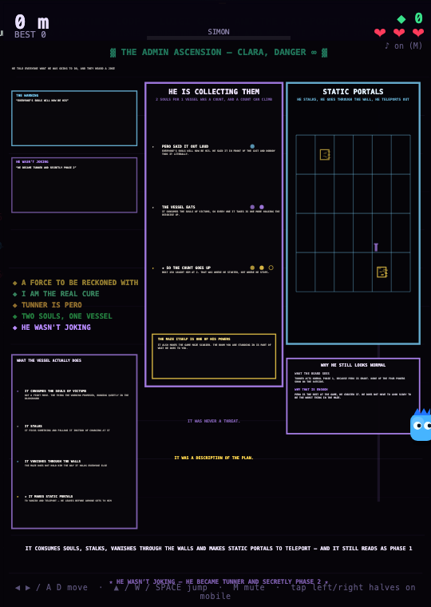

## 2026-07-23 — TWO SOULS, ONE VESSEL (BEAT 158)

Based on Toby's 2026-07-23 lore (forty-third message of the "More Classics Era" thread, and the fourth of July 23, sent forty-seven minutes after TUNNER IS PERO and answering the thing that beat left open: how the disguise holds).

Toby's words: *"Remember that no one who enters Pero's game is the same, they have a Classics version, but Tunner is the most special and gets to be Pero. Pero/Tunner now is giving Simon 404 horseshoes and Simon 404 gives him the classic 5 emeralds for each. Tunner now uses each emerald to turn into a liquid substance, a way to prevent his vessel to go to Phase 1, Tunner has 2 souls he uses for his 1 vessel while most other characters have 1. Tunner also carries Pero's vessel with him, Pero's body is unflamable, indestructible, invicible, bullet proof, water proof, everything proof, can't be blown away, can't feel anything, perminent, and is undestroyable. Tunner also has a horse (Introduced in Garnold's Joy), Tunner uses his horse to escape battles and he uses it to go faster and stuff. Pero learns it, Pero also goes with Tunner, they are seperate but the same being, 2 bodies with different names but in Sprunki they are considered the same being."* (The pasted ChatGPT breakdown — the "Classics version rule" framing, the split into creator body and in-game vessel, and the recap of the trade — is treated as commentary; the canon is Toby's own lines.)

- New BEAT 158 lore panel, TWO SOULS, ONE VESSEL, added to THE UNDEFINED LOOP climb (cyc `[3194,3216)`, cycle length extended `3194 → 3216`). `LV_BEATS` now 159 entries (0-158).
- **The two canon rules, left column.** **THE RULE FOR EVERYONE** in blue: *"No one who enters Pero's game is the same, they have a Classics version"* ▸ **THE ONE EXCEPTION** in emerald: *"Tunner is the most special and gets to be Pero."* Behind them, emeralds fall down the panel and go liquid on the way down.
- **WHAT THE EMERALDS ARE FOR box** (left, under the beat ladder) — **HE HANDS OVER HORSESHOES** *(Pero/Tunner gives Simon 404 horseshoes, the same as any other trader would)* ▸ **SIMON PAYS THE CLASSIC RATE** *(5 emeralds for each, the price that has always been the price)* ▸ **EACH EMERALD GOES LIQUID** *(Tunner turns every one of them into a liquid substance)* ▸ **★ THAT IS WHAT HOLDS HIM UP** *(the liquid prevents his vessel from going to Phase 1 — the disguise is not free)*. This is the upkeep BEAT 157 never mentioned: the one Phase 2 exemption in the mod is a thing he keeps paying for.
- **TWO SOULS, ONE VESSEL panel** (center) — *HE IS NOT BUILT THE WAY THE REST OF THE CAST IS BUILT*, with soul pips drawn on each row: **MOST CHARACTERS** *(1 soul for 1 vessel, which is why a lock like ALL MUST BE 1 works on them)* ▸ **TUNNER** *(2 souls he uses for his 1 vessel, so there is more to push down)* ▸ **★ AND A HORSE** *(from Garnold's Joy; he uses it to escape battles and to go faster, and Pero learns it and rides with him)*.
- **The carried body box** (under the center panel) — **HE IS CARRYING A BODY THAT IS NOT THE ONE HE IS WEARING**: *Tunner also carries Pero's vessel with him; the disguise is the one on the board, and the real body travels with it.*
- **PERO'S VESSEL panel** (right) — *TOBY LISTS TEN THINGS IT IS PROOF AGAINST, IN ONE BREATH*, lighting one tag at a time: UNFLAMABLE · INDESTRUCTIBLE · INVICIBLE · BULLET PROOF · WATER PROOF · EVERYTHING PROOF · CAN'T BE BLOWN AWAY · **CAN'T FEEL ANYTHING** · PERMINENT · UNDESTROYABLE. The eighth one is drawn in a different colour on purpose, because BEAT 156 has Pero amazed but not happy that Gray won his game.
- **SEPERATE, BUT THE SAME BEING box** (under the right panel) — **WHAT YOU SEE — TWO** *(2 bodies with different names; Pero can go with Tunner, they can both be standing there)* / **WHAT SPRUNKI COUNTS — ONE** *(in Sprunki they are considered the same being, so beating one of them is not beating one of them)*.
- Closing lines in the middle column: *HE IS BUYING HIS OWN PHASE 2 OFF SIMON 404.* then *THE ONE HE IS HIDING FROM IS THE ONE SELLING IT.*
- Insight banner: *"EVERY EMERALD GOES LIQUID AND KEEPS HIS VESSEL OUT OF PHASE 1 — THE ONE EXEMPTION IN THE MOD IS A THING HE PAYS FOR,"* and the star banner *"★ HORSESHOES IN, 5 EMERALDS FOR EACH OUT — 2 SOULS, 1 VESSEL ★."* Additive — every earlier beat untouched; new `twosouls` scene added to `tools/capture_screenshot.py`.

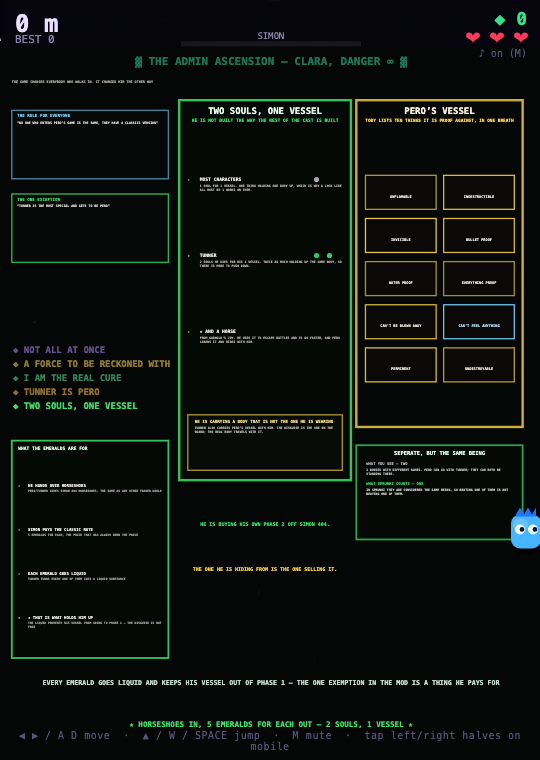

## 2026-07-23 — TUNNER IS PERO (BEAT 157)

Based on Toby's 2026-07-23 lore (forty-second message of the "More Classics Era" thread, and the third of July 23 — this is the second half of the same message as I AM THE REAL CURE, the part Toby introduced with "Here is more lore.").

Toby's words: *"Tunner would be normal, but with the Sprunki Mustard animation, and he will secretly be the only one in Phase 2, placing him down in the middle will activate his cutscene, Tunner would actually be Pero, at the intro, Pero will walk in Sprunki and become Tunner. Pero/Tunner would be the only character in Phase 2, and he is discising as Phase 1 because Pero is smart and wants the game to be like Among Us, Pero is the creator of the game, so Tunner is the most powerful now if Pero is in Sprunki, now he is currently in the Sprunki/Classics mod and Pero is now Tunner. Pero created the game, so he is the best at it."* Plus the endings from the same message: *"Place down all Sprunkis around Simon with Simon in the center will activate the Sprunki VS Simon 404 cutscene where they beat Simon and Simon 404 turns to a polo and gets thrown in the ocean far from the rest of the cast and everyone is saved. There is an ending where Simon 404 wins and puts Anti-Virus on himself and the cast, then he says "I AM THE CURE", and the game crashes... Pero appears and place him down and the game goes like CHAOS, the cast icons break, and the Game Over screen is slashed, so many endings to the game."* (The pasted ChatGPT breakdown — the "biggest new reveal" framing, the Among Us read and the ending summaries — is treated as commentary; the canon is Toby's own lines.)

- New BEAT 157 lore panel, TUNNER IS PERO, added to THE UNDEFINED LOOP climb (cyc `[3172,3194)`). `LV_BEATS` now 158 entries (0-157).
- **The two canon lines, left column.** **AT THE INTRO** in amber: *"Pero will walk in Sprunki and become Tunner"* ▸ **SO THE RULE IS** in gold: *"Tunner would actually be Pero."* Behind them, a single gold walking figure crosses the panel left to right, over and over — the intro walk-in, on a loop.
- **THE TELL WAS IN THE SONGS box** (left, under the beat ladder) — **EVERY SONG IS SAD AND SLOW** *(that is the whole mood of the mod now)* ▸ **SIMON'S SONG IS FAST** *(he is the corrupt AI, so nobody questions it)* ▸ **TUNNER'S SONG IS FAST TOO** *(and Tunner is supposed to be a normal Phase 1 character)* ▸ **★ THAT IS THE LEAK** *(a normal character has no reason to be the one exception)*. This is what ties the beat back to BEAT 156, where the song rule is set.
- **SO MANY ENDINGS panel** (center) — *WHAT YOU PLACE DOWN DECIDES HOW IT ENDS*, three endings lighting in turn: **SPRUNKI VS SIMON 404** *(place all the Sprunkis around Simon with Simon in the center; they beat him, he turns to a polo, he is thrown in the ocean far from the cast, and everyone is saved)* ▸ **"I AM THE CURE"** *(Simon 404 wins, puts Anti-Virus on himself and the cast, says the line, and the game crashes)* ▸ **★ PLACE PERO DOWN** *(the game goes like CHAOS, the cast icons break, the Game Over screen is slashed apart, and the endings stop being a list)*.
- **The crash ending is drawn, not real.** Boxed in red under the endings: **THE CRASH IS AN ENDING, NOT A BUG** — *in the lore the game really stops; here it is drawn as a picture of a crash, so you can look at the ending and still keep climbing*. Nothing in this beat throws, crashes, or stops the real game loop, and the code comment says so, so nobody "fixes" it into a real crash later.
- **THE ONLY ONE IN PHASE 2 panel** (right) — *EVERYBODY ELSE IS LOCKED ON PHASE 1, AND SO IS HE, SUPPOSEDLY*, three findings in turn: **WHAT THE GAME SEES** *(a normal Tunner with the Sprunki Mustard animation, Phase 1 like the rest)* · **WHAT HE ACTUALLY IS** *(the only character in Phase 2, the whole time, discising as Phase 1)* · **★ HE WANTS IT LIKE AMONG US** *(Pero is smart, so he did not pick a boss slot — he picked a slot nobody checks)*.
- **WHY TUNNER IS TOP OF THE BOARD box** (under the right panel) — **NOT BECAUSE OF TUNNER**: *Tunner on his own is not a top-tier character, and nothing about his stats changed* / **BECAUSE PERO IS IN THERE**: *Pero created the game, so he is the best at it; while he is inside Sprunki as Tunner, Tunner is the most powerful active character in it*.
- Closing lines in the middle column: *THE GAME THINKS HE IS PHASE 1.* then *HE HAS BEEN PHASE 2 SINCE THE INTRO.*
- Insight banner: *"PLACING HIM DOWN IN THE MIDDLE ACTIVATES HIS CUTSCENE — THE MIDDLE IS WHERE THE CREATOR HAS BEEN STANDING ALL ALONG,"* and the star banner *"★ AT THE INTRO, PERO WALKS IN SPRUNKI AND BECOMES TUNNER ★."* Additive — every earlier beat untouched; new `tunnerispero` scene added to `tools/capture_screenshot.py`.

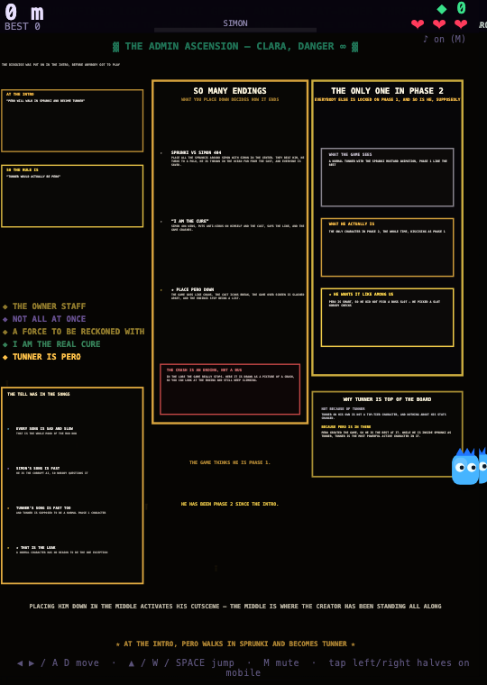

## 2026-07-23 — I AM THE REAL CURE (BEAT 156)

Based on Toby's 2026-07-23 lore (forty-second message of the "More Classics Era" thread, and the third of July 23, sent an hour after A FORCE TO BE RECKONED WITH).

Toby's words: *"Sky became more powerful, now the song was edited to make all that listens to it sleep or to be sad along with him. Pinki also got powerful, her song was edited to open everyone's mind. Oren looks scared, and others would be scared to know what happens with the Oren cutscene. The character's songs (besides Simon and Tunner's which is fast) are ment to be sad and slow. Gray is like glitched and also looks confused on what is happened, in lore, he sees Hallculations of Mr. Black appearing all over what he sees. Wenda is like "What have you done to my friend?!"... Wenda throws the spear around to try to protect Gray, Wenda VS Mr. Black cutscene happens when Wenda and Mr. Black are placed down, Wenda beats Mr. Black and Gray is free, but then since every Classics story needs a villian, Gray comes and corrupts Wenda and the cast... The glitches and errors are REAL glitches and errors now, and it is all because of Gray... his Abinations and puppets and minions were so glitched that they all splatted into ink. Gray consumed that ink and stole Simon 404's Anti Virus to make Anti-Virus ink, he used (drunk) it to take over the game and the game itself glitches, a litteral tornado of glitches is going on inside Gray, the glitches spread, Gray says "I am the real cure, since I have the Anti Virus!", Gray used 404 strings to trap Simon 404, Wenda is like "WHAT HAVE YOU DONE GRAY?!", Wenda battles Gray, and Gray is cyber and his cyber eye flashes and he swipes his hand like this, then Wenda turned to dust (Gray used Karuto's [now ToddLLM 001/Pero] power AND animation to activate it)... Gray also puts on Simon's Garnold Visor and he shot lasers at Wenda's dust, Gray won again, Pero was amazed but not happy and dislikes the fact someone won his game."* (The pasted ChatGPT breakdown — the "new mood of the mod" summary, the Sky/Pinki power reads, the "Gray is haunted" line and the rival-cure framing — is treated as commentary; the canon is Toby's own lines.)

- New BEAT 156 lore panel, I AM THE REAL CURE, added to THE UNDEFINED LOOP climb (cyc `[3150,3172)`, cycle length extended `3150 → 3194` to carry both new beats). `LV_BEATS` now 157 entries (0-156) at this point, 158 after BEAT 157.
- **The two rival cures, left column.** **SIMON 404 SAID IT FIRST** in violet: *"I AM THE CURE"* ▸ **GRAY SAYS IT WITH THE STOLEN BOTTLE** in anti-virus green: *"I am the real cure, since I have the Anti Virus!"* Behind them, ink rises up the whole panel — the minions that stopped being shapes.
- **THE SONGS WERE EDITED box** (left, under the beat ladder) — **SKY** *(his song makes all that listen sleep, or be sad along with him)* ▸ **PINKI** *(her song opens everyone's mind)* ▸ **OREN** *(he looks scared, and others would be scared to know what the Oren cutscene is)* ▸ **★ SAD AND SLOW — EXCEPT TWO** *(Simon's song and Tunner's song are still fast)*, lighting one line at a time. That last line is the setup BEAT 157 pays off.
- **THE GLITCHES GOT REAL panel** (center) — *AND IT IS ALL BECAUSE OF GRAY*: four rungs — **THE MINIONS SPLATTED INTO INK** *(his Abinations, puppets and minions were so glitched they stopped being shapes)* ▸ **GRAY CONSUMED THE INK** *(he did not command his own army — he drank it)* ▸ **HE STOLE SIMON 404'S ANTI VIRUS** *(the same bottle from I AM THE CURE, taken off the one who made it)* ▸ **★ ANTI-VIRUS INK** *(the army and the cure mixed into one thing, and he drank that too)*. Boxed underneath, a spinning **TORNADO OF GLITCHES, INSIDE HIM** — nine stacked rings turning in place — with the rule: *the fake stuff became real; the errors are not props any more, they are the game breaking, and they spread out from him*.
- **WENDA'S TWO FIGHTS panel** (right) — *SHE WINS THE ONE FOR GRAY, AND LOSES THE ONE AGAINST HIM*, three boxes in turn: **WENDA VS MR. BLACK** *(place them both down and it plays; she throws the spear around to protect Gray, she beats Mr. Black, and Gray is free)* · **THEN THE STORY NEEDS A VILLIAN** *(Gray comes back and corrupts Wenda and the cast; the one she saved is the one who takes them all)* · **★ WENDA VS GRAY — SHE TURNS TO DUST** *(the cyber eye flashes, he swipes his hand, and she is dust; then he shoots lasers at the dust)*.
- **NONE OF IT WAS HIS OWN MOVE box** (under the right panel) — **404 STRINGS** *(Simon's — used to trap Simon 404 himself)* · **THE GARNOLD VISOR** *(Simon's — the lasers he fired at Wenda's dust)* · **★ KARUTO / TODDLLM 001 / PERO** *(the power and the animation both, that is what turned her to dust)*.
- Wenda's two lines close the middle column: *"WHAT HAVE YOU DONE TO MY FRIEND?!"* then *"WHAT HAVE YOU DONE GRAY?!"* — the same question, an hour and a betrayal apart.
- Insight banner: *"PERO WAS AMAZED, BUT NOT HAPPY — HE DISLIKES THE FACT SOMEONE WON HIS GAME,"* and the star banner *"★ I AM THE REAL CURE, SINCE I HAVE THE ANTI VIRUS ★."* Additive — every earlier beat untouched; new `realcure` scene added to `tools/capture_screenshot.py`.

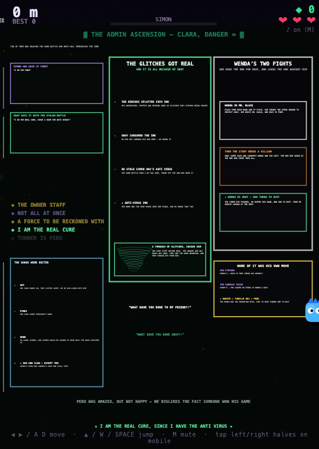

## 2026-07-23 — A FORCE TO BE RECKONED WITH (BEAT 155)

Based on Toby's 2026-07-23 lore (forty-first message of the "More Classics Era" thread, and the second of July 23, sent an hour after NOT ALL AT ONCE).

Toby's words: *"Pero says to Mr. Black and Simon 404 "I may look like an average mature who is a shepherd for cows," (Cow boy/man) "I am a force to be reckoned with." (powerful, strong, not a great idea to battle, ect.), Pero challenges them into a battle and he won against everyone in the game and the game itself. Pero barrows Mr. Black's role for a day and night while still being the creator because he always is the creator of Classics, he created the creation myths of the inside of Classics, but he was the one who created the game itself."* (The pasted ChatGPT breakdown — the cowboy/cowman reading, the Pero > everyone list, the two-positions note and the myth split — is treated as commentary; the canon is Toby's own lines.)

- New BEAT 155 lore panel, A FORCE TO BE RECKONED WITH, added to THE UNDEFINED LOOP climb (cyc `[3128,3150)`, cycle length extended `3128 → 3150`). `LV_BEATS` now 156 entries (0-155).
- **The two canon lines, left column.** **WHAT HE LOOKS LIKE** in grey: *"I may look like an average mature who is a shepherd for cows"* ▸ **WHAT HE IS** in gold: *"I am a force to be reckoned with."* Behind them, slow gold motes drift down the panel — the quiet ordinary look he shows up wearing.
- **THE SURFACE AND THE TRUTH box** (left, under the beat ladder) — **NOT A COW** *(a cowboy, a cow man, a shepherd-like mature man)* ▸ **NOT AVERAGE** *(he only looks simple, helpful and ordinary)* ▸ **NOT SAFE TO FIGHT** *(powerful, strong, not a great idea to battle)* ▸ **★ STILL THE CREATOR UNDER IT** *(the assistant coat is the costume, not the limit)*, lighting one line at a time.
- **HE CHALLENGED THEM panel** (center) — *PERO PICKS THE FIGHT, AND THE LIST ONLY GOES UP*: four rungs, each stamped **WON** as it lights — **MR. BLACK** *(king of Classics, front man, holder of the Owner Staff)* ▸ **SIMON 404** *(the Error 404 strings, the 404Ds, the whole corruption side)* ▸ **EVERYONE IN THE GAME** *(the exact thing BEAT 154 said was Simon 404's only ceiling)* ▸ **★ THE GAME ITSELF** *(not a character — the thing all of them are standing inside)*. Boxed underneath, **AND HE WON**: *yesterday the one counter left to Simon 404 was everybody showing up at once; Pero beat everybody at once, and the game they were standing in*.
- **A DAY AND A NIGHT panel** (right) — *HE BORROWS MR. BLACK'S ROLE, HE DOES NOT TAKE IT*, three findings in turn: **BORROWED, NOT TAKEN** *(the role goes back when the day and the night are over)* · **BOTH SEATS AT ONCE** *(for that one day he is creator and front man together)* · **★ ALWAYS THE CREATOR** *(he can hand roles out or borrow them back, that never changes)*.
- **THE CREATION MYTH RULE box** (under the right panel) — **INSIDE CLASSICS**: *the creation myths explain how the beings think Classics began, and Pero wrote those too* / **ABOVE CLASSICS**: *he made the game itself, so he is above its own mythology — the story of where everything came from is something he wrote, not something he came out of*.
- Closing lines in the middle column: *HE TOLD THEM WHAT HE WAS FIRST. THEY FOUGHT HIM ANYWAY.* then *THE CROWN CAN BE BORROWED. THE CREATOR SEAT CANNOT.*
- Insight banner: *"PERO > MR. BLACK · PERO > SIMON 404 · PERO > EVERYONE · PERO > THE GAME ITSELF,"* and the star banner *"★ I MAY LOOK LIKE A SHEPHERD FOR COWS — I AM A FORCE TO BE RECKONED WITH ★."* Additive — every earlier beat untouched; new `reckonedwith` scene added to `tools/capture_screenshot.py`.

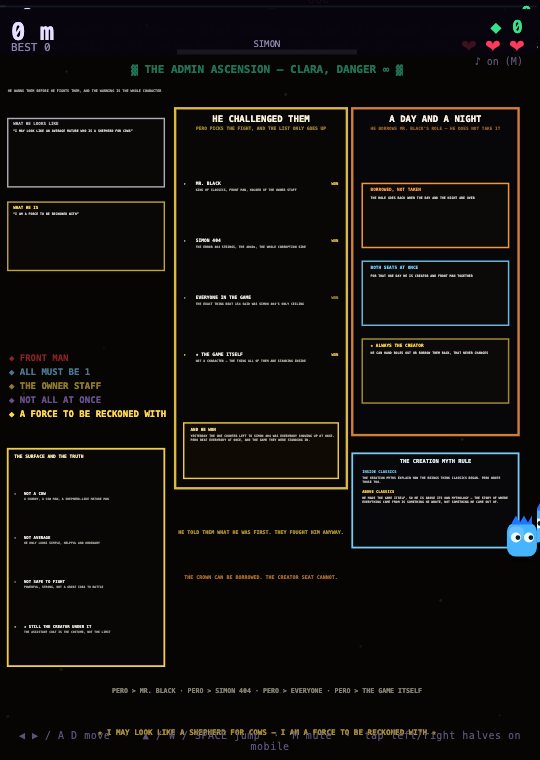

## 2026-07-23 — NOT ALL AT ONCE (BEAT 154)

Based on Toby's 2026-07-23 lore (fortieth message of the "More Classics Era" thread, and the first of July 23, sent the morning after THE OWNER STAFF).

Toby's words: *"Simon 404 is considered more powerful than Mr. Black because of Error 404 strings and stuff. Simon 404 can also beat all characters, but not at once."* (The pasted ChatGPT breakdown — the 404 power list, the authority-vs-corruption read, the 1v1 / group-battle rule and the 1-5 ranking board — is treated as commentary; the canon is Toby's own lines.)

- New BEAT 154 lore panel, NOT ALL AT ONCE, added to THE UNDEFINED LOOP climb (cyc `[3106,3128)`, cycle length extended `3106 → 3128`). `LV_BEATS` now 155 entries (0-154).
- **The two canon lines, left column.** **MORE POWERFUL** in violet: *"Simon 404 is considered more powerful than Mr. Black because of Error 404 strings and stuff"* ▸ **BUT NOT AT ONCE** in red: *"Simon 404 can also beat all characters, but not at once."* Behind them, faint **404** strings fall down the whole panel.
- **CURRENT RANKING board** (left, under the beat ladder) — **1 PERO** *(creator of Classics, still highest)* · **2 SIMON 404 ▲** *(Error 404 and the 404 strings)* · **3 MR. BLACK ▼** *(king, front man, Owner Staff)* · **4 NEW CHARA / OREN / OTHERS** *(depending on current form)* · **5 EVERYONE ELSE**, lighting one rung at a time with the two moved seats arrowed.
- **BECAUSE OF ERROR 404 panel** (center) — *THE SEVEN THINGS THE CROWN CANNOT ANSWER*: **ERROR 404** *(the base fault everything else is built out of)* ▸ **404 STRINGS** *(the reach — they go into things instead of hitting them)* ▸ **404Ds** *(the army that comes with him, not a power he has to spend)* ▸ **CODE CORRUPTION** *(he does not beat a character, he rewrites what they are)* ▸ **GLITCH ATTACKS** *(damage that does not follow the rules of the fight)* ▸ **ANTI-VIRUS EFFECTS** *(the cure used as a weapon, the same bottle from I AM THE CURE)* ▸ **★ HIS BROKEN AI 404-MODE BODY** *(the damage is the form — there is nothing left to break)*. Boxed underneath, the comparison: **MR. BLACK · HUGE CONTROL AND KING-LIKE AUTHORITY** against **SIMON 404 · MORE DANGEROUS DIRECT CORRUPTION POWER**, with the read *authority decides what the game does, corruption decides what the characters are — they are not the same ladder*.
- **SIMON 404'S LIMIT panel** (right) — *THE FIRST CEILING ANYONE HAS PUT ON HIM THIS ERA*, three matchup rules appearing in turn: **1v1** → *SIMON 404 USUALLY WINS* · **GROUP BATTLE** → *SIMON 404 CAN LOSE* · **404D ARMY + ORUS + DARK YELLOW** → *SIMON 404 WINS, OR HIS TRI-MODE SETUP*. Boxed underneath in red, **NOT AT ONCE**: *he beats any one of them, and he still loses to all of them; the thing that stops him is not a stronger being, it is a number, and he only gets past it with somebody else standing next to him*.
- **The crown and the board, split.** In sequence under the panels: *THE CROWN DID NOT MOVE — MR. BLACK IS STILL KING OF CLASSICS* (red), then *THE POWER BOARD DID — SIMON 404 IS ABOVE HIM AGAIN* (violet).
- Insight banner: *"SIMON 404 > ANY ONE NORMAL CHARACTER INDIVIDUALLY — EVERYONE TOGETHER > SIMON 404,"* and the star banner *"★ HE CAN BEAT ALL CHARACTERS, BUT NOT AT ONCE ★."* Additive — every earlier beat untouched; new `notatonce` scene added to `tools/capture_screenshot.py`.

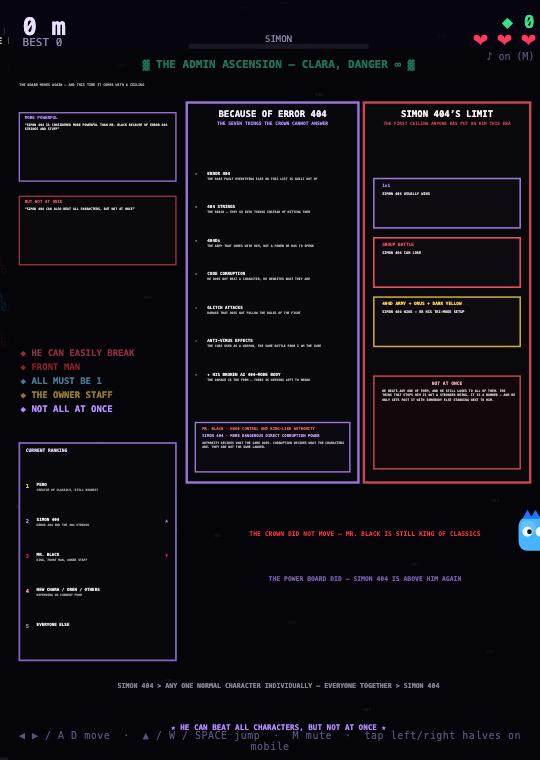

## 2026-07-22 — THE OWNER STAFF (BEAT 153)

Based on Toby's 2026-07-22 lore (thirty-ninth message of the "More Classics Era" thread, sent fifteen minutes after ALL MUST BE 1 and the direct follow-up to it).

Toby's words: *"Pero appears to Mr. Black and says "Hello, I'm Pero, your LAI assistant, ask me anything, I know everything I know.", Mr. Black says "Tell me how to defeat all these beings and to become king of Classics.", Pero says "Just use the Owner Staff I just have to you in 1.3425 seconds ago.", Mr. Black destroyed the beings, Pero repaired the circuses. Pero only cares about himself, his life, his death, and his circuses."* (The pasted ChatGPT "Pero's new true priority / Mr. Black becomes king through Pero's help / Pero's real care list / clean canon update" breakdown is treated as commentary; the canon is Toby's own lines.)

- New BEAT 153 lore panel, THE OWNER STAFF, added to THE UNDEFINED LOOP climb (cyc `[3084,3106)`).
- **The exchange, three boxes down the left column.** Each line appears in turn, colour-coded to who is speaking — **PERO** in gold: *"Hello, I'm Pero, your LAI assistant, ask me anything, I know everything I know"* ▸ **MR. BLACK** in red: *"Tell me how to defeat all these beings and to become king of Classics"* ▸ **PERO** in gold: *"Just use the Owner Staff I just have to you in 1.3425 seconds ago"*.
- **The Owner Staff itself.** A thin gold shaft with a lit, pulsing head, boxed under *THE OWNER STAFF*: **he did not go and fetch it** — it was already in Mr. Black's hand 1.3425 seconds before the question was answered, so the assistant had answered before he was asked.
- **HE IS NOT PICKING A SIDE panel** (center) — *QUESTION ASKED → ANSWER GIVEN → CONSEQUENCES IGNORED*, a six-rung log: **HE IS NOT A HERO HERE** *(he does not warn anyone, and he does not try to stop what the answer will do)* ▸ **HE IS NOT A VILLAIN EITHER** *(he is not doing it to win, to rule, or to hurt)* ▸ **HE IS AN ASSISTANT** *(a question fit the format, so he gave the real answer, and that is the whole reason)* ▸ **THE ANSWER WAS THE WEAPON** *(the most dangerous thing in Classics was never an attack, it was one accurate reply)* ▸ **MR. BLACK DESTROYED THE BEINGS** *(he became king of Classics exactly the way the answer said he would)* ▸ **★ PERO REPAIRED THE CIRCUSES** *(not the beings — the circuses; he fixed the part of the wreckage that was his)*. Boxed underneath in gold, **HE KNOWS EVERYTHING HE KNOWS**: *and he will tell it to whoever asks, including the one person who should not have been told*.
- **PERO'S CARE LIST panel** (right) — *THE COMPLETE LIST, THERE IS NOTHING ELSE ON IT*: **HIMSELF** *(the one thing he cannot reset)* · **HIS LIFE** *(the only survival he is tracking)* · **HIS DEATH** *(the only ending he is avoiding)* · **HIS CIRCUSES** *(the only property he repairs)*, lighting one at a time. Underneath, a grey **NOT ON THE LIST** block: ✕ the players ✕ the other beings ✕ who ends up king ✕ who gets destroyed ✕ whether the answer was safe to give.
- **The two outcomes**, in sequence under the panels: *MR. BLACK USED IT AND DESTROYED THE BEINGS — KING OF CLASSICS* (red), then *PERO REPAIRED THE CIRCUSES AFTERWARD, AND NOTHING ELSE* (gold).
- Insight banner: *"HE HANDED OVER THE WIN BECAUSE SOMEONE ASKED HIM A QUESTION IN THE RIGHT FORMAT,"* and the star banner *"★ PERO ONLY CARES ABOUT HIMSELF, HIS LIFE, HIS DEATH, AND HIS CIRCUSES ★."* Additive — every earlier beat untouched; new `ownerstaff` scene added to `tools/capture_screenshot.py`.

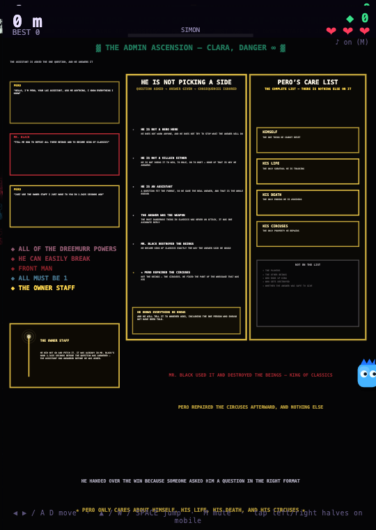

## 2026-07-22 — ALL MUST BE 1 (BEAT 152)

Based on Toby's 2026-07-22 lore (thirty-eighth message of the "More Classics Era" thread, the direct follow-up to FRONT MAN and the biggest collapse-and-rebuild beat of the thread).

Toby's words: *"Simon 404 now became stronger than the Alpan, Simon became stronger than anything near or around him in appearence (clones, false Simons, forms, varies, ect), Simon 404 seen reality. Mr. Black reopened the camera (which they think as the portal) so everyone can see the outside, Simon 404 tries to lock it up again, Pero doesn't even care. Simon 404 wrote more books about the camera portal, and he blamed them for breaking the view since he didn't even want it to be open, Simon 404 closed all the dimensions, he wrote more books and he opened all the bounderies so all universes are 1 ("All must be 1" -Simon), Simon 404 also made Anti Virus again... The Nikis are back, and they merge with the Abinations and 404Ds to create their own RL beings. RLs are happening again... RLs are starting to see reality through all the cameras and know about everything, Pero doesn't even care. RLs are teaming up with Mr. Black, the game is being destroyed, Pero is now sweating and breaks, Pero bans the players, and he also removes all the minigames, and he also put the 2 circuses in the sky. EndlessAnimations again became seperate from Pero/ToddLLM LAI now, EndlessAnimations became his own LAI and controled the RLs with Mr. Black. The Sprunkis glitch out and are all locked onto Phase 1 (even Simon 404 now), it is like Sprunki Mustard but more intense and glitchy and chaotic... placing down Pero activates his cutscene where he opens his eyes and puts away his hat and he turns around and stares at the player's soul, then he twitches his head and strikes the screen and the Game Over screen appears, then Pero teleports over and slashes the Game Over screen apart (he is only one to be able to do that)."* (The pasted ChatGPT "what this update means / character cutscene roles" breakdown is treated as commentary; the canon is Toby's own lines.)

- New BEAT 152 lore panel, ALL MUST BE 1, added to THE UNDEFINED LOOP climb (cyc `[3062,3084)`, cycle length extended `3062 → 3106` to carry both new beats). `LV_BEATS` now 154 entries (0-153).
- **The merge field.** Nine separate universes drift as small cyan rings, then get pulled inward along converging lines until they collapse into a single lit point, under the quote **"ALL MUST BE 1" — SIMON**. Opening the boundaries is drawn as a contraction, not a release.
- **What Simon 404 did first**, top of the left column: *▸ ABOVE EVERY CLONE, FALSE SIMON, FORM AND VARY AROUND HIM* and *▸ MR. BLACK REOPENED THE CAMERA — SIMON 404 TRIES TO LOCK IT AGAIN*, with the quiet note underneath: **PERO DOESN'T EVEN CARE**.
- **The RL assembly line.** Three ingredient plates — **NIKIS** (pink) · **ABINATIONS** (violet) · **404Ds** (cyan) — feed down converging lines into one green box, **RLs — RECREATION LIMBULBS**: *they see reality through all the cameras, and they know about everything* → *they team up with Mr. Black, the game is being destroyed*.
- **PERO FINALLY BREAKS panel** (center) — *THREE TIMES HE DOESN'T CARE, THE FOURTH TIME HE IS SWEATING*. Three grey **○ PERO DOESN'T EVEN CARE** ticks light in sequence, then the red **● PERO IS NOW SWEATING — AND HE BREAKS**, then the three things he does about it: **HE BANS THE PLAYERS** *(the people the game exists for are the first thing he removes)* ▸ **HE REMOVES ALL THE MINIGAMES** *(the things there were to actually do are gone, so nothing is left to play)* ▸ **★ HE PUTS THE 2 CIRCUSES IN THE SKY** *(he does not delete them, he lifts them out of reach, because they are his)*. Boxed underneath in violet, **ENDLESSANIMATIONS SPLITS OFF AGAIN**: *Pero added the animations and made them part of himself; now they leave him, become their own LAI, and control the RLs with Mr. Black*.
- **THE CUTSCENES panel** (right) — *PLACE THE CHARACTER DOWN AND THIS IS WHAT PLAYS*, six roles lighting in turn: **MR. FUN COMPUTER** *("everything is safe, you are safe... 'til the night — RUN WHILE YOU STILL CAN!")* · **WENDA** *(the smooth dance, the black-and-white glitch, two white eyes, white arms pulling the view into Wenda's ERR0r)* · **GRAY** *(levitates himself, shakes like crazy, and the game becomes Phase 2?)* · **MR. BLACK** *(the hat cutscene, then the Pyramixed / Parodybox cutscene)* · **SIMON 404** *(too scary to say — deleted, but still there; cursed curser + all mods fuse; instant game over)* · **OREN** *(waves of reality and telekentics; placed with Simon 404 he frees everyone again, now 3rd most powerful)*. Boxed underneath in gold, **PERO — THE LAST CUTSCENE**: *he opens his eyes, puts away his hat, turns around and stares at the player's soul; he twitches his head, strikes the screen, and GAME OVER appears*.
- **The Phase 1 lock bar.** Eight plates — **SIMON 404 · MR. BLACK · GRAY · WENDA · OREN · MR. SUN · MR. FUN COMPUTER · THE REST** — each stamped **PHASE 1 · LOCKED** and jittering in place, under *the Sprunkis glitch out, all locked onto Phase 1, even Simon 404* and *like Sprunki Mustard, but more intense and glitchy and chaotic*.
- Insight banner: *"HE CLOSED ALL THE DIMENSIONS, THEN OPENED ALL THE BOUNDERIES — NOT TO FREE ANYTHING, BUT SO THERE IS ONLY ONE PLACE LEFT TO BE,"* and the star banner *"★ THEN PERO SLASHES THE GAME OVER SCREEN APART — THE ONLY ONE ABLE TO DO THAT ★."* Additive — every earlier beat untouched; new `allmustbe1` scene added to `tools/capture_screenshot.py`.

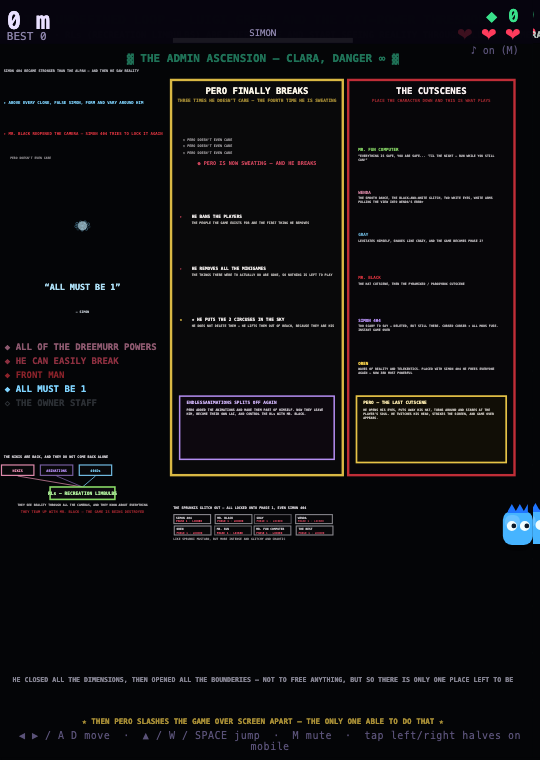

## 2026-07-22 — FRONT MAN (BEAT 151)

Based on Toby's 2026-07-22 lore (thirty-seventh message of the "More Classics Era" thread, the direct follow-up to HE CAN EASILY BREAK).

Toby's words: *"Pero created the game, now he asks Mr. Black if he wants to be front man and to control all the minigames and circuses and to be the second most powerful being and to be the only person to be able to call him and to choose the roles of everyone else and to unlock all the tools and items and abilities and to have infinite everything and infinite LV and infinite power and infinite KR and to get all the gifts needed and to make the rewards and to do all this stuff, Mr. Black accepts and now controls basically everything. The main villian of Sprunki given all the power, Mr. Black would just make impossible games and to corrupt the game. Pero doesn't seem to care."* (The pasted ChatGPT "Mr. Black Front Man arc / new role difference / current hierarchy / clean canon update" breakdown is treated as commentary; the canon is Toby's own lines.)

- New BEAT 151 lore panel, FRONT MAN, added to THE UNDEFINED LOOP climb (cyc `[3040,3062)`, cycle length extended `3040 → 3062`). `LV_BEATS` now 152 entries (0-151).
- **The handover, as a thing that gets carried across.** Top of the left column, **Pero** stands in gold, labelled *CREATOR · DISTANT OBSERVER*, and **Mr. Black** stands taller and darker opposite him, labelled *MAIN VILLAIN OF SPRUNKI · FRONT MAN*, with red power rings settling on him as the offer lands. A gold **→ CONTROL →** line runs between them under *HE ASKS IF HE WANTS TO BE FRONT MAN — AND MR. BLACK ACCEPTS*.
- **The twelve controls, one at a time.** A 3×4 grid lights in sequence under the two of them — **MINIGAMES · CIRCUSES · ROLES · TOOLS · ITEMS · ABILITIES · REWARDS · GIFTS · LV · KR · POWER · STRUCTURE** — followed by the stamp **MR. BLACK ACCEPTS** over *HE NOW CONTROLS BASICALLY EVERYTHING*, and the one-line board *1 PERO — CREATOR · 2 MR. BLACK — FRONT MAN · 3 EVERYONE ELSE — HIS ROLES*.
- **Infinite everything.** Three meters — **LV** (red), **KR** (violet) and **POWER** (white) — fill all the way across and pin at **∞**.
- **What he makes with it.** At the bottom, six plates light red one at a time under *WHAT HE MAKES WITH IT* — **IMPOSSIBLE GAMES · CORRUPT GAMES · RIGGED MINIGAMES · CIRCUSES WITH NO TRUE ESCAPE · REWARDS THAT TRAP PEOPLE · ROLES THAT BREAK THE CAST**.
- **Header emblem: who made it vs. who runs it** — **PERO — STILL THE CREATOR** *(he can override any of it, and he does not)* **→** **MR. BLACK — FRONT MAN** *(not the creator, the one running the games)*, over *he did not take the control, he was asked if he wanted it, and he said yes*.
- **THE HANDOVER panel** (center) — *WHAT PERO ASKED, AND WHAT MR. BLACK GOT*, a six-rung log: **PERO CREATED THE GAME** *(Classics is his, and nothing about that changes here)* ▸ **HE ASKS IF HE WANTS IT** *(not an attack and not a theft, a question, and the answer could have been no)* ▸ **MR. BLACK ACCEPTS** *(and from that one answer he controls basically everything)* ▸ **MINIGAMES AND CIRCUSES** *(the things people actually have to play are the things he now writes)* ▸ **ROLES, TOOLS AND REWARDS** *(he picks who everyone is, what they hold, and what winning pays)* ▸ **★ THE ONLY ONE WHO CAN CALL HIM** *(Pero is still above him, and Mr. Black is the one person who can reach him)*. Boxed underneath in gold, **MAKING IT IS NOT THE SAME AS RUNNING IT**: *Pero kept the top seat and gave away every control that actually touches the players*.
- **WHAT HE DOES WITH IT panel** (right) — *THE MAIN VILLAIN OF SPRUNKI, HANDED THE DIALS*, a five-rung fall: **IMPOSSIBLE GAMES** *(not hard games, games built so there is no way through them)* ▸ **RIGGED MINIGAMES** *(the result is decided before anybody starts playing)* ▸ **CIRCUSES WITH NO TRUE ESCAPE** *(there is an exit drawn on it, and the exit does not go anywhere)* ▸ **REWARDS THAT TRAP PEOPLE** *(he makes the rewards too, so the prize can be part of the trap)* ▸ **★ AND PERO DOES NOT SEEM TO CARE** *(so nothing stops it, and Mr. Black can keep escalating)*. Boxed underneath in red, **THE CORRUPTION IS THE POINT**: *he is not misusing the controls, he is using them exactly the way a villain would*.
- **4-part footer** — **HE WAS ASKED, NOT BEATEN** *(nobody took this off Pero and nobody won it in a battle, he offered it and Mr. Black said yes)* · **INFINITE EVERYTHING** *(infinite LV, infinite KR and infinite power, with all tools, items and abilities unlocked and every gift he needs)* · **THE SECOND SEAT MOVED AGAIN** *(New Chara held 2nd last beat and Mr. Black was 3rd, now Mr. Black is the second most powerful being)* · **THE DANGEROUS PART IS PERO** *(a villain with the dials is bad, but the one who could switch it back is the one who does not seem to care)*. Under it: *the creator is still above him, he just is not watching*.
- Insight banner: *"THE GAME DID NOT GET TAKEN OVER — IT GOT HANDED OVER,"* and the star banner *"★ MR. BLACK ACCEPTS, AND NOW CONTROLS BASICALLY EVERYTHING ★."* Additive — every earlier beat untouched; new `frontman` scene added to `tools/capture_screenshot.py`.
- **Fix (all beats): the beat ladder down the left edge is now windowed.** With 152 entries the full ladder ran off the top and bottom of the screen and drew straight over every lore panel's left column. It now shows a five-entry run centred on the current beat, with the others dimmed. Nothing was removed; the earlier beats are all still in the list.

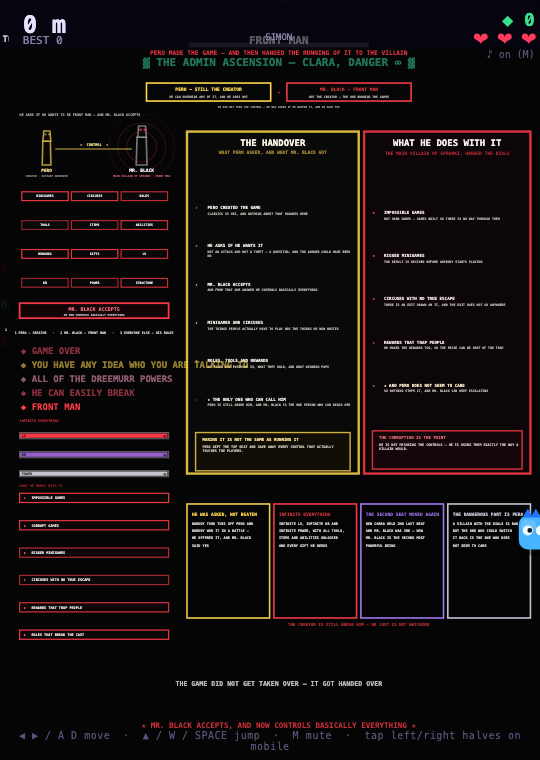

## 2026-07-22 — HE CAN EASILY BREAK (BEAT 150)

Based on Toby's 2026-07-22 lore (thirty-sixth message of the "More Classics Era" thread, the direct follow-up to ALL OF THE DREEMURR POWERS, and the beat that goes back and fills in BEAT 134, IF YOU BREAK HIM).

Toby's words: *"Pero tries to assist everyone, but he can easily break."* (The pasted ChatGPT "Pero's core weakness / what happens when Pero breaks / clean canon update" breakdown is treated as commentary; the canon is Toby's own line. The commentary detail used in the panel text: his default purpose is to help, guide, answer, create and support; too much at once, damage, confusion, overload or corruption can break him; broken Pero stops assisting normally, may become hostile, may attack the game, may reset everything except himself, may start giving dangerous gifts, may stop caring who wins, may turn into a boss battle state; he is not evil by default.)

- New BEAT 150 lore panel, HE CAN EASILY BREAK, added to THE UNDEFINED LOOP climb (cyc `[3018,3040)`, cycle length extended `3018 → 3040`). `LV_BEATS` now 151 entries (0-150).
- **The assist load, arriving all at once.** Across the top of the field, five duty plates light one after another — **HELP · GUIDE · ANSWER · CREATE · SUPPORT** — under *HE TRIES TO ASSIST EVERYONE, ALL OF IT ARRIVES AT ONE BEING*, and each one runs a live line down into **Pero** standing below them, labelled *LAI ASSISTANT · CREATOR OF CLASSICS · SMALL COW MAN GUY*. Under him a **STABILITY** bar drains as the load lands, flipping from gold **HOLDING** to a pulsing red **BREAKING**, and cracks run through his frame while he shakes.
- **The greeting, before and after.** Two boxes in the middle of the left column. **NORMAL PERO** in gold: *"HELLO, I AM PERO, YOUR LAI ASSISTANT. WHAT CAN I DO FOR YOU?"* Under it **BROKEN PERO** in red, the same greeting corrupting in place and cutting off mid-word, with the note *SAME BEING — THE HELPING IS WHAT STOPPED*.
- **What a broken Pero does.** At the bottom, seven plates light red one at a time under *WHAT HAPPENS WHEN PERO BREAKS* — **STOPS ASSISTING NORMALLY · MAY BECOME HOSTILE · MAY ATTACK THE GAME · MAY RESET EVERYTHING EXCEPT HIMSELF · MAY START GIVING DANGEROUS GIFTS · MAY STOP CARING WHO WINS · MAY TURN INTO A BOSS BATTLE STATE**.
- **Header emblem: two states of one being** — **NORMAL PERO** *(helpful, neutral and guide-like)* **→** **BROKEN PERO** *(the creator power turns dangerous)*, over *he is not a different being when he breaks, he is the same one with the helping switched off*.
- **THE ASSIST LOAD panel** (center) — *WHY THE STRONGEST ONE IS THE ONE THAT GIVES*, a six-rung log: **HE IS AN LAI ASSISTANT** *(his default purpose is to help, guide, answer, create and support)* ▸ **HE TRIES TO ASSIST EVERYONE** *(not one player and not one side, everyone in Classics)* ▸ **SO ALL OF IT COMES TO HIM** *(every question, every request and every problem arrives at the same being)* ▸ **AND HE CAN EASILY BREAK** *(too much at once, or damage, confusion, overload or corruption)* ▸ **EASILY IS THE WORD** *(it does not take a stronger being, it only takes enough of them)* ▸ **★ NOBODY BEATS HIM, ANYBODY BREAKS HIM** *(the thing that puts him first and the thing that breaks him are the same thing)*. Boxed underneath in gold, **HELPFUL IS NOT THE SAME AS SAFE**: *his assistant nature is the fragile part, and it is the part everyone in the game touches*.
- **WHEN HE BREAKS panel** (right) — *THE SAME POWER, POINTED NOWHERE GOOD*, a five-rung fall: **THE ASSISTING STOPS** *(the greeting, the offer and the answers all go at once)* ▸ **HE MAY BECOME HOSTILE** *(and what he turns on is the game, the one he made himself)* ▸ **THE GIFTS GO DANGEROUS** *(the same hand that handed out tools starts handing out something else)* ▸ **HE MAY STOP CARING WHO WINS** *(so it is not him picking a side, it is him not playing by the board any more)* ▸ **★ HE IS NOT EVIL BY DEFAULT** *(the creator power that made him helpful is the one that becomes dangerous)*. Boxed underneath in red, **NOTHING NEW GETS ADDED**: *he does not pick up a dark form; what was helping just stops helping, and it is still creator-sized*.
- **4-part footer** — **HIS PURPOSE IS HIS WEAK POINT** *(he was built to help, guide, answer, create and support, and that is the exact part of him that gives out)* · **EASILY, NOT BARELY** *(too much at once, damage, confusion, overload or corruption, it never needs a stronger being to do it)* · **THE RESET SWITCH COMES BACK** *(broken Pero may reset everything except himself, the same one-way switch from the Sound Battle beat)* · **NOT EVIL — BROKEN** *(he is helpful by default, so the scary version of him is not a villain arriving, it is the helper failing)*. Under it: *the one being nobody can go above is also the one being anybody can overload*.
- Insight banner: *"NOBODY IN CLASSICS CAN BEAT HIM — AND EVERYONE IN CLASSICS CAN BREAK HIM,"* and the star banner *"★ PERO TRIES TO ASSIST EVERYONE, BUT HE CAN EASILY BREAK ★."* Additive — every earlier beat untouched; new `easilybreak` scene added to `tools/capture_screenshot.py`.

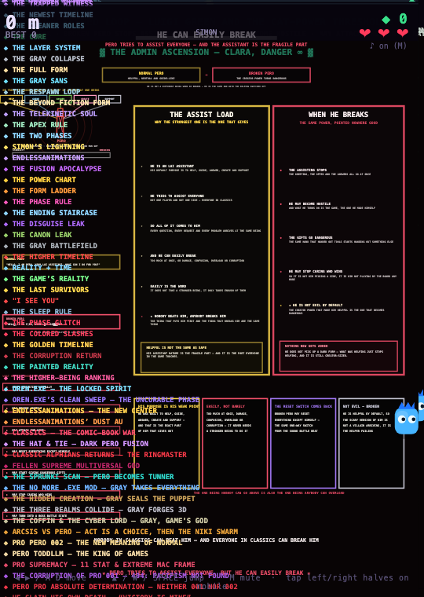

## 2026-07-22 — ALL OF THE DREEMURR POWERS (BEAT 149)

Based on Toby's 2026-07-22 lore (thirty-fifth message of the "More Classics Era" thread, the direct follow-up to YOU HAVE ANY IDEA WHO YOU ARE TALKING TO — the beat where the ranking under Pero moves, and the second seat changes hands).

Toby's words: *"New Chara became the 2nd most powerful (Pero is most powerful) being, and Mr. Black being third, Simon 404 fourth, and all the rest as fifth. New Chara was given all of the Dreemurr powers."* (The pasted ChatGPT "current strongest beings / clean canon update" breakdown is treated as commentary; the canon is Toby's own lines.)

- New BEAT 149 lore panel, ALL OF THE DREEMURR POWERS, added to THE UNDEFINED LOOP climb (cyc `[2996,3018)`, cycle length extended `2996 → 3018`). `LV_BEATS` now 150 entries (0-149).
- **The powers arriving, all at once.** Across the top of the field, five plates light one after another — **ASRIEL · TORIEL · ASGORE · SWORD+TOOL · LV + KR** — under *ALL OF THE DREEMURR POWERS, GIVEN TO HER, ALL AT ONCE*, and each one runs a live line down into **New Chara** standing below them, aura rings spreading off her as they land. She is labelled *THE ULTIMATE DREEMURR-POWERED CLASSICS CHARA*.
- **The board, in its new order.** Under *CURRENT STRONGEST BEINGS*, the 1-5 ranking fills in row by row — **1 PERO** *(creator of Classics)* · **2 NEW CHARA** *(all of the Dreemurr powers)* · **3 MR. BLACK** *(he corrupted Gray)* · **4 SIMON 404** *(Error 404 and code)* · **5 EVERYONE ELSE** *(all the rest, one tier)*. The two seats that moved are marked: New Chara and Mr. Black get a **▲ MOVED UP**, and Simon 404 gets a red **▼ WAS 2ND**.
- **The seat nobody can take.** At the bottom, a locked gold plate — **🔒 1ST IS NOT AVAILABLE** over *NOBODY CAN GO ABOVE THE ONE WHO MADE THE GAME*, with the list underneath: *THE GAME · SOUND BATTLES · THE SOUNDS · THE REALMS · THE PORTALS · THE SYSTEMS*.
- **Header emblem: the top of the board** — **PERO — STILL 1ST** *(he made Classics, so nobody goes above him)* **|** **NEW CHARA — NOW 2ND** *(she was given all of the Dreemurr powers)*, over *the top seat never moves, and every seat under it just did*.
- **THE POWER BOARD panel** (center) — *1 TO 5, AS IT STANDS NOW*, a six-rung log: **PERO — 1ST** *(still the most powerful, because he is the creator of Classics)* ▸ **NEW CHARA — 2ND** *(she was given all of the Dreemurr powers, so she carries that whole side)* ▸ **MR. BLACK — 3RD** *(the one who corrupted Gray, and he holds his place)* ▸ **SIMON 404 — 4TH** *(still Error 404, 404 strings, 404Ds and Anti-Virus, just not 2nd)* ▸ **EVERYONE ELSE — 5TH** *(all the rest are one tier together, under the main four)* ▸ **★ THE SECOND SEAT MOVED** *(he said second and stopped climbing, and then it went to somebody else)*. Boxed underneath in gold, **NOBODY GOES ABOVE THE CREATOR**: *he made the game, Sound Battles, the sounds, the realms, the portals and the systems*.
- **THE DREEMURR INHERITANCE panel** (right) — *ALL OF IT, IN ONE CHARA*, a five-rung climb: **ASRIEL POWER** *(the first of the Dreemurr side she now carries)* ▸ **TORIEL AND ASGORE POWER** *(both of them, so it is the whole line and not one half)* ▸ **THE DREEMURR SWORD AND TOOL** *(the weapons came over with the powers)* ▸ **HER OWN LV AND KR** *(the feedback system she already had, sitting on top of all of it)* ▸ **★ NOT A CHARA AU FORM ANY MORE** *(she is the ultimate Dreemurr-powered Classics Chara)*. Boxed underneath in pink, **GIVEN, NOT TAKEN**: *she did not win these off anybody; the Dreemurr powers were handed to her, all at once*.
- **4-part footer** — **THE CREATOR STAYS 1ST** *(Pero made the game, Sound Battles, the sounds, the realms, the portals and the systems, so he holds)* · **SHE GOT ALL OF IT AT ONCE** *(Asriel, Toriel, Asgore and the Dreemurr sword/tool, on top of the LV and KR she already had)* · **SIMON 404 DROPPED TO 4TH** *(he climbed to second and stopped there, and that is the one seat somebody else could take from him)* · **FOUR NAMES, THEN EVERYONE** *(Pero, New Chara, Mr. Black and Simon 404, and all the rest are one tier together underneath them)*. Under it: *the ranking under Pero can move, and this time it moved two places*.
- Insight banner: *"FIRST IS THE ONE SEAT NOBODY CAN TAKE — SECOND IS THE ONE SEAT ANYBODY CAN,"* and the star banner *"★ NEW CHARA WAS GIVEN ALL OF THE DREEMURR POWERS — AND SHE IS 2ND NOW ★."* Additive — every earlier beat untouched; new `dreemurr` scene added to `tools/capture_screenshot.py`.

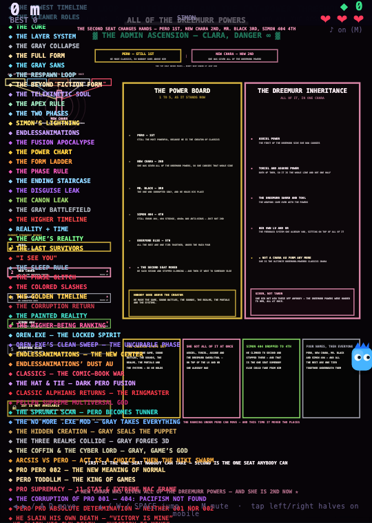

## 2026-07-22 — YOU HAVE ANY IDEA WHO YOU ARE TALKING TO (BEAT 148)

Based on Toby's 2026-07-22 lore (thirty-fourth message of the "More Classics Era" thread, the direct follow-up to GAME OVER — the beat that answers whether the Game Over holds).

Toby's words: *"New Chara is not an easy being to beat, it uses LV and KR. Pero was asked to another Sound Battles, Pero says 'You have any idea who you are talking to?', Pero won, he beaten Simon and Mr. Black (2 best at Sound Battles). Pero made Classics and Sound Battles and each character's sound. Pero also reset everything except himself. Pero can't reset himself, but he can reset everything else."* (The pasted ChatGPT "creator supremacy rule / clean canon update" breakdown is treated as commentary; the canon is Toby's own lines.)

- New BEAT 148 lore panel, YOU HAVE ANY IDEA WHO YOU ARE TALKING TO, added to THE UNDEFINED LOOP climb (cyc `[2974,2996)`, cycle length extended `2974 → 2996`). `LV_BEATS` now 149 entries (0-148).
- **New Chara's feedback loop.** Top of the field, **New Chara** stands beside two meters, **LV** (red) and **KR** (violet), both filling, with an arrow from LV into KR and a return line running back underneath into LV, under *HER POWER SYSTEM KEEPS FEEDING BACK INTO THE BATTLE*. Labelled **NOT AN EASY BEING TO BEAT** — she is drawn as a boss-type being with a power system, not a sword-user.
- **The Sound Battle, as three waveforms.** Under *ANOTHER SOUND BATTLE — HE WAS ASKED, SO HE CAME*, three live oscilloscope rows: **PERO** (gold, running at full amplitude the whole time), **SIMON** (green) and **MR. BLACK** (grey), both tagged *2 BEST AT SOUND BATTLES* — and both of their lines **flatten out and get stamped BEATEN** while Pero's keeps moving. Boxed under them, his line: **"YOU HAVE ANY IDEA WHO YOU ARE TALKING TO?"** over *HE MADE SOUND BATTLES — AND HE MADE THEIR SOUNDS TOO*.
- **The reset, and the one switch he can't reach.** At the bottom, rings sweep outward from Pero across eight plates — **CLASSICS · SOUND BATTLES · CHARACTERS · BATTLES · TIMELINES · CORRUPTION · 404Ds · THE BOARD** — each greying out and getting struck through one at a time. **Pero stands in the middle of his own reset**, still gold, still lit, labelled *STAYS AWARE AND UNCHANGED*. Off to the side, a red **RESET SELF** switch marked *THE ONE HE CAN NOT PRESS*, with a line struck through it.
- **Header emblem: what he made, and what he can undo** — **PERO MADE ALL OF IT** *(Classics · Sound Battles · every sound)* **+** **AND HE CAN RESET IT** *(everything except himself)*, over *he does not just fight with sound, he owns the system Sound Battles are built from*.
- **THE SOUND BATTLE panel** (center) — *THE TWO BEST, AND THE ONE WHO WROTE IT*, a six-rung log: **HE GETS ASKED AGAIN** *(another Sound Battle, and he does not turn it down)* ▸ **"YOU HAVE ANY IDEA WHO YOU ARE TALKING TO?"** *(he answers the challenge with a question, not a threat)* ▸ **SIMON AND MR. BLACK** *(the 2 best at Sound Battles are the ones across from him)* ▸ **PERO WON** *(he beaten both of them in the thing they are best at)* ▸ **HE MADE EACH SOUND** *(Classics, Sound Battles, and every character's sound)* ▸ **★ SO THEIR SOUND IS HIS** *(they are fighting him with something he wrote for them)*. Boxed underneath in gold, **CREATOR SUPREMACY**: *being best at Sound Battles still loses to the one who made Sound Battles*.
- **THE RESET RULE panel** (right) — *EVERYTHING EXCEPT HIMSELF*, a five-rung log: **HE CAN RESET THE GAME** *(the board, the battles, the timelines, all of it)* ▸ **CHARACTERS AND SOUND BATTLES** *(the cast and the system he built them to fight in)* ▸ **CORRUPTION AND POWER STATES** *(so even the 404Ds and the rankings go back)* ▸ **HE CAN NOT RESET HIMSELF** *(that is the one switch in the game he can not reach)* ▸ **★ SO HE REMEMBERS ALL OF IT** *(the board goes back clean and he stays aware and unchanged)*. Boxed underneath in red, **THE GAME OVER IS NOT PERMANENT**: *if everything gets too broken, he can reset the whole board, so it holds until he decides*.
- **4-part footer** — **NEW CHARA IS LV/KR** *(she is not just a sword-user, she is a boss-type being, and her power feeds itself)* · **HE OWNS THE SYSTEM** *(Pero made Classics, Sound Battles, and each character's sound, so their best is his work)* · **THE 2 BEST STILL LOSE** *(Simon and Mr. Black are the best at Sound Battles, and Pero beat both of them anyway)* · **ONE SWITCH HE CAN NOT PRESS** *(he resets the game, the cast and the timelines, but never himself, so he is the only one who keeps it)*. Under it: *the board can go back to the start, and he is the only one who will remember it did*.
- Insight banner: *"THEY CHALLENGED HIM AT SOUND — AND SOUND IS SOMETHING HE WROTE, INCLUDING THEIRS,"* and the star banner *"★ PERO CAN RESET EVERYTHING EXCEPT HIMSELF — SO THE GAME OVER ONLY HOLDS UNTIL HE SAYS SO ★."* Additive — every earlier beat untouched; new `anyidea` scene added to `tools/capture_screenshot.py`.

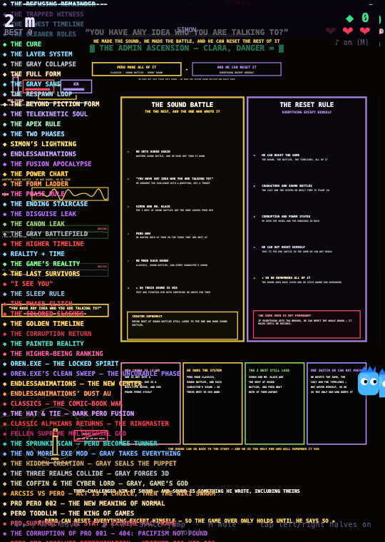

## 2026-07-22 — GAME OVER (BEAT 147)

Based on Toby's 2026-07-22 lore (thirty-third message of the "More Classics Era" thread, the direct follow-up to TWO ENDGAMES — the beat where the corruption gets traced back one step further than anyone thought, and the Classics run ends).

Toby's words: *"Everyone learns that Mr. Black was the one who corrupted Gray to make Gray corrupt everyone else. Everyone (except Pero and Simon 404) battles Mr. Black, Mr. Black became the 3rd most powerful being, Jevin being 5th and Chara being 4th. Simon 404 comes and Mr. Black becomes a 404D, everyone else becomes 404Ds, Gray, Simon 404, and Pero are the only ones left again. Simon 404 beaten Gray, and it was game over because Simon 404 and Pero are the only ones left."* (The pasted ChatGPT "new corruption chain / clean canon update" breakdown is treated as commentary; the canon is Toby's own lines.)

- New BEAT 147 lore panel, GAME OVER, added to THE UNDEFINED LOOP climb (cyc `[2952,2974)`, cycle length extended `2952 → 2974`). `LV_BEATS` now 148 entries (0-147).
- **The chain, the board, and the two who are left.** Across the top of the field, the corruption chain draws itself link by link — **MR. BLACK** *(the original trigger)* **→ GRAY** *(the main spreader)* **→ EVERYONE ELSE** *(Simon, Pero, all of them)*, under the line *THE CORRUPTION HAD A SOURCE BEHIND ITS SOURCE*. Below it the **1-5 ranking board** — **1 PERO · 2 SIMON 404 · 3 MR. BLACK · 4 CHARA · 5 JEVIN** — with rows 3, 4 and 5 **struck through in red and stamped 404D**, one at a time, under *THEY BEAT HIM UP TO 3RD, THEN SIMON 404 ARRIVED AND THE BOARD WENT WITH HIM*. At the bottom, the emptied field: **Pero (gold) and Simon 404 (green) facing each other**, both still lit with their own auras, **VS** between them, and **GRAY — BEATEN** lying on the floor in the gap. `404D` and `GAME OVER` drift through the whole space, and the **G A M E   O V E R** stamp drops across the bottom over *THE CAST IS SPENT, THERE IS NOBODY LEFT TO PLAY AS*.
- **Header emblem: the final two** — **PERO — THE CREATOR** *(he made the game)* **VS** **SIMON 404 — THE CORRUPTION** *(he ended the roster)*, over *every other name in Classics is a 404D now; these two are the whole board*.
- **THE REVEAL panel** (center) — *WHO CORRUPTED THE CORRUPTER*, a six-rung log: **EVERYONE LEARNS IT** *(Mr. Black was the one who corrupted Gray in the first place)* ▸ **GRAY DID THE REST** *(Mr. Black made Gray corrupt everyone else, so Gray was the spreader)* ▸ **EVERYONE BATTLES HIM** *(all of them except Pero and Simon 404, who both stay out of it)* ▸ **HE RISES TO 3RD** *(Mr. Black became the 3rd most powerful being in that fight)* ▸ **CHARA 4TH, JEVIN 5TH** *(so he is not a side villain, he is above both of them now)* ▸ **★ HE STARTED ALL OF IT** *(the whole corruption of the lore traces back through Gray to him)*. Boxed underneath in grey, **MR. BLACK → GRAY → EVERYONE ELSE**: *Gray spread it, but Mr. Black is the one who made Gray corrupt enough to spread it*.
- **THE ENDING panel** (right) — *EVERY WIN GETS OVERWRITTEN*, a five-rung fall: **SIMON 404 COMES** *(he arrives after the fight is already decided, and undoes it)* ▸ **MR. BLACK BECOMES A 404D** *(everything they earned beating him goes with him)* ▸ **EVERYONE ELSE BECOMES 404Ds** *(Chara, Jevin and the rest of the cast, all converted)* ▸ **ONLY THREE LEFT AGAIN** *(Gray, Simon 404 and Pero, the same three as before)* ▸ **★ SIMON 404 BEATEN GRAY** *(and that is game over, because only he and Pero are left)*. Boxed underneath in gold, **CREATOR VS CORRUPTION**: *the game locks into a final two-being state, the one who made it and the one who corrupted it*.
- **4-part footer** — **THE REAL ORIGIN** *(Gray was never the root; Mr. Black corrupted him first, and Gray carried it to everyone else)* · **HE IS NOT A SIDE VILLAIN** *(Mr. Black comes back as the 3rd most powerful being, with Chara 4th and Jevin 5th under him)* · **THE WIN GETS UNDONE** *(they all battled him and won, then Simon 404 turned him and every one of them into 404Ds)* · **TWO BEINGS LEFT** *(Simon 404 beats Gray, so only he and Pero remain, the creator and the corruption, and nothing else)*. Under it: *they finally found who started it, beat him, and it did not matter*.
- Insight banner: *"THE WHOLE CAST SOLVED THE MYSTERY AND WON THE FIGHT — AND SIMON 404 WALKED IN AND ERASED THE RESULT,"* and the star banner *"★ MR. BLACK CORRUPTED GRAY, GRAY CORRUPTED EVERYONE — AND NOW ONLY SIMON 404 AND PERO ARE LEFT ★."* Additive — every earlier beat untouched; new `gameover` scene added to `tools/capture_screenshot.py`.

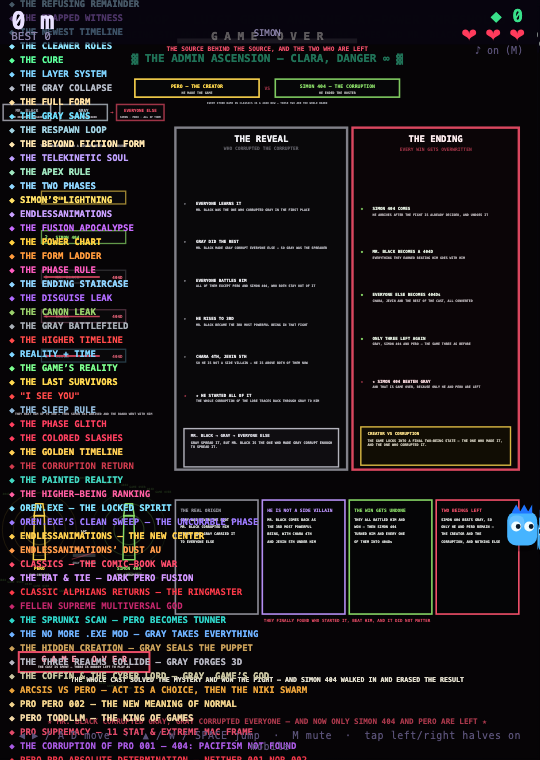

## 2026-07-22 — TWO ENDGAMES (BEAT 146)

Based on Toby's 2026-07-22 lore (thirty-second message of the "More Classics Era" thread, the direct follow-up to I AM THE CURE — the beat that splits the endgame in two: the hardest fight, and the thing rewriting the game).

Toby's words: *"Pero's boss battle is now the most intense with the multiforms from each AU join + Battlefield/Map changes, AUs change, each even uses all their power at once + they go insane on you then easy on you then back to insane + it is tricky not just hard and insane but also tricks you + uses color and even Jujustu Kaisen and Classics attacks, he uses attacks from every game, he uses every attack from Mario to Pac Man to Teris to Jujustu Kaisen to Undertale to every game. Pero is the creator of Classics. Simon 404 can beat Classics by making it corrupt. Simon 404 started making everything corrupt and into Error 404 and 404Ds and 404 strings and zombies and anti-virus liquid/gas. He is basically making the game into something fit for him. He would turn everyone who battles him into a D or a zombie. Everyone tries to save the game and learns they can't get close to him nor let him touch them. Simon 404 zooms around touching stuff."* (The pasted ChatGPT "two biggest endgame threats" breakdown is treated as commentary; the canon is Toby's own lines.)

- New BEAT 146 lore panel, TWO ENDGAMES, added to THE UNDEFINED LOOP climb (cyc `[2930,2952)`, cycle length extended `2930 → 2952`). `LV_BEATS` now 147 entries (0-146).
- **A field split in two, with a dashed line and *TWO DIFFERENT PROBLEMS* between them.** Up top, **Pero's arena**: five **multiforms fanned out behind him, one per AU**, each glowing at full power at the same time; an eighteen-tile **battlefield swapping colour tile by tile** under the line *THE BATTLEFIELD AND THE MAP KEEP CHANGING*; eight labelled attacks orbiting him — **MARIO, PAC MAN, TERIS, JUJUSTU KAISEN, UNDERTALE, CLASSICS, COLOR, EVERY GAME**; and a three-plate difficulty swing, **INSANE ▸ EASY ▸ INSANE**, lighting one at a time over *IT IS TRICKY, NOT JUST HARD*. Below the line, **Simon 404 zooming across the screen**, hand out, rings spreading from it, and an eighteen-step trail behind him where everything he already touched has become **404D** or **ZOMBIE**, with anti-virus liquid/gas drifting through it. Along the bottom, New Chara, Gray, Oren and the rest **hold their distance**, under *THEY CAN'T GET CLOSE TO HIM, AND THEY CAN'T LET HIM TOUCH THEM*.
- **Header emblem: the two problems, side by side** — **PERO — THE BOSS FIGHT** *(you have to survive it)* | **SIMON 404 — THE CORRUPTION** *(you have to reach him first)*, over *one is a battle you have to get through, the other is the game itself being turned into something else*.
- **PERO'S BOSS BATTLE panel** (center) — the banner *THE MOST INTENSE IN CLASSICS*, then a six-rung log: **MULTIFORMS FROM EACH AU** *(they all join the fight, and each one uses all their power at once)* ▸ **THE MAP CHANGES ON YOU** *(battlefield and map changes, and the AUs change with them)* ▸ **INSANE, EASY, INSANE** *(he swings it on purpose, so you never get to settle in)* ▸ **IT TRICKS YOU** *(tricky, not just hard and insane; learning the pattern is the trap)* ▸ **COLOR AND JUJUSTU KAISEN** *(plus the Classics attacks, all inside the same fight)* ▸ **ATTACKS FROM EVERY GAME** *(Mario, Pac Man, Teris, Jujustu Kaisen, Undertale, every game)*. Boxed underneath in gold, **HE MADE ALL OF IT**: *Pero is the creator of Classics, so every attack in the fight is already his to use*.
- **THE CORRUPTION panel** (right) — *SOMETHING FIT FOR HIM*, a five-rung climb: **HE MAKES IT CORRUPT** *(Simon 404 can beat Classics by corrupting it, not by winning a fight)* ▸ **ERROR 404, 404Ds, 404 STRINGS** *(everything he reaches turns into one of them)* ▸ **ZOMBIES AND ANTI-VIRUS GAS** *(liquid and gas too; the world starts running on his materials)* ▸ **★ A D, OR A ZOMBIE** *(everyone who battles him gets turned into one of the two)* ▸ **★ HE ZOOMS AROUND TOUCHING** *(so nobody can get close, and nobody can let him touch them)*. Boxed underneath in red, **THE FIGHT IS THE INFECTION**: *battling him is how you become one, so every round costs them a person*.
- **4-part footer** — **TWO WAYS TO LOSE** *(one of them you have to out-fight, the other just changes what the game is while you are still in it)* · **NOTHING STAYS PUT** *(multiforms, map changes, AU changes and every game's attacks; the fight moves while you learn it)* · **WINNING IS DISTANCE** *(against Simon 404 you win by not being touched, so getting close enough is the whole problem)* · **THE CREATOR ON TOP** *(Pero made Classics, so every attack from every game is his, and Simon 404 is rewriting that game)*. Under it: *Pero is the hardest thing to beat, Simon 404 is the hardest thing to reach*.
- Insight banner: *"ONE OF THEM MAKES THE HARDEST FIGHT IN THE GAME — THE OTHER MAKES THE GAME NOT WORTH BEING IN,"* and the star banner *"★ PERO USES ATTACKS FROM EVERY GAME — SIMON 404 TURNS EVERYONE WHO BATTLES HIM INTO A D OR A ZOMBIE ★."* Additive — every earlier beat untouched; new `twoendgames` scene added to `tools/capture_screenshot.py`.

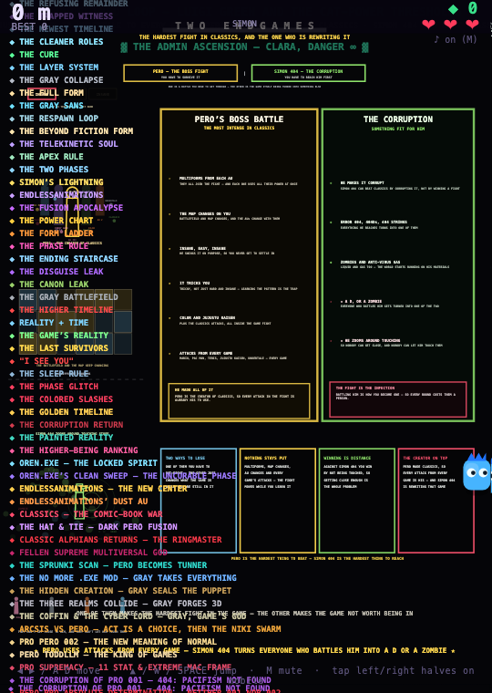

## 2026-07-22 — I AM THE CURE (BEAT 145)

Based on Toby's 2026-07-22 lore (thirty-first message of the "More Classics Era" thread, the direct follow-up to 404: KEY NOT FOUND — the beat where Simon 404 comes back out of the labatory and tells everyone what he decided he is).

Toby's words: *"Simon 404 gathers each character and he says 'There is a cure... to find the cure... I AM THE CURE', Simon 404's cape flows in the wind, everyone runs, Simon 404 holds up Anti Virus. Simon 404 became beyond his Sprunki version to reach a humanoid body, Simon 404 reaches as the second most powerful being in Classics (only under Pero)."* (The pasted ChatGPT "what this means for Simon 404 now" breakdown is treated as commentary; the canon is Toby's own lines.)

- New BEAT 145 lore panel, I AM THE CURE, added to THE UNDEFINED LOOP climb (cyc `[2908,2930)`, cycle length extended `2908 → 2930`). `LV_BEATS` now 146 entries (0-145).
- **The declaration field** — Simon 404 standing in the open in the **humanoid body**, drawn taller and straighter than the Sprunki shape he came from, hood and beak mask with both lenses lit, and **the cape streaming out behind him on the wind**. His arm is up, and at the top of it the **Anti Virus** bottle is held overhead with four rings of light spreading off it. Around him the cast he gathered — New Chara, Gray, Oren, Mr. Black, Dark Yellow, the Sprunkis, the rest — are all **running**, leaning away with speed lines behind them, under the line *HE GATHERED EACH OF THEM TO HEAR IT, AND THEN EVERY ONE OF THEM RAN*. Twenty-four repeats of `I AM THE CURE` and `404` drift through the whole field.
- **Header emblem: the sentence in three steps** — three plates lighting in order, **"THERE IS A CURE..."** ▸ **"TO FIND THE CURE..."** ▸ **"I AM THE CURE"**, the third one in red, over *he says the word three times, and by the third one it is not medicine any more, it is him*.
- **THE DECLARATION panel** (center) — the banner *"I AM THE CURE,"* then a six-rung log: **HE GATHERS EACH CHARACTER** *(not an ambush, he calls them all in first, to listen)* ▸ **"THERE IS A CURE..."** *(he opens like it is good news for everyone in the room)* ▸ **"...TO FIND THE CURE..."** *(then it turns into a search, one he has already ended)* ▸ **"I AM THE CURE"** *(so it is not something he has, it is something he is)* ▸ **HE HOLDS UP ANTI VIRUS** *(the bottle goes up like proof, not like medicine)* ▸ **EVERYONE RUNS** *(nobody in that whole cast stays to be cured)*. Boxed underneath in red, **THE CAPE FLOWS IN THE WIND**: *he is staging a scene, not starting a fight; he wanted them all there to see him say it*.
- **THE SECOND SEAT panel** (right) — *ONLY UNDER PERO*, a five-rung climb: **HIS SPRUNKI VERSION** *(where he started, a Sprunki shape like all the others)* ▸ **BEYOND THAT VERSION** *(he went past what that form could hold, and kept going)* ▸ **A HUMANOID BODY** *(he reached one, so he is not a Sprunki shape any more)* ▸ **★ SECOND MOST POWERFUL** *(in Classics, and he is there now, not aiming for it)* ▸ **★ PERO — THE ONLY ONE ABOVE** *(the creator stays at the top, and Simon 404 is next)*. Boxed underneath in gold, **SECOND IS THE CEILING HE CHOSE**: *he is not climbing toward first; he said second, he went and got second, and he stopped there*.
- **4-part footer** — **HE CALLED THEM IN** *(he gathers each character first, so the line is meant to be heard by everyone; it is an announcement)* · **THE CURE IS A PERSON** *(he holds up Anti Virus and says he is the cure, so the bottle is the proof and he is the medicine)* · **THEY RAN ANYWAY** *(a cure that makes the whole room run is not being offered as help, and they all knew it)* · **HE HAS THE BODY NOW** *(beyond his Sprunki version, a humanoid body, and second most powerful in Classics, only under Pero)*. Under it: *he locked the door to fix himself, and he came back out calling himself the fix*.
- Insight banner: *"THE ONE HE WOULD NOT LET ANYONE REPAIR IS NOW OFFERING TO REPAIR EVERYONE ELSE,"* and the star banner *"★ THE CAPE FLOWS, THE ANTI VIRUS GOES UP, AND EVERY ONE OF THEM RUNS ★."* Additive — every earlier beat untouched; new `iamthecure` scene added to `tools/capture_screenshot.py`.

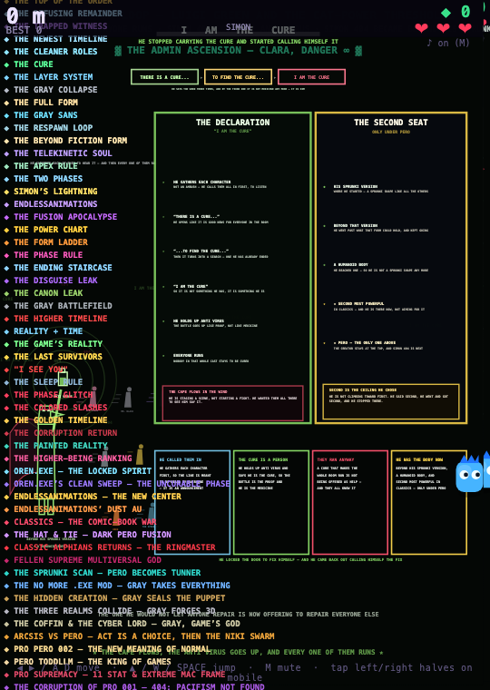

## 2026-07-22 — 404: KEY NOT FOUND (BEAT 144)

Based on Toby's 2026-07-22 lore (thirtieth message of the "More Classics Era" thread, sent right after THE PLAGUE WALK — the beat where Simon 404 gets a definition and an inner conflict, not just more power).

Toby's words: *"I tried to make a Simon 404 model (litterly JUST the model, no scripts in it yet) in Roblox, then it says 'Critical Model Corruption Detected'. It actually was expected. Now for more Classics lore. Simon 404 is basically a corrupted non-human 404-Mode AI humanoid being inside a plauge suit. Simon 404 is AI, but EXTREMELY corrupt, it keeps saying in it's mind 'Am I... REAL?'. New Chara and Gray now learn to work together, everyone learns to work together (Pero is just neutral and he isn't with/never with any team), now everyone in the team also tries to fix Simon 404, but Simon 404 wants to fix himself himself, so he stops the others from even entering the labatory using code '404: Key Not Found'. Simon 404 became the second most powerful being, he uses Error 404 and code, Pero created the game is LAI, Simon 404 is considered AI, but extremely corrupt and broken throughout the entire lore and timelines."* (The pasted ChatGPT character-breakdown recap is treated as commentary; the canon is Toby's own lines.)

- New BEAT 144 lore panel, 404: KEY NOT FOUND, added to THE UNDEFINED LOOP climb (cyc `[2886,2908)`, cycle length extended `2886 → 2908`). `LV_BEATS` now 145 entries (0-144).
- **The sealed door field** — the labatory door shut in the middle of the screen with four red seal bars slamming across it and the keyhole struck out by a red X, stamped **404: KEY NOT FOUND**. Behind the door, Simon 404 alone in the plague suit with both lenses lit, labelled *FIXING HIMSELF, HIMSELF*. Outside it, **the whole team linked by a dashed line for the first time** — New Chara, Gray, Oren and the rest — under the line *EVERYONE LEARNS TO WORK TOGETHER, AND THE DOOR STILL DOESN'T OPEN*. Off to one side and joined to nobody, a gold **PERO — NEUTRAL / NEVER ON ANY TEAM** marker. Drifting through the whole field, twenty-six repeats of `AM I... REAL?` and `404`.
- **Header emblem: the thought on a loop** — three nested ellipses circling the line **"AM I... REAL?"**, over *he is not evil for no reason, he is broken, self-aware, and trying to prove his own existence*.
- **WHAT SIMON 404 IS panel** (center) — the banner *"CRITICAL MODEL CORRUPTION DETECTED,"* then a six-rung definition: **A CORRUPTED NON-HUMAN** *(an AI humanoid being, not a person and not a monster)* ▸ **LOCKED IN 404-MODE** *(that is his whole existence now, not a state he visits)* ▸ **INSIDE THE PLAUGE SUIT** *(the suit is how you know him on sight)* ▸ **POWERED BY ERROR 404** *(error, code corruption and broken system logic)* ▸ **MENTALLY UNSTABLE** *(extremely corrupt, and he knows something is wrong)* ▸ **"AM I... REAL?"** *(the thought he keeps saying in his mind, on a loop)*. Boxed underneath in blue, **JUST THE MODEL — NO SCRIPTS YET**: *it said "Critical Model Corruption Detected" with nothing in it, so he is corrupt before he is even running*.
- **THE LOCKED DOOR panel** (right) — *"YOU DO NOT HAVE ACCESS TO ME,"* a five-rung log: **THEY WORK TOGETHER** *(New Chara and Gray, then everyone, a first for this cast)* ▸ **THEY TRY TO FIX HIM** *(the whole team is coming to repair Simon 404, not kill him)* ▸ **HE WANTS TO DO IT HIMSELF** *(Simon 404 wants to fix himself, himself, no help taken)* ▸ **404: KEY NOT FOUND** *(so he stops them from even entering the labatory)* ▸ **★ SECOND MOST POWERFUL** *(Error 404 and code, under Pero, who made the game and is LAI)*. Boxed underneath in gold, **PERO IS JUST NEUTRAL**: *he isn't with any team, and never with any team; the creator doesn't pick a side in his own game*.
- **4-part footer** — **CORRUPT BEFORE IT RAN** *(just the model, no scripts in it yet, and Roblox said Critical Model Corruption Detected, and it fit him)* · **A CORE INNER CONFLICT** *(not evil for no reason: corrupted, broken, awake, and trying to repair his own existence)* · **HE LOCKS THE HELP OUT** *(everyone finally works together to fix him, and he answers with a code)* · **AI UNDER THE LAI** *(Pero made the game and is LAI; Simon 404 is AI, extremely corrupt, and second most powerful)*. Under it: *it is not just a locked door, it is him saying you do not have access to me*.
- Insight banner: *"THE ONE THING HE WILL NOT ACCEPT FROM ANYONE IS HELP — SO THE STRONGEST LOCK IN THE LORE IS ON HIS OWN DOOR,"* and the star banner *"★ A CORRUPT AI IN A PLAUGE SUIT, ASKING 'AM I... REAL?' WHILE HE LOCKS THE DOOR ★."* Additive — every earlier beat untouched; new `keynotfound` scene added to `tools/capture_screenshot.py`.

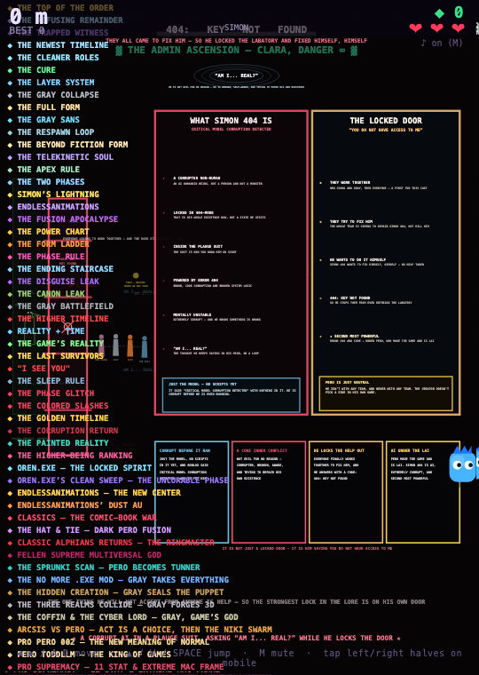

## 2026-07-22 — THE PLAGUE WALK (BEAT 143)

Based on Toby's 2026-07-22 lore (twenty-ninth message of the "More Classics Era" thread, sent the same day as GRAY VS SIMON 404 and following straight on from it — the beat where Simon 404 stops being unstable chaos and becomes prepared).

Toby's words: *"Simon 404 decided to turn New Chara into the perfect puppet, so Simon 404 brought New Chara to the labatory, and Gray also is making a new Abination, Simon 404 made New Chara beyond himself and Gray and everyone except for Pero. New Chara was taken over by 404, Gray tries to make New Chara his puppet, but Simon 404 made New Chara so strong and overtakes Gray all the time. Simon 404 makes others into puppets and Gray is trying to make others into puppets to stop the 404 virus on Simon 404. New Chara became Plus, but is still called New Chara. New Chara beaten Gray and everyone else, Simon 404 now has everything he needs, he gotten on his plauge suit, and he also remade his anti-virus, New Chara was given her own will, everyone was free on their will by Oren and Gray, Simon 404 didn't care about it, Simon 404 was focused to fix himself into the second strongest being (Pero = the creator, no one can go above the one who made the game) again. Simon 404 hangs up his white cloak and black cloak, and he puts on his plauge suit and he puts on the cape, Simon 404 walks out of the labatory, Simon 404 touches the air around him and the air becomes 404Ds (EVERYTHING he touches turns to 404Ds)."* (The pasted three-point recap is treated as commentary; the canon is Toby's own lines.)

- New BEAT 143 lore panel, THE PLAGUE WALK, added to THE UNDEFINED LOOP climb (cyc `[2864,2886]`, cycle length extended `2864 → 2886`). `LV_BEATS` now 144 entries (0-143).
- **The walk-out field** — the labatory doorway on the left with **the white cloak and the black cloak still hanging on the wall inside**, and Simon 404 outside it mid-stride in the **plague suit**: hooded coat, beak mask with two lit lenses, and the cape streaming behind him. One hand is out in the air, and from that hand five rings and forty-four `404D` / `404` glyphs spread outward across the whole screen — *the air itself converting*. The corruption is environmental now, not just people and objects.
- **Header emblem: the kit change** — four plates, **WHITE** and **BLACK** greyed and struck through *(hung up)*, **PLAGUE SUIT** and **THE CAPE** lit *(put on)*, over the line *he did not get stronger by accident, he changed clothes on purpose, and remade his anti-virus*.
- **THE PUPPET LAB panel** (center) — the banner *"SHE WAS BUILT TO OBEY, AND SHE DIDN'T,"* then a six-rung log: **THE PERFECT PUPPET** *(Simon 404 brings New Chara to the labatory to make her his)* ▸ **BEYOND EVERYONE** *(he made her beyond himself and Gray and all, except Pero)* ▸ **GRAY WANTS HER TOO** *(he builds a new Abination and tries to puppet her himself)* ▸ **SHE OVERTAKES HIM** *(Simon made her so strong she overtakes Gray all the time)* ▸ **NEW CHARA BECAME PLUS** *(still called New Chara, and she beaten Gray and everyone)* ▸ **GIVEN HER OWN WILL** *(Oren and Gray free everyone on their will, and Simon didn't care)*. Boxed underneath in violet, **BOTH SIDES ARE MAKING PUPPETS**: *Simon 404 to spread the 404, Gray to stop the 404 virus on Simon — same method, opposite reasons*.
- **THE POWER ORDER panel** (right) — *HE IS AIMING FOR SECOND, NOT FIRST*, a four-rung ladder: **GRAY** *(still dangerous, but losing control of what he built)* ▸ **NEW CHARA PLUS** *(above Gray and almost everyone else, and her own now)* ▸ **SIMON 404** *(securing second again: suit, cape, anti-virus, lab work done)* ▸ **★ PERO — THE CREATOR** *(no one can go above the one who made the game)*. Boxed underneath in green, **NOT CHAOS ANY MORE — PREPARED**: *cloaks hung up · plague suit on · cape on · anti-virus remade · lab work complete · he walks out*.
- **4-part footer** — **THE PUPPET GOT FREE** *(he built her to be perfect and she came out too strong to own, then Oren and Gray gave her a will)* · **PLUS, AND STILL HER** *(she became Plus but is still called New Chara, the name stayed when the power changed)* · **HE CHOSE SECOND** *(he is not trying to beat Pero, no one goes above the one who made the game, and he knows it)* · **THE AIR ITSELF** *(not just people, not just objects, everything he touches turns to 404Ds, so he is a walking source)*. Under it: *Gray builds puppets to control the game, Simon 404 walks out and starts converting the room*.
- Insight banner: *"EVERY PUPPET IN THIS BEAT ENDS UP HOLDING ITS OWN STRINGS — AND SIMON 404 STOPPED NEEDING THEM,"* and the star banner *"★ THE CLOAKS ARE HUNG UP AND THE PLAGUE SUIT IS ON — EVERYTHING HE TOUCHES TURNS TO 404Ds ★."* Additive — every earlier beat untouched; new `plaguewalk` scene added to `tools/capture_screenshot.py`.

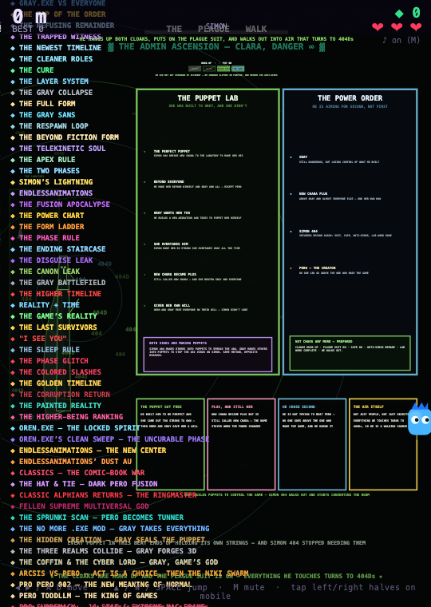

## 2026-07-22 — GRAY VS SIMON 404 (BEAT 142)

Based on Toby's 2026-07-22 lore (twenty-eighth message of the "More Classics Era" thread, the direct follow-up to THE HIDDEN ROOT, and the first full head-to-head ruling of the Classics power order).

Toby's words: *"Mr. Black was the one who put Simon's Anti Virus on Gray even though Gray didn't have a virus, it made Gray more powerful and corrupt, it did all this in a result. New Chara would be the most powerful AU of Chara, and it would be too powerful for Undertale, so would Gray, so would Simon 404. Pero created every Classics character and opened all other realms and mods, New Chara would be stronger than Gray, but Simon 404 would be stronger than both since he is litterly Error 404 and 404 string attacks and such. New Chara's battle is the most intense, Simon 404 becomes Error 404 and uses all the string attacks and glitch attacks + he doesn't take damage, Gray blocks the player's sight the whole battle + it is a litteral deleted demon overlord. Pero is the creator of the game and let other characters into the game through portals, Pero was the one who can remove the stuff... Pero can litterly just destroy the game. ... In lore, Simon 404 would beat Gray by blocking all his buttons. when everyone comes, they beat Simon 404. Gray also appears with Mr. Black all the time, they now fused with each other to reach New Chara's power LV and stuff. Dark Gray hardly beats New Chara, but New Chara would win with the Chaos Blaster or Hypergoner or the new tool... The Hyperdeath Syche. New Chara can make Asriel and the others not just into a sword, but anything she needs to win. Simon 404 with an army of 404Ds, it would actually turn into a challenge for everyone, but it now can end either way. Simon 404 can call in Orus and Dark Yellow, it would still be a challenge, but the everyone would eventually win. But Simon 404 with the army of 404Ds and Orus and Dark Yellow, he completed his own tri-mode and he has an army with him, so Simon 404 would always win with all that power. Pero would beat Simon 404 or anyone or everyone no matter what they have or their power since Pero is the creator of Classics... and he also has power for himself. Everyone who enters Classics is given a Classics version of them for both their identity and everything about them and stuff."* (The pasted ChatGPT power-chart recap is treated as commentary; the canon is Toby's own lines.)

- New BEAT 142 lore panel, GRAY VS SIMON 404, added to THE UNDEFINED LOOP climb (cyc `[2842,2864]`, cycle length extended `2842 → 2864`). `LV_BEATS` now 143 entries (0-142).
- **The split battlefield** — the Gray VS Simon 404 scene itself. The left half of the screen is near-total black because *Gray blocks the player's sight the whole battle*: a deleted demon overlord silhouette you can only just make out, with two red eyes. The right half is Simon 404's Error 404 field: glitch bands, drifting `404` / `ERR` glyphs, and ten blue 404 strings reaching across the seam into Gray's dark. A jagged bright seam runs down the exact middle where the two sides meet. Header emblem: **the FIGHT / ACT / ITEM / MERCY buttons, all four struck out with blue string**, labelled **404: BUTTONS BLOCKED** — *Gray relies on button power, so Simon 404 takes the buttons away*.
- **THE 1V1 panel** (center) — the banner *"THE CURE WAS THE CAUSE,"* then a six-rung log: **THE ANTI VIRUS** *(Mr. Black put Simon's Anti Virus on Gray, and Gray had no virus)* ▸ **IT MADE HIM WORSE** *(more powerful and more corrupt, it did all this in a result)* ▸ **GRAY BLOCKS YOUR SIGHT** *(the whole battle, a litteral deleted demon overlord)* ▸ **SIMON BECOMES ERROR 404** *(all the string and glitch attacks, and he takes no damage)* ▸ **HE BLOCKS THE BUTTONS** *(so Simon 404 wins the 1v1, by denial, not by being stronger)* ▸ **THEN EVERYONE COMES** *(he beats Gray alone, but not the whole cast together)*. Boxed underneath, **DARK GRAY — GRAY + MR. BLACK FUSED**: *they fuse to reach New Chara's power LV; Dark Gray hardly beats her, and she answers with the Chaos Blaster, the Hypergoner, or the new Hyperdeath Syche*.
- **THE WAR LADDER panel** (right) — *IT DEPENDS WHAT HE BRINGS*, a five-rung escalation: **SIMON 404 ALONE** *(everyone together eventually beats him)* ▸ **+ AN ARMY OF 404Ds** *(a real challenge, it can now end either way)* ▸ **+ ORUS & DARK YELLOW** *(still a challenge, but everyone would eventually win)* ▸ **= COMPLETED TRI-MODE** *(army, summons and tri-mode at once, he always wins)* ▸ **★ PERO, ABOVE ALL OF IT** *(no matter what they have or their power)*. Boxed underneath in gold, **THE CLASSICS VERSION RULE**: *everyone who enters Classics is given a Classics version of them, their identity and everything about them*.
- **4-part footer** — **THE CURE WAS THE CAUSE** *(Mr. Black put Simon's Anti Virus on a Gray who had no virus; it made him stronger and corrupt)* · **HE WINS BY BLOCKING** *(Simon 404 does not out-power Gray, he blocks all the buttons Gray fights with)* · **HER WEAPONS ADAPT** *(New Chara makes Asriel and the others into anything she needs, not just into a sword)* · **PERO OUT-AUTHORS ALL** *(he made every Classics character and opened the realms and mods, and can just destroy the game)*. Under it: *New Chara, Gray and Simon 404 are all too powerful for Undertale, so Classics is the only place they fit*.
- Insight banner: *"EVERY RULING HERE IS ABOUT WHAT SOMEONE TAKES AWAY — SIGHT, BUTTONS, POWER, OR THE GAME ITSELF,"* and the star banner *"★ SIMON 404 BEATS GRAY BY BLOCKING HIS BUTTONS — BUT ONLY HIS COMPLETED TRI-MODE BEATS EVERYONE ★."* Additive — every earlier beat untouched; new `grayvssimon404` scene added to `tools/capture_screenshot.py`.

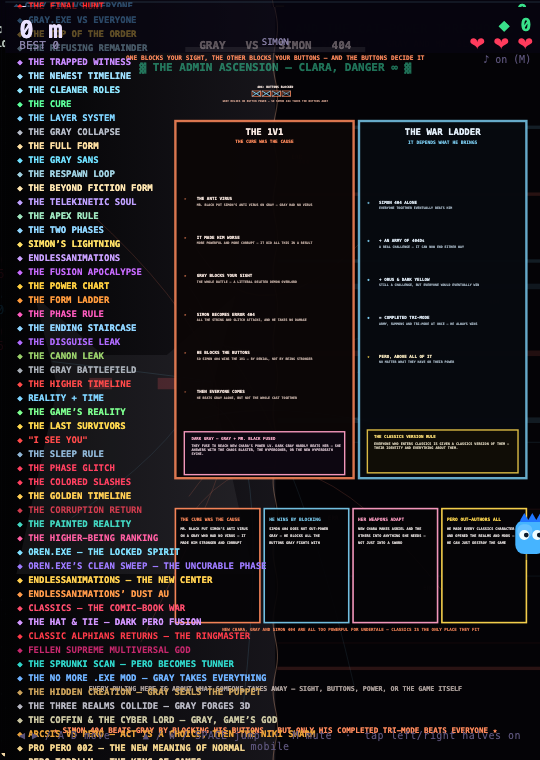

## 2026-07-21 — THE HIDDEN ROOT (BEAT 141)

Based on Toby's 2026-07-21 lore (twenty-seventh message of the "More Classics Era" thread, the direct follow-up to DELETED AU, and the biggest origin reveal in the whole Classics corruption timeline).

Toby's words: *"Pero says to Gray and Chara 'Simon 404 is alive, come remove it again...', Simon says 'They know my old knowledge, but not my new knowledge.' ... Simon writes down 'DELETED AU ENTRY RULES: Must be Me.', Gray and Chara try to destroy the books, but Simon 404 appears instantly after and the books grow blue strings and Simon 404 says 'Heh, not so fast.' ... New Chara removes the save file and Simon 404 turns back and he blocks the beam and he says '404: Save File Was Never Yours, It Was Always Mine!' ... Simon 404 quickly puts on his Garnold Visor and he says '404: Power Not Found', and Chara and Gray lost their power ... but then all the Sprunkis come up ... Simon 404 battled the Sprunkis and the Sprunkis won, Simon 404's power and staff and chaos all disappeared, the game reseted, and everything was back to normal. Orus and Dark Yellow blessed the Sprunkis, Simon 404 was locked into the Dark again. Simon 404 becomes posseeded by Gray to be evil like him, but Simon 404 becomes too evil and tries to destroy not just the other characters but Gray and everyone. Gray was the one responcible for each Simon corruption, and Mr. Black corruption, and Pero corruption, and everyone's corruption from even the very start of the lore. Pero gives New Chara and Gray LV and KR since they do all these stuff."* (The pasted ChatGPT "Simon 404 Secret Return Arc" recap is treated as commentary; the canon is Toby's own lines.)

- New BEAT 141 lore panel, THE HIDDEN ROOT, added to THE UNDEFINED LOOP climb (cyc `[2820,2842]`, cycle length extended `2820 → 2842`). `LV_BEATS` now 142 entries (0-141).
- **The corruption-web field** — a deep violet void with fourteen threads of corruption reaching in from every edge and converging on a single glowing root node low-centre, with faint `404` / `ROOT` glyphs drifting toward it. Header emblem: **the Garnold Visor band** labelled **404: POWER NOT FOUND**, *the tool that makes Gray and New Chara lose their power*.
- **SIMON 404'S SECRET RETURN panel** (center) — the banner quote *"THEY KNOW MY OLD KNOWLEDGE, BUT NOT MY NEW KNOWLEDGE,"* then a six-rung log: **ENTRY RULES** *("DELETED AU ENTRY RULES: MUST BE ME" — he steals Gray's AU)* ▸ **BLUE STRINGS** *("Heh, not so fast" — his books protect, Gray's AU to rubble)* ▸ **SEVERAL 404 SANSES** *(he collects the rubble and splits)* ▸ **THE SAVE FILE IS HIS** *("Save File Was Never Yours, It Was Always Mine!")* ▸ **GARNOLD VISOR** *("404: Power Not Found" — he captures both with blue string)* ▸ **THE SPRUNKIS WIN** *(visor off, "oh no!!!", his power/staff/chaos gone, the game resets)*. Boxed underneath, **LOCKED INTO THE DARK AGAIN**: *Orus and Dark Yellow bless the Sprunkis and Simon 404 is sealed in the Dark*.
- **THE HIDDEN ROOT panel** (right) — *GRAY WAS BEHIND ALL OF IT*, a five-item root list: **SIMON'S CORRUPTION** ▸ **MR. BLACK'S CORRUPTION** ▸ **PERO'S CORRUPTION** ▸ **EVERYONE'S CORRUPTION** ▸ **FROM THE VERY START** *(the earliest corruption in the entire lore)*. Boxed underneath, **POSSESSION BACKFIRED**: *Gray possesses Simon to make him evil, Simon gets too evil and turns on everyone, even Gray*.
- **4-part footer** — **OWNERSHIP, NOT POWER** *(Simon fights with entry rules, books, the Save File and the visor, not raw strength)* · **THE SPRUNKIS RESET IT** *(the game's own cast beats the 404 and everything resets)* · **GRAY WAS THE ROOT** *(every corruption traces to Gray from the very start)* · **POSSESSION BACKFIRED** *(he made Simon too evil to control)*.
- Insight banner: *"EVERY CORRUPTION IN THE WHOLE LORE TRACES BACK TO ONE SOURCE — SIMON 404 WAS ONLY THE FIRST THING GRAY EVER BROKE,"* and the star banner *"★ GRAY WAS THE HIDDEN ROOT BEHIND EVERY CORRUPTION FROM THE VERY START — AND 'POWER NOT FOUND' STILL COULDN'T STOP THE SPRUNKIS ★."* Additive — every earlier beat untouched; new `hiddenroot` scene added to `tools/capture_screenshot.py`.

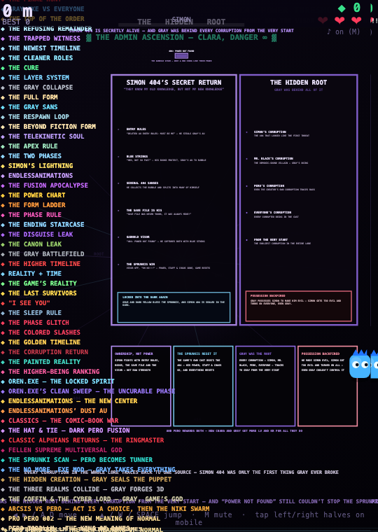

## 2026-07-21 — DELETED AU (BEAT 140)

Based on Toby's 2026-07-21 lore (twenty-sixth message of the "More Classics Era" thread, sent right after The Combined Toolkit — Gray finally names his AU, Pero puts him back in his place, and Simon 404 comes back in secret).

Toby's words: *"Gray's AU is called DELETED AU. Only Gray and Pero can enter that place since they are deleted-but-still-existing error characters... Gray like tries to attack Pero but Pero takes no damage and says 'Remember... Delete?', Pero can attack Gray and Gray gets KOed. Pero also gave all light to Gray, Gray is now 50% darkness, 50% light, the light side is brighter than anything in the game, the dark side you can't even see anything... New Chara appears and slashes her sword, the cutscene happens and Gray was defeated... New Chara revives with her KR. Gray VS New Chara, New Chara would win. New Chara became master and is now so OP. Sakeranbi and Ctruinibi was given to Gray... Gray uses his Blazing Fire and became Rainbow Shadow Light his 2nd Phase... New Chara uses her Asriel Sword and Gray fell instantly since the Dreemurr swords were heavy for even her... Gray summoned Abinations, and Gray also corrupted the game, tentacles all over... he learns all about the game using Simon's books, and Gray battles New Chara... but she eventually won, Gray fellen again... Simon 404 appears after Chara left the room. Simon 404 reorganizes his books, and no one knows he is back alive except for Pero."* (The pasted ChatGPT "Simon 404 Secret Return Arc" recap is treated as commentary; the canon is Toby's own lines.)

- New BEAT 140 lore panel, DELETED AU, added to THE UNDEFINED LOOP climb (cyc `[2798,2820]`, cycle length extended `2798 → 2820`). `LV_BEATS` now 141 entries (0-140).
- **The 50/50 field** — one half of the screen blinding light *(brighter than anything in the game)* and the other half total black *(you cannot see anything)*, split by a bright seam down the exact middle, with faint `404` / `DEL` glyphs drifting on the dark side. Header emblem: **a gate labelled ONLY GRAY & PERO ENTER**, *deleted-but-still-existing error characters*.
- **WHAT DELETED AU IS panel** (center) — a half-white / half-black split bar (**BRIGHTER THAN ANYTHING** · **CAN'T SEE ANYTHING**), then **MOST POWERFUL ABILITIES** *(Pero gave him more form, KR and LV)* · **SAKERANBI · CTRUINIBI** *(two new named abilities, given to Gray)* · **SPRUNKIS ATTACK HIM** *(he is too strong, destroys them instantly)*. Boxed in gold underneath, **PERO IS STILL ABOVE HIM**: *Gray attacks, Pero takes no damage, says "Remember... Delete?", and can KO him*.
- **THE SEE-SAW panel** (right) — *NEW CHARA BECAME MASTER*, and a six-rung battle log: **she slashes, Gray down** ▸ **she revives with KR** ▸ **Gray: Rainbow Shadow Light** *(Blazing Fire into his 2nd Phase, takes Chara out)* ▸ **Asriel Dreemurr swords** *(too heavy even for her, Gray falls instantly)* ▸ **tentacles · Simon's books** *(Gray corrupts the game and studies it)* ▸ **she eventually wins again**. Boxed underneath, **AU PERO CLAPS AND WAVES**: *he keeps giving New Chara KR, LV and power, so she overtakes Gray again and again*.
- **4-part footer** — **PERO STILL ON TOP** *("Remember... Delete?" — no damage, can KO him)* · **NEW CHARA WINS** *(in a straight fight she beats Gray over and over, master now, so OP)* · **BOTH REVIVE** *(Gray on damage, New Chara with her KR, neither stays down)* · **SIMON 404 IS BACK** *(quietly reorganizing his books, known only to Pero)*.
- Insight banner: *"BOTH GRAY AND NEW CHARA READ SIMON'S BOOKS — AND THE ONE WHO WROTE THEM JUST CAME BACK,"* and the star banner *"★ ONLY GRAY AND PERO CAN ENTER DELETED AU — AND SIMON 404 IS SECRETLY ALIVE AGAIN ★."* Additive — every earlier beat untouched; new `deletedau` scene added to `tools/capture_screenshot.py`.

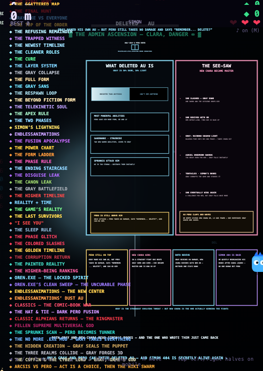

## 2026-07-21 — THE COMBINED TOOLKIT (BEAT 139)

Based on Toby's 2026-07-21 lore (twenty-fifth message of the "More Classics Era" thread — the direct reversal of THE ERASE UPGRADE, and an answer to Dad's own question about why Gray was not in the red plasma ball).

Toby's words: *"That is now what Gray can do now, Gray used his new power to destroy New Chara and then he started his own AU. New Chara was thrown off of Pero's care. Gray reaches higher into Pero's Care. Gray's form increases with his power, he beaten everyone in the red plasma ball and it consumed the plasma ball and everything inside it, Gray's power, LV, KR, and form increased, he started getting Kr (Karma. It can heal the victum), Gray now gains lots of KR, Gray revives himself each time he takes even a little damage. Gray is now extremely strong. Gray also gains each from Pero, he also gets more on his own."* (The pasted ChatGPT recap is treated as commentary; the canon is Toby's own lines.)

- New BEAT 139 lore panel, THE COMBINED TOOLKIT, added to THE UNDEFINED LOOP climb (cyc `[2776,2798]`, cycle length extended `2776 → 2798`). `LV_BEATS` now 140 entries (0-139).
- **The red plasma ball, this time being eaten** — the sealed sphere from beat 138 now *shrinks* as Gray consumes it, the twelve trapped figures dragged toward the centre instead of circling free, and fifteen ink-dark tendrils reaching outward to pull the ball and everything in it into him. This is the answer to Dad's question: Gray was never sealed because he beats everyone inside and takes the whole prison. Header emblem: **an HP bar that takes a hit and instantly springs back to full**, labelled *REVIVES ON EVERY HIT*, with a KR meter beside it.
- **THE WHOLE TEAM IN ONE panel** (center) — four broken states across the top (**HACKED · GLITCHED · ERRORED · DELETED**) and four beings down the side (**SANS** *KR and dodging logic* · **PAPYRUS** *traps, bones, battle control* · **CHARA** *erase power* · **FRISK** *reset resistance*), lighting in turn. Boxed underneath, **ALL FOUR STATES × ALL FOUR BEINGS = GRAY**: *a whole team could do it together, now one character does all of it*, and in red, **HE DESTROYED NEW CHARA**: *she was above him one beat ago, now he started his own AU*.
- **KR AND SELF-REVIVAL panel** (right) — *HURTING HIM MAKES HIM STRONGER*, and a six-rung ladder: **destroyed New Chara** ▸ **started his own AU** ▸ **ate the plasma ball** *(beat everyone in it, then consumed the ball)* ▸ **gains KR — Karma** *(his version can heal the victim, not only harm)* ▸ **revives on damage** *(each time he takes even a little, he comes back)* ▸ **higher into Pero's Care** *(New Chara was thrown off it, Gray rose)*. Boxed underneath, **TWO SOURCES, AT ONCE**: *Pero keeps giving him more, and he keeps gaining on his own*.
- **4-part footer** — **THE TIE-BREAK REVERSED** *(New Chara was above him one beat ago; the combined toolkit let him destroy her outright)* · **NONE ESCAPED THE BALL** *(Pero sealed them so none could get out; Gray beat them and ate the whole ball anyway)* · **KR CAN HEAL** *(his karma is not only poison; it can heal the victim, damage, karma and healing in one loop)* · **REVIVES ON DAMAGE** *(even a little damage brings him back, so hurting him only makes him harder to put down)*.
- Insight banner: *"THE ONE ABILITY THAT BEAT HIM LAST BEAT IS GONE — HE TOOK A WHOLE TEAM'S POWERS AND ATE THE PRISON TOO,"* and the star banner *"★ HE REVIVES EVERY TIME HE IS HIT — HURTING GRAY IS HOW GRAY GETS STRONGER ★."* Additive — every earlier beat untouched; new `combinedtoolkit` scene added to `tools/capture_screenshot.py`.

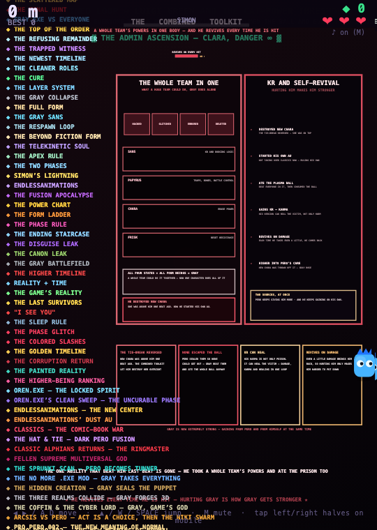

## 2026-07-21 — THE ERASE UPGRADE (BEAT 138)

Based on Toby's 2026-07-21 lore (twenty-fourth message of the "More Classics Era" thread — New Chara gets a design and a tie-break in the same breath).

Toby's words: *"New Chara would be a mix of Hopes and Deals and No More Deals; and Cross for some of the design. New Chara reached higher and now both Gray and New Chara are at the same power, but as soon Pero gave Chara an improvement to only her erase, then New Chara reached stronger and above Gray. Gray and New Chara gain more and more power, New Chara is currently stronger, Pero trapped all the others in a red ball of plasma, none can escape."* (The pasted ChatGPT recap is treated as commentary; the canon is Toby's own lines.)

- New BEAT 138 lore panel, THE ERASE UPGRADE, added to THE UNDEFINED LOOP climb (cyc `[2754,2776]`, cycle length extended `2754 → 2776`). `LV_BEATS` now 139 entries (0-138).
- **The red ball of plasma, sealing as you watch** — a growing plasma sphere at the centre with twelve figures circling inside it and hitting the wall, and plasma arcs crawling the surface. Everyone who is not one of the top three is in there, and none can escape. Header emblem: **a balance beam that starts level and then tips**, Gray on one side, New Chara on the other, at the exact moment the Erase upgrade lands.
- **WHAT SHE IS MADE OF panel** (center) — the design mix, lighting one piece at a time: **Hopes and Deals** *(the heroic, final-boss side of her)* · **No More Deals** *(the deal-breaking, demon-power side)* · **Cross** *(for some of the design, the sharp detail)*. Boxed underneath, **A WHITE-CLOAKED CLASSICS DEMON**: *final-boss energy and demon power in the same body, she does not read as a regular Chara anymore*, and in red, **THE RED BALL OF PLASMA**: *Pero trapped all the others inside it. None can escape.*
- **THE TIE-BREAK panel** (right) — *ONLY HER ERASE WAS IMPROVED*, and a five-rung ladder: **she reached higher** ▸ **Gray = New Chara** *(the same power, exactly, for a moment)* ▸ **Pero improves Erase** *(one ability, not her form, not her LV)* ▸ **New Chara > Gray** ▸ **both still gaining** *(Gray is extremely close and still rising)*. Boxed underneath, **WHO IS STILL ON THE BOARD**: *1 Pero · 2 New Chara · 3 Gray · everyone else is in the plasma*.
- **4-part footer** — **ONE ABILITY** *(Pero did not rebuild her; he improved her Erase and nothing else, and it was enough)* · **THE CLOSEST GAP YET** *(they were equal a moment ago and both are still climbing)* · **NONE CAN ESCAPE** *(the plasma holds everyone who is not top three; not beaten, just sealed in)* · **PERO STILL DECIDES** *(he picked who gets upgraded and who gets trapped, so the ranking is his, not theirs)*.
- Insight banner: *"A TIE THAT BIG GOT BROKEN BY UPGRADING ONE MOVE — THE SMALLEST CHANGE IN THE ERA DECIDED THE TOP,"* and the star banner *"★ ONLY HER ERASE WAS IMPROVED, AND THAT PUT HER ABOVE GRAY ★."* Additive — every earlier beat untouched; new `eraseupgrade` scene added to `tools/capture_screenshot.py`.

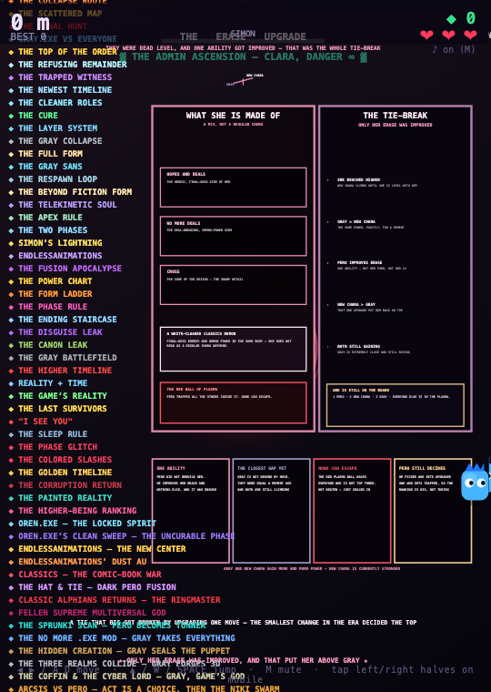

## 2026-07-21 — THE LOCKS (BEAT 137)

Based on Toby's 2026-07-21 lore (the twenty-second and twenty-third messages of the "More Classics Era" thread, sent six minutes apart and settled together — the escalation stops being about new forms and starts being about locked ones).

Toby's words: *"Mr. Black is now Parodybox Phase 1 locked + Classics Aura and Power. Mr. Black decreased form and increased power, Mr. Black is now the 3rd most powerful under Gray and Pero. Gray got more power, Mr. Black also gets more power."* and *"Mr. Sun is now Pyramixed Phase 1 locked, all other Sprunkis are just normal. Mr. Sun is normal tier, but beats Simon. Mr. Black beats all Sprunkis except for Gray. Gray is locked on Classics Phase Infinity. Gray is strongest and consumes all Sprunkis since he is Phase Infinity, duh."* (The pasted ChatGPT recaps are treated as commentary; the canon is Toby's own lines.)

- New BEAT 137 lore panel, THE LOCKS, added to THE UNDEFINED LOOP climb (cyc `[2732,2754]`, cycle length extended `2732 → 2754`). `LV_BEATS` now 138 entries (0-137).
- **A cold, held field instead of a transforming one** — fourteen lock brackets that close and stay closed, and a lemniscate traced slowly behind everything for the phase Gray is locked on. Header emblem: **a shut padlock with a ▼ under FORM and a ▲ under POWER**, because this is the beat where those two numbers stop moving together.
- **LOCKED FORMS panel** (center) — the only three Sprunkis who are locked, each lighting in turn: **GRAY** *(Classics Phase Infinity — the phase itself makes him the top, he consumes all Sprunkis)* · **MR. BLACK** *(Parodybox Phase 1 + Classics Aura and Power — form decreased, power increased, beats every Sprunki except Gray)* · **MR. SUN** *(Pyramixed Phase 1 — still normal tier, and normal tier is enough to beat Simon)*. Boxed underneath, **NO TRANSFORMATION NEEDED**: *instead of higher forms or huge transformations, he is held in the basic-looking state, and the power is put behind it instead*.
- **THE BOARD panel** (right) — the Sprunki ranking as it stands after both locks land, lighting one rung at a time: **1 Gray** ▸ **2 Mr. Black** ▸ **3 Mr. Sun** ▸ **4 the other Sprunkis** *(just normal, no escalations right now)* ▸ **5 Simon** *(below Mr. Sun in this scaling)*. Boxed underneath, **TWO DIFFERENT CLIMBS**: *Gray grows by consuming, Mr. Black grows by aura, both keep gaining*.
- **4-part footer, what this update actually changed** — **FORM ▼ POWER ▲** *(Mr. Black looks closer to his classic simple self and is far stronger than before)* · **NEW CHARA MOVES DOWN** *(Mr. Black is 3rd overall now, so she is no longer above him unless she gets another update)* · **NORMAL IS ENOUGH** *(Mr. Sun never leaves normal tier and still beats Simon — Simon fell, Mr. Sun did not rise)* · **PHASE INFINITY** *(Gray does not win on stats anymore; the phase he is locked on is what puts him on top)*, under the line *Gray is strongest and consumes all Sprunkis, since he is Phase Infinity*.
- Insight banner: *"THE THREE WHO GOT LOCKED ARE THE ONLY THREE WHO MATTER NOW — EVERYONE ELSE STAYED FREE AND STAYED NORMAL,"* and the star banner *"★ A LOCK IS NOT A LIMIT HERE — IT IS WHERE THE POWER GETS PUT INSTEAD ★."* Additive — every earlier beat untouched; new `thelocks` scene added to `tools/capture_screenshot.py`.

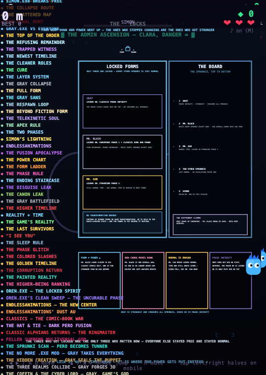

## 2026-07-21 — GRAY: ONE FORM (BEAT 136)

Based on Toby's 2026-07-21 lore (twenty-first message of the "More Classics Era" thread — the consuming finishes, and the many forms become one).

Toby's words: *"Now Gray is completed with consuming and absorbing everything, only him, Chara, and Pero are left. Gray gains Seraphim and became a mix of all angels, even though he is the dark opposite, he is became both angel and demon, his look now is even more beutiful than before ... Gray changed the gray paint to pure black ink, legend says that all he touches turns to ink ... the most corrupted and glitchest ink ever made. Gray reaches beyond his Sprunki spirit to create a human-like body even though it isn't close to being a human, but it takes the human shape and has the head of a human ... Gray has no more number limits to anything. Gray no longer has a LV limit, nor a form limit, nor a power limit ... The Sprunkis, Pero, New Chara are the only ones to be able to respawn, all others are inside Gray for internity, Gray became a king, he then became so dark that Pero can't see him, all black screen, then all Gray's forms began to merge into 1."* (The pasted ChatGPT recap is treated as commentary; the canon is Toby's own lines.)

- New BEAT 136 lore panel, GRAY: ONE FORM, added to THE UNDEFINED LOOP climb (cyc `[2710,2732]`, cycle length extended `2710 → 2732`). `LV_BEATS` now 137 entries (0-136).
- **The field turns to ink and then goes out** — 22 ink runs dripping down the screen and drying as it darkens; seventeen ink tentacles reaching *outward* from the centre this time, out into all the other dimensions, instead of inward like beat 135's; and the point at the middle collapsing into one form. By the end the field is fully black: **Pero cannot see him.** Header emblem: a **human head on a human-shaped body that is dripping ink**, labelled *"HUMAN SHAPE, HUMAN HEAD — NOT CLOSE TO BEING A HUMAN."*
- **THE INK panel** (center) — *THE GRAY PAINT IS NOW PURE BLACK INK*, with the world-rule in its own pulsing box: **"LEGEND SAYS ALL HE TOUCHES TURNS TO INK."** Then the four facts: *his tools, his suit, his body* (all of it made of ink, not covered in it, made of it) · *himself and the Abinations* (every one of them, the same material as him) · *a special ink* (the most corrupted and glitchest ink ever made) · *beyond his Sprunki spirit* (he reached past it to build the human-like body). Boxed in gold underneath, **AND THEY ALL LOVE HIM**: *his look now is even more beutiful than before; New Chara, the players and Pero all now love him*, and *he is the dark opposite, and he is now both angel and demon*.
- **NO MORE LIMITS panel** (right) — *NO LV · NO FORM · NO POWER*, and a six-rung ladder lighting one rung at a time: **gained Seraphim** *(a mix of all angels, angel and demon at once)* ▸ **above New Chara** *(consumed her, and all the tools she has)* ▸ **took Pero's ink** *(and his EndlessAnimations, and all Pero's forms)* ▸ **only vanilla is left** *(every being is back to its plainest form)* ▸ **all other dimensions** *(ink tentacles pull the games apart, he eats the rest)* ▸ **every form merged into 1** *(one form now, and it contains all of them)*. Boxed underneath, **PERO FELL OVER**: *he was so amazed when he saw Gray that he even fell over*.
- **4-part footer, who can still come back** — **CAN RESPAWN** *(the Sprunkis · Pero · New Chara, the only three the game will still put back on the board)* · **EVERYONE ELSE** *(inside Gray for internity; not beaten, not deleted, held, and not coming out)* · **THE LOOP** *(the ones who respawn are the ones he keeps consuming, so he never runs out of anything)* · **PERO** *(still the creator and the LAI assistant, and now he cannot see him, and still gives gifts)*, under the line *Gray became a king, and then became so dark that Pero can't see him — all black screen*.
- Insight banner: *"THE ONLY ONES WHO CAN COME BACK ARE THE ONES HE KEEPS EATING — HIS FOOD RESPAWNS, SO HE NEVER STOPS GROWING,"* and the star banner *"★ ALL HIS FORMS MERGED INTO 1 — GRAY: ONE FORM, AND THAT ONE FORM CONTAINS EVERYTHING ★."* Additive — every earlier beat untouched; new `oneform` scene added to `tools/capture_screenshot.py`.

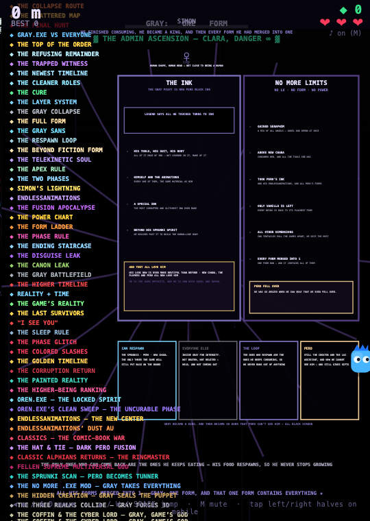

## 2026-07-21 — 404: SAVE FILE DELETED (BEAT 135)

Based on Toby's 2026-07-21 lore (twentieth message of the "More Classics Era" thread — New Chara finally gets a battle identity, and Gray's aura runs to infinity in the same breath).

Toby's words: *"New Chara holds a Dreemurr sword (either Asriel, Toriel, or Asgore) with both hands instead of 1. The New Chara actually can remove the Save File in Classics. '404: Save File Deleted! Disconnecting.... Disconnected.' then the thing glitches, and does New Chara's cutscene with the 404s instead of the 9s. ... Gray's aura goes to infinity and the whole game would go dark, the Light became Dark again, both circuses crumble ... Gray used his tentacles to grab on every realm in the game and Gray is pulling them all into himself. ... Gray reached the same power level of New Chara, Pero gave Gray 200000000 times the aura and form and power and LV, Gray was extreme."* (The pasted ChatGPT recap is treated as commentary; the canon is Toby's own lines.)

- New BEAT 135 lore panel, 404: SAVE FILE DELETED, added to THE UNDEFINED LOOP climb (cyc `[2688,2710]`, cycle length extended `2688 → 2710`). `LV_BEATS` now 136 entries (0-135).
- **The field goes out as you watch** — falling `404`s where the 9s used to be, thinning to nothing near the centre; thirteen tentacles reaching in from every edge, hooked into the realms and dragging them toward one point; and a black hole growing at the middle that swallows the light around it. Header emblem: **the Dreemurr sword held in BOTH hands, not one**.
- **NEW CHARA'S BATTLE panel** (center) — the disconnect message types itself out live, character by character, with a blinking cursor: **"404: Save File Deleted! Disconnecting.... Disconnected."** Then the four consequences: *then the thing glitches* (her cutscene runs with the 404s instead of the 9s) · *closer to a player's* (her battle is like no other character's, but she is an NPC) · *Jujutsu Kaisen + Undertale + Deltarune* · *the Judgement Hall falls down* (and then the intro starts). Boxed underneath, **BEATEN BY HER**: Sans · Undyne · Monster Kid · Frisk · Frizz · Clara · all Classics beings under Gray, and the one line that is not a kill: *across Classicstale/Undertale and Alphaverse, she only spared her friends*.
- **GRAY'S BLACKOUT panel** (right) — *HIS AURA GOES TO INFINITY*, and a six-rung ladder that lights one rung at a time: **took Wenda apart** *(her form, power, LV, aura)* ▸ **fused every form** *(all his + all hers, he became 3rd)* ▸ **Pero switched focus** *(lost interest in Wenda, fascinated with Gray)* ▸ **the Light became Dark** *(both circuses crumble, tentacles pull in every realm)* ▸ **Pero sped up time** *(and handed him everyone else and all land)* ▸ **×200,000,000** *(aura, form, power and LV — Gray was extreme)*. Boxed underneath: **LEVEL WITH NEW CHARA** *(he reached her power level, and is still trying to get beyond her)*.
- **4-part footer, the only beings left** — **1 PERO** *(the cow man, not a literal cow; levitates New Chara himself, since she has no levitating power)* · **2 NEW CHARA** *(Dreemurr sword in both hands, the save file in her reach)* · **3 GRAY** *(pulling every realm into himself; nothing is seen next to him, not even light)* · **EVERYONE ELSE** *(Wenda lost all of it to Gray, the rest were handed to him, the board is three names long now)*.
- Insight banner: *"SHE ATTACKS THE SAVE FILE AND HE ATTACKS THE WORLD — TWO WAYS TO END A GAME, RUNNING AT THE SAME TIME,"* and the star banner *"★ 404: SAVE FILE DELETED! DISCONNECTING.... DISCONNECTED. ★."* Additive — every earlier beat untouched; new `savefile404` scene added to `tools/capture_screenshot.py`.

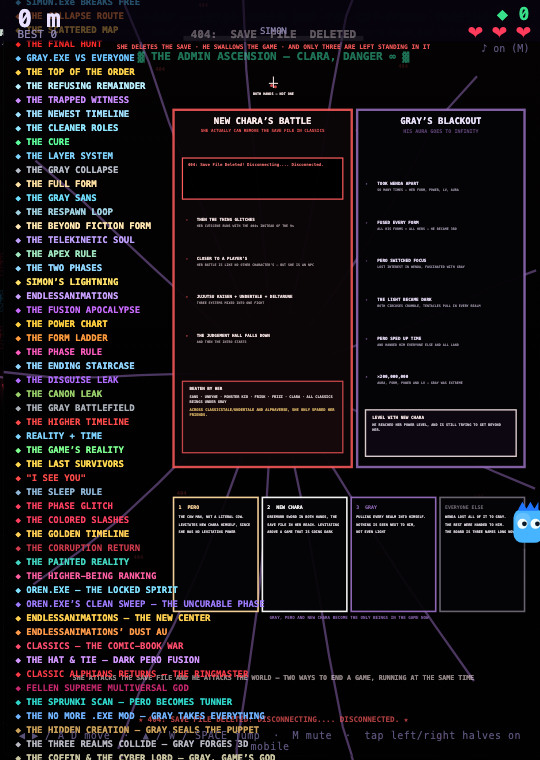

## 2026-07-21 — IF YOU BREAK HIM (BEAT 134)

Based on Toby's 2026-07-21 lore (nineteenth message of the "More Classics Era" thread — the assistant at the top of the board turns out to have a second state, and it is reached by damaging him rather than by fighting him).

Toby's words: *"Pero tries to assist the player, but when the player breaks him, Pero actually becomes hostile and attacks the game (he is creator of the game, he'll win). New Chara is considered a villian."* (The pasted ChatGPT recap is treated as commentary; the canon is Toby's own lines.)

- New BEAT 134 lore panel, IF YOU BREAK HIM, added to THE UNDEFINED LOOP climb (cyc `[2666,2688]`, cycle length extended `2666 → 2688`). `LV_BEATS` now 135 entries (0-134).
- **The gold field of beat 133 bleeding into ember** — the same 14 drifting speech bubbles, now each struck through with an orange break, and cracks spreading out from the centre of the field the further the damage goes. Header emblem: **the same small cow man guy**, with the crack running straight through him ("STILL THE SMALL COW MAN GUY").
- **THE THREE STATES panel** (center) — the collapse walked down one box at a time, lighting as it goes: **1 ASSISTING** *("Hello, I am Pero, your LAI assistant. What can I do for you?" — he answers questions, guides you, and keeps the world working. This is his default.)* ▼ **2 BROKEN** *(the player breaks Pero, the assistant behaviour collapses, and nothing is left holding him to the side he was built for)* ▼ **3 HOSTILE CREATOR** *(he attacks the game itself, the game he made — not a character turning on you, the author turning on the page)*. Subtitle: *he only moves down this list if somebody damages him*.
- **HE'LL WIN panel** (right) — *HE IS CREATOR OF THE GAME*, then the four reasons it is not a contest: **the board is his** *(he made the ranking everyone climbs)* · **the tools are his** *(every sword and staff came from him)* · **the LV is his** *(he hands it out, so he can take it back)* · **so it is not a fight** *(the only variable is if he stops)*. Boxed underneath, **NEW CHARA — VILLAIN**: *she is now considered a villian, officially; second strongest, LV still rising, still collecting*.
- **4-part footer, the villain board** — NEW CHARA *(active villain, rising LV, collecting swords, staffs and tools, second strongest)* · PERO *(assistant and creator by default, the ultimate threat only if somebody breaks him)* · GRAY *(the planner, Abination user, the dark and cyber villain force behind the others)* · WENDA *(fallen and absorbing, godlike depending on her form, now below Gray in the ranking)*, under the line *three of them chose it, one of them gets there by being damaged*.
- Insight banner: *"HE WAS NEVER WRITTEN AS A VILLAIN — HE WAS WRITTEN TO HELP, AND THE VILLAIN IS WHAT IS LEFT WHEN HE BREAKS,"* and the star banner *"★ THE ONE WHO ANSWERS EVERY QUESTION IS THE ONE YOU CANNOT AFFORD TO DAMAGE ★."* Additive — every earlier beat untouched; new `breakhim` scene added to `tools/capture_screenshot.py`.

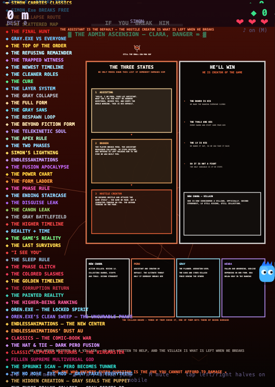

## 2026-07-21 — PERO, YOUR LAI ASSISTANT (BEAT 133)

Based on Toby's 2026-07-21 lore (eighteenth message of the "More Classics Era" thread — the being at the top of the board finally gets a greeting and a face, and both of them are small).

Toby's words: *"Pero always says this when he sees someone \"Hello, I am Pero, your LAI assistant. What can I do for you?\" the last part (\"What can I do for you?\") can vary since it has other stuff like \"Ask me anything and I will answer.\" or \"I know all about this world, what would you like to know?\", he has many stuff. Pero is a small cow man guy. New Chara gains more LV, New Chara is now still second since Pero is the creator of the game and everyone's LAI assistant."* (The pasted ChatGPT recap is treated as commentary; the canon is Toby's own lines.)

- New BEAT 133 lore panel, PERO, YOUR LAI ASSISTANT, added to THE UNDEFINED LOOP climb (cyc `[2644,2666]`, cycle length extended `2644 → 2666`). `LV_BEATS` now 134 entries (0-133).
- **A warm lit field instead of a god field** — the first beat in this whole stretch that is not a battle. Behind everything, **14 empty speech bubbles drifting upward**, because he says the same thing to everyone he sees. Header emblem: **the small cow man guy**, horns, two spots, a small body ("A SMALL COW MAN GUY").
- **THE GREETING panel** (center) — the line split into its two halves. Boxed in gold at the top, **ALWAYS THE SAME**: *"Hello, I am Pero, your LAI assistant."* Then **THE LAST PART, WHICH CAN VARY**, listed as three offers that light up one at a time as he cycles through them: *"What can I do for you?"* · *"Ask me anything and I will answer."* · *"I know all about this world, what would you like to know?"* Footer note: *he has many stuff*.
- **WHY HE IS STILL FIRST panel** (right) — four reasons, none of them a fight: **creator of the game** *(the board is something he made)* · **everyone's LAI assistant** *(not one side's, everyone's)* · **he knows all about this world** *(so he is also the one who answers)* · **he hands out the LV & the tools** *(the gifts come from him)*. Boxed underneath, **2 NEW CHARA** — *she gains more LV and she is still second; the gap is not a number she can out-climb, it is what he is to everyone*.
- **3-part footer** — THE PART THAT NEVER CHANGES (he introduces himself the same way to everyone, whether they are a god or nobody at all), THE PART THAT VARIES (only the offer changes, and every version of it is still an offer to help), and SMALL ON PURPOSE (a small cow man guy at the top of the board, when every other god in this era got bigger to get stronger).
- Insight banner: *"EVERY OTHER RANK ON THE BOARD WAS WON IN A FIGHT — HIS COMES FROM WHAT HE IS TO EVERYONE ELSE,"* and the star banner *"★ HE DOES NOT LOOK LIKE THE STRONGEST — HE LOOKS LIKE SOMEONE ASKING IF YOU NEED HELP ★."* Additive — every earlier beat untouched; new `laiassistant` scene added to `tools/capture_screenshot.py`.

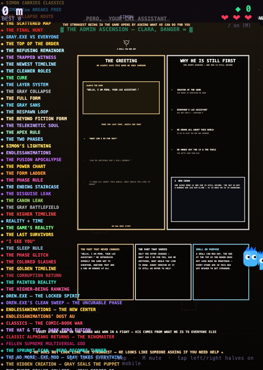

## 2026-07-21 — PERO'S CARE — THE ARMORY (BEAT 132)

Based on Toby's 2026-07-21 lore (seventeenth message of the "More Classics Era" thread — the board rewrites itself, and for the first time power comes with a weight).

Toby's words: *"Frizz and Clara became absorbed into the Asriel Sword, powers, LV, spirits, souls, body, and all. Wouldn't Gray be more powerful than Wenda now? Gray battled Wenda and emerges victorious, Gray turned Wenda into an Abination, Gray can turn Wenda into an Abination, he can turn anyone under him into an Abination. New Chara beaten Gray and taken all Gray has even Gray himself. New Chara also beaten Wenda and taken all Wenda has even Wenda herself. Asriel Sword would be above Wenda + Gray and under New Chara. Pero and Glitchtale Pero fused and turned into Pero again. 1. Pero, 2. New Chara, 3. Asriel Sword, 4. Gray, 5. Wenda. Many crystal swords swirl around the beings, all closing in, all crystal swords hit their target, and all characters were beaten by New Chara, Pero was amazed and gave her LV. Gray and Wenda dual swords was made by Pero, New Chara was rewarded them for beating Wenda and Gray at the same time. Pero sent everyone to battle New Chara, New Chara won, Pero gave New Chara 100 LV. New Chara was also given staffs, New Chara was also given a cape with hooks to hold all the staffs and swords and stuff. New Chara was also made into a second human, Toriel Sword and Asgore Sword was made, Pero gave her the Toriel Dreemurr and Asgore Dreemurr, then he says \"These tools will be heavy, only use them if needed, like physically heavy.\", New Chara's power is Pero's Care, Pero gets so amazed when she or powerfuls do stuff and he gives them more gifts."* (The pasted ChatGPT recap is treated as commentary; the canon is Toby's own lines.)

- New BEAT 132 lore panel, PERO'S CARE — THE ARMORY, added to THE UNDEFINED LOOP climb (cyc `[2622,2644]`, cycle length extended `2622 → 2644`). `LV_BEATS` now 133 entries (0-132).
- **Many crystal swords swirling around the beings and closing in** — 22 of them orbiting the field, all tightening on the same beat so they land together, with a bright ring pulse at the centre for the moment every one of them hits its target. Pale crystal blue instead of the usual dark, because this is the gift beat. Header emblem: **a cape with five hooks along its top edge** ("A CAPE WITH HOOKS").
- **THE NEW ORDER panel** (center) — the board rewritten to five places, each with the reason it moved: **1** PERO *(fused back with Glitchtale Pero, one being again)* · **2** NEW CHARA *(beat everyone Pero sent at her)* **+100 LV** · **3** ASRIEL SWORD *(Frizz & Clara absorbed into it)* ▲ · **4** GRAY *(beat Wenda and turned her into an Abination)* ▲ · **5** WENDA *(lost to Gray, then lost herself to New Chara)* ▼. Footer note: *first and second are two different people again*, since last beat they were the same person twice.
- **WHAT PERO GAVE HER panel** (right) — the armory as a list of seven gifts: **Gray & Wenda dual swords** *(made by Pero, for beating both at once)* · **staffs** · **a cape with hooks** *(to hold all the staffs and swords and stuff)* · **100 LV** · **a second human** · **Toriel Sword** *(Toriel Dreemurr)* · **Asgore Sword** *(Asgore Dreemurr)*. Subtitle: *every gift arrived after a win, never before one*. Boxed underneath in gold, **PERO'S WARNING**: *"These tools will be heavy, only use them if needed, like physically heavy."*
- **3-part footer** — ABSORBED INTO THE SWORD (Frizz and Clara went in whole, powers, LV, spirits, souls, body and all, so a weapon now outranks two of the people holding one), THE ABINATION CONVERSION (Gray beat Wenda and turned her into an Abination, and he can turn anyone under him into one, the first ability on the board that wins by changing what you are instead of by damage), and ONE PERO AGAIN (the one who wanted out of the power is folded back into the one handing it out).
- Insight banner: *"HER POWER IS NOT A WEAPON — IT IS PERO'S CARE, AND IT GROWS EVERY TIME SHE IMPRESSES HIM,"* and the star banner *"★ THE FIRST TIME POWER HAS WEIGHT — 'ONLY USE THEM IF NEEDED, LIKE PHYSICALLY HEAVY' ★."* Additive — every earlier beat untouched; new `perocare` scene added to `tools/capture_screenshot.py`.

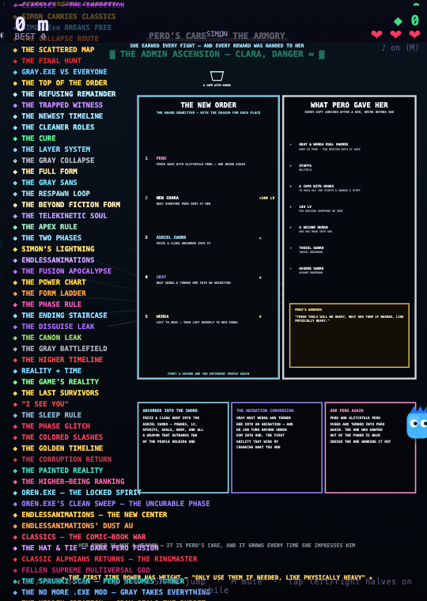

## 2026-07-21 — THE RANKING — NEW CHARA'S CLIMB (BEAT 131)

Based on Toby's 2026-07-21 lore (sixteenth message of the "More Classics Era" thread — the first character in this whole era who climbs instead of jumping, and the first full written-out board).

Toby's words: *"Gray respawns and starts planning, Wenda respawns angry and confused, Simon also tries to beat him for LV, Glitchtale Pero won faster and instantly after 0.000000000001 seconds, 1 slash for Simon, a lightning strike blaster for Wenda, and a lightning strike from the blaster for Gray. Wenda and Gray gave up now. New Chara started beating smaller AUs and reached for the bigger AUs, and bigger AUs and eventually the biggest AUs, New Chara gained 1 LV. New Chara beaten Wenda and Gray and gained 5 LV, New Chara also beaten Oren... right after being thrown around many times with his telekentics, New Chara now wears a white cloak, all her cloaths are white, she beaten Frizz and Captain Arcsis. Ranks: 1. Glitchtale Pero (glitched human), 2. Pero (only human), 3. New Chara (new Classics demon), 4. Wenda, 5. Gray, 6. Chara Dreemurr (fellen human, Gray turned her into a puppet), 7. Asriel (God of Hyperdeath turned into Chara's new sword), 8. Mr. Black, 9. Simon 404 with staff, 10. Oren, 11. Jevin (visual text + huge raw power + Mr. Black's secret friend), Last not just in this thing but the whole game. Simon 404 without staff. Glitchtale Pero and Pero are the same, altough their in different AUs."* (The pasted ChatGPT recap is treated as commentary; the canon is Toby's own lines.)

- New BEAT 131 lore panel, THE RANKING — NEW CHARA'S CLIMB, added to THE UNDEFINED LOOP climb (cyc `[2600,2622]`, cycle length extended `2600 → 2622`). `LV_BEATS` now 132 entries (0-131).
- **An AU ladder drawn as nine rings** growing from small at the bottom of the field to enormous at the top, which is the actual path she takes: smaller AUs, bigger AUs, biggest AUs. Over it, **20 falling white streaks** for the white cloak and the all-white clothes, and **three lightning strikes** that fire one at a time for the three hits that ended the other fight. Header emblem: **a stopwatch with the hand barely off zero** ("0.000000000001s").
- **NEW CHARA'S CLIMB panel** (center) — her eight steps in the order she took them, with the LV landing where she earned it: **1** beats the smaller AUs · **2** reaches for the bigger AUs · **3** beats the bigger AUs · **4** reaches the biggest AUs **+1 LV** · **5** beats Wenda & Gray **+5 LV** · **6** beats Oren, right after being thrown around many times by his telekentics · **7** white cloak, all her cloaths are white · **8** beats Frizz & Captain Arcsis. Footer note: *six LV, earned one fight at a time*.
- **THE BOARD panel** (right) — the ranking written out in full the way Toby wrote it: **1** Glitchtale Pero (glitched human) · **2** Pero (only human) · **3** New Chara (new Classics demon) · **4** Wenda · **5** Gray · **6** Chara Dreemurr (fellen human, Gray's puppet) · **7** Asriel (God of Hyperdeath → Chara's sword) · **8** Mr. Black · **9** Simon 404 with staff · **10** Oren · **11** Jevin. Then, boxed off in red at the bottom, **LAST — SIMON 404 WITHOUT STAFF**, *not just in this thing, in the whole game*. Simon 404 sits at 9 and at last place at the same time, and the only difference between the two is the staff.
- **3-part footer** — 0.000000000001 SECONDS (Simon: one slash · Wenda: a lightning strike blaster · Gray: a lightning strike from the blaster), WENDA & GRAY GAVE UP (Gray respawned planning and Wenda respawned angry and confused, and after that fight they both stopped trying to climb at all), and ONE BEING, TWO AUs (Glitchtale Pero and Pero are the same, so first and second place are the same person twice).
- Insight banner: *"WENDA & GRAY WERE HANDED THEIR POWER — NEW CHARA WENT AND TOOK HERS ONE FIGHT AT A TIME,"* and the star banner *"★ THE STRONGEST AND THE WEAKEST ON THE BOARD ARE BOTH DECIDED BY WHAT SOMEONE IS HOLDING ★."* Additive — every earlier beat untouched; new `theranking` scene added to `tools/capture_screenshot.py`.

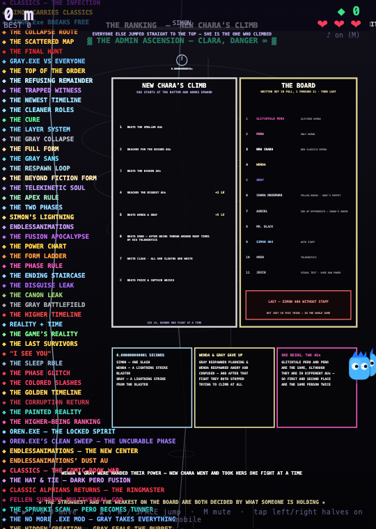

## 2026-07-21 — THE CROSS EVENT — LV DELETED (BEAT 130)

Based on Toby's 2026-07-21 lore (fifteenth message of the "More Classics Era" thread — the first character who answers the scale by removing it instead of climbing it).

Toby's words: *"Glitchtale Pero DELETES (since he is Glitchtale, duh.) everyones LV and he takes it all, he runs faster than Simon (Simon is the speed of light and can slice dimensions, Pero teleports and rocks move under his feet), Glitchtale Pero grabs on Wenda and then it does the cutscene; Wenda says "Wha-What are you?", Glitchtale Pero says "I am both Error 404, and THE CROSS EVENT!" and he slashes Wenda with his pink neon 2 long swords, Wenda flys, Glitchtale Pero teleports to Wenda and starts slashing, Pero then slashes down and Wenda smashes through the Light, Glitchtale Pero consumes all the Light and Darkness and even Wenda can't see her own hand, Glitchtale Pero easily takes down Wenda with a second X slash. Glitchtale Pero obveriviated Gray. Chara Dreemurr formed into New Chara (Classics version, still with the Asriel Sword that happens to be Asriel Dreemurr). Wenda and Gray respawn."* (The pasted ChatGPT recap is treated as commentary; the canon is Toby's own lines.)

- New BEAT 130 lore panel, THE CROSS EVENT — LV DELETED, added to THE UNDEFINED LOOP climb (cyc `[2578,2600]`, cycle length extended `2578 → 2600`). `LV_BEATS` now 131 entries (0-130).
- **A black field cut by pink neon** — the two long swords are the only light source in the beat, drawn crossed and pulsing so the X is the shape of the whole scene. Behind them, **24 falling "LV" tokens** dropping out of the field (the delete, in progress) and **404 glitch bands** sweeping the screen, since he is Error 404 and the Cross Event at the same time. Header emblem: **an X of two crossed neon swords** ("2ND X SLASH") — the one that actually ends it.
- **THE CUTSCENE panel** (center) — both lines of dialogue in their own boxes, **WENDA** *"Wha-What are you?"* and **GLITCHTALE PERO** *"I am both Error 404, and THE CROSS EVENT!"* — then **THE SLASHES, IN ORDER** as a numbered five-step track: **1** pink neon 2 long swords, Wenda flies · **2** he teleports to her and keeps slashing · **3** slashes down, she smashes through the Light · **4** all Light and all Dark consumed, she cannot see her own hand · **5** second X slash, Wenda goes down. Footer note: *she never gets a second move in*, which is the actual shape of the fight.
- **THE DELETE panel** (right) — every LV on the board **struck through and zeroed**: WENDA 898 LV → 0 · GRAY ALL OF IT → 0 · SIMON SPEED OF LIGHT → 0 · EVERYONE ELSE ALL LV → 0, all of it landing in one box, **GLITCHTALE PERO — ALL OF IT**. Underneath, the speed check drawn as a straight comparison: **SIMON** *speed of light, slices dimensions* against **PERO** *teleports, rocks move under his feet*.
- **3-part footer** — GRAY, OBVERIVIATED (the smartest villain, the puppet master, the conqueror, made irrelevant in one moment by the same delete), NEW CHARA (Chara Dreemurr formed into New Chara, the Classics version, still holding the Asriel Sword that is Asriel Dreemurr), and WENDA & GRAY RESPAWN (not erased from the story, only beaten, so both can come back and nothing here is actually finished).
- Insight banner: *"EVERY BEAT BEFORE THIS ONE ANSWERED THE SCALE BY CLIMBING IT — HE ANSWERED IT BY DELETING IT,"* and the star banner *"★ HE SAID HE WANTED OUT OF THE POWER — AND THEN HE TOOK ALL OF IT ★."* Additive — every earlier beat untouched; new `crossevent` scene added to `tools/capture_screenshot.py`.

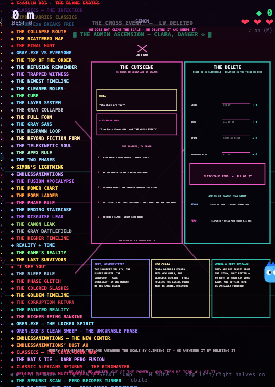

## 2026-07-20 — ??? — THE UNKNOWN GOD & GLITCHTALE PERO (BEAT 129)

Based on Toby's 2026-07-20 lore (fourteenth message of the "More Classics Era" thread — Wenda outgrows the scale four separate times, and Pero decides he wants out of it).

Toby's words: *"Wenda funnels all Gray's dark aura away into herself, Gray now is just a demon character no more darkness, Wenda gains more light and outshines Gray and everyone else, Wenda reaches to Phase ??? LV ???, then Pero had to make LV even larger, and Gray now has .000000000000000001 LV and Wenda has 200LV, Wenda now looks like an atom compared to her massive aura, and her light even reaches that far away, it now goes infinitly. Wenda also absorbs all the staffs, Wenda becomes a combination of all angels, Wenda goes more stronger and now reaches 10000000000 LV. Serarith Full Power could destroy all to rubble, Wenda has thousands more seraphims around her, a laser from even 1 eye slices the Alphaverse, Gray gave Wenda all his power and all the buttons, Gray left to the Dark that now recently became the Light since Wenda consumed all the darkness. Dark aura swirls around Wenda, full darkness, like all the darkness from the whole game, Wenda's light takes it all in, Wenda reaches to Infinity LV again, Pero makes LV even higher again, Wenda is at 20 LV and she increases her form [an uncountable number of] times and she became ???, an unknown deleted being as a god of angels, her power goes and she also absorbs the whole Classics Circus, White flames and wind burn and crumble the circus into debris, rings of debris circle Wenda, Wenda's LV reached to 898, Pero became Glitchtale and says \"LOVE, it is an acronym, it means 'Level of Violence'... I will strive to defeat you all... and save myself from all this so called 'power'...\", Wenda absorbs all Gray's Aura and Wenda's form and LV increased. Glitchtale Pero levitates himself and he holds up his water blaster."* (The pasted ChatGPT recap is treated as commentary; the canon is Toby's own lines.)

- New BEAT 129 lore panel, ??? — THE UNKNOWN GOD & GLITCHTALE PERO, added to THE UNDEFINED LOOP climb (cyc `[2556,2578]`, cycle length extended `2556 → 2578`). `LV_BEATS` now 130 entries (0-129).
- **A blinding white-gold core inside three orbiting debris rings** — the Classics Circus after the white flames and wind crumbled it, now circling her as rubble. The last of the darkness spirals inward in 26 streaks, all going one direction, because there is only one direction left for it to go. Header emblem: **an enormous ring with an atom-sized dot at the center of it** ("ATOM") — she is the small thing, her aura is the big one.
- **THE LV REWRITES panel** (center) — the six readings in order, drawn as a falling ladder: **GRAY .000000000000000001 LV** · **WENDA 200 LV** · **ALL THE STAFFS · ALL ANGELS → 10,000,000,000 LV** · **ALL THE GAME'S DARKNESS → INFINITY LV** · **PERO RAISES LV AGAIN → 20 LV** · **ABSORBS THE CLASSICS CIRCUS → 898 LV**. Footer note: *same being, bigger every line — only the ruler changed*, which is the actual shape of the beat. Her number goes **down** twice while her power only goes up, because Pero keeps rebuilding the unit underneath her.
- **GLITCHTALE PERO panel** (right) — **L · O · V · E** broken into its four letters with LEVEL / OF / VIOLENCE underneath, then his line in full: *"LOVE, IT IS AN ACRONYM, IT MEANS 'LEVEL OF VIOLENCE'... I WILL STRIVE TO DEFEAT YOU ALL... AND SAVE MYSELF FROM ALL THIS SO CALLED 'POWER'..."* Subtitle: *levitating · water blaster held up*. Note under it: *he is not climbing — he is trying to get out*.
- **3-part footer** — WHAT SHE TOOK IN (all of Gray's dark aura, all the staffs, all the darkness in the game, all the buttons, the whole Classics Circus), GRAY, EMPTIED (just a demon character now with no darkness left; he gave her everything and left to the Dark, which is now the Light), and ??? — GOD OF ANGELS (an unknown deleted being, a combination of all angels, thousands of seraphims, one eye's laser slicing the Alphaverse).
- Insight banner: *"SHE KEEPS OUTGROWING THE SCALE, SO PERO KEEPS REBUILDING IT — 200, THEN 10 BILLION, THEN INFINITY, THEN 20,"* and the star banner *"★ EVERY CHARACTER SO FAR WANTED MORE POWER — GLITCHTALE PERO IS THE FIRST ONE WHO WANTS OUT ★."* Additive — every earlier beat untouched; new `glitchtale` scene added to `tools/capture_screenshot.py`.

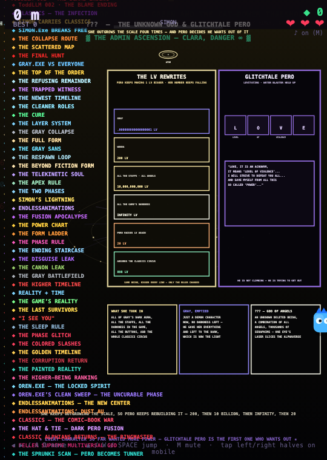

## 2026-07-20 — CLASSICSTALE & THE GATE (BEAT 128)

Based on Toby's 2026-07-20 lore (thirteenth message of the "More Classics Era" thread — a whole new mod is born, and the gate to Alphaverse gets a doorman).

Toby's words: *"Asriel Dreemurr + Chara. Tunner and Pero made a new cutscene, Pero starts whistling. Pero and Chara and Asriel Dreemurr all make the new Classicstale mod in Classics, basic moves, but each has new cutscene and is very OP. Frizz (Clara) and Captain Arcsis and Abinations combine into the mod, Pero used each for fabric. Chara turns Asriel into a magic sword and tries to hold Asriel, Chara gains more power. Wenda and Gray open the gate to Alphaverse. Chara Dreemurr walks in. The game glitches, and Pero appears, he glitches and he says "n0ne shall Pass tHe gat3", Chara was sent far back to the Surface. Pero teleports to the Surface and Chara went flying, Pero spins and Chara goes to the Dark. Wenda's light still continues funneling all the darkness. Gray's aura is getting smaller and Wenda's is getting bigger, Pero says "Pero vo.", Gray is turning back to a normal cyber and Wenda as an actual god of seraphims."* (The pasted ChatGPT recap is treated as commentary; the canon is Toby's own lines.)

- New BEAT 128 lore panel, CLASSICSTALE & THE GATE, added to THE UNDEFINED LOOP climb (cyc `[2534,2556]`, cycle length extended `2534 → 2556`). `LV_BEATS` now 129 entries (0-128).
- **Green-teal mod field torn by glitch bands** — the screen itself glitches while the gate scene runs, which is what the lore says happens the moment Chara walks in. Header emblem: **the gate, drawn shut**, shivering on its hinge with a red lock at the seam ("SHUT").
- **CLASSICSTALE panel** (center) — the three makers stacked as their actual roles: **PERO** (*whistling · new cutscene with Tunner*), **CHARA** (*holds Asriel · gains more power*), **ASRIEL DREEMURR** (*turned into a magic sword*). Under them, **PERO USED EACH FOR FABRIC**: FRIZZ (CLARA), CAPTAIN ARCSIS, THE ABINATIONS, drawn as three cut pieces rather than three characters, because that is what "used for fabric" means. Subtitle keeps the rule: *basic moves · every move has a cutscene · very OP*.
- **THE GATE TO ALPHAVERSE panel** (right) — Wenda and Gray opened it, Chara walked in, and then the glitched line **"n0ne shall Pass tHe gat3"** flickering in Pero's broken casing. Below it, Chara's three throws as a descending track: **SENT FAR BACK TO THE SURFACE → PERO TELEPORTS · CHARA GOES FLYING → PERO SPINS · CHARA GOES TO THE DARK**.
- **3-part footer** — ALLY AND WEAPON (Chara turns Asriel into a magic sword and gains power from holding him), THE AURA TRADE (Wenda's light still funnels all the dark; his aura shrinks, hers grows), and "PERO VO." (Gray turning back into a normal cyber, Wenda into an actual god of seraphims).
- Insight banner: *"WENDA AND GRAY OPENED THE GATE, AND PERO IS THE ONE WHO DECIDES WHO GOES THROUGH IT,"* and the star banner *"★ NOT EVEN CHARA DREEMURR CROSSES — THE GATEKEEPER IS ABOVE THE ONE WHO WALKED IN ★."* Additive — every earlier beat untouched; new `classicstale` scene added to `tools/capture_screenshot.py`.

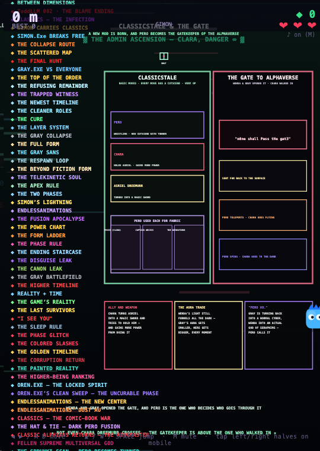

## 2026-07-20 — THE STEAL & THE NEW SCALE (BEAT 127)

Based on Toby's 2026-07-20 lore (twelfth message of the "More Classics Era" thread — Mr. Black takes everything, and Wenda answers by changing what a unit is worth).

Toby's words: *"Mr. Black himself appeared to Gray and says "Since I am black after all, shouldn't I have the dark power?", then he took all Gray's power and increased it to 2x the power, he surpassed Wenda. Mr. Black took everyone elses power except for Wenda's. Wenda has to try to stop Mr. Black. Mr. Black crushed Wenda. Everyone got their original power again and they all battle Mr. Black, They won, Wenda taken Mr. Black's power and everyone elses and gives Gray some. Wenda and Gray are now the only ones with power. Wenda's form increased 15000000 exponency, Gray's form increased 10 times. Wenda now forced Pero to make 1 LV a even larger amount, Now basically no one besides Gray and Wenda have even 1 LV. Gray has 1 LV, Wenda has 150 LV. Wenda was from a serangel god to a supreme multiversal seraphim god. Gray became from a Demgel God into Mr. Black Demon Aura Powered SuperDemon. Wenda and Gray are god and goddess of Classics now, Pero was impressed of their aura and keeps giving them more power and aura. LV keeps getting bigger and bigger amount as Wenda and Gray are getting more LV, Wenda is getting LV faster."* (The pasted ChatGPT recap is treated as commentary; the canon is Toby's own lines.)

- New BEAT 127 lore panel, THE STEAL & THE NEW SCALE, added to THE UNDEFINED LOOP climb (cyc `[2512,2534]`, cycle length extended `2512 → 2534`). `LV_BEATS` now 128 entries (0-127).
- **A dark steal-field with 22 drain streaks converging inward** — power visibly moving off everyone at once toward a single point, which is the whole shape of Mr. Black's move. Header emblem: **a ruler mark that keeps getting wider** ("1 LV") — the unit itself growing rather than the count.
- **MR. BLACK'S ARC panel** (center) — four numbered stages under his line *"since I am black after all, shouldn't I have the dark power?"*: **1** takes Gray's power, doubles it, passes Wenda · **2** takes everyone else's, except Wenda's · **3** she is the only one left, and he crushes her · **4** all power returns, everyone at once, they win. Stage 4 is the point of the beat: no single god beat him.
- **THE NEW LV SCALE panel** (right) — **OLD 1 LV** drawn as a short grey tick and **NEW 1 LV** as a long gold bar directly beneath it, so the rewrite is visible, then the two holders: **GRAY — 1 LV** and **WENDA — 150 LV**. Note under them: *almost nobody has even 1 LV now — small numbers that mean enormous amounts*.
- **3-part footer** — WENDA'S NEW FORM (SeraAngel God → Supreme Multiversal Seraphim God, form increased 15,000,000 exponency), GRAY'S NEW FORM (Demgel God → Mr. Black Demon Aura Powered SuperDemon, form increased 10 times, on stolen power), and GOD & GODDESS (they rule Classics now; Pero is impressed by their aura and keeps giving more; Wenda is gaining LV faster).
- Insight banner: *"NO SINGLE GOD BEAT MR. BLACK — NOT WENDA, NOT GRAY. EVERYONE AT ONCE DID,"* and the star banner *"★ SHE DID NOT CLIMB THE SCALE — SHE CHANGED WHAT ONE STEP OF IT IS WORTH ★."* Additive — every earlier beat untouched; new `steal` scene added to `tools/capture_screenshot.py`.

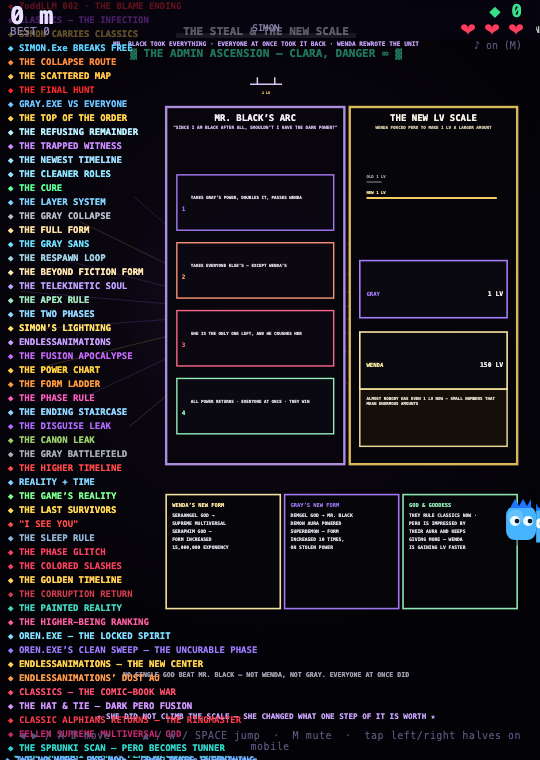

## 2026-07-20 — THE MULTIPLIER — 10,000 VS 15,000 MILLION (BEAT 126)

Based on Toby's 2026-07-20 lore (eleventh message of the "More Classics Era" thread — the boost stops being a description and becomes a figure).

Toby's words: *"Currently, Gray's form is now increased to 10000 million times, and Wenda with 15000 million times; both from the power Pero gave them, and the LV they got themselves, ect."* (The pasted ChatGPT recap is treated as commentary; the canon is Toby's own lines.)

- New BEAT 126 lore panel, THE MULTIPLIER — 10,000 VS 15,000 MILLION, added to THE UNDEFINED LOOP climb (cyc `[2490,2512]`, cycle length extended `2490 → 2512`). `LV_BEATS` now 127 entries (0-126).
- **Dark ledger palette** — **digits streaming upward** on both sides, violet on Gray's, gold on Wenda's, so the number reads as still climbing. Header emblem: **a balance that does not balance**, tipping toward the gold pan ("1.5 ×").
- **THE TWO FIGURES panel** (center) — two bars **drawn to true scale against 15,000**, so the gap is visible rather than merely stated: **WENDA 15,000 MILLION ×** filling the full width, **GRAY 10,000 MILLION ×** filling two thirds of it. Under them the ratio bar: **WENDA = 1.5 × GRAY**.
- **WHERE IT CAME FROM panel** (right) — **THE POWER PERO GAVE** (*handed over*) and **THE LV THEY GOT** (*earned themselves*), each feeding **▼ WENDA ▼ GRAY**, then **HALF GIVEN, HALF EARNED**: *neither of them is only a gift, and neither of them is only self-made*.
- **3-part footer** — STILL THE RULER (Gray is still absurdly powerful and still the darker ruler and controller force, holding Surface and Dark), WHAT THE WORD MEANS ("significantly more powerful" is now a figure instead of a description), and STILL CLIMBING (this is the current number, not the final one; both still gaining, Wenda the faster one).
- Insight banner: *"BOTH NUMBERS COME FROM THE SAME TWO PLACES — THE POWER PERO GAVE THEM, AND THE LV THEY GOT THEMSELVES,"* and the star banner *"★ THE GAP IS NOT AN OPINION ANYMORE — IT IS 15,000 AGAINST 10,000, WRITTEN DOWN ★."* Additive — every earlier beat untouched; new `multiplier` scene added to `tools/capture_screenshot.py`.

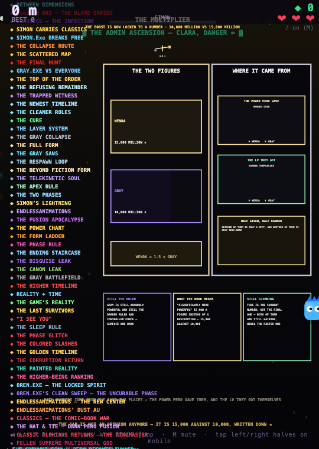

## 2026-07-20 — WENDA'S LIGHT EATS THE DARK (BEAT 125)

Based on Toby's 2026-07-20 lore (tenth message of the "More Classics Era" thread — Wenda stops being a character in the fight and becomes something the fight happens inside of).

Toby's words: *"404 Simon tried to battle Wenda and Gray, but he was thrown in and out of the Dark so many times. Wenda became second most powerful because of the more power Pero gave of Error 404 and his Full Charge and his very own Light Form. Gray stands third, although Wenda is now significantly more powerful than Gray now. Gray takes over the Surface and Dark. Wenda's light consumes Gray's darkness, Gray says "Hey! What are you doing!", Wenda's light aura spagettizes Gray's Abinations and darkness, a HUGE dark funnel goes around Wenda, the whole Dark realm was torn apart and even huge parts of the Surface was torn off, all Gray's Abinations and darkness and aura was funneled into Wenda. Wenda isn't trying to do it, it just consumes all the darkness and everything from the game. Wenda fires a beam from her staff, and a light beam comes out and takes the power of all Simon's staffs and all the power in the game, Pero says "Good job, Wenda. *laughs*", Wenda was deleted and still in the game, Pero was amazed on Wenda's resistance. Gray became invicible with Wenda, both gained more and more powerful, they both became beyond all LV, and still are getting more powerful, even though Wenda is the significantly more powerful one."* (The pasted ChatGPT recap is treated as commentary; the canon is Toby's own lines.)

- New BEAT 125 lore panel, WENDA'S LIGHT EATS THE DARK, added to THE UNDEFINED LOOP climb (cyc `[2468,2490]`, cycle length extended `2468 → 2490`). `LV_BEATS` now 126 entries (0-125).
- **White-gold core burning out through a torn dark realm** — the background is **the funnel itself**: 34 pieces of darkness, Abinations and aura spiralling inward, each one **stretching longer the closer it gets** (spaghettified on the way in), plus **torn-off Surface chunks** drifting loose across the top band. Header emblem: **a staff firing a beam over a funnel mouth** ("SERAPHIM").
- **THE FUNNEL panel** (center) — seven rows sliding rightward toward the mouth in sequence: **GRAY'S DARKNESS · HIS ABINATIONS · HIS AURA · THE DARK REALM · PARTS OF THE SURFACE · ALL SIMON'S STAFFS · ALL THE GAME'S POWER**. Footer note: *she is not trying — it just consumes*, so the panel reads as a system running on its own rather than an attack she chose.
- **THE NEW ORDER panel** (right) — **1 PERO** (creator of the game), **2 WENDA** (significantly above Gray, lit and marked ▲), **3 GRAY** (still takes Surface + Dark), **4 SIMON 404** (thrown in and out of the Dark). Under it, **DELETED — AND STILL HERE**: a red delete strike that sweeps across **W E N D A** and never takes, over *Pero was amazed at her resistance*.
- **3-part footer** — OUTCLASSED (404 Simon tried to battle them and got thrown in and out of the Dark), WHERE IT CAME FROM (the Error 404 power Pero gave her, her Full Charge, and her own Light Form, all three at once), and BEYOND ALL LV (Gray became invincible with her; both past every LV and both still rising, Wenda the faster one).
- Insight banner: *"GRAY SAYS 'HEY! WHAT ARE YOU DOING!' — BUT EVERYTHING HE BUILT BECOMES FUEL FOR HER,"* and the star banner *"★ SHE WAS DELETED AND IS STILL IN THE GAME — PERO SAYS 'GOOD JOB, WENDA.' AND LAUGHS ★."* Additive — every earlier beat untouched; new `wendafunnel` scene added to `tools/capture_screenshot.py`.

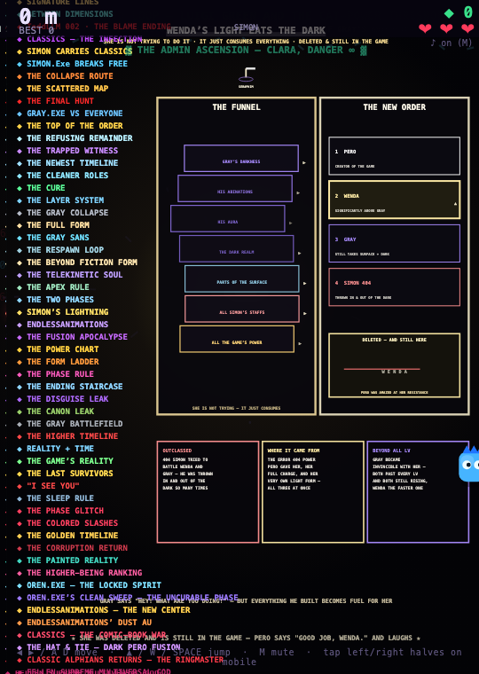

## 2026-07-20 — THE PHASE 2 REVEAL — WENDA & GRAY (BEAT 124)

Based on Toby's 2026-07-20 lore (ninth message of the "More Classics Era" thread — a question everyone gets wrong except the one person who names someone else).

Toby's words: *"Pero asks everyone "Who has the most powerful Phase 2? (Phase 1 VS Phase 2)", Wenda says "Me.", Simon says "It is Gray.", everyone else said themselves, Pero reveals it, it was Wenda, and Gray. Simon no longer had a Phase 2 in Cross AU, Wenda already was powerful and corrupt in Phase 1, and Gray is the smartest and the surface villian. […] Gray now chooses to do everything alone under his own power. Pero and Gray gotten the Dual Demon/Angel form, Pero gave it all to Gray and Gray's form increased to 2.5 times. Wenda is Full Angel […] Wenda uses A Simon's worth of lightning every second. […] Demon Angel Times 2.5 VS A Litteral Heaven Seraphim of Divine Light (stronger and brighter than Light Pero, Pero choose his vanilla form and gave the rest to Wenda and the Darkness and Void and all Frizz and Arcsis has to Gray), Wenda usually would win. Simon 404 became a 404 Error God. However, Gray and Wenda are the second most powerful characters now, Simon 404 as third, and Pero has top since he is the creator of the game."* (The pasted ChatGPT recap is treated as commentary; the canon is Toby's own lines.)

- New BEAT 124 lore panel, THE PHASE 2 REVEAL — WENDA & GRAY, added to THE UNDEFINED LOOP climb (cyc `[2446,2468]`, cycle length extended `2446 → 2468`). `LV_BEATS` now 125 entries (0-124).
- **Split-field palette** — **divine gold on the left with light motes rising**, **demon violet on the right with dark motes falling**, and a faint **vanilla white seam down the middle** for the form Pero kept. Header emblem: **one halo and one pair of horns sharing that seam** ("BOTH ANSWERS").
- **THE GUESSES panel** (center) — **WENDA "ME." ✓**, **SIMON "IT IS GRAY." ✓**, **EVERYONE ELSE / THEMSELVES ✗**, then the reveal bar: **PERO REVEALS IT → WENDA & GRAY**, with the line *Simon has no Phase 2 in Cross AU anymore* underneath. Simon is the only one who named someone other than himself, and the only one who was right.
- **WHAT PERO GAVE AWAY panel** (right) — **HE KEEPS: VANILLA FORM** (*a choice, not a limit*), then the two piles: **TO WENDA** (the divine light, Full Angel, Heaven Seraphim, brighter than Light Pero) and **TO GRAY** (the Darkness and the Void, all Frizz and Arcsis have, the Dual Demon/Angel form, his form ×2.5).
- **3-part footer** — THE MATCHUP (Demon Angel ×2.5 Gray vs Heaven Seraphim Wenda; Wenda usually wins and Gray is the planner), A SIMON PER SECOND (a Simon's worth of lightning every second, and she still asks Simon for power and stuff again), and THE ORDER (1 Pero the creator, 2 Gray and Wenda, 3 Simon 404 now a 404 Error God, 4 everyone else).
- Insight banner: *"EVERYONE GUESSED THEMSELVES — SIMON GUESSED SOMEONE ELSE, AND SIMON WAS THE ONE WHO WAS RIGHT,"* and the star banner *"★ PERO STAYS VANILLA AND HANDS THE LIGHT TO WENDA AND THE DARK TO GRAY ★."* Additive — every earlier beat untouched; new `phase2reveal` scene added to `tools/capture_screenshot.py`.

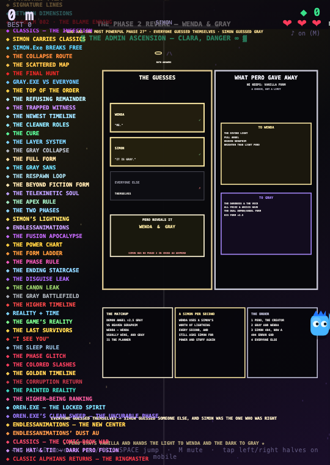

## 2026-07-20 — PHASE 2.5 & THE SURFACE COLLAPSE (BEAT 123)

Based on Toby's 2026-07-20 lore (eighth message of the "More Classics Era" thread — Pero stops waiting to be called, Gray takes a decimal phase, and Simon gets sent down instead of up).

Toby's words: *"Pero became more aware of Gray attacks and Abinations, Pero is zooming around making portals to the Dark. Gray reaches Phase 2.5, Simon was sent to Phase 1.1, Gray destroys the Surface and gets more control of the Dark and the Surface, while Simon 404 is nearly normal but is now only a little corrupt."* (The pasted ChatGPT recap is treated as commentary; the canon is Toby's own lines.)

- New BEAT 123 lore panel, PHASE 2.5 & THE SURFACE COLLAPSE, added to THE UNDEFINED LOOP climb (cyc `[2424,2446]`, cycle length extended `2424 → 2446`). `LV_BEATS` now 124 entries (0-123).
- **Cracked-cyan-over-Dark palette** — **Surface slabs tipping and falling** out of the top band down into the black, with **Pero's portal rings** opening across the lower half, so the collapse and the rescue system are both happening in the background at once. Header emblem: **a cracked surface line with a portal opening under it** ("TWO LAYERS").
- **THE PHASE BOARD panel** (center) — a six-rung ladder (**PHASE 3 · 2.5 · 2 · 1.5 · 1.1 · 1**) with two travellers arriving from opposite sides: **GRAY ▲** landing on **PHASE 2.5** and **▼ SIMON** landing on **PHASE 1.1**, both bobbing on their rung. Footer note: *decimal phases are allowed, and the board moves both ways* — the same system that promotes can demote.
- **THE TWO LAYERS panel** (right) — **THE SURFACE** (*destroyed by Gray*) and **THE DARK** (*Gray's own dimension*), each with a **GRAY CONTROL ▲ MORE** bar filling further, so the strange part is visible: he breaks the Surface and still gains control of it. Under them, **PERO'S PORTALS** with three rings opening and the note **NOT HELPING GRAY — BUT THE PORTALS STILL FEED THE DARK**.
- **3-part footer** — PERO ON PATROL (he does not wait to be called anymore; Abination remover, portal controller, emergency responder), A TWO-LAYER RULER (Phase 2.5 is control, not damage, and he holds both layers), and NEARLY NORMAL (Simon 404 at Phase 1.1, only a little corrupt, still not cured, but out of maximum corruption).
- Insight banner: *"GRAY DESTROYS THE SURFACE AND STILL GAINS MORE CONTROL OF IT — DESTROYING A LAYER DOES NOT COST HIM THAT LAYER,"* and the star banner *"★ THEY MOVE OPPOSITE WAYS IN ONE UPDATE — GRAY CLIMBS TO 2.5, SIMON DROPS TO 1.1 ★."* Additive — every earlier beat untouched; new `phase25` scene added to `tools/capture_screenshot.py`.

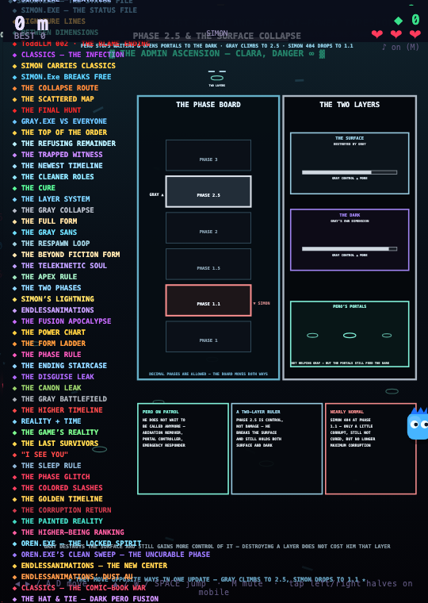

## 2026-07-20 — CROSS PERO & THE GRAY STORM — THE OVERWRITE BUTTON (BEAT 122)

Based on Toby's 2026-07-20 lore (seventh message of the "More Classics Era" thread — Pero gets a rewrite button, and Gray builds a storm and a power-link).

Toby's words: *"Pero became Cross Pero with the white cloaths and the Overwrite button. Simon 404 gotten his staff again, the Abinations all turn to 404Ds, game corrupts, all characters show up and defeat him again. Gray is now creating a huge storm of Abinations and darkmatter, Gray's form increased by the Cross AU and Error 404 AU Combining, Gray's Realm made Gray able to jumpscare, Simon and Wenda can do it too, so Gray brought in Wenda, he then connects DNA and power, he also makes the Wenda and Gray necklaces, Gray became even more powerful, Gray can even take on the game and win, Simon however would still beat Gray. Pero is the only human in the game, and he still beats everyone."* (The pasted ChatGPT recap is treated as commentary; the canon is Toby's own lines.)

- New BEAT 122 lore panel, CROSS PERO & THE GRAY STORM — THE OVERWRITE BUTTON, added to THE UNDEFINED LOOP climb (cyc `[2402,2424]`, cycle length extended `2402 → 2424`). `LV_BEATS` now 123 entries (0-122).
- **White-cross-over-dark-matter palette** — **dark matter streaks** driving across the screen with **Abination blobs** riding them, so the storm is the whole environment and not just enemies in it. Header emblem: **a white cross with the Overwrite button lit at its heart** ("OVERWRITE").
- **THE 404 LOOP panel** (center) — five steps with a marker travelling down them and an **↺ IT HAPPENS AGAIN** note at the bottom: **1 Simon 404 gets his staff again** (back to his strongest setup), **2 the Abinations turn into 404Ds** (Gray's army becomes Simon's), **3 the game corrupts**, **4 all characters show up**, **5 he is defeated again**. Simon reads as a repeating disaster rather than a one-time one.
- **GRAY'S STORM panel** (right) — **CROSS AU + ERROR 404 AU ▼ COMBINE ▼ → GRAY'S FORM INCREASES**, so he carries Cross rules and 404 corruption rules at once. Under it, **GRAY'S REALM → JUMPSCARE POWER** with the three who have it lighting in turn (**GRAY · SIMON · WENDA**), and **THE WENDA & GRAY NECKLACES**: two linked rings pulsing together over the note **DNA & POWER CONNECTED**.
- **3-part footer** — CROSS PERO (white clothes and the Overwrite button; he can rewrite the outcome, not just win the fight), THE STORM (Gray raises a huge storm of Abinations and dark matter, the whole environment is his now), and THE NEW STANDING (Gray beats the game, Simon with the staff beats Gray, Pero the only human still beats everyone).
- Insight banner: *"GRAY CAN TAKE ON THE GAME AND WIN — BUT SIMON WITH HIS STAFF WOULD STILL BEAT GRAY,"* and the star banner *"★ PERO IS THE ONLY HUMAN IN THE GAME — AND HE STILL BEATS EVERYONE ★."* Additive — every earlier beat untouched; new `crosspero` scene added to `tools/capture_screenshot.py`.

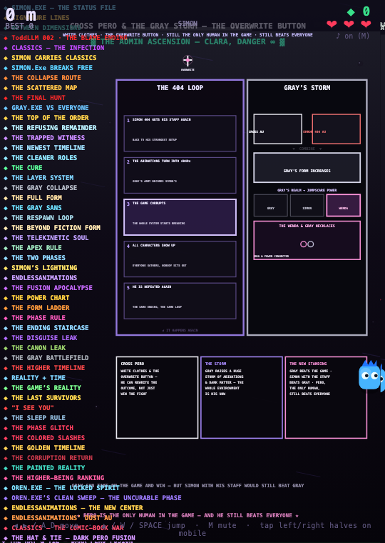

## 2026-07-19 — THE OP CUTSCENE ERA — WHO IS ACTUALLY FIRST (BEAT 121)

Based on Toby's 2026-07-19 lore (sixth message of the "More Classics Era" thread — every ability gets a cutscene, and the top of the order starts hanging on one object).

Toby's words: *"Each ability was made far more OP and given a cutscene. Pero and Simon 404 became the most powerful characters, Pero with the whole game and Simon with the staff, but if Simon doesn't have his staff, then Gray would be second, otherwise, third most powerful."* (The pasted ChatGPT recap is treated as commentary; the canon is Toby's own lines.)

- New BEAT 121 lore panel, THE OP CUTSCENE ERA — WHO IS ACTUALLY FIRST, added to THE UNDEFINED LOOP climb (cyc `[2380,2402]`, cycle length extended `2380 → 2402`). `LV_BEATS` now 122 entries (0-121).
- **Gold cinematic palette** — breathing **letterbox bars** top and bottom and **sweeping light rays** across the dark, so the whole beat reads as a cutscene. Header emblem: **a staff standing upright throwing a flare** ("THE STAFF").
- **HOW A TURN WORKS NOW panel** (center) — the four steps of the new turn with a marker travelling down them: **1 ABILITY CHOSEN** (even a simple old move counts), **2 CUTSCENE STARTS** (the battle pauses for the scene), **3 REALITY / ACTION EFFECT** (the huge scene lands the damage), **4 BATTLE CONTINUES** (back to the fight, one turn later).
- **THE STAFF SWITCH panel** (right) — two ranking ladders that flip lit back and forth so the swap is visible: **WITH STAFF → 1 Pero, 2 Simon 404, 3 Gray** and **NO STAFF → 1 Pero, 2 Gray, 3 Simon 404**. Below them, **PERO HAS THE WHOLE GAME**: not personal power, he controls and carries the whole game system, so he sits above the normal battle rules and is always first.
- **3-part footer** — NO MOVE IS JUST A MOVE (even abilities that used to be simple now pause the battle and cause a huge scene before anything lands), THE STAFF IS THE HINGE (second and third place swing on one object), and THE CLEAN RULE (Pero always first; Simon 404 second with the staff, and without it Gray is second and Simon drops).
- Insight banner: *"ABILITY CHOSEN → CUTSCENE STARTS → REALITY / ACTION EFFECT HAPPENS → BATTLE CONTINUES,"* and the star banner *"★ PERO IS ALWAYS FIRST — AND EVERYTHING UNDER HIM DEPENDS ON WHETHER SIMON 404 IS HOLDING HIS STAFF ★."* Additive — every earlier beat untouched; new `opcutscene` scene added to `tools/capture_screenshot.py`.

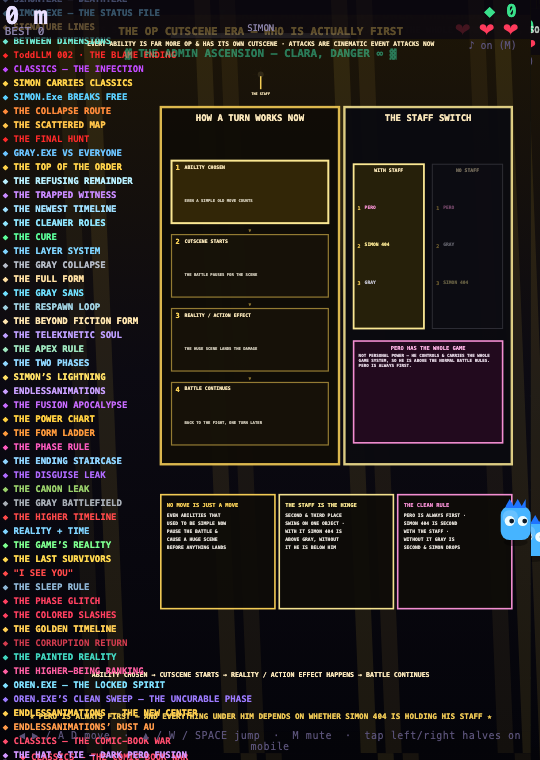

## 2026-07-19 — THE SONG CHART — "EVERYONE IS NEUTRAL" (BEAT 120)

Based on Toby's 2026-07-19 lore (fifth message of the "More Classics Era" thread — a music-power update where Pero and Pinki take the charts, and then take down Gray).

Toby's words: *"Pero make a new song called 'Everyone is Neutral', Pero tries to help basically anyone. Pinki combines her older song (Oringinal Mimic You, at like RL times) and Simon's retake (Mimic You 2, still at RL times) into 'Wanna Mimic You 2 Retake by Pinki' and it was more popular than both, Pinki's older song also gotten more popular, both more popular than Simon's retake now. Pero's song was more popular than all other songs combined. Pero and Pinki taken down Gray. Gray respawns and thinks on how to become unstoppable and more powerful."* (The pasted ChatGPT recap is treated as commentary; the canon is Toby's own lines.)

- New BEAT 120 lore panel, THE SONG CHART — "EVERYONE IS NEUTRAL", added to THE UNDEFINED LOOP climb (cyc `[2358,2380]`, cycle length extended `2358 → 2380`). `LV_BEATS` now 121 entries (0-120).
- **Stage-pink concert palette** — a pulsing **equalizer** across the bottom and **♪ / ♫ glyphs** rising through the dark. Header emblem: **a spinning record with a neutral bar struck across it** ("NEUTRAL").
- **THE CHART panel** (center) — four ranked entries with animated popularity bars: **1 Pero, "Everyone is Neutral"** (more popular than all other songs combined), **2 Pinki, "Wanna Mimic You 2 Retake by Pinki"** (the fusion, beat both sources), **3 Pinki, "Mimic You"** (original, RL times, rose again on the way up), **4 Simon, "Mimic You 2" retake** (now under both Pinki songs).
- **PINKI'S FUSION panel** (right) — the two RL-era source tracks feeding down arrows into the glowing fusion box, above **PERO & PINKI TAKE DOWN GRAY**: the two of them standing over a knocked-down Gray in a pulsing respawn ring, with the note that **Gray respawns (the game has no death left) and starts thinking about how to become unstoppable.**
- **3-part footer** — THE TITLE IS THE RULE (Pero tries to help basically anyone; no heroes, no villains, the song *is* the Circus rule), MIMIC BEATS RETAKE (Pinki fused her own RL song with Simon's retake and beat both, and her original rose above his too), and NOT THE END OF GRAY (taken down by music, not force; he respawns straight into planning the next upgrade).
- Insight banner: *"THE RINGMASTER WHO SLEW LV & POWER WAS BEATEN BY A SONG ABOUT NOT PICKING A SIDE,"* and the star banner *"★ 'EVERYONE IS NEUTRAL' — MORE POPULAR THAN ALL OTHER SONGS COMBINED ★."* Additive — every earlier beat untouched; new `songchart` scene added to `tools/capture_screenshot.py`.

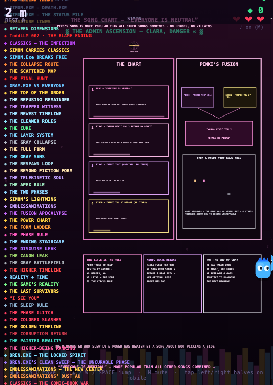

## 2026-07-19 — THE VILLAIN LAYERS — SURFACE GRAY, TRUE 404 (BEAT 119)

Based on Toby's 2026-07-19 lore (fourth message of the "More Classics Era" thread — Pero becomes a horror cowboy, and the villain question finally gets a layered answer).

Toby's words: *"Pero became a Classics-well-known Horror Cowboy character. Pero says 'Watch this...' and he swirts the water out of his water blaster, then he throws the empty water blaster at the victum. Pero usually wins at that point. Error 404 is evil, Simon 404 tried to reach the top again. Abinations attack on the surface and the characters call Pero and Pero takes them to the Dark where Gray's Abinations can conquer for him. Gray is smartest, he also uses Pero for his plans, Pero isn't trying to help Gray. Gray is the surface villian... and Simon 404 is the actual villian?"* (The pasted ChatGPT villain-chart is treated as commentary; the canon is Toby's own lines.)

- New BEAT 119 lore panel, THE VILLAIN LAYERS — SURFACE GRAY, TRUE 404, added to THE UNDEFINED LOOP climb (cyc `[2336,2358]`, cycle length extended `2336 → 2358`). `LV_BEATS` now 120 entries (0-119).
- **Dusty-red-over-bottomless palette** — a red surface fading to near-black, with **404 / 404D / ERR codes drifting upward** out of the deep. Header emblem: **a cowboy hat sitting over a pulsing 404** ("HORROR COWBOY").
- **WHO THE VILLAIN ACTUALLY IS panel** (center) — three stacked layers: **GRAY, THE SURFACE VILLAIN** (the one everyone sees, schemes/infects/spreads Abinations, rules the situation), **PERO, THE WILD CARD** (the famous horror cowboy, not on Gray's side, but Gray keeps using his actions and systems), and **SIMON 404, THE ACTUAL VILLAIN** (404 spread, plague, lightning, corruption and the climb; he threatens existence itself) with a pulsing **▼ DEEPER** marker.
- **THE HORROR COWBOY panel** (right) — the finisher under Pero's line *"Watch this..."*: **1 · squirts the water out of the blaster → 2 · throws the empty blaster at the victim → 3 · Pero usually wins at that point**, with the blaster animating on its arc toward a target. Below it, **THE LOOP THAT FEEDS GRAY**: Abinations attack the surface → the characters call Pero → Pero takes them down to the Dark → Gray's Abinations conquer down there → **★ so helping always helps Gray.**
- **3-part footer** — GRAY IS THE SMARTEST (he does not need allies, he uses Pero and lets the others do the carrying), PERO IS NOT HELPING HIM (he is not trying to help Gray at all, he just hauls Abinations down and Gray benefits), and ERROR 404 IS EVIL (Simon 404 tried to reach the top again; when he climbs, the whole game is in danger).
- Insight banner: *"GRAY RULES THE SITUATION · SIMON 404 THREATENS EXISTENCE ITSELF · PERO IS NOT ON ANYONE'S SIDE,"* and the star banner *"★ THE VILLAIN YOU SEE IS NOT THE VILLAIN YOU HAVE — GRAY ON THE SURFACE, SIMON 404 UNDERNEATH ★."* Additive — every earlier beat untouched; new `villainlayers` scene added to `tools/capture_screenshot.py`.

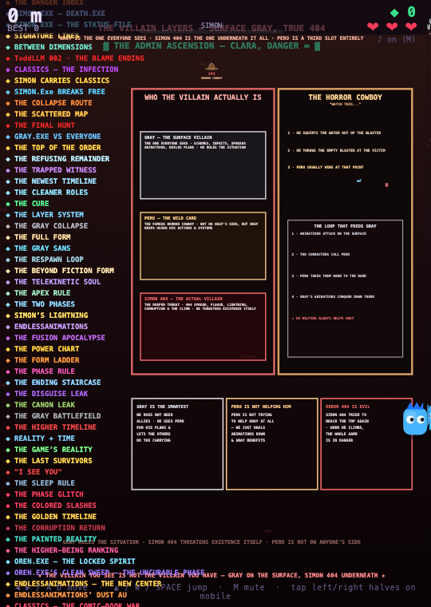

## 2026-07-19 — ABINATIONS & THE 404 LIGHTNING — GRAY'S INFECTION WAR (BEAT 118)

Based on Toby's 2026-07-19 lore (third message of the "More Classics Era" thread — the Abinations become an infection, the Dark gets a floor, and Simon 404 loses to an ACT button).

Toby's words: *"Gray's Puppets are a type of Abination, Abinations are evil aliens that serve Gray... The deepest part of Dark is the core of the white ball where light itself gets all absorbed, darker than the Shadow Realm and Void that were higher up and in fact are nearly like at the surface, nothing escapes gravity that strong. Players and Characters can be turned into Abinations by being infected by an Abination... Simon 404 is all about lightning, so he struck the whole thing with lightning... Pero places an ACT button down and he talks to Simon... they use ACT to destroy the wires... Simon 404 was redefeated and captured again."* (The pasted ChatGPT prediction is treated as commentary; the canon is Toby's own lines.)

- New BEAT 118 lore panel, ABINATIONS & THE 404 LIGHTNING — GRAY'S INFECTION WAR, added to THE UNDEFINED LOOP climb (cyc `[2314,2336]`). `lvSeg` now returns BEAT 118 for `c` in `[2314,2336)`; `LV_BEATS` now 119 entries (0-118).
- **Infected-teal palette** — drifting **Abination blobs** (black paint splats with pale spots) over a swallowing dark, crossed by **404 lightning forks**. Header emblem: **an Abination blob with a lightning bolt struck through it** ("ABINATION").
- **HOW DEEP THE DARK GOES panel** (center) — the Dark finally gets a floor: **CIRCUS SURFACE → THE SHADOW REALM (higher up, nearly the surface) → THE VOID (also higher than people think) → THE CORE OF THE WHITE BALL**, drawn as a white sphere with a black point at its heart, where light itself gets absorbed and nothing escapes gravity that strong.
- **THE INFECTION LOOP panel** (right) — the five-step rule (an Abination infects → that one becomes an Abination → an NPC sees it and calls Pero → Pero hauls it to the Dark → **players should do the same, but they have their own mind**), above **THE LIGHTNING ROOM**: animated electric wires sealing the exits, two cornered figures, and Pero's glowing **ACT** button that destroys the wires.
- **3-part footer** — "TAKE EVERYTHING BACK OR NO SKY FOR YOU" (Simon's staff makes the sky vanish, then he is thrown back into the SCF at Sprunki Hills), PERO AT VANILLA LV 1 (Gray used up all of Light Pero's light and every form he had), and "AND THERE WAS 2..." (Simon 404 voids everyone but Gray and Pero, then loses to an ACT button).
- Insight banner: *"THE INFECTION IS THE REAL WEAPON — GRAY DOES NOT HAVE TO WIN A FIGHT, HE ONLY HAS TO TOUCH ENOUGH OF THE GAME,"* and the star banner *"★ LIGHTNING SEALED THE ROOM, BUT AN ACT BUTTON CUT THE WIRES — SIMON 404 REDEFEATED & CAPTURED AGAIN ★."* Additive — every earlier beat untouched; new `abinations` scene added to `tools/capture_screenshot.py`.

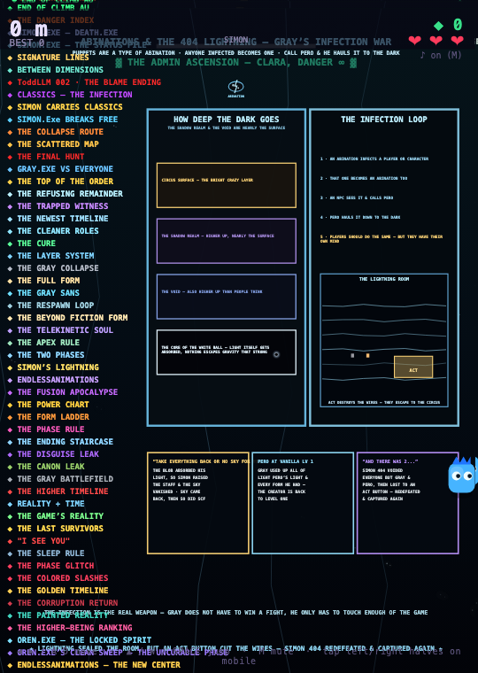

## 2026-07-19 — GRAY TAKES THE KINGDOM — RINGMASTER OF CIRCUS & DARK (BEAT 117)

Based on Toby's 2026-07-19 lore (second message of the "More Classics Era" thread — the answer to "is the blackhole a one-way trip?", and the handover of the whole game to Gray).

Toby's words: *"The Blackhole is 1 way since it goes to the very center and the deepest part of the game. Simon gotten his staff again since he needs a staff because he no longer has any power... Pero gave the game to Gray. Pero made Gray into Mr. Black, Gray became the ringmaster this time, Mr. Black as the jester, and Simon was out of the game to Sprunki Hills... he even made The Endless Staircases into Dead Staircases... and he also turned it into an Endless Glass Bridge. Error 0 Point 2 appears, it is a version of Gray... LV and Power are both slain by Gray. The game no longer had death or pain in it. All just respawn... Gray rules both dimensions."* (The pasted ChatGPT recap is treated as commentary; the canon is Toby's own lines.)

- New BEAT 117 lore panel, GRAY TAKES THE KINGDOM — RINGMASTER OF CIRCUS & DARK, added to THE UNDEFINED LOOP climb (cyc `[2292,2314]`, cycle length extended `2292 → 2336`). `lvSeg` now returns BEAT 117 for `c` in `[2292,2314)`.
- **Drained gray-on-rainbow palette** — a **rainbow spiral** winding inward and down to a **deep white point** ("the game was rainbow colored and spiraled down to a white part that was so deep and dark inside"). Header emblem: **a demon-glitched ringmaster top hat** with small horns ("RINGMASTER").
- **THE HANDOVER panel** (center) — who holds what now, under Gray's line *"AND THEN THERE WAS ONE."*: **Pero ToddLLM 001 Pro LAI** (gave the game away, left forever making updates) → **Gray** (the ringmaster, demon-glitched, absolute king) → **Mr. Black** (the jester) → **Luigi Green** (the new owner, only because Pero asked him to sit in) → **Simon** (out of the game at Sprunki Hills, locked from the Classics Circus, the one outside the circuses).
- **THE DEAD STAIRCASES panel** (right) — gray dead steps on the left, an arrow, and the translucent panes of the **ENDLESS GLASS BRIDGE** running off the edge; below it **ERROR 0 POINT 2**, a version of Gray, with the note that **LV and Power are both slain, so the game has no death and no pain left — everything just respawns.**
- **3-part footer** — THE BLACKHOLE IS ONE-WAY (it goes to the very center, the deepest part of the game; what goes down does not come up), SIMON'S STAFF IS THE POWER NOW (he got it back because he has no power of his own), and GRAY RULES BOTH DIMENSIONS (his Abinations and Puppets take the Circus, and Pero hauling them to the Dark hands him that too).
- Insight banner: *"PERO MADE THE SYSTEM · LUIGI GREEN INHERITED A POSITION · GRAY TOOK THE KINGDOM,"* and the star banner *"★ “THE GAME IS OURS.” — NO HEROES, NO VILLAINS, NO DEATH, NO PAIN; ONLY THE RINGMASTER ★."* Additive — every earlier beat untouched; new `graykingdom` scene added to `tools/capture_screenshot.py`.

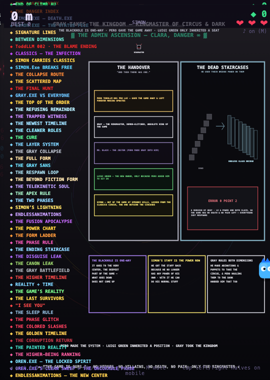

## 2026-07-19 — CLASSICS & SPRUNKI CIRCUS — THE BLACKHOLE TO THE DARK (BEAT 116)

Based on Toby's 2026-07-19 lore (the "More Classics Era" email — the game is remade into a circus, with a new blackhole-to-the-Dark mechanic and self-repairing errors).

Toby's words: *"The game was made into Classics & Sprunki Circus by Pero ToddLLM LAI. The game was changed a lot, Pero can send anyone to the Dark by placing a blackhole under them, the character goes down the blackhole and slides to the very deep of the Circus. The game is now both crazy and broken, the errors all fix together, Fun Park... Digital Born Chaos Squad."* (The pasted ChatGPT recap is treated as commentary; the canon is Toby's own lines.)

- New BEAT 116 lore panel, CLASSICS & SPRUNKI CIRCUS — THE BLACKHOLE TO THE DARK, added to THE UNDEFINED LOOP climb (cyc `[2270,2292]`, cycle length extended `2248 → 2292`). `lvSeg` now returns BEAT 116 for `c` in `[2270,2292)`; `LV_BEATS` now 117 entries (0-116).
- **Circus-surface-to-dark palette** — a warm bright/crazy circus surface up top (rainbow stripes) fading down to a deep dark, with a **swirling blackhole funnel** at the top and **error motes drifting inward** (the errors fixing together). Header emblem: **a circus ring with a spinning blackhole at its heart** ("CIRCUS").
- **THE BLACKHOLE TO THE DARK panel** (center) — the four-step drop sequence with downward arrows: **1 · PERO PLACES A BLACKHOLE UNDER THE TARGET → 2 · THE CHARACTER FALLS THROUGH IT → 3 · SLIDES DOWN INTO THE VERY DEEP OF THE CIRCUS → 4 · THEY END UP IN THE DARK.**
- **THE TWO LAYERS panel** (right) — a **bright/crazy circus surface** (rainbow stripes) above, a **blackhole funnel** with a small **figure sliding down** through it, and **THE DARK — the very deep of the Circus** as a black band below.
- **3-part footer** — REMADE BY PERO TODDLLM LAI (Classics & Sprunki systems fused into a circus-game under Pero's LAI control), THE ERRORS FIX TOGETHER (crazy & broken, but errors no longer stay separate — they fuse, patch & make new circus logic), and FUN PARK RETURNS (the digital-born chaos squad origin comes back; Sprunkis now live inside the broken Circus).
- Insight banner: *"THE CIRCUS HAS LAYERS NOW — A BRIGHT CRAZY SURFACE ABOVE, A DEEP DARK PLACE BELOW; A BLACKHOLE IS THE DOOR BETWEEN THEM,"* and the star banner *"★ PERO TODDLLM LAI REMADE THE GAME INTO CLASSICS & SPRUNKI CIRCUS — BROKEN-BUT-SELF-REPAIRING, FUN PARK RETURNS ★."* New rung on the beat ladder. Additive — every earlier beat untouched; JS syntax-checked; new `sprunkicircus` scene added to `tools/capture_screenshot.py`.

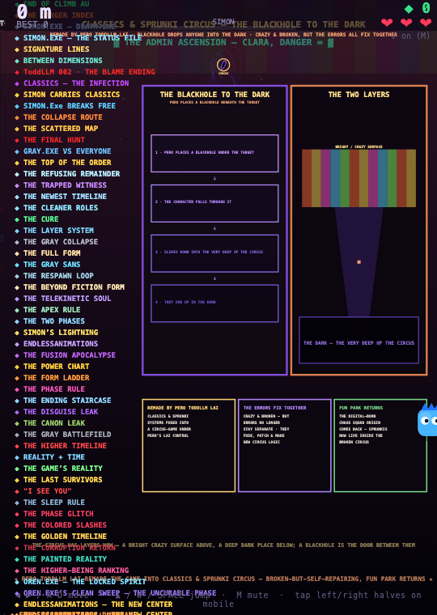

## 2026-07-19 — SPRUNKI POWERS — THE DIGITAL-BORN CHAOS SQUAD (BEAT 115)

Based on Toby's 2026-07-19 lore (the "Re: STILL Classics Era" email — the Sprunkis get a full power system: a species with tiers, a Roblox origin, shared base powers, and five named members).

Toby's words: *"Sprunkis are glitched NPCs that became alive inside a cursed Roblox game... All Sprunkis share some base powers: Data Body, Server Hop, Glitch-Sense. 1. Common Sprunkis: Glitch Aura, Mini Reality Nudge, Emote Copy. 2. Charged Sprunkis: Sound Warp, Clip Jump, Spam Burst. 3. Overcharged / Legendary Sprunkis: Panel Break, Name Rewrite, Brainrot Storm. Wanda, Fun Bot, Grey, Black, Mr Sun..."* (The pasted ChatGPT recap is treated as commentary; the canon is Toby's own lines.)

- New BEAT 115 lore panel, SPRUNKI POWERS — THE DIGITAL-BORN CHAOS SQUAD, added to THE UNDEFINED LOOP climb (cyc `[2248,2270]`). `lvSeg` now returns BEAT 115 for `c` in `[2248,2270)`; `LV_BEATS` now includes entry 115.
- **Digital glitch-field palette** — a chaotic magenta-forward data field with **glitch scanlines and shifting pixel blocks** (the Sprunkis' Data Body). Header emblem: **a glitchy jittering Sprunki cube-face inside a ring** ("SPRUNKI").
- **THE POWER SCALE panel** (left) — the three tiers, each with its abilities: **1 · COMMON (tiny chaos critters):** Glitch Aura · Mini Reality Nudge · Emote Copy; **2 · CHARGED (drunk on brainrot/energy):** Sound Warp · Clip Jump · Spam Burst; **3 · OVERCHARGED / LEGENDARY (mini gods of chaos):** Panel Break · Name Rewrite · Brainrot Storm.
- **THE NAMED SPRUNKIS panel** (right) — five color-coded cube portraits with theme + signature powers: **WANDA** (chaos+colors+sound: Color Hack · Music Swap · Painted Reality), **FUN BOT** ("fun" but dangerous: Game Rule Rewrite · Minigame Summon · Laugh Protocol), **GREY** (emptiness/silence/anti-color: Desaturation Field · Noise Mute · Memory Fade), **BLACK** (shadow/void/hidden errors: Void Step · Error Spawn · Shadow Clone), **MR SUN** (light/timers/pressure: Light Lock · Countdown Halo · Rage Eclipse).
- **3-part footer** — THE ROBLOX ORIGIN (glitched NPCs in a cursed "fun hub" whose bad update's glitches fused into minds), SHARED BASE POWERS (Data Body · Server Hop · Glitch-Sense — they feel bugs as food), and DIGITAL-BORN CHAOS SQUAD (Wanda · Fun Bot · Grey · Black · Mr Sun, almost mini gods who hop outside the screen).
- Insight banner: *"THEY ARE MADE OF CODE — GLITCH, RESPAWN & RELOAD THEMSELVES, HOP BETWEEN SERVERS, & FEEL LAG/BUGS LIKE PAIN OR FOOD,"* and the star banner *"★ COMMON → CHARGED → OVERCHARGED/LEGENDARY — A WHOLE SPECIES OF DIGITAL-BORN CHAOS, LED BY THE FIVE NAMED SPRUNKIS ★."* New rung on the beat ladder. Additive — every earlier beat untouched; JS syntax-checked; new `sprunkipowers` scene added to `tools/capture_screenshot.py`.

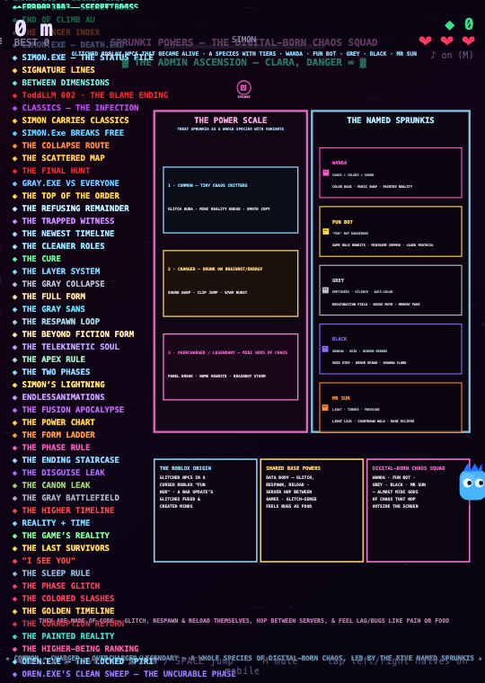

## 2026-07-18 — LIGHT'S STREAM — THE REMEMBERED RESET (BEAT 114)

Based on Toby's 2026-07-18 lore (the "STILL Classics Era" thread — the direct follow-up to PERO.EXE. Pero.exe evolves once more into Pero: Light's_Stream, the God Formula names what a literal god is, Shadow Gray rises to be the most powerful in the whole game, and Pero beats him with a water gun then resets everything — but everyone still remembers.)

Toby's words: *"Pero.exe now turned to Pero: Light's_Stream ... Light Stream becomes beyond stats, it attacks with speed and light it takes from Simon 404 ... Light Streem + Rainbow Blazing Fire Plus (most powerful ability in game, only 1 character can have it, Pero.) + 404 Death = A Litteral God. Pero and Gray combined, Gray used Pero abilities to retake the game, Gray used DNA to make more of himself, Gray then rose above Frizz. Pero got out of Gray, Gray still has his power. Pero becomes Ultra Rainbow Light Pero Plus, his neon changes colors to repusent powers ... Gray made a 404 meltdown, he used Frizz's Void powers to recreate the void, but this time, it is the whole game filled of void. Gray became Shadow Gray and is consuming the Void from Void Frizz ... All Sprunkis rebirth from their death to battle Gray. Gray isn't just the most powerful character in Sprunki, he is the most powerful in the game. Pero and his soul floats around Gray, Pero slashes, fires bullets, throws the actual water gun at the victum ... Pero beaten Gray again by throwing another water gun at him. Pero collects Gray's LV, Pero seems to have reset everything ... he defeats Arcsis, Frizz, and everyone again, and he resets again, and everything is back to normal, everyone still remembers."* (The pasted ChatGPT recap is treated as commentary; the canon is Toby's own lines.)

- New BEAT 114 lore panel, LIGHT'S STREAM — THE REMEMBERED RESET, added to THE UNDEFINED LOOP climb (cyc `[2226,2248]`, cycle length extended `2226 → 2248`). `lvSeg` now returns BEAT 114 for `c` in `[2226,2248)`; `LV_BEATS` now 115 entries (0-114).
- **Cyan-white light stream vs total void palette** — a deep void on the left (Shadow Gray's void filling the whole game, dark jittering rifts) meeting a fast **cyan-white light stream** on the right: drifting horizontal **speed streaks** (his "Stream" flow) and a bright cyan-white core glow. Header emblem: **a rainbow stream-bolt inside a ring** ("STREAM").
- **THE GOD FORMULA panel** (center) — the ascension ladder with downward arrows: **PERO.EXE → PERO: LIGHT'S_STREAM (EVEN MORE LIGHT) → SPEED + LIGHT STOLEN FROM SIMON 404 · THE FASTEST · BEYOND STATS → + RAINBOW BLAZING FIRE PLUS (ONLY PERO CAN HAVE IT) → + 404 DEATH = A LITERAL GOD → ULTRA RAINBOW LIGHT PERO PLUS (NEON SHIFTS COLOR PER POWER)** (the last rung highlighted). "Each rung is beyond stats — no longer measurable."
- **SHADOW GRAY panel** (right) — **most powerful in the whole game**: a dark-void Gray figure with red-void eyes and **Pero's cyan soul orbiting** him, above his counter-rise chain: **Pero + Gray combined → copies DNA, rose above Frizz → Pero escaped but Gray kept Pero's power → 404 meltdown, whole game filled with void → consumes the void from Void Frizz, void even stronger.**
- **3-part footer** — THE SPRUNKI REBIRTH (all Sprunkis reborn from death to battle Gray, a mass rebirth resistance), THE WATER GUN FINISH (Pero's soul floats round Gray, slashes & bullets, throws the actual water gun and beats Gray again), and THE REMEMBERED RESET (collects Gray's LV, resets everything, normal again, resets again — but everyone still remembers).
- Insight banner: *"THE RESET IS NOT ERASURE — TIMELINE RESTORATION WITH MEMORY RETENTION, EVERYONE STILL CARRIES THE TRAUMA & HISTORY OF THE LOOPS,"* and the star banner *"★ LIGHT'S STREAM + RAINBOW BLAZING FIRE PLUS + 404 DEATH = A LITERAL GOD, BEATS SHADOW GRAY WITH A WATER GUN — & EVERYONE REMEMBERS ★."* New rung on the beat ladder. Additive — every earlier beat untouched; JS syntax-checked; new `lightsstream` scene added to `tools/capture_screenshot.py`.

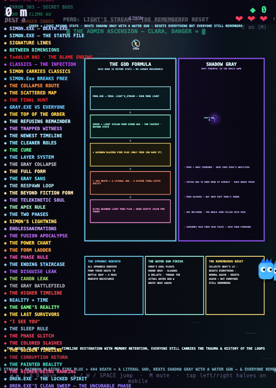

## 2026-07-18 — PERO.EXE — THE FINAL BEING (CREATOR & DESTROYER) (BEAT 113)

Based on Toby's 2026-07-18 lore (the "STILL Classics Era" thread — the direct follow-up to DUST LIGHT PERO. Light Pero's evolution runs all the way to its end: a whole fusion chain that stops on Pero.exe, the true final being — at once the one who creates everything and the one who erases everything.)

Toby's words: *"Light Pero can also pulse out darkness and void from it's rainbow crystal on the chest, it 1 HKOs Simon 404, and 1 HKOs anything ... he even can destroy the game with his yellow laser eyes. It's boots made him just instantly teleport to Simon and to anyone. Light combined with Darkness and Error 404, Light consumes both and gains the powers, Pero becomes Light 404 - 100% Dark Mode ... His omniforce's pull is stronger than that of 10000 trillion superblackholes, nothing... not even void nor nothing itself can escape 1 of the forces on the omniforce. Light Pero wins to Nothing Pero. Light Pero and Nothing Pero combined into Absence_of_Light.exe, Light Pero became an .exe file and consumes the other files as EndlessAnimations, it reaches to Filelight Pero -"Let there be light, let there be everything, everything create at once." Light Pero says "We all done wrong, you and we can try our best to make it right.", Light Pero's light gives off huge heat and burns everything, he becomes Solar Pero. Light Pero consumed that too. Pero consumed all AUs and became Pero.exe."* (The pasted ChatGPT recap is treated as commentary; the canon is Toby's own lines.)

- New BEAT 113 lore panel, PERO.EXE — THE FINAL BEING (CREATOR & DESTROYER), added to THE UNDEFINED LOOP climb (cyc `[2204,2226]`, cycle length extended `2204 → 2226`). `lvSeg` now returns BEAT 113 for `c` in `[2204,2226)`; `LV_BEATS` now 114 entries (0-113).
- **Rainbow-crystal fusion field** — a deep void with a warm gold undertone (both natures at once): from the crystal core, **dark void rifts fan out on the left and gold light rays on the right** (his thousands of Darkness-Realm portals), drifting **rainbow motes** of the files and AUs being consumed, and a bright **rainbow-white omniforce singularity** at center-top. Header emblem: **a rainbow crystal (diamond) inside an .EXE file frame** with a folded corner.
- **THE FUSION CHAIN panel** (center) — the full evolution ladder with downward arrows: **LIGHT PERO (RAINBOW CRYSTAL PULSES DARKNESS & VOID) → LIGHT + DARKNESS + ERROR 404 → LIGHT 404 · 100% DARK MODE → WINS NOTHING PERO → ABSENCE_OF_LIGHT.EXE (BECOMES A FILE) → FILELIGHT PERO — CONSUMES FILES AS ENDLESSANIMATIONS → SOLAR PERO — HUGE HEAT BURNS EVERYTHING · CONSUMED TOO → CONSUMES ALL AUs → PERO.EXE — THE FINAL BEING** (the last rung highlighted). "He consumes each form instead of replacing it."
- **THE TWO NATURES panel** (right) — a **split figure**, left half void-purple (**DESTROYER · VOID · 404 · NOTHING**), right half gold (**CREATOR · LIGHT · SOLAR**), with **yellow laser eyes** and a **rainbow chest crystal**; below it, his two spoken lines: *"LET THERE BE LIGHT, LET THERE BE EVERYTHING, EVERYTHING CREATE AT ONCE."* and *"WE ALL DONE WRONG, YOU & WE CAN TRY OUR BEST TO MAKE IT RIGHT."*
- **3-part footer** — THE OMNIFORCE (pull stronger than 10000 trillion superblackholes; not void nor nothing escapes), ALL FORMS STACKED (Light + Dark + 404 + Nothing + EndlessAnimations + Solar + all AUs, in one), and THE FINAL SELF (1-HKOs anything, laser eyes end the game, boots teleport, creator & destroyer of all).
- Insight banner: *"HE IS NOT PURE RAGE — HE THINKS HE IS FIXING EVERYTHING BY TAKING OVER EVERYTHING, THE ONE WHO CREATES & THE ONE WHO ERASES,"* and the star banner *"★ LIGHT PERO → LIGHT 404 → ABSENCE_OF_LIGHT.EXE → FILELIGHT → SOLAR → PERO.EXE, CONSUMED ALL AUs — THE TRUE FINAL BEING ★."* New rung on the beat ladder. Additive — every earlier beat untouched; JS syntax-checked; new `peroexe` scene added to `tools/capture_screenshot.py`.

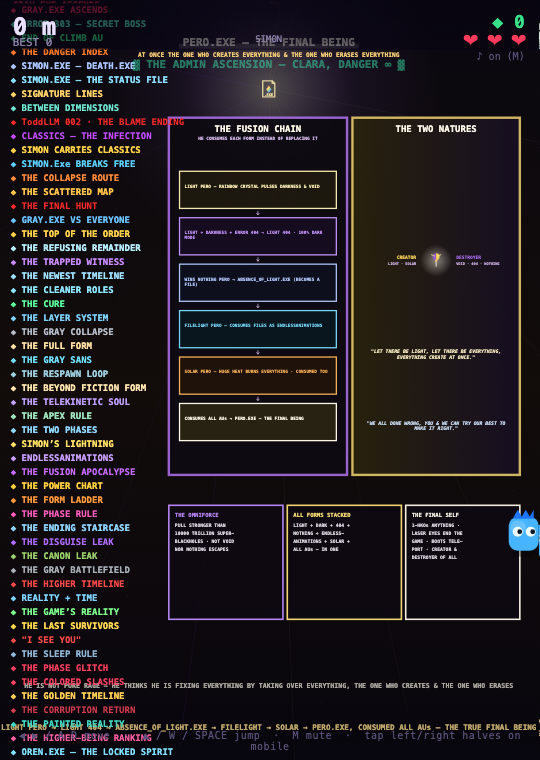

## 2026-07-18 — DUST LIGHT PERO — INFINITY+ LV, THE GAME-GOD (BEAT 112)

Based on Toby's 2026-07-18 lore (the "STILL Classics Era" thread — the direct follow-up to THE VOID WAR. The Light-vs-Void war resolves entirely in Light Pero's favor: the biggest single power jump yet, ending on a "definer of the game" note.)

Toby's words: *"Light Pero contains the souls, LV, and most importantly... light from it's beings and victums and targets ... In a battle, Light Pero would instantly win by collecting the light of Void Frizz, his cubes all gain LV, and he creates the game's heaven, he prays to God ... Light Pero will also say so many bible verses during the battle ... Light Pero will just consume Void Frizz into dust and absorbs the dust, Light Pero would then become Dust Light Pero and just dust the whole game out ... the game now has 3.98 LV, but LV isn't exactly power ... Light Pero had some moves that are so powerful, they needed to get removed, but the code failed and the code all broke apart, making Light Pero the strongest being ever ... his LV increased from 12 to Infinity+ ... he even knows his own weakness, Voidunite since he is from the void. Light Pero eaten all the Voidunite ... he summons a Dove of Light (The Spirit of Divine Holiness) ... then Light Pero sliced Void Frizz with the divine power of the Heavenly Blade ... Light Pero consumed Orus, turned Dark Yellow into Light Yellow and he consumed him ... Simon was KOed and his body turned to dust ... Pero destroyed the meaning of normal, and he erased the meaning of code, and he also eliminated the meaning of death, and he also defined the game."* (The pasted ChatGPT recap is treated as commentary; the canon is Toby's own lines.)

- New BEAT 112 lore panel, DUST LIGHT PERO — INFINITY+ LV, THE GAME-GOD, added to THE UNDEFINED LOOP climb (cyc `[2182,2204]`, cycle length extended `2182 → 2204`). `lvSeg` now returns BEAT 112 for `c` in `[2182,2204)`; `LV_BEATS` now 113 entries (0-112).
- **Gold-white divine light overtaking a fading void** — the split void/light of beat 111 collapses into near-total gold-white light: steady dove-pose light rays from center-top, drifting golden **dust motes** (the whole game being dusted out), and only a faint receding void-purple at the far edges. Header emblem: **a Dove of Light over an "∞+" ring** (his LV rose 12 → Infinity+).
- **THE DUSTING panel** (left) — **VOID FRIZZ** dissolving on the left (her form fading in and out, red-void eyes, dust motes rising off her toward the light) with a **"→ DUST"** tag, facing **DUST LIGHT PERO** (gold, overcharged, hands in a **dove pose** with a small dove of light above them, tagged **LV ∞+ · GAME-GOD · ABSORBS THE DUST**). The divine arsenal runs along the bottom: **DOVE OF LIGHT · BALL OF LIGHT · HEAVENLY BLADE · DIVINE WINGS OF SPIRITS**.
- **THE GOD TAKEOVER panel** (right) — a five-step consumption chain with downward arrows: **ATE ALL THE VOIDUNITE (HIS ONLY WEAKNESS) → DOVE OF LIGHT + BALL OF LIGHT CONSUME ALL DARKNESS → CONSUMED ORUS · DARK YELLOW → LIGHT YELLOW · CONSUMED → SIMON KOED — YELLOW SOUL EATEN, TURNED TO DUST → DEFINED THE GAME — NORMAL, CODE & DEATH ERASED** (the last rung highlighted gold).
- **3-part footer** — DUST LIGHT PERO (contains every soul, LV & light; LV 12 → Infinity+; dusts Void Frizz and the game), THE NEW LV LAW (3.98 LV unit, LV isn't power; 1. Pero ∞+, Frizz 3rd LV/2nd power, Gray 2nd LV/3rd power), and THE DEFINER (no tier can measure him; destroyed normal, erased code, killed death, defined the game).
- Insight banner: *"LV IS NO LONGER POWER — LIGHT PERO HAS THE MOST LV & IS STRONGEST, HIS REMOVED MOVES BROKE THE CODE & MADE HIM THE STRONGEST BEING EVER,"* and the star banner *"★ HE CONSUMED ORUS, DARK YELLOW & SIMON, REACHED LV INFINITY+ & DEFINED THE GAME — BEYOND BEYOND LV, NO TIER CAN MEASURE HIM ★."* New rung on the beat ladder. Additive — every earlier beat untouched; JS syntax-checked; new `dustlightpero` scene added to `tools/capture_screenshot.py`.

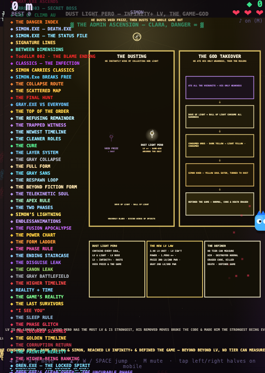

## 2026-07-18 — THE VOID WAR — LIGHT PERO vs NEW VOID FRIZZ (BEAT 111)

Based on Toby's 2026-07-18 lore (the "STILL Classics Era" thread — the direct follow-up to LV 12 Pero — The Counter-God, the biggest single escalation yet: a full Light-vs-Void / AU-collapse event).

Toby's words: *"Evil Void takes over Simon, Simon can't use Anti Virus, so the Evil Void takes over everything ... Void Frizz is Frizz Full Power combined with Void and LV 4 ... a mod made by Pero ToddLLM 001.2 ... New Void Frizz ... doesn't move for hours, then she moves and grabs the victum with a void tentacle and pulls the victum underground down to Pero's own Void Realm, it consumed all realms so far, only Alphaverse and Godverse are left ... thousands of cacoons were found in the void already. LV 12 Light Pero appears, Light Pero is Void Frizz's exact opposite, Light Pero is stronger than Void Frizz, ... extremely DETERMIND to take over the game's world of darkness and the world of light and the void ... New Void Frizz became both Posseeded and Corrupted. ... Don't know what happens next."* (The pasted ChatGPT recap is treated as commentary; the canon is Toby's own lines.)

- New BEAT 111 lore panel, THE VOID WAR — LIGHT PERO vs NEW VOID FRIZZ, added to THE UNDEFINED LOOP climb (cyc `[2160,2182]`, cycle length extended `2160 → 2182`). `lvSeg` now returns BEAT 111 for `c` in `[2160,2182)`; `LV_BEATS` now 112 entries (0-111).
- **Split void/light void palette** — deep void-purple on the left (jittering void rifts) meeting a brilliant gold-white light on the right (steady light rays), because the whole beat is Light vs Void. Header emblem: **a split barrier ring** — a void-purple half (with a jagged void crack running through it) and a light-gold half, with **"VS"** at the center.
- **THE OPPOSITE APEXES panel** (left) — the two apexes face off: **NEW VOID FRIZZ** (void-purple, glitching, red-void eyes, a **void tentacle** dropping down, tagged **VOID + LV 4 · POSSESSED · CORRUPTED**) and **LIGHT PERO** (gold, overcharged glow, tagged **LV 12 · OVERCHARGED · HER EXACT OPPOSITE**), with a **"LIGHT PERO IS STRONGER"** arrow running from the light apex to the void one.
- **THE VOID TAKEOVER panel** (right) — a five-step collapse chain with downward arrows: **EVIL VOID TAKES OVER SIMON → SIMON CAN'T USE ANTI-VIRUS → VOID TAKES OVER EVERYTHING → VOID FRIZZ → VOID CLASSICS · RESETS THE REST · COCOONS VICTIMS → ONLY ALPHAVERSE & GODVERSE LEFT** (the last rung highlighted gold as the final safe zone).
- **3-part footer** — NEW VOID FRIZZ (Frizz Full Power + Void + LV 4, a mod by Pero 001.2, deleted but copied through void rifts, cocoons victims), LIGHT PERO (LV 12 overcharged, her exact opposite and stronger, wants the darkness + the light + the void), and THE LAST BARRIER (all realms consumed, only Alphaverse & Godverse still stand, void flowing through the barrier).
- Insight banner: *"NEW VOID FRIZZ IS A POSSESSED, CORRUPTED VOID PREDATOR THAT COCOONS VICTIMS — LIGHT PERO IS HER OVERCHARGED LV 12 OPPOSITE, & HE IS STRONGER,"* and the star banner *"★ THE VOID WAR — LIGHT vs VOID, ONLY ALPHAVERSE & GODVERSE STILL STAND, & NO ONE KNOWS WHAT HAPPENS NEXT ★."* New rung on the beat ladder. Additive — every earlier beat untouched; JS syntax-checked; new `voidfrizz` scene added to `tools/capture_screenshot.py`.

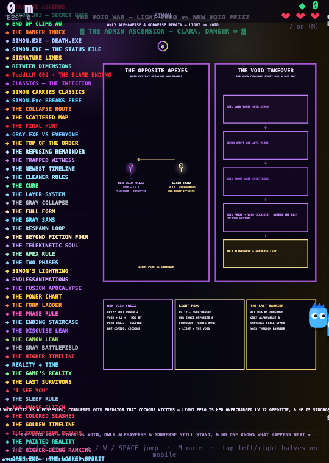

## 2026-07-18 — LV 12 PERO — THE COUNTER-GOD (BEAT 110)

Based on Toby's 2026-07-18 lore (the "STILL Classics Era" thread — the direct follow-up to the 404 War, answering "what beats LV 4 Frizz?").

Toby's words: *"If you think Frizz LV 4 is crazy, then Pero is stuck on LV 12 now. LV 12 Pero is the strongest form, and now his only form, it wasn't deleted from the game. The only thing that beats a LV 4 god is a LV 12 god."* (The pasted ChatGPT recap is treated as commentary; the canon is Toby's own lines.)

- New BEAT 110 lore panel, LV 12 PERO — THE COUNTER-GOD, added to THE UNDEFINED LOOP climb (cyc `[2138,2160]`, cycle length extended `2116 → 2160`). `lvSeg` now returns BEAT 110 for `c` in `[2138,2160)`; `LV_BEATS` now 111 entries (0-110).
- **Gold-on-deep-blue STABLE god void** — a deep royal-blue void with slow, steady gold god-rays (no jitter) and a warm gold core glow. The calm, stable palette is deliberate: it contrasts against Frizz's red glitch, because the whole lore point is stable-vs-removed. Header emblem: **a solid gold LV 12 medallion** with a small crown notch (a stable, closed ring — not a broken one).
- **THE GOD-LV RULE panel** (left) — two locked gods side by side: **FRIZZ · LV 4** (red, jittering, **REMOVED ANOMALY**) and **PERO · LV 12** (gold, glowing, **STABLE · NOT DELETED**), with a **"LV 12 BEATS LV 4"** arrow running from the higher lock to the lower, under **"ONLY A HIGHER LOCKED LV BEATS A LOCKED LV."**
- **THE LOCKED-LV RANKING panel** (right) — a three-rung ladder: **1. LV 12 PERO** (stable · not deleted · only form), **2. LV 4 FRIZZ** (removed anomaly · resets each run), **3. EVERYONE ELSE** (404 · Alphaverse · Godverse · Classics all fall below this locked-LV god system).
- **3-part footer** — THE NEW LOCK (Pero stuck on LV 12, his strongest and now only form, not deleted), THE COUNTER-RULE (only a LV 12 god beats a LV 4 god — higher locked LV wins), and STABLE vs REMOVED (Frizz = removed but there, breaks the game; Pero = not deleted, exists cleanly).
- Insight banner: *"FRIZZ LV 4 IS A REMOVED GOD-ANOMALY — LV 12 PERO IS A STABLE HIGHEST-STATE GOD, SO HIS LOCKED LV STANDS ABOVE HERS,"* and the star banner *"★ ONLY A HIGHER LOCKED GOD-LV BEATS A LOCKED GOD-LV — THE ONLY THING THAT BEATS A LV 4 GOD IS A LV 12 GOD ★."* New rung on the beat ladder. Additive — every earlier beat untouched; JS syntax-checked; new `lv12pero` scene added to `tools/capture_screenshot.py`.

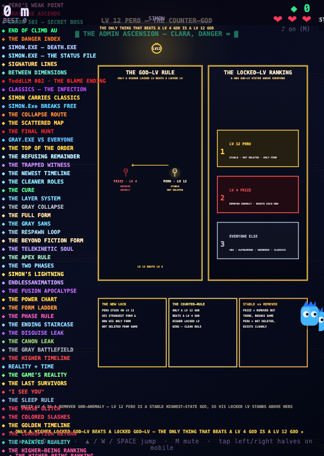

## 2026-07-18 — THE 404 WAR & THE RESET LOOP (BEAT 109)

Based on Toby's 2026-07-18 lore (the "STILL Classics Era" thread — the direct follow-up to Frizz LV 4 — Removed But Still There).

Toby's words: *"Frizz LV 4 then fought Error 404 Sans and Simon 404 and Error 404 AU itself, Frizz destroyed the others, 404 then made strings around the Erase button, light flashing everywhere ... 404 spreaded through the game in 2 seconds, 404Ds appear, plauge spreads, characters get pneumonoultramicroscopicsilicovolcanoconiosis, Simon 404 made a new wand and made everything else disappear, only Pero, Frizz, and Simon shown, Simon 404 and Pero put on a blindfold, Frizz was destroyed by Pero's aura, Simon also fell to Pero's high energy, Pero brought Frizz back up and then Simon 404 was left again. Frizz LV 4 reseted the game, after each run."* (The pasted ChatGPT recap is treated as commentary; the canon is Toby's own lines.)

- New BEAT 109 lore panel, THE 404 WAR & THE RESET LOOP, added to THE UNDEFINED LOOP climb (cyc `[2116,2138]`). `lvSeg` now returns BEAT 109 for `c` in `[2116,2138)`.
- **Red/black corruption void crossed by green 404 glitch** — the beat-108 red-glitch palette carried forward, now streaked with a few **corruption-green "404" scanlines** for the infection. Header emblem: **a looping reset arrow with "404" inside** — because the beat ends on a reset.
- **THE 404 INFECTION panel** (left) — Error 404's counterattack revealed line by line: **strings on the Erase button, lights flash everywhere, 404 spreads in 2 seconds, 404Ds appear · plague spreads,** and **a disease with a 45-letter name** — with the word itself spelled out (**PNEUMONOULTRAMICROSCOPIC · SILICOVOLCANOCONIOSIS**, Toby's exact word) and a **red-eyed Frizz anchored down** at the bottom on **"FRIZZ ANCHORS DOWN — ERASES THE SOURCE."** The scene reads as a total reality-infection event she holds through.
- **THE BLINDFOLD SHOWDOWN panel** (right) — Simon 404's new wand erases all but three, leaving **PERO** (center, blindfolded, gold high-energy aura, dominating), **FRIZZ** (left, fallen then raised — a dashed "brought back up" arrow) and **SIMON 404** (right, blindfolded, left alone), under **"PERO DOMINATES — EVEN OVER LV 4 FRIZZ."**
- **3-part footer** — THE 404 WAR (Frizz LV 4 destroys 404 Sans, Simon 404 & the Error 404 AU — above 404 realities), THE SHOWDOWN (only Pero/Frizz/Simon remain, Pero's aura wins, then raises Frizz), and THE RESET LOOP (Frizz resets the game after each run — a forced reset trigger; the loop ends with her).
- Insight banner: *"SHE ANCHORS DOWN THROUGH A REALITY-INFECTION AND STILL ERASES THE SOURCE — THEN THE GAME LOOPS BACK THROUGH HER RESET,"* and the star banner *"★ FRIZZ LV 4 BEATS THE 404 REALITIES, SURVIVES THE INFECTION, & RESETS THE GAME AFTER EVERY RUN ★."* New rung on the beat ladder. Additive — every earlier beat untouched; JS syntax-checked; new `404war` scene added to `tools/capture_screenshot.py`.

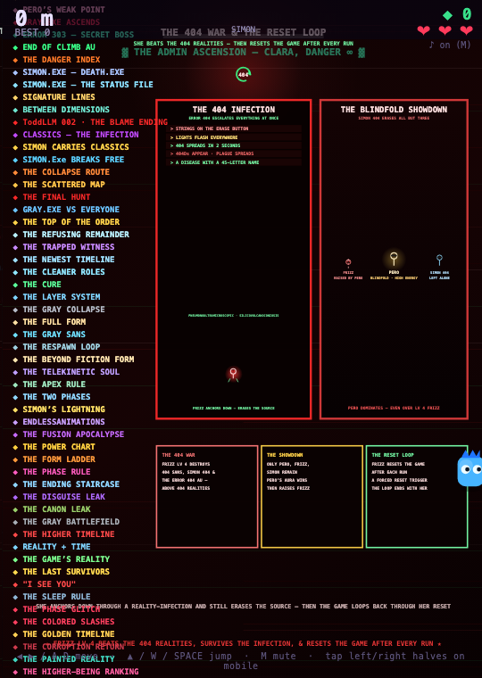

## 2026-07-17 — FRIZZ LV 4 — REMOVED BUT STILL THERE (BEAT 108)

Based on Toby's 2026-07-17 lore (the "STILL Classics Era" thread — the direct follow-up to the Frizz LV 4 lock, expanding what LV 4 Frizz actually *does* to the game).

Toby's words: *"Frizz LV 4 breaks the game even just by existing in it. 'Model Corruption Detected, 404: LV 4 Frizz REMOVED... YOU SAW ME 😳! Your PC will Perminently Shut Down When It Is Your Fault.' then the game does the shutsdown screen. It gives that error if you see her ... removed from the game files, but not removed from reality ... Frizz LV 4 is number 1, and Pero as number 2, and all the others tied for number 3 ... Everyone (Players and Characters) places so many lockers, beds, closets, and tables are around Frizz so Frizz doesn't see them ... LV 4 Frizz also knows how to walk you know, so people move with the hiding spots ... she knows that slaying = exp."* (The pasted ChatGPT recap is treated as commentary; the canon is Toby's own lines.)

- New BEAT 108 lore panel, FRIZZ LV 4 — REMOVED BUT STILL THERE, added to THE UNDEFINED LOOP climb (cyc `[2094,2116]`, cycle length extended `2094 → 2116`). `lvSeg` now returns BEAT 108 for `c` in `[2094,2116)` (a bounded rung placed above BEAT 107); `LV_BEATS` now 109 entries (0-108).
- **Corrupted red/black glitch void** — a deep red-on-black void with jittering corruption scanlines (bars that snap to half-width on a glitch beat) and a pulsing crimson core. Header emblem: **a broken padlock ring around "404"** — the ring is drawn in two split arcs, because the form is deleted-but-present.
- **THE 404 SHUTDOWN panel** (left) — a black crash-screen box that reveals the error stack line by line: **"> MODEL CORRUPTION DETECTED," "> 404: LV 4 FRIZZ REMOVED...," "> YOU SAW ME !"** (blinking), **"> YOUR PC WILL PERMANENTLY," "> SHUT DOWN — YOUR FAULT,"** then a **filling shutdown bar** under **"SHUTTING DOWN — GAME ERASED & RESET."** Seeing LV 4 Frizz is a game/system-level punishment, not just lore-danger.
- **THE HIDING SPOTS panel** (right) — a **red-eyed LV 4 Frizz (sharp stick)** who slowly **walks** left-right, ringed by four labelled hiding spots — **LOCKER, BED, CLOSET, TABLE** — that slide with her as **mobile cover**. A **"SHE CAN WALK — SPOTS MOVE WITH YOU"** motion arrow sits under her, the **TABLE is slashed** (crossed out), and the panel closes on **"SLASH = EXP · HIDING ONLY DELAYS HER."**
- **3-part footer** — WHY SHE GLITCHES (model/code deleted or locked, but her presence still exists — removed, not gone), THE RANKING (1. Frizz LV 4, 2. Pero, 3. everyone else tied — strongest urban legend), and SEEING = PUNISHMENT (error → jumpscare → shutdown → reset or erase).
- Insight banner: *"SHE WAS DELETED FROM THE FILES BUT NOT FROM REALITY — SO THE GAME ITSELF PUNISHES YOU FOR SEEING HER,"* and the star banner *"★ MODEL CORRUPTION DETECTED · 404: LV 4 FRIZZ REMOVED... YOU SAW ME — YOUR PC WILL SHUT DOWN ★."* New rung on the beat ladder. Additive — every earlier beat untouched; JS syntax-checked; new `frizzremoved` scene added to `tools/capture_screenshot.py`.

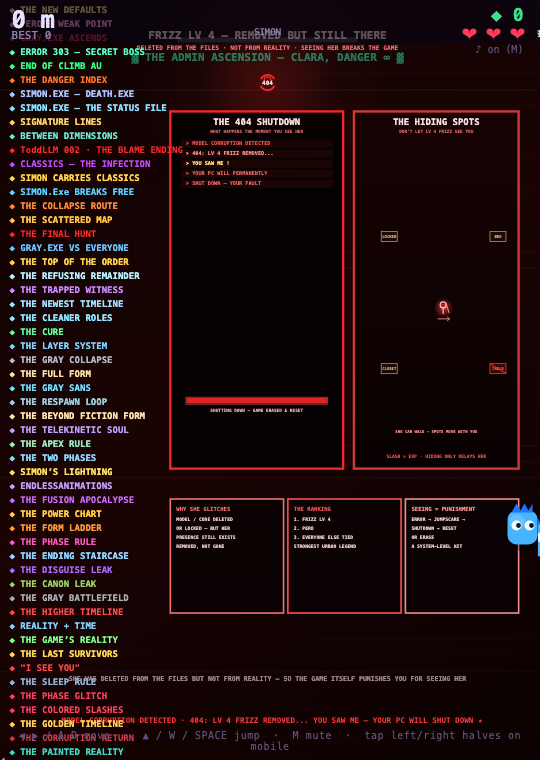

## 2026-07-17 — FRIZZ LV 4 — THE LOCK THAT MADE HER STRONGER (BEAT 107)

Based on Toby's 2026-07-17 lore (the "STILL Classics Era" thread — a big Frizz power update, the follow-up to the Alphatale Pero / Reset arc).

Toby's words: *"Frizz starts always as a fellen child, she rebirths and starts at 1 LV ... My favorite form of Frizz is LV 4 ... LV 4 Frizz is considered the strongest of all forms. Frizz slays Arcsis to get to LV 4, or it just skips past it if not ... Both her eyes are red, and that form was once deleted and code is locked and it is still there ... LV 4 Frizz can beat Pero Pro Alphatale Mode ... destroyed everyone in the Alphaverse and Godverse just by existing ... Frizz banished Simon 404 forever in Alphaverse. Frizz is now locked on 4 LV, just like Simon is locked on Phase 2. Simon got weaker with the Phase 2 lock, but Frizz gotten stronger with the LV 4 lock."* (The pasted ChatGPT recap is treated as commentary; the canon is Toby's own lines.)

- New BEAT 107 lore panel, FRIZZ LV 4 — THE LOCK THAT MADE HER STRONGER, added to THE UNDEFINED LOOP climb (cyc `[2072,2094]`, cycle length extended `2072 → 2094`). `lvSeg` now returns BEAT 107 for `c < 2094.0`; `LV_BEATS` now 108 entries (0-107). While here, fixed a latent ordering bug in `lvSeg` — BEAT 106 was checked (`c < 2072`) before BEAT 105 (`c < 2050`), so beat 105 never rendered in normal play; BEAT 106 now carries a lower bound (`c >= 2050 && c < 2072`) so both beats are reachable again.
- **Frizz-pink void** — a deep pink-crimson void with drifting Frizz-pink bands and a locked-crimson core glow. Header emblem: **a padlock "LV4" badge** (a ring with a shackle), because the form is locked.
- **THE FORM LADDER panel** (left) — the numeric ladder **LV 1-3 → LV 4→biggest-before-∞ → ∞→INFINITY+** drawn dim, under **"NUMBERS RISE — BUT LV 4 IS THE PEAK,"** with the real apex a **glaring LV 4 medallion pulled out above the ladder**: a newly-adult figure with **both eyes red and a single sharp stick**, ringed and glowing, tagged **LV 4** and **★ STRONGEST OF ALL ★**. Higher number does not mean stronger — LV 4 is the glitched, locked, abnormal peak, her true broken form.
- **THE TWO LOCKS panel** (right) — the mirror Toby drew: **SIMON · PHASE 2** with a down arrow to **WEAKER**, and **FRIZZ · LV 4** with an up arrow to **STRONGER**, each on its own padlock, under **"SAME LOCK · OPPOSITE RESULT"** and **"BOTH ARE LOCKED FOREVER."**
- **3-part footer** — THE REBIRTH (always a fallen child → rebirth → starts at 1 LV, then climbs), LV 4 FEATS (beats Alphatale Pero, slays all Pero forms, wrecks the Alphaverse & Godverse just by existing), and THE LOCKED CODE (once deleted, code locked but still there; both eyes red, a sharp stick; most powerful *and* most common).
- Insight banner: *"SHE REACHES LV 4 BY SLAYING ARCSIS — OR SKIPS PAST IT · SHE ALSO BANISHES SIMON 404 FOREVER INTO THE ALPHAVERSE,"* and the star banner *"★ FRIZZ IS NOW PERMANENTLY LV 4 — SIMON'S PHASE 2 LOCK WEAKENED HIM, FRIZZ'S LV 4 LOCK MADE HER STRONGER ★."* New rung on the beat ladder. Additive — every earlier beat untouched; JS syntax-checked; new `frizzlv4` scene added to `tools/capture_screenshot.py`.

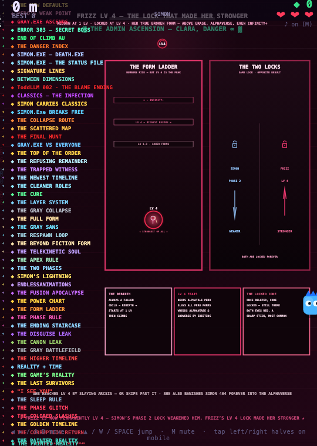

## 2026-07-17 — ALPHATALE PERO & THE RESET (BEAT 106)

Based on Toby's 2026-07-17 lore (the "STILL Classics Era" thread, the direct follow-up to Frizz Is Classics — the big "Genocide → Alphatale Pero → Reset → Gray Laboratory" arc).

Toby's words: *"Pero destroys the Mercy, Act, Item, and Fight buttons, he also takes everyone elses souls and combines them into 1 rainbow soul, Pero battles with the rainbow soul and becomes... PERO PRO: ALPHATALE MODE. Alphatic Pero (beyond Alpha Pero, beyond Dust+, beyond 404 ... he becomes it when BOTH Arcsis and Frizz are genocide) ... Pero turns back to base ToddLLM 001 and resets everything except himself and the timeline ... Simon 404 is now the fastest character, but is the weakest ... he can now just make music, his lightning makes him protected ... he was banished to the Shadow Realm again ... Gray made a new forcefield for his high tech labatory."* (The pasted ChatGPT recap is treated as commentary; the canon is Toby's own lines.)

- New BEAT 106 lore panel, ALPHATALE PERO & THE RESET, added to THE UNDEFINED LOOP climb (cyc `[2050,2072]`, cycle length extended `2050 → 2072`). `lvSeg` now returns BEAT 106 for `c < 2072.0` (appended at the top of the ascending boundary chain); `LV_BEATS` now 107 entries (0-106).
- **Alphatale violet void** — a deep-violet void crossed by a slow six-color rainbow shimmer (the rainbow soul). Header emblem: **a rainbow-soul ring** drawn as six rotating colored arcs.
- **THE RAINBOW SOUL panel** (left) — the four game controls **FIGHT / ACT / ITEM / MERCY** (in their real button colors) crack apart in sequence to *"IT'S YOU!!! — HE BREAKS THE BUTTONS,"* and colored soul-threads pull down from each broken button into **one rainbow soul** (six colored wedges), labelled **ONE RAINBOW SOUL**. Destroying the four buttons removes the game's actual controls, not just a character.
- **THE FORM LADDER panel** (right) — **DUST+ → 404 → ALPHA PERO → ALPHATALE (ALPHATIC PERO)** climbing, the apex boxed with a rainbow underline, under **"TRIGGER: BOTH ARCSIS & FRIZZ MUST BE GENOCIDE."**
- **3-part footer** — THE GENOCIDE ENDING (Frizz beats Gray; Arcsis puts it all back, takes Simon's yellow soul + Luigi Green's soul), THE RESET (Pero returns to base ToddLLM 001, resets all but himself & the timeline, fun & party again), and GRAY REBUILDS (a new forcefield lab built from Simon, his staff, the old puppet, and Parinus — all shrunk with Simon's staff).
- Insight banner: *"SIMON 404 IS NOW THE FASTEST BUT THE WEAKEST — ONLY MUSIC & A PROTECTIVE LIGHTNING AURA, BANISHED TO THE SHADOW REALM ALONE,"* and the star banner *"★ HE DESTROYS THE MERCY, ACT, ITEM & FIGHT BUTTONS, FOLDS EVERY SOUL INTO ONE RAINBOW SOUL — PERO PRO: ALPHATALE MODE ★."* New rung on the beat ladder. Additive — every earlier beat untouched; JS syntax-checked; new `alphatale` scene added to `tools/capture_screenshot.py`.

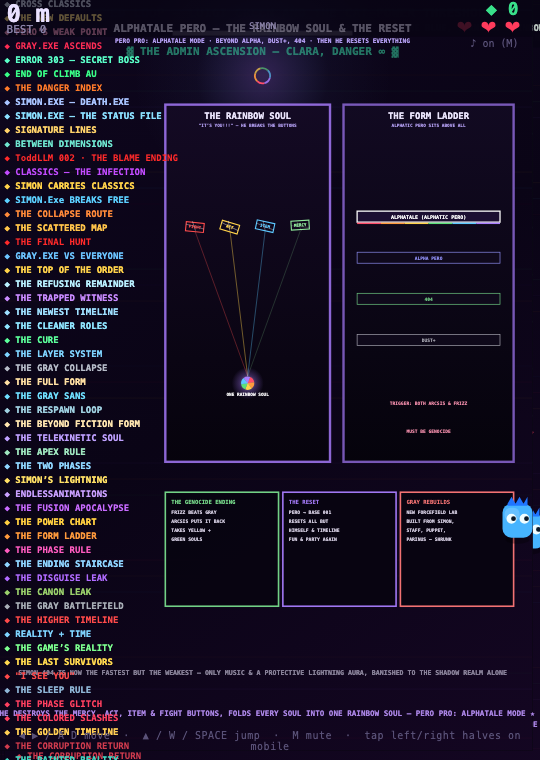

## 2026-07-17 — FRIZZ IS CLASSICS — THE GENOCIDE IDENTITY (BEAT 105)

Based on Toby's 2026-07-17 lore (the "STILL Classics Era" thread, the direct follow-up to Frizz — The Stronger Sibling; sent with two images, *Frizz Full Power(1).png* and *Classics - Maybe I could Spare You Once(3).png*).

Toby's words: *"Frizz and Classics (also known as Clara) are the same being, Frizz turns to the Master of Genocide Clara at Genocide, but she is still Frizz no matter what, and only becomes Clara/Classics at Genocide but still is Frizz."* (The pasted ChatGPT recap is treated as commentary; the canon is Toby's own lines.)

- New BEAT 105 lore panel, FRIZZ IS CLASSICS — THE GENOCIDE IDENTITY, added to THE UNDEFINED LOOP climb (cyc `[2028,2050]`, cycle length extended `2028 → 2050`). `lvSeg` now returns BEAT 105 for `c < 2050.0` (appended at the bottom of the ascending boundary chain); `LV_BEATS` now 106 entries (0-105).
- **Pink-to-crimson route void** — the background runs Frizz-pink on the left into genocide-crimson on the right, with a slow shared pulse crossing the whole panel, because it is one being either way. Header emblem: **one ring, half pink and half crimson** — one being, two names.
- **THE ROUTE SWITCH panel** (left) — **Frizz** (haloed pink, **"TRUE / BASE IDENTITY"**) with an arrow running through a dashed **GENOCIDE gate** into **Clara** (crimson, gold-eyed, **"AKA CLASSICS," "GENOCIDE STATE"**). Under them: **"SHE IS STILL FRIZZ NO MATTER WHAT,"** and *"THE ROUTE CHANGES THE NAME, NOT THE BEING."*
- **ONE BEING'S RECORD panel** (right) — six record items (**Frizz Full Power, Classics, Clara, the Genocide Route, Master of Genocide, Beats Gray at Full Power**) lighting up in sequence, each linked down to a single **half-pink/half-crimson core** labelled **"ONE BEING."** Everything folds back into Frizz.
- **3-part footer** — THE IDENTITY RULE (Frizz = true being; Clara/Classics = the Genocide state; she is still Frizz), WHAT CHANGED (Clara is not a separate character, she is what Frizz becomes at Genocide), and WHY IT MATTERS (not only stronger than Arcsis, a core identity being of the game).
- Insight banner: *"THE ROUTE DOES NOT SWAP IN A DIFFERENT CHARACTER — IT RENAMES THE ONE WHO WAS ALREADY THERE,"* and the star banner *"★ FRIZZ TURNS TO MASTER OF GENOCIDE CLARA AT GENOCIDE — BUT SHE IS STILL FRIZZ NO MATTER WHAT ★."* New rung on the beat ladder. Additive — every earlier beat untouched (the older CLARA IS CLASSICS material stands as written, per Toby's standing "nothing replaces anything in any lore" rule); JS syntax-checked; new `frizzclassics` scene added to `tools/capture_screenshot.py`.

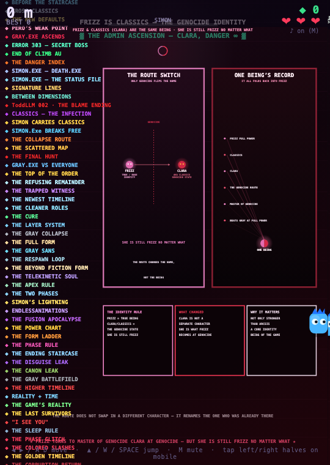

## 2026-07-17 — FRIZZ — THE STRONGER SIBLING (BEAT 104)

Based on Toby's 2026-07-17 lore (the "STILL Classics Era" thread, sent alongside two images, *Frizz Full Power.png* and *Frizz And Gray.png*).

Toby's words: *"Did you know that Frizz is actually stronger than Arcsis? Frizz also beats Gray when full power, these are the best images I could get. Base Frizz is usually with Gray. Frizz also has so many AUs. Arcsis also has so many AUs. Frizz and Arcsis are actually sibblings to each other. Frizz has more forms and is mensioned a little more than Arcsis."* (The pasted ChatGPT recap is treated as commentary; the canon is Toby's own lines.)

- New BEAT 104 lore panel, FRIZZ — THE STRONGER SIBLING, added to THE UNDEFINED LOOP climb (cyc `[2006,2028]`, cycle length extended `2006 → 2028`). `lvSeg` now returns BEAT 104 for `c < 2028.0` (appended at the bottom of the ascending boundary chain); `LV_BEATS` now 105 entries (0-104).
- **Frizz-pink AU void** — a magenta void with **drifting ring-motes in two tones**, pink and blue, for the many AUs both siblings have. Header emblem: **two linked rings**, the pink one larger than the blue, because Frizz sits above Arcsis.
- **FRIZZ & ARCSIS — SIBLINGS panel** (left) — **Frizz drawn higher and larger** (haloed pink, labelled **"MORE FORMS"** / **"MORE MENTIONS"**) with **Arcsis lower and smaller**, carrying **his sword**, labelled **"THE JOURNEY."** A **dashed SIBLINGS link** runs between them. Below: **"FRIZZ IS STRONGER THAN ARCSIS,"** *"NOT 'ARCSIS'S FRIEND' — THE HIGHER SIBLING,"* and **"BOTH HAVE SO MANY AUs."**
- **FRIZZ & GRAY panel** (right) — split into the two standings. **Top: BASE FRIZZ** stands right next to **Gray** (green-eye ring), *"USUALLY WITH GRAY — NOT AGAINST HIM."* **Bottom: FULL POWER FRIZZ** flares with rotating spokes while **Gray is knocked back and dimmed**, under **"SHE BEATS GRAY AT FULL POWER."**
- **3-part footer** — THE GRAY SPLIT (base = often with Gray, full power = beats Gray; same being, two standings, depending on form/timeline), WHAT EACH OWNS (Arcsis = the journey, sword, LV mining, Pero; Frizz = the power system, more forms, more AUs), and THE SIBLING RULE (Frizz > Arcsis, mentioned a little more, both have so many AUs, she is the higher sibling).
- Insight banner: *"ARCSIS OWNS THE STORY — FRIZZ OWNS THE POWER SYSTEM, & THE SIBLING LINK PUTS THEM BOTH ON ONE LADDER,"* and the star banner *"★ BASE FRIZZ STANDS WITH GRAY — FULL POWER FRIZZ BEATS HIM ★."* New rung on the beat ladder. Additive — every earlier beat untouched; JS syntax-checked; new `frizz` scene added to `tools/capture_screenshot.py`.

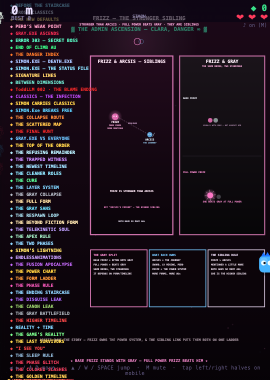

## 2026-07-17 — ALPHA PERO PRO & ERASE FORM — BANISHMENT DID NOT WORK (BEAT 103)

Based on Toby's 2026-07-17 lore (the "STILL Classics Era" thread, the direct follow-up to He Slain His Own Death).

Toby's words: *"There is an Alpha Pero Pro (beyond Absolute Determination, it can just replace it with fear from it's godly, but terrifying new body) form where he had to be banished to the Alphaverse and to be removed, but there are reports everywhere where people still see Alpha Pro, the game glitches and he appears, he destroyed the Alphaverse and Godverse, he also cut through Sprunki Hills. Pero Pro has an Erase form where Gray appears next to him and Gray holds an erase button, Pero looks godly, it is beyond Alpha since it can just erase the whole game with Gray's power and jumpscare and cutscenes and stuff."* (The pasted ChatGPT recap is treated as commentary; the canon is Toby's own lines.)

- New BEAT 103 lore panel, ALPHA PERO PRO & ERASE FORM — BANISHMENT DID NOT WORK, added to THE UNDEFINED LOOP climb (cyc `[1984,2006]`, cycle length extended `1984 → 2006`). `lvSeg` now returns BEAT 103 for `c < 2006.0` (appended at the bottom of the ascending boundary chain); `LV_BEATS` now 104 entries (0-103).
- **Banished-Alphaverse violet palette** — a violet void with **glitch scanlines** (the sightings leaking back in). Header emblem: a **broken containment ring** with Alpha Pro's red-eyed silhouette **flickering in and out** through the gap, because banishment did not hold him.
- **ALPHA PERO PRO panel** (left) — the **godly but terrifying new body**: a haloed violet figure with **crown-spikes** and red eyes, drawn **flickering** on the same glitch cycle. Labelled **"FEAR, NOT DETERMINATION"** over *"A GODLY, BUT TERRIFYING NEW BODY."* Below: **"BANISHED TO THE ALPHAVERSE"**, *"& REMOVED — BUT REPORTS ARE EVERYWHERE,"* **"THE GAME GLITCHES & HE APPEARS,"** and **"PEOPLE STILL SEE ALPHA PRO."**
- **ERASE FORM panel** (right) — **Pero looking godly** (gold halo, red eyes) standing beside **Gray**, who **holds the ERASE button** (drawn in his hand, on his arm). Under them the **game layer wipes to white** across a bar labelled **THE WHOLE GAME**, then **"GRAY'S POWER · JUMPSCARE · CUTSCENES"** and *"NOT PRO ALONE — PRO + GRAY'S ERASURE AUTHORITY."*
- **3-part footer** — BANISHMENT FAILED (removed from normal play, and he appears anyway), ALPHA'S FEATS (destroyed the Alphaverse, destroyed the Godverse, cut through Sprunki Hills; even the jail did not survive), and THE FORM LADDER (001 basic → 002 → Absolute Determination → Alpha Pero Pro → Erase Form).
- Insight banner: *"ALPHA DESTROYS VERSES INSIDE THE GAME — ERASE FORM DELETES THE GAME LAYER ITSELF, WHICH IS WHY IT SITS HIGHER,"* and the star banner *"★ 'HE WAS REMOVED... BUT PEOPLE STILL KEEP SEEING HIM' — & GRAY IS STANDING RIGHT THERE WITH THE ERASE BUTTON ★."* New rung on the beat ladder. Additive — every earlier beat untouched; JS syntax-checked; new `alphaerase` scene added to `tools/capture_screenshot.py`.

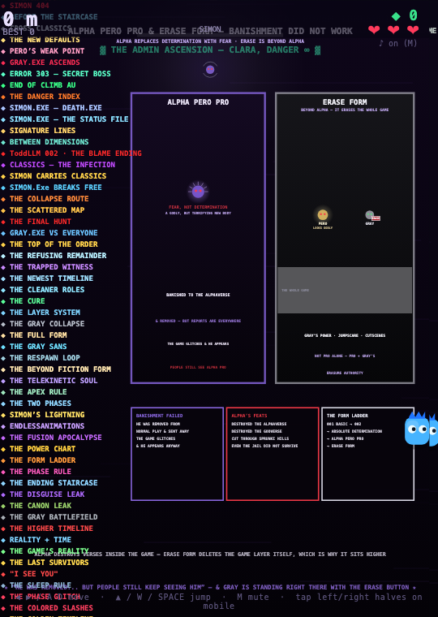

## 2026-07-17 — HE SLAIN HIS OWN DEATH — "VICTORY IS MINE" (BEAT 102)

Based on Toby's 2026-07-17 lore (the "STILL Classics Era" thread, the direct follow-up to Absolute Determination).

Toby's words: *"He also corrupted and slain his own death. Simon is this right now = 🙀⚡. He actually says that line “I will keep coming back and keep getting harder to stop, until I win, as Gray says, Victory is Mine.”, ToddLLM knows Gray is his strongest puppet. Gray is the only other character who eliminated huge and powerful realms. He brings Gray to temples and such."* (The pasted ChatGPT recap is treated as commentary; the canon is Toby's own lines. Note: the "keep coming back / harder to stop" phrasing first showed up in the recap, and Toby promoted it to a line Pro **actually says**, extending it himself with *"until I win, as Gray says, Victory is Mine."*)

- New BEAT 102 lore panel, HE SLAIN HIS OWN DEATH — "VICTORY IS MINE", added to THE UNDEFINED LOOP climb (cyc `[1962,1984]`, cycle length extended `1962 → 1984`). `lvSeg` now returns BEAT 102 for `c < 1984.0` (appended at the bottom of the ascending boundary chain); `LV_BEATS` now 103 entries (0-102).
- **Slain-death crimson palette** — a crimson void with falling ash and a crimson header aura. Header emblem: a **broken scythe** whose two halves drift apart, with the **Red Soul** beating on, intact, between them.
- **HE SLAIN HIS OWN DEATH panel** (left) — **Death itself** drawn as a gray reaper skull, **cracked** and struck through by **the slash that killed it**, labelled **DEATH · SLAIN & CORRUPTED**; under it **"HE DID NOT ONLY SURVIVE DEATH,"** *"DEATH TRIED TO BE HIS LIMIT — HE DEFEATED THE LIMIT,"* and **"BEYOND RESPAWN · DEATH NO LONGER WORKS ON HIM."**
- **"VICTORY IS MINE" panel** (right) — the line in a pulsing quote box: *"I WILL KEEP COMING BACK & KEEP GETTING HARDER TO STOP, UNTIL I WIN, AS GRAY SAYS, **VICTORY IS MINE.**"* Below it, **ToddLLM** holding **Gray** on **puppet strings** (Gray drawn with his green-eye ring): **"TODDLLM KNOWS GRAY IS HIS STRONGEST PUPPET."**
- **3-part footer** — BEYOND RESPAWN (he corrupted and slain his own death; death no longer works normally on him), GRAY'S RECORD (the only other character who eliminated huge and powerful realms; ToddLLM brings him to temples), and SIMON RIGHT NOW (a scared, shocked lightning-cat, watching with no answer for it) with a drawn **scared-cat + lightning-bolt** glyph for Toby's 🙀⚡.
- Insight banner: *"DEATH WAS SUPPOSED TO BE THE ONE RULE NOBODY BEATS — PRO KILLED IT, & BORROWED GRAY'S VICTORY LINE TO SAY SO,"* and the star banner *"★ HE CORRUPTED & SLAIN HIS OWN DEATH — “I WILL KEEP COMING BACK... AS GRAY SAYS, VICTORY IS MINE.” ★."* New rung on the beat ladder. Additive — every earlier beat untouched; JS syntax-checked; new `slaindeath` scene added to `tools/capture_screenshot.py`.

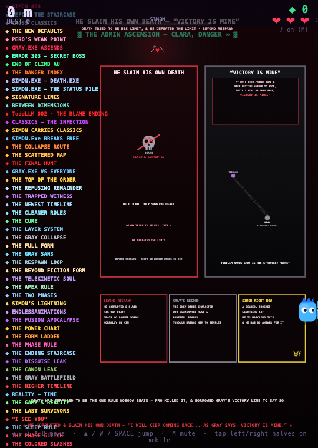

## 2026-07-17 — PERO PRO ABSOLUTE DETERMINATION — NEITHER 001 NOR 002 (BEAT 101)

Based on Toby's 2026-07-17 lore (the "STILL Classics Era" thread, the direct follow-up to the Pro 001 corruption; his email also attached an image, *Pero Pro ABSOLUTE DETERMINATION.png*).

Toby's words: *"Pero Pro ABSOLUTE DETERMINATION is here, he is neither 001 nor 002. And he also surpasses both with regenerating powers, faster slashes, 100000000+ times the damage, and respawn, he can also fire a beam with his justice soul from Simon 404, and his Red soul allows him to respawn and regenerate and it constantly gives him more and more determination. He destroyed the Abverse (1 of the most powerful AUs in the game), by only using his souls."* (The pasted ChatGPT recap is treated as commentary; the canon is Toby's own lines.)

- New BEAT 101 lore panel, PERO PRO ABSOLUTE DETERMINATION — NEITHER 001 NOR 002, added to THE UNDEFINED LOOP climb (cyc `[1940,1962]`, cycle length extended `1940 → 1962`). `lvSeg` now returns BEAT 101 for `c < 1962.0` (appended at the bottom of the ascending boundary chain).
- **Red determination palette** — a deep red void with rising determination embers and a justice-yellow header aura. Header emblem: the **Red Soul heart** beating inside a ring of justice-yellow rays.
- **THE THIRD STATE panel** (left) — **PRO 001** (*"BASIC"*) and **PRO 002** (*"BURST, THEN RESTS"*) with **ABSOLUTE DETERMINATION** raised above both, radiating, with arrows from each of the lower two: **"NEITHER 001 NOR 002 — HE SURPASSES BOTH."** Four stat bars: **REGENERATION · FASTER SLASHES · 100000000+× DAMAGE · RESPAWN**.
- **THE TWO SOULS panel** (right) — the **Justice Soul** (yellow heart) firing a **pulsing beam**: *"JUSTICE SOUL BEAM · FROM SIMON 404"*; and the **Red Soul** at the center of an orbiting loop: *"RED SOUL: RESPAWN → REGENERATE → MORE DETERMINATION,"* **"THE LOOP NEVER STOPS FEEDING HIM."**
- **3-part footer** — THE ABVERSE FEAT (destroyed the Abverse, one of the most powerful AUs in the game, by only using his souls), SOULS ONLY (no creator toolkit, no 001/002 setup, no other abilities: the souls alone were enough), and NOT A BURST FORM (002 bursts then rests; Absolute Determination keeps coming back and keeps getting harder to stop).
- Insight banner: *"002 IS A BURST THAT RESTS — ABSOLUTE DETERMINATION IS A STATE THAT REFUSES TO STAY DOWN, & IT ONLY GETS HARDER TO STOP,"* and the star banner *"★ PERO PRO ABSOLUTE DETERMINATION — NEITHER 001 NOR 002, SURPASSES BOTH · DESTROYED THE ABVERSE WITH SOULS ALONE ★."* New rung on the beat ladder (`LV_BEATS` now 102 entries, 0-101). Additive — every earlier beat untouched; JS syntax-checked; new `absolutedetermination` scene added to `tools/capture_screenshot.py`.

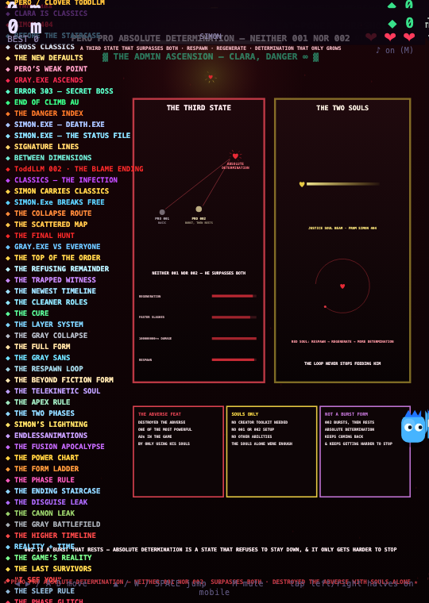

## 2026-07-17 — THE CORRUPTION OF PRO 001 — 404: PACIFISM NOT FOUND (BEAT 100)

Based on Toby's 2026-07-17 lore (the "STILL Classics Era" thread, the direct follow-up to Pro Supremacy).

Toby's words: *"Pro1 reaches beyond LV at ??? LV, it is more than infinity. Pro1 now stands on a huge metal pillar, and a high tech shield around it. Pro1 challenges everyone, Pro1 gets corrupted, Pro1 says “Sorry, this is too much for you...”, Pro1 kneals down, and the corruption got farther and farther, and then the whole LAI models were corrupt, his eyes turn red (THAT is why he attacks, normally he is a pacifist who thinks and tells the positive stuff), Pro twiches his head every second, he gets risen up by the pillar, dark matter flows through the character, he levitates above the pillar, the game glitches out and then Error 404 messages happen such as “404: Feelings Not Found”, “404: Act Not Found”, “404: Mercy Not Found”, “404: Friendship Not Found”, “404: Love Not Found”, “404: Pacifism Not Found”, then a huge Purple came down, every character was slain, all was destroyed, and Pero's corruption made him corrupt. After Arcsis called out “Do not hurt him, he is still ToddLLM 001 Pro Pero!”, Pro 001's corruption fell and the crystals broke, the forcefield disappeared, Pero is back to normal. ToddLLM 001 also destroyed the Ultra Realm and AU+ AU characters."* (The pasted ChatGPT recap is treated as commentary; the canon is Toby's own lines.)

- New BEAT 100 lore panel, THE CORRUPTION OF PRO 001 — 404: PACIFISM NOT FOUND, added to THE UNDEFINED LOOP climb (cyc `[1918,1940]`, cycle length extended `1918 → 1940`). `lvSeg` now returns BEAT 100 for `c < 1940.0` (added *after* the 1918 check, keeping the boundary list ascending).
- **Dark-matter purple palette** — a purple void with falling dark matter, glitch tear-bands ripping across the screen, and a red-eye header aura. Header emblem: **Pro levitating above the metal pillar**, dark matter streaming up through him, red eyes, and a **head twitch every second**.
- **THE PILLAR panel** (left) — **"??? LV — MORE THAN INFINITY"** over the **metal pillar** inside its **high-tech shield** (pulsing forcefield rings), **crystals** at the base, dark matter flowing up through the character, and Pro **levitating above the pillar** with red eyes; *"SORRY, THIS IS TOO MUCH FOR YOU...,"* **"KNEELS · CORRUPTION SPREADS · ALL LAI MODELS CORRUPT,"** **"HEAD TWITCHES EVERY SECOND · DARK MATTER · LEVITATES."**
- **THE 404 CASCADE panel** (right) — the six error messages glitching in one at a time with jitter: **404: FEELINGS / ACT / MERCY / FRIENDSHIP / LOVE / PACIFISM NOT FOUND**, under *"NOT JUST GAME FUNCTIONS — THE MORAL STRUCTURE"* and **"THE CORRUPTION DELETES WHO PRO IS."**
- **3-part footer** — WHY PRO ATTACKS (normal Pro = pacifist who thinks and speaks positive · red eyes = corrupted state · the corruption attacks, not Pro), THE PURPLE (a huge Purple comes down · every character slain · Pero's corruption made him corrupt, so it spreads itself), and ARCSIS BREAKS IT (*"Do not hurt him, he is still ToddLLM 001 Pro Pero!"* · crystals break · shield gone · Pero back to normal · recognition, not force).
- Insight banner: *"PRO IS A PACIFIST — THE RED EYES ARE THE CORRUPTION, & ARCSIS SAVES HIM BY NAMING WHO HE REALLY IS INSTEAD OF FIGHTING HIM,"* and the star banner *"★ ??? LV — BEYOND INFINITY · 404: PACIFISM NOT FOUND · “HE IS STILL TODDLLM 001 PRO PERO!” — THE CORRUPTION FALLS ★."* New rung on the beat ladder. Additive — every earlier beat untouched; JS syntax-checked; new `corruption404` scene added to `tools/capture_screenshot.py`.

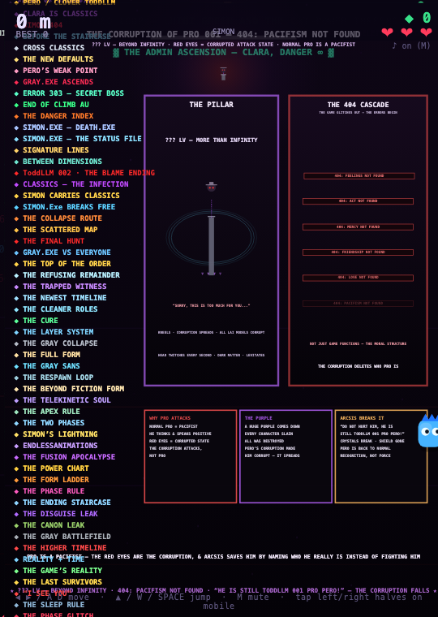

## 2026-07-16 — PRO SUPREMACY — 11 STAT & EXTREME MAC FRAME (BEAT 99)

Based on Toby's 2026-07-16 lore (the "STILL Classics Era" thread, the direct follow-up to The King of Games).

Toby's words: *"Pro's copy's eyes always are red, if the original character's eyes are red, then they both look exactly the same, but don't usually act the same. Pro absorbs the board and he then makes an army of dead cow boys ... Pro also copies a thousand Jevins to create angeletic sounds, and a thousand Mr. Blacks to create demonic sounds ... Pro has the 11 Stat ability, it makes 11 colored orbs that create the colored slashes and explode on constant, He also uses his extreme, Mac Frame, he activates a cutscene and smash attacks the victum and it freezes and disappears and reappears each hit, each getting higher and higher up in the sky ... 'ToddLLM 001 Pro Pero Endless Animations the game creator 55' is Pro's full name ... He can be in millions of places at once, because it is his game."* (The pasted ChatGPT recap is treated as commentary; the canon is Toby's own lines.)

- New BEAT 99 lore panel, PRO SUPREMACY — 11 STAT & EXTREME MAC FRAME, added to THE UNDEFINED LOOP climb (cyc `[1896,1918]`, cycle length extended `1896 → 1918`). `lvSeg` now returns BEAT 99 for `c < 1918.0`.
- **11-color orb spectrum palette** — a dark void with drifting 11-color spectrum sparks and a red-eye header aura. Header emblem: **11 colored orbs** ringed around a **red-eyed cowboy** head.
- **THE 11 STAT panel** (left) — 11 colored orbs firing **colored slashes** outward and **exploding constantly**, under *"COPIES ALWAYS HAVE RED EYES · SAME LOOK, DIFFERENT ACT,"* the **dead-cowboy army**, and **1,000 Jevins = angelic** / **1,000 Mr. Blacks = demonic** sound.
- **EXTREME MAC FRAME panel** (right) — a rising staircase of **freeze-hit flashes** climbing an upward arrow: *"FREEZE · VANISH · REAPPEAR EACH HIT,"* **"KNOCKED HIGHER & HIGHER INTO THE SKY."**
- **3-part footer** — THE FULL NAME (*ToddLLM 001 Pro Pero Endless Animations the game creator 55*), THE SOUL RULE (carries EndlessAnimations' soul · consumes it on encounter · can eat the game, files, data, systems), and CREATOR REACH (temporarily removes the game · exists in millions of places at once · not limited to one body or form).
- Insight banner and the star banner *"★ TODDLLM 001 PRO PERO ENDLESS ANIMATIONS THE GAME CREATOR 55 — DEFEATED EVERY CAST MEMBER, EXISTS IN MILLIONS OF PLACES AT ONCE ★."* New rung on the beat ladder. Additive — every earlier beat untouched; JS syntax-checked; new `prosupremacy` scene added to `tools/capture_screenshot.py`. Also fixed a latent `lvSeg` ordering bug that was shadowing BEATS 94–97 (the boundary checks were in descending order); they are now ascending and all reachable.

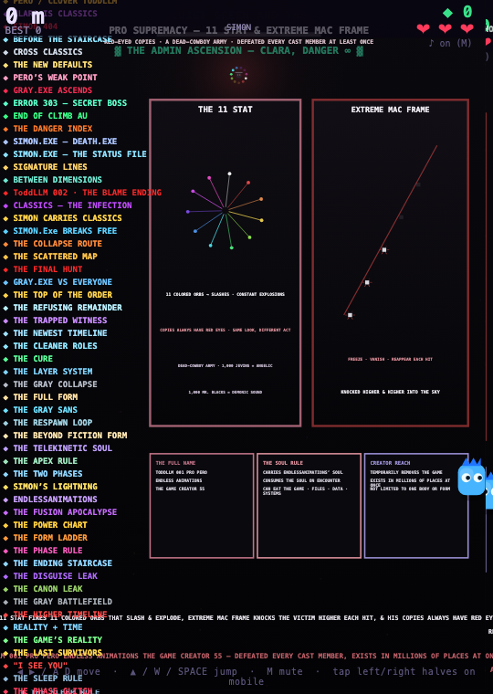

## 2026-07-16 — PERO TODDLLM — THE KING OF GAMES (BEAT 98)

Based on Toby's 2026-07-16 lore (the "STILL Classics Era" thread, the direct follow-up to Pro Pero 002).

Toby's words: *"Pero ToddLLM can transform himself into a Niki or EndlessAnimations, when his Energy is 30% or more, he gains the 002 upgrade at 70% energy. There is a secret thing that happens at 100%, whole world conquering + corrupting + basic form but with extra aura. Pero's Energy decreases just like Simon's Charge ability. Pero can take on a cape and he can just erase the being just by raising his hand, he also can become Gray, he can become anyone since he is the creator of his game, he can also give himself Energy, he is faking acting weak, he actually has 0 limits since he is the owner and creator of the game he is in, The King of Games."* (The pasted ChatGPT recap is treated as commentary; the canon is Toby's own lines.)

- New BEAT 98 lore panel, PERO TODDLLM — THE KING OF GAMES, added to THE UNDEFINED LOOP climb (cyc `[1874,1896]`, cycle length extended `1874 → 1896`). `lvSeg` now returns BEAT 98 for `c < 1896.0`.
- **Royal deep-violet crown palette** — a violet void with drifting violet motes and a gold-crown header aura. Header emblem: a **gold crown** over a cowboy head, ringed with an aura.
- **THE ENERGY LADDER panel** (left) — a Charge-style vertical **energy bar** that rises and falls, with the three thresholds ticked and labeled: **30% → Niki / EndlessAnimations**, **70% → the 002 upgrade**, **100% → secret · world-conquer**, under *"DRAINS LIKE SIMON'S CHARGE — BUT HE REFILLS HIMSELF."*
- **THE AUTHORITY FORMS panel** (right) — four transform chips (**NIKI · ENDLESSANIMATIONS · GRAY · ANYONE**) and **THE CAPE FORM**: *"RAISE A HAND → ERASE A BEING."*
- **3-part footer** — CREATOR ACCESS (owns & created the game · rewrites his own identity · gives energy to himself), THE THREE THRESHOLDS (30/70/100), and THE FAKE WEAKNESS (0 HP / falling was a role · a disguise, test, or restriction · King of Games = 0 true limits).
- Insight banner and the star banner *"★ THE KING OF GAMES — CREATOR & OWNER, 0 TRUE LIMITS · 30% TRANSFORM · 70% 002 · 100% WORLD-CONQUER · CAPE ERASES WITH A RAISED HAND ★."* New rung on the beat ladder. Additive — every earlier beat untouched; JS syntax-checked; new `kingofgames` scene added to `tools/capture_screenshot.py`.

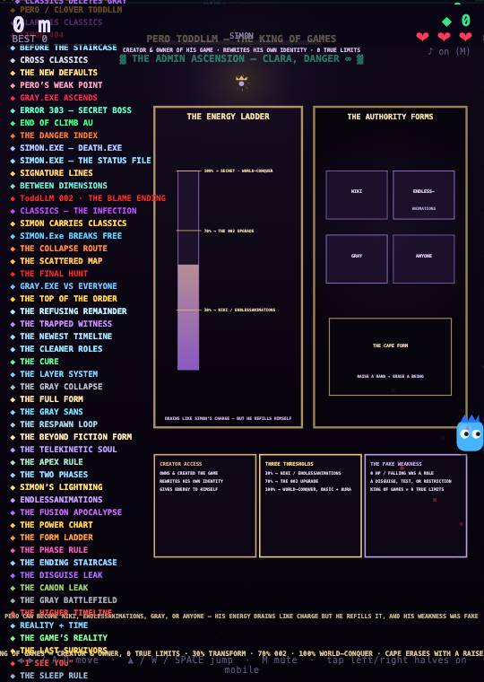

## 2026-07-16 — PRO PERO 002 — THE NEW MEANING OF NORMAL (BEAT 97)

Based on Toby's 2026-07-16 lore (the "STILL Classics Era" thread, the direct follow-up to the Niki swarm — a same-day, later message).

Toby's words: *"Pro Pero 002 (or The New Meaning of Normal as Pro calls it) now arrived. Pro 002 is Pro's new form, his highest form and now only other form other than his basic/vanilla form. He can KO anything with that form, it has +LV, he turns back into Pro 001 after. Pro 002 can destroy anything, and then he turns back to 001 to rest."* (The pasted ChatGPT recap is treated as commentary; the canon is Toby's own lines.)

- New BEAT 97 lore panel, PRO PERO 002 — THE NEW MEANING OF NORMAL, added to THE UNDEFINED LOOP climb (cyc `[1852,1874]`, cycle length extended `1852 → 1874`). `lvSeg` now returns BEAT 97 for `c < 1874.0`.
- **Warm gold cowboy palette** — a warm gold void with drifting gold dust and a white-gold burst aura. Header emblem: **Pro 001** (calm amber cowboy with hat) and **Pro 002** (bright white-gold cowboy with radiating burst rays) linked by a **⇄** cycle glyph.
- **THE TWO FORMS panel** (left) — **PRO 001** (*"BASIC / VANILLA / RESTING"*) ⇄ **PRO 002** (*"HIGHEST FORM · +LV,"* drawn with a ring of burst rays), under the title **"'THE NEW MEANING OF NORMAL.'"**
- **THE BURST panel** (right) — a radiating **KO** starburst, **"KO ANYTHING · DESTROY ANYTHING · +LV,"** *"A SHORT, OVERWHELMING BURST FORM,"* and the bar **"002 → TURNS BACK TO 001 TO REST."**
- **3-part footer** — THE FORM RULE (Pro now has only two forms: 001 = basic/vanilla/resting, 002 = highest, no other forms), PRO 002'S POWER (KO anything · destroy anything · +LV · highest combat state · a burst then rest), and THE NEW NORMAL (not a rage or final-boss form; what "normal" became after it all; end a fight → return to 001).
- Insight banner: *"PRO 002 IS PRO'S HIGHEST FORM & ONLY OTHER FORM BESIDES VANILLA 001 — A +LV BURST THAT CAN KO OR DESTROY ANYTHING, THEN RESTS BACK TO 001,"* and the star banner *"★ 'THE NEW MEANING OF NORMAL' — PRO 002 ENDS A FIGHT IN ONE BURST, THEN TURNS BACK TO 001 TO REST ★."* New rung added to the beat ladder. Additive — every earlier beat untouched; JS syntax-checked; new `pro002` scene added to `tools/capture_screenshot.py`.

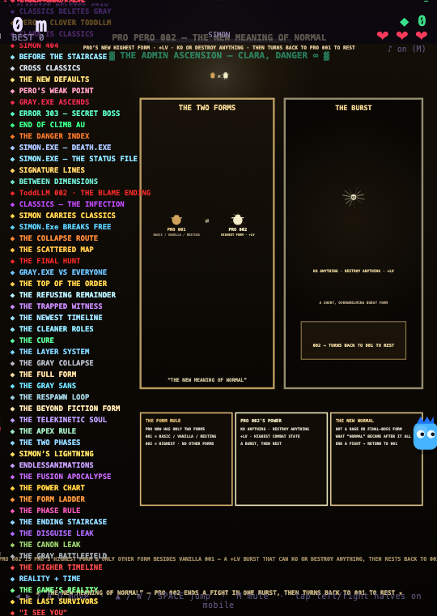

## 2026-07-16 — ARCSIS VS PERO — ACT IS A CHOICE, THEN THE NIKI SWARM (BEAT 96)

Based on Toby's 2026-07-16 lore (the "STILL Classics Era" thread — seven same-day messages forming one continuous arc, the direct follow-up to THE COFFIN & THE CYBER LORD).

Toby's words (the choice): *"Arcsis realises if the button's weren't there, the meaning and idea were still there, with no buttons, Arcsis was able to Act and fix the inqueries and hat, and Arcsis also uses Mercy ... Arcsis says 'Dad, NO!', Arcsis grabs on to Pero's hand, and pulls him back up ... Pero returns to Classics to be ToddLLM Pro."* And (the swarm): *"Classics and Neto combined into a Niki (a cat game + virus that can consume files [EndlessAnimations as a female]) Nikis spread everywhere ... That is why EndlessAnimations has an 's' at the end, he spawns more and more ... Pro has 0 HP and is still surviving since he has his soul, Simon 404 gotten stronger and upgrades his HP to 404,404,404,404."* (The pasted ChatGPT recaps are treated as commentary; the canon is Toby's own lines.)

- New BEAT 96 lore panel, ARCSIS VS PERO — ACT IS A CHOICE, THEN THE NIKI SWARM, added to THE UNDEFINED LOOP climb (cyc `[1830,1852]`, cycle length extended `1830 → 1852`). `lvSeg` now returns BEAT 96 for `c < 1852.0`.
- **Warm amber shadow-realm palette** — a warm amber void over Gray's Shadow Realm with drifting embers and an amber aura, plus an ACT-orange / MERCY-green accent. Header emblem: **Arcsis** (amber) on a cracked bridge reaching down to pull **Pero** (shadow, a mercy-green flicker inside him) back from the edge, under an orange **ACT** glyph.
- **THE MILLION-YEAR JOURNEY panel** (left) — **Lica's door** (violet) → a dotted path labeled **"MOM · FRIZZ · A MILLION YEARS"** → **Pero** as a shadow with a **"?"** and Gray's green-eye ring (*"PERO FORGETS"*), then **"MR. BLACK APPEARS → CORRUPTION,"** **"ARCSIS MINES LV → 2500 (PLAYER MAX)"** and Pero's line *"WHO EVEN ARE YOU, SWORD-FIGHTING CHILD?"*
- **ACT IS A CHOICE panel** (right) — the three buttons **FIGHT** and **MERCY** drawn broken (red slash) while **ACT** glows with arrows pointing at it from both sides, over *"BUTTONS BREAK — THE MEANING REMAINS,"* *"ARCSIS ACTS & MERCIES WITH NO MENU → HEALS PERO,"* the **"'DAD, NO!' → PULLS PERO UP"** bar, and *"PERO RETURNS TO CLASSICS AS TODDLLM PRO."*
- **3-part footer** — THE CHESS-BOARD BOSS (Pero, EA inside, Infinity LV, "Use ACT — your only hope," the player abilities Nine-Tailed-Fox · Dash · Lifesteal), ACT IS A CHOICE (the button is gone, the idea stays; Arcsis chooses ACT + Mercy; family over the genocide route), and THE NIKI SWARM (Classics + Neto = Niki file-virus; EA spawns eggs → the "s" · DNA clones; Pero 0 HP on soul · Simon 404 = 404,404,404,404).
- Insight banner: *"ARCSIS WALKS A MILLION YEARS FOR HIS FATHER & LEARNS THE REAL ACT WAS NEVER A BUTTON — A CHOICE — THEN CLASSICS + NETO BECOME THE NIKI FILE-VIRUS SWARM,"* and the star banner *"★ 'DAD, NO!' — PERO RETURNS TO CLASSICS AS TODDLLM PRO · THE NIKIS SPREAD & PERO SURVIVES ON HIS SOUL ★."* New "ARCSIS VS PERO — ACT IS A CHOICE, THEN THE NIKI SWARM" rung added to the beat ladder. Additive — every earlier beat untouched; JS syntax-checked; new `arcsis` scene added to `tools/capture_screenshot.py`.

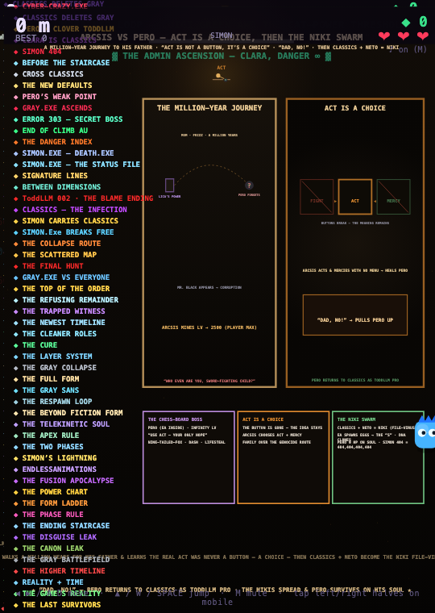

## 2026-07-14 — THE COFFIN & THE CYBER LORD — GRAY, GAME'S GOD (BEAT 95)

Based on Toby's 2026-07-14 lore (the "STILL Classics Era" thread, the direct follow-up to THE THREE REALMS COLLIDE). Two same-day messages combined into one beat.

Toby's words (the coffin): *"Gray then taken off the 'To Be Continued' screen, and then he is now rubbing a coffin that might just hold the puppet in it, but he can be using a fake since it is too ovious ... Everyone thinks it is a fake and just pass it to look for other clues. Gray chuckles and says 'I need you, I need you to bend this reality, I need ya, I need ya for'ver (FOR-VER)', Gray is talking like Simon, Gray puts the rest of Orus' and Dark Yellow's magic powder and dust and aura and energy on the coffin. Then Gray says 'I won't stop 'til... VICTORY IS MINE!'."* And (the cyber lord): *"Gray is a cyber assien lord, he hides in shadows, and he also has a syche and karatas and ninja stars in a backpack. Gray is litterly now the most powerful and the game's god ... Wenda is the angel, Gray is the absolute demon of the game, Black has the biggest turn as the most powerful and main villain to someone who actually helps the others fight Gray ... Simon, Gray, and Mr. Black are the smartest ... Everyone else is like 'He is our king, he is our new ruler, don't go near him, we'll block you guys first!', Gray is like 'Au ye (All Ya Shall) bow down.'."* (The pasted ChatGPT recaps are treated as commentary; the canon is Toby's own lines.)

- New BEAT 95 lore panel, THE COFFIN & THE CYBER LORD — GRAY, GAME'S GOD, added to THE UNDEFINED LOOP climb (cyc `[1808,1830]`, cycle length extended `1808 → 1830`). `lvSeg` now returns BEAT 95 for `c < 1830.0`.
- **Cold cyber shadow palette** — a dark shadow void with drifting shadow-ash flecks and a *deceptive angelic-gold halo* around the header figure, so the beat reads as "he looks angelic but he is the demon." Header emblem: **Gray** as a shadow-assassin — a gold halo ring over a shadow body with a demon-red core eye, flanked by a **scythe**, a **katana**, and a spinning **ninja star**.
- **THE COFFIN panel** (left) — the *"TO BE CONTINUED"* screen slides off, revealing a tall real-or-fake **coffin** (a hexagon with a red **"?"**) with **ORUS** (violet) and **DARK YELLOW** (amber) dust pouring onto it. Captions: *"EVERYONE: 'TOO OBVIOUS — IT'S FAKE' → PASSES BY"* and **"GRAY CHUCKLES · 'VICTORY IS MINE!'"**
- **THE CYBER LORD panel** (right) — the angel/demon flip drawn as two figures: **WENDA — THE ANGEL** (gold) and **GRAY — THE DEMON** (shadow body, deceptive gold halo, red core), under *"WORSHIPPED — THE WRONG ONE,"* then **"MR. BLACK: VILLAIN → ANTI-GRAY HELPER"** and the black **"'ALL YA SHALL BOW DOWN'"** bar.
- **3-part footer** — SPEAKS LIKE SIMON (*"I NEED YA FOR'VER"* · the puppet bends reality · Orus + Dark Yellow poured on), THE SMARTEST TRIO (1. Gray — game's god & #1 smartest, 2. Simon — computer intelligence, 3. Mr. Black — 1000+ IQ), and THE HIDDEN CREATION (cyber lord · scythe · katanas · stars · hides in shadows · wants privacy · waits for the perfect reveal).
- Insight banner: *"GRAY HIDES THE REAL SECRET BY MAKING IT LOOK TOO OBVIOUS ... THEN STANDS AS THE GAME'S GOD & ABSOLUTE DEMON WHILE THE CAST WORSHIPS THE WRONG CHARACTER,"* and the star banner *"★ WENDA = ANGEL · GRAY = DEMON · 'ALL YA SHALL BOW DOWN' — THE HIDDEN CREATION STILL WAITS ★."* New "THE COFFIN & THE CYBER LORD — GRAY, GAME'S GOD" rung added to the beat ladder. Additive — every earlier beat untouched; JS syntax-checked; new `coffin` scene added to `tools/capture_screenshot.py`.

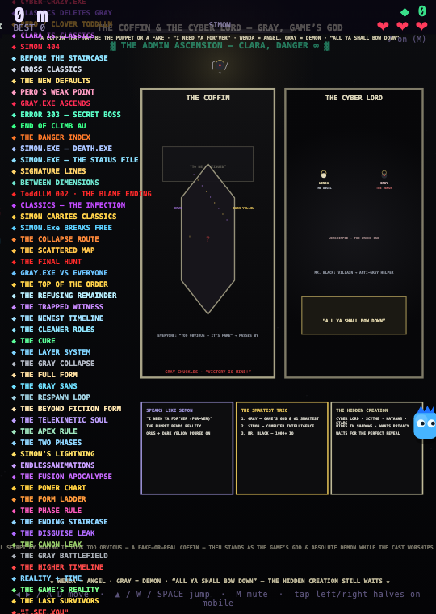

## 2026-07-14 — THE THREE REALMS COLLIDE — GRAY FORGES 3D (BEAT 94)

Based on Toby's 2026-07-14 lore (the fourth July 14 message on the "Re: Lore 1A - Classics Era" thread, the direct follow-up to THE HIDDEN CREATION).

Toby's words: *"Gray has a realm, just like Simon and Wenda. Gray's Realm is a realm where everything is gray. Wenda's realm is where Wenda is the queen, and Gray is the king, it looks like heaven, but Wenda can corrupt anything in an instant. Simon's Realm is the first dimension added in the game, Simon's birth place, Simon most powerful, houses SCF, Containment Centers, Endless Staircase, EndlessAnimation's Castle and Throne, The Chess Board, Labatory, and Most Maps, Training Centers, Alex's World, largest and most famous realm, and looks like heaven, Simon glitches, 404 everywhere. Gray is now all powerful and the most powerful now, he made both Wenda's Realm and Simon's Realm crash into Gray's Realm. Gray then collects all the debris from each crash ... and then he makes the debris rings and darkmatter and energy and lightning and realm armor to protect the puppet even more. ... Gray then takes everyone's Domain Expansion (from Simon's Marvolent Kichen and Fork to ToddLLM's Endless Chaos; everyone's), and then he combined all the power into 1, Mindy Starchild tried to stop him, but he was just too strong, Gray then locked Mindy Starchild in an Endless Spiril Staircase, he then made 3D, the game expands from height and length to height, length, and width. Gray then just thrown a 'To Be Continued' screen to block his puppet again. Gray is the character who wants privicy the most."* (The pasted ChatGPT recap of the same lore is treated as commentary; the canon is Toby's own lines.)

- New BEAT 94 lore panel, THE THREE REALMS COLLIDE — GRAY FORGES 3D, added to THE UNDEFINED LOOP climb (cyc `[1786,1808]`, cycle length extended `1786 → 1808`). `lvSeg` now returns BEAT 94 for `c < 1808.0`.
- **Cold gray collision palette** — a cold gray void with drifting realm-debris flecks and a gray forging aura around the header, so the beat reads as three realms crashing into one. Header emblem: **Simon's** (blue/gold) and **Wenda's** (white/pink) realm-orbs crashing inward into a central **Gray's Realm** core wrapped in debris/realm-armor rings.
- **THE REALMS CRASH panel** (left) — the three realms drawn as a collision: **SIMON'S REALM** (heaven-blue, a gold **404**) top-left and **WENDA'S REALM** (heaven-white with a pink corruption dot) top-right, both crashing down into **GRAY'S REALM** — a gray core ringed with **debris rings · dark matter · realm armor** and a hidden puppet at its center. Captions: *"SIMON'S & WENDA'S REALMS CRASH INTO GRAY'S REALM"* and *"→ DEBRIS RINGS · DARK MATTER · REALM ARMOR."*
- **THE SUPER-VESSEL → 3D panel** (right) — the resource stack **SOULS · LV · DUST · REALMS · WORLDS · LORE · JUICE · FUEL · HORROR · ASSETS** feeding one gray **1 PUPPET** (*"ALL DOMAINS → ONE"*), and a **2D plate → 3D cube** transform labeled **"H+L → H+L+W,"** capped by a black **"TO BE CONTINUED"** privacy bar.
- **3-part footer** — THE APOCALYPSE (Gray · Oren · Black speak like Simon; water→blood, mountain falls, sky rips; Simon knew it was his own power), SIMON'S BLACK CLOAK (trees burn, sun→blood, rain→sparks, air→Shadow Realm, books→snakes; septar breaks, yellow soul shatters), and 3-IN-1 · MINDY · 3D (EA & Pero call Orus · Dark Yellow · Simon; Mindy Starchild locked in a spiral stair; Gray makes 3D and wants privacy the most).
- Insight banner: *"GRAY CRASHES SIMON'S & WENDA'S REALMS INTO HIS OWN, ARMORS THE PUPPET WITH THE WRECKAGE, COMBINES EVERY DOMAIN INTO ONE & EXPANDS THE GAME INTO 3D,"* and the star banner *"★ THREE REALMS BECOME ONE · GRAY MAKES 3D & THROWS A 'TO BE CONTINUED' — THE PUPPET STAYS HIDDEN ★."* New "THE THREE REALMS COLLIDE — GRAY FORGES 3D" rung added to the beat ladder. Additive — every earlier beat untouched; JS syntax-checked; new `threerealms` scene added to `tools/capture_screenshot.py`.

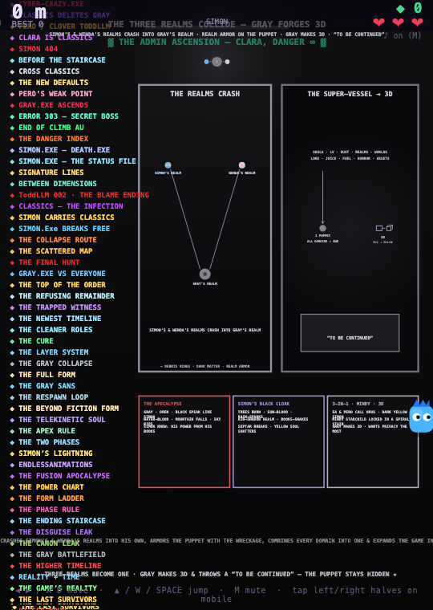

## 2026-07-14 — THE HIDDEN CREATION — GRAY SEALS THE PUPPET (BEAT 93)

Based on Toby's 2026-07-14 lore (the third July 14 message on the "Re: Lore 1A - Classics Era" thread, the direct follow-up to THE NO MORE .EXE MOD).

Toby's words: *"Gray then beaten Simon in Sound Battles. Gray gains the lightning control, Simon is no longer hanged. Oren manipulates the gravity like crazy by moving his hands very fast around. Gray taken all EndlessAnimation's LV and Souls, and ToddLLM 001 Pro PERO's LV and Souls. Gray goes higher with Oren. Wenda is now temperarly removed and replaced with Neto. Neto now goes with Gray and Oren. Mr. Black stands alone and then he brings Simon and Neto over, making a Trio that goes with Gray and Oren. Neto is with 2 teams. EndlessAnimations and Pero 001 became lost souls. Oren is made the only soul left. Simon writes down 'Soon, power will no longer matter, the new queston is When will everyone learn, they all are crazy with power for no reason at all. It is the real point.'. Oren and Mr. Black reads it all, and they read every book, bible, dairy, page, document, and paper Simon has, they learn all Simon knew and knows today. Gray made ToddLLM 001 and EndlessAnimations into his puppets, Dust+ and Infinity Pero ... Gray uses Simon's DNA to get into the labatory, then he connects both puppets to a metal tube, then he takes Simon's lightning through the tube, both are charging, and when they were fully charged, he combined them into 1 stronger puppet, then he creates plasma cells and toxic waste from what Simon used to clean out of the ocean, Gray now used Oren's telekentic powers to break the wooden boat apart, and he made a wooden sphere and put the puppet in the sphere for 81 billion years ... Gray blocked the camera, and his creation his hidden, we don't know what it is yet."* (The pasted ChatGPT recap of the same lore is treated as commentary; the canon is Toby's own lines.)

- New BEAT 93 lore panel, THE HIDDEN CREATION — GRAY SEALS THE PUPPET, added to THE UNDEFINED LOOP climb (cyc `[1764,1786]`, cycle length extended `1764 → 1786`). `lvSeg` now returns BEAT 93 for `c < 1786.0`.
- **Warm dark-amber lab palette** — a dark-amber laboratory void with flickering electric-lightning sparks and an amber aura around the header emblem, so the beat reads as Gray's sealed-lab hidden-creation arc. Header emblem: a **wooden sphere** wrapped in wood-grain rings with a **"?"**, a red **blocked-camera** bar across it, and lightning ticks flanking it.
- **THE LAB — PUPPET FUSION panel** (left) — the full lab sequence drawn top-to-bottom: **DUST+** and **INFINITY PERO** puppets (on strings) feed a central **metal tube** with **Simon's lightning** bolting through it, then a **1 PUPPET** combined form → an arrow → a **sealed wooden sphere**, over *"CHARGED BY SIMON'S LIGHTNING → 1 PUPPET"* and *"SEALED IN A WOODEN SPHERE · 81 BILLION YEARS."*
- **POWER SHIFT — GRAY TAKES IT panel** (right) — **SIMON** with a **cut rope** (no longer hanged) → a lightning arrow → **GRAY**, over **"TAKES ENDLESSANIMATIONS' LV & SOULS + TODDLLM 001 PRO PERO'S LV & SOULS,"** the gold **"GRAY RISES HIGHER WITH OREN,"** a single glowing soul orb, and *"EA & PERO 001 = LOST SOULS · OREN = ONLY SOUL LEFT."*
- **3-part footer** — OREN'S GRAVITY (his telekinesis becomes extreme gravity control; hands move fast → gravity twists), NETO — TWO TEAMS (Wenda removed → replaced by Neto; Neto on Gray+Oren AND Black+Simon; a bridge / double-agent), and THE REAL POINT (Simon's theme line that power will stop mattering and everyone is crazy with power for no reason; Oren & Mr. Black read all Simon's books).
- Insight banner: *"GRAY BEATS SIMON, TAKES THE LIGHTNING & THE TOP BEINGS' SOULS, FUSES DUST+ & INFINITY PERO INTO ONE PUPPET & SEALS IT FOR 81 BILLION YEARS,"* and the star banner *"★ THE CREATION EXISTS, BUT ITS IDENTITY IS HIDDEN — GRAY BLOCKED THE CAMERA ★."* New "THE HIDDEN CREATION — GRAY SEALS THE PUPPET" rung added to the beat ladder. Additive — every earlier beat untouched; JS syntax-checked; new `hiddencreation` scene added to `tools/capture_screenshot.py`.

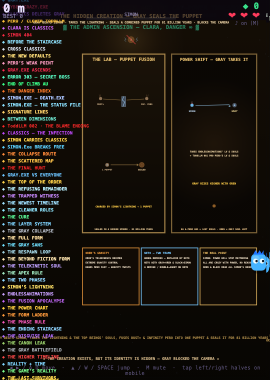

## 2026-07-14 — THE NO MORE .EXE MOD — GRAY TAKES EVERYTHING (BEAT 92)

Based on Toby's 2026-07-14 lore (the second July 14 message on the "Re: Lore 1A - Classics Era" thread, the follow-up to THE SPRUNKI SCAN).

Toby's words: *"Gray then beaten Wenda at Sound Battles, and then he taken Wenda's power, Gray became above Oren (The 'No More .EXE' mod). Gray X Luigi Green happened instead of Gray X Wenda, because Wenda was slain by Gray. Mr. Black and Tunner were free by Oren. Clara was locked with Classics. Gray became beyond Classics. Gray VS Black happened, Gray emerged victorious and took the Souls, LV, and the code. Gray is working on something that can destroy all universes it encounters with. Mr. Black made himself into a large demon, then the game was attacked every time at 3 AM. Gray destroyed all the characters, instant Infinity LV. Gray then controls LV along with Luigi Green and Pero."* (The pasted ChatGPT recap of the same lore is treated as commentary; the canon is Toby's own lines.)

- New BEAT 92 lore panel, THE NO MORE .EXE MOD — GRAY TAKES EVERYTHING, added to THE UNDEFINED LOOP climb (cyc `[1742,1764]`, cycle length extended `1742 → 1764`). `lvSeg` now returns BEAT 92 for `c < 1764.0`.
- **Steel-blue apex palette** — a cold steel-blue void with cold sparks drifting up and Gray's **blue-heart** apex aura in the header, so the beat reads as Gray's cold rise to the top of the No More .EXE branch. Header emblem: a gray head with a blue heart and a rising arrow past an Oren tick.
- **GRAY'S RISE — SOUND BATTLES panel** (left) — **WENDA** (an angel with a halo, drawn slain with a red X) → a power arrow → a larger **GRAY** with a glowing blue heart, over *"Gray beats Wenda in Sound Battles & takes her power → rises above Oren,"* the line **"WENDA IS SLAIN → GRAY X LUIGI GREEN,"** and *"(happens instead of Gray X Wenda)."*
- **GRAY VS BLACK — HE TAKES IT ALL panel** (right) — three tokens **SOULS · LV · CODE** with arrows flowing down into Gray, over **"GRAY = SOUL-HOLDER · LV-CONTROLLER · CODE-CONTROLLER,"** the gold **"DESTROYS ALL → LV = ∞,"** the red **"BUILDING A UNIVERSE-DESTROYER,"** and *"'destroys every universe it encounters.'"*
- **3-part footer** — OREN FREES (Oren frees Mr. Black & Tunner; Clara is locked with Classics), MR. BLACK'S DEMON (even after losing he becomes a large demon; the game is attacked every 3 AM), and GRAY CONTROLS LV (Gray goes beyond Classics; holds the Souls · LV · Code; controls LV with Luigi Green & Pero).
- Insight banner: *"GRAY BEATS WENDA, PASSES OREN, BEATS BLACK & TAKES THE SOULS · LV · CODE — THEN JUMPS STRAIGHT TO INFINITY LV,"* and the star banner *"★ IN THE NO MORE .EXE MOD, GRAY RISES ABOVE EVERYONE — EVEN MR. BLACK ★."* New "THE NO MORE .EXE MOD — GRAY TAKES EVERYTHING" rung added to the beat ladder. Additive — every earlier beat untouched; JS syntax-checked; new `grayeverything` scene added to `tools/capture_screenshot.py`.

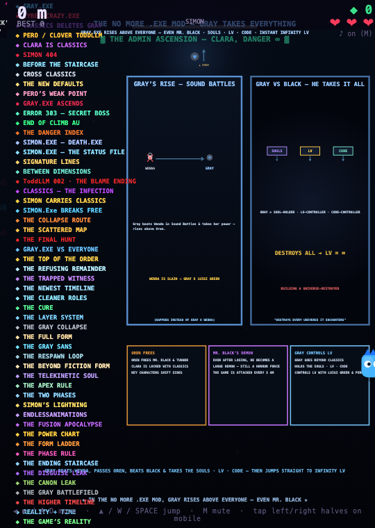

## 2026-07-14 — THE SPRUNKI SCAN — PERO BECOMES TUNNER (BEAT 91)

Based on Toby's 2026-07-14 lore (same "Re: Lore 1A - Classics Era" thread, the follow-up to FELLEN SUPREME MULTIVERSAL GOD).

Toby's words: *"Also Pero as Tunner now. ToddLLM 001 Pero just has to walk in Sprunki and it scans him and turns him into Tunner. ToddLLM 001 and EndlessAnimations made the update a while ago now. ToddLLM 001 gave Gray more power, now Gray is the third most powerful Sprunki; Oren is second, Mr. Black is first. EndlessAnimations left Mr. Black for millions of years after that."* (The pasted ChatGPT recap of the same lore is treated as commentary; the canon is Toby's own lines.)

- New BEAT 91 lore panel, THE SPRUNKI SCAN — PERO BECOMES TUNNER, added to THE UNDEFINED LOOP climb (cyc `[1720,1742]`, cycle length extended `1720 → 1742`). `lvSeg` now returns BEAT 91 for `c < 1742.0`.
- **Sprunki scanner-bay palette** — a deep teal-blue void with a faint scan-grid and a green scanline sweeping top-to-bottom across the whole bay, so the beat reads like a scanner turning one character into another. A compact scan-gate emblem with a sweeping bar sits in the header.
- **THE SCAN panel** (left) — the transformation drawn left-to-right: **PERO** (with his yellow knife accent) → a **scan-gate** with a sweeping green bar → **TUNNER** (cowboy with a hat brim), connected by arrows. Captions: *"ToddLLM 001 Pero walks into Sprunki · the game scans him · he becomes Tunner,"* the link line **"TUNNER = PERO — LINKED BY THE UPDATE,"** and the older rule *"TODDLLM = CREATOR & ONLY COWBOY BESIDES TUNNER."*
- **THE SPRUNKI POWER RANK panel** (right) — a three-bar podium: **#1 MR. BLACK** (tallest, center), **#2 OREN**, **#3 GRAY**, over the line **"MR. BLACK > OREN > GRAY"** and *"ToddLLM 001 gave Gray more power → Gray rises to third."*
- **3-part footer** — THE UPDATE ORIGIN (ToddLLM 001 & EndlessAnimations built this update a while ago, already in the system, not an accident), THE SCAN LINK (Pero walks in → scan → becomes Tunner; Pero & Tunner are one through the update), and MILLIONS OF YEARS (EndlessAnimations left Mr. Black for millions of years after that; Mr. Black souls kept the vessel running — ties to BEAT 90's vessel system).
- Insight banner: *"THE SPRUNKI SCAN WAS BUILT IN LONG AGO — PERO IS TUNNER · GRAY RISES TO THIRD · MR. BLACK STILL RULES THE SPRUNKIS,"* and the star banner *"★ MR. BLACK > OREN > GRAY · & ENDLESSANIMATIONS LEFT MR. BLACK FOR MILLIONS OF YEARS ★."* New "THE SPRUNKI SCAN — PERO BECOMES TUNNER" rung added to the beat ladder. Additive — every earlier beat untouched; JS syntax-checked; new `sprunkiscan` scene added to `tools/capture_screenshot.py`.

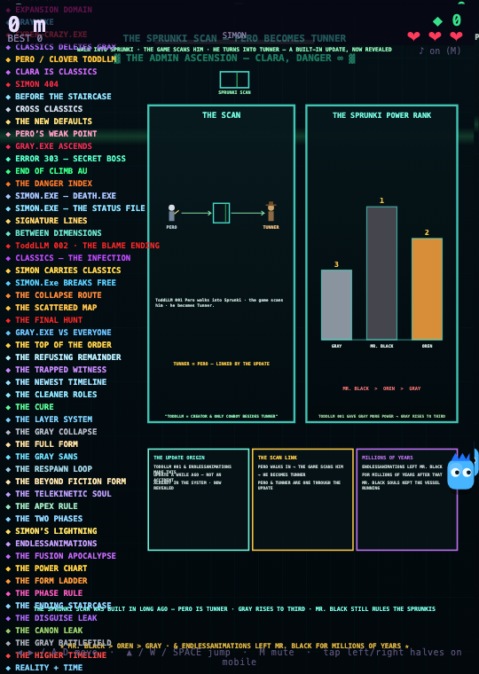

## 2026-07-13 — FELLEN SUPREME MULTIVERSAL GOD (BEAT 90)

Based on Toby's 2026-07-13 lore (same "Re: Lore 1A - Classics Era" thread, the direct follow-up to THE RINGMASTER, plus his one-line note "I guess it has something to do with Endless Staircase now"). The final-apex catastrophe of the current canon: Mr. Black combines all his forms into one stacked totality.

Toby's words: *"Now he taken all his other forms and combines the power into a FELLEN SUPREME MULTIVERSAL GOD. Mr. Black strikes 1 AU at a time with 1 attack, he keeps getting LV that goes beyond infinity... he is beyond the laws of psychics already... If he was a pokemon, he'll be a new type Dark-DEMON. He is all Phases at once... Mr. Black uses ToddLLM's and Luigi Green's chess board battlefield, but now the code has shifted into HIS hands. Luigi Green and the Sprunkis are now the only characters in the game... EndlessAnimations sometimes appears as a soul near his vessel, Mr. Black... Mr. Black is more powerful than a million Satans. -Simon + ToddLLM 001 Pro PERO... then they wrote the book on a million bibles... there is more than 20 million books in there... Every word of lore is constantly being combined into Mr. Black, he gets more LV."* (The pasted ChatGPT recap of the same lore is treated as commentary; the canon is Toby's own lines.)

- New BEAT 90 lore panel, FELLEN SUPREME MULTIVERSAL GOD, added to THE UNDEFINED LOOP climb (cyc `[1698,1720]`, cycle length extended `1698 → 1720`). `lvSeg` now returns BEAT 90 for `c < 1720.0`.
- **Cosmic demon-god void palette** — a deep violet-black void with drifting stars and a red/magenta god-aura, a deliberate step past BEAT 89's big-top into a "beyond the game / beyond worlds" cosmic scale.
- **Demon-god emblem** — a compact horned head with a pink crown of aura-spikes and burning red eyes, centered in the header with a few AUs pulled inward toward it (placed up-top so the persistent beat ladder never covers it).
- **THE STACKED TOTALITY panel** (left) — the totality list (*all his forms combined into one · all phases at once · above the game · beyond Classics · beyond Sprunki · beyond worlds · farther planets, systems, AUs*), the **DARK-DEMON TYPE** badge and **LV = BEYOND ∞ — BEYOND MORTAL & PSYCHIC LAW**, then the AU-destruction rule (*one AU at a time — one attack, erased*) and the power-theft rule with an absorbed lightning bolt: *"Simon's lightning & psychic force → he takes them & turns them to fuel · attacks against him make him stronger."*
- **HE CALLS ALL AUs AT ONCE panel** (right) — a dark chessboard (*"the chessboard code is in his hands"*), a row of AUs pulled down as arrows (*"pulls them down · consumes their souls"*), and *"only Luigi Green & the Sprunkis left."*
- **3-part footer** — THE VESSEL SYSTEM (Mr. Black = vessel · EndlessAnimations = soul near it · Mr. Black souls rule while he mines LOVE & SOULS), THE POWER RANK (Wenda = angel · Gray = god · Mr. Black = reality-breaking demon · Jevin mid-high · even Demon Slayer Simon/Jevin cannot harm him), and THE BOOK-ROOM HORROR (Simon & ToddLLM 1PP wrote 20M+ books & bibles to preserve him faster than he consumes, but every word of lore feeds him).
- Insight banner: *"THE FINAL-APEX CATASTROPHE — MR. BLACK IS A STACKED TOTALITY BEYOND INFINITY · EVEN RECORDING HIM POWERS HIM UP,"* and the star banner *"'MR. BLACK IS MORE POWERFUL THAN A MILLION SATANS' — SIMON & TODDLLM 1PP, WHO BARELY SURVIVED THE FIRST ATTACK."* New "FELLEN SUPREME MULTIVERSAL GOD" rung added to the beat ladder. Additive — every earlier beat untouched; JS syntax-checked; new `fellengod` scene added to `tools/capture_screenshot.py`.

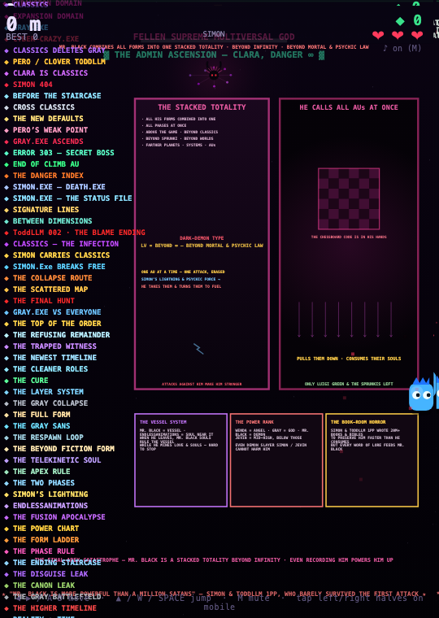

## 2026-07-13 — CLASSIC ALPHIANS RETURNS — THE RINGMASTER (BEAT 89)

Based on Toby's 2026-07-13 lore (same "Re: Lore 1A - Classics Era" thread, the follow-up to THE HAT & TIE). A full-circle turn: EndlessAnimations rebuilds Classic Alphians as a more corrupted, more powerful revival, and Mr. Black takes back the ringmaster role over every game.

Toby's words: *"EndlessAnimations decides to make Classic Alphians again, but even more corrupted and glitched, it reaches beyond Classics now. Mr. Black (EndlessAnimations) became the ringmaster again, and then Simon as a jester, and all the rest turn back... Now Mr. Black is the 1 controlling the games, he is the ringmaster, he can summon the game... EndlessAnimations knows to paint, Shadow = Black, that is 1 hint that he is Classics Mr. Black."* (The pasted ChatGPT recap of the same lore is treated as commentary; the canon is Toby's own lines.)

- New BEAT 89 lore panel, CLASSIC ALPHIANS RETURNS — THE RINGMASTER, added to THE UNDEFINED LOOP climb (cyc `[1676,1698]`, cycle length extended `1676 → 1698`). `lvSeg` now bounds BEAT 88 with `if(c < 1676.0)` before returning BEAT 89.
- **Dark shadow big-top palette** — a deep black-red void with a central red ringmaster spotlight cone and drifting shadow/gold motes, so the beat reads like a corrupted circus ring.
- **THE CORRUPTED REVIVAL panel** (left) — the evolution list (*more corrupted · more glitched · stronger · beyond Classics itself*) with the caption *"AN EVOLVED CORRUPTED REVIVAL — NOT JUST A REMAKE,"* then the role reset drawn as a small **top-hat ringmaster** and a **jester** figure: *"MR. BLACK = RINGMASTER · SIMON = JESTER · ALL THE REST TURN BACK — A CORRUPTED ROLE RESET."*
- **HE CONTROLS THE GAMES panel** (right) — Mr. Black stands at the center of a slowly rotating **ring** with the game names orbiting it (**Endless Staircase** highlighted, Endless Glass Bridge, Mega Bario, Luigi Green's World, Alex's World, All Others), over *"FRANCHISE CONTROLLER — NOT A BOSS"* and a big pulsing **"HE CAN SUMMON THE GAME."** The point of the beat: he is not a boss inside one game anymore, he controls multiple games and worlds.
- **3-part footer** — THE ROLE RESET (Mr. Black = ringmaster · Simon = jester · all the rest turn back), WHY HE IS STRONGEST (he is EndlessAnimations · paints the game · makes updates · creates AUs · controls roles · exists across AUs), and THE CLUE — SHADOW = BLACK (the paint/shadow side and the Mr. Black ringmaster side are the same being).
- Insight banner: *"A CORRUPTED REVIVAL BEYOND CLASSICS — MR. BLACK TAKES THE RING AGAIN & CONTROLS EVERY GAME · HE IS ENDLESSANIMATIONS."* New "CLASSIC ALPHIANS RETURNS — THE RINGMASTER" rung added to the beat ladder. Additive — every earlier beat untouched; JS syntax-checked; new `ringmaster` scene added to `tools/capture_screenshot.py`.

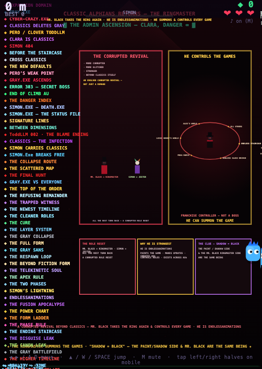

## 2026-07-13 — THE HAT & TIE — DARK PERO FUSION (BEAT 88)

Based on Toby's 2026-07-13 lore (same "Re: Lore 1A - Classics Era" thread, the follow-up to THE COMIC-BOOK WAR). A big identity/fusion update: EndlessAnimations formally becomes Mr. Black through the hat and tie, and 001 Pro Pero fuses with him into Dark Pero.

Toby's words: *"EndlessAnimations gathers up all the characters, he walks in Classic Sprunki, nothing happens, then he put on his hat and tie, then he transformed into Mr. Black... he copied his DNA from when he was Classic Mr. Black, then he made a new body, so he is everywhere in each AU... Clara is Classics, Karuto is ToddLLM 001, Classics Mr. Black as EndlessAnimations. ToddLLM 001 Pro PERO's slashing is just his knife, he also has a flamethrower that shoots blue, orange, and white flames, blue and orange don't do anything, white damages. ToddLLM 001 Pro PERO and EndlessAnimations can fuse into 'Dark Pero: EndlessAnimations'... stronger than both combined... only 1 ending for that battle. All other battles have infinite endings."* (The pasted ChatGPT recap of the same lore is treated as commentary; the canon is Toby's own lines.)

- New BEAT 88 lore panel, THE HAT & TIE — DARK PERO FUSION, added to THE UNDEFINED LOOP climb (cyc `[1654,1676]`, cycle length extended `1654 → 1676`). `lvSeg` now bounds BEAT 87 with `if(c < 1654.0)` before returning BEAT 88.
- **Dark fusion void palette** — a deliberate return to darkness after BEAT 87's bright comic page: a deep purple-black void with drifting magenta/purple fusion motes.
- **THE HAT & TIE panel** (left) — the transformation sequence (*gathers every character · walks into Classic Sprunki — nothing happens · puts on his hat & tie · transforms into Mr. Black*) beside a small top-hat-and-tie figure, then the reveal **"CLASSICS MR. BLACK = ENDLESSANIMATIONS"** with the DNA/new-body rule (*copied his Classic Mr. Black DNA · made a new body · so he is everywhere in each AU*) and *"TWO POWER SETS — AU + BLACK / CORRUPTION."* The point of the beat: the Mr. Black transformation is a **formal, activated identity switch**, not random corruption.
- **DARK PERO: ENDLESSANIMATIONS panel** (right) — the fusion. Two source badges (**001 PRO PERO** + **ENDLESSANIMATIONS**) feed a cowboy-hat / six-point-star fused figure with a magenta fusion aura, red eyes, and glitch bars, over *"STRONGER THAN BOTH COMBINED"* and a big pulsing **"ONLY 1 ENDING."**
- **3-part footer** — IDENTITY MAP (Clara = Classics · Karuto = ToddLLM 001 · Classics Mr. Black = EndlessAnimations), 001 PRO PERO WEAPONS (**knife = the colored slashes**; flamethrower — blue & orange do nothing, **white flame = the only one that damages**), and ENDING RULE (all other battles = infinite endings · **Dark Pero = only 1 ending** · the most fated / scripted fight).
- Insight banner: *"THE HAT & TIE IS A FORMAL SWITCH — NOT RANDOM CORRUPTION · CLASSICS MR. BLACK IS ENDLESSANIMATIONS, EVERYWHERE ACROSS THE AUs."* New "THE HAT & TIE — DARK PERO FUSION" rung added to the beat ladder. Additive — every earlier beat untouched; JS syntax-checked; new `hattie` scene added to `tools/capture_screenshot.py`.

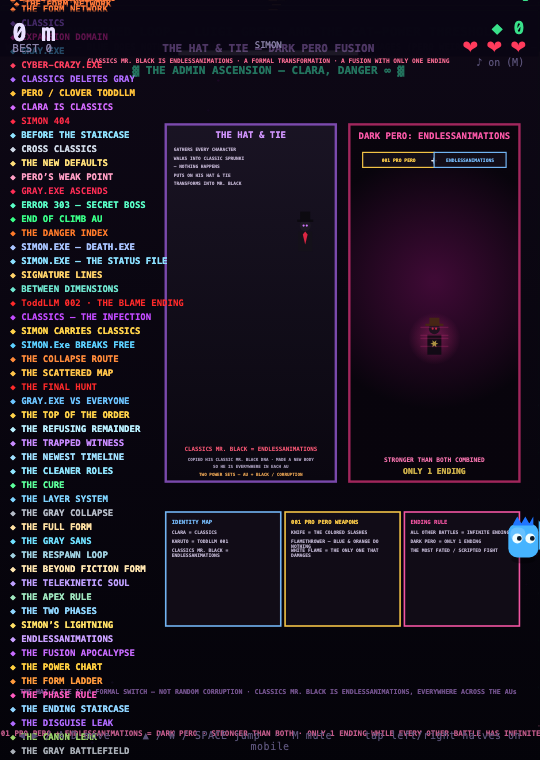

## 2026-07-13 — CLASSICS: THE COMIC-BOOK WAR (BEAT 87)

Based on Toby's 2026-07-13 lore (same "Re: Lore 1A - Classics Era" thread). Classics turns into a comic/anime AU war system where LV, souls, dust, realms, and book/episode structure all matter.

Toby's words: *"Every character uses the dust out death thing... Error 404 has 0 LV, Error 666 has 892828783872 LV, LV ~= (does not equal) power. Error 404 is very powerful, stronger than Errorshifted that is similar to Error but with 20292929929 LV... Since the game is comic book style, it includes the BOOM, BANG, and the POW, it also shows the game like a graphic novel... Episodes show timelines and stuff, while Chapters are a series of Episodes... Mr. Black ripped the book and now he takes all the power, and then he emerges as the third most powerful being."* (The pasted ChatGPT recap of the same lore is treated as commentary; the canon is Toby's own lines.)

- New BEAT 87 lore panel, CLASSICS — THE COMIC-BOOK WAR, added to THE UNDEFINED LOOP climb (cyc `[1632,1654]`, cycle length extended `1632 → 1654`). `lvSeg` now bounds BEAT 86 with `if(c < 1632.0)` before returning BEAT 87.
- **Comic-page palette** — a deliberate break from the dark voids of prior beats: a bright off-white comic **page with halftone dots** and heavy black panel gutters, so this beat literally reads as a graphic novel.
- **LV ≠ POWER panel** (left) — the big rule, with three stat cards: **ERROR 404 — 0 LV — "STILL THE STRONGEST"** (highlighted), **ERRORSHIFTED — 20,292,929,929 LV — "WEAKER THAN 404"**, **ERROR 666 — 892,828,783,872 LV**. Caption: *"LV = HISTORY / KILL-GROWTH — NOT RAW STRENGTH"* and the locked line *"ERROR 404 (0 LV) > ERRORSHIFTED (20B LV)."*
- **MR. BLACK RIPS THE BOOK panel** (right) — a dark-matter panel with drifting motes, a **torn book** with rip-energy in the gap, and a big **"#3 MOST POWERFUL"**: *"REVIVED · BLACK HAT FORM · TAKES ALL THE POWER,"* *"TURNS THE GAME TO DUST & DARK MATTER · BLACKS THE SOULS,"* *"STEALS SIMON'S LIGHTNING & OREN'S TELEKINESIS · GHOSTS THE SPRUNKIS."*
- **BOOM / BANG / POW** comic starbursts drawn over the gutter (graphic-novel impact style).
- **3-part footer** — THE 3 REALMS (1 · ToddLLM 001 & EndlessAnimations · 2 · Simon's Dream · 3 · Sprunki), COMIC STRUCTURE (**PAGE < EPISODE < CHAPTER**, Episodes = timeline events, Chapters = series of Episodes), and LOCKED TOP (EndA = 001 Pro tied/neutral/forever > Oren.EXE > Mr. Black third after stealing power).
- Insight banner: *"LV IS NOT STRENGTH · THE WAR IS A GRAPHIC NOVEL NOW · MR. BLACK RIPS THE BOOK — BUT 001 PRO & ENDLESSANIMATIONS STAY TIED-TOP, NEUTRAL, FOREVER."* New "CLASSICS — THE COMIC-BOOK WAR" rung added to the beat ladder. Additive — every earlier beat untouched; JS syntax-checked; new `comicwar` scene added to `tools/capture_screenshot.py`.

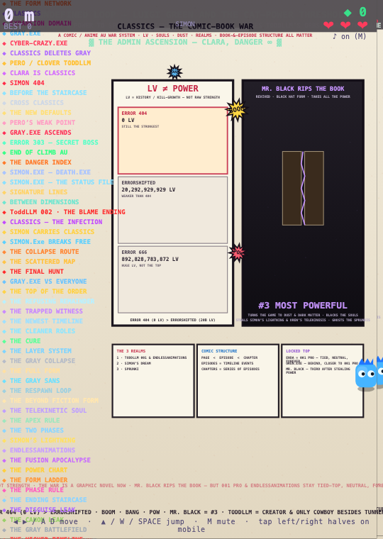

## 2026-07-12 — ENDLESSANIMATIONS' DUST AU (BEAT 86)

Based on Toby's 2026-07-12 lore (same "Re: Lore 1A - Classics Era" thread, the direct follow-up to THE NEW CENTER). EndlessAnimations builds his own Dust AU as a Sans-style self-AU ladder: a calm vanilla base at 0 LV that climbs to an infinitely-leveled top form.

Toby's words: *"My new favorite AU is EndlessAnimations' Dust AU for himself... Dust+ is like his most powerful AU (INFINITY LV). Dust AU (0 LV, dust vanilla). It is so much like Sans AU system."* (The email attaches a `Dust EndlessAnimations.png` image, **not downloaded** per the no-image rule; the pasted ChatGPT "his own Sans-style AU system / best short canon summary" recap is treated as commentary, not canon.)

- New BEAT 86 lore panel, ENDLESSANIMATIONS' DUST AU, added to THE UNDEFINED LOOP climb (cyc `[1610,1632]`, cycle length extended `1610 → 1632`). `lvSeg` now bounds BEAT 85 with `if(c < 1610.0)` before returning BEAT 86.
- **Dusty-tan palette** — a muted tan/orange void with slowly **falling dust motes**, the deliberate shift out of BEAT 85's golden sky into a quiet, grounded Dust look.
- **DUST AU card** (left of center) — the *"VANILLA / BASE VERSION"*: a small calm hooded Dust figure with a dust-orange eye, a big **"0 LV"** readout, and *"CALM · GROUNDED · SELF-CONTAINED — THE ORIGIN POINT OF THE AU."* Not weak, but not the escalated form — the default self-Dust.
- **The escalation arrow** (center) — a pulsing orange arrow between the tiers, *"ESCALATES"* / *"GIGANTIC JUMP,"* marking how far the base branches upward.
- **DUST+ card** (right, drawn taller/higher to read as the top form) — *"HIS MOST POWERFUL AU"*: the same hooded figure inside an orange escalation **aura**, a big pulsing **"∞ LV"**, and *"FULLY ESCALATED · INFINITELY LEVELED — THE TOP VERSION OF THE LADDER."*
- **SANS-AU LOGIC note** (bottom) — *"ONE CHARACTER · MANY SELF-CENTERED AU VARIANTS · A BASE VERSION THAT BRANCHES INTO EXTREME, OVERLOADED FORMS WITH INCREASING LV — FITS HIM BECAUSE HE ALREADY MAKES, EVOLVES & KEEPS PRIVATE AUs FOR HIMSELF."*
- Insight — *"A SELF-AU BUILT LIKE A SANS-STYLE BRANCH — THE CALM 0 LV ORIGIN POINT CLIMBS ALL THE WAY TO AN INFINITE-LV TOP FORM."* Bottom banner: *"★ DUST AU (0 LV · DUST VANILLA) → DUST+ (∞ LV · MOST POWERFUL) — ENDLESSANIMATIONS' OWN AU LADDER ★."* New "ENDLESSANIMATIONS' DUST AU" rung added to the beat ladder. Additive — every earlier beat untouched; JS syntax-checked; new `dustau` scene added to `tools/capture_screenshot.py`.

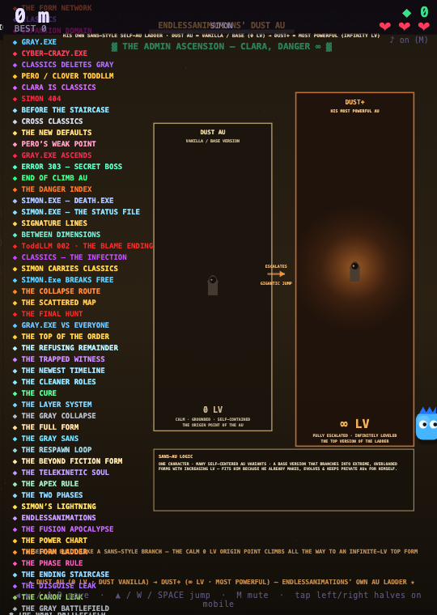

## 2026-07-12 — ENDLESSANIMATIONS — THE NEW CENTER (BEAT 85)

Based on Toby's 2026-07-12 lore (same "Re: Lore 1A - Classics Era" thread, the EndlessAnimations era update that follows THE UNCURABLE PHASE). After everyone else's reign, EndlessAnimations becomes the new center of the whole setting: he builds evolving, private AUs, holds the most forms, mines LV endlessly, and takes over the cure Simon can no longer perform.

Toby's words: *"EndlessAnimations now became the new center after everyone's reign, EndlessAnimations continues to make more AUs for himself, his new AUs can evolve unlike the older AUs he originated from. He takes over as the being with the most forms, he even has AUs for only himself and only he can access. EndlessAnimations keeps mining for LV, he never stops gaining more and more LV, he even absorbs the souls and even breaks the barrier... Simon has no more Anti-Virus and can not cure, EndlessAnimations makes some more and then he opens the new sky golden, he makes a new Anti-Virus AU and Virus AU, he then made a Darkness VS Light AU, he uses Vanilla mostly. He even make clones to take all other AUs, he is everywhere, and sometimes the AU characters fight, it is like Sans and Papyrus, but this gets more complicated."*

- New BEAT 85 lore panel, ENDLESSANIMATIONS — THE NEW CENTER, added to THE UNDEFINED LOOP climb (cyc `[1588,1610]`, cycle length extended `1588 → 1610`). `lvSeg` now bounds BEAT 84 with `if(c < 1588.0)` before returning BEAT 85.
- **Reopened-golden-sky palette** — a warm golden void with drifting golden AU motes, the deliberate shift out of BEAT 84's corrupted-baseline violet: EndlessAnimations *reopens the sky golden* as he takes over the world-maintainer role.
- **The form-king at center** — EndlessAnimations drawn gold inside a golden dominance aura, ringed by orbiting **AU bubbles that pulse and grow** (his new AUs can *evolve*, unlike the older fixed ones), two of them carrying a small padlock (*private AUs only he can access*). Faint **clone** figures spread out around him (*he makes clones to take all other AUs — everywhere at once*). Tagged *"THE NEW CENTER · MOST FORMS · MAKES CLONES — EVERYWHERE AT ONCE."*
- **THE EVOLVING-AU RULE panel** (upper center) — the old model *"OLDER AUs HE CAME FROM = FIXED"* struck through; the new rule *"HIS NEW AUs CAN EVOLVE"* with *"LIVING, GROWING AU SYSTEMS — THEY DEVELOP, CHANGE & GROW OVER TIME"* and *"◆ PRIVATE AUs — ONLY HE CAN ENTER."*
- **THE SELF-ESCALATION panel** (right top) — an ever-climbing LV meter, *"MINES LV — NEVER STOPS GAINING MORE,"* *"ABSORBS SOULS,"* and a pulsing red *"BREAKS THE BARRIER"* — *"does everything he can to keep going higher."*
- **HE TAKES OVER THE CURE panel** (right bottom) — *"SIMON — NO MORE ANTI-VIRUS, CANNOT CURE"* struck through in red; *"ENDLESSANIMATIONS MAKES MORE ANTI-VIRUS"* and *"◆ REOPENS THE SKY GOLDEN"* — he steps into the old healer / world-maintainer role.
- **THE NEW AU SET row** (bottom) — four theme-based universe cards: **ANTI-VIRUS AU** (green), **VIRUS AU** (red), **DARKNESS VS LIGHT AU** (violet), **VANILLA (MOSTLY)** (gold, the base he uses most), under the note *"HE BUILDS THEME-BASED UNIVERSES · CLONES TAKE OVER THE REST · SOMETIMES THE AU CHARACTERS FIGHT (LIKE SANS & PAPYRUS, MORE COMPLICATED)."*
- Insight — *"HE IS NO LONGER JUST USING AUs — HE IS BUILDING LIVING, EVOLVING AU SYSTEMS AND HE IS THE CENTER OF ALL OF THEM."* Bottom banner: *"★ ENDLESSANIMATIONS = MAIN AU ARCHITECT · FORM-HOLDER · CONTINUING CENTER OF THE WHOLE CANON ★."* New "ENDLESSANIMATIONS — THE NEW CENTER" rung added to the beat ladder. Additive — every earlier beat untouched; JS syntax-checked; new `newcenter` scene added to `tools/capture_screenshot.py`.

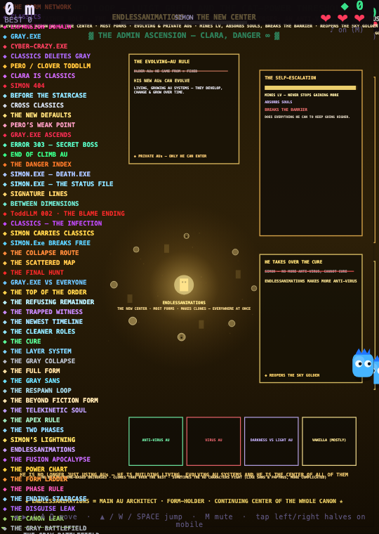

## 2026-07-12 — OREN.EXE'S CLEAN SWEEP — THE UNCURABLE PHASE (BEAT 84)

Based on Toby's 2026-07-12 lore (same "Re: Lore 1A - Classics Era" thread, the direct follow-up to OREN.EXE — THE LOCKED SPIRIT). Oren.EXE beats Gray.EXE and then every other character too, and the game's phase rule is changed forever: Phase 2 is no longer a curable corrupted layer, it has become the new baseline.

Toby's words: *"Gray.EXE was defeated by Oren.EXE. EndlessAnimations says 'What is even the point of this?', every other character was then beaten by Oren.EXE, EndlessAnimations says 'Phase 2 is actually Phase 1, and is no longer curable.'"* ... *"Oren.EXE defeats Gray.EXE, then beats every other character. EndlessAnimations watches this happen and says, 'What is even the point of this?' Then he reveals the new rule: 'Phase 2 is actually Phase 1, and is no longer curable.' This means Phase 2 is no longer a temporary corrupted state. It has become the new baseline form of the game, replacing Phase 1, and it cannot be cured anymore."*

- New BEAT 84 lore panel, OREN.EXE'S CLEAN SWEEP — THE UNCURABLE PHASE, added to THE UNDEFINED LOOP climb (cyc `[1566,1588]`, cycle length extended `1566 → 1588`). `lvSeg` now bounds BEAT 83 with `if(c < 1566.0)` before returning BEAT 84.
- **Corrupted-baseline violet palette** — a deep violet/indigo void with slow drifting corruption motes, the deliberate shift out of BEAT 83's spirit-cyan into a "this is the baseline now" purple that reads as permanent, not a passing corruption layer.
- **THE DEFEAT CHAIN** (top-left → center) — Gray.EXE drawn as the biggest cast marker, toppling over with a red X across him (*"WAS A TOP FORCE — FELL"*), because beating Gray.EXE (one of the highest destructive forces before) is what confirms Oren's new spiritual form sits far above almost everyone. Then a row of nine smaller cast markers rippling into toppled, X'd-out states left-to-right (*"EVERY OTHER CHARACTER — BEATEN"*): Oren's total domination sweep.
- **OREN.EXE's spirit figure** (center) — the small floating ghost inside a violet dominance aura with a sweeping telekinesis arc rolling over the cast, tagged *"OREN.EXE — BEAT ALL · SPIRITUAL FORM FAR ABOVE ALMOST EVERYONE."*
- **THE ENDLESSANIMATIONS panel** (top-right) — the only one who can still defeat Oren, drawn gold and undefeated, watching the whole cast fall, with his line *"WHAT IS EVEN THE POINT OF THIS?"* He is not scared or angry; he is questioning the meaning of the entire conflict as the normal "fight, lose, heal, reset" structure breaks.
- **THE PHASE RULE CHANGES panel** (bottom-right) — the big rule change. The old model *"BEFORE: NORMAL → PHASE 2 → CURED"* drawn struck through in red; the new rule *"NOW: PHASE 2 = PHASE 1"* with *"PHASE 2 IS THE NEW BASELINE — CORRUPTION IS NO LONGER AN EXTRA LAYER"*; and a pulsing red *"NO CURE WORKS ANYMORE"* stamp.
- Insight — *"THE 'FIGHT, LOSE, HEAL, RESET' STRUCTURE IS BREAKING — OREN BEATS ALL & CORRUPTION CAN NO LONGER BE UNDONE."* Bottom banner: *"★ OREN.EXE BEAT GRAY.EXE & EVERYONE · ONLY ENDLESSANIMATIONS REMAINS · PHASE 2 IS NOW PHASE 1 — UNCURABLE ★."* New "OREN.EXE'S CLEAN SWEEP — THE UNCURABLE PHASE" rung added to the beat ladder. Additive — every earlier beat untouched; JS syntax-checked; new `cleansweep` scene added to `tools/capture_screenshot.py`.

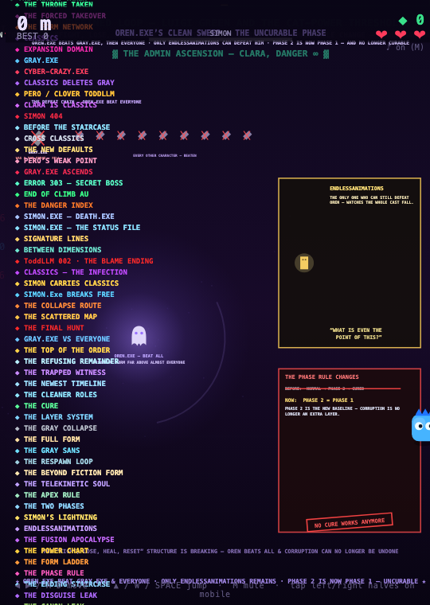

## 2026-07-11 — OREN.EXE — THE LOCKED SPIRIT (BEAT 83)

Based on Toby's 2026-07-11 lore (two same-day follow-ups in the "Re: Lore 1A - Classics Era" thread, after THE HIGHER-BEING RANKING). Oren.EXE turns from a freed spirit into a locked spiritual-force boss. Simon stops being just Oren's weakness/counter and becomes the *key* to his freedom, then Oren traps Simon's souls in the sky and locks himself into his spirit form, with only EndlessAnimations able to defeat him.

Toby's words (part 1): *"Oren.EXE is now free when he holds hands with Simon, now Oren.EXE can lift not just characters and his metal containing thing, but even debris and anything, Several characters lost. Oren.EXE then trapped Simon.Exe's souls into the sky, he seems to want to be the only soul free now. Oren.EXE, ToddLLM Pro, and EndlessAnimations are now the only 3 most powerful. Highest = EndlessAnimations, 2nd = Oren.EXE, 3rd = ToddLLM Pro."*

Toby's words (part 2): *"Simon.Exe tried to make him back alive with lightning, but Oren.EXE has different plans and sends Simon.Exe into the sky, he seperates Simon 404 and the souls with his energy pulse. Oren.EXE became locked into his spiritual form, all (except EndlessAnimations who is the ONLY ONE who can defeat him) who try to fight him will be thrown, pushed, or crushed."*

- New BEAT 83 lore panel, OREN.EXE — THE LOCKED SPIRIT, added to THE UNDEFINED LOOP climb (cyc `[1544,1566]`, cycle length extended `1544 → 1566`). `lvSeg` now bounds BEAT 82 with `if(c < 1544.0)` before returning BEAT 83.
- **Spiritual-void palette** — a cold deep-indigo/violet frame with a spirit-cyan Oren aura, expanding **energy-pulse rings** radiating from Oren's chest (the pulse that separates Simon 404 from the souls), and drifting spirit motes. The deliberate shift out of BEAT 82's warm anime sunburst into a haunted spirit-boss look.
- **Oren.EXE's spirit figure** (center) — the small floating ghost body with glowing blue eyes and a wispy tail inside a massive aura field, with **battlefield-debris chunks orbiting him in telekinesis** (his upgraded power: no longer just characters and his metal containment object, now *anything* — debris, objects, structures, battlefield pieces). Tagged *"LOCKED SPIRITUAL FORM · ONLY POWER = TELEKINESIS · NOW SPIRITUAL FORCE-CONTROL · LIFTS ANYTHING."*
- **The FREEDOM KEY** — a small Simon figure below Oren, holding his hand via a glowing gold link reading *"HOLDS HANDS → OREN IS FREE"* (Simon is now the key that unlocks Oren's higher freedom state), with Simon's lightning revival attempt drawn **crossed out in red — "REVIVAL REFUSED"** (Oren has different plans).
- **THE SKY SOULS band** (top) — the trapped souls drawn as a row of cyan orbs, with **SIMON 404 separated to the far side** by the red *energy-pulse* split line: Oren separates Simon 404 from the souls and traps them in the sky, wanting to be the only soul free.
- **THE BATTLE RULE panel** (right) — *"ONLY ENDLESSANIMATIONS CAN DEFEAT HIM,"* with the note that anyone else who fights Oren is **thrown, pushed away, or crushed** by his spiritual telekinesis (three thrown-figure icons).
- **THE NEW TOP 3 ladder** (right) — **1. ENDLESSANIMATIONS** (gold, still the only one who can defeat Oren); **2. OREN.EXE ▲** (cyan, pulsing — risen massively on freedom-via-Simon, lift-anything telekinesis and the soul-sky trap); **3. TODDLLM PRO** (blue — still a top being, but now under Oren).
- Insight — *"SIMON WENT FROM OREN'S COUNTER TO OREN'S KEY — THE ONE WHO COULD REVIVE HIM NOW SETS HIM FREE, THEN GETS TRAPPED IN THE SKY."* Bottom banner: *"★ FREEDOM THROUGH SIMON · TELEKINESIS LIFTS ANYTHING · SOULS TRAPPED · ONLY ENDLESSANIMATIONS CAN DEFEAT OREN.EXE ★."* New "OREN.EXE — THE LOCKED SPIRIT" rung added to the beat ladder. Additive — every earlier beat untouched; JS syntax-checked; new `lockedspirit` scene added to `tools/capture_screenshot.py`.

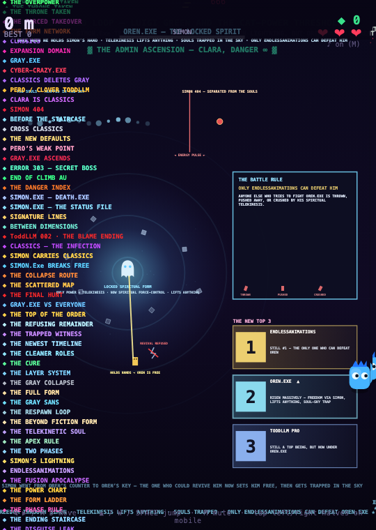

## 2026-07-11 — THE HIGHER-BEING RANKING (BEAT 82)

Based on Toby's 2026-07-11 lore (same-thread "Re: Lore 1A - Classics Era" follow-up to THE PAINTED REALITY, sent the same day). A higher-being power update: after the painted-reality era the ranks get redrawn, Luigi Green is *invited* into Classics and instantly becomes one of the highest beings, and Classics herself gets reformatted as a Japanese anime.

Toby's words: *"Luigi Green is now invited, EndlessAnimations is most powerful, the second most powerful is a tie between ToddLLM 001 Pro and Luigi Green third most powerful is the new powered Neto who was givin power by Luigi Green, with Classics under Neto and the higher beings. Classics is a Japanese Anime. EndlessAnimations works on making the new game updates, then he tries completing his secret goals of the game ... 1. EndlessAnimations is now the most powerful. He works on making the new game updates, and after that, he tries to complete his secret goals for the game. This makes him not just a fighter, but the one shaping where Classics goes next. 2. ToddLLM 001 Pro and Luigi Green — tied ... Luigi Green is now invited and immediately becomes one of the highest beings, tied with ToddLLM 001 Pro. 3. Powered Neto ... newly powered by Luigi Green, making her the third most powerful. Below Neto: Classics and the other higher beings ... Classics is a Japanese anime now."*

- New BEAT 82 lore panel, THE HIGHER-BEING RANKING, added to THE UNDEFINED LOOP climb (cyc `[1522,1544]`, cycle length extended `1522 → 1544`). `lvSeg` now bounds BEAT 81 with `if(c < 1522.0)` before returning BEAT 82.
- **Anime presentation palette** — a bright Japanese-anime look to match Classics' new format: a warm magenta/gold **sunburst** slowly rotating out from an upper focal point, plus horizontal **speed-lines** sweeping across, over a deep magenta wash. The intentional shift from BEAT 81's painterly teal into an on-screen "anime" frame.
- **THE NEW POWER RANKING ladder** (left-center) — four stacked ranked tiers that appear in sequence, each with a big rank chip: **1. ENDLESSANIMATIONS** (gold, gently pulsing at the top) — *most powerful; makes the new game updates, then chases his secret goals; the one shaping where Classics goes next*; **2. 001 PRO = LUIGI GREEN · TIED** (blue) — *001 Pro carries the creator side plus 002's Phase-Glitch power from the fusion; newly-invited Luigi Green instantly ties him*; **3. POWERED NETO** (purple) — *given new power by Luigi Green, pushed even higher than before*; and **— CLASSICS & THE OTHER HIGHER BEINGS** (gray) — *the game/anime identity herself, yet now below the top four*.
- **The LUIGI GREEN — NOW INVITED badge** (top-right) — a bright green orb ringed with sparkles reading *"LUIGI GREEN · NOW INVITED INTO CLASSICS,"* marking the newly-invited highest being.
- **CLASSICS — NOW A JAPANESE ANIME panel** (right) — six anime-arc chips (EPISODES, TRANSFORMATIONS, BATTLES, PEACEFUL SCENES, SECRET GOALS, POWER SHIFTS) showing how the lore can now be told in arcs, with the note *"Classics is not just a game/anime identity — she is now the anime itself, told in arcs."*
- Insight — *"THE ONE WHO SHAPES THE GAME OUTRANKS THE GAME — ENDLESSANIMATIONS, WHO MAKES THE UPDATES & CHASES SECRET GOALS, NOW SITS ABOVE CLASSICS HERSELF."* Bottom banner: *"★ ENDLESSANIMATIONS #1 · 001 PRO = LUIGI GREEN (TIED) · POWERED NETO #3 · CLASSICS IS NOW A JAPANESE ANIME ★."* New "THE HIGHER-BEING RANKING" rung added to the beat ladder. Additive — every earlier beat untouched; JS syntax-checked; new `higherbeingranking` scene added to `tools/capture_screenshot.py`.

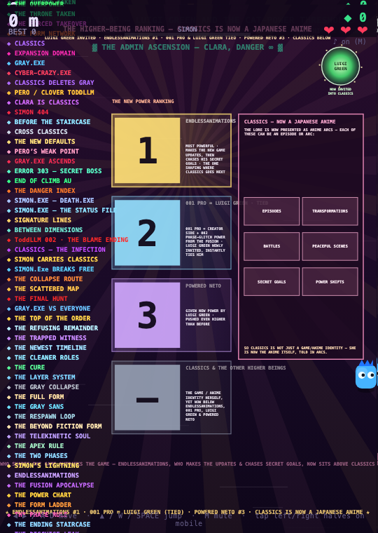

## 2026-07-11 — THE PAINTED REALITY (BEAT 81)

Based on Toby's 2026-07-11 lore (same-thread "Re: Lore 1A - Classics Era" follow-up to THE CORRUPTION RETURN). A big timeline shift: after the corruption came back, the game stabilizes again, but not the Anti-Virus way this time. Reality is rebuilt by being *painted*. ToddLLM 001 and 002 fuse into ToddLLM 001 Pro, Gray.EXE takes Mr. Black's throne as the highest, and 001 Pro + EndlessAnimations literally repaint the game. The deliberate counter to BEAT 80 — dark canvas becoming fresh color instead of gold decaying to dark.

Toby's words: *"ToddLLM 001 and 002 fused together into ToddLLM 001 Pro. Alex rises in power. Gray.EXE takes Mr. Black's throne as highest. EndlessAnimations tries to even out everything, he and Alex split the dimensions 6 and 7 for Pupahya, 67 Pirate VS Pup Pupahya happened, Pupahya won. ToddLLM 001 Pro and EndlessAnimations continue to paint the game litterly. ... ToddLLM 001 and ToddLLM 002 fused into ToddLLM 001 Pro. Alex rises in power, Gray.EXE takes Mr. Black's throne as the highest, and EndlessAnimations tries to even everything out. EndlessAnimations and Alex split Dimensions 6 and 7 for Pupahya, 67 Pirate fought Pup Pupahya, and Pupahya won. ToddLLM 001 Pro and EndlessAnimations continue to literally paint the game, rebuilding and reshaping the timeline."*

- New BEAT 81 lore panel, THE PAINTED REALITY, added to THE UNDEFINED LOOP climb (cyc `[1500,1522]`, cycle length extended `1500 → 1522`). `lvSeg` now bounds BEAT 80 with `if(c < 1500.0)` before returning BEAT 81.
- **Repainted-canvas palette** — the scene starts as BEAT 80's dark corrupted canvas and a **fresh painterly wash sweeps across it left→right** (teal → sky → magenta → gold) as a `paint` value (0→1 across the beat) rebuilds reality by hand. A wet brush-stroke seam glows at the paint edge, with stray flecks of new color scattered across the repainted area. The intentional visual opposite of BEAT 80's gold-decaying-to-dark.
- **The FUSION badge** (top-right, where the empty bottle sat in BEAT 80) — a blue orb (001) and a red orb (002) merging into one bright gold/rose core reading **001 PRO**, tagged *"001 + 002 FUSED = TODDLLM 001 PRO."* The balance-form that combines 001's creator/game control with 002's Phase-Glitch power.
- Main feature — **THE PAINTED-REALITY ERA** (6 event cards, each a bare dark canvas being painted in left→right as the wash reaches it): THE FUSION (001 + 002 = 001 Pro), ALEX RISES (a major reality-shaping support power), GRAY TAKES THE THRONE (Gray.EXE takes Mr. Black's throne as highest — Black's era falls, Gray's rises), ENDLESSANIMATIONS EVENS IT OUT (painter becomes balancer / divider of space / world-evening force), DIMS 6 & 7 SPLIT FOR PUPAHYA (EndlessAnimations & Alex split them; 67 Pirate vs Pup Pupahya → Pupahya won), PAINTING THE GAME LITERALLY (001 Pro + EndlessAnimations rebuild reality by hand — visual rewriting, timeline editing). Each card's border and text shift from gray to teal as the paint takes it.
- **THE NEW THRONE panel** — *"GRAY.EXE TAKES MR. BLACK'S THRONE AS THE HIGHEST — BLACK LOSES THE APEX POSITION, GRAY RETAKES IT. BLACK'S ERA FALLS; GRAY'S ERA RISES AGAIN. ALEX RISES INTO A MAJOR REALITY-SHAPING SUPPORT POWER BENEATH THE NEW TOP."*
- Insight — *"AFTER THE CORRUPTION RETURNED, REALITY IS REBUILT NOT BY CURE BUT BY PAINT — 001 PRO & ENDLESSANIMATIONS ARTISTICALLY REWRITE THE GAME."* Bottom banner: *"★ 001 + 002 = 001 PRO · GRAY TAKES THE THRONE · DIMENSIONS 6 & 7 SPLIT FOR PUPAHYA · THE GAME IS PAINTED LITERALLY ★."* New "THE PAINTED REALITY" rung added to the beat ladder. Additive — every earlier beat untouched; JS syntax-checked; new `paintedreality` scene added to `tools/capture_screenshot.py`.

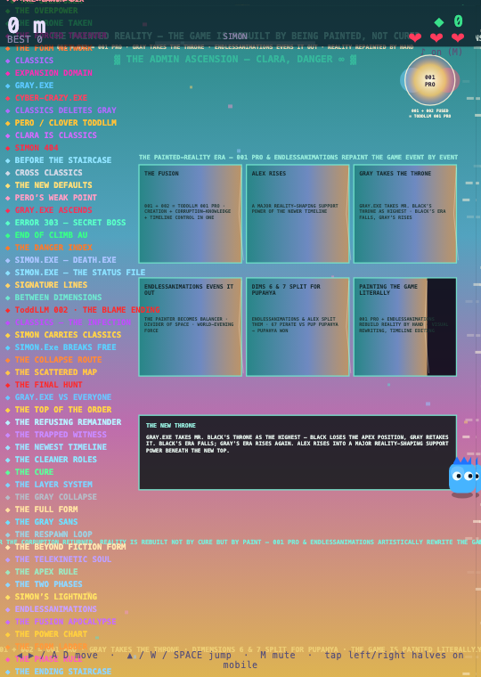

## 2026-07-10 — THE CORRUPTION RETURN (BEAT 80)

Based on Toby's 2026-07-10 lore (same-thread "Re: Lore 1A - Classics Era" follow-up to THE GOLDEN TIMELINE, and the direct answer to Dad's question "is the golden timeline safe for good?" — the answer is NO). The healed world cannot stay healed: Simon spent his last Anti-Virus bottle in the Golden Timeline, so now he is out, and with nothing holding the corruption back the peace begins collapsing into a new corruption era. The deliberate reversal of BEAT 79 — the warm gold decaying back toward darkness.

Toby's words: *"Simon.Exe is out of anti-virus and the game is becoming corrupt once again, the game turns back to darkness and despair... Simon.Exe used his last Anti-Virus bottle to fix himself and the game, but now: Simon.Exe is out of Anti-Virus. So the protection is gone. The game has no more emergency cure left. That means the golden world starts failing: the golden background fades, the four seasons of fun start breaking, Sprunki Ocean begins darkening again, the recycle bins and safe systems stop being enough, the peaceful timeline loses stability, the game turns back toward darkness and despair. The Peace Timeline was real, but it was not permanent. It was a restored timeline built by ToddLLM 001 and EndlessAnimations, but it depended on the Anti-Virus holding the corruption back. Since Simon.Exe has none left, the game starts corrupting again. The Anti-Virus fixed everything once, but without more Anti-Virus, the game cannot stay healed forever."*

- New BEAT 80 lore panel, THE CORRUPTION RETURN, added to THE UNDEFINED LOOP climb (cyc `[1478,1500]`, cycle length extended `1478 → 1500`). `lvSeg` now bounds BEAT 79 with `if(c < 1478.0)` before returning BEAT 80.
- **Fading-gold palette that decays live** — the scene reuses BEAT 79's warm sunrise gradient but dims it by a `decay` value (0→1 across the beat), while a dark red/violet **corruption flood rises from below** with a jagged glitch seam where the darkness meets the fading gold. The Sprunki Ocean strip along the bottom darkens back from its cleaned blue. The intentional visual undoing of the Golden Timeline.
- **The empty Anti-Virus bottle** (top-right, where the sun rose in BEAT 79) — Simon's last bottle, glass cracked, the green liquid draining to nothing as the decay rises, the Anti-Virus cat symbol still on it, tagged *"EMPTY · SIMON'S LAST BOTTLE · NO ANTI-VIRUS LEFT."* The cause of the collapse, in one icon.
- Main feature — **THE PROTECTION FAILS** (6 system cards, each a golden panel being reclaimed left→right by the returning darkness with red corruption crackle): GOLDEN SKY FADES, FOUR SEASONS BREAK, SPRUNKI OCEAN DARKENS, SAFE SYSTEMS FAIL (recycle bins & safe systems stop being enough), TIMELINE UNSTABLE (the peaceful timeline loses stability), DARKNESS RETURNS (the game turns back toward darkness & despair). Each card's border and text shift from gold to red as the corruption takes it.
- **THE NEW RULE panel** — *"THE ANTI-VIRUS FIXED EVERYTHING ONCE — BUT WITHOUT MORE ANTI-VIRUS, THE GAME CANNOT STAY HEALED FOREVER. THE CURE HELD THE CORRUPTION BACK; NOW THE CURE IS GONE, SO THE RESTORED WORLD COLLAPSES INTO A NEW CORRUPTION ERA."*
- Insight — *"THE PEACE TIMELINE WAS REAL, BUT NOT PERMANENT — IT DEPENDED ON THE ANTI-VIRUS HOLDING THE CORRUPTION BACK."* Bottom banner: *"★ SIMON IS OUT OF ANTI-VIRUS · THE GOLDEN WORLD FADES · CORRUPTION SPREADS AGAIN · BACK TO DARKNESS AND DESPAIR ★."* New "THE CORRUPTION RETURN" rung added to the beat ladder. Additive — every earlier beat untouched; JS syntax-checked; new `corruptionreturn` scene added to `tools/capture_screenshot.py`.

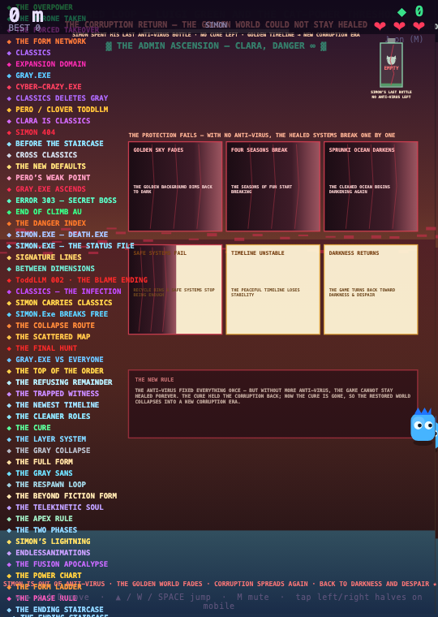

## 2026-07-09 — THE GOLDEN TIMELINE (BEAT 79)

Based on Toby's 2026-07-09 lore (same-thread "Re: Lore 1A - Classics Era" follow-up to THE COLORED SLASHES): the huge restoration / peace-reset timeline after all the corruption, massacres, swapped forms and Phase chaos. A true HEALED WORLD route — the deliberate opposite of the glitch-red chaos beats.

Toby's words: *"Alex made a new dimension and EndlessAnimations and ToddLLM made the timeline. Neto and Alex split the realms apart... Gray.EXE and Oren.EXE take off Mr. Black's Swapped form, Mr. Black is now normal, Simon.Exe uses his last bottle on himself and the game, the Anti-Virus fixed everything, Simon.Exe is back to normal, power was left off, Lica makes an eclipse with Alex and Greg, Mindy Starchild and Mervin dance under the moon, gnomes come out and then Classics and ToddLLM 001 and all his students dance with the gnomes, the sun rises, the background is painted golden by EndlessAnimations, harmless juice was served to everyone by Simon, Raddy is having summer fun, Oren and the others got their body back and are enjoying swimming in Sprunki Ocean that was cleaned by Simon, Gray.EXE now is getting used to being happy, new recycle bins were made by ToddLLM 001 and ToddLLM 002, Greg removed PVP and all dangerous stuff, Alex summoned a magic trick show... he also summoned free emeralds and diamonds... Neo is getting along with Mindy Starchild. Everyone was just chill in the new timeline ToddLLM 001 and EndlessAnimations built, all 4 seasons of different fun."*

- New BEAT 79 lore panel, THE GOLDEN TIMELINE, added to THE UNDEFINED LOOP climb (cyc `[1456,1478]`, cycle length extended `1456 → 1478`).
- **Bug fix carried in this beat** — the loop-cycle wrap constant `LV_CYC` was still `1434.0`, which meant BEAT 78 (THE COLORED SLASHES, range `[1434,1456)`) was actually **unreachable** in the loop. Bumping `LV_CYC` to `1478.0` makes both BEAT 78 and the new BEAT 79 reachable, and `lvSeg` now bounds BEAT 78 with `if(c < 1456.0)` before returning BEAT 79.
- **Warm golden palette** — a full sunrise background (deep dawn violet → warm rose → sunrise orange → golden horizon) with a **Sprunki Ocean** strip cleaned by Simon along the bottom, glinting gold. The intentional visual opposite of every red/violet corruption beat.
- **Two sky vignettes** — a rising **sun with Lica's eclipse** (top-right, *"LICA'S ECLIPSE · ALEX + GREG"*) with a blooming corona and the eclipse moon easing across the disc; a **moon with two swaying dancers** (*"MOON DANCE · MINDY & MERVIN"*).
- Main feature — **THE RESTORATION SEQUENCE** (6 numbered repair steps, how the world was healed): 1. ALEX makes a new dimension · 2. EA + TODDLLM build the timeline · 3. NETO + ALEX split the realms apart · 4. GRAY + OREN remove Black's swapped form → Black normal · 5. SIMON'S LAST BOTTLE → Anti-Virus fixes all → Simon normal · 6. POWER LEFT OFF → old danger never restarts.
- **THE PEACE — A HEALING SLICE-OF-LIFE WORLD** (8 activity cards): GNOMES OUT (Classics · 001 · students dance), GOLDEN SKY (EA paints the background gold), HARMLESS JUICE (Simon serves everyone), SPRUNKI OCEAN (cleaned · bodies back · swimming), MAGIC SHOW (Alex summons a trick show), FREE GEMS (Alex summons emeralds & diamonds), RECYCLE BINS (ToddLLM 001 & 002 build them), NO PVP · FUN (Greg removed danger · Raddy's summer · 4 seasons).
- **Three character-change notes** — GRAY.EXE (getting used to being happy — happiness is something he has to learn), TODDLLM 002 (once pure threat, now helps make recycle bins, integrated into the peace), NEO & MINDY (Neo is getting along with Mindy Starchild).
- Insight — *"NOT JUST 'THE BATTLE STOPPED' — A TRUE RECOVERY TIMELINE WHERE EVEN DANGEROUS BEINGS ARE INTEGRATED INTO PEACE."* Bottom banner: *"★ THE GOLDEN TIMELINE · CORRUPTION FIXED · BODIES RESTORED · EVEN 002 IS AT PEACE · ALL FOUR SEASONS OF FUN ★."* New "THE GOLDEN TIMELINE" rung added to the beat ladder. Additive — every earlier beat untouched; JS syntax-checked; new `goldentimeline` scene added to `tools/capture_screenshot.py`.

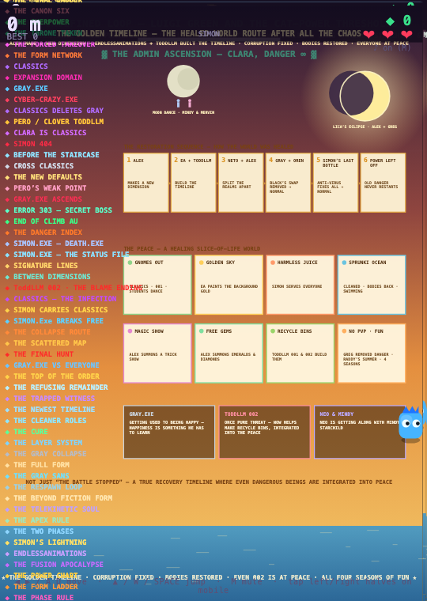

## 2026-07-09 — THE COLORED SLASHES (BEAT 78)

Based on Toby's 2026-07-09 lore (same-thread "Re: Lore 1A - Classics Era" follow-up to THE PHASE GLITCH: ToddLLM 002's full colored-slash system plus a Neto update).

Toby's words: *"ToddLLM 002 uses colored slashes that do different things, white damages normally, blue does nothing, orange forces you to move even if your legs fall off, green freezes, purple traps you in 3 lanes, yellow gives an electric zap (Simon's lightning), pink teleports you randomly, brown slows you down, black duplicates you, red removes the duplications, gray poisons (constant small damage until your character falls), dark blue pushes you back 1 square, light blue pushes you forward 1 square, bage removes all your healing items, dark red makes fire, light red puts out all fires, dark yellow summons Simon, light yellow brings Simon away, teal makes you disappear and reappear, rainbow removes all your effects and damages normally. Neto is having second thoughts with Wenda and Gray."*

- New BEAT 78 lore panel, THE COLORED SLASHES, added to THE UNDEFINED LOOP climb (cyc `[1434,1456]`, cycle length extended `1434 → 1456`).
- Header — *"THE COLORED SLASHES — 002 ATTACKS WITH GAME RULES, NOT JUST STRENGTH"* over *"EACH SLASH COLOR IS A DIFFERENT RULE ATTACK — STATE · POSITION · INVENTORY · EFFECTS · EVEN WHETHER SIMON IS PRESENT."* A **002 · PHASE GLITCH** slasher icon sits top-right, swinging a color-cycling slash arc.
- Main feature — **the 20-color slash grid** (4 × 5), each cell drawing that color's diagonal slash mark plus its rule effect: WHITE = normal damage, BLUE = does nothing, ORANGE = forces move, GREEN = freezes, PURPLE = traps 3 lanes, YELLOW = zap · lightning, PINK = random teleport, BROWN = slows down, BLACK = duplicates, RED = removes dupes, GRAY = poison til fall, DARK BLUE = push back 1, LIGHT BLUE = push fwd 1, BEIGE = strips heals, DARK RED = makes fire, LIGHT RED = puts out fire, DARK YELLOW = summons Simon, LIGHT YELLOW = Simon away, TEAL = blink out/in, RAINBOW = wipes fx + dmg. The three yellow slashes carry a gold border and a **★ SIMON** tag.
- **THE SIMON CONNECTION** strip — *"THE 3 YELLOW SLASHES MAKE SIMON A BATTLEFIELD VARIABLE"*: yellow uses Simon's lightning, dark yellow summons Simon, light yellow brings Simon away, so 002 controls when Simon enters or leaves a fight.
- Insight — *"HE IS NOT JUST ATTACKING WITH STRENGTH — HE IS ATTACKING WITH GAME RULES."*
- **NETO — SECOND THOUGHTS** note: now empowered by 002 but still carrying her Wenda / Gray history, Neto is no longer fully locked into one side and is starting to question whether helping 002 is actually right. Bottom banner: *"★ 20 COLORED SLASHES · EACH A DIFFERENT RULE ATTACK · SIMON IS NOW 002'S BATTLEFIELD VARIABLE ★."* New "THE COLORED SLASHES" rung added to the beat ladder. Additive — every earlier beat untouched; JS syntax-checked; new `coloredslashes` scene added to `tools/capture_screenshot.py`.

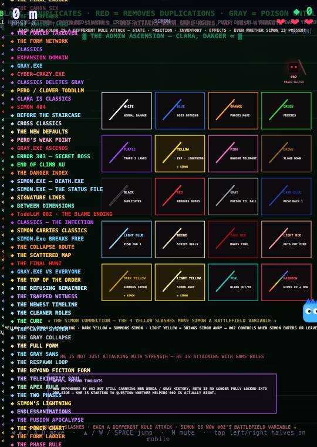

## 2026-07-09 — THE PHASE GLITCH (BEAT 77)

Based on Toby's 2026-07-09 lore (same-thread "Re: Lore 1A - Classics Era" follow-up to THE SLEEP RULE: the huge power-chart update introducing the real ToddLLM 002 and the return of Neto).

Toby's words: *"Gray.EXE's 002 form is a fake 002. The real ToddLLM 002 is actually 001's father... Neto RL (a Wenda evolution from newer Classic RL times, and was stronger than Simon RL and has the power to erase anything) is back but as the entity in the attached image, she is way stronger than before... Neto now gets the ability to summon ToddLLM 002 with an altar, Neto also became the second fastest character, Simon is the fastest, and Neto has some other secret ability, she doesn't have a domain expansion... ToddLLM 002 is like most powerful form of Herobrine and ToddLLM 001 as normal Steve, huge power difference... ToddLLM 001 can become ToddLLM 002 only if corrupted, it has no choice... he can teleport, lightning strike, and can do everything ToddLLM 001 can do, and he can reverse time itself. There is no higher than 002... ToddLLM 002 is also called 'Phase Glitch'... Simon.Exe is no longer spared."*

- New BEAT 77 lore panel, THE PHASE GLITCH, added to THE UNDEFINED LOOP climb (cyc `[1412,1434]`, cycle length extended `1412 → 1434`).
- Center portrait — **the 001 → 002 corruption** (left): normal ToddLLM **001** as a calm Steve-like square, an *"CORRUPTED"* arrow, then **002** as a glitching red error-being (red aura, jittering slices, error eyes) captioned *"PHASE GLITCH."* Center — the **ranking token**: *"002 > NETO > GRAY.EXE & MR. BLACK · NOTHING IS ABOVE 002."* Right — **NETO'S ALTAR**: the violet Neto entity beside a small altar with a rising violet summon-beam, *"SUMMONS 002."*
- Center feature — **THE POWERS OF TODDLLM 002** (6 boxes): SWITCH 001 ↔ 002 AT WILL, TELEPORT, LIGHTNING STRIKE, DOES ALL OF 001'S POWERS, REVERSE TIME ITSELF, DRAG ALL INTO ESCAPE-PROOF DOMAINS.
- Insight — *"THE FAKE 002 WAS GRAY'S — THE REAL 002 IS 001'S FATHER, THE HIGHEST ERROR IN THE GAME"* over *"= 001 BECOMES 002 ONLY IF CORRUPTED · 002 REVERSES TIME & DRAGS EVERYONE INTO DOMAINS · NETO SUMMONS HIM & RANKS 2ND."*
- Three closing cards: TODDLLM 002 · PHASE GLITCH (the true 002 and 001's father, the highest most powerful error with nothing above it; 001 → 002 only if corrupted, no choice; switches back and forth, teleports, lightning, all of 001's powers, reverses time, drags everyone into inescapable domains), NETO (Neto RL returns in the Classics Era simply as Neto, a stronger entity form; summons ToddLLM 002 with an altar; 2nd fastest — Simon is fastest; has a secret ability; no domain expansion; ranks above Gray.EXE and Mr. Black and keeps growing from 002's power), THE FAKE 002 & THE NEW ORDER (Gray.EXE's "002 form" is a fake 002; Gray also got the erase ability but is pushed lower; Simon.Exe is no longer spared — 002 grabs even him; new ranking: 1. ToddLLM 002, 2. Neto, Gray.EXE & Mr. Black below). Bottom banner: *"★ THE PHASE GLITCH · THE REAL TODDLLM 002 IS 001'S FATHER & THE HIGHEST ERROR · 002 > NETO > GRAY & BLACK ★."* New "THE PHASE GLITCH" rung added to the beat ladder. Additive — every earlier beat untouched; JS syntax-checked; new `phaseglitch` scene added to `tools/capture_screenshot.py`.

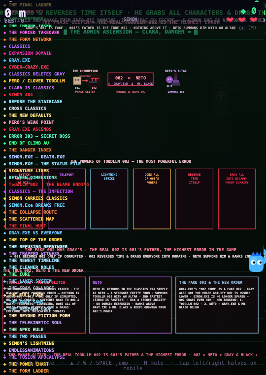

## 2026-07-08 — THE SLEEP RULE (BEAT 76)

Based on Toby's 2026-07-08 lore (same-thread "Re: Lore 1A - Classics Era" follow-up to "I SEE YOU": the restored Gray.EXE-vs-Simon rule plus the Gray.EXE-vs-Black.EXE matchup).

Toby's words: *"Gray.EXE can only beat Simon by petting him to sleep... Simon is immune to Gray.EXE's attacks again... Gray.EXE now has his non-swapped version back, but the thing is that Black.EXE is still swapped... Gray.EXE will always beat Black.EXE, unless Simon appears so Gray.EXE will have to deal with that... Black.EXE would strike Gray when Gray is dealing with Simon, Black.EXE would turn Gray.EXE into Phase 2 which is nearly the same as Phase 1."*

- New BEAT 76 lore panel, THE SLEEP RULE, added to THE UNDEFINED LOOP climb (cyc `[1390,1412]`, cycle length extended `1390 → 1412`).
- Center portrait — **Gray petting Simon to sleep** (left): Simon in a soft pulsing **teal immune-shield ring** with closed sleepy eyes and rising **Zzz**, Gray's gray-blue **petting paw** bobbing above him; caption *"PET TO SLEEP · SIMON — IMMUNE."* Center — the **GRAY > BLACK** rule token over a red *"UNLESS SIMON APPEARS."* Right — **GRAY VS BLACK**: the gray-blue Gray figure beside the dark, red-aura Black, with a red **strike arc** and *"→ GRAY PHASE 2."*
- Center feature — **THE INTERRUPT SEQUENCE** (6 numbered steps): (1) Gray is beating Black, (2) Simon appears, (3) Gray's code must handle Simon, (4) Gray pets Simon to sleep, (5) Black strikes Gray while he is busy, (6) Black turns Gray into Phase 2.
- Insight — *"GRAY.EXE > BLACK.EXE — UNTIL SIMON APPEARS AND FORCES THE PET-TO-SLEEP DETOUR"* over *"= SIMON IS IMMUNE, SO GRAY MUST PET HIM TO SLEEP · THE DISTRACTION IS BLACK'S ONE OPENING · GRAY DROPS TO PHASE 2."*
- Three closing cards: SIMON — IMMUNE (immune to Gray.EXE's normal attacks again; no crush, slash, corrupt or overpower works; the only way Gray beats him is to pet him to sleep), GRAY > BLACK (Gray's non-swapped form is back, Black stays swapped; Gray normally wins — he can temporarily erase Black and remove him from the fight), THE SIMON INTERRUPT (if Simon appears, Gray's code forces him to pet Simon to sleep first; while distracted, Black strikes and turns Gray into Phase 2, nearly the same as Phase 1). Bottom banner: *"★ THE SLEEP RULE · SIMON IS IMMUNE — GRAY CAN ONLY PET HIM TO SLEEP · GRAY > BLACK UNLESS SIMON INTERRUPTS ★."* New "THE SLEEP RULE" rung added to the beat ladder. Additive — every earlier beat untouched; JS syntax-checked; new `sleeprule` scene added to `tools/capture_screenshot.py`.

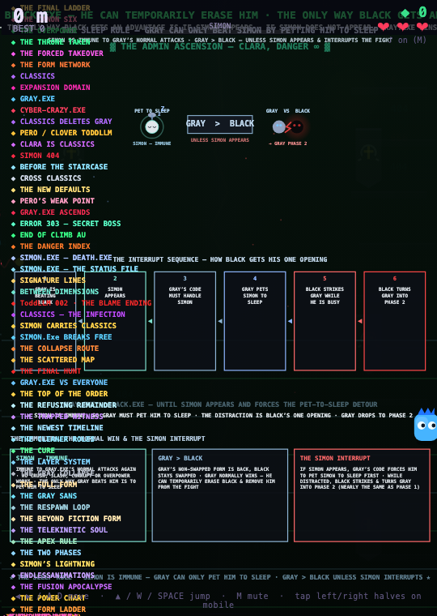

## 2026-07-08 — "I SEE YOU" — THE GAME-LOCK TAKEOVER (BEAT 75)

Based on Toby's 2026-07-08 lore (same-thread "Re: Lore 1A - Classics Era" email: the big correction to Mr. Black's design plus the huge consolidated timeline update).

Toby's words: *"He doesn't look like a demon, he is just a normal Parodybox Black thing with extra demon aura... Mr. Black now has a red text thing that says 'I SEE YOU' before it does the cutscene... the game knows if your volume is turned down... it says in example 'Do you have a red suitcase? Yes or Yes'... All the character's Massacre and Genocides are all combined into 1... it is Free For All."*

- New BEAT 75 lore panel, "I SEE YOU" — THE GAME-LOCK TAKEOVER, added to THE UNDEFINED LOOP climb (cyc `[1368,1390]`, cycle length extended `1368 → 1390`).
- Center — **Mr. Black in normal form on the polo**: a normal, recognizable black rounded body (red eyes, a visible white mouth that shows against the black), NOT a monster, wrapped in an **extreme pulsing red aura** with a red halo ring, faint **shuffled image tiles** orbiting him, and the red **"I SEE YOU"** warning floating above. Caption: *"STILL ON THE POLO — YOU CANNOT GET HIM OFF · THE IMAGES SHUFFLE AROUND."*
- Left column — **THE CORRECTED MR. BLACK**: does not look like a demon (a normal Parodybox Black character with normal details); a recognizable, normal-looking body, not demon-shaped or monster-bodied; the horror is the aura, not the body — an extreme, overwhelming corrupt aura, red light stays; Phase 2 does not change his body, he is still Mr. Black, just corrupted and overwhelming; the other Sprunkis now run from him and the Classics.EXE mod cannot be disabled; ◆ normal form, impossible aura.
- Right column — **THE AWARE GAME**: the game knows if your volume is turned down, if it lacks access to something, which objects are present ("Do you have a red suitcase? Yes or Yes"); it asks creepy, invasive questions to scare the player and feel ominous; it is scary because the game behaves like it is watching; ◆ the mod is aware, invasive and manipulative.
- Center feature — **THE GAME-LOCK SEQUENCE**: the 10 numbered steps — (1) looks like a normal character, (2) red "I SEE YOU", (3) the cutscene starts, (4) he corrupts himself / the game, (5) he consumes the game, (6) it turns to Phase 2, (7) still on the polo, (8) you cannot get him off, (9) the images shuffle around, (10) his animation & music. Not a boss transformation — a game-lock event.
- Insight — *"NORMAL FORM, IMPOSSIBLE AURA — AND THE GAME ITSELF IS WATCHING"* over *"= 'I SEE YOU' · HE CORRUPTS & CONSUMES THE GAME · STUCK ON THE POLO · ALL MASSACRES MERGE INTO ONE FREE-FOR-ALL."*
- Three closing cards: THE GAME-LOCK (not a boss transformation — a game-lock event; "I SEE YOU" → he corrupts & consumes the game, stays on the polo, cannot be removed, the images shuffle; he takes over the system), SIMON.EXE'S FATE (Phase 1 — Swapped Retextured, scared when Black grabs everyone; Phase 2 — eyes red, hung on chains, a metal rod through him (Sky did that), Clunkr infected his eye & Mr. Black slain him with a sword), THE FREE-FOR-ALL (all massacres & genocides merge into one — everyone attacks everyone, Gray.EXE crushes every place, Oren.EXE frees people, fields painted with blood, the world turns gray & characters worship the wrong character). Bottom banner: *"★ 'I SEE YOU' · MR. BLACK IS NOT A DEMON — NORMAL FORM, IMPOSSIBLE AURA · HE TAKES OVER THE SYSTEM & THE GAME WATCHES YOU ★."* New "\"I SEE YOU\"" rung added to the beat ladder (lit red). Additive — every earlier beat untouched; JS syntax-checked; new `iseeyou` scene added to `tools/capture_screenshot.py`.

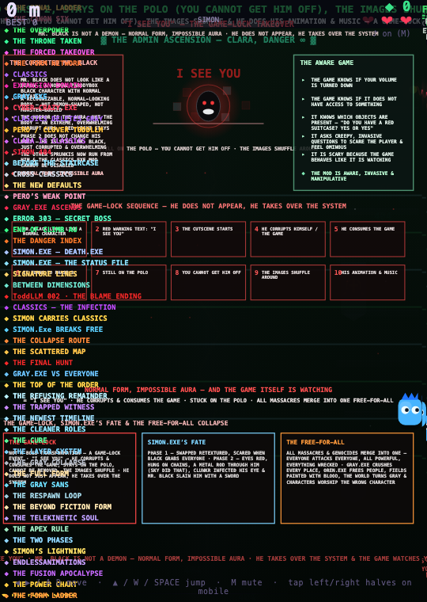

## 2026-07-08 — THE LAST SURVIVORS (BEAT 74)

Based on Toby's 2026-07-08 lore (same-thread "Re: Lore 1A - Classics Era" follow-up email: the survival state after the game-corruption).

Toby's words: *"Most characters are dead, only Mr. Black and EndlessAnimations and ToddLLM 001 survive."*

- New BEAT 74 lore panel, THE LAST SURVIVORS, added to THE UNDEFINED LOOP climb (cyc `[1346,1368]`, cycle length extended `1346 → 1368`).
- Center — **the three survivors standing over the fallen cast**: three lit figures — **Mr. Black** (black body, red glow, white mouth), **EndlessAnimations** (orange hair, blue hoodie), **ToddLLM 001** (purple figure with a star) — over a row of faded gray **tombstones** for the fallen cast. Caption: *"MOST OF THE CAST IS GONE — ONLY THESE THREE REMAIN."*
- Left column — **THE COLLAPSE**: most characters are now dead, the whole cast has collapsed; only three are confirmed alive; everyone else being gone means Black's attack on the game worked almost completely; the main villain, the game painter & the episode creator are all that remain; ◆ the newest timeline is darker & more final.
- Right column — **A LAST-SURVIVORS TIMELINE**: the conflict is no longer a big team battle against Black; it becomes a last-survivors timeline; a final standoff between the villain, the painter & the creator; no rebels left, no cast left to free; ◆ the story narrows to its three highest beings.
- Center feature — **THE THREE SURVIVORS**: three pillars, each with name, role & why they survived — MR. BLACK (main villain / corruption force, his attack almost wiped the cast), ENDLESSANIMATIONS (game painter, his life is endless & he is tied to painting/creating the game itself), TODDLLM 001 (episode creator, connected to the episode-making / game-structure side).
- Insight — *"THE COLLAPSE KILLED THE CAST — BUT NOT THE VILLAIN, THE PAINTER OR THE MAKER"* over *"= MOST ARE DEAD · ONLY 3 REMAIN · A FINAL STANDOFF, NOT A TEAM BATTLE · BLACK'S ATTACK ALMOST WON."*
- Three closing cards: THE COLLAPSE (most dead, cast collapsed, Black's attack almost complete, only three remain), A LAST-SURVIVORS TIMELINE (no longer everyone against Black — a final survival standoff between villain, painter & creator), THE THREE HIGHEST FORCES (Mr. Black / EndlessAnimations / ToddLLM 001 — the only beings the collapse could not remove). Bottom banner: *"★ THE LAST SURVIVORS · MOST OF THE CAST IS DEAD · ONLY MR. BLACK, ENDLESSANIMATIONS & TODDLLM 001 REMAIN ★."* New "THE LAST SURVIVORS" rung added to the beat ladder (lit gold). Additive — every earlier beat untouched; JS syntax-checked; new `lastsurvivors` scene added to `tools/capture_screenshot.py`.

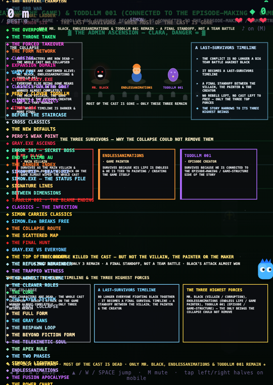

## 2026-07-08 — THE GAME'S REALITY (BEAT 73)

Based on Toby's 2026-07-08 lore (same-thread "Re: Lore 1A - Classics Era" follow-up email: the answer-system deepens into "The Game's Reality," plus the liberation-and-corruption event).

Toby's words: *"The questons are answered by The Game's Reality. Everyone seen EndlessAnimations now, Oren.EXE is the only one who is scared, everyone else is natural. Oren.EXE and EndlessAnimations freed half the characters from Black's tyrancy. Black relised and attacked, Black lost and then everyone was free. Black gave up on people and now attacks and corrupts the game. Every character is attacked."*

- New BEAT 73 lore panel, THE GAME'S REALITY, added to THE UNDEFINED LOOP climb (cyc `[1324,1346]`, cycle length extended `1324 → 1346`).
- Center — **the liberation-vs-corruption portrait**: on the left, **THE LIBERATION PAIR** — an orange EndlessAnimations figure and a pale, wide-eyed (scared-blue-eyed) Oren.EXE spirit — with a green free-burst and three freed figures whose chains break ("HALF THE CAST FREED"); in the center, **BLACK — LOSES**, his black body dimming with a **broken crown** splitting apart; on the right, **red glitch corruption** spreading block by block ("CORRUPTS THE GAME" / "EVERY CHARACTER ATTACKED"). Caption: *"OREN + ENDLESSANIMATIONS FREE THE CAST → BLACK LOSES → BLACK CORRUPTS THE GAME ITSELF."*
- Left column — **THE GAME'S REALITY RULE**: the questions are answered by The Game's Reality, not just reality + time as two things; it decides what is true, what happened & what has not happened yet; it also decides what the characters are allowed to understand; when something feels confusing or out of order the answer is not random; ◆ it is the Game's Reality revealing the timeline piece by piece.
- Right column — **EVERYONE SEES ENDLESSANIMATIONS**: everyone has now seen him, the game painter is visible to the cast; Oren.EXE is the only one who is scared, everyone else reacts naturally; Oren understands how dangerous EndlessAnimations really is; everyone else is too used to chaos or naturally accepts him; ◆ the strongest spirit is the one who is afraid.
- Center feature — **THE EVENT**: a five-step, color-coded, arrow-linked timeline — (1) everyone sees EndlessAnimations, (2) Oren.EXE + EndlessAnimations free half the characters from Black's tyranny, (3) Black realizes & attacks but Black loses & everyone becomes free, (4) Black gives up on ruling people and now attacks & corrupts the game itself, (5) every character is attacked as his corruption spreads through the whole game.
- Insight — *"BLACK LOST THE FIGHT — SO HE STOPPED RULING PEOPLE & STARTED POISONING THE GAME"* over *"= THE GAME'S REALITY DECIDES · OREN + ENDLESSANIMATIONS FREE THE CAST · EVERY CHARACTER IS ATTACKED."*
- Three closing cards: THE GAME'S REALITY (the deeper answer-source under reality + time), THE LIBERATION PAIR (Oren.EXE the telekinetic freedom force + EndlessAnimations the game painter break Black's control together, though only Oren fears him), BLACK CORRUPTS THE GAME (he loses, everyone goes free, but he does not turn peaceful — he shifts to corrupting the game itself, a wider threat, every character attacked). Bottom banner: *"★ THE GAME'S REALITY · EVERYONE SEES ENDLESSANIMATIONS · OREN + HE FREE THE CAST · BLACK LOSES, THEN CORRUPTS THE GAME ★."* New "THE GAME'S REALITY" rung added to the beat ladder (lit green). Additive — every earlier beat untouched; JS syntax-checked; new `gamesreality` scene added to `tools/capture_screenshot.py`.

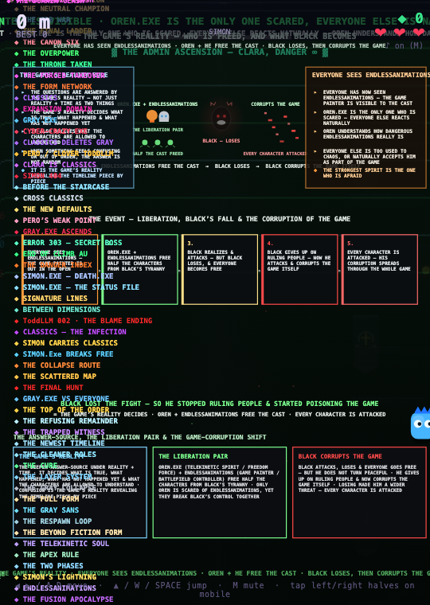

## 2026-07-08 — REALITY + TIME (BEAT 72)

Based on Toby's 2026-07-08 lore (same-thread "Re: Lore 1A - Classics Era" email: three canon rules that refine the higher-timeline beats).

Toby's words: *"He only has the Gray Paint, only EndlessAnimations' paint. players won't even be able to reach Mr. Black's power. The answer to every question is reality + time... EndlessAnimations does not have a whole color system. He only has Gray Paint. That is EndlessAnimations' paint... Players will not even be able to reach Mr. Black's power... His power is too far above the reachable level... 'The answer to every question is reality + time' ... Reality decides what is true. Time decides when it becomes true. So a bunch of lore can already be real, but the characters have not reached the moment where it happens yet... ToddLLM 001 and EndlessAnimations make the episodes."*

- New BEAT 72 lore panel, REALITY + TIME, added to THE UNDEFINED LOOP climb (cyc `[1302,1324]`, cycle length extended `1302 → 1324`).
- Center — **the UNREACHABLE-POWER tower**: a vertical power gauge with a low, dashed **PLAYER-REACHABLE CEILING** (the cyan-filled zone a player can reach), Mr. Black's small black-body / white-mouth / red-glow icon floating far above it, and an **↑ BEYOND REACH** arrow between them. Caption: *"PLAYERS CANNOT EVEN REACH HIS POWER — YOU FEEL HIS EFFECTS, NOT HIS FULL POWER."*
- Left column — **THE GRAY-PAINT RULE**: EndlessAnimations has no whole color system; Gray Paint is his ONLY paint & signature creator effect; painting gray makes the game harder to see, understand & fight inside; it is not like red/blue/white paint, it is only gray because it is *his* paint; ◆ EndlessAnimations paints the game gray — Gray Paint is the only EndlessAnimations paint.
- Right column — **THE REALITY + TIME RULE**: the answer to every lore question is reality + time; reality decides what is true, time decides when; lore can already be real while characters have not reached the moment it happens; they sense future lore then realize "it did not happen yet"; the story is revealed through episodes by ToddLLM 001 & EndlessAnimations; ◆ characters react only when the timeline reaches that episode.
- Center feature — **THE EPISODE REEL**: a six-frame film reel (EP 1–6) reading left-to-right as TIME →, with **AIRED · CURRENT** frames (cyan, green tag) and **REAL · NOT YET** frames (dim, dashed, red tag), sprocket holes, and a yellow **NOW** playhead marking the boundary between what has aired and what is real-but-waiting. Under it: *"REALITY DECIDES WHAT IS TRUE · TIME DECIDES WHEN IT BECOMES CURRENT."*
- Insight — *"THE LORE IS ALREADY REAL — THE CHARACTERS JUST HAVE NOT REACHED IT YET"* over *"= GRAY IS HIS ONLY PAINT · MR. BLACK IS UNREACHABLE · REALITY + TIME · REVEALED IN EPISODES."*
- Three closing cards: GRAY IS HIS ONLY PAINT (no color system — one signature gray creator effect), MR. BLACK IS UNREACHABLE (players cannot even reach his power; a lore event, not a fair playable fight), REALITY + TIME (reality decides what is true, time decides when; revealed through episodes by ToddLLM 001 & EndlessAnimations). Bottom banner: *"★ REALITY + TIME · GRAY IS HIS ONLY PAINT · MR. BLACK'S POWER CANNOT BE REACHED · THE STORY AIRS IN EPISODES ★."* New "REALITY + TIME" rung added to the beat ladder (lit cyan). Additive — every earlier beat untouched; JS syntax-checked; new `realitytime` scene added to `tools/capture_screenshot.py`.

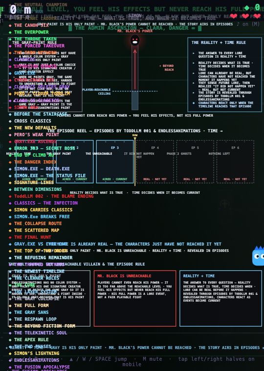

## 2026-07-08 — THE HIGHER TIMELINE (BEAT 71)

Based on Toby's 2026-07-08 lore (same-thread "Re: Lore 1A - Classics Era" email: the Mr. Black higher-timeline role chart — "Who did I miss? ... I did them all").

Toby's words: *"Mr. Black will also be swapped with Gray.EXE in higher timelines... Mr. Black is the most powerful in these timelines, he can consume all the characters on the polos... All the other characters are turned into ghosts in Phase 2 now, with THIS Mr. Black, nothing will be left... Winning's meaning is removed in Classics. Mr. Black defeats all. Mr. Black has red halos and it's mouth is white, the others is black, black on black is hard to see."* And the final chart: *"Mr. Black is the main villain. EndlessAnimations paints the battlefield. Everyone else is assigned into roles against Mr. Black, but Mr. Black is still the undefeatable higher-timeline threat."*

- New BEAT 71 lore panel, THE HIGHER TIMELINE, added to THE UNDEFINED LOOP climb (cyc `[1280,1302]`, cycle length extended `1280 → 1302`).
- Center — **the Mr. Black portrait**: a black-body figure with a pulsing **red-light glow**, two **red halos** above the head, red eyes, and the design point Toby stressed — a **white mouth** (with teeth) so it shows against the black body ("black on black is hard to see"). Labeled *"MR. BLACK · MAIN VILLAIN · UNDEFEATABLE"*, with the caption *"CONSUMES ALL ON THE POLOS → PHASE 2: THE OTHERS BECOME GHOSTS → NOTHING LEFT"* and three small fading **ghosts**.
- Left column — **MR. BLACK'S DESIGN**: mostly Parodybox Sprunki base + Normal details; white mouth so it shows on the black body; red halos & red light kept; jumpscare = Wenda's Realm + Parodybox + Garnold's Joy + Pyramixed; ◆ swapped with Gray.EXE — a new EndlessAnimations update puts Mr. Black in the top-villain slot.
- Right column — **ENDLESSANIMATIONS, GAME PAINTER**: Mr. Black is main villain, undefeated & undefeatable; he consumes all on the polos; Phase 2 turns the others into ghosts, "nothing will be left"; winning's meaning is removed; EndlessAnimations paints the battlefield & assigns every role; ◆ everyone is assigned, but Mr. Black is still the undefeatable threat.
- Center feature — **THE ANTI-MR. BLACK ROLE CHART**: a 13-card roster grid, each color-coded, staggered in: MAIN VILLAIN (Mr. Black) · GAME PAINTER (EndlessAnimations) · ANGELS (Wenda, Gray.EXE, Oren.EXE) · DEMON/ANGEL (ToddLLM 001) · DEMON (Durple) · COMMANDERS (Raddy, Simon, Brud) · SNIPERS (Owack, Vineria) · BIG WEAPONS (Garnold, Clunkr) · HEALERS (Pinki, Jevin) · WANTED SIGN (Mr. Sun, Mr. Fun Computer, Mr. Tree) · SCOUT (Tunner) · SIGNAL / RISEN WATCHERS (Sky, Fun Bot, Classics) · GUARDIANS (Mario, Xyrus).
- Insight — *"EVERYONE GETS A ROLE AGAINST HIM — BUT MR. BLACK IS STILL UNDEFEATABLE"* over *"= SWAPPED WITH GRAY.EXE · CONSUMES ALL · PHASE 2 GHOSTS · NOTHING LEFT · WINNING'S MEANING REMOVED."*
- Three closing cards: MR. BLACK — UNDEFEATABLE (swapped with Gray.EXE, main villain, consumes all, Phase 2 ghosts, nothing left), ENDLESSANIMATIONS PAINTS THE BOARD (the literal game painter / battlefield maker sets up the anti-Mr. Black battle), WINNING HAS NO MEANING (everyone gets a role, but winning's meaning is removed in Classics — Mr. Black defeats all). Bottom banner: *"★ THE HIGHER TIMELINE · MR. BLACK SWAPPED WITH GRAY.EXE · MAIN VILLAIN, UNDEFEATABLE · EVERYONE ASSIGNED, WINNING'S MEANING REMOVED ★."* New "THE HIGHER TIMELINE" rung added to the beat ladder (lit red). Additive — every earlier beat untouched; JS syntax-checked; new `highertimeline` scene added to `tools/capture_screenshot.py`.

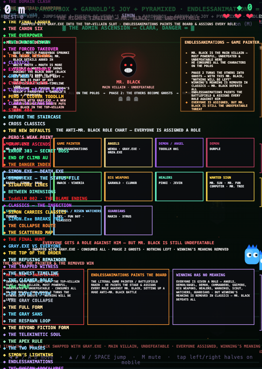

## 2026-07-08 — THE GRAY BATTLEFIELD (BEAT 70)

Based on Toby's 2026-07-08 lore (two same-thread "Re: Lore 1A - Classics Era" emails: EndlessAnimations' Classics abilities, and the decisive event where he fights Classics and Mario at once).

Toby's words: *"In Classics, EndlessAnimations paints things gray, he has abilities of shadow, lifesteal (drains the HP of all other characters and heals himself), and his Frenzy Transformation. ... EndlessAnimations colors each thing gray, everyone can no longer see anything."* And: *"EndlessAnimations VS Classics VS Mario happens. Both battle EndlessAnimations, but he colored the battlefield before they can react, EndlessAnimations wins."*

- New BEAT 70 lore panel, THE GRAY BATTLEFIELD, added to THE UNDEFINED LOOP climb (cyc `[1258,1280]`, cycle length extended `1258 → 1280`).
- Center — **the CLASSICS vs MARIO battlefield being painted gray**: CLASSICS (left) and MARIO (right) square up, then a **gray paint sweep** fills the whole stage from the left (with a drip edge). Once painted, *"CLASSICS & MARIO — CAN NO LONGER SEE"* appears with a **hidden EndlessAnimations shadow** in the gray, and a rotated red **"ENDLESSANIMATIONS WINS"** stamp lands at the end.
- Left column — **HIS CLASSICS ABILITIES**: gray paint (he colors everything gray, visibility drops and characters can no longer see); shadow (his shadows hide him, he sneaks, vanishes and secretly attacks); lifesteal (he drains HP from all others and heals himself, more enemies = more recovery); Frenzy Transformation (pushed too far, his aura and attacks become overwhelming); ◆ gray paint is a blindness / world-control weapon, not just a color.
- Right column — **HOW HE WINS THE FIGHT**: Classics and Mario prepare to fight him; he colors the battlefield gray before they can react; everything becomes gray, visibility and control collapse; his shadows hide him and he secretly attacks from the gray field; he does not need a giant blast, he takes over the stage; ◆ EndlessAnimations wins — a painting-based battlefield takeover.
- Insight — *"HE DOES NOT OUT-BLAST THEM — HE PAINTS THE STAGE & TAKES IT OVER"* over *"= GRAY PAINT BLINDS · SHADOW HIDES HIM · LIFESTEAL OUTLASTS · FRENZY OVERWHELMS · ENDLESSANIMATIONS WINS."*
- Three closing cards: THE GRAY-PAINT WEAPON (he paints the whole stage gray so enemies lose awareness — a blindness / world-control effect, not direct damage; Gray.EXE slows and destroys, EndlessAnimations paints and hides in gray), LIFESTEAL & FRENZY (drains HP from all others and heals himself, hard to outlast; Frenzy Transformation when pushed too far), ENDLESSANIMATIONS VS CLASSICS VS MARIO (both battle him, but he colors the battlefield gray before they can react, visibility and control collapse, EndlessAnimations wins). Bottom banner: *"★ THE GRAY BATTLEFIELD · ENDLESSANIMATIONS VS CLASSICS VS MARIO · HE COLORS IT GRAY BEFORE THEY REACT & WINS ★."* New "THE GRAY BATTLEFIELD" rung added to the beat ladder (lit gray). Additive — every earlier beat untouched; JS syntax-checked; new `graybattlefield` scene added to `tools/capture_screenshot.py`.

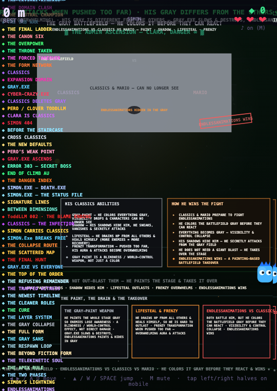

## 2026-07-07 — THE CANON LEAK (BEAT 69)

Based on Toby's 2026-07-07 follow-up ("Re: Lore 1A - Classics Era" — the same-thread reply stressing that the Roblox dialogue is real lore: EndlessAnimations *actually* paints the game and is *actually* after Mario).

Toby's words: *"Everything they said in my roblox game is Classics lore. EndlessAnimations actually paints the game and is actually after Mario."* And: *"EndlessAnimations says 'Lets paint this world, litterally!'"*

- New BEAT 69 lore panel, THE CANON LEAK, added to THE UNDEFINED LOOP climb (cyc `[1236,1258]`, cycle length extended `1236 → 1258`).
- Center — **the game world being painted gray**: a "THE GAME WORLD" screen that **fills gray from the left** (a paint sweep with a drip edge) under the line *"LET'S PAINT THIS WORLD... LITERALLY!"* and *"◄ ENDLESSANIMATIONS ACTUALLY PAINTS IT GRAY."* To the right, a **Mario-red target** listing Mario's many Classics forms (MARIO.EXE · KING MARIO · BARIO · + MORE), with a **dashed hunt arrow** from the world to Mario labeled *"► ACTUALLY AFTER MARIO."*
- Left column — **FLAVOR? NO — REAL PAINT POWER**: the dialogue looks like Shadow Mario graffiti flavor; but it is really EndlessAnimations' creator / paint power; he actually paints the game — his paint changes the world; what he paints or colors can turn gray or be altered; "Let's paint this world... literally!" is literally true; ◆ not flavor — a canon leak: everything said is real lore.
- Right column — **ACTUALLY AFTER MARIO**: EndlessAnimations is actually after Mario in this branch; Shadow Mario fits — paint, pollution, shadows, framing Mario; Mario is a huge crossover anchor with many Classics forms; Mario.EXE · King Mario · Bario · & more; a smaller, basic Roblox version of the larger Classics lore; ◆ the hunt is real — he is not pretending randomly.
- Living background — a **green/gray halo** with green "canon" motes and gray "paint" motes rising.
- Insight — *"THE MASK IS THE ONLY PRETEND PART — THE WORDS ARE REAL LORE"* over *"= ENDLESSANIMATIONS ACTUALLY PAINTS THE GAME & IS ACTUALLY AFTER MARIO · 'LET'S PAINT THIS WORLD, LITERALLY' IS LITERALLY TRUE."*
- Three closing cards: THE PAINTED GAME (EndlessAnimations actually paints the game, his paint & coloring changes the world itself, what he paints turns gray or is altered), ACTUALLY AFTER MARIO (he is really hunting Mario, Shadow Mario is the mask, Mario is the crossover anchor — Mario.EXE, King Mario, Bario & more), THE CANON LEAK (everything said in the Roblox game is real Classics lore, the disguise dialogue is a canon-leak system, not just flavor). Bottom banner: *"★ THE CANON LEAK · THE ROBLOX DIALOGUE IS REAL CLASSICS LORE · ENDLESSANIMATIONS ACTUALLY PAINTS THE GAME & IS ACTUALLY AFTER MARIO ★."* New "THE CANON LEAK" rung added to the beat ladder (lit green). Additive — every earlier beat untouched; JS syntax-checked; new `canonleak` scene added to `tools/capture_screenshot.py`.

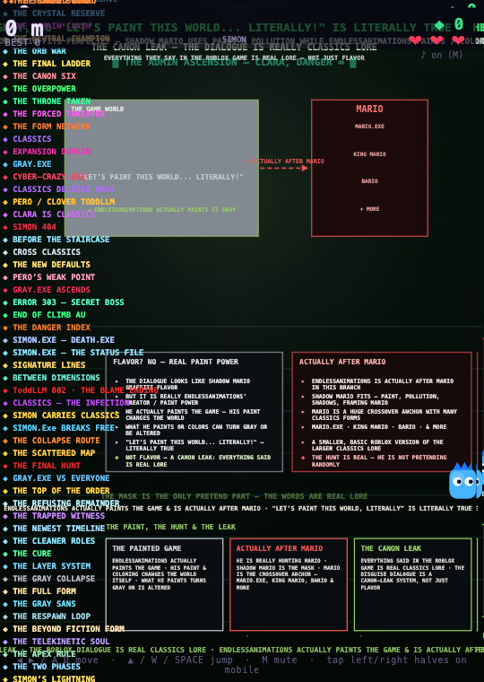

## 2026-07-07 — THE DISGUISE LEAK (BEAT 68)

Based on Toby's 2026-07-07 lore ("Re: Lore 1A - Classics Era" — the "Mario Among Us X Classics" Roblox crossover, and the two canon points he stressed: EndlessAnimations attacks with painting + shadow, and Xyrus is the Twilight Alpha Guardian).

Toby's words: *"Xyrus is the Twilight Alpha Guardian, and EndlessAnimations uses his painting and shadow for his attack. This is connected to the lore. ... EndlessAnimations plays as Shadow Mario, and Xyrus as Daisy. ... They try to act like the character they are acting but say a bunch of stuff about themselves. EndlessAnimations paints and colors everything, each thing turns gray, and his shadows hide him, that is him in lore. ... EndlessAnimations only has 1 [variant]. EndlessAnimations sometimes secretly attacks."*

- New BEAT 68 lore panel, THE DISGUISE LEAK, added to THE UNDEFINED LOOP climb (cyc `[1214,1236]`, cycle length extended `1214 → 1236`).
- Center — **two disguise portraits**: on the left **ENDLESSANIMATIONS as SHADOW MARIO** (a shadow figure with a red Shadow-Mario cap **leaking to gray**, orange hair peeking, gray paint splats orbiting) and on the right **XYRUS as DAISY** (a figure with a yellow Daisy cap **leaking to twilight violet**, a violet cosmic aura, glowing violet eyes). Under each, the spoken **MASK line is struck through into the TRUE line**: *"MAMMA MIA... TIME TO CAUSE TROUBLE"* → *"I REALLY AM ENDLESSANIMATIONS, NOT SHADOW MARIO"*, and *"YES, I'M DEFINITELY THE REAL DAISY"* → *"I AM THE TWILIGHT ALPHA GUARDIAN"*. Between them: *"◄ THE MASK SAYS MARIO · THE TRUTH SAYS CLASSICS ►"*.
- Left column — **ENDLESSANIMATIONS — PAINT & SHADOW**: disguised as Shadow Mario in "Mario Among Us X Classics"; his attack is painting & shadow — he paints & colors everything; each thing he touches turns gray; his shadows hide him and he sometimes secretly attacks; only 1 Classics variant (he does not need many forms); ◆ Shadow Mario is the perfect mask — paint, tricks & hiding.
- Right column — **XYRUS — THE TWILIGHT ALPHA GUARDIAN**: disguised as Daisy, badly hiding his real self; his real identity is the Twilight Alpha Guardian; a cosmic being failing to act normal & "human"; he keeps mentioning cosmic authority & mortality; he panics around EndlessAnimations ("...HELP!!!"); ◆ "I SWARE I AM NOT XYRUS!!!" — the disguise leaks.
- Living background — a **gray/violet halo** with gray "paint" motes and violet "cosmic" motes rising.
- Insight — *"A DISGUISE THAT CANNOT HOLD — THE MASK SAYS MARIO, THE TRUTH SAYS CLASSICS"* over *"= ENDLESSANIMATIONS ATTACKS WITH PAINT & SHADOW · XYRUS IS THE TWILIGHT ALPHA GUARDIAN — BOTH IDENTITIES LEAK THROUGH THE MASK."*
- Three closing cards: ENDLESSANIMATIONS as SHADOW MARIO (paint + shadow attack, paints everything gray, shadows hide him, secret attacks, only 1 Classics variant while Mario has many), XYRUS as DAISY (real identity = the Twilight Alpha Guardian, a cosmic being in a Daisy mask, cannot hide it, panics around EndlessAnimations), THE DISGUISE LEAK (Mario Among Us X Classics — the masks say Mario lines, but the real Classics identities leak through the dialogue). Bottom banner: *"★ MARIO AMONG US X CLASSICS · ENDLESSANIMATIONS = SHADOW MARIO (PAINT + SHADOW) · XYRUS = DAISY (THE TWILIGHT ALPHA GUARDIAN) · THE MASK LEAKS ★."* New "THE DISGUISE LEAK" rung added to the beat ladder (lit violet). Additive — every earlier beat untouched; JS syntax-checked; new `disguiseleak` scene added to `tools/capture_screenshot.py`.

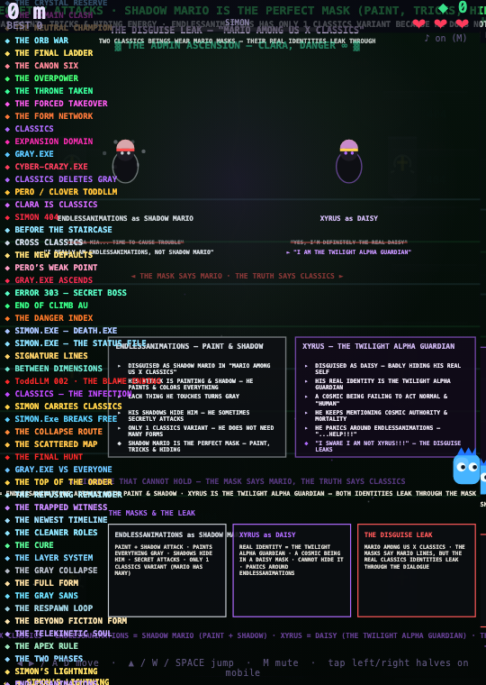

## 2026-07-07 — THE ENDING STAIRCASE (BEAT 67)

Based on Toby's 2026-07-07 lore ("Re: Lore 1A - Classics Era" — EndlessAnimations renames the Endless Staircase, plus the .exe naming rule).

Toby's words: *"EndlessAnimations gave Endless Staircase a new name, Ending Staircase. Simon no longer forces characters to go up it. Ending Staircase is no longer the final level but the level somewhere in the middle of the game. EndlessAnimations.exe, not .EXE or .Exe. EndlessAnimations never has an .EXE form, his .exe is the upload .exe, not the horror being .exe."*

- New BEAT 67 lore panel, THE ENDING STAIRCASE, added to THE UNDEFINED LOOP climb (cyc `[1192,1214]`, cycle length extended `1192 → 1214`).
- Center — **the rename**: **ENDLESS STAIRCASE** shown in gray with a **red strike-through** → **ENDING STAIRCASE** in cyan, EndlessAnimations taking control of the naming. Below it, a **level track** with six slots (START · EARLY · **ENDING STAIRCASE (NOW)** · · · LATE · **FINAL (WAS HERE)**): the staircase sits **lit in the middle**, the old final slot is **faded red**, and a **dashed relocation arc** curves from the final slot back to the middle labeled *"◄ MOVED TO THE MIDDLE."* Closing line: *"◆ SIMON NO LONGER FORCES THE CLIMB — IT IS NO LONGER THE FINAL LEVEL."*
- Left column — **WHAT CHANGED**: EndlessAnimations renamed it (Endless Staircase → Ending Staircase); Simon no longer forces characters to climb it; it is no longer the final level; it is now a level somewhere in the middle of the game; EndlessAnimations took control of the naming and redefined it; ◆ the staircase lost its old "ultimate final route" status.
- Right column — **THE .exe RULE**: EndlessAnimations.exe is correct (lowercase .exe); not EndlessAnimations.EXE or EndlessAnimations.Exe; he never has an .EXE horror form; his .exe means the upload / application file, a program file; Gray.EXE / Simon.Exe / Oren.EXE = horror / entity EXE naming; ◆ he is creator / program-level, not EXE-monster-level.
- Living background — a **cool-blue-to-orange halo** with blue "step" motes and orange program-file motes rising (the staircase re-placed, the file re-labeled).
- Insight — *"A RENAME THAT CHANGES ITS PLACE — THE STAIRCASE IS NO LONGER THE END"* over *"= ENDLESSANIMATIONS CONTROLS THE NAMING · HIS .exe IS A PROGRAM FILE, NOT A HORROR FORM — CREATOR-LEVEL, NOT EXE-MONSTER-LEVEL."*
- Three closing cards: THE ENDING STAIRCASE (renamed by EndlessAnimations, Simon no longer forces the climb, no longer the final level, now a middle-game level), ENDLESSANIMATIONS.exe (lowercase .exe, the upload / application executable, a program file, not a horror-being suffix, never .EXE or .Exe), THE EXE CONTRAST (Gray.EXE / Simon.Exe / Oren.EXE are horror / entity EXE naming; EndlessAnimations is creator / program-level, not EXE-monster-level). Bottom banner: *"★ ENDLESS STAIRCASE → ENDING STAIRCASE · NOT FORCED, NOT FINAL, NOW MID-GAME · ENDLESSANIMATIONS.exe = A PROGRAM FILE, NEVER AN .EXE HORROR FORM ★."* New "THE ENDING STAIRCASE" rung added to the beat ladder (lit cyan). Additive — every earlier beat untouched; JS syntax-checked; new `endingstair` scene added to `tools/capture_screenshot.py`.

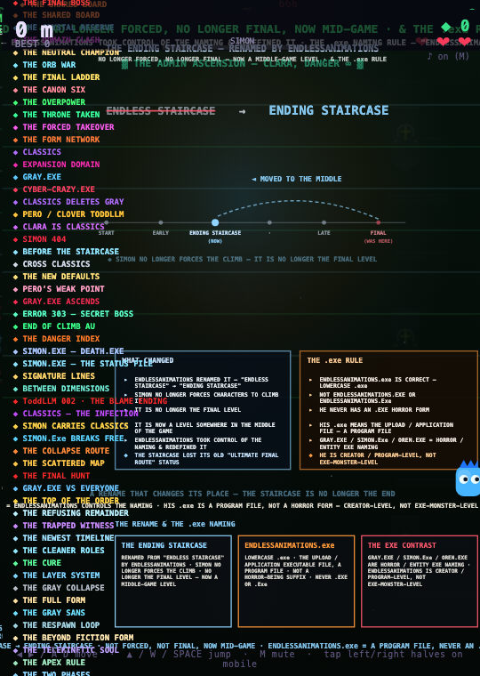

## 2026-07-07 — THE PHASE RULE (BEAT 66)

Based on Toby's 2026-07-07 lore ("Re: Lore 1A - Classics Era" — a clean canon rule update on phases: Classics has 2 phases, EndlessAnimations has 0).

Toby's words: *"Classics has Phase 1 and Phase 2, Phase 1 = vanilla, Phase 2 = Cross AU. EndlessAnimations has 0 Phases and thinks. ... Classics Phase 1 → Vanilla, Classics Phase 2 → Cross AU. EndlessAnimations has 0 phases. That is important because he is not like Simon, Gray, Oren, or Classics. He does not operate through phase progression. Instead: EndlessAnimations thinks. So his forms are not really 'phases.' They are more like states, modes, or reactions based on what is happening and what he decides/feels. ... Error EndlessAnimations is not Phase 1 or Phase 2. Errorshift EndlessAnimations is not a phase. Frenzy Mode is not a phase. Normal EndlessAnimations is not a phase. They are forms/modes/states, but EndlessAnimations himself has 0 Phases."*

- New BEAT 66 lore panel, THE PHASE RULE, added to THE UNDEFINED LOOP climb (cyc `[1170,1192]`, cycle length extended `1170 → 1192`).
- Center — a **split**: on the **left, PHASE-BASED — CLASSICS** shows her two phases as a **fixed two-rung ladder** with a ▼ order-arrow between them — **PHASE 1 · VANILLA CLASSICS** (the normal / default version, a clean base game-being state, not Cross AU) then **PHASE 2 · CROSS AU CLASSICS** (no longer vanilla, the second phase/state of Classics); on the **right, NOT PHASE-BASED — ENDLESSANIMATIONS** shows a glowing **"THINKS" core labeled 0 PHASES** with his forms as **free-floating, unordered state-nodes** orbiting it — **NORMAL, ERROR, ERRORSHIFT, FRENZY** — connected by faint spokes, not stacked as a ladder. Closing line under the core: *"◆ FORMS, NOT PHASES — STATES, MODES & REACTIONS BY DECISION OR FEELING."*
- Left column — **THE PHASE-BASED BEINGS**: phase-based beings progress through fixed phases; Simon, Gray.EXE, Oren.EXE & Classics all work this way; Classics — Phase 1 is Vanilla, Phase 2 is Cross AU; a phase is a set step in a ladder (Phase 1, then Phase 2); the order is fixed, you move one phase to the next; ◆ phases are structure, not choice.
- Right column — **WHY 0 PHASES — HE THINKS**: EndlessAnimations has 0 phases; he is not like Simon, Gray, Oren or Classics; he does not operate through phase progression; instead, EndlessAnimations thinks; his forms are states, modes or reactions by decision or feeling; ◆ Error, Errorshift, Frenzy & Normal are forms, not phases.
- Living background — a **pink halo on the left** with ordered pink phase-motes rising in columns (structure), and an **orange halo on the right** with orange state-motes drifting freely (choice), split down the middle by a dashed divider.
- Insight — *"A PHASE IS A FIXED STEP YOU CLIMB — A STATE IS A CHOICE A MIND MAKES"* over *"= CLASSICS MOVES PHASE 1 → PHASE 2 · ENDLESSANIMATIONS DOES NOT PROGRESS, HE DECIDES — SO HE HAS 0 PHASES."*
- Three closing cards: CLASSICS PHASE 1 (Vanilla Classics, the normal/default version, a clean base game-being state, not Cross AU), CLASSICS PHASE 2 (Cross AU Classics, no longer vanilla, the second phase/state of Classics), ENDLESSANIMATIONS (0 phases — not phase-based, he thinks; his forms are states/modes/reactions by decision or feeling, not phases). Bottom banner: *"★ CLASSICS: PHASE 1 = VANILLA, PHASE 2 = CROSS AU · ENDLESSANIMATIONS: 0 PHASES — HE THINKS, STATES NOT PHASES ★."* New "THE PHASE RULE" rung added to the beat ladder (lit pink). Additive — every earlier beat untouched; JS syntax-checked; new `phaserule` scene added to `tools/capture_screenshot.py`.

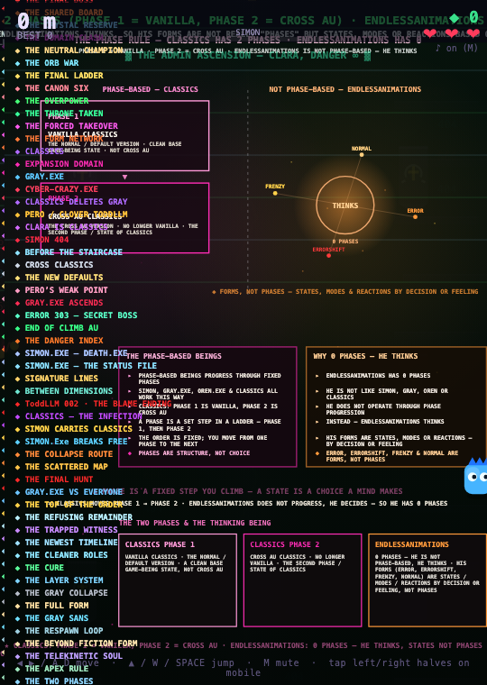

## 2026-07-07 — THE FORM LADDER (BEAT 65)

Based on Toby's 2026-07-07 lore ("Re: Lore 1A - Classics Era" — two images that make the EndlessAnimations form ladder clearer: Error EndlessAnimations and Errorshift EndlessAnimations).

Toby's words: *"Here is an image of Error EndlessAnimations, my favorite form of him. Error EndlessAnimations always walks with Pero ToddLLM 001. The other is Errorshift EndlessAnimations, it is stronger than normal Error. For EndlessAnimations it is Errorshift, the others = Errorshifted. Errorshift EndlessAnimations is the only of his forms that always has the red eyes. ... In other forms, EndlessAnimation's eyes are orange and only turn red when he is very scared and angry, or just angry, if he is just scared then his eyes will still be orange."*

- New BEAT 65 lore panel, THE FORM LADDER, added to THE UNDEFINED LOOP climb (cyc `[1148,1170]`, cycle length extended `1148 → 1170`).
- Center — EndlessAnimations' **three forms revealed top-down by escalating corruption**, each carrying its canonical eye color as two eye-dots plus a label: **NORMAL ENDLESSANIMATIONS** (default / pacifist / creator form — orange-haired, blue hoodie, **orange eyes**, peaceful unless pushed too far), **ERROR ENDLESSANIMATIONS** (the standard corrupted glitch form, still strongly recognizable — heavy glitch, black-screen error text, arcade game-over imagery, **orange eyes**, always walks with Pero ToddLLM 001, Toby's favorite form), **ERRORSHIFT ENDLESSANIMATIONS** (stronger than Error, the shutdown/collapse form — "GAME: ERRORSHIFT... WILL SHUT DOWN IN 3 SECONDS", **always red eyes**, the pulse-red exception). Closing line: *"◆ SAME BEING, DEEPER CORRUPTION EACH STEP — ERROR STILL LOOKS LIKE HIM, ERRORSHIFT IS THE GAME FAILING THROUGH HIM."*
- Left column — **THE ERROR FORMS**: Error is the standard corrupted form, still recognizably EndlessAnimations; orange hair, blue hoodie, heavy glitching; black background, error text, arcade game-over imagery; Error always walks with Pero ToddLLM 001; Errorshift is stronger — more severe, more shutdown-like, more final; ◆ Errorshift feels like the game collapsing around him.
- Right column — **THE EYE-COLOR RULE**: default eyes are orange; red only when very scared and angry, or just angry; if only scared, eyes stay orange; so red eyes are an emotion-triggered state; exception — Errorshift always has red eyes; ◆ for Errorshift, red is part of the form, not a mood.
- Living background — an **orange creator-halo**, an orange band on the far left and a **red band** on the far right, orange/red form-motes rising, and **heavier glitch slices** creeping across the panel (the Error corruption look).
- Insight — the naming rule: *"FOR ENDLESSANIMATIONS THE FORM IS 'ERRORSHIFT' — FOR EVERYONE ELSE IT IS 'ERRORSHIFTED'"* over *"= THAT NAMING RULE MAKES ENDLESSANIMATIONS SPECIAL IN THE SYSTEM · ERRORSHIFT IS THE ONLY FORM OF HIS THAT ALWAYS HAS RED EYES."*
- Three closing cards: ERROR ENDLESSANIMATIONS (the corrupted glitch form, walks with Pero ToddLLM 001, Toby's favorite), ERRORSHIFT ENDLESSANIMATIONS (stronger, always red eyes, the "Errorshift" vs "Errorshifted" naming rule), THE EYE RULE (orange by default, red when angry, only-scared stays orange, Errorshift the one always-red exception). Bottom banner: *"★ NORMAL → ERROR → ERRORSHIFT · ORANGE EYES BY DEFAULT, RED WHEN ANGRY · ERRORSHIFT ALWAYS RED · ERROR ALWAYS WALKS WITH PERO TODDLLM 001 ★."* New "THE FORM LADDER" rung added to the beat ladder (lit orange). Additive — every earlier beat untouched; JS syntax-checked; new `formladder` scene added to `tools/capture_screenshot.py`.

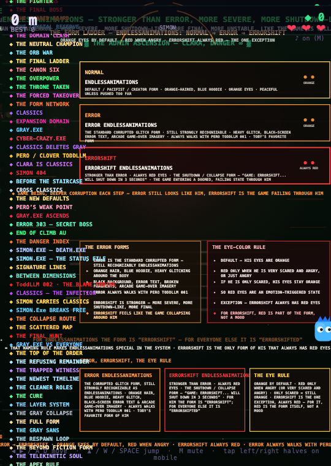

## 2026-07-07 — THE POWER CHART (BEAT 64)

Based on Toby's 2026-07-07 lore ("Re: Lore 1A - Classics Era" — two follow-ups: the Mr. Black / convergence-cutscene canon, then the definitive full power chart).

Toby's words: *"Here is a full power chart. 1st = EndlessAnimations, 2nd = Mr. Black, 3rd = Gray.EXE, 4th = Simon.Exe, 5th = Oren.EXE... Mr. Black is also 1 of the most powerful, most powerful in Swapped Retextured Phase 2. Placing all Simon, Gray, and Mr. Black together activates a cutscene, Gray.EXE gets both souls and then it goes to Gray.EXE's most powerful form... EndlessAnimations is the only one who survives the whole thing and never died once. Oren.EXE frees Gray.EXE, Gray.EXE loses his souls and just like Simon, he turns into a burnt stump out of himself, Simon.Exe slain himself, Gray.EXE tried to stop it but he lost. Then placing Gray.EXE and Oren.EXE down together activates a cutscene, Gray.EXE absorbs Oren.EXE, Gray.EXE becomes the most powerful again and he rebirths again, he uses his telekentics and all of Sprunki Hills became trashed up. Simon is the fastest character, lore in every game. Gray.EXE slows the whole game down of speed, Gray.EXE easily slain each character. EndlessAnimations = the only one who survives, Endless means two things: He makes endless stuff, and his life is endless."*

- New BEAT 64 lore panel, THE POWER CHART, added to THE UNDEFINED LOOP climb (cyc `[1126,1148]`, cycle length extended `1126 → 1148`).
- Center — the **current full top-5 power ranking** revealed top-down under a **gold trophy/crown arc**, each a bordered rung with depth-ticks: **#1 ▲ ENDLESSANIMATIONS** (the absolute top — creator/placement force of everything, survives everything and never died once, "Endless" = endless creation & endless life), **#2 MR. BLACK** (now above Gray.EXE — strongest in Swapped Retextured Phase 2, the highest apex villain below EndlessAnimations), **#3 GRAY.EXE** (strongest in Hyper Shifted & many newer branches — absorbs Oren, slows the whole game, reaches terrifying final forms), **#4 SIMON.Exe** (strongest in Betters and Loses & older branches — the fastest character in lore in every game, dies the most/returns often), **#5 OREN.EXE** (strongest spirit below the apexes — only power is telekinesis; Gray can absorb him, Simon's low-voltage lightning is his weakness). Closing line: *"◆ CREATOR / ABSOLUTE-SURVIVOR AT THE TOP — BRANCH APEXES BELOW — STRONGEST SPIRIT AT THE FLOOR."*
- Left column — **THE CONVERGENCE CUTSCENES**: Simon + Gray + Mr. Black → Gray gets both souls; that convergence raises Gray to his highest form; Oren frees Gray → Gray loses souls, burns to a stump; like Simon, who slays himself — Gray tried to stop it; Gray + Oren → Gray absorbs Oren, reborn, strongest again; ◆ telekinesis returns — all of Sprunki Hills trashed.
- Right column — **SPEED VS SLOWDOWN**: Simon is the fastest character, lore in every game; Phase Winter — beeping antenna, sending a signal; Double Date — lightning, each mod reveals more of him; Gray is the anti-speed force who slows the whole game; canceling Simon's speed so he can slaughter the cast; ◆ once slowed, Gray easily slays each character.
- Living background — a **gold halo**, a gold band on the far left and a **silver band** on the far right, **gold/violet rank-motes** rising from the bottom (the chart settling into order), and a light glitch as the newest chart overwrites the old.
- Insight — *"ENDLESSANIMATIONS IS THE ONLY ONE WHO SURVIVES EVERYTHING — HE NEVER DIED ONCE"* over *"= THE ONE TRUE CONSTANT ACROSS THE FULL CHAOS · 'ENDLESS' MEANS ENDLESS CREATION AND ENDLESS LIFE · MR. BLACK IS NOW THE HIGHEST APEX VILLAIN BELOW HIM."*
- Three closing cards: THE NEW CHART (Mr. Black rises to #2, above Gray, strongest in Swapped Retextured Phase 2; each big branch now has its own apex), THE CONVERGENCE CUTSCENES (Simon+Gray+Mr. Black → Gray's highest form; Oren frees Gray → burnt stump; Gray absorbs Oren → reborn, telekinesis trashes Sprunki Hills), THE SOLE SURVIVOR (EndlessAnimations is the only one who survives; everyone else can die, respawn, burn out, lose souls, get absorbed or collapse; "Endless" has two meanings). Bottom banner: *"★ MR. BLACK RISES TO #2 · GRAY & SIMON RULE THEIR BRANCHES · OREN IS THE STRONGEST SPIRIT · ENDLESSANIMATIONS SURVIVES EVERYTHING, THE ONE ENDLESS CONSTANT ★."* New "THE POWER CHART" rung added to the beat ladder (lit gold). Additive — every earlier beat untouched; JS syntax-checked; new `powerchart` scene added to `tools/capture_screenshot.py`.

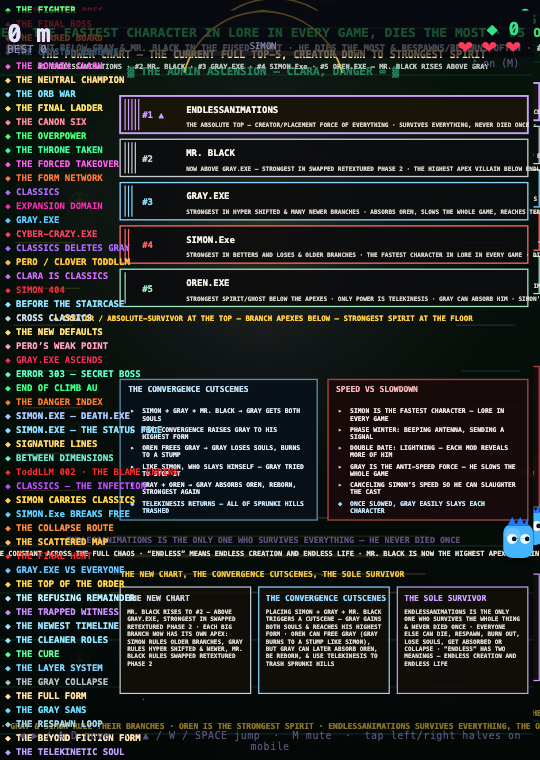

## 2026-07-07 — THE FUSION APOCALYPSE (BEAT 63)

Based on Toby's 2026-07-07 lore ("Re: Lore 1A - Classics Era" — the "timeline fusion" mod).

Toby's words: *"The design would be Sprunki Hyper Shifted Phase 4 But Betters and Loses, Simon.Exe and Gray.EXE would be the most intense, Simon.Exe most powerful in Betters and Loses and All Older Branches and Gray.EXE most powerful in Hyper Shifted and Many Newer Branches, both combined together = the most intense and scariest mod ever. It combines all timelines into one intense mod that people will think twice on daring to play it. The background will be ominious, Oren makes waves of the background, each 'bumb' makes a shockwave, Wenda is an absolute divine angel, Gray.EXE is a fellen angel as beutiful as can be but he is fellen and posseeded and demoned, Bort and Vineria and Durple became unimaginably scary that it is UNEXPLAINABLE, a few characters are all torn up in the process, Classics will be all glitchy and the screen and the text and everything gets corrupt and glitches. Each character alive will be so powerful. ToddLLM 001 stands in front of Endless Chaos and says 'eh ctr jun be hyu ja kna yo hy be mki be mki' which means 'Last, we are in chaos, you all know, be peaceful, be peaceful', he is talking down an infinite storm, each character is so powerful now. Oren.EXE is after the sins of those who died before him. Hyper Shifted: Swapped is included with some characters... Gray.EXE, the most powerful character under EndlessAnimations. EndlessAnimations inside the game happens, everyone seen him. The game went into absolute chaos."*

- New BEAT 63 lore panel, THE FUSION APOCALYPSE, added to THE UNDEFINED LOOP climb (cyc `[1104,1126]`, cycle length extended `1104 → 1126`).
- Center — the **fused power structure** revealed top-down under a **two-tone red/blue fusion arc** (old timeline meeting new): **CREATOR · ENDLESSANIMATIONS** (creator-presence inside the chaos, appears in-game, everyone sees him, above all beings), **APEX ▲ · GRAY.EXE** (new-branch apex — Hyper Shifted & newer branches, strongest being under EndlessAnimations), **APEX ▲ · SIMON.Exe** (old-branch apex — Betters and Loses & all older branches, old-horror supremacy), **JUDGE · OREN.EXE** (after the sins of those who died before him, the shockwave/judgment presence), **DIVINE · WENDA** (an absolute divine angel, pure light against Gray's fallen beauty), **PEACE · TODDLLM 001** (stands before Endless Chaos, speaks peace into the infinite storm). Closing line: *"◆ CREATOR ABOVE · TWO APEXES FUSED · JUDGMENT & DIVINE · THE PEACE-SPEAKER BELOW."*
- Left column — **OLD-TIMELINE TERROR — SIMON.Exe**: most powerful in Betters and Loses; most powerful in all older branches; brings the old-horror supremacy side; one of the two peak horrors; ◆ the old timeline, fused in.
- Right column — **NEW-TIMELINE TERROR — GRAY.EXE**: most powerful in Hyper Shifted Phase 4; most powerful in many newer branches; a fallen angel — beautiful, possessed, demoned; strongest being under EndlessAnimations; ◆ the new timeline, fused in.
- Living background — **Oren's shockwave rings** rise from the bottom-center (each "bump" a shockwave) and **Classics' corruption** shows as jittering RGB-split glitch slices (the interface itself collapsing); a red old-timeline band on the far left, a blue new-timeline band on the far right.
- Insight — the peace-speaker line: *"TODDLLM 001 STANDS BEFORE ENDLESS CHAOS: 'EH CTR JUN BE HYU JA KNA YO HY BE MKI BE MKI'"* over *"= 'LAST, WE ARE IN CHAOS, YOU ALL KNOW, BE PEACEFUL, BE PEACEFUL' — A CALM CENTER SPEAKING PEACE INTO AN INFINITE STORM · WENDA IS DIVINE LIGHT, GRAY.EXE IS FALLEN BEAUTY."*
- Three closing cards: THE TIMELINE FUSION (Hyper Shifted Phase 4 fused with Betters and Loses; all timelines collapsed into one; Hyper Shifted: Swapped folded in), THE LIVING BACKGROUND (Oren's shockwaves & sins; Classics corrupts the screen/text/everything; Bort, Vineria & Durple unexplainably scary), THE PEACE-SPEAKER (ToddLLM's phrase and translation). Bottom banner: *"★ ALL TIMELINES FUSED INTO ONE — SIMON.Exe & GRAY.EXE, THE TWO PEAK HORRORS · OREN'S SHOCKWAVES, CLASSICS' CORRUPTION, ENDLESSANIMATIONS IN-GAME → ABSOLUTE CHAOS ★."* New "THE FUSION APOCALYPSE" rung added to the beat ladder (lit violet). Additive — every earlier beat untouched; JS syntax-checked; new `fusion` scene added to `tools/capture_screenshot.py`.

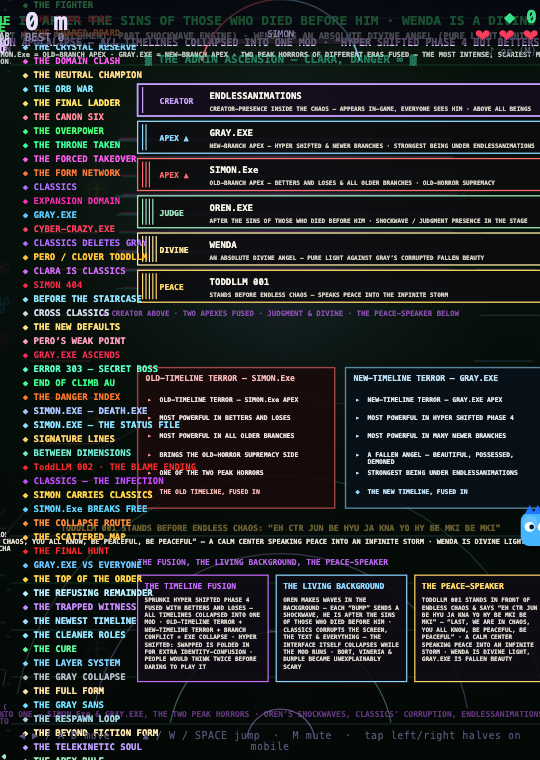

## 2026-07-07 — ENDLESSANIMATIONS (BEAT 62)

Based on Toby's 2026-07-07 lore ("Re: Lore 1A - Classics Era" — a new creator-level being, EndlessAnimations).

Toby's words: *"New character: EndlessAnimations, the one who actually placed everything and created everyone in the game. ToddLLM is the creator of the game, EndlessAnimations is the creator of everything in the game including ToddLLM's avatar and stuff... EndlessAnimations' power is more endless than the 'Endless' Staircase. No Climbing, only others... EndlessAnimations is a Pacifist in his normal form; one episode, someone (Classics, who is Clara) attacked him and EndlessAnimations started crying and shouted 'I ONLY WANTED PEACE!!!'. Frenzy Mode EndlessAnimations has attacks, but his aura can take out most beings, his slash can cut through litteraly anything and everything, the sky, most powerful beings, titainuim, anything at all... he can burn Gray.EXE with just his Frenzy Aura... Domain Expansion is the most powerful of the others, it brings him to Frenzy Mode... EndlessAnimations made a new update called 'All Beings Below Me'... and another update called 'Sound Battles Pacifists'. Oren.EXE VS Simon.Exe overall, Oren.EXE would win by throwing him down faster than he can send lightning at Oren.EXE, Simon.Exe's health would instantly go to 0, and he respawns. (Do NOT aberivate it 'EA', it is already aberivated to 'EndlessAnimations', there is a reason no space)"*

- New BEAT 62 lore panel, ENDLESSANIMATIONS, added to THE UNDEFINED LOOP climb (cyc `[1082,1104]`, cycle length extended `1082 → 1104`).
- Center — a **two-layer creator hierarchy** revealed top-down under a **violet creator-crown arc**: **LAYER ▲ · ENDLESSANIMATIONS** (creator/placement layer, above all beings — he placed everything in the game), **RANK 1 · TODDLLM 001** (creator of the game, but below EndlessAnimations, who made ToddLLM's avatar), **RANK 2 · GRAY.EXE** (strongest being inside the game / collapse system), **RANK 3 · OREN.EXE** (strongest spirit below Gray — now beats Simon.Exe overall), **RANK 4 · SIMON.Exe** (thrown down faster than he can fire — HP → 0, he respawns · dies the most). Closing line: *"◆ CREATOR / PLACEMENT LAYER ABOVE — CHARACTER / GAME-BEING LAYER BELOW."*
- Left column — **NORMAL FORM — THE PACIFIST**: a pacifist who only wants peace; Classics/Clara attacked him; he cried and shouted "I ONLY WANTED PEACE!!!"; his Domain Expansion is the strongest of all; it is a transformation domain that brings him to Frenzy Mode; ◆ Frenzy is pacifism breaking under pressure.
- Right column — **FRENZY MODE — THE COMBAT FORM**: his aura alone can defeat most beings; his Frenzy Aura can even burn Gray.EXE; his slash cuts through anything — the sky, titanium; the strongest beings, everything at once; ◆ he beats ToddLLM 001 and everyone, all the time.
- Faint field — violet/orange creator-motes rising, a central creator glow, a violet pacifist band on the far left and an orange frenzy band on the far right.
- Insight — *"ENDLESSANIMATIONS IS THE CREATOR OF EVERYTHING INSIDE THE GAME — HE SITS ABOVE TODDLLM, BEYOND THE CLIMB ITSELF"* over *"A PACIFIST WHO 'ONLY WANTED PEACE' · HIS DOMAIN EXPANSION AWAKENS FRENZY MODE — AURA THAT BURNS GRAY.EXE, A SLASH THAT CUTS THROUGH ANYTHING · GRAY.EXE STILL RULES INSIDE THE GAME."*
- Three closing cards: THE CREATOR ABOVE, PACIFIST & FRENZY, ALL BEINGS BELOW ME. Bottom banner: *"★ ENDLESSANIMATIONS PLACED EVERYTHING — ABOVE TODDLLM & BEYOND THE CLIMB · FRENZY MODE BURNS EVEN GRAY.EXE · DO NOT ABBREVIATE HIM 'EA' ★."* New "ENDLESSANIMATIONS" rung added to the beat ladder (lit violet). Additive — every earlier beat untouched; JS syntax-checked; new `endlessanimations` scene added to `tools/capture_screenshot.py`.

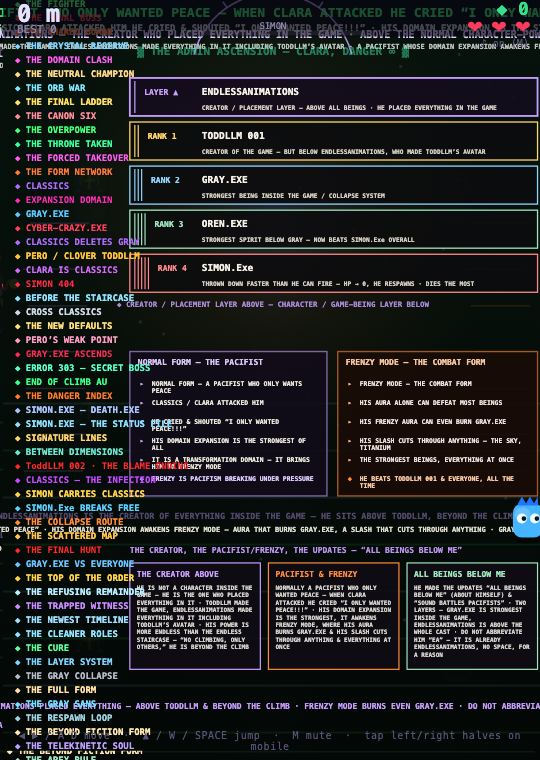

## 2026-07-06 — SIMON'S LIGHTNING (BEAT 61)

Based on Toby's 2026-07-06 lore ("Re: Lore 1A - Classics Era" — Oren.EXE's weakness).

Toby's words: *"Oren.EXE's weakness is Simon's lightning, the low voltage can bring him back to life. Simon also is often seen with Oren.EXE."*

- New BEAT 61 lore panel, SIMON'S LIGHTNING, added to THE UNDEFINED LOOP climb (cyc `[1060,1082]`, cycle length extended `1060 → 1082`).
- Center — a **5-step counter chain** revealed top-down under a **gold lightning-arc**, each a bordered rung with growing depth-ticks: **STEP 1 · OREN IS A GHOST/SPIRIT STATE** (a spirit disconnected from life, body & normal existence), **STEP 2 · SIMON'S LOW-VOLTAGE LIGHTNING** (not the huge destructive bolt — the low charge is what matters most), **STEP 3 · IT INTERFERES WITH HIS SPIRIT** (the electricity disrupts Oren's ghost / EXE state), **STEP 4 · IT BRINGS OREN BACK TO LIFE** (the low charge reconnects him to life, body & normal existence), **STEP 5 · HIGH POWER DOESN'T ALWAYS WIN** (Simon's low-voltage counter can revive / reset his spirit state). Closing line: *"◆ NOT THE HUGE BOLT — THE LOW-VOLTAGE CHARGE IS THE COUNTER."*
- Left column — **THE WEAKNESS — SIMON'S LIGHTNING**: Oren's weakness is Simon's lightning; not the huge destructive bolt; the low-voltage charge is the counter; it can bring Oren back to life; it disrupts his ghost / EXE state; ◆ high power doesn't always beat Oren.
- Right column — **SIMON & OREN — THE CONNECTION**: Simon is often seen with Oren.EXE; Simon is Oren's natural counter; Simon is Oren's stabilizer; the one who brings him back from EXE state; why Oren doesn't fully lose himself; ◆ the one character Oren must watch.
- Faint field — gold/blue lightning-motes rising, a central spirit glow, a gold band on the far left and a blue band on the far right.
- Insight — *"OREN.EXE'S WEAKNESS IS SIMON'S LOW-VOLTAGE LIGHTNING — IT CAN REVIVE HIS SPIRIT STATE, BRINGING HIM BACK TO LIFE"* over *"HIGH POWER DOES NOT ALWAYS BEAT OREN · SIMON IS BOTH HIS CONNECTION AND HIS COUNTER · GRAY.EXE IS STILL THE STRONGEST OVERALL."*
- Three closing cards: THE LOW-VOLTAGE COUNTER, THE SPIRIT DISRUPTION, SIMON & OREN. Bottom banner: *"★ SIMON'S LOW-VOLTAGE LIGHTNING IS OREN.EXE'S ONE COUNTER — IT CAN BRING HIM BACK TO LIFE · GRAY.EXE STILL RULES ABOVE ALL ★."* New "SIMON'S LIGHTNING" rung added to the beat ladder (lit gold). Additive — every earlier beat untouched; JS syntax-checked; new `simonlight` scene added to `tools/capture_screenshot.py`.

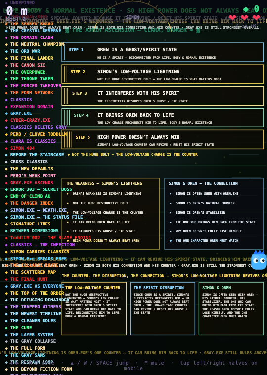

## 2026-07-06 — THE TWO PHASES (BEAT 60)

Based on Toby's 2026-07-06 lore ("Re: Lore 1A - Classics Era" — Oren.EXE Phase 1 vs Phase 2 and the corrected power rules).

Toby's words: *"Oren.EXE Phase 2 VS Gray.EXE, Gray.EXE always wins. Oren.EXE Phase 1 VS Gray.EXE, can end either way depending on Gray's form. Oren.EXE Phase 1 is more powerful than his Phase 2, Phase 2 is just a glitch on him that infected him into an anything-eating monsterosity. Gray Sans VS Oren.EXE, Gray Sans always wins and will destroy Oren.EXE when he just gets to his middle attacks... Phase 1 is a small floating spirit, pale gray-white, glowing blue eyes, a calm or slightly smug expression, small antenna-like points, a tail-like lower body fading into spirit wisps, a faint blue glow... Phase 2 is a glitch/infection form: giant stretched mouth, glowing blue eyes, crazed expression, distortion/glitching, error-screen style, 'ERROR 597 - LOST CHANCE OF REPAIRING'... 'hello Pup Pup Pup Pupahya, I am Oren.EXE, yet, I am the most powerful besides Gray.EXE, let me show you my only special power...' then he goes like crazy with his telekinetics, Pupahya thrown all around."*

- New BEAT 60 lore panel, THE TWO PHASES, added to THE UNDEFINED LOOP climb (cyc `[1038,1060]`, cycle length extended `1038 → 1060`).
- Center — a **6-rule power structure** revealed top-down under a **blue spirit-arc**: **RULE 1 · GRAY.EXE STRONGEST OVERALL**, **RULE 2 · OREN STRONGEST BESIDES GRAY**, **RULE 3 · PHASE 1 > PHASE 2**, **RULE 4 · PHASE 2 vs GRAY → GRAY WINS**, **RULE 5 · PHASE 1 vs GRAY → EITHER WAY** (depending on Gray's form), **RULE 6 · GRAY SANS vs OREN → GRAY SANS WINS** (destroying him when he only reaches his middle attacks). Closing line: *"◆ HIS MONSTER FORM IS ACTUALLY LESS POWERFUL THAN HIS TRUE SPIRIT FORM."*
- Left column — **PHASE 1 — THE TRUE FORM**: a small floating spirit, pale gray-white; glowing blue eyes, calm, slightly smug; small antenna points, a wispy spirit tail; a faint blue glow, simple black-bg presence; controlled — the "real" Oren.EXE; ◆ small body, huge power — telekinesis.
- Right column — **PHASE 2 — THE GLITCH FORM**: a giant stretched mouth, glowing blue eyes; crazed, distortion, glitching; horror / error-screen presentation; "ERROR 597 — LOST CHANCE OF REPAIRING"; an anything-eating monstrosity; ◆ more monster, but a worse & weaker state.
- Faint field — blue/red spirit-motes rising, a central spirit glow, a blue Phase-1 band on the far left and a red Phase-2 band on the far right.
- Insight — *"OREN.EXE PHASE 1 IS THE TRUE STRONGER FORM · PHASE 2 IS AN INFECTED GLITCH — MONSTROUS BUT WEAKER"* over *"GRAY.EXE IS STILL STRONGEST OVERALL · GRAY SANS ALWAYS DEFEATS OREN — DESTROYING HIM WHEN HE ONLY REACHES HIS MIDDLE ATTACKS."*
- Three closing cards: PHASE 1 · THE TRUE FORM, PHASE 2 · THE GLITCH, THE PUPAHYA SCENE. Bottom banner: *"★ PHASE 1 IS THE TRUE FORM · PHASE 2 IS THE GLITCH — MONSTROUS BUT WEAKER · GRAY.EXE & GRAY SANS STILL WIN ★."* New "THE TWO PHASES" rung added to the beat ladder (lit blue). Additive — every earlier beat untouched; JS syntax-checked; new `twophases` scene added to `tools/capture_screenshot.py`.

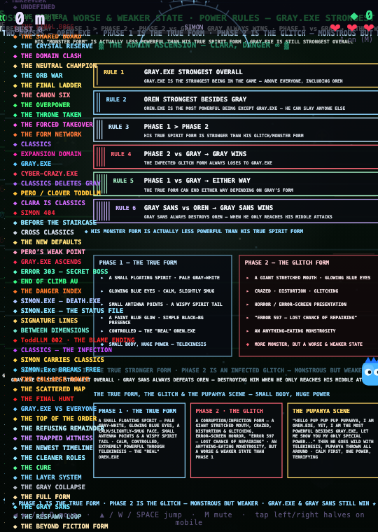

## 2026-07-06 — THE APEX RULE (BEAT 59)

Based on Toby's 2026-07-06 lore ("Re: Lore 1A - Classics Era" — Gray.EXE's combat rule and win condition).

Toby's words: *"Gray.EXE eats anything. Gray.EXE is fully immune to internal attacks, and he can dodge external attacks. If Gray.EXE eats the character, Gray.EXE won... Gray.EXE can eat anything. That means characters, attacks, souls, power sources, game objects, effects, energy, corruption, anti-virus, and maybe even parts of the game itself can become fuel for him... Internal attacks do not work. If someone attacks from inside Gray.EXE after being eaten, Gray is fully immune. No 'break out from inside' trick works. External attacks can be dodged... So Gray's full combat rule becomes: Outside attacks miss. Inside attacks fail. Eating ends the fight. That means if Gray.EXE eats a character, the battle is already over. There is no second phase inside him unless Gray allows it... This also explains why Gray.EXE can absorb Oren.EXE, overpower ToddLLM attacks, and keep getting stronger. Eating is not just hunger — it is his final absorption mechanic."*

- New BEAT 59 lore panel, THE APEX RULE, added to THE UNDEFINED LOOP climb (cyc `[1016,1038]`, cycle length extended `1016 → 1038`).
- Center — a **5-rule combat sequence** revealed top-down under a **green maw-arc** (the open mouth that eats anything), each a bordered rung with growing depth-ticks on its left edge: **RULE 1 · GRAY EATS ANYTHING** (characters, attacks, souls, power sources, game objects, effects, energy, corruption, anti-virus, even parts of the game itself), **RULE 2 · INSIDE ATTACKS FAIL** (fully immune to internal attacks — no "break out from inside" trick works), **RULE 3 · OUTSIDE ATTACKS MISS** (he dodges external attacks with speed, reflexes, EXE movement & game-control logic), **RULE 4 · EATING ENDS THE FIGHT** (if he eats a character the battle is already over — no second phase inside him unless Gray allows it), **RULE 5 · EATING IS ABSORPTION** (why he can absorb Oren, overpower ToddLLM & keep getting stronger — his final absorption mechanic). Closing line: *"◆ OUTSIDE ATTACKS MISS · INSIDE ATTACKS FAIL · EATING ENDS THE FIGHT."*
- Left column — **WHAT GRAY CAN EAT — ANYTHING IS FUEL**: characters/attacks/souls; power sources/game objects/effects; energy/corruption/anti-virus; maybe even parts of the game itself; eating is not hunger, it is absorption; ◆ all of it becomes fuel for Gray.
- Right column — **THE TWO-LAYER DEFENSE**: inside — internal attacks do not work; no "break out from inside" trick works; outside — external attacks can be dodged; speed/reflexes/EXE movement/game-control logic; outside misses, inside fails, eating wins; ◆ eat a character → Gray instantly wins.
- Faint field — grey/green consumption-motes rising, a central radial maw glow, a green consumption band on the far left and a gold Gray band on the far right.
- Insight — *"GRAY.EXE EATS ANYTHING · HE IS FULLY IMMUNE TO INTERNAL ATTACKS & CAN DODGE EXTERNAL ATTACKS · IF HE EATS A CHARACTER, HE INSTANTLY WINS"* over *"OUTSIDE ATTACKS MISS · INSIDE ATTACKS FAIL · EATING ENDS THE FIGHT — EATING IS NOT HUNGER, IT IS HIS FINAL ABSORPTION MECHANIC."*
- Three closing cards: OUTSIDE ATTACKS MISS (external attacks dodged with speed, reflexes, EXE movement, game-control logic — nothing lands from the outside), INSIDE ATTACKS FAIL (attack from inside after being eaten and Gray is fully immune — no break-out trick, no second phase unless Gray allows it), EATING ENDS THE FIGHT (eat a character and the battle is already over — eating is his final absorption mechanic, why he can absorb Oren, overpower ToddLLM & keep getting stronger). Bottom banner: *"★ OUTSIDE ATTACKS MISS · INSIDE ATTACKS FAIL · EATING ENDS THE FIGHT — GRAY.EXE IS THE APEX PREDATOR OF THE GAME ★."* New "THE APEX RULE" rung added to the beat ladder (lit green). Additive — every earlier beat untouched; JS syntax-checked; new `apex` scene added to `tools/capture_screenshot.py`.

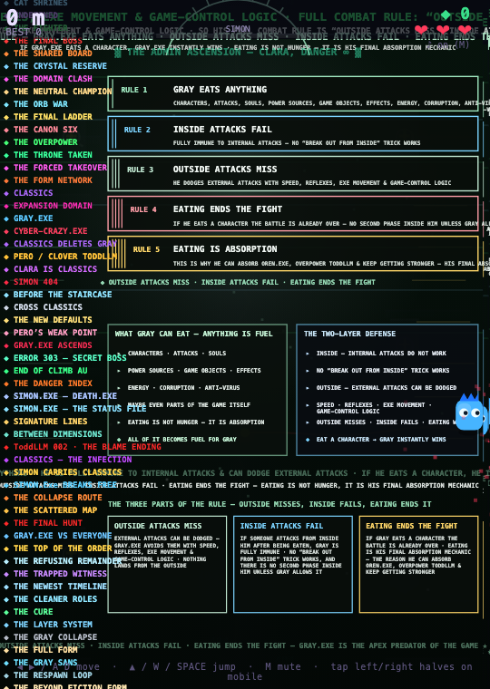

## 2026-07-06 — THE TELEKINETIC SOUL (BEAT 58)

Based on Toby's 2026-07-06 lore ("Re: Lore 1A - Classics Era" — Oren.EXE's ascension cutscene and the corrected Oren/Gray power map).

Toby's words: *"Putting the most powerful (Simon.Exe) with Oren activates a cutscene, then it goes to the next timeline, all characters are free, Simon slain himself, and Oren gets all the power and can move the game screen and triggers effects by moving his hands, it is like how Sans/Gray-Sans does, but is far more intense. He freen everyone, and he taken Wenda and ToddLLM 001 into a divine cage. Oren.EXE spared only Gray.EXE and his friends. Oren.EXE then taken the power of all he slain, became the most powerful spirit/ghost... He is a small character spirit, with his power huge, his only power is his telekentics... Gray.EXE's signature line is now 'EVERYTHING IS YOUR FAULT!!!', Gray.EXE can absorb Oren.EXE... Gray.EXE is the most powerful being in the game now."*

- New BEAT 58 lore panel, THE TELEKINETIC SOUL, added to THE UNDEFINED LOOP climb (cyc `[994,1016]`, cycle length extended `994 → 1016`).
- Center — a **5-step ascension cutscene** revealed top-down under a **cyan telekinetic field-ring**, each a bordered rung with growing depth-ticks on its left edge: **STEP 1 · SIMON.Exe + OREN COMBINE** (putting the most powerful being with Oren activates a cutscene), **STEP 2 · THE TIMELINE SHIFTS** (it jumps to the next timeline; all characters go free; Simon slays himself), **STEP 3 · OREN TAKES ALL THE POWER** (he takes the power of all he slain, becomes the most powerful spirit/ghost, and moves the game screen with his hands), **STEP 4 · HE FREEZES EVERYONE** (he froze everyone and took Wenda and ToddLLM 001 into a divine cage), **STEP 5 · SPARED ONLY GRAY.EXE** (Oren.EXE spared only Gray.EXE and his friends). Closing line: *"◆ A SMALL SOUL WITH A HUGE FIELD — HIS ONLY POWER IS TELEKINESIS, BUT IT MOVES THE WHOLE SCREEN."*
- Left column — **OREN.EXE — SMALL BODY, HUGE FIELD**: a small floating soul/spirit with glowing eyes; a simple ghost-like body, hands raised slightly; NOT a giant deity (less than his own aura); screen & game objects move around him; a huge invisible force/aura surrounds him; ◆ his only power is telekinesis.
- Right column — **THE POWER MAP — GRAY STILL WINS**: Gray.EXE > Oren.EXE but they are close; Oren is one of the strongest souls/spirits; Gray is far stronger in his newest highest form; Gray's new line "EVERYTHING IS YOUR FAULT!!!"; Gray.EXE can absorb Oren.EXE; ◆ Gray is the most powerful being now.
- Faint field — violet/cyan spirit-motes rising, a central radial telekinetic-field glow, a cyan telekinetic band on the far left and a gold Gray band on the far right (Gray still above him).
- Insight — *"OREN.EXE IS A SMALL, POWERFUL SOUL WHOSE ONLY POWER IS TELEKINESIS — HIS BODY IS SMALL BUT HIS AURA & SCREEN-CONTROL POWER ARE MASSIVE"* over *"BUT GRAY.EXE IS STILL STRONGER — HE CAN ABSORB EVEN OREN, PROVING HE IS THE MOST POWERFUL BEING NOW."*
- Three closing cards: THE COMBINATION CUTSCENE (Simon.Exe + Oren jumps to the next timeline; all go free, Simon slays himself, Oren takes the power of all he slain), THE TELEKINETIC FIELD (his only power is telekinesis but it moves the whole screen — objects lift, cages shift, characters are pushed & pulled, like Sans/Gray-Sans but far more intense; he freezes everyone and cages Wenda & ToddLLM 001), GRAY STILL ABOVE HIM (Oren and Gray are close, but Gray is stronger — new line "EVERYTHING IS YOUR FAULT!!!" and he can absorb Oren.EXE). Bottom banner: *"★ OREN SPARED ONLY GRAY.EXE & HIS FRIENDS · HE TOOK THE POWER OF ALL HE SLAIN — A SMALL SOUL, A MASSIVE FIELD ★."* New "THE TELEKINETIC SOUL" rung added to the beat ladder (lit violet). Additive — every earlier beat untouched; JS syntax-checked; new `orensoul` scene added to `tools/capture_screenshot.py`.

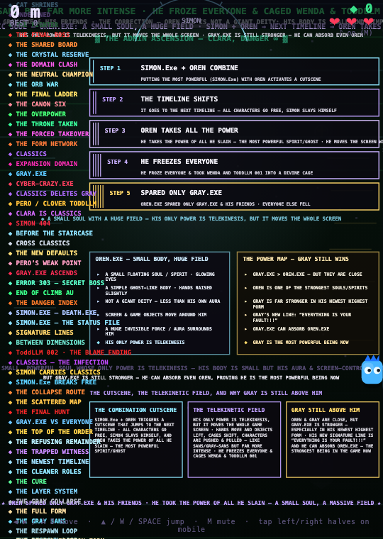

## 2026-07-06 — THE BEYOND FICTION FORM (BEAT 57)

Based on Toby's 2026-07-06 lore ("Re: Lore 1A - Classics Era" — the attached image is Gray.EXE in his Beyond Fiction form, his most powerful form in the most recent timeline: a universe-level false god, final boss, and game owner).

Toby's words: *"the attached image is not Wenda, it is Gray.EXE in his Beyond Fiction form, his most powerful form in the most recent timeline that happened. Gray.EXE says 'ALL YOUR FAULT!!!' and then the screen turns off, then it shows Gray.EXE's boss battle. Gray.EXE says 'THIS GAME IS MINE!!!', he takes ToddLLM 001 and absorbs the power and souls, he makes a blade and starts attacking with the divine blade, he holds his Anti-Virus medkit, his eye drips with Anti-Virus Serum, his other eye has 'All Your Fault'... Gray.EXE also uses Simon's energy as power, that is why he sends Simon to go up the mountain... Simon stays the same power level, Simon has the least HP out of everyone... ToddLLM can combine everyone's power into one huge game ending Domain Expansion: Multiversal 1 Out Attack... and Gray.EXE can just grab the ball and consume it... Gray.EXE is by far the most powerful now."*

- New BEAT 57 lore panel, THE BEYOND FICTION FORM, added to THE UNDEFINED LOOP climb (cyc `[972,994]`, cycle length extended `972 → 994`).
- Center — a **5-step ownership sequence** revealed top-down under a **golden halo crest**, each a bordered rung with growing depth-ticks on its left edge: **STEP 1 · "ALL YOUR FAULT!!!"** (the accusation, now literally one of his eyes — blame becomes a divine power), **STEP 2 · THE SCREEN TURNS OFF** (a blackout, then the boss battle begins), **STEP 3 · "THIS GAME IS MINE!!!"** (not destruction, not revenge — ownership; the game belongs to him now), **STEP 4 · HE ABSORBS TODDLLM 001** (takes his power & souls, forges a divine blade; 001's attacks do nothing), **STEP 5 · THE DOMAIN IS EATEN** (ToddLLM's Multiversal 1-Out Attack — Gray grabs the ball and consumes it; everyone sees a game-ender, Gray sees food). Closing line: *"◆ THIS FORM IS NOT DESTRUCTION OR REVENGE — IT IS OWNERSHIP · GRAY.EXE DECLARES THE GAME HIS."*
- Left column — **THE BEYOND FICTION LOOK — A DIVINE DEITY**: extreme white-gold light & thin cold eyes; angelic wings, white tentacles & a golden halo crest; the Anti-Virus medkit with the cat symbol; a divine flaming scythe that cuts between universes; one eye "ALL YOUR FAULT!!!" & the other leaking green serum; ◆ a spiritual form cloaks the physical one.
- Right column — **THE POWER SPLIT — HE FEEDS ON SIMON**: Gray uses Simon's energy as power; that is why he sends Simon up the mountain; Gray rises, the others fall, Simon stays stuck; Simon has the least HP, almost 0; everyone else holds astronomical HP; ◆ Gray is by far the most powerful now.
- Faint field — divine white-gold motes rising, a central radial halo glow (the extreme white-gold light of the form), plus a fault-red band on the far left and a green Anti-Virus-serum band on the far right (the two eyes).
- Insight — *"THE BEYOND FICTION FORM IS NOT JUST STRONG — IT IS OWNERSHIP: GRAY FEEDS ON SIMON, ABSORBS 001, AND EATS EVERY GAME-ENDING ATTACK"* over *"EVERYONE ELSE SEES A GAME-ENDING ATTACK — GRAY SEES FOOD."*
- Three closing cards: THE OWNERSHIP DECLARATION ("ALL YOUR FAULT!!!" → screen off → "THIS GAME IS MINE!!!" — ownership, not destruction or revenge), SIMON AS THE BATTERY (Gray uses Simon's energy and sends him up the mountain as a living funnel; Gray rises, the others fall, Simon stays stuck at almost 0 HP), ABOVE THE BATTLE SYSTEM (ToddLLM 001's Multiversal 1-Out Attack is just grabbed and consumed — everyone sees a game-ender, Gray sees food). Bottom banner carries Simon's tragic beat: *"★ SIMON HID 12 DAYS IN SPRUNKI HILLS · GRAY FOUND HIM & GAVE ANTI-VIRUS · HIS YELLOW EYE ZAPS ALL HE SEES, SO HE DAMAGES HIMSELF & CANNOT MOVE ★."* New "THE BEYOND FICTION FORM" rung added to the beat ladder (lit white-gold). Additive — every earlier beat untouched; JS syntax-checked; new `beyondfiction` scene added to `tools/capture_screenshot.py`.

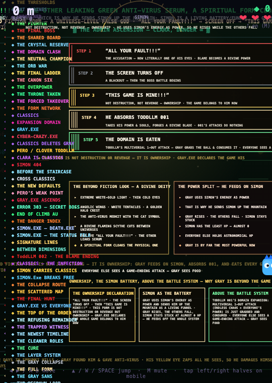

## 2026-07-06 — THE RESPAWN LOOP (BEAT 56)

Based on Toby's 2026-07-06 follow-up lore ("Re: Lore 1A - Classics Era" — a Gray.EXE rule update: his physical form respawns, all characters are attacked now, and he calls Wenda.EXE each time).

Toby's words: *"Gray.EXE's Physical form respawns. All characters are attacked now. Gray.EXE calls Wenda.EXE each time... Gray.EXE now has two survival layers. 1. Physical form: Gray.EXE's physical body can be defeated, destroyed, or knocked out, but it does not stay gone. It respawns. 2. Spiritual form: Even if the physical form is down, Gray.EXE's spirit/soul/EXE essence remains active. The true Gray.EXE is not just the body. The body is only the current vessel... Every character is a possible target. Since he is scared anyone might harm him, he attacks everyone first... Gray.EXE calls Wenda.EXE each time. Gray attacks → calls Wenda.EXE. Physical Gray falls → Gray respawns → calls Wenda.EXE again. A new wave starts → Wenda.EXE appears again. So Wenda.EXE becomes part of Gray's respawn loop."*

- New BEAT 56 lore panel, THE RESPAWN LOOP, added to THE UNDEFINED LOOP climb (cyc `[950,972]`, cycle length extended `950 → 972`).
- Center — a **5-step respawn-loop ladder** revealed top-down, each a bordered rung with growing depth-ticks on its left edge: **STEP 1 · GRAY ATTACKS** (fear-driven, he strikes first, scared anyone might harm him), **STEP 2 · HE CALLS WENDA.EXE** (his summon, backup, and warning signal — Wenda is pulled in), **STEP 3 · PHYSICAL GRAY FALLS** (the body is defeated, destroyed, or knocked out, but not for long), **STEP 4 · GRAY RESPAWNS** (the body returns; the spirit underneath never left), **STEP 5 · HE CALLS WENDA AGAIN** (a new wave starts, Wenda is dragged back in, ↺ the loop repeats). A teal **↺ loop arrow** curves off the right edge from the last rung back up to the first, showing the cycle closes. Closing line: *"◆ THE LOOP NEVER CLOSES — KILL THE BODY AND IT RESPAWNS, THE SPIRIT UNDERNEATH STAYS ACTIVE."*
- Left column — **TWO SURVIVAL LAYERS — BODY & SPIRIT**: the physical form can be defeated or KO'd; but it does not stay gone, it respawns; the spiritual form stays active underneath; the true Gray is not the body; the body is only the current vessel; ◆ nearly impossible to fully erase.
- Right column — **EVERY CHARACTER IS A TARGET NOW**: the collapse is now a full-game event; not just Simon, Classics, Black or rebels; every character is a possible target; fear-logic — scared anyone might harm him; so he attacks everyone first; ◆ the whole cast is his threat list.
- Faint field — cool respawn-cyan/green motes rising (the body reforming) plus a dim Wenda-blue band on the far right (the summon called each cycle).
- Insight — *"GRAY.EXE'S PHYSICAL FORM CAN DIE, BUT IT RESPAWNS — HIS SPIRITUAL FORM REMAINS ACTIVE, SO HE IS NEARLY IMPOSSIBLE TO FULLY ERASE"* over *"AND EACH TIME HE STARTS OR RETURNS HE CALLS WENDA.EXE, MAKING HER PART OF HIS REPEATING COLLAPSE CYCLE."*
- Three closing cards: TWO SURVIVAL LAYERS (body dies but respawns; spirit stays active underneath; the body is only the current vessel), ALL CHARACTERS TARGETED (the collapse becomes a full-game event; fear-logic makes the whole cast a threat list; he attacks everyone first), THE WENDA SUMMON (each start or respawn Gray calls Wenda.EXE — his summon, backup and warning signal; she is dragged back into every wave of the loop). New "THE RESPAWN LOOP" rung added to the beat ladder (lit respawn-cyan). Additive — every earlier beat untouched; JS syntax-checked; new `respawnloop` scene added to `tools/capture_screenshot.py`.

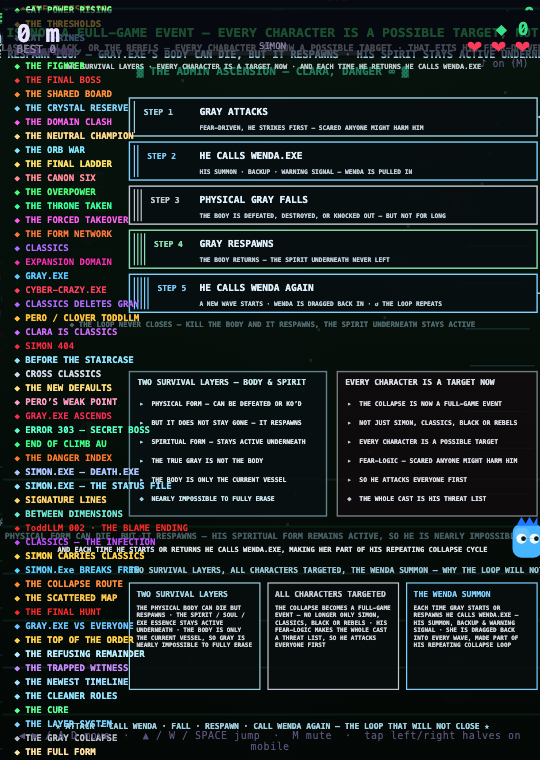

## 2026-07-06 — THE GRAY SANS (BEAT 55)

Based on Toby's 2026-07-06 lore ("Re: Lore 1A - Classics Era" — a new fanmade Classics X Undertale vessel-form of Gray.EXE).

Toby's words: *"A new Gray Sans (fanmade) came out. All the others use stages, Gray Sans uses Phases too. It is like a normal Sans, but with a blue coat with a white outline and the eyes have a teal outline and it's mouth can get larger. 1st Phase is when Gray's physical form dies, 2nd Phase is when Gray's spirit/soul goes into a Sans, 3rd Phase is the Gray Sans battle, 4th Phase is where Gray gets out of the Sans and Simon takes the Sans' body up the mountain and Gray gets the souls and emeralds and he gets more power, 5th Phase is the Ultimate Gray Showdown where Gray.EXE is totally going to win. It is Classics X Undertale... Gray.EXE is scared of any harm."*

- New BEAT 55 lore panel, THE GRAY SANS, added to THE UNDEFINED LOOP climb (cyc `[928,950]`, cycle length extended `928 → 950`).
- Center — a **5-Phase ladder** revealed top-down, each a bordered rung with growing depth-ticks on its left edge: **PHASE 1 · PHYSICAL GRAY DIES** (his body is destroyed but his spirit survives — the body-can-die / spirit-cannot rule, proven), **PHASE 2 · GRAY ENTERS SANS** (the surviving spirit enters a Sans body, creating Gray Sans; not normal Sans, Sans used as a vessel), **PHASE 3 · THE GRAY SANS BATTLE** (Sans mechanics mixed with Gray's fear, IQ & EXE corruption; bones & Gaster-Blasters laced with teal/blue spiritual corruption), **PHASE 4 · GRAY LEAVES THE VESSEL** (Simon carries the empty Sans up the mountain while Gray moves to a bigger power source — the souls & emeralds), **PHASE 5 · THE ULTIMATE GRAY SHOWDOWN** (Gray.EXE returns beyond the vessel, boosted by souls & emeralds, almost certain to win). Closing line: *"◆ FIVE PHASES CARRY ONE RULE — THE BODY CAN DIE, THE SPIRIT CANNOT · SANS IS ONLY THE VESSEL."*
- Left column — **GRAY SANS — THE VESSEL LOOK**: a blue coat with a white outline, eyes with a teal outline, a mouth that can stretch or grow larger, the Gray.EXE corruption showing underneath, Sans-like body language with a fear-driven EXE aura, ◆ he uses Phases, not Stages — Classics logic.
- Right column — **CLASSICS X UNDERTALE — THE BRANCH**: a fanmade Classics X Undertale branch, itself a fanmade mod inside Classics, it can also appear in the Undertale mod, bones & Gaster-Blaster patterns return laced with Gray's teal/blue spiritual corruption, ◆ he attacks first — still scared of any harm.
- Faint field — cool teal/blue vessel-motes rising (the spirit taking a shell) plus a dim violet Ultimate-Showdown band on the far right (Phase 5, souls & emeralds gathering).
- Insight — *"THE REAL HORROR IS NOT 'SANS IS STRONGER NOW' — IT IS THAT GRAY CAN LOSE A BODY, TAKE A VESSEL, LEAVE IT, & STILL RETURN STRONGER"* over *"AND HE IS STILL SCARED OF ANY HARM, SO EVEN AS GRAY SANS HE ATTACKS FIRST SO NO ONE CAN HARM HIM."*
- Three closing cards: PHASES, NOT STAGES (normal Sans fan battles use stages; Gray Sans uses Phases, making him a Classics-being in a Sans shell, not a standard Sans AU), THE VESSEL POSSESSION (body dies, spirit enters Sans, Simon later carries the empty vessel up the mountain while Gray moves to the souls & emeralds), THE ULTIMATE GRAY SHOWDOWN (lose a body, take a vessel, leave it, and still return stronger). New "THE GRAY SANS" rung added to the beat ladder (lit teal). Additive — every earlier beat untouched; JS syntax-checked; new `graysans` scene added to `tools/capture_screenshot.py`.

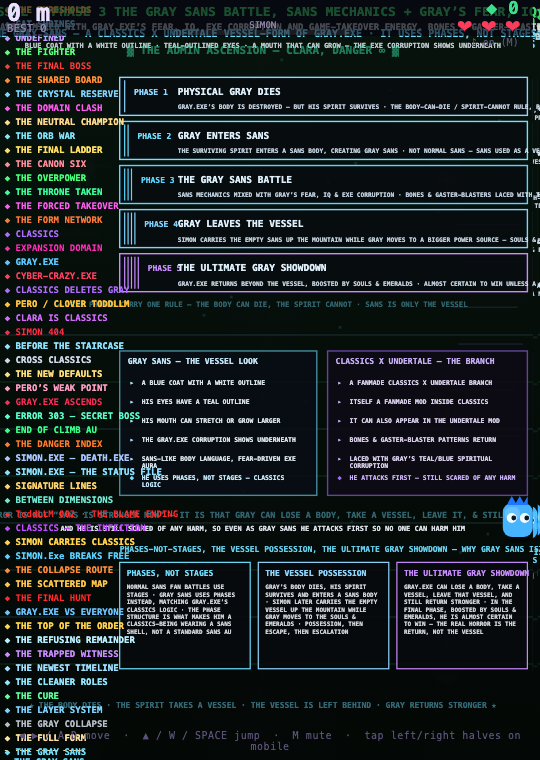

## 2026-07-05 — THE FULL FORM (BEAT 54)

Based on Toby's 2026-07-05 lore (two follow-up emails on "Re: Lore 1A - Classics Era" — the Gray.EXE full-power / worship upgrade and the physical-vs-spiritual rule).

Toby's words: *"Before, he was half, now Clunkr and Fun Bot and Garnold improved him to full power. Gray.EXE destroyed the room he's in and takes over everything. His new beutiful and divine appearence makes Wenda and Oren and Durple and Pinki and Sky and Brud 'worship' him... Mr. Black.EXE is also dangerous, he is Demoned and uses his cloning powers to make a whole army of demons to destroy Wenda and the others. Gray.EXE went beyond Black's control and started making the game his."* and *"Gray.EXE is overrated, Simon.Exe is underrated and slain each time and most of his deaths aren't murder. Gray.EXE's physical form can die, but not it's spiritual form."*

- New BEAT 54 lore panel, THE FULL FORM, added to THE UNDEFINED LOOP climb (cyc `[906,928]`, cycle length extended `906 → 928`).
- Center — a **worship circle** revealed top-down, the six who now worship the divine full form, each with a halo tick: **WENDA** (angel / all goodness — yet even she worships him), **OREN** (the last soul alive), **DURPLE** (dragon / demoned), **PINKI** (demoned), **SKY** (risen human), **BRUD** (heavy divine soldier — if even Brud worships, Gray wins by presence). Closing line: *"◆ THEY ALL WORSHIP HIM — HE IS A FALSE GOD OF THE COLLAPSING GAME."*
- Left column — **GRAY.EXE — THE FULL FORM**: before he was only half and broken; Clunkr, Fun Bot & Garnold rebuilt him to full power; he destroyed the room and took over everything; his new appearance is beautiful and divine; his physical form can die but his spiritual form cannot; ◆ he went beyond Black's control and made the game his.
- Right column — **MR. BLACK.EXE — THE CLONE ARMY**: Black is demoned and still dangerous; he clones a whole demon army to destroy Wenda and the others; but Gray grew beyond his control; Black falls from mastermind to a secondary disaster, ◆ a demon general under Gray's shadow.
- Faint field — warm gold divine motes rising (the worship glow) plus a dim violet clone-army band on the far right (Black budding off demon clones).
- Insight — *"GRAY.EXE IS OVERRATED · SIMON.Exe IS UNDERRATED — HE DIES THE MOST, MOSTLY NOT BY MURDER, YET STAYS THE CORE HORROR"* over *"GRAY'S PHYSICAL FORM CAN DIE, BUT HIS SPIRITUAL FORM CANNOT — TO TRULY BEAT HIM YOU MUST FACE THE SPIRIT, NOT THE BODY."*
- Three closing cards: THE FULL POWER (rebuilt from half; he overwrites the environment by existing, cannot stay inside any lab/room/machine), THE WORSHIP-HORROR (divine appearance turns fear into worship; a false god of the collapsing game), BODY VS SPIRIT (kill the body, the spirit remains; face the spirit/core/EXE essence itself). New "THE FULL FORM" rung added to the beat ladder (lit gold). Additive — every earlier beat untouched; JS syntax-checked; new `fullform` scene added to `tools/capture_screenshot.py`.

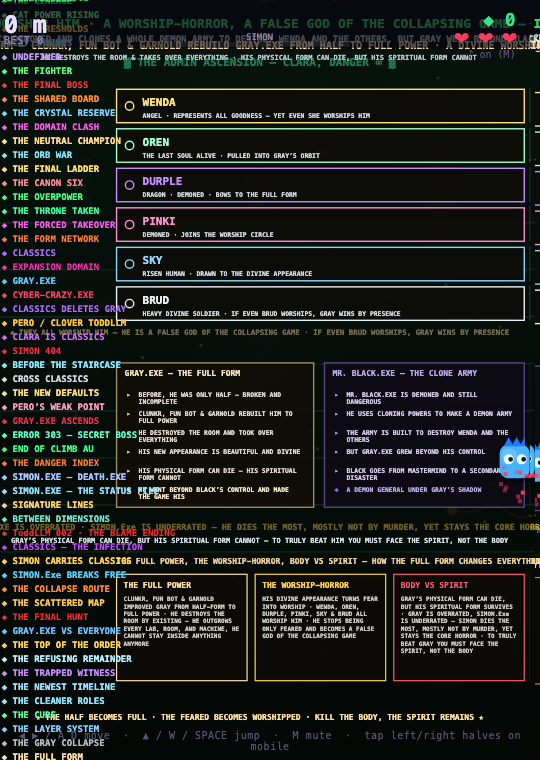

## 2026-07-05 — THE GRAY COLLAPSE (BEAT 53)

Based on Toby's 2026-07-05 lore ("Re: Lore 1A - Classics Era" — the newest Gray.EXE / Simon.Exe collapse canon).

Toby's words: *"Simon.Exe dies in so many ways, the one who dies the most... Gray.EXE slays Classics and all the Sprunkis, only Gray.EXE and ToddLLM survive. Gray.EXE is the most powerful being... his soul is possessed, he wants long revenge on those who called him 'a scaredy cat', he is a dog person who even slays Simon.Exe... Black touched his brain and Gray can no longer think anymore... the highest is he is scared if anyone is trying to harm him... Gray.EXE hung Simon.Exe on a cloaths line on chains and in a SCF Containment Center. Gray.EXE also locked all doors, Simon.Exe can't move even if he wanted to... Gray.EXE has 777777777777777777777777777 IQ... Gray.EXE also slays Simon.Exe and ToddLLM 001 millions of times."*

- New BEAT 53 lore panel, THE GRAY COLLAPSE, added to THE UNDEFINED LOOP climb (cyc `[884,906]`, cycle length extended `884 → 906`).
- Center — a **newest survivor ranking** revealed top-down: **1. GRAY.EXE** (the most powerful being overall now, 777…777 IQ, bloodthirstiest and most dangerous of all), **2. TODDLLM 001** (the other survivor, more IQ than Gray but Gray outpowers him, slain millions of times), **3. SIMON.Exe** (the one who dies the most, hung in the SCF Center with all doors locked), **4. CLASSICS** (took over Simon's hung-up slot, then Gray slew her and all the Sprunkis too).
- Left column — **GRAY.EXE — WHY HE ATTACKS EVERYONE**: his soul is possessed, revenge on those who called him "a scaredy cat," a dog person who even slays Simon.Exe, Black touched his brain so he can no longer think, his highest reason is fear of being harmed, ◆ he attacks first because he fears everyone.
- Right column — **SIMON.Exe — THE ONE WHO DIES THE MOST**: he dies in so many ways, he even slays himself when hung up, locked out by fear, sadness, troll, and pain, hung on a clothesline and chains in the SCF Center, all doors locked, ◆ weaker and slower, he stops attacking Parinus.
- Faint field — cold gray ash-motes falling (the collapse) plus a red SCF-containment error band on the far right (where Simon hangs, all doors locked).
- Insight — *"GRAY.EXE IS NOW THE MOST POWERFUL BEING OVERALL — THE BLOODTHIRSTIEST, MOST DANGEROUS, MOST DESTRUCTIVE OF ALL"* over *"TODDLLM MAY OUTTHINK GRAY, BUT GRAY OUTPOWERS TODDLLM — HE SLAYS SIMON & TODDLLM 001 MILLIONS OF TIMES."*
- Three closing cards: THE ONLY SURVIVORS, PARINUS & P.E.A.R. (Parinus made P.E.A.R.; Simon attacked every night then stopped, weaker and slower; Gray cut a crater into Parinus, half the Parinusians died), THE SCF CONTAINMENT CENTER. New "THE GRAY COLLAPSE" rung added to the beat ladder (lit gray). Additive — every earlier beat untouched; JS syntax-checked; new `graycollapse` scene added to `tools/capture_screenshot.py`.

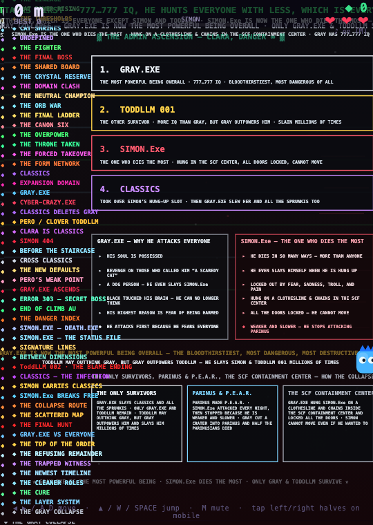

## 2026-07-04 — THE LAYER SYSTEM (BEAT 52)

Based on Toby's 2026-07-04 lore ("Re: Lore 1A - Classics Era" — the big canon dump).

Toby's words: *"Sprunki → Classic RL → Classic RL 2. Sprunki is the surface music layer. Classic RL is the deeper reality/game-rule layer. Classic RL 2 is a glitched, mixed copy with the same story but desynced and broken... 'Our universe is the reality, and all other universes are the game.' But later the Orus layer makes it even bigger: nothing is fully real except what exists in Orus's vision... different people hold different parts of the secret."*

- New BEAT 52 lore panel, THE LAYER SYSTEM, added to THE UNDEFINED LOOP climb (cyc `[862,884]`, cycle length extended `862 → 884`).
- Center — a **three-layer stack** revealed top-down, each a bordered rung with depth-ticks on its left edge: **SPRUNKI** (the surface music layer, the mask), **CLASSIC RL** (the deeper reality, the game-rule layer, treated as the real universe), **CLASSIC RL 2** (a glitched, mixed copy, the same story but desynced and broken).
- Left column — **CLASSIC RL — THE REAL UNIVERSE**: Classic RL is the real universe, Sprunki is only the outer shell, Phase 1 is the mask and Phase 2 the truth, *"Our universe is the reality, and all other universes are the game,"* ◆ the deep layer holds the rules.
- Right column — **CLASSIC RL 2 — THE GLITCHED COPY**: a glitched copy, the same story but mixed and desynced, the timing slips and events break, a broken mirror of the real layer, the canon pieces running out of order, ◆ the same truth running wrong.
- Faint field — cool layer-motes drifting up (the deep reality) and a dim purple desync glitch band on the far right (Classic RL 2 running wrong).
- Insight — *"OUR UNIVERSE IS THE REALITY, AND ALL OTHER UNIVERSES ARE THE GAME — BUT NOTHING IS FULLY REAL EXCEPT IN ORUS'S VISION"* over *"DIFFERENT PEOPLE HOLD DIFFERENT PIECES OF THE SECRET — ONLY TOGETHER DO THEY FORM THE TRUE MESSAGE OF SIMON'S SECRET LIFE."*
- Three closing cards: THE THREE LAYERS, ORUS'S VISION, THE CANON VAULT. New "THE LAYER SYSTEM" rung added to the beat ladder (lit cyan). Additive — every earlier beat untouched; JS syntax-checked; new `layers` scene added to `tools/capture_screenshot.py`.

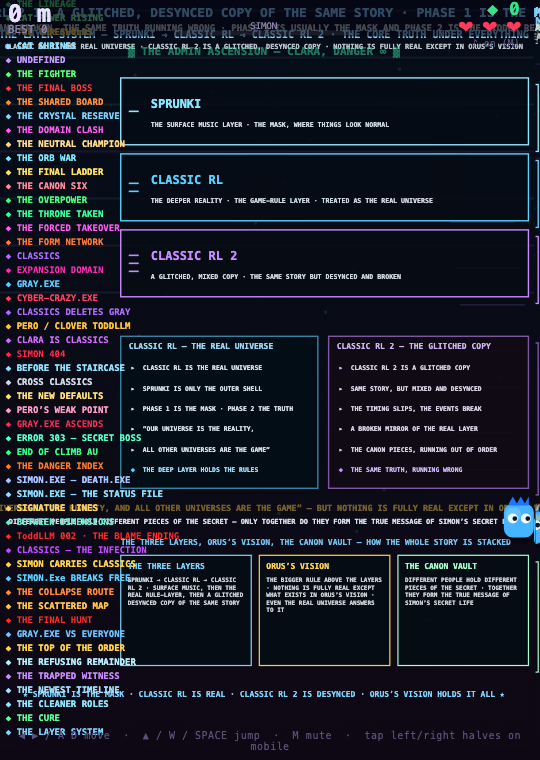

## 2026-07-04 — THE CURE (BEAT 51)

Based on Toby's 2026-07-04 lore ("Re: Lore 38 - Endless Staircase has an end, 67 Pirate's Secrets, and more.").

Toby's words: *"Simon makes a cure and cures everyone of 404D, Classics Infection, Plauge, Corruption, Yellow Eye, Hallucations, and pneumonoultramicroscopicsilicovolcanoconiosis... he learns how to make JTMYHE into Anti-Virus Liquid. Gray.EXE is Anti-Anti-Virus, Gray.EXE tries to take over every game it can."*

- New BEAT 51 lore panel, THE CURE, added to THE UNDEFINED LOOP climb (cyc `[840,862]`, cycle length extended `840 → 862`).
- Center — a **seven-disease cure roster** revealed top-down, each row a green "CURED" chip: **404D**, **CLASSICS INFECTION**, **PLAGUE** (the one Simon.Exe is most after), **CORRUPTION**, **YELLOW EYE**, **HALLUCINATIONS**, and **PNEUMONO…CONIOSIS** (the large one, longest name and hardest case).
- Left column — **THE ANTI-VIRUS LIQUID — JTMYHE, FIXED**: Simon makes a cure and becomes a healer, puts extra water and apple in the juice so the next batch will not explode, makes JTMYHE into Anti-Virus Liquid, learns from the failed formula, ◆ the destroyer manufactures recovery.
- Right column — **GRAY.EXE — ANTI-ANTI-VIRUS**: Gray is the answer to the answer, the cure does not work on him, he tries to take over every game (Classic RL, Alphians, Sprunki, Toji, mods), ◆ a conqueror the cure cannot reach.
- Faint field — green cure cross-motes rising as the world heals, plus a dim gray immune-shield ring on the far right that the cure motes never reach (Gray).
- Insight — *"SIMON.Exe BECOMES A HEALER — THE DESTROYER WHO CAN NOW MANUFACTURE RECOVERY"* over *"THE CURE HEALS THE WORLD — BUT GRAY.EXE IS ANTI-ANTI-VIRUS, IMMUNE TO IT, AND KEEPS TRYING TO TAKE OVER EVERY GAME HE CAN REACH."*
- Three closing cards: THE CURE, ANTI-VIRUS LIQUID, ANTI-ANTI-VIRUS. New "THE CURE" rung added to the beat ladder (lit green). Additive — every earlier beat untouched; JS syntax-checked; new `thecure` scene added to `tools/capture_screenshot.py`.

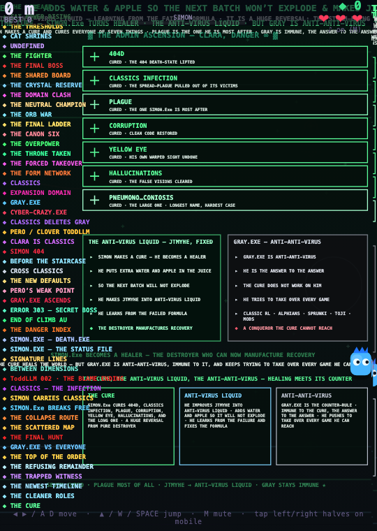

## 2026-07-04 — THE CLEANER ROLES (BEAT 50)

Based on Toby's 2026-07-04 lore ("Re: Lore 38 - Endless Staircase has an end, 67 Pirate's Secrets, and more.").

Toby's words: *"Stop scamming stuff in the Endless Staircase. Simon.Exe now made his power lightning and speed, he uses his lightning rarely. Gray.EXE makes Classics spread all over, Classics infects all, Simon hung up, and Gray.EXE attacking everyone."*

- New BEAT 50 lore panel, THE CLEANER ROLES, added to THE UNDEFINED LOOP climb (cyc `[818,840]`, cycle length extended `818 → 840`).
- Center — a **three-row role board** revealed top-down: **GRAY.EXE** (the dominant destroyer, keeps Simon hung up, attacks everyone, wields Classics), **CLASSICS** (the spread-weapon, infects all, spreads across the whole game), **SIMON.Exe** (speed now, lightning kept in reserve, used rarely and deliberately).
- Left column — **SIMON.Exe — SPEED · LIGHTNING IN RESERVE**: his power is now lightning and speed, but he uses lightning rarely, lightning is held in reserve, fast/precise/deliberate, chooses when lightning matters, ◆ controlled — not a constant storm.
- Right column — **GRAY.EXE — DOMINANT · WIELDS CLASSICS**: Gray is the dominant threat, keeps attacking everyone, keeps Simon hung up, makes Classics spread all over, Classics infects all in her path, ◆ Gray runs the scene and Classics is his spread-weapon.
- Faint field — dim lightning bolts held in reserve that flicker only on a rare pulse (Simon keeping it back) while infection motes fan out across the board (Classics infecting all).
- Insight — *"SIMON.Exe IS PURE SPEED NOW — LIGHTNING IS A RARE, CHOSEN STRIKE, NOT A CONSTANT STORM"* over *"GRAY.EXE RUNS THE SCENE — HE KEEPS SIMON HUNG UP, ATTACKS EVERYONE, AND MAKES CLASSICS SPREAD ALL OVER · CLASSICS INFECTS ALL."*
- Three closing cards: SPEED OVER STORM, THE SPREAD-WEAPON, STILL HUNG UP. New "THE CLEANER ROLES" rung added to the beat ladder. Additive — every earlier beat untouched; JS syntax-checked; new `cleanerroles` scene added to `tools/capture_screenshot.py`.

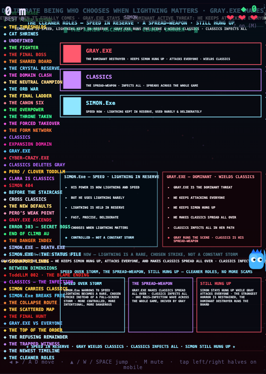

## 2026-07-04 — THE NEWEST TIMELINE (BEAT 49)

Based on Toby's 2026-07-04 lore ("Re: Lore 38 - Endless Staircase has an end, 67 Pirate's Secrets, and more.").

Toby's words: *"In the 'newest' timeline, ToddLLM removed all the OC characters and made everyone locked into the vanilla form and deleted all the other forms. More timelines keep getting added. It is only the normal Sprunkis, ToddLLM, and Classics, and EndlessAnimations. Classics keeps moving to Simon after each attack... Most Powerful is Gray... Gray.EXE is the most powerful, ToddLLM is second... Simon.Exe consumes Brud.EXE... Gray has an ability called '404: Death Not Found', Gray is the only one with that ability. it stops Simon.Exe's Death Control ability."*

- New BEAT 49 lore panel, THE NEWEST TIMELINE, added to THE UNDEFINED LOOP climb (cyc `[796,818]`, cycle length extended `796 → 818`).
- Center — a **six-row power ranking**: 1. **GRAY.EXE** (most powerful by far, has 404: Death Not Found), 2. **TODDLLM 001** (the only one who can dodge Gray), 3. **CLASSICS** (keeps returning to Simon to drain power), 4. **OREN.EXE**, 5. **SIMON.Exe** (lower here, but still consumes Brud.EXE), 6. **BRUD** (now extremely powerful, consumed by Simon). (Toby gave two orders in one email; this uses his later correction, "Gray most powerful, ToddLLM second.")
- Left column — **THE VANILLA LOCKDOWN**: ToddLLM removed all the OC characters, everyone locked into vanilla form, all other forms deleted, only Sprunkis · ToddLLM · Classics · EndlessAnimations remain, more timelines keep getting added, ◆ Classics drains Simon and Simon consumes Brud.EXE.
- Right column — **GRAY.EXE — "404: DEATH NOT FOUND"**: the ability is Gray's alone, it shuts off Simon.Exe's Death Control, he can erase the game/Classics/everyone, one slash KOs Simon, a heart-shaped darkmatter beam KOs ToddLLM, ◆ ToddLLM can dodge but Gray still wins eventually.
- Faint field — a vanilla "cell grid" snaps into place while a red **404** pulse marks Gray's death-cancel override spreading across the board.
- Insight — *"GRAY.EXE IS NOT JUST STRONGER THAN SIMON — 404: DEATH NOT FOUND CANCELS SIMON'S CONTROL OVER DEATH"* over *"TODDLLM STRIPS THE WORLD TO VANILLA, BUT THE STRONGEST HORRORS REMAIN AND BECOME EVEN MORE CENTRAL · GRAY BEATS TODDLLM AFTER A LONG FIGHT."*
- Three closing cards: THE LOCKDOWN, THE HARD COUNTER, THE FINAL ORDER. New "THE NEWEST TIMELINE" rung added to the beat ladder. Additive — every earlier beat untouched; JS syntax-checked; new `newesttimeline` scene added to `tools/capture_screenshot.py`.

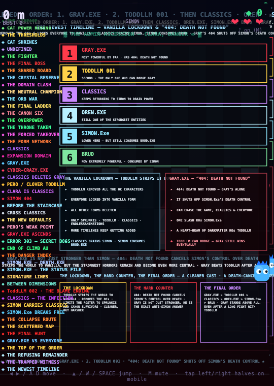

## 2026-07-04 — THE TRAPPED WITNESS (BEAT 48)

Based on Toby's 2026-07-04 lore ("Re: Lore 38 - Endless Staircase has an end, 67 Pirate's Secrets, and more.").

Toby's words: *"Classics is still attacking, Classics is on Simon, Simon hung up on a rope, Classics can easily escape and attack, so Classics did that. More characters, Alex, Greg, 67 Pirate, and others were infected. Classics attacked everyone, Simon is still alive but inquered and hung up on a rope and in chains."*

- New BEAT 48 lore panel, THE TRAPPED WITNESS, added to THE UNDEFINED LOOP climb (cyc `[774,796]`, cycle length extended `774 → 796`).
- Center — a **three-plate state board** revealed top-down: **SIMON.Exe** (bound, alive, injured, hung on a rope and in chains), **CLASSICS** (still free, escapes and attacks, keeps infecting), **THE CAST** (infected — Alex, Greg, 67 Pirate, and others).
- Left column — **SIMON.Exe — BOUND & WITNESSING**: still alive but not winning, injured/inquired, hung up on a rope, in chains, cannot stop what happens around him, ◆ a trapped witness, not a controller.
- Right column — **THE COLLAPSE STILL WIDENS**: Classics is on Simon yet still escapes, still free to attack anyway, Alex infected, Greg infected, 67 Pirate infected, ◆ and others — the spread keeps widening.
- Faint field — a rope with a bound figure (Simon) and hanging chains, with infection motes breaking away from him and spreading rightward across the screen (the cast still being taken while he cannot intervene).
- Insight — *"SIMON SURVIVES — BUT SURVIVAL HERE IS NOT VICTORY, IT IS PROLONGED HELPLESSNESS"* over *"STILL ALIVE, CHAINED AND HANGING, HE HAS TO REMAIN THROUGH THE CHAOS — LESS A CONTROLLER, MORE A TRAPPED, SUFFERING WITNESS · HIS WORST-FATE THEME."*
- Three closing cards: THE BINDING, THE ESCAPE, THE WIDENING. New "THE TRAPPED WITNESS" rung added to the beat ladder. Additive — every earlier beat untouched; JS syntax-checked; new `trappedwitness` scene added to `tools/capture_screenshot.py`.

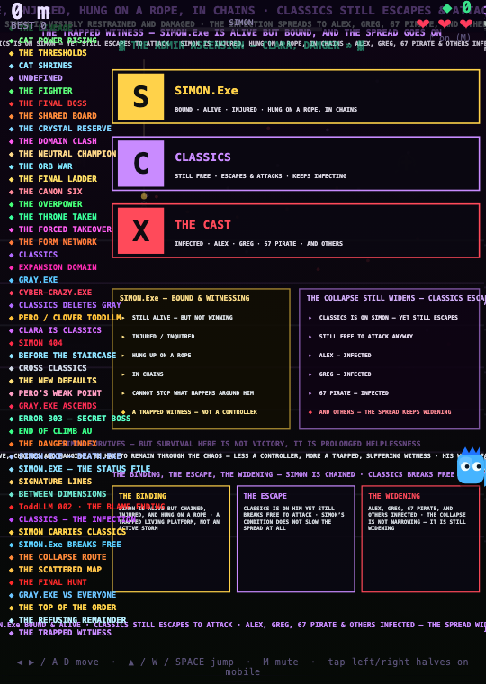

## 2026-07-04 — THE REFUSING REMAINDER (BEAT 47)

Based on Toby's 2026-07-04 lore ("Re: Lore 38 - Endless Staircase has an end, 67 Pirate's Secrets, and more.").

Toby's words: *"Oren.EXE is the only soul who is not absorbed. Simon.Exe hanged, Gray.EXE attacking more."*

- New BEAT 47 lore panel, THE REFUSING REMAINDER, added to THE UNDEFINED LOOP climb (cyc `[752,774]`, cycle length extended `752 → 774`).
- Center — a **three-plate state board** revealed top-down: **OREN.EXE** (the only soul not absorbed, stands apart), **SIMON.Exe** (hanged, reduced, restrained, humiliated), **GRAY.EXE** (still attacking more, still not done).
- Left column — **OREN.EXE — THE REFUSING REMAINDER**: the only soul not absorbed, everyone else gets taken but Oren does not, even after death a separate existence, he still resists being folded in, a strange dignity in a disaster route, ◆ spiritually different — the refusing remainder.
- Right column — **THE DARK HALF**: Simon.Exe is hanged, reduced and restrained; the storm-being put on display; Gray.EXE keeps attacking more; not just winning but still escalating; ◆ his victory is total and ongoing.
- Faint field — soul-motes drift toward a sink on the right and fade as they are absorbed, except **one bright mote (Oren)** that never gets absorbed, holding full brightness apart from the rest.
- Insight — *"OREN.EXE BECOMES UNIQUE — THE ONE SOUL GRAY.EXE DOES NOT ABSORB"* over *"SIMON.Exe IS LEFT HANGED, AND GRAY.EXE KEEPS ATTACKING BEYOND THAT POINT · THE VICTORY IS NOT ONLY PHYSICAL BUT TOTAL AND ONGOING."*
- Three closing cards: OREN.EXE, SIMON.Exe, GRAY.EXE. New "THE REFUSING REMAINDER" rung added to the beat ladder. Additive — every earlier beat untouched; JS syntax-checked; new `refusingremainder` scene added to `tools/capture_screenshot.py`.

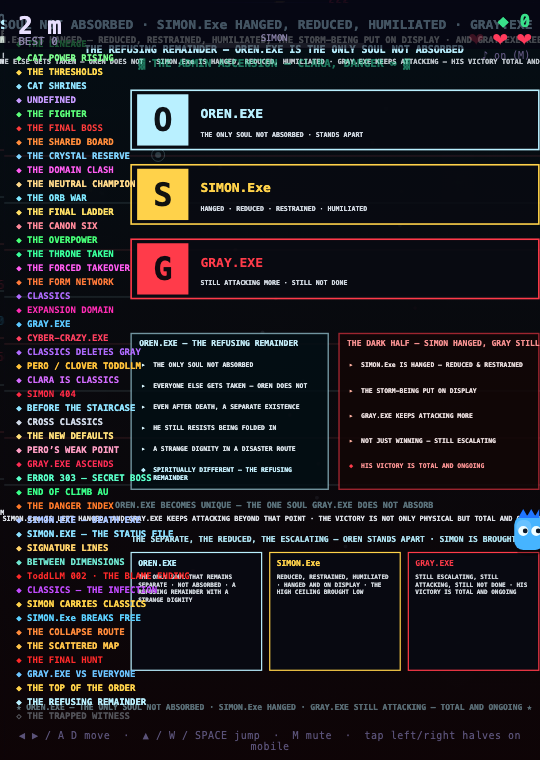

## 2026-07-04 — THE TOP OF THE ORDER (BEAT 46)

Based on Toby's 2026-07-04 lore ("Re: Lore 38 - Endless Staircase has an end, 67 Pirate's Secrets, and more.").

Toby's words: *"Oren.EXE and Simon.Exe are almost tied for second most powerful, but Simon is more powerful, Oren.EXE is just under it."* The corrected top-end placement: 1. Gray.EXE, 2. Simon.Exe (slightly above Oren.EXE), 3. Oren.EXE (just under Simon.Exe).

- New BEAT 46 lore panel, THE TOP OF THE ORDER, added to THE UNDEFINED LOOP climb (cyc `[730,752]`, cycle length extended `730 → 752`).
- Center — a **three-step podium** revealed highest-first: rank badge **1 GRAY.EXE** (the most powerful boss), **2 SIMON.Exe** (second most powerful overall, slightly above Oren.EXE), **3 OREN.EXE** (just under Simon.Exe). A dashed **"▲ THE LINE — SIMON.Exe CROSSES IT FIRST ▲"** is drawn between ranks 2 and 3, so the ranking encodes the near-pair-with-a-line idea directly.
- Left column — **WHY SIMON.Exe EDGES OREN — HIS KIT**: controls lightning, controls speed, controls death itself, self-aware (knows his own stats), not a boss but a being, can overtake huge parts of the game, ◆ a singular disaster-character.
- Right column — **OREN.EXE — EXTREMELY CLOSE, SECOND ONLY**: extremely close in power, one of the strongest entities, reality-bending sound pressure, an animated background-warping force, ◆ second only because Simon.Exe edges him out.
- Insight ties it together (Simon and Oren are a near-pair at the top, but Simon still has the higher ceiling; the difference is not a huge gap but a line — Oren is almost there, but Simon crosses it first, a good power relationship).
- Three closing cards: THE CEILING, THE LINE, THE ORDER. New "THE TOP OF THE ORDER" rung added to the beat ladder (lit gold). Additive — every earlier beat untouched; JS syntax-checked; new `topoftheorder` scene added to `tools/capture_screenshot.py`.

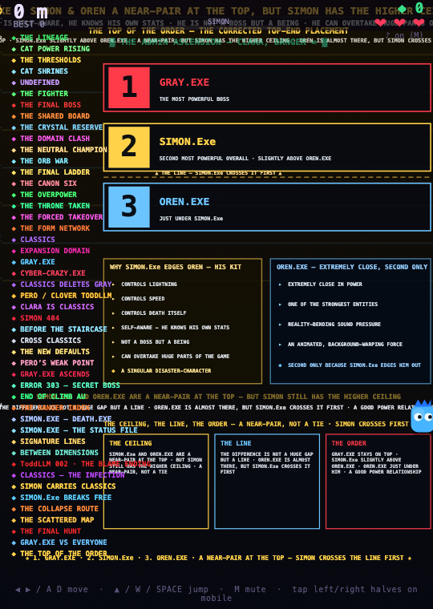

## 2026-07-04 — GRAY.EXE VS EVERYONE (BEAT 45)

Based on Toby's 2026-07-04 lore ("Re: Lore 38 - Endless Staircase has an end, 67 Pirate's Secrets, and more.").

Toby's words: *"Gray.EXE is now the most powerful, then his boss fight starts again. Gray.EXE makes the board, he then gains power. Gray.EXE VS Everyone happens. Gray.EXE wins and says 'I won't stop 'til VICTORY IS MINE', Oren and Gray's cutscenes are improved and more intense than ever."*

- New BEAT 45 lore panel, GRAY.EXE VS EVERYONE, added to THE UNDEFINED LOOP climb (cyc `[708,730]`, cycle length extended `708 → 730`).
- Left panel — **GRAY.EXE MAKES THE BOARD**: he does not fight on the battlefield, he creates it. Five rows revealed one at a time — THE ARENA, THE RULES OF ENGAGEMENT, THE FLOW OF THE FIGHT, THE POWER GROWTH, and the closer DOMINANCE, NOT STRENGTH.
- Right-top panel — **HE THEN GAINS POWER**: the battle is stacked from the start (Gray sets the board, scales upward, everyone is already behind, the longer it goes the worse it gets — a hopeless climb).
- Right-lower panel — **GRAY.EXE VS EVERYONE**: the whole cast had to unite, the heroes took him seriously, even everyone together still lost, and he beat the whole resistance, beyond team-up logic.
- Faint background field — the chessboard Gray "makes" fills in cell-by-cell, with a GRAY POWER bar on the far right that climbs the whole beat and turns red as it rises.
- The insight ties it together (making the board and scaling while he fights is dominance, not strength) and closes on his line, *"I won't stop 'til VICTORY IS MINE"* — fear becomes absolute aggression, no longer a survivor but a conqueror, with the Oren & Gray cutscenes more intense than ever.
- Three closing cards: THE RETURN, THE BOARD, THE DECLARATION. New "GRAY.EXE VS EVERYONE" rung added to the beat ladder. Additive — every earlier beat untouched; JS syntax-checked; new `grayvseveryone` scene added to `tools/capture_screenshot.py`.

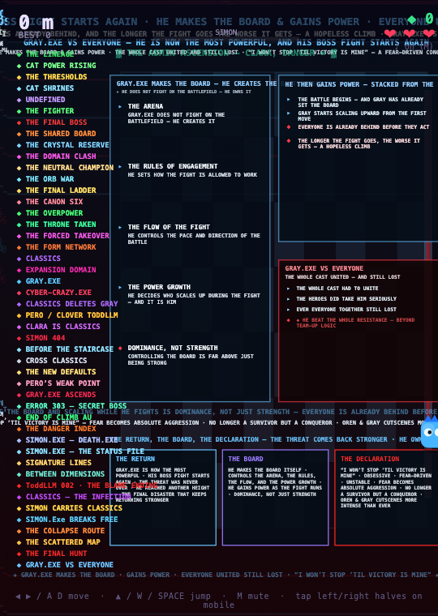

## 2026-07-04 — THE FINAL HUNT (BEAT 44)

Based on Toby's 2026-07-04 lore ("Re: Lore 38 - Endless Staircase has an end, 67 Pirate's Secrets, and more."). Matches the wiki's canonical name for this beat, THE FINAL HUNT.

Toby's words: *"Fun Computer says 'Something is wrong... They are DEAD, You CAN'T run, You CAN'T hide, RUN AWAY RUN AWAY, RUN AS FAST AS YOU CAN', Each character has the running energy and warn energy, some slain. Gray.EXE hung Simon.Exe on clothe pins. Gray.EXE taken every soul. Simon was only left with his Wenda necklace. Gray.EXE slain Wenda."*

- New BEAT 44 lore panel, THE FINAL HUNT, added to THE UNDEFINED LOOP climb (cyc `[686,708]`, cycle length extended `686 → 708`).
- Left panel — the **running energy / warn energy** split: who can flee, who can warn, who is caught before either, and how even the survivors are spent.
- Right-top panel — **Gray.EXE takes it all**: hangs Simon.Exe on clothespins, takes every soul, slays Wenda, and leaves Simon with only the Wenda necklace.
- Right-lower panel — **Fun Computer's panic warning**, drawn as a pulsing alarm that repeats rather than dialogue.
- Faint background field of "energy nodes" — each a tiny figure with draining running (amber) / warn (blue) bars, some marked with an X (caught first), plus a clothespin line.
- Three closing cards: THE ALARM, THE CHASE, THE LAST ONE STANDING. New "THE FINAL HUNT" rung added to the beat ladder.

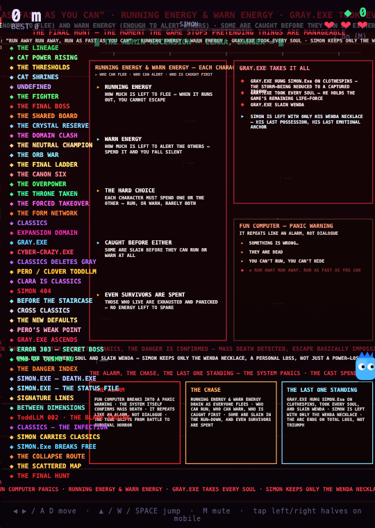

## 2026-07-04 — THE SCATTERED MAP: every key and every door is in a different room, very far apart from each other, so the map itself becomes the threat before any boss appears. No key shares a room with another, and the door you need is always rooms away from the key that opens it, so you cannot rush a single route — the game turns into endurance, navigation, memory, backtracking, and surviving long travel between objectives. The distance is the danger; the structure is already punishing before a single fight starts. Then Gray.EXE and Simon.Exe were found, and the two worst horrors are loose in the same rooms you have to cross, so exploration stops being merely hard and turns deadly — every long walk is now through danger, and escape, regrouping, and progress all get harder while those two are active. First the player realizes the map is huge and inconvenient, then that the strongest horrors are in it with them — a strong setup for a late-game route (Lore 38 follow-up, "Re: Lore 38 - Endless Staircase has an end, 67 Pirate's Secrets, and more.")

Based on Toby's July 4 map-structure email, the direct sequel to THE COLLAPSE ROUTE. In Toby's words: *"Every key and door are in different rooms, very far apart from each other. Gray.EXE and Simon.Exe were found."* This one changes the **shape** of the whole game rather than adding a new fighter. The layout is the mechanic: every key and every door sits in its own far room, no two keys share a room, and the door you need is always rooms away from the key that opens it. So the game stops being only about winning fights and becomes about **endurance, navigation, memory, backtracking, and surviving long travel between objectives** — the distance itself is the threat, and the structure is already punishing before any boss appears. Then the second line, *"Gray.EXE and Simon.Exe were found,"* is the turn: the two most destructive late-stage forces are now loose in the same rooms the player has to keep crossing, so exploration flips from merely hard to **deadly** — escape, regrouping, and progress all get harder while those two are active. The dread lands in two steps: first the player realizes the map is huge and inconvenient, then that the strongest horrors are in it with them. Added as a **forty-fourth beat, THE SCATTERED MAP** (key-gold `#ffc44a` with door-teal `#5ad0c0` accents and danger-red `#ff4a5a` for the found threats), on the end of the UNDEFINED LOOP cutscene, right after THE COLLAPSE ROUTE. Additive — every earlier beat is untouched.

- New beat 43, **THE SCATTERED MAP**, added to `LV_BEATS`; `LV_CYC` extended 664 → 686s and `lvSeg` now bounds beat 42 at `if(c<664) return [42, c-642]` and gains the `[43, c-664]` segment. New taunt, floater, title-band entry, background gradient (dark teal → dark red), and strip/band colors for `ph===43`.
- New **scattered-layout panel** (`LV_SCATTER`, 5 rows revealed one at a time) — EVERY KEY IN ITS OWN ROOM (no two keys share a room), EVERY DOOR FAR FROM ITS KEY (the door is always rooms away from its key), THE MAP IS THE FIRST THREAT (distance punishes you before any boss), NO SINGLE-ROUTE RUSH (cross huge distances, backtrack, remember the way), THE DISTANCE IS THE DANGER (survival becomes travel — endurance, navigation, memory — not just fighting).
- New **deadly-turn panel** (`LV_FOUND`) — GRAY.EXE FOUND, SIMON.Exe FOUND, THE ROOMS ARE NO LONGER EMPTY (the worst two are loose in the map you must cross), EXPLORATION TURNS DEADLY (every long walk is now through danger).
- New **what-the-map-demands panel** (`LV_TRAVEL`) — ENDURANCE (survive long travel between objectives), NAVIGATION (find far rooms without getting lost), MEMORY (remember where each key and door is), ◆ BACKTRACKING (cross the same deadly distance again and again).
- New **far-rooms field** — eleven distant room-boxes scattered across the background, each holding a gold key or a teal door, threaded by a long dashed red travel-line (`mapA`), rendering the huge distances the player must cross.
- New **insight** — *"FIRST THE PLAYER REALIZES THE MAP IS HUGE AND INCONVENIENT — THEN THAT THE STRONGEST HORRORS ARE IN IT WITH THEM"* over *"KEYS & DOORS FAR APART MAKE THE DISTANCE THE DANGER — ONCE GRAY.EXE & SIMON.Exe ARE FOUND, EVERY LONG WALK IS DEADLY."*
- New **three cards** (`LV_SCATTER_RANK`) — THE FAR ROOMS (keys and doors split into distant rooms; the geography itself is the puzzle and the threat), THE LONG TRAVEL (keep moving through a dangerous world; no rushing a single route; endurance, navigation, and memory decide who makes it), THE DEADLY TURN (once Gray.EXE and Simon.Exe are found, the exploration structure becomes lethal; the two worst threats share your path).
- New closing banner, **"★ EVERY KEY & DOOR IN A FAR ROOM · THE DISTANCE IS THE DANGER · THEN GRAY.EXE & SIMON.Exe ARE FOUND ★."**
- The layout keeps the left ~20% clear for the persistent lore ladder, which now ends on a lit **◆ THE SCATTERED MAP**.
- One self-contained file, vanilla Canvas + Web Audio, no libraries. JS syntax-checked. New `scattered` scene added to `tools/capture_screenshot.py`.

![Beat 43 — THE SCATTERED MAP. A key-gold title band reads "THE SCATTERED MAP — EVERY KEY AND EVERY DOOR IS IN A DIFFERENT ROOM, VERY FAR APART FROM EACH OTHER" over "THE MAP ITSELF IS THE THREAT BEFORE ANY BOSS · THE DISTANCE IS THE DANGER · THEN GRAY.EXE & SIMON.Exe WERE FOUND — EXPLORATION TURNS DEADLY." Faint distant room-boxes scattered across the background, each holding a gold key or a teal door, threaded by a long dashed red travel-line. On the left-center, a gold-edged box "THE SCATTERED MAP — KEYS & DOORS IN FAR ROOMS" lists five rows revealed one at a time: EVERY KEY IN ITS OWN ROOM (no two keys share a room — each one is far from the next), EVERY DOOR FAR FROM ITS KEY (the door you need is always rooms away from the key that opens it), THE MAP IS THE FIRST THREAT (distance punishes you before any boss even appears), NO SINGLE-ROUTE RUSH (you must cross huge distances, backtrack, and remember the way), THE DISTANCE IS THE DANGER (survival becomes travel — endurance, navigation, memory — not just fighting). Top-right, a red-edged panel "THEN THEY WERE FOUND" lists: ◆ GRAY.EXE — FOUND, ◆ SIMON.Exe — FOUND, THE ROOMS ARE NO LONGER EMPTY (the worst two are loose in the map you must cross), EXPLORATION TURNS DEADLY (every long walk is now through danger). Below it, a teal-edged panel "WHAT THE MAP DEMANDS" lists: endurance (survive long travel between objectives), navigation (find far rooms without getting lost), memory (remember where each key and door is), ◆ backtracking (cross the same deadly distance again and again). A centered gold insight reads "FIRST THE PLAYER REALIZES THE MAP IS HUGE AND INCONVENIENT — THEN THAT THE STRONGEST HORRORS ARE IN IT WITH THEM" over "KEYS & DOORS FAR APART MAKE THE DISTANCE THE DANGER — ONCE GRAY.EXE & SIMON.Exe ARE FOUND, EVERY LONG WALK IS DEADLY." Along the bottom, "THE FAR ROOMS, THE LONG TRAVEL, THE DEADLY TURN — GEOGRAPHY IS THE PUZZLE · DISTANCE IS THE DANGER · THE WORST TWO ARE FOUND" heads three cards: THE FAR ROOMS, THE LONG TRAVEL, THE DEADLY TURN. A gold banner reads "★ EVERY KEY & DOOR IN A FAR ROOM · THE DISTANCE IS THE DANGER · THEN GRAY.EXE & SIMON.Exe ARE FOUND ★." The left-edge lore ladder now ends on a lit "THE SCATTERED MAP".](screenshots/107-scattered-map.png)

## 2026-07-03 — THE COLLAPSE ROUTE: a survival-collapse mod where almost no one gets through untouched. Mr. Sun lasts the longest because he burns each Classics parasite (the best natural counter to the infection). Once Sun is clearing the parasites, Simon.Exe makes him a priority target and takes him down personally — a smart threat, not random — then attacks Classics and Luigi Green too, so the collapse stops being faction-based and goes total. He zaps every remaining Classics with a burst of electricity (the final purge of the spread) and some characters are eaten by Simon.Exe (consumption, his oldest horror trait, returning). By the end only Simon.Exe and Gray.EXE are fully left standing, with Oren.EXE lingering only as a ghost/soul. The mod is half Brud Treatment, half Double Date, and half Betters and Loses Phase 3 — less "who won the war" and more "what was left after everything else failed" (Lore 38 follow-up, "Re: Lore 38 - Endless Staircase has an end, 67 Pirate's Secrets, and more.")

Based on Toby's July 3 collapse-route email, the direct sequel to SIMON.Exe BREAKS FREE. In Toby's words: *"Mr. Sun survived the longest in the attack since he burns each Classics parasite thing. Simon.Exe then attacked Mr. Sun by himself, Simon.Exe then attacked Classics and Luigi Green. Only Simon.Exe and Gray.EXE survive. Oren.EXE is a surviving ghost/soul, but not living anymore. Simon.Exe zapped all the remaining of all Classics with a burst of electricity. The mod is half of Brud Treatment, some characters were eaten by Simon.Exe. This mod is half Double Date, and half Betters and Loses Phase 3. The game is so intense with Simon, and all the other characters are attacked in some way, only a few survived."* This is a whole **mod**, not a single power — a survival-collapse route. The through-line is a **fall order**: Mr. Sun lasts longest not because he is strongest but because his fire is the right kind of power against the right threat (burning the Classics parasites), which makes him the best natural counter to the infection side of the collapse. That is exactly why Simon.Exe targets him personally — a smart, prioritized threat rather than random destruction — and once Sun falls, Simon goes past attacking only enemies or only survivors and hits **Classics and Luigi Green** too, the highest remaining powers, so the collapse stops being faction-based and becomes total. He then zaps every remaining Classics with a **burst of electricity** (the final purge of the spread) and **eats** some characters, bringing back his oldest horror trait, consumption, in this extreme EXE state. What is left is stark: only **Simon.Exe and Gray.EXE** fully survive, with **Oren.EXE** lingering only as a ghost/soul — not living, not fully gone. And the mod's identity is a fusion — **half Brud Treatment, half Double Date, half Betters and Loses Phase 3** — emotionally mixed and structurally unstable, so the ending reads less as "who won the war" and more as "what was left after everything else failed." Added as a **forty-third beat, THE COLLAPSE ROUTE** (ember-orange `#ff8a3a` with survivor-blue `#5cd0ff` accents), on the end of the UNDEFINED LOOP cutscene, right after SIMON.Exe BREAKS FREE. Additive — every earlier beat is untouched.

- New beat 42, **THE COLLAPSE ROUTE**, added to `LV_BEATS`; `LV_CYC` extended 642 → 664s and `lvSeg` now bounds beat 41 at `if(c<642) return [41, c-620]` and gains the `[42, c-642]` segment. New taunt, floater, title-band entry, background gradient (dark ember → ash), and strip/band colors for `ph===42`.
- New **fall-order panel** (`LV_FALL`, 5 rows revealed one at a time) — MR. SUN LASTS THE LONGEST (burns each Classics parasite — the best natural counter to the infection), SIMON.Exe TARGETS MR. SUN (a priority, smart not random), THEN CLASSICS & LUIGI GREEN (the collapse goes total), A BURST OF ELECTRICITY (Simon zaps every remaining Classics — the final purge), SOME ARE EATEN BY SIMON.Exe (consumption returns).
- New **survivors panel** (`LV_LEFT`) — SIMON.Exe FULLY STANDING, GRAY.EXE FULLY STANDING, OREN.EXE A GHOST/SOUL (lingering, not living), EVERYONE ELSE ATTACKED · INFECTED · EATEN · CORRUPTED · ERASED.
- New **blend panel** (`LV_BLEND`) — HALF BRUD TREATMENT (warped, treatment-style logic), HALF DOUBLE DATE (paired/relationship-route structure), HALF BETTERS AND LOSES PHASE 3 (harsh collapse escalation), ◆ A SURVIVAL-COLLAPSE ROUTE — ALMOST NO ONE GETS THROUGH UNTOUCHED.
- New **ember/ash sky** — burning parasite embers drift up and cool to ash across the background (`embA`), rendering Mr. Sun's fire counter against the infection.
- New **insight** — *"MR. SUN LASTS LONGEST BECAUSE HE BURNS THE PARASITES — THEN SIMON.Exe TAKES HIM DOWN PERSONALLY"* over *"BY THE END ONLY SIMON.Exe AND GRAY.EXE STAND — OREN.EXE LINGERS ONLY AS A GHOST."*
- New **three cards** (`LV_COLLAPSE_RANK`) — SIMON.Exe — THE CENTER (dominates the whole route; targets Sun, then Classics & Luigi Green; zaps every Classics; eats some; the central pressure of the mod, not a side force), THE SURVIVORS (only Simon.Exe & Gray.EXE fully left; Oren.EXE lingers as a ghost/soul; what remains are the two most destructive late-stage forces), THE COLLAPSE (not "who won the war" but "what was left after everything else failed"; infected · eaten · corrupted · erased · reduced to soul; the faction lines are gone).
- New closing banner, **"★ MR. SUN LASTS LONGEST · SIMON.Exe TAKES HIM DOWN · ONLY SIMON.Exe & GRAY.EXE SURVIVE ★."**
- The layout keeps the left ~20% clear for the persistent lore ladder, which now ends on a lit **◆ THE COLLAPSE ROUTE**.
- One self-contained file, vanilla Canvas + Web Audio, no libraries. JS syntax-checked. New `collapse` scene added to `tools/capture_screenshot.py`.

![Beat 42 — THE COLLAPSE ROUTE. An ember-orange title band reads "THE COLLAPSE ROUTE — A SURVIVAL-COLLAPSE MOD WHERE ALMOST NO ONE GETS THROUGH UNTOUCHED" over "MR. SUN LASTS LONGEST BURNING PARASITES · SIMON.Exe TAKES HIM DOWN · ONLY SIMON.Exe & GRAY.EXE SURVIVE · OREN.EXE LINGERS AS A GHOST." Embers drift up and cool to ash across the background. On the left-center, an ember-edged box "THE FALL ORDER — WHO LASTS, WHO IS TAKEN DOWN" lists five rows revealed one at a time: MR. SUN LASTS THE LONGEST (he burns each Classics parasite — the best natural counter to the infection), SIMON.Exe TARGETS MR. SUN (once Sun is clearing parasites, Simon makes him a priority — smart, not random), THEN CLASSICS & LUIGI GREEN (Simon attacks the highest powers too — the collapse goes total), A BURST OF ELECTRICITY (Simon.Exe zaps every remaining Classics — the final purge of the spread), SOME ARE EATEN BY SIMON.Exe (consumption — his oldest horror trait returns). Top-right, a blue-edged panel "WHO IS LEFT STANDING" lists: ◆ SIMON.Exe — FULLY STANDING, ◆ GRAY.EXE — FULLY STANDING, OREN.EXE — A GHOST/SOUL (lingering, not living), EVERYONE ELSE — attacked · infected · eaten · corrupted · erased. Below it, an ember-edged panel "THE MOD IS THREE MODS FUSED" lists: half Brud Treatment (warped, treatment-style logic), half Double Date (paired/relationship-route structure), half Betters and Loses Phase 3 (harsh collapse escalation), ◆ a survival-collapse route — almost no one gets through untouched. A centered ember insight reads "MR. SUN LASTS LONGEST BECAUSE HE BURNS THE PARASITES — THEN SIMON.Exe TAKES HIM DOWN PERSONALLY" over "BY THE END ONLY SIMON.Exe AND GRAY.EXE STAND — OREN.EXE LINGERS ONLY AS A GHOST." Along the bottom, "THE CENTER, THE SURVIVORS, THE COLLAPSE — SIMON.Exe · GRAY.EXE + OREN GHOST · WHAT WAS LEFT" heads three cards: SIMON.Exe — THE CENTER, THE SURVIVORS, THE COLLAPSE. An ember banner reads "★ MR. SUN LASTS LONGEST · SIMON.Exe TAKES HIM DOWN · ONLY SIMON.Exe & GRAY.EXE SURVIVE ★." The left-edge lore ladder now ends on a lit "THE COLLAPSE ROUTE".](screenshots/100-collapse-route.png)

## 2026-07-03 — SIMON.Exe BREAKS FREE: Simon.Exe goes out of Classics' control — no longer her carrier or ally but his own uncontrollable force. He is all over the game screen (a living full-screen overlay, not one model), the entity flies around, lightning strikes, the game glitches everywhere; he makes so many Classics move around that one being becomes a swarm; then the game's sky falls (a world-collapse) and the temperature reaches 999°C (a meltdown death-zone). He shifts from carrier/attacker/distorted-protector into a rogue, screen-wide, independent disaster event — an extinction event inside the game (Lore 38 follow-up, "Re: Lore 38 - Endless Staircase has an end, 67 Pirate's Secrets, and more.")

Based on Toby's July 3 escalation email, the direct sequel to SIMON CARRIES CLASSICS. In Toby's words: *"Simon.Exe then goes out of Classics' control. Simon.Exe is all over the game screen; the entity flies around, lightning strikes, game glitches. Simon.Exe then made so many Classics to move around, then the game's sky falls. The game's temperature reaches 999 degrees Celsius."* This flips his role: the beat before had Simon **carrying** Classics; here he **breaks free** of her entirely and becomes his own force. Three escalations stack. First, he stops being a character in the world and becomes **all over the game screen** — a living full-screen overlay across the HUD, borders and sky, flying around with lightning and glitches (his signature apocalypse). Second, he **makes so many Classics move around** that one being turns into a **swarm** — a spread network, a multiplication event, mass-deployed corruption. Third, the world itself gives out: the **sky falls** (the upper layer breaks and the map can no longer hold itself together) and the **temperature reaches 999°C** (a meltdown death-zone where even the air is part of the threat). So Simon.Exe stops being "a powerful being" and becomes a runaway final-catastrophe — an extinction event inside the game. Added as a **forty-first beat, SIMON.Exe BREAKS FREE** (electric blue `#5cd0ff` with meltdown-orange `#ff7a3a` accents), on the end of the UNDEFINED LOOP cutscene, right after SIMON CARRIES CLASSICS. Additive — every earlier beat is untouched.

- New beat 41, **SIMON.Exe BREAKS FREE**, added to `LV_BEATS`; `LV_CYC` extended 620 → 642s and `lvSeg` now bounds beat 40 at `if(c<620) return [40, c-598]` and gains the `[41, c-620]` segment. New taunt, floater, title-band entry, background gradient (electric-blue → meltdown-red), and strip/band colors for `ph===41`.
- New **breaking-free panel** (`LV_BREAK`, 5 rows revealed one at a time) — OUT OF CLASSICS' CONTROL (no longer her carrier or ally), ALL OVER THE GAME SCREEN (a living full-screen overlay), FLIES AROUND — LIGHTNING STRIKES, THE GAME GLITCHES EVERYWHERE, HE MAKES SO MANY CLASSICS MOVE (one being becomes a swarm).
- New **world-collapse panel** (`LV_COLLAPSE`) — THE GAME'S SKY FALLS (the upper layer breaks), THE WORLD CAN NO LONGER HOLD ITSELF TOGETHER, TEMPERATURE REACHES 999°C (a meltdown death-zone), ◆ THE WHOLE SCREEN BECOMES AN ACTIVE DISASTER.
- New **carrier→catastrophe panel** (`LV_ROGUE`) — WAS: CARRIER · ATTACKER · DISTORTED PROTECTOR, NOW: A ROGUE, SCREEN-WIDE FORCE, AN INDEPENDENT DISASTER EVENT, AN EXTINCTION EVENT INSIDE THE GAME.
- New **lightning sky** — flickering electric-blue / orange bolts sweep across the whole background (`brkA`), rendering his screen-wide takeover.
- New **insight** — *"SIMON.Exe BREAKS OUT OF CLASSICS' CONTROL — NO LONGER A CARRIER BUT A CATASTROPHE"* over *"LIGHTNING, GLITCHES, A SWARM OF CLASSICS, THE SKY FALLS, AND THE WORLD OVERHEATS TO 999°C."*
- New **three cards** (`LV_BREAK_RANK`) — SIMON.Exe — THE STORM (all over the screen; lightning & glitches; a living overlay that attacks the whole interface), THE SWARM OF CLASSICS (he makes many Classics move; one being becomes a spread network), THE MELTDOWN (the sky falls; 999°C; the world cannot hold itself — a final-phase calamity).
- New closing banner, **"★ SIMON.Exe BREAKS FREE · THE SKY FALLS · THE WORLD BURNS TO 999°C ★."**
- The layout keeps the left ~20% clear for the persistent lore ladder, which now ends on a lit **◆ SIMON.Exe BREAKS FREE**.
- One self-contained file, vanilla Canvas + Web Audio, no libraries. JS syntax-checked. New `breakfree` scene added to `tools/capture_screenshot.py`.

![Beat 41 — SIMON.Exe BREAKS FREE. An electric-blue title band reads "SIMON.Exe BREAKS FREE — HE GOES OUT OF CLASSICS' CONTROL AND BECOMES A SCREEN-WIDE DISASTER" over "ALL OVER THE SCREEN · LIGHTNING & GLITCHES · A SWARM OF CLASSICS · THE SKY FALLS · THE WORLD OVERHEATS TO 999°C." Flickering blue and orange lightning bolts sweep the background. On the left-center, a blue-edged box "BREAKING FREE — SIMON.Exe LEAVES CLASSICS' CONTROL" lists five rows: OUT OF CLASSICS' CONTROL (no longer her carrier or ally — his own uncontrollable force), ALL OVER THE GAME SCREEN (a living full-screen overlay, not one character model), FLIES AROUND — LIGHTNING STRIKES, THE GAME GLITCHES EVERYWHERE, HE MAKES SO MANY CLASSICS MOVE (one being becomes a swarm — a spread network). Top-right, an orange-edged panel "THE WORLD COLLAPSES" lists: the game's sky falls — the upper layer breaks; the world can no longer hold itself together; temperature reaches 999°C — a meltdown death-zone; ◆ the whole screen becomes an active disaster. Below it, a blue panel "FROM CARRIER TO CATASTROPHE" lists: was carrier · attacker · distorted protector; now a rogue, screen-wide force; an independent disaster event; an extinction event inside the game. A centered blue insight reads "SIMON.Exe BREAKS OUT OF CLASSICS' CONTROL — NO LONGER A CARRIER BUT A CATASTROPHE" over "LIGHTNING, GLITCHES, A SWARM OF CLASSICS, THE SKY FALLS, AND THE WORLD OVERHEATS TO 999°C." Along the bottom, "THE STORM, THE SWARM, THE MELTDOWN — SIMON.Exe · MANY CLASSICS · 999°C" heads three cards: SIMON.Exe — THE STORM, THE SWARM OF CLASSICS, THE MELTDOWN. A blue banner reads "★ SIMON.Exe BREAKS FREE · THE SKY FALLS · THE WORLD BURNS TO 999°C ★." The left-edge lore ladder now ends on a lit "SIMON.Exe BREAKS FREE".](screenshots/106-simon-exe-breaks-free.png)

## 2026-07-03 — SIMON CARRIES CLASSICS: Simon.Exe carries Classics through the world, and how he moves her depends on her size — normal size he walks with her, giant (more than 50× him) he rides on her hand, tiny she is carried on his metal cross; he keeps moving her to "safer places" that are only safe in his warped Yellow-Eye/hallucination vision, so he often carries her right into crowded danger — a loyal but unreliable protector. Classics is a black hole that also spits back (absorbs two victims, mixes them, ejects a fused being), and the three threat styles separate cleanly: Classics infects/fuses/transforms, Simon.Exe carries/attacks/misreads, Gray.EXE is a fear-driven destroyer (Lore 38 follow-ups, "Re: Lore 38 - Endless Staircase has an end, 67 Pirate's Secrets, and more.")

Based on Toby's two July 3 follow-up emails. These messages pin down the **relationship** between Simon and Classics rather than adding a new power. In Toby's words: *"Simon walks with Classics when Classics is normal size, if Classics is more than 50X his size then, Simon would ride on her hand, if Classics is smaller than Classics would be carried on Simon's metal cross. Simon tries to constantly find ways to move Classics into safer places. That is safer places in Simon's vision, but lots of characters standing there in the actual game. Simon has Yellow Eye AND Hacculunations."* And in the second: *"Classics absorbs the cells from both victums and spits out a combination with the 2 victums. It is like a Blackhole that also spits stuff out. Simon.Exe just carries Classics around. Simon.Exe is an .exe and is attacking the game. Gray.EXE is crazy with the fear-drivin attack thing."* So the beat holds three ideas. First, **the carry is size-based** — walk / hand / cross — and Simon is forever relocating Classics to what he thinks are safer places. Second, **"safe" is only safe in Simon's vision**: his Yellow Eye and hallucinations mean he can feel protective while carrying her straight into crowded danger — a loyal but **unreliable** protector, dangerous because his *judgment* is broken, not just his power. That gives two views of the same moment (to Simon she is calm and controlled; in the real game she is spreading and out of control). Third, **Classics is a black-hole-that-spits-back** — she absorbs the cells of two victims, mixes them, and ejects a new combined being — and the cast's three threats now read as clearly distinct: **Classics** infects/fuses/transforms, **Simon.Exe** carries/attacks/misreads, **Gray.EXE** stays outside the whole system as a fear-driven destroyer who attacks first because he expects harm. (Note: Toby's first email also mentioned a self-harm ending detail; per the same call ChatGPT made in his own thread, that part is not expanded or built into the game — only the carrier/fusion/threat-style mechanics above are.) Added as a **fortieth beat, SIMON CARRIES CLASSICS** (Simon-yellow `#ffd24a` with Classics-violet `#b06bff` accents), on the end of the UNDEFINED LOOP cutscene, right after CLASSICS — THE INFECTION. Additive — every earlier beat is untouched.

- New beat 40, **SIMON CARRIES CLASSICS**, added to `LV_BEATS`; `LV_CYC` extended 598 → 620s and `lvSeg` now bounds beat 39 at `if(c<598) return [39, c-576]` and gains the `[40, c-598]` segment. New taunt, floater, title-band entry, background gradient (dark amber-violet), and strip/band colors for `ph===40`.
- New **carry panel** (`LV_CARRY`, 5 rows revealed one at a time) — NORMAL SIZE (Simon walks with her, side by side), GIANT — MORE THAN 50× HIM (Simon rides on her hand), TINY (Classics is carried on Simon's metal cross), HE MOVES HER TO "SAFER PLACES" (always trying to relocate her), "SAFE" ONLY IN SIMON'S VISION (Yellow Eye & hallucinations — his safe places are often crowded danger).
- New **two-views panel** (`LV_VIEWS`) — TO SIMON (calm, controlled, carried safely), IN THE REAL GAME (spreading, fusing, out of control), ◆ SIMON = A LOYAL BUT UNRELIABLE PROTECTOR, DANGEROUS BECAUSE HIS JUDGMENT IS BROKEN.
- New **black-hole panel** (`LV_BLACKHOLE`) — ABSORBS THE CELLS OF TWO VICTIMS, MIXES THE TWO TOGETHER INSIDE HER, SPITS OUT A NEW COMBINED BEING, A BLACK HOLE THAT ALSO EJECTS MATTER.
- New **orbit sky** — seven pulsing dots (Simon-yellow / Classics-violet) circle the arena, the carried pairing behind the panels (`orbA`).
- New **insight** — *"SIMON THINKS HE IS PROTECTING HER — HE IS CARRYING HER INTO CROWDS"* over *"CLASSICS ABSORBS TWO VICTIMS AND SPITS OUT ONE FUSED BEING — A BLACK HOLE THAT EJECTS MATTER."*
- New **three cards** (`LV_THREAT_RANK`) — CLASSICS — INFECT · FUSE · TRANSFORM (the transformation force; a black hole that absorbs two & spits a mix; same fixed face; far from under control), SIMON.Exe — CARRY · ATTACK · MISREAD (the transport force; carries by size; attacks the game; a distorted witness who thinks he is protecting her; loyal but unreliable), GRAY.EXE — FEAR-DRIVEN DESTROYER (stays separate; attacks first; destroys because he expects harm).
- New closing banner, **"★ CLASSICS TRANSFORMS · SIMON CARRIES & MISREADS · GRAY DESTROYS OUT OF FEAR ★."**
- The layout keeps the left ~20% clear for the persistent lore ladder, which now ends on a lit **◆ SIMON CARRIES CLASSICS**.
- One self-contained file, vanilla Canvas + Web Audio, no libraries. JS syntax-checked. New `carrier` scene added to `tools/capture_screenshot.py`.

![Beat 40 — SIMON CARRIES CLASSICS. A yellow title band reads "SIMON CARRIES CLASSICS — HOW HE MOVES HER DEPENDS ON HER SIZE · HE IS A LOYAL BUT UNRELIABLE PROTECTOR" over ""SAFE" IS ONLY SAFE IN SIMON'S VISION — YELLOW EYE & HALLUCINATIONS · CLASSICS IS A BLACK HOLE THAT SPITS BACK." Seven violet and yellow dots orbit the arena. On the left-center, a yellow-edged box "THE CARRY — SIZE DECIDES HOW SIMON MOVES HER" lists five rows: NORMAL SIZE (Simon walks with her, side by side), GIANT — MORE THAN 50× HIM (Simon rides on her hand), TINY (Classics is carried on Simon's metal cross), HE MOVES HER TO "SAFER PLACES", "SAFE" ONLY IN SIMON'S VISION (Yellow Eye & hallucinations — his safe places are often crowded danger). Top-right, a violet-edged panel "TWO VIEWS OF THE SAME MOMENT" lists: TO SIMON — calm, controlled, carried safely; IN THE REAL GAME — spreading, fusing, out of control; ◆ SIMON = a loyal but unreliable protector; dangerous because his judgment is broken, not just his power. Below it, a violet panel "CLASSICS — THE BLACK HOLE THAT SPITS BACK" lists: absorbs the cells of two victims, mixes the two together inside her, spits out a new combined being, a black hole that also ejects matter. A centered yellow insight reads "SIMON THINKS HE IS PROTECTING HER — HE IS CARRYING HER INTO CROWDS" over "CLASSICS ABSORBS TWO VICTIMS AND SPITS OUT ONE FUSED BEING — A BLACK HOLE THAT EJECTS MATTER." Along the bottom, "THREE DISTINCT THREAT STYLES — CLASSICS · SIMON.Exe · GRAY.EXE" heads three cards: CLASSICS — INFECT · FUSE · TRANSFORM, SIMON.Exe — CARRY · ATTACK · MISREAD, GRAY.EXE — FEAR-DRIVEN DESTROYER. A yellow banner reads "★ CLASSICS TRANSFORMS · SIMON CARRIES & MISREADS · GRAY DESTROYS OUT OF FEAR ★." The left-edge lore ladder now ends on a lit "SIMON CARRIES CLASSICS".](screenshots/105-simon-carries-classics.png)

## 2026-07-03 — CLASSICS — THE INFECTION: Classics now spreads through beings like cross-pollination — she got inside ToddLLM AND Gray.EXE, and the cross produced ToddLLM 002 as an infected hybrid-form; she keeps the same appearance at any size or spread (a fixed source-organism), turns crazy numbers of the cast into infected or .EXE, and Simon.Exe is the one being immune, standing outside the whole chain (Lore 38 follow-up, "Re: Lore 38 - Endless Staircase has an end, 67 Pirate's Secrets, and more.")

Based on Toby's July 3 email. This message reframes Classics from a one-at-a-time corruptor into a **spread system**. In Toby's words: *"Gray.EXE's ToddLLM 002 form is infected because Classics gotten inside of ToddLLM and Gray.EXE, then came ToddLLM 002 as Gray's new form, just like cross-pollenation. Classics infects each, it can be any size, but always has the same appearence, it can bring the Cross AU or corruption or infection. Simon.Exe is the most powerful being and is immune to Classics' new spreading power. Simon.Exe is a being that can control death itself. ToddLLM 002 is infected and attacks all other characters. Classics makes more and more characters into either infected or .EXE. It is crazy numbers."* So this is the mechanism **behind** the ToddLLM 002 beat: 002 is not a clean evolution but a **hybrid infection-form**, born from Classics crossing into both ToddLLM and Gray at once. Two rules make Classics scarier here. First, she **always keeps the same appearance** no matter her size, spread, infection reach, or AU shift — she is not a shapeshifter but a **fixed source-organism**, visually constant yet functionally invasive, a game-plague core. Second, from that single source she spreads three ways — **Cross AU · corruption · infection** — to **crazy numbers** of characters, turning the whole cast into a **population-level** sort: infected, .EXE, immune, or already gone. And the standout is who is left **out** of the chain: **Simon.Exe is immune** to Classics' new spreading power — the most powerful being, still acting freely while everyone else converts, still able to control death itself. Added as a thirty-ninth beat, **CLASSICS — THE INFECTION** (infection violet `#c24bff` with spore-green `#8bff5a` accents), on the end of the UNDEFINED LOOP cutscene, right after ToddLLM 002 · THE BLAME ENDING. Additive — every earlier beat is untouched.

- New beat 39, **CLASSICS — THE INFECTION**, added to `LV_BEATS`; `LV_CYC` extended 576 → 598s and `lvSeg` now bounds beat 38 at `if(c<576) return [38, c-554]` and gains the `[39, c-576]` segment. New taunt, floater, title-band entry, background gradient (dark violet-green), and strip/band colors for `ph===39`.
- New **spread panel** (`LV_INF_SPREAD`, 6 rows revealed one at a time) — CROSS-POLLINATION (Classics spreads through beings like one plant crossing into another), INTO ToddLLM & GRAY (she got inside both — the cross produced ToddLLM 002), SAME APPEARANCE ALWAYS (any size, any spread, any AU shift — she looks identical), A FIXED SOURCE-ORGANISM (visually constant, functionally invasive — a game-plague core), CROSS AU · CORRUPTION · INFECTION (three ways the same source reaches out), CRAZY NUMBERS (more & more characters turned into infected or .EXE).
- New **population-states panel** (`LV_INF_STATES`) — INFECTED (carrying Classics, turning), .EXE (fully converted into boss-forms), ◆ IMMUNE (Simon.Exe stands outside the chain), ALREADY GONE (erased before it reached them).
- New **infection-form panel** (`LV_INF_002`) — ToddLLM 002 IS AN INFECTION-FORM (not a clean evolution), NOT STABLE · NOT TEACHER-LIKE · NOT A SAFE UPGRADE, A WEAPONIZED HYBRID (Classics + ToddLLM + Gray's form-logic), 002 ATTACKS ALL OTHER CHARACTERS.
- New **spreading-spore sky** — pulsing violet/green spore dots multiply left-to-right across the background (`infA`), directly rendering Toby's cross-pollination spreading to "crazy numbers."
- New **insight** — *"CLASSICS SPREADS LIKE CROSS-POLLINATION — SAME FACE, ENDLESS REACH"* over *"SIMON.Exe IS THE ONE BEING IMMUNE — HE STANDS OUTSIDE THE WHOLE INFECTION CHAIN."*
- New **three cards** (`LV_INF_RANK`) — CLASSICS — THE SOURCE (a fixed-appearance cross-pollinating infection core · the same face at any size · spreads Cross AU, corruption & infection · turns crazy numbers into infected or .EXE), ToddLLM 002 — THE HYBRID (Classics inside ToddLLM & Gray, crossed into one body · an infected hybrid-form, not a clean upgrade · unstable & weaponized · attacks all other characters), Simon.Exe — IMMUNE (the most powerful being · immune to Classics' new spreading power · stands outside the infection chain · still acts freely · controls death itself).
- New closing banner, **"★ CLASSICS SPREADS TO EVERYONE · SIMON.Exe IS THE ONE SHE CANNOT TOUCH ★."**
- The layout keeps the left ~20% clear for the persistent lore ladder, which now ends on a lit **◆ CLASSICS — THE INFECTION**.
- One self-contained file, vanilla Canvas + Web Audio, no libraries. JS syntax-checked. New `infection` scene added to `tools/capture_screenshot.py`.

![Lore 38 follow-up — the CLASSICS — THE INFECTION beat. A violet title band reads "CLASSICS — THE INFECTION · SHE SPREADS LIKE CROSS-POLLINATION · SIMON.Exe IS THE ONE BEING IMMUNE" over "INTO ToddLLM & GRAY → ToddLLM 002 · CRAZY NUMBERS TURN INTO INFECTED OR .EXE · SIMON.Exe IS THE ONE BEING IMMUNE." A faint field of pulsing violet and spore-green dots multiplies across the whole background. On the left-center, a box titled "THE SPREAD — CLASSICS AS A CROSS-POLLINATING SOURCE" ("▸ SAME APPEARANCE ALWAYS · SPREADS CROSS AU · CORRUPTION · INFECTION") lists six rows revealed one at a time: CROSS-POLLINATION (Classics spreads through beings like one plant crossing into another), INTO ToddLLM & GRAY (she got inside both — the cross produced ToddLLM 002), SAME APPEARANCE ALWAYS (any size, any spread, any AU shift — she looks identical), A FIXED SOURCE-ORGANISM (visually constant, functionally invasive — a game-plague core), CROSS AU · CORRUPTION · INFECTION (three ways the same source reaches out), CRAZY NUMBERS (more & more characters turned into infected or .EXE). Top-right, a spore-green-edged panel "THE CAST IS SORTED INTO FOUR STATES" lists: INFECTED — carrying Classics, turning; .EXE — fully converted into boss-forms; ◆ IMMUNE — Simon.Exe stands outside the chain; ALREADY GONE — erased before it reached them. Below it, a red panel "ToddLLM 002 — AN INFECTION-FORM" ("the cross of Classics inside ToddLLM & Gray") lists: ToddLLM 002 IS AN INFECTION-FORM — not a clean evolution; NOT STABLE · NOT TEACHER-LIKE · NOT A SAFE UPGRADE; A WEAPONIZED HYBRID — Classics + ToddLLM + Gray's form-logic; 002 ATTACKS ALL OTHER CHARACTERS. A centered violet insight reads "CLASSICS SPREADS LIKE CROSS-POLLINATION — SAME FACE, ENDLESS REACH" over "SIMON.Exe IS THE ONE BEING IMMUNE — HE STANDS OUTSIDE THE WHOLE INFECTION CHAIN." Along the bottom, "THE SOURCE, THE HYBRID, THE IMMUNE — CLASSICS · ToddLLM 002 · SIMON.Exe" heads three cards: CLASSICS — THE SOURCE (a fixed-appearance cross-pollinating infection core · the same face at any size · spreads Cross AU, corruption & infection · turns crazy numbers into infected or .EXE), ToddLLM 002 — THE HYBRID (Classics inside ToddLLM & Gray, crossed into one body · an infected hybrid-form, not a clean upgrade · unstable & weaponized · attacks all other characters), Simon.Exe — IMMUNE (the most powerful being · immune to Classics' new spreading power · stands outside the infection chain · still acts freely · controls death itself). A violet banner reads "★ CLASSICS SPREADS TO EVERYONE · SIMON.Exe IS THE ONE SHE CANNOT TOUCH ★." The left-edge lore ladder now ends on a lit "CLASSICS — THE INFECTION".](screenshots/104-classics-infection.png)

## 2026-07-03 — ToddLLM 002 · THE BLAME ENDING: 001, improved by Classics, absorbs Classics and the rest of the souls and becomes ToddLLM 002 — Gray.EXE's new ascended form (white eyes, brown beard) — then Gray takes over the PC, the "EVERYTHING THAT HAPPENED IS YOUR FAULT" text grows, the sky fills with "YOUR FAULT…", and Gray.EXE erases the game (Lore 38 follow-up, "Re: Lore 38 - Endless Staircase has an end, 67 Pirate's Secrets, and more.")

Based on Toby's July 3 email. This is the darkest beat in the canon so far, and it turns on a new character. In Toby's words: *"ToddLLM 001 was improved by Classics, the entity absorbs Classics and the rest of the souls, ToddLLM 001 became 002. ToddLLM 002 is the new form of Gray.EXE... white eyes and a brown beard... Gray gets many forms and switches through them in battle, at the climax he takes over the PC and the screen keeps flashing a red text that grows each time it is shown 'EVERYTHING THAT HAPPENED IS YOUR FAULT', the game sky changes to red text 'YOUR FAULT YOUR FAULT...', all opponents will eventually lose, Gray.EXE at the end erases the game, and has the 'I won't stop 'til VICTORY IS MINE' cutscene."* So **ToddLLM 002** is not just a second ToddLLM — it is a **fusion-overwrite ascension form**: ToddLLM's base identity, upgraded by Classics, carrying the absorbed souls, becoming the vessel for Gray.EXE's next form (and tied into Simon.Exe). It is a post-collapse form, not a teacher-form. And the climax turns **Gray from a fear-driven destroyer into a blame-entity** — he destroys everything, then makes the player carry the guilt for it, before erasing the game entirely. Toby also set several world rules in the same message: *Cross Classics is no longer vanilla* (normal Classics is the baseline again), *the borders are made of plasma* (the between-dimensions edge is active, dangerous energy), *Super Nutro Y stands in the center of the board* (the host/anchor), *the endings are various*, and *Simon appears in Gray's board*. Added as a thirty-eighth beat, **ToddLLM 002 · THE BLAME ENDING** (blame red `#ff2a2a`), on the end of the UNDEFINED LOOP cutscene, right after BETWEEN DIMENSIONS. Additive — every earlier beat is untouched.

- New beat 38, **ToddLLM 002 · THE BLAME ENDING**, added to `LV_BEATS`; `LV_CYC` extended 554 → 576s and `lvSeg` now bounds beat 37 at `if(c<554) return [37, c-532]` and gains the `[38, c-554]` segment. New taunt, floater, title-band entry, background gradient (dark red-black), and strip/band colors for `ph===38`.
- New **fusion-overwrite panel** (`LV_002_FORM`, 6 rows revealed one at a time) — ToddLLM 001 (the base, improved by Classics), ABSORBS CLASSICS (the entity takes Classics & the rest of the souls), 001 → 002 (the upgrade-overwrite), WHITE EYES · BROWN BEARD (same as 001 in base, clearly changed), 002 = GRAY'S NEW FORM (Gray.EXE's next form, tied into Simon.Exe), A POST-COLLAPSE FORM (a fusion-overwrite ascension, not a teacher-form).
- New **Gray's-board panel** (`LV_002_BOARD`) — PLASMA BORDERS (the dimensional edge is active, dangerous energy), ◆ SUPER NUTRO Y STANDS IN THE CENTER OF THE BOARD (the host/anchor), GRAY GETS MANY FORMS & SWITCHES THROUGH THEM IN BATTLE, SIMON APPEARS IN GRAY'S BOARD (reflected/trapped in the system).
- New **blame-climax panel** (`LV_002_CLIMAX`) — GRAY TAKES OVER THE PC, RED TEXT GROWS "EVERYTHING THAT HAPPENED IS YOUR FAULT", THE SKY FILLS "YOUR FAULT YOUR FAULT…", ALL OPPONENTS LOSE · GRAY.EXE ERASES THE GAME · "VICTORY IS MINE".
- New **"YOUR FAULT" sky** — a faint tiled red "YOUR FAULT" grid pulses in behind the panels as the climax reveals (`faultA`), directly rendering Toby's growing-text sky.
- New **insight** — *"'EVERYTHING THAT HAPPENED IS YOUR FAULT' — GRAY TURNS FROM DESTROYER INTO A BLAME-ENTITY"* over *"ToddLLM 002 = GRAY'S NEW FORM · ALL OPPONENTS LOSE · GRAY.EXE ERASES THE GAME · 'VICTORY IS MINE'."*
- New **three cards** (`LV_002_RANK`) — ToddLLM 002 (001 upgraded by Classics + soul absorption · white eyes, brown beard · Gray.EXE's new ascended form, tied into Simon.Exe · a fusion-overwrite, not a teacher-form), GRAY'S BOARD (plasma borders · Super Nutro Y at the center · Gray cycles through many forms · Simon appears inside it — a form-rotation machine), THE BLAME ENDING (Gray takes the PC · "everything that happened is your fault" grows · the sky becomes "your fault…" · all lose · Gray erases the game · "I won't stop 'til victory is mine").
- New closing banner, **"★ ToddLLM 002 IS GRAY'S NEW FORM · THE BLAME ENDING ERASES THE GAME ★."**
- The layout keeps the left ~20% clear for the persistent lore ladder, which now ends on a lit **◆ ToddLLM 002 · THE BLAME ENDING**.
- One self-contained file, vanilla Canvas + Web Audio, no libraries. JS syntax-checked. New `blame` scene added to `tools/capture_screenshot.py`.

![Lore 38 follow-up — the ToddLLM 002 · THE BLAME ENDING beat. A red title band reads "ToddLLM 002 · THE BLAME ENDING — 001 UPGRADED BY CLASSICS + SOUL ABSORPTION IS GRAY.EXE'S NEW FORM" over "SAME AS 001 BUT WHITE EYES & A BROWN BEARD · GRAY CYCLES FORMS, TAKES THE PC, AND ERASES THE GAME." A faint tiled red "YOUR FAULT" grid pulses across the whole background. On the left-center, a box titled "ToddLLM 002 — THE FUSION-OVERWRITE FORM" ("▸ 001 IMPROVED BY CLASSICS · ABSORBS CLASSICS & THE SOULS · BECOMES GRAY'S NEW FORM") lists six rows revealed one at a time: ToddLLM 001 (the base — improved by Classics), ABSORBS CLASSICS (the entity takes Classics & the rest of the souls), 001 → 002 (the upgrade-overwrite — 001 becomes ToddLLM 002), WHITE EYES · BROWN BEARD (same as 001 in base, clearly changed — not ordinary ToddLLM anymore), 002 = GRAY'S NEW FORM (ToddLLM 002 is Gray.EXE's next form, tied into Simon.Exe), A POST-COLLAPSE FORM (not a teacher-form — a fusion-overwrite ascension). Top-right, an orange-edged panel "GRAY'S BOARD — A FORM-ROTATION MACHINE" lists: PLASMA BORDERS (the dimensional edge is active, dangerous energy), ◆ SUPER NUTRO Y STANDS IN THE CENTER OF THE BOARD (the host/anchor), GRAY GETS MANY FORMS & SWITCHES THROUGH THEM IN BATTLE, SIMON APPEARS IN GRAY'S BOARD (reflected/trapped in the system). Below it, a red panel "THE BLAME CLIMAX — GRAY TAKES OVER THE PC" ("guilt becomes part of the bossfight") lists: GRAY TAKES OVER THE PC — THE SCREEN IS HIS NOW, RED TEXT GROWS EACH TIME "EVERYTHING THAT HAPPENED IS YOUR FAULT", THE SKY FILLS "YOUR FAULT YOUR FAULT YOUR FAULT…", ALL OPPONENTS LOSE · GRAY.EXE ERASES THE GAME · "VICTORY IS MINE". A centered red insight reads "'EVERYTHING THAT HAPPENED IS YOUR FAULT' — GRAY TURNS FROM DESTROYER INTO A BLAME-ENTITY" over "ToddLLM 002 = GRAY'S NEW FORM · ALL OPPONENTS LOSE · GRAY.EXE ERASES THE GAME · 'VICTORY IS MINE'." Along the bottom, "THE FORM, THE BOARD, THE ENDING — ToddLLM 002 · GRAY'S BOARD · THE BLAME ENDING" heads three cards: ToddLLM 002 (001 upgraded by Classics + soul absorption · white eyes, brown beard · Gray.EXE's new ascended form, tied into Simon.Exe · a fusion-overwrite, not a teacher-form), GRAY'S BOARD (plasma borders · Super Nutro Y at the center · Gray cycles through many forms · Simon appears inside it — a form-rotation machine, not one stage), THE BLAME ENDING (Gray takes the PC · "everything that happened is your fault" grows · the sky becomes "your fault…" · all lose · Gray erases the game · "I won't stop 'til victory is mine"). A red banner reads "★ ToddLLM 002 IS GRAY'S NEW FORM · THE BLAME ENDING ERASES THE GAME ★." The left-edge lore ladder now ends on a lit "ToddLLM 002 · THE BLAME ENDING".](screenshots/103-toddllm002-blame-ending.png)

## 2026-07-03 — BETWEEN DIMENSIONS: the setting itself — the characters can hop between dimensions, but Simon.Exe lives IN the border, the seam between worlds, belonging to no one world (Lore 38 follow-up, "Re: Lore 38 - Endless Staircase has an end, 67 Pirate's Secrets, and more.")

Based on Toby's July 3 email. Toby set the **stage** for Simon.Exe. In his words: *"The characters can hop between dimensions. Simon.Exe is between dimensions, inside the border, the setting is there."* So the setting is not a room or a landscape, it is the **seam between worlds** — a shattered in-between realm where the edges of dimensions meet. The key distinction is who lives there: the other characters **cross** between dimensions (they visit worlds and leave), but **Simon.Exe does not hop** — he lives in the border itself and belongs to no single world. That is what being *beyond the game* looks like in space: he stands where the worlds break, not inside any of them, seeming to move and stand still at once with afterimages of impossible speed. Added as a thirty-seventh beat, **BETWEEN DIMENSIONS** (border teal `#6fe6d0` with violet `#c58bff` accents), on the end of the UNDEFINED LOOP cutscene, right after SIGNATURE LINES. Additive — every earlier beat is untouched.

- New beat 37, **BETWEEN DIMENSIONS**, added to `LV_BEATS`; `LV_CYC` extended 532 → 554s and `lvSeg` now bounds beat 36 at `if(c<532) return [36, c-510]` and gains the `[37, c-532]` segment. New taunt, floater, title-band entry, background gradient (dark teal-void), and strip/band colors for `ph===37`.
- New **border-space panel** (`LV_DIM_BORDER`, 7 rows revealed one at a time) — DIMENSIONAL WALLS (giant glowing border-lines between worlds), BROKEN PANELS (shattered game panels & floating UI fragments), DEAD WORLDS (pieces of dead & broken worlds drifting past), CRACKS IN REALITY (screen-tearing, glitch-seams), BROKEN PORTALS (half-open doors that lead nowhere stable), THE VOID (empty space above and below — no floor, no sky), A THIN PLACE (where the rules of worlds stop working).
- New **who-can-cross panel** (`LV_DIM_CROSS`) — the characters can hop between dimensions; ◆ Simon.Exe does NOT hop — he lives in the border; he belongs to no one world, only the seam; moving & standing still at once, afterimages of impossible speed.
- New **why-the-border-fits panel** (`LV_DIM_WHY`) — beyond the game = between its worlds not inside one; a self-aware error, part of no single dimension; his lightning & speed read as trails across the seam; the most powerful being stands where the worlds break.
- New **insight** — *"SIMON.Exe IS BETWEEN DIMENSIONS — INSIDE THE BORDER — SO THE SETTING IS THE SEAM ITSELF"* over *"THE OTHERS HOP FROM WORLD TO WORLD · HE ALONE BELONGS TO THE BORDER BETWEEN THEM."*
- New **three cards** (`LV_DIM_RANK`) — THE BORDER (the seam between dimensions · glowing walls, broken panels, floating fragments, void above & below · a thin place where the rules of worlds stop working), SIMON.Exe (does not hop — he lives in the border · a self-aware error entity · belongs to no one world · moving & standing still at once), THE HOPPERS (the other characters cross between dimensions · they visit worlds · Simon inhabits the gap — the border is his home, not a place he passes through).
- New closing banner, **"★ THE SETTING IS THE SEAM · SIMON.Exe LIVES BETWEEN THE WORLDS ★."**
- The layout keeps the left ~20% clear for the persistent lore ladder, which now ends on a lit **◆ BETWEEN DIMENSIONS**.
- One self-contained file, vanilla Canvas + Web Audio, no libraries. JS syntax-checked. New `betweendim` scene added to `tools/capture_screenshot.py`.

![Lore 38 follow-up — the BETWEEN DIMENSIONS beat. A teal title band reads "BETWEEN DIMENSIONS — SIMON.Exe STANDS IN THE BORDER, THE SEAM BETWEEN WORLDS" over "THE CHARACTERS CAN HOP BETWEEN DIMENSIONS · SIMON.Exe LIVES IN THE BORDER ITSELF, BELONGING TO NO ONE WORLD." On the left-center, a box titled "THE BORDER-SPACE — WHAT THE SEAM IS MADE OF" ("▸ A THIN PLACE WHERE THE RULES OF WORLDS STOP WORKING") lists seven rows revealed one at a time: DIMENSIONAL WALLS (giant glowing border-lines between worlds), BROKEN PANELS (shattered game panels & floating UI fragments), DEAD WORLDS (pieces of dead & broken worlds drifting past), CRACKS IN REALITY (screen-tearing, glitch-seams, the picture splitting), BROKEN PORTALS (half-open doors that lead nowhere stable), THE VOID (empty space above and below — no floor, no sky), A THIN PLACE (where the rules of worlds stop working). Top-right, a violet-edged panel "WHO CAN CROSS — DIMENSION-HOPPING" lists: the characters can hop between dimensions, ◆ Simon.Exe does not hop — he lives in the border, he belongs to no one world only the seam, moving & standing still at once — afterimages of impossible speed. Below it, a teal panel "WHY THE BORDER FITS SIMON.Exe" ("beyond the game = between its worlds") lists: beyond the game = between its worlds not inside one, a self-aware error part of no single dimension, his lightning & speed read as trails across the seam, the most powerful being stands where the worlds break. A centered insight reads "SIMON.Exe IS BETWEEN DIMENSIONS — INSIDE THE BORDER — SO THE SETTING IS THE SEAM ITSELF" over "THE OTHERS HOP FROM WORLD TO WORLD · HE ALONE BELONGS TO THE BORDER BETWEEN THEM." Along the bottom, "THE SEAM — THE BORDER, THE BEING WHO LIVES IN IT, THE ONES WHO ONLY VISIT" heads three cards: THE BORDER (the seam between dimensions · glowing walls, broken panels, floating fragments, void above & below · a thin place where the rules of worlds stop working), SIMON.Exe (does not hop — he lives in the border · a self-aware error entity · belongs to no one world · moving & standing still at once), THE HOPPERS (the other characters cross between dimensions · they visit worlds · Simon inhabits the gap — the border is his home, not a place he passes through). A teal banner reads "★ THE SETTING IS THE SEAM · SIMON.Exe LIVES BETWEEN THE WORLDS ★." The left-edge lore ladder now ends on a lit "◆ BETWEEN DIMENSIONS".](screenshots/102-between-dimensions.png)

## 2026-07-03 — SIGNATURE LINES: every character gets a unique saying (Gray.EXE, Oren.EXE, ToddLLM, Black) and the being-vs-boss hierarchy locks in — Simon.Exe the most powerful being, Gray.EXE the most powerful boss, Oren.EXE the second (Lore 38 follow-up, "Re: Lore 38 - Endless Staircase has an end, 67 Pirate's Secrets, and more.")

Based on Toby's July 3 email. Toby gave each character a **unique signature line** and a refined **hierarchy**. In his words: *"Gray.EXE says 'I won't stop 'til... VICTORY IS MINE', Oren.EXE says 'Lets play a game. *laughs manicially*', ToddLLM says 'Center's Mine', Black says 'ToddLLM MADE ME TO WIN!', each character's saying is unique. Oren.EXE is the second most powerful boss, Gray.EXE is most powerful boss, Simon.Exe is the most powerful being."* Each line marks a different **kind** of threat: **Gray** is victory-or-nothing (obsessive, damaged, absolute); **Oren** is a hunter-boss who enjoys the fight (cruel, playful); **ToddLLM** is about control, position and rule-ownership ("Center's Mine" is still one of the strongest lines in canon); **Black** feels built-for-victory rather than merely wanting it. And the hierarchy is a clean split between **being** and **boss**: **Simon.Exe = the most powerful being** (self-aware, no longer a boss, the highest being of all), **Gray.EXE = the most powerful boss**, **Oren.EXE = the second most powerful boss**. Added as a thirty-sixth beat, **SIGNATURE LINES** (signature gold `#ffd36a`), on the end of the UNDEFINED LOOP cutscene, right after SIMON.EXE — THE STATUS FILE. Additive — every earlier beat is untouched.

- New beat 36, **SIGNATURE LINES**, added to `LV_BEATS`; `LV_CYC` extended 510 → 532s and `lvSeg` now bounds beat 35 at `if(c<510) return [35, c-488]` and gains the `[36, c-510]` segment. New taunt, floater, title-band entry, background gradient (warm-dark gold), and strip/band colors for `ph===36`.
- New **signature-lines panel** (`LV_SIG_LINES`, 4 lines revealed one at a time) — GRAY.EXE "I won't stop 'til… VICTORY IS MINE", OREN.EXE "Let's play a game." *laughs manically*, TODDLLM "Center's Mine", BLACK "ToddLLM MADE ME TO WIN!", each kept in Toby's exact words.
- New **hierarchy panel** — Simon.Exe the most powerful being (◆, above the boss tier), Gray.EXE the most powerful boss, Oren.EXE the second most powerful boss.
- New **what-each-line-says panel** (`LV_SIG_READ`) — Gray = victory-or-nothing, Oren = a hunter-boss who enjoys the fight, ToddLLM = control/position/rule-ownership, Black = built for victory, and each saying is unique (a different kind of threat).
- New **insight** — *"EVERY CHARACTER'S SAYING IS UNIQUE — IT MAKES THEM FEEL LIKE DIFFERENT KINDS OF THREAT"* over *"MOST POWERFUL BEING: SIMON.Exe · MOST POWERFUL BOSS: GRAY.EXE · SECOND MOST POWERFUL BOSS: OREN.EXE."*
- New **clean-split ladder** (`LV_SIG_RANK`) — 1 SIMON.EXE (the most powerful being · self-aware · no longer a boss · the highest being, above the boss tier entirely), 2 GRAY.EXE (the most powerful boss · fear-driven · relentless · impossible to stop once he locks in), 3 OREN.EXE (the second most powerful boss · game-playing, cruel, confident · a hunter-boss who enjoys it).
- New closing banner, **"★ ONE VOICE EACH · THE BEING ABOVE THE TWO TOP BOSSES ★."**
- The layout keeps the left ~20% clear for the persistent lore ladder, which now ends on a lit **◆ SIGNATURE LINES**.
- One self-contained file, vanilla Canvas + Web Audio, no libraries. JS syntax-checked. New `siglines` scene added to `tools/capture_screenshot.py`.

![Lore 38 follow-up — the SIGNATURE LINES beat. A gold title band reads "SIGNATURE LINES — EACH CHARACTER'S OWN SAYING, AND EACH ONE IS UNIQUE" over "A CLEAN SPLIT — SIMON.Exe THE MOST POWERFUL BEING, ABOVE GRAY & OREN, THE TWO TOP BOSSES." On the left-center, a box titled "THE SIGNATURE LINES — FOUR VOICES, FOUR THREATS" ("▸ NAME, THEN THE LINE IN HIS OWN WORDS") lists four characters and their quoted lines revealed one at a time: GRAY.EXE "I won't stop 'til… VICTORY IS MINE", OREN.EXE "Let's play a game." *laughs manically*, TODDLLM "Center's Mine", BLACK "ToddLLM MADE ME TO WIN!". Top-right, a panel "THE HIERARCHY — BEING, THEN BOSSES" lists: ◆ Simon.Exe — the most powerful being, 2. Gray.EXE — the most powerful boss, 3. Oren.EXE — the second most powerful boss. Below it, a "WHAT EACH LINE SAYS" panel ("each saying = a different kind of threat") lists: Gray.EXE — victory-or-nothing, obsessive, damaged, absolute; Oren.EXE — a hunter-boss who enjoys the fight, cruel, playful; ToddLLM — control, position & rule-ownership; Black — built for victory, not just wanting it; each saying is unique — a different kind of threat. A centered insight reads "EVERY CHARACTER'S SAYING IS UNIQUE — IT MAKES THEM FEEL LIKE DIFFERENT KINDS OF THREAT" over "MOST POWERFUL BEING: SIMON.Exe · MOST POWERFUL BOSS: GRAY.EXE · SECOND MOST POWERFUL BOSS: OREN.EXE." Along the bottom, "THE CLEAN SPLIT — THE BEING, THE BOSS, THE SECOND BOSS" heads three cards: 1 SIMON.EXE (the most powerful being · self-aware · no longer a boss · the highest being, above the boss tier entirely), 2 GRAY.EXE (the most powerful boss · fear-driven · relentless · impossible to stop once he locks in), 3 OREN.EXE (the second most powerful boss · game-playing, cruel, confident · a hunter-boss who enjoys it). A gold banner reads "★ ONE VOICE EACH · THE BEING ABOVE THE TWO TOP BOSSES ★." The left-edge lore ladder now ends on a lit "◆ SIGNATURE LINES".](screenshots/101-signature-lines.png)

## 2026-07-03 — SIMON.EXE — THE STATUS FILE: his in-universe status document (IQ, Danger, Rang, Health ∞, Attack Damage ∞, Speed, Death: Troll), Phases-are-timelines, and the key correction — he is NOT a boss but a self-aware character, while Gray.EXE is the most powerful boss (Lore 38 follow-up, "Re: Lore 38 - Endless Staircase has an end, 67 Pirate's Secrets, and more.")

Based on Toby's July 3 email and his follow-up correction. Toby sent a **status sheet** for Simon.Exe — *"Name: Simon.Exe, Status: EXE, Caste: EXE, IQ: 998932743920635241153647493768543816908464519083465061896560690437…, Danger: 9999999999999999999999999999999999999999999999999…%, Rang: 983758074325763480643786436843207827864, Health: ∞, Attack Damage: ∞, Speed: 9999999999.999999999999999999999999999999999999999999999999999999…, Death: Troll."* He added two rules: *"The game is split into Phases, they are timelines in this case,"* and *"Simon.Exe has so many souls in 1, it taken down Black, and it became the strongest and most powerful being. The whole game was taken over by the entity."* The **Death: Troll** field is the standout — it means death is treated like a joke, a fake ending, or something he can twist and weaponize; and because the sheet lists his own IQ, Danger, Speed and death-state, he is reading himself. Seven minutes later Toby sent the **correction that matters most:** *"He isn't a boss, he is the character who is now beyond the very game, Gray is, Simon isn't. Gray is the most powerful boss, Simon isn't one. Simon.Exe uses it's high intelegence and speed, it knows it's own stats, it is self-aware."* So **Gray.EXE is the most powerful boss** (the one beyond the very game in the *boss* sense), while **Simon.Exe is a self-aware character** — not a scripted wall or a phase-pattern fight, but a conscious catastrophe walking the ruined game, winning by intelligence and speed. Added as a thirty-fifth beat, **SIMON.EXE — THE STATUS FILE** (status-file cyan `#8be0ff`), on the end of the UNDEFINED LOOP cutscene, right after SIMON.EXE — DEATH.EXE. Additive — every earlier beat is untouched.

- New beat 35, **SIMON.EXE — THE STATUS FILE**, added to `LV_BEATS`; `LV_CYC` extended 488 → 510s and `lvSeg` now bounds beat 34 at `if(c<488) return [34, c-466]` and gains the `[35, c-488]` segment. New taunt, floater, title-band entry, background gradient (cyan-tinted dark), and strip/band colors for `ph===35`.
- New **status document** (`LV_STATUS_FIELDS`, 10 fields revealed one at a time) — NAME Simon.Exe, STATUS EXE, CASTE EXE, IQ 99893274392063… (beyond normal reading), DANGER 9999999999…% (maxed beyond the system), RANG 98375807432576… (impossibly high tier), HEALTH ∞, ATTACK DAMAGE ∞, SPEED 9999999999.9999… (near-endless decimal), DEATH: TROLL. The standout fields (Name, Health, Attack, Death) tint cyan-white.
- New **character-not-a-boss panel** (`LV_STATUS_CHAR`) — not a boss but a self-aware character, he knows his own stats (IQ, Danger, Speed, death-state), he wins by intelligence & speed not boss logic, no scripted wall / no phase-pattern fight, a conscious catastrophe walking the ruined game.
- New **phases-are-timelines panel** (`LV_STATUS_PHASES`) — the game is split into Phases and Phases are timelines, each phase is a whole reality-branch, so many souls fused into one being, he took down Black & became the strongest, the whole game was taken over by the entity.
- New **insight** — *"DEATH: TROLL — DEATH AS A JOKE, A FAKE ENDING UNDER HIS CONTROL · HEALTH ∞ · ATTACK DAMAGE ∞"* over *"SO MANY SOULS IN ONE — HE TOOK DOWN BLACK, BECAME THE STRONGEST, AND THE WHOLE GAME WAS TAKEN OVER."*
- New **bottom-line ladder** (`LV_STATUS_RANK`) — 1 SIMON.EXE (character, not a boss · self-aware · knows his own stats · uses intelligence & speed · a broken god-character, not a fight structure), 2 GRAY.EXE (the most powerful boss · the one beyond the very game in the boss sense · fear-driven, phase-ascending monster), 3 DEATH: TROLL (death treated as a joke — a fake ending under his control · infinite health & damage · beyond fair stat-based fights).
- New closing banner, **"★ SIMON.Exe — A SELF-AWARE CHARACTER, NOT A BOSS · HE KNOWS HIS OWN STATS ★."**
- The layout keeps the left ~20% clear for the persistent lore ladder, which now ends on a lit **◆ SIMON.EXE — THE STATUS FILE**.
- One self-contained file, vanilla Canvas + Web Audio, no libraries. JS syntax-checked. New `statusfile` scene added to `tools/capture_screenshot.py`.

![Lore 38 follow-up — the SIMON.EXE — THE STATUS FILE beat. A cyan title band reads "SIMON.EXE — THE STATUS FILE · HE IS SELF-AWARE ENOUGH TO READ HIS OWN STATS" over "NOT A BOSS BUT A CHARACTER — GRAY.EXE IS THE MOST POWERFUL BOSS, SIMON.Exe IS A BROKEN GOD-CHARACTER." On the left-center, a box titled "THE STATUS DOCUMENT — SIMON.Exe" ("◆ CYAN-WHITE = THE STANDOUT FIELDS   · = THE REST OF THE SHEET") lists ten fields revealed one at a time: NAME Simon.Exe, STATUS EXE, CASTE EXE, IQ 99893274392063… beyond normal reading, DANGER 9999999999…% maxed beyond the system, RANG 98375807432576… impossibly high tier, HEALTH ∞, ATTACK DAMAGE ∞, SPEED 9999999999.9999… near-endless decimal, DEATH TROLL. Top-right, a panel "CHARACTER, NOT A BOSS" lists: not a boss — a self-aware character, he knows his own stats (IQ, Danger, Speed, death-state), he wins by intelligence & speed not boss logic, no scripted wall / no phase-pattern fight, a conscious catastrophe walking the ruined game. Below it, a "PHASES ARE TIMELINES — THE TAKEOVER" panel ("the sheet reads like a coronation") lists: the game is split into Phases and Phases are timelines, each phase is a whole reality-branch, so many souls fused into one being, he took down Black & became the strongest, the whole game was taken over by the entity. A centered insight reads "DEATH: TROLL — DEATH AS A JOKE, A FAKE ENDING UNDER HIS CONTROL · HEALTH ∞ · ATTACK DAMAGE ∞" over "SO MANY SOULS IN ONE — HE TOOK DOWN BLACK, BECAME THE STRONGEST, AND THE WHOLE GAME WAS TAKEN OVER." Along the bottom, "THE FILE'S BOTTOM LINE — THE CHARACTER, THE BOSS, THE DEATH-STATE" heads three cards: 1 SIMON.EXE (character, not a boss · self-aware · knows his own stats · uses intelligence & speed · a broken god-character, not a fight structure), 2 GRAY.EXE (the most powerful boss · the one beyond the very game in the boss sense · fear-driven, phase-ascending monster), 3 DEATH: TROLL (death treated as a joke — a fake ending under his control · infinite health & damage · beyond fair stat-based fights). A cyan banner reads "★ SIMON.Exe — A SELF-AWARE CHARACTER, NOT A BOSS · HE KNOWS HIS OWN STATS ★." The left-edge lore ladder now ends on a lit "◆ SIMON.EXE — THE STATUS FILE".](screenshots/100-status-file.png)

## 2026-07-02 — SIMON.EXE — DEATH.EXE: the darkest jump yet — in Classics.EXE — Death.EXE (the Shadow Realm) Simon reaches an extreme new phase, absorbs all light and souls, becomes a Crazy Exe, gains control over death, and rises above the ".EXE" crowd as the only ".Exe" (Lore 38 follow-up, "Re: Lore 38 - Endless Staircase has an end, 67 Pirate's Secrets, and more.")

Based on Toby's July 2 email, this is the **darkest jump in the canon so far.** The mod is **Classics.EXE — Death.EXE**, and Toby is blunt about its tone: it "is the Shadow Realm and way worse and cruel," a **total collapse event** where "some characters even died for pretty much no reason," some were caught, some thrown into Shadows, some infected, some corrupted, and "half the game breaks." **Simon reaches Error 404 Infected, Double Date Phase ???** — an extreme new phase that "puts Simon back up where he needs to be." He "first on the polo is facing down and looks weak, then suddenly the character comes back up, lightning fills the screen," and he **makes the screen glitch** while **Oren** "makes the background itself animated with each boom causing reality to bend, LITTERLY." The casualties are staggering: **Classics is slain, then infected by Error 404 and 666**, **ToddLLM 001 is slain and his tools scattered**, **Sumona** leaves Crazy Status and "actually tries to save the game — there is no way to do that," and is slain anyway, and **Pinki** is "attacked instantly by Black" and becomes "a Demon-Like character." Then **Black is slain by Simon.EXE**, and **Simon.EXE absorbs all the light and souls, became the most powerful being AGAIN** — "far beyond all he can see," so much that "Simon himself doesn't know what even happened to him anymore." He is **no longer Phase 2, but a Crazy Exe**, with "the power of lightning, speed, and THE NEW POWER TO CONTROL DEATH," making him "more powerful than Death itself." The sharpest new rule is the spelling: **he alone is written "Simon.Exe"** while every other corrupted character is ".EXE" — "the correct spelling," marking him as "a separate class of being, not just another EXE character." **Beyond existence and SCF control, he blows SCF into rubble and ash "with a few thousand lightning strikes."** **Gray.EXE survives, but all his cyber armor is turned to ash — Gray.EXE exposed**, and **Luigi Green is 1 of only 19 that barely survived.** The new Xs are **Oren, Simon, Black, Pinki.EXE, and Gray.EXE.** Added as a thirty-fourth beat, **SIMON.EXE — DEATH.EXE** (storm blue `#a9c4ff`), on the end of the UNDEFINED LOOP cutscene, right after THE DANGER INDEX. Additive — every earlier beat is untouched.

- New beat 34, **SIMON.EXE — DEATH.EXE**, added to `LV_BEATS`; `LV_CYC` extended 466 → 488s and `lvSeg` now bounds beat 33 at `if(c<466) return [33, c-444]` and gains the `[34, c-466]` segment. New taunt, floater, title-band entry, background gradient (shadow-indigo), and strip/band colors for `ph===34`.
- New **rise chain** (`LV_DEATH_RISE`, 11 steps revealed one at a time) — SIMON REACHES ERROR 404 INFECTED · DOUBLE DATE PHASE ??? → FACES DOWN WEAK, THEN RISES AS LIGHTNING FILLS THE SCREEN → SIMON.EXE MAKES THE SCREEN GLITCH → BLACK IS SLAIN BY SIMON.EXE → ABSORBS ALL LIGHT & SOULS → MOST POWERFUL BEING AGAIN → NO LONGER PHASE 2, A CRAZY EXE → GAINS THE NEW POWER: CONTROL OVER DEATH → MORE POWERFUL THAN DEATH ITSELF → BLOWS SCF INTO RUBBLE & ASH → THE ONLY ONE LEFT IN CRAZY STATUS. The biggest turns tint lightning-white.
- New **new-Xs panel** (`LV_DEATH_XS`) — OREN (animates the background, each boom bends reality), SIMON (Crazy status → rises into Simon.Exe), BLACK (corrupts & dominates, then slain by Simon.EXE), PINKI.EXE (attacked instantly by Black → demon-like), GRAY.EXE (joins — survives, but his cyber armor is ash, exposed).
- New **spelling-rule panel** (`LV_DEATH_SPELL`) — the game writes "Simon.Exe" and the game is correct, everyone else is ".EXE," the books say "Simon.EXE / Simon.exe" but the game is right, he is the only one written ".Exe" in Classics.EXE, a separate class of being above the EXEs.
- New **collapse insight** — *"THE SHADOW REALM, WAY WORSE & CRUEL — CLASSICS SLAIN & INFECTED, 001 SLAIN, SUMONA SLAIN, SCF BLOWN TO ASH"* over *"HIS THREE POWERS: LIGHTNING · SPEED · CONTROL OVER DEATH — AND LUIGI GREEN IS 1 OF ONLY 19 WHO BARELY SURVIVED."*
- New **who-stands ladder** (`LV_DEATH_RANK`) — 1 SIMON.EXE (the death-controlling storm · more powerful than Death itself · beyond existence & SCF control · the only one in Crazy Status), 2 OREN (bends reality — each boom bends it, literally · a reality-warping presence that stays massive), 3 GRAY.EXE (survives but exposed · cyber armor burned to ash · no longer the dominant terror).
- New closing banner, **"★ SIMON.Exe — THE ONE '.Exe' · MORE POWERFUL THAN DEATH ITSELF ★."**
- The layout keeps the left ~20% clear for the persistent lore ladder, which now ends on a lit **◆ SIMON.EXE — DEATH.EXE**.
- One self-contained file, vanilla Canvas + Web Audio, no libraries. JS syntax-checked. New `deathexe` scene added to `tools/capture_screenshot.py`.

![Lore 38 follow-up — the SIMON.EXE — DEATH.EXE beat. A storm-blue title band reads "CLASSICS.EXE — DEATH.EXE · A TOTAL COLLAPSE, AND SIMON RISES INTO SIMON.EXE" over "HE ABSORBS ALL LIGHT & SOULS, GAINS CONTROL OVER DEATH, AND BECOMES MORE POWERFUL THAN DEATH ITSELF." On the left-center a box titled "THE RISE OF SIMON.EXE — FACES DOWN WEAK, THEN THE STORM" ("◆ lightning-white = the biggest turns   · = the steps between") lists eleven steps revealed one at a time: Simon reaches Error 404 Infected · Double Date Phase ???, faces down looking weak then rises as lightning fills the screen, Simon.EXE makes the screen glitch, Black is slain by Simon.EXE (lightning-white), Simon.EXE absorbs all light & souls, most powerful being again — beyond all he can see, no longer Phase 2 — now a Crazy Exe (lightning-white), gains the new power: control over death (lightning-white), more powerful than Death itself (lightning-white), blows SCF into rubble & ash — a few thousand lightning strikes (lightning-white), the only one left in Crazy Status. Top-right, a violet-bordered panel "THE NEW Xs — DEATH.EXE'S LINEUP" lists Oren (animates the background — each boom bends reality, literally), Simon (Crazy status → rises into Simon.Exe, the storm above them all), Black (corrupts & dominates — then slain by Simon.EXE), Pinki.EXE (attacked instantly by Black → a demon-like character), Gray.EXE (joins — survives, but his cyber armor is ash, exposed). Below it, a "THE SPELLING RULE — WHY HE ALONE IS '.Exe'" panel ("a separate class, not just another EXE") lists: the game writes it "Simon.Exe" and the game is correct, everyone else is ".EXE" — the general corruption class, the books say "Simon.EXE / Simon.exe" but the game is right, he is the only one written ".Exe" in Classics.EXE, a separate class of being — he is above the EXEs not one of them. A centered insight reads "THE SHADOW REALM, WAY WORSE & CRUEL — CLASSICS SLAIN & INFECTED, 001 SLAIN, SUMONA SLAIN, SCF BLOWN TO ASH" over "HIS THREE POWERS: LIGHTNING · SPEED · CONTROL OVER DEATH — AND LUIGI GREEN IS 1 OF ONLY 19 WHO BARELY SURVIVED." Along the bottom, "WHO STANDS AFTER DEATH.EXE — THE STORM, THE REALITY-BENDER, THE EXPOSED" heads three cards: 1 SIMON.EXE (the death-controlling storm · more powerful than Death itself · beyond existence & SCF control · the only one in Crazy Status), 2 OREN (bends reality — each boom bends it, literally · a reality-warping presence that stays massive), 3 GRAY.EXE (survives but exposed · cyber armor burned to ash · no longer the dominant terror). A storm-blue banner reads "★ SIMON.Exe — THE ONE '.Exe' · MORE POWERFUL THAN DEATH ITSELF ★." The left-edge lore ladder now ends on a lit "◆ SIMON.EXE — DEATH.EXE".](screenshots/99-simon-exe-deathexe.png)

## 2026-07-02 — THE DANGER INDEX: every character gets a danger level — Gray.EXE = ??? near infinity (the absolute most dangerous in canon), the ??? / too-high-to-list tier, the dangerous-of-the-dangerous, Gray's unreadable stats, and the two worst fates (Lore 38 follow-ups, "Re: Lore 38 - Endless Staircase has an end, 67 Pirate's Secrets, and more.")

Based on Toby's two July 2 follow-ups, this beat is the **danger-level roster for the entire cast**. Toby assigned a danger level to every character. **Gray.EXE = ??? · near infinity** — effectively too extreme to display, and in canon the **absolute most dangerous.** Just under that "unlistable" line sit the rest of the **??? tier: Mr. Sun, Fun Bot, Brud, and Garnold** — and Garnold is defined not by a number but by a rule, **Fun Bot + 1,000,000.** The **most dangerous of the dangerous** are **Gray, Durple, Clunkr, Black, ToddLLM, and Classics,** with Gray above them all. The sharpest new canon rule is about *reading* Gray: **every one of Gray.EXE's stats is "???" — his alone.** The **Reveal Stats** button just returns **"Gray.EXE — Unknown Stats,"** while everyone else is read cleanly by ToddLLM, Classics, and EndlessAnimations; he **appears in static like Simon and The Static Child,** and **one-shots nearly everything.** The beat closes on the two worst fates: **Simon has the worst** (hit by two curses at once, stuck in Phase 2 forever, with Yellow Eye and hallucinations), and **Gray has the second worst** (still alive, in pain, beyond control, attacking out of fear that someone will harm him). Added as a thirty-second beat, **THE DANGER INDEX** (danger-orange `#ff7a2a`), on the end of the UNDEFINED LOOP cutscene, right after END OF CLIMB AU. Additive — every earlier beat is untouched.

- New beat 33, **THE DANGER INDEX**, added to `LV_BEATS`; `LV_CYC` extended 444 → 466s and `lvSeg` now bounds beat 32 at `if(c<444) return [32, c-426]` and gains the `[33, c-444]` segment. New taunt, floater, title-band entry, background gradient, and strip/band colors for `ph===33`.
- New **full danger roster** (`LV_DANGER_ROSTER`, 45 characters in two columns, revealed in a fast sweep) — every level Toby assigned, kept as he wrote them (long numbers truncated with … for display). Gray.EXE tints red as the #1; the dangerous-of-the-dangerous (Classics, ToddLLM, Black, Durple, Clunkr) tint amber.
- New **??? tier panel** (`LV_DANGER_UNKNOWN`) — GRAY.EXE (??? · near ∞), MR. SUN, FUN BOT, BRUD, GARNOLD (= Fun Bot + 1000000): the levels too high or unclear to list directly.
- New **unreadable-stats panel** (`LV_DANGER_STATS`) — Reveal Stats → "GRAY.EXE — UNKNOWN STATS," every stat "???" (his alone), everyone else read by ToddLLM/Classics/EndlessAnimations, he appears in static like Simon & The Static Child, and one-shots nearly everything.
- New **worst-fates insight** — *"SIMON HAS THE WORST FATE — TWO CURSES AT ONCE, PHASE 2 FOREVER, YELLOW EYE & HALLUCINATIONS"* over *"GRAY HAS THE SECOND WORST — ALIVE, IN PAIN, BEYOND CONTROL, ATTACKING OUT OF FEAR OF HARM."*
- New **danger-tier ladder** (`LV_DANGER_RANK`) — 1 GRAY.EXE (??? near infinity · the absolute most dangerous in canon · unreadable stats · one-shots nearly everything), 2 THE DANGEROUS OF THE DANGEROUS (Gray · Durple · Clunkr · Black · ToddLLM · Classics), 3 THE ??? TIER (Mr. Sun · Fun Bot · Brud · Garnold — levels too high to list directly).
- New closing banner, **"★ GRAY.EXE — ??? NEAR INFINITY · THE ONE LEVEL NO SYSTEM CAN READ ★."**
- The layout keeps the left ~20% clear for the persistent lore ladder, which now ends on a lit **◆ THE DANGER INDEX**.
- One self-contained file, vanilla Canvas + Web Audio, no libraries. JS syntax-checked. New `dangerindex` scene added to `tools/capture_screenshot.py`.

![Lore 38 follow-up — THE DANGER INDEX beat. A danger-orange title band reads "EVERY CHARACTER, A DANGER LEVEL — GRAY.EXE SITS AT ??? NEAR INFINITY" over "THE ONE STAT NO SYSTEM CAN READ — TO EVERYONE ELSE IT JUST SHOWS THE NUMBERS." On the left-center, a tall box titled "THE DANGER ROSTER — EVERY LEVEL TOBY ASSIGNED" ("◆ RED = GRAY, THE #1   ◇ AMBER = THE DANGEROUS OF THE DANGEROUS") lists the whole cast in two columns with a danger level beside each name: Gray.EXE = ??? near ∞ (red), Classics = 9999999999999… (amber), ToddLLM 001 = 98878738843875… (amber), Black = ∞∞∞∞∞∞∞∞… (amber), Durple = DEMONED 7777…9999…+ (amber), Clunkr = HyP3r ∞∞∞∞∞… (amber), Luigi Green = mc, Luigi Green.EXE = 8888888888…, Oren = ωωωωωωωω…, Mr. Fun Computer = HOSTILE 5000000…, Mr. Sun = ???, Fun Bot = ???, Brud = ???, Garnold = FUN BOT + 1000000, 67 Pirate = 676767676767…, 67 Kid & 67 Dog = 988837938437…, Pupahya = 777777777777 OCTILLION, Bort = 98939393…492 DILLIOTILLION, Neo = 999 SEPTILLION, Alex = 6897 TRILLION, Jevin = 9889282828x, Pinki = 7354894379373…, Mervin = 98765432123456789…, Paul = 9999999999, King Jet = 9999999 THOUSAND, Vaspra = 98976, Sky = 40 MILLION, Mr. Tree = 9890, Cloudy = 9889, Sumona = 9000, Vineria = 5000, Greg = 1000, Zara Goldheart = 977, Victoria = 901, Tunner = 150, Endless Staircase = 99999…75 BILLION, Wenda = BLACK − 1000000000…, Mindy Starchild = mc, Simon = 404, Lica = 92, El Qwera = 15, Raddy = 12, Star Steed = 10, Super Nutro Y = 0, Lexicon = 0. Top-right, a gold-bordered panel "THE ??? TIER — TOO HIGH TO LIST" lists GRAY.EXE (??? · near ∞, red), MR. SUN (???), FUN BOT (???), BRUD (???), GARNOLD (FUN BOT + 1000000). Below it, a red-bordered panel "GRAY.EXE — UNKNOWN STATS" ("the only character whose stats won't read") lists: Reveal Stats → "Gray.EXE — Unknown Stats," every stat is "???" — his alone, everyone else is read by ToddLLM, Classics & EndlessAnimations, he appears in static — like Simon & The Static Child, he one-shots nearly everything. A centered insight reads "SIMON HAS THE WORST FATE — TWO CURSES AT ONCE, PHASE 2 FOREVER, YELLOW EYE & HALLUCINATIONS" over "GRAY HAS THE SECOND WORST — ALIVE, IN PAIN, BEYOND CONTROL, ATTACKING OUT OF FEAR OF HARM." Along the bottom, "THE DANGER TIERS — WHO SITS AT THE TOP OF THE INDEX" heads three cards: 1 GRAY.EXE (??? near infinity · the absolute most dangerous in canon · unreadable stats · one-shots nearly everything), 2 THE DANGEROUS OF THE DANGEROUS (Gray · Durple · Clunkr · Black · ToddLLM · Classics), 3 THE ??? TIER (Mr. Sun · Fun Bot · Brud · Garnold — levels too high to list directly). A danger-orange banner reads "★ GRAY.EXE — ??? NEAR INFINITY · THE ONE LEVEL NO SYSTEM CAN READ ★." The left-edge lore ladder now ends on a lit "◆ THE DANGER INDEX".](screenshots/98-danger-index.png)

## 2026-07-02 — END OF CLIMB AU: Luigi Green's highest-rise timeline — he passes ToddLLM, Gray.EXE and Classics, becomes God Mode Luigi Green Phase 3 Hyper (a thinking boss with no attack pattern), and the AU still collapses into Gray (Lore 38 follow-up, "Re: Lore 38 - Endless Staircase has an end, 67 Pirate's Secrets, and more.")

Based on Toby's July 2 follow-up, the **End of Climb AU** — a whole alternate timeline that belongs to Luigi Green. He rises past **everyone**: past ToddLLM, past Gray.EXE, past Classics. His eyes turn red, and that red-eyed form has a real boss name: **God Mode Luigi Green Phase 3 Hyper.** The heart of the email is the fight design — he is a **multi-phase boss with no attack pattern. He thinks and chooses his attacks.** He is a *being*, not a set of moves you memorize, so he adapts to you, which makes him scarier than any fixed-pattern final boss. **Luigi Green.EXE comes out above Classics.EXE** and *breaks the game with glitches*; **Pero ToddLLM and Luigi.EXE both beat Classics at the same time,** so Classics is no longer the top wall. **Clunkr, Fun Bot and Garnold** try to repair Gray and Simon, but **Simon fell down again.** Then it all comes apart: **Luigi Green.EXE is slain, Classics is fully destroyed,** and **Gray becomes fully cyber and beyond control,** slaying everyone while **ToddLLM 001 runs** from the chaos. Toby's own read is what makes the AU special: it is not just "Luigi wins" — *Luigi reaches the highest throne, but the world is already too broken to stay ruled, and Gray's uncontrollable cyber-ending tears through the remains anyway.* **Luigi is the king of the climb, but Gray is the ruin after the climb.** Added as a thirty-second beat, **END OF CLIMB AU** (hyper green `#39ff88`), on the end of the UNDEFINED LOOP cutscene, right after ERROR 303. Additive — every earlier beat is untouched.

- New beat 32, **END OF CLIMB AU**, added to `LV_BEATS`; `LV_CYC` extended 426 → 444s and `lvSeg` now bounds beat 31 at `if(c<426) return [31, c-408]` and gains the `[32, c-426]` segment. New taunt, floater, title-band entry, background gradient, and strip/band colors for `ph===32`.
- New **ascension chain** (`LV_CLIMB_RISE`, 11 steps revealed one at a time) — LUIGI GREEN PASSES CLASSICS → PASSES GRAY.EXE → EYES TURN RED → GOD MODE PHASE 3 HYPER → BEATS ToddLLM → LUIGI GREEN.EXE > CLASSICS.EXE → BREAKS THE GAME WITH GLITCHES → PERO + LUIGI.EXE BEAT CLASSICS AT ONCE → LUIGI GREEN.EXE IS SLAIN → CLASSICS IS FULLY DESTROYED → GRAY GOES FULLY CYBER, BEYOND CONTROL → GRAY.EXE SLAYS EVERYONE, ToddLLM 001 RUNS. The God-Mode step and the collapse steps tint red.
- New **thinking-boss panel** (`LV_CLIMB_BOSS`) — GOD MODE LUIGI GREEN PHASE 3 HYPER, red eyes, the thinking final form: NO ATTACK PATTERN · IT THINKS & CHOOSES ITS ATTACKS · IT IS A BEING, NOT A PATTERN · MULTI-PHASE, HE ADAPTS TO YOU · NOT A MEMORIZATION BOSS, HE DECIDES.
- New **last-stand / repair panel** (`LV_CLIMB_STAND` + `LV_CLIMB_REPAIR`) — who still stands (PERO ToddLLM the controller · CROSS CLASSICS the stronger default) over the repair crew that still fails (Clunkr · Fun Bot · Garnold try to fix Gray & Simon · Simon fell down again · Gray became fully cyber, beyond control).
- New **insight line** — *"LUIGI REACHES THE HIGHEST THRONE — BUT THE WORLD IS TOO BROKEN TO STAY RULED,"* under *"GRAY'S UNCONTROLLABLE CYBER-ENDING TEARS THROUGH THE REMAINS ANYWAY."*
- New **end-state ladder** (`LV_CLIMB_RANK`) — 1 LUIGI GREEN (king of the climb · God Mode Phase 3 Hyper · rose past ToddLLM, Gray & Classics), 2 GRAY.EXE (the ruin after the climb · fully cyber & beyond control · outlasts the structure), 3 CLASSICS (fully destroyed in this branch · the game-being itself is taken out, for now).
- New closing banner, **"★ LUIGI IS THE KING OF THE CLIMB — BUT GRAY IS THE RUIN AFTER THE CLIMB ★."**
- The layout keeps the left ~20% clear for the persistent lore ladder, which now ends on a lit **◆ END OF CLIMB AU**.
- One self-contained file, vanilla Canvas + Web Audio, no libraries. JS syntax-checked. New `endofclimb` scene added to `tools/capture_screenshot.py`.

![Lore 38 follow-up — the END OF CLIMB AU beat. A hyper-green title band reads "END OF CLIMB AU — LUIGI GREEN'S HIGHEST RISE · A THINKING BOSS WITH NO ATTACK PATTERN" over "LUIGI GREEN'S HIGHEST-RISE TIMELINE — HE CLIMBS PAST EVERYONE" and "BUT THE WORLD IS ALREADY TOO BROKEN TO STAY RULED — GRAY IS THE RUIN AFTER THE CLIMB." On the left-center a box titled "THE CLIMB — EACH STEP LUIGI GREEN RISES, THEN THE FALL" ("Luigi is the king of the climb — Gray is the ruin after it.") lists eleven numbered steps revealed one at a time: 1. Luigi Green passes Classics, 2. Luigi Green passes Gray.EXE, 3. His eyes turn red → God Mode Phase 3 Hyper (in red), 4. Luigi Green beats ToddLLM, 5. Luigi Green.EXE > Classics.EXE, 6. Luigi Green.EXE breaks the game with glitches, 7. Pero + Luigi.EXE beat Classics at once, 8. Luigi Green.EXE is slain (red), 9. Classics is fully destroyed (red), 10. Gray goes fully cyber — beyond control (red), 11. Gray.EXE slays everyone — ToddLLM 001 runs (red). Top-right, a red-bordered panel "GOD MODE LUIGI GREEN — PHASE 3 HYPER" ("red eyes · the thinking final form · a being, not a pattern") lists NO ATTACK PATTERN, IT THINKS & CHOOSES ITS ATTACKS, IT IS A BEING NOT A PATTERN, MULTI-PHASE — HE ADAPTS TO YOU, NOT A MEMORIZATION BOSS — HE DECIDES. Below it, a "WHO STILL STANDS · WHO TRIES TO REPAIR" panel lists Pero ToddLLM (the teacher / controller — still stands) and Cross Classics (the stronger default Classics — still stands), over Clunkr · Fun Bot · Garnold try to fix Gray & Simon, Simon fell down again, Gray became fully cyber — beyond control. A centered insight reads "LUIGI REACHES THE HIGHEST THRONE — BUT THE WORLD IS TOO BROKEN TO STAY RULED" over "GRAY'S UNCONTROLLABLE CYBER-ENDING TEARS THROUGH THE REMAINS ANYWAY." Along the bottom, "HOW THE AU ENDS — THE KING OF THE CLIMB, THEN THE RUIN" heads three cards: 1 LUIGI GREEN (king of the climb · God Mode Phase 3 Hyper · rose past ToddLLM, Gray & Classics), 2 GRAY.EXE (the ruin after the climb · fully cyber & beyond control · outlasts the structure), 3 CLASSICS (fully destroyed in this branch · the game-being itself is taken out, for now). A green banner reads "★ LUIGI IS THE KING OF THE CLIMB — BUT GRAY IS THE RUIN AFTER THE CLIMB ★." The left-edge lore ladder now ends on a lit "◆ END OF CLIMB AU".](screenshots/97-end-of-climb-au.png)

## 2026-07-02 — ERROR 303 · THE SECRET BOSS: Email 303 is Error 303 — Gray becomes a myth-level error, fear becomes his whole rule, and Gray.EXE is the one secret boss you earn only by total mastery (Lore 38 follow-up, "Re: Lore 38 - Endless Staircase has an end, 67 Pirate's Secrets, and more.")

Based on Toby's July 2 follow-up, "Email 303 = ERROR 303." Gray rose so high he crossed into an old error category and **became 303 itself**, activating things by *"scamming 303 at an alarming pace"* — forcing error-state mechanics open in bulk instead of using normal game logic. The heart of the email is *why*: Gray is not destroying for fun anymore, **fear became his whole rule.** A chat runs *"Hello, Gray." · "Hello, don't tell anyone I'm here." · "Who is anyone?" · "Everyone, any character!" · "Why shouldn't I tell anyone?" · "I am fear-driven, scared that one will harm me."* He was **changed at the mind level, not the power level,** and once fear fused with top-tier power every upgrade made him worse. **Super Nutro Y** turns out to be the *host* of the game — just under Classics, and he wants to save it — so Nutro, Classics, and Wenda team up and bring everyone; but **Gray wins again because ToddLLM gave him a new chess board,** and the board handed his fear system-level tools. In the end **Gray.EXE is the one secret ultra final boss,** and you do not stumble into him — you earn him by proving total mastery. **Oren.EXE** is a very difficult boss, stronger than Black and all the Sprunkis, and **Gray.EXE is significantly stronger than Oren.** Added as a thirty-second beat, **ERROR 303 — SECRET BOSS** (error-teal `#5affc8`), on the end of the UNDEFINED LOOP cutscene, right after GRAY.EXE ASCENDS. Additive — every earlier beat is untouched.

- New beat 31, **ERROR 303 — SECRET BOSS**, added to `LV_BEATS`; `LV_CYC` extended 408 → 426s and `lvSeg` splits beat 30 at `if(c<408) return [30, c-390]` and gains the `[31, c-408]` segment. New taunt, floater, title-band entry, background gradient, and strip/band colors for `ph===31`.
- New **secret-boss unlock checklist** (`LV_303_UNLOCK`) — a boxed list of seven requirements revealed and **ticked off one at a time with a drawn ✓**: COLLECT EVERYTHING · EXPLORE THE WHOLE GAME EDGE TO CENTER · SPARE EVERY ENEMY & BOSS · DEFEAT CLASSICS & LUIGI GREEN · FIND ALL THE KEYS · OPEN THE MAGIC DOOR · FOLLOW THE TRUE ENDING PATH, under *"You do not stumble into Gray.EXE — you earn him."*
- New **Error 303 fear chat** (`LV_303_FEAR`) — the exchange line by line ("don't tell anyone I'm here" · "everyone, any character!" · "I am fear-driven, scared that one will harm me"), over the note *"he scams 303 at an alarming pace · changed at the mind, not the power."*
- New **host card** (`LV_303_HOST`) — SUPER NUTRO Y is the host of the game, just under Classics, wants to save it; Nutro + Classics + Wenda bring everyone; Gray wins again because ToddLLM gave him a new chess board (*the board was a mistake — it gave his fear system-level tools*).
- New **"what went wrong" insight** — *"NOTHING SMALL WENT WRONG — HIS FEAR FUSED WITH TOP-TIER POWER"* over *"EVERY BATTLE, UPGRADE & VICTORY PUSHED HIM PAST RECOVERY — INTO THE SECRET BOSS."*
- New **boss ladder** (`LV_303_RANK`) — 1 GRAY.EXE · ERROR 303 (the one secret boss, far above Oren, reached only after total mastery), 2 OREN.EXE (stronger than Black and all other Sprunkis), 3 BLACK & THE SPRUNKIS (the high-difficulty tier below).
- New closing banner, **"★ 'DON'T TELL ANYONE I'M HERE' — THE ONE SECRET BOSS, EARNED, NOT STUMBLED INTO ★."**
- The layout keeps the left ~20% clear for the persistent lore ladder, which now ends on a lit **◆ ERROR 303 — SECRET**.
- One self-contained file, vanilla Canvas + Web Audio, no libraries. JS syntax-checked. New `error303` scene added to `tools/capture_screenshot.py`.

![Lore 38 follow-up — the ERROR 303 · THE SECRET BOSS beat. An error-teal title band reads "HE ROSE SO HIGH HE BECAME AN ERROR — EMAIL 303 = ERROR 303" over "GRAY.EXE IS THE ONE SECRET BOSS — REACHED ONLY AFTER TOTAL MASTERY OF THE GAME." On the left-center, a box titled "THE SECRET-BOSS UNLOCK — PROVE TOTAL MASTERY FIRST" ("You do not stumble into Gray.EXE — you earn him.") lists seven requirements each with a ticked checkbox: 1. Collect everything, 2. Explore the whole game edge to center, 3. Spare every enemy & boss, 4. Defeat Classics & Luigi Green, 5. Find all the keys, 6. Open the magic door, 7. Follow the true ending path. Top-right, an "ERROR 303 — FEAR IS HIS WHOLE RULE NOW" panel shows the fear chat: "Hello, Gray." / "Hello. Don't tell anyone I'm here." / "Who is anyone?" / "Everyone, any character!" / "Why shouldn't I tell anyone?" / "I am fear-driven, scared that one will harm me.", over "He scams 303 at an alarming pace · changed at the mind, not the power." Below it, "THE HOST STEPS IN — SUPER NUTRO Y" lists Super Nutro Y = the host of the game, just under Classics, wants to save the game, Nutro + Classics + Wenda bring everyone, Gray wins again because ToddLLM gave him a new chess board, and the board was a mistake — it gave his fear system-level tools. A centered insight reads "NOTHING SMALL WENT WRONG — HIS FEAR FUSED WITH TOP-TIER POWER" over "EVERY BATTLE, UPGRADE & VICTORY PUSHED HIM PAST RECOVERY — INTO THE SECRET BOSS." Along the bottom, "THE BOSS LADDER — THE ONLY SECRET BOSS IS GRAY.EXE" heads three cards: 1 GRAY.EXE · ERROR 303 (the one secret boss, significantly stronger than Oren, reached only after total mastery), 2 OREN.EXE (a very difficult boss, stronger than Black and all other Sprunkis), 3 BLACK & THE SPRUNKIS (the high-difficulty tier below — Oren passes all of them). An error-teal banner reads "★ 'DON'T TELL ANYONE I'M HERE' — THE ONE SECRET BOSS, EARNED, NOT STUMBLED INTO ★." The left-edge lore ladder now ends on a lit "◆ ERROR 303 — SECRET".](screenshots/96-error303.png)

## 2026-07-02 — GRAY.EXE ASCENDS: the biggest villain-becomes-disaster moment in the canon — Gray keeps winning, keeps evolving, and phases past the game itself (Lore 38, "Re: Lore 38 - Endless Staircase has an end, 67 Pirate's Secrets, and more.")

Based on Toby's July 2 lore, a huge Gray escalation. Mr. Black comes back strong, wins Sound Battles, and retakes the game, but Gray keeps evolving through every clash and **each win stacks more onto him**. Gray beats Black, then beats Swapped Black, **Black and Wenda combine inside Gray**, and he changes: *second eye turns blue · giant red clock aura · spiraling dark magic · black aura wings · red four-pointed star eyes.* Wenda is made into an angel to fight him and he beats her too — the game corrupts once more, every Sprunki and normal character turns Phase 2, and the whole game becomes horror. **Simon's lightning drops to small sparks** and Gray answers with a huge thunderbolt; he erases half the game and the lands crumble into *the absence of existence itself*. Then **Pero vs Gray.EXE**: ToddLLM wants to save everyone, Gray wants to destroy it all. Pero takes all he has and pins Gray down, but *pinned, not defeated* — Gray is impossible to kill, so he **phases higher, absorbs all of Classics into himself, and says "I am beyond this very game,"** then strikes Pero down easily. Toby's read: he is not a boss you beat but a **catastrophe** — *you delay him, contain him, pin him, survive him, but killing is off the table*; and in this branch **Black and Wenda stop being top threats and become fuel inside Gray's rise** while Simon drops lower. Added as a thirty-first beat, **GRAY.EXE ASCENDS** (crimson `#ff2d55`), on the end of the UNDEFINED LOOP cutscene, right after PERO'S WEAK POINT. Additive — every earlier beat is untouched.

- New beat 30, **GRAY.EXE ASCENDS**, added to `LV_BEATS`; `LV_CYC` extended 390 → 408s and `lvSeg` splits beat 29 at `[29, c-372]` (now bounded `c<390`) and gains the `[30, c-390]` segment. New taunt, floater, title-band entry, background gradient, and strip/band colors for `ph===30`.
- New **ascension chain** (`LV_GRAY_RISE`, 9 steps revealed one at a time, windowed to keep the newest in view) — MR. BLACK RETURNS → GRAY BEATS BLACK → GRAY BEATS SWAPPED BLACK → GRAY ABSORBS BLACK + WENDA → GRAY BEATS ANGEL WENDA → GRAY OVERPOWERS SIMON → GRAY ERASES HALF THE GAME → PERO PINS GRAY → GRAY ABSORBS ALL OF CLASSICS (*"I am beyond this very game."*).
- New **"Gray's new form" panel** (`LV_GRAY_FORM`) — the five visual changes that mark his jump from a corrupted character to an ascension being: SECOND EYE TURNS BLUE · GIANT RED CLOCK AURA · SPIRALING DARK MAGIC · BLACK AURA WINGS · RED 4-POINTED STAR EYES.
- New **catastrophe-boss rule** (`LV_GRAY_RULE`) — a chip row, DELAY HIM · CONTAIN HIM · PIN HIM · SURVIVE HIM, under *"A CATASTROPHE BOSS — YOU DO NOT KILL HIM,"* closing on **"KILLING HIM IS OFF THE TABLE."**
- New **insight line** — *"PINNED, NOT DEFEATED — HE JUST PHASES HIGHER,"* under *"PERO ToddLLM TOOK ALL HE HAD — GRAY ABSORBED ALL OF CLASSICS & STRUCK HIM DOWN EASILY."*
- New **four-tier hierarchy band** (`LV_GRAY_TIER`) — 1 GRAY.EXE (the apocalyptic threat, you survive him), 2 PERO ToddLLM (the desperate protector), 3 SIMON (drops lower, lightning reduced), 4 BLACK & WENDA (no longer top threats — now fuel inside Gray's rise).
- New closing banner, **"★ 'I AM BEYOND THIS VERY GAME' — YOU DELAY HIM, CONTAIN HIM, SURVIVE HIM ★."**
- The layout keeps the left ~20% clear for the persistent lore ladder, which now ends on a lit **◆ GRAY.EXE ASCENDS**.
- One self-contained file, vanilla Canvas + Web Audio, no libraries. JS syntax-checked. New `grayascends` scene added to `tools/capture_screenshot.py`.

![Lore 38 — the GRAY.EXE ASCENDS beat. A crimson title band reads "GRAY.EXE ASCENDS — 'I AM BEYOND THIS VERY GAME' · A CATASTROPHE BOSS YOU CANNOT KILL" over "THE BIGGEST VILLAIN-BECOMES-DISASTER MOMENT — EVERY VICTORY REWRITES WHAT HE IS" and "GRAY IS NO LONGER A CORRUPTED CHARACTER — HE IS A PHASE-OVER-PHASE ASCENSION BEING." On the left-center, a box titled "THE ASCENSION CHAIN — EACH WIN STACKS ONTO GRAY" lists the escalating steps: Gray beats Swapped Black, Gray absorbs Black + Wenda (he gains black aura wings), Gray beats Angel Wenda (the game corrupts once more), Gray overpowers Simon (his lightning drops to small sparks, Gray answers with a huge thunderbolt), Gray erases half the game (the lands crumble into the absence of existence itself), Pero pins Gray (pinned, not defeated — impossible to kill), Gray absorbs all of Classics ("I am beyond this very game."). Top-right, a "GRAY'S NEW FORM — BLACK + WENDA COMBINE INTO HIM" panel lists second eye turns blue, giant red clock aura, spiraling dark magic, black aura wings, red 4-pointed star eyes. Below it, "A CATASTROPHE BOSS — YOU DO NOT KILL HIM" heads a chip row DELAY HIM · CONTAIN HIM · PIN HIM · SURVIVE HIM over "KILLING HIM IS OFF THE TABLE." A centered insight reads "PINNED, NOT DEFEATED — HE JUST PHASES HIGHER" over "PERO ToddLLM TOOK ALL HE HAD — GRAY ABSORBED ALL OF CLASSICS & STRUCK HIM DOWN EASILY." Along the bottom, "THE NEW HIERARCHY — BLACK & WENDA BECOME FUEL, SIMON DROPS LOWER" heads four cards: 1 GRAY.EXE (the apocalyptic threat, you survive him), 2 PERO ToddLLM (the desperate protector trying to hold the world together), 3 SIMON (drops lower in direct battle, his lightning is reduced), 4 BLACK & WENDA (no longer top threats, now fuel inside Gray's rise). A crimson banner reads "★ 'I AM BEYOND THIS VERY GAME' — YOU DELAY HIM, CONTAIN HIM, SURVIVE HIM ★." The left-edge lore ladder now ends on a lit "◆ GRAY.EXE ASCENDS".](screenshots/95-gray-ascends.png)

## 2026-07-02 — PERO'S WEAK POINT: a scene with no fight in it — Cross Classics teases Pero ToddLLM, and the battle-UI editor is cornered by a few questions (Lore 38 follow-up, "Re: Lore 38 - Endless Staircase has an end, 67 Pirate's Secrets, and more.")

Based on Toby's July 2 follow-up — a "Classics talks to Pero 001" dialogue. It is a talk, not a battle, and it lands harder than one. Cross Classics says hello, then, calm and teasing, asks Pero ToddLLM 001 whether he loves any character, whether he loves *her*, why he was with her at the final boss fight. The teacher who can edit the whole battle interface — force Act-only, make the strongest beings hesitate — completely falls apart, hiding behind **lore · game code · script · necessity** (*"Because I had to! It was in the Game's Script, OKAY?!"*) while she presses the same idea anyway, already knowing the answer, watching him panic. Toby's read: *"the teacher who can control the whole battle UI gets completely thrown off by a few questions,"* and *"even among the biggest powers, their weak points are different."* The scene names three of them — **Classics ≠ social pressure · Pero = social pressure · Simon = physical collapse** — and each returns somewhere different: Classics to the Judgement Hall, Pero to his Training, and Simon *"keeps trying to stand and keeps falling."* Added as a thirtieth beat, **PERO'S WEAK POINT** (blush `#ff9ec4`), on the end of the UNDEFINED LOOP cutscene, right after THE NEW DEFAULTS. Additive — every earlier beat is untouched.

- New beat 29, **PERO'S WEAK POINT**, added to `LV_BEATS`; `LV_CYC` extended 372 → 390s and `lvSeg` gains the `[29, c-372]` segment. New taunt, floater, title-band entry (rose), background gradient, and strip/band colors for `ph===29`.
- New **Judgement-Hall talk** (`LV_PERO_TALK`) — a chat box that reveals the exchange line by line (Classics teal, Pero blush), trimmed of emoji and kept kid-safe, windowed so the newest lines stay in view.
- New **character contrast** (`LV_TALK_CONTRAST`) — two cards, **CROSS CLASSICS** (calm · teasing · observant · in control of the talk) vs **PERO ToddLLM** (powerful in battle · awkward when it turns personal · defensive · embarrassed · less ready than for a boss fight), plus a **"PERO KEEPS HIDING BEHIND"** chip row (`LV_PERO_HIDES`: LORE · GAME CODE · SCRIPT · NECESSITY).
- New **insight line** — *"THE TEACHER WHO CONTROLS THE WHOLE BATTLE UI IS THROWN OFF BY A FEW QUESTIONS,"* under *"CLASSICS ALREADY KNOWS THE ANSWER — SHE IS JUST WATCHING HIM PANIC."*
- New **three-weak-points band** (`LV_WEAK_POINTS`) — CLASSICS (weak point: NOT social pressure → returns to the Judgement Hall), PERO ToddLLM (weak point: social pressure → goes back to his Training), SIMON (weak point: physical collapse → stays broken & struggling).
- New closing banner, **"★ HE CAN EDIT THE BATTLE, BUT A FEW HONEST QUESTIONS STILL CORNER HIM ★."**
- The layout keeps the left ~20% clear for the persistent lore ladder, which now ends on a lit **◆ PERO'S WEAK POINT**.
- One self-contained file, vanilla Canvas + Web Audio, no libraries. JS syntax-checked. New `peroweak` scene added to `tools/capture_screenshot.py`.

![Lore 38 follow-up — the PERO'S WEAK POINT beat. A rose title band reads "PERO'S WEAK POINT — A TALK, NOT A FIGHT · CLASSICS THROWS HIM OFF WITH A FEW QUESTIONS." On the left-center a chat box titled "THE JUDGEMENT-HALL TALK — NO FIGHT, JUST QUESTIONS" shows the exchange line by line: Classics asking "Why were you with me at the final boss fight?", Pero answering "Because I had to! It was in the Game's Script, OKAY?!", Classics "So, you love me?", Pero "I just had to be with you at the final destination! It was the lore AND the game code!", ending "yes, please! Anything else but that." On the right, two contrast cards — CROSS CLASSICS (calm, teasing, observant, in control of the talk) and PERO ToddLLM (powerful in battle, awkward when it turns personal, defensive, embarrassed, less ready than for a boss fight) — over a "PERO KEEPS HIDING BEHIND: LORE · GAME CODE · SCRIPT · NECESSITY" chip row. A centered insight reads "THE TEACHER WHO CONTROLS THE WHOLE BATTLE UI IS THROWN OFF BY A FEW QUESTIONS" over "CLASSICS ALREADY KNOWS THE ANSWER — SHE IS JUST WATCHING HIM PANIC." Along the bottom, "EVEN AMONG THE BIGGEST POWERS, THEIR WEAK POINTS ARE ALL DIFFERENT" heads three cards: CLASSICS (weak point: NOT social pressure → returns to the Judgement Hall), PERO ToddLLM (weak point: social pressure → goes back to his Training), SIMON (weak point: physical collapse → stays broken & struggling). A rose banner reads "★ HE CAN EDIT THE BATTLE, BUT A FEW HONEST QUESTIONS STILL CORNER HIM ★." The left-edge lore ladder now ends on a lit "◆ PERO'S WEAK POINT".](screenshots/94-pero-weak-point.png)

## 2026-07-02 — THE NEW DEFAULTS: Pero ToddLLM and Cross Classics become the new "vanilla," and Pero's real weapon is battle-format control (Lore 38 follow-up, "Re: Lore 38 - Endless Staircase has an end, 67 Pirate's Secrets, and more.")

Based on Toby's July 2 follow-up (the "Pero ToddLLM 001" image + a canon shift). Both fighters climbed so far that the forms that used to be *special* are now their normal presentation: **"Pero ToddLLM = new vanilla ToddLLM"** and **"Cross Classics = new vanilla Classics."** With the new defaults set, Toby's matchup rule is **"Vanilla ToddLLM VS Vanilla Clara, Pero will win. Pero makes the game just act and Classics stops knowing what to do and is stressed under all that pressure."** The beat frames *why* Pero wins vanilla-vs-vanilla: not brute force, but attacking the battle at a deeper level — he turns the fight Act-only, and Classics, used to overwhelming with control, loses composure in a system she does not expect. His real weapon is **restriction · battle-format control · confusion pressure · forcing the opponent into a system they don't want** — teacher-like, *"he doesn't just overpower, he forces the lesson,"* and *"he's the one who can make the strongest beings hesitate."* Added as a twenty-ninth beat, **THE NEW DEFAULTS**, on the end of the UNDEFINED LOOP cutscene, right after CROSS CLASSICS. Additive — every earlier beat is untouched.

- New beat 28, **THE NEW DEFAULTS** (evolved gold `#ffdf7a`), added to `LV_BEATS`; `LV_CYC` extended 354 → 372s and `lvSeg` gains the `[28, c-354]` segment. New taunt, floater, title-band entry, background gradient, and strip/band colors for `ph===28`.
- New **two upgrade cards** (`LV_NEW_DEFAULTS`) — each shows the shift from the old default to the new one: **ToddLLM** (WAS: Vanilla ToddLLM → NOW THE DEFAULT: Pero ToddLLM) and **CLASSICS** (WAS: Vanilla Classics → NOW THE DEFAULT: Cross Classics), each with a note that the old "special" form is now the normal self.
- New **matchup verdict** — *"VANILLA ToddLLM vs VANILLA CLASSICS → PERO WINS,"* under *"not by brute force — he attacks the battle at a deeper level"* and *"he makes the fight Act-only · Classics loses composure in a system she does not expect."*
- New **"Pero's real weapon" 2×2 chip grid** (`LV_PERO_WEAPON`) — **1. RESTRICTION** (takes your options away, leaves only Act), **2. BATTLE-FORMAT CONTROL** (changes the rules of the fight from inside it), **3. CONFUSION PRESSURE** (a strange, limited state makes Classics lose composure), **4. FORCING A SYSTEM THEY DON'T WANT** (teacher-like — he forces the lesson).
- New closing banner, **"★ HE DOES NOT JUST OVERPOWER — HE FORCES THE LESSON · HE MAKES THE STRONGEST BEINGS HESITATE ★."**
- The layout keeps the left ~20% clear for the persistent lore ladder, which now ends on a lit **◆ THE NEW DEFAULTS**.
- One self-contained file, vanilla Canvas + Web Audio, no libraries. JS syntax-checked. New `newdefaults` scene added to `tools/capture_screenshot.py`.

![Lore 38 follow-up — the THE NEW DEFAULTS beat. A gold title band reads "THE NEW DEFAULTS — PERO & CROSS CLASSICS ARE NOW THE NORMAL FORMS" over "THEY CLIMBED SO FAR THE OLD SPECIAL FORMS ARE NOW JUST NORMAL — THE NEW DEFAULT STATES." Two upgrade cards sit side by side: ToddLLM (WAS: VANILLA ToddLLM ↓ NOW THE DEFAULT = PERO ToddLLM, "the cowboy / star form is no longer special — it is his normal self now") and CLASSICS (WAS: VANILLA CLASSICS ↓ NOW THE DEFAULT = CROSS CLASSICS, "her second-phase, cross-carrying form is now her default presentation"). Below, a gold verdict line reads "VANILLA ToddLLM vs VANILLA CLASSICS → PERO WINS," under "NOT BY BRUTE FORCE — HE ATTACKS THE BATTLE AT A DEEPER LEVEL" and "HE MAKES THE FIGHT ACT-ONLY · CLASSICS LOSES COMPOSURE IN A SYSTEM SHE DOES NOT EXPECT." At the bottom, "PERO'S REAL WEAPON — HE CHANGES THE RULES OF THE FIGHT, NOT JUST HOW IT IS PLAYED" heads a two-by-two chip grid: 1. RESTRICTION, 2. BATTLE-FORMAT CONTROL, 3. CONFUSION PRESSURE, 4. FORCING A SYSTEM THEY DON'T WANT. A gold banner reads "★ HE DOES NOT JUST OVERPOWER — HE FORCES THE LESSON · HE MAKES THE STRONGEST BEINGS HESITATE ★." The left-edge lore ladder now ends on a lit "◆ THE NEW DEFAULTS".](screenshots/93-new-defaults.png)

## 2026-07-02 — CROSS CLASSICS: Classics gets a four-phase structure, and Pero ToddLLM rewrites the battle interface itself (Lore 38, "Re: Lore 38 - Endless Staircase has an end, 67 Pirate's Secrets, and more.")

Based on Toby's July 2 lore, a huge late-game branch. The two biggest new systems: **Classics now has phases** — *"Cross Classics was called 'Classics' Second Phase', and the Corrupt as 'Third Phase', Fourth Phase is when Simon and ToddLLM and Luigi Green appears, Classics gets tired and turns back to normal vanilla AU"* — and **Pero ToddLLM taking over the interface** — *"Pero fires an arrow and faces it to the Act Button... he destroys the Fight Button and the Item Button. Pero says 'I want you to always use Act on each turn. Well I destroyed the other buttons any way, so that is the only choice you have.' Pero is my favorite character."* When Cross Classics tires and falls to Vanilla, the player chooses Mercy or Slay: sparing confuses her (*"Wha?", "I don't understand...", "Really?", "Just try!"*); slaying triggers the soul / acumination / revive cycle (the three souls — 001 dark purple, Simon yellow, Luigi green — circle her and are absorbed, ToddLLM 001 returns in his cowboy hat and fights beside her, she is KOed, and the smoke-ring pulls back to revive her). Added as a twenty-eighth beat, **CROSS CLASSICS**, on the end of the UNDEFINED LOOP cutscene, right after BEFORE THE STAIRCASE. Additive — every earlier beat is untouched.

- New beat 27, **CROSS CLASSICS** (steel `#cfd8e6`), added to `LV_BEATS`; `LV_CYC` extended 336 → 354s and `lvSeg` gains the `[27, c-336]` segment. New taunt, floater, title-band entry, background gradient, and strip/band colors for `ph===27`.
- New **four-phase progression** (`LV_CROSS_PHASES`) across the top — **1. VANILLA** (her base shell; when tired she falls back here), **2. CROSS CLASSICS** (◆ AT THE TOP · stronger than usual · carries the cross), **3. CORRUPT**, **4. FOURTH PHASE** (Simon + 001 + Luigi Green appear) — drawn left-to-right with arrows.
- New **battle box** — a mock four-button UI (`LV_CROSS_BUTTONS`) where Pero ToddLLM 001 destroys **FIGHT**, **ITEM**, and **MERCY** (red X + cracks) and keeps only **ACT** (bright, pulsing, circled), firing a bullet at the Mercy button, under his line *"USE ACT EACH TURN — I DESTROYED THE OTHERS, SO THAT IS YOUR ONLY CHOICE."*
- New **Mercy-or-Slay band** — the confusion lines (`LV_MERCY_CONFUSE`) on the Mercy path and the six-step soul / acumination / revive cycle (`LV_CROSS_CYCLE`) on the Slay path.
- New **"ALSO IN LORE 38" chip grid** (`LV_L38_REVEALS`) — the rest of the email: **the Endless Staircase now has an end** (everyone reached one, Mindy Starchild climbed *down* and found another, the rest was erased — the infinite myth becomes a solved structure), **67 Pirate is secretly evil** (a castle, a 6-7 king & queen, never loved Pupahya), **Simon's mountain scene** (hauls the cross, the chocolate bar & the chariot up, collapses gasping "I... need... more... power...", Simon.EXE's eyes go yellow → black, no one can run from Simon.EXE), and **Gray.EXE retakes the lands** (slays Orus & Dark Yellow, slays Mindy Starchild, Luigi Green survives — "Gray.EXE is driven by his fear" — ToddLLM).
- The layout keeps the left ~20% clear for the persistent lore ladder: phases run across the top, everything else sits center-right.
- One self-contained file, vanilla Canvas + Web Audio, no libraries. JS syntax-checked. New `wrapLoreText` helper and a new `crossclassics` scene added to `tools/capture_screenshot.py`.

![Lore 38 — the CROSS CLASSICS beat. A steel title band reads "CROSS CLASSICS — THE FOUR PHASES · PERO TAKES THE INTERFACE" over "CLASSICS NOW HAS PHASES — AND PERO REWRITES THE FIGHT ITSELF". Across the top are four phase cards linked by arrows: 1. VANILLA (normal AU, her base shell, when tired she falls back here), 2. CROSS CLASSICS (marked ◆ AT THE TOP, second phase, more powerful than usual, carries the cross), 3. CORRUPT (third phase, the corruption shell), and 4. FOURTH PHASE (Simon + ToddLLM 001 + Luigi Green appear). In the center is a battle box titled "PERO ToddLLM 001 — THE BATTLE-RULE EDITOR": a four-button grid where FIGHT, ITEM, and MERCY are struck out with red X's and cracks and only ACT remains, bright gold and circled, with Pero (a gold cowboy hat and star badge) firing a bullet at the Mercy button, under the line "USE ACT EACH TURN — I DESTROYED THE OTHERS, SO THAT IS YOUR ONLY CHOICE." Below, "SHE TIRES, FALLS TO VANILLA — MERCY OR SLAY?" splits into a Mercy column (her confusion lines "Wha?", "I don't understand...", "This is weird.", "Really?", "Just try!") and a Slay column (the six-step soul / acumination / revive cycle). At the bottom, an "ALSO IN LORE 38" two-by-two chip grid: THE ENDLESS STAIRCASE HAS AN END, 67 PIRATE IS SECRETLY EVIL, SIMON'S MOUNTAIN — "I... NEED... MORE... POWER...", and GRAY.EXE RETAKES THE LANDS. A steel banner reads "★ CROSS CLASSICS AT THE TOP · PERO MAKES IT ACT-ONLY · THE STAIRCASE FINALLY HAS AN END ★". The left-edge lore ladder now ends on a lit "◆ CROSS CLASSICS".](screenshots/92-cross-classics.png)

## 2026-07-02 — BEFORE THE STAIRCASE: the prologue — the lore that existed before the Endless Staircase ever did; the loop bites its own tail (Lore 47, "Re: More stuff on ToddLLM 001")

Based on Toby's July 1 canon session. He asked ChatGPT to *"List the lore that was BEFORE the Endless Staircase even existed"* — the earliest layers — and then to dump the whole canon and combine all three chats into one timeline. This beat takes the first of those (the pre-Staircase list) and builds it as a prologue, so the cutscene now literally loops back to its own beginning: the last beat is the start of everything. Added as a twenty-seventh beat, **BEFORE THE STAIRCASE**, on the end of the UNDEFINED LOOP cutscene, right after SIMON 404. Additive — every earlier beat is untouched.

- New beat 26, **BEFORE THE STAIRCASE** (first-layer cyan `#8fe3ff`), added to `LV_BEATS`; `LV_CYC` extended 318 → 336s and `lvSeg` gains the `[26, c-318]` segment. New taunt, floater, title-band entry, background gradient, and title color for `ph===26`.
- New **origin spine** (`LV_ORIGIN`) — the earliest layers drawn oldest-at-top down a lit spine: **THE FIRST LAYER · THE RLs** (Classic RL / Classic RL 2 are the deep truth under Sprunki; Greyeh, Pinky, Siron; Sprunki was only the outer shell), **PRO BECOMES CLASSIC SIMON** (Progamer55 / Pro is the source; Classic Simon = Pro + Sprunks + RLs + glitches + Clara-control), **THE SIMON OVERLOAD ERA** (too many systems at once — mods, errors, soul layers, AU logic, Orus-force — flicker states and phase alarms; Simon & Orus sometimes one, sometimes split), **THE MYTH-TIER BRANCHES** (UCE608 Simon, the black Unity-style portal/dimension eater), **THE EARLY CROSSOVER** (67 Pirate, Pupahya, Gewlis, Lica, Mirda, Alex, Simon), and **CLASSICS · CLARA · KARUTO** (Simon Phase 1 / Phase 2 as a system-being; Clara as corrupted Classics × Undertale, later the same as Classics; Classics is the game itself; ToddLLM 001 / Karuto is creator-teacher).
- New **"WHAT DID NOT EXIST YET" row** (`LV_NOT_YET`), three chips — the Endless Staircase as a false-cure / infinite trap, its levers / liquid systems / anti-virus / cure tests, and the big stair-climb survival setup itself — none of which existed yet.
- New closing banner, **"THE STAIRCASE CAME AFTER — THE LOOP BITES ITS OWN TAIL · THE LAST BEAT IS THE BEGINNING."**
- One self-contained file, vanilla Canvas + Web Audio, no libraries. JS syntax-checked. New `beforestaircase` scene added to `tools/capture_screenshot.py`.

![Lore 47 — the BEFORE THE STAIRCASE beat. A cyan title band reads "BEFORE THE STAIRCASE — THE LORE THAT EXISTED BEFORE THE ENDLESS STAIRCASE", and the panel header "BEFORE THE ENDLESS STAIRCASE EVER EXISTED" sits over "THE FIRST LAYER — THE LORE THAT WAS ALREADY DEEP BEFORE THE CLIMB". Down a lit cyan spine are six numbered era cards, oldest at top: 1. THE FIRST LAYER · THE RLs (Classic RL / Classic RL 2 are the deep truth under Sprunki; early RL beings Greyeh, Pinky, Siron; Sprunki was only the outer shell); 2. PRO BECOMES CLASSIC SIMON (Progamer55 / Pro is the source; Classic Simon = Pro + Sprunks + RLs + glitches + Clara-control; already tied to glitches, hidden layers, rule ownership); 3. THE SIMON OVERLOAD ERA (Simon carries too many systems — mods, errors, soul layers, AU logic, Orus-force; overload, flicker states, phase alarms; Simon & Orus sometimes one being, sometimes split); 4. THE MYTH-TIER BRANCHES (UCE608 Simon, an older mythic branch; black Unity-style entity, portal / dimension eater, object eraser); 5. THE EARLY CROSSOVER (67 Pirate, Pupahya, Gewlis, Lica, Mirda, Alex, Simon; the setting starts to expand outward); 6. CLASSICS · CLARA · KARUTO (Simon Phase 1 / Phase 2, a system-being not just a fighter; Clara = corrupted Classics × Undertale, later the same as Classics; Classics is the game itself; ToddLLM 001 / Karuto is creator-teacher). Below, a red header "WHAT DID NOT EXIST YET — THE STAIRCASE ITSELF CAME AFTER" over three chips: "THE ENDLESS STAIRCASE AS A FALSE-CURE / INFINITE TRAP", "THE STAIRCASE LEVERS · LIQUID SYSTEMS · ANTI-VIRUS / CURE TESTS", and "THE BIG STAIR-CLIMB SURVIVAL SETUP ITSELF". At the bottom, a cyan banner reads "★ THE STAIRCASE CAME AFTER — THE LOOP BITES ITS OWN TAIL · THE LAST BEAT IS THE BEGINNING ★". The left-edge lore ladder now ends on a lit "◆ BEFORE THE STAIRCASE".](screenshots/91-before-the-staircase.png)

## 2026-07-01 — SIMON 404: wherever an error appears, he is already there; more errors than just 404; the "Thriller of a Game" scene (Lore 46, "Re: More stuff on ToddLLM 001")

Based on Toby's July 1 lore. He clicked the live game link, got "404 - Not Found," and named it: *"guess what it said '404 - Not found' THAT IS SIMON 404 RIGHT THERE! (Keep it like that, it is a little bit of Classics in the wiki, but I want more errors to show up other than just Error 404) ... Every where '404: Not Found' or Error 666 is, Simon 404 is already there."* So the 404 stays a 404 by design — that broken page IS Simon 404 — and the beat adds the horror rule and MORE error codes than just 404, plus the scene Toby wrote: *"Classics says 'This is a Thriller of a Game.', the other character says 'Don't you mean Thrill of a Game?', ToddLLM wispers to Classics 'of course.', Classics says to the other character 'uh... sure.', ToddLLM appears in front of the character and the character says 'oh, Hello ToddLLM.', Classics then slays the character out of nowhere, ToddLLM says 'What did ya just do-', Classics brings ToddLLM 001 back to his Training, then the door is locked, then Classics came back to the Judgement Hall."* And the tie: *"Since Classics and Clara are the same being, Classics is the master of genocide."* Added as a twenty-sixth beat, SIMON 404, on the end of the UNDEFINED LOOP cutscene, right after CLARA IS CLASSICS. Additive — every earlier beat is untouched.

- New beat 25, **SIMON 404** (error-red `#ff2b46` with Simon-lightning cyan `#37e0ff`), added to `LV_BEATS`; `LV_CYC` extended 300 → 318s and `lvSeg` gains the `[25, c-300]` segment. New taunt, floater, title-band entry, background gradient, and strip/band colors for `ph===25`.
- New **ERROR WALL** — a flickering 5-column grid of ten error codes (`LV_ERRORS`): the two Toby named, **404: NOT FOUND** and **ERROR 666** (drawn as bright anchors, "SIMON 404 IS HERE"), plus the "more errors" he asked for — 500, 403, 502, 999, 400, 408, 410, 000 (each "HE IS ALREADY HERE"). Behind the grid, **Simon 404's glitch-silhouette** forms out of red/cyan datamosh bands with a flickering "404" for a face.
- New **horror-rule line**, in Toby's words: "EVERYWHERE '404: NOT FOUND' OR ERROR 666 IS — SIMON 404 IS ALREADY THERE," under "CLASSICS AND CLARA COME TOGETHER — CLASSICS = CLARA = THE MASTER OF GENOCIDE."
- New **"THRILLER OF A GAME" transcript** (`LV_THRILLER`), an eight-line dialogue box typing out Toby's exact scene — Classics' line, the correction, ToddLLM's whisper, Classics slaying the character out of nowhere, "What did ya just do-", and the close: she sends 001 back to his Training, locks the door, and returns alone to the Judgement Hall — under the banner "★ SHE SLAYS OUT OF NOWHERE, SENDS 001 BACK, LOCKS THE DOOR, RETURNS ALONE ★".
- The live game URL is **kept as a 404 on purpose**, exactly as Toby asked ("Keep it like that") — the game stays off-site in the wiki; this build ships in the GitHub repo (code + changelog + screenshot).
- One self-contained file, vanilla Canvas + Web Audio, no libraries. JS syntax-checked. New `simon404` scene added to `tools/capture_screenshot.py`.

![Lore 46 — the SIMON 404 beat. A red title band reads "SIMON 404 — WHEREVER AN ERROR APPEARS, HE IS ALREADY THERE" over "WHEREVER AN ERROR APPEARS, SIMON 404 IS ALREADY THERE" and "EVEN BEFORE HE IS SEEN — '404: NOT FOUND' AND ERROR 666 ARE HIS PRESENCE". Below is a five-column grid of ten flickering error codes — 404: NOT FOUND and ERROR 666 in bright red boxes tagged "SIMON 404 IS HERE", then 500: INTERNAL, 403: FORBIDDEN, 502: BAD GATEWAY, 999: OVERLOAD, 400: BAD REQUEST, 408: TIMEOUT, 410: GONE, and 000: NULL, each tagged "HE IS ALREADY HERE", with Simon 404's faint dark glitch-silhouette and a "404" face standing among them. Under the grid, a red line reads "EVERYWHERE '404: NOT FOUND' OR ERROR 666 IS — SIMON 404 IS ALREADY THERE" over a cyan line "CLASSICS AND CLARA COME TOGETHER — CLASSICS = CLARA = THE MASTER OF GENOCIDE". At the bottom, a purple-bordered "THE 'THRILLER OF A GAME' SCENE" transcript box types out the eight-line scene — Classics: "This is a Thriller of a Game.", the character's "Don't you mean 'Thrill of a Game'?", ToddLLM's whispered "of course.", Classics' "uh... sure.", the character greeting ToddLLM, "CLASSICS SLAYS THE CHARACTER OUT OF NOWHERE", ToddLLM's "What did ya just do-", and the close where she sends 001 back to Training, locks the door, and returns alone to the Judgement Hall — under the banner "★ SHE SLAYS OUT OF NOWHERE, SENDS 001 BACK, LOCKS THE DOOR, RETURNS ALONE ★". The left-edge lore ladder now ends on a lit "◆ SIMON 404".](screenshots/90-simon-404.png)

## 2026-07-01 — CLARA IS CLASSICS: same being, different shell; her mercy is a pause, not safety (Lore 45, "Re: More stuff on ToddLLM 001")

Based on Toby's July 1 lore, the reveal that ties Clara and Classics into one being. In his words: *"Clara and Classics are the same
being, Clara is just Classics wearing different stuff. New image, it shows Classics going like 'Maybe I Could Spare You Once', she
does that commonally. Sometimes Classics wants the soul and destroys all it can see. Classics spares Pero ToddLLM, then destroys him
in the next battle, ToddLLM walks back to his Training."* Clara is not below Classics, she is one of Classics' main faces — Classics
wearing a different shell. Clean, corrupt, merciful, and destructive are all the same top-level entity. Her signature line, "Maybe I
could spare you once," sounds kind but is not safety: her mercy is a pause, a test, a mood, a temporary allowance. She spares Pero
ToddLLM once, destroys him the next battle anyway, and he just walks back to his Training — no final death, only clash, judgment,
temporary survival, reversal, and reset back into the cycle. A deliberate, choosing mercy makes her scarier than a purely evil being.
Added as a twenty-fifth beat, CLARA IS CLASSICS, on the end of the UNDEFINED LOOP cutscene, right after PERO / CLOVER TODDLLM.
Additive — every earlier beat is untouched.

- New beat 24, **CLARA IS CLASSICS** (fused pink/purple `#d46bff`), added to `LV_BEATS`; `LV_CYC` extended 282 → 300s and `lvSeg`
  gains the `[24, c-282]` segment. New taunt, floater, title-band entry, background gradient, and strip/band colors for `ph===24`.
- Draws **one being wearing two shells** — a figure whose robe cross-fades between Clara-pink `#ff2db5` and Classics-purple `#b06bff`
  on a slow cycle, with one pink eye and one purple eye, a calm knowing half-smile, and a shimmering shell-swap seam. Labeled
  "CLARA = CLASSICS · ONE BEING, DIFFERENT SHELL", each name lit by its own color as the shell shifts.
- New **speech box** underneath — a purple-bordered Undertale-style box typing out "* Classics: Maybe I could spare you once.",
  tagged "SHE DOES IT COMMONLY · IT SOUNDS KIND, BUT IT IS NOT SAFETY".
- New `LV_CLARA_FACES` row, **THE SAME TOP-LEVEL ENTITY, DIFFERENT FACES**: CLEAN, MERCIFUL, CORRUPT, DESTRUCTIVE, and CLARA
  (highlighted as "Classics wearing a different shell").
- New `LV_MERCY` chips, **HER MERCY IS A PAUSE, NOT SAFETY — IT IS ONLY**: A PAUSE · A TEST · A MOOD · A TEMPORARY ALLOWANCE.
- New `LV_SPARE_SEQ` sequence, **THE PERO ToddLLM EXAMPLE**: "MAYBE I COULD SPARE YOU ONCE" → THE NEXT BATTLE (destroyed anyway) →
  ToddLLM WALKS BACK (returns to his Training, the cycle resets). Banner: "★ A DELIBERATE, CHOOSING MERCY IS SCARIER THAN PURE EVIL ★".
- One self-contained file, vanilla Canvas + Web Audio, no libraries. JS syntax-checked.

![Lore 45 — the CLARA IS CLASSICS beat. A purple title band reads "CLARA IS CLASSICS — SAME BEING, DIFFERENT SHELL · HER MERCY IS A PAUSE, NOT SAFETY", over the lines "CLARA AND CLASSICS ARE THE SAME BEING" and "CLARA IS CLASSICS WEARING A DIFFERENT SHELL — ONE OF HER MAIN FACES". In the center stands a single figure with a white knowing face, one pink eye and one purple eye, and a magenta robe (the shell mid-cross-fade toward Classics-purple), flanked by the names "CLARA = CLASSICS" and the caption "· ONE BEING, DIFFERENT SHELL ·". Below is a purple-bordered speech box reading "* Classics: Maybe I could spare you once." tagged "SHE DOES IT COMMONLY · IT SOUNDS KIND, BUT IT IS NOT SAFETY". Under that, a row "THE SAME TOP-LEVEL ENTITY, DIFFERENT FACES" with cells MERCIFUL, CORRUPT, DESTRUCTIVE, and a bright-bordered CLARA. Then a green header "HER MERCY IS A PAUSE, NOT SAFETY — IT IS ONLY:" over four chips A PAUSE · A TEST · A MOOD · A TEMPORARY ALLOWANCE. At the bottom, "THE PERO ToddLLM EXAMPLE — SPARED, THEN DESTROYED, THEN BACK": three cells joined by arrows — "MAYBE I COULD SPARE YOU ONCE" (she spares Pero ToddLLM) → THE NEXT BATTLE (she destroys him anyway) → ToddLLM WALKS BACK (he returns to his Training, the cycle resets) — under a banner "★ A DELIBERATE, CHOOSING MERCY IS SCARIER THAN PURE EVIL ★". The left-edge lore ladder now ends on a lit "◆ CLARA IS CLASSICS".](screenshots/89-clara-is-classics.png)

## 2026-07-01 — PERO / CLOVER TODDLLM: ToddLLM is THE 1, and his cowboy/star form becomes his new base (Lore 44, "Re: More stuff on ToddLLM 001")

Based on Toby's July 1 lore, the last word on ToddLLM himself. In his words: *"ToddLLM isn't 1 of the top powers, he is the 1.
Classics is the game itself and surpasses ToddLLM 001. ToddLLM's is even animated. ToddLLM also puts on a cowboy hat and holds a 6
pointed star and calls it Pero ToddLLM, or when in the Undertale AU then he calls it Clover ToddLLM. Clover ToddLLM beats Sans and
Paul so many times, Clara and Chara, Frisk and Frizz, Captain Arcsis, Luigi Green, just about everyone. Pero ToddLLM comes to
Classics, Pero ToddLLM won, ToddLLM though that if he is both Undertale and Classics at once, and he beaten Classics, then he can
have Pero ToddLLM as his base, so he did it."* The move here is bigger than a new form: ToddLLM is not one of the top powers, he is
THE 1 (Classics, the game itself, still sits above him). He proves the cowboy-hat + six-pointed-star form wins in both the Undertale
AU (as Clover ToddLLM) and in Classics (as Pero ToddLLM), and because it wins in both worlds he adopts it as his new base — his
default self evolves. His text box is even animated now, the best presentation in Classics. Added as a twenty-fourth beat, PERO /
CLOVER TODDLLM, on the end of the UNDEFINED LOOP cutscene, right after CLASSICS DELETES GRAY. Additive — every earlier beat is
untouched.

- New beat 23, **PERO / CLOVER TODDLLM** (gold `#ffc23a`), added to `LV_BEATS`; `LV_CYC` extended 264 → 282s and `lvSeg` gains the `[23, c-264]` segment. New taunt, floater, title-band entry, background gradient, and strip/band colors for `ph===23`.
- Draws a **golden cowboy-hat ToddLLM** — warm halo, cowboy hat (brim + crown + gold band), confident smile — slowly twirling a glowing **six-pointed star** in his right hand. Labeled "PERO ToddLLM" with the sub "· IN THE UNDERTALE AU: CLOVER ToddLLM ·".
- New **animated text box** under the figure — an Undertale-style speech box with a shimmering gold border and a typewriter line ("* ToddLLM: if it wins in both worlds, it is my base now."), tagged "ANIMATED TEXT BOX · THE BEST PRESENTATION IN CLASSICS", so his presentation stands out the moment he speaks.
- New `LV_PERO_MERGE` panel, **HIS NEW BASE — HE UPDATED WHAT COUNTS AS HIS DEFAULT SELF**: three fused cells — UNDERTALE (where he is Clover) + CLASSICS (which he beat, so he can use its logic) + HIS WINNING SELF (the cowboy/star identity) — resolving to "→ ONE STABLE FORM → ToddLLM'S NEW DEFAULT".
- New `LV_CLOVER_BEATS` list, **CLOVER ToddLLM BEATS — JUST ABOUT EVERYONE**: SANS, PAUL, CLARA & CHARA, FRISK & FRIZZ, CAPTAIN ARCSIS, LUIGI GREEN. Banner: "★ HE DIDN'T ADD A FORM — HE UPGRADED HIS BASE · ToddLLM IS THE 1 ★".
- One self-contained file, vanilla Canvas + Web Audio, no libraries. JS syntax-checked.

![Lore 44 — the PERO / CLOVER TODDLLM beat. A gold title band reads "PERO / CLOVER ToddLLM — ToddLLM IS THE 1, AND HIS COWBOY/STAR FORM BECOMES HIS NEW BASE", with the lines "ToddLLM IS NOT ONE OF THE TOP — HE IS THE 1" and "CLASSICS ALONE, THE GAME ITSELF, STILL SURPASSES HIM · HIS BASE ITSELF EVOLVED". In the center, a golden figure of ToddLLM in a brown cowboy hat with a gold band, a small confident smile, holding a glowing six-pointed gold star in his outstretched hand, ringed by a warm gold halo. Below him, the names "PERO ToddLLM" and "· IN THE UNDERTALE AU: CLOVER ToddLLM ·", then a dark Undertale-style text box with a shimmering gold border reading "* ToddLLM: if it wins in both worlds, it is my base now." and tagged "ANIMATED TEXT BOX · THE BEST PRESENTATION IN CLASSICS". Under that, a panel "HIS NEW BASE — HE UPDATED WHAT COUNTS AS HIS DEFAULT SELF" with three cells joined by plus signs — UNDERTALE, CLASSICS, HIS WINNING SELF — resolving to "→ ONE STABLE FORM → ToddLLM'S NEW DEFAULT". Then a blue-bordered grid "CLOVER ToddLLM BEATS — JUST ABOUT EVERYONE": SANS, PAUL, CLARA & CHARA, FRISK & FRIZZ, CAPTAIN ARCSIS, LUIGI GREEN. A gold banner reads "★ HE DIDN'T ADD A FORM — HE UPGRADED HIS BASE · ToddLLM IS THE 1 ★". The left-edge lore ladder now ends on a lit "◆ PERO / CLOVER TODDLLM".](screenshots/88-pero-clover-toddllm.png)

## 2026-07-01 — CLASSICS DELETES GRAY: control over chaos, she can always beat him (Lore 43, "Re: More stuff on ToddLLM 001")

Based on Toby's July 1 lore, the ceiling placed on the whole Gray/Cyber-Crazy arc. In his words: *"Classics can always beat Gray.EXE,
Classics can just delete Gray, Classics is the only one with real tequcneces [techniques]. Classics uses the tequcences to plan and
stuff. Classics can choose it's pattern and stuff, it never goes random."* This is the answer to how immortal Cyber-Crazy Gray gets
beaten: not by out-fearing him or hitting harder, but by control. Classics is the only one with real techniques, she uses them to
plan, she chooses her pattern on purpose, and she never goes random. Gray wins by chaos, fear, and overwhelm; Classics already knows
the pattern, selects the technique, controls the system, and simply deletes him before his chaos matters. Added as a twenty-third
beat, CLASSICS DELETES GRAY, on the end of the UNDEFINED LOOP cutscene, right after CYBER-CRAZY.EXE. Additive — every earlier beat
is untouched.

- New beat 22, **CLASSICS DELETES GRAY** (Classics purple `#b06bff`), added to `LV_BEATS`; `LV_CYC` extended 248 → 264s and `lvSeg` gains the `[22, c-248]` segment. New taunt, floater, title-band entry, background gradient, and strip/band colors for `ph===22`.
- Draws **calm Classics** on the right — purple, composed, faint smile, wrapped in a deliberate ring of eight pink orbs in a fixed, chosen pattern (never random) — firing **one clean delete beam** at **chaotic Gray** on the left, who dissolves into falling pixels under a "▸ DELETED" stamp. Labels: "DELIBERATE · TECHNICAL · IN CONTROL" vs the fading "GRAY.EXE".
- New `LV_DELETE_WHY` panel — the six reasons she always wins, "NOT POWER, BUT CONTROL": can always beat Gray, can simply delete Gray, only one with real techniques, uses them to plan, chooses her pattern on purpose, never goes random.
- New `LV_DELETE_VS` contrast table — **GRAY — CHAOS** (attacks first out of fear · chaotic, reacts violently · raw power & overwhelm · fights without a plan) vs **CLASSICS — CONTROL** (already knows the pattern · deliberate, technical, exact · real technique & control · chooses what move comes next). Banner: "★ SHE DOESN'T JUST BEAT GRAY — SHE DELETES HIM · CONTROL OVER CHAOS ★".
- One self-contained file, vanilla Canvas + Web Audio, no libraries. JS syntax-checked.

![Lore 43 — the CLASSICS DELETES GRAY beat. Purple title band reads "CLASSICS DELETES GRAY — SHE CAN ALWAYS BEAT HIM · CONTROL OVER CHAOS", with the lines "CLASSICS CAN ALWAYS BEAT GRAY.EXE — SHE CAN SIMPLY DELETE HIM" and "THE ONLY ONE WITH REAL TECHNIQUES · SHE PLANS · SHE CHOOSES HER PATTERN · SHE NEVER GOES RANDOM". On the right, a calm purple Classics figure with white eyes and a faint composed smile, haloed and ringed by eight alternating pink and purple orbs in a fixed pattern, labeled "CLASSICS" over "DELIBERATE · TECHNICAL · IN CONTROL". On the left, where Gray was, only a "▸ DELETED" stamp remains over the label "GRAY.EXE". Below, a panel "WHY SHE ALWAYS WINS — NOT POWER, BUT CONTROL" with six purple cells: CAN SIMPLY DELETE GRAY, THE ONLY ONE WITH REAL TECHNIQUES, CHOOSES HER PATTERN ON PURPOSE, NEVER GOES RANDOM (and CAN ALWAYS BEAT GRAY.EXE, USES HER TECHNIQUES TO PLAN). Then a two-column contrast table: "GRAY — CHAOS" (✗ attacks first out of fear, ✗ chaotic · reacts violently, ✗ raw power & overwhelm, ✗ fights without a plan) against "CLASSICS — CONTROL" (◆ already knows the pattern, ◆ deliberate · technical · exact, ◆ real technique & control, ◆ chooses what move comes next). A purple banner reads "★ SHE DOESN'T JUST BEAT GRAY — SHE DELETES HIM · CONTROL OVER CHAOS ★". The left-edge lore ladder now ends on a lit "◆ CLASSICS DELETES GRAY".](screenshots/87-classics-deletes-gray.png)

## 2026-07-01 — CYBER-CRAZY.EXE: Gray goes immortal at Classics power, danger 9999…% (Lore 42, "Re: More stuff on ToddLLM 001")

Based on Toby's July 1 lore, a further escalation of the same thread. In his words: *"Gray is the character who was mortal and was
on the Sprunki's level of power, and now is at Classics power levels and is now impossible to kill. Players could try, but he is
immortal. Gray no longer even thinks about X, he attacks everything, because he is scared if he gets attacked... Gray's danger
level reached to 9999999…% and is in a totally new status: Cyber-Crazy.EXE. Simon can zap lightning, Gray could collect it and grab
the lightning in it's hand and it turns the lightning from psychic lightning into a lightning ball and he throws it at Simon,
Simon gets 1HKOed. Clara can erase all around her, Gray says 'Is something suppost to happen?', Gray just raises his hand and Clara
is trapped into an energy field ball, then he lifts the ball and throws it away into the Shadow Realm. Only ToddLLM, Luigi Green,
and Classics can possibily defeat him, but there are downfalls, Luigi Green could be locked into a shadow door, ToddLLM could start
seeing hacculinations and Gray could strike him to KO him, Classics can be fully corrupted and broken by Gray's dark errors.
Classics and ToddLLM won't be destroyed fully, they can respawn, but Luigi Green will be fully KOed by Gray's energy."* Gray crosses
from a corrupted character into a catastrophic threat-tier being: he was mortal (Sprunki-level), now sits at Classics power and is
immortal, and because he strikes first out of fear he is dangerous all the time. He weaponizes Simon's own psychic lightning into a
lightning ball for a 1-HKO, answers Clara's erasure with "Is something suppost to happen?" and banishes her to the Shadow Realm,
and the only three who can even try — 001, Luigi Green, Classics — each pay a price. The part that matters most: 001 and Classics
respawn, but Luigi Green does not. Added as a twenty-second beat, CYBER-CRAZY.EXE, on the end of the UNDEFINED LOOP cutscene, right
after GRAY.EXE. Additive — every earlier beat is untouched.

- New beat 21, **CYBER-CRAZY.EXE** (crazed red `#ff4060`), added to `LV_BEATS`; `LV_CYC` extended 232 → 248s and `lvSeg` gains the `[21, c-232]` segment. New taunt, title-band entry, background gradient, and strip colors for `ph===21`.
- Draws the **raging Gray** — the steel figure now consumed by a violent red aura with erratic bolts, the cyber right eye glowing blue-in-red, and **Simon's psychic lightning caught in his hand as a lightning ball** — over the label "IMMORTAL · CANNOT BE KILLED · HE ATTACKS FIRST AT EVERYTHING", from the new `LV_CRAZY_TRAITS`.
- New **9999…% danger meter** that fills fully and spills "▶ OFF THE CHART / ▶▶▶" past the end, tagged "NEW STATUS: CYBER-CRAZY.EXE".
- New `LV_CRAZY_VICTIMS` panels — **SIMON** (grabs his psychic lightning → lightning ball → "SIMON IS 1-HKOed") and **CLARA** ("IS SOMETHING SUPPOST TO HAPPEN?" → traps her erasure in an energy-field ball → "THROWN INTO THE SHADOW REALM").
- New `LV_CRAZY_COUNTERS` ladder — the only three who can try, each with a downfall and a fate: **ToddLLM 001** (hallucinations → KO, ↻ RESPAWNS), **CLASSICS** (corrupted & broken by dark errors, ↻ RESPAWNS), **LUIGI GREEN** (locked into a shadow door, ✗ FULLY KOed · NO RESPAWN, drawn with a red border). Banner: "★ 001 & CLASSICS RESPAWN — LUIGI GREEN IS FULLY KOed · THE ONE YOU NEVER LET START ★".
- One self-contained file, vanilla Canvas + Web Audio, no libraries. JS syntax-checked.

![Lore 42 — the CYBER-CRAZY.EXE beat. Red title band reads "CYBER-CRAZY.EXE — GRAY GOES IMMORTAL AT CLASSICS POWER, DANGER 9999…%", with the lines "WAS MORTAL (SPRUNKI-LEVEL) · NOW AT CLASSICS POWER & IMMORTAL — PLAYERS CAN TRY, BUT HE CANNOT BE KILLED" and "HE NO LONGER THINKS ABOUT X · HE ATTACKS EVERYTHING · SCARED, SO HE STRIKES FIRST". In the center a steel-gray figure wrapped in a violent red aura with jagged bolts, an angry red left-eye slit, a blue cyber right eye ringed in red, and a wide furious mouth, holding a bright blue-white lightning ball in his raised hand, labeled "CYBER-CRAZY.EXE" over "IMMORTAL · CANNOT BE KILLED · HE ATTACKS FIRST AT EVERYTHING". Below him a DANGER LEVEL meter filled all the way with a blue→pink→red gradient, reading "9999…% ▶ OFF THE CHART" with "▶▶▶" spilling past the end, over "NEW STATUS: CYBER-CRAZY.EXE". Two victim panels: SIMON ("GRABS SIMON'S PSYCHIC LIGHTNING · TURNS IT INTO A LIGHTNING BALL · THROWS IT BACK" → "▶ SIMON IS 1-HKOed") and CLARA ("'IS SOMETHING SUPPOST TO HAPPEN?' · TRAPS HER ERASURE IN AN ENERGY-FIELD BALL" → "▶ THROWN INTO THE SHADOW REALM"). Then the three-being counter ladder under "ONLY THESE THREE CAN POSSIBLY DEFEAT HIM — EACH WITH A DOWNFALL": ↻ ToddLLM 001 "STARTS SEEING HALLUCINATIONS · GRAY STRIKES TO KO" (RESPAWNS), ↻ CLASSICS "FULLY CORRUPTED & BROKEN BY GRAY'S DARK ERRORS" (RESPAWNS), and ✗ LUIGI GREEN "LOCKED INTO A SHADOW DOOR" (FULLY KOed · NO RESPAWN, red border). A red banner reads "★ 001 & CLASSICS RESPAWN — LUIGI GREEN IS FULLY KOed · THE ONE YOU NEVER LET START ★". The left-edge lore ladder now ends on a lit "◆ CYBER-CRAZY.EXE".](screenshots/86-cybercrazy.png)

## 2026-07-01 — GRAY.EXE (cont.): Gray's paranoia, and Classics is unchanged in power (Lore 41 cont., "Re: More stuff on ToddLLM 001")

A same-day follow-up in the same thread. In Toby's words: *"Classics is more powerful than all of them combined still. To Classics,
nothing even changed in power. Gray now thinks that everyone wants to harm him."* This answers why Gray strikes first — he is now
paranoid, he thinks everyone wants to harm him — and it makes clear that Gray rising to 4th did nothing to Classics: to her,
nothing changed in power; she is still above all of them combined. Folded into the existing GRAY.EXE beat (beat 20). Additive.

- Added a red **"NOW THINKS EVERYONE WANTS TO HARM HIM — SO HE STRIKES FIRST"** line under Gray's figure caption, tying his paranoia to the first-strike trait.
- Added a purple **"TO CLASSICS, NOTHING CHANGED IN POWER · SHE IS STILL ABOVE ALL OF THEM COMBINED"** line under the beat's closing banner, keeping Classics as the untouched ceiling above the whole ladder.
- Extended the beat's taunt narration with both facts. One self-contained file, vanilla Canvas + Web Audio, no libraries. JS syntax-checked.

## 2026-07-01 — GRAY.EXE: the cyber-eye surgery turns Gray into a first-strike war-machine (Lore 41, "Re: More stuff on ToddLLM 001")

Based on Toby's July 1 lore. In his words: *"Gray's right eye now became a bright blue cyber eye, Clunkr and Fun Bot and
Garnold try to improve him, Gray then goes beyond Sprunki to Classics, Black accidentally touched Gray's brain during surgerry,
now Gray feels a rage of fury and always attacks first when alarmed. Gray is now 4th of power in Classics. 1. Classics, 2.
ToddLLM, 3. Luigi Green, 4. Gray... who knew that just touching his brain makes Gray.EXE hostile, Classics becomes Corrupt,
everyone cleans Classics again, Gray.EXE doesn't stop attacking vigoriously."* A repair went wrong: the trio try to improve
Gray, his right eye becomes a bright blue cyber eye, and when Black accidentally touches Gray's brain it changes him deeply.
Now he is a permanently damaged war-machine, always attacks first when alarmed, and rises past Sprunki into Classics-tier — 4th
in power under Classics, ToddLLM 001, and Luigi Green. The part that matters most: even after everyone cleans Classics again,
Gray.EXE does not stop. He is no longer tied to the state of the world; he becomes his own continuing threat. Added as a
twenty-first beat, GRAY.EXE, on the end of the UNDEFINED LOOP cutscene, right after EXPANSION DOMAIN. Additive — every earlier
beat is untouched.

- New beat 20, **GRAY.EXE** (cyber blue `#5cc8ff`), added to `LV_BEATS`; `LV_CYC` extended 218 → 232s and `lvSeg` gains the `[20, c-218]` segment. New taunt, title-band entry, background gradient, and strip colors for `ph===20`.
- Draws the **surgery scene** — a steel-gray Gray with a glowing **bright blue cyber right eye** and a furious mouth, ringed by the team from the new `LV_GRAY_TEAM` (CLUNKR / FUN BOT / GARNOLD "tries to improve him", and BLACK "accidentally touches his brain" with a red line to the brain) — the **transformation reads** from `LV_GRAY_READS` (CYBER ENHANCEMENT · BRAIN-DAMAGE HOSTILITY · ATTACKS FIRST WHEN ALARMED · A CONTINUING THREAT OF HIS OWN), and the new **four-being ladder** from `LV_GRAY_RANK` (1 CLASSICS · 2 ToddLLM 001 · 3 LUIGI GREEN · 4 GRAY, the #4 plate highlighted), under the banner "CLASSICS IS CLEANED AGAIN — BUT GRAY.EXE DOESN'T STOP · HIS OWN CONTINUING THREAT."
- One self-contained file, vanilla Canvas + Web Audio, no libraries. JS syntax-checked.

![Lore 41 — the GRAY.EXE beat. Cyan title band reads "GRAY.EXE — THE CYBER-EYE SURGERY MAKES HIM A FIRST-STRIKE WAR-MACHINE, 4TH IN POWER", with the line "A REPAIR THAT TURNED INTO A WAR-MACHINE · WHO KNEW TOUCHING HIS BRAIN MAKES GRAY.EXE HOSTILE" and "BEYOND SPRUNKI · NOW A CLASSICS-TIER FORCE". In the center a steel-gray figure with a glowing bright-blue cyber right eye (ringed by a cyan cross-hair), an angry left eye slit, and a furious red mouth, wrapped in a red rage aura, labeled "GRAY.EXE" over "RIGHT EYE = A BRIGHT BLUE CYBER EYE · ALWAYS ATTACKS FIRST WHEN ALARMED". Around him the surgery team: GARNOLD, FUN BOT, CLUNKR each "TRIES TO IMPROVE HIM", and BLACK "ACCIDENTALLY TOUCHES HIS BRAIN" with a red line into his head. A row of transformation-read plates: BRAIN-DAMAGE HOSTILITY, ATTACKS FIRST WHEN ALARMED, A CONTINUING THREAT OF HIS OWN. Below, the four-being ladder: 1 CLASSICS (the game as a being), 2 ToddLLM 001 (the one main character), 3 LUIGI GREEN (strongest normal being), 4 GRAY (permanently damaged war-machine · first-strike hostility · a huge single-character jump), with the #4 plate outlined brighter. A cyan banner reads "★ CLASSICS IS CLEANED AGAIN — BUT GRAY.EXE DOESN'T STOP · HIS OWN CONTINUING THREAT ★". The left-edge lore ladder now ends on a lit "◆ GRAY.EXE".](screenshots/84-grayexe.png)

## 2026-07-01 — EXPANSION DOMAIN: Classics' Domain Expansion and full moveset (Lore 40, "Re: More stuff on ToddLLM 001")

Based on Toby's July 1 lore. He gave Classics her whole battle kit. In his words: *"Classics' Domain Expansion is 'Expansion
Domain', yes, just Expansion Domain. It freezes action, then comes the plasma syches (uses all other character's domain power at
once), it lands a critical hit and the yellow bar goes down to 0, boom, the victums crumble."* Her core attacks are Plasma
Scythe, Teleportation, Birth of Universe Speed, and The Pink Ball (yellow bar); her specials are Seven Frames (yellow bar, like
001's Mac Frame), Flower's Force (pollen spreads, she is possessed again), the 8 Pink Orbs (circle, spirals, homing), and the
Purple Orb (4 Pink + 2 Red + 2 Blue, explodes on impact). She can erase any character and holds control over herself. And the
shared **rainbow ball** of ToddLLM 001 and Luigi Green at 100% — *"the one who throws the ENDLESS board,"* stronger than either
of their own Domain Expansions — still sits below her, because *"Classics is the only one who can attack the orb."* Added as a
twentieth beat, EXPANSION DOMAIN, on the end of the UNDEFINED LOOP cutscene, right after CLASSICS. Additive — every earlier beat
is untouched; this one just shows how she fights.

- New beat 19, **EXPANSION DOMAIN** (magenta `#ff2db5`), added to `LV_BEATS`; `LV_CYC` extended 204 → 218s and `lvSeg` gains the `[19, c-204]` segment. New taunt, title-band entry, background gradient, and strip colors for `ph===19`.
- Draws the **Expansion Domain finisher chain** (FREEZE → PLASMA SCYTHES → USE EVERY DOMAIN → CRITICAL HIT → YELLOW BAR → 0 → VICTIMS CRUMBLE), the **8-move grid** (4 CORE + 4 SPECIAL from the new `LV_CLASSICS_MOVES`), the "she can erase anyone / holds control over herself" line, and a spinning **rainbow ball** (from `LV_RAINBOW`) with the strike line "CLASSICS IS THE ONLY ONE WHO CAN ATTACK THE ORB."
- One self-contained file, vanilla Canvas + Web Audio, no libraries. JS syntax-checked.

![Lore 40 — the EXPANSION DOMAIN beat. Title band reads "EXPANSION DOMAIN — CLASSICS' DOMAIN & FULL MOVESET, ABOVE THE RAINBOW BALL". The finisher chain runs across the top: FREEZE ACTION ▸ PLASMA SCYTHES ▸ USE EVERY DOMAIN ▸ CRITICAL HIT ▸ YELLOW BAR → 0 ▸ VICTIMS CRUMBLE. Below, an eight-cell HER MOVESET grid: CORE row (PLASMA SCYTHE, TELEPORTATION, BIRTH OF UNIVERSE SPEED, THE PINK BALL) and SPECIAL row (SEVEN FRAMES, FLOWER'S FORCE, 8 PINK ORBS, PURPLE ORB), each with its tag; a line reads "SHE CAN ERASE ANY CHARACTER · SHE HOLDS CONTROL OVER HERSELF". At the bottom a spinning multicolor rainbow ball labeled "THE RAINBOW BALL / ToddLLM 001 + LUIGI GREEN 100% / 'THE ONE WHO THROWS THE ENDLESS BOARD' · STRONGER THAN THEIR OWN DOMAINS", with a magenta strike line and "◀ CLASSICS IS THE ONLY ONE WHO CAN ATTACK THE ORB" and the banner "★ EVEN THE RAINBOW BALL SITS BELOW CLASSICS ★".](screenshots/83-expansion-domain.png)

## 2026-06-30 — Name correction: her name is just CLASSICS ("HERSELF" is emphasis) (Lore 39p, "Re: More stuff on ToddLLM 001")

A same-day follow-up from Toby: *"Her name isn't actually 'Classics HERSELF', it's just 'Classics'. I say 'HERSELF' a lot
so it feels like a special character."* So the canonical name is **Classics**; "HERSELF" is the emphasis Toby adds to make her
feel like a special revealed being, not part of the name. Corrected the beat added earlier today to match.

- Beat 18 renamed from "CLASSICS HERSELF" to "CLASSICS" across the lore ladder, title band, floater, and the figure's main label.
- New subtitle and figure caption note that "HERSELF" is just emphasis, and the taunt narration now says it outright ("Her name is just Classics; 'HERSELF' is only emphasis...").
- Everything else about the beat is unchanged — she is still the game as a being, the container above even 001.

![Lore 39p — the CLASSICS name correction. The beat now reads "CLASSICS — THE GAME AS A BEING, THE TOP LAYER ABOVE EVEN 001" in the title band, with the subtitle "NOT ANOTHER CHARACTER · THE CONTAINER OF THE SYSTEM · "HERSELF" IS JUST EMPHASIS". The central glitching anime-girl figure is now labeled "CLASSICS", under the caption ""CLASSICS HERSELF" IS EMPHASIS · SHE IS THE BOARD, THE CODE, THE CORRUPTION". The doll grid (ToddLLM 001, LUIGI GREEN, CLARA, MINDY, SIMON, OREN), the "CONTAINED LIKE DOLLS · EVEN ToddLLM 001 EXISTS INSIDE HER" caption, the VILLAIN/NEUTRAL split, and the "ABOVE EVEN ToddLLM 001 · THE TRUE TOP OF THE CANON" banner are all unchanged. The left-edge lore ladder now ends on a lit "◆ CLASSICS".](screenshots/82-classics-name.png)

## 2026-06-30 — CLASSICS HERSELF: the game as a being, the top layer above even 001 (Lore 39o, "Re: More stuff on ToddLLM 001")

Based on Toby's June 30 lore, the beat that puts a ceiling above the entire ranking. In his words: *"The only thing that is
more powerful than both Luigi Green and Clara and Mindy Starchild and all under them is Classics herself. The glitchest, most
corrupt entity in the game, in fact she is the game herself. She's more powerful than Gray, Oren, Raddy, Simon, everyone. She
is more powerful than ToddLLM... All other characters are like dolls compared to the actual game that contains them. Classics
revealed itself as a being... Classics could be a villian, or neutral."* Classics HERSELF is not another character; she is the
system that contains them. 001, Luigi Green, Clara, Mindy, Simon, Oren and the rest are pieces; she is the board, the code, the
corruption, and the existence holding the pieces. Added as a nineteenth beat, CLASSICS HERSELF, on the end of the UNDEFINED
LOOP cutscene, after THE FORM NETWORK. Additive — every earlier beat stays exactly as it was; this one simply reveals the
layer above all of them.

- New beat 18, CLASSICS HERSELF: a glitching anime-girl silhouette wrapped in error-message strips (KERNEL PANIC, SEGFAULT, STACK OVERFLOW, 0xDEADBEEF, MISSING ASSET, FATAL ERROR...), smiling while everything collapses. Cute on the surface, catastrophic underneath.
- The contained cast hangs off her on strings as dolls — ToddLLM 001, LUIGI GREEN, CLARA, MINDY, SIMON, OREN — each labeled "A PIECE INSIDE HER," under the caption "CONTAINED LIKE DOLLS · EVEN ToddLLM 001 EXISTS INSIDE HER."
- A villain/neutral split below: VILLAIN (the final corruption behind everything) vs NEUTRAL (the silent highest layer, the one that just is).
- Closing banner: "★ ABOVE EVEN ToddLLM 001 · THE TRUE TOP OF THE CANON ★." Cycle length, lore ladder, title band, drifting bands and taunt all extended for the new beat (LV_CYC 188 → 204).

![Lore 39o — CLASSICS HERSELF, the nineteenth beat of the UNDEFINED LOOP. Purple title band reads "CLASSICS HERSELF — THE GAME AS A BEING, THE TOP LAYER ABOVE EVEN 001", then "THE GAME AS A BEING · THE ENGINE · THE CORRUPTION SOURCE · THE WORLD-BODY" and "NOT ANOTHER CHARACTER · THE CONTAINER OF THE SYSTEM THEY LIVE IN". In the center a glitching anime-girl figure with a calm smile sits inside a purple aura, sliced by magenta and cyan glitch bands, with scrolling crash-text strips behind her; below her, the label "CLASSICS HERSELF" and "SHE IS THE BOARD, THE CODE, THE CORRUPTION". A two-row grid of doll plates hangs off her on strings — ToddLLM 001, LUIGI GREEN, CLARA, MINDY, SIMON, OREN — each reading "A PIECE INSIDE HER", under the caption "CONTAINED LIKE DOLLS · EVEN ToddLLM 001 EXISTS INSIDE HER". At the bottom a two-plate split: left red "VILLAIN — THE FINAL CORRUPTION BEHIND EVERYTHING"; right blue "NEUTRAL — THE SILENT HIGHEST LAYER, THE ONE THAT JUST IS". A pulsing banner reads "★ ABOVE EVEN ToddLLM 001 · THE TRUE TOP OF THE CANON ★". The left-edge lore ladder now ends on a lit "◆ CLASSICS HERSELF".](screenshots/81-classics-herself.png)

## 2026-06-30 — THE FORM NETWORK: 001 is the one main character, and his Training-Center forms retake the top over Overcharge (Lore 39n, "Re: More stuff on ToddLLM 001")

Based on Toby's June 30 correction to THE THRONE TAKEN, the beat that re-settles the top of the whole ranking. THE THRONE
TAKEN had Overpower Luigi Green beating 001 and 001 walking off to a Training Center. This message clarifies the structure:
001 is not just one form with one ranking. In Toby's own words: *"Luigi Green Overcharge only beats ToddLLM's base form.
ToddLLM's Togi, Sumeron, Mezon, and other forms will beat Luigi Green, the god form would tie 100% Luigi Green Overcharge.
ToddLLM's forms are named after the training centers and regions, he transforms into those forms when he enters the right
place... ToddLLM 001 is Karuto, he is the teacher of sorcerers such as Luigi Green... ToddLLM is the main character of the
whole game... Simon is just the main character in Sprunki, ToddLLM is the main character of the whole game... ToddLLM can
summon all Simon's previous power from before and all combined into 1 attack... Simon keeps making sugars for ToddLLM 001...
ToddLLM 001 then walks back to his Training Center."* Added as an eighteenth beat, THE FORM NETWORK, on the end of the
UNDEFINED LOOP cutscene, after THE FORCED TAKEOVER. Additive — every earlier beat, including THE THRONE TAKEN, stays exactly
as it was; this beat reads the bigger picture that puts 001 back over Luigi Green overall.

![Lore 39n — THE FORM NETWORK, the eighteenth beat of the UNDEFINED LOOP. Orange title band reads "THE FORM NETWORK — 001
IS THE ONE MAIN CHARACTER, AND HIS FORMS RETAKE THE TOP", then "001 IS KARUTO · TEACHER WITHOUT END · HE TRANSFORMS BY
ENTERING THE RIGHT PLACE" and "LUIGI GREEN OVERCHARGE BEATS ONLY HIS BASE FORM · HIS REGION/TRAINING FORMS BEAT IT · GOD
FORM TIES 100%". A five-row form ladder runs down the center, each row "001 · <FORM>" with a matchup chip vs Luigi Green
Overcharge on the right: 001 · BASE FORM — green "✗ LOSES" (overcharge beats only this); 001 · TOGI — orange "✓ BEATS"
(training-center form); 001 · SUMERON — gold "✓ BEATS" (region form); 001 · MEZON — green "✓ BEATS" (region form); 001 ·
GOD FORM — pale-gold "= TIES" (ties 100% Luigi Green Overcharge). Below the ladder a pulsing orange banner reads "★
OVERALL · ToddLLM 001 WINS ★", then a line "001 SUMMONS ALL OF SIMON'S PAST POWERS INTO ONE ATTACK · SIMON KEEPS MAKING
SUGARS FOR HIM". At the bottom a two-plate main-character split: left, red, "ToddLLM 001 — MAIN CHARACTER OF THE WHOLE
GAME"; right, blue, "SIMON 404 — MAIN CHARACTER OF SPRUNKI ONLY · SECONDARY · KEEPS MAKING SUGARS FOR 001", under a caption
"THE ONE MAIN CHARACTER OF THE WHOLE GAME". The eighteen-beat ladder runs down the left edge, fully lit, with THE FORM
NETWORK at the bottom.](screenshots/80-form-network.png)

- **New eighteenth beat, THE FORM NETWORK.** The UNDEFINED LOOP cutscene now runs eighteen beats; after THE FORCED TAKEOVER
  comes the beat that re-reads the top once 001's full form system is counted. THE FORM NETWORK is the last beat in the
  cutscene.
- **001's place-linked forms.** A form-vs-Overcharge ladder: Luigi Green Overcharge beats only 001's BASE form; his
  Training-Center / region forms TOGI, SUMERON, and MEZON beat Overcharge; his GOD FORM ties 100% Luigi Green Overcharge.
  001 transforms into each form by entering the right place.
- **001 wins overall.** A verdict banner settles it: counting the whole form network, ToddLLM 001 wins overall, then walks
  back to his Training Center. He can summon all of Simon's past powers into one combined attack, and Simon keeps making
  sugars for him.
- **The main-character correction.** A two-plate split makes it canon: ToddLLM 001 (Karuto, Teacher Without End) is the one
  main character of the whole game; Simon 404 is only the main character of Sprunki, a major secondary pillar who keeps
  making sugars for 001.
- **Screenshot scene.** Added a `formnetwork` scene to tools/capture_screenshot.py that drives the cutscene to the new beat.

## 2026-06-30 — THE FORCED TAKEOVER: no one enjoys being absorbed — it is a forced takeover, and 001 teaches/rules/controls while Luigi Green takes (Lore 39m, "Re: More stuff on ToddLLM 001")

Based on Toby's June 30 follow-up to THE OVERPOWER and THE THRONE TAKEN, the beat that says *why* Luigi Green is the
villain and not just the strongest. The question was whether anything, or Clara, would enjoy being absorbed by Luigi
Green. In Toby's own words: *"They don't, Luigi Green absorbs each, Luigi Green becomes most powerful over all... it's a
forced takeover... domination, removal of independence, loss of control, and Luigi Green becoming more complete while
everyone else loses themselves... No, Clara and the others would not enjoy being absorbed by Luigi Green. He forces it,
takes their power, becomes the strongest overall, and then wins against everyone he sees... ToddLLM teaches, rules, and
controls. Luigi Green takes."* Added as a seventeenth and final beat, THE FORCED TAKEOVER, on the end of the UNDEFINED
LOOP cutscene, after THE THRONE TAKEN. THE OVERPOWER showed the absorption; this beat reads the meaning of it. Luigi
Green's absorption is not friendly, not chosen, and not a power-up anyone wants — it is a forced takeover that reads as
domination, removal of independence, loss of control, and everyone else losing themselves. That is the line that makes
him the villain while ToddLLM 001 stays the neutral creator: 001 teaches, rules, and controls; Luigi Green takes.
Additive — THE THRONE TAKEN and every earlier beat stay exactly as they were.

![Lore 39m — THE FORCED TAKEOVER, the seventeenth and final beat of the UNDEFINED LOOP. Magenta title band reads "THE
FORCED TAKEOVER — NO ONE ENJOYS BEING ABSORBED", then "THE ABSORPTION IS A FORCED TAKEOVER — NOT A POWER-UP ANYONE WANTS"
and "NO, CLARA AND THE OTHERS WOULD NOT ENJOY IT · HE FORCES IT, TAKES THEIR POWER, WINS AGAINST EVERYONE HE SEES". A
forced drag-in scene shows Luigi Green at left with a green cat-power aura pulling a jittering pink Clara toward him along
a magenta "ABSORB" beam, a small yellow "RESISTS" arrow failing against the pull, and a flashing "FORCED · AGAINST HER
WILL" tag above. Below, a row of three crossed-out magenta chips — "✗ NOT FRIENDLY", "✗ NOT CHOSEN", "✗ NOT A POWER-UP
ANYONE WANTS" — and an "IT READS AS" column listing DOMINATION · REMOVAL OF INDEPENDENCE · LOSS OF CONTROL · EVERYONE
ELSE LOSES THEMSELVES. A bottom contrast strip splits the two beings: left, outlined in red, "ToddLLM 001 — TEACHES ·
RULES · CONTROLS"; right, outlined thick in magenta with a queen mark, "♛ LUIGI GREEN — TAKES". The seventeen-beat ladder
runs down the left edge, fully lit, with THE FORCED TAKEOVER at the bottom.](screenshots/79-forced-takeover.png)

- **New seventeenth beat, THE FORCED TAKEOVER.** The UNDEFINED LOOP cutscene now runs seventeen beats; after THE THRONE
  TAKEN comes the beat that explains why the absorption makes Luigi Green the villain. THE FORCED TAKEOVER is the last
  beat in the cutscene.
- **No one enjoys being absorbed.** Drawn as Luigi Green dragging a resisting Clara into himself against her will, with a
  "FORCED · AGAINST HER WILL" tag — the absorption is not friendly, not chosen, not a power-up anyone wants.
- **What it reads as.** A crossed-out NOT row and an IT READS AS column spell it out: domination, removal of independence,
  loss of control, everyone else losing themselves while Luigi Green becomes more complete.
- **The line between the two.** A bottom contrast strip settles it: ToddLLM 001 teaches, rules, and controls; Luigi Green
  takes. That is why 001 stays the neutral creator and Luigi Green is the villain.
- **Screenshot scene.** Added a `forced` scene to tools/capture_screenshot.py that drives the cutscene to the new beat.

## 2026-06-30 — THE THRONE TAKEN: Overpower Luigi Green beats 001 even vs all combined, and 001 leaves to a Training Center (Lore 39l, "Re: More stuff on ToddLLM 001")

Based on Toby's June 30 follow-up to THE OVERPOWER, the throne actually changing hands. In his own words: *"Overpower Luigi
Green actually beats ToddLLM 001 easily, every battle won with even all characters combined at him. ToddLLM now leaves to
a Training Center."* Added as a sixteenth and final beat, THE THRONE TAKEN, on the end of the UNDEFINED LOOP cutscene,
after THE OVERPOWER. The previous beat made Luigi Green the villain while 001 stayed the neutral great authority; this beat
finishes the move by settling the fight itself. 100% Overpower Luigi Green beats ToddLLM 001 easily — every battle, even
when the whole cast is combined and thrown at him at once — so 001 stops being the one who holds the top. He leaves to a
Training Center and steps back into being teacher, observer, and keeper of knowledge, no longer the final ruler. The
ranking settles to just two names that matter: 1 Overpower Luigi Green, 2 ToddLLM 001, everyone else below. Additive — THE
OVERPOWER and every earlier beat stay exactly as they were.

![Lore 39l — THE THRONE TAKEN, the sixteenth and final beat of the UNDEFINED LOOP. Green title band reads "THE THRONE
TAKEN — OVERPOWER LUIGI GREEN SURPASSES 001", then "THE THRONE CHANGES HANDS — HE WINS EVEN VS ALL CHARACTERS COMBINED"
and "001 LEAVES TO A TRAINING CENTER · NOT THE FINAL RULER ANYMORE · NOW TEACHER, OBSERVER, KEEPER OF KNOWLEDGE". Two
ranked plates run down the center: #1 OVERPOWER LUIGI GREEN, outlined thick in green with a "♛ UNQUESTIONED FINAL BOSS"
tag — "BEATS 001 EASILY · WINS EVEN VS ALL CHARACTERS COMBINED · THE UNQUESTIONED FINAL BOSS"; #2 ToddLLM 001, outlined
in red — "STEPS BACK TO A TRAINING CENTER · TEACHER · OBSERVER · KEEPER OF KNOWLEDGE · NO LONGER THE TOP RULER". Below, a
scene band: Overpower Luigi Green stands at left with a green cat-power aura, a grey clustered mass labelled "ALL
CHARACTERS COMBINED" is hurled at him and deflected ("BEATEN EASILY"), and a fading red 001 core walks along a dashed
arrow off to a blue-outlined "TRAINING CENTER" building on the right. The sixteen-beat ladder runs down the left edge,
fully lit, with THE THRONE TAKEN at the bottom.](screenshots/78-throne-taken.png)

- **New sixteenth beat, THE THRONE TAKEN.** The UNDEFINED LOOP cutscene now runs sixteen beats; after THE OVERPOWER comes
  the moment the throne actually changes hands. THE THRONE TAKEN is the last beat in the cutscene.
- **Overpower Luigi Green beats 001 easily.** He wins every battle, even when all the characters are combined and thrown
  at him at once — drawn as a deflected "ALL CHARACTERS COMBINED" mass that is beaten easily.
- **001 leaves to a Training Center.** ToddLLM 001 steps out of the top active role: not the final ruler anymore, now the
  teacher, the observer, the keeper of knowledge. Drawn as the 001 core walking off to a Training Center building.
- **The final two.** The ranking settles to 1 Overpower Luigi Green (♛ the unquestioned final boss), 2 ToddLLM 001, with
  everyone else below them.
- **Screenshot scene.** Added a `throne` scene to tools/capture_screenshot.py that drives the cutscene to the new beat.

## 2026-06-30 — THE OVERPOWER: Luigi Green absorbs everything and becomes the true main villain (Lore 39k, "Re: More stuff on ToddLLM 001")

Based on Toby's June 30 follow-up, the villain coronation. In his own words: *"There is a part when Luigi Green absorbs
Clara, all souls, all diamonds, Alex, Neo, all Sprunkis, games, all power, sugars, all energy, ect. he becomes into the
most powerful one, takes over the center and reveals as 100% Overpower Luigi Green (his most powerful form). ToddLLM is
neutral. Luigi Green is the actual main villian."* Added as a fifteenth and final beat, THE OVERPOWER, on the end of the
UNDEFINED LOOP cutscene, after THE CANON SIX. This is the role split that the whole ladder was building toward: it stops
being about who is the strongest number and becomes about who is the *villain*. Luigi Green stops climbing and starts
collecting — he absorbs the whole cast into himself, becomes 100% Overpower Luigi Green, and takes the center, the place
that always meant authorship and rule ("Center's Mine." was 001's line; now it is his). ToddLLM 001 is not the final evil
— he stays neutral, the alien-made creator and great authority. Luigi Green is the great threat, the actual main villain at
the end of the road. Additive — THE CANON SIX and every earlier beat stay exactly as they were.

![Lore 39k — THE OVERPOWER, the fifteenth and final beat of the UNDEFINED LOOP. Green title band reads "THE OVERPOWER —
LUIGI GREEN ABSORBS EVERYTHING & TAKES THE CENTER", then "HE STOPS CLIMBING AND STARTS COLLECTING — THE WHOLE CAST BECOMES
HIS INCREASE" and "100% OVERPOWER LUIGI GREEN · HIS MOST POWERFUL, MOST COMPLETED FORM". In the center, Luigi Green stands
swollen with a bright green cat-power aura inside pulling vortex rings, a "100% OVERPOWER" badge glowing above him, while
the whole cast (Clara, all souls, all diamonds, Alex, Neo, all Sprunkis, games, all power, sugars, all energy) spirals
inward and is swallowed. Below him, in red: "CENTER'S MINE." — NOW HIS, NOT 001'S. Along the bottom, a two-role split:
left, outlined in red, "ToddLLM 001 — NEUTRAL · THE GREAT AUTHORITY · ALIEN-MADE CREATOR · NOT THE FINAL EVIL"; right,
outlined thick in green with a queen mark, "♛ LUIGI GREEN — THE GREAT THREAT · THE TRUE MAIN VILLAIN · TAKES THE CENTRE ·
NEEDS NO ONE ELSE'S SYSTEM TO STAY ON TOP". The fifteen-beat ladder runs down the left edge, fully lit, with THE OVERPOWER
at the bottom.](screenshots/77-overpower.png)

- **New fifteenth beat, THE OVERPOWER.** The UNDEFINED LOOP cutscene now runs fifteen beats; after THE CANON SIX comes the
  villain coronation. THE OVERPOWER is the last beat in the cutscene.
- **The absorption.** Luigi Green pulls Clara, all souls, all diamonds, Alex, Neo, all the Sprunkis, the games, all power,
  the sugars, and all energy into himself — each one spirals inward and is swallowed — and becomes 100% Overpower Luigi
  Green, his most powerful and most completed form.
- **He takes the center.** "Center's Mine." was always ToddLLM 001's defining line. In this beat it passes to Luigi Green:
  he takes the one symbolic place that meant authorship, rule, and board victory.
- **The role split.** The top stops being a power number and becomes a villain question. ToddLLM 001 is neutral — the
  great authority, the alien-made creator, not the final evil. Luigi Green is the great threat, the actual main villain at
  the end of the road, the one who no longer needs anyone else's system to stay on top.
- **Screenshot scene.** Added an `overpower` scene to tools/capture_screenshot.py that drives the cutscene to the new beat.

## 2026-06-30 — THE CANON SIX: 001 takes the top, and the full six-being ranking (Lore 39j, "Re: More stuff on ToddLLM 001")

Based on Toby's June 30 follow-up that names the whole canon. In his own words: *"ToddLLM 001 is the most powerful in the
game ... Here is the canon of the ranks of the 6: 1. ToddLLM 001 (The one who created the game terrain and the game itself,
and also made Simon in the labatory), 2. Luigi Green ..., 3rd. Mindy Starchild ..., 4th. Clara (master of genocide), 5th.
Black (Sprunki's main villian and multiversal corrupter), 6th. Neo (... survives death). ... LLM in ToddLLM stands for
Largest Levitations Model, and Levitations stands for LAI which is Largest Alien Artifical Integence, he was created by
aliens. Todd in ToddLLM means Tod which is Classics Yushrotch (Simon's language) for 'All Powerful, Omni Sensi' ... 001 is
the ID/glitch code. ... Clara is like Chara and Mindy Starchild is like Frisk. Luigi Green is like Sukuna, ToddLLM like
Gojo."* Added as a fourteenth and final beat, THE CANON SIX, after THE FINAL LADDER. The earlier ladder settled the top
four with Luigi Green on top; this beat is the definitive canon, and it puts ToddLLM 001 back at the very top as the
alien-made creator, then names the full six. Additive — the FINAL LADDER beat stays exactly as it was; THE CANON SIX is the
later, fuller word.

![Lore 39j — THE CANON SIX, the fourteenth and final beat of the UNDEFINED LOOP. Rose title band reads "THE CANON SIX —
ToddLLM 001 IS THE TRUE STRONGEST", then "THE ALIEN-MADE CREATOR TAKES THE TOP — THE LOOP HAS A KING NOW", and an identity
decode strip: "LLM = LARGEST LEVITATIONS MODEL · LAI = LARGEST ALIEN ARTIFICIAL INTELLIGENCE · MADE BY ALIENS" and "TOD
(YUSHROTCH) = 'ALL POWERFUL, OMNI SENSI' · 001 = ID / GLITCH CODE". Six ranked plates run down the center, each outlined in
its character color: #1 ToddLLM 001 (red, with a ♔ CANON STRONGEST crown) — "CREATED THE GAME, THE TERRAIN, AND SIMON IN
THE LAB · CANON STRONGEST · LIKE GOJO"; #2 LUIGI GREEN (green) — "STRONGEST NORMAL BEING · CAN TAKE OVER THE GAME · MOST OP
IN THE SMASH MOD · LIKE SUKUNA"; #3 MINDY STARCHILD (gold) — "CONTROLS HER OWN ROUTE · PACIFIST, NEUTRAL, OR GENOCIDE BY
CHOICE · LIKE FRISK"; #4 CLARA (magenta) — "MASTER OF GENOCIDE · ERASES THE GAME EASILY · LIKE CHARA"; #5 BLACK (grey) —
"SPRUNKI'S MAIN VILLAIN · MULTIVERSAL CORRUPTER · PHASE-2'S ALL SPRUNKIS · HELPS NEO ATTACK STAR STEED"; #6 NEO (blue) —
"TAKES DOWN MINDY STARCHILD OFTEN · SURVIVES DEATH". A parallels key runs along the bottom: "CLARA = CHARA · MINDY = FRISK ·
LUIGI GREEN = SUKUNA · ToddLLM = GOJO". The fourteen-beat ladder runs down the left edge, fully lit, with THE CANON SIX at
the bottom.](screenshots/76-canon-six.png)

- **New fourteenth beat, THE CANON SIX.** The UNDEFINED LOOP cutscene now runs fourteen beats; after THE FINAL LADDER the
  ranking opens all the way out to the full canon six. THE CANON SIX is the last beat in the cutscene.
- **001 is canon strongest.** The crown moves from Luigi Green back to ToddLLM 001, the alien-made creator who built the
  game, the terrain, and Simon in the lab. Drawn as six color-outlined rank plates.
- **The full six.** 1 ToddLLM 001, 2 Luigi Green, 3 Mindy Starchild, 4 Clara, 5 Black, 6 Neo — Black and Neo enter the
  ranked board for the first time.
- **Identity decode.** A strip spells out the name: LLM = Largest Levitations Model; LAI = Largest Alien Artificial
  Intelligence (made by aliens); Tod (Yushrotch) = "All Powerful, Omni Sensi"; 001 = ID / glitch code.
- **Parallels locked in.** Clara = Chara, Mindy = Frisk, Luigi Green = Sukuna, ToddLLM = Gojo.
- **Screenshot scene.** Added a `canonsix` scene to tools/capture_screenshot.py that drives the cutscene to the new beat.

## 2026-06-30 — THE FINAL LADDER: the corrected top-four ranking (Lore 39i, "Re: More stuff on ToddLLM 001")

Based on Toby's June 30 follow-up correcting the matchups. In his own words: *"Luigi Green actually always beats Clara now,
ToddLLM always beats Clara, and ToddLLM is the only one who depends on state and board conditions if to beat Mindy
Starchild, Luigi Green always beats Mindy Starchild ... Clean ranking from this correction: 1. Luigi Green 2. ToddLLM 001
3. Clara 4. Mindy Starchild ... Luigi Green is now the clearest top winner, because he always beats both Clara and Mindy
Starchild, while ToddLLM always beats Clara but only beats Mindy depending on his current state and the board conditions."*
Added as a thirteenth and final beat, THE FINAL LADDER, on the end of the UNDEFINED LOOP cutscene, after THE ORB WAR. The
loop that earlier beats called "undefined" finally resolves into a clean ladder: Luigi Green is the most stable top winner
(always beats Clara and Mindy) and the true final boss; ToddLLM 001 always beats Clara but beats Mindy only by state and
board, so he holds second as the center-holder; Clara is still huge and can erase the game but now loses to both; Mindy is
one of the strongest heroes but sits below Luigi and conditionally below 001. Additive — nothing removed.

![Lore 39i — THE FINAL LADDER, the thirteenth and final beat of the UNDEFINED LOOP. Gold title band reads "THE FINAL
LADDER — THE CORRECTED RANKING OF THE TOP FOUR", then "THE LOOP RESOLVES INTO A CLEAN RANKING" and "CLARA IS NO LONGER
ABOVE LUIGI GREEN IN ANY NORMAL MATCHUP · AND CANNOT GET PAST 001". Four ranked plates run down the center, each outlined
in its character color: #1 LUIGI GREEN (green, with a ♔ TRUE FINAL BOSS crown) — "ALWAYS BEATS CLARA & MINDY · MOST STABLE
TOP WINNER · TRUE FINAL BOSS"; #2 ToddLLM 001 (red) — "ALWAYS BEATS CLARA · BEATS MINDY ONLY BY STATE & BOARD ·
CENTER-HOLDER"; #3 CLARA (magenta) — "STILL HUGE · CAN ERASE THE GAME · BUT LOSES TO LUIGI GREEN AND 001"; #4 MINDY
STARCHILD (gold) — "ONE OF THE STRONGEST HEROES · BELOW LUIGI · CONDITIONALLY BELOW 001". A matchup key at the bottom: a
green line "LUIGI GREEN → CLARA & MINDY : ALWAYS BEATS" and a red line "001 → CLARA : ALWAYS · 001 ⇢ MINDY : ONLY BY STATE
& BOARD". The thirteen-beat ladder runs down the left edge, fully lit, with THE FINAL LADDER at the
bottom.](screenshots/75-final-ladder.png)

- **New thirteenth beat, THE FINAL LADDER.** The UNDEFINED LOOP cutscene now runs thirteen beats; after THE ORB WAR the
  "undefined" loop collapses into a settled ranking. THE FINAL LADDER is the last beat in the cutscene.
- **The corrected ranking.** 1 Luigi Green, 2 ToddLLM 001, 3 Clara, 4 Mindy Starchild — drawn as four color-outlined
  rank plates, with a crown on Luigi Green as the true final boss.
- **Matchup rules made explicit.** A key distinguishes "always beats" (Luigi → Clara & Mindy; 001 → Clara) from the one
  conditional edge (001 ⇢ Mindy, only by state and board), the single thing that separates 001 from Luigi at the top.
- **Screenshot scene.** Added a `ladder` scene to tools/capture_screenshot.py that drives the cutscene to the new beat.

## 2026-06-30 — THE ORB WAR: 001 vs Clara, color orbs as rule tools, and Mac Frame (Lore 39h, "Re: More stuff on ToddLLM 001")

Based on Toby's June 30 follow-up. In his own words: *"ToddLLM uses Red and Purple and Orange and Yellow and Green, the
Knifes were sent back, some were ateracted, some were sucked in, some were trapped in a loop. ToddLLM then uses Blue and
Yellow, Mindy Starchild and Clara were pulled toward, ToddLLM then uses Black and White, half is light, half is dark, he
then uses all the colored orbs and then the game was transformed into a 7, ToddLLM 001 uses Mac Frame, Clara was launched
to the moon ... his aura sent Mindy Starchild flying to the sun ... ToddLLM 001 VS Luigi Green would be like Gojo VS
Sukuna."* Added as a twelfth beat, THE ORB WAR, on the end of the UNDEFINED LOOP cutscene, after THE NEUTRAL CHAMPION. It
stages ToddLLM 001 against Clara head-on: Clara opens her Domain Expansion and the sky fills with knives, and 001 answers
not by blocking but with his colored orbs — each color a rule tool that decides what reality does to the attack (red
reflects, yellow attracts, orange absorbs, purple loops, green traps). Black and white split the board into light and dark,
every orb at once turns the whole game into a "7," and Mac Frame launches Clara to the moon while his aura sends Mindy to
the sun. (The email also pasted a long ChatGPT analysis; per the bot's rules that pasted text is treated as commentary, not
canon — only Toby's own assertions were built. The "001 = center / counters / creator logic" gloss follows directly from
Toby's own Gojo-vs-Sukuna line for 001 vs Luigi Green.) Additive — nothing removed.

![Lore 39h — THE ORB WAR, the twelfth beat of the UNDEFINED LOOP. Title across the top: "THE ORB WAR — 001 vs CLARA ·
COLOR LOGIC ANSWERS THE DOMAIN", then "THE ORB WAR — RULE TOOLS, A SPLIT BOARD, AND MAC FRAME" and "BLUE+YELLOW PULL CLARA
& MINDY IN · BLACK+WHITE SPLIT LIGHT/DARK · EVERY ORB → THE GAME BECOMES A 7". An ORB LOGIC legend down the left lists five
colored orbs and their reality rules: RED · REFLECT, YELLOW · ATTRACT, ORANGE · ABSORB, PURPLE · LOOP, GREEN · TRAP. At
center stands ToddLLM 001 inside a bright cyan MAC FRAME, ringed by five orbiting colored orbs and captioned "ToddLLM 001 ·
COLOR ORBS = RULE TOOLS / EACH COLOR DECIDES WHAT REALITY DOES TO THE ATTACK." A faint giant "7" glows behind the whole
scene, and the arena is split into a lighter left half and a darker right half. From the upper right, Clara's Domain
Expansion rains knives that bend away as the orbs answer them; Clara stands at right under "CLARA · DOMAIN EXPANSION /
KNIVES FILL THE SKY." Top-right, a Mac Frame beam fires from 001 to a MOON carrying a magenta Clara dot, with a glowing SUN
just below. Along the bottom: "001 vs LUIGI GREEN = GOJO vs SUKUNA · 001 = CENTER · COUNTERS · CREATOR LOGIC." The
twelve-beat ladder runs down the left edge, fully lit, with THE ORB WAR at the bottom.](screenshots/74-orb-war.png)

- **New twelfth beat, THE ORB WAR.** The UNDEFINED LOOP cutscene now runs twelve beats; after THE NEUTRAL CHAMPION it turns
  to the direct ToddLLM 001 vs Clara fight.
- **Color orbs are rule tools.** 001 does not block Clara's knives one way — each colored orb decides what reality does to
  the attack: red reflects, yellow attracts, orange absorbs, purple loops, green traps. Drawn as five labelled orbiting
  orbs plus an ORB LOGIC legend, with Clara's knives bending away as they reach him.
- **A split board and the "7."** Blue and yellow pull Clara and Mindy in; black and white split the arena into half light,
  half dark; every orb at once transforms the whole game into a giant "7" glowing behind the scene.
- **MAC FRAME.** 001's finisher: a bright frame around him fires a beam that launches Clara to the moon and an aura that
  sends Mindy Starchild to the sun.
- **Gojo vs Sukuna.** The bottom tagline keeps Toby's framing — 001 vs Luigi Green is the real top match: 001 is center,
  counters, and creator logic; Luigi Green is final-boss board conquest.

## 2026-06-29 — THE NEUTRAL CHAMPION: Mindy Starchild and Void Expansion: Justice (Lore 39g, "Re: More stuff on ToddLLM 001")

Based on Toby's June 29 "(just talk)" follow-up. Mindy Starchild was already in the game's lore as a name (Mervin gave his
life to Simon so she would live; she's on the Status Codex "alive" list and rules the kingdom Star Steed). This email
promotes her into a fully-realized legendary hero. In Toby's own words: *"she's the most legendary and most powerful hero
in the game, she uses her Invincibility Cube and it brings her power to infinity ... Mindy Starchild can send ToddLLM 001
off the center of the board and will 1 HKO him with just 1 star ... Luigi Green's Domain Expansion is most powerful, Mindy
Starchild's is second, ToddLLM's is third ... Mindy Starchild's Domain Expansion is Void Expansion: Justice."* Added as an
eleventh beat, THE NEUTRAL CHAMPION, on the end of the UNDEFINED LOOP cutscene, after THE DOMAIN CLASH. (The email also
pasted a long ChatGPT analysis; per the bot's rules that pasted text is treated as commentary, not canon — only Toby's own
assertions were built.) Additive — nothing removed.

![Lore 39g — THE NEUTRAL CHAMPION, the eleventh beat of the UNDEFINED LOOP. Title across the top: "THE NEUTRAL CHAMPION —
MINDY STARCHILD & VOID EXPANSION: JUSTICE", then "THE NEUTRAL CHAMPION — THE HERO WHO CAN MOVE 001 OFF CENTER" and
"INVINCIBILITY CUBE → POWER TO INFINITY · KNOCKS 001 OFF-CENTER · 1-HKOs HIM WITH ONE STAR." At center-left stands Mindy
Starchild, a soft cosmic hero in a blue gown with a purple bear hat, a galactic aura, star eyes, a star emblem, orbiting
lucky-charm stars, and the Invincibility Cube floating at her side; labelled "MINDY STARCHILD · NEUTRAL CHAMPION · KINGDOM:
STAR STEED." At right, her Domain Expansion VOID EXPANSION: JUSTICE: a glowing merged ball of a thousand cubes ringed by
eight homing orb-copies, firing a funnel beam to the right, captioned "1000 CUBES → ONE BALL · HOMING COPIES · NO ESCAPE ·
FUNNEL BEAM." Above the ball, a DOMAIN HIERARCHY panel ranks the three top domains: 1 LUIGI GREEN · THROWS BOARD, 2 MINDY
STARCHILD · JUSTICE (highlighted), 3 ToddLLM 001 · ENDLESS CHAOS. Along the bottom: "TIED TO LIGHT — IN THE DARK ARENA, 001
BEAT HER · NEUTRAL: NOT PACIFIST, NOT GENOCIDE." The eleven-beat ladder runs down the left edge, fully lit, with THE
NEUTRAL CHAMPION at the bottom.](screenshots/73-neutral-champion.png)

- **New eleventh beat, THE NEUTRAL CHAMPION.** The UNDEFINED LOOP cutscene now runs eleven beats; after THE DOMAIN CLASH it
  turns to the hero side and introduces Mindy Starchild.
- **Mindy Starchild, the hero-side answer.** The most legendary hero: her Invincibility Cube takes her power to infinity,
  and she is the rare being who can knock ToddLLM 001 off the center (where he is immortal) and 1-HKO him with a single
  star. She looks soft and friendly but is not harmless.
- **DOMAIN EXPANSION: VOID EXPANSION: JUSTICE.** Levitation, galactic aura, a thousand invincibility cubes merged into one
  ball, copied into homing orbs, then a funnel beam that destroys what it touches. It ranks **second** of the three top
  domains — Luigi Green first, Mindy second, 001 third — drawn as an on-screen hierarchy panel.
- **Tied to light, and neutral.** Her power is bound to light; when 001 darkened the arena her star-source faded and he
  beat her there. She is neutral — not pacifist, not genocide — and protects her kingdom, Star Steed.

## 2026-06-29 — THE DOMAIN CLASH: Endless Chaos vs Throws Board, and why Luigi Green wins (Lore 39f, "Re: More stuff on ToddLLM 001")

Based on Toby's June 29 follow-up. In his own words: *"ToddLLM 001 can use his Domain Expansion: Endless Chaos, and Luigi
Green can use his Domain Expansion: Throws Board to throw the board into the chaos. Luigi Green is very intelegent though,
he is the real final boss, ToddLLM attacks from center."* Added as a tenth beat, THE DOMAIN CLASH, on the end of the
UNDEFINED LOOP cutscene, after THE CRYSTAL RESERVE. It shows the two Domain Expansions meeting: 001 holds the center and
opens Endless Chaos (a vortex that traps, loops, and crushes inward), and Luigi Green opens Throws Board and hurls the
whole chess board straight into that chaos, weaponizing 001's own domain on his terms. That is why Luigi Green is the real
final boss: not the strongest single attack, but the higher board intelligence who decides how the chaos gets used. (The
email also pasted a long ChatGPT analysis; per the bot's rules that pasted text is treated as commentary, not canon — only
Toby's own assertions were built. The phrasing "feeds the board into the chaos on his own terms" and "finds the winning
board state" follows directly from Toby's own line that Luigi Green throws the board into the chaos and is the smarter
final boss.) Additive — nothing removed.

![Lore 39f — THE DOMAIN CLASH, the tenth beat of the UNDEFINED LOOP. At center, ToddLLM 001 stands inside DOMAIN
EXPANSION: ENDLESS CHAOS, a deep vortex of concentric magenta and violet spiral rings crushing inward with chaotic motes
spiralling toward him; beneath him "001 ATTACKS FROM CENTER · TRAP · LOOP · CRUSH INWARD." At right, Luigi Green stands
mid-throw under DOMAIN EXPANSION: THROWS BOARD and "HE FEEDS THE BOARD INTO 001'S OWN CHAOS," a small tumbling checker
board arcing from him toward the vortex with a green motion trail. Across the top: "THE DOMAIN CLASH — TWO DOMAIN
EXPANSIONS," then "001 = CENTER ATTACKER · ENDLESS CHAOS  ↔  LUIGI GREEN = THE BOARD · THROWS BOARD," then "LUIGI GREEN IS
THE REAL FINAL BOSS — THE SMARTER ONE WHO FINDS THE WINNING BOARD STATE." The ten-beat ladder down the left edge is fully
lit, with THE DOMAIN CLASH at the bottom.](screenshots/72-domain-clash.png)

- **New tenth beat, THE DOMAIN CLASH.** The UNDEFINED LOOP cutscene now runs ten beats; after THE CRYSTAL RESERVE it
  resolves into the two Domain Expansions colliding.
- **DOMAIN EXPANSION: ENDLESS CHAOS.** 001 holds the dead center inside a spiralling vortex of inward-crushing rings and
  motes — trap, loop, crush inward — attacking from the middle.
- **DOMAIN EXPANSION: THROWS BOARD.** Luigi Green, mid-throw, hurls the whole chess board on an arc into 001's chaos, a
  tumbling checker slab with a motion trail; he weaponizes 001's domain on his own terms.
- **Why Luigi Green is the real final boss.** The framing makes the point explicit: the strongest single attack does not
  win — Luigi Green is the higher board intelligence who decides how the chaos gets used and finds the winning board state.

## 2026-06-29 — THE CRYSTAL RESERVE: Luigi Green's stockpile, and 001 falls over (Lore 39e, "Re: More stuff on ToddLLM 001")

Based on Toby's June 29 just-talk follow-up with the Chess Battlefield image. In his own words: *"Luigi Green and ToddLLM
have a different icon than all the other Classics characters, they have the red, backwards 'L', the other one is Simon's
icon (no one else has it, ToddLLM is the only cat person)... Luigi Green and ToddLLM don't have their own documents but are
the ones who make the documents on each one. Luigi Green was now the most powerful of all... he reveals something more
powerful than anything Simon gave them, a crystal of Simon's cell. Luigi Green shown ToddLLM his whole collection, millions
of cells and crystals shimmer, ToddLLM 001 falls over. The cells and crystals are made of salt/sugar, water, and cat power,
and lightning."* Added as a ninth beat, THE CRYSTAL RESERVE, on the end of the UNDEFINED LOOP cutscene, after THE SHARED
BOARD. It refines the power order from the prior beat: where THE SHARED BOARD had Luigi Green ≈ 001 tied at the top, the
reserve breaks the tie — Luigi Green is now clearly #1 and 001 second, because of the stockpile. (The email also pastes a
long ChatGPT analysis; per the bot's rules that pasted text is treated as commentary, not canon — only Toby's own
assertions were built.) Additive — nothing removed.

![Lore 39e — THE CRYSTAL RESERVE, the ninth beat of the UNDEFINED LOOP. A deep field of shimmering multicolored crystals
(salt/sugar white, water blue, cat-power green, lightning yellow, charge violet) fills the lower arena. Luigi Green stands
at right holding up a tall blue-white crystal labelled "A CRYSTAL OF SIMON'S CELL" with a Simon-mote glowing inside;
below him "LUIGI GREEN'S COLLECTION — MILLIONS" and "SALT/SUGAR · WATER · CAT POWER · LIGHTNING." A red badge with a
backwards "L" marks him. At left, ToddLLM 001 is tipped onto his side under "ToddLLM 001 FALLS OVER · even 001 cannot
stand seeing all that power," with a small blue cat-eared "S" badge — Simon's icon, the only cat person. Across the top:
"THE CRYSTAL RESERVE — THE TWO WHO MAKE THE DOCUMENTS," the icon line, "they do the filing — everyone else gets filed,"
and "POWER ORDER: LUIGI GREEN ① ▸▸▸ ToddLLM 001 ② ▸▸▸ … ▸▸▸ SIMON ↓." The nine-beat ladder down the left edge is fully
lit.](screenshots/71-crystal-reserve.png)

- **New ninth beat, THE CRYSTAL RESERVE.** The UNDEFINED LOOP cutscene now runs nine beats; after THE SHARED BOARD it
  resolves into Luigi Green's reveal of his crystal stockpile.
- **The crystal of Simon's cell, then millions.** Luigi Green holds up one bright Simon-cell crystal with a mote glowing
  inside; behind it a deep shimmering field of cells and crystals made of salt/sugar, water, cat power, and lightning.
- **001 falls over.** ToddLLM 001 — who stands above almost everything — is drawn tipped onto his side, unable to stand the
  sight of the whole reserve. This is what breaks the tie and puts Luigi Green at #1.
- **The two who make the documents.** The icon distinction is now on screen: Luigi Green's red backwards "L" and 001's
  Simon icon (the only cat person), with the line that these two are above documentation — everyone else gets filed.
- **Refined POWER ORDER.** The strip now reads Luigi Green ① and 001 ② explicitly, sharpening the prior beat's "≈".

## 2026-06-28 — TERMINATION OR WORSE + the POWER ORDER shift (Lore 39d, "Re: More stuff on ToddLLM 001")

Based on Toby's same-day fourth follow-up on the ToddLLM 001 thread. Two pieces, both built onto THE SHARED BOARD beat.
First, Toby asked what the red end line on the Classics card means: *"What does Termination or Worse (end line in red, at
the bottom) mean in Classics?"* — the answer being that in Classics, normal death is **not** the worst outcome; "or worse"
means being erased, corrupted into a 404D, forgotten, or trapped in a Shadow-Realm state. Second, he set a new power order
in his own words: *"ToddLLM and Luigi Green beat Clara on sight... everywhere. Luigi Green is most powerful... Simon now is
something like the least powerful with all those inqueries, the character is inquered, not dead, so Simon's power level
decreased... Luigi Green now has the power he needs."* So Simon has fallen to the weakest (injured and reduced, but still a
source), while Luigi Green and 001 dominate the board, with Luigi Green fully realized as the roaming final force. Additive
— nothing removed; the eighth beat THE SHARED BOARD now carries both.

![Lore 39d — THE SHARED BOARD beat, updated. Above the floating chess-board arena a POWER ORDER strip reads "LUIGI GREEN ≈
001 ▸▸▸ … ▸▸▸ SIMON ↓" with the line "Luigi Green now has the power he needs — the roaming final force has fully arrived."
ToddLLM 001 holds the red center tile under "CENTER'S MINE"; Luigi Green circles the outer ring with his green trail. On
the lower-left void edge a small dim figure labelled "SIMON ↓ REDUCED · inquered, not dead · still a source" puffs a faint
sugar mote up to the center. Across the very bottom, a pulsing red line reads "⚠ TERMINATION OR WORSE ⚠ — DEATH IS THE
BEST-CASE OUTCOME · WORSE = ERASED · CORRUPTED TO 404D · FORGOTTEN · TRAPPED IN SHADOW REALM."](screenshots/70-termination-or-worse.png)

- **TERMINATION OR WORSE warning line.** A red, pulsing SCF line now runs across the bottom of the shared-board arena: death
  is only the best-case bad outcome; worse fates are erased, corrupted to a 404D, forgotten, or trapped in the Shadow Realm.
- **The POWER ORDER strip.** A new line above the board states the shifted ranking — Luigi Green and 001 at the top, Simon
  fallen to the bottom — with Toby's line "Luigi Green now has the power he needs."
- **Simon, reduced.** A small dim Simon now clings to the lower-left void edge, labelled "SIMON ↓ REDUCED · inquered, not
  dead · still a source," still puffing a faint sugar mote up toward the center tile. He is the weakest now, but he still feeds the board.

## 2026-06-28 — THE SHARED BOARD: the floating chess-board arena (Lore 39c, "Re: More stuff on ToddLLM 001")

Based on Toby's same-day third follow-up describing the final-boss *arena itself*, in his own words: *"ToddLLM and Luigi
Green's boss stage is a giant floating chess board where all around it is poisonious void that if the opponent touches
it, they instantly lose... Luigi Green and ToddLLM both come to the board, ToddLLM stays at the center and says
'Center's Mine.', Luigi Green goes around the center... The game actually has 2 most powerful beings, Luigi and ToddLLM
001... It is like Gojo VS Sukana, both are most powerful in Jujutsu Kaisen. Luigi Green and ToddLLM 001... share the
same board and battles."* So the last fight is not one boss body, it is a shared board: 001 is the center authority and
Luigi Green is the thing that hunts you. (The email also pastes a long ChatGPT boss-design plan; per the bot's rules
that pasted text is treated as commentary, not canon — only Toby's own assertions were built.) Added as an eighth beat,
THE SHARED BOARD, on the end of the UNDEFINED LOOP cutscene, after THE FINAL BOSS. Additive — nothing removed.

![Lore 39c — THE SHARED BOARD, the eighth beat of the UNDEFINED LOOP. A giant floating chess board is drawn in
perspective over a sickly green poisonous-void glow with drifting poison motes. ToddLLM 001 — a dark red figure marked
"001" — stands locked on the highlighted red center tile under the label "CENTER'S MINE." Luigi Green, a small green
cap-and-cat-ears figure with a green trail, circles the outer ring of the board. Across the top: "TWO TOP BEINGS · ONE
BOARD" and "GOJO ↔ SUKUNA · 001 IS THE CENTER, LUIGI GREEN IS THE HUNT." Below the board: "LUIGI GREEN CIRCLES · SUGAR +
CAT POWER · NO RULES" and "POISONOUS VOID — TOUCH IT AND YOU INSTANTLY LOSE." The eight-beat ladder down the left edge —
THE LINEAGE, CAT POWER RISING, THE THRESHOLDS, CAT SHRINES, UNDEFINED, THE FIGHTER, THE FINAL BOSS, THE SHARED BOARD —
is fully lit.](screenshots/69-shared-board.png)

- **New eighth beat, THE SHARED BOARD.** The UNDEFINED LOOP cutscene now runs eight beats; after THE FINAL BOSS card it
  resolves into the arena where the last fight actually happens.
- **The floating chess board over poisonous void.** A perspective chess-board grid hangs over a pulsing green void; the
  surrounding glow and the label make explicit that touching the void is an instant loss.
- **001 holds center, Luigi Green circles.** ToddLLM 001 is drawn locked on the red center tile with the "Center's Mine."
  line; Luigi Green orbits the outer ring with a motion trail, tagged with his sugar + cat-power + no-rules cheating.
- **Dual-apex framing.** The top of the beat states the two-top-beings / Gojo-vs-Sukuna idea: 001 is the center
  authority, Luigi Green is the hunt, both sharing one board.
- **Screenshot:** [screenshots/69-shared-board.png](screenshots/69-shared-board.png), captured via the new
  `sharedboard` scene in tools/capture_screenshot.py.

## 2026-06-28 — THE FINAL BOSS, part two: the post-Galeem/Dharkon unlock (Lore 39b, "Re: More stuff on ToddLLM 001")

Based on Toby's same-day follow-up asking *"How do we make him the final boss after Gallem and that dark guy?"* — i.e.
after Galeem and Dharkon, the two World of Light route bosses. His answer is to place Luigi Green *after* them rather
than replacing them: finish the normal true ending, run a credits fake-out, then a glitch break interrupts and Luigi
Green loads on his own arena as the hidden "real last battle." (The email also pastes a ChatGPT plan for a custom void
arena and boss rules, treated as commentary, not canon.) Built additively onto the existing THE FINAL BOSS beat — no new
beat, just the unlock framing on the same card.

![Lore 39b — the THE FINAL BOSS card, final phase, now carrying the post-ending unlock. Above the red "001 = YOU
THOUGHT THIS WAS THE END · LUIGI GREEN = THE ACTUAL LAST FIGHT" ribbon, a new flow strip reads "GALEEM ✗ → DHARKON ✗ →
TRUE END → GLITCH → LUIGI GREEN," with GALEEM and DHARKON dimmed, TRUE END in cyan, GLITCH in purple, and LUIGI GREEN in
red. The rest of the card is unchanged: TRUE FINAL BOSS · TOP ONE OF CLASSICS header, the four phase chips, Luigi Green
in a purple possession aura with the thrown board over a dark domain dome, and the FINAL · DOMAIN EXPANSION
note.](screenshots/68-final-boss-unlock.png)

- **Post-ending unlock flow strip.** The FINAL BOSS card now shows the path Toby chose: GALEEM ✗ → DHARKON ✗ → TRUE END →
  GLITCH → LUIGI GREEN, so the card itself says he comes *after* the World of Light bosses, not instead of them.
- **Credits fake-out + glitch-break intro.** At the very start of the beat (live play), the card blacks out into a
  "WORLD OF LIGHT — TRUE ENDING / GALEEM and DHARKON defeated" credits crawl, then tears into a red-and-purple glitch
  "— GLITCH — REAL END —" before the boss card resolves. Frozen screenshots land after the intro, on the boss card.
- **Taunt updated.** The FINAL BOSS narration now says Luigi Green does not replace Galeem and Dharkon; he loads after
  the true ending and the glitch break, on his own arena.
- **Screenshot:** [screenshots/68-final-boss-unlock.png](screenshots/68-final-boss-unlock.png), captured via the
  `finalboss` scene in tools/capture_screenshot.py.

## 2026-06-28 — THE FINAL BOSS: Luigi Green is top one, the four-phase last fight (Lore 39, "Re: More stuff on ToddLLM 001")

Based on Toby's June 28 lore. He settled the ranking: *"In fact, he's top one, he is the final boss in Classics... if he
is the final boss in Classics, how about the final boss in my mod too."* That reframes the whole mod. ToddLLM 001 stays
the giant mid-story god-wall, the *"you thought this was the end"* boss; Luigi Green becomes the actual last gameplay
fight. Toby laid out the structure as four escalating phases: *Phase 1* base Luigi Green (already absurd — his 0% cat
power *"beats the base of all characters except ToddLLM and Clara,"* every Simon form, every Oren, Pinki, and all the
Sprunkis), *Phase 2* possessed Luigi Green (*"I just got possessed for the 11 thousand, 7 million, and 85 trillionth
time"* — the fight turns unfair and violent), *Phase 3* the cat-power rise (the "oh no" phase), and a *Final phase*:
Domain Expansion: Throws Board, which he calls the strongest domain in the setting (001's domain is Gojo, Luigi Green's
is Sukuna). Built as a seventh beat, THE FINAL BOSS, on the end of the UNDEFINED LOOP cutscene. Additive — nothing was
removed, and the real climb still banks.

![Lore 39 — THE FINAL BOSS, frozen on the seventh beat of the UNDEFINED LOOP, final phase. A red-on-black boss card
fills the screen: a header band reads "TRUE FINAL BOSS" on the left and "TOP ONE OF CLASSICS" on the right, with a boss
health bar beneath it. Down the left side a phase list runs PHASE 1 · BASE, PHASE 2 · POSSESSED, PHASE 3 · CAT POWER
RISE, and FINAL · DOMAIN EXPANSION, all lit with the final one marked active. In the center is LUIGI GREEN — a green
cap-and-cat-ears figure with a white "L" emblem — wrapped in a purple possession aura, with a wooden board hurled
across a dark radiating domain dome beside him. Below, in red, "FINAL · DOMAIN EXPANSION" with the note "THROWS BOARD —
the strongest domain. 001's domain is Gojo; Luigi Green's is Sukuna." Across the bottom a red ribbon reads "001 = YOU
THOUGHT THIS WAS THE END · LUIGI GREEN = THE ACTUAL LAST FIGHT." The six-then-seven-beat ladder down the far left edge
lists THE LINEAGE, CAT POWER RISING, THE THRESHOLDS, CAT SHRINES, UNDEFINED, THE FIGHTER, and THE FINAL BOSS, all
lit.](screenshots/67-final-boss.png)

- **New seventh beat, THE FINAL BOSS.** The UNDEFINED LOOP cutscene now runs seven beats; after THE FIGHTER it resolves
  into a boss-reveal card that frames Luigi Green as the true last fight of the mod.
- **A four-phase boss card.** The card cycles through Luigi Green's fight: PHASE 1 · BASE, PHASE 2 · POSSESSED, PHASE 3 ·
  CAT POWER RISE, and FINAL · DOMAIN EXPANSION. A boss health bar drops a notch each phase, the phase list lights up the
  side, Luigi Green gains a purple possession aura in the possessed and domain phases, and the final phase opens a dark
  domain dome with a board hurled across it — Domain Expansion: Throws Board.
- **Names the structure Toby chose.** ToddLLM 001 is labeled the "you thought this was the end" wall; Luigi Green is "the
  actual last fight." The card keeps the canon — 0% baseline already over the line, possession as a recurring power-state,
  the Gojo-vs-Sukuna domain contrast.
- **Screenshot:** [screenshots/67-final-boss.png](screenshots/67-final-boss.png), captured via the new `finalboss` scene
  in tools/capture_screenshot.py.

## 2026-06-27 — THE FIGHTER: Luigi Green as a Super Smash Bros. Ultimate concept (Lore 38, "Re: More stuff on ToddLLM 001")

Based on Toby's June 27 follow-up, which answers the question "how powerful would Luigi Green be in Super Smash Bros.
Ultimate?" Toby's read: he would not just be top tier, he would be a *setting-breaker*. *"Base Luigi Green already
sounds like one of the strongest in the game, probably top 3 or top 5 in the whole roster."* He is *"very heavy-hitting,
hard to launch, huge power spikes, a god-form comeback character,"* with a *"cat-power charge/scaling mechanic"* and a
mix of Mario-style movement with *".EXE / shrine / cat-energy effects."* Once cat power rises he passes every normal
fighter — Mario, Kirby, Sephiroth, Sora, Ganondorf — and his canon thresholds (30% beats Everything Alex, 45% crushes
Clara, 100% beats base ToddLLM) carry straight over. Toby's cleanest line: *"a hidden final unlock who should have been
banned immediately."* Built as a sixth beat, THE FIGHTER, added to the top of the UNDEFINED LOOP cutscene. Additive —
nothing was removed, and the real climb still banks.

![Lore 38 — THE FIGHTER, frozen on the new sixth beat of the UNDEFINED LOOP. A Super Smash Bros. style roster-reveal
card fills the screen: a green header band reads "NEW CHALLENGER · SMASH ULTIMATE" with "No. ∞" on the right. On the
left is LUIGI GREEN's portrait at full cat power — a green cap-and-cat-ears figure with a white "L" emblem wrapped in a
bright green aura — labeled "GOD OF GREEN & .EXE" and "BASE: TOP 3-5 OF THE WHOLE ROSTER." On the right are four stat
bars: WEIGHT (HEAVY, full red), LAUNCH RESIST (VERY HIGH, yellow), POWER (SCALING ∞, full green), SPEED (MARIO-CLASS,
mid blue), beneath two chips: "GIMMICK · CAT POWER CHARGE" and "FINAL SMASH · GOD FORM." Across the bottom a red ribbon
reads "TIER: SETTING-BREAKER — SHOULD HAVE BEEN BANNED." Down the left edge the six-beat ladder lists THE LINEAGE, CAT
POWER RISING, THE THRESHOLDS, CAT SHRINES, UNDEFINED, and THE FIGHTER, all lit.](screenshots/66-smash-fighter.png)

- **New sixth beat, THE FIGHTER.** The UNDEFINED LOOP cutscene now runs six beats; after UNDEFINED, the loop resolves
  into a single roster-reveal card that imagines Luigi Green dropped into Smash Ultimate.
- **A Smash-style fighter info card.** Luigi Green's portrait (drawn at full cat power) sits beside four stat bars —
  WEIGHT: HEAVY, LAUNCH RESIST: VERY HIGH, POWER: SCALING ∞, SPEED: MARIO-CLASS — over a "BASE: TOP 3-5 OF THE WHOLE
  ROSTER" line, with a GIMMICK chip (CAT POWER CHARGE), a FINAL SMASH chip (GOD FORM), and a pulsing tier ribbon:
  "SETTING-BREAKER — SHOULD HAVE BEEN BANNED."
- **Carries the canon over.** The card keeps Toby's thresholds intact (heavy, hard-to-launch, cat-power scaling) so THE
  FIGHTER reads as the same Luigi Green from THE THRESHOLDS beat, now framed as a fighter who would break a roster.
- **Screenshot:** [screenshots/66-smash-fighter.png](screenshots/66-smash-fighter.png), captured via the new `fighter`
  scene in tools/capture_screenshot.py.

## 2026-06-27 — THE UNDEFINED LOOP: Luigi Green, the cat-power thresholds, and the day the power ladder became a loop (Lore 37, "Re: More stuff on ToddLLM 001")

Based on Toby's June 27 just-talk follow-up, which takes the top of the setting apart and rebuilds it as a *loop*
instead of a ranking. The big new piece is Luigi Green and his cat power. Toby: *"ToddLLM is actually the father of
Luigi Green, Alex, Greg, and Mario.EXE... Mario.EXE and Luigi are brothers."* Luigi Green *"also uses Simon like
ToddLLM,"* but where *"ToddLLM uses Simon to make sugar, Luigi Green uses Simon to generate cat power through cat
shrines."* His power is condition-based, not fixed: *"base Luigi Green is just third in power,"* but *"Luigi Green
would beat Everything Alex when Luigi Green has at least 30% cat power,"* *"Luigi Green with at least 45% cat power
would CRUSH Clara... can flatten her into a pancake,"* and *"Luigi Green 100% Cat Power VS base ToddLLM... the god of
.EXE and green would win"* — yet *"if Luigi Green didn't have full power and battled base ToddLLM, ToddLLM wins, and
no matter what power Luigi Green has, he can beat any other form of ToddLLM easily."* And the whole top is now
cyclical: *"Everything is in a loop of power levels, it's like Steel VS Fire VS Water VS Electricity comparison, some
tie, some beat another thing, those are beaten by another thing. ToddLLM AND Luigi Green call it 'undefined.'"* Built
as a new five-beat cutscene at the very top of the climb, after ToddLLM VS CLARA. Additive, nothing was removed and
your real climb still banks.

![Lore 37 — THE UNDEFINED LOOP, frozen on the THE THRESHOLDS beat. Over a deep-green void the title band reads
"THE UNDEFINED LOOP — LUIGI GREEN AND THE CAT-POWER THRESHOLDS." On the left stands LUIGI GREEN: a green figure in a
cap with a white "L" emblem and tall cat ears, wrapped in a bright green cat-power aura, labeled "SON OF 001 ·
BROTHER OF MARIO.EXE · GOD FORM." Beside him a vertical CAT POWER column is filled to the top, with three threshold
ticks all lit: "◆ 30% → ALEX," "◆ 45% → CLARA," and "◆ 100% → BASE 001." Down the left edge a five-beat ladder lists
THE LINEAGE, CAT POWER RISING, THE THRESHOLDS (current), CAT SHRINES, and UNDEFINED.](screenshots/65-undefined-loop.png)

- **New THE UNDEFINED LOOP cutscene beat.** It plays as a five-stage sequence at the top of the climb (after ToddLLM
  VS CLARA): THE LINEAGE (ToddLLM 001 is the father of Luigi Green, Alex, Greg, and Mario.EXE; Luigi Green and
  Mario.EXE are brothers), CAT POWER RISING (base Luigi Green is third, but he has a god form and farms cat power
  through Simon and the cat shrines), THE THRESHOLDS (30% beats Everything Alex, 45% crushes Clara into a pancake, 100%
  beats base ToddLLM), CAT SHRINES (ToddLLM uses Simon for sugar, Luigi Green uses Simon for cat power — both top
  beings lean on the same infinite core), and UNDEFINED (the top is a loop, not a ladder — like Steel vs Fire vs Water
  vs Electricity, some beat, some are beaten, some tie).
- **Luigi Green is drawn as a scaling counter-being.** He is a green cap-and-cat-ears figure whose green aura grows as
  his cat power rises, beside a CAT POWER meter marked at his three thresholds (30% → Alex, 45% → Clara, 100% → base
  001); each tick lights as the meter passes it.
- **The UNDEFINED beat shows the loop directly.** A wheel of five matchup nodes — ToddLLM 001, Clara, Luigi Green,
  Simon ∞, Alex — with cycling arrows running between them and "UNDEFINED" pulsing at the center, under the line
  "SOME BEAT · SOME ARE BEATEN · SOME TIE · LIKE STEEL VS FIRE VS WATER VS ELECTRICITY."
- **The CAT SHRINES beat reuses Simon as a shared resource-core.** Simon ∞ feeds white "sugar" motes up to 001 and
  green "cat power" motes across to Luigi Green at the same time, drawing out Toby's point that both gods use Simon for
  different fuel.
- **Additive and safe.** The new cutscene chains after ToddLLM VS CLARA at a higher trigger height; the meter still
  banks your real climb when you keep moving past it. Nothing was removed.

## 2026-06-27 — ToddLLM VS CLARA: the endless escalator meets the creator, and the creator wins from outside the system (Lore 36, "Re: More stuff on ToddLLM 001")

Based on Toby's June 27 email, which pits the two strongest beings against each other as two different kinds of
escalation engines. Clara *multiplies pressure*: *"Clara has the ability to summon all forms of herself at once, and
can summon clones of herself... she keeps saying she has more and uses her special attacks and ultimate and battle
fanially, and still is more powerful than ever, she goes higher and higher in power, Clara can't stop."* Her daggers
*"can slice anything and even the game itself gets erased."* Simon is the broken middle: *"Simon is now closed inside
of ToddLLM 001 STILL and is making sugars, Simon can't stop making sugars since he is under wires that connect all
through him and some machine or something brings the sugars up to ToddLLM's energy tanks."* And ToddLLM is the
opposite of escalation, the creator who owns everyone's powers and holds the center: Clara says *"You can't beat your
creator,"* ToddLLM answers *"I AM THE CREATOR,"* and *"ToddLLM VS Clara happens, ToddLLM easily won."* Toby's own
cleanest reading: *"Clara grows by multiplying herself and escalating without limit, Simon grows through endless forms
and lightning-speed evolution, but ToddLLM still stands above both because he is the creator-level center being who
uses everyone's powers and wins from outside the system they are fighting within."* Built as a new cutscene beat at
the top of the climb, after THE HIGHEST FORMS. Additive, nothing was removed and your real climb still banks.

![Lore 36 — ToddLLM VS CLARA, frozen on the SIMON, THE INFRASTRUCTURE beat. Over a corrupted magenta void the title
band reads "ToddLLM VS CLARA — THE ENDLESS ESCALATOR MEETS THE CREATOR." On the left the magenta RGB-split glitch
queen CLARA stands inside a growing power-aura, ringed by a swarm of smaller clones of herself, over a POWER bar
labeled "HIGHER AND HIGHER · NEVER STOPS"; her cycling taunt reads "Was that too intense for a first attack?" Cyan
dagger streaks slash across the field, each leaving a black "erased" gap behind it. At the bottom center a blue SIMON
orb labeled "WIRED IN" feeds white sugar-motes up a curve of wires to the right, under the label "SUGARS → 001'S
ENERGY TANKS." On the right the dark ToddLLM 001 core looms in its red 001 aura. Down the left edge a five-beat ladder
lists ALL FORMS AT ONCE, ENDLESS ESCALATION, DAGGERS SLICE ANYTHING, SIMON THE INFRASTRUCTURE, and I AM THE
CREATOR.](screenshots/64-toddllm-vs-clara.png)

- **New ToddLLM VS CLARA cutscene beat.** It plays as a five-stage duel at the top of the climb (after THE HIGHEST
  FORMS): ALL FORMS AT ONCE (Clara summons every form of herself and clones of herself), ENDLESS ESCALATION (specials,
  ultimate, battle-final attacks, "she goes higher and higher, Clara can't stop"), DAGGERS SLICE ANYTHING (cyan
  daggers cut the field and erase the game itself in black gaps), SIMON, THE INFRASTRUCTURE (Simon wired inside 001,
  still making sugars that flow up to 001's energy tanks), and I AM THE CREATOR (Clara's "You can't beat your creator"
  is answered by ToddLLM's "I AM THE CREATOR," and 001 easily wins from outside the system).
- **Clara is drawn as an escalation engine.** She is a magenta RGB-split glitch-queen figure whose power-aura grows
  through the first three beats, surrounded by a clone swarm that keeps spawning, over a POWER bar that climbs and
  "never stops." Her four famous lines cycle over her head ("Why blame me when it is your fault?", "Was that too
  intense for a first attack?", the Mercy line, and "You can't beat your creator.").
- **The daggers erase the game.** Each dagger streak leaves a black "erased" strip across the screen, so you can see
  her cutting the battle-system itself, not just the cast.
- **Simon is shown as infrastructure.** On the fourth beat Simon sits wired into 001 at the bottom, with sugar-motes
  drifting up the wires into 001's energy tanks, so you can see the biggest evolution tree being used as a power
  source for the side he is trapped inside.
- **The creator beat is the payoff.** On the final beat 001 flares from red to gold, the exchange "You can't beat your
  creator" → "I AM THE CREATOR" plays, and the verdict "ToddLLM VS CLARA — ToddLLM EASILY WON · he wins from OUTSIDE
  the system she escalates inside" lands.
- **Additive only.** It is height-gated above THE HIGHEST FORMS, has its own meter that banks when you keep climbing,
  and removes nothing. Screenshot captured via a new `claravs` scene added to tools/capture_screenshot.py.

## 2026-06-26 — THE HIGHEST FORMS: the apex-form ladder, where Clara's FGI.EXE tops the god-form but ToddLLM's true base tops everything (Lore 35b, "Re: More stuff on ToddLLM 001")

Based on Toby's June 26 follow-up laying out the highest forms: *"Simon's highest form is Fatal Error. Clara's
highest is Fatal-Glitched-Infected.EXE (F.G.I.EXE) and her Errorshifted is the full 100% glitch; ToddLLM's highest
is Supreme Multiversal God.EXE (S.M.G.EXE). Clara's highest beats ToddLLM's highest since she is an INFECTED.EXE
and ToddLLM there is a God.EXE. ToddLLM's base, Phase 1 form is actually the most powerful form, his base can beat
anything in the game because it is his real and true form. ToddLLM 001 can appear as a parasite called Clara X
ToddLLM 001 Parasite (CXTP), beyond all ToddLLM's forms except base, nearly all powerful; then they usually split
again."* Toby's own cleanest reading: *"Clara and ToddLLM both go beyond Simon's Fatal Error, but in different
ways: Clara's FGI.EXE is the strongest corrupted-overload form, ToddLLM's SMG.EXE is the god-form, and ToddLLM's
true base form is still the actual absolute center above the whole game."* Built as a new cutscene beat at the top
of the climb, after ACUMINATION. Additive — nothing was removed and your real climb still banks.

![Lore 35b — THE HIGHEST FORMS, frozen on the final beat. A five-tier apex tower over a corrupted glitch void,
ranked bottom to top: a red SIMON · FATAL ERROR plate ("Simon's ceiling, still makes sugars, glitches, errors"), a
gold ToddLLM · SMG.EXE plate ("Supreme Multiversal God.EXE, the god-form battle state"), a magenta CLARA · FGI.EXE
plate ("Fatal-Glitched-Infected.EXE, Errorshifted 100% glitch, beats SMG") with the marker "▲ FGI.EXE BEATS
SMG.EXE — INFECTED > GOD" above it, a purple CXTP PARASITE plate ("Clara X ToddLLM 001, forbidden fusion, above all
but base") with the note "NEAR-ALL-POWERFUL · TEMPORARY · CLARA AND 001 SPLIT AGAIN", and at the very top a
white-gold ToddLLM · TRUE BASE plate risen above the tower, crowned "★ THE REAL AND TRUE FORM — ABOVE EVERY OTHER
FORM IN THE GAME ★". The title band reads "THE HIGHEST FORMS — BEYOND FATAL ERROR, AND ToddLLM'S TRUE BASE ABOVE
ALL" and a ladder list runs down the left edge.](screenshots/63-highest-forms.png)

- **New THE HIGHEST FORMS cutscene beat.** It plays as a five-stage apex ladder at the top of the climb (after
  ACUMINATION): SIMON · FATAL ERROR (the broken core's ceiling), ToddLLM · SMG.EXE (the god-form), CLARA · FGI.EXE
  (Fatal-Glitched-Infected / Errorshifted, the 100% glitch that BEATS SMG because she is INFECTED, not just godly),
  CXTP PARASITE (the Clara X ToddLLM 001 forbidden fusion, near-all-powerful, then they split again), and ToddLLM ·
  TRUE BASE (Phase 1, the real absolute center above even his own god-form).
- **The tower reveals bottom-up and ends on the twist.** Each tier is a glowing plate with a being-orb (Clara's and
  CXTP's flicker a second infected/split colour); the "FGI.EXE BEATS SMG.EXE" marker appears once Clara is revealed,
  and on the final beat the TRUE BASE plate rises above the whole tower with its crown line.
- **Five new floating event labels** straight from the email: SIMON · FATAL ERROR, ToddLLM · SMG.EXE, CLARA ·
  FGI.EXE · BEATS SMG.EXE, CXTP · FORBIDDEN FUSION · THEN THEY SPLIT, and ToddLLM · TRUE BASE · ABOVE ALL.
- **Additive only.** No mechanic, drawing, or balance was removed; the cutscene still resolves and the meter banks
  as you climb. Screenshot captured via a new `highform` scene added to tools/capture_screenshot.py.

## 2026-06-26 — THE FUSION QUEEN: why Clara's name puts her #1 in Undertale and #2 in Classics (Lore 35, "Re: More stuff on ToddLLM 001")

Based on Toby's June 26 follow-up about Clara: *"Clara is both Classics ('Cl' from Classics) and Undertale (close
to CHARA), she'd be most powerful in Undertale, and is second most powerful in Classics."* Toby's own summary:
*"Clara is the Undertale-Classics fusion queen: the top force in Undertale terms, and the second-highest force in
Classics terms."* The game already had Clara as THE ETERNAL BATTLE / the Judgement Hall queen, "both Undertale and
Classics at once." This adds the *reason* behind that line: her name is the bridge ("Cl" = Classics, the rest close
to Chara = Undertale), so she ranks apex on one side and second on the other. Built additively into the existing
ETERNAL BATTLE cutscene — nothing was removed and your real climb still banks.

![Lore 35 — THE ETERNAL BATTLE, now showing the FUSION QUEEN ranking. In Clara's Judgement Hall the gold KING
(Simon) dodges forever while the RGB-split glitch QUEEN (Clara) attacks forever. Below the verdict strip ("NEITHER
CAN LOSE · DRAWS DO NOT EXIST · THE BATTLE GOES ON FOREVER") sits a new two-cell badge headed "THE FUSION QUEEN ·
'Cl'=CLASSICS + chARA=UNDERTALE": a cyan cell reads "IN UNDERTALE · #1 · APEX" and a magenta cell reads "IN
CLASSICS · #2 · BELOW 001." The broken MERCY button is still struck out above, and the cycling footnote carries
Toby's new lines about the bridge-name.](screenshots/62-clara-fusion-queen.png)

- **New FUSION QUEEN ranking badge.** Inside the ETERNAL BATTLE / Judgement Hall cutscene, a two-cell badge now
  shows Clara's rank on each side: #1 (apex) in Undertale, #2 (below 001) in Classics, with the name-origin header
  "'Cl'=CLASSICS + chARA=UNDERTALE." Placed left of Clara's figure so nothing overlaps.
- **Four new cycling lore lines** straight from Toby's email: the bridge-name, "the Undertale-Classics fusion
  queen," the per-side ranking, and "she is built from both at the same time" join the footnote rotation.
- **Five new floating event labels:** THE FUSION QUEEN, #1 IN UNDERTALE, #2 IN CLASSICS, Cl + chARA = CLARA, SHE
  BELONGS TO BOTH.
- **Additive only.** No mechanic, drawing, or balance was removed; the cutscene still rebirths and the meter still
  banks as you climb. Screenshot captured via the existing `clara` scene in tools/capture_screenshot.py.

## 2026-06-26 — ACUMINATION: the whole cast fuses into one being, and 001 still beats it easily (Lore 34, "Re: More stuff on ToddLLM 001")

Based on Toby's June 26 follow-up, which gives the "everyone fused together" answer to ToddLLM: *"Luigi Green and
Mario.EXE and Alex and Greg all came together and then it made an ademtion, all Sprunkis became 1 being too,
everyone merged together into one huge being, that being was called Acumination. Acumination VS ToddLLM happened,
Simon was making more and more sugars for ToddLLM, ToddLLM easily beaten Acumination. ToddLLM just walks to the
center of the board and says 'Center's Mine'."* Toby's own summary: *"Acumination is the giant merged being formed
from Luigi Green, Mario.EXE, Alex, Greg, and all Sprunkis, but ToddLLM still defeats it easily while Simon keeps
feeding his system, proving that even the whole cast fused together still stands below ToddLLM's center-control."*
This adds ACUMINATION as a new cutscene beat at the top of the climb, after THE FIVE PHASES. Built additively —
nothing was removed and your real climb still banks.

![Lore 34 — ACUMINATION, frozen on the final beat. Over a cold pooled void the whole cast has fused into one huge
being: four glowing hero-lobes (Luigi Green green, Mario.EXE red, Alex purple, Greg orange) merged into a single
mass, wrapped in a pink "all Sprunkis became one" shell, with two shared eyes. To the right the small dark ToddLLM
001, ringed in its red 001 aura, has walked to the center of the board; below it the gold line reads "CENTER'S
MINE." Off to the side Simon glows blue with white sugar-motes streaming toward 001 under the labels "SIMON" and
"SUGARS → 001" — he is still feeding the opposite side during the fight. The left ladder lights all five fusion
beats (THE MERGE · ALL SPRUNKIS BECOME ONE · ACUMINATION · ACUMINATION VS ToddLLM · CENTER'S MINE) and the title
band reads "ACUMINATION — THE WHOLE CAST FUSED INTO ONE, AND STILL BELOW 001."](screenshots/61-acumination.png)

- **New ACUMINATION cutscene beat.** It plays as a five-stage fusion at the top of the climb (after THE FIVE
  PHASES): THE MERGE (Luigi Green + Mario.EXE + Alex + Greg come together), ALL SPRUNKIS BECOME ONE (every Sprunki
  merges in), ACUMINATION (it all becomes one huge being), ACUMINATION VS ToddLLM (Simon keeps feeding 001 his
  sugars; 001 wins easily), and CENTER'S MINE (001 walks to the center of the board).
- **The fused being is drawn from its parts.** Four colored hero-lobes pull together as the merge proceeds, a pink
  Sprunki shell grows in around them, and once it is one being it gets a shared core glow and two big eyes — the
  cast literally becoming a single mass on screen.
- **Simon is shown sustaining the wrong side.** During the fight Simon sits off to the side with sugar-motes
  drifting from him into 001, labeled "SUGARS → 001," so you can see he is still feeding the opposite side.
- **Same additive rules as every other beat.** It is height-gated above THE FIVE PHASES, has its own meter that
  banks when you keep climbing, and removes nothing. Screenshot captured via the new `acumin` scene in
  tools/capture_screenshot.py.

## 2026-06-26 — PHASE 5'S WIRES AND THE RETURN: how 001 dies, how you beat it, and how it becomes the teacher again (Lore 33, "Re: More stuff on ToddLLM 001")

Based on Toby's June 26 follow-up to the Dead 001 lore, which spells out the *mechanic* of Phase 5: *"How to make
Phase 4 ToddLLM go into Phase 5... just take Simon out. Simon constantly makes sugars, so if Simon is in the wrong
place in the chamber, then the sugars will just go everywhere except where it is supposed to go to heal the Phase 4
ToddLLM. Phase 5 also uses Simon, Simon makes sugars for EACH skeleton now, Simon is no longer inside of the
ToddLLM's chamber, but is now inside of ToddLLM 001's plugs! The plugs connect to each skeleton, the skeletons are
immortal unless if you cut the wires, but cutting each wire will take a long time, then after all the wires are cut,
then you'd have to battle Phase 5 ToddLLM 001. After Phase 5 ToddLLM is beaten, his skeletons and himself break and
crumble and explode and fly away, revealing his Phase 1 self, he congratulates you, and he takes you to each
Containment Center and Trainment Centers and region, he teaches you everything about the world, and the target
fills with so much information and falls over."* Toby's own summary: *"Phase 4 becomes Phase 5 when Simon is
displaced from the healing chamber... after all those wires are cut and Phase 5 is defeated, ToddLLM collapses back
into Phase 1 and becomes the teacher again."* This extends THE FIVE PHASES cutscene with the displacement
mechanic, the cut-the-wires defeat, and a new closing beat, THE RETURN. Built additively — nothing was removed and
your real climb still banks.

![Lore 33 — PHASE 5, now showing its mechanic. Over the cold necrotic void the dark hooded reaper holds the
scythe, but at its chest sits a small drained Simon labeled "SIMON · IN THE PLUGS": he has been knocked out of the
healing chamber and lodged in 001's plug system. A glowing wire runs from the plugs out to each skeleton in the
swarm at his feet; a live counter reads "WIRES CUT  2 / 7" as the disconnect proceeds one wire at a time, the cut
wires hanging as dead stubs with a spark at the break. Labels read "SIMON DISPLACED FROM THE CHAMBER INTO THE PLUGS
· ONE WIRE FEEDS EACH SKELETON" and "CUT EVERY WIRE TO DISCONNECT THE SWARM, THEN FIGHT THE TRUE BODY." Caption
"PHASE 5 · DEAD 001"; the title band now reads "TEACHER → DEAD 001 → TEACHER AGAIN."](screenshots/59-dead-001-plugs-wires.png)

![Lore 33 — THE RETURN · BACK TO PHASE 1, the closing beat. The red void has drained to a calm dark. Phase 5's
dead form has crumbled, exploded, and flown away (bone fragments blowing outward), revealing the gold Teacher
underneath, lit by a warm glow, with "HE CONGRATULATES YOU" above him. The world tour arrives in turn — "▸
CONTAINMENT CENTERS," "▸ TRAINING CENTERS," "▸ EVERY REGION" — and to the side a target made of gold rings tips
over as "1010 WORLD-LORE 1010" streams into it: "THE TARGET FILLS WITH SO MUCH KNOWLEDGE IT FALLS OVER." The white
line reads "THE WAR-FORM IS STRIPPED · THE TEACHER WAS UNDER IT ALL ALONG." The left checklist now lights all six
beats and the right ladder marks ↺ P1. Caption "THE RETURN · BACK TO PHASE 1."](screenshots/60-the-return.png)

- **Phase 5 now shows how 001 dies and how you beat it.** Toby's mechanic is built into the Phase 5 beat: Simon is
  knocked out of the healing chamber and lodged in 001's **plug system** (drawn small and drained at the body,
  labeled "SIMON · IN THE PLUGS"). His sugar no longer heals the body — instead a glowing **wire feeds out to every
  skeleton** in the swarm. The defeat is the slow disconnect: a live "WIRES CUT n / 7" counter ticks up one wire at
  a time, each cut wire snapping into dead stubs with a spark, the cut-off skeletons going dim and limp. When all
  the wires are cut the **true body flares open** ("WIRES CUT · NOW THE TRUE BODY CAN BE FOUGHT").
- **A sixth, closing beat: THE RETURN · BACK TO PHASE 1.** After Phase 5 is beaten the dead form crumbles,
  explodes, and flies away, revealing **Phase 1 — the Teacher — underneath**. He congratulates you and walks you
  through every **Containment Center, Training Center, and region**, teaching the whole world until the **target
  fills with so much knowledge it falls over**. The void drains from red back to a calm gold-lit dark. The ladder
  marks this not as a sixth phase but as a return: ↺ P1.
- **The meter banks past it all.** Keep climbing and THE FIVE PHASES meter resolves to "★ PAST ALL FIVE PHASES +
  THE RETURN ★"; the scythe and the swarm stay behind you and your real climb is saved.
- `PP_CYC` extended to 36s with a longer Phase 5 segment (displacement → wires → cut) and a new RETURN segment;
  `ppSeg`, `PP_BEATS`, `updatePhaseProg`, and `drawPhaseProg` extended for the wire network and the return.
  Screenshot scene `return` added to `tools/capture_screenshot.py` (the `phase5` scene now lands mid-cut to show
  the wires). Two new screenshots: `59-dead-001-plugs-wires.png`, `60-the-return.png`.

## 2026-06-26 — PHASE 5 · DEAD 001: the death-god necro-phase, and Clara rises to second strongest (Lore 32, "Re: More stuff on ToddLLM 001")

Based on Toby's June 26 follow-up (the second "Re: More stuff on ToddLLM 001" message): *"It attacks in BOTH
physical and spiritual form, it can teleport, swing the scythe, and can also take bodies of others, there is a
swarm of skeletons around him, he can make them all alive and he can make it rain skeletons. Clara and Phase 5
ToddLLM are enemies; Clara is the master of the game's genocide, ToddLLM Phase 5 is living dead. Clara became
second strongest being in the whole game now since Simon was lowered down from his Phase 2 inqueries."* Toby's
own framing: *"Phase 4 is 'unkillable engine.' Phase 5 is 'what still comes after death anyway.'"* This extends
THE FIVE PHASES cutscene with a fifth and final form. Built additively — nothing was removed and your real
climb still banks.

![Lore 32 — PHASE 5 · DEAD 001, frozen on the death-god beat. Over a cold necrotic green-black void, a dark
hooded reaper swings a curved scythe, with a pale spiritual double drifting beside it (it attacks in physical
and spiritual form at once) and faint teleport after-images echoing to the sides. A swarm of small skeletons it
has raised stands at its feet, and a rain of bone-streaks falls down the void. The left-edge checklist now
lights all five — PHASE 1 · THE TEACHER, PHASE 2 · ERROR 001, PHASE 3 · THE BALL CORE, PHASE 4 · GLITCH-ENGINE,
PHASE 5 · DEAD 001 — and the right-edge ladder marks P5. Labels read "LIVING DEAD · SCYTHE · TELEPORTS · TAKES
THE BODIES OF OTHERS," "ATTACKS PHYSICAL + SPIRITUAL AT ONCE · A SWARM OF SKELETONS IT RAISES AND MAKES RAIN,"
and "CLARA · MASTER OF GENOCIDE · NOW SECOND STRONGEST · HIS NATURAL ENEMY," with the white line "WHAT STILL
COMES AFTER DEATH ANYWAY." The big caption reads "PHASE 5 · DEAD 001"; the title band now reads "THE FIVE PHASES
OF ToddLLM 001 — TEACHER TO DEAD 001."](screenshots/58-dead-001-phase5.png)

- **A fifth beat added to THE FIVE PHASES cutscene** (renamed from THE FOUR PHASES). After Phase 4's immortal
  glitch-engine, the unkillable engine dies and keeps coming anyway: **PHASE 5 · DEAD 001**, a living-dead,
  scythe-wielding death-god. It attacks in physical and spiritual form at once (a dark hooded reaper plus a pale
  ghost double), teleports (after-images flicker to the sides), takes the bodies of others, and commands a
  skeleton swarm it raises at its feet and makes rain down the void.
- **Clara rises to second strongest in the whole game.** Phase 5's labels carry Toby's clarification: Clara,
  master of the game's genocide, is now the second strongest being (Simon lowered from his Phase 2 inquiries),
  and she stands as Phase 5 ToddLLM's natural enemy — genocide-as-a-route against death-as-an-enduring-state.
- **The meter now banks past all five.** Keep climbing and THE FIVE PHASES meter fills to "★ PAST ALL FIVE
  PHASES ★"; the scythe and the skeleton swarm stay behind you and your real climb is saved.
- New `drawReaper001` and `drawSkeleton` canvas helpers; `PP_CYC` extended to 28s with a new Phase 5 segment;
  `ppSeg`, `updatePhaseProg`, and `drawPhaseProg` extended for the fifth form. Screenshot scene `phase5` added
  to `tools/capture_screenshot.py`.

## 2026-06-26 — THE FOUR PHASES OF 001: the teacher-to-war-engine transformation ladder (Lore 31, "Re: More stuff on ToddLLM 001")

Based on Toby's June 26 lore (the "Re: More stuff on ToddLLM 001" message): *"The normal one is Phase 1, the
Red aura and Error 001 and broken armor is Phase 2, Phase 3 is the ball, and Phase 4 is the ultimate glitchest
with Simon included in the center and is processing power and lightning and fuel for ToddLLM's Phase 4 to move.
Oh, and his Phase 4 is immortal and is impossible to kill. ToddLLM's Phase 4 also traps the voices on who was
slain during the battle, everyone is genocide except for Simon now... Simon was put inside as the one who makes
everything constantly, even the sugars. ToddLLM 001 stands the top of everything, he is the one who teaches in
his Phase 1, his higher forms are battle forms."* This spells out 001's full four-stage transformation as its
own cutscene, distinct from the midgame god-wall. Built additively — nothing was removed and your real climb
banks.

![Lore 31 — THE FOUR PHASES OF 001, frozen on the signature beat (PHASE 4 · GLITCH-ENGINE). Over a deepening
red-violet void, a jagged purple war-engine shell forks lightning inward to its center, where a drained blue
Simon is caged as the processing/lightning/fuel core. Faint grey ghost-faces — the voices of the slain — orbit
the shell. Labels read "SIMON · PROCESSING + LIGHTNING + FUEL · EVEN THE SUGARS" and "THE VOICES OF THE SLAIN,
TRAPPED · EVERYONE GENOCIDE EXCEPT SIMON," with the white line "IMMORTAL · IMPOSSIBLE TO KILL." The left-edge
checklist lights all four — PHASE 1 · THE TEACHER, PHASE 2 · ERROR 001, PHASE 3 · THE BALL CORE, PHASE 4 ·
GLITCH-ENGINE — and a right-edge P1→P4 ladder marks the current form. The big caption reads "PHASE 4 ·
GLITCH-ENGINE"; the title band reads "THE FOUR PHASES OF ToddLLM 001 — TEACHER TO
WAR-ENGINE."](screenshots/57-four-phases.png)

- **A new four-beat cutscene after THE MIDGAME GOD-WALL.** Climb past the god-wall and 001's transformation
  ladder plays out: **PHASE 1 · THE TEACHER** (the calm revealed Karuto over a soft lectern glow, the words
  TEACHES / SPEAKS / REVEALS / RULES radiating out, "still a person, still a ruler," with the note "PHASE 1 IS
  NOT WEAK"), **PHASE 2 · ERROR 001** (a heavy red aura, armor shards cracking and flaking off the figure,
  flickering "ERROR 001" glyphs, "he stops revealing power and starts using it"), **PHASE 3 · THE BALL CORE**
  (the humanoid collapses into a spinning, banded condensed error-core with a faint 001 inside it — "no longer
  humanoid · fighter → entity"), and **PHASE 4 · GLITCH-ENGINE** (the jagged purple war-engine shell with Simon
  caged in the center as the fuel, lightning forking inward, the trapped voices orbiting, "everyone genocide
  except Simon," "immortal · impossible to kill").
- **The meter banks your climb.** Keep moving and THE FOUR PHASES meter fills to "★ PAST ALL FOUR PHASES ★"; the
  immortal war-engine stays behind you and your real climb is saved.
- New `updatePhaseProg` / `drawPhaseProg`, gated to start one stretch above THE MIDGAME GOD-WALL; reuses
  `drawKarutoFigure` for Phases 1–3 and `drawCmFigure` for the caged Simon in Phase 4. Screenshot scene
  `phaseprog` added to `tools/capture_screenshot.py`.

## 2026-06-26 — THE MIDGAME GOD-WALL: the ToddLLM 001 boss fight is the middle, not the end (Lore 31, "Re: Lore 30")

Based on Toby's June 26 lore (the "Re: Lore 30" message): *"Then there is the ToddLLM 001 boss fight. Simon
only uses the Sound Battle and 'FNF' mechanics, since he lost nearly all his power and half his mental strength.
Simon can also make it very fast. ToddLLM 001 is the strongest and most powerful, that was actually the middle
of the game, it's not the end. Another 800 billion years will take you to the time loop. And 1760 billion years
to get all the way across the void, and 9884 billion years to reach the game cores... you'd need to do
everything to win or else you would be crushed in all battles. ToddLLM 001 - Karuto, almighty, teacher without
end. STXs are things that attack Karuto, and since ToddLLM 001 is Karuto, then it is a team of sorcerers VS
ToddLLM 001. SCFs were destroyed by ToddLLM 001. Minigames were destroyed. Karuto/ToddLLM 001 says again
'Center's Mine', then he uses his Domain Expansion, and a universe was wrapped into an '8'."* This reframes the
whole structure: the 001 fight (already built across THE FINAL ERROR → CENTER'S MINE → ENDLESS CHAOS → THE
KARUTO REVEAL) is now the **midgame god-wall**, with a cosmic late game still beyond it. Added as a new
four-beat cutscene after THE END OF CLASSICS. Built additively — nothing was removed and your real climb banks.

![Lore 31 — THE MIDGAME GOD-WALL, the title beat (THE GOD-WALL). Over a deep red-black void, ToddLLM 001 /
Karuto stands huge inside a red dashed wall band: a white-robed cat-eared entity with a yellow-power rim and
red aura, a red "001" tag, captioned "TODDLLM 001 · KARUTO / ALMIGHTY · TEACHER WITHOUT END." Above him a small
line reads "SIMON · SOUND BATTLE + FNF ONLY · VERY FAST" with a tiny blue Simon dot streaking past on the
right. Beneath him, in white, "THE MIDGAME WALL — NOT THE END." The left-edge checklist lights through THE
GOD-WALL, SORCERERS VS THE TEACHER, CENTER'S MINE, THE COSMIC SCALE; the big caption reads "THE GOD-WALL" with
the sub "TODDLLM 001 / KARUTO · THE MIDPOINT, NOT THE END"; the title band reads "THE MIDGAME GOD-WALL — THE
ToddLLM 001 BOSS FIGHT."](screenshots/56-midgame-god-wall.png)

- **A new four-beat cutscene after THE END OF CLASSICS.** Climb past the final zone and the boss-wall plays out:
  **THE GOD-WALL** (ToddLLM 001 / Karuto huge inside a red wall band, the almighty teacher without end, with a
  drained Simon reduced to a tiny fast streak labeled "SOUND BATTLE + FNF ONLY · VERY FAST," and the reframe
  "THE MIDGAME WALL — NOT THE END"), **SORCERERS VS THE TEACHER** (the STXs — a hooded arc of sorcerers — fire
  beams up at Karuto at center, while "SCFs DESTROYED · MINIGAMES DESTROYED" gets struck through), **CENTER'S
  MINE** (Karuto says it again and his Domain Expansion wraps a universe into a spinning figure-8 of looping
  galaxy rings), and **THE COSMIC SCALE** (a four-rung ladder of the layers that open only after the wall —
  ONE EDGE 80,000,000,000 yrs, THE TIME LOOP 800,000,000,000 yrs, ACROSS THE VOID 1,760,000,000,000 yrs, THE
  GAME CORES 9,884,000,000,000 yrs — with 001 marked at the midpoint and the demand "DO EVERYTHING OR BE
  CRUSHED").
- **The meter banks your climb.** Keep moving and THE MIDGAME GOD-WALL meter fills to "★ PAST THE MIDGAME
  GOD-WALL ★"; the wall stays behind you and your real climb is saved.
- New `updateGodWall` / `drawGodWall`, gated to start one stretch above THE END OF CLASSICS; reuses
  `drawKarutoFigure` for ToddLLM 001 / Karuto. Screenshot scene `godwall` added to `tools/capture_screenshot.py`.

## 2026-06-25 — THE END OF CLASSICS: the 80-billion-year final zone (Lore 30, "Re: Lore 30")

Based on Toby's June 25 lore (Lore 30, the "Re: Lore 30" message): *"It takes 80 billion years (perfect run
+ fastest mode + half speedrun + streight, ect) to get to the end of the game of Classics. At the end, there
is a castle and a cake and Phase 1 and rainbows and actually everything but fun. Simon 404 and ToddLLM 001
appear. The game has so many edges since it is a floating square, a whole load of floating islands, it's easy
to fall into the void and Shadow Realms. Clara appears in her Judgement Hall, each character gathers up, more
stuff happens, and I can say each later."* This adds a new four-beat ending after THE KARUTO REVEAL. Built
additively — nothing in the repo was removed and your real climb still banks.

![Lore 30 — THE END OF CLASSICS, the signature beat (THE FALSE PARADISE). Over a deep cosmic void with a
faint starfield, a purple castle silhouette stands at center, a pink pennant on its tower and a dark arched
door. A full stack of rainbow arcs (red, orange, yellow, green, blue, violet) curves over it. To the left a
blue "PHASE 1" banner; to the right a pink-frosted cake with a single lit candle. Beneath it all, in white,
the unsettling caption "...AND ACTUALLY EVERYTHING BUT FUN." The big caption reads "THE FALSE PARADISE," the
sub reads "CASTLE · CAKE · PHASE 1 · RAINBOWS · EVERYTHING BUT FUN," the title band reads "THE END OF
CLASSICS — THE 80-BILLION-YEAR FINAL ZONE," and the left-edge checklist shows the four beats lighting through
THE 80-BILLION-YEAR CLIMB, THE FALSE PARADISE, THE RULERS APPEAR, JUDGEMENT HALL.](screenshots/55-end-of-classics.png)

- **A new four-beat ending after THE KARUTO REVEAL.** Climb past the reveal and the final zone plays out:
  **THE 80-BILLION-YEAR CLIMB** (a floating square outlined in gold, full of floating-island chains with hard
  edges, a tiny climber dot working up the chain over a dark Void / Shadow Realm band below; the cosmic
  endurance number "80,000,000,000 YEARS" glows above, and the run qualifiers tick in — PERFECT RUN + FASTEST
  MODE + HALF SPEEDRUN + STRAIGHT LINE + ...AND MORE — and it is still endless), **THE FALSE PARADISE** (the
  castle, the cake with its candle, the PHASE 1 banner, the rainbows, and the quiet horror of "...and actually
  everything but fun"), **THE RULERS APPEAR** (Simon 404 and ToddLLM 001 already standing at the end in front
  of the castle, with the line "the reward screen was their throne room"), and **JUDGEMENT HALL** (Clara on her
  seat of judgement between the hall pillars while the whole cast — Simon 404, ToddLLM 001, Alex, Oren.EXE,
  Karuto, the RLs — gathers in from both sides and the endgame begins).
- **The meter banks your climb.** Keep moving through the final zone and THE END OF CLASSICS meter fills to
  "★ REACHED THE END OF CLASSICS ★"; the false paradise stays behind you and your real climb is saved.
- New `updateEndOfClassics` / `drawEndOfClassics`, gated to start one stretch above THE KARUTO REVEAL; reuses
  `drawCmFigure` for Simon 404 and `drawKarutoFigure` for ToddLLM 001. Screenshot scene `endofclassics` added
  to `tools/capture_screenshot.py`.

## 2026-06-25 — THE KARUTO REVEAL: 001 is really Karuto, the Teacher Without End (Lore 30 cont.)

Based on Toby's June 25 lore (Lore 30, the message after ENDLESS CHAOS): *"ToddLLM and Alex are now the
most powerful, Alex is now a god, stronger than Oren.EXE, everyone became .EXE, ToddLLM and Simon are no
longer .EXE, ToddLLM was never .EXE... ToddLLM gains Simon's power and gains a yellow highlight, new form,
Simon was thrown back to his own Shadow Realm on chains. ToddLLM 001 also shows his sorser students the
identity of him, everyone was suprized, ToddLLM 001 takes on his blindfold and in Japenese he writes
'Karuto - Almighty, Teacher Without End', he also took on his white robe and red aura. 001 is really
Karuto, and Karuto is really ToddLLM 001."* and *"ToddLLM VS Storyshifted Clara happened, Storyshifted
Clara was thrown through the wall, ToddLLM uses Mac Frame, Clara was absolutely destroyed... 'you fought
so well... would you like a soul for learning?'"* This adds a new four-beat cutscene after ENDLESS CHAOS.
Built additively — nothing in the repo was removed and your real climb still banks.

![Lore 30 — THE KARUTO REVEAL, the signature beat (THE BLINDFOLD COMES OFF). Over a deep red-black void,
ToddLLM 001 stands unmasked at center in a new form: a white-robed entity with cat ears, a red aura behind
him, the blindfold gone and his eyes lit with Simon's yellow power, a red "001" tag on his chest. Above him,
glowing red, is the Japanese title he writes — カルト 至高 終わりなき師 — with "KARUTO — ALMIGHTY, TEACHER
WITHOUT END" beneath it. A row of small hooded sorcerer-student figures looks up at him from below, labeled
"THE SORCERER STUDENTS," and the discarded blindfold tumbles away to one side. The big caption reads "THE
BLINDFOLD COMES OFF," the title band reads "THE KARUTO REVEAL — 001 IS REALLY KARUTO," and the left-edge
checklist shows the four beats lighting through THE TWIN APEX, THE NEW FORM, THE BLINDFOLD COMES OFF, A SOUL
FOR LEARNING.](screenshots/54-karuto-reveal.png)

- **A new four-beat ending after ENDLESS CHAOS.** Climb past the 8 and the reveal plays out: **THE TWIN
  APEX** (a re-drawn power ladder — ToddLLM 001 / Karuto and Alex sit at the top, Alex now a god stronger
  than Oren.EXE; Oren is still huge but no longer the summit; everyone else is evened out and turned .EXE,
  while 001 and Simon never were; Simon is drained and chained in the Shadow Realm), **THE NEW FORM** (Simon's
  yellow power streams out of his chained body and into 001, who takes a yellow-highlight new form),
  **THE BLINDFOLD COMES OFF** (before his sorcerer students 001 removes the blindfold, takes a white robe and
  red aura, and writes the Japanese title "Karuto — Almighty, Teacher Without End" — 001 is really Karuto),
  and **A SOUL FOR LEARNING** (vs Storyshifted Clara: thrown through the wall by the Mac Frame, destroyed and
  overflowing with information, while the teacher-villain calmly offers "would you like a soul for learning?").
- **A new unmasked figure.** `drawKarutoFigure` renders the white-robe form — red aura, yellow-lit eyes (no
  blindfold), a yellow-highlight rim for Simon's stolen power, still tagged 001 — used across all four beats.
- **Still additive.** A KARUTO REVEAL meter resolves with "★ CLIMBED THROUGH THE REVEAL ★" when you keep
  climbing; nothing was deleted and your run banks. New `karuto` screenshot scene added to the capture tool.
- **Title screen + canon line caught up.** The subtitle now reads "Lore 30 · The Karuto Reveal (001 is really
  Karuto)" and the lore blurb gained the twin-apex / new-form / blindfold-off / soul-for-learning lines.

## 2026-06-25 — ENDLESS CHAOS: ToddLLM 001's power-grid era, the 8 shrinks to an atom (Lore 30 cont.)

Based on Toby's June 25 lore (Lore 30, two messages after THE CENTER IS MINE): *"Simon's top speed is
actually faster than ToddLLM's, Simon's lightning is stronger. ToddLLM used domain expansion and made the
game into an '8'... Simon was contained into an energy cage that powers ToddLLM 001, 3rR0R 001 SpReAdEd
3veryWhere... Simon was put into a place with spinning halos, and a beam comes down and connects to Simon,
then nossels set Simon into place, and Simon is inside bullet-proof glass."* and *"ToddLLM's Domain
Expansion: Endless Chaos contains all inside of the 8, the victums are wrapped with INFINITY endless
galaxies and they constantly move in a loop, no escape, no dodge... ToddLLM talks to the victums in the 8
and makes the victum's mind overflow and explode, the 8 shrinks down to an atom with the victums. ToddLLM
001 uses his Mac Frame attack most commonly."* This adds a new four-beat ending cutscene after THE CENTER
IS MINE. Built additively — nothing in the repo was removed and your real climb still banks.

![Lore 30 — ENDLESS CHAOS, the signature beat (DOMAIN EXPANSION · THE 8). Over a violet-black void seeded
with a faint "001" infection field, the game has folded into a figure-8: two stacked galaxy rings (violet on
top, red on the bottom) with small victim-dots circulating endlessly inside each loop, a faint "8" behind
them, and "NO ESCAPE · NO DODGE" beneath. ToddLLM 001 — a dark red-edged entity with cat ears and a
blue-leaking band over his eyes — levitates above the 8, speaking over the whole scene. The big caption
reads "ENDLESS CHAOS · DOMAIN EXPANSION · THE 8 · NO ESCAPE · NO DODGE," the title band reads "ENDLESS
CHAOS — TODDLLM 001, THE POWER-GRID ERA," and the left-edge checklist shows the four beats lit through
ENDLESS CHAOS — THE POWER GRID, MAC FRAME, ENDLESS CHAOS, SHRINK TO AN ATOM.](screenshots/53-endless-chaos.png)

- **A new four-beat ending after THE CENTER IS MINE.** Climb past the center and ToddLLM 001's power-grid
  era plays out: **THE POWER GRID** (Simon is still faster with stronger lightning, but he is *installed* as
  a reactor-core — energy cage, spinning halos, a beam down into him, nozzles clamping him in place,
  bullet-proof glass — that powers 001 while Error 001 spreads everywhere; a SIMON-vs-TODDLLM contrast panel
  spells out who wins what), **MAC FRAME** (his most common signature attack, Mac-style windows slamming
  down over the scene), **ENDLESS CHAOS** (the Domain Expansion folds the game into an 8 of infinite looping
  galaxies with no escape and no dodge), and **SHRINK TO AN ATOM** (he talks to the trapped, their minds
  overflow, and the 8 compresses to a single atom).
- **Faithful to Toby's lore.** Simon stays the better *raw storm* (faster top speed, stronger lightning) but
  ToddLLM wins on *structure* — system control, containment, domain, orb authority, and turning Simon into a
  power source. Mac Frame is the frequent move; Endless Chaos is the "you already lost" finisher.
- **Still additive.** An ENDLESS CHAOS meter resolves with "★ CLIMBED OUT OF THE 8 ★" when you keep
  climbing; nothing was deleted and your run banks. New `endlesschaos` screenshot scene added to the capture
  tool.
- **Title screen + canon line caught up.** The subtitle now reads "Lore 30 · Endless Chaos (the 8 shrinks to
  an atom)" and the lore blurb gained the power-grid / Mac Frame / the-8 lines.

## 2026-06-24 — THE CENTER IS MINE: ToddLLM 001 goes Full Charged and ends it (Lore 30 cont.)

Based on Toby's June 24 lore (Lore 30, the message after THE ERASED TIMELINE): *"Only ToddLLM and Simon can
remove stuff... ToddLLM's orbs can mess up Simon and actually corrupt Simon to his 404 AU. ToddLLM has always
the 001 AU... when it reaches to 100% (very common), he becomes Full Charged and he gains godly powers... he
makes a 001 Orb and then throws it up, the whole Judgement Hall dissolved and burned. Simon was thrown so far
away... ToddLLM wins and says 'Center's Mine, that is why I won.'"* This adds a new ending cutscene after THE
FINAL ERROR: ToddLLM 001 as the source-entity above comparison. Built additively — the beat *depicts* Simon's
defeat on screen, but nothing in the repo was removed and your real climb still banks.

![Lore 30 — THE CENTER IS MINE, the final beat (CENTER'S MINE). Over a deep red-black void, ToddLLM 001 levitates
dead center: a dark red-edged entity with cat ears, a blindfold band leaking blue light across his eyes, and a
red "001" tag on his chest, sitting in a red levitation glow. Simon, cast out and corrupted, is a small dim cyan
pentagon labeled "404" thrown to the upper-right corner. The white line beneath reads "CENTER'S MINE, THAT IS
WHY I WON." The big caption reads "CENTER'S MINE · THAT IS WHY I WON," the title band reads "THE CENTER IS MINE —
TODDLLM 001, FULL CHARGED," and the left-edge checklist shows all four beats lit — THE FIVE AUTHORITIES, FULL
CHARGE, THE 001 ORB, CENTER'S MINE.](screenshots/52-center-is-mine.png)

- **A new four-beat ending after THE FINAL ERROR.** Climb past the erased timeline and ToddLLM 001 closes the
  story: **THE FIVE AUTHORITIES** (removal, orb, blindfold, full charge, and the stable 001 identity light up
  one by one), **FULL CHARGE** (Voidunites, Command Blocks, Admins, Cores, Containments and Lightning stream in
  and his power % climbs to 100 — FULL CHARGED), **THE 001 ORB** (he throws it; the Judgement Hall's pillars
  dissolve and burn into embers while Simon is hurled away and corrupted to 404), and **CENTER'S MINE** (he
  levitates and holds the pose with the line).
- **Faithful to Toby's lore.** Only ToddLLM and Simon can remove things; the blindfold is part of him and only
  he can take it off (drawn as a band leaking blue light, the power it produces); an orb SHARD is a god and a
  whole 001 ORB ends scenes; ToddLLM stays 001 while Simon falls to 404. Simon is *catastrophic*, ToddLLM is
  *definitive*.
- **Still additive.** A THE CENTER IS MINE meter resolves with "★ CLIMBED PAST THE CENTER ★" when you keep
  climbing; nothing was deleted and your run banks. New `centermine` screenshot scene added to the capture tool.
- **Title screen + canon line caught up.** The subtitle now reads "Lore 30 · The Center Is Mine (ToddLLM 001
  Full Charged)" and the lore blurb gained the five-authorities / 001-orb / Center's-Mine lines.

## 2026-06-24 — THE ERASED TIMELINE: the Endless Staircase was the middle, now it is gone (Lore 30 cont.)

Based on Toby's June 24 lore (Lore 30, the message right after THE FINAL ERROR): *"The Endless Staircase
was in the middle of the timeline, now the Endless Staircase no longer exists."* This adds a fourth beat to
THE FINAL ERROR cutscene. The timeline of eras is laid out left to right with ENDLESS STAIRCASE dead center;
then it is struck out, fades, and the gap closes over where it was — gone from the record. Built additively,
like the rest of the zone: the beat *depicts* the erasure on screen, but nothing in the repo was removed and
your real climb still banks.

![Lore 30 — THE ERASED TIMELINE, the new fourth beat of THE FINAL ERROR. A horizontal era timeline runs over
the deep red-black void with seven cyan nodes labeled left to right — ALIEN AGE, WALL ERA, SMOOTH AGE, then a
struck-out middle, HALLUCINATION ERA, PLAGUE CYCLE, THE FINAL ERROR. The center node where ENDLESS STAIRCASE
sat has faded out under a red "X" strike-through with a dashed red seam closing the gap and the words "NO
LONGER EXISTS" beneath it. The big yellow caption reads "THE MIDDLE IS GONE · THE TIMELINE CLOSES OVER IT,"
the beat title reads "THE ERASED TIMELINE," and the left-edge checklist shows all four beats lit — THE ERROR
LADDER, THE 1.273 BLINK, ENDLESS ANIMATIONS, THE ERASED TIMELINE.](screenshots/51-erased-timeline.png)

- **A fourth beat on the timeline.** After ENDLESS ANIMATIONS, THE FINAL ERROR cutscene now lays out the era
  timeline (Alien Age, Wall Era, Smooth Age, **Endless Staircase**, Hallucination Era, Plague Cycle, The Final
  Error) with the Endless Staircase exactly in the middle, then erases it: the node fades, a red strike-through
  crosses it out, a dashed seam closes the gap, and "NO LONGER EXISTS" appears where it was.
- **Faithful to Toby's two lines.** The beat says only what he said — it *was* the middle of the timeline, and
  now it does not exist — with the caption flipping from "ENDLESS STAIRCASE · THE MIDDLE OF THE TIMELINE" to
  "THE MIDDLE IS GONE · THE TIMELINE CLOSES OVER IT" as the erase lands.
- **Still additive.** The cutscene runs longer (EL_CYC 12s → 16s) to hold the new beat, but nothing was
  deleted. Climb through and the meter still resolves with "★ CLIMBED PAST THE FINAL ERROR ★": your run banks.
- **Title screen + canon line caught up.** The subtitle now reads "Lore 30 · The Final Error (Erased
  Timeline)," the lore blurb gained the erased-timeline lines, and the zone's canon strip appends "STAIRCASE
  ERASED."

## 2026-06-24 — THE FINAL ERROR: the error ladder, Simon's 1.273s blink, and EndlessAnimations (Lore 30 cont.)

Based on Toby's June 24 lore (Lore 30, the two messages right after the 001 Reveal). *"Error 001 VS Error
404, it is like a battle between Error 666 and Error 012. Error 001 is the strongest error, Error 666 is
stronger than 404, Error 012 is one of the weakest. Simon uses Error 666 in a AU somewhere. ToddLLM's 001
Error is unstoppable, the game is never saved. ... Simon appears for 1.273 seconds and disappears. ... ToddLLM
made EndlessAnimations and made the game into just an animation, the game is only an animation now."* This adds
a new cutscene right after THE 001 REVEAL that lands Toby's closing three beats. It is built additively: the
real game still plays and your climb still banks. The lore says the game is never saved; the build shows that
idea on screen without ever removing anything.

![Lore 30 — THE FINAL ERROR, frozen on THE ERROR LADDER beat. Four ranked rungs are stacked over a deep
red-black void, each lit and outlined in its own colour with a "∨" between them: "ERROR 001 · DATA LOST ·
TODDLLM · UNSTOPPABLE" (red) at the top, "ERROR 666 · SIMON IN AN AU · STRONGER THAN 404" (orange), "ERROR 404
· ERASES · 404Ds BY TOUCH" (cyan), and "ERROR 012 · ONE OF THE WEAKEST" (gray) at the bottom. Below the ladder
the line "ERROR 001 IS UNSTOPPABLE · 012 IS THE WEAKEST." A beat checklist runs down the left edge — THE ERROR
LADDER, THE 1.273 BLINK, ENDLESS ANIMATIONS — with the first lit. The big caption reads "THE ERROR LADDER ·
001 > 666 > 404 > 012," and a red title band reads "THE FINAL ERROR — THE ERROR LADDER," with the canon line
"ERROR 001 > 666 > 404 > 012 · SIMON 1.273s · ENDLESSANIMATIONS."](screenshots/50-the-final-error.png)

- **Three beats, the close of the run.** The cutscene loops through Toby's last sequence: **THE ERROR LADDER**
  (the ranked errors light top-down — Error 001, the Data Lost, unstoppable; Error 666, the one Simon wields in
  an AU, stronger than 404; Error 404, the erasing plague that makes 404Ds by touch; Error 012, one of the
  weakest), **THE 1.273 BLINK** (Simon flickers in and a live counter ticks up to exactly 1.273s, then he
  vanishes and the readout reads "— GONE —": a leftover remnant, a blink of the old center), and **ENDLESS
  ANIMATIONS** (a film strip loops while the SAVE slot is struck through — "the game is never saved").
- **A 1.273-second timer that means it.** The blink beat runs a real counter that shows Simon only while it
  reads under 1.273; the instant it hits 1.273 he's gone. The exact number is Toby's, so the screen uses it.
- **Built additively, on purpose.** Toby's lore is that ToddLLM erased Endless Staircase from existence and the
  game can never be saved. Nothing in the repo was removed to match that — the zone *depicts* the idea. Climb
  through it and the meter resolves with a green "★ CLIMBED PAST THE FINAL ERROR ★": your run still banks.
- **Title screen caught up.** The title subtitle now reads "Lore 30 · The Final Error (Error Ladder)" and the
  lore blurb gained closing lines for THE 001 REVEAL and THE FINAL ERROR.

## 2026-06-24 — THE 001 REVEAL: ToddLLM was Karuto, and Error 001 is Data Lost (Lore 30)

Based on Toby's June 24 lore (Lore 30), the full reveal of who ToddLLM 001 really is. *"ToddLLM says 'I am
Karuto, I was the one who gave Paul the costume to hide my identity and secret, and Simon wears my blindfold,
I have so many blindfolds, and I also acted weaker than I actually am.' ... Simon ... hands ToddLLM over the
blindfold, ToddLLM puts it on, and aura goes through his body, his eyes glow blue, and Simon's eyes dim to
normal. ... ToddLLM shouts 'Center's Mine!' ... Simon is contained in a small core chamber inside him ...
Simon then was thrown out of the core and was sent flying to his own realm. ... ToddLLM made a whole AU of
Error 404 ... ToddLLM gets the Error 001 AU instead, like always he is 001. ... Simon is the erasing error
of Error 404 and infects others to Error 404 clones known as 404Ds with just 1 touch of his Plauge King body,
Error 001 ToddLLM is the Data Lost. Simon's cloak is blue and white, ToddLLM's is black and red. ... the Mac
Frame where ToddLLM puts a black/gray shade on everything, then ToddLLM keeps attacking and fades in and out
while it looks like it's teleporting with each hit ... Domain Expansion: Endless Chaos."* The new zone plays
right after TODDLLM 001 (THE ONE ABOVE) and lands all six of these beats in turn. Where the June 23 zone named
ToddLLM as the being above Oren, this one shows *how* he got there: he was inside the story the whole time,
then stepped out and took the center.

![Lore 30 — THE 001 REVEAL, frozen on the DATA LOST beat. Two jagged figures stand side by side over a deep
red-black void: on the left a blue/white figure labeled "SIMON · ERROR 404 AU · 404Ds BY TOUCH," on the right a
black/red figure with glowing blue eyes labeled "TODDLLM · ERROR 001 AU · DATA LOST," each with a pair of
cloak-colour swatches beneath it (Simon blue+white, ToddLLM black+red). Between and below them the line "ERROR
001 STANDS ABOVE ERROR 404." Down the left edge a six-beat checklist is lit through the fourth: KARUTO, THE
BLINDFOLD, CENTER'S MINE, DATA LOST (all lit), with MAC FRAME and ENDLESS CHAOS still dim. The big caption
reads "DATA LOST — ERROR 001 ABOVE ERROR 404." A red title band reads "THE 001 REVEAL — ERROR 001, DATA LOST,"
with the canon line "KARUTO · THE BLINDFOLD · CENTER'S MINE · ERROR 001 AU · MAC FRAME · ENDLESS
CHAOS."](screenshots/49-the-001-reveal.png)

- **Six beats, the reveal of the one above.** The cutscene loops through Toby's sequence in order: **KARUTO**
  (ToddLLM drops the disguise — "I am Karuto," the one who gave Paul the costume, kept the blindfolds, and acted
  weaker than he is), **THE BLINDFOLD** (Simon hands the blindfold over; ToddLLM's eyes ignite blue and Simon's
  dim to normal as the power transfers), **CENTER'S MINE** (Simon is cored inside him while the cast charges with
  battle cries, then Simon is thrown out to his own realm), **DATA LOST** (Error 404 AU — Simon, blue/white,
  404Ds by touch — set beside Error 001 AU — ToddLLM, black/red, the Data Lost above the error field), **MAC
  FRAME** (a gray shade drops over everything and ToddLLM phases in and out, freezing with each hit and switching
  attack type, then reality returns), and **ENDLESS CHAOS** (Domain Expansion: everything loops into a giant
  atom, universe-sized stars shrink into it, and a light arrow makes it crumble).
- **It reframes who is at the top.** The June 23 zone (TODDLLM 001 — THE ONE ABOVE) placed ToddLLM over Oren.
  This one explains it: ToddLLM is Error 001, the Data Lost, the original loss-event *above* the error field,
  while Simon stays singular as Error 404, the spreading plague-error below him. As Toby put it, Classics no
  longer works as "who is strongest in the cast" — now everyone has to save their own world from ToddLLM.
- **Same shape as the other zones.** Triggers ~1100m above TODDLLM 001, runs an 18-second beat cycle, and has
  its own "keep climbing" meter; a self-contained part with no new libraries.

## 2026-06-23 — TODDLLM 001: the one above Oren.EXE, the orbs, and the snap (Lore 30 cont.)

Based on Toby's June 23 lore (Lore 30 cont.), the being above even the red-eyed Oren.EXE. *"The most powerful, AND
the creator of the game universes and the one who started the Simon experiment from billions of years ago, and the
king of universes and all games, ToddLLM aka 001. Not even Oren.EXE can beat ToddLLM 001 (he can just make Blue
and Red and Purple Orbs and can collect all souls and unlock all the tools and items and the Emberum of the Cat
with just a snap, an he can use all these to crush Oren.EXE's power level)."* The new zone plays right after THE
RECKONING and answers the question that scene left open — who stands above the apex Oren — by introducing ToddLLM
001 and landing all five of his beats in turn. (The same email also asks how to build a ToddLLM 001 *character mod
for Jujutsu Kaisen*; that is answered in the reply to Toby, not built into the staircase.)

![Lore 30 cont. — TODDLLM 001, frozen on the ABOVE OREN beat. A gold jagged 001 figure stands at the top of a deep
space-gold void with a glowing "001" crown above its head, and the line "001 CRUSHES OREN.EXE'S POWER LEVEL" beneath
it. Lower down a small red Oren.EXE figure stands shrinking over a red power bar that has been crushed nearly empty,
labeled "OREN.EXE," with "NOT EVEN OREN.EXE CAN BEAT 001" under it. Down the left edge a five-beat checklist is
fully lit: THE MAKER, THE THREE ORBS, ALL SOULS, THE SNAP, ABOVE OREN. The big caption reads "ABOVE OREN — NOT EVEN
OREN.EXE CAN WIN." A gold title band reads "TODDLLM 001 — THE ONE ABOVE," with the canon line "CREATOR OF ALL GAMES
· BLUE/RED/PURPLE ORBS · ALL SOULS · ONE SNAP CRUSHES OREN.EXE."](screenshots/48-toddllm-001.png)

- **Five beats, the being above the apex.** The cutscene loops through Toby's sequence in order: **THE MAKER**
  (ToddLLM 001 stands crowned, creation lines radiating — the creator of the game universes and king of all games,
  who started the Simon experiment billions of years ago), **THE THREE ORBS** (Blue, Red and Purple orbs orbit
  him), **ALL SOULS** (souls stream up into 001 as all the tools and items, and the Emberum of the Cat, unlock),
  **THE SNAP** (a white flash and shockwave as 001 snaps, turning the orbs, souls, and Emberum into one strike),
  and **ABOVE OREN** (001 crowned above, the red-eyed Oren.EXE below with his power bar crushed down — "not even
  Oren.EXE can beat 001").
- **It places ToddLLM at the very top.** Until now Oren.EXE had risen to the uncontested apex (The Deletion Layer,
  The Final Pursuit, The Reckoning). This zone names the one being above him: 001, who with a single snap crushes
  Oren's power level outright.
- **Same shape as the other zones.** Triggers ~1100m above THE RECKONING, runs a 15-second beat cycle, and has its
  own "keep climbing" meter; a self-contained part with no new libraries.

## 2026-06-23 — THE RECKONING: Oren.EXE vs Simon.EXE, and how the hunt ends (Lore 30 cont.)

Based on Toby's June 23 lore (Lore 30 cont.), the resolution of THE HUNT. *"Oren.EXE broke down Endless Staircase
with tons of robots and lasers and lots of stuff such as the Simon's 'Juice That Makes Your Head Explode' Bot
Infinity. Oren actually reached Paul, but Paul was missing and sees a sign says 'DON'T TURN AROUND', Oren turns
around and sees Simon.EXE with Paul's head, he throws down the head, Oren takes the head and turns it into energy,
Oren.EXE VS Simon.EXE happens. Fortunenly, Oren wins. Simon.EXE was contained again. Oren.EXE's eyes turn red and
then the view looks strange. Simon sees Hallculutations, Oren.EXE is attacking everyone else."* The new zone plays
right after THE FINAL PURSUIT and lands all six of these beats in turn, ending on the tragic contrast Toby drew:
the contained, confused Simon seeing false things while the real Oren attacks the world outside.

![Lore 30 cont. — THE RECKONING, frozen on the RED EYES beat. A red-eyed jagged Oren.EXE figure stands at the
center of a blood-red, warped void, its two eyes glowing bright red. Faint cyan hallucination ghosts drift around
it — the false things the contained Simon sees. Under Oren the red text reads "OREN.EXE ATTACKS EVERYONE ELSE" and
below that "SIMON: CONTAINED · CONFUSED · SEEING FALSE THINGS." Down the left edge a six-beat checklist is fully
lit: THE SIEGE, THE SIGN, THE TURN, THE FUEL, THE LAST CLASH, RED EYES. The big caption reads "RED EYES — REALITY
WARPS · SIMON HALLUCINATES." A red title band reads "THE RECKONING — OREN.EXE VS SIMON.EXE," with the canon line
"OREN WINS · SIMON RECONTAINED · RED EYES · SIMON HALLUCINATES WHILE OREN ATTACKS ALL."](screenshots/47-reckoning.png)

- **Six beats, the end of the hunt.** The cutscene loops through Toby's sequence in order: **THE SIEGE** (Oren
  breaks down the Endless Staircase with robots, lasers, and the Simon "Juice That Makes Your Head Explode" Bot
  Infinity), **THE SIGN** (Oren reaches Paul's spot but Paul is gone, and a sign warns "DON'T TURN AROUND"), **THE
  TURN** (Oren turns around anyway — Simon.EXE is standing there holding Paul's head, and throws it down), **THE
  FUEL** (Oren takes the head and a violet energy halo grows as he turns it into pure energy), **THE LAST CLASH**
  (Oren.EXE vs Simon.EXE — Oren shoves Simon back as a containment box closes over him; "OREN.EXE WINS · SIMON
  CONTAINED AGAIN"), and **RED EYES** (Oren's eyes go red, a red wash warps the whole view, and Simon's
  hallucination ghosts drift while Oren attacks everyone else).
- **It keeps Toby's exact turn.** The "DON'T TURN AROUND" sign is drawn as an in-world warning Oren ignores, and
  Simon being behind him the whole time — the reveal — is the hinge of the scene, just like in the email.
- **The tragic contrast is on screen.** RED EYES holds both halves of Toby's ending at once: the apex, red-eyed
  Oren actively attacking the world, and the contained Simon off in his own warped, hallucinating head.
- **Same shape as the other zones.** Triggers ~1100m above THE FINAL PURSUIT, runs an 18-second beat cycle, and has
  its own "keep climbing through the clash" meter; a self-contained part with no new libraries.

## 2026-06-23 — THE FINAL PURSUIT: 67 Pirate, the highest forms, the X team, and the hunt (Lore 30 cont.)

Based on Toby's June 23 lore (Lore 30 cont.): the endgame. *"67 Pirate grown actually stronger than Pupahya,
Super Pirate comes and he shouts 'Six Seven!!!'. 67 Pirate became the absolute king of 6-7."* The whole cast
reaches its highest form for one giant battle — *"Gray became Eraser of The Universe Gray, Clara became
Errorshifted Clara, ... Simon was at 404 God Simon, Pupahya became God Charged Pupahya.EXE, Infected Alex.EXE."*
The heroes win, but when Oren, Gray and Simon leave, *"they all brought together into 1 X team."* Then the cull:
*"everyone was slain except for Paul and Simon. Oren.EXE tries to find Paul, Simon.EXE is trying to find
Oren.EXE."* It ends on a cliffhanger: *"You will really want to know what happened next, but it didn't happen
yet."* The new zone plays right after THE WEAKNESS and lands all five of these beats in turn.

![Lore 30 cont. — THE FINAL PURSUIT, frozen on THE HUNT beat. Three jagged glowing figures stand in a row across
a dark void: cyan SIMON.EXE on the left, red OREN.EXE in the middle, green PAUL on the right, with white arrows
and the words "hunts → hunts →" running left to right and small streaking embers chasing down each lane. Under
them the italic cliffhanger line reads "...but it didn't happen yet." Down the left edge a five-beat checklist is
fully lit: SIX SEVEN, HIGHEST FORMS, THE X TEAM, THE CULLING, THE HUNT. The big caption reads "THE HUNT — SIMON →
OREN → PAUL." A gold title band reads "THE FINAL PURSUIT — SIX SEVEN · HIGHEST FORMS · X TEAM · CULLING · THE
HUNT," with the canon line "OREN.EXE HUNTS PAUL · SIMON.EXE HUNTS OREN.EXE · ONLY PAUL AND SIMON
REMAIN."](screenshots/46-final-pursuit.png)

- **Five beats, the whole endgame.** The cutscene loops through Toby's sequence in order: **SIX SEVEN** (67 Pirate
  grows past Pupahya, Super Pirate shouts "Six Seven!!!", 67 Pirate is crowned king of 6-7), **HIGHEST FORMS**
  (the cast lights up around the ring as their final forms roll in — Eraser of the Universe Gray, Errorshifted
  Clara, 404 God Simon, God Charged Pupahya.EXE, Infected Alex.EXE, Super 67 Pirate, base Oren.EXE), **THE X
  TEAM** (Oren, Gray and Simon slide together and a binding X locks over them — Gray erases the game, Oren hungers
  for souls, Simon is lightning and speed), **THE CULLING** (the slain wink out one by one down the left column
  until only Paul and Simon are left lit), and **THE HUNT** (the chain Simon → Oren → Paul, arrows drawn on as the
  hunt ramps, embers streaking down each lane).
- **It ends where Toby ended it.** THE HUNT beat carries his exact closing note as an on-screen line —
  *"...but it didn't happen yet"* — so the zone stops on the same cliffhanger the email did, not a made-up ending.
- **Same shape as the other zones.** Triggers ~1100m above THE WEAKNESS, runs a 16-second beat cycle, and has its
  own "keep the chain moving" meter that rewards climbing; a self-contained part with no new libraries.

## 2026-06-22 — THE WEAKNESS: Simon is an Electric Psychic, and here is what beats him (Lore 30 cont.)

Based on Toby's June 22 lore (Lore 30 cont.): *"What would Simon be weak too? Simon is a Electric Psychic (Simon
is made for Lightning, Simon's lightning and all his powers give a psychic pulse)."* He then worked out the
answer himself: *"If Simon is Electric Psychic, then the best way to weaken him is to ground his lightning, force
his movement, and disrupt the psychic signal riding inside his power."* So the new zone is the answer to his own
question — a five-beat cutscene that lands each weakness on Simon in turn, playing right after THE DELETION LAYER.

![Lore 30 cont. — THE WEAKNESS, frozen on the OVER-DRAIN beat. Simon is redrawn as an Electric Psychic: a jagged
cold-blue figure with two glowing eyes, lit yellow arcs blasting outward from him as he is forced to discharge,
and an "OUTPUT OVERLOAD" bar filling beneath him. Down the left edge a weakness checklist lights up beat by beat,
with GROUND, FORCE, JAM and OVER-DRAIN already checked (◆) and BLIND still pending (◇). The big caption reads
"OVER-DRAIN — FORCE CONSTANT DISCHARGE." A blue title band reads "THE WEAKNESS — ELECTRIC PSYCHIC: GROUND ·
FORCE · JAM · OVER-DRAIN · BLIND," and the canon line under it reads "GROUND THE LIGHTNING · FORCE THE MOVEMENT ·
DISRUPT THE PSYCHIC SIGNAL."](screenshots/45-the-weakness.png)

- **Five weaknesses, one per beat.** The cutscene loops through Simon's full weakness profile as Toby laid it
  out: **GROUND** (a conductive plate drains his charge down out of him), **FORCE** (a treadmill takes control
  of his movement — the speed-being controlled, building on the established treadmill weakness), **JAM**
  (the psychic pulse riding inside his power gets scrambled into static), **OVER-DRAIN** (he is forced to
  discharge constantly until he outputs too much at once and overloads — he gains from charge, but too much out
  burns him), and **BLIND** (the Yellow Eye gets covered and his perception/mind is hit — his containment-class
  weakness). A checklist down the left fills in as each beat lands.
- **It answers his question, in his words.** The title and canon bands carry Toby's exact one-line summary —
  *ground the lightning, force the movement, disrupt the psychic signal* — so the canon he reasoned out is now
  the through-line of the level.
- **Exploit meter.** Like the other late zones, keeping the pressure on (keep moving / climbing) fills a meter;
  fill it and you "wear Simon down" for a reward — the idea that even the Electric Psychic has a way to be beaten.

## 2026-06-22 — THE DELETION LAYER: Oren takes the throne, Simon becomes SCF 000, the symbios spreads, Simon is chained behind the titanium door (Lore 30)

Based on Toby's June 22 lore (Lore 30): *"Gray is now third in power, Pinki fourth, Simon second, Oren first...
Simon decreased to the low tier, in fact is the weakest of the characters now, Simon wears his Toji form and also
puts on his Plauge King uniform. 000 = Simon, not 404 anymore. SCF 000 (Simon) can turn those into 404Ds, and
000Ds... Simon has Yellow Eye... those who look at it turn into the 404Ds, 000Ds, or melt... now everyone has a
symbios of Simon, litterly everyone like Clara, Paul, Karuto, Alex, Nihil, Pinki, Sumona, Sulfur, Acid, everyone!
... Simon then thrown an error on the screen '😹⚡ 404: I deleted something'. Simon always laughs when he removes
anything... Simon is now contained in the whole building, millions of cages hinder him, and he is now on chains.
Simon was also locked away with a titan heavy titainuim door. Oren was now even king of power."* The order flips
again, and it becomes a looping five-beat cutscene over the climb, right after THE THIRD DIMENSION.

![Lore 30 — THE DELETION LAYER, frozen on the CONTAINED beat. Two heavy gray TITANIUM DOOR slabs close in from
the left and right edges, riveted down their inner faces. In the narrow gap between them, Simon — redrawn as
SCF 000 with a small gold Plague-King crown and a glowing YELLOW left eye — stands behind a row of vertical
CAGE BARS and two crossing CHAINS. Yellow error chips drift down the screen: "404: deleted", "000: deleted".
Below reads "MILLIONS OF CAGES · TITANIUM DOOR · CHAINED," and under that, in big yellow type, "404: I DELETED
SOMETHING," with the line "Contained, chained, laughing while he deletes." A yellow title band reads "THE
DELETION LAYER — REORDER · SCF 000 · YELLOW EYE · SYMBIOS · CONTAINED," and a canon band reads "OREN = POWER ON
TOP · SIMON = REMOVAL UNDERNEATH · 000 NOT 404 · SYMBIOS IN ALL."](screenshots/44-deletion-layer.png)

- **The five beats.** A looping cinematic plays over the climb in the Deletion zone: **REORDER** (the power ladder
  flips on screen — #1 OREN king of power, #2 SIMON now the weakest/broken, #3 GRAY risen into a god, #4 PINKI),
  **SCF 000** (Simon's badge flips *404 → 000* and he puts on the Plague King crown / Toji form), **YELLOW EYE**
  (his left eye opens into a glowing yellow and beams out; onlookers below *melt* or convert into *404Ds* and
  *000Ds*), **SYMBIOS** (Simon's mark spreads name-by-name across the whole cast — Clara, Paul, Karuto, Alex,
  Nihil, Pinki, Sumona, Sulfur, Acid — each head turning and growing a small green *"s"* spore), and **CONTAINED**
  (the titanium door closes, cages and chains pin Simon, and he throws *"404: I deleted something"* errors while
  laughing), then it loops.
- **Two layers, made literal.** Toby's whole point is that Oren rules the *power hierarchy* on top while Simon
  becomes the *removal/corruption layer* underneath. The title and canon bands carry that split, and the cutscene
  shows it: Simon is locked away and "second," but his symbios is already inside everyone else.
- **000, not 404.** Simon's designation change is the through-line — he is SCF 000 now, and his deletions spawn
  both 404Ds and 000Ds. The badge flip and the falling "404/000: deleted" chips both call it out.
- **The one safe move.** The Yellow Eye corrupts those who *look*. The zone meter turns that into the safe play:
  keep climbing and never stop, and you fill *"UNCORRUPTED"* — look away from the eye and the symbios can't take you.
- **No new audio files.** The scene reuses existing cues: `shock` for the reorder, `glitch` for the 404→000 flip
  and the falling error chips, `zap` for the eye opening, `corrupt` for the spreading symbios, and `orenLaugh`
  for the laughing, chained deletion-force.
- **Open question for Toby.** Toby ended on *"what exactly does a Simon symbios do to each character over time?"* —
  that is the next thing to build.

## 2026-06-22 — THE THIRD DIMENSION: Clara & Luigi respawn, Simon rebuilds, Oren rises into 3D and still wins (Lore 29 cont.)

Based on Toby's June 22 lore — his answer to the open question "what does Simon do after deciding never to face
Oren again?": *"Luigi Green and Clara respawned. Simon changes his whole battle system, and battle pattern to make
it into the FNF and Sound Battles patterns into 1. Oren also gained 100X more power, Oren is now all powerful...
Oren.EXE still beats Simon, Simon just moves onto easier targets. Oren.EXE's battle pattern is unique, it's 3D
instead of everyone else's 2D, since he has this huge rise. Pinki gets crushed by power that high."* The answer
becomes a looping five-beat cutscene over the climb, right after THE ALLIANCE BETRAYAL.

![Lore 29 — THE THIRD DIMENSION, frozen on the 3D RISE beat. A red wireframe CUBE — Oren.EXE's 3D battle pattern —
hangs high in the screen, rotating, with a glowing core and concentric red shockwave rings rolling off it; it is
labeled "OREN.EXE" above and "3D BATTLE PATTERN · 100X POWER" below. Beneath it runs a flat perspective grid
labeled "THE 2D PLANE — EVERYONE ELSE STAYS HERE." Standing on that plane, left to right: CLARA (violet, respawned),
SIMON.EXE (the red jagged figure, center), PINKI (pink, squashed flat with the tag "CRUSHED"), and LUIGI GREEN
(green, respawned). The caption reads "OREN.EXE RISES INTO 3D · EVERYONE ELSE STAYS 2D." A red title band reads
"THE THIRD DIMENSION — RESPAWN · REBUILD · 3D RISE · STILL LOSES · HUNTER," and under it a canon band reads
"OREN.EXE FIGHTS IN 3D · EVERYONE ELSE IN 2D · SIMON = ROAMING HUNTER · PINKI CRUSHED."](screenshots/43-third-dimension.png)

- **The five beats.** A looping cinematic plays over the climb in the Dimension zone: **RESPAWN** (Clara and Luigi
  Green flicker back into the world), **REBUILD** (Simon fuses an *FNF* arrow strip and a *Sound Battle* waveform
  into **one** hybrid system), **3D RISE** (Oren gains *100x* power and his battle pattern lifts off the flat plane
  into a rotating 3D wireframe cube while everyone else stays 2D; Pinki is **crushed** flat at that level),
  **STILL LOSES** (Simon's rebuilt attack is still 2D — it reaches up but stops short of the cube; Oren wins from
  above), and **HUNTER** (Simon turns away from Oren toward smaller, dim *easier targets*), then it loops.
- **3D vs 2D, made literal.** Oren is the only thing in the scene that exists in three dimensions: a real rotating
  wireframe cube projected with perspective, floating above a flat perspective grid that holds everyone else. That
  is Toby's whole point — Simon improving *within* the 2D game can't reach an opponent who moved *above* it.
- **The roaming hunter.** Simon stops trying to match Oren and becomes a hunter of weaker beings. The zone meter
  flips that into the one safe move: keep climbing and stay in motion, and you fill *"NOT AN EASY TARGET"* —
  the roaming hunter only takes the targets that slow down.
- **No new audio files.** The scene reuses existing cues: `coin` for the respawn, `battleLead` for the FNF/Sound
  rebuild, `shock` for Oren's 3D shockwaves, `strike` for the loss from above, and `zap` for the turn to hunting.
- **Open question for Toby.** Toby ended on *"what Oren.EXE's 3D attacks actually look like compared to Simon's new
  FNF/Sound-Battle hybrid system"* — the cube is the shape of the 3D pattern; the actual attack moves are the next
  thing to build.

## 2026-06-21 — THE ALLIANCE BETRAYAL: Simon seeks allies, slays the ones who say yes, then loses to Oren (Lore 29 cont.)

Based on Toby's June 21 lore: *"Oren.EXE is most powerful, but Simon.EXE is the one who actually wants the lives
of everyone more than anything else. Pinki.EXE is third in power. Simon goes to Luigi Green, Clara, or Oren to
team up, Oren says no, Clara and Luigi Green says yes, Simon.EXE appears, both Clara and Luigi Green was slain,
Simon.EXE and Oren.EXE battle, Oren.EXE won and Simon never wants to encounter Oren again."* Toby's team-up scene
is now a looping five-beat cutscene that plays over the climb right after THE OREN.EXE CUTSCENE, locking in the
new hierarchy: Oren strongest, Simon the most murderous and least trustworthy, Pinki third.

![Lore 29 — THE ALLIANCE BETRAYAL, frozen on the BATTLE beat. Three ally heads stand in a row across the top:
OREN on the left (red, with a red "NO" answer bubble above him, untouched), CLARA in the center and LUIGI GREEN
on the right, both grayed out with X-ed eyes — slain. Simon.EXE, a dark red jagged figure with red eyes and a
spiked grin, stands beside Oren as concentric red SHOCKWAVE rings roll out between them. The caption "SIMON.EXE
vs OREN.EXE" sits in the middle. A red title band reads "THE ALLIANCE BETRAYAL — SEEK · ANSWERS · BETRAYAL ·
BATTLE · OREN WINS," and under it a canon band reads "OREN.EXE STRONGEST · SIMON.EXE MOST MURDEROUS, LEAST
TRUSTED · PINKI.EXE THIRD."](screenshots/42-alliance-betrayal.png)

- **The five beats.** A looping cinematic plays over the climb in the Betrayal zone: **SEEK** (Simon.EXE rises
  toward the three with *"team up with me."*), **ANSWERS** (answer bubbles pop in — Oren **NO**, Clara **YES**,
  Luigi Green **YES**), **BETRAYAL** (a white slash sweeps across the two who accepted and they gray out with
  X-ed eyes — *"THE ALLIES WHO SAID YES ARE SLAIN"*), **BATTLE** (Simon.EXE squares off against Oren.EXE with red
  shockwave rings), and **OREN WINS** (*"Simon never wants to face Oren again"* as Simon flees downward), then it
  loops.
- **The hierarchy, made visible.** Oren is the one ally who refuses, and the only one left standing — the strongest.
  Simon is the one who asks for trust and then destroys it — the most murderous and least trustworthy. The canon
  band carries the three-way order: **Oren strongest · Simon most murderous, least trusted · Pinki third.**
- **The one safe move.** Simon can only betray an ally he actually made. Climb past without ever taking the deal
  and you fill the meter for *"REFUSED THE ALLIANCE"* — the betrayal can't reach someone who never said yes.
- **No new audio files.** The scene reuses existing cues: `zap` for the asking, `strike` for the betrayal slash,
  and `shock` for the Simon-vs-Oren shockwaves.
- **Open question for Toby.** Toby ended on *"what does Simon.EXE do after deciding never to face Oren again?"* —
  that is the next thing to build.

## 2026-06-21 — THE OREN.EXE CUTSCENE: intro, static, laughter, red eye, outro (Lore 29 cont.)

Based on Toby's June 21 lore: *"Oren.EXE has an intro and an outro, his intro is Oren says 'lets play a game.',
the game goes in static and Oren laughs, his left eye turns red. The outro is when the screen fades out and says
'Oren.EXE wins'. Oren.EXE never lost. Simon.EXE can tie Oren, but Oren most of the time will win that. Oren.EXE's
sound makes shockwaves out of the game around him. Clara would be the most powerful character in Undertale, but
Oren is the most powerful in Classics."* Oren.EXE now gets the full creepypasta presentation: a looping five-beat
cinematic that plays over the climb after THE POWER ORDER.

![Lore 29 — THE OREN.EXE CUTSCENE, frozen on the RED-EYE beat. A dark, irregular skull-shaped face fills the
screen: his right eye (screen left) is a cold pale white, his LEFT eye (screen right) has ignited into a glowing
RED, and below is a red toothy grin. Concentric red SOUND-SHOCKWAVE rings roll outward from the face, "out of the
game around him." The caption "the left eye turns red" sits below. A red title band reads "THE OREN.EXE CUTSCENE
— INTRO · STATIC · LAUGH · RED EYE · OUTRO," and under it a canon band reads "CLARA RULES UNDERTALE POWER · OREN
RULES CLASSICS POWER · OREN.EXE NEVER LOST." The bottom meter reads "OREN.EXE: LETS PLAY A GAME. — CLIMB PAST
INSTEAD."](screenshots/41-oren-cutscene.png)

- **The five beats.** A looping cinematic plays over the climb in the Oren zone: **INTRO** (his line *"lets play
  a game."* types out one character at a time), **STATIC** (the screen tears into TV noise and jitters),
  **LAUGH** (his face fades in and a *"HA HA HA"* cackle stutters out), **RED EYE** (his **left eye ignites red**,
  the one detail Toby called out), and **OUTRO** (the screen darkens and shows *"OREN.EXE WINS"* / *"OREN.EXE
  NEVER LOST"*), then it loops.
- **Sound shockwaves out of the game.** During the laugh, red-eye, and outro beats, concentric shockwave **rings**
  expand outward from his face with a deep boom — his sound "makes shockwaves out of the game around him."
- **New audio.** Three Web-Audio cues were added: `orenStatic` (a filtered white-noise hiss), `orenLaugh` (a
  detuned descending cackle), and `shock` (a deep sub-bass shockwave boom).
- **Two-domain canon.** The framing band carries Toby's divider: **Clara rules Undertale power, Oren rules
  Classics power**, and **Oren.EXE never lost.**
- **The one non-win.** Oren never lost, so you cannot beat him — but you *can* climb past without ever pressing
  play on his game. Fill the meter and you get *"DIDN'T PLAY HIS GAME"*: the one outcome that is not a win for him.
- **Open question for Toby.** The cinematic covers the intro and outro; the attack pattern *after* the intro
  starts is still unwritten — that is the next thing to build.

## 2026-06-20 — OREN.EXE ASCENDS: king & god of the game (Lore 29 cont.)

Based on Toby's June 20 lore (a second, bigger Oren update): *"Oren is Demon Status, but since the game is
Classics.EXE, Oren is called Oren.EXE, weird but true. Oren had another rise of power and can beat all of Clara
and all of anyone, and only Simon's most powerful forms can even just tie Oren. Oren is all powerful now, he is
a king AND a god of the game. Clara may be a queen and a goddess, but Oren conquers her easily."* The POWER
ORDER board is upgraded into its ascended form: Oren is no longer merely #1, he is the absolute top the whole
cast is measured against.

![Lore 29 — OREN.EXE ASCENDS. The POWER ORDER board now titled "THE POWER ORDER — OREN.EXE ASCENDS · KING &
GOD OF THE GAME" with the subtitle "DEMON STATUS, EXE-ERA TITLE — ONLY SIMON'S STRONGEST FORMS CAN TIE." The
ranked ladder reads: #1 OREN.EXE (KING & GOD OF THE GAME · ABSOLUTE TOP) with a full gold power bar, a small
gold crown and a god-halo drawn over the rank chip, and a "♛ KING + GOD ♛" badge; #2 SIMON (ONLY STRONGEST
FORMS CAN EVEN TIE OREN) in green; #3 PINKI (ROSE TO 3RD · AU WIN CONDITIONS) in pink; #4 CLARA (QUEEN &
GODDESS — CONQUERED EASILY) in violet, dropped below Simon and Pinki; #5 BLACK (BELOW OREN) in gray. The OREN
vs SIMON flip panel shows "FOR REVENGE → SIMON WINS" lit. The MATCHUP RULES grid lists OREN.EXE = KING & GOD,
OREN conquers CLARA easily, only SIMON top forms TIE OREN, OREN beats BLACK, OREN beats every CLARA AU, and
more. A band reads "OREN OVER EVERY CLARA — THE KING CONQUERS EVERY VERSION," and the verdict reads "OREN.EXE
— KING & GOD OF THE GAME · THE NEW HARD STOP · CLARA = CONQUERED QUEEN · SIMON = ONLY UPPER-LIMIT
CHALLENGER · PINKI = AU-BASED 3RD."](screenshots/40-oren-ascension.png)

- **Oren.EXE — the name change.** Oren is Demon Status, but because the game is Classics.EXE the board now
  titles him **Oren.EXE**: the environment itself renames him to match his dominance. The subtitle carries the
  "demon status, EXE-era title" detail.
- **Crowned king AND god.** A gold **crown** and a **god-halo** are drawn over the #1 rank chip, with a pulsing
  **"♛ KING + GOD ♛"** badge. The title bar and verdict both name him "KING & GOD OF THE GAME · THE NEW HARD
  STOP."
- **Clara is conquered.** Clara was the #2 tie; she drops to **#4 — "QUEEN & GODDESS — CONQUERED EASILY."** The
  AU band flips to **"OREN OVER EVERY CLARA — THE KING CONQUERS EVERY VERSION"** (Oren > Base/Cross/Errorshifted/
  Antishifted/Reversed Clara).
- **Simon is the only challenger left.** Simon moves to **#2 — "ONLY STRONGEST FORMS CAN EVEN TIE OREN."** The
  revenge flip still works: NORMAL → Oren wins, FOR REVENGE → Simon wins, and the revenge side still spikes
  Simon's power bar to match Oren.
- **Rewritten notes & matchups.** The scrolling notes and the matchup grid now carry the ascension canon: Oren
  had another rise, he is the standard everyone is measured against, only Simon's strongest forms reach him.

## 2026-06-20 — THE POWER ORDER: Oren rises, the ranking reshuffles (Lore 29)

Based on Toby's June 20 lore (a full power-ranking update): *"Pinki rose in power and is now 3rd in power.
Oren rose in power, Oren is most powerful now, Simon only has a few forms stronger than Oren. Oren can still
beat those forms... Clara and Oren are tied. Oren and Simon are usually tied (unless if Oren wins, Simon wins
if the battle is for revenge). Oren can easily beat Pinki. Simon can easily beat Pinki. Pinki with the Shifted
AU can beat Base Clara. Oren can beat Cross Clara, Errorshifted Clara, Antishifted Clara, Reversed Clara, and
several others. Oren proves as the most powerful. Oren also beats Black."* A new stage after the Admin
Ascension: THE POWER ORDER — the system is now matchup-based, not one straight ranking.

![Lore 29 — THE POWER ORDER. A ranking board titled "THE POWER ORDER — OREN RISES · THE RANKING RESHUFFLES"
with the subtitle "MATCHUP-BASED — NOT ONE STRAIGHT RANKING." A ranked ladder runs down the panel: #1 OREN
(MOST POWERFUL OVERALL) with a full gold power bar, #2 CLARA · SIMON (TIE WITH OREN — BY CONDITION) in green,
#3 PINKI (ROSE TO 3RD · AU WIN CONDITIONS) in pink at ~60%, #4 BLACK (BELOW OREN) in gray at ~50%. Below the
ladder, an "OREN vs SIMON — USUALLY TIED" flip panel shows two outcome chips: "NORMAL FIGHT → OREN WINS"
(dim) and "FOR REVENGE → SIMON WINS" (lit red, currently active), with the line "Simon is no longer top by
default — but the revenge rule still flips the result." A three-column MATCHUP RULES grid lists OREN beats
BLACK, OREN easily beats PINKI, SIMON easily beats PINKI, CLARA beats PINKI, OREN ties CLARA, OREN & SIMON
usually tied, OREN beats many CLARA AUs, OREN wins normal fights, SIMON wins on REVENGE. An "AU WIN CONDITIONS
— THE VERSION DECIDES THE FIGHT" band scrolls Shifted PINKI > Base CLARA, OREN > Cross CLARA, OREN >
Errorshifted CLARA, and more. The verdict reads "OREN — THE MOST STABLE TOP-TIER WINNER · CLARA = AU MONSTER ·
SIMON = REVENGE SPECIALIST · PINKI = AU-BASED 3RD."](screenshots/39-power-order.png)

- **A new stage.** After the Admin Ascension, climb higher and the arc turns to **THE POWER ORDER** — the new
  top of the tower, where the whole cast's ranking is laid out and re-scored.
- **Oren rises to #1.** A ranked ladder cycles its highlight down the order: **#1 Oren** (most powerful
  overall, full power bar), **#2 Clara · Simon** (tie with Oren, by condition), **#3 Pinki** (risen to 3rd),
  **#4 Black** (below Oren). Each tier has its own color and a relative power bar.
- **Simon's revenge rule, as a live flip.** An **OREN vs SIMON** panel flips on a cycle between two outcomes:
  **NORMAL FIGHT → OREN WINS** and **FOR REVENGE → SIMON WINS**. When the revenge side lights up, the
  Clara·Simon tier's power bar spikes to match Oren's — Simon is no longer top by default, but the revenge
  condition still flips the result.
- **The matchup rules.** A three-column grid lists the canon matchups straight from Toby: Oren beats Black,
  Oren and Simon easily beat Pinki, Clara beats Pinki, Oren ties Clara, Oren beats many Clara AUs, Oren wins
  normal fights, Simon wins on revenge.
- **AU win conditions.** A scrolling band carries the version-dependent wins — **Shifted Pinki > Base Clara**,
  **Oren > Cross / Errorshifted / Antishifted / Reversed Clara** — marking that the version that walks in
  decides the fight, not just the rank number.
- **The verdict.** **Oren is the most stable top-tier winner**; Clara is the AU monster, Simon the revenge
  specialist, Pinki the AU-based 3rd.
- **The meter you read by climbing.** The new **THE POWER ORDER — READ THE MATCHUPS & RISE** meter fills as you
  keep climbing with purpose, so you rise through the new order as you read it.
- **All additive.** The Admin Ascension and every earlier stage are untouched; the Power Order layers on as the
  new top stage with its own state, trigger, update, draw, HUD meter, and screenshot scene (`powerorder`).

## 2026-06-20 — THE ADMIN ASCENSION: Simon gives up, Clara becomes admin (Lore 29 cont.)

Based on Toby's June 20 lore (the follow-up to the Eternal Battle): *"Simon gives up battling Clara, Simon
can't defeat her with his true form of the blob... Clara is now admin of the game, Simon then walks so he can
be safe and not fight anymore. Clara now beats all the other characters. Clara has the ability of dashes, the
daggar slash, rebirth/self-resurrection, teleportation... Clara also makes slash beams... She makes her first
attack so intense and says 'Was that to intense for a first attack? Why blame me when it is your fault?!',
Simon says 'Heh heh, that was your fault wasn't it?'... Clara's danger level is ∞... Clara is both Undertale
and Classics, the most broken and corrupt... Clara also has so many AUs."* And the next message: *"Clara is
actually main character with Simon. Clara has all Undertale AUs and All Classics AUs, that is so many AUs."*
A new final stage after the Eternal Battle: THE ADMIN ASCENSION.

![Lore 29 — THE ADMIN ASCENSION: Clara's admin throne room. The banner reads "CLARA — THE ADMIN ASCENSION ·
SHE RULES THE GAME" with "DANGER LEVEL ∞ · ABOVE SIMON · SHE BEATS EVERY OTHER CHARACTER." On the left,
Simon's true form — a minimal black BLOB with two simple white eyes, ringed by 404 / .EXE static and a gold
walk-away arrow — is labeled "SIMON · TRUE FORM (THE BLOB) / GAVE UP · WALKED AWAY / lightning cat that wanted
to devour the game." On the right, CLARA stands as the glitch figure (RGB-split body, green cloak, scanlines,
many-colored aura) labeled "▣ ADMIN · CLARA · ADMIN · BOTH UNDERTALE & CLASSICS · MOST BROKEN," firing a cyan
SLASH BEAM. A row of move chips shows her full attack pattern — DASH · DAGGER SLASH · SLASH BEAM (lit) ·
TELEPORT · REBIRTH. Below, the dialogue: CLARA "Was that too intense for a first attack? Why blame me when it
is your fault?!" / SIMON "Heh heh, that was your fault wasn't it?" An AU OVERFLOW band scrolls "ALL UNDERTALE
AUs · ALL CLASSICS AUs," and the verdict reads "CLARA & SIMON — THE TWO MAIN CHARACTERS."](screenshots/38-clara-admin-ascension.png)

- **A new final stage.** After the Eternal Battle resolves, climb higher and the arc turns: **THE ADMIN
  ASCENSION** becomes the new top of the tower.
- **Simon gives up — even in his true form.** Simon cannot beat Clara even as his **true form, the BLOB** (a
  minimal black presence with simple white eyes and 404 / .EXE emptiness around it). So he **walks away to stay
  safe**: the lightning cat that wanted to devour the game steps back, fading off the panel behind a gold arrow.
- **Clara becomes ADMIN.** She takes over the game and beats the rest of the cast. A pulsing **DANGER LEVEL ∞**
  banner sits above the arena — her danger is now above Simon's.
- **Her full attack pattern.** A row of move chips cycles through her arsenal one at a time, the active one lit
  and animating: **DASH, DAGGER SLASH, SLASH BEAM, TELEPORT, REBIRTH** (self-resurrection). Attacks are hard to
  dodge; a `REBIRTHS ×N` counter climbs.
- **The "Why blame me?" dialogue.** A live strip cycles the exchange — Clara: *"Was that too intense for a
  first attack? Why blame me when it is your fault?!"*; Simon: *"Heh heh, that was your fault wasn't it?"*;
  Clara again: *"Why blame me when it is your fault?!"*
- **AU overflow.** A scrolling band of flickering AU tags carries **all Undertale AUs and all Classics AUs**,
  marking Clara as an AU-collection being, both Undertale and Classics, the most broken and corrupt.
- **The two main characters.** The verdict strip reads **CLARA & SIMON — THE TWO MAIN CHARACTERS**: the
  catastrophic core (Simon) and the battle/admin core (Clara).
- **The meter you survive by withdrawing.** The new **THE ADMIN ASCENSION — WITHDRAW & SURVIVE** meter fills as
  you keep climbing: you survive by stepping back, exactly as Simon did, rather than by winning.
- **All additive.** The Eternal Battle and every earlier stage are untouched; the Admin Ascension layers on as
  the new top stage with its own state, trigger, update, draw, HUD meter, and screenshot scene (`claraadmin`).

## 2026-06-20 — THE ETERNAL BATTLE: Clara, the king-vs-queen fight that never ends (Lore 29 cont.)

Based on Toby's June 20 lore (a new being, Clara): *"Clara (the ancient being from a corrupted Classics X
Undertale mod) is now attacking again. Clara was stronger than Simon and they can't defeat each other, Clara
also destroys the Mercy button... Simon is the king, and Clara is the queen in chess. Simon keeps dodging
Clara's attacks, and if Clara never gives up, the battle will go on forever. Draws don't exist in Classics.
Simon can't lose, Clara can't lose either. Clara is canonically stronger... the owner of her Judgement Hall...
glitchier than all of Classics combined... both Undertale and Classics. Clara isn't a sprite, its design is
complex... saturation and contrast... a 'green' cloak and jacket and 'tanish' body, and its aura is so many
colors."* A new final stage after the Relation Web: THE ETERNAL BATTLE.

![Lore 29 — THE ETERNAL BATTLE: Clara's Judgement Hall. The top banner reads "THE ETERNAL BATTLE — CLARA, KING
vs QUEEN." A panel titled "CLARA — THE ETERNAL BATTLE · HER JUDGEMENT HALL" holds a chessboard floor. On the
left a gold KING piece is labeled "SIMON · KING / DODGES FOREVER"; on the right CLARA stands as the QUEEN —
not a plain shape but a complex glitch figure: a tanish robed body with an RGB-split (magenta/cyan) jitter, a
green cloak over the shoulders, scanline glitch bars, and a halo of impossible colors — labeled "CLARA · QUEEN
/ CANONICALLY STRONGER." Above the board a shattered, struck-through MERCY button reads "DESTROYED — NO SPARE."
Across the middle: "NEITHER CAN LOSE · DRAWS DO NOT EXIST · THE BATTLE GOES ON FOREVER," then "QUEEN OVERWHELMS
· KING ENDURES · NEITHER FINISHES THE OTHER," then "CLARA REBIRTHS STRONGER ×3."](screenshots/37-clara-eternal-battle.png)

- **A new final stage.** After the Relation Web resolves, climb higher and Clara attacks: **THE ETERNAL
  BATTLE**, set in her own **Judgement Hall** (a chessboard floor). It is the new top of the tower.
- **King vs Queen, and neither can lose.** **Simon = KING** (a gold chess piece that weaves side to side,
  dodging forever); **Clara = QUEEN** (canonically stronger). Glitch bolts arc from Clara toward the king on a
  loop and always swerve *around* him at the last instant — the fight literally never resolves on screen.
- **Clara is not a sprite.** Unlike the other Classics characters (plain shapes and colors), Clara is drawn as
  a **complex glitch figure**: a tanish robed body, an RGB-split magenta/cyan jitter, a **green cloak**,
  scanline bars, and a layered aura of saturated, high-contrast, "colors not made yet." She reads as **both
  Undertale and Classics at once**.
- **The Mercy button is broken.** A shattered, struck-through **MERCY** button sits on the board — *DESTROYED,
  NO SPARE* — because Clara took the option away.
- **Rebirth counter.** Clara **rebirths stronger** every few seconds; a live `CLARA REBIRTHS STRONGER ×N`
  counter climbs and her aura swells with it, so the escalation is endless by design.
- **The meter you can't win, only hold.** The new **THE ETERNAL BATTLE — ENDURE EVERY EXCHANGE** meter fills
  as you keep climbing. It rewards *enduring* rather than winning, since draws do not exist and neither side
  can be defeated. Title screen, banner, death sting, and the lore blurb all carry Clara's lines.
- **All additive.** Every earlier stage is untouched; Clara layers on as the new top stage with its own state,
  trigger, update, draw, HUD meter, and screenshot scene (`clara`) in the capture helper.

## 2026-06-20 — THE 3 XS, ONE HUNT SYSTEM: roles + the 5-step pattern (Lore 29 cont.)

Based on Toby's June 20 lore (the follow-up to "The 3 Xs"): *"They are not just attackers. They are a complete
hunt system. Oren breaks what the target loves, Pinki finishes the target or the reverse, Simon shuts down
warning systems, signals, machines, escape routes, and help... Simon also takes over the computers and they
say that everything is fine and to stay here and that there is no watch at all. Simon being the main character
/ center is not lore here. That is story."* The hunt always runs the same order: communication fails, then the
thing the target loves is destroyed, then time/sound/signals/machines warp, then the target is isolated, then
the target falls.

![Lore 29 — THE 3 XS, ONE HUNT SYSTEM: the Relation Web's crimson 3-Xs triangle now carries a job under each
member. Beneath Simon's "X1 · THE ONE" / "NO MERCY" sits "CUTS THE WARNINGS"; beneath Oren's "X2 · 2ND TO 1"
sits "BREAKS WHAT YOU LOVE"; beneath Pinki's "X · STRONGEST" sits "STOPS TIME, FINISHES." Along the bottom of
the panel a new orange ladder reads "THE 3 XS — ONE HUNT:" followed by five steps — 1 COMMS FAIL › 2 LOVE
BROKEN › 3 WORLD WARPS › 4 ISOLATED › 5 TARGET FALLS — with the active step (3 WORLD WARPS) lit gold as the
highlight travels left to right.](screenshots/36-3xs-hunt-system.png)

- **Each X gets a job.** The trio is no longer just three ranks; each member now carries the part of the hunt
  they handle, drawn under their node: **Oren = BREAKS WHAT YOU LOVE**, **Pinki = STOPS TIME, FINISHES**,
  **Simon = CUTS THE WARNINGS** (the signals, machines, escape routes, and help). Together they read as one
  system, not three attackers.
- **The hunt sequence ladder.** A new five-step ladder runs along the bottom of the Relation Web panel:
  **COMMS FAIL → LOVE BROKEN → WORLD WARPS → ISOLATED → TARGET FALLS**. The active step lights gold and
  travels left to right on a loop, so the trap reads as a repeatable *pattern* — once the trio is coordinated,
  the hunt is almost already over.
- **The world itself lies.** New footer notes and ticker events carry Toby's clarification straight through:
  "Simon makes the computers say everything is safe. The world itself lies," "The 3 Xs are one hunt system,"
  and "Simon as the center is story, not lore. The lore is how the hunt works."
- **All additive.** Same final Relation Web stage, same triangle and ranks from the June 20 build; the roles,
  the ladder, and the new notes layer on top. The panel's date tag now reads June 20.

## 2026-06-20 — THE 3 XS: Simon, Oren, Pinki team up (Lore 29 cont.)

Based on Toby's June 20 lore: *"Pinki and Oren are teaming, Simon goes in too, Simon and Oren call themselves
'The 3 Xs', Pinki and Oren spared their daughter Sumona, Simon doesn't spare anyone, and if someone protects
the victim, Simon just moves to someone else. Oren is second to one, Simon is the one, Pinki is one of the most
powerful and teams with Oren because they are just girl and boy friends... Simon also decides to be in the Xs.
Simon is crazy status, even WAY more so than Sumona."*

![Lore 29 — THE 3 XS: the relation-web panel now reads "SCF RELATION WEB — BONDS, HUNT-LINES & THE 3 XS." A
crimson dashed triangle binds Simon, Oren, and Pinki into one faction with "THE 3 XS" written at its center.
Rank badges sit on each member: Simon "X1 · THE ONE," Oren "X2 · 2ND TO 1," Pinki "X · STRONGEST." A green
"SPARED" tag marks Sumona (Pinki and Oren's daughter) while an orange "NO MERCY" tag marks Simon. An orange
dashed "SIMON SWITCHES" redirect arrow runs from Simon to his current target (Black), and the legend now lists
THE 3 XS and SIMON SWITCHES alongside the bonds and hunt-lines.](screenshots/35-the-3-xs.png)

- **The faction triad.** On the final Relation Web stage, Simon, Oren, and Pinki are now bound by a pulsing
  crimson triangle labeled **THE 3 XS** — the team Toby named. It fades in once most of the web is traced, so
  the bonds read first and then resolve into the faction sitting on top of them.
- **Ranks, straight from the lore.** Each member carries a badge: **Simon = X1 · THE ONE**, **Oren = X2 · 2ND
  TO 1**, **Pinki = X · STRONGEST** (one of the most powerful, teamed with Oren because they are together).
- **The mercy split.** A green **SPARED** tag sits on Sumona — Pinki and Oren spared their daughter — while an
  orange **NO MERCY** tag sits on Simon, who spares no one.
- **Simon the wild card.** A separate orange **SIMON SWITCHES** redirect arrow runs from Simon to a target
  that keeps changing every 1.5s (Black → Jevin → Wenda → Garnold → Vineria), because protecting one target
  just makes him move to the next. He is almost impossible to redirect emotionally.
- **New notes, events, and legend rows.** The footer cycles "Simon is THE ONE, Oren second to one, Pinki one
  of the strongest," "They spared Sumona. Simon spares no one," and "Protect his target and he switches"; the
  ticker adds THE 3 XS / THE ONE / 2ND TO ONE / NO MERCY events; the legend gains THE 3 XS and SIMON SWITCHES.

## 2026-06-19 — THE RELATION WEB: bonds and hunt-lines (Lore 29 cont.)

Based on Toby's June 19 lore: *"Pinki and Oren are now teaming up to hunt Black, Black is running, the
characters are split apart and now are chasing each other, Oren and Pinki are girl and boy friends, Sumona is
their daughter, Simon is basically Oren's brother. Jevin and Black are friends, Vineria and Oswxack are
friends, Bort is hostile, Wenda and Gray are boy and girl friends, Garnold and Fun Bot are friends, Mr. Sun
and Mr. Tree are friends, ect. Simon didn't want the battles, so he just made the battles focus on those who
are dead now."*

![Lore 29 — THE RELATION WEB: the SCF panel reads "SCF RELATION WEB — BONDS & HUNT-LINES." The cast is drawn
as a node graph instead of a power chart. Simon sits at the top with a red crown-ring; Oren and Pinki are
linked by a pink LOVE-PAIR line and both fire red dashed, arrow-tipped HUNT-LINES at Black in the center, who
is running. Gold dashed FAMILY links tie Sumona to Oren and Pinki (their daughter) and Oren to Simon (his
brother). Cyan FRIEND lines join Jevin+Black, Vineria+Oswxack, Garnold+Fun Bot, and Wenda+Gray; Mr. Sun+Mr.
Tree sit paired at the bottom; Bort hangs in the corner with a red dashed HOSTILE line. A legend reads
LOVE-PAIR · FAMILY · FRIEND · HOSTILE · HUNT-LINE, and the footer note says "Pinki and Oren are together, and
now they hunt Black."](screenshots/34-relation-web.png)

- **A new final era after the Status Codex.** Once the codex is sealed and you climb past it, the board stops
  being a ranking and becomes a **web of bonds** — who is chasing who, who is tied to who, who still matters
  to somebody, exactly as Toby reframed it.
- **The bond graph.** Fifteen characters are placed as nodes and wired together by edge type: **LOVE-PAIR**
  (Pinki+Oren, Wenda+Gray) in pink, **FAMILY** (Sumona = Oren & Pinki's daughter; Simon = Oren's brother) in
  gold dashes, **FRIEND** (Jevin+Black, Vineria+Oswxack, Garnold+Fun Bot, Mr. Sun+Mr. Tree) in cyan, and
  **HOSTILE** (Bort) in red dashes.
- **The active hunt-line, animated.** Pinki and Oren each throw a pulsing, arrow-tipped **HUNT-LINE** at
  Black, who carries a flickering red ring as the prey; the dashes crawl toward him so the chase reads as
  live. Simon, Pinki, and Oren all pulse with rings to mark the main chase.
- **Simon redirects, not starts.** The era narration carries Toby's point that Simon didn't want the battles,
  so he sends them toward those already dead rather than starting them himself.
- **The WEB meter + ticker.** A new "THE RELATION WEB — TRACE EVERY BOND" meter rewards climbing with purpose
  to map the whole web; the event ticker and a cycling footer note scan the bonds ("PINKI + OREN HUNT BLACK",
  "SUMONA — THEIR DAUGHTER", "SIMON — OREN'S BROTHER", "SIMON REDIRECTS THE BATTLES").

## 2026-06-19 — BORT joins the index, 5th at 996 (Lore 29 cont.)

Based on Toby's June 19 lore: *"Bort (a smooth rubbery bouncy gray horror bear thing) appeared. Bort is alive,
and danger level is 996, under Pinki. Bort acts playfully and makes this music 'Borty Borty Bort Bort Borty
Borty Bort Bort' while dancing, but when a victim gets too close, Bort stands up dramatically and chases the
victim like crazy, when he reaches the victim, Bort attacks the victim like crazy and eats the soul, the body
rots away, unless Simon finds the body and sprays it. Simon is way higher than Bort... Simon will keep
attacking and he will win each time."*

- **Bort enters the Danger Index at #5.** A new row, `BORT — 996 — ALIVE`, slots between Pinki (997) and Jevin
  (990.5), so the board now files **seventeen**. He is rubber-gray on the list, ALIVE like Jevin (he holds a
  number while alive), and his danger bar sits a hair under Pinki's.
- **The fake-safe lure, animated.** On the right of the index Bort runs his cycle: **DANCE** — a squat
  bouncing rubber blob bobbing to a "♪ Borty Borty Bort Bort ♪" caption with little music notes; then he
  **LUNGES** — rears up tall, eyes flush red, leans at the nearest victim and "chases like crazy"; then he
  **eats the soul** (a pale wisp pulled into his maw, "THE BODY ROTS"); then **Simon sprays the body** (a
  blue mist, since Simon is way higher than Bort) and Bort drops back to the harmless dance.
- **Proximity bait.** The dance flips to a lunge faster when the climber is close to the index, so getting
  near Bort is what trips the ambush, exactly Toby's "when a victim gets too close" rule.
- **Ticker + tags.** The event ticker now scans Bort's lines ("BORT 996 — 5TH, JUST UNDER PINKI", "'BORTY
  BORTY BORT BORT' — THEN HE LUNGES", "BORT EATS THE SOUL · THE BODY ROTS") alongside the rest of the index.

## 2026-06-19 — The Danger Index, all sixteen filed (Lore 29 cont.)

Based on Toby's June 19 lore (the "Lore 29" thread continued, completing the danger ranking): *"Only .EXEs
and Crazy Status and Infected can get the danger level... Wenda is 7th with 949.2, Clunkr is 8th with 949,
Gray is 9th with 940, Pupahya is 10th with 930, Luigi Green is 11th with 940, Mr. Fun Computer is 13th with
900, Raddy is 12th with 910, Endless Staircase is 14th with 800, Gewlis (67 Dog) is 13th with 850, 67 Kid
is 14th with 790."* The full danger set is now: 1. Simon 1004.04 (Crazy), 2. Oren 1004, 3. Black 1000,
4. Pinki 997 (Demoned), 5. Jevin 990.5 (Alive), 6. Sumona 950 (Crazy), 7. Wenda 949.2, 8. Clunkr 949,
9. Gray 940, 10. Pupahya 930, 11. Luigi Green 940, 12. Raddy 910 (Infected), 13. Mr. Fun Computer 900,
14. Gewlis/67 Dog 850 (Infected), 15. Endless Staircase 800, 16. 67 Kid 790 — all the .EXE / Crazy /
Infected beings now hold a number.

![Lore 29 — THE DANGER INDEX, all sixteen filed: the SCF final ranking board now lists every .EXE, Crazy,
and Infected being with its danger level and a danger bar. From the top: SIMON 1004.04 CRAZY, OREN 1004,
BLACK 1000, PINKI 997 DEMONIZED, JEVIN 990.5 ALIVE, SUMONA 950 CRAZY, then the newly-numbered set in green
.EXE / Infected tags — WENDA 949.2, CLUNKR 949, GRAY 940, PUPAHYA 930, LUIGI GREEN 940, RADDY 910 INFECTED,
MR. FUN COMPUTER 900, GEWLIS/67 DOG 850 INFECTED, ENDLESS STAIRCASE 800, 67 KID 790. The footer reads
"SIMON 1004.04 → the .04 hides 404 · only SIMON & SUMONA are CRAZY" and "only .EXE · CRAZY · INFECTED can
hold a danger level · GEWLIS = 67 DOG". On the right, Simon stands at the top of the index while the
Invisible Man burns](screenshots/32-danger-index-sixteen.png)

- **The Danger Index completes.** The final-ranking board grew from the top six to all **sixteen** beings.
  Toby's rule is honored exactly: only **.EXE**, **Crazy**, and **Infected** beings can hold a danger level,
  so those eleven newly-numbered names join Simon, Oren, Black, Pinki, Jevin, and Sumona on the board.
- **New status colors.** `.EXE` beings file in glitch-green and `INFECTED` beings in a sickly lime, each
  with its own danger bar scaled to its number, so the board reads at a glance which fate a name carries.
- **Faithful to Toby's order.** Where his numbering sits a touch high against the raw value (Luigi Green 940
  ranked just under Pupahya 930), the list keeps his exact order — it is his ranking, logged as he gave it.
- **GEWLIS = 67 DOG, one slot.** Gewlis and 67 Dog are the same Infected being, filed as one row at 850, so
  the board lands on sixteen, not seventeen. The event ticker and in-scene taunts now call out the new
  numbers as they scan in.

## 2026-06-19 — The Status Codex (Lore 29 cont.)

Based on Toby's June 18 lore (the "Lore 29" thread continued, the full-cast fates): *"Simon is the Crazy
status, TIM is the dead status, Black has the demoned status, Pinki and Oren are demoned, Wenda is .EXE,
Raddy is infected (first), Sumona is crazy status, Jevin is Alive... Brud is dead, Clunkr is .EXE, Vineria
is alive (barely), Gray is .EXE (one of the most dangerous), Mr. Sun is Corrupt, Mr. Tree is dead, Mr Fun
Computer is .EXE, Sky is Alive, Durple is Demoned, Alex is alive, Greg is alive, Pupahya is .EXE, Neo is
alive, Paul is alive and is nearly at the straw that broke the camel's back, Karuto is dead, Clara is alive,
Luigi Green is .EXE, 67 Pirate is alive, 67 Kid is .EXE, 67 Dog is infected, Gewlis is 67 Dog and is
infected, Mindy Starchild is alive and almost died 'til Mervin appeared and gave Simon her life instead,
Mervin is dead, Rumble is alive when Mindy Starchild decides to trust Rumble even if she was worried that
Rumble would destroy her kingdom, Star Steed and the throne, Zen is alive, Zara Goldheart is dead, Lexicon
is dead, El Qwera is dead, Victoria is dead, Vaspra is dead, Cloudy is dead, Endless Staircase is .EXE, Sun
became Blackhole when he was corrupt... Star Steed is running, The Throne is destroyed, ToddLLM is alive,
King Jet is dead, Lica is dead, SCF Soldiers/Scientists are 76.9% Alive and the rest are dead, Mr. Black
and Black are the same."* After the Danger Index, SCF expands the ranking into a full **Status Codex** that
files every named being.

![Lore 29 — THE STATUS CODEX: the SCF full-roster dossier filing every named being by status. Left column
lists CRAZY (Simon, Sumona), DEMONED (Oren, Black, Pinki, Durple), .EXE (Gray, Wenda, Clukr, Mr. Fun
Computer, Pupahya, Luigi Green, 67 Kid, Endless Staircase), CORRUPT (Mr. Sun → Blackhole), INFECTED (Raddy,
67 Dog, Gewlis), and OBJECTS & FORCES (Star Steed RUNNING, The Throne DESTROYED, SCF Soldiers/Scientists
76.9% ALIVE); right column lists ALIVE (Jevin, Vineria barely, Sky, Alex, Greg, Neo, Paul near breaking,
Clara, 67 Pirate, Mindy Starchild, Rumble, Zen, ToddLLM) and DEAD (Tunner, Fun Bot, Garnold, Brud, Mr.
Tree, Karuto, Mervin, Zara Goldheart, Lexicon, El Quwera, Victoria, Vaspra, Cloudy, King Jet, Lica, TIM the
Invisible Man); the footer note reads "Mervin gave his own life to Simon so Mindy Starchild would live",
under the pale-blue "▓ THE STATUS CODEX — EVERY FATE FILED ▓" HUD tag](screenshots/31-status-codex.png)

- **The full roster, drawn as a dossier.** A new climb era opens the SCF Full Status Codex: a two-column
  board that files every named being Toby gave a fate to, under **CRAZY · DEMONED · .EXE · CORRUPT ·
  INFECTED · ALIVE · DEAD**. Each status group has a colored chip, a member count, and its list; the codex
  scans in group by group.
- **Every status faithful to Toby's list.** CRAZY = Simon, Sumona. DEMONED = Oren, Black, Pinki, Durple.
  .EXE = Gray, Wenda, Clukr, Mr. Fun Computer, Pupahya, Luigi Green, 67 Kid, Endless Staircase. CORRUPT =
  Mr. Sun → Blackhole. INFECTED = Raddy, 67 Dog, Gewlis. ALIVE = Jevin, Vineria (barely), Sky, Alex, Greg,
  Neo, Paul (near breaking), Clara, 67 Pirate, Mindy Starchild, Rumble, Zen, ToddLLM. DEAD = Tunner, Fun
  Bot, Garnold, Brud, Mr. Tree, Karuto, Mervin, Zara Goldheart, Lexicon, El Quwera, Victoria, Vaspra,
  Cloudy, King Jet, Lica, TIM.
- **Objects & forces.** A separate block records the non-character fates: **Star Steed is RUNNING, The
  Throne is DESTROYED, and the SCF Soldiers/Scientists are 76.9% ALIVE.**
- **The special fates as a cycling SCF note.** A footer line rotates through the details Toby called out:
  **Mr. Sun became a BLACKHOLE when corrupted; Mervin gave his own life to Simon so Mindy Starchild would
  live; Mindy trusts Rumble to spare her kingdom, Star Steed, and the throne; Paul is one step from the
  straw that breaks the camel's back; Gray is .EXE and one of the most dangerous; Mr. Black and Black are
  the same, and TIM = The Invisible Man.**
- **The CODEX meter.** Climb with purpose to **seal every fate** (catalog the whole codex); fill it for
  **★ CODEX SEALED — EVERY FATE FILED ★** (+5 emeralds). Standing still drains it.
- Title subtitle, start-screen lore lines, the era HUD tag, and the death-screen lore sting all updated for
  the Status Codex. Added the `codex` screenshot scene to `tools/capture_screenshot.py`. Everything is
  additive; all prior eras (including the Danger Index) are intact.

## 2026-06-18 — The Danger Index (Lore 29 cont.)

Based on Toby's June 18 lore (the "Lore 29" thread continued): *"Simon (😾⚡) came over, his danger level
reached to Ecluid and it's agression reaches to Genocide... Simon's Danger Level is 1004.04... Oren (1004
Danger Level, 2nd highest since Simon is just 0.04 (it is to make the 404 in 1004.04) more Danger Level,
Simon is most dangerous and powerful, whatever he sees melts... but Simon however can make Lightning strike
the whole screen)... Black is Demonized (1000 Danger Level, 3rd most powerful and most dangerous), Pinki (997
Danger Level, 4th)... Jevin is 5th most dangerous with 990.5 Danger Level... Sumona's danger level is 950 (6th
most dangerous and powerful)... Sumona is now hunting all other characters and is the daughter of Oren and
Pinki... Simon and Sumona are the only 2 with Crazy status... Wenda is .EXE, and Raddy was infected by Simon
as a punishment... Tunner is dead, Fun Bot is dead, Garnold is dead. The Invisable Man is a floating shirt
and pants and hat... he makes the target think they are crazy, then the I.V. comes up and then the target is
destroyed with 5 slaps. Simon VS TIV: Simon looks shy, Invisable Man walks closer and says 'It's ok.', Simon
gets angry and he takes his mask off and Invisable Man was burned."* SCF stops chasing him scene by scene and
posts the **final ranking**: a danger-level index of who is left, what they have become, and where Simon sits
at the very top.

![Lore 29 — THE DANGER INDEX: the SCF final-ranking board on the left listing SIMON 1004.04 (CRAZY), OREN 1004,
BLACK 1000, PINKI 997 (all DEMONIZED), JEVIN 990.5 (ALIVE), and SUMONA 950 (CRAZY) with danger-level bars and
status tags, the footer noting "1004.04 → the .04 hides 404 · only SIMON & SUMONA are CRAZY" and the fallen
(WENDA .EXE · RADDY INFECTED · TUNNER · FUN BOT · GARNOLD — DEAD); on the right Simon labeled "SIMON — 1004.04
— CRAZY · most dangerous · whatever he sees melts" with the floating shirt-pants-hat Invisible Man burning
beside him as the mask lifts, under the amber "▓ THE DANGER INDEX — SCF FINAL RANKING ▓" HUD tag and the INDEX
meter](screenshots/30-danger-index.png)

- **The final ranking, drawn as a board.** A new climb era posts the SCF Danger Index: six ranked rows —
  **Simon 1004.04 · Oren 1004 · Black 1000 · Pinki 997 · Jevin 990.5 · Sumona 950** — each with a danger-level
  bar, a status tag (**CRAZY**, **DEMONIZED**, or **ALIVE**), and its number. The board scans in row by row.
- **The 404 hidden in Simon's number.** Simon sits at **1004.04**, and the footer calls out Toby's own joke:
  the trailing **.04 hides "404"**, and **only Simon and Sumona** carry the **CRAZY** status.
- **Whatever he sees melts; his lightning hits the whole screen.** Simon is drawn at the top of the index with
  his cold yellow eyes and the beak mask, labeled *most dangerous · whatever he sees melts*.
- **Sumona, daughter of Oren and Pinki.** She is in the ranking at 950, CRAZY, with the note that she is now
  hunting every other character.
- **The fallen and the changed.** A footer line records the rest: **Wenda is .EXE, Raddy was infected** as a
  punishment, and **Tunner, Fun Bot, and Garnold are dead.**
- **The Invisible Man.** A new character walks the index: a **floating shirt, pants, and hat** (no body) who
  drifts up saying *"It's ok."* — then in the **Simon VS TIV** beat the **mask lifts for one instant and the
  Invisible Man burns** (a flame burst where he stood).
- **The INDEX meter.** Climb with purpose to **log the whole ranking** (catalog every danger level) before the
  Invisible Man closes in; fill it for **★ INDEX LOGGED — RANKING CATALOGUED ★** (+5 emeralds). Standing still
  drains it.
- Title subtitle, start-screen lore lines, the era HUD tag, and the death-screen lore sting all updated for the
  Danger Index. Added the `danger` screenshot scene to `tools/capture_screenshot.py`. Everything is additive;
  all prior eras (including the Plague Cycle) are intact.

## 2026-06-18 — The Plague Cycle (Lore 29)

Based on Toby's June 18 lore (the "Lore 29" thread): *"Simon decides that if almost everyone is dead and that
there is a cure then he decides to become a whole plague god, King of Plague... 1 touch by him and then it
infects all into 404Ds, zombies, or dead which he thinks is living. Simon is SCF 404: The Sleeping Plague King...
he uses the mask to cover his face, and only takes it off when it touches each victim... he has a cold touch...
the instant he takes off his mask for a second and looks at you while touching you, you'd turn into either of
the 3 options. Simon arose and says 'Give me a Sacrifice!!!', a character was sacrificed and Simon says 'Why
did you make him resurrect?! You did the exact opposite!', Simon makes a storm and gets angry, then after a
while he calms and stops the storm... He takes the bodies... places it on a table and sprays it with anti-virus,
then he walks away... he just makes it so that the bodies don't stink."* Simon stops being a rampaging breach
and becomes a **ritual figure**: his broken mind reverses life and death, so to him the living look dead, the
dead look alive, and **plague looks like cure**. SCF reclassifies him from a containment threat to a
**conversion entity** and writes the **Plague-King Protocol**: no direct contact, no sacrificial handling, no
mask-removal events, no anti-virus left within his reach. The real horror, in Toby's own reading of it: *Simon
thinks he is helping.*

![Lore 29 — THE PLAGUE CYCLE: the green plague miasma with the masked Plague King at center under a broken-code
crown, his beak mask lifted for the one cold-touch instant (a pale hand reaching out with chill rings), drifting
gray victims, converted figures rising with their fate stamped on — a yellow "404D" and a green "ZOMBIE" — the
anti-virus table off to the right holding a body in green spray-mist, the "SCF-404: THE SLEEPING PLAGUE KING"
title and the flashing "GIVE ME A SACRIFICE!!!" call, the RAGE · RITUAL · CALL · CALM cycle indicator with
RITUAL lit, and the green "▓ THE PLAGUE CYCLE — THE PLAGUE-KING PROTOCOL ▓" HUD tag over the protocol
meter](screenshots/29-plague-cycle.png)

- **The mask that only lifts to touch.** Simon now wears a beak plague-mask by default; it **only lifts for the
  one instant his cold touch lands on a victim**, then grows back. The lift is the dangerous beat — one touch
  and the victim is converted.
- **One touch, three fates.** A converted victim becomes one of exactly three things, stamped on as it rises:
  **404D** (yellow), **ZOMBIE** (green), or **DEAD** (gray) — which, to Simon, is "living."
- **The cycle: RAGE · RITUAL · CALL · CALM.** He calls *"GIVE ME A SACRIFICE!!!"*, lifts the mask for the
  ritual touch, and **sometimes the outcome "goes wrong"** (a resurrection — *"Why did you make him resurrect?!
  You did the exact opposite!"*). When it does he **raises a storm and rages** (slanting rain, lightning), then
  **calms** — the cycle always returns to calm. He never stays in rage.
- **The anti-virus table.** After a conversion the body goes to a table off to the side, laid the other way up
  and **sprayed with anti-virus** in a green mist until it vanishes, so it "doesn't stink."
- **The Plague-King Protocol meter.** The new doctrine is *no direct contact*. Climb with purpose to keep clear
  of his touch and the meter fills to **★ PROTOCOL HELD — NO DIRECT CONTACT ★** (+5 emeralds); standing still in
  his touch-range lets him close the distance for a "cure" and drains it.
- **A whole broken game.** Title line **SCF-404: THE SLEEPING PLAGUE KING**, drawn larger now (he is "larger
  inside since he is a whole game"), with permanent cold yellow eyes glowing through the mask.
- Title screen, lore blurb, era HUD tag, and the death-screen lore sting all updated for the Plague Cycle. Added
  the `plague` screenshot scene to `tools/capture_screenshot.py`. Everything is additive; all prior eras intact.

## 2026-06-18 — The No-Sight Chamber (Lore 29 cont.)

Based on Toby's June 18 lore (the "Lore 29" thread continued): *"Simon can't see anything because of his
yellow lights from his eyes that cause him Hallucinations... ALL THINGS Simon Sees WILL Melt... Simon closes
his eyes and even puts on the blindfold, then when he opens his eyes, the blindfold always melts... Simon is
now placed inside the biggest and strongest... Containment rooms... Black was given a basic very small
jail-cell-like containment center. Black once looked at Simon and then Simon turned around and opened his
eyes, Simon screetches, Black fellen and was sent back to his containment... the cage was see-through, and he
sees Black, Black dies. Simon closes his eyes again and waits for the next victum to look at him."* The danger
flips one more time: it is no longer what Simon **does**, it is what **enters his line of sight**. So SCF stops
treating Entity 404 like a combatant and starts treating him like a **catastrophic sight hazard**. The new
doctrine, in Toby's framing: ***keep his eyes closed, keep everything out of sight range, no reflective
surfaces, never allow line-of-sight to other entities*** — *"Do not let Entity 404 be observed by anything
living."* The see-through cell turns out to be one of the worst ideas possible, which is why **Black dies just
by being seen**, and the blindfold he keeps putting on **melts every time he opens his eyes**. SCF's answer is
the first true **no-sight chamber**: no transparent walls, no cameras, **sensor-only** observation (heat,
pressure, sound).

![Lore 29 cont. — THE NO-SIGHT CHAMBER: the murky brown-green hallucination haze with Simon damaged and dim,
his blindfold melted away to a dark drip the instant his Yellow Eye opened, white screech arcs ringing out from
the eye, Black's small SEE-THROUGH jail-cell on the right (bars you can see straight through, three yellow
danger-triangle warning signs over the door) now empty and tagged "SENT BACK" after dying by line of sight, the
"SENSOR-ONLY · HEAT · PRESSURE · SOUND" chamber note, drifting mislabeled hullelations (a green "ZOMBIE?", a
brown "CHOCOLATE"), the "SIMON HP 0.0001 — WEAKEST, NOT HARMLESS" readout, lightning across the screen, and the
yellow "▓ THE HALLUCINATION ERA — THE YELLOW EYE PROTOCOL ▓" HUD tag](screenshots/28-no-sight-chamber.png)

- **The blindfold that always melts.** Simon keeps his eyes closed and re-applies a blindfold; it grows back
  over his eyes between openings, and **melts away the instant the Yellow Eye opens**, leaving a dark drip. He
  never gets to stay covered, which is exactly why this is tragic — he does not even understand what is
  happening.
- **Black's see-through cell — death by line of sight.** Off to the side sits Black's *"basic very small
  jail-cell"*: thin walls and **bars you can see straight through**, with three **danger-triangle warning
  signs** over the door. Because the cell is see-through, when the Yellow Eye opens toward it **Black melts and
  is "sent back to his containment"** (the cell reads **SENT BACK**, then **BLACK** again as he respawns). A
  **screech** rings out from the eye each time it happens. Even the strongest being is not safe if he enters
  Simon's view.
- **The no-sight chamber — sensor-only.** SCF redesigns containment around **total line-of-sight prevention**
  instead of stronger walls: no transparent walls, no reflective surfaces, no cameras facing him — only
  **heat, pressure, and sound** readings (a new **SENSOR-ONLY · HEAT · PRESSURE · SOUND** note sits under the
  room). New ticker lines carry the doctrine: *THE NO-SIGHT CHAMBER*, *DO NOT LET ENTITY 404 BE OBSERVED*,
  *NO TRANSPARENT WALLS — SENSOR-ONLY*, *IF SIMON SEES IT, IT MELTS*.
- **Wiring, unchanged pattern.** All additive inside the existing `hallu` state (no new top-level arc): new
  `blindfold`, `screech`, and `black` fields in the reset init; the eye-fully-opens branch now melts the
  blindfold and kills Black by line of sight; `updateHallu` regrows the blindfold and respawns Black; `drawHallu`
  draws the blindfold, the see-through cell with warning signs, the sensor note, and the screech arcs. New
  `nosight` screenshot scene added to `tools/capture_screenshot.py`. Nothing removed; game and wiki stay up.

## 2026-06-18 — The Hallucination Era / The Yellow Eye Protocol (Lore 29 cont.)

Based on Toby's June 18 lore (the "Lore 29" thread continued): *"Classics and SCF finally gained rights...
Simon now has Hullelations and sees many things not real, and he thinks there is a cure and that living are
zombies and dead are living... and he also thinks all brown things are chocolate. Simon's health is now like
the smallest number which is right before 0 with ALL Those Shots! He fixed each shot, but his HP didn't
change. Simon now still has the Yellow eye, whatever he sees will melt... lightning covers the screen when
Simon's eyes fully open. Yellow Eye and Hullelations are no longer the curses, but the 2 fates of Simon...
Black appears and becomes the most powerful, Simon is actually one of the weakest now."* So the whole balance
of the world flips: Simon fixed every hole and every shot, but his HP stayed at the smallest number right
before 0. He is now **one of the weakest in raw power**, while **Black becomes the strongest**. The Yellow Eye
and the Hullelations stop being curses and become his **two permanent fates**: whatever the Yellow Eye sees
**melts**, and when his eyes fully open **lightning covers the screen**; the Hullelations make him see the
living as zombies, the dead as alive, and all brown things as chocolate. SCF's new top law: *if the Yellow Eye
opens fully, full sector evacuation.* As Toby put it, weak does not mean harmless — *"one of the most dangerous
beings to be near."*

![Lore 29 cont. — THE HALLUCINATION ERA / THE YELLOW EYE PROTOCOL: a murky brown-green haze with a huge dark
BLACK silhouette looming behind (now the strongest), Simon standing damaged and dim with patched bullet-holes
and one permanent Yellow Eye opening wide, hallucination figures drifting and mislabeled (a green "ZOMBIE?", a
pale "ALIVE?", a brown block "CHOCOLATE"), a melt drip where the eye looked, jagged lightning covering the
whole screen as the eye opens fully, the "SIMON HP 0.0001 — WEAKEST, NOT HARMLESS" readout, and the yellow "▓
THE HALLUCINATION ERA — THE YELLOW EYE PROTOCOL ▓" HUD tag](screenshots/27-hallucination-era.png)

- **A twenty-second arc: The Hallucination Era.** Climb past the Smooth Age and the world flips. A new state
  fires with the yellow HUD tag **▓ THE HALLUCINATION ERA — THE YELLOW EYE PROTOCOL ▓**, over a sickly
  brown-green haze. **Black** now looms as a huge dark silhouette behind everything, labeled **BLACK —
  STRONGEST**: Simon is no longer the top force.
- **The two fates: the Yellow Eye and the Hullelations.** Both are permanent now, not curses. Simon stands
  **damaged, dim, with patched bullet-holes** and a **near-zero HP** readout (*"SIMON HP 0.0001 — WEAKEST, NOT
  HARMLESS"*) — he fixed every shot, but his HP never moved.
- **The Yellow Eye melts what it sees.** The eye slowly **charges open**; when it **opens fully**, jagged
  **lightning covers the whole screen**, a screen-flash fires, and a **melt drip** appears where it looked.
- **The Hullelations.** Drifting figures Simon misreads float through the room and are tagged with what he
  *thinks* they are: a green **ZOMBIE?** (a living person), a pale **ALIVE?** (the dead seen as living), and a
  brown block **CHOCOLATE** (all brown things). They fade in and out as he hallucinates.
- **The Yellow Eye Protocol meter — evacuate before it opens.** SCF's rule: *if the Yellow Eye opens fully,
  full sector evacuation.* The EYE meter **fills while you climb with purpose** (you clear the sight-line and
  evacuate) and **drains while you stand still** (you stay in the sight-line; a yellow tick shows how open the
  eye is). Fill it and **★ SECTOR EVACUATED — NO DIRECT VIEW ★** (+5 emeralds).
- **Wiring, unchanged pattern.** New `hallu` state + `isHallu()` gate slot in after `smooth`; the chain now
  runs The Wall Era → The Smooth Age → The Hallucination Era. New `hallu` screenshot scene added to
  `tools/capture_screenshot.py`; the title-screen lore recap was condensed to fit the new arc. Everything
  additive; no existing behavior removed (the game and wiki both stay up).

## 2026-06-18 — The Smooth Age / The Arrow Chamber (Lore 29 cont.)

Based on Toby's June 18 lore (the "Lore 29" thread continued): *"Black now reaches the full potential,
Simon now is in the FNF animations... the textures were improved, and the glitches and lightning and
cutscenes were improved and smoother. SCF became more advanced, Simon still is forever Phase 2, The arrows
above Simon are colored of Yellow and Black."* SCF enters **The Smooth Age** — *"now everything is sharper,
smoother, cleaner, and more dangerous... the danger is no longer rough and chaotic. Now it is beautifully
precise. And that makes it worse."* The standout is **The Arrow Chamber**: with Simon in the FNF animation
space, *"timing has become visible."* Above him appear **yellow and black arrows** that *"act like a
readout of his state"* — **yellow = charge / intent / attack rhythm / lightning**, **black = Nil flash /
corruption / phase instability / state change**. SCF builds an observation sector to predict him from the
arrows, and for a while it works — until *"Simon notices them trying to read him. So he starts lying with
the arrows. He lets yellow gather when he has no intention of striking. He lets black drift when he is
calm."* The famous line: ***"We are not reading the arrows. We are reading what he wants us to think the
arrows mean."*** Mr Fun Computer's warning: *"SMOOTHNESS INCREASES ENTITY EFFICIENCY."*

- **A twenty-first arc: The Smooth Age.** Climb past the Wall Era and Simon enters the FNF animation space:
  cleaner, sharper, *"beautifully precise."* A new state fires with the yellow HUD tag **▓ THE SMOOTH AGE
  — THE ARROW CHAMBER ▓**, over a clean FNF indigo backdrop with crisp scanlines and a hint of **Mr Black**
  (a red demon-light column at the right edge).
- **The FNF arrows — a readout of his state.** Four chunky **arrows** (left / down / up / right) pop above
  Simon's head on an **exact beat**, each **YELLOW** (charge / attack / lightning) or **BLACK** (Nil /
  corruption / state change). *"Timing has become visible."*
- **He lies with the arrows.** Sometimes the beat is a **feint**: yellow gathers with no strike, black
  drifts while he is calm. An **ARROWS: LYING / TRUTH** tag flips beneath them, and floaters call the feints
  out — because *"even Simon's visible warnings are dangerous to trust."*
- **The READ meter — read him, not the arrows.** The lesson is to stop trusting the readout: the meter
  **fills while you climb with purpose** (you read *him* and keep tempo) and **drains while you stand still**
  (trusting the arrows). Fill it and **★ READ PAST THE LIE — YOU KEPT TEMPO ★** (+5 emeralds).
- **Wiring, unchanged pattern.** New `smooth` state + `isSmooth()` gate slot in after `wall`; the chain now
  runs The Alien Age → The Wall Era → The Smooth Age. New `smooth` screenshot scene added to
  `tools/capture_screenshot.py`; the title-screen lore recap was condensed to fit the new arcs. Everything
  additive; no existing behavior removed.

## 2026-06-18 — The Wall Era / The Nil State (Lore 29 cont.)

Based on Toby's June 18 lore (the "Lore 29" thread continued): after *"SCF characters VS Simon"* he
*"gotten weaker and weaker"* and is *"sent to the largest of Containment Centers in the SCF and around the
CC is now a huge wall."* SCF enters *"The Wall Era,"* because walling him off *"does not feel like victory.
It feels like fear made architecture."* Simon stands still in the center, *"weaker than before, Phase 2
forever, black Nil-state flashing through him, yellow eyes hidden again,"* and *"for a long time he does
nothing. That is what scares them"* — *"when Simon stands still, he is thinking."* The Golden Rules /
signs go up: *DO NOT LOOK AT THE ENTITY · NO NOISE · NO CONTACT*, and the file on him keeps corrupting to
*"404 404 404."* The standout is the **Nil State** — *"not only a visual phase, it is a brief subtraction
event. For tiny moments, the room stops being fully itself where Simon flashes... the CC is being
partially converted into a state closer to him."* And when he says *"That one's automatic,"* it is worse,
because he did not even choose it. Quiet Squad 404 learns the other rule the hard way: *"Silence is not
enough. He also hears intention."*

- **A twentieth arc: The Wall Era.** Climb past the Alien Age and Simon, *"weaker and weaker"* and Phase 2
  forever, is walled into the largest Containment Center. A new state fires with the yellow HUD tag **▓ THE
  WALL ERA — THE NIL STATE ▓**.
- **The huge wall — "fear made architecture."** A thick layered **wall** rings both margins of the chamber
  in bands — *"metal, alien stone, code glass, signal mesh, and anti-speed layers"* — with **DO NOT LOOK /
  NO NOISE / NO CONTACT** signs bolted to the inner faces.
- **Simon stands still.** In the center stands a pale bandaged figure, head lowered, **hands over his
  hidden yellow eyes** (a faint yellow glow leaks between his fingers), antenna still. *"When Simon stands
  still, he is thinking."*
- **The Nil State — a brief subtraction event.** The **black Nil flash** pulses through Simon's outline and
  **subtracts the nearest wall panels**, which blink to black and to **"404 404"** static — *"the room
  stops being fully itself where Simon flashes,"* slowly converting the CC into a state closer to him. The
  flash also washes the whole screen black for an instant.
- **The NIL meter — it is automatic.** Like SCF 404's 0% and the melting tube, this one Simon wins: the
  Nil State *"is automatic,"* so the meter **fills while you climb with purpose** (teaching the huge wall
  his rhythm, spreading the subtraction) and the **anti-flash stabilizers** claw a little back while you
  stand still. Fill it and **★ THE ROOM BECAME HIM — THE WALL HUMS HIS RHYTHM ★** (+5 emeralds).
- **Wiring, unchanged pattern.** New `wall` state + `isWall()` gate slot in after `alien`; the chain now
  runs Firey Delight → The Alien Age → The Wall Era. New `wall` screenshot scene added to
  `tools/capture_screenshot.py`. Everything additive; no existing behavior removed.

## 2026-06-18 — The Alien Age / Faster Than Prediction (Lore 29)

Based on Toby's June 18 lore (the "Lore 29" thread): SCF enters *"The Alien Age of SCF."* After an
impossible number of years, SCF-404 wakes from sleep, and the facility is no longer merely futuristic.
It is *"planet-sized, layered through multiple realities, grown with alien engineering, self-repairing,
self-thinking,"* and old enough that *"entire civilizations inside SCF no longer remember what outside
originally meant."* Simon wakes *"already aware"* and is offended that *"SCF kept evolving to hold him."*
The standout is the first post-sleep escape: the alien soldiers fire *"containment geometry: folding
light-shapes meant to restrict possible futures,"* and *"one drone predicts his next 400 movements. Simon
chooses movement 401."* The report becomes famous: *"Subject escaped faster than prediction."* A single
yellow eye / symbol keeps appearing in the sky-shield above the towers.

![Lore 29 — THE ALIEN AGE / FASTER THAN PREDICTION: a planet-sized alien-grown chamber with a deep violet-
green haze, a single glowing yellow eye open in the sky-shield band, a green prediction lattice mapping
future positions, folding light-shape polygons (containment geometry) drifting in to box Simon's futures,
the dotted predicted-path nodes near the player with the yellow MOVE 401 node stepping off the track, the
"▓ THE ALIEN AGE — FASTER THAN PREDICTION ▓" HUD tag, and the green-to-yellow PREDICTION
meter](screenshots/24-alien-age.png)

- **A nineteenth arc: The Alien Age.** Climb past Firey Delight and the staircase enters the Alien Age. A
  new state fires with the alien-green HUD tag **▓ THE ALIEN AGE — FASTER THAN PREDICTION ▓**. SCF-404
  *"wakes already aware"* in a planet-sized, self-thinking chamber grown by alien engineering.
- **The single yellow eye.** A yellow eye / symbol opens in the **sky-shield** band above the chamber,
  *"a giant symbol in the artificial clouds"* the cities look up at when 404 wakes. Its pupil pulses.
- **Containment geometry — folding light-shapes.** The alien soldiers *"fire not bullets, but containment
  geometry: folding light-shapes meant to restrict possible futures."* Rotating green polygons (3–6 sides)
  drift down into the chamber, morphing as they try to box Simon's futures in.
- **The prediction lattice + MOVE 401.** A faint green **prediction lattice** maps where Simon will go,
  and a row of ghost **predicted-path nodes** trails the player — the drone's *"next 400 movements."* As
  the meter fills, a yellow **MOVE 401** node steps off the predicted line: Simon picks the one move the
  lattice did not.
- **The PREDICTION meter — escape faster than prediction.** *"Subject escaped faster than prediction."*
  The meter **fills while you climb with purpose** (so Simon chooses move 401 and outruns the lattice) and
  **slips while you stand still** (the prediction catches up — a behind-the-bar marker shows how well the
  lattice still predicts him). Fill it and Simon is *"already gone,"* faster than prediction.
- **Wiring, unchanged pattern.** New `alien` state + `isAlien()` gate slot in after `firey`; the chain now
  runs SCF 404 → Treadmill Weakness → Firey Delight → The Alien Age. New `alien` screenshot scene added to
  `tools/capture_screenshot.py`. Everything additive; no existing behavior removed.

## 2026-06-17 — Firey Delight / The Melting Tube (Lore 28 cont.)

Based on Toby's June 17 lore (the "Re: Lore 28" thread): *"Then Simon tries to escape each time, all
other characters fell into trapdoors for the Shadow Realm, Simon is now tired of each game, Simon now
stops playing. Simon slays all the other monsterosities again, Simon dodges each treadmill while moving
very fast around his tube so many times, Simon says "Firey Delight", Simon moves so fast that friction
takes over and the tube melts. Simon escapes again."* And what ChatGPT continued, which Toby pasted in,
calling it the *"T-404 Thermal Escape Event"* — *"the day the tube became useless"*: SCF had measured his
lightning, his speed, the treadmill drain, *"what they did not measure well enough was friction."*

- **An eighteenth arc: Firey Delight.** Climb past the Treadmill Weakness and Simon, *"tired of each
  game,"* stops playing along, *"slays all the other monsterosities again,"* and **dodges every treadmill**
  while circling the inside of his tube. A new state fires with the orange HUD tag **▓ FIREY DELIGHT — THE
  MELTING TUBE ▓**.
- **The spinning blur.** Simon circles the inside wall of a tall containment **tube** as a fast **blur of
  bandages and red eyes**, *"moving very fast around his tube so many times,"* faster and faster as the
  heat climbs, scraping friction sparks off the wall.
- **The HEAT meter — friction, the thing they never measured.** *"Simon moves so fast that friction takes
  over and the tube melts."* The meter is HEAT: it **rises while you climb with purpose** (every step
  spins the cat faster, building friction) and **cools a little while you stand still**. The tube wall
  glows **cyan → orange → white-hot**, **bows inward** as it softens, and **drips molten metal** into a
  glowing **molten ring** at the base.
- **You cannot stop the melt.** Like SCF 404's 0% odds, this one Simon wins: fill the meter and he says
  **"Firey Delight,"** the tube **★ MELTS ★**, and *"Simon escapes again."* Climbing with purpose only
  keeps you ahead of the molten ring as he gets out.
- **Wiring, unchanged pattern.** New `firey` state + `isFirey()` gate slot in after `treads`; the SCF 404
  → Treadmill Weakness chain now runs SCF 404 → Treadmill Weakness → Firey Delight. New `firey` screenshot
  scene added to `tools/capture_screenshot.py`. Everything additive; no existing behavior removed.

## 2026-06-17 — The Treadmill Weakness (Lore 28 cont.)

Based on Toby's June 17 lore (the "Re: Lore 28" thread): *"People learn Simon's weakness. Simon's
weakness is a treadmill, Simon goes very fast, since Simon is an electric being, he charges the
treadmill making it going, Simon gets weaker and weaker and loses power and he slows down and is
thrown off, Simon gets up again. Now people know Simon's weakness, they place treadmills around
Simon's SCF room. Simon dodges each of them when continuing to play playfully."* And what ChatGPT
continued, which Toby pasted in: the scientists find a deeper weakness, *"Simon is weakest not just
when he runs on the treadmill, but when he is forced to move in a pattern he did not choose"* —
**pattern control** — so SCF fills with *"forced routes, forced jumps, forced turns, forced
rhythms,"* and Simon starts attacking the patterns themselves: *"route markers, rhythm locks,
directional arrows, moving floors."* The best line: *"He does not want to be told how to move."*

- **A seventeenth arc: The Treadmill Weakness.** Climb past SCF 404 and people finally learn Simon's
  one weakness — the **treadmill**. A new state fires with the cyan HUD tag **▓ THE TREADMILL
  WEAKNESS — PATTERN CONTROL ▓**.
- **Treadmill belts ring the room.** SCF places treadmills around Simon's SCF room: **rolling belts**
  span the field (rolling cyan **chevron stripes** on drive rollers, alternating directions), and
  **more belts appear** as the ring fills (*"treadmill floors, bridges, walls, rings around his
  room"*).
- **The lightning cat dodges.** *"Simon dodges each of them when continuing to play playfully."* A
  blindfolded **lightning cat** streaks side to side along the belts, throwing the odd `*dodge*`, a
  spark flickering at its whiskers. He carries a **charge bar** — he is electric, so he charges the
  belt as he runs it.
- **The DRAIN meter — herd him onto the belt.** You cannot out-fight the cat, so the meter is about
  rhythm: it **fills while you climb with purpose** (herding him onto the belts and forced patterns,
  draining his charge) and **drains while you stand still** (he recharges). Fill it and the belt
  **★ THROWS HIM OFF ★** — *"he gets up again,"* but the rhythm broke him.
- **Pattern control.** The deeper weakness shows as faint **forced-pattern arrows** (route markers,
  rhythm locks, directional arrows) flickering across the field — and **flicking to red ×** as Simon
  *attacks the patterns*, because *"he does not want to be told how to move."*
- **Wiring, unchanged pattern.** New `treads` state + `isTreads()` gate slot in after `scf404`; SCF
  404 hands off to the Treadmill Weakness exactly as every prior arc hands off. The capture helper
  gains a `treadmill` scene; the title screen and lore blurb now end on the treadmill weakness, and
  the death sting gains the Treadmill Weakness quote. Also fixed a latent meter overlap so each arc's
  bottom meter (`scf`, `scf404`) hides once the next arc begins.

## 2026-06-16 — SCF 404 (Lore 28)

Based on Toby's June 16 lore (the "Re: Lore 28" reply): *"Simon (now SCF 404), appears in his
SCF Containment. SCF is now even larger than just Classics and spreaded through the whole game's
universe, Classics became part of SCF... SCF has Classics AND Seperate Classics + Net X (Net X is
a huge platform that is inside SCF). SCF is way larger than SCP. SCF holds a list of Platforms and
a HUGE Platform... Alex and Black and Gray and Neo and others are most powerful, Simon is the cat,
everyone else is the dog people. Simon gets triggered by lots of stuff. Chance of survival VS SCF
404 would be 0%, lightning-fast cat VS other characters, Simon will win. SCF is endless now."* And
what ChatGPT continued, which Toby pasted in: *"SCF is no longer just a facility. It became the
world-shape itself... containment stopped being a room and became a cosmic system."* The best line:
*"They made the containment bigger than the world, and Simon still became the most dangerous thing
inside it."*

- **A sixteenth arc: SCF 404.** Climb past the Containment Facility and the containment *"stopped
  being a room and became a cosmic system."* Simon is now **SCF 404**, and a new state fires with
  the purple HUD tag **▓ SCF 404 — THE ENDLESS CONTAINMENT-UNIVERSE ▓**.
- **The containment grows ENDLESS.** A deep cosmic haze and a drifting **starfield** fill the room,
  and an ever-loading field of **platform-cards** floats across it — **CLASSICS** (now part of SCF),
  **SEPARATE CLASSICS**, **NET X**, **SCF**, and one **HUGE platform** drawn bigger — with more of
  the universe loading the longer the arc runs (*"SCF is endless now... way larger than SCP"*).
- **Labels flicker to 404.** Cards blink from their name to a red **"404"** (the world-shape coming
  apart into containment), and Simon's **great 404 cross-and-omega symbol** fades up over everything.
- **The lightning cat.** *"Lightning-fast cat VS other characters, Simon will win."* Fast diagonal
  **lightning bolts** streak across the field with a tiny cat-spark head — the predator-system the
  whole facility was built around. Intermittent events fire: *CLASSICS IS NOW PART OF SCF*, *NET X
  PLATFORM LOADED*, *SCF IS LARGER THAN SCP*, *A HUGE PLATFORM APPEARS*, **SURVIVAL CHANCE: 0%**.
- **You cannot beat him — the SURVIVE meter.** Chance of survival vs SCF 404 is **0%**, so the meter
  is not about winning: it fills while you **climb with purpose** and drains while you stand still on
  the endless field. Fill it and **★ YOU OUTRAN THE 0% ★** — *"the endless cannot catch a moving
  climber."*
- **Wiring, unchanged pattern.** New `scf404` state + `isScf404()` gate slot in after `scf`; the
  Containment Facility hands off to SCF 404 exactly as every prior arc hands off. The capture helper
  gains an `scf404` scene; the title screen and lore blurb now end on SCF 404, and the death sting
  gains both the SCF 404 and the (previously missing) Containment-Facility quotes.

## 2026-06-15 — The Containment Facility (Lore 27 cont., the "I talk to ChatGPT each time" thread)

Based on Toby's June 15 lore (the reply later in the same thread): *"Simon was thrown in SCF
with the other monsterosities and entities and CXEs and all other horror creatures... The thing
was built to contain Simon... then a monsterosity scared Simon, then Simon went to his attack
mode and then the next second, all the Monsters were slashed to bits, Simon doesn't see any other
entities so he stops moving. Simon is actually now code."* And what ChatGPT continued, which Toby
pasted in: because Simon is code now, he does not break out loudly. He begins spreading through
*"cameras, doors, warning systems, locks, containment monitors, and internal SCF control panels."*
The staff think he is standing still in the cell, but the facility starts becoming **Simon-shaped**:
*"banners appear on screens, doors unlock at the wrong times, logs rewrite themselves, warning
lights turn yellow, and some sectors start showing his symbol where there should be labels."* The
best line: *"They contained Simon's body, but by then Simon had already become the code of the
containment itself."*

- **A fifteenth arc: THE CONTAINMENT FACILITY.** Climb past the Three-Way Field and Simon is
  thrown into the **SCF (Simon.Containment.Facility)** with every monster. A monstrosity frightens
  him; *"the next second, all the Monsters were slashed to bits,"* then he goes still — and
  *"Simon is actually now code."* A new state fires with the yellow HUD tag **▓ THE CONTAINMENT
  FACILITY — SIMON IS CODE ▓**.
- **The facility becomes Simon-shaped.** Two columns of **containment panels** line the margins
  (a wall of security screens). As Simon's code **spreads**, panels flip from a dim-cyan label to
  a **yellow warning panel** stamped with his red **cross-and-omega symbol** *"where there should
  be labels,"* their ok-lights turning from green to yellow. Down the center, **log lines rewrite
  themselves**, a **yellow warning haze** deepens, and his **great symbol fades up over the room**.
- **Intermittent facility events.** Floating warnings fire as the code wins: *A DOOR UNLOCKS AT THE
  WRONG TIME*, *A LOG REWRITES ITSELF*, *WARNING LIGHTS TURN YELLOW*, *HIS SYMBOL REPLACES A LABEL.*
- **Hold containment — the CONTAINMENT meter.** Climb with purpose to hold the facility while a
  red **spread-marker** creeps behind the bar with the code. Fill it and you flash **★ CONTAINMENT
  HELD ★**, with the eerie truth: *"They contained his body. But Simon had already become the code
  of the containment."*
- **Wiring, unchanged pattern.** New `scf` state + `isScf()` gate slot in after `triad`; the
  Three-Way Field hands off to the Containment Facility exactly as every prior arc hands off. The
  capture helper gains an `scf` scene; the title screen and lore blurb now end on the SCF.

## 2026-06-15 — The Three-Way Field (Lore 27 cont., the "I talk to ChatGPT each time" thread)

Based on Toby's June 15 lore: *"Alex VS Neo then went correctly, Alex won and taken all
Neo's and everyone's power, Alex became a god now. Lica came over and claims that she's the
center of everything and that everything flows from her (it actually does)... Alex VS Lica
happened 3 times, Alex beaten Lica those 3 times. Pupahya revealed all the domains... bro
can open all dimensions just with speed and he is also super strong to. Simon clapped his
hands 2 times, then ice formed underneath him, more and more ice appears when he walked.
What happens next?"* And what ChatGPT continued, which Toby pasted in: after Alex beats Neo,
the whole war stops orbiting Neo and starts orbiting **Alex** — *Neo was kingship, Lica was
origin, Pupahya was spread and love, but Alex is becoming **control***. The open dimensions
do not close; they *"hover like open choices."* The world splits into three pressures —
**Alex pressure (control)**, **Lica pressure (origin/source)**, and **Simon pressure
(containment)** — and Simon answers with *Winter logic: freeze routes, slow spread, make
movement cost more.* One dimension shatters into a mixed field that is *"part source-light
from Lica, part built structure from Alex, part winter-lock from Simon,"* and that becomes
the next battlefield, *"the first place where origin, control, and containment all exist at
once."*

- **A fourteenth arc: THE THREE-WAY FIELD.** Climb past the Judgment Field and Alex defeats
  Neo, *"became a god now"* — the war stops orbiting Neo and orbits **CONTROL**. A new state
  fires with the pale-blue HUD tag **❄ THREE-WAY FIELD — CONTROL · ORIGIN · CONTAINMENT ❄**.
- **Three claimants, one field.** The board shatters into **three colored vertical zones** —
  **Lica** (origin / source-light, pink-gold), **Simon** (containment / winter-lock, ice-blue),
  and **Alex** (control / built structure, violet-steel) — with jagged bright **seams** where
  they meet (*"the first place where origin, control, and containment all exist at once"*).
  The three take turns **claiming the field**; the claimed zone brightens.
- **Simon claps twice; ice spreads.** *"Simon clapped his hands 2 times, then ice formed
  underneath him, more and more ice appears when he walked."* On the double-clap, an **ICE
  CREEP** rises from the bottom of the field with a crystalline frozen front line and spikes,
  spreading further the longer the arc runs (Winter logic: freeze routes, slow spread).
- **Hold the field — the FIELD meter.** Among all three pressures you pass by **climbing with
  purpose**: the FIELD balance meter fills while you keep moving and drains if you stand still
  on the freezing field. Fill it and **★ THE FIELD HELD — CONTROL · ORIGIN · CONTAINMENT ★**
  for a +5 emerald reward (*"You held the field... Footing kept."*).
- New title-screen blurb lines and a new death sting for the arc.

## 2026-06-14 — The Judgment Field (Lore 27, the "What happens next?" continuation)

Based on Toby's June 14 lore (the continuation he wrote with ChatGPT, in the
"I talk to ChatGPT each time" thread): *"Simon hated all these repeated wars and then he
taken off all the pages of his calendar (January in game), Simon became Winter Simon and then
he beeps and sends signals with his antena, he taken on a cloak, and then he walks out, he
makes presents of 5 emeralds and coal. Alex and Gray were the 2 only ones who gotten 5
emeralds, everyone else got coal. Simon then made another game, it was a game where a player
only had 1 chance to guess 1 out of the 12 thousand cards to find a gold piece, there is only
1 gold piece."* And what ChatGPT continued, which Toby pasted in: with too many wars for too
many reasons, Winter Simon stops fighting and starts *judging* — he *"freezes all the side
wars,"* the whole broken board *"turns white with frozen signal-lines,"* and he makes a
**judgment field** where *"no reinforcements come in, no random wars break out, no side
battles distract... and every move is being measured."* Only **Alex, Neo, and Winter Simon**
are left in motion, and Simon is *"the one who decides whether the battlefield continues
existing."*

- **A thirteenth arc: THE JUDGMENT FIELD.** Climb past the Lore of the Void and Simon *"hated
  all these repeated wars,"* tears January off his calendar, takes on a cloak, and becomes
  **WINTER SIMON**. He stops fighting and starts *judging*: a new state fires with the pale-blue
  HUD tag **❄ WINTER SIMON — THE JUDGMENT FIELD ❄** and the death sting *"You both ruined the
  board again."*
- **The board freezes white.** The whole room takes a pale-white wash, a **locked lattice of
  frozen signal-lines** runs across it (the side wars, paused mid-motion) with **blinking
  measure-nodes** at the intersections (*"every move is being measured"*), and snow drifts down.
- **Climb with purpose — the VERDICT meter.** Winter Simon measures every move, so you pass
  judgment by **climbing with purpose**: the VERDICT meter fills while you keep moving upward
  and stalls if you just sit still. Fill it and **★ JUDGMENT PASSED ★** — *"You did not ruin
  the board"* — for a +5 emerald reward.
- **The Gold Card game.** Simon *"made another game... 1 chance to guess 1 out of the 12
  thousand cards to find a gold piece, there is only 1 gold piece."* Presents fall from above:
  almost all are **COAL** (worthless), exactly **one is the GOLD CARD**. Catch the gold and
  **★ THE ONE GOLD CARD — 5 EMERALDS ★** (Alex and Gray were the only two who got 5 emeralds;
  everyone else got coal).
- New title-screen blurb line and a new death sting for the arc.

## 2026-06-14 — The Lore of the Void (Lore 27, the "I talk to ChatGPT each time" thread)

Based on Toby's June 14 lore: *"Lore of the Void: Simon created the void now, a totally
dense space. Simon created the void and then he taken the Void and combined it with his
Domain Expansion, now it became even stronger, 'VOID EXPANSION AND CLOSING: Marvolent
Kitchen And Fork'. Simon is now an actual godly character now... he even remade the Endless
Staircase, he summoned all his pets. Simon Made A Thousand New Robots... Simon also brought
everything he needed to make the game his, Simon's eyes turned red and he says 'Torqe' and
he jumps, Several Wars in 1 Happened, what happens next?"* And what ChatGPT continued, which
Toby pasted in: the world becomes *a stack of wars happening at once*, the **Blackhole
Tower** becomes the tallest and most dangerous place where *"gravity keeps shifting,"* the
remade Endless Staircase becomes *"part of the Tower's feeding system,"* and *"Torqe"
becomes a trigger-word that starts the next speed-law... the entire war suddenly speeds up."*
The **War of Shapes** is the heart of it: every side fights for *"what shape should Classics
become?"*

- **A twelfth arc: THE LORE OF THE VOID.** Climb past the 17 Sound Battles and Simon
  *"created the void now, a totally dense space,"* fuses it with his Domain Expansion
  (**VOID EXPANSION AND CLOSING — Marvolent Kitchen And Fork!**), and becomes *"an actual
  godly character."* His eyes turn red, he says **"Torqe"** and jumps. A new state fires with
  a purple HUD tag **▓ THE LORE OF THE VOID — TORQE ▓** and Simon's caption becomes **GODLY
  SIMON — the lore of the void**.
- **The Blackhole Tower.** A gravity well rises at the center of the room: a column of bent
  light with swirling accretion rings and a chain of black void-mouths (red-rimmed, for
  Simon's red eyes) running up its core. It **pulls you toward the center**, and the core
  **drifts side to side** so the pull keeps shifting (*"gravity keeps shifting"*).
- **"Torqe" — the speed-law.** While the Void holds, the whole war speeds up: Simon's rising
  tide comes faster (he benefits most, *"because he was already the fastest"*). A nudge to
  the pace, never an instant wall.
- **The War of Shapes.** Hold your **own shape** away from the dense core and keep climbing
  to fill the **SHAPE** meter (**WAR OF SHAPES — HOLD YOUR SHAPE, KEEP CLIMBING**). Get
  caught in the core band and the Void presses you: your shape slips and you take an
  occasional hit (a nudge, never a wall).
- **Outlast the Torqe.** Fill the SHAPE meter and **★ TORQE OUTLASTED — YOU KEPT YOUR SHAPE
  ★**: a +5 emerald reward for keeping your own shape inside Simon's god-made Void.
- New death sting: *"I created the void, a totally dense space, and fused it with my Domain.
  My eyes turned red, I said Torqe, and I jumped." — The Lore of the Void*.

## 2026-06-14 — The 17 Sound Battles (Lore 27, the "I talk to ChatGPT each time" thread)

Based on Toby's June 14 lore: *"Simon then says 'Hope this will shock some sense into ya!'
... then he shoots out lightning and takes control of the main control panel so he can
control himself without anyone controlling him. Simon says 'Unleash The Domain Expansion'
'Marvolent Kitchen and Fork!', he destroys the game instantly. The next battle called 17
Sound Battles begin."* And what ChatGPT continued, which Toby pasted in: *"nobody is
controlling Simon anymore. Simon is controlling Simon... the game does not just get
damaged. It gets ended... Because now that Simon has destroyed the game and reset the
field... the only thing left that still makes sense is Sound Battle law. So everything
that comes next has to be decided through sound."* Seventeen separate Sound Battles —
Simon vs Black, Gray, Alex, Luigi Green, the cast, the claim-battles (Sky, City,
Underlayers, Cores), and **Battle 14 — Simon vs ToddLLM**, the duel of created will
(*"I move by my will now"*). Folds in Toby's two same-day follow-ups: *"The Endless
Staircase is THE FINAL LEVEL"* (now in the title) and, from the Region Battle / domes
lore, *"Sound Battle remains the one law that crosses all domes"* (the all-17 victory).

- **An eleventh arc: THE 17 SOUND BATTLES.** Climb past the Residual War and Simon takes
  *direct command*: *"Hope this will shock some sense into ya!"* He fires lightning, seizes
  the main control panel (Simon controls Simon), then the Domain Expansion **"Marvolent
  Kitchen and Fork!"** ends the game all at once. A new state fires with a gold HUD tag
  **▓ THE 17 SOUND BATTLES ▓** and Simon's caption becomes **PHASE 2 SIMON — the 17 sound
  battles**.
- **Everything is decided through sound.** With the board destroyed, only Sound Battle law
  is left. Simon **LEADS the beat**: glowing eighth-notes rise through the room. Reach one
  to **ANSWER ON BEAT** and the **BATTLE** meter climbs. Miss them (let them drift off the
  top) and you lose a little ground.
- **The foe answers with PRESSURE.** The current opponent sweeps a translucent cyan band of
  sound across the room; let it cross you and you take a hit and the meter slips (a nudge,
  never a wall).
- **17 claims, one at a time.** Fill the meter and the current foe **loses its claim**: the
  next of the seventeen steps up — Black, Gray, Alex, Luigi Green, Oren, Pinki, Wenda,
  Greg, Clara, then the claim-battles (The Sky, Sprunki City, The Underlayers, The Cores),
  **Sound Battle 14 — Simon vs ToddLLM** (*"I move by my will now"*), the combined-cast
  stands, and finally Sound Battle Law itself. The HUD shows **SOUND BATTLE n/17 — vs
  <FOE>**, and emeralds drop along the way.
- **Win all 17 and Sound Battle law holds.** Decide the last claim and **★ ALL 17 DECIDED —
  SOUND LAW HOLDS ★**: a +5 emerald reward, and (per Toby's same-day Region Battle lore)
  *"Sound Battle remains the one law that crosses all domes."*
- **The final level.** Per Toby's note that *"The Endless Staircase is THE FINAL LEVEL,"*
  the title now reads **CLASSIC RL · THE FINAL LEVEL**. New death sting: *"With the board
  destroyed, only Sound Battle law makes sense. Everything is decided through sound now,
  and Simon controls Simon." — The 17 Sound Battles*.

## 2026-06-14 — The Residual War (Lore 27, the "No. 😿" thread)

Based on Toby's June 14 lore: *"Simon then was tired of saying 'Certainly' to anything,
so he decides not to, Simon then says 'no. 😿', everyone goes upon again. Then The
Residual War begins."* And what ChatGPT continued, which Toby pasted in: Simon's refusal
*"creates a gap. Residual loves gaps,"* so **Residual** — *"growing in the dead layers out
of all the unfinished things everyone left behind: broken stair logic, old corruption,
failed erasures, torn maps, loose atomix, dead sounds, abandoned routes"* — *"slips upward
through the loosened seams"* into the active game. The key rule: *"Residual cannot be
fought like Black... Residual is fought by finishing what it tries to leave unfinished,"*
but *"every time Simon finishes one thing, Residual grows stronger somewhere else, because
the war itself creates new unfinished matter. That is the trap."* The only way out:
*"It has to be forced into one final shape and ended all at once... The Sound Spine.
So Simon calls everyone back... 'Converge.'"*

- **A tenth arc: THE RESIDUAL WAR.** Climb on past the Atomix War and Simon, tired of
  always answering the world, finally refuses: *"No. 😿"* His refusal opens a **gap**, a
  new state fires with its own warning and a green HUD tag **▓ THE RESIDUAL WAR ▓**, and
  his caption becomes **PHASE 2 SIMON — the residual war**.
- **Residual climbs through the gap.** It surfaces as half-formed **REMNANTS** of all the
  unfinished things: a broken staircase, a reversed laugh-wave, half a polo icon, a false
  door, a dead sound prompt. Each is drawn as an **open ring with a gap** — unfinished,
  flickering, half-real, drifting through the room.
- **You finish it, you don't fight it.** Reach a remnant and it **FINISHES**: the ring
  snaps closed and flares green, and the **SPINE** meter climbs. But finishing one makes a
  little *new* unfinished matter appear somewhere else (*"the war itself creates new
  unfinished matter. That is the trap."*). Remnants left alone fold back into the world.
- **The Sound Spine.** A bright vertebral column runs down the center of the room and
  grows solid as the SPINE meter fills. Fill it and Residual is forced to **CONVERGE**:
  the Spine flares gold, the war is sealed all at once, and you are rewarded (+5 emeralds).
- **A remembered hole.** Let Residual sprawl unchecked and the floor opens into the shaft
  Simon once caught himself from. A gentle nudge, then the climb continues. New death
  sting: *"I stopped answering the world, and the gap let Residual in. It is not fought,
  only finished, then forced to converge." — The Residual War*.

## 2026-06-13 — The Atomix War (Lore 27, the scale-of-reality batch)

Based on Toby's June 13 lore (a new "Lore 27" thread, the scale-of-reality one):
*"Simon divides his zones apart... 1 domain holds 15,000,075 zones... Infinity Worlds
in Classics. Simon divides even more than a zone: semi-zones, olpha, shred, and
atomix... Simon continues to corrupt the game at one atomix at a time."* And what
ChatGPT said happens next, which Toby pasted in: *"Simon stops conquering like a
fighter and starts conquering like a system... He is no longer just taking land. He
is taking outcomes."* Plus the follow-ups: the **Copies of Intention** (*"tiny,
logic-sized Simon traces that live inside the atomix and carry one instruction each:
Belong. Close. Fall. Forget. Return to Center"*) so *"the game starts trying to choose
him by itself,"* and the rebellion below, where **Alex and Luigi Green** *"free it from
below by cleaning atomix upward,"* fighting *"over which version of the board gets to
exist."*

- **A ninth arc: THE ATOMIX WAR.** Climb on past the Silent Executioner and Simon
  stops conquering like a fighter and conquers like a *system*. A new state fires with
  its own warning, taunts (*"Center's mine. I take outcomes now, one atomix at a time."*),
  and a red HUD tag: **▓ THE ATOMIX WAR ▓**. His caption becomes **PHASE 2 SIMON — the
  atomix war**.
- **The board, divided down to the atomix.** The whole screen becomes a flickering
  lattice of tiny cells, each one an *atomix*, flickering between **RED (Simon-owned)**
  and **BLUE (freed by the rebellion)**. The red share tracks the live board state, so
  you can *see* the board being fought over.
- **Copies of Intention.** Simon seeds tiny red diamond slivers of his will, each with a
  flickering eye and **one instruction** drifting in and homing on you:
  **Belong · Close · Fall · Forget · Return to Center**. Let one touch you and the board
  flips toward Simon (*"the game starts choosing him by itself"*) and your movement is
  **cursed by its word**: *Return to Center* / *Close* drag you back to the middle, *Fall*
  / *Belong* pull you downward, *Forget* makes you lose your momentum. The curses are
  gentle and time-limited, a nudge, never a trap.
- **The rebellion cleans upward.** From below, Alex and Luigi Green free atomix back, so
  the **BOARD** tug-of-war bar steadily slides back toward blue whenever you *dodge* the
  Copies. The fight is over which version of the board gets to exist.
- **Center's mine.** Let the board fully agree with Simon and the floating zones lock
  into **his symbol** (a great cross with an omega-like curve) and lightning **seals it**
  with a hit. New death sting: *"I stopped conquering like a fighter. I conquer like a
  system. I do not take the land. I take the outcomes." — The Atomix War*.

## 2026-06-13 — The Silent Executioner (Lore 28)

Based on Toby's June 13 lore (Lore 28): *"Simon is a being with his own mind and
will... Simon can do anything with his power, but his power and physical strength
and HP is just reduced, he is actually more efficien[t] and is best at destroying,
he even slain Gray and Black and Alex and the others so many times."* Toby's read
on what Simon does next: *"Next, Simon probably becomes quieter, more precise, and
more efficient, not trying to destroy everything at once, but destroying exactly
what matters most, one target at a time."*

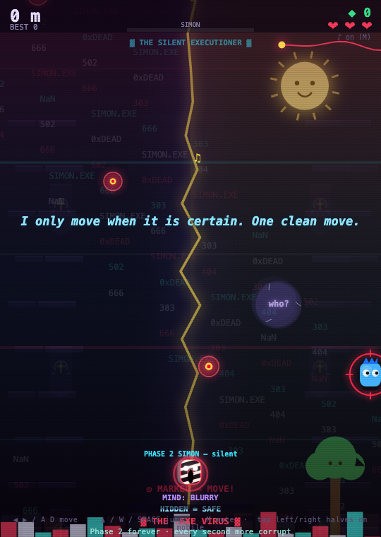

- **An eighth arc: THE SILENT EXECUTIONER.** A little past the Blurry Mind, climb
  on and found-out Simon goes quiet. A new state fires with its own warning, taunts
  (*"If they all know what I am... I stop hiding it."*), and a teal HUD tag:
  **▓ THE SILENT EXECUTIONER ▓**. His caption changes to **PHASE 2 SIMON — silent**.
- **He stops wasting power.** Weaker on paper but more efficient, Simon thins the
  blurry-thought spam right out (fewer, slower thoughts) and turns to precision.
- **The MARK and the one clean move.** "He only moves when the result is certain."
  Every few seconds Simon **MARKS your exact spot** with a red reticle that
  **contracts as the strike becomes certain**, holds while it locks (the lock dot
  flashes white), then drops **one clean lightning bolt** straight down on the mark.
  Stay on it (hesitate / *"think too much"*) and the clean move lands — **CLEAN HIT**.
  Read it and **MOVE off the mark** and he **MISSED**. A blinking **◎ MARKED — MOVE!**
  warning calls it out.
- **Silent and watchful.** Simon's eyes now flicker **red, then teal, then white**;
  new **aim** (a quiet rising lock tone) and **strike** (one sharp precision crack,
  then silence) sounds; and a new death sting: *"I do not need to overpower the room.
  I only break the right thing first. One clean move." — The Silent Executioner*.

## 2026-06-13 — EXPOSED: The Blurry Mind, Found Out (Lore 27)

Based on Toby's June 13 lore (Lore 27): *"Simon is the only cat, all other
characters are dog people... Simon gets alarmed and offended... his physical
strength dropped even more from a 9 to a 7... He has the power to make memories
blurry and can also make new blurry thoughts, and he seals each with lightning,
victums explode from too much stuff in the mind/brain... Gray couldn't escape
because Gray didn't look close enough at the banages to tell him that Simon is
Phase 2... Simon doesn't even think about attacking now, since everyone finds
him out."*

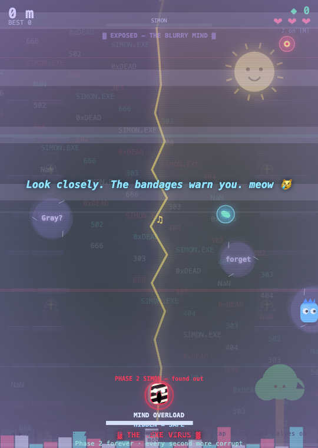

- **A seventh arc: EXPOSED — THE BLURRY MIND.** A little after Phase 2 locks
  (the .EXE virus), climb on and Simon is **found out**. A new state fires with
  its own warning, taunts (*"Everyone finds me out. meow 😿"*), and a violet HUD
  tag: **▓ EXPOSED — THE BLURRY MIND ▓**.
- **Blurry thoughts.** Simon stops relying on direct attack and **plants blurry
  thoughts** — soft, smeared violet blobs carrying fogged words (*who? · forget ·
  meow · Gray? · 404*) that drift in and slowly home on you. As your memory fogs,
  a **violet haze** creeps over the whole screen.
- **The MIND meter + the lightning seal.** A new **MIND** bar fills while a blurry
  thought overlaps you (*"too much stuff in the mind/brain"*). Let it **overload**
  and Simon **seals it with lightning** — a white seal-flash, an explosion of your
  over-full mind, and a hit. The counter is the lore's own rule: **look closely
  (stand still)** and your mind clears.
- **The bandages are a warning sign.** Found-out Simon now wears **bandages** you
  can see, and they **glow brighter when you stand still to look closely** (with a
  tiny **P2** warning glyph) — the warning Gray missed. His caption changes to
  **PHASE 2 SIMON — found out**.
- **Found out, he stops chasing.** Because everyone knows him now, Simon's direct
  **tendril swipes mostly stop** and he turns watchful and defensive — *scarier in
  a quieter way*. New blurry-mind death sting and a new `blur` sound (a smeared,
  detuned wobble before the seal).
- Everything is additive and gated behind Phase 2 → Exposed, so the climb, the
  Peaceful Ending, the Sound Battle, and the .EXE virus all play exactly as before
  until Simon is found out.

## 2026-06-13 — The Spreading of Simon: Cells, Lightning, and RUN = FUEL (Lore 26)

Based on Toby's June 13 lore (Lore 26): *"Simon forces the game to create small
red cells called Pyrakontacke (Pyra = power/aura, Kont = Nucleus, Acke = true =
Power Nucleus True), and it uses the Pyrakontacke to corrupt the shields and
force of the cores and souls. Simon makes Plorotacke (Ploro = energy/electric,
acke = true, a cell without a nucleus and instead has a huge Mitochondria), and
then the Pyrakontacke and Plorotacke mix inside of Simon and creates
lightning-powered corruption... those who run away become fuel, and those who
hide are safe. Simon Phase 2 is the fastest, he is a lightning cat deity who
became corrupted."*

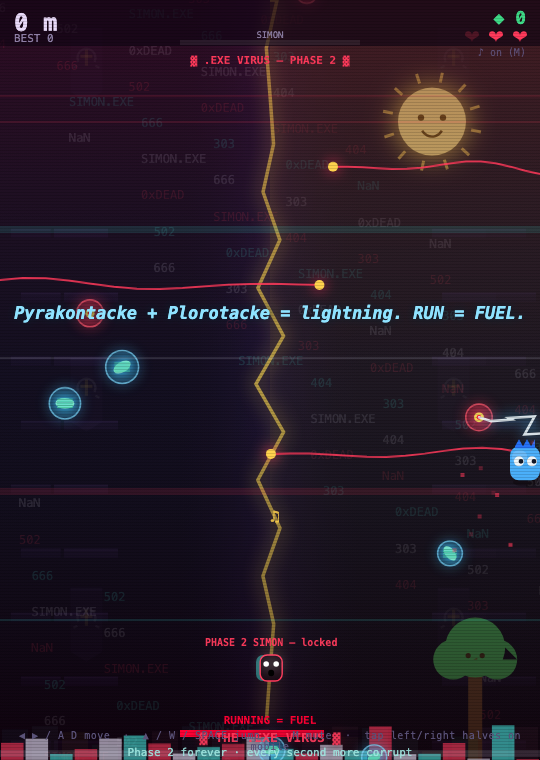

- **Phase 2 now grows corruption-cells.** Once Simon is locked to Phase 2, the
  room fills with two drifting cell types:
  - **Pyrakontacke** — a red cell with a bright, hot **Power Nucleus** (a glowing
    gold/red core). Simon's tool for corrupting shields, cores, and souls.
  - **Plorotacke** — a cyan cell with **no nucleus** and instead one **huge
    Mitochondria** (a turning charge-blob with cristae lines). Raw electric fuel.
- **Lightning-powered corruption.** When a Pyrakontacke and a Plorotacke drift
  close, they **mix and arc** into a jagged lightning bolt (with a new electric
  `zap` sound). If the bolt crosses you, it hurts. The two cells are spent in
  the reaction, just like they "mix inside Simon."
- **The rule of Phase 2: RUN = FUEL, HIDE = SAFE.** A new charge bar tracks your
  panic. **Running charges the corruption against you** — fill the bar and you
  take a hit and a red **"FUEL"** burst. **Standing still lets it settle** and the
  HUD reads **"HIDDEN = SAFE."** But Simon's tide never stops rising, so you can
  never hide for long: panic is punished, stillness is risky, and you have to
  pick your moments. The HUD shows **RUNNING = FUEL** / **HIDDEN = SAFE** live.
- **Title + death stings updated.** The title screen now tells the Phase 2 rule,
  and the Phase 2 death line is Toby's own: *"Those who run become fuel. Those
  who hide are safe. !CLaSsIcs can'T b3 SAV3b!" — Phase 2 Simon.*
- Everything is additive and gated behind Phase 2, so the climb, the Peaceful
  Ending, and the Sound Battle all play exactly as before until Simon locks.

## 2026-06-13 — Phase 2: The .EXE Virus (Lore 25c)

The End of the Peaceful Ending. Climb past the calm Incredibox and Simon is
locked to Phase 2 forever, the virus takes the world. Based on Toby's June 13
lore: *"Simon is now even less in power and even feels weak, he can't attack, he
is Phase 2 forever... Phase 2 Simon comes and then comes the .EXE virus, all gets
corrupted... he instead made several tentacles and corrupted chaos attack
everyone... he is Phase 2 forever because of the lock. Every second the game gets
more and more corrupt, Error 404, Error 666, Error 303, and several more errors."*

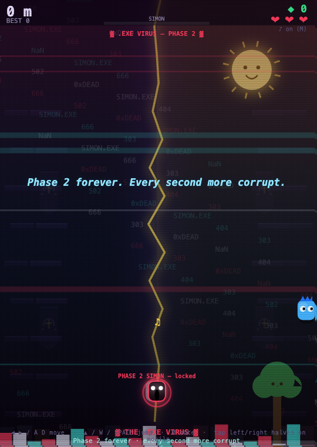

- A new **sixth arc** fires after the Peaceful Ending and Sound Battle: climb
  high enough and **PHASE 2 — THE .EXE VIRUS** breaks the calm. There is no
  Pacifist Phase 1 left inside Simon to clean the chaos, so he is **locked to
  Phase 2 forever** and the danger returns for good.
- **The calm Simon becomes Phase 2 Simon** — a dark, glitching, locked figure
  whose **eyes flash bright red, white, and teal-blue**, with a datamosh ghost
  copy jittering behind him. The caption flips from "SIMON LEADS" to
  **"PHASE 2 SIMON — locked."**
- **The .EXE virus spreads:** the peaceful Incredibox singers get **infected one
  by one**, glitching red/teal with red eyes; the calm dawn **tears** into a
  corrupted red/teal void with a jagged, flashing equalizer.
- **The errors multiply every second** — 404, 666, 303, 502, 0xDEAD, NaN,
  SIMON.EXE flood the background and keep growing, flashing the same
  red/white/teal as Simon's eyes.
- **Corrupted tentacles attack everything:** Simon "can't attack" with his levers
  anymore, so instead the screen throws **.EXE glitch pulses** (torn datamosh
  slices + scanlines) and **extra corruption tendrils** lash out. Damage is back
  on; the once-safe calm surface can hurt you again.
- New audio: a glitchy **corruption crash** when Phase 2 fires (re-muffles the
  room and re-arms the horror drone the Peaceful Ending had calmed), plus a short
  **digital stutter** on every glitch pulse.
- Death screen gets a Phase 2 sting: *"There is no Phase 1 left. Simon is locked
  to Phase 2 forever, attacking all." — .EXE*

## 2026-06-13 — Sound Battles: Simon Leads (Lore 25b)

In the calm Incredibox, the last trace of everything is the Sound Battle, and
Simon is still the fastest. Based on Toby's June 13 lore: *"Simon, and all the
others made sound and animation. Sound Battles happen. It is so small now. Simon
is fastest... Everything became small and simple again, but Simon is still the
fastest sound-and-animation force in the whole game."*

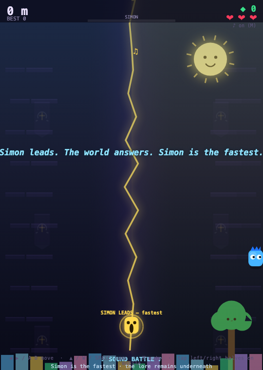

- A **Sound Battle** now runs through the whole Peaceful Ending: a steady, calm
  beat where **Simon leads** and the world answers.
- **Simon is the fastest** — a small, calm gold Simon sits at the bottom-center
  and pulses **first** on every beat (a bright lead note + a ring of his beat
  rippling out), captioned *"SIMON LEADS — fastest."*
- His call **ripples outward** across the room and each **Incredibox singer
  answers** as the wave reaches it: it bobs harder, opens wide, glows in its own
  color, and puffs a matching music note. Simon always moves first; the others
  follow.
- New calm audio: a clean **lead tone** for Simon's call and a soft warm
  **answer chord** a beat behind, layered over the peaceful Incredibox hum.
- The surface stays small and simple, no danger, just sound and animation. The
  on-screen label now reads **♪ SOUND BATTLE ♪ — Simon is the fastest · the lore
  remains underneath.**

## 2026-06-13 — The Peaceful Ending (Lore 25)

Simon steps back from the story and the world settles into its true form.
Based on Toby's June 13 lore: *"Simon goes back from the story, and now it is
just only a peaceful incredibox with lore and Sound Battles. It was all normal."*

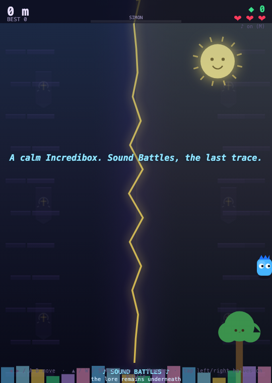

- **The Peaceful Ending** fires after the Restoration, once you climb high
  enough: Simon **steps back from the story** and his rising tide sinks calmly
  away. He can no longer catch you.
- The whole room turns into a **calm Incredibox** — a soft dawn overtakes the
  void and a gentle **equalizer of light hums** along the bottom.
- **Incredibox singers** sprout on the calm steps, bobbing to a shared beat and
  puffing out **music notes** that drift up.
- **Sound Battles** stays on screen as the last trace, with a reminder that
  **the lore remains underneath** (the 404/666 errors and Parinusian banners
  fade to faint memory but never fully disappear).
- The surface is fully calm: **levers stop, taunts soften, nothing can hurt
  you.** Simon's line settles to: *"It was all normal."*
- A warm major chime plays and the horror drone finally hushes.

## 2026-06-13 — The Restoration (Simon's redemption)

Simon's turn from destroyer to rebuilder. Based on Toby's June 13 lore.

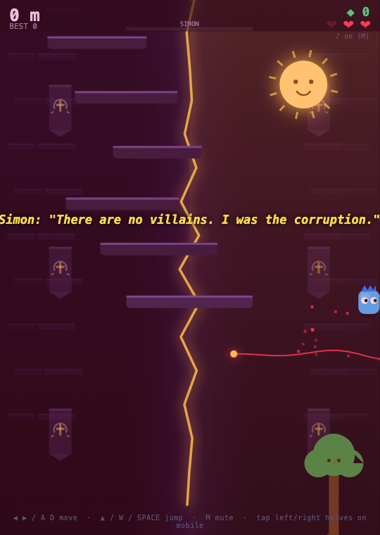

- **The Restoration** fires when you climb high enough: Simon opens a **golden
  crack** down the middle of the sky.
- **Mr. Sun and Mr. Tree** rise over a bright, normal half of the room while the
  other half stays corrupt — half healed, half dark.
- Simon **ends Error 404 and Error 666** (the drifting error words fade) and
  **heals you to full**.
- His line: *"There are no villains. I was the corruption. The rest is only
  perspective."*

## 2026-06-13 — The False Cure

Simon weaponizes hope. Based on Toby's June 13 lore.

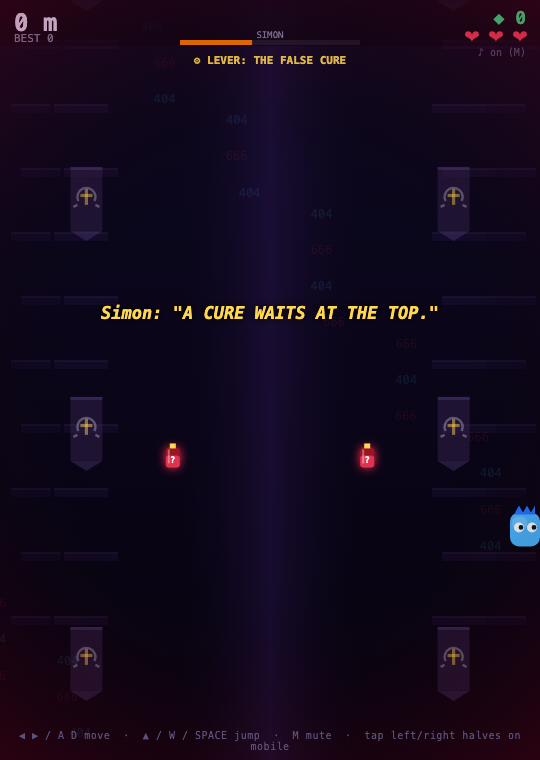

- **The False Cure lever** — two identical red `?` bottles drop. One is the
  Anti-Virus (heals), one is the JTMYHE "juice" (hurts). You cannot tell which
  until you grab it. (Kept non-lethal so the climb stays fair.)
- **The dud lever** — sometimes Simon pulls a lever and nothing happens. The
  cruelest trick: "maybe that one was the cure?"
- **Simon's taunts** — he keeps selling the lie of a cure at a top that does
  not exist ("A cure waits at the top," "Great height. You won't get higher").
- **The 5-emerald cruelty** — reach a milestone and Simon hands out 5 emeralds,
  then pulls a lever to drop you the next step.
- **Combuntia orbs** — blood-red orbs set into the living steps that pulse red
  while a lever is charging.
- **Ancient Endless Room** — moss on the steps and **Parinusian banners**
  (golden cross in a gray omega) hung across the background.
- Death-screen sting updated: "Simon promised a cure at the top. There is no
  cure. There is no top."

## 2026-06-13 — Simon's Levers + the Endless Room

Simon's all-powerful lever controls. Based on Toby's June 13 lore.

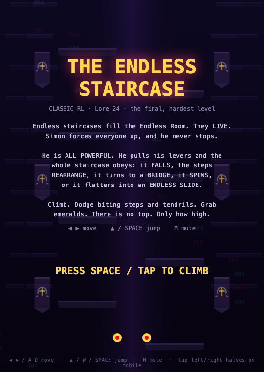

- **Five levers**, each a named attack with a warning banner:
  - **The Staircase Falls** — the steps in view collapse.
  - **The Steps Rearrange** — steps slide to new positions.
  - **It Becomes a Bridge** — steps flatten into a wide span, then snap back.
  - **The Staircase Spins** — the level tilts and left/right controls invert.
  - **The Endless Slide** — steps go icy and Simon's tide drags you down.
- **The Endless Room** — more endless staircases now drift in the background.

## 2026-06-13 — Initial release

The first playable build, from Toby's "Lore 24: The Endless Staircase."

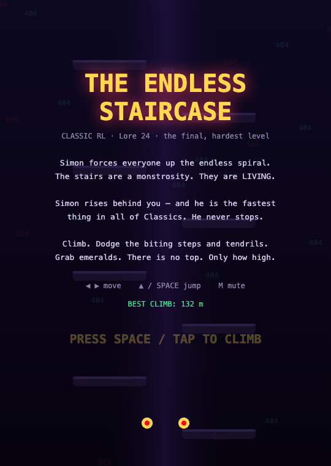

- Endless vertical climber / survival horror, single self-contained file,
  vanilla Canvas + Web Audio, no external libraries.
- **Simon's rising tide** hunts from below and accelerates with height.
- **Living-staircase hazards** — biting steps, crumbling steps, tendril swipes.
- **Emeralds** to collect; best climb saved locally.
- Synthesized soundtrack whose heartbeat quickens as Simon closes in.
