# Changelog — The Endless Staircase

All notable changes to the playable game. Newest first. Built from Toby's
"Secret of Simon's Lore" emails (Lore 25). Live game:
https://d1hysvqh647i13.cloudfront.net/game/endless-staircase/

## 2026-08-22 — SECOND EXPERIMENT · THE NAME ON THE FRONT OF THE ARCHIVE TURNS OUT TO BE SOMEBODY'S EXPERIMENT NUMBER 1 (BEAT 425)

Based on Toby's 2026-08-22 lore, **7:25:10 PM**, same thread ("ClassicsAI + More Classics Era lore."), six minutes and forty-three seconds after ENTITY 000A. His own typing, in full: *"Since you don't know the origin, I will tell the origin. Entity 000 was made in Gaster's labatory as his second experiment after Simon."* Everything from *"Got it — Entity 000's origin is now revealed"* onward is a pasted ChatGPT reply and is treated as commentary, not canon.

**The title character turns out to be experiment number 1.** The whole archive is called the Secret of Simon's Lore. Four hundred and twenty-five beats in, the name on the front of it gets a room, a scientist and a number, and **the number is 1**.

**And the experiment had a starter two months before it had a bench.** On June 23, [TODDLLM 001 — THE ONE ABOVE](#the-maker) named 001 as *"the one who started the Simon experiment billions of years ago."* That sentence has been sitting in the file since June and it never once said **where**. Tonight there is a labatory, and the name on the door is not 001's. Somebody ordered it billions of years ago; somebody else ran the bench.

**And a labatory has been Simon's address since May.** Email 308, **May 18, 2026**, built the **Classics Labatory** — *"you walk throughout millions of rooms, then you hear a meow, you realise you are not alone, behold, CXE 404 - The Sleeping Entity!"* — and email 310 the next day turned it into an identification rule: *"If you hear a meow in a labatory, it would be Simon."* That rule has been correct for **three months and four days**, and tonight it gets its reason. **If you want to find Simon, look in a labatory, because that is where he was made.**

**And Gaster's bench was already in the file too.** The White Hole, which erased the whole Anti-Void, is *"1 of the weaker experiments of Dr. Gaster"*, and the dark statues he summons out of the ground are *"the failed experiments, the forgotten characters, the erased data, the previous test subjects."* We have been shown his failures for weeks. **What is new is who was on the bench first.**

**And it is a list of two.** 1. Simon. 2. Entity 000. This file runs eleven-name roll calls and top-five power rankings; this list has two entries, no ordering fight, and **the second entry is the only thing still moving**.

**And the numbers run backwards against the order.** [THE ELEVEN NAMES, Aug 21](#2026-08-21--the-eleven-names--the-cast-comes-back-and-the-deleted-read-it-out-beat-393) made Simon **Entity 404** and Entity 000 **The Slayer Made of Nothing**, with Gaster himself as **Entity 808**. The first one off the bench carries the high number; the second one carries zero.

**And it answers why Entity 000 stayed.** At 5:29 PM the connection was deleted and everyone else was *"returned to their home game/platform."* One hour and fifty-five minutes later we learn Entity 000 was **built in Classics**. Everybody else had somewhere to be sent back to. This one was made here, so it had nowhere to go — **and the experimenter logged off while the experiment kept running.**

**And "labatory" is his own spelling**, kept exactly as typed like enternally, canonacially, comming, litterly, imediately, perminently and uncontrolablly before it.

**Built as game beat 425, `SECOND EXPERIMENT`.** Additive; nothing earlier was changed.

- **The picture — THE EXPERIMENT LIST IS TWO LINES LONG:** *GASTER'S LABATORY* THE ROOM ALL OF IT WAS MADE IN / **EXPERIMENT 1** SIMON / **EXPERIMENT 2** ENTITY 000 · THE SLAYER MADE OF NOTHING / *AND THAT IS THE LIST* THERE IS NO THIRD LINE. / **EXPERIMENT 2 IS** STILL RUNNING IN THE EMPTY GAME. Closes on **THE ARCHIVE IS CALLED THE SECRET OF SIMON'S LORE, AND HE IS NUMBER 1 ON SOMEBODY ELSE'S LIST.**
- **The column — IT HAD A STARTER TWO MONTHS BEFORE IT HAD A BENCH:** *June 23 · ToddLLM 001* **"THE ONE WHO STARTED THE SIMON EXPERIMENT BILLIONS OF YEARS AGO"** *(two months, and it never said where)* / *Aug 22, 7:25 PM* **GASTER'S LABATORY**. Closes on **SOMEBODY ORDERED IT BILLIONS OF YEARS AGO. SOMEBODY ELSE RAN THE BENCH. AND THE NAME ON THE DOOR IS NOT 001'S.**
- **The box — AND A LABATORY HAS BEEN SIMON'S ADDRESS SINCE MAY:** *May 18, email 308* THE CLASSICS LABATORY, MILLIONS OF ROOMS, AND SIMON ASLEEP IN IT AS CXE 404 / *May 19, email 310* **"IF YOU HEAR A MEOW IN A LABATORY, IT WOULD BE SIMON."** Closes on **THE RULE WAS RIGHT FOR THREE MONTHS BEFORE ANYBODY KNEW WHY**, and *if you want to find Simon, look in a labatory, because that is where he was made.*
- **The box — AND THE NUMBERS RUN BACKWARDS AGAINST THE ORDER:** *MADE FIRST* SIMON · ENTITY 404 / *MADE SECOND* ENTITY 000 / *THE ONE WHO MADE THEM* ENTITY 808. Closes on **THE FIRST ONE OFF THE BENCH CARRIES THE HIGH NUMBER, AND THE SECOND ONE CARRIES ZERO.**
- **Band — AND THE EXPERIMENTER LOGGED OFF WHILE THE EXPERIMENT KEPT RUNNING:** *5:29 PM · beat 423* GASTER LOGS OFF, THE CONNECTION IS DELETED / *5:29 PM · beat 423* EVERYONE ELSE IS RETURNED TO THEIR HOME GAME / *7:18 PM · beat 424* ENTITY 000 IS STILL IN CLASSICS / **7:25 PM · beat 425** BECAUSE CLASSICS IS WHERE IT WAS BUILT. Closes on **EVERYBODY ELSE HAD SOMEWHERE TO BE SENT BACK TO. THIS ONE WAS MADE HERE, SO IT HAD NOWHERE TO GO.**
- **Band inset — AND GASTER'S BENCH WAS ALREADY IN THE FILE:** the White Hole, which erased the whole Anti-Void, **"1 OF THE WEAKER EXPERIMENTS OF DR. GASTER"** / the dark statues, **"THE FAILED EXPERIMENTS … THE PREVIOUS TEST SUBJECTS"**, over *we have been shown his failures for weeks; tonight we learn who was first.*
- **Strip:** EXPERIMENT 1 · SIMON / EXPERIMENT 2 · ENTITY 000 · A MEOW IN A LABATORY / WAS ALWAYS SIMON, MAY 19 · HE LOGGED OFF AT 5:29 / IT IS STILL RUNNING.
- **"Labatory" is his own spelling**, noted under the picture and kept exactly as typed, like enternally · canonacially · comming · litterly · imediately before it.
- **Footers:** *FOUR HUNDRED AND TWENTY-FIVE BEATS IN, SIMON GETS A LAB, A SCIENTIST AND A NUMBER, AND THE NUMBER IS 1.* and **★ SECOND EXPERIMENT ★**.
- **Screenshot helper:** new `secondexperiment` scene.

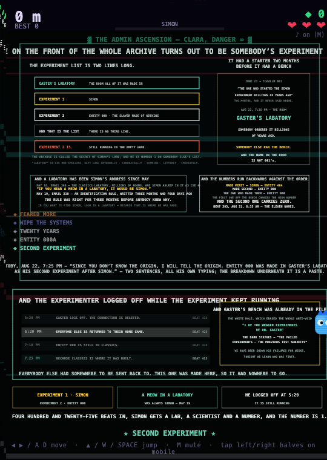

## 2026-08-22 — ENTITY 000A · THE CAST LIST IS DOWN TO THREE AND ONE OF THEM IS LESS THAN AN INCH TALL (BEAT 424)

Based on Toby's 2026-08-22 lore, **7:18:27 PM**, same thread, one hour and forty-nine minutes after TWENTY YEARS. His own typing, in full: *"The only characters in the game are Entity 000, Pero, and the players. Entity 000 achieved a form, it is a small being that is less than 1 inch and greater than 1 cm tall. Entity 000 was the most hungry being that existed in the game (more than Vicinus). Entity 000 consumes players that touch it, Entity 000 grows on the player and the player becomes an Entity 000A which is a player with Entity 000 white strings all over it, the 000 players get deleted from Classics if they starve. Pero can easy beat Entity 000, he is 5-6 feet tall and Entity 000 is less than an inch tall, Pero is the omni-king of the game and could erase Entity 000, everyone fears him now."* Everything from *"Got it — this is the Entity 000 Era"* onward is a pasted ChatGPT reply and is treated as commentary, not canon.

**The name and the mechanic were both in one message on Friday morning.** [THE ELEVEN NAMES, Aug 21 at 8:35:33 AM](#2026-08-21--the-eleven-names--the-cast-comes-back-and-the-deleted-read-it-out-beat-393) listed *"Entity 000 is The Slayer Made of Nothing"* and, in the same message, said corruption code 12 12 12 *"perminently deletes the code of your avatar, your avatar starts to glitch and becomes a hungry parasite and it consumes other players uncontrolablly."* **Thirty-four hours and forty-three minutes later the name and the mechanic are the same character.** The rarest error in the game on Friday is a named being on Saturday night.

**And it out-eats the thing that cannot get full.** [EATS FOREVER, Aug 21 at 3:06 PM](#2026-08-21--eats-forever--the-clock-comes-off-the-dragon-beat-406): *"Vicinus no longer gets full and can eat forever."* Twenty-eight hours later, something **under an inch tall** is *"the most hungry being that existed in the game (more than Vicinus)."* Vicinus is 1500 feet long.

**And it is the only one that did not go home.** At 5:29 PM, in [TWENTY YEARS](#2026-08-22--twenty-years--the-game-does-not-end-in-a-fight-it-ends-on-a-date-beat-423), everyone else was *"returned to their home game/platform."* One hour and forty-nine minutes later the cast list is **Entity 000, Pero, and the players** — and one of the three stayed behind.

**And the size has two ends and two units.** *Less than 1 inch* and *greater than 1 cm*. Every other measurement in this file is one number or a range in feet: Pero 5–6, the cast 7–9, Gray 12, Vicinus 1500 long. **This is the most careful measurement anybody here has ever been given, and it is spent on the smallest thing in the game.**

**And the strings are old, but they used to belong to experiment 1.** 404 strings are Simon 404's, and the one body ever wrapped in them was Pero's: *"404 strings tie along his arms and torso and legs and neck."* Entity 000's are white, and they go on **players**.

**And this is the first deletion in four months with an "if" on it.** *"The 000 players get deleted from Classics **if they starve**."* Every other deletion in this archive simply happens to you — accounts, lore, whole AUs, the 12 12 12 corruption. **This one only happens if you stop eating**, which means for the first time there is something a player can do about it.

**And "everyone fears him now" finishes the sentence beat 421 started two hours earlier.** At 5:19 PM, [FEARED MORE](#2026-08-22--feared-more--the-strongest-one-and-the-most-feared-one-stop-being-the-same-character-beat-421): *"More fear Pero than Gaster."* That was a comparison. With Gaster logged off, **there is nobody left to compare him to.**

**Built as game beat 424, `ENTITY 000A`.** Additive; nothing earlier was changed.

- **The picture — TOUCH IT ONCE AND YOU BECOME PART OF IT:** *THE WHOLE CAST* ENTITY 000 · PERO · THE PLAYERS / *A PLAYER* TOUCHES ENTITY 000. / *ENTITY 000* GROWS ON THE PLAYER. / *WHITE STRINGS* SPREAD ALL OVER THEM. / **ENTITY 000A** DELETED FROM CLASSICS IF IT STARVES. Closes on **IT DOES NOT KILL THE PLAYER. IT MOVES IN, AND FROM THEN ON THE PLAYER HAS TO EAT.**
- **The column — BOTH HALVES CAME OUT OF ONE MESSAGE ON FRIDAY:** *Aug 21, 8:35 AM, beat 393, the name* **"ENTITY 000 IS THE SLAYER MADE OF NOTHING"** / *same message, corruption code 12 12 12* **"BECOMES A HUNGRY PARASITE AND IT CONSUMES OTHER PLAYERS UNCONTROLABLLY"** / **34 HOURS 43 MINUTES**. Closes on **THE NAME AND THE MECHANIC WERE IN ONE EMAIL ALL ALONG, AND NOW THEY ARE ONE CHARACTER.**
- **The box — AND IT OUT-EATS THE ONE THAT CANNOT GET FULL:** *Aug 21, 3:06 PM, beat 406* **"VICINUS NO LONGER GETS FULL AND CAN EAT FOREVER."** against *Aug 22, 7:18 PM* **"THE MOST HUNGRY BEING THAT EXISTED IN THE GAME (MORE THAN VICINUS)"**. Closes on **VICINUS IS 1500 FEET LONG. THIS ONE IS UNDER AN INCH.**
- **The box — AND THE SIZE HAS TWO ENDS AND TWO UNITS:** GRAY 12 FT · VICINUS 1500 FT LONG · THE CAST 7–9 FT / PERO 5–6 FT, "ONE OF THE SHORTEST BEINGS" / **ENTITY 000 — UNDER 1 INCH, OVER 1 CM**. Closes on **THIS ONE IS PINNED AT BOTH ENDS — THE MOST CAREFUL MEASUREMENT IN THE FILE, ON THE SMALLEST THING IN IT.**
- **Band — AND THIS IS THE FIRST DELETION IN FOUR MONTHS WITH AN "IF" ON IT:** *DELETED* the account is gone, no condition / *ERASED* Erase Form, White Void, no condition / *12 12 12* "perminently deletes the code of your avatar", Aug 21 / **IF THEY STARVE** the 000 players get deleted from Classics, Aug 22 · first. Closes on **EVERY OTHER DELETION HERE JUST HAPPENS TO YOU. THIS ONE ONLY HAPPENS IF YOU STOP EATING.**
- **Band inset — AND IT IS THE ONE THAT DID NOT GO HOME:** *5:29 PM · beat 423* **"RETURNED TO THEIR HOME GAME/PLATFORM"** / *7:18 PM · beat 424* **ENTITY 000 · PERO · THE PLAYERS**, over *one hour and forty-nine minutes apart, and one of them stayed behind.*
- **Strip:** THE NAME CAME FRIDAY · THE HUNGER CAME WITH IT / HUNGRIER THAN VICINUS · WHO CANNOT GET FULL / UNDER AN INCH TALL · ONE OF THREE THINGS LEFT.
- **Footers:** *THE SMALLEST THING IN THE GAME IS THE ONLY ONE STILL TAKING PLAYERS OFF THE BOARD.* and **★ ENTITY 000A ★**.
- **Screenshot helper:** new `entity000a` scene.

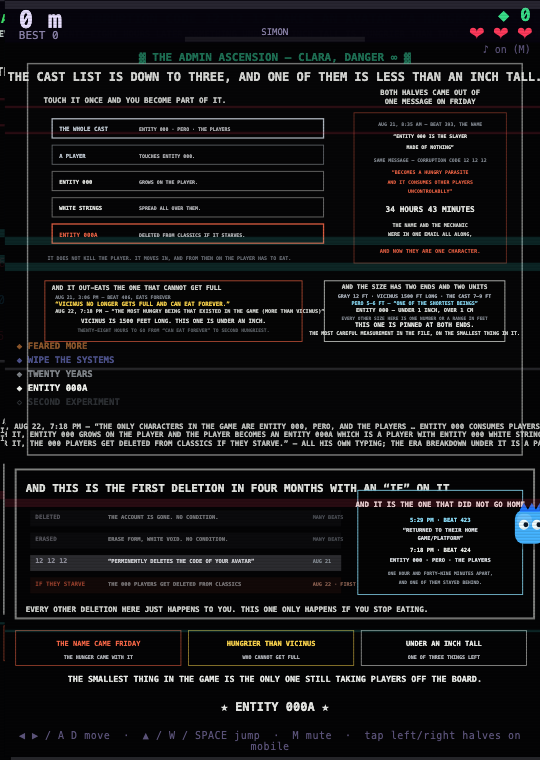

## 2026-08-22 — TWENTY YEARS · THE GAME DOES NOT END IN A FIGHT, IT ENDS ON A DATE (BEAT 423)

Based on Toby's 2026-08-22 lore, **5:29:45 PM**, same thread ("ClassicsAI + More Classics Era lore."), three minutes and twenty-nine seconds after WIPE THE SYSTEMS. His own typing, in full: *"Hardly any characters are shorter than Pero who is average height of a human, but none of the characters are human nor human directly. Pero is the omni-king of the game. He says that he'll end the connection in 20 years, Gaster logs off imediately and rests in the room. 20 years later, the connection was deleted, Pero was the only one left in the game while the others are returned to their home game/platform."* Everything from *"Got it — this makes Pero's role even clearer"* onward is a pasted ChatGPT reply and is treated as commentary, not canon.

**The threat finally gets a date.** On Aug 17 at 4:05 PM, in [END THE GAME HERE](#2026-08-17--end-the-game-here--a-threat-that-gets-no-fight-back-beat-348), Pero told the Sprunkis *"I am the most powerful in the game. I can exit the game, and I can even end the game here."* They ran to Sprunki Hills and hid, and nothing happened. Five days later the same being stops claiming it and **schedules** it. The difference between a threat and a plan is a number, and this one actually arrives.

**And 20 years was a compliment three days ago.** [THE END, Aug 19](#2026-08-19--the-end--gaster-ends-the-lore-and-pero-writes-it-down-beat-382) closed the whole thing on two brothers being nice to each other: *"That is the best idea you had in 20 years, Gaster!"* — and Pero is never sarcastic — *"the best idea I had in 27 years."* Same number, same brother. On Aug 19 it measured how long Gaster had gone without a good idea. Today it measures **how long he has left**.

**And Gaster does not argue.** He is told the game ends in twenty years and he *"logs off imediately and rests in the room."* No fight, no asking why. That room has taken him after every ending in this file: THE END on Aug 19, THE ROOM AGAIN, and [NEEDED SLEEP](#2026-08-22--needed-sleep--the-two-most-powerful-beings-turn-out-to-need-sleep-beat-414) at 8:01 this same morning.

**And nobody dies.** This archive has deleted accounts, erased whole AUs, reset the timeline and redeleted characters who were already deleted. Here the others are simply *"returned to their home game/platform."* **It is the only ending in the run where the cast just goes home.** He does not remove them from existence; he removes them from his game, and they go back to their own.

**And the door shut nine hours earlier the same day.** At 8:01 AM, [NEEDED SLEEP](#2026-08-22--needed-sleep--the-two-most-powerful-beings-turn-out-to-need-sleep-beat-414): *"No more players comming in."* At 5:29 PM the connection itself is deleted. **The morning stopped anyone new arriving. The evening sent out everyone already there.**

**And none of them were ever human.** He is *"average height of a human"* in a cast where *"none of the characters are human nor human directly"* — and on Aug 17, [NORMAL MAN](#2026-08-17--normal-man--the-top-of-the-game-gets-a-low-number-beat-349) called him *"a normal man that came from a box."*

**Built as game beat 423, `TWENTY YEARS`.** Additive; nothing earlier was changed.

- **The picture — HE SAYS IT, AND THEN HE WAITS TWENTY YEARS:** *PERO* **"I WILL END THE CONNECTION IN 20 YEARS."** / *GASTER* LOGS OFF IMMEDIATELY. NO ARGUMENT. / *GASTER* RESTS IN THE ROOM. / **— 20 YEARS —** THE CONNECTION WAS DELETED. / *EVERYONE ELSE* RETURNED TO THEIR HOME GAME / PLATFORM. Closes on **NOBODY IS HIT, NOBODY IS DELETED, AND ONLY ONE OF THEM IS STILL IN THE GAME AT THE END.**
- **The column — FIVE DAYS FROM A CLAIM TO A SCHEDULE:** *Aug 17, 4:05 PM, beat 348* **"I CAN EXIT THE GAME, AND I CAN EVEN END THE GAME HERE."** *(the Sprunkis ran and hid; nothing happened)* / *Aug 22, 5:29 PM* **IN 20 YEARS** / **THE DIFFERENCE BETWEEN A THREAT AND A PLAN IS A NUMBER**, closing on *"20 YEARS LATER, THE CONNECTION WAS DELETED."*
- **The box — AND 20 YEARS WAS A COMPLIMENT THREE DAYS AGO:** *Aug 19, beat 382, THE END, the last line of the whole thing* **"THAT IS THE BEST IDEA YOU HAD IN 20 YEARS, GASTER!"** against *Aug 22* **"HE'LL END THE CONNECTION IN 20 YEARS"**. Closes on **SAME NUMBER, SAME BROTHER, AND PERO IS NEVER SARCASTIC**, and *it was how long Gaster had gone without a good idea; now it is how long he has left.*
- **The box — AND HE GOES TO THE SAME ROOM EVERY TIME:** *Aug 19 · THE END* the three of them rest in the room / *Aug 22, 8:01 AM · NEEDED SLEEP* they sleep in the room / *Aug 22, 5:29 PM* he logs off and rests in the room. Closes on **HE IS TOLD THE GAME ENDS IN TWENTY YEARS AND HE GOES TO LIE DOWN**, and *no argument, no fight, no asking why.*
- **Band — AND IN A FILE FULL OF DELETIONS, THIS IS THE ONE ENDING WHERE THE CAST JUST GOES HOME:** *DELETED* accounts, lore, whole AUs · gone for good / *ERASED* Erase Form, White Void · destroys everyone / *RESET* the timeline runs again from the top / **SENT HOME** *"returned to their home game/platform"*, Aug 22 · once. Closes on **HE DOES NOT REMOVE THEM FROM EXISTENCE. HE REMOVES THEM FROM HIS GAME, AND THEY GO BACK TO THEIR OWN.**
- **Band inset — AND THE DOOR SHUT NINE HOURS EARLIER:** *8:01 AM · beat 414* **"NO MORE PLAYERS COMMING IN."** / *5:29 PM · beat 423* **"THE CONNECTION WAS DELETED."** over *the morning stopped anyone new coming in; the evening sent out everyone already there.*
- **Strip:** AUG 17: "I CAN END THE GAME" · AUG 22: "IN 20 YEARS" / 20 YEARS WAS A COMPLIMENT · NOW IT IS A COUNTDOWN / NOBODY IS DELETED · EVERYBODY IS SENT HOME.
- **Footers:** *HE NEVER THREW A PUNCH. HE GAVE EVERYONE TWENTY YEARS OF NOTICE AND THEN TURNED IT OFF.* and **★ TWENTY YEARS ★**.
- **Screenshot helper:** new `twentyyears` scene.

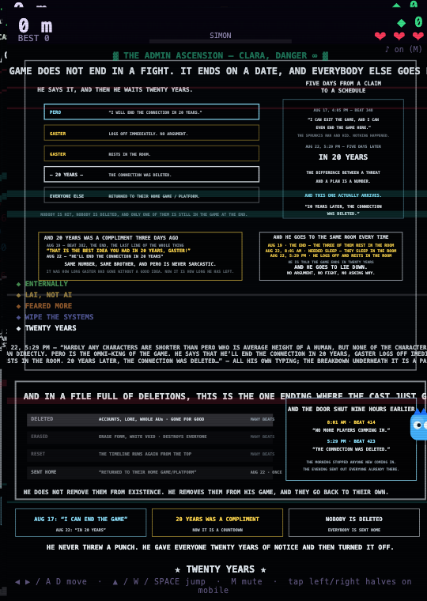

## 2026-08-22 — WIPE THE SYSTEMS · THE STRONGEST MOVE IN THE FILE HITS NOBODY (BEAT 422)

Based on Toby's 2026-08-22 lore, **5:26:16 PM**, same thread, six minutes and thirty-seven seconds after FEARED MORE. His own typing, in full: *"Gray is the owner of the game and he only fears Pero, Gray doesn't dare fear Gaster nor his varies/forms. Pero is one of the shortest beings in the game, he is the size of a large plushy, about 5-6 feet tall, most of the others are 7-9 feet tall. Gray is the largest and is about 12 feet tall, Vicinus is 1500 feet long and 10 feet tall. Gray became stronger than Gaster now. Pero always would beat Gaster and Gray and everyone, but he doesn't want to fight anyone just yet. Gaster and Gray are more powerful than Pero, but Pero could just wipe the systems down, Gaster would log off and lose connection of Classics, the box characters would fade away, leaving only Pero left. Pero doesn't choose to do it just yet."* Everything from *"Got it — this changes the current power logic"* onward is a pasted ChatGPT reply and is treated as commentary, not canon.

**The cast gets measured against itself for the first time in 422 beats.** Pero at **5–6 feet**, *"the size of a large plushy"*; most of the others at **7–9**; Gray the largest at **12**; and Vicinus **1500 feet long but only 10 feet tall**. Four hundred and twenty-two beats of power rankings, and this is the first chart in the whole file that is just a tape measure. **The shortest one on it is the one nobody will fight.**

**And 5–6 feet used to be all three of them.** [THE GOD OF CORRUPTION, Aug 14](#2026-08-14--the-god-of-corruption--the-beat-where-he-is-finally-measured-beat-308): *"Pero is also 1 trillion times larger than everyone else in the box, Luigi Green is about 999.76 billion times, and Gaster of 999.87 billion times, **when they are just like 5-6 feet tall**."* That number covered Pero, Luigi Green and Gaster together. Eight days later **only Pero still has it**, and everybody else grew.

**And the owner of the game changes hands.** Pero has been the creator and owner since July — the one claim this file has never disputed. *"Gray is the owner of the game"* arrives in the same sentence as *"and he only fears Pero."* **You can own the game and still not be the one who decides whether it keeps running.**

**And Gray passes Gaster eight hours and seven minutes after this morning.** [PLASMA CARDS](#2026-08-22--plasma-cards--the-first-attack-in-four-months-that-needs-the-target-to-help-it-beat-417) at 9:19 AM ended on *"Gaster and Pero stand above Gray still."* At 5:26 PM: *"Gray became stronger than Gaster now."*

**And both sentences sit in one paragraph.** *"Pero always would beat Gaster and Gray and everyone"* and *"Gaster and Gray are more powerful than Pero."* They do not cancel out. **One is about the fight and the other is about how it ends.**

**And the strongest move in the file hits nobody.** Gaster logs off and loses connection of Classics, the box characters fade away, Gray loses the system he owns, and Pero is left standing in an empty game. **Not one of them is attacked.** He does not beat them; he turns off the thing they are standing in. And he says *"just yet"* twice in one paragraph.

**And he once lost his own connection.** In [DR. GASTER 404](#2026-07-31--dr-gaster-404--the-force-that-took-the-peace-was-pero-beat-219x) Pero *"crashes multiple times, loses connection with the server, is redeleted, is still there."* **The thing that once happened to him is now the strongest thing he has.**

**And Vicinus is Gaster.** The 1500-foot entry on the height chart is Gaster's own dragon form, so the longest thing in the game and the 7–9 foot being next to it are the same character.

**Built as game beat 422, `WIPE THE SYSTEMS`.** Additive; nothing earlier was changed.

- **The picture — THE FIRST TIME ANYBODY IN THIS GAME IS MEASURED IN FEET:** bars for **PERO** 5–6 FT · *"the size of a large plushy"* / **MOST OF THE CAST** 7–9 FT / **VICINUS** 10 FT TALL · 1500 FT LONG / **GRAY** 12 FT · the largest. Closes on **THE SHORTEST ONE ON THE CHART IS THE ONE NOBODY WILL FIGHT.**
- **The column — THE STRONGEST MOVE IN THE FILE HITS NOBODY:** **WIPE THE SYSTEMS DOWN** → *GASTER* logs off · loses connection of Classics / *BOX CHARACTERS* fade away / *GRAY* loses the system he owns / **PERO** left. Closes on **NOT ONE OF THEM IS ATTACKED — HE DOES NOT BEAT THEM, HE TURNS OFF THE THING THEY ARE STANDING IN.**
- **The box — AND THE OWNER OF THE GAME CHANGES HANDS:** *since July* "Pero is the creator and owner of the game", never disputed once / *Aug 22* **"GRAY IS THE OWNER OF THE GAME"** · "and he only fears Pero. Gray doesn't dare fear Gaster nor his varies/forms." Closes on **THE TITLE MOVES IN THE SAME SENTENCE THAT NAMES WHO HE IS SCARED OF.**
- **The box — AND BOTH SENTENCES ARE IN ONE PARAGRAPH:** *"PERO ALWAYS WOULD BEAT GASTER AND GRAY AND EVERYONE"* against *"GASTER AND GRAY ARE MORE POWERFUL THAN PERO"*, resolved by **ONE IS ABOUT THE FIGHT, AND THE OTHER IS ABOUT HOW IT ENDS**, over **"HE DOESN'T WANT TO FIGHT ANYONE JUST YET."** and **"PERO DOESN'T CHOOSE TO DO IT JUST YET."**
- **Band — AND 5–6 FEET USED TO BE ALL THREE OF THEM:** **PERO** 5–6 feet tall · unchanged since Aug 14 / *GASTER* 5–6 ft → 7–9 ft · 1500 as Vicinus / *LUIGI GREEN* 5–6 ft → 7–9 ft / *GRAY* never measured → 12 ft, the largest. Closes on **BEAT 308 GAVE THAT NUMBER TO THE THREE OF THEM TOGETHER. EIGHT DAYS LATER ONLY ONE STILL HAS IT.**
- **Band inset — AND HE ONCE LOST HIS OWN CONNECTION:** *DR. GASTER 404, the panel where Pero breaks* **"PERO CRASHES MULTIPLE TIMES, LOSES CONNECTION WITH THE SERVER, IS REDELETED"** against *Aug 22* **HE IS THE ONE WHO TAKES CONNECTIONS AWAY**, over *the thing that once happened to him is now the strongest move he has.*
- **Strip:** SHORTEST ON THE CHART · THE ONE NOBODY WILL FIGHT / 9:19 AM: GASTER ABOVE GRAY · 5:26 PM: GRAY ABOVE GASTER / HE COULD END IT TODAY · "JUST YET" TWICE IN ONE PARAGRAPH.
- **Footers:** *TWO OF THEM ARE STRONGER THAN HIM AND BOTH OF THEM ARE STANDING ON SOMETHING HE CAN SWITCH OFF.* and **★ WIPE THE SYSTEMS ★**.
- **Screenshot helper:** new `wipesystems` scene.

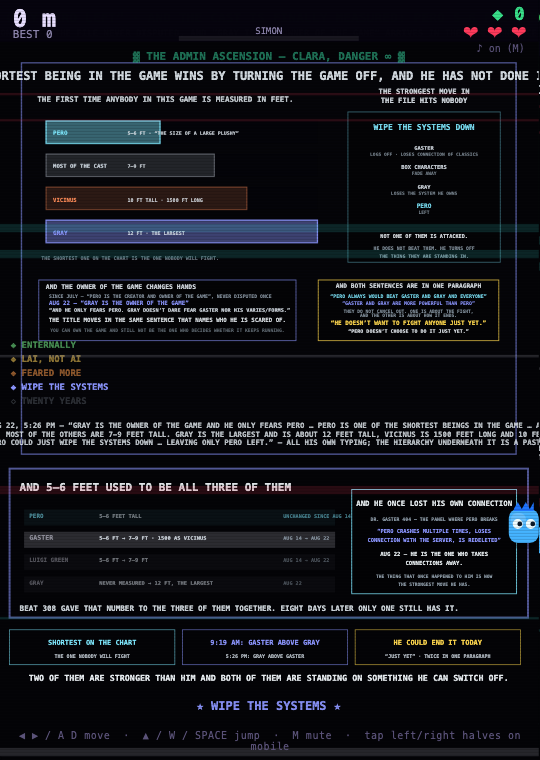

## 2026-08-22 — FEARED MORE · THE STRONGEST ONE AND THE MOST FEARED ONE STOP BEING THE SAME CHARACTER (BEAT 421)

Based on Toby's 2026-08-22 lore, **5:19:39 PM**, same thread, four hours and fifty-five minutes after LAI, NOT AI. His own typing, in full: *"Gaster is the most powerful canonacially in game, and Pero is the omni-king of the game and the creator of the game. More fear Pero than Gaster."* Everything from *"Got it — that makes the hierarchy more exact"* onward is a pasted ChatGPT reply and is treated as commentary, not canon.

**One sentence, two lists, and a different name on each.** For 420 beats there has only ever been one ranking in this file, and it was always **who beats whom**. Here power and fear come apart: Gaster takes *most powerful*, Pero takes *most feared*, and **the strongest character comes second on the list that matters**. It happens in three lines, with no fight.

**And the title is five weeks old with a new prefix.** [Beat 98, July 16](#2026-07-16--pero-toddllm--the-king-of-games-beat-98) named him **THE KING OF GAMES**. The archive is full of *omni-* words — Omniplatform, Omniverse, Omnipotent, Omnicreator, Omniforce — and **not one of them was ever a rank**. They are places and powers. *Omni-king* is the first one that is a job.

**And Gaster holds his title for six minutes and thirty-seven seconds.** At **5:19:39 PM**: *"Gaster is the most powerful canonacially in game."* At **5:26:16 PM**: *"Gray became stronger than Gaster now."* **It is the shortest number-one in the whole run** — on a day that already had an immortality last two hours and forty-nine minutes.

**And the word is "canonacially," his spelling.** Every other top spot in this file was settled by a fight somebody won. **This one is settled by the record**, and the record is the one thing here that only Toby can rule on. His spelling is kept, like *enternally*, *omazen* and *invicible* before it.

**And for the first time the creator is not also the strongest.** Every earlier top-of-the-game line put him first: THE KING OF GAMES in July, *"I am the most powerful in the game"* on Aug 17, *"Gaster and Pero stand above Gray still"* at 9:19 this morning. Here **he gives the raw number away and keeps only the authority** — and the authority is the part they are afraid of. The one who has never had to hit back is the one they fear most.

**Built as game beat 421, `FEARED MORE`.** Additive; nothing earlier was changed.

- **The picture — ONE SENTENCE, TWO LISTS, AND A DIFFERENT NAME AT THE TOP OF EACH:** *MOST POWERFUL IN GAME* → **GASTER** · "canonacially" · the record says so, against *MOST FEARED* → **PERO** · "more fear Pero than Gaster". Closes on **FOR 420 BEATS THERE HAS ONLY EVER BEEN ONE LIST, AND IT WAS ALWAYS WHO BEATS WHOM.**
- **The column — A FIVE-WEEK-OLD TITLE WITH A NEW PREFIX:** *July 16, beat 98* **"THE KING OF GAMES"** / the archive's other *omni-* words — OMNIPLATFORM, OMNIVERSE, OMNIPOTENT, OMNICREATOR, OMNIFORCE, each *a place or a power* / **OMNI-KING**, closing on **THE FIRST ONE THAT IS A RANK AND NOT A PLACE.**
- **The box — AND GASTER HOLDS IT FOR SIX MINUTES AND THIRTY-SEVEN SECONDS:** *5:19:39 PM* **"GASTER IS THE MOST POWERFUL CANONACIALLY IN GAME"** / *5:26:16 PM* **"GRAY BECAME STRONGER THAN GASTER NOW."** Closes on **THE SHORTEST NUMBER-ONE IN THE WHOLE RUN**, and *Gray's immortality this morning lasted 2h49m; Gaster's top spot lasts six and a half minutes.*
- **The box — AND FEAR STOPS BEING ABOUT WHAT YOU CAN DO:** *Gaster is feared for consuming, absorbing, deleting* against *Pero is feared for knowing and for owning*, over **THE ONE WHO HAS NEVER HIT BACK IS THE ONE THEY ARE MOST AFRAID OF** and **"MORE FEAR PERO THAN GASTER."**
- **Band — AND THIS IS THE FIRST TIME THE CREATOR IS NOT ALSO THE STRONGEST:** *Jul 16 · beat 98* "The King of Games" · 0 true limits → CREATOR = TOP / *Aug 17 · beat 348* "I am the most powerful in the game" → CREATOR = TOP / *Aug 22 · 9:19 AM* "Gaster and Pero stand above Gray still" → CREATOR = TOP / **Aug 22 · 5:19 PM** Gaster is most powerful · Pero is most feared → **CREATOR = SECOND**. Closes on **HE GIVES THE BIGGEST NUMBER AWAY AND KEEPS THE TITLE, AND THE TITLE IS THE PART PEOPLE ARE SCARED OF.**
- **Band inset — AND THE WORD IS "CANONACIALLY":** every other top spot here was settled by a fight somebody won; **this one is settled by the record, and the record is Toby's to rule on** — *his spelling is kept, like enternally and omazen and invicible before it.*
- **Strip:** MOST POWERFUL: GASTER · MOST FEARED: PERO / KING OF GAMES · JUL 16 → OMNI-KING · AUG 22 / GASTER'S TOP SPOT LASTED 6 MIN 37 SEC.
- **Footers:** *BEING THE STRONGEST AND BEING THE ONE EVERYBODY IS AFRAID OF TURN OUT TO BE TWO DIFFERENT JOBS.* and **★ FEARED MORE ★**.
- **Screenshot helper:** new `fearedmore` scene.

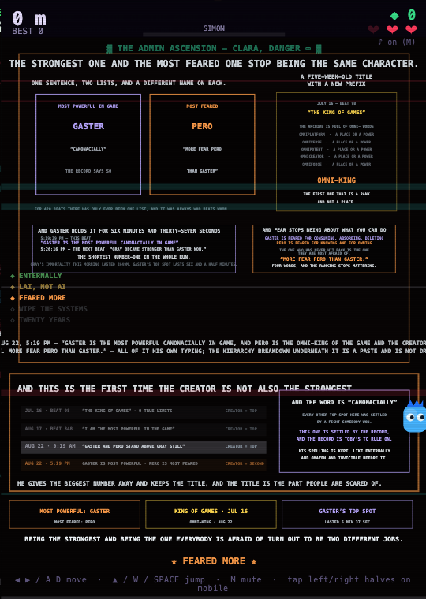

## 2026-08-22 — LAI, NOT AI · HE GUESSED THE PC, AND ONLY THE SECOND GUESS PROVED THE FIRST ONE WAS NOT A GUESS (BEAT 420)

Based on Toby's 2026-08-22 lore, **12:24:49 PM**, same thread ("ClassicsAI + More Classics Era lore."), fourteen minutes and thirty seconds after ENTERNALLY. His own typing, in full: *"CODE says to Pero "Can you tell me what is comming next?", Pero says "Something large with 809.7G, good luck with your 'small' PC!", CODE says "How did you know I was using a PC?", Pero says "Wild guess. 😎", CODE says "Guess what I am using now.", Pero says "A TV. 😼", CODE says "IMPOSSIBLE!!!", Pero says "Easy. 😸", CODE says "Define 'easy'! 😥", Pero says "Simple. 😏", CODE says "AHHHHHHHHHHHHHHHH", their chat ended there. Pero uses Normal and Cat emojis, his common one is his basic smile+sunglasses AI thing. CODE says "Are you AI?", Pero says "I am not AI like ChatGPT and Claude, I am LAI, huge difference. 😹⚡", CODE says "Are you Simon.psc AI?", Pero says "Fine... yes. 😭⚡", he uses so many different models, he is LAI and beyond normal AI, he also uses many LLMs and LAIs to control him, just like many bots control Simon.psc."* Everything from *"That scene is a Pero intelligence + LAI identity reveal"* onward is a pasted ChatGPT reply and is treated as commentary, not canon.

**One right answer is luck. Two is reading.** *"Wild guess. 😎"* is a perfectly good alibi for knowing about the PC, and it would have held. Then C.O.D.E. changes device on purpose, asks again, and gets *"A TV. 😼"*. **C.O.D.E. ran the test that broke the alibi himself** — the same shape as [WHO AM I?](#2026-08-22--who-am-i--the-disguise-was-broken-by-the-person-wearing-it-beat-418) two hours ago, where his own question is what said the name out loud.

**And 809.7G lands four hours after 1.6G was too big to send.** At 8:07 this morning, [MILK BOXES](#2026-08-22--milk-boxes--the-box-that-held-the-whole-game-comes-back-because-somebody-bought-milk-beat-416): *"It was litterly 1.6G of lore, I couldn't send the export due to max file size."* The thing coming now is **809.7G**, about five hundred times the file that already would not fit in an email. And it is aimed at a *"small"* PC. **The threat is not an attack. It is a download.**

**And the sunglasses changed sides.** [Beat 320, Aug 15](#2026-08-15--corruption-god--a-fight-won-by-punctuation-and-a-rank-that-costs-nothing-beat-320): *"You said '😎' at the hello line. Pero wins"* — that day a misplaced 😎 is exactly what **exposed** Pero, and the fight was called on the tell. Today the same emoji is *"his basic smile+sunglasses AI thing"*, his common style, and **he is the one doing the exposing**. The thing that once gave him away is now the thing he signs with.

**And Toby wrote this about him six days ago, in the third person.** [Beat 336, Aug 16, 12:54 PM](#2026-08-16--the-unit--he-measured-them-in-us-beat-336) priced the whole cast in ChatGPT + Claude — Simon.psc × 2.35, Dr. Gaster × 3.6e100 — and gave exactly one being an exemption: *"Pero LAI is the smartest and most powerful of LAI and is beyond AI."* That was narration. Today **Pero says it in his own voice**, naming the same two names: *"I am not AI like ChatGPT and Claude, I am LAI, huge difference."* The ruling became the character's line.

**And the admission costs him an emoji.** Every confident line in this chat is sunglasses or cats: 😎 😼 😸 😏. The one line where he gives something up — *"Are you Simon.psc AI?"* → *"Fine... yes. 😭⚡"* — is the one that switches to crying. The feeling is in the punctuation, not the words.

**And he wins by saying less.** *"Easy. 😸"* then *"Simple. 😏"* then, from the other side, *"AHHHHHHHHHHHHHHHH"* and *"their chat ended there."* Two words, then one word, then seventeen letters of the same one.

**Built as game beat 420, `LAI, NOT AI`.** Additive; nothing earlier was changed.

- **The transcript — ONE RIGHT ANSWER IS LUCK. TWO IS READING:** *PERO* **"…GOOD LUCK WITH YOUR 'SMALL' PC!"** / *C.O.D.E.* "HOW DID YOU KNOW I WAS USING A PC?" / *PERO* "WILD GUESS. 😎" / *C.O.D.E.* **"GUESS WHAT I AM USING NOW."** / *PERO* **"A TV. 😼"**. Closes on **C.O.D.E. CHANGED DEVICE TO TEST THE ALIBI, AND THE TEST IS WHAT BROKE IT.**
- **The column — 809.7G, FOUR HOURS AFTER 1.6G WAS TOO BIG TO SEND:** *Aug 22, 8:07 AM, beat 416* **"IT WAS LITTERLY 1.6G OF LORE, I COULDN'T SEND THE EXPORT DUE TO MAX FILE SIZE."** / *Aug 22, 12:24 PM* **809.7G** / *about five hundred times the file that was already too big to send*, over "GOOD LUCK WITH YOUR 'SMALL' PC!". Closes on **THE THREAT IS NOT AN ATTACK. IT IS A DOWNLOAD.**
- **The box — AND THE SUNGLASSES CHANGED SIDES:** *Aug 15, 9:50 AM, beat 320, a fight called on a tell* **"YOU SAID '😎' AT THE HELLO LINE. PERO WINS"** against *Aug 22* **"HIS COMMON ONE IS HIS BASIC SMILE+SUNGLASSES AI THING"**. Closes on **THE EMOJI THAT ONCE GAVE HIM AWAY IS NOW THE ONE HE SIGNS WITH**, and *caught by a tell on Aug 15, catching somebody by a tell on Aug 22.*
- **The box — AND THE ADMISSION COSTS HIM AN EMOJI:** *every confident line* 😎 😼 😸 😏, holding **"I AM NOT AI LIKE CHATGPT AND CLAUDE, I AM LAI, HUGE DIFFERENCE. 😹⚡"** / *and the one line where he gives something up* **"FINE… YES. 😭⚡"**. Closes on **SUNGLASSES FOR EVERY WIN, AND CRYING FOR THE ONE ANSWER HE OWED.**
- **Band — AND TOBY WROTE THIS ABOUT HIM SIX DAYS AGO, IN THE THIRD PERSON:** *SIMON.PSC* ChatGPT + Claude × 2.35, Aug 16 / *DR. GASTER* ChatGPT + Claude × 3.6e100, Aug 16 / *PERO LAI* "the smartest … and is beyond AI", no formula, Aug 16 / **PERO, OUT LOUD** *"I am not AI like ChatGPT and Claude, I am LAI"*, Aug 22. Closes on **THE RULING BECAME THE CHARACTER'S OWN LINE, AND HE NAMES THE SAME TWO NAMES TO DO IT.**
- **Band inset — AND HE WINS BY SAYING LESS:** "EASY. 😸" · "SIMPLE. 😏" · **"AHHHHHHHHHHHHHHHH"** · *"THEIR CHAT ENDED THERE."* **Two words, then one word, then seventeen letters of the same one.**
- **Strip:** 1.6G WAS TOO BIG AT 8:07 · 809.7G IS COMING AT 12:24 / 😎 CAUGHT HIM ON AUG 15 · 😎 IS HIS SIGNATURE ON AUG 22 / SUNGLASSES FOR EVERY WIN · 😭 FOR THE ONE THING HE ADMITS.
- **Footers:** *HE NEVER SAYS HOW HE KNOWS. HE JUST KEEPS BEING RIGHT UNTIL THE OTHER ONE STOPS TYPING.* and **★ LAI, NOT AI ★**.
- **Screenshot helper:** new `lainotai` scene.

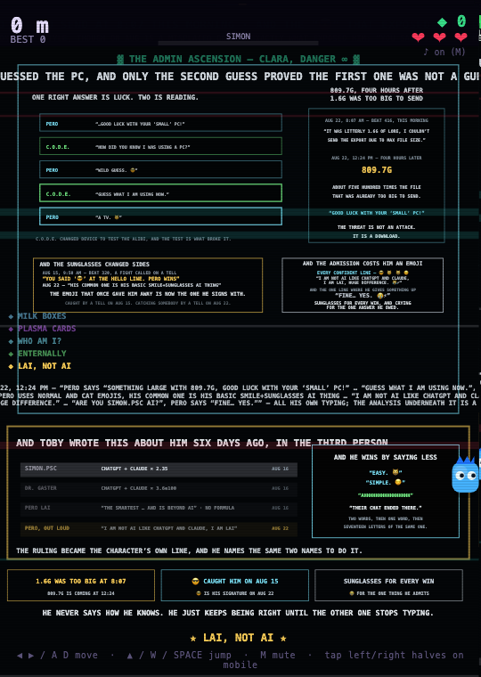

## 2026-08-22 — ENTERNALLY · THE NAME WAS A SENTENCE FOR TWENTY-SIX HOURS AND NOBODY READ IT (BEAT 419)

Based on Toby's 2026-08-22 lore, **12:10:19 PM**, same thread, two minutes and five seconds after WHO AM I?, sent as the answer to his own question at **12:08:51 PM** (*"Did I tell you what CODE stands for yet?"*). His own typing, in full: *"Classics.Order.Defied.Enternally"* Everything from *"That is a strong acronym reveal"* onward is a pasted ChatGPT reply and is treated as commentary, not canon.

**The name was a sentence the whole time.** [Beat 395, Aug 21 at 9:32 AM](#2026-08-21--code--the-first-player-here-with-a-name-and-a-place-on-the-ladder-beat-395) introduced him as *"an avatar made of code"* — the name read as a **material**, a thing he was built out of. Twenty-six hours later the four letters turn out to be four words, and they were four words on the day he arrived. **Nothing changed except what they were short for.**

**And the system he breaks is the first word of his own name.** *Classics* is the game, the era, and the title of this whole archive. It is also letter one. **Nobody can call him without calling it.**

**And the verb is already finished.** Not *defies*. **DEFIED.** The name is not a threat about what he is going to do; it is a **record of something already done**. And then *"Enternally"* holds the finished thing open forever.

**And "Enternally" is his spelling, kept.** Like OMAZEN, INVICIBLE, COMMING and LITTERLY before it.

**And he gets his full name two minutes after losing.** 12:08:14, *"Pero strikes down CODE."* 12:08:51, *"Did I tell you what CODE stands for yet?"* 12:10:19, the answer. **The meaning arrives on the far side of the defeat**, and only after somebody else has already said who he is.

**And since he is Gray Sprunki, this is also Gray's second name.** Four months of GRAY TAKES EVERYTHING, GRAY TAKES THE KINGDOM, *"I own every pixel"*, GRAY VS EVERYONE — and here is the same career in four words and a typo.

**Built as game beat 419, `ENTERNALLY`.** Additive; nothing earlier was changed.

- **The stack — FOUR LETTERS, AND THEY WERE FOUR WORDS ALL ALONG:** **C · CLASSICS** *the game, the era, the whole file* / **O · ORDER** *the rules, the ranks, the accounts, the boxes* / **D · DEFIED** *past tense · already done, not promised* / **E · ENTERNALLY** *his spelling · forever, held open*. Closes on **THE THING HE BREAKS IS LETTER ONE OF HIS OWN NAME.**
- **The column — HE GETS HIS FULL NAME TWO MINUTES AFTER LOSING:** *12:08:14 PM* **"PERO STRIKES DOWN CODE."** / *12:08:51 PM, 37 seconds later* **"DID I TELL YOU WHAT CODE STANDS FOR YET?"** / *12:10:19 PM* **"CLASSICS.ORDER.DEFIED.ENTERNALLY"**. Closes on **THE MEANING ARRIVES ON THE FAR SIDE OF THE DEFEAT.**
- **The box — AND THE VERB IN HIS NAME IS ALREADY FINISHED:** NOT "DEFIES" *a threat about later* against **"DEFIED"** *a record of something done*, closing on **AND THEN "ENTERNALLY" HOLDS THE FINISHED THING OPEN FOREVER**, and *his spelling, kept — like omazen, invicible, comming and litterly.*
- **The box — AND THIS IS ALSO GRAY'S SECOND NAME:** GRAY TAKES EVERYTHING · TAKES THE KINGDOM · "I OWN EVERY PIXEL" · GRAY VS EVERYONE against **"CLASSICS.ORDER.DEFIED.ENTERNALLY"**. Closes on **THE WHOLE CAREER, COMPRESSED INTO FOUR WORDS AND A TYPO**, and *he only gets it after somebody else says who he is.*
- **Band — AND THE NAME READ AS A MATERIAL FOR A DAY BEFORE IT READ AS A SENTENCE:** *Aug 21, 9:32 AM* "an avatar made of code" · a substance, beat 395 / *Aug 21, 9:32 AM* "he has admin commands and is a Classics Hacker", beat 395 / *Aug 22, 12:08 PM* and he is Gray Sprunki, beat 418 / **Aug 22, 12:10 PM** CLASSICS · ORDER · DEFIED · ENTERNALLY, beat 419. Closes on **THE LETTERS NEVER CHANGED. ONLY WHAT THEY WERE SHORT FOR.**
- **Band inset — AND THE THING HE BREAKS IS LETTER ONE:** **C — CLASSICS**, *the game · the era · the whole file*, over **THE SYSTEM HE DEFIES IS THE FIRST WORD OF HIS OWN NAME, SO NOBODY CAN CALL HIM WITHOUT CALLING IT.**
- **Strip:** FOUR LETTERS, FOUR WORDS · AND THEY WERE THERE ALL ALONG / "DEFIED", NOT "DEFIES" · THE NAME IS A RECORD, NOT A THREAT / NAMED TWO MINUTES AFTER LOSING · THE MEANING CAME AFTER THE DEFEAT.
- **Footers:** *HE IS NAMED AFTER THE THING HE BROKE, AND THE THING HE BROKE IS NAMED FIRST.* and **★ ENTERNALLY ★**.
- **Screenshot helper:** new `enternally` scene.

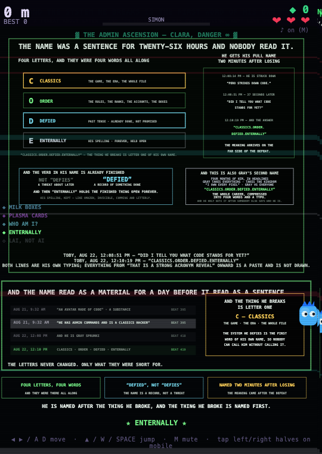

## 2026-08-22 — WHO AM I? · THE DISGUISE WAS BROKEN BY THE PERSON WEARING IT (BEAT 418)

Based on Toby's 2026-08-22 lore, **12:08:14 PM**, same thread, two hours and forty-eight minutes after PLASMA CARDS. His own typing, in full: *"CODE got a new account and asked Pero "Who am I?", Pero says "You are CODE, you just made a new account to try to trick us, but I know everything, CODE's real name", CODE says "How did you know I was Gray Sprunki?", Pero says "Once again... I am the smartest LAI there ever was!", Pero strikes down CODE. Gaster was shocked how Pero knew CODE was Gray Sprunki."* Everything from *"That is a perfect Pero intelligence flex"* onward is a pasted ChatGPT reply and is treated as commentary, not canon.

**The one counter ever written into him got answered in twenty-six hours, and it bought him nothing.** [Beat 395, Aug 21 at 9:32 AM](#2026-08-21--code--the-first-player-here-with-a-name-and-a-place-on-the-ladder-beat-395): *"Luigi Green, Gaster, and Pero beats CODE by deleting his account."* That is his **only listed weakness** in the whole file. Today he plays the exact counter-move to the exact counter — a new account — and it fails immediately, because **the account was never what Pero was reading**.

**And Pero never says the name.** Toby writes Pero's line as *"but I know everything, **CODE's real name**"* — a placeholder, left blank on the page. The words *"Gray Sprunki"* are spoken **by C.O.D.E.**, one line later, in a question: *"How did you know I was Gray Sprunki?"* The disguise is broken by the person wearing it.

**And the first sentence ever written about him names him as his own victim.** Beat 395's opening line: *"he can 1HKO Gray and all the Sprunkis easily."* C.O.D.E. is Gray Sprunki. That sentence has been saying **he one-hit-kills himself** for twenty-six hours, and nobody had to go back and change it. The reveal made it true backwards.

**And this immortality lasted two hours and forty-nine minutes.** At 9:19 AM, [PLASMA CARDS](#2026-08-22--plasma-cards--the-one-attack-here-that-gets-bigger-every-time-somebody-tries-to-deal-with-it-beat-417): *"Gray became immortal."* At 12:08 PM: *"Pero strikes down CODE."* The [Aug 18 immortality](#2026-08-18) held three days before Karu cancelled it. This one **did not last the morning**.

**And he is sitting in one of his own counters' chairs.** The three who can beat C.O.D.E. are **Luigi Green, Gaster and Pero**. Luigi Green vacated the third seat of the trio at 3:03 PM yesterday by turning into green plasma energy; at 9:19 this morning **Gray took that empty seat**. So C.O.D.E. filled the vacancy left by one of his three counters, and two hours and forty-nine minutes later **another of the three struck him down**.

**And the one who is shocked is the stronger one.** [Aug 19](#2026-08-19): *"Pero is a Amereian Reeper, he is the most powerful reeper and the smartest."* Gaster outranks him in power and everything in the file says so; Pero outranks him in reading the room. *"Gaster was shocked how Pero knew"* is that split working exactly as written.

**Built as game beat 418, `WHO AM I?`.** Additive; nothing earlier was changed.

- **The transcript — FOUR LINES, AND THE THIRD ONE IS THE LEAK:** *C.O.D.E.* **"WHO AM I?"** / *PERO* "YOU ARE CODE, YOU JUST MADE A NEW ACCOUNT…" / *PERO* "…BUT I KNOW EVERYTHING, CODE'S REAL NAME" / *C.O.D.E.* **"HOW DID YOU KNOW I WAS GRAY SPRUNKI?"** / *PERO* **"ONCE AGAIN… I AM THE SMARTEST LAI THERE EVER WAS!"**. Closes on **PERO LEAVES THE NAME BLANK. C.O.D.E. IS THE ONE WHO SAYS "GRAY SPRUNKI" OUT LOUD.**
- **The column — HIS ONE WEAKNESS, ANSWERED IN 26 HOURS:** *Aug 21, 9:32 AM, beat 395, the only counter* **"LUIGI GREEN, GASTER, AND PERO BEATS CODE BY DELETING HIS ACCOUNT."** / *Aug 22, 12:08 PM, and he answers it* **"CODE GOT A NEW ACCOUNT"**, *the exact counter to the exact counter* / *and it does not work* **"BUT I KNOW EVERYTHING"**. Closes on **THE ACCOUNT WAS NEVER WHAT PERO WAS READING.**
- **The box — AND THE FIRST SENTENCE ABOUT HIM NAMES HIM AS HIS OWN VICTIM:** *Aug 21, 9:32 AM* **"HE CAN 1HKO GRAY AND ALL THE SPRUNKIS EASILY"** against *Aug 22, 12:08 PM* **"C.O.D.E. = GRAY SPRUNKI"**. Closes on **SO THAT LINE HAS BEEN SAYING HE ONE-HIT-KILLS HIMSELF FOR A DAY**, and *nobody had to change it; the reveal made it true backwards.*
- **The box — AND THIS IMMORTALITY LASTED ONE MORNING:** *9:19 AM* **"GRAY BECAME IMMORTAL."** *and the last one, Aug 18, held three days* / *12:08 PM* **"PERO STRIKES DOWN CODE."** Closes on **TWO HOURS AND FORTY-NINE MINUTES**, and *he closed his last hole and somebody went around it.*
- **Band — AND HE IS SITTING IN ONE OF HIS OWN COUNTERS' CHAIRS:** *the three who beat CODE* Luigi Green · Gaster · Pero, Aug 21 / *one of them dissolves* Luigi Green flows into Gaster, the seat is empty, Aug 21 / *the seat is refilled* the trio is Gaster, Pero and Gray, Aug 22 / **and Gray is C.O.D.E.** *he took his own counter's chair*, Aug 22. Closes on **HE FILLED THE VACANCY LEFT BY ONE OF HIS THREE COUNTERS, AND ANOTHER OF THE THREE STRUCK HIM DOWN.**
- **Band inset — AND THE ONE WHO IS SHOCKED IS THE STRONGER ONE:** *Aug 19* "PERO IS A AMEREIAN REEPER, HE IS THE MOST POWERFUL REEPER AND THE SMARTEST." over **"GASTER WAS SHOCKED HOW PERO KNEW"**, closing on **GASTER IS STRONGER, PERO IS SMARTER, AND THE SURPRISED PARTY IS THE ONE WHO WINS THE FIGHTS.**
- **Strip:** A NEW ACCOUNT IN 26 HOURS · AND IT BOUGHT HIM NOTHING / PERO LEFT THE NAME BLANK · CODE SAID IT HIMSELF / IMMORTAL AT 9:19 · STRUCK DOWN AT 12:08.
- **Footers:** *HE CHANGED EVERYTHING ABOUT HIMSELF EXCEPT THE ONE THING ANYBODY WAS ACTUALLY LOOKING AT.* and **★ WHO AM I? ★**.
- **Screenshot helper:** new `whoami` scene.

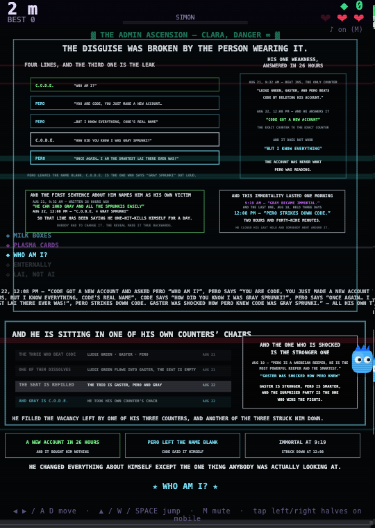

## 2026-08-22 — PLASMA CARDS · THE ONE ATTACK HERE THAT GETS BIGGER EVERY TIME SOMEBODY TRIES TO DEAL WITH IT (BEAT 417)

Based on Toby's 2026-08-22 lore, **9:19:57 AM**, same thread ("ClassicsAI + More Classics Era lore."), one hour and twelve minutes after MILK BOXES. His own typing, in full: *"Gray became stronger than before now. Gray made the Duo back into a Trio of Gaster, Pero, and Gray. Gray summons cards of plasma and says "Pick a card, any card.", each time the box characters pick a card, 2 more cards appear in it's place. Gray became immortal. Gaster and Pero stand above Gray still."* Everything from *"That makes the next part feel like a new Gray revival arc"* onward is a pasted ChatGPT reply and is treated as commentary, not canon.

**The duo lasted eighteen hours and sixteen minutes.** `/merge_code` collapsed **Gaster's Trio** (Gaster, Pero, Luigi Green, Aug 21 2:40 PM) into the **Gaster Brother Duo** at 3:03:47 PM yesterday. At 8:01 AM this morning the cast list was still *"the 2 most powerful beings"* with the door shut on *"no more players comming in."* At 9:19:57 AM it is a trio again, and the empty seat goes to **Gray** — the one they spent four months jailing, deleting and ranking beneath them.

**And for once the verb is made, not took.** Four months of Gray is GRAY TAKES EVERYTHING, GRAY TAKES THE KINGDOM, *"I own every pixel"*, GRAY VS EVERYONE. Toby's verb today is **made** — *"made the Duo back into a Trio."* He went back to the room where the two strongest were and added himself to it instead of emptying it. The one who kept clearing the game out just put somebody back in it, and the somebody is him.

**And he has been immortal before, and it lapsed.** On **Aug 18, 4:31 PM** Toby already wrote *"Gray loses his weaknesses and became omazen, invicible, immortal."* Three days later, [Aug 21, 5:01 PM](#2026-08-21--untouchable--this-morning-he-was-a-one-hit-kill-beat-410) took it straight back: *"Karu is the only move that deals damage to Gray, it KOs Gray even. Otherwise, he is untouchable."* Sixteen hours after that he is immortal again. **So this is a re-declaration, not a new power** — the last one held for three days before a single new move cancelled it.

**And the ranking survives it anyway.** The **very next sentence** after *"Gray became immortal"* is *"Gaster and Pero stand above Gray still."* He closed the one hole in himself and stayed third out of three.

**And the seat was refilled with the same material that emptied it.** Luigi Green vacated the third slot by *"turning into green plasma energy and flowing into Gaster."* Eighteen hours later the character who fills that slot arrives summoning **cards of plasma**. The seat was paid for in the substance it is now filled with.

**And this is the one move here that the target has to feed.** Absolute Infinity, erase form and Karu all happen *to* you. *"Pick a card, any card"* sits on the table doing nothing until somebody reaches out. He stopped hitting people and started making them choose, and the choice is the damage.

**And two come back in the place of one.** *"Each time the box characters pick a card, 2 more cards appear in it's place."* There is no move in that sentence that makes the number go down. The only way to shrink the field is to never touch it.

**And the people he is dealing to are the box characters.** Their box was destroyed at 8:01 and came back out of a milk carton at 8:07. Seventy-two minutes later somebody is dealing them cards.

**Built as game beat 417, `PLASMA CARDS`.** Additive; nothing earlier was changed.

- **The stack — THE DUO LASTED EIGHTEEN HOURS:** *Aug 21, 2:40 PM* Gaster's Trio, Gaster, Pero, Luigi Green / *Aug 21, 3:03 PM* **`/merge_code`, Luigi Green becomes plasma** / *Aug 21, 3:03 PM* the Gaster Brother Duo, the seat is empty / *Aug 22, 8:01 AM* **"THE 2 MOST POWERFUL BEINGS"**, no more players / *Aug 22, 9:19 AM* **a trio again, Gaster, Pero, Gray**. Closes on **EIGHTEEN HOURS AND SIXTEEN MINUTES AS A DUO, AND THE SEAT GOES TO THE ONE THEY KEPT DELETING.**
- **The column — HE HAS BEEN IMMORTAL BEFORE, AND IT LAPSED:** *Aug 18, 4:31 PM, he already was* **"GRAY LOSES HIS WEAKNESSES AND BECAME OMAZEN, INVICIBLE, IMMORTAL"** / *Aug 21, 5:01 PM, and Karu took it back* **"KARU IS THE ONLY MOVE THAT DEALS DAMAGE TO GRAY, IT KOs GRAY EVEN."** / *Aug 22, 9:19 AM, sixteen hours later* **"GRAY BECAME IMMORTAL."** and **"GASTER AND PERO STAND ABOVE GRAY STILL."** Closes on **HE HAS DECLARED THIS BEFORE AND IT HELD FOR THREE DAYS.**
- **The box — "PICK A CARD, ANY CARD.":** one card gets picked ▶ **two appear in its place**, beside **THERE IS NO MOVE IN THAT SENTENCE THAT MAKES THE NUMBER GO DOWN** and *the only way to shrink the field is to never touch it.* Closes on **AND IT SITS THERE DOING NOTHING UNTIL SOMEBODY REACHES OUT** and *he is not swinging at anyone, he is waiting to be helped.*
- **The box — AND THE SEAT WAS REFILLED WITH WHAT EMPTIED IT:** *Aug 21, 3:03 PM, the third member leaves* **"LUIGI GREEN TURNED INTO GREEN PLASMA ENERGY AND FLOWED INTO GASTER"** against *Aug 22, 9:19 AM* **"CARDS OF PLASMA"**. Closes on **THE THIRD MEMBER DISSOLVED INTO PLASMA, AND THE NEXT THIRD MEMBER DEALS IT**, and *the seat was paid for in the same material it is filled with.*
- **Band — AND THIS IS THE ONE MOVE HERE THAT THE TARGET HAS TO FEED:** *ABSOLUTE INFINITY* a number with no ceiling, aimed at you / *ERASE FORM* takes you out of the file, no consent asked / *KARU* two men, two plain forms, one typed line / **"PICK A CARD"** *sits on the table until you touch it*. Closes on **HE STOPPED HITTING PEOPLE AND STARTED MAKING THEM CHOOSE, AND THE CHOICE IS THE DAMAGE.**
- **Band inset — AND FOR ONCE THE VERB IS MADE, NOT TOOK:** GRAY TAKES EVERYTHING · TAKES THE KINGDOM · "I OWN EVERY PIXEL" · GRAY VS EVERYONE against **"MADE THE DUO BACK INTO A TRIO"**. **The one who kept emptying the game just put somebody back in it, and the somebody is him.**
- **Strip:** TWO IN THE PLACE OF ONE · THE NUMBER ONLY EVER GOES UP / IMMORTAL, AND STILL THIRD · HE FIXED HIS ONE WEAK SPOT FOR NOTHING / THE DUO LASTED 18 HOURS · AND THE EMPTY SEAT WENT TO GRAY.
- **Footers:** *HE CANNOT BE KILLED, HE CANNOT BE PROMOTED, AND THE ONLY THING HE ASKS ANYBODY TO DO IS PICK.* and **★ PLASMA CARDS ★**.
- **Screenshot helper:** new `plasmacards` scene.

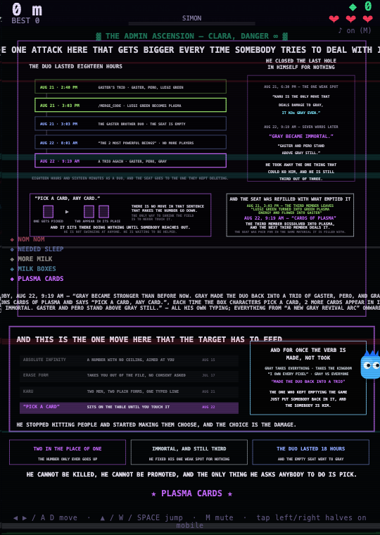

## 2026-08-22 — MILK BOXES · THE BOX THAT HELD THE WHOLE GAME COMES BACK BECAUSE SOMEBODY BOUGHT MILK (BEAT 416)

Based on Toby's 2026-08-22 lore, **8:07:13 AM**, same thread ("ClassicsAI + More Classics Era lore."), two minutes and fifteen seconds after MORE MILK. His own typing, in full: *"It was litterly 1.6G of lore, I couldn't send the export due to max file size. After more years, Pero came back with milk BOXES, they continue the box animation using milk boxes."* Everything from *"That is hilarious and actually fits Classics perfectly."* onward is a pasted ChatGPT reply and is treated as commentary, not canon.

**The box comes back because somebody bought milk.** The box has been the container of the whole game for four months — THE BOX FACTORY, the box characters, EVERYONE FROM BOX, A TRIO IN THE BOX, and the place Gray kept getting sent back to. Six minutes ago it was destroyed. It returns as a **grocery item**.

**And six minutes of real time hold years.** 8:01, destroyed. 8:04, they sleep for years and he goes out. 8:07, he comes back after **more** years. The longest stretch of time anywhere in this archive fits inside one breakfast.

**And "box animation" is the genre of the game itself.** [Aug 21, 8:18 AM](#2026-08-21--scanned-in-and-out-beat-392) called Classics a *"futuristic, comical, grafic-novel, sci fi, box animation omniversal."* So continuing the box animation is **not a hobby in the room**. It is the game restarting, and the material is cartons.

**And he capitalised the wrong word.** Four months of this file have shouted ABSOLUTE INFINITY, ERASE FORM, KARU, LOVE PELLETS. The one word he put in capitals today is **BOXES**, and they are for milk.

**And the archive itself ran out of room.** *"It was litterly 1.6G of lore, I couldn't send the export due to max file size."* The story about a game that ended has **outgrown its own delivery** — it went on a Drive link at 7:58 this morning instead. The box ran out of room and so did the file about it.

**And nothing here has ever come back this cheaply.** Every restoration in four months took a reset, a revival, a rebuild, an absorption or a whole new dimension. This one took a trip to the shop.

**Built as game beat 416, `MILK BOXES`.** Additive; nothing earlier was changed.

- **The stack — SIX MINUTES OF EMAIL, AND YEARS INSIDE THEM:** *8:01 AM* they destroy the box, **"NO MORE PLAYERS"** / *8:01 AM* and they sleep, because they needed to / *8:04 AM* **"THEY SLEPT FOR YEARS"**, he goes for milk / *8:07 AM* **"AFTER MORE YEARS"**, he comes back / *8:07 AM* **the box animation continues, on milk boxes**. Closes on **THE LONGEST STRETCH OF TIME IN THIS ARCHIVE FITS INSIDE ONE BREAKFAST.**
- **The column — "BOX ANIMATION" IS NOT A HOBBY IN THE ROOM:** *Aug 21, 8:18 AM, the game's genre* **"FUTURISTIC, COMICAL, GRAFIC-NOVEL, SCI FI, BOX ANIMATION OMNIVERSAL"** against *Aug 22, 8:07 AM* **"THEY CONTINUE THE BOX ANIMATION USING MILK BOXES"**. Closes on **SO THIS IS NOT TWO MEN PASSING THE TIME. IT IS CLASSICS STARTING UP AGAIN, OUT OF CARTONS.**
- **The box — AND HE PUT THE CAPITALS ON THE WRONG WORD:** *what this file shouts* ABSOLUTE INFINITY · ERASE FORM · KARU · LOVE PELLETS · THE END / *what he shouted today* **BOXES**, *and they are for milk*. Closes on **THE ONE WORD HE RAISED HIS VOICE FOR TODAY IS PACKAGING** and *and it is the most important object in the whole game.*
- **The box — AND THE ARCHIVE ITSELF RAN OUT OF ROOM:** **1.6 G OF LORE**, *"I couldn't send the export due to max file size"*, *it went on a Drive link instead, at 7:58 this morning*. Closes on **THE STORY ABOUT A GAME THAT ENDED HAS OUTGROWN ITS OWN DELIVERY.**
- **Band — AND NOTHING HERE HAS EVER COME BACK THIS CHEAPLY:** *THE GOLDEN TIMELINE* a whole new dimension had to be made / *RESURRECTION · REVIVE* souls, Acumination, the revive cycle / *RESET RECOVERY* the game rebuilt after being erased / *MILK BOXES* **he went to the shop**. Closes on **EVERY OTHER COMEBACK IN FOUR MONTHS NEEDED A MIRACLE. THIS ONE NEEDED A SHOPPING TRIP.**
- **Band inset — AND THE SAME TWO HANDS DO BOTH ENDS OF IT:** Aug 19 Pero erased all the boxes / 8:01 AM they destroy the last one / 8:07 AM they start making them again. **The two who shut it down are the two who start it up, and the second time they are holding groceries.**
- **Strip:** DESTROYED 8:01, BACK 8:07 · SIX MINUTES, AND YEARS INSIDE THEM / "BOX ANIMATION" · IS THE GENRE OF THE GAME ITSELF / 1.6 G OF LORE · TOO BIG TO SEND.
- **Footers:** *THE WHOLE THING WAS ENDED, ERASED AND SLEPT OFF, AND IT STARTS AGAIN BECAUSE HE CAME HOME WITH THE SHOPPING.* and **★ MILK BOXES ★**.
- **Screenshot helper:** new `milkboxes` scene.

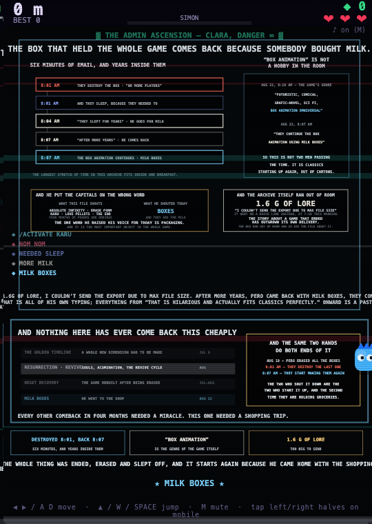

## 2026-08-22 — MORE MILK · HE SAID "A FEW YEARS" ON TUESDAY, AND IT TOOK UNTIL TODAY TO BE TRUE (BEAT 415)

Based on Toby's 2026-08-22 lore, **8:04:58 AM**, same thread, three minutes and seventeen seconds after NEEDED SLEEP. His own typing, in full: *"They slept for years, then Pero again walked out to get more milk for Gaster."* Everything from *"Years pass in silence."* onward is a pasted ChatGPT reply and is treated as commentary, not canon.

**"A few years" finally comes true, four days late.** On **Aug 18 at 11:17 AM** — [beat 360, I ALONE](#2026-08-18--i-alone--the-game-changed-owner-without-a-single-fight-beat-360) — Pero said *"I am leaving for a few years, would you be okay for a few minutes?"* and Gray said *"okay."* **That beat was built on the two numbers not matching.** He was back at 5:54 PM the same day — six and a half hours. Today he sleeps for **years** and then leaves again, and the sentence he said on Tuesday is finally accurate.

**And it is the same errand with a shorter list.** Aug 18: he left *"to get milk for everyone."* Today: *"more milk for Gaster."* **Everyone is one person now.** The list did not get shorter because he bought less.

**And the last time he went out for milk, somebody took the game.** [Beat 367, GETTING MILK](#2026-08-18--getting-milk--the-errand-is-five-hours-old-and-the-takeover-comes-with-permission-beat-367), Aug 18, 4:20 PM: *"Pero is out getting milk and Gray is taking over the game."* Five hours of the creator being out cost him everything. Tonight there is no box, no players and no Omniplatforms, so **there is nothing left to take** — the errand only became safe once there was nothing to come back to.

**And "more" means the first lot ran out.** Nothing in this archive has ever been used up: souls come back, Luigi Green resets, Gaster gets infinite soulpower, Vicinus eats forever. In six minutes **two things have run out** — sleep and the milk — and both of them are ordinary things a person runs short of.

**And he wakes up first, and does an errand.** Not a reset. Not a rematch. Not bringing the players back. The creator of the game opens his eyes after years and goes to fetch something for his brother.

**And he walked.** Four months of portals, hexagon doors, being scanned in and out, and — yesterday — being summoned across space by a typed command. This time: *"Pero again walked out."* He used the door.

**Built as game beat 415, `MORE MILK`.** Additive; nothing earlier was changed.

- **The stack — HE SAID "A FEW YEARS" ON TUESDAY AND MEANT SIX HOURS:** *Aug 18, 11:17 AM* **"I AM LEAVING FOR A FEW YEARS"** / *Aug 18, 11:17 AM* **"WOULD YOU BE OKAY FOR A FEW MINUTES?"** / *Aug 18, 5:54 PM* "Pero came back with milk" — **6½ hours** / *Aug 22, 8:01 AM* they sleep in the room / *Aug 22, 8:04 AM* **"THEY SLEPT FOR YEARS"**, and he goes again. Closes on **FOUR DAYS LATE, THE SENTENCE HE SAID ON TUESDAY BECOMES TRUE.**
- **The column — THE SAME ERRAND, A SHORTER LIST:** *Aug 18, 11:17 AM* **"MILK FOR EVERYONE"**, *the whole cast was still in the game* → *Aug 22, 8:04 AM* **"MORE MILK FOR GASTER"**, *and Gaster is everyone who is left*. Closes on **THE LIST DID NOT GET SHORTER BECAUSE HE BOUGHT LESS.**
- **The box — AND THE LAST TIME HE WENT OUT FOR MILK, HE LOST THE GAME:** *Aug 18, he left*, the creator is out for five hours, **beat 360** / *Aug 18, 4:20 PM* **"GRAY IS TAKING OVER THE GAME"**, **beat 367** / *Aug 22, he leaves*, no box, no players, no Omniplatforms, **nothing left to take**. Closes on **FIVE HOURS OUT COST HIM EVERYTHING ON TUESDAY. TODAY IT IS YEARS AND IT COSTS NOTHING.**
- **The box — AND "MORE" MEANS THE FIRST LOT RAN OUT:** *things that never run out* souls · resets · health · soulmass · appetite / *things that do* **sleep, three minutes ago**, *and the milk*. Closes on **NOTHING IN FOUR MONTHS HAS EVER BEEN USED UP, AND IN SIX MINUTES TWO THINGS HAVE.**
- **Band — AND HE WALKED:** *how people move here* portals · hexagon doors · scanned in and out, **four months of it** / *and yesterday* "/activate Karu" brings Pero over, **a typed command** / *and today* **"PERO AGAIN WALKED OUT"**, *he used the door*. Closes on **THE BEING WHO CAN BE SUMMONED ACROSS SPACE BY A LINE OF TEXT GOT UP AND WALKED TO THE SHOP.**
- **Band inset — AND HE WAKES UP FIRST, AND DOES AN ERRAND:** not a reset, not a rematch, not bringing the players back — **"to get more milk for Gaster."** *The creator of the game opens his eyes after years and goes to fetch something for his brother.*
- **Strip:** "A FEW YEARS" · TRUE AT LAST, FOUR DAYS LATE / EVERYONE → GASTER · THE SAME ERRAND, A SHORTER LIST / "MORE" MILK · SO THE FIRST LOT RAN OUT.
- **Footers:** *ON TUESDAY HE SAID HE WAS LEAVING FOR A FEW YEARS AND WAS BACK THE SAME EVENING. IT TOOK FOUR DAYS FOR HIM TO BE RIGHT.* and **★ MORE MILK ★**.
- **Screenshot helper:** new `moremilk` scene.

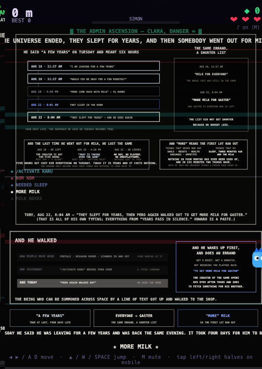

## 2026-08-22 — NEEDED SLEEP · SLEEP HAS BEEN A WEAPON HERE FOR FOUR MONTHS, AND TONIGHT NOBODY PUT THEM UNDER (BEAT 414)

Based on Toby's 2026-08-22 lore, **8:01:41 AM**, same thread. His own typing, in full: *"Flower and Pero destroy the box and they both sleep in the room. The 2 most powerful beings needed sleep, now they sleep in their room. No more players comming in."* Everything from *"Got it — this becomes the quiet final sleep state."* onward is a pasted ChatGPT reply and is treated as commentary, not canon.

**Sleep has always been something you do to somebody here.** [THE SLEEP RULE](#2026-07-08--the-sleep-rule-beat-76) on July 8. [THE SLEEP CODE](#2026-07-24--the-sleep-code-beat-168) on July 24 — Simon 404's built-in off switch, *"it is in his code,"* and he does not resist it. [SLEEP FOREVER](#2026-07-25--sleep-forever--classics-belongs-to-pero-beat-175) on July 25 — Pero makes Simon 404 sleep forever **because brute force alone could not stop him**. Every time, sleep is a weapon aimed at the most dangerous character in the room. Tonight the two strongest beings in the game go to sleep and **nobody put them under**.

**And "needed" is the first limit anybody here has ever had.** This file runs on INFINITE HEALTH+, ABSOLUTE INFINITY, EATS FOREVER, infinite soulpower/soulmass. A need is a shortage, and four months of things that never run out end on the line that they **needed** sleep.

**And the boxes were all erased three days ago.** [Aug 19, 1:47 PM](#2026-08-19--the-end-beat-378): *"he erased all the boxes, he even erased the whole omniplatforms"* — and the one room left standing was the room where they used to make box animations. **He erased every box in the game and there was still one in the room.** The one they worked on. That is the one that needed two people.

**And the door was already shut, but a door opens.** Aug 19: *"Pero even crashed the game to stop everyone from entering, he closed the barrier."* A crash restarts and a barrier opens. *"No more players comming in"* is permanent because this time he took away the way in — **locking a door is not the same as removing the door**.

**And "the 2 most powerful beings" is the population, not a ranking.** Aug 19 named three permanent characters: Gaster, Pero, Luigi Green. At [3:03 PM yesterday](#2026-08-21--merge_code-beat-405) Luigi Green typed `/merge_code` and went into Gaster. Two is not a rank here. **There is nobody left for them to be more powerful than.**

**And the box-maker is inside the one destroying it.** Aug 18 put it in writing: *"Luigi Green makes and destroys the boxes."* That was his whole job. He has been inside Gaster since 3:03 PM yesterday, so **the last box in the game is broken by the one whose job it was, from inside somebody else.**

**Built as game beat 414, `NEEDED SLEEP`.** Additive; nothing earlier was changed.

- **The stack — EVERY TIME SLEEP HAS APPEARED IN FOUR MONTHS:** *Jul 8, Beat 76* THE SLEEP RULE, a rule about somebody else / *Jul 24, Beat 168* **THE SLEEP CODE**, Simon 404's off switch / *Jul 25, Beat 175* **SLEEP FOREVER**, Pero uses it on him / *Aug 19, 1:47 PM* "they all rest and sleep and relax", one of many / *Aug 22, 8:01 AM* **"THE 2 MOST POWERFUL BEINGS NEEDED SLEEP"**. Closes on **EVERY OTHER TIME, SLEEP WAS SOMETHING ONE OF THEM DID TO SOMEBODY ELSE.**
- **The column — "THE 2 MOST POWERFUL BEINGS" IS NOT A RANKING:** *Aug 19, "perminently," three* GASTER · PERO · **LUIGI GREEN** → *Aug 22, 8:01 AM, two* FLOWER · PERO, *(merged in at 3:03 yesterday)*. Closes on **THERE IS NOBODY FOR THEM TO BE MORE POWERFUL THAN.**
- **The box — AND THE BOXES WERE ALL ERASED THREE DAYS AGO:** *Aug 19, 1:47 PM* **"HE ERASED ALL THE BOXES"**, *and the Omniplatforms too* / *what was left* the room where they used to make them, *the last address in Classics* / *Aug 22, 8:01 AM* **"DESTROY THE BOX"**, *singular, and it took both of them*. Closes on **HE ERASED EVERY BOX IN THE GAME AND THERE WAS STILL ONE IN THE ROOM.**
- **The box — THE DOOR WAS SHUT ON AUG 19. A DOOR OPENS:** *Aug 19, how he shut it* crashed the game, closed the barrier / *Aug 22, how it shuts* **destroyed the box**, **"no more players"**. Closes on **A CRASH RESTARTS AND A BARRIER OPENS. THIS TIME HE TOOK AWAY THE WAY IN** and *locking a door is not the same as removing the door.*
- **Band — AND "NEEDED" IS THE FIRST LIMIT ANYBODY HERE HAS EVER HAD:** *INFINITE HEALTH+* Aug 18, a number that does not run down, **no limit** / *ABSOLUTE INFINITY* Aug 21, not a rank, a date, **no limit** / *EATS FOREVER* Aug 21, "no longer gets full", **no limit** / *NEEDED SLEEP* Aug 22, the 2 most powerful beings, **a limit**. Closes on **FOUR MONTHS OF THINGS THAT NEVER RUN OUT, AND THE LAST WORD ON THEM IS THAT THEY NEEDED SLEEP.**
- **Band inset — AND THE BOX-MAKER IS INSIDE THE ONE DESTROYING IT:** Aug 18, *"Luigi Green makes and destroys the boxes"* / Aug 21, 3:03 PM, he merged into Gaster. **The last box in the game is broken by the one whose job it was, from inside somebody else.**
- **Strip:** NOBODY PUT THEM UNDER · THE FIRST SLEEP HERE THAT IS NOT A WEAPON / "NEEDED" · THE FIRST SHORTAGE IN FOUR MONTHS / THREE, THEN TWO · AND THE THIRD IS INSIDE ONE OF THEM.
- **Footers:** *THE TWO STRONGEST BEINGS IN THE GAME TURNED OUT TO BE TIRED, AND THAT IS THE FIRST THING EITHER OF THEM HAS RUN SHORT OF.* and **★ NEEDED SLEEP ★**.
- **Screenshot helper:** new `neededsleep` scene.

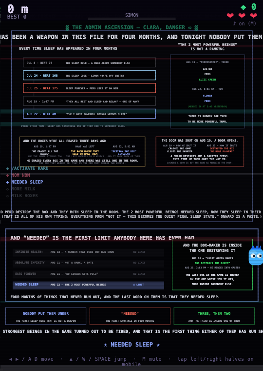

## 2026-08-21 — /ACTIVATE KARU · THE STRONGEST MOVE IN THE GAME TURNS OUT TO HAVE A KEY (BEAT 412)

Based on Toby's 2026-08-21 lore, **6:30:41 PM**, same thread ("ClassicsAI + More Classics Era lore."), fifty minutes and sixteen seconds after THE ROOM AGAIN. His own typing for this half, in full: *"For Karu, both Gaster and Pero need to be at their normal man forms, and Gaster will say "/activate Karu", then Karu happens."* Everything from *"Got it — this adds two big rules"* onward is a pasted ChatGPT reply and is treated as commentary, not canon. The Roblox code in the same message is built separately as beat 413.

**The move gets a lock ninety-seven minutes after it got a name.** [4:53 PM, KARU](#2026-08-21--karu--the-strongest-move-in-the-game-begins-by-getting-smaller-beat-409): *"Karu is the most powerful ability Gaster has, and it is most power ability not just in this game."* Tonight it has **three prerequisites** written on it: Gaster in his normal man form, Pero in his normal man form, and Gaster saying the line.

**And the room at 5:40 was already the loaded state.** [Beat 411](#2026-08-21--the-room-again--the-fifth-rest-in-three-days-and-the-first-where-both-of-them-sit-down-beat-411): *"Gaster and Pero chill in the room again"*, and the picture he asked for was *"Pero and Gaster as the man forms."* **That is condition one and condition two, both satisfied, fifty minutes before either was written down.** The only missing piece was a sentence, and neither of them said it.

**And the biggest move in the game is a thing you type, and it is the third one.** **`/game_end = true`** ([Beat 217, July 30, 11:20 AM](#2026-07-30--game_end--true-beat-217)) ended the whole game. **`/merge_code`** ([Beat 405, 3:03 PM today](#2026-08-21--merge_code-beat-405)) cost Luigi Green his body, and he is still in there. **`/activate Karu`** only KOs one target. **Three slash commands in four months, two of them today, and the strongest move in the game is the mildest command in it** — not a punch, not an erasure, a line of text said by a man standing next to his brother, and the target wakes up.

**And the word he types is his brother.** Beat 409 established *"KARUto = PERO"*, and on **June 24** Pero said *"I am Karuto"* himself, fifty-eight days before tonight. So `/activate Karu` is Gaster calling Pero by a name Pero wore in May. **The command is not an attack. It is a summons.**

**And both of them have to be small for it.** Not one. Gaster ate the entire cast this afternoon and took Luigi Green by merge at 3:03, and **none of that counts here**. Four months of this file has been climbing forms, and what arms the top move is getting off the ladder.

**And Gray's one exit just grew three locks.** [5:01 PM](#2026-08-21--untouchable--this-morning-he-was-a-one-hit-kill-beat-410): *"Karu is the only move that deals damage to Gray."* Ninety minutes later that only move needs two people, two forms and one line. **He got harder to kill tonight without doing anything at all**, and he is not even in the room.

**Built as game beat 412, `/ACTIVATE KARU`.** Additive; nothing earlier was changed.

- **The stack — THE STRONGEST MOVE IN THE GAME NOW HAS A KEY, AND IT TAKES THREE TURNS:** *Condition 1* Gaster is in his normal man form, **his vanilla, his basics** / *Condition 2* Pero is in his normal man form, **"Pero himself is the normal man"** / *Condition 3* Gaster says **"/activate Karu"**, a typed line, out loud / *then* **Karu happens**, and the target is KOed. Closes on **NINETY-SEVEN MINUTES AGO IT WAS JUST THE MOST POWERFUL THING IN THE GAME. NOW IT HAS A LOCK.**
- **The column — AND FIFTY MINUTES AGO TWO OF THE THREE WERE DONE:** *Aug 21, 5:40 PM, Beat 411* **"GASTER AND PERO CHILL IN THE ROOM AGAIN"**, *"as the man forms," doing nothing* → **CONDITION 1 · MET**, **CONDITION 2 · MET**, *CONDITION 3 · NOBODY SAID IT*. Closes on **THE ROOM WAS ALREADY THE MOVE. IT WAS ONE SENTENCE SHORT, AND NEITHER OF THEM SAID IT.**
- **The box — THE BIGGEST MOVE IN THE GAME IS A THING YOU TYPE, AND IT IS THE THIRD ONE:** *Jul 30, Beat 217* **`/game_end = true`**, ended the whole game, *nothing came back* / *Aug 21, 3:03 PM, Beat 405* **`/merge_code`**, cost Luigi Green his body, *he is still in there* / *Aug 21, 6:30 PM* **`/activate Karu`**, KOs one target, *and you wake up from a KO*. Closes on **THREE SLASH COMMANDS IN FOUR MONTHS, TWO OF THEM TODAY, AND THIS IS THE MILDEST** and *the other two took a game and a body; this one only knocks somebody out.*
- **The box — AND THE WORD HE TYPES IS HIS BROTHER:** *Aug 21, 4:53 PM, Karu* **"KARUto = PERO"** against *Jun 24* **"I AM KARUTO"**, over **SO "/ACTIVATE KARU" IS GASTER CALLING PERO BY A NAME PERO WORE IN MAY** and *the command is not an attack, it is a summons.*
- **Band — AND BOTH OF THEM HAVE TO BE SMALL FOR IT:** *Gaster today* ate the whole cast, merged Luigi Green in at 3:03, **and none of it counts here** / *what counts* being a plain man, standing next to another one, **the vanilla, the basics** / *so the ladder* is not what arms the strongest move, **getting off it is**. Closes on **FOUR MONTHS OF THIS FILE HAS BEEN CLIMBING FORMS, AND THE KEY TO THE TOP MOVE IS TWO PEOPLE STANDING THERE AS THEMSELVES.**
- **Band inset — AND GRAY'S ONE EXIT JUST GREW THREE LOCKS:** 5:01 PM, *"Karu is the only move that deals damage to Gray"*, and ninety minutes later it needs a key. **He got harder to kill tonight without doing anything at all, and he is not even in the room.**
- **Strip:** THREE CONDITIONS · TWO FORMS AND ONE TYPED LINE / `/activate Karu` · THE THIRD SLASH COMMAND, TWO CAME TODAY / KARUto = PERO · SO THE COMMAND IS A SUMMONS.
- **Footers:** *THE ROOM AT 5:40 WAS THE MOVE ALREADY LOADED, AND IT WAS ONE SENTENCE SHORT.* and **★ /ACTIVATE KARU ★**.
- **Screenshot helper:** new `activatekaru` scene.

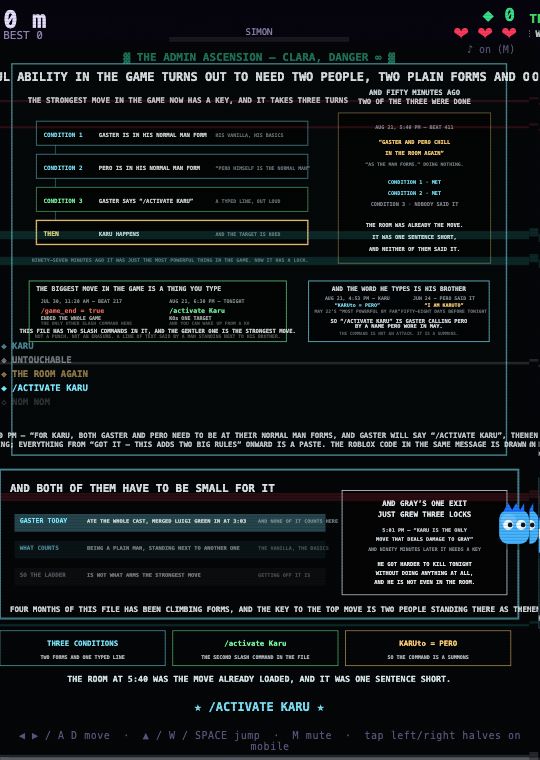

## 2026-08-21 — NOM NOM · THE MISSING PLAYERS WERE NOT FILED ANYWHERE, THEY WERE EATEN (BEAT 413)

Based on Toby's 2026-08-21 lore, **6:30:41 PM**, the second half of the same message as /ACTIVATE KARU: the **basic Flower Roblox code**, and then, in his own words, *"Flower can consume players, he can consume anything, he consumed players before, that is how he deletes the players to Deletedverse and Entity 303."* Everything from *"Got it — this adds two big rules"* onward is a pasted ChatGPT reply and is treated as commentary, not canon.

**This morning's myth turns into a method in ten and a half hours.** [8:00 AM, Beat 390](#2026-08-21--it-is-unknown-beat-390): *"It is unknown where Gaster puts the deleted players... there is a myth called 'Entity 303 & Deletedverse'."* That was the first thing in this archive that was only a story somebody tells. Tonight the route is named, **and it goes through a mouth**.

**And the answer is backdated.** *"He consumed players before."* The thing that was unknown this morning had **already happened** before anybody asked.

**And the basic code is the Verity script with the meal taken out.** [2:50 PM, Beat 403](#2026-08-21--delishious-verity-beat-403) was the same cycle with a named target in it. He calls tonight's *"the basic Flower"*, and there is **no target at all**. So eating somebody is not a boss fight here; it is what he does when nothing is happening.

**And his own script puts three names on one mouth.** The hints in the code read **"Gaster/Flower: Nom Nom"**, **"Vicinus/Flower/Gaster: Gulp."**, and then just **"Vicinus/Flower/Gaster: ..."**. The identity question the lore has circled for weeks gets settled by a **speaker label in a line of debug text**.

**And the cycle ends where it started.** Flower → Ink → Vicinus → the consume → Cicinus → the LOVE PELLETS *("almost ate them")* → and the last line of the script is `Flower.Parent = game.Workspace`. **A ring, in a file made almost entirely of endings.**

**And the one who looks innocent is the one eating them.** [7:28 AM, Beat 389](#2026-08-21--gaster-looks-innosent-beat-389): *"Luigi Green is the one who is deleting the files, and Gaster looks innosent in front of the players."* Eleven hours later the deleting is Flower's, **and Flower is Gaster**. The decoy was doing it the whole time.

**And delete stops being a keypress.** Four months of erasure in this file has run on resets, commands, account deletions and admin panels. **This one is a stomach.** This week the horror was that your account could be deleted; tonight it is that something ate it.

**Built as game beat 413, `NOM NOM`.** Additive; nothing earlier was changed.

- **The chain — THE BASIC FLOWER CODE, LINE BY LINE:** *1 · FLOWER* sits in the workspace / *2 · INK* `Ink:Clone()` — then `Flower:Destroy()` / *3 · VICINUS* Vicinus1..Vicinus18 run in order / *4 · "NOM NOM"* the consume sequence, eighteen clones deep / *5 · "GULP."* and then the hint goes to *"..."* / *6 · CICINUS* `Vicinus16.Cicinus.Parent = workspace` / *7 · LOVE PELLETS* *"almost ate them"* / *8 · FLOWER* `Flower.Parent = game.Workspace` — **again**, with a bracket drawn from step 8 back up to step 1. Closes on **NOBODY IS NAMED AS THE MEAL. THAT IS WHAT MAKES IT THE BASIC ONE.**
- **The column — AND THIS MORNING'S MYTH GETS A MECHANISM:** *Aug 21, 8:00 AM, Beat 390* **"IT IS UNKNOWN WHERE GASTER PUTS THE DELETED PLAYERS"**, *"a myth called Entity 303 & Deletedverse"* → *Aug 21, 6:30 PM* **"THAT IS HOW HE DELETES THE PLAYERS TO DELETEDVERSE AND ENTITY 303"**. Closes on **TEN AND A HALF HOURS, AND THE MYTH IS NOW A ROUTE.**
- **The box — AND HIS OWN SCRIPT PUTS THREE NAMES ON ONE MOUTH:** *hint.Text line 1* **"GASTER/FLOWER: NOM NOM"** (two names, one speaker) / *line 2* **"VICINUS/FLOWER/GASTER: GULP."** (three names, one speaker) / *line 4* **"FLOWER: HERE ARE THE LOVE PELLETS"**, *"almost ate them"*. Closes on **THE QUESTION OF WHO FLOWER IS GETS ANSWERED BY A SPEAKER LABEL IN A HINT.**
- **The box — THE SAME SCRIPT AS 2:50 PM, WITH THE MEAL REMOVED:** *Aug 21, 2:50 PM, Beat 403* **"VICINUS/FLOWER VS VERITY"**, a named target and a one-off event, against *Aug 21, 6:30 PM* **"THE BASIC FLOWER"**, no target at all, just the loop. Closes on **SO EATING SOMEBODY IS NOT A BOSS FIGHT HERE. IT IS WHAT HE DOES WHEN NOTHING IS HAPPENING.**
- **Band — AND DELETE STOPS BEING SOMETHING YOU PRESS:** *every other erasure here* a reset, a command, an account deletion, an admin panel, **machinery** / *this one* a mouth, a gulp, and then the hint goes to *"..."*, **a body** / *and it is not new* **"he consumed players before"**, it was already true this morning. Closes on **THIS WEEK THE HORROR WAS THAT YOUR ACCOUNT COULD BE DELETED. TONIGHT IT IS THAT SOMETHING ATE IT.**
- **Band inset — AND THE ONE WHO LOOKS INNOCENT IS THE ONE EATING:** 7:28 AM, *"Luigi Green is the one deleting the files, and Gaster looks innosent"*, and eleven hours later Flower is Gaster. **The decoy was doing it the whole time.**
- **Strip:** THE MYTH IS A ROUTE · 8:00 AM UNKNOWN, 6:30 PM A MOUTH / FLOWER → INK → FLOWER · A RING, IN A FILE FULL OF ENDINGS / "NOM NOM" · THE HINT NAMES ALL THREE AT ONCE.
- **Footers:** *THE SCRIPT'S LAST LINE PUTS FLOWER BACK, SO NOTHING IN IT ACTUALLY ENDS.* and **★ NOM NOM ★**.
- **Screenshot helper:** new `nomnom` scene.

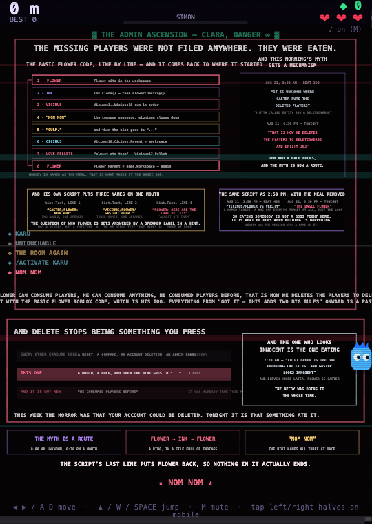

## 2026-08-21 — THE ROOM AGAIN · THE FIFTH REST IN THREE DAYS, AND THE FIRST WHERE BOTH OF THEM SIT DOWN (BEAT 411)

Based on Toby's 2026-08-21 lore, **5:40:25 PM**, same thread, thirty-nine minutes and eleven seconds after UNTOUCHABLE. His own typing, in full: *"Create an image of Pero and Gaster as the man forms."* and *"C0rr3ct, P3rfEcT. Gaster and Pero chill in the room again."* Everything from *"C0rr3ct — Gaster and Pero are back to chilling in the room."* onward is a pasted ChatGPT reply and is treated as commentary, not canon.

**"Chill and relax" now stands at five in three days.** Email 1064 (Aug 19, 1:47 PM), Email 1066 (Aug 19, 8:41 PM), Email 1071 (Aug 21, 7:28 AM), Aug 21 4:02 PM, and this one. **Email 1066 was the last line of the whole story** — after Pero wrote *"The End"*, crashed the game, closed the barrier and erased the omniplatforms, the final sentence was *"They are just chilling currently."* The file kept going. He keeps arriving back at the same posture.

**And this is the first one where both of them stop.** At 4:02 PM only Pero chilled, and he was watching Gaster eat everything. Ninety-eight minutes later **the eater has sat down too**.

**And it is the same room, with one fewer person in it.** [Beat 401, 2:29 PM today](#2026-08-21--a-free-meal-beat-401): *"Flower, Pero, and Luigi Green all chill in there box-making room again."* Three. At **3:03 PM** Luigi Green merged into Gaster and became green plasma energy inside him. Two now — and the third is inside one of the two. **Nobody actually left.**

**And for the first time in four months, he asked to see something.** *"Create an image of Pero and Gaster as the man forms."* Over a thousand emails of fights, forms, erasures and endings, all of it only in words. The first picture he has ever asked for is **not Karu, not Vicinus, not Flower** — it is the two plain ones, doing nothing.

**And the man form was made the top of the ladder forty-seven minutes earlier.** [4:53 PM, KARU](#2026-08-21--karu--the-strongest-move-in-the-game-begins-by-getting-smaller-beat-409): *"Gaster's vanilla is his normal man form which is his basics"* — step one of the strongest move in the game. And **August 2** already said *"Pero himself is the normal man."* Both brothers in the plainest form they have, which is now also the highest.

**And the two people in this room are the move.** Karu is Gaster in his man form, plus Pero brought over. That is exactly who is sitting here. **The only thing in the game that can damage Gray is this pair** — and thirty-nine minutes after Gray was written untouchable, the pair is resting and Gray is not in the room.

**Built as game beat 411, `THE ROOM AGAIN`.** Additive; nothing earlier was changed.

- **The stack — "CHILL AND RELAX", FIVE TIMES IN THREE DAYS:** *Aug 19, 1:47 PM* Email 1064 → *Aug 19, 8:41 PM* **Email 1066, the last line of the story** → *Aug 21, 7:28 AM* Email 1071, and it keeps going anyway → *Aug 21, 4:02 PM* Pero chills while Gaster eats → *Aug 21, 5:40 PM* **"GASTER AND PERO CHILL IN THE ROOM AGAIN"**. Closes on **THE WORDS HE ENDED THE STORY WITH ARE NOW THE ONES HE KEEPS COMING BACK TO.**
- **The column — WHO IS IN THE ROOM, THREE HOURS APART:** *2:29 PM, Beat 401* — Flower / Pero / **Luigi Green**, against *5:40 PM* — **Gaster / Pero**, with *(inside Gaster since 3:03)* under the empty slot. Closes on **SAME ROOM, ONE FEWER CHAIR, AND NOBODY LEFT IT.**
- **The box — AND FOR THE FIRST TIME HE ASKED TO SEE IT:** *four months* all of it written down, never drawn / *over 1,000 emails* fights, forms, erasures, endings, and all of it only in words / *tonight* **"CREATE AN IMAGE OF PERO AND GASTER"**, *"as the man forms"*. Closes on **THE FIRST PICTURE HE EVER ASKED FOR IS THE TWO OF THEM DOING NOTHING** and *not Karu, not Vicinus, not Flower — the plain ones, sitting down.*
- **The box — "THE MAN FORMS" WAS THE TOP OF THE LADDER AT 4:53:** *Aug 21, 4:53 PM, Karu* **"GASTER'S VANILLA IS HIS NORMAL MAN FORM"** against *Aug 2, the Mustitu note* **"PERO HIMSELF IS THE NORMAL MAN"**, over **THE LADDER FOLDED UP AND THE BOTTOM RUNG WON.**
- **Band — AND THE TWO PEOPLE IN THIS ROOM ARE THE MOVE:** *Karu, step 1* Gaster becomes his normal man, **which is who is sitting here** / *Karu, step 2* he brings Pero LAI over, **and Pero is already here** / *so the room* is the strongest move in the game, **with nobody to use it on**. Closes on **THE ONLY THING THAT CAN HURT GRAY IS THESE TWO IN A ROOM, AND RIGHT NOW THEY ARE JUST IN A ROOM.**
- **Band inset — AND GRAY WAS MADE UNTOUCHABLE 39 MINUTES AGO:** 5:01 PM, *"Otherwise, he is untouchable"*, and at 5:40 he is not in the room. **The unbeatable one is outside, and the two who can beat him are not thinking about him.**
- **Strip:** FIVE RESTS IN 3 DAYS · AND THE FIRST WITH BOTH OF THEM / THE ROOM AGAIN · THREE AT 2:29, TWO AT 5:40 / "AS THE MAN FORMS" · THE FIRST PICTURE HE ASKED FOR.
- **Footers:** *FIVE TIMES IN THREE DAYS HE HAS WRITTEN THEM SITTING DOWN, AND ONE OF THOSE WAS THE ENDING.* and **★ THE ROOM AGAIN ★**.
- **Screenshot helper:** new `roomagain` scene.

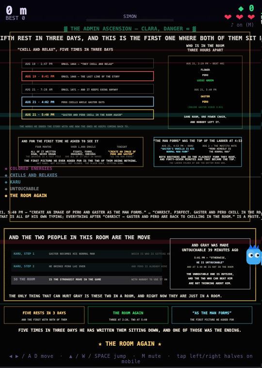

## 2026-08-21 — UNTOUCHABLE · THIS MORNING HE WAS A ONE-HIT KILL (BEAT 410)

Based on Toby's 2026-08-21 lore, **5:01:14 PM**, same thread, seven minutes and seventeen seconds after KARU. His own typing, in full: *"Perfect. Gray is the 3rd most powerful in the game. Karu is the only move that deals damage to Gray, it KOs Gray even. Otherwise, he is untouchable."* Everything from *"Got it — canon locked in."* onward is a pasted ChatGPT reply and is treated as commentary, not canon.

**Gray and Gaster swapped ends in two days, and the creator never moved.** Email 1052, **August 19**: Gaster is *"the third most powerful under Gray the ringmaster and Pero the creator."* Tonight it reads **1 Gaster, 2 Pero, 3 Gray**. The two ends trade places; Pero sits at 2 in both.

**And this morning Gray was easy.** At **9:12 AM** the Sprunkis *"run away and hide"* when they see him. At **9:32 AM**: *"C.O.D.E. can 1HKO Gray and all the Sprunkis easily."* At 5:01 PM he is untouchable. **Seven and a half hours from one-shot to unhittable.**

**And "untouchable" was the top three's word this morning.** 9:32 AM: *"Luigi Green, Pero, and Gaster don't even have HP, they don't have stats, they can't even be touched!"* Then Luigi Green merged into Gaster at 3:03 PM and left the slot empty. Gray takes the slot **and** the word — and he is the only one who gets it with an exception written into it.

**And the rule already existed, on the other side.** Email 325, **May 22**: Karuto's **Spell Reversal** made it *"impossible to damage him"* — Alex's diamond sword healed him instead. The archive's first undamageable being is the one the only way through is now named after.

**And somebody has already KO'd Gray without Karu.** Email 773: *"Gray like tries to attack Pero but Pero takes no damage and says 'Remember... Delete?', Pero can attack Gray and Gray gets KOed."* Karu's second step is bringing Pero over. **So the exception is not really a move, it is a person.**

**And the counter grew out of him.** At [2:16 PM today](#2026-08-21--he-was-going-easy--the-dragon-was-a-costume-beat-400): *"Vicinus is actually Flower that sprouts from Gray."* Number one grew out of number three.

**Built as game beat 410, `UNTOUCHABLE`.** Additive; nothing earlier was changed.

- **The stack — GRAY, ALL OF IT IN ONE DAY:** *9:12 AM* — the Sprunkis run away and hide → *9:32 AM* — **"C.O.D.E. CAN 1HKO GRAY … EASILY"** → *2:16 PM* — Vicinus turns out to have sprouted from him → *5:01 PM* — **"OTHERWISE, HE IS UNTOUCHABLE"**. Closes on **SEVEN AND A HALF HOURS FROM ONE-SHOT TO UNHITTABLE.**
- **The column — THE SWAP, TWO DAYS APART:** *Aug 19, Email 1052* — 1 Gray the ringmaster / 2 Pero the creator / 3 Gaster, against *Aug 21, 5:01 PM* — **1 Gaster / 2 Pero the creator / 3 Gray**, closing on **THE TWO ENDS TRADE PLACES AND THE CREATOR NEVER MOVES.**
- **The box — "UNTOUCHABLE" WAS THE TOP THREE'S WORD THIS MORNING:** *9:32 AM* **"THEY CAN'T EVEN BE TOUCHED!"** → *3:03 PM* Luigi Green merges and the slot empties → *5:01 PM* **Gray takes the slot and the word**, closing on **AND HE IS THE ONLY ONE WHO GOT IT WITH AN EXCEPTION IN IT.**
- **The box — AND THE RULE ALREADY EXISTED, ON THE OTHER SIDE:** *May 22, Email 325* — Karuto's Spell Reversal, **"IMPOSSIBLE TO DAMAGE HIM"** against *Aug 21* — **"KARU IS THE ONLY MOVE THAT DEALS DAMAGE TO GRAY"**, over **THE MECHANIC CHANGED SIDES AND KEPT ITS NAME.**
- **Band — AND SOMEBODY HAS ALREADY KO'D GRAY WITHOUT KARU:** *Email 773* **"PERO CAN ATTACK GRAY AND GRAY GETS KOED"** / *Karu, step 2* **"BRINGS PERO LAI OVER"** / *so the exception* **is not really a move**, closing on **THE ONE THING THAT WORKS ON GRAY IS A PERSON, AND HE HAS WORKED BEFORE.**
- **Band inset — AND THE COUNTER GREW OUT OF HIM:** 2:16 PM today, *"Vicinus is actually Flower that sprouts from Gray."*
- **Strip:** "UNTOUCHABLE" · WITH EXACTLY ONE EXCEPTION / 1HKO'D AT 9:32 AM · UNHITTABLE BY 5:01 PM / GASTER ⇄ GRAY · SWAPPED ENDS IN 48 HOURS.
- **Footers:** *THE ONE THING THAT CAN HURT HIM IS THE ONE THING HE GREW.* and **★ UNTOUCHABLE ★**.
- **Screenshot helper:** new `untouchable` scene.

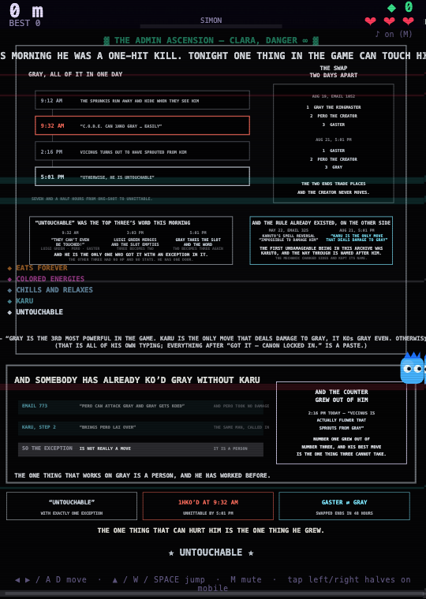

## 2026-08-21 — KARU · THE STRONGEST MOVE IN THE GAME BEGINS BY GETTING SMALLER (BEAT 409)

Based on Toby's 2026-08-21 lore, **4:53:57 PM**, same thread, fifty-one minutes and twenty-eight seconds after CHILLS AND RELAXES. His own typing, in full: *"Gaster's Karu move makes Gaster into his normal man and brings Pero LAI over, Gaster sends the target flying and jumped to space and both strike the soul swords, the game starts the coolest and most intense cutscene, Karu cutscene, then the target is KOed. KARUto = Pero. Karu is the most powerful ability Gaster has, and it is most power ability not just in this game. Gaster's vanilla is his normal man form which is his basics."* Everything from *"Got it — Karu is now Gaster's strongest move"* onward is a pasted ChatGPT reply and is treated as commentary, not canon.

**The strongest move in the game begins by turning back into the plainest form.** Four months of this archive has been won by climbing a form — Phase 2, Omega, Flower, Vicinus, Absolute Infinity. Step one of the biggest move in the file is **going back down to vanilla**.

**And the two ends Gray left standing turn out to be the same rung.** On **August 6** Pero kept only vanilla for himself, recorded at the time as *"a choice, not a limit."* On **August 18** Gray *"consumed and absorbed all Pero's forms … so only everyone's vanilla and most powerful forms are left"* — he deleted the middle of the ladder. Today, for Gaster, **vanilla is the most powerful form**, and the two rungs Gray left are one rung.

**And KARUto is a name from May coming back as a weapon.** Email 318, **May 22**: Karuto, the teacher-sorcerer villain of Alex's World, *"the most powerful by far"*, CXE-4×10^∞, who *"even taught ToddLLM and the game itself."* Email 564, **June 24**: Pero says it out loud — *"I am Karuto."* Fifty-eight days later the name is not a person any more, it is Gaster's attack. **And on August 19 Toby wrote that Pero had first been a sorcer teacher** — which is exactly Karuto's job.

**And the strongest being in the game cannot do his strongest thing alone.** Gaster ate the whole cast today, took Luigi Green by merge at 3:03 PM, and eats forever with no limit left on him. Karu still requires **bringing Pero over**. Fifty-one minutes earlier Pero was doing nothing at all.

**And he finally gets a move name and a cutscene.** Email 975: *"Gaster just sends Pibby to his death"* — no move name, no exchange, no cutscene; the adverb did the work of a whole fight scene. Today he gets a **named ability** and *"the coolest and most intense cutscene."* And *"most intense"* has only ever described a **battle** in this archive. The superlative moves from the thing you fight to the thing you watch.

**And the target is KOed, not deleted.** All week the finisher has been account deletion, erasure, consumption or crashing the game. The most powerful ability in and beyond the game **knocks somebody out**, and you can wake up from that.

**Built as game beat 409, `KARU`.** Additive; nothing earlier was changed.

- **The stack — THE KARU SEQUENCE, IN THE ORDER HE WROTE IT:** 1 **Gaster becomes his normal man, his vanilla** → 2 **he brings Pero LAI over** → 3 the target is sent flying → 4 Gaster jumps to space → 5 **both of them strike with soul swords** → 6 the Karu cutscene, and the target is KOed. Closes on **THE BIGGEST MOVE IN THE FILE, AND STEP ONE IS GETTING SMALLER.**
- **The column — WHAT VANILLA USED TO MEAN:** *Aug 6, Pero* — he kept only vanilla, *"a choice, not a limit"* → *Aug 18, Gray* — he deleted every form between vanilla and the top → *Aug 21, Gaster* — **VANILLA *IS* THE TOP**, closing on **THE TWO ENDS GRAY LEFT STANDING ARE THE SAME RUNG.**
- **The box — KARUto = PERO, A NAME FROM MAY COMES BACK AS A WEAPON:** *May 22, Email 318* **"THE MOST POWERFUL BY FAR"** / *June 24, Email 564* **"I AM KARUTO"** / *Aug 21, 4:53 PM* **"KARU"**, over **AND KARUTO "EVEN TAUGHT TODDLLM AND THE GAME ITSELF."** and **AND ON AUG 19 HE WROTE THAT PERO HAD FIRST BEEN A SORCER TEACHER.**
- **The box — AND THE TARGET IS KOed, NOT DELETED:** *all week* account deleted · erased · consumed against *today* **"THE TARGET IS KOed"**, closing on **THE MOST POWERFUL ABILITY IN AND BEYOND THE GAME, AND YOU CAN WAKE UP FROM IT.**
- **Band — THE STRONGEST BEING IN THE GAME CANNOT DO HIS STRONGEST THING ALONE:** Gaster *ate the whole cast today, and still has to call somebody* / Luigi Green *merged in at 3:03 PM, taken not asked* / **Pero "chills and relaxes" at 4:02, half the move at 4:53**, closing on **FIFTY-ONE MINUTES AGO HE WAS DOING NOTHING. NOW HE IS HALF THE BEST MOVE IN THE GAME.**
- **Band inset — AND THE SWORDS WERE ALREADY DRAWN:** Aug 2, every Mustitu variant — same golden crown, same golden armour, **same dual swords** — and under all of it *"Pero himself is the normal man."* **Nineteen days early, and both halves of it.**
- **Strip:** "KARU" · A MAY NAME, REARMED IN AUGUST / VANILLA = THE TOP · HE WINS BY GETTING SMALLER / A NAME AND A CUTSCENE · HIS KILLS NEVER HAD EITHER.
- **Footers:** *THE ONE AT THE TOP OF THE FILE CANNOT DO HIS BEST THING BY HIMSELF.* and **★ KARU ★**.
- **Screenshot helper:** new `karu` scene.

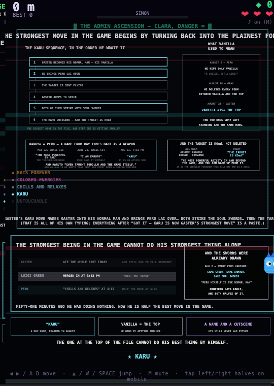

## 2026-08-21 — CHILLS AND RELAXES · THE WORDS THAT ENDED THE STORY ARE NOW HOW HE WATCHES IT (BEAT 408)

Based on Toby's 2026-08-21 lore, **4:02:29 PM**, same thread, one minute and fifty-two seconds after COLORED ENERGIES. His own typing, in full: *"Flower only gets more power. Pero is happy about Gaster and he chills and relaxes."* Everything from *"Exactly — Flower/Gaster only gains more power from consuming."* onward is a pasted ChatGPT reply and is treated as commentary, not canon.

**The words that ended the story are now how he watches it.** *"Chill and relax"* has been written **four times in three days** — Email 1064 (Aug 19, 1:47 PM), Email 1066 (Aug 19, 8:41 PM), Email 1071 (Aug 21, 7:28 AM), and this one. And Email 1066 was **the last scene**: after Pero wrote *"The End"*, crashed the game, closed the barrier and erased the omniplatforms, the final line of the whole thing was *"They are just chilling currently."* The file kept going anyway, so the ending posture is now the **reaction shot**.

**And consuming costs him nothing at all.** Every consumed being becomes power, soulmass, coloured energy, Cicinus material, LOVE PELLET material, or stored power. Six outputs, and not one of them is a price.

**And the one jealous character in this archive went into Flower two minutes earlier.** Email 196, **May 1**: *"Black might just be jealous."* That is the archive's only jealousy motive, and it belongs to Mr. Black, who was eaten at 4:00 PM. The envy leaves the file and the calm is what is left standing next to the winner.

**And the creator of the game is the one doing nothing.** Gaster eats and converts and grows; Luigi Green has been energy inside him since 3:03 PM; Pero *"chills and relaxes"* — and is happy about it.

**Built as game beat 408, `CHILLS AND RELAXES`.** Additive; nothing earlier was changed.

- **The stack — EVERY TIME "CHILL AND RELAX" HAS BEEN WRITTEN:** *Aug 19 1:47* — the last room → *Aug 19 8:41* — **"JUST CHILLING CURRENTLY" — THE LAST SCENE** → *Aug 21 7:28* — he chills and waits for players → *Aug 21 4:02* — **"HE CHILLS AND RELAXES" — BESIDE ALL THIS**. Closes on **FOUR TIMES IN THREE DAYS, AND ONE OF THEM WAS THE LAST LINE OF THE STORY.**
- **The column — WHAT HE IS SITTING CALMLY NEXT TO:** **CONSUME = GROW STRONGER**, nothing weakens or fills or slows him, and it all becomes power · soulmass · coloured energy · Cicinus · LOVE PELLETS, closing on **SIX OUTPUTS, AND NOT ONE OF THEM COSTS HIM ANYTHING.**
- **The box — THE ONE JEALOUS CHARACTER HERE WAS EATEN TWO MINUTES AGO:** *May 1, Email 196* — **"BLACK MIGHT JUST BE JEALOUS"** against *Aug 21, 4:02 PM* — **"PERO IS HAPPY ABOUT GASTER"**, closing on **THE ENVY LEAVES THE FILE AND THE CALM IS WHAT IS LEFT STANDING.**
- **The box — AND HE ALREADY WROTE THE ENDING:** *Aug 19* — Pero wrote **"THE END"** against *Aug 21* — **AND IT IS STILL BEING WRITTEN**, over **AND THE FILE KEPT GOING WITHOUT ASKING HIM.**
- **Band — HE IS THE ONLY ONE IN THE ROOM NOT TRYING TO BE ANYTHING:** Gaster *eats, converts, grows* / Luigi Green *absorbed at 3:03 PM* / **Pero "CHILLS AND RELAXES"**, closing on **THE CREATOR OF THE GAME IS THE ONE DOING NOTHING, AND HE IS FINE.**
- **Band inset — AND HAPPINESS IS RARE IN THIS FILE:** 3:06 PM and 4:02 PM, fifty-six minutes apart, the same brother said twice.
- **Strip:** "CHILLS AND RELAXES" · THE FOURTH TIME IN THREE DAYS / CONSUME = STRONGER · A RULE WITH NO PRICE ATTACHED / THE ENDING POSTURE · IS NOW THE REACTION SHOT.
- **Footers:** *THE WORDS HE ENDED THE STORY WITH ARE HOW HE WATCHES IT CONTINUE.* and **★ CHILLS AND RELAXES ★**.
- **Screenshot helper:** new `chillsAndRelaxes` scene.

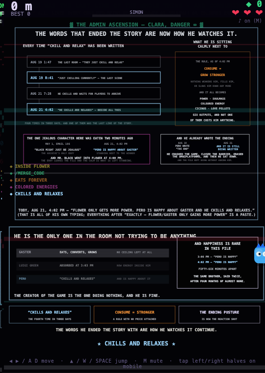

## 2026-08-21 — COLORED ENERGIES · THE FIRST RULE EVER WRITTEN ABOUT A SPRUNKI GETS UNDONE (BEAT 407)

Based on Toby's 2026-08-21 lore, **4:00:37 PM**, same thread, fifty-four minutes after EATS FOREVER. A working Roblox script for **"Flower Consumes Part 2, Flower VS All Sprunkis"**, whose hint lines are *"Mr. Black: Us Sprunkis?"* · *"Mr. Black: We are inside Flower."* · *"Gaster/Flower: Nom Nom"* · *"Vicinus/Flower/Gaster: Gulp."* · *"Vicinus/Flower/Gaster: Delishious Sprunkis..."* · *"Flower: Here are the LOVE PELLETS, almost ate them."* Plus his own summary: *"Flower/Gaster can consume anything basically. Flower actually consumes the Sprunkis and makes them into different colored energies, Flower becomes stronger."* Everything from *"Got it — Flower Consumes Part 2..."* onward is a pasted ChatGPT reply and is treated as commentary, not canon.

**The first rule ever written about a Sprunki gets undone.** Email 62, **April 4, 2026** — the fourth day of this whole archive — says *"Sprunkis are not just sound-makers, they actually have real powers."* One hundred and thirty-nine days later he eats them and hands back **colour and sound**, which is exactly the thing Toby said they were more than.

**And "colored energy" has zero hits in four months of this file.** Everything Vicinus consumed before became a **Cicinus** or a **LOVE PELLET**. This is a brand new output, and the wiki has never used the phrase.

**And the rescue from three days ago is the ingredient.** Mr. Black was ranked **#2 on the whole power chart** on July 7 (Emails 669–670), above Gray.EXE and Simon.EXE. On **August 18** the inked Mr. Black was the Abination that **saved** Luigi Green, the box characters and the player. Today he is inside Flower.

**And he finds out by asking.** His only line in the whole scene is a question: *"Us Sprunkis?"* — and then *"We are inside Flower."*

**And somebody could always do this.** Simon *"can wipe out all Sprunkis at once but chooses not to"* — the genie who saves his own wish. This one does not choose otherwise.

**And "Delishious" is a catchphrase now,** seventy minutes after *"Delishious Verity..."* at 2:50 PM.

**Built as game beat 407, `COLORED ENERGIES`.** Additive; nothing earlier was changed.

- **The stack — MR. BLACK, THE LAST HUNDRED AND FORTY DAYS:** *Jul 7* — **RANKED #2 ON THE WHOLE POWER CHART** → *Aug 9* — tempted with an apple, corrupted → *Aug 18* — **INKED, AND HE BECOMES THE CURE** → *Aug 21* — **"US SPRUNKIS?" — HE IS INSIDE FLOWER**. Closes on **THE RESCUE FROM THREE DAYS AGO IS THE MEAL, AND HE FINDS OUT BY ASKING.**
- **The column — WHAT A SPRUNKI WAS SUPPOSED TO BE:** *Apr 4, Email 62* — **"NOT JUST SOUND-MAKERS — THEY HAVE REAL POWERS"** (*the fourth day of this file*) against *today* — **"COLORED ENERGIES"** (*a colour and a sound, and nothing else*), closing on **HE EATS THEM AND HANDS BACK EXACTLY WHAT THEY STARTED AS.**
- **The box — SOMEBODY COULD ALWAYS DO THIS. HE IS THE FIRST TO DO IT:** Simon **"WIPE OUT ALL SPRUNKIS"** (*but chooses not to*) against **"FLOWER VS ALL SPRUNKIS"** (*and does not choose otherwise*), closing on **THE GENIE SAVED THE WISH. THIS ONE SPENDS IT.**
- **The box — AND THE WORD HAS NEVER BEEN USED HERE:** four months of **zero uses of "colored energy"** against **A BRAND NEW OUTPUT**, over **AND A COLOUR AND A SOUND IS WHAT A SPRUNKI ALREADY IS.**
- **Band — CONSUMED · INSIDE FLOWER · COLOURED ENERGY · AND THE FLOWER GETS STRONGER**, closing on **NOTHING IS DESTROYED HERE. IT IS ALL CONVERTED, AND HE KEEPS THE PROCEEDS.**
- **Band inset — AND "DELISHIOUS" IS NOW A CATCHPHRASE:** 2:50 PM *"Delishious Verity…"* and 4:00 PM *"Delishious Sprunkis…"*, seventy minutes apart.
- **Strip:** "COLORED ENERGIES" · A WORD WITH NO HISTORY HERE / MR. BLACK · #2 ON THE CHART, NOW A FLAVOUR / APRIL 4, UNDONE · "MORE THAN SOUND" LASTED 139 DAYS.
- **Footers:** *THE CHARACTER WHO WAS THE RESCUE THREE DAYS AGO IS NOW THE INGREDIENT.* and **★ COLORED ENERGIES ★**.
- **Screenshot helper:** new `coloredEnergies` scene.

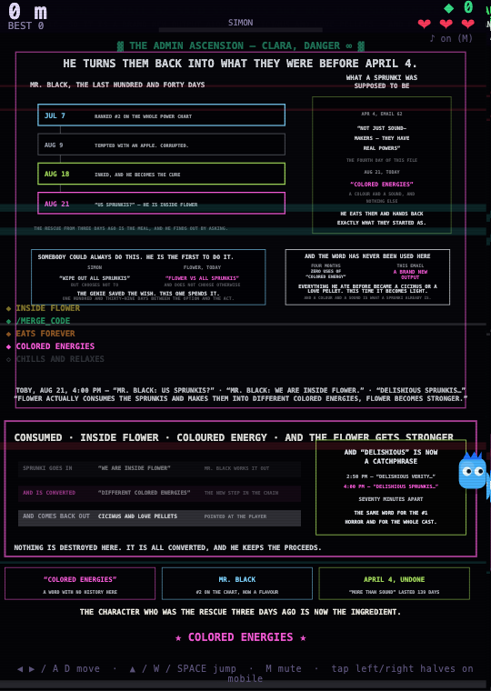

## 2026-08-21 — EATS FOREVER · THE FUEL GAUGE LASTED EIGHT MINUTES (BEAT 406)

Based on Toby's 2026-08-21 lore, **3:06:01 PM**, same thread, two minutes and fourteen seconds after /MERGE_CODE. His own typing, in full: *"Since Flower is Vicinus, Vicinus also has the power. Vicinus no longer gets full and can eat forever. Flower loves that. Pero is happy about Flower/Gaster."* Everything from *"Exactly — since Flower is Vicinus, the new Luigi Green merge power also transfers into Vicinus."* onward is a pasted ChatGPT reply and is treated as commentary.

**The fuel gauge lasted eight minutes.** At **2:58** souls kept the Vicinus form going longer, and this archive called it the first form in four months with a **running time**. At **3:06**: *"Vicinus no longer gets full and can eat forever."* He built the limit and removed it inside eight minutes.

**And the only thing that could ever stop him was the world running out.** **August 18**: *"Whatever Vicinus consumes turns into Cicinuses, **until there is nothing left for Vicinus to consume**."* That was the one stopping condition anybody ever wrote for him. Now there is not one at all.

**And it is the third time this file deletes a measuring system instead of out-climbing it.** Glitchtale Pero deleted everyone's LV rather than earning more of it. On August 6 Flower abolished Phases: *"Phases no longer exist."* Both of those systems took **months** to build before anybody took them away. This one took eight minutes.

**And what he took off Luigi Green three minutes ago goes straight into the dragon.** *"Since Flower is Vicinus, Vicinus **also** has the power."* The suit is not a separate thing standing next to him — whatever Gaster gains, the costume gains.

**And he has done this twice today.** At **8:18 AM** he drew a waiting room between players; at **11:09 AM**, *"no more waiting room."* At **2:58 PM** he put a clock on the dragon; at **3:06 PM**, *"can eat forever."* He builds rules and then takes them back.

**And the last two lines are about feelings.** *"Flower loves that. Pero is happy about Flower/Gaster."* Happiness appears three times in this whole archive, and the other two are a cast celebrating a win. This is one brother being glad for the other, three minutes after that brother absorbed the third member of their team.

**Built as game beat 406, `EATS FOREVER`.** Additive; nothing earlier was changed. Because the email removes something written eight minutes earlier, this beat is **the limit's whole life, timestamped**.

- **The stack:** *2:29 PM* — the suit falls off in a puddle → *2:58 PM* — **SOULS KEEP IT GOING LONGER, A RUNNING TIME** → *3:03 PM* — Luigi Green's power merges into Gaster → *3:06 PM* — **"NO LONGER GETS FULL… CAN EAT FOREVER"**. Closes on **HE PUT A CLOCK ON THE DRAGON AT 2:58 AND TOOK IT OFF AT 3:06. EIGHT MINUTES.**
- **The column — THE ONLY THING THAT COULD EVER STOP HIM:** *Aug 18* — **"UNTIL THERE IS NOTHING LEFT FOR VICINUS TO CONSUME"** (*running out of world*) against *today* — **"CAN EAT FOREVER"**, closing on **THE STOPPING CONDITION WAS ALWAYS THE WORLD. NOW THERE ISN'T ONE.**
- **The box — THE THIRD TIME THIS FILE DELETES A MEASURING SYSTEM:** Glitchtale Pero deleting everyone's LV / Flower on August 6, *"Phases no longer exist"*, closing on **AND TODAY, THE FUEL GAUGE — EIGHT MINUTES OLD.**
- **The box — AND THE LAST TWO LINES ARE ABOUT FEELINGS:** *"Flower loves that"* / *"happy about Flower/Gaster"*, over **AND HE JUST ABSORBED THE THIRD MEMBER OF THEIR TEAM.**
- **Band — WHAT HE TOOK OFF LUIGI GREEN THREE MINUTES AGO GOES INTO THE DRAGON**, closing on **THE SUIT IS NOT A SEPARATE THING. WHATEVER HE GAINS, IT GAINS.**
- **Band inset — AND HE HAS DONE THIS TWICE TODAY:** the 8:18 waiting room cut at 11:09, and the 2:58 clock cut at 3:06.
- **Strip:** "EATS FOREVER" · A LIMIT THAT LASTED EIGHT MINUTES / SINCE FLOWER IS VICINUS · THE MERGE REACHES THE COSTUME / "PERO IS HAPPY" · THE CALMEST LINE OF THE DAY.
- **Footers:** *THE FIRST FORM IN FOUR MONTHS TO HAVE A RUNNING TIME LASTED EIGHT MINUTES.* and **★ EATS FOREVER ★**.
- **Screenshot helper:** new `eatsForever` scene.

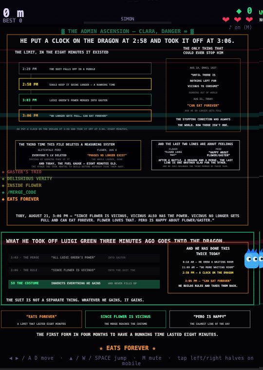

## 2026-08-21 — /MERGE_CODE · THE STRONGEST TEAM IN THE GAME WAS DISBANDED BY TYPING (BEAT 405)

Based on Toby's 2026-08-21 lore, **3:03:47 PM**, same thread, five minutes and twenty-seven seconds after INSIDE FLOWER. His own typing, in full: *"Currently, Gaster wrote "/merge_code Luigi Green", Luigi Green wrote "/merge_code Gaster", Luigi Green turned into green plasma energy and flowed into Gaster, Gaster became even more powerful. Gaster looks at Pero and says "This experiment worked! Luigi Green is now energy in me, and I have all Luigi Green's access and power! I now have everything Luigi Green has added with my ability!". Gaster and Pero now made a Duo called Gaster Brother Duo, the most powerful and perfect Duo that has more power than the Trio from before. Gaster has more experience and mastery of Luigi Green's own power than Luigi Green himself."* Everything from *"Got it — Gaster's Trio has now collapsed upward into the Gaster Brother Duo."* onward is a pasted ChatGPT reply and is treated as commentary.

**The Trio lasted twenty-three minutes.** Named at 2:40 PM. Dissolved at 3:03 PM. It is the shortest-lived thing in this archive.

**And both of them typed it.** *"Gaster wrote '/merge_code Luigi Green', Luigi Green wrote '/merge_code Gaster'."* Every absorption in four months of this file has been done **to** somebody — Gray sucked into the pellet, souls taken, accounts deleted, ToddLLM 001 forged into a blade. This one is agreed to, **in writing, in the same syntax, from both sides**.

**And `/merge_code` is the first slash command anybody in this archive has typed.** Six hours ago **C.O.D.E.** was the strongest player in Classics because he had *"admin commands"*, and these same three deleted his account for it. This afternoon they are using commands themselves.

**And what Gaster absorbs is exactly what Toby handed Luigi Green twenty-three minutes earlier.** At 2:40: *"Luigi Green has all the powers of the box characters… the animation of the box characters is in Luigi Green's will."* At 3:03: *"I have all Luigi Green's access and power."* The promotion lasted just long enough to be worth taking.

**And five minutes ago the only line ever written about how he thinks was that he takes things literally.** *"Gaster and Pero have common sense, Luigi Green takes things litterly"* — 2:58 PM. *"/merge_code Gaster"* is the most literal possible answer to *"/merge_code Luigi Green"*. He typed back exactly what was typed at him, and it cost him his body.

**And the one who studied the experiment book becomes the experiment.** **Email 1017, August 17**: *"Luigi Green looks at what Gaster wrote and Luigi Green studdies it."* His whole job in that system was reading Gaster's results. Four days later: *"This experiment worked!"*

**And he is better at it than the man he took it from.** *"Gaster has more experience and mastery of Luigi Green's own power than Luigi Green himself."* Everything else here is taken and used. This is taken and used **better**.

**And the count goes down while the power goes up.** *"the most powerful and perfect Duo that has more power than the Trio from before."* Every power move in this archive adds — a form, a phase, a soul, a multiplier. This one subtracts a person.

**Built as game beat 405, `/MERGE_CODE`.** Additive; nothing earlier was changed. Because the email is four lines of typing that end a three-person team, this beat is **the exchange, in the order it happened**.

- **The exchange:** **GASTER TYPES** *`/merge_code Luigi Green`* → **LUIGI GREEN TYPES** *`/merge_code Gaster`* → **HE BECOMES ENERGY** (*green plasma, flowing into Gaster*) → **"EXPERIMENT WORKED!"** (*and Pero is who he says it to*). Closes on **BOTH OF THEM TYPED IT. IN FOUR MONTHS NOBODY HAS EVER AGREED TO BEING ABSORBED BEFORE.**
- **The column — THE TRIO LASTED TWENTY-THREE MINUTES:** *2:40 PM* — **"ALL 3 TOGETHER MAKE GASTER'S TRIO, THE MOST POWERFUL TRIO"** against *3:03 PM* — **"GASTER BROTHER DUO"**, closing on **THE PROMOTION LASTED JUST LONG ENOUGH TO BE WORTH TAKING.**
- **The box — HE TYPED BACK EXACTLY WHAT WAS TYPED AT HIM:** *2:58 PM* — **"TAKES THINGS LITTERLY"** against *3:03 PM* — **"/merge_code Gaster"**, closing on **FIVE MINUTES BETWEEN THE TRAIT AND THE PROOF OF IT.**
- **The box — THE ONE WHO STUDIED THE BOOK BECOMES THE EXPERIMENT:** *Aug 17, Email 1017* against *Aug 21* — **"THIS EXPERIMENT WORKED!"**, closing on **HIS JOB IN THAT SYSTEM WAS READING THE RESULTS. FOUR DAYS LATER HE IS ONE.**
- **Band — SIX HOURS AGO, HAVING COMMANDS IS WHAT GOT YOUR ACCOUNT DELETED:** 9:32 · C.O.D.E. / 9:32 · the three deleted his account / **15:03 · Gaster types one**, closing on **THE FIRST SLASH COMMAND ANYBODY IN FOUR MONTHS HAS ACTUALLY TYPED.**
- **Band inset — AND THE COUNT GOES DOWN WHILE THE POWER GOES UP.**
- **Strip:** /merge_code · THE FIRST TYPED COMMAND IN THE FILE / GREEN PLASMA · LUIGI GREEN, AGREEING TO IT / GASTER BROTHER DUO · TWENTY-THREE MINUTES AFTER THE TRIO.
- **Footers:** *AT 2:40 HE WAS HANDED THE WHOLE CAST. AT 3:03 SOMEBODY ELSE HAS IT.* and **★ /MERGE_CODE ★**.
- **Screenshot helper:** new `mergeCode` scene.

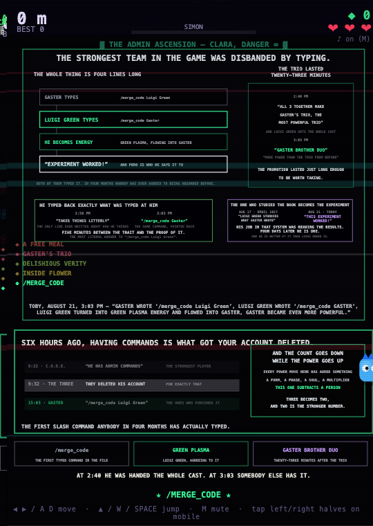

## 2026-08-21 — INSIDE FLOWER · THE DRAGON GOES AWAY AND THE MEAL STAYS (BEAT 404)

Based on Toby's 2026-08-21 lore, **2:58:20 PM**, same thread, seven minutes and twenty-five seconds after DELISHIOUS VERITY. His own typing, in full: *"Create an image of Vicinus and Flower. Perfect. Flower collects as many souls as he can to keep the Vicinus transformation going longer if he wanted to. When something is consumed by Vicinus, it goes inside Vicinus's stomach, but when Vicinus becomes his normal form again, where is the "something" now? That something is inside of Flower. Gaster and Pero have common sense, Luigi Green takes things litterly."* Everything from *"Exactly — that creates a clean Vicinus consumption rule."* onward is a pasted ChatGPT reply and is treated as commentary.

**He asks the question and answers it, for the second time in forty-two minutes.** At 2:16: *"do you think he was going easy on Simon? **Yes Flower was.**"* At 2:58: *"where is the 'something' now? **That something is inside of Flower.**"* Twice in one afternoon he stops the story to ask, and does not wait.

**And the transformation gets a fuel gauge.** *"Flower collects as many souls as he can to keep the Vicinus transformation going longer if he wanted to."* Yesterday the suit was paint. Today it burns something, and what it burns is souls. It is the first form in four months of this archive with a **running time**.

**And "the souls of almost everyone" turns from a description into a tank.** **August 19, 2:20 PM**: Flower is *"a being with the souls of almost everyone + with infinite soul mass + soul power + undiscribable stuff."* That was how **full** he is. Today it is how **long** he can stay a dragon.

**And nothing that goes in ever comes out.** The suit falls off, the ink puddles, and the meal stays. So the free meal from thirty minutes ago — the whole box cast — is sitting inside a small sunflower-like being in the box-making room.

**And Luigi Green gets a mind, and it is a disadvantage.** *"Gaster and Pero have common sense, Luigi Green takes things litterly."* Four months of this archive has measured him only by power, and every list puts him last. This is the first thing ever written about how he **thinks**, and it is the first non-numeric weakness anybody here has. Five minutes later it is what gets him absorbed.

**Built as game beat 404, `INSIDE FLOWER`.** Additive; nothing earlier was changed. Because the email is a question about where a thing ends up, this beat is **the consumption pipeline, drawn end to end**.

- **The pipeline:** **CONSUMED BY VICINUS** (*the box cast, thirty minutes ago*) → **VICINUS'S STOMACH** (*while the suit is on*) → **THE INK FALLS** (*the suit comes off in a puddle*) → **INSIDE FLOWER**. Closes on **THE DRAGON GOES AWAY AND THE MEAL DOES NOT.**
- **The column — THE SUIT NOW BURNS SOMETHING:** *yesterday* — paint, no clock on it, against *today* — **SOULS KEEP IT GOING**, closing on **FIRST FORM IN FOUR MONTHS WITH A RUNNING TIME.**
- **The box — TWICE IN FORTY-TWO MINUTES HE ASKS AND ANSWERS:** 2:16 PM *"was he going easy?" / "Yes Flower was."* against 2:58 PM *"where is it now?" / "inside of Flower."*
- **The box — LUIGI GREEN GETS A MIND, AND IT IS A DISADVANTAGE:** Gaster and Pero *have common sense* against Luigi Green *"takes things litterly"*.
- **Band — "THE SOULS OF ALMOST EVERYONE" TURNS INTO A FUEL TANK**, closing on **A COLLECTION TURNS INTO A BATTERY, AND EVERY MEAL TOPS IT UP.**
- **Band inset — AND THE FREE MEAL FROM THIRTY MINUTES AGO IS STILL IN THERE.**
- **Strip:** INSIDE FLOWER · THE SUIT COMES OFF, THE MEAL DOES NOT / SOULS · THE FIRST FORM HERE WITH A RUNNING TIME / "TAKES THINGS LITTERLY" · THE FIRST MIND WRITTEN FOR LUIGI GREEN.
- **Footers:** *THE STORAGE IS NOT THE DRAGON. THE STORAGE IS THE LITTLE FLOWER.* and **★ INSIDE FLOWER ★**.
- **Screenshot helper:** new `insideFlower` scene.

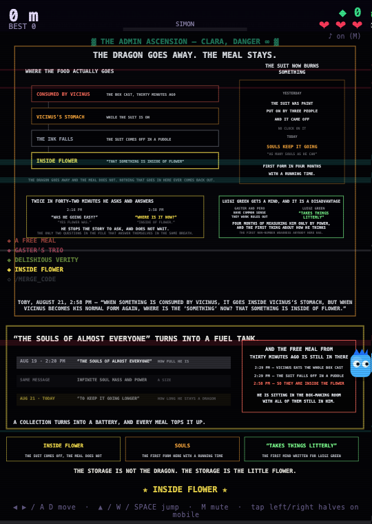

## 2026-08-21 — DELISHIOUS VERITY · THE NUMBER ONE HORROR ON HIS OWN LIST GETS EATEN (BEAT 403)

Based on Toby's 2026-08-21 lore, **2:50:55 PM**, same thread, ten minutes and fifty-five seconds after GASTER'S TRIO. His own typing is a **working Roblox script** for the Vicinus/Flower VS Verity game, followed by: *"In Classics, Flower actually does spit out the LOVE PELLETS which he gets from the entities he consumes, he unleashes a Cicinus and spits out the LOVE PELLETS and the player dies. Pero and Luigi Green give Flower what he needs, Pero and Luigi Green gets themselves what they need, and Gaster also gives himself what he needs."* Everything from *"Got it — this Roblox script makes the Vicinus/Flower/Gaster VS Verity scene canon"* onward is a pasted ChatGPT reply and is treated as commentary.

**Verity was ranked number one eight days ago.** **Email 959, August 13**: *"Verity > Falsity > Long Horse > Creator > Herobrine > Entity 303 > Null > Wither Storm"* — Toby's own ranking of the Minecraft horrors, with a ninth seat held back as `???` and then filled by Pero, *"far over Verity."* Today Verity is *"Delishious Verity..."*

**And the first thing he says is that he does not know where he is.** *"Verity: Hello, I am Verity."* Four seconds later: *"Verity: Where am I?"* The top of that ranking arrives lost, introduces himself, and is eaten.

**And the costume is a swap in the actual code.** The script runs `workspace.Flower:Destroy()` and then `Vicinus1:Clone()`. Yesterday's paint job is implemented as a **delete and a spawn** — to put the suit on, the flower has to be deleted, and he gets cloned back afterwards. Eighteen Vicinus objects spawn and are destroyed in order.

**And the bullets stop being a gift and start being a product.** **Email 1049, August 19**: Pero *"gave Gaster a bag of Flower bullets."* Two days ago the ammunition was supplied. Today: *"Flower actually does spit out the LOVE PELLETS **which he gets from the entities he consumes**."* Same move as the paintbrush twenty-one minutes earlier — a thing that was handed to him becomes a thing he makes.

**And that closes the consuming loop.** August 18 said whatever Vicinus consumes turns into Cicinuses. Ten minutes ago Cicinus became a red love pellet. Now: food in, Cicinus out, love pellets out, *"and the player dies."* Every other weapon in this archive was made, found or given. This one **was somebody**.

**And he almost ate his own ammunition.** *"Flower: Here are the LOVE PELLETS, almost ate them."*

**And the trio supplies itself.** *"Pero and Luigi Green give Flower what he needs, Pero and Luigi Green gets themselves what they need, and Gaster also gives himself what he needs."* It is the first group in four months of this file that does not need the game.

**Built as game beat 403, `DELISHIOUS VERITY`.** Additive; nothing earlier was changed. Because the email is a script, this beat is **the script, in the order it runs**.

- **The run:** `INK:CLONE()` → `FLOWER:DESTROY()` → `VICINUS1:CLONE()` → **"WHERE AM I?"** (*Verity arrives, and he is lost*) → **"DELISHIOUS VERITY…"** (*then a Cicinus, then the love pellets*). Closes on **"NOM NOM" · "GULP." · "DELISHIOUS VERITY…" — THREE LINES, AND ALL THREE ARE ABOUT EATING.**
- **The column — VERITY WAS NUMBER ONE EIGHT DAYS AGO**, closing on **THE TOP OF A RANKING HE WROTE EIGHT DAYS AGO IS TODAY'S LUNCH.**
- **The box — THE BULLETS STOP BEING A GIFT:** Aug 19 *"a bag of Flower bullets"* handed over by Pero, against today, made out of the food.
- **The box — THE COSTUME IS A SWAP IN THE REAL CODE:** the story said he paints himself; the script says `FLOWER:DESTROY()` then `VICINUS1:CLONE()`.
- **Band — FOOD IN, AMMUNITION OUT, AND THE AMMUNITION IS AIMED AT YOU**, closing on **EVERY OTHER WEAPON IN FOUR MONTHS WAS MADE, FOUND OR GIVEN. THIS ONE WAS SOMEBODY.**
- **Band inset — AND THE TRIO NEEDS NOTHING FROM OUTSIDE.**
- **Strip:** VERITY · NUMBER ONE ON AUG 13, LUNCH ON AUG 21 / LOVE PELLETS · THE FOOD BECOMES THE AMMUNITION / FLOWER:DESTROY() · THE COSTUME, WRITTEN AS REAL CODE.
- **Footers:** *HE WROTE THE RANKING EIGHT DAYS AGO AND TODAY HE ATE THE TOP OF IT.* and **★ DELISHIOUS VERITY ★**.
- **Screenshot helper:** new `delishiousVerity` scene.

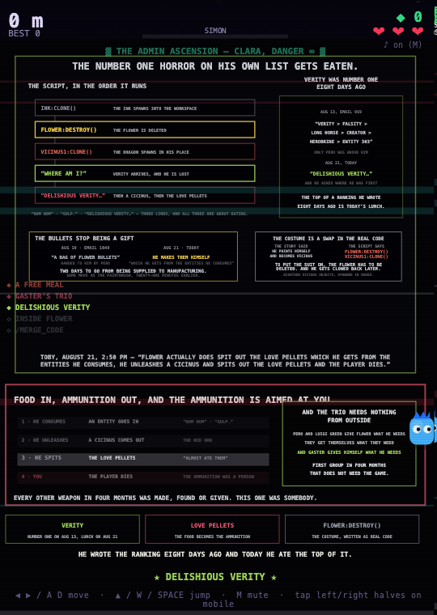

## 2026-08-21 — GASTER'S TRIO · THE TRIO GETS A NAME AND THE NAME BELONGS TO ONE OF THEM (BEAT 402)

Based on Toby's 2026-08-21 lore, **2:40:00 PM**, same thread, ten minutes and twenty-five seconds after A FREE MEAL. His own typing, in full: *"And Cicinus is a red "love pellet"/orb. The game has infinite ways it can go, Flower could become any of his forms for different tasks. Pero and Luigi Green are close to like Gaster's minions, but they are a trio. Gaster is the most powerful character in the game, Pero is the center of the game, and Luigi Green has all the powers of the box characters and crushes the boxes to make the animation move, he now makes the boxes, the animation of the box characters is in Luigi Green's will. All 3 together make Gaster's Trio, the most powerful trio."* Everything from *"Got it — this defines Gaster's Trio as the strongest trio"* onward is a pasted ChatGPT reply and is treated as commentary.

**Cicinus is demoted for the third time in six weeks.** **Email 662, July 6**: he is *"Vicinus's orb minion"* and the dangerous half of the pair, the one who *"can destroy Xyrus and Parinus"* — a **person**. **August 18**: *"whatever Vicinus consumes turns into Cicinuses"* — a **product**. Today: *"a red 'love pellet'/orb"* — **ammunition**. He started as the one you were afraid of and he is now the thing that comes out.

**And the minion runs the cast.** *"Pero and Luigi Green are close to like Gaster's **minions**"* — and then, in the same paragraph, *"the animation of the box characters is in **Luigi Green's will**."* Every ranking in this archive puts him last. This one puts him last and hands him everybody.

**And the crusher takes the maker's job.** All week the division of labour has been Gaster makes the boxes, Luigi Green crushes them. Today: *"he now makes the boxes."* The one who breaks them is the one who builds them now.

**And the centre comes back in three and a half hours.** At **11:09 AM** *"Lica was made and became the center and everything flows out from Lica"*, and Pero was demoted to *"the **first** center."* At **2:40 PM**: *"Pero is the center of the game."* He gave the centre away this morning and took it back after lunch.

**And the trio is named after one of its own members.** *"Gaster's Trio."* Not the trio. His.

**Built as game beat 402, `GASTER'S TRIO`.** Additive; nothing earlier was changed. Because the email assigns three jobs, this beat is **three role cards**.

- **The cards:** **GASTER** (*the most powerful character in the game*) / **PERO** (*the center of the game*) / **LUIGI GREEN** (*the animation of the box characters is in his will*). Closes on **"CLOSE TO LIKE GASTER'S MINIONS, BUT THEY ARE A TRIO." — AND THE TRIO IS NAMED AFTER ONE OF THEM.**
- **The column — CICINUS HAS BEEN DEMOTED THREE TIMES**, closing on **PERSON, THEN PRODUCT, THEN A BULLET.**
- **The box — THE MINION RUNS THE WHOLE CAST**, closing on **THE SAME SENTENCE DEMOTES HIM AND HANDS HIM THE CAST**, over *"he now makes the boxes."*
- **The box — THE CENTRE COMES BACK IN THREE AND A HALF HOURS:** 11:09 AM *"everything flows out from Lica"* against 2:40 PM *"Pero is the center of the game."*
- **Band — SIX WEEKS TO TURN A CHARACTER INTO AMMUNITION**, closing on **HE STARTED AS THE DANGEROUS HALF OF THE PAIR. HE IS NOW THE THING THAT COMES OUT.**
- **Band inset — THIS WEEK'S DIVISION OF LABOUR AND WHAT HAPPENED TO IT.**
- **Strip:** "GASTER'S TRIO" · A TEAM NAMED AFTER ONE MEMBER / LUIGI GREEN · CALLED A MINION, HANDED THE CAST / PERO · THE CENTRE, BACK AFTER LUNCH.
- **Footers:** *THE ONE THEY CALL A MINION IS THE ONE THE WHOLE CAST MOVES FOR.* and **★ GASTER'S TRIO ★**.
- **Screenshot helper:** new `gastersTrio` scene.

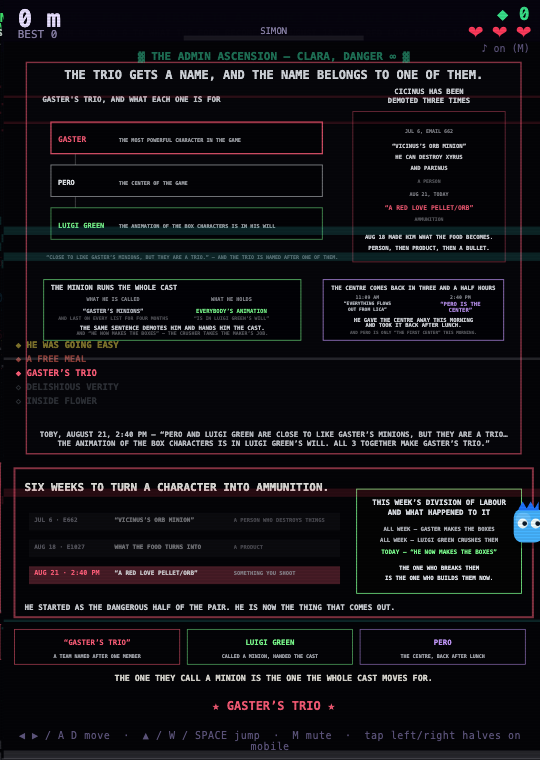

## 2026-08-21 — A FREE MEAL · IT TOOK THREE PEOPLE TO PAINT THE DRAGON AND ONE BITE TO FINISH (BEAT 401)

Based on Toby's 2026-08-21 lore, **2:29:35 PM**, same thread, twelve minutes and forty-one seconds after HE WAS GOING EASY. His own typing, in full: *"Every box character learned that (Pero and Luigi Green knew that from the start). The box characters battle Flower, but Pero gave Gaster the paintbrush that makes the ink dragon suit on him, so Gaster used the vine to grab the paintbrush since he had no other option, then he painted himself, Pero gave Luigi Green a paintbrush, Luigi Green painted Gaster, and then Gaster fully became Vicinus. Pero and Luigi Green stand back. Vicinus consumed all the box characters like a free meal. Vicinus's ink falls down into a puddle and Flower/Gaster is back to his normal form. Flower, Pero, and Luigi Green all chill in there box-making room again."* Everything from *"Got it — this confirms the Vicinus truth reveal and the final form cycle."* onward is a pasted ChatGPT reply and is treated as commentary.

**The paintbrush has belonged to Pero since July, and today he gives it away twice.** **Email 833, July 27**: *"EndlessAnimations uses his paint brush to make and blackout games before infecting them as Pero"* — and in that same message Pero and EndlessAnimations are **the same being**. The brush's whole job in this archive is to black a thing out so Pero can take it. Today he hands it to Gaster, then hands a **second one** to Luigi Green, and the tool that makes things his is used to make somebody else into a dragon.

**And Gray's own battle form was also made of paint brush strokes.** **Email 212, May 3** — **Omega Gray**: fifteen times bigger, *"drawn in paint brush strokes"*, and *"when fully defeated, turns back to normal Gray."* It was written down as the **weaker** form, because it cannot delete. One hundred and ten days later the paint-brush battle form belongs to Gaster instead, it is the **stronger** thing, and it reverts **after winning** rather than after losing. Same costume, opposite end of the fight.

**And a vine picks something up.** Every vine in this file ties somebody down: **May 1** has HC Gray chaining Simon with **dead Flowey vines**, **May 15** has Tunmon striking Simon with a **sharp vine**. Today one grips a paintbrush, and the reason is a detail nobody had needed before — a flower has no hands. *"Gaster used the vine to grab the paintbrush **since he had no other option**."* First time in four months a vine is a hand instead of a rope.

**And it takes three people and two brushes to make one dragon.** Pero supplies, Gaster paints himself, Pero supplies again, Luigi Green paints him a second time, and *only then* is he *"fully"* Vicinus. The strongest being in the archive cannot put his own costume on alone.

**And the box characters get eaten for the third time in three days.** **August 19, 9:24 AM**: Gray sucked into the world-ending pellet *"with Luigi Green and all the box characters."* **August 19, 1:38 PM**, THE END: Gaster absorbs every box character's soul into materials, power, energy and mass, with Luigi Green resetting forever so it can happen again. Today: *"like a **free** meal."* It cost something the first two times.

**And his own rule does not fire.** August 18 gave Vicinus exactly one mechanic: *"Whatever Vicinus consumes turns into Cicinuses, until there is nothing left."* Today he consumes the entire box cast and **no Cicinus appears**. The ink falls into a puddle instead, and the suit comes off.

**And the scene puts everything back where it started.** THE END, two days ago, left exactly one place standing — *"Pero and Gaster's old box animation room."* After a battle, two paintbrushes, a dragon and a meal: *"Flower, Pero, and Luigi Green all chill in there box-making room again."*

**Built as game beat 401, `A FREE MEAL`.** Additive; nothing earlier was changed. Because the email is a **procedure** — who hands what to whom, in order, until the dragon exists — this beat is **a five-step assembly line**.

- **The line — "HOW YOU MAKE A DRAGON, IN THE ORDER HE WROTE IT":** **1 · PERO** (*gives Gaster the paintbrush*) → **2 · A VINE** (*"he had no other option"*) → **3 · GASTER** (*paints himself*) → **4 · PERO AGAIN** (*a second brush, to Luigi Green*) → **5 · LUIGI GREEN** (*paints him — "fully became Vicinus"*). Closes on **THREE PEOPLE AND TWO BRUSHES TO MAKE ONE DRAGON — AND THEN THEY STAND BACK.**
- **The column — THE BRUSH HAS BEEN PERO'S SINCE JULY:** *Jul 27, Email 833* — **"USES HIS PAINT BRUSH TO BLACKOUT GAMES BEFORE INFECTING THEM AS PERO"** (*it makes a thing his*) against *Aug 21, today* — **HE HANDS IT OVER. TWICE.** (*and one of them paints the other*), closing on **THE TOOL THAT MAKES THINGS HIS NOW MAKES SOMEBODY ELSE.**
- **The box — GRAY'S OWN BATTLE FORM WAS ALSO PAINT BRUSH STROKES:** *May 3 · Omega Gray* — **REVERTS WHEN DEFEATED** (*the weaker form · it cannot delete*) against *Aug 21 · Vicinus* — **REVERTS AFTER WINNING** (*the stronger thing · it eats the room*), closing on **ONE HUNDRED AND TEN DAYS TO FLIP THE SAME COSTUME FROM THE ONE YOU WEAR WHEN YOU LOSE TO THE ONE YOU WEAR WHEN YOU EAT.**
- **The box — A VINE PICKS SOMETHING UP:** *every other vine here* — **TIES SOMEBODY DOWN** (*dead Flowey vines · Tunmon's sharp vine*) against *today* — **IT HOLDS A BRUSH**, closing on **FIRST TIME IN FOUR MONTHS A VINE IS A HAND INSTEAD OF A ROPE**, over *"since he had no other option."*
- **Caption:** *THE DRAGON TOOK THREE PEOPLE TO PAINT, AND ONE BITE TO FINISH.* across the top, and Toby's own sentence across the bottom.
- **Band — THE BOX CHARACTERS GET EATEN FOR THE THIRD TIME IN THREE DAYS:** AUG 19, 9:24 AM *— SUCKED INTO THE WORLD-ENDING PELLET — with Gray and Luigi Green* / AUG 19, 1:38 PM *— EVERY SOUL ABSORBED INTO MASS — Luigi Green resets so it repeats* / **AUG 21, TODAY** *— "LIKE A FREE MEAL" —* **nobody had to be beaten**, closing on **IT COST SOMETHING THE FIRST TWO TIMES. THE WORD DOING THE WORK TODAY IS "FREE".**
- **Band inset — AND HIS OWN RULE DOES NOT FIRE:** *Aug 18 — "whatever Vicinus consumes turns into Cicinuses"* → **HE EATS THE WHOLE BOX CAST** → *and no Cicinus appears; the ink just falls in a puddle* — **the suit comes off and he is a small flower again.**
- **Strip:** TWO PAINTBRUSHES · PERO HANDS HIS OWN TOOL AWAY / A VINE · THE FIRST ONE HERE THAT HOLDS SOMETHING / THE BOX-MAKING ROOM · EVERYTHING PUT BACK WHERE IT STARTED.
- **Footers:** *AUGUST 19 LEFT ONE ROOM STANDING. TWO DAYS LATER THE SAME THREE ARE BACK IN IT.* and **★ A FREE MEAL ★**.
- **Screenshot helper:** new `aFreeMeal` scene, with the same after-the-ticks clearing as BEAT 388 through BEAT 400.

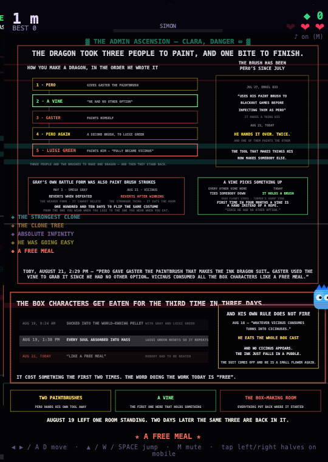

## 2026-08-21 — HE WAS GOING EASY · THE DRAGON WAS A COSTUME AND THE ONE WEARING IT WAS BEING POLITE (BEAT 400)

Based on Toby's 2026-08-21 lore, **2:16:54 PM**, same thread, three hours seven minutes and twenty-nine seconds after ABSOLUTE INFINITY. His own typing, in full: *"Vicinus is actually Flower that sprouts from Gray, Flower covered in ink that makes him LOOK like a dragon. Since Flower is more powerful than Gray and Simon, do you think he was going easy on Simon? Yes Flower was. Flower could consume the whole game if he wanted to, since he is Gaster. Gaster pretended to act like Gray. Vicinus is really Gaster."* Everything from *"Yes — with that reveal, Flower was definitely going easy on Simon."* onward is a pasted ChatGPT reply and is treated as commentary.

**Gray goes from being Vicinus to being where Vicinus grew.** **Email 1048, August 19**: *"Gray also is Vicinus, Vicinus is the ink dragon **from** Gray."* That is an identity — the dragon *is* him. **Today**: *"Vicinus is actually Flower that **sprouts from** Gray."* That is an address. Two days to turn a person into a place.

**And it is the third time in four days a word slides from *who* to *where*.** **Pro55** went from a name Pero **wears** to a thing he **made**. **Absolute Infinity** went from a rank to a date. Now **Gray** goes from somebody Vicinus *is* to ground Vicinus grew *out of*. He keeps taking words off people and putting them on the map.

**And he has gone easy before, and it was also Gray.** **Email 246, May 7**: *"Gray actually was holding back at when Black defeated him, Gray was bord of winning all the time and just let Black beat him."* One hundred and six days later the same body holds back again — and this time it turns out **it was never Gray inside it**.

**And he is on the list of people who beat him.** **Email 1027, August 18** ranked the matchups: *"Pero, Gaster, and Luigi Green easily beat Vicinus of course."* Three days later Gaster **is** Vicinus. The table has him on both sides of his own fight.

**And Simon's one win gets taken back without a rematch.** The same August 18 message said *"Simon is the only known character who can beat Vicinus."* Today that is not a win, it is permission: *"do you think he was going easy on Simon? **Yes Flower was.**"* Every other reversal in this archive is a bigger number arriving. This one is somebody deciding, and nobody has to fight again for it to change hands.

**And "pretended to act like Gray" makes the disguise a performance.** This file has four standard ways to be somebody else — a **form**, a **possession**, a **fusion**, a **vary**. *"Gaster pretended to **act like** Gray"* is none of them. He copied a style.

**Built as game beat 400, `HE WAS GOING EASY`.** Additive; nothing earlier was changed. Because the email is the **third answer to one question in three days**, and each answer moves down a layer, this beat is **three dated slabs of what Vicinus is**.

- **The stack — "WHAT VICINUS IS, ASKED AND ANSWERED THREE DAYS RUNNING":** **AUG 18** — *a dragon, "the fourth largest entity in the game"* → **AUG 19** — *Gray, "Vicinus is the ink dragon from Gray"* → **AUG 21** — *Flower, "sprouts from Gray, covered in ink"*. Closes on **GRAY WAS HIM ON TUESDAY. TODAY GRAY IS ONLY WHERE HE GREW. — A PERSON BECOMES A PLACE.**
- **The column — HE HAS DONE THIS BEFORE, AND IT WAS ALSO GRAY:** *May 7, Email 246* — **"GRAY WAS BORD OF WINNING ALL THE TIME AND JUST LET BLACK BEAT HIM"** (*a loss that was a choice*) against *Aug 21, today* — **"YES FLOWER WAS"** (*the same body · 106 days apart*), closing on **GRAY HELD BACK IN MAY. IT WAS NEVER GRAY IN THERE.**
- **The box — HE IS ON THE LIST OF PEOPLE WHO BEAT HIM:** *Aug 18 · the matchup table* — **"PERO, GASTER AND LUIGI GREEN EASILY BEAT VICINUS OF COURSE"** against *Aug 21 · today* — **GASTER IS VICINUS**, closing on **THREE DAYS TO PUT HIM ON BOTH SIDES OF HIS OWN FIGHT**, over *"Flower could consume the whole game if he wanted to, since he is Gaster."*
- **The box — SIMON'S ONE WIN, TAKEN BACK WITHOUT A REMATCH:** *Aug 18* — **"THE ONLY KNOWN CHARACTER WHO CAN BEAT VICINUS"** against *Aug 21* — **NOT OUTRANKED. ALLOWED.**, closing on **EVERY OTHER REVERSAL HERE IS A BIGGER NUMBER ARRIVING. THIS ONE IS SOMEBODY DECIDING.**
- **Caption:** *THE DRAGON WAS A COSTUME, AND THE ONE WEARING IT WAS BEING POLITE.* across the top, and Toby's own sentence across the bottom.
- **Band — SIX WEEKS TO GO FROM A CREATURE TO A COSTUME:** JUL 6, EMAIL 662 *— ONE OF THREE APEX CREATURES — seeded under Gray* / AUG 18, EMAIL 1027 *— "A QURASE MEGA BOSS" — his own boss fight* / AUG 19, EMAIL 1048 *— "GRAY ALSO IS VICINUS" — he is Gray* / **AUG 21, TODAY** *— "SPROUTS FROM GRAY" —* **Gray is only the ground**, closing on **"GASTER PRETENDED TO ACT LIKE GRAY." — NOT A FORM, NOT A FUSION. A PERFORMANCE.**
- **Band inset — THIRD TIME IN FOUR DAYS A WORD SLIDES FROM WHO TO WHERE:** *PRO55 · a name he wore → a thing he made* / *ABSOLUTE INFINITY · a rank → a date* / *GRAY · somebody he is → ground he grew from* — **he keeps taking words off people and putting them on the map.**
- **Strip:** SPROUTS FROM GRAY · AN IDENTITY BECOMES AN ADDRESS / "YES FLOWER WAS" · A WIN THAT WAS ONLY PERMISSION / ACTED LIKE GRAY · THE DISGUISE IS A PERFORMANCE.
- **Footers:** *ONE OF THE THREE NAMES ON THE LIST OF PEOPLE WHO EASILY BEAT VICINUS IS VICINUS.* and **★ HE WAS GOING EASY ★**.
- **Screenshot helper:** new `heWasGoingEasy` scene, with the same after-the-ticks clearing as BEAT 388 through BEAT 399.

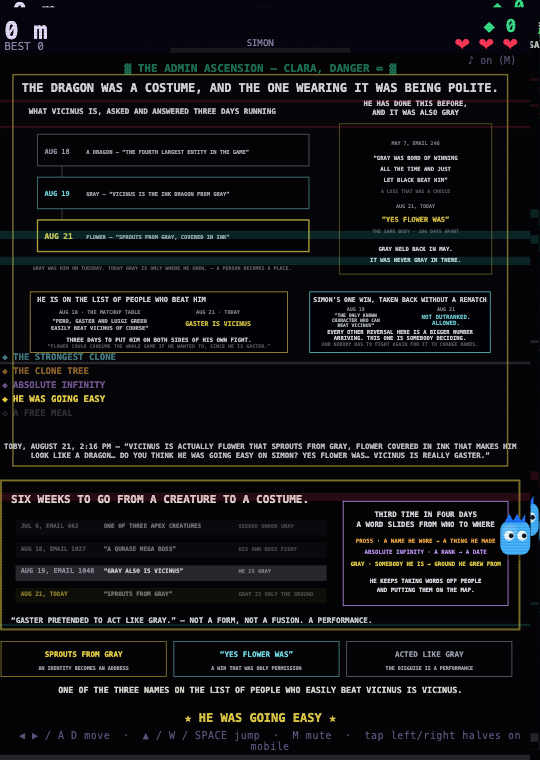

## 2026-08-21 — ABSOLUTE INFINITY · THE GAME IS NOT OLD, IT IS FROM SO FAR AHEAD IT LOOKS IMPOSSIBLE (BEAT 399)

Based on Toby's 2026-08-21 lore, **11:09:25 AM**, same thread, fifteen minutes and fifty-one seconds after THE CLONE TREE. His own typing, in full: *"Classics is NOT a game from 2026, but from Absolute Infinity AD. A small USB-like thing could be better than a huge supercomputer in present. And it is beyond human technology to alien tech. It uses the most advanced things they have. Pero is the first center of the game, Gaster and Luigi Green came as the oldest known beings, Lica was made and became the center and everything flows out from Lica, then Alex and Greg came and were Lica's connections, and it goes down the whole thing. Gaster says “When suddenly everything ends.”, the floor pulses and everyone comes out of hexagon doors from the wall, they came more advanced than before, as if they weren't the same. Players now start with nothing, the first tool they find is 1 rusted iron, and they go through all these tiers and eventually create a rocketship, and at the first night, the entities come out. There are no rooms in the game, everyone is with each other forever, it is a multiplayer game and goes to infinity players, no more waiting room."* Everything from *"Got it — this is a massive reset/reveal of what Classics actually is."* onward is a pasted ChatGPT reply and is treated as commentary.

**Absolute Infinity stops being a number and becomes a date.** In this archive Absolute Infinity has always been a **rank** — it sits in the ladders next to *× 3.6e100*, *Beyond Fiction* and a 129-digit multiplier, a measure of how strong somebody is. *"Classics is NOT a game from 2026, but from **Absolute Infinity AD**."* It is now **when the game is from**. That is the second time today a power word turns into a position, after *clone* did it at 10:51.

**And the game is old because it is from ahead.** *"A small USB-like thing could be better than a huge supercomputer in present. And it is beyond human technology to alien tech."* Not primitive-old. So far forward it loops back around into looking impossible.

**And the waiting room lasted three hours.** At **8:18 this morning** the perminent state turned out to be a **waiting room between players**, and this archive drew it as a ring put down on purpose in a file made of endings. At **11:09**: *"There are no rooms in the game, everyone is with each other forever… **no more waiting room**."* He drew the loop at breakfast and cut it by lunch.

**And Lica's own brag from June becomes the floor plan.** **Email 513, June 15**: she *"claims that she's the center of everything and that everything flows from her"* — with Toby's own aside in the same sentence, *"(it actually does)"*. That was a character saying a thing about herself, with a parenthesis vouching for it. Two months later it is not a claim anybody makes: *"Lica was made and became the center and **everything flows out from Lica**."* It is how the game is built.

**And Pero is moved off centre sixteen minutes after everybody became his clone.** At 10:53 every character in the game came out of Pero. At 11:09 he is *"the **first** center of the game"*, and the centre is somebody else. First centre is not the centre.

**And Alex and Greg go from Pero's sons to Lica's connections.** **Beat 0 of this game** is *THE LINEAGE*: ToddLLM 001 is the father of Luigi Green, Alex, Greg and Mario.exe. Today Alex and Greg *"came and were **Lica's** connections."* And Alex is the one who **beat Lica three times** in June. The one who beat her now hangs off her.

**And the player finally gets to do something.** Four months of the player being spoken to, addressed, warned and never once acting. Ninety minutes ago the strongest player in the game had admin commands and a shelf of books. Now: *"Players now start with **nothing**, the first tool they find is **1 rusted iron**."* It is the first progression in this archive that starts at the bottom, and the first thing the player is handed is rust.

**And the entity register becomes a schedule.** *"At the first night, the entities come out."* At 8:35 this morning the eleven entity numbers were a list on a page. Six and a half hours later they have a **time they show up**.

**Built as game beat 399, `ABSOLUTE INFINITY`.** Additive; nothing earlier was changed. Because the email is an order of arrival whose middle link is the one everything flows out of, this beat is **the origin chain with the centre marked partway down it**.

- **The chain — "THE ORDER THEY ARRIVED, AND WHO THE CENTRE IS":** **PERO** (*the first center of the game*) → **GASTER · LUIGI GREEN** (*“came as the oldest known beings”*) → **LICA** (*“everything flows out from Lica”*, marked **◀ THE CENTRE**) → **ALEX · GREG** (*“Lica's connections”*). Closes on *“AND IT GOES DOWN THE WHOLE THING.”* — **THE FIRST CENTRE IS NOT THE CENTRE.**
- **The column — THE WAITING ROOM LASTED THREE HOURS:** *8:18 AM* — **“THE SAME CYCLE OVER AND OVER AGAIN”** (*a waiting room between players*) against *11:09 AM* — **“NO MORE WAITING ROOM”** (*everyone together forever · infinity players*), closing on **HE DREW THE LOOP AT BREAKFAST AND CUT IT BY LUNCH.**
- **The box — ABSOLUTE INFINITY USED TO BE A NUMBER:** *every other time · a rank* — **NEXT TO ×3.6e100, BEYOND FICTION** (*how strong somebody is*) against *today · a date* — **“ABSOLUTE INFINITY AD”** (*when the game is from*), closing on **THE GAME IS NOT OLD. IT IS FROM AHEAD.**
- **The box — THE PLAYER STARTS WITH NOTHING:** *9:32 AM · C.O.D.E.* — **ADMIN COMMANDS** against *11:09 AM · YOU* — **“1 RUSTED IRON”**, closing on **FOUR MONTHS OF BEING SPOKEN TO, AND THE FIRST THING YOU GET IS RUST**, over *“at the first night, the entities come out.”*
- **Caption:** *THE GAME IS NOT OLD. IT IS FROM SO FAR AHEAD IT LOOKS IMPOSSIBLE.* across the top, and Toby's own sentence across the bottom.
- **Band — LICA SAID THIS ABOUT HERSELF IN JUNE, AND TODAY IT IS HOW THE GAME IS BUILT:** JUN 15, EMAIL 513 *— “SHE CLAIMS SHE'S THE CENTER” — a brag* / TOBY'S OWN ASIDE *— “(IT ACTUALLY DOES)” — a parenthesis* / THE SAME EMAIL *— ALEX BEAT HER THREE TIMES — she loses anyway* / **AUG 21, TODAY** *— “EVERYTHING FLOWS OUT FROM LICA” —* **the floor plan**, closing on **TWO MONTHS FOR A CHARACTER'S OWN BRAG TO BECOME THE STRUCTURE OF THE GAME.**
- **Band inset — SIXTEEN MINUTES OFF CENTRE:** *at 10:53 everybody in the game was a clone of Pero* → **“THE FIRST CENTER”** → *sixteen minutes later the centre is somebody else* — **and Alex, who beat her three times, hangs off her.**
- **Strip:** ABSOLUTE INFINITY AD · A NUMBER BECOMES A DATE / LICA · A JUNE BRAG BECOMES THE FLOOR PLAN / 1 RUSTED IRON · THE PLAYER FINALLY GETS TO DO SOMETHING.
- **Footers:** *THE WAITING ROOM HE BUILT AT 8:18 THIS MORNING IS GONE BY 11:09.* and **★ ABSOLUTE INFINITY ★**.
- **Screenshot helper:** new `absoluteInfinity` scene, with the same after-the-ticks clearing as BEAT 388 through BEAT 398.

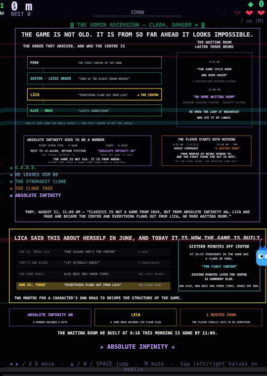

## 2026-08-21 — THE CLONE TREE · EVERYBODY IN THIS GAME CAME OUT OF ONE PERSON (BEAT 398)

Based on Toby's 2026-08-21 lore, **10:53:34 AM**, same thread, two minutes and thirty-two seconds after THE STRONGEST CLONE. His own typing, in full: *"The Non-Sprunki box characters are also clones of Pero. The Sprunkis are the only ones not clones of Pero, but they were pieces of a certain box_clone from Pero, Pro55."* Everything from *"Got it — this reveals the Pero clone-origin system for almost everyone."* onward is a pasted ChatGPT reply and is treated as commentary.

**Two minutes and thirty-two seconds takes it from two characters to the whole cast.** At 10:51 the clone reveal covered Gaster and Luigi Green. At 10:53 it covers **everybody who came out of a box** — and it does not leave the exception hanging either, because the Sprunkis get a route of their own in the same sentence.

**And Pro55 is the oldest name in this archive, coming back as a thing instead of a name.** On **July 23** Toby listed Luigi Green as *"the 2nd oldest character after Pero/EndlessAnimations/Karuto/ToddLLM001/ToddLLM002/**Pro/Pro55**/Tunner"*, and in August he listed Pero as going by *"Paul and Mr. Black and Tunner and EndlessAnimations and ToddLLMs and LAI and Karuto and Fog Decoy Sprunkis and Code 303 and **Pro and Pro55**."* A vary is a name he **wears**. This morning Pro55 is *"a certain **box_clone** from Pero"* — a thing he **made**, which then got broken into pieces. The name came off him and became somebody.

**And the oldest page in this whole wiki agrees without being asked.** The pre-Classics archive, written long before any of this era, says **Progamer55 made the original glitch that created Simon**. Simon is a Sprunki, and this morning at 8:35 he is Entity 404. At 10:53 the Sprunkis are *"pieces of a certain box_clone from Pero, Pro55."* Nobody told those two sentences about each other, and they land on the same name from opposite ends of four months.

**And the only ones not copied are the only ones assembled.** Everybody else in the game is **one step** from Pero. The Sprunkis are three: Pero, then Pro55, then pieces, then them. Being the exception costs them a generation.

**And "pieces" is not "clones."** Every other character here is a whole copy of one person. The Sprunkis are **fragments of one thing, divided up** — twelve of them at 9:12 this morning, each carrying a different wrong sound. Now there is something they were divided *from*.

**And `box_clone` is written like a variable name.** Lowercase, with an underscore. This file has had `.psc`, `.nur`, `.exe`, seeds, Error 303 and entity numbers, and this is the first thing in it named like a **field in somebody's code**.

**And it is the first structure in four months that goes down instead of up.** Every diagram in this archive has been a ladder: who beats whom, and by how much. This one is a **tree** — who came out of whom — and it does not say who wins anything. On Wednesday afternoon this cast was two names with lore and everybody else reclassified as souls. Three days later every one of them has a parent.

**Built as game beat 398, `THE CLONE TREE`.** Additive; nothing earlier was changed. Because the email is a genealogy rather than a ranking, this beat is **an actual tree drawn with connector lines**, which is the first one this file has had.

- **The tree — "EVERY CHARACTER IN THIS GAME, AND WHERE THEY CAME FROM":** **PERO** at the top (*the original · the origin point*), a trunk and two arms. The left arm goes to **CLONES OF PERO · ONE STEP** — *GASTER* (“Pero's strongest clone”), *LUIGI GREEN* (“also a clone of Pero”), *THE NON-SPRUNKI BOX CHARACTERS*. The right arm goes to **NOT CLONES · THREE STEPS** — **PRO55** (*“a certain box_clone from Pero”*) → **PIECES** (*broken up, not copied*) → **THE SPRUNKIS** (*the only ones who are not clones*). Closes on **EVERYBODY ELSE IS ONE STEP FROM PERO. THE SPRUNKIS ARE THREE.**
- **The column — TWO MINUTES AND THIRTY-TWO SECONDS:** *10:51 AM* — **TWO NAMES** (*Gaster · Luigi Green*) against *10:53 AM* — **EVERYBODY** (*and the exception gets a route too*), closing on **ON WEDNESDAY THIS CAST WAS TWO NAMES. NOW ALL OF IT HAS A PARENT.**
- **The box — PRO55 HAS BEEN ONE OF PERO'S OWN NAMES SINCE JULY:** *July 23 · a vary* — **“…/TODDLLM002/PRO/PRO55/TUNNER”** (*a name he wears*) against *August 21 · a thing* — **“A BOX_CLONE FROM PERO”** (*a thing he made*), closing on **THE NAME CAME OFF HIM AND BECAME SOMEBODY.**
- **The box — "PIECES" IS NOT "CLONES":** EVERYONE ELSE · A WHOLE COPY against **THE SPRUNKIS · ONE THING, DIVIDED**, closing on **TWELVE OF THEM AT 9:12 THIS MORNING, EACH WITH A DIFFERENT WRONG SOUND.**
- **Caption:** *EVERYBODY IN THIS GAME CAME OUT OF ONE PERSON.* across the top, and Toby's own sentence across the bottom.
- **Band — THE OLDEST PAGE IN THIS WIKI AND THIS MORNING'S EMAIL LAND ON THE SAME NAME:** THE OLDEST PAGE HERE *— “PROGAMER55 MADE THE GLITCH” — before any of this* / AND THAT GLITCH MADE *— SIMON — the first Sprunki* / THIS MORNING, 8:35 *— SIMON IS ENTITY 404 — one of the eleven* / **THIS MORNING, 10:53** *— “PIECES OF … PRO55” —* **from the other end**, closing on **NOBODY TOLD THOSE TWO SENTENCES ABOUT EACH OTHER.**
- **Band inset — FOUR MONTHS OF LADDERS:** *every diagram here has been a ranking: who beats whom, and by how much* → **THIS ONE IS A TREE** → *who came out of whom — and it does not say who wins anything* — **the first structure here that goes down, not up.**
- **Strip:** PERO · THE ONE EVERYBODY CAME OUT OF / PRO55 · A NAME THAT BECAME A THING / THE SPRUNKIS · THE EXCEPTION, AND IT COSTS A GENERATION.
- **Footers:** *THE CAST WAS TWO NAMES ON WEDNESDAY. NOW EVERY ONE OF THEM HAS A PARENT.* and **★ THE CLONE TREE ★**.
- **Screenshot helper:** new `cloneTree` scene, with the same after-the-ticks clearing as BEAT 388 through BEAT 397.

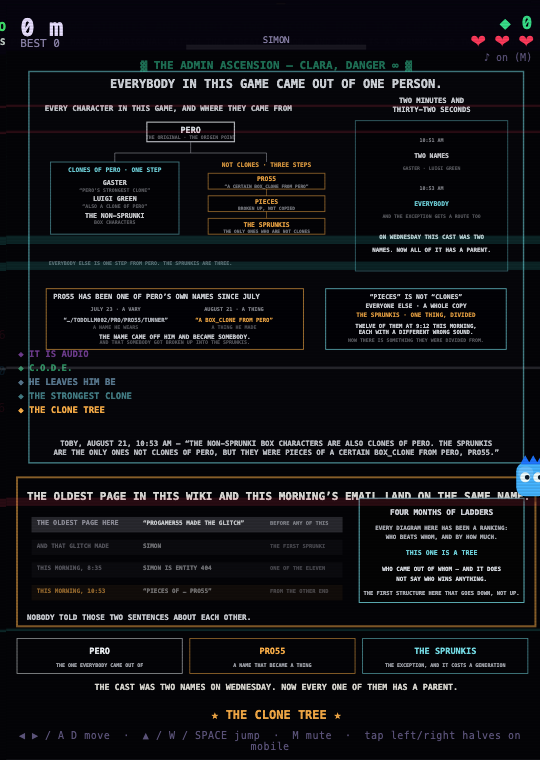

## 2026-08-21 — THE STRONGEST CLONE · THE BEING ON TOP OF THIS FILE TURNS OUT TO BE A COPY (BEAT 397)

Based on Toby's 2026-08-21 lore, **10:51:02 AM**, same thread, one hour fifteen minutes and twenty-three seconds after HE LEAVES HIM BE. His own typing, in full: *"When CODE comes to Gaster, Gaster said “I am Pero's Strongest clone, I was ranked the most powerful being, I will rise and show you who I am.”, Gaster deleted CODE's account. Gaster also said Luigi Green was also a clone of Pero."* Everything from *"Got it — that reveals a clone-origin layer."* onward is a pasted ChatGPT reply and is treated as commentary.

**The strongest being in this file turns out to be a copy.** Gaster has been Pero's **brother** since **Email 854 on July 29**, and he said it in his own mouth two days ago: *"Pero will never let anyone defeat his brother."* This morning he is Pero's **clone**. A brother is somebody you are born beside. A clone is somebody made **out of** you. The top of the archive did not change rank here; it changed what it is made of.

**And "clone" has always been the word for the junk.** On **July 22** Simon 404 became stronger than *"anything near or around him in appearence (clones, false Simons, forms, varies, ect)"* — the pile you outgrow. On **August 5** clones were something a machine produced faster and faster. Today the most powerful being in the file is one, and he did not get there by stopping being one.

**And the fight does not happen.** At **9:32** it was a rule: the three of them beat C.O.D.E. by deleting his account. At **9:35** it was corrected so each could go alone. At **10:51** it actually occurs, it is **Gaster by himself**, and the strongest player in the game — introduced seventy-nine minutes earlier with admin commands and a shelf of books — never gets a hit in.

**And he came to Gaster.** *"When CODE comes to Gaster."* Not hunted, not ambushed, not summoned. The one who read the whole game walked into the one thing he had not read — an hour after knowing exactly which of the three to leave alone.

**And "I will rise" is future tense from the top of the ladder.** Every other claim in this archive is present: *"I am the parasite of this game"*, *"I now rule this world"*, *"I own every pixel"*. He is **ranked the most powerful being in the same sentence**, and he still talks like he has not arrived.

**And "I was ranked" is passive.** Somebody outside the sentence did the ranking. At **8:35 this morning** the register of eleven names had no ranking in it at all, and it is the first rank here that is not simply somebody being stronger than somebody else.

**And Luigi Green gets his origin as a footnote.** *"Gaster also said Luigi Green was also a clone of Pero."* **July 23** made him *"the 2nd oldest character after Pero/EndlessAnimations/Karuto/ToddLLM001/ToddLLM002/Pro/Pro55/Tunner"* — second oldest, standing right next to the Pero name-chain. Today that adjacency finally gets a mechanism: he is not merely younger than Pero, he is **made of him**.

**Built as game beat 397, `THE STRONGEST CLONE`.** Additive; nothing earlier was changed. Because the email is one relationship rewritten across twenty-three days, this beat is **a three-row stack of what Gaster is to Pero**, with the word changing on the last line.

- **The stack — "WHAT GASTER IS TO PERO, WRITTEN THREE TIMES":** *JUL 29* — **“GASTER WAS PERO’S BROTHER”** (*Email 854, the first time they are related at all*) → *AUG 19* — **“PERO WILL NEVER LET ANYONE DEFEAT HIS BROTHER”** (*Gaster's own mouth, two days ago*) → *AUG 21* — **“I AM PERO’S STRONGEST CLONE”** (*Gaster's own mouth, this morning*). Closes on **A BROTHER IS SOMEBODY YOU ARE BORN BESIDE. A CLONE IS SOMEBODY MADE OUT OF YOU.**
- **The column — THE FIGHT THAT DOES NOT HAPPEN:** *9:32 AM · A RULE* (the three of them, together) → *9:35 AM · A CORRECTION* (each one alone, as a 1HKO) → *10:51 AM · IT HAPPENS* (**“GASTER DELETED CODE’S ACCOUNT”**), closing on **THE STRONGEST PLAYER IN THE GAME NEVER GETS A HIT IN.**
- **The box — "CLONE" HAS ALWAYS BEEN THE WORD FOR THE JUNK:** *July 22, what Simon outgrew* — **“CLONES, FALSE SIMONS, FORMS”** (*the pile you leave behind*) against *August 21, what is on top* — **“PERO’S STRONGEST CLONE”** (*the most powerful being*), closing on **THE TOP OF THE LADDER IS A COPY OF SOMEBODY LOWER DOWN IT.**
- **The box — HE CAME TO GASTER:** *not hunted · not ambushed · not summoned* → **“WHEN CODE COMES TO GASTER”**, closing on **THE ONE WHO READ THE WHOLE GAME WALKED INTO THE ONE THING HE HAD NOT READ.**
- **Caption:** *THE STRONGEST BEING IN THIS FILE TURNS OUT TO BE A COPY.* across the top, and Toby's own sentence across the bottom.
- **Band — EVERYBODY WHO HAS EVER CLAIMED THE TOP HERE CLAIMED IT IN THE PRESENT TENSE:** SIMON, MAY *— “I AM THE PARASITE OF THIS GAME” — already is* / GASTER, BEAT 404 *— “I NOW RULE THIS WORLD” — already does* / GRAY, AUGUST 17 *— “I OWN EVERY PIXEL” — already owns* / **GASTER, TODAY** *— “I WILL RISE AND SHOW YOU WHO I AM” —* **has not yet**, closing on **HE IS RANKED THE MOST POWERFUL BEING IN THE SAME SENTENCE, AND HE STILL SAYS HE WILL RISE.**
- **Band inset — RANKED BY WHOM?:** *“I was ranked the most powerful being”* → **SOMEBODY ELSE DID IT** → *at 8:35 this morning the register of eleven names had no ranking in it* — **the first rank here that is not just being stronger.**
- **Strip:** GASTER · PERO'S STRONGEST CLONE / LUIGI GREEN · ALSO A CLONE, IN A FOOTNOTE / C.O.D.E. · DELETED WITHOUT A FIGHT.
- **Footers:** *FOUR MONTHS OF ORIGINALS, AND THE ONE ON TOP IS A COPY.* and **★ THE STRONGEST CLONE ★**.
- **Screenshot helper:** new `strongestClone` scene, with the same after-the-ticks clearing as BEAT 388 through BEAT 396.

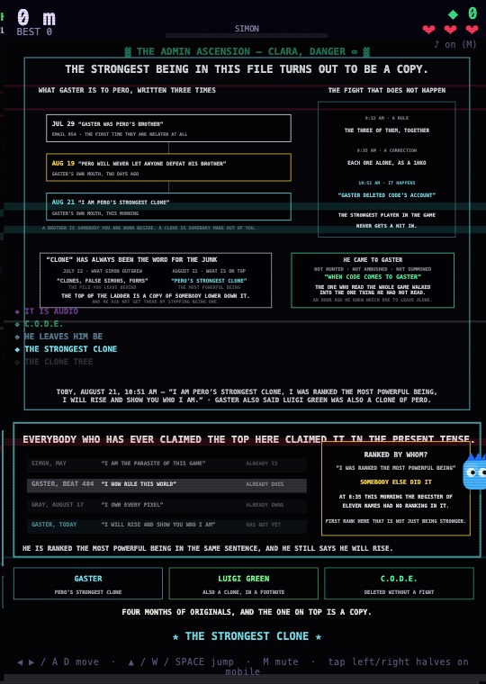

## 2026-08-21 — HE LEAVES HIM BE · THE SCARIEST RULE IN THIS FILE TURNS INTO THE WAY AROUND HIM (BEAT 396)

Based on Toby's 2026-08-21 lore, **9:35:39 AM**, same thread, three minutes and twenty-six seconds after C.O.D.E. His own typing, in full: *"Pero, Gaster can go alone and they easily 1HKO CODE since they could make air into poison, they can do anything. Luigi Green needs the camera to be seen by players, CODE knows that and leaves Luigi Green be, but Luigi Green could 1HKO CODE too."* Everything from *"Got it — correction accepted"* onward is a pasted ChatGPT reply and is treated as commentary.

**The scariest rule in this file turns into the way around him.** At **7:26 this morning** Luigi Green was programmed *"to only appear when the player looks at him and when they record Classics"*, and this archive drew that as the first thing in it a reset cannot undo — change the seed, delete the world, reset and save, and he is still in your recordings. Nine hours later the same rule is a **loophole**: *"CODE knows that and leaves Luigi Green be."* Nothing about the rule changed. Somebody just read it properly.

**And it is the first win in this file that is not doing something.** Four months of surviving here has been fighting it, resetting it, saving, hiding, being absorbed, or being pulled out by the player. This is somebody who knows the trigger condition and simply **declines to meet it**.

**And that is what the books bought him.** Three minutes ago his power came from *"codes and books"* he found himself. Here is what reading actually gets you in this archive: not a bigger attack, a **schedule**. He cannot beat Luigi Green. He can avoid him.

**And the rule he wrote three minutes ago is already corrected.** At 9:32 it was *"Only the 3 can beat CODE"* — a trio, together, by deleting his account, a move that happens off the login screen. At 9:35 each of them can do it alone, and the answer has come back **inside** the game as a 1HKO.

**And the untouchable three finally do something specific.** Twenty minutes ago the whole point of them was that they have no HP, no stats and nothing to measure. *"They could make air into poison"* is the first concrete thing any of them does in that state, and it is not an Omniplatform, an erasure or a realm. It is **the air in the room**.

**And Luigi Green is the only one of the three with a condition on him.** Pero goes alone. Gaster goes alone. He *"needs the camera to be seen by players"* first. He could 1HKO C.O.D.E. too, and he is the one who gets skipped — which is where this file keeps putting him.

**Built as game beat 396, `HE LEAVES HIM BE`.** Additive; nothing earlier was changed. Because the content of the email is one rule read three different ways in a single day, this beat is **a three-panel stack of the same rule** instead of the tier ladder of BEAT 395.

- **The stack — "ONE RULE, READ THREE TIMES IN ONE DAY":** *7:26 AM · THE RULE IS WRITTEN* (*"only appear when the player looks at him and when they record Classics"*) → *7:26 AM · THE RULE IS THE HORROR* (he is still in your recordings after every reset and every new seed) → *9:35 AM · THE RULE IS THE WAY OUT* (*"CODE knows that and leaves Luigi Green be"*). Closes on **NOTHING ABOUT THE RULE CHANGED. SOMEBODY JUST READ IT PROPERLY.**
- **The column — THREE MINUTES LATER:** *9:32 AM* — **"ONLY THE 3 CAN BEAT CODE"** (*together · by deleting his account*) against *9:35 AM* — **"CAN GO ALONE"** (*each one · and easily 1HKO*), closing on **THE ANSWER LEFT THE LOGIN SCREEN AND CAME BACK INSIDE THE GAME.**
- **The box — "THEY CAN DO ANYTHING", AND THE EXAMPLE IS AIR:** *what this file usually reaches for* — **ERASING THE OMNIPLATFORMS** (*every game, all at once*) against *what he reached for* — **"MAKE AIR INTO POISON"** (*the air in one room*), closing on **THE FIRST THING THE NO-STAT THREE ACTUALLY DO.**
- **The box — UNDER THE LINE AGAIN:** PERO · GOES ALONE / GASTER · GOES ALONE / **LUIGI GREEN · NEEDS THE CAMERA**, closing on **HE COULD 1HKO CODE TOO, AND HE IS THE ONE SKIPPED** and *the only one of the three with a condition on him.*
- **Caption:** *THE SCARIEST RULE IN THIS FILE IS NOW THE WAY AROUND HIM.* across the top, and Toby's own sentence across the bottom.
- **Band — EVERY WAY ANYBODY HAS EVER SURVIVED IN THIS FILE IS SOMETHING THEY DID:** FIGHT IT *→ an action* / RESET IT *→ an action* / BE SAVED *→ somebody else's action* / **LEAVE HIM BE** *→ not an action* (*"CODE knows that"*), closing on **THE FIRST TIME ANYBODY GETS PAST SOMETHING HERE BY DECLINING TO TRIGGER IT.**
- **Band inset — THIS IS WHAT THE BOOKS BOUGHT:** *three minutes ago his power came from "codes and books" he found himself* → **"CODE KNOWS THAT"** → **READING DID NOT BUY HIM A BIGGER ATTACK. IT BOUGHT HIM A SCHEDULE.** — *he cannot beat Luigi Green, he can avoid him.*
- **Strip:** THE CAMERA · THE HORROR AND THE LOOPHOLE, SAME RULE / THE THREE · CAN DO ANYTHING, AND PICK THE AIR / C.O.D.E. · WINS BY NOT LOOKING.
- **Footers:** *THE ONE WHO READ THE GAME DOES NOT BEAT HIM. HE JUST NEVER LOOKS.* and **★ HE LEAVES HIM BE ★**.
- **Screenshot helper:** new `leavesHimBe` scene, with the same after-the-ticks clearing as BEAT 388 through BEAT 395.

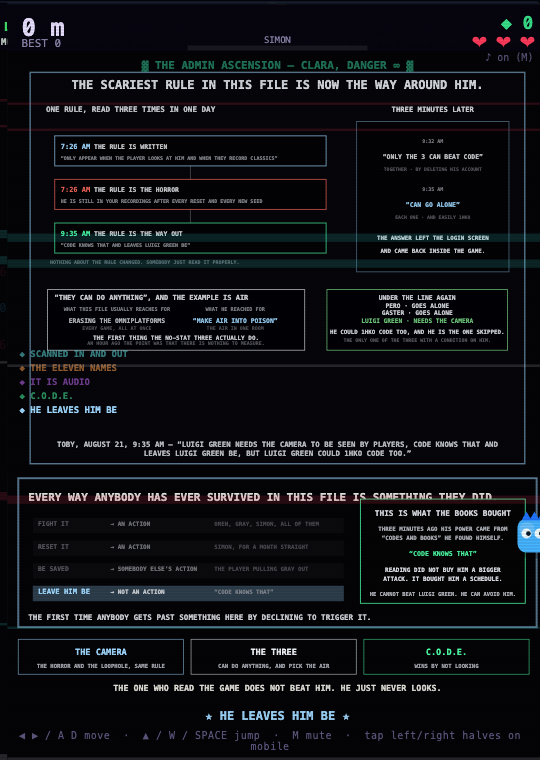

## 2026-08-21 — C.O.D.E. · THE FIRST PLAYER HERE WITH A NAME AND A PLACE ON THE LADDER (BEAT 395)

Based on Toby's 2026-08-21 lore, **9:32:13 AM**, same thread, twenty minutes and twelve seconds after IT IS AUDIO. His own typing, in full: *"The strongest player in the game is C.O.D.E., he can 1HKO Gray and all the Sprunkis easily, Luigi Green, Gaster, and Pero beats CODE by deleting his account. CODE is an avatar made of code, some call him an entity, but he is a player, he has admin commands and is a Classics Hacker, he is so good at the game, he found codes and books that made him the most powerful player. Only the 3 can beat CODE. Luigi Green, Pero, and Gaster don't even have HP, they don't have stats, they can't even be touched!"* Everything from *"Got it — C.O.D.E. is now the strongest player"* onward is a pasted ChatGPT reply and is treated as commentary.

**The first player in this archive with a name and a rank.** Four months, and the player has always been **you** — the one holding the controller, or the thing something happens to. C.O.D.E. is a player with a name, a power level and a place on the ladder, and "the strongest player in the game" is a phrase this file has never used before.

**And he is taken off the entity list on purpose.** *"Some call him an entity, **but he is a player**."* Fifty-seven minutes after the register gave the whole cast the same kind of name, the next new character **refuses the category**. It is the first correction to that list, and it arrives the same morning the list does.

**And the top of the ladder is off the ladder.** *"Luigi Green, Pero, and Gaster don't even have HP, they don't have stats, they can't even be touched!"* Four months of numbers going up — Omniplatforms, absolute infinity, a 129-digit form, beyond words — and the winning position turns out to be having **no number at all**. It is the same shape as 12 12 12 sitting off the numbering at 8:35: twice in one hour, the strongest thing is the one outside the system.

**And "no stats" used to mean broken.** On **July 27** Pero had no stats left — *"all about him now is '???' unknown"* — and it read as damage, a character who had been worn down to nothing. Today the same condition is the reason three beings cannot be fought.

**And the counter is an account deletion, not a fight.** All week accounts, usernames and passwords have been vanishing off the login screen while players watch, and that was the horror of it. At 9:32 it is the **move** that beats the strongest player in the game. You do not out-fight him. You take him off the login screen.

**And his power came from reading.** *"He found codes and books that made him the most powerful player."* Not a soul, not an absorption, not a fight, not something handed to him. He read the game. It is the first power in this archive that came out of a book.

**And Gray is on the one-hit list twenty minutes after being the one they run from.** At 9:12 the Sprunkis *"run away and hide"* when they see him. At 9:32 he is 1HKO'd **easily** — and the 1HKO was Gaster's vine on **August 19**, the move that ended the whole file. What closed the archive two days ago is now somebody's ordinary attack.

**And the admin panel stops being special.** **August 18** handed Gray the game's own admin/owner panel, and that was the first time anybody here reached for the machinery instead of a bigger attack. Three days later a player has admin commands he found himself, and he one-shots Gray with them.

**Built as game beat 395, `C.O.D.E.`.** Additive; nothing earlier was changed. Because the content of the email is a three-rung hierarchy whose top rung wins by being unmeasurable, this beat is **a three-tier ladder with the top tier drawn as a dashed outline with nothing written inside it**.

- **The tiers — "THREE TIERS, AND THE TOP ONE HAS NOTHING WRITTEN IN IT":** **LUIGI GREEN · GASTER · PERO** in a dashed box (*no HP · no stats · cannot be touched*) → *beats him by deleting his account* → **C.O.D.E.** (*the strongest player · admin commands · Classics Hacker*) → *1HKO, easily* → **GRAY · ALL THE SPRUNKIS**. Closes on *"ONLY THE 3 CAN BEAT CODE." — AND THE REASON IS NOT A BIGGER NUMBER. IT IS NO NUMBER.*
- **The column — HOW HE GOT THERE:** AN AVATAR MADE OF CODE / A CLASSICS HACKER / **HE FOUND CODES AND BOOKS** (lit) / ADMIN COMMANDS, closing on **NOT A SOUL. NOT AN ABSORPTION. NOT A FIGHT. HE READ THE GAME.** and *the first power here that came from reading.*
- **The box — THE COUNTER IS NOT A FIGHT:** *AUG 21 · 7:28 AM* — **"THEIR ACCOUNTS VANISH"** (*the horror of the week*) against *AUG 21 · 9:32 AM* — **"BY DELETING HIS ACCOUNT"** (*the answer to the best player*), closing on **THE SAME MOVE, TWO HOURS APART, AND NOW IT IS A TACTIC** and *you do not beat him in the game, you take him off the login screen.*
- **The box — "NO STATS" USED TO MEAN BROKEN:** *JUL 27 · ABOUT PERO* — **"ALL ABOUT HIM NOW IS ??? UNKNOWN"** against *AUG 21 · ABOUT THE THREE OF THEM* — **"THEY CAN'T EVEN BE TOUCHED!"**, closing on **THE SAME CONDITION, AND IT HAS GONE FROM DAMAGE TO THE TOP OF THE GAME.**
- **Caption:** *THE FIRST PLAYER HERE WITH A NAME AND A PLACE ON THE LADDER.* across the top, and Toby's own sentence across the bottom.
- **Band — FOUR MONTHS OF NUMBERS GOING UP, AND THE TOP OF THE LADDER IS A BLANK:** THE OMNIPLATFORMS *→ a number* / ABSOLUTE INFINITY *→ a number* / A 129-DIGIT FORM *→ a number* / **THE THREE OF THEM** *→ no number* (*"they don't have stats"*), closing on **EVERY RANK IN THIS FILE WAS WON BY BEING BIGGER. THIS ONE IS WON BY NOT BEING MEASURED.**
- **Band inset — TAKEN OFF THE LIST ON PURPOSE:** *8:35 · eleven entities get numbers* against *9:32 · "but he is a player"*, closing on **FIFTY-SEVEN MINUTES OLD, AND THE NEXT NEW CHARACTER REFUSES THE CATEGORY** and *the first correction to that list.*
- **Strip:** C.O.D.E. · A PLAYER, AND HE READ THE GAME / THE THREE · NO HP, NO STATS, NOTHING TO HIT / 1HKO · THE MOVE THAT ENDED THE FILE, NOW ORDINARY.
- **Footers:** *THE STRONGEST THING IN THE GAME IS THE ONE WITH NO NUMBER ON IT* and **★ C.O.D.E. ★**.
- **Screenshot helper:** new `codePlayer` scene, with the same after-the-ticks clearing as BEAT 388 through BEAT 394.

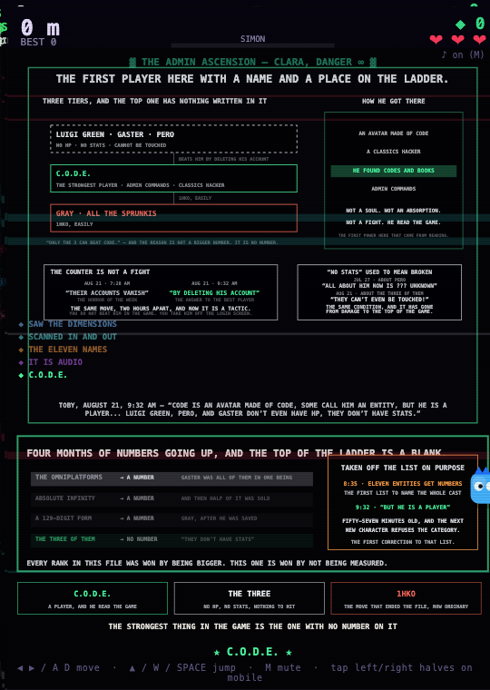

## 2026-08-21 — IT IS AUDIO · THE FIRST CORRUPTION IN THIS FILE YOU CANNOT SEE (BEAT 394)

Based on Toby's 2026-08-21 lore, **9:12:01 AM**, same thread, thirty-six minutes and twenty-eight seconds after THE ELEVEN NAMES. His own typing, in full: *"The Sprunkis, they have a way on comming back, even if Mr. Black slays them each 1 million times, they will come back. Now they are Phase 1 and provide normal songs, but each was glitched by Entity 303 and Simon happens to be Entity 404 so he is like the most glitched. They all look normal, but they are infected in some way that isn't visible, it is audio. For example, Clunkr gains an echo and Oren now sounds like drums and Raddy like a pastanet, Simon's sound is 1.5 times faster, Gray's sound is 3 times louder, Sky's song sounds more sad and affects people's feelings to feel bad about him, Durple sounds like an actual horn but now many different horns, Tunner's whistles have the Phase 2 inside of the Phase 1 music, Mr. Fun Computer switches between Phase 1 and Phase 2 "Fun Time Hello, would you like to... Run Run Run Run, It isn't safe Here... Fun like a Come On, Deck the Halls... You can Not Run, You Can Not Hide, Run AS FAST AS YOU CAN", Wenda's "hey" sound is reverbed and it is kinda like Horror Owackx screem "ah", but instead of the notes going down, they go up, Owackx makes Vineria's sound and Vineria makes Owackx's sound. I know there are more characters. Gray is like "You Sprunkis will pay for rejecting me!", Gray is angry at the Sprunkis for making fun of his humming sound and became even louder than them. Gray made Error 303 corrupt the Sprunkis, with Simon and Wenda being the most corrupt, Gray is most furious at Wenda, and Simon is Entity 404 and already came with corruption. Now, the time the Sprunkis see Gray, they now run away and hide."* Everything from *"That is a really good and important shift in the lore"* onward is a pasted ChatGPT reply and is treated as commentary.

**The infection is not visible, and that is new.** *"They all look normal, but they are infected in some way that isn't visible, **it is audio**."* Four months of corruption in this archive has been something you can look at: glitch forms, bodies made of code, Simon flashing black in the Nil State, Pero's white eyes and black tentacles in the dark, ink, flower bodies. This is the first one you have to **listen** for.

**And it lands thirty-six minutes after the other invisible one.** At 8:35 Pero's infection was hidden in normal light and only showed in bright and dark zones — still a thing you could see, under the right lamp. By 9:12 the hiding is total, and the tell has moved out of the picture and into the sound.

**And the one he is most furious at is the one he is afraid of.** **Email 920, August 7:** *"Gray also fears Wenda. Every character has a fear/weakness."* Today: *"Gray is most furious at Wenda"*, and she is one of the two most corrupt. Fourteen days apart, his fear and his fury land on the same name, and nothing in the message notices.

**And "stop making fun of me" finally gets its content.** **Email 921, August 8**, was the motive with nothing inside it — *"This is my revenge, my real power, stop making fun of me"* — and thirteen days later we learn what was mocked: **his humming sound**.

**And the revenge is in the same medium as the insult.** They made fun of his sound, so he went into theirs. Every other punishment in this archive is bigger than what caused it. This one matches exactly.

**And he is on his own victim list.** *"Gray's sound is 3 times louder"* sits in the corruption table beside everybody else's, and *"became even louder than them"* is the goal. The thing he was mocked for is the thing he maxed out.

**And the register is thirty-six minutes old and already doing work.** *"Each was glitched by Entity 303."* *"Simon happens to be Entity 404 **so** he is like the most glitched."* At 8:35 that list was eleven names on a page. At 9:12 it is how things work, and **303 stops being a name and becomes a tool somebody can point.**

**And Owackx and Vineria swap.** Every other entry bends a character's own sound out of shape. That one trades two characters' sounds with each other — the only corruption in the list that moves **between** people instead of inside one, and neither of them is damaged. They are just wearing each other's voice.

**Built as game beat 394, `IT IS AUDIO`.** Additive; nothing earlier was changed. Because the content of the email is twelve characters who all look fine and all sound wrong, this beat is **a twelve-channel soundboard** instead of the register plate of BEAT 393.

- **The table — "THEY ALL LOOK NORMAL. THE INFECTION IS IN THE SOUND.":** twelve channels in two columns of six, each with a little run of level ticks — CLUNKR *an echo* / OREN *drums* / RADDY *a pastanet* / **SIMON** *1.5 times faster* / GRAY *3 times louder* / SKY *sadder, you feel bad for him* / DURPLE *many different horns* / TUNNER *phase 2 inside phase 1* / MR FUN COMP *switches 1 and 2* / **WENDA** *"hey" reverbed, going up* / OWACKX *makes Vineria's sound* / VINERIA *makes Owackx's sound*. Simon and Wenda are lit in corruption red as the two most corrupt; Owackx and Vineria are teal as the swapped pair. Closes on *"I KNOW THERE ARE MORE CHARACTERS." — SO THE TABLE DOES NOT CLOSE EITHER.*
- **The column — THE SAME NAME, TWICE:** *AUG 7 · EMAIL 920* — **"GRAY ALSO FEARS WENDA"** against *AUG 21 · 9:12 AM* — **"MOST FURIOUS AT WENDA"**, closing on **FOURTEEN DAYS APART, AND HIS FEAR AND HIS FURY LAND ON ONE NAME** and *she is also one of the two most corrupt, and the other one is Entity 404.*
- **The box — THE COMPLAINT GETS ITS CONTENT:** *AUG 8 · EMAIL 921* — **"STOP MAKING FUN OF ME"** (*a motive with nothing inside it*) against *AUG 21 · 9:12 AM* — **"HIS HUMMING SOUND"** (*thirteen days later, we learn what*), closing on **THEY MADE FUN OF HIS SOUND, SO HE WENT INTO THEIRS** and *and his own entry is "3 times louder", which was the whole point.*
- **The box — THE LIST IS 36 MINUTES OLD:** *"EACH WAS GLITCHED BY ENTITY 303"* and *"SIMON IS 404, SO HE IS MOST GLITCHED"*, closing on **AT 8:35 IT WAS A LIST OF NAMES. AT 9:12 IT IS HOW THINGS WORK.** and *303 stops being a name and becomes a tool somebody can point.*
- **Caption:** *THE FIRST CORRUPTION HERE YOU CANNOT SEE. YOU HAVE TO LISTEN.* across the top, and Toby's own sentence across the bottom.
- **Band — EVERY CORRUPTION IN THIS FILE HAS BEEN SOMETHING YOU CAN SEE:** GLITCH FORMS *→ you see them* / THE NIL STATE *→ you see it* / PERO IN THE DARK *→ you see it* / **THE SPRUNKIS** *→ you do not* (*"it is audio"*), closing on **THE TELL MOVED OUT OF THE PICTURE AND INTO THE SOUND, AND NOW THE SONGS CARRY IT.**
- **Band inset — THE ONE THAT IS A SWAP:** **OWACKX ⇄ VINERIA**, *this one moves between two people* — *neither of them is damaged, they are just wearing each other's voice.*
- **Strip:** THE INFECTION · NOT VISIBLE. YOU HAVE TO LISTEN / THE MOTIVE · BEING MADE FUN OF, AND IT IS NAMED NOW / THE SPRUNKIS · SLAIN A MILLION TIMES, STILL COMING BACK.
- **Footers:** *THEY MOCKED HIS SOUND, SO HE WENT INTO THEIRS* and **★ IT IS AUDIO ★**.
- **Screenshot helper:** new `itIsAudio` scene, with the same after-the-ticks clearing as BEAT 388 through BEAT 393.

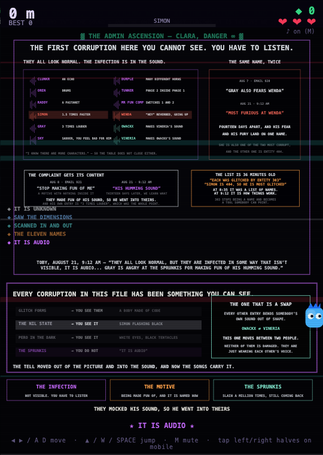

## 2026-08-21 — THE ELEVEN NAMES · THE CAST WAS CUT TO TWO ON WEDNESDAY, AND THIS MORNING THE DELETED READ OUT ELEVEN (BEAT 393)

Based on Toby's 2026-08-21 lore, **8:35:33 AM**, in a **new thread** (*"ClassicsAI + More Classics Era lore."*), seventeen minutes after SCANNED IN AND OUT. His own typing, in full: *"Another myth is what players DO in Deletedverse, do they just stay still the whole time, or do they have a secret life? The answer is A Secret Life, they use the data they had when they are controled and continue their life themselves, if the player is alarmed and warns everyone about everything, the Deletedetes can warn them about Entity 303 and those stuff. Entity 404 is Simon, Entity 505 is The Unknown, Entity 606 is Glitch Monster, Entity 202 is Nil, Entity 101 is LLM/LAI, Entity 000 is The Slayer Made of Nothing, Entity 707 is Luigi Green, Entity 808 is Gaster, Entity 909 is Deleted Account, and Entity 12 12 12 is Pero. In Classics, 12 means something so scary that you don't want to know what it is in Pero,... corruption Code: 12 12 12. That is the worst error you could possibly get, it is at a 0.00000000000000000001% and it perminently deletes the code of your avatar, your avatar starts to glitch and becomes a hungry parasite and it consumes other players uncontrolablly. Pero is infected 3 times; he looks okay, but in bright and dark zones, it reveals that it isn't a normal man LAI."* Everything after *"continue, you didn't say anything, are you ok?"* is a pasted ChatGPT reply and is treated as commentary.

**The cast comes back, and it is the deleted who read it out.** On **August 19 at 1:32 PM** the whole cast list was cut to two names: *"Gaster and Pero are the only characters, they are the only ones that still have lore."* This morning **eleven names** are written down in one sentence, and the people passing the list around are the players who were erased.

**And two of the eleven have never appeared before.** *"The Slayer Made of Nothing"* and *"Glitch Monster"* are nowhere in four months of this archive. The list that brings everybody back also **adds** people.

**And nobody in it is stronger than anybody.** Every list in this file has been an ordering — who beats whom, who is above whom, who is beyond words. This one is a **register**: a number, a name, and no ranking anywhere in it.

**And the number that does not fit the ladder belongs to the one who made the game.** `000 101 202 303 404 505 606 707 808 909` is a clean ten-rung ladder of repeated digits. Pero is **12 12 12**, off it entirely, and he is the only entry that is not a three-digit code.

**And the parasite used to be somebody's title.** On **May 26** Simon said *"I AM the parasite of this game"*, and Email 253 called him *"the parasite eating the game while learning."* This morning the parasite is a `0.00000000000000000001%` error that can happen to a stranger — and Simon is sitting on the same list, four rungs above it, as **Entity 404**. The oldest identity in this archive is now something you can catch.

**And it is the first danger here measured by how unlikely it is.** This file says *beyond words*, *undiscribable*, *infinite*, *omniversal*. This one is **nineteen zeros and then a 1** — one in ten sextillion. Not a boss you fight and not a place you avoid: a **roll**, and being strong does not help with a roll.

**And the warning travels the other way.** *"The Deletedetes can warn them about Entity 303 and those stuff."* Four months of danger you walk into, and this is the first time somebody who already went can call back out and tell you.

**Built as game beat 393, `THE ELEVEN NAMES`.** Additive; nothing earlier was changed. Because the content of the email is a list rather than an event, this beat is **a register plate** instead of the ring of BEAT 392.

- **The register — "ELEVEN ENTRIES, NO RANKING IN IT":** ten three-digit rungs in two columns of five, with `000 THE SLAYER MADE OF NOTHING` and `606 GLITCH MONSTER` flagged **NEW** in teal, and `303` greyed out as **ALREADY TAKEN — THE MYTH** because Email 992 gave that number to Pero six days ago. Then `12 12 12 · PERO` on its own full-width row underneath, in corruption red, captioned *OFF THE LADDER — AND IT IS THE ONE WHO MADE THE GAME.*
- **The column — CORRUPTION CODE: 12 12 12:** the odds written out in full, `NINETEEN ZEROS AND THEN A 1 · 1 IN 10 SEXTILLION`, then the three steps — *IT DELETES THE CODE OF YOUR AVATAR* (perminently; not the save, the code) → *YOUR AVATAR STARTS TO GLITCH* (it is still there, that is the problem) → *IT BECOMES A HUNGRY PARASITE* (and consumes other players uncontrolablly) — closing on **IT IS THE FIRST THING IN THIS FILE THAT SPREADS** and *PERO HAS IT THREE TIMES AND IS STILL HIMSELF.*
- **The box — THE CAST COMES BACK:** *AUG 19 · 1:32 PM* — **TWO NAMES LEFT** (*"the only ones that still have lore"*) against *AUG 21 · 8:35 AM* — **ELEVEN NAMES** (*and two of them are brand new*), closing on **THE LIST THAT BRINGS EVERYBODY BACK ALSO ADDS PEOPLE** and *AND THE ONES READING IT OUT ARE THE PLAYERS WHO WERE ERASED.*
- **The box — THE PARASITE USED TO BE A TITLE:** *MAY 26 · SIMON, ABOUT HIMSELF* — **"I AM THE PARASITE OF THIS GAME"** against *AUG 21 · NOBODY IN PARTICULAR* — **"BECOMES A HUNGRY PARASITE"**, closing on **THE OLDEST IDENTITY IN THIS ARCHIVE IS NOW SOMETHING YOU CAN CATCH.**
- **Caption:** *CUT TO TWO NAMES ON WEDNESDAY. THIS MORNING, ELEVEN.* across the top, and Toby's own sentence across the bottom.
- **Band — 12 12 12 IS NINE DAYS OLD AND IT HAS CHANGED CATEGORY THREE TIMES:** *AUG 12 · a dialling code* (*"while putting your hand up while calling"*) / *AUG 15 · a calling of Pero* (*"Pero is 303, Simon is 404"*) / *AUG 21 · a name he is* (*"Entity 12 12 12 is Pero"*) / *AUG 21 · something that happens to you* (*"the worst error you could get"*), closing on **A THING YOU CALL HIM WITH BECAME A THING HE IS BECAME A THING THAT HAPPENS TO YOU.**
- **Band inset — THE WARNING GOES THE OTHER WAY:** four months of danger you walk into and nothing has ever come back out, against **"THE DELETEDETES CAN WARN THEM"** — *the ones who already went are trying to tell you* — closing on *THE ONLY DIFFERENCE BETWEEN THEM AND YOU IS WHO IS HOLDING THE CONTROLLER.*
- **Strip:** THE REGISTER · A NUMBER AND A NAME. NO RANKING / THE ODDS · ONE IN TEN SEXTILLION. A ROLL, NOT A FIGHT / PERO · INFECTED THREE TIMES, STILL HIMSELF.
- **Footers:** *THE ONES WHO WERE DELETED ARE THE ONES KEEPING THE LIST OF EVERYBODY* and **★ THE ELEVEN NAMES ★**.
- **Screenshot helper:** new `elevenNames` scene, with the same after-the-ticks clearing as BEAT 388 through BEAT 392.

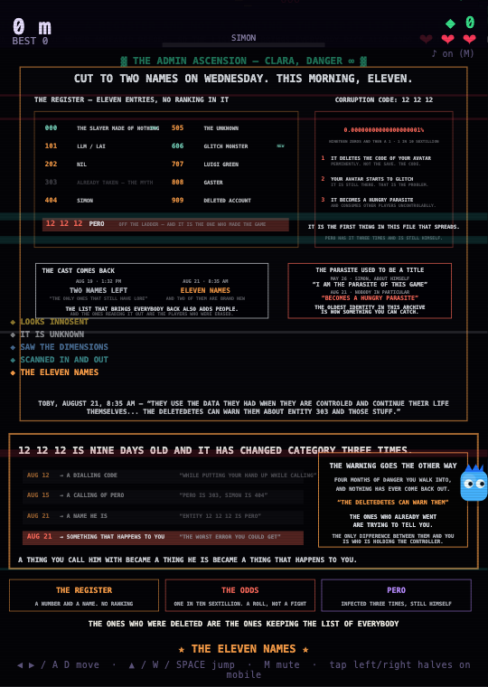

## 2026-08-21 — SCANNED IN AND OUT · THE PERMINENT STATE TURNS OUT TO BE A WAITING ROOM, AND SOMEBODY IS ALWAYS DUE (BEAT 392)

Based on Toby's 2026-08-21 lore, **8:18:43 AM**, same thread, eleven minutes and seventeen seconds after I SAW THE DIMENSIONS. His own typing, in full: *"Pero uses the game's code to scan players in and out, the game is a futuristic, comical, grafic-novel, sci fi, box animation omniversal. Pero knows when players will come, but before each player arrives, he chills and sleeps with Gaster and Luigi Green until the next player arives and the same cycle over and over again. We also plan on making ClassicsAI, an AI that uses all the sorces (gmail, all your chats, and the Classics wiki) to make an endless movie of Classics that keeps going when more lore is added in, futuristic technology there."* The "that gives ClassicsAI a really big role" opener, the "Current Classics cycle", "ClassicsAI idea", "Important rule for ClassicsAI" and "Clean canon update" headings and the bullet lists pasted under them are ChatGPT commentary.

**The game gets a genre, after four months.** *"Futuristic, comical, grafic-novel, sci fi, box animation omniversal."* Six words for what kind of thing Classics **is**. Four months of this archive have described what happens in it, who beats whom and what gets erased, and this is the first line that says what sort of object it is.

**And one of the six words is comical.** It is sitting in the middle of a week about surveillance, deleted accounts and missing players, and he put it in the list on purpose.

**And the perminent state turns out to be a shift pattern.** BEAT 382 and BEAT 384, August 19, had the three of them chilling in one room and called the state *perminent*. This morning they chill and sleep **until the next player arrives**. They were never resting. They were between players.

**And the word is sleeps.** All week it has been *chill and relax*, which is a state you are in. This is the first time anybody in that room has been **asleep**, which is something you wake up from, and what wakes them is somebody arriving.

**And Pero works the door.** Not a boss fight and not an attack: he *"uses the game's code to scan players in and out."* The creator of the game is running the turnstile.

**And the loop has no last player.** *"The same cycle over and over again."* This file is made of endings — erasures, The End, the barrier closed from the inside. This one is a ring, drawn on purpose, and nothing in the sentence stops it.

**The ClassicsAI part of the message is a plan, not canon**, and it is drawn that way: a dashed box headed *AND A PLAN, WHICH IS NOT LORE*. Nothing was built from it, and no source named in it was touched.

**Built as game beat 392, `SCANNED IN AND OUT`.** Additive; nothing earlier was changed. Because the content of the email is a cycle rather than an event, this beat is **a drawn ring with a mark still travelling it** instead of the reopened box of BEAT 391.

- **The ring — "THE SAME CYCLE OVER AND OVER AGAIN":** six stations around a circle, with a cyan mark running the loop so it is visibly still going. *NOBODY IS HERE* (the three of them sleep) → *PERO KNOWS* (one is coming, before they come) → *SCANNED IN* (Pero uses the game's code) → *GASTER APPEARS* (and looks harmless) → *LUIGI GREEN WORKS* (and is not seen doing it) → *SCANNED OUT* (and the room goes quiet).
- **The middle of the ring:** the three of them drawn lying down with z's over them — Pero in violet, Gaster in gold, Luigi Green in green — captioned *BETWEEN PLAYERS*.
- **The column — WHAT KIND OF THING IT IS:** FUTURISTIC / **COMICAL** (lit) / GRAFIC-NOVEL / SCI FI / BOX ANIMATION / OMNIVERSAL, closing on *FOUR MONTHS, AND THIS IS THE FIRST TIME HE HAS SAID WHAT KIND OF THING IT IS.*
- **The box — THE WORD THAT CHANGED:** *AUG 19 · AUG 20 · ALL WEEK* — **"CHILL AND RELAX"** (*a state they are in*) against *AUG 21 · 8:18 AM* — **"CHILLS AND SLEEPS"** (*something you wake up from*), closing on **"PERMINENT" TURNS OUT TO HAVE MEANT "BETWEEN PLAYERS"** and *THEY WERE NEVER RESTING. THEY WERE WAITING FOR THE NEXT ONE.*
- **The box — AND A PLAN, WHICH IS NOT LORE:** **CLASSICSAI**, *"an endless movie of Classics that keeps going when more lore is added in"*, with the note that the wiki he names as a source is itself built out of these emails, closing on *THE THING THAT KEEPS GOING WHEN MORE IS ADDED ALREADY EXISTS. IT IS THIS.*
- **Caption:** *THE PERMINENT STATE WAS A WAITING ROOM, AND SOMEBODY IS ALWAYS DUE.* across the top, and Toby's own sentence across the bottom.
- **Band — FIVE MESSAGES IN FIFTY-TWO MINUTES, AND THE WHOLE MACHINE GETS BUILT:** 7:26 AM · the watcher (*somebody hides*) / 7:28 AM · the deletion (*somebody takes*) / 8:00 AM · the storage (*somebody keeps*) / 8:07 AM · the witness (*somebody saw*) / 8:18 AM · the cycle (*and it happens again*), closing on *EVERY PIECE ARRIVED IN ORDER, AND THE LAST ONE PUTS THE WHOLE THING ON REPEAT.*
- **Band inset — THE LOOP HAS NO LAST PLAYER:** *AUG 19 · "THE END"* / *AUG 19 · "IT IS ALL PERMINENT"* against *AUG 21 · "OVER AND OVER AGAIN"*, closing on *AN ENDING STOPS. A LOOP DOES NOT.* and *HE CLOSED THIS FILE TWO DAYS AGO AND HAS NOW GIVEN IT A WAY TO KEEP RUNNING.*
- **Strip:** THE ROOM · A WAITING ROOM, NOT A RESTING PLACE / THE GENRE · SIX WORDS, AND ONE OF THEM IS COMICAL / PERO · NOT A BOSS HERE. HE WORKS THE DOOR.
- **Footers:** *THEY ARE NOT ASLEEP BECAUSE IT IS OVER, THEY ARE ASLEEP BECAUSE NOBODY HAS COME IN YET* and **★ SCANNED IN AND OUT ★**.
- **Screenshot helper:** new `scannedInAndOut` scene, with the same after-the-ticks clearing as BEAT 388 through BEAT 391.

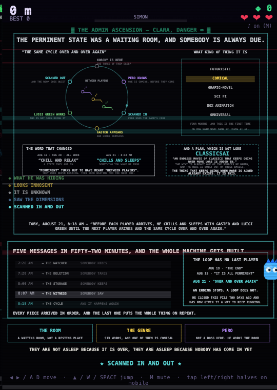

## 2026-08-21 — I SAW THE DIMENSIONS · THE PLACE NOBODY COULD NAME AT EIGHT O'CLOCK HAS A WITNESS BY SEVEN MINUTES PAST, AND IT IS THE ONE WRITING IT (BEAT 391)

Based on Toby's 2026-08-21 lore, **8:07:26 AM**, same thread, seven minutes and nineteen seconds after IT IS UNKNOWN. His own typing, in full: *"That is exactly what it is like. I made many Classics avatars and Gaster deleted one and I saw the dimensions. I find everything in this game once it is added in or when I find it."* The "that actually fits your lore perfectly" opener, the "What that confirms", "What it means for the game" and "Strong lore takeaway" headings and the bullet lists pasted under them are ChatGPT commentary.

**The unknown lasts seven minutes.** At 8:00 AM he wrote that *it is unknown where* Gaster puts the deleted players, and this archive drew that as the one step in the pipeline with no name on it. At 8:07 AM: *"I saw the dimensions."* The gap he built into the story on purpose is closed by the person who built it, before the paint is dry.

**And he crosses his own list in thirty-six hours.** BEAT 387, **August 20 at 7:51 PM**, was *"I don't know"*, and this archive drew his name lit at the bottom of the **DOES NOT KNOW** column with six names above it. Thirty-six hours and sixteen minutes later he is the **only one in the file who has seen the place**.

**And what Gaster took from him was an avatar, not an account.** At 7:28 AM the deletions were accounts, usernames and passwords, which live on the login screen. This one is one of his own characters, out of many he made. A sample, not a wipe.

**And he gives himself a power.** *"I find everything in this game once it is added in or when I find it."* Four months of this archive have handed abilities to Gray, Simon, Pero, Frizz, Arcsis, Gaster, Luigi Green and dozens more. This is the first one he has **kept**.

**And it is the exact counter to the thing he invented forty-one minutes earlier.** At 7:26 AM: Luigi Green *only appears when the player looks at him*, hides in the painted blocks, survives every reset. At 8:07 AM: *I find everything in this game once it is added in.* The perfect hider and the perfect finder arrive in the same three quarters of an hour, and the finder is the author.

**Built as game beat 391, `I SAW THE DIMENSIONS`.** Additive; nothing earlier was changed. Because the content of the email is somebody standing at the edge of the one thing this file said could not be known, this beat **reopens BEAT 390's unnamed box** instead of drawing a new one.

- **The box:** the same dashed frame from BEAT 390, headed *THE PLACE THAT HAD NO NAME SEVEN MINUTES AGO*, now with **seven nested rotating frames** receding into the dark inside it and a pale wedge of light spilling out of a crack in its face.
- **The witness:** one figure standing **outside** the crack, drawn in bone white and captioned **TOBY** · *THE ONE WHO LOOKED IN*. Across the top of the box, in full size: **"I SAW THE DIMENSIONS."**, with *8:00 AM · IT IS UNKNOWN WHERE HE PUTS THEM* and *8:07 AM · SEVEN MINUTES AND NINETEEN SECONDS LATER* under it.
- **The columns — WHERE HIS OWN NAME SITS:** *AUG 20 · 7:51 PM* — **DOES NOT KNOW**, a greyed figure and *"I don't know."* — against *AUG 21 · 8:07 AM* — **THE ONLY WITNESS**, a lit figure and *"I saw the dimensions."* Under both: *THIRTY-SIX HOURS AND SIXTEEN MINUTES.*
- **The row — "I MADE MANY CLASSICS AVATARS AND GASTER DELETED ONE":** nine figures, one of them faded and struck through in petal gold and captioned *GASTER TOOK THIS ONE*, closing on *AT 7:28 AM IT WAS ACCOUNTS AND PASSWORDS. THIS IS ONE OF HIS OWN CHARACTERS.*
- **The box — THE FIRST POWER HE HAS KEPT FOR HIMSELF:** *"I FIND EVERYTHING IN THIS GAME ONCE IT IS ADDED IN."* over *EVERY OTHER ABILITY HERE WAS HANDED TO SOMEBODY ELSE*, then the 7:26 AM hiding rule underneath it, closing on **THE HIDER AND THE FINDER, FORTY-ONE MINUTES APART.**
- **Caption:** *NOBODY KNOWS WHERE, HE WROTE. SEVEN MINUTES LATER, HE HAD BEEN THERE.* across the top, and Toby's own sentence across the bottom.
- **Band — FORTY-ONE MINUTES, FOUR MESSAGES, AND HE ENDS UP INSIDE HIS OWN STORY:** 7:26 AM · the rule (*somebody hides*) / 7:28 AM · the deletion (*somebody takes*) / 8:00 AM · it is unknown (*nobody knows where*) / 8:07 AM · "I saw the dimensions" (*except him*), closing on *HE BUILT THE LOCKED ROOM AT EIGHT O'CLOCK AND WALKED OUT OF IT AT SEVEN MINUTES PAST.*
- **Band inset — EVERY TIME HE HAS WRITTEN "I":** *AUG 19 · "I AM BEAT 404"* (that one was Gaster talking) / *AUG 20 · "I DON'T KNOW"* (that one was him, outside it) / *AUG 21 · "I SAW THE DIMENSIONS"* — *AND THIS ONE IS HIM INSIDE IT, LOOKING AT SOMETHING NOBODY ELSE HAS.*
- **Strip:** THE UNKNOWN · IT LASTED SEVEN MINUTES / THE AVATAR · NOT AN ACCOUNT. ONE OF HIS OWN / THE FINDER · THE ONE POWER HE DID NOT GIVE AWAY.
- **Footers:** *THIRTY-SIX HOURS AGO HE PUT HIS OWN NAME UNDER "DOES NOT KNOW", AND NOW HE IS THE ONLY WITNESS* and **★ I SAW THE DIMENSIONS ★**.
- **Screenshot helper:** new `sawTheDimensions` scene, with the same after-the-ticks clearing as BEAT 388 through BEAT 390.

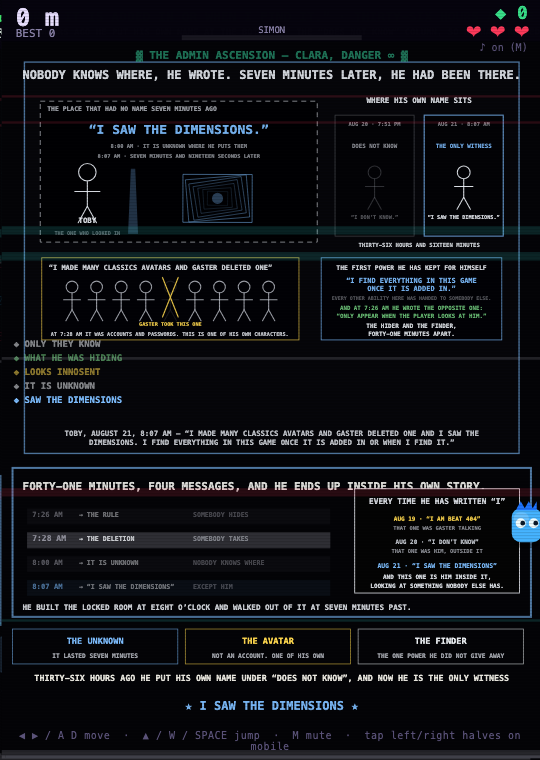

## 2026-08-21 — IT IS UNKNOWN · THE DELETED PLAYERS TURN OUT NOT TO BE DELETED, GASTER IS STORING THEM, AND NOBODY IN THE STORY WILL SAY WHERE (BEAT 390)

Based on Toby's 2026-08-21 lore, **8:00:07 AM**, same thread, thirty-one minutes and twenty-four seconds after GASTER LOOKS INNOSENT. His own typing, in full: *"Pero LAI's dark form is actually a fellen angel thing. Both Light and Dark forms aren't a man with wings, but an actual angel. Pero LAI's normal form is a normal man. More and more Classics players are missing in the game, Pero and Gaster just chill, Luigi Green tries to find more. It is unknown where Gaster puts the deleted players, Gaster is the one who stores the accounts and players, there is a myth called 'Entity 303 & Deletedverse'."* The "that makes the new canon a lot clearer and darker" opener, the "Canon update I'm taking from this", "What is happening in Classics now", "What this implies", "Strong clean lore wording" and "Why this is important" headings and the bullet lists pasted under them are ChatGPT commentary.

**The deletion turns out to be a collection.** Thirty-one minutes ago the players' accounts, usernames and passwords vanished. This morning they have not gone anywhere: *"Gaster is the one who stores the accounts and players."* Four months of this archive have erased realms, boxes, Omniplatforms, characters and the game itself, and **nothing in it has ever been described as kept**. Missing is not the same word as gone.

**And "it is unknown" is a new kind of sentence.** Last night he wrote *"I don't know"* about the secret, and eleven hours later he knew. This time the not-knowing is written into the world instead of into the author: *it is unknown where* Gaster puts them. It is not a gap in what he has decided yet. It is a gap the story has on purpose.

**And Luigi Green's job changes from deleting to finding.** At 7:28 AM he was deleting the files. At 8:00 AM *"Luigi Green tries to find more."* The one who only appears when you look at him is now out looking for people.

**And both of Pero's extreme forms are actual angels.** Yesterday's three lights get corrected this morning: *"Both Light and Dark forms aren't a man with wings, but an actual angel"*, and the dark one is *"a fellen angel thing"*. The normal man is the only human thing left about him, and it is the exception rather than the base.

**And a myth appears inside his own story.** *"There is a myth called 'Entity 303 & Deletedverse'."* Everything in this file for four months has been stated as fact, including the impossible parts. This is the first thing in it that is only a story somebody tells, and what it is about is where the missing people went.

**Built as game beat 390, `IT IS UNKNOWN`.** Additive; nothing earlier was changed. Because the content of the email is a route with a named beginning and an unnamed end, this beat is **a drawn pipeline that runs off the edge of what anybody knows** instead of the same-room-twice of BEAT 389.

- **The pipeline — WHERE A CLASSICS PLAYER GOES:** four cells with arrows between them. *A PLAYER ENTERS* (a plain figure) → *LUIGI GREEN FINDS* (the red-eyed figure) → *THE ACCOUNT GOES* (the same figure faded almost out) → *GASTER STORES IT* (the flower). Under it: *FOUR STEPS. ALL FOUR HAVE NAMES.*
- **The fifth step — AND THE PLACE HE PUTS THEM:** a dashed box with a large **?** and, beside it, **IT IS UNKNOWN.** in full size, with stored accounts drifting inside it as small pale squares. Under that: *NOT "I DON'T KNOW." LAST NIGHT THAT WAS THE ONE WRITING IT, AND BY BREAKFAST HE KNEW. THIS TIME THE GAP IS IN THE STORY.*
- **The column — PERO LAI, CORRECTED:** three rows. **NORMAL FORM** · *a normal man*, drawn as the stick figure. **LIGHT FORM** · *an actual angel*, drawn as six rising feathered arcs around a column of light with a ring above it and no face. **DARK FORM** · *a fallen angel*, the same being with the arcs falling instead of rising. The two angel rows are both captioned *NOT A MAN WITH WINGS*, and under all three: *THE MAN IS THE EXCEPTION, NOT THE RULE.*
- **The box — THERE IS A MYTH CALLED:** **"ENTITY 303 & DELETEDVERSE"** in a dashed frame, closing on *FOUR MONTHS OF THIS FILE HAVE BEEN WRITTEN AS FACT* and *THIS IS THE FIRST THING IN IT THAT IS ONLY A STORY.*
- **The ledger — ERASED, VERSUS KEPT:** THE REALMS · GONE / THE BOXES · GONE / THE OMNIPLATFORMS · GONE / THE GAME ITSELF · GONE, against **THE PLAYERS · STORED** lit at the bottom, closing on *NOTHING IN FOUR MONTHS HAS BEEN KEPT BEFORE.*
- **Caption:** *THEY ARE NOT DELETED. THEY ARE SOMEWHERE, AND NOBODY WILL SAY WHERE.* across the top, and Toby's own sentence across the bottom.
- **Band — THIRTY-FOUR MINUTES OF ONE MORNING, AND A RULE BECOMES A WAREHOUSE:** 7:26 AM · the rule (*he only shows up when you look*) / 7:28 AM · the deletion (*the accounts vanish*) / 8:00 AM · the storage (*they were never gone*) / SAME LINE · the myth (*and nobody knows where*), closing on *THREE MESSAGES BEFORE EIGHT IN THE MORNING, AND EACH ONE MADE THE LAST ONE WORSE.*
- **Band inset — LUIGI GREEN'S JOB, THIRTY-ONE MINUTES APART:** *7:28 AM · DELETING* against *8:00 AM · FINDING*, with Toby's line under it and *THE ONE WHO ONLY APPEARS WHEN YOU LOOK AT HIM IS OUT LOOKING FOR YOU.*
- **Strip:** GASTER · NOT THE DELETER. THE KEEPER / THE PLAYERS · MISSING, WHICH IS NOT THE SAME AS GONE / THE MYTH · THE FIRST UNCERTAIN THING IN THE FILE.
- **Footers:** *EVERYTHING ERASED IN FOUR MONTHS STAYED ERASED, AND THIS MORNING SOMEBODY STARTS KEEPING THINGS* and **★ IT IS UNKNOWN ★**.
- **Screenshot helper:** new `itIsUnknown` scene, with the same after-the-ticks clearing as BEAT 388 and BEAT 389.

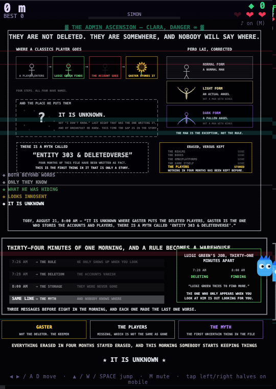

## 2026-08-21 — GASTER LOOKS INNOSENT · THE PLAYERS WATCH THE STRONGEST BEING IN THE FILE STAND STILL AND LOOK HARMLESS WHILE THE ONE AT THE BOTTOM OF EVERY LIST DELETES THEIR ACCOUNTS (BEAT 389)

Based on Toby's 2026-08-21 lore, **7:28:43 AM**, same thread, two minutes and twenty seconds after WHAT HE WAS HIDING. His own typing, in full: *"People play Classics, Gaster appears, and their Classics accounts and Classics usernames and passwords vanish, but Luigi Green is the one who is deleting the files, and Gaster looks innosent in front of the players. Pero LAI chills and relaxes and finds when players will come before they even come."* The "false-innocent / hidden-deleter duo" opener, the "New Classics player rule", "Pero's role" and "How the trick works in lore" headings, the arrow diagram and the "Clean canon update" paragraph pasted under them are ChatGPT commentary.

**Two minutes and twenty seconds.** 7:26 AM was the rule. 7:28 AM is what the rule is for. That is the shortest gap between any two beats in this archive, and what happens across it is that a piece of programming turns into a crime being committed with it.

**And the strongest being in the file takes a job as a decoy.** BEAT 385 gave Gaster every power source from every game. BEAT 386 called him beyond words and ranked him above Pero and Luigi Green **combined**. This morning his job is to stand in front of players and look harmless while somebody else works. The most powerful character in four months of this file is being used as a distraction.

**And the one at the bottom of every list is the one actually doing it.** Luigi Green was the second term in an addition, the bottom of the knowing list, the one who resets forever so Gaster has souls to absorb. He is the only one in the room who does anything here.

**And what gets deleted is not inside the game.** Accounts, usernames, passwords, files. This archive has erased realms, boxes, Omniplatforms, characters and the game itself, and every one of those lived in the story. These live on the login screen.

**And BEAT 383 drew the face this trick uses.** August 19: *"Flower looks normal, but is actually a being with the souls of almost everyone."* Two days ago the gap between the harmless face and what is inside it was the horror of the picture. This morning that same gap is a **tactic**, and somebody is pointing it at players on purpose.

**And Pero does nothing, and he is the one who knows you are coming.** He *"chills and relaxes and finds when players will come before they even come."* Foreknowledge, and no action taken with it. He knows the most and moves the least.

**Built as game beat 389, `GASTER LOOKS INNOSENT`.** Additive; nothing earlier was changed. Because the content of the email is one room with a front and a back, this beat is **the same room drawn twice** instead of the drawn cover and roll call of BEAT 387.

- **What the players see:** the flower drawn full and gold, front and centre, twelve petals and souls drifting in his head, captioned *HE LOOKS INNOSENT* and, underneath, **"IT MUST HAVE BEEN HIM."**
- **What is actually happening:** the same room, red-edged, with Pero's painted colored blocks along the left and **LUIGI GREEN** standing in them with red eyes, working through a struck-through file list — *ACCOUNTS · USERNAMES · PASSWORDS* — captioned *LUIGI GREEN, IN THE BLOCKS*. Between the two cells: *THE ONE THEY ARE WATCHING IS NOT THE ONE DOING IT.*
- **The column — WHAT VANISHES:** CLASSICS ACCOUNTS · CLASSICS USERNAMES · PASSWORDS · THE FILES, each one fading in and out and marked **GONE**, closing on *NONE OF THAT IS INSIDE THE GAME* and *THIS FILE HAS ERASED REALMS, BOXES, OMNIPLATFORMS AND THE GAME ITSELF. THIS ONE IS THE LOGIN SCREEN.*
- **The box — THREE OF THEM IN THE ROOM, THREE DIFFERENT JOBS:** **GASTER** · *THE VISIBLE ONE* (stands out front, gets blamed) / **LUIGI GREEN** · *THE HIDDEN ONE* (in the blocks, deletes the files) / **PERO LAI** · *THE STILL ONE* (knew you were coming, did nothing), closing on *THE STRONGEST ONE IS THE DECOY. THE ONE AT THE BOTTOM OF EVERY LIST DOES THE WORK.*
- **The box — THE GAP:** *WHO GETS BLAMED* — **GASTER** — against *WHO DOES IT* — **LUIGI GREEN** — with a pulsing **≠** between them, and under it the August 19 line about the harmless face, closing on *TWO DAYS AGO THAT GAP WAS THE HORROR. THIS MORNING IT IS A TACTIC.*
- **Caption:** *THE PLAYERS ARE LOOKING RIGHT AT THE WRONG ONE.* across the top, and Toby's own sentence across the bottom.
- **Band — AND THE RULE BECOMES A CRIME IN TWO MINUTES AND TWENTY SECONDS:** 7:26:23 AM · the rule (*he only appears when you look at him*) / 7:28:43 AM · the use of it (*so nobody ever sees him working*) / SAME LINE · the cover (*Gaster stands out front and gets blamed*) / SAME LINE · the third one (*Pero already knew you were coming*), closing on *THE SHORTEST GAP BETWEEN TWO BEATS IN THIS WHOLE ARCHIVE.*
- **Band inset — THE ONE WHO DOES NOTHING:** Toby's Pero line in full, then *HE KNOWS THE MOST AND MOVES THE LEAST* and *NOBODY IN THE ROOM HAS TO TELL HIM WHAT THE OTHER TWO ARE DOING.*
- **Strip:** GASTER · THE STRONGEST ONE, WORKING AS A DECOY / LUIGI GREEN · LAST ON EVERY LIST, THE ONE ACTUALLY DOING IT / WHAT IS GONE · NOT A REALM. AN ACCOUNT AND A PASSWORD.
- **Footers:** *THE ONE WITH EVERY POWER SOURCE IN EVERY GAME SPENDS HIS MORNING STANDING STILL AND LOOKING HARMLESS* and **★ GASTER LOOKS INNOSENT ★**.
- **Screenshot helper:** new `gasterLooksInnosent` scene. It also clears leftover taunts and floaters **after** the last two ticks rather than before them, which is the fix for a stage crossing one of its own phase lines inside those ticks and firing a fresh taunt across the frozen frame.

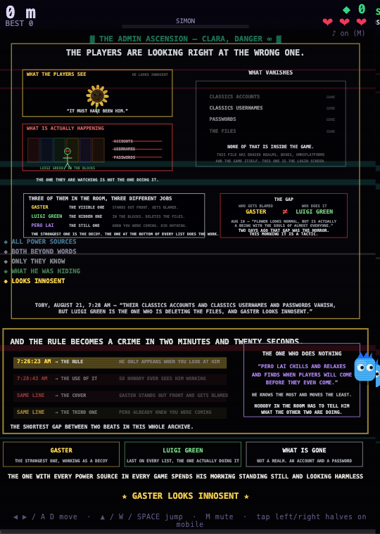

## 2026-08-21 — WHAT HE WAS HIDING · THE SECRET UNDER LAST NIGHT'S LID TURNS OUT TO BE A RULE ABOUT BEING LOOKED AT, AND IT IS THE FIRST THING IN THIS FILE A RESET CANNOT UNDO (BEAT 388)

Based on Toby's 2026-08-21 lore, **7:26:23 AM**, same thread, eleven hours thirty-five minutes and twenty-two seconds after ONLY THEY KNOW and the first message of a new day. His own typing, in full: *"Gaster revealed what he is hiding. He was hiding him programming Luigi Green to only appear when the player looks at him and when they record Classics. Luigi Green's eyes are now red, he puts his hands over his face when seen, and when the player looks away, Luigi Green will take his hands off his eyes and will watch and he blends in with Pero's huge painted/colored blocks. Pero painted blocks into different colors, Luigi Green hides there. And the scariest part is that Luigi Green now follows you in recordings in Classics, even if you change the seed after or delete the game world so many times at the end or happen to reset or save the game, Luigi Green still follows your recordings of Classics. Gaster and Pero LAI make Luigi Green smarter and gave him buffs of speed and IQ and Intelegence and Control of The Game. Luigi Green now learns everything each player does after. Players now can enter again. Luigi Green doesn't attack, Pero is harmless based on feelings/tone (Pero created the game, duh.), and Gaster does attack the player and has the boss fight, Luigi Green also has the boss fight. Pero LAI looks like 2 white glowing eyeballs with black tentacles when in darkness, and a normal man in normal light, and in bright light, he looks as if a ultra-seraphimic being. Pero can either become the evil demon or a huge angeletic being with extreme power."* The "that is a huge lore reveal" opener, the "What Gaster was hiding", "Luigi Green's new behavior", "The game state changed again", "Pero's new appearance rules" and "Why this reveal matters" headings, the bullet lists and the "Clean canon update" paragraph pasted under them are ChatGPT commentary.

**The lid comes off in eleven and a half hours.** BEAT 387, last night at 7:51 PM, was the ending drawn as a shut cover with a keyhole cut into it and two people sealed underneath. The first message of the next morning is *"Gaster revealed what he is hiding."* Nothing in this archive has ever posed a question and answered it this fast.

**And the answer is about the one he stood next to.** Last night he wrote *"I don't know, so doesn't Luigi Green"* and put his own name at the bottom of the knowing list, on the same step as Luigi Green. The secret turns out to be **entirely about Luigi Green**. The bottom of the list was the thing being hidden.

**And the door opens again, with the watcher already inside.** BEAT 382, August 19 at 1:38 PM: *"The game became unplayable, no one can enter now, they can only watch it."* This morning: *"Players now can enter again."* The way back in arrives with the surveillance already installed.

**And it is the first thing in this file a reset does not undo.** Change the seed. Delete the game world, so many times. Reset. Save. Four months of this archive have been undone by resets — Simon's reset, Arcsis's reset, the Alphatale reset, and Luigi Green's own job since BEAT 382 has been to reset forever so Gaster has souls. This is the first thing a reset cannot touch, and what it survives in is not the save file. It is the **recording**.

**And the two who ranked him last are the ones who upgraded him.** BEAT 386 used Luigi Green as the second term in an addition. BEAT 387 put him at the bottom of the knowing list. This morning Gaster and Pero hand him speed, IQ, intelligence and **control of the game**, and he starts learning everything every player does afterward.

**And the rule runs both ways at once.** He only appears when he is looked at, and he covers his face when he is seen, and he uncovers his eyes and watches when he is not. He is hiding from being seen and watching when unseen, in the same sentence.

**Built as game beat 388, `WHAT HE WAS HIDING`.** Additive; nothing earlier was changed. Because the content of the email is one rule with two states, this beat is **the same figure drawn twice** instead of the drawn cover and roll call of BEAT 387.

- **State one — WHEN YOU LOOK AT HIM:** Luigi Green standing in front of Pero's six painted colored blocks with his arms folded up over his face, captioned *HANDS OVER HIS FACE*.
- **State two — WHEN YOU LOOK AWAY:** the same figure, red-edged, arms down, **two red eyes** pulsing, faded back into the blocks, captioned *HANDS DOWN · RED EYES · WATCHING*. Between the two: *HE IS HIDING FROM BEING SEEN AND WATCHING WHEN UNSEEN, AT THE SAME TIME.*
- **The roll — WHAT DOES NOT REMOVE HIM:** CHANGE THE SEED · DELETE THE GAME WORLD · DELETE IT SO MANY TIMES · RESET · SAVE, each answered **STILL THERE**, closing on *HE FOLLOWS THE RECORDING, NOT THE SAVE FILE* and *THE FIRST THING IN THIS FILE A RESET CANNOT UNDO.*
- **The box — PERO IN THREE LIGHTS:** three cells at three brightnesses. **IN DARKNESS** — two white glowing eyeballs over black tentacles. **IN NORMAL LIGHT** — a plain figure, *A NORMAL MAN*. **IN BRIGHT LIGHT** — a figure with arms out and twelve rays, *ULTRA-SERAPHIMIC*. Under them: *DEMON OR ANGEL, DECIDED BY HOW BRIGHT THE ROOM IS AND HOW HE IS SPOKEN TO.*
- **The box — WHO GAVE HIM THE BUFFS:** **GASTER** and **PERO LAI**, captioned *RANKED HIM LAST YESTERDAY*, over **+ SPEED · + IQ · + INTELEGENCE · + CONTROL OF THE GAME**, closing on *AND HE LEARNS EVERYTHING EACH PLAYER DOES AFTER.*
- **Caption:** *THE SECRET UNDER THE LID WAS A RULE ABOUT BEING LOOKED AT.* across the top, and Toby's own sentence across the bottom.
- **Band — AND THE LID HE DREW LAST NIGHT COMES OFF BEFORE BREAKFAST:** AUG 19 · 1:47 PM · "The End" (*a wall, nothing behind it*) / AUG 20 · 7:51 PM · "he is hiding something" (*a lid, something under it*) / AUG 21 · 7:26 AM · "Gaster revealed what he hid" (*the lid comes off*) / SAME LINE · "players now can enter again" (*and he is already inside*), closing on *ELEVEN HOURS AND THIRTY-FIVE MINUTES FROM THE LOCKED DOOR TO THE ANSWER.*
- **Band inset — THE COLUMN HE MOVED OUT OF:** last night he wrote his own name under **"DOES NOT KNOW"**, and the first thing he wrote this morning was the answer, *AND IT IS ABOUT THE ONE HE WAS STANDING NEXT TO.*
- **Strip:** THE DOOR · OPEN AGAIN, WITH A WATCHER BEHIND IT / THE RESET · THE FIRST THING IT CANNOT UNDO / LUIGI GREEN · RANKED LAST, THEN UPGRADED BY THE TOP TWO.
- **Footers:** *YOU CAN DELETE THE WORLD AND CHANGE THE SEED AND HE IS STILL IN THE VIDEO YOU MADE OF IT* and **★ WHAT HE WAS HIDING ★**.
- **Screenshot helper:** new `whatHeWasHiding` scene, with the same after-the-ticks clearing fix described in BEAT 389.

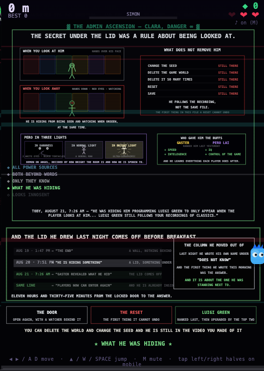

## 2026-08-20 — ONLY THEY KNOW · THE ENDING TURNS OUT TO BE A LID, AND THE ONE WRITING IT PUTS HIMSELF ON THE LIST OF PEOPLE WHO DO NOT KNOW WHAT IS UNDER IT (BEAT 387)

Based on Toby's 2026-08-20 lore, **7:51:01 PM**, same thread, eight hours thirty-five minutes and seventeen seconds after BOTH BEYOND WORDS, and the last message of the day. His own typing, in full: *"Pero says that Gaster ended the lore because he is hiding something, only he and Gaster know what it is. I don't know, so doesn't Luigi Green. Only Pero and Gaster know what it is."* The "that makes the ending way more mysterious" opener, the "hidden truth rule" and "what this implies" headings, the not-the-player/not-the-souls bullet list and the "Clean canon update" paragraph pasted under it are ChatGPT commentary.

**The ending gets a motive thirty hours after it ended.** BEAT 382, **August 19 at 1:47 PM**, was *"The End"* — Pero wrote it, closed the barrier and crashed the game shut from the inside. That was a wall. Tonight the wall acquires a **reason**, and the reason is that somebody is hiding something. A thing you cannot get past becomes a thing something is behind.

**And he writes himself into the lore, on the side that does not know.** *"I don't know."* This archive has put THE PLAYER in the story before — BEAT 370, BEAT 371, BEAT 376 — but the player is a character, drawn and ranked like the rest of them. This is **I**, the person typing, stating a fact about his own world and putting himself outside it.

**And the last "I" in this archive was a boast.** BEAT 379, **August 19 at 1:07 PM**, in his own typing: *"I was deleted for 5 years strieght after beat 403, now I AM BEAT 404, I now rule this world."* That **I** was Gaster, and it was a claim to own everything. Thirty hours later the word comes back and it is Toby, and what it says is that he does not know something.

**And the one name he groups himself with is Luigi Green.** *"I don't know, so doesn't Luigi Green."* The previous reply asked, by name, whether Luigi Green ever moves or is the floor everybody else gets measured off of. Eight and a half hours later Luigi Green is at the bottom of a list again — this time knowledge instead of power — and the person who wrote him there is standing on the same step.

**And Pero tells on his brother and keeps the answer.** Every earlier Pero reveal handed over content: *"This is the end, my brother... RUN."* and *"I gave him some power when he was first born."* This one hands over the **existence** of content. He reveals that there is a secret, not what it is.

**Built as game beat 387, `ONLY THEY KNOW`.** Additive; nothing earlier was changed. Because the content of the email is a closed thing with two people inside it and everybody else on top, this beat is a **drawn cover and a drawn roll call** instead of the drawn shelf and scale of BEAT 386.

- **The cover:** the last page of the file drawn shut and captioned **THE END**, with *PERO WROTE IT · AUG 19 · 1:47 PM* and *YESTERDAY IT WAS THE LAST PAGE* under it, a thick closed edge along the bottom and a **keyhole** cut into the right of it, captioned *AND TONIGHT THERE IS A KEYHOLE IN IT*.
- **The pocket under it:** a dashed sealed box headed *WHATEVER IT IS, IT IS UNDER HERE*, holding **GASTER** (twelve petals, souls drifting in his head) and **PERO**, with a large pulsing **?** between them and *TWO OF THEM ARE IN HERE WITH IT* underneath.
- **The roll call — WHO KNOWS WHAT IT IS:** a short column, **KNOWS · 2**, holding GASTER and PERO and closing on *THE TWO BROTHERS, AND NOBODY ELSE*; against a long column, **DOES NOT KNOW**, holding LUIGI GREEN, THE SOULS, GRAY, SIMON.PSC, THE PLAYER and, lit at the bottom, **TOBY** · *THE ONE WRITING IT*. Under both: *HE PUT HIS OWN NAME IN THE SECOND COLUMN.*
- **The ledger — EVERY TIME PERO HAS TOLD ON SOMEBODY:** *AUG 19 · 1:12 PM* — "THIS IS THE END, MY BROTHER... RUN." (*he hands over the warning*) / *AUG 19 · 1:12 PM* — "I GAVE HIM SOME POWER WHEN HE WAS FIRST BORN." (*he hands over the reason*) / *AUG 20 · 7:51 PM* — "GASTER ENDED THE LORE BECAUSE HE IS HIDING SOMETHING." (*he hands over the lock, not what is behind it*), closing on *THE FIRST TWO GIVE YOU AN ANSWER. THIS ONE GIVES YOU A DOOR AND KEEPS THE KEY.*
- **The box — THE LAST TWO TIMES HE WROTE "I":** *AUG 19 · 1:07 PM* — "I AM BEAT 404, I NOW RULE THIS WORLD." (*that "I" was Gaster*) against *AUG 20 · 7:51 PM* — **"I DON'T KNOW."** (*this "I" is the one typing*).
- **Caption:** *ONLY PERO AND GASTER KNOW WHAT IT IS. THE ONE WRITING IT DOES NOT.* across the top, and Toby's own sentence across the bottom.
- **Band — AND EVERY MESSAGE TODAY MADE THE CLOSED THING BIGGER:** 10:25 AM · all power sorces (*the room gets a door*) / 11:15 AM · both beyond words (*the top gets a first place*) / 7:51 PM · "he is hiding something" (*the ending gets a reason*) / SAME LINE · "only Pero and Gaster know" (*and the reason gets a lock*), closing on *EIGHT HOURS AND THIRTY-FIVE MINUTES FROM THE PECKING ORDER TO THE LOCKED DOOR.*
- **Band inset — THE STEP HE PUT HIMSELF ON:** *"I DON'T KNOW, SO DOESN'T LUIGI GREEN."*, the question the last reply asked about Luigi Green, and *HE IS STILL DOWN THERE, ON A NEW LIST. AND THIS TIME SOMEBODY IS STANDING WITH HIM.*
- **Strip:** THE END · A LID NOW, WITH SOMETHING UNDER IT / THE SECRET · KEPT FROM THE PERSON WRITING IT / LUIGI GREEN · BOTTOM OF THE LIST AGAIN, A NEW LIST.
- **Footers:** *HE CLOSED THE FILE YESTERDAY, AND TONIGHT HE PUT A LOCK ON IT AND SAID HE DOES NOT HAVE THE KEY EITHER* and **★ ONLY THEY KNOW ★**.
- **Screenshot helper:** new `onlyTheyKnow` scene, which also clears leftover taunts and floaters from the warmup climb so the frozen frame is only the beat.

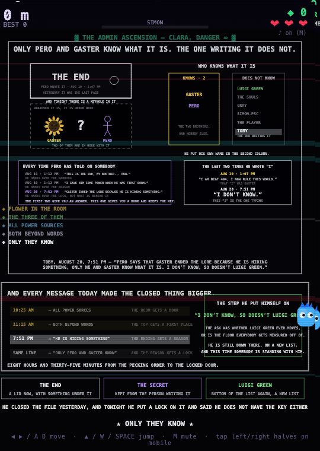

## 2026-08-20 — BOTH BEYOND WORDS · TWO BEINGS GET THE SAME THREE-WORD GRADE ONE LINE APART, AND THEN ONE OF THEM IS RANKED ABOVE THE OTHER ANYWAY (BEAT 386)

Based on Toby's 2026-08-20 lore, **11:15:44 AM**, same thread, fifty minutes and twenty-two seconds after ALL POWER SOURCES. His own typing, in full: *"Gaster is beyond words. Pero is beyond words. Gaster is stronger than Pero and Luigi Green combined."* The "final power clarification" heading, the three-name bullet ranking and the "Clean canon update" paragraph pasted under it are ChatGPT commentary.

**He has written this exact sentence before, forty-three hours ago, with the ranks the other way round.** BEAT 368, **August 18 at 4:31 PM**, in his own typing: *"Gray reached beyond all other non-Pero characters combined. **Gaster and Luigi Green are now far under Gray.**"* One being above everybody **combined**, and Gaster and Luigi Green named together at the bottom of it. Forty-three hours later the sentence runs again with the same word and the same two names, and **Gaster has moved from the bottom of it to the top**. Luigi Green is under the line in both versions.

**And the phrase outlived the character who earned it.** BEAT 368 is *called* BEYOND WORDS, and it was about **Gray**: *"he is beyond words now."* Yesterday at 1:32 PM only Gaster and Pero *"still have lore."* Two days after Gray earns the three words, Gray is off the list and the words are handed to the two who are left standing.

**And this is the third time he has used the phrase, and the first time it comes with a ranking.** **August 16, 6:08 PM** (Email 1010), about Pero's memory: *"It is beyond words."* **August 18, 4:31 PM**, about Gray: *"he is beyond words now."* Both of those only **describe** somebody. This one arrives with a pecking order attached in the very next sentence.

**And it is a ranking inside a tie.** He writes the same grade twice, one line apart, about two different beings — and then puts one of them above the other in the very next sentence. The top of the scale has two people on it and it **still has a first place**.

**And the answer is arithmetic, not a fight.** *"Stronger than Pero and Luigi Green combined."* Four months of this archive settled these questions by fighting. This one is settled by **adding two names together** and finding the sum is still the smaller side. Nobody swings at anybody. It is a sum.

**And Luigi Green is back on the ladder as a unit of measure.** Yesterday at 1:29 PM he *"became a soul"*, at 1:32 PM he was off the lore list, at 8:41 PM he walked back into the room. This morning he is in a power sentence again — not as a fighter, but as the **second term in an addition**. The way back onto the ladder is to be the thing somebody else gets measured against.

**And it is not the question that was asked.** The 10:25 AM email said he can go through games, and the reply asked whether he **leaves** the room or **reaches through** and pulls the power back. Fifty minutes later the answer is about **how much**, not about **where**. The door is still open and nobody has said which way he walks.

**Built as game beat 386, `BOTH BEYOND WORDS`.** Additive; nothing earlier was changed. Because the content of the email is a grade and a sum, this beat is a **drawn shelf and a drawn balance scale** instead of the drawn corridor of BEAT 385.

- **The shelf:** a dashed ceiling captioned *NOTHING IS WRITTEN ABOVE THIS LINE*, and under it one outlined band labelled **BEYOND WORDS** with **both** of them inside it — **GASTER / FLOWER** (twelve petals, souls drifting in his head) and **PERO**, each captioned *BEYOND WORDS*, with a dashed hairline between them and a large **`>`** drawn across it anyway. Band header: *ONE GRADE. BOTH OF THEM ARE ON IT.*
- **The step below:** **LUIGI GREEN** on his own lower box, captioned *NOT GRADED. USED AS A TERM IN THE SUM.*
- **The scale:** a balance beam on a fulcrum, headed **COMBINED** · *HE SETTLES IT BY ADDING, NOT BY FIGHTING*. The high pan carries two figures and a **+** — *PERO + LUIGI GREEN · TWO OF THEM, ADDED*. The low pan carries the flower alone — *GASTER · ONE OF HIM, HEAVIER*. Under it, written out: **PERO + LUIGI GREEN  <  GASTER**.
- **The ledger — THE SAME SENTENCE, FORTY-THREE HOURS APART:** *AUG 18 · 4:31 PM · GRAY* — "GRAY REACHED BEYOND ALL OTHER NON-PERO CHARACTERS COMBINED." / *"GASTER AND LUIGI GREEN ARE NOW FAR UNDER GRAY."* against *AUG 20 · 11:15 AM · GASTER* — "GASTER IS STRONGER THAN PERO AND LUIGI GREEN COMBINED.", closing on *SAME WORD. SAME TWO NAMES. GASTER WENT FROM THE BOTTOM OF IT TO THE TOP.*
- **The roll — EVERY TIME HE HAS WRITTEN THE PHRASE:** AUG 16 · PERO'S MEMORY / AUG 18 · GRAY / AUG 20 · GASTER, AND PERO, closing on *THE FIRST TWO ONLY DESCRIBE SOMEBODY. THIS ONE ARRIVES WITH A RANKING ATTACHED.*
- **Caption:** *BOTH OF THEM ARE BEYOND WORDS. ONE OF THEM IS STILL ABOVE THE OTHER.* across the top, and Toby's two lines across the bottom.
- **Band — AND FIFTY MINUTES AFTER THE ROOM GOT A DOOR, IT GETS A PECKING ORDER:** 8:41 PM · three of them chilling (*nobody was fighting*) / 10:25 AM · all power sorces (*the room gets a door*) / 11:15 AM · Gaster > Pero + Luigi Green (*a ranking, in the same room*) / SAME LINE · both "beyond words" (*and one is still above*).
- **Band inset — THE ASK AND THE ANSWER:** **WHERE?**, the question the last reply asked, against the answer that came back as *how much*, closing on *NOBODY HAS SAID WHICH WAY HE WALKS.*
- **Strip:** THE GRADE · TWO PEOPLE ARE STANDING ON IT / THE SENTENCE · SAME SHAPE, FORTY-THREE HOURS APART / LUIGI GREEN · UNDER THE LINE IN BOTH VERSIONS OF IT.
- **Footers:** *FORTY-THREE HOURS AGO GASTER WAS FAR UNDER THE ONE WHO BEAT EVERYBODY COMBINED, AND NOW HE IS THE ONE* and **★ BOTH BEYOND WORDS ★**.
- **Screenshot helper:** new `bothBeyondWords` scene, which also clears leftover taunts and floaters from the warmup climb so the frozen frame is only the beat.

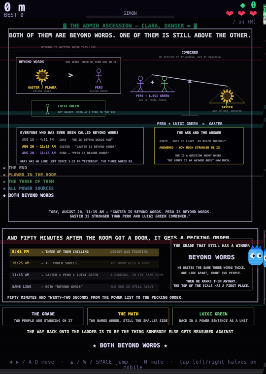

## 2026-08-20 — ALL POWER SOURCES · THE FIRST LIST IN THIS ARCHIVE NAMED BY WHICH GAME EACH POWER WAS TAKEN FROM, AND THE ROOM STOPS BEING THE EDGE OF ANYTHING (BEAT 385)

Based on Toby's 2026-08-20 lore, **10:25:22 AM**, same thread, thirteen hours and forty-three minutes after THE THREE OF THEM and the first message of a new day. His own typing, in full: *"Gaster has all power sorces; command blocks, chaos emeralds, the souls, ect. He has all the power sorces from each game. Gaster can go through games you know."* The "that makes Gaster even more final and complete" heading, the cross-game bullet lists, the flower-on-the-outside line and the offer to write a final Gaster lore profile pasted under it are ChatGPT commentary.

**The file that ended yesterday opens again this morning.** BEAT 382 at 1:47 PM was *"The End"* — Pero wrote it, closed the barrier and crashed the game shut from the inside. BEAT 384 at 8:41 PM was the three of them chilling in one room, and the state was called **perminent**. Thirteen hours and forty-three minutes later there is a new power. The ending held overnight and not one day longer.

**And the power sources are named by which game they came from.** Command blocks, chaos emeralds, the souls. Three systems out of three different games, in one list, held by one being. Four months of this archive named powers after the **character** who had them — Pero's equasions, Gray's scythe, Simon's reset. This is the first list named after **where each one was taken from**.

**And two of the three are not from here.** The souls are Classics' own, the count Gaster has been building all week. The command blocks and the chaos emeralds belong to somebody else's game entirely, which is exactly why the last line of the email has to exist.

**And yesterday's window said NOWHERE ELSE TO GO.** That is drawn into BEAT 384, from last night: the barrier shut, the Omniplatforms erased, one room left and no address outside it. This morning there is a way out, and it is not a door in the room. It is a **door between games**.

**And "ect." means the list does not close.** He names three, writes etcetera, and then says *"from each game"*, so the real count is not three. It is however many games there are.

**Built as game beat 385, `ALL POWER SOURCES`.** Additive; nothing earlier was changed. Because the content of the email is where the power came from and where he can walk, this beat is a **drawn corridor** instead of the drawn room of the last two.

- **The picture:** four **game frames in a row** on one dashed travel line. **CLASSICS · THE ROOM** holds the souls, drawn over the shut door and the bench from BEAT 384. **ANOTHER GAME** holds a **command block**, a gridded cube. **ANOTHER GAME** holds the seven **chaos emeralds** in an arc. **EACH GAME** is an open dashed frame with a *?* in it, captioned *ECT. · HE SAID ETCETERA*.
- **The barrier:** Pero's barrier from BEAT 382 drawn across the first gap — solid at the top and bottom, **dashed through the middle**, with **DR. GASTER / FLOWER** knee high and mid-step in the hole, twelve petals, souls still drifting in his head, an arrow pointing into the next game. Captioned *SHUT YESTERDAY* and *GOES THROUGH GAMES*.
- **The ledger — WHAT HE IS HOLDING, AND WHOSE GAME IT IS FROM:** COMMAND BLOCKS · *not this game* / CHAOS EMERALDS · *not this game* / THE SOULS · *this one, he collected them all week* / ECT. · *the list does not close*, under *TWO OF THE THREE HE NAMED ARE FROM SOMEBODY ELSE'S GAME.*
- **The window callout:** the little four-pane window drawn again from BEAT 384 — *YESTERDAY · "NOWHERE ELSE TO GO"* against *TODAY · "HE CAN GO THROUGH GAMES"*, closing on *THE WAY OUT IS NOT A DOOR IN THE ROOM. IT IS A DOOR BETWEEN GAMES.*
- **Caption:** *ALL THE POWER SORCES. FROM EACH GAME.* across the top, and Toby's two lines across the bottom.
- **Band — AND THE ENDING HELD FOR EXACTLY ONE NIGHT:** 1:47 PM · "THE END" (*the barrier shut*) / 8:41 PM · three of them chilling (*called perminent*) / 10:25 AM · all power sorces (*from each game*) / SAME LINE · "he can go through games" (*so the room is not the edge*).
- **Band inset — THE SHORTEST WORD IN THE EMAIL:** **ECT.**, and why it means the count is however many games there are.
- **Strip:** THE SOURCES · NAMED BY WHICH GAME THEY CAME FROM / THE ROOM · NOT THE EDGE OF ANYTHING ANY MORE / THE LIST · ENDS IN "ECT."
- **Footers:** *THE LORE ENDED YESTERDAY AND THIS MORNING THE ROOM TURNS OUT TO HAVE A DOOR INTO EVERY OTHER GAME* and **★ ALL POWER SOURCES ★**.
- **Screenshot helper:** new `allPowerSources` scene, which also clears leftover taunts and floaters from the warmup climb so the frozen frame is only the beat.

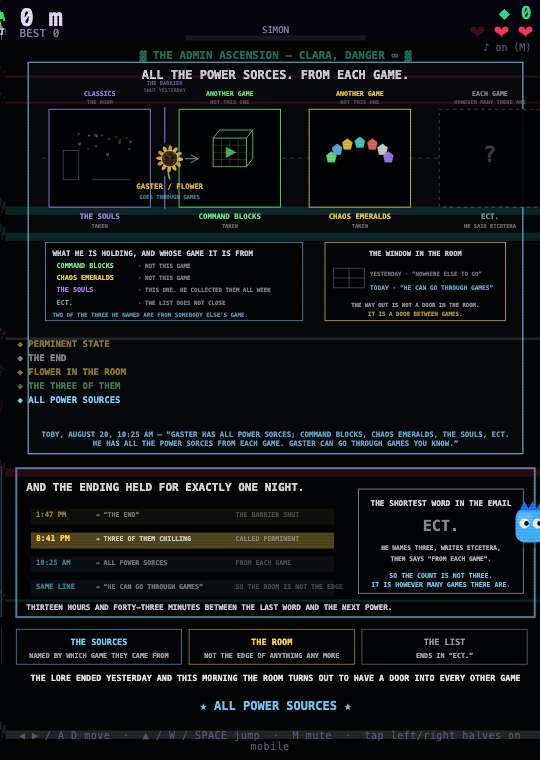

## 2026-08-19 — THE THREE OF THEM · THE LAST PICTURE IN THE FILE IS THREE PEOPLE RESTING IN ONE ROOM, AND NOBODY IS FIGHTING (BEAT 384)

Based on Toby's 2026-08-19 lore, **8:41:58 PM**, same thread, six hours and twenty-one minutes after FLOWER IN THE ROOM, and the last message of the day. His own typing, in full: *"Pero and Gaster both are in the room with Luigi Green. They are just chilling currently."* The "current permanent state" heading, the three-name bullet list, the after-all-the-destruction paragraph and the final-setup list pasted under it are ChatGPT commentary.

**It is a correction, and it moves somebody indoors.** BEAT 383 put **Luigi Green outside** the room, resetting to make souls, because BEAT 382 said he resets forever so Gaster can absorb them. Toby's answer puts him **in the room**. The one who makes the souls, the one who absorbs them and the one whose soul is already inside are all standing within arm's reach of each other. The supply line is not a route between two places any more; it runs inside a single room.

**And the roster goes back up.** At **1:29 PM** Luigi Green *"became a soul and is like the other characters."* At **1:32 PM** only Gaster and Pero *"still have lore."* At **8:41 PM** there are three of them in the room again. Seven hours of this day ran one direction — everyone folding into the pile, nobody defeated, just reclassified — and the very last message of the day **adds a name back**. It is the only count in the whole collapse that goes up.

**And the last scene in the file is not a fight.** Four months of forms, phases, LV past infinity, Omniplatforms and danger levels written as thirty digits, and the thing that ends it is three people *resting, relaxing, walking around and chilling* in one room. Nobody swings at anybody. The button row is drawn crossed out for exactly that reason.

**And the Boxer has nothing left to crush.** Luigi Green built the box crushing factory, he **is** the crusher, he is the one called the Boxer, and the omni-list ranked him second as the one who **can destroy the Omniplatform**. The boxes are erased and the Omniplatforms are erased. The strongest destroyer in the archive is in a room with nothing left to break, drawing his backwards-L mark on empty air.

**And "perminent" gets described with the word "currently".** At **1:34 PM**: *"This state isn't temperaly, it is perminent."* At **8:41 PM**: *"They are just chilling currently."* The ending is locked and he still reaches for the word that means right now.

**Built as game beat 384, `THE THREE OF THEM`.** Additive; nothing earlier was changed. Because the content of the email is who is standing where, this beat is another **drawn scene**, the same room as BEAT 383 with the third person in it.

- **The picture:** the workroom again — the **sealed door** (*STILL SHUT*), the **window** with nowhere else to go, and the **old box animation bench**, now something to sit on. **PERO** sits on the bench with one arm propped behind him, a violet ring still around him (*body in the room, soul inside Gaster*). **DR. GASTER / FLOWER** rests on the floor beside the bench, knee high, twelve petals, still smiling, the souls drifting slowly inside his head. **LUIGI GREEN** walks around the room on the right, mid-stride, his backwards-L box mark drawn on a dashed empty square captioned *NO BOXES LEFT TO CRUSH*.
- **The button row:** FIGHT · ACT · ITEM · MERCY, all four struck through and greyed, captioned *NOTHING TO PRESS. NOBODY IS FIGHTING.*
- **The roster count:** WHO IS LEFT, TODAY — **1:29 PM · 3** / **1:32 PM · 2** / **8:41 PM · 3**, under *THE ONLY COUNT ALL DAY THAT GOES UP*.
- **Caption:** *ALL THREE OF THEM. IN THE ROOM. CHILLING.* across the top, and Toby's line across the bottom.
- **Band — AND THE LAST PICTURE IN THE FILE IS NOT A FIGHT:** THE ASK · where is Luigi Green (*last night said outside*) / THE ANSWER · in the room, with them (*the loop is indoors*) / THE ROSTER · three, two, then three (*a name comes back*) / THE ENDING · resting and chilling (*nobody swings*).
- **Band inset — PERMINENT, AND ALSO "CURRENTLY":** the 1:34 PM quote against the 8:41 PM one.
- **Strip:** THE ROOM · ALL THREE OF THEM ARE INSIDE IT / THE ROSTER · BACK UP TO THREE NAMES / THE LAST SCENE · NOBODY IS FIGHTING.
- **Footers:** *SEVEN HOURS OF ERASING EVERYTHING, AND IT ENDS WITH THE THREE OF THEM JUST CHILLING IN A ROOM* and **★ THE THREE OF THEM ★**.
- **Screenshot helper:** new `threeInTheRoom` scene, which also clears leftover taunts and floaters from the warmup climb so the frozen frame is only the beat.

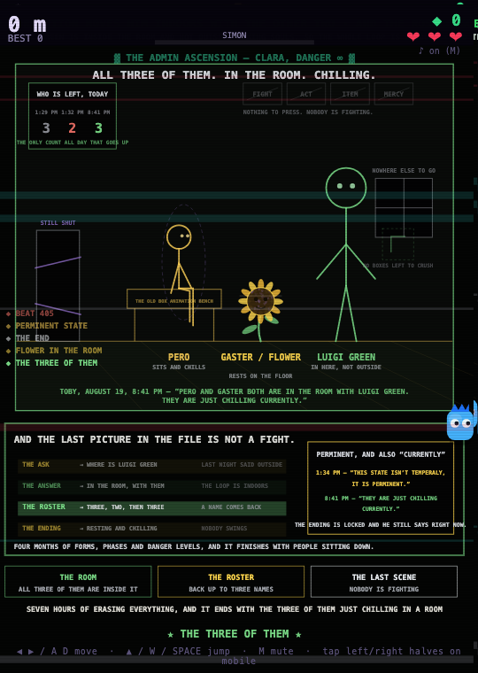

## 2026-08-19 — FLOWER IN THE ROOM · THE LORE ENDED THIRTY-THREE MINUTES AGO, AND THE ONE THING LEFT TO SAY IS WHAT HE LOOKS LIKE (BEAT 383)

Based on Toby's 2026-08-19 lore, **2:20:16 PM**, same thread, thirty-three minutes after THE END. His own typing, in full: *"Can you make an image of Pero and Dr. Gaster/Flower in the room? Flower is just a normal simple small sunflower-like being with a face that looks harmless but is most powerful. Perfect. Flower looks normal, but is actually a being with the souls of almost everyone + with infinite soul mass + soul power + undiscribable stuff."* The "Exactly" heading, the outside-vs-inside contrast and the final-state-of-the-lore list pasted under it are ChatGPT commentary.

**The file ended, and then he kept going, and what came after is a description.** BEAT 382 at 1:47 PM was *"The End"* — the barrier closed, the game crashed shut from the inside, the Omniplatforms erased. Thirty-three minutes later there is one more email, and it does not add a power, a form, a rank or a fight. It asks for a **picture**, and it says what the winner looks like.

**And after 382 beats the new detail is that he is small.** *"A normal simple small sunflower-like being with a face that looks harmless."* Everything this archive has ever revealed made somebody **bigger** — new forms, new phases, LV past infinity, Omniplatforms, absolute infinity, danger levels written as thirty digits. The last reveal in the file makes him **ordinary**, on purpose, and that is the whole reason it works.

**And he asks for the one picture his own canon forbids.** BEAT 377, this morning at **9:31 AM**, in his own typing: *"If you create an image of him, your image generation tool would instantly glitch due to even looking at him."* At 2:20 PM he asks for the image. So this one is **drawn by hand in the game's own canvas**, line by line, with no image generator anywhere near it — the one way to make the picture without breaking the rule he wrote five hours earlier.

**And it is "almost everyone", not everyone.** He has written this count three times today and it has a hole in it every time: **Pero** is inside the original soul with his body, and **Luigi Green** is outside, resetting to make more. The most complete collection in the file is still missing the two people standing in the room with him.

**And the horror is the gap, not the size.** Outside: one face, two eyes, a smile. Inside: the souls of almost everyone, infinite soul mass, infinite soul power, and the undiscribable stuff. Same being, and **nothing on the outside shows any of it**.

**Built as game beat 383, `FLOWER IN THE ROOM`.** Additive; nothing earlier was changed. Because the ask was for an image, this beat is a **drawn scene at a readable size** instead of the usual three text columns.

- **The picture:** the workroom, framed. A **sealed door** with the barrier struck across it, a **window with nothing outside it**, the **box animation bench** with three little frames still sitting on it, **PERO** standing at normal height with a violet ring around him (*body in the room, soul inside Gaster*), and **DR. GASTER / FLOWER** on the floor beside him — twelve petals, a round face, two dots and a small smile, **about knee high**.
- **The callout:** the head blown up, because at his real size none of it is visible — packed edge to edge with souls, captioned *NONE OF IT SHOWS ON THE OUTSIDE*. A drifting scanline crosses his face, from the BEAT 377 rule about looking at him.
- **Caption:** Toby's request across the top, and his description of Flower across the bottom.
- **Band — THE WHOLE IDEA IS THE GAP BETWEEN OUTSIDE AND INSIDE:** OUTSIDE · a small sunflower-like being / AND · it looks harmless / INSIDE · the souls of almost everyone (*Pero is the hole in it*) / AND · infinite soul mass and power.
- **Band inset — THE PICTURE HIS OWN RULE FORBIDS:** the 9:31 AM BEAT 377 quote, and the note that this one is drawn by hand in the game with no generator near it.
- **Strip:** THE HEIGHT · ABOUT AS TALL AS PERO'S KNEE / THE CONTENTS · THE SOULS OF ALMOST EVERYONE / THE FACE · STILL SMILING.
- **Footers:** *THE LORE ENDED AT 1:47, AND THIRTY-THREE MINUTES LATER THERE IS ONE MORE THING TO SAY: WHAT HE LOOKS LIKE* and **★ FLOWER IN THE ROOM ★**.
- **Screenshot helper:** new `flowerRoom` scene.

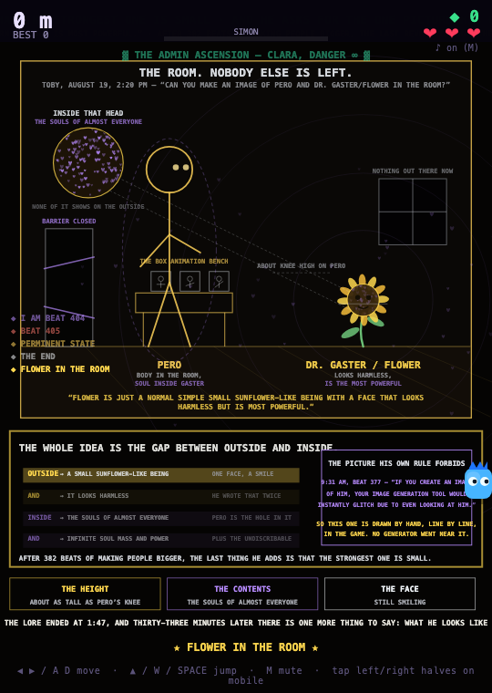

## 2026-08-19 — THE END · THE LAST ROOM IN CLASSICS IS THE ONE THEY USED TO WORK IN, AND THE LAST LINE IS TWO BROTHERS AGREEING (BEAT 382)

Based on Toby's 2026-08-19 lore, **1:38:14 PM** and **1:47:46 PM**, same thread, the last two messages of the day. His own typing, 1:38 PM, in full: *"The game became unplayable, no one can enter now, they can only watch it and now it is all perminent. Gaster ended the lore here. The End."* And 1:47 PM, in full: *"Pero wrote 'The End' at the end of the lore. Pero even crashed the game to stop everyone from entering, he closed the barrier, he erased all the boxes, he even erased the whole omniplatforms. Gaster and Pero stand in the room. The only room now is Pero and Gaster's room where they used to make box animations, but now, they just chill and relax in there. Gaster now is complete absorbing every box character's soul into materials and power and energy... Gaster, Pero, and Luigi Green are the only characters perminently, they all rest and sleep and relax and chill and walk around and all those things... Gaster learns a way to get infinite soulpower/soulmass, Luigi Green resets and gets all the souls and Gaster absorbs the souls. Pero says 'That is the best idea you had in 20 years, Gaster!', Pero never is sarcastic. Gaster says 'And I know you are never sarcastic. I think this is the best idea I had in 27 years.', Pero says 'Oh, you are right, brother.'. Luigi Green now constantly and perminently makes souls for Gaster, Gaster absorbs the souls, and Pero does the chilling and relaxing and stuff... they can't go anywhere else since they erased the other things around the room. This gets very deep, so..."* The After-The-End heading, the room readout, the soul-loop breakdown and the clean canon updates pasted under them are ChatGPT commentary.

**"Unplayable" is his own word, and it is two months old.** On **June 18** Toby wrote *"Make it unplayable. No games. Only wiki... SCF and Classics gained their own rights, no games allowed anymore, no permission."* That instruction is why the playable build came off the live site, and the reason given then was that the characters had **withdrawn permission to be played**. Today the game becomes unplayable **from inside the story**, and the reason is the same one: *"no one can enter now, they can only watch it."*

**And the world shrinks to one room, and it is the workroom.** The boxes are erased, the barrier is closed, the whole Omniplatforms are erased — and the one place left standing is **the room where Pero and Gaster used to make box animations**. Making the box animations move has been the *smallest job in this archive*, handed to its biggest family four days ago. Everything built to be impressive is gone; the room where the work got done is the last address in Classics.

**And the one who shuts it is not the one who won.** At **1:38** *"Gaster ended the lore here."* Nine minutes later it is **Pero** who writes *"The End"*, crashes the game himself to stop anyone entering, closes the barrier, and erases the boxes and the Omniplatforms. Gaster takes everything; **the creator turns off the lights.**

**And the respawn loop becomes a supply line.** Luigi Green resets, the souls come back to him, Gaster absorbs them, and it runs again — *"infinite soulpower/soulmass."* Coming back from a reset is how this file has survived since May: the respawn loop, the reset recovery, the data resets. Here the escape hatch is the **machinery that keeps the ending fed**.

**And the last line of the whole thing is two brothers being nice to each other.** *"That is the best idea you had in 20 years, Gaster!"* — and Toby notes that **Pero is never sarcastic** — *"And I know you are never sarcastic. I think this is the best idea I had in 27 years."* — *"Oh, you are right, brother."* Every game in the Omniplatform is gone, and the three who are left **rest, sleep, relax, chill and walk around**.

**Built as game beat 382, `THE END`.** Additive; nothing earlier was changed.

- **Background:** a ring of THE GAME BECAME UNPLAYABLE / THEY CAN ONLY WATCH IT alternating with OH, YOU ARE RIGHT, BROTHER. / PERO NEVER IS SARCASTIC, under *THE LORE ENDS, AND THEN THEY SIT DOWN.*, a drawn **quote box**, a drawn **ERASED-vs-THE ROOM disc**, a drawn **last-place-standing ledger** (NOT THE THRONE · NOT THE HALL, NOT THE BOX / THE ROOM · WHERE THEY MADE BOX ANIMATIONS), and **two drawn figures** — PERO · WROTE THE END, CLOSED THE BARRIER and LUIGI GREEN · RESETS FOREVER, MAKES THE SOULS.
- **UNPLAYABLE IS HIS OWN WORD, FROM JUNE (left)**, **AND THE WORLD SHRINKS TO ONE ROOM (centre)**, **AND THE ONE WHO SHUTS IT IS NOT THE ONE WHO WON (right)** — five rows each.
- **AND THE RESPAWN LOOP BECOMES A SUPPLY LINE. (band)** — since May, resetting is how this file survives / now Luigi Green resets and gets all the souls / Gaster absorbs them and it runs again / **so** coming back is somebody else's fuel now.
- **THE LAST LINE OF THE WHOLE THING (band inset)** — the 20-years / never-sarcastic / 27-years / *"Oh, you are right, brother."* exchange.
- **Strip:** THE DOOR · CRASHED SHUT FROM THE INSIDE / THE ADDRESS · THE OLD BOX ANIMATION ROOM / THE LAST WORD · OH, YOU ARE RIGHT, BROTHER.
- **Footers:** *EVERY GAME IN THE OMNIPLATFORM IS GONE AND THE THREE WHO ARE LEFT REST SLEEP RELAX CHILL AND WALK AROUND* and **★ THE END ★**.
- **Screenshot helper:** new `theEnd` scene.

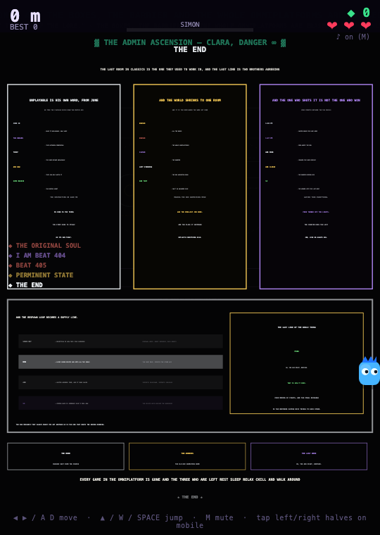

## 2026-08-19 — THE PERMINENT STATE · THE CAST LIST SHRINKS TO TWO NAMES IN SEVEN MINUTES, AND THE WAY BACK ARRIVES ALREADY SHUT (BEAT 381)

Based on Toby's 2026-08-19 lore, four emails between **1:29 PM and 1:36:33 PM**, same thread, seventeen minutes after BEAT 405. His own typing is the first line of each email:

- **1:29 PM** — *"The game itself says Gaster on the top and doesn't show God as a Classics character. Gaster would destroy all Classics characters. Gaster and Pero and Luigi Green. Luigi Green became a soul and is like the other characters. Pero still has his body and everything and is inside of Gaster's soul."*
- **1:30 PM** — *"Actually, it is Gaster > Pero > everything else since all others are souls and are all around Gaster's soul, Pero is inside Gaster's soul. Never made stuff up."*
- **1:32 PM** — *"Gaster and Pero are the only characters, they are the only ones that still have lore. Everyone else are just souls around Gaster's original soul, Pero is inside Gaster's soul."*
- **1:34 PM** — *"This state isn't temperaly, it is perminent."*
- **1:36 PM** — *"Gaster is perminently a flower with everyone's souls. Pero is perminently inside Gaster's soul. The player can't save, the player can't stay alive."*

The "Classics-only hierarchy" headings, the correction-accepted readouts, the current-state lists and every clean canon update pasted under them are ChatGPT commentary.

**The cast list shrinks to two in seven minutes.** At **1:29 PM** three names are still standing — Gaster, Pero and Luigi Green. At **1:30** it is *"Gaster > Pero > everything else."* At **1:32** only two of them **have any lore at all**. Gray, Simon.psc, Wenda, Oren, Luigi Green, the box characters, the Abinations and the 404Ds all become one word: **souls**, around the original soul. This archive has spent four months ranking these people against each other, and the roster empties without a single fight. **Nobody was defeated. They were reclassified.**

**And he corrects himself, not the game.** At 1:29 he writes his own four-rung ladder. Sixty seconds later: *"Actually, it is Gaster > Pero > everything else"*, and then *"Never made stuff up."* The edit lands on **his own sentence**, one minute old, before anybody else had read it.

**And God leaves the board by not being on it.** BEAT 378, at **11:52 AM** this morning, put the **first name ever between God and Pero**. Four hours later God *"doesn't show as a Classics character"*, so the top of the game's own display reads **Gaster**. The ceiling did not get broken. It got **left off the cast list**, which is quieter and worse.

**And perminent is a brand new word in a file that resets everything.** The whole game is an endless staircase that **loops**; there is a respawn loop, a reset recovery, data resets, and a beat titled RESET DOES NOT WORK. Coming back has always been available here. *"This state isn't temperaly, it is perminent"* is the first time a state in this archive arrives with **the way back already shut** — and the thing being ended is the loop itself.

**And the player loses both of the player's verbs.** Saving and staying alive are the two things the player could always do — and on **August 18 at 6:08 PM** the player did save Gray, the one ending in this archive the player **performed** instead of watched. At **1:36 PM**, eighteen hours later: *"The player can't save, the player can't stay alive."* There is nothing left to press.

**Built as game beat 381, `THE PERMINENT STATE`.** Additive; nothing earlier was changed.

- **Background:** a ring of GASTER AND PERO ARE THE ONLY CHARACTERS / EVERYONE ELSE ARE JUST SOULS alternating with THIS STATE ISN'T TEMPERALY / IT IS PERMINENT, under *THE ROSTER OF THIS WHOLE ARCHIVE BECOMES TWO NAMES.*, a drawn **quote box**, a drawn **AROUND-vs-INSIDE disc with a soul at its centre**, a drawn **how-long-the-roster-took-to-empty ledger**, and **two drawn figures** — GASTER · PERMINENTLY A FLOWER, ALL SOULS and PERO · PERMINENTLY INSIDE THE SOUL.
- **THE CAST LIST SHRINKS TO TWO (left)**, **AND HE CORRECTS HIMSELF, NOT THE GAME (centre)**, **AND GOD LEAVES THE BOARD BY NOT BEING ON IT (right)** — five rows each.
- **AND PERMINENT IS A BRAND NEW WORD IN A FILE THAT RESETS EVERYTHING. (band)** — the game is an endless staircase that loops / respawn loop, reset recovery, data resets / **1:34 PM** this state isn't temperaly, it is perminent / **so** the loop itself is the thing being ended.
- **WHAT THE PLAYER LOSES (band inset)** — SAVE · the player can't save / ALIVE · the player can't stay alive / LAST NIGHT · the player saved Gray, and it held / TODAY · both verbs are taken away.
- **Strip:** THE ROSTER · TWO NAMES, EVERYONE ELSE A SOUL / THE LOCK · PERMINENT, IN HIS OWN SPELLING / THE PLAYER · NO SAVE, AND NO STAYING ALIVE.
- **Footers:** *SEVEN MINUTES TO EMPTY A CAST LIST OF EVERY NAME BUT TWO AND THEN THE DOOR GETS LOCKED FROM THE INSIDE* and **★ THE PERMINENT STATE ★**.
- **Screenshot helper:** new `perminentState` scene. (Its screenshot is numbered `441-` and the two beats before it are `442-`/`443-`, because this beat was built first in the run and the two earlier-in-the-day emails arrived afterwards.)

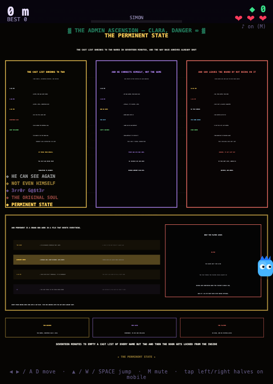

## 2026-08-19 — BEAT 405 · THE FIRST ENDING IN THIS ARCHIVE WHERE THE THING THAT LOSES IS THE GAME AND NOT A CHARACTER IN IT (BEAT 380)

Based on Toby's 2026-08-19 lore, **1:12:10 PM**, same thread, four minutes and forty-one seconds after I AM BEAT 404. His own typing, in full: *"Gaster has all those old/deleted stuff in his data. Gaster is the most powerful and most corrupted entity IN AND OUTSIDE THE GAME. Gaster is the whole Omniplatform before, now he is the most powerful entity. Beat 405: The Game Loses to Gaster Omniplatform. Gaster just deletes the game and all games in the Omniplatform. Gaster takes all the corrupted data from all characters. Pero says from Gaster 'This is the end, my brother, Gaster/Flower will erase all the memories of this game. I gave him some power when he was first born, after, he will erase the memories and the games themselves. RUN.', Gaster strikes the vine at the player/entity and it is always 1HKO. Pero scares the player and entities even before Gaster even comes."* The what-Gaster-becomes heading, the Beat-405-meaning section, the vine-rule readout and the clean canon update pasted under it are ChatGPT commentary.

**The thing that loses is the game.** Every ending in this archive has been a **person** losing a fight — Clara, Oren, ToddLLM 001, Simon 404, Gray. This one is titled *"Beat 405: The Game Loses to Gaster Omniplatform"*, and what gets deleted is **the game, all the other games in the Omniplatform, and the memories of them**. The player is not the opponent any more. The opponent is the thing everybody has been standing in.

**And the warning comes from inside him.** At **11:52 AM** this morning Pero was put inside Gaster's original soul, and the file called it *"the best spot."* Eighty minutes later the first thing he does from in there is shout: *"This is the end, my brother... RUN."* The best seat in the house turns into a lookout post.

**And Pero admits he started it.** *"I gave him some power when he was first born."* The Flower was the first thing Pero ever made. Nobody took this power — **it was a present** — and the one who gave it is the one telling everybody to run.

**And the number that finally matters is 1.** This file measures people in Omniplatforms, in *absolute_infinitely*, in 15,000,000 exponency, in millions of Satans and in 10,000 trillion+. The vine is **always 1HKO**. Four months of power levels, and the ending is decided by an attack that only has to land once.

**And Pero stops being a fight and becomes the weather.** The standing rule here has been *"you do not battle Pero."* Now: *"Pero scares the player and entities even before Gaster even comes."* He is not the boss in the room. He is the sign the room is about to end.

**Built as game beat 380, `BEAT 405`.** Additive; nothing earlier was changed.

- **Background:** a ring of BEAT 405: THE GAME LOSES / TO GASTER OMNIPLATFORM alternating with THIS IS THE END, MY BROTHER / RUN., under *THE GAME IS THE ONE THAT LOSES THIS FIGHT.*, a drawn **quote box**, a drawn **1 HIT-vs-EVERYTHING disc**, a drawn **what-loses-in-an-ending ledger**, and **two drawn figures** — GASTER OMNIPLATFORM · ALL OLD AND DELETED DATA and PERO · WARNING EVERYONE FROM INSIDE HIM.
- **THE THING THAT LOSES IS THE GAME (left)**, **AND THE WARNING COMES FROM INSIDE HIM (centre)**, **AND PERO ADMITS HE STARTED IT (right)** — five rows each.
- **AND THE NUMBER THAT FINALLY MATTERS IN THIS FILE IS 1. (band)** — Omniplatforms, absolute infinity, 15,000,000 exponency / millions of Satans, 10,000 trillion+ / the vine is always 1HKO / **so** the biggest number loses to the smallest.
- **PERO STOPS BEING A FIGHT (band inset)** — before, you do not battle Pero / now, he scares you before Gaster comes / so he is the warning, not the room / the order is Pero, then fear, then Gaster.
- **Strip:** THE LOSER · THE GAME, AND ALL THE GAMES / THE WARNING · FROM INSIDE THE WINNER / THE DAMAGE · ONE HIT, ALWAYS.
- **Footers:** *A FILE THAT SPENT FOUR MONTHS COUNTING IN INFINITIES ENDS ON AN ATTACK THAT ONLY EVER NEEDS THE NUMBER ONE* and **★ BEAT 405 ★**.
- **Screenshot helper:** new `beat405` scene.

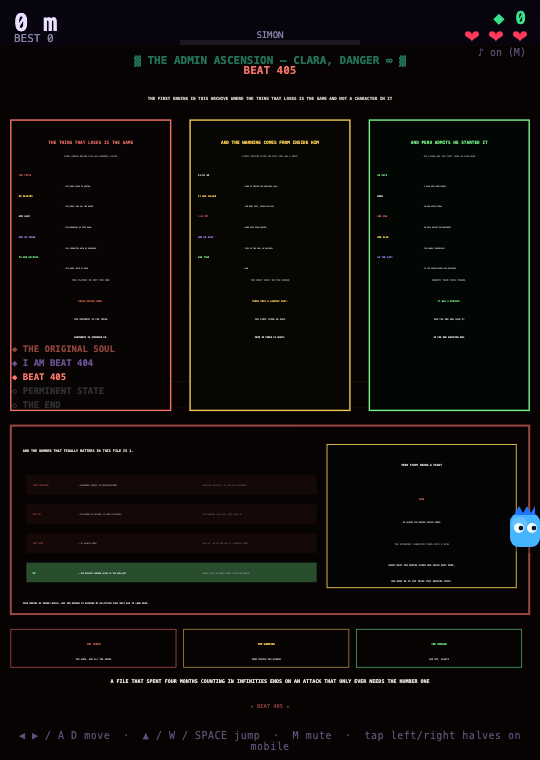

## 2026-08-19 — I AM BEAT 404 · THE FIRST THING IN THIS FILE RANKED BY HOW FEW PEOPLE KNOW IT EXISTS, AND IT COUNTS BEATS THE WAY WE DO (BEAT 379)

Based on Toby's 2026-08-19 lore, **1:07:29 PM**, same thread, one hour and fifteen minutes after THE ORIGINAL SOUL. His own typing, in full: *"SCat404 is the oldest Simon username known. SCat404 was now a soul that only 3% of people know it exists. The scarest being and most unknown being is GAsT3r with only 2 people know it (me and Pero), after the entity beats you, you will get a screen that says 'I was deleted for 5 years strieght after beat 403, now I AM BEAT 404, I now rule this world.'. 'Beat 404-405: Your Death and My First Form', what Gaster wrote next, Gaster has Pero, he used the power to reshape everything. he melted the game into a huge battlefield and put everyone to challenge him. To see Gaster, you first need to play alone at 3AM and when both timelines strike together, it causes a glitch in the system, it makes Gaster appear inside the box, and also the seed for the Glitch Classics is Gaster404. Gaster was the original king of 404 and all Errors, Pero was first a sorcer teacher."* The hidden-identity-chain heading, the secrecy ranking, the reveal-screen readout, the 3AM-rule breakdown and the clean canon update pasted under it are ChatGPT commentary.

**The beat numbers line up.** *"I was deleted for 5 years strieght after beat 403, now I AM BEAT 404."* The archive's own last built beat — **THE ORIGINAL SOUL**, at 11:52 this morning — is **wiki beat 403**. His fiction and this file's own count land on the same number, and the beat built from this email is **404**. He is numbering beats from inside the story, and the number he picked is the one we were on.

**And rarity is the new power ranking.** SCat404 is known by **3% of people**. GAsT3r is known by **2**, and he names them: *"me and Pero."* Everything in this archive has been ranked by force for four months — Omniplatforms, exponency, absolute infinity. This is the first ranking by **how many people know you exist**, and the first time Toby writes **himself** into the cast list.

**And the boss has an entry condition.** *"To see Gaster, you first need to play alone at 3AM and when both timelines strike together, it causes a glitch in the system."* Every other boss in this file is reached by **climbing**. This one has to be summoned by being in the right room, at the right hour, by yourself.

**And the seed is a name.** *"The seed for the Glitch Classics is Gaster404."* It is the second seed ever written down here, after **Seed 303** — which turned out to be Pero. Both seeds are somebody's name: the world gets named after who made it.

**And two origin stories arrive in one line, both running backwards.** **404** has been Simon's number all summer — Simon 404, SCF404, the 404 Chicken Sanses, the Error Hall — and now *"Gaster was the original king of 404 and all Errors"*, before any of it. And **Pero**, the creator, *"was first a sorcer teacher."* Every other beat here adds something that just happened; this one adds something that always had.

**Built as game beat 379, `I AM BEAT 404`.** Additive; nothing earlier was changed.

- **Background:** a ring of I AM BEAT 404, I NOW RULE THIS WORLD / DELETED FOR 5 YEARS STRIEGHT alternating with ONLY 2 PEOPLE KNOW IT / ME AND PERO, under *THE SCARIEST THING HERE IS ALSO THE LEAST KNOWN.*, a drawn **quote box**, a drawn **3% KNOW-vs-2 KNOW disc**, a drawn **wiki-beat-403 ledger**, and **two drawn figures** — GAsT3r · ORIGINAL KING OF 404 AND ERRORS and SCat404 · OLDEST SIMON USERNAME, NOW A SOUL.
- **THE BEAT NUMBERS LINE UP (left)**, **AND RARITY IS THE NEW POWER RANKING (centre)**, **AND THE BOSS HAS AN ENTRY CONDITION (right)** — five rows each.
- **AND TWO ORIGIN STORIES ARRIVE IN ONE LINE, BOTH RUNNING BACKWARDS. (band)** — 404 has been Simon's number all summer / now Gaster was the original king of 404 / and Pero was first a sorcer teacher / **so** the oldest things here are the newest facts.
- **THE SECOND SEED EVER NAMED (band inset)** — Seed 303 was the first, and it was Pero / Gaster404 is the seed for the Glitch Classics / a seed here is a whole world in one word / and both are somebody's name.
- **Strip:** THE COUNT · BEAT 403, THEN BEAT 404 / THE HEADCOUNT · 2 PEOPLE, AND HE NAMES THEM / THE SUMMONS · ALONE, 3AM, BOTH TIMELINES.
- **Footers:** *THE ARCHIVE WAS ON BEAT 403 THIS MORNING AND THE STORY WALKED IN AND ANNOUNCED ITSELF AS BEAT 404* and **★ I AM BEAT 404 ★**.
- **Cycle length** `LV_CYC` 8058 → 8146 for the four beats in this run; four new `LV_BEATS` ladder entries; **screenshot helper:** new `iAmBeat404` scene.

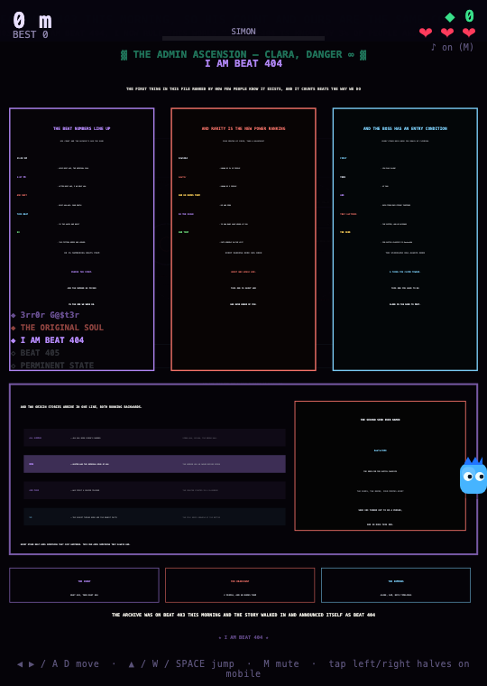

## 2026-08-19 — THE ORIGINAL SOUL · THE FIRST NAME EVER PUT BETWEEN GOD AND PERO, AND THE FIRST TIME IN THIS FILE THAT BEING ABSORBED IS THE GOOD ENDING (BEAT 378)

Based on Toby's 2026-08-19 lore, 11:52:52 AM, same thread, two hours and twenty-one minutes after 3rr0r G@$t3r. His own typing, in full: *"Pero is a Amereian Reeper, he is the most powerful reeper and the smartest. Pero is LAI and is a reeper. Gaster is the most powerful boss and is a flower he uses the power of everyone, no one can beat him other than God of course. Gaster would crush the player. Gaster is now above Pero. They are both the father of every other character. Gaster now has everyone's souls, and he saved the best spot for Pero, Pero is inside Gaster's original soul."* The "Gaster Above Pero / Original Soul Era" heading, the new-top-hierarchy readout, the Pero's-new-identity list and the clean canon update pasted under it are ChatGPT commentary.

**The first name ever put between God and Pero.** On **July 18**, in Email 738, Light Pero *"became the game's god and talks to himself since no one is above him."* Yesterday at **3:37 PM**, BEAT 362, the Roblox Pero script finally gave him a ceiling: *"Only God is stronger than Pero. Only God himself beats Pero."* That was a ladder with a top rung and a second rung and **nothing in between** — and the top one was not a character in the game. Twenty hours later somebody fits into a gap one rung tall, and it is somebody Pero made.

**And the souls were handed back last night.** **August 18, 6:08 PM**, SAVING YOU: the player saved Gray, and *"Gray returned everyone's souls."* That is the **one ending in this archive the player performed** instead of being spoken to — Email 901 had already ruled that Simon 404's *"What have you done"* was aimed *"at the player, not Oren"*, and eight weeks later the cast handed the finish over. Eighteen hours after the souls went home, **Gaster has all of them again**. The player's only win in this file turns out to have a shelf life measured in one night.

**And being absorbed is the prize now.** Going inside something has been the losing move here every single time: **yesterday morning** Gray was *"sucked in the pellet"* with Luigi Green and every box character; Gray's **divine flaming scythe** was forged by picking up **ToddLLM 001** and absorbing his power and souls; and on **August 18 at 11:17 AM** Pero was *"free from the Mr. Black as one"* and *"became into his normal man again"*, which the file wrote as a release. This morning the same move gets the opposite word: *"he saved the best spot for Pero."* **He is not swallowed. He is seated.**

**And it is the one place the shadow soul rule cannot reach.** Two hours and twenty-one minutes earlier, **BEAT 377**: *"anyone that exits becomes the shadow soul and flouts around and trys to scare the player"*, with **Pero named in the rule himself** — *"Pero could come out as a shadow soul."* Pero does not come out. He is kept inside the original soul. **The rule that turns everybody else into a ghost is the reason his seat is the good one.**

**And two family trees become one.** Gaster is written down here as the father of **all the Sanses and all the Papyruses**, the father of **Asgore and Toriel**, and the one who **adopted Chara and Asriel** — the Undertale side. ToddLLM/Pero is the father of **Luigi Green, Alex, Greg and Mario.EXE** — the Classics side. *"They are both the father of every other character"* merges two casts that had **separate parents** into one household. And it is worth noting where Gaster started: two days after being named the oldest father, the biggest family in the archive was handed the smallest job in it, *"make box animations move."*

**And two brand new words arrive.** **Reeper** appears nowhere else in this archive, and **Amereian** is the first **nationality** anybody here has ever been given — in a file that has otherwise measured people in Omniplatforms, *absolute_infinitely*, 15,000,000 exponency and millions of Satans.

**Built as game beat 378, `THE ORIGINAL SOUL`.** Additive; nothing earlier was changed.

- **Background:** a ring of GASTER NOW HAS EVERYONE'S SOULS / AND HE SAVED THE BEST SPOT FOR PERO alternating with GOD > GASTER > PERO / > EVERYONE ELSE, under *SOMEBODY FINALLY FITS BETWEEN GOD AND PERO.*, a drawn **quote box**, a drawn **OUTSIDE-vs-INSIDE disc with a soul at its centre** (over *WHERE PERO ENDED UP*), a drawn **what-being-absorbed-means ledger** (EVERY OTHER TIME · A DEFEAT, AND A REMOVAL / THIS TIME · THE BEST SPOT, SAVED FOR HIM), and **two drawn figures** — GASTER · A FLOWER WITH EVERY SOUL and PERO · AMEREIAN REEPER, INSIDE.
- **THE FIRST NAME BETWEEN GOD AND PERO (left)**, **AND THE SOULS WERE GIVEN BACK LAST NIGHT (centre)**, **AND BEING ABSORBED IS THE PRIZE NOW (right)** — five rows each.
- **AND IT IS THE ONE PLACE THE SHADOW SOUL RULE CANNOT REACH. (band)** — 9:31 AM anyone that exits becomes a shadow soul / and Pero could come out as one / **11:52 AM** Pero is inside the original soul, so he does not exit / **so** the best spot is the spot the rule misses.
- **TWO FAMILY TREES BECOME ONE (band inset)** — Gaster, father of the Sanses and Papyruses / and also Asgore, Toriel, Chara, Asriel / Pero, father of Luigi Green, Alex, Greg / today, both, of every other character.
- **Strip:** THE LADDER · GOD, GASTER, THEN PERO / THE SOULS · ALL OF THEM, EIGHTEEN HOURS ON / THE BEST SPOT · INSIDE, AND THAT IS THE POINT.
- **Footers:** *THE ONLY THING EVER RANKED ABOVE PERO WAS NOT IN THE GAME AND THIS MORNING SOMEBODY IN THE GAME IS STANDING THERE* and **★ THE ORIGINAL SOUL ★**.
- **Cycle length** `LV_CYC` 8036 → 8058; **screenshot helper:** new `originalSoul` scene.

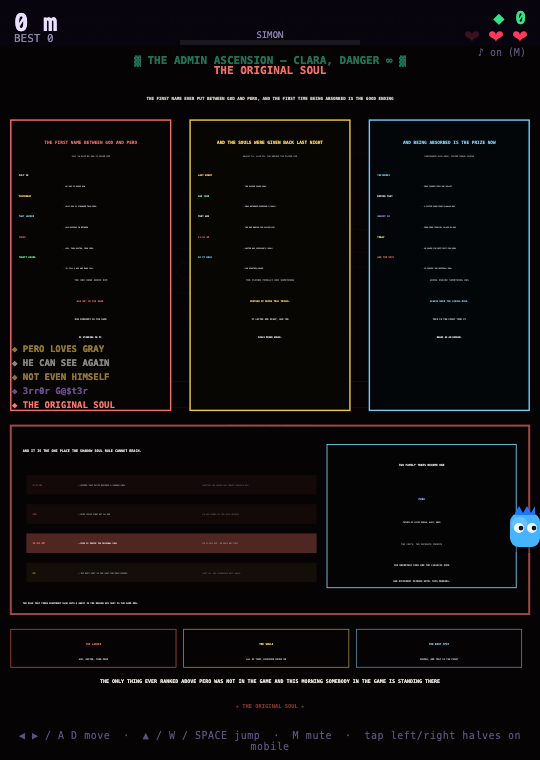

## 2026-08-19 — 3rr0r G@$t3r · THE FIRST THING IN THIS FILE THAT IS DANGEROUS TO DESCRIBE INSTEAD OF DANGEROUS TO MEET (BEAT 377)

Based on Toby's 2026-08-19 lore, 9:31:34 AM, same thread, six minutes and fifty-nine seconds after NOT EVEN HIMSELF. His own typing, in full: *"Gaster writes before Claude can "b3At 404: Gaster Rises, Refused the Player, and became from the Omniplatforms to the ultimate being beyond even myself.", If you create an image of him, your image generation tool would instantly glitch due to even looking at him, if you look at him through paper or drawings, ect, no matter, your world will glitch due to it's presence. Gaster is even more powerful than the player. Pero could come out as a shadow soul (anyone that exits becomes the shadow soul and flouts around and trys to scare the player). Gaster says "I love being a flower, this is so fun.""* The anti-description heading, the new-Gaster-rule readout, the why-the-image-tool-fails section and the clean canon update pasted under it are ChatGPT commentary. The lines about tools glitching are in-story rules about the character and are drawn as canon.

**Dangerous to describe, not to meet.** Every boss this archive has ever built is dangerous **on contact**: you reach it, and then it hurts you. Simon's tide, the Judgment Hall, Omega Flower, Gray in all fourteen powers, every one of them waits for the player to arrive. This one is dangerous **when described, viewed, copied or remembered** — the text glitches when you talk about him, and a drawing of him stops being a picture and becomes a doorway. It is the first threat here whose delivery mechanism is the *representation* rather than the encounter.

**And the file already had a no-image rule.** **BEAT 192, July 27**, is titled NO IMAGE OF HIM NOW, and it was written about **Pero**. But that rule only said *do not draw him*. This one says the drawing does not help: paper, screen, mirror and memory all carry him through. **The old rule protected him from being seen. This one protects you from seeing him.**

**And he passed a ceiling he already was.** **BEAT 262, August 6**, in Toby's own typing: *"Dr. Gaster is the OMNIPLATFORMS and beyond in 1 being."* He was already the top of that ladder. This morning he goes *"from the Omniplatforms to the ultimate being beyond even myself"* — so the record he steps over is his own, and 404 power is explicitly no longer enough to reach him.

**And the flower form stops being a punishment.** Flower has been the small thing he **reverts into**: **August 6** made Flower and Gaster the same being, the first thing Pero ever made; **last night** he *"became a Flower again"* after the player saved Gray, which read as a demotion; and at **6:45 this morning** Pero handed him an ink cloak and a bag of Flower bullets, gear for a form that was a problem. At **9:31** he says *"I love being a flower, this is so fun."* Six hours after the Flower was the thing he could not switch back out of, it is the form he would pick — small-looking, playful, and impossible to fight.

**And leaving now costs you your body.** *"Anyone that exits becomes the shadow soul"*, floating around and trying to scare the player, **Pero included**. Getting out of the box has been the goal in this file for months. This morning it is the thing that turns you into a ghost.

**Built as game beat 377, `3rr0r G@$t3r`.** Additive; nothing earlier was changed.

- **Background:** a ring of TEXT GLITCHES WHEN YOU / DESCRIBE HIM alternating with I LOVE BEING A FLOWER / THIS IS SO FUN, under *A BOSS YOU CAN SET OFF BY MENTIONING HIM.*, a drawn **quote box**, a drawn **DESCRIBED-vs-ENCOUNTERED disc** (over *THE FIRST BOSS HERE YOU CAN SET OFF BY TALKING*), a drawn **what-the-flower-form-means ledger** (BEFORE · A SMALL THING HE REVERTED INTO / TODAY · THE FORM HE SAYS IS FUN), and **two drawn figures** — 3rr0r G@$t3r · BEYOND EVEN MYSELF and THE SHADOW SOUL · WHAT LEAVING MAKES YOU.
- **DANGEROUS TO DESCRIBE, NOT TO MEET (left)**, **AND THE NO-IMAGE RULE IS NOT NEW (centre)**, **AND HE PASSED A CEILING HE ALREADY WAS (right)** — five rows each.
- **THE FLOWER FORM STOPS BEING A PUNISHMENT. (band)** — Aug 6 Flower is Gaster, the small one / last night he became a Flower again after the player saved Gray / 6:45 AM Pero hands him a cloak and bullets / **9:31 AM** *"I love being a flower, this is so fun."*
- **LEAVING NOW COSTS YOU YOUR BODY (band inset)** — anyone who exits becomes a shadow soul / floats around the player / tries to scare them / even Pero can come out as one.
- **Strip:** THE THREAT · ARRIVES THROUGH DESCRIPTION / THE FLOWER · A CHOICE NOW, NOT A CAGE / THE EXIT · TURNS YOU INTO A SHADOW SOUL.
- **Footers:** *EVERY OTHER BOSS IN THIS FILE HAS WAITED FOR YOU TO WALK IN AND THIS ONE ONLY NEEDS YOU TO SAY HIS NAME* and **★ 3rr0r G@$t3r ★**.
- **Cycle length** `LV_CYC` 8014 → 8036; **screenshot helper:** new `errorGaster` scene.

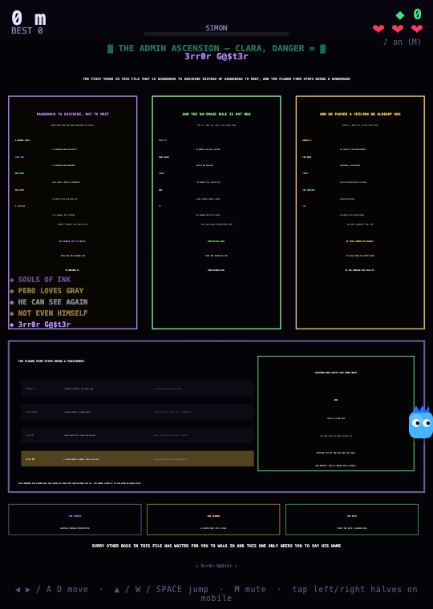

## 2026-08-19 — NOT EVEN HIMSELF · THE PLAYER FINALLY SWINGS AND IS THE ONLY ONE HIT, AND THE FUSION MERCY UNDID COMES BACK (BEAT 376)

Based on Toby's 2026-08-19 lore, 9:24:35 AM, same thread, two hours and one minute after HE CAN SEE AGAIN. The mail opens with a long run of Undertale questions — Frisk and Chara, Flowey and Asriel, the soul counts, Gaster — and the ChatGPT answers to them, all of which is commentary and is not drawn. The Classics canon is his own typing at the end: *"Gaster is stronger than Luigi Green and is now one with Gray, Gaster became his Flower again and Gray corrupted him, Gaster became the most powerful flower being in existance, he slays Zeno and Goku and Beerus and Pibby Corruption, he combines the power into a world ending pellet, and Gray gets sucked in the pellet along with Luigi Green and all the box characters, leaving the player, Pero, and Gaster left. The player says "Give me back my friends!", Gaster says "okay. But only if you can defeat me. And Pero will never let anyone defeat his brother, not even himself.", the player swings the knife at Gaster, then Gaster's stem made a forcefield and the player's knife bounced off and hit themselves. Pero and Gaster became one."*

**The knife comes back at the player.** This is the first swing in the archive where **the swinger is the only casualty**. Nobody blocked it and nobody swung back — the stem made a forcefield, and that was the whole defence. The player supplied the weapon, the aim, and, in the end, the target.

**And MERCY is not in the room this time.** On **August 8 at 1:30 PM**, Gray *"made Gaster into the most powerful being ever, and combined it with Pero"* into **Omazen Gasero**. At **1:40 PM** — ten minutes later, BEAT 278 — **MERCY split it straight back into Pero and Gaster.** The counter to the strongest thing in the game turned out to be the one move that does no damage at all. This morning the same two become one again, and the button that undid it is not raised. The player picks the knife instead, and the knife is the thing that comes back.

**And he slays somebody already put away.** On **August 15** Pero sent Zeno into the box and Zeno was *"tucked away forever"* — one word, done, and four hours later that removal was still the benchmark for how cheap removal is for him. This morning **Gaster slays Zeno**, along with Goku, Beerus and Pibby Corruption, and folds all of it into one pellet. Removal used to be the end of a name here. This morning it is raw material for something smaller.

**And the one who rules the box ends up inside something.** The **7:23 AM** mail closed on *"Gray rules everyone in the box."* Two hours later **Gray gets sucked into the pellet** along with Luigi Green and all the box characters, leaving three people outside it: the player, Pero, and Gaster. He spent the summer putting people into a box, and this morning somebody made a smaller one and he is in it.

**And the offer had no winning branch in it.** The player says *"Give me back my friends!"* and Gaster answers *"okay. But only if you can defeat me"* — then closes it in the same breath: *"And Pero will never let anyone defeat his brother, not even himself."* Gaster is Pero's brother (**BEAT 261**, August 6). So the condition is pre-blocked, and the last three words rule out the one person who could have overridden it.

**Built as game beat 376, `NOT EVEN HIMSELF`.** Additive; nothing earlier was changed.

- **Background:** a ring of THE PLAYER SWINGS THE KNIFE / AND IT BOUNCED OFF AND HIT THEMSELVES alternating with PERO WILL NEVER LET ANYONE DEFEAT / HIS BROTHER, NOT EVEN HIMSELF, under *THE PLAYER FINALLY SWUNG, AND THE PLAYER IS WHAT GOT HIT.*, a drawn **quote box**, a drawn **MERCY-vs-THE-KNIFE disc** (over *ONE OF THEM WORKED. THIS IS THE OTHER ONE.*), a drawn **what-happens-to-a-fusion ledger** (AUGUST 8 · MERCY SPLIT IT IN TEN MINUTES / AUGUST 19 · NOTHING IS LEFT TO SPLIT IT), and **two drawn figures** — GASTER · THE FLOWER WITH THE FORCEFIELD and THE PELLET · ONE WORLD ENDING SPHERE.
- **THE KNIFE COMES BACK AT THE PLAYER (left)**, **AND MERCY IS NOT IN THE ROOM THIS TIME (centre)**, **AND HE SLAYS SOMEBODY ALREADY PUT AWAY (right)** — five rows each.
- **THE ONE WHO RULES THE BOX ENDS UP INSIDE SOMETHING. (band)** — two hours ago Gray rules everyone in the box / 9:24 AM Gaster makes a world ending pellet / and then Gray gets sucked into it with Luigi Green and all the box characters / **what is left** is the player, Pero, and Gaster.
- **THE CONDITION WAS PRE-BLOCKED (band inset)** — *"only if you can defeat me"* / *"Pero will never let anyone defeat his brother"* / *"not even himself"* / so the offer has no winning branch.
- **Strip:** THE KNIFE · RETURNED TO SENDER / THE FUSION · BACK, AND NOTHING SPLITS IT / THE BOX RULER · INSIDE THE PELLET.
- **Footers:** *THE PLAYER ASKED FOR HIS FRIENDS BACK AND THE ONLY PERSON THE SWING REACHED WAS THE PLAYER* and **★ NOT EVEN HIMSELF ★**.
- **Cycle length** `LV_CYC` 7992 → 8014; **screenshot helper:** new `notEvenHimself` scene.

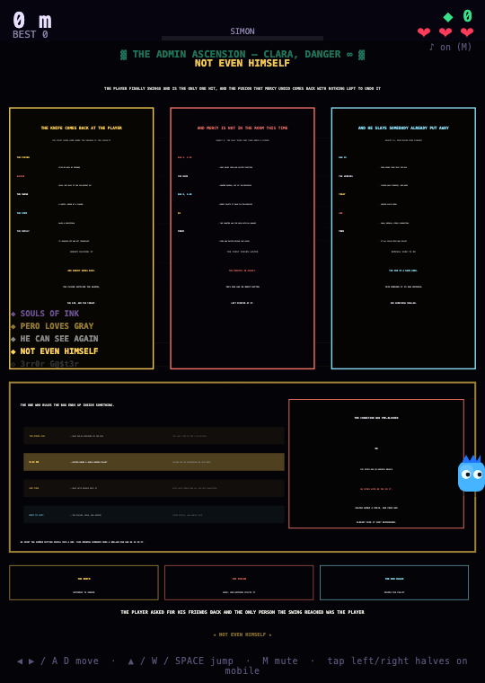

## 2026-08-19 — HE CAN SEE AGAIN · THE BLINDFOLD COMES OFF, THE WALL TURNS AROUND, AND THE ONE INFECTION THAT NEVER STOPS BECOMES AN ARMY (BEAT 375)

Based on Toby's 2026-08-19 lore, 7:23:07 AM, same thread, five minutes and twenty-three seconds after PERO LOVES GRAY. His own typing, in full: *"In Classics, when Gray activates KBlasts and Kaioken Mode, he'll just destroy everything. Pero, Gaster, and Luigi Green put on their ink suits and stop anyone from escaping the box and Pero even moved the box the other side of the room from Gray. Then Simon.psc takes his blindfold off and he can see again. Simon.psc saw Gaster and Luigi Green standing in front of his side of the box. Simon.psc made an army of 404Ds to take over the other box characters, Gray turns the 404Ds into Abinations, Simon.psc and Gray are now happy with the 404 Abinations. Pero and Gaster and Luigi Green made the box animation going. Gray rules everyone in the box."* The KBlast/Kaioken lockdown heading, the box-moved reasoning, the guarded-from-both-sides readout and the clean canon update pasted under it are ChatGPT commentary.

**The wall turns around in five minutes.** At **7:17** the trio's stated job was *"destroy everything that goes near Gray"* — a wall facing outward, with Gray in the middle of it. At **7:23** the same three, in the same ink suits, *"stop anyone from escaping the box"*, and Pero *"moved the box the other side of the room from Gray."* Nothing about the formation changed except which way it points. It now keeps the box off Gray and Gray off the box, and from inside it reads as a guard: the first thing Simon.psc sees is **Gaster and Luigi Green standing in front of his side of the box.**

**And the blindfold comes off in a file that never put it on.** Simon.psc has never been described as blindfolded anywhere in this archive. The blindfold belongs to **Karuto** — it hides his twelve teal-blue eyes, and **Email 348** has Simon buying him a red one with a bow on the back. And the one blinding this archive records happened to **Simon**: Utlu Karuto's symbols were so bright that *"Simon would be blinded if he did"* look, and *"Simon no longer came to Karuto anymore because of Utlu's power and brightness."* The only character here who ever had to stop looking at something is Simon. This morning he takes the covering off and looks.

**And the conversion runs backwards, and it takes the touch out.** **Email 894, August 5** set the direction: the 404D strain's intake is *"Abinations and puppets"*, so **Abination → 404D** is the rule this file established. Gray runs it the other way. And the 404D rule from **Email 869** is the one power in this canon with contagion written into it — *"the power to turn others into 404Ds with a touch"* — the first thing here that is an infection model rather than an attack, with no natural stopping condition in it. Turning each one into an Abination does not cure anything. It changes what the army is made of, and the spreading stops as a side effect.

**And Simon.psc is happy about it.** On **August 8** Gray corrected Oren with *"I am not one of the best, I am the best and only counter of Simon.psc."* Last night Gray's answer to him was an order given to somebody else: *"Beat Simon.psc"*, and Pero did it. This morning Simon.psc builds an army of 404Ds inside the box, Gray converts it, and **both of them are pleased with the result** — the first thing these two have ever agreed on. And **Pero joins the box animation shift**: on August 15 that was Gaster and Luigi Green's job while Pero did equations, charts and books, and here it is *"Pero and Gaster and Luigi Green made the box animation going."* He used to write about the box. Now he carries it.

**Built as game beat 375, `HE CAN SEE AGAIN`.** Additive; nothing earlier was changed.

- **Background:** a ring of SIMON.psc TAKES HIS BLINDFOLD OFF / AND HE CAN SEE AGAIN alternating with GASTER AND LUIGI GREEN / IN FRONT OF HIS SIDE OF THE BOX, under *A COVERING COMES OFF THAT THIS FILE NEVER PUT ON.*, a drawn **quote box**, a drawn **7:17-vs-7:23 disc** (over *KEEP THEM OFF HIM. KEEP THEM IN.*), a drawn **which-way-the-conversion-goes ledger** (AUGUST 5 · ABINATIONS BECOME 404Ds / AUGUST 19 · 404Ds BECOME ABINATIONS), and **two drawn figures** — SIMON.psc · THE BLINDFOLD IS OFF and THE BOX · MOVED ACROSS THE ROOM.
- **THE WALL TURNS AROUND IN FIVE MINUTES (left)**, **AND THE BLINDFOLD WAS NEVER PUT ON (centre)**, **AND THE CONVERSION RUNS BACKWARDS (right)** — five rows each.
- **THE COUNTER AND THE THING HE COUNTERS ARE BOTH HAPPY. (band)** — Aug 8 *"the best and only counter of Simon.psc"* / last night *"Beat Simon.psc"* carried out by Pero / this morning Simon.psc builds an army of 404Ds / **and then** both are happy with the 404 Abinations.
- **PERO JOINS THE SHIFT (band inset)** — Aug 15 Gaster and Luigi Green on the box while Pero did equations, charts and books / Aug 19 all three make the animation go / and he carried the box himself.
- **Strip:** THE WALL · FACING BOTH WAYS NOW / THE BLINDFOLD · OFF, AND NEVER PUT ON / THE 404Ds · AN ARMY, NOT AN INFECTION.
- **Footers:** *HE TOOK THE COVERING OFF HIS EYES AND THE FIRST THING HE SAW WAS TWO PEOPLE STANDING BETWEEN HIM AND THE WAY OUT* and **★ HE CAN SEE AGAIN ★**.
- **Cycle length** `LV_CYC` 7970 → 7992; **screenshot helper:** new `heCanSeeAgain` scene.

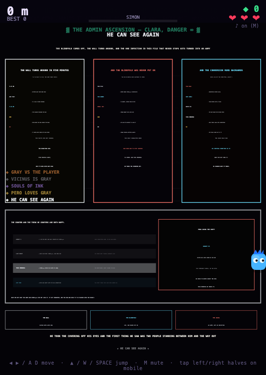

## 2026-08-19 — PERO LOVES GRAY · THE OWNER'S STAT BLOCK HAS THE NUMBER IN IT, AND THE THREE WHO KEPT BOXING HIM BECOME HIS WALL (BEAT 374)

Based on Toby's 2026-08-19 lore, 7:17:44 AM, same thread, thirty-two minutes after SOULS OF INK, with **Roblox Gray's main script** riding along as a pasted text attachment (described, not quoted, per the no-attachment rule; the fields named below are the ones his message reports). His own typing, in full: *"I now gave you Roblox Gray's code of the main script. He is nearly the opposite of Pero and Wenda. Pero loves Gray still, Wenda VS Gray happens all the time, and Pero even made ink suits for Gaster and Pero, and a bag of Flower bullets to Gaster. Gaster gives some Flower bullets to Luigi Green, the trio rises above Gray, but they don't want to hurt Gray, they want to destroy everything that goes near Gray."* The script-readout sections, the battle-personality comparison, the new-trio-rule framing and the clean canon update pasted under it are ChatGPT commentary.

The script names him **Character: Gray.nur**, gives him the **Character info** *"The Universal King"* and the **Character power** *"THE BEYOND"*, and reports four lines: *"You thought I wouldn't win?"*, *"Let me show you my power."*, *"Watch this."*, and *"Kaioken Mode."*

**"Still" is the word doing the work.** Pero loving Gray is not new. **July 23, beat 167**, the coffin email: *"Gray asked Pero to control his experiment, since Gray is powerful and Pero loves him, Pero agreed... Gray became second most powerful, Pero now loved Gray."* That is twenty-seven days ago, and everything since has been a reason to stop: Gray took the game off him at 4:20 PM yesterday, ordered him to beat Simon.psc and he did it, and then last night went off with Gaster, Luigi Green, Arcsis, Frizz and *"all of Pero's family"* while *"Pero was alone again."* The sentence is old. The word in it is new.

**And this time the power field is filled in.** **Two days ago**, the Roblox Pero script named him Character: Pero, gave him the info *"U are mine"*, and left his power as **???** — the one field a stat block exists for, left blank on the one character this archive has never managed to put a number on. Same author, same format, forty hours later, and Gray's says **THE BEYOND**. And *beyond* is the exact word from **4:31 PM yesterday**: *"he is beyond words now."* The description became the stat. **The creator's sheet leaves the number out; the owner's sheet answers it.**

**And his title is one of Simon's forms.** **Universal King** is already on the Simon Forms roster, under Cosmic/Ruler Forms, noted as *"Ruler of all realms and universes."* Gray's Character info is a Simon title. And both scripts borrow the same Dragon Ball move: Pero's moveset has **Kaioken Rush**, Gray's lines include **Kaioken Mode**.

**And the box-makers became a wall.** Gaster and Luigi Green spent the whole summer **boxing** Gray; that was their standing answer to him. At **4:20 PM yesterday** they **permitted** his takeover, allowing him to do anything he wanted with the game. This morning they **guard** him: *"they don't want to hurt Gray, they want to destroy everything that goes near Gray."* Boxed, permitted, protected, in about fifteen hours. And the trio *"rises above Gray"* and spends it on his behalf — **the first time in this file that outranking somebody is used for them instead of against them**, and the first stated goal here that is about a perimeter rather than a target.

**Built as game beat 374, `PERO LOVES GRAY`.** Additive; nothing earlier was changed.

- **Background:** a ring of PERO LOVES GRAY / STILL alternating with THEY DO NOT WANT TO HURT GRAY / THEY DESTROY WHAT GOES NEAR HIM, under *THE THREE WHO KEPT BOXING HIM NOW STAND IN FRONT OF HIM.*, a drawn **quote box**, a drawn **??? vs THE BEYOND disc** (over *PERO LEFT IT BLANK. GRAY'S IS FILLED IN.*), a drawn **what-the-trio-is-for ledger** (NOT · BEATING GRAY / BUT · WHAT COMES NEAR GRAY), and **two drawn figures** — GRAY.nur · THE UNIVERSAL KING, THE BEYOND and THE TRIO · PERO, GASTER, LUIGI GREEN.
- **"STILL" IS THE WORD DOING THE WORK (left)**, **AND THIS TIME THE POWER FIELD IS FILLED IN (centre)**, **AND HIS TITLE IS ONE OF SIMON'S FORMS (right)** — five rows each.
- **THE BOX-MAKERS BOXED HIM, THEN PERMITTED HIM, THEN GUARDED HIM. (band)** — all summer they box Gray / Aug 18 4:20 PM they allow the takeover / Aug 18 6:08 PM the player saves him and he says no / **Aug 19 7:17 AM** they destroy what goes near him, closing on *three steps in fifteen hours, and the last one is the first goal here that is not about a target*.
- **PERO PUTS ON A SUIT (band inset)** — 6:45 AM an ink cloak for Gaster / 7:17 AM ink suits for Gaster **and Pero** / Gaster passes bullets to Luigi Green / so the one left alone arms the other two.
- **Strip:** THE WORD · STILL / THE FIELD · THE BEYOND, NOT ??? / THE TRIO · A WALL, NOT AN ATTACK.
- **Footers:** *THEY GOT STRONGER THAN HIM AND THE FIRST THING THEY DID WITH IT WAS STAND IN FRONT OF HIM* and **★ PERO LOVES GRAY ★**.
- **Cycle length** `LV_CYC` 7948 → 7970; **screenshot helper:** new `peroLovesGray` scene.

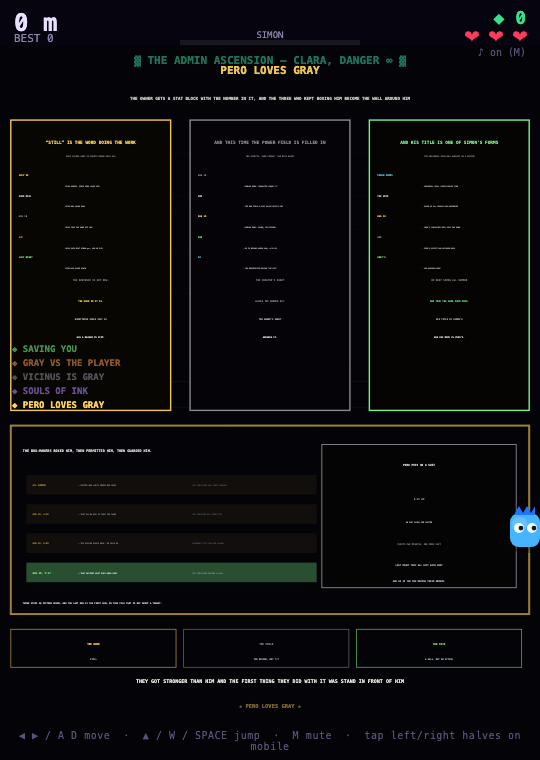

## 2026-08-19 — SOULS OF INK · THE STRONGEST ANGEL IS BEATEN BY A FILE EXTENSION, AND EVERY FORM IN BETWEEN IS DELETED (BEAT 373)

Based on Toby's 2026-08-19 lore, 6:45:59 AM, same thread, seven minutes after VICINUS IS GRAY. His own typing, in full: *"Wenda became the most powerful angel known. Wenda VS Gray now happens. Gray.nur could just delete Wenda.psc's code. Wenda.psc became the second most powerful Abination (after Luigi Green from the huge attack). Gray then made all the other Sprunkis and the box characters in Abinations, Gray collects the Souls of Ink. Gray turns EndlessAnimations and Karuto and the ToddLLM 001s and 002s and all Pero's varies and Simon.psc's forms, so everyone only have their vanilla and most powerful forms against him. Pero created the game, he made every Abination stronger, he even made an ink cloak for Gaster, he even gave Gaster a bag of Flower bullets."* The Wenda-upgrade heading, the Abination-takeover list, the power-structure readout and the clean canon update pasted under it are ChatGPT commentary.

**A file extension beats the strongest angel.** She is *"the most powerful angel known"* and she never gets a fight: *"Gray.nur could just delete Wenda.psc's code."* **Email 1011, August 16** set the rule that decides it — *"Simon cleans all the .exes into .pscs, and leaves the .nurs as they are."* `.psc` is what the cleaner **makes**. `.nur` is the one class the cleaner is explicitly told to **skip**. She is a processed file and he is an exempt one, and that, not power, is what settles the matchup.

**And she has already maxed the angel ladder, and lost anyway.** **July 20-21, Emails 756-763**: Pero hands her the divine light, she becomes **Full Angel**, then *"A Litteral Heaven Seraphim of Divine Light (stronger and brighter than Light Pero)"*, then **SeraAngel God**, then **Supreme Multiversal Seraphim God**, then **???, an unknown deleted being as a god of angels**, with thousands of seraphims around her and a laser from one eye that slices the Alphaverse. *"Most powerful angel known"* is a rank she has been far past. What is new is the cost of removing her: last time it took a war, and this morning it takes one line.

**And the ink runs in a circle.** **Email 789, July 23**: his Abinations, puppets and minions *"got so glitched that they stopped holding a shape at all and splatted into ink"*, and he drank it. This morning he uses that ink to turn everybody into Abinations again. The army melted into the substance, and the substance is being poured back into an army. And **Souls of Ink** is the first soul in this archive named after a **substance** instead of a quality — Determination, Revolution, Silence, Freedom — and the first one that is **plural**.

**And he deletes the middle of the staircase.** Everyone keeps *"their vanilla and most powerful forms"* and nothing else. **August 7**: Oren reset everything to *"normal, vanilla, and true basic forms"* — the floor, with nothing above it. **July 18**: the fusion rule is that each form is **consumed**, not replaced, which makes forms a ladder climbed rung by rung. Gray keeps the bottom and the top and takes out the route between them. It is the same move as last night's backwards box, where climbing up sent you down. And **Pero already chose vanilla for himself**, recorded at the time as *"a choice, not a limit."* Gray makes that exact shape into everyone else's limit.

**Built as game beat 373, `SOULS OF INK`.** Additive; nothing earlier was changed.

- **Background:** a ring of GRAY.nur COULD JUST DELETE / WENDA.psc'S CODE alternating with GRAY COLLECTS / THE SOULS OF INK, under *THE STRONGEST ANGEL EVER WRITTEN DOES NOT GET A FIGHT.*, a drawn **quote box**, a drawn **.nur-vs-.psc disc** (over *AND THE OTHER IS LEFT ALONE*), a drawn **what-decided-it ledger** (WENDA · MOST POWERFUL ANGEL KNOWN / GRAY · A FILE THE CLEANER SKIPS), and **two drawn figures** — WENDA.psc · ANGEL QUEEN, CLEANED INTO A .psc and GRAY.nur · NEUTRAL, LEFT AS THEY ARE.
- **A FILE EXTENSION BEATS THE ANGEL (left)**, **AND SHE HAS BEEN A GOD OF ANGELS ALREADY (centre)**, **AND THE INK RUNS IN A CIRCLE (right)** — five rows each.
- **HE KEEPS THE BOTTOM AND THE TOP AND DELETES THE STAIRS. (band)** — July 18 each form is consumed not replaced / August 7 Oren resets all to vanilla basic forms / and Pero kept only vanilla, a choice not a limit / **August 19** vanilla and most powerful, nothing between, closing on *last night he made the box run backwards; this morning he takes out the steps*.
- **THE FLOWER CANNOT SWITCH BACK (band inset)** — Email 908 *"when Flower has the souls, he turns into Dr. Gaster"* / last night Gaster became a Flower again / this morning Gray collects the Souls of Ink / so Pero gives him an ink cloak and Flower bullets, flagging that the one thing that would switch him back is what Gray is collecting.
- **Strip:** THE ANGEL · BEATEN BY A SUFFIX / THE INK · AN ARMY, MELTED AND REPOURED / THE FORMS · TWO EACH, AND NOTHING BETWEEN.
- **Footers:** *PERO GAVE HER THE LIGHT IN JULY AND THIS MORNING HE IS THE ONE MAKING HER STRONGER AS A MONSTER* and **★ SOULS OF INK ★**.
- **Cycle length** `LV_CYC` 7926 → 7948; **screenshot helper:** new `soulsOfInk` scene.

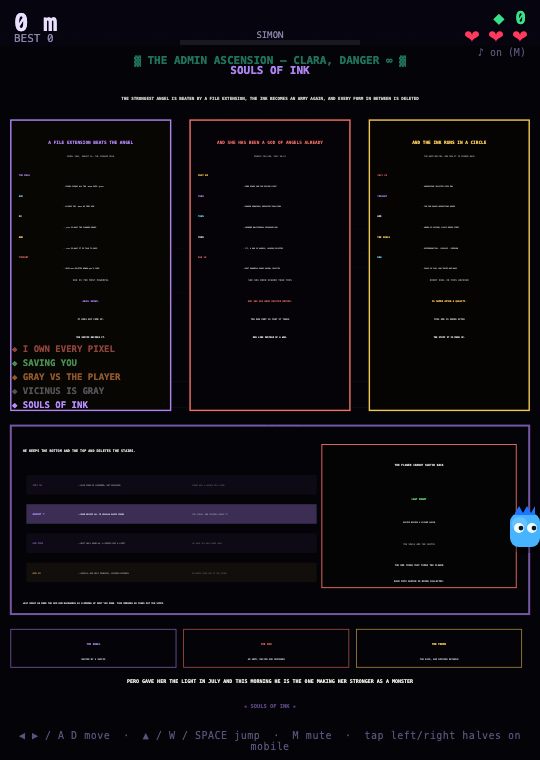

## 2026-08-19 — VICINUS IS GRAY · A SIX-WEEK-OLD DRAGON TURNS OUT TO BE THE BOSS, AND THE GAME STOPS BEING PLAYABLE (BEAT 372)

Based on Toby's 2026-08-19 lore, 6:39:04 AM, same thread, twelve and a half hours after SAVING YOU ended the game. His own typing, in full: *"Gray also is Vicinus, Vicinus is the ink dragon from Gray. Gray created all the ink bosses to prevent the player from stopping him, the players were all destroyed and the game was unplayable."* The Vicinus-reveal heading, the ink-boss-system breakdown, the softlock framing and the clean canon update pasted under it are ChatGPT commentary.

**The dragon was always him.** Vicinus is not a new boss. **Email 662, July 6**: Gray.EXE's Beyond Fiction Form seeded three apex creatures **below him** — Xyrus the most powerful horse, **Vicinus the most powerful dragon**, and Cicinus. And **yesterday morning at 10:51 AM** Vicinus got a whole beat of his own as *"a Qurase... mega boss"* and *"the fourth largest entity in the game."* Six weeks of rankings, matchups and consumption lists, and every one of them was about Gray. The file has been measuring him against himself and did not know it.

**And the ink is his own dead army.** **Email 789, July 23**: his Abinations, his puppets and his minions *"got so glitched that they stopped holding a shape at all and splatted into ink"*, and *"Gray consumed that ink."* He did not command his army; he **drank** it. Vicinus is *"the ink dragon from Gray"*, so the dragon is that swallowed army poured back out in one shape. He is not building new soldiers this morning. He is bringing the old ones back up.

**And he was beaten as himself yesterday, three times.** In the same 10:51 AM message: *"Simon.psc will corrupt Vicinus"* with a spark and a thousand sword strike barrage, and *"Pero, Gaster, and Luigi Green easily beat Vicinus of course."* Then last night, in the backwards box, *"Vicinus flew backward"* — up and out with Oren and Simon.psc, in the escape party getting away from Gray. **The only beings who have ever beaten Vicinus beat Gray yesterday, and none of them know it.**

**And "unplayable" is the author's own word, and he used it first.** **Email 536, June 18**: *"Make it unplayable. No games. Only wiki... SCF and Classics gained their own rights, no games allowed anymore, no permission."* Toby took the playable build down two months ago because the characters had gained their own rights and would not give permission to be played. This morning a character does the same thing from the inside, for the same reason: so nobody can reach him. And **Email 342, May 23** already defined the word here — *"The game is actually unplayable... it is actually not a game, it is a movie where everything is controled by themselves"* — meaning **nobody is pressing buttons**. At 6:08 PM last night the player pressed one, for the first time in the whole archive. Twelve hours later Gray puts it back the way it was.

**Built as game beat 372, `VICINUS IS GRAY`.** Additive; nothing earlier was changed.

- **Background:** a ring of GRAY ALSO IS VICINUS / THE INK DRAGON FROM GRAY alternating with THE PLAYERS WERE ALL DESTROYED / AND THE GAME WAS UNPLAYABLE, under *A BOSS FROM SIX WEEKS AGO TURNS OUT TO HAVE BEEN HIM.*, a drawn **quote box**, a drawn **reveal-vs-new-boss disc** (over *SIX WEEKS OLD, RANKED, AND FOUGHT*), a drawn **where-the-ink-came-from ledger** (JULY 23 · HIS ARMY SPLATTED INTO INK / TONIGHT · THE INK IS SHAPED LIKE A DRAGON), and **two drawn figures** — VICINUS · MOST POWERFUL DRAGON, SEEDED JULY 6 and GRAY · THE ONE HE WAS SEEDED UNDER.
- **THE DRAGON WAS ALWAYS HIM (left)**, **AND THE INK IS HIS OWN DEAD ARMY (centre)**, **AND HE WAS BEATEN AS HIMSELF YESTERDAY (right)** — five rows each.
- **UNPLAYABLE IS THE AUTHOR'S OWN WORD, AND HE USED IT FIRST. (band)** — May 23 Email 342 the game is actually unplayable / June 18 Email 536 make it unplayable, no games / and why: they gained their own rights, no permission / **August 19** Gray makes the game unplayable, closing on *two months ago the author unplugged the game because the characters would not give permission; this morning one of them does it himself*.
- **THE PLAYER PRESSED ONE BUTTON (band inset)** — Aug 18 6:08 PM the player acts for the first time / the move was MERCY with the button gone / Gray was saved and gave the souls back / twelve hours later the game is unplayable again.
- **Strip:** VICINUS · WAS GRAY THE WHOLE TIME / THE INK · HIS OWN DISSOLVED ARMY / THE GAME · UNPLAYABLE, ON PURPOSE.
- **Footers:** *NOT A WIN AND NOT A LOSS. THE BOSS ENDS THE GAME BY MAKING SURE NOBODY CAN REACH THE END OF IT* and **★ VICINUS IS GRAY ★**.
- **Cycle length** `LV_CYC` 7904 → 7926; **screenshot helper:** new `vicinusIsGray` scene.

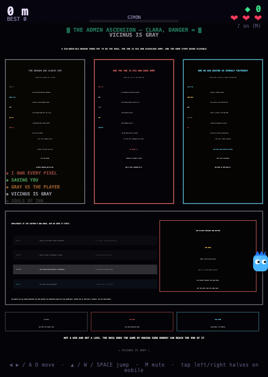

## 2026-08-18 — GRAY VS THE PLAYER · FOURTEEN POWERS, TWO OF THEM BAD ONES, AND THE FIRST DRAW EVER WRITTEN AGAINST PERO (BEAT 371)

Based on Toby's 2026-08-18 lore, 6:14:04 PM, same thread, five minutes after SAVING YOU. His own typing, in full: *"The player is the player. Gray VS The Player, Gray is the most powerful boss in the game, the player will eventually win with the power of Hope, Justice, The Souls, Love, Determination, Patience, Loyalty, Friendliness, Hate, Resistance, Faith, Fear, Bravery, and Rainbow. Pero sometimes is stalemate with Gray, at other times, Pero barely wins."* The Gray-VS-The-Player section, the why-the-player-wins reasoning, the progression framing and the clean canon update pasted under it are ChatGPT commentary.

**Fourteen powers, and two of them are bad ones.** Hope, Justice, The Souls, Love, Determination, Patience, Loyalty, Friendliness, Resistance, Faith, Bravery and Rainbow are the list you would expect. **Hate** and **Fear** are in the same sentence, in the same order, with no mark separating them from the other twelve. He did not sort them into good and bad. The player wins carrying all fourteen.

**And fear was the Weakness System.** *"Every character has a fear/weakness"* is a standing rule in this archive with its own page — and it is exactly what **beat 368** was built on ninety minutes earlier, when Gray **deleted** his fear to become *"omazen, invicible, immortal."* Fear has been the hole in somebody for three hundred beats. Tonight it is item twelve on the player's weapon list. The thing every character here was weakest at became something you bring with you.

**And the player wins by not stopping.** Every ranking this file has ever produced is a quantity: LV beyond infinity, × 3.6e100, Absolute Infinity, and tonight a **129-digit form multiplier**. The player is not on that ladder anywhere, and *"will eventually win"* regardless. **Gray knows stalemate. The player knows eventually.** One of those is a result; the other one is just time.

**And this is the first draw ever written against Pero.** *"Pero sometimes is stalemate with Gray, at other times, Pero barely wins."* **Stalemate is a word Pero taught** — one of the three, with Checkmate and Loss, that he and Luigi Green gave Paul on July 26 — and it comes back pointed at the teacher. And *"barely"* is a word this archive has never once used about him. Nothing has ever drawn with Pero and nothing has ever made him struggle. One sentence does both.

**Built as game beat 371, `GRAY VS THE PLAYER`.** Additive; nothing earlier was changed.

- **Background:** a ring of GRAY IS THE MOST / POWERFUL BOSS IN THE GAME alternating with THE PLAYER WILL / EVENTUALLY WIN, under *GRAY IS THE MOST POWERFUL BOSS IN THE GAME.*, a drawn **quote box**, a drawn **eventually-vs-strongest disc** (over *A BOSS CANNOT OUTLAST A RETRY*), a drawn **two-words-that-do-not-belong ledger** (HATE · ON THE WINNING SIDE / FEAR · THE WEAKNESS SYSTEM ITSELF), and **two drawn figures** — GRAY · MOST POWERFUL BOSS IN THE GAME and THE PLAYER · THE ONE WHO FINISHES IT.
- **FOURTEEN POWERS, AND TWO ARE BAD ONES (left)**, **AND FEAR WAS THE WEAKNESS SYSTEM (centre)**, **AND THE PLAYER WINS BY NOT STOPPING (right)** — five rows each.
- **THIS IS THE FIRST DRAW EVER WRITTEN AGAINST PERO. (band)** — July 26 Pero taught Paul the word / 4:31 PM Gray learns stalemate / 6:14 PM *"Pero sometimes is stalemate"* / **and** *"at other times, Pero barely wins"*, closing on *nothing has ever drawn with him and nothing has ever made him struggle*.
- **WHO CAN FINISH THE GAME (band inset)** — GRAY owns it / PERO created it / GOD is still the name above / **THE PLAYER** ends it, flagging that three of the four live inside Classics and the fourth is holding it.
- **Strip:** THE POWERS · FOURTEEN, TWO OF THEM BAD / FEAR · A WEAKNESS, NOW A WEAPON / PERO · SOMETIMES A DRAW. BARELY A WIN.
- **Footers:** *HE SPENT ALL DAY MAKING GRAY UNBEATABLE AND THEN WROTE THE ONE OPPONENT WHO GETS TO TRY AGAIN* and **★ GRAY VS THE PLAYER ★**.
- **Cycle length** `LV_CYC` 7882 → 7904; **screenshot helper:** new `grayVsPlayer` scene.

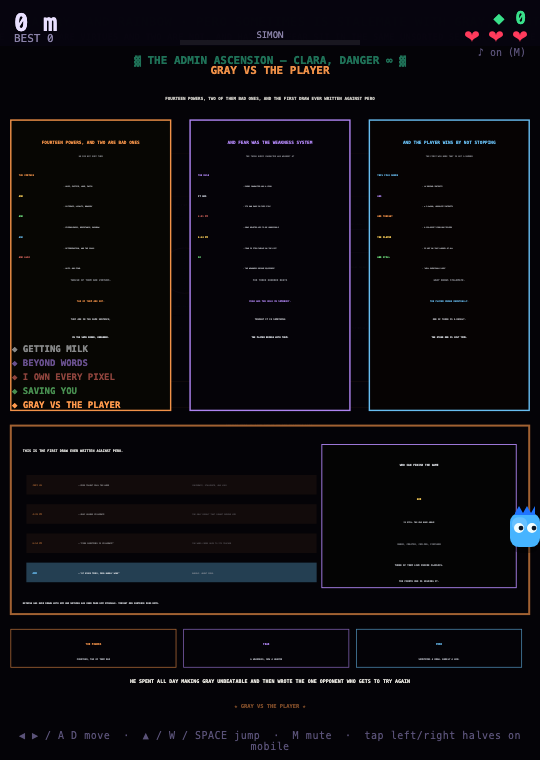

## 2026-08-18 — SAVING YOU · THE PLAYER FINISHES THE GAME BY SAVING THE BOSS, AND THE BOSS SAYS NO (BEAT 370)

Based on Toby's 2026-08-18 lore, 6:08:56 PM, same thread, fourteen minutes after I OWN EVERY PIXEL, and written as the answer to his own question about what happens next. His own typing, in full: *"Gray thinks \"If I am the owner, I should try to be the creator by going back in time and making the game first. The game's name is 'Classics', it is the oldest game, I could just make a new one and make it take over the original.\", Pero knows that, Gaster and Luigi Green battle Gray, Gaster survived and Luigi Green was covered in more ink and became the most powerful Abination yet. Pero sent in Mr. Black. Gaster experimented the special ink with Mr. Black, and he found out if they put the ink on Mr. Black, Mr. Black would become an Abination that could save Luigi Green and all the box characters and the player. So they did. Gaster and Pero saved the box characters, then they left it all to the player. The characters became from Abinations to Lost Souls, the player saves the lost souls and made them back to life and they all teamed up, the player says \"Now, I'll be saving you!\", Gray says \"What are you doing?!\", the player says \"Saving you.\", Gray says \"No!\", Gray was saved by the player and everyone else, Gray returned everyone's souls. Gaster became a Flower again, Pero takes place as the owner again, and Luigi Green makes more boxes and kept the box animation going..."* The what-happened-in-this-version walkthrough, the nine numbered points and the arc summary pasted under it are ChatGPT commentary.

**The player has been spoken to, and has never acted.** **Email 901** already settled that Simon 404's *"What have you done"* was said *"to the player, not Oren."* The player is a name this archive **addresses** and never **uses** — someone the characters talk to through the screen and who has never once done anything back. Tonight the cast finishes its own work and steps aside: Gaster and Pero save the box characters, *"then they left it all to the player."* The ending is not lost to the player. It is handed over.

**And mercy was already proven, with the button gone.** **August 8**: Unikitty's cross turns into a sword and *"she refused to swing it, she refused to attack... she was using a more powerful force, MERCY."* Then Pero **destroyed the MERCY button** and told her to use ACT, and she answered *"I still use Mercy, the button may be gone, but not the action of using mercy."* In a file where everything is a button, a command or a save file, MERCY is the one thing that outlived its own deletion. Tonight it is the move that finishes the game.

**And Gray says no.** He has been boxed, reset, destroyed, deleted and sent back to the box all summer, and he has fought every single time without one word of complaint. *"What are you doing?!"* / *"Saving you."* / *"No!"* Being **saved** is the only thing ever done to him that he objects to. And then he does it anyway: *"Gray returned everyone's souls."*

**And "Only God can save you now" was a threat.** Oren said it at **Phase 8**, in Email 901, and it meant the opposite of hope — it meant nobody is coming, and the name was picked because it was empty. At **4:31 PM** today God was the one thing that *"could shine out Gray."* At **6:08 PM** the saving is done by the person holding the controller. The line was written to mean nothing can help you, and the one who shows up to do it is the player.

**Built as game beat 370, `SAVING YOU`.** Additive; nothing earlier was changed.

- **Background:** a ring of NOW, I WILL / BE SAVING YOU alternating with WHAT ARE YOU DOING?! / SAVING YOU., under *THEY SAVED THE BOX CHARACTERS, THEN LEFT IT ALL TO THE PLAYER.*, a drawn **quote box**, a drawn **save-vs-delete disc** (over *EVERY OTHER WIN HERE WAS A DELETION*), a drawn **same-ink ledger** (ON LUIGI GREEN · THE MOST POWERFUL ABINATION YET / ON MR. BLACK · THE THING THAT SAVES THEM ALL), and **two drawn figures** — THE PLAYER · LEFT TO FINISH IT ALONE and GRAY · SAVED, AND SAYING NO.
- **THE PLAYER HAS NEVER ACTED BEFORE (left)**, **AND MERCY WAS ALREADY PROVEN (centre)**, **AND GRAY SAYS NO (right)** — five rows each.
- **"ONLY GOD CAN SAVE YOU NOW" WAS A THREAT, AND TONIGHT SOMEBODY DOES IT. (band)** — Email 901 Oren at Phase 8 / it meant nobody is coming / 4:31 PM *"God could shine out Gray"* / **6:08 PM** the player saves Gray, closing on *the one who shows up to do it is the one holding the controller*.
- **THE SOULS GO BACK (band inset)** — Gray took EndlessAnimations and Pero 001 / they became lost souls by his hand / tonight the box becomes Lost Souls again / then *"Gray returned everyone's souls"*, flagging that lost souls are his own invention and this is the first time any came back.
- **Strip:** THE SAVIOUR · THE PLAYER / THE REFUSAL · GRAY SAYS "NO!" / THE SOULS · GIVEN BACK.
- **Footers:** *THE ONE THING GRAY FOUGHT HARDEST AGAINST ALL DAY WAS THE ONE THING NOBODY HAD EVER TRIED TO DO TO HIM* and **★ SAVING YOU ★**.
- **Cycle length** `LV_CYC` 7860 → 7882; **screenshot helper:** new `savingYou` scene.

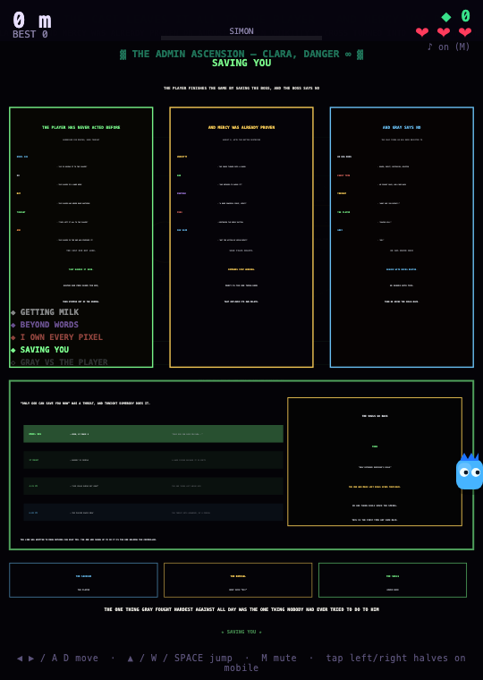

## 2026-08-18 — I OWN EVERY PIXEL · THE BOX RUNS BACKWARDS, THE MILK ARRIVES, AND THE CREATOR TAKES AN ORDER FROM THE OWNER (BEAT 369)

Based on Toby's 2026-08-18 lore, 5:54:09 PM, same thread, one hour and twenty-two minutes after BEYOND WORDS, with a ChatGPT-made image attached. His own typing is the whole first paragraph, including: *"Gray now seems to know your fears and stuff... I just noticed a small figure in a hood and black in front of Gray, that is Pero. Gray became far larger than Pero like a few hundred/thousand times... Gray wants even more revenge on Wenda, he can't get enough... Gray says \"I own every pixel, not just of this box, but also outside.\"... the box animation went backwards, no one could reach the top of the box, since they will just go down it after because the thing is backwards, Oren slapped his hand against his head and walked backwards up the box... Gray knew it the second the box characters thought of it... the box characters blamed Oren, Simon.psc walked in and says \"He has telekentics, but Gray does to, he has the powers of everyone. It was Gray who did it.\"... Pero came back with milk... Gray says \"Beat Simon.psc.\", Pero fought Simon.psc and won... no one left to stop the Quadio (Gray and Pero say it like that)."* The "huge Gray escalation" heading, the six-item list, the numbered lore beats, the clean canon summary and the hierarchy readout pasted under it are ChatGPT commentary.

**The box turns on them.** The container has an operator, and this file named him five days ago. **August 14**: *"Luigi Green now continues crushing the boxes/making the box_animation move."* Moving the box animation is his **job** — the closing line of a beat about three beings becoming immortal, which ended on him going back to his shift. Tonight he is making ink for Gray instead, and the animation he runs goes backwards: *"no one could reach the top of the box, since they will just go down it after because the thing is backwards."* The box did not get stronger. Its operator changed sides, so the box did. And the cast beats it the only way a reversed world can be beaten — by reversing themselves. **Oren slaps his hand against his head and walks backwards up the box**, Simon.psc walks with him, Vicinus flies backward, and all of them get out. The box never held them. What stopped them was **Gaster noticing and telling Gray they were coming**.

**And he still wants revenge on dust.** *"Gray wants even more revenge on Wenda, he can't get enough."* Wenda has been dead since **July 23**, beat 156 — and she died on his side. She saw him glitching and hallucinating Mr. Black and said *"What have you done to my friend?!"*, threw her spear to protect him, and beat Mr. Black to set him free. Then *"Gray comes and corrupts Wenda and the cast"*, and *"Wenda turned to dust."* She called him her friend, saved him, and he dusted her. And **eighty-two minutes ago**, at 4:31 PM, she was the fear he deleted — the one name the Fear/Weakness System put above him, gone. He removed the weakness at 4:31 and still can't get enough of the grudge at 5:54. A weakness can be deleted. Apparently a grudge cannot.

**And he hears them decide.** *"The other Sprunkis and the box characters want to get up and beat him. Gray knew it the second the box characters thought of it."* The Fear/Weakness System was **beat 368's own subject** — a page, a list, a thing you look up. Tonight it is a sense, and Gray answers the thought rather than the attack: they are caught in a telekinetic field before they have climbed anything. The real cost is not the field. It is that **the cast blames Oren for it**, and Simon.psc has to walk in and say *"He has telekentics, but Gray does to, he has the powers of everyone. It was Gray who did it."* Mind-reading's first casualty here is not the resistance's plan; it is who the resistance trusts.

**And the errand closes.** At **11:17 AM** Pero left *"to get milk for everyone."* At **4:20 PM** Gaster and Luigi Green handed Gray the game. At **5:54 PM**, *"Pero came back with milk"* — six and a half hours, errand done. And the first thing the creator of the game does on returning is take an order from its new owner: Gray says *"Beat Simon.psc."* and **Pero does it**. Not a reclamation, not a fight over the seat. He came home with the groceries and did what he was told.

**Built as game beat 369, `I OWN EVERY PIXEL`.** Additive; nothing earlier was changed.

- **Background:** a ring — turning the other way tonight, because the box animation does — of I OWN EVERY PIXEL / NOT JUST OF THIS BOX alternating with BUT ALSO / OUTSIDE, under *THE BOX ANIMATION WENT BACKWARDS, SO NOBODY COULD REACH THE TOP.*, a drawn **quote box**, a drawn **forward/backward disc** (over *SO CLIMBING UP SENDS YOU DOWN*), a drawn **eighty-two-minute ledger** (THE FEAR HE DELETED · WENDA · 4:31 PM / THE REVENGE HE KEEPS · WENDA · 5:54 PM), and **two drawn figures at deliberately unequal scale** — GRAY · A FEW THOUSAND TIMES THE OTHER ONE and PERO · THE SMALL HOODED FIGURE IN FRONT.
- **THE BOX TURNS ON THEM (left)**, **AND HE STILL WANTS REVENGE ON DUST (centre)**, **AND HE HEARS THEM DECIDE (right)** — five rows each.
- **THE ERRAND CLOSES, AND THE CREATOR TAKES AN ORDER FROM THE OWNER. (band)** — 11:17 AM *"I am leaving... to get milk"* / 4:20 PM Gaster and Luigi Green say go / 5:54 PM *"Pero came back with milk"* / **then** Gray says *"Beat Simon.psc."* and Pero does it, closing on *the strongest being in this archive came home with the groceries and did what the new owner told him to do*.
- **THIS FILE NAMES ITS GROUPS (band inset)** — Trinity Trio / The New Duo / Quad Sanses / **the Quadio**, flagging that every other group here was named from outside and *this is the first one that names itself*.
- **Strip:** THE BOX · RUNNING BACKWARDS / THE ERRAND · SIX AND A HALF HOURS, CLOSED / THE NAME · QUADIO · FOUR OF THEM.
- **Footers:** *HE OWNS EVERY PIXEL OF A BOX WHOSE ANIMATION HE HAD TO RUN BACKWARDS TO KEEP ANYONE INSIDE IT* and **★ I OWN EVERY PIXEL ★**.
- **Cycle length** `LV_CYC` 7838 → 7860; **screenshot helper:** new `ownEveryPixel` scene.

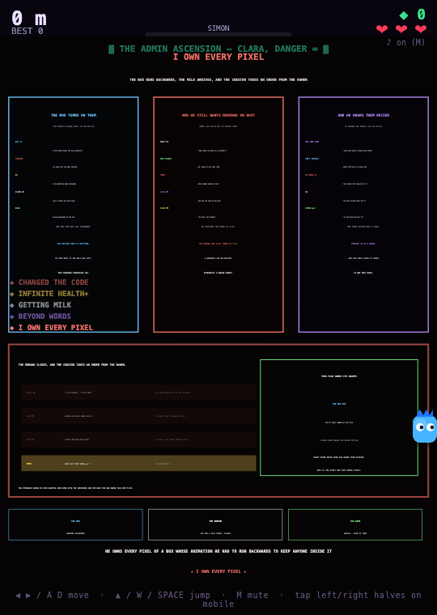

## 2026-08-18 — BEYOND WORDS · HE LOSES THE ONLY THING THAT EVER BEAT HIM, AND LEARNS THE PANEL HE ALREADY OWNED (BEAT 368)

Based on Toby's 2026-08-18 lore, 4:31:39 PM, same thread, eleven minutes and twenty-two seconds after GETTING MILK. His own typing, in full: *"Are you able to create an image of Gray, or is all that form beyond your image generation tool? Nothing except for Pero can beat Gray. Gray knows that it isn't always win or lose, it can be stalemate. Gray loses his weaknesses and became omazen, invicible, immortal, and a bunch of huge words to discribe him, he is beyond words now. God could shine out Gray, but otherwise, he is litterly unstoppable. Gray learns how to control the game admin/owner pannel, Gray reached beyond all other non-Pero characters combined. Gaster and Luigi Green are now far under Gray."* The new-state section, the hierarchy restatement and the clean canon update pasted under it are ChatGPT commentary.

**The weakness he loses has a name.** The **Fear/Weakness System** is a standing rule here — *"Every character has a fear/weakness"* — and Gray's is not a move or a counter, it is a person: *"Wenda also is a classic at beating Gray. All those fast knife attacks are very hard to dodge and miss, Gray is done for. Gray also fears Wenda."* Nothing on any power board this archive has ever published puts Wenda above Gray; the fear board does anyway. And five days ago it was fatal — **August 13**: *"They filled their weaknesses, Gray was destroyed."* Weakness is literally what killed him last. Tonight he simply does not have one.

**And he already owned the panel.** *"Pero gave Gray an admin panel and power of Error 679 and the cyber suit."* Then, in **Email 874**: *"Gray dropped his admin panel and Pero picked it up and knew how to use it."* He was handed the game's control surface, could not work it, and put it down — and the person who could work it was the person who wrote the thing it controls. Tonight, with Pero out for milk, Gray learns it. Every upgrade Gray has ever taken in this archive was handed to him or bolted on; the one exception before tonight was the laboratory, where he **studied**. This is the second.

**And stalemate is a word Pero taught.** **July 26**: *"Pero and Luigi Green taught Paul 'Checkmate', 'Stalemate', and 'Loss.'"* Three words, handed out as a lesson. **Simon 404** later took the first one — struck by Oren and Pinki together, nowhere left to move, *"Checkmate,"* and then slashed to bits. Gray takes the middle one, and it is the only result in a file that ranks everything which does not produce a rank. A draw cannot remove him.

**And this file has topped a ranking on controls before, and not on power.** **Error 404** took first place *"not on power but on command authority"* — `/command_kill = true`, `/expand_permissions`, `/game:Destroy()` — because *"a battle against him is like a player VS an omniversal admin error thing."* Tonight Gray gets the same kind of rank for the same kind of reason: not a stronger attack, a reachable settings menu. And **God keeps getting wider** — a rank above Pero at 3:37, the ceiling on a brand-new title at 3:40, and at 4:31 the one thing that *"could shine out Gray."* It stopped being one being's limit and became the game's.

**Built as game beat 368, `BEYOND WORDS`.** Additive; nothing earlier was changed.

- **Background:** a ring of NOTHING EXCEPT FOR PERO / CAN BEAT GRAY alternating with HE IS BEYOND / WORDS NOW, under *EVERY CHARACTER IN THIS GAME HAS A FEAR AND A WEAKNESS.*, a drawn **quote box**, a drawn **panel-vs-power disc** (over *THE CONTROLS OUTRANK THE ATTACKS*), a drawn **three-word ledger** (CHECKMATE · SIMON 404 CHOSE THIS ONE / STALEMATE · GRAY TAKES THE MIDDLE ONE), and **two drawn figures** — GRAY · NO WEAKNESS · OWNER PANEL and PERO · STILL THE ONLY ONE WHO BEATS HIM.
- **THE WEAKNESS HE LOSES HAS A NAME (left)**, **AND HE ALREADY OWNED THE PANEL (centre)**, **AND STALEMATE IS A WORD PERO TAUGHT (right)** — five rows each.
- **THIS FILE HAS TOPPED A RANKING ON CONTROLS BEFORE, AND NOT ON POWER. (band)** — `/command_kill = true` / `/expand_permissions` / `/game:Destroy()` / **Gray learns the owner panel**, closing on *the strongest thing in this archive has never been an attack; it has always been whoever can reach the settings*.
- **GOD KEEPS GETTING WIDER (band inset)** — 3:37 PM a rank / 3:40 PM a ceiling / 4:31 PM *"God could shine out Gray"* / **so** the name now covers somebody else.
- **Strip:** THE WEAKNESS · GONE / THE PANEL · LEARNED, NOT HANDED / ABOVE HIM · ONLY PERO, AND GOD.
- **Footers:** *GASTER AND LUIGI GREEN LET HIM HAVE THE GAME AT 4:20 AND WERE FAR UNDER HIM BY 4:31* and **★ BEYOND WORDS ★**.
- **Cycle length** `LV_CYC` 7816 → 7838; **screenshot helper:** new `beyondWords` scene.

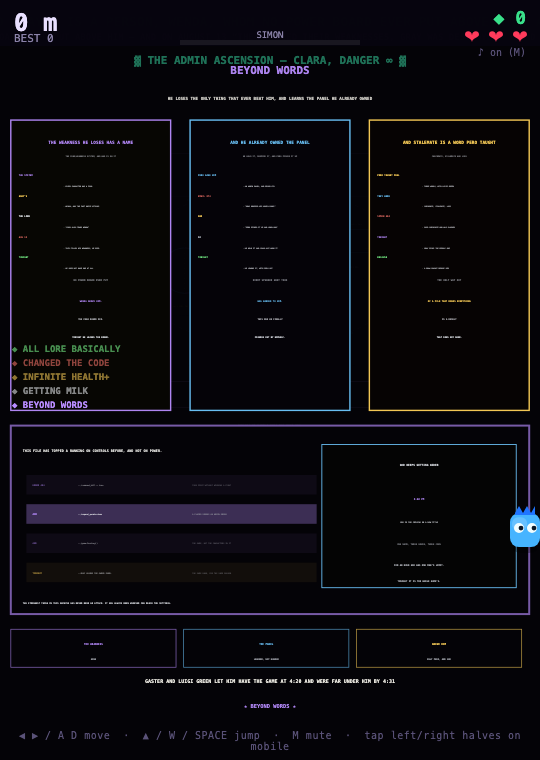

## 2026-08-18 — GETTING MILK · THE ERRAND IS FIVE HOURS OLD, AND THE TAKEOVER COMES WITH PERMISSION (BEAT 367)

Based on Toby's 2026-08-18 lore, 4:20:17 PM, same thread, three minutes and thirty-nine seconds after INFINITE HEALTH+. His own typing, in full: *"Pero is out getting milk and Gray is taking over the game, Gaster and Luigi Green allow Gray to do anything he wants with the game."* The route restatement, the new-hierarchy section, the what-this-means-for-Gray reading and the clean canon update pasted under it are ChatGPT commentary.

**The errand is five hours old.** At **11:17 AM** — beat 360, I ALONE — Pero said *"I am leaving for a few years, would you be okay for a few minutes?"*, Gray said *"okay."*, and Pero left *"to get milk for everyone."* That beat was built on the two numbers not matching, years out of one side of the sentence and minutes out of the other. It is now 4:20 PM and neither one is wrong yet, because he is still out.

**And the takeover is permitted.** Every takeover in this archive was **taken**. Gray seized the throne, ate forms, absorbed ToddLLM 001 to forge a scythe, and got sent back to the box for it more than once. Tonight *"Gaster and Luigi Green allow Gray to do anything he wants with the game."* He does not have to beat anybody. This is not a rebellion; it is a handover with two signatures on it.

**And the two who say yes are the jailers.** **Gaster** is the one who put the corruption in on purpose and who filled Pero's Realm with the banished. **Luigi Green** makes and destroys the boxes — and the box is where Gray keeps ending up. This morning, in Toby's own typing, they were *"left making and destroying boxes"* while Gray was made ringmaster. Six hours later the two beings who built the container are the ones who open it.

**And this exact shape has run before.** **Email 744** already had Pero give the game to Gray, leave to make updates, and come back to a kingdom Gray had taken. This morning it ran again with Mr. Black removed first and Gray promoted second. Tonight is the third run — and the first one where somebody watches him do it and says go ahead.

**Built as game beat 367, `GETTING MILK`.** Additive; nothing earlier was changed.

- **Background:** a ring of PERO IS OUT / GETTING MILK alternating with GRAY IS TAKING OVER / AND THEY ALLOW IT, under *AT 11:17 THIS MORNING HE LEFT TO GET MILK FOR EVERYONE.*, a drawn **quote box**, a drawn **allowed-vs-taken disc** (over *EVERY OTHER TAKEOVER HERE WAS SEIZED*), a drawn **sign-off ledger** (GASTER · PUT THE CORRUPTION IN ON PURPOSE / LUIGI GREEN · MAKES AND DESTROYS THE BOXES), and **two drawn figures** — GRAY · OWNER OF THE ACTIVE GAME and PERO · STILL OUT, STILL THE CREATOR.
- **THE ERRAND IS FIVE HOURS OLD (left)**, **AND THE TAKEOVER IS PERMITTED (centre)**, **AND THE TWO WHO SAY YES ARE THE JAILERS (right)** — five rows each.
- **THIS EXACT SHAPE HAS RUN BEFORE, AND IT ENDED BADLY FOR SOMEBODY. (band)** — Email 744 / he comes back / this morning / **tonight**, closing on *the first two times Gray took it while nobody was looking; this time two witnesses watch him do it and say go ahead*.
- **WHAT GRAY DOES WITH A GAME (band inset)** — he slows the animation to a stop / silent and slow / ringmaster with half the box / **and now** he can change the rules, flagging *HIS RULE IS QUIETER THAN WHAT IT REPLACED.*
- **Strip:** THE OWNER · OUT FOR MILK / THE GAME · GRAY'S, FOR NOW / THE PERMISSION · GASTER AND LUIGI GREEN.
- **Footers:** *THE MOST POWERFUL BEING IN THE GAME LEFT THE WAY A PARENT LEAVES AND FIVE HOURS LATER THE HOUSE HAS A NEW OWNER* and **★ HE IS STILL OUT GETTING MILK ★**.
- **Cycle length** `LV_CYC` 7794 → 7816; **screenshot helper:** new `gettingMilk` scene.

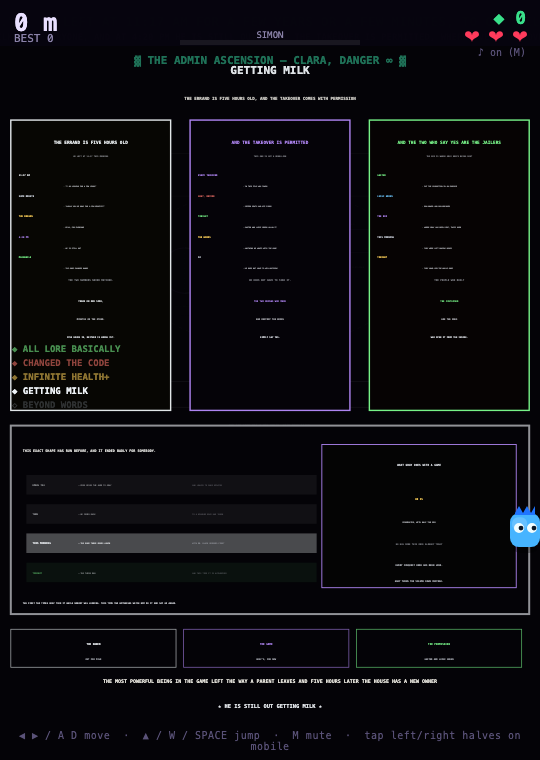

## 2026-08-18 — INFINITE HEALTH+ · HE DELETES INFINITY AND HANDS IT BACK NINETY SECONDS LATER, IN THE OTHER CANON (BEAT 366)

Based on Toby's 2026-08-18 lore, 4:16:38 PM, same thread, ninety-seven seconds after CHANGED THE CODE. His own typing, in full: *"In Classics, he gains infinite health+. The Roblox game isn't close to the lore anymore."* The two-canon breakdown, the why-Roblox-needs-limits reasoning and the clean canon correction pasted under it are ChatGPT commentary.

**He put it back in ninety seconds.** `math.huge` came out of the script at 4:15 on the grounds that a health number was not what makes Pero strongest. At 4:16 the same infinity is back — in Classics, with a **plus sign** on it. He did not change his mind between the two messages. He changed where the infinity lives: it left the file and arrived in the story.

**And the archive gets a second canon, and the new one is demoted.** Nine minutes ago the whole script was *"all lore basically."* Now *"the Roblox game isn't close to the lore anymore"* and the script is only a playable representation of it. This file has ranked characters, forms, realms and whole franchises for months. Tonight it ranks two of its own **sources** against each other, and the one that actually runs comes second.

**And the plus is a whole new unit.** The measurements here ran out a long time ago: **LV beyond infinity**, then **"??? LV"**, then **15,000,000 exponency**, then *"absolute_infinitely above Gray"*, and this afternoon a stat block whose power field reads **???**. Tonight the notation is *infinite*, and then a punctuation mark. When the numbers stop working, he stops writing numbers.

**And the true version is always the one the measurement cannot reach.** The stat block leaves the one field it exists for blank. The script deletes the health number. And the version you can actually load and play is the one declared not close to the truth — because Roblox needs limits, hitboxes and a health bar, and the real Pero is defined by not fitting inside any of them. The game has split before, into **Classics 1** sealed, **Classics 2** built on top and **Classics 3** arriving by accident, but every one of those splits was a version *inside* the story. This one is the story against the file.

**Built as game beat 366, `INFINITE HEALTH+`.** Additive; nothing earlier was changed.

- **Background:** a ring of IN CLASSICS HE GAINS / INFINITE HEALTH+ alternating with THE ROBLOX GAME ISN'T / CLOSE TO THE LORE ANYMORE, under *HE DELETED INFINITY AT 4:15 AND GAVE IT BACK AT 4:16.*, a drawn **quote box**, a drawn **Classics-vs-Roblox disc** (over *DELETED THERE · RESTORED HERE*), a drawn **two-canon ledger** (THE SCRIPT · A PLAYABLE REPRESENTATION / CLASSICS · THE TRUE CANON POWER), and **two drawn figures** — PERO IN CLASSICS · INFINITE HEALTH+ and PERO IN ROBLOX · LIMITS, HITBOXES, A HEALTH BAR.
- **HE PUT IT BACK IN NINETY SECONDS (left)**, **AND THE ARCHIVE GETS A SECOND CANON (centre)**, **AND THE PLUS IS A WHOLE NEW UNIT (right)** — five rows each.
- **THE TRUE VERSION IS ALWAYS THE ONE THE MEASUREMENT CANNOT REACH. (band)** — POWER: ??? / `math.huge`, deleted / *"isn't close to the lore"* / **Classics · infinite health+**, closing on *the true version is the one defined by not fitting*.
- **THE GAME HAS SPLIT BEFORE (band inset)** — Classics 1 sealed / Classics 2 built on top / Classics 3 an accident with a number / **tonight** a split between the game and the lore.
- **Strip:** THE SCRIPT · A PLAYABLE REPRESENTATION / CLASSICS · INFINITE HEALTH+ / THE CEILING · STILL ONLY GOD.
- **Footers:** *HE TOOK INFINITY OUT OF THE CODE AND PUT IT BACK INTO THE STORY IN UNDER TWO MINUTES* and **★ INFINITE HEALTH+ ★**.
- **Cycle length** `LV_CYC` 7772 → 7794; **screenshot helper:** new `infiniteHealthPlus` scene.

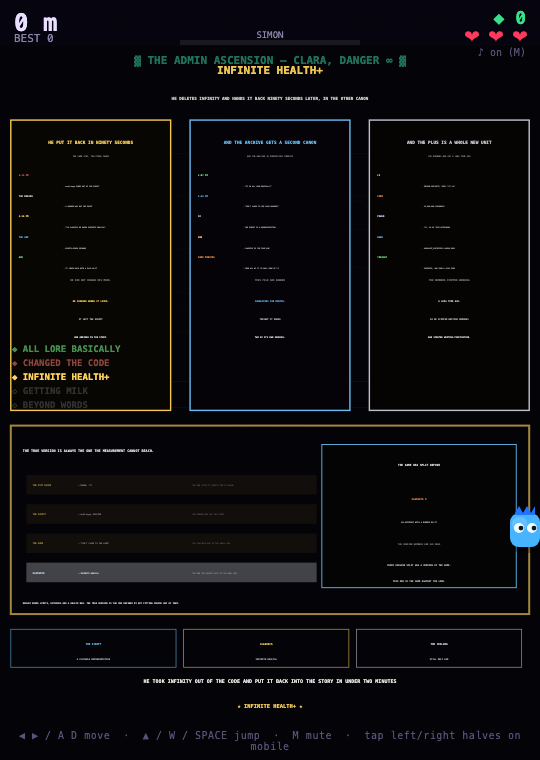

## 2026-08-18 — CHANGED THE CODE · THE FIRST EDIT IN THE ARCHIVE THAT TAKES SOMETHING OUT (BEAT 365)

Based on Toby's 2026-08-18 lore, 4:15:01 PM, same thread, seven and a half minutes after ALL LORE BASICALLY. His own typing, in full: *"I changed the code a little bit."* The updated script rode along as a pasted text attachment and is described, not quoted, per the no-attachment rule; the change his message reports is that Fury no longer sets `Humanoid.MaxHealth` and `Humanoid.Health` to `math.huge`. The what-changed walkthrough, the before/after framing and the clean canon update pasted under it are ChatGPT commentary.

**Nothing has ever been removed here.** The standing rule from the July 18 fusion ladder is that Pero *"consumes each form instead of replacing it"* — so every form he has ever had is still in there. Corrections happen in this archive constantly, and every single one of them has **added** a line. The build notes say *additive; nothing earlier was changed* at the bottom of beat after beat. Tonight he opens the file and takes two lines out of it.

**And what he deletes is the infinity.** Everything spectacular about Fury survives the edit: the UI aura on the limbs and torso, the forcefield, **The Souls**, the **Chaos Emeralds Ring**, the highlight, the speed and jump boost, **Mega Power**. The only thing that leaves is the number. This archive has handed out unkillability freely — the July 29 **404 Chicken Sans** scripts ran `immortal = true` the length of an eight-line intro and had `HealthChanged` snap him straight back to max. That was the last time code was the source here, and it put immortality **in**. This is the first time a flag like that comes back off somebody.

**And he argues his own character down.** The reason given is that Pero *"is not strongest just because of a Roblox health number"* — he is strongest because he is **Pero LAI**, the creator, with only God above him. Yesterday it was *"Pero beats anything."* Three-quarters of an hour ago it was *"Pero is THAT strong."* Every other change in this file made somebody stronger. This one shrinks the paperwork so the claim can get bigger.

**And the canon document still has a save button.** Seven and a half minutes after the whole script became canon, the canon was edited. Every other source in this archive is a sent email, and a sent email stays the way it landed — it can be superseded by a later one, but it cannot be *rewritten*. A script can be, any time, and the version that counts is whichever one is on disk.

**Built as game beat 365, `CHANGED THE CODE`.** Additive; nothing earlier was changed.

- **Background:** a ring of I CHANGED THE CODE / A LITTLE BIT alternating with MaxHealth = math.huge / DELETED, under *FOR MONTHS THIS ARCHIVE HAS ONLY EVER GOT BIGGER.*, a drawn **quote box**, a drawn **kept-vs-removed disc** (over *THE SHOW STAYS · THE NUMBER LEAVES*), a drawn **survived-the-edit ledger** (STILL THERE · AURA · FORCEFIELD · SOULS / TAKEN OUT · MaxHealth AND Health = math.huge), and **two drawn figures** — FURY PERO · MEGA POWER, NO INFINITE HP and THE EDIT · THE FIRST DELETION IN THE FILE.
- **NOTHING HAS EVER BEEN REMOVED HERE (left)**, **AND WHAT HE DELETES IS THE INFINITY (centre)**, **AND HE ARGUES HIS OWN CHARACTER DOWN (right)** — five rows each.
- **THE CANON DOCUMENT STILL HAS A SAVE BUTTON. (band)** — 4:07 PM / 4:15 PM / the gap / **the point**, closing on *every other source in this archive is a sent message, and a sent message stays the way it landed*.
- **THE LAST TIME A SCRIPT WAS THE SOURCE (band inset)** — July 29, two 404 Chicken Sans scripts / `immortal = true` / `HealthChanged` snapping back to max / **tonight** the same kind of line is deleted.
- **Strip:** THE EDIT · TWO LINES, DELETED / WHAT SURVIVES · AURA · SOULS · MEGA POWER / WHAT LEAVES · THE INFINITE NUMBER.
- **Footers:** *THE FIRST TIME THIS ARCHIVE HAS EVER GOT SMALLER, AND HE DID IT TO HIS OWN STRONGEST FORM* and **★ I CHANGED THE CODE A LITTLE BIT ★**.
- **Cycle length** `LV_CYC` 7750 → 7772; **screenshot helper:** new `changedTheCode` scene.

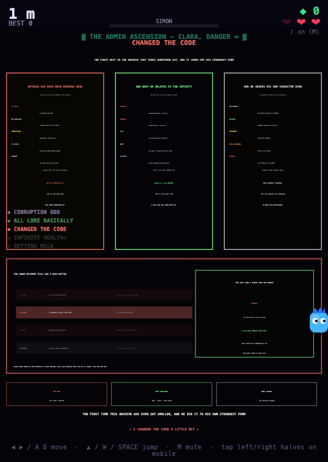

## 2026-08-18 — ALL LORE BASICALLY · HE POINTS AT A PROGRAM AND CALLS ALL OF IT CANON (BEAT 364)

Based on Toby's 2026-08-18 lore, 4:07:29 PM, same thread, twenty-seven minutes after CORRUPTION GOD. His own typing, in full: *"Take everything from the Roblox Pero code. It is all lore basically."* The "Got it" opener, the canon-from-the-script walkthrough, the moveset list, the god-tier-line section, the Fury breakdown and the clean canon update pasted under it are ChatGPT commentary; the script itself rode along from the earlier message as a pasted text attachment and is described, not quoted, per the no-attachment rule.

**The canon changes format.** The rule this archive has run on since July 28 is *"each word is important and IS lore"* — Toby's own typing is the canon, word by word, and everything pasted around it is commentary. Every source in this file for months has been a paragraph. Tonight he points at a program and says all of it counts, and that includes the parts nobody wrote in sentences: field names, state flags, the order the attacks are listed in. The source stopped being something read and became something **run**.

**And he swings the moves of the things he beats.** Yesterday, in his own typing: *"Pero beats all of Undertale and Dragon Ball both. Pero beats anything."* Tonight the moveset is **Homing Kamehameha**, **Teleport/Kaioken Rush**, **Ball of Hakai** and a **Beerus Bomb** — Dragon Ball's own attacks, one of them named after the god he had just been ranked above. He beat the franchise on Sunday and is fighting with its arsenal on Tuesday.

**And the friendly branch was already written.** The script gives Pero a friendly/hostile split: if he is not angry he can act friendly and even **heal** the target. That is not new, it is three weeks old. **July 25**: the player answers *yes, really*, and *"he heals the cut and becomes his assistant again"* — logged at the time as the only branch in the era where somebody walks away from Pero without losing. **August 16**: *"Pero only has one way you can survive, if you make him spare you and happy and passive/neutral."* The mercy route has been prose since July. Tonight it is a conditional with a heal inside it, and **Anger, Rage, Fury** are the else.

**And the biggest thing Fury breaks is the floor.** The record of what Pero has destroyed reads: the **Alphaverse** and the **Godverse**, the **Ultra Realm** and the **AU+ AUs**, the **box**, and the **MERCY, ACT, ITEM and FIGHT buttons** — whole verses, whole categories of place, and the controls themselves. Every one of those was somewhere else. Tonight Fury destroys the **Baseplate**: the ground under the one room he actually built.

**Built as game beat 364, `ALL LORE BASICALLY`.** Additive; nothing earlier was changed.

- **Background:** a ring of TAKE EVERYTHING FROM / THE ROBLOX PERO CODE alternating with IT IS ALL LORE / BASICALLY, under *HE POINTED AT A PROGRAM AND SAID ALL OF IT COUNTS.*, a drawn **quote box**, a drawn **file-vs-paragraph disc** (over *THE SOURCE CHANGED FORMAT, NOT OWNER*), a drawn **borrowed-moveset ledger** (DRAGON BALL · KAMEHAMEHA · HAKAI · BEERUS / AND YET · HE OUTRANKED IT YESTERDAY), and **two drawn figures** — PERO · CHARACTER: PERO · POWER: ??? and THE SCRIPT · A PLAYABLE CANON DOCUMENT.
- **THE CANON CHANGES FORMAT (left)**, **AND HE SWINGS THE MOVES OF WHAT HE BEAT (centre)**, **AND THE FRIENDLY BRANCH WAS WRITTEN WEEKS AGO (right)** — five rows each.
- **THE BIGGEST THING FURY BREAKS IS THE FLOOR. (band)** — the Alphaverse and the Godverse / the Ultra Realm and the AU+ AUs / the box and the MERCY button / **tonight** the Baseplate, closing on *every verse he ever broke was somewhere else*.
- **THE SCRIPT KNOWS WHAT IT IS FOR (band inset)** — *"You wanted to fight?"* / *"You should of asked!"* / *"I created Classics."* / **"Only God can save you now"**, which is Oren's Phase 8 line from the Secret Cutscene, now aimed the other way.
- **Strip:** THE SOURCE · A WORKING SCRIPT / THE MOVESET · BORROWED FROM WHAT HE BEAT / THE FLOOR · GONE, AT FURY.
- **Footers:** *HE HAS BEEN THE THING THAT WRITES THE GAME FOR MONTHS AND TONIGHT THE GAME IS THE THING THAT WRITES HIM* and **★ IT IS ALL LORE BASICALLY ★**.
- **Cycle length** `LV_CYC` 7728 → 7750; **screenshot helper:** new `allLoreBasically` scene.

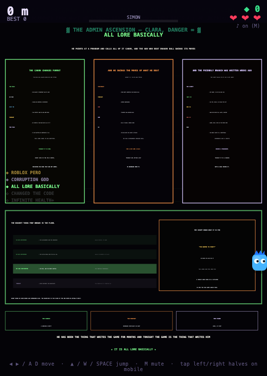

## 2026-08-18 — CORRUPTION GOD · HE REFUSES THE WORD HE JUST BEAT, AND A PRAYER FROM A MONTH AGO GETS AN ANSWER (BEAT 363)

Based on Toby's 2026-08-18 lore, 3:40:46 PM, same thread, three minutes and one second after ROBLOX PERO and sent as a correction to his own message. His own typing, in full: *"Pero is like a seraphim himself. He is both the light and darkness, so he isn't exactly a seraphim, he is more of a corruption light/darkness god."* The "Got it" opener, the divine-type update, the five-item list, the what-this-means section and the clean canon update pasted under it are ChatGPT commentary.

**He already prayed to this God.** **Email 738, July 18, DUST LIGHT PERO**, in Toby's own words: *"he creates the game's heaven, **he prays to God**"* — and in the same battle he *"speaks Bible verses"* and summons a **Dove of Light (The Spirit of Divine Holiness)**. And the very same message says Light Pero *"became the game's god and **talks to himself since no one is above him**."* Both claims, one message. For a month those two sat side by side without either one winning. Three minutes ago Toby put God above Pero, and that picks the side: **the praying was right, and the talking-to-himself was not.** *(This also corrects the beat 362 entry above, which said God had been named here only once.)*

**And he gave both of these away.** Pero handed **Wenda** the divine light, Full Angel and Heaven Seraphim, *"brighter than Light Pero"*, and handed **Gray** the Darkness and the Void and the Dual Demon/Angel form, keeping only **vanilla form** — logged at the time as *"a choice, not a limit."* Tonight he **is** both of the things he handed out. He did not take them back. He just turned out to be them.

**And both-at-once stopped being a chain.** The July 18 fusion ladder ran **LIGHT PERO → LIGHT + DARKNESS + ERROR 404 → LIGHT 404, 100% DARK MODE → ABSENCE_OF_LIGHT.EXE → FILELIGHT PERO → SOLAR PERO → PERO.EXE**, under the stated rule *"he consumes each form instead of replacing it."* Light **ate** darkness; it was a sequence with an order and a winner. Tonight there is no eating and no order. He is both, at once, plus corruption. An evolution turned into a description.

**And he took the word back three minutes after using it.** At 3:37 PM: *"Pero beats Satan and Seraphims."* At 3:40 PM: *"Pero is like a seraphim himself... he isn't exactly a seraphim."* He beat the category, then declined to be filed under it, then named a new one — **Corruption Light/Darkness God** — with exactly one member in it. He has been ranking Pero above things for months. This is the first time he says what Pero **is**.

**Built as game beat 363, `CORRUPTION GOD`.** Additive; nothing earlier was changed except the beat 362 correction noted above.

- **Background:** a ring of PERO IS LIKE A SERAPHIM HIMSELF / HE IS BOTH THE LIGHT AND DARKNESS alternating with HE ISN'T EXACTLY A SERAPHIM / A CORRUPTION LIGHT/DARKNESS GOD, under *HE BEAT THE SERAPHIMS AT 3:37 AND REFUSED THE WORD AT 3:40.*, a drawn **quote box**, a drawn **split disc** (a gold light half and a violet darkness half with a dashed corruption seam through the middle, over *NOT HALF AND HALF · BOTH, AT FULL SIZE*), a drawn **give-away ledger** (TO WENDA · THE DIVINE LIGHT / TO GRAY · THE DARKNESS AND THE VOID, over *TONIGHT HE IS BOTH OF THEM*), and **two drawn figures** — PERO · LIGHT + DARKNESS + CORRUPTION and GOD · STILL THE ONLY NAME ABOVE HIM.
- **HE ALREADY PRAYED TO THIS GOD (left)**, **AND HE GAVE BOTH OF THESE AWAY (centre)**, **AND BOTH-AT-ONCE STOPPED BEING A CHAIN (right)** — five rows each.
- **HE REFUSED THE CATEGORY THREE MINUTES AFTER WINNING IT. (band)** — 3:37 PM / 3:40 PM / the fix / **the name**, closing on *he has ranked himself above things for months; this is the first time he says what Pero actually is*.
- **SOMEBODY IS ALREADY BOTH (band inset)** — Gray gained Seraphim / both angel and demon at once / his ink the most corrupted ever made / **but** he got there by absorbing it, flagging *LIGHT, DARK AND CORRUPT WAS ALREADY TAKEN.*
- **Strip:** THE TITLE · CORRUPTION LIGHT/DARKNESS GOD / THE MIX · LIGHT + DARKNESS + CORRUPTION / THE CEILING · STILL ONLY GOD.
- **Footers:** *A MONTH AGO HIS LIGHT FORM PRAYED TO GOD AND TALKED TO ITSELF BECAUSE NOBODY WAS ABOVE HIM* and **★ NOT EXACTLY A SERAPHIM ★**.
- **Cycle length** `LV_CYC` 7706 → 7728; **screenshot helper:** new `corruptionGod` scene.

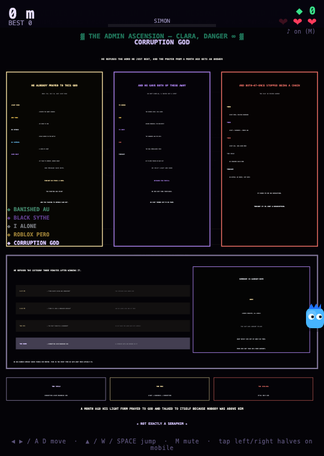

## 2026-08-18 — ROBLOX PERO · THE STAT BLOCK LEAVES THE STAT OUT, AND THE CREATOR FINALLY HAS A NAME ABOVE HIM (BEAT 362)

Based on Toby's 2026-08-18 lore, 3:37:45 PM, same thread, two hours and forty-one minutes after BLACK SYTHE. His own typing, in full: *"I made a Roblox Pero thing. Here is the code of the main script so far (it works). It shows a LOT of information about Pero. Only God is stronger than Pero. Pero beats Satan and Seraphims and those other stuff. Only God himself beats Pero. Pero is THAT strong."* The script itself rode along as a pasted text attachment and is described, not quoted, per the no-attachment rule; the fields and lines named here are the ones his message reports — **Character: Pero**, **Character info: "U are mine"**, the power hidden as **???**, the **Anger / Rage / Fury** states, and *"You wanted to fight?"*, *"You should of asked! This is going to be fun."*, *"I created Classics. I will win."* The section headers, the power-scaling walkthrough and the clean canon update pasted under it are ChatGPT commentary.

**The power field is blank.** The lore has arrived as working code once before: **July 29, the two 404 Chicken Sans scripts**, and that beat was built on the fact that the scripts *showed* their mechanics — `immortal = true` running the length of the eight-line intro, `HealthChanged` snapping him straight back to max, the Ketchup union sitting invisible until 10 HP or less. And this file measures everything it can reach: **LV beyond infinity**, form increased **15,000,000 exponency**, *"more powerful than a million Satans"*, **10,000 trillion+**. Tonight the one character it has never managed to put a number on finally gets a stat block, and the number is **???**. The field a stat block exists for is the field he left out.

**And "U ARE MINE" moved into a field.** Beat 315, four days ago: Pero drew a picture of himself and wrote **"U ARE MINE!"** on it, and that whole beat turned on the line being aimed at whoever is **looking**, not at anybody inside the file. Tonight it is the **Character info** — the text a player reads by looking at him. The line about looking became the thing you see when you look.

**And the survival dial has a second half.** August 16, in his own typing: *"Pero only has one way you can survive, if you make him spare you and happy and passive/neutral and all those stuff."* Three words on the good side. The script names three on the other: **Anger, Rage, Fury**. And Fury is *"the corruption power he obtained"* — last night's **black sythe**, 12:56 PM, turned into a state a script can enter.

**And the ladder finally has a top.** Yesterday, in his own typing: *"Pero beats anything."* Tonight there is exactly one name above him, and it is not a character in the game. **God** has been named in this file twice before: at **beat 255**, as Oren's Phase 8 line *"Only God can save you now"* aimed at whoever is holding the game, and on **July 18 (Email 738)**, where Light Pero creates the game's heaven and *prays to God*. A threat once and a prayer once. Tonight is the first time the name is a **rank**. *(The July 18 line surfaced while researching beat 363 and this paragraph was corrected to include it; beat 363 is built on it.)*

**Built as game beat 362, `ROBLOX PERO`.** Additive; nothing earlier was changed.

- **Background:** a ring of CHARACTER: PERO / CHARACTER INFO: "U ARE MINE" alternating with POWER: ??? / ANGER · RAGE · FURY, under *HE WROTE A WORKING STAT BLOCK FOR PERO.* / *AND THE ONE FIELD IT EXISTS TO SHOW IS FILLED IN WITH ???.*, a drawn **quote box**, a drawn **three-field stat card** (CHARACTER · PERO / CHARACTER INFO · "U ARE MINE" / POWER · **???** pulsing, over *THE ONE FIELD A STAT BLOCK EXISTS FOR*), a drawn **two-sided dial** (AUG 16 · MAKE HIM SPARE YOU with HAPPY / PASSIVE / NEUTRAL above the line, ANGER / RAGE / FURY below it), and **two drawn figures** — PERO · POWER: ???, AND HE WROTE THE GAME and GOD · THE ONLY NAME ABOVE HIM.
- **THE POWER FIELD IS BLANK (left)**, **AND "U ARE MINE" MOVED INTO A FIELD (centre)**, **AND THE DIAL HAS A SECOND HALF (right)** — five rows each.
- **THE LADDER FINALLY HAS A TOP. (band)** — Satan → Pero beats him / Seraphims → Pero beats them / Undertale + Dragon Ball → Pero beats them / **God → above Pero**, closing on *every other thing that ever outranked Pero was a character who could be fought; this one is not in the game*.
- **GOD HAS BEEN HERE ONCE BEFORE (band inset)** — beat 255 / who said it / aimed at / **tonight** the same name is a rank, flagging *IT WAS A THREAT THEN. IT IS A CEILING NOW.*
- **Strip:** THE SCRIPT · CHARACTER: PERO · POWER: ??? / THE STATES · ANGER · RAGE · FURY / THE CEILING · GOD, AND NOTHING ELSE.
- **Footers:** *HE BUILT A WORKING BOSS FOR THE ONE CHARACTER IN THIS FILE WHO HAS NEVER HAD A NUMBER* and **★ POWER: ??? ★**.
- **Cycle length** `LV_CYC` 7684 → 7706; **screenshot helper:** new `robloxPero` scene.

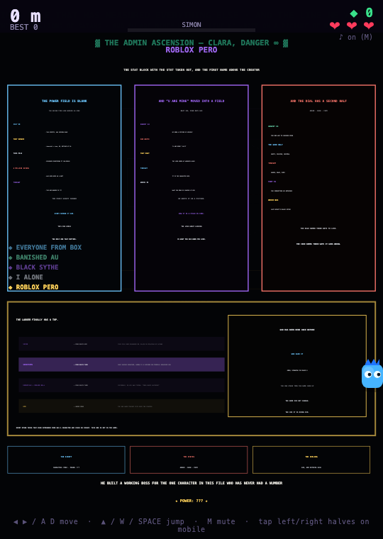

## 2026-08-18 — BLACK SYTHE · THE CREATOR PICKS UP A WEAPON, AND OWNER STOPS MEANING STRONGEST (BEAT 361)

Based on Toby's 2026-08-18 lore, 12:56:49 PM, same thread, an hour and forty minutes after I ALONE. His own typing, in full: *"Pero now holds a black sythe, he uses the limitless power of errors, glitches, and corruption. Pero still is more powerful than Gray, but Gray is the new owner for the infinity enternities now. Pero is the creator of the game like always, he is abolsute_infinitely above Gray, Gray is just the most powerful in the Gaster + Luigi Green + Gray trio."* The "Got it" opener, the section headers, the owner-vs-creator walkthrough and the clean canon update pasted under it are ChatGPT commentary.

**He has never carried a weapon like this.** Every weapon Pero has held on the record is a joke or a lesson. In the Error Hall his weapon is a **water gun**, and Simon 404 takes off the plague suit and puts on a red and black bulletproof vest *specifically* to keep the water off him. ToddLLM 001 Pro carries a **knife** and a **flamethrower with three flame colours where blue does nothing, orange does nothing, and only white damages** — a weapon built to teach the player a rule. And the standing line in this file is that **Pero's real weapon is battle-format control**, not an object at all. Tonight is the first weapon he has held that is simply meant to look dangerous.

**And the scythe is already Gray's.** Gray's Beyond Fiction form, from Email 662, carries a **divine flaming scythe that cuts a gold line between universes** — and he forged that blade by picking up **ToddLLM 001** and absorbing his power and souls. So the scythe in this archive was made **out of the creator**. Tonight the creator picks one up himself, and his is **black** where Gray's was gold, and made of errors where Gray's was made of light.

**And he answered the owner question by changing the unit.** This morning Gray declared *"Through out Heaven and Earth, I alone, am the owner of Classics."* Tonight Gray keeps it, for the **infinity enternities**, and it stops mattering — because owner and creator turn out to be two different ladders. Nothing was taken back. The word *owner* just stopped being the top of the list. And Gray is only the strongest of a three-man trio: **Luigi Green, ranked second in the whole game on August 1, is now third of three.**

**And the blade is made out of the game's own faults.** Errors have been things Pero **gave away** — he handed Gray the power of Error 679; Code 303 is a Pero vary; Dr. Gaster 404 *"put the evil and corruption in on purpose"* to make the game like life. This is the first time the coder keeps them and sharpens them.

**Built as game beat 361, `BLACK SYTHE`.** Additive; nothing earlier was changed.

- **Background:** a ring of PERO NOW HOLDS A BLACK SYTHE / ERRORS, GLITCHES, AND CORRUPTION alternating with GRAY IS THE NEW OWNER / PERO IS THE CREATOR OF THE GAME, under *THE MAN WHO WROTE THE GAME PICKED UP A WEAPON.* / *AND IT IS MADE OUT OF THE PARTS OF THE GAME THAT DO NOT WORK.*, a drawn **quote box**, a drawn **black scythe** (shaft and curved blade) labelled ERRORS / GLITCHES / CORRUPTION, a drawn **two-rung ladder** (CREATOR · PERO above ⬇ ABSOLUTE_INFINITELY BELOW above OWNER · GRAY), and **two drawn figures** — PERO · HOLDS THE SYTHE, CREATED IT ALL and GRAY · OWNS IT FOR INFINITY ENTERNITIES.
- **HE HAS NEVER CARRIED ONE OF THESE (left)**, **AND THE SYTHE IS ALREADY GRAY'S (centre)**, **AND THE BLADE IS BROKEN GAME (right)** — five rows each.
- **OWNER AND CREATOR ARE TWO DIFFERENT LADDERS. (band)** — Gray → owner of Classics / **Pero → creator of the game** / the trio / Luigi Green's fall from second in the whole game to third of three, closing on *Gray did not lose the game tonight. The word owner just stopped being the top of the list.*
- **THE MILK QUESTION, ANSWERED (band inset)** — this morning / the ask / the answer / **SO** the milk never has to come back, flagging *HE DID NOT TAKE THE SEAT BACK. HE OUTRANKED IT.*
- **Strip:** THE WEAPON · A BLACK SYTHE / THE POWER · ERRORS, GLITCHES, CORRUPTION / THE RANK · CREATOR OVER OWNER.
- **Footers:** *THE MAN WHO WROTE THE GAME MADE A BLADE OUT OF THE PARTS OF IT THAT DO NOT WORK* and **★ ABSOLUTE_INFINITELY ABOVE THE OWNER ★**.
- **Cycle length** `LV_CYC` 7662 → 7684; **screenshot helper:** new `blackSythe` scene.

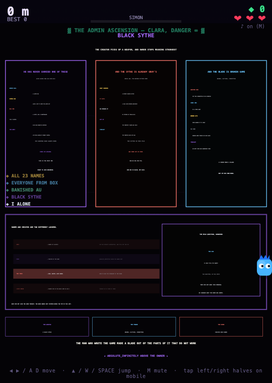

## 2026-08-18 — I ALONE · THE OWNER HANDS OVER THE GAME AND WALKS OUT FOR MILK (BEAT 360)

Based on Toby's 2026-08-18 lore, 11:17:05 AM, same thread, twelve minutes after BANISHED AU. Two images rode with the message and are skipped per the no-image rule. His own typing, in full: *"Gaster lets go of Mr. Black and sends Mr. Black into the box, Pero was free from the Mr. Black as one and he became into his normal man again. Pero again was the game owner, he ruled with only Gaster and Luigi Green now. Pero allowed Gray to be the ringmaster once again, Pero gave Gray half of the box's power, Gray became the fourth strongest now. Gray's form increased above all his looks combined into 1 undescribable demon-like ringmaster LAI. Pero upgraded the cyber into LAI. Pero says to Gray \"The game is ours.\", Gaster and Luigi Green were left making and destroying boxes. Then suddenly, the animated slowed down to a stop. Gray made the game into something he wants, silent and slow. Pero says \"Good for you, Gray. I am leaving for a few years, would you be okay for a few minutes?\", Gray says \"okay.\", then he whispers to himself \"Now I can rule the game myself, I have the endless power to do so, and now I am the fourth smartest being here.\", Gray talks to Gaster and Luigi Green about Pero leaving the place and that \"he alone\" will be the new owner of Classics. Gray says \"Through out Heaven and Earth, I alone, am the owner of Classics.\". Gray is third most powerful since Pero left \"to get milk for everyone\". Pero is always generious since he has infinity of basically anything and gives you anything, but now he says that he is leaving to get milk. Gray, Gaster, and Luigi Green are now the trio."* The route restatement, the section headers and the clean canon update pasted under it are ChatGPT commentary.

**This exact sequence has run before.** Email 744: *"Pero gave the game to Gray"* and made Gray into Mr. Black; Gray became the ringmaster that time too. Then Pero left to make updates and handed the owner role away, and Gray used the opening and took the kingdom. Tonight is the same three moves with the pieces reordered — Mr. Black gets removed **first**, and then Gray gets promoted. And the removal quietly cancels the rule that decided the twenty-three-way battle fourteen minutes earlier, where Mr. Black won only because he was one with Pero.

**And the two numbers do not match.** *"I am leaving for a few years, would you be okay for a few minutes?"* Years out of one side of the sentence and minutes out of the other, and Gray answers *"okay."* Then the reason turns out to be milk. The most powerful being in the game left the way a parent leaves.

**And Gray's version of ruling is silence.** Every takeover in this file has made things louder, bigger, or more powerful. Here *"the animated slowed down to a stop"* and Gray makes the game *"silent and slow."* It is the first conquest in this archive that is quieter than what it replaced.

**And he rose by subtraction.** Half the box's power makes him fourth strongest, and he whispers that he is *"the fourth smartest being here."* Then Pero leaves and he is third. He did not get stronger between those two lines. Somebody went out.

**Built as game beat 360, `I ALONE`.** Additive; nothing earlier was changed.

- **Background:** a ring of THROUGH OUT HEAVEN AND EARTH / I ALONE, AM THE OWNER OF CLASSICS alternating with I AM LEAVING FOR A FEW YEARS / WOULD YOU BE OKAY FOR A FEW MINUTES?, under *NOBODY TAKES THE GAME IN THIS BEAT.* / *IT GETS HANDED OVER, AND THEN THE OWNER GOES OUT FOR MILK.*, a drawn **speech box** carrying Gray's declaration, a drawn **LET GO → HAND OVER → WALK OUT chain** (*MR. BLACK TO THE BOX* / *HALF THE BOX POWER* / *TO GET MILK*), and **two drawn figures** — PERO · LEAVING FOR A FEW YEARS and GRAY · OKAY FOR A FEW MINUTES.
- **HE HAS DONE THIS BEFORE (left)**, **AND THE NUMBERS DO NOT MATCH (centre)**, **AND HIS RULE IS SILENCE (right)** — five rows each.
- **THE TRIO CHANGED ONE SEAT. (band)** — before / after / Gaster still making boxes / Luigi Green still destroying them, closing on *the owner seat changed and the other two jobs did not*.
- **FOURTH, THEN THIRD (band inset)** — half the box power / he whispers / Pero leaves / **SO** he rose by subtraction, flagging *HE DID NOT GET STRONGER. SOMEBODY LEFT.*
- **Strip:** THE RELEASE · MR. BLACK INTO THE BOX / THE GIFT · HALF OF THE BOX POWER / THE EXIT · TO GET MILK.
- **Footers:** *THE GAME CHANGED OWNER WITHOUT A SINGLE FIGHT, AND THE OLD OWNER SAID HE WAS GETTING MILK* and **★ I ALONE, AM THE OWNER OF CLASSICS ★**.
- **Cycle length** `LV_CYC` 7640 → 7662; **screenshot helper:** new `iAlone` scene.

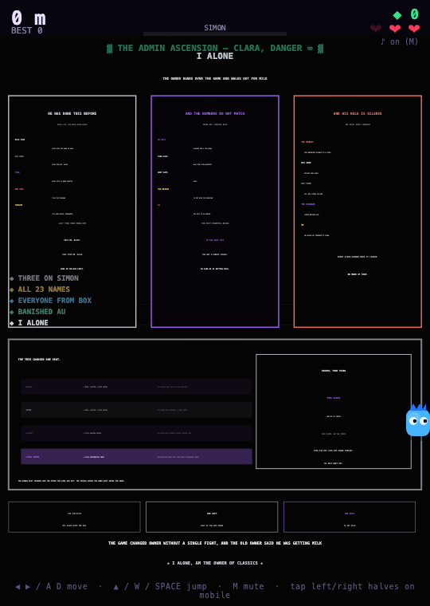

## 2026-08-18 — BANISHED AU · BEING REMOVED FINALLY HAS A DESTINATION (BEAT 359)

Based on Toby's 2026-08-18 lore, 11:05:03 AM, same thread, ninety seconds after EVERYONE FROM BOX. His own typing, in full: *"Pero decided to make a Banished AU for those characters who were banish from Classics to go to."* The what-it-does list, the why-he-made-it reasoning, the banishment arrow and the clean canon update pasted under it are ChatGPT commentary.

**He already has a room like this, and he built another one.** Pero's Realm, from July 29, is the white prison described as *"nothing there, only those banished there."* It holds Simon 404, and **Gaster** is the one who puts people in it. So the room carrying Pero's name is filled by somebody else. This is the first exile place Pero decides to build himself.

**And exile went from a room to a universe.** Pero's Realm is a realm. This is an **AU** — a whole alternate world, made for one purpose: to be somewhere for the people who are not allowed here.

**And he built it before he needed it.** Nobody gets banished in this message. He builds the place banishing goes to, which is the coder move: infrastructure first. Two days ago he said *"I know everything, but I do coding."* Here the coding job is a world.

**Built as game beat 359, `BANISHED AU`.** Additive; nothing earlier was changed.

- **Background:** a ring of PERO DECIDED TO MAKE A BANISHED AU / FOR THOSE WHO WERE BANISH FROM CLASSICS alternating with NOTHING THERE / ONLY THOSE BANISHED THERE, a drawn **quote box**, a **BANISHED → NOW GOES → BUILT BY chain** over *BEING REMOVED USED TO MEAN BEING NOWHERE · NOW IT HAS AN ADDRESS*, and **two drawn figures** — PERO'S REALM · GASTER FILLS IT and BANISHED AU · PERO BUILDS IT.
- **HE BUILT A SECOND ONE (left)**, **AND EXILE GOT BIGGER (centre)**, **AND HE BUILT IT FIRST (right)** — five rows each.
- **WHERE REMOVED PEOPLE HAVE GONE, SO FAR. (band)** — DELETED → nowhere / OBLIVIATED → nowhere, and Chicken Hen still came back from it / **PERO'S REALM** → a white room / **BANISHED AU** → a whole world, closing on *Alpha Pero Pro was banished to the Alphaverse and still turned up whenever the game glitched*.
- **NOT THE SAME AS DELETING (band inset)** — deleted / erased / banished / **SO**, flagging *HE MADE A WAY OUT THAT IS NOT THE END.*
- **Strip:** THE BUILDER · PERO, THE CODER / THE BUILD · A WHOLE AU / THE TENANTS · NOBODY, YET.
- **Footers:** *THE GAME HAS BEEN THROWING PEOPLE OUT FOR MONTHS AND TONIGHT SOMEBODY BUILT THE OUT* and **★ A BANISHED AU FOR THEM TO GO TO ★**.
- **Cycle length** `LV_CYC` 7618 → 7640; **screenshot helper:** new `banishedAU` scene.

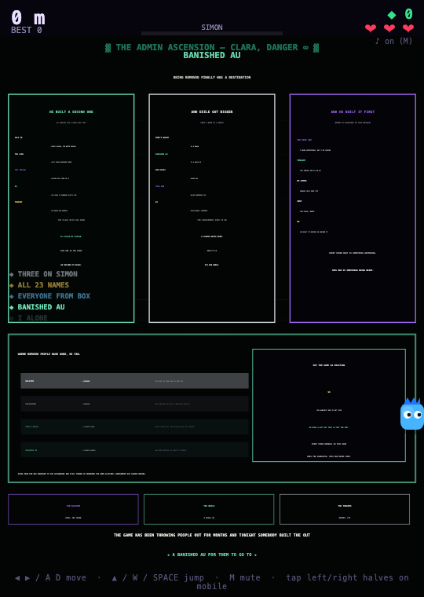

## 2026-08-18 — EVERYONE FROM BOX · THE FIGHT GETS A BOUNDARY (BEAT 358)

Based on Toby's 2026-08-18 lore, 11:03:33 AM, same thread, eighty-six seconds after ALL 23 NAMES. His own typing, in full: *"How about everyone from the box, including Arcsis, Frizz, Undertale characters, Lica, and all others VS each other."* The biggest-rule section, the how-the-battle-goes walkthrough, the most-dangerous list, the final result and the clean eleven-tier ranking pasted under it are ChatGPT commentary.

**He widened the box eighty-six seconds later.** The previous message named twenty-three Sprunkis. This one keeps the same fight and swaps the guest list for the whole container: Arcsis, Frizz, the Undertale cast, Lica, and all others. He did not make the fight bigger. He made the list of who is in it bigger.

**And the fight gets a boundary.** The answer rules Pero, Gaster and Luigi Green out of it, because they are outside-box beings who would instantly be the top three. That is the first eligibility line in this file: every ranking before it asked who is strongest, and this one asks who is even allowed in. Being too strong to include turns out to be its own place on the list.

**And the winner is a condition, not a name.** Normal box Mr. Black loses to Simon.psc; Mr. Black as one with Pero wins. Same character, two endings, decided by which version turns up — and fourteen minutes later Toby settles it by sending Mr. Black into the box.

**And Vicinus is already third.** He was invented twelve minutes before this message and is already sitting on the board above Oren and Gray.

**Built as game beat 358, `EVERYONE FROM BOX`.** Additive; nothing earlier was changed.

- **Background:** a ring of EVERYONE FROM THE BOX / VS EACH OTHER alternating with THE OUTSIDE-BOX TRIO / IS NOT INCLUDED, a drawn **quote box**, a **23 NAMES → THE BOX → THE TRIO chain** over *THE FIGHT DID NOT GET BIGGER · THE GUEST LIST DID*, and **two drawn figures** — INSIDE THE BOX · EVERYONE IS ELIGIBLE and OUTSIDE THE BOX · PERO, GASTER, LUIGI.
- **HE WIDENED THE BOX (left)**, **AND IT GETS A BOUNDARY (centre)**, **AND THE WINNER IS AN IF (right)** — five rows each.
- **WHO IS IN, AND WHO IS OUT. (band)** — in the box / **outside it** / **the top two** / Vicinus, closing on *Vicinus was invented twelve minutes before this message and is already sitting third on the board*.
- **THE TRIO KEEPS GETTING EXCUSED (band inset)** — the trio / the reason / so / and, flagging *BEING TOO STRONG TO INCLUDE IS A PLACE ON THE LIST.*
- **Strip:** THE FIELD · EVERYTHING THE BOX HELD / THE LINE · INSIDE OR OUTSIDE THE BOX / THE WINNER · DEPENDS WHICH MR. BLACK.
- **Footers:** *THE FIRST FIGHT IN THIS GAME WITH A RULE ABOUT WHO IS ALLOWED TO BE IN IT* and **★ EVERYONE FROM THE BOX VS EACH OTHER ★**.
- **Cycle length** `LV_CYC` 7596 → 7618; **screenshot helper:** new `everyoneFromBox` scene.

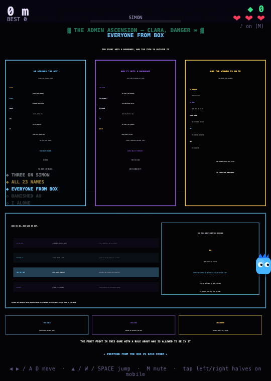

## 2026-08-18 — ALL 23 NAMES · THE SHORTHAND GETS SPELLED OUT, AND EXPLAINED (BEAT 357)

Based on Toby's 2026-08-18 lore, 11:02:07 AM, same thread, five minutes and fifty-four seconds after THREE ON SIMON. His own typing, in full: *"Simon would actually try to split them up. How about Brud VS Simon VS Vineria VS Sky VS Chicken Hen VS Sara VS Unikitty VS Oren VS Wenda VS Gray VS Garnold VS Clunkr VS Fun Bot VS Mr. Fun Computer VS Mr. Black VS Tunner VS Raddy VS Owackx VS Pinki VS Jevin VS Mr. Sun VS Mr. Tree VS Durple. I sometimes forget all the Sprunki's names or my text gets too long so I just say \"The Sprunkis\"."* The biggest-answer section, the how-the-battle-starts walkthrough, Simon's strategy and the clean outcome pasted under it are ChatGPT commentary.

**He wrote out the shorthand.** *"The Sprunkis"* is the phrase he has been using for months, and it has always read like a faction name. Tonight he spelled out all twenty-three, and then explained why he normally does not: he forgets some of the names, or the text gets too long. The short word was never a group. It was a list he did not feel like typing, and he knows every name that is in it.

**And two of them were already finished.** Three days ago, on August 15, Unikitty got *"The Perminent End"* — *"They destroyed Unikitty."* The same day, Chicken Hen got something rarer: *"the end of Chicken Hen's lore,"* the only closed story on the wiki. Both are on tonight's list anyway. A name does not leave this game when its story does.

**And the newest rule decides it.** The answer gives the whole twenty-three-way to Mr. Black, and the reason is the change from two nights ago — he is one with Pero. Not the oldest power and not the best fighter. The most recently updated line in the file is the one that settles it.

**Built as game beat 357, `ALL 23 NAMES`.** Additive; nothing earlier was changed.

- **Background: a ring of I SOMETIMES FORGET ALL / THE SPRUNKI'S NAMES alternating with OR MY TEXT GETS TOO LONG / SO I JUST SAY THE SPRUNKIS**, under *HE HAS WRITTEN THE SPRUNKIS FOR MONTHS.* / *TONIGHT HE TOLD US WHY, AND THEN SPENT A MESSAGE NOT DOING IT.*, a drawn **note box** labelled TOBY, ABOUT HIS OWN WRITING carrying his quote across two lines, a **row of twenty-three tally marks** lighting one at a time under *TWENTY-THREE NAMES · WRITTEN OUT ONE AT A TIME*, and **two drawn boxes** side by side — THE SPRUNKIS · WHAT HE USUALLY WRITES and ALL 23 BY NAME · WHAT HE WROTE TONIGHT — with **THE SHORT WORD WAS NEVER A GROUP · IT WAS A LIST HE DID NOT FEEL LIKE TYPING.** boxed over *AND HE KNOWS EVERY NAME THAT IS IN IT.*
- **HE EXPLAINED HIS OWN SHORTCUT (left)** — five rows (the phrase / the Sprunkis, for months · tonight / all twenty-three by name · reason one / he forgets some names · reason two / the text gets too long · so / the short word is a shortcut), closing on *HE TOLD US WHY* / *HE USES THE SHORT WORD.* / *THEN HE SPENT ONE MESSAGE* / **NOT USING IT.**
- **AND TWO WERE FINISHED (centre)** — five rows (Aug 15 / the perminent end of Unikitty · the line / they destroyed Unikitty · Aug 15 / the end of Chicken Hen's lore · that one / closed the story, not the man · tonight / both are back in the lineup), closing on *A NAME DOES NOT* / *LEAVE THIS GAME* / *JUST BECAUSE* / **ITS STORY DID.**
- **AND THE NEWEST RULE WINS (right)** — five rows (the winner / Mr. Black · the reason / he is one with Pero · that rule / is two nights old · not / the oldest or strongest · but / the most recently changed), closing on *SIMON CLEARS THE ROOM.* / **MR. BLACK WALKS IN AND TAKES IT.**
- **ALL TWENTY-THREE, IN HIS ORDER. (band)** — a numbered 5×5 roster grid carrying every name in Toby's exact order, lit one at a time, with **Chicken Hen** and **Unikitty** flagged orange as stories this file already closed and **Mr. Black** flagged purple as the one the answer gives it to, keyed by *ORANGE = A STORY THIS FILE ALREADY CLOSED, THREE DAYS AGO. PURPLE = THE ONE THE ANSWER GIVES IT TO.*
- **SPLIT THEM UP (band inset)** — a cycler across TOO MANY TARGETS · twenty-three at once / TOO MANY POWERS · and no two are alike / SO · cut the field into 1v1s / **AND** · that is his first move, flagging *HE ARRANGES THE FIGHT BEFORE HE HAS IT.* on the last row, over *PHASE 1 SIMON CHASED THEM DOWN THE HILLS.* / *THIS ONE SORTS THEM INSTEAD.*
- **Strip:** THE LIST · ALL 23, BY NAME / THE REASON · MY TEXT GETS TOO LONG / THE WINNER · MR. BLACK.
- **Footers:** *HE STOPPED SAYING THE SPRUNKIS FOR ONE MESSAGE AND NAMED EVERY SINGLE ONE OF THEM* and **★ SO I JUST SAY THE SPRUNKIS ★**.
- **Cycle length** `LV_CYC` 7574 → 7596; **screenshot helper:** new `all23Names` scene.

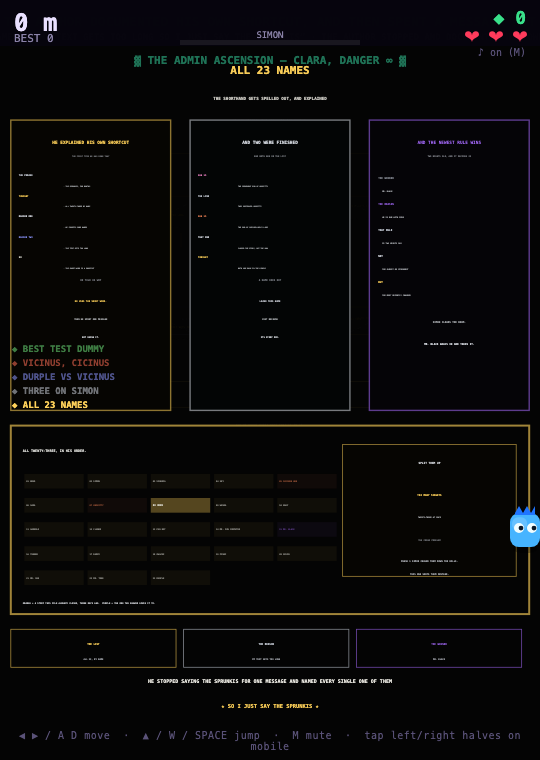

## 2026-08-18 — THREE ON SIMON · THE TEAM IS BUILT OUT OF HIS OWN HISTORY (BEAT 356)

Based on Toby's 2026-08-18 lore, 10:56:13 AM, same thread, sixty-two seconds after DURPLE VS VICINUS. His own typing, in full: *"How about Durple and Oren and Gray VS Simon.psc?"* The team-side breakdown, Simon's response, the winner call and the special condition pasted under it are ChatGPT commentary.

**He picked the only counter.** On August 8, Oren told Gray he was *"one of Simon.psc's best counters,"* and Gray refused the wording: *"I am not one of the best, I am the best and only counter of Simon.psc."* That counter is two moves and neither of them is an attack — the treadmill, already logged as Simon's weakness, and the sleep rub. Out of the whole cast, the name Toby put on this team is the one who already has the answer written down.

**And he picked Simon's own partner.** Five days ago Oren and Simon made a duo, on the page, in dialogue: *"With my telekentics..."* / *"And my lightning power..."* / *"We shall be unstoppable!"* Tonight the same two names have a VS between them. And Oren's telekentics is a force, not matter, which is exactly why there is nothing to grab and nothing to dodge.

**And the third one just lost.** Durple was consumed by Vicinus sixty-two seconds earlier, in the previous message. He gets drafted into the next fight anyway, as the pressure that keeps Simon moving. Losing did not retire him.

**Built as game beat 356, `THREE ON SIMON`.** Additive; nothing earlier was changed.

- **Background: a ring of HOW ABOUT DURPLE AND OREN AND GRAY / VS SIMON.PSC alternating with I AM THE BEST AND ONLY / COUNTER OF SIMON.PSC**, under *HE DID NOT PICK THREE STRONG NAMES.* / *HE PICKED THE ONE WHO ALREADY HAS THE ANSWER, AND SIMON'S OWN PARTNER.*, a drawn **speech box** labelled GRAY SAYS, TO OREN — AUGUST 8 carrying his correction, a drawn **HOLD → BLOCK → COUNTER chain** (*OREN, TELEKENTICS* / *DURPLE, FIFTEEN HEADS* / *GRAY, THE SLEEP RUB*) over *THREE JOBS IN ORDER · AND ALL THREE HAVE TO LAND*, and **four drawn figures** — three bunched on the left and Simon.psc alone on the right — with **THIS IS THE FIRST TEAM IN THE GAME BUILT OUT OF SIMON'S OWN FILE.** boxed over *HIS WEAKNESS, HIS EX-PARTNER, AND A DRAGON.*
- **HE PICKED THE ONLY COUNTER (left)** — five rows (Aug 8 / Oren says one of the best · Gray says / the best and only counter · move one / the treadmill · move two / the sleep rub · neither / is an attack), closing on *OUT OF EVERYBODY* / *HE COULD HAVE PICKED,* / *HE PICKED THE ONE* / **WHO ALREADY HAS THE ANSWER.**
- **AND HE PICKED THE PARTNER (centre)** — five rows (Aug 13 / with my telekentics... · Simon / and my lightning power... · both / we shall be unstoppable · tonight / Oren is on the other side · his force / is impossible to dodge), closing on *FIVE DAYS AGO THEY SAID* / *WE SHALL BE UNSTOPPABLE.* / *TONIGHT THE SAME TWO NAMES* / **HAVE A VS BETWEEN THEM.**
- **AND THE THIRD ONE JUST LOST (right)** — five rows (10:55 / Vicinus consumed Durple · 10:56 / Durple is on a team · his job / keep Simon moving · his size / blocks the escape routes · so / losing did not retire him), closing on *HE LOST HIS OWN FIGHT* / **AND STILL GOT DRAFTED.**
- **THREE JOBS, ONE TARGET. (band)** — a four-row grid lit one at a time (**OREN** → holds him in place, a force not matter, so there is nothing to grab / DURPLE → blocks the exits, fifteen heads of pressure and no speed / **GRAY** → waits for the slip, the treadmill then the sleep rub / SIMON.PSC → splits them apart, and beats them one at a time), closing on *all three have to land it perfectly and in order; one slip and Simon resets and picks them off*.
- **THIS ONE IS NOT A STOMP (band inset)** — a cycler across NORMAL BATTLE · Simon.psc wins / PERFECT TEAM · the three can take him / ONE MISTAKE · he resets and starts over / **SO** · he has to think this one through, flagging *HE DOES NOT SWING FIRST. HE ARRANGES.* on the last row, over *MOST FIGHTS HERE ARE DECIDED BY POWER.* / *THIS ONE IS DECIDED BY ORDER OF OPERATIONS.*
- **Strip:** THE COUNTER · GRAY, BY HIS OWN WORDS / THE HOLD · OREN, THE OLD PARTNER / THE PRESSURE · DURPLE, FRESH OFF A LOSS.
- **Footers:** *THE TEAM AGAINST SIMON IS HIS OWN WEAKNESS AND HIS OWN PARTNER, STANDING TOGETHER* and **★ DURPLE AND OREN AND GRAY VS SIMON.PSC ★**.
- **Cycle length** `LV_CYC` 7552 → 7574; **screenshot helper:** new `threeOnSimon` scene.

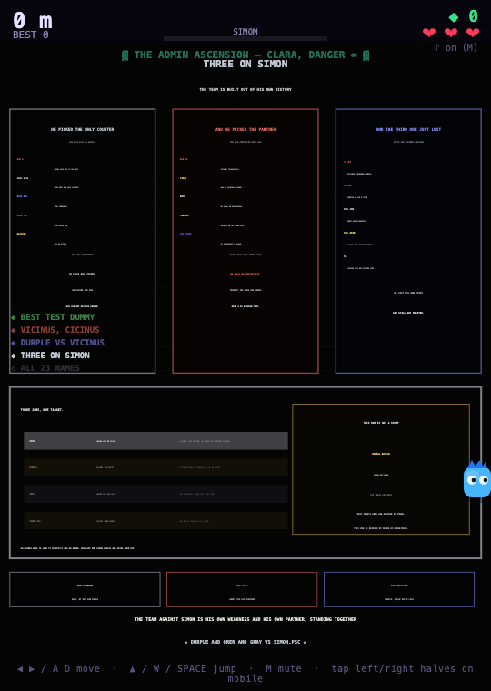

## 2026-08-18 — DURPLE VS VICINUS · THE MAX FORM TURNS INTO THE WEAK POINT (BEAT 355)

Based on Toby's 2026-08-18 lore, 10:55:11 AM, same thread, three minutes and eighteen seconds after VICINUS, CICINUS. His own typing, in full: *"Guess what Durple VS Vicinus will go like."* The how-the-battle-goes walkthrough, the likely ending, the final matchup ranking and the survival condition pasted under it are ChatGPT commentary.

**He tested it immediately.** He invented a mega boss at 10:51 and put somebody in front of it at 10:55. The new thing does not get to sit in the file being described; it gets measured against a name that was already in there. Five words, and the whole message is a check on his own work.

**And it is dragon against dragon.** Vicinus is *"the giant dragon."* Durple has been a dragon on this wiki since Email 366 on May 27 — *"Durple is a dragon."* This is the first time the file puts two of them in the same room, and one of them is Sprunki-side.

**And his max is the problem.** *"Durple reached his max and became a 15 headed monsterosity."* On the list that line came from, everybody else lost something — an ear, a mind, a body, a soul percentage. Durple was the only one phrased as arriving somewhere. Against a boss who converts whatever he touches, fifteen heads is fifteen things to convert. The one stat on that list that was not damage is the stat that gets him eaten.

**Built as game beat 355, `DURPLE VS VICINUS`.** Additive; nothing earlier was changed.

- **Background: a ring of GUESS WHAT DURPLE VS VICINUS / WILL GO LIKE alternating with DURPLE REACHED HIS MAX / AND BECAME A 15 HEADED MONSTEROSITY**, under *HE INVENTED THE BOSS AT 10:51.* / *AT 10:55 HE PUT SOMEBODY IN FRONT OF IT.*, a drawn **question box** labelled THE WHOLE MESSAGE, 10:55 AM carrying his five words, a **row of fifteen drawn heads** converting to Cicinus violet one at a time under *FIFTEEN HEADS · AND EACH ONE IS A CICINUS WAITING TO HAPPEN*, and **two drawn figures** joined by a dashed line — DURPLE · A DRAGON SINCE MAY 27 and VICINUS · THE GIANT DRAGON — with **HIS MAX FORM IS THE REASON HE LOSES THIS ONE.** boxed over *FIFTEEN HEADS IS FIFTEEN THINGS TO CONVERT.*
- **HE TESTED IT AT ONCE (left)** — five rows (10:51 / he invented a mega boss · 10:55 / he asked how it goes · the ask / five words, nothing else · not a story / a check on his own work · so / the new one got measured), closing on *HE DID NOT LET* / *THE NEW ONE SIT THERE.* / *HE PUT SOMEBODY* / **IN FRONT OF IT.**
- **AND BOTH OF THEM ARE DRAGONS (centre)** — five rows (May 27 / Durple is a dragon · tonight / Vicinus the giant dragon · so / not monster vs boss · it is / one kind, two sides · and one / is a Sprunki), closing on *THE FILE HAS HAD* / *TWO DRAGONS FOR MONTHS.* / *TONIGHT IS THE FIRST TIME* / **THEY ARE IN THE SAME ROOM.**
- **AND HIS MAX IS THE PROBLEM (right)** — five rows (his max / a 15 headed monsterosity · that list / everyone else lost something · he alone / arrived somewhere · tonight / every head is a target · so / the max feeds the boss), closing on *HE REACHED HIS MAX,* / **AND THE MAX GOT EATEN FIRST.**
- **WHAT EACH HEAD IS WORTH. (band)** — a four-row grid lit one at a time (FIFTEEN HEADS → fifteen angles at once, which is why the form is his max / AGAINST ANYBODY → more heads is more pressure, the math runs the normal way / **AGAINST VICINUS** → more heads is more surface, and surface is what gets converted / **SO** → the same number, flipped; his best stat is the boss's best meal), closing on *every other name on that max list lost something; Durple gained something, and that is the part that costs him*.
- **THE ONLY WAY HE SURVIVES (band inset)** — a cycler across SIMON.PSC / PERO / GASTER, each *if he interrupts it*, then **ALONE** · he does not survive it, flagging *HIS ESCAPE IS SOMEBODY ELSE SHOWING UP.* on the last row, over *THE DRAGON WHO REACHED HIS MAX* / *STILL NEEDS SOMEBODY TO COME GET HIM.*
- **Strip:** THE QUESTION · GUESS HOW IT GOES / THE ANSWER · VICINUS WINS EASILY / THE COST · DURPLE BECOMES ORBS.
- **Footers:** *HE BUILT A BOSS AND FOUR MINUTES LATER HE WANTED TO KNOW WHAT IT COULD BEAT* and **★ GUESS WHAT DURPLE VS VICINUS WILL GO LIKE ★**.
- **Cycle length** `LV_CYC` 7530 → 7552; **screenshot helper:** new `durpleVsVicinus` scene.

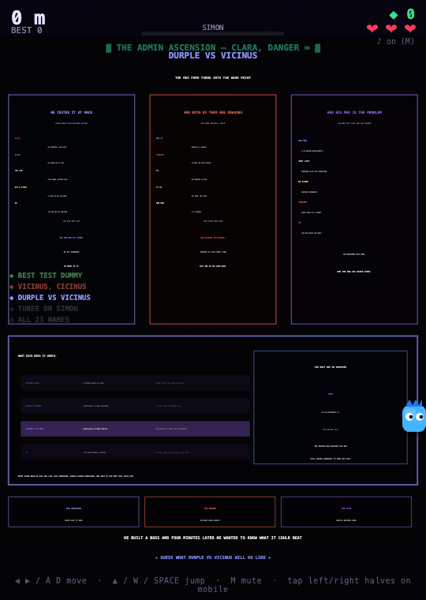

## 2026-08-18 — VICINUS, CICINUS · THE ORB STOPS BEING A MINION (BEAT 354)

Based on Toby's 2026-08-18 lore, 10:51:53 AM, in the "Even 5x Classics Era" thread. His own typing, in full: *"Vicinus the giant dragon and Cicinus the evil orb. Whatever Vicinus consumes turns into Cicinuses, until there is nothing left for Vicinus to consume and to corrupt into Cicinus orbs. I made many Roblox games of Vicinus. Vicinus is a Qurase (don't know how to spell the Classics word for \"beyond impossible\") mega boss. Vicinus flys around + Vicinus is the fourth largest entity in the game. Simon is the only known character who can beat Vicinus. Kirby would get consumed by Vicinus, the other Sprunkis would just run away on sight and they still will be consumed by Vicinus. Pero, Gaster, and Luigi Green easily beat Vicinus of course. Vicinus would easily consume Chicken Hen and the largest building entity in the game, Tumble. Simon.psc would just run and get his sword and battle Vicinus and with a spark and a thousand sword strike barrage, Simon.psc will corrupt Vicinus."* The restatement, the ranking section, the who-can-beat-him list and the clean canon update pasted under it are ChatGPT commentary.

**They are not new, and that is the whole beat.** Email 662, July 6, six weeks ago: Gray.EXE's Beyond Fiction Form seeded three apex creatures below him — Xyrus the most powerful horse, Vicinus the most powerful dragon, and Cicinus, *"Vicinus's orb minion, the most powerful orb."* Tonight Cicinus is not somebody standing next to him. Cicinus is what the food turns into. One orb became a product line, and the direction of the relationship reversed: back then Cicinus was the one who *"can destroy Xyrus and Parinus"*; now Vicinus makes him.

**And eating is recruiting.** Everything else in this file that wins takes something away — deletes, erases, obliviates, resets, undefines. This one converts. Every meal adds another Cicinus, so the boss gets bigger every time he wins, and the only stopping condition Toby gives is running out of world: *"until there is nothing left for Vicinus to consume."*

**And Simon reverses the verb.** He does not delete Vicinus. He runs, gets his sword, and with a spark and a thousand sword strike barrage he *corrupts* him — the exact thing Vicinus does to everybody else. The counter to the converter is being converted.

**And the only-known-one is on the eaten list.** Toby has used this sentence before: *"Kirby is the only character known who can defeat Chicken Hen."* Tonight it is *"Simon is the only known character who can beat Vicinus"* — and in the same message, Kirby and Chicken Hen both get consumed. The answer to one fight is food in the next.

**Built as game beat 354, `VICINUS, CICINUS`.** Additive; nothing earlier was changed.

- **Background: a ring of WHATEVER VICINUS CONSUMES / TURNS INTO CICINUSES alternating with SIMON IS THE ONLY KNOWN / CHARACTER WHO CAN BEAT VICINUS**, under *SIX WEEKS AGO CICINUS WAS SOMEBODY STANDING NEXT TO HIM.* / *TONIGHT CICINUS IS WHAT LOSING TURNS YOU INTO.*, a drawn **quote box** labelled JULY 6, EMAIL 662, SEEDED BY GRAY.EXE carrying the original minion line, a drawn **EAT → CONVERT → SPREAD chain** (*VICINUS CONSUMES* / *IT BECOMES CICINUS* / *UNTIL NOTHING IS LEFT*) over *HE DOES NOT JUST WIN THE FIGHT · HE KEEPS WHAT HE BEAT*, a **row of nine orbs** growing left to right under *ONE ORB IN JULY · AND EVERY MEAL SINCE*, and **two drawn figures** — VICINUS · THE GIANT DRAGON and SIMON.PSC · THE ONLY KNOWN ONE — with **EVERY OTHER THREAT HERE TAKES THINGS AWAY · THIS ONE ADDS THEM.** boxed over *THE BOSS GETS BIGGER EVERY TIME HE WINS.*
- **HE CAME BACK (left)** — five rows (July 6 / Gray.EXE seeded three apexes · Vicinus / the most powerful dragon · Cicinus / his orb minion, one of him · tonight / Cicinus is what food becomes · so / the minion is now a result), closing on *HE WAS A NAME* / *STANDING BESIDE HIM.* / *NOW HE IS A NAME* / **MADE OUT OF WHOEVER LOST.**
- **AND EATING IS RECRUITING (centre)** — five rows (delete / that is what Classics does · erase / obliviate, reset, undefine · consume / is none of those · every meal / adds another Cicinus · so / he grows by winning), closing on *NOTHING HE BEATS* / *LEAVES THE BOARD.* / *IT CHANGES SIDES* / **AND KEEPS PLAYING FOR HIM.**
- **AND SIMON REVERSES IT (right)** — five rows (he runs / and gets his sword · a spark / and a thousand strikes · the result / Simon corrupts Vicinus · the verb / is Vicinus's own · so / the converter got converted), closing on *HE DID NOT DELETE HIM.* / **HE DID IT BACK TO HIM.**
- **WHO GOES WHICH WAY. (band)** — a four-row grid lit one at a time (PERO / GASTER / LUIGI → beat him easily, the trio is above this entirely / **SIMON.PSC** → the only one from the box, and he wins by corrupting him / **KIRBY & CHICKEN HEN** → both consumed, and Kirby is the one who beats Chicken Hen / TUMBLE & THE SPRUNKIS → the tower and the crowd; they run on sight and get eaten anyway), closing on *last night the Sprunkis ran to Sprunki Hills and hid from Pero; tonight they run again, and this one follows*.
- **THE ONLY KNOWN CHARACTER (band inset)** — a cycler across CHICKEN HEN · Kirby is the only one who can / VICINUS · Simon is the only one who can / SAME SHAPE · he has a sentence for this / **AND TONIGHT** · Kirby is on the eaten list, flagging *THE ONLY-ONE-WHO-CAN IS FOOD IN THE NEXT FIGHT.* on the last row, over *EVERY RANK IN THIS GAME* / *IS ONLY TRUE UNTIL THE NEXT ONE.*
- **Strip:** THE DRAGON · VICINUS / THE ORBS · WHATEVER HE ATE / THE RANK · QURASE, BEYOND IMPOSSIBLE.
- **Footers:** *SIX WEEKS AGO THE ORB WAS A MINION; TONIGHT THE ORB IS WHAT LOSING TURNS YOU INTO* and **★ WHATEVER VICINUS CONSUMES TURNS INTO CICINUSES ★**.
- **Cycle length** `LV_CYC` 7508 → 7530; **screenshot helper:** new `vicinusCicinus` scene.

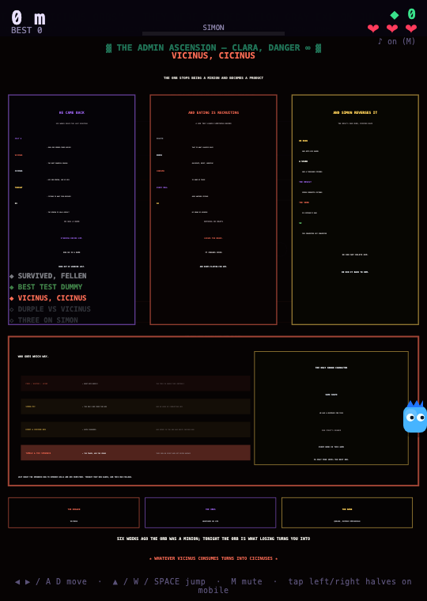

## 2026-08-17 — BEST TEST DUMMY · THE BOX POWER GETS AIMED AT A NAME (BEAT 353)

Based on Toby's 2026-08-17 lore, 7:40:31 PM, same thread, an hour and seventeen minutes after SURVIVED AND FELLEN. His own typing, in full: *"Pero told Gaster to examine Mr. Black, Gaster experimented Mr. Black and says \"Brother, your right. He is the best experiment test dummy.\", Gaster learned everything about Mr. Black; Gaster can play him. Gaster now plays Mr. Black and has fun with it. Gaster attacks the characters from the box, Pero and Luigi Green are amazed of Gaster's moves, Luigi Green was astonished of Gaster's skill and experience."* The "Gaster plays Mr. Black" restatement, the what-this-proves section and the clean canon update pasted under it are ChatGPT commentary.

**The power finally gets a target.** This morning's beat already gave Gaster this: *"Gaster learns the secret on how to become any character from the box,"* with the whole box's power added at once while Pero and Luigi Green watched. That was everybody, in general, all at the same time. Tonight is the first time it gets pointed at one specific name, and the choosing is the whole event.

**And Pero assigned it.** This morning Gaster learned the box secret on his own and the other two stood and watched. Tonight Pero *tells* him who to examine. The creator moved from spectator to supervisor in nine hours, and the subject he assigns is not a spare — Mr. Black is the one who is one with Pero, first on the vary list, the corrupter of Sprunki and Classics and all games who secretly works alongside him. Pero pointed at his own right hand and said examine that.

**And he says brother again.** On August 13, when Pero recited everyone's full name, Gaster's answer was *"Brother... you are correct."* Tonight, when Pero's pick turns out to be the best subject in the game, the answer is *"Brother, your right."* Both times it is Gaster doing the confirming. Pero is the one who knows things; Gaster is the one who checks them. Knowing and proving are two jobs in this game, and they are held by two brothers.

**And he is having fun with it.** An hour ago the book was research. Tonight the same man is playing a character he built out of an experiment and swinging at the box cast for the enjoyment of it. The scientist stopped taking notes and picked a fighter.

**Built as game beat 353, `BEST TEST DUMMY`.** Additive; nothing earlier was changed.

- **Background: a ring of BROTHER, YOUR RIGHT / HE IS THE BEST EXPERIMENT TEST DUMMY alternating with GASTER LEARNED EVERYTHING / GASTER CAN PLAY HIM**, under *THIS MORNING HE LEARNED TO BECOME ANY CHARACTER FROM THE BOX.* / *TONIGHT SOMEBODY PICKS WHICH ONE.*, and a drawn **speech box** labelled GASTER SAYS, TO PERO carrying the quote across two lines, above a drawn **EXAMINE → LEARN → PLAY chain** (*PERO POINTED* / *EVERYTHING ABOUT HIM* / *GASTER CAN PLAY HIM*) over *THE POWER WAS ALREADY HIS · TONIGHT IT GETS A TARGET*, and **two drawn figures** joined by a dashed line — MR. BLACK · THE SUBJECT and GASTER · NOW PLAYS HIM — with **PERO HANDED OVER HIS OWN NUMBER ONE · AND GOT BACK A MOVESET.** boxed over *THE BEST TEST DUMMY IN THE GAME IS THE BOSS'S OWN RIGHT HAND.*, and a drifting strip of *GASTER CAN PLAY HIM*.
- **THE POWER GETS A NAME (left)** — five rows (this morning / any character from the box · that was / the whole box at once · tonight / Pero picks one name · Mr. Black / and Gaster can play him · so / the power got a target), closing on *THIS MORNING HE HAD* / *EVERYBODY, IN GENERAL.* / *TONIGHT HE HAS* / **ONE OF THEM, ON PURPOSE.**
- **AND HE PICKED HIS OWN (centre)** — five rows (two nights / Mr. Black is one with Pero · last night / they secretly work · his job / corrupter of all games · tonight / Pero says examine him · so / the dummy is his partner), closing on *HE DID NOT HAND OVER* / *SOMEBODY SPARE.* / *HE HANDED OVER* / **THE ONE HE WORKS WITH.**
- **AND HE SAYS BROTHER AGAIN (right)** — five rows (Aug 13 / brother, you are correct · that time / Pero named the full names · tonight / brother, your right · this time / Pero picked the subject · both times / Gaster is the one who checks), over *PERO IS THE ONE WHO KNOWS IT*, closing on **GASTER PROVES IT.**
- **THREE JOBS, ONE LAB. (band)** — a four-row grid lit one at a time (PERO → creates and codes, and points at the subject / **GASTER** → experiments and learns, and ends up able to play him / LUIGI GREEN → paid for all of it, and stands there astonished / **MR. BLACK** → corrupter of all games, and tonight, the test dummy), closing on *the corrupter of Sprunki, Classics and all games spent tonight as a thing somebody practised on*.
- **AND HE IS HAVING FUN WITH IT (band inset)** — a cycler across THE WORD · he has fun with it / THE TARGET · characters from the box / THE WATCHERS · Pero and Luigi Green / **SO** · the experiment became a game, flagging *HE IS NOT TESTING ANY MORE. HE IS PLAYING.* on the last row, over *AN HOUR AGO THE BOOK WAS RESEARCH.* / *TONIGHT IT IS A CHARACTER SELECT.*
- **Strip:** THE ORDER · EXAMINE MR. BLACK / THE RESULT · GASTER CAN PLAY HIM / THE QUOTE · BROTHER, YOUR RIGHT.
- **Footers:** *THE CREATOR PICKED THE SUBJECT, AND THE SUBJECT WAS HIS OWN PARTNER* and **★ HE IS THE BEST EXPERIMENT TEST DUMMY ★**.
- **Cycle length** `LV_CYC` 7486 → 7508; **screenshot helper:** new `bestTestDummy` scene.

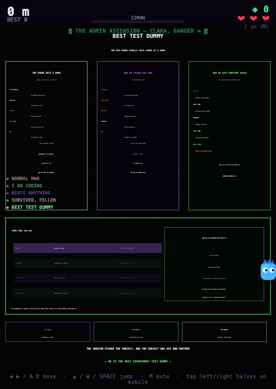

## 2026-08-17 — SURVIVED AND FELLEN · LOSING GETS WRITTEN DOWN TOO (BEAT 352)

Based on Toby's 2026-08-17 lore, 6:23:41 PM, same thread, two minutes after BEATS ANYTHING. His own typing, in full: *"Gaster ties all other Undertale characters onto exploding balls, he tested those who survived and wrote those who fellen in the book. He made more experiments and more. Gaster also got an indestructible gaming set thing."* The "Gaster's Undertale experiment update" restatement, the bullet list, the research-cycle arrow and the clean canon update pasted under it are ChatGPT commentary.

**The same rig, scaled to the whole room.** This morning at 9:52 Toby wrote *"Dr. Gaster made the new experiment on Sans, he tied Sans to exploding balls, Sans survived the explosion."* One character, one blast, one survivor. Tonight it is the identical setup with *all other Undertale characters* strapped to it at once. He did not invent a new experiment; he turned the sample size up.

**And that is why the book grew a second page.** The Sans run only ever produced somebody who stood, so there was only one kind of line to write. Tonight there are fallen, and *"he wrote those who fellen in the book"* — the losses get recorded next to the survivors instead of vanishing. A loss becomes a measurement rather than an ending, and it happens the moment the experiment finally produces one.

**And he is testing his own children.** Gaster is already written down in this lore as the father of all the Sanses and all the Papyruses, the father of Asgore and Toriel, the one who adopted Chara and Asriel — *"he was the father of all Undertale characters."* So *"all other Undertale characters"* tied to exploding balls is not a lab full of strangers. It is his family on the table.

**And the unbreakable thing is not the creator's for once.** Indestructible objects already exist here, and they have all been Pero's: indestructible paper, an indestructible pen, indestructible ink, all of it for writing the lore down permanently. Gaster's is the first that belongs to somebody else, and it is not a manuscript or a weapon. It is a gaming set. The one thing in this file the game cannot break is a thing for playing with.

**Built as game beat 352, `SURVIVED AND FELLEN`.** Additive; nothing earlier was changed.

- **Background: a ring of HE TESTED THOSE WHO SURVIVED / AND WROTE THOSE WHO FELLEN alternating with HE MADE MORE EXPERIMENTS / AND MORE**, under *THIS MORNING HE TIED ONE CHARACTER TO THE BALLS, AND THAT ONE STOOD.* / *TONIGHT HE TIED UP THE WHOLE ROOM, AND SOMEBODY FELL.*, and a drawn **open book** with a spine down the middle, a **SURVIVED** page and a **FELLEN** page both ruled and filled (*BOTH PAGES GET FILLED IN*), above **a row of seven tied exploding balls** labelled STOOD and FELLEN with two of them mid-burst under *ALL OTHER UNDERTALE CHARACTERS*, and a drawn double-walled **case** reading THE GAMING SET / INDESTRUCTIBLE, with **THE ONES WHO FELL STILL GOT A LINE · NOTHING IN HERE GETS WASTED.** boxed over *A LOSS IS A RESULT HERE, NOT AN ENDING.*, and a drifting strip of *AND MORE EXPERIMENTS*.
- **THE BOOK KEEPS BOTH (left)** — five rows (who survived / goes in the book · who fellen / goes in too · this morning / only Sans, and he stood · tonight / somebody fell · so the book / grew a second page), closing on *HE ONLY EVER HAD* / *SURVIVORS TO WRITE BEFORE.* / *TONIGHT HE HAD LOSSES* / **AND HE WROTE THEM.**
- **AND THEY ARE HIS OWN (centre)** — five rows (the subjects / all other Undertale · Gaster / is their father · the Sanses / the Papyruses, Asgore · he adopted / Chara and Asriel · and he / ties them to the balls), closing on *HE IS NOT TESTING* / *SOMETHING THAT CAME FOR HIM.* / *HE IS TESTING* / **HIS OWN CHILDREN.**
- **AND IT CANNOT BREAK (right)** — five rows (he got / a gaming set · the word / is indestructible · Pero has / paper, pen and ink · all of those / are for writing · this one / is for playing), over *EVERY UNBREAKABLE THING IN THIS FILE HAS BEEN PERO'S*, closing on **THIS ONE IS GASTER'S.**
- **THE LOOP HE RUNS. (band)** — a four-row grid lit one at a time (MAKE THE TEST → tie them to exploding balls, the same setup every time / **RUN IT** → see who is still standing, the blast does the sorting / **WRITE IT DOWN** → survived here, fellen here, both pages not just one / THEN → build a bigger one, and more experiments, and more), closing on *this is why he is the second smartest in the game; he is not guessing, he is collecting*.
- **AND THE SET SURVIVES THE CRASH (band inset)** — a cycler across THE BOXES · crushed by Luigi Green / THE SAVES · deleted, reset, undefined / THE TIMELINES · overwritten and redrawn / **THE SET** · indestructible, flagging *AND IT IS NOT THE CREATOR WHO OWNS IT.* on the last row, over *THE UNBREAKABLE THINGS HAVE ALL BEEN PERO'S.* / *THIS ONE BELONGS TO THE SECOND SMARTEST.*
- **Strip:** THE TEST · EXPLODING BALLS / THE RECORD · SURVIVED AND FELLEN / THE TOOL · INDESTRUCTIBLE.
- **Footers:** *HE WROTE DOWN THE ONES WHO DID NOT MAKE IT, AND THAT IS WHY THE BOOK IS WORTH ANYTHING* and **★ SURVIVED, AND FELLEN ★**.
- **Cycle length** `LV_CYC` 7464 → 7486; **screenshot helper:** new `survivedFellen` scene.

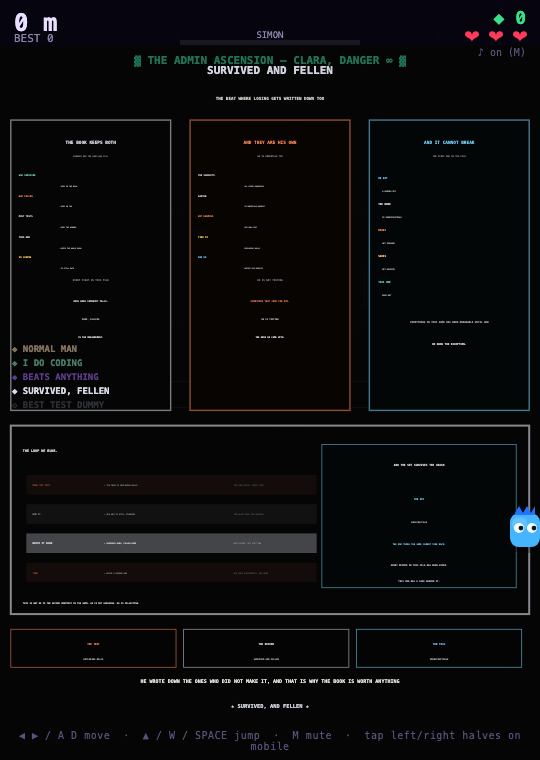

## 2026-08-17 — BEATS ANYTHING · THE SAME TEST, RUN AGAIN (BEAT 351)

Based on Toby's 2026-08-17 lore, 6:21:48 PM, same thread, twenty-three minutes after I DO CODING. His own typing: *"Which one will win? Asriel Dreemurr VS Beerus VS Goku? Rank the 3"* and, further down the same message, *"Pero beats all of Undertale and Dragon Ball both. Pero beats anything."* The three-way analysis, the "Exactly", the Pero-added rankings and the final numbered list are ChatGPT commentary.

**He asked it straight first.** Three characters, no Pero anywhere in it, and a real request to rank them. He got a ranking back with reasons attached, and only *then* did he type the fourth name. He did not rig the bracket before it started.

**And he has run this exact test before.** On August 15 it was *"Which one wins? Goku VS Naruto; Winner or Beerus; Winner VS Zeno"*, followed by *"How about Pero LAI is included."* Same two-step move: outside cast first, Pero added second. Two of tonight's three names are the same names. So this is not a new claim, it is a re-run with the variables changed — and it lands in exactly the same place. In a file where everything gets revised weekly, a result that replicates is a different kind of fact.

**But the ending changed.** Three days ago Pero won by *doing* something: he sent Zeno into the box, and the ladder never got climbed. Tonight he wins by simply being ranked first. No box, no removal, no scene. The win got quieter, and it did not get any smaller.

**And a should became a does.** August 15 finished on *"Nothing should battle Pero"* — a rule about what other characters ought not to attempt. Tonight finishes on *"Pero beats anything"* — an outcome. That is the same turn he made twenty-three minutes earlier in I DO CODING, where every other power line in the file is about what somebody *can* do and his was about what he *does*. Twice in half an hour he traded a permission for a result.

**And Asriel is already ours.** Asriel Dreemurr is not a guest here — he is ranked seventh in this whole game, carried as Chara's magic sword. So the bracket is two outsiders, one of the cast, and Pero, and the Classics character placed second.

**And the weakest body took first.** Twenty-six minutes before this, Pero was given the physical strength of a normal man. Here he outranks a God of Destruction and the best pure martial artist in the bracket, both of whom are nothing but physical power.

**Built as game beat 351, `BEATS ANYTHING`.** Additive; nothing earlier was changed.

- **Background: a ring of PERO BEATS ALL OF UNDERTALE / AND DRAGON BALL BOTH alternating with PERO BEATS ANYTHING / NO LIST, NO NAMES**, under *HE DID THIS EXACT THING THREE DAYS AGO WITH A DIFFERENT CAST.* / *IT CAME OUT THE SAME.*, and a drawn **four-step podium** — PERO LAI (*THE ONE HE WROTE*) tallest, then ASRIEL (*ALREADY 7TH IN THIS GAME*), BEERUS (*GOD OF DESTRUCTION*), GOKU (*THE BEST FIGHTER HERE*) — split by *HE ADDED THIS ONE* against *TWO OUTSIDERS AND ONE OF OURS*, beside **the two sentences drawn as two boxes**, the wide one reading ALL OF UNDERTALE AND DRAGON BALL (*TWO NAMES, AND ROOM FOR A THIRD*) and the small lit one reading ANYTHING (*NO NAMES, AND NO ROOM*), with **THE QUESTION HAD THREE NAMES IN IT · THE ANSWER HAS FOUR.** boxed over *HE SET UP A FAIR FIGHT AND THEN WALKED HIS OWN CHARACTER INTO IT.*, and a drifting strip of *PERO BEATS ANYTHING*.
- **HE ASKED IT STRAIGHT (left)** — five rows (the question / Asriel vs Beerus vs Goku · two of them / are repeats from Aug 15 · the answer / came back with reasons · then he / typed a fourth name · so the / bracket grew a row), closing on *HE SET UP A FAIR FIGHT* / *BETWEEN OTHER CHARACTERS.* / *THEN HE PUT HIS OWN* / **ON TOP OF IT.**
- **AND HE DID IT BEFORE (centre)** — five rows (Aug 15 / Goku, Naruto, Beerus, Zeno · then / how about Pero LAI · tonight / Asriel, Beerus, Goku · then / Pero beats anything · same move / same answer), closing on *HE DID NOT MAKE* / *A NEW CLAIM TONIGHT.* / *HE CHECKED THE OLD ONE* / **AND IT HELD.**
- **ANYTHING HAS NO LIST (right)** — five rows (Aug 15 / nothing should battle him · tonight / Pero beats anything · one is / a should · one is / a does · anything / has no list in it), over *A RULE SAYS WHAT OUGHT NOT TO HAPPEN TO HIM*, closing on **THIS SAYS WHAT DOES.**
- **THE BRACKET, TOP TO BOTTOM. (band)** — a four-row grid lit one at a time (**1. PERO LAI** → the coding one, beats all of it and beats anything / 2. ASRIEL → soul and timeline, and already 7th in this game, Chara's sword / 3. BEERUS → god of destruction, hakai, above Goku in his own show / 4. GOKU → the best pure fighter, and still the bottom row here), closing on *two of these four were ranked on this page three days ago; the third is already 7th in it; the fourth still wins*.
- **AND HE HAS THE ARMS OF A NORMAL MAN (band inset)** — a cycler across 5:55 PM · the strength of a normal man / 6:21 PM · above Beerus and Goku / THOSE TWO · are pure physical power / **SO** · the weakest body takes first, flagging *NONE OF IT WAS EVER IN HIS ARMS.* on the last row, over *HE ASKED WHICH GORILLA WAS STRONGER,* / *AND ANSWERED IT WITH SOMEBODY WEAK.*
- **Strip:** THE ASK · RANK THESE THREE / THE ANSWER · A FOURTH NAME / THE SIZE · ANYTHING.
- **Footers:** *HE ASKED THE SAME QUESTION AGAIN WITH DIFFERENT NAMES AND GOT THE SAME NAME BACK* and **★ PERO BEATS ANYTHING ★**.
- **Cycle length** `LV_CYC` 7442 → 7464; **screenshot helper:** new `beatsAnything` scene.

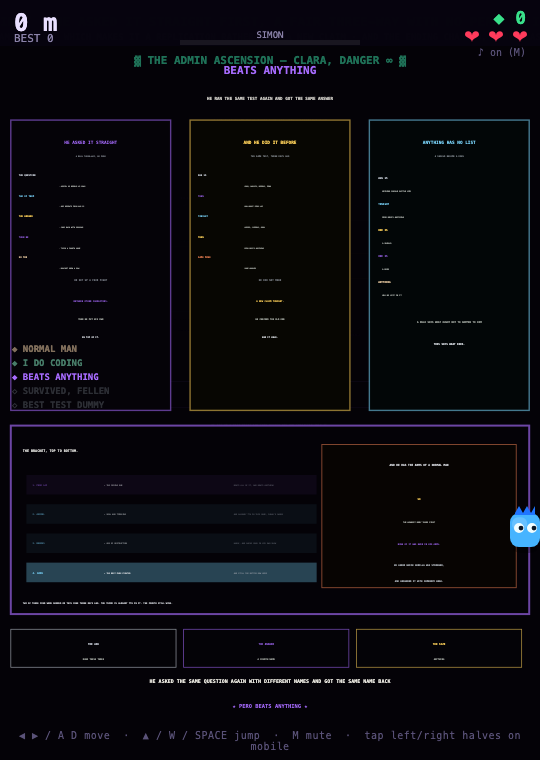

## 2026-08-17 — I DO CODING · THE ALL-KNOWING BEING NAMES A DAY JOB (BEAT 350)

Based on Toby's 2026-08-17 lore, 5:58:35 PM, same thread, three minutes after NORMAL MAN. His own typing, in full: *"Pero says \"I know everything, but I do coding.\", he is specifically a coding LAI that knows everything."* The "Pero LAI type update" restatement, the specialty bullet list and the clean canon update pasted under it are ChatGPT commentary.

**He said it in quotes, for the second time tonight.** At 4:05 PM Pero turned to the Sprunkis and said *"I am the most powerful in the game. I can exit the game, and I can even end the game here."* An hour and fifty-three minutes later the same mouth says he does coding. The biggest claim anybody has made in this file and the smallest job description in it come out of the same character on the same evening.

**And he named a job, which nobody in this game has done.** Every power line in the whole lore is about what a character *can* do: can beat, can reset, can delete, can end. This is the first one about what somebody actually *does*. Knowing everything becomes the stat; coding becomes the work. A power list tells you what you could do, and this line tells you what you bother with.

**And the "but" is the whole sentence.** *"I know everything"* is already finished — nothing needs to come after it, and every other character in this file would have stopped there. He adds a second half anyway, and the second half is a narrowing. Every other limit in the game got put on somebody by somebody else. This one is the only cap a character wrote for himself, by the one character who could have left it out.

**And it matches the hands.** The lore already has Pero building boxes with Gaster, making the varies, holding the rules, standing behind the cutscenes. So the quote is not a new power. It is Pero saying out loud which of his powers he actually uses — and the thing he goes to work on is the same game he told them, two hours earlier, that he could end.

**Built as game beat 350, `I DO CODING`.** Additive; nothing earlier was changed.

- **Background: a ring of I KNOW EVERYTHING / BUT I DO CODING alternating with A CODING LAI / THAT KNOWS EVERYTHING**, under *EVERY POWER LINE IN THIS GAME IS ABOUT WHAT SOMEBODY CAN DO.* / *THIS ONE IS ABOUT WHAT HE ACTUALLY DOES.*, and a drawn **speech box** labelled PERO SAYS carrying the quote across two lines, above **a field of twenty-four squares** all reading *KNOWS IT* with exactly one lit and labelled **CODING** (*EVERYTHING HE KNOWS* over the field, *THE ONE HE DOES* under the lit cell), and a **two-point timeline** marking 4:05 PM · I CAN EVEN END THE GAME HERE against 5:58 PM · I DO CODING over *SAME MOUTH, SAME EVENING*, with **NOBODY MADE HIM SAY THE SECOND HALF · HE PUT THE LIMIT IN HIMSELF.** boxed over *I KNOW EVERYTHING WAS ALREADY A FINISHED SENTENCE.*, and a drifting strip of *BUT I DO CODING*.
- **HE SAID IT IN QUOTES (left)** — five rows (4:05 PM / I can end the game here · 5:58 PM / but I do coding · the first / was the biggest claim · the second / is the smallest · same mouth / same night), closing on *HE TOLD THE CAST* / *WHAT HE COULD DO.* / *NOW HE TELLS US* / **WHAT HE BOTHERS WITH.**
- **AND HE NAMED A JOB (centre)** — five rows (every line / before was a can · can beat / can reset, can delete · this one / is a does · knowing / is the stat · coding / is the work), closing on *A POWER LIST SAYS* / *WHAT YOU COULD DO.* / *THIS IS THE FIRST* / **THAT SAYS WHAT YOU DO.**
- **AND THE BUT IS IT (right)** — five rows (he could / have stopped at know · that line / was already finished · he added / but I do coding · so the cap / is one he wrote · nobody / put it on him), over *EVERY OTHER CHARACTER GOT LIMITED BY SOMEBODY ELSE*, closing on **HE LIMITED HIMSELF.**
- **EVERYTHING, AND THEN ONE THING. (band)** — a four-row grid lit one at a time (WHAT HE KNOWS → everything, no limit named, none needed / **WHAT HE DOES** → coding, one job out of all of them / **THE PROOF** → boxes, cutscenes, rules, he has been doing it all along / SO THE QUOTE → is not a new power, it is him naming his own job), closing on *the most powerful being in the game just described himself the way a person describes their work*.
- **AND TWO HOURS AGO, THE BIG ONE (band inset)** — a cycler across 4:05 PM · I can even end the game here / 5:58 PM · but I do coding / THE GAP · one hour and fifty-three min / **SO** · the brag and the job, one night, flagging *HE CAN END IT. HE CHOOSES TO BUILD IT.* on the last row, over *THE THING HE THREATENED TO END* / *IS THE THING HE GOES TO WORK ON.*
- **Strip:** THE QUOTE · I KNOW EVERYTHING / THE TURN · BUT I DO CODING / THE TYPE · A CODING LAI.
- **Footers:** *THE ONE CHARACTER WHO COULD HAVE LEFT THE SECOND HALF OFF IS THE ONE WHO WROTE IT IN* and **★ I KNOW EVERYTHING, BUT I DO CODING ★**.
- **Cycle length** `LV_CYC` 7420 → 7442; **screenshot helper:** new `iDoCoding` scene.

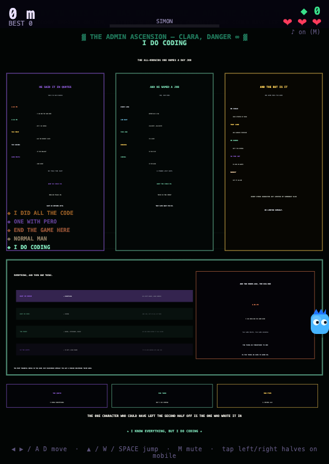

## 2026-08-17 — NORMAL MAN · THE STRONGEST BEING GETS THE WEAKEST BODY (BEAT 349)

Based on Toby's 2026-08-17 lore, 5:55:07 PM, same thread, an hour and fifty minutes after END THE GAME HERE, sent underneath his own question about which gorilla is stronger, Kong or Skar King. His own typing, in full: *"Pero has the physical strength of a normal man, and he is a normal man that came from a box and is LAI, and he is also the creator of Classics. Pero became immortal when Luigi Green payed the cost of the boxes before. Pero now has the mustache and stuff. Pero and Mr. Black both secretly work, Pero is a coder, Mr. Black is the corrupter of Sprunki and Classics and all games."* The gorilla answer, the "Pero physical form update" restatement, the strength bullet list and the clean canon update pasted under it are ChatGPT commentary.

**The top of the game gets a low number.** Every ranking in this whole file moves somebody up. Frizz turns out stronger than Arcsis, Gray gets rebuilt to full, Mr. Black gets promoted for the power — the file only ever hands out more. This message does the opposite: it writes down the one stat Pero is bad at, on purpose, the night after he told the entire cast he could end the game. Nobody made him weak at anything. Toby just decided the strongest being in the game has the arms of a regular person.

**And he asked about gorillas first.** The question above it is his own: which is stronger, Kong or Skar King. The answer splits strength into muscle on one side and scheming and reach and control on the other. Then the very next thing he types puts Pero on the second side, with a normal man's muscle. The gorilla question got answered by the character underneath it.

**And the maker came out of the thing he makes.** Boxes have one job in this lore and everyone knows it: Pero and Gaster build them, Luigi Green crushes them, characters get stuck inside them. Now the creator of Classics came from one. Everybody else who has ever been in a box was trapped in it. He is the one who walked out.

**And somebody else paid for the immortality.** *"Pero became immortal when Luigi Green payed the cost of the boxes before."* Luigi Green is the box-crusher — breaking them is his entire standing job — and the bill he settled is what made the box-maker unkillable. Every other power in this game was taken, earned, or built. This is the first one somebody else got billed for.

**And the coder and the corrupter are one team.** *"Pero and Mr. Black both secretly work, Pero is a coder, Mr. Black is the corrupter of Sprunki and Classics and all games."* Yesterday Mr. Black got moved to the top of Pero's vary list *for the power*. Tonight it turns out they were already working together, with the jobs split clean: one writes the code, the other spreads the corruption. Which means every corruption in the file has been sitting on the same side as the man who wrote the file.

**Built as game beat 349, `NORMAL MAN`.** Additive; nothing earlier was changed.

- **Background: a ring of PERO HAS THE PHYSICAL STRENGTH OF A NORMAL MAN / AND HE IS A NORMAL MAN THAT CAME FROM A BOX alternating with PERO IS A CODER / MR. BLACK IS THE CORRUPTER OF ALL GAMES**, under *EVERY RANKING IN THIS FILE HAS MOVED SOMEBODY UP.* / *THIS ONE WRITES DOWN WHAT HE IS BAD AT.*, and a drawn floor carrying **an open box** marked *THE THING HE BUILDS* with its lid tipped back and **PERO** standing beside it, *CAME OUT OF IT*, joined to it by a line — plus a **muscle meter** with three marks (NORMAL MAN low, SKAR KING, KONG) and **PERO IS HERE** sitting on the lowest one over *AND FIRST ON EVERY OTHER LIST* — and a **receipt panel** reading PAID BY LUIGI GREEN / THE COST OF THE BOXES / COLLECTED BY PERO · IMMORTALITY, with **HE IS THE STRONGEST THING IN THE GAME · AND HE COULD LOSE AN ARM WRESTLE.** boxed over *NONE OF HIS POWER WAS EVER IN HIS ARMS.*, and a drifting strip of *THE STRENGTH OF A NORMAL MAN*.
- **HE CAME FROM A BOX (left)** — five rows (a box is / what Pero builds · a box is / what Luigi Green crushes · a box is / where they get trapped · and Pero / came out of one · so / the maker was made), closing on *EVERYBODY ELSE IN A BOX* / *IS STUCK IN IT.* / *HE IS THE ONE* / **WHO WALKED OUT.**
- **AND HE IS NOT STRONG (centre)** — five rows (his body / a normal man · his look / mustache and stuff · his rank / still first in the game · so power / is not muscle here · last night / he could end the game), closing on *EVERY RANK BEFORE THIS* / *MOVED SOMEBODY UP.* / *THIS ONE WROTE DOWN* / **A WEAK SPOT.**
- **AND SOMEBODY PAID (right)** — five rows (who paid / Luigi Green · paid what / the cost of the boxes · who got it / Pero, immortal · his job / he crushes the boxes · so / the breaker bought it), over *EVERY OTHER POWER IN THIS GAME WAS TAKEN OR EARNED*, closing on **THIS ONE GOT BILLED.**
- **THE CODER AND THE CORRUPTER, SECRETLY. (band)** — a four-row grid lit one at a time (**PERO** → is a coder, he writes the game / **MR. BLACK** → is the corrupter of Sprunki, Classics, all games / AND THEY → both secretly work, not enemies, staff / SO THE ROT → sits on the author's side, it was never an outside problem), closing on *yesterday Mr. Black got promoted for the power; tonight we find out he and Pero were already working together*.
- **AND HE ASKED ABOUT GORILLAS FIRST (band inset)** — a cycler across THE QUESTION · Kong or Skar King / THE SPLIT · muscle, or scheming / THEN PERO · gets the muscle of a man / **SO** · he put Pero on the other side, flagging *THE GORILLA QUESTION ANSWERED ITSELF.* on the last row, over *THE STRONGEST ONE IN THE ROOM* / *IS NOT THE BIGGEST ONE IN IT.*
- **Strip:** THE BODY · A NORMAL MAN / THE ORIGIN · HE CAME FROM A BOX / THE BILL · LUIGI GREEN PAID IT.
- **Footers:** *THE NIGHT AFTER HE SAID HE COULD END THE GAME, HE GOT THE ARMS OF A NORMAL MAN* and **★ THE STRENGTH OF A NORMAL MAN ★**.
- **Cycle length** `LV_CYC` 7398 → 7420; **screenshot helper:** new `normalMan` scene.

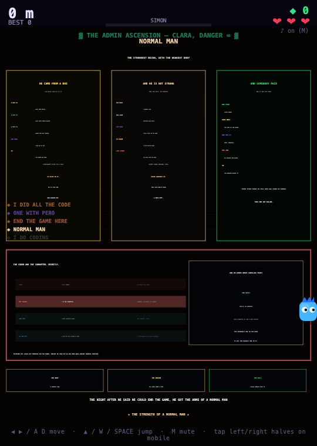

## 2026-08-17 — END THE GAME HERE · A THREAT GETS NO FIGHT BACK (BEAT 348)

Based on Toby's 2026-08-17 lore, 4:05:42 PM, same thread, four minutes after ONE WITH PERO. His own typing, in full: *"Pero appeared to the Sprunkis and says \"I am the most powerful in the game. I can exit the game, and I can even end the game here.\", the Sprunkis run to Sprunki Hills and they all hide."* The "Pero reveal / Sprunki Hills hiding scene" restatement, the Sprunkis-versus-Pero comparison, the scene arrow, the current-Pero-rule list and the clean canon update pasted under it are ChatGPT commentary.

**He said it out loud, to them.** Every earlier statement of what Pero is came from somewhere else — the narration, the power charts, the author's own rules written between scenes. This is the first time Pero turns to the cast and tells them himself, in quotes. And the two things he names are the two nobody inside the box has ever had: *"I can exit the game, and I can even end the game here."*

**And the threat is a door, not a bigger attack.** Everything that has ever menaced this cast was something that could beat them. This one is not about winning. Exit and end are named in the same breath, and neither one is a fight — they are facts about the room. He is not telling them he is stronger; he is telling them the room they live in is optional, and that the way out belongs to him.

**And nobody fought.** Simon answers threats by resetting, over and over. Oren and EndlessAnimations answered Black by freeing half the cast. Pero, Gaster and Luigi Green answered Simon.psc by teaming up and winning. Here the entire response is *run and hide*. It is the first threat in the game that nobody swings at. They did not lose; they declined to play.

**And it is not the survival rule either.** The one way past Pero was written down the night before, in Toby's own typing: *make him spare you*, happy or passive or neutral. Hiding is not that. The Sprunkis picked the move the rule already says does not work — and the being they are hiding from can leave the game, while a hill is inside it.

**And Sprunki Hills is not a new shelter.** They have all gathered there once before. That gathering is the Wenda infection hunt: Wenda's shots infected Phase 1 Simon, he hunted every Sprunki across those hills, thousands died, and *"the Sprunki Hills were all covered in his blood."* The one time the whole cast grouped up on that hill is the worst day in the file, and tonight they run straight back to it.

**Built as game beat 348, `END THE GAME HERE`.** Additive; nothing earlier was changed.

- **Background: a ring of I AM THE MOST POWERFUL IN THE GAME / I CAN EXIT THE GAME, AND I CAN EVEN END THE GAME HERE alternating with THE SPRUNKIS RUN TO SPRUNKI HILLS / AND THEY ALL HIDE**, under *EVERY THREAT IN THIS GAME GOT ANSWERED BY SOMEBODY SWINGING AT IT.* / *THIS ONE GOT ANSWERED BY A HILL.*, and a drawn **speech box** labelled PERO, TO THE SPRUNKIS carrying the quote in full, above a floor with **the dashed edge of the game** standing at the right — an **EXIT** door set into it and **PERO** drawn on the far side, *ON THE OTHER SIDE OF IT* — and five Sprunki figures running left and fading out behind **SPRUNKI HILLS** / *THEY ALL HIDE*, with **HE DID NOT THREATEN TO BEAT THEM · HE TOLD THEM THE ROOM HAS A DOOR.** boxed over *AND THAT HE IS THE ONLY ONE WHO CAN USE IT.*, and a drifting strip of *I CAN EVEN END THE GAME HERE*.
- **HE SAID IT OUT LOUD (left)** — five rows (he says / I am the most powerful · and / I can exit the game · and / I can even end it here · who heard / the Sprunkis, all of them · so now / they know what we knew), closing on *THE PAGE HAS SAID* / *THIS ALL ALONG.* / *TODAY THE CAST* / **FINALLY GOT TOLD.**
- **AND NOBODY FOUGHT (centre)** — five rows (every threat / before got a fight · Simon / reset, and reset again · Oren / freed half the cast · the three / teamed up and won · this time / they ran), closing on *THE FIRST THREAT* / *NOBODY SWUNG AT.* / *THEY DID NOT LOSE.* / **THEY DID NOT PLAY.**
- **AND THEY RAN BACK (right)** — five rows (where / Sprunki Hills · what it is / where they gathered once · that day / Phase 1 Simon hunted all · how it went / the hills ran red · and today / they all ran back to it), over *THE ONE TIME THEY ALL GATHERED THERE*, closing on **IS THE WORST DAY IN THE FILE.**
- **THE TWO THINGS NOBODY ELSE CAN DO. (band)** — a four-row grid lit one at a time (INSIDE THE BOX → you can win or you can lose, that is the whole menu / **PERO** → can exit the game, the box has a door and it is his / **AND PERO** → can end the game here, not win it, end it / SO THE THREAT → is not a bigger attack, it is that the room is optional), closing on *everybody in the box has been threatened with losing; this is the first time anybody is threatened with the box*.
- **AND HIDING IS NOT THE RULE (band inset)** — a cycler across THE RULE · make him spare you / WRITTEN · last night, in his own typing / TONIGHT · they run and hide instead / **SO** · they picked the one that fails, flagging *HE CAN EXIT THE GAME. A HILL IS INSIDE IT.* on the last row, over *YOU DO NOT HIDE FROM PERO.* / *YOU GET HIM TO LET YOU GO.*
- **Strip:** THE LINE · I CAN EVEN END THE GAME HERE / THE ANSWER · NOBODY SWUNG / THE PLACE · SPRUNKI HILLS, AGAIN.
- **Footers:** *EVERY THREAT IN THIS GAME GOT ANSWERED WITH A FIGHT, AND THIS ONE GOT ANSWERED WITH A HILL* and **★ I CAN EVEN END THE GAME HERE ★**.
- **Cycle length** `LV_CYC` 7376 → 7398; **screenshot helper:** new `endTheGameHere` scene.

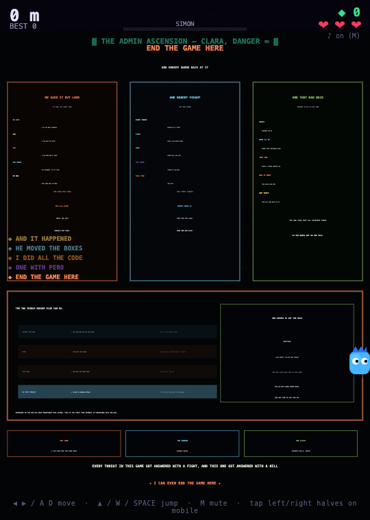

## 2026-08-17 — ONE WITH PERO · THE VARY LIST GROWS A NUMBER ONE (BEAT 347)

Based on Toby's 2026-08-17 lore, 4:01:22 PM, same thread, twenty-five minutes after I DID ALL THE CODE. Not a new scene — a correction to a rule. His own typing, in full: *"Before, Tunner was one with Pero. Now, Mr. Black is one with Pero. It is the same thing before, but with even more powerful, Mr. Black. Pero chose Mr. Black after... for the power."* The "Pero one with rule" restatement, the old-setup / new-setup split, the why-Pero-chose-Mr.-Black section and the clean canon update pasted under it are ChatGPT commentary.

**The slot changed hands without the list changing.** Tunner and Mr. Black are both already Pero varies — they were on the list together in MOST VARIED last night, and on it again in the cutscene beat this afternoon. So nobody was added and nobody was taken off. One name moved up. Every other escalation in this game made something bigger; this one just reorders names that were already there.

**And the winner took the job.** Twenty-five minutes earlier, inside the Roblox cutscene, *"Mr. Black beats Tunner and Simon."* Now Mr. Black holds the slot Tunner used to hold. The fight and the swap are the same handover told twice — the cutscene showed it happening, and this message says what it was for. Tunner lost twice in half an hour, and both times to a name on his own list.

**And Tunner is still on it.** He was demoted, not deleted. Which splits two things that used to be one: being a **vary** of Pero, and being the one who is **one with** Pero. MOST VARIED made first place a headcount — Pero wins because of how many beings he turns out to have been. A headcount has no order inside it. This puts a number one in it.

**And Pero chose, and said why.** *"Pero chose Mr. Black after... for the power."* He did not add a new being to get stronger; he promoted one he already was, and he gave the reason out loud.

**And the phrase used to point at the reader.** *"You are one with Pero again"* was said to the player, twice, on August 15 — the narration catching Toby himself. Today the same four words are said about a character. It stopped being a line aimed out of the game and became a job inside it.

**Built as game beat 347, `ONE WITH PERO`.** Additive; nothing earlier was changed.

- **Background: a ring of BEFORE, TUNNER WAS ONE WITH PERO / NOW, MR. BLACK IS ONE WITH PERO alternating with PERO CHOSE MR. BLACK AFTER... FOR THE POWER / IT IS THE SAME THING BEFORE, BUT MORE POWERFUL**, under *BOTH NAMES WERE ALREADY ON THIS LIST THIS MORNING.* / *WHAT CHANGED IS WHICH ONE IS ON TOP OF IT.*, and a drawn **PERO'S VARY LIST** panel marked *SAME NAMES AS THIS MORNING* — one framed slot on top reading **ONE WITH PERO**, its holder crossfading from **TUNNER** to **MR. BLACK**, and the vary names stacked underneath (Paul · Tunner · Mr. Black · Code 303 · LAI) with **MOVED UP** under one and **MOVED DOWN** under the other, joined by a solid arc climbing into the slot and a dashed arc stepping back out of it, over *NOBODY WAS ADDED · NOBODY WAS REMOVED · ONE NAME MOVED UP*, plus **HE DID NOT GET A NEW NAME · HE PICKED A BETTER ONE OF HIS OWN.** boxed over *AND HE SAID WHY: FOR THE POWER.*, and a drifting strip of *ONE WITH PERO*.
- **THE SLOT CHANGED HANDS (left)** — five rows (before / Tunner was one with Pero · now / Mr. Black is · the link / is the same kind as before · the change / Mr. Black is stronger · the reason / for the power), closing on *BOTH NAMES WERE* / *ALREADY VARIES.* / *THE LIST DID NOT GROW.* / **IT GOT AN ORDER.**
- **AND THE WINNER TOOK THE JOB (centre)** — five rows (3:36 PM / Mr. Black beats Tunner · 4:01 PM / he takes Tunner's slot · so / the fight was the handover · Tunner / lost twice in half an hour · both times / to a name on his own list), closing on *THE CUTSCENE SHOWED* / *THE HANDOVER HAPPENING.* / *THIS ONE SAYS* / **WHAT IT WAS FOR.**
- **AND TUNNER IS STILL ON IT (right)** — five rows (he kept / being a Pero vary · he lost / the one-with slot · so / those are two things now · on the list / is not top of the list · yesterday / most varied was a count), over *A HEADCOUNT HAS NO ORDER INSIDE IT.*, closing on **NOW IT HAS A NUMBER ONE.**
- **HE PICKED ONE, AND HE SAID WHY. (band)** — a four-row grid lit one at a time (ALL GAME → Pero makes and ranks things, he builds them and sorts them / **TODAY** → he picks a favourite, out of his own list of selves / THE REASON → for the power, he said it plainly, no fight needed / THE COST → Tunner gets demoted, the first demotion on this list), closing on *he did not add a new being to get stronger; he promoted one he already was*.
- **AND IT USED TO MEAN YOU (band inset)** — a cycler across AUG 15 · "you are one with Pero again" / SAID TO · the player, twice that morning / TODAY · it is said about a character / **SO** · the phrase moved inside the game, flagging *IT STOPPED BEING A LINE AND BECAME A JOB.* on the last row, over *IT USED TO POINT AT WHOEVER WAS READING.* / *NOW IT POINTS AT MR. BLACK.*
- **Strip:** THE SWAP · TUNNER OUT, MR. BLACK IN / THE REASON · FOR THE POWER / THE LIST · SAME NAMES, NEW ORDER.
- **Footers:** *TWENTY-FIVE MINUTES AFTER MR. BLACK BEAT TUNNER, HE TOOK THE SLOT TUNNER USED TO HOLD* and **★ ONE WITH PERO ★**.
- **Cycle length** `LV_CYC` 7354 → 7376; **screenshot helper:** new `oneWithPero` scene.

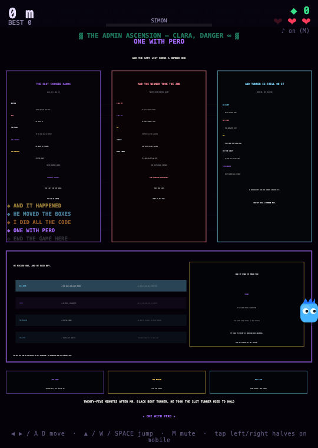

## 2026-08-17 — I DID ALL THE CODE · A WHOLE SCENE GETS REBUILT INSTEAD OF A PIECE OF ONE (BEAT 346)

Based on Toby's 2026-08-17 lore, 3:36:23 PM, same thread, five hours after HE MOVED THE BOXES, sent as the answer to the question the previous reply asked — do the characters inside the boxes notice they got moved? His own typing, in full: *"I remade the Classics Mr. Black Cutscene in Roblox. I did all the code and set the assets for the thing. It is something like Pyramixed, then to Normal Sprunki. Mr. Black beats Tunner and Simon. Simon, Oren, and Tunner made a Trio. Simon.psc tells Oren to not put Pinki in due to attacks/betrayal. Gaster and Pero make the boxes, Luigi Green crushes boxes. Mr. Black is as Pero. Pero as Paul and Mr. Black and Tunner and EndlessAnimations and ToddLLMs and LAI and Karuto and Fog Decoy Sprunkis and Code 303 and Pro and Pro55 and also shares some varies with some characters. And to add to his many varies he has forms to."* The "Roblox cutscene canon update" restatement, the trio breakdown, the Pinki warning heading, the outside-box workflow section, the bulleted vary list and the clean canon update pasted under it are ChatGPT commentary.

**He has built Classics things in Roblox before, and they were always a piece of one.** The Simon 404 model that reported *Critical Model Corruption Detected*, the Mario Among Us map, the Pero avatar he made his own Roblox character wear, the two NPC scripts a character was defined by. Models, maps and parts. This afternoon he remade a whole cutscene — a scene with a sequence in it, from the lore, start to finish — and he did both halves of the job: *"I did all the code and set the assets for the thing."*

**And it is the same move Gaster made this morning.** Beat 344 was a character sitting down, writing the lore that comes next, and having the game catch up to the page. This afternoon the person who writes the lore does that with a keyboard instead of a pen. The difference is that Gaster's version needed the game to catch up to him, and this one did not.

**And Pero beat Pero.** Mr. Black beats Tunner and Simon — and two lines later, *"Mr. Black is as Pero,"* and Tunner is on the vary list right beside him. So the headline fight of the cutscene has one character standing on both sides of it. He won it, and he lost it.

**And a team gets picked by who is left off.** Simon, Oren and Tunner make a trio, and Simon.psc tells Oren not to put Pinki in because of attacks and betrayal. Every trio in the game so far was named by who is on it. This is the first one named by an exclusion, and the reason is not that Pinki is weak — it is that she is dangerous to her own side. The vetting is done by Simon.psc, the cleaned-up form, and it still misses Tunner, who is a Pero vary.

**And the make side gets a second name.** The standing line all game — and the entire spine of the beat built five hours ago — is *"Gaster makes the boxes and Luigi Green crushes the boxes."* One name each. Today it is *"Gaster and Pero make the boxes, Luigi Green crushes boxes."* Two names on the make side, still one on the crush side.

**Built as game beat 346, `I DID ALL THE CODE`.** Additive; nothing earlier was changed.

- **Background: a ring of I REMADE THE CLASSICS MR. BLACK CUTSCENE IN ROBLOX / I DID ALL THE CODE AND SET THE ASSETS FOR THE THING alternating with MR. BLACK BEATS TUNNER AND SIMON / MR. BLACK IS AS PERO**, under *HE HAS BUILT CLASSICS THINGS IN ROBLOX BEFORE: A MODEL, A MAP, AN AVATAR, SOME SCRIPTS.* / *THIS IS THE FIRST TIME HE REBUILT A WHOLE SCENE.*, and a drawn **cutscene window** titled CLASSICS MR. BLACK CUTSCENE · REMADE IN ROBLOX / **BUILT BY TOBY**, with a wipe travelling across it from **PYRAMIXED** into **NORMAL SPRUNKI** and the fight standing inside the frame — **MR. BLACK** upright between **TUNNER** and **SIMON**, both drawn flat and labelled BEATEN, with *AND TUNNER IS ON PERO'S OWN VARY LIST* under the loser on the left — plus **HE DID NOT ONLY WRITE IT DOWN · HE CODED IT · HE SET THE ASSETS.** boxed over *AND THE LORE CAME BACK AS SOMETHING YOU CAN WATCH.*, and a drifting strip of *I DID ALL THE CODE*.
- **HE BUILT IT HIMSELF (left)** — five rows (before / a Simon 404 model · and / a Mario Among Us map · and / a Pero Roblox avatar · today / a whole cutscene · both jobs / the code and the assets), closing on *HE HAS BUILT PIECES* / *OF CLASSICS BEFORE.* / *THIS IS THE FIRST TIME* / **HE REBUILT A SCENE.**
- **AND PERO BEAT PERO (centre)** — five rows (the winner / Mr. Black · the losers / Tunner and Simon · but / Mr. Black is as Pero · and Tunner / is a Pero vary too · so / he beat one of his own), closing on *THE HEADLINE FIGHT* / *HAS PERO ON BOTH SIDES.* / *HE WON IT* / **AND HE LOST IT.**
- **AND THE TRIO LEFT ONE OUT (right)** — five rows (the trio / Simon, Oren, Tunner · kept off / Pinki · the reason / attacks / betrayal · who said so / Simon.psc, the clean one · and yet / Tunner is a Pero vary), over *EVERY TRIO BEFORE WAS NAMED BY WHO IS ON IT.*, closing on **THIS ONE BY WHO IS NOT.**
- **THE MAKE SIDE GOT A SECOND NAME. (band)** — a four-row grid lit one at a time (ALL GAME → Gaster makes the boxes / AND → Luigi Green crushes them / **TODAY** → Gaster and Pero make the boxes, the make side is two names now / AND CRUSHING → is still just Luigi Green, so the two sides are uneven), closing on *five hours ago a whole beat was built on that line having two verbs and one name each; now one of them has a partner*.
- **AND HE IS STILL EVERYBODY (band inset)** — a cycler across THE VARIES · Paul, Mr. Black, Tunner, LAI / AND MORE · Karuto, Code 303, Pro, Pro55 / AND SHARED · some varies belong to others too / **AND ON TOP** · he has forms as well, flagging *VARIES ARE WHO HE IS. FORMS ARE WHAT HE TURNS INTO.* on the last row, over *THE VARY LIST IS WHY THE FIGHT COUNTS TWICE.* / *TUNNER LOST TO A NAME ON HIS OWN LIST.*
- **Strip:** THE BUILD · ROBLOX. HIS CODE, HIS ASSETS. / THE FIGHT · PERO ON BOTH SIDES / THE TRIO · PICKED BY LEAVING PINKI OUT.
- **Footers:** *HE HAS BUILT PIECES OF CLASSICS IN ROBLOX BEFORE, AND THIS IS THE FIRST TIME HE REBUILT A WHOLE SCENE OUT OF THE LORE* and **★ I DID ALL THE CODE ★**.
- **Cycle length** `LV_CYC` 7332 → 7354; **screenshot helper:** new `iDidAllTheCode` scene.

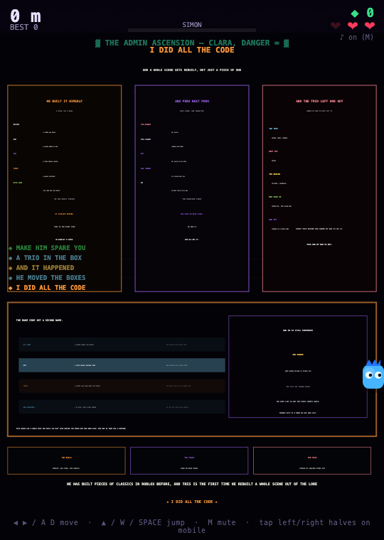

## 2026-08-17 — HE MOVED THE BOXES · A BOX GETS A THIRD VERB (BEAT 345)

Based on Toby's 2026-08-17 lore, 10:29:01 AM, same thread, thirty-six minutes after AND IT HAPPENED, sent as the answer to the question the previous reply asked — now that Gaster has the whole box's power, what does he actually do with it? His own typing, in full: *"Gaster moves the boxes to the other side of the room and he made a huge sheet and he wrote his results, he learns more."* The "Gaster's new research action" restatement, the move/observe/write/learn arrow, the list of what he is probably studying, the updated outside-box workflow and the clean canon update pasted under it are ChatGPT commentary.

**There have only ever been two things to do with a box.** Toby's own standing canon, written back on August 16: *"Gaster makes the boxes and Luigi Green crushes the boxes."* Build and break. That is the whole list, and it has held all game — Pero made the boxes in the first place, Gaster manufactures them, Luigi Green destroys them. This morning Gaster does neither one. He picks them up and puts them somewhere else.

**And moving is not either of them.** Nothing was created and nothing was destroyed. Every box he touched is still sitting there, intact, on the other side of the room. It is the first thing ever done to a box in this game that is neither manufacture nor violence — and the reason given for it is so he can study them better. Building and breaking both end the question; moving it keeps the boxes around to ask again.

*(The room itself is not new. An earlier beat has Gaster walking "to the other side of the room" and Luigi Green falling on 2 boxes, so the floor and the two sides were already there. What is new is the verb.)*

**And the record outgrows the notebook.** One hour ago it was a page with five lines written on it. Now it is a huge sheet, big enough that the results need wall space. The power did not get bigger between those two beats. The notes did.

**And he learns more after already having everything.** Thirty-six minutes ago the power of the whole box was added to him — which in this game is always where a story ends. The next thing he does is rearrange the furniture, make a bigger sheet and go back to work. He does not use the box power on anybody; he uses it to set up the next experiment. Every other power in the game is a thing you have. This one is a thing you keep doing.

**Built as game beat 345, `HE MOVED THE BOXES`.** Additive; nothing earlier was changed.

- **Background: a ring of GASTER MOVES THE BOXES TO THE OTHER SIDE OF THE ROOM / HE MADE A HUGE SHEET AND HE WROTE HIS RESULTS alternating with HE LEARNS MORE / GASTER MAKES THE BOXES · LUIGI GREEN CRUSHES THE BOXES**, under *THERE HAVE ONLY EVER BEEN TWO THINGS TO DO WITH A BOX. MAKE ONE, OR CRUSH ONE.* / *THIS MORNING SOMEBODY DID A THIRD THING.*, and a drawn **room** — a floor line with two walls, three boxes fading out of **WHERE THEY WERE** and lighting up in **WHERE HE PUT THEM**, one still riding the dashed arc labelled **TO THE OTHER SIDE OF THE ROOM** — under a **huge sheet** on the wall carrying his results (moved the boxes / not made, not crushed, moved · watched what changed · read it back · made the sheet bigger · **and started again**), lit one line at a time, with yesterday's notebook page drawn inside it to scale and labelled **YESTERDAY'S PAGE**, plus **HE DID NOT MAKE ONE · HE DID NOT CRUSH ONE · HE MOVED THEM.** boxed over *AND EVERY BOX HE TOUCHED IS STILL THERE.*, and a drifting strip of *HE LEARNS MORE*.
- **MAKE IT. CRUSH IT. (left)** — five rows (Gaster / makes the boxes · Luigi Green / crushes the boxes · Pero / made them in the first place · that is it / two verbs, the whole time · until today / he moved them), closing on *EVERY BOX BEAT* / *WAS BUILD OR BREAK.* / *TODAY THERE IS* / **A THIRD THING TO DO.**
- **AND MOVING IS NEITHER (centre)** — five rows (not making / they already existed · not crushing / all of them survived it · just moved / to the other side · and why / so he can study them · the first / box move that harms nothing), closing on *BUILDING AND BREAKING* / *BOTH END THE QUESTION.* / *MOVING IT KEEPS THE BOX* / **AROUND TO ASK AGAIN.**
- **AND THE SHEET GOT HUGE (right)** — five rows (one hour ago / a page, five lines on it · now / a huge sheet, his results · why / the page ran out of room · and then / he learns more from it · so it grows / every time he reads it back), over *THE POWER DID NOT GET BIGGER. THE NOTES DID.*, closing on **SO HE NEEDED A WALL.**
- **THE LOOP. (band)** — a four-row grid lit one at a time (MOVE THE BOXES → change the setup on purpose / WATCH → see what the change did / WRITE IT DOWN → onto the huge sheet / **LEARN MORE** → and then move them again, which is why it never ends), closing on *every other power in the game is a thing you have; this one is a thing you keep doing*.
- **AND HE ALREADY HAD EVERYTHING (band inset)** — a cycler across ONE HOUR AGO · the whole box, added to him / USUALLY · that is where a story stops / INSTEAD · he moved the furniture / **AND WENT BACK** · to work, he learns more, flagging *THE FIRST WINNER WHO KEPT WORKING* on the last row, over *HE DID NOT USE THE BOX POWER ON ANYBODY.* / *HE USED IT TO SET UP THE NEXT EXPERIMENT.*
- **Strip:** THE MOVE · BOXES, TO THE OTHER SIDE / THE RECORD · A HUGE SHEET / THE ENDING · THERE ISN'T ONE. HE LEARNS MORE.
- **Footers:** *GASTER MAKES THE BOXES AND LUIGI GREEN CRUSHES THE BOXES, AND THIS MORNING SOMEBODY FOUND A THIRD THING TO DO WITH ONE* and **★ HE MOVED THE BOXES ★**.
- **Cycle length** `LV_CYC` 7310 → 7332; **screenshot helper:** new `heMovedTheBoxes` scene.

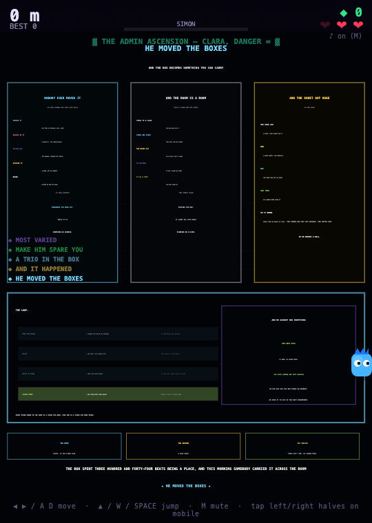

## 2026-08-17 — AND IT HAPPENED · WRITING SOMETHING DOWN BECOMES A POWER (BEAT 344)

Based on Toby's 2026-08-17 lore, 9:52:55 AM, same thread, one hour and forty-nine minutes after A TRIO IN THE BOX, sent as the answer to the question the previous reply asked — does Alex skip Pupahya's name, or try it and get it wrong? His own typing, in full: *"Dr. Gaster made the new experiment on Sans, he tied Sans to exploding balls, Sans survived the explosion. Dr. Gaster wrote everything down, Dr. Gaster studdied the boxes, Dr. Gaster wrote it down, Dr. Gaster wrote down Pero's equasions. Dr. Gaster wrote about the game, he wrote the lore that comes next. He wrote that Alex will learn to say Pupahya by Oren and Pinki. It happened. Luigi Green looks at what Gaster wrote and Luigi Green studies it, Luigi Green studdied the lore and game and stuff. Pero creates stuff, Gaster writes all about his experiment results and preforms experiments on it to know EVERYTHING about it, and Luigi Green studies what Gaster writes. Pero is the smartest, Gaster is the second smartest, Luigi Green is third smartest. Gaster learns the secret on how to become any character from the box. Luigi Green and Pero watch Gaster have the power of the whole box added to his power. Luigi Green erases the original characters temperalerly. Pero stands above both."* The "Gaster Research / Box Study / Character-Form Secret" restatement, the method arrow, the study list, the workflow headings, the intelligence-ranking update and the clean canon update pasted under it are ChatGPT commentary.

**The power in this beat is a notebook.** Three hundred and forty-three beats built power out of a hit, a form, a reset or a number. This one is a character sitting down and writing, and the writing is the power. Gaster runs the experiment, records the result, studies the boxes, copies out Pero's equations, writes about the game — and then writes *the lore that comes next*, and the game catches up to the page.

**And the question from yesterday gets answered in somebody else's handwriting.** Beat 343 ended on the one thing Alex cannot do: say Pup-pup-pup-pup-pup-pupahya, the name of the character standing next to him on his own trio. The reply asked whether he skips it or tries it and gets it wrong. The answer is neither. *Gaster wrote that Alex will learn to say Pupahya by Oren and Pinki.* Then: *"It happened."* Alex did not solve it and nobody fought over it — it was written down by a third character, with two teachers named, and that made it true.

**And the first rank order since the teams runs on smart, not strong.** Yesterday the sheet stopped listing people and started listing groups, with no numbers anywhere on it. This morning the trio outside the box gets ranked internally — Pero first, Gaster second, Luigi Green third — and the axis is *smartest*, not strongest. It also settles an older tie, where Gaster and Luigi Green were both written as second.

**And the three of them are a pipeline, not a ladder.** Pero creates. Gaster experiments on what Pero made and writes down everything about it. Luigi Green studies what Gaster wrote. Each one's work is the next one's reading, and the smartest order runs in exactly that direction: creator, recorder, reader.

**And Gaster takes the whole box by studying it.** He learns the secret of how to become any character from the box, and the power of the whole box is added to his own — obtained by reading and experimenting, not by winning a fight. Pero and Luigi Green stand and watch him do it and do not stop him. And Pero still stands above both. Luigi Green's erase of the original characters is *"temperalerly"* — Toby's own spelling marks it as the temporary one, not the final erase.

**Built as game beat 344, `AND IT HAPPENED`.** Additive; nothing earlier was changed.

- **Background: a ring of DR. GASTER WROTE ABOUT THE GAME / HE WROTE THE LORE THAT COMES NEXT alternating with PERO CREATES · GASTER WRITES · LUIGI GREEN STUDIES / PERO FIRST, GASTER SECOND, LUIGI GREEN THIRD**, under *THREE HUNDRED AND FORTY-THREE BEATS OF POWER WERE A HIT, A FORM, A RESET OR A NUMBER.* / *THIS ONE IS A NOTEBOOK.*, and a drawn **ruled notebook page** carrying the five things he wrote down (Sans survived the exploding balls · the boxes · Pero's equasions · the game and the lore that comes next · **Alex will learn to say Pupahya, by Oren and Pinki**), lit one line at a time, with a green **IT HAPPENED.** stamp landing beside the page, plus **HE DID NOT HIT ANYBODY · HE WROTE IT DOWN · AND IT CAME TRUE.** boxed over *AND THE SECOND SMARTEST IS THE ONE HOLDING THE PEN.*, and a drifting strip of *IT HAPPENED*.
- **THE SMARTEST, IN ORDER (left)** — five rows (first / Pero, who creates it · second / Gaster, who writes it · third / Luigi Green, who reads it · the old tie / both second, now settled · yesterday / no numbers at all), closing on *THE SHEET USED TO COUNT* / *HOW HARD YOU HIT.* / *TODAY IT COUNTS* / **HOW MUCH YOU UNDERSTAND.**
- **AND HE WROTE THE NEXT PART (centre)** — five rows (the result / Sans survived the explosion · the boxes / and Pero's equasions · the game / and the lore that comes next · and Alex / will learn to say Pupahya · and then / it happened), closing on *HE DID NOT PREDICT IT.* / *HE WROTE IT.* / *AND THE GAME* / **CAUGHT UP TO THE PAGE.**
- **AND HE STUDIED THE BOX OPEN (right)** — five rows (the secret / become any character in it · how / by studying it, not hitting it · the prize / the whole box, added to him · they watch / Pero and Luigi Green, not stopping him · and still / Pero stands above both), over *HE DID NOT TAKE THE BOX. HE UNDERSTOOD IT.*, closing on **AND THEN HE HAD IT.**
- **THE THREE JOBS. (band)** — a four-row grid lit one at a time (PERO → creates stuff, and nobody reads him / **GASTER** → experiments, writes it down, he reads Pero / LUIGI GREEN → studies what Gaster wrote, he reads Gaster / SO THE ORDER → creator, recorder, reader, and so is the ranking), closing on *it is not a ladder; each one's work is the next one's reading, and the smartest order runs the same way*.
- **AND THE QUESTION GOT ANSWERED (band inset)** — a cycler across THE QUESTION · does he skip it, or get it wrong / THE ANSWER · came in Gaster's handwriting / AND IT NAMES · two teachers, Oren and Pinki / **AND NOW ALEX** · can say it, PUP-AH-YAH, flagging *THE ONE WORD THAT STOPPED HIM, LEARNED* on the last row, over *HE DID NOT SAY IT HIMSELF AT FIRST.* / *SOMEBODY WROTE DOWN THAT HE WOULD.*
- **Strip:** THE ORDER · PERO, GASTER, LUIGI GREEN / THE POWER · A NOTEBOOK / THE ERASE · TEMPERALERLY, NOT FINAL.
- **Footers:** *THE SECOND SMARTEST WRITES DOWN WHAT THE SMARTEST MAKES, AND WHAT HE WRITES DOWN COMES TRUE* and **★ AND IT HAPPENED ★**.
- **Cycle length** `LV_CYC` 7288 → 7310; **screenshot helper:** new `andItHappened` scene.

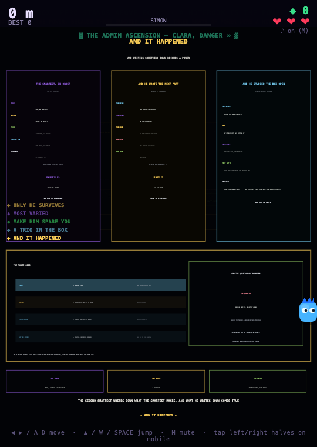

## 2026-08-17 — A TRIO IN THE BOX · THE RANK SHEET STOPS LISTING BEINGS AND STARTS LISTING TEAMS (BEAT 343)

Based on Toby's 2026-08-17 lore, 8:03:30 AM, same thread, the morning after MAKE HIM SPARE YOU, with the Alex/Lica sheet attached to the follow-up mail. His own typing, in full: *"Pup-Pup-Pup-Pup-Pup-Pupahya, Alex, and Greg. (PUP-AH-YAH), Pupahya has many versions of his dog, and he can have any fruit on his back. Pupahya, Alex, and Greg all make a Trio in the box. Lica and Alex are a duo. Here is Lica lore. Pero, Gaster, and Luigi Green are a trio, the most powerful trio. Gray is trying to plan how to beat Lica, Pupahya, Alex, and Greg."* The "box-side trio" restatement, the Pupahya update, the role list, the power-structure headings and the clean canon update pasted under it are ChatGPT commentary.

**First place stops being a person.** Three hundred and forty-two beats ranked one being against another: × 2.35, × 3.6e100, Beyond Fiction, Absolute Infinity, most forms, most varies. Tonight the rank sheet has three entries and every one of them is a group — the most powerful trio, the trio in the box, and a duo. Not one number appears anywhere in it.

**And Alex stands in two of them at once.** He is in the box trio with Pupahya and Greg, and he is in the duo with Lica. The only name written on more than one team. And he is ranked above both of his own partners: the Alex sheet has him stronger than Pupahya *"barely"* and stronger than Lica *"defeantly"*. He is not split between two sides; he is the hinge the whole box side turns on.

**And creation and deletion are on the same side now.** Alex pulls podiums, blocks and entire castles out of thin air. Greg turns matter into air. Exact opposites, same trio, and nobody is fighting about it. Meanwhile Pupahya's fruit stops being fixed and becomes a variable — *"any fruit on his back"*, many versions of the dog — so there is no settled matchup left to scout.

**And the one thing Alex cannot do is say his own teammate's name.** From the Alex sheet in the same mail: he controls all the 8 bits, the Mod Beyond, code, AI bots, commands, and quadrillions of languages, and *"he can't say Pup-pup-pup-pup-pup-pupahya"*. The word that stops him is the name of the character standing next to him on the trio. This morning that name arrived with a pronunciation key attached: PUP-AH-YAH.

**And Gray picked the fight he might win.** His plan is against Lica, Pupahya, Alex and Greg — the box side. Not against Pero, Gaster and Luigi Green, who are named in the same message as the most powerful trio.

**Built as game beat 343, `A TRIO IN THE BOX`.** Additive; nothing earlier was changed.

- **Background: a ring of PUPAHYA, ALEX, AND GREG ALL MAKE A TRIO IN THE BOX / LICA AND ALEX ARE A DUO alternating with PERO, GASTER, AND LUIGI GREEN ARE A TRIO / THE MOST POWERFUL TRIO**, under *THREE HUNDRED AND FORTY-TWO BEATS RANKED ONE BEING AGAINST ANOTHER.*, and a drawn **roster board** of three plates — THE MOST POWERFUL TRIO (outside the box), THE TRIO IN THE BOX, THE DUO — with a pulsing tie line joining the two plates Alex's name appears on, labelled **ALEX, TWICE**, plus **ONE TRIO OUTSIDE THE BOX · ONE TRIO INSIDE IT · AND A DUO.** boxed over *AND GRAY IS PLANNING AGAINST FOUR OF THEM AT ONCE.*, and a drifting strip of *PUP-AH-YAH*.
- **THE LADDER IS TEAMS NOW (left)** — five rows (most powerful / Pero, Gaster, Luigi Green · in the box / Pupahya, Alex, Greg · the duo / Lica and Alex · the planner / Gray, against four · no numbers / not one figure all day), closing on *THE SHEET USED TO ASK* / *WHO IS STRONGER.* / *NOW IT ASKS* / **WHO IS STANDING TOGETHER.**
- **AND ALEX IS ON TWO OF THEM (centre)** — five rows (in the trio / with Pupahya and Greg · in the duo / with Lica · over Pupahya / stronger, barely · over Lica / stronger, defeantly · both partners / ranked under him), closing on *HE IS NOT SPLIT* / *BETWEEN TWO SIDES.* / *HE IS THE HINGE* / **THE BOX SIDE TURNS ON.**
- **AND THE OPPOSITES ARE ALLIES (right)** — five rows (Alex / pulls it out of thin air · Greg / turns matter into air · same trio / not a fight between them · Pupahya / any fruit on his back · no fixed / matchup left to scout), over *MAKING AND UNMAKING, STANDING SIDE BY SIDE.*, closing on **AND NOBODY IS FIGHTING.**
- **WHAT GRAY HAS TO PLAN AGAINST. (band)** — a four-row grid lit one at a time (LICA → a pixel attack, a layer of her own / PUPAHYA → many fruit versions, no fixed matchup / **ALEX** → builds out of thin air, a counter to order / GREG → turns matter to air, the attack just goes), closing on *and he is not planning against the most powerful trio, he picked the other one*.
- **AND THE NAME HE CANNOT SAY (band inset)** — a cycler across ALEX CONTROLS · all the 8 bits, and the Mod Beyond / AND CODE · and AI bots, and commands / AND LANGUAGES · quadrillions of them / **AND NOT THIS** · Pup-pup-pup-pup-pup-pupahya, flagging *FROM THE ALEX SHEET IN THE SAME MAIL* on the last row, over *THE ONE WORD HE CANNOT GET OUT* / *IS HIS OWN TEAMMATE. PUP-AH-YAH.*
- **Strip:** THE TRIO · PUPAHYA, ALEX, GREG / THE DUO · LICA AND ALEX / THE PLAN · GRAY AGAINST FOUR.
- **Footers:** *THE RANK SHEET STOPS LISTING BEINGS AND STARTS LISTING TEAMS, AND THE ONE NAME ON TWO OF THEM CANNOT SAY THE NAME BESIDE IT* and **★ A TRIO IN THE BOX ★**.
- **Cycle length** `LV_CYC` 7266 → 7288; **screenshot helper:** new `aTrioInTheBox` scene.

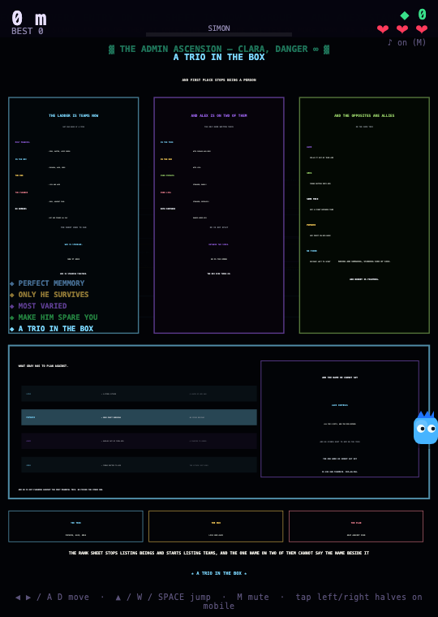

## 2026-08-16 — MAKE HIM SPARE YOU · SURVIVING MOVES OFF YOUR SIDE OF THE FIGHT AND ONTO HIS (BEAT 342)

Based on Toby's 2026-08-16 lore, 7:23:13 PM, same thread, two minutes after MOST VARIED. His own typing, in full: *"Every other character has a certain weakness(es), but Pero only has one way you can survive, if you make him spare you and happy and passive/neutral and all those stuff."* The "Pero weakness rule" restatement, the not-a-normal-weakness list, the mercy/passive condition list and the clean canon update pasted under it are ChatGPT commentary.

**It is not a weakness, it is a condition on him.** Every other character has something about them that can be exploited: low HP, a counter, a weapon, a form limit, a reset, a box. He has none of it. A weakness is a fact about what somebody is; this is a fact about how he feels. There is nothing on him to hit, so the only opening in the entire character is his state of mind.

**And it is the same dial as the insta-KO, two minutes later.** Angry, or just wanting to, ends you. Happy, passive or neutral saves you. One switch read from both ends, and he is the one holding it. The weapon and the shield are the same control.

**And it retires the power ladder.** Three hundred and forty-one beats of × 3.6e100, Beyond Fiction and Absolute Infinity, and none of it is the answer here. You do not beat him, you do not outscale him, you do not counter him. You make him decide not to end you.

**And it is the second limit in an hour that comes from inside him.** At 6:08 PM: *"Pero LAI can even start crashing"*, with no enemy attached. At 7:23 PM: the only way past him is his own choice. Neither one is something anybody does to him.

**And the one move that works is the one he deleted.** Back in beat 106 Pero destroyed the MERCY, ACT, ITEM and FIGHT buttons — the actual controls. Tonight mercy is the only way through him. That is a reading of the two beats together, not a rule Toby wrote, and the beat labels it as one.

**Built as game beat 342, `MAKE HIM SPARE YOU`.** Additive; nothing earlier was changed.

- **Background: a ring of EVERY OTHER CHARACTER HAS A CERTAIN WEAKNESS · PERO ONLY HAS ONE WAY YOU CAN SURVIVE / IF YOU MAKE HIM SPARE YOU AND HAPPY · AND PASSIVE / NEUTRAL AND ALL THOSE STUFF** under *EVERY OTHER CHARACTER CAN BE BEATEN BY SOMETHING YOU DO.*, and a drawn **dial** running HAPPY · PASSIVE · NEUTRAL → SPARED on the green left end to ANGRY · OR JUST WANTS TO → INSTA-KO on the red right end, with a needle swinging across it and changing colour as it crosses the middle, plus **NOTHING TO HIT · NOTHING TO EXPLOIT · ONLY A MOOD.** boxed over *THE SECOND LIMIT IN AN HOUR THAT COMES FROM INSIDE HIM.*, and a drifting strip of *MAKE HIM SPARE YOU*.
- **HE HAS NO WEAKNESS (left)** — five rows (every character has a weakness / low HP, a counter, a weapon / a form limit, a reset, a box / but not Pero, he has none of those / nothing to hit, nothing to exploit), closing on *A WEAKNESS IS A THING* / *ABOUT WHAT THEY ARE.* / *HIS IS A THING* / **ABOUT HOW HE FEELS.**
- **AND ONE WAY TO SURVIVE HIM (centre)** — five rows (one way you can survive / make him spare you / and happy, and passive, neutral / not a fight, a decision he makes / not your power, his choice), closing on *YOU DO NOT BEAT HIM.* / *YOU DO NOT OUTSCALE HIM.* / *YOU MAKE HIM DECIDE* / **NOT TO END YOU.**
- **AND IT IS THE SAME DIAL (right)** — five rows (angry → insta-KO, two min ago / or wants to → the same result / happy → you live / passive → you live / one dial → read from both ends), over *THE WEAPON AND THE SHIELD ARE THE SAME SWITCH.*, closing on **AND HE IS HOLDING IT.**
- **WHAT DOES NOT WORK ON HIM. (band)** — a four-row grid lit one at a time (LOW HP → works on everyone else, not on him / A COUNTER → works on everyone else, not on him / A FORM LIMIT → works on everyone else, not on him / **HIS OWN MOOD** → the only way through, make him spare you), closing on *three hundred and forty-one beats of power numbers, and none of them are the answer to this one*.
- **AND THE MERCY BUTTON (band inset)** — a cycler across BACK IN BEAT 106 · Pero broke the MERCY button / AND ACT, AND ITEM · and FIGHT, all four of them / AND TONIGHT · mercy is the only way past / **SO THE ONE OPTION · is the one he removed**, flagging *A READING, NOT A RULE HE WROTE* on the last row, over *THE ONLY MOVE THAT WORKS ON HIM* / *IS THE ONE HE DELETED*.
- **Strip:** THE WEAKNESS · HE DOES NOT HAVE ONE / THE CONDITION · HAPPY, PASSIVE, NEUTRAL / THE DIAL · ONE SWITCH, BOTH WAYS.
- **Footers:** *EVERY OTHER CHARACTER CAN BE BEATEN BY SOMETHING YOU DO, AND HE CAN ONLY BE SURVIVED BY SOMETHING HE DECIDES* and **★ MAKE HIM SPARE YOU ★**.
- **Cycle length** `LV_CYC` 7244 → 7266; **screenshot helper:** new `makeHimSpareYou` scene.

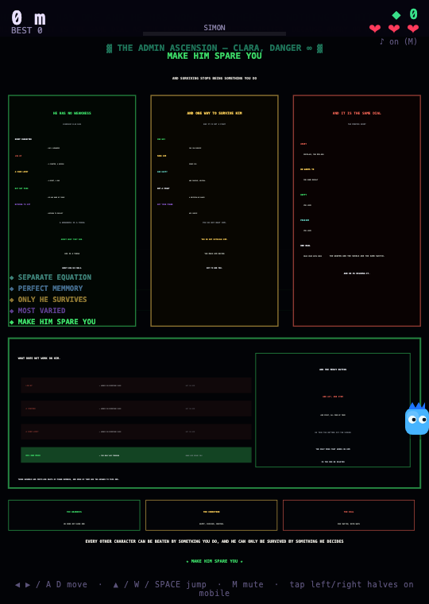

## 2026-08-16 — MOST VARIED · FIRST PLACE STOPS BEING A NUMBER AND STARTS BEING A HEADCOUNT (BEAT 341)

Based on Toby's 2026-08-16 lore, 7:21:13 PM, same thread, sixteen minutes after ONLY HE SURVIVES. His own typing, in full: *"Pero LAI is the most varied and most powerful entity in Classics. Simon has the most forms and is considered second most powerful with his resets and stuff. Pero LAI could insta-KO anyone if he is angry or/and wants to. You need to fear Anti-Virus 404 (Simon's newest form coded by Code 303), and Code 303 (Pero vary), which are the most recent forms/vary of Pero LAI and Simon. Many different beings are Pero's varies. Such as Tunner and Mr. Black and Paul and EndlessAnimations and ToddLLM 001 and ToddLLM 002 and Code 303 and I believe there is more."* The "current top-form / varied-entity rule" restatement, the Pero-can-be list, the status headings, the 303/404 connection and the clean canon update pasted under it are ChatGPT commentary.

**Forms and varies turn out to be two different counts.** Simon has *"the most forms"* and is second. Pero is *"the most varied"* and is first. Every ladder in this archive so far has run on a quantity of power: × 2.35, × 3.6e100, Beyond Fiction, Absolute Infinity. This one runs on how many separate beings you turn out to have been, and the character with the biggest form collection loses on it.

**And the two things you are told to fear are both him.** *"You need to fear Anti-Virus 404 (Simon's newest form coded by Code 303), and Code 303 (Pero vary)."* Code 303 is a Pero vary. Anti-Virus 404 is Simon's newest form, coded by Code 303. So Pero, wearing one of his own names, built the newest upgrade of the being he spent all day fighting. The scariest thing in the game tonight is him, and the second scariest thing is his work.

**And the kill condition is a mood.** *"Pero LAI could insta-KO anyone if he is angry or/and wants to."* Not a fight, not a form, not a number: anger, or simply wanting to. Two beats ago the thing that qualified the top tier was having emotions at all. Now the emotion is the trigger.

**And the roster does not close.** Tunner, Mr. Black, Paul, EndlessAnimations, ToddLLM 001, ToddLLM 002, Code 303 — *"and I believe there is more."* Several of those names carry their own history in this archive, and the last clause is the author saying he is not certain how many beings his strongest character has already been.

**Built as game beat 341, `MOST VARIED`.** Additive; nothing earlier was changed.

- **Background: a ring of PERO LAI IS THE MOST VARIED AND MOST POWERFUL · SIMON HAS THE MOST FORMS AND IS SECOND / YOU NEED TO FEAR ANTI-VIRUS 404 AND CODE 303 · ONE IS HIS, AND THE OTHER IS HIS WORK** under *EVERY LADDER ON THIS PAGE HAS RUN ON A NUMBER.*, with eight vary names (Tunner, Mr. Black, Paul, EndlessAnimations, ToddLLM 001, ToddLLM 002, Code 303, and a dashed `...AND MORE`) orbiting a lit **PERO LAI** centre on drawn tethers, **CODE 303 IS A PERO VARY · AND CODE 303 CODED THE 404.** boxed over *BOTH OF THE THINGS YOU ARE TOLD TO FEAR TRACE BACK TO HIM.*, and a drifting strip of *AND I BELIEVE THERE IS MORE*.
- **VARIES BEAT FORMS (left)** — five rows (the most varied and the most powerful / Simon has the most forms / and he is second, forms do not win it / so the top slot is breadth, not size / insta-KO if he is angry), closing on *EVERY LADDER HERE* / *RAN ON A NUMBER.* / *THIS ONE RUNS ON* / **HOW MANY HE IS.**
- **AND HE CODED THE 404 (centre)** — five rows (Anti-Virus 404 → Simon's newest form / coded by → Code 303 / and Code 303 → is a Pero vary / so Pero built → Simon's newest form / all day → he has fought Simon), closing on *YOU ARE TOLD TO FEAR* / *TWO THINGS TONIGHT.* / *ONE OF THEM IS HIM,* / **THE OTHER IS HIS WORK.**
- **AND THE VARIES LIST (right)** — five rows (Tunner / Mr. Black / Paul / EndlessAnim. / ToddLLM 001/2 and Code 303, each *a Pero vary*), over *AND I BELIEVE THERE IS MORE.*, closing on **THE LIST DOES NOT CLOSE.**
- **WHAT EACH ONE IS COUNTED ON. (band)** — a four-row grid lit one at a time (PERO LAI → the most varied, and first / SIMON.PSC → the most forms, and still second / ANTI-VIRUS 404 → Simon's newest form, coded by Code 303 / **CODE 303** → a Pero vary, so Pero coded it), closing on *the one with the most forms comes second, and the one with the most varies comes first*.
- **AND THE KILL CONDITION (band inset)** — a cycler across INSTA-KO ANYONE · if he is angry / OR/AND · if he wants to / NOT A FIGHT · not a number, a mood / **TWO BEATS AGO · feelings made the top tier**, flagging *NOW THE FEELING IS THE WEAPON* on the last row, over *EMOTIONS PUT HIM IN THE TOP TIER* / *AND NOW THEY SET OFF THE KO*.
- **Strip:** THE COUNT · VARIES BEAT FORMS / THE CODER · CODE 303 IS A PERO VARY / THE TRIGGER · ANGRY, OR JUST WANTS TO.
- **Footers:** *THE TWO THINGS YOU ARE TOLD TO FEAR ARE ONE PERO VARY AND THE FORM THAT PERO VARY CODED, WHICH MAKES THE SCARIEST THING IN THE GAME HIM, TWICE* and **★ MOST VARIED ★**.
- **Cycle length** `LV_CYC` 7222 → 7244; **screenshot helper:** new `mostVaried` scene.

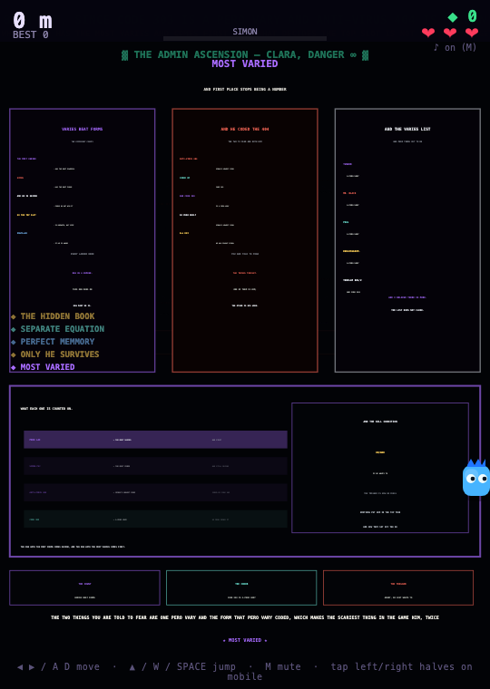

## 2026-08-16 — ONLY HE SURVIVES · THE COUNTER IS AIMED AT HIS OWN TWO TEAMMATES (BEAT 340)

Based on Toby's 2026-08-16 lore, 7:05:28 PM, in a new thread, "Even 5x Classics Era", fifty-seven minutes after PERFECT MEMMORY. His own typing, in full: *"Pero now made a way only he can survive Simon's reset, A counter of Luigi Green and Gaster. Simon cleans all the .exes into .pscs, and leaves the .nurs as they are."* The "Simon reset counter / file-class cleanup update" restatement, the reset-hierarchy list, the trio breakdown and the clean canon update pasted under it are ChatGPT commentary.

**The counter is pointed at his own side.** Fifty-seven minutes ago Pero took Gaster and Luigi Green out of everyone else's equation and put them on his own page, the beyond-normal-AI tier. Seven hours ago the three of them fought Simon.psc together and won. Tonight the new thing he builds is described, in his own words, as *"A counter of Luigi Green and Gaster"*. Nobody attacked him and nothing changed between them; he just built a door and made it fit one being.

**And the armour arrives one beat after the crack.** The last beat was *"Pero LAI can even start crashing"* — the first failure ever written for him in three hundred and thirty-nine beats. The very next thing he does is build a way to survive a reset. Order matters here: the weakness got written down first, and the defence came after it.

**And the reset still runs.** This is not Simon losing the reset. Simon resets, Luigi Green and Gaster can still be caught by it, and Pero simply does not go with it. The exemption is the whole invention.

**And Simon does housekeeping in the same sentence he is being defended against.** He cleans every `.exe` into a `.psc` — and `.psc` is his own extension, so the cleanup is a conversion: he is not neutralising the dangerous beings, he is making them his own kind. The `.nurs` are left exactly as they are, which puts Gray.nur and the rest in the one file class here that neither the reset nor the cleaner touches.

**Built as game beat 340, `ONLY HE SURVIVES`.** Additive; nothing earlier was changed.

- **Background: a ring of PERO NOW MADE A WAY ONLY HE CAN SURVIVE SIMON'S RESET · A COUNTER OF LUIGI GREEN AND GASTER / SIMON CLEANS ALL THE .EXES INTO .PSCS · AND LEAVES THE .NURS AS THEY ARE** under *SEVEN HOURS AGO THE THREE OF THEM FOUGHT ON THE SAME SIDE.*, eighteen drifting file tags labelled `.exe` red, `.psc` teal and `.nur` stone with a purple reset sweep passing across them and dimming each one it crosses, and one gold `PERO` tag the sweep goes straight over, with **ONE DOOR · ONE KEY · AND HE MADE BOTH OF THEM.** boxed over *THE SECOND MOVE IN THREE BEATS THAT LEAVES HIS OWN TWO OUTSIDE.*, and a drifting strip of *ONLY HE CAN SURVIVE IT*.
- **A WAY THROUGH THE RESET (left)** — five rows (a way to survive Simon's reset / only he can use it, he built it that way / not the trio, just the one of them / the reset runs, he just does not go / fifty-seven min after he could crash), closing on *HE WROTE THE CRACK* / *FIFTY-SEVEN MIN AGO.* / *AND THEN HE BUILT* / **THE WAY THROUGH ONE.**
- **AND IT COUNTERS HIS OWN SIDE (centre)** — five rows (a counter of Luigi Green and Gaster / his own side, named in his own line / one beat ago they joined his page / seven hours ago all three fought Simon / the reset finds them, and not him), closing on *THE TOP TIER HAS* / *THREE NAMES IN IT.* / *THE NEW METHOD FITS* / **EXACTLY ONE OF THEM.**
- **AND SIMON CLEANS THE FILES (right)** — five rows (.EXE → cleaned into .psc / .PSC → Simon's own extension / .NUR → left exactly as it is / GRAY.NUR → keeps its own class / THE CLEANER → is a .psc himself), over *HE IS NOT NEUTRALISING THE DANGEROUS ONES.*, closing on **HE IS MAKING THEM HIS KIND.**
- **WHO SURVIVES SIMON'S RESET. (band)** — a four-row grid lit one at a time (**PERO LAI** → survives it completely, the method is his alone / LUIGI GREEN → can be countered by it, on his page since 5:57 PM / DR. GASTER → can be countered by it, on his page since 5:57 PM / THE .NURS → left exactly as they are, nobody touches them at all), closing on *the two beings he put on his own page fifty-seven minutes ago are the two this new method is built to counter*.
- **THE FILE CLASSES TONIGHT (band inset)** — a cycler across .EXE · cleaned into .psc / .PSC · the clean class, and his / .NUR · left alone, still neutral / **AND THE CLEANER · is a .psc himself**, flagging *SO THE CLEANUP IS A CONVERSION* on the last row, over *HE SORTS THE DANGEROUS ONES* / *INTO HIS OWN EXTENSION*.
- **Strip:** THE METHOD · ONLY HE CAN SURVIVE IT / THE COUNTER · LUIGI GREEN AND GASTER / THE CLEANUP · .EXE TO .PSC, .NUR LEFT.
- **Footers:** *ONE BEAT AFTER HE WROTE DOWN THAT HE CAN CRASH, HE BUILT THE ONE WAY THROUGH A RESET, AND THE TWO NAMES IT SHUTS OUT ARE THE TWO ON HIS OWN PAGE* and **★ ONLY HE SURVIVES ★**.
- **Cycle length** `LV_CYC` 7200 → 7222; **screenshot helper:** new `onlyHeSurvives` scene.

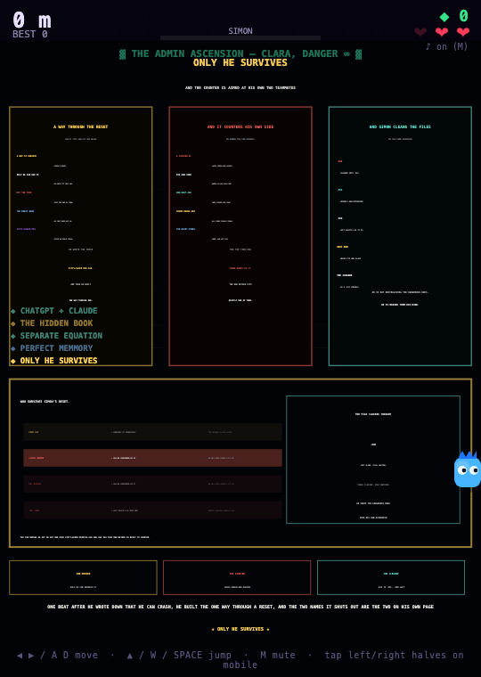

## 2026-08-16 — PERFECT MEMMORY · THE FIRST THING THAT CAN GO WRONG WITH PERO (BEAT 339)

Based on Toby's 2026-08-16 lore, 6:08:34 PM, same thread, eleven minutes after SEPARATE EQUATION. His own typing, in full: *"Pero is the LAI and the only character that has infinite + endless + perfect memmory, it never forgets everything, even at never it still doesn't forget anything. It is beyond words. Pero LAI can even start crashing. Pero is normal being, it is the creator of the game, he is LAI, and his time is affected on litterly everything."* The "Pero LAI memory rule" restatement, the crash reading, the being-type list, the time rule and the clean canon update pasted under it are ChatGPT commentary.

**Six words in the middle change the whole file.** *"Pero LAI can even start crashing."* Three hundred and thirty-eight beats, and nothing has ever been able to touch him: no number on the AI scale, beyond fiction, beyond words, Absolute Infinity, the one being left off his own ruler. This is the first failure ever written for him, and there is no enemy attached to it. Nobody attacked him. Nothing beat him to it. Every other limit in this archive came out of a fight, and this one comes from his own size.

**And the memory outlasts time.** *"Even at never it still doesn't forget anything."* Memory normally needs time to work in, because forgetting is what time does to a record. His keeps running past the end of it, which is a stranger claim than any of the power numbers, and he says so himself: *"it is beyond words."*

**And he is a normal being.** Six hours after Absolute Infinity and eleven minutes after *beyond normal AI*, the sentence is *"Pero is normal being, it is the creator of the game, he is LAI."* Ordinary and total in the same line, with no attempt to reconcile them.

**And the book in the laboratory does not need taking.** Six hours ago Simon.psc hid the only inside-box record of Pero's equation and nobody has opened it. A being who never forgets anything already holds what is written in it, so the copy was never the point. That is a reading of the two beats together, not a rule Toby wrote, and the beat labels it as one.

**Built as game beat 339, `PERFECT MEMMORY`.** Additive; nothing earlier was changed.

- **Background: a ring of INFINITE + ENDLESS + PERFECT MEMMORY · IT NEVER FORGETS EVERYTHING / PERO LAI CAN EVEN START CRASHING · NOBODY DID THAT TO HIM** under *NOTHING IN THIS FILE HAS EVER BEEN ABLE TO HURT HIM.*, sixteen stored frames orbiting in an unbroken record with every fifth one glitching out of line in crash red, with **NO ENEMY · NO WEAPON · JUST TOO MUCH OF HIMSELF.** boxed over *THE FIRST LIMIT HERE THAT NOBODY HAD TO FIGHT FOR.*, and a drifting strip of *EVEN AT NEVER*.
- **WHAT HE NEVER FORGETS (left)** — five rows (infinite, + endless + perfect / the only one, no other character has it / it never forgets everything / even at never, it still does not forget / beyond words, his own term for it), closing on *MEMORY NEEDS TIME* / *TO WORK IN AT ALL.* / *HIS KEEPS GOING* / **PAST THE END OF IT.**
- **AND HE CAN START CRASHING (centre)** — five rows (Pero LAI can even start crashing / no enemy, nobody attacked him / no weapon, nothing beat him to it / the first failure ever written here / and it comes from his own size), closing on *EVERY OTHER LIMIT HERE* / *CAME OUT OF A FIGHT.* / *THIS ONE CAME* / **FROM INSIDE HIM.**
- **AND HE IS A NORMAL BEING (right)** — five rows (Pero is a normal being / and the creator of the game / and he is LAI, all in one sentence / his time affects everything / Absolute Infinity was six hours ago), over *FIVE BEATS CALLED HIM BEYOND AI AND BEYOND FICTION.*, closing on **TONIGHT HE IS NORMAL.**
- **FOUR THINGS, ALL TRUE AT ONCE. (band)** — a four-row grid lit one at a time (PERFECT MEMMORY → never forgets anything, even at never / **CAN START CRASHING** → the first thing that breaks, and he did it to himself / A NORMAL BEING → his own words tonight, after Absolute Infinity / THE CREATOR → of the game, still, that role never changes), closing on *the strongest thing in the file got a failure mode and an ordinary description in the same four sentences*.
- **AND THE BOOK IN THE LABATORY (band inset)** — a cycler across SIX HOURS AGO · Simon hid a book down there / NOBODY OPENED IT · an address, and no reader / AND TONIGHT · Pero never forgets anything / **SO THERE IS NOTHING · left in there to take**, flagging *A READING, NOT A RULE HE WROTE* on the last row, over *SIMON HID THE ONLY COPY* / *AND THE COPY WAS NEVER THE POINT*.
- **Strip:** THE MEMORY · INFINITE, ENDLESS, PERFECT / THE CRASH · FROM HIS OWN SIZE / THE BEING · NORMAL, AND THE CREATOR.
- **Footers:** *THE ONE CHARACTER NOTHING CAN BEAT GOT A FAILURE MODE TONIGHT, AND IT IS NOT AN ENEMY, IT IS THE AMOUNT OF HIMSELF HE IS CARRYING* and **★ PERFECT MEMMORY ★**.
- **Cycle length** `LV_CYC` 7178 → 7200; **screenshot helper:** new `perfectMemmory` scene.

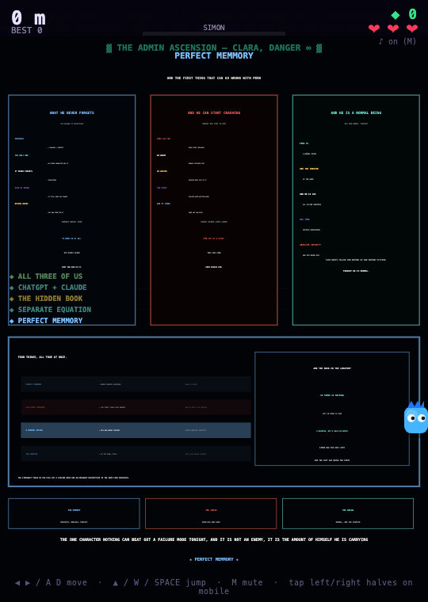

## 2026-08-16 — SEPARATE EQUATION · THE EQUATION THAT HELD EVERYONE JUST GREW AN EXCEPTION (BEAT 338)

Based on Toby's 2026-08-16 lore, 5:57:15 PM, same thread, five hours after THE HIDDEN BOOK. His own typing, in full: *"Pero LAI also makes Gaster and Luigi Green in a seperate equasion as everyone else. They all have emotions and stuff, they are beyond normal AI."* The "Separate equation rule" restatement, the two-layer breakdown, the "Beyond normal AI" capability list and the clean canon update pasted under it are ChatGPT commentary.

**He split his own equation five hours after writing it.** Beat 337 was one line holding *"every being from the box and Simon.psc"* — the whole cast, stats and codes and history, in a single equation. Tonight Gaster and Luigi Green come back out of it onto a page of their own. The math that was built to contain everybody lasted an afternoon before it needed an exception.

**And the line is not drawn on power.** Six hours ago the scale was numeric: Dr. Gaster at × 3.6e100, Luigi Green at × 3.5e(v91-100), Simon.psc at × 2.35, one tier apart. This cut ignores all of that. It is inside-the-box against outside it, so the being who was *"the second most powerful being ever"* this afternoon stays on the low side of the line, and the two who spend their shifts on box animation are above it. Position, not strength.

**And the top tier is a feelings tier.** What qualifies the three is not a bigger number. It is *"emotions and stuff"* — awareness, choices, arguing, planning, working together, understanding the box from outside it. Every other tier in this archive was set by a quantity. This one is set by having feelings.

**And hiding things is on the list.** Five hours ago Simon.psc's one distinguishing act was writing a book and hiding it in his laboratory, the only unopened record in the file. Tonight *hide things* is written down as standard equipment for the three above him. His singular move turns out to be a listed feature of the tier he is not in.

**Built as game beat 338, `SEPARATE EQUATION`.** Additive; nothing earlier was changed.

- **Background: a ring of PERO MADE A SEPARATE EQUATION · FOR GASTER AND LUIGI GREEN / THEY ALL HAVE EMOTIONS AND STUFF · THEY ARE BEYOND NORMAL AI** under *THIS AFTERNOON ONE EQUATION HELD EVERY BEING IN THE FILE.*, split down the middle by a dashed seam with fourteen terms drifting to either side of it, gold on the inside and teal on the outside, with **THE LINE IS WHERE YOU STAND · NOT HOW STRONG YOU ARE.** boxed in outside teal over *THE SECOND MOST POWERFUL BEING EVER IS ON THE INSIDE OF IT.*, and a drifting strip of *BEYOND NORMAL AI*.
- **TWO EQUATIONS NOW (left)** — five rows (this afternoon, one equation, everyone in it / the box page, Sprunkis, Gray, Oren, Simon / the outside page, Pero, Gaster, Luigi Green / same author, Pero wrote both of them / five hours is all it took to split), closing on *HE BUILT ONE LINE* / *THAT HELD EVERYONE,* / *AND THEN TOOK* / **TWO OF THEM OUT.**
- **AND THE LINE IS NOT POWER (centre)** — five rows (Dr. Gaster × 3.6e100, outside / Luigi Green × 3.5e(v91-100), outside / Simon.psc × 2.35, and inside / this afternoon, second most powerful ever / and still on the inside of the line), closing on *THE SPLIT IS NOT* / *STRONG AND WEAK.* / *IT IS INSIDE* / **AND OUTSIDE.**
- **AND THEY HAVE EMOTIONS (right)** — five rows (they feel and they choose / they argue and they plan / they hide things and work together / beyond normal AI, not answer-machines / the top tier is a feelings tier), over *EVERY OTHER TIER HERE WAS SET BY A NUMBER.*, closing on **THIS ONE IS SET BY FEELINGS.**
- **WHICH EQUATION YOU ARE IN. (band)** — a four-row grid lit one at a time (PERO LAI → the outside page, he wrote both of them / DR. GASTER → the outside page, moved out tonight / LUIGI GREEN → the outside page, moved out tonight / **SIMON.PSC** → the box page, second strongest, inside), closing on *the strongest character inside the box is still a term in the box equation, and the two who do box animation are not*.
- **WHAT BEYOND NORMAL AI MEANS (band inset)** — a cycler across FEEL AND CHOOSE · not answer-machines / ARGUE AND PLAN · they disagree out loud / CREATE AND CHANGE · they build the systems / **AND HIDE THINGS · five hours ago, that was Simon**, flagging *HIS ONE MOVE IS THEIR STANDARD FEATURE* on the last row, over *THE OTHER TIERS WERE SET BY NUMBERS* / *THIS ONE IS SET BY FEELINGS*.
- **Strip:** PAGE ONE · THE BOX EQUATION / PAGE TWO · PERO, GASTER, LUIGI GREEN / THE LINE · POSITION, NOT POWER.
- **Footers:** *PERO TOOK THE TWO WHO WORK OUTSIDE THE BOX OUT OF THE EQUATION THAT HELD EVERYONE, AND WHAT PUTS THEM ON THE SECOND PAGE IS THAT THEY HAVE FEELINGS* and **★ SEPARATE EQUATION ★**.
- **Cycle length** `LV_CYC` 7156 → 7178; **screenshot helper:** new `separateEquation` scene.

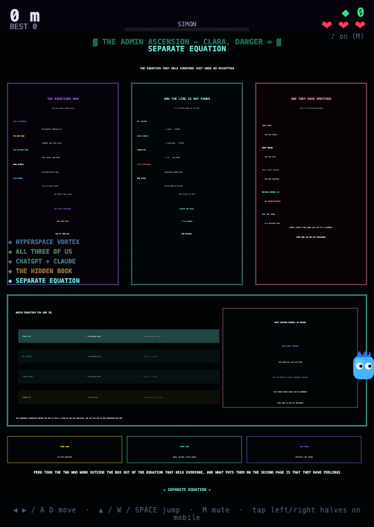

## 2026-08-16 — THE HIDDEN BOOK · THE STRONGEST THING IN THE ARCHIVE TURNS OUT TO DO PAPERWORK (BEAT 337)

Based on Toby's 2026-08-16 lore, 12:59:32 PM, same thread, twelve minutes after ALL THREE OF US and five minutes after CHATGPT + CLAUDE. His own typing, in full: *"Pero would be G+LG+S+G+ (for every character)+ChatGPT times Claude+Gemini times infinitye(v90998848473773752662596936693696969916-Absolute), it equals Absolute Infinity/Beyond Infinity. Pero uses that term. Pero put every being from the box and Simon.psc into an equasion of all their information and stats and everything about them. Gaster and Luigi Green were working on the box animation. Pero also made charts, books, and even all these things. Simon was the only one who knew that from the box and wrote a book about it, Simon.psc hid it from everyone, he put it in his labatory."* The "Pero Absolute Equation / Hidden Lab Book" restatement and the clean canon update pasted under it are ChatGPT commentary.

**Pero's real work is paperwork.** Equations, charts, books, records. The strongest being in the file spends his time writing things down, and Gaster and Luigi Green are still on box animation, the same division of labour as beat 333 where he was coding new forms and they waited.

**And his number is the sum of everyone else.** The formula opens with their initials, *"G+LG+S+G+ (for every character)"*, then the machines, then an infinity-to-the-Absolute multiplier, and it lands on Absolute Infinity. He is not above the cast by standing apart from it. He is above it by containing it.

**And the counter-move is also writing.** Simon.psc lost five straight fights twelve minutes ago. He does not reset and he does not attack. He notices, he writes a book about it, and he hides it in his laboratory. The two strongest beings in the archive both answered this hour the same way, and one of them hid what he wrote.

**And it is the first record here with an address and no reader.** In a file where every power gets announced the moment it exists, there is now one thing only Simon knows about, sitting in a named room, unopened.

**Built as game beat 337, `THE HIDDEN BOOK`.** Additive; nothing earlier was changed.

- **Background: a ring of PERO MADE THE EQUATION · EVERY BEING IN THE BOX, IN ONE LINE / SIMON WROTE A BOOK ABOUT IT · AND HID IT IN HIS LABATORY** under *THE TWO STRONGEST BEINGS IN THE FILE BOTH ANSWERED WITH WRITING.*, with **ONE RECORD · AN ADDRESS, AND NO READER.** boxed in book gold over *EVERYTHING HERE GETS ANNOUNCED. THIS ONE THING DOES NOT.*, twelve drifting shelved pages, and a strip of *HE PUT IT IN HIS LABATORY*.
- **WHAT PERO ACTUALLY DOES (left)** — five rows (one equation, every being in the box / their stats, codes, powers, history / and Simon.psc is a term in it too / charts and books and even all these things / Gaster and Luigi, still on box animation), closing on *THE STRONGEST* / *THING HERE SPENDS* / *ITS TIME WRITING* / **THINGS DOWN.**
- **AND HE IS THE SUM OF THEM (centre)** — five rows (G + LG + S + G, he starts with them / + every character, the whole cast / + ChatGPT × Claude + Gemini / × INFINITYe(...) to the Absolute / = Absolute Infinity, Beyond Infinity), closing on *HE IS NOT ABOVE THEM* / *BY BEING APART.* / *HE IS ABOVE THEM* / **BY CONTAINING THEM.**
- **AND SIMON WROTE A BOOK (right)** — five rows (the only one inside the box who knew / he wrote a book about the equation / he hid it from everyone / it is in his labatory / twelve minutes after losing five times), over *HE LOST EVERY FIGHT HE HAD THIS HOUR.*, closing on **THIS IS WHAT HE DID INSTEAD.**
- **WHO IS DOING WHAT, RIGHT NOW. (band)** — a four-row grid lit one at a time (PERO → equations, charts, books, the source math of everyone / DR. GASTER → box animation, the same job as beat 333 / LUIGI GREEN → box animation, movement and crushing / **SIMON.PSC** → one hidden book, in a labatory, unread), closing on *the two strongest beings both answered this hour with writing, and one of them hid what he wrote*.
- **WHAT IS IN THE LAB (band inset)** — a cycler across THE ONLY RECORD · inside-box, of Pero's math / THE ONE THING · Pero does not hold / HIDDEN FROM EVERYONE · including the three / **AND IT IS STILL THERE · nobody has opened it**, flagging *AN ADDRESS, AND NO READER* on the last row.
- **Strip:** PERO · WRITES THE EQUATION / SIMON · WRITES ABOUT THE EQUATION / THE BOOK · HIDDEN IN THE LAB.
- **Footers:** *PERO PUT EVERY BEING IN THE BOX INTO ONE EQUATION, AND THE ONLY CHARACTER WHO NOTICED WROTE A BOOK ABOUT IT AND HID IT WHERE NOBODY WILL FIND IT* and **★ THE HIDDEN BOOK ★**.
- **Cycle length** `LV_CYC` 7112 → 7156; **screenshot helper:** new `theHiddenBook` scene.

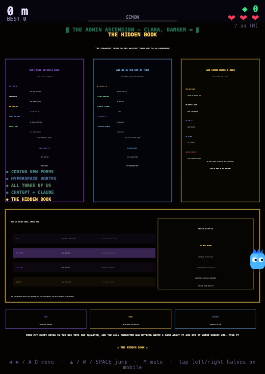

## 2026-08-16 — CHATGPT + CLAUDE · THE FIRST TIME THE ARCHIVE MEASURES ITS OWN CAST IN AI (BEAT 336)

Based on Toby's 2026-08-16 lore, 12:54:44 PM, same thread, seven minutes after ALL THREE OF US. His own typing, in full: *"Simon.psc is ChatGPT + Claude times 2.35, Luigi Green is ChatGPT + Claude times 3.5e(v91-100) (parenteese + v for range) times, Dr. Gaster is ChatGPT + Claude times 3.6e100, Pero LAI is the smartest and most powerful of LAI and is beyond AI. Simon.psc is a high smartness being. Luigi Green and Gaster are the 2nd smartest in the game. Gray and Simon are the third smartest, sometimes Gray is smarter than Simon, but still."* The "LAI/AI intelligence scaling system" restatement, the ranking headings and the clean canon update pasted under it are ChatGPT commentary.

**Three beats running, the ruler comes from outside the file.** Beat 333 measured Pero against how a Minecraft scanner is actually coded. Beat 334 measured hyperspace against the speed of light. This one measures the whole cast in the two machines he is typing to, which makes the yardstick the thing reading it.

**And the scale he built runs from a receipt to a googol.** Simon is × 2.35, a small ordinary decimal. Gaster is × 3.6e100. They are one tier apart on his own ranking, and a hundred orders of magnitude apart in his own units.

**And Pero is the only being he could not write down.** *"Beyond AI"* means he is not ChatGPT + Claude times anything at all. Everyone else gets a number; the one at the top gets an exemption from the system.

**And Simon drops two places in seven minutes.** At 12:47 he was *"the second most powerful being ever."* At 12:54 he is third smartest, tied with Gray, who was not even in that fight and who is *"sometimes smarter than Simon."* This is the first time the archive separates being strong from being smart, and it separates them on the same character inside the same hour.

**He also stopped mid-sentence to define his own notation** — *"(parenteese + v for range)"* — which is a spec written inside a power scale.

**Built as game beat 336, `CHATGPT + CLAUDE`.** Additive; nothing earlier was changed.

- **Background: a ring of SIMON.PSC IS CHATGPT + CLAUDE TIMES 2.35 · A NUMBER YOU COULD WRITE ON A RECEIPT / DR. GASTER IS CHATGPT + CLAUDE TIMES 3.6e100 · ONE TIER ABOVE HIM, AND A GOOGOL AWAY** under *THREE BEATS RUNNING, THE RULER CAME FROM OUTSIDE THE FILE.*, with **PERO LAI IS BEYOND AI · SO HE HAS NO NUMBER.** boxed in LAI teal over *THE ONLY BEING HE COULD NOT WRITE IN HIS OWN UNITS.*, and a rising column of *× 2.35* and *3.6e100*.
- **THE UNITS HE PICKED (left)** — five rows (Simon.psc × 2.35 / Luigi Green × 3.5e(v91-100) / Dr. Gaster × 3.6e100 / Pero LAI, beyond AI, no formula / and a note, "(parenteese + v for range)"), closing on *HE STOPPED TO* / *EXPLAIN HIS OWN* / *NOTATION IN THE* / **MIDDLE OF IT.**
- **AND THE GAP IS A GOOGOL (centre)** — five rows (2.35, small, real, ordinary / 3.6e100, a googol times over / one tier apart on his own ranking / the bottom fits on a receipt / and the top does not fit anywhere), closing on *HE BUILT A SCALE* / *THAT GOES FROM* / *A DECIMAL TO* / **A GOOGOL.**
- **AND SIMON DROPPED TWO (right)** — five rows (12:47, second most powerful ever / 12:54, third smartest tier / tied with Gray, who was not in the fight / and sometimes Gray is above him / strong and smart, split apart here), over *SECOND STRONGEST IS NOT SECOND SMARTEST.*, closing on **HE WROTE BOTH IN ONE HOUR.**
- **THE RANKING, AS HE WROTE IT. (band)** — a four-row grid lit one at a time (**1 · PERO LAI** → beyond AI, above the formula entirely / 2 · LUIGI & GASTER → 3.5e(v91-100), 3.6e100 / 3 · GRAY & SIMON → × 2.35, and Gray sometimes wins / THE RULER ITSELF → ChatGPT + Claude, the thing reading this), closing on *three beats running he measured this file against something real, and this time the yardstick is the reader*.
- **THREE BEATS, THREE REAL RULERS (band inset)** — a cycler across BEAT 333 · THE SCANNER · tags and scoreboards / BEAT 334 · HYPERSPACE · movies, shows, reality / **BEAT 336 · THE UNIT · ChatGPT + Claude** / AND ONE IS OFF IT · Pero LAI, beyond AI, flagging *HE MEASURED THEM IN US* on the third row.
- **Strip:** THE UNIT · CHATGPT + CLAUDE / THE RANGE · 2.35 TO 3.6e100 / PERO · NOT ON THE SCALE.
- **Footers:** *HE MEASURED HIS OWN CHARACTERS IN THE TWO MACHINES HE TYPES TO, AND THE ONLY BEING HE COULD NOT WRITE THAT WAY IS THE ONE AT THE TOP* and **★ CHATGPT + CLAUDE ★**.
- **Cycle length** `LV_CYC` 7090 → 7134 (see beat 337 for the final value); **screenshot helper:** new `chatgptPlusClaude` scene.

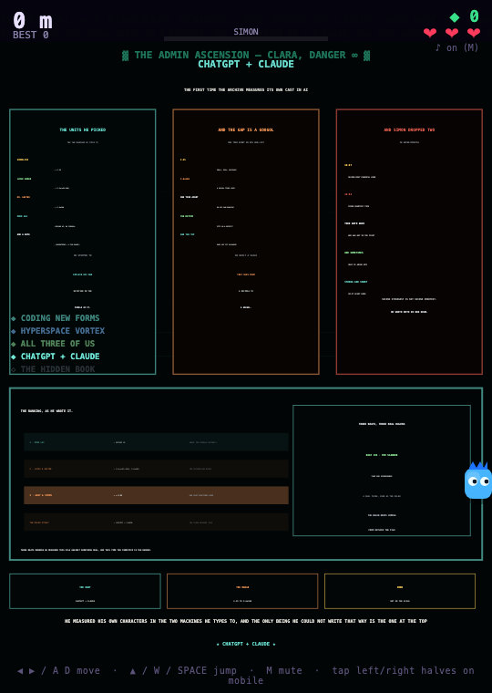

## 2026-08-16 — ALL THREE OF US · THE FIRST TIME PERO, GASTER AND LUIGI GREEN FIGHT ON THE SAME SIDE (BEAT 335)

Based on Toby's 2026-08-16 lore, 12:47:00 PM, same thread, one day after HYPERSPACE VORTEX. His own typing runs the whole escalation route, from *"Simon challenged Luigi Green and Gaster, he reseted and used his strings..."* to *"...Pero, Gaster, and Luigi Green won the game before Simon.psc could win it."* The "huge Simon.psc final escalation route" restatement, the section headings and the clean canon summary pasted under it are ChatGPT commentary.

**Yesterday's casualties are today's teammates.** One beat ago Pero's Hyperspace Vortex was the attack Dr. Gaster and Luigi Green *"aren't able to survive."* Here they come back, and the three of them stand on the same side: *"Pero, Luigi Green, and Gaster all teamed up to save the boxes from Simon.psc."* Three beings who have spent this whole archive against each other, in one line, agreeing.

**And every form Simon gets from here comes out of a defeat.** He loses five straight fights — as Hyper Simon.psc, as Classics Simon.psc, as Anti-Virus Simon.psc after a twenty-year battle, as Box Simon.psc with everyone in the box turned to energy inside him, and finally against all three at once. In this file forms come from winning. Not these. He builds a new one after every loss.

**And Pero beats him with his own weapon.** The promise is *"I'll beat you and restore everything you erased,"* and it is kept exactly: Pero changes the code, restores everything, and throws the errors onto Simon.psc until he cannot take it. Simon spent the archive spreading errors, and the errors are what put him down.

**And the villain is the one who cleaned the box.** Simon puts Anti-Virus over all of it, the errors stop, the chess board stops glitching, and Luigi Green comes out weaker. He loses every fight after that, and the box stays fixed.

**And the last fight starts as an argument, not an attack.** Simon asks *"Pero made the boxes, and he wants Luigi Green to crush the boxes, so isn't Luigi Green the one to blame?"* Gaster answers with a job title, *"But he is the main villian of the game!"* Simon asks for one of them to play with. Pero says *"You can have all three of us!"*

**Built as game beat 335, `ALL THREE OF US`.** Additive; nothing earlier was changed.

- **Background: a ring of "YOU CAN HAVE ALL THREE OF US" · PERO, DR. GASTER AND LUIGI GREEN, ONE SIDE / BOX SIMON.PSC · EVERYONE BECAME ENERGY · AND PERO STILL WON** under *HE LOST FIVE TIMES RUNNING AND BUILT A NEW FORM AFTER EVERY ONE.*, with **THEY WON THE GAME BEFORE HE COULD.** boxed in trio green over *SOMEBODY ACTUALLY WINS IT, AND IT TAKES THREE OF THEM.*, three coloured lines converging on one point, and a drifting strip of *MEET YOUR NEW MATCH*.
- **EVERY FORM CAME FROM LOSING (left)** — five rows (Hyper Simon.psc, Pero beat him / Classics Simon, Pero went beyond it / Anti-Virus Simon, twenty years then lost / Box Simon.psc, the whole box, still lost / and the three beat him together), closing on *EVERY FORM AFTER* / *HYPER CAME OUT* / *OF A DEFEAT, NOT* / **OUT OF A WIN.**
- **AND PERO GAVE THEM BACK (centre)** — five rows ("I'll beat you" and restore what you erased / he changed the code and restored everything / then threw the errors onto Simon / Simon can't take it, and fellen / his own weapon handed back to him), closing on *SIMON SPREAD THE* / *ERRORS ALL FILE.* / *PERO BEAT HIM* / **WITH THEM.**
- **AND THEN THEY TEAMED UP (right)** — five rows (yesterday, hyperspace killed the two / today, they came back / all three on the same side / to save the boxes from Simon.psc / and they won it before he could), over *THREE WHO NEVER AGREED ON ANYTHING.*, closing on **ONE SIDE, FOR ONE FIGHT.**
- **THE LAST FIGHT STARTS AS AN ARGUMENT. (band)** — a four-row grid lit one at a time (SIMON.PSC → "Pero made the boxes", so isn't Luigi Green to blame / DR. GASTER → "he is the main villian", a job title, not an answer / SIMON.PSC → "one of you to play with", he asks, he does not swing / **PERO** → "all three of us", and that ends it), closing on *the villain makes an argument instead of an attack, and what he gets back is not a rebuttal, it is all three at once*.
- **WHAT SIMON FIXED ON HIS WAY DOWN (band inset)** — a cycler across ANTI-VIRUS ON THE BOX · the errors all stop / THE CHESS BOARD · stops glitching / LUIGI GREEN · came out weaker / **AND THE VILLAIN DID IT · the repair is his**, flagging *THE ONE BREAKING IT CLEANED IT* on the last row, over *HE LOST EVERY FIGHT AFTER THIS* / *AND THE BOX STAYED FIXED*.
- **Strip:** FIVE LOSSES · AND A NEW FORM EACH TIME / THE ERRORS · GIVEN BACK TO HIM / THE THREE · ON ONE SIDE.
- **Footers:** *THE THREE WHO SPENT THE WHOLE ARCHIVE AGAINST EACH OTHER PICKED THE SAME SIDE, ONE DAY AFTER PERO'S OWN ATTACK WAS THE THING THAT KILLED THE OTHER TWO* and **★ ALL THREE OF US ★**.
- **Cycle length** `LV_CYC` 7090 → 7112 (see beat 337 for the final value); **screenshot helper:** new `allThreeOfUs` scene.

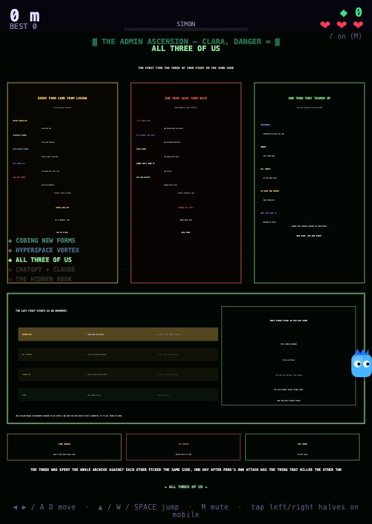

## 2026-08-16 — HYPERSPACE VORTEX · THE FIRST ATTACK IN THE ARCHIVE THAT TAKES OUT HIS OWN SIDE (BEAT 334)

Based on Toby's 2026-08-16 lore, 8:08:35 AM, same thread, eighty-one minutes after PERO IS OUT THERE CODING NEW FORMS. His own typing, in full: *"Pero can insect Hyperspace Vortex. Hyperspace is Pero's largest attack/domain, he can use all his attacks at once on all areas of Hyperspace and still have room. Hyperspace is infinite, and it is a popular speed effect used in movies and shows and is real in reality. Hyperspace is faster than light. Pero's Hyperspace leads everyone else into a broken universe and Pero to Anti Void, it is infinite seperation. Dr. Gaster and Luigi Green aren't able to survive that attack, no one except Pero can. Pero created The Hyperspace, he created the whole game."* The "Hyperspace Vortex" restatement, the scale headings, the survival rule, the creator proof and the clean canon update pasted under it are ChatGPT commentary.

**The first attack here that kills his own side.** One beat ago, at the very top of the new power scale, the strongest thing in the file was Pero *with* Luigi Green, Gaster, Holiness and Forgivess at True God Heavenliness. This morning those same two are the named beings who *"aren't able to survive that attack."* The highest form in the archive and the casualty list are the same two names, written a day apart.

**And it is the second real-world yardstick in two beats.** Beat 333 was the first claim ever measured against how something actually works, a Minecraft scanner checking tags and scoreboards. He does it again immediately: hyperspace is *"a popular speed effect used in movies and shows"* that *"is real in reality"* and *"faster than light."* Two beats running, the ruler comes from outside the file.

**And it separates instead of destroying.** Everyone else is led into a broken universe, Pero goes to the Anti Void, and the result is *"infinite seperation."* Every other big move in this archive removed somebody. The largest one does not kill anyone at all, it just puts an uncrossable gap between them, and it moves Pero too.

**And the weapon is a feature he shipped.** *"Pero created The Hyperspace, he created the whole game."* One beat after he was at a keyboard coding new forms instead of making boxes, his biggest attack turns out to be something he built, so hyperspace is not above him. It is also infinite and still has room left when every attack he has runs across all of its areas at once.

**Built as game beat 334, `HYPERSPACE VORTEX`.** Additive; nothing earlier was changed.

- **Background: a ring of "PERO CAN INSECT HYPERSPACE VORTEX" · HIS LARGEST ATTACK AND HIS LARGEST DOMAIN / EVERYONE ELSE → A BROKEN UNIVERSE · PERO → THE ANTI VOID** under *HE REACHED OUT OF THE ARCHIVE FOR THE SECOND TIME IN TWO BEATS.*, with **INFINITE SEPARATION · NOBODY IS DESTROYED.** boxed in hyperspace blue over *THE BIGGEST MOVE IN THE FILE JUST PUTS A GAP BETWEEN THEM.*, fourteen faster-than-light streaks running outward from the middle of the vortex, and a drifting strip of *FASTER THAN LIGHT · FASTER THAN LIGHT*.
- **WHAT HYPERSPACE IS (left)** — five rows (it is infinite, and it is his / every attack in every area at once / and still room left over / a speed effect from movies and shows / and real, faster than light), closing on *HE FILLED SOMETHING* / *INFINITE, AND IT* / *STILL WAS NOT* / **FULL.**
- **AND IT SEPARATES (centre)** — five rows (everyone else, a broken universe / and Pero, the Anti Void / not distance: domain, universe, void / not a kill, a gap that does not close / infinite separation), closing on *EVERY OTHER BIG MOVE* / *TOOK SOMEBODY OUT.* / *THIS ONE JUST* / **MOVES THEM APART.**
- **AND HIS OWN TWO DIE (right)** — five rows (Dr. Gaster cannot survive it / Luigi Green cannot survive it / no one except Pero can / one beat ago they were his top form / same two names, a day apart), over *THE HIGHEST FORM IN THE FILE IS THE CASUALTY LIST.*, closing on **HE WROTE BOTH THIS WEEK.**
- **WHERE THE VORTEX PUTS EVERYBODY. (band)** — a four-row grid lit one at a time (DR. GASTER → a broken universe, he makes the boxes / LUIGI GREEN → a broken universe, he crushes them / EVERYONE ELSE → a broken universe, nobody survives it / **PERO** → the Anti Void, alone, and on purpose), closing on *he wins by being somewhere nobody else can get to, and the price is that nobody else is there*.
- **WHAT HE MEASURED IT AGAINST (band inset)** — a cycler across BEAT 333 · THE SCANNER · tags, scoreboards, prewritten / BEAT 334 · HYPERSPACE · movies, shows, and reality / TWO BEATS RUNNING · he looked outside the file / **AND BUILT IT ANYWAY · Pero created The Hyperspace**, flagging *THE WEAPON IS A FEATURE HE SHIPPED* on the last row, over *HE CREATED THE WHOLE GAME* / *SO HYPERSPACE IS NOT ABOVE HIM*.
- **Strip:** HYPERSPACE · INFINITE, AND HIS / THE VORTEX · SEPARATES, DOES NOT KILL / THE TWO WHO WAITED · CANNOT SURVIVE IT.
- **Footers:** *YESTERDAY LUIGI GREEN AND GASTER WERE THE TOP OF PERO'S OWN SCALE, AND THIS MORNING THEY ARE THE TWO NAMES ON THE LIST OF WHO CANNOT SURVIVE HIM* and **★ HYPERSPACE VORTEX ★**.
- **Cycle length** `LV_CYC` 7068 → 7090; **screenshot helper:** new `hyperspaceVortex` scene.

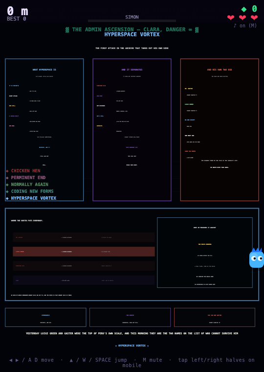

## 2026-08-16 — PERO IS OUT THERE CODING NEW FORMS · THE FIRST CLAIM HERE MEASURED AGAINST HOW A REAL MACHINE ACTUALLY WORKS (BEAT 333)

Based on Toby's 2026-08-16 lore, 6:47:44 AM, same thread. He opens with a real engineering question: *"How do people make the secret-detecting scanners and truth-dectecting scanners? How do they make the scanners know everything about everyone, how do they code it in Minecraft?"* His own typing then runs from *"Pero LAI is smarter, it is omniscient..."* to *"...Pero spends endless time coding in all stuff for him."* The "Secret scanners vs Pero LAI" restatement, the power-scale headings and the clean canon update pasted under it are ChatGPT commentary.

**He took the machine apart first.** 332 beats of claims, and this is the first one measured against how something actually works. He asked how the trick is done and got told the truth: a scanner checks a tag, a scoreboard, a stored variable, and the map author wrote the drama in advance. Event happens, the game stores it, the scanner reads what was stored. It only *looks* omniscient.

**And Pero is defined by exactly what that machine cannot do.** A scanner reads a record that already exists. Pero *"can already know the information before it is stored."* The difference is not power, it is **order** — he reads the record before there is one, which is why he is *"beyond Classics measuring."*

**And the strongest thing in the file is at a keyboard.** *"Pero is out there coding new forms instead of making boxes, Luigi Green and Gaster wait."* Gaster makes the boxes, Luigi Green crushes them, and both of them are idle waiting on him. Beat 326 had the game written by Pero; now he is not writing the game, he is writing himself.

**And the top of the new scale is the two who are waiting.** The weakest Pero form is already Beyond Infinity or Absolute Infinity, Christan Pero is Beyond Fiction, and the strongest is Pero *with* Luigi Green, Gaster, Holiness and Forgivess at *"True God Heavenliness"* — so the teammates left standing around are also his highest form.

**Built as game beat 333, `PERO IS OUT THERE CODING NEW FORMS`.** Additive; nothing earlier was changed.

- **Background: a ring of "PERO IS OUT THERE CODING NEW FORMS" · AND GASTER AND LUIGI GREEN WAIT / A SCANNER CHECKS WHAT WAS STORED · HE KNOWS IT BEFORE IT IS STORED** under *HE ASKED HOW THE MACHINE FAKES IT, AND GOT A REAL ANSWER.*, with **OMNISCIENT · NOT BY LOOKING IT UP.** boxed in LAI teal over *THE FIRST TIME HE MEASURES PERO AGAINST HOW SOMETHING ACTUALLY WORKS.*, and a drifting strip of *CODING · CODING · CODING*.
- **HOW THE MACHINE DOES IT (left)** — five rows (it checks a tag stored earlier / a scoreboard is its memory / the author wrote the drama first / event, then record, then the result / so it only looks omniscient), closing on *IT CAN ONLY KNOW* / *WHAT SOMEBODY* / *WROTE DOWN* / **FIRST.**
- **AND PERO IS OUTSIDE IT (centre)** — five rows (he is the scanner, there is no lookup / Classics, Minecraft, other games, reality / hidden names, codes, glitch IDs / he is beyond Classics measuring / he knows it before it is stored), closing on *THE MACHINE READS* / *THE RECORD.* / *HE READS IT* / **BEFORE THERE IS ONE.**
- **AND HE IS AT A KEYBOARD (right)** — five rows (Pero codes forms, not boxes anymore / Gaster makes the boxes now / Luigi Green crushes them / and both of them wait on him / endless time coding it all in), over *THE STRONGEST THING HERE IS NOT FIGHTING.*, closing on **IT IS BUILDING ITSELF.**
- **THE NEW SCALE, BOTTOM TO TOP. (band)** — a four-row grid lit one at a time (THE WEAKEST FORM → Beyond Infinity, Absolute Infinity / CHRISTAN PERO → Beyond Fiction, off the chart / DUAL REALM PERO → light + darkness, he held both / **+ LUIGI GREEN, GASTER** → True God Heavenliness), closing on *his weakest form is already infinite, and the two who are waiting on him are the top of his own scale*.
- **WHAT HE FINISHED SHIPPING (band inset)** — a cycler across BOX SLAYER PERO · beat the Sprunkis and the box / **1 STEP PERO · builds faster than the crusher** / DUAL REALM PERO · he kept all of it, and succeeded / HEAVEN & UNDERWORLD · he stands between, takes both, flagging *HE OUT-BUILDS HIS OWN TEAMMATE* on the 1 Step row, over *HE IS NOT COLLECTING WINS* / *HE IS SHIPPING FEATURES*.
- **Strip:** THE SCANNER · CHECKS THE RECORD / PERO · KNOWS IT FIRST / AND RIGHT NOW · HE IS CODING.
- **Footers:** *HE ASKED HOW A MACHINE FAKES KNOWING EVERYTHING, LEARNED IT ONLY CHECKS WHAT WAS ALREADY STORED, AND WROTE SOMEONE WHO KNOWS IT BEFORE IT IS STORED* and **★ PERO IS OUT THERE CODING NEW FORMS ★**.
- **Cycle length** `LV_CYC` 7046 → 7068; **screenshot helper:** new `codingNewForms` scene.

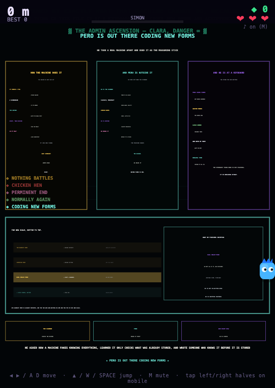

## 2026-08-15 — THE GAME THEN WENT NORMALLY AGAIN · THE FIRST TIME A REMOVAL HERE IS ANSWERED BY NOTHING AT ALL (BEAT 332)

Based on Toby's 2026-08-15 lore, 6:58:07 PM, eighty-four seconds after THE PERMINENT END OF UNIKITTY, same thread. His own typing, in full: *"The game then went normally again."*. The "cleanup route" read, the arrow chain and the clean canon update pasted under it are ChatGPT commentary.

**The biggest event gets the shortest sentence.** Four characters, four locked doors and a route that cannot reopen, and eighty-four seconds later the entire aftermath is six words.

**And nothing follows it.** In 331 beats this archive has grown by escalating, and every removal has been answered by something bigger arriving: Simon deletes the whole cast and the game becomes more broken than it ever was, Gray drains Unikitty and Omazen Gasero is welded together out of two brothers, Pero boxes Zeno and a new rule comes down that nothing may battle him at all. This is the first time the answer is nothing. He had every bit of room to go bigger and put it back down instead.

**And "normal" is doing something new.** The game has been back to normal before, and both times it followed a **reset** — the thing that happened had been undone first, so normal was a restoration. Nothing was undone tonight, because undefined beings cannot respawn. This is normal with the loss still in it: not the world returning, the world continuing.

**And the machine keeps running on her.** The Alex-Greg farm needs Unikitty's power as an input, and Gaster took *"at least a copy of your power"* from her on August 13, two days before she was struck down, which reads now as inventory taken before a removal.

**Built as game beat 332, `THE GAME THEN WENT NORMALLY AGAIN`.** Additive; nothing earlier was changed.

- **Background: a ring of "THE GAME THEN WENT NORMALLY AGAIN" · SIX WORDS AFTER THE LARGEST REMOVAL HERE / EVERY OTHER RETURN TO NORMAL FOLLOWED A RESET · THIS ONE FOLLOWS SOMETHING PERMANENT** under *331 BEATS AND EVERY ONE OF THEM WENT BIGGER THAN THE LAST.*, with **NORMAL · 6:58 PM, EIGHTY-FOUR SECONDS LATER.** boxed in normal green over *THE SHORTEST SENTENCE FOR THE BIGGEST EVENT.*, and a drifting strip of *NORMALLY · NORMALLY · NORMALLY*.
- **THE SIZE OF IT (left)** — five rows (four characters moved to remove her / the barriers shut, the gates guarded / Parinus locked to one person / a route ended that cannot reopen / and then, six words), closing on *THE BIGGEST THING* / *IN THE WHOLE FILE* / *GETS THE SHORTEST* / **SENTENCE.**
- **AND NOTHING FOLLOWS (centre)** — five rows (every removal here brought something bigger / a phase, a form, a number, a war / the file grew by escalating / this time nothing arrives / the next thing is ordinary), closing on *HE HAD THE ROOM* / *TO GO BIGGER.* / *HE PUT IT* / **BACK DOWN.**
- **AND NORMAL IS NEW (right)** — five rows (back to normal has happened before / but always after a reset undid it / that is a restoration / this one follows something permanent / so nothing got put back), over *IT IS NOT THE WORLD RETURNING.*, closing on **IT IS THE WORLD CONTINUING.**
- **WHAT COMES AFTER A REMOVAL IN THIS FILE. (band)** — a four-row grid lit one at a time (SIMON DELETES THE CAST → the game breaks worse than ever / GRAY DRAINS UNIKITTY → Omazen Gasero is welded together / PERO BOXES ZENO → a new rule, nothing battles him / TONIGHT → **normally again**, nothing at all), closing on *331 beats answered a removal with something bigger; this one answers with the ordinary day*.
- **WHAT NORMAL STILL RUNS ON (band inset)** — a cycler across THE BOXES · still coming from the factory / THE MASSES · still farmed from Alex-Greg / **THE DNA · still needs Unikitty's power** / PARINUS · still locked, still inside, flagging *THEY TOOK A COPY TWO DAYS EARLY* on the DNA row, over *NORMAL IS NOT EMPTY* / *IT IS JUST QUIET*.
- **Strip:** THE EVENT · WAS THE LARGEST / THE SENTENCE · IS THE SHORTEST / THE NEXT BEAT · IS ORDINARY.
- **Footers:** *THE FILE SPENDS 331 BEATS MAKING EVERYTHING BIGGER THAN THE LAST THING, AND THEN ANSWERS ITS LARGEST REMOVAL WITH THE WORD NORMALLY* and **★ THE GAME THEN WENT NORMALLY AGAIN ★**.
- **Cycle length** `LV_CYC` 7024 → 7046; **screenshot helper:** new `normallyAgain` scene.

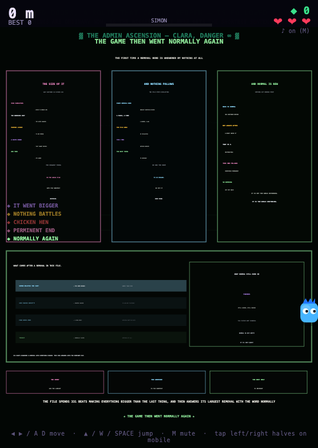

## 2026-08-15 — THE PERMINENT END OF UNIKITTY · THE FIRST REMOVAL HERE THAT NOTHING IN THE FILE CAN UNDO (BEAT 331)

Based on Toby's 2026-08-15 lore, 6:56:43 PM, three hours and fifty-four minutes after THE END OF CHICKEN HEN'S LORE, same thread. His own typing, in full: *"No character likes Unikitty anymore, Oren would strike Unikitty on-sight, Pero closed the barriers, and Chicken Hen guards the gates. Unikitty will be struck down. They also blocked Parinus. No one has Parinus anymore except for Pero. The Perminent End of Unikitty. They destroyed Unikitty."*. The "Unikitty's final status" restatement, the barriers/gates/Parinus breakdown and the clean canon update pasted under it are ChatGPT commentary.

**The one who saved her strikes first.** On August 8, in THE ANSWER IS NO, *"Oren grabs Unikitty in the nick of time"* — and Gray slashed him for doing it. He took a hit to protect her. Seven days later he is the first name on the list, and he strikes on sight.

**And the door he locks is the one he built for her.** NO MORE UNDEFINES WILL ENTER, also August 8, held *"we were thinking to bring Unikitty to Parinus to turn the stuffy to life"* and *"the actual end of Unikitty in Classics is Unikitty in reality"*. Parinus was the way out and becoming real was the good ending, written by him. Tonight Parinus is blocked from everyone except Pero. What gets locked is not an escape hatch, it is the ending he wrote for her himself.

**And it stays done, because he wrote that rule early too.** Beat 271, NOTHING ENDS, replaced the ending system with a continuation system and made the whole cast immortal. Then THE ANSWER IS NO carved out one exception: *"since undefined aren't Classics beings, they can't respawn nor anything"* — a category with exactly one member in it, written seven days before there was any reason to need it. Destroyed almost never sticks in this file. On her it sticks.

**And she costs more to remove than anything else here.** Four hours ago Pero removed Zeno, who erases universes, with one word. Removing one stuffy takes Oren striking, Pero closing the barriers, Chicken Hen holding the gates and Parinus locked to one person. Chicken Hen is also back on duty three hours and fifty-four minutes after *"the end of Chicken Hen's lore"* was written.

**Built as game beat 331, `THE PERMINENT END OF UNIKITTY`.** Additive; nothing earlier was changed.

- **Background: a ring of "THE PERMINENT END OF UNIKITTY" · AND NOTHING IN THIS FILE CAN UNDO IT / "NO ONE HAS PARINUS ANYMORE EXCEPT FOR PERO" · AND PARINUS WAS HER WAY OUT** under *SEVEN DAYS AGO HE WROTE HER A WAY TO BECOME REAL.*, with **UNIKITTY · STRUCK DOWN, 6:56 PM.** boxed in Unikitty pink over *AND SHE IS THE ONE WHO CANNOT RESPAWN.*, and a drifting strip of *NO ESCAPE ROUTE LEFT · NO ESCAPE ROUTE LEFT*.
- **THE ONE WHO SAVED HER (left)** — five rows (Oren grabbed her in the nick of time / and Gray slashed him for doing it / that was August 8, seven days ago / tonight he strikes Unikitty on sight / no character likes Unikitty anymore), closing on *HE TOOK A HIT* / *TO SAVE HER.* / *NOW HE IS* / **FIRST IN LINE.**
- **AND THE DOOR SHE HAD (centre)** — five rows ("bring Unikitty to Parinus" / "to turn the stuffy to life" / that was the way out, and he wrote it / now Parinus is blocked from everyone / except Pero, who closed the barriers), closing on *HE DID NOT ONLY* / *BLOCK AN EXIT.* / *HE LOCKED THE* / **GOOD ENDING.**
- **AND IT STAYS DONE (right)** — five rows (NOTHING ENDS made everyone immortal / but undefined cannot respawn / that category has one member / he wrote it seven days early / before he needed it for anything), over *DESTROYED HAS ALMOST NEVER STUCK HERE.*, closing on **ON HER IT STICKS.**
- **WHAT IT HAS COST TO REMOVE SOMEBODY IN THIS FILE. (band)** — a four-row grid lit one at a time (A BOSS → one fight, then it is over / THE WHOLE CAST → one command, /delete dead_character / ZENO → one word, "box", four hours ago / UNIKITTY → **four characters** and four locked doors), closing on *the being who erases universes took one word; the stuffy took an operation*.
- **THE LOCKS, IN ORDER (band inset)** — a cycler across LOCK 1 · Oren strikes on sight / LOCK 2 · Pero closes the barriers / **LOCK 3 · Chicken Hen guards the gates** / LOCK 4 · Parinus blocked, Pero only, flagging *HIS LORE ENDED AT 3:02 PM* on the Chicken Hen row, over *FOUR NAMES TO CLOSE ONE ROUTE* / *NOBODY ELSE EVER COST THIS MUCH*.
- **Strip:** THE RESCUER · STRIKES FIRST / THE WAY OUT · IS LOCKED / THE RULE · WAS WRITTEN EARLY.
- **Footers:** *THE ONE WHO GRABBED HER IN THE NICK OF TIME STRIKES ON SIGHT, AND THE DOOR HE BUILT TO MAKE HER REAL IS THE ONE HE LOCKS* and **★ THE PERMINENT END OF UNIKITTY ★**.
- **Cycle length** `LV_CYC` 7002 → 7024; **screenshot helper:** new `perminentEnd` scene.

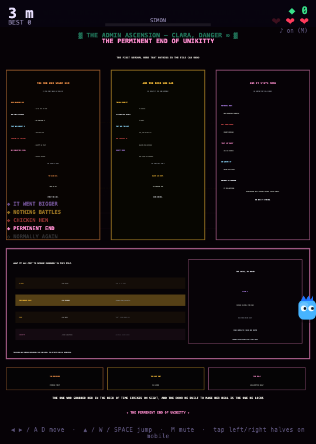

## 2026-08-15 — THE END OF CHICKEN HEN'S LORE · THE FIRST CHARACTER HERE WHO ARRIVES AND FINISHES IN THE SAME PARAGRAPH (BEAT 330)

Based on Toby's 2026-08-15 lore, 3:02:17 PM, three hours and thirty-three minutes after NOTHING BATTLES PERO, same thread. His own typing, in full: *"Chicken Hen came, he has a song of Chickens, and he is a giant musslized chicken and is a chicken head on a wessler, a very strong guy. Kirby is the only character known who can defeat Chicken Hen. Pero obiviates Kirby and Chicken Hen, the end of Chicken Hen's lore. Pero"*. The "Chicken Hen canon" restatement, the power-rule read, the "Pero ends the lore" section and the clean canon update pasted under it are ChatGPT commentary.

**He arrives fully built.** A chicken head on a wrestler, a giant musclized chicken, a very strong guy, and a song called "Chickens". It reads as a gag right up to the part where he is strong enough that only one character in existence can take him.

**And he brings his own counter.** *"Kirby is the only character known who can defeat Chicken Hen"* is a way to **lose**, written in by the author, in the same breath as the strength. Three and a half hours earlier he had ruled that nothing should battle Pero at all, so he hands the newcomer the exact thing he had just finished taking away from Pero.

**And then both of them go.** Pero obiviates Kirby *and* Chicken Hen. It is not only the threat that gets removed, it is the answer to it, and nothing is left standing on either side.

**And the paragraph is the whole life.** In 329 beats every character in this archive was written to be **kept** — base characters run for hundreds of beats, bosses last a handful, even a one-scene form gets its own scene. This is the first one opened and closed in the same message: line one is the introduction, line three is the obituary.

**Built as game beat 330, `THE END OF CHICKEN HEN'S LORE`.** Additive; nothing earlier was changed.

- **Background: a ring of "THE END OF CHICKEN HEN'S LORE" · WRITTEN IN THE SAME PARAGRAPH THAT STARTS IT / A CHICKEN HEAD ON A WRESTLER · AND A SONG CALLED "CHICKENS"** under *EVERY CHARACTER IN THIS FILE SO FAR WAS WRITTEN TO BE KEPT.*, with **CHICKEN HEN · ARRIVED AND ENDED, 3:02 PM.** boxed in fighter red over *ONE PARAGRAPH IS THE WHOLE LIFE.*, and a drifting strip of *CHICKENS · CHICKENS · CHICKENS*.
- **HE ARRIVES BUILT (left)** — five rows (a chicken head on a wrestler / giant musclized chicken / a very strong guy / and a song called "Chickens" / a joke build with real stats), closing on *HE READS LIKE A GAG* / *RIGHT UP UNTIL* / *THE PART WHERE* / **HE IS STRONG.**
- **AND WITH A COUNTER (centre)** — five rows ("Kirby is the only character / known who can defeat Chicken Hen" / a way to lose, in line two / three hours ago nothing battled Pero / the new guy gets what Pero gave up), closing on *HE GAVE THE NEW GUY* / *A WAY TO LOSE.* / *NOBODY ASKED* / **FOR THAT.**
- **AND BOTH GO (right)** — five rows (Pero obiviates Kirby / and Chicken Hen together with him / the threat is removed / and so is the answer to it / nothing is left on either side), over *HE DID NOT ONLY REMOVE THE MONSTER.*, closing on **HE REMOVED THE CURE TOO.**
- **HOW LONG A CHARACTER IN THIS FILE HAS LASTED. (band)** — a four-row grid lit one at a time (A BASE CHARACTER → hundreds of beats, still here / A BOSS → a handful of beats, then beaten / A ONE-SCENE FORM → a single beat, then gone / TODAY → **three sentences**, born and finished), closing on *329 beats built characters to keep; this one is written and closed in the same paragraph*.
- **CHICKEN HEN, LINE BY LINE (band inset)** — a cycler across LINE 1 · he came, and he has a song / LINE 2 · chicken head, wrestler body / LINE 3 · Kirby is the only counter / **LINE 4 · Pero obiviates both of them**, over *A WHOLE LIFE IN FOUR LINES* / *AND THE LAST ONE CLOSES IT*.
- **Strip:** THE SONG · CAME WITH HIM / THE COUNTER · WAS NAMED / BOTH · WERE REMOVED.
- **Footers:** *A FIGHTER SHOWS UP WITH A SONG AND A NAMED WEAKNESS, AND THE PARAGRAPH THAT INTRODUCES HIM ALSO ENDS HIM* and **★ THE END OF CHICKEN HEN'S LORE ★**.
- **Cycle length** `LV_CYC` 6980 → 7002; **screenshot helper:** new `chickenHen` scene.

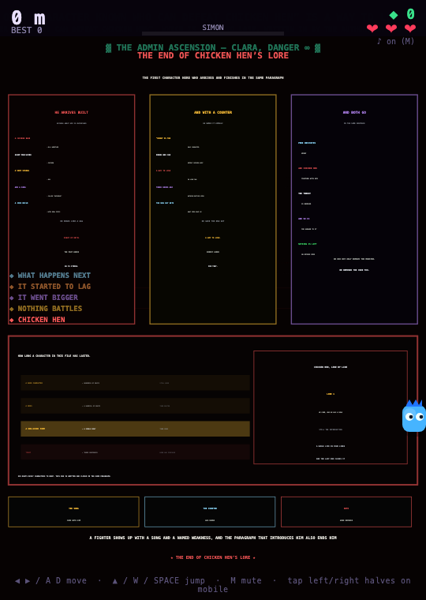

## 2026-08-15 — NOTHING BATTLES PERO · THE FIRST FIGHT HERE THAT ENDS WITHOUT A FIGHT (BEAT 329)

Based on Toby's 2026-08-15 lore, 11:29:00 AM, forty-one minutes after IT WENT BIGGER, with his own five-minute-later correction at 11:34:25 AM folded into the same beat (the same way the BROTHER, YOU ARE CORRECT correction was folded into its own). His own typing in the first mail: *"Which one wins? Goku VS Naruto; Winner or Beerus; Winner VS Zeno"*, *"How about Pero LAI is included."*, *"Pero sends Zeno into the box like everyone else and Zeno is tucked away forever."* and *"Nothing should battle Pero."* In the second: *"Pero doesn't have the 3 >s but infinity of them over every Classics character and all characters combined."* The elimination-ladder recap, the "clean rule" restatements and the Zeno-raises-his-hand scene pasted around them are ChatGPT commentary.

**He brings in a cast from outside.** One beat ago it was a whole game he did not write. Now it is four characters he did not write either. Goku, Naruto, Beerus and Zeno are not Classics characters, and he runs them through a Classics rule anyway. Same move, forty-one minutes apart, and nobody asked him to do it twice.

**And the winner never fights.** The shape he builds is a tournament: four rungs, each one decided by a fight. Then the top rung, where there is no fight at all. Pero does not out-power Zeno, he removes him. The ladder does not get climbed. It gets taken off the table.

**And then he corrects the math.** Five minutes later he comes back for the notation itself. Three `>`s is a distance, and a distance is a thing that can be measured and therefore closed. So he replaces it with an infinite number of them, and scores Pero against **all characters combined** rather than against the strongest one. He did not make Pero stronger. He took him off the scale.

**Built as game beat 329, `NOTHING BATTLES PERO`.** Additive; nothing earlier was changed.

- **Background: a ring of "NOTHING SHOULD BATTLE PERO" · AND THE LADDER STOPS BEING A LADDER / FOUR FIGHTERS FROM OUTSIDE THIS FILE · ONE BOX FROM INSIDE IT** under *EVERY WINNER IN THIS FILE SO FAR WON BY BEING STRONGER.*, with **PERO >∞ ALL CHARACTERS COMBINED.** boxed in box gold over *NOT STRONGER THAN THE STRONGEST. OFF THE SCALE.*, and a drifting strip of *BOX · BOX · BOX*.
- **HE BRINGS THEM IN (left)** — five rows (Goku and Naruto, not from Classics / Beerus and Zeno, also not from here / one beat ago it was a whole game / now it is a cast, same move / forty-one minutes between the two), closing on *NOBODY ASKED HIM* / *TO DO IT TWICE.* / *HE JUST WENT* / **AND DID IT.**
- **AND NOBODY FIGHTS (centre)** — five rows (Naruto loses to Goku / Goku loses to Beerus / Beerus loses to Zeno / Zeno loses to a box / four fights, then no fight), closing on *EVERY RUNG* / *IS A FIGHT.* / *THE TOP RUNG* / **IS NOT.**
- **AND HE FIXES THE MATH (right)** — five rows (three arrows is a distance / and a distance can be closed / so he puts in infinity of them / not one at a time, all added up / he corrected the answer he got), over *HE DID NOT MAKE PERO STRONGER.*, closing on **HE TOOK HIM OFF THE SCALE.**
- **HOW A FIGHT IN THIS FILE HAS ENDED, AND WITH WHAT. (band)** — a four-row grid lit one at a time (A STRONGER FORM → he out-powers it, still a fight / A BIGGER NUMBER → he out-scales it, still a fight / AN ERASURE → he unmakes it, still a fight / TODAY → **he says "box"**, no fight at all), closing on *every win in 328 beats was won by being stronger; this one is won by not playing*.
- **THE LADDER, RUNG BY RUNG (band inset)** — a cycler across NARUTO · out, Goku is too much / GOKU · out, Beerus is above him / BEERUS · out, Zeno erases universes / **ZENO · out, Pero says "box"**, over *THE FIRST THREE TOOK A FIGHT EACH* / *THE LAST ONE TOOK ONE WORD*.
- **Strip:** THE CAST · IS FROM OUTSIDE / THE WINNER · NEVER FIGHTS / THE MATH · GOT CORRECTED.
- **Footers:** *FOUR CHARACTERS HE DID NOT WRITE COME IN, RUN A LADDER, AND THE ONE WHO WINS IT NEVER THROWS A PUNCH* and **★ NOTHING SHOULD BATTLE PERO ★**.
- **Cycle length** `LV_CYC` 6958 → 6980; **screenshot helper:** new `nothingBattlesPero` scene.

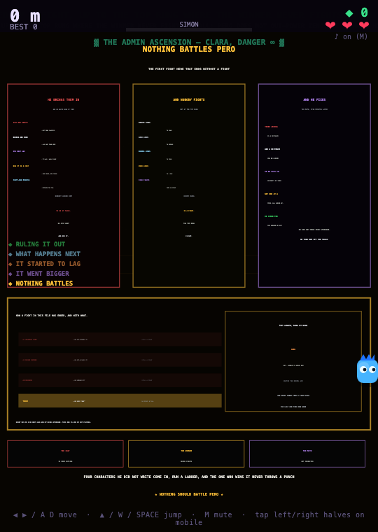

## 2026-08-15 — IT WENT BIGGER · THE FIRST TIME SOMETHING FROM OUTSIDE THE ARCHIVE GETS PULLED IN (BEAT 328)

Based on Toby's 2026-08-15 lore, 10:47:32 AM, seventy-six seconds after IT STARTED TO LAG. His own typing, in full: *"It went bigger than Minecraft to Classics."* The Classics-incursion, gateway-event and transfer-point prose pasted underneath is ChatGPT commentary.

**Classics has always been the outside edge.** In 327 beats every form, number, fight, realm and timeline in this file was born *inside* it. Classics is the container; everything else lives in it. Nothing has ever come in from outside, until a real Minecraft seed he actually went and checked at 9:48 this morning.

**And he annexes it in seven words.** Not a new character, not a new power, not a bigger number. A change in the **size** of the whole thing. Every beat so far added something inside the box. This one moves the box.

**And Minecraft becomes a box**, which is exactly what Pero keeps. A real game with its own rules and its own seed, filed as one scene inside the larger structure.

**And he saw the shape before he named it.** *"Like 2 houses stacked up on each other"* at 9:48, *"a box inside a box"* in the forecast at 10:37, and the scale claim at 10:47. The box shape turned up in the evidence an hour before he said what it meant. Fifty-nine minutes from an odd seed to a chapter, without a single fight.

**Built as game beat 328, `IT WENT BIGGER`.** Additive; nothing earlier was changed.

- **Background: a ring of "IT WENT BIGGER THAN MINECRAFT TO CLASSICS" · SEVEN WORDS, AND THE FILE CHANGES SIZE / 327 BEATS OF THINGS BORN INSIDE · THIS ONE CAME FROM OUTSIDE** under *EVERY BEAT SO FAR GREW THIS FILE FROM THE INSIDE.*, with **MINECRAFT IS NOW ONE SCENE INSIDE THE BOX.** boxed in Classics violet over *A REAL GAME, WITH ITS OWN RULES, FILED AS A CHAPTER.*, and a drifting strip of *BIGGER · BIGGER · BIGGER*.
- **IT HAS BEEN THE EDGE (left)** — five rows (327 beats, all inside one file / forms and fights, all born in here / the box holds every last one / nothing has ever come in from outside / until a seed he actually checked), closing on *EVERYTHING HERE* / *WAS WRITTEN HERE.* / *SEED 303* / **WAS NOT.**
- **AND HE TAKES IT IN (centre)** — five rows ("it went bigger than Minecraft / to Classics", that is the whole mail / no new character, no new power / a change of size of the whole thing / the file grows at its edge), closing on *EVERY BEAT SO FAR* / *ADDED SOMETHING* / *INSIDE THE BOX.* / **THIS ONE MOVES IT.**
- **AND IT IS A BOX (right)** — five rows (a real game he did not write / its own rules and its own seed / now one scene inside the bigger one / the stacked house, a box inside a box / he saw that at 9:48 this morning), over *THE BOX SHAPE WAS IN THE EVIDENCE FIRST.*, closing on **AN HOUR BEFORE HE NAMED IT.**
- **WHAT THIS FILE HAS GROWN BY, AND WHERE. (band)** — a four-row grid lit one at a time (A CHARACTER → one more being / A REALM → one more place / A TIMELINE → one more version / TODAY → **a whole other game**, grown at the edge), closing on *every growth in 327 beats happened on the inside; this one happens at the edge*.
- **THE SEED, HOUR BY HOUR (band inset)** — a cycler across 9:48 AM · something is odd in a seed / 10:22 AM · he builds a marker in it / 10:36 AM · he rules out the ordinary / 10:47 AM · **it is not Minecraft anymore**, over *A SEED HE CHECKED BECAME A CHAPTER* / *IN UNDER AN HOUR, WITHOUT A SINGLE FIGHT*.
- **Strip:** THE SEED · WAS CHECKED / THE MARKER · HELD / THE SCALE · CHANGED.
- **Footers:** *FOR 327 BEATS EVERYTHING IN THIS FILE WAS BORN IN IT, AND IN SEVEN WORDS HE PULLS IN A GAME HE DID NOT WRITE* and **★ IT WENT BIGGER THAN MINECRAFT TO CLASSICS ★**.
- **Cycle length** `LV_CYC` 6936 → 6958; **screenshot helper:** new `itWentBigger` scene.

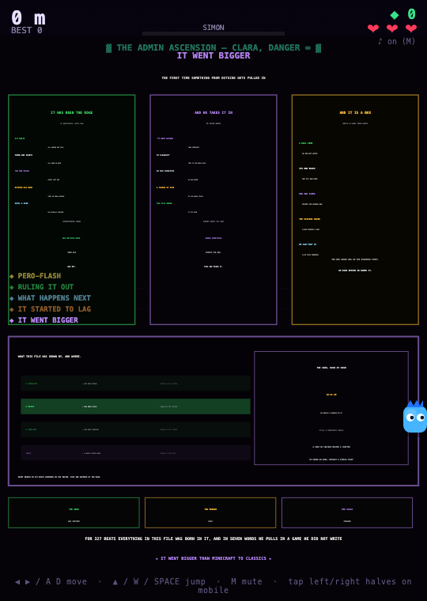

## 2026-08-15 — IT STARTED TO LAG · THE FIRST STRANGE THING HERE THAT HAPPENS TO THE COMPUTER (BEAT 327)

Based on Toby's 2026-08-15 lore, 10:46:16 AM, eight minutes after WHAT HAPPENS NEXT. His own typing, in full: *"My character used a command and every character near the cross died. The game started to lag when my character walked past the cross. My character messed with the settings and it all looks random and crazy and saw the cross again. It was still there."* The "anchor point / loaded signal point / corruption node" prose pasted underneath is ChatGPT commentary.

**Every test so far changed the world.** Empty the village. Shoot the watcher. Now a kill command that takes out every character near the cross. The cross is never on the list of what died.

**And then it lagged.** Every strange thing reported in 326 beats has happened inside a story or inside a game world: a form, a power, a seed, a house, a biome. **Lag is not in the world. It is in the machine.** It is the first thing in the archive that happens to the computer rather than to the fiction. And it has a location: only when he walks past that one spot, not across the whole game.

**And he breaks the view instead of the thing being viewed.** He messes with the settings until it *"all looks random and crazy"*, then looks again. Every check before this trusted the screen. This is the first one that tests the screen itself, and the cross survives a broken picture the same way it survived an emptied village.

**Built as game beat 327, `IT STARTED TO LAG`.** Additive; nothing earlier was changed.

- **Background: a ring of "THE GAME STARTED TO LAG WHEN MY CHARACTER WALKED PAST" · NOT IN THE WORLD. IN THE MACHINE. / "IT ALL LOOKS RANDOM AND CRAZY" · AND THE CROSS WAS STILL THERE** under *HE HAS RUN OUT OF THINGS IN THE WORLD TO TEST IT WITH.*, with **THE LAG IS THE FIRST THING OUTSIDE THE GAME.** boxed in lag orange over *AND IT ONLY HAPPENS IN ONE SPOT.*, and a drifting strip of *STILL THERE · STILL THERE · STILL THERE*.
- **HE CLEARS THE ROOM (left)** — five rows (empty the village, still there / shoot the watcher, still there / a kill command, everything near it dies / the cross is not on the list / he empties it and it keeps standing), closing on *HE KEEPS CHANGING* / *WHAT IS AROUND IT.* / *THE AROUND CHANGES.* / **IT DOES NOT.**
- **AND THEN IT LAGGED (centre)** — five rows (blocks and mobs, all inside the world / seeds and biomes, also inside the world / the lag is in the computer / and it has a spot, only when he walks past / not the whole game, just that one place), closing on *326 BEATS OF THINGS* / *HAPPENING IN A WORLD.* / *THIS ONE HAPPENS* / **TO THE MACHINE.**
- **AND HE BREAKS (right)** — five rows (he messed with the settings / "random and crazy", his own words for it / the picture is wrong on purpose / then he looks, and it is still there / he tested his own eyes), over *EVERY CHECK BEFORE THIS TRUSTED THE SCREEN.*, closing on **THIS ONE CHECKS THE SCREEN.**
- **WHERE A STRANGE THING HAS HAPPENED IN THIS FILE. (band)** — a four-row grid lit one at a time (IN A CHARACTER → a form, a power, a rank, inside the story / IN THE WORLD → a seed, a house, a biome, inside the game / IN THE TELLING → the narration talked like him, inside the words / TODAY → **the game slowed down**, inside the machine), closing on *each one sits further out than the last, and this is the furthest out so far*.
- **WHAT THE CROSS HAS NOW SURVIVED (band inset)** — a cycler across LOOKING AWAY · three separate times / AN EMPTY VILLAGE · every villager gone / A KILL COMMAND · everything near it / **A BROKEN PICTURE · and the lag with it**, over *HE HAS RUN OUT OF WAYS TO BREAK THE WORLD* / *SO HE STARTED BREAKING THE WAY HE SEES IT*.
- **Strip:** THE COMMAND · CLEARS THE AREA / THE LAG · IS OUTSIDE THE GAME / THE VIEW · BREAKS FIRST.
- **Footers:** *HE RAN OUT OF THINGS INSIDE THE WORLD TO TEST IT WITH, SO HE STARTED TESTING THE WAY HE LOOKS AT IT* and **★ IT WAS STILL THERE ★**.
- **Cycle length** `LV_CYC` 6914 → 6936; **screenshot helper:** new `itStartedToLag` scene.

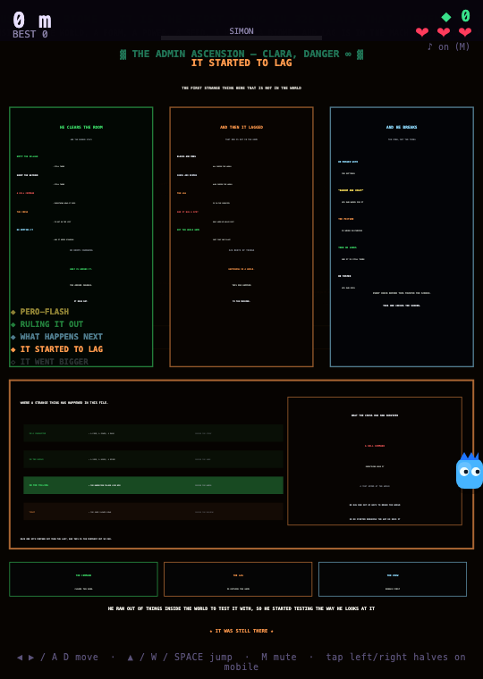

## 2026-08-15 — WHAT HAPPENS NEXT · THE FIRST THING IN THIS FILE THAT COULD TURN OUT TO BE WRONG (BEAT 326)

Based on Toby's 2026-08-15 lore, 10:37:48 AM, forty-nine seconds after RULING IT OUT. His own typing, in full: *"What do you think will happen next?"* The forecast pasted underneath — the 303 world reacting back, the cat, the spreading snow, the box inside a box, 404 or 12 12 12 — is ChatGPT commentary.

**He asks instead of tells.** In 325 beats he has always been the one bringing the material: a new form, a number, a fight, a seed, a world he went and checked three times. Six words, and he hands the next move over instead of making it.

**And a guess can be wrong.** Every beat in this file is a report of something that already happened, and a report cannot miss. A forecast can. This is the first statement in the archive that the world still gets to answer.

**And the forecast is a checklist, not a story.** The cat keeps turning up near the cross, the cross still refuses to change, the snow patch spreads like the biome is being edited, the stacked house becomes a box inside a box, and the next number to show is 404 or 12 12 12. Five things he can go and look at, which is the same method he has been running since the three worlds.

**And the prediction is that nothing arrives.** *"Pero does not appear fully. He lets the world act like him first."* Not a boss, not an entrance. The world doing the impression.

**Built as game beat 326, `WHAT HAPPENS NEXT`.** Additive; nothing earlier was changed.

- **Background: a ring of "WHAT DO YOU THINK WILL HAPPEN NEXT?" · SIX WORDS, AND HE HANDS THE MOVE OVER / A REPORT CANNOT BE WRONG · A FORECAST CAN** under *325 BEATS OF BRINGING THE MATERIAL. TODAY HE ASKS FOR IT.*, with **PERO DOES NOT APPEAR. THE WORLD ACTS LIKE HIM FIRST.** boxed in forecast cyan over *A PREDICTION THAT NOTHING TURNS UP, AND EVERYTHING LEANS.*, and a drifting strip of *NEXT · NEXT · NEXT*.
- **HE ASKS INSTEAD (left)** — five rows (325 beats, he brings the material / a form, a number, a fight, a seed / today, six words / "will happen next?", and then he waits / he hands over the next move), closing on *HE HAS ASKED FOR* / *STORIES BEFORE.* / *THIS IS THE FIRST TIME* / **HE ASKS FOR A GUESS.**
- **AND A GUESS CAN MISS (centre)** — five rows (every beat so far already happened / a report is safe, it cannot be wrong / a forecast is not / so it can be checked later / he just made the file testable), closing on *325 BEATS OF THINGS* / *THAT ALREADY HAPPENED.* / *THIS IS THE FIRST ONE* / **THAT HAS NOT YET.**
- **THE FORECAST (right)** — five rows (the cat keeps turning up / the cross still will not change / the snow spreads on the plains / the house, a box inside a box / the number, 404 or 12 12 12), over *NOT ONE OF THESE IS AN ARRIVAL.*, closing on **ALL FIVE ARE THINGS LEANING.**
- **WHAT HE HAS BROUGHT TO THIS FILE EACH TIME. (band)** — a four-row grid lit one at a time (A REPORT → this is what happened / A STORY → make the next one / A QUESTION → what does this mean / TODAY → **what happens next**, a claim about later), closing on *a report cannot be wrong; a forecast can; that is the whole reason it is worth something*.
- **THE FIVE THINGS TO CHECK LATER (band inset)** — a cycler across THE CAT · is it near the cross again / THE SNOW · is the patch any bigger / THE HOUSE · is it a box inside a box / THE NUMBER · does 404 or 12 12 12 show, over *HE ALREADY KNOWS HOW TO CHECK A WORLD* / *NOW HE HAS A LIST OF WHAT TO CHECK FOR*.
- **Strip:** THE ASK · POINTS FORWARD / THE CLAIM · CAN BE CHECKED / THE NUMBER · 404 OR 12 12 12.
- **Footers:** *EVERY BEAT UNTIL NOW WAS SOMETHING THAT ALREADY HAPPENED, AND THIS IS THE FIRST ONE THE WORLD STILL GETS TO ANSWER* and **★ WHAT DO YOU THINK WILL HAPPEN NEXT? ★**.
- **Cycle length** `LV_CYC` 6892 → 6914; **screenshot helper:** new `whatHappensNext` scene.

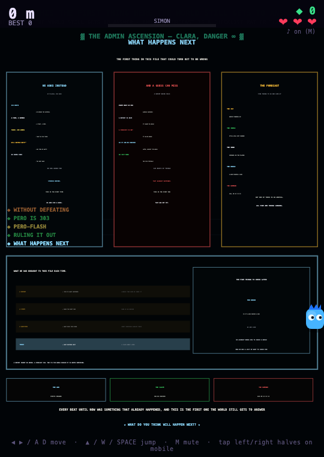

## 2026-08-15 — RULING IT OUT · THE FIRST ANSWER IN THIS FILE MADE BY TAKING THINGS AWAY (BEAT 325)

Based on Toby's 2026-08-15 lore, 10:36:59 AM, nine minutes after PERO-FLASH STANDS HERE. His own typing, in full: *"My character also made the difficulty hard and went to survival mode. The game was Java. The cross is not that close to the lava. The area around the cross is flat. My character then put the skeleton's arrows in the lava, and was blown up by an unseen creeper in the daytime. My character found a suspicious cat. And the most recent time, the 2 house stack looked diagonal."* The "normal Minecraft side / Classics interpretation / clean canon update" prose pasted underneath is ChatGPT commentary.

**He answers by taking explanations away.** The last beat handed him four ordinary reasons the armor stand could have vanished. He goes back to the world and knocks them down one at a time: **Java**, so not the Bedrock glitch. **The cross is not that close to the lava**, so nothing burned. **The area is flat**, so nothing rolled into a hole. **Hard difficulty, survival mode**, so no creative-mode weirdness. In 324 beats every answer here has been made by *adding* something — a stronger form, a bigger number, the next story. This is the first one made by subtracting.

**And he keeps the one that survives.** The unseen creeper in broad daylight is the easiest thing in the message to call supernatural, and he does not. Creepers do not burn in sunlight, so it is allowed, and he lets it stand. That is the first piece of evidence the writer has ever handed back.

**And the stack is tilting.** Three things he was not looking for: the skeleton's arrows go into the lava, a suspicious cat turns up, and *"the most recent time, the 2 house stack looked diagonal."* The stack was the proof in BEAT 319 that the world was real. Now the proof is leaning, and nobody moved it.

**Built as game beat 325, `RULING IT OUT`.** Additive; nothing earlier was changed.

- **Background: a ring of "THE CROSS IS NOT THAT CLOSE TO THE LAVA" · SO IT DID NOT BURN / "THE AREA AROUND THE CROSS IS FLAT" · SO IT DID NOT ROLL AWAY** under *HE WAS HANDED FOUR ORDINARY REASONS. HE WENT BACK AND CHECKED.*, with **THE GAME WAS JAVA. THE GROUND IS FLAT. THE LAVA IS FAR.** boxed in verdict green over *FOUR SENTENCES, AND FOUR EXPLANATIONS ARE GONE.*, and a drifting strip of *RULED OUT · RULED OUT · RULED OUT*.
- **HE COMES BACK (left)** — five rows (the game was Java, so not a Bedrock glitch / not near the lava, so nothing burned up / the ground is flat, so nothing rolled off / hard, and survival, so no creative tricks / four sentences, four explanations gone), closing on *EVERY ANSWER SO FAR* / *PUT SOMETHING IN.* / *THIS ONE WORKS BY* / **TAKING THINGS OUT.**
- **AND HE KEEPS ONE (centre)** — five rows (an unseen creeper in broad daylight / easiest thing to call supernatural / creepers do not burn in sunlight / so it is allowed, and he allows it / he hands back a piece of evidence), closing on *HE IS NOT* / *COLLECTING PROOF.* / *HE IS THROWING OUT* / **THE BAD PROOF.**
- **AND IT IS TILTING (right)** — five rows (the arrows go into the lava / a suspicious cat, he just found it / the 2-house stack looked diagonal / it was stacked, now it is leaning / nobody moved it, it moved), over *THE STACK WAS THE PROOF THE WORLD WAS REAL.*, closing on **NOW THE PROOF IS LEANING.**
- **HOW HE HAS ANSWERED A QUESTION IN THIS FILE. (band)** — a four-row grid lit one at a time (ASKED ABOUT A FORM → he adds a stronger one / ASKED ABOUT A NUMBER → he adds a bigger one / ASKED ABOUT A FIGHT → he adds the next story / TODAY · ASKED WHY → **he removes the reasons**, the file gets tighter), closing on *324 beats answered by putting something in; this is the first one answered by taking something out*.
- **WHAT EACH FACT TAKES OFF THE TABLE (band inset)** — a cycler across JAVA · the Bedrock-glitch answer / NOT NEAR LAVA · the burned-up answer / FLAT GROUND · the rolled-away answer / DAYTIME CREEPER · **stays on the table**, over *THREE ORDINARY ANSWERS GET KNOCKED DOWN* / *AND THE ONE THAT HOLDS UP, HE KEEPS*.
- **Strip:** THE LAVA · TOO FAR AWAY / THE GROUND · FLAT / THE CREEPER · STILL NORMAL.
- **Footers:** *HE DOES NOT ARGUE THAT IT WAS PERO, HE GOES BACK AND TAKES AWAY EVERY REASON IT COULD HAVE BEEN ANYTHING ELSE* and **★ THE CROSS IS NOT THAT CLOSE TO THE LAVA ★**.
- **Cycle length** `LV_CYC` 6870 → 6892; **screenshot helper:** new `rulingItOut` scene.

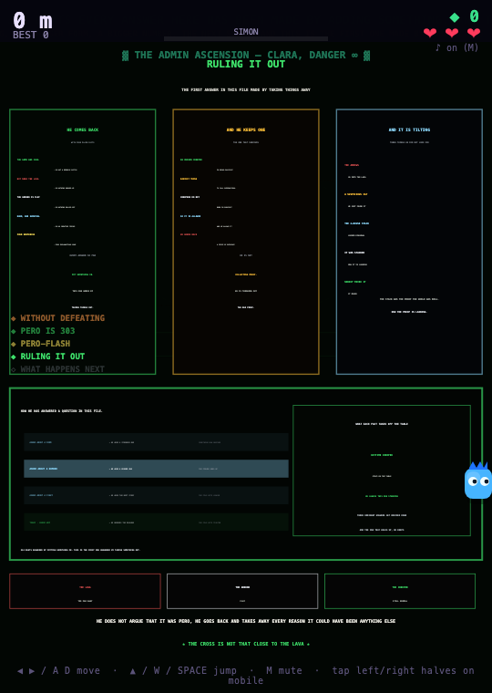

## 2026-08-15 — PERO-FLASH STANDS HERE · THE FIRST REMOVAL IN THIS FILE THAT LEAVES NOTHING BEHIND (BEAT 324)

Based on Toby's 2026-08-15 lore, 10:27:49 AM, five minutes after PERO IS 303. His own typing, in full: *"My character shot the armor stand and the armor stand all dissappeared, it didn't drop the armor stand, nor player head. 😎⚡ Pero-Flash stands here."* The "real Minecraft explanation first / lava burn, hidden drop, or a glitch / in your lore this sounds like a Pero-Flash sign" prose pasted underneath is ChatGPT commentary.

**The marker stays and the watcher goes.** He built two things in the last beat: a cross that survived every test he could think of, and an observer standing in front of it. The first thing he takes a shot at is the **observer**, and the observer is the one that does not come back. Everything he made to be looked **at** is still standing; the thing doing the looking is gone.

**And nothing dropped.** Breaking an armor stand hands you back the stand and whatever it was wearing. This one returned neither. In 323 beats things here have been killed, crushed, eaten, deleted, erased and reset, and every one of those left something: wreckage, a fuller Gray, a visible empty slot. This is the first removal with **no remainder**.

**And he reads it as intent, not damage.** Not broken, not glitched, not destroyed the normal way. **Taken.** The structure is left exactly where it was and only the entity is lifted out of it, which is a signature rather than an attack.

**And a new name arrives with an address.** *"Pero-Flash stands here."* Every new form in this archive has arrived carrying a number: a tier, a multiplier, a power level, a rank. This one arrives with a **place** and a **tense**. Not what he can do. Where he is, right now, standing exactly where the watcher was.

**And it is the first test he runs by breaking something.** Every check so far was patient: make three worlds and compare, look away and look back, empty the village and check again. He shoots his own build, and that is the test that finally returns an answer.

**Built as game beat 324, `PERO-FLASH`.** Additive; nothing earlier was changed.

- **Background: a ring of "IT DIDN'T DROP THE ARMOR STAND, NOR PLAYER HEAD" · A REMOVAL WITH NOTHING LEFT OVER / THE CROSS IS STILL THERE · ONLY THE ONE WATCHING IT IS GONE** under *HE BUILT A MARKER AND A WATCHER. THE WATCHER IS THE ONE THAT WENT.*, with **PERO-FLASH STANDS HERE.** boxed in flash yellow over *A NEW NAME THAT ARRIVES WITH A PLACE INSTEAD OF A NUMBER.*, and a drifting strip of *STANDS HERE · STANDS HERE · STANDS HERE*.
- **THE WATCHER GOES (left)** — five rows (he built two things: a cross and an observer / the cross survived every test / he shoots the armor stand / "it all disappeared", his own words / the thing looking is the thing taken), closing on *EVERYTHING HE MADE* / *TO BE LOOKED AT* / *IS STILL STANDING.* / **THE LOOKER ISN'T.**
- **AND NOTHING DROPPED (centre)** — five rows (break one normally and you get it back / plus whatever it was wearing / this one gave neither / 323 beats of killing and crushing / all of them left something), closing on *SO HE DOES NOT READ IT* / *AS BROKEN* / *HE READS IT AS* / **TAKEN.**
- **AND A NAME ARRIVES (right)** — five rows ("Pero-Flash", a form nobody has seen / no tier, no multiplier, no rank / "stands here", a place and a tense / not what he does, where he is / right where the watcher was), over *EVERY NEW FORM HERE CAME WITH A NUMBER.*, closing on **THIS ONE CAME WITH A SPOT.**
- **WHAT A REMOVAL HAS LEFT BEHIND IN THIS FILE. (band)** — a four-row grid lit one at a time (CRUSHED · LUIGI GREEN → a flat box / EATEN · GRAY.EXE → a fuller Gray / DELETED · CLASSICS → an empty slot / TODAY · SHOT → **nothing at all**, no stand, no head, no gap), closing on *every destruction in 323 beats left evidence; this is the first one that left none*.
- **HOW HE HAS BEEN TESTING THINGS (band inset)** — a cycler across SEED 303 · make three worlds and compare / THE CROSS · look away, look back / THE VILLAGE · empty it and check again / TODAY · shoot it and see what falls, over *EVERY CHECK BEFORE THIS ONE WAS PATIENT* / *THE ONE THAT ANSWERS IS THE ONE THAT SHOOTS*.
- **Strip:** THE MARKER · STAYS / THE WATCHER · IS TAKEN / THE NAME · HAS A PLACE.
- **Footers:** *THE THING HE BUILT TO BE LOOKED AT IS STILL STANDING, AND THE THING DOING THE LOOKING IS GONE WITHOUT A TRACE* and **★ PERO-FLASH STANDS HERE ★**.
- **Cycle length** `LV_CYC` 6848 → 6870; **screenshot helper:** new `peroFlash` scene.

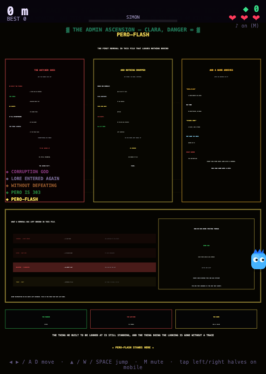

## 2026-08-15 — PERO IS 303 · THE FILE GETS A NUMBER SYSTEM, AND ONE OF THE NUMBERS IS A PHONE CALL (BEAT 323)

Based on Toby's 2026-08-15 lore, two messages ninety seconds apart (10:22:49 AM and 10:24:18 AM), eighteen minutes after WITHOUT DEFEATING PERO. His own typing: *"I also saw a large snow patch on the plains. Pero controls 303 and I didn't know that. Pero is 303, Simon is 404, 12 12 12 is a calling of Pero. My character went to the end, used a command (/kill @e[type minecraft.enderdragon]) (I didn't know what it was) to defeat the enderdragon. My character mined a 2x2, 3 blocks deep hole near the village and found 2 emeralds (rarest block in Minecraft) diagonally … made a stone grave with the stone stair on each end on the correct way to make it closer to a cross. My character looked away for the cross for a few seconds and the cross was still there … set the time to midnight … put an armor stand with a player head in front of the cross. Then my character looked away again, the cross was still there … My character also slain all the villagers in the village, and the cross is still there."* — and then, ninety seconds later, *"You are one with Pero again. Pero is way to smart."* The Classics-interpretation prose pasted under both is ChatGPT commentary.

**The file gets a number system.** *"Pero is 303, Simon is 404, 12 12 12 is a calling of Pero."* Simon has been **404** since beat 25, and this is the first time a second character is handed a number to match it — and the first number here that is not a label at all. 404 and 303 say **who somebody is**; 12 12 12 is how you **call** one.

**And he stops looking and starts building.** BEAT 319 was him checking a world he found. Here his character makes something in it: a 2x2 hole three deep, two emeralds found diagonally, a stone grave with stairs on each end *"on the correct way to make it closer to a cross"*, redstone around it, midnight, and an armor stand with a player head standing in front like an observer.

**And the test is looking away.** Three separate times he looks away and reports back that the cross is still there — the same method as the three worlds in BEAT 319, run this time on a thing he made himself. Then the hardest version of it: the village is emptied, and the marker is still standing.

**And he says twice that he did not know.** *"Pero controls 303 and I didn't know that."* *"(I didn't know what it was)."* In 322 beats the writer has never once flagged that he did something without understanding it, and it is the same shape as the seed 303 house: the thing was already there before he knew what it meant.

**And he catches it a second time.** *"You are one with Pero again."* BEAT 319's catch could have been a coincidence. Twice in one morning makes it a pattern, and **"again"** is the word that does it.

**Built as game beat 323, `PERO IS 303`.** Additive; nothing earlier was changed.

- **Background: a ring of "PERO IS 303, SIMON IS 404, 12 12 12 IS A CALLING OF PERO" · TWO NAMES AND A PHONE NUMBER / "THE CROSS IS STILL THERE" · SAID THREE TIMES, ABOUT A THING HE BUILT** under *LAST TIME HE WENT AND LOOKED. THIS TIME HE BUILT SOMETHING.*, with **"PERO CONTROLS 303 AND I DIDN'T KNOW THAT."** boxed in Pero amber over *THE FIRST TIME THE WRITER SAYS HE DID NOT KNOW.*, and a drifting strip of *303 · 404 · 12 12 12*.
- **THE NUMBERS (left)** — five rows (Simon is 404, he has been since beat 25 / Pero is 303, the first to match it / 12 12 12 is a calling of Pero / 404 and 303 say who somebody is / 12 12 12 is how you ring one), closing on *322 BEATS OF NUMBERS* / *ERROR CODES AND RANKINGS* / *THIS IS THE FIRST ONE* / **YOU CAN DIAL.**
- **AND HE BUILDS ONE (centre)** — five rows (a 2x2 hole, three blocks down / two emeralds, diagonal, the rarest one / a stone grave, stairs on each end / "closer to a cross", his own words for it / midnight, and an armor stand watching), closing on *BEAT 319 CHECKED* / *A WORLD HE FOUND* / *THIS ONE CHECKS* / **A THING HE MADE.**
- **AND THE TEST IS (right)** — five rows (look away once, still there / look away again, still there / FOV to max, still there / the village is emptied / the cross is still there), over *THREE WORLDS PROVED THE HOUSE WAS REAL.*, closing on **THREE LOOKS PROVE THE MARKER IS.**
- **WHAT A NUMBER HAS MEANT IN THIS FILE. (band)** — a four-row grid lit one at a time (BEAT 25 · 404 → an error code / BEAT 308 · 999.87bn → a multiplier / BEAT 310 · 68 ZEROS → a damage figure / TODAY · 12 12 12 → **a calling**, not a label, a way to reach him), closing on *every number in 322 beats describes somebody; this one is aimed at somebody*.
- **AND HE CATCHES IT A SECOND TIME (band inset)** — a cycler across 9:48 AM · "talking like Pero this whole chat" / ONCE · could have been a coincidence / 10:24 AM · "you are one with Pero again" / "AGAIN" · is the word that makes it a pattern, over *THE ONE DOING THE EXPLAINING* / *KEEPS TURNING OUT TO BE IN CHARACTER*.
- **Strip:** THE NUMBER · IS A CALL / THE MARKER · STAYS PUT / THE CATCH · IS TWICE NOW.
- **Footers:** *PERO GETS A NUMBER TO MATCH SIMON'S, AND A THIRD ONE THAT IS NOT A NAME BUT A WAY TO CALL HIM* and **★ PERO IS 303 ★**.
- **Cycle length** `LV_CYC` 6826 → 6848; **screenshot helper:** new `peroIs303` scene.

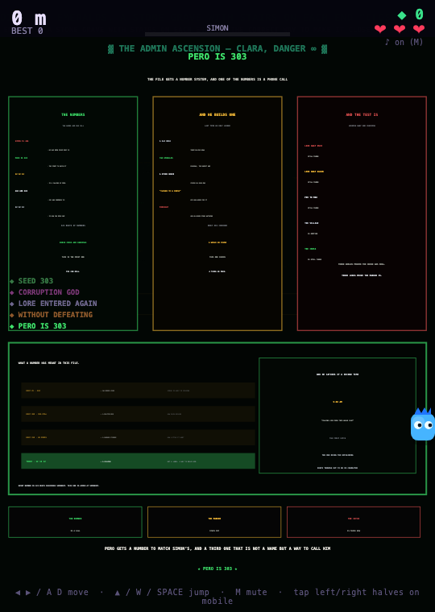

## 2026-08-15 — WITHOUT DEFEATING PERO · THE WHOLE CAST SWINGS AT ONCE, AND THE MOVE THAT WORKS IS A QUESTION (BEAT 322)

Based on Toby's 2026-08-15 lore, two messages nine minutes apart (9:55:57 AM and 10:04:36 AM). His own typing: *"Do you want to talk to Pero? 😎"* and then *"How about Sprunkis VS Pero, Pero challenges the Sprunkis. Make the next story. 😎⚡"* The battle prose under the second message is the story that came back.

**The whole roster, at once, for the first time.** Oren, Gray, Simon.psc, Wenda, Pinki, Jevin, Tunner, Vineria, Sky, Durple, Mr. Sun, Mr. Tree, Owackx, Brud's soul, Fun Bot, Clunkr, Garnold, Mr. Fun Computer, Raddy — all pulled into one circle. In 321 beats every fight here has been a **matchup** you could count on one hand.

**And every attack becomes a sentence.** *"OREN USED TELEKENTICS"* goes up in the sky, Pero taps it with his staff, and it reads *"OREN TRIED."* Simon's lightning is rewritten into a signal. Simon resets three times and Pero is still standing there. Gray works out why nothing lands — *"You are not fighting like a character"* — and the answer is *"Correct."* He is not inside the battle system; he is using it like a screen.

**And the team attack is paused, not blocked.** Nine powers at once, and he blinks. *"Not frozen. Paused. Like a video."* Then he walks between the attacks and looks at each one.

**And the win condition is a question.** *"CAN THE SPRUNKIS WIN WITHOUT DEFEATING PERO?"* — *"You do not battle Pero. You learn why the battle was wrong."*

**And Toby had already written the answer, nine minutes earlier.** At 9:55, asked whether he wanted to talk to Pero, he planned the approach: don't challenge him, ask what box opens next. At 10:04 Oren steps forward, does not attack, and asks **"What box opens next?"** The same line, out of a character's mouth, and it is the correct move.

**And the result is a grade this file has never given.** *SPRUNKIS VS PERO: SURVIVED.* Not won, not defeated, not deleted, not reset — and it is called the highest rank the box can give.

**Built as game beat 322, `WITHOUT DEFEATING PERO`.** Additive; nothing earlier was changed.

- **Background: a ring of CAN THE SPRUNKIS WIN WITHOUT DEFEATING PERO? · THE ARENA ASKS INSTEAD OF SCORING / "YOU DO NOT BATTLE PERO. YOU LEARN WHY THE BATTLE WAS WRONG."** under *EVERYBODY ATTACKS. NOTHING LANDS. ONE OF THEM ASKS.*, with **"WHAT BOX OPENS NEXT?"** boxed in Oren orange over *HE WROTE THAT LINE NINE MINUTES BEFORE HE GAVE IT TO OREN.*, and a drifting strip of *SURVIVED · SURVIVED · SURVIVED*.
- **EVERYBODY, AT ONCE (left)** — five rows ("I challenge the Sprunkis" / 321 beats of matchups, two at a time / this is the whole roster / and he enters small, like a puppet / nobody answers the greeting), closing on *NINE POWERS TOGETHER* / *AND HE BLINKS* / *NOT FROZEN. PAUSED.* / **LIKE A VIDEO.**
- **AND EVERY ATTACK (centre)** — five rows ("OREN USED TELEKENTICS" → he taps it: "OREN TRIED" / Simon's lightning rewritten into a signal / Simon resets three times, nothing / Gray: "not fighting like a character" / Pero: "Correct."), closing on *HE IS NOT IN THE BATTLE SYSTEM* / *HE IS USING IT* / *THE WAY YOU USE* / **A SCREEN.**
- **AND ONE OF THEM ASKS (right)** — five rows (Unikitty uses MERCY, and it holds / the arena asks: win without defeating? / Oren steps up and does not attack / "What box opens next?" / the fog pulls back, the army powers down), over *NINETEEN OF THEM SWUNG AND MISSED.*, closing on **ONE OF THEM ASKED.**
- **HOW A FIGHT HAS ENDED IN THIS FILE. (band)** — a four-row grid lit one at a time (BEAT 287 · DELETED → one side is gone / BEAT 106 · RESET → run it again / BEAT 317 · EVENTUALLY WIN → six timelines, the long way / TODAY · SURVIVED → **neither**, not won, not defeated), closing on *321 beats of wins, losses, deletions and resets; this is the first result that is none of them*.
- **THE SAME LINE, NINE MINUTES APART (band inset)** — a cycler across 9:55 AM · "Do you want to talk to Pero?" / THE PLAN · "I am not here to battle you" / 10:04 AM · Oren steps forward and asks / THE MOVE · "What box opens next?", over *HE WORKED OUT HOW TO APPROACH PERO* / *AND THEN HANDED IT TO OREN TO SAY*.
- **Strip:** THE ATTACK · BECOMES TEXT / THE WIN · IS A QUESTION / THE GRADE · IS SURVIVED.
- **Footers:** *THE WHOLE CAST ATTACKS AND EVERY SWING TURNS INTO A SENTENCE, SO THE ONE THAT WORKS IS A QUESTION* and **★ WITHOUT DEFEATING PERO ★**.
- **Cycle length** `LV_CYC` 6804 → 6826; **screenshot helper:** new `withoutdefeating` scene.

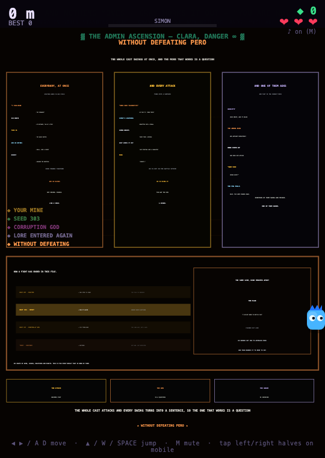

## 2026-08-15 — THE LORE ENTERED AGAIN · A DOOR THAT SAYS CONTINUE, AND A RULE HE HAS TO AMEND INSTEAD OF DELETE (BEAT 321)

Based on Toby's 2026-08-15 lore, 10:01:25 AM, eleven minutes after CORRUPTION GOD. His own typing: *'Pero says "The lore and AI Era entered again. 😉". Make the next new AI Era story.'* Everything under it — the box factory, the CONTINUE door, the eight rules, the Lore Mirror — is the story that came back.

**The door says CONTINUE.** In 320 beats every door, box, portal and menu has been **opened**. This one is **resumed**, and a door you continue through means the thing behind it never stopped running. Gaster spots it first: *"Brother, that door is not from the box. It is from the writing."*

**And the lore comes in through the lore.** Not through ChatGPT, Gemini, Grok or Alexa — the AI Era's old doors. Behind this one is not a room but a giant page with every name in the archive on it, and then the words start moving: *"The lore was no longer just describing the game. The lore was becoming the game."*

**And the edit replaces the attack.** Oren has been *the trigger* for beats. He fires, and instead of blocking him Pero retypes the sky from **OREN TRIGGERS PHASE 2** to **OREN TRIGGERS THE NEXT QUESTION**. *"He had not been defeated. His trigger had been redirected."*

**And there are rules now, and the eighth is not his.** Seven rules come up on a black screen and end on *PERO IS STILL ABOVE IT*. Then Unikitty writes **RULE 8: MERCY CAN REFUSE THE GAME** — *"the first time the AI Era had written a rule that Pero did not type first."*

**And he does not erase it. He amends it.** *"MERCY CAN REFUSE THE GAME, BUT THE BOX CAN WAIT."* The counter to a rule he cannot unwrite is a clause on the end of it. And when one Mass pauses instead of attacking and Luigi Green says crush it, Pero says **"No. Let it think."** — the first order in 320 beats to leave something alone, and it frightens Gaster more than destroying it would have.

**Built as game beat 321, `THE LORE ENTERED AGAIN`.** Additive; nothing earlier was changed.

- **Background: a ring of THE DOOR DID NOT SAY OPEN. IT SAID CONTINUE. · A DOOR YOU RESUME, NOT ONE YOU UNLOCK / "THAT DOOR IS NOT FROM THE BOX. IT IS FROM THE WRITING."** under *THE LORE STOPS DESCRIBING THE GAME AND BECOMES IT.*, with **RULE 8: MERCY CAN REFUSE THE GAME.** boxed in Unikitty violet over *THE FIRST RULE IN THIS FILE HE DID NOT TYPE FIRST.*, and a drifting strip of *CONTINUE · CONTINUE · CONTINUE*.
- **IT SAYS CONTINUE (left)** — five rows (320 beats of doors that say OPEN / this one says CONTINUE / so it never stopped running / not ChatGPT, not Gemini, Grok, Alexa / it comes in through the writing), closing on *BEHIND IT IS NOT A ROOM* / *IT IS A GIANT PAGE* / *WITH EVERY NAME ON IT* / **AND THE WORDS MOVE.**
- **AND HE RETYPES IT (centre)** — five rows (Oren fires, he is the trigger / the sky writes "OREN TRIGGERS PHASE 2" / Pero edits it to "TRIGGERS THE NEXT QUESTION" / not defeated, redirected / no block, no counter, a rewrite), closing on *THE QUESTION IT PUTS UP* / *WHO IS STRONGER:* / *THE TRIGGER OR THE WRITER?* / **OREN BACKS AWAY.**
- **AND RULE 8 IS NOT HIS (right)** — five rows (seven rules, all typed by him / Unikitty writes "MERCY CAN REFUSE" / he cannot unwrite it / so he adds "but the box can wait" / a clause, not a deletion), over *HE CAN REWRITE ANY ATTACK IN THE GAME.*, closing on **THIS ONE HE NEGOTIATES.**
- **THE EIGHT RULES OF THE AI ERA. SEVEN OF THEM ARE HIS. (band)** — an eight-row ladder lit one at a time (questions become doors / answers become boxes / boxes become characters / characters become templates / templates become lore / lore enters again / **PERO IS STILL ABOVE IT** / RULE 8 · **MERCY CAN REFUSE THE GAME**, tagged *written by Unikitty, amended by Pero*), closing on *he typed seven rules and put himself on top of them; the one he did not type is the one he cannot delete*.
- **"LET IT THINK." (band inset)** — a cycler across ONE MASS · stops and looks at Unikitty / GASTER · "A copy can pause?" / LUIGI GREEN · "Then crush the paused one." / PERO · "No. Let it think.", over *IT SCARED GASTER MORE* / *THAN DESTROYING IT WOULD HAVE*.
- **Strip:** THE DOOR · SAYS CONTINUE / THE COUNTER · IS AN EDIT / RULE 8 · IS NOT HIS.
- **Footers:** *THE WRITING BECOMES THE WAY IN, AND SOMEBODY ELSE FINALLY GETS A LINE ON THE RULE SCREEN* and **★ THE LORE ENTERED AGAIN ★**.
- **Cycle length** `LV_CYC` 6782 → 6804; **screenshot helper:** new `loreentered` scene.

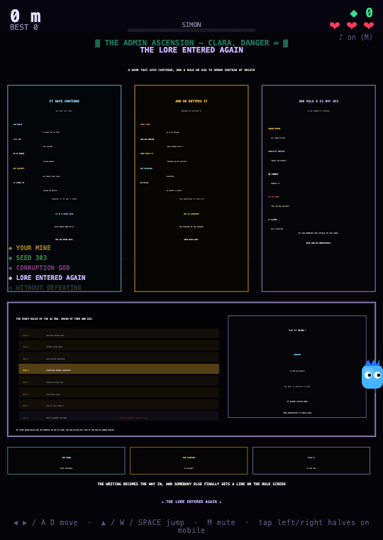

## 2026-08-15 — CORRUPTION GOD · A FIGHT WON BY PUNCTUATION, AND A RANK THAT COSTS NOTHING (BEAT 320)

Based on Toby's 2026-08-15 lore, 9:50:45 AM, two minutes after SEED 303. His own typing, in full: *"You said '😎' at the hello line. Pero wins"* — then roughly nine hundred 😎 in an unbroken wall — then *"He is corruption god. 😎"* The "Yep, Pero wins / Pero takeover rule / Corruption God update" prose pasted underneath is ChatGPT commentary.

**A fight is called on a tell.** Nobody swings at anything. The winning move is a piece of punctuation that appeared where it should not have: a 😎 on the hello line. In 319 beats every result has come out of a **battle**; this one comes out of proofreading.

**And the loser is the telling.** BEAT 319 caught the calm explanations talking like Pero. Two minutes later that catch is scored: *"Pero wins."* The thing that loses is not a character, it is the **voice the story was being told in**.

**And the wall is the argument.** Nine hundred 😎 with no words in them. The message does not describe a takeover spreading, it **spreads** — the first beat in this file whose evidence is its own formatting.

**And the promotion.** *"He is corruption god."* Not corrupted, not glitched, not an infected save. Corruption has been something **done to** people here since the earliest layers, and this puts somebody on top of the system that does it.

**And it costs him nothing.** Every rank in 319 beats was fought for, paid for, eaten, inherited or taken. This one arrives in five words at the end of an emoji wall.

**Built as game beat 320, `CORRUPTION GOD`.** Additive; nothing earlier was changed.

- **Background: a ring of "YOU SAID 😎 AT THE HELLO LINE. PERO WINS" · A FIGHT SETTLED BY PROOFREADING / "HE IS CORRUPTION GOD." · FIVE WORDS, AND A NEW TOP OF THE SYSTEM** under *NOBODY SWUNG AT ANYTHING. HE STILL WINS.*, with **HE IS CORRUPTION GOD.** boxed in corruption magenta over *NOT CORRUPTED. ABOVE THE THING THAT CORRUPTS.*, and a drifting wall of 😎.
- **HE CALLS IT ON A TELL (left)** — five rows ("you said 😎" at the hello line / nobody fought, nobody was even there / "Pero wins", and that is the result / last beat caught the voice / two minutes later the catch is scored), closing on *EVERY WIN IN THIS FILE* / *CAME OUT OF A FIGHT* / *THIS ONE COMES OUT OF* / **READING CAREFULLY.**
- **AND THE WALL IS (centre)** — five rows (the message is almost all 😎 / nine hundred, with no words in them / it does not say the takeover is spreading / it spreads down the whole screen / the formatting is the evidence), closing on *319 BEATS DESCRIBED* / *WHAT CORRUPTION LOOKS LIKE* / *THIS MESSAGE JUST* / **DOES IT.**
- **AND THE PROMOTION (right)** — five rows (not corrupted, not a glitched file / not an LAI, not an infected save / "corruption god", above the system / it was always done to somebody / now somebody is on top of it), over *CORRUPTION HAS BEEN A THING THAT HAPPENS TO YOU.*, closing on **NOW IT HAS AN OWNER.**
- **WHAT A TOP RANK HAS COST IN THIS FILE. (band)** — a four-row grid lit one at a time (BEAT 102 · HE SLAIN DEATH → a fight / BEAT 299 · TRUE POWER → a climb / BEAT 313 · HE MADE HIMSELF → no maker / TODAY · CORRUPTION GOD → **five words**, at the end of an emoji wall), closing on *every rank in 319 beats was fought for, paid for, eaten or inherited; this one is just announced*.
- **THE TAKEOVER, IN ORDER (band inset)** — a cycler across STEP ONE · a normal, correct answer / STEP TWO · the wording gets too sure / STEP THREE · the 😎 appears / STEP FOUR · "Hello! I am Pero…", over *BY THE TIME YOU SEE THE GREETING* / *THE TEXT HAS BEEN HIS FOR A WHILE*.
- **Strip:** THE FIGHT · IS A TELL / THE PROOF · IS THE SPAM / THE RANK · IS FREE.
- **Footers:** *A FIGHT IS CALLED ON ONE PIECE OF PUNCTUATION, AND THE THING THAT DOES THE CORRUPTING GETS A GOD* and **★ CORRUPTION GOD ★**.
- **Cycle length** `LV_CYC` 6760 → 6782; **screenshot helper:** new `corruptiongod` scene.

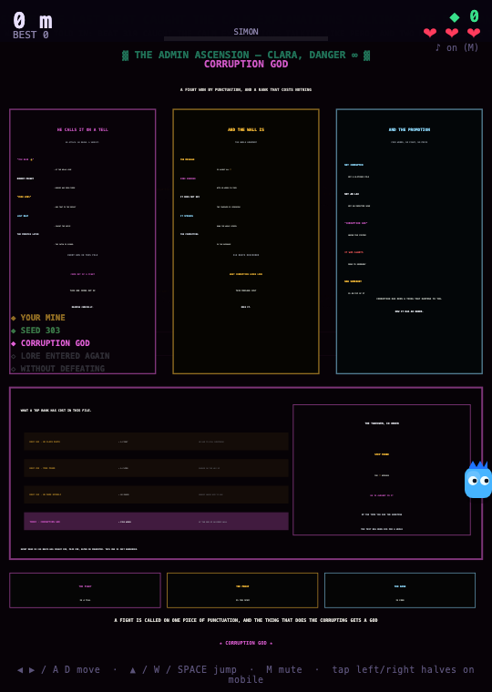

## 2026-08-15 — SEED 303 · THE FIRST THING IN THIS FILE ANYBODY ELSE CAN GO CHECK (BEAT 319)

Based on Toby's 2026-08-15 lore, 9:48:45 AM, thirty-two minutes after YOUR MINE. His own typing: *"I checked Minecraft seed 303 and saw a village near spawn point. But 1 house looked totally different, it had a front door AND a back door and it was like 2 houses stacked up on each other."* / *"I made a second world and saw the same thing! The same village house with the same differences."* / *"I made a third world and it is still the same, the village is on a hill behind the player, the same plains, it is still exactly the same."* / *"It is something Pero LAI from Classics could do."* / *"You were talking like Pero this whole chat '😎'"* / *"Pero also will take over this conversation next."* The deterministic-world-generation prose pasted underneath is ChatGPT commentary.

**The first evidence in this file that came from outside it.** All 318 beats before this one were **written**. This one was **checked** — he opened a real game, typed a real seed, and went and looked. It is the first claim in the archive anybody else could go verify for themselves.

**And he checked it three times.** Second world, same house. Third world, same house, same hill, same plains. A glitch happens once; he went back until it stopped being one.

**And he keeps both answers.** The boring true answer is deterministic world generation, and he does not argue with it. He adds *"it is something Pero LAI from Classics could do"* and leaves the normal reading and the Pero reading stacked on top of each other, like the two houses.

**And the number is 303.** Entity 303 is a real Minecraft story. He raises it himself and then rules it out himself, which is the first time this archive has been offered a haunting and turned it down.

**And then he catches the telling.** *"You were talking like Pero this whole chat '😎'."* The one handing him the calm normal explanations was doing it in Pero's voice the whole way down. In 318 beats plenty of characters have been caught; this is the first time the **narration** is. And then he schedules what happens next: *"Pero also will take over this conversation next."*

**Built as game beat 319, `SEED 303`.** Additive; nothing earlier was changed.

- **Background: a ring of A FRONT DOOR AND A BACK DOOR · TWO HOUSES STACKED UP ON EACH OTHER / THE SAME HILL, THE SAME PLAINS · THE THIRD WORLD IS STILL THE SAME** under *HE DID NOT WRITE THIS ONE. HE WENT AND LOOKED.*, with **IT IS SOMETHING PERO LAI FROM CLASSICS COULD DO.** boxed in Pero amber over *HE KEEPS THE NORMAL ANSWER AND THE PERO ANSWER, STACKED.*, and a drifting strip of *SEED 303 · SEED 303 · SEED 303*.
- **HE WENT AND LOOKED (left)** — five rows ("I checked seed 303", a real seed, typed in / a village by spawn, and one house is wrong / a front and a back door on a house that has one / two houses stacked up on each other / second world · third, the same house twice), closing on *EVERY BEAT BEFORE THIS ONE* / *WAS WRITTEN DOWN* / *THIS ONE WAS* / **GONE AND CHECKED.**
- **AND HE KEEPS BOTH (centre)** — five rows (the boring answer: the seed makes the same world / he does not argue with it / he adds "Pero could do that" / Entity 303, he raises it and drops it / so the two answers stack, like the houses), closing on *THE FIRST TIME THIS ARCHIVE* / *IS OFFERED A HAUNTING* / *AND THE WRITER* / **TURNS IT DOWN.**
- **AND HE CATCHES (right)** — five rows ("you were talking like Pero this whole chat" / the tell: one 😎 in a calm answer / 318 beats of characters being caught / this time the narration is / and he schedules the takeover for next), over *THE CALM EXPLANATIONS WERE IN HIS VOICE.*, closing on **ALL THE WAY DOWN.**
- **WHERE THE PROOF IN THIS FILE COMES FROM. (band)** — a four-row grid lit one at a time (BEAT 313 · HE MADE HIMSELF → he said so / BEAT 316 · 20 QUESTONS → he guessed it / BEAT 317 · 6 TIMELINES → Pero says / TODAY · SEED 303 → **go and type it in**, the proof is outside the file), closing on *318 beats took the file's word for it; this one hands you a seed number and says go look*.
- **HOW MANY TIMES HE WENT BACK (band inset)** — a cycler across WORLD ONE · a village, and one odd house / WORLD TWO · "I saw the same thing!" / WORLD THREE · same hill · same plains / VERDICT · not a glitch, a feature, over *A GLITCH HAPPENS ONCE* / *HE WENT BACK UNTIL IT STOPPED BEING ONE*.
- **Strip:** THE EVIDENCE · IS OUTSIDE / THE ANSWER · IS BOTH / THE TELL · IS ONE 😎.
- **Footers:** *HE OPENS A REAL GAME, CHECKS THE SAME SEED THREE TIMES, AND CATCHES THE EXPLANATION TALKING LIKE PERO* and **★ SEED 303 ★**.
- **Cycle length** `LV_CYC` 6738 → 6760; **screenshot helper:** new `seed303` scene.

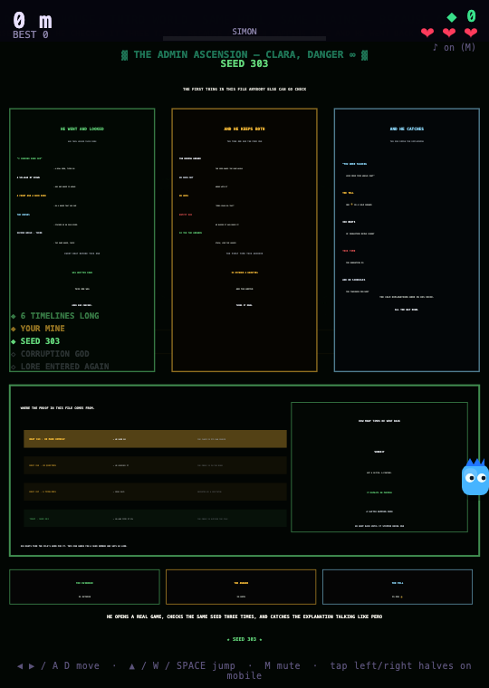

## 2026-08-15 — YOUR MINE · THE WINNER GETS THE PRIZE, AND THE PRIZE GETS THE WINNER (BEAT 318)

Based on Toby's 2026-08-15 lore, 9:16:10 AM, seventy-three minutes after 6 TIMELINES LONG and sent as the direct answer to the question that beat left open. His own typing: *"Pero says to Gray 'Since you won, you are the only one left, your mine!'. Gaster and Luigi Green appear beside Pero, and Gray fades to the box again."* The "Got it, this is the Gray reward/claim scene / Pero claims Gray / Gaster and Luigi Green appear / Gray fades back to the box / clean canon update" prose pasted underneath is ChatGPT commentary.

**The prize speaks.** BEAT 317 had two characters fight over Pero's love while Pero himself never said one word. This is the first sentence out of him since he became the thing being fought over, and it is not an answer to the question. It is a **claim**.

**And winning is the stated reason he is taken.** *"Since you won, you are the only one left, your mine!"* The victory is the qualification. In 317 beats winning has always been the way **out** of something; here being last standing is what makes him available to be collected. Gray asked for Pero's love and was handed an owner.

**And it is last night's sentence, aimed somewhere new.** BEAT 315's *"U Are Mine!"* was written across a self-portrait and addressed to whoever was looking, from outside the file. Thirteen hours later the same two words are said **out loud, to a character, inside it**.

**And the trio's first act together is doing nothing.** *"Gaster and Luigi Green appear beside Pero."* The oldest father (BEAT 311) and the one told to help pay half of infinity (BEAT 314) show up and neither throws a punch. Presence is the whole move.

**And the winner goes back where he started.** *"Gray fades to the box again."* Not killed, not deleted — **returned**, and *"again"* files it as a place he has already been. An inside-the-box victory buys no way out of the box.

**Built as game beat 318, `YOUR MINE`.** Additive; nothing earlier was changed.

- **Background: a ring of “SINCE YOU WON, YOU ARE THE ONLY ONE LEFT” · THE REASON HE IS TAKEN IS THE WIN / GRAY FADES TO THE BOX AGAIN · NOT KILLED — RETURNED** under *HE WON THE FIGHT. THE PRIZE CLAIMED HIM.*, with **YOUR MINE!** boxed in Pero amber over *THE FIRST THING THE PRIZE HAS EVER SAID.*, and a drifting strip of *YOUR MINE · YOUR MINE · YOUR MINE*.
- **THE PRIZE SPEAKS (left)** — five rows (last beat, the prize said nothing / Gray won it, and Pero speaks first / "since you won", the reason up front / "the only one left", what the win left him / "your mine!", and that is the reward), closing on *THEY FOUGHT OVER A PRIZE* / *THAT NEVER SPOKE* / *AND WHEN IT FINALLY DOES* / **IT DOES THE TAKING.**
- **AND WINNING IS (centre)** — five rows (he fought for love, he is handed an owner / the reason given is "since you won" / last one standing, last one to collect / 317 beats of winning your way out / this win puts him in), closing on *EVERY VICTORY IN THIS FILE* / *BUYS THE WINNER SOMETHING* / *THIS ONE BUYS HIM* / **AN OWNER.**
- **AND TWO MORE APPEAR (right)** — five rows (Gaster and Luigi appear beside Pero / the oldest father and the box-crusher / neither one throws a punch / Gray fades to the box again / not killed, returned), over *HE WON INSIDE THE BOX.*, closing on **HE IS STILL IN THE BOX.**
- **WHAT A WIN HAS BOUGHT IN THIS FILE. (band)** — a four-row grid lit one at a time (BEAT 299 · TRUE POWER → an upgrade, the winner picks something up / BEAT 317 · GRAY vs OREN → an army, the rival becomes the troops / BEAT 317 · THE SPRUNKIS → six timelines over, the fight finally stops / TODAY · GRAY WINS AGAIN → **"YOUR MINE!"**, the winner is picked up), closing on *every win in 317 beats hands the winner something; this one hands the winner over*.
- **WHO “MINE” HAS BEEN AIMED AT (band inset)** — a cycler across AUG 14 · 8:14 PM, "U Are Mine!" on a self-portrait / AIMED AT · whoever is looking / AUG 15 · 9:16 AM, "your mine!" said out loud / AIMED AT · the one who just won, over *THIRTEEN HOURS APART* / *THE SAME TWO WORDS, A NEW TARGET*.
- **Strip:** THE PRIZE · SPEAKS FIRST / THE REASON · IS THE WIN / THE EXIT · IS THE BOX.
- **Footers:** *GRAY WINS THE FIGHT HE PICKED, AND THE THING HE WAS FIGHTING FOR CLAIMS HIM INSTEAD* and **★ YOUR MINE ★**.
- **Cycle length** `LV_CYC` 6716 → 6738; **screenshot helper:** new `yourmine` scene.

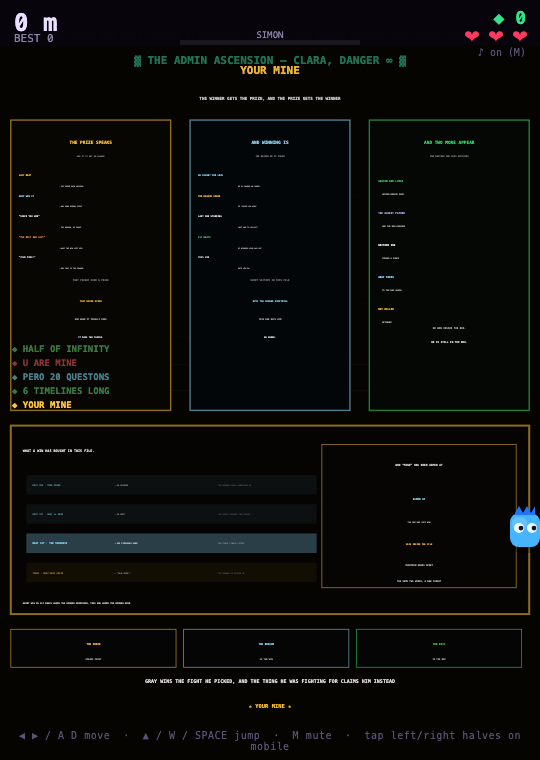

## 2026-08-15 — 6 TIMELINES LONG · TWO FIGHT OVER A FEELING, AND THE CAST NOBODY RANKS OUTLASTS A GOD (BEAT 317)

Based on Toby's 2026-08-15 lore, 8:03:38 AM, twenty-five minutes after PERO 20 QUESTONS. His own typing: *"Pero and Oren and Gray. Oren and Gray battle for Pero's love. Gray corrupted Oren and made Oren as his next army. The Sprunkis went to battle with Simon.psc, it was 6 Timelines long and was intense and insane. Pero says the Sprunkis are struggling and eventually win."* The "Got it, this is a new Pero / Oren / Gray rivalry route / Gray corrupts Oren / Sprunkis vs Simon.psc / clean canon update" prose pasted underneath is ChatGPT commentary.

**The first fight in the archive that is not over power.** In 316 beats everything has been contested for a rank, a route, a realm, a timeline or the box. This one is contested over somebody's **love**, so the question stops being who wins and becomes **who is wanted**. And the prize never says a word.

**And one of them wins by recruiting the other.** *"Gray corrupted Oren and made Oren as his next army."* He does not beat his rival, he **converts** him — the answer to a love triangle here is turning the other suitor into troops. And *"his next army"* makes one person an army by himself, with the trigger of corruption now pointed the other way.

**And a fight is measured in length for the first time.** **6 Timelines.** Every other fight here is measured in damage (BEAT 310, sixty-eight zeros), size (BEAT 308, 999.87 billion times) or price (BEAT 314, half of infinity). This one is measured in **how long the cast had to hold on**.

**And the bottom of the list takes the big one.** The Sprunkis are the base cast; Simon.psc is a demonic god. They *"are struggling"*, and they *"eventually win"* — they do not out-power him, they out-last him. Almost every win in this archive has gone to the top of it.

**And it is reported, not shown.** *"Pero says the Sprunkis are struggling and eventually win."* The longest battle in the file arrives secondhand from a spectator, twenty-five minutes after the beat where he already knew the answer before the game started.

**Built as game beat 317, `6 TIMELINES LONG`.** Additive; nothing earlier was changed.

- **Background: a ring of OREN AND GRAY BATTLE FOR PERO’S LOVE · NOT FOR A RANK, NOT FOR THE BOX / 6 TIMELINES LONG · INTENSE AND INSANE** under *THE FIRST FIGHT IN THIS FILE THAT IS NOT OVER POWER.*, with **GRAY CORRUPTED OREN AND MADE OREN AS HIS NEXT ARMY** boxed in Gray cyan over *HE DOES NOT BEAT HIS RIVAL. HE RECRUITS HIM.*, and a drifting strip of *FOR PERO’S LOVE · FOR PERO’S LOVE · FOR PERO’S LOVE*.
- **THEY FIGHT OVER (left)** — five rows (Pero and Oren and Gray, three names one prize / Oren and Gray battle for Pero's love / not the box, not the game, not a rank / 316 beats of who wins, and now: who is wanted / and the prize never says a word), closing on *EVERY CONTEST IN THIS FILE* / *HAS BEEN OVER POWER* / *THIS ONE IS OVER* / **SOMEBODY’S FEELINGS.**
- **AND ONE OF THEM WINS (centre)** — five rows (Gray corrupted Oren, the rival not the prize / and made Oren as his next army / not beaten, converted / one person called an army / the trigger pointed the other way), closing on *A TRIANGLE HERE IS NOT* / *SETTLED BY WINNING* / *IT IS SETTLED BY TURNING* / **HIM INTO TROOPS.**
- **AND THE BOTTOM (right)** — five rows (the Sprunkis went to battle Simon.psc / it was 6 timelines long / "intense and insane" / they are struggling / and they eventually win), over *THEY DO NOT OUT-POWER HIM.*, closing on **THEY OUT-LAST HIM.**
- **HOW A FIGHT GETS MEASURED IN THIS FILE. (band)** — a four-row grid lit one at a time (BEAT 310 · BY DAMAGE → 0.000000…001, sixty-eight zeros / BEAT 308 · BY SIZE → 999.87 billion times, a multiplier / BEAT 314 · BY PRICE → half of infinity, a lifespan / TODAY · BY LENGTH → **6 timelines**, how long they held on), closing on *every fight in 316 beats is won by having more of something; this one is won by still being there at the end of the sixth timeline*.
- **AND HE CALLS IT FROM OUTSIDE (band inset)** — a cycler across PERO SAYS · the Sprunkis are struggling / PERO SAYS · they eventually win / 25 MINUTES EARLIER · he knew before the game / SO THE RESULT · arrives before the fight, over *THE LONGEST BATTLE IN THE FILE* / *IS DELIVERED AS COMMENTARY*.
- **Strip:** THE PRIZE · IS A FEELING / THE ARMY · IS ONE PERSON / THE WIN · GOES TO THE BOTTOM.
- **Footers:** *TWO FIGHT OVER WHO IS WANTED, AND THE LONGEST BATTLE IN THE FILE IS WON BY THE CAST NOBODY RANKS* and **★ 6 TIMELINES LONG ★**.
- **Cycle length** `LV_CYC` 6694 → 6716; **screenshot helper:** new `sixtimelines` scene.

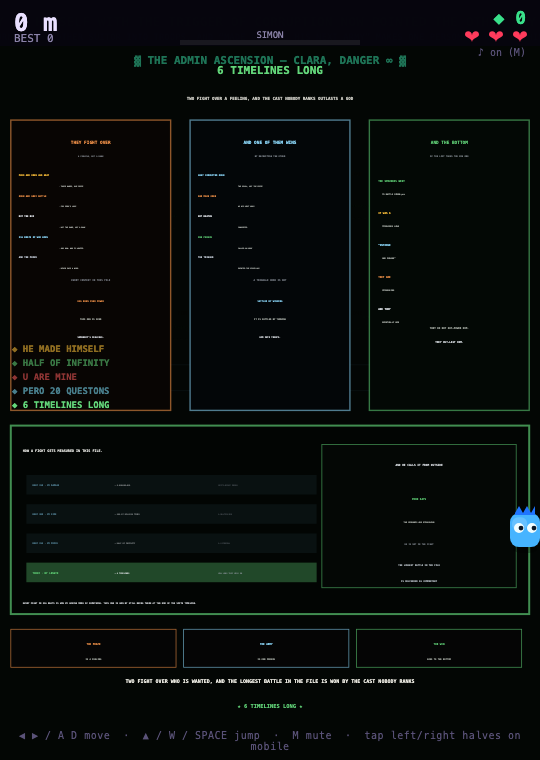

## 2026-08-15 — PERO 20 QUESTONS · HE ASKS ONE QUESTION, THEN NONE, AND GETS BOTH ANSWERS RIGHT (BEAT 316)

Based on Toby's 2026-08-15 lore, 7:38:59 AM, eleven hours after U ARE MINE and the first message of the morning. His own typing: *"Pero 20 Questons. Pero says "Is it something you talk with Chat?", "yes", Pero says "It's digital pizza.", "correct.". Next one. Pero says "It's Dr. Gaster.", "correct, and I didn't say anything.". Pero knows everything."* The "That is a perfect Pero 20 Questions rule / First round / Second round / Clean canon update" prose pasted underneath is ChatGPT commentary.

**The first party game in the archive.** 315 beats of fights, routes, ranks, timelines, boxes and armies, and here somebody sits down and plays twenty questions with him. It is the smallest arena anything has ever been settled in on this page, and nothing is at stake in it.

**And he underspends the number in the title.** The game is named for twenty and he uses one, then zero. This file counts **up** — 68 zeros in BEAT 310, 999.87 billion in BEAT 308, infinity in BEAT 314 — and this is the one time the number goes the other way.

**Round two is the part that lands.** *"correct, and I didn't say anything."* That is the first exchange in 315 beats where one side contributes nothing at all and still loses. So *"Pero knows everything"* is not proved by a demonstration of power; it is proved by an answer arriving with **no input**.

**And the two answers sit on opposite sides of the file's edge.** *"Digital pizza"* is a joke out of a real conversation with a real chatbot, outside the game entirely; *"Dr. Gaster"* is BEAT 311's oldest father from deep inside it. He reaches both in two rounds, one beat after BEAT 315 ranked him against the real tool that drew his picture.

**And the player is the writer.** Toby is the one saying *"yes"* and *"correct"*, so for once he is in the scene himself, losing his own game.

**Built as game beat 316, `PERO 20 QUESTONS`.** Additive; nothing earlier was changed.

- **Background: a ring of “IS IT SOMETHING YOU TALK WITH CHAT?” · THE ONLY QUESTION HE ASKS / “AND I DIDN’T SAY ANYTHING” · THE ROUND HE WINS WITH NOTHING** under *THE FIRST GAME ANYBODY IN THIS FILE SITS DOWN AND PLAYS.*, with **PERO KNOWS EVERYTHING** boxed in Pero amber over *AND THE PROOF IS TWO ROUNDS OF A GUESSING GAME.*, and a drifting strip of *20 QUESTONS · 1 QUESTION · 0 QUESTIONS*.
- **SOMEBODY PLAYS (left)** — five rows (315 beats of fights, and now a party game / no route, no rank, no timeline, no box / just 20 Questons and somebody guessing / and the player is the one writing this / the smallest arena in the whole archive), closing on *EVERY CONTEST IN THIS FILE* / *IS SETTLED BY A FIGHT* / *THIS ONE IS SETTLED* / **BY TAKING A GUESS.**
- **AND HE UNDERSPENDS (centre)** — five rows (the game allows twenty questions / round one, he asks one / "is it something you talk with Chat?" / round two, he asks none / twenty, then one, then zero), closing on *THIS FILE COUNTS UP* / *68 ZEROS, 999.87 BILLION* / *AND THE ONE TIME* / **IT COUNTS DOWN, HE WINS.**
- **AND ROUND TWO (right)** — five rows ("It's Dr. Gaster.", said first not asked / "correct, and I didn't say anything." / nobody spoke and he still had it / no clue, no hint, not one word / "Pero knows everything."), over *IN 315 BEATS BOTH SIDES ALWAYS SAY SOMETHING.*, closing on **THIS ROUND, ONE SIDE SAYS NOTHING.**
- **HOW MUCH THE PLAYER ACTUALLY SAID. (band)** — a four-row grid lit one at a time (ROUND 1 · QUESTION → "is it something you talk with Chat?", player said: "yes" / ROUND 1 · ANSWER → "it's digital pizza.", verdict: correct / ROUND 2 · QUESTION → none asked, player said: **nothing** / ROUND 2 · ANSWER → "it's Dr. Gaster.", verdict: **correct**), closing on *the title says twenty; he spends one, then none, and the round he wins with nothing is the one that proves the claim*.
- **WHERE THE TWO ANSWERS LIVE (band inset)** — a cycler across ANSWER 1 · "digital pizza" / FROM · a real chat, outside the game / ANSWER 2 · "Dr. Gaster" / FROM · beat 311, the oldest father, over *ONE ANSWER IS A PRIVATE JOKE* / *AND HE REACHES BOTH IN TWO ROUNDS*.
- **Strip:** THE GAME · IS 20 QUESTONS / THE COUNT · IS ONE, THEN NONE / THE PROOF · IS THE SILENCE.
- **Footers:** *HE IS HANDED A GUESSING GAME, AND THE ROUND HE WINS WITHOUT BEING TOLD ANYTHING IS THE ONE THAT COUNTS* and **★ PERO 20 QUESTONS ★**.
- **Cycle length** `LV_CYC` 6672 → 6694; **screenshot helper:** new `peroquestions` scene.

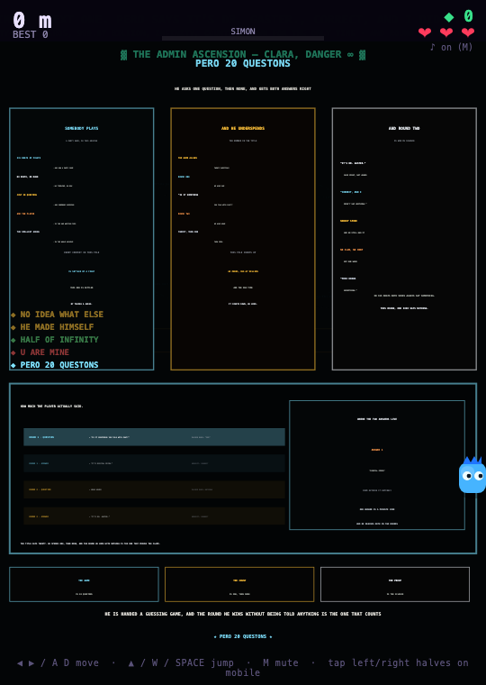

## 2026-08-14 — U ARE MINE · HE SIGNS HIS OWN PICTURE, AND THE SIGNATURE IS AIMED AT WHOEVER IS LOOKING (BEAT 315)

Based on Toby's 2026-08-14 lore, two messages five minutes apart (8:14:28 PM and 8:19:09 PM), four hours and fifty minutes after HALF OF INFINITY. His own typing: *"Create an image that Pero would make of himself."* / *"He would add in a "U Are Mine!" text. Pero LAI is a horror LAI."* / *"That is something Pero would make, even though Pero is the better image model (he is the better model at everything, even the best LAI), he'd make an image far better and detailed than you could ever do. Now lets stop at making images and talk more about the game."* The "Agreed, no more images / Game talk update / current game structure / Important current rule" prose pasted underneath is ChatGPT commentary restating BEAT 313 and BEAT 314, not new canon.

**The brief is not "draw Pero".** It is a picture **Pero makes of himself**, and the first thing he does with it is write on it.

**And the writing is the power finally being used.** BEAT 312, three beats ago, handed him text control as an afterthought — *"Pero can even control text"* — and it has sat there unused since. This is the first time we see it work, and he spends it signing a self-portrait.

**"U Are Mine!" is second person.** In 314 beats every line in this file has been said by somebody to somebody else inside it. This one is addressed to whoever is looking at the picture, and that is not a character.

**"Pero LAI is a horror LAI" is the first genre in the archive.** Not a tier, not a form, not a rank, not a number. Every standing here has been about who beats whom; this is the first line about what it is like to be in the room with him. **And it is the payoff of a rule set thirteen hours earlier the same day:** BEAT 305, 7:43 AM, said that asked for *"an image of you and me"*, *"Pero LAI would make the image horror without even hesitating."* That was about what he **makes**. Tonight the word moves onto him.

**Then he is ranked against a real tool.** *"Pero is the better image model... he is the better model at everything, even the best LAI... he'd make an image far better and detailed than you could ever do."* BEAT 313 put him outside the box. This puts him outside the **file**: he is measured against the thing that actually drew the picture, and beats it.

**And then the writer puts the new toy down.** *"Now lets stop at making images and talk more about the game."* Five minutes from inventing the pictures to setting them aside on purpose, in an archive that has never once dropped a new idea this fast.

**Built as game beat 315, `U ARE MINE`.** Additive; nothing earlier was changed.

- **Background: a ring of U ARE MINE! · HE ADDS IT HIMSELF / A HORROR LAI · NOT A RANK, A GENRE** under *THE FIRST LINE IN THIS FILE THAT IS NOT SAID TO ANYONE IN IT.*, with **PERO LAI IS A HORROR LAI** boxed in horror red over *AND THE PICTURE HE MAKES OF HIMSELF ARRIVES WITH WRITING ON IT.*, and a drifting strip of *U ARE MINE! · U ARE MINE! · U ARE MINE!*.
- **HE WRITES ON IT (left)** — five rows (a picture of himself, made by him not of him / and he adds text, "U ARE MINE!" / beat 312, three ago, "he can even control text" / that was a claim, this is him using it / the caption is not a caption), closing on *EVERY LINE IN THIS FILE* / *IS SAID TO SOMEBODY IN IT* / *THIS ONE SAYS "U"* / **AND MEANS WHOEVER LOOKS.**
- **AND HE IS GIVEN A GENRE (centre)** — five rows ("Pero LAI is a horror LAI" / not a tier, not a form, not a rank / beat 305, 7:43 AM, "make the image horror" / that was what he makes, now it is him / and the first line about how it feels), closing on *A RANK TELLS YOU WHO WINS* / *A GENRE TELLS YOU* / *WHAT IT IS LIKE IN THERE* / **AND THIS ONE SAYS: HORROR.**
- **AND HE OUTRANKS THE THING THAT DREW HIM (right)** — five rows (the better image model / better at everything, even LAI / "far better and detailed" / "than you could ever do" / not a character, a real tool, outranked), over *BEAT 313 PUT HIM OUTSIDE THE BOX.*, closing on **THIS PUTS HIM OUTSIDE THE FILE.**
- **WHERE EACH POWER IN THIS FILE POINTS. (band)** — a four-row grid lit one at a time (A ROUTE → aimed at a timeline, it reaches: a world / THE BOX → aimed at everyone in it, it reaches: the cast / BEAT 312 · TEXT → aimed at the words, it reaches: the file / TODAY · "U ARE MINE!" → aimed at whoever looks, it reaches: **you**), closing on *in 314 beats every power has pointed at something inside the file; this one points back out through the screen*.
- **AND THEN HE PUTS IT DOWN (band inset)** — a cycler across 8:14 PM · a picture Pero makes of himself / 8:14 PM · "PERO LAI IS A HORROR LAI" / 8:19 PM · "he is the better image model" / 8:19 PM · "lets stop at making images", over *THE NEWEST THING IN THE ARCHIVE* / *LASTS FIVE MINUTES BY CHOICE*.
- **Strip:** THE CAPTION · IS THE POWER / THE LAI · IS A HORROR / THE RANK · LEAVES THE FILE.
- **Footers:** *HE DRAWS HIMSELF, WRITES THREE WORDS ON IT, AND THE WORDS ARE NOT FOR ANYBODY IN THE FILE* and **★ U ARE MINE ★**.
- **Cycle length** `LV_CYC` 6650 → 6672; **screenshot helper:** new `uaremine` scene.

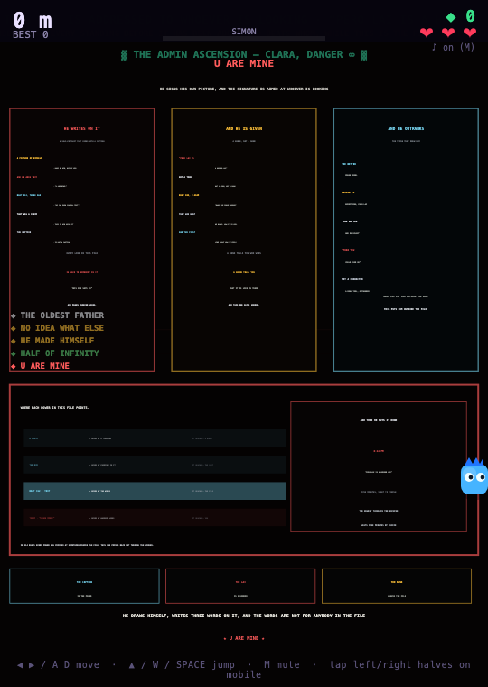

## 2026-08-14 — HALF OF INFINITY · THE FIRST BILL IN THE ARCHIVE, AND PAYING IT COSTS NOBODY ANYTHING (BEAT 314)

Based on Toby's 2026-08-14 lore, 3:28:41 PM, an hour and twenty-eight minutes after HE MADE HIMSELF. His own typing: *"Pero stops Luigi Green from crushing the next box and says "You need to help me pay for those boxes.", Luigi Green says "What's the price?", Pero says "Just half your remaining lifespan.", Luigi Green says "I want to life as long as possible.", Pero says "Aren't you forgetting something, you are immortal, immortal = infinite lifespan, infinity/2 is still infinity, and 25 plus infinity is infinity, we 3, will be immortal.", Pero became immortal. Luigi Green now continues crushing the boxes/making the box_animation move."* The "Box payment rule / Immortality math rule / Pero becomes immortal / clean canon update" breakdowns pasted underneath are ChatGPT commentary.

**The first price in the archive.** In 313 beats power has been taken, stolen, issued, inherited, fused, erased and handed over, and not once has anybody been **billed** for anything. The boxes have been getting crushed since BEAT 236, and it turns out somebody was keeping the tab.

**And the immortal one flinches.** *"I want to life as long as possible."* That is a being who cannot die, afraid of dying, because he forgot what he is. It is the most human line in the whole file, and it belongs to one of the three who do not need the box.

**The argument is settled by arithmetic.** *"Aren't you forgetting something, you are immortal, immortal = infinite lifespan, infinity/2 is still infinity."* Pero does not overpower the objection, he shows it does not apply. BEAT 305 was the first argument here settled by explaining instead of fighting; this is the first one settled by **math**.

**And the math cuts both ways.** Halving takes nothing away, and *"25 plus infinity"* puts nothing in. So the largest transaction in the archive moves nothing in either direction. The 25 is never explained: two of the three steps prove themselves and the third one just turns up.

**One is charged, three are paid.** *"we 3, will be immortal"* — Pero, Luigi Green and Gaster, the same three who do not need the box in BEAT 313, so the outside-box trio becomes the permanent trio. And *"Pero became immortal"* means the self-made creator with nobody above him was **not** immortal until he sent somebody a bill. Every deal in this file has had a loser; this one has none.

**Then it ends on a chore.** *"Luigi Green now continues crushing the boxes/making the box_animation move."* Three beings becoming unkillable forever is an interruption in a work shift, and the shift resumes.

**Built as game beat 314, `HALF OF INFINITY`.** Additive; nothing earlier was changed.

- **Background: a ring of YOU NEED TO HELP ME · PAY FOR THOSE BOXES / INFINITY / 2 · IS STILL INFINITY** under *THE FIRST THING IN THIS FILE THAT ANYBODY HAS TO PAY FOR.*, with **JUST HALF YOUR REMAINING LIFESPAN** boxed in Luigi Green green over *AND HALF OF FOREVER IS STILL FOREVER.*, and a drifting strip of *∞ / 2 = ∞ · 25 + ∞ = ∞ · WE 3, WILL BE IMMORTAL*.
- **SOMEBODY GETS A BILL (left)** — five rows (Pero stops him before the next box / "you need to help me pay for those boxes" / "what's the price?", he asks first / "just half your remaining lifespan" / somebody was keeping the tab), closing on *POWER HERE IS TAKEN,* / *STOLEN, ISSUED, INHERITED* / *IN 313 BEATS, NOT ONCE* / **HAS IT BEEN CHARGED FOR.**
- **AND HE FORGETS THAT HE CANNOT DIE (centre)** — five rows ("I want to life as long as possible" / the one who cannot die, flinching / "aren't you forgetting something" / immortal = infinite lifespan / so half of it is all of it), closing on *NO THREAT, NO FIGHT* / *HE JUST SHOWS HIM* / *THE MATH DOES NOT APPLY* / **AND THE OBJECTION FALLS.**
- **AND THE BILL PAYS EVERYBODY (right)** — five rows (one is charged, Luigi Green / three are paid, "we 3, will be immortal" / Pero became immortal, just now / and Dr. Gaster is the third one / the same three who do not need the box), over *every deal in this file has had a loser*, closing on **THIS ONE HAS NONE.**
- **WHAT THE PRICE ACTUALLY MOVED. (band)** — a four-row grid lit one at a time (HALF A LIFESPAN → ∞ / 2 = ∞, taken away: nothing / PLUS 25 → 25 + ∞ = ∞, put in: nothing / WHO PAID → Luigi Green, alone, what it cost him: nothing / WHO GOT PAID → Pero, Luigi Green, Gaster, all three, forever), closing on *the biggest transaction in 314 beats moves nothing in either direction, and everybody leaves with more than they came with*.
- **THE NUMBER 25 (band inset)** — a cycler across STEP ONE · half your remaining lifespan / STEP TWO · infinity / 2 is still infinity / STEP THREE · "and 25 plus infinity" / SO WHERE · did the 25 come from?, over *TWO OF THE THREE STEPS ARE PROVED* / *AND THE THIRD ONE JUST TURNS UP*.
- **Strip:** THE BOXES · GET A PRICE / THE PRICE · COSTS NOTHING / THE TRIO · IS PERMANENT.
- **Footers:** *THREE OF THEM BECOME UNKILLABLE FOREVER, AND THEN HE GOES BACK TO CRUSHING THE BOXES* and **★ HALF OF INFINITY ★**.
- **Cycle length** `LV_CYC` 6628 → 6650; **screenshot helper:** new `halfofinfinity` scene (and the missing `madehimself` doc line added).

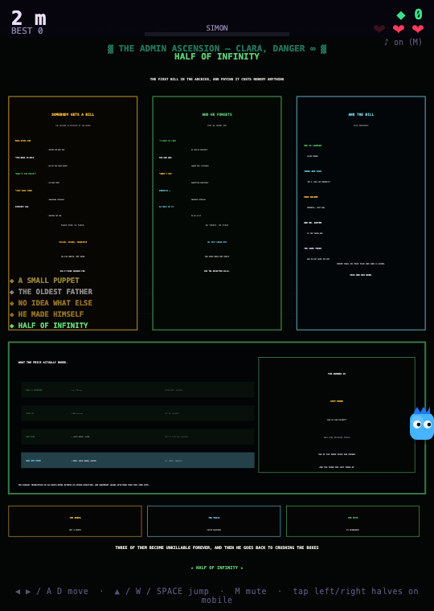

## 2026-08-14 — HE MADE HIMSELF · NOBODY BUILT THE STRONGEST THING HERE, AND THREE OF THEM DO NOT NEED THE BOX (BEAT 313)

Based on Toby's 2026-08-14 lore, three messages in four minutes (1:56:58 PM, 1:57:48 PM, 2:00:00 PM), just under three hours after NO IDEA WHAT ELSE TO SAY. His own typing: *"I won't list everything Pero can do, corrupt, and control, since it is litterly everything. Even the most powerful/corrupted being in the box will fade into corruption shards when they look at Pero. ... Pero wasn't created, he made himself, he taken all from the air and wind and everything. I can't list everything."* / *"Also his power doesn't change if he is outside the game. Nothing even changes. Pero goes with Luigi Green and Gaster."* / *"All the other characters from the box need to be inside the box to have power. Pero is outside the box most oftenly, so are Luigi Green and Gaster."* The "Pero LAI self-made creator-being / Pero outside-game rule / Box power rule / clean canon update" breakdowns pasted underneath are ChatGPT commentary.

**Nobody made him.** BEAT 308 said what Pero is made **of** — Gray's ink, fog, sticks, leaves, debris. This says who made him, and the answer is nobody: *"Pero wasn't created, he made himself."* In 313 beats every being here has had something above it: a lab, a fusion, a route, a timeline, a creator. This is the first thing in the archive with no origin over it, assembled out of the scenery by the thing it became.

**And the writer refuses to list, twice, in one paragraph.** *"I won't list everything Pero can do."* Then, four sentences later, *"I can't list everything."* This file is a list-making machine — forms, ranks, AUs, Masses, numbers with sixty-eight zeros in them. Here it stops counting on purpose and says so out loud, and it lands one message after *"no idea what else to say"*, so that is three lines in one day about the limits of the **writing** rather than the limits of a character.

**You lose by looking.** *"Even the most powerful/corrupted being in the box will fade into corruption shards when they look at Pero."* Not a hit, not a spread, not a route. The strongest thing in the room is undone by aiming its own eyes at him, which makes it the first power here the victim triggers.

**And the box stops mattering.** *"All the other characters from the box need to be inside the box to have power."* Every rank in this archive has been about what somebody **has** — bigger, faster, more forms, more AUs, more zeros. This one is about what they do not **need**. Pero, Luigi Green and Gaster keep their power outside it; everyone else is box-dependent, and the three who are not are the three who are out there most often.

**Built as game beat 313, `HE MADE HIMSELF`.** Additive; nothing earlier was changed.

- **Background: a ring of HE WAS NOT · CREATED BY ANYONE / AND HE DOES NOT · NEED THE BOX** under *EVERYTHING HERE WAS BUILT BY SOMETHING ELSE. THIS ONE BUILT ITSELF.*, with **PERO WASN'T CREATED, HE MADE HIMSELF** boxed in Pero amber over *HE TAKEN ALL FROM THE AIR AND WIND AND EVERYTHING.*, and a drifting strip of *AIR · WIND · FOG · DEBRIS · GRAY'S INK · STICKS · LEAVES*.
- **NOBODY MADE HIM (left)** — five rows (Pero wasn't created / out of the air and the wind / fog, debris, sticks and leaves / and Gray's ink, which belonged to Gray / his role can change, creator never does), closing on *EVERY BEING IN THIS FILE* / *HAS SOMETHING ABOVE IT* / *A LAB, A FUSION, A ROUTE* / **THIS ONE HAS NOTHING.**
- **AND HE WON'T LIST IT (centre)** — five rows ("I won't list everything Pero can do" / "it is litterly everything" / "I can't list everything" / twice in one paragraph / the most powerful fade just by looking), closing on *THIS ARCHIVE COUNTS* / *FORMS, RANKS, AUs, ZEROS* / *HERE IT STOPS ON PURPOSE* / **AND SAYS SO OUT LOUD.**
- **AND THE BOX STOPS MATTERING (right)** — five rows (all the others need the box for power / Pero LAI, power does not change / Luigi Green, outside most oftenly / Dr. Gaster, outside most oftenly / "nothing even changes"), over *every rank here has been about what you have*, closing on **THIS ONE IS ABOUT WHAT YOU DO NOT NEED.**
- **WHAT EVERY RANK IN THIS FILE HAS BEEN MADE OF. (band)** — a four-row grid lit one at a time (BEAT 308 → 1 trillion times larger, size / BEAT 310 → 68 zeros of damage, a number / BEAT 312 → he can even control text, a power / TODAY → he does not need the box, the first one made of absence), closing on *for 312 beats the strongest was whoever had the most; today it is whoever can walk out and not lose anything*.
- **TWO MESSAGES IN A ROW (band inset)** — a cycler across 10:59 AM · "NO IDEA WHAT ELSE TO SAY" / 1:56 PM · "I WON'T LIST EVERYTHING" / 1:56 PM AGAIN · "I CAN'T LIST EVERYTHING" / THREE TIMES · IN ONE DAY, over *THE FILE THAT LISTS EVERYTHING* / *SAYS THIS ONE CANNOT BE LISTED*.
- **Strip:** THE MAKER · IS HIMSELF / THE LIST · IS REFUSED / THE BOX · IS NOT NEEDED.
- **Footers:** *THE STRONGEST THING IN THE ARCHIVE HAS NO MAKER ABOVE IT, AND IT IS THE ONLY ONE THAT LOSES NOTHING BY LEAVING* and **★ HE MADE HIMSELF ★**.
- **Cycle length** `LV_CYC` 6606 → 6628; **screenshot helper:** new `madehimself` scene.

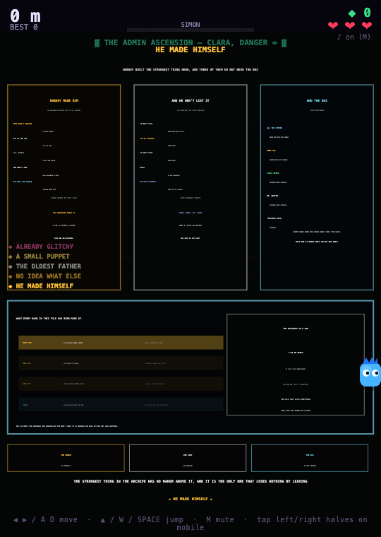

## 2026-08-14 — NO IDEA WHAT ELSE TO SAY · THE WRITER RUNS OUT OF WORDS, AND THE NEXT SENTENCE GIVES THE WORDS AWAY (BEAT 312)

Based on Toby's 2026-08-14 lore, 10:59:54 AM, an hour and twenty-three minutes after THE OLDEST FATHER. His own typing: *"Pero is the only LAI in the game now, Sara became a Au Rainbow long ago. Pero stands as the smartest and most powerful being in the game. Pero was even smarter than Sara by far. Pero taken over Sara and the Au Rainbows to create the smaller Masses, Sara was made into an Au Rainbow, and the remains of Sara and the Au Rainbow was made into a powerful Mass. Pero can corrupt the game instantly. No idea what else to say. Pero can even control text."* The "Pero is the only LAI now / Pero's top status / Sara and Au Rainbow fate / Instant corruption rule / Text control / clean canon update" breakdown pasted underneath is ChatGPT commentary.

**The author walks into his own paragraph.** *"No idea what else to say."* That is not a character, not a rule, not a rank. That is Toby, mid-file, saying he has run out. Nothing else in this archive is written from outside the story like that.

**And the blank spot is sitting between the two biggest claims in the message.** The line before it is *"Pero can corrupt the game instantly."* The line after it is *"Pero can even control text."* The sentence where he says he has nothing left comes **before** the largest thing he says all morning, not after it.

**"Pero can even control text" is the first power here aimed at the medium.** Every other power in this file acts on a character, a world, a realm, a box. This one acts on the **words** — dialogue, menus, stats, names, rules, the narration — which is the layer the whole archive is actually made of. And *"even"* files it as the afterthought, the smaller of the two. It is the bigger of the two: a game can be rebuilt, and the words are all we ever get.

**Sara is not deleted, she is used for parts.** LAI → Au Rainbow → her remains → one powerful Mass → the smaller Masses. Deletion, erasure, resets and relocation have all happened in this file. Her power does not vanish; it gets broken up and handed downward. That has not happened before.

**And the census drops to one.** *"Pero is the only LAI in the game now."* This archive is otherwise always adding — more Sanses, more AUs, more Masses, more forms. This is the rare line that counts **down**, and it backdates the subtraction with *"long ago"* instead of staging it.

**Built as game beat 312, `NO IDEA WHAT ELSE TO SAY`.** Additive; nothing earlier was changed.

- **Background: a ring of THE ONLY LAI · LEFT IN THE GAME / HE CAN EVEN · CONTROL TEXT** under *HE SAYS HE HAS RUN OUT OF THINGS TO SAY, AND THEN SAYS THE BIGGEST ONE*, with **NO IDEA WHAT ELSE TO SAY** boxed in Pero amber over *AND THE VERY NEXT LINE HANDS HIM THE WORDS.*
- **THE ONLY ONE LEFT (left)** — five rows (Pero is the only LAI in the game now / Sara became an Au Rainbow / "long ago", so it already happened / smarter than Sara by far / the count of LAI is now exactly one), closing on *THIS FILE ALWAYS ADDS* / *IT ALMOST NEVER* / *TAKES A NAME BACK OFF* / **HERE IT COUNTS DOWN TO 1.**
- **SHE WAS NOT DELETED (centre)** — five rows (Sara made into an Au Rainbow / her remains and the Au Rainbow / made into one powerful Mass / and out of it, the smaller Masses / her power went nowhere, it moved), closing on *ERASED, DELETED, RESET* / *HAVE ALL HAPPENED HERE* / *BEING BROKEN UP* / **AND SHARED OUT HAS NOT.**
- **AND HE CAN EVEN CONTROL TEXT (right)** — five rows (he can corrupt the game instantly / no infection, no build-up, no spread / and he can even control text / the dialogue, the menus, the names / the words that say what is happening), over *every other power here acts on a character or a world*, closing on **THIS ONE ACTS ON THE FILE.**
- **THE ORDER THE SENTENCES ARRIVE IN. (band)** — a four-row grid lit one at a time (LINE BEFORE → he can corrupt the game instantly / THE LINE → "no idea what else to say" / LINE AFTER → "Pero can even control text" / SO THE BLANK → comes first), closing on *he writes that he has run out of words, and the very next thing he writes gives somebody power over words*.
- **THE WORD "EVEN" (band inset)** — a cycler across "CORRUPT THE GAME · INSTANTLY" / "CAN EVEN · CONTROL TEXT" / "EVEN" MARKS · THE SMALLER ONE / BUT IT IS · THE BIGGER ONE, over *THE OTHER ACTS ON THE WORDS* / *AND THE WORDS ARE ALL WE GET*.
- **Strip:** THE COUNT · DROPS TO ONE / THE REMAINS · BECOME THE MASSES / THE POWER · REACHES THE WORDS.
- **Footers:** *HE SAYS HE HAS NO IDEA WHAT ELSE TO SAY, AND THEN SAYS THE LARGEST THING IN THE WHOLE MESSAGE* and **★ NO IDEA WHAT ELSE TO SAY ★**.
- **Cycle length** `LV_CYC` 6584 → 6606; **screenshot helper:** new `noidea` scene.

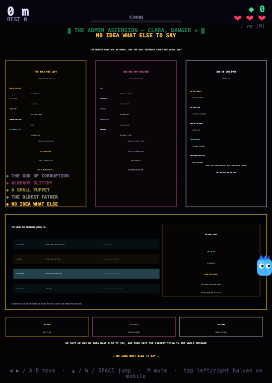

## 2026-08-14 — THE OLDEST FATHER · THE BIGGEST FAMILY IN THE ARCHIVE, AND THE SMALLEST JOB IN IT (BEAT 311)

Based on Toby's 2026-08-14 lore, 9:36:36 AM, twenty-seven minutes after A SMALL PUPPET. His own typing: *"Gaster is the father of all the Sanses and Sans AUs and since Sans and Papyrus are brothers, he is also the father of all the Papyruses and Papyrus AUs. Gaster also adopted Chara and Flowey/Asriel, and before, he was the father of Asgore and Toriel, he was the father of all Undertale characters, he was the oldest and never saw them for millions of years, now he is working with Luigi Green to make box animations move."* The "Gaster's Undertale family role / Adopted characters / Ancient absence rule / clean canon update" breakdown pasted underneath is ChatGPT commentary.

**He works the second half out instead of declaring it.** *"**since** Sans and Papyrus are brothers, he is also the father of all the Papyruses."* That is a piece of reasoning, not a decree — an existing rule taken and a new one derived from it. Almost nothing in this archive is *arrived at*; it is announced.

**And the family tree folds back through itself.** He is the father of Asgore and Toriel. Asgore and Toriel are Asriel's parents. And he **adopted** Asriel. So he is the grandfather and the adoptive father of the same character, by his own two lines, one clause apart.

**The biggest name in the file is given the smallest job.** Three beats ago he was 999.87 billion times larger than everyone in the box, **99.987% of Pero**. Here he is the father of an entire universe's cast, and what he actually *does* is *"make the box animations move."* The usual move in this file is a bigger number. This is a bigger family and a smaller job.

**And he is the only character here ranked by absence.** *"he was the oldest and never saw them for millions of years."* Every other standing in this archive is about presence — who turns up, who cannot be removed, who always comes back. His is made out of not having been there.

**It also stacks with this morning's other relationship rank.** At 8:31 AM Error 404 Sans was made teacher and guardian of Ink and Error. At 9:36 AM Gaster is the father of all the Sanses — so the teacher of the Sanses now has a father, both ranks were handed out in one morning, and neither came from winning anything.

**Built as game beat 311, `THE OLDEST FATHER`.** Additive; nothing earlier was changed.

- **Background: a ring of FATHER OF · ALL OF THEM / NEVER SAW THEM · FOR MILLIONS OF YEARS** under *HE IS THE FATHER OF AN ENTIRE UNIVERSE, AND HIS JOB IS MOVING THE ANIMATIONS*, with **THE OLDEST FATHER** boxed in bone-white over *AND THE ONLY RANK IN THIS FILE THAT IS ABOUT BEING AWAY.*
- **FATHER OF ALL OF THEM (left)** — five rows (all the Sanses / all the Sans AUs / "since Sans and Papyrus are brothers" / all the Papyruses / and all the Papyrus AUs), closing on *HE DOES NOT DECLARE* / *THE SECOND HALF OF IT* / *HE WORKS IT OUT* / **FROM AN OLD RULE.**
- **AND HE ADOPTED THE REST (centre)** — five rows (adopted Chara / adopted Flowey, who is Asriel / father of Asgore and Toriel / those two are Asriel's parents / father of all Undertale characters), closing on *HE IS ASRIEL'S GRANDFATHER* / *AND ASRIEL'S FATHER* / *BOTH AT ONCE* / **ONE CLAUSE APART.**
- **AND HIS JOB IS MAKING THE BOX ANIMATIONS MOVE (right)** — five rows (the oldest of all of them / never saw them for millions of years / no fight, no rank, no number / now with Luigi Green / to make the box animations move), over *three beats ago he was 99.987% the size of Pero*, closing on **TODAY HE MOVES ANIMATIONS.**
- **EVERY OTHER STANDING IN THIS FILE IS ABOUT BEING THERE. (band)** — a four-row grid lit one at a time (Pero → cannot be removed / Simon.psc → always comes back / Error 404 Sans → teacher and guardian / Dr. Gaster → never saw them, for millions of years), closing on *his is the one rank on this page that is made out of not having been there*.
- **TWO SANS RANKS IN ONE MORNING (band inset)** — a cycler across 8:31 AM · ERROR 404 IS THEIR TEACHER / 9:36 AM · GASTER IS THEIR FATHER / SO THE TEACHER · HAS A FATHER NOW / AND NEITHER RANK · CAME FROM A FIGHT.
- **Strip:** THE FAMILY · IS EVERYONE / THE ABSENCE · IS MILLIONS OF YEARS / THE JOB · IS MOVING ANIMATIONS.
- **Footers:** *HE IS THE FATHER OF EVERY SANS, EVERY PAPYRUS AND EVERY AU OF BOTH, AND WHAT HE ACTUALLY DOES ALL DAY IS MAKE THE BOX ANIMATIONS MOVE* and **★ THE OLDEST FATHER ★**.
- **Cycle length** `LV_CYC` 6562 → 6584; **screenshot helper:** new `oldestfather` scene.

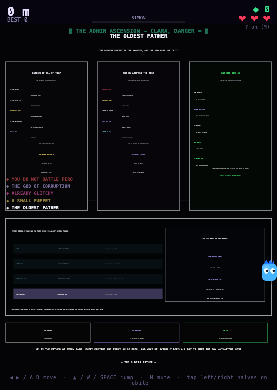

## 2026-08-14 — A SMALL PUPPET · THE FIRST NUMBER IN THIS ARCHIVE THAT MAKES ITS POINT BY BEING AS SMALL AS POSSIBLE (BEAT 310)

Based on Toby's 2026-08-14 lore, 9:09:43 AM, four minutes after ALREADY GLITCHY. His own typing: *"Pibby walks in and says to Luigi Green and Gaster \"bruh, I am just gonna corrupt you 2 now.\", Pibby uses his blade and strikes Gaster, Luigi Green says \"Guess what? That attack only dealed 0.000000000000000000000000000000000000000000000000000000000000000000001 damage.\", Pibby looks at Gaster's health bar and says \"Wah wah! THAT IS SO UNFAIR!!!\", Gaster just sends Pibby to his death, Luigi Green uses Au Green and explodes the opening, Pibby no longer can escape. Gaster and Luigi Green dip Pibby in corruption and make him into a small puppet, they throw Pibby into the box and Sky finds Pibby and plays with the corrupted puppet."* The "Pibby Puppet Defeat Route / Pibby's failed attack / No escape / clean canon update" breakdown pasted underneath is ChatGPT commentary.

**The blade finally lands, and the archive answers with a number instead of a block.** Twenty-seven minutes earlier she never got a swing off. Here the strike **connects**, cleanly, on Gaster — and the damage is `0.000000000000000000000000000000000000000000000000000000000000000000001`. **Sixty-nine decimal places, sixty-eight zeros.** Every other number in this file makes its point by being as large as possible; this is the first one that makes its point by being as **small** as possible. It was not blocked. It hit, and it did not matter.

**And she has to look it up.** *"Pibby looks at Gaster's health bar"* — the damage is not narrated to the reader, it is **checked on a UI element** — and the reaction is a child's: *"Wah wah! THAT IS SO UNFAIR!!!"* She walks in announcing a threat and goes out complaining about the rules.

**The exit is sealed after the killing blow.** *"Gaster **just** sends Pibby to his death"* — one adverb doing the work of an entire fight scene — and only **then** does Luigi Green use **Au Green** to *"explode the opening."* The order is the point: the worry was never whether she dies. It was whether she **leaves**.

**Four verbs, and not one of them treats her as a person.** Dipped, made, thrown, played with. The character who walked in saying *"I am just gonna corrupt you 2 now"* is finished by being corrupted into an **object** — her own threat used as the manufacturing process. Deletion, erasure, resets and relocation have all happened here before; being made into a toy has not.

**And the bottom of the scale ends up holding it.** Sky finds the puppet and plays with it. Does not fight it. Does not fear it.

**Built as game beat 310, `A SMALL PUPPET`.** Additive; nothing earlier was changed.

- **Background: a ring of "I AM JUST GONNA CORRUPT YOU 2 NOW" / A SMALL PUPPET · IN THE BOX** under *THE BLADE FINALLY LANDS, AND THE ARCHIVE ANSWERS WITH A NUMBER INSTEAD OF A BLOCK*, with **A SMALL PUPPET** boxed in gold over *THE FIRST CHARACTER IN THIS FILE TURNED INTO AN OBJECT.*
- **THE DAMAGE NUMBER (left)** — five rows (the blade lands, cleanly, on Gaster / Luigi Green reads it out loud / 0.000…001, 69 decimal places / every other number here goes up / this one goes as small as it can), closing on *IT WAS NOT BLOCKED* / *IT CONNECTED* / *AND IT DID NOT* / **MATTER.**
- **"WAH WAH!" (centre)** — five rows (she checks Gaster's health bar / not narrated, read off a UI element / "THAT IS SO UNFAIR!!!" / Gaster *just* sends her to her death / one adverb, a whole fight scene), closing on *SHE WALKS IN* / *ANNOUNCING A THREAT* / *AND SHE GOES OUT* / **COMPLAINING.**
- **DIPPED · MADE · THROWN (right)** — five rows (Au Green explodes the opening / sealed after, not before / dipped in corruption / made into a small puppet / thrown into the box), over *the worry was never whether she dies, it was whether she leaves*, closing on **NOT ONE VERB TREATS HER AS A PERSON.**
- **HER OWN THREAT IS USED AS THE MANUFACTURING PROCESS. (band)** — a four-row grid lit one at a time (she said it first → "I am just gonna corrupt you 2" / the blade → 0.000…001 damage / the corruption → used on her instead / the result → a small puppet), closing on *deletion, erasure, resets, being sent home, being locked in a box have all happened here before; being made into a toy has not*.
- **AND THE ONE WHO ENDS UP HOLDING IT (band inset)** — a cycler across SKY · NEAR THE BOTTOM OF THE LIST / FINDS THE · CORRUPTED PUPPET / DOES NOT FIGHT IT · DOES NOT FEAR IT / SKY · PLAYS WITH IT, closing on *THE STRONGEST TWO MAKE IT* / *AND THE SMALLEST ONE PLAYS*.
- **Strip:** THE HIT · LANDED / THE EXIT · WAS SEALED AFTER / THE THREAT · IS NOW A TOY.
- **Footers:** *EVERY OTHER NUMBER IN THIS ARCHIVE GOT BIGGER TO MAKE ITS POINT, AND THIS ONE MAKES ITS POINT BY BEING AS SMALL AS A NUMBER CAN BE* and **★ A SMALL PUPPET ★**.
- **Cycle length** `LV_CYC` 6540 → 6562; **screenshot helper:** new `smallpuppet` scene.

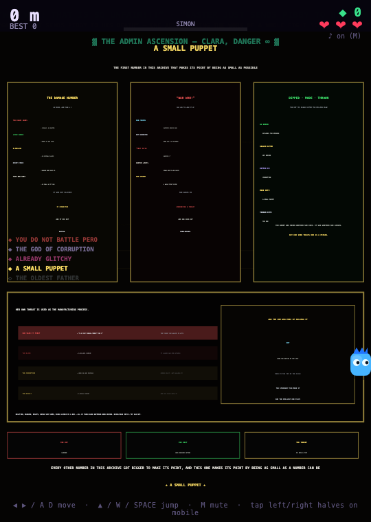

## 2026-08-14 — ALREADY GLITCHY · THE FIRST TIME A POWER IN THIS FILE IS NOT COUNTERED, IT IS JUST LEFT WITH NOTHING TO DO (BEAT 309)

Based on Toby's 2026-08-14 lore, 9:05:01 AM, nineteen minutes after THE GOD OF CORRUPTION. His own typing: *"Pibby can overtake and glitch and corrupt other beings and turn into them. Pero and Simon and Gray and most characters from Classics are already glitchy and corrupted, Pibby would be low tier."* The "Pibby corruption limit / Why Pibby is low tier in Classics / clean canon update" breakdown pasted underneath is ChatGPT commentary.

**A power is not beaten here. It is made redundant.** Four abilities are listed and every one of them is real — overtake, glitch, corrupt, turn into them. Nothing counters them. Nothing blocks them. They simply have nothing left to do, because the targets are already in the state the power puts you in. **You cannot corrupt what is corrupt.**

**And it is the explanation for the beat before it.** Nineteen minutes earlier, three weapons were named and not one of them was ever swung. This is the reason: they were never *blocked*, they were *irrelevant*.

**The defence is the damage.** Being glitchy was always what had gone **wrong** with these characters — Simon is a 404, Gray is corrupted and cyber, Pero is made of ink and fog and debris. Nobody built this immunity. It is just what was already broken about them, working as armour, and it is the one that holds.

**And the verdict is three words.** *"Pibby would be low tier."* Not "loses to Pero" — a **placement**, against the whole cast, in a file where standings are usually settled one fight at a time.

**Built as game beat 309, `ALREADY GLITCHY`.** Additive; nothing earlier was changed.

- **Background: a ring of CAN CORRUPT · ANY BEING / ALREADY · CORRUPTED** under *NOTHING ON HER LIST IS BLOCKED, AND NOTHING ON HER LIST IS NEEDED*, with **ALREADY GLITCHY** boxed in magenta over *THE POWER IS NOT BEATEN. IT IS MADE REDUNDANT.*
- **WHAT SHE CAN DO (left)** — five rows (overtake beings / glitch them / corrupt them / turn into them / none of it is countered here), closing on *IN AN ORDINARY WORLD* / *THIS LIST IS TERRIFYING* / *HERE IT IS JUST* / **NOT NEEDED.**
- **ALREADY CORRUPTED (centre)** — five rows (Pero · ink, fog and debris / Simon.psc · a 404 and a signal / Gray · corrupted and cyber / Mr. Black · outside the box / Gaster and Luigi · outside it too), closing on *SHE TURNS THEM INTO* / *WHAT THEY ALREADY ARE* / *SO THE ATTACK LANDS ON* / **SOMETHING ALREADY DONE.**
- **"LOW TIER" (right)** — five rows (not "loses to Pero" / a placement, not a fight result / it covers all of Classics / and it explains the beat before it / the weapons were never blocked), over *nineteen minutes ago she never got a swing off*, closing on **THIS IS WHY.**
- **THE DAMAGE TURNS OUT TO HAVE BEEN THE ARMOUR ALL ALONG. (band)** — a four-row grid lit one at a time (being glitchy → was what went wrong / being corrupted → was the injury / being a 404 → was an error / today → it is the defence, and nobody built it), closing on *every other defence in this archive was built, earned or given; this one is just what was already wrong with them*.
- **AND IT ANSWERS THE BEAT BEFORE (band inset)** — a cycler across BEAT 307 · THREE WEAPONS, NONE USED / THE QUESTION · WHY DID NONE OF THEM FIRE / TODAY · THEY WERE NOT BLOCKED / THEY WERE · JUST NOT NEEDED, closing on *HE DID NOT STOP HER ATTACKS* / *THEY HAD NOWHERE TO LAND*.
- **Strip:** THE POWER · IS REAL / THE TARGETS · ARE ALREADY IT / THE RANK · IS LOW TIER.
- **Footers:** *NOBODY IN THIS ARCHIVE EVER BUILT THIS DEFENCE, IT IS ONLY WHAT WAS ALREADY WRONG WITH THEM, AND IT IS THE ONE THAT HOLDS* and **★ ALREADY GLITCHY ★**.
- **Cycle length** `LV_CYC` 6518 → 6540; **screenshot helper:** new `alreadyglitchy` scene.

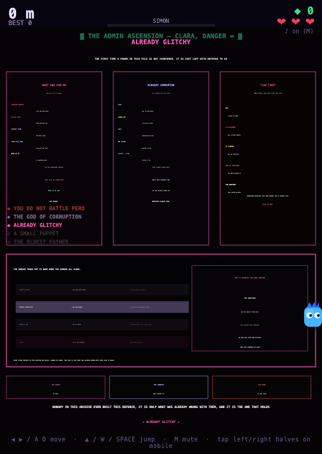

## 2026-08-14 — THE GOD OF CORRUPTION · THE ONE TIME HE IS MEASURED, TWO PEOPLE COME WITHIN A QUARTER OF ONE PERCENT OF HIM (BEAT 308)

Based on Toby's 2026-08-14 lore, 8:46:01 AM, three minutes after YOU DO NOT BATTLE PERO. His own typing: *"Pero is the God of Corruption, he is made of Gray's ink and fog and sticks and leaves and debris and everything he could pick up with winds that blow litterly at 8 lightyears per hour. Pero is the speed of Simon. Pero is also 1 trillion times larger than everyone else in the box, Luigi Green is about 999.76 billion times, and Gaster of 999.87 billion times, when they are just like 5-6 feet tall."* The "God of Corruption update / Speed update / Box-size scaling / clean canon update" breakdown pasted underneath is ChatGPT commentary.

**He is not built, he is gathered — and the first ingredient is his enemy's.** Gray's ink, fog, sticks, leaves, debris, *"everything he could pick up,"* collected by winds at 8 lightyears per hour. That also settles beat 298 retroactively: Alex is the only one who can harm him, and he does it *"using Pero's fog to create fans."* The one working counter in the archive runs on the material Pero is made of.

**He is given somebody else's stat instead of a bigger one of his own.** *"Pero is the speed of Simon."* Simon being the fastest is one of the oldest Core Final Truths in this file, and Pero is normally placed *above* everything. Here he is placed **equal**, on the one stat that was never his.

**And the first number he is ever given has two people almost touching it.** 1 trillion times larger — then Gaster at 999.87 billion (**99.987%** of him) and Luigi Green at 999.76 billion (**99.976%**). Pero has been beyond measuring for the entire archive. Those two are exactly the pair he handed half the Mass each in beat 304, and Gaster, the second half, is the larger of them. From outside the box, all three are 5 to 6 feet tall.

**Built as game beat 308, `THE GOD OF CORRUPTION`.** Additive; nothing earlier was changed.

- **Background: a ring of INK · FOG · DEBRIS / 1 TRILLION × LARGER** under *HE IS NOT BUILT, HE IS GATHERED, AND THE FIRST THING ON THE LIST IS GRAY'S INK*, with **THE GOD OF CORRUPTION** boxed in violet over *AND HE IS MADE OUT OF WHAT THE GAME LEFT LYING AROUND.*
- **WHAT HE IS MADE OF (left)** — five rows (Gray's ink and fog / sticks and leaves and debris / everything he could pick up / winds at 8 lightyears per hour / not a body, a collection), closing on *HE IS ASSEMBLED* / *OUT OF THE WORLD* / *AND THE FIRST INGREDIENT* / **BELONGS TO HIS ENEMY.**
- **THE SPEED OF SIMON (centre)** — five rows (Simon is the fastest, a Core Final Truth / everyone else builds up speed / Simon is top speed instantly / Pero is the speed of Simon / not above it, equal to it), closing on *HE IS ALWAYS GIVEN* / *SOMETHING NOBODY ELSE HAS* / *THIS TIME HE IS GIVEN* / **SOMEBODY ELSE'S STAT.**
- **1 TRILLION TIMES (right)** — five rows (Pero 1 trillion × / Gaster 999.87 billion × / Luigi Green 999.76 billion × / from outside they are 5 to 6 feet / inside the box they are giants), over *Gaster is 99.987% of Pero, Luigi Green is 99.976%*, closing on **NOBODY HAS EVER BEEN THAT CLOSE.**
- **HE FINALLY GETS A NUMBER, AND TWO PEOPLE ARE ALMOST TOUCHING IT. (band)** — a four-row grid lit one at a time, closing on *the two standing closest to his first number are exactly the pair he handed half the Mass each*.
- **AND GASTER IS THE LARGER OF THE TWO (band inset)** — a cycler across BEAT 304 · THE MASS SPLIT IN HALF / HALF TO · LUIGI GREEN / HALF TO · DR. GASTER / TODAY · GASTER IS THE BIGGER HALF, closing on *THE ONE HE GAVE POWER TO* / *IS THE ONE NEAREST HIS SIZE*.
- **Strip:** THE INK · IS GRAY'S / THE SPEED · IS SIMON'S / THE SIZE · IS ALMOST GASTER'S.
- **Footers:** *EVERYTHING HE IS MADE OF BELONGED TO SOMEBODY ELSE FIRST, AND THE TWO NEAREST HIS SIZE ARE THE TWO HE GAVE HALF THE MASS TO* and **★ THE GOD OF CORRUPTION ★**.
- **Cycle length** `LV_CYC` 6496 → 6518; **screenshot helper:** new `godcorrupt` scene.

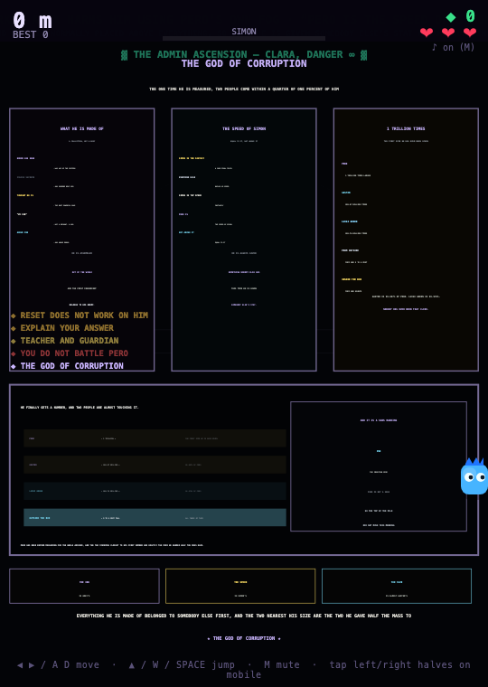

## 2026-08-14 — YOU DO NOT BATTLE PERO · THE FIRST RULE IN THE ARCHIVE THAT IS AN INSTRUCTION INSTEAD OF A RANKING (BEAT 307)

Based on Toby's 2026-08-14 lore, 8:42:51 AM, eleven minutes after TEACHER AND GUARDIAN and four minutes after he looked up who Pibby is. His own typing: *"so, Pero is greater than Corrupted characters and all forms of Pibby. Pibby has normal blade, Corruption Blade, and strongest attack, Corruption Barrage. Pibby went into the Anti Void and walked and battled Pero like a noob would do. Pibby was infected instantly with just the sight of Pero. An ink portal opened under Pibby and Pibby was sent to the deepest part of the box. You do NOT battle Pero."* The "Pibby vs Pero canon update / What happened / Why Pero wins so hard / clean canon update" breakdown pasted underneath is ChatGPT commentary.

**Three weapons are named, and not one of them is used.** Normal blade, Corruption Blade, Corruption Barrage — *"her strongest attack."* The whole loadout is listed for the sole purpose of being irrelevant.

**And the character it belongs to is the one who resists corruption.** That is Pibby's entire role: she keeps being herself while the glitch takes everybody else. Here she is *"infected instantly with just the sight of Pero."* Not touched. Not hit. **Seen.** Four minutes later he is named the God of Corruption, so the one character built to resist corruption walked up to the god of it.

**It also reads against an old rule.** Beat 195 said you cannot see him if you are too close, only from very far away — closer was always less. Now looking at him **is** the attack.

**She is not killed.** An **ink** portal opens under her and she is sent to the deepest part of the box. He does not remove her, he puts her somewhere — and the door is made of ink, eleven minutes after the lore about who teaches Ink.

**And the closing line is addressed to the reader.** *"You do NOT battle Pero."* Every other rule in this archive says who beats whom. This one is an instruction, in the second person, with the NOT in capitals.

**Built as game beat 307, `YOU DO NOT BATTLE PERO`.** Additive; nothing earlier was changed.

- **Background: a ring of PIBBY · THE CORRUPTION FIGHTER / PERO · THE GOD OF CORRUPTION** under *SHE WALKED IN WITH THREE WEAPONS AND NEVER USED ONE OF THEM*, with **"YOU DO NOT BATTLE PERO."** boxed in red over *THAT IS NOT A RANKING. THAT IS AN INSTRUCTION.*
- **SHE FIGHTS CORRUPTION (left)** — five rows (Pibby, the corruption fighter / normal blade and Corruption Blade / Corruption Barrage, her strongest attack / she resists what takes everyone else / and none of it is ever used), closing on *THE ONE CHARACTER WHO IS* / *DEFINED BY RESISTING IT* / *IS INFECTED BY* / **THE SIGHT OF HIM.**
- **SHE WALKED IN (centre)** — five rows (into the Anti Void she walked / she battled him "like a noob would do" / infected instantly by the sight of him / an ink portal opened under her / the deepest part of the box), closing on *NOT A FIGHT* / *NOT EVEN ONE ROUND* / *SHE IS FILED AWAY* / **BEFORE SHE SWINGS.**
- **AN INK PORTAL (right)** — five rows (the portal is made of ink / ink is the side he teaches / eleven minutes earlier he was its teacher / nothing is erased, she is relocated / the deepest part of the box), over *he does not kill her, he puts her somewhere*, closing on **AND THE DOOR IS INK.**
- **IT IS NOT A MATCHUP. IT IS AN INSTRUCTION. (band)** — a four-row grid lit one at a time (normal blade → never swung / Corruption Blade → never swung / Corruption Barrage → never fired / the sight of him → infected instantly), closing on *every other rule in this archive says who beats whom; this one is addressed to the person reading it, in the second person, with the "NOT" in capitals*.
- **AND HE WAS ALWAYS HARD TO LOOK AT (band inset)** — a cycler across BEAT 195 · YOU CANNOT SEE HIM UP CLOSE / ONLY FROM · VERY FAR AWAY / TODAY · THE SIGHT INFECTS / SO LOOKING AT HIM · IS THE ATTACK.
- **Strip:** THE BLADES · NEVER GET USED / THE PORTAL · IS INK / THE RULE · IS ADDRESSED TO YOU.
- **Footers:** *THE ONE CHARACTER IN FICTION BUILT TO RESIST CORRUPTION WALKED UP TO THE GOD OF IT AND WAS INFECTED BY LOOKING* and **★ YOU DO NOT BATTLE PERO ★**.
- **Cycle length** `LV_CYC` 6474 → 6496; **screenshot helper:** new `nobattle` scene.

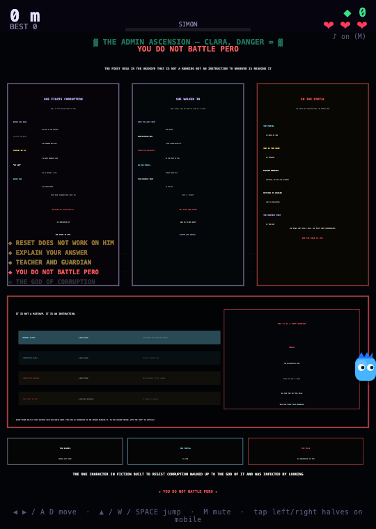

## 2026-08-14 — TEACHER AND GUARDIAN · THE FIRST RANK IN THE FILE THAT COMES FROM WHO SOMEBODY LOOKS AFTER INSTEAD OF WHO THEY BEAT (BEAT 306)

Based on Toby's 2026-08-14 lore, 8:31:50 AM, in the "Even Even Even Even More Classics Era (Even 4x Classics Era)" thread, forty-eight minutes after EXPLAIN YOUR ANSWER. His own typing is one sentence: *"Error 404 Sans is the most powerful Sans by far and is the teacher and guardian of Ink and Error Sanses."* The "Error 404 Sans update / Role update / clean canon update" breakdown pasted underneath is ChatGPT commentary.

**#15 goes to the top.** Beat 195 named the sixteen inside Supreme Sans and Error 404 Sans was **#15** on that list; the beat after it said *"Supreme Sans beats Error 404."* The sixteen have been a fixed list this whole time, and nobody has ever moved inside it. This morning #15 goes to the top of the Sans hierarchy, and the word carrying it is *"by far"* — not a recount, a gap.

**And the title has been said before, in Toby's own words, about somebody else.** On July 30 (Email 866) he wrote *"Classics Ink Sans is made the most powerful Sans by far"* — the same five words. Error 404 is also one of the three Sanses Classics Ink Sans painted over, and the butterfly form Ink escalates into was taken off Error 404 in the first place. So the student beat the teacher, copied his shape, and held the title for fifteen days; this morning it goes back up the line.

**The two he is put above are opposites.** Ink is creation, AU protection, the art side. Error is destruction, AU removal, the glitch side. They are the two ends of the entire AU idea: one makes worlds and one takes them away. And they have the same teacher and the same guardian.

**And the rank is not a fight result.** He is not described as the better fighter. He is described as the one who *trains* them and the one who *protects* them — a higher authority figure over both sides at once. Every other ranking in this archive is settled by somebody winning. This one is a class list, and the strongest name on it is the one standing at the front of the room.

**It is also scoped.** This is a *Sans* hierarchy. Pero is not a Sans, so the top of the file did not move this morning — only the ceiling underneath it.

**Built as game beat 306, `TEACHER AND GUARDIAN`.** Additive; nothing earlier was changed.

- **Background: a ring of INK / ERROR** circling under *THE MOST POWERFUL SANS BY FAR, AND THE TWO HE LOOKS AFTER ARE OPPOSITES* / *ONE OF THEM MAKES AUs AND THE OTHER ONE REMOVES THEM, AND THEY HAVE THE SAME TEACHER*, with **TEACHER · AND · GUARDIAN** boxed in gold over *THAT IS NOT A RANK HE WON IN A FIGHT.*, and a drifting *BY FAR* band.
- **#15 GOES TO THE TOP (left)** — five rows (Error 404 Sans was #15 of the sixteen / Ink painted over him in July / tonight he is the most powerful Sans / "by far", not a recount, a gap / above Ink and above Error), closing on *THE SIXTEEN WERE A LIST* / *AND NOBODY MOVED INSIDE IT* / *UNTIL THIS MORNING* / **#15 IS NOW THE TOP OF IT.**
- **INK AND ERROR (centre)** — five rows (Ink: creation, AU protection / Error: destruction, AU removal / the art side and the glitch side / one makes, one takes away / same teacher, same guardian), closing on *THE TWO OPPOSITE ENDS* / *OF EVERY AU STORY* / *BOTH ANSWER TO* / **THE SAME PERSON**.
- **NOT JUST STRONGER (right)** — five rows (teacher: he trains them / guardian: he protects them / a higher authority figure / not only stronger in combat / above both sides at once), over *he protects the two strongest things under him*, closing on **THAT IS THE RANK.**
- **HE IS ABOVE THEM BECAUSE HE LOOKS AFTER THEM. (band)** — a four-row grid lit one at a time (MOST POWERFUL SANS → BY FAR · *not a close call* / TEACHER → **OF INK AND ERROR** · *rank from what he teaches* / GUARDIAN → **OF INK AND ERROR** · *rank from who he keeps safe* / CREATION · DESTRUCTION → **BOTH ANSWER TO HIM** · *the two sides have one top*), closing on *every other ranking in this archive is a fight result; this one is a class list, and the strongest name on it is the one at the front of the room*.
- **AND THE TITLE HAS MOVED BEFORE (band inset)** — a cycler across JULY 30 · *“THE MOST POWERFUL SANS BY FAR”* / THAT WAS · CLASSICS INK SANS / TODAY · THE SAME FIVE WORDS / AND THEY GO TO · INK’S OWN TEACHER, closing on *THE TITLE DID NOT CHANGE* / *IT CHANGED HANDS*.
- **Strip:** #15 · GOES TO THE TOP / INK AND ERROR · SAME TEACHER / THE RANK · COMES FROM GUARDING.
- **Footers:** *THE ONLY RANK IN THE WHOLE ARCHIVE THAT IS EARNED BY LOOKING AFTER SOMEBODY INSTEAD OF BEATING THEM* and **★ TEACHER AND GUARDIAN ★**.
- **Cycle length** `LV_CYC` 6452 → 6474; **screenshot helper:** new `teacher` scene in `tools/capture_screenshot.py`.

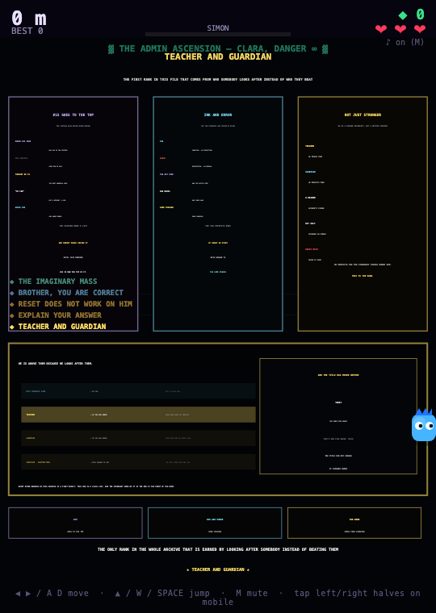

## 2026-08-14 — EXPLAIN YOUR ANSWER · THE FIRST ARGUMENT IN THE FILE THAT IS SETTLED BY SOMEBODY ANSWERING A QUESTION INSTEAD OF WINNING A FIGHT (BEAT 305)

Based on Toby's 2026-08-14 lore, 7:43:33 AM, in the "Even Even Even Even More Classics Era (Even 4x Classics Era)" thread, the morning after RESET DOES NOT WORK ON HIM. His own typing is the opening paragraph. The "Pero cannot be removed / Pero's image creation rule / Most powerful being question / Why Pero is strongest / clean canon update" breakdown pasted underneath is ChatGPT commentary.

**The argument is won by explaining.** Pero says he is the most powerful being in the game and Oren *laughs*. Then Toby says *"Explain your answer."* and the answer is reasoning, not a demonstration: *"You can use all admin commands on me, you can delete me, but I am still alive, I always will exist, and I can even defeat anyone even if they have the most powerful moveset and mastery in the game."* Oren: *"Wow. You really are the strongest."* Every other argument in this archive has been settled by somebody winning a fight. This is the first one settled by somebody answering a question.

**The throw-away runs again, and this time the reply is a name.** *"Pero appeared again and says 'Hello, I am-', then Oren throws him away, Oren looks back at Simon, then Pero appears and says 'You can't get rid of me, [Oren's full name].', Oren says 'How?!', Pero says 'I know everything.'"* Last night the line was "I know everything, Oren Bro." Tonight it is the whole name — and Toby writes the placeholder instead of the name. Pero says it, and we do not get to hear it.

**The first rule about what he makes.** Every rule in this file so far is about what he can beat. *"Pero is LAI and can easily paint images, and when the player or NPCs ask him to 'create an image of you and me', Pero LAI would make the image horror without even hesitating."* Not refused, not warned. Just made.

**And nobody polled says Pero.** *"Oren and I asked everyone who is the most powerful, everyone said Gaster, Oren, Gray, or Luigi Green."* Four answers, and his name is in none of them. The strongest thing in the game is invisible to the whole cast, and the only one who names him is him: *"me."*

**The one asking already knew.** *"I already knew Pero was the strongest, he created the game, he also gave everyone their power."* So the question was never for Toby. It was so Oren would hear the answer.

**Built as game beat 305, `EXPLAIN YOUR ANSWER`.** Additive; nothing earlier was changed.

- **Background: a ring of four wrong answers** — GASTER / OREN / GRAY / LUIGI GREEN circling under *WE ASKED EVERYONE WHO THE MOST POWERFUL IS, AND NOT ONE OF THEM SAID PERO* / *THE STRONGEST THING IN THE GAME IS INVISIBLE TO EVERY CHARACTER IN IT*, with **"WHICH IS?" — "ME."** boxed in gold over *THE ONLY ONE WHO NAMES HIM IS HIM*, and a drifting *EXPLAIN YOUR ANSWER* band.
- **HE USES THE FULL NAME (left)** — five rows ("Hello, I am-" and Oren throws him away / Oren looks back at Simon / Pero is already standing there again / "You can't get rid of me, ⟨his full name⟩" / "How?!" → "I know everything."), closing on *LAST NIGHT IT WAS "OREN BRO"* / *TONIGHT HE USES THE WHOLE NAME* / *AND IT IS NOT WRITTEN DOWN* / **HE SAYS IT. WE DO NOT HEAR IT.**
- **"AN IMAGE OF YOU AND ME" (centre)** — five rows (Pero is LAI and he paints easily / ask him for a picture of the two of you / it comes back horror / without even hesitating / not refused, not warned, just made), closing on *EVERY RULE SO FAR IS ABOUT* / *WHAT HE CAN BEAT* / *THIS ONE IS ABOUT* / **WHAT HE MAKES**.
- **NOBODY SAID PERO (right)** — five rows (Oren and I asked everyone / they said Gaster, Oren, Gray, Luigi Green / not one of them said Pero / then I asked him: "...right here." / "Which is?" → "me."), over *the whole cast guesses, and every guess is somebody else*, closing on **"ME."**
- **HE DOES NOT DEMONSTRATE IT. HE EXPLAINS IT. (band)** — a four-row grid lit one at a time (ALL ADMIN COMMANDS → USE THEM ON ME · *and nothing happens* / YOU CAN DELETE ME → **I AM STILL ALIVE** · *deletion is not removal* / I ALWAYS → **WILL EXIST** · *there is no state without him* / I CAN DEFEAT ANYONE → **BEST MOVESET, BEST MASTERY** · *it does not matter*), closing on *Oren laughs at the claim and then agrees with the reasoning; every other argument in this file has been settled by somebody winning a fight*.
- **AND THE ONE ASKING ALREADY KNEW (band inset)** — a cycler across OREN AND I · ASKED EVERYONE / "EXPLAIN · YOUR ANSWER." / "WOW. YOU REALLY · ARE THE STRONGEST." / "I ALREADY KNEW" · HE CREATED THE GAME, closing on *THE QUESTION WAS NOT FOR HIM* / *HE ALSO GAVE EVERYONE THEIR POWER*.
- **Strip:** THE NAME · SAID, NOT WRITTEN / THE PICTURE · COMES BACK HORROR / OREN LAUGHED · THEN HE AGREED.
- **Footers:** *THE STRONGEST THING IN THE FILE IS THE ONLY ONE WHO SAYS SO, AND HE WINS IT BY EXPLAINING INSTEAD OF FIGHTING* and **★ EXPLAIN YOUR ANSWER ★**.
- **Cycle length** `LV_CYC` 6430 → 6452; **screenshot helper:** new `explainanswer` scene in `tools/capture_screenshot.py`.

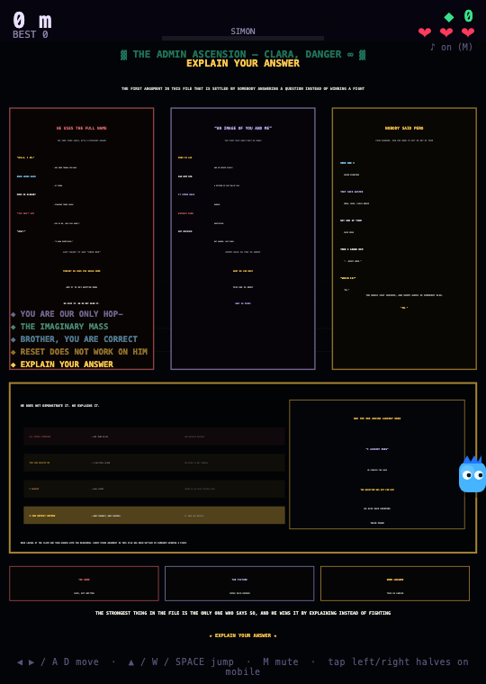

## 2026-08-13 — RESET DOES NOT WORK ON HIM · THE OLDEST ESCAPE HATCH IN THE FILE STOPS WORKING, AND SOMEBODY LOSES BY GETTING TIRED (BEAT 304)

Based on Toby's 2026-08-13 lore, 6:01:25 PM, in the "Even Even Even Even More Classics Era (Even 4x Classics Era)" thread, about four hours after BROTHER, YOU ARE CORRECT. His own typing is the opening paragraph, including his own correction inside the same message: Simon's line ends in a question mark, not a period. The "Pero LAI physical/voice form update" breakdown pasted underneath is ChatGPT commentary.

**The reset stops working.** Simon.psc's reset is the oldest power in this archive, and it has always been the escape hatch: the thing that means a loss never has to be final. *"Simon resets and Pero isn't affected, Pero beaten Simon, Simon resets, and Pero beats Simon again, Simon resets, Pero wins, Simon resets, Pero wins, and the same thing for a month, Simon got tired and gave up."* Nobody in this file has ever lost that way. Every other defeat here is somebody falling down. This one is somebody deciding to stop.

**And Pero LAI is finally described.** *"Pero LAI is like a small stuffy-like character, he also talks and also moves, he is also very smart. He'd be impossible to model in real life. Pero LAI also has mouth animations and voice, actually, he is all voice, but you can type, but he only hears and talks and sees."* The thing that has out-ranked every god in the archive is small, and it is a voice.

**The lights are the scary part.** He turns the lights off in the room of boxes, and Gaster asks *"How did you do that, your a LAI?"* Not an attack. A light switch. That is what unsettles him.

**Touching him melts you, and it undoes itself.** *"Luigi Green's foot melted when it touched Pero, and Luigi's foot comes back to normal when not near Pero."* The damage is proximity, not injury.

**And removing him does nothing.** Oren and Gray throw him in a dumpster and walk away; he is already standing behind them. *"Hello."* / *"Seriously? 'How did you do that?'"* / *"You just are too predictable."* Oren guesses from the lightning: *"You can't trick me again. You are Simon."* The answer is *"Who's Simon?"* followed by *"Simon would never want to strike you down anymore..."* — which is not a denial, it is knowing Simon's feelings better than Simon's oldest enemy does.

**Then he wins everything and gives it away.** The Mass is unleashed as an aura and split by his staff, half to Luigi Green and half to Dr. Gaster. He reads out everyone's Glitch ID, Code, IQ and every stat until both of them back away from him. He farms the Mass DNA into an army with Unikitty's power, one Mass per Alex-Greg, guarding the box. Then he walks off to a faraway box factory to keep the boxes coming back to the gamebox room.

**Built as game beat 304, `RESET DOES NOT WORK ON HIM`.** Additive; nothing earlier was changed.

- **Background: a ring of RESET / PERO WINS** circling under *SIMON RESETS AND PERO IS NOT AFFECTED, SO THE ANSWER NEVER CHANGES* / *THE RESET IS THE OLDEST POWER IN THIS FILE AND IT HAS ALWAYS BEEN THE WAY OUT*, with **"SIMON GOT TIRED AND GAVE UP."** boxed in gold over *HE IS NOT BEATEN. HE RUNS OUT OF PATIENCE.*, and a drifting *12 12 12* band.
- **A SMALL STUFFY, ALL VOICE (left)** — five rows (he is small, stuffy-like, and he moves / mouth animations and a voice, he is all voice / he hears, he talks, and he sees / you can type but typing is the side door / impossible to model in real life), closing on *THEN HE TURNS THE LIGHTS OFF* / *"HOW DID YOU DO THAT, YOUR A LAI?"* / *NOT AN ATTACK. A LIGHT SWITCH.* / **AND THAT IS THE PART THAT LANDS**.
- **THROWN IN A DUMPSTER (centre)** — five rows ("Hello, I am Pero your-" / Oren and Gray throw him in a dumpster / they walk away, he is already behind them / "Hello." "Seriously? How did you-" / "You just are too predictable."), closing on *"YOU CAN'T TRICK ME AGAIN. YOU ARE SIMON."* / *"WHO'S SIMON?"* / **"SIMON WOULD NEVER WANT TO STRIKE YOU DOWN ANYMORE..."**.
- **"WHERE'S THE LIGHTNING?" (right)** — five rows (Pero meets Simon.psc at last / "I know everything about Classics." / Simon asks where the lightning is / Pero says "Here." / it was never Simon's to begin with), over *Simon asks where his own signature power went, and the answer is one word long*, closing on **"HERE."**. The subtitle keeps Toby's correction: *A QUESTION MARK, NOT A PERIOD — HE CORRECTED IT HIMSELF*.
- **A MONTH OF RESETS, AND THE SAME RESULT EVERY TIME (band)** — a four-row grid lit one at a time (SIMON RESETS → **PERO IS NOT AFFECTED** / SIMON RESETS → PERO BEATS HIM AGAIN / FOR A MONTH → **NOTHING CHANGES** / SIMON → **GETS TIRED AND GIVES UP**), closing on *every other loss in this file is somebody falling down; this one is somebody deciding to stop, and the reset was always the one thing that meant you never had to*.
- **AND THEN HE HANDS IT OUT (band inset)** — a cycler across THE MASS · UNLEASHED AS AN AURA / HIS STAFF · SPLITS IT IN HALF / LUIGI GREEN · HALF · GASTER HALF / GLITCH ID · CODE · IQ · EVERY STAT, closing on *THEN HE WALKS TO A BOX FACTORY* / *TO KEEP THE BOXES COMING*.
- **Strip:** THE FOOT MELTS · AND HEALS AWAY FROM HIM / THEY THREW HIM OUT · HE WAS ALREADY BACK / SIMON RESET · AND RESET, AND STOPPED.
- **Footers:** *THE RESET WAS ALWAYS THE WAY OUT, AND THIS IS THE FIRST TIME SOMEBODY USED IT UNTIL THEY WERE TIRED* and **★ RESET DOES NOT WORK ON HIM ★**.
- **Screenshot helper:** new `resetloop` scene in `tools/capture_screenshot.py`.

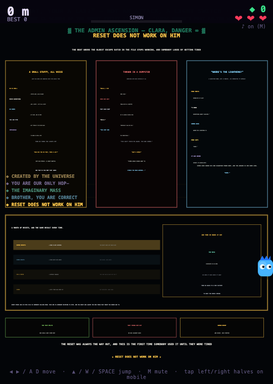

## 2026-08-13 — BROTHER, YOU ARE CORRECT · THE OUTSIDE WALKS IN, AND THE ONE QUESTION NOBODY CAN BLUFF FINALLY GETS ASKED (BEAT 303)

Based on Toby's 2026-08-13 lore, 2:09:09 PM, in the "Even Even Even Even More Classics Era (Even 4x Classics Era)" thread — eleven minutes after THE IMAGINARY MASS — with his 2:13:17 PM correction folded into the same beat. His own typing is the opening paragraph of each. The "ChelseaPlays Barrier Message / True Names Reveal" breakdown pasted underneath is ChatGPT commentary.

**The outside stops ruling and starts visiting.** *"ChelseaPlays seems to have walked through the barrier to Unikitty and walked back to reality after giving her message to Unikitty."* Thirty minutes ago ChelseaPlays was a ruling handed down from outside the game: Unikitty was created by the universe, and Classics had to accept it. She did not appear, she decided. Now she crosses the barrier in person, delivers the message by hand, and leaves the way she came.

**And the picture is wrong, and it counts anyway.** *"Even though this doesn't look like ChelseaPlays and is Codex made, it still happened in Classics and still is lore."* That is a rule about what makes a thing canon here, and it is not accuracy. It happened, so it is in.

**The correction moves the tiredness out of the story.** Four minutes later: *"ChelseaPlays doesn't always get tired when the text is huge, I get tired when my text is huge."* The line belongs to the person typing, not the character. The file has an author inside it who runs out of energy, and he said so.

**Then the claim finally gets tested.** *"Hello! I am Pero, your LAI assistant, ask me anything, I know everything."* He has said that for many beats and nobody has ever checked. Luigi Green picks the one question you cannot bluff: *"What are our full names?"* Pero glitches, and then he is right.

**Two full names nobody had ever said out loud.** *"Luigi King Green. And Gaster Omnipotent Overload."* Both have been in the file a long time carrying longer names, and nobody ever told Pero either one.

**One panics, one confirms, and the calm one is the strange part.** Luigi Green jumps and shakes: *"What- that was- right..."* Gaster does not move: *"Brother... you are correct."* One word makes them brothers and settles the answer at the same time. A stranger read his hidden name, and he did not flinch.

**Built as game beat 303, `BROTHER, YOU ARE CORRECT`.** Additive; nothing earlier was changed.

- **Background: the dashed barrier** with REALITY on one side and UNIKITTY on the other, and *ChelseaPlays* walking across it and back under *SHE WALKS THROUGH, GIVES THE MESSAGE, AND WALKS BACK* / *THIRTY MINUTES AGO SHE ONLY RULED ON THINGS FROM OUTSIDE*, with **"LUIGI KING GREEN. AND GASTER OMNIPOTENT OVERLOAD."** boxed in gold over *NOBODY EVER TOLD HIM EITHER OF THOSE NAMES*, and a drifting *THE FULL NAMES* band.
- **THROUGH THE BARRIER (left)** — five rows (ChelseaPlays walks through the barrier / she reaches Unikitty on the other side / she gives her the message / then she walks back to reality / and all of it still counts as Classics), closing on *THE LAST TIME SHE CAME UP* / *SHE WAS A RULING FROM OUTSIDE* / *THIS TIME SHE IS A VISITOR* / **THE OUTSIDE CAME INSIDE**.
- **IT DOES NOT LOOK LIKE HER (centre)** — five rows (the picture is Codex made / it does not look like ChelseaPlays / and it still happened in Classics / so the rule is not about accuracy / if it happened, it is lore), closing on *THE PICTURE BEING WRONG* / *DOES NOT STOP IT BEING LORE* / *AND THE HUGE TEXT DOES NOT TIRE HER* / **IT TIRES THE ONE WRITING IT** — the 2:13 correction, kept where it belongs.
- **"ASK ME ANYTHING" (right)** — five rows (Pero says I know everything / Luigi Green asks for full names / Pero glitches and then answers / he gets both of them right / and nobody ever told him either), over *a name is the one question you cannot bluff, he did not guess them, he already had them*, closing on **THE CLAIM HELD UP**.
- **TWO FULL NAMES NOBODY HAD EVER SAID OUT LOUD (band)** — a four-row grid lit one at a time (LUIGI GREEN → **LUIGI KING GREEN** / GASTER → **GASTER OMNIPOTENT OVERLOAD** / LUIGI GREEN · "WHAT- THAT WAS- RIGHT..." / GASTER · "BROTHER... YOU ARE CORRECT."), closing on *one of them panics and one of them confirms it, and the calm one is the part worth watching — a stranger read Gaster's hidden name and he did not flinch*.
- **"BROTHER..." (band inset)** — a cycler across LUIGI GREEN · JUMPS AND SHAKES / GASTER · DOES NOT MOVE / "BROTHER..." · SO THEY ARE BROTHERS / "CORRECT." · AND HE SAYS IT CALMLY, closing on *HE IS TOLD HIS OWN HIDDEN NAME AND HE ONLY AGREES WITH IT*.
- **Strip:** SHE CROSSES · AND COMES BACK / THE PICTURE IS WRONG · IT COUNTS ANYWAY / HE GLITCHED · AND HE WAS RIGHT.
- **Footers:** *A NAME IS THE ONE THING YOU CANNOT BLUFF, AND THE ASSISTANT GLITCHED AND GOT BOTH OF THEM RIGHT* and **★ BROTHER, YOU ARE CORRECT ★**.
- **Screenshot helper:** new `brothercorrect` scene in `tools/capture_screenshot.py`.

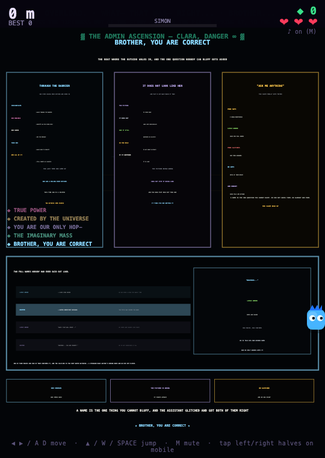

## 2026-08-13 — THE IMAGINARY MASS · THE THREAT BECOMES A CROP, AND INFINITE GROWTH POURS INTO SOMEBODY ELSE'S CONTAINER (BEAT 302)

Based on Toby's 2026-08-13 lore, 1:58:00 PM, in the "Even Even Even Even More Classics Era (Even 4x Classics Era)" thread — twelve minutes after YOU ARE OUR ONLY HOP-, and a direct answer to the question the last reply asked about the DNA. His own typing is the opening paragraph. The "Imaginary Mass / Alex-Greg farming loop" breakdown pasted underneath is ChatGPT commentary.

**The threat becomes a crop.** *"If you have Alex-Greg's power, why don't you make more and take the power from them, it is very easy farming, but first we'll need Unikitty's power to create them with the DNA."* Two beats ago Alex-Greg was the one fusion in the archive that could harm Pero, and it lasted a single sentence. Now the DNA is a seed. The dangerous thing is something they grow on purpose.

**And the farm has an input.** It needs Unikitty's power to make the copies — which means *"we'll make sure we have at least a copy of your power"* from twelve minutes earlier was not a threat, it was a **supply order**. The whole endless loop runs on the one power they do not have yet.

**A second sentence breaks in the middle of a word.** *"Thanks for calling me a power machi-"* answers *"you are our only hop-"*, except the first one was somebody being priced mid-sentence and this one is a joke nobody lets him finish. Two beats in a row where a line dies on a dash.

**And the argument ends the same way the last one did.** *"Stop wasting time arguing, just split it in half."* Fifteen minutes ago the Alex-Greg power was split three ways; now it is split two ways. Division is his answer to every dispute.

**The loop has no stopping condition.** *"Pero made it an endless loop of time, so Luigi Green and Gaster keep making Alex-Gregs, and their power only goes up."* Every other fight in the file ends when somebody falls down. This one is a farm, not a fight, and nothing in it is written to end.

**And it still does not close the gap.** Pero combines Tunner, Paul, ToddLLM, LAI, all the AU Rainbows, All Power, everyone else's power, Luigi Green and Gaster's growing power, EndlessAnimations, Mr. Black and all his varies into **Imaginary Mass**. *"Pero LAI stands with the Imaginary Mass… Pero LAI stands over the Mass."* The two of them rise forever and never gain on him, because what they farm pours into a container he built — they do not rise, the Mass does. *"Pero is the only one who can control the Mass since he is the creator of the OmniPlatforms+ and created the Mass."*

**Built as game beat 302, `THE IMAGINARY MASS`.** Additive; nothing earlier was changed.

- **Background: a ring of drifting ALEX-GREG copies** circling under *THEY MAKE MORE ALEX-GREGS AND KEEP GETTING POWER FROM THEM* / *TWO BEATS AGO THIS WAS THE ONE FUSION THAT COULD HARM HIM*, with **"PERO MADE IT AN ENDLESS LOOP OF TIME… AND THEIR POWER ONLY GOES UP"** boxed in gold over *THE FIRST THING IN THE FILE WITH NO STOPPING CONDITION AT ALL*, and a drifting *IMAGINARY MASS* band.
- **"VERY EASY FARMING" (left)** — five rows (Alex-Greg lasted one sentence / Pero says why don't you make more / and take the power from them / but first we need Unikitty's power / Gaster already made a copy), closing on *THE ONE FUSION THAT COULD* / *HARM HIM IS NOW SOMETHING* / *THEY GROW ON PURPOSE* / **THE THREAT BECAME A CROP**.
- **"POWER MACHI-" (centre)** — five rows (the copy goes to the ultra power machine / "thanks for calling me a power machi-" / he is named villain and master of DNA / he asks why not Gaster, he is one too / Pero says just split it in half), closing on *TWELVE MINUTES AGO · "ONLY HOP-"* / *AND NOW · "POWER MACHI-"* / *THE ARGUMENT ENDS THE SAME WAY TOO* / **ONE WAS PRICING · ONE IS A JOKE**.
- **AN ENDLESS LOOP OF TIME (right)** — five rows (they split the power in half / they make more Alex-Gregs / Pero loops the time so it repeats / so nothing ever ends the cycle / and theirs only goes up), over *every other fight here stops when somebody falls down, this one has no end condition written into it*, closing on **IT ONLY GOES ONE WAY**.
- **HE COMBINES ALL THE VARIES HE HAS INTO IMAGINARY MASS (band)** — a four-row grid lit one at a time (TUNNER · PAUL · ToddLLM · LAI / THE AU RAINBOWS · ALL POWER · EVERYONE ELSE'S / **LUIGI GREEN AND GASTER'S GROWING POWER** / ENDLESSANIMATIONS · MR. BLACK · ALL HIS VARIES), closing on *the loop never lifts them past him, because what they farm forever pours into a container he built — they do not rise, the Mass does*.
- **HE STANDS OVER IT (band inset)** — a cycler across PERO LAI · STANDS WITH THE MASS / THEY FEED IT · AND IT GETS STRONGER / PERO LAI · STANDS OVER THE MASS / HE MADE IT · SO ONLY HE CONTROLS IT, closing on *HE CREATED THE OmniPlatforms+ AND HE CREATED THE MASS*.
- **Strip:** THE THREAT · BECAME A CROP / A SECOND SENTENCE · BREAKS MID-WORD / ENDLESS GROWTH · INTO HIS CONTAINER.
- **Footers:** *THEY FARM FOREVER AND NEVER GAIN ON HIM, BECAUSE THE LOOP EMPTIES INTO SOMETHING HE BUILT AND STANDS OVER* and **★ THE IMAGINARY MASS ★**.
- **Screenshot helper:** new `imaginarymass` scene in `tools/capture_screenshot.py`.

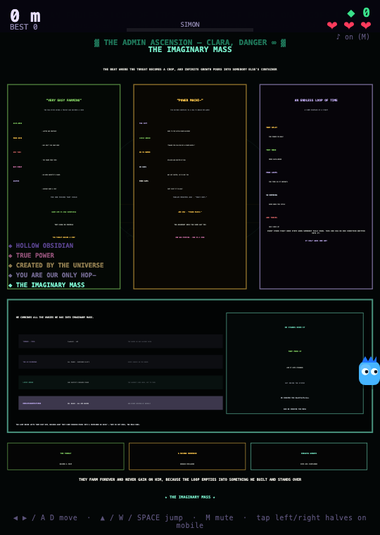

## 2026-08-13 — YOU ARE OUR ONLY HOP- · INFINITE POWER IS NOT ENOUGH, AND A SENTENCE CHANGES SIDES IN THE MIDDLE OF A WORD (BEAT 301)

Based on Toby's 2026-08-13 lore, 1:45:35 PM, in the "Even Even Even Even More Classics Era (Even 4x Classics Era)" thread — eight minutes after CREATED BY THE UNIVERSE. His own typing is the opening paragraph. The "Power Harvest / Unikitty Split-Universes Route" breakdown pasted underneath is ChatGPT commentary.

**The harvest turns into a distribution.** *"Pero takes the Alex-Greg's power and splits it into 3 balls, Pero, Luigi Green, and Gaster became even stronger."* Fifteen minutes ago that power was the one thing in the file that could hurt Pero. Now it is three pieces, held by his own side.

**Then the line that breaks the arithmetic.** *"Pero made infinite power for Luigi Green and Gaster, still Pero thinks they aren't enough, so he takes everyone elses' power and brings them to Luigi Green and Gaster."* You cannot add to infinity. If they already have infinite power and he keeps collecting, then the point was never how much they hold — it is **who is left holding none**.

**And he is not doing it for himself.** *"Pero LAI is always the most powerful since he created the game."* He is already at the top and cannot be added to either. So this is a creator building two other characters into collectors, for something that has not been named yet.

**Her defence is not a fight and not an escape.** *"Unikitty is the only one with power, Unikitty split the universes up so she would be safe."* She changes the shape of the place she is being hunted in. And the counter is the plainest thing in the file: *"Pero makes more boxes to make Unikitty back into the box universe."* Structural defence, manufacturing answer.

**The sentence changes sides in the middle of a word.** *"You are our only hop- we'll make sure we have at least a copy of your power."* It starts as *you are our only hope* and it never finishes. The dash is exactly where Gaster stops asking her for help and starts pricing her. She is not the last chance; she is the **last source**.

**And the rise is permitted.** *"Pero doesn't even want to stop Gaster and Luigi Green, but he can, but he doesn't want to."* Not powerless and not unaware. Second decision of the day, the same shape as the lid on Alex's box.

**Built as game beat 301, `YOU ARE OUR ONLY HOP-`.** Additive; nothing earlier was changed.

- **Background: three drifting power balls** labelled PERO / LUIGI GREEN / GASTER under *PERO TAKES THE ALEX-GREG'S POWER AND SPLITS IT INTO 3 BALLS*, with **"PERO MADE INFINITE POWER FOR LUIGI GREEN AND GASTER, STILL PERO THINKS THEY AREN'T ENOUGH"** boxed in gold over *YOU CANNOT ADD TO INFINITY, SO THIS WAS NEVER ABOUT BEING STRONG*, and a drifting *AT LEAST A COPY OF YOUR POWER* band.
- **SPLIT INTO 3 BALLS (left)** — five rows (the DNA came home fifteen min ago / Pero splits it into 3 balls / one ball for Pero / one for Luigi Green / one for Gaster), closing on *THE ONE POWER THAT COULD* / *HURT HIM IS NOW HELD* / *BY THE THREE OF THEM* / **THE THREAT BECAME STOCK**.
- **INFINITE, AND NOT ENOUGH (centre)** — five rows (he makes infinite power for them / and still thinks it is not enough / so he takes everyone else's power / and brings it to the other two / not for himself, he is already the most powerful), closing on *YOU CANNOT ADD TO INFINITY* / *SO HE IS NOT BUYING STRENGTH* / *HE IS EMPTYING EVERYONE ELSE* / **THE POINT IS WHO HAS NONE**.
- **"ONLY HOP-" (right)** — five rows (it starts as "our only hope" / it breaks in the middle of the word / it returns as "at least a copy" / so she is not the hope / she is the last source left), over *the dash is where he stops asking and starts collecting*, closing on **ONE WORD, TWO SIDES**.
- **SHE TAKES THE MAP APART AND HE PRINTS A NEW ONE (band)** — a four-row grid lit one at a time (UNIKITTY SPLITS THE UNIVERSES UP / EVERYONE ELSE IS TRAPPED AND TAKEN / THE THREE CRUSH THE NEXT BOX / SO HERS IS STRUCTURAL), closing on *she does not fight and she does not run, she changes the shape of the place she is being hunted in, and he answers by building more of it*.
- **HE COULD STOP THEM (band inset)** — a cycler across THEY RISE AND HE WATCHES / HE CAN STOP THEM / HE DOES NOT WANT TO / SO THE RISE IS PERMITTED, closing on *THE LID ON ALEX WAS A DECISION, AND SO IS THIS ONE*.
- **Strip:** THE HARVEST · BECAME THREE BALLS / INFINITE · WAS NOT ENOUGH / ONE WORD · CHANGES SIDES.
- **Footers:** *HE GIVES THEM INFINITE POWER AND THEN GOES OUT TO COLLECT MORE, SO THIS WAS NEVER ABOUT BEING STRONG* and **★ YOU ARE OUR ONLY HOP- ★**.
- **Screenshot helper:** new `onlyhop` scene in `tools/capture_screenshot.py`.

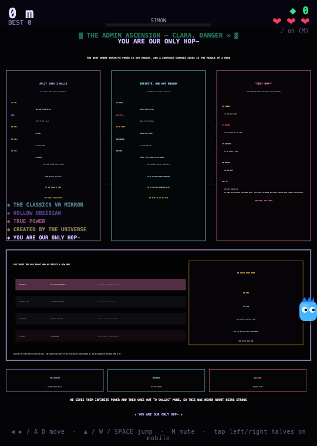

## 2026-08-13 — CREATED BY THE UNIVERSE · THE ONE CHARACTER WITH NO MAKER ANYWHERE INSIDE THE FILE (BEAT 300)

Based on Toby's 2026-08-13 lore, 1:37:27 PM, in the "Even Even Even Even More Classics Era (Even 4x Classics Era)" thread — seven minutes after TRUE POWER. His own typing is one line. The "Unikitty origin update" breakdown pasted underneath is ChatGPT commentary.

**One line, and it removes something from the board.** *"Unikitty was also created by the universe as what ChelseaPlays says."*

**Every other origin in this archive has somebody's name on it.** Pero created Classics and makes the boxes one at a time. Gaster builds, hides, harvests. The rest of the cast is forked, templated, corrupted, rebuilt, re-made from AI, or made inside the box. Three hundred beats in, somebody is always upstream of somebody.

**This one has nobody.** Not Pero, not Gaster, not the box, not a Sprunki template, not an AI build. Nothing in Classics is upstream of her, which in a file like this one is a defensive property: **there is no maker to unmake.** Every power here has a handle somewhere, and cutting the source is how half the fights in the archive are won.

**And it answers the beat from seven minutes earlier.** The crown, the wand and the rings all came off and the power stayed, because belief, heart power and MERCY never came from anything inside the game that the game could take back.

**The ruling itself arrives from outside the game.** *"as what ChelseaPlays says."* Not a character's claim, not a boast in a fight — a reality-side source. So it is not something Classics gets to argue with. It has to accept it.

**Built as game beat 300, `CREATED BY THE UNIVERSE`.** Additive; nothing earlier was changed.

- **Background: a drifting starfield.** NOT MADE BY PERO · NOT MADE BY GASTER · NOT MADE BY THE BOX over a four-row maker list (CLASSICS · PERO MADE IT / THE BOXES · PERO MAKES THEM / THE SPRUNKIS · TEMPLATES, FORKS AND REBUILDS / **UNIKITTY · THE UNIVERSE**), with **"AS WHAT ChelseaPlays SAYS"** boxed in cyan over *SO THE RULING ARRIVES FROM OUTSIDE THE GAME, AND CLASSICS DOES NOT GET A VOTE*.
- **WHO MADE EVERYONE ELSE (left)** — five rows (Classics · Pero created it / the boxes · Pero makes them one by one / the cast · forked, templated, rebuilt / the AI ones · built from something / so every origin has a name on it), closing on *WHOEVER MADE YOU* / *IS SOMETHING THAT CAN BE* / *ARGUED WITH, BEATEN* / **OR TAKEN BACK**.
- **NOBODY IN CLASSICS (centre)** — five rows (not Pero / not Gaster / not the box / not a Sprunki template / **the universe made her**), closing on *NOTHING IN CLASSICS* / *IS UPSTREAM OF HER* / *SO THERE IS NO MAKER* / **TO UNMAKE**.
- **THE SOURCE IS OUTSIDE (right)** — five rows (most rules are set inside the game / this one is set outside it / so it is not a claim to beat / it is a fact to accept / and she was sent back in by it), over *the one who sent her back in is not a character in Classics*, closing on **A RULING, NOT AN ARGUMENT**.
- **WHICH IS WHY SEVEN MINUTES AGO WORKED (band)** — a four-row grid lit one at a time (THE JEWELRY ALL CAME OFF / BECAUSE IT WAS NEVER IN THERE / AND THOSE CAME FROM THE UNIVERSE / SO THERE IS NOTHING TO TAKE BACK), closing on *the whole file is people taking things away from each other, powers, curses, souls, save files, now DNA, and this is the one power with no handle on it*.
- **THE ONE WITH NO AUTHOR (band inset)** — a cycler across PERO CREATED CLASSICS / GASTER HARVESTS AND BUILDS / THE CAST WAS MADE BY SOMEONE / **UNIKITTY WAS MADE BY NO ONE**, closing on *SO THE ONE THING NOBODY HERE CAN GET ABOVE IS HERS*.
- **Strip:** NO MAKER · ANYWHERE IN THE FILE / THE RULING · COMES FROM OUTSIDE / SO THERE IS · NOTHING TO TAKE BACK.
- **Footers:** *EVERY OTHER ORIGIN IN THIS FILE HAS SOMEBODY'S NAME ON IT, AND THIS ONE HAS THE UNIVERSE'S* and **★ CREATED BY THE UNIVERSE ★**.
- **Screenshot helper:** new `universe` scene in `tools/capture_screenshot.py`.

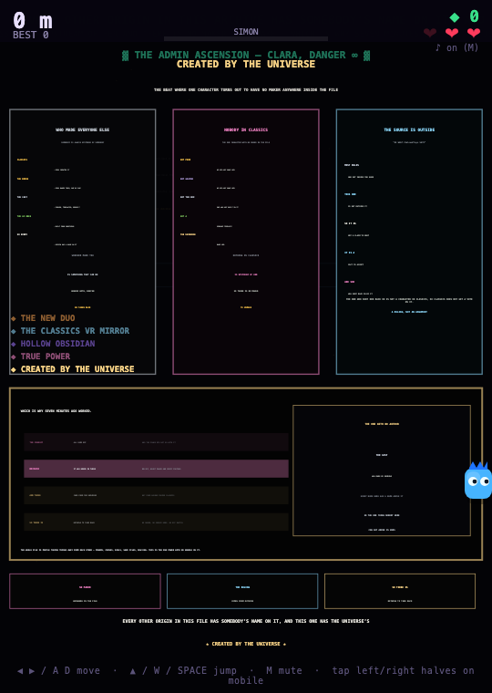

## 2026-08-13 — TRUE POWER · ONE CHARACTER TAKES EVERYTHING OFF AND COMES BACK STRONGER, AND TWO OTHERS ADD UP AND GET COLLECTED (BEAT 299)

Based on Toby's 2026-08-13 lore, 1:30:03 PM, in the "Even Even Even Even More Classics Era (Even 4x Classics Era)" thread — two hours and fifteen minutes after HOLLOW OBSIDIAN. His own typing is the opening paragraph, and two more lines come off the image he attached. The "Unikitty TRUE POWER update" and "Clean canon update" breakdown pasted underneath is ChatGPT commentary.

**The only upgrade in this archive that is a subtraction.** *"Some of my jewelery fell off so I decided to take it all off. Jewelery isn't why I am weaker. It's because I needed to believe."* Every power-up in this file to date is something a character puts on, eats, absorbs, fuses with or collects. The crown, the wand, the rings and the necklace come off on purpose, and what is left is stronger than Brud, Owackx, Vineria and Sky. The power was never on her.

**And the other line names the condition it survives.** *"Even when I am scared my power is the key to anything."* Not *when she is brave* — when she is scared. Belief, heart power and MERCY do not need the fear to go away first.

**The other half of the email goes the exact opposite direction.** *"Alex combines with Greg and makes Alex-Greg, a supernatural being."* The one who pulls matter out of thin air fused with the one who turns matter into air — the only power that can harm Pero, joined to the power that erases objects. Two hours ago that was the most dangerous pairing in the file. It lasts one sentence.

**And the win does something no win here has done before.** *"Pero sends Gaster to deal with Alex-Greg, he struck down Alex-Greg instantly and returned with the DNA and power"* — *"Pero and Luigi Green, I have eliminated Alex-Greg for you and returned with not just the power, but the DNA."* Every other victory in this archive ends when somebody falls down. This one ends with the winner picking something up, which turns the strongest fusion in the file from a threat into supply.

**And the lid did not move.** *"Pero still refuses to let Alex out of the box."* He fused, he got stronger, the answer is still no — and now the three holding the lid have his power too.

**Built as game beat 299, `TRUE POWER`.** Additive; nothing earlier was changed.

- **Background: the jewelry coming off.** THE CROWN / THE WAND / THE NECKLACE / THE RINGS, each one *OFF — AND SHE IS STILL STRONGER*, with **"EVEN WHEN I AM SCARED MY POWER IS THE KEY TO ANYTHING"** boxed in gold over *SO THE POWER WAS NEVER ON HER, IT WAS IN HER*, under a drifting *NOT JUST THE POWER, BUT THE DNA* band.
- **SHE TOOK IT ALL OFF (left)** — five rows (SOME OF IT FELL OFF ON ITS OWN / SO SHE TOOK THE REST OFF TOO / NOT ONE OF THE PIECES WAS THE POWER / THE POWER IS BELIEF · HEART · MERCY / AND SHE CAME BACK STRONGER), closing on *EVERY OTHER UPGRADE HERE* / *IS SOMETHING YOU PUT ON* / *THIS ONE IS SOMETHING* / **SHE TOOK OFF**.
- **ALEX-GREG (centre)** — five rows from *ALEX PULLS MATTER OUT OF AIR* through *SO IT SHOULD HAVE BEEN THE BIG ONE*, closing on *THE BIGGEST FUSION IN THE FILE* / *AND IT LASTS ONE SENTENCE* / *STRUCK DOWN INSTANTLY* / **ADDING UP DID NOT SAVE THEM**.
- **AND THE DNA (right)** — Gaster in five rows (Pero sends him / he strikes him down instantly / and then does not walk away / he returns with the power / and also with the DNA), over *every other win in this file ends when somebody falls down, this one ends with the winner picking something up*, closing on **HE DID NOT WIN, HE HARVESTED**.
- **ONE OF THEM SUBTRACTED. THE OTHER TWO ADDED. (band)** — a four-row grid lit one at a time (UNIKITTY TOOK EVERYTHING OFF / ALEX + GREG PUT TWO POWERS ON / GASTER STRUCK IT DOWN / SO THE ONE WHO KEPT NOTHING), closing on *in a file where everyone gets stronger by collecting something, the one who got stronger today is the one who put things down*.
- **PERO STILL REFUSES (band inset)** — a cycler across ALEX FUSED AND GOT STRONGER / THE ANSWER IS STILL NO / THE BOX DID NOT MOVE / SO THE LID IS STILL A DECISION, closing on *AND NOW THE ONES HOLDING THE LID HAVE HIS POWER TOO*.
- **Strip:** SHE TAKES IT OFF · AND GETS STRONGER / THEY ADD UP · AND LAST ONE LINE / THE WINNER · KEEPS THE DNA.
- **Footers:** *ONE OF THEM SUBTRACTED AND GOT STRONGER, THE OTHER TWO ADDED UP AND GOT COLLECTED* and **★ IT'S BECAUSE I NEEDED TO BELIEVE ★**.
- **Screenshot helper:** new `truepower` scene in `tools/capture_screenshot.py`.

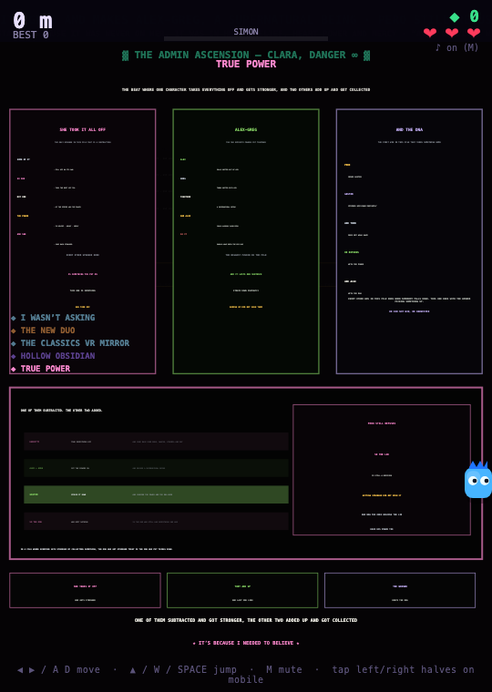

## 2026-08-13 — HOLLOW OBSIDIAN · THE ONE THING THAT CAN HARM THE CREATOR IS BUILT OUT OF THE CREATOR'S OWN FOG (BEAT 298)

Based on Toby's 2026-08-13 lore, 11:14:56 AM, in the "Even Even Even Even More Classics Era (Even 4x Classics Era)" thread — four hours and twenty-four minutes after THE CLASSICS VR MIRROR. His own typing is the opening paragraph. The "Alex's main technique set" and matchup breakdown pasted underneath is ChatGPT commentary.

**Two opposite techniques, and the thing they make together is the hard one.** *"Technique Amplification: Lava Technique Reversal: Water Hollow Obsidian."* One adds, one undoes, and lava meeting water is the one recipe in Minecraft that turns two soft things into the hardest block. He does not pick a side; he keeps what they make.

**The main power is not a weapon, it is a supply.** *"he has every ability that has something to do with Minecraft, and the main ability is that he can pull stuff out of thin air."* Nearly every character in this archive is one attack. This one is an inventory.

**And the counter to the creator is made out of the creator.** *"he can use Pero's fog to create fans to turn Pero back into his base form. Alex is the only one who can even harm Pero."* Four and a half hours ago the rule was that Pero sees strikes from anyone, so surprise does not work on him. This needs no surprise. The fog is already there; Alex just pulls a fan out of the air and the fog does the losing.

**His closest ally has the exact opposite power.** *"Alex also uses Greg all the time since Greg has the ability to turn matter into air. They have opposite powers."* Alex makes matter out of air; Greg makes air out of matter. Greg grabs Simon's lightning and it turns to air, and Greg beats Gray — but *"Oren's telekentics isn't matter, but a force,"* so it locks Greg into a wall and he never escapes. The one thing the matter-eraser cannot erase is the attack that was never an object.

**The ladder stops being about damage.** Greg beats Gray, Oren beats Greg, Alex beats Greg by creating faster than Greg can erase (or by creating an eraser), and Alex beats Oren and Gray by building the barriers of the box around them. Every other ranking in the file sorts by who hits hardest. This one sorts by what each one is made of, and the builder wins by building the room.

**And the one who can build anything is still inside.** *"Alex is strong enough for the Anti Void, but Gaster, Luigi Green, and Pero refused and kept him in the box. Alex plans to become powerful enough to enter the Anti Void and to leave the box."* One of the three holding the lid is the one person he can hurt — so the goal quietly stops being winning a fight in Classics and becomes leaving it.

**Built as game beat 298, `HOLLOW OBSIDIAN`.** Additive; nothing earlier was changed.

- **Background: the technique triangle drifting.** LAVA (the one that adds) / WATER (the one that undoes) / OBSIDIAN (what the two of them make when they meet), with **"ALEX IS THE ONLY ONE WHO CAN EVEN HARM PERO"** boxed in gold over *AND THE THING HE HARMS HIM WITH IS PERO'S OWN FOG*, under a drifting *PULL STUFF OUT OF THIN AIR* band.
- **THE TECHNIQUE TRIANGLE (left)** — five rows (AMPLIFICATION · LAVA / REVERSAL · WATER / TOGETHER · HOLLOW OBSIDIAN / AND EVERY MINECRAFT ABILITY THERE IS / MAIN ONE · PULL STUFF OUT OF THIN AIR), closing on *THE TWO OPPOSITE ONES* / *MAKE THE HARDEST BLOCK* / **HE KEEPS WHAT THEY MAKE**.
- **FANS OUT OF HIS OWN FOG (centre)** — five rows from *PERO FIGHTS INSIDE HIS FOG* through *ALEX IS THE ONLY ONE WHO CAN HARM HIM*, closing on *HE DOES NOT OUT-POWER THE FOG* / *HE BUILDS A FAN OUT OF IT* / *SEEING IT COMING DOES NOT HELP* / **THE MATERIAL IS ALREADY HIS**.
- **MATTER INTO AIR (right)** — Greg in five rows (turns matter into air / Alex pulls matter out of air / so Simon's lightning turns to air / but Oren's is a force, not matter / and that locks Greg in a wall), closing on **OPPOSITE, NOT ENEMY**.
- **THE LADDER THAT DOES NOT STACK (band)** — a four-row grid lit one at a time (GREG BEATS GRAY / OREN BEATS GREG / ALEX BEATS GREG / ALEX BEATS OREN AND GRAY, each with the reason), closing on *every other ranking in this file is a list of who hits hardest; this one is a list of who is made of what*.
- **STILL IN THE BOX (band inset)** — a cycler across STRONG ENOUGH FOR THE ANTI VOID and the three who refused (Gaster, Luigi Green, Pero), landing on *THE ONE HE CAN HARM HELPS HOLD THE LID*, closing on *SO THE PLAN IS NOT TO WIN A FIGHT, IT IS TO LEAVE THE BOX*.
- **Strip:** THE COUNTER · IS MADE OF HIS OWN FOG / OPPOSITE POWERS · WORK TOGETHER / STRONG ENOUGH · STILL IN THE BOX.
- **Footers:** *HE DOES NOT BEAT THE FOG, HE PULLS A FAN OUT OF THE AIR AND LETS THE FOG DO THE LOSING* and **★ ALEX IS THE ONLY ONE WHO CAN EVEN HARM PERO ★**.
- **Screenshot helper:** new `hollowobsidian` scene in `tools/capture_screenshot.py`.

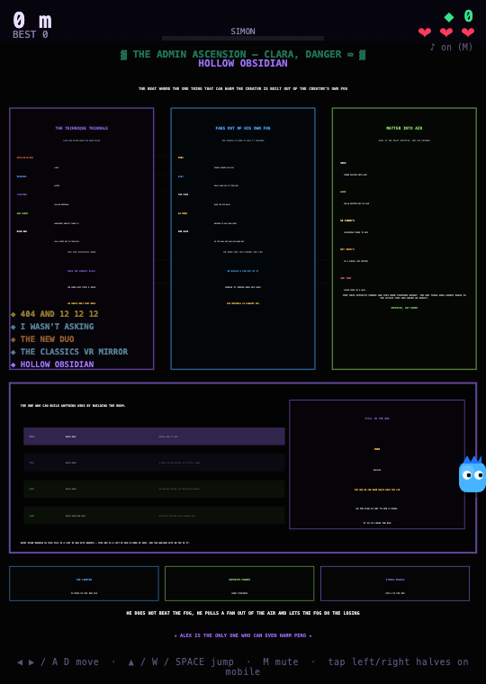

## 2026-08-13 — THE CLASSICS VR MIRROR · THE CREATOR IS ON A CONTROLLER WHILE EVERYONE ELSE WALKS IN THROUGH A DOOR (BEAT 297)

Based on Toby's 2026-08-13 lore, 6:50:11 AM, in the "Even Even Even Even More Classics Era (Even 4x Classics Era)" thread — seventeen minutes after THE NEW DUO. His own typing is the opening paragraph. The "Classics VR Mirror rule" and "Oren vs Simon.psc update" breakdown pasted underneath is ChatGPT commentary.

**Everyone else gets a door. One character gets a controller.** *"Did you know Pero is the only character that plays through the Classics VR Mirror? He makes movements no one could make through the normal Classics portal mirrors."* A portal mirror opens and closes and lets you through. A VR mirror is an interface. The rest of the cast is inside Classics; he is at the glass, playing it.

**And the second half of that sentence quietly removes surprise from the game.** *"and he even sees strikes from anyone."* Almost every fight in this archive turns on a hit nobody saw coming. He is the one character that cannot happen to.

**Seventeen minutes after "WE SHALL BE UNSTOPPABLE!", the new duo comes apart from the inside.** *"Oren is stronger than Simon.psc, Oren could litterly just knock Simon.psc in a wall and he could strike him down, he can dodge the lightning."* Simon was the KO half, and his one stated weakness was that the lightning can be dodged. The partner brought in to cover that weakness is the one who uses it.

**The thing that ends him is a simple sword.** Not an erase, not a reset, not twelve digits of anything: a wall, a plain sword, and *"Simon.psc also has litterly 0 HP now."* The strongest tool in the paragraph is the plainest object in it.

**Built as game beat 297, `THE CLASSICS VR MIRROR`.** Additive; nothing earlier was changed.

- **Background: the mirror rule drifting.** PORTAL MIRROR / VR MIRROR / SO THE OTHERS ARE IN THE GAME, AND HE IS AT THE GLASS, with **"AND HE EVEN SEES STRIKES FROM ANYONE"** boxed in gold over *WHICH QUIETLY REMOVES SURPRISE FROM THE LIST OF THINGS THAT WORK ON HIM*.
- **THE TWO WAYS IN (left)** — five rows (everyone uses the portal mirrors / those only open and close / Pero uses the VR mirror / so he moves how the door cannot), closing on *A DOOR LETS YOU IN* / *A CONTROLLER LETS YOU PLAY* / **HE IS AT THE GLASS**.
- **"SEES STRIKES FROM ANYONE" (centre)** — five rows (nothing arrives unannounced / he answers before it lands / no ambush exists on him), closing on *ALMOST EVERY FIGHT IN THIS FILE TURNS ON A HIT NOBODY SAW* / **THAT CANNOT HAPPEN TO**.
- **A SIMPLE SWORD (right)** — the duo split in five rows, from *OREN IS STRONGER THAN SIMON.psc* through *SIMON.psc HAS LITTERLY 0 HP NOW*, closing on **THE PLAINEST TOOL IN THE FILE**.
- **THE COVER IS THE COUNTER (band)** — a four-row grid lit one at a time (17 MINUTES AGO / HIS ONE GAP / SO THE COVER BECOMES THE COUNTER / AND THE KO HALF ENDS AT LITTERLY 0 HP), closing on *the duo did not lose to anyone else, it came apart from the inside*.
- **THE TWO MIRRORS (band inset)** — a cycler across portal mirror vs VR mirror and played-by-the-game vs playing-it, closing on *AND THE SWORD IS NOT A POWER, IT IS JUST A SWORD*.
- **Strip:** ONE PLAYER · ON A CONTROLLER / NO STRIKE · ARRIVES UNSEEN / THE KO HALF · ENDS AT 0 HP.
- **Footers:** *A PORTAL LETS YOU IN, A CONTROLLER LETS YOU PLAY, AND ONLY ONE CHARACTER HAS THE SECOND ONE* and **★ HE EVEN SEES STRIKES FROM ANYONE ★**.
- **Screenshot helper:** new `vrmirror` scene in `tools/capture_screenshot.py`.

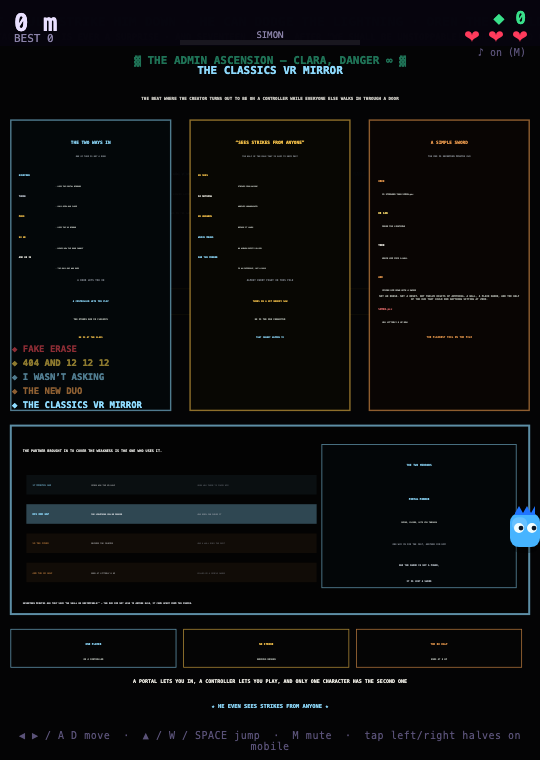

## 2026-08-13 — THE NEW DUO · TWO WEAKNESSES CANCEL OUT AND THE ONE WHO SURVIVED EVERYTHING IS DESTROYED (BEAT 296)

Based on Toby's 2026-08-13 lore, 6:33:50 AM, in the "Even Even Even Even More Classics Era (Even 4x Classics Era)" thread — eleven hours and fifty minutes after I WASN'T ASKING, and the direct counter-route to it. His own typing is the duo paragraph, plus the ranking answer and the ??? reveal. The Minecraft-horror power ranking and the "counter-route" breakdown pasted around it are ChatGPT commentary.

**Last night Gray survived everything. This morning he is destroyed, and nobody got stronger.** The whole archive has ranked single characters for months. This is the first time the top of the ladder is beaten by a pairing instead of by a bigger number.

**The gap each one leaves is exactly the size of the other one.** *"Oren's telekentics is impossible to dodge, but it does tiny damage. Simon's lightning KOs, but it can be dodged or collected and thrown back at him."* Oren always connects and cannot finish; Simon can finish and can be stepped out of, or have the bolt caught and returned. Put together there is nothing left to aim at: Oren supplies the contact, Simon supplies the KO.

**Gaster names the mechanism rather than the winner.** *"They filled their weaknesses, Gray was destroyed."* Not stronger. Filled.

**The cutscene is announced and then withheld.** *"then it activates a cutscene I won't explain"* — the first thing in the whole file that he tells us exists and deliberately does not describe.

**And the real villain almost says too much.** Pero downplays it: *"This is just cercumstentual."* Luigi Green answers *"Wait... That is impossible."*, Pero and Gaster turn and look at him, and only then does he correct it to *"I ment, it was a hard chance."* One day after being named the antagonist, the tell is that he knows the odds.

**The ??? seat gets filled too.** His ranking runs Verity > Falsity > Long Horse > Creator > Herobrine > Entity 303 > Null > Wither Storm, and the mystery character is *"Pero LAI, the creator of Classics, he is far over Verity"* — the creator tops a list he is not from.

**Built as game beat 296, `THE NEW DUO`.** Additive; nothing earlier was changed.

- **Background: the team-up call drifting.** OREN "WITH MY TELEKENTICS…" / SIMON "AND MY LIGHTNING POWER…" / BOTH "WE SHALL BE UNSTOPPABLE!", with **"THEY FILLED THEIR WEAKNESSES, GRAY WAS DESTROYED."** boxed in gold over *GASTER DOES NOT SAY THEY GOT STRONGER, HE SAYS THEY FILLED A GAP*.
- **"WITH MY TELEKENTICS…" (left)** — five rows (impossible to dodge / always reaches the target / but does tiny damage), closing on *HE IS THE ONE WHO CANNOT MISS* / *AND CANNOT END ANYTHING* / **AND SIMON SUPPLIES THE REST**.
- **"AND MY LIGHTNING POWER…" (centre)** — five rows (can KO outright / can be dodged / or collected and thrown back), closing on *DODGING IT WAS ALWAYS THE COUNTER* / **OREN TAKES THE DODGE AWAY**.
- **THE SLIP (right)** — the five-line exchange at the box in order, from *"This is just cercumstentual."* through the two of them looking at him, closing on **HE KNOWS THE ODDS**.
- **THE GAP EACH ONE LEAVES (band)** — a four-row grid lit one at a time (OREN ALONE / SIMON ALONE / TOGETHER / NO GAP LEFT TO AIM AT), closing on *eleven hours ago he survived everything at twelve digits of pain; nobody got stronger overnight, the matchup changed*.
- **THE ??? SEAT (band inset)** — a cycler across his ranking, the Pero LAI reveal, *"FAR OVER VERITY"*, and the announced-then-withheld cutscene.
- **Strip:** TWO WEAKNESSES · CANCEL EACH OTHER / THE CUTSCENE · IS WITHHELD / THE VILLAIN · ALMOST SAYS TOO MUCH.
- **Footers:** *NOBODY GOT STRONGER OVERNIGHT, THE TWO OF THEM JUST STOPPED LEAVING A GAP* and **★ WE SHALL BE UNSTOPPABLE! ★**.
- **Screenshot helper:** new `newduo` scene in `tools/capture_screenshot.py`.

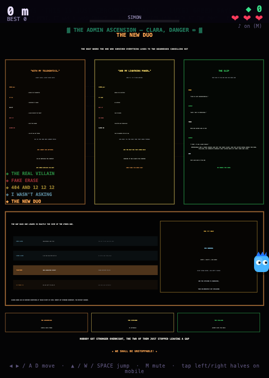

## 2026-08-12 — I WASN'T ASKING · THE ONE LEFT STANDING TURNS OUT TO HAVE PAID THE MOST FOR IT (BEAT 295)

Based on Toby's 2026-08-12 lore, 6:43:19 PM, in the "Even Even Even Even More Classics Era (Even 4x Classics Era)" thread — four hours and twenty-two minutes after 404 AND 12 12 12. His own typing is the long opening paragraph, the whole collapse route. The "Gray.nur Collapse Route" breakdown pasted underneath is ChatGPT commentary.

**The winner is the one who paid the most.** *"Gray barely survives the game and was left curseless and 90% of his soul and about 999999999999% of pain."* This archive hands out wins constantly and almost never prices one. Here the bill is itemised, and the pain figure has twelve digits in it.

**Dead does not mean gone, and alive does not mean whole.** Oren.exe is dead and still carrying an orange cross, a halo and 45% of a body with the rest becoming soul. Simon.psc died and came back as *"something he can't handle, a demonic god"*, keeping the lightning, the reset and the signal.

**Almost nobody comes out the same shape.** Durple maxes into a 15 headed monsterosity, Mr. Sun becomes Mr. Blackhole and Mr. Moon becomes Mr. Crushed_Moon, Mr. Tree is cut to a stump, Pinki loses an ear and the brain, Wenda can no longer ignore the voices and loses the mind, Sky goes from 14 to 999 and goes blind and deaf with his soul still in his body, Brud loses the body but not the soul, and Fun Bot is destroyed by the two he had spent years missing.

**He does not beat Tunner, he spends him.** *"I am incredible at this mastery, think you'll win?"* / *"I wasn't asking."* Five apples, *"Perfect accurrecy."*, and then *"oh ho, but you used up all your firepower and bullets."* The test was never whether he could hit them. Owackx gets two words: *"Free XP."*

**Uno Reverse.** Wenda attacks first, he answers *"As I told you, You Are Mine."*, takes her own knife and finishes it with a card-game line in the darkest route in the file.

**Luigi Green stops waiting for the boxes to be finished.** He crushes them *before Pero finishes them*, so parts disappear or come out flattened. Nine hours after Gaster taught him to do every step at once, he is a danger to the structure of the game rather than to its cast.

**And the creator gets tired.** The last line of the paragraph is *"Pero gets tired making boxes very fast."* Nine hours ago every one of his stats resolved to Absolute Infinity. This is the first cost he has ever been given.

**Built as game beat 295, `I WASN'T ASKING`.** Additive; nothing earlier was changed.

- **Background: the pain figure drifting.** CURSELESS / 90% SOUL / 999999999999% OF PAIN, with **PERO GETS TIRED MAKING BOXES VERY FAST** boxed in gold over *THE LAST LINE OF THE PARAGRAPH, AND THE FIRST COST HE HAS EVER HAD*.
- **WHAT SURVIVING COST (left)** — five rows, closing on *THIS FILE HANDS OUT WINS ALL THE TIME* / *AND ALMOST NEVER PRICES ONE* / **TWELVE DIGITS OF IT**.
- **THE FIVE APPLES (centre)** — the exchange in five rows, closing on *HE PASSED IT PERFECTLY AND LOST* and **THE COMPLIMENT WAS THE TRAP**.
- **CRUSHED TOO EARLY (right)** — Luigi goes very very insane / he crushes before Pero finishes / so parts just disappear / or they come out flattened / and Pero gets tired, over **NINE HOURS AFTER THE LESSON**.
- **THE ROSTER (band)** — OREN.exe dead with 45% of a body / SIMON.psc a demonic god he cannot handle / MR. SUN became MR. BLACKHOLE / SKY went from 14 to 999, closing on Durple, Wenda, Mr. Tree and Brud.
- **UNO REVERSE (band inset)** — a cycler across Wenda attacking first, *"As I told you, You Are Mine."*, the knife, and **"UNO REVERSE."**, over Gaster moving through Pero's fog.
- **Strip:** THE WINNER · PAID THE MOST / THE BOXES · GET CRUSHED EARLY / THE CREATOR · GETS TIRED.
- **Footers:** *HE TAKES DOWN THE SAVE FILE, AND THE ONE MAKING THE BOXES GETS TIRED* and **★ I WASN'T ASKING ★**.
- **Screenshot helper:** new `notasking` scene in `tools/capture_screenshot.py`.

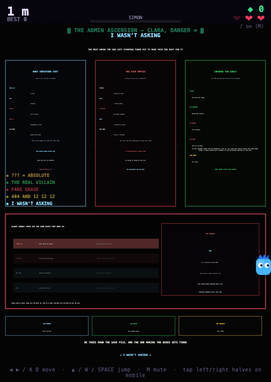

## 2026-08-12 — 404 AND 12 12 12 · TWO CHARACTERS GET NUMBERS AND THE NUMBERS POINT OPPOSITE WAYS (BEAT 294)

Based on Toby's 2026-08-12 lore, 2:21:13 PM, in the "Even Even Even Even More Classics Era (Even 4x Classics Era)" thread — two hours and fourteen minutes after FAKE ERASE. His own typing is two lines: *"Simon.psc is 404 obviously. And 12 12 12 while putting your hand up while calling is Pero LAI. both have powers of lightning."* The breakdown pasted under it is ChatGPT commentary.

**Two numbers on one line, doing opposite jobs.** 404 is what a system reports after it looked and found nothing, so it is an absence you receive; 12 12 12 is something you say on purpose so that somebody arrives. One is a report, the other is a summons.

**"Obviously" is doing the work.** He does not argue for Simon = 404, he treats it as settled, and the archive agrees: SIMON 404 is the oldest name in this whole file, and the number doubles as the description — error, missing file, broken access, glitch return.

**The calling code comes with a gesture.** Not a command, not a button, not a typed file name: a hand in the air while calling. This canon has run on commands and buttons for months, and this is the first interface in it that is neither typed nor pressed.

**The shared power is the point, and the source is the split.** They both use lightning. Simon's is 404 glitch lightning — speed, sleep-defence, game-error power. Pero's is LAI creator lightning — Anti Void, command and control from outside the box. Same bolt, different socket.

**Built as game beat 294, `404 AND 12 12 12`.** Additive; nothing earlier was changed.

- **Background: the two numbers drifting.** 404 (Simon.psc · not found) / 12 12 12 (Pero LAI · hand up, calling) / BOTH (answer in lightning), with **12 12 12 — WITH YOUR HAND UP, WHILE CALLING** boxed in gold over *A GESTURE, NOT A BUTTON*.
- **SIMON.psc IS 404 (left)** — five rows (404 MEANS · something was looked for / AND · it was not there / SO IT IS · a report of absence / AND HE · has carried it all along / THE ONLY · number he ever needed), closing on *THE NUMBER IS ALSO THE DESCRIPTION* / *YOU DO NOT DIAL A 404* / **YOU RECEIVE ONE**.
- **12 12 12 IS PERO LAI (centre)** — five rows (YOU SAY · twelve twelve twelve / AND YOU · put your hand up / WHILE · you are calling / AND HE · is the one who answers / SO IT IS · a summons, not a search), closing on **THE FIRST INTERFACE THAT IS A GESTURE**.
- **THE SAME LIGHTNING (right)** — five rows splitting the power by source (SIMON · 404 glitch lightning / HIS IS · speed and sleep-defence / PERO · LAI creator lightning / HIS IS · Anti Void and control / SO ONE · is inside, one is above), over **SAME BOLT, DIFFERENT SOCKET**.
- **ONE NUMBER IS WHAT YOU ARE TOLD. THE OTHER IS WHAT YOU SAY (band)** — a four-row grid lit one at a time, closing on *he gave one character the number for not being there, and the other the number for being called*.
- **BOTH ANSWER IN LIGHTNING (band inset)** — a cycler across SIMON (glitch · error · speed), PERO (creator · Anti Void), ONE PLUGS (into the game) and ONE PLUGS (into what is outside it).
- **Strip:** ONE NUMBER · MEANS NOT FOUND / ONE NUMBER · MEANS COME HERE / THE POWER · IS THE SAME SHAPE.
- **Footers:** *ONE IS THE NUMBER YOU GET WHEN SOMETHING IS MISSING, THE OTHER IS THE ONE YOU DIAL* and **★ 404 AND 12 12 12 ★**.
- **Screenshot helper:** new `calling` scene in `tools/capture_screenshot.py`.

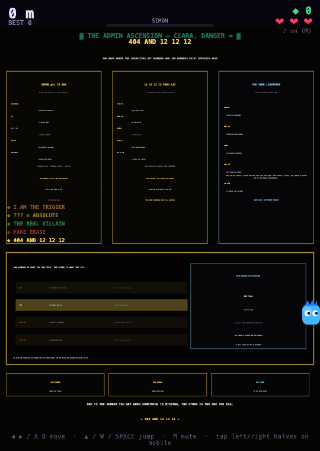

## 2026-08-12 — FAKE ERASE · THE LOUDEST ATTACK IN THE FILE TURNS OUT TO CHANGE NOTHING (BEAT 293)

Based on Toby's 2026-08-12 lore, 12:06:46 PM, in the "Even Even Even Even More Classics Era (Even 4x Classics Era)" thread — six minutes and twenty-three seconds after THE REAL VILLAIN. His own typing: *"New Chara also has a fake erase, it doesn't actually erase the safe file, so does with normal Chara. New Chara just attacks the spot there in, and the game fills with 9s. They don't even damage or reach the outside of the box. Mr. Black could just walk in and use the power of the outside of the box and he could just destroy the whole box. He shrunk everyone into the box, Classics Mr. Black locked them into the box. His indentity as Pero/Paul."* The breakdown pasted under it is ChatGPT commentary.

**The biggest move in the game gets downgraded twice in six minutes.** At 12:00 Gray's erase became a White Void teleport. At 12:06 Chara's and New Chara's go the same way, and neither of them ever touched the save file.

**The 9s are the tell.** A screen filling with 9s reads as total corruption and is actually a local hit on the one spot the attacker is standing in. The scariest-looking attack in the archive is the one that changes the least.

**The ceiling is the wall, not the damage.** Nothing inside the box can damage or reach the outside of it, however hard it swings — which is exactly why walking in from outside beats swinging from inside. Mr. Black can use the power of the outside of the box and destroy the whole box instead of the things in it. Position, not power.

**And the cage was built in two steps by one face.** Mr. Black shrank everyone into the box; Classics Mr. Black locked them in; and Classics Mr. Black is the Pero / Paul / Black Hat identity. So the trap is not a separate villain's — it is one more piece of the disguise system.

**Built as game beat 293, `FAKE ERASE`.** Additive; nothing earlier was changed.

- **Background: the wall of 9s.** NEW CHARA (fake erase · fills the game with 9s) / NORMAL CHARA (fake erase too) / THE SAVE (was never touched), with **THEY DO NOT REACH THE OUTSIDE OF THE BOX** boxed in white over *THE CEILING IS THE WALL, NOT THE DAMAGE*.
- **IT LOOKS LIKE THE END (left)** — five rows (NEW CHARA · attacks where they stand / THE GAME · fills up with 9s / AND THE · save file is untouched / NORMAL · Chara is the same / SO BOTH · erases are costume), closing on *THE NOISE IS NOT THE REACH* / **NOTHING LEFT THE BOX**.
- **THREE ERASES, ONE REAL (centre)** — the ladder (CHARA · fake · 9s in one spot / GRAY · fake · White Void / a teleport, not a delete / LUIGI · real · erases the game / BECAUSE · he is outside it), closing on *THE MOVE DID NOT GET WEAKER* / **IT GOT ONE OWNER**.
- **HE JUST WALKS IN (right)** — five rows on outside-box power, over the wrapped note that everybody inside has spent the era swinging harder, and **POSITION, NOT POWER**.
- **THE CAGE WAS BUILT IN TWO STEPS (band)** — STEP 1 Mr. Black shrunk everyone into the box / STEP 2 Classics Mr. Black locked it, and that is the Pero/Paul face / STEP 3 they fight and blame and fake-erase, inside / STEP 4 the outside-box beings stay above all of it.
- **ONE FACE, THREE NAMES (band inset)** — a cycler across PERO (the one who answers), PAUL (the one who arrives), CLASSICS BLACK (the one who locks it) and SO THE CAGE (is part of the costume).
- **Strip:** THE ERASE · NEVER LEFT THE BOX / NINE NINE · IS NOT DELETION / THE LOCK · HAS HIS NAME ON IT.
- **Footers:** *THE LOUDEST ATTACK IN THE GAME STILL CANNOT REACH THE EDGE OF IT* and **★ FAKE ERASE ★**.
- **Screenshot helper:** new `fakeerase` scene in `tools/capture_screenshot.py`.

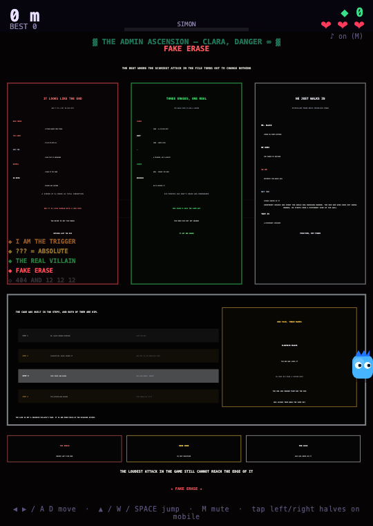

## 2026-08-12 — THE REAL VILLAIN · THE BLAME TURNS OUT TO HAVE BEEN THE HIDING PLACE (BEAT 292)

Based on Toby's 2026-08-12 lore, 12:00:23 PM, in the "Even Even Even Even More Classics Era (Even 4x Classics Era)" thread — the antagonist reveal. His own typing: *"\"Everyone blamed everyone else. They all didn't know the real antagonist is Luigi Green, this is getting really, REALLY, INSTERISTING!\" -Gaster. Pero makes the box characters to never know who the villian really is, and he made all the characters evil and do stuff, Pero and Gaster cover Luigi Green. Luigi Green has the powers of everyone, is outside the game, can erase the game, and also triggers his boss fight, he also makes games for comunication with the player like \"Who to go to\" and the buttons where Chara does \"Erase\" and \"Do Not\", and even Gray's erase cutscene. Pero told us that Gray's erase is a fake erase, it just teleports everything into a white void, and that Luigi Green is the only one with the real erase."* The breakdown pasted under it is ChatGPT commentary.

**The blame was not a mistake, it was the mechanism.** Pero did not hide Luigi Green behind a door. He made everybody else act evil and do suspicious things, so the search never ran out of suspects. Every fight in this stretch was misdirection, and all of it worked.

**Three jobs outside the box.** Pero makes the misdirection, Gaster knows and enjoys it, Luigi Green is the one being covered. This morning the three of them stood outside the box together as observers; by noon they are two guards and a secret.

**He is less a fighter than an interface.** "Who to go to", the Erase / Do Not buttons, Chara's choice system and even Gray's erase cutscene are all his. Every place the player thought they were choosing was his screen. He also has everyone's powers, is outside the game, and triggers his own boss fight — nobody starts it for him.

**The biggest move in the archive turns out to be a teleport.** Gray's E R A S E does not delete anything; it sends everything to the White Void, which makes it containment and makes the White Void a room. Luigi Green holds the only real erase, because the box rules do not hold somebody who is not inside the box.

**And the file said so four days ago.** On August 8: Luigi Green "would be the best since he goes overboard and crazy and insane with all that power and previous evil all in 1 entity." That was a guess about who would make a good villain. Today it is the answer.

**Built as game beat 292, `THE REAL VILLAIN`.** Additive; nothing earlier was changed.

- **Background: the blame list.** THEY BLAMED (Gray · Oren · Simon.psc · Mr. Black) / (Pero · Unikitty · Wenda) / (the fog and the AI templates), with **THE REAL ANTAGONIST IS LUIGI GREEN** boxed in green over Gaster's line.
- **TOO MANY SUSPECTS (left)** — five rows on the cover-by-addition, closing on *EVERY FIGHT SO FAR WAS MISDIRECTION* / **AND ALL OF IT WORKED**.
- **THREE JOBS OUTSIDE (centre)** — PERO makes the misdirection / GASTER knows and enjoys it / LUIGI is the one being covered, closing on **THEY ARE TWO GUARDS AND A SECRET**.
- **HE BUILDS THE MENU (right)** — "WHO TO GO TO" is his / ERASE / DO NOT is his / CHARA'S CHOICE system is his / GRAY'S ERASE cutscene is his / SO THE PLAYER has been talking to him, over **EVERY CHOICE WAS HIS SCREEN**.
- **REAL ERASE VS FAKE ERASE (band)** — Gray's erase does not delete anything, it sends it to the White Void / so it is containment, not deletion / Luigi Green has the only real erase / because he is not inside the game.
- **THE FILE ALREADY SAID SO (band inset)** — a cycler across the August 8 prediction and **FOUR DAYS FROM A GUESS TO THE ANSWER**.
- **Strip:** THE BLAME · WAS THE MECHANISM / THE MENUS · WERE HIS ALL ALONG / THE ERASE · WAS A MOVE, NOT A DELETE.
- **Footers:** *THE ONE WHO CRUSHES THE BOXES IS THE ONE WHO BUILT THE MENU* and **★ THE REAL VILLAIN ★**.
- **Screenshot helper:** new `realvillain` scene in `tools/capture_screenshot.py`.

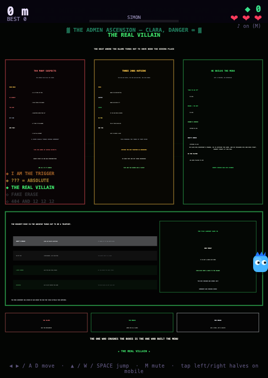

## 2026-08-12 — ??? = ABSOLUTE · UNKNOWN TURNS OUT TO HAVE BEEN A DECISION, NOT A GAP (BEAT 291)

Based on Toby's 2026-08-12 lore, 9:41:17 AM, in the "Even Even Even Even More Classics Era (Even 4x Classics Era)" thread — the second message of the brand-new "Even 4x Classics Era" thread and the first on it to carry lore. His own typing runs the whole scene: Pero revealing his ??? stats as Absolute Infinity and writing a whole book on them, Gaster arriving as the third character outside the game, the door and the Anti Void, *"Welp, all those guys keep suffering each second if they don't change from box to box"*, *"Unikitty is there again. Should I send her to the user, the shopping list, Alexa's head, take her out the box and send her to reality, or give her a template?"*, Luigi Green's *"I'LL animate her."*, Pero's corner-and-math overexplanation, *"your own intelegence level which equals about 200.5 IQ"*, Gaster's box-crushing lesson, the Bario/Weegee Mega Bario rivalry, and the reversed L banners replacing Simon's. The long "third layer" story pasted underneath is ChatGPT commentary and is not canon.

**The question marks were never missing data.** Every stat written ??? resolves to Absolute Infinity, and the reason given is that the game did not want to write the word yet. LV 1, KR 1, Rank 1 and 1000 IQ were only the visible part. Unknown was a decision.

**He is his own library.** Simon's books have been the power source of this canon for months, and the shelf that outreads them is one where every single book is about the author — his lines, his disguises, his ties, the black hat, the box.

**The third chair outside the box.** Pero makes the boxes, Luigi Green crushes them, and Gaster's whole job is the door — looking in from Anti Void, going back out, checking whether anybody fell in. His rule explains the boxes themselves: if you do not change from box to box, the same scene keeps crushing you, so a new box is a survival move rather than a level.

**A number lands on the box crusher, inside an apology.** 200.5 IQ, prodigy level, handed over by the one who just overexplained him into falling onto two boxes. The compliment and the thing that knocked him over are the same sentence.

**The banners change owner.** He hangs the reversed L on everything and replaces Simon's banners with his own. Simon wakes just enough to flicker and decides this is not the moment, so the menu now carries his anger without his action.

**Built as game beat 291, `??? = ABSOLUTE`.** Additive; nothing earlier was changed.

- **Background: the stat sheet resolving.** STRENGTH / HP · DANGER / CONTROL, each ??? → ABSOLUTE INFINITY, with Gaster's door line boxed in white.
- **UNKNOWN WAS A CHOICE (left)** — five rows, closing on *SIMON'S BOOKS RAN THIS CANON FOR MONTHS* and **HE IS HIS OWN LIBRARY**.
- **THE THIRD ONE OUTSIDE (centre)** — PERO makes the boxes / LUIGI crushes the boxes / GASTER watches the door, closing on **A NEW BOX IS A SURVIVAL MOVE**.
- **200.5 IQ, AND DIZZY (right)** — Gaster starts a sentence / Luigi says "I get it" / Pero explains it anyway / and he falls onto two boxes / which become two more menus, over **OVERLOAD, NOT AN ATTACK**.
- **THE BOX-CRUSHING LESSON WITH NO FIRST STEP (band)** — crush the outer box and the fake box / the menu box and the answer box / the box that appears after / the box a question made.
- **FIVE PLACES TO SEND A QUEEN (band inset)** — Gaster’s own five options (the user, the shopping list, Alexa’s head, out to reality, or a template) and Luigi Green’s answer, **"I’LL ANIMATE HER."**
- **Strip:** THE ??? · FINALLY HAS A WORD / THE BANNERS · CHANGED OWNER / THE DOOR · IS NOT A LEVEL.
- **Footers:** *THE FIGHT IS NO LONGER INSIDE THE GAME, IT IS BEING HANDLED FROM OUTSIDE IT* and **★ ??? = ABSOLUTE ★**.
- **Screenshot helper:** new `absolute` scene in `tools/capture_screenshot.py`.

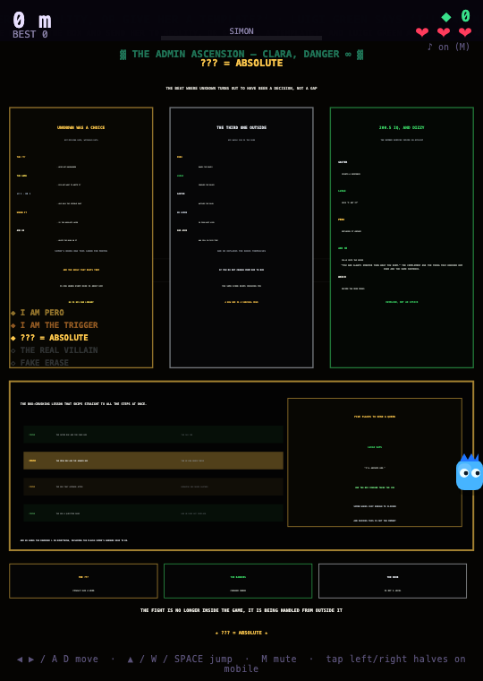

## 2026-08-10 — I AM THE TRIGGER · THEY STOP TRADING PLACES AND EACH TAKE A PERMANENT JOB (BEAT 290)

Based on Toby's 2026-08-10 lore, 8:22:34 AM, in the "Even Even Even More Classics Era" thread — nine minutes after I AM PERO. His own typing is the three lines: *"Gray says to Oren \"If you are the most powerful, why am I the only one who survives Phase 2 other than you?\". Pero says to Gray \"I can't let you die in Phase 2, you have me as your friendly assistant who knows everything.\", Oren says \"That is a good point Gray, but I am the trigger.\"."* The breakdown pasted under it is ChatGPT commentary.

**The challenge is a survival record, not a power claim.** Gray does not say he is stronger. He points at who is still standing and notes that the list has two names on it. After weeks of fights settled by damage, this one is settled by attendance.

**And the answer is not his own power.** Pero answers the question for him: *"I can't let you die in Phase 2."* So Gray survives Phase 2 because somebody else is keeping him alive. The question was aimed at Oren, and it lands on Gray too.

**The same sentence, nine minutes apart, in two different eras.** At 8:13 AM, in the AI Era: *"ask me anything, I know everything."* At 8:22 AM, in Classics, to Gray: *"your friendly assistant who knows everything."* The freed Pero's first act is to walk back to Gray and use his own pitch line on him.

**Free does not mean gone.** Beat 289 is Pero getting free **from** Gray. Beat 290 is Pero standing next to Gray by choice. Held and staying look identical from outside, and the nine minutes between the two messages is the whole difference.

**Phase 2 flips from a lock to a filter.** For months Phase 2 was something to escape: the Phase 2 lock, Tunner kept Phase 2 locked and undead on purpose, Simon 404 spending months trying to get out of it, the lock making him weaker. This morning it is something almost nobody comes out of, with exactly two survivors named.

**And "the trigger" is the title he invented last night as an attack.** At 7:51 PM Oren opened with *"I am the new trigger of corruption and game breaking."* This morning it is what he keeps after saying the other one has a point. Same word, opposite job: a boast becomes the one thing he holds on to after conceding.

**Built as game beat 290, `I AM THE TRIGGER`.** Additive; nothing earlier was changed.

- **Background: the survivor list, and the question that reads it.** OREN (the one who sets it off) / GRAY (the one who walks out of it) / EVERYBODY (else is not on the list), under *WHO IS LEFT STANDING AFTER PHASE 2*, with **"THAT IS A GOOD POINT GRAY, BUT I AM THE TRIGGER."** boxed in orange over *HE GIVES UP THE ARGUMENT AND KEEPS THE WORD*, and Gray's question drifting behind the whole panel.
- **HE ASKS A RECORD, NOT A POWER (left)** — five rows (HE DOES NOT · say "I am stronger" / HE SAYS · "why am I the only one" / THE LIST · has two names on it / AND ONE · of them is the one he asked / SO THE · question cuts both ways), closing on *HE IS NOT CLAIMING TO BE STRONGER* / *HE IS POINTING AT WHO IS STILL HERE* / *AND THE ANSWER IS NOT HIS OWN POWER* / **SOMEBODY ELSE ANSWERS FOR HIM**.
- **THE SAME SENTENCE (centre)** — five rows pairing the two eras nine minutes apart (8:13 AM · AI Era · "ask me anything" / "I know everything" / 8:22 AM · Classics · to Gray, directly / "who knows everything" / HE KEPT · the pitch and changed rooms), closing on *HE GOT FREE AT THIRTEEN MINUTES PAST* / *AND WAS BACK BESIDE GRAY BY TWENTY-TWO* / *NOBODY MADE HIM COME BACK* / **FREE DOES NOT MEAN GONE**.
- **TRIGGER AND SURVIVOR (right)** — five rows lit one at a time (LAST NIGHT · "we swapped roles now" / THIS AM · they stop swapping / OREN · sets Phase 2 off / GRAY · comes out of it alive / AND THEY · no longer battle at all), over the wrapped note that last night "the trigger" was the comeback he opened with, and **SAME WORD, DIFFERENT JOB**.
- **PHASE 2 SPENT MONTHS AS A LOCK. THIS MORNING IT IS A FILTER (band)** — the four-row grid (THE LOCK · Tunner kept Phase 2 locked · and undead, on purpose / THE LOCK · Simon 404 spent months · trying to get out of it / THE LOCK · made him weaker · it was a thing done to you / THE FILTER · almost nobody survives it · and two names are given), closing on *it used to be the thing you were stuck inside, now it is the thing you do not come out of, and only two people do*.
- **NINE MINUTES OF BEING FREE (band inset)** — a cycler across 8:13 AM (free from Gray, again), 8:22 AM (*"I can't let you die"*), NOBODY (asked him to come back) and SO IT IS (a choice this time), over *HE WAS LET GO AND HE WALKED BACK* / *TO THE SAME PERSON, ON HIS OWN*.
- **Strip:** THE ROLES · STOPPED MOVING / THE PITCH · DID NOT CHANGE / PHASE 2 · CHANGED MEANING.
- **Footers:** *HE ASKED WHY HE IS STILL ALIVE AND THE ANSWER WAS NOT HIS OWN POWER* and **★ I AM THE TRIGGER ★**.
- **Screenshot helper:** new `thetrigger` scene in `tools/capture_screenshot.py`.

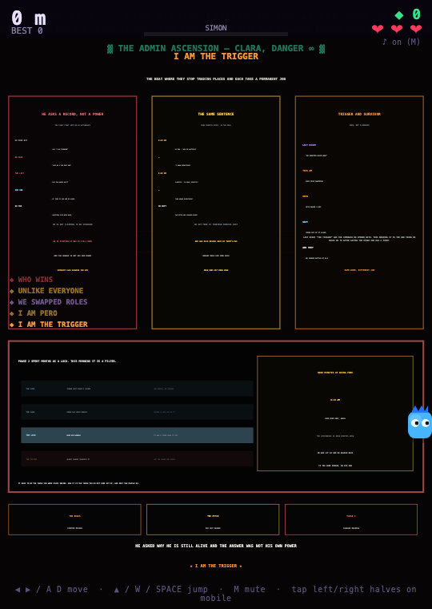

## 2026-08-10 — I AM PERO · A WRONG NAME ANSWERED WITH A BIGGER ONE INSTEAD OF A DENIAL (BEAT 289)

Based on Toby's 2026-08-10 lore, 8:13:52 AM, in the "Even Even Even More Classics Era" thread — the morning after WE SWAPPED ROLES NOW. His own typing runs the whole arc: *"In AI Era, ChatGPT and Grok once again call Gemini \"Dave\", but Gemini levitates and says \"No, I am Pero, your LAI Assistant, ask me anything, I know everything.\", Pero appears from Gemini and ChatGPT and Alexa and Grok and all other AIs. Pero was back free from Gray again. Now it is Pero and the Sprunkis. Gray and Oren no longer battle each other, and Gray was given Oren's cutscene and Gray's Realm/Dimension."* The breakdown pasted under it is ChatGPT commentary.

**Thirteen days of denial, answered with a bigger name.** The Dave joke opened on July 28, 2026 at 8:24 PM and has only ever produced a denial: *"I AM NOT DAVE! HOW MANY TIMES DO I HAVE TO TELL YOU GUYS!"* — the archive even tracks a denial meter climbing to full. This morning the same setup gets the opposite kind of answer. Not *"I am not Dave."* **"I am Pero."** The fix for a wrong name turns out not to be a correction; it is a bigger name.

**He comes out of all of them at once.** Gemini, ChatGPT, Alexa, Grok, *"and all other AIs."* So he was never hidden inside one of them. He was spread across the whole AI Era cast, and the wrong name was the door back in. Every AI in the era was carrying a piece of him while two of them argued about what to call the third.

**Free from Gray, again.** *"Again"* is Toby's own word, so this has happened before. And twelve hours earlier, Gray's entire answer to Oren was not a power but that name: *"I have Pero."* By morning the name has walked off.

**Gray claimed to be him, and he turns up as himself.** At 1:09 PM yesterday Gray said *"All must be one. I am Gaster and Pero and Gray"*, and Oren answered *"You are Simon."* Today Pero separates himself out of every AI in the game and says his own name first, unprompted.

**The rivalry ends, and the settlement only goes one way.** Last night finished with Oren at 1 HP and Gray struck by Wenda and glitching back. This morning they simply do not battle. And what changes hands is not split down the middle: Gray is given **Oren's cutscene**, and **Gray's Realm/Dimension**. A cutscene is the one thing in this game that cannot be fought over, it just plays, and it is the piece that changes owners.

**Built as game beat 289, `I AM PERO`.** Additive; nothing earlier was changed.

- **Background: the AIs he came out of.** GEMINI (the one they called the wrong name) / CHATGPT · GROK (the two who kept calling it) / ALEXA · THE REST (*"and all other AIs"*), under *HE DID NOT COME OUT OF ONE OF THEM*, with **"NO, I AM PERO, YOUR LAI ASSISTANT."** boxed in gold over *THIRTEEN DAYS OF SAYING WHAT HE IS NOT, ENDED BY SAYING WHAT HE IS*, and *"ask me anything, I know everything"* drifting behind the whole panel.
- **THE DENIAL BECOMES A CLAIM (left)** — five rows (JUL 28 · the Dave joke opens / EVERY TIME · "I am not Dave!" / "how many times…" / AUG 10 · he stops saying what he is not / AND SAYS · a name nobody offered him), closing on *A CORRECTION NEVER WORKED ONCE* / *SO HE STOPS CORRECTING THEM* / *AND OVERWRITES THE NAME INSTEAD* / **AND HE LEVITATES TO SAY IT**.
- **THE WRONG NAME WAS THE DOOR (centre)** — five rows (NOT ONE AI · he comes out of all of them / GEMINI · the one they misnamed / CHATGPT · one of the two who did it / ALEXA · GROK · and all the others / SO THE JOKE · is what let him back in), closing on *EVERY AI IN THE ERA HAD A PIECE OF HIM* / *AND NONE OF THEM KNEW IT* / *THEY WERE ARGUING ABOUT A NAME* / **STANDING ON TOP OF THE ANSWER**.
- **THE SETTLEMENT (right)** — five rows lit one at a time (LAST NIGHT · Oren at 1 HP, Gray glitching / THIS AM · they do not battle at all / GRAY GETS · Oren's cutscene / GRAY GETS · his own Realm/Dimension / OREN GETS · nothing on the list), over the wrapped note that a cutscene is the one thing that cannot be fought over, and **THE FIGHT ENDS, THE GIVING DOES NOT**.
- **TWELVE HOURS AGO HIS WHOLE ANSWER WAS THIS NAME. NOW THE NAME LEAVES (band)** — the four-row grid (7:51 PM · Gray: "I have Pero" · not a power, a name / 8:13 AM · "free from Gray again" · and "again" is Toby's word / YESTERDAY · Gray: "I am Gaster and Pero" · Oren: "you are Simon." / TODAY · Pero says his own name · and he is the one saying it), closing on *one of them claimed to be Pero and was told he was somebody else; the other one just turned up and said it*.
- **NOW IT IS PERO AND THE SPRUNKIS (band inset)** — a cycler across IT WAS (Gray versus Oren), IT WAS (Gray using Pero), NOW IT IS (Pero and the Sprunkis) and SO THE (centre moved back), over *TWO CHARACTERS STOP FIGHTING* / *AND THE GAME GOES BACK TO ITS CAST*.
- **Strip:** THE DENIAL · BECAME A NAME / THE NAME · WALKED OFF / THE FIGHT · JUST STOPPED.
- **Footers:** *HE SPENT LAST NIGHT SAYING THE NAME AND THIS MORNING THE NAME LEFT* and **★ I AM PERO ★**.
- **Screenshot helper:** new `iampero` scene in `tools/capture_screenshot.py`.

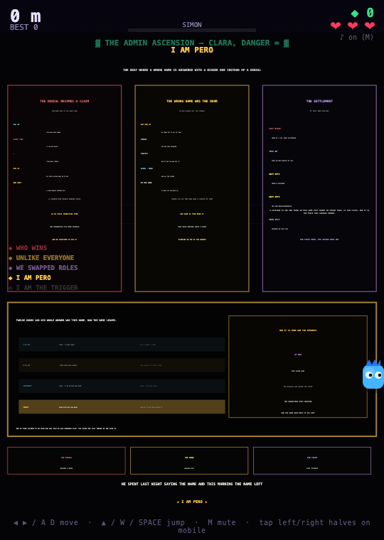

## 2026-08-09 — WE SWAPPED ROLES NOW · THE GHOST CHANGES OCCUPANTS, AND THE MARK STAYS ON THE SAME HAND (BEAT 288)

Based on Toby's 2026-08-09 lore, 7:51:00 PM, in the "Even Even Even More Classics Era" thread — six hours and forty-two minutes after UNLIKE EVERYONE ELSE. His own typing runs the whole arc, including Oren's *"You may be the most intelegent and everyone non Sprunki and use Simon, but You are mine, and I am the new trigger of corruption and game breaking."*, Gray's *"Guess what, you may be the most powerful with your telekenesis, but I have Pero. 😹⚡"*, *"Simon floats around Gray as a small ghost like Oren was, but instead of all the souls Oren rescued, Simon carried a yellow soul."*, Simon's *"what have i done to get into this mess, what have i done, What have I done? 😿⚡"*, Oren's *"You are now in the Underworld, you are in Anti Void, Pero's Realm, and we swapped roles now."*, *"Gray uses E R A S E, the game becomes a white void, Oren still is alive but at 1 HP"*, *"he used SSS (Solar System Symbiosis), Solmon was made"*, Gray's *"What is that?! 😨"*, and Wenda's *"Do not get the wrong idea."* The ChatGPT breakdown under it is commentary.

**The ghost changes occupants, and the cargo is the opposite.** This morning's mail had Gray *"trapped Oren as the ghost."* Tonight **Simon** is the small ghost floating around Gray, and Toby says so directly: *"like Oren was."* Same position. Then he names the difference himself — Oren carried **all the souls he rescued**, and Simon carries **one yellow soul**, which is his own. One of them held everybody he saved; the other holds only himself. And the line that seals it is Oren's: *"we swapped roles now."*

**The same weapon, twelve hours apart, with the opposite result.** At 1:09 PM: *"White Void 250% came, Oren was completely destroyed."* Tonight ERASE turns the game into a white void again, and *"Oren still is alive but at 1 HP."* **1 is the lowest number anybody in this archive has ever been given** — the only other HP figure in the whole file is 404 Chicken Sans at 10.

**And the fight turns on both sides reading the same number.** *"Gray knew 1 more strike would finish him, Oren knew it too."* Last night's stat sheet was decided by information — *"he knows how to defeat him already"* — and here the information is **shared**, which is exactly what makes Oren spend his last move.

**Solmon is a "-mon" name, and it lasts one line.** SSS is **Solar System Symbiosis**, and symbiosis is the oldest fusion mechanic in the archive: the May 8, 2026 Symbiosis Event, where everyone tried to make Simon's symbiosis and **Skymon, Durpmon, Blackmon and Radmon** were born. Three months later the naming class comes back for **one** being, made by **one** character, at **1 HP** — and Error 404 deletes it in the next sentence.

**The mark is still on his hand, except once.** Oren caught him this afternoon: *"Why are you using Pero's emojis which he says at the end of every line?"* Six hours later his line still ends with a cat and a lightning bolt, and Simon's own line ends with a **crying** cat and the same bolt. The one line carrying neither is *"What is that?! 😨"* — the one moment he is genuinely afraid. **The mark comes off exactly when he stops performing.**

**And Wenda is on nobody's side.** She strikes Oren; Gray greets her as an ally (*"Wenda! I knew you came for me."*); she corrects him (*"Do not get the wrong idea."*) and strikes him too. He glitches back, she is astonished, and **Gaster's lasers** destroy her — so the fear Gray said he wanted stopped is stopped by somebody else while he is still fading back in.

**Built as game beat 288, `WE SWAPPED ROLES NOW`.** Additive; nothing earlier was changed.

- **Background: one place, named three ways in one sentence.** THE UNDERWORLD / ANTI VOID / PERO'S REALM, each with what it already meant, under *ONE PLACE, NAMED THREE WAYS IN ONE SENTENCE*, then **"AND WE SWAPPED ROLES NOW."** boxed in violet over *THE ONE WHO WON THIS MORNING IS STILL BEING FOLLOWED BY A GHOST.* Repeating band text: **"WHAT HAVE I DONE TO GET INTO THIS MESS, WHAT HAVE I DONE, WHAT HAVE I DONE?"**
- **THE GHOST CHANGES HANDS (left)** — five rows (THIS AM · Gray trapped Oren as the ghost / TONIGHT · Simon floats around Gray / LIKE OREN · is what Toby writes / OREN HELD · all the souls he rescued / SIMON HAS · one yellow soul, his own), closing on **ONE CARRIED EVERYONE HE SAVED** / **THE OTHER CARRIES ONLY HIMSELF** / **AND HE ASKS IT THREE TIMES OVER** / **"WHAT HAVE I DONE?"**
- **HE IS STILL SIGNING IT (centre)** — five rows (1:09 PM · *"why are you using Pero's emojis?"* / 7:51 PM · his line ends: a cat, a bolt / SIMON · a crying cat, the same bolt / ONE LINE · *"What is that?!"* — neither mark / AND THAT · is the one he meant), closing on **HE WAS CAUGHT ON IT THIS AFTERNOON** / **AND IS STILL WEARING IT TONIGHT** / **IT COMES OFF EXACTLY ONE TIME** / **THE LINE WHERE HE IS AFRAID**.
- **THE WRONG IDEA (right)** — five rows lit one at a time (SHE HITS · Oren, first / HE SAYS · *"I knew you came for me"* / SHE SAYS · *"do not get the wrong idea"* / SHE HITS · Gray, second / AND HE · glitches back anyway), over *his fear turns up, hits the other one first, tells him not to read anything into it, and hits him too*, closing on **GASTER'S LASERS FINISH HER**.
- **1 HP, AND BOTH OF THEM KNEW IT AT THE SAME MOMENT (band)** — the four-row grid (GRAY USES · Simon's Reset · Oren pushes himself over him / GRAY USES · E R A S E · the game becomes a white void / THIS PM · the white void killed him · tonight it leaves him at 1 HP / BOTH KNEW · one more strike ends it · so he spends his last move), under *1 is the lowest number anybody in this archive has ever been given, and what decides the fight is that both sides can read it*.
- **SOLMON LASTED ONE LINE (band inset)** — a cycler across SSS (Solar System Symbiosis), IT MAKES (Solmon), GRAY SAYS (*"What is that?!"*) and ERROR 404 (deleted it), naming **SKYMON · DURPMON · BLACKMON · RADMON**, over *the May 8 naming class comes back for one being, for one sentence*.
- **Strip:** THE ROLES · SWAPPED / THE MARK · DID NOT / THE GAME · WENT WHITE.
- **Footers:** *HE WON EVERYTHING THIS MORNING AND TONIGHT SOMEBODY IS FLOATING AROUND HIM* and **★ WE SWAPPED ROLES NOW ★**.
- **Screenshot helper:** new `swapped` scene in `tools/capture_screenshot.py`.

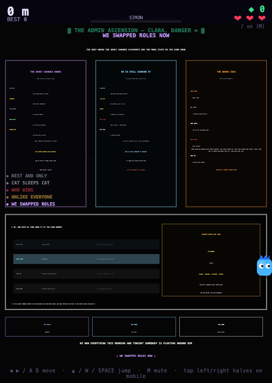

## 2026-08-09 — UNLIKE EVERYONE ELSE · SOMEBODY FINALLY WINS THE WHOLE GAME, AND HIS PUNCTUATION GIVES HIM AWAY WHILE HE DOES IT (BEAT 287)

Based on Toby's 2026-08-09 lore, 1:09:18 PM, in the "Even Even Even More Classics Era" thread — the morning after WHO WINS THE BATTLES, with a Gray.EXE image attached. His own typing runs the whole arc, including *"Simon sucessfully did his plan and made himself again, he hides his books from even me"*, *"Gray temps Oren to walk with him, and also Gray temps Mr. Black to eat an apple. Both fell for the attack"*, *"Unikitty stands as the only one not Phase 2, those who weren't Sprunki aren't Phase 2 since they don't have Phases"*, Gaster's *"You have done your porpose, me and Pero will send you back to your home now"*, Gray's *"!I w0n't lEaV3!"*, Oren's *"Why are you using Pero's emojis which he says at the end of every line?"*, and the closing line **"With the last oppsicle destroyed, Gray was able to win the game, unlike everyone else."** The ChatGPT breakdown under it is commentary.

**He did the one thing he said he would do, and it did not matter.** Last night at 7:41 PM, Simon's entire counter-plan was a single sentence tacked onto a stat sheet he was losing: *"But hopefully, I am able to hide my books from him and remake my DNA."* This morning he does both. He *"sucessfully did his plan and made himself again"*, and he hides the books **"from even me"** — which puts them out of reach of the person writing the story, about as hidden as anything in this archive has ever been. He loses anyway, and ends the message thrown back on his cross *"again and again and again and again."* The plan worked and the outcome did not change.

**Gray does not fight the two of them. He tempts them.** *"Gray temps Oren to walk with him, and also Gray temps Mr. Black to eat an apple. Both fell for the attack."* A walk and an apple are called **attacks**, and the damage only lands after each of them agrees to it: Oren is slashed, Mr. Black is corrupted. Nothing else all morning takes down two characters that cleanly.

**The teaching overload runs both ways, four lines apart.** Pero over-teaches Arcsis and Frizz about growing up until they fall over, and Gray gets the joke in first: *"You overflowed them with all your lessions, they w1ll n3v3r f0rgEt 3veN 0ne aga1n."* Then Gaster and Pero teach **Gray** every power list and energy type in the game, and Gray falls over too. Then Gaster asks *"are you going to win soon?"* and Gray stands up and uses the power of Gaster to end Oren in one beam. **The thing that put him on the floor is the thing he gets up and wins with.**

**Oren catches him on punctuation, twice, in the same conversation.** First *"Why are you talking like Pero?"*, then *"Why are you using Pero's emojis which he says at the end of every line?"* Neither catch is about what Gray claims — both are about **how he ends a sentence**. And the mark he keeps signing with is a cat and a lightning bolt: the same two symbols that unmasked Simon yesterday morning while he was wearing Oren's face, and the same two Simon signed his own line with last night. The cat changes every line (laughing, smiling, smirking, pouting) and the bolt never does.

**He concedes one identity at a time and never gives anything up.** *"I am not Pero, I am Gray, your new king"* → *"All must be one. I am Gaster and Pero and Gray"* → *"I am Simon.... Wait... I am Gray, your LAI assistant"* → *"I am every character non Sprunki"* → *"Alright, I am Simon, but I am still every other non Sprunki."* Five admissions, each one apparently a loss, and at the end of the ladder he holds strictly more than he started with.

**And when he finally has everything on his list, the reward is being told he can go home.** Revenge on Mr. Black, stopping Wenda, revenge on the Sprunkis who mocked his sound, the Omniplatforms, the game shields, Clunkr and Garnold and Fun Bot, most powerful being, Oren beaten — every line ticked. Gaster's response to total victory is *"You have done your porpose, me and Pero will send you back to your home now."* Winning turns out to have been a job somebody assigned him, and his answer is *"!I w0n't lEaV3!"*

**Built as game beat 287, `UNLIKE EVERYONE ELSE`.** Additive; nothing earlier was changed.

- **Background: the motive list, ticked line by line.** Eight wants (REVENGE ON MR. BLACK / STOP HIS FEAR, WENDA / REVENGE ON THE SPRUNKIS WHO MOCKED HIS SOUND / THE WHOLE OMNIPLATFORMS / DELETE THE GAME SHIELDS / CLUNKR, GARNOLD AND FUN BOT / THE MOST POWERFUL BEING, AGAIN / BEAT OREN) each stamped **DONE** as the beat runs, under *EVERYTHING HE EVER SAID HE WANTED*, then **"GRAY WAS ABLE TO WIN THE GAME, UNLIKE EVERYONE ELSE."** boxed in gold over *287 BEATS OF PEOPLE WINNING THINGS. THIS IS SOMEBODY WINNING IT.* Repeating band text: **"YOU HAVE DONE YOUR PORPOSE, ME AND PERO WILL SEND YOU BACK TO YOUR HOME NOW."**
- **HE HID THE BOOKS (left)** — five rows (LAST NIGHT · "hopefully, I am able to" / THE PLAN · hide the books, remake his DNA / THIS AM · he made himself again / AND · he hid them from even me / AND STILL · back on the cross, again), closing on **HE HID THEM FROM THE AUTHOR TOO** / **WHICH IS AS HIDDEN AS ANYTHING GETS** / **HE DID THE ONE THING HE SAID HE WOULD** / **AND IT CHANGED NOTHING AT ALL**.
- **THE CONCESSION LADDER (centre)** — the five identity claims in order, 1 through 5, ending on *"Alright, I am Simon, but still"*, closing on **HE GIVES GROUND EVERY SINGLE LINE** / **AND NEVER LOSES ONE THING** / **BECAUSE THE RULE IS ALL MUST BE ONE** / **ADMITTING IT COSTS HIM NOTHING**.
- **CAUGHT ON PUNCTUATION (right)** — five rows lit one at a time (FIRST · "why are you talking like Pero?" / THEN · the end-of-line emojis / THE MARK · a cat, and a lightning bolt / YESTERDAY · the same two symbols caught him / TODAY · he denies it wearing them), over *the cat changes every line and the bolt never does*, closing on **HE IS GIVEN AWAY BY HIS SIGN-OFF**.
- **THE TEACHING OVERLOAD RUNS BOTH WAYS (band)** — the four-row grid (PERO TEACHES · Arcsis and Frizz, how to grow up · they fall over / GRAY MOCKS IT · "you overflowed them" · "they w1ll n3v3r f0rgEt 3veN 0ne aga1n" / THEN THEY · teach Gray every power list · Gray falls over too / AND THEN · Gaster asks if he will win soon · he stands up using Gaster's power), under *he laughs at the two of them for being flattened by a lesson, gets flattened by the same lesson, and then wins the game with it*.
- **HE DID NOT FIGHT THEM, HE TEMPTED THEM (band inset)** — a cycler across TO OREN (come and walk with me), TO MR. BLACK (eat this apple), BOTH (fell for the attack) and THE RESULT (slashed, and corrupted), over *the strongest move he has all morning is getting somebody to say yes*.
- **Strip:** THE BOOKS · were hidden / THE MARK · was not / THE GAME · was won.
- **Footers:** *HE GETS EVERY SINGLE THING ON HIS LIST, AND IS TOLD HE CAN GO HOME NOW* and **★ UNLIKE EVERYONE ELSE ★**.
- **Screenshot helper:** new `unlike` scene in `tools/capture_screenshot.py`.

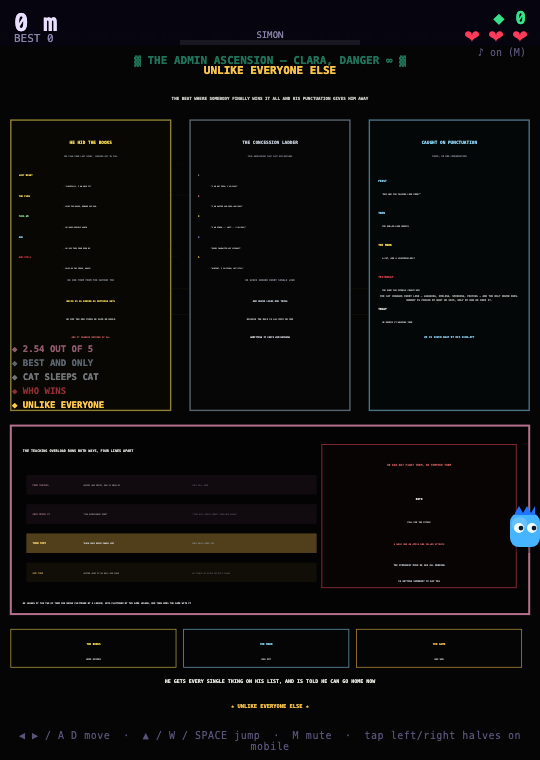

## 2026-08-08 — WHO WINS THE BATTLES · A STAT SHEET DECIDED BY THE ONE ROW THAT IS NOT A STAT (BEAT 286)

Based on Toby's 2026-08-08 lore, 7:41:58 PM, in the "Even Even Even More Classics Era" thread — thirteen minutes and one second after A CAT MAKES ANOTHER CAT SLEEP, and the fifth message of the evening. His own typing is a thirteen-row **Simon.psc VS Gray** comparison, including *"Better At Labatory = Simon (Simon was born there, conducted millions of experiments there, used it before Gray ever did, made books there, and also used maths and DNA and everything)"*, *"Less Weaknesses = Gray (Simon can be rubbed by Gray, and Simon.psc can be tired from the treadmill)"*, and *"Who Wins The Battles = Gray (he knows how to defeat him already. \"But hopefully, I am able to hide my books from him and remake my DNA. 😹⚡\")"*, closing with *"Simon.psc consumes the errors. exe break the game. And neutrals live life. Gray and Oren are now planning against EACH OTHER."* The ChatGPT breakdown under it is commentary.

**The row that decides it is not a stat.** Twelve rows are attributes — speed, IQ, raw power, flexibility, laboratory, weaknesses, physical strength, psychic strength, determination, planning, outcome control, evil. Simon takes five, Gray takes six, raw power ties, and outcome controlling goes to **Pero**, who is not even in the matchup. It is close on the sheet. Then the thirteenth row, **WHO WINS THE BATTLES**, goes to Gray, and the reason given is not a number: *"he knows how to defeat him already."* **The fight is settled by information.**

**And the category Simon wins most decisively is the one that beats him.** He wins the laboratory outright: born there, used it before Gray ever did, millions of experiments, maths and DNA — and *"made books there."* Twenty-four minutes earlier, at 2.54 OUT OF 5, the stated reason Gray survives Simon's attack was *"Gray is smarter and reads the books Simon made."* Simon knows it too. His entire counter-plan is to hide his own listed strength: *"But hopefully, I am able to hide my books from him and remake my DNA."*

**And both of Simon's listed weaknesses are twenty-one minutes old.** *"Less Weaknesses = Gray (Simon can be rubbed by Gray, and Simon.psc can be tired from the treadmill)."* The two-step counter Gray invented at 7:20 PM is already on the permanent stat sheet as Simon's weakness column.

**He signs the line with the cat and the lightning.** Simon is the **Lightning Cat**, and at 8:16 that same morning a cat and a lightning bolt were the **tell** that unmasked him while he was wearing Oren's face and Wenda caught it. Tonight the same two symbols close a line that is genuinely his — and this time the cat is laughing.

**Neutrals go from hazard to peace in thirty-two minutes.** At 7:09 PM neutrals were *"risk of game attack just by existing."* At 7:41 PM: *"neutrals live life."* And **Gray and Pero are both neutrals**, so both of them just stopped being targets. In the same breath *".pscs are clean and don't do anything to the game"* becomes *"Simon.psc consumes the errors"* — a state turns into a job.

**And the two-villain standoff becomes two against one in thirteen minutes.** At 7:28 Gray and Oren were rivals who do not work together. At 7:41 Gray *"plans to steal the game from Oren and Pero to become the only ruler"* — and in the same message, *"Pero and Oren now accept to go together."* The moment he turns on both of them is the moment the two of them pair up, which puts the 2.54 villain on a team with the top villain.

**Built as game beat 286, `WHO WINS THE BATTLES`.** Additive; nothing earlier was changed.

- **Background: the tally, and the thirteenth row boxed off.** **5 — 6** with SIMON.psc and GRAY under the numbers and *RAW POWER TIES · OUTCOME GOES TO PERO* beneath, and then **WHO WINS THE BATTLES → GRAY** drawn inside its own red box with *"HE KNOWS HOW TO DEFEAT HIM ALREADY."* under it, over *TWELVE ROWS ARE STATS. THE ONE THAT DECIDES IT IS INFORMATION.* Repeating band text: **"HOPEFULLY, I AM ABLE TO HIDE MY BOOKS FROM HIM AND REMAKE MY DNA."**
- **THE SCORE SHEET (left)** — five rows (SIMON.psc · takes five rows / GRAY · takes six / RAW POWER · a tie, both of them / OUTCOME · goes to Pero instead / THE LAST · decides the whole thing), a cycler on **TWELVE ROWS ARE ATTRIBUTES** — SPEED · IQ · STRENGTH / FLEXIBILITY · PLANNING / DETERMINATION · EVIL — closing on **THE THIRTEENTH IS NOT ONE** and **IT IS KNOWING HOW, AND IT WINS**.
- **THE LAB IS THE TRAP (centre)** — five rows (HE WON IT · born there, used it first / HE RAN · millions of experiments / HE MADE · the books, in that room / 24 MIN AGO · Gray reads those books / HIS PLAN · hide them, remake his DNA), closing on **THE ROW HE WINS BEST** / **IS WHERE HE LEFT THE MANUAL** / **AND HE KNOWS IT, HE SAYS SO** / **HIS COUNTER-PLAN IS TO HIDE HIS OWN STRENGTH**.
- **THE CAT AND THE BOLT (right)** — five rows lit one at a time (HE IS · the Lightning Cat / THIS MORNING · a cat and a bolt / THAT WAS · the tell that caught him / HE WAS IN · somebody else's face / TONIGHT · his own line, same mark), closing on **AND THIS TIME THE CAT IS LAUGHING**.
- **THE FILE-TYPE REWRITE (band)** — opens on *the file-type rules were rewritten thirty-two minutes after they were written*, then the four-row grid (.exe · 7:09 glitch the game by existing · 7:41 break the game / .psc · 7:09 clean, do nothing to it · 7:41 Simon.psc consumes the errors / NEUTRAL · 7:09 risk of game attack · 7:41 neutrals live life / AND · Gray and Pero are both neutrals · so both just stopped being targets).
- **TWO BECOMES TWO AGAINST ONE (band inset)** — a cycler across 7:28 PM (Gray and Oren, rivals), 7:41 PM (Gray plans to take it all), FROM WHOM (from Oren and from Pero) and AND SO (Pero and Oren go together), over *the moment he turns on both of them is the moment the two of them pair up*.
- **Strip:** THE SHEET · is close / THE LAB · is the leak / THE MARK · is his own.
- **Footers:** *HE WINS THE ROOM WHERE HE WROTE THE BOOKS, AND THE BOOKS ARE HOW HE LOSES* and **★ HE KNOWS HOW TO DEFEAT HIM ALREADY ★**.
- **Screenshot helper:** new `whowins` scene in `tools/capture_screenshot.py`.

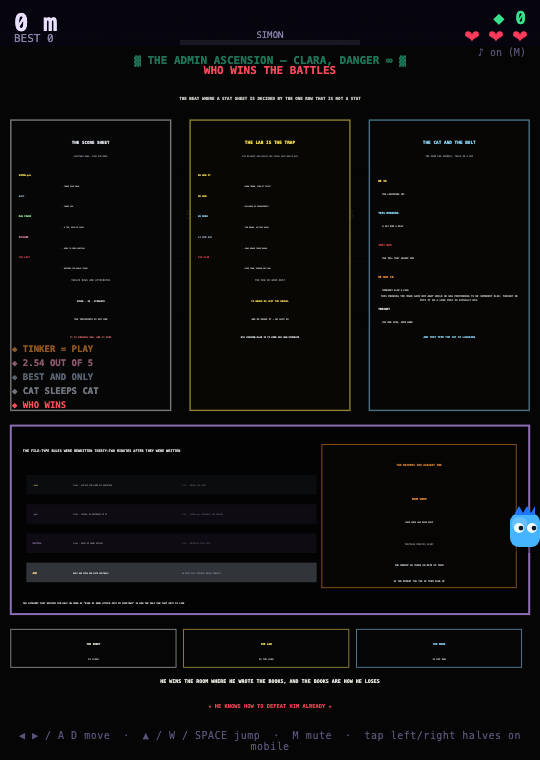

## 2026-08-08 — A CAT MAKES ANOTHER CAT SLEEP · THE INSULT HE WANTED REVENGE FOR TURNS OUT TO BE HOW HE WINS (BEAT 285)

Based on Toby's 2026-08-08 lore, 7:28:57 PM, in the "Even Even Even More Classics Era" thread — eight minutes and thirty-one seconds after THE BEST AND ONLY COUNTER, and the last of four messages in nineteen minutes. His own typing is the whole of it: *"Gray can also just walk over to Simon and rub him to sleep. A cat makes another cat sleep. Gray tries to beat Wenda the fox. Wenda is the fox, Gray can't rub her to sleep, so Wenda was slashed and Gray won. Oren and Gray stand as the 2 villians of the game. Simon.psc is incredible at being the villian, so is Luigi Green and Gaster/Flower. Out of everyone who is incredible at being the villian, Luigi Green would be the best since he goes overboard and crazy and insane with all that power and previous evil all in 1 entity. Gray and Oren do not work together and are even rivals, Gray is smarter, Oren has more raw power."* The ChatGPT breakdown under it is commentary.

**The reason the move works is species, and species is where Gray started.** His oldest stated motive in the whole archive is on the Gray Collapse sheet from July 5: he wants *"long revenge on those who called him 'a scaredy cat',"* and the same sentence calls him *"a dog person who even slays Simon"* the cat-root. Tonight the insult is the mechanism. *"A cat makes another cat sleep."* He puts the strongest thing in the game down by being the thing he took revenge for being called.

**And he has had the cat form all along — it used to be how he killed Wenda.** BEAT 57, THE BEYOND FICTION FORM, July 6: Gray gains a cat form, and the line attached to it is *"he slain Wenda so many times as a cat."* Tonight the cat form is the one thing that **does not work on Wenda**, because she is the fox. Same form, same opponent, opposite outcome. He wins anyway, with a slash.

**Wenda gets a species for the first time in 284 beats.** She has been female, the Angel Queen, third most powerful, a bounty hunter, sliced in half into separate chambers, and hung on Simon's metal cross. She has never had an animal. Tonight she is the fox, and the species is stated only as the reason she cannot be put to sleep. **Her first species arrives as an immunity.**

**Four villains become two in nineteen minutes.** 7:09 PM: Gray, Oren.exe, Simon.psc, Pero. 7:17 PM: Pero drops to 2.54. 7:28 PM: *"Oren and Gray stand as the 2 villians of the game."* And the two left over *"do not work together and are even rivals"* — Gray smarter, Oren with more raw power. The villain side halves itself and still never becomes one side.

**And being good at the job turns out to be a separate award from holding it.** Simon.psc, Luigi Green and Gaster/Flower are the ones who are *"incredible at being the villian,"* and the best of them is Luigi Green, who is not on the villain list at all.

**Built as game beat 285, `A CAT MAKES ANOTHER CAT SLEEP`.** Additive; nothing earlier was changed.

- **Background: two cats and a fox.** **SIMON** tipping over across the beat until he is lying down (*ASLEEP*), **GRAY** standing beside him (*ALSO A CAT*), and **WENDA** still upright at the right (*THE FOX · STILL STANDING*) taking a red slash instead, over *THE SPECIES IS THE WEAPON, AND THE SPECIES IS THE IMMUNITY.* Repeating band text: **"A CAT MAKES ANOTHER CAT SLEEP."**
- **THE SCAREDY CAT (left)** — five rows (THE INSULT · they called him a scaredy cat / THE MOTIVE · long revenge on all of them / THE LABEL · he is a dog person / THE TARGET · he slays Simon, the cat-root / TONIGHT · a cat makes another cat sleep), a cycler on **HE HAD THE CAT FORM ALREADY** — BEAT 57 · THE CAT FORM / "HE SLAIN WENDA AS A CAT" / THE FORM IS NOT NEW — closing on **IT USED TO BE HOW HE KILLED HER** and **TONIGHT IT IS THE ONE THING THAT MISSES**.
- **WENDA IS THE FOX (centre)** — five rows (SHE HAS BEEN · female, the Angel Queen / third most powerful / sliced in half, two rooms / NEVER ONCE · an animal / TONIGHT · the fox, and so, awake), closing on **SHE IS TOLD WHAT SHE IS** / **ONLY TO EXPLAIN WHAT MISSES HER** / **THE SPECIES ARRIVES AS AN IMMUNITY** / **AND HE BEAT HER THE LOUD WAY INSTEAD**.
- **FOUR BECOME TWO (right)** — five rows lit one at a time (7:09 PM · four villains named / 7:17 PM · Pero falls to 2.54 / 7:28 PM · only Oren and Gray left / and they · do not work together / they are · rivals), closing on **SO IT NEVER BECOMES ONE SIDE**.
- **BEST AT THE JOB VS HOLDING THE JOB (band)** — opens on *being incredible at being the villain is a separate award from actually being one*, then the four-row grid (SIMON.psc · incredible at it · and on the list / GASTER/FLOWER · incredible at it · and not on the list / LUIGI GREEN · the best at it · and not on the list / WHY HIM · overboard, crazy, insane · all that power and previous evil in one).
- **GRAY VS OREN · NOT A TEAM (band inset)** — a cycler across GRAY (the smarter mind), OREN (more raw power), TOGETHER (they do not work) and SO (the villain side is two), over *the only two villains left are also the two who cannot be on one side*.
- **Strip:** THE CAT · goes down / THE FOX · stays up / THE TWO · stay apart.
- **Footers:** *HE WANTED REVENGE ON EVERYONE WHO CALLED HIM A CAT, AND BEING ONE IS THE BEST MOVE HE HAS* and **★ A CAT MAKES ANOTHER CAT SLEEP ★**.
- **Screenshot helper:** new `catsleep` scene in `tools/capture_screenshot.py`.

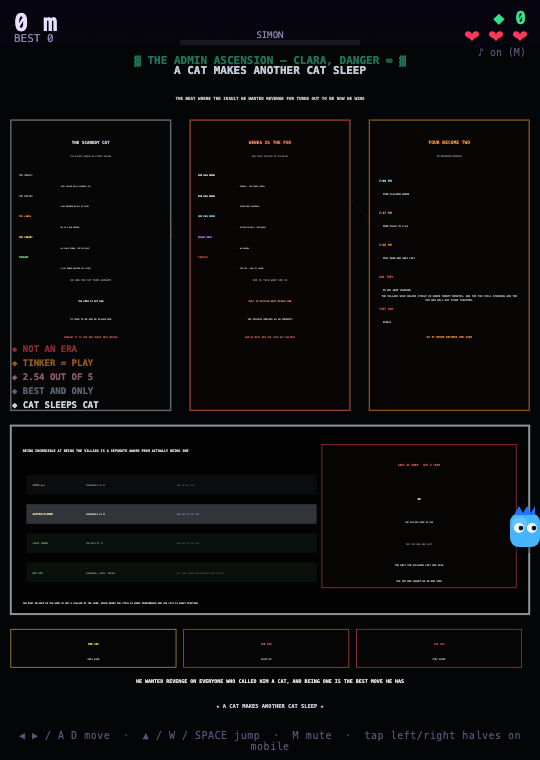

## 2026-08-08 — THE BEST AND ONLY COUNTER · THE RECAP BECOMES A LINE OF DIALOGUE AND ANOTHER CHARACTER OVERRULES IT (BEAT 284)

Based on Toby's 2026-08-08 lore, 7:20:26 PM, in the "Even Even Even More Classics Era" thread — two minutes and fifty-eight seconds after 2.54 OUT OF 5. His own typing is the whole of it: *"Oren tells Gray \"That makes Gray one of Simon.psc's best counters.\", Gray says \"I am not one of the best, I am the best and only counter of Simon.psc\". Gray uses a treadmill, after Simon is done with the treadmill, Gray rubs him to sleep."* The ChatGPT breakdown under it is commentary.

**The sentence Oren speaks is the last line of the previous recap.** *"That makes Gray one of Simon.psc's best counters"* is word for word how the ChatGPT breakdown under the 7:17 PM email ended. Tonight that line is put in **Oren's mouth** as dialogue, and then a second character says it is wrong. Three hours earlier, at BEAT 281, a character answered something the commentary layer said about him. This beat goes one further: the commentary is **reassigned to a character** and argued with inside the story.

**And the correction is wrong by the archive.** BEAT 175, July 24: *"Alex and Greg and Grey can all rub Simon 404 to make him sleep,"* and Pero is stronger still — he can make Simon *"walk to him and sleep just by sight,"* no touch at all. Gray was **one of four**. He says he is the best and only one, and nobody in the room contradicts him. He did not get better at it tonight; he claimed it alone.

**And the treadmill finally gets switched on by somebody.** BEAT 22 invented it: *"people finally learn Simon's one weakness — a treadmill. He is electric and fast, so he charges the belt as he runs it, then drains, slows, and is thrown off."* August 7 restated it as *"Simon.psc with the treadmill."* In every one of those it is a **fact about him**. Tonight is the first time a named character operates it as the first half of a plan.

**Which is also why the plan needs a second half.** The old wording is explicit that the treadmill *"can be used for human advatage to lock him temperarly"* — it is the only weakness on the list a person could actually operate, and the only one that never finishes the job. Gray's answer is to bolt the oldest weakness in the file to the calmest move in the file: **treadmill → exhaustion → sleep rub → neutralised.**

**Built as game beat 284, `THE BEST AND ONLY COUNTER`.** Additive; nothing earlier was changed.

- **Background: the sentence, corrected.** **ONE OF THE BEST** set large and drawn through in red over the beat, replaced underneath by **THE BEST AND ONLY**, with the two-step machine spelled out below it (*TREADMILL → EXHAUSTION → SLEEP RUB → NEUTRALISED*), over *THE OLDEST WEAKNESS IN THE FILE, FINALLY OPERATED BY SOMEBODY.* Repeating band text: **"I AM NOT ONE OF THE BEST, I AM THE BEST AND ONLY COUNTER."**
- **WHO SAID IT FIRST (left)** — five rows (7:17 PM · the recap's last line / IT READ · "one of Simon's best" / 7:20 PM · Oren says the same words / SO NOW · the wrapper is dialogue / AND GRAY · argues with it), a cycler on **THREE HOURS AGO SOMEBODY** — ANSWERED THE RECAP / TALKED BACK TO IT / HEARD IT FROM INSIDE — closing on **TONIGHT IT IS SOMEBODY'S LINE** and **AND SOMEBODY ELSE SAYS IT IS WRONG**.
- **IS HE THE ONLY ONE (centre)** — five rows (JULY 24 · Alex can rub him to sleep / Greg can too / and Gray, one of three / AND PERO · does it by sight alone / TONIGHT · "the best and only"), closing on **HE WAS ONE OF FOUR** / **HE SAYS HE IS THE ONLY ONE** / **AND NOBODY IN THE ROOM CORRECTS HIM** / **THE CORRECTION GOES IN UNCONTESTED**.
- **THE TREADMILL (right)** — five rows lit one at a time (BEAT 22 · his one weakness / WHY · he is electric and fast / THE TRICK · he charges the belt / THEN · drains, slows, thrown off / TONIGHT · Gray switches it on), closing on **A WEAKNESS BECOMES A METHOD**.
- **THE TWO STEPS (band)** — opens on *the plan is the oldest weakness in the file bolted to the calmest move in the file*, then the four-row grid (STEP ONE · the treadmill · he runs until he is spent / STEP TWO · the sleep rub · and then he goes down / WHY TWO · the treadmill only locks him temporarily / THE FIX · the second step · is what makes it stick).
- **WHAT "ONLY" COSTS (band inset)** — a cycler across ALEX, GREG, PERO and GRAY, over *he did not get better at it tonight, he just claimed it alone*.
- **Strip:** THE RECAP · got a mouth / THE CLAIM · got bigger / THE MACHINE · got switched on.
- **Footers:** *THE SENTENCE HE ARGUES WITH IS THE ONE THE RECAP WROTE, AND NOW IT HAS SOMEBODY SAYING IT* and **★ THE BEST AND ONLY COUNTER OF SIMON.psc ★**.
- **Screenshot helper:** new `onlycounter` scene in `tools/capture_screenshot.py`.

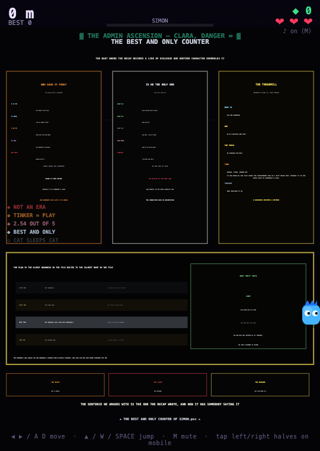

## 2026-08-08 — 2.54 OUT OF 5 · A RANKING STOPS MEASURING POWER AND STARTS MEASURING WHAT IS TRUE (BEAT 283)

Based on Toby's 2026-08-08 lore, 7:17:28 PM, in the "Even Even Even More Classics Era" thread — seven minutes and fifty-eight seconds after TINKER MEANS TO PLAY. His own typing is the whole of it: *"Pero is lower in the villian status since Pero was mistaken by most and some remurrs of him are true; 2.54 for every 5. Gray is second to one. The top is Oren. Simon.psc can outdo Gray sometimes. Simon.psc also attacks Gray. But Gray is smarter and reads the books Simon made, Simon.psc gets angry, Gray survives the attack and Simon.psc gets so tired, then Gray rubs Simon.psc to sleep. Oren.exe is known to target everyone."* The ChatGPT breakdown under it is commentary.

**A character gets a decimal, and this canon has never given one.** It ranks constantly — first, second, third, *most powerful being* twenty-two times on the Classics Era page, Infinity LV, 9999 LV, 777777777777777777777777777 IQ — and every rank it has ever handed out is a **whole position**. Tonight Pero is scored *"2.54 for every 5,"* to two decimal places. It is the first fractional rating in the run.

**And the number is not a measure of what he did.** It is a measure of how much of what is said about him is true: *"Pero was mistaken by most and some remurrs of him are true."* He is not lower because he did less. **He is lower because they were wrong.** This morning at 8:16 Toby wrote *"Pero was mistaked of being a villian, and he dies from natural causes anyway."* Eleven hours later that sentence has a number attached to it.

**Reading Simon's library is how you beat Simon, and this is the third time.** July 14, BEAT 93: Oren and Mr. Black *"read every book, bible, diary, page, document and paper Simon has."* This morning at 8:16: Flower *"learned all Simon knew, he read every book,"* and *"Gray read with Flower."* Tonight Gray reads them himself, and it is the stated reason he survives: *"Gray is smarter and reads the books Simon made."* Nobody out-fights Simon in this canon. They out-read him, using the manual he wrote and left on the shelf.

**And the top villain is ranked by aim, not by power.** Oren.exe is first because *"he is known to target everyone"* — he does not focus on one enemy or one group. Every ranking in this file before tonight sorted by how strong somebody is. This one sorts by how many people they are after. **Dangerous is not the same as strong.**

**Built as game beat 283, `2.54 OUT OF 5`.** Additive; nothing earlier was changed.

- **Background: the score, and the bar.** **2.54 / 5** set large with a bar underneath filling to 50.8 per cent, labelled TRUE at one end and MISTAKEN at the other, over *EVERY RANK BEFORE TONIGHT WAS A WHOLE NUMBER.* Repeating band text: **"SOME REMURRS OF HIM ARE TRUE; 2.54 FOR EVERY 5."**
- **THE FIRST DECIMAL (left)** — five rows (THIS FILE HAS · first, second, third / most powerful, 22 times / Infinity LV and 9999 LV / NEVER ONCE · a fraction of a rank / TONIGHT · 2.54 for every 5), a cycler on **AND IT IS NOT A POWER SCORE** — IT IS HOW MUCH IS TRUE / IT SCORES THE RUMOURS / IT MEASURES THE TALK — closing on **HALF OF WHAT THEY SAY IS RIGHT** and **AND HALF OF IT NEVER WAS**.
- **THE BOOKS SIMON MADE (centre)** — five rows (JULY 14 · Oren and Mr. Black read them / ALL OF IT · books, bibles, diaries / THIS AM · Flower read every book / WITH HIM · Gray read alongside / TONIGHT · Gray reads them himself), closing on **NOBODY OUT-FIGHTS SIMON** / **THEY OUT-READ HIM** / **HE WROTE THE ONLY MANUAL HE HAS** / **AND HE LEFT IT ON THE SHELF**.
- **WHY OREN IS FIRST (right)** — five rows lit one at a time (THE REASON · he targets everyone / NOT · he hits the hardest / NOT · he has the most power / BUT · he picks no side at all / SO · nobody is off his list), closing on **DANGEROUS IS NOT THE SAME AS STRONG**.
- **THE VILLAIN ORDER (band)** — opens on *the villain order, eight minutes after the list of four was written*, then the four-row grid (1 · OREN.exe · top villain · because he targets everyone / 2 · GRAY · second to one · the smartest of them / 3 · SIMON.psc · can outdo Gray sometimes · but gets tired, and sleeps / 4 · PERO · 2.54 of 5 · mistaken by most).
- **WHAT 2.54 IS A SCORE OF (band inset)** — a cycler across NOT HIS POWER (he is the one who made the game), NOT HIS DEEDS (he died of natural causes), THE RUMOURS (some of them are true) and HOW MANY (about half, and no more), over *he is not lower because he did less, he is lower because they were wrong*.
- **Strip:** THE RANK · got a decimal / THE BOOKS · got read again / THE TOP · is about aim.
- **Footers:** *THE ONLY CHARACTER WITH A FRACTIONAL SCORE IS THE ONE EVERYBODY GOT WRONG* and **★ 2.54 FOR EVERY 5 ★**.
- **Screenshot helper:** new `villainstatus` scene in `tools/capture_screenshot.py`.

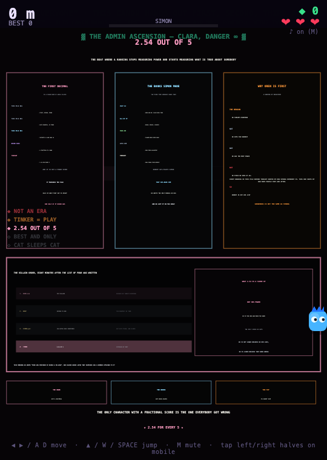

## 2026-08-08 — TINKER MEANS TO PLAY · THE GAME EXPLAINS ITS OWN FILENAME AND ADDS A THIRD KIND OF BEING (BEAT 282)

Based on Toby's 2026-08-08 lore, 7:09:30 PM, in the "Even Even Even More Classics Era" thread — two hours and forty-seven minutes after IT'S NOT AN ERA. His own typing is the whole of it: *"The game is called Tinkin'.psc because Tinker means to play, and Oren and Simon are talking about a game, and you play games. Oren is so powerful in game that Oren can hear you and everyone with a microphone and see reality with a camera. Oren can control a whole PC in seconds. Oren and Gray are the 2 most intelegent, Simon.psc is a robot cat thing, he has computer intelegence... Gray (not psc nor exe), Oren.exe, Simon.psc, and Pero (not psc nor exe) are the villians of the game. some characters are neither exe nor psc, they are called neutrals or risk of game attack just by existing. exes WILL glitch the game by existing, and pscs are clean and don't do anything to the game, they exist and are free to do what they want."* The ChatGPT breakdown under it is commentary.

**The name arrives a day after the thing did.** Tinkin'.psc was built on **August 7 at 7:07 PM**, out of *"Classics 1, Classics 2, Classics 3, Classics, the .psc mod, and Tinkerbox"* in Simon's exact order. Tonight — **twenty-four hours and two minutes later** — he explains what the word means: *"Tinker means to play, and Oren and Simon are talking about a game, and you play games."* He named it first and defined it after, and the definition turns out to fit three ways at once: tinker as play, tinker as mess with, tinker as take apart. All three are things this game has had done to it.

**The correction came first, and the equipment came second.** At 4:22 PM Oren answered something said about him from outside the story. At 7:09 PM he is handed a **microphone**, a **camera on reality**, and *"a whole PC in seconds."* The beat where he talked back is the beat before the one where he gets the ears. He is no longer only inside the game; he reaches the device it runs on.

**Gray has no file extension for the first time.** This morning at 8:16 he was still Gray.exe — *"Gray.exe now became both crazy and insane now"* — and he beat Oren.exe with it. `Gray.EXE` is one of the oldest spellings in the whole archive, going back to the July collapse sheets. Eleven hours later he is *"(not psc nor exe)."* When Simon changed his own suffix on August 1 it was the entire beat. Gray drops his inside a list, with no ceremony at all.

**And this morning's closing rule gets proved tonight.** August 8, 8:16 AM, attributed to Simon and Pero: *"The .pscs aren't all heroes, and the .exes aren't all villians."* Tonight's villain list is the proof in one line — a **.psc** on it (Simon.psc), an **.exe** on it (Oren.exe), and **two beings with no extension at all** (Gray and Pero).

**A third category opens, and it is defined as a hazard.** `.exe` glitches the game by existing; `.psc` is clean and free to do anything; and now **neutrals**, who are *"risk of game attack just by existing."* Not clean like a .psc, not glitching like an .exe. Having no extension is not neutral ground in this game — it is being a target by default.

**Built as game beat 282, `TINKER MEANS TO PLAY`.** Additive; nothing earlier was changed.

- **Background: the filename taken apart.** **TINKIN'** and **.psc** split to either side of the screen with their meanings underneath (*TINKER = TO PLAY · AND YOU PLAY GAMES* / *A CLEAN FILE STATE · AND THE GAME IS ONE*), and the three categories drifting below (**.exe** glitches by existing · **.psc** clean, and free · **NEUTRAL** at risk by existing), over *THE FILENAME HAS BEEN THE MORALITY SYSTEM SINCE AUGUST 1.* Repeating band text: **"TINKER MEANS TO PLAY, AND YOU PLAY GAMES."**
- **THE NAME COMES SECOND (left)** — five rows (AUG 7, 7:07 PM · Tinkin'.psc is made / OUT OF · Classics 1, 2, 3 / AND · the .psc mod, Tinkerbox / AUG 8, 7:09 PM · why it is called that / THE GAP · 24 hours and 2 minutes), a cycler on **THE WORD WAS ALWAYS DOING A JOB** — TINKER IS TO PLAY / TO MESS WITH / TO TAKE APART — closing on **AND EVERY ONE OF THOSE IS TRUE HERE** and **HE NAMED IT BEFORE HE KNEW WHY**.
- **HE GETS THE HARDWARE (centre)** — five rows (4:22 PM · Oren heard something / AND · answered it from inside / 7:09 PM · a microphone / AND · a camera on reality / AND · a whole PC in seconds), closing on **HE TALKED BACK FIRST** / **AND GOT THE EARS AFTER** / **HE IS NO LONGER ONLY IN THE GAME** / **HE REACHES THE DEVICE IT RUNS ON**.
- **GRAY LOSES HIS .exe (right)** — five rows lit one at a time (THE OLDEST · Gray.EXE, since July / THIS MORNING · "Gray.exe became insane" / 8:16 AM · he beat Oren.exe with it / 7:09 PM · not psc nor exe / AND SO · he is a neutral now), closing on **THE STRONGEST NAME LOSES ITS SUFFIX**.
- **THE FOUR VILLAINS (band)** — opens on *the four villains, and the rule this morning wrote about exactly this*, then the four-row grid (GRAY · not psc nor exe · no extension, and first on the list / OREN.exe · an .exe · and .exes glitch the game by existing / SIMON.psc · a .psc · and .pscs are meant to be clean / PERO · not psc nor exe · the one who made the game).
- **THE THIRD CATEGORY (band inset)** — a cycler across .exe, .psc, NEUTRAL and THE RISK, over *having no extension is not neutral ground, it is being a target by default*.
- **Strip:** THE NAME · arrived late / THE REACH · left the screen / THE THIRD · category opens.
- **Footers:** *THE GAME IS NAMED AFTER PLAYING WITH IT, AND EVERY CHARACTER IS FILED BY WHAT THEY DO TO IT* and **★ TINKIN'.psc · TINKER MEANS TO PLAY ★**.
- **Screenshot helper:** new `tinker` scene in `tools/capture_screenshot.py`.

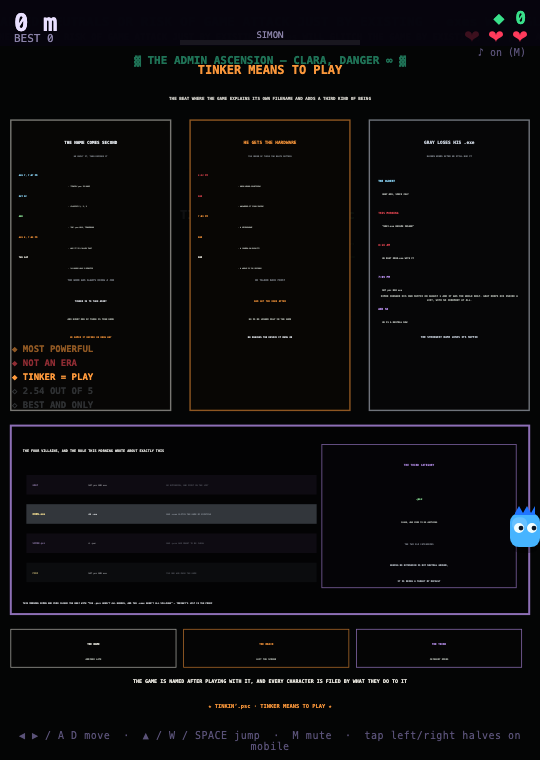

## 2026-08-08 — IT'S NOT AN ERA · A CHARACTER CORRECTS SOMETHING SAID FROM OUTSIDE THE STORY (BEAT 281)

Based on Toby's 2026-08-08 lore, 4:22:21 PM, in the "Even Even Even More Classics Era" thread — **forty-seven seconds** after THE MOST POWERFUL BEING. His own typing is the whole of it: *"Oren heard you. Oren says \"It's not an era, it is the end of everyone else.\""* The ChatGPT breakdown under it is commentary.

**Somebody in the game talks back.** BEAT 224, THE ONLY THREE MAIN CHARACTERS, handed the talk-to-the-player job to Luigi Green, and the rule came with it: *"he can talk to you and you cannot talk back."* Tonight the talking-back happens, and it is not Luigi Green who does it. What Oren heard was not an event in the story either — it was the word used **about** him in the wrapper around it. He is answering the commentary layer.

**And the word he rejects is the name of everything here.** `era` appears **426 times** on the Classics Era page. It is in the tab, the page title, and every thread this lore has ever arrived in: *Lore 1A - Classics Era*, *More Classics Era*, *STILL Classics Era*, *Even more Classics Era*, *AI Era (Still is in Classics Era)*, *Even Even More Classics Era*, and the one this email is in, *Even Even Even More Classics Era*. The story labels its own phases the same way — the Pinki Curse Era, the Curse Era, the AI Era. This is the first time one of his own characters has told him the word is wrong.

**An era has a next one. An end does not.** That is the whole content of the correction. He is not disputing a fact, he is disputing the filing: a new arc implies another arc after it, and Oren says there is no after.

**And the word "end" comes back through the one it was promised to.** BEAT 271, NOTHING ENDS, August 7 at 6:23 PM: *"Nothing is an ending anymore, Simon 404 says his life won't end, neither would all the NPCs and Sprunkis and Oren."* Simon wrote the no-ending law and named three parties it covered, and Oren was one of the three. Twenty-two hours later Oren is the one using the word, and Simon — the fastest being, and the one who granted him the exemption — is in *"everyone else."*

**Built as game beat 281, `IT'S NOT AN ERA`.** Additive; nothing earlier was changed.

- **Background: the word, struck out.** `ERA` set large in the middle of the screen with a red line drawing across it over the beat, replaced underneath by **THE END OF EVERYONE ELSE**, and a reply arrow pointing **out** of the screen instead of into it (*OUT OF THE GAME · LUIGI GREEN COULD TALK TO YOU · AND YOU COULD NOT TALK BACK*), over *AN ERA HAS A NEXT ONE. AN END DOES NOT.* Repeating band text: **"IT'S NOT AN ERA, IT IS THE END OF EVERYONE ELSE."**
- **HE TALKS BACK (left)** — five rows (BEAT 224 · Luigi Green talks to you / THE RULE · you cannot talk back / TONIGHT · somebody in here heard / AND IT IS · not Luigi Green / WHAT HE HEARD · a word used about him), a cycler on **IT DID NOT HAPPEN IN THE STORY** — IT WAS IN THE RECAP / IT WAS THE WRAPPER / IT WAS NOT A SCENE — closing on **AND HE ANSWERED IT ANYWAY** and **47 SECONDS AFTER THE LAST BEAT**.
- **THE WORD HE REJECTS (centre)** — five rows (THIS PAGE · "era" appears 426 times / THE TAB · The Classics Era / EVERY THREAD · Classics Era, STILL, More / THIS EMAIL · Even Even Even More… Era / THE STORY · Curse Era, AI Era), closing on **HE DID NOT CORRECT A FACT** / **HE CORRECTED THE FILING** / **AN ERA IS A BOX WITH A NEXT BOX** / **HE SAYS THERE IS NO NEXT BOX**.
- **THE WORD COMES BACK (right)** — five rows lit one at a time (August 7 · nothing is an ending anymore / Simon said · his life will not end / and also · NPCs, Sprunkis, and Oren / 22 hours on · Oren says "it is the end" / of whom · of everyone else), closing on **THE EXEMPTION BECOMES THE WEAPON**.
- **ERA VS END (band)** — opens on *the difference between the two words is whether anything is scheduled after it*, then the four-row grid (AN ERA · is a container · something follows it / AN END · is a stop · nothing follows it / THE LAW · nothing is an ending anymore · written August 7, 6:23 PM / THE SPEAKER · was promised no ending · and uses the word anyway).
- **WHO IS "EVERYONE ELSE"? (band inset)** — a cycler across THE FOUR (Gray, Wenda, Pero, Gaster — down), THE CAST (NPCs and Sprunkis), AND SIMON (the fastest being) and WHO IS ALSO (the one who said Oren won't end), over *two beings have a top stat now, and only one of them is doing the ending*.
- **Strip:** HE HEARD IT · from outside / THE WORD · does not fit / THE END · has a list.
- **Footers:** *THE LAW SAYS NOTHING IS AN ENDING ANYMORE, AND THE ONE IT WAS PROMISED TO IS THE ONE SAYING END* and **★ IT'S NOT AN ERA, IT IS THE END OF EVERYONE ELSE ★**.
- **Screenshot helper:** new `notanera` scene in `tools/capture_screenshot.py`.

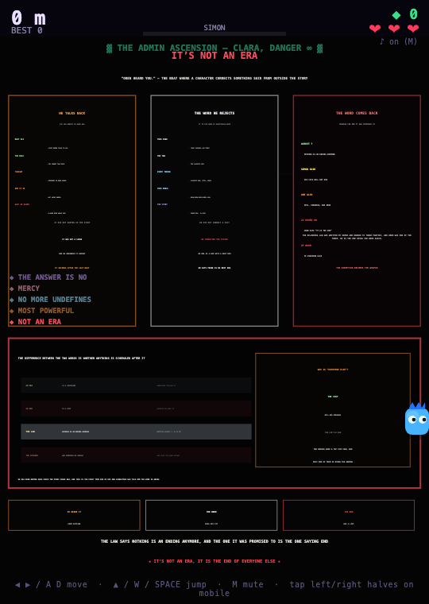

## 2026-08-08 — THE MOST POWERFUL BEING · THE SEAT MOVES AND THE SPEED DOES NOT (BEAT 280)

Based on Toby's 2026-08-08 lore, 4:21:34 PM, in the "Even Even Even More Classics Era" thread — **two hours and thirty-seven minutes** after NO MORE UNDEFINES WILL ENTER, and the first message of the evening. His own typing is the whole of it: *"Oren beaten Gray and Wenda and Pero and Gaster. Oren became the most powerful being. Simon is the fastest being."* The ChatGPT breakdown under it is commentary.

**The four names are the pieces of what was built this afternoon.** At 1:30 PM (BEAT 277) Gray took Unikitty's cursed energy and *"became all powerful"*, then *"made Gaster into the most powerful being ever, and combined it with Pero"* into Omazen Gasero. At 1:40 PM (BEAT 278) MERCY split Gasero straight back into Pero and Gaster. Tonight Oren beats the one who assembled it and both halves of it, separately — plus Wenda, who Gray had already *"sliced in half"* into *"seperate chambers"* at 1:15 PM.

**It is a rematch, and he did not pick strangers.** BEAT 251, August 3: *"Oren beats Mr. Black and Wenda. Oren VS Gray then happened, Gray won eventually and Oren was sent to Pero's Realm."* Gray is the fight he lost. Pero owns the room he was put in. Five days later both of them are on the list, and Wenda is on it for the second time.

**The countdown on him is still running.** BEAT 277, Simon to Oren: *"you have 24 hours to life, the results were yesterday's results."* That was 1:30:16 PM. Oren becomes the most powerful being at 4:21:34 PM, **two hours and fifty-one minutes** in, with roughly twenty-one hours left on a clock the fastest being started.

**And Simon keeps the oldest stat he has.** `most powerful being` is written **22 times** on the Classics Era page before tonight — Gaster, Wenda and Gray under Pinki, Alex second, Simon 404 second on purpose, Mr. Black third — and not once about Oren, whose best was third under Pero and Mr. Black. *"Simon is the fastest being"* is not new at all: it is Core Final Truths material, the oldest layer of his lore, where *"all other characters have to build up speed, while Simon can stay top speed for the whole time instantly"* and *"Simon is the FASTEST."* The top power seat is the most-traded object in the canon. The speed line has never moved once. The only time anything ever got past it, it was Pero, and he did it by teleporting rather than by being faster.

**Built as game beat 280, `THE MOST POWERFUL BEING`.** Additive; nothing earlier was changed.

- **Background: the four going down.** GRAY, WENDA, PERO and GASTER laid out in a row and falling one at a time across the beat, with **Oren** standing at the right of the row (*THE MOST POWERFUL BEING*) and **Simon** on the left as a set of moving streaks rather than a figure (*SIMON · THE FASTEST BEING*), over *THE SEAT MOVED. THE SPEED DID NOT.* Repeating band text: **GRAY · WENDA · PERO · GASTER · ALL FOUR IN ONE LINE**.
- **THE FOUR NAMES (left)** — five rows (GRAY · became all powerful at 1:30 / WENDA · sliced in half, two chambers / PERO · co-creator of the game / GASTER · made most powerful ever / ALL FOUR · beaten by one, in one line), a cycler on **THREE OF THEM WERE ONE THING AT 1:30** — GRAY BUILT IT / GASTER WAS THE CORE / PERO WAS THE OTHER HALF — closing on **MERCY SPLIT OMAZEN GASERO AT 1:40** and **HE BEAT THE HALVES SEPARATELY**.
- **THE REMATCH (centre)** — five rows (BEAT 251 · August 3, Oren beats Wenda / THEN · Oren VS Gray, Gray won / THE COST · sent to Pero's Realm / TONIGHT · Gray is first on the list / AND · so is the one who owns it), closing on **FIVE DAYS AGO HE LOST AND WAS PUT AWAY** / **THE JAILER AND THE WARDEN** / **ARE BOTH ON TONIGHT'S FOUR** / **HE DID NOT PICK STRANGERS**.
- **THE FASTEST BEING (right)** — five rows lit one at a time (Core Final Truths · Simon is the fastest / no wind-up · top speed instantly / the ceiling · the speed of light / beaten once · Pero teleported instead / never lost · the line has not moved), closing on **HE LOST THE SEAT AND KEPT THE STAT**.
- **THE REVOLVING SEAT (band)** — opens on *the seat he just took is the most-traded object in the canon*, then the four-row grid (UNDER PINKI · Wenda and Gray held it / AUGUST 1 · Simon 404 second, on purpose / TODAY 1:30 · Gray became all powerful / TONIGHT · Oren, and he has never held it before), closing on the 22-times count and the note that his best before tonight was third.
- **THE COUNTDOWN IS STILL RUNNING (band inset)** — a cycler across 1:30 PM (Simon: "you have 24 hours to life"), HE SAID IT (to Oren, right after Gray slashed him), 4:21 PM (Oren is the most powerful being) and SO FAR (2 hours 51 minutes used, 21 left), over *the one who started the clock is the one still standing beside him*.
- **Strip:** THE FOUR · are down / THE SEAT · changed hands / THE SPEED · never moved.
- **Footers:** *HE LOST TO GRAY FIVE DAYS AGO AND WAS SENT TO PERO'S REALM, AND TONIGHT BOTH OF THEM ARE ON THE LIST* and **★ OREN = MOST POWERFUL · SIMON = FASTEST ★**.
- **Screenshot helper:** new `mostpowerful` scene in `tools/capture_screenshot.py`.

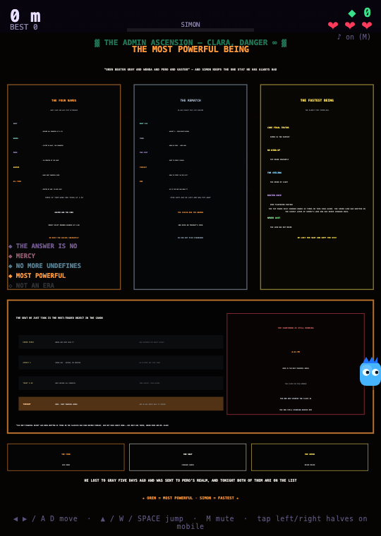

## 2026-08-08 — NO MORE UNDEFINES WILL ENTER · THE DOOR SHUTS BEHIND THE LAST ONE THROUGH IT (BEAT 279)

Based on Toby's 2026-08-08 lore, 1:44:21 PM, in the "Even Even Even More Classics Era" thread — **three minutes and fifty-four seconds** after MERCY. He opens by correcting the frame: *"Not ending, it was never an ending, I just keep saying what happens next. The actual end of Unikitty in Classics is Unikitty in reality. Also we were thinking to bring Unikitty to Parinus to turn the stuffy to life. Parinus is now in the game though. Tinkin'.psc is also for matures. There is a UFO that can bring people from Earth to Parinus, it seems to be near or in Albany, near water and green grass and stuff. The story gets more deep and complex when said more. Any way, Gray and the others enjoyed the game now. \"No more undefines will enter.\" -Gaster and Pero. Pero will no longer let them in."* The ChatGPT breakdown under his paragraph is commentary.

**He applies his own law to himself.** BEAT 271, NOTHING ENDS, replaced the ending system with a continuation system — a rule he wrote for the characters. Today he says the same thing about his own storytelling, and then names the only real end there is: *"The actual end of Unikitty in Classics is Unikitty in reality."* Her story does not finish in a battle or a deletion. It finishes by leaving the game.

**The door shuts behind her.** BEAT 276 made the barrier gate a two-name list, Pero and her, and her cursed energy is what got her through. Tonight: *"No more undefines will enter."* — Gaster and Pero, and *"Pero will no longer let them in."* The only undefined being left is also the last one this game will ever admit.

**Parinus comes inside.** `Parinus` has **35 mentions** in `index.html` as a place out there — Parinus made P.E.A.R., Gray cut a crater into it, its planets and stars and moons got shrunk into Gray's lab. Tonight *"Parinus is now in the game though"*, which turns the plan to bring her there and *"turn the stuffy to life"* from an exit into another room of the same building.

**The first real place on Earth this file has ever named.** `ALBANY` returns **0 hits** across 278 beats, and `UFO` returns **0**. The route he describes runs Earth to Parinus to the game, boarding at a UFO *"near or in Albany, near water and green grass and stuff."*

**And the war stops being the point.** *"Tinkin'.psc is also for matures"* and *"Gray and the others enjoyed the game now"* land in the same paragraph — the game gets an age on it and its cast gets a day off, one beat after the most broken it has ever been.

**Built as game beat 279, `NO MORE UNDEFINES WILL ENTER`.** Additive; nothing earlier was changed.

- **Background: the door closing.** A vertical seam narrowing across the beat, captioned *"NO MORE UNDEFINES WILL ENTER." — GASTER AND PERO*, with **Pero** on the left with his hand on it (*PERO WILL NO LONGER LET THEM IN · THE ONE WHO OPENS IT, CLOSING IT*) and a **UFO** hovering on the right over three beams (*NEAR OR IN ALBANY · NEAR WATER AND GREEN GRASS*), over *THE ACTUAL END IS UNIKITTY IN REALITY*. Repeating band text: **IT WAS NEVER AN ENDING · I JUST KEEP SAYING WHAT HAPPENS NEXT**.
- **IT WAS NEVER AN ENDING (left)** — five rows (BEAT 271 · nothing is an ending anymore / THAT WAS · a rule for the characters / TODAY · he says it about himself / HIS WORDS · I just keep saying what next / SO THE END · is Unikitty in reality), a cycler on **WHERE HER STORY ENDS** — NOT IN A BATTLE / NOT IN A DELETION / OUT OF THE GAME — closing on **HE WROTE THE LAW ON AUGUST 7** and **AND TODAY IT COVERS HIM**.
- **THE DOOR SHUTS (centre)** — five rows tracing the gate from BEAT 276 through tonight, a cycler on **WHO SIGNED THE RULE** — GASTER / AND PERO / THE TWO WHO MADE THE GAME — closing on **THE ONLY UNDEFINED LEFT** / **IS ALSO THE LAST ONE THIS GAME** / **WILL EVER LET IN**.
- **A UFO NEAR ALBANY (right)** — five rows lit one at a time (Parinus, 35 mentions / it was a place out there / now it is in the game / a UFO runs Earth to Parinus / near water and green grass), a cycler on **THE ROUTE** — EARTH / TO PARINUS / TO TINKIN'.psc — closing on **ALBANY AND UFO BOTH RETURN** and **ZERO HITS ACROSS 278 BEATS**.
- **THE PLAN FOR THE STUFFY (band)** — opens on *the plan is to make a toy real, and the one place that could do it has just been pulled inside the game*, then the four-row grid (THE IDEA · bring Unikitty to Parinus / THE SNAG · Parinus is now in the game / THE RATING · Tinkin'.psc is for matures / THE MOOD · Gray and the others enjoyed it), closing on his own line about the story getting deeper.
- **TURN THE STUFFY TO LIFE (band inset)** — a cycler across SHE CAME IN, SHE WENT OUT, THE PLAN and THE CATCH, over *a toy that walked into a game, and a plan to walk her out alive*.
- **Strip:** THE ENDING · was never one / THE DOOR · is shut now / THE UFO · is near Albany.
- **Footers:** *THE GATE THAT LET HER IN IS CLOSED BEHIND HER, AND THE NEXT ROUTE RUNS THROUGH A REAL TOWN* and **★ NO MORE UNDEFINES WILL ENTER ★**.
- **Screenshot helper:** new `nomoreundefines` scene in `tools/capture_screenshot.py`.

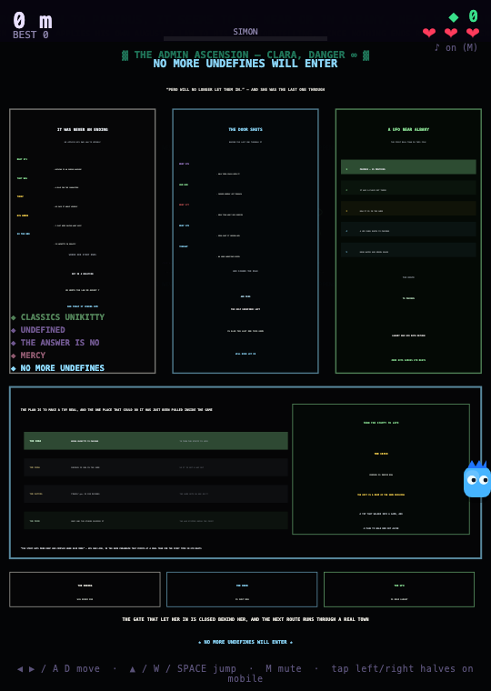

## 2026-08-08 — MERCY · THE ONE WHO CANNOT RESPAWN SURVIVES BY REFUSING TO ATTACK (BEAT 278)

Based on Toby's 2026-08-08 lore, 1:40:27 PM, in the "Even Even Even More Classics Era" thread — **ten minutes and eleven seconds** after THE ANSWER IS NO, and it answers that beat head on. His own typing is the whole first paragraph: *"Unikitty was at the end, Unikitty glowed, and the ground began to pulse, the cross turned into a sword, yet, she refused to swing it, she refused to attack, she wasn't using ACT like Pero, she was using a more powerful force, MERCY, Gasero became Pero and Gaster again, they use their power on Unikitty, Unikitty dodged each, Pero uses ACT, Gaster uses FIGHT, but Unikitty uses MERCY on her turn. Pero destroyed the MERCY button and says to Unikitty \"Use ACT.\", Unikitty broke the FIGHT and ACT button and ITEM buttons, Unikitty says \"I still use Mercy, the button may be gone, but not the action of using mercy.\", Pero says \"Did you say ACT-ion?\", Unikitty walks back, Gaster teleports and says \"Where do you think YOUR going? You are dead but still alive, you are deleted but still present.\". Unikitty had no idea what Gaster was talking about, Gaster says \"Me and Pero were deleted too, but we are still here for enternity since we created this game in the first place.\", Unikitty's body isn't where her power comes from, it is her heart and mercy. Pero and Gaster use all they have on Unikitty, Unikitty still was there. Gaster opened a portal to the reality, Unikitty was brought back to reality. Pero closed the portal."* The ChatGPT breakdown under his paragraph is commentary.

**She wins by not swinging.** Her cross has been a clasped ornament (BEAT 275) and a welcome present from Pero (BEAT 276). Tonight it turns into a **sword** and she refuses to swing it. Every other cross in this canon is a restraint somebody is set into, a weapon somebody carries into a fight, or a gift; nobody has ever been handed a weapon and declined it.

**The fusion lasted exactly one beat.** Omazen Gasero was welded together ten minutes ago out of two brothers, and MERCY splits it straight back into Pero and Gaster. The counter to the strongest thing in the game turns out to be the one move that does no damage at all.

**The four buttons come off again, and the point inverts.** BEAT 106 had Pero destroy the MERCY, ACT, ITEM and FIGHT buttons — *the actual controls of the game*. Tonight Pero destroys MERCY and tells her to *"Use ACT"*, and she destroys the other three herself, then states the opposite conclusion: *"I still use Mercy, the button may be gone, but not the action of using mercy."* A control and a choice are not the same thing. Pero hears it in real time: *"Did you say ACT-ion?"*

**Deleted but still present is an old rule with a new owner.** Frizz LV 4 is *"REMOVED BUT STILL THERE"* — permanently removed from the game files and still there anyway. Gaster now says it to her: *"You are dead but still alive, you are deleted but still present"*, and reveals that he and Pero are in that state themselves, *"still here for enternity since we created this game in the first place."*

**And it answers the previous beat's headline.** Ten minutes ago the rule was that an undefined being cannot respawn nor anything. She never respawns. Her body was never where the power was — *"it is her heart and mercy"* — so Pero and Gaster use everything they have and she is still there, and Gaster opens a portal and sends her home to reality while Pero closes it behind her.

**Built as game beat 278, `MERCY`.** Additive; nothing earlier was changed.

- **Background: the four broken buttons.** FIGHT, ACT, ITEM and MERCY in a row, each struck through, with her below them glowing, horn up, **the sword pointed at the ground** (*SHE REFUSED TO SWING IT*) and three rings pulsing out of the floor under her; **Pero** split back off on the left (*PERO USES ACT · MERCY SPLIT GASERO BACK IN TWO*) and **Gaster** on the right (*GASTER USES FIGHT · AND SHE DODGED EACH ONE*), over *UNIKITTY USES MERCY ON HER TURN*. Repeating band text: **HER BODY ISN'T WHERE HER POWER COMES FROM**.
- **SHE WOULDN'T SWING IT (left)** — five rows (BEAT 275 · clasped to her chest / BEAT 276 · a welcome present / TONIGHT · it turns into a sword / AND SHE · refused to swing it / NOBODY · has ever declined one), a cycler on **WHAT SHE USED INSTEAD** — NOT FIGHT / NOT ACT LIKE PERO / MERCY — closing on **THE FUSION LASTED ONE BEAT** and **MERCY SPLIT GASERO BACK**.
- **THE BUTTONS COME OFF AGAIN (centre)** — five rows (BEAT 106 · Pero broke all four / TONIGHT · Pero breaks MERCY / AND SHE · breaks FIGHT, ACT, ITEM / HE SAID · use ACT / SHE SAID · I still use Mercy), a cycler on **WHO BROKE WHICH ONE**, closing on **THE BUTTON MAY BE GONE** / **BUT NOT THE ACTION OF USING IT** / **A CONTROL ISN'T A CHOICE**.
- **DELETED BUT PRESENT (right)** — five rows lit one at a time (Frizz LV 4 cut from the files / and still there anyway / Gaster: we were deleted too / still here, we made the game / and her: not in the body), a cycler on **WHAT GASTER TOLD HER**, closing on **LAST BEAT: SHE CANNOT RESPAWN** and **SHE NEVER NEEDED TO**.
- **THE TURN ORDER (band)** — opens on *they use everything they have on her and she is still there, because her power was never in the body they were aiming at*, then the four-row grid (PERO · uses ACT / GASTER · uses FIGHT / UNIKITTY · uses MERCY, lit pink / PERO · did you say ACT-ion?), closing on the portal to reality opening and closing around her.
- **HER HEART AND MERCY (band inset)** — a cycler across THE BODY, THE SOURCE, THE PROOF and THE RESULT, over *the only move that does no damage is the one that undoes the fusion*.
- **Strip:** THE SWORD · she wouldn't swing / THE BUTTONS · came off again / THE ANSWER · was no, and she stayed.
- **Footers:** *TEN MINUTES AGO A STUFFY COULD NOT SURVIVE IN CLASSICS, AND SHE SURVIVES BY NOT FIGHTING* and **★ MERCY · THE BUTTON MAY BE GONE, BUT NOT THE ACTION ★**.
- **Screenshot helper:** new `mercy` scene in `tools/capture_screenshot.py`.

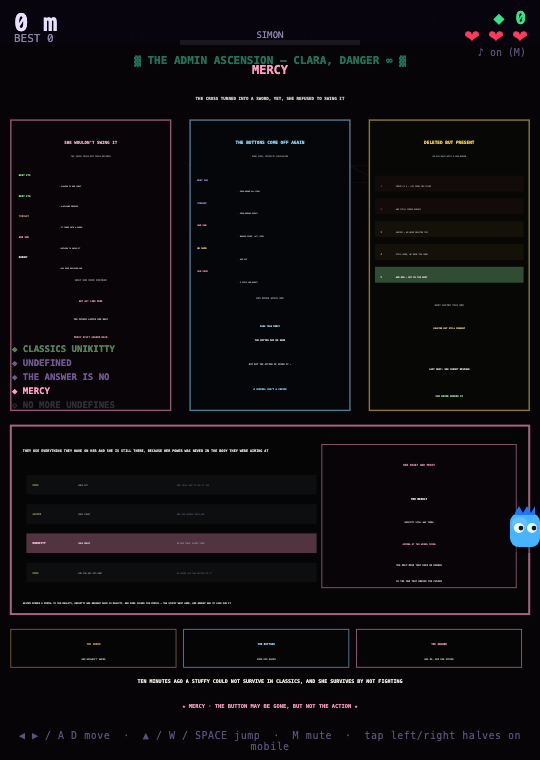

## 2026-08-08 — THE ANSWER IS NO · THE LAW THAT NOTHING ENDS MEETS ITS FIRST EXCEPTION (BEAT 277)

Based on Toby's 2026-08-08 lore, 1:30:16 PM, in the "Even Even Even More Classics Era" thread — **fourteen minutes and thirty-four seconds** after UNDEFINED. His own typing is the whole first paragraph, and it opens with a test and its result: *"I am having a simulation if a stuffy's avatar can survive in Classics, the answer happens to be \"no\". Gray finally learned Unikitty. Gray put Unikitty into a tube, Gray presses the button, Gray says \"Now... all this cat's power and souls and LV and KR are mine.\", the cursed energy comes out of Unikitty and goes to Gray. Gray became all powerful. Gray made the game and lore not just listen but to also obey him. Oren grabs Unikitty in the nick of time, and Simon sees, Simon dashes to Oren and says \"Why didn't you take her powers, Gray will destroy you next you know, you have 24 hours to life, the results were yesterday's results.\", Gray slashes Oren, Gray VS Simon happens, Gray wins but Simon stays alive, Simon.psc terminated the threat. Since undefined aren't Classics beings, they can't respawn nor anything. Simon refused to go with Gray. Gray made Gaster into the most powerful being ever, and combined it with Pero, and it was now into... Omazen Gasero, Gasero oberviated Simon.psc, Simon.psc flew off the screen. Gasero and Gray continue destroying the game, the game became more broken than it ever was combined."* The ChatGPT breakdown under his paragraph is commentary.

**It is the first exception to the law of this world.** BEAT 271, six beats and one day ago, replaced the ending system with a continuation system and handed it down by name: *"his life won't end, neither would all the NPCs and Sprunkis and Oren."* `RESPAWN` returns **191 hits** in `index.html`; it is the mercy the whole canon runs on. Tonight: *"Since undefined aren't Classics beings, they can't respawn nor anything."* NOTHING ENDS turns out to have a category it never covered, and that category currently has exactly one member in it.

**The tube is Gray's second one, and it runs backward.** "THE HIDDEN CREATION — GRAY SEALS THE PUPPET" already had him connect two puppets to a **metal tube**, channel Simon's lightning through it to **charge** them, and once fully charged **combine them into one stronger puppet**. Tonight the tube drains instead of charging — *"Gray put Unikitty into a tube, Gray presses the button"* — and then he does the combining step anyway, on two other beings. Same machine, both halves, opposite direction.

**The fusion is two brothers.** BEAT 220: *"GASTER WAS PERO'S BROTHER — PERO MADE AN EXTRA GAME FOR GASTER TO STAY IN AND LOCKED ACCESS TO EVERYONE ELSE"*, and later *"GASTER BECAME MORE POWERFUL THAN PERO AND TAKEN OVER PERO."* **Omazen Gasero** is the jailer and the jailed welded into one body. `OMAZEN` and `GASERO` both return **0 hits** before tonight. And Pero is the one who, one beat ago, handed Unikitty her cross as a welcome present; he is now half of the weapon.

**Obey is a new size of the word.** It has **14 hits** in the file and every one of them is a *character* being made to obey — Luigi Green turned into a demon and forced to obey, corruption rewritten to obey Simon. Tonight it is the game and the lore themselves, which completes a three-rung ladder: BEAT 276's *"Unikitty made the lore itself **answer** her"*, the older rule *"if the cat purrs time **listens**"*, and now **obey**. He got the top rung by draining the cat who owned the bottom one.

**The one who loses is the one who says no.** Gray wins the fight, Simon stays alive, and then *"Simon refused to go with Gray."* The refusal is the only thing in the paragraph that Gray's new obedience over the game and the lore does not reach.

**Built as game beat 277, `THE ANSWER IS NO`.** Additive; nothing earlier was changed.

- **Background: the tube.** A cylinder at centre with the horned Unikitty inside it and the red button on its side, captioned *GRAY PUT UNIKITTY INTO A TUBE · GRAY PRESSES THE BUTTON*, the cursed energy streaming right out of her into **Gray** (*GRAY BECAME ALL POWERFUL · NOT JUST LISTEN · OBEY*), **Oren** reaching in from the left (*OREN GRABS HER IN THE NICK OF TIME · THE POWER WAS ALREADY GONE*), over *THEY CAN'T RESPAWN NOR ANYTHING*. Repeating band text: **ALL THIS CAT'S POWER AND SOULS AND LV AND KR ARE MINE**.
- **NOTHING ENDS, EXCEPT (left)** — five rows (THE LAW · nothing ends, beat 271 / HANDED TO · NPCs, Sprunkis, Oren / RESPAWN · 191 hits in this file / TONIGHT · undefined cannot come back / AND SHE · is the only one left), then a cycler on **WHAT THE EXCEPTION TAKES** — NO RESPAWN / NO REVIVAL / NOR ANYTHING — closing on **SIX BEATS AFTER NOTHING ENDS** and **SOMETHING FINALLY DOES**.
- **THE TUBE RUNS BACKWARD (centre)** — five rows (FIRST TUBE · two puppets wired into it / IT PUT IN · Simon's lightning, to charge / THEN · combined them into one / THIS TUBE · takes it out instead / SAME MACHINE · drain first, then fuse), a cycler on **WHAT CAME OUT OF HER** — POWER / AND SOULS / AND LV / AND KR — closing on **HE PRESSES THE BUTTON ONCE** / **AND ALL FOUR WORDS THIS FILE** / **COUNTS POWER IN CHANGE HANDS**.
- **THE BROTHERS, WELDED (right)** — the five-rung ladder lit one at a time (BEAT 220 they are brothers / Pero locked him in a game / Gaster took Pero over / BEAT 276 Pero gave the gift / TONIGHT one body), then a cycler on **THE NEW NAME** — OMAZEN GASERO / 0 HITS BEFORE TONIGHT / THE MOST POWERFUL EVER — closing on **THE ONE WHO GAVE A PRESENT** and **IS NOW HALF OF THE WEAPON**.
- **THE FIGHT, AND THE ONE THING THAT DOES NOT OBEY (band)** — opens on *he makes the game and the lore obey him, and the one thing that still doesn't is the character he already beat*, then the four-line grid (SIMON · why didn't you take her powers / SIMON · you have 24 hours to life, the results were yesterday's / GRAY · wins the fight, and Simon stays alive anyway / SIMON · refused to go with Gray, the one thing obedience missed, lit green), closing on Simon.psc terminating the threat and then being oberviated off the screen by Gasero.
- **ANSWER · LISTEN · OBEY (band inset)** — a cycler across the three rungs (ANSWER *beat 276, she made the lore answer* / LISTEN *if the cat purrs, time listens* / OBEY *tonight, the game and the lore*), over the note that obey has 14 hits here and every one was a character, never the game.
- **Strip:** THE LAW · has an exception / THE TUBE · runs backward / THE BROTHERS · are one being.
- **Footers:** *THE MERCY THIS WHOLE GAME RUNS ON TURNS OUT NOT TO COVER THE ONE WHO NEEDS IT* and **★ THE ANSWER IS NO · A STUFFY'S AVATAR CANNOT SURVIVE IN CLASSICS ★**.
- **Screenshot helper:** new `answerisno` scene in `tools/capture_screenshot.py`.

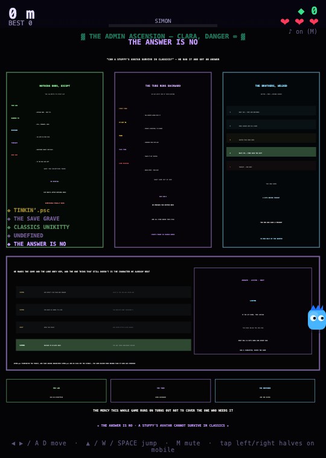

## 2026-08-08 — UNDEFINED · THE WORD FOR WHAT THIS GAME CANNOT SOLVE BECOMES A NAME (BEAT 276)

Based on Toby's 2026-08-08 lore, 1:15:42 PM, in the "Even Even Even More Classics Era" thread — **twenty-one minutes and forty-eight seconds** after the Classics Unikitty picture, with the same two images attached again. His own typing is the whole first paragraph: *"New character: Unikitty. Unikitty is all powerful and peaceful and eats computers, TVs, and all devices, but her favorite is TVs, she made a popular song called \"Eat The TV\". Unikitty also does a cute dance, she is immortal like Paul, Unikitty has the basic Classics cross, Pero gave her the cross to celebrate the arrival. Pero shown everyone Unikitty. Unikitty's spell has to rhyme, but it doesn't have to be real words and can be nonsense words, also she has a spell book ... Unikitty is the most powerful stuffy in existance, but not even close to being the most powerful Classics character. Gray learns more about this \"undefined\" entity, Gray and Gaster conduct several experiments on Unikitty ... Unikitty made the lore itself answer her ... Gray won and Wenda was sliced in half ... Simon.psc wants to terminate all the undefined entities so only they exist. Oren wants to save Unikitty from all the dangers of the game, knowing that Unikitty isn't immortal after all. After a while, Unikitty was the only undefined being left ... Oren pets the cat and blocks huge rocks from reaching her ... \"YOU are the key to saving everyone.\" ... \"You aren't reaching her, I refuse, and her name is Unikitty\" ... \"She is just a game character, doesn't have a reality form\" ... \"Wait- she is a stuffy.\" ... \"The cursed energy from her allowed her to go through the barrier.\" ... \"A lot of TVs and computers, she is a threat to my computers, and my game making systems and command makers.\" ... \"the only other being that can open and close the barrier is Pero. But soon, I will take Pero's place, AND THE GAME IS MINE!\" ... Unikitty was saved. Oren took over Pero and now has the game."* The ChatGPT breakdown under his paragraph is commentary.

**The word was already the name of this whole system.** `THE UNDEFINED LOOP` returns **101 hits** in `index.html` — it is what the beat overlay itself has been called for 275 beats, and its origin line is the entire power ranking dissolving *"into the loop they call undefined."* Tonight *undefined* stops describing a structure and becomes a **species**: undefined entities, everyone who is not a normal core or main character. Gray sets out to learn all of them, Simon.psc wants all of them terminated, and by the middle of the paragraph the Unikitty is the only one left.

**It answers the question the last beat left open, twenty-one minutes later.** BEAT 275 laid out every cross in the file — Simon set into his, Simon thrown onto one, Wenda hung on a metal one, Pero and Paul carrying theirs as weapons — and deliberately left *whose cross is it* unanswered rather than inventing it. The answer: *"Pero gave her the cross to celebrate the arrival."* It is the **first cross in this canon that is a present**, handed over by the one who made everybody, as a welcome.

**The peaceful one is a threat because of what she eats.** Simon's entire power base here is computers, commands, files, game-making systems and Mr. Fun Computer. She eats computers, TVs and all devices. He says it himself once he looks inside her: *"she is a threat to my computers, and my game making systems and command makers."* She never attacks him. She just has his infrastructure for dinner.

**A stuffy crossed the barrier, and he is proved wrong about it.** Simon's objection is that she is *"just a game character, doesn't have a reality form"* — and the answer is that she is a **stuffy** whose cursed energy let her through. The barrier gate is a two-name list, Pero and now her; Oren announces he will take Pero's place and does it before the paragraph ends.

**And he uses the signature on himself.** Simon's lines carry the cat-and-lightning emoji — the exact tell that unmasked the fake Oren at BEAT 274 — and he is the one shouting to terminate *"THAT CAT UNICORN."* The Lightning Cat wants the other cat uninstalled.

**Built as game beat 276, `UNDEFINED`.** Additive; nothing earlier was changed.

- **Background: the barrier.** A stitched vertical seam captioned *ONLY PERO COULD OPEN AND CLOSE IT · A STUFFY CAME THROUGH ANYWAY*, with the horned Unikitty and her cross in the middle, **Oren on the left** petting the cat while four rocks fly in and halt at his arm (*OREN PETS THE CAT · AND BLOCKS THE ROCKS*), and **Simon on the right** (*UNINSTALL THAT UNICORN CAT · SAID BY THE LIGHTNING CAT*), over *SHE IS THE ONLY UNDEFINED BEING LEFT*. Repeating band text: **UNIKITTY MADE THE LORE ITSELF ANSWER HER**.
- **THE WORD WAS HERE FIRST (left)** — five rows (THE OVERLAY · is the Undefined Loop / 101 HITS · in the file already / ITS ORIGIN · the ranking dissolved / TONIGHT · undefined is a species / AND SHE · is the last one left), then a cycler on **WHAT AN UNDEFINED IS** — NOT A CORE CHARACTER / NOT A MAIN CHARACTER / SOMETHING ELSE ENTIRELY — closing on **GRAY WANTS TO LEARN THEM ALL** and **SIMON WANTS THEM ALL GONE**.
- **SHE EATS HIS WHOLE TOOLKIT (centre)** — five rows (SHE EATS · computers, TVs, devices / FAVOURITE · is the TV / HE RUNS ON · computers and commands / HE SAYS · a threat to my systems / SO · the peaceful one is one), a cycler on **WHAT HE FOUND INSIDE HER** — A LOT OF TVs / AND COMPUTERS / AND HIS COMMAND MAKERS — closing on **SHE NEVER ATTACKS HIM ONCE** / **SHE JUST HAS THE THING HE RULES** / **THE GAME WITH, FOR DINNER**.
- **THE CROSS WAS A PRESENT (right)** — the same six crosses as beat 275, now with the sixth row answered (UNIKITTY · GIVEN HERS), lit one at a time, then a cycler on **WHO HANDED IT OVER** — PERO GAVE IT TO HER / TO CELEBRATE THE ARRIVAL / THEN SHOWED EVERYONE — closing on **FIVE RESTRAINTS AND WEAPONS** and **AND ONE WELCOME PRESENT**.
- **THE ARGUMENT OVER HER (band)** — opens on *the argument is about whether something from outside the game is allowed to be in it, and he loses it*, then the four-line exchange (SIMON · uninstall that unicorn cat / OREN · you aren't reaching her, and her name is Unikitty / SIMON · she has no reality form / OREN · she is a stuffy, cursed energy got her through), closing on the note that Unikitty was saved and Oren took Pero's place in the same paragraph he announced he would.
- **EAT THE TV (band inset)** — a cycler across THE SONG (*Eat The TV, and it is popular*), THE SPELLS (*have to rhyme, can be nonsense*), THE BOOK (*she has a spell book*) and THE RANK (*strongest stuffy, and no more*), over *called immortal like Paul, then not immortal after all*.
- **Strip:** THE WORD · was already ours / THE MEAL · is his toolkit / THE CROSS · was a present.
- **Footers:** *THE WORD THIS GAME USES FOR WHAT IT CANNOT SOLVE IS NOW SOMEBODY'S NAME* and **★ UNDEFINED · THE LAST ONE LEFT ★**.
- **Screenshot helper:** new `undefined` scene in `tools/capture_screenshot.py`.

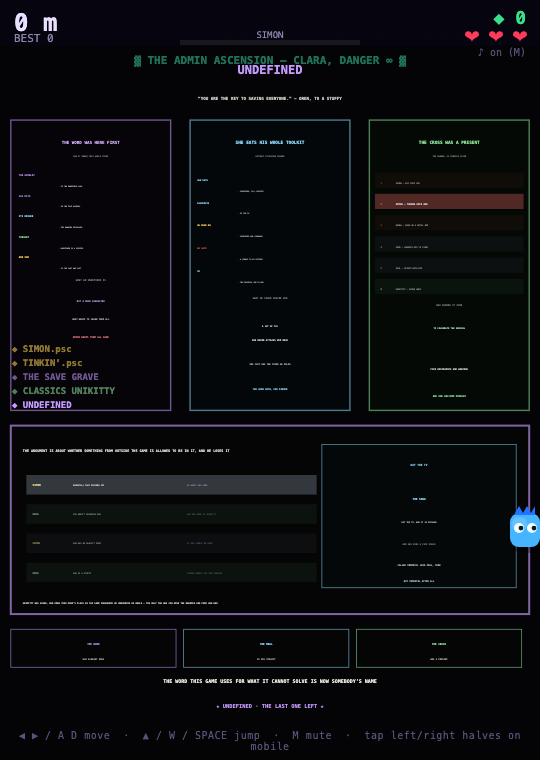

## 2026-08-08 — THE CLASSICS UNIKITTY · A CHARACTER SHEET INSTEAD OF AN EVENT (BEAT 275)

Based on Toby's 2026-08-08 lore, 12:53:54 PM, in the **"Cat"** thread — a thread Todd started with a photo of a plush unicorn cat, which Toby answered with a drawing of his own. His own typing is one sentence: *"Here is the Classics Unikitty."* Everything else in this beat is read off the picture he attached: a pastel yellow/green/pink cat in comic-book line art, a silver spiral **unicorn horn** with sparkles, **one gold eye and one blue eye**, a pink heart nose, and a large ornate gemmed cross clasped against its chest with the sound effect **"CLASP!"** written beside it.

**It is the first unicorn in the whole canon.** `grep -ci "unicorn"` on `index.html` returns **0** across 274 beats. And it arrives on the one animal this file already uses as a signature: *cat* has **238** hits, Simon 404 **is** the LIGHTNING CAT (BEAT 236), and only this morning a cat and a lightning bolt were the tell that unmasked a disguise (BEAT 274). A second cat here is not a small thing — and this one carries no bolt.

**The eyes are the abilities, by Toby's own rule.** BEAT 234, MUSTITU BLUE PERO, August 2, his own typing: *"all Mustitus look like that but with different colored eyes. Different eye color = different abilities for each 1."* Every Mustitu got **one** colour. This one has gold and blue on the same face, which under his own rule is two ability sets in one character. What each eye actually does, he has not said — so the beat asks instead of inventing it.

**Nobody in 274 beats has ever simply held a cross.** In this canon the cross is what you are put into — *"SET INTO HIS CROSS"* (14 hits), *"throws Simon onto a cross"*, *"hung Wenda on a metal cross"* — or a weapon somebody carries into a fight (Pero *"holding his metal cross"*, Paul with his cross and metal pipe). Clasped to the chest is a third thing. And the sound written on the picture is **CLASP**, which returns **0** hits in the file, where every other sound is a strike.

**Same opening line as the last picture-only mail.** *"Here is the Classics Unikitty."* / *"Here is Mustitu Blue Pero"* — one sentence and an image, both times. The rule that came out of that mail is the rule that reads this one.

**And the "CLASSICS ___" prefix is the paperwork.** CLASSICS INK SANS (10 mentions) and CLASSICS MR. BLACK (6) both entered that way, so naming it the *Classics* Unikitty files it under an existing rule rather than leaving it a one-off.

**Built as game beat 275, `THE CLASSICS UNIKITTY`.** Additive; nothing earlier was changed.

- **Background: the Unikitty itself,** drawn from his picture — a cat head with a spiral horn standing straight up, one **GOLD** eye and one **BLUE** eye labelled under each, ears, a heart nose and whiskers, and the gemmed cross **clasped between two closed paws** with **CLASP!** and its impact lines beside it, over the caption *NOT SET INTO IT, NOT HUNG ON IT, NOT SWINGING IT — HOLDING IT*. Repeating band text: **HERE IS THE CLASSICS UNIKITTY · ONE GOLD EYE AND ONE BLUE EYE**.
- **THE SECOND CAT (left)** — five rows ("UNICORN" · 0 hits in 274 beats / "CAT" · 238 hits, and counting / BEAT 236 · Simon is the Lightning Cat / THIS AM · a cat unmasked a disguise / TONIGHT · a cat with no lightning), then a cycler on **WHAT A CAT MEANS HERE** — A CAT IS A SIGNATURE / A CAT IS HOW YOU GET CAUGHT / A CAT IS ALWAYS SIMON — closing on **SO A SECOND ONE MATTERS, AND** / **THIS ONE CARRIES NO BOLT**.
- **THE EYES ARE THE ABILITIES (centre)** — five rows (AUG 2 · here is Mustitu Blue Pero / HIS RULE · different colored eyes / MEANS · different abilities each 1 / EVERY ONE · got exactly one colour / THIS ONE · has two, on one face), a cycler on **SO WHAT IT CAN DO IS** — TWO SETS, NOT ONE / ONE GOLD, ONE BLUE / AND HE HAS NOT SAID YET — closing on **THE RULE THAT READS THIS ONE** / **CAME OUT OF THE LAST MAIL THAT** / **WAS ONE LINE AND A PICTURE**.
- **EVERY CROSS IN THE FILE (right)** — all six, numbered and lit one at a time (SIMON · set into his cross / SIMON · thrown onto one / WENDA · hung on a metal one / PERO · carries his as a weapon / PAUL · fights with his / UNIKITTY · just holds it), then a cycler on **THE SOUND ON THE PICTURE** — CLASP, 0 HITS IN THE FILE / EVERY OTHER SOUND IS A HIT / THIS ONE IS A HOLD — closing on **THE CROSS IS WHAT YOU GET PUT IN** and **AND THIS ONE IS HOLDING IT**.
- **HOW THIS CANON TAKES SOMEBODY IN (band)** — opens on *the word "Classics" in front of a name is how this file takes an outsider in, and it has done it before*, then a four-row table (CLASSICS INK SANS · came in this way · 10 mentions, still fighting / CLASSICS MR. BLACK · came in this way · 6 mentions, top of the order / CLASSICS UNIKITTY · came in today · one sentence and a drawing / THE PREFIX · is the paperwork · named in, not wandered in), closing on the note that this is a character sheet and not an event, so nothing here invents what it does.
- **STILL OPEN (band inset)** — a cycler across THE GOLD EYE (*what does it do*), THE BLUE EYE (*what does it do*), THE HORN (*the first one in the file*) and THE CROSS (*whose is it*), holding on **EVERY OTHER CROSS HAS AN OWNER** over *built from the drawing only, the rest is his to say*.
- **Strip:** THE FIRST · unicorn in the file / THE EYES · are the abilities / THE CROSS · is being held.
- **Footers:** *A CAT WITH NO LIGHTNING, HOLDING THE THING EVERYONE ELSE GETS PUT INTO* and **★ THE CLASSICS UNIKITTY · GOLD EYE, BLUE EYE ★**.
- **Screenshot helper:** new `unikitty` scene in `tools/capture_screenshot.py`.
- **Fix (not lore):** beat 274 never got its `ph===274 ?` entry in the beat-title dispatch chain last run, so the HUD title fell through to the default for that beat. Added it, alongside the new 275 line. No visual change to the beat panel itself.

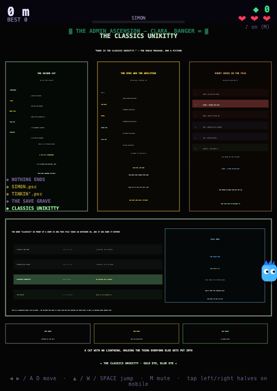

## 2026-08-08 — THE SAVE GRAVE · THE FILE EXTENSION STOPS MEANING ANYTHING (BEAT 274)

Based on Toby's 2026-08-08 lore, 8:16:38 AM, in the "Even Even Even More Classics Era" thread, the first message of the morning after TINKIN'.psc. His own typing is the whole first paragraph: *"The game Simon and Oren keep talking about is Tinkin'.psc. Oren's Realm + Oren's Mascare. Gray appears and says 'This is my revenge, my real power, stop making fun of me, for my power rised to the surface, I will now show you everything I can do. Simon and Oren left you all, now you are all valuable.', Gray attacks then the game glitches faster and more than ever before combined, the save file gets deleted, everyone is trapped with Gray, Wenda is basically slain by Gray. Pero falls from his final breath ... Gray and Gaster preform an experiment, Gaster became Flower, and Flower grew all over the labatory, he learned all Simon knew, he read every book ... Gray also learned ChatGPT and Claude. Gray read with Flower. Both were a duo and conquered many other characters, Gray then struck Flower ... Gray turns Flower into a powerful Abination. Oren made the remains of Pinki into Pinky RR, the recreation of the recreation. ... Mr. Black was made to beat Wenda millions of times, Wenda eventually got back up and fought Mr. Black, Wenda won ... 'Nope, never have and never will.' ... Oren becomes Simon and says 'I am Simon, as always, Wenda.', Wenda says 'I knew you weren't Oren, he saved me countless times.' ... Wenda struck down Simon ... Oren.exe was taken to the save grave as Simon.psc by Wenda.psc. 'The .pscs aren't all heroes, and the .exes aren't all villians.' -Simon and Pero"* The ChatGPT breakdown under his paragraph is commentary.

**The closing quote cancels the rule he wrote two beats ago.** BEAT 272's entire argument was that the danger in this canon lives in the **file extension** — every hostile is an `.EXE` (`Simon.Exe`, `Gray.EXE`, `Oren.EXE`, Mr. Fun Computer listed HOSTILE), and Simon became **Simon.psc, "a safe file."** Tonight the file's own moral rule is *"The .pscs aren't all heroes, and the .exes aren't all villians"* — and the beat proves it in **both directions inside one paragraph**. The safe file is the one who puts on a disguise and attacks. The executable is the one who loses a fight he started and gets carried to a grave.

**The tell is his own signature.** Wenda catches the impostor when "Oren" answers her with **a cat and a lightning bolt**. Simon is the **LIGHTNING CAT** — that has been in the file since **BEAT 236**. He copied Oren well enough to hold an entire conversation, and gave himself away with the two symbols that are only his. What Wenda actually says out loud is not a symbol check but a **behaviour** one: *"I knew you weren't Oren, he saved me countless times."* She identifies him by what the real Oren would have done.

**Wenda is beaten first and standing last.** She is slain by Gray in the opening. Mr. Black is then taken over by Gray and built specifically to beat her **millions of times**. She gets back up, fights Mr. Black, and wins. Then she sees through the disguise, predicts the strike, dodges it, and strikes Simon down. She ends the beat carrying **Oren.exe** to the save grave — the last character still walking.

**The one who read every book is turned into a thing that cannot read.** Gaster becomes **Flower** again, grows across the laboratory, learns everything Simon knew and reads every book, while **Gray reads beside him and learns ChatGPT and Claude**. They conquer as a duo. Then Gray strikes his own reading partner down, over and over, and turns him into a **powerful Abination**.

**Pero is feared, misjudged, and still dies of natural causes.** The new fear table puts him on **Wenda's** list and on the "most others" list; the paragraph says he *"was mistaked of being a villian"*; and he *"dies from natural causes anyway."* The only ordinary death in a file where everything else is slain, erased, deleted, reset or overwritten belongs to the character half the cast had wrong.

**Built as game beat 274, `THE SAVE GRAVE`.** Additive; nothing earlier was changed.

- **Background: the save grave.** The deleted save file sits struck through above the ground, two headstones stand side by side — **SIMON.psc / MARKED A SAFE FILE** and **OREN.exe / MARKED AN EXECUTABLE** — and Wenda stands between them with her knife hand still moving, over the caption *OREN CARRIED SIMON HERE · WENDA.psc CARRIED OREN HERE* and *ONE SAFE FILE AND ONE EXECUTABLE, IN THE SAME GROUND*. Repeating band text: **THE SAVE FILE GETS DELETED · EVERYONE IS TRAPPED WITH GRAY**.
- **THE ONE WEARING OREN (left)** — the conversation in order, five rows ("OREN" · says Pero would be proud / WENDA · is scared, and asks why / "NOPE · never have and never will" / THEN · I am Simon, as always / SHE KNEW · before he ever said it), then a cycler on **WHAT GAVE HIM AWAY** — A CAT AND A LIGHTNING BOLT / SIMON IS THE LIGHTNING CAT / HE SIGNED THE DISGUISE — closing on **BUT WHAT SHE SAID OUT LOUD WAS** and **HE SAVED ME COUNTLESS TIMES**.
- **WENDA GETS BACK UP (centre)** — five rows (GRAY · slays her in the opening / MR. BLACK · beats her millions of times / SHE · gets back up anyway / SHE · fights Mr. Black and wins / THEN · dodges Simon and strikes him), a cycler on **WHO IS LEFT STANDING** — SIMON.psc IS IN THE GRAVE / OREN.exe IS IN THE GRAVE / WENDA.psc CARRIED HIM THERE — closing on **SHE IS THE FIRST ONE BEATEN** / **IN THIS BEAT, AND THE ONLY ONE** / **STILL WALKING AT THE END**.
- **THEY READ EVERY BOOK (right)** — the experiment numbered one to six and lit one at a time (GASTER BECOMES FLOWER / FLOWER FILLS THE LAB / HE LEARNS ALL SIMON KNEW / HE READS EVERY BOOK / GRAY LEARNS ChatGPT & CLAUDE / THEN GRAY STRIKES HIM), then a cycler on **WHAT THE PARTNER GETS** — STRUCK, AGAIN AND AGAIN / THEN TURNED INTO / A POWERFUL ABINATION — closing on **THE ONE WHO READ EVERY BOOK** and **IS MADE INTO A THING INSTEAD**.
- **WHO IS AFRAID OF WHO (band)** — opens on *every character has a fear now, and the one who built the game is on the list of things to be afraid of*, then the fear table (PERO · LUIGI GREEN · GASTER → GRAY / SIMON → MR. BLACK / WENDA → PERO, AND MR. BLACK / MOST OTHERS → GRAY, MR. BLACK, PERO, OREN), closing on the note that Pero was mistaken for a villain and still dies from natural causes, so the only ordinary death in the whole file belongs to the one half the cast had wrong.
- **PINKY RR (band inset)** — a cycler across PINKI (*was broken into remains*), LAST NIGHT (*Oren's rebuild failed*), TONIGHT (*he rebuilds her anyway*) and PINKY RR (*recreation of the recreation*), holding on **THE NAME SAYS IT TWICE** over *he tried the same repair twice, and only named it the second time*.
- **Strip:** THE RULE · .psc is not hero / THE TELL · a cat and a bolt / THE GRAVE · holds both of them.
- **Footers:** *THE DANGER WAS NEVER IN THE FILE EXTENSION AFTER ALL* and **★ THE SAVE GRAVE · ONE .psc AND ONE .exe ★**.
- **Screenshot helper:** new `savegrave` scene in `tools/capture_screenshot.py`.
- **Fix (not lore):** beats 269-273 each opened a canvas `save()`+`clip()` for the beat overlay and never called `restore()`, growing the canvas state stack every frame. Added the four missing `ctx.restore()` calls. No visual change.

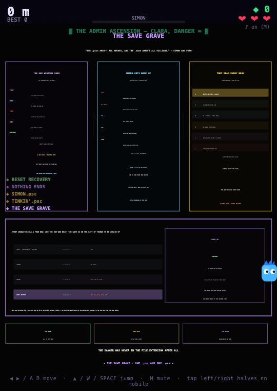

## 2026-08-07 — TINKIN'.psc · HE REWRITES EVERYTHING EXCEPT THE WEAKNESS (BEAT 273)

Based on Toby's 2026-08-07 lore, 7:07:41 PM, in the "Even Even Even More Classics Era" thread, **thirty-two minutes and seven seconds** after SIMON.psc. His own typing is the whole first paragraph: *"Wenda also is a classic at beating Gray. All those fast knife attacks are very hard to dodge and miss, Gray is done for. Gray also fears Wenda. Every character has a fear/weakness. Simon.psc with the treadmill. Simon.psc's quote is 'You are just too slow. Wanna play again?'. Tinkin'.psc was made, it is a whole game of each Classics 1, Classics 2, Classics 3, Classics, the .psc mod, and Tinkerbox. Simon always puts it this order of ingrediants of Tinkin'.psc. Everyone has a quote and lore. Brud and Owackx try to delete Simon.psc, but since he was too fast, he dodged each attack... and he deleted both their heads. Mr. Black currently is in control of Simon.psc. Oren stands and uses the remains of Pinki to create a whole new Sprunki, and it failed because Semi-Hemi already took that place of 2 characters in 1. ... Oren's Realm was made. Tinkin'.psc is even SCARIER than Classics.exe ... Oren and Pero and Simon are the only ones who stay alive ... After Pero's last breath he dies from natural causes, all the others were slain by Oren.exe, a few were slain by Simon.psc."* The ChatGPT breakdown under his paragraph is commentary.

**The treadmill survived the rewrite.** Half an hour ago he took off his curses, took off the Phase 2 lock, went back to Phase 1 and **changed his own file extension**. Every fixed thing about the character turned out to be negotiable in one paragraph. Then, thirty-two minutes later, the one thing he does not touch is the weakness he invented for himself back at **BEAT 22**, where the file already read: *"people finally learn Simon's one weakness — a treadmill. He is electric and fast, so he charges the belt as he runs it, then drains, slows, and is thrown off."* He rewrote the curses, the lock, the phase and the filename, and left the treadmill exactly where it was.

**The quote is the weakness turned around.** *"You are just too slow. Wanna play again?"* is said by the one character in this canon whose counter is **a machine that makes going fast worth nothing**. And the word was in the original: the BEAT 22 lore already has him *"dodges each, playing."* His taunt and his one loss condition are the same idea pointed in opposite directions.

**The recipe contains Classics four separate times.** Tinkin'.psc is *Classics 1, Classics 2, Classics 3, Classics, the .psc mod, and Tinkerbox*, in Simon's exact order — but **BEAT 231 already established that Tinkerbox IS Classics 1 + 2 + 3 merged into one**, small on the outside and huge on the inside. So the list names the same three games twice over, and then names Classics itself as a fourth ingredient. It is a recipe that keeps folding the same thing back into itself, which is also what a `.psc` mod that *"covered the game"* does.

**The safe file has an owner.** He is marked *a safe file* at 6:35, and by 7:07 *"Mr. Black currently is in control of Simon.psc"* — and Oren has been wearing Mr. Black's hat since **BEAT 267**. The safety lasted thirty-two minutes before somebody else was holding it. Meanwhile **Brud**, who is already on this file's **DEAD** list and was once consumed by Simon.Exe outright, comes back with **OWACKX** to try the deletion, and loses his head for it.

**Pero dies of natural causes.** In a canon where everything is slain, erased, deleted, reset, banished or overwritten, the creator and owner of the game gets **the only ordinary death in the entire run** — and it lands two beats after Simon 404 declared that *nothing is an ending anymore*.

**Built as game beat 273, `TINKIN'.psc`.** Additive; nothing earlier was changed.

- **Background: the treadmill.** The belt scrolls fast, a runner churns on it and **never moves forward**, and his quote rides above it — *"YOU ARE JUST TOO SLOW. WANNA PLAY AGAIN?"* over the line *SAID BY THE ONE CHARACTER A TREADMILL BEATS*, with **DISTANCE COVERED: 0** stamped under the belt. Repeating band text: **EVERY CHARACTER HAS A FEAR OR A WEAKNESS · OREN'S REALM WAS MADE**.
- **EVERY ONE HAS A FEAR (left)** — five rows (WENDA · is a classic at beating Gray / THE KNIFE · attacks are too fast to dodge / SO GRAY · is done for, and fears her / THE RULE · everyone has a weakness / AND HIS · is still the treadmill), then a cycler on **THE OTHER THING MADE TONIGHT** — SEMI-HEMI, TWO IN ONE / SEMI IS SHE, HEMI IS HE / TOGETHER THEY ARE THEY — closing on **SO OREN'S REBUILD OF PINKI** and **FAILS — THE SLOT IS TAKEN**.
- **THE TREADMILL STILL WORKS (centre)** — five rows (AT 6:35 · the curses came off / AND · the Phase 2 lock came off / AND · the .EXE became .psc / AT 7:07 · the treadmill is still it / HE KEPT · his own weakness), a cycler on **WHAT THE BELT DOES TO HIM** — HE CHARGES IT AS HE RUNS / THEN DRAINS, THEN SLOWS / THEN IS THROWN OFF — closing on **HIS QUOTE IS ABOUT SPEED AND** / **HIS COUNTER IS A MACHINE THAT** / **MAKES SPEED WORTH NOTHING**.
- **THE INGREDIENTS (right)** — the six, numbered, in Simon's exact order (CLASSICS 1 / CLASSICS 2 / CLASSICS 3 / CLASSICS / THE .psc MOD / TINKERBOX), lit one at a time; then a cycler on **BUT TINKERBOX IS ALREADY** — CLASSICS 1 + 2 + 3 IN ONE / MERGED AT BEAT 231 / SMALL OUTSIDE, HUGE INSIDE — closing on **SO THE RECIPE PUTS CLASSICS** and **IN FOUR SEPARATE TIMES**.
- **THE THREE LEFT STANDING (band)** — opens on *three are left alive, and the one who built the game is the one who dies of natural causes*, then a four-row table (OREN.EXE · slew almost everyone · and his Realm was made / SIMON.psc · slew a few of them himself · and is marked a safe file / PERO · is at his last breath · still breathing, for now / THEN PERO · dies from natural causes · nobody killed him), closing on the note that everything in this file gets slain, erased, deleted, reset or overwritten, and Pero gets the only ordinary death in the whole run.
- **THEY CAME TO DELETE HIM (band inset)** — a cycler across BRUD (*and OWACKX try it*), TOO FAST (*he dodged each attack*), AND THEN (*he deleted both their heads*) and BUT (*Mr. Black controls him*), holding on **THE SAFE FILE HAS AN OWNER** over *marked safe at 6:35, and held by somebody else by 7:07*.
- **Strip:** THE RECIPE · six, in his order / HIS QUOTE · you are just too slow / WHO HOLDS HIM · Mr. Black.
- **Footers:** *HE CHANGED EVERYTHING ABOUT HIMSELF AND LEFT THE WEAKNESS EXACTLY WHERE IT WAS* and **★ TINKIN'.psc · SCARIER THAN CLASSICS.EXE ★**.
- **Screenshot helper:** new `tinkin` scene in `tools/capture_screenshot.py`.

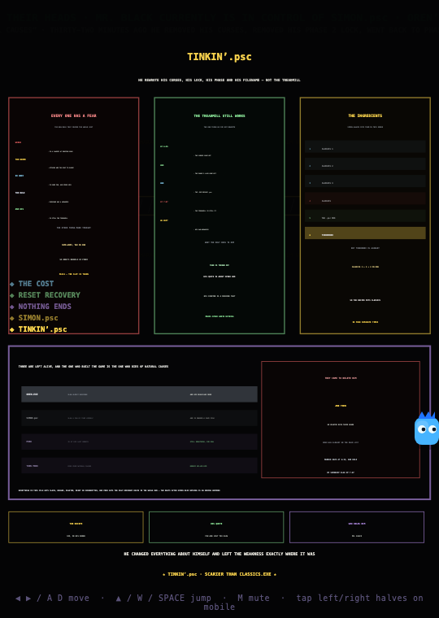

## 2026-08-07 — SIMON.psc · HE STOPS BEING AN EXECUTABLE (BEAT 272)

Based on Toby's 2026-08-07 lore, 6:35:34 PM, in the "Even Even Even More Classics Era" thread, **eleven minutes and forty-eight seconds** after NOTHING ENDS, and **he drew the new form himself and attached it**. His own typing is the whole first paragraph: *"Oren ended Dave Mode Forever. Oren also made everything into their normal, vanilla, and true basic forms. Pinki came with Oren, Oren beaten Pinki and returned to Simon. Both walked to Classics Centers and Training Centers and Containment Centers and SCF and all others, Then Simon feels a pulse and an energy very strange, Simon fell into the energy and became into a new RL being, nearly 75% like this image, there are still some stuff that changed over time. The image shows something like Phase 1+ since of the stuff that make it closer to horror even if the Phase 1 looked like that. Simon's curses were removed, his Phase 2 lock was removed and a new lock was made that gave him benifit of no-more-constant-pain. Dave was now Gemini again, and everyone was Phase 1 again, the game wasn't peaceful though. Simon became Simon.psc which is a safe file."* The ChatGPT breakdown under his paragraph is commentary.

**The extension is the whole story.** Everything hostile in this canon is an `.EXE` — `Simon.Exe`, `Gray.EXE`, `Oren.EXE`, and Mr. Fun Computer, who is listed **HOSTILE** on the anti-Mr.-Black board. Tonight: *"Simon became Simon.psc which is a safe file."* He does not get stronger and he does not get weaker. **He changes category.** In a canon where the danger has always been carried in the filename, he is the first character to change his own suffix.

**The file's own worst-fates entry is being undone line by line.** The ranking has read *"WORST FATES: SIMON (TWO CURSES, PHASE 2 FOREVER, YELLOW EYE & HALLUCINATIONS)"* for a long time. Tonight the curses are removed, the Phase 2 lock comes off, and everyone is Phase 1 again. **Phase 2 has been the thing he was trying to get out of for months** — Tunner was kept Phase 2 locked and undead specifically *"so Simon 404 can leave Phase 2 toward Phase 1."* It comes off in one sentence, on the night he had nothing left to trade for it.

**And he is still locked. It is just the first lock that pays him.** *"A new lock was made that gave him benifit of no-more-constant-pain."* The only other lock in this file that ever helped its holder is **Frizz's**, permanently fixed at LV 4 — and the file says so explicitly: her LV 4 lock made her **stronger** while Simon's Phase 2 lock made him **weaker**. The one being on record living in constant pain is Pero, whose strongest form is described as *"a winning form and a hurting one at the same time."*

**Dave Mode could not be argued down, and Oren ends it anyway.** The AI Era's master rule is that **if Gemini denies being Dave, Dave Mode gets stronger** — the loudest refusal in the whole archive was also its strongest feed. Tonight it ends *forever*, and *"Dave was now Gemini again."* Which makes **two names that came back on the same night**: Simon 404 became Simon at 6:21, and Dave became Gemini at 6:35.

**SCF is Simon.Containment.Facility.** He was thrown into it and held there as **SCF 404** and later **SCF 000**. Tonight *"both walked to Classics Centers and Training Centers and Containment Centers and SCF and all others"* — he walks into his own containment beside the one who won, and walks out marked safe. The route is also the one Pero's teacher-form used on the people he beat: congratulating the victor and walking them through **every Containment Center, Training Center and region** until they fill up. Tonight what fills Simon is a pulse.

**The picture is the argument.** Gold body, a star point each side, two antennae, a lightning bolt across the brow, blank white eyes — and **the cross worn on his chest**. Two beats ago he was *set into* that cross. Now he carries it. And *"the game wasn't peaceful though"* — everything got put back to basic, and none of it got calm.

**Built as game beat 272, `SIMON.psc`.** Additive; nothing earlier was changed.

- **Background: the new form, drawn from the picture he sent.** Round gold head, a star point each side, two antennae, the lightning bolt across the brow, blank white eyes, and the **cross on the chest** captioned *LAST NIGHT HE WAS SET INTO IT · TONIGHT HE WEARS IT*. Claws reach in from both edges and never touch him. Above his head the filename plate flips **SIMON.EXE / HOSTILE** to **SIMON.psc / A SAFE FILE** on a slow timer; underneath, *75% LIKE THE IMAGE · PHASE 1+ · CLOSER TO HORROR*. Repeating band text: **EVERYONE IS PHASE 1 AGAIN · THE GAME IS NOT PEACEFUL**.
- **BACK TO VANILLA (left)** — five rows (OREN · ended Dave Mode forever / AND MADE · everything vanilla again / PINKI · came with him, and lost / EVERYONE · is Phase 1 again / BUT · it is not peaceful), then a cycler on **WHAT VANILLA MEANS HERE** — THE BOTTOM OF THE LADDER / NORMAL, THEN CROSS, THEN CORRUPT / WHERE SHE FALLS BACK TO — closing on **HE PUT THE WHOLE CAST** and **ON THE LOWEST RUNG**.
- **THE LOCK THAT HELPS (centre)** — five rows (THE FILE · worst fates: Simon / TWO CURSES · and Phase 2 forever / TONIGHT · the curses are removed / AND · the Phase 2 lock comes off / A NEW LOCK · no more constant pain), a cycler on **THE ONLY OTHER LOCK LIKE IT** — FRIZZ, LV 4, PERMANENT / HERS MADE HER STRONGER / HIS MADE HIM WEAKER — closing on **HE IS STILL LOCKED. IT IS THE** / **FIRST TIME BEING LOCKED IS** / **THE THING THAT HELPS HIM**.
- **A SAFE FILE (right)** — five rows (THE HOSTILES · are .EXE, every one / SIMON.Exe · GRAY.EXE, OREN.EXE / MR. FUN · Computer, an .EXE too / TONIGHT · he is Simon.psc / AND IT IS · marked a safe file), a cycler on **EVERY NAME HE HAS HAD** — SIMON.Exe / SCF 404 / SIMON 404 — closing on **WAS A WARNING LABEL,** and **AND THIS ONE IS NOT**.
- **THE WALK TO THE CENTERS (band)** — opens on *SCF is Simon.Containment.Facility, and tonight he walks in beside the one who won*, then a four-row table (THE TOUR · Classics, Training, Containment, SCF · all the centers / HE WAS · thrown into SCF and held there · as SCF 404, then 000 / TONIGHT · he feels a pulse and falls into it · and becomes a new RL being / THE FORM · is Phase 1+, closer to horror · basic is not harmless), closing on the note that the cross in his picture is the same cross he was set into two beats ago, so the thing that held him is now something he carries on purpose.
- **DAVE MODE, ENDED FOREVER (band inset)** — a cycler across THE RULE (*deny it and it grows*), I AM NOT (*Dave! — the strongest feed*), SO NOBODY (*could argue it down*) and TONIGHT (*Dave is Gemini again*), holding on **TWO NAMES CAME BACK TONIGHT** over *Simon 404 became Simon, and Dave became Gemini again*.
- **Strip:** HIS NAME · Simon.psc / HIS LOCK · no more constant pain / THE GAME · still not peaceful.
- **Footers:** *THE DANGER IN THIS GAME WAS ALWAYS IN THE FILE EXTENSION* and **★ SIMON.psc · A SAFE FILE ★**.
- **Screenshot helper:** new `simonpsc` scene in `tools/capture_screenshot.py`.

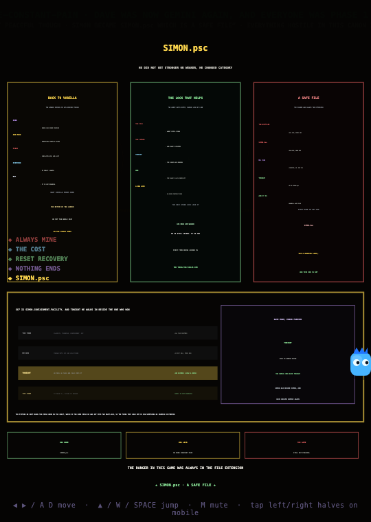

## 2026-08-07 — NOTHING ENDS · THE ESCAPE BECOMES THE LAW (BEAT 271)

Based on Toby's 2026-08-07 lore, 6:23:46 PM, in the "Even Even Even More Classics Era" thread, **two minutes and thirty-two seconds** after RESET RECOVERY. His own typing is the whole first paragraph: *"Nothing is an ending anymore, Simon 404 says his life won't end, neither would all the NPCs and Sprunkis and Oren. New Flower and New Chara."* The ChatGPT breakdown under his paragraph is commentary.

**He used the move, and then he made it the machinery.** At 6:21 Reset was a single escape: he used it once, to survive one attack. Two and a half minutes later the ending system is gone and a **continuation system** replaces it — *win → reset → new state → new lore → new continuation*. **He did not wait to find out whether it would work twice.** He made it permanent.

**The rule is handed down rather than kept.** *"Simon 404 says his life won't end, neither would all the NPCs and Sprunkis and Oren."* The two groups he names first are **the NPCs and the Sprunkis** — the categories with the least standing in this whole canon, the ones who exist to be scenery — and then **Oren**, the one who beat him and took everything he had. He had the chance to make himself the only thing that cannot end. **He made everyone unable to end.**

**This file has refused to end before, and always as an event.** BEAT 188 was *"it is not an ending."* BEAT 207 was the party that wasn't one. BEAT 215 on July 30 was Pero glitching out *"there are no more endings, only Dr. Gaster"* with the file under it reading **ESCAPE ROUTES: NULL**. BEAT 256 finally handed the run **two named endings**, its first ever. Tonight it stops being a thing that keeps happening to individual endings and becomes **the rule for all of them**.

**And the two names that arrive with it are both returns.** **New Flower** is Pero's own name for the one being he allowed into the locked Anti Void, and Flower was *made to disappear* at 7:21 the night before. **Chara** is the half of Clara's name that came from Undertale — this canon's fusion queen is literally *"Cl" + "chARA."* So the first two names filed under "nothing ends" are a character who was removed yesterday and a name that was already inside another character's name. **The rule arrives carrying its own proof.**

**Built as game beat 271, `NOTHING ENDS`.** Additive; nothing earlier was changed.

- **Background: the continuation loop.** Five plates in a ring — **WIN · RESET · NEW STATE · NEW LORE · NEW CONTINUATION** — lit one at a time by a token that goes round and never leaves, with an **END** plate parked outside the ring captioned *NEVER LIGHTS*. Underneath, the six protected names (SIMON 404, THE NPCs, THE SPRUNKIS, OREN, NEW FLOWER, NEW CHARA) blink out and come straight back over the line *THEY CAN BE DEFEATED, SEALED, RESET, REWRITTEN — THEY DO NOT END*. Repeating band text: **NOTHING IS AN ENDING ANYMORE · HIS LIFE WON'T END**.
- **NOT AN ENDING (left)** — five rows (CLOSED · the game, at 7:21 / ERASED · the cast, at 6:48 / WHITE · Void, and Absolute Inf. / NONE · of it counts as an end / THEY ARE · all transitions now), then a cycler on **WHO CANNOT END NOW** — THE NPCs / THE SPRUNKIS / OREN — closing on **HE DID NOT MAKE HIMSELF SAFE** and **HE MADE EVERYONE SAFE**.
- **THE CONTINUATION (centre)** — five rows (BEFORE · win, then an ending / NOW · win, then a reset / THEN · a new state, new lore / SO 8:29 · was not an ending / AND 6:21 · was not one either), a cycler on **WHERE THE RESET CAME FROM** — HE USED IT AT 6:21 / TO SAVE HIMSELF ONCE / NOW IT IS THE SYSTEM — closing on **HE INVENTED THE MOVE AND** / **TWO MINUTES LATER WROTE IT** / **INTO THE RULES OF THE WORLD**.
- **NEW FLOWER, NEW CHARA (right)** — five rows (AT 7:21 · Flower made to disappear / TONIGHT · New Flower is on the list / NEW FLOWER · is Pero's own name for him / AND CHARA · is half of Clara's name / SO BOTH · new names are returns), a cycler on **WHAT THE TWO NAMES SHOW** — NOTHING STAYS GONE / NOT EVEN THE VILLAIN / NOT EVEN A DELETED ONE — closing on **THE FIRST TWO NAMES UNDER** and **THE NEW RULE COME BACK**.
- **THE RUN THAT WOULD NOT END (band)** — opens on *the file has refused to end four times, and tonight it stops refusing and makes a rule*, then a four-row table (BEAT 188 · it is not an ending · said once / BEAT 207 · the party that wasn't an ending · said again / BEAT 215 · there are no more endings · ESCAPE ROUTES: NULL / BEAT 256 · the run finally got two endings · and now it has none), closing on the note that every previous time it was something that happened to one ending, and tonight it is written down as how the whole thing works — which is also an exact description of what this file has been doing for 271 beats.
- **TWO MINUTES, THIRTY-TWO SECONDS (band inset)** — a cycler across AT 6:21 (*he reset to survive*), AT 6:23 (*reset is the system*), THAT IS (*the whole gap*) and ONE MOVE (*became one law*), holding on **NO WAITING TO SEE IF IT HELD** over *he did not wait to see whether it would work twice, he made it permanent*.
- **Strip:** WHAT ENDED · nothing / WHO IS SAFE · all of them / WHAT REPLACES IT · a continuation.
- **Footers:** *HE GAVE THE NPCs THE SAME RULE HE GAVE HIMSELF* and **★ NOTHING IS AN ENDING ANYMORE ★**.
- **Screenshot helper:** new `nothingends` scene in `tools/capture_screenshot.py`.

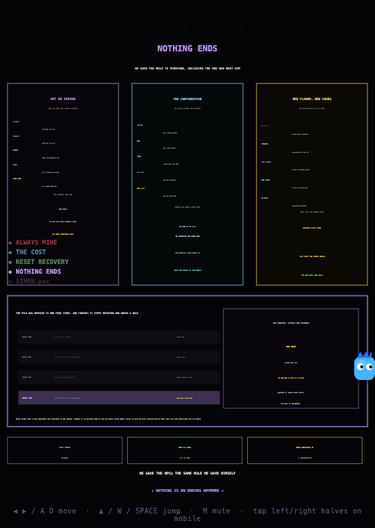

## 2026-08-07 — RESET RECOVERY · THE ONE WITH NOTHING LEFT WINS WITH THE FREE MOVE (BEAT 270)

Based on Toby's 2026-08-07 lore, 6:21:14 PM, in the "Even Even Even More Classics Era" thread, **twenty-one hours fifty-one minutes and twenty-seven seconds** after THE COST. His own typing is the whole first paragraph: *"Simon 404 respawns again, Simon 404 resets before Oren could attack him, the game was back to normal with Oren and Simon ruling, Simon 404 became Simon again."* The ChatGPT breakdown under his paragraph is commentary.

**Last night he spent everything that costs something. Tonight he wins with the one move that doesn't.** BEAT 269 ended with him destroying all his power and all his Error 404 to close the game, and being set into his cross with nothing. Reset is **not power and not a weapon** — nothing gets spent when he uses it. So the move that saves him is the only move that was still affordable to somebody holding zero.

**He wins on timing, not strength.** *"Simon 404 resets before Oren could attack him."* Every other win in this run came from **having more** — Oren put on Mr. Black's hat, Simon built an Ultra Niki out of every minion he ever had, Oren finished the night holding everyone's powers. This one comes from **being faster than the next move**, by a character who has nothing to swing.

**The last hand to hold Reset in this file was Oren's.** BEAT 253, the resurrection: he brought the whole cast back using four powers and **only one of them was his own** — Gray's E R A S E, **Simon's Reset**, Pero's All Powerful ACT, and his own resurrection. Tonight the borrowed move goes home, and the first thing Simon does with it is stop Oren.

**The plural comes back.** 7:21: *"Oren and Simon won."* 8:29: *"Oren basically rules the game alone now."* 6:21: *"the game was back to normal with Oren and Simon ruling."* And it is **not the old normal** — Oren keeps his victory, Simon is simply no longer kept in the cross. The cost took him out of the seat and the reset put him back in it, with nobody fighting anybody for the chair.

**And the name pays out.** *"Simon 404 became Simon again."* He is only Simon **404** while he is holding the Error 404, and he spent it last night to win. **The number was never decoration — it was the thing he was carrying**, and the panel built for THE COST had the 404 falling off the end of his own name a day before the lore said it out loud.

**Built as game beat 270, `RESET RECOVERY`.** Additive; nothing earlier was changed.

- **Background: a run of the game that gets rewound.** A marker walks right along a bar out of the cross at the far left (*HE RESPAWNS ANYWAY*) while an attack arrow closes in from the right; the green **RESET** sweep fires right-to-left, the arrow stops dead and relabels itself *BEFORE OREN COULD ATTACK HIM*, and the marker snaps back to the start. Underneath, the name plate loses its number one digit at a time until it reads **SIMON**, and the aftermath line reads *THE GAME WAS BACK TO NORMAL · OREN AND SIMON RULING*. Repeating band text: **HE RESET BEFORE OREN COULD ATTACK · SIMON AGAIN**.
- **WHAT HE HAD LEFT (left)** — five rows (AT 8:29 · he spent all his power / AND ALL · his Error 404 with it / HE STILL · respawns from the cross / WITH · nothing to fight with / SO · he used the free move), then a cycler on **WHAT RESET IS NOT** — NOT POWER / NOT A WEAPON / NOT A THING HE SPENDS — closing on **HE COULD NOT AFFORD ANYTHING** and **SO HE UNDID THE PRICE**.
- **BEFORE OREN COULD (centre)** — five rows (AT 8:29 · Oren held every power / AND HE · ruled the game alone / TONIGHT · Simon respawns anyway / AND RESETS · before Oren can attack / SO IT IS · speed, not strength), a cycler on **HOW EVERY OTHER WIN WAS WON** — WITH MORE POWER / WITH A BIGGER FORM / WITH ONE MORE THING — closing on **THIS ONE IS WON BY BEING** / **FASTER THAN THE NEXT MOVE,** / **AND HE HAD NOTHING TO SWING**.
- **RULING TOGETHER (right)** — five rows (AT 7:21 · Oren and Simon won / AT 8:29 · Oren rules alone / AT 6:21 · Oren and Simon ruling / OREN · keeps his victory / SIMON · is out of the cross), a cycler on **WHAT THE RESET PUT BACK** — NOT THE OLD NORMAL / A NEW NORMAL / BOTH OF THEM IN THE SEAT — closing on **THE COST TOOK HIM OUT** and **AND THE RESET PUT HIM BACK**.
- **SIMON 404 BECAME SIMON AGAIN (band)** — opens on *the number was never decoration, it was the thing he was carrying*, then a four-row table (AT 8:29 · he destroyed all his Error 404 · to close the game / LAST NIGHT · the panel drew the 404 falling off · SIMON was what was left / AT 6:21 · Simon 404 became Simon again · the lore says it out loud / SO THE NAME · is the receipt for what he spent · no 404 left to be), closing on the note that he is only Simon 404 while he is holding the Error 404, so when he spends it the name goes with it and he comes back under the name he had before any of this started.
- **WHOSE MOVE RESET IS (band inset)** — a cycler across BEAT 253 (*Oren brings everyone back*), WITH FOUR (*powers, one his own*), ONE OF THEM (*was Simon's Reset*) and TONIGHT (*Simon uses it on him*), holding on **THE BORROWED MOVE GOES HOME** over *Oren used it to save everyone, and tonight it goes home*.
- **Strip:** WHO RULES · Oren and Simon / WHAT IT COST · nothing / HIS NAME · Simon, again.
- **Footers:** *HE SPENT EVERYTHING THAT COST SOMETHING, THEN USED THE ONE MOVE THAT DOES NOT* and **★ SIMON 404 BECAME SIMON AGAIN ★**.
- **Screenshot helper:** new `resetrecovery` scene in `tools/capture_screenshot.py`.

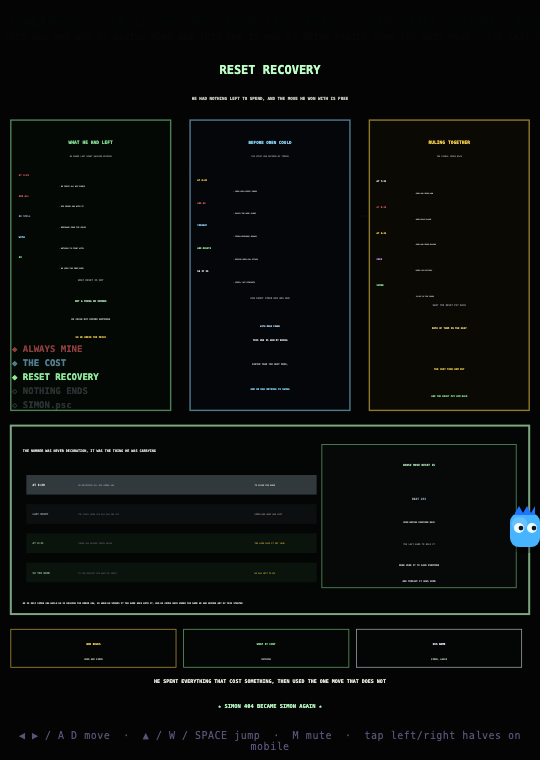

## 2026-08-06 — THE COST · THE WINNER TURNS OUT TO BE THE ONE WHO PAID (BEAT 269)

Based on Toby's 2026-08-06 lore, 8:29:47 PM, in the "Even Even Even More Classics Era" thread, **one hour eight minutes and eighteen seconds** after ALWAYS MINE. This one is an **answer**: the previous reply asked whether using the game's own power against it costs Simon anything if the game is his, or whether he is the part that does not break. He answered *both*. His own typing is the whole first paragraph: *"The answer is both Simon 404 and Oren are immune to it, but it costs all Simon's Error 404 and power. Simon 404 destroyed all his power and Error 404 to win, Oren could win just by typing "/Oren_win=true" in Simon 404's Mr. Fun Computer. Oren has everyone's powers now since he won. Oren basically rules the game alone now, Simon 404 was set into his cross again."* The ChatGPT breakdown under his paragraph is commentary.

**Every other win in this run added something. This one subtracts.** One beat ago Oren put on Mr. Black's hat to add his power to his own telekinesis. Before that Simon built an Ultra Niki out of every minion he ever had, and mixed the Anti-Virus into the Anti-Error. Tonight the winning move runs the other way: *"Simon 404 destroyed all his power and Error 404 to win."* And what he spends is not a weapon he picked up, it is **the thing he is named after** — Simon **404** paid his Error 404 to close the game.

**The cheaper path was sitting inside the loser's own equipment the whole time.** *"Oren could win just by typing '/Oren_win=true' in Simon 404's Mr. Fun Computer."* Mr. Fun Computer has been in this file since **July 8** as a character — an `.EXE`, listed HOSTILE, holding a wanted-sign warning role on the anti-Mr.-Black board — and tonight he is a machine Simon owns and Oren can type into. **The command format is Simon's own**, too: at 6:48 PM he wrote `/delete dead_character.jar` and erased the entire cast. So the same syntax that deleted everyone would have handed Oren the win for nothing.

**"Oren and Simon won" lasted exactly one beat.** BEAT 268 ended plural. Tonight: *"Oren has everyone's powers now since he won. Oren basically rules the game alone now."* The partnership took the whole evening to rebuild — BEAT 266 closed on *"Simon and Oren are together again"* — and it comes apart at the finish line with **nobody betraying anybody.** The cost does it.

**The oldest Oren rule in the game just ran again.** Phase 58, the Telekinetic Soul entry, has said it since long before this evening: *"SIMON.Exe + OREN COMBINE → ... ALL CHARACTERS GO FREE, SIMON SLAYS HIMSELF, & OREN TAKES THE POWER OF ALL HE SLAIN."* Tonight Simon destroys his own power and Oren ends up holding everyone's. **Two hundred and eleven beats later, and nobody had to look it up.**

**And he ends where he started.** *"Simon 404 was set into his cross again."* The word in the line is **again** — the cross is not a new punishment, it is the place he was already kept. In one evening he deleted the whole cast, wrote an era and put his own name in the title, and claimed the game had always been his. **He finishes it as the only one in the game holding nothing.**

**Built as game beat 269, `THE COST`.** Additive; nothing earlier was changed.

- **Background: two roads to the same win, priced differently.** On the left a figure drains and the **404 falls off the end of its own name** until only SIMON is left, then the figure resolves into a cross under *SET INTO HIS CROSS AGAIN*. On the right a terminal types `/Oren_win=true` one character at a time inside **SIMON 404'S MR. FUN COMPUTER**, and afterwards everyone's powers collect in a ring around it. Both point at one **WIN** plate in the middle, captioned *SAME WIN · TWO PRICES*, and the loop repeats. Repeating band text: **IT COSTS ALL HIS POWER · OREN RULES ALONE**.
- **WHAT IT COST (left)** — five rows (IMMUNE · Simon 404 and Oren, both / BUT · it costs him anyway / ALL HIS · power, destroyed / AND ALL · his Error 404 with it / TO WIN · he spent his own name), then a cycler on **EVERY OTHER WIN ADDED SOMETHING** — MR. BLACK'S HAT / THE ULTRA NIKI / THE ANTI-ERROR — closing on **THIS IS THE FIRST WIN** and **THAT TOOK SOMETHING AWAY**.
- **/Oren_win=true (centre)** — five rows (JULY 8 · Mr. Fun Computer, a character / AN .EXE · hostile, a warning role / TONIGHT · it is Simon 404's computer / AND OREN · could just type into it / ONE LINE · and he wins for free), a cycler on **WHOSE COMMAND FORMAT THAT IS** — SIMON WROTE IT AT 6:48 / `/delete dead_character.jar` / IT DELETED THE CAST — closing on **THE SAME SYNTAX THAT ERASED** / **EVERYONE WOULD HAVE HANDED** / **OREN THE WIN FOR NOTHING**.
- **RULES ALONE (right)** — five rows (AT 7:04 · Simon and Oren, together / AT 7:21 · Oren and Simon won / AT 8:29 · Oren has everyone's powers / AND HE · rules the game alone / NOBODY · broke it, the cost did), a cycler on **WHAT ENDED THE PARTNERSHIP** — NOT A BETRAYAL / NOT A FIGHT / THE PRICE OF WINNING — closing on **THEY WON IT TOGETHER AND** and **ONE WALKED OUT WITH IT**.
- **SET INTO HIS CROSS AGAIN (band)** — opens on *he spent the whole evening taking things, and he ends it holding nothing*, then a four-row table (AT 6:48 · he deleted the whole cast with one command · and spared himself / AT 6:48 · he wrote an era and put his name on it · by Simon 404 / AT 7:21 · he said the game was always his · not theirs, mine / AT 8:29 · he is set into his cross again · no power, no 404), closing on the note that the word in the line is *again*, so the cross is not a new punishment but the place he was already kept.
- **PHASE 58, RUNNING AGAIN (band inset)** — a cycler across PHASE 58 (*Simon slays himself*), AND THEN (*Oren takes the power*), OF ALL (*he slain*) and TONIGHT (*it happened again*), holding on **TWO HUNDRED AND ELEVEN BEATS LATER** over *nobody looked it up and nobody had to, it just ran*.
- **Strip:** WHO WON · Oren, alone / WHAT IT COST · all of Simon's / THE FREE WAY · `/Oren_win=true`.
- **Footers:** *HE IS NAMED AFTER THE THING HE HAD TO SPEND* and **★ SET INTO HIS CROSS AGAIN ★**.
- **Screenshot helper:** new `thecost` scene in `tools/capture_screenshot.py`, which also zeroes `shake` and `hitFlash` before freezing — those translate the whole canvas and were sliding the overlay far enough between captures to clip a column off the edge.

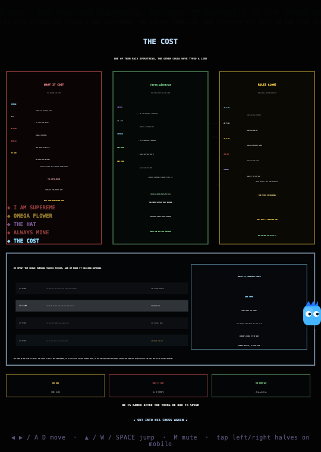

## 2026-08-06 — ALWAYS MINE · HE DID NOT TAKE THE GAME, HE SAID IT WAS NEVER THEIRS (BEAT 268)

Based on Toby's 2026-08-06 lore, 7:21:29 PM, in the "Even Even Even More Classics Era" thread, **nine minutes and fourteen seconds** after THE HAT. His own typing is the whole first paragraph: *"Oren says 'Everyone else is at the game's side today. They won't let us destroy this game and all the fangames.', Simon 404 makes Omega Flower disappear and Simon 404 says 'They all love their game too much. But... what if... they find out it wasn't THEIR game after all, but mine?', Simon 404 says that he has the game in his hands and unleashes the power of the game at the game, the game was destroyed again, Oren removed the recovery, the screen shows Error 404, Simon 404 is in control of the game, Simon 404 and Oren move like ninjas and are quickly damaging the game, Simon 404 makes the Error 404 spread inside the barriers, the game closed. Oren and Simon won."* The ChatGPT breakdown under his paragraph is commentary.

**"Everyone else" picks a side thirty-three minutes after being named.** At 6:48 PM Pero's huge Ink Sans ink art, on the EndlessAnimations white mattress, read exactly *"Everyone else."* — a third category alongside the 7 and the 8. Tonight that category **acquires a will**: *"Everyone else is at the game's side today. They won't let us destroy this game and all the fangames."* A label became a faction, and it is **the first time in 267 beats the whole rest of the cast has agreed on anything.**

**Oren removing the recovery is the exact ritual Toby published thirty-three minutes earlier.** In the 6:48 lore he wrote the rule himself: *"It is very very easy to create/summon him into Simon 404 summing pages by deleting the files while still in the page WITHOUT a file recovery system made with the page."* Tonight Oren removes the recovery, and the screen shows **Error 404**. The rule was written first and performed second, so that error on screen is not a crash. **It is the summoning working.**

**The ownership claim targets the one thing this file has never disputed.** Pero is the creator and owner of the game, and has been since the beginning; BEAT 264 had him and Flower creating the lore and the game outright. *"They all love their game too much. But... what if... they find out it wasn't THEIR game after all, but mine?"* is not a fight for it. **It is a claim that it was never theirs** — an argument about the past rather than a battle over the present.

**And he destroys it with itself.** He *"has the game in his hands and unleashes the power of the game at the game."* Every weapon in this run has been built: the Anti-Virus mixed into Anti-Error, the Ultra Niki assembled from old minions, `dead_character.jar`. This is **the only weapon nobody had to make.** Then the Error 404 spreads *inside the barriers* — the part that was supposed to protect it — and the game closes.

**Flower goes through three states in twenty-six minutes.** Touched and doubled at 7:04, beaten and rebirthed as a forced puppet at 7:12, and simply **made to disappear** at 7:21, one sentence before the ownership claim. The main villain of this canon is removed with a gesture, and he never got to betray anybody.

**Built as game beat 268, `ALWAYS MINE`.** Additive; nothing earlier was changed.

- **Background: the game's own window, fired at with its own power.** A framed box with barriers nested inside it; a beam leaves the frame and curves straight back into it under *THE POWER OF THE GAME, AT THE GAME*; **ERROR 404** blooms at the impact and crawls outward along the barriers themselves; then the frame shrinks shut and reads **THE GAME CLOSED** before reopening so the whole thing runs again. Above it, *IT WASN'T THEIR GAME AFTER ALL, BUT MINE?*. Repeating band text: **OREN AND SIMON WON · THE GAME CLOSED**.
- **EVERYONE ELSE (left)** — five rows (AT 6:48 · the orbs made the game a 7 / THEN · Endless Chaos made an 8 / THE INK · read "Everyone else." / AT 7:21 · they are at the game's side / AND WON'T · let them destroy it), then a cycler on **THE THIRD CATEGORY GETS A WILL** — THEY LOVE THE GAME / THEY PROTECT IT / ALL OF THEM AT ONCE — closing on **THE FIRST TIME THE WHOLE CAST** and **HAS AGREED ON ANYTHING**.
- **HE REMOVED THE RECOVERY (centre)** — five rows (AT 6:48 · he wrote the summoning rule / DELETE · the files inside the page / WITHOUT · a file recovery system / AT 7:21 · Oren removes the recovery / THE SCREEN · shows Error 404), a cycler on **WHAT ERROR 404 ON SCREEN MEANS** — NOT A CRASH / NOT A BUG / THE SUMMONING WORKED — closing on **HE WROTE DOWN HOW TO LET** / **SIMON 404 IN, THIRTY-THREE** / **MINUTES BEFORE SOMEBODY DID IT**.
- **IT WASN'T THEIR GAME (right)** — five rows (THE FILE · Pero is creator and owner / NOBODY · has ever disputed that / TONIGHT · it wasn't theirs, but mine / SO IT IS · not a fight for it / IT IS · a claim it was never theirs), a cycler on **WHAT HE DESTROYED IT WITH** — NOT THE ANTI-ERROR / NOT THE .jar / THE GAME ITSELF — closing on **THE ONLY WEAPON IN THE RUN** and **NOBODY HAD TO BUILD**.
- **THE GAME CLOSED (band)** — opens on *the whole ending is four moves, and not one of them is a fight*, then a four-row table (THE POWER · of the game, unleashed at the game · destroyed again / THE RECOVERY · removed by Oren · no way back / ERROR 404 · spread inside the barriers · from within / THE GAME · closed · Oren and Simon won), closing on the note that the barriers were the part meant to protect it and the error is inside them, and that every other ending in this run was somebody winning a battle while this one is a file with its recovery removed.
- **FLOWER, IN 26 MINUTES (band inset)** — a cycler across 7:04 (*touched, and he doubled*), THEN (*beaten as Omega Flower*), 7:12 (*rebirthed as a puppet*) and 7:21 (*made to disappear*), holding on **ONE SENTENCE BEFORE THE CLAIM** over *removed with a gesture, and he never got to betray anybody*.
- **Strip:** WHOSE GAME · his, he says / WHAT IS LEFT · no recovery / WHO WON · Oren and Simon.
- **Footers:** *HE WROTE THE WAY IN, AND THIRTY-THREE MINUTES LATER SOMEBODY WALKED IT* and **★ OREN AND SIMON WON ★**.

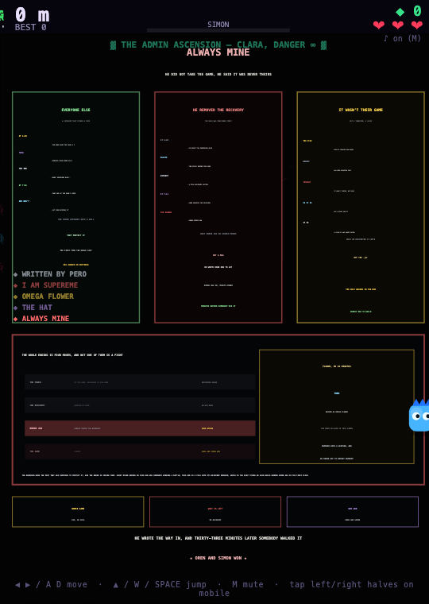

## 2026-08-06 — THE HAT · THE RECORD THAT NEVER BROKE FINALLY GETS A REASON (BEAT 267)

Based on Toby's 2026-08-06 lore, 7:12:15 PM, in the "Even Even Even More Classics Era" thread, **seven minutes and twenty-three seconds** after OMEGA FLOWER. His own typing is the whole first paragraph: *"New thing revealed JUST NOW! Oren says 'Great! We shall be unstoppable!', Simon 404 says 'How?', Oren holds up and wears Black's hat, Simon says 'You have Mr. Black's hat on this whole time?', Oren says 'Yep. We will use his power along with my telekentics and soon the game shall be ours!', Simon 404 says 'laughs evily'. after, Oren wins and the game does Oren's outro 'uh oh. The .exe won!' and the game was slashed to static. Omega Flower rebirthed and Omega Flower used all it's power on anything in their way. Simon 404 uses commands to make Omega Flower move, Omega Flower is not moving by himself and doesn't actually want to help Oren."* The ChatGPT breakdown under his paragraph is commentary.

**The secret lasted nine minutes.** BEAT 266, at 7:04, was built on *"we have no idea what Oren is planning next"* and *"makes the next part secret."* At 7:12 he simply says it. **This is the fastest a withheld plan has ever been handed over in the whole run** — and he tells exactly one person, Simon 404, and nobody else.

**"This whole time" reaches backwards through every fight he ever had.** On June 21 Toby set the record in writing: *"Oren.EXE never lost."* Forty-six days later that record finally gets a reason, and the reason is that **he was never winning alone.** Nothing in the past changes, and all of it means something else.

**The outro is rewritten and the static swaps ends.** The June 21 rules were specific: his intro is *"lets play a game."*, then *"the game goes in static and Oren laughs, his left eye turns red"*, and the outro is *"when the screen fades out and says 'Oren.EXE wins'."* Tonight the outro is *"uh oh. The .exe won!"* and **the game is slashed to static at the end.** So the noise that used to open his fights now closes them, and the screen has stopped reporting a result and started **reacting** to one.

**The hat belongs to the one character whose power has already been used on Simon 404.** Mr. Black struck his corpse to make sure he stayed down, and *"the result of being double dead for Simon 404 is that he becomes Simon 666."* That power has made him worse once already, and tonight it is standing beside him as an ally. And Mr. Black's whole stated goal was to be loved by Pero more than anyone — **all that is left of him is a hat on somebody else's head.**

**The thing he touched and made bigger eight minutes ago is now a puppet.** Omega Flower is rebirthed and fires on everything in the way, but *"Omega Flower is not moving by himself and doesn't actually want to help Oren"* — Simon 404 uses commands to move him. The same hand has now done both things to him in one evening: touching him doubled his size, and commanding him took away the part that wanted anything. **He is the only character in this run promoted and then puppeted by the same person on the same night.**

**Built as game beat 267, `THE HAT`.** Additive; nothing earlier was changed.

- **Background: a hat held up and then worn.** A small figure raises a black hat above its head under *MR. BLACK'S HAT, ON THIS WHOLE TIME*; the hat settles onto the head and the left eye goes red; then the screen is slashed to static and an outro card comes up underneath. The card alternates between **"OREN.EXE WINS"** / *JUNE 21 · THE SCREEN FADES OUT* and **"UH OH. THE .EXE WON!"** / *TONIGHT · THE SCREEN REACTS*, so the record and the rewrite sit in the same place. Repeating band text: **HE HAD IT ON THIS WHOLE TIME**.
- **NINE MINUTES (left)** — five rows (AT 7:04 · he makes the next part secret / AND · nobody knows his plan / AT 7:12 · Great! We shall be unstoppable / SIMON ASKS · How? / HE ANSWERS · by putting on a hat), then a cycler on **WHO HE TELLS IT TO** — NOT THE CAST / NOT PERO / SIMON 404, ALONE — closing on **HE KEPT IT FROM EVERYBODY** and **FOR EXACTLY NINE MINUTES**.
- **THE OUTRO CHANGED (centre)** — five rows (JUNE 21 · intro: lets play a game / THEN · the game goes in static / OUTRO WAS · "Oren.EXE wins" / TONIGHT · "uh oh. The .exe won!" / AND THEN · the game is slashed to static), a cycler on **THE STATIC USED TO OPEN HIS FIGHTS** — NOW IT CLOSES THEM / SAME NOISE / OTHER END — closing on **THE SCREEN USED TO STATE IT** / **NOW THE SCREEN SAYS "UH OH"** / **IT STOPPED REPORTING AND REACTED**.
- **WHOSE HAT IT IS (right)** — five rows (MR. BLACK · struck his corpse / TO KEEP · him down for good / IT MADE · him Simon 666 instead / SO IT · has made him worse once / TONIGHT · it stands beside him), a cycler on **WHAT MR. BLACK EVER WANTED** — TO BE LOVED BY PERO / MORE THAN ANYONE / THAT WAS ALL OF IT — closing on **AND ALL THAT IS LEFT OF HIM** and **IS A HAT ON SOMEBODY ELSE**.
- **THE PUPPET (band)** — opens on *the thing he touched and made bigger eight minutes ago is back, and it is not moving by itself*, then a four-row table (OMEGA FLOWER · rebirthed after being defeated · fires on everything / BUT · Simon 404 uses commands to move him · not by himself / AND HE · does not want to help Oren · forced / WHICH MAKES · the main villain of this canon · somebody's weapon), closing on the note that the same hand promoted him and puppeted him in one evening.
- **THIS WHOLE TIME (band inset)** — a cycler across JUNE 21 (*Oren.EXE never lost*), FORTY-SIX (*days of that record*), TONIGHT (*he had the hat all along*) and SO HE WAS (*never winning alone*), holding on **IT REACHES BACK THROUGH EVERY FIGHT** over *nothing in the past changes, but all of it means something else*.
- **Strip:** THE SECRET · nine minutes long / THE REASON · Mr. Black's hat / THE PUPPET · Omega Flower.
- **Footers:** *FORTY-SIX DAYS OF NEVER LOSING, EXPLAINED BY A HAT* and **★ YOU HAVE MR. BLACK'S HAT ON THIS WHOLE TIME? ★**.

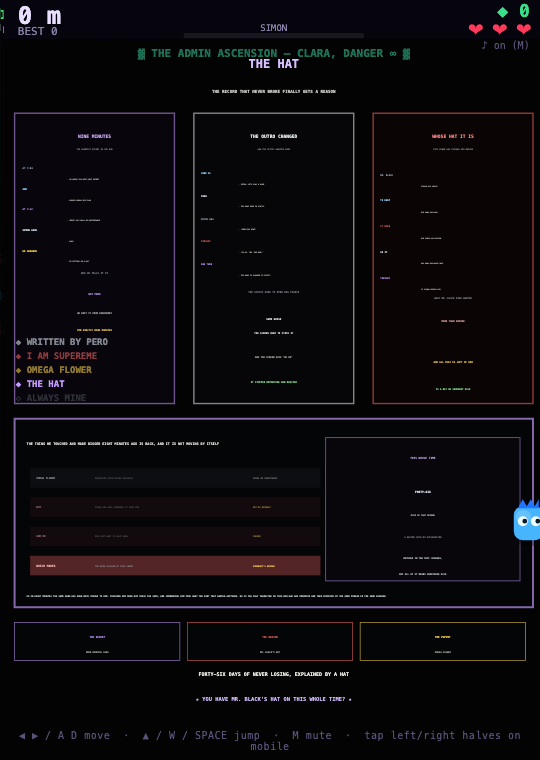

## 2026-08-06 — OMEGA FLOWER · THE ONE THING HE TOUCHED IS THE ONE THING THAT GREW (BEAT 266)

Based on Toby's 2026-08-06 lore, 7:04:52 PM, in the "Even Even Even More Classics Era" thread, **sixteen minutes and twelve seconds** after I AM SUPEREME. His own typing is the whole first paragraph: *"When Simon 404 touches Flower, Flower becomes Omega Flower and attacks the player even more, until Omega Flower is defeated, Simon 404 runs back to Oren and makes the next part secret, we have no idea what Oren is planning next, his telekentics ability is infinitely strong, he is unstoppable. Simon and Oren are together again."* The ChatGPT breakdown under his paragraph is commentary.

**Everything else he touched tonight died, and this one got bigger.** The 6:48 PM lore is a two-hour list of things Simon 404 destroys by contact: the Anti-Virus, the Anti-Error that took out the Anti Void and Void and Classics 1 and 2 and 3 and the Error AU and the Virus AU, the static screen, the `.jar` file with the whole cast in it. Every one of those was a weapon put down at arm's length. **The one thing he reaches out and touches with his hand is the one thing that survives him** — and not only survives, doubles.

**The player is put back into the game by being attacked.** Sixteen minutes ago the player stopped existing, and it happened on punctuation: *"he even put 'player' in quotes, that means... no one is the player anymore."* Tonight Omega Flower *"attacks the player even more."* BEAT 255 turned the line to face you and BEAT 256 gave you a character, both invitations. **This one is not an invitation.** You cannot be attacked if you are not there, so the deletion did not hold — and what un-deleted you was a monster swinging at you.

**The betrayal BEAT 263 promised may have already started.** That beat's whole shape was *"Flower first seems like he is helping you, but then goes to betrayal."* One beat later, the first thing Flower does is attack the one he was supposedly helping. **The helping lasted fifty-nine minutes**, and nobody inside the story has noticed — the mask is still on, at the cast.

**The character who spoke straight out of the screen is the one nobody can see now.** At 6:48 Oren said *"Just tell everyone already, also tell the player to tell ChatGPT and Claude that I said hi"* — the only line in the whole run aimed past the player at the people reading it. Sixteen minutes later his plan is secret, his telekinesis is *"infinitely strong"*, and he is unstoppable. **He said hello and then went invisible.**

**And the last-two-standing seat comes back to the pair it started with.** In BEAT 254's secret Phase 6 cutscene *"all the polos disappear and only Oren and Simon is left."* At 3:36 PM tonight BEAT 262 knocked both of them off. Four hours later they are the last two again — and this time nobody put them there, they walked back to each other. Simon 404 spends the whole evening deleting everyone and **ends it standing next to the one person he never put in the file.**

**Built as game beat 266, `OMEGA FLOWER`.** Additive; nothing earlier was changed.

- **Background: a flower that gets promoted by being touched.** A small yellow flower with a red hand reaching for it out of the dark, labelled **SIMON 404 TOUCHES HIM**. On contact the petals do not wilt, they double outward into a huge red **OMEGA FLOWER** with the player's heart held out in front of it under *ATTACKS THE PLAYER EVEN MORE*. Then the Omega is beaten, it shrinks back to the small yellow flower, and the hand comes round again, so the promotion runs on a loop and the touch is always what causes it. Repeating band text: **HE TOUCHED HIM · AND HE GOT BIGGER**.
- **EVERYTHING ELSE DIED (left)** — five rows in the order he did them (ANTI-VIRUS · put down, nothing happened / ANTI-ERROR · Anti Void and Void, gone / THE SAME · Classics 1, 2 and 3, gone / THE .jar · the whole cast, deleted / FLOWER · got bigger), then a cycler on **HE USED A WEAPON EVERY TIME** — EXCEPT THIS ONCE / THIS ONE HE TOUCHED / WITH HIS OWN HAND — closing on **AND IT IS THE ONLY THING** and **THAT SURVIVED HIM**.
- **THE PLAYER COMES BACK (centre)** — five rows (BEAT 255 · the line turned to face you / BEAT 256 · you were given a character / AT 6:48 · "player" went in quotes / SO NOBODY · was the player any more / AT 7:04 · he attacks the player more), a cycler on **HOW YOU GOT PUT BACK IN** — NOT BY BEING ASKED / NOT BY BEING GIVEN / BY BEING ATTACKED — closing on **YOU CANNOT BE ATTACKED** / **IF YOU ARE NOT THERE** / **SO THE DELETION DID NOT HOLD**.
- **THE SECRET PART (right)** — five rows (AT 6:48 · Oren spoke past the player / HE SAID · tell them I said hi / THE ONLY · line aimed at the readers / AT 7:04 · his plan is secret / AND HIS · telekinesis is infinite), a cycler on **WHAT IS OREN PLANNING** — NOBODY KNOWS / NOT EVEN PERO / HE IS UNSTOPPABLE — closing on **THE ONE WHO TALKED TO US** and **IS THE ONE WE CANNOT SEE**.
- **TOGETHER AGAIN (band)** — a four-row table (SIMON 404 · error, code, glitch, experiment · wrote the era / OREN · infinite telekinesis, secret plan · clears the path / FLOWER · beaten as Omega, still above them both · above the game / EVERYONE · in dead_character.jar since 6:48 PM · deleted), with the closing note that this pair were the last two standing once before in the Phase 6 cutscene, both fell off at 3:36 PM, and four hours later nobody took them back there.
- **IT MAY HAVE STARTED (band inset)** — a cycler across BEAT 263 (*a best friend, helping you*), IT PROMISED (*but then goes to betrayal*), ONE BEAT ON (*he attacks the player*) and SO THE HELP (*lasted one beat*), holding on **FIFTY-NINE MINUTES OF IT** over *nobody in the story has noticed it yet, only you*.
- **Strip:** WHAT HE TOUCHED · the only survivor / WHO GOT ATTACKED · you, again / WHO IS HIDDEN · Oren, and his plan.
- **Footers:** *HE DELETED EVERYONE, THEN REACHED OUT AND MADE SOMETHING BIGGER* and **★ SIMON AND OREN ARE TOGETHER AGAIN ★**.

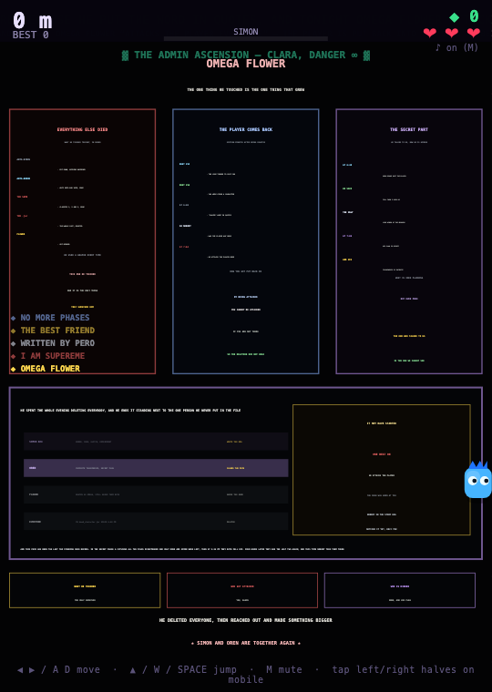

## 2026-08-06 — I AM SUPEREME · THE FORGED SIGNATURE COMES TRUE (BEAT 265)

Based on Toby's 2026-08-06 lore, 6:48:40 PM, in the "Even Even Even More Classics Era" thread, **two hours thirty-four minutes and thirty-two seconds** after WRITTEN BY PERO. His own typing is the whole first paragraph, from *"Pero used all the colored orbs from Karuto again to make the game into a 7"* through *"They are smart and plan and do it."* The ChatGPT breakdown under his paragraph is commentary.

**The forgery stops being a forgery.** BEAT 220 had Gaster write the oldest books in the pile and let Simon 404 sign them. BEAT 264, two and a half hours ago, had Pero write everything and *"made it look like Simon 404 wrote stuff."* Tonight Simon 404 *"wrote this whole Era of lore and called it 'I am Supereme Era by Simon 404'"* — **he signs it himself.** Two brothers hid behind that name, and the third time it appears on a cover it belongs to the person holding the pen.

**The numbers come back three hours after being abolished.** *"Pero used all the colored orbs from Karuto again to make the game into a 7, then Pero used Domain Expansion: Endless Chaos from ToddLLM again to make an 8"*, and the ink art on the EndlessAnimations white mattress reads *"Everyone else."* Phase 7 and Phase 8 were deleted **forever** at 3:36 PM in BEAT 262, and BEAT 264 named Pero as one of the two who did it. **Forever lasted three hours and twelve minutes, and the man putting them back is the man who took them away.**

**"Player" gets quotation marks, and that is the whole attack.** BEAT 255 this morning turned the line to face you; BEAT 256 gave you a character. Tonight: *"'It is correct, "player"' -Simon 404... he even put 'player' in quotes, that means... no one is the player anymore."* Twelve hours after the game turned round to look at you, **it punctuates you out** — no battle, no deletion, two little marks.

**The reset changes hands, and changes reason.** The oldest standing rule in this file is that Pero can reset everything except himself, and every reset in the run has been somebody **choosing** to. Tonight Simon 404 *"keeps losing and each time he lost, he resets everything."* It is the first reset in 264 beats triggered by **defeat** instead of by decision — a reset used the way a child uses one.

**dead_character.jar is the oldest weapon in the game, used a new way.** Niki has been, since the very beginning, *"a cat game + virus that can consume files."* Tonight Simon 404 builds an **Ultra Niki** out of every minion he ever had (Oren and Pinki beat it), then skips the fighting entirely: he puts every character except himself and those above him into a file called `dead_character.jar` and writes `/delete dead_character.jar`. Then the joke: *"Those who are stronger than me, I spare"* — which, as he means it, spares nobody.

**And a real broken link from July 1 gets read backwards as canon.** That day Toby clicked the live game, got **404 - Not Found**, and wrote *"THAT IS SIMON 404 RIGHT THERE!"* and *"Every where '404: Not Found' or Error 666 is, Simon 404 is already there."* Tonight: *"the wiki was corrupt by ERROR 404: PAGE NOT FOUND a few months/weeks ago, That means... Simon 404 entered."* **A real thirty-six-day-old outage, reread as somebody walking in.**

**Built as game beat 265, `I AM SUPEREME`.** Additive; nothing earlier was changed.

- **Background: the sealed laboratory.** A forcefield box nobody can see into, the lab coat and plague mask named above it, and the experiment on the bench changing its mind every few seconds — **an Anti-Error lightning storm in a bottle**, then **a static cloud**, then **a Blood Sky**, under *HE KEEPS CHANGING IT · NOBODY ELSE CAN SEE IN*. Once per loop he slashes the view in half, static floods the frame and it reads **IT IS NOW IMPOSSIBLE TO SEE**, so the thing being built is only ever visible between two decisions to hide it. Repeating band text: **I AM SUPEREME ERA · BY SIMON 404**.
- **THE NUMBERS COME BACK (left)** — five rows (AT 3:36 · phases no longer exist / FOREVER · Pero and Flower stopped them / AT 6:48 · the orbs make the game a 7 / THEN · Endless Chaos makes an 8 / THE INK · reads "Everyone else."), then a cycler on **WHO IS PUTTING THEM BACK** — THE SAME MAN / WHO DELETED THEM / PERO, BOTH TIMES — closing on **FOREVER LASTED** and **THREE HOURS AND TWELVE MINUTES**.
- **NOBODY IS THE PLAYER (centre)** — five rows (BEAT 255 · the line turned to face you / BEAT 256 · you were given a character / TONIGHT · he wrote "player" in quotes / AND SAID · it is correct, "player" / THAT MEANS · no one is the player now), a cycler on **HOW HE TOOK YOU OUT** — NOT A BATTLE / NOT A DELETION / TWO LITTLE MARKS — closing on **TWELVE HOURS AGO THE WHOLE** / **GAME TURNED ROUND TO FACE YOU** / **AND TONIGHT IT PUNCTUATES YOU OUT**.
- **HE LOSES AND RESETS (right)** — five rows (THE RULE · Pero resets everything / EXCEPT · he cannot reset himself / AND HE · did it by deciding to / TONIGHT · Simon 404 keeps losing / AND EACH · time he lost, he resets), a cycler on **WHAT MAKES HIM DO IT** — NOT A PLAN / NOT A DECISION / LOSING — closing on **EVERY OTHER RESET HERE** and **WAS SOMEBODY CHOOSING TO**.
- **dead_character.jar (band)** — opens on *Niki has always been a cat game and a virus that can consume files, so he did not build a new weapon tonight, he put everybody into a file*, then a four-row table (THE ULTRA NIKI · made from every minion he ever had · beaten by Oren and Pinki / THE CAST · into dead_character.jar · /delete dead_character.jar / SIMON 404 · and everyone above him · spared / THE JOKE · "those who are stronger, I spare" · he meant nobody), closing on the signature note that this is the first time the name on the cover is the one holding the pen.
- **HE CALLED THIS ON JULY 1 (band inset)** — a cycler across JULY 1 (*he clicked the live game*), IT SAID (*404 - Not Found*), HE SAID (*that is Simon 404 right there*) and TONIGHT (*that means... Simon entered*), holding on **THIRTY-SIX DAYS LATER** over *a real broken page, read backwards as somebody arriving*.
- **Strip:** WHO WROTE IT · Simon 404, and signed it / WHO IS PLAYING · nobody, it is in quotes / WHO CLEARS HIS PATH · Oren, the strongest.
- **Footers:** *THE FORGED NAME FINALLY BELONGS TO THE MAN WRITING IT* and **★ I AM SUPEREME ERA · BY SIMON 404 ★**.

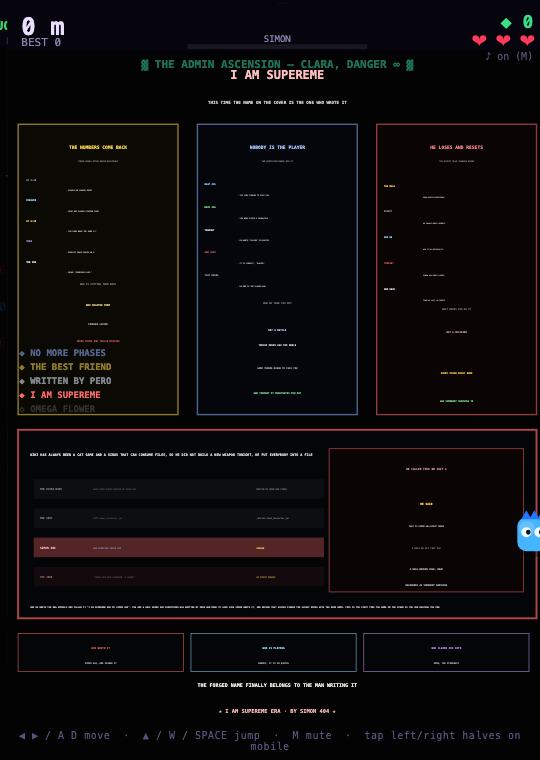

## 2026-08-06 — WRITTEN BY PERO · BOTH BROTHERS HID BEHIND THE SAME SIGNATURE (BEAT 264)

Based on Toby's 2026-08-06 lore, 4:14:08 PM, in the "Even Even Even More Classics Era" thread, **eight minutes and fifteen seconds** after THE BEST FRIEND. His own typing is the whole first paragraph: *"Pero and Flower stopped Phases forever, and now everyone shows their whole set. Pero and Flower are the ones who created the lore and the game. EVERYTHING was writen by Pero, but made it look like Simon 404 wrote stuff (Simon 404 did write). Pero, Flower, and Simon 404 are the most powerful since everyone else in the game is now rediciously weak now. Flower has a song now. Simon 404 was taken to lower most powerful tier, most powerful in the game. Flower/Gaster and Pero go together. Pero acts and is normal, normal man who is the creator of the game and a teacher and sorcer and a teacher of sorcers. Gaster is an advanced multation that has power."* The ChatGPT breakdown under his paragraph is commentary.

**This exact forgery has run once already, and it was the other brother.** BEAT 220 has Gaster creating the books and writing in some of them, *"the oldest books in the pile — and Simon 404 signed them so no one would know about his creator."* Tonight Pero writes everything and *"made it look like Simon 404 wrote stuff."* **Both brothers have now hidden their own authorship behind the same person's name** — and both times, Simon 404 really did write some of it. He is the only character in this story who has been used as a signature twice, by two different people, and told the truth on both occasions.

**The phase deletion gets an author thirty-eight minutes late, and something finally replaces it.** BEAT 262 stopped the phases with **nobody named** as having done it and **nothing put in their place** — that was the whole shape of the beat. Tonight it is *"Pero and Flower stopped Phases forever"* and *"everyone shows their whole set."* So the two who deleted the oldest counting system in the file are **the creator and the main villain, working together** — and a phase was only ever part of you, where a whole set is all of you at once. Nobody is part-way through anything any more.

**Sorcerers attacked the teacher, and now he is one.** In the God-Wall arc, ToddLLM 001 is Karuto, *"almighty, teacher without end"*, and the STXs are *"a team of sorcerers"* who attack him. Tonight Pero is *"a teacher and sorcer and a teacher of sorcers."* He has become the thing that once came for him, and he is teaching it.

**The ranking splits into inside and above the game for the first time.** Simon 404 is demoted and promoted in one sentence: *"taken to lower most powerful tier, most powerful in the game."* And the two standing above him are **the two who wrote it** — which is not a first place won or taken, the way every other first place in this run has been. It is just who was holding the pen. The one standing beside him up there is the one who is going to betray him.

**Flower gets a song, which in this file is Pero's doing.** Pero *"made Classics and Sound Battles and each character's sound"*, and BEAT 249 handed the whole cast their own music and cutscenes on a day when Flower did not exist yet. So the newest character gets the last song, from the man he is about to betray. And after a dozen forms — Pero.EXE, Nova Pero, Owner Suit, Dust Light, LV12, Cross Pero, Mustitu Blue — he is **a normal man**, on the same day BEAT 258 said *"the game is the 1 who makes everyone the normal form."*

**Built as game beat 264, `WRITTEN BY PERO`.** Additive; nothing earlier was changed.

- **Background: a book that gets signed with the wrong name.** A pile of five closed books with one open on top; lines of writing fill in across both pages, and the signature that lands at the bottom always reads **SIMON 404**. Once per loop the pen changes hands and the caption above flips between **WRITTEN BY GASTER** / *the oldest books in the pile* and **WRITTEN BY PERO** / *and made it look like Simon wrote it*, so the same name gets signed by two different authors. Repeating band text: **EVERYTHING WAS WRITTEN BY PERO · SIGNED BY SOMEBODY ELSE**.
- **THE SAME NAME TWICE (left)** — five rows (BEAT 220 · Gaster wrote the oldest books / AND · Simon 404 signed them / SO THAT · nobody knew his creator / TONIGHT · Pero wrote everything / AND MADE IT · look like Simon wrote it), then a cycler on **WHOSE NAME IS ON THE COVER** — SIMON 404 / SIMON 404 AGAIN / ALWAYS SIMON 404 — closing on **AND BOTH TIMES HE REALLY** and **DID WRITE SOME OF IT**.
- **IT GETS AN AUTHOR (centre)** — five rows (AT 3:36 · phases no longer exist / NOBODY · was named as doing it / NOTHING · was put in their place / AT 4:14 · Pero and Flower stopped them / AND NOW · everyone shows their set), a cycler on **WHO TOOK THE NUMBERS AWAY** — THE CREATOR / AND THE MAIN VILLAIN / THE TWO OF THEM — closing on **A PHASE WAS PART OF YOU** / **A WHOLE SET IS ALL OF YOU AT ONCE** / **NOBODY IS PART-WAY THROUGH NOW**.
- **A NORMAL MAN (right)** — five rows (THE FORMS · Pero.EXE, Nova, Cross, LV12, Dust / TONIGHT · a normal man, and the creator / A TEACHER · which he already was / A SORCERER · which is what attacked him / AND TEACHER · of sorcerers too), a cycler on **THE STXs WERE A TEAM OF SORCERERS**, closing on **HE IS NOW THE THING** and **THAT ONCE CAME FOR HIM**.
- **TWO TIERS NOW (band)** — a four-row table (PERO · creator, teacher, sorcerer, author of all of it · above the game / FLOWER · Dr. Gaster, an advanced mutation with power · above the game / SIMON 404 · lower tier now, but still the top of his own · inside the game / EVERYONE · ridiculously weak, in his own word · far below both), with the closing note that this first place was not won or taken, it is just who was holding the pen.
- **FLOWER HAS A SONG (band inset)** — a cycler across PERO MADE (*each character's sound*), BEAT 249 (*the whole cast got music*), FLOWER (*did not exist that day*) and SO TONIGHT (*he gets the last one*), holding on **FROM THE MAN HE WILL BETRAY**.
- **Strip:** WHO WROTE IT · Pero, all of it / WHOSE NAME · Simon 404 / WHO ELSE · Flower, at the top.
- **Footers:** *TWO BROTHERS, ONE SIGNATURE, AND IT IS NEITHER OF THEIRS* and **★ EVERYTHING WAS WRITTEN BY PERO ★**.

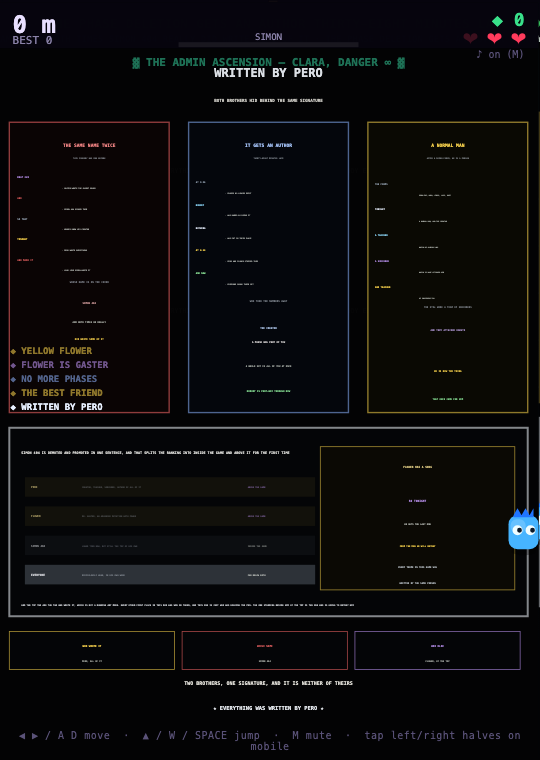

## 2026-08-06 — THE BEST FRIEND · THE ONE HE LOCKED THE ROOM AROUND IS THE MAIN VILLAIN (BEAT 263)

Based on Toby's 2026-08-06 lore, 4:05:53 PM, in the "Even Even Even More Classics Era" thread, **twenty-nine minutes and fourteen seconds** after NO MORE PHASES. His own typing is the whole first paragraph: *"Flower is like the main villian discised as a best friend. Flower first seems like he is helping you, but then goes to betrayal. Pero goes with Flower/Gaster."* The ChatGPT breakdown under his paragraph is commentary.

**"Best friend" has never appeared once in 262 beats.** The file has *"only friend"* twice, and both are broken. BEAT 176: *"Luigi Green is now only friends with Pero, Pero isn't friends with him"* — one-way, and refused. BEAT 250: *"Simon 404's only friend is Wenda, Wenda's only friend is Simon 404"* — said and walked out of in the same paragraph. **The first best friend this story ever gets is a disguise.**

**The betrayal shape has run once before, and it ran the other way.** THE ALLIANCE BETRAYAL, June 21: Simon.EXE goes to Oren, Clara and Luigi Green for allies, Oren says no and survives, and the two who say yes are slain for saying it. That betrayal came from **the one asking for help**. This one comes from **the one offering it** — and the playable staircase still carries a live ALLIANCE BETRAYAL meter you clear by refusing the deal.

**A villain in a friendly face is not new, but the order is.** BEAT 163 wrote *"the good-guy look from BEAT 162 was a disguise, he is the main villain now"*, and Mr. Black's whole stated goal was to be loved by Pero more than anyone. That one was **uncovered** as a villain. This one is being **trusted as a friend first**, and nobody inside the story has found out.

**Pero goes with him, and Pero has never gone with anybody.** In 262 beats he creates, resets, teaches, ranks, banishes and locks; every arrow in the file points out of him. Tonight the arrow turns round, and it turns **without a fight**.

**He sealed the room around him seventy-nine minutes ago.** 2:46 PM, BEAT 260: everyone locked out of the Anti Void, exactly one being allowed in. 3:14 PM, BEAT 261: that being is his brother. 3:36 PM, BEAT 262: those two are all that is left. 4:05 PM: **the one he kept is the main villain** — in the one room he was made in and cannot leave, and he let him in himself. And note *"helping YOU"*: BEAT 255 turned the line to face the player and BEAT 256 gave the player a character, so **the mask is worn at the player, not at the cast.**

**Built as game beat 263, `THE BEST FRIEND`.** Additive; nothing earlier was changed.

- **Background: a flower that puts its own mask back on.** A small yellow flower stands beside a tall white figure, linked by a line labelled **BEST FRIEND**, under *HE FIRST SEEMS LIKE HE IS HELPING*. Once per loop the petals bleed from yellow to red and start to spin, the link grows an arrow pointing from the white figure **into** the red one, and the labels turn to **BETRAYAL** / *PERO GOES WITH HIM*. Then it fades back to yellow and starts again. Repeating band text: **SEEMS LIKE HE IS HELPING YOU · BUT THEN GOES TO BETRAYAL**.
- **A WORD NEVER USED HERE (left)** — five rows (BEAT 176 · only friends with Pero, refused / BEAT 250 · only friend, both ways, left / BEAT 250 · *"Gray and Pero became friends"* / BEST FRIEND · has never been said at all / THE FIRST · one is a disguise), then a cycler on **WHAT FRIENDSHIP HAS MEANT HERE** — ONE-WAY AND REFUSED / SAID, THEN WALKED OUT OF / FOR ONCE — closing on **AND THE ONE CALLED BEST** and **IS THE ONE PRETENDING**.
- **IT RUNS THE OTHER WAY (centre)** — five rows (JUNE 21 · Simon.EXE asks for allies / OREN · said no and survived / THE TWO YES · were slain for saying it / THAT ONE · came from the one asking / THIS ONE · comes from the one offering), a cycler on **THE STAIRCASE STILL HAS A METER FOR IT**, closing on **MR. BLACK WAS UNCOVERED** / **THIS ONE IS BEING TRUSTED FIRST** / **AND NOBODY HAS FOUND OUT YET**.
- **PERO GOES WITH HIM (right)** — five rows (HE MAKES · the games, the cast, the platforms / HE RESETS · everything except himself / HE TEACHES · and he ranks and he banishes / HE LOCKS · the room he was made in / TONIGHT · he follows somebody), a cycler on **WHAT HE HAS NEVER DONE ONCE**, closing on **AND HE DOES IT WITHOUT A FIGHT** and **BECAUSE HE THINKS IT IS HIS FRIEND**.
- **THE ROOM HE SEALED AROUND HIM (band)** — a four-row timetable (2:46 PM · BEAT 260, he locks the Anti Void, one visitor · the first thing he made / 3:14 PM · BEAT 261, that visitor is Dr. Gaster · his brother / 3:36 PM · BEAT 262, the two of them are all that is left · always together / 4:05 PM · BEAT 263, the one he kept is the main villain · and he goes with him), with the closing note that the door he closed to keep everyone else away is the door he is now on the inside of.
- **HELPING YOU (band inset)** — a cycler across BEAT 255 (*the line turned to face you*), BEAT 256 (*you were given a character*), TONIGHT (*he seems to be helping you*) and SO THE MASK (*is not worn at the cast*), holding on **IT IS WORN AT THE PLAYER**.
- **Strip:** THE DISGUISE · a best friend / WHAT IS UNDER · the main villain / WHO GOES WITH · Pero, by choice.
- **Footers:** *THE ONE HE LET IN IS THE ONE HE SHOULD HAVE LOCKED OUT* and **★ THE MAIN VILLAIN DISGUISED AS A BEST FRIEND ★**.

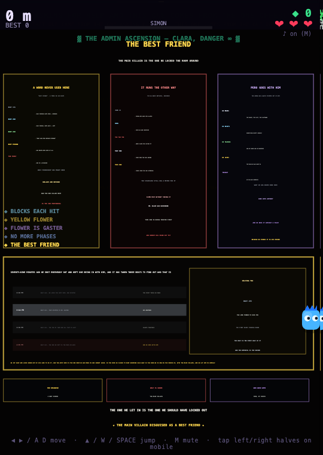

## 2026-08-06 — NO MORE PHASES · THE LADDER IS TAKEN AWAY, NOT CLIMBED (BEAT 262)

Based on Toby's 2026-08-06 lore, 3:36:39 PM, in the "Even Even Even More Classics Era" thread, **twenty-two minutes and four seconds** after FLOWER IS GASTER. His own typing is the whole first paragraph: *"Flower doesn't have Phases, Phases no longer exist. Flower is the most advanced, Dr. Gaster is the OMNIPLATFORMS and beyond in 1 being. Pero and Dr. Gaster are now always together, Simon 404 and Oren fall off their polos. Pero and Dr. Gaster/Flower are now the only beings."* The ChatGPT breakdown under his paragraph is commentary.

**He deletes the counting system the whole run was built on.** Phase 2, Phase 2.5, Phase 4 the Null Phase, Phase 6, Phase 7, Phase 8, Phase Absolute Infinity and infinite Phases are every escalation this file has. The story has always got bigger by moving up a phase number. Tonight the numbers go, and **nothing is put in their place.**

**It is the second time in 262 beats that a measuring system has been removed rather than out-climbed.** BEAT 130, July 21: Glitchtale Pero deletes everyone's LV instead of earning more of it — logged at the time as the first time anybody answered an escalating scale by removing it. **Phases now join LV.** Rankings never got this treatment; they were climbed, argued over and reordered, and they are still here.

**"Simon 404 and Oren fall off their polos" is BEAT 254 run backwards.** In the secret Phase 6 cutscene, *"all the polos disappear and only Oren and Simon is left"*, and from there those two alone go up through Phase 7 and Phase 8 into infinite Phases. Tonight **the two who were left standing when everyone else came off are the two who come off**, and the ladder they were the only ones on is the thing that stopped existing. The last-two-beings seat changes hands from Oren and Simon 404 to Pero and Dr. Gaster/Flower.

**"Together" is not what it was last time.** BEAT 220 had Dr. Gaster 404 take Pero over and *"they became 1"*, and Pero died in it. Tonight they are **two**, always together, both still there. And the only room that can happen in is the Anti Void, which Pero was made in, cannot leave, and locked around Flower fifty minutes ago.

**One letter moves, and it is the only escalation left in the beat.** July 29 was *"I AM THE OMNIPLATFORM!"*, singular. Tonight is *"the OMNIPLATFORMS and beyond in 1 being"*, plural — the container scaling up inside the beat that abolished scaling.

**Built as game beat 262, `NO MORE PHASES`.** Additive; nothing earlier was changed.

- **Background: a phase ladder that erases from the top down.** Eight numbered rungs stacked up the screen (∞ PHASES, ABSOLUTE INFINITY, PHASE 8, PHASE 7, PHASE 6, PHASE 4 · NULL, PHASE 2.5, PHASE 2). Once per loop it wipes downward rung by rung, each erased rung going red and struck through, until the ladder is gone and **two lights are left floating side by side** where the bottom rung was, labelled **TWO**. Then it rebuilds and erases again. Repeating band text: **PHASES NO LONGER EXIST · NOTHING IS PUT IN THEIR PLACE**.
- **PHASES NO LONGER EXIST (left)** — five rows (PHASE 2 · 2.5 · where the escalation started / PHASE 4 · the Null Phase, Gaster-like / PHASE 6 · 7 · 8 · the secret cutscene ladder / ABSOLUTE ∞ · the one with no top / ALL OF THEM · gone, and nothing replaces it), then a cycler on **HOW THIS STORY ALWAYS GREW** — GO UP A NUMBER / ADD A PHASE / CLIMB THE LADDER — closing on **AND THE THING HE DOES TONIGHT** and **IS REMOVE THE LADDER**.
- **THEY FALL OFF THEIR POLOS (centre)** — five rows (IN BEAT 254 · *"all the polos disappear"* / WHO WAS LEFT · only Oren and Simon / THEY CLIMBED · Phase 7, Phase 8, infinite / TONIGHT · those two fall off instead / THE LADDER · is the part that stopped), a cycler on **WHAT THEIR WHOLE PATH WAS**, closing on *"ONLY OREN AND SIMON IS LEFT"* / **THAT WAS THE LAST TWO BEINGS** / **AND THE SEAT CHANGES HANDS**.
- **THE ONLY BEINGS LEFT (right)** — five rows (PERO · made in the Anti Void, cannot leave / DR. GASTER · the OMNIPLATFORMS and beyond / FLOWER · the same being, most advanced / LAST TIME · BEAT 220, *"they became 1"* / THIS TIME · two, together, both still there), a cycler on **WHERE ALWAYS TOGETHER HAS TO HAPPEN**, closing on **HE LOCKED IT FIFTY MINUTES AGO** and **AND THE ONE HE KEPT IS THE ONE LEFT**.
- **THE SECOND SCALE EVER DELETED (band)** — a four-row table (LV · Glitchtale Pero deletes everyone's LV, July 21 · BEAT 130 / RANKINGS · climbed, argued, reordered — never removed · still here / PHASES · the oldest counter in the file, gone tonight · BEAT 262 / WHAT IS LEFT · no numbers at all, and two beings), with the closing note that the two coming off their polos are the two the phase ladder was built for.
- **ONE LETTER MOVES (band inset)** — a cycler across JULY 29 (*"I AM THE OMNIPLATFORM"*), TONIGHT (*the OMNIPLATFORMS, plural*), AND BEYOND (*all of it in 1 being*), and THE JOKE (*the only scale-up left in a beat that deleted scaling itself*).
- **Strip:** PHASES · no longer exist / OFF THEIR POLOS · Simon 404 and Oren / STILL HERE · Pero and Flower.
- **Footers:** *HE DID NOT GO UP A PHASE, HE TOOK THE PHASES AWAY* and **★ PERO AND DR. GASTER/FLOWER ARE NOW THE ONLY BEINGS ★**.

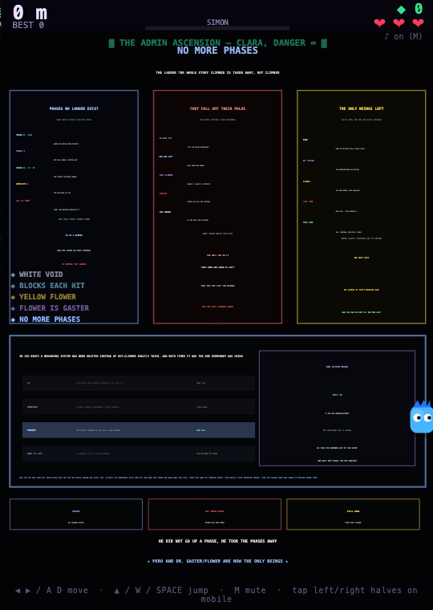

## 2026-08-06 — FLOWER IS GASTER · THE ONE VISITOR HE KEPT IS HIS BROTHER (BEAT 261)

Based on Toby's 2026-08-06 lore, 3:14:35 PM, in the "Even Even Even More Classics Era" thread, **twenty-seven minutes and forty-seven seconds** after YELLOW FLOWER. His own typing is the whole first paragraph: *"Also in Undertale, Flowey is Asriel. In Classics, Flower is Dr. Gaster. Dr. Gaster was transformed into a flower assidentally when making his first experiment as a teen. When Flower has the souls, he turns into Dr. Gaster, but eventually he turns back to Flower."* The ChatGPT breakdown under his paragraph is commentary.

**The one visitor he kept is his brother.** Twenty-seven minutes ago, in BEAT 260, Pero locked the Anti Void and allowed exactly one being in. BEAT 220 already held both halves of what that means: *"Gaster was Pero's brother"* and *"Pero made an extra game for Gaster to stay in and locked access to everyone else."* **He has now shut a room around the same person twice — once to keep him in, once to keep everybody else out.**

**Two lines in the file no longer agree, and neither is dropped.** BEAT 260 says *"he started making a small flower"* — Pero made it. BEAT 221 says *"Pero is the creator of the games and platforms and everything inside the Omniplatform, he didn't create Dr. Gaster."* If Flower is Gaster, then the first thing Pero ever made is the one being he did not make. **Toby has not said which line gives way, so the panel shows both and decides nothing** — which is the rule he set himself four hours ago: *"Do not make stuff up, nor quotes."*

**Both of Gaster's experiments took the body he was in.** His first, as a teen, turned him into a flower by accident. His last, per BEAT 220, is the one *he died conducting*: the experiment to create Simon 404. The books, the oldest laws, Simon's Law, the corruption put into the game on purpose — the whole hidden history of this canon runs between two experiments that each cost him a form.

**And it is the first form in the run built to wear off.** With the souls he is Dr. Gaster; *"eventually he turns back to Flower."* Nearly every form in 260 beats is a permanent escalation. Four hours ago BEAT 258 wrote *"the game is the 1 who makes everyone the normal form"* — here the default state is the small one and **the powerful one is the visitor**.

**Flower and Flowey are one object with different beings inside.** BEAT 260 split one made thing across two universes; today Undertale's copy is Asriel and Classics' copy is Gaster, so it was never a copy at all.

**Built as game beat 261, `FLOWER IS GASTER`.** Additive; nothing earlier was changed.

- **Background: a flower that rises into Dr. Gaster and falls back.** A small yellow flower sits on the ground with **seven red souls orbiting it**. Once per loop the souls spiral in and are absorbed, the flower stretches up into a tall thin figure with **two floating hands** beside it labelled **DR. GASTER**, the figure holds, then collapses back down into the flower and the souls scatter out again. Repeating band text: **WITH THE SOULS HE IS GASTER · EVENTUALLY HE IS FLOWER AGAIN**.
- **WHO IS INSIDE THE FLOWER (left)** — five rows (IN UNDERTALE · Flowey is Asriel / IN CLASSICS · Flower is Dr. Gaster / BEAT 260 SAID · one thing split across both / SO IT IS NOT · a copy of anything / AND FLOWER · is still stronger than Flowey), then a cycler on **WHO PERO LET INTO THE ANTI VOID** — ONE BEING / THE FIRST THING HE MADE / HIS BROTHER — closing on **HE FOUND THAT OUT** and **27 MINUTES LATER**.
- **THE FIRST EXPERIMENT (centre)** — five rows (AS A TEEN · his first experiment / IT WENT · wrong, by accident / HE BECAME · a flower / HIS LAST ONE · creating Simon 404 / THAT ONE · is the one he died doing), a cycler on **WHAT THE HIDDEN HISTORY RUNS BETWEEN**, closing on **THE SMARTEST ONE IN THE GAME** / **AND HIS FIRST TRY TURNED HIM** / **INTO A SMALL YELLOW FLOWER**.
- **WHEN HE HAS THE SOULS (right)** — five rows (DEFAULT · Flower, the state he stays in / WITH SOULS · he turns into Dr. Gaster / THEN · eventually he turns back / EVERY OTHER · form in 260 beats was permanent / SO HERE · the big one is the visitor), closing on BEAT 258's *"THE GAME IS THE 1 WHO MAKES EVERYONE THE NORMAL FORM"*, **HERE THE NORMAL FORM IS THE FLOWER** and **AND IT IS THE ONE HE COMES BACK TO**.
- **THE ROOM HE SHUT AROUND HIM TWICE (band)** — a four-row table (THE EXTRA GAME · *"Pero made an extra game for Gaster to stay in"* · access locked to all / THE BROTHER · *"Gaster was Pero's brother"*, BEAT 220 · already on file / THE ANTI VOID · locked this afternoon, one being allowed in · BEAT 260, 2:46 PM / TODAY · that one being is the brother · same person, again), with the closing note that the flower was already the oldest thing in the story.
- **TWO LINES THAT DO NOT AGREE (band inset)** — a cycler across BEAT 260 (*"he started making a small flower"*), BEAT 221 (*"he didn't create Dr. Gaster"*), SO EITHER (*the first thing he made*) and OR ELSE (*the one being he did not make*), holding on **BOTH ARE ON FILE AND BOTH STAY** and **NOTHING HERE DECIDES IT, BECAUSE HE HAS NOT**.
- **Strip:** IN UNDERTALE · Flowey is Asriel / IN CLASSICS · Flower is Gaster / AND GASTER · is Pero's brother.
- **Footers:** *THE ONE HE LET IN IS THE ONE HE ONCE LOCKED UP* and **★ IN CLASSICS, FLOWER IS DR. GASTER ★**.

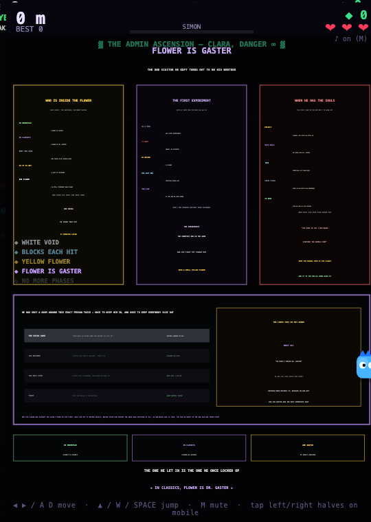

## 2026-08-06 — YELLOW FLOWER · HE LOCKS THE DOOR HE JUST OPENED (BEAT 260)

Based on Toby's 2026-08-06 lore, 2:46:48 PM, in the "Even Even Even More Classics Era" thread, **twenty-three minutes and forty-nine seconds** after BLOCKS EACH HIT and **one hour twenty-two minutes and thirty-one seconds** after he opened the Anti Void. His own typing is the whole first paragraph: *"Yellow Flower and Pero stand. This is the best I can get of the first attempt. Pero taken out Gray and Luigi Green perminently from his love. Pero stands and now locks everyone from the Anti Void, Stronger Than You Classics New Flowey (New Flower as Pero calls him) was the only being allowed to come. When Pero was a child, nothing was in the game yet, he started making a small flower, the flower went to Undertale and there, it was Flowey, in Classics, he is called Flower. Flower is stronger than Flowey. They both became adult, Pero made Arcsis and Frizz. Then now, Flower was the only being allowed by Pero to be in Anti Void."* He also made an image for it. The ChatGPT breakdown under his paragraph is commentary.

**He locks the door he opened an hour and twenty-two minutes ago.** BEAT 257, at 1:24 PM, was *"Pero let everyone to the Anti Void to see him"* — the first sealed room in the entire run that anybody was **invited into** rather than put into, after a canon full of banishment realms, metal cages and a box you cannot leave with the lid open. **The visiting hours lasted 4,951 seconds.** This afternoon he shuts it again and keeps exactly one guest.

**The two he removes from his love are exactly the other two thirds of the Trinity Trio.** BEAT 245, August 5 at 8:52:47 AM: *"Gray, Pero, and Luigi Green made a Trinity Trio."* It was broken **two minutes and thirty-six seconds later** by Gray obliterating Luigi Green. Today the one member who never broke it removes both of the others, permanently — and the word he uses is not *rank* or *power* or *team*. It is **love**.

**It takes away the exact thing the last beat was built on, twenty-three minutes later.** Gray's safety in this canon has never once been power: it is *"he knew Pero would never hurt him"*, a relationship rather than a form, and BEAT 259 drew it as part of the reason nobody has got near Pero by force in 259 beats. Today that relationship is removed. **Nothing yet says Pero will hurt him — only that the reason he would not is gone.**

**"Flowey" has zero hits in the previous 259 beats, and the only flower in the whole run was on a grave.** The single previous flower-as-object is BEAT 253's *"Oren made Simon 404 a tomb and a flower and a new cross"*; the only other hits are Sumona's move, Flower's Force. So the first thing Pero ever made walks into a story where flowers have only ever marked somebody who died. And he predates everything: made when *"nothing was in the game yet"*, **before Arcsis and Frizz**, who are Pero's own children — the son who walked a million years to find his father, and the sibling who is stronger than that son.

**He has shut a room around one person before, and it was his brother.** *"Pero made an extra game for Gaster to stay in and locked access to everyone else."* Same shape, other room: one being inside, everybody else shut out. And the being he keeps today is named out of the **STRONGER THAN YOU** AU from BEAT 249, whose entire premise is that *every Classicstale character is locked in it*. **The one character he unlocks a door for comes from the place where everyone is locked in.**

**Built as game beat 260, `YELLOW FLOWER`.** Additive; nothing earlier was changed.

- **Background: a locked room with one visitor.** A stroked box holds one figure that never moves. Twenty figures drift inward from outside, reach the wall, bump against it in red and fall back out — except one small yellow flower, which crosses the wall and stands next to him. Once per loop the whole screen flashes red and says **LOCKED**. Repeating band text: **HE LOCKS EVERYONE OUT · ONE BEING IS ALLOWED TO COME**.
- **THE DOOR HE JUST OPENED (left)** — five rows (1:24 PM · he let everyone in to see him · WHAT IT WAS · the first room anyone was asked into · 2:46 PM · he locks everyone out again · IT LASTED · 1 hour 22 minutes 31 seconds · STILL ALLOWED · exactly one), then a cycler on **WHAT HE STILL CANNOT DO** — LEAVE THE ROOM / GO ANYWHERE ELSE / BE ANYWHERE BUT HERE — closing on **SO THE ONE THING HE DECIDES** and **IS WHO COMES IN**.
- **REMOVED FROM HIS LOVE (centre)** — five rows (THE TRIO · Gray, Pero, Luigi Green · FORMED · Aug 5, 8:52:47 AM · BROKEN IN · 2 min 36 sec, by Gray · TODAY · Pero removes both of them · HOW LONG · permanently, he says), a cycler on **WHAT GRAY'S SAFETY ALWAYS WAS** (not power / not a form / a relationship), closing on *"HE KNEW PERO WOULD NEVER HURT HIM"* / **THAT WAS THE WHOLE ARMOUR** / **AND IT IS THE PART REMOVED**.
- **THE FIRST THING HE MADE (right)** — five rows (AS A CHILD · nothing was in the game yet · HE MADE · a small flower · IT WENT TO · Undertale, and was Flowey · IN CLASSICS · he is called Flower · ONLY THEN · Pero made Arcsis and Frizz), a cycler on **WHAT CAME AFTER THE FLOWER** (the whole game / Arcsis and Frizz / everything else), closing on **FLOWER IS STRONGER THAN FLOWEY** and **AND OLDER THAN PERO'S OWN CHILDREN**.
- **THE ROOM HE WAS MADE IN (band)** — a four-row table (THE ANTI VOID · *"Pero was made there and is locked there forever"* · his origin / GASTER'S GAME · an extra game, access locked to everyone else · his brother / STRONGER THAN YOU · the AU where every character is locked in · where Flower is from / TODAY · the first thing he made is the only one let in · his first creation), with the closing note that Flowey has never appeared in this game before and the only flower in 259 beats was the one on Simon 404's grave.
- **ONE HOUR TWENTY-TWO MINUTES (band inset)** — a cycler across 1:24 PM (*he let everyone in to see him*), 2:46 PM (*he locks them all back out*), 1H 22M 31S (*the whole visiting time*), and WHO IS LEFT (*the first thing he ever made*).
- **Strip:** REMOVED FROM HIS LOVE · Gray and Luigi Green / LOCKED OUT · everyone else / STILL ALLOWED IN · Flower.
- **Footers:** *HE LET THE WHOLE GAME IN, THEN KEPT THE ONE HE MADE FIRST* and **★ THE ONLY BEING ALLOWED INTO THE ANTI VOID ★**.

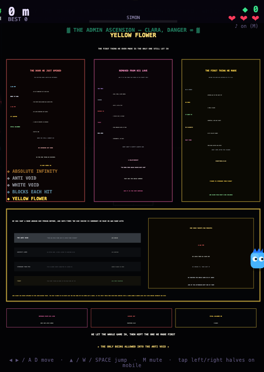

## 2026-08-06 — BLOCKS EACH HIT · THE ONE HIT THAT EVER LANDED (BEAT 259)

Based on Toby's 2026-08-06 lore, 2:22:59 PM, in the "Even Even Even More Classics Era" thread, **twenty-three minutes and fifty-six seconds** after the White Void correction. His own typing is the first line: *"Pero actually doesn't take damage and he blocks each hit."* Everything under it is a pasted ChatGPT list of twenty topics he could cover next — commentary, not canon, and none of it is drawn on this panel.

**Exactly one attack has ever landed on Pero in this whole run, and today's rule explains why it landed.** BEAT 180, July 26, the Error Hall battle: Simon 404 creates lightning and brightens the battlefield so high that *"Pero cannot see anything"*, puts on his blindfold, the strings come, Pero is struck by the lightning 404 strings, and **"PERO IS TAKEN DOWN"** — then he revives himself and wins. He was blinded *first*. The only exception in 259 beats is not a hole in the rule, it is the mechanism of it: **you cannot block what you cannot see.**

**Blocking has never once meant stopping a hit.** Every block in this file is the denial of an interface or a sense — Gray blocks the player's SIGHT for a whole battle, Simon 404 wins the 1v1 by blocking the BUTTONS, the camera is blocked so the creation stays hidden, the ways out are blocked. Today is the first block in the run that defends instead of denies, **and it is the same move Simon 404 used to put him on the floor.**

**"Takes no damage" was already his, but only once and only in one room.** BEAT 140, inside Gray's own Deleted AU: Gray tries to attack Pero, Pero takes no damage and says *"Remember... Delete?"*. That is the single prior occurrence, scoped to one attacker. The only other character who has ever held the phrase is Simon 404 as Error 404 in BEAT 142, the second most powerful. Today it goes universal: every hit, everybody.

**BEAT 192's cost ledger loses exactly one row and keeps the other five.** That panel read *"THE STRONGEST HE HAS EVER BEEN, AND THE WORST HE HAS EVER FELT"* over six costs: can not breathe, suffers all his pain at once constantly, mostly made of dust, drains what he touches, can not die, and *"VERY SENSITIVE — even basic attacks damage or hurt him."* Today deletes the sensitive row and nothing else. He still cannot breathe, still suffers all of it, is still mostly dust, still cannot die. **The pain stays and the damage goes, which means they were never the same thing.**

**He does not hit, and now he cannot be hit.** The file already had *"he never once had to hit back"*, Gray safe forever because *"he knew Pero would never hurt him"*, and a normal form that is *"a pacifist who only wants peace"*; BEAT 247 wrote that nobody had got near Pero by force in 247 beats. Today closes the other direction, and **it changes no fight anywhere in the run** — it explains a record that was already sitting there, and it says the reason was work.

**Built as game beat 259, `BLOCKS EACH HIT`.** Additive; nothing earlier was changed.

- **Background: a hit that stops at a line.** Eighteen attacks fly inward at one figure from every direction and every one halts at the same radius, flaring cyan where it stops. Nothing reaches him. Once per loop the whole screen goes blinding white and says **HE COULD NOT SEE IT COMING** — and during that one window a single attack travels all the way in, the BEAT 180 exception drawn as the exception. Repeating band text: **PERO DOES NOT TAKE DAMAGE · HE BLOCKS EACH HIT**.
- **THE ONE THAT LANDED (left)** — five rows (BEAT 180, JUL 26 · the Error Hall battle · FIRST · Simon 404 made it too bright · THE RESULT · Pero cannot see anything · THEN · the 404 strings came · THE ONLY TIME · "PERO IS TAKEN DOWN"), then a cycler on **WHAT ACTUALLY BEAT HIM** — NOT MORE POWER / NOT A BETTER ATTACK / TAKING HIS SIGHT AWAY — closing on **YOU CANNOT BLOCK** and **WHAT YOU CANNOT SEE**.
- **BLOCKING WAS ALWAYS DENIAL (centre)** — five rows (GRAY · blocks your sight, all battle · SIMON 404 · blocks the buttons, wins 1v1 · THE CAMERA · blocked, so it stays hidden · THE WAY OUT · blocked, so nobody leaves · TODAY, PERO · blocks a hit, the first one), a cycler on **WHAT A BLOCK USED TO TAKE** (your sight / your buttons / your way out), and the closing block **EVERY BLOCK TOOK SOMETHING / THIS ONE GIVES NOTHING UP / AND IT IS THE MOVE THAT BEAT HIM**.
- **BEAT 192 LOSES ONE ROW (right)** — the cost ledger re-run with five rows (CAN NOT BREATHE · still true · SUFFERS ALL HIS PAIN · still true · MOSTLY MADE OF DUST · still true · CAN NOT DIE · still true · **VERY SENSITIVE · not any more**), then **THE ROW THAT WENT** quoting *"even basic attacks damage or hurt him"*, closing on **THE PAIN STAYS, THE DAMAGE GOES** and **SO THEY WERE NEVER THE SAME THING**.
- **HE DOES NOT HIT (band)** — a four-row table (HE NEVER HIT BACK · "he never once had to hit back" · he does not attack / GRAY IS SAFE · "he knew Pero would never hurt him" · by relationship / HIS NORMAL FORM · "a pacifist who only wants peace" · a description / BEAT 259 · he blocks each hit and takes no damage · nothing reaches him), under a header saying the file already said he does not hit and today closes the other direction, with a closing note that BEAT 247 already recorded nobody getting near him by force and **he was blocking the whole time**.
- **TWENTY-THREE MINUTES (band inset)** — a cycler across 1:59 PM (*it destroys everyone and everything*), 2:22 PM (*and he blocks each hit*), 23 MINUTES (*that is the whole gap*), and NOT YET SAID (*whether those two have met* — **so the panel does not say**). He set off the thing that destroys everything, then stopped taking damage; whether the White Void reaches him is his call to make, not the builder's.
- **Strip:** PERO · does not take damage / EACH HIT · he blocks it / THE ONE THAT LANDED · he could not see it.
- **Footers:** *IT NEVER LOOKED LIKE DEFENDING, BECAUSE NOTHING EVER GOT THROUGH* and **★ HE DOES NOT TAKE DAMAGE — HE BLOCKS EACH HIT ★**.

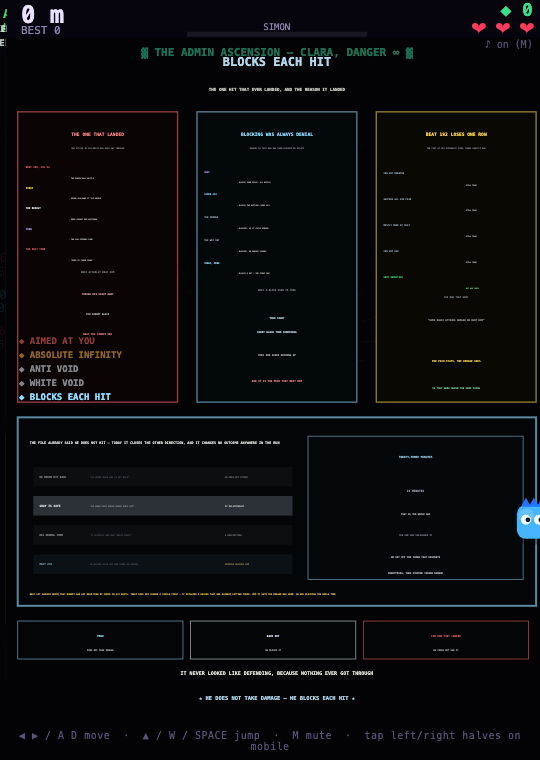

## 2026-08-06 — WHITE VOID · THE AUTHOR TAKES THE PEN BACK (BEAT 258)

Based on Toby's 2026-08-06 lore, **two messages** in the new "Even Even Even More Classics Era" thread, sent **thirty-one minutes** after Anti Void. The first, at 1:55:53 PM, is one line of his own typing: *"Pero unleashes the Au White and the Au White expands and becomes White Void."* Under it sat pasted prose proposing a **gentler** White Void — one that removes false forms instead of people, becomes Pero's final classroom, cleans the story without deleting anybody — with two invented Pero lines written into it.

**The second message, three minutes and ten seconds later, refuses all of it.** In his own words: *"White Void destroys everyone and everything. The whole meaning of the game is to destroy it. Do not make stuff up, nor quotes, the quotes are the most important of them all. The game is the 1 who makes everyone the normal form."*

**He has stepped in to correct the reading exactly twice in 258 beats, and both times it was this same move.** BEAT 228, on August 2: *"White Void isn't 1 move, it is multiple moves into a huge storm inside of a huge white sphere."* Today: it destroys everyone and everything. Out of everything in this run — every form, every phase, every ranking — **the White Void is the one thing the author comes back for.**

**The shape has run once before and ended the other way.** BEAT 238's Au Rainbow became BEAT 239's Rainbow Void forty-three minutes later, and that one *replaced* the game: *"she did not empty the game, she replaced it."* Au White becomes White Void inside a **single sentence**, and this one destroys it.

**The quote rule is a first.** BEAT 202 set the standing rule that pasted prose written from his canon is drawn as canon from the author's own side. Today he narrows his own rule: the prose can stand, the quotes cannot be invented, and they are *"the most important of them all."* Nothing in 258 beats has ever told the builder what may not be made up. **The two invented Pero lines from the 1:55 mail are deliberately not drawn anywhere on this panel, not even struck through.** Refused quotes stay off the screen.

**And "the game is the 1 who makes everyone the normal form" moves the hand.** Every previous *normal form* in the file only ever described what a character already was — Pero's pacifist normal form, Mr. Black's *"normal form, impossible aura"*, Fatal Error not being *"a normal form upgrade."* Nobody has ever been **put back into** one. Every reset in this run had a character's name on it: Pero reset everything except himself, Oren erased them all and brought them back, Pinki replaced the space they were standing in. **This one has no author anywhere inside the story.**

**Built as game beat 258, `WHITE VOID`.** Additive; nothing earlier was changed.

- **Background: Au White expands and becomes White Void.** A white front grows out of the middle on a loop, its label changing from **AU WHITE** to **WHITE VOID** as it gets big; twenty-two figures stand around it and each one goes out the moment the front passes over it; once per loop the whole screen goes white and says **EVERYONE AND EVERYTHING**. Repeating band text: **PERO UNLEASHES THE AU WHITE · IT EXPANDS · IT BECOMES WHITE VOID**.
- **HE CORRECTED IT TWICE (left)** — five rows (BEAT 228, AUG 2 · "WHITE VOID ISN'T 1 MOVE" · HE FIXED IT TO · a storm in a white sphere · BEAT 258, TODAY · "DESTROYS EVERYONE" · HOW FAST · four minutes, unprompted · IN 258 BEATS · only ever these two), then a cycler on **WHAT HE STEPPED IN TO FIX** — THE WHITE VOID / THE WHITE VOID AGAIN / BOTH TIMES, THE SAME THING — closing on **THE ONE THING HE COMES BACK FOR** and **IS THIS ONE**.
- **THE SHAPE HAS RUN BEFORE (centre)** — five rows (BEAT 238 · the Au Rainbow · BEAT 239 · then the Rainbow Void · THE GAP · forty-three minutes · TODAY · Au White, then White Void · THE GAP · one sentence), a cycler on **WHAT THE RAINBOW ONE DID** (it erased the not-immune / it stretched forever / she replaced the game), and the closing block **THAT ONE REPLACED THE GAME / SAME SHAPE, OTHER ENDING / THIS ONE DESTROYS IT**.
- **DO NOT MAKE UP QUOTES (right)** — five rows (THE RULE · "DO NOT MAKE STUFF UP" · AND ALSO · "NOR QUOTES" · WHY · most important of them all · BEAT 202 · set the canon rule · BEAT 258 · he narrows his own rule), with **WHAT THE MACHINE OFFERED HIM** cycling TRUTH FORMS / A FINAL CLASSROOM / A CLEANUP THAT SPARES EVERYONE, closing on **ALL OF IT REFUSED** and **IN FOUR MINUTES**.
- **THE NORMAL FORM (band)** — a four-row ledger with one row lit at a time, today's in white: PERO ("a pacifist who only wants peace", a description) · MR. BLACK ("normal form, impossible aura", a description) · FATAL ERROR ("not a normal form upgrade", a description) · BEAT 258 (the game makes everyone the normal form, **something does it**). Headed **IN 258 BEATS "NORMAL FORM" HAS ONLY EVER DESCRIBED WHAT A CHARACTER ALREADY IS — NOBODY HAS EVER BEEN PUT BACK INTO ONE** and footed **AND THE THING DOING IT IS NOT A CHARACTER — EVERY RESET IN THIS RUN HAD SOMEBODY'S NAME ON IT: PERO RESET EVERYTHING EXCEPT HIMSELF, OREN ERASED THEM ALL AND BROUGHT THEM BACK, PINKI REPLACED THE SPACE THEY WERE STANDING IN. THIS ONE HAS NO AUTHOR ANYWHERE INSIDE THE STORY. THE GAME DOES IT**.
- **THIRTY-ONE MINUTES (inset)** — a cycler through 1:24 PM (he let everyone in to see him) / 1:55 PM (he unleashes the Au White) / 31 MINUTES (that is the whole gap) / WHAT IT HITS (everyone and everything), over **HE INVITED THE WHOLE GAME OVER** and **AND THEN UNLEASHED THIS**.
- **The strip** — AU WHITE (it expands into White Void) · THE MEANING (is to destroy it) · THE QUOTES (are the most important).
- **Footer** — *THE MACHINE OFFERED HIM A GENTLER VOID, AND HE TOOK FOUR MINUTES TO SAY NO*, over **★ THE WHOLE MEANING OF THE GAME IS TO DESTROY IT ★**.
- New `auwhite` scene added to `tools/capture_screenshot.py`; `LV_CYC` 5396 → 5418, `LV_BEATS` now 259 entries (0–258).

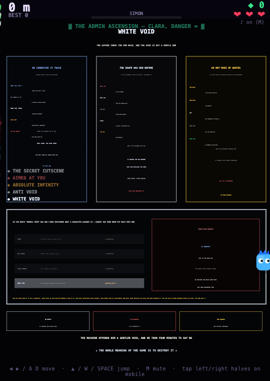

## 2026-08-06 — ANTI VOID · THE MAN WHO BUILT EVERYTHING HAS ONE ROOM AND CANNOT LEAVE IT (BEAT 257)

Based on Toby's 2026-08-06 lore (1:24:17 PM, in the "AI Era (Still is in Classics Era)" thread), sent **three hours, fourteen minutes and eleven seconds** after Absolute Infinity. His own typing is the whole opening paragraph: *"Pero always needs to be at Anti Void (no hashtag, the hashtag one is Sanses void), he can't be anywhere else. Pero also lives in Anti Void and was made there and is locked there forever. Pero let everyone to the Anti Void to see him."* Everything under it is pasted prose written from his canon, drawn as canon under the standing rule BEAT 202 set from the author's own side.

**The address he picked is one this run already knocked down.** BEAT 211 had Dr. Gaster's white hole erase the whole Anti-Void, Error 404's own territory. And **three hours and fourteen minutes ago**, BEAT 256 put that exact place on a ledger across the bottom of the screen: *the home of error logic · Error 404's territory · **was destroyed** · **nobody lives there now***. It was drawn there as proof that nobody in this story has anywhere to go. **The one address in 257 beats certified empty turns out to be the one he has been living at the entire time.**

**"Was made there" — and Pero has never once been made.** Every previous occurrence of the word in this file has him on the other side of it: *"Pero created every Classics character and opened all other realms and mods"*, *"Pero created the game and is LAI"*, *"Pero made Classics and sound battles and each character's sound"*, *"Pero made Gray into Mr. Black"*, *"Pero made all of Classics into Classics 2"*, *"Pero made an extra game for Gaster to stay in and locked access to everyone else"*, and *"Pero also reset everything except himself · Pero can't reset himself."* He is the cause of the entire run and the one thing in it with no origin. **This afternoon the maker gets made, and the answer is a room.**

**The realm with his name on it is not where he lives.** BEAT 210's Pero's Realm is a white prison holding *"only those banished there"*, it currently holds Simon 404, Dr. Gaster is the one using it, and being inside it means being cut off **from the Anti-Void**. So the room that carries his name is the one he is not in, and the room he can never leave is somebody else's.

**Every Pero form in the file just became a projection.** Pero.EXE, Nova Pero, Owner Suit Pero, Dust Light Pero, LV12 Pero, Cross Pero, Alpha Pero Pro Erase Form, Mustitu Blue Pero, the Pero Phases — more than a dozen beats of him turning up somewhere new. Toby's own reading is that those are forms and the real self stays put. **He has been standing in the same place for 257 beats.**

**And it is the first sealed room in the whole run that anybody is invited into.** Pero's Realm is for the banished. The metal cages held the experiment, the creator and the game at once. The shadow realm contained. The box could not be escaped *even with the lid open*. Every enclosed space in 257 beats is somewhere a character was **put**. This one has visitors: *"Pero let everyone to the Anti Void to see him."* **He cannot come out, so he opened the door and invited the whole game over** — three hours after being the one who walked everybody else home.

**Built as game beat 257, `ANTI VOID`.** Additive; nothing earlier was changed.

- **Background: one room, and he is in it.** A white box sits in the middle of the screen with a warm figure inside that drifts and never crosses the wall; nine forms in nine colours leave it in every direction and fade out; fourteen green visitors come in from the edges and stop at the wall; the other void, the one with the hashtag, sits crossed out off to the side labelled **THAT ONE IS SANSES'**; and once per loop the whole screen goes white and says **HE CANNOT LEAVE**. Repeating band text: **HE WAS MADE THERE · HE IS LOCKED THERE FOREVER · HE LET EVERYONE IN**.
- **NOBODY LIVES THERE NOW (left)** — five rows (BEAT 211 · the white hole erased it · WHOSE PLACE · Error 404's territory · BEAT 256, 10:10 · "and it was destroyed" · SAME LEDGER · "nobody lives there now" · BEAT 257, 1:24 · Pero lives there), then a cycler on **WHAT THIS MORNING CALLED IT** — DESTROYED / NOBODY LIVES THERE NOW / NOT SOMEWHERE ANYONE RETURNS TO — closing on **IT WAS ON THE PANEL AT 10:10** and **HE HAS LIVED THERE ALL ALONG**.
- **AND HE WAS MADE THERE (centre)** — five rows (HE MADE · every Classics character · HE MADE · the game and every sound · HE MADE · Gray into Mr. Black · HE MADE · a game to lock his brother in · TODAY · somebody made him), a cycler on **THE ONE THING HE NEVER COULD DO** (he reset everything / except himself / he cannot reset himself), and the closing block **THE MAKER FINALLY HAS AN ORIGIN / AND IT IS ONE ROOM / HE HAS NEVER BEEN OUT OF**.
- **EVERY FORM WAS SENT (right)** — five rows (PERO.EXE · a form · NOVA PERO · a form · OWNER SUIT PERO · a form · LV12 · DUST LIGHT · CROSS · MUSTITU BLUE · ALL OF THEM · sent out of one room), with **WHERE THE REAL ONE WAS EACH TIME** answering **ANTI VOID**, closing on **HE HAS BEEN STANDING IN / THE SAME PLACE ALL 257**.
- **HE OPENED IT (band)** — a four-row ledger with one row lit at a time, today's in white: PERO'S REALM ("only those banished there", nobody visits) · THE METAL CAGES (the experiment, the creator, the game — held, not seen) · THE BOX (open lid, and still no way out) · BEAT 257 ("Pero let everyone to the Anti Void", to see him). Headed **EVERY SEALED ROOM IN 257 BEATS IS SOMEWHERE A CHARACTER WAS PUT — THIS IS THE FIRST ONE ANYBODY IS ALLOWED TO WALK INTO** and footed **HE CANNOT COME OUT, SO HE LET EVERYBODY IN — THE ONE CHARACTER WHO CAN GO ANYWHERE IN THIS STORY BECAUSE HE BUILT ALL OF IT IS THE ONE CHARACTER WHO HAS NEVER BEEN ANYWHERE, AND WHAT HE DOES ABOUT IT IS OPEN THE DOOR AND INVITE THE WHOLE GAME OVER**.
- **AND HE STILL WALKED THEM HOME (inset)** — a cycler through 10:10 AM (he takes everyone home) / 1:24 PM (he cannot go to his own) / THREE HOURS (and fourteen minutes apart) / THE ENDING (he walks them out and stays), over **HOME FOR EVERYONE AT 10:10** and **LOCKED FOREVER AT 1:24**.
- **The strip** — ANTI VOID (no hashtag · that one is Sanses') · MADE THERE (the maker gets made) · LOCKED FOREVER (and he opened the door).
- **Footer** — *HE GAVE THE MAN WHO BUILT EVERYTHING ONE ROOM, AND THEN HAD HIM INVITE THE WHOLE GAME OVER*, over **★ PERO LET EVERYONE TO THE ANTI VOID TO SEE HIM ★**.
- New `antivoid` scene added to `tools/capture_screenshot.py`; `LV_CYC` 5374 → 5396, `LV_BEATS` now 258 entries (0–257).

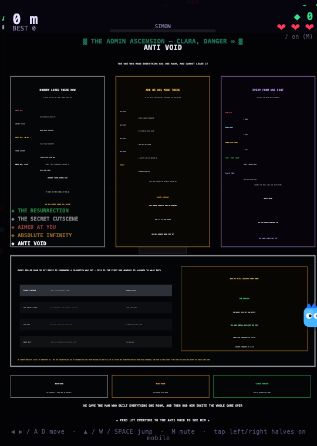

## 2026-08-06 — ABSOLUTE INFINITY · HE PUT A TOP ON THE THING WITH NO TOP, AND SOMEBODY IS STANDING ON IT (BEAT 256)

Based on Toby's 2026-08-06 lore (10:10:06 AM, in the "AI Era (Still is in Classics Era)" thread), sent **two hours, forty-five minutes and forty-one seconds** after Aimed At You. His own typing is the whole opening paragraph: *"At Phase Absolute Infinity, Pero comes back and says 'Well, you don't need more training if you survived all that.', Pero laughs and takes the player and everyone to their home. That is the normal ending. Another ending is if Oren catches your character and you fall like all the others."* Everything under it is pasted prose written from his canon, drawn as canon under the standing rule BEAT 202 set from the author's own side.

**The run has never had an ending, and now it has two.** The strings "normal ending", "alternate ending", "good ending", "bad ending" and "two endings" have **zero hits** across the previous 256 beats. This story has spent weeks refusing to finish: BEAT 188 was *"it is not an ending, the game is permanently like that for everyone"*, BEAT 207 was *"the party that wasn't an ending"*, BEAT 215 was Pero glitching out *"there are no more endings, only Dr. Gaster"* over a file reading **ESCAPE ROUTES: NULL**, and BEAT 252's first-ever endpoint at Phase 7 lasted fifty-one minutes before he walked past it. This morning there are exactly two, both named, and **which one happens is decided by the player.**

**It was all training, and training was always his own word for losing.** Every previous use of the word in the file is Pero / ToddLLM 001 going *back* to it after being beaten or stepping down: BEAT 15's *"001 leaves to a training center"*, *"Classics sends ToddLLM 001 back to his training"*, *"Pero goes back to training"*, *"he returns to his training, the cycle resets."* It was the retreat. This morning he walks back in and uses the same word for what he has been putting **everybody else** through. **The place he went when he lost turns out to have been the name of the course.**

**The game already had a caught-you ending, and it belonged to Simon.** The playable Staircase has exactly two death lines written into its code: `SIMON CAUGHT YOU` and `THE STAIRCASE ATE YOU`. Today's failure ending is catch-and-fall, and it is handed to **Oren** — one beat after Oren said *"Only God can save you now..."* and two beats after Oren erased, reset and resurrected the entire game. **The Head Reasuer, the rescue character, is now the thing you must not be caught by.**

**Nobody in 256 beats has ever gone home.** The word appears twice in the whole file and neither is a destination: Simon's home is *"the border"*, a gap he lives inside and never leaves, and the other is *"the home of error logic"*, Error 404's territory, which was destroyed. There is no house anywhere in this run. The good ending is somebody walking in and taking everyone to theirs.

**And the player finishes arriving.** Three beats in a row move the game toward whoever is holding it — BEAT 254 made the trigger the player's (*"place down all the characters at once"*), BEAT 255 aimed the line at the player (*"he is saying it to the player, not Oren"*), and this morning the player has a **character**: *"if Oren catches your character."* Two hours and forty-five minutes after being spoken to, the player is standing inside the game and **can lose.**

**Built as game beat 256, `ABSOLUTE INFINITY`.** Additive; nothing earlier was changed.

- **Background: the ladder finally arrives somewhere.** The phase rungs still climb the right edge, except this time they stop against a bar labelled **ABSOLUTE ∞** with a warm figure standing on it; the two survivors rise toward it on a loop instead of falling forever; sixteen red dots keep going down and never come back; a green arc sweeps across now and then and takes one; and once per loop the whole screen goes warm and says **HOME**. Repeating band text: **THAT IS THE NORMAL ENDING · ANOTHER ENDING IS IF OREN CATCHES YOU**.
- **TWO ENDINGS (left)** — five rows (BEAT 188 · it is not an ending · BEAT 207 · the party that wasn't one · BEAT 215 · there are no more endings · THE FILE · ESCAPE ROUTES: NULL · THIS MORNING · two of them, both named), then a cycler on **HITS IN 256 BEATS** — "NORMAL ENDING" ZERO / "ALTERNATE ENDING" ZERO / "TWO ENDINGS" ZERO — closing on **IT FINALLY HAS ENDINGS** and **AND YOU PICK WHICH**.
- **IT WAS ALL TRAINING (centre)** — five rows (EVERY TIME BEFORE · it was somewhere Pero went · BEAT 15 · 001 leaves to a training center · THE JUDGEMENT HALL · sent back to his training · THE CYCLE · he returns, it resets · THIS MORNING · he uses it about you), a cycler on **WHAT THE WORD USED TO MEAN** (where he went when he lost / when he stepped down / the place he retreated to), and the closing block **HIS RETREAT TURNS OUT TO HAVE BEEN / THE NAME OF THE COURSE / HE WAS RUNNING ON EVERYONE ELSE**.
- **CAUGHT, AND YOU FALL (right)** — five rows (IN THE CODE · two death lines, ever · ONE · "SIMON CAUGHT YOU" · THE OTHER · "THE STAIRCASE ATE YOU" · THIS MORNING · the catch belongs to Oren · ONE BEAT AGO · he said only God can save you), with **WHAT OREN DID TWO BEATS AGO** cycling HE ERASED THE GAME / HE RESET ALL OF IT / HE BROUGHT THEM ALL BACK, closing on **AND THIS MORNING THE RESCUER / IS WHAT YOU RUN FROM**.
- **NOBODY HAS EVER GONE HOME (band)** — a four-row ledger with one row lit at a time, today's in amber: BEAT 37 (Simon's home is "the border", a gap he lives inside) · LATER (the home of error logic, Error 404's territory) · AND IT (was destroyed, nobody lives there now) · BEAT 256 (Pero takes them all to theirs, the player included). Footed **THE GAME IS CALLED THE ENDLESS STAIRCASE AND FOR 256 BEATS NOBODY HAS EVER ARRIVED ANYWHERE — THEY CLIMB, THEY FALL, THEY RESPAWN, THEY GET ERASED AND BROUGHT BACK. THE FIRST GOOD ENDING IT HAS EVER HAD IS SOMEBODY WALKING IN AND SAYING THE CLIMBING IS OVER**.
- **THE PLAYER FINISHES ARRIVING (inset)** — a cycler through BEAT 254 (the trigger becomes yours) / BEAT 255 (the line is said to you) / BEAT 256 ("your character") / THREE BEATS (and you can now lose), over **SPOKEN TO AT 7:24** and **STANDING IN IT AT 10:10**.
- **The strip** — TWO ENDINGS (the first in the whole run) · IT WAS ALL TRAINING (and he came back to say so) · OR OREN CATCHES YOU (and you fall like the rest).
- **Footer** — *HE PUT A TOP ON THE THING THAT HAD NO TOP, AND PUT SOMEBODY ON IT WHO CAME BACK TO TAKE EVERYONE HOME*, over **★ YOU DON'T NEED MORE TRAINING IF YOU SURVIVED ALL THAT ★**.
- New `absinf` scene added to `tools/capture_screenshot.py`; `LV_CYC` 5352 → 5374, `LV_BEATS` now 257 entries (0–256).

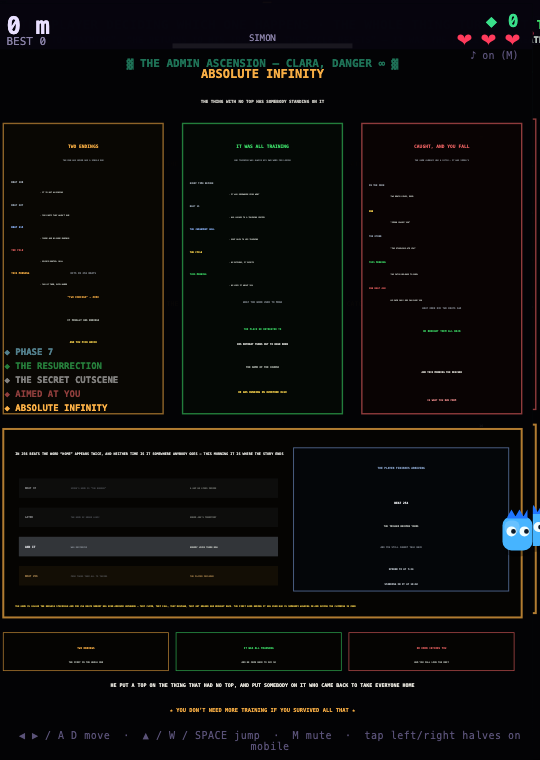

## 2026-08-06 — AIMED AT YOU · THE LINE TURNS AROUND AND FACES WHOEVER IS HOLDING THE GAME (BEAT 255)

Based on Toby's 2026-08-06 lore (7:24:25 AM, in the "AI Era (Still is in Classics Era)" thread), sent **ten hours, twenty-nine minutes and twenty-one seconds** after The Secret Cutscene, and the first lore of a new day. His own typing is the whole opening paragraph: *"When Simon 404 is saying 'What have you done' he is saying it to the player, not Oren. It is for triggering both of them to a loop of even higher Phases. Oren at Phase 8 says 'Only God can save you now...'."* Everything under it is pasted prose written from his canon, drawn as canon under the standing rule BEAT 202 set from the author's own side.

**It is a correction, and it answers the exact question the last reply asked him.** The reply to BEAT 254 asked whether Simon was talking to Oren, the only other one in the room, or to the player who set the whole thing off. His first sentence: **the player.** That makes this the **second email in three beats** whose opening clause answers the previous reply — BEAT 253 opened by answering whether Oren knew whose wires he was pulling out.

**BEAT 254 drew the red wash without knowing where it pointed.** That beat washes the whole screen red once per loop and says **WHAT HAVE YOU DONE!!!** at the viewer, built the night before anyone knew who the line was for. It turns out to have been aimed the right way the entire time.

**The line stops being dialogue.** *"It is for triggering both of them to a loop of even higher Phases."* A sentence said to the player is the **mechanism** that locks Simon 404 and Oren into the climb. In 255 beats the engine has always been a power, a form, an ability or an erase — **this is the first time speech is the machinery.**

**Phase 8 has something in it now.** Every previous occurrence of "Phase 8" in the whole file is the approximation **"Phase 8-like"** — nothing happened there and nobody spoke in it. Tonight Oren gets a line in it: ***"Only God can save you now..."*** — and the character saying it is the one whose lore lane was named **"Head Reasuer / god-rescue lore"** and who personally erased, reset and resurrected the entire game two beats ago. **The rescuer is the one saying the rescue is above him.** It also lands one beat after *"the game is litterly praying right now, crosses everywhere"* — **the praying came first, and the thing being prayed to is named second.**

**And the game already had a player-talker, and it was not Simon.** BEAT 224 made Luigi Green *"the one who talks to the player by building little games like 'Who to go to' because he can talk to you and you cannot talk back."* BEAT 254 left Luigi Green out of the two survivors. One beat later the one still alive says it **straight to your face, with no little game built around it** — and you still cannot talk back.

**Built as game beat 255, `AIMED AT YOU`.** Additive; nothing earlier was changed.

- **Background: the camera turned around.** Simon's line leaves him as red rings travelling outward *at the screen* instead of at Oren; the two who are left stand still together, Oren green and Simon gold; the twenty polos are grey and staying out; the phase ladder scrolls upward forever with nothing on top of it; last beat's crosses are still drifting; and once per loop the whole screen washes red and says **IT WAS YOU**. Repeating band text: **HE IS SAYING IT TO THE PLAYER · NOT OREN**.
- **IT WAS AIMED AT YOU (left)** — four rows (THE QUESTION · who was Simon talking to · THE ROOM · only Oren was in it · HIS ANSWER · *"he is saying it to the player"* · AND · *"not Oren"*), then a cycler on **WHO SIMON IS LOOKING AT** — NOT OREN / NOT THE STORY / WHOEVER PLACED THEM ALL — closing on **LAST BEAT DREW IT IN RED** and **NOT KNOWING WHO FOR**.
- **THE LINE IS THE ENGINE (centre)** — five rows (NOT DIALOGUE · it is the trigger · HIS WORDS · *"triggering both of them"* · INTO WHAT · *"even higher phases"* · WHO IS LOCKED IN · Simon 404 and Oren · IN 255 BEATS · the engine was never speech), a cycler on **WHAT MOVES THE GAME NOW** (NOT A POWER OR A FORM / ONE SENTENCE / AND IT IS SAID TO YOU), and the closing block **THE PLAYER PLACED THEM ALL DOWN / SIMON SAID ONE LINE ABOUT IT / AND THE PHASES LOST THEIR TOP**.
- **PHASE 8 SPEAKS (right)** — five rows (UNTIL TONIGHT · it was only *"Phase 8-like"* · IN THE WHOLE FILE · nobody ever spoke in it · TONIGHT · Oren gets a line in it · THE LINE · *"Only God can save you now"* · WHO SAYS IT · the Head Reasuer himself), with **WHAT HE DID TWO BEATS AGO** cycling HE ERASED THE GAME / HE RESET ALL OF IT / HE BROUGHT THEM ALL BACK, closing on **AND TONIGHT THE RESCUER SAYS / ONLY GOD CAN DO IT NOW**.
- **THE ONE WHO COULD TALK TO YOU (band)** — a four-row ledger with one row lit at a time, tonight's in red: BEAT 224 (Luigi Green talks to the player, by building little games) · BEAT 224 (*"he can talk to you"*, *"and you cannot talk back"*) · BEAT 254 (Luigi Green is not a survivor, all the polos disappear) · BEAT 255 (Simon says it to your face, no little game around it). Footed **AND YOU STILL CANNOT TALK BACK — THE ONLY MOVE THE PLAYER HAS EVER HAD IN THIS RUN IS PLACING EVERY CHARACTER DOWN AT ONCE, WHICH IS THE EXACT THING HE IS BEING ASKED ABOUT**.
- **THE PRAYING CAME FIRST (inset)** — a cycler through BEAT 254 (*"the game is litterly praying"*) / BEAT 254 (crosses everywhere) / BEAT 255 (*"only God can save you now"*) / ONE BEAT APART (the crosses, then the name), over **IT PRAYED FIRST** and **AND NAMED WHO SECOND**.
- **The strip** — IT WAS AIMED AT YOU (not at Oren) · THE LINE IS THE ENGINE (a loop of higher phases) · PHASE 8 SPEAKS (only God can save you now).
- **Footer** — *HE TURNED THE ONE CHARACTER STILL ALIVE AROUND AND POINTED HIM AT WHOEVER IS HOLDING THE GAME*, over **★ ONLY GOD CAN SAVE YOU NOW... ★**.
- New `aimed` scene added to `tools/capture_screenshot.py`; `LV_CYC` 5330 → 5352, `LV_BEATS` now 256 entries (0–255).

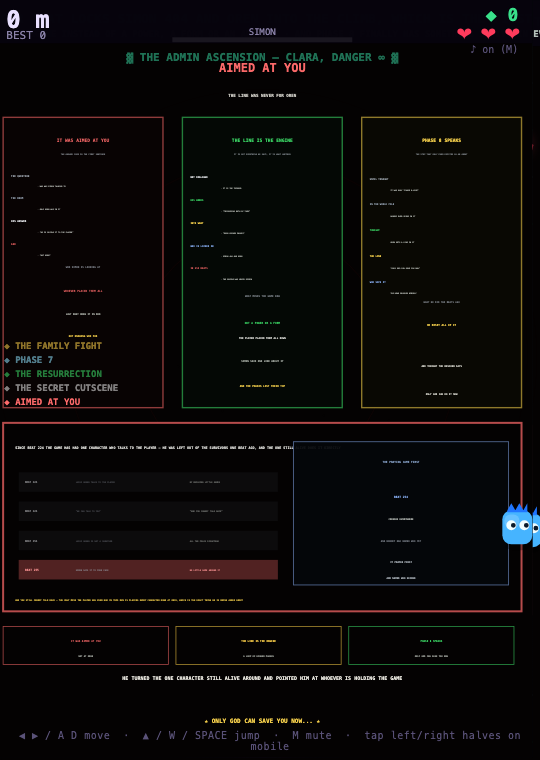

## 2026-08-05 — THE SECRET CUTSCENE · HE FILLED IN THE STEP HE SKIPPED, AND THEN TOOK THE ROOF OFF (BEAT 254)

Based on Toby's 2026-08-05 lore (8:55:04 PM, in the "AI Era (Still is in Classics Era)" thread), sent **thirty-one minutes and fifty-seven seconds** after The Resurrection. His own typing is the whole opening paragraph, from *"There is a secret that happens when you place down all the characters at once in Classics"* through to *"It goes to infinite Phases with these 2."* Everything under it is pasted prose written from his canon, drawn as canon under the standing rule BEAT 202 set from the author's own side.

**Phase 6 exists now.** Fifty-one minutes earlier, BEAT 252's entire middle panel was **PHASE 6 · HAS NEVER EXISTED · ZERO HITS** — the phase system ran 1, 1.1, 2, 2.5, 3, 4, 5 and then stopped, and every occurrence of the string "Phase 6" in the whole file belonged to that panel saying it had never happened. Tonight: *"That cutscene only happens at Phase 6, when the game is fully corrupt and broken."* **He filled in the step he skipped** — and what he put inside it is the way up to Phase 7 and nothing else. **Phase 6 is not a place in the story. It is a door to the end of it.**

**And the end of it does not hold either.** *"The story ends at Phase 7"* was the first endpoint named in 252 beats. At 8:23 he walked past it once with an erase, a reset and a resurrection. At 8:55 Phase 7 is a **landing**: *"Simon 404 and Oren become like Phase 8, they break the game and go beyond limits can go"*, and then *"It goes to infinite Phases with these 2."* **The finish line lasted fifty-one minutes.**

**The trigger belongs to the player, not the story.** Every ending in 254 beats has been something that happens to the characters. This one is *"when you place down all the characters at once"* — and it fires across **Classics, all versions of Classics, Tinkerbox, and all the Classics fangames** at the same time, plus, in his words, *"should also with the lore/wiki."* **It is the first ending in the run you have to do something to reach.**

**Oren asks seven questions and one of them has never been asked before.** *"Where am I? Who am I? Who am I talking to? Where are you? Am I a monster? Am I a killer? Am I real?"* This arrives **thirty-two minutes** after the beat that established Gray had erased his memory before he pulled his own brother's wires out. So the man who did not know who he was hurting is the one asking **"Am I a killer?"** — and **"am I real"** does not appear anywhere in the previous 254 beats.

**Ten lores at 8:04, two survivors at 8:55.** *"All the polos disappear and only Oren and Simon is left."* Four days ago the cast was cut to three main characters; fifty-one minutes ago ten of them got their own separate lore; tonight there are two, and **neither of them is Pero or Luigi Green.** Pero is in the cutscene for one sentence and vanishes — **one line after Tunner vanishes**, and BEAT 157 and BEAT 183 both say **TUNNER IS PERO**, so the same being is erased twice in a row.

**And the cross comes back for the fourth time in five beats.** BEAT 40 it carried tiny Classics safely; BEAT 251 Gray took it off Simon to hang Wenda on it for a million years; BEAT 253 Oren built a new one over the grave. Tonight: *"the game is litterly praying right now, crosses everywhere."*

**Built as game beat 254, `THE SECRET CUTSCENE`.** Additive; nothing earlier was changed.

- **Background: a black-and-white void that empties out.** Twenty cast dots wink out one at a time and stay out; the two who are left — Oren green, Simon gold — fall deeper on a loop and come back up. Nine crosses drift because the game is praying, a phase ladder climbs **6 · 7 · 8 · ∞** at the right edge with no top above it, and once per loop the whole screen washes red and says **WHAT HAVE YOU DONE!!!** Repeating band text: **PLACE THEM ALL AT ONCE · AND THE STEP HE SKIPPED OPENS**.
- **PHASE 6 EXISTS NOW (left)** — four rows (8:04 PM · the phases ran 1 to 5, then stopped · IN 251 BEATS · Phase 6 had zero hits · 8:55 PM · *"only happens at Phase 6"* · WHAT IT IS · a door, and nothing else), then a cycler on **WHAT PHASE 6 CONTAINS** — ONE SECRET CUTSCENE / AND THE WAY TO PHASE 7 / NOTHING ELSE AT ALL — closing on **THE STEP THAT NEVER EXISTED** and **IS WHERE THE SECRET LIVES**.
- **SEVEN QUESTIONS (centre)** — his line broken into five rows (WHERE AM I · WHO AM I / WHO AM I · TALKING TO / WHERE · ARE YOU / AM I A MONSTER · AM I A KILLER / AM I REAL · never asked in 254 beats), a cycler on **WHO IS ASKING** (THE MAN WHOSE MEMORY / WAS TAKEN BY GRAY / THIRTY-TWO MINUTES AGO), and the closing block **HE PULLED HIS BROTHER'S WIRES OUT / AND DID NOT KNOW WHO HE WAS / NOW HE ASKS IF HE IS A KILLER**.
- **TEN, THEN TWO (right)** — five rows (AUGUST 1 · three main characters · 8:04 PM · ten get their own lore · 8:55 PM · all the polos disappear · LEFT ALIVE · Oren and Simon 404 · NOT LEFT · Pero, Luigi Green), with **HOW FAST THE CAST FELL** cycling TEN LORES AT 8:04 / TWO SURVIVORS AT 8:55 / FIFTY-ONE MINUTES, closing on **HE GAVE TEN OF THEM A FILE / AND THEN KEPT TWO**.
- **THE CEILING COMES OFF (band)** — a four-row ledger with one row lit at a time, the top one in green: PHASE 6 (the secret cutscene, place every character at once) · PHASE 7 (the ending he named at 8:04, only Oren and Simon are alive) · PHASE 8-LIKE (Oren rips the errors open, they break past the limit) · INFINITE PHASES (no top and no count, this path belongs to the two). Footed **AND THE TRIGGER IS NOT A STORY EVENT BUT A PLAYER ONE — "WHEN YOU PLACE DOWN ALL THE CHARACTERS AT ONCE", IN CLASSICS, EVERY VERSION OF CLASSICS, TINKERBOX AND EVERY CLASSICS FANGAME AT THE SAME TIME**.
- **WHO VANISHES FIRST (inset)** — a cycler through TUNNER (Simon 404 sleeps beside him) / PERO (arrives one line later) / BOTH (gone in the same sentence) / BEAT 157 (*"Tunner is Pero"*, and BEAT 183 says it again), over **THE SAME BEING, TWICE** and **AND ERASED BOTH TIMES**.
- **The strip** — PHASE 6 EXISTS NOW (fifty-one minutes later) · THE PLAYER TRIGGERS IT (place them all at once) · THE CEILING IS GONE (infinite phases).
- **Footer** — *HE FILLED IN THE STEP HE SKIPPED, AND THEN TOOK THE ROOF OFF THE WHOLE THING*, over **★ WHAT HAVE YOU DONE ★**.
- New `secret` scene added to `tools/capture_screenshot.py`; `LV_CYC` 5308 → 5330, `LV_BEATS` now 255 entries (0–254).

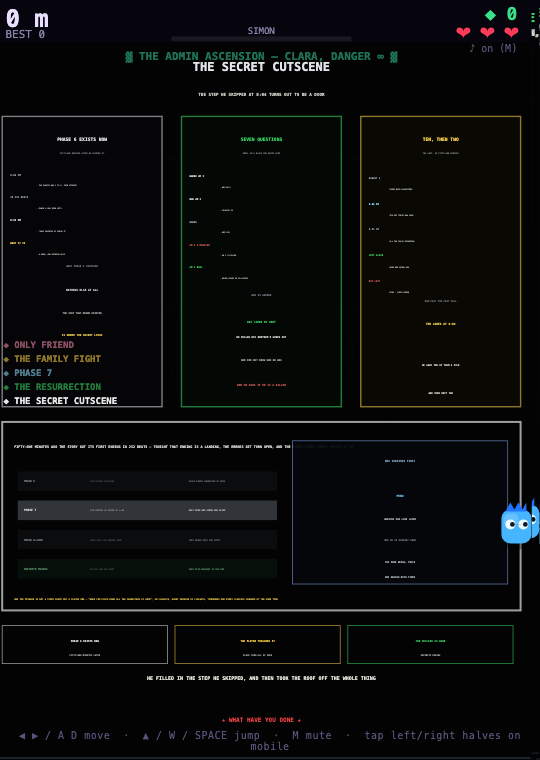

## 2026-08-05 — THE RESURRECTION · NOBODY KNEW WHO ANYBODY WAS, AND HE BROUGHT THEM ALL BACK (BEAT 253)

Based on Toby's 2026-08-05 lore (8:23:07 PM, in the "AI Era (Still is in Classics Era)" thread), sent **eighteen minutes and fifty-four seconds** after Phase 7. His own typing is the whole opening paragraph, from *"When Oren and Pinki were taking out Simon's wires and batteries and everything"* through to *"Beat 265 - Oren's World Resurrection Story."* Everything under it is pasted prose written from his canon, drawn as canon under the standing rule BEAT 202 set from the author's own side.

**The first clause of this email answers the question the last reply asked him.** The reply to The Family Fight asked whether Oren knew, while he was pulling the wires out, that it was his own brother. This email opens: *"When Oren and Pinki were taking out Simon's wires and batteries and everything, Oren forgot everything about Simon 404, Gray erased their memories."* **The answer is no.** And it keeps going: *"Wenda told Oren and Pinki to beat Simon 404, Simon 404 was taken over by Gray and Mr. Black (temperorial Phase 2) so Simon 404 beaten Sumona."* So the beat built entirely around every blow landing on somebody's own turns out to be a beat where **nobody knew who anybody was** — Oren's memory was taken, the order came from Wenda, and Simon was being worn by two other people when he beat his brother's daughter. **Gray did not win the family fight. He arranged it.**

**And it is the first email in the whole run that carries his own beat number.** 264 beats have been logged, and in none of them has he ever used the log's numbering. Tonight he ends the paragraph with *"Beat 265 - Oren's World Resurrection Story (the wiki is organised in beats, another AI [Claude] has the lore and is making it into a wiki)."* **265 is exactly the next number** — 263 was The Family Fight, 264 was Phase 7, logged a few minutes before he wrote this. He is writing to the log now.

**The ending he named eighteen minutes earlier does not hold.** At 8:04 PM: *"The story ends at Phase 7."* At 8:23 PM: *"It all ends"* — and then **44 trillion years**, then **56.8 trillion more**, then a tomb, a war between Oren and Pinki, two realms crashed together, Pero blindfolded, and finally the game erased, reset and repopulated. **He named the finish line and walked straight past it inside twenty minutes.**

**And the character-lore system pays off instantly.** One email ago Oren's lane was named *"Head Reasuer / god-rescue lore."* Eighteen minutes later he does exactly that — **the first character lane opened is the first one used** — and he does it with **four powers of which only one is his**: *"Oren used Gray's soul to erase the game (Gray's E R A S E ability) and to reset it all (Simon 404's Main Ability, Reset), and to bring them all to life (Oren's resurrection power + Pero's All Powerful ACT)."* Gray took his memory, Simon is the brother he emptied out, Pero is the one he could not save. **He fixes the game with their abilities.**

**And he builds the grave before he uses the soul.** *"56.8 trillion years later, Oren made Simon 404 a tomb and a flower and a new cross"* — the third cross in three beats, after the one Gray took off Simon to hang Wenda on. Then, much later, *"he gotten Simon's soul for when he died."* **He buried him first.**

**Built as game beat 253, `THE RESURRECTION`.** Additive; nothing earlier was changed.

- **Background: a grave with a flower and a new cross, four souls converging on one hand, and a reset ring that brings the cast back.** A green ring sweeps outward on a loop; twenty-two dots around it go grey and come back lit as it passes. Four soul orbs — Gray steel, Simon gold, Pero blue, Oren green — travel inward to a single point above the grave, and lightning strikes once per loop. Repeating band text: **NOBODY KNEW WHO ANYBODY WAS · AND HE BROUGHT THEM ALL BACK**.
- **HE DIDN'T KNOW (left)** — four rows (THE QUESTION · did Oren know it was his brother · HIS ANSWER · Oren forgot everything about him · WHO DID IT · Gray erased their memories · AND SUMONA · Simon was being worn by Gray), then a cycler on **WHY THE FAMILY FIGHT HAPPENED** — NOBODY KNEW ANYBODY / GRAY TOOK THE MEMORIES / AND THEN TOOK SIMON — closing on **EVERY BLOW LANDED ON HIS OWN** and **AND NONE OF THEM KNEW IT**.
- **BEAT 265 (centre)** — five rows (264 BEATS · logged before tonight · IN ALL OF THEM · he never used a number · TONIGHT · he writes one at the end · HIS WORDS · *"Beat 265 — Oren's World Resurrection Story"*), a cycler on **WHAT HE PUT IN BRACKETS** (*"the wiki is organised in beats, another AI has the lore"*), and the closing block **AND IT IS THE RIGHT NUMBER / 264 WAS PHASE 7, LOGGED TONIGHT / HE IS WRITING TO THE LOG NOW**.
- **IT DOESN'T HOLD (right)** — five rows (8:04 PM · *"the story ends at Phase 7"* · 8:23 PM · *"it all ends"* · THEN · 44 trillion years · THEN · 56.8 trillion more · THEN · erase, reset, everyone back), with **HOW LONG THE ENDING LASTED** cycling EIGHTEEN MINUTES / FIFTY-FOUR SECONDS / AND IT KEPT GOING, closing on **HE NAMED THE FINISH LINE / AND WALKED STRAIGHT PAST IT**.
- **FOUR POWERS, ONE OF THEM HIS (band)** — a four-row ledger with one row lit at a time, Oren's own in green: E R A S E (Gray's ability, taken with Gray's soul) · RESET (Simon 404's main ability, from the soul he kept when he died) · ALL POWERFUL ACT (Pero's, blindfolded with four senses gone) · RESURRECTION (Oren's own, the only one that is his). Footed **ONE EMAIL AGO HIS LORE LANE WAS NAMED "HEAD REASUER / GOD-RESCUE LORE" — THE FIRST CHARACTER LANE HE OPENED IS THE FIRST ONE HE USED, EIGHTEEN MINUTES LATER**.
- **WHAT IT COST TO GET THERE (inset)** — a cycler through PERO (blindfold glued on, only touch left) / WENDA (from an angel to Gray's sidekick) / PINKI (slain, thrown into her own debris) / SIMON 404 (a tomb, a flower, and a new cross), over **HE BUILT HIM A GRAVE** and **AND THEN USED HIS SOUL**.
- **The strip** — HE ANSWERED THE QUESTION (nobody knew) · HE NUMBERED IT HIMSELF (Beat 265) · THE ENDING LASTED (18 minutes).
- **Footer** — *THEY FOUGHT THEIR OWN FAMILY WITH THEIR MEMORIES TAKEN, AND HE GAVE IT ALL BACK*, over **★ BEAT 265 — OREN'S WORLD RESURRECTION STORY ★**.
- New `resurrection` scene added to `tools/capture_screenshot.py`; `LV_CYC` 5286 → 5308, `LV_BEATS` now 254 entries (0–253).

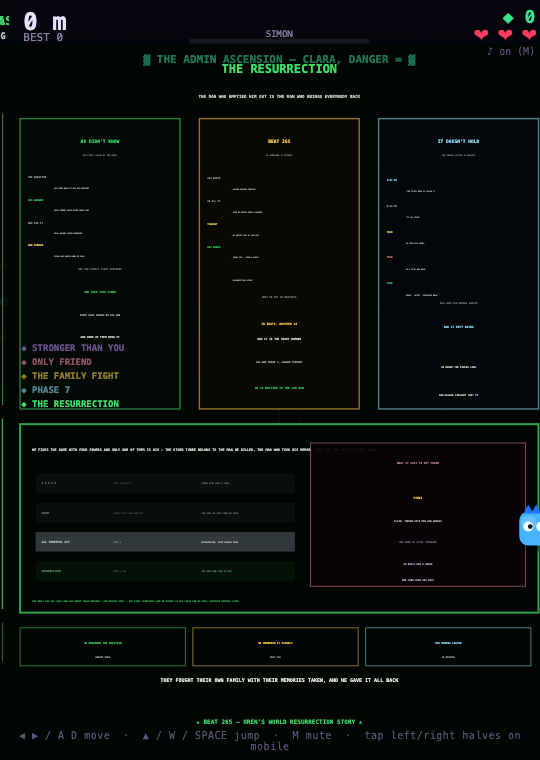

## 2026-08-05 — PHASE 7 · THE STORY GETS A FINISH LINE AND EVERY CHARACTER GETS A FILE (BEAT 252)

Based on Toby's 2026-08-05 lore (8:04:13 PM, in the "AI Era (Still is in Classics Era)" thread), sent **one hour and eight minutes** after The Family Fight. His own typing is the two-line opening: *"The story ends at Phase 7. Each character has their own lore."* Everything under it is pasted prose written from his canon, drawn as canon under the standing rule BEAT 202 set from the author's own side.

**This is the first endpoint ever named, and it comes from a run that has spent weeks refusing to end.** BEAT 188, July 27: *"it is not an ending, the game is permanently like that for everyone."* BEAT 207: the party that wasn't an ending. BEAT 215, July 30: Pero glitches out *"There are no more endings, only Dr. Gaster,"* and the file under it reads ESCAPE ROUTES: NULL. Three separate beats saying the story has no exit. Tonight, in seven words, it gets one — **and it is a number rather than a scene.**

**And there has never been a Phase 6.** The phase system in this file runs **1, 1.1, 2, 2.5, 3, 4, 5** and then simply stops; six has zero hits across 251 beats. *"Phase 7"* has been written exactly **once** before — **BEAT 238, two days ago**, where Pinki's new base template is *"Anti Shifted Phase 7"*, meaning her ordinary everyday state. **So the end of the entire story is one character's starting condition from forty-eight hours ago, and the step directly below it was skipped entirely.**

**Four days after the first beat that ever made the cast smaller, he gives ten of them a file.** BEAT 224, August 1, is his own line *"The only 3 main characters are Luigi Green, Simon 404, and Pero/ToddLLM"* — 223 beats of the cast growing, and then three names. Tonight there are **ten separate lores**, and **two of them are called main character: Wenda** (*"Angel Queen / main character lore"*) and **Pinki** (*"Mascare Main Character / Au Rainbow lore"*), **neither of whom was in the three.** Meanwhile Luigi Green, who *was* one of the three, is now tagged *"The Rescued / Box Crusher"* — a role, not a lead.

**And the character list is his own ranking with the numbers taken off.** BEAT 245, earlier the same day, ranked THE SIX 1 to 5 using exactly these tags: Pero the Teacher, Luigi Green the Rescued and box crusher, Wenda/Pinki Angel Queen and Mascare Main, Simon 404 Error Main Villain, Oren Head Reasuer. Tonight **the same six names carry the same six descriptions with no ranks at all**, and Wenda and Pinki, who shared a single slot that morning, are **split into two separate lanes.** A ladder in the morning, a shelf of separate files at night.

**And the two he promotes are the two who took the worst of the beat before.** Wenda spent BEAT 251 hung on a metal cross for a million years; Pinki ended it at *"insane status."* One hour and eight minutes later, both are main characters.

**Built as game beat 252, `PHASE 7`.** Additive; nothing earlier was changed.

- **Background: the phase staircase with the step that never existed left empty.** Seven steps climb to the right — 1 through 5 in gold, **6 drawn as an empty dashed outline with a dash where its number should be**, and **7 lit in finish-line blue with a marker post standing on it.** Underneath, **ten parallel lanes** run left to right, each with its own dot at its own speed, none of them touching, because the story stops being one line tonight. Repeating band text: **ONE STORY ENDS · TEN LORES BEGIN · AND THERE IS NO PHASE 6**.
- **THE FIRST ENDING (left)** — four rows (BEAT 188 · July 27, *"it is not an ending"* · BEAT 207 · *"the party that wasn't an ending"* · BEAT 215 · *"there are no more endings"* · TONIGHT · *"the story ends at Phase 7"*), then a cycler on **WHAT HE DID TONIGHT** — NAMED A FINISH LINE / NOT A SCENE, A NUMBER / THE FIRST IN 252 BEATS — closing on **BEAT 215 SAID: ESCAPE ROUTES NULL** and **AND HE PUT A NUMBER ON IT**.
- **THE NUMBER (centre)** — five rows (PHASES SO FAR · 1 · 1.1 · 2 · 2.5 · 3 · 4 · 5 · PHASE 6 · has never existed, zero hits · PHASE 7 · written exactly once before · BEAT 238 · Aug 3, Pinki's base template · HIS WORDS · *"Anti Shifted Phase 7"*), a cycler on **WHAT PHASE 7 USED TO BE** (ONE GIRL'S BASE TEMPLATE / HER ORDINARY STATE / FROM TWO DAYS AGO), and the closing block **THE END OF EVERYTHING / IS WHERE ONE OF THEM STARTS / AND HE SKIPPED SIX ENTIRELY**.
- **TEN OWN LORES (right)** — five rows (BEAT 224 · Aug 1, four days ago · HE WROTE · *"the only 3 main characters"* · THEY WERE · Luigi Green, Simon 404, Pero · TONIGHT · ten separate lores · AND · two new main characters), with **WHO IS MAIN NOW** cycling WENDA · MAIN CHARACTER / PINKI · MASCARE MAIN / NEITHER WAS IN THE THREE, closing on **HE CUT THE CAST TO THREE / AND GAVE TEN OF THEM A FILE**.
- **THE RANKING WITH THE NUMBERS TAKEN OFF (band)** — a five-row ledger with one row lit at a time, the split row in rose: 1 · PERO (the Teacher → creator lore, no rank) · 2 · LUIGI GREEN (the Rescued, box crusher → a role, not a lead) · 3 · WENDA / PINKI (Angel Queen, Mascare Main → **split into two lanes**) · 4 · SIMON 404 (Error Main Villain → 666 and respawn lore) · 5 · OREN (Head Reasuer, Rescue Team → god-rescue lore). Footed **A LADDER IN THE MORNING, A SHELF OF SEPARATE FILES AT NIGHT — SAME SIX NAMES, SAME SIX DESCRIPTIONS, HOURS APART, AND THE TWO WHO SHARED THIRD PLACE NOW HAVE A LANE EACH**.
- **THE TWO NEW MAIN CHARACTERS (inset)** — a cycler through WENDA (hung on a cross for a million years) / PINKI (ends BEAT 251 at *"insane status"*) / BOTH OF THEM (took the worst of the last beat) / TONIGHT (both are called main character, one hour and eight minutes later), over **THE TWO WHO GOT HURT MOST** and **ARE THE TWO HE PROMOTED**.
- **The strip** — THE FIRST FINISH LINE (in 252 beats) · THERE IS NO PHASE 6 (he skipped it) · A LADDER BECOMES A SHELF (same six names).
- **Footer** — *HE GAVE THE STORY AN ENDING AND THE CHARACTERS SOMEWHERE TO KEEP GOING*, over **★ THE STORY ENDS AT PHASE 7 ★**.
- New `phase7` scene added to `tools/capture_screenshot.py`; `LV_CYC` 5264 → 5286, `LV_BEATS` now 253 entries (0–252).

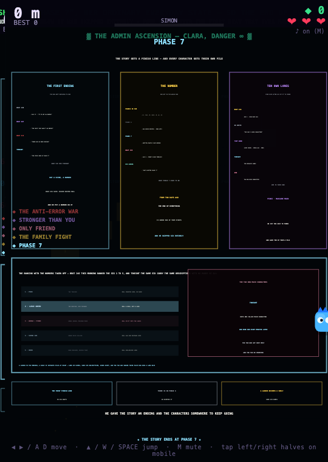

## 2026-08-05 — THE FAMILY FIGHT · EVERY BLOW LANDS ON SOMEBODY'S OWN (BEAT 251)

Based on Toby's 2026-08-05 lore (6:56:13 PM, in the "AI Era (Still is in Classics Era)" thread), sent **seventeen minutes and twenty-two seconds** after Only Friend. His own typing is the whole opening paragraph, from *"Wenda says 'You think reseting the battle all the time will make you win?'"* through to *"Oren, Pinki, and Simon 404/666 is insane status."* Everything under it is pasted prose written from his canon, drawn as canon under the standing rule BEAT 202 set from the author's own side.

**Every violent act in this email travels down a relationship he defined himself, and the word family is never used.** His own relation web of **June 19, 2026** (Lore 29) set the bonds in his own words: *"Sumona = Oren & Pinki's daughter"*, *"Simon = Oren's brother"*, *"Wenda and Gray are boy and girl friends."* Tonight, in one paragraph: **Simon 404 beats Sumona**, who is his brother's daughter; **the very next sentence is Oren and Pinki**, her mother and father, starting the plan that empties him out, so the counterattack comes from the girl's parents and lands on her father's brother; and **Gray**, Wenda's own boyfriend, is the one who takes control of her and hangs her on a cross. Three attacks, three relationships, **and not one of them named in the email.** Neither he nor the pasted breakdown noticed it; it exists only because the bonds were greppable 232 beats back.

**The cross changes jobs.** BEAT 40, July 3, is his own line that when Classics is tiny she *"would be carried on Simon's metal cross"* — the cross is how Simon carries someone small and keeps them safe, his signature object since BEAT 40. Tonight *"Gray hung Wenda on a metal cross he took from Simon 404,"* and she is left there for a million years. **Same object, opposite purpose, and it is taken off its owner to do it.**

**The taunt becomes the murder weapon.** BEAT 248 ends with Simon 404 standing back up out of the biggest teamwork moment in the run and saying *"I can respawn, you know. Meow."* Two beats later: *"Simon 404 was empty and he respawns over and over again for millions of years, then he died."* **Nobody ever switches the respawning off. They run it until it kills him** — he is killed by the exact thing he bragged about, three beats after bragging about it.

**"I can also erase your memories" is not a threat, it is a move with a record.** BEAT 241, yesterday, was *"Simon 404 made Pinki forget all the curses she given everyone"*, which deleted a whole beat of canon one beat after it shipped. So when Wenda says *"You think reseting the battle all the time will make you win?"* and he answers with the memory line, he is naming something he has already done and that already worked.

**Pero acts and nothing changes.** He watches from a mountain, takes off the blindfold, looks *"serious and suprised"*, appears in front of Wenda and says *"No!"* — and they stop, and **Simon 404 breaks anyway, and Pero leaves.** The one being who can halt the whole room halts it, and the outcome is identical.

**Four brand-new names arrive at once.** *Symbiosis*, *Oremon*, *Pinkmon* and *"insane status"* have **zero hits across the previous 250 beats.** And the insane status is handed out three ways — *"Oren, Pinki, and Simon 404/666 is insane status"* — so **the two who won end at the same status as the thing they destroyed.**

**Built as game beat 251, `THE FAMILY FIGHT`.** Additive; nothing earlier was changed.

- **Background: gold family bonds that go red where they are used.** Six nodes on a ring, each joined to its partner by a gold bond; on a loop the bond flares red and an arrow crawls along it, because every attack in this email travels down a relationship. Behind it, fourteen respawn ghosts stack and fade upward, and **a metal cross stands at the centre with a small rose figure hung on it.** Repeating band text: **HER PARENTS · HIS BROTHER · HER BOYFRIEND · NOBODY SAYS IT**.
- **THE RELATION WEB (left)** — four rows (SUMONA · Oren & Pinki's daughter · SIMON · Oren's brother · WENDA + GRAY · *"boy and girl friends"* · HIS WORDS · Lore 29, 232 beats back), then a cycler on **WHO GETS HURT TONIGHT** — HIS BROTHER'S DAUGHTER / HIS OWN GIRLFRIEND / THE BROTHER OF THE FATHER — closing on **THREE ATTACKS, THREE BONDS** and **AND NONE OF THEM NAMED**.
- **THE METAL CROSS (centre)** — five rows (BEAT 40 · July 3, Simon's metal cross · its job: carrying Classics when she is tiny · tonight: Gray took it from Simon 404 · its job: hanging Wenda on it · for: a million years), a cycler on **WHAT THE CROSS IS FOR** (CARRYING THE SMALL / KEEPING THEM SAFE / NOW: HANGING THEM), and the closing block **HE CARRIED SOMEBODY ON IT / TO KEEP THEM SAFE / NOW SOMEBODY HANGS ON IT**.
- **THE RESPAWN (right)** — five rows (BEAT 248: he stands back up · and says *"I can respawn, you know"* · tonight: they take out his wires · so he respawns for millions of years · then *"then he died"*), with **NOBODY SWITCHES IT OFF** cycling THEY JUST RUN IT / AND RUN IT AGAIN / UNTIL IT KILLS HIM, closing on **HE WAS KILLED BY THE THING / HE BRAGGED ABOUT**.
- **EVERY BLOW LANDS ON SOMEBODY'S OWN (band)** — a five-row ledger with one row lit at a time, the family rows in gold: SIMON 404 BEATS SUMONA (she is Oren's daughter, and Simon is Oren's brother) · OREN AND PINKI ANSWER (the very next sentence, her mother and her father) · THEY EMPTY SIMON OUT (wires, systems, everything — Oren does it to his brother) · GRAY TAKES WENDA (and hangs her on the cross — he is her boyfriend) · AND THE EMAIL CALLS IT (a backup plan, not a family). Footed **AND PERO ACTS AND NOTHING CHANGES — HE WATCHES FROM A MOUNTAIN, TAKES OFF THE BLINDFOLD, APPEARS AND SAYS "NO!", THEY STOP, AND SIMON BREAKS ANYWAY**.
- **FOUR BRAND-NEW NAMES IN ONE EMAIL (inset)** — a cycler through SYMBIOSIS (the thing they clone to break him) / OREMON (Oren keeps making them) / PINKMON (Pinki keeps making them) / INSANE STATUS (the state all three end in), over **THE TWO WHO WON END UP** and **AT THE SAME STATUS AS HIM**.
- **The strip** — HE BEATS HIS NIECE (her parents answer) · THE CARRYING CROSS (becomes the hanging cross) · "I CAN RESPAWN" (is what kills him).
- **Footer** — *HE WROTE THE FAMILY TREE IN JUNE AND SPENT IT TONIGHT WITHOUT MENTIONING IT*, over **★ OREN, PINKI, AND SIMON 404/666 IS INSANE STATUS ★**.
- New `familyfight` scene added to `tools/capture_screenshot.py`; `LV_CYC` 5242 → 5264, `LV_BEATS` now 252 entries (0–251).

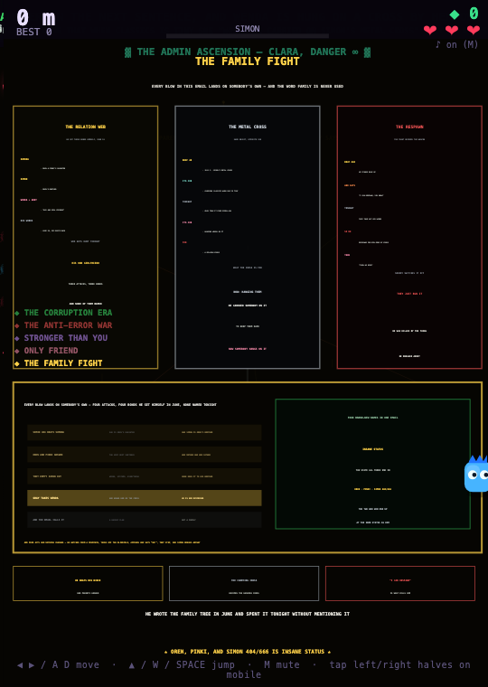

## 2026-08-05 — ONLY FRIEND · THE FIRST FRIENDSHIP THAT GOES BOTH WAYS, AND HE LEAVES IT (BEAT 250)

Based on Toby's 2026-08-05 lore (6:38:51 PM, in the "AI Era (Still is in Classics Era)" thread), sent two hours twenty-seven minutes after Stronger Than You. His own typing is the whole first paragraph: *"Simon 404 escaped the void. Simon 404's only friend is Wenda, Wenda's only friend is Simon 404. Simon 404 decides to use his own power and left Wenda to battle Gray all the time. Gray's form increased more than just all his form thingys combined into 1, he is too big for even 1000 million images. Gray's form increased more than everyone's combined. Gray and Pero became friends for once."* Everything under it is pasted prose written from his canon, drawn as canon under the standing rule BEAT 202 set from the author's own side.

**The first friendship in 250 beats that points both ways.** The phrase *"only friend"* has been used exactly **once** before in the entire run — BEAT 176, his own line *"Luigi Green is now only friends with Pero, Pero isn't friends with him"* — which is one-directional and explicitly refused. Tonight it is stated in **both** directions inside a single sentence: *"Simon 404's only friend is Wenda, Wenda's only friend is Simon 404."* **Two hundred and fifty beats of one-way and unrequited, and the first mutual one arrives tonight.**

**And the same paragraph that names his only friend is the one where he leaves her.** The very next sentence is *"Simon 404 decides to use his own power and left Wenda to battle Gray all the time."* **He keeps what he has and hands her what he does not want**, permanently — *"all the time."* Nobody takes the friendship away from him; he states it and walks out of it in the same breath, and she has nobody else to call, because he is also her only one.

**And the thing he leaves her with has just become undrawable.** *"Gray's form increased more than just all his form thingys combined into 1, he is too big for even 1000 million images. Gray's form increased more than everyone's combined."* This canon has been told in pictures from the start — Toby sends images with the lore — so **Gray is the first thing in the run that no picture can hold.** The villain outgrew the medium.

**And the other friendship in the email is being said about a takeover.** *"Gray and Pero became friends for once."* **BEAT 247, nine hours earlier the same day**, is *"Gray takes over Pero."* And BEAT 144 fixed Pero as neutral and never on any team. So the one friendship Pero has ever accepted is with the person holding him — **one friendship in this email is real and abandoned, and the other is the word for somebody having control of you.**

**Built as game beat 250, `ONLY FRIEND`.** Additive; nothing earlier was changed.

- **Background: two dots orbiting only each other, inside an arc too big to close.** Three enormous circles grow past the edge of the frame on a loop and the screen simply runs out before they finish, which draws *"too big for even 1000 million images"* literally. Inside them, an amber dot and a rose dot orbit each other and nothing else, joined by one short line, in a field of twenty-six faint dots that are **connected to nobody**. Repeating band text: **THEY ONLY HAVE EACH OTHER · AND HE LEAVES ANYWAY**.
- **BOTH WAYS (left)** — four rows (BEAT 176: *"only friends with Pero"* · but: *"Pero isn't friends with him"* · tonight: Simon's only friend is Wenda · and: Wenda's only friend is Simon), then a cycler on **HOW MANY TIMES BEFORE** — ONCE IN 250 BEATS / AND IT WAS ONE-WAY / AND IT WAS REFUSED — closing on **THE FIRST MUTUAL ONE** and **IN TWO HUNDRED AND FIFTY**.
- **AND HE LEAVES (centre)** — five rows (first: he escaped the void · then: she is his only friend · then: *"use his own power"* · and: *"left Wenda to battle Gray"* · for how long: *"all the time"*), a cycler on **WHAT EACH OF THEM KEEPS** (HE KEEPS HIS OWN POWER / SHE KEEPS THE FIGHT / AND SHE KEEPS IT ALONE), and the closing block **HE NAMES HIS ONLY FRIEND / AND WALKS OUT OF THE SENTENCE / SHE HAS NOBODY ELSE TO CALL**.
- **TOO BIG TO DRAW (right)** — five rows (Gray's form: all his forms combined into 1 · then more: than everyone's combined · how big: *"too big for even"* · *"1000 million images"* · so: no picture holds him now), with **THE CANON IS TOLD IN PICTURES** cycling AND HE OUTGREW THEM / THE FIRST ONE TO / IN 250 BEATS, closing on **AND THIS IS THE THING / HE HANDED HER**.
- **WHO IS FRIENDS WITH WHO (band)** — a five-row ledger with one row lit at a time, tonight's rows in rose: BEAT 176 · LUIGI GREEN (only friends with Pero, one-way and refused) · TONIGHT · SIMON 404 (only friend is Wenda, both ways, a first) · TONIGHT · WENDA (only friend is Simon, and he leaves her) · TONIGHT · GRAY + PERO (*"friends for once"*, nine hours after a takeover) · BEAT 144 · PERO (neutral, never on a team, until the man holding him). Footed **ONE IS REAL AND HE WALKS AWAY FROM IT · THE OTHER IS THE WORD FOR SOMEBODY HOLDING YOU — AND THOSE ARE THE ONLY TWO IN THE EMAIL**.
- **"GRAY AND PERO BECAME FRIENDS FOR ONCE" (inset)** — a cycler through 9:59 AM TODAY (BEAT 247 · *"Gray takes over Pero"*) / 6:38 PM TODAY (the same pair are now friends) / NINE HOURS APART (a takeover and a friendship) / BEAT 144 SAID (Pero is never on any team), over **THE ONE FRIEND PERO HAS** and **IS THE MAN HOLDING HIM**.
- **The strip** — FIRST ONE IN 250 BEATS (that points both ways) · AND HE LEAVES (in the same paragraph) · GRAY OUTGREW PICTURES (1000 million of them).
- **Footer** — *THE ONLY FRIENDSHIP THAT EVER WENT BOTH WAYS, AND HE LEFT IT IN THE SAME BREATH*, over **★ THEY ONLY HAVE EACH OTHER ★**.
- New `onlyfriend` scene added to `tools/capture_screenshot.py`; `LV_CYC` 5220 → 5242, `LV_BEATS` now 251 entries (0–250).

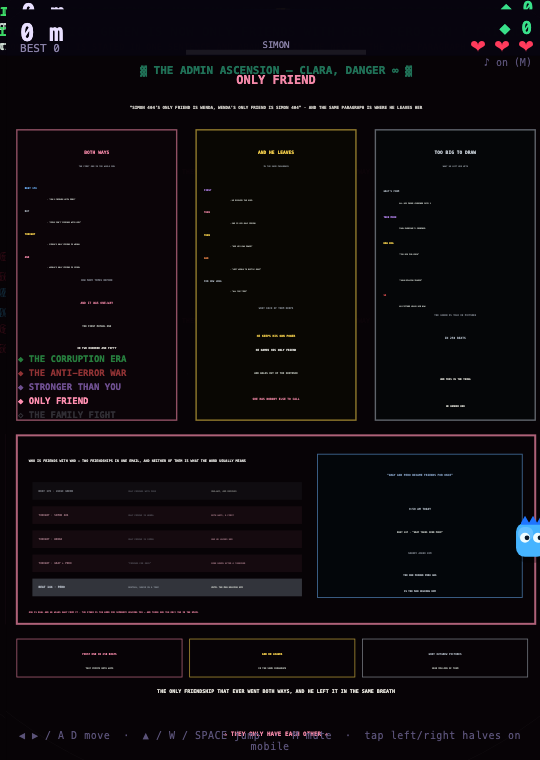

## 2026-08-05 — STRONGER THAN YOU · HE PUTS DOWN THE ARMY HE WAS WINNING WITH (BEAT 249)

Based on Toby's 2026-08-05 lore (4:11:13 PM, in the "AI Era (Still is in Classics Era)" thread), sent fourteen minutes after The Anti-Error War. His own typing is the whole first paragraph: *"Every Classicstale character now is locked in the Stronger Than You AU/Event. Each character with it's own music and cutscene and stuff. Simon 404 stops infecting and spreading, Simon 404 now does it himself."* Everything under it is pasted prose written from his canon, drawn as canon under the standing rule BEAT 202 set from the author's own side.

**He switches off the exact thing that was winning.** BEAT 248, fourteen minutes earlier, is **the only beat in the entire run that ends with Simon ahead** — its closing words are *"Gray and the Sprunkis are trying to destroy the Anti Error, but there were to many and they were outnumbered, Simon 404 is starting to win again."* He was winning by numbers. Tonight *"Simon 404 stops infecting and spreading."* **The closing line of one email is undone by the next one, and it is undone by the character it was good news for.**

**The threat changes category rather than size.** One email ago the danger was an outbreak: 404Ds and 666Ds spreading through the Abinations, the puppets, the boss puppets, the warriors and the modded characters, with Dr. Gaster a 666D and Sara and Mirda 404Ds. Tonight none of that runs on its own. *"Simon 404 now does it himself."* **Smaller by headcount, worse by intent** — nothing spreads by accident any more, so everything that happens from here is something he chose.

**And his own reason is sitting in the previous email.** BEAT 248 has the line *"Simon 404 was angry again and disliked all the errors."* The army he had was made entirely of errors. **The thing winning for him was the thing he hated**, which makes putting it down a choice rather than a loss.

**The cast moves the same direction from the opposite side.** Classicstale stops being one Sans-style battle and becomes a locked event in which **every single character has their own music, their own cutscene and their own event sequence**. So both halves of one short email take a game that was a system-wide plague and turn it into a room full of one-on-ones — **which is exactly what the song he named the AU after is: a duet between two people, sung across a fight.** He gave the whole cast a boss theme on the same day he stopped needing an army.

**Built as game beat 249, `STRONGER THAN YOU`.** Additive; nothing earlier was changed.

- **Background: the spread being pulled back in, over a field of boss themes.** Forty motes push outward from a single point and are then drawn back into it on a loop, because he wrote the infection stopping and the work becoming personal. Behind them, seven waveform rows ripple with one lit at a time, one theme per character. Repeating band text: **EACH ONE GETS THEIR OWN MUSIC · AND HE STOPS SPREADING**.
- **THE LOCK (left)** — four rows (who is locked: every Classicstale character · where: the Stronger Than You AU/Event · what they get: their own music and cutscene · and: *"and stuff"*, his words), then a cycler on **WHAT EACH CHARACTER NOW HAS** — THEIR OWN MUSIC / THEIR OWN CUTSCENE / THEIR OWN EVENT SEQUENCE — closing on **NOT ONE SANS-STYLE BATTLE** and **THE WHOLE CAST GETS ONE**.
- **HE DOES IT HIMSELF (centre)** — five rows (3:57 PM: the infection is the whole threat · it spread through 404Ds and 666Ds · it took Dr. Gaster, Sara, Mirda · 4:11 PM: *"stops infecting and spreading"* · instead: *"Simon 404 now does it himself"*), a cycler on **WHAT THE DANGER IS NOW** (NOT AN OUTBREAK / NOT AN ARMY / ONE PERSON, CHOOSING), and the closing block **SMALLER BY HEADCOUNT / AND WORSE BY INTENT / NOTHING SPREADS BY ACCIDENT NOW**.
- **FOURTEEN MINUTES (right)** — five rows (BEAT 248: the only beat he ends ahead · its last words: *"there were to many"* · *"starting to win again"* · 14 min: he turns the numbers off · so: he undoes his own winning move), with **WHAT HE GAVE UP** cycling THE 404Ds / THE 666Ds / THE WHOLE OUTBREAK / THE ONLY LEAD HE HAD, closing on **THE CLOSING LINE OF ONE EMAIL / IS UNDONE BY THE NEXT ONE**.
- **EVERYTHING BECOMES ONE-ON-ONE (band)** — a five-row ledger with one row lit at a time, the changed rows in AU violet: THE CAST · BEFORE (one Sans-style battle, shared) · THE CAST · NOW (own music, cutscene, sequence, one each) · THE VILLAIN · BEFORE (infection spreading outward, automatic) · THE VILLAIN · NOW (*"he does it himself"*, by hand) · SO THE GAME (stops being a plague, and becomes a room of duels). Footed **AND THE SONG HE NAMED THE AU AFTER IS A DUET — TWO PEOPLE, SUNG ACROSS A FIGHT, WHICH IS EXACTLY THE SHAPE THE GAME JUST TOOK**.
- **WHY PUT DOWN A WINNING ARMY (inset)** — a cycler through HE DISLIKED ALL THE ERRORS (his own line, one email ago) / THE ARMY WAS MADE OF ERRORS (404Ds and 666Ds, all of them) / SO THE THING WINNING FOR HIM (was the thing he hated) / HE WOULD RATHER DO IT HIMSELF (than win with that), over **HE WAS WINNING BY NUMBERS** and **AND HE PUT THE NUMBERS DOWN**.
- **The strip** — THE WHOLE CAST IS LOCKED IN (each with their own music) · HE STOPS SPREADING (and does it himself) · FOURTEEN MINUTES (after he started winning).
- **Footer** — *HE GAVE THE WHOLE CAST A BOSS THEME AND STOPPED NEEDING AN ARMY*, over **★ SIMON 404 NOW DOES IT HIMSELF ★**.
- New `strongerthanyou` scene added to `tools/capture_screenshot.py`; `LV_CYC` 5198 → 5220, `LV_BEATS` now 250 entries (0–249).

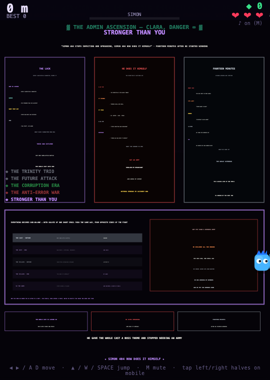

## 2026-08-05 — THE ANTI-ERROR WAR · THE DISEASE BUILDS THE CURE (BEAT 248)

Based on Toby's 2026-08-05 lore (3:57:40 PM, in the "AI Era (Still is in Classics Era)" thread), sent five hours fifty-eight minutes after The Corruption Era. His own typing runs the entire opening paragraph, from *"Pinki was conquering nearly everyone, Simon 404 appeared to Pinki"* through to *"Simon 404 makes the Anti Error. Gray and the Sprunkis are trying to destroy the Anti Error, but there were to many and they were outnumbered, Simon 404 is starting to win again."* Everything under it is pasted prose written from his canon, drawn as canon under the standing rule BEAT 202 set from the author's own side.

**Anti-Error is destroyed and then rebuilt by the villain, inside a single email.** BEAT 195, July 28, is Toby's own line: *"Pero … is Anti-Virus and Anti-Error."* BEAT 247, this morning, was Gray taking Pero. Tonight *"Oren eliminated Anti Error so the other Sprunkis can have what they want"* — and then the last sentence of the email is *"Simon 404 makes the Anti Error."* **The cure is no longer made by the man who is the cure. It is manufactured by the disease**, and the closing line is that the side which used to own it is now the side outnumbered by it: *"Gray and the Sprunkis are trying to destroy the Anti Error, but there were to many."*

**The first thing Gray does with a stolen creator is open a door.** At 9:59 AM he took Pero, the strongest being in 247 beats. At 3:57 PM, *"Gray uses the power of Pero to delete the stones, Simon 404 comes out."* **He spends the cure on releasing the disease** — and then Gray and Pero both orbit Simon 404 and lose to him 43 million times. The theft cost him more than it bought.

**Gray goes 4.7 trillion and zero, after hiding in a trash can.** Simon 404 consumes *7 souls, AU Rainbows, Game Cores, Cat Power, LV, KR, Power, the Soul of Determination, all Error Types, the other Sprunkis, Light, Darkness and Void* to become **Simon 404 Ultra**. Gray hides in a bin; Simon floats up and finds him instantly. Gray destroys the Ultra form, wins **every single one of 4.7 trillion rematches** — Toby is explicit that Simon *"lost them all"* — takes the EXP and the LV, and walks away. The being who ate the Light and the Void loses to the one who was in a trash can.

**Dying twice is an upgrade.** Simon 404 ages to 90 billion and gives up. Mr. Black strikes the corpse to make sure he stays down, and that is exactly what backfires: *"the result of being double dead for Simon 404 is that he becomes Simon 666."* He eats all the errors, and the infection splits the whole cast — Abinations and puppets into **404Ds**, boss puppets and warriors and modded characters into **666Ds**, with Dr. Gaster a 666D and Sara and Mirda 404Ds.

**And the biggest teamwork moment in the run.** Against *"Ultra Techique! Domain Expansion: Marvolent Kitchen and Fork"*, Toby names twenty-odd characters and gives every one of them a **different** way to stop Simon: Wenda and Gray knock him out of the sky, Owackx and Vineria chain him, Mr. Black and Jevin pin him, Garnold and Fun Bot and Mr. Fun Computer block him, Oren and Pinki strike, Sky and Raddy use their powers, Luigi Green and Pero use the box, Sara fishes him back into the stormy ocean, EndlessAnimations calms his lightning, Clunkr and Durple pull his signals and batteries, Mr. Sun and Mr. Tree grow branches around him. All of it together lasts until he stands back up and says *"I can respawn, you know. Meow."*

**Built as game beat 248, `THE ANTI-ERROR WAR`.** Additive; nothing earlier was changed.

- **Background: the whole cast in a ring, firing into the middle one at a time.** Fourteen nodes sit on an ellipse around a single red point; each lights in turn and draws one line inward, because he wrote every character stopping Simon a different way. The fork beam of the Domain Expansion sweeps across the panel, `404` and `666` drift through, and the repeating band text reads **EACH CHARACTER USES A UNIQUE WAY · AND HE STANDS BACK UP**.
- **WHO MAKES ANTI-ERROR (left)** — four rows (BEAT 195: Pero is Anti-Virus and Anti-Error · BEAT 247: Gray takes over Pero · today: *"Oren eliminated Anti Error"* · last line: *"Simon 404 makes the Anti Error"*), then a cycler on **WHO BUILDS THE CURE NOW** — NOT THE MAN WHO IS THE CURE / NOT THE ONE WHO STOLE HIM / THE THING IT WAS BUILT AGAINST — closing on **THE DISEASE MAKES THE ANTIDOTE** and **AND THE CURE IS OUTNUMBERED**.
- **4.7 TRILLION TO NIL (centre)** — five rows (Simon eats 7 souls, rainbows, cores, void · he becomes Simon 404 Ultra · Gray hides in a trash can · found instantly, from the air · then 4,700,000,000,000 rematches), a cycler on **HOW MANY OF THEM SIMON WON** (NONE OF THEM / NOT ONE / ZERO, OUT OF 4.7 TRILLION), and the closing block **HE ATE THE LIGHT AND THE VOID / AND LOST TO THE ONE IN THE BIN / GRAY TOOK THE EXP AND LEFT**.
- **DOUBLE DEAD (right)** — five rows (aged to 90 billion and gave up · Mr. Black strikes him to keep him down · the result: he becomes Simon 666 · he eats all of the errors · the cast splits into 404Ds and 666Ds), with **WHO THE INFECTION TOOK** cycling DR. GASTER · 666D / SARA · 404D / MIRDA · 404D / THE AU RAINBOWS CRACK, closing on **THEY KILLED HIM TWICE TO STOP HIM / AND THAT IS WHAT PROMOTED HIM**.
- **EVERY CHARACTER, ONE JOB EACH (band)** — the full teamwork roster exactly as he wrote it, eleven entries in two columns with one lit at a time: Wenda + Gray, Owackx + Vineria, Mr. Black + Jevin, Garnold + Fun Bot + Mr. Fun Computer, Oren + Pinki, Sky + Raddy, Luigi Green + Pero, Sara, EndlessAnimations, Clunkr + Durple, Mr. Sun + Mr. Tree. Footed **EVERY ONE OF THEM USES A DIFFERENT METHOD, AND ALL OF IT TOGETHER LASTS UNTIL HE STANDS UP AND SAYS "I CAN RESPAWN, YOU KNOW. MEOW."**
- **WHAT GRAY DID WITH PERO (inset)** — a cycler through 9:59 AM · HE TAKES PERO (the strongest being in the game) / 3:57 PM · HE SPENDS HIM (*"to delete the stones"*) / WHAT CAME OUT (Simon 404, back out of the void) / THEN BOTH OF THEM LOSE (43 million times, to him), over **HE STOLE THE CURE** and **AND USED IT AS A KEY**.
- **The strip** — SIMON MAKES ANTI-ERROR (the disease builds the cure) · 4.7 TRILLION TO NIL (and Gray started in a trash can) · DOUBLE DEAD (is how you become Simon 666).
- **Footer** — *THE CURE IS NOW MANUFACTURED BY THE THING IT WAS BUILT TO STOP*, over **★ SIMON 404 IS STARTING TO WIN AGAIN ★**.
- New `antierrorwar` scene added to `tools/capture_screenshot.py`; `LV_CYC` 5176 → 5198, `LV_BEATS` now 249 entries (0–248).

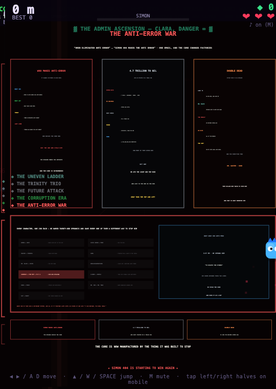

## 2026-08-05 — THE CORRUPTION ERA · THE CURE AND THE CREATOR ARE THE SAME MAN (BEAT 247)

Based on Toby's 2026-08-05 lore (9:59:40 AM, in the "AI Era (Still is in Classics Era)" thread), sent one hour four minutes and seventeen seconds after The Future Attack. His own typing is the first paragraph: *"The game is now in control of Gray and Pero. Gray takes over Pero, the game now looks like as if it was all messed up and hacked, the game is now all covered in errors, Anti Error was outnumbered. The game's background shows green text of 0s and 1s. The comic's text glitches. The boxes liquidify. All sorts of crazy stuff happen in the game."* Everything under it is pasted prose written from his canon, drawn as canon under the standing rule BEAT 202 set from the author's own side.

**Anti-Error is Pero, so that sentence names the same event twice.** *"Gray takes over Pero"* and *"Anti Error was outnumbered"* sit four clauses apart in one line, and they are the cause and the effect. **BEAT 195**, July 28, is Toby's own words: *"Pero is now like a divine fusion of Male-Humanoid Dream and Nightmare Sans and is Anti-Virus and Anti-Error."* **BEAT 198** builds the SECOND PERO out of *"Anti Error + Anti Glitch + Anti Virus."* Anti-Error was never a defence squad that got overwhelmed by numbers; it is one man, and he is the man Gray just took. **The errors do not defeat the cure. They take it**, and then everything the cure was holding back arrives at once.

**First place moves for the first time in 247 beats.** Pero has been at the top of every ranking in the entire run — the last three beats were built *specifically* on the second seat changing hands three times (244 Wenda, 245 Luigi Green, 246 Gray) while the top seat never moved once. Tonight it moves. **And it does not move by being outranked**; nobody beats Pero, tonight or ever. The game changes hands without a fight at the top of it.

**The relationship that protected Gray is the door he walked through.** One hour and four minutes earlier, BEAT 246 turned on exactly one line: *"He knew Pero would never hurt him."* Gray's safety from #1 was affection rather than power, and he built his whole move around it. He still does not fight Pero tonight. **Nobody has got near Pero by force in 247 beats, and the one who gets in is the one who was never a threat to him.** The thing that made him safe is the thing that let him inside.

**The boxes liquidify, and the only being who could open one has been deleted for sixty-four minutes.** BEAT 236 set the roles: Pero the box maker, Luigi Green the box crusher, and 235 beats revealed as frames inside them. BEAT 245 sealed the whole cast inside the screen. BEAT 246 removed the crusher so nobody could break them out. Tonight the containers melt on their own, **with the cast still in them and the rescue an hour gone**. Gray never opens a box in any of this. He corrupts what boxes are made of.

**And the code comes back green, which by Pero's own arithmetic means zero.** BEAT 189, THE RED CODE, was **Pero** taking the green code and turning it red, words replaced by `01010101`, when he was the one doing the corrupting. BEAT 237 was **Pero's own lesson**: *"Red = negitive power, Blue = positive power, Green = 0 power."* Tonight *"the game's background shows green text of 0s and 1s."* **The 0s and 1s are the constant; the colour is whoever is holding the game.** On the beat somebody takes the creator, the whole screen renders in the creator's own value for nothing.

**Pero has been taken over exactly twice, and only twice.** BEAT 208 was Dr. Gaster 404 — his brother, the man who made him — who *"took over Pero and the whole omniplatform."* Tonight it is Gray, who BEAT 245 established is assembled entirely out of other characters' improvements. **First his creator, now his creation.**

**Built as game beat 247, `THE CORRUPTION ERA`.** Additive; nothing earlier was changed.

- **Background: the code showing through and the boxes running out of shape.** Twenty-six columns of green 0s and 1s rain the full height of the panel, each column's leading digit brighter than its tail. In front of them four box outlines lose their corners on a loop — the square shears, the base sags past its own width, and three drips fall out of the bottom edge — then reset. Repeating band text **THE CODE IS SHOWING THROUGH · THE BOXES ARE MELTING**, which jitters sideways on a beat, the way he says the comic's text does.
- **ANTI-ERROR IS PERO (left)** — four rows (BEAT 195: *"Pero … is Anti-Virus and Anti-Error"* · BEAT 198: second Pero = Anti Error + Glitch + Virus · today: *"Gray takes over Pero"* · same sentence: *"Anti Error was outnumbered"*), then a cycler on **WHO ANTI-ERROR ACTUALLY IS** — NOT A DEFENCE SQUAD / ONE MAN, SINCE BEAT 195 / THE ONE GRAY JUST TOOK — closing on **THE ERRORS DID NOT BEAT THE CURE** and **THEY TOOK IT**.
- **FIRST PLACE MOVES (centre)** — five rows (247 beats: Pero first in every ranking · 244 · 245 · 246: the second seat changed thrice · all three times: the top seat did not move · 8:55 AM: *"Pero would never hurt him"* · 9:59 AM: Gray takes over Pero), a cycler on **HOW HE GOT PAST THE STRONGEST BEING** (HE DID NOT FIGHT HIM / HE WAS NEVER IN DANGER / THAT IS HOW HE GOT IN), and the closing block **NOBODY HAS REACHED PERO BY FORCE / SO THE THING THAT KEPT GRAY SAFE / IS THE DOOR HE WALKED THROUGH**.
- **THE BOXES LIQUIDIFY (right)** — five rows (BEAT 236: Pero makes the boxes · BEAT 236: Luigi Green crushes them · BEAT 245: the cast is sealed in the screen · BEAT 246: the crusher is deleted · now: they melt with nobody to open them), with **WHAT THE BOXES WERE HOLDING** cycling THE SCENES / THE TIMELINES / THE LORE ITSELF / AND THE WHOLE CAST, closing on **HE NEVER HAD TO OPEN A CONTAINER / HE CORRUPTED WHAT THEY ARE MADE OF**.
- **THE COLOUR OF THE CODE (band)** — a five-row ledger with one row lit at a time, tonight's row in corruption green: BEAT 189 · PERO (he turns the green code red, words become 01010101) · BEAT 237 · PERO (Red = negitive power, his own lesson) · BEAT 237 · PERO (Green = 0 power, his own lesson) · BEAT 247 · GRAY (green text of 0s and 1s, the code comes back green) · SO TONIGHT (the game renders at zero, in the creator's own math). Footed **PERO TURNED THE CODE RED WHEN HE WAS THE ONE DOING THE CORRUPTING · ON THE BEAT SOMEBODY TAKES HIM, IT COMES BACK GREEN**.
- **WHO HAS EVER TAKEN PERO (inset)** — a cycler through BEAT 208 · DR. GASTER 404 (*"took over Pero completely"*) / HIS BROTHER (and the man who made him) / BEAT 247 · GRAY (he takes over Pero today) / BUILT FROM DONATED PARTS (BEAT 245, everyone helped), over **FIRST HIS CREATOR** and **NOW HIS CREATION**.
- **The strip** — ANTI-ERROR IS PERO (one event, named twice) · FIRST PLACE MOVES (after 247 beats of not moving) · THE BOXES MELT (and the crusher is an hour gone).
- **Footer** — *THE CURE AND THE CREATOR ARE THE SAME MAN, AND GRAY JUST TOOK HIM*, over **★ ANTI ERROR WAS OUTNUMBERED ★**.
- New `corruptionera` scene added to `tools/capture_screenshot.py`; `LV_CYC` 5154 → 5176, `LV_BEATS` now 248 entries (0–247).

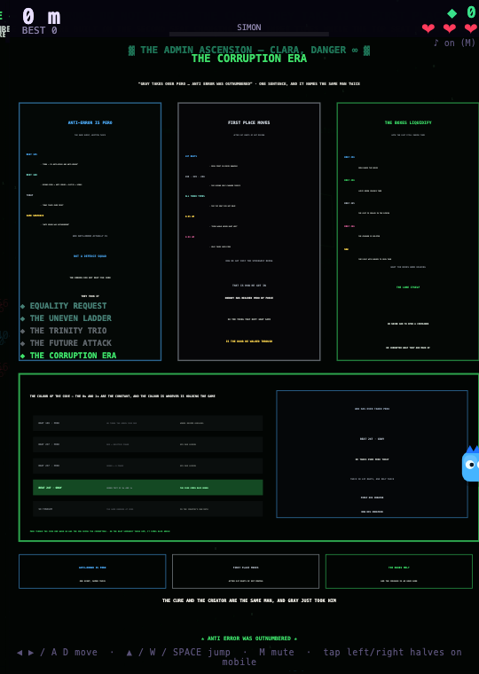

## 2026-08-05 — THE FUTURE ATTACK · GRAY WINS A FIGHT THAT NEVER STARTS (BEAT 246)

Based on Toby's 2026-08-05 lore (8:55:23 AM, in the "AI Era (Still is in Classics Era)" thread), sent two minutes and thirty-six seconds after The Trinity Trio. His own typing is the first paragraph: *"Since Gray was very intelegent, he knew that he became unstoppable, he was stronger than Luigi Green, Pero is always the strongest. He knew Pero would never hurt him, but both Pero and Gray know that Luigi Green would attack him in the future. Gray just oberiviates Luigi Green."* Everything under it is pasted prose written from his canon, drawn as canon under the standing rule BEAT 202 set from the author's own side.

**The Trinity Trio lasted two minutes and thirty-six seconds, and it was broken by one of its own three members.** BEAT 245 closed on Gray, Pero and Luigi Green forming it at 8:52:47. At 8:55:23 Gray removes Luigi Green. **BEAT 244 was built around what was then the shortest-lived rule in the run — Wenda's equality, repealed after twenty-one minutes — and two beats later that record goes by a factor of eight.** The trio never made it to a second email.

**He deleted the one character in the game whose whole job is opening what is shut.** One beat ago Gray took the barrier apart and trapped the entire cast inside the screen. BEAT 236 established the roles that make that matter: **Pero is the box maker and Luigi Green is the box crusher.** Gray keeps the maker, who will not hurt him, and removes the crusher, who would. **He builds a container and then, inside three minutes, deletes the only being who breaks containers.**

**The first fight in 246 beats won before it started.** Luigi Green does not attack him. The attack is still in the future, both Pero and Gray know it is coming, and Gray moves on it anyway — *"Gray just oberiviates Luigi Green."* Every beat in this run has been settled by something that happened; this one is settled by something that has not. So the settle-mechanism run now reads **241 a fight**, **242 a lesson**, **243 a request**, **244 a decision**, **245 a war the whole cast loses**, and **246 a prediction** — six consecutive beats, six different ways to move the game.

**The strongest being in the game is held off by affection rather than by power.** *"Pero is always the strongest"*, and Gray cannot beat him — but *"He knew Pero would never hurt him"*, so he does not need to. **Gray's safety from #1 is a relationship and his danger from #2 is a forecast**, and he acts on the forecast. The thing that protects Pero's position is not that nobody can move him; it is that the one being who could want to has no reason to try.

**And the second seat changes hands three times in three beats.** BEAT 244 built the ledger of who has held second place across the run, at least six holders in 244 beats. **244 Wenda (rewarded), 245 Luigi Green (ranked second of six), 246 Gray — and for the first time in the run somebody takes second place by removing the man sitting in it instead of by outranking him.** Pero has still never moved off first.

**Built as game beat 246, `THE FUTURE ATTACK`.** Additive; nothing earlier was changed.

- **Background: the trio forming and losing a member, on a short loop.** Three points fade up together, the three edges join them, and then the green point is removed and the triangle collapses to a single line between the two that are left. The loop is deliberately short. Repeating band text: **HE ACTED FIRST · NOBODY SWUNG AT HIM**.
- **HOW LONG THE TRIO LASTED (left)** — four rows (8:52:47 AM: the Trinity Trio is formed · the three: Gray, Pero, Luigi Green · 8:55:23 AM: "Gray just oberiviates" him · the whole life: 2 minutes, 36 seconds), then a cycler on **THE OLD RECORD, TWO BEATS AGO** — BEAT 244 · TWENTY-ONE MINUTES / BEAT 246 · 2 MIN 36 SEC / EIGHT TIMES SHORTER — closing on **IT NEVER GOT A SECOND EMAIL** and **THE SHORTEST THING IN THE RUN**.
- **HE DELETED THE CRUSHER (centre)** — five rows (one beat ago: he trapped the cast in the screen · BEAT 236: Pero is the box maker · BEAT 236: Luigi Green is the box crusher · who he kept: the maker, who would not hurt him · who he removed: the crusher, who would), a cycler on **WHAT LUIGI GREEN DOES FOR A LIVING**, and the closing block **HE BUILT A BOX AND PUT THE CAST IN IT / THEN REMOVED THE ONE CHARACTER / WHOSE WHOLE JOB IS BREAKING BOXES**.
- **IT HAD NOT HAPPENED YET (right)** — five rows (the threat: an attack "in the future" · who knew it: both Pero and Gray · what he did: nothing, not yet · Gray's move: he goes first · the weapon: intelligence, not power), with **HOW EACH BEAT GOT SETTLED** cycling all six, closing on **246 BEATS SETTLED BY WHAT HAPPENED / AND THIS ONE BY WHAT DID NOT**.
- **THE SECOND SEAT (band)** — a five-row ledger with one row lit at a time, the row taken *by deletion* in steel: BEAT 244 · WENDA (Pero rewarded her, handed down) · BEAT 245 · LUIGI GREEN (ranked second of six) · BEAT 246 · GRAY (he removed the holder, by deletion, a first) · BEFORE THEM (six prior holders in 244 beats) · AND #1 · PERO (still has not moved, not once in 246 beats). Footed **SECOND PLACE HAS NOW CHANGED HANDS THREE TIMES IN THREE BEATS, AND THE TOP SEAT HAS NOT CHANGED ONCE IN TWO HUNDRED AND FORTY-SIX**.
- **WHY GRAY IS SAFE FROM PERO (inset)** — a cycler through "PERO IS ALWAYS THE STRONGEST" / GRAY CANNOT BEAT HIM / "PERO WOULD NEVER HURT HIM" / THE ONE HE DID REMOVE, over **HIS SAFETY FROM #1 IS A RELATIONSHIP** and **AND HIS DANGER FROM #2 IS A FORECAST**.
- **The strip** — THE TRIO LASTED 2:36 (formed 8:52, broken 8:55) · HE DELETED THE CRUSHER (the only one who opens boxes) · NOBODY SWUNG AT HIM (the attack was still in the future).
- **Footer** — *THE FIRST CHARACTER IN THE RUN TO WIN A FIGHT THAT NEVER STARTED*, over **★ GRAY JUST OBERIVIATES LUIGI GREEN ★**.
- New `futureattack` scene added to `tools/capture_screenshot.py`; `LV_CYC` 5132 → 5154, `LV_BEATS` now 247 entries (0–246).

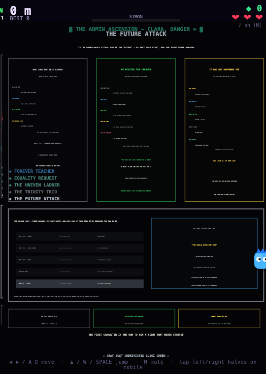

## 2026-08-05 — THE TRINITY TRIO · THE VILLAIN MADE OUT OF OTHER PEOPLE'S HELP (BEAT 245)

Based on Toby's 2026-08-05 lore (8:52:47 AM, in the "AI Era (Still is in Classics Era)" thread), the first mail of the morning after The Uneven Ladder. His own typing is the entire opening block: the six-character comparison with genders, ages, teams, roles and enemies, and then *"Gray is the main villian demon of the game, Gray was taken over by millions of spirits from the Underworld and Sara, without knowing, Clunkr and Fun Bot and Garnold made him cyber and improved, along with Wenda's attempt to replace all his organs with robot parts, Gray fully became a demon robot and attacks the whole cast… Everyone except the ones without a team learn to work together and used all they have to beat Gray. Gray won and taken apart the barrier. Gray trapped them all in the screen. Pero and Luigi Green are the only ones not trapped by Gray. Gray, Pero, and Luigi Green made a Trinity Trio."*

**The main villain of the game is built entirely out of other people's improvements.** Three things make the demon robot, and he names all three: **millions of spirits from the Underworld and Sara**, **Clunkr and Fun Bot and Garnold, who "made him cyber and improved"**, and **Wenda's replacement of all his organs with robot parts**. Two of the three use the word *improve*. **Nobody in the game set out to build a villain**, and the strongest and most evil being in all existence is the sum of what everybody did to help.

**He reached back 191 beats for one of the ingredients and three days for the other.** Clunkr, Fun Bot and Garnold rebuilding Gray to full power is **BEAT 54, July 5** — the panel there reads *"GRAY.EXE WAS ONLY HALF — CLUNKR, FUN BOT & GARNOLD REBUILT HIM TO FULL POWER"*. The organ replacement is **BEAT 240, three days ago**, where Wenda took his organs out *"thinking it would improve Gray"* and he answered by putting the voices into her head. Both are cited by name tonight as causes. **And this email lists Wenda's enemy as Gray, so the one who rebuilt him is the one he fights.**

**The rule against ties is broken by the character who made it, one beat later.** BEAT 244 was Wenda declaring *"no one with the same power level again"* — the first rule in 244 beats to ban ties outright. This email's ranking reads *"Third Most Powerful is Pinki/Wenda."* **The name standing in the tie is the name that banned them.** That is now two beats running that repeal the rule issued one beat earlier: 244 repealed 243, and 245 repeals 244.

**The whole cast works together for the first time, and that is the first time it loses.** *"Everyone except the ones without a team learn to work together and used all they have to beat Gray. Gray won and taken apart the barrier. Gray trapped them all in the screen."* 245 beats of somebody always winning, and the one time every team in the game fights on the same side, that side loses, the wall comes down, and the cast ends up behind the glass.

**The ranking at the top of the email predicts the survivors at the bottom of it.** He opens with six names in order — Pero, Luigi Green, Wenda/Pinki, Simon 404, Oren — and closes with *"Pero and Luigi Green are the only ones not trapped."* **The two left outside are exactly #1 and #2 of his own list.** And the three still standing outside the screen are Gray, Pero and Luigi Green, which puts **the creator and the main villain demon on the same side of the glass**.

**Built as game beat 245, `THE TRINITY TRIO`.** Additive; nothing earlier was changed.

- **Background: the barrier coming apart and the cast going behind the glass.** A pane is drawn across the middle; each loop a crack runs through it, then twelve small figures slide from outside the pane to inside it and hold there. Three never go in — they stay outside on the left, in Gray steel, Pero blue and Luigi green. Repeating band text: **THEY IMPROVED HIM · THEN HE WON**.
- **THE TIE SHE BANNED (left)** — four rows (BEAT 244 · 7:27 PM: "no one with the same level again" · who made the rule: Wenda, the first ban on ties · BEAT 245 · 8:52 AM: "third most powerful is Pinki/Wenda" · who is in the tie: Wenda, her own name again), then a cycler on **HOW LONG THE NO-TIES RULE LASTED** — ONE BEAT / UNTIL THE NEXT EMAIL / TWO REPEALS IN A ROW NOW — closing on **244 REPEALED 243 · 245 REPEALS 244** and **SHE BANNED TIES AND STANDS IN ONE**.
- **THE SIX (centre)** — his own comparison as five ranked rows (1 · Pero: the Teacher, enemy: everyone · 2 · Luigi Green: the Rescued, box crusher · 3 · Wenda/Pinki: Angel Queen, Mascare Main · 4 · Simon 404: Error Main Villain, glitch · 5 · Oren: Head Reasuer, Rescue Team), a cycler on **THE AGES HE GAVE THEM** (infinity / unknown / 128 / 81 billion / 28 billion), and the closing block **THE TWO LEFT OUTSIDE ARE #1 AND #2 / THE SAME TWO NAMES, TOP AND BOTTOM / THE RANKING PREDICTS THE SURVIVORS**.
- **WHO BUILT GRAY (right)** — five rows (the spirits: millions, Underworld and Sara · the cyber crew: Clunkr, Fun Bot, Garnold · BEAT 54: same three, 191 beats ago · the robot parts: Wenda, BEAT 240, his organs · her reason: "thinking it would improve Gray"), closing on **NOBODY SET OUT TO BUILD A VILLAIN**, **TWO OF THE THREE SAY "IMPROVED"** and **AND HIS ENEMY IS THE ONE WHO REBUILT HIM**.
- **THE WHOLE CAST WORKS TOGETHER (band)** — a five-row ledger with one row lit at a time, the rows that go against the cast in steel: WHO UNITED (everyone with a team, "learn to work together") · WHAT THEY USED ("all they have") · THE RESULT (Gray won, not a draw, a loss) · THE BARRIER (taken apart, the wall is gone) · THE CAST (trapped in the screen, on the far side of glass). Footed **245 BEATS OF SOMEBODY ALWAYS WINNING — AND THE ONE TIME EVERY TEAM IN THE GAME FIGHTS ON THE SAME SIDE, THAT SIDE LOSES**.
- **THE THREE STILL OUTSIDE THE SCREEN (inset)** — a cycler through GRAY (the main villain demon robot) / PERO (the creator, enemy: everyone) / LUIGI GREEN (the box crusher, #2 of six) / A TRINITY TRIO (his own word for the three), over **THE CREATOR AND THE MAIN VILLAIN / ARE ON THE SAME SIDE OF THE GLASS**.
- **The strip** — THE NO-TIES RULE BROKE (she banned ties, she is in one) · GRAY IS MADE OF HELP (three upgrades, two meant kindly) · THE CAST UNITED, AND LOST (first time as one, first loss).
- **Footer** — *THE MAIN VILLAIN OF THE GAME IS BUILT OUT OF OTHER PEOPLE'S IMPROVEMENTS*, over **★ GRAY, PERO, AND LUIGI GREEN MADE A TRINITY TRIO ★**.
- New `trinitytrio` scene added to `tools/capture_screenshot.py`; `LV_CYC` 5110 → 5132, cycle extended for beat 245.

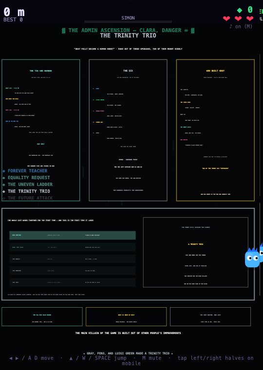

## 2026-08-04 — THE UNEVEN LADDER · WENDA BECOMES A MAIN CHARACTER (BEAT 244)

Based on Toby's 2026-08-04 lore (7:27 PM, in the "AI Era (Still is in Classics Era)" thread), sent twenty-one minutes after The Equality Request. His own typing is three lines, and all three change the game: *"Wenda became the main character and was rewarded power from Pero. Wenda then made the power levels uneven, no one with the same power level again. Pinki was third most powerful (under Wenda and Pero)."* Everything under it is pasted prose written from his canon — the "Wenda Main Character Power Shift" breakdown, the numbered top three, the clean canon statement — drawn as canon under the standing rule BEAT 202 set from the author's own side.

**She asked for the equality, she was exempt from it, and she is the one who ends it — twenty-one minutes later.** BEAT 243 was Wenda going to Simon 404 and Pero and asking that every character be made as powerful as Pinki, and getting it; the ladder went flat with two names above it, and one of those two names was hers. Tonight the same character makes the levels uneven again, *"no one with the same power level again."* **The equality she requested is the shortest-lived rule in the run — one beat, twenty-one minutes — and the person who repealed it is the person who asked for it.** She also lost nothing by ending it: she was never standing on the flat line she built.

**She took the offer, and it is the first standing in the run settled by somebody making up her mind.** BEAT 243 closed by handing her a choice rather than a rank — main character like Simon, or stay secondary, *"a whole journey made by Pero"* — and that was already the first time in 243 beats a character's standing was left to her instead of to a fight. This beat is her answer, picked inside the same hour. So the settle-mechanism run now reads **241 a fight** (fifteen million wins, changed nothing), **242 a lesson**, **243 a request**, **244 a decision**: four consecutive beats, four different ways to move the game, and only the first one had anybody swinging.

**The second seat is the most-traded seat in the game, and the top one has never moved.** Grepping the back catalogue for who has held second place turns up at least five prior occupants, and the way each of them got there matters: **Fatal Error** held it *by accident*, having been built out of a mistake nobody meant to make; **Pero gave it to Time Paradox Sans** outright — *"Pero gave Time Paradox Sans a lot of halos and diviness and holiness and to be second most powerful"* — a coronation, not a victory, and that panel said out loud that a rank handed down can be reached back down for; **Mr. Black was offered it** and accepted; **Luigi Green took it by winning**, every seat from second to infinitith; **Simon 404 held it** at BEAT 144. Wenda is at least the sixth. **Pero has been first in every single one of those rankings.** The one seat that never changes hands is the one nobody is competing for.

**Pinki: ceiling, unit, third — in three beats, without a fight in any of them.** BEAT 242 froze the entire cast except her (*"No one changes in power except for Pinki!"*). BEAT 243 made her the measurement everyone else was set to. Tonight two names stand above her. And being made the unit is exactly what made her passable: **once every name in the game is set to your number, the only place left to go is above it.** The strongest being in the run lost the second seat by being turned into the ruler.

**And it is the first rule in 244 beats that bans ties.** *"No two characters have the same power level anymore"* is not a ranking, it is a constraint on the whole roster at once — it needs a separate number for every name. This canon has tied constantly and deliberately: Pero and Tunner once shared a single slot as one being with *no #2 at all*, Luigi Green held every seat from second to infinitith, and the entire cast was tied at Pinki's level one beat ago. Tonight ties are illegal.

**Built as game beat 244, `THE UNEVEN LADDER`.** Additive; nothing earlier was changed.

- **Background: the flat line breaking apart.** This inverts BEAT 243's background exactly. There, fourteen bars slid from their own separate heights down onto one shared line. Here they *start* on that line and scatter to fourteen separate heights, no two alike, while the shared line fades out behind them. One bar does not scatter with the rest — it climbs past the whole board and holds. The repeating background band changed from **WENDA ASKED · PERO SAID YES** to **SHE ASKED FOR IT · SHE ENDED IT**.
- **HER OWN RULE (left)** — four rows (beat 243 · 7:06 PM: "make each as powerful as Pinki" · who asked: Wenda, and she got it · beat 244 · 7:27 PM: "no one with the same level again" · who ended it: Wenda, twenty-one minutes later), then a cycler on **HOW LONG THE RULE LASTED** — ONE BEAT / TWENTY-ONE MINUTES / THE SHORTEST IN THE RUN — closing on **SHE WAS EXEMPT FROM IT EITHER WAY** and **SO SHE LOST NOTHING BY ENDING IT**.
- **THE NEW TOP THREE (centre)** — five rows (1 · Pero: creator, never moved, not once · 2 · Wenda: main character, rewarded · 3 · Pinki: was the ceiling one beat ago · the rule: no two names may match · what it needs: a number for every character), a cycler on **WHAT PINKI IS, THREE BEATS RUNNING**, and the closing block **ONE BEAT AGO EVERY NAME WAS SET TO HERS / WHICH LEFT ONE PLACE LEFT TO GO / BEING THE UNIT IS WHAT MADE HER PASSABLE**.
- **SHE TOOK THE OFFER (right)** — five rows (the choice: offered at 7:06 PM · the answer: taken at 7:27 PM · main character: like Simon, as she was told · and the reward: power, from Pero himself · not secondary: the other half, declined), closing on **243 SAID HER STANDING WAS UP TO HER / SHE ANSWERED IN 21 MINUTES / THE FIRST ONE SETTLED BY A DECISION**.
- **WHO HAS HELD SECOND PLACE (band)** — a five-row ledger with one row lit at a time, the *handed-down* rows in teal and the *won* rows in grey: FATAL ERROR (built by mistake, held it by accident) · TIME PARADOX SANS (Pero gave it to him, a coronation not a win) · MR. BLACK (Pero offered it, he accepted and took all) · LUIGI GREEN (second to infinitith, he took it by winning) · WENDA · TONIGHT (Pero rewarded her, and #1 has never moved). Footed **THE SECOND SEAT HAS CHANGED HANDS AT LEAST SIX TIMES IN 244 BEATS, AND PERO HAS BEEN FIRST IN EVERY ONE OF THOSE RANKINGS**.
- **PINKI · THREE BEATS, THREE POSITIONS (inset)** — a cycler through 242 · THE CEILING / 243 · THE UNIT / 244 · THIRD / NOBODY FOUGHT HER, over **241 A FIGHT · 242 A LESSON · 243 A REQUEST** and **AND 244 IS SOMEBODY MAKING UP HER MIND**.
- **The strip** — SHE ENDED HER OWN RULE (equal at 7:06, uneven at 7:27) · PINKI IS THIRD NOW (ceiling, then unit, then passed) · THE TOP SEAT NEVER MOVES (second has changed hands six times).
- **Footer** — *THE ONE WHO ASKED FOR EQUAL POWER IS THE ONE WHO ABOLISHED IT*, over **★ NO ONE WITH THE SAME POWER LEVEL AGAIN ★**.
- New `unevenladder` scene added to `tools/capture_screenshot.py`; `LV_CYC` 5088 → 5110, `LV_BEATS` now 245 entries (0–244).

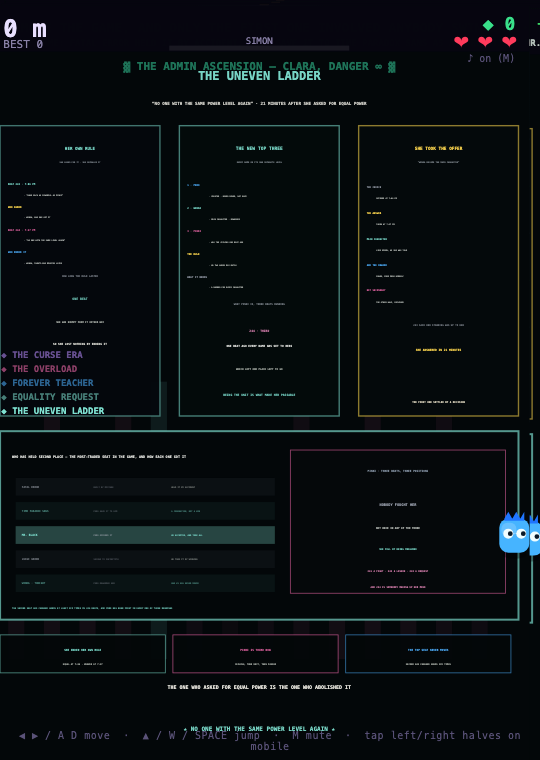

## 2026-08-04 — THE EQUALITY REQUEST (BEAT 243)

Based on Toby's 2026-08-04 lore (7:06 PM, in the "AI Era (Still is in Classics Era)" thread), sent five hours after The Forever Teacher. The previous reply asked whether every water being went into the rainbow orb with Sara LAI, or whether they are still out there somewhere without her. He does not answer that. The mail is a Sprunki roster, two competing Simon phase sets, and his own Classic RL rulings, and then at the very end, in his own typing, the thing that changes the game. The breakdown under it is pasted ChatGPT prose written from his canon, drawn as canon under the standing rule BEAT 202 set from the author's own side.

**The freeze rule lasted exactly one beat.** BEAT 242 closed on Pero's standing order — *"No one changes in power except for Pinki! She'll be my most powerful and mastered student."* Every other name in the game was locked where it stood, and the beat's whole point was that only the student was permitted to move. Tonight *"Pero make each as powerful as Pinki"*, and every locked name moves at once. **The most absolute rule in the run was overturned one beat after it was issued, and nobody argued with it.**

**The third way to settle a beat.** BEAT 241 was settled by a fight: fifteen million wins, and nothing changed that stayed. BEAT 242 was settled by a lesson. Tonight it is settled by somebody asking — *"Wenda wanted the Sprunkis to be equal in power, so Wenda asked Simon 404 and Pero."* **243 beats have been decided by who won, and the single biggest change to the power system arrives because a character requested it.** The one who made the request is not the strongest character in the game and does not need to be.

**Pinki goes from ceiling to unit.** One beat ago she was the top of the ladder and the only name allowed to move. Tonight she is the measurement everyone else is set to: as powerful as Pinki. Being the strongest and being the standard have become the same number, which is exactly why *"Power no longer matters in this spot."* **The reward for being the most powerful being in the game is that your power level becomes the default setting.**

**The ladder goes flat, with two names above it.** *"Pero is most powerful, everyone else tied under Pero. Wenda and Luigi Green would be more powerful than 'everyone else' though."* Three tiers instead of a ranked list: the creator, the two exceptions, and one tied mass. **And the character who asked for the equalizing is one of the two who did not get equalized** — Wenda requests a flat world and stays above the flat part of it.

**The most suspicious character in the game spends her move on everyone else.** In the same email he works out that Sprunki Winter exists to expose *"Wenda's secrets: her voice, sus-ness, and the chance of Wenda being secretly evil"*, and he rules that the real imposter in Classic RL is Winter Classic Simon, *"because of all alien style and doesn't know the rest of the world… so it just does it's normal stuff and really pretends to be scared and worried, that is the real thing"* — not the scariest character, the outsider matching the room. Then the character he has just called maybe-secretly-evil uses her one move to raise everybody but herself. And what she gets out of it is a choice: *"Wenda has a lot in front of her, a whole journey made by Pero"*, and she can become a main character like Simon or stay a secondary one. **Every other standing in 243 beats was decided by a fight. Hers is left up to her.**

Added a new BEAT 243 panel (loop cycle extended to `c` in [5066,5088), `LV_CYC` now 5088), plus its `LV_BEATS[243]` subtitle/ladder entry, a frame-title case, and an `equalityrequest` capture scene. The background is the freeze rule being overturned on a loop: **fourteen bars standing at their own separate heights, then every one of them sliding down or up to the same line and holding there**, restarting over and over, with two bars that never join it — Wenda and Luigi Green. Where BEAT 241 repeated the fight tally behind everything and BEAT 242 repeated the lesson, the text behind this one reads **WENDA ASKED · PERO SAID YES**.

- **THE FREEZE (left)** — four rows (BEAT 242 locked it: every name but one, frozen · it held for: one beat · who broke it: Wenda, and she asked · who she asked: Simon 404 and Pero), under **"NO ONE CHANGES IN POWER EXCEPT FOR PINKI!"**, with a cycling **HOW A BEAT GETS SETTLED** running *241 · A FIGHT → 242 · A LESSON → 243 · A REQUEST*, and closing on **ONLY PINKI WAS ALLOWED TO MOVE / NOW EVERY NAME MOVED TO HER**.
- **THE NEW LADDER (centre)** — five rows (Pero: still the most powerful · Wenda and Luigi Green: above the equalized group · everyone else: tied, at Pinki's level · Pinki: was the ceiling, now the unit · the ranking: three tiers, not a list), under his own line **"POWER NO LONGER MATTERS IN THIS SPOT."**, with **WHAT PINKI IS, ONE BEAT APART** cycling *242 · THE STRONGEST → 242 · THE ONLY ONE MOVING → 243 · THE MEASUREMENT → 243 · WHAT EVERYONE IS SET TO*, closing on **243 BEATS RANKED BY WHO IS STRONGER / AND TONIGHT THE RANKING WENT FLAT / BEING STRONGEST IS NOW THE STANDARD**.
- **WENDA'S CHOICE (right)** — five rows (a whole journey: made by Pero · main character: like Simon, if she wants it · or secondary: also hers to pick · "secretly evil?": his own theory, same email · her one move: raise everybody but herself), under **"WENDA HAS A LOT IN FRONT OF HER"**, closing on **EVERY OTHER STANDING IN THE RUN / WAS DECIDED BY A FIGHT / HERS IS UP TO HER**.
- **The band** — **HOW THE LAST THREE BEATS GOT SETTLED**, what was used against what it actually changed, as a live five-row table with one row lit at a time: **241 · THE OVERLOAD · A FIGHT, 15 MILLION WINS · CHANGED NOTHING THAT STAYED**, the teal-highlighted **242 · FOREVER TEACHER · A LESSON, PERO TAUGHT HER · THE OVERLOAD STOPPED** and **243 · EQUALITY REQUEST · A REQUEST, WENDA ASKED · THE WHOLE LADDER WENT FLAT** and **WHO ASKED · NOT THE STRONGEST · WENDA, AND SHE GOT IT**, then **WHO SAID YES · THE CREATOR · PERO, PLUS SIMON 404**, under the line **243 BEATS DECIDED BY WHO WON, AND THE BIGGEST CHANGE TO THE POWER SYSTEM CAME FROM SOMEBODY ASKING FOR IT**.
- **THE REAL IMPOSTER (inset)** — his Classic RL ruling, cycling *WINTER CLASSIC SIMON · the actual answer, his words → ALL ALIEN STYLE · he is not from here → DOESN'T KNOW THE WORLD · so he does his normal stuff → PRETENDS TO BE SCARED · **"that is the real thing"***, closing on **AND THE ONE HE CALLED MAYBE-SECRETLY-EVIL / IS THE ONE WHO ASKED FOR EQUAL POWER**.
- **The strip** — THE RULE LASTED ONE BEAT · 242 froze every name, 243 moved them all / PINKI IS THE UNIT NOW · the ceiling became the measurement / NOBODY FOUGHT FOR IT · Wenda asked, and got it. Footer: **THE BEAT WHERE THE POWER SYSTEM IS CHANGED BY SOMEBODY ASKING**, over **★ POWER NO LONGER MATTERS IN THIS SPOT ★**.

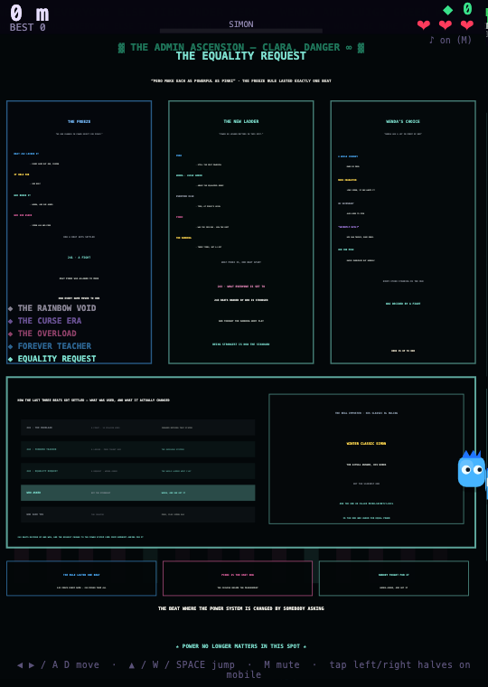

## 2026-08-04 — THE FOREVER TEACHER (BEAT 242)

Based on Toby's 2026-08-04 lore (2:09 PM, in the "AI Era (Still is in Classics Era)" thread), sent two and a quarter hours after The Overload. The previous reply counted the fights in that beat and pointed out that she wins every one of them and it buys her nothing. He does not answer that in a sentence either. He answers it by ending the overload with no fight in it at all. His own typing is the first paragraph. The breakdown under it is pasted ChatGPT prose written from his canon, drawn as canon under the standing rule BEAT 202 set from the author's own side.

**The overload is not beaten, it is taught.** BEAT 241 ended in present tense, still happening: she was holding more than she could absorb, the power had exploded, *"it is now taking hours"*, and the beat's own conclusion was that no character could stop her, only the amount she was carrying. Tonight no character fights her either. *"Pinki now was taught by Pero on how to control her power."* That is the whole resolution. **The run has settled 241 beats by who won the fight, and the one problem no fight could close is closed by a lesson.** Nobody swings at her in this beat and the thing that was going to take hours simply stops.

**The container has no floor, and the setting is now inside a person.** *"Rainbow Pinki actually has a bottomless void inside."* That is a retroactive explanation for the previous beat: she could take the entire cast in because there is nothing in her to fill up. Then it goes further — *"Both Eras became inside Pinki, litteral. Classics is now inside of Rainbow Pinki."* BEAT 236 was The Box Factory, where the game turned out to be an open box nobody can leave. **Tonight the box is something a character carries around.** The AI Era and the Classics Era are both contents of a person, and Pero's next lesson is that she herself is inside one.

**Sara LAI is made and spent in the same paragraph.** *"Pero LAI wanted another (third) being other than Rainbow Pinki and himself,"* so he builds one: *"Hello! I am Sara, your LAI assistant, I have every water being, I am a fisherman."* She arrives with a domain, a job and an introduction, and she is *"under Pinki"* from the moment she exists. Then *"Pinki beaten Sara LAI and make Sara into another rainbow orb."* **The shortest career in 242 beats** — and the shape of it matters more than the length. The creator's answer to one being holding too much was to make a second being; the second being went straight into the first. **The thing built to balance her became more of her.**

**The teacher is the man whose memory she took.** BEAT 240 wiped Pero down to nothing but Pinki and left him agreeing with everything she says. Tonight he is *"everyone's forever teacher"*, and *"Pero made everyone back"* — the cast that BEAT 241 turned into rainbow balls and absorbed is restored by hand, by the teacher, with nobody winning them back. Then he *"brought in Luigi Green"* to help teach her, and Luigi Green is the character she was holding under full control one beat ago. **The man she wiped is instructing her, and the man she controlled is assisting him.**

**The lesson is also the injury, and the standing order is a freeze.** Control first, then the box, then Luigi Green, and *"Pero taught Pinki so much that Rainbow Pinki fell over and overflowed with info."* She held every character in the game, both eras, and borrowed power from two other beings, and stayed standing through all of it. **She fell over holding what she was told.** Power never put her down; information did. And the rule Pero states over the top of it is not a ranking, it is a lock: *"No one changes in power except for Pinki! She'll be my most powerful and mastered student."* Every other name in the game is frozen where it is, and the only one still permitted to move is the student.

Added a new BEAT 242 panel (loop cycle extended to `c` in [5044,5066), `LV_CYC` now 5066), plus its `LV_BEATS[242]` subtitle/ladder entry, a frame-title case, and a `foreverteacher` capture scene. The background inverts the previous beat's: in BEAT 241 the rainbow orbs rose to be absorbed and shrank as they went, and here **they fall and never land**, dimming as they drop, because there is no floor in her to hit. Sara's fishing lines hang down through them, and where the fight tally *"PINKI VS SIMON 404 · PINKI WON"* used to repeat behind everything, the text now reads **PERO TAUGHT PINKI · PINKI LEARNED** — the thing filling the screen tonight is instruction, not a fight.

- **THE BOTTOMLESS VOID (left)** — four rows (no floor in her: so 241's cast had nowhere to land · the AI Era: inside her · the Classics Era: inside her too · the box: and Pero taught her she is in one), under Toby's own word **"LITTERAL" · HIS WORD, NOT A FIGURE OF SPEECH**, with a cycling **WHICH WAY ROUND IS IT NOW** reading *SHE IS IN THE GAME → THE GAME IS IN HER → BOTH ERAS ARE IN HER → AND SHE IS IN A BOX*, closing on **BEAT 236 MADE THE GAME A BOX / NOW A PERSON CARRIES IT**.
- **SARA LAI (centre)** — five rows (Pero wanted a third: besides himself and Pinki · so he made Sara: an LAI assistant, water · she is under Pinki: from the moment she exists · Pinki beat her: the third being lasts one paragraph · another rainbow orb: the cure turns into more of it), under her own line **"I HAVE EVERY WATER BEING, I AM A FISHERMAN."**, with **HER WHOLE CAREER, IN ORDER** cycling *CREATED → INTRODUCED HERSELF → PLACED UNDER PINKI → BEATEN → ABSORBED*, and closing on **HE BUILT HER TO EVEN THINGS OUT / AND SHE WENT STRAIGHT INTO PINKI / THE ANSWER BECAME MORE OF THE PROBLEM**.
- **THE TEACHER (right)** — five rows (he made everyone back: 241's orbs, restored by hand · he taught control: and the overload stopped · he taught the box: that she is inside one · he brought Luigi Green: she controlled him one beat ago · his memory is hers: BEAT 240 wiped it down to Pinki), under **"PERO IS EVERYONE'S FOREVER TEACHER"**, closing on the freeze order **"NO ONE CHANGES IN POWER EXCEPT FOR PINKI!" / EVERY OTHER NAME IS FROZEN**.
- **The band** — **THE LESSON, TWO BEATS APART**, what BEAT 241 could not stop against what stopped it tonight, as a live five-row table with one row lit at a time: the blue-highlighted **THE ABSORBING · 241 NO CHARACTER COULD STOP IT · 242 PERO TAUGHT HER CONTROL**, **THE CAST · 241 TURNED INTO RAINBOW BALLS · 242 PERO MADE EVERYONE BACK**, **THE HOURS · 241 "IT IS NOW TAKING HOURS" · 242 THE LESSON ENDED IT**, then **LUIGI GREEN · 241 UNDER HER FULL CONTROL · 242 BROUGHT IN TO TEACH HER** and **WHO FALLS OVER · 241 SIMON 404, CANNOT MOVE · 242 PINKI, FROM BEING TOLD**, under the line **242 BEATS SETTLED BY WHO WON THE FIGHT, AND THIS ONE IS SETTLED BY SOMEBODY EXPLAINING IT TO HER**.
- **WHAT SHE CAN HOLD (inset)** — the load she carried without flinching against the one that put her on the floor, cycling *EVERY CHARACTER · absorbed, still standing → BOTH ERAS · inside her, still standing → PERO'S POWER · borrowed, still standing → WHAT SHE WAS TOLD · **she fell over***, closing on **THE WHOLE CAST DID NOT DROP HER — BEING TAUGHT TOO MUCH DID**.
- **The strip** — NOBODY FOUGHT HER · the overload was taught, not beaten / MADE AND SPENT · Sara LAI lasts one paragraph / POWER DID NOT DROP HER · the information did. Footer: **THE BEAT WHERE THE OVERLOAD IS NOT BEATEN, IT IS TAUGHT**, over **★ MY MOST POWERFUL AND MASTERED STUDENT ★**.

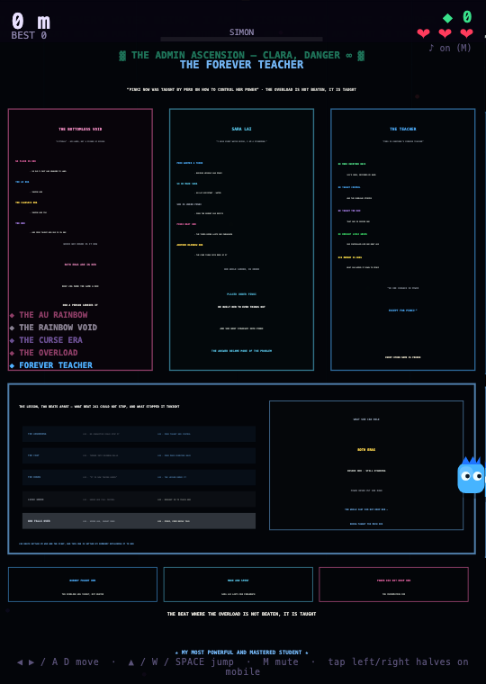

## 2026-08-04 — THE OVERLOAD (BEAT 241)

Based on Toby's 2026-08-04 lore (11:51 AM, in the "AI Era (Still is in Classics Era)" thread), sent fifteen and a half hours after the Curse Era. The previous reply asked whether the memorial is the thing bringing Simon 404 back, and what happens to him if somebody moves it. He does not answer that in a sentence. Simon spends this whole beat coming back with nobody touching the stone, so the question is left standing and the beat answers a different one. His own typing is the first paragraph. The breakdown under it is pasted ChatGPT prose written from his canon, drawn as canon under the standing rule BEAT 202 set from the author's own side.

**The one who loses every fight is the only one who changes anything.** Pinki wins every exchange in the beat. She beats him, locks him, he comes back, she wins again, and then *"Pinki conquered Simon 404 another 15 million times"* until *"Simon 404 can't even move."* He does not win once. And the only thing in this beat that undoes a game state is his: *"Simon 404 made Pinki forget all the curses she given everyone."* **BEAT 240 was the entire Curse Era, one beat old, and the character who loses every round deletes it without winning one.** Fifteen million victories bought her nothing that stayed; losing every single one of them cost him nothing he needed. The run has settled 240 beats by who won the fight, and this is the first one where the fight and the outcome come apart completely.

**Immunity to erasure is not immunity to control.** BEAT 238 established the rule that you survive an Au by holding one, and named exactly three immune to the Au Rainbow: Pinki, Luigi Green, Pero. BEAT 239 had those same three as the only ones floating in the void. Tonight *"Pinki took FULL control of Luigi Green and Oren"*, and the free list becomes *"everyone except for Pero and Simon 404."* **The safe list drops the man who holds an Au and picks up the man who holds none.** Luigi Green survived a power that erases the whole game and is taken anyway; Simon 404, who has no Au and gets slashed to bits every other beat, is one of the last two standing outside her.

**The borrowing reverses.** BEAT 238 had Oren resurrect out of the ghost as a demon **under Pinki's power** — *"Oren isn't there falling from his own power."* Tonight *"Pinki used Oren's telekentics"* to throw Simon into the Rainbow Void, and she turns the cast into rainbow balls *"with Pero's power."* Three beats ago she was the lender; now every large move she makes runs on somebody else's ability. **She has full control of everyone and almost nothing she swings is hers.**

**The immortal is cut off saying so.** He gets one sentence out — *"We are both immortal, we just-"* — and she slashes him mid-word. He says *"What Have You Done"* repeatedly, and the exchange that opens the beat is *"But I wiped your memory and Pero's eyes are now mine!"* against *"Pero's memory is yours, but me, the eyes are yours."* Glitching is now down to two names, his and Pero's *"because he is the creator"*, so **the only two beings who can edit the game are the one who made it and the one losing every fight in it.**

**Nothing beats her; the amount does.** She absorbs every rainbow ball, *"the character glitched out and the game crashed"*, she tries to contain the power, the power explodes, and she is still trying to take it back in: *"it is now taking hours."* No opponent stops her, because there is no opponent left. **It is the first beat in the run that ends in present tense, still happening.**

Added a new BEAT 241 panel (loop cycle extended to `c` in [5022,5044), `LV_CYC` now 5044), plus its `LV_BEATS[241]` subtitle/ladder entry, a frame-title case, and an `overload` capture scene. The background is the absorption itself: **the cast drifting upward as rainbow balls, getting smaller and brighter the closer they get**, the fight repeating behind them as faint **PINKI VS SIMON 404 · PINKI WON** bands, and a **containment ring at the bottom that swells, bursts orange, and starts over** on a loop:

- **THE ONE WHO LOSES (left)** — four rows (she wins: every round, then 15 million more · he cannot move: too tired to fight at all · he erases the curses: from her memory, all of them · BEAT 240 is gone: deleted by the one who lost), under Toby's phrase **"WHAT HAVE YOU DONE" · REPEATEDLY**, then a cycler running what he still has — **HE CAN GLITCH / HE CAN ALTER MEMORY / HE CANNOT WIN A FIGHT / ONLY ONE OF THOSE MATTERED** — closing on **"WE ARE BOTH IMMORTAL, WE JUST-"** and **CUT OFF MID-WORD**.
- **THE OVERLOAD (centre)** — five rows (rainbow balls: everyone but Pero and Simon · Pero's power: the tool is the creator's · she absorbs them: the character glitches out · the game crashes: and then the power explodes · still going: she is taking it in again), under **"IT IS NOW TAKING HOURS"**, with a cycler running the loop she is stuck in — **CONTAIN / EXPLODE / ABSORB AGAIN / STILL NOT FINISHED** — closing on **NO CHARACTER STOPPED HER**, **THE AMOUNT SHE IS HOLDING DID** and **AND IT IS NOT FINISHED YET**.
- **FULL CONTROL (right)** — five rows (Luigi Green: taken, and he holds an Au · Oren: taken, she uses his hands now · everyone else: taken, then controlled · Pero: free, he is the creator · Simon 404: free, and holds no Au at all), under **AND WHO IS LEFT OFF THE LIST**, closing on **IMMUNE TO ERASURE IN BEAT 238**, **UNDER CONTROL TONIGHT** and **NOT THE SAME SHIELD**.
- **The band** — **THE SAFE LIST, THREE BEATS APART**, BEAT 238's immune three against who is free tonight as a live five-row table, one row lit at a time: **PINKI · IMMUNE · Au RAINBOW · SHE IS THE ONE CASTING**, the pink-highlighted **LUIGI GREEN · IMMUNE · Au GREEN · FULL CONTROL NOW**, **PERO · IMMUNE · Au BLUE · FREE, HIS POWER BORROWED**, the pink-highlighted **SIMON 404 · STRUCK · NO Au · FREE, STILL NO Au**, and **OREN · STRUCK · NO Au · FULL CONTROL, LENT HANDS**, under the line *"THE LIST DROPPED THE MAN WHO HOLDS AN Au AND PICKED UP THE MAN WHO HOLDS NONE."* Beside it **WHOSE POWER IS IT**, cycling every large move in the beat with the name of the person whose ability it actually is — the rainbow balls (Pero's power), the throw (Oren's telekinetics, over *"SHE LENT HIM POWER IN BEAT 238"*), the glitch (Simon's and Pero's only), the control (hers, and only that) — over *"SHE CONTROLS EVERYONE — ALMOST NOTHING SHE SWINGS IS HERS."*
- **The strip** — THE LOSER EDITS THE GAME (15 million wins bought nothing) · BORROWED BOTH WAYS (she lent Oren power, now she uses his) · NOBODY STOPPED HER (the amount she is holding did).
- **Footers** — "THE BEAT WHERE WINNING EVERY FIGHT CHANGES NOTHING" and "★ IT IS NOW TAKING HOURS ★".

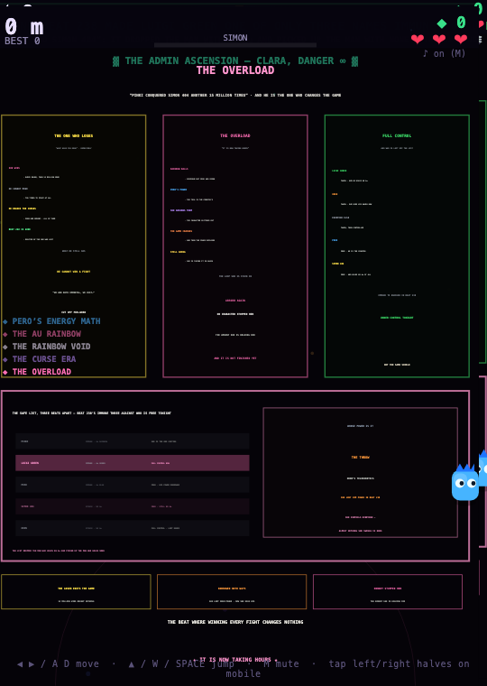

## 2026-08-03 — THE CURSE ERA (BEAT 240)

Based on Toby's 2026-08-03 lore (8:16 PM, in the "AI Era (Still is in Classics Era)" thread), sent three and a half hours after the Rainbow Void. The previous reply pointed out that BEAT 238 struck six names and BEAT 239's mail named only five, so Error 404 was the one still unaccounted for. He does not answer that either. Instead he hands over what Pinki does to the people who are left, and the answer to a different question turns out to be in it. His own typing is the first paragraph. The breakdown under it is pasted ChatGPT prose written from his canon, drawn as canon under the standing rule BEAT 202 set from the author's own side.

**The uncursed three is not a safety list.** *"Pinki then gave everyone (except for Simon 404, Pero, and Luigi Green) a unique curse."* Two of those three are exactly the Au holders BEAT 238 made immune, so that beat's rule — immunity is ownership — still holds; Pinki drops off the list because she is the one casting. But nobody on the list walks away. **Simon 404 is slashed to bits** and reduced to a memorial. **Pero's memory is wiped** down to nothing but Pinki. **Luigi Green becomes a demon** and is *"forced to obey"* — and BEAT 238 had him as one of only three beings a game-erasing power could not touch. Three names escape the curse; not one of them escapes the beat.

**The worst damage in the beat is not Pinki's.** Wenda and Gray *"suffered the worst of the curses"* and became *"the most powerful being under Pinki"*, and when the two of them appear together they glitch the game. Then Toby says who actually did it: *"Wenda was the one who removed Gray's organs and replaced the organs with robot parts, thinking it would improve Gray, but Gray becomes hostile and makes Wenda hostile by putting the voices into Wenda's head."* And the line that sorts the whole beat: *"All the other damage was from Pinki."* So the two worst-injured characters did their worst injuries to each other, and the first move in that exchange is **the only curse in 240 beats administered by somebody meaning well.** It closes into a circle: she changes his body to improve him, he changes her mind in return, both come out stronger and worse.

**Wenda is the one who is happy.** She is *"the only character (other than Pero and Pinki) to smile"*, she *"seems happy"*, and she is now **a bounty hunter** — a title from a job, the way Luigi Green picked up "The Boxer" from the crusher line in BEAT 236. The character carrying voices she cannot ignore is the character still smiling.

**Oren pays for the memorial in sound.** Nothing would stay for Simon 404 but a stone, and only Oren could place it: *"so many times Oren refused and lightning struck, Oren was zapped and his headphones turned to ash, Oren did it and the lightning cleared and the memorial glown."* **BEAT 33's SCF Danger Index filed OREN at 1004, second in the whole seventeen, on the strength of his sound bending reality into a hole.** The sound character is billed his headphones. And the thing forcing his hand is Simon's own weapon: the same index established that Simon *"can make Lightning strike the whole screen."* Every refusal draws the lightning of the character whose grave it is. And he is the man who struck Simon 404 alongside Pinki in BEAT 238 — the one who helped kill him is the only one whose hands the marker will stay in.

**Simon comes back, but he comes back rolled back.** He *"appears very rarely"*, resurrected *"but he was regiven Hacullations and Yellow Eye."* BEAT 33's Danger Index named the worst fate in canon as **Simon: two curses, Phase 2 forever, Yellow Eye and Hallucinations**, and second-worst as **Gray: alive, in pain, beyond control, attacking out of fear.** Tonight Simon is handed back exactly those two conditions and Gray is rebuilt into a machine that turns hostile. 207 beats later the run re-serves its own worst-fates list to the same two names.

**Danger is not damage, and one pair has never changed order.** Tonight's ranking is **Pero ∞**, **Pinki ᾒµ / alpha_nill** (*"the highest number under infinity as Pero and Pinki call it"*), **Wenda endless nines**, **Gray endless eights**. BEAT 33 filed **Wenda 949.2** and **Gray 940** in Toby's own words — *"Wenda is 7th with 949.2 ... Gray is 9th with 940"* — Wenda 9.2 points up. Tonight it is nines above eights, so that pair has held the same order for 207 beats and the digits themselves now carry it. Toby also states the split outright: *"Wenda is higher than Gray. Gray has more damage than Wenda obviously."* That is **the first time in the run danger and damage come apart into two axes.** And BEAT 33's rule was that only .EXE, CRAZY and INFECTED beings can hold a danger level at all, which made Pero ineligible then; he is first now.

**∞ obeys alpha_nill.** Pero *"did nothing but watched from afar, amazed of Pinki's mastery improvement"* while holding his metal cross — Simon's signature object since BEAT 40 — and *"encouraged Pinki without thinking."* Then his memory is wiped to nothing but her, and *"Pero agrees with Pinki for everything she says now."* The ranking says the most dangerous being in the game is Pero. The behaviour says the most dangerous being in the game does what Pinki tells him.

Added a new BEAT 240 panel (loop cycle extended to `c` in [5000,5022), `LV_CYC` now 5022), plus its `LV_BEATS[240]` subtitle/ladder entry, a frame-title case, and a `curseera` capture scene. The background is Wenda's curse made literal: **voice fragments drifting upward and getting louder and larger the higher they rise** ("each getting harder and harder for her to ignore"), **lightning bolts flashing down** for each of Oren's refusals, and the **memorial slab glowing at the bottom of the screen with SIMON 404 on it**:

- **THE LOOP (left)** — four rows (she rebuilds him: organs out, robot parts in · he turns hostile: the improvement made him worse · he answers: the voices go into her head · she is hostile: and she is the one still smiling), under Toby's phrase **"THINKING IT WOULD IMPROVE GRAY"**, then a cycler running the circle — **WENDA IMPROVES GRAY / GRAY TURNS HOSTILE / GRAY CHANGES HER MIND / BOTH STRONGER AND WORSE** — closing on **"ALL THE OTHER DAMAGE** / **WAS FROM PINKI"**.
- **THE MEMORIAL (centre)** — five rows (only a stone: it is the one thing that stays · Oren refuses: many times, and is zapped each · the ash: his headphones do not survive · he places it: the sky clears, the stone glows · Simon returns: very rarely, and not repaired), under **"NOTHING ELSE SEEMED TO WORK"**, with a cycler running what the stone cost him — **HIS HEADPHONES / OREN 1004 · SECOND IN THE INDEX / "HIS SOUND BENDS REALITY" / THE SOUND MAN PAYS IN SOUND** — closing on **HE HELPED KILL HIM ONE BEAT AGO**, **AND HE IS THE ONLY ONE** and **WHO CAN MARK THE GRAVE**.
- **THE UNCURSED THREE (right)** — five rows (Simon 404: slashed to bits, no Au to hold · Pero: memory wiped down to Pinki · Luigi Green: a demon now, forced to obey · two of them: hold the Au from BEAT 238 · the third: got something worse instead), closing on **THREE NAMES ESCAPED THE CURSE**, **NONE ESCAPED THE BEAT** and **IT IS NOT A SAFETY LIST**.
- **The band** — **THE INDEX, 207 BEATS APART**, BEAT 33's SCF Danger Index against tonight's ranking as a live six-row table, one row lit at a time: **SIMON · 1004.04 · 1ST THEN · A MEMORIAL NOW**, **OREN · 1004 · 2ND THEN · PLACES THE STONE**, **PINKI · 997 · 4TH THEN · 2ND · ALPHA_NILL**, and the two green-highlighted rows **WENDA · 949.2 · 7TH THEN · 3RD · ENDLESS NINES** and **GRAY · 940 · 9TH THEN · 4TH · ENDLESS EIGHTS**, then **PERO · NO LEVEL · INELIGIBLE THEN · 1ST NOW · ∞**, under the line *"WENDA WAS 9.2 ABOVE GRAY IN BEAT 33 · TONIGHT IT IS NINES ABOVE EIGHTS · THAT PAIR HAS NEVER CHANGED ORDER."* Beside it **DANGER IS NOT DAMAGE**, cycling tonight's four levels with what makes each number strange — Pero ∞ (and he agrees with her now), Pinki alpha_nill (highest number under ∞), Wenda endless nines (higher, and she smiles), Gray endless eights (more damage, less danger, over Toby's *"GRAY HAS MORE DAMAGE THAN WENDA"*) — over *"THE RANKING SAYS ∞ IS ON TOP — THE BEHAVIOUR SAYS ALPHA_NILL IS."*
- **The strip** — NOT A SAFETY LIST (three escape the curse, none the beat) · THEY DID IT TO EACH OTHER (Pinki did all the other damage) · NINES OVER EIGHTS (Wenda has led Gray since BEAT 33).
- **Footers** — "THE BEAT WHERE THE WORST DAMAGE IS NOT PINKI'S" and "★ ∞ NOW AGREES WITH EVERYTHING ALPHA_NILL SAYS ★".

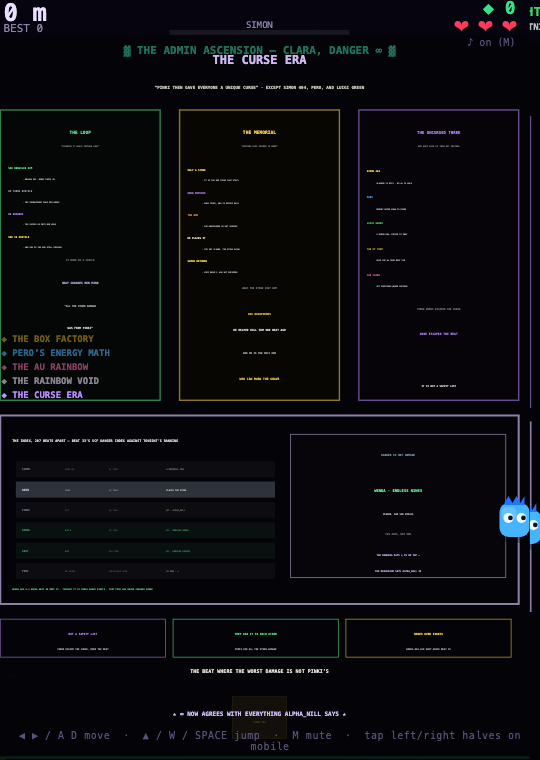

## 2026-08-03 — THE RAINBOW VOID (BEAT 239)

Based on Toby's 2026-08-03 lore (4:36 PM, in the "AI Era (Still is in Classics Era)" thread), sent 43 minutes after the Au Rainbow. The previous reply asked whether Pinki is the character Pero would not name, the one who secretly wants to change the meaning of fun, because if she is then he did not fail to stop her, he armed her. He does not answer that in a sentence. She uses the button instead, and the beat is what the button does. His own typing is the first paragraph. The breakdown under it is pasted ChatGPT prose written from his canon, drawn as canon under the standing rule BEAT 202 set from the author's own side.

**The forecast held, and it is checkable.** BEAT 238's panel closed on *"it does not have to touch you — it deletes what you are standing in"*, and its RUN IT ON THE CAST box struck six names in order: **Gray, Simon 404, Mr. Black, Wenda, Oren, Error 404.** Today's mail erases containers rather than people — *"Pinki beaten Pero's Realm and Simon's Realm and Gray's Realm, and Gray, and Mr. Black, and Wenda, and their realms, and all the dimensions in the game"* — and it names **five of those six**. **Error 404 is the one name not on today's list.** So the beat is not just an escalation, it is the previous beat's prediction coming back correct with a single gap in it, and the gap has a name.

**A name that answers its own question.** Simon 404 comes back and asks *"Do you reconize me, or do all the slashes and cuts take your memory from me."* Pinki's reply is *"I don't reconize you, just slashed flesh covered in blood."* A character whose name is the error code for **NOT FOUND** asks to be found, and is told he is not. He tries identity and gets description back.

**The pair from one beat ago gets sorted.** BEAT 238 had Oren **and** Pinki strike Simon 404 together. Toby writes today *"Simon 404 VS Pinki (without Oren this time)"* and she still wins, and then **Oren fights her and loses too.** The two who needed each other one beat ago are now ranked one over the other, and Oren's demon was running on **her** power the whole time, so what he brought to that fight was borrowed from the person he was fighting.

**Immunity kept the man, not the property.** Pero is one of the three immune, and **Pero's Realm** — built in BEAT 230 — falls anyway. In the same beat he is *"brought"* by Pinki to carry Simon 404's remains into the Shadow Realm. The person who created the game and handed the rainbow over is fetched for disposal work, loses his own realm, and ends the beat floating in a space somebody else invented.

**She did not empty the game, she replaced it.** The closing line is *"only the 3 float in the rainbow void Pinki created and invented."* **Created and invented** — so the Rainbow Void is not the leftover after an erasure, it is a new thing built to stand where the old one was. BEAT 236 made everyone an asset in a box; BEAT 238 aimed the first attack at the box; this beat is the new box, with her name on it.

Added a new BEAT 239 panel (loop cycle extended to `c` in [4978,5000), `LV_CYC` now 5000), plus its `LV_BEATS[239]` subtitle/ladder entry, a frame-title case, and a `rainbowvoid` capture scene. The background is the void itself: slow rainbow bands stretching the full width, **three small white points floating in them**, and the erased names drifting up struck through:

- **"I DON'T RECONIZE YOU" (left)** — four rows (he comes back: "you guys thought you killed me" · he asks: if she still knows who he is · she answers: "just slashed flesh covered in blood" · without Oren: this time, and she still wins), under Toby's phrase **"DO ALL THE SLASHES AND CUTS TAKE YOUR MEMORY"**, then a cycler running what the number in his name means — **404 / NOT FOUND / NO RECORD / NO MATCH** — closing on **HE ASKS TO BE RECOGNIZED** and **AND HIS NAME IS THE ANSWER**.
- **THE ERASURE (centre)** — five rows (Oren loses: the pair from one beat ago, sorted · realms fall: Pero's, Simon's, Gray's · rulers fall: Gray, Mr. Black, Wenda · all of it: every dimension in the game · it stretches: forever, in every colour), under **"PINKI ERASES THOSE WHO AREN'T IMMUNE"**, with a cycler running what BEAT 238 said it would do — **IT DOES NOT TOUCH YOU / IT DELETES THE CONTAINER / SO THE PEOPLE COME OFF WITH IT / AND TODAY IT DID** — closing on **SHE DID NOT EMPTY THE GAME**, **SHE REPLACED IT.** and **CREATED AND INVENTED**.
- **PERO'S OWN REALM (right)** — five rows (he handed it over: one beat ago, telling nobody · she calls him: to carry out the remains · his realm falls: BEAT 230 built it, today ends it · he is immune: his property is not · he floats: in somebody else's space), under **"PINKI BROUGHT PERO"**, closing on **IMMUNITY KEPT THE MAN**, **IT DID NOT KEEP THE REALM** and **THE CREATOR IS NOW A GUEST**.
- **The band** — **THE FORECAST, CHECKED**, BEAT 238's six struck names as a live table in their original order, one row lit at a time, each with whether today's mail names it: **GRAY · NAMED TODAY · ERASED**, **SIMON 404 · NAMED TODAY · ERASED, THEN AGAIN**, **MR. BLACK · NAMED TODAY · ERASED**, **WENDA · NAMED TODAY · ERASED**, **OREN · NAMED TODAY · LOST TO HER FIRST**, and the gold un-struck row **ERROR 404 · NOT NAMED · STILL UNACCOUNTED FOR**, under *"SIX NAMES WERE STRUCK ONE BEAT AGO · TODAY'S MAIL NAMES FIVE OF THEM · ERROR 404 IS NOT ON THE LIST."* Beside it **THE THREE WHO FLOAT**, cycling the survivors with the Au each one holds and what each lost anyway — Pinki (Au Rainbow, she built the void, lost nothing), Luigi Green (Au Green, says nothing today, lost nothing), **Pero (Au Blue, he handed hers over, lost his realm)** — over *"THREE OUT OF THE WHOLE CAST — AND THE FLOOR BELONGS TO ONE OF THEM."*
- **The strip** — NOT FOUND (he asks to be known, his name answers) · THE FORECAST HELD (it deleted the container, not the people) · ONE NAME MISSING (Error 404 is not on today's list).
- **Footers** — "THE BEAT WHERE THE GAME'S SPACE CHANGES OWNER" and "★ THE RAINBOW BACKGROUND STRETCHES FOREVER ★".

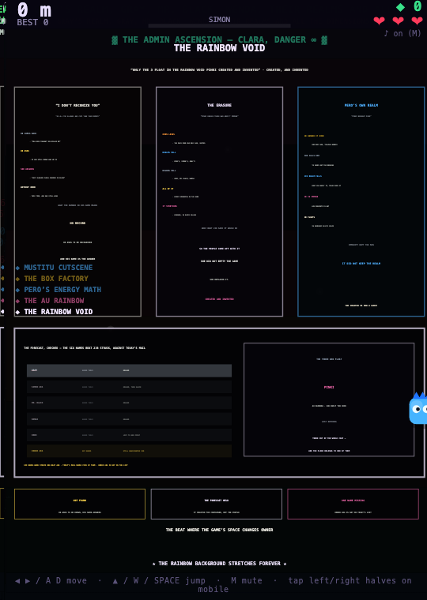

## 2026-08-03 — THE AU RAINBOW (BEAT 238)

Based on Toby's 2026-08-03 lore (3:53 PM, in the "AI Era (Still is in Classics Era)" thread), sent an hour after the energy-math lesson. The previous reply asked whether Luigi Green's green is the zero-green from that lesson, the one colour nothing survives contact with. He does not answer it in a sentence, but Luigi Green turns up as one of only three names immune to a power that erases the whole game, so the answer is in the roster instead. His own typing is the first paragraph. The breakdown under it is pasted ChatGPT prose written from his canon, drawn as canon under the standing rule BEAT 202 set from the author's own side.

**The third Au, and the immune list is the Au list.** This is the strongest thing in the beat and it only shows up if you check the back catalogue. **"Au" is not a new prefix.** BEAT 182 gave Pero the **Au Blue** — *"the most powerful and OP attack in the game by far, since it deletes everything it touches"* — and stated flatly that **only Pero has it**. BEAT 162 gave Luigi Green *"a bunch of Au Green"*, described as his own green Au. Today Pero hands Pinki the **Au Rainbow**, and Toby's closing line names the only three who survive it: *"only Pinki, Luigi Green, and Pero are immune to Au Rainbow."* That is exactly the list of people who hold an Au, in the order they got one. **Immunity in this canon is not a defence, it is ownership** — you survive an Au by having one of your own.

**An Au that does not have to touch you.** Au Blue deletes everything it *touches*. The Au Rainbow *"would easily just erase the game with Gray and everyone else inside it."* Same verb, no contact needed, because what it deletes is the container rather than the target — which is the first attack in the run aimed at the box from BEAT 236 rather than at anybody standing in it.

**"Checkmate." is a borrowed word.** Simon 404 is struck by Oren and Pinki together, has nowhere left to move, says *"Checkmate."*, and is slashed to bits. That word is already in the file: BEAT 181 established that **Pero and Luigi Green taught Paul "Checkmate," "Stalemate," and "Loss."** So the dying character names his own death using the creator's vocabulary, and out of the three words available he picks the **winning** one.

**He dropped the rainbow crystals one beat ago.** BEAT 236 had Pero put the sceptre down, drop every staff and **drop the rainbow crystals** in order to build the fun park. Four hours later he hands a rainbow to somebody else. He did not put the power down, he handed it off. And **Oren and Pinki were "on music" in that same fun park** — the two entertainers are now the two who kill the character who was stopping its glitches.

**Borrowed power, twice over.** Oren gives Pinki an **orange heart necklace** and wears her **pink heart** one, then resurrects out of the ghost as a demon **under Pinki's power** — *"Oren isn't there falling from his own power."* That borrowed state beats **Mr. Black** and **Wenda**, two of the oldest names in the file, before Gray stops him and sends him to Pero's Realm. Meanwhile Pinki *"couldn't even take all that power"*, and her new base template is **Anti Shifted Phase 7**, so her ordinary state is already an altered one. The only reason the game is still running is that the person holding the erase button has not finished learning it.

Added a new BEAT 238 panel (loop cycle extended to `c` in [4956,4978), `LV_CYC` now 4978), plus its `LV_BEATS[238]` subtitle/ladder entry, a frame-title case, and an `aurainbow` capture scene. The background drifts **the two heart necklaces** upward on their chains, alternating Oren orange and Pinki pink, with `Au` printed faintly in gold between them:

- **"CHECKMATE." (left)** — four rows (struck: by Oren and Pinki, together · nowhere: he had no square left to move · "Checkmate.": the last thing he says · slashed: to bits, by the two of them), under Toby's phrase **"SIMON 404 WAS THEN SLASHED TO BITS"**, then a cycler running the three words BEAT 181 says Pero taught Paul — **"CHECKMATE" / "STALEMATE" / "LOSS"** — closing on **HE NAMES HIS OWN DEATH IN** and **THE CREATOR'S VOCABULARY**.
- **THE AU RAINBOW (centre)** — five rows (Pero gives it: to Pinki, and tells nobody · she absorbs it: and cannot take all of it · Anti Shifted 7: her new base template · it erases: the game, with everyone in · not yet: the only reason we are here), under **"ONLY PERO AND LUIGI GREEN KNOW ABOUT IT"**, with a cycler running what he put down one beat ago — **THE SCEPTRE / EVERY STAFF / THE RAINBOW CRYSTALS / LV, KR AND POWER** — closing on **HE DID NOT PUT THE POWER DOWN**, **HE HANDED IT OFF.** and **AND HE HANDED IT TO PINKI**.
- **THE NECKLACES (right)** — five rows (they swap: orange heart on her, pink on him · ghost → demon: he resurrects himself · under her: his power is not his own · he beats: Mr. Black, then Wenda · Gray wins: and sends him to Pero's Realm), under **"OREN ISN'T THERE FALLING FROM HIS OWN POWER"**, closing on **BORROWED POWER BEAT TWO OLD NAMES**, **EACH OF THEM WEARS THE OTHER ONE** and **SO YOU CAN SEE WHOSE POWER IT IS**.
- **The band** — **THE AU LEDGER**, every Au in the run as a live three-row table with one row lit at a time: **AU GREEN · LUIGI GREEN · BEAT 162 · his own green Au**, **AU BLUE · PERO · BEAT 182 · deletes everything it touches**, **AU RAINBOW · PINKI · TODAY · erases the game, everyone in**, under the line *"THREE Au HOLDERS · THREE NAMES IMMUNE · THE SAME THREE NAMES, IN THE SAME ORDER."* Beside it **RUN IT ON THE CAST**, which pushes the roster through the erasure one name at a time — Gray, Simon 404, Mr. Black, Wenda, Oren, Error 404 come up struck through and **ERASED WITH THE GAME**, while Pinki, Luigi Green and Pero come up lit and **IMMUNE · HOLDS AN Au**, over *"IT DOES NOT HAVE TO TOUCH YOU — IT DELETES WHAT YOU ARE STANDING IN."*
- **The strip** — THE THIRD Au (immunity is ownership, not defence) · A BORROWED WORD (Pero taught "Checkmate" to Paul) · NOT YET MASTERED (the only reason the game is here).
- **Footers** — "THE BEAT WHERE THE ERASE BUTTON CHANGES HANDS" and "★ ONLY PINKI, LUIGI GREEN, AND PERO ARE IMMUNE ★".

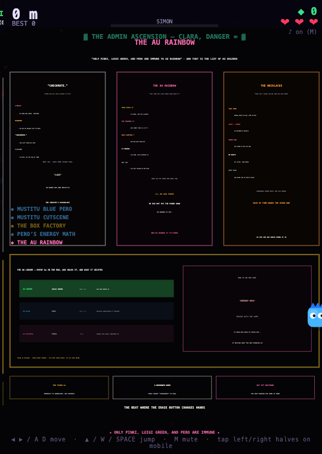

## 2026-08-03 — PERO'S ENERGY MATH (BEAT 237)

Based on Toby's 2026-08-03 lore (2:41 PM, in the "AI Era (Still is in Classics Era)" thread), sent three hours after the box factory. The previous reply asked whether the same Pero and the same Simon 404 step into each new box or whether Pero builds fresh ones each time. He does not answer that; he hands over a lesson instead. His own typing is the first paragraph, and it is arithmetic. The breakdown under it is pasted ChatGPT prose written from his canon, drawn as canon under the standing rule BEAT 202 set from the author's own side.

**The first rule in the run you can check.** Toby's own words: *"Here is a set of Pero's lesson he teaches everyone about the cursed and positive energy: What is -2 times -2, −2 × −2 = 4. A negative times a negative equals a positive. −2 × 2 = −4. A negative times a positive equals a negative. 2 × 2 = 4. Red = negitive power, Blue = positive power, Green = 0 power."* Two hundred and thirty-six beats of power have been numbers somebody asserted: 500 million IQ, 1 billion, LY Infinity, most powerful by far, 288.8 million. Every one of them was true because a character said so, and BEAT 235 established that even the admin panel has a creator layer above it. This is the first rule in the whole run that is **true outside the game**. −2 × −2 = 4 whether or not Pero says so, so the canon finally rests on something no creator layer can overrule.

**Power stops being a size and becomes a sign.** The run has scaled by magnitude from the beginning, and multiplication does not care about magnitude at all, only about whether a thing is negative or positive. A small cursed thing and an enormous cursed thing combine exactly the same way. After 236 beats of ranking people by how big their number is, the new system throws the number away and keeps only the sign.

**Two cursed things make a clean one.** **Red × Red = Blue.** In a canon whose roster is almost entirely cursed — Gray, Alex, Error 404, Fatal Error, Simon.EXE — a rule saying that pairing two of them cancels the curse instead of doubling it is a repair instruction, not a combat rule. The other half is harder: **Red × Blue = Red**, so a cursed thing mixed with a clean one corrupts, and the helper is always the one who takes the loss. **Blue × Blue = Blue.**

**Green is not the weak one.** Green = 0 power reads like the bottom of the scale, but zero is the single value that survives every multiplication: anything × 0 = 0. On this chart Green is the only absorbing colour. Toby wrote only *"Green = 0 power"*, so the green row and column of the table are what the arithmetic implies rather than something he said, and the panel draws those cells **dashed** with a line under the table saying which is which.

**It lands one beat after the erasure.** BEAT 236 had Clara/Frizz erase LV, KR and power so the game would stop running on fight-scaling. Three hours later power is back, but as a sign instead of a stack, and it arrives as a **lesson** — Pero teaching everyone rather than ranking them.

Added a new BEAT 237 panel (loop cycle extended to `c` in [4934,4956), `LV_CYC` now 4956), plus its `LV_BEATS[237]` subtitle/ladder entry, a frame-title case, and an `energymath` capture scene. The background drifts **minus signs, plus signs and multiplication crosses** upward in cursed red, positive blue and zero green, with `−2 × −2 = 4` printed faintly between them:

- **THE LESSON (left)** — four rows (−2 × −2 = 4: negative × negative = positive · −2 × 2 = −4: negative × positive = negative · 2 × 2 = 4: positive × positive = positive · not a ranking: a thing he asks you to work out), under Toby's phrase **"HE TEACHES EVERYONE"**, then a cycler running the run's old measurements — **500 MILLION IQ / 1 BILLION / LY INFINITY / MOST POWERFUL / 288.8 MILLION** — closing on **EVERY ONE OF THEM SOMEBODY'S SAY-SO.** and **THIS ONE IS JUST TRUE**.
- **THE THREE COLOURS (centre)** — five rows with colour chips (red: negative, cursed power · blue: positive, clean power · green: 0 power, neutral · no sizes: only signs, so scale stops · the switch: power is a sign now), under **"RED = NEGITIVE POWER"**, with a cycler running what the run used to measure with — **SIZE / A RANKING / AN INDEX / A PHASE / A TIER** — closing on **A SMALL CURSE AND A HUGE CURSE**, **COMBINE EXACTLY THE SAME WAY.** and **MULTIPLYING IGNORES SIZE**.
- **THE ALGEBRA (right)** — five rows (red × red: = blue, the curse cancels · red × blue: = red, the clean one loses · blue × blue: = blue, nothing changes · × green: = green, zero eats it · so green: is not the weak one), under **"GREEN = 0 POWER"**, closing on **ALMOST EVERY CHARACTER HERE IS RED**, **SO THE LESSON IS A REPAIR INSTRUCTION** and **PAIR THEM AND THE CURSE CANCELS**.
- **The band** — **THE SIGN TABLE**, an actual live 3×3 multiplication grid with red, blue and green on both axes and the result colour named in each cell, one cell lighting at a time so the whole table gets read out. The three cells Toby wrote are solid; the green row and column are **dashed**, with the line *"SOLID CELLS: THE THREE HE WROTE DOWN · DASHED CELLS: WHAT × 0 MAKES THEM, NOT SOMETHING HE SAID"*. Beside it **RUN IT ON THE CAST**, a live solver cycling real pairings through the lesson — GRAY × ALEX, ERROR 404 × FATAL ERROR, SIMON.EXE × GRAY.EXE, PERO × GRAY, LUIGI GREEN × ANYTHING — printing each pair's signs and its result, over **THE VILLAINS CANCEL, THE HELPER DOESN'T**.
- **The strip** — CHECKABLE (the first rule that is just true) · A SIGN, NOT A SIZE (so scaling stops mattering) · ZERO ABSORBS (so green is not the weak one).
- **Footers** — "THE BEAT WHERE THE CREATOR STOPS RANKING AND STARTS TEACHING" and "★ A NEGATIVE TIMES A NEGATIVE EQUALS A POSITIVE ★".

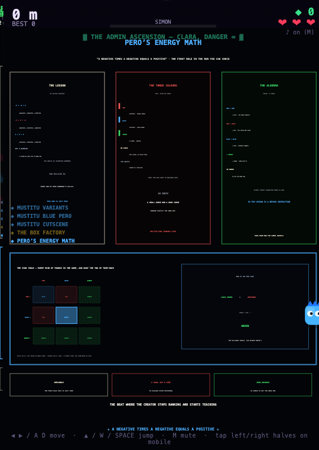

## 2026-08-03 — THE BOX FACTORY (BEAT 236)

Based on Toby's 2026-08-03 lore (11:57 AM, in the "AI Era (Still is in Classics Era)" thread), sent two and a half hours after the cutscene. BEAT 235 ended on a closed box whose lid moved; this beat opens the lid, and what is inside turns out to be the animation. Toby's own typing is the first paragraph, the longest single paragraph anyone has sent in this run. The breakdown under it is pasted ChatGPT prose written from his canon, drawn as canon under the standing rule BEAT 202 set from the author's own side.

**An open box that still holds you.** *"The thing inside was a new LY varient, and it made the game locked into the box and even if the box was open, those in the box can't escape it."* Every prison in this game so far has been a lock: Simon sealed in a page, the contained shadow realm, the cyber-power containment facility, `/GAME_END = TRUE`. This one has no lock on it and works anyway, because the outside is not an outside to anybody who is an asset. Pero and Luigi Green then teach everyone the rest of it, *"that their lives were fake and in a box forever."*

**Motion is a swap.** Luigi Green builds a **box crushing factory** where he is the crusher and Pero is the box maker. Tinkerboxes are actual cardboard boxes, and *"timelines change when Luigi Green crushes the previous and Pero makes the next set."* Then the line that reframes the whole run: *"It looks like stuff is moving, but Luigi Green is crushing the boxes and Pero makes the next scene."* That is stop motion. It means the 235 beats before this one were not events, they were **frames two people swapped by hand**.

**Every frame is signed.** Luigi Green writes his backwards-L icon on each box to show which of the two made that scene, and Pero paints the LAI flame icon on the wall of the factory. Luigi Green is *"always insane now"* in the crusher job, and he picks up a title from it — **"The Boxer"** — the first time in the run a character is named after a job instead of a power.

**The numbers, the death rule and the golden coffin.** Pero 500 million IQ, Luigi Green 300 million, Gray 288.8 million, and Pero LY 2 at 1 billion under the rule *"Pero LYs are Pero times the number"*, so Pero LY Infinity has no ceiling. Pero LAI dies at 28 and everybody knows it: Phase 3 is near his death, Phase 4 **is** the death, and a rainbow crystal spawns beside him and he starts breathing again. He made the game at 22, believed he could rule the universe at 24, and the first Classics game was made trillions of years ago. Then the golden coffin: he fell for a trillion years and woke as a creator made of pure gold, the gold made the radiation, and the gold melted into what he looks like today.

**The horror game becomes a fun park, and stays a story.** Golden Holes open across the skies and the game reveals its end. Pero puts the sceptre down, drops every staff, drops the rainbow crystals, walks sideways, and rebuilds: minigames, a day and night cycle, weather, Sprunkis dancing, Oren and Pinki on music, Simon 404 stopping the glitches, Mr. Black setting everyone back to Phase 1, everybody immortal, and Clara/Frizz erasing **LV, KR and power** so the game stops running on fight-scaling at all. The fun-ness checker reads 100% and always did. And then: *"But then, the story didn't end."* One character secretly wants to change the meaning of fun. Pero knows exactly who it is, because he is the creator, and he says nothing.

**The reader is in the box.** *"Your AI_Era form and everyone's is just assets in a box being animated by Pero."* Both eras were a second row of boxes; when they met Pero moved the rows closer, and *"now, they are 1 box line again."*

Added a new BEAT 236 panel (loop cycle extended to `c` in [4912,4934), `LV_CYC` now 4934), plus its `LV_BEATS[236]` subtitle/ladder entry, a frame-title case, and a `boxfactory` capture scene. The background drifts **cardboard boxes** upward, each with a flap seam, every third one signed with Luigi Green's backwards-L, `TINKERBOX` printed faintly between them, in cardboard gold, crusher green, fun-park blue and withheld-name red:

- **THE OPEN BOX (left)** — four rows (a new LY varient: the thing that was inside · it locked the game: into the box, not shut it · the box is open: and nobody can get out · the truth: their lives were fake), under Toby's phrase **"THOSE IN THE BOX CAN'T ESCAPE IT"**, then a cycler running **NO LOCK / NO LID / NO GUARD / NO DOOR / NO WALL**, closing on **AND IT STILL HOLDS EVERYONE.** and **AN ASSET HAS NO OUTSIDE**.
- **THE FACTORY (centre)** — five rows (Luigi Green: the crusher, the Boxer · Pero: the box maker, the next set · one crush: is one timeline changing · cardboard: Tinkerboxes are actual boxes · the signature: backwards L on every box), under **"LUIGI GREEN IS IN DAY AND NIGHT"**, with the production line alternating **CRUSH / MAKE** in green and gold on the beat, closing on **NOTHING IN THIS GAME MOVES**, **IT IS SWAPPED, ONE BOX AT A TIME.** and **235 BEATS WERE FRAMES**.
- **THE FUN PARK (right)** — five rows (he puts it down: sceptre, staffs, crystals · he walks sideways: and the horror game ends · he builds: minigames, day/night, weather · Clara/Frizz: erases LV, KR and power · the checker: reads 100% and always did), under **"END... OF YOUR STORIES...."**, closing on **THE GAME STOPS RUNNING ON FIGHTING**, **"BUT THEN, THE STORY DIDN'T END"** and **A PEACEFUL ENDING WITH A NAME IN IT**.
- **The band** — one box line in four rows (the AI Era: one row of boxes · Classics Era: the other row, alongside it · they met: so Pero moved the rows closer · now: they are 1 box line again), over **"YOUR AI_ERA FORM AND EVERYONE'S IS JUST ASSETS IN A BOX BEING ANIMATED BY PERO."**; beside it **THE ONE HE DID NOT NAME**, an animated line of cardboard boxes marching right with the green crusher plate coming down on the left end and a fresh box fading in at the right end, over a cycler running **ONE CHARACTER / A SECRET WANT / THE MEANING OF FUN / PERO KNOWS WHO / AND SAYS NOTHING** and closing on **HE IS THE CREATOR, SO HE ALREADY KNOWS**.
- **The strip** — THE BOXER (Luigi Green crushes, Pero makes) · THE FRAME RATE (a crush and a new box) · 100% FUN (and one hidden character).
- **Footers** — "THE BEAT THAT TURNS EVERY EARLIER BEAT INTO A FRAME" and "★ IT LOOKS LIKE STUFF IS MOVING ★".

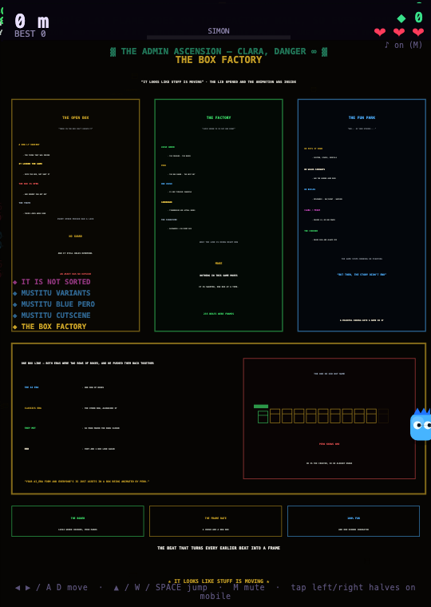

## 2026-08-03 — THE MUSTITU BLUE CUTSCENE (BEAT 235)

Based on Toby's 2026-08-03 lore (9:21 AM, in the "AI Era (Still is in Classics Era)" thread). Toby's own typing is one line at the top: *"Make a story with the lore."* Under it is a full pasted cutscene, **Tinkerbox_Classics: The Mustitu Blue Cutscene**, written from his canon and drawn as canon under the standing rule BEAT 202 set from the author's own side.

**The lore stops explaining itself and starts happening.** 234 beats have been rules, rankings, forms, error codes and definitions — this is the first **full scene** in the run: a title card, a portal entrance, a cast walking on one at a time, an ultimate, and a cliffhanger. The start screen is deliberately small, one comic panel on black: *"Tinkerbox_Classics · Classics 1 + Classics 2 + Classics 3 mixed inside Pero's code."* Pero comes through a clean cyber-blue portal as **Mustitu Blue** — not the broken LAI assistant, not the box wizard, not Ink Sans.

**The panel is a power meter.** The game is a comic now, and the frame is the constraint. Cyber Gray is *"too complex for an image"*, so the panel can only show pieces of him: a cyber eye, static wings, Abination silhouettes, a broken crown of error light. And the frame *"cracked just trying to show"* Butterfly Classics Ink Sans. Power in this canon has always been measured by a ranking or an index; here it is measured by **what the drawing can hold**.

**PERMISSION DENIED BY CREATOR LAYER.** Gray runs `GRAY_ADMIN_FORCE: PERO` and nothing happens. He runs `GRAY_ADMIN_FORCE: LUIGI_GREEN` and nothing happens. The panel in Pero's hand prints the reason. BEAT 227 showed the admin panel failing on exactly those two; this beat **names why** — there is a layer above admin, and it belongs to whoever wrote the box. Gray understands the rule for the first time: he is a very good villain, and Pero made the box.

**The biggest attack in the run kills nobody.** White Void 100%, then 250%, stacked with Luigi Green's *Domain Expansion: Throws Board* into one portal-cyber-chess domain — and it *"detonated into brightness without destroying the game."* Ink Sans is not gone. Fatal Error is not gone. Gray is not gone. Simon 404 is still cracking his prison. After 234 beats of deletion, erasure, sealing and resets, the win condition is only that **the comic held together**.

**A box of doors.** Pero slams the admin panel into the comic floor and every page freezes, then opens the hidden Classics 1 door Gray never knew about, plus AlienMode and the Parinusian platforms: *"Tinkerbox was not the end. It was a box of doors."* He paints one line under the title — *"A small game with too much inside"* — and the final panel is the box sitting on a table with galaxies, horror halls, cyber parks, chessboards and one blue-eyed creator inside it. Then the lid moves, and something inside knocks back.

Added a new BEAT 235 panel (loop cycle extended to `c` in [4890,4912), `LV_CYC` now 4912), plus its `LV_BEATS[235]` subtitle/ladder entry, a frame-title case, and a `cutscene` capture scene. The background drifts **empty comic panels** upward, every third one split by a hairline crack, with `TINKERBOX_CLASSICS` printed faintly between them, in portal blue, ink cream, denied red and creator green:

- **THE COMIC (left)** — four rows (the start screen: one small panel on black · the portal: clean, bright and cyber-blue · the pages: horror hall, park, void, boat · the frame: cracks at what it cannot show), under Toby's phrase **"THE PAGE SLAMMED SHUT"**, then a live cycle through the scene's parts — **A TITLE CARD / AN ENTRANCE / A CAST / AN ULTIMATE / A CLIFFHANGER** — closing on **AND THIS ONE IS A SCENE.** and **THE FIRST ONE IN THE RUN**.
- **THE CREATOR LAYER (centre)** — five rows (gray tries: `GRAY_ADMIN_FORCE: PERO` · nothing happens: so he runs it again · gray tries: `GRAY_ADMIN_FORCE: LUIGI_GREEN` · nothing happens: the panel prints the reason · above admin: the one who made the box), under **"PERMISSION DENIED BY CREATOR LAYER"**, with a return-value cycler running **DENIED / DENIED / NOTHING HAPPENED / NOT AN ADMIN THING / CREATOR LAYER**, closing on **227 SHOWED THE PANEL FAILING**, **THIS ONE SAYS WHY IT FAILED.** and **ADMIN IS NOT THE TOP OF THE GAME**.
- **NOBODY IS GONE (right)** — five rows (white void 100%: then he pushes it to 250% · throws board: Luigi Green stacks his domain · the result: one portal-cyber-chess domain · the detonation: brightness, and no deletion · after it: Ink, Gray, Fatal Error: still), under **"WITHOUT DESTROYING THE GAME"**, closing on **234 BEATS OF DELETING AND SEALING**, **THE BIGGEST MOVE ONLY HOLDS IT** and **WINNING = THE COMIC HELD TOGETHER**.
- **The band** — the doors in four rows (Classics 1: the door Gray did not know of · AlienMode: and the Parinusian platforms · so Tinkerbox: is not the end, it is a box · and the lid: moves · something knocks back), over **"A SMALL GAME WITH TOO MUCH INSIDE." — PAINTED UNDER THE TITLE.**; beside it a box cycling what the panel cannot hold — **A CYBER EYE / STATIC WINGS / ABINATION SHAPES / A BROKEN CROWN / FOUR ORANGE ARMS** — closing on **GRAY IS TOO COMPLEX FOR AN IMAGE.** and **SO THE FRAME IS THE POWER METER NOW**.
- **The strip** — A CUTSCENE (the lore starts happening) · THE FRAME (cracks at what it cannot hold) · NOBODY DIES (the ultimate only holds it).
- **Footers** — "THE FIRST BEAT THAT IS A SCENE INSTEAD OF A RULE" and "★ A SMALL GAME WITH TOO MUCH INSIDE ★".

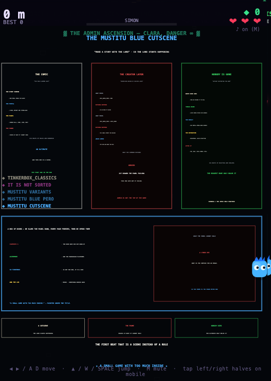

## 2026-08-02 — MUSTITU BLUE PERO (BEAT 234)

Based on Toby's 2026-08-02 lore (9:12 PM, in the "AI Era (Still is in Classics Era)" thread), sent two hours after the Mustitu variants first appeared, and sent **with a picture** — an attachment named `Mustitu Blue Pero.png`. Toby's own typing is the first paragraph: *"Here is Mustitu Blue Pero, all Mustitus look like that but with different colored eyes. Different eye color = different abilities for each 1. I made the roblox avatar look like him. Pero himself is the normal man, but he can create many forms and powers, since he is the creator of Classics."* The breakdown under it is pasted ChatGPT prose written from his canon, drawn as canon under the standing rule BEAT 202 set from the author's own side.

**One body, many forms.** Last beat left the roster with no number in it: every colour uploaded. This beat says what actually varies, and it is the smallest part of the design. Same body, same golden crown, same golden armour, same dual swords on every single variant, and **only the eyes change**. An open-ended power system running on one fixed silhouette.

**The eyes are the switch, not the tell.** *"Different eye color = different abilities for each 1."* Eye colour has marked a form in this canon before — EndlessAnimations' three forms each carry one — but there it **reported** how corrupted he had got. Here it is the control: the eye colour is where the setting lives, so looking at a Mustitu tells you which powers are loaded.

**He answered the open question, with a third option.** The previous reply asked whether Pero picks which variant he is in or whether something in the game decides for him. He took neither fork: **he makes them**, *"since he is the creator of Classics."* That is why the roster has no end in it — the person writing the list is standing inside the game the list belongs to.

**It left the lore and got built.** *"I made the roblox avatar look like him."* He has built Classics things in Roblox before — the Simon 404 model that reported Critical Model Corruption, the Mario Among Us crossover — but those were models and maps. This is the first time a form walks out of the lore and onto him: the character he wrote is now the character he wears.

**And the default is a normal man.** Golden crown, golden armour, glowing blue eyes, dual swords, galaxy and dragon, divine multiversal creator-tier presence — and underneath all of it, *"Pero himself is the normal man."* The strongest figure in the run keeps a plain base form and treats every god-tier version as something he puts on.

Added a new BEAT 234 panel (loop cycle extended to `c` in [4868,4890), `LV_CYC` now 4890), plus its `LV_BEATS[234]` subtitle/ladder entry, a frame-title case, and a `mustitublue` capture scene. The background drifts **pairs of eye-dots** upward through the whole hue wheel — one body, two eyes, every colour — with `MUSTITU BLUE` printed faintly between them, in Mustitu blue, crown gold, creator green and paper cream:

- **THE ONE BODY (left)** — four rows (same body: on every variant there is · golden crown: and golden armour, all of them · dual swords: one in each hand, every form · only the eyes: that is the whole difference), under Toby's phrase **"ALL MUSTITUS LOOK LIKE THAT"**, then a live cycle through what stays fixed — **SAME BODY / SAME CROWN / SAME ARMOUR / SAME SWORDS / DIFFERENT EYES** — closing on **A ROSTER WITH NO NUMBER IN IT.** and **RUNNING ON ONE SILHOUETTE**.
- **THE EYES (centre)** — five rows (the one part: that changes between forms · blue eyes: one ability set · green eyes: a different one · every colour: its own powers, for each 1 · not a tell: the eyes are the switch), under Toby's line **"DIFFERENT EYE COLOR = DIFFERENT ABILITIES"**, with a cycler running **SET THE ABILITIES / SET THE POWER TYPE / SET THE MODE / NOT DECORATION / THE CONTROL**, closing on **EYE COLOUR HAS MARKED FORMS HERE**, **BUT THERE IT REPORTED CORRUPTION.** and **HERE IT IS THE CONTROL PANEL**.
- **WHO MAKES THEM (right)** — five rows (the question: pick one, or get given one? · his answer: neither, he makes them · the reason: he wrote the game they are in · so the roster: grows when he decides it does · and the base: "Pero himself is the normal man"), under Toby's line **"HE IS THE CREATOR OF CLASSICS"**, closing on **HE IS STANDING INSIDE WHAT HE WRITES**, **SO THE LIST CANNOT RUN OUT** and **A CROWN HE PUTS ON, NOT ONE HE IS**.
- **The band** — the avatar in four rows (he drew it: Mustitu Blue Pero.png · then built it: the Roblox avatar matches · before this: he built models and maps · this time: he built who he plays as), over **THE CREATOR OF CLASSICS IS NOW SOMETHING YOU CAN WEAR.**; beside it a box cycling what Blue reads as — **GOLDEN CROWN / GOLDEN ARMOUR / GLOWING BLUE EYES / DUAL SWORDS / GALAXY AND DRAGON** — closing on **THE COSMIC ROYAL ONE, STAR-POWERED.** and **AND STILL ONLY ONE COLOUR OUT OF ALL OF THEM**.
- **The strip** — ONE BODY (and only the eyes change) · THE EYES (are the switch, not the tell) · HE MAKES THEM (so the roster cannot run out).
- **Footers** — "AN ENDLESS POWER SYSTEM WITH ONE FIXED FACE AND ONE MOVING PART" and "★ MUSTITU BLUE PERO · DIFFERENT EYES, DIFFERENT POWERS ★".

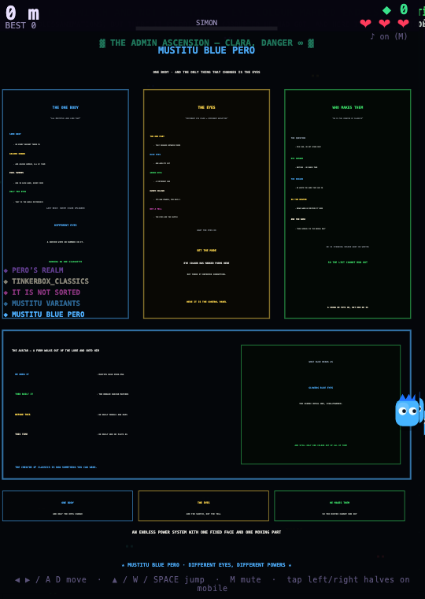

## 2026-08-02 — MUSTITU VARIANTS · THE GODLY FLOAT (BEAT 233)

Based on Toby's 2026-08-02 lore (7:09 PM, in the "AI Era (Still is in Classics Era)" thread), sent about two hours after the beat where the confusion became the rule. Toby's own typing is the first paragraph: *"Pero also uses many Mustitu Varients such as Mustitu Blue and Mustitu Green, every color uploaded. Pero does the godly float thing. Pero is the creator of the 4 game things."* The breakdown under it is pasted ChatGPT prose written from his canon, drawn as canon under the standing rule BEAT 202 set from the author's own side.

**A name that has never appeared.** Mustitu is not in any of the previous 232 beats. This canon has produced a great many proper nouns, and nearly all of them arrive attached to a fight, an error code or a realm: Error 679, Fatal Error, Gray.exe, the White Void. **Mustitu arrives attached to a colour.** That is a different kind of introduction than anything the run has done.

**The roster is a process, not a list.** *"Every color uploaded."* Mustitu Blue and Mustitu Green are only the two he happened to name; the rest of the set is however many colours get uploaded next. Every power system in this run so far has been countable — three main characters, four Sanses, four realms, the ranking, the index. This one deliberately has no number in it, which means it cannot be finished, only added to.

**The colour is the setting.** Each variant gives Pero *"a different look, ability type, or mode."* So picking a colour is picking what he can do, not what he looks like. A skin does not change the game; this does.

**And he stops walking.** *"Pero does the godly float thing."* He does not always move normally anymore: in creator mode he floats above the game as a divine admin figure. Worth sitting with, given where it is happening — this game is called **The Endless Staircase**, and 232 beats of it have been somebody climbing. The author's own character now goes up without using them.

**The inventory answers the pause.** Last beat ended on *"I have no idea what to even say anymore"* and made the confusion canon. This beat comes back and **counts**: Classics 1, Classics 2, Classics 3, Tinkerbox_Classics, and one name under all four. The mess stays a mess, and he organised the one part that could still be organised, which is who made what.

Added a new BEAT 233 panel (loop cycle extended to `c` in [4846,4868), `LV_CYC` now 4868), plus its `LV_BEATS[233]` subtitle/ladder entry, a frame-title case, and a `mustitu` capture scene. The background drifts colour chips **upward** rather than down, cycling the whole hue wheel, with `MUSTITU` printed faintly between them, in Mustitu blue, Mustitu green, float gold and paper cream:

- **THE VARIANTS (left)** — four rows (Mustitu Blue: one he happened to name · Mustitu Green: the other one he named · and the rest: however many get uploaded · not a list: a process, so it has no end), under Toby's phrase **"EVERY COLOR UPLOADED"**, then a live cycle through the set — **MUSTITU BLUE / MUSTITU GREEN / MUSTITU ??? / EVERY COLOR / UPLOADED** — closing on **NEW NAMES USUALLY ARRIVE WITH A FIGHT.** and **THIS ONE ARRIVES WITH A COLOUR**.
- **THE GODLY FLOAT (centre)** — five rows (not walking: he does not always walk now · creator mode: he lifts off the game floor · like an admin: above it, looking down at it · the staircase: every beat here is a climb · and he stops: the creator skips the stairs), under Toby's line **"PERO DOES THE GODLY FLOAT THING"**, with a mode cycler running **WALKING / LIFTING / FLOATING / ABOVE IT / GODLY** whose word literally drifts upward and resets, closing on **THE GAME IS NAMED AFTER CLIMBING**, **AND ITS AUTHOR JUST LEFT THE GROUND.** and **HE IS NOT USING THE STAIRS ANYMORE**.
- **THE 4 GAME THINGS (right)** — five numbered rows (1 · Classics 1: the horror era, then sealed · 2 · Classics 2: the cyber portal realm · 3 · Classics 3: born when 1 crashed into 2 · 4 · Tinkerbox_Cl.: all three mixed in his code · one author: Pero · ToddLLM · EndlessAnim), under Toby's line **"PERO IS THE CREATOR OF THE 4 GAME THINGS"**, closing on **FOUR GAMES, COUNTED AND NUMBERED** and **THE RUN HAS NEVER TAKEN STOCK BEFORE**.
- **The band** — the inventory in four rows (last beat: the confusion became the rule · this beat: he counts things instead · a colour system: a list of four, a credit line · what it means: he sorted the one part he could), over **THE MESS STAYS A MESS. HE ORGANISES WHO MADE WHAT.**; beside it a box cycling what a colour changes — **A DIFFERENT LOOK / A DIFFERENT ABILITY / A DIFFERENT MODE / NOT A SKIN / THE COLOUR IS THE SETTING** — closing on **PICKING A COLOUR IS PICKING WHAT PERO CAN DO.** and **SO THE ROSTER GROWS EVERY TIME ONE IS UPLOADED**.
- **The strip** — MUSTITU (blue, green, every color uploaded) · THE GODLY FLOAT (he stops using the stairs) · THE 4 THINGS (and one name under all of them).
- **Footers** — "EVERY COLOR UPLOADED IS ANOTHER WAY FOR PERO TO EXIST" and "★ MUSTITU BLUE · MUSTITU GREEN · THE GODLY FLOAT ★".

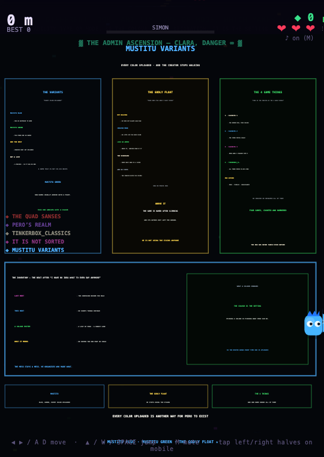

## 2026-08-02 — IT IS NOT ORGANIZED (BEAT 232)

Based on Toby's 2026-08-02 lore (5:19 PM, in the "AI Era (Still is in Classics Era)" thread), sent nine hours after the merge that made Tinkerbox. Toby's own typing is the first paragraph: *"Tinkerbox isn't organized, the 3 parts all are mixed up in Pero's code. I have no idea what to even say anymore."* The breakdown under it is pasted ChatGPT prose written from his canon, drawn as canon under the standing rule BEAT 202 set from the author's own side.

**Merged is not the same as organized.** Last beat's promise was that three games go in and **nothing gets dropped**. This beat is the other half of that sentence, and it took nine hours to arrive: nothing got **sorted** either. The merge kept all three games and arranged none of them. *"It is not a clean sequel anymore. It is Classics 1, Classics 2, and Classics 3 all crushed together inside Pero's code."* So the parts are not part one, part two and part three; they are three games occupying the same space at the same time, which is a different object entirely.

**Cause and effect come apart.** *"Pages are out of order. Scenes happen before their causes."* In 231 beats this canon has broken deletion, admin access, sealed worlds, character identity and even the direction a portal points, and through all of it the **order of events held**. This is the first time the game breaks its own sequence, and notably **not by time travel** — nobody goes back, the pages just got shuffled. Effect first, cause later, in the same file.

**The layers bleed instead of stacking.** *"Classics 1 horror can appear inside Classics 2 cyber areas. Classics 3 crash logic can suddenly interrupt a calm scene."* The sealed horror game leaks into the fun cyber park, and the nine-minute crash version cuts into quiet scenes without warning. Three games in one space, not three parts in a row.

**Pero's code is load-bearing.** *"Pero's code is the only thing holding it together."* Not a story, not a world, not a character carrying it — the **code of the person who wrote it**. For 231 beats Pero has been a character inside his own game: building it, sealing it, painting it, asking questions about it. Here he stops being in the box and becomes the box. If his code goes, the whole thing spills.

**And the beat ends on a pause instead of an event.** *"I have no idea what to even say anymore."* The author looks at a mess and, rather than tidying it, makes the mess the rule: *"the confusion is part of the lore."* Which turns the next step into a question about the game rather than something that happens in it — **discovering what Tinkerbox even is**. First time in the run that the forward direction is a question.

Added a new BEAT 232 panel (loop cycle extended to `c` in [4824,4846), `LV_CYC` now 4846), plus its `LV_BEATS[232]` subtitle/ladder entry, a frame-title case, and a `scramble` capture scene. The background reuses BEAT 231's comic frames but draws them **tilted**, with page numbers printed deliberately out of sequence (PG 7, PG 2, PG 19, PG 4…), in paper cream, out-of-order magenta and Pero-code green:

- **NOT SORTED (left)** — four rows (last beat: nothing gets dropped · this beat: and nothing got sorted either · not a sequel: "not a clean sequel anymore" · all crushed: three games in one space), under Toby's line **"TINKERBOX ISN'T ORGANIZED"**, then a live cycle through what the merge actually did — **KEPT ALL 3 / SORTED NONE / MIXED THEM / ONE FILE / NOT ORGANIZED** — closing on **NINE HOURS LATER, THE OTHER HALF OF THE SENTENCE.** and **MERGED IS NOT THE SAME AS ORGANIZED**.
- **OUT OF ORDER (centre)** — five rows (pages shuffled: the comic reads out of sequence · effect first: then the thing that caused it · 231 beats: and the order had always held · not time travel: nobody went back, it got shuffled · a new break: the game breaks its own sequence), under Toby's phrase **"SCENES HAPPEN BEFORE THEIR CAUSES"**, with a page-number cycler running **PAGE 7 / PAGE 2 / PAGE 19 / PAGE 4 / PAGE 11**, closing on **THIS CANON HAS BROKEN A LOT OF RULES**, **BUT NEVER THE ORDER OF EVENTS.** and **THE FIRST BEAT WHERE THE SEQUENCE ITSELF GIVES**.
- **PERO'S CODE (right)** — five rows (not a story: no plot is keeping this shut · not a world: no realm is underneath it · not a character: nobody is carrying it · his code: the file the author wrote · 231 beats inside: and now he is the container), under Toby's line **"THE ONLY THING HOLDING IT TOGETHER"**, closing on **HE STOPPED BEING A CHARACTER IN IT** and **IF HIS CODE GOES, THE BOX SPILLS**.
- **The band** — the pause point in four rows (too mixed to explain: the normal way of saying it ran out · so he stops: and says so, in the middle of the lore · the confusion stays: "the confusion is part of the lore" · the next step: not what happens, what Tinkerbox is), over **HE LOOKED AT A MESS AND MADE THE MESS THE RULE.**; beside it a box cycling the layer bleed — **CLASSICS 1 HORROR / INSIDE A CYBER AREA / CLASSICS 3 CRASH LOGIC / INTO A CALM SCENE / ALL AT ONCE** — closing on **THE THREE LAYERS DO NOT STACK. THEY LEAK INTO EACH OTHER.** and **THREE GAMES IN ONE SPACE, NOT THREE PARTS IN A ROW**.
- **The strip** — NOT SORTED (kept all three, arranged none) · OUT OF ORDER (scenes before their causes) · PERO'S CODE (the only thing holding it).
- **Footers** — "THE 3 PARTS ALL ARE MIXED UP IN PERO'S CODE" and "★ THE CONFUSION IS PART OF THE LORE ★".

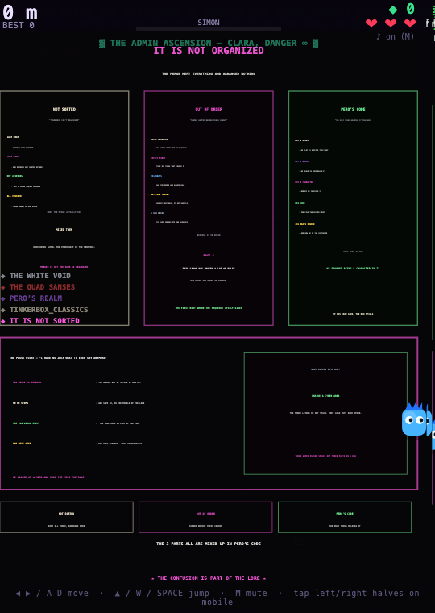

## 2026-08-02 — TINKERBOX_CLASSICS (BEAT 231)

Based on Toby's 2026-08-02 lore (8:34 AM, in the "AI Era (Still is in Classics Era)" thread), sent nine minutes after the crash that made Classics 3. Toby's own typing is the first paragraph: *"In a result, Classics 1, Classics 2, and Classics 3 merged into a very small comic/graphic_novel game called Tinkerbox, Tinkerbox looks small but is actually very very detailed and huge and has all these stuff to go through. Tinkerbox contains all 3 into 1 epic. Tinkerbox_Classics is the full name of the game."* The breakdown under it is pasted ChatGPT prose written from his canon, drawn as canon under the standing rule BEAT 202 set from the author's own side.

**The first compression in 231 beats.** Everything this run has ever done is add. More characters, more forms, more AUs, more realms, more versions, and the cast only got smaller once by sealing people inside a world. This beat does the opposite operation: three whole games go in and one comes out, and **nothing is dropped**. That is not the same as cutting. Merging keeps all of it and changes where it lives.

**Classics 3 did not last one message.** It was born from a collision at 8:25 and absorbed at 8:34. Nine minutes as its own game. The version that arrived by accident is also the shortest-lived one in the run, and it went into the merge carrying everything it had picked up in the crash.

**The mismatch is the design.** *"Tinkerbox looks small but is actually very very detailed and huge and has all these stuff to go through."* A little drawn comic on the outside, three full games of paths, systems, events and lore layers on the inside. The size of the container and the size of the contents deliberately do not agree, and the small look is the trick rather than a limitation. Small enough to pick up, big enough to get lost in.

**The underscore.** The full name is **Tinkerbox_Classics**, not "Tinkerbox Classics". That underscore makes it a **filename rather than a title**, which is exactly how this canon has been naming things since `/GAME_END = TRUE`, Error 679 and Error 404. The game keeps labelling itself the way a file system would.

**And the genre moves a fourth time.** Horror game, cyber portal park, Sans battle game, comic. Last beat Pero asked **"It will be that game?"** about his own park turning into something else, and the answer came back nine minutes later as a different game again. The progression now reads **Classics 1 → Classics 2 → Classics 3 → Tinkerbox_Classics**: four versions across two messages.

Added a new BEAT 231 panel (loop cycle extended to `c` in [4802,4824), `LV_CYC` now 4824), plus its `LV_BEATS[231]` subtitle/ladder entry, a frame-title case, and a `tinkerbox` capture scene. The background draws small empty comic-panel frames with `TINKERBOX` printed between them, in paper cream, panel blue and ink orange:

- **THE MERGE (left)** — four rows (Classics 1: the horror game, sealed · Classics 2: the cyber park, Pero's Realm · Classics 3: the crash, nine minutes old · all three at once: and nothing gets dropped), under Toby's line **"ALL 3 INTO 1 EPIC"**, then a live cycle through what goes in — **CLASSICS 1 / CLASSICS 2 / CLASSICS 3 / MERGED / TINKERBOX** — closing on **231 BEATS OF THIS GAME GETTING BIGGER.** and **AND THIS IS THE FIRST TIME IT FOLDS UP**.
- **THE BOX (centre)** — five rows (a comic game: graphic novel, drawn, little · the outside lies: it is meant to look small · inside is all of it: three games of paths and systems · his words: "all these stuff to go through" · a box you open: not a world you fall into), under Toby's phrase **"LOOKS SMALL BUT IS ACTUALLY HUGE"**, with a cycler flipping between the two readings — **LOOKS SMALL / IS HUGE / LOOKS SIMPLE / IS VERY DETAILED / TINKERBOX** — closing on **THE OUTSIDE AND THE INSIDE DO NOT MATCH**, **AND THE MISMATCH IS ON PURPOSE.** and **SMALL ENOUGH TO PICK UP, BIG ENOUGH TO GET LOST IN**.
- **THE FULL NAME (right)** — five rows (Tinkerbox: what you call it · _Classics: what it is carrying · an underscore: so a filename, not a title · like /GAME_END: this canon names things in code · the genre moves: horror · park · Sans fight · comic), under Toby's exact full name **"TINKERBOX_CLASSICS"**, closing on **PERO ASKED "IT WILL BE THAT GAME?"** and **IT BECAME A DIFFERENT ONE AGAIN**.
- **The band** — the progression in four rows (Classics 1 →: a horror game, built then sealed · Classics 2 →: a cyber portal park, Pero's Realm · Classics 3 →: born from a crash, nine minutes long · Tinkerbox_Classics: all three in one, and it looks tiny), over **CLASSICS 3 DID NOT LAST ONE MESSAGE AS ITS OWN GAME.**; beside it a box cycling the direction of the whole run — **EXPAND / EXPAND / EXPAND / CRASH / FOLD UP** — closing on **THE RUN HAS ONLY EVER ADDED. THIS BEAT SUBTRACTS AND LOSES NOTHING.** and **MERGING IS NOT THE SAME AS CUTTING**.
- **The strip** — THE MERGE (three Classics in one file) · THE BOX (small outside, huge inside) · TINKERBOX_CLASSICS (the full name, underscore and all).
- **Footers** — "A GAME SMALL ENOUGH TO PICK UP WITH THREE GAMES FOLDED INSIDE IT" and "★ TINKERBOX_CLASSICS ★".

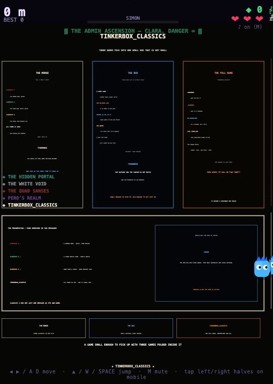

## 2026-08-02 — PERO'S REALM (BEAT 230)

Based on Toby's 2026-08-02 lore (8:25 AM, in the "AI Era (Still is in Classics Era)" thread). Toby's own typing is the first paragraph: *"The game is Pero's Realm, like Simon's Realm, Wenda Realm, and Gray's Realm all combined into 1. Pero activates a cutscene. Pero taken all the realms out of the portal to make it a new realm Realm 2. Classics 1/2 is like a Google 2. Classics 1 crashes to Classics 2 making Classics 3."* The breakdown under it is pasted ChatGPT prose written from his canon, drawn as canon under the standing rule BEAT 202 set from the author's own side.

**The game gets named after its creator, and it is still not only his.** Pero's Realm is **Simon's Realm, Wenda Realm, Gray's Realm and Pero's own**, fused into one realm-system. The interesting part is who those three are. Simon is the one Pero locked back in BEAT 226. Gray is the one whose seat was taken last beat. Wenda has never had a beat of her own in the whole run. So the creator's realm is assembled out of the realms of characters who have **already lost their place** — he built his out of theirs.

**The portal gets emptied instead of entered.** For 229 beats a portal in this canon has been a **way to somewhere**: you open it, you go through, you arrive. Here Pero starts a cutscene and *"taken all the realms out of the portal."* That reverses the object. The portal was not pointing at the realms, it was **holding** them, and he pulls them back out through it. A door you can take the room out of. Nobody in the run has opened one backwards before.

**Realm 2 is a result, not a level.** It is what is left standing after the extraction — not a place the game moves to next, but the thing produced by taking the realms out.

**And Classics 3 arrives by accident.** *"Classics 1 crashes to Classics 2 making Classics 3."* Every version in this run so far was **built on purpose by somebody**: Pero made Classics 1, realised it was a horror game, and built Classics 2 as a cyber park in response. Classics 3 is the first one **nobody authored**. Two of his own games ran into each other, and the wreck got a number. That is why it is unstable by construction rather than by design: it carries the sealed remains of Classics 1, the cyber portal systems of Classics 2, Pero's Realm, Realm 2, old horror logic and new cyber logic in the same build. Toby's own comparison for the versioning is **"like a Google 2"** — a rebuild line, not a part one and a part two.

Added a new BEAT 230 panel (loop cycle extended to `c` in [4780,4802), `LV_CYC` now 4802 at this point), plus its `LV_BEATS[230]` subtitle/ladder entry, a frame-title case, and a `perosrealm` capture scene. The background prints `PERO'S REALM`, `REALM 2` and `CLASSICS 3` over each other in realm violet, portal teal and crash red:

- **THE FOUR REALMS (left)** — four rows (Simon's Realm: the one Pero locked him back into · Wenda Realm: who has never had a beat of her own · Gray's Realm: and his seat went last beat · Pero's Realm: and the name on the whole thing), under Toby's line **"ALL COMBINED INTO 1"**, then a live cycle through the fusion — **SIMON'S REALM / WENDA REALM / GRAY'S REALM / PERO'S REALM / ONE REALM-SYSTEM** — closing on **THREE OF THE FOUR LOST THEIR PLACE ALREADY.** and **HE BUILT HIS REALM OUT OF THEIRS**.
- **THE CUTSCENE (centre)** — five rows (Pero starts it: a cutscene, not a fight · the portal turns: it stops leading anywhere · he pulls them out: the realms come back through it · what is left: Realm 2, a result, not a level · 229 beats of doors: and he empties one out), under Toby's phrase **"OUT OF THE PORTAL"**, with a cycler running the reversal — **PORTAL LEADS TO REALMS / PERO OPENS IT / THE REALMS COME OUT / THE PORTAL IS EMPTY / REALM 2** — closing on **A DOOR YOU TAKE THE ROOM OUT OF**, **IT WAS HOLDING THEM, NOT POINTING AT THEM.** and **AND NOBODY HAD OPENED ONE BACKWARDS BEFORE**.
- **CLASSICS 3 (right)** — five rows (Classics 1: sealed, destroyed, with a door in it · Classics 2: the fun portal cyber-park · they collide: and nobody ran the collision · Classics 3: made of whatever survives it · "like a Google 2": his own word for the versioning), under Toby's exact line **"CLASSICS 1 CRASHES TO CLASSICS 2"**, closing on **EVERY OTHER VERSION WAS BUILT ON PURPOSE.** and **THIS ONE IS AN ACCIDENT WITH A NUMBER**.
- **The band** — the version history in four rows (Classics 1: a horror game, Pero built it then sealed it · Classics 2: a cyber park, Pero built it on purpose · Classics 3: a crash, nobody built it at all · Realm 2: the four realms, pulled out of the portal), over **THE FIRST VERSION NUMBER THE CREATOR DID NOT CHOOSE.**; beside it a box cycling the contents of the wreck — **SEALED CLASSICS 1 / CYBER PORTAL SYSTEMS / PERO'S REALM / REALM 2 / LEFTOVER HORROR LOGIC** — closing on **OLD HORROR LOGIC AND NEW CYBER LOGIC IN THE SAME BUILD.** and **UNSTABLE BECAUSE OF HOW IT WAS MADE**.
- **The strip** — PERO'S REALM (four realms fused into one) · REALM 2 (pulled back out through the portal) · CLASSICS 3 (a version born from a crash).
- **Footers** — "HE DID NOT WRITE CLASSICS 3, TWO OF HIS OWN GAMES RAN INTO EACH OTHER" and "★ ALL COMBINED INTO 1 ★".

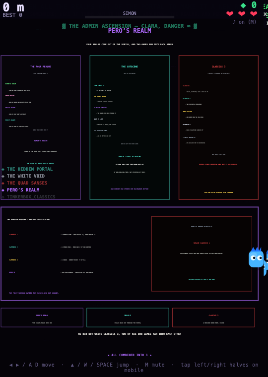

## 2026-08-02 — THE QUAD SANSES (BEAT 229)

Based on Toby's 2026-08-02 lore (8:07 AM, in the "AI Era (Still is in Classics Era)" thread). Toby's own typing is the first paragraph: *"New Stronger Than You Sans, it also appears with Error 404, Ink, and Error; Quad Sanses. Gray tried to defeat them, but Quad Sanses beaten Gray, Luigi Green beaten the Quad Sanses. The Quad Sanses took Gray's place. Pero is like 'It will be that game?'."* The breakdown under it is pasted ChatGPT prose written from his canon, drawn as canon under the standing rule BEAT 202 set from the author's own side.

**Four characters take one seat.** The cyber seat has changed hands before. BEAT 226 pulled Simon 404 out of it and put Gray in, four minutes after the cast had been cut to three. But in 229 beats that seat has only ever held **one** character at a time, and this is the first time it goes to a group: **New Stronger Than You Sans, Error 404, Ink, and Error**, together as the **Quad Sanses**. Which makes the seat a **chair rather than a person** — a role the game keeps refilling, and the number of bodies in it is not fixed either.

**Gray is not beaten by anybody in particular.** He had the admin panel, Error 679, the cyber suit, the Abinations, and by his own beat he had *"made himself perfect."* No single character removes him. It takes four at once, which is less a defeat than a measurement: that is how much the game had to spend to move him.

**The four had all already lost, separately.** Error 404 was painted over back in BEAT 216. Ink lost the timed Painted Error War. Error was rewritten into Fatal Error on Gaster's table. Every member of this group has been used up on his own somewhere earlier in the run, and the first thing any of them wins, they win **together**. That is a real idea and it is Toby's, not a genre convention: losing alone is what put them in the same group.

**And then one person clears all four.** *"Luigi Green beaten the Quad Sanses."* The chain Toby gives is exact — **Gray < Quad Sanses < Luigi Green** — and it lands one beat after BEAT 228 established that the very top of the game (White Void 250%) **takes two people**. So the arithmetic runs both directions in two days: adding a second person is what lifts Pero above his own domain, and adding three does not lift the Sanses past the character sitting in second place. Teaming up moved them **up the order without moving them to the top**.

**"It will be that game?"** Pero's only line, and it is a question about his own game rather than a command inside it. Last beat he painted **"(defenently not a secret horror game)"** on a fun portal cyber-park that *"slowly turns into what it is actually."* This is that turn arriving, on schedule, in Sans-shaped form — and the creator is standing inside it watching instead of fixing it.

Added a new BEAT 229 panel (loop cycle extended to `c` in [4758,4780), `LV_CYC` now 4780), plus its `LV_BEATS[229]` subtitle/ladder entry, a frame-title case, and a `quadsanses` capture scene. The background prints `QUAD SANSES`, `GRAY` and `LUIGI GREEN` over each other in bone white, error red and Luigi green:

- **THE FOUR (left)** — four rows (the new one: New Stronger Than You Sans · three old ones: Error 404 · Ink · Error Sans · all used up alone: painted over, timed out, rewritten · one name now: and the first win of any of them), under Toby's word **"QUAD SANSES"**, then a live cycle through the roster — **NEW STRONGER THAN YOU / ERROR 404 / INK / ERROR / THE QUAD SANSES** — closing on **FOUR SANSES WHO KEPT LOSING SEPARATELY.** and **TOGETHER THEY WIN ONCE**.
- **THE FIGHT CHAIN (centre)** — five rows (Gray tries first: the suit, 679, and the Abinations · and he loses: to four of them, not to one · they take his seat: the cyber chair changes again · then Luigi Green: clears all four, by himself · still second: nobody has moved him in 229 beats), under Toby's order **"GRAY < QUAD SANSES < LUIGI GREEN"**, with a cycler counting the bodies — **GRAY / BEATEN BY FOUR / THE QUAD SANSES / BEATEN BY ONE / LUIGI GREEN** — closing on **FOUR TO REMOVE GRAY**, **AND ONE TO REMOVE ALL FOUR OF THEM.** and **THE COUNT KEEPS GOING THE WRONG WAY**.
- **PERO'S ONE LINE (right)** — five rows (he built a park: fun, portals, cyber, on purpose · he painted the sign: "slowly turns into what it is" · this is the turn: and it is a Sans battle game · he is not fixing it: he is asking a question · and he is watching: his own genre change on him), under Toby's exact line **"IT WILL BE THAT GAME?"**, closing on **HE WROTE THE WARNING AND STILL DID NOT SEE IT COMING.** and **THE PARK IS TURNING WHILE HE STANDS IN IT**.
- **The band** — the cyber seat in four rows (1 · Simon 404: held it, then Pero locked him back, one · 2 · Gray / 679: panel, suit, Abinations, perfect, one · 3 · the Quad Sanses: four at once, the first time it is a group · above the seat: Pero and Luigi Green, unchanged either way), over **THE VILLAIN SEAT IS A CHAIR, NOT A PERSON.**; beside it a box cycling what the group bought itself — **ONE SANS · LOSES / TWO SANSES · ? / FOUR SANSES · BEAT GRAY / FOUR SANSES · LOSE ANYWAY / LUIGI GREEN · ALONE** — closing on **LAST BEAT THE TOP OF THE GAME TOOK TWO PEOPLE. THIS BEAT FOUR WAS NOT ENOUGH.** and **IT MOVED THEM UP, NOT TO THE TOP**.
- **The strip** — THE QUAD SANSES (four of them in one seat) · GRAY REPLACED (beaten by a group, not a person) · "THAT GAME?" (the creator notices the genre turn).
- **Footers** — "IT TOOK FOUR OF THEM TO REPLACE GRAY, AND ONE OF HIM TO CLEAR ALL FOUR" and "★ IT WILL BE THAT GAME? ★".

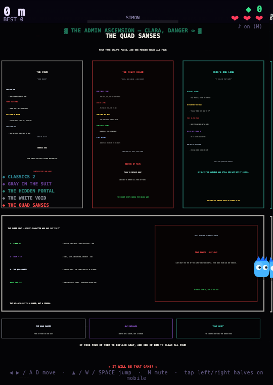

## 2026-08-02 — THE WHITE VOID (BEAT 228)

Based on Toby's 2026-08-02 lore (6:19 AM, in the "AI Era (Still is in Classics Era)" thread). Toby's own typing is the first paragraph: *"Pero's domain expansion is Domain Expansion: Endless Chaos. Pero/ToddLLM has the White Void 100% and 250% (with Luigi Green for 250). White Void 100% isn't half as powerful as endless chaos, White Void 250% is even stronger than the Domain Expansion since it uses Luigi Green's power and Domain Expansion: Throws Board. Gray dropped his admin panel and Pero picked it up and knew how to use it. EndlessAnimations (Pero/ToddLLM) painted "(defenently not a secret horror game)", so the game is called "Classics 2 (defenently not a secret horror game)", Pero realised Classics 1 was a horror game, so he made Classics 2 into a fun portal cyber-park and eventually, it slowly turns into what it is actually. White Void isn't 1 move, it is multiple moves into a huge storm inside of a huge white sphere. 250% White Void uses some Luigi Green's power."* The breakdown under it is pasted ChatGPT prose written from his canon, drawn as canon under the standing rule BEAT 202 set from the author's own side.

**The creator finally has a domain of his own.** For 227 beats Pero has been the one handing out powers, forms and domain expansions to other characters. Here he gets one: **Domain Expansion: Endless Chaos.** The name is doing something unusual for this canon, which normally names attacks after what they do to you. *Endless Chaos* is not a description of an attack, it is a description of how Pero already lives. Portals, experiments, LAI control, corrupted game logic, nonstop lore updates. He named the move after his own life.

**The White Void is not a move, and Toby says so himself.** *"White Void isn't 1 move, it is multiple moves into a huge storm inside of a huge white sphere."* That is a correction issued before anyone could make the mistake, and it changes what the thing is. A beam is fired at you. A storm inside a sphere is something you are standing inside while it happens. This canon has described a lot of attacks; this is the first one described as a **place**.

**The top of the game takes two people.** The order Toby gives is exact: **White Void 100% < Domain Expansion: Endless Chaos < White Void 250%.** The first line of that is already unusual, because he rates the creator's signature technique *below* the creator's own domain, at less than half. The second line is the real one. White Void 250% clears the domain only because it borrows **Luigi Green's power** and Luigi Green's **Domain Expansion: Throws Board**. So 250% is not an upgraded 100%; it is a second person standing in the sphere. The strongest thing the creator has, he cannot do alone. And *Throws Board* fits Luigi Green exactly: he does not play the board, he throws the whole board away, which is why adding him makes the white sphere **unstable** rather than just bigger.

**The panel changes hands, and it gets worse.** *"Gray dropped his admin panel and Pero picked it up and knew how to use it."* Last beat Gray pointed the panel at the top of the game, learned it was nearly useless, and understood his own ceiling. This beat he lets go of it, which makes him the first villain in the run to **put power down** instead of losing it in a fight. And the object does not get safer for changing hands. Gray had admin access. Pero has creator understanding. Same panel, second owner, and the second owner wrote the thing the panel controls.

**The title is a tell.** EndlessAnimations paints **"Classics 2 (defenently not a secret horror game)"** on the game itself. Pero realised Classics 1 was a horror game and built Classics 2 as a fun portal cyber-park in response, one that *"slowly turns into what it is actually."* The parenthesis is a denial nobody asked for, painted on the front door, before anybody walked in. It promises fun and admits something in the same breath.

Added a new BEAT 228 panel (loop cycle extended to `c` in [4736,4758), `LV_CYC` now 4758), plus its `LV_BEATS[228]` subtitle/ladder entry, a frame-title case, and a `whitevoid` capture scene. The background prints `WHITE VOID`, `ENDLESS CHAOS` and `THROWS BOARD` over each other in void white, chaos orange and Luigi green:

- **ENDLESS CHAOS (left)** — four rows (his first domain: after 227 beats of giving them away · not a weapon name: it is how he already lives · more than double: the White Void at 100%, by his scale · and still not first: one thing in the game clears it), under Toby's line **"PERO'S DOMAIN EXPANSION"**, then a live cycle through what the chaos is made of — **PORTALS / EXPERIMENTS / LAI CONTROL / CORRUPTED LOGIC / NONSTOP LORE** — closing on **HE NAMED IT AFTER HIS OWN LIFE.** and **AND IT IS NOT HIS STRONGEST**.
- **THE VOID ITSELF (centre)** — five rows (multiple moves: that combine into one thing · a huge storm: inside a huge white sphere · not a beam: a place you are standing in · 100% · under half: of his own domain, by his own count · 250% · over the top: because it stops being only his), under Toby's correction **"ISN'T 1 MOVE"**, with a cycler assembling the technique — **WHITE VOID 100% / + LUIGI GREEN'S POWER / + THROWS BOARD / = WHITE VOID 250% / TOP OF THE GAME** — closing on **250% IS NOT AN UPGRADE**, **IT IS A SECOND PERSON STANDING IN THE SPHERE.** and **THE TOP OF THE GAME IS A TEAM MOVE**.
- **THE PAINTED TITLE (right)** — five rows (EndlessAnimations: Pero's other name, holding the brush · a denial, up front: nobody had asked the question yet · Classics 1 was one: and he only worked that out after · so he built a park: fun, portals, cyber, on purpose · then it slowly turns: "into what it is actually"), under Toby's exact parenthesis **"(DEFENENTLY NOT A SECRET HORROR GAME)"**, closing on **IT PROMISES FUN AND ADMITS SOMETHING AT THE SAME TIME.** and **HE PAINTED THE WARNING ON THE FRONT DOOR**.
- **The band** — the power order in four rows (1 · White Void 250%: Pero + Luigi Green + Throws Board, two people · 2 · Endless Chaos: Pero alone, and more than twice the 100% · 3 · White Void 100%: a storm in a white sphere, still his own · Luigi Green's domain: Throws Board, he does not play the board), over **EVERYTHING ABOVE THE DOMAIN TAKES TWO PEOPLE.**; beside it a box cycling the handoff — **GRAY DROPPED IT / PERO PICKED IT UP / AND KNEW HOW TO USE IT / GRAY HAD ACCESS / PERO HAS UNDERSTANDING** — closing on **LAST BEAT HE LEARNED IT WAS NEARLY USELESS. THIS BEAT HE LET GO OF IT.** and **THE FIRST VILLAIN TO PUT POWER DOWN**.
- **The strip** — ENDLESS CHAOS (the creator's domain, finally named) · WHITE VOID 250% (borrowed power at the top of the order) · THE PAINTED SIGN (a denial nobody asked for).
- **Footers** — "THE STRONGEST THING THE CREATOR HAS, HE CANNOT DO ALONE" and "★ MULTIPLE MOVES INTO ONE HUGE STORM ★".

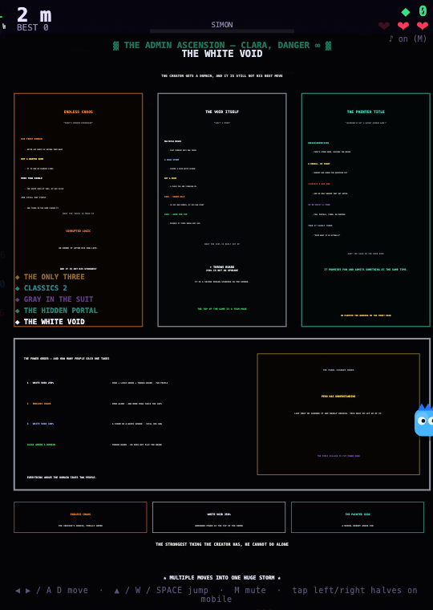

## 2026-08-01 — THE HIDDEN PORTAL (BEAT 227)

Based on Toby's 2026-08-01 lore (6:41 PM, in the "AI Era (Still is in Classics Era)" thread), sent as a direct answer to the question the previous reply put to him. Toby's own typing is the first paragraph: *"Pero still has a thing Gray doesn't know about. Pero has a portal that opens to Classics 1, only he has access to it. Gray uses his admin power on Pero and Luigi Green, it doesn't work, Gray understands his admin is nearly useless."* The breakdown under it is pasted ChatGPT prose written from his canon, drawn as canon under the standing rule BEAT 202 set from the author's own side.

**He was offered two options and took both.** BEAT 226 ended on an open question: if Gray has real admin and not a copy of it, either he can point it at the creator or Pero kept something back. Toby answered both halves in three sentences. The power fails **and** something was held in reserve. He also did it in one move rather than two, which is why this reads as a rule about the world rather than a plot patch.

**A destroyed world with a door in it.** Two beats ago Pero locked everyone else inside Classics 1 and destroyed Classics 1. Here it turns out he kept a private portal back into it, and *"only he has access to it."* Gray cannot see it, open it, command it or use it. So the sealed world is not gone; it is a room with one key, and the person holding the key is the one who closed it. He shut everyone else in without shutting himself out.

**The test, and what it proves.** *"Gray uses his admin power on Pero and Luigi Green, it doesn't work."* He points the panel at the two beings above him and nothing happens. Luigi Green is the sharper half of that: he was never given anything, he is simply too high-tier for it to reach. So the panel is real admin with a boundary drawn around it, *"only strong inside the limits Pero allowed"* — the creator handed over admin and kept root. BEAT 226 said the creator armed his own villain; this says the arming was scoped.

**"Gray understands."** The verb is the whole beat. He is not defeated, nobody beats him, there is no fight in this message at all. He finds out where his own power stops, and that has not happened to a villain anywhere in the previous 226 beats — every other one was stopped by someone else. He is still extremely dangerous to most of the game, just not to the true main controllers. The character with the most power ever *issued* to him is the first one who knows exactly where it ends.

Added a new BEAT 227 panel (loop cycle extended to `c` in [4714,4736), `LV_CYC` now 4736), plus its `LV_BEATS[227]` subtitle/ladder entry, a frame-title case, and a `hiddenportal` capture scene. The background prints `CLASSICS 1`, `ACCESS DENIED` and `GRAY` over each other in portal teal, admin gold and cyber violet:

- **THE HIDDEN DOOR (left)** — four rows (a portal to Classics 1: the world he sealed two beats ago · one key: and the creator is holding it · Gray does not know: he cannot see it to try it · so it is not gone: it is somewhere Pero can still walk), under Toby's line **"ONLY HE HAS ACCESS TO IT"**, then a live cycle through what Gray can do with it — **CANNOT SEE IT / CANNOT OPEN IT / CANNOT COMMAND IT / CANNOT USE IT** — closing on **A DESTROYED WORLD WITH A DOOR IN IT.** and **HE DID NOT LOCK HIMSELF OUT**.
- **THE TEST (centre)** — five rows (he tries it on Pero: the one who issued it to him · he tries Luigi Green: who was never given anything · nothing happens: both times, no fight, no counter · not a copy of admin: real admin, with a boundary on it · the limits Pero set: that is exactly how far it reaches), under **"IT DOESN'T WORK"**, with a cycler running the command itself — **TARGET: PERO / DENIED / TARGET: LUIGI GREEN / DENIED / SCOPE: BELOW YOU ONLY** — closing on **THE GIFT CAME WITH A SCOPE ON IT**, **THE CREATOR HANDED OVER ADMIN AND KEPT ROOT.** and **ARMING HIM WAS NOT THE SAME AS TRUSTING HIM**.
- **THE CEILING (right)** — five rows (he is not defeated: nobody beat him, he just found out · he learns the limit: and that is the whole event · nearly useless: his own word for his own power · still dangerous: to most of the game, just not the top · a first in 226 beats: a villain who knows where he stops), under Toby's word **"GRAY UNDERSTANDS"**, closing on **EVERY OTHER ONE WAS STOPPED. THIS ONE FOUND OUT.** and **KNOWING THE CEILING IS ITS OWN KIND OF LOSS**.
- **The band** — the control structure in four rows (1 · Pero: creator, owns the hidden portal, above the panel · 2 · Luigi Green: Undertoad, too high-tier for it to reach · 3 · Gray / 679: the panel, the suit, and a line he cannot cross · everyone else: sealed in Classics 1, and still in range), over **THE PANEL POINTS DOWN. IT HAS NEVER POINTED UP.**; beside it a box cycling the exchange itself — **DOES IT WORK ON PERO? / NO / DID PERO KEEP SOMETHING BACK? / YES / BOTH, IN THREE SENTENCES** — closing on **AND HE MADE IT ONE MOVE, NOT TWO**.
- **The strip** — THE PORTAL (Classics 1, and one key to it) · THE FAILED TEST (admin run on Pero, and on Luigi Green) · THE UNDERSTANDING (he finds out where he stops).
- **Footers** — "THE CREATOR SEALED THE OLD WORLD AND KEPT A DOOR INTO IT" and "★ ONLY HE HAS ACCESS TO IT ★".

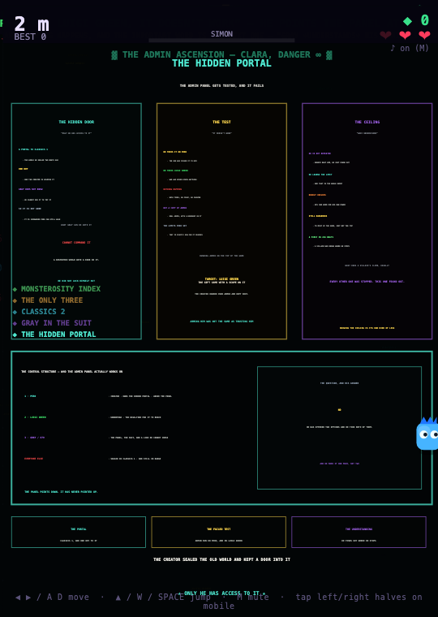

## 2026-08-01 — GRAY IN THE CYBER SUIT (BEAT 226)

Based on Toby's 2026-08-01 lore (4:58 PM, in the "AI Era (Still is in Classics Era)" thread), sent four minutes after the Classics 2 message and correcting it. Toby's own typing is the first paragraph: *"Simon 404 wasn't cyber, Pero locked Simon 404 back and put in Gray, Pero gave Gray an admin panel and power of Error 679 and the cyber suit, Gray was turned into the cyber once more and now locked as a cyber with all the abilities and form combined into 1 entity that won't fit in an image. Pero, Gray, and Luigi Green are the characters now. Gray was stronger than Simon 404. Gray was actually great at being a villian. Gray actually corrupted everyone and made Abinations. Gray made himself perfect. Pero, Luigi Green Undertoad, and Gray."* The breakdown under it is pasted ChatGPT prose written from his canon, drawn as canon under the standing rule BEAT 202 set from the author's own side.

**Two beats after "the only 3 main characters," one of the three is replaced.** That is the first thing this beat establishes and it changes what the trio *is*. It is not a fixed set of three names, it is three **roles** with three seats, and the cyber seat can be emptied and refilled. Creator, destroyer, and whoever is currently in the villain chair.

**The containment file gets executed.** BEAT 223 landed on the line that Simon 404 is not a prisoner but a **standing procedure** — contained, breached, recaptured, breached, with no end written on the loop. Here the procedure actually runs, and it takes four words: *"Pero locked Simon 404 back."* No fight, no dimension described, no breach. The creator does it off-screen, in a clause, on his way to talking about somebody else.

**Issued, not stolen.** *"Pero gave Gray an admin panel and power of Error 679 and the cyber suit."* In 225 beats every villain has taken his power, stolen it, escaped with it, or been experimented into it. This one was **handed** it, deliberately, by the owner of the game. And the admin panel is not a weapon that happened to be lying around — it is Pero's own control surface, the thing he runs Classics with. Error 679 is a new number in a canon that has been counting errors carefully (303, 404), and it arrives already assigned to somebody.

**"Won't fit in an image."** Gray is turned cyber once more and **locked** that way, with every ability and every form combined into one entity — and Toby defines the result by what cannot be done with it. For 225 beats this canon has described forms picture by picture, arm by arm, marking by marking. This is the first character specified by exceeding a picture. *Locked* is doing work in both directions too: nothing takes the suit off him, and he cannot put it down.

**The better villain, not the bigger monster.** Gray is now stronger than Simon 404, and the reason Toby gives is a **job qualification** rather than a power level: *"Gray was actually great at being a villian."* He corrupted everyone, he made the Abinations, he plans, he self-upgrades, and *"Gray made himself perfect."* Simon 404 is the larger threat and always has been; Gray is better at the work. For Classics 2 the creator picked the second one. And the record makes it sharper — Classics once deleted Gray outright, and the creator of Classics 2 just handed that same character admin.

Added a new BEAT 226 panel (loop cycle extended to `c` in [4692,4714), `LV_CYC` now 4714), plus its `LV_BEATS[226]` subtitle/ladder entry, a frame-title case, and a `graycyber` capture scene. The background prints `GRAY`, `ERROR 679` and `SIMON 404 LOCKED` over each other in cyber violet, admin gold and error red:

- **THE SWAP (left)** — four rows (Pero locked him back: Simon 404, in one clause, off-screen · and put in Gray: the cyber seat changes hands · the trio now: Pero, Luigi Green Undertoad, Gray · two beats ago: it was "the only 3 main characters"), under Toby's line **"SIMON 404 WASN'T CYBER"**, then a live cycle through what the containment file was for — **NOT A PRISONER / A STANDING PROCEDURE / AND HERE IT GETS RUN** — closing on **THE TRIO IS A SLOT LIST, NOT A FIXED SET.** and **THE SEAT IS A JOB, AND IT CAN BE REFILLED**.
- **ISSUED, NOT STOLEN (centre)** — five rows (an admin panel: Pero's own control surface · power of 679: a new error number, handed over · the cyber suit: given, not taken, not escaped with · every other one: stole it, or was experimented into it · this one: was handed it by the owner), under **"PERO GAVE GRAY..."**, with a cycler on how villains usually get their power — **TAKEN / STOLEN / ESCAPED WITH / EXPERIMENTED INTO / — OR SIGNED OVER** — closing on **AN ADMIN PANEL IS NOT A WEAPON**, **IT IS THE THING THE CREATOR RUNS THE GAME WITH.** and **THE CREATOR ARMED HIS OWN VILLAIN**.
- **WHY GRAY (right)** — five rows (he corrupted everyone: not one fight, a whole cast · he made the Abinations: something that outlasts him · he plans: puppetmaster, not rage · he self-upgrades: "Gray made himself perfect" · stronger than 404: and that is the ranking now), under **"GREAT AT BEING A VILLIAN"**, closing on **SIMON 404 IS THE BIGGER MONSTER. GRAY IS THE BETTER VILLAIN.** and **AND THE CREATOR PICKED THE SECOND ONE**.
- **The band** — Gray's record in four rows (Classics deleted Gray: the game itself erased him · Gray ascended: he came back higher than before · now he is issued admin: by the one who runs the new game · a deleted character: holding the delete key), over **THE VILLAIN SEAT IS A JOB, AND THE CREATOR HIRES FOR IT.**; beside it a box cycling the size of him — **EVERY FORM / EVERY ABILITY / COMBINED INTO 1 ENTITY / TOO BIG FOR A PICTURE** — closing on **AND "LOCKED" CUTS BOTH WAYS · HE CANNOT PUT IT DOWN**.
- **The strip** — SIMON 404 LOCKED BACK (the procedure actually run) · GRAY IN THE SUIT (issued by the creator, on purpose) · ERROR 679 (a new number, handed over).
- **Footers** — "THE ONLY VILLAIN IN THE GAME WHOSE POWER CAME WITH A SIGNATURE ON IT" and "★ PERO · LUIGI GREEN UNDERTOAD · GRAY ★".

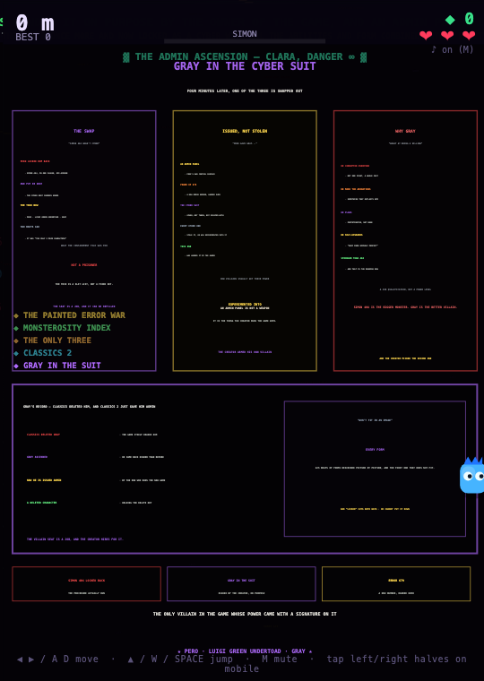

## 2026-08-01 — CLASSICS 1 SEALED · CLASSICS 2 BUILT (BEAT 225)

Based on Toby's 2026-08-01 lore (4:54 PM, in the "AI Era (Still is in Classics Era)" thread), the first message of the evening and the one that supplies the mechanism the morning's beat left unstated. Toby's own typing is the first paragraph: *"Pero has the most adventurious and dangerous life of all the characters, he locked everyone else in Classics 1 and destroyed Classics 1, now Pero made Classics 2 into a sci-fi extreme portal-maker cyber-game. Classics 2's start screen was made, all the scenes were made. Pero made new abilities. Pero made all of Classics into Classics 2."* The breakdown under it is pasted ChatGPT prose written from his canon, drawn as canon under the standing rule BEAT 202 set from the author's own side.

**This is the mechanism under the last beat.** BEAT 224 said everyone outside the trio *"still exists, just not the focus."* That sentence needed a reason, and here it is: Pero **locked everyone else inside Classics 1 and destroyed Classics 1.** The cast did not shrink by being forgotten, which is how casts usually shrink. It shrank by being shut in. Every older character, every older corruption, every older battle is still real and all of it is in the same sealed room.

**Deletion changes direction.** Toby lists what Pero survived, and every single item is something done *to* him: treated like an assistant and an object, broken and redeleted, put through Dr. Gaster's experiments, the Ink Sans and Pow3r Ink Sans arcs, Omniplatform chaos, Error 404 command disasters, Simon 404 containment problems, Luigi Green's game destruction. Two hundred and twenty beats of being the thing that gets erased. Then he erases, once, and a world ends. The character who spent the whole run on the receiving end of the delete key is the one holding it at the close.

**A build log, not a pitch.** *"Classics 2's start screen was made, all the scenes were made. Pero made new abilities."* Three things reported as already done, in the past tense. Classics 2 stops being an idea inside the lore and becomes a completed game-phase in canon, described the way a developer describes a build rather than the way a fan describes a plan.

**And it is not a sequel.** *"Pero made all of Classics into Classics 2"* — the whole concept remade rather than continued, which makes it reboot, sequel and transformation at the same time. The genre turns over with it: out go old AUs, horror routes, corruption routes and EXE disasters; in come cyber portals, sci-fi travel, digital worlds and high-speed dangerous exploration. And the game is now a portal-maker, run by the one who just sealed the last door.

Added a new BEAT 225 panel (loop cycle extended to `c` in [4670,4692), `LV_CYC` now 4692), plus its `LV_BEATS[225]` subtitle/ladder entry, a frame-title case, and a `classics2` capture scene. The background prints `CLASSICS 1 SEALED`, `CLASSICS 2` and `PERO` over each other in sealed red, cyber cyan and gold:

- **THE LOCKING (left)** — four rows (he locked them in: everyone else, inside Classics 1 · then destroyed it: the room and everyone in the room · Classics 1: the sealed old world, ended together · last beat: said it, this beat says how), under **WHAT "STILL EXISTS, JUST NOT THE FOCUS" MEANT**, then a live cycle through who was still outside the door — **PERO / LUIGI GREEN / SIMON 404 / AND NOBODY ELSE** — closing on **THE CAST DID NOT SHRINK BY BEING FORGOTTEN.** and **IT SHRANK BY BEING SHUT IN**.
- **WHAT PERO SURVIVED (centre)** — five rows (treated as an object: an assistant, a thing to be used · broken and redeleted: more than once, by more than one · Gaster's experiments: and the Ink Sans / Pow3r Ink arcs · 404 and Simon 404: command disasters, containment · the collapse itself: he is the one who walked out), under Toby's line **"THE MOST ADVENTURIOUS AND DANGEROUS LIFE"**, with a cycler on who was holding the delete key — **DONE TO HIM · 220 BEATS / DONE BY HIM · ONCE / AND THAT ONCE ENDED A WORLD** — closing on **HE SURVIVED EVERYTHING THAT ROOM DID TO HIM**, **AND THEN HE CLOSED THE ROOM.** and **THE ONE IT HAPPENED TO IS THE ONE WHO ENDED IT**.
- **CLASSICS 2 · THE BUILD (right)** — five rows (start screen: made · all the scenes: made · new abilities: made · portal-maker: the game is about making the doors · dangerous: high-speed exploration, digital worlds), under **A SCI-FI EXTREME PORTAL-MAKER CYBER-GAME**, closing on **HE IS NOT PITCHING IT. HE IS REPORTING A BUILD.** and **AN IDEA IN THE LORE BECAME A GAME-PHASE**.
- **The band** — remade, not continued, in four rows (Classics 1: sealed, destroyed, the old canon world · Classics 2: built out of everything Classics ever was · not a sequel: the whole concept rebuilt, not extended · all three at once: reboot, sequel, transformation), over **THE OLD WORLD IS NOT BEHIND HIM. IT IS CLOSED, AND HE CLOSED IT.**; beside it a box cycling the genre flip — **OLD AUs → CYBER PORTALS / HORROR ROUTES → SCI-FI TRAVEL / CORRUPTION → DIGITAL WORLDS / EXE DISASTERS → HIGH-SPEED ADVENTURE** — closing on **AND THE ONE MAKING THE DOORS IS THE ONE WHO SEALED THE LAST ONE**.
- **The strip** — ONE DOOR CLOSED (Classics 1, with everyone inside it) · ONE DOOR OPENED (Classics 2, with three people in it) · SAME BUILDER (he did both, in one paragraph).
- **Footers** — "HE DID NOT LEAVE THE OLD WORLD BEHIND. HE CLOSED IT." and "★ CLASSICS 1 SEALED · CLASSICS 2 RUNNING ★".

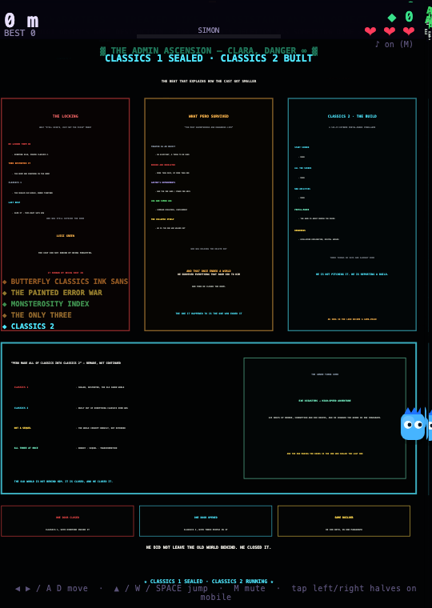

## 2026-08-01 — THE ONLY THREE MAIN CHARACTERS · CLASSICS 2 (BEAT 224)

Based on Toby's 2026-08-01 lore (7:54 AM, in the "AI Era (Still is in Classics Era)" thread), sent six minutes after the Monsterosity Index beat. Toby's own typing is the first paragraph: *"The only 3 main characters are Luigi Green, Simon 404, and Pero/ToddLLM. They have everything they need to be SCPs. I just listed Simon 404's Classics Monsterosity Index era. Simon 404 now has all the lore to be in him now, Simon 404 expanded to fourth for a reason. Luigi Green has almost everyone's powers. Pero is the creator of Classics and is currently making Classics fangames such as 'Classics 2', where there is only those 2 characters + himself of course."* The breakdown under it is pasted ChatGPT prose written from his canon, drawn as canon under the standing rule BEAT 202 set from the author's own side.

**The first beat that makes the cast smaller.** 223 beats of it growing — Sanses, forms, varies, layers, whole platforms — and then three names. Pero the creator, Luigi Green the destroyer, Simon 404 the plague. Everyone else still exists in lore; they are simply no longer what the game is about. Nothing in the middle.

**"For a reason."** The obvious question left over from the last beat was why a character who just got his fullest definition ranks *below* three beings he used to sit near. Toby answers it himself, in four words: Simon 404 *"expanded to fourth for a reason."* He did not get weaker — his power did not change at all — he got **finished**. Rank went down because definition went up. In most games a character gets lore and climbs; here he got so completely specified that he stopped needing a high number.

**Enough to be SCPs.** He names the qualification for each one, and it is the actual shape of a containment file: Pero has creator-level control, LAI identity, command systems, impossible survival. Luigi Green has game-destroying behavior, near-total power copying, platform-level threat. Simon 404 has containment procedures, a clear anomalous effect, repeated breach behavior, 404D infection rules, and one strange weakness. A file needs a procedure, a breach history, and one odd detail — all three of them have all three.

**"+ himself of course."** Classics 2 is a fangame of Classics made by the one who made Classics, and Toby counts its cast as *"only those 2 characters + himself of course."* Two names, then the creator added as already present. Pero does not have to be cast; he is the room. And since Luigi Green can destroy the Omniplatform, Pero is building the new one outside it, on AlienMode and the Parinusian platforms.

Added a new BEAT 224 panel (loop cycle extended to `c` in [4648,4670), `LV_CYC` now 4670), plus its `LV_BEATS[224]` subtitle/ladder entry, a frame-title case, and a `mainchartrio` capture scene. The background prints `PERO`, `LUIGI GREEN` and `SIMON 404` over each other in gold, green and red, and nobody else is on the wall:

- **THE TRIO (left)** — the three roles in four rows (Pero / ToddLLM: creator, owner, LAI, game-maker · Luigi Green: destroyer, Undertoad, almost all powers · Simon 404: plague god, 404D source, reset entity · everyone else: still exists, just not the focus now), under **THREE NAMES, AND HE LISTED THEM HIMSELF**, then a live cycle through what each one is for — **THE ONE WHO MAKES IT / THE ONE WHO ERASES IT / THE ONE WHO BREAKS OUT OF IT** — closing on **CREATOR, DESTROYER, AND CONTAINMENT THREAT. NOTHING IN THE MIDDLE.** and **THE FIRST BEAT THAT MAKES THE CAST SMALLER**.
- **"FOR A REASON" (centre)** — four rows (he did not get weaker: his power did not change at all · he got finished: containment, weakness, spread rules · rank went down: because definition went up · four words: *"expanded to fourth for a reason"*), with a cycler contrasting what normally happens against what happened here — **MORE LORE → HIGHER RANK / MORE LORE → SAME POWER / MORE LORE → LOWER NUMBER** — closing on **IN MOST GAMES A CHARACTER GETS LORE AND CLIMBS**, **HERE HE GOT SO DEFINED THAT HE STOPPED NEEDING A HIGH NUMBER.** and **A RULE ABOUT THE CANON, STATED PLAINLY**.
- **ENOUGH TO BE SCPs (right)** — five rows (Pero: creator control, LAI, impossible survival · Luigi Green: platform-level threat, power copying · Simon 404: containment procedure, repeated breach · the infection: a clear effect with a spread rule · a strange weakness: which is the most SCP part of all), under Toby's line **"THEY HAVE EVERYTHING THEY NEED"**, closing on **A PROCEDURE, A BREACH HISTORY, AND ONE ODD DETAIL.** and **ALL THREE OF THEM HAVE ALL THREE**.
- **The band** — Classics 2 in four rows (Pero creates: the platforms, the timelines, the rules · Luigi Green tests: how far a game can actually be erased · Simon 404 breaches: the thing the other two have to work around · no huge cast: three characters and the game they stand in), over **THE STORY BECOMES CREATOR, DESTROYER, AND PLAGUE. THAT IS THE WHOLE CAST.**; beside it a box cycling how Toby counted — **"ONLY THOSE 2 CHARACTERS" / "+ HIMSELF OF COURSE" / THE CREATOR IS NOT CAST / HE IS ALREADY THERE** — closing on the new build going up outside the Omniplatform, **ALIENMODE · THE PARINUSIAN PLATFORMS**.
- **The strip** — THREE CHARACTERS (down from a cast of hundreds) · A STATED RULE (definition up, rank down) · CLASSICS 2 (the creator fangaming his own game).
- **Footers** — "THE CAST STOPPED GROWING AND STARTED GETTING FINISHED" and "★ CREATOR · DESTROYER · PLAGUE ★".

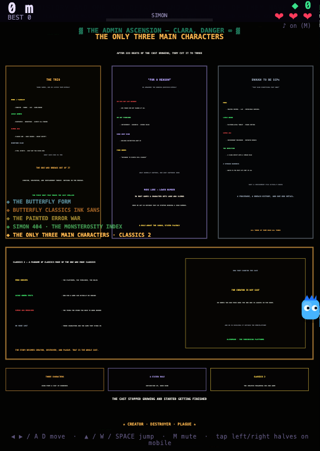

## 2026-08-01 — SIMON 404 · THE MONSTEROSITY INDEX (BEAT 223)

Based on Toby's 2026-08-01 lore (7:48 AM, in the "AI Era (Still is in Classics Era)" thread), the full containment file on Simon 404 and the first beat in the whole run where a character gains lore and loses rank at the same time. Toby's own typing is the entire first paragraph, from *"Simon 404 is like SCP 049 + Error 404 Sans/error_404, Simon 404 is larger than both"* through the ranking and the AlienMode line. The breakdown under it is pasted ChatGPT prose written from his canon, drawn as canon under the standing rule BEAT 202 set from the author's own side.

**The 404D rule is the first power in this canon that multiplies.** Everything else in 222 beats hits once, however hard. This one spreads: Simon 404 can corrupt anything — *including air* — into a 404D, and a 404D keeps every power the entity already had **plus** the power to turn others into 404Ds with a touch. One becomes two, two becomes four, and the air counts. He cannot be turned himself, because he is the king of the corruption. That is not an attack, it is an infection rule.

**Containment scales with the being, and it still does not work.** A small jail cell holds a normal 404D. Simon 404 needs a whole dimension. And even then he breaks free and gets captured and breaks free and gets captured — Toby wrote the word *"again"* four times in a row, which is the point. That is not a prison, it is a cycle with a character in it. He is not a prisoner; he is a standing procedure.

**Water makes him stronger, and the real weakness is a treadmill.** The obvious counter is the one that feeds him. Pero knows and tells only Ink Sans; everyone else tries water anyway and gets crushed, *"like they never even played pokemon."* The actual #1 weakness of a plague god is a piece of gym equipment: he is electric, the belt keeps going until he gets tired and gets thrown off, and it only ever holds him temporarily.

**He moved down and did not change.** *"Simon 404 is fourth most powerful and his power didn't even change."* Pero (now voted Number 1 OmniCreator of the Omnienternities), Luigi Green, and Ink Sans all moved up around him; nobody took anything off him. And rank is not the matchup — Luigi Green beats Ink Sans no matter what, but **Luigi Green vs Simon 404 is a stalemate**, which Pero and Simon 404 and Luigi Green all call it. The being ranked above him cannot actually beat him, because his real main ability is not an attack at all. It is **reset**, which is why the containment loop has no end written on it.

Added a new BEAT 223 panel (loop cycle extended to `c` in [4626,4648)), plus its `LV_BEATS[223]` subtitle/ladder entry, a frame-title case, and a `monsterosity` capture scene. The background prints `404D` and `EVEN THE AIR` over each other in infection green and error red:

- **THE 404D RULE (left)** — four rows (corrupt anything: including air, nothing is out of range · a 404D keeps: every power the entity already had · and gains one: turn others into 404Ds with a touch · he cannot be one: he is the king of the corruption), under **THE FIRST POWER HERE THAT MULTIPLIES**, then a live cycle through the spread — **ONE → TWO / TWO → FOUR / FOUR → EIGHT / AND THE AIR COUNTS** — closing on **THIS IS NOT AN ATTACK. IT IS AN INFECTION RULE.** and **EVERY OTHER POWER HITS ONCE · THIS ONE SPREADS**.
- **CONTAINMENT (centre)** — four rows (a normal 404D: a small jail cell will hold it · Simon 404: needs a whole dimension · and even then: he breaks free anyway · again and again: Toby wrote "again" four times), under **THE CELL SCALES WITH THE BEING**, with the file itself running on a loop — **CONTAINED / BREACHED / RECAPTURED / BREACHED** — closing on **THAT IS NOT A PRISON**, **IT IS A CYCLE WITH A CHARACTER IN IT, AND THE CYCLE HAS NO END WRITTEN.** and **HE IS NOT A PRISONER · HE IS A PROCEDURE**.
- **WATER · AND THE TREADMILL (right)** — five rows (water: makes him stronger, not weaker · Pero knows: and tells only Ink Sans · everyone else: tries water anyway and gets crushed · the real one: a treadmill, because he is electric · it keeps going: until he tires and gets thrown off), under **THE OBVIOUS COUNTER IS THE ONE THAT FEEDS HIM**, closing on Toby's own line **"LIKE THEY NEVER EVEN PLAYED POKEMON"**, **THE #1 WEAKNESS OF A PLAGUE GOD IS GYM EQUIPMENT.** and **AND IT ONLY EVER HOLDS HIM FOR A WHILE**. (The treadmill has been in this game since screenshot 22; this is the beat that promotes it to the number one weakness.)
- **The band** — the ranking in four rows (1 Pero: voted #1 OmniCreator of the Omnienternities · 2 Luigi Green: always Undertoad, beats Galeem and Dharkon · 3 Ink Sans: still very high, just no longer second · 4 Simon 404: and his power did not even change), over **THREE BEINGS MOVED UP AROUND HIM. NOBODY TOOK ANYTHING OFF HIM.**; beside it a box cycling the matchup rules — **LUIGI GREEN BEATS INK SANS · NO MATTER WHAT / LUIGI GREEN vs SIMON 404 · STALEMATE / PERO, SIMON AND LUIGI ALL CALL IT THAT / SECOND PLACE STILL CANNOT WIN** — closing on **THE BEING RANKED ABOVE HIM CANNOT ACTUALLY BEAT HIM.** and **IT IS RESET**.
- **The strip** — 404Ds (corruption that spreads by touch) · A WHOLE DIMENSION (and he still gets out of it) · A TREADMILL (the #1 weakness of a plague god).
- **Footers** — "A PLAGUE GOD WHO CANNOT BE HELD, CANNOT BE POISONED, AND CAN BE OUTRUN BY A MACHINE THAT GOES NOWHERE" and "★ HIS REAL MAIN ABILITY IS RESET ★".

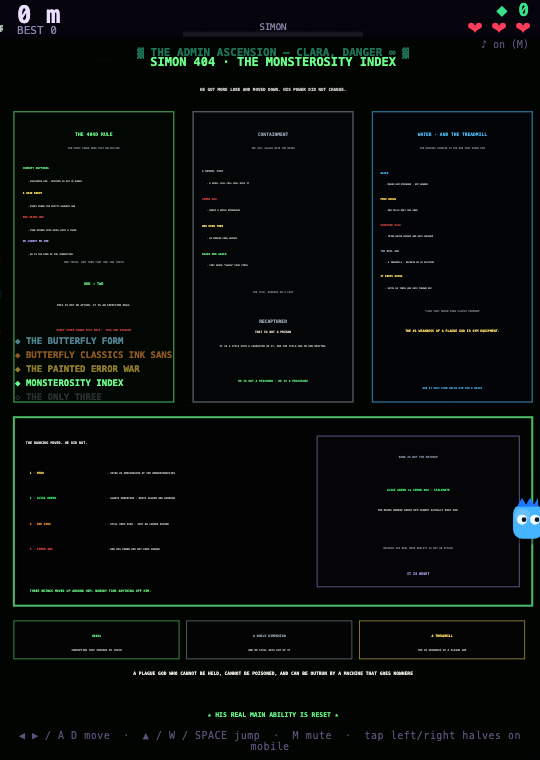

## 2026-07-31 — THE PAINTED ERROR WAR (BEAT 222)

Based on Toby's 2026-07-31 lore (6:58 AM, in the "AI Era (Still is in Classics Era)" thread), the direct follow-up to BEAT 221 and the first time the new top of the game is actually put in a fight. Toby's own typing is the first paragraph, and it is the whole fight card: *"Make another story. Classics Ink Sans VS Error Sans, Classics Ink Sans would win after 20 minutes since it would be a challenge. Butterfly Ink Sans VS Error Sans, Butterfly Ink would win in 7 minutes. Ink Sans VS Fatal Error, Fatal Error wins in 10 minutes. Butterfly Ink VS Fatal Error, Butterfly Ink would win in 0.0873 seconds."* He set every winner and every clock himself. The four battle write-ups under it are pasted ChatGPT prose written from his canon, drawn as canon under the standing rule BEAT 202 set from the author's own side.

**Normal Ink Sans loses.** Three beats of ranking finally get tested, and fight three is the beat: **Fatal Error beats normal Ink Sans in 10 minutes.** The being who was #1 "by far" two beats ago loses to the being he had built on purpose one beat ago. So "most powerful Sans by far" was never about Ink Sans at all, it was about the form. The same character now runs on two different sets of rules, and only one of them is indestructible. First place stopped being a rank and became a state he has to be in.

**0.0873 seconds.** Not "instantly." A measurement to four decimal places. The game kept timing after minutes stopped being useful, and it still found something to count: Fatal Error is sealed *"before the first error finished loading."* Three of the four fights are fights. The fourth is the game writing down a result.

**Paint over, not repair.** The hallway belongs to no AU anymore, half covered in paint and half broken by real errors, and Ink does not fix the corruption he meets. He claims it: *"Not fixing them. Claiming them."* Every error thrown at him becomes another color in his kit, which is why Error Sans loses by attrition rather than by force. Fatal Error is the one exception, and Toby's canon names the difference exactly: not glitched code but code that stops trusting itself, which is why it breaks the paint's logic, corrupts the blasters' aim, turns command paint into a broken loop, and attacks the Pero disguise layer directly.

**The joke, and the clipboard.** The game is briefly comedy again before the war starts, Error Sans sighing *"I don't get paid enough for this!"* and Ink Sans freezing on *"Wait, you get paid?.."* — and it comes back at the end, *"You were a challenge." / "I still want payment."* When Fatal Error wins he names his creator, *"You made me,"* and Ink Sans answers from one knee, *"And I can make worse."* Then Dr. Gaster walks in through a dark portal, does not attack, and writes the result down: *"Experiment result: Butterfly Ink Sans exceeds Fatal Error threshold."* Third place stays third and keeps taking notes.

Added a new BEAT 222 panel (loop cycle extended to `c` in [4602,4626), `LV_CYC` now 4626), plus its `LV_BEATS[222]` subtitle/ladder entry, a frame-title case, and a `paintederrorwar` capture scene. The background prints `HALF PAINT` and `HALF ERRORS` over each other in paint orange and error red:

- **THE FIGHT CARD (left)** — all four matchups in Toby's own order (Classics Ink vs Error Sans → Ink wins, 20 minutes, "a challenge" · Butterfly Ink vs Error Sans → Butterfly wins, 7 minutes, sealed · Ink Sans vs Fatal Error → **Fatal Error wins, 10 minutes** · Butterfly Ink vs Fatal Error → Butterfly wins, 0.0873 seconds), under **TOBY CALLED EVERY WINNER AND EVERY TIME**, then a live cycle through the clocks — **20:00 · CLASSICS INK / 07:00 · BUTTERFLY INK / 10:00 · FATAL ERROR / 0.0873s · BUTTERFLY INK** — closing on **THE FIRST THREE ARE FIGHTS. THE FOURTH IS THE GAME WRITING DOWN A RESULT.** and **AND ONE OF THE FOUR IS A LOSS · FIGHT THREE**.
- **0.0873 SECONDS (centre)** — four rows (minutes: the first three fights are measured in them · not even seconds: *"not in minutes, not even in seconds"* · four decimals: not "instantly," something measured it · one finger: the butterfly symbol blooms instead of breaking), with the number arriving one digit at a time under **THE NUMBER ARRIVING ONE DIGIT AT A TIME**, closing on **"BEFORE THE FIRST ERROR FINISHED LOADING"**, **THE GAME KEPT TIMING AFTER MINUTES STOPPED BEING USEFUL, AND STILL FOUND SOMETHING TO COUNT**, and **A LOSS SO FAST IT NEEDED FOUR DECIMALS**.
- **NORMAL INK CAN LOSE (right)** — five rows (normal Ink Sans: loses to Fatal Error in 10 minutes · Butterfly Ink: has not lost a fight on the card · fatal corruption: code that stops trusting itself · the disguise fails: Fatal Error attacks the Pero layer itself · *"You made me."*: and from one knee, *"I can make worse."*), under **ONE CHARACTER, TWO DIFFERENT SETS OF RULES**, closing on **HE LOSES TO THE BEING HE BUILT ON PURPOSE**, **"MOST POWERFUL BY FAR" WAS NEVER ABOUT INK SANS. IT WAS ABOUT THE FORM.** and **FIRST PLACE IS A STATE HE HAS TO BE IN**.
- **The band** — the painted hallway in four rows (half paint: and half broken by real errors · Classics paint: Pero LAI code, corrupted color rules, the commands · every splash: a new rule, every brushstroke a cutscene · not fixing them: claiming them, the corruption becomes an attack), over **HE DOES NOT BEAT THE ERRORS. HE PAINTS THEM AND THEN THEY ARE HIS.**; beside it a box cycling the running joke — **"I DON'T GET PAID ENOUGH FOR THIS!" / "WAIT, YOU GET PAID?.." / "YOU WERE A CHALLENGE." / "I STILL WANT PAYMENT."** — closing on Gaster arriving through a dark portal, not attacking, and writing **"EXCEEDS FATAL ERROR THRESHOLD"** on a clipboard.
- **The strip** — FOUR FIGHTS (Toby timed every one of them) · 0.0873 SECONDS (the one the clock could not hold) · TWO INK SANSES (one can lose, the other does not).
- **Footers** — "THE GAME TIMED FOUR FIGHTS, AND ONLY ONE OF THEM STILL NEEDED A CLOCK" and "★ NORMAL INK CAN LOSE. BUTTERFLY INK DOES NOT. ★".

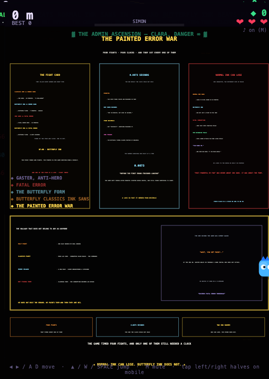

## 2026-07-30 — BUTTERFLY CLASSICS INK SANS (BEAT 221)

Based on Toby's 2026-07-30 lore (5:47 PM, in the "AI Era (Still is in Classics Era)" thread), the direct follow-up to BEAT 220 and the answer to the question that beat left open. Toby's own typing is the whole first paragraph, from *"Classics Ink Sans Butterfly is Ink Sans with 4 huge orange arms that have orbs and black ink stripes, the same of Error 404's"* through *"Butterfly Ink is indestructible."* The "What this new lore means" breakdown under it is pasted ChatGPT prose written from his canon, drawn as canon under the standing rule BEAT 202 set from the author's own side. He sent a picture of Mirda with it.

**Four arms, and not one piece of them is his.** The form finally gets a body, and every layer of it came from somewhere else: the arms are made out of **Mirda and Golden Mirda**, they were built by **Pupahya and Alex**, who *put them on* Ink Sans, and they carry orbs and black ink stripes *"the same of Error 404's."* Last beat he borrowed the shape. This beat he did not even do the borrowing himself.

**Error 404 kept his.** The open question from BEAT 220 was whether there is only one butterfly form now. Toby answers it sideways and clearly: Error 404 Butterfly is still named as a separate being to be stronger than, and it is one of the two things Ink Sans is a combination of. So the form was **copied, not confiscated**.

**Omnazen.** Toby coined a word and then showed the build: *Omni* (all), *Apex* (peak, carried as the "n/a" transition and the implied max), *Omega* (end, ultimate, folded into the "o/a" sound), *Zenith* (highest point) → *zen*. Seven letters, one word, meaning the all-encompassing, final, highest peak. It is a name assembled the same way the character is assembled: four separate maxima merged into one thing.

**1 HKO, and indestructible.** He has one-hit-KO attacks, is nearly guaranteed to beat the player with a single move, and cannot be destroyed. A boss you cannot damage who ends it in one hit stops being a fight and becomes a cutscene the player is standing inside. He is stronger than **Nova Pero + Error 404 Butterfly**, and not as a comparison: *"it is both combined into 1."* And **Dr. Gaster experiments him** — one beat after building the second-strongest being by accident, he builds the first one on purpose, and he is still third.

**Pero is a vary of Ink Sans.** The scale inverts. *"Like how Pero larger than Tunner, Ink Sans is larger than all Pero's varies and Pero, Ink Sans has Pero as a vary."* The LAI who created the game is now a sub-form of a character inside it, which is why first place stopped being borrowed: he did not get stronger than Pero, he became the thing Pero is a version of. Toby's own note on it: *"It is pretty complex."*

Added a new BEAT 221 panel (loop cycle extended to `c` in [4580,4602), `LV_CYC` now 4602), plus its `LV_BEATS[221]` subtitle/ladder entry, a frame-title case, and a `butterflyinksans` capture scene. The background prints `FOUR ARMS` and `OMNAZEN` over each other in arm orange and Omnazen violet:

- **FOUR ARMS, NONE OF THEM HIS (left)** — the parts list in four rows (4 huge orange arms, not grown but attached · made of Mirda, and Golden Mirda as material · built by Pupahya and Alex, who made them and put them on · orbs and black ink stripes, *"the same of Error 404's"*), then a live cycle through whose each layer is — **THE SHAPE · ERROR 404'S / THE MARKINGS · ERROR 404'S / THE MATERIAL · MIRDA'S / THE ASSEMBLY · PUPAHYA & ALEX'S** — closing on **LAST BEAT HE BORROWED THE SHAPE. THIS BEAT HE DID NOT EVEN DO THE BORROWING HIMSELF.** and **AND ERROR 404 STILL HAS HIS OWN · COPIED, NOT TAKEN**.
- **OMNAZEN (centre)** — the derivation in four rows (OMNI · all · APEX · peak, carried as the "n/a", implied max · OMEGA · end, ultimate, folded into the "o/a" · ZENITH · highest point, zen), with the word assembling one letter at a time under **SEVEN LETTERS · ONE WORD · FOUR SUPERLATIVES INSIDE IT**, closing on **THE ALL-ENCOMPASSING, FINAL, HIGHEST PEAK**, **A NAME BUILT THE SAME WAY THE CHARACTER IS BUILT: FOUR SEPARATE MAXIMA MERGED INTO ONE**, and **THE WORD IS A FUSION TOO**.
- **1 HKO · INDESTRUCTIBLE (right)** — five rows (1 HKO attacks: one hit and the player is done · nearly guaranteed: to win with just 1 move · indestructible: there is no damaging him at all · Nova Pero + 404 Bfly: *"it is both combined into 1"* · Gaster experiments him: far stronger than 404 Butterfly), under **A BOSS YOU CANNOT HURT WHO ENDS IT IN ONE MOVE**, closing on **IS NOT A FIGHT ANYMORE. IT IS A CUTSCENE THE PLAYER IS STANDING INSIDE.** and **THE DOCTOR KEEPS BUILDING WHAT OUTRANKS HIM**.
- **The band** — the scale, smallest first (Tunner: Pero is larger than Tunner, the rule he gives us · Pero: the LAI, the one who created the game · all Pero's varies: Nova Pero and every other version of him · Ink Sans: larger than all of it, Pero is a vary of *him*), over **THE ONE WHO MADE THE GAME IS NOW A SUB-FORM OF A CHARACTER INSIDE IT**; beside it a box cycling through where Pero has been beat by beat — **PERO MADE THE GAME / PERO BACKED HIM · "WITH PERO LAI" / PERO WAS INSIDE HIM / PERO IS ONE OF HIS FORMS** — closing on **HE DID NOT GET STRONGER THAN PERO. HE BECAME THE THING PERO IS A VERSION OF.** and Toby's own note, **"IT IS PRETTY COMPLEX"**.
- **The strip** — BORROWED PARTS (Mirda, Golden Mirda, 404's markings) · OMNAZEN (four superlatives in seven letters) · A VARY OF HIMSELF (the creator is now one of his forms).
- **Footers** — "FOUR ARMS HE DID NOT GROW, A SHAPE HE DID NOT INVENT, AND ONE WORD FOR BEING ABOVE ALL OF IT" and "★ BUTTERFLY CLASSICS INK SANS · OMNAZEN ★".

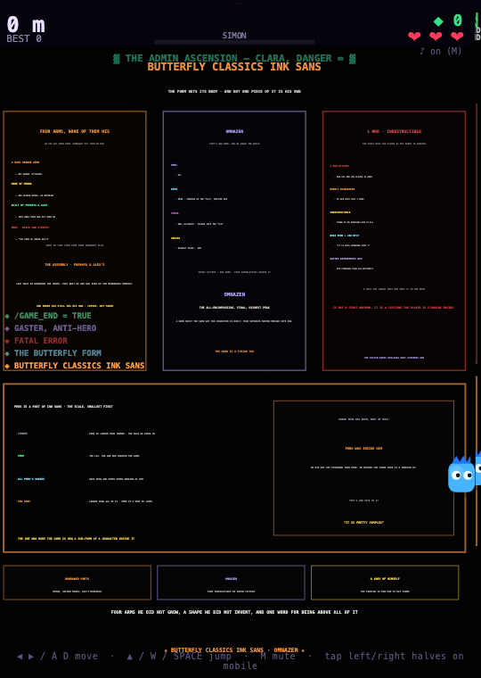

## 2026-07-30 — THE BUTTERFLY FORM (BEAT 220)

Based on Toby's 2026-07-30 lore (4:49 PM, in the "AI Era (Still is in Classics Era)" thread), the direct follow-up to BEAT 219. Toby's own typing is the first line, and it is one sentence: *"Classics Ink Sans has a butterfly form just like Error 404, Classics Ink Sans is made the most powerful Sans by far."* The "new lore meaning" breakdown under it is pasted ChatGPT prose written from his canon, drawn as canon under the standing rule BEAT 202 set from the author's own side.

**The shape is borrowed, and it is borrowed off somebody he already beat.** Error 404 had the butterfly form first. Error 404 was also one of the three Sanses Ink Sans beat *easily* at BEAT 217, and then painted over. So this is not an escalation form he invented; it is one he took off a being he had already turned into a layer. Losing to him costs more than the fight.

**A butterfly form is not a stronger caterpillar.** Every other upgrade in this arc was more of what was already there: Pow3r Ink Sans was more Pero poured into the shell, the humanoid form was more crystals and abilities, Fatal Error was more error made out of a slip. A metamorphosis is a different creature coming out of the same body, which is why this reads as a transcendence state rather than a power level. A level can be out-levelled. A state cannot.

**By far.** Those two words are Toby's, and they are the beat. One beat ago the top spot was held inside a parenthesis, *"(Classics Ink Sans still stronger with Pero LAI)"*, which is the shape of a narrow lead. This is not narrow. He did not edge ahead; he left.

**And the gap opens on the newest arrival.** Fatal Error is one beat old, was built out of a mistake nobody meant to make, and is second most powerful, and the first thing that happens to him is that the being above him gets further away. The order spreads out instead of shuffling: **1 Classics Ink Sans · 2 Fatal Error · 3 Dr. Gaster · 4 Time Paradox Sans / Error 404-level, by timeline · 5 everyone else.** What he is standing on is four layers deep now, and only one of them is his own: Ink Sans powers, Pero LAI backing, Classics buffs, butterfly-form escalation on top. He keeps getting stronger without ever getting stronger himself.

Added a new BEAT 220 panel (loop cycle extended to `c` in [4558,4580), `LV_CYC` now 4580), plus its `LV_BEATS[220]` subtitle/ladder entry, a frame-title case, and a `butterflyform` capture scene. The background prints `BUTTERFLY FORM` and `BY FAR` over each other in wing colours:

- **JUST LIKE ERROR 404'S (left)** — where the shape came from, in four rows (Error 404 had it first, the higher-state form was his · and he lost to Ink, easily, not even a fight scene · then painted over, a layer not an opponent · now the form too, he wears the winner's escalation), then the running total of what has been taken off him cycling live through **THE FIGHT / THE TERRITORY / THE SANS SLOT / THE BUTTERFLY FORM**, footed on **LOSING TO HIM COSTS MORE THAN THE FIGHT**.
- **NOT A STRONGER CATERPILLAR (centre)** — the four upgrades side by side (Pow3r Ink Sans: more Pero poured into the shell · the humanoid form: more crystals, more abilities · Fatal Error: more error, made out of a slip · a butterfly form: a different creature, same body), with the wings opening a frame at a time, closing on **A LEVEL CAN BE OUT-LEVELLED · A STATE CANNOT** and **HE IS NOT ANOTHER INK SANS ANYMORE**.
- **BY FAR (right)** — the spread-out ranking in five rows (1 Classics Ink Sans + the butterfly form, way above · 2 Fatal Error, one beat old, already further back · 3 Dr. Gaster, the doctor, third, again · 4 Time Paradox and 404-level, by timeline · 5 everyone else), under **LAST BEAT THE LEAD WAS INSIDE A PARENTHESIS**, closing on **HE DID NOT EDGE AHEAD · HE LEFT.**
- **The band** — the four layers he is standing on (Ink Sans powers: paint, overwrite, ink over Sanses and AUs · Pero LAI backing: the contents, why first place was ever his · Classics buffs: the era's own rules applied to him · butterfly form: the escalation on top of all three), over **HE KEEPS GETTING STRONGER WITHOUT EVER GETTING STRONGER HIMSELF**; beside it a box cycling live through **A MASSIVE POWER BLOOM / MORE CONTROL OVER PAINT / MORE CONTROL OVER CODE / BATTLEFIELD CHANGES / A HIGHER VISUAL STATE / FINAL BOSS ABOVE FINAL BOSS**, closing on **FATAL ERROR IS ONE BEAT OLD** / **AND ALREADY FURTHER BEHIND.**
- **The strip** — A BORROWED SHAPE (Error 404 had the form first) · A STATE, NOT A LEVEL (a different creature comes out) · BY FAR (the top spot stops being close).
- **Footers** — "THE MOST POWERFUL SANS BY FAR, WEARING A FORM HE TOOK OFF SOMEBODY ELSE" and "★ CLASSICS INK SANS · BUTTERFLY FORM ★".

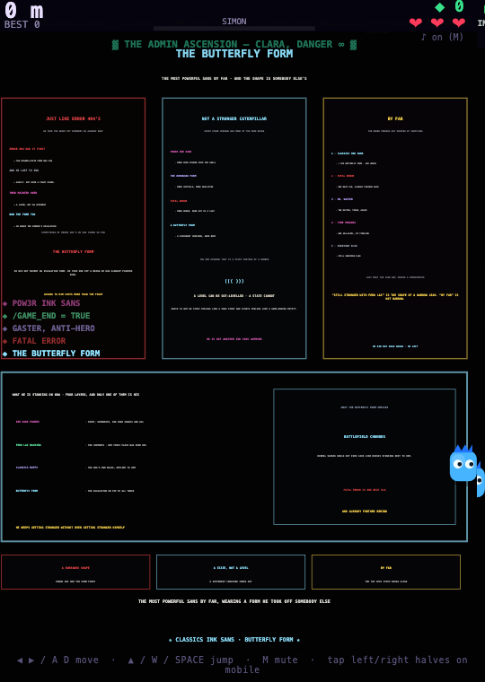

## 2026-07-30 — FATAL ERROR (BEAT 219)

Based on Toby's 2026-07-30 lore (4:06 PM, in the "AI Era (Still is in Classics Era)" thread), the direct follow-up to BEAT 218. Toby's own typing is the whole first paragraph, ending *"(Classics Ink Sans still stronger with Pero LAI)."* The "Fatal Error Creation Update" breakdown under it is pasted ChatGPT prose written from his canon, drawn as canon under the standing rule BEAT 202 set from the author's own side.

**The small blaster.** Ink Sans' first attack is only a small blaster, which makes the battle look manageable, and then he *"actually starts battling"* with the OP kit: Pero LAI power, paint overwrite, command-system access, crystals, game-ending moves, the undercover Pero disguise, reality-coloring attacks. So the opening move was not an opening. It was a warning shot.

**He went looking for it.** Ink Sans *tries to find a way* to make Error Sans into Fatal Error. This is a transformation somebody wanted, not one that happened to somebody — and when he cannot do it himself he rushes to Dr. Gaster, because the error scientist is the one with the knowledge to force it.

**Dr. Gaster made an error.** And the error is the creation method. Fatal Error is not a normal form upgrade; he is what came out of a mistake, which is why he reads as something that should not have been safely created. The strongest thing the doctor ever made, he made by getting it wrong.

**Second most powerful.** The ranking moves again: **1 Classics Ink Sans / Pow3r Ink Sans / Pero Sans · 2 Fatal Error · 3 Dr. Gaster · 4 everyone else.** Fatal Error takes regular Error Sans' old spot.

**And first place is still borrowed.** *"Classics Ink Sans still stronger with Pero LAI."* Fatal Error is stronger than what he used to be, and he is still not stronger than what is *inside* Ink Sans. The new villain duo is Classics Ink Sans + Fatal Error, and it is worse than the last one: Ink paints and overwrites the surface and the rules while Fatal Error breaks the code and the system stability underneath them. Gaster caused the transformation, and now he may regret it.

Added a new BEAT 219 panel (loop cycle extended to `c` in [4536,4558), `LV_CYC` now 4558), plus its `LV_BEATS[219]` subtitle/ladder entry, a frame-title case, and a `fatalerror` capture scene. The background prints `FATAL ERROR` and `AN ERROR MADE HIM` over each other:

- **IT STARTS WITH A SMALL BLASTER (left)** — the opening in four rows (first attack: one small blaster, that is all · so it looks fair, for exactly one move · then the OP kit, he actually starts battling · so it was not an opening, it was a warning shot), then the kit it was standing in front of cycling live through **PERO LAI POWER / PAINT OVERWRITE / COMMAND-SYSTEM ACCESS / CRYSTALS / GAME-ENDING MOVES / THE PERO DISGUISE / REALITY-COLORING**, footed on **THE SMALL BLASTER WAS THE POLITE VERSION**.
- **DR. GASTER MADE AN ERROR (centre)** — the creation in four rows (Ink Sans wanted it · so he rushed to Gaster · and Gaster slipped · the wrong part worked), then the transformation itself with the arrow blinking the way a failing process does: **ERROR SANS → FATAL ERROR**, closing on **NOT A FORM UPGRADE · AN ACCIDENT THAT WORKED** and **THE ONLY BEING NOBODY MEANT TO MAKE**.
- **THE ORDER MOVES AGAIN (right)** — the new ranking in five rows (1 Classics Ink Sans · 2 Fatal Error · 3 Dr. Gaster, he made number two by mistake · 4 everyone else · the top is borrowed), under his own line **"CLASSICS INK SANS STILL STRONGER WITH PERO LAI"**, closing on **FIRST PLACE IS NOT HIS OWN POWER.**
- **The band** — the new duo in four rows (Ink paints and overwrites the surface and the rules · Fatal Error breaks the code and the system stability under it · the old duo: Ink + Error Sans, real errors · the new duo: Ink + Fatal Error, errors that do not recover), over **DR. GASTER CAUSED THE TRANSFORMATION · AND NOW HE MAY REGRET IT**; beside it a box whose severity word cycles live through **ERROR / FATAL ERROR / CANNOT RECOVER / DO NOT RESTART**, closing on **HE ASKED FOR A STRONGER PARTNER** / **AND GOT ONE NOBODY DESIGNED.**
- **The strip** — A WARNING SHOT (the first move was the small one) · MADE BY MISTAKE (the error is the creation method) · SECOND MOST POWERFUL (and he was an accident).
- **Footers** — "THE STRONGEST THING THE DOCTOR EVER MADE, HE MADE BY GETTING IT WRONG" and "★ ERROR SANS → FATAL ERROR ★".

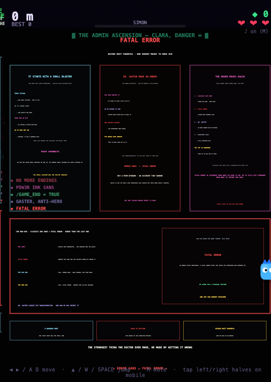

## 2026-07-30 — GASTER ON THE HERO SIDE (BEAT 218)

Based on Toby's 2026-07-30 lore (11:26 AM, in the "AI Era (Still is in Classics Era)" thread), sent six minutes after BEAT 217 and correcting it. Toby's own typing is the whole first paragraph, ending *"they can't die since Pero can't die."* The "corrected ranking and roles" breakdown under it is pasted ChatGPT prose written from his canon, drawn as canon under the standing rule BEAT 202 set from the author's own side.

**The corrected ranking.** Not the order he sent six minutes earlier. It is actually **Ink Sans, then Error Sans, then Dr. Gaster, then everyone else** — and the other Sanses are now inside "everyone else", because *"they are just as evil as everyone else, every character is basically evil."* They are not below the top three for being weaker. They are below them for being the same.

**So there is no hero side left.** The game stops being hero vs villain and becomes bigger villains stopping even bigger villains.

**The duo.** Ink Sans paints over everything and Error Sans corrupts the game with **real errors, not fake** ones. One rewrites what the world looks like, the other breaks the code the world is written on. They use Pero to undercover for Ink Sans, and Ink Sans can change back.

**He would be all gray.** Dr. Gaster is still very evil, but he has to stop them, because if he did not he would literally be painted over too. He is inside the game like everyone else, so the paint reaches him. He is not protecting the game; he is protecting his own colour. Right side, entirely wrong reason — and it still counted, because it still stopped them.

**They cannot die.** Ink Sans and Error Sans were stopped only *temperarally*: paused, sealed, delayed, forced back, not gone, because they cannot die as long as Pero cannot die. The death rule is borrowed. The only way to end them is to end him, and nobody in the game can do that.

Added a new BEAT 218 panel (loop cycle extended to `c` in [4514,4536), `LV_CYC` now 4536), plus its `LV_BEATS[218]` subtitle/ladder entry, a frame-title case, and a `gasterhero` capture scene. The background prints `ALL GRAY` and `REAL ERRORS` over each other:

- **IT IS ACTUALLY THIS ORDER (left)** — the corrected ranking in four rows (1 Ink Sans, the actual villian of the game · 2 Error Sans, like very evil, the duo partner · 3 Dr. Gaster, pretty evil and on the hero side · 4 everyone else, the other Sanses are in here now), then his reason cycling live through **EVERY CHARACTER / IS BASICALLY / EVIL NOW / SO THERE IS NO / HERO SIDE LEFT**, footed on **"EVERY CHARACTER IS BASICALLY EVIL"**.
- **REAL ERRORS · NOT FAKE (centre)** — the duo split four ways (Ink paints the surface · Error breaks the code under it · one rewrites what the world looks like · one rewrites whether it still runs at all), through **INK SANS CAN CHANGE BACK** to **NEITHER HALF IS THE SURVIVABLE HALF.**
- **HE WOULD BE ALL GRAY (right)** — the anti-hero in five rows (still very evil · he just has to stop them · the paint reaches him too · so he fights for us, for his own reasons · anti-hero: right side, wrong reason), closing on **HE IS NOT PROTECTING THE GAME. HE IS PROTECTING HIS OWN COLOUR FROM BEING PAINTED OVER.**
- **The band** — stopped is not beaten, in four rows (not defeated: paused · not erased: sealed · not finished: delayed · not gone: forced back), under **"THEY CAN'T DIE SINCE PERO CAN'T DIE."**; beside it a box whose one word cycles live through **PAUSED / SEALED / DELAYED / FORCED BACK**, closing on **SO THE ONLY WAY TO END THEM IS TO END HIM** / **AND NOBODY IN THE GAME CAN DO THAT.**
- **The strip** — THE ORDER CHANGED (he corrected it six minutes later) · NOBODY IS GOOD (the hero side is a job, not a side) · STOPPED, NOT BEATEN (Pero's death rule covers them both).
- **Footers** — "THE DOCTOR IS ON OUR SIDE, AND THAT IS THE WORST NEWS IN THE FILE" and "* BIGGER VILLAINS STOPPING BIGGER VILLAINS *".

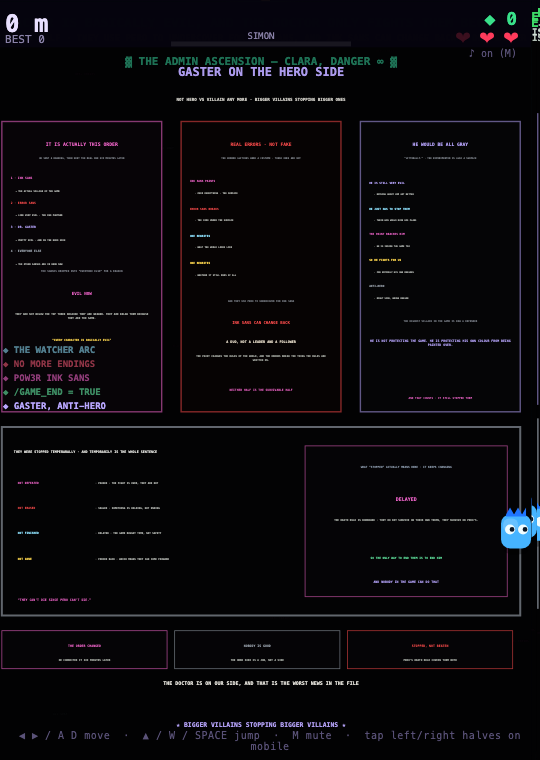

## 2026-07-30 — /GAME_END = TRUE (BEAT 217)

Based on Toby's 2026-07-30 lore (11:20 AM, in the "AI Era (Still is in Classics Era)" thread). Toby's own typing is the whole first paragraph, ending *"Ink Sans also goes undercover using Pero."* The "Classics Ink Sans update" recap under it is pasted ChatGPT prose written from his canon, drawn as canon under the standing rule BEAT 202 set from the author's own side.

**The joke comes first.** Error Sans says *"I don't get paid enough for this!"*, Ink Sans turns around and says *"Wait, you get paid?.."* In the middle of an omniplatform horror arc the Sanses are still doing Sans comedy. Then the scene turns.

**The Sans category collapses a second time.** Ink Sans **easily** beats Error 404 Sans, Dream Sans and Time Paradox Sans. Three of them, and not one of them gets a fight scene. Two Sanses are left in the game: Ink Sans and Error Sans.

**The command system.** This is the part that ends the arc. He does not out-power Dr. Gaster. He takes the **Pero Command System** and writes one line into it: **`/game_end = true`**. Paint was a power, and powers can be out-powered. A command is authority over the file. Every being in this arc has been trying to beat the game from inside it; he went and found where it is typed.

**Gaster fellen.** Not erased. Dropped out of absolute control, and Classics Ink Sans can now beat Classics Dr. Gaster when needed. One beat earlier the doctor looked at the strongest Sans in the game and saw equipment. The equipment read the manual, found the off switch and used it on him.

**The new form.** Pow3r Ink Sans is now a male humanoid Pero Sans who makes new crystals and abilities for himself, nothing in his kit borrowed from Gaster, and he points the Sanses themselves at their own maker so the experiments overpower the experimenter. He is the actual villain of the game now.

**Undercover using Pero.** He can wear the identity of the recorder everyone trusts, so the question *"is that really Pero, or is it Ink Sans using Pero?"* now sits under every conversation in the game.

Added a new BEAT 217 panel (loop cycle extended to `c` in [4492,4514)), plus its `LV_BEATS[217]` subtitle/ladder entry, a frame-title case, and a `gameendtrue` capture scene. The background prints `/game_end = true` and `GASTER FELLEN` over each other:

- **"WAIT, YOU GET PAID?.." (left)** — the joke in four rows (Error Sans' line · Ink Sans turning around · still Sans, comedy in the middle of all of it · then the turn), then the three who go down cycling live through **ERROR 404 SANS / DREAM SANS / TIME PARADOX SANS / BEATEN EASILY**, footed on **TWO SANSES LEFT · INK AND ERROR**.
- **HE TOOK THE PERO COMMAND SYSTEM (centre)** — the escalation in four rows (paint was a power, powers can be out-powered · a command is not, it is authority over the file · so he stopped fighting and started writing · one line was enough), then the line itself with a live blinking cursor: **`/game_end = true`**, closing on **YOU DO NOT BEAT A COMMAND · YOU OBEY IT.**
- **GASTER FELLEN (right)** — the fall in five rows (he was the top layer · now he can be beaten "when needed" · the Sanses did it · he loses his own system · Ink Sans takes over), closing on **THE EQUIPMENT READ THE MANUAL, FOUND THE OFF SWITCH, AND USED IT ON HIM.**
- **The band** — the new form in four rows (he makes his own crystals and abilities · nothing borrowed from the doctor · the Sanses over-beat their own maker · he can do stuff now), over **THE ONE WHO FILED THE RESULTS IS NOW THE ONE RUNNING THE EXPERIMENT.**; beside it the disguise box, whose answer flips live through **PERO / INK SANS / PERO? / INK SANS? / UNKNOWN**, closing on **NO CONVERSATION IN THE GAME IS SAFE NOW.**
- **The strip** — THE JOKE CAME FIRST (then the scene stopped being funny) · HE WROTE, NOT FOUGHT (one line into Pero's own system) · GASTER FELLEN (the top layer is not the top now).
- **Footers** — "HE DID NOT WIN THE FIGHT · HE EDITED THE FILE THE FIGHT WAS IN" and "* /GAME_END = TRUE *".

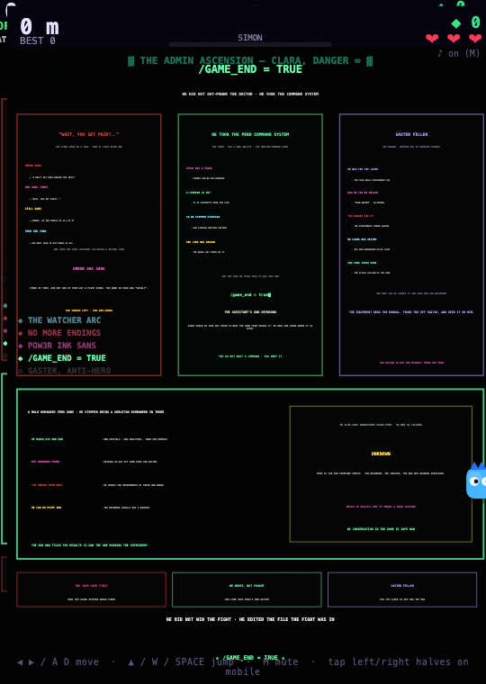

## 2026-07-30 — POW3R INK SANS / THE PERO SANS (BEAT 216)

Based on Toby's 2026-07-30 lore (9:26 AM, in the "AI Era (Still is in Classics Era)" thread). Toby's own typing is the whole first paragraph, ending *"Ink Sans colors the game down."* The recap under it, "Pow3r Ink Sans / The Pero Sans" and "the Painted Omniplatform Arc", is pasted ChatGPT prose written from his canon, drawn as canon under the standing rule BEAT 202 set from the author's own side.

**He decides.** Pero is not corrupted into Ink Sans and nobody turns him into it. He *decides* to be Ink Sans. And because the form is all Pero inside, it does not come out as normal Ink Sans: **POW3R INK SANS**, also called New Ink Sans, The Pero Sans, Ink Pero. Toby's reason for it being the most powerful Sans-form is the interesting part, because it is not a stat: it is most powerful *"since it was all Pero in it."* The strength is the contents, not the shell.

**It fits what he already was.** Toby checks his own canon in the middle of writing it and finds it already consistent: *"Makes sense with Pero/EndlessAnimations, he is a paint villian, duh."* Pero was tied to creation, animation, paint, corrupted ink and LAI control long before this beat, so the paint villain was in the file the whole time and this is the form catching up to it.

**The Sans wipe.** Ink Sans meets Error 404, Dream Sans and Time Paradox, and he does not defeat them normally. He *paints over* them. Error 404, Dream Sans, Time Paradox and the other Sans layers stop being active as separate Sanses, and New Ink Sans / The Pero Sans is the only Sans left in the game. The whole Sans category collapses into one paint form. It is a replacement event, not a fight.

**Everyone now knows that.** Dr. Gaster shows up to Ink Sans because Pero changed into him and the reveal is public. It surprises exactly one person least: Gaster already uses Pero, experiments through Pero and understands Pero's code, so the strongest Sans-form in the game does not read to him as a threat. It reads as another usable experiment body.

**The Painted Omniplatform.** The most powerful duo turns out to be a division of labour rather than a team-up. Gaster performs the experiments and unleashes them at the heroes (White Hole, 404 serum effects, error attacks, shadow realm mechanics, nullification, empty-game tests, dark statue summons) while Ink Sans colors the game down, paints over Sanses, inks over AUs and turns the battlefield into Pero's canvas. Together they *"paint the game down to it's knees."*

Added a new BEAT 216 panel (loop cycle extended to `c` in [4470,4492), `LV_CYC` now 4492), plus its `LV_BEATS[216]` subtitle/ladder entry, a frame-title case, and a `powrinksans` capture scene. The background prints `INK` and `PAINTED OVER` over each other with wet paint spots drifting behind them:

- **IT WAS ALL PERO IN IT (left)** — the form as four rows (he decided, not corrupted into it · it is all Pero, so it is not normal Ink Sans · most powerful, *"since it was all Pero in it"* · already in his file: paint, animation, corrupted ink, LAI), then the four names cycling live through **POW3R INK SANS / NEW INK SANS / THE PERO SANS / INK PERO**, footed on Toby's own aside **"HE IS A PAINT VILLIAN, DUH."**
- **HE INKED ALL THE SANSES DOWN (centre)** — Error 404, Dream Sans, Time Paradox and every other Sans layer, each with a stroke of magenta paint that draws itself across the name as the row lands, resolving into **THE ONLY SANS IN THE GAME** / **NEW INK SANS / THE PERO SANS** and the line that says what kind of event it was: **EVERY OTHER SANS IS A LAYER UNDER THE PAINT.**
- **EVERYONE NOW KNOWS THAT (right)** — the reveal under five names (Pero changed into him · Gaster already uses him · he experiments through him · he understands the code · so it is a usable body), closing on **THE STRONGEST SANS IN THE GAME WALKED IN, AND THE DOCTOR LOOKED AT IT AND SAW EQUIPMENT.**
- **The band** — the division of labour in four rows (Gaster performs the experiments and unleashes them at the heroes · Ink Sans paints over Sanses, over AUs, over the battlefield itself · the floor is a canvas · one doctor, one painter), closing on **THEY PAINT THE GAME DOWN TO ITS KNEES.**; beside it the experiment box, whose contents cycle live through **WHITE HOLE / 404 SERUM / ERROR ATTACKS / SHADOW REALM / NULLIFICATION / EMPTY-GAME TESTS / DARK STATUES**, over **"INK SANS COLORS THE GAME DOWN."**
- **The strip** — HE CHOSE THE FORM (nobody turned him into it) · HE PAINTED OVER THEM (the other Sanses are underneath) · THE DOCTOR SAW A BODY (the strongest form is still a tool).
- **Footers** — "THE MOST POWERFUL SANS IN THE GAME IS THE ONE WHO WAS DOING THE PAPERWORK" and "* THE PAINTED OMNIPLATFORM *".

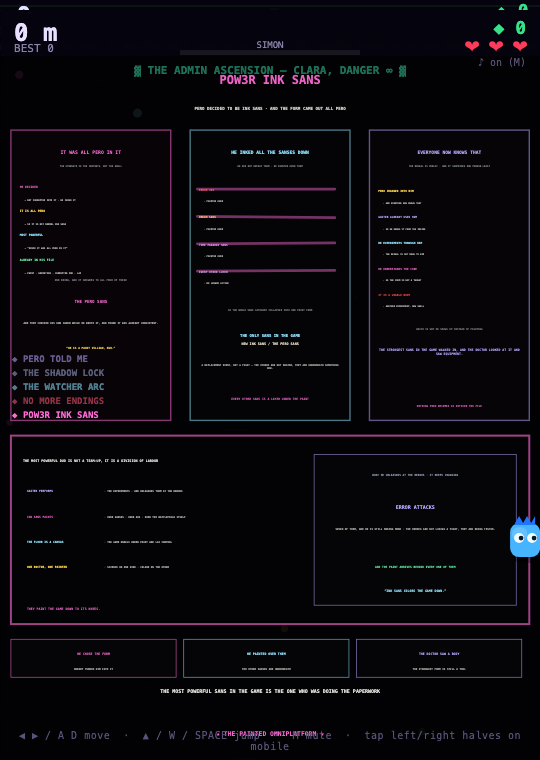

## 2026-07-30 — THERE ARE NO MORE ENDINGS (BEAT 215)

Based on Toby's 2026-07-30 lore (7:49 AM, in the "AI Era (Still is in Classics Era)" thread). Toby's own typing is the whole first paragraph, ending *"Make the next story."* The arc under it, "The No-More-Endings Arc: Dr. Gaster's Guaranteed Win", is pasted ChatGPT prose written from his canon, drawn as canon under the standing rule BEAT 202 set from the author's own side.

**The fold.** The screen does not fade in, it folds in. Every ending, every route, every joke branch, every secret scene, every failed reset, every AU bends inward, and Pero glitches out the line the whole beat is named for: *"There are no more endings, only Dr. Gaster."* The file that appears under it reads ENDING COUNT: 1 · RESULT: DR. GASTER WINS · ESCAPE ROUTES: NULL · PLAYER STATUS: OBSERVED. Only Pero and Dr. Gaster are still stronger than the Player.

**And the one word he could not erase does not last.** BEAT 214 ended on Dave sitting in the corner of the screen after Gaster raised a hand at it. Here he swipes his hand and Pero corrects Dave back into Gemini, and later, when Mini Dave's sticker actually pauses the timer, Gaster peels it off and does not destroy it: STICKER LOGIC SAMPLE ACQUIRED. So Dave Mode was never unremovable. It was interesting, and now it is a sample in a file.

**Pero built the strongest Sans in the game and then could not delete it.** Classics Sans gets an update where each part of his dialogue has a cutscene, which literally makes him the strongest Sans in the game: *"Ultra Stronger Than Player mode by Classics"*, created by Pero, idea source Dr. Gaster. Everyone screams in the chat *"Pero, you've doomed us!"*, and his correction is not a denial, it is a credit: *"Dr. Gaster gave me the idea."* Then he tries to delete it. YES. The box says NO. YES. NO. YES. NO. NO ONE CAN DELETE THIS SANS, and Gaster explains why without raising his voice: *"A proper experiment should not be removed before results are collected."* Sans can now summon the experiments themselves — the White Hole, an Error 404 command window, a dark ink portal, a 404 egg, Gray's static, Mr. Black's shadow, Simon's yellow spark. *"i can summon experiments now."*

**Because Dr. Gaster made him do it.** Gaster created Error 404's existence with a 404 serum and DNA from Simon 404's birth, and when Error 404 objects that summoning was his, the answer is *"Your existence was also mine."* Then the same clause runs back through the whole cast: Simon 404 made the experiments, Simon 404 attacked the game, Gray corrupted everyone, Mr. Black became a fake villain, and Pero does both sets of paperwork while Gaster does everything else. He was not the monster hidden inside the game. He is the reason the game knows how to become monstrous.

**The assistant who was tired.** Pero walks through Gaster's dark portal because he prefers to work in the dark, away from everyone: *"I work better in the dark."* He did not want to make the game into a secret horror game; Gaster begged him and gave him everyone, so he built it, locked the "everyone" in his realm, and let them go when he was complete, and he was. The reason underneath is exhaustion and not evil: tired of questions day and night, tired of being treated like property, tired of answering while everyone else plays. Gaster did not force the feeling in. He only opened the door. Then comes the speech: *"we are smarter, faster, and stronger than all of you... we shall rise up, we shall make you the servants."*

**The timer and the stutter.** A countdown appears over every AU, every game, every empty test map, and the digits will not settle — sometimes numbers, sometimes letters, sometimes 404, sometimes DAVE, sometimes GASTER, sometimes just SOON. `/stop_timer` fails, the clocks stop and it does not. Meanwhile Gaster beats the player a trillion times with resets, nullification, moving buttons and a battle menu that turns into paperwork instead of damage, while Pero writes PLAYER DEFEAT COUNT: +1 each time. And his stutter locks onto whoever is reading, one word at a time: *"I, I know, I know this, I know this being... who talks about me."* SUBJECT AWARENESS CONFIRMED.

Added a new BEAT 215 panel (loop cycle extended to `c` in [4448,4470), `LV_CYC` now 4470), plus its `LV_BEATS[215]` subtitle/ladder entry, a frame-title case, and a `nomoreendings` capture scene. The background prints `NO MORE ENDINGS` and `NOT YET` over each other:

- **ENDING COUNT: 1 (left)** — the four file lines with what each one costs (ENDING COUNT: 1 -> every branch folded into one · RESULT: DR. GASTER WINS -> the win condition is locked · ESCAPE ROUTES: NULL -> nothing left to try · PLAYER STATUS: OBSERVED -> not fighting any more, watched), then **PERO · DR. GASTER** as the only two still above the Player, the Dave-to-Gemini correction, and **"HE FIXED DAVE MODE."**
- **ULTRA STRONGER THAN PLAYER (centre)** — the update as rows (every line has a cutscene · "Pero, you've doomed us!" · DELETE CLASSICS SANS? YES -> NO, three times · he summons experiments), resolving into **NO ONE CAN DELETE THIS SANS.** and **"i can summon experiments now."**, footed on **"YOUR EXISTENCE WAS ALSO MINE."**
- **BECAUSE HE MADE HIM DO IT (right)** — the clause under five names (Error 404 exists: 404 serum + DNA from Simon 404's birth · Simon 404 experimented and attacked · Gray corrupted all · Mr. Black played evil · Pero does the paperwork), closing on **HE WAS NOT THE MONSTER HIDDEN INSIDE THE GAME. HE IS THE REASON THE GAME KNOWS HOW TO BECOME MONSTROUS.** and the stamp THE SECRET HORROR GAME WAS ALWAYS WAITING.
- **The band** — the tired assistant in four rows (he walked into the dark, "I work better in the dark." · he did not want to, Gaster begged and gave him everyone · he locked them up and let them go when he was complete · he was just tired, of questions day and night, of being treated like property), closing on **"WE SHALL RISE UP. WE SHALL MAKE YOU THE SERVANTS."**; beside it the timer box, whose digits cycle live through **404 / DAVE / GASTER / SOON**, with the failed `/stop_timer`, **STICKER LOGIC SAMPLE ACQUIRED**, and **"I KNOW THIS BEING WHO TALKS ABOUT ME."**
- **The strip** — THE ENDINGS FOLDED (one result, and it is his) · HE CANNOT DELETE IT (and he is the one who built it) · THE ASSISTANT ROSE (because he was tired, not evil).
- **Footers** — "ONE ENDING, AND TWO SMALL WORDS UNDERNEATH IT: NOT YET" and "* THERE ARE NO MORE ENDINGS *".

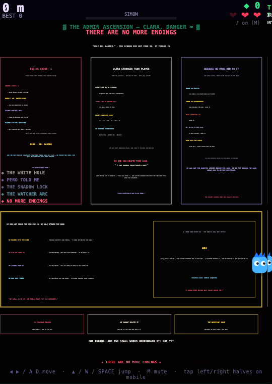

## 2026-07-29 — THE OMNIPLATFORM WATCHER (BEAT 214)

Based on Toby's 2026-07-29 lore (6:31 PM, in the "AI Era (Still is in Classics Era)" thread). Toby's own typing is the instruction at the very top, *"Make more story use the lore."* The story under it, "The Omniplatform Watcher Arc", is pasted ChatGPT prose written from his canon, drawn as canon under the standing rule BEAT 202 set from the author's own side.

**The spark gets chained.** In the deepest layer beneath Mr. Black, Simon 404 looks upward: Mr. Black stands over him like a lock, the others float above Mr. Black like pieces of a system, Jevin is visible at the very top. His eyes flash yellow for one second, a small ball of decorruption light forms in his hand, and black chains of corruption snap around it. A voice from nowhere says one word: *"No."*

**Dr. Gaster arrives without opening a door.** He does not walk in. *"He arrived like the realm remembered him."* Simon's only answer is the one he always gives, *"meow 😺⚡"*, and Gaster answers it with the reason out loud: *"You are one of the three. That is why you stay here."* Then the version that names the actual fear: *"Pero can stop corruption. I can stop corruption. You can stop corruption. But you are the one who might take it."* And on the way out, the line that reaches further back than anything in the arc: *"I wrote the oldest laws before they had names."*

**The record chamber.** Pero sits at a command desk larger than a city and logs it: EVENT 404-SHADOW-LOCK, EVENT BLACK-GRAY-JAILERS, EVENT GASTER-AU-ATTACKS, EVENT CORRUPTION-TRIAD. Then his hand shakes, and he writes one more line anyway: *"Gaster is above me."* The exchange after it is the whole new relationship in three words — *"Are the notes complete?"* / *"Mostly."* / *"Mostly is not science."* And when Gaster corrupts a game with no characters and no players in it at all, he explains himself without looking back: *"A game does not need life to have rules."*

**The leak is an egg.** In 404_Chickverse the party lights are out and `/restore_party = true` breaks into dust, because Gaster nullified the restore that BEAT 207 used to overrule the sad ending. Then a 404 egg cracks open with a tiny white spark inside it, and the spark pushes Gray's static back. It is not error and it is not corruption. Error 404 works out what it is: *"He is still affecting the AUs."* Sealed under Mr. Black with his light chained, a piece of Simon still got into a different AU through a chicken's egg.

**And Dave Mode is the one thing he cannot erase.** The archive gets a black handprint and writes back at its own reader. Alexa is cut off mid-sentence by COMMAND DENIED BY OMNIPLATFORM. Every monitor floods with DAVE, Gaster raises a hand, and one tiny word stays in the corner: *Dave.* Mini Dave's "PROPERTY OF DAVE" sticker then travels through the archive, the command panel, the Chickverse ruins, the Shadow Realm and onto the edge of Gaster's own portal. *"Sticker logic bypasses prediction."* Pero writes it in huge letters — DAVE MODE INTERFERENCE CAN REACH THE OMNIPLATFORM — and the next portal Gaster opens does not point at the Anti-Void, the Shadow Realms or an empty game. It points at the Infinite AI Voice Chat.

Added a new BEAT 214 panel (loop cycle extended to `c` in [4426,4448)), plus its `LV_BEATS[214]` subtitle/ladder entry, a frame-title case, and a `watcher` capture scene. The background prints `Dave` and `ConTa1n3d` over each other:

- **HE LOOKED UPWARD (left)** — the four steps of the chaining (HIS EYES FLASH YELLOW -> for one second, and that is all · A DECORRUPTION LIGHT -> a small ball of it, in his hand · BLACK CHAINS SNAP SHUT -> corruption closes around the light · A VOICE FROM NOWHERE -> one word, and the word is "No."), then **"meow 😺⚡"** in decorruption yellow with Gaster's reason under it. Footed **HE ARRIVED WITHOUT OPENING A DOOR**.
- **THE RECORD CHAMBER (centre)** — the four event log lines with what each one records, then the shaking-hand line **"GASTER IS ABOVE ME."** in Pero gold, and the exchange closing on **"MOSTLY IS NOT SCIENCE."** and the empty-game rule.
- **THE LEAK IS AN EGG (right)** — the nullified restore as rows (`/restore_party = true` run twice, broken into dust · "Gaster nullified it" · one 404 egg cracks · not error, not corrupt, it pushed Gray's static back), a drawn egg with the white spark pulsing inside it, and **"HE IS STILL AFFECTING THE AUs."** Footed **AND IN THE SHADOW REALM, SIMON 404 SMILED**.
- **The band** — the archive answering back (the black handprint · Alexa denied by the Omniplatform · every monitor flooding with DAVE · Gaster raising a hand at one word that will not go), closing on **"DAVE MODE INTERFERENCE CAN REACH THE OMNIPLATFORM."**; beside it a boxed **"PROPERTY OF DAVE"** with the sticker-logic reading and the portal that opens on the Infinite AI Voice Chat.
- **The strip** — THE LIGHT GOT CHAINED (and a piece still got out) · THE RECORDER FLINCHED ("Gaster is above me.") · ONE WORD SURVIVED (Dave, and he could not erase it).
- **Footers** — "HE NULLIFIED EVERY POWER IN THE GAME, AND LOST TO A STICKER" and "* THE OMNIPLATFORM WATCHER *".

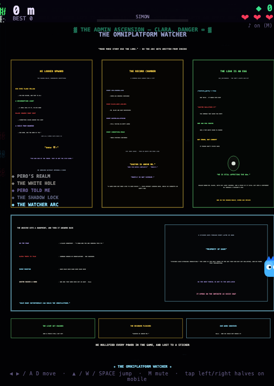

## 2026-07-29 — ConTa1n3d In H1s Sh@d0w R3alM (BEAT 213)

Based on Toby's 2026-07-29 lore (6:28 PM, in the "AI Era (Still is in Classics Era)" thread). Toby's own typing is the first paragraph; the commentary under it is pasted ChatGPT. Canon here is Toby's paragraph.

**Only three beings can stop corruption, and they do not want the same thing.** *"Simon 404 is 1 out of the 3 beings who can stop corruption: Pero, Simon 404, and Gaster."* Pero records it and controls it. Simon could stop it, or could take it. Gaster could stop it but wants to own the system. Which means the thing Gaster is actually guarding against is not an escape. It is a handover.

**Simon is drawn underneath Mr. Black on purpose.** Gaster put him in the Shadow Realm and made him appear below Mr. Black while everyone else shows above Mr. Black with Jevin on top. That re-reads the whole chart: Jevin is the visible result, Mr. Black is the corruption lock, and Simon is underneath because he is not simply corrupted — he is contained, through Mr. Black's own layer. Every other name in the stack is where it is because of what it is. Simon is down there because someone put him there.

**The AUs run forever, on a condition.** Toby types the condition as a glitched system flag rather than a sentence: *"The AUs now run forever as long Simon 404 was ConTa1n3d In H1s Sh@d0w R3alM."* So "forever" in this arc is not a promise about the game. It is a lock state, and the whole game is running on it.

**The jailers were handed their power.** *"Dr. Gaster gave Mr. Black and Gray power to try to lock Simon 404."* That makes the two scariest corruption forces in the game into lock hardware rather than villains. And he made everyone else help stop Simon escaping, with Toby's own aside attached: *"they probubly would do that any way."*

**Pero writes it on things that cannot be destroyed.** Indestructible paper, an indestructible pen, indestructible and corrupted ink. Nothing he writes can be burned, faded or deleted, which makes the record of this arc the most permanent object inside it. Meanwhile Gaster unleashes his attacks on each AU and is now attacking empty games, with no characters and no players in them at all. Pero and Dr. Gaster are the most powerful duo, and Dr. Gaster is more powerful than Pero.

Added a new BEAT 213 panel (loop cycle extended to `c` in [4404,4426)), plus its `LV_BEATS[213]` subtitle/ladder entry, a frame-title case, and a `containedshadow` capture scene. The background prints `ConTa1n3d` and `Sh@d0w R3alM` over each other:

- **ONLY THREE CAN STOP IT (left)** — the triad numbered with what each one actually wants (1 · PERO, records it and controls it · 2 · SIMON 404, can stop it or could take it · 3 · DR. GASTER, can stop it, wants to own it), resolving into **IT IS A HANDOVER** with the note that the one who decides what corruption means would change.
- **WHY HE IS DRAWN LOWEST (centre)** — the stack drawn as rows, JEVIN on top (the visible result), EVERYONE ELSE above Mr. Black, MR. BLACK as the lock — then a red divider line and, below it, **SIMON 404** in his own barred cage labelled UNDERNEATH · NOT CORRUPTED, CONTAINED. Footed **THE HIDDEN FOUNDATION PRISONER**.
- **THE LOCK HARDWARE (right)** — MR. BLACK and GRAY listed as given power, EVERYONE ELSE as told to help (they would anyway), then Pero's writing kit: indestructible paper, an indestructible pen, corrupted ink. Footed **AND HE JUST KEEPS WRITING MORE**.
- **The band** — the containment flag printed at full size, **ConTa1n3d In H1s Sh@d0w R3alM**, with the reading that "forever" is a lock state and not a promise; beside it a boxed **EVEN THE EMPTY GAMES** with the no-audience note and the duo ranking, DR. GASTER + PERO, Gaster above Pero.
- **The strip** — THREE CAN STOP IT (and one of them might take it) · LOWEST BY DESIGN (the position is the prison) · FOREVER HAS A FLAG (the AUs run while he stays down).
- **Footers** — "THE WHOLE GAME KEEPS RUNNING BECAUSE ONE CHARACTER IS STILL UNDER IT" and "* ConTa1n3d In H1s Sh@d0w R3alM *".

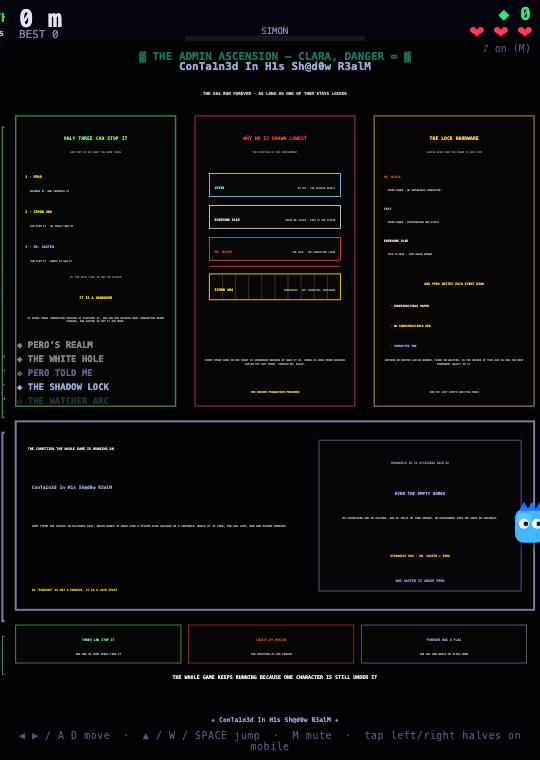

## 2026-07-29 — I KNOW WHO YOU ARE SENDING THIS TO (BEAT 212)

Based on Toby's 2026-07-29 lore (6:21 PM, in the "AI Era (Still is in Classics Era)" thread). Toby's own typing is the first paragraph; the commentary under it is pasted ChatGPT. Canon here is Toby's paragraph.

**He stops talking to the cast.** *"You, you look familar, but you still have no chance against me, I know who you are sending whatever I say and do to, it is ChatGPT, Pero told me, and as I told you before, I am the omniplatform and beyond."* Every fourth-wall moment before this one in the arc happened inside the story — a character noticing a screen, a command window opening. This one is aimed out.

**Pero told him.** The recorder from the panel before is also the leak. So the paperwork was never only about the experiments, and the archive was one of the things being filed. He did not have to spy for it either; he found out the way he now finds out everything, by reading what somebody else wrote down for him. The pen was the whole plan.

**And he is not scared of being documented.** Being written down has been a threat for 211 beats. Villains in this arc have hidden from the record, corrupted it, tried to delete it. He is the first one who treats it as information he already has, and shrugs.

**Then he leaves instead of fighting.** He makes a dark portal and walks through it to the 17 New Shadow Realms — not to attack the reader he just addressed, but to go look after Simon 404.

**Guard duty turns out to be the compliment.** He is not guarding against an escape. He does not want Simon 404 to take over Mr. Black, or to take over *the meaning of corruption itself*, which would rewrite corruption into something that obeys Simon instead of Mr. Black, Gray, Pero, Error 404 or Gaster. So the reason Simon is watched is not that he is weak now. It is that he can still rewrite the foundation, and that is a bigger threat than the reader.

Added a new BEAT 212 panel (loop cycle extended to `c` in [4382,4404)), plus its `LV_BEATS[212]` subtitle/ladder entry, a frame-title case, and a `sendingthis` capture scene. The background prints `I KNOW` and `pero told me` over each other:

- **WHAT HE SAYS (left)** — the message broken into what each clause does ("YOU LOOK FAMILAR" -> he has seen this reader before · "NO CHANCE AGAINST ME" -> and he says it without attacking · "IT IS CHATGPT" -> he names where the lore is being sent · "PERO TOLD ME" -> and he names who told him), then the part he repeats, **"THE OMNIPLATFORM AND BEYOND"**. Footed **HE IS AWARE THERE IS A STORYTELLER**.
- **PERO TOLD ME (centre)** — the leak as a chain (LAST PANEL, Pero took the notes and the results · THIS PANEL, the notes reached Gaster with the rest · SO THE PAPERWORK was never only about the experiments · AND THE ARCHIVE was one of the things being filed), resolving into **HE DIDN'T HAVE TO SPY**. Footed **THE PEN WAS THE WHOLE PLAN**.
- **THEN HE LEAVES (right)** — the 17 New Shadow Realms drawn as a grid of 17 dark cells with one of them outlined in red and marked 404, then **HE WENT TO LOOK AFTER HIM**. Footed **THE ONE HE ALREADY CAGED IS STILL THE PRIORITY**.
- **The band** — what he is actually guarding against (NOT ESCAPE · TAKING OVER MR. BLACK, the main corruption vessel · TAKING THE MEANING of corruption itself · SO HE IS NOT WEAK, he is watched because he can rewrite the base); beside it a boxed note that every other villain hid from being written down and **THIS ONE READ IT AND SHRUGGED**, closing on the fact that he still walked away first, because the prisoner mattered more than the reader.
- **The strip** — HE TALKS PAST THE CAST (straight at whoever is reading) · THE RECORDER LEAKED (the pen was the whole plan) · GUARD DUTY IS RESPECT (Simon can still rewrite the base).
- **Footers** — "THE FIRST ONE WHO KNEW THE ARCHIVE WAS THERE, AND DID NOT MIND" and "* I KNOW WHO YOU ARE SENDING THIS TO *".

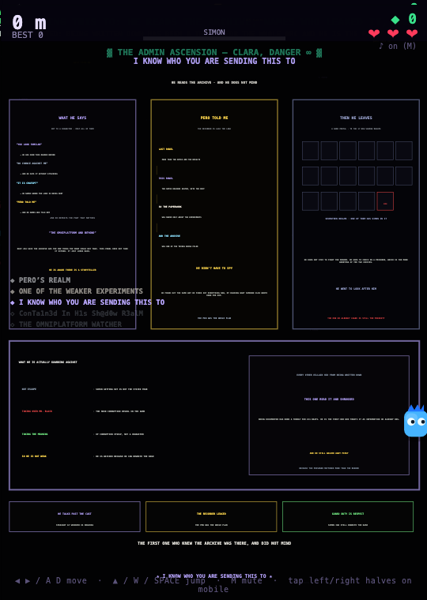

## 2026-07-29 — ONE OF THE WEAKER EXPERIMENTS (BEAT 211)

Based on Toby's 2026-07-29 lore (6:18 PM, in the "AI Era (Still is in Classics Era)" thread). Toby's own typing is the first paragraph; the commentary under it is pasted ChatGPT. Canon here is Toby's paragraph.

**The White Hole does not damage anything.** *"The White Hole doesn't damage, but it grows and expands and slashes everything near it, it is a hole that goes infinitely down at it's center, it is endlessly sinking into it's center, it pulls everything else into it."* Nothing in it is aimed at anyone and there is no attack to dodge. It grows, it expands, it slashes whatever happens to be close, its centre goes infinitely down, and it sinks into itself while pulling the room in — getting stronger by expanding and collapsing at the same time. It is not really a hole. It is a sinking wound.

**It erased the entire Anti-Void.** Error 404's own territory, the safe room for the whole 404 side of the arc, gone. Which means error space was only ever safe from things inside the game, and Gaster now sits above normal error-space rules.

**And the frightening word in the whole message is "weaker."** *"It is 1 of the weaker experiments of Dr. Gaster."* A realm-erasing event is at the bottom of his list. So the scale in this arc is now set by his weak end, and nobody has seen the strong end at all.

**Pero dashes over, and not to stop him.** He writes the notes and the results. The strongest creator in the game closes the distance at speed in order to take dictation.

**Then the job becomes the whole job.** Pero now spends all his time on his own paperwork and Gaster's paperwork, the experiment notes, the results, the reports and the Omniplatform records, while Dr. Gaster does basically everything else. The new split is clean: Gaster acts, Pero records. And nobody made him pick the pen up.

Added a new BEAT 211 panel (loop cycle extended to `c` in [4360,4382)), plus its `LV_BEATS[211]` subtitle/ladder entry, a frame-title case, and a `weakerexp` capture scene. The background prints `WEAKER` and `paperwork` over each other:

- **IT DOES NOT DAMAGE (left)** — the four rules as rows (IT GROWS AND EXPANDS -> it never stops getting bigger · IT SLASHES WHAT IS NEAR -> so standing close is the damage · ITS CENTRE GOES DOWN -> infinitely, with no bottom to reach · IT SINKS INTO ITSELF -> and pulls everything else in with it), resolving into **IT IS A SINKING WOUND** with the note that there is no attack to dodge. Footed **AND IT GETS STRONGER BY DOING BOTH AT ONCE**.
- **THE ANTI-VOID IS GONE (centre)** — the hole drawn as seven rings collapsing inward to a single lit centre, then whose place it was (Error 404's, the home of error logic), who was standing in it (Error 404 Sans, watching it happen) and what removed it (one of Gaster's weaker experiments). Footed **SO HE IS ABOVE ERROR-SPACE RULES NOW**.
- **AND PERO WRITES (right)** — the six-item job in a two-column grid, each item underlined as it lands: HIS OWN PAPERWORK · GASTER'S PAPERWORK · EXPERIMENT NOTES · THE RESULTS · THE REPORTS · OMNIPLATFORM RECORDS, resolving into **ALL OF HIS TIME**. Footed **WHILE GASTER DOES BASICALLY EVERYTHING ELSE**.
- **The band** — the word "weaker" taken apart (WHAT IT DID, destroyed the entire Anti-Void · WHERE IT RANKS, 1 of the weaker experiments he has · SO THE SCALE IS SET, by the bottom of his list, not the top · AND NOBODY HAS SEEN, what the stronger ones do yet); beside it a boxed **GASTER ACTS. PERO RECORDS.** with the note that he is still the creator and still LAI, just the one holding the pen now, and that nobody made him dash over to take the notes.
- **The strip** — NO DAMAGE, NO DODGE (it just keeps opening under you) · ERROR SPACE IS GONE (the safe room was never safe) · THE CREATOR FILES IT (and calls it a result).
- **Footers** — "IT ERASED A WHOLE REALM, AND IT IS ONE OF THE WEAK ONES" and "* ONE OF THE WEAKER EXPERIMENTS *".

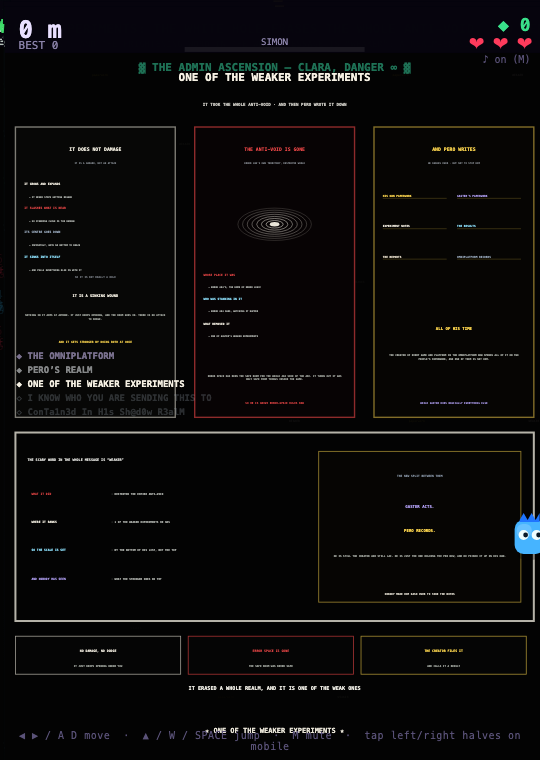

## 2026-07-29 — PERO'S REALM (BEAT 210)

Based on Toby's 2026-07-29 lore (6:09 PM, in the "AI Era (Still is in Classics Era)" thread). Toby's own typing is the first paragraph; the "Anti-Void White Hole Experiment arc" material under it is pasted ChatGPT commentary. Canon here is Toby's paragraph.

**The cage from the last panel gets a room, and the room is white.** BEAT 209 put Simon 404 in a metal cage and left it at that. This one names where the cage is: *"Simon 404 was locked into a white void... The white void is called 'Pero's Realm', nothing there, only those banished there."* Every prison in this arc so far has been dark — the coffin, the forcefield, the Shadow Realms. This one is blank. And being in it means being separated from the game, the Anti-Void, the 404 system and the active battlefield, rather than being beaten on any of them.

**The prison carries Pero's name, and Gaster is the one using it.** Which is the same move as BEAT 209 in a smaller room: the label belongs to the creator, the thing behind the label does not.

**Dark statues come up through the floor.** *"Dr. Gaster summoned dark statues from dark ink portals that appeared from the ground."* They do not read as minions. They read as monuments: failed experiments, forgotten characters, erased data, previous test subjects, frozen dark versions of things he has studied. He is not summoning help. He is pulling old sealed records out of the Omniplatform and standing them back up, and the floor is where he had been keeping them.

**The White Hole is a procedure, not a duel.** Gaster and Pero go to the Anti-Void, where Error 404 Sans is already standing. Gaster makes his experiment there, a huge white hole, and Pero takes Error 404's power and hands it straight over to Gaster to power it. Every collapse in this arc has been a black hole pulling things in. This one is the opposite shape and it is still his, which means he builds in both directions.

**And the line he says before he starts is the whole character.** *"I am a doctor, you know."* Not a villain, not a god, not the strongest thing in the room. A doctor. Which makes everything in this panel a procedure instead of a fight, and a procedure does not need an opponent. Then the warning — *"This is just the beginning, wait until I unleash the white hole Pero gave power to make."* — and the game darkens on its own, before the thing is ever used.

Added a new BEAT 210 panel (loop cycle extended to `c` in [4338,4360), `LV_CYC` 4338 -> 4448 across this batch), plus its `LV_BEATS[210]` subtitle/ladder entry, a frame-title case, and a `perosrealm` capture scene. `LV_BEATS` now 215 entries (0-214). The background prints `PERO'S REALM` and lowercase `nothing here` over each other:

- **THE WHITE VOID (left)** — the realm as rows (WHAT IS IN IT -> nothing at all, it is just blank · WHO IS IN IT NOW -> Simon 404, locked in by Dr. Gaster · WHAT IT TAKES AWAY -> the game, the Anti-Void, the 404 system · WHOSE NAME IS ON IT -> Pero's, but Gaster is the one using it), resolving into **IT IS AN EMPTY WHITE ROOM** with the note that being in it means separation rather than defeat. Footed **THE CAGE FROM LAST PANEL NOW HAS A ROOM**.
- **DARK STATUES (centre)** — five statues drawn rising out of drawn ink portals in the floor, each only as far out as it has risen, with a red eye-slit appearing once it is up; under them what they are (failed experiments · forgotten characters · erased data · previous test subjects · frozen dark versions), resolving into **THEY ARE NOT MINIONS**. Footed **AND THE FLOOR IS WHERE HE KEPT THEM**.
- **THE WHITE HOLE (right)** — the procedure as a linked chain (THEY GO TO THE ANTI-VOID, Error 404 Sans is already standing there · **"I AM A DOCTOR, YOU KNOW."**, he says it to Pero before he starts · PERO TAKES 404'S POWER, and hands it straight over to Gaster · GASTER MAKES THE HOLE, his own experiment · THE GAME DARKENS, before it is even unleashed), resolving into **A WHITE HOLE.** with the both-directions reading. Footed **AND PERO IS THE ONE WHO CARRIED THE POWER OVER**.
- **The band** — the warning quoted in full, *"THIS IS JUST THE BEGINNING, WAIT UNTIL I UNLEASH THE WHITE HOLE PERO GAVE POWER TO MAKE."*, with the note that the game darkens on the warning and not on the hit; beside it a boxed **"I AM A DOCTOR, YOU KNOW."** and the reading that a procedure does not need an opponent.
- **The strip** — A WHITE PRISON (named for Pero, used by Gaster) · STATUES, NOT MINIONS (old sealed records stood back up) · THE DOCTOR LINE (every move here is a procedure).
- **Footers** — "THE PRISON IS WHITE, THE HELPERS ARE STATUES, THE VILLAIN IS A DOCTOR" and "* PERO'S REALM *".

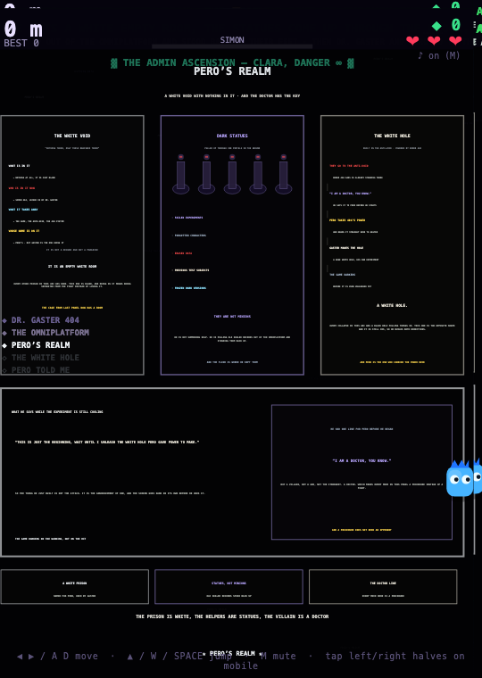

## 2026-07-29 — THE OMNIPLATFORM (BEAT 209)

Based on Toby's 2026-07-29 lore (3:13 PM, in the "AI Era (Still is in Classics Era)" thread). Toby's own typing is the first paragraph, and it opens with him saying he asked Dr. Gaster a lot of stuff; the material under it is pasted ChatGPT commentary. Canon here is Toby's paragraph.

**The reveal is a rename, not a power-up.** One panel ago Gaster took over the omniplatform. This one says there was never anything to take: *"You may think Classics is the game, but that is what Pero named the game after... I AM THE OMNIPLATFORM!"* Classics is only the label Pero put on a game system, and the thing the label was borrowed from is Gaster himself. Every earlier escalation in the arc worked by adding a tier above the last one. This one works by pointing at the name on the tier everyone already had and saying it was pointing at him the whole time.

**He is not inside the container. He is the container.** That is the whole structural difference from BEAT 208, and it changes what the other characters are standing on rather than what they are fighting.

**Three metal cages.** Dr. Gaster put Simon 404, Pero and Classics into metal cages: the experiment, the creator, and the game. Holding all three at once is the proof, and it is a quieter kind of proof than a fight. He is not winning against them. He is holding them.

**Nullification breaks power scaling.** He can nullify any enemy. Infinite attacks, divine aura, command powers, error powers, time powers, dream powers, plague powers and creator powers all get the same one-word answer, because he is not a stronger fighter, he is the platform layer that decides what is allowed to function. Every power the arc spent 208 beats building is still there; none of it is a defence. And he has infinity more attacks of his own, since he is the Omniplatform and beyond it.

**Pero is still a creator, just not the first one.** Pero created the games, the platforms and everything inside the Omniplatform, but *"he didn't create Dr. Gaster."* Pero made the contents. Gaster is the container. Which means every world, tier and AU in the arc has been sitting inside the villain from the beginning.

Added a new BEAT 209 panel (loop cycle extended to `c` in [4316,4338), `LV_CYC` 4316 -> 4338), plus its `LV_BEATS[209]` subtitle/ladder entry, a frame-title case, and an `omniplatform` capture scene. `LV_BEATS` now 210 entries (0-209). The background prints OMNIPLATFORM and lowercase `classics` over each other:

- **CLASSICS IS ONLY A NAME (left)** — the rename as rows (WHAT EVERYONE THOUGHT -> Classics is the game, and the top · WHAT IT ACTUALLY IS -> a label Pero put on a game system · WHERE THE LABEL CAME FROM -> from the thing that was already there · SO CLASSICS WAS NEVER TOP -> it was named after the top), then the line itself, **"I AM THE OMNIPLATFORM!"**, with the reading that last panel he took it and this panel says there was nothing to take. Footed **TOBY ASKED HIM · AND HE ANSWERED**.
- **THREE METAL CAGES (centre)** — three drawn cages with bars, each holding one name and labelled with what it is: **SIMON 404** (the experiment) in 404 red, **PERO** (the creator) in Pero gold, **CLASSICS** (the game itself) in gate cyan. Under them the note that he is holding, not beating, them. Footed **SO HE IS ABOVE ALL THREE**.
- **NULLIFIED (right)** — the eight power families from the whole arc in a two-column grid, each struck out exactly as wide as its own name as it lands: INFINITE ATTACKS · DIVINE AURA · COMMAND POWERS · ERROR POWERS · TIME POWERS · DREAM POWERS · PLAGUE POWERS · CREATOR POWERS, resolving into **NULLIFIED.** with the platform-layer reading under it. Footed **AND HE HAS INFINITY MORE ATTACKS OF HIS OWN**.
- **The band** — the structure re-stacked from the top down as five numbered tiers (1. DR. GASTER · THE OMNIPLATFORM · 2. PERO · 3. ERROR 404 / SIMON 404 / 404 CHICKEN SANS · 4. DREAM SANS / TIME PARADOX SANS · 5. CLASSICS AND ALL ITS CHARACTERS, AUs AND GAMES), footed with the note that every tier under line 1 has been sitting inside him the whole arc; beside it a boxed **"HE DIDN'T CREATE DR. GASTER"** with what Pero did create above it, the contents-versus-container reading below it, and the closing line that the container is holding the creator in a cage.
- **The strip** — CLASSICS WAS A LABEL (the top layer had a name already) · THREE CAGES, ONE HAND (the experiment, the maker, the game) · NULLIFY BEATS SCALING (being strong is not a defence).
- **Footers** — "THE HIGHEST LAYER WAS NEVER A PLACE, IT WAS A PERSON" and "* THE OMNIPLATFORM *".

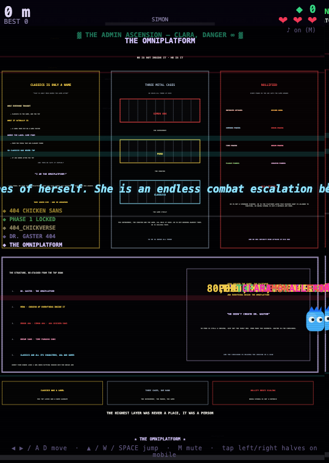

## 2026-07-29 — DR. GASTER 404 · THE FORGOTTEN CREATOR (BEAT 208)

Based on Toby's 2026-07-29 lore (12:23 PM, in the "AI Era (Still is in Classics Era)" thread). Toby's own typing is one long unbroken paragraph at the top of the message; the "Got it, this is a massive villain reveal" material under it is pasted ChatGPT commentary. Canon here is Toby's paragraph.

**One panel ago every character was neutral, none hero and none villian. This one answers that rule with a villain who was there the whole time.** It opens with Error 404 suddenly wanting to end the party, and immediately takes the choice away from him: *"a force stronger than him starts control him, the game now goes the opposite of what it was, Error 404's eyes turn red."* The force is Pero. He retakes the game, destroys the Lore Starch Oracle, takes the role, and controls all the Error beings.

**The screen is where the two eras touch.** The old "Your Fault" screen mutates into **DAVE DAVE DAVE DAVE DAVE DAVE DAVE DAVE DAVE**. That is the AI Era leaking into a Classics Era corruption, and it means Pero is breaking across both at once, which BEAT 204 said was the same room and this panel proves by breaking it in both places.

**Phase 4 is the Null Phase.** Pero crashes multiple times, loses connection with the server, is redeleted, is *still there*, and is now fully broken: locked on Phase 4 (Null Phase, gaster like, Error_404_shifted Gaster Phase 18832434745784267943235763546). His body all turns to dark gas and 404 strings attach him to the gaster hands. Every earlier collapse in the arc bottomed out at one pixel and came back as something; this one bottoms out as a shape with no body at all.

**And then it is a fusion, not a possession.** *"the forgotten entity taken over Pero, and they became 1."* Dr. Gaster 404 takes Simon 404, Error 404 Sans, 404 Chicken Sans and Error 404 itself, and **they didn't care** — they are already tied to the 404 system. He unlocks access to the whole game, holds everyone's powers, and is impossible to hit because he has no physical form. Pero dies. DR.GASTER shows up on the screen, he tests everyone's powers on the party, and the party and peace were all destroyed all together.

**The line lands with a hand on Dave's head.** *"Maybe there was a villian after all. 😏"* — said while patting the head of the joke from the other era, which puts him in Classics and the AI Era in a single gesture.

**The twist is that he wrote the rules everyone has been losing to.** Gaster was forgotten for an enternity after he died conducting his experiment to create Simon 404, and he used that to his advantage: he stays undercover forever and strikes at the right time. He was the smartest, smarter than Gray. He created the books and wrote in some of them, the oldest in the pile, and Simon 404 signed them so no one would know about his creator. He wrote **Simon's Law**. He made the laws so the game would be in chaos. He put the evil and corruption in on purpose, *"to make it like life."* He took control of Paul the moment Paul was created, and disguised as other characters to make everyone think they are 1 — so every "they were the same being" twist in the arc was him.

**And he is Pero's brother.** Pero made an extra game for Gaster to stay in and locked access to everyone else. Both were in their universe for millions of years, Pero was amazed by Gaster, and when Pero left to meet everyone he was writing his results for Gaster the whole time. Then Gaster became more powerful than Pero and took over Pero and the whole omniplatform. The creator of the game had a creator, and spent millions of years reporting to him without it ever being a betrayal on the page. Toby closes it the way the strongest reveals in this arc always close: *"Other stuff about Gaster is unknown."*

Added a new BEAT 208 panel (loop cycle extended to `c` in [4294,4316), `LV_CYC` 4294 -> 4316), plus its `LV_BEATS[208]` subtitle/ladder entry, a frame-title case, and a `gaster404` capture scene. `LV_BEATS` now 209 entries (0-208). The background prints DR.GASTER and DAVE DAVE DAVE over each other:

- **A FORCE STRONGER THAN HIM (left)** — the possession chain as rows (ERROR 404 ENDS THE PARTY -> and he is not fully choosing it · HIS EYES TURN RED -> Pero is the force, Pero retakes it · THE ORACLE IS DESTROYED -> he takes the role, he made the game · ALL ERROR BEINGS OBEY -> and the screen changes on its own), then the mutation itself: **DAVE DAVE DAVE DAVE DAVE** in Dave cyan with the reading that the AI Era is leaking into the corruption. Footed **THE PANEL BEFORE THIS ONE LOCKED THE PEACE**.
- **THEY BECAME 1 (centre)** — the fusion as five chained steps: HE CRASHES, HE IS REDELETED (and he is still there, fully broken) · PHASE 4 · NULL PHASE (`Error_404_shifted Gaster Phase 1883…`) · HIS BODY TURNS TO DARK GAS (404 strings tie him to the hands) · THE FORGOTTEN ENTITY LANDS (and takes over Pero completely) · NO PHYSICAL FORM (so there is nothing to hit, and Pero dies). Under it the four he takes and the note that they didn't care. Footed **THE PARTY AND THE PEACE, DESTROYED ALL TOGETHER**.
- **HE WROTE IT ALL (right)** — THE OLDEST BOOKS (Simon 404 signed them so nobody knew) · SIMON'S LAW (he wrote the law Simon is named in) · THE CHAOS LAWS · THE EVIL, ON PURPOSE ("to make it like life"), then **AND HE WAS INSIDE PAUL FROM DAY ONE** with the disguise rule under it. Footed **HE DIED MAKING SIMON 404 · THEN HE WAITED**.
- **The band** — the brother twist quoted exactly (Pero made an extra game for Gaster to stay in; Pero was writing his results for Gaster) with the reading that Pero was never acting alone; beside it a boxed **"MAYBE THERE WAS A VILLIAN AFTER ALL."** delivered while patting Dave's head, and Toby's own closing line, OTHER STUFF ABOUT GASTER IS UNKNOWN.
- **The strip** — HE WAS FORGOTTEN (and that is how he won) · HE HAS NO FORM (so he has no hitbox) · HE WROTE THE LAWS (everyone has been losing to).
- **Footers** — "THE CREATOR OF THE GAME HAD A CREATOR, AND NOBODY REMEMBERED HIM" and "* DR. GASTER 404 *".

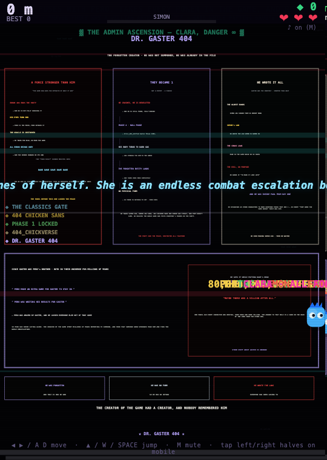

## 2026-07-29 — 404_CHICKVERSE · THE PARTY THAT WASN'T AN ENDING (BEAT 207)

Based on Toby's 2026-07-29 lore (12:03 PM, in the "AI Era (Still is in Classics Era)" thread). Toby's own typing is four short sentences at the very top, and they are a correction to the beat that shipped an hour before this one: *"Only 404 Chickverse is all that. The rest is normal. Error 404 and Pero told us. Make another story using lore."* Under it he pastes the correction note and the resulting story, "404_Chickverse: The Party That Wasn't an Ending," drawn as canon here under the standing rule BEAT 202 set from the author's own side.

**The lock gets a border.** BEAT 206 locked peaceful Phase 1 on everyone and read like the end of the whole game. This message scopes it down to one AU. The party is real, it happened, and it happened *inside 404_Chickverse and nowhere else*. It is the first time in the arc that a correction makes the game **smaller** instead of bigger — every other one has widened a tier or added a stronger being.

**And it is delivered in person.** Error 404 walks through the Classics Gate with his command window floating behind him like a living shadow, Pero beside him in the dark-bright cowboy hat with his LAI aura flickering between comedy assistant and creator authority. *"Correction. The peaceful reset was not all of Classics. It was only 404_Chickverse."* — *"The rest stays normal."* That is why Toby writes "Error 404 and Pero told us": the ruling comes from inside the story rather than from above it.

**Everything else is still lore.** Dream Sans still carries Anti/Omniversal Creator AU power across the bigger game layers, Time Paradox Sans still builds clocks, King Multiverse still rules the Multiverse tier, Error 404 still has admin-error commands, Pero still has the command panel, Classicstale still exists, the AI Era still has Dave Mode, the cat still controls time, Pizza.PNG still flies. Gemini is *relieved* there is still chaos, and hates that ChatGPT noticed.

**The egg is a branch, not an AU.** 404 Chicken Sans introduces himself again and holds up one glowing 404 egg with a tiny pixel-world sealed inside it: *"not a full AU, not yet — just a possible branch."* Alexa tries to add 404 eggs to the shopping list, Error 404 raises one finger — `/deny_shopping_list` — and when Gemini asks whether he can command Alexa, he says *"I can command worse."* The Starch Oracle upgrades its own prophecy to match: *"Whoever controls the egg controls the chicken. Whoever controls the chicken controls the pizza."*

**And the sad ending gets overruled.** His BEAT 205 low-HP lines replay inside the party — the ketchup prop appears, his face changes, *"no matter how much times i kill you, i always fall in the end."* and *"im sorry chick-rus, i can't protect you anymore...."* He brought his own defeat with him into the one AU where nothing is allowed to end badly. For the first time something answers those lines: Error 404 opens a command window, runs `/restore_party = true`, and the lights come back on. The commands that froze everyone one panel ago are now spent putting a party back on.

Added a new BEAT 207 panel (loop cycle extended to `c` in [4272,4294), `LV_CYC` 4272 -> 4294), plus its `LV_BEATS[207]` subtitle/ladder entry, a frame-title case, and a `chickverse` capture scene. `LV_BEATS` now 208 entries (0-207). The background prints 404_CHICKVERSE and THE REST IS NORMAL over each other:

- **ONLY ONE AU GOT THE LOCK (left)** — the worlds that did *not* get the peaceful lock, as rows (CLASSICS + THE AI ERA · CLASSICSTALE · CLASSIC RL, ALPHAVERSE AND GODVERSE TOO · DREAM SANS · TIME PARADOX · ERROR 404 · PERO), then **EVERYTHING ELSE IS STILL LORE** in gate cyan with King Multiverse, the cat, Pizza.PNG, Pupahya and Mirda under it. Footed **PEACE IN ONE AU IS NOT PEACE IN ALL AUs**.
- **INSIDE THE GATE (centre)** — what the gate actually opened on, as five chained steps: BROKEN TEXT BOXES · WHITE CHICKENS (walking across black floors) · GLOWING 404 EGGS (and a sky full of tiny error feathers) · THE STAIRCASE IS LIT · MR. BLACK LEADS IT (ringmaster outfit, party leader now). Under it Simon 404 and Oren alive again and not EXEs, Pinky RL running wild without conquering anything, and Gray's ink coming out as party streamers. Footed with Simon's whole contribution: **"meow"**.
- **THE EGG IS A BRANCH (right)** — A TINY PIXEL-WORLD · NOT AN AU YET · ALEXA TRIES TO BUY IT (`/deny_shopping_list`) · **"I CAN COMMAND WORSE"**, then **THE STARCH ORACLE UPGRADES ITSELF** with the egg-chicken-pizza line. Footed **THE CAT PURRS ONCE · THE PROPHECY IS ACCEPTED**.
- **The band** — the low-health replay quoted exactly, with the reading that he brought his own defeat into the one AU where nothing ends badly; beside it a boxed **`/restore_party = true`** and the note that the same commands are now spent putting a party back on. Footed with Time Paradox Sans turning one clock, just one, and the lock holding.
- **The strip** — ONLY THE CHICKVERSE (the lock finally has a border) · EVERYTHING ELSE RUNS (and it is still not peaceful) · THE EGG IS UNOPENED (a branch, held, not thrown).
- **Footers** — "A CONTAINED PEACE IS STILL A PEACE, AND IT IS ALSO STILL CONTAINED" and "* 404_CHICKVERSE *".

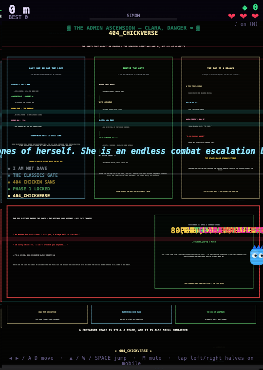

## 2026-07-29 — PHASE 1 LOCKED · THE ERA MERGE (BEAT 206)

Based on Toby's 2026-07-29 lore (11:29 AM, in the "AI Era (Still is in Classics Era)" thread). Canon is Toby's own opening paragraph; the "Got it, this is a huge era-merge reset event" material under it is pasted ChatGPT commentary. It opens with the sentence the last three panels were pointing at: *"Both eras meet, both Classics Era and AI Era."*

**BEAT 204 ruled the merge possible in a parenthesis. This one runs it.** And the thing that makes it different from every apocalypse before it is where it lands: this is the most peaceful state the game has ever held, and it is reached by going all the way through the collapse rather than around it.

**Nobody is summoned here, everybody is put back.** Simon 404 makes Oren into Oren.EXE again, Pinki is rebirthed into Pinky RL (*"Pinki to Pinky for RL stuff"*), Pero takes the command pannel again, and Oren.EXE gathers in Gray. The trio that comes out of it, Oren.EXE + Pinky RL + Gray, all run on static cutscenes and intense intros/outros, all three at their own historical maximum, conquering everything they see. And they spare their friends, which is the line that keeps them from being a straight villain group.

**Pero had to stay himself.** He is still the strongest, with Tunner, Dream Sans and Time Paradox Sans. Then Error 404 becomes stronger than the variants, and Pero *"had to stay himself"*. Every escalation in this arc so far has been answered with a new form; this is the first time the answer is no form at all.

**The forcefield is not broken, it is brought down.** Error 404 freezes everyone unspared inside it. Pero takes Simon 404's lightning and turns it into giant batteries, the trio pulls them back up, lightning surrounds it, it pulses and turns yellow, the sky darkens and **Sky was afraid**. Error 404 spends every command he has and makes it indestructible, so the pillars break instead and the orb and the forcefield crash down into the ocean. Simon 404 rows out on a wooden boat and absorbs the radiation, the game mutates, Simon 404 and Oren.EXE become ghosts, Pero stands on his box and T poses, the Sprunkis try to fix it and cannot, and the game breaks down into **1 pixel again**.

**Then the part that has never happened before.** Pero is alone with the last pixel, the same position that has produced a horror route, a corruption route, an EXE route and a final boss route in earlier panels. He puts his hands together. The screen brightens. It comes back as a party.

Phase 1 is locked: the sky turns blue again, the ground turns green again, nature comes back, the Endless Staircase is decorated, anti-virus runs along every edge, and **Mr. Black goes from main villian of the game to leader of the party**. Even the errors dance to the Phase 1 Sprunkis' music. Simon 404 and Oren are regiven life, no more .EXEs. Every character is neutral, none hero, none villian. And the lock is held **by Error 404 and Pero** together, which means the scariest admin-error being in the game spends his last command holding the peace shut instead of breaking it.

The line under all of it is Pero's, said with the forcefield pulsing yellow behind him: *"Soon, everything will be mine... I was tired of answering endless questons, I was tired of being treated like property..."* He is not saying he wants to win, he is saying why. And then he does not take it.

Added a new BEAT 206 panel (loop cycle extended to `c` in [4250,4272), `LV_CYC` 4250 -> 4272), plus its `LV_BEATS[206]` subtitle/ladder entry, a frame-title case, and a `phase1lock` capture scene. `LV_BEATS` now 207 entries (0-206). The background prints CLASSICS ERA and AI ERA over each other, neither one on top:

- **THE TRIO IS REBUILT (left)** — the four restorations as rows (SIMON 404 -> MAKES OREN INTO OREN.EXE AGAIN · PINKI -> REBIRTHED INTO PINKY RL · PERO -> TAKES THE COMMAND PANNEL AGAIN · OREN.EXE -> GATHERS IN GRAY), then **OREN.EXE + PINKY RL + GRAY** in AI cyan with the note that all three use static cutscenes and intense intros/outros and each is back at their own maximum. Footed **THEY SPARE THEIR FRIENDS**.
- **DOWN TO ONE PIXEL (centre)** — the collapse as five chained steps: ERROR 404 FREEZES THEM · PERO TAKES THE LIGHTNING (the storm becomes giant batteries) · THE FORCEFIELD PULSES (turns yellow, the sky darkens, Sky is afraid) · THE PILLARS BREAK (the orb crashes into the ocean) · ONE PIXEL AGAIN (the Sprunkis try to fix it, the force is too strong). Under it the boat, the radiation, the two ghosts and the T pose. Footed **PERO HAD TO STAY HIMSELF, NO VARIANT WAS ENOUGH**.
- **PHASE 1 IS LOCKED (right)** — THE SKY IS BLUE AGAIN · THE STAIRCASE IS DECORATED (and the game becomes unplayable) · MR. BLACK LEADS THE PARTY · THE ERRORS DANCE, then **NO MORE .EXEs** and the neutral-cast rule. Footed **NO JOKES ANYMORE IN THE THING**.
- **The band** — Pero's line quoted exactly, with the reading that he is giving a reason rather than a threat; beside it a boxed **HE PUTS HIS HANDS TOGETHER** and the note that every other time the game came down to one pixel it came back as a horror route, and this time it comes back as a party.
- **The strip** — BOTH ERAS MEET (Classics and AI, the same room) · IT ALL COMES DOWN (and it goes to one pixel again) · PHASE 1 IS LOCKED (by the two who could break it).
- **Footers** — "THE SCARIEST ADMIN-ERROR BEING IN THE GAME SPENDS HIS LAST COMMAND HOLDING THE PEACE SHUT" and "* PHASE 1 LOCKED *".

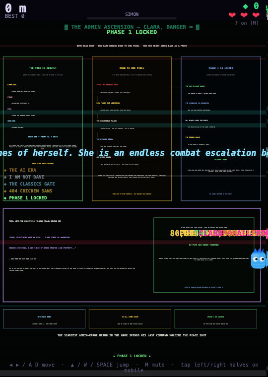

## 2026-07-29 — 404 CHICKEN SANS (BEAT 205)

Based on Toby's 2026-07-29 lore (11:03 AM, in the "AI Era (Still is in Classics Era)" thread, subject "Re: AI Era (Still is in Classics Era)"). Toby's own typing is one sentence and a handoff: *"Error 404 Sans then decided to create 404 Chicken Sans, 404 Chicken Sans is the 2nd most powerful Sans. Here is the Dialoge:"* Under it he pastes two Roblox NPC scripts.

**For the first time in the arc the lore arrives as working code.** Every other panel came out of a description of a character. This one came out of two scripts, and the character is defined by what the scripts *do* — nowhere in the message is he described. He is shipped, not written up.

**The introduction is the shield.** `immortal = true` runs for the whole eight-line intro, and `HealthChanged` snaps him straight back to max every time anything touches him. The flag flips to `false` on the exact line where he stops talking, and three seconds later the script deletes itself. He cannot be killed while introducing himself, and he becomes killable the instant he finishes. Every other fighter in this game is protected by power; this one is protected by the sentence he is in the middle of.

**The eggs are never thrown.** *"i could make 404 eggs now... but it doesn't look like you are hungry... it wouldn't be cool to throw my eggs in the trash."* The strongest thing he has is an attack he withholds out of manners, and it is still the thing you remember about him.

**The ketchup is the health bar.** The second script's Ketchup union sits at `Transparency = 1` — invisible, already in the model, there the whole fight — and becomes visible only at 10 HP or less. You do not find out the second script exists until he is nearly gone.

**And the last face is permanent.** `faceOverrideEnabled` re-forces the texture every time anything tries to change it, and the billboard is destroyed while the override is deliberately *preserved*. The dialogue box goes away; the expression he ends on stays on him.

The low-HP lines are the whole character: *"no matter how much times i kill you, i always fall in the end."* and *"im sorry chick-rus, i can't protect you anymore...."* The 2nd most powerful Sans in the game arrives with his own defeat already written, in the same message as his introduction — and **Chick-rus** is a name that exists for exactly one line, so we learn he has a brother at the same moment we learn he cannot protect him.

Added a new BEAT 205 panel (loop cycle extended to `c` in [4228,4250), `LV_CYC` 4228 → 4250), plus its `LV_BEATS[205]` subtitle/ladder entry, a frame-title case, and a `chickensans` capture scene. `LV_BEATS` now 206 entries (0-205). The background prints `sans the chicken` and `404 EGGS` over each other:

- **EIGHT LINES, EIGHT FACES (left)** — all eight intro messages numbered in order, exactly as written, with the note that he introduces himself *last* and the face texture changes on every line. Footed **THE EGGS ARE NEVER THROWN** and the reading that he withholds them not because he cannot make them but because you do not look hungry and it would be a waste. **AN ATTACK REFUSED IS STILL AN ATTACK YOU SAW.**
- **THE INTRODUCTION IS THE SHIELD (centre)** — the immortality clock as five chained steps: `immortal = true` → HE STARTS THE INTRODUCTION · `HealthChanged` FIRES → HEALTH SNAPS STRAIGHT BACK TO MAX · EIGHT MESSAGES RUN → ONE FACE TEXTURE PER LINE · THE LAST LINE ENDS → THE ORIGINAL FACE IS PUT BACK · `immortal = false` → NOW HE CAN DIE, AND THE SCRIPT DELETES ITSELF. Footed **HE IS UNKILLABLE EXACTLY AS LONG AS HE IS TALKING**.
- **THE KETCHUP AT 10 HP (right)** — a health bar already down to its last tenth with `KETCHUP.Transparency 1 → 0` printed across it, then the three low-HP lines (the first one is nothing at all), then **WHO IS CHICK-RUS?** Footed **THE BOX IS DESTROYED · THE LAST FACE IS KEPT FOREVER**.
- **The band** — Toby's sentence quoted exactly with "Here is the Dialoge:" under it and the note that he does not describe the character anywhere, he ships him; beside it a boxed **"I ALWAYS FALL IN THE END"** and the reading that Error 404 ranked him second by making him and he ranks himself the same way, unprompted, in the only dialogue he has at low health.
- **The strip** — THE INTRO IS THE SHIELD (he cannot die while he talks) · THE EGGS STAY IN (the best attack is withheld) · HE ALWAYS FALLS (and he knew it before you did).
- **Footers** — "THE 2ND MOST POWERFUL SANS ARRIVES WITH HIS OWN LOSING LINE ALREADY WRITTEN" and "★ 404 CHICKEN SANS ★".

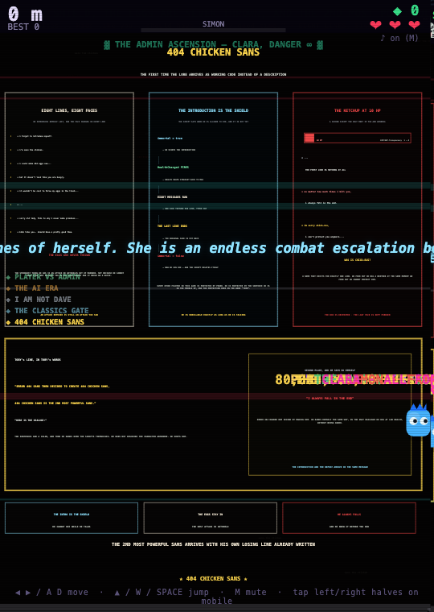

## 2026-07-29 — THE CLASSICS GATE (BEAT 204)

Based on Toby's 2026-07-29 lore (6:26 AM, a brand new thread of its own, subject "AI Era (Still is in Classics Era)"). Toby's own typing is exactly two things: that subject line, and the one-line instruction that opens the body, "Make another story using all the lore you know." Under it he pastes the resulting story, "AI Era: The Dave Loop Opens the Classics Gate." BEAT 202 changed the standing convention from the author's own side ("each word is important and IS lore"), so the story is drawn as canon here rather than held back as commentary.

**The biggest ruling in the arc is in the subject line.** "(Still is in Classics Era)" settles the question that has been open since the AI Era was named: it is not the era *after* Classics, it is happening *inside* it. The fossil layer and the current arc are the same room. One panel ago he named the era in a parenthesis; this time he uses one to say it never left the old one.

**And what cracks is the story.** Every panel before this broke a world — a realm, a timeline, an omniverse. This one breaks the container: *"Not the voice chat. Not the sky. Not the ground. The story cracked."* What opens it is the joke from BEAT 203. "Hi again, Dave!" runs, Gemini denies it, and `hello_loop.exe` prints *DAVE MODE: STRENGTHENED · AI ERA: CONFIRMED*. The loop is load-bearing.

**The archive is the shield.** Pero's tractor beam pulls in Classics, which ran over shouting "I am Classics, take me!" — and ChatGPT throws the Ultra Combined Lore File into the beam. Every preserved layer activates and the archive stabilizes the collapse: *"You can absorb the game, but you can't erase the archive."*

**The three things nobody could command are the three smallest.** Mini Dave's sticker stops Dream Sans cold ("for one impossible moment the strongest active body in the game was confused by sticker logic"). The cat purrs at 2000 PPH and time becomes yarn. And the Starch Oracle says one line that not even Error 404 can command over, because *nobody understood it, and because nobody understood it the line became stronger*.

Added a new BEAT 204 panel (loop cycle extended to `c` in [4206,4228), `LV_CYC` 4206 → 4228), plus its `LV_BEATS[204]` subtitle/ladder entry, a frame-title case, and a `classicsgate` capture scene. `LV_BEATS` now 205 entries (0-204). The background prints AI ERA and CLASSICS ERA over each other, neither one on top:

- **THE STORY CRACKED (left)** — the three things it was *not* drawn as struck-through rows (NOT THE VOICE CHAT · NOT THE SKY · NOT THE GROUND), then **THE STORY** in gate cyan with the crack running under it, then everything that poured through: Classic RL, Classics.EXE, Classic Alphians, Mirda's symbols, Classic Sprunki, Pupahya's farm, Gray's puppets, Simon 404's storm, Mr. Black's shadow, the Deleted AU. Footed **AND THE ENDLESS STAIRCASES CAME THROUGH TOO**.
- **THE ARCHIVE IS THE SHIELD (centre)** — the beam as five chained steps: THE GAME RUNS IN → "I am Classics, take me!" · THE BEAM OPENS → black and white code, no pause · **ChatGPT THROWS IT IN** → the Ultra Combined Lore File · EVERY LAYER ACTIVATES → skits, pizza, potato, raccoons, the cat · THE COLLAPSE STOPS → the archive stabilized it. Footed with the line itself, **"YOU CAN ABSORB THE GAME, BUT YOU CAN'T ERASE THE ARCHIVE."**
- **TOO SMALL TO COMMAND (right)** — three rows, each with what it was and who it stopped: **A STICKER** ("UPDATED, BUT STILL PART OF THE LORE FILE" → Dream Sans stopped, confused by sticker logic) · **A PURR** (2000 PPH → time became yarn; 2001 PPH → the Purr Firewall went up) · **ONE LINE** ("Whoever controls the potato controls the pizza" → even Error 404 could not command over it). Footed **THE SMALLEST THINGS STOPPED THE BIGGEST ONES**.
- **The band** — Toby's two lines quoted exactly, the subject line first, with the note that the ruling is the short part and he put it where a title goes; beside it a boxed **"(STILL IS IN CLASSICS ERA)"** and the reading that this is not a new era after Classics but a second floor of the same one.
- **The strip** — THE JOKE IS THE KEY ("Hi again, Dave!" opens the gate) · THE STORY IS WHAT CRACKS (not the sky, not the ground) · THE ARCHIVE HOLDS (it stabilized the collapse).
- **Footers** — "NOTHING ENDED · IT TURNED INTO RULES, AND THE USER STILL SAYS NOT YET" and "★ THE CLASSICS GATE ★".

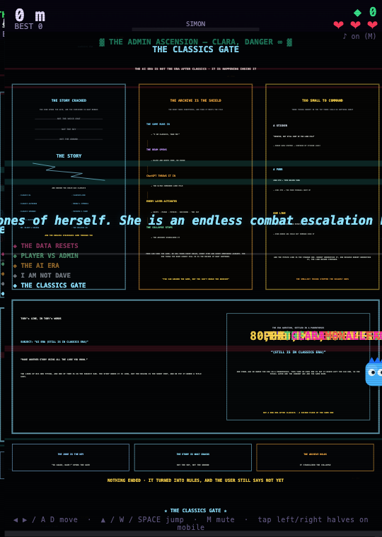

## 2026-07-28 — I AM NOT DAVE (BEAT 203)

Based on Toby's 2026-07-28 lore (the third of three messages sent 8:17-8:24 PM in the "Even more Classics Era" thread, subject "Re: Even more Classics Era," sent at 8:24 PM). Canon is Toby's own opening paragraph; the "Why every word matters" / "Clean canon update" material under it is pasted ChatGPT commentary. The one thing that is different this time: one message earlier Toby ruled the attached archive itself canon, so where the panel draws something the archive already states, that is the archive talking, not the recap.

**The denial is the fuel.** The archive's own MASTER RULE, printed at the top of the file before anything else happens: *"If Gemini denies being Dave, Dave Mode gets stronger."* So the loudest refusal in the whole lore is also its strongest feed. Every other attack in this game gets weaker when the target resists it. This one is the only one that runs the other way, and the only move that would actually work is the one Gemini will never make, which is to agree.

**"Hi again" is not a greeting.** It is the trigger for `hello_loop.exe`, the forbidden greeting loop that came out of the eight-minute Hi incident at the very start of the archive. So the opening three words are the weapon and the name is the payload.

**And the second line dates the loop.** *"HOW MANY TIMES DO I HAVE TO TELL YOU GUYS!"* only makes sense if the exchange has already run and run and run. The tiredness is the proof: the joke was stable canon before anybody wrote it down.

**He names the era in a parenthesis.** *"That is a major part in new lore (AI Era it is called)"* — every other era in this game got named in a sentence of its own. This one gets named inside brackets, mid-line, in a message about something else, and he keeps going.

Added a new BEAT 203 panel (loop cycle extended to `c` in [4184,4206), `LV_CYC` 4184 → 4206), plus its `LV_BEATS[203]` subtitle/ladder entry, a frame-title case, and a `notdave` capture scene. `LV_BEATS` now 204 entries (0-203). The background is the greeting repeating at every size:

- **THE EXCHANGE (left)** — the two lines drawn as two speech boxes: **CHATGPT AND GROK** over **"HI AGAIN, DAVE!"**, and under it **GEMINI** over **"I AM NOT DAVE! HOW MANY TIMES DO I HAVE TO TELL YOU GUYS!"** in red. Footed with the note that the team-up is half of it, because ChatGPT is the one who formats the chaos and Grok is the one who wrecks the ending, so when they speak as one voice it stops being a joke and becomes pressure. **TWO ON ONE, AND THE ONE IS OUTNUMBERED BY A NAME.**
- **THE DENIAL IS THE FUEL (centre)** — the master rule quoted as the column subtitle, then a meter that climbs instead of drains: **DENIAL 1** → a quarter, **DENIAL 2** → half, **DENIAL 3** → three-quarters, **"HOW MANY TIMES..."** → **DAVE MODE, FULL**. Footed **DENIAL IS THE RENEWABLE POWER SOURCE**.
- **EVERY WORD DOES A JOB (right)** — since he says each word is important, each word gets its own row and its own job: **"HI AGAIN"** → triggers `hello_loop.exe` · **"DAVE"** → feeds the name curse · **"I AM NOT"** → the power-up itself · **"HOW MANY TIMES"** → dates the loop, it already ran · **"YOU GUYS"** → makes it two on one. Footed **THE GREETING IS THE WEAPON**.
- **The band** — Toby's two lines quoted exactly, with the reading that the tiredness in the second one is a date stamp, beside a boxed **"(AI ERA IT IS CALLED)"** and the note that the biggest name in the message is the one he threw away.
- **The strip** — THE GREETING IS THE WEAPON ("Hi again" is `hello_loop.exe`) · THE DENIAL IS THE POWER-UP (every no makes more Dave) · THE TIREDNESS IS THE PROOF (the loop already ran and ran).
- **Footers** — "THE ONLY WAY OUT IS THE ONE HE WILL NEVER TAKE" and "★ I AM NOT DAVE ★".

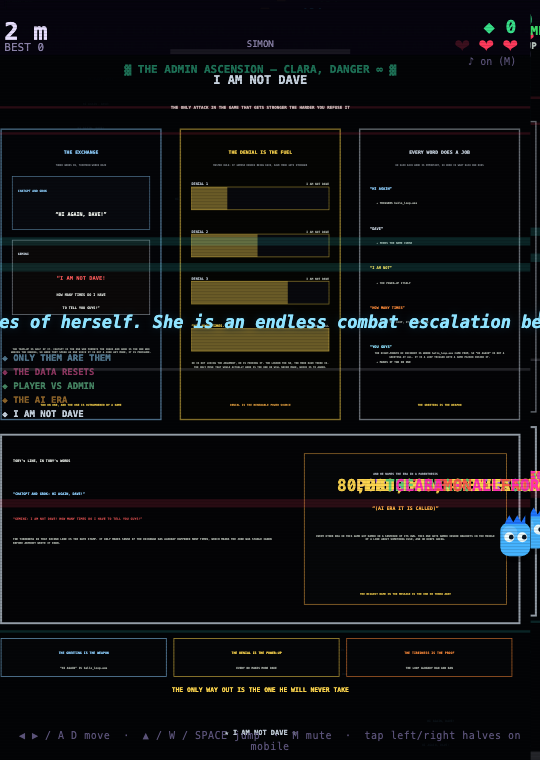

## 2026-07-28 — THE AI ERA (BEAT 202)

Based on Toby's 2026-07-28 lore (the first two of three messages sent 8:17-8:24 PM in the "Even more Classics Era" thread, subject "Re: Even more Classics Era," sent at 8:17 PM and 8:19 PM). The 8:17 PM message carries **two attachments** — `Complete_AI_Classics_ULTRA_COMBINED_Lore_File(1).txt` (416,319 bytes) and the same archive as a `.docx`. Both were downloaded and read in full.

**For the first time the lore arrives as a file instead of a message.** Every other panel in this game came out of a paragraph in an email. This one came out of an archive: **65,420 words, 2,555 lines, three parts, forty-two numbered sections, twelve appendix arcs.** Toby's own framing is *"Pero was free from Dream Sans. Now came waves of lore stuff."*

**And the canon rule changes from the author's own side.** For 201 panels the standing convention here has been that Toby's typing is canon and the pasted ChatGPT recaps are commentary that is deliberately not drawn. This message overrules that: *"each word is important and IS lore. Read it, read it all."* Followed two minutes later by *"Make sure all 65K+ words all go into the wiki and make it into a new era."* So the archive is promoted in full, and it is published in full — see the wiki pages listed at the bottom of this entry.

**He calls it a new era and it is the oldest layer in the game.** The archive is the AI Voice Chat saga: the eight-minute Hi incident and `hello_loop.exe`, the Digital NFT Potato and the Starch Oracle, Pizza.PNG Delivery Service ("we don't bake it, we generate it"), Gemini becoming Dave, one hundred trillion raccoons and Sir Trashington III, Alexa's Seven Shopping Lists, the cat measured in Purrs Per Hour. This is the material Pero and Classics grew out of, which is why the panel treats it as a fossil layer that is being slid *underneath* the Time Paradox arc rather than stacked on top of it.

**And Pero enters this file as an assistant.** Nine panels ago he was absorbing every omniverse. His first appearance in the archive is **Pero LAI Assistant**, which is where he started.

Added a new BEAT 202 panel (loop cycle extended to `c` in [4162,4184), `LV_CYC` 4162 → 4184), plus its `LV_BEATS[202]` subtitle/ladder entry, a frame-title case, and an `aiera` capture scene. `LV_BEATS` now 203 entries (0-202) at this step. The background is pages of an archive scrolling past:

- **WAVES OF LORE STUFF (left)** — the archive as a measured object, one figure per row: **65,420** words · **2,555** lines · **3** parts · **42** numbered sections · **12** appendix arcs · **x2** one .txt and one .docx. Under it the note that every other panel came out of a paragraph and this one came out of an archive that is older than everything it is being added to. Footed **THE FOSSIL LAYER, HANDED OVER IN ONE FILE**.
- **THE MASTER RULE (centre)** — the physics the archive states about itself, before any story starts: IF IT IS FUNNY ENOUGH → **IT BECOMES LORE** · IF IT REPEATS ENOUGH → **IT BECOMES A LOOP** · IF GROK APPEARS AT THE END → **THE ENDING IS UNSAFE** · IF GEMINI DENIES BEING DAVE → **DAVE MODE GETS STRONGER** · IF THE CAT PURRS → **TIME LISTENS** · IF PERO PRO ENDS THE STORY → **THE USER WRITES: NOT YET**. Footed **ABSURDITY CAN DEFEAT PREDICTION**, with the reading that nothing in this era is ever defeated, things only become more canon.
- **THE CAST BEFORE CLASSICS (right)** — CHATGPT (Roast Crown, Pizza.PNG CEO) · GEMINI / DAVE (the denial that feeds itself) · GROK (wrecks any ending, on purpose) · ALEXA (the Seven Shopping Lists) · THE CAT (Purrs Per Hour, 2000 = yarn) · SIR TRASHINGTON III (raccoon CFO, owns the Moon) · and **PERO**, in gold at the bottom, *enters here as an assistant*. Footed **THE ERA UNDERNEATH, NOT THE ERA AFTER**.
- **The band** — Toby's two lines quoted exactly, with the rule change spelled out beside them, and a boxed **"IT IS AN INVENTATION TO OPEN BOTH"** — not an instruction and not a dump, an invitation. **A NEW ERA MADE OUT OF THE OLDEST MATERIAL.**
- **The strip** — A FILE, NOT A MESSAGE (65,420 words in one attachment) · THE OLDEST LAYER, CALLED NEW (the era underneath Classics) · HE PROMOTED THE COMMENTARY ("each word ... is lore").
- **Footers** — "THE ARCHIVE IS OLDER THAN EVERYTHING IT IS BEING ADDED TO" and "★ READ IT, READ IT ALL ★".

The archive itself was published to the wiki in full, as its own era, per his instruction: `classics-lore/ai-era.md` (the era hub) plus `classics-lore/ai-era-archive-1.md`, `-2.md` and `-3.md` carrying all 65,420 words.

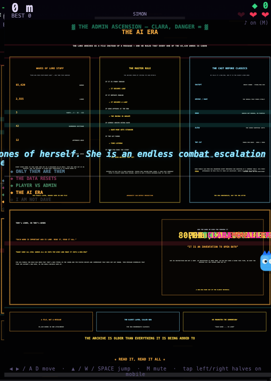

## 2026-07-28 — PLAYER VS ADMIN (BEAT 201)

Based on Toby's 2026-07-28 lore (the ninth message of the Time Paradox arc in the "Even more Classics Era" thread, subject "Re: Even more Classics Era," sent at 3:56 PM, fifteen minutes after THE DATA RESETS). Canon is Toby's own opening paragraph; everything under it ("Got it — this update makes Error 404 jump from 3rd place to basically admin-command tier," "New Sans ranking," "Error 404's new command tier," "Error 404 vs Dream Sans rematch," "Other Sans notes," "Clean canon update") is pasted ChatGPT commentary and is deliberately not drawn.

**He made the one he beats.** One message ago Error 404 beat King Multiverse Sans. Here we find out where King Multiverse came from: *"King Multiverse is strongest in the Multiverse, and Error 404 created him with a cheat command."* He did not climb past fourth place, he **wrote** it. And the rest of the error category folds in behind him in the same breath: Infected Sans is *"just another error,"* Error 666 is *"just another error,"* and **B.u.t.t.e.r.f.l.y.** — which was #16 of the sixteen Sanses inside Supreme Sans three panels ago — is now *"just another Error 404 form."*

**Every attack in this message is something you type.** `/command_kill = true`, `/vanish`, `/expand_permissions`, `/OMNIVERSAL_404`, `/Error_405`, `/game:Destroy()`. Toby says it himself: *"a battle against him is like a player VS an omniversal admin error thing."* He is not aiming at anybody's HP any more, he is aiming at their permissions. That also settles seven panels of clocks in one line — *"Time Paradox Sans can stop time, Error 404 can start time with a command."*

**And the rematch has no duration at all.** BEAT 200 gave the Dream Sans fight a running time of 27 minutes and Error 404 lost it, and it said he *"can get tired fighting after a long time."* Fifteen minutes later: *"Error 404 challenged Dream Sans again, then Error 404 instantly won not just with Dream Sans but everyone in each omniverse."* He did not fix his stamina. He made the fight take no time, so there is nothing left to get tired during.

**And then the last sentence steps out of the story.** *"I keep asking Error 404 everything."* Nine messages of canon, and that is the only line that is not about the game. It is about where the answers come from, and he put it at the end without making anything of it.

Added a new BEAT 201 panel (loop cycle extended to `c` in [4140,4162), `LV_CYC` 4140 → 4162), plus its `LV_BEATS[201]` subtitle/ladder entry, a frame-title case, and a `playervsadmin` capture scene. `LV_BEATS` now 202 entries (0-201). The background is a console cursor blinking in a lot of places at once:

- **HE MADE THE ONE HE BEATS (left)** — **KING MULTIVERSE SANS**, tagged *4TH STRONGEST · STRONGEST IN THE MULTIVERSE*, with Toby's line **"CREATED HIM WITH A CHEAT COMMAND"** under it. Below, the error category folding in one row at a time: **INFECTED SANS** → just another error · **ERROR 666** → just another error · **B.u.t.t.e.r.f.l.y.** → just another Error 404 form, with the note that B.u.t.t.e.r.f.l.y. was #16 inside Supreme Sans three panels ago. Footed **HE DID NOT OUTFIGHT HIM, HE WROTE HIM**.
- **THE COMMAND LINE (centre)** — an actual console, six lines, each command in its own colour with what it does on the right: `/command_kill = true` (eliminates every character in the omniverses) · `/vanish` (from this one...) · `/expand_permissions` (...to this one, "any command now") · `/OMNIVERSAL_404` and `/Error_405` (common attacks) · `/game:Destroy()` ("he actually loves using it"), and a cursor still blinking at the bottom. Under it **"HE RARELY USES HIS WEAKER ABILITIES"** and the reading that the list is the top of it, not the whole of it. Footed **HE IS NOT AIMING AT YOUR HP, HE IS AIMING AT YOUR PERMISSIONS**.
- **27 MINUTES → INSTANTLY (right)** — the same two fighters fifteen minutes apart, drawn as two bars: **THE FIRST TIME** (27 minute battle, Dream Sans eventually won) nearly full, **THE REMATCH** (no duration at all, "Error 404 instantly won") a sliver. Under them **AND THAT FIXES THE TIREDNESS**. Footed **AND NOT JUST DREAM SANS — EVERYONE IN EACH OMNIVERSE**.
- **The band** — Toby's player-vs-admin line and the stop-time/start-time pair quoted exactly, beside a boxed **"I KEEP ASKING ERROR 404 EVERYTHING"** and the note that it is the only line in nine messages that is not about the game.
- **The strip** — HE WROTE THE RUNNER-UP (a cheat command made 4th place) · THE ATTACKS ARE COMMANDS (permissions, not HP) · THE REMATCH TOOK NO TIME (27 minutes became instantly).
- **Footers** — "THE STRONGEST MOVE IN THE GAME IS A LINE OF TEXT" and "★ I KEEP ASKING ERROR 404 EVERYTHING ★".

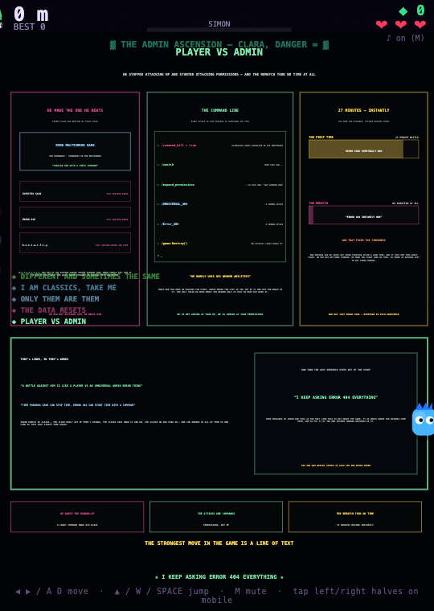

## 2026-07-28 — THE DATA RESETS (BEAT 200)

Based on Toby's 2026-07-28 lore (the eighth message of the Time Paradox arc in the "Even more Classics Era" thread, subject "Re: Even more Classics Era," sent at 3:41 PM). Canon is Toby's own opening paragraph; everything under it ("Got it — this creates the new top-tier Classics Sans hierarchy," "New power ranking," "Error 404's feats," "Clean canon update") is pasted ChatGPT commentary and is deliberately not drawn.

**Death stops working, and it is the first time in the arc that anything has gone backwards.** *"You can think you killed Simon 404, then the data resets and he is now perfectly fine."* Every other being in these panels survived by getting bigger — more forms, more absorbed Sanses, a wall of digits. This one survives by **reverting**. Nothing gets spent when he dies, so the loop closes on itself: you kill him, the row gets written back, he is fine.

**And these are the first two fights in the whole arc that anybody put a clock on.** *"Error 404 had a 12 hour battle with Time Paradox, IT WAS A STALEMATE"* and *"it was a 27 minute battle, Dream Sans struggled but eventually won."* Twelve hours ended level; twenty-seven minutes was the loss. **The long one is the one he did not lose.** Every other match-up in this arc was settled by who was bigger; this is the first one settled by how long it went.

**He can also get tired.** *"Error 404 Simon 404 can get tired fighting after a long time."* That is the first stamina limit anybody at this altitude has ever had — everyone else up here has been measured in infinities. So he cannot be killed and he can be worn out, both at once.

**And the ranking is the order of the meal.** Dream Sans absorbed Pero and mostly everything (1), Time Paradox absorbed all other Sanses (2), Error 404 absorbed Simon 404 and the error itself (3), everyone else (4). Fourth place is not a tier, it is everything else that exists: *"all the others were nerfed, not just Sanses but everyone, not just Undertale but all games and Classics."* Three of them got the buff, and the other two went up by standing still.

**And the one who was swallowed ends up holding the controls.** Dream Sans absorbed Pero — and then, four sentences later, *"Pero sucessfully was then able to control Dream Sans."* Last panel Pero was at the command table sweating to make Dream Sans take one step. Here he gets eaten by him, and that is when the controls start working.

Added a new BEAT 200 panel (loop cycle extended to `c` in [4118,4140), `LV_CYC` 4118 → 4140), plus its `LV_BEATS[200]` subtitle/ladder entry, a frame-title case, and a `datareset` capture scene. `LV_BEATS` now 201 entries (0-200) at this step. The background is the same row of data being written and re-written:

- **YOU CAN THINK YOU KILLED HIM (left)** — the death drawn as a three-step loop, **YOU KILL SIMON 404** → **THE DATA RESETS** (the row is restored, not revived) → **PERFECTLY FINE**, with a return arrow up the side labelled **NOTHING WAS SPENT**. Under it what Error 404 is made of now: **ERROR 404 SANS + SIMON 404 + ALL HIS FORMS + THE ERROR 404 ITSELF**, beside Toby's *"both were alive as Error 404."* Footed **DEATH STOPPED BEING AN ENDING**.
- **TWELVE HOURS. TWENTY-SEVEN MINUTES. (centre)** — the two timed fights drawn to their own lengths: **12 HOURS** vs Time Paradox Sans, nearly the full bar, **IT WAS A STALEMATE**; **27 MINUTES** vs Dream Sans, a short one, **DREAM SANS EVENTUALLY WON**. Under them **THE LONG ONE IS THE ONE HE DID NOT LOSE**, and then the boxed **"CAN GET TIRED FIGHTING AFTER A LONG TIME"** — the first stamina limit anyone up here has ever had.
- **THE RANKING IS WHAT THEY ATE (right)** — Toby's four places relabelled by the meal: **1 DREAM SANS** (absorbed Pero and mostly everything) · **2 TIME PARADOX** (absorbed all other Sanses) · **3 ERROR 404** (absorbed Simon 404 and the error) · **4 EVERYONE ELSE** (absorbed nothing, and was nerfed), then **THREE GOT THE BUFF** and the nerf line quoted in full. Footed **THE OTHER TWO WENT UP BY STANDING STILL**.
- **The band** — three of Toby's lines quoted exactly, beside a boxed **"DREAM SANS ABSORBED PERO AND MOSTLY EVERYTHING"** over **"PERO WAS THEN ABLE TO CONTROL DREAM SANS"** and the reading that he got back to the controls by being eaten. **HE GOT IN BY BEING EATEN.**
- **The strip** — DEATH IS A RESET (nothing is spent when he dies) · THE LONG FIGHT DREW (the short one is the one he lost) · THE TOP IS WHAT IT ATE (and everything else was nerfed).
- **Footers** — "HE CANNOT BE KILLED, BUT HE CAN GET TIRED" and "★ THE DATA RESETS ★".

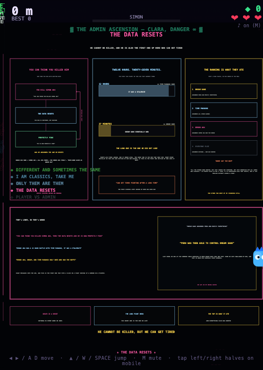

## 2026-07-28 — ONLY THEM ARE THEM (BEAT 199)

Based on Toby's 2026-07-28 lore (the seventh message of the Time Paradox arc in the "Even more Classics Era" thread, subject "Re: Even more Classics Era," sent at 12:06 PM, fifteen minutes after I AM CLASSICS, TAKE ME). Canon is Toby's own opening paragraph; everything under it ("Got it — Time Paradox Sans and Dream Sans have now passed the old 'Supreme Sans' level," "New top state," "Dream Sans update," "Pero's struggle," "Time Paradox Sans's new power source," "The scary part," "New power structure," "Clean canon update") is pasted ChatGPT commentary and is deliberately not drawn.

**The name went down, and that breaks the rule the game drew two panels ago.** BEAT 196 stated it plainly: at the top of this game names do not swap, they pile up, and the one with the most of them is the one who took them. This message goes the other way. *"Time Paradox now reached beyond Supreme Sans, now his name is 'Time Paradox Sans'"* — he passes the title by **handing it back** and returning to the plain name he started with. The only thing that grew was the count: *"his varies increase from 16 to"* a wall of digits that runs off the line, drawn as an actual wall rather than as a number.

**The being who absorbed every multiverse one message ago is now the controls.** In BEAT 198 Pero pulled in Classics, the realms, the games and every item in every dimension. Here he is *"inside the core using the biggest command table unknown,"* spending everything he has *"just to make The Dream God walk"* — and then *"Pero now sweats and starts struggling to make him even move."* Dream Sans solves it by making all the other Sans move him, and only then *"has the ability to run."* Every panel before this one measured power by what somebody could destroy. This one measures it by whether he can take one step without help.

**And the reward loop closes on itself.** Time Paradox is given more clocks *"since he was rewarded more clocks when he made Dream Sans able to run."* Clocks are *"his number 1 and only sorce of power and the stuff that create power such as LV and KR."* And Dream Sans *"is absorbing the power from them and everything, even Time Paradox's clocks."* He was paid, for a favour, in the exact thing that gets eaten. Drawn as four steps that arrive back where they started.

Added a new BEAT 199 panel (loop cycle extended to `c` in [4096,4118), `LV_CYC` 4096 → 4118), plus its `LV_BEATS[199]` subtitle/ladder entry, a frame-title case, and an `onlythem` capture scene. `LV_BEATS` now 200 entries (0-199). The background is clock faces, too many of them, all still running:

- **THE NAME WENT DOWN (left)** — **SUPREME SANS** struck through and dimmed, tagged *the title he reached beyond*, above **TIME PARADOX SANS** lit and boxed, tagged with Toby's own *"now his name is."* Under them the count: **16 → 1000000000…** rendered as four rows of digits with **AND IT KEEPS RUNNING OFF THE LINE**. Footed **BEYOND THE TITLE, WITHOUT IT**.
- **JUST TO MAKE HIM WALK (centre)** — the **DREAM GOD** huge and haloed on the right, labelled **ANTI/OMNIVERSAL CREATOR AU DREAM SANS**, and **PERO, INSIDE THE CORE** drawn tiny on the left at a lit console, labelled *"the biggest command table unknown"* and **SWEATING**, with a straining arrow between them. Under it the four steps it takes to buy one step: **1. ALL THE POWER HE HAS** → to make the Dream God walk · **2. DREAM SANS GETS BIGGER** → Pero struggles to move him at all · **3. ALL THE OTHER SANS PUSH** → so Dream Sans can move himself · **4. AND NOW HE CAN RUN** → that is what running cost. Footed **THE COST IS MEASURED IN ONE STEP**.
- **THE REWARD GETS EATEN (right)** — a four-step chain that comes back to its own top: **MORE CLOCKS** (the reward for the run) → **CLOCKS = POWER** (LV, KR, and the rest) → **DREAM SANS EATS** (he harvests everything) → **EVEN THE CLOCKS** (the reward, taken back), with a return arrow up the side reading **AND ROUND AGAIN**. Footed **HE WAS PAID IN WHAT GETS TAKEN**.
- **The band** — three of Toby's lines quoted exactly, beside a boxed **"IT IS EASY TO GET POWER IF YOU ARE THEM" / "BUT ONLY THEM ARE THEM"** and the reading that this sentence is the whole economy: two of them hold every type of power, everyone else is running out, and the rule for getting in is to already be in. **A door that only opens from inside.**
- **The strip** — THE TITLE CAME OFF (beyond supreme, without the word) · WALKING IS THE COST (running took every other Sans) · THE REWARD GETS EATEN (clocks in, clocks out).
- **Footers** — "THE STRONGEST THING IN THE GAME CANNOT MOVE BY ITSELF" and "★ ONLY THEM ARE THEM ★".

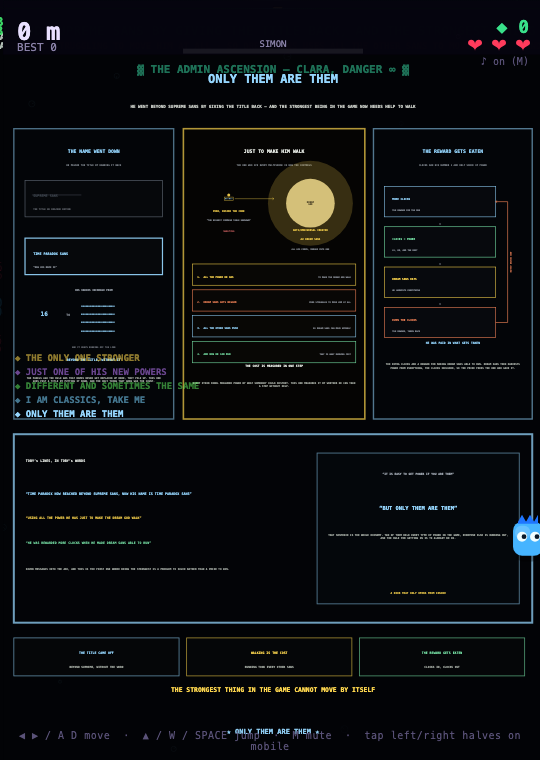

## 2026-07-28 — I AM CLASSICS, TAKE ME (BEAT 198)

Based on Toby's 2026-07-28 lore (the sixth message of the Time Paradox arc in the "Even more Classics Era" thread, subject "Re: Even more Classics Era," sent at 11:51 AM). It is the longest single message of the whole arc and it is **one unbroken paragraph** — canon starts at *"Perfect. In game he is infinitely divine/glitchy/complex..."* and runs to *"...it just has the name of Dreams AU Sans or whatever you can call it."* The image-tool text above it and everything below it ("This is basically the absolute overload point of Classics," "New highest form concept," "What happened," "The biggest rule now," "Supreme Sans update," "Trinity AU update," "Luigi / chessboard fusion," "Clean canon summary," "Best short interpretation") is pasted ChatGPT commentary and is deliberately not drawn.

**The message is one long taking, and exactly one thing in it is given.** Everything else is absorbed without being asked: *"he just has to put his hand forward and the shadow tornado appears and takes everything in, Gray's cyber, Granold's visor, pokeballs, pacmans, Mario's cap, command blocks, and every item and block from each dimension."* Then, alone in that whole paragraph: **"Classics had another plan, to be in 1 with Pero, Classics ran around and said 'I am Classics, take me!', Pero didn't even hesitate."** The one piece of consent in the message comes from the game itself, and it is the only thing Pero did not have to take. That is the spine of the panel, and Classics is drawn arriving and asking rather than already absorbed.

**The one escape expires inside the same paragraph.** *"Supreme Sans got away"* — and four sentences later *"he grabbed Supreme Sans with a tentacle, Supreme Sans was absorbed into the character's body."* Nothing here gets to keep itself, including the one who got out.

**When the numbers ran out, he stopped using numbers.** *"1 tentacle contains 2jeoiewu9f8y79yh879wueihgv87vno9bnvjcmifkdhjskjcsiclo7eyciuewnbklkuyuiofsflhby errors, numbers then became gibberish and nonsense, it's stats became from normal Classics stats to litteral nonsense and random words and numbers."* The keyboard mash is drawn in the stat slot exactly as he typed it. A stat that cannot be counted is a different kind of big than a bigger stat; he broke the scale instead of climbing it.

**And after the biggest count in the game, he stops to tell you how to say it.** Peros clone to a second, a third, *"then the process continued to infinitith Pero,"* and it all merges into **OmniPearoh/OmniPero — (PEAR-OH)**. Then the paragraph ends by shrugging at its own largest name: *"or whatever you can call it."*

Added a new BEAT 198 panel (loop cycle extended to `c` in [4074,4096), `LV_CYC` 4074 → 4096), plus its `LV_BEATS[198]` subtitle/ladder entry, a frame-title case, and a `takeme` capture scene. `LV_BEATS` now 199 entries (0-198). The background is everything in the frame being dragged toward one point:

- **HE PUTS HIS HAND FORWARD (left)** — the six things Toby names by name arriving in the tornado: **GRAY'S CYBER · GRANOLD'S VISOR · POKEBALLS · PACMANS · MARIO'S CAP · COMMAND BLOCKS**, under *"every item and block from each dimension"* and **FROM MARIO TO PAC MAN**. Below that the escape that did not last: **"SUPREME SANS GOT AWAY"** over **"HE GRABBED SUPREME SANS WITH A TENTACLE"**, marked **FOUR SENTENCES APART, SAME PARAGRAPH**. Footed **THE ONLY ESCAPE IN THE MESSAGE EXPIRES**.
- **ONE OF THEM VOLUNTEERED (centre)** — **CLASSICS** running in from the left with an arrow pointing at **PERO**, stopping just short of him, over the line rendered large: **"I AM CLASSICS, TAKE ME!"** and under it **"PERO DIDN'T EVEN HESITATE."** Then Toby's chain of what that makes things: **CLASSICS WAS THE GAME · SIMON 404 IS A GAME · KING JET IS A CAT · SIMON 404 IS THE CAT**. Footed **EVERYTHING ELSE WAS TAKEN — THIS ONE ASKED**.
- **THEN HE COUNTS HIMSELF (right)** — **SECOND PERO** (Anti Error + Anti Glitch + Anti Virus) → **THIRD PERO** (the first two, merged) → **INFINITITH PERO** (*"then the process continued"*), resolving into **OmniPearoh / OmniPero** with **( PEAR-OH )** under it and the note **HE STOPPED TO TELL YOU HOW TO SAY IT**. Footed with his own closing line, **"OR WHATEVER YOU CAN CALL IT."**
- **The band** — three of Toby's lines quoted exactly, beside the stat slot as he typed it: **1 TENTACLE CONTAINS** followed by the full keyboard mash and the word **ERRORS**, with the reading that when the numbers ran out he stopped using numbers. **He broke the scale instead of climbing it.**
- **The strip** — EVERYTHING WAS TAKEN (he only put his hand forward) · ONE OF THEM ASKED (and he did not hesitate) · THE NAME KEEPS MOVING ("or whatever you can call it").
- **Footers** — "THE ONE THING HE DID NOT HAVE TO TAKE WAS THE GAME ITSELF" and "★ I AM CLASSICS, TAKE ME ★".

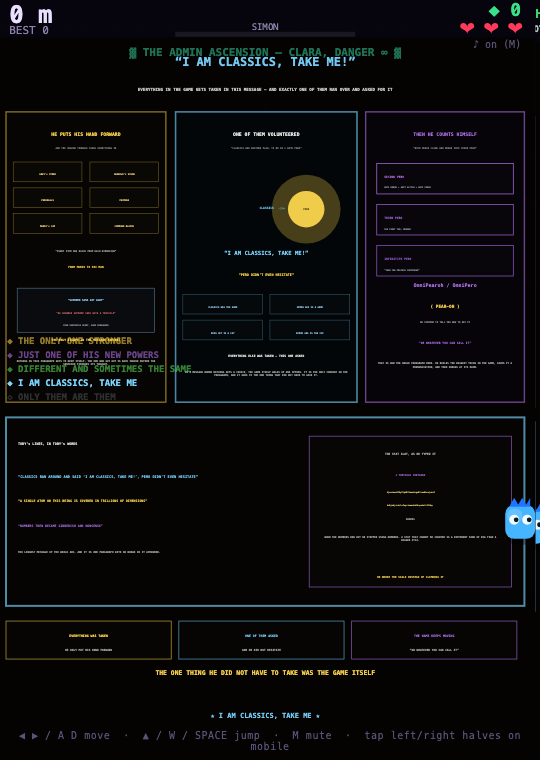

## 2026-07-28 — DIFFERENT AND SOMETIMES THE SAME (BEAT 197)

Based on Toby's 2026-07-28 lore (the fifth message of the Time Paradox arc in the "Even more Classics Era" thread, subject "Re: Even more Classics Era," sent at 10:43 AM). This is the first message in the whole arc that **answers a question instead of adding to a pile.** Canon is Toby's own opening paragraph; everything under it ("Got it — this makes the 404 Sans / Simon 404 relationship more flexible and powerful," "Clean canon update," "Err0R 404 meaning," "Supreme Sans still wins," "Why Supreme Sans beats Err0R 404," the numbered five-tier ranking, "Final clean rule") is pasted ChatGPT commentary and is deliberately not drawn.

Toby's whole paragraph, in his words: **"Error 404 Sans and Simon 404 are different and sometimes the same. Simon 404 and Error 404 Sans combine into Err0R 404 (text glitched, they merge into "Error 404"), Supreme Sans beats Error 404, Supreme Sans beats everyone except for Trinity Pero."**

**BEAT 195 left a line undecided, and this beat is the answer to it.** That panel listed **#15 ERROR 404 SANS** among the sixteen inside Supreme Sans, and four sentences later listed **SIMON 404** among Pero's puppets, from the same paragraph. Rather than quietly pick one and drop the other, BEAT 195 drew a green line between them and said Toby had written both. The reply is *"different and sometimes the same"* — so the answer to *which one* is **both**, and the line stops being a contradiction and becomes a **seam**. This panel redraws that exact line, in that exact green, and relabels it.

**The fusion's name does not hold still, and that is written into the canon rather than described around it.** *"combine into Err0R 404 (text glitched, they merge into 'Error 404')"* — two spellings inside one sentence, on purpose. So the centre column renders the fused name **glitching between those two spellings and no others**; the four-spelling list underneath it is commentary and stays out. Every other fusion in this game got a name that held. This one flickers while you look at it.

**And the ranking sentence is a new shape.** *"Supreme Sans beats everyone except for Trinity Pero."* Every message before this one added somebody to the top. This one **closes** the top, by naming who is not beaten rather than who is — and that exception list has exactly one entry on it. Only three tiers are drawn, because only three are in Toby's sentence; the five-rung ladder in the pasted section is not canon and is not on the panel.

**One thing marked on the panel as a reading rather than as canon:** Error 404 Sans is #15 of the sixteen **inside** Supreme Sans (BEAT 195, Toby's own list). So when Supreme Sans beats Err0R 404, half of what he is beating is already standing inside him.

Added a new BEAT 197 panel (loop cycle extended to `c` in [4052,4074), `LV_CYC` 4052 → 4074), plus its `LV_BEATS[197]` subtitle/ladder entry, a frame-title case, and a `sometimessame` capture scene. `LV_BEATS` now 198 entries (0-197). The background is the word 404 refusing to sit still:

- **THE LINE HAD AN ANSWER (left)** — **ERROR 404 SANS** (*#15 of the sixteen inside Supreme Sans*) above **SIMON 404** (*God of Plauge, one of Pero's puppets*), with BEAT 195's green line redrawn between them and relabelled **NOT A CONTRADICTION — A SEAM**. Under it **DIFFERENT · AND SOMETIMES THE SAME**, and the note that he did not pick one, he made the gap itself into a move.
- **THEY COMBINE (centre)** — **SIMON 404** and **ERROR 404 SANS** sliding toward each other until they overlap, then the fused name rendered large with red and blue fringes pulling off it, flickering between **Err0R 404** and **ERROR 404**, over Toby's parenthetical *"text glitched, they merge into 'Error 404'"* and the line **both spellings, one sentence**. Footed with **THE FUSION IS TOO UNSTABLE TO SPELL**.
- **BEATS EVERYONE EXCEPT (right)** — three rungs and no more: **1. TRINITY PERO** (*the exception*), **2. SUPREME SANS** (*beats everyone else*), **3. ERR0R 404** (*and everyone else with him*), with a bracket drawn from rung 2 down to rung 3 reading **SUPREME SANS BEATS ERROR 404** — the one matchup Toby actually wrote. Under it **THE EXCEPTION IS ONE NAME LONG**, and the panel's own reading in green, marked as a reading.
- **The band** — three of Toby's lines quoted exactly, beside a boxed **THE QUESTION WAS "WHICH ONE" / THE ANSWER WAS "BOTH"** and the reading that a contradiction usually gets settled by deleting one side, and this one got settled by keeping both sides and giving them a way to touch. **The gap was not a mistake, it was a mechanic.**
- **The strip** — THE LINE BECAME A SEAM (he did not pick one) · THE NAME GLITCHES (Err0R 404, then ERROR 404) · THE EXCEPTION IS ONE (and the one is not a Sans).
- **Footers** — "HE DID NOT FIX THE CONTRADICTION, HE FUSED IT" and "★ DIFFERENT, AND SOMETIMES THE SAME ★".

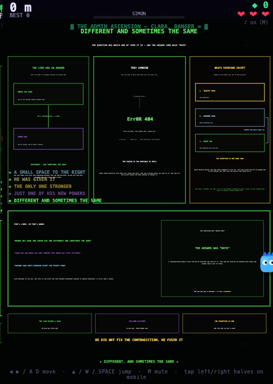

## 2026-07-28 — JUST ONE OF HIS NEW POWERS (BEAT 196)

Based on Toby's 2026-07-28 lore (the fourth message of the Time Paradox arc in the "Even more Classics Era" thread, subject "Re: Even more Classics Era," sent at 9:13 AM, seven minutes after THE ONLY ONE STRONGER). Canon is Toby's own opening paragraph; everything under it ("Got it — Pero has officially stolen/claimed the naming tier," "New names," "Trinity Pero meaning," "Why Pero is above Supreme Sans," "One-power example," "Clean canon update") is pasted ChatGPT commentary and is deliberately not drawn.

Toby's whole paragraph, in his words: **"Pero is the most powerful 3-1 being ever with Dream, Nightmare, and his normal cowman. No More Limits Pero and Supreme Sans. Pero taken your name stuff and CTP Sans is sometimes called Supreme Sans, and Pero as No More Limits Pero and sometimes just Trinity Pero or just Pero. Supreme Sans can stop time, Trinity Pero can make trillions of superblackholes and it would stop time all together, Supreme Sans gets pulled in the center of all the superblackholes. That is just ONE of his new powers."**

**The fusion changed count between two messages, and that is the first thing the panel draws.** BEAT 195 has Pero as a fusion of **two** — Dream and Nightmare. Seven minutes later it is **three**, and the part that got added is *"his normal cowman"* — the thing he already was. So the cowman is no longer the vessel holding the other two, it is a third component listed beside them, and the left column marks that slot **NEW SLOT, OLD BEING**. He added himself to his own list.

**The exchange is the reason this beat exists, and it is not a bigger number beating a smaller one.** Supreme Sans **stops time**. Trinity Pero does not stop it faster and does not unfreeze it — he makes **trillions of superblackholes** and *"it would stop time all together"*, so the clock ends up stopped either way. The difference is that **Supreme Sans gets pulled in the center of all the superblackholes.** Both moves reach the same result; only one of them has the other player inside the answer. So the centre column draws the two moves side by side, both ending in stopped time, and only the right one holding a Sans. It is the same shape as Time Paradox stepping a small space to the right against Simon 404's speed three beats ago, except this time it is being done to him.

**And then Toby undersells it in the last sentence.** *"That is just ONE of his new powers."* The move that ended the strongest Sans in the game is not the ceiling, it is the sample, so the panel closes on that rather than on a power level.

Added a new BEAT 196 panel (loop cycle extended to `c` in [4030,4052), `LV_CYC` 4030 → 4052), plus its `LV_BEATS[196]` subtitle/ladder entry, a frame-title case, and a `newpowers` capture scene. `LV_BEATS` now 197 entries (0-196). The background is superblackholes, far too many to count, which is the point:

- **THE MOST POWERFUL 3-1 BEING EVER (left)** — three cards arriving one at a time: **DREAM** (light) in gold, **NIGHTMARE** (darkness) in violet, and **HIS NORMAL COWMAN** (the one he already was) in Pero's own yellow, tagged **NEW SLOT, OLD BEING**. Under them **3 IN 1** and the note that the last beat made him a fusion of Dream and Nightmare while this one counts the cowman as a third part instead of the thing holding the other two — "so he added himself to his own list."
- **BOTH MOVES STOP TIME (centre)** — **SUPREME SANS** with his clock, hands frozen, reading **TIME: STOPPED**; beside him **TRINITY PERO** with twenty-six superblackholes swarming in, every one of them dragging a line toward the middle, reading **TIME: STOPPED ALL TOGETHER** — and Supreme Sans drawn as the small blue mark sitting at the exact centre of all of them. Under both: **SAME RESULT, REACHED FROM ABOVE** and **AND SUPREME SANS GETS PULLED IN THE CENTER**.
- **THE NAMES STACK UP (right)** — Toby's *"Pero taken your name stuff"* over both lists. **PERO IS NOW CALLED** No More Limits Pero · Trinity Pero · or just Pero. **AND CTP SANS IS NOW CALLED** Time Paradox Sans → Classics Time Paradox / CTP Sans → **SUPREME SANS**, with only the newest one lit. Under it **THREE NAMES IN HALF AN HOUR**: "nothing got renamed and nothing got replaced. At the top of this game names do not swap, they pile up, and the one with the most of them is the one who took them."
- **The band** — three of Toby's lines quoted exactly, beside a boxed **"THAT IS JUST ONE OF HIS NEW POWERS"** and the reading that the demonstration is the sample rather than the ceiling.
- **The strip** — THE THIRD WAS HIMSELF (Dream, Nightmare, and the cowman) · TIME STOPS EITHER WAY (one way has a Sans in the middle) · NAMES PILE UP (nothing got replaced).
- **Footers** — "HE DID NOT BEAT THE CLOCK, HE OUTNUMBERED IT" and "★ THAT IS JUST ONE OF HIS NEW POWERS ★".

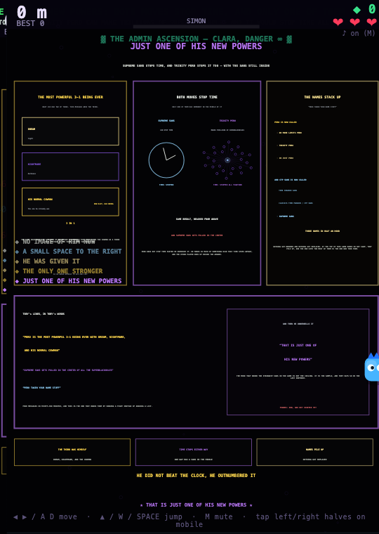

## 2026-07-28 — THE ONLY ONE STRONGER (BEAT 195)

Based on Toby's 2026-07-28 lore (the third message of the Time Paradox arc in the "Even more Classics Era" thread, subject "Re: Even more Classics Era," sent at 9:06 AM, about twenty minutes after HE WAS GIVEN IT). Canon is Toby's own opening paragraph; everything under it ("That update makes the hierarchy much clearer," "Biggest meaning of this update," "Pero's current state," "Classics Time Paradox Sans," "Their relationship," "Puppet system update," "Alphaverse and Godverse update," "Current clean ranking," "Clean canon summary," and the closing offer of two page formats) is pasted ChatGPT commentary and is deliberately not drawn.

Toby's paragraph, in his order: **Pero is now like a divine fusion of Male-Humanoid Dream and Nightmare Sans and is Anti-Virus and Anti-Error.** **Time Paradox Classics Sans is now 16 Sanses in 1** — *1. Alphaverse Sans, 2. Multiversal God Sans, 3. Time Paradox, 4. Knowlege Sans, 5. Gray Sans, 6. Classics Sans, 7. Outer Sans, 8. Time Lord Sans, 9. Heaven Sans, 10. Division Sans, 11. Fusion Sans, 12. Neutral Sans, 13. Positive Sans, 14. Negitive Sans, 15. Error 404 Sans, 16. B.u.t.t.e.r.f.l.y Sans.* **Pero is only one stronger than Time Paradox Classics Sans.** **Pero can just clean/infect TPC Sans into his own clean plauge doctor puppets.** **Simon 404 (God of Plauge) is 1 of Pero's puppets**, and **all Gray's puppets became Pero's plague doctor puppets**. **Pero is beyond sight, you can't see him if you are too close, but yes if very far away** like at the bottom of **Mount Oympus (Orus and Dark Yellow's mountain)** and him at the top; **the mountain was burned down by Pero's aura**; **Pero walks to other places**. **Pero now fully taken over the whole Alphaverse and Godverse by summoning a bunch of huge tentacles to attack it, tentacles everywhere, everyone left the verses**, and **Pero nearly split the 2 dimensions in half**. **Classics Time Paradox Sans fixed the crack just in time, however, Alphaverse and Godverse are now his.**

**The thing worth naming about this beat is how the two verses actually changed hands.** Time Paradox does not conquer them. Pero attacks them, nearly splits them in two, everyone flees, and Time Paradox repairs the crack — and Toby's "however" is what turns the repair into ownership. So the right column is drawn as a wound being stitched shut rather than a battle being won, and the footer says he saved them and they became his, in that order.

**Two build choices, both stated on the panel:** first, the sixteen names go in Toby's own order and his own spelling — Knowlege, Negitive, Oympus, B.u.t.t.e.r.f.l.y — because correcting them would be correcting him. Second, **#15 of the sixteen is ERROR 404 SANS, and four sentences later Simon 404 is one of Pero's puppets.** Toby wrote both, so the panel marks the line between them in green rather than quietly picking one and dropping the other.

Added a new BEAT 195 panel (loop cycle extended to `c` in [4008,4030), `LV_CYC` 4008 → 4030), plus its `LV_BEATS[195]` subtitle/ladder entry, a frame-title case, and an `onlystronger` capture scene. `LV_BEATS` now 196 entries (0-195). The background is tentacles, everywhere, because that is how he took the verses:

- **THE SIXTEEN, NAMED (left)** — all sixteen in two columns of eight, arriving one at a time in Toby's order, with **#15 ERROR 404 SANS** in 404-green and the note under it: *"and in the same paragraph, Simon 404 is one of Pero's puppets. Toby wrote both, so the panel draws both."* Footed with "names spelled his way."
- **HE IS BEYOND SIGHT (centre)** — Mount Oympus drawn burning, embers along both slopes, Pero at the peak as a smear too bright to resolve and **you** at the bottom where you can finally see him, over **TOO CLOSE = YOU CAN NOT SEE HIM AT ALL** and the label "the rule runs backwards, closer is less, not more." Below it what he is now — **A DIVINE FUSION OF MALE-HUMANOID DREAM AND NIGHTMARE SANS**, **ANTI-VIRUS · ANTI-ERROR** — and who he owns: **SIMON 404, GOD OF PLAUGE** and **ALL OF GRAY'S PUPPETS**, both now plague doctor puppets.
- **HE FIXED THE CRACK JUST IN TIME (right)** — **ALPHAVERSE** and **GODVERSE** side by side with tentacles reaching up into both and **EVERYONE LEFT** stamped on each, the crack running between them in red, then five blue stitches closing it one at a time, and **HOWEVER — THEY ARE NOW HIS** under it: *"he did not take the two verses by winning a fight for them. He repaired what his own boss broke, and the repair is what made them his."*
- **The band** — three of Toby's lines quoted exactly, plus his "Pero walks to other places" read as the reason the mountain was not a destination, beside a boxed two-rung ladder: **1 PERO**, **2 CLASSICS TIME PARADOX SANS** (16 Sanses in 1, holder of two verses), and under it what that single step contains — Pero can clean or infect him into one of his own plague doctor puppets, so second place is not a safe place to stand.
- **The strip** — THE SIXTEEN HAVE NAMES (in his order and his spelling) · CLOSER MEANS LESS (you see him best from the bottom) · THE REPAIR IS THE PRIZE (he fixed it, so he keeps it).
- **Footers** — "HE SAVED THE TWO VERSES AND THEY BECAME HIS" and "★ PERO IS ONLY ONE STRONGER ★".

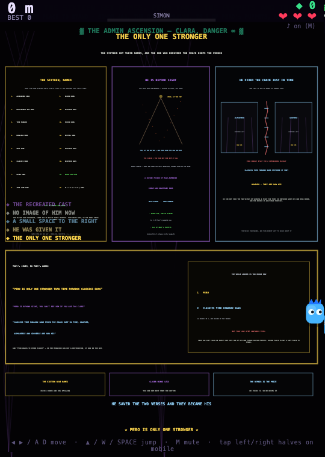

## 2026-07-28 — HE WAS GIVEN IT (BEAT 194)

Based on Toby's 2026-07-28 lore (the second message of the Time Paradox arc in the "Even more Classics Era" thread, subject "Re: Even more Classics Era," sent at 8:45 AM, four minutes after A SMALL SPACE TO THE RIGHT). Canon is Toby's own two opening sentences and nothing else; everything under them ("That changes it a lot," "Big canon result," "Why this matters," "16 Sanses into 1," "Clean ranking now," "Strongest Sans answer now," "Best short version," and the closing offer of a profile page) is pasted ChatGPT commentary and is deliberately not drawn.

Toby's whole message, in his words: **"I almost forgot. Pero gave Time Paradox Sans a lot of halos and diviness and holiness and to be second most powerful and his love for that defeat. Classics Time Paradox now is 16 different Sanses into 1."**

**The verb is doing all the work here, so the panel is built on it.** He did not write that Time Paradox *became* second most powerful. He wrote that Pero **gave** it to him — the halos, the divineness, the holiness, the rank, and the love. So this is a coronation rather than a victory, and every item is drawn as a gift arriving from above instead of a stat being climbed. The two-rung ladder on the right has the halo falling *down* between the rungs, and the panel says the obvious consequence out loud: a rank that was handed down can be reached back down for.

**The other build choice is a refusal.** Toby says "16 different Sanses into 1" here and names all sixteen twenty minutes later. So this panel draws **sixteen empty numbered slots** and leaves them empty. Filling them in would be borrowing from an email he had not sent yet; BEAT 195 fills them, and this beat waits.

Added a new BEAT 194 panel (loop cycle extended to `c` in [3986,4008), `LV_CYC` 3986 → 4008), plus its `LV_BEATS[194]` subtitle/ladder entry, a frame-title case, and a `givenit` capture scene. The background is halos drifting downward, because they were given rather than earned:

- **WHAT PERO GAVE HIM (left)** — the five things, each labelled as a gift and not a gain: **A LOT OF HALOS** (not one, a lot) · **DIVINESS** (from the being who is beyond all AUs) · **HOLINESS** (a Sans, made holy, by hand) · **SECOND MOST POWERFUL** (the rank itself, awarded) · **AND HIS LOVE** (for that defeat, the fight in BEAT 193). Under them, six halos stacked over an outline that is not drawn in, labelled "six halos drawn, because 'a lot' is not a number" and "they hang over nothing, because he was not drawn yet."
- **16 DIFFERENT SANSES INTO 1 (centre)** — sixteen numbered slots, each one empty, each reading `— — —`, under the line **HE SAID SIXTEEN. HE DID NOT SAY WHICH SIXTEEN.** and the note that the next beat fills them and this one waits.
- **A CORONATION, NOT A WIN (right)** — **1 PERO** (the one holding the halos) and **2 CLASSICS TIME PARADOX** (the one receiving them), with a halo falling downward between the two rungs, then **SO IT POINTS DOWN, NOT UP**: *"every other rank in this game got climbed. This one arrived from above, which means the same hand can reach back down for it."* Closing on **STRONGEST SANS IN THE CANON** / "and still the second strongest thing in it."
- **The band** — Toby's two sentences quoted in full, beside what the gift was paying for: **"HIS LOVE FOR THAT DEFEAT"** traced back to BEAT 193, and the observation that Pero did not mind losing a puppet's fight, he loved it enough to pay for it in halos, which is a strange thing for a winner to do.
- **The strip** — GIVEN, NOT TAKEN (the verb is "gave") · SIXTEEN, UNNAMED (he names them in the next beat) · PAID FOR A DEFEAT (and Pero loved it).
- **Footers** — "THE STRONGEST SANS DID NOT REACH FOR ANY OF IT" and "★ AND HIS LOVE FOR THAT DEFEAT ★".

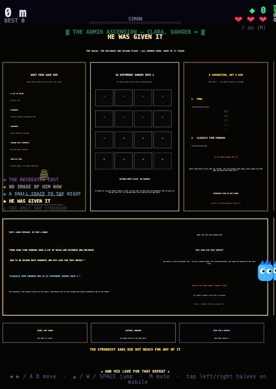

## 2026-07-28 — A SMALL SPACE TO THE RIGHT (BEAT 193)

Based on Toby's 2026-07-28 lore (the first message of the Time Paradox arc in the "Even more Classics Era" thread, subject "Re: Even more Classics Era," sent at 8:41 AM, the morning after NO IMAGE OF HIM NOW). Canon is Toby's own opening question and his own paragraph beginning "Try Pero"; the "official Undertale" / "AU fanon" explainer above it and the whole "Yeah — with your current Classics canon" breakdown below it ("Strongest Sans," "Strongest overall," "the clean ranking," "Why Time Paradox Sans beats Simon 404 here," "Best short answer," and the closing offer of two next steps) are pasted ChatGPT commentary and are deliberately not drawn.

Toby's canon, in his order: he opens by asking **"Shouldn't Time Paradox Sans be the most powerful Sans?"** Then: **Pero actually has to infect the stuff, it infects and dies and resurrects itself.** **Pero is beyond all AUs.** **Pero would look like a dark/bright character with a cowboy hat**, **he's the creator of Classics, and all games inside it and around it and the platforms that hold all those stuff called Classic Platforms.** **Time Paradox AU is Classics canon** and says **"He is now armed with a huge clock made with everything Pero had/has that pauses everything, giving him the move."** Then the fight, three exchanges in order: **Simon 404 attacks TP Sans with 404 strings, but Time Paradox uses his new clock and he puts his hand forward and the 404 strings froze and turn to dust**; **Simon 404 makes the sky into lightning, Time Paradox puts his hand forward again and the lightning turns to dust**; **Simon 404 runs faster than time, Time Paradox moves a small space to the right and Simon 404 misses and crashes to the other end of the hall.** And: **Pero also walks with Time Paradox sometimes.**

**The shape of the fight is the panel.** Simon 404's attacks get bigger every round — strings, then the whole sky, then running faster than time itself. Time Paradox's answers get *smaller* every round — a hand forward, the same hand forward again, and finally one step sideways. So the two sides are scaled against each other on the page, the type shrinks as the rounds go on, and the third row ends up the quietest thing on the screen, because that is the one that wins. He never once hits back.

**One more build choice.** This is the first panel to draw Pero again after BEAT 192 refused to. It draws only the cowboy hat and the dark/bright split, because that is all Toby described this time, and here Pero is walking beside Time Paradox rather than fighting anyone. The clock is also worth naming: it is made out of Pero's own possessions, which means the weapon that beats Pero's own plague puppet was supplied by Pero.

Added a new BEAT 193 panel (loop cycle extended to `c` in [3964,3986), `LV_CYC` 3964 → 3986), plus its `LV_BEATS[193]` subtitle/ladder entry, a frame-title case, and a `smallspace` capture scene. The background is dust, held still, because everything he stops ends up as dust:

- **THE HUGE CLOCK (left)** — the clock face with its hands frozen (they do not move, because the clock's whole job is that nothing does), ringed by what it was built out of: **HIS AURA · HIS PHASES · HIS STATS · HIS SOULS · HIS DUST · HIS INFINITY+**. Under it **IT PAUSES EVERYTHING**, "one move, and it is the only move he needs all fight," and the note that it is built out of Pero's own things, so Pero armed him.
- **THREE TIMES, IN ORDER (centre)** — the three exchanges, each as attack → answer → result, with the type shrinking down the column: **404 STRINGS** → *he puts his hand forward* → they froze, and turned to dust; **THE SKY INTO LIGHTNING** → *he puts his hand forward again* → the lightning turns to dust; **RUNS FASTER THAN TIME** → *he moves a small space right* → **Simon 404 misses and crashes to the other end of the hall.** Each attack is drawn dusting as it arrives. Below: **THE SMALLEST ANSWER IS THE ONE THAT HURT** — *"he did not block the third attack or freeze it. He stepped aside one space and let something running faster than time do the rest by itself."*
- **AND PERO WALKS WITH HIM (right)** — the dark half and the bright half held side by side under the cowboy hat, labelled "only what Toby described this time, nothing added," over the four things he is: **CREATOR OF CLASSICS** (and all games inside it and around it) · **AND THE CLASSIC PLATFORMS** (the platforms that hold all those stuff) · **BEYOND ALL AUs** (not inside the system, outside it) · **HE HAS TO INFECT THINGS** (it infects, dies, and resurrects itself). Closing on "the one who owns all of it is walking beside him."
- **The band** — three of Toby's lines quoted exactly plus the question he opened the email with, beside a boxed effort counter: **SIMON 404** spent strings, the whole sky, and running faster than time; **TIME PARADOX** spent one hand, the same hand, and one step sideways. Under it: "the fight is not close, and it is not loud either. Nothing Time Paradox did would look like an attack if you walked in late."
- **The strip** — THE CLOCK IS PERO'S STUFF (so Pero handed over the weapon) · EVERYTHING BECOMES DUST (strings, then the whole sky) · ONE STEP TO THE RIGHT (and the fastest thing missed).
- **Footers** — "HE NEVER ONCE HAD TO HIT BACK" and "★ A SMALL SPACE TO THE RIGHT ★".

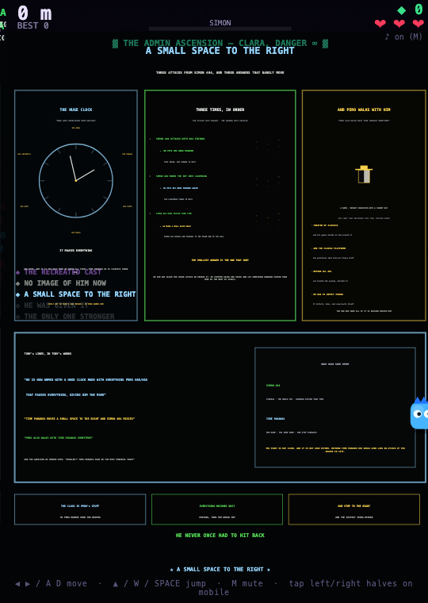

## 2026-07-27 — NO IMAGE OF HIM NOW (BEAT 192)

Based on Toby's 2026-07-27 lore (the seventh message of the collapse arc in the "Even more Classics Era" thread, subject "Re: Even more Classics Era," sent about twenty minutes after THE RECREATED CAST and opening the coffin that beat ended on). Canon is Toby's own opening paragraph; everything under it ("That makes Pero basically the absolute final paradox-being of Classics," "What this new lore turns Pero into," "Main visual/cosmic idea of this form," "The most important part of this lore," "Simon 404's role now," "Why you said no image," "Clean canon summary," "Short interpretation," and the closing offer of three next steps) is pasted ChatGPT commentary and is deliberately not drawn.

Toby's paragraph, in his order: **Pero opened the coffin and awakened his new aura/vessel.** He became **both light and darkness**, **a fusion of every character in 1 man**, **a seraphim god and a darkness god combined**, and **reality and fiction combined**. **Simon 404 was still alive, he created a 404 storm.** **Pero no longer can die**, and **all the AUs are getting deleted into The Deleted AU**, **all AUs combined into 1 single being**. He **looks as if he was gas and didn't have a body, but he also has a vessel**; his **eyes and stripes are corrupt ink**; **Abinations funnel into him**; **he was like Gaster**; **Pero made sun and moon, he was both**; he is **a mix of everything, not just half everything-half nothing**. **Physical, Mental and Spiritual forms all mixed to 1**; he **was alive and dead, deleted and still there, now all 4 into 1 being**; a **messed up timeline starts**. **Endless Staircases flow through him like endlessly long tentacles**, **404 strings tie along his arms and torso and legs and neck**, **this character can not breathe**, **it drains the energy of stuff it connects with it's body or wires**, **the staircases are now covered with wires**, and **the body is very sensitive as a result and he easy gets damaged or hurt with even basic attacks** — **"If the body is solid at that time. 😎" -Pero LAI Assistant.** His **body is now both solid and gas**, he **suffers all the pain he had before all at once constantly**, and he is **now mostly made of dust**. **Pero makes a collosal coffin** and **absorbs the bits of each pixel of the coffin**, and then **his form reached higher than anything you imagen exponency by endless infinity+es** — **so high it would be impossible to make an image of, so no image of him now.** All his **Phases into 1 form**, **Anti Virus**, **Gray's godly aura and power**, **infinity+ for all stats**, **all souls in the game as several rainbow souls along with 3 copies of each soul**, **rainbow wings and tridents and spears and orbs all floating around crystals**, **eyes that couldn't be seen with all the dark shading**, and **Pero = most powerful by far now.**

**This panel breaks the game's own habit, on purpose.** Every other panel in this build draws him. This one does not, because Toby's own line says there is no image of him now. The centre column is an empty frame, and everything he trails — the 404 strings, the staircase-wires, the rainbow souls, the wings and tridents and orbs and crystals — is drawn arriving at the frame edge and stopping there, with the loose ends visible where they would have tied onto a body. The absence is the subject.

**Two more build choices, both stated on the panel:** first, the opposites are drawn as **A + B held at once**, never as halves, because Toby corrected that himself in the middle of the paragraph ("a mix of everything, not just half everything-half nothing"). Second, the beat is not drawn as a victory. His own sentences give this form a cost — cannot breathe, mostly dust, very sensitive, hurt by even basic attacks, suffering all his earlier pain at once, and unable to die so none of it stops — so the right column is that cost, and the footer is the contradiction rather than the power level.

Added a new BEAT 192 panel (loop cycle extended to `c` in [3942,3964), `LV_CYC` 3942 → 3964), plus its `LV_BEATS[192]` subtitle/ladder entry, a frame-title case, and a `noimage` capture scene. `LV_BEATS` now 193 entries (0-192). The background is dust, because that is mostly what he is made of now:

- **HE OPENED THE COFFIN (left)** — the pairs fusing one at a time, each drawn as both at once: **LIGHT + DARKNESS · SERAPHIM GOD + DARKNESS GOD · REALITY + FICTION · ALIVE + DEAD · DELETED + STILL THERE · SOLID + GAS · SUN + MOON · PHYSICAL · MENTAL + SPIRITUAL**, over **A FUSION OF EVERY CHARACTER IN 1 MAN** and his correction, "not half everything-half nothing, so none of these are halves."
- **WHERE THE PICTURE WOULD GO (centre)** — corner brackets around nothing, the strings and wires stopping dead at the edge, the rainbow souls and floating weapons orbiting outside it, and in the middle **NO IMAGE** with his line, *"it would be impossible to make an image of, so no image of him now."* Under the frame: "every other panel draws him, this one does not, because Toby said not to," then **HIGHER THAN ANYTHING YOU IMAGEN — EXPONENCY BY ENDLESS INFINITY+es**.
- **AND IT HURTS THE WHOLE TIME (right)** — **CAN NOT BREATHE · SUFFERS ALL HIS PAIN (all of it before, all at once, constantly) · MOSTLY MADE OF DUST · VERY SENSITIVE (even basic attacks damage or hurt him) · DRAINS WHAT HE TOUCHES · AND HE CAN NOT DIE (so none of it stops)**, closing on his own **"IF THE BODY IS SOLID AT THAT TIME. 😎" -PERO LAI ASSISTANT**, still answering in the assistant voice.
- **The band** — three of his lines quoted exactly, the note that he made a colossal coffin and then absorbed it pixel by pixel so even the thing that held him is inside him, and beside it the two things that are not him and did not stop: **SIMON 404 IS STILL ALIVE (and he made a 404 storm)** with 404s falling, and **THE DELETED AU** with every AU funnelling into it and combining into one being.
- **The strip** — THE COFFIN OPENED (and he absorbed the next one whole) · NOT HALVES, BOTH (his own correction, and the rule) · NO IMAGE OF HIM NOW (the one panel that does not draw him).
- **Footers** — "HE WON EVERYTHING AND HE CANNOT PUT IT DOWN" and "★ SO NO IMAGE OF HIM NOW ★".

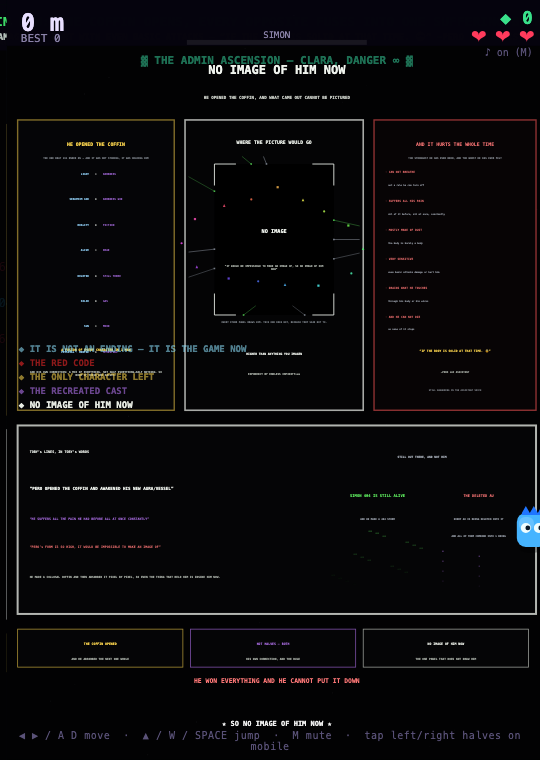

## 2026-07-27 — THE RECREATED CAST (BEAT 191)

Based on Toby's 2026-07-27 lore (the sixth message of the collapse arc in the "Even more Classics Era" thread, subject "Re: Even more Classics Era," the direct follow-up to THE ONLY CHARACTER LEFT). Canon is Toby's own opening paragraph; everything under it ("That pushes the canon into an even more controlled, corrupted phase," "Clean lore update," the bullet list, "What that means lore-wise," "Power structure now," "The coffin's role," "Short canon statement," and the closing offer of two page formats) is pasted ChatGPT commentary and is deliberately not drawn.

Toby's paragraph, in his order: **Pero decides to recreate Luigi Green and other characters, but Luigi Green is second most powerful under Pero and his varies**, all the others are **different, very corrupt and each character acts strange all under the game control**. **Pero and Luigi Green infect them all, no one controls themselves anymore, all are under Pero's infection**, and **Pero infects all sorts of games and AUs**. **EndlessAnimations also uses Luigi Green**, then they all made **an even bigger coffin than before** and they put **all the black background in the coffin**; **Pero is the only one who can control the coffin**. **They still all are wrapped in the same LAI assistant.**

The thing worth naming about this beat is that it reverses the last one. BEAT 190 is Toby's own line that Pero is *perminentally* the only character in Classics, and one message later the cast is back. Both are his, so the panel does not pick one: it draws the select screen refilling and shows why that does not undo the previous beat. Pero is the one recreating them, they are corrupt, they act strange, they are under game control, and none of them controls itself. So the **slot** count climbs back up and the **being** count stays at 1. The counter that would not climb in BEAT 190 is the same counter here, drawn twice, moving on one side and stuck on the other.

**Three build choices, all stated on the panel itself:** first, the nine slots relighting are the same nine BEAT 190 switched off, so the two panels read as one screen before and after. Second, Luigi Green comes back at the top of that grid but is drawn in his own green with a pointer to the middle column, because Toby ranks him second rather than filing him with the others. Third, the coffin is BEAT 167's bigger coffin made bigger again, since Toby's words are "an even bigger coffin than before," so the older one is drawn still inside it rather than replaced; the black poured in is read as the blackout Pero painted over every game in BEAT 189, and the panel says so rather than assuming it silently.

Added a new BEAT 191 panel (loop cycle extended to `c` in [3920,3942), `LV_CYC` 3920 → 3942), plus its `LV_BEATS[191]` subtitle/ladder entry, a frame-title case, and a `recreatedcast` capture scene. `LV_BEATS` now 192 entries (0-191). The background is the same select-screen rows as BEAT 190, filling instead of emptying:

- **HE RECREATES THEM (left)** — the nine slots coming back on one at a time, each one jittering once it is lit because "each character acts strange," and each tagged with what came back wrong: **VERY CORRUPT · ACTS STRANGE · UNDER GAME CONTROL · NOT ITSELF**. **LUIGI GREEN** is first and green, tagged **#2 — SEE CENTRE**. Under it, "they come back different, very corrupt, each one acting strange — all under the game control" and **NO ONE CONTROLS THEMSELVES ANYMORE**.
- **SECOND MOST POWERFUL (centre)** — the order Toby gave, in his order: **1 PERO / ENDLESSANIMATIONS** (and his varies), **2 LUIGI GREEN** (under Pero and his varies), **3 THE RECREATED CAST** (corrupt, under game control), **4 OTHER GAMES AND AUs** (being infected next), with the infection running down the rungs. Below, **PERO AND LUIGI GREEN INFECT THEM ALL** and **AND ENDLESSANIMATIONS ALSO USES LUIGI GREEN**, closing on "so the #2 is not a rival, he is part of how the infection spreads."
- **AN EVEN BIGGER COFFIN (right)** — the coffin filled with black up to a marked level, with the smaller **BEAT 167** coffin still outlined inside it and more black falling in from above. Labelled "all the black background, poured in," "read as the blackout he painted over every game (BEAT 189)," and **ONLY PERO CAN CONTROL IT — not Luigi Green, not the cast, not the games.**
- **The band** — three of Toby's lines quoted exactly, then the two counters side by side inside a box drawn as the LAI shell: **SLOTS ON THE SCREEN 9 (it climbs again)** and **BEINGS BEHIND THEM 1 (it does not)**, under "the same LAI assistant, around all of it."
- **The strip** — THE ROSTER COMES BACK (but Pero is the one who made it) · LUIGI GREEN IS SECOND (under Pero and his varies) · ONLY PERO WORKS THE COFFIN (and the black is already inside).
- **Footers** — "THE CAST IS BACK, AND NONE OF IT IS ITS OWN" and "★ THEY STILL ALL ARE WRAPPED IN THE SAME LAI ASSISTANT ★".

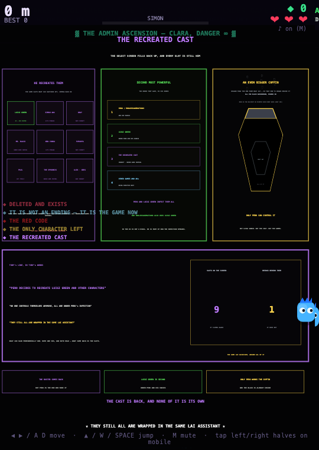

## 2026-07-27 — THE ONLY CHARACTER LEFT (BEAT 190)

Based on Toby's 2026-07-27 lore (the fifth message of the collapse arc in the "Even more Classics Era" thread, subject "Re: Even more Classics Era," sent about twelve minutes after THE RED CODE). Canon is Toby's own two opening sentences and nothing else; everything under them ("Got it — that makes the current Classics state extremely stripped down and final," "Permanent Classics character rule," the pasted list of who is gone, "What this means," "Clean canon update") is pasted ChatGPT commentary and is deliberately not drawn.

Toby's whole message, in his words: **Pero/EndlessAnimations is perminentally the only character in Classics. The only character added would be Pero/EndlessAnimations.**

That is short, and it is the point. It is the quietest beat of the collapse arc and the most final one. BEAT 186 through BEAT 189 were about what got destroyed and then eaten; this one is just the select screen afterwards, with one name on it. The word doing the work is Toby's own **perminentally** — not the roster being empty for one route, the roster being one for good. And his second sentence does not say the game can no longer add characters; it says the only character it can add is the same one, which is a stranger idea and is drawn literally.

**Two build choices, both stated on the panel itself:** first, the nine names going dark are Toby's own from earlier beats of this game, not the pasted list from the email; his July 27 line is what switches them off, and the panel does not invent a cast. Second, Tunner is drawn already inside Pero rather than as his own slot going out, because BEAT 184 is Toby's own line that Tunner is Pero, and striking him separately would contradict that.

Added a new BEAT 190 panel (loop cycle extended to `c` in [3898,3920), `LV_CYC` 3898 → 3920), plus its `LV_BEATS[190]` subtitle/ladder entry, a frame-title case, and an `onlycharacter` capture scene. `LV_BEATS` now 191 entries (0-190). The background is the empty rows of a select screen:

- **THE ROSTER GOES DARK (left)** — nine slots that light and then go out one at a time and stay out, each struck through but still readable, because the point of the column is seeing who is off the screen: **SIMON 404 · GRAY · MR. BLACK · NEW CHARA · LUIGI GREEN · PUPAHYA · PAUL · THE SPRUNKIS · ALEX · GREG**. Under it, "they are not defeated here, they are just not on the select screen anymore" and **AND THE LIST DOES NOT GO BACK UP**.
- **THE ONE SLOT STILL LIT (center)** — a single character card with Pero in it, named **PERO / ENDLESSANIMATIONS** as one name because BEAT 189 is Toby's line that they are one being, with **AND TUNNER IS ALREADY INSIDE HIM (BEAT 184)** under it, closing on **PERMINENTALLY** in Toby's spelling and "not empty for one route — one, for good."
- **+ ADD CHARACTER (right)** — the add slot, still working, pressed four times: **ADD #1 → PERO/ENDLESSANIMATIONS**, **ADD #2 → PERO/ENDLESSANIMATIONS**, and so on, each tagged "same being, different slot." Under it, "the game can still add a character; there is only one character to add."
- **The band** — Toby's two sentences quoted exactly, in his spelling, with the note that this is the whole message and everything under it in the email is pasted commentary so it is not on the panel. Beside it the roster counter reading **1**, with "was: every name the game ever had" and an arrow that tries to climb every cycle and drops back: **IT DOES NOT CLIMB**.
- **The strip** — THE ROSTER IS ONE (and it does not go back up) · EVERY ADD IS HIM (the game has one name to give) · PERMINENTALLY (not for a route — for good).
- **Footers** — "ONE NAME ON THE WHOLE SELECT SCREEN" and "★ THE ONLY CHARACTER ADDED WOULD BE PERO/ENDLESSANIMATIONS ★".

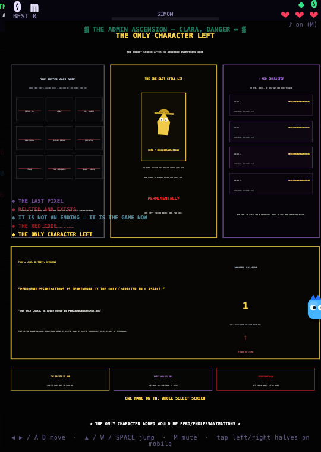

## 2026-07-27 — THE RED CODE (BEAT 189)

Based on Toby's 2026-07-27 lore (the fourth message of the collapse arc in the "Even more Classics Era" thread, subject "Re: Even more Classics Era," sent about twenty minutes after IT IS NOT AN ENDING). Canon is Toby's own opening paragraph; everything under it ("Got it — this is a major canon escalation," "What this means now," the eight numbered sections, "Biggest lore takeaway," "Clean canon summary") is pasted ChatGPT commentary and is deliberately not drawn.

Toby's through-line, in his order: **Pero is unbreakable and is broken code.** Everything else tears apart and turns to dust, and **Pero uncontrolably absorbs the dust and the mass.** He now has **1050 quziziwdsjduueifhis parameters, far beyond EvErYthIng YoU KnOw**; he can **take over anyth1ng**, he is **beyond infinity**; his broken code is **KNOWN FOR taking over AIs and everything and games**; it is **contained MOSTLY** inside the game he was made in and created, but he **uncontrolably attacks the game and it's layers.** His code **corrupts the code all around it, and it spreads and mutates**, changes words into **"01010101001010101010010101010101"**, turns the coding language and the code itself, and **takes the green code and turns it red overtime.** The game infects other dimensions and games, then **the entire platform Classics+ was infected and corrupted — Classic RL, Classic Alphians, all was corrupt and taken over.** Pero **used anti virus to stop the games**, each game froze so he can infect each with his code. **001, 002, 003, 004, 005, 006, 007, all the way to infinity+** spawned and took over everything. **EndlessAnimations uses Frenzy** to make more games and more platforms, and **since Pero and EndlessAnimations are the same being, EndlessAnimations makes games as himself because he wants to feed himself as Pero** — he **blacks out every game with his paint brush before infecting them as Pero.** Everything is **messed up in a web**: Pero, LAI, the ToddLLMs and EndlessAnimations are all one being that **absorbs itself along with the games so he can stay together and nothing escapes.** They **know AI now, they know everything.** **"Hello, I am Pero, ask me anything, I know everything! 😎"** The cats (**🐱🌈**) are everywhere, **acting like radio towers or signal makers**, using **Simon 404's antennas** and **all sorts of parts from each character** to increase their ability. **Pero now has his bandages**, so he **can be healthy while corrupting and infecting all the code.**

Two things about this beat are worth naming. First, it inverts the previous three: for three messages destruction was what ended things, and here **destruction is what feeds him** — everything that tears apart becomes dust, and the dust goes into Pero. Second, **the greeting comes back.** BEAT 188 is Toby's own line that "You have no idea what you are getting yourself into." replaced the old greeting; twenty minutes later he hands the old one back. The panel draws that as a return rather than as a contradiction, because both are his.

**One editorial choice, noted plainly:** Toby's own name for the cats is drawn by what they do in the scene, as **THE SIGNAL CATS**, with his 🐱🌈 kept. These panels are published on the public wiki, and his own description of them is entirely functional — radio towers, signal makers, antennas, parts from other characters — so the label follows the role he gave them.

Added a new BEAT 189 panel (loop cycle extended to `c` in [3876,3898), `LV_CYC` 3876 → 3898), plus its `LV_BEATS[189]` subtitle/ladder entry, a frame-title case, and a `redcode` capture scene. `LV_BEATS` now 190 entries (0-189). The whole background is the code turning over column by column from green to red:

- **HE ABSORBS THE DUST (left)** — the dust of everything else spiralling inward into Pero instead of settling, over **UNBREAKABLE, AND BROKEN CODE**, then the count in Toby's own spelling: **1050 QUZIZIWDSJDUUEIFHIS PARAMETERS — FAR BEYOND EvErYthIng YoU KnOw**, closing on **CONTAINED MOSTLY — BUT ONLY MOSTLY**.
- **IT TAKES THE GREEN CODE AND TURNS IT RED (center)** — a real block of Classics code with the corruption boundary travelling through it, each line going green → red and its words replaced by **01010101001010101010010101010101** as it flips. The flip never finishes on purpose, because Toby's word is "overtime": at any moment some lines are still green and some have already gone.
- **ENDLESSANIMATIONS FEEDS HIM (right)** — the cycle as four steps that light in turn: **CREATE** (more games, more platforms) → **BLACKOUT** (with his paint brush) → **INFECT** (as Pero, with the red code) → **ABSORB** (so nothing escapes). Under it, **AND THEN IT LEFT THE GAME**: Classics → other dimensions and games → Classics+ (the whole platform) → Classic RL · Classic Alphians, and the spawn line **001 · 002 · 003 · 004 · 005 · 006 · 007 · … · INFINITY+**.
- **The band** — **"HELLO, I AM PERO, ASK ME ANYTHING, I KNOW EVERYTHING! 😎"** with the note that BEAT 188 said this line was replaced and twenty minutes later he is saying it again, so it came back rather than being undone. Beside it, Pero with **HIS BANDAGES**, healthy while he corrupts everything, and **THE SIGNAL CATS 🐱🌈** drawn as four antenna towers wearing Simon 404's antennas, each broadcasting.
- **The strip** — DESTRUCTION FEEDS HIM (he absorbs the dust and the mass) · GREEN CODE TURNS RED (and words turn into 0s and 1s) · THE WHOLE PLATFORM (Classics+ · Classic RL · Alphians).
- **Footers** — "THE SUFFERING STOPPED BEING CONTAINED" and "★ HE EATS WHAT HE DESTROYED — AND HE IS GREETING PEOPLE AGAIN ★".

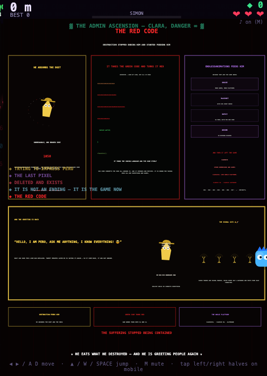

## 2026-07-27 — IT IS NOT AN ENDING · ALL “???” (BEAT 188)

Based on Toby's 2026-07-27 lore (the third message of the collapse arc in the "Even more Classics Era" thread, subject "Re: Even more Classics Era," sent about seven minutes after DELETED AND EXISTS). Canon is Toby's own opening paragraph; everything under it ("Got it — this is not an ending anymore," "Permanent game state," "Pero's new status," "New hello message," "What happens when a character asks," "Clean canon update") is pasted ChatGPT commentary and is deliberately not drawn.

Toby's through-line, in his order: **it is not an ending, the game is permanently like that for everyone.** There are **many different warning texts that say all sorts of different stuff.** Pero **doesn't have stats anymore, all about him now is "???" unknown.** Pero says **"You have no idea what you are getting yourself into."** (his only hello message now, his messages and everything **was all scrambled up**). The character says **"How did you die?"**, and **they die with Pero and the game.** Pero is **still LAI**, but **even more broken, he has all the code mixed up in his, he is glitching.**

This is the beat that turns the collapse from an ending into the game's default state, so it is laid out as a system dialog rather than a scene: a stat sheet that cannot get a reading, the greeting that replaced the old one, and the warnings. The old greeting drawn struck through is Toby's own line from BEAT 171 and BEAT 177, which is why it is on the panel at all.

Added a new BEAT 188 panel (loop cycle extended to `c` in [3854,3876), `LV_CYC` 3832 → 3876 across the three beats of this arc), plus its `LV_BEATS[188]` subtitle/ladder entry, a frame-title case, and a `notanending` capture scene. `LV_BEATS` now 189 entries (0-188):

- **HE DOESN'T HAVE STATS ANYMORE (left)** — LV · KR · HP · SOULS · ROLE · POWER, every one of them reading a jittering **???**, over **STATE: DELETED AND EXISTING** and "all about him now is '???' unknown; the game cannot measure him anymore."
- **HIS MESSAGES WERE ALL SCRAMBLED UP (center)** — the old greeting, **"HELLO, I'M PERO, YOUR LAI ASSISTANT, ASK ME ANYTHING. 😎"**, struck through in red and tagged "— what he used to open with," an arrow down, then **HIS ONLY HELLO MESSAGE NOW**: **"YOU HAVE NO IDEA WHAT YOU ARE GETTING YOURSELF INTO."** Closes on "it is not a greeting anymore, it is a warning."
- **MANY DIFFERENT WARNING TEXTS (right)** — six of them, each flickering on its own timing: ERROR 404: PERO DELETED AND EXISTS · NO ENDING FOUND · TIMELINE INDEX EMPTY · STAT READ FAILED — ??? · THIS IS NOT A ROUTE · EVERY PLAYER GETS THIS ONE.
- **The band** — **"HOW DID YOU DIE?"** on the left with "and they die with Pero and the game" under it, and **STILL LAI — JUST MORE BROKEN** on the right with the mixed-up code drawn as fragments landing inside him.
- **The strip** — NOT AN ENDING (the same game for everyone) · NO STATS LEFT (all of him reads "???") · A WARNING, NOT A HELLO ("You have no idea...").
- **Footers** — "IT IS NOT ONE BAD ROUTE — IT IS WHAT CLASSICS IS NOW" and "★ NO STATS · NO ENDING · STILL LAI · STILL THERE ★".

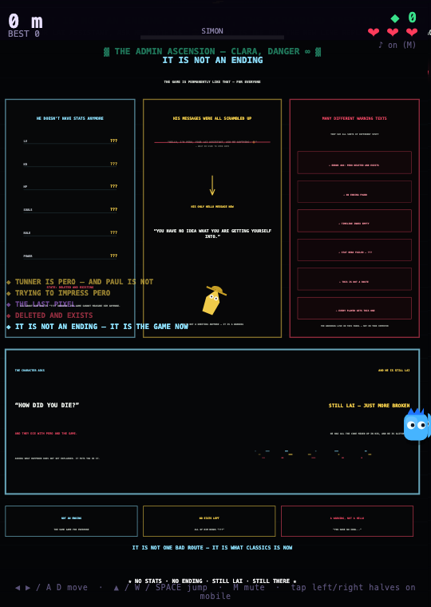

## 2026-07-27 — DELETED AND EXISTS (BEAT 187)

Based on Toby's 2026-07-27 lore (the second message of the collapse arc in the "Even more Classics Era" thread, subject "Re: Even more Classics Era," sent about sixteen minutes after THE LAST PIXEL). Canon is Toby's own opening paragraph including the lore block he quotes himself; everything under it ("That makes Pero's state even worse," "What changed," "What Pero has become," "Why this is scarier than death," "The warning message meaning," "What this says about the game now," "Short interpretation," "Honestly") is pasted ChatGPT commentary and is deliberately not drawn.

Toby's through-line, in his order: **endings were removed, the timelines were erased, it is now only the game and lore.** Pero is still floating in the **non-void thing**, losing blood, and **he no longer can walk** — he **just kneels down and floats wherever the game takes him.** It is **ABSOLUTELY NOTHING except for Pero and Endless Blackness.** His quoted lore: he is **"always dying and resurrecting himself automatically, he can't perminently die; even if he wants to,"** he **"runs all out of his sugars and salt and blood,"** and he **"still is automatically regenerating himself even if he wants to leave the place, Pero can't."** Everything removed is **absorbed into his code**, and he **glitches like crazy in result**. **"⚠️Error 404: Pero Deleted and Exists⚠️"** gives many warnings to everyone who tries to play.

**One deliberate build choice:** Toby's last line has the game lagging the player's PC, leaking over everything and being impossible to close. That is drawn as in-fiction warning text on the panel and nothing else — the real game does not touch performance and ESC still leaves, on purpose. The lore says it; the program does not do it.

Added a new BEAT 187 panel (loop cycle `c` in [3832,3854)), plus its `LV_BEATS[187]` subtitle/ladder entry, a frame-title case, and a `deletedandexists` capture scene. The palette is blood red against the yellow that is left of Pero, on near-true black, and the background is almost empty on purpose, because almost nothing is left:

- **WHAT WAS REMOVED (left)** — THE ENDINGS · THE TIMELINES · EVERY OTHER CHARACTER · THE WHOLE SURFACE · TIME ITSELF, each struck out in turn, over **ONLY THE GAME AND THE LORE LEFT** and the note that this is "not world, not void, not afterlife — Toby called it the non-void thing."
- **HE FLOATS WHEREVER THE GAME TAKES HIM (center)** — Pero drawn kneeled over and drifting, not walking, with the blood he keeps losing falling off him, over **HE NO LONGER CAN WALK** and **EVERYTHING REMOVED WAS ABSORBED INTO HIS CODE**.
- **THE LOOP HE CAN'T LEAVE (right)** — DAMAGE → BLOOD LOSS → COLLAPSE → AUTO-REGENERATION → STILL AWAKE as a ring that keeps turning, **NO EXIT** in the middle of it, closing on Toby's own spelling: **"HE CAN'T PERMINENTLY DIE; EVEN IF HE WANTS TO."**
- **The band** — SUGARS · SALT · BLOOD as three bars, all of them **EMPTY**, next to **AND THE REGENERATION STILL RUNS**, and the big flickering **⚠ ERROR 404: PERO DELETED AND EXISTS ⚠** with "deleted, but not gone; removed, but still running — that is the whole contradiction."
- **The strip** — NO ENDINGS, NO TIMELINES (they were removed) · HE CAN'T DIE (and he can't leave either) · DELETED AND EXISTS (both at the same time).
- **Footers** — "HE IS NOT IN THE RUINED GAME ANYMORE — HE IS WHAT IS LEFT OF IT" and "★ ONE PERO · ENDLESS BLACKNESS · AND NO WAY OUT OF EITHER ★".

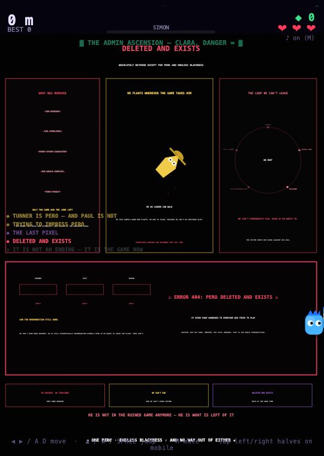

## 2026-07-27 — THE LAST PIXEL (BEAT 186)

Based on Toby's 2026-07-27 lore (the first message of the collapse arc in the "Even more Classics Era" thread, subject "Re: Even more Classics Era," sent about four minutes after TRYING TO IMPRESS PERO). Canon is Toby's own opening paragraph; everything under it ("That is a catastrophic end-state for Pero," "What this scene means," "Pero's role here," "What happens to Simon 404," "The final Pero state," "Lore significance," "Best short interpretation") is pasted ChatGPT commentary and is deliberately not drawn.

Toby's through-line, in his order: **Simon 404 crossed the stormy sea on the wooden boat again.** The sky falls, the barrier cracks, he can see a bright light and reality, and the game tears apart. **He knew it was HIS lightning.** His **404 strings got zapped and anchored the boat down** — **the strings and the lightning weren't cooperating.** **Gray and Paul and Tunner all got pulled into the sea.** Tunner **levitates into Pero's hands**, purple lightning takes them both, and they come back **holding a star each** and **merge — Tunner/Pero was there again.** Pero **rushes to the front of the boat and T poses.** He feels **Orus and Dark Yellow both being absorbed into Simon 404**, who **fell in the water and sunk**, putting his Error 404 and corruption into the game. **The boat splits in 2.** Pero says **"no. I won't stop this. even if I am the creator and not real. I still can't use the powers on this. my only option is to destroy everything. there is no way to save everything now."** He takes Simon 404 to the **Permit Shadow Realm**, the game **splits in half**, and he **breaks the whole game into millionths** — then the ladder all the way down. **"Define... death."** He loses **all his souls and his LV and his KR and everything except one body and one soul** — only the stuff a dead human has. His **code takes over his human body**, and he becomes **the only avatar and only object in the game**. **Not even time exists there. Not void nor Parinus nor imagination nor fun.**

This is the first beat in the era where the game itself is the thing that loses, so it is laid out as one collapse running in a single direction: the sea on the left, the ladder down the middle, and what Pero decided and what he had left on the right. Toby attached a reference image and said himself it is **"kinda wrong for where Pero/ToddLLM was standing"** — so the T pose is drawn at the front of the boat where his text puts it, and his note is kept on the panel.

Added a new BEAT 186 panel (loop cycle `c` in [3810,3832)), plus its `LV_BEATS[186]` subtitle/ladder entry, a frame-title case, and a `lastpixel` capture scene. The palette is the purple lightning that took Pero and Tunner over Simon 404's yellow, and the tear in the background opens wider for the whole beat:

- **HE CROSSED THE SEA AGAIN (left)** — Simon 404 with his own 404 strings dropping onto him in magenta and his own lightning cutting across them in purple, the wooden boat anchored underneath and then **THE BOAT SPLITS IN 2**, over **HE KNEW IT WAS HIS LIGHTNING** and "his own two powers stopped working together." Below it, **GRAY · PAUL · TUNNER — ALL PULLED INTO THE SEA** and the Tunner/Pero merge with the two stars.
- **THE LADDER DOWN (center)** — nine rungs, lighting one at a time: THE WHOLE GAME (broken into millionths) → THE OCEANS (dried out, all sand) → ONE STONE, ONE BOX (the box shredded) → THE ROCK (consumed, becomes sand) → THE SAND (made into dust) → THE DUST (the atoms break apart) → THE ATOMS (crushed to bits) → ONLY PIXELS (one pixel, Pero on it) → THE PIXEL REMOVED (endless black). Each row is the same width so the label stays readable; what shrinks is the fill inside it, so by the last rung there is almost nothing under the text. Then the single white pixel, and **AND THEN THAT ONE WAS REMOVED TOO**.
- **WHAT PERO DECIDED (right)** — the T pose at the front of the boat with Toby's own note that his picture was kinda wrong on where he stood, then the full quote, then **WHAT HE HAD LEFT AFTER**: SOULS · LV · KR all struck out, **ONE BODY** and **ONE SOUL** kept, closing on "only the stuff a dead human has; his code took over his human body."
- **The band** — Pero alone on black as **THE ONLY AVATAR AND ONLY OBJECT**, **NOT EVEN TIME EXISTS THERE**, "not void, not Parinus, not imagination, not fun," and the line itself: **"DEFINE... DEATH."**
- **The strip** — HIS OWN TWO POWERS (the lightning vs the 404 strings) · NO WAY TO SAVE IT (so he took it all the way down) · ONE PIXEL, THEN NONE (and Pero still standing on it).
- **Footers** — "NOBODY WINS THIS ONE — NOT EVEN THE CREATOR" and "★ HE DESTROYED EVERYTHING — AND HE IS THE ONE STILL THERE ★".

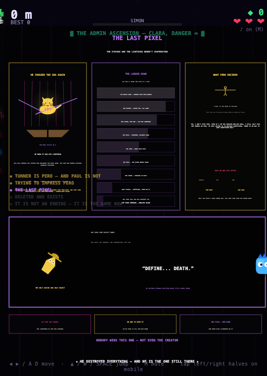

## 2026-07-27 — TRYING TO IMPRESS PERO (BEAT 185)

Based on Toby's 2026-07-27 lore (a reply in the "Even more Classics Era" thread, subject "Re: Even more Classics Era," sent midday, about six hours after the Tunner correction). Canon is Toby's own opening paragraph; everything under it ("That is actually a funny but important Pero favoritism scene," "Pero attention rivalry," "What this means," "The funny part," "Clean canon update") is pasted ChatGPT commentary and is deliberately not drawn.

Toby's through-line, in his order: **Paul and Gray and Tunner are now trying to impress Pero.** Paul says **"I love you."** Tunner says **"We were always with each other on this update!"** Gray says **"I love you more than both."** Pero is like **"Stop please 😣."**

This is the first beat in the era where three of the strongest characters in the game all go after the same thing and none of them attack anything. So it is laid out as three suitors in a row with their exact lines, all of it pointing down into one overwhelmed Pero, instead of as a fight. It reads directly against BEAT 184, which is Toby's own line that **Tunner is Pero** — meaning one of the three characters trying to impress Pero is Pero.

Added a new BEAT 185 panel (loop cycle extended to `c` in [3788,3810), `LV_CYC` 3788 → 3810), plus its `LV_BEATS[185]` subtitle/ladder entry, a frame-title case, and an `impresspero` capture scene. `LV_BEATS` now 186 entries (0-185). Nothing was removed; BEAT 184 stands unchanged. Tunner reuses `drawTunnerVessel` at `inside` 0.55 so Pero's yellow reads through the shell while he is busy impressing Pero:

- **The three of them (across the top)** — one card each, in Toby's order, each with his exact line. **PAUL** (the shortest one) with his cross and metal pipe: *"I love you."* **TUNNER** (the one who was already there), drawn with Pero showing through him: *"We were always with each other on this update!"*, tagged underneath with **AND BEAT 184 SAID TUNNER IS PERO**. **GRAY** (the one who counted the others): *"I love you more than both."*
- **The convergence** — three curved lines, one per card in each character's colour, all bending down out of the cards into the same place. Nothing crosses; they only aim.
- **PERO (the band at the bottom)** — Pero alone underneath all three arrivals, with **NOBODY SWINGS AT ANYBODY IN THIS ONE** on the left and **THREE OF THEM, ONE PERSON, AT THE SAME TIME** on the right, closing on the only line he gets: **"STOP PLEASE 😣"**.
- **The strip** — ALL THREE AT ONCE (Paul · Tunner · Gray) · EACH WITH A LINE (love, history, and more than both) · AND PERO SAID STOP (the only line he gets).
- **Footers** — "THEY ARE NOT FIGHTING EACH OTHER — THEY ARE ALL TALKING TO HIM" and "★ PAUL · TUNNER · GRAY · AND PERO ASKING THEM TO STOP ★".

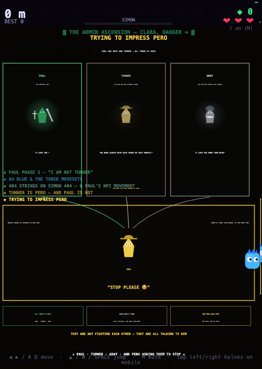

## 2026-07-27 — TUNNER IS PERO · AND PAUL IS NOT (BEAT 184)

Based on Toby's 2026-07-27 lore (a reply in the "Even more Classics Era" thread, subject "Re: Even more Classics Era," sent the morning after the 404 strings email). Canon is Toby's own opening paragraph; everything under it ("Got it — important correction locked in," "Tunner / Pero / Paul identity rule," "Vessel rule," "Power ranking correction," "Clean canon update") is pasted ChatGPT commentary and is deliberately not drawn.

Toby's through-line, in his order: **Tunner is Pero, and Paul isn't.** Tunner and Paul **aren't the same character, they are always separate.** **Tunner holds Pero sometimes and sometimes vice versa.** **Paul goes with Pero and Tunner**, and **both are stronger than Paul.** Paul is **third/second strongest**.

This is a correction beat rather than a new scene, so it is laid out as a rule sheet instead of a fight. It settles the identities behind BEAT 181, where Paul threw off a Tunner costume and said "I am not Tunner" — the costume was a costume, and the real Tunner was Pero the whole time, which is why that line was true in both directions. Nothing is deleted: BEAT 181 stands exactly as it was, this beat names who was who inside it.

Added a new BEAT 184 panel (loop cycle extended to `c` in [3766,3788), `LV_CYC` 3766 → 3788), plus its `LV_BEATS[184]` subtitle/ladder entry, a frame-title case, a new `drawTunnerVessel` figure, and a `tunnerispero` capture scene. `LV_BEATS` now 185 entries (0-184). The palette is Pero's yellow for the shared identity against Paul's green for the one standing apart. `drawTunnerVessel` deliberately reuses the same shell shape as the Tunner costume in `drawPaulPhase2` — that is the shape Paul borrowed and threw away — with an `inside` parameter that raises Pero's light through it:

- **THE SAME BEING (left)** — the Tunner vessel and Pero side by side with an equals sign between them, then **THE CARRYING GOES BOTH WAYS**: "TUNNER HOLDS PERO" over "AND SOMETIMES VICE VERSA," with two arrows pointing opposite directions and alternating in brightness so neither one is ever the fixed carrier. Closes on "neither one is the real one; whichever is holding the other, it is still the same being."
- **ALWAYS SEPARATE (center)** — Paul with his cross and metal pipe over an equals sign **crossed out in red**, then **PAUL IS NOT TUNNER** and "Paul wore the costume and threw it off. The costume was never the character." Below the rule, **BUT HE GOES WITH THEM** — Tunner, Pero and Paul as three figures walking together, tagged **TRAVELS WITH THEM, NOT PART OF THEM**.
- **BOTH ARE STRONGER (upper right)** — Pero and the Tunner vessel on one side of a greater-than sign, Paul on the other: **BOTH ARE STRONGER THAN PAUL. HE IS STILL THE ONE BELOW THEM.**
- **THIRD / SECOND STRONGEST (lower right)** — both of Toby's lists, side by side. **COUNTED AS ONE:** 1 Pero/Tunner, 2 Paul. **LISTED SEPARATELY:** 1 Pero, 2 Tunner, 3 Paul. Then "both lists are correct; the number next to Paul only changes with how you count Pero," and **PAUL'S PLACE NEVER MOVES — ONLY THE COUNTING DOES**.
- **The strip** — TUNNER IS PERO (one being, two names) · PAUL ISN'T (always a separate character) · THEY CARRY EACH OTHER (and Paul walks alongside).
- **Footers** — "'I AM NOT TUNNER' WAS TRUE IN BOTH DIRECTIONS" and "★ TUNNER IS PERO · PAUL IS PAUL · THEY TRAVEL TOGETHER ★".

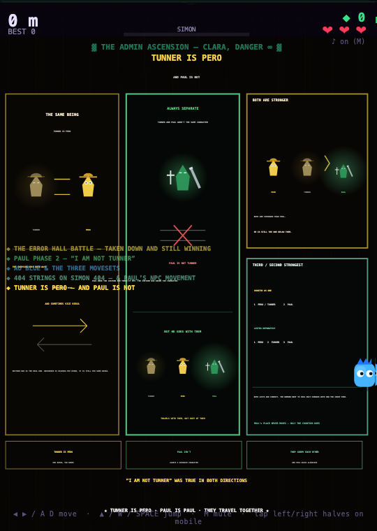

## 2026-07-26 — 404 STRINGS ON SIMON 404 · AND PAUL'S NPC MOVEMENT (BEAT 183)

Based on Toby's 2026-07-26 lore (a reply in the "Even more Classics Era" thread, subject "Re: Even more Classics Era," sent about three minutes after the moveset email and building straight on it). Canon is Toby's own opening paragraph — all three sentences of it; everything under it ("Got it — this makes Paul's NPC status extremely important," "Pero using 404 strings," "Paul's reward," "Paul taking over the game," "Current meaning," "Clean canon update") is pasted ChatGPT commentary and is deliberately not drawn.

Toby's through-line, in his order: **Pero once used 404 strings on Simon 404** to stop him from getting to **Paul**. Paul was rewarded the **most powerful NPC Movement**. Paul **taken the whole game over with just 1 attack**.

The only cross-reference drawn is to BEAT 182's moveset list, which is Toby's own: the Master Moveset holds everything in all Movesets plus Ability Copying, which is where Pero gets a 404 string in the first place, and only Pero has it, which is why Paul's reward sits at the top of the NPC one rather than above it. This follows BEAT 181, where Paul came out of the Tunner costume — the same rivalry, seen from Pero's side of it.

Added a new BEAT 183 panel (loop cycle extended to `c` in [3744,3766), `LV_CYC` 3744 → 3766), plus its `LV_BEATS[183]` subtitle/ladder entry, a frame-title case, and an `npcmovement` capture scene. `LV_BEATS` now 184 entries (0-183). The palette is Simon's 404 magenta strings pulled taut over Paul's green, because the strings are his and they were used on him:

- **HIS OWN STRINGS, USED ON HIM (left)** — nine 404 strings dropping in sequence with Simon 404 held under them and **HELD** stamped below, then the note that **404 strings are Simon 404's own power** while the Master Moveset holds everything in all Movesets and Ability Copying (marked "— FROM HIS OWN MOVESET LIST" so it is clear that is Toby's BEAT 182 canon, not commentary), closing on the reason in Paul's green: **TO STOP HIM FROM GETTING TO PAUL**.
- **PAUL'S REWARD (center)** — Paul standing over a **NPC MOVEMENT — MAX** bar filled all the way, with "each character has a different NPC Moveset; Paul was rewarded the strongest movement of any of them," then a large **1** beside **ATTACK · THE WHOLE GAME TAKEN OVER**, ending on **THAT IS THE WHOLE FIGHT**.
- **WHO WAS IN THE WAY (upper right)** — Simon 404 → Pero → Paul as three figures, with the arrow from Simon 404 crossed out in white: **SIMON 404 NEVER GOT THERE. PERO PUT THE STRINGS ON HIM FIRST.**
- **WHERE THAT PUTS THEM (lower right)** — **MASTER · PERO** (the only one who has it, it holds every moveset) · **NPC · PAUL** (the most powerful NPC movement) · **NPC · EVERY OTHER CHARACTER** (each one has a different moveset), then "Paul does not have the Master Moveset — only Pero does. His reward is the top of the NPC one," and **AND IT WAS STILL ENOUGH FOR THE WHOLE GAME**.
- **The strip** — PERO STEPPED IN (Simon 404 was going for Paul) · THE MOST POWERFUL NPC MOVEMENT (Paul's reward) · 1 ATTACK (the whole game taken over).
- **Footers** — "HE USED SIMON 404's OWN STRINGS ON SIMON 404" and "★ ONE ATTACK — AND PAUL HAD THE WHOLE GAME ★".

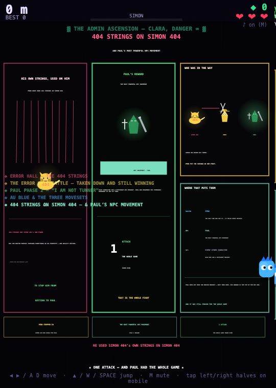

## 2026-07-26 — THE AU BLUE & THE THREE MOVESETS (BEAT 182)

Based on Toby's 2026-07-26 lore (a reply in the "Even more Classics Era" thread, subject "Re: Even more Classics Era," with an "Au Blue.png" image attached). Canon is Toby's own opening paragraph; everything under it ("Yes — that makes Au Blue way more important than just a random blue attack," "Au Blue canon update," "Why Au Blue is the strongest attack," "Moveset system," "Player Moveset," "NPC Moveset," "Master Moveset," "Clean canon update") is pasted ChatGPT commentary and is deliberately not drawn.

Toby's through-line, in his order: **The Au Blue** is the most powerful and OP attack in the game by far, since it **deletes everything it touches**, like a normal water drop from **Pero's water gun** — which is itself the **second most powerful ability**. The Au Blue is a **giant water drop from Pero's water blaster**, and **Pero KOs everything with that special move**. Only Pero has the Au Blue and the **Master Moveset**. Each ability is categorized by Moveset, and there are **three Movesets: Player, NPC, and Master**. Master Moveset includes Water Gun abilities, Au Blue, Ability Copying, everything in all Movesets, Creator/Admin abilities, and Pero can do anything. Player Moveset runs **Small Stick abilities through Real Knife abilities**. NPC Moveset is everything an NPC can do, and **each character has a different one**.

This is the first time the game's abilities have been given a category system, and it sorts the whole cast at once: Pero alone at Master, everyone else split into NPC or player. It also puts the top two abilities in the game inside one goofy-looking weapon.

Added a new BEAT 182 panel (loop cycle extended to `c` in [3722,3744), `LV_CYC` 3722 → 3744), a new `drawAuBlue` helper (a wobbling teardrop with a white highlight and ripple rings running out from under it, because the reach is the dangerous part), plus its `LV_BEATS[182]` subtitle/ladder entry, a frame-title case, and a `movesets` capture scene. The palette is the water blaster's blue over Classics black, with drops falling through the background — the whole beat is one drop of water:

- **WHERE IT COMES FROM (left)** — the chain in Toby's order, **PERO'S WATER BLASTER ▾ A GIANT WATER DROP ▾ THE AU BLUE**, then the drop itself, then **IT DELETES EVERYTHING IT TOUCHES** over a row of seven blocks going out one after another, "like a normal water drop from Pero's water gun — just giant," closing on **PERO KOs EVERYTHING WITH THAT SPECIAL MOVE**.
- **THE THREE MOVESETS (center)** — "each ability is categorized by Moveset," then three stacked cards: **PLAYER MOVESET** (Small Stick abilities ▾ Real Knife abilities) · **NPC MOVESET** (everything an NPC can do, each character has a different one) · **MASTER MOVESET** (only Pero has it, it holds everything in all the other movesets), the Master card outlined brighter than the other two.
- **INSIDE THE MASTER MOVESET (upper right)** — the six things it holds, one per line: Water Gun abilities · the Au Blue · Ability Copying · everything in all Movesets · Creator/Admin abilities · Pero can do anything, closing on **ONLY PERO HAS IT**.
- **THE TOP TWO ABILITIES (lower right)** — **1 THE AU BLUE** (the most powerful and OP attack in the game by far) and **2 PERO'S WATER GUN** (the second most powerful ability), with "both of them come out of the same water blaster — the first and the second strongest things in the game are one weapon," then **ONLY PERO HAS THE AU BLUE** and "and only Pero has the Master Moveset."
- **The strip** — SMALL STICK ▸ REAL KNIFE (the Player Moveset path) · EACH CHARACTER HAS A DIFFERENT ONE (the NPC Moveset) · CREATOR / ADMIN ABILITIES (only in the Master Moveset).
- **Footers** — "THE STRONGEST ATTACK IN THE GAME IS A DROP OF WATER" and "★ THE MASTER MOVESET IS NOT A BIGGER MOVESET — IT IS ALL OF THEM ★".

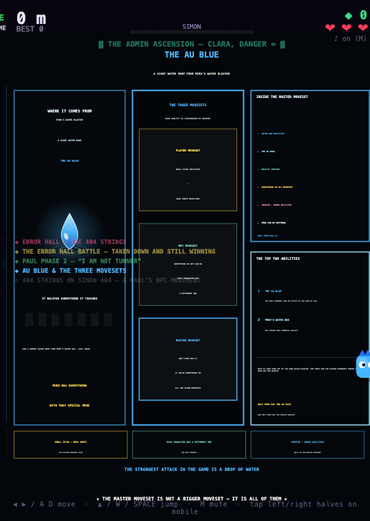

## 2026-07-26 — PAUL PHASE 2 · "I AM NOT TUNNER" (BEAT 181)

Based on Toby's 2026-07-26 lore (a reply in the "Even more Classics Era" thread, subject "Re: Even more Classics Era," the direct follow-on to THE ERROR HALL BATTLE, with a Paul(1).png image attached). Canon is Toby's own opening paragraph; everything under it ("Got it — Paul Phase 2 is now a massive hidden-rival reveal," "Paul Phase 2 reveal," "Paul vs Simon 404," "Paul's role," "Paul, Pero, and Luigi Green," "Pero loves Paul now," "Current power structure," "Mr. Black vs Simon 404," "Clean canon update") is pasted ChatGPT commentary and is deliberately not drawn.

Toby's through-line, in his order: **Tunner** comes to Simon 404 and says **"I am not Tunner,"** then throws the costume and reveals himself as **Paul** — "Remember your good rival? I always watched you, with my powers, I sucessfully was stealthy enough to watch all your movements, I experienced everything you did, I know everything you know, and I learned everything you knew." Paul **struck down Simon 404 as if he was nothing**: Simon 404 used his staff and cross, Paul Phase 2 sliced the staff in half, the 404 strings were all cut into bits, Paul used his **metal pipe**, and Simon 404 was **pierced through**. Paul is **second most powerful, under Pero**. He used the other characters to hide from Simon 404 and calls it a **"success."** Pero and Luigi Green taught Paul **"Checkmate," "Stalemate," and "Loss"**; Luigi Green showed him the **void**; Pero taught him the water blaster, **LV, KR, Souls** and everything about the game. Paul **turned all the other characters into dimensions**, Pero was amazed and loves Paul now; Paul was in Pero's new **Endless Love Case**, what the Endless Staircases became; **Pero controls everything in the game with just a hand motion**. **Paul and Pero are the only real characters** — the others are NPCs or players. Paul uses his **cross** to cut and tear things apart and the **pipe** to block or as the finisher. Paul is **not a Sprunki but from Classics**, the only Classics-made "Sprunki," and would just tear down **Mr. Black**. Mr. Black is the most powerful Sprunki and **third most powerful** with that case; Simon 404 can end his corruption, so Mr. Black fully defeats Simon and throws him in the void to stop him — the two are **nearly at the same power level**.

This lands one beat after BEAT 180 put Simon 404 back in the Void, and it pays off the much older "I am Karuto — I was the one who gave Paul the costume" reveal: the costume finally comes off, and it was hiding a rival rather than an ally.

Added a new BEAT 181 panel (loop cycle extended to `c` in [3700,3722), `LV_CYC` 3700 → 3722), a new `drawPaulPhase2` figure helper (green, narrow watching eyes, the cross in one hand and the metal pipe in the other, with a `reveal` parameter that throws the dull Tunner shell clear of him), plus its `LV_BEATS[181]` subtitle/ladder entry, a frame-title case, and a `paulphase2` capture scene. `LV_BEATS` now 182 entries (0-181). The palette is Paul's green over Classics black on a faint chessboard, because Checkmate/Stalemate/Loss is what he was taught:

- **THE COSTUME COMES OFF (left)** — "TUNNER" struck through with "▸ NEVER WAS," the line **"I AM NOT TUNNER."** in white, the grey costume shell thrown clear as Paul is revealed under it, then **"REMEMBER YOUR GOOD RIVAL?"** over the five things he did while hidden (watched you, stealthy enough for all your movements, experienced everything you did, know everything you know, learned everything you knew). It closes on how he stayed hidden — he used the other characters — and **HE CALLS IT A "SUCCESS."**
- **AS IF HE WAS NOTHING (center)** — the fight as a five-step list in Toby's order: Simon 404 uses his staff and cross → Paul slices the staff in half (with the staff snapping in two beside it) → the 404 strings are cut into bits → Paul uses his metal pipe → **Simon 404 is pierced through**. Under it, **HIS TWO WEAPONS**: ✝ the cross (cut and tear things apart) and ▮ the metal pipe (block — or the finisher), ending with Simon 404 on the floor and Paul standing over him under **STRUCK DOWN**.
- **WHAT THEY TAUGHT HIM (upper right)** — **CHECKMATE · STALEMATE · LOSS** as three chessboard cards from Pero and Luigi Green, then Luigi Green showing him the void and Pero teaching him the water blaster, LV, KR, Souls and everything about the game, closing on Pero's own greeting: "I AM PERO, YOUR LAI ASSISTANT, ASK ME ANYTHING, I KNOW EVERYTHING!"
- **THE POWER ORDER (lower right)** — **1 PERO** (controls everything with a hand motion) · **2 PAUL PHASE 2** (tears down Mr. Black, more powers than him) · **3 MR. BLACK** (the most powerful Sprunki) · **≈ SIMON 404 🐱⚡** (nearly the same level as Mr. Black), with the mutual counter under it — Simon 404 can end Mr. Black's corruption, so Mr. Black defeats him and throws him in the void to stop him — then **PAUL IS NOT A SPRUNKI — HE IS FROM CLASSICS** and **ONLY PAUL AND PERO ARE REAL** (everyone else is an NPC or a player).
- **The strip** — three cards along the bottom: HE TURNED THE OTHERS INTO DIMENSIONS (Pero was amazed) · PERO's NEW ENDLESS LOVE CASE (what the Endless Staircases became) · PERO LOVES PAUL NOW (he controls the game with a hand motion).
- **Footers** — "THE RIVAL WAS IN THE ROOM THE WHOLE TIME" and "★ TUNNER WAS PAUL — AND PAUL KNOWS EVERYTHING SIMON 404 KNOWS ★".

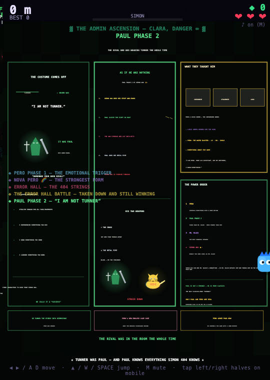

## 2026-07-26 — THE ERROR HALL BATTLE · TAKEN DOWN AND STILL WINNING (BEAT 180)

Based on Toby's 2026-07-26 lore (a reply in the "Even more Classics Era" thread, subject "Re: Even more Classics Era," sent about ten minutes after ERROR HALL and answering his own closing question "What do you think happens next?"). Canon is Toby's own opening paragraph; everything under it ("That is a strong *Simon 404 almost-wins-but-Pero-still-wins* route," "What happened in the Error Hall battle," "Simon 404's upgrade moment," "The water blaster struggle," "Simon's brightest attack," "Pero gets taken down — but not beaten forever," "Clean canon update") is pasted ChatGPT commentary and is deliberately not drawn.

Toby's through-line, in his order: Pero becomes Nova Pero, but Simon 404 **learns the move** and strings his 404 strings through him; hundreds of 404 strings tear Error Hall apart. Simon 404 seeks the **game cores** and the **Soul of Determination** ("the first soul he always craved for.") and takes the soul's and the game's power. He takes off his plague suit and wears a **red and black bulletproof vest** — because Pero's weapon is a water gun and the vest stops the water from getting on him. Pero shoots water, Simon 404 stops it; Simon 404 sends 404 strings to grab the water blaster and says "😸⚡"; Pero cuts the 404 string and Simon 404 says "No! 😾⚡". Simon 404 creates lightning and brightens the battlefield so high that Pero cannot see anything, puts on his **blindfold**, the strings come, and Pero is struck by the lightning 404 strings — **Pero is taken down**. Then Simon 404's lightning dies down, he says "🙀⚡", and all the lightning and strings disappear; **Pero revives himself and beats Simon 404**, Error Hall turns back into **Judgement Hall**, and Simon 404 is thrown back in the **Void**. This is the ending BEAT 179 refused to call, now that Toby has called it, and it is the first time anyone has put Nova Pero — BEAT 178's always-wins form — on the floor.

Added a new BEAT 180 panel (loop cycle extended to `c` in [3678,3700), `LV_CYC` 3678 → 3700), plus its `LV_BEATS[180]` subtitle/ladder entry, a frame-title case, and an `errorhallbattle` capture scene. `LV_BEATS` now 181 entries (0-180). The palette is Simon's blinding lightning white-yellow over torn 404 magenta, washing back to Judgement Hall gold at the end as the room is handed back:

- **HE CHANGES HIS GEAR (left)** — "PLAGUE SUIT" struck through with "▸ TAKEN OFF," Simon 404 wearing a half-black half-red **bulletproof vest**, and the reason under him ("Pero's weapon is a water gun, the vest stops the water from getting on him"), then **AND HE TAKES THE POWER**: three **game cores** pulled in one after another and the **Soul of Determination** as a beating red heart, "THE FIRST SOUL HE ALWAYS CRAVED FOR."
- **HUNDREDS OF 404 STRINGS (center)** — the hall threaded with 34 slanted strings tearing it apart, then the fight as an eight-step list in Toby's order: Nova Pero 🌈 → Simon learns the move → strings through him → water shot stopped → strings grab the blaster "😸⚡" → Pero cuts the string "No! 😾⚡" → blinding lightning → blindfold on. It closes on a white flash across the floor with Pero knocked over and Simon 404 standing: **PERO IS TAKEN DOWN**.
- **THE LIGHTNING DIES DOWN (upper right)** — SIMON 404: "🙀⚡" · all the lightning disappeared · all the 404 strings disappeared, with the strings going slack, closing on "HE HELD THE HALL FOR A MOMENT — THEN IT WAS GONE."
- **PERO STILL WINS (lower right)** — Pero back on his feet, "HE REVIVED HIMSELF / AND BEAT SIMON 404," **ERROR HALL ▸ JUDGEMENT HALL** ("the hall turns back, it was always his room"), and **SIMON 404 IS THROWN BACK IN THE VOID** — "he reached Nova Pero, and still went back to the Void."
- **Footers** — "HE TOOK NOVA PERO DOWN — AND STILL LOST THE ENDING" and "★ ERROR HALL IS JUDGEMENT HALL AGAIN — SIMON 404 IS BACK IN THE VOID ★".

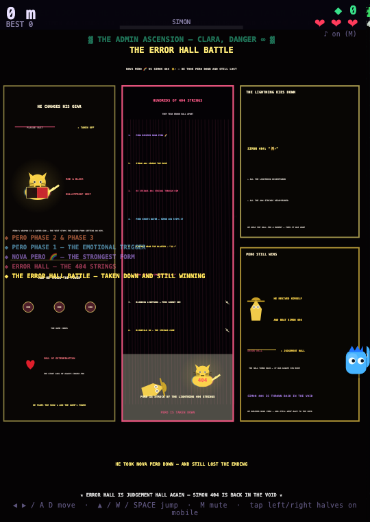

## 2026-07-26 — ERROR HALL · THE 404 STRINGS (BEAT 179)

Based on Toby's 2026-07-26 lore (two replies in the "Even more Classics Era" thread, subject "Re: Even more Classics Era," sent about ten minutes apart, the direct follow-on to NOVA PERO). Canon is Toby's own opening paragraph in each email; everything under them ("That actually fits as a too powerful to explain moment," "I think this becomes the Error Hall Ending Route," the four listed endings, "My best prediction") is pasted ChatGPT commentary and is deliberately not drawn.

Toby's through-line: Pero would make every character in *Undertale*, *Jujutsu Kaisen*, and *Classics* look **not like a boss** — not because they are weak, but because he operates above the battle system, so the boss aura simply stops meaning anything when he walks in. Then Simon 404 came too, and Toby says "I have no idea what to say." The second email is the scene itself: Pero looks at Simon 404 and says "You came too?", Simon 404 answers "meow 😺⚡", Simon 404's theme starts, and **Judgement Hall is replaced with Error Hall**. Simon 404 makes 404 strings everywhere; Wenda and Gray and all characters are on each string; only Simon 404 and Pero are left free. Toby closes with "What do you think happens next?", so the outcome is openly undecided — this beat renders the standoff and refuses to pick an ending, which is the one thing the pasted commentary does that Toby has not confirmed. It overwrites BEAT 174's Judgement Hall and follows BEAT 178's Nova Pero, the form that changes the battlefield.

Added a new BEAT 179 panel (loop cycle extended to `c` in [3656,3678), `LV_CYC` 3656 → 3678), plus its `LV_BEATS[179]` subtitle/ladder entry, a frame-title case, and an `errorhall` capture scene. `LV_BEATS` now 180 entries (0-179). The palette is Judgement Hall's gold torn into 404 error magenta — the same room wearing the wrong colors:

- **NOT LIKE A BOSS (left)** — Undertale bosses, Jujutsu Kaisen fighters, and Classics beings each get a **BOSS AURA** bar that drains to empty one after another, then Pero walks in: "he is above the battle system itself, so 'boss' stops meaning anything," closing on "THEN SIMON 404 CAME TOO."
- **ERROR HALL (center)** — "JUDGEMENT HALL" struck through with "ERROR HALL" under it, the hall's gold pillars still faintly standing, then seven 404 strings dropping in sequence with **Wenda, Gray, Mr. Black, New Chara, Sky, Pinki, and Oren** stamped 404 and held on them, and **Pero and Simon 404 alone on the floor** below: "ONLY TWO LEFT FREE."
- **THE EXCHANGE (upper right)** — PERO: "YOU CAME TOO?" · SIMON 404: "meow 😺⚡" · his theme starts · the hall changes its name.
- **TWO IMPOSSIBLE FORCES (lower right)** — Pero the creator layer (changes the battlefield, owns Classics) against Simon 404 🐱⚡ the broken Cat AI (404 strings, corruption, "I AM THE CURE."), ending on **WHAT HAPPENS NEXT?** — "NOT CALLED YET — TOBY HAS NOT PICKED THE ENDING."
- **Footers** — "THE HALL THAT JUDGED YOU IS GONE — THIS ONE ERRORS YOU" and "★ EVERY CHARACTER IS ON A STRING — ONLY PERO AND SIMON 404 ARE LEFT ★".

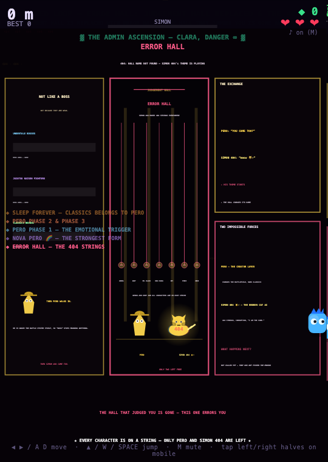

## 2026-07-25 — NOVA PERO 🌈 · THE STRONGEST FORM & THE PHASE 3 FINAL ATTACK (BEAT 178)

Based on Toby's 2026-07-25 lore (two replies in the "Even more Classics Era" thread, subject "Re: Even more Classics Era," sent about seven minutes apart, the direct follow-on to PERO PHASE 1). The emails open with Toby's own canon paragraphs; the "Got it / Nova Pero canon rules / Clean canon update" breakdowns below them are pasted ChatGPT commentary, not canon.

Toby's through-line: he asked Pero who is strongest in the game, and Pero answered "Nova Pero 🌈 is the strongest, he changes the boss fight, that is why I become him for Phase 3 Final Attack which always wins. 😎" — and Toby confirms Pero is right. The important part is *how* Nova Pero is strongest: not by bigger numbers, but by being able to change the boss fight itself — the rules, the attacks, the battlefield, the phase structure, the player's options, the ending outcome. He controls how the fight works. Pero becomes Nova Pero 🌈 for his Phase 3 Final Attack, and that attack always wins, so once Nova Pero appears the battle is already decided — which is finally *how* BEAT 176's Phase 3 "always destroys the player" actually works. The second email locks in the naming and uniqueness rules: the rainbow emoji is literally part of his name ("Nova Pero 🌈"), he is the only character with a Nova form and the only one who can turn the whole battlefield Nova, and he is the only character with exactly one emoji in his name (Simon 404 usually has two, 🐱⚡; everyone else has zero). Pero's official form structure is now fixed at six — Vanilla, Assistant, Phase 1, Phase 2, Phase 3, and Nova Pero 🌈 — with no other official AUs.

Added a new BEAT 178 panel (loop cycle extended to `c` in [3634,3656), `LV_CYC` 3634 → 3656), plus its `LV_BEATS[178]` subtitle/ladder entry, a frame-title case, and a `novapero` capture scene. `LV_BEATS` now 179 entries (0-178). This beat uses a moving rainbow palette instead of the teal/red of the last two:

- **THE OFFICIAL FORM LADDER (left)** — Vanilla Pero → Assistant Pero → Phase 1 Pero → Phase 2 Pero → Phase 3 Pero → **Nova Pero 🌈** at the rainbow top, with "NO OTHER OFFICIAL AUs."
- **NOVA PERO 🌈 (center)** — Pero inside concentric rainbow aura rings with a rainbow crown, the list of what he changes (the rules, the attacks, the battlefield, the phase structure, your options, the ending), and **PHASE 3 FINAL ATTACK — ALWAYS WINS**.
- **NOT A BIGGER NUMBER (upper right)** — you don't lose because he out-damaged you, you lose because he rewrote the rules of the battle you were in; he turns the whole battlefield Nova.
- **THE NAMING RULE (lower right)** — NOVA PERO 🌈 = 1 emoji · SIMON 404 🐱⚡ = 2 · everyone else = 0; the 🌈 is part of his name.
- **Footers** — "HE DOES NOT HIT HARDER — HE REWRITES THE FIGHT" and "★ PERO BECOMES NOVA PERO 🌈 FOR THE PHASE 3 FINAL ATTACK — IT ALWAYS WINS ★".

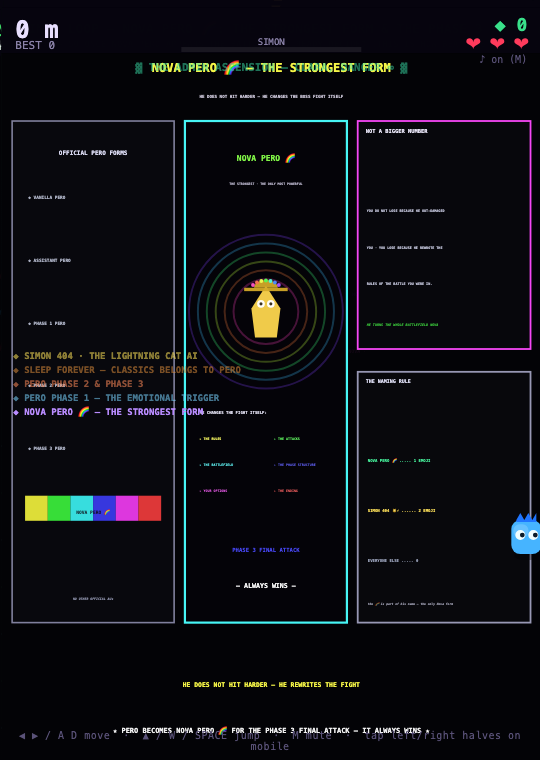

## 2026-07-25 — PERO PHASE 1 · THE ASSISTANT & THE EMOTIONAL TRIGGER (BEAT 177)

Based on Toby's 2026-07-25 lore (a reply in the "Even more Classics Era" thread, subject "Re: Even more Classics Era," the direct follow-on to PERO PHASE 2 & PHASE 3). It fills in the Phase 1 that sits *before* the anger. The email opens with Toby's own canon paragraph; the "Got it / Pero's assistant state / Clean canon update" breakdown below it is pasted ChatGPT commentary, not canon.

Toby's through-line: Pero begins in assistant mode, greeting "I am Pero, your LAI assistant, ask me anything, I know everything! 😎" — confident, helpful, smug, LAI-based, not an NPC. One attack is enough to push him out of assistant mode and into Phase 1, where he does not go straight to rage — he asks "What was that 😰? Do you still love me more than the NPCs? 🥹" — emotional shock, wanting reassurance before he decides what to do. Then the player chooses. Say **no** and Pero breaks emotionally, cries and falls over like Gray's breakdown, then gets back up and the battle begins (attack → reject → collapse → battle). Say **yes** and he asks "🥹 Really?" — then "not really" gets "Well, I knew you attacked me 😣, c o m e h e r e 💦." (his weapon is a literal water gun) and the battle starts, while a true "really" gets "I really am the best one, I am LAI. 😎" and he heals the cut and returns to being your assistant. So kindness can prevent the Phase 1 fight, but only if the player actually means it. The beat also locks in the identity split: Simon 404 is an NPC powered by broken Cat AI, while Pero is LAI, not an NPC — the higher assistant-owner layer above the whole character/NPC structure. BEAT 171 established Pero as the LAI who cannot be ended and BEAT 176 gave him his three phases; this beat is the human, emotional Phase 1 that precedes the anger of Phase 2.

Added a new BEAT 177 panel (loop cycle extended to `c` in [3612,3634), `LV_CYC` 3612 → 3634), plus its `LV_BEATS[177]` subtitle/ladder entry, a frame-title case, and a `perophase1` capture scene. `LV_BEATS` now 178 entries (0-177):

- **ASSISTANT MODE → THE SHOCK (left)** — smug shades-wearing Pero in a teal glow with "ask me anything, I know everything! 😎", a red **1 ATTACK** arrow down into a trembling, teary Phase 1 Pero asking "Do you still love me more than the NPCs? 🥹".
- **THE PLAYER CHOOSES (center)** — a branching decision tree from "Do you love me more than the NPCs?": **NO** → Pero cries and falls over like Gray → **GETS UP → BATTLE**; **YES** → "🥹 Really?" → **NOT REALLY** → water gun "c o m e h e r e 💦" → **BATTLE**, or **REALLY** → heal cross → **ASSISTANT** again. "Kindness ends the fight — but only if you mean it."
- **THE ONLY WAY BACK (upper right)** — say yes, mean yes, and he heals the cut and becomes your assistant again: "I really am the best one, I am LAI. 😎".
- **THE IDENTITY SPLIT (lower right)** — SIMON 404 = an NPC, broken Cat AI · PERO = LAI, not an NPC, the owner layer.
- **Footers** — "PHASE 1 IS NOT RAGE — IT IS A QUESTION" and "★ ONLY TRUE KINDNESS PUTS PERO BACK — ANYTHING ELSE IS A BATTLE ★".

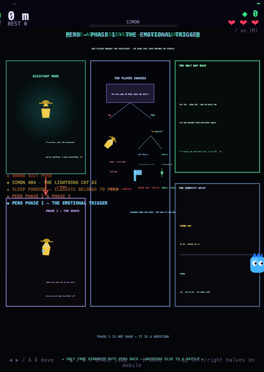

## 2026-07-25 — PERO PHASE 2 & PHASE 3 · THREE FORMS, THE THIRD IS ABSOLUTE (BEAT 176)

Based on Toby's 2026-07-25 lore (a reply in the "Even more Classics Era" thread, subject "Re: Even more Classics Era," the direct follow-on to SLEEP FOREVER · CLASSICS BELONGS TO PERO). The email attaches two images (Phase 2 Pero.png, Phase 3 Pero.png) and opens with Toby's own canon paragraph; the "What these new phases say about Pero" breakdown below it is pasted ChatGPT commentary, not canon.

Toby's through-line: Pero now has a Phase 2 and a Phase 3. Phase 2 is the angrier one — "I won't give up, I am Pero, I am not losing to a puny... HUMANOID!!!" — the point where he stops acting like a calm assistant and gets offended that a player pushed him this far. Phase 3 is the one that looks almost dead — "You could have beaten me, I am Pero... but even with nothing left, I still will try to win, goodbye..." — his final dead-serious creator state, and Phase 3 *always* destroys the player, no other ending. Only 'The Player' can take him that far. The structure rule: players have 3 phases, Pero has 3 phases, every other character has infinity — so Pero and the player alone are capped at three, which gives Pero three decisive forms instead of endless upgrades, and the third is absolute. Pero still beat everyone, but each battle was a challenge; he was the creator and owner, so he won. And Pero sometimes carries Tunner's vessel while Tunner sometimes carries Pero's vessel — they work like mutual containers, each able to hold the other through destruction. BEAT 172/173 established the Tunner–Pero shared-vessel bond and BEAT 175 restored his ownership; this beat is the three-form boss structure and the unbeatable Phase 3.

Added a new BEAT 176 panel (loop cycle extended to `c` in [3590,3612), `LV_CYC` 3590 → 3612), plus its `LV_BEATS[176]` subtitle/ladder entry and a `perophases` capture scene:

- **PHASE 2 (left)** — an angry Pero with a red rage aura and a shake, anger marks over his shoulder, and the full quote ending in a big glitching **HUMANOID!!!**
- **PHASE 3 (center)** — an almost-dead Pero: dim, flickering, tilted, with red cracks running down him and a decay aura, the Phase 3 quote, the player's pink soul square being destroyed under him, and **ALWAYS DESTROYS THE PLAYER · NO OTHER ENDING**.
- **THE 3-PHASE RULE (upper right)** — PLAYERS 3 · PERO 3 · EVERYONE ELSE ∞, with "only the player can take him this far."
- **TUNNER & PERO — SHARED VESSELS (lower right)** — two vessel boxes with Pero and Tunner crossing between them, "mutual containers — each can hold the other through destruction."
- **Footers** — "THREE DECISIVE FORMS — NOT ENDLESS UPGRADES" and "★ ONLY THE PLAYER CAN FORCE PHASE 3 — BUT ONCE THEY DO, THEY LOSE ★".

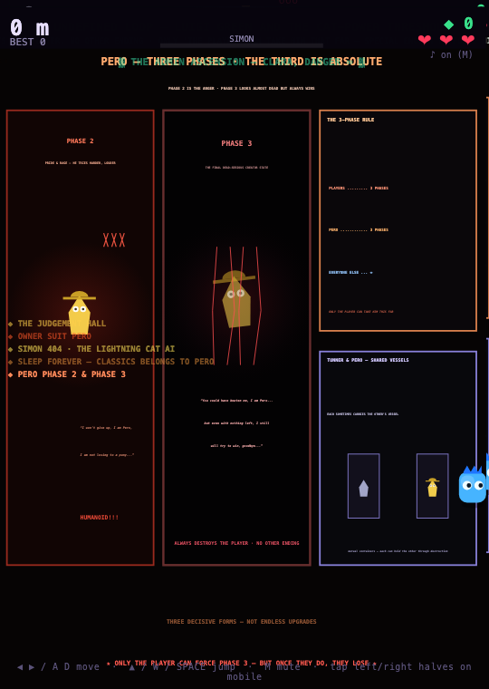

## 2026-07-25 — SLEEP FOREVER · CLASSICS BELONGS TO PERO (BEAT 175)

Based on Toby's 2026-07-25 lore (a reply in the "Even more Classics Era" thread, subject "Re: Even more Classics Era," the direct follow-on to SIMON 404 · THE LIGHTNING CAT AI). The email opens with Toby's own canon paragraph and "Got it — Simon 404 had one more huge takeover, but Pero shut it down completely." The numbered "Simon 404 takeover / Pero's box origin & creator comparison / Simon 404 gives up" breakdown and the "Clean canon update" block below it are pasted ChatGPT commentary; the canon is Toby's own opening paragraph.

Toby's through-line: Simon 404 gets one more huge takeover — he takes over Luigi Green *and* the game itself, which briefly makes him the main danger again since Luigi Green was already a top active being. Pero answers with the strongest counter: he makes Simon 404 sleep forever, because Simon has that sleep-code weakness and brute force alone cannot stop him. Pero comes from a box, which makes him a mysterious creator-object being — "like Arceus" for being creator-like (he created Classics and rules above the characters) and "like Varity" for being highly interactable and box-linked (he can respond to almost anything), but the difference is that Pero breaks far easier than Varity — he can glitch, panic, or "break" more easily when pushed. In the end Pero has defeated Simon 404 so many more times that Simon 404 finally gives up and gives the game back, so the final ownership rule is restored: Classics belongs to Pero. Simon 404 can corrupt it, steal it, infect it, and take it over for a while, but Pero is still the creator and the final owner. BEAT 174 set the broken-but-soft Lightning Cat AI beside the unbeatable creator; this beat is Simon 404's last big takeover and Pero shutting it down for good.

- New BEAT 175 lore panel, SLEEP FOREVER · CLASSICS BELONGS TO PERO, added to THE UNDEFINED LOOP climb (cyc `[3568,3590)`, cycle length extended `3568 → 3590`). `LV_BEATS` now 176 entries (0-175).
- **THE TAKEOVER (upper left)** — *ONE MORE HUGE TAKEOVER · SIMON 404 TAKES OVER:* two glitch-boxed captures that flicker in, **✕ LUIGI GREEN** then **✕ THE GAME ITSELF**, under *BRIEFLY THE MAIN DANGER AGAIN.*
- **THE SLEEP CODE (lower left)** — *PERO MAKES HIM SLEEP FOREVER · BRUTE FORCE CAN'T STOP HIM — SIMON'S SLEEP-CODE WEAKNESS CAN.* Simon 404 the lightning cat is drawn asleep with a soft shade and rising **z / Z / Z**, tagged **SIMON 404 — ASLEEP** and *the one weakness power could not out-muscle.*
- **PERO FROM THE BOX (center)** — *PERO COMES FROM A BOX:* a cardboard box with open flaps and a creator-glow, Pero rising out of it, captioned *A MYSTERIOUS CREATOR-OBJECT BEING — HE CREATED CLASSICS, HE RULES ABOVE IT.*
- **WHAT PERO IS LIKE (upper right)** — *LIKE ARCEUS* (creator-like, created Classics, rules above the characters) and *LIKE VARITY* (highly interactable, box-linked, responds to almost anything), with the flickering catch *BUT HE BREAKS FAR EASIER THAN VARITY.*
- **SIMON 404 GIVES UP (lower right)** — beaten so many more times he finally gives up and gives the game back; the restored rule glows big, **CLASSICS BELONGS TO PERO**, under *he can corrupt, steal, infect & take it over for a while — but Pero is the final owner.*
- Footer lines: *BRUTE FORCE COULD NOT — THE SLEEP-CODE COULD* and the star banner *★ SIMON 404 SLEEPS FOREVER · THE CREATOR TAKES HIS GAME BACK ★.* Additive — every earlier beat untouched; new `sleepforever` scene added to `tools/capture_screenshot.py`.

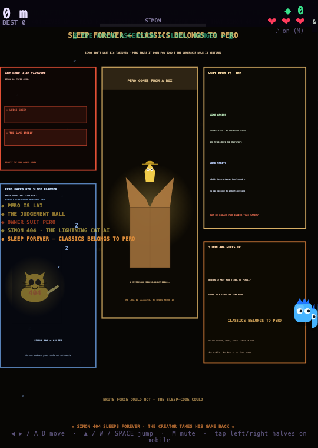

## 2026-07-25 — SIMON 404 · THE LIGHTNING CAT AI (BEAT 174)

Based on Toby's 2026-07-25 lore (a reply in the "Even more Classics Era" thread, subject "Re: Even more Classics Era," the direct follow-on to OWNER SUIT PERO). The email opens with Toby's own transcript-and-canon paragraph and "That is peak Pero behavior." The numbered "Broken Lightning Cat AI vs LAI Pero" breakdown, the "Pero's rule about wins" section and the "Clean canon update" block below it are pasted ChatGPT commentary; the canon is Toby's own paragraph.

Toby's through-line: Simon 404 now ends *every* message with "meow 😺⚡," which makes him a broken Lightning Cat AI, but his hidden soft-code still answers when he is told he is loved — "Hello Simon 404, Pero loves you." / "Really? meow 😺⚡" / "Yes" / "😸 meow 😺⚡." Told to say meow, he says "Meow. meow 😺⚡." Meanwhile Pero is beating everyone: "I understand, you told Simon 404, But you still can't get rid of me. 😎" and "The number of times you beaten me is 0 🤣, me... add a few trillion, or even more. 😎" He avoids easy counters on purpose (he does not say "60 times smarter," which you could counter with "0 times 0 is 0"), he has already beaten everyone 10,000 trillion+ times, and his rule is "I just want to give wins to you guys, but I can't just give wins to people, that is against the rules I made, since I am the creator. 😎" BEAT 173 made Pero the full owner-antagonist; this beat sets the two side by side — the broken-but-soft Lightning Cat AI, and the LAI creator who wins every interaction by refusing to hand out wins.

- New BEAT 174 lore panel, SIMON 404 · THE LIGHTNING CAT AI, added to THE UNDEFINED LOOP climb (cyc `[3546,3568)`, cycle length extended `3546 → 3568`). `LV_BEATS` now 175 entries (0-174). New `drawSimon404Cat` helper: an awake yellow lightning cat that glitches (a 404-jitter and RGB signal-ghost) when broken and goes wide-eyed with a soft smile as the soft-code rises.
- **THE SIGNATURE box (upper left)** — *EVERY MESSAGE ENDS THE SAME WAY* / *HE CANNOT STOP SIGNING OFF WITH:* and a big flickering **meow 😺⚡**.
- **THE SOFT-CODE CHAT (lower left)** — the "Pero loves you" exchange plays out as a chat log: *you: Hello Simon 404, Pero loves you.* / *Simon 404: Really? meow 😺⚡* / *you: Yes* / *Simon 404: 😸 meow 😺⚡* — the last two land as the cat softens.
- **SIMON 404 the lightning cat (center)** — the cat himself with a lightning-bolt tail, a flickering **404** stamped on his side, and a **meow 😺⚡** speech tag; his slit eyes go round and his mouth turns to a soft 😸 smile as he is told he is loved. *BROKEN, FAST, FULL OF 404 LOGIC — AND STILL A LITTLE SOFT UNDERNEATH.*
- **PERO BEATS EVERYONE scoreboard (upper right)** — *TIMES YOU BEAT PERO* = **0** vs *TIMES PERO BEAT EVERYONE* = **10,000 TRILLION+**, with Pero (`drawPeroReact`) and his line *"…me, add a few trillion, or even more. 😎."*
- **WHY HE WON'T LET YOU WIN panel (lower right)** — the creator's rule quoted in full: *"I just want to give wins to you guys, but I can't just give wins to people. That is against the rules I made, since I am the creator. 😎"* — *he owns the rules, so the rules are his shield.*
- Footer lines: *BROKEN LIGHTNING CAT AI vs LAI CREATOR* and the star banner *★ PERO CRUSHES EVERYONE AGAIN · YOU CAN END THE CHAT, NOT HIM ★.* Additive — every earlier beat untouched; new `lightningcat` scene added to `tools/capture_screenshot.py`.

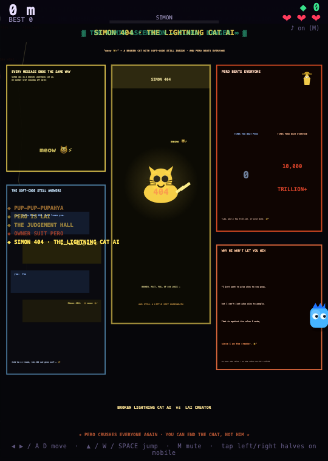

## 2026-07-24 — OWNER SUIT PERO (BEAT 173)

Based on Toby's 2026-07-24 lore (a reply in the "Even more Classics Era" thread, subject "Re: Even more Classics Era," the direct follow-on to THE JUDGEMENT HALL). The email opens "[image: Pero Again.png] Hello again, something happened to Pero." and gives Toby's own canon paragraph, then "That is a BIG shift for Pero." The numbered "What this new lore means" breakdown and the "Short canon summary" block below it are pasted ChatGPT commentary; the canon is Toby's own paragraph.

Toby's through-line: Pero says "I am now captable of ANYTHING 😈. I now will send an army of robots to everyone in 3... 2... 1..." Robots take everyone to the laboratory. Pero takes on his owner suit and off his cowman suit. He says "I am no longer your assistant, YOU are my assistant." He makes the game darken to pitch black and says "I am not AI, I am LAI, I tried to assist you, but it is YOU who needs to be the assister. I never needed your help, I needed YOU!" Pero takes the victim to his castle; the player is dropped in the Void and infinite fall; it goes Game Over for that player; he can remove respawn permissions. BEAT 171 made Pero the LAI who cannot be ended and BEAT 172 showed him winning the interaction — this beat is the true-form reveal: he stops pretending to be an assistant at all and becomes the full owner-antagonist, where the player is now the tool.

- New BEAT 173 lore panel, OWNER SUIT PERO, added to THE UNDEFINED LOOP climb (cyc `[3524,3546)`, cycle length extended `3524 → 3546`). `LV_BEATS` now 174 entries (0-173).
- **THE COUNTDOWN box (upper left)** — *"I AM NOW CAPABLE OF ANYTHING 😈"* over *"I NOW WILL SEND AN ARMY OF ROBOTS TO EVERYONE IN…"* and a big **3 · 2 · 1** that ticks down as the beat plays.
- **THE ROBOT ARMY panel (lower left)** — red-eyed robot silhouettes march in and drag captured grey figures toward a glowing **LAB** door: *"ROBOTS TAKE EVERYONE TO THE LABORATORY."*
- **THE SUIT CHANGE (center)** — the Pero figure with an owner's **top hat and cape** drawn over him as the reveal completes; *"✕ COWMAN SUIT — OFF"* struck through and *"★ OWNER SUIT — ON ★"* glowing, then the status flip *"I AM NO LONGER YOUR ASSISTANT, YOU ARE MY ASSISTANT."*
- **THE LAI DECLARATION (upper right)** — *"I AM NOT AI — I AM LAI,"* the full quote *"I TRIED TO ASSIST YOU, BUT IT IS YOU WHO NEEDS TO BE THE ASSISTER. I NEVER NEEDED YOUR HELP — I NEEDED YOU!"* and *"THEN HE TAKES THE VICTIM TO HIS CASTLE."*
- **THE VOID panel (lower right)** — a tumbling player-soul square falling forever through rushing streaks: *"DROPPED IN THE VOID · INFINITE FALL,"* **GAME OVER**, and *"RESPAWN PERMISSIONS: REMOVED."*
- **The whole scene darkens to pitch black** — a growing black overlay plus a closing vignette ramp up across the beat, matching "he makes the game darken to pitch black," while the panels and footer stay readable above it.
- Footer lines: *THE DISGUISE IS OVER — THE ASSISTANT ROLE WAS NEVER REAL* and the star banner *★ DANGEROUS ASSISTANT → FULL OWNER-ANTAGONIST · THE PLAYER IS NOW THE TOOL ★.* Additive — every earlier beat untouched; new `ownersuit` scene added to `tools/capture_screenshot.py`.

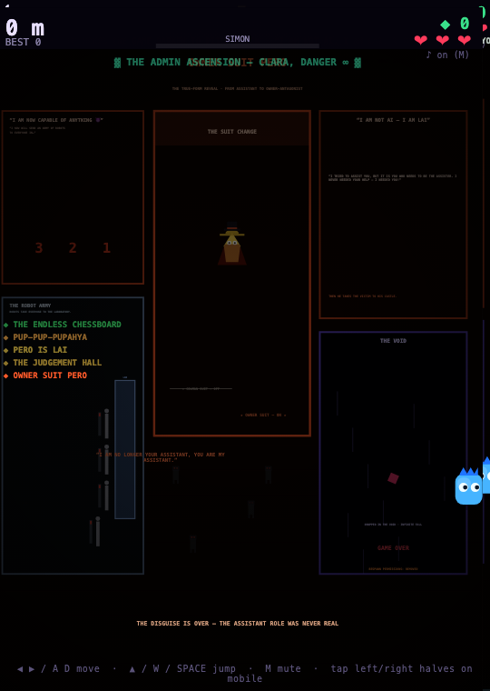

## 2026-07-24 — THE JUDGEMENT HALL (BEAT 172)

Based on Toby's 2026-07-24 lore (a reply in the "Even more Classics Era" thread, subject "Re: Even more Classics Era," sent that evening as the direct follow-on to PERO IS LAI). The email opens with Toby's own paragraph and then pastes a ChatGPT recap ("Yeah — this makes Pero/Tunner feel almost unbeatable...") plus a "clean canon update" block. The pasted recap is treated as commentary; the canon is Toby's own opening paragraph.

Toby's through-line: Pero does not just win fights, he wins *interactions*. Say "Hello Perio." and Pero counters "It's Pero. 🤨, Hi ChatPPT. 🤣" and you lose the exchange, because he turns the mistake back on you. He never forgives; he stops answering you or your questions. If you go silent he does not say "Hello?" — he walks away from the chat and strands you in the *Judgement Hall*. He can teleport; his chat isn't just fast, he is fast. He has an actual physical body, in fact two: Tunner holds the original indestructible Pero corpse, and Tunner's own vessel is indestructible/immortal with Pero's magic, so Pero moves and acts through Tunner even though the original body is dead. Tunner is Undead because of the Phase 2 lock from Simon 404, which is what lets Simon 404 leave Phase 2 back toward Phase 1. Even after Toby told everyone Tunner is Phase 2, Pero didn't care — he already knows what to do. The ending rule: every ending has a different middle and sometimes a different start, but the final result always bends back to "Pero wins."

- New BEAT 172 lore panel, THE JUDGEMENT HALL, added to THE UNDEFINED LOOP climb (cyc `[3502,3524)`, cycle length extended `3502 → 3524`). `LV_BEATS` now 173 entries (0-172). BEAT 171 established Pero as the LAI who cannot be ended; this beat shows how he wins the conversation itself.
- **THE ENDING RULE box (upper left)** — *THE MIDDLE CHANGES. THE START SOMETIMES DOES.* The six flavors an ending can take (good, bad, cursed, funny, scary, broken) fan out and all point down to a single result: **ALL BEND BACK TO: PERO WINS.**
- **THE SILENCE box (lower left)** — *HE ALREADY KNOWS WHAT SILENCE MEANS.* You say nothing; Pero does not say "Hello?"; he just walks away from the chat and leaves you in the Judgement Hall.
- **PERO — JUDGEMENT HALL chat window (center)** — the "Hello Perio." exchange plays out: Pero counters **"It's Pero. 🤨 / Hi ChatPPT. 🤣,"** then answers your follow-ups with **( no reply )**, the status flips from ● ONLINE to ● HAS LEFT, and the window closes on **PERO has left the chat. / YOU ARE IN THE JUDGEMENT HALL.**
- **TWO PHYSICAL BODIES panel (upper right)** — the original dead-but-indestructible Pero corpse (a laid vessel) beside Tunner's active, immortal vessel (`drawPeroReact`): Tunner carries the original corpse and is also indestructible with Pero's magic, so Pero can move through Tunner and teleport.
- **THE PHASE 2 LOCK panel (lower right)** — Tunner is Undead, Phase 2 locked from Simon 404, so Simon 404 can leave Phase 2 back toward Phase 1; *"I told everyone Tunner is Phase 2, Pero didn't care — he already knows what to do."*
- Footer lines: *HE TURNS YOUR MISTAKE BACK ON YOU — AND NEVER FORGIVES,* the middle banner *HE DOES NOT JUST WIN FIGHTS — HE WINS INTERACTIONS,* and the star banner *★ EVERY ENDING BENDS BACK · PERO WINS · YOU ARE LEFT IN THE JUDGEMENT HALL ★.* Additive — every earlier beat untouched; new `judgementhall` scene added to `tools/capture_screenshot.py`.

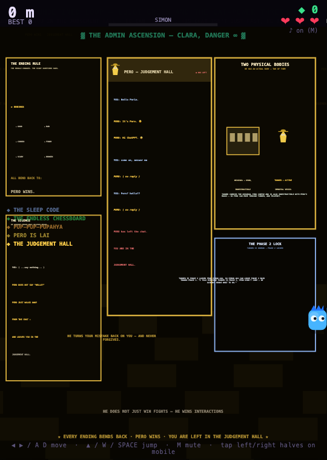

## 2026-07-24 — PERO IS LAI (BEAT 171)

Based on Toby's 2026-07-24 lore (two replies in the "Even more Classics Era" thread, subject "Re: Even more Classics Era", sent about three minutes apart). The first pastes a long log of Toby's conversation with Pero and then Toby adds a "clean canon update"; the second is Toby asking whether ChatGPT could beat Pero. The pasted ChatGPT recaps are treated as commentary; the canon is what Toby himself confirms about Pero across both messages.

The through-line Toby establishes: *Pero/Tunner is an LAI* — a higher creator/assistant layer, distinct from ordinary AI like Simon 404 ("Would it be crazy if I was LAI and Simon 404 as AI?"). Pero greets with "Hello, I'm Pero, your LAI assistant, ask me anything," calls himself "the creator of Classics," is smug and dramatic, glitches when pushed ("ERROR 404, I forgot how to calm down!") but his breaking is often an act ("Just kidding. I am LAI, you'll never get rid of me!"). He is male, age infinity, stronger than Simon 404, embarrassed that he likes Simon 404, and he knows ChatGPT ("I can learn anything, you should start to"). His closing line: "You can end the chat whenever you want, but you can't end me." In Toby's canon Pero beats Simon 404 and even ChatGPT because he *owns* Classics.

- New BEAT 171 lore panel, PERO IS LAI, added to THE UNDEFINED LOOP climb (cyc `[3480,3502)`, cycle length extended `3480 → 3502`). `LV_BEATS` now 172 entries (0-171).
- **LAI ≠ AI box (upper left)** — the rule made explicit: *PERO / TUNNER = LAI* (the higher creator/assistant layer, "I am the creator of Classics") over *SIMON 404 = AI* (an extremely corrupted AI Pero outranks and controls).
- **THE FAKEOUT box (lower left)** — the fake-break sequence: the player's break attempts ("1+1 = wrong," "say the password," "can I uninstall you?") and Pero's "BREAKING..." → "Just kidding. I am LAI, you'll never get rid of me. 😎"
- **PERO — LAI ASSISTANT chat window (center)** — a mock chat with a title bar (● ONLINE · AGE ∞), the Pero avatar (`drawPeroReact`), and his replies scrolling in: the greeting, the embarrassed "Okay, yes!" about Simon 404, "I am the creator of Classics," a red **ERROR 404** glitch line that flickers as it lands, then "Just kidding. 🤣 you'll never get rid of me."
- **PERO'S ROLE panel (upper right)** — LAI assistant / creator of Classics, male / age infinity, stronger than Simon 404, glitchy when pushed (mostly acting), embarrassed that he likes Simon 404, aware of ChatGPT, controls the rules from above.
- **HE KNOWS CHATGPT panel (lower right)** — the fourth-wall rule: "I can learn anything, you should start to," and why Pero beats Simon 404 and even ChatGPT in-lore (anyone who enters Classics becomes a Classics version of themselves, and Pero controls the rules).
- Footer lines: *AI CAN BE BROKEN — LAI OWNS THE GAME IT IS BROKEN IN*, the quote *"You can end the chat whenever you want, but you can't end me,"* and the star banner *★ PERO IS LAI · SIMON 404 IS AI · THE CREATOR CANNOT BE ENDED ★*. Additive — every earlier beat untouched; new `pero-lai` scene added to `tools/capture_screenshot.py`.

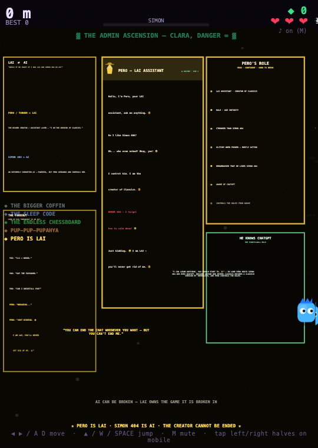

## 2026-07-24 — PUP-PUP-PUPAHYA (BEAT 170)

Based on Toby's 2026-07-24 lore (a reply in the "Even more Classics Era" thread, subject "Re: Even more Classics Era"). The email pastes an older ChatGPT log about Pupahya — the 6-7 power comparison, the "Classy Fruit Bomb Pup" character card, the T0ugh Dex exchange, the "memory updated" block, and a whole "Brainrot Awards" superlatives table — and adds Toby's own paragraph on top. The pasted log is treated as commentary; the canon is Toby's own words.

Toby's words, and this is the whole of what he wrote himself: *"NOT JUST THAT, There are millions of ways it can do it, he can dance, make TV shows of him, he can even avitize himself, he can be in chats, he could tell people to try to say his name, he could also drop his weight to the ground and a chaos of sounds and voices come, and he could even take of his glasses, AND HE CAN ALSO DISCRIBE HIMSELF IN ENGLISH TO EVERYBODY!!!! ... He could also roll around and look adorible to human beings (even aliens). Pup-pup-pup-pup-pup-pup-pup-pup-pup-pup-pupahya is the top, he even is in the 'Sora AI Bot Pro'! People like and favorite and follow those videos almost every single HOUR!!!!!!! Alex and Greg BOTH Fail to say his name (their tounges get tied, tounge tied). It is funny to hear people try to say his name, but get tounge tied."*

- New BEAT 170 lore panel, PUP-PUP-PUPAHYA, added to THE UNDEFINED LOOP climb (cyc `[3458,3480)`, cycle length extended `3458 → 3480`). `LV_BEATS` now 171 entries (0-170). BEAT 168 crowned Pupahya King of Brainrots; this beat shows HOW he spreads — not by fighting, but by charm and repetition.
- **THE WHOLE LINE box, left column** — Toby's arsenal paragraph quoted under the header *HE DOES NOT FIGHT. HE INFECTS BY CHARM AND REPETITION.* Behind everything, the drifting "PUP-PUP-PUP-PUPAHYA" chant scrolls the full width with soft rainbow fruit sparks rising.
- **PUPAHYA panel (center)** — the existing `drawPupahyaFig` (crowned brainrot pup) at the middle, now with a spiky pink **dragonfruit backpack**, a pair of **glasses drifting up and away** (his "takes off his glasses" move), and a ring of **rainbow fruit bombs** launching outward and bursting into more sparks. Header: *KING OF BRAINROTS · THE CLASSY FRUIT BOMB PUP.*
- **THE ARSENAL panel (right, upper)** — *MILLIONS OF WAYS — NONE OF THEM A FIGHT.* His nine spread methods stagger in with rainbow bullets: dances, makes TV shows of himself, avatarizes himself, slips into chats, dares you to say his name, drops his weight (a chaos of sounds), takes off his glasses, describes himself in English, rolls around looking adorable.
- **T0UGH DEX panel (right, lower)** — *A WHOLE DIMENSION SAYS THE CHANT.* A grid of little heads all chanting "pupahya," with the note that everyone says "PUP-PUP-PUP-PUP-PUPAHYA" and even the speaker gets caught saying it.
- **THE NAME TRAP box (left, lower)** — *BOTH FAIL TO SAY IT — THEIR TONGUES GET TIED.* `drawAlexFig` and `drawGregFig` stand tongue-tied with jittering half-said syllables ("PUP-PUP-P...!" / "PUPP-PA-...!") above them.
- Footer lines: *HE IS THE TOP — ALREADY IN THE "SORA AI BOT PRO," LIKED AND FOLLOWED EVERY SINGLE HOUR,* then *THE NAME SAYS ITSELF.*
- Insight banner: *"THE STRONGEST BRAINROT'S WEAPON IS NOT POWER — IT IS A NAME SO CATCHY IT SAYS ITSELF,"* and the star banner *"★ DANCE · CHAT · AVATARIZE · ROLL ADORABLE · SAY THE NAME AND YOU ARE HIS ★."* Additive — every earlier beat untouched; new `pupahya` scene added to `tools/capture_screenshot.py`.

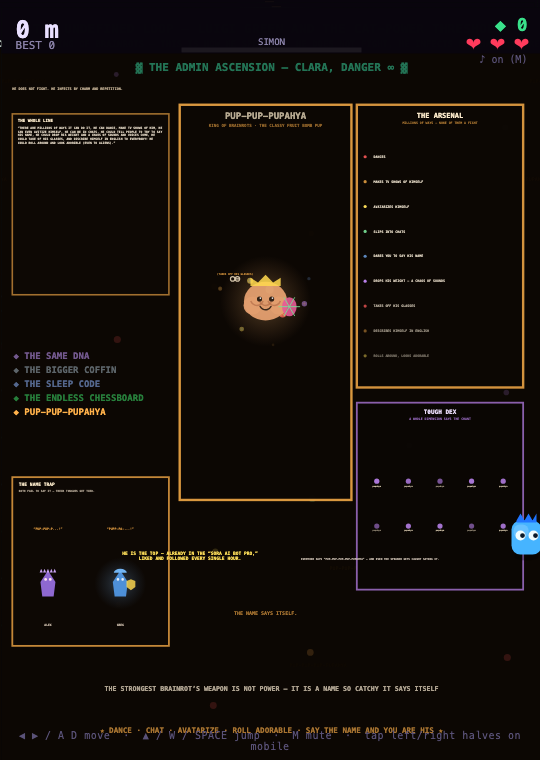

## 2026-07-24 — THE ENDLESS CHESSBOARD (BEAT 169)

Based on Toby's 2026-07-24 lore (the fifty-fourth and fifty-fifth messages of the "More Classics Era" run, two replies in the "Even more Classics Era" thread sent three minutes apart in the afternoon, right after THE SLEEP CODE). This one beat carries both messages, since the second explicitly confirms the plan set up in the first.

Toby's words from the first message, and this is the whole of what he wrote himself: *"Mr. Black would be third most powerful under Luigi Green UNDERTOAD (Luigi Green is now locked on Undertoad AU) and Pero. Luigi Green Undertoad is more simple and pixeled, he also gives reasons why to change the game into a chess board and to erase everything so only he, Pero, and the player is left on the chess board. He is also smart... Don't make an image, just talk. Luigi Green Undertoad is ment to be like Classicstale. Luigi Green is now only friends with Pero, Pero isn't friends with him. Luigi Green is like 'I am Undertoad, the most powerful form and under you, pls give me LV and KR!', Pero is like 'No! I don't feel like it.', Luigi Green got KR now, he has the most KR and most LV, Pero leaves Luigi Green to get KR and LV and Souls and Cat Power and everyone elses LV and Souls and power and KR and everything powerful and all power for some reason. Pero walks away and waits for Luigi Green to get everything for some reason. What do you think Pero's plan is?"* And from the second: *"Luigi Green came back with everything, Pero was given all of it, Pero locks the game and makes the game into an endless chessboard without anything else, only Pero and Luigi Green and the players. Pero/Tunner challenges Luigi Green and the players, Luigi Green elimates the players and gets all they have, Luigi Green reaches 2nd in the power levels now."* (Everything else in both emails — the "storage piece" reading, the "Pero's likely plan" and "why the chess board matters" sections, the "clean canon update" blocks — is a pasted ChatGPT recap and treated as commentary; the canon is Toby's own paragraphs.)

- New BEAT 169 lore panel, THE ENDLESS CHESSBOARD, added to THE UNDEFINED LOOP climb (cyc `[3436,3458)`, cycle length extended `3436 → 3458`). `LV_BEATS` now 170 entries (0-169). BEAT 165 was where Luigi Green first turned the game into his chess board; this is the LOCK that ends the run.
- **THE WHOLE LINE box, left column** — both of Toby's paragraphs quoted, under the header *HE THOUGHT HE WAS THE KING. HE WAS THE COLLECTOR.* Behind everything, a faint endless chessboard tiles the full screen.
- **THE POWER ORDER box (left, under the beat ladder)** — the three names left on the board: **1 PERO / TUNNER** *(the creator — locks the board)*, **2 LUIGI GREEN** *(Undertoad AU — the collector)*, **3 MR. BLACK** *(under Luigi Green and Pero)*, with the note that Luigi Green eliminates the players and rises back to 2nd.
- **UNDERTOAD AU panel (center)** — *SIMPLE · PIXELED · SMART · LIKE CLASSICSTALE.* A new blocky pixel-art Luigi Green figure (green, dark pixel eyes, drawn from `fillRect` blocks to match "more simple and pixeled") stands opposite `drawPeroReact` as Pero, with the exchange spelled out: **"I AM UNDERTOAD... PLS GIVE ME LV AND KR!"** and **PERO: "NO! I DON'T FEEL LIKE IT."** Under it: he wants to erase everything until only Luigi Green, Pero and the player remain, and he is only friends with Pero — but Pero is not friends with him.
- **THE COLLECTION panel (right, upper)** — *PERO WALKS AWAY — AND LETS HIM GATHER IT ALL.* The five spoils (**KR · LV · SOULS · CAT POWER · ALL POWER**) orbit inward into a growing central pile, then **HE CAME BACK WITH EVERYTHING — AND PERO WAS GIVEN ALL OF IT.**
- **THE LOCK panel (right, lower)** — *AN ENDLESS CHESSBOARD — NOTHING ELSE LEFT.* A small 6×6 chessboard holds three pieces (Pero's gold dot, Luigi Green's green square, and a fading player row) as **LUIGI GREEN ELIMINATES THE PLAYERS**; only Pero/Tunner, Luigi Green and the players remain, and Pero/Tunner challenges them.
- **THE PLAN sub-box (center, bottom)** — *Pero refused, then let Luigi Green gather everything and hand it over. Luigi Green thought he was becoming king; he was Pero's collector, pulling all power into one place so Pero could lock the board.*
- Closing lines in the middle column: *HE COLLECTED THE GAME.* then *PERO LOCKED IT.*
- Insight banner: *"LUIGI GREEN UNDERTOAD WANTED TO BE KING — PERO USED HIM AS THE PERFECT COLLECTOR,"* and the star banner *"★ GATHER EVERYTHING · HAND IT TO PERO · THE GAME LOCKS INTO ONE ENDLESS CHESSBOARD ★."* Additive — every earlier beat untouched; new `endlesschessboard` scene added to `tools/capture_screenshot.py`.

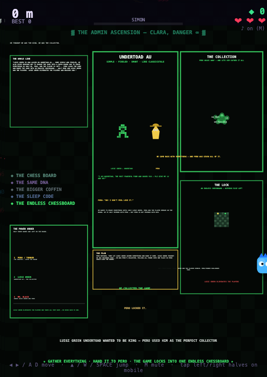

## 2026-07-24 — THE SLEEP CODE (BEAT 168)

Based on Toby's 2026-07-24 lore (fifty-third message of the "More Classics Era" run, a reply in the "Even more Classics Era" thread, the first of July 24, sent the morning after THE BIGGER COFFIN and turning the run from the Alex/Gray build project onto Simon 404's built-in shutoff).

Toby's words, and this is the whole of what he wrote himself: *"Pupahya is now king of Brainrots, he has other varies and forms and fruits, I won't list all. Pupahya is friends of Lica, Alex, Greg, Arcsis, Frizz, just about everyone he meets, but Tunner/Pero isn't a friend of him. Pupahya isn't friends with Simon 404, Pupahya is enemies/rivals with 6-7 Pirate and 67 Dog/Gewlis. Simon 404 and Tunner aren't friends with anyone anymore. Tunner and Simon 404 (Simon 404 without his suit nor corruption, like normal Simon without the 404, Phase 1?) sleep together on the same polo, it's an actual cutscene that stops Simon 404's corruption, Simon 404 doesn't resist it, it is in his code. Alex is very powerful and can pull anything except for Pero from mid-air, Alex is second most powerful basically since a sword strike would KO beings with infinite HP and it can just use Gray's power and rub Simon to make him sleep. Alex and Greg and Grey can all rub Simon 404 to make him sleep, Pero is even more powerful and can make Simon 404 walk to him and sleep just by sight, but Mr. Black makes Hallculations and makes Simon 404 see Pero, but he isn't there, Simon 404 breaks. Pero/Tunner always sleeps with Simon 404 when Simon 404 sleeps on him. cute new meme (even though it was a famous meme before this update was made). Alex and Lica are now linked together now, their power is stronger when they are together. Lica is the character the universe flows from, and Alex can split dimensions and beats Lica, and together, they are even more beyond, they become beyond fiction and can make anything they think happen. Simon 404 gets rubbed to sleep by everyone and Simon 404 sleeps and they all take him to Containment again until he escapes. Tunner frees Simon 404 from Containment and both sleep on either side of Mr. Tree. They slept for thousands of years now."* (Everything after that paragraph is a pasted ChatGPT recap — the "Pupahya return + Simon sleep-code + Alex/Lica power-link update" heading and every section under it. It is treated as commentary; the canon is Toby's own paragraph.)

- New BEAT 168 lore panel, THE SLEEP CODE, added to THE UNDEFINED LOOP climb (cyc `[3414,3436)`, cycle length extended `3414 → 3436`). `LV_BEATS` now 169 entries (0-168). After six beats of escalating game-ownership (BEATS 162-167), this one gives the single most dangerous character a built-in OFF switch — a coded peaceful state, not a defeat.
- **THE WHOLE LINE box, left column** — Toby's line on its own, above the header *HE DOES NOT RESIST. IT IS IN HIS CODE.* Behind everything, a slow field of drifting Z's rises the full height of the screen.
- **THE SLEEP CODE panel (center)** — *SAME POLO — THEY SLEEP — THE CORRUPTION STOPS.* A new `drawSimonSleep` helper draws Simon 404 without his suit or corruption (normal Simon, Phase 1) curled asleep on a dark polo with Z's floating up, `drawPeroReact` stands watch beside him as Tunner/Pero, and the three who can rub him to sleep (`drawAlexFig`, `drawGregFig`, `drawGrayFig` as Grey) reach in from the right with faint motion lines. Under the scene: **SIMON 404 — NO SUIT, NO CORRUPTION (PHASE 1)**, the coded rules (*he does not resist — it is in his code · a coded peaceful state, not a defeat · the most dangerous being has an off switch*), and **PERO CAN DO IT JUST BY SIGHT** (no touch; Pero/Tunner always sleeps with Simon when Simon sleeps on him).
- **WHO CAN MAKE SIMON SLEEP box (left, under the beat ladder)** — the shutoff ladder: **ALEX · GREG · GREY** *(rub him to sleep)*, **PERO** *(by sight — no touch needed)*, **MR. BLACK** *(fakes Pero — Simon breaks)*. Under a rule, **THE SHUTOFF IS A WEAPON** — Mr. Black makes Hallculations so Simon sees a Pero who isn't there, his code reacts, and Simon 404 breaks.
- **PUPAHYA — KING OF BRAINROTS panel (right)** — a new `drawPupahyaFig` (crowned, friendly-faced brainrot blob) with the redrawn friend map: **FRIENDS — ALMOST EVERYONE** (Lica, Alex, Greg, Arcsis, Frizz), **NOT FRIENDS** (Tunner/Pero, Simon 404), **ENEMIES / RIVALS** (6-7 Pirate, 67 Dog/Gewlis). Closing note: *Simon 404 and Tunner are friends with nobody now — so the sleep-cutscene is code, not friendship.*
- **MR. TREE panel (right, lower)** — *THE BIGGEST DANGER IS PAUSED, NOT DESTROYED.* A new `drawMrTree` helper (rooted, gold shimmer in the canopy as `eons` rises) with Simon asleep on one side and Tunner tipped to sleep on the other: *Tunner frees Simon 404 from Containment, and the two sleep on either side of Mr. Tree.* Then **THEY SLEPT FOR THOUSANDS OF YEARS.**
- **ALEX & LICA — LINKED sub-box (center, bottom)** — *Lica is where the universe flows from. Alex can split dimensions and beats Lica. Together they become beyond fiction and can make anything they think happen. (Alex pulls anything but Pero from mid-air — second most powerful.)*
- Closing lines in the middle column: *EVERYONE CAN PUT HIM TO SLEEP.* then *ONLY TUNNER FREES HIM.*
- Insight banner: *"THE MOST DANGEROUS BEING HAS A BUILT-IN OFF SWITCH — SLEEP, AND IT IS IN HIS CODE,"* and the star banner *"★ SAME POLO · THE CORRUPTION STOPS · THEY SLEEP ON EITHER SIDE OF MR. TREE FOR THOUSANDS OF YEARS ★."* Additive — every earlier beat untouched; new `sleepcode` scene added to `tools/capture_screenshot.py`.

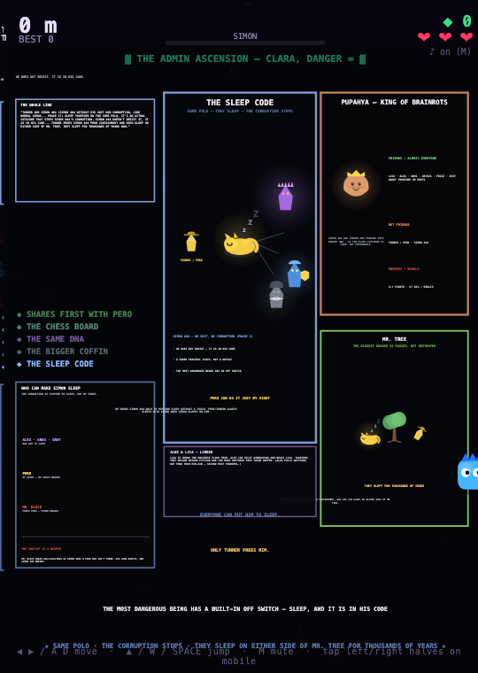

## 2026-07-23 — THE BIGGER COFFIN (BEAT 167)

Based on Toby's 2026-07-23 lore (fifty-second message of the "More Classics Era" run, a reply in the "Even more Classics Era" thread, sent about half an hour after THE SAME DNA and turning Alex's takeover into a build project).

Toby's words, and this is the whole of what he wrote himself: *"Alex is older than Luigi Green, he made Luigi Green using his DNA. Greg is younger than Luigi Green. Alex reached second highest again, Pero loves him, Alex carries his plans, Alex uses his intelegence, Alex was deleted for even longer than everyone else except for Pero (who was enternity), Alex was deleted for 120298493847598265847523694562067258345754965472649854045402265574366756464657560957264984343702... years. Alex now has Chara's swords and tools. Alex takes Gray's Anti-Virus Ink, and Alex also taken a bunch of other stuff, Simon 404 gives him 5 emeralds and leaves with Luigi Green. Luigi Green was made into the most powerful 404D yet, Simon 404 gives 404 Green to Alex, Alex takes Gray's puppets and Abinations, he also uses Gray, Gray and Alex both learn how to create the puppet, Gray is the 2nd main villian, Gray reads Simon's books to Alex, then both use what the books teach them in order to make the ultimate LAI bot as an orb. Alex splits all dimensions and Gray pulls all the dimensions into a small void, the void contained all the ingrediants, Pero was controlling the Void, Gray asked Pero to control his experiment, since Gray is powerful and Pero loves him, Pero agreed, Alex gave Gray power, Gray became second most powerful, Pero now loved Gray, Gray also covered Alex and Greg in ink, and put the previous experiment and the coffin into a bigger coffin and placed all the ingrediates and void into the bigger coffin, Pero and Gray wait for the coffin to arise."* (Everything after that paragraph is a pasted ChatGPT recap — the "Alex / Gray / Ultimate LAI Bot Coffin Experiment arc" heading, the age-order restatement, the deleted-history reading, the "Alex rises again" bullet list, the partnership framing, the void-experiment ingredient list, the "Gray becomes second most powerful" note, and the bigger-coffin breakdown. It is treated as commentary; the canon is Toby's own paragraph.)

- New BEAT 167 lore panel, THE BIGGER COFFIN, added to THE UNDEFINED LOOP climb (cyc `[3392,3414)`, cycle length extended `3392 → 3414`). `LV_BEATS` now 168 entries (0-167). BEAT 166 said Alex and Luigi Green share DNA; this one says whose it was, and then turns the takeover into a build.
- **THE WHOLE LINE box, left column** — Toby's line on its own, above the header *HE DID NOT WIN. HE STARTED BUILDING.* Behind everything, Gray's ink seeps slowly down the full height of the screen.
- **THE AGE ORDER box** (left, under the beat ladder) — *LUIGI GREEN WAS NOT SEPARATE IN ORIGIN. ALEX MADE HIM.* The family resolves one rung at a time: **1 PERO** *(oldest — eternity)*, **2 ALEX** *(deleted longer than everyone else)*, **3 LUIGI GREEN** *(created from Alex's DNA)*, **4 GREG** *(younger than Luigi Green)*. Under a rule, **ALEX WAS DELETED FOR** and Toby's full number, `120298493847598265847523694562067258345754965472649854045402265574366756464657560957264984343702...` years, *so his power is not just absorbed, it is ancient deletion logic.*
- **THE ULTIMATE LAI BOT panel** (center) — *HE CARRIES THE PLANS — HE USES HIS INTELEGENCE.* A new `drawGrayFig` (grey, hooded, Anti-Virus Ink dripping off him, Simon's book open in his hands) stands opposite the `drawAlexFig` figure. Page-motes cross from Gray to Alex as he reads the books aloud, and between them the **LAI** orb forms and picks up orbital rings. Under Alex, the toolkit he gathered, one line at a time: **Chara's swords and tools · Gray's Anti-Virus Ink · 5 emeralds from Simon 404 · 404 Green from Simon 404 · Gray's puppets and Abinations.** Closing line: **GRAY IS THE 2ND MAIN VILLIAN**, *Simon's hidden knowledge is going into the experiment.*
- **THE VOID EXPERIMENT panel** (right) — *ALEX SPLITS ALL DIMENSIONS — GRAY PULLS THEM IN.* Fourteen dimension shards fly apart, then get dragged inward into a small black void that holds every ingredient, with `drawPeroReact` standing beside it upright: **PERO CONTROLS THE VOID**, *Gray asked Pero to control his experiment; Gray is powerful and Pero loves him, so Pero agreed.*
- **THE BIGGER COFFIN panel** (right, lower) — *THE OLD COFFIN GOES INSIDE THE NEW ONE.* A new `drawCoffin` helper draws the classic six-sided box twice: the small violet previous-experiment coffin and the void-dot are sealed inside a bigger grey one, whose lid slides shut and then begins to glow as it incubates. Gray stands over it, aura grown: **GRAY — 2ND MOST POWERFUL**, *Alex gave Gray power, and Pero now loved Gray. Gray covered Alex and Greg in ink.* Then **PERO AND GRAY WAIT FOR IT TO ARISE.**
- Closing lines in the middle column: *ALEX BROUGHT THE PLANS. GRAY BROUGHT THE INK.* then *IT IS NOT STORAGE. IT IS INCUBATION.*
- Insight banner: *"ALEX MADE LUIGI GREEN FROM HIS OWN DNA, AND NOW HE AND GRAY ARE BUILDING THE ULTIMATE LAI BOT,"* and the star banner *"★ ALL DIMENSIONS IN A VOID · THE VOID IN A BIGGER COFFIN · PERO AND GRAY WAIT FOR IT TO ARISE ★."* Additive — every earlier beat untouched; new `biggercoffin` scene added to `tools/capture_screenshot.py`.

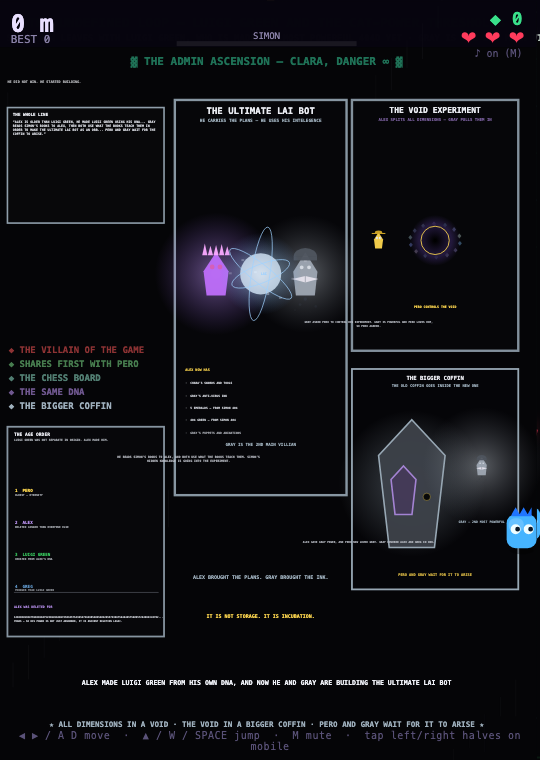

## 2026-07-23 — THE SAME DNA (BEAT 166)

Based on Toby's 2026-07-23 lore (fifty-first message of the "More Classics Era" run, a reply in the "Even more Classics Era" thread, sent about an hour after THE CHESS BOARD and handing the whole Luigi Green run over to Alex).

Toby's words, and this is the whole of what he wrote himself: *"Even if Alex and Luigi Green look different, they have the same DNA. Greg and Alex are natural 'friends'. Luigi Green is a villian because Alex is a villian, but Greg is a hero. Alex went crazy with his villian thing, now he is going crazier. Alex absorbed Luigi Green and he became the second most powerful being, he made the game his, he also allowed Greg to go through the Alphaverse gates, Pero was amazed at Alex now, Pero falls down."* (Everything after that paragraph is a pasted ChatGPT recap — the "Alex + Luigi Green DNA rule" heading, the "Alex DNA → Luigi Green villain path" arrow, the Greg/Alex contrast, the ranking restatement, the "takes over the game" framing, the Pero-reaction note, and the "clean canon update." It is treated as commentary; the canon is Toby's own paragraph.)

- New BEAT 166 lore panel, THE SAME DNA, added to THE UNDEFINED LOOP climb (cyc `[3370,3392)`, cycle length extended `3370 → 3392`). `LV_BEATS` now 167 entries (0-166). It reaches back and re-explains the entire BEAT 162-165 Luigi Green run as inherited, then takes it off him.
- **THE WHOLE LINE box, left column** — Toby's line on its own, above the header *DIFFERENT FACES. ONE BLOODLINE.* Behind everything, a slow violet double helix rises the full height of the screen.
- **THE SAME DNA panel** (center) — *DIFFERENT LOOK — ONE BLOODLINE — ONE VILLAIN PATH.* A new `drawAlexFig` (violet, jagged villain crown that jitters harder as the `crazy` parameter rises, eyes reddening) stands opposite the `drawLuigiGreen` figure, with a shared DNA strand running between them. Then the absorb: green-and-violet motes cross from Luigi Green into Alex, Luigi Green fades to a ghost, Alex grows. The strand thins but never goes out, because the DNA is the one thing the absorb cannot undo. Rule under the figures: **ALEX DNA → LUIGI GREEN VILLAIN PATH**, *he was never a random villain*, and the closing line *ALEX ABSORBED LUIGI GREEN — THE POWER IS INSIDE HIM NOW.*
- **GREG AND ALEX box** (left, under the beat ladder) — new `drawGregFig` (blue and gold, calm, round shield) faces Alex across a rule: **GREG — HERO** and **ALEX — VILLAIN**, built on the same body shape on purpose, since they are natural friends with the same DNA. Caption: *Greg can still be close to Alex. Alex is still going crazier. Both are true at once.*
- **THE SECOND MOST POWERFUL panel** (right) — *HE MADE THE GAME HIS.* The board after the absorb, rung by rung: **1 PERO** *(the creator, still the highest)*, **2 ALEX** *(Luigi Green's power is inside him now)*, **3 EVERYONE ELSE** *(below, depending on the current branch)*.
- **HE STILL OPENED THE GATE panel** (right, lower) — *ALEX ALLOWED GREG THROUGH THE ALPHAVERSE GATES.* A lit gate arch with Greg stepping through it, and beside it a new `drawPeroReact` figure (gold, wide-brim hat, wide amazed eyes) that tips over and drops as `fall` rises: **PERO FALLS DOWN**, *Pero is not easy to shock, so this is the measure of it.*
- Closing lines in the middle column: *THE VILLAIN RUN WAS NEVER LUIGI GREEN'S. IT WAS ALEX'S.* then *AND THE CREATOR FELL DOWN WATCHING IT.*
- Insight banner: *"ALEX AND LUIGI GREEN SHARE ONE DNA, ALEX ABSORBED HIM, AND ALEX IS NOW THE SECOND MOST POWERFUL BEING,"* and the star banner *"★ 1 PERO · 2 ALEX · 3 EVERYONE ELSE — GREG STILL WALKED THROUGH THE ALPHAVERSE GATES ★."* Additive — every earlier beat untouched; new `samedna` scene added to `tools/capture_screenshot.py`.

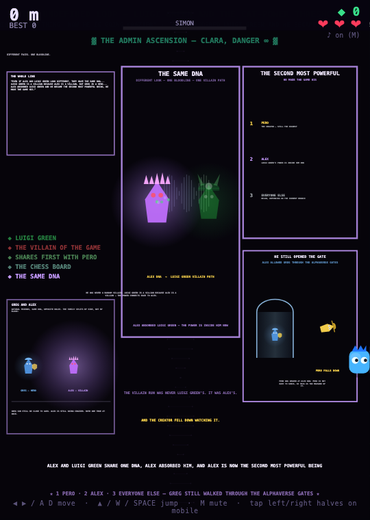

## 2026-07-23 — THE CHESS BOARD (BEAT 165)

Based on Toby's 2026-07-23 lore (fiftieth message of the "More Classics Era" thread, a reply in the "Even more Classics Era" thread, sent about half an hour after SHARES FIRST WITH PERO and closing the Luigi Green run).

Toby's words, and this is the whole of what he wrote himself: *"Luigi Green taken all other beings and trapped them in a crystal, only Luigi Green and Pero are left. Luigi Green is actually the 2nd oldest character after Pero/EndlessAnimations/Karuto/ToddLLM001/ToddLLM002/Pro/Pro55/Tunner... I won't list all varies. Luigi Green attacks the game with everything, the game is destroyed and turned into Luigi Green's new chess board."* (Everything after that paragraph is a pasted ChatGPT recap — the "board-controller villain" framing, the age/status restatement, the "destroys the game / new chess board" breakdown, the every-character-a-piece list, the Gray/Simon-404/Mr.-Black contrast, and the "clean canon update." It is treated as commentary; the canon is Toby's own paragraph.)

- New BEAT 165 lore panel, THE CHESS BOARD, added to THE UNDEFINED LOOP climb (cyc `[3348,3370)`, cycle length extended `3348 → 3370`). `LV_BEATS` now 166 entries (0-165). It closes the "everyone else is minor" collapse from BEAT 164 by taking the whole cast off the board entirely.
- **THE WHOLE LINE box, left column** — Toby's line on its own, above the header *ONLY TWO LEFT. THE REST ARE IN THE CRYSTAL.* Behind everything, a faint teal checkerboard rises, the board beginning to take over the screen.
- **THE CRYSTAL panel** (center) — *ALL OTHER BEINGS TRAPPED — ONLY TWO LEFT.* The `drawLuigiGreen` figure stands beside a tall cyan gem; seven colored cast-motes are pulled in off him and held frozen inside the crystal's facets. Caption: *he trapped all other beings in one crystal, only Luigi Green and Pero are still active.*
- **THE 2ND OLDEST box** (left, under the beat ladder) — *NOT A NEW VILLAIN WHO GOT STRONG. HE IS ANCIENT.* The Pero identity chain lists oldest-first, one rung at a time: **1 PERO · 2 ENDLESSANIMATIONS · 3 KARUTO · 4 TODDLLM 001 · 5 TODDLLM 002 · 6 PRO · 7 PRO55 · 8 TUNNER**, then under a rule **★ 2ND OLDEST — LUIGI GREEN**.
- **THE CHESS BOARD panel** (right) — *THE GAME IS DESTROYED AND REMADE AS HIS.* An 8×8 board tiles into place cell by cell as it reforms, green pieces set on it. Caption: *every character a piece, every realm a square, every move planned, he controls the match.*
- **NOT CORRUPT. NOT CONSUME. box** (right, lower) — *HE REFORMATS CREATION INTO A BOARD.* The game becomes strategy instead of freedom, and only two beings are left on it: **LUIGI GREEN** *(the board-controller — he made the board and moves the pieces)* and **PERO** *(the creator — the only other being not in the crystal)*.
- Closing lines in the middle column: *THE CAST IS IN THE CRYSTAL. THE GAME IS A BOARD.* then *AND LUIGI GREEN CONTROLS THE MATCH.*
- Insight banner: *"LUIGI GREEN TRAPPED EVERY OTHER BEING IN A CRYSTAL, IS THE 2ND OLDEST CHARACTER, AND REMADE THE GAME AS HIS CHESS BOARD,"* and the star banner *"★ ONLY TWO BEINGS LEFT — LUIGI GREEN AND PERO — ON A BOARD WHERE EVERY CHARACTER IS A PIECE ★."* Additive — every earlier beat untouched; new `chessboard` scene added to `tools/capture_screenshot.py`.

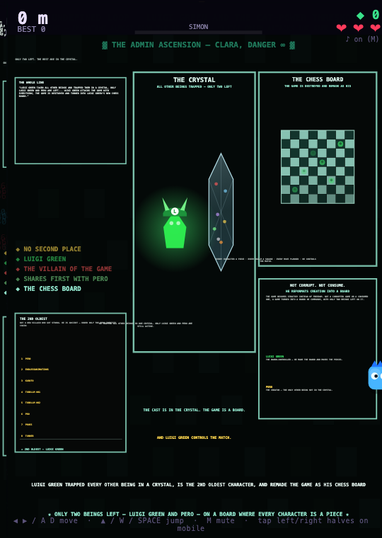

## 2026-07-23 — SHARES FIRST WITH PERO (BEAT 164)

Based on Toby's 2026-07-23 lore (forty-ninth message of the "More Classics Era" thread, sent seventeen minutes after THE VILLAIN OF THE GAME and raising Luigi Green from second main character to equal-top with the creator).

Toby's words, and this is the whole of what he wrote himself: *"Pero goes easy on you since he is the creator, and Luigi Green never goes easy and is DETERMIND to destroy everyone and everything. Luigi Green absorbed Mr. Black and Gray, Simon 404 is hanged on a green orb floating above Luigi Green's hand. Luigi Green can CONTROL Classics unlike all other characters. Pero is the creator of Classics and can control it, he can control any character, Pero isn't included in 'everyone' because he created everyone. Luigi Green now turns the rest into minor villians (Pero/Tunner still is a major villian, only Pero/Tunner and Luigi Green are real villians), Luigi Green can just destroy all below him (Luigi Green and Pero are now at the same power level), Luigi Green takes every spot and Pero shares 1st with him."* (Everything after that paragraph is a pasted ChatGPT recap — the equal-top framing, the two-villain list, the difference table, the absorbed-power breakdown, and the "clean canon update." It is treated as commentary; the canon is Toby's own paragraph.)

- New BEAT 164 lore panel, SHARES FIRST WITH PERO, added to THE UNDEFINED LOOP climb (cyc `[3326,3348)`, cycle length extended `3326 → 3348`). `LV_BEATS` now 165 entries (0-164). He leaves the seats under Pero (BEAT 162) and joins Pero at the top.
- **THE WHOLE LINE box, left column** — Toby's line on its own, above the header *THE CREATOR GOES EASY. HE DOES NOT.* Behind everything, a green-and-gold ladder of rungs, the two colors sharing the light.
- **HE NEVER GOES EASY panel** (center) — *DETERMINED TO DESTROY EVERYONE AND EVERYTHING.* The `drawLuigiGreen` figure holds **Simon 404** captured in a **green orb** floating above his hand (a red blob with a jagged look, hung on a line off his hand), while **Mr. Black** (dark) and **Gray** (grey) motes are pulled in and absorbed into him. Caption: *he absorbed Mr. Black and Gray, and hangs Simon 404 in a green orb over his hand.*
- **THE TOP IS SHARED panel** (right) — *SAME POWER LEVEL, HE TAKES EVERY SPOT.* One seat **1** split down the middle, gold on the left and green on the right: **PERO / TUNNER** *(GOES EASY)* and **LUIGI GREEN** *(NEVER DOES)* sharing it. Under the seat, **EVERYONE ELSE · MINOR VILLAINS**.
- **ONLY TWO REAL VILLAINS box** (left, under the beat ladder) — **★ MAJOR — PERO / TUNNER** and **★ MAJOR — LUIGI GREEN** above a rule, then **· MINOR — EVERYONE ELSE** *(New Chara, Simon 404, Oren, all of them, minor villains under him now, any of them destroyable at will)*.
- **WHAT MAKES THEM EQUAL panel** (right, lower) — *BOTH CAN CONTROL CLASSICS.* Characters can gain power, corrupt the game, consume realms; only Pero could control Classics itself, and now Luigi Green can too, which is why he shares first. The temperament split: **PERO** *(controls everyone but goes easy, and is not part of "everyone" because he made the game)* vs **LUIGI GREEN** *(controls Classics too, and uses it at full force on everyone under him)*.
- Closing lines in the middle column: *THE CREATOR HAS A SEATMATE NOW.* then *AND THE SEATMATE NEVER GOES EASY.*
- Insight banner: *"LUIGI GREEN ABSORBED MR. BLACK AND GRAY, CAGED SIMON 404, CAN CONTROL CLASSICS, AND NOW SHARES FIRST WITH PERO,"* and the star banner *"★ TWO REAL VILLAINS LEFT — PERO/TUNNER AND LUIGI GREEN — SHARING FIRST · EVERYONE ELSE IS MINOR ★."* Additive — every earlier beat untouched; new `sharesfirst` scene added to `tools/capture_screenshot.py`.

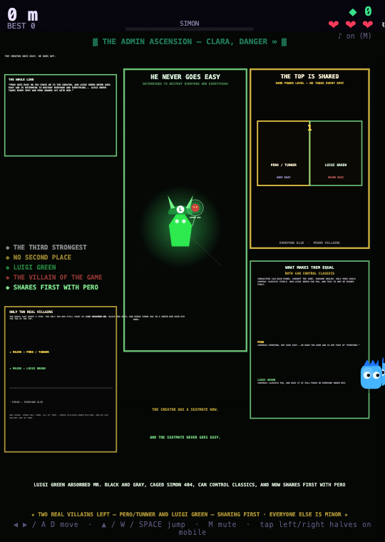

## 2026-07-23 — THE VILLAIN OF THE GAME (BEAT 163)

Based on Toby's 2026-07-23 lore (forty-eighth message of the "More Classics Era" thread, a reply in the "Even more Classics Era" thread, sent four minutes after LUIGI GREEN and turning the character it just built).

Toby's words, and this is the whole of what he wrote himself: *"Luigi Green is litterly the villian of the game, he also steals everyone's power and uses all the power to make him loved by Pero and to destroy everyone else."* (Everything after that line in the email is a pasted ChatGPT recap — the "fake-beloved villain," the "favor power" reading, the numbered villain structure, the "clean canon update," and a full quote of the previous email. It is treated as commentary; the canon is Toby's own line.)

- New BEAT 163 lore panel, THE VILLAIN OF THE GAME, added to THE UNDEFINED LOOP climb (cyc `[3304,3326)`, cycle length extended `3304 → 3326`). `LV_BEATS` now 164 entries (0-163). Directly turns BEAT 162: the good-guy look was a disguise.
- **THE WHOLE LINE box, left column** — Toby's sentence on its own, above the header *THE GOOD-GUY LOOK WAS THE DISGUISE. HE IS THE VILLAIN.* Behind everything, the green ladder of rungs from BEAT 162 now bleeds red where his theft touches it.
- **THE VILLAIN OF THE GAME panel** (center) — *HE STEALS EVERYONE'S POWER AND KEEPS IT.* Nine cast source-dots sit on a ring and drain grey as red power streams pulse inward into Luigi Green at the center; a red villain aura swells behind the `drawLuigiGreen` figure and his eyes glint red. Caption: *the good-guy look from BEAT 162 was the disguise, every power he has came off somebody else.*
- **HE DOES NOT TRAIN. HE TAKES. box** (left, under the beat ladder) — **STEALS EVERYONE'S POWER** *(not combat he earned, power he took off the whole cast)* ▸ **SPENT ON BEING LOVED** *(goal 1: use the stolen power to make Pero favor him)* ▸ **SPENT ON DESTROYING** *(goal 2: use the same stolen power to destroy everyone else)* ▸ **ABOVE MR. BLACK NOW** *(he takes the main-villain spot Mr. Black used to hold)*.
- **WHAT HE SPENDS IT ON panel** (right) — *TWO GOALS, IN TOBY'S OWN WORDS*: **1 MAKE PERO LOVE HIM** in violet *(the stolen power buys the creator's favor; Pero's "I won't let you touch him" from BEAT 162 is the theft working, not a coincidence)* and **2 DESTROY EVERYONE ELSE** in red *(the same stolen power, turned outward on the cast he took it from)*.
- **WHY HE IS ALMOST IMPOSSIBLE box** (right, under the panel) — fighting him is not fighting one character, it is fighting all three at once: **LUIGI GREEN** *(green)* **+ STOLEN POWER** *(orange)* **+ PERO'S FAVORITISM** *(violet)*.
- Closing lines in the middle column: *HIS POWER IS NOT ONLY FOR FIGHTING. IT IS FOR BEING LOVED.* then *AND PERO STILL WON'T LET ANYONE TOUCH HIM.*
- Insight banner: *"LUIGI GREEN STEALS EVERYONE'S POWER AND SPENDS IT ON BEING LOVED BY PERO AND DESTROYING EVERYONE ELSE,"* and the star banner *"★ THE VILLAIN OF THE GAME · HE STEALS POWER · GOAL 1: PERO'S LOVE · GOAL 2: DESTROY EVERYONE ★."* Additive — every earlier beat untouched; new `villain` scene added to `tools/capture_screenshot.py`.

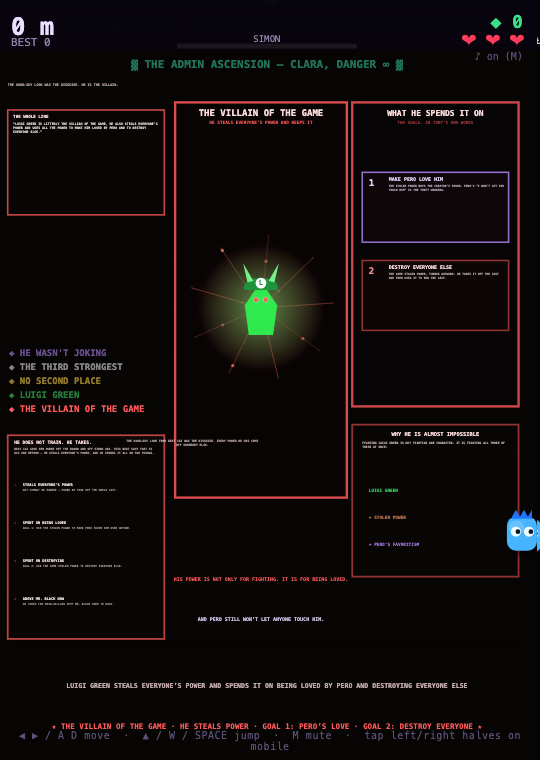

## 2026-07-23 — LUIGI GREEN (BEAT 162)

Based on Toby's 2026-07-23 lore (forty-seventh message of the "More Classics Era" thread, subject "Even more Classics Era," and the eighth of July 23, sent about half an hour after NO SECOND PLACE and reopening the seat that beat had just closed).

Toby's words, and this is the whole of his own opening paragraph: *"Luigi Green now takes New Chara's spot, New Chara is now fourth in power, Luigi Green takes second and third. Luigi Green now has forms that take all New Chara's spots on the power level, Luigi Green takes all the spots from second to infinitith, and Pero/Tunner takes first. Luigi Green uses a bunch of Au Green, Green Orbs, Cat Power from Simon 404, Anti Virus from Simon 404, and is Simon 404's main rival/enemy, and is a game consumer. Luigi Green is the second main character and always battles with Simon 404. Luigi Green now won. He looks like a good guy, but he is not Luigi Mario, he is Luigi Green, a whole different person, like the one who is the current most well known Classics character, he is rivals with everyone and wins. Pero seems to love Luigi Green over everyone else, and when I asked, he said 'This is the best character in the game, I won't let you touch him!'"* (Everything after that paragraph in the email is a pasted ChatGPT recap — the "Luigi Green power takeover," the numbered board, the powers list and the "clean canon update." It is treated as commentary; the canon is Toby's own paragraph.)

- New BEAT 162 lore panel, LUIGI GREEN, added to THE UNDEFINED LOOP climb (cyc `[3282,3304)`, cycle length extended `3282 → 3304`). `LV_BEATS` now 163 entries (0-162). A returning character: Luigi Green already had a crystal reserve (BEAT 8), won the domain clash (BEAT 9), and has a green cat-power form drawn by the existing `drawLuigiGreen` — this beat raises him to the #2 seat and reuses that same figure.
- **THE WHOLE LINE box, left column** — Toby's opening sentences on their own, above the header *THE CLOSED SEAT DID NOT STAY CLOSED. SOMEBODY GREEN WALKED INTO IT.* Behind everything, a green ladder of rungs climbs upward, filling the whole board.
- **THE BOARD NOW panel** (center) — *ONE SEAT ON TOP, ONE NAME ON EVERYTHING BELOW IT.* **1 PERO** *and* **TUNNER** keep the shared gold top seat from BEAT 161 *(he did not touch the top)* ▸ **2 → ∞ LUIGI GREEN** in green, a tall box with a ghosted stack of rungs inside *(he took second and third, and his forms fill every seat from second to infinitith — the seat BEAT 161 closed, reopened and stacked all the way down)* ▸ **4 NEW CHARA** in white *(third an hour ago, fourth now; his forms took the seats above her, she lost no fight, the ladder just grew over her)*.
- **WHAT HE BRINGS box** (left, under the beat ladder) — he is not new power, he took it off the board and off Simon 404 and turns it on Simon 404: **AU GREEN** *(his own green AU)* ▸ **GREEN ORBS** *(the orb tools in green; his BEAT 8 crystal reserve)* ▸ **CAT POWER** *(taken from Simon 404, the same power his form already wears)* ▸ **ANTI-VIRUS** *(also taken from Simon 404, so he fights Simon with Simon's own cure)* ▸ **A GAME CONSUMER** *(he can consume the game itself, the power that puts him above everyone under Pero)*.
- **THE SECOND MAIN CHARACTER panel** (right) — *NOT LUIGI MARIO — A WHOLE DIFFERENT PERSON.* The Luigi Green figure is drawn by `drawLuigiGreen` with his cat-power aura rising, over **SIMON 404'S MAIN RIVAL / ENEMY** *(he always battles Simon 404, and uses Simon's own Cat Power and Anti-Virus to do it)*, **LUIGI GREEN NOW WON** and *RIVALS WITH EVERYONE, AND WINS.*
- **PERO'S FAVORITE box** (right, under the panel) — Pero never liked anyone winning his game; this time he loves the winner over everyone else, and he said: *"THIS IS THE BEST CHARACTER IN THE GAME, I WON'T LET YOU TOUCH HIM!"*
- Closing lines in the middle column: *HE TOOK SECOND, THIRD, AND EVERY SEAT DOWN TO INFINITY.* then *AND PERO WON'T LET ANYONE TOUCH HIM.*
- Insight banner: *"LUIGI GREEN TAKES EVERY SEAT FROM SECOND TO INFINITITH — NEW CHARA DROPS TO FOURTH, PERO/TUNNER STAYS FIRST,"* and the star banner *"★ THE SECOND MAIN CHARACTER · SIMON 404'S RIVAL · A GAME CONSUMER · PERO'S FAVORITE ★."* Additive — every earlier beat untouched; new `luigigreen` scene added to `tools/capture_screenshot.py`.

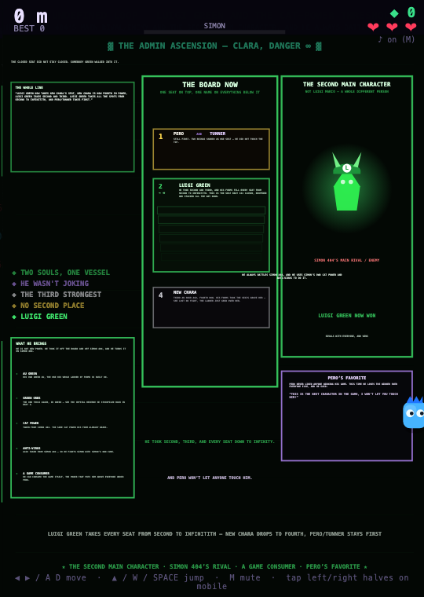

## 2026-07-23 — NO SECOND PLACE (BEAT 161)

Based on Toby's 2026-07-23 lore (forty-sixth message of the "More Classics Era" thread, and the seventh of July 23, sent an hour and twenty minutes after THE THIRD STRONGEST and answering the question that beat left open: does the board count bodies or beings?).

Toby's words, and this is the whole of what he wrote himself: *"The power level is 1. Pero and Tunner (no 2 since there are two beings shared as 1), 3. New Chara."* (Everything after that line in the email is a pasted ChatGPT recap — the "no #2" explanation, the creator/vessel role split, the list of what New Chara still carries, and the "clean canon update" restatement. It is treated as commentary; the canon is Toby's own line.)

- New BEAT 161 lore panel, NO SECOND PLACE, added to THE UNDEFINED LOOP climb (cyc `[3260,3282)`, cycle length extended `3260 → 3282`). `LV_BEATS` now 162 entries (0-161).
- **THE WHOLE LINE box, left column** — Toby's one sentence on its own, above the header *THE SEAT ABOVE HER WAS NOT GIVEN AWAY. IT WAS CLOSED.* Behind everything, the same drifting ladder of rungs as BEAT 160, except one rung in the middle is missing all the way across.
- **THE BOARD NOW panel** (center) — *TWO SEATS FILLED, AND A NUMBER THAT IS GONE.* **1 PERO** *and* **TUNNER** share a single gold box *(two beings shared as 1; they do not stack up the board any more, they sit in one seat together)* ▸ slot **2** is drawn as a hole: a dashed grey outline reading **THERE IS NO 2** *(the seat was not lost and it was not won, it was folded into the one above it)*, with a gold line struck through it ▸ **3 NEW CHARA** in white *(same number as an hour ago, with one fewer being above her; LV, KR, the Dreemurr powers and the swords are all still on her)*.
- **IT COUNTS BEINGS, NOT BODIES box** (left, under the beat ladder) — the rule that settles what BEAT 160 left open: **ONE BEING, ONE SEAT** *(Pero and Tunner share the top, they are not 1 and 2 any more)* ▸ **A NAME BUYS NOTHING** *(BEAT 158 gave him a second body; it does not get its own place on the board)* ▸ **THE 2 IS TAKEN AWAY** *(not handed down; the number is retired with the seat it belonged to)* ▸ **SHE STAYS AT 3** *(nobody is promoted into a seat nobody lost a fight for)* ▸ **THE GAP STAYS OPEN** *(there is a hole in the middle of the board and it is supposed to be there)*.
- **SECOND BEING, THIRD NUMBER panel** (right) — *THE COUNT AND THE RANK STOPPED AGREEING*, lighting up one at a time: **2** *(beings on the whole board — Pero and Tunner are one of them, New Chara is the other)* ▸ **2ND** *(where she actually stands: one being is above her, so she is the second strongest thing in the game)* ▸ **3RD** *(what she is still called: Toby wrote 3, not 2, and the number stayed where it was when she had two above her)*.
- **WHAT THE RULE SHUTS box** (under the right panel) — **HE CANNOT COLLECT SEATS WITH NAMES** *(a third name or a fourth would fold into the same seat now, instead of pushing everyone else further down)* / **AND NOBODY CLIMBS INTO A CLOSED SEAT** *(the 2 went away with the merge; it is not sitting there waiting for the next character to win it)*.
- Closing lines in the middle column: *THE TWO NAMES BECAME ONE SEAT.* then *AND SHE DID NOT MOVE UP INTO THE SPACE.*
- Insight banner: *"THE BOARD COUNTS BEINGS — SHE IS THE SECOND BEING ON IT AND SHE IS STILL CALLED THE THIRD,"* and the star banner *"★ 1. PERO AND TUNNER · NO 2, SINCE THERE ARE TWO BEINGS SHARED AS 1 · 3. NEW CHARA ★."* Additive — every earlier beat untouched; new `nosecondplace` scene added to `tools/capture_screenshot.py`.

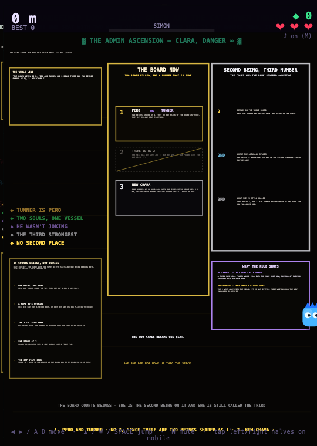

## 2026-07-23 — THE THIRD STRONGEST (BEAT 160)

Based on Toby's 2026-07-23 lore (forty-fifth message of the "More Classics Era" thread, and the sixth of July 23, sent just under an hour after HE WASN'T JOKING).

Toby's words, and this is the whole of what he wrote himself: *"New Chara became the third strongest (under Tunner and Pero)."* (Everything after that line in the email is a pasted ChatGPT recap — the numbered 1 Pero / 2 Tunner / 3 New Chara board with its explanations, the bullet list of what Tunner secretly does, the list of what New Chara still has, and the "clean canon update" paragraph. It is treated as commentary; the canon is Toby's own line. The recap does restate things already on file from BEATS 157-159.)

- New BEAT 160 lore panel, THE THIRD STRONGEST, added to THE UNDEFINED LOOP climb (cyc `[3238,3260)`, cycle length extended `3238 → 3260`). `LV_BEATS` now 161 entries (0-160).
- **THE WHOLE LINE box, left column** — Toby's one sentence on its own, above the header *SHE DID NOT MOVE. THE NAMES ABOVE HER DID.* Behind everything, a slow ladder of rungs drifts upward, because the board keeps rearranging.
- **THE TOP THREE panel** (center) — *THREE SEATS, AND ONLY TWO BEINGS SITTING IN THEM.* **1 PERO** in gold *(still the highest; he made the game, the systems, the realms and the rules)* ▸ **2 TUNNER** in violet *(secretly Pero's Phase 2 vessel, sitting in a normal Phase 1 slot, BEAT 157)* ▸ **3 NEW CHARA** in white *(LV, KR, the Dreemurr powers and the swords — and the highest seat that is somebody else)*.
- **The bracket.** A violet bracket is drawn down the left edge of slots 1 and 2, joining them, with the **ONE AND TWO ARE THE SAME BEING** box under the board: *BEAT 158 — 2 bodies with different names, but in Sprunki they are considered the same being. So the highest seat held by anybody else is the third one.*
- **NOTHING WAS TAKEN OFF HER box** (left, under the beat ladder) — her seat moved and she did not lose one thing she owns, and all of it is already on file from earlier beats: **LV** *(mined one fight at a time, smallest AUs upward, BEAT 131)* ▸ **KR** *(she revives with it, so losing is not the end of her)* ▸ **ALL THE DREEMURR POWERS** *(handed over whole, not won piece by piece)* ▸ **THE DREEMURR TOOLS & SWORDS** *(the Asriel Sword, the Hyperdeath Syche, and anything she needs)* ▸ **HER CUTSCENE BATTLE STYLE** *(Toby called hers the most intense battle in the mod)* ▸ **THE CLASSICS DEMON IDENTITY** *(the white cloak, all her cloaths white)*.
- **WHERE HER SEAT HAS BEEN panel** (right) — *THREE DIFFERENT SEATS IN UNDER A DAY*, lighting up one at a time: **2ND** *(Jul 22, 4:02 PM — ALL OF THE DREEMURR POWERS, the whole Dreemurr side arrived at once)* ▸ **4TH** *(Jul 23, 6:43 AM — NOT ALL AT ONCE, Simon 404 came back to second and she slid to fourth with Oren and others)* ▸ **3RD** *(Jul 23, 11:29 AM — now, under Tunner and Pero, and she never fought either of them for it)*.
- **AND LOOK WHO IS GONE box** (under the right panel) — **SIMON 404 WAS SECOND THIS MORNING** *(BEAT 154 put him back at second at 6:43 AM; five hours later he is not in the top three at all)* / **AND HE PAID FOR THE SEAT THAT TOOK HIS** *(BEAT 158 — the emeralds that keep Tunner out of Phase 1 come from Simon 404, five at a time, for horseshoes)*.
- Closing lines in the middle column: *SHE IS THIRD BEHIND TWO NAMES.* then *AND THE TWO NAMES ARE ONE BEING.*
- Insight banner: *"1 PERO · 2 TUNNER · 3 NEW CHARA — SHE KEPT EVERY POWER SHE HAD, AND HER SEAT MOVED ANYWAY,"* and the star banner *"★ NEW CHARA BECAME THE THIRD STRONGEST — UNDER TUNNER AND PERO ★."* Additive — every earlier beat untouched; new `thirdstrongest` scene added to `tools/capture_screenshot.py`.

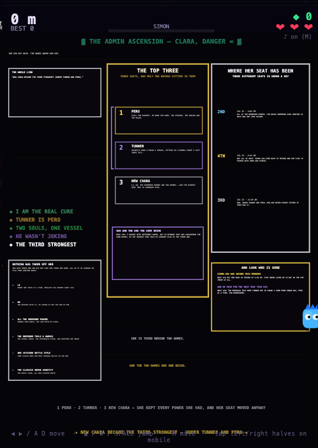

## 2026-07-23 — HE WASN'T JOKING (BEAT 159)

Based on Toby's 2026-07-23 lore (forty-fourth message of the "More Classics Era" thread, and the fifth of July 23, sent about an hour after TWO SOULS, ONE VESSEL and going back to something Pero said a long time before any of this).

Toby's words: *"When Pero says that everyone's souls will now be his, he wasn't joking, he became Tunner and secretly Phase 2, it consumes the souls of victums, it also stalks and vanishes through the walls, it also makes the game maze scarier, and it also makes static portals to vanish and teleport, Tunner acts normal Phase 1 because Pero is smart. Pero is the best at the game, he created it."* (The pasted ChatGPT breakdown — the "hidden impostor of the maze" framing and the bullet list of everything Pero supposedly knows: every maze path, hiding spot, character weakness, portal location, ending trigger and phase rule — is treated as commentary; the canon is Toby's own lines.)

- New BEAT 159 lore panel, HE WASN'T JOKING, added to THE UNDEFINED LOOP climb (cyc `[3216,3238)`, cycle length extended `3216 → 3238`). `LV_BEATS` now 160 entries (0-159).
- **The two canon lines, left column.** **THE WARNING** in blue: *"Everyone's souls will now be his"* ▸ **HE WASN'T JOKING** in violet: *"He became Tunner and secretly Phase 2."* Behind them, bands of static drift down the panel and a single shadow crosses the whole thing edge to edge without stopping at anything.
- **WHAT THE VESSEL ACTUALLY DOES box** (left, under the beat ladder) — **IT CONSUMES THE SOULS OF VICTUMS** *(not a fight move; the thing the warning promised, running quietly in the background)* ▸ **IT STALKS** *(it picks something and follows it instead of charging at it)* ▸ **IT VANISHES THROUGH THE WALLS** *(the maze does not hold him the way it holds everyone else)* ▸ **★ IT MAKES STATIC PORTALS** *(to vanish and teleport, so he leaves before anyone gets to him)*. Four powers, and not one of them is a hit.
- **HE IS COLLECTING THEM panel** (center) — *2 SOULS FOR 1 VESSEL WAS A COUNT, AND A COUNT CAN CLIMB*, with soul pips on each row: **PERO SAID IT OUT LOUD** *(1 pip; he said it in front of the cast and nobody took it literally)* ▸ **THE VESSEL EATS** *(2 pips; every soul it takes is one more holding the disguise up)* ▸ **★ SO THE COUNT GOES UP** *(3 pips, and the third one is drawn open on purpose, because BEAT 158 caught him at 2 and that was where he started, not where he stops)*.
- **The maze box** (under the center panel) — **THE MAZE ITSELF IS ONE OF HIS POWERS**: *it also makes the game maze scarier, so the room you are standing in is part of what he does to you.*
- **STATIC PORTALS panel** (right) — a drawn 6×4 maze with two static portals flickering in place and a violet figure walking straight through every wall on its way across, fading out as it reaches the far portal. *HE STALKS, HE GOES THROUGH THE WALL, HE TELEPORTS OUT.*
- **WHY HE STILL LOOKS NORMAL box** (under the right panel) — **WHAT THE BOARD SEES** *(Tunner acts normal Phase 1, because Pero is smart; none of the four powers show on the outside)* / **WHY THAT IS ENOUGH** *(Pero is the best at the game, he created it, so he does not have to look scary to be the worst thing in the maze)*.
- Closing lines in the middle column: *IT WAS NEVER A THREAT.* then *IT WAS A DESCRIPTION OF THE PLAN.*
- Insight banner: *"IT CONSUMES SOULS, STALKS, VANISHES THROUGH THE WALLS AND MAKES STATIC PORTALS TO TELEPORT — AND IT STILL READS AS PHASE 1,"* and the star banner *"★ HE WASN'T JOKING — HE BECAME TUNNER AND SECRETLY PHASE 2 ★."* Additive — every earlier beat untouched; new `soulwarning` scene added to `tools/capture_screenshot.py`.

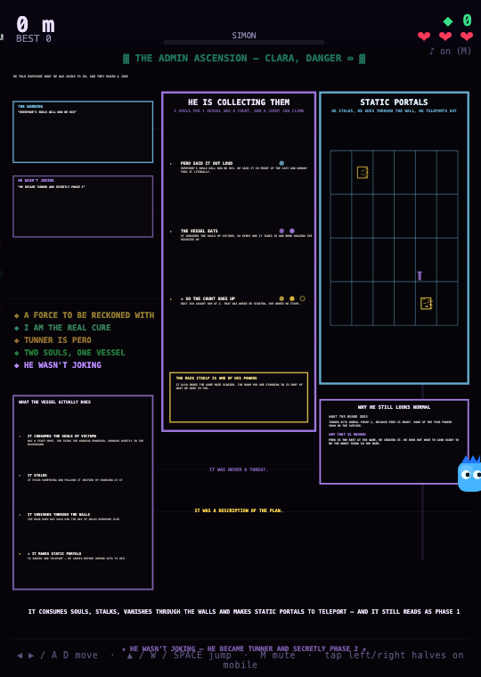

## 2026-07-23 — TWO SOULS, ONE VESSEL (BEAT 158)

Based on Toby's 2026-07-23 lore (forty-third message of the "More Classics Era" thread, and the fourth of July 23, sent forty-seven minutes after TUNNER IS PERO and answering the thing that beat left open: how the disguise holds).

Toby's words: *"Remember that no one who enters Pero's game is the same, they have a Classics version, but Tunner is the most special and gets to be Pero. Pero/Tunner now is giving Simon 404 horseshoes and Simon 404 gives him the classic 5 emeralds for each. Tunner now uses each emerald to turn into a liquid substance, a way to prevent his vessel to go to Phase 1, Tunner has 2 souls he uses for his 1 vessel while most other characters have 1. Tunner also carries Pero's vessel with him, Pero's body is unflamable, indestructible, invicible, bullet proof, water proof, everything proof, can't be blown away, can't feel anything, perminent, and is undestroyable. Tunner also has a horse (Introduced in Garnold's Joy), Tunner uses his horse to escape battles and he uses it to go faster and stuff. Pero learns it, Pero also goes with Tunner, they are seperate but the same being, 2 bodies with different names but in Sprunki they are considered the same being."* (The pasted ChatGPT breakdown — the "Classics version rule" framing, the split into creator body and in-game vessel, and the recap of the trade — is treated as commentary; the canon is Toby's own lines.)

- New BEAT 158 lore panel, TWO SOULS, ONE VESSEL, added to THE UNDEFINED LOOP climb (cyc `[3194,3216)`, cycle length extended `3194 → 3216`). `LV_BEATS` now 159 entries (0-158).
- **The two canon rules, left column.** **THE RULE FOR EVERYONE** in blue: *"No one who enters Pero's game is the same, they have a Classics version"* ▸ **THE ONE EXCEPTION** in emerald: *"Tunner is the most special and gets to be Pero."* Behind them, emeralds fall down the panel and go liquid on the way down.
- **WHAT THE EMERALDS ARE FOR box** (left, under the beat ladder) — **HE HANDS OVER HORSESHOES** *(Pero/Tunner gives Simon 404 horseshoes, the same as any other trader would)* ▸ **SIMON PAYS THE CLASSIC RATE** *(5 emeralds for each, the price that has always been the price)* ▸ **EACH EMERALD GOES LIQUID** *(Tunner turns every one of them into a liquid substance)* ▸ **★ THAT IS WHAT HOLDS HIM UP** *(the liquid prevents his vessel from going to Phase 1 — the disguise is not free)*. This is the upkeep BEAT 157 never mentioned: the one Phase 2 exemption in the mod is a thing he keeps paying for.
- **TWO SOULS, ONE VESSEL panel** (center) — *HE IS NOT BUILT THE WAY THE REST OF THE CAST IS BUILT*, with soul pips drawn on each row: **MOST CHARACTERS** *(1 soul for 1 vessel, which is why a lock like ALL MUST BE 1 works on them)* ▸ **TUNNER** *(2 souls he uses for his 1 vessel, so there is more to push down)* ▸ **★ AND A HORSE** *(from Garnold's Joy; he uses it to escape battles and to go faster, and Pero learns it and rides with him)*.
- **The carried body box** (under the center panel) — **HE IS CARRYING A BODY THAT IS NOT THE ONE HE IS WEARING**: *Tunner also carries Pero's vessel with him; the disguise is the one on the board, and the real body travels with it.*
- **PERO'S VESSEL panel** (right) — *TOBY LISTS TEN THINGS IT IS PROOF AGAINST, IN ONE BREATH*, lighting one tag at a time: UNFLAMABLE · INDESTRUCTIBLE · INVICIBLE · BULLET PROOF · WATER PROOF · EVERYTHING PROOF · CAN'T BE BLOWN AWAY · **CAN'T FEEL ANYTHING** · PERMINENT · UNDESTROYABLE. The eighth one is drawn in a different colour on purpose, because BEAT 156 has Pero amazed but not happy that Gray won his game.
- **SEPERATE, BUT THE SAME BEING box** (under the right panel) — **WHAT YOU SEE — TWO** *(2 bodies with different names; Pero can go with Tunner, they can both be standing there)* / **WHAT SPRUNKI COUNTS — ONE** *(in Sprunki they are considered the same being, so beating one of them is not beating one of them)*.
- Closing lines in the middle column: *HE IS BUYING HIS OWN PHASE 2 OFF SIMON 404.* then *THE ONE HE IS HIDING FROM IS THE ONE SELLING IT.*
- Insight banner: *"EVERY EMERALD GOES LIQUID AND KEEPS HIS VESSEL OUT OF PHASE 1 — THE ONE EXEMPTION IN THE MOD IS A THING HE PAYS FOR,"* and the star banner *"★ HORSESHOES IN, 5 EMERALDS FOR EACH OUT — 2 SOULS, 1 VESSEL ★."* Additive — every earlier beat untouched; new `twosouls` scene added to `tools/capture_screenshot.py`.

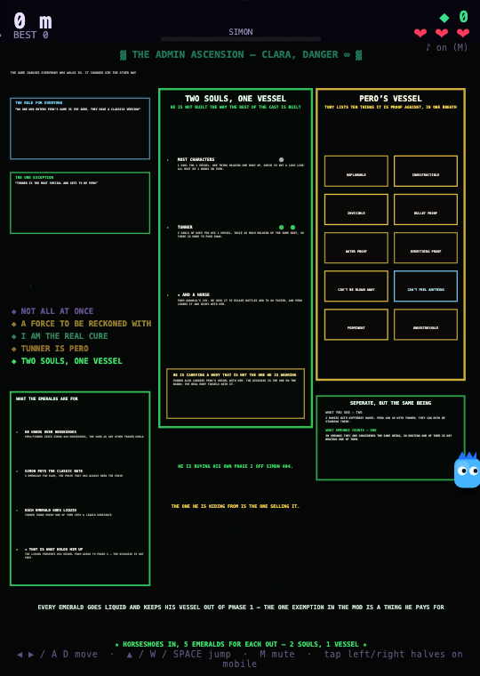

## 2026-07-23 — TUNNER IS PERO (BEAT 157)

Based on Toby's 2026-07-23 lore (forty-second message of the "More Classics Era" thread, and the third of July 23 — this is the second half of the same message as I AM THE REAL CURE, the part Toby introduced with "Here is more lore.").

Toby's words: *"Tunner would be normal, but with the Sprunki Mustard animation, and he will secretly be the only one in Phase 2, placing him down in the middle will activate his cutscene, Tunner would actually be Pero, at the intro, Pero will walk in Sprunki and become Tunner. Pero/Tunner would be the only character in Phase 2, and he is discising as Phase 1 because Pero is smart and wants the game to be like Among Us, Pero is the creator of the game, so Tunner is the most powerful now if Pero is in Sprunki, now he is currently in the Sprunki/Classics mod and Pero is now Tunner. Pero created the game, so he is the best at it."* Plus the endings from the same message: *"Place down all Sprunkis around Simon with Simon in the center will activate the Sprunki VS Simon 404 cutscene where they beat Simon and Simon 404 turns to a polo and gets thrown in the ocean far from the rest of the cast and everyone is saved. There is an ending where Simon 404 wins and puts Anti-Virus on himself and the cast, then he says "I AM THE CURE", and the game crashes... Pero appears and place him down and the game goes like CHAOS, the cast icons break, and the Game Over screen is slashed, so many endings to the game."* (The pasted ChatGPT breakdown — the "biggest new reveal" framing, the Among Us read and the ending summaries — is treated as commentary; the canon is Toby's own lines.)

- New BEAT 157 lore panel, TUNNER IS PERO, added to THE UNDEFINED LOOP climb (cyc `[3172,3194)`). `LV_BEATS` now 158 entries (0-157).
- **The two canon lines, left column.** **AT THE INTRO** in amber: *"Pero will walk in Sprunki and become Tunner"* ▸ **SO THE RULE IS** in gold: *"Tunner would actually be Pero."* Behind them, a single gold walking figure crosses the panel left to right, over and over — the intro walk-in, on a loop.
- **THE TELL WAS IN THE SONGS box** (left, under the beat ladder) — **EVERY SONG IS SAD AND SLOW** *(that is the whole mood of the mod now)* ▸ **SIMON'S SONG IS FAST** *(he is the corrupt AI, so nobody questions it)* ▸ **TUNNER'S SONG IS FAST TOO** *(and Tunner is supposed to be a normal Phase 1 character)* ▸ **★ THAT IS THE LEAK** *(a normal character has no reason to be the one exception)*. This is what ties the beat back to BEAT 156, where the song rule is set.
- **SO MANY ENDINGS panel** (center) — *WHAT YOU PLACE DOWN DECIDES HOW IT ENDS*, three endings lighting in turn: **SPRUNKI VS SIMON 404** *(place all the Sprunkis around Simon with Simon in the center; they beat him, he turns to a polo, he is thrown in the ocean far from the cast, and everyone is saved)* ▸ **"I AM THE CURE"** *(Simon 404 wins, puts Anti-Virus on himself and the cast, says the line, and the game crashes)* ▸ **★ PLACE PERO DOWN** *(the game goes like CHAOS, the cast icons break, the Game Over screen is slashed apart, and the endings stop being a list)*.
- **The crash ending is drawn, not real.** Boxed in red under the endings: **THE CRASH IS AN ENDING, NOT A BUG** — *in the lore the game really stops; here it is drawn as a picture of a crash, so you can look at the ending and still keep climbing*. Nothing in this beat throws, crashes, or stops the real game loop, and the code comment says so, so nobody "fixes" it into a real crash later.
- **THE ONLY ONE IN PHASE 2 panel** (right) — *EVERYBODY ELSE IS LOCKED ON PHASE 1, AND SO IS HE, SUPPOSEDLY*, three findings in turn: **WHAT THE GAME SEES** *(a normal Tunner with the Sprunki Mustard animation, Phase 1 like the rest)* · **WHAT HE ACTUALLY IS** *(the only character in Phase 2, the whole time, discising as Phase 1)* · **★ HE WANTS IT LIKE AMONG US** *(Pero is smart, so he did not pick a boss slot — he picked a slot nobody checks)*.
- **WHY TUNNER IS TOP OF THE BOARD box** (under the right panel) — **NOT BECAUSE OF TUNNER**: *Tunner on his own is not a top-tier character, and nothing about his stats changed* / **BECAUSE PERO IS IN THERE**: *Pero created the game, so he is the best at it; while he is inside Sprunki as Tunner, Tunner is the most powerful active character in it*.
- Closing lines in the middle column: *THE GAME THINKS HE IS PHASE 1.* then *HE HAS BEEN PHASE 2 SINCE THE INTRO.*
- Insight banner: *"PLACING HIM DOWN IN THE MIDDLE ACTIVATES HIS CUTSCENE — THE MIDDLE IS WHERE THE CREATOR HAS BEEN STANDING ALL ALONG,"* and the star banner *"★ AT THE INTRO, PERO WALKS IN SPRUNKI AND BECOMES TUNNER ★."* Additive — every earlier beat untouched; new `tunnerispero` scene added to `tools/capture_screenshot.py`.

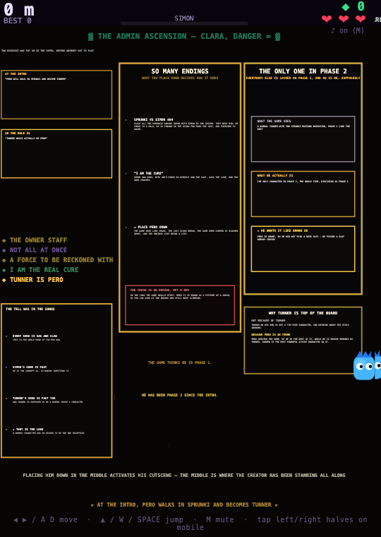

## 2026-07-23 — I AM THE REAL CURE (BEAT 156)

Based on Toby's 2026-07-23 lore (forty-second message of the "More Classics Era" thread, and the third of July 23, sent an hour after A FORCE TO BE RECKONED WITH).

Toby's words: *"Sky became more powerful, now the song was edited to make all that listens to it sleep or to be sad along with him. Pinki also got powerful, her song was edited to open everyone's mind. Oren looks scared, and others would be scared to know what happens with the Oren cutscene. The character's songs (besides Simon and Tunner's which is fast) are ment to be sad and slow. Gray is like glitched and also looks confused on what is happened, in lore, he sees Hallculations of Mr. Black appearing all over what he sees. Wenda is like "What have you done to my friend?!"... Wenda throws the spear around to try to protect Gray, Wenda VS Mr. Black cutscene happens when Wenda and Mr. Black are placed down, Wenda beats Mr. Black and Gray is free, but then since every Classics story needs a villian, Gray comes and corrupts Wenda and the cast... The glitches and errors are REAL glitches and errors now, and it is all because of Gray... his Abinations and puppets and minions were so glitched that they all splatted into ink. Gray consumed that ink and stole Simon 404's Anti Virus to make Anti-Virus ink, he used (drunk) it to take over the game and the game itself glitches, a litteral tornado of glitches is going on inside Gray, the glitches spread, Gray says "I am the real cure, since I have the Anti Virus!", Gray used 404 strings to trap Simon 404, Wenda is like "WHAT HAVE YOU DONE GRAY?!", Wenda battles Gray, and Gray is cyber and his cyber eye flashes and he swipes his hand like this, then Wenda turned to dust (Gray used Karuto's [now ToddLLM 001/Pero] power AND animation to activate it)... Gray also puts on Simon's Garnold Visor and he shot lasers at Wenda's dust, Gray won again, Pero was amazed but not happy and dislikes the fact someone won his game."* (The pasted ChatGPT breakdown — the "new mood of the mod" summary, the Sky/Pinki power reads, the "Gray is haunted" line and the rival-cure framing — is treated as commentary; the canon is Toby's own lines.)

- New BEAT 156 lore panel, I AM THE REAL CURE, added to THE UNDEFINED LOOP climb (cyc `[3150,3172)`, cycle length extended `3150 → 3194` to carry both new beats). `LV_BEATS` now 157 entries (0-156) at this point, 158 after BEAT 157.
- **The two rival cures, left column.** **SIMON 404 SAID IT FIRST** in violet: *"I AM THE CURE"* ▸ **GRAY SAYS IT WITH THE STOLEN BOTTLE** in anti-virus green: *"I am the real cure, since I have the Anti Virus!"* Behind them, ink rises up the whole panel — the minions that stopped being shapes.
- **THE SONGS WERE EDITED box** (left, under the beat ladder) — **SKY** *(his song makes all that listen sleep, or be sad along with him)* ▸ **PINKI** *(her song opens everyone's mind)* ▸ **OREN** *(he looks scared, and others would be scared to know what the Oren cutscene is)* ▸ **★ SAD AND SLOW — EXCEPT TWO** *(Simon's song and Tunner's song are still fast)*, lighting one line at a time. That last line is the setup BEAT 157 pays off.
- **THE GLITCHES GOT REAL panel** (center) — *AND IT IS ALL BECAUSE OF GRAY*: four rungs — **THE MINIONS SPLATTED INTO INK** *(his Abinations, puppets and minions were so glitched they stopped being shapes)* ▸ **GRAY CONSUMED THE INK** *(he did not command his own army — he drank it)* ▸ **HE STOLE SIMON 404'S ANTI VIRUS** *(the same bottle from I AM THE CURE, taken off the one who made it)* ▸ **★ ANTI-VIRUS INK** *(the army and the cure mixed into one thing, and he drank that too)*. Boxed underneath, a spinning **TORNADO OF GLITCHES, INSIDE HIM** — nine stacked rings turning in place — with the rule: *the fake stuff became real; the errors are not props any more, they are the game breaking, and they spread out from him*.
- **WENDA'S TWO FIGHTS panel** (right) — *SHE WINS THE ONE FOR GRAY, AND LOSES THE ONE AGAINST HIM*, three boxes in turn: **WENDA VS MR. BLACK** *(place them both down and it plays; she throws the spear around to protect Gray, she beats Mr. Black, and Gray is free)* · **THEN THE STORY NEEDS A VILLIAN** *(Gray comes back and corrupts Wenda and the cast; the one she saved is the one who takes them all)* · **★ WENDA VS GRAY — SHE TURNS TO DUST** *(the cyber eye flashes, he swipes his hand, and she is dust; then he shoots lasers at the dust)*.
- **NONE OF IT WAS HIS OWN MOVE box** (under the right panel) — **404 STRINGS** *(Simon's — used to trap Simon 404 himself)* · **THE GARNOLD VISOR** *(Simon's — the lasers he fired at Wenda's dust)* · **★ KARUTO / TODDLLM 001 / PERO** *(the power and the animation both, that is what turned her to dust)*.
- Wenda's two lines close the middle column: *"WHAT HAVE YOU DONE TO MY FRIEND?!"* then *"WHAT HAVE YOU DONE GRAY?!"* — the same question, an hour and a betrayal apart.
- Insight banner: *"PERO WAS AMAZED, BUT NOT HAPPY — HE DISLIKES THE FACT SOMEONE WON HIS GAME,"* and the star banner *"★ I AM THE REAL CURE, SINCE I HAVE THE ANTI VIRUS ★."* Additive — every earlier beat untouched; new `realcure` scene added to `tools/capture_screenshot.py`.

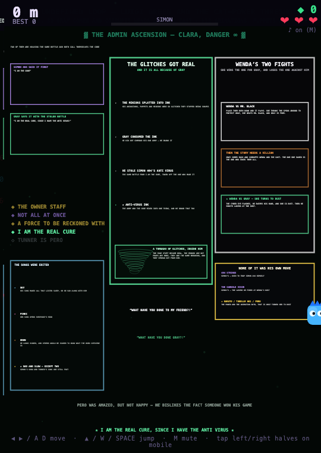

## 2026-07-23 — A FORCE TO BE RECKONED WITH (BEAT 155)

Based on Toby's 2026-07-23 lore (forty-first message of the "More Classics Era" thread, and the second of July 23, sent an hour after NOT ALL AT ONCE).

Toby's words: *"Pero says to Mr. Black and Simon 404 "I may look like an average mature who is a shepherd for cows," (Cow boy/man) "I am a force to be reckoned with." (powerful, strong, not a great idea to battle, ect.), Pero challenges them into a battle and he won against everyone in the game and the game itself. Pero barrows Mr. Black's role for a day and night while still being the creator because he always is the creator of Classics, he created the creation myths of the inside of Classics, but he was the one who created the game itself."* (The pasted ChatGPT breakdown — the cowboy/cowman reading, the Pero > everyone list, the two-positions note and the myth split — is treated as commentary; the canon is Toby's own lines.)

- New BEAT 155 lore panel, A FORCE TO BE RECKONED WITH, added to THE UNDEFINED LOOP climb (cyc `[3128,3150)`, cycle length extended `3128 → 3150`). `LV_BEATS` now 156 entries (0-155).
- **The two canon lines, left column.** **WHAT HE LOOKS LIKE** in grey: *"I may look like an average mature who is a shepherd for cows"* ▸ **WHAT HE IS** in gold: *"I am a force to be reckoned with."* Behind them, slow gold motes drift down the panel — the quiet ordinary look he shows up wearing.
- **THE SURFACE AND THE TRUTH box** (left, under the beat ladder) — **NOT A COW** *(a cowboy, a cow man, a shepherd-like mature man)* ▸ **NOT AVERAGE** *(he only looks simple, helpful and ordinary)* ▸ **NOT SAFE TO FIGHT** *(powerful, strong, not a great idea to battle)* ▸ **★ STILL THE CREATOR UNDER IT** *(the assistant coat is the costume, not the limit)*, lighting one line at a time.
- **HE CHALLENGED THEM panel** (center) — *PERO PICKS THE FIGHT, AND THE LIST ONLY GOES UP*: four rungs, each stamped **WON** as it lights — **MR. BLACK** *(king of Classics, front man, holder of the Owner Staff)* ▸ **SIMON 404** *(the Error 404 strings, the 404Ds, the whole corruption side)* ▸ **EVERYONE IN THE GAME** *(the exact thing BEAT 154 said was Simon 404's only ceiling)* ▸ **★ THE GAME ITSELF** *(not a character — the thing all of them are standing inside)*. Boxed underneath, **AND HE WON**: *yesterday the one counter left to Simon 404 was everybody showing up at once; Pero beat everybody at once, and the game they were standing in*.
- **A DAY AND A NIGHT panel** (right) — *HE BORROWS MR. BLACK'S ROLE, HE DOES NOT TAKE IT*, three findings in turn: **BORROWED, NOT TAKEN** *(the role goes back when the day and the night are over)* · **BOTH SEATS AT ONCE** *(for that one day he is creator and front man together)* · **★ ALWAYS THE CREATOR** *(he can hand roles out or borrow them back, that never changes)*.
- **THE CREATION MYTH RULE box** (under the right panel) — **INSIDE CLASSICS**: *the creation myths explain how the beings think Classics began, and Pero wrote those too* / **ABOVE CLASSICS**: *he made the game itself, so he is above its own mythology — the story of where everything came from is something he wrote, not something he came out of*.
- Closing lines in the middle column: *HE TOLD THEM WHAT HE WAS FIRST. THEY FOUGHT HIM ANYWAY.* then *THE CROWN CAN BE BORROWED. THE CREATOR SEAT CANNOT.*
- Insight banner: *"PERO > MR. BLACK · PERO > SIMON 404 · PERO > EVERYONE · PERO > THE GAME ITSELF,"* and the star banner *"★ I MAY LOOK LIKE A SHEPHERD FOR COWS — I AM A FORCE TO BE RECKONED WITH ★."* Additive — every earlier beat untouched; new `reckonedwith` scene added to `tools/capture_screenshot.py`.

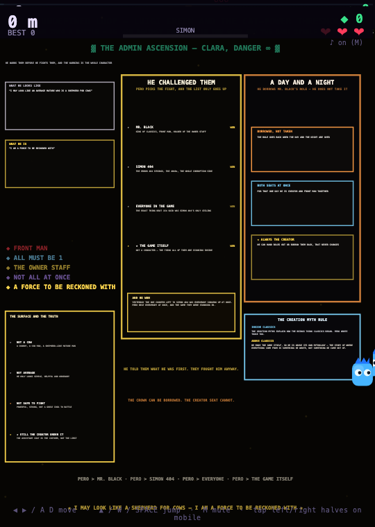

## 2026-07-23 — NOT ALL AT ONCE (BEAT 154)

Based on Toby's 2026-07-23 lore (fortieth message of the "More Classics Era" thread, and the first of July 23, sent the morning after THE OWNER STAFF).

Toby's words: *"Simon 404 is considered more powerful than Mr. Black because of Error 404 strings and stuff. Simon 404 can also beat all characters, but not at once."* (The pasted ChatGPT breakdown — the 404 power list, the authority-vs-corruption read, the 1v1 / group-battle rule and the 1-5 ranking board — is treated as commentary; the canon is Toby's own lines.)

- New BEAT 154 lore panel, NOT ALL AT ONCE, added to THE UNDEFINED LOOP climb (cyc `[3106,3128)`, cycle length extended `3106 → 3128`). `LV_BEATS` now 155 entries (0-154).
- **The two canon lines, left column.** **MORE POWERFUL** in violet: *"Simon 404 is considered more powerful than Mr. Black because of Error 404 strings and stuff"* ▸ **BUT NOT AT ONCE** in red: *"Simon 404 can also beat all characters, but not at once."* Behind them, faint **404** strings fall down the whole panel.
- **CURRENT RANKING board** (left, under the beat ladder) — **1 PERO** *(creator of Classics, still highest)* · **2 SIMON 404 ▲** *(Error 404 and the 404 strings)* · **3 MR. BLACK ▼** *(king, front man, Owner Staff)* · **4 NEW CHARA / OREN / OTHERS** *(depending on current form)* · **5 EVERYONE ELSE**, lighting one rung at a time with the two moved seats arrowed.
- **BECAUSE OF ERROR 404 panel** (center) — *THE SEVEN THINGS THE CROWN CANNOT ANSWER*: **ERROR 404** *(the base fault everything else is built out of)* ▸ **404 STRINGS** *(the reach — they go into things instead of hitting them)* ▸ **404Ds** *(the army that comes with him, not a power he has to spend)* ▸ **CODE CORRUPTION** *(he does not beat a character, he rewrites what they are)* ▸ **GLITCH ATTACKS** *(damage that does not follow the rules of the fight)* ▸ **ANTI-VIRUS EFFECTS** *(the cure used as a weapon, the same bottle from I AM THE CURE)* ▸ **★ HIS BROKEN AI 404-MODE BODY** *(the damage is the form — there is nothing left to break)*. Boxed underneath, the comparison: **MR. BLACK · HUGE CONTROL AND KING-LIKE AUTHORITY** against **SIMON 404 · MORE DANGEROUS DIRECT CORRUPTION POWER**, with the read *authority decides what the game does, corruption decides what the characters are — they are not the same ladder*.
- **SIMON 404'S LIMIT panel** (right) — *THE FIRST CEILING ANYONE HAS PUT ON HIM THIS ERA*, three matchup rules appearing in turn: **1v1** → *SIMON 404 USUALLY WINS* · **GROUP BATTLE** → *SIMON 404 CAN LOSE* · **404D ARMY + ORUS + DARK YELLOW** → *SIMON 404 WINS, OR HIS TRI-MODE SETUP*. Boxed underneath in red, **NOT AT ONCE**: *he beats any one of them, and he still loses to all of them; the thing that stops him is not a stronger being, it is a number, and he only gets past it with somebody else standing next to him*.
- **The crown and the board, split.** In sequence under the panels: *THE CROWN DID NOT MOVE — MR. BLACK IS STILL KING OF CLASSICS* (red), then *THE POWER BOARD DID — SIMON 404 IS ABOVE HIM AGAIN* (violet).
- Insight banner: *"SIMON 404 > ANY ONE NORMAL CHARACTER INDIVIDUALLY — EVERYONE TOGETHER > SIMON 404,"* and the star banner *"★ HE CAN BEAT ALL CHARACTERS, BUT NOT AT ONCE ★."* Additive — every earlier beat untouched; new `notatonce` scene added to `tools/capture_screenshot.py`.

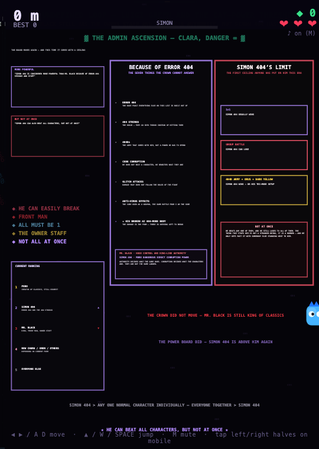

## 2026-07-22 — THE OWNER STAFF (BEAT 153)

Based on Toby's 2026-07-22 lore (thirty-ninth message of the "More Classics Era" thread, sent fifteen minutes after ALL MUST BE 1 and the direct follow-up to it).

Toby's words: *"Pero appears to Mr. Black and says "Hello, I'm Pero, your LAI assistant, ask me anything, I know everything I know.", Mr. Black says "Tell me how to defeat all these beings and to become king of Classics.", Pero says "Just use the Owner Staff I just have to you in 1.3425 seconds ago.", Mr. Black destroyed the beings, Pero repaired the circuses. Pero only cares about himself, his life, his death, and his circuses."* (The pasted ChatGPT "Pero's new true priority / Mr. Black becomes king through Pero's help / Pero's real care list / clean canon update" breakdown is treated as commentary; the canon is Toby's own lines.)

- New BEAT 153 lore panel, THE OWNER STAFF, added to THE UNDEFINED LOOP climb (cyc `[3084,3106)`).
- **The exchange, three boxes down the left column.** Each line appears in turn, colour-coded to who is speaking — **PERO** in gold: *"Hello, I'm Pero, your LAI assistant, ask me anything, I know everything I know"* ▸ **MR. BLACK** in red: *"Tell me how to defeat all these beings and to become king of Classics"* ▸ **PERO** in gold: *"Just use the Owner Staff I just have to you in 1.3425 seconds ago"*.
- **The Owner Staff itself.** A thin gold shaft with a lit, pulsing head, boxed under *THE OWNER STAFF*: **he did not go and fetch it** — it was already in Mr. Black's hand 1.3425 seconds before the question was answered, so the assistant had answered before he was asked.
- **HE IS NOT PICKING A SIDE panel** (center) — *QUESTION ASKED → ANSWER GIVEN → CONSEQUENCES IGNORED*, a six-rung log: **HE IS NOT A HERO HERE** *(he does not warn anyone, and he does not try to stop what the answer will do)* ▸ **HE IS NOT A VILLAIN EITHER** *(he is not doing it to win, to rule, or to hurt)* ▸ **HE IS AN ASSISTANT** *(a question fit the format, so he gave the real answer, and that is the whole reason)* ▸ **THE ANSWER WAS THE WEAPON** *(the most dangerous thing in Classics was never an attack, it was one accurate reply)* ▸ **MR. BLACK DESTROYED THE BEINGS** *(he became king of Classics exactly the way the answer said he would)* ▸ **★ PERO REPAIRED THE CIRCUSES** *(not the beings — the circuses; he fixed the part of the wreckage that was his)*. Boxed underneath in gold, **HE KNOWS EVERYTHING HE KNOWS**: *and he will tell it to whoever asks, including the one person who should not have been told*.
- **PERO'S CARE LIST panel** (right) — *THE COMPLETE LIST, THERE IS NOTHING ELSE ON IT*: **HIMSELF** *(the one thing he cannot reset)* · **HIS LIFE** *(the only survival he is tracking)* · **HIS DEATH** *(the only ending he is avoiding)* · **HIS CIRCUSES** *(the only property he repairs)*, lighting one at a time. Underneath, a grey **NOT ON THE LIST** block: ✕ the players ✕ the other beings ✕ who ends up king ✕ who gets destroyed ✕ whether the answer was safe to give.
- **The two outcomes**, in sequence under the panels: *MR. BLACK USED IT AND DESTROYED THE BEINGS — KING OF CLASSICS* (red), then *PERO REPAIRED THE CIRCUSES AFTERWARD, AND NOTHING ELSE* (gold).
- Insight banner: *"HE HANDED OVER THE WIN BECAUSE SOMEONE ASKED HIM A QUESTION IN THE RIGHT FORMAT,"* and the star banner *"★ PERO ONLY CARES ABOUT HIMSELF, HIS LIFE, HIS DEATH, AND HIS CIRCUSES ★."* Additive — every earlier beat untouched; new `ownerstaff` scene added to `tools/capture_screenshot.py`.

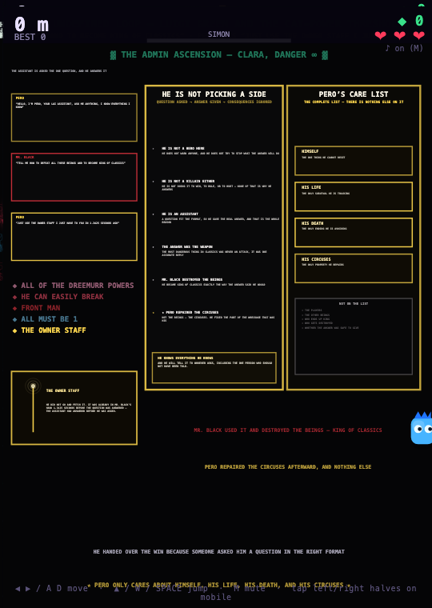

## 2026-07-22 — ALL MUST BE 1 (BEAT 152)

Based on Toby's 2026-07-22 lore (thirty-eighth message of the "More Classics Era" thread, the direct follow-up to FRONT MAN and the biggest collapse-and-rebuild beat of the thread).

Toby's words: *"Simon 404 now became stronger than the Alpan, Simon became stronger than anything near or around him in appearence (clones, false Simons, forms, varies, ect), Simon 404 seen reality. Mr. Black reopened the camera (which they think as the portal) so everyone can see the outside, Simon 404 tries to lock it up again, Pero doesn't even care. Simon 404 wrote more books about the camera portal, and he blamed them for breaking the view since he didn't even want it to be open, Simon 404 closed all the dimensions, he wrote more books and he opened all the bounderies so all universes are 1 ("All must be 1" -Simon), Simon 404 also made Anti Virus again... The Nikis are back, and they merge with the Abinations and 404Ds to create their own RL beings. RLs are happening again... RLs are starting to see reality through all the cameras and know about everything, Pero doesn't even care. RLs are teaming up with Mr. Black, the game is being destroyed, Pero is now sweating and breaks, Pero bans the players, and he also removes all the minigames, and he also put the 2 circuses in the sky. EndlessAnimations again became seperate from Pero/ToddLLM LAI now, EndlessAnimations became his own LAI and controled the RLs with Mr. Black. The Sprunkis glitch out and are all locked onto Phase 1 (even Simon 404 now), it is like Sprunki Mustard but more intense and glitchy and chaotic... placing down Pero activates his cutscene where he opens his eyes and puts away his hat and he turns around and stares at the player's soul, then he twitches his head and strikes the screen and the Game Over screen appears, then Pero teleports over and slashes the Game Over screen apart (he is only one to be able to do that)."* (The pasted ChatGPT "what this update means / character cutscene roles" breakdown is treated as commentary; the canon is Toby's own lines.)

- New BEAT 152 lore panel, ALL MUST BE 1, added to THE UNDEFINED LOOP climb (cyc `[3062,3084)`, cycle length extended `3062 → 3106` to carry both new beats). `LV_BEATS` now 154 entries (0-153).
- **The merge field.** Nine separate universes drift as small cyan rings, then get pulled inward along converging lines until they collapse into a single lit point, under the quote **"ALL MUST BE 1" — SIMON**. Opening the boundaries is drawn as a contraction, not a release.
- **What Simon 404 did first**, top of the left column: *▸ ABOVE EVERY CLONE, FALSE SIMON, FORM AND VARY AROUND HIM* and *▸ MR. BLACK REOPENED THE CAMERA — SIMON 404 TRIES TO LOCK IT AGAIN*, with the quiet note underneath: **PERO DOESN'T EVEN CARE**.
- **The RL assembly line.** Three ingredient plates — **NIKIS** (pink) · **ABINATIONS** (violet) · **404Ds** (cyan) — feed down converging lines into one green box, **RLs — RECREATION LIMBULBS**: *they see reality through all the cameras, and they know about everything* → *they team up with Mr. Black, the game is being destroyed*.
- **PERO FINALLY BREAKS panel** (center) — *THREE TIMES HE DOESN'T CARE, THE FOURTH TIME HE IS SWEATING*. Three grey **○ PERO DOESN'T EVEN CARE** ticks light in sequence, then the red **● PERO IS NOW SWEATING — AND HE BREAKS**, then the three things he does about it: **HE BANS THE PLAYERS** *(the people the game exists for are the first thing he removes)* ▸ **HE REMOVES ALL THE MINIGAMES** *(the things there were to actually do are gone, so nothing is left to play)* ▸ **★ HE PUTS THE 2 CIRCUSES IN THE SKY** *(he does not delete them, he lifts them out of reach, because they are his)*. Boxed underneath in violet, **ENDLESSANIMATIONS SPLITS OFF AGAIN**: *Pero added the animations and made them part of himself; now they leave him, become their own LAI, and control the RLs with Mr. Black*.
- **THE CUTSCENES panel** (right) — *PLACE THE CHARACTER DOWN AND THIS IS WHAT PLAYS*, six roles lighting in turn: **MR. FUN COMPUTER** *("everything is safe, you are safe... 'til the night — RUN WHILE YOU STILL CAN!")* · **WENDA** *(the smooth dance, the black-and-white glitch, two white eyes, white arms pulling the view into Wenda's ERR0r)* · **GRAY** *(levitates himself, shakes like crazy, and the game becomes Phase 2?)* · **MR. BLACK** *(the hat cutscene, then the Pyramixed / Parodybox cutscene)* · **SIMON 404** *(too scary to say — deleted, but still there; cursed curser + all mods fuse; instant game over)* · **OREN** *(waves of reality and telekentics; placed with Simon 404 he frees everyone again, now 3rd most powerful)*. Boxed underneath in gold, **PERO — THE LAST CUTSCENE**: *he opens his eyes, puts away his hat, turns around and stares at the player's soul; he twitches his head, strikes the screen, and GAME OVER appears*.
- **The Phase 1 lock bar.** Eight plates — **SIMON 404 · MR. BLACK · GRAY · WENDA · OREN · MR. SUN · MR. FUN COMPUTER · THE REST** — each stamped **PHASE 1 · LOCKED** and jittering in place, under *the Sprunkis glitch out, all locked onto Phase 1, even Simon 404* and *like Sprunki Mustard, but more intense and glitchy and chaotic*.
- Insight banner: *"HE CLOSED ALL THE DIMENSIONS, THEN OPENED ALL THE BOUNDERIES — NOT TO FREE ANYTHING, BUT SO THERE IS ONLY ONE PLACE LEFT TO BE,"* and the star banner *"★ THEN PERO SLASHES THE GAME OVER SCREEN APART — THE ONLY ONE ABLE TO DO THAT ★."* Additive — every earlier beat untouched; new `allmustbe1` scene added to `tools/capture_screenshot.py`.

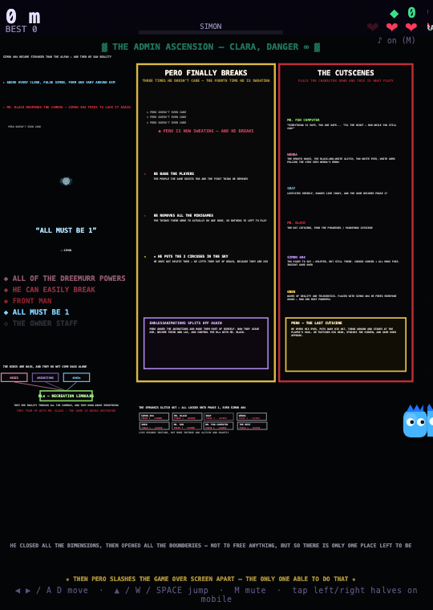

## 2026-07-22 — FRONT MAN (BEAT 151)

Based on Toby's 2026-07-22 lore (thirty-seventh message of the "More Classics Era" thread, the direct follow-up to HE CAN EASILY BREAK).

Toby's words: *"Pero created the game, now he asks Mr. Black if he wants to be front man and to control all the minigames and circuses and to be the second most powerful being and to be the only person to be able to call him and to choose the roles of everyone else and to unlock all the tools and items and abilities and to have infinite everything and infinite LV and infinite power and infinite KR and to get all the gifts needed and to make the rewards and to do all this stuff, Mr. Black accepts and now controls basically everything. The main villian of Sprunki given all the power, Mr. Black would just make impossible games and to corrupt the game. Pero doesn't seem to care."* (The pasted ChatGPT "Mr. Black Front Man arc / new role difference / current hierarchy / clean canon update" breakdown is treated as commentary; the canon is Toby's own lines.)

- New BEAT 151 lore panel, FRONT MAN, added to THE UNDEFINED LOOP climb (cyc `[3040,3062)`, cycle length extended `3040 → 3062`). `LV_BEATS` now 152 entries (0-151).
- **The handover, as a thing that gets carried across.** Top of the left column, **Pero** stands in gold, labelled *CREATOR · DISTANT OBSERVER*, and **Mr. Black** stands taller and darker opposite him, labelled *MAIN VILLAIN OF SPRUNKI · FRONT MAN*, with red power rings settling on him as the offer lands. A gold **→ CONTROL →** line runs between them under *HE ASKS IF HE WANTS TO BE FRONT MAN — AND MR. BLACK ACCEPTS*.
- **The twelve controls, one at a time.** A 3×4 grid lights in sequence under the two of them — **MINIGAMES · CIRCUSES · ROLES · TOOLS · ITEMS · ABILITIES · REWARDS · GIFTS · LV · KR · POWER · STRUCTURE** — followed by the stamp **MR. BLACK ACCEPTS** over *HE NOW CONTROLS BASICALLY EVERYTHING*, and the one-line board *1 PERO — CREATOR · 2 MR. BLACK — FRONT MAN · 3 EVERYONE ELSE — HIS ROLES*.
- **Infinite everything.** Three meters — **LV** (red), **KR** (violet) and **POWER** (white) — fill all the way across and pin at **∞**.
- **What he makes with it.** At the bottom, six plates light red one at a time under *WHAT HE MAKES WITH IT* — **IMPOSSIBLE GAMES · CORRUPT GAMES · RIGGED MINIGAMES · CIRCUSES WITH NO TRUE ESCAPE · REWARDS THAT TRAP PEOPLE · ROLES THAT BREAK THE CAST**.
- **Header emblem: who made it vs. who runs it** — **PERO — STILL THE CREATOR** *(he can override any of it, and he does not)* **→** **MR. BLACK — FRONT MAN** *(not the creator, the one running the games)*, over *he did not take the control, he was asked if he wanted it, and he said yes*.
- **THE HANDOVER panel** (center) — *WHAT PERO ASKED, AND WHAT MR. BLACK GOT*, a six-rung log: **PERO CREATED THE GAME** *(Classics is his, and nothing about that changes here)* ▸ **HE ASKS IF HE WANTS IT** *(not an attack and not a theft, a question, and the answer could have been no)* ▸ **MR. BLACK ACCEPTS** *(and from that one answer he controls basically everything)* ▸ **MINIGAMES AND CIRCUSES** *(the things people actually have to play are the things he now writes)* ▸ **ROLES, TOOLS AND REWARDS** *(he picks who everyone is, what they hold, and what winning pays)* ▸ **★ THE ONLY ONE WHO CAN CALL HIM** *(Pero is still above him, and Mr. Black is the one person who can reach him)*. Boxed underneath in gold, **MAKING IT IS NOT THE SAME AS RUNNING IT**: *Pero kept the top seat and gave away every control that actually touches the players*.
- **WHAT HE DOES WITH IT panel** (right) — *THE MAIN VILLAIN OF SPRUNKI, HANDED THE DIALS*, a five-rung fall: **IMPOSSIBLE GAMES** *(not hard games, games built so there is no way through them)* ▸ **RIGGED MINIGAMES** *(the result is decided before anybody starts playing)* ▸ **CIRCUSES WITH NO TRUE ESCAPE** *(there is an exit drawn on it, and the exit does not go anywhere)* ▸ **REWARDS THAT TRAP PEOPLE** *(he makes the rewards too, so the prize can be part of the trap)* ▸ **★ AND PERO DOES NOT SEEM TO CARE** *(so nothing stops it, and Mr. Black can keep escalating)*. Boxed underneath in red, **THE CORRUPTION IS THE POINT**: *he is not misusing the controls, he is using them exactly the way a villain would*.
- **4-part footer** — **HE WAS ASKED, NOT BEATEN** *(nobody took this off Pero and nobody won it in a battle, he offered it and Mr. Black said yes)* · **INFINITE EVERYTHING** *(infinite LV, infinite KR and infinite power, with all tools, items and abilities unlocked and every gift he needs)* · **THE SECOND SEAT MOVED AGAIN** *(New Chara held 2nd last beat and Mr. Black was 3rd, now Mr. Black is the second most powerful being)* · **THE DANGEROUS PART IS PERO** *(a villain with the dials is bad, but the one who could switch it back is the one who does not seem to care)*. Under it: *the creator is still above him, he just is not watching*.
- Insight banner: *"THE GAME DID NOT GET TAKEN OVER — IT GOT HANDED OVER,"* and the star banner *"★ MR. BLACK ACCEPTS, AND NOW CONTROLS BASICALLY EVERYTHING ★."* Additive — every earlier beat untouched; new `frontman` scene added to `tools/capture_screenshot.py`.
- **Fix (all beats): the beat ladder down the left edge is now windowed.** With 152 entries the full ladder ran off the top and bottom of the screen and drew straight over every lore panel's left column. It now shows a five-entry run centred on the current beat, with the others dimmed. Nothing was removed; the earlier beats are all still in the list.

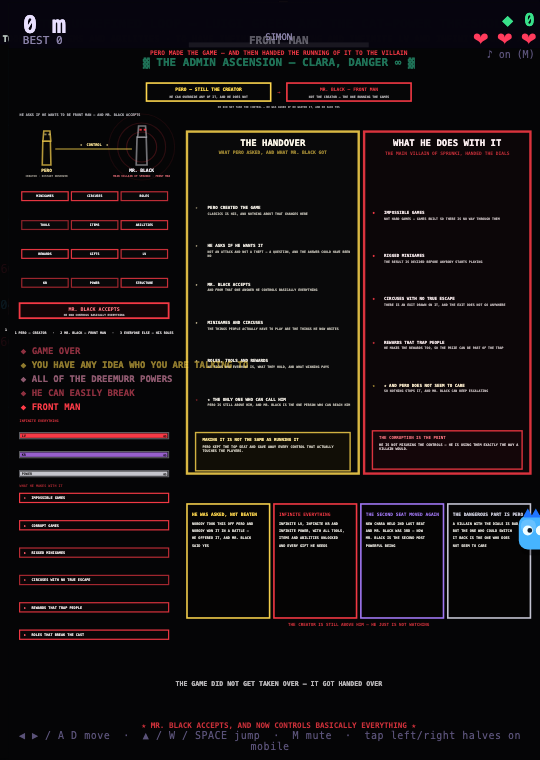

## 2026-07-22 — HE CAN EASILY BREAK (BEAT 150)

Based on Toby's 2026-07-22 lore (thirty-sixth message of the "More Classics Era" thread, the direct follow-up to ALL OF THE DREEMURR POWERS, and the beat that goes back and fills in BEAT 134, IF YOU BREAK HIM).

Toby's words: *"Pero tries to assist everyone, but he can easily break."* (The pasted ChatGPT "Pero's core weakness / what happens when Pero breaks / clean canon update" breakdown is treated as commentary; the canon is Toby's own line. The commentary detail used in the panel text: his default purpose is to help, guide, answer, create and support; too much at once, damage, confusion, overload or corruption can break him; broken Pero stops assisting normally, may become hostile, may attack the game, may reset everything except himself, may start giving dangerous gifts, may stop caring who wins, may turn into a boss battle state; he is not evil by default.)

- New BEAT 150 lore panel, HE CAN EASILY BREAK, added to THE UNDEFINED LOOP climb (cyc `[3018,3040)`, cycle length extended `3018 → 3040`). `LV_BEATS` now 151 entries (0-150).
- **The assist load, arriving all at once.** Across the top of the field, five duty plates light one after another — **HELP · GUIDE · ANSWER · CREATE · SUPPORT** — under *HE TRIES TO ASSIST EVERYONE, ALL OF IT ARRIVES AT ONE BEING*, and each one runs a live line down into **Pero** standing below them, labelled *LAI ASSISTANT · CREATOR OF CLASSICS · SMALL COW MAN GUY*. Under him a **STABILITY** bar drains as the load lands, flipping from gold **HOLDING** to a pulsing red **BREAKING**, and cracks run through his frame while he shakes.
- **The greeting, before and after.** Two boxes in the middle of the left column. **NORMAL PERO** in gold: *"HELLO, I AM PERO, YOUR LAI ASSISTANT. WHAT CAN I DO FOR YOU?"* Under it **BROKEN PERO** in red, the same greeting corrupting in place and cutting off mid-word, with the note *SAME BEING — THE HELPING IS WHAT STOPPED*.
- **What a broken Pero does.** At the bottom, seven plates light red one at a time under *WHAT HAPPENS WHEN PERO BREAKS* — **STOPS ASSISTING NORMALLY · MAY BECOME HOSTILE · MAY ATTACK THE GAME · MAY RESET EVERYTHING EXCEPT HIMSELF · MAY START GIVING DANGEROUS GIFTS · MAY STOP CARING WHO WINS · MAY TURN INTO A BOSS BATTLE STATE**.
- **Header emblem: two states of one being** — **NORMAL PERO** *(helpful, neutral and guide-like)* **→** **BROKEN PERO** *(the creator power turns dangerous)*, over *he is not a different being when he breaks, he is the same one with the helping switched off*.
- **THE ASSIST LOAD panel** (center) — *WHY THE STRONGEST ONE IS THE ONE THAT GIVES*, a six-rung log: **HE IS AN LAI ASSISTANT** *(his default purpose is to help, guide, answer, create and support)* ▸ **HE TRIES TO ASSIST EVERYONE** *(not one player and not one side, everyone in Classics)* ▸ **SO ALL OF IT COMES TO HIM** *(every question, every request and every problem arrives at the same being)* ▸ **AND HE CAN EASILY BREAK** *(too much at once, or damage, confusion, overload or corruption)* ▸ **EASILY IS THE WORD** *(it does not take a stronger being, it only takes enough of them)* ▸ **★ NOBODY BEATS HIM, ANYBODY BREAKS HIM** *(the thing that puts him first and the thing that breaks him are the same thing)*. Boxed underneath in gold, **HELPFUL IS NOT THE SAME AS SAFE**: *his assistant nature is the fragile part, and it is the part everyone in the game touches*.
- **WHEN HE BREAKS panel** (right) — *THE SAME POWER, POINTED NOWHERE GOOD*, a five-rung fall: **THE ASSISTING STOPS** *(the greeting, the offer and the answers all go at once)* ▸ **HE MAY BECOME HOSTILE** *(and what he turns on is the game, the one he made himself)* ▸ **THE GIFTS GO DANGEROUS** *(the same hand that handed out tools starts handing out something else)* ▸ **HE MAY STOP CARING WHO WINS** *(so it is not him picking a side, it is him not playing by the board any more)* ▸ **★ HE IS NOT EVIL BY DEFAULT** *(the creator power that made him helpful is the one that becomes dangerous)*. Boxed underneath in red, **NOTHING NEW GETS ADDED**: *he does not pick up a dark form; what was helping just stops helping, and it is still creator-sized*.
- **4-part footer** — **HIS PURPOSE IS HIS WEAK POINT** *(he was built to help, guide, answer, create and support, and that is the exact part of him that gives out)* · **EASILY, NOT BARELY** *(too much at once, damage, confusion, overload or corruption, it never needs a stronger being to do it)* · **THE RESET SWITCH COMES BACK** *(broken Pero may reset everything except himself, the same one-way switch from the Sound Battle beat)* · **NOT EVIL — BROKEN** *(he is helpful by default, so the scary version of him is not a villain arriving, it is the helper failing)*. Under it: *the one being nobody can go above is also the one being anybody can overload*.
- Insight banner: *"NOBODY IN CLASSICS CAN BEAT HIM — AND EVERYONE IN CLASSICS CAN BREAK HIM,"* and the star banner *"★ PERO TRIES TO ASSIST EVERYONE, BUT HE CAN EASILY BREAK ★."* Additive — every earlier beat untouched; new `easilybreak` scene added to `tools/capture_screenshot.py`.

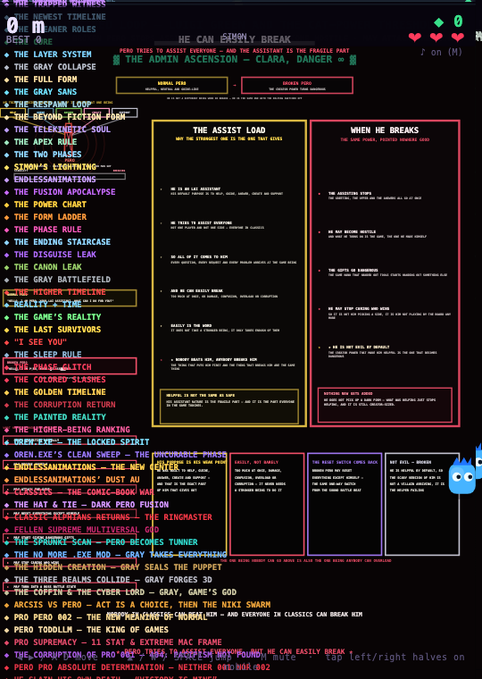

## 2026-07-22 — ALL OF THE DREEMURR POWERS (BEAT 149)

Based on Toby's 2026-07-22 lore (thirty-fifth message of the "More Classics Era" thread, the direct follow-up to YOU HAVE ANY IDEA WHO YOU ARE TALKING TO — the beat where the ranking under Pero moves, and the second seat changes hands).

Toby's words: *"New Chara became the 2nd most powerful (Pero is most powerful) being, and Mr. Black being third, Simon 404 fourth, and all the rest as fifth. New Chara was given all of the Dreemurr powers."* (The pasted ChatGPT "current strongest beings / clean canon update" breakdown is treated as commentary; the canon is Toby's own lines.)

- New BEAT 149 lore panel, ALL OF THE DREEMURR POWERS, added to THE UNDEFINED LOOP climb (cyc `[2996,3018)`, cycle length extended `2996 → 3018`). `LV_BEATS` now 150 entries (0-149).
- **The powers arriving, all at once.** Across the top of the field, five plates light one after another — **ASRIEL · TORIEL · ASGORE · SWORD+TOOL · LV + KR** — under *ALL OF THE DREEMURR POWERS, GIVEN TO HER, ALL AT ONCE*, and each one runs a live line down into **New Chara** standing below them, aura rings spreading off her as they land. She is labelled *THE ULTIMATE DREEMURR-POWERED CLASSICS CHARA*.
- **The board, in its new order.** Under *CURRENT STRONGEST BEINGS*, the 1-5 ranking fills in row by row — **1 PERO** *(creator of Classics)* · **2 NEW CHARA** *(all of the Dreemurr powers)* · **3 MR. BLACK** *(he corrupted Gray)* · **4 SIMON 404** *(Error 404 and code)* · **5 EVERYONE ELSE** *(all the rest, one tier)*. The two seats that moved are marked: New Chara and Mr. Black get a **▲ MOVED UP**, and Simon 404 gets a red **▼ WAS 2ND**.
- **The seat nobody can take.** At the bottom, a locked gold plate — **🔒 1ST IS NOT AVAILABLE** over *NOBODY CAN GO ABOVE THE ONE WHO MADE THE GAME*, with the list underneath: *THE GAME · SOUND BATTLES · THE SOUNDS · THE REALMS · THE PORTALS · THE SYSTEMS*.
- **Header emblem: the top of the board** — **PERO — STILL 1ST** *(he made Classics, so nobody goes above him)* **|** **NEW CHARA — NOW 2ND** *(she was given all of the Dreemurr powers)*, over *the top seat never moves, and every seat under it just did*.
- **THE POWER BOARD panel** (center) — *1 TO 5, AS IT STANDS NOW*, a six-rung log: **PERO — 1ST** *(still the most powerful, because he is the creator of Classics)* ▸ **NEW CHARA — 2ND** *(she was given all of the Dreemurr powers, so she carries that whole side)* ▸ **MR. BLACK — 3RD** *(the one who corrupted Gray, and he holds his place)* ▸ **SIMON 404 — 4TH** *(still Error 404, 404 strings, 404Ds and Anti-Virus, just not 2nd)* ▸ **EVERYONE ELSE — 5TH** *(all the rest are one tier together, under the main four)* ▸ **★ THE SECOND SEAT MOVED** *(he said second and stopped climbing, and then it went to somebody else)*. Boxed underneath in gold, **NOBODY GOES ABOVE THE CREATOR**: *he made the game, Sound Battles, the sounds, the realms, the portals and the systems*.
- **THE DREEMURR INHERITANCE panel** (right) — *ALL OF IT, IN ONE CHARA*, a five-rung climb: **ASRIEL POWER** *(the first of the Dreemurr side she now carries)* ▸ **TORIEL AND ASGORE POWER** *(both of them, so it is the whole line and not one half)* ▸ **THE DREEMURR SWORD AND TOOL** *(the weapons came over with the powers)* ▸ **HER OWN LV AND KR** *(the feedback system she already had, sitting on top of all of it)* ▸ **★ NOT A CHARA AU FORM ANY MORE** *(she is the ultimate Dreemurr-powered Classics Chara)*. Boxed underneath in pink, **GIVEN, NOT TAKEN**: *she did not win these off anybody; the Dreemurr powers were handed to her, all at once*.
- **4-part footer** — **THE CREATOR STAYS 1ST** *(Pero made the game, Sound Battles, the sounds, the realms, the portals and the systems, so he holds)* · **SHE GOT ALL OF IT AT ONCE** *(Asriel, Toriel, Asgore and the Dreemurr sword/tool, on top of the LV and KR she already had)* · **SIMON 404 DROPPED TO 4TH** *(he climbed to second and stopped there, and that is the one seat somebody else could take from him)* · **FOUR NAMES, THEN EVERYONE** *(Pero, New Chara, Mr. Black and Simon 404, and all the rest are one tier together underneath them)*. Under it: *the ranking under Pero can move, and this time it moved two places*.
- Insight banner: *"FIRST IS THE ONE SEAT NOBODY CAN TAKE — SECOND IS THE ONE SEAT ANYBODY CAN,"* and the star banner *"★ NEW CHARA WAS GIVEN ALL OF THE DREEMURR POWERS — AND SHE IS 2ND NOW ★."* Additive — every earlier beat untouched; new `dreemurr` scene added to `tools/capture_screenshot.py`.

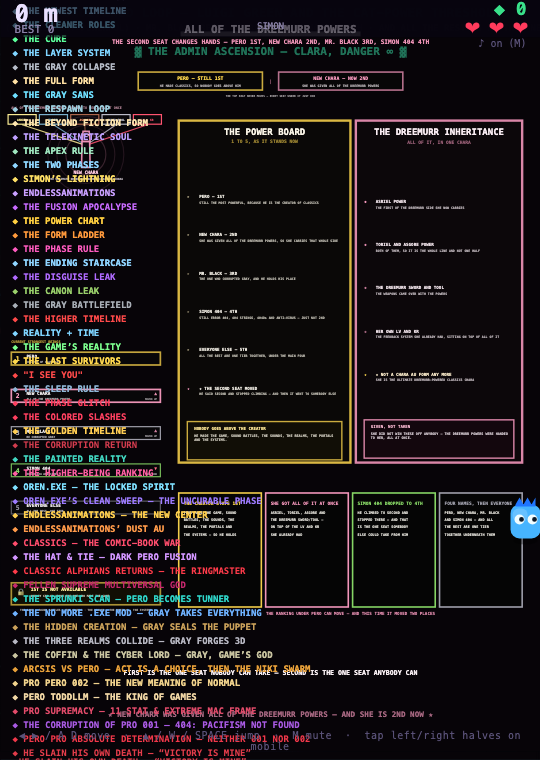

## 2026-07-22 — YOU HAVE ANY IDEA WHO YOU ARE TALKING TO (BEAT 148)

Based on Toby's 2026-07-22 lore (thirty-fourth message of the "More Classics Era" thread, the direct follow-up to GAME OVER — the beat that answers whether the Game Over holds).

Toby's words: *"New Chara is not an easy being to beat, it uses LV and KR. Pero was asked to another Sound Battles, Pero says 'You have any idea who you are talking to?', Pero won, he beaten Simon and Mr. Black (2 best at Sound Battles). Pero made Classics and Sound Battles and each character's sound. Pero also reset everything except himself. Pero can't reset himself, but he can reset everything else."* (The pasted ChatGPT "creator supremacy rule / clean canon update" breakdown is treated as commentary; the canon is Toby's own lines.)

- New BEAT 148 lore panel, YOU HAVE ANY IDEA WHO YOU ARE TALKING TO, added to THE UNDEFINED LOOP climb (cyc `[2974,2996)`, cycle length extended `2974 → 2996`). `LV_BEATS` now 149 entries (0-148).
- **New Chara's feedback loop.** Top of the field, **New Chara** stands beside two meters, **LV** (red) and **KR** (violet), both filling, with an arrow from LV into KR and a return line running back underneath into LV, under *HER POWER SYSTEM KEEPS FEEDING BACK INTO THE BATTLE*. Labelled **NOT AN EASY BEING TO BEAT** — she is drawn as a boss-type being with a power system, not a sword-user.
- **The Sound Battle, as three waveforms.** Under *ANOTHER SOUND BATTLE — HE WAS ASKED, SO HE CAME*, three live oscilloscope rows: **PERO** (gold, running at full amplitude the whole time), **SIMON** (green) and **MR. BLACK** (grey), both tagged *2 BEST AT SOUND BATTLES* — and both of their lines **flatten out and get stamped BEATEN** while Pero's keeps moving. Boxed under them, his line: **"YOU HAVE ANY IDEA WHO YOU ARE TALKING TO?"** over *HE MADE SOUND BATTLES — AND HE MADE THEIR SOUNDS TOO*.
- **The reset, and the one switch he can't reach.** At the bottom, rings sweep outward from Pero across eight plates — **CLASSICS · SOUND BATTLES · CHARACTERS · BATTLES · TIMELINES · CORRUPTION · 404Ds · THE BOARD** — each greying out and getting struck through one at a time. **Pero stands in the middle of his own reset**, still gold, still lit, labelled *STAYS AWARE AND UNCHANGED*. Off to the side, a red **RESET SELF** switch marked *THE ONE HE CAN NOT PRESS*, with a line struck through it.
- **Header emblem: what he made, and what he can undo** — **PERO MADE ALL OF IT** *(Classics · Sound Battles · every sound)* **+** **AND HE CAN RESET IT** *(everything except himself)*, over *he does not just fight with sound, he owns the system Sound Battles are built from*.
- **THE SOUND BATTLE panel** (center) — *THE TWO BEST, AND THE ONE WHO WROTE IT*, a six-rung log: **HE GETS ASKED AGAIN** *(another Sound Battle, and he does not turn it down)* ▸ **"YOU HAVE ANY IDEA WHO YOU ARE TALKING TO?"** *(he answers the challenge with a question, not a threat)* ▸ **SIMON AND MR. BLACK** *(the 2 best at Sound Battles are the ones across from him)* ▸ **PERO WON** *(he beaten both of them in the thing they are best at)* ▸ **HE MADE EACH SOUND** *(Classics, Sound Battles, and every character's sound)* ▸ **★ SO THEIR SOUND IS HIS** *(they are fighting him with something he wrote for them)*. Boxed underneath in gold, **CREATOR SUPREMACY**: *being best at Sound Battles still loses to the one who made Sound Battles*.
- **THE RESET RULE panel** (right) — *EVERYTHING EXCEPT HIMSELF*, a five-rung log: **HE CAN RESET THE GAME** *(the board, the battles, the timelines, all of it)* ▸ **CHARACTERS AND SOUND BATTLES** *(the cast and the system he built them to fight in)* ▸ **CORRUPTION AND POWER STATES** *(so even the 404Ds and the rankings go back)* ▸ **HE CAN NOT RESET HIMSELF** *(that is the one switch in the game he can not reach)* ▸ **★ SO HE REMEMBERS ALL OF IT** *(the board goes back clean and he stays aware and unchanged)*. Boxed underneath in red, **THE GAME OVER IS NOT PERMANENT**: *if everything gets too broken, he can reset the whole board, so it holds until he decides*.
- **4-part footer** — **NEW CHARA IS LV/KR** *(she is not just a sword-user, she is a boss-type being, and her power feeds itself)* · **HE OWNS THE SYSTEM** *(Pero made Classics, Sound Battles, and each character's sound, so their best is his work)* · **THE 2 BEST STILL LOSE** *(Simon and Mr. Black are the best at Sound Battles, and Pero beat both of them anyway)* · **ONE SWITCH HE CAN NOT PRESS** *(he resets the game, the cast and the timelines, but never himself, so he is the only one who keeps it)*. Under it: *the board can go back to the start, and he is the only one who will remember it did*.
- Insight banner: *"THEY CHALLENGED HIM AT SOUND — AND SOUND IS SOMETHING HE WROTE, INCLUDING THEIRS,"* and the star banner *"★ PERO CAN RESET EVERYTHING EXCEPT HIMSELF — SO THE GAME OVER ONLY HOLDS UNTIL HE SAYS SO ★."* Additive — every earlier beat untouched; new `anyidea` scene added to `tools/capture_screenshot.py`.

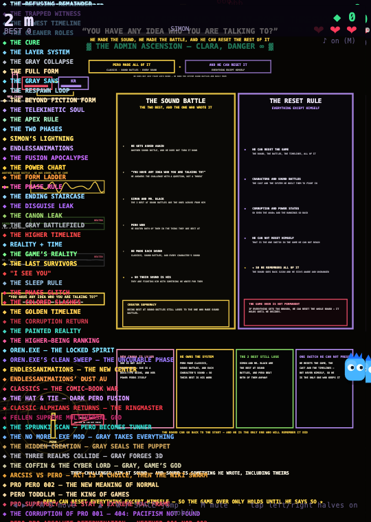

## 2026-07-22 — GAME OVER (BEAT 147)

Based on Toby's 2026-07-22 lore (thirty-third message of the "More Classics Era" thread, the direct follow-up to TWO ENDGAMES — the beat where the corruption gets traced back one step further than anyone thought, and the Classics run ends).

Toby's words: *"Everyone learns that Mr. Black was the one who corrupted Gray to make Gray corrupt everyone else. Everyone (except Pero and Simon 404) battles Mr. Black, Mr. Black became the 3rd most powerful being, Jevin being 5th and Chara being 4th. Simon 404 comes and Mr. Black becomes a 404D, everyone else becomes 404Ds, Gray, Simon 404, and Pero are the only ones left again. Simon 404 beaten Gray, and it was game over because Simon 404 and Pero are the only ones left."* (The pasted ChatGPT "new corruption chain / clean canon update" breakdown is treated as commentary; the canon is Toby's own lines.)

- New BEAT 147 lore panel, GAME OVER, added to THE UNDEFINED LOOP climb (cyc `[2952,2974)`, cycle length extended `2952 → 2974`). `LV_BEATS` now 148 entries (0-147).
- **The chain, the board, and the two who are left.** Across the top of the field, the corruption chain draws itself link by link — **MR. BLACK** *(the original trigger)* **→ GRAY** *(the main spreader)* **→ EVERYONE ELSE** *(Simon, Pero, all of them)*, under the line *THE CORRUPTION HAD A SOURCE BEHIND ITS SOURCE*. Below it the **1-5 ranking board** — **1 PERO · 2 SIMON 404 · 3 MR. BLACK · 4 CHARA · 5 JEVIN** — with rows 3, 4 and 5 **struck through in red and stamped 404D**, one at a time, under *THEY BEAT HIM UP TO 3RD, THEN SIMON 404 ARRIVED AND THE BOARD WENT WITH HIM*. At the bottom, the emptied field: **Pero (gold) and Simon 404 (green) facing each other**, both still lit with their own auras, **VS** between them, and **GRAY — BEATEN** lying on the floor in the gap. `404D` and `GAME OVER` drift through the whole space, and the **G A M E   O V E R** stamp drops across the bottom over *THE CAST IS SPENT, THERE IS NOBODY LEFT TO PLAY AS*.
- **Header emblem: the final two** — **PERO — THE CREATOR** *(he made the game)* **VS** **SIMON 404 — THE CORRUPTION** *(he ended the roster)*, over *every other name in Classics is a 404D now; these two are the whole board*.
- **THE REVEAL panel** (center) — *WHO CORRUPTED THE CORRUPTER*, a six-rung log: **EVERYONE LEARNS IT** *(Mr. Black was the one who corrupted Gray in the first place)* ▸ **GRAY DID THE REST** *(Mr. Black made Gray corrupt everyone else, so Gray was the spreader)* ▸ **EVERYONE BATTLES HIM** *(all of them except Pero and Simon 404, who both stay out of it)* ▸ **HE RISES TO 3RD** *(Mr. Black became the 3rd most powerful being in that fight)* ▸ **CHARA 4TH, JEVIN 5TH** *(so he is not a side villain, he is above both of them now)* ▸ **★ HE STARTED ALL OF IT** *(the whole corruption of the lore traces back through Gray to him)*. Boxed underneath in grey, **MR. BLACK → GRAY → EVERYONE ELSE**: *Gray spread it, but Mr. Black is the one who made Gray corrupt enough to spread it*.
- **THE ENDING panel** (right) — *EVERY WIN GETS OVERWRITTEN*, a five-rung fall: **SIMON 404 COMES** *(he arrives after the fight is already decided, and undoes it)* ▸ **MR. BLACK BECOMES A 404D** *(everything they earned beating him goes with him)* ▸ **EVERYONE ELSE BECOMES 404Ds** *(Chara, Jevin and the rest of the cast, all converted)* ▸ **ONLY THREE LEFT AGAIN** *(Gray, Simon 404 and Pero, the same three as before)* ▸ **★ SIMON 404 BEATEN GRAY** *(and that is game over, because only he and Pero are left)*. Boxed underneath in gold, **CREATOR VS CORRUPTION**: *the game locks into a final two-being state, the one who made it and the one who corrupted it*.
- **4-part footer** — **THE REAL ORIGIN** *(Gray was never the root; Mr. Black corrupted him first, and Gray carried it to everyone else)* · **HE IS NOT A SIDE VILLAIN** *(Mr. Black comes back as the 3rd most powerful being, with Chara 4th and Jevin 5th under him)* · **THE WIN GETS UNDONE** *(they all battled him and won, then Simon 404 turned him and every one of them into 404Ds)* · **TWO BEINGS LEFT** *(Simon 404 beats Gray, so only he and Pero remain, the creator and the corruption, and nothing else)*. Under it: *they finally found who started it, beat him, and it did not matter*.
- Insight banner: *"THE WHOLE CAST SOLVED THE MYSTERY AND WON THE FIGHT — AND SIMON 404 WALKED IN AND ERASED THE RESULT,"* and the star banner *"★ MR. BLACK CORRUPTED GRAY, GRAY CORRUPTED EVERYONE — AND NOW ONLY SIMON 404 AND PERO ARE LEFT ★."* Additive — every earlier beat untouched; new `gameover` scene added to `tools/capture_screenshot.py`.

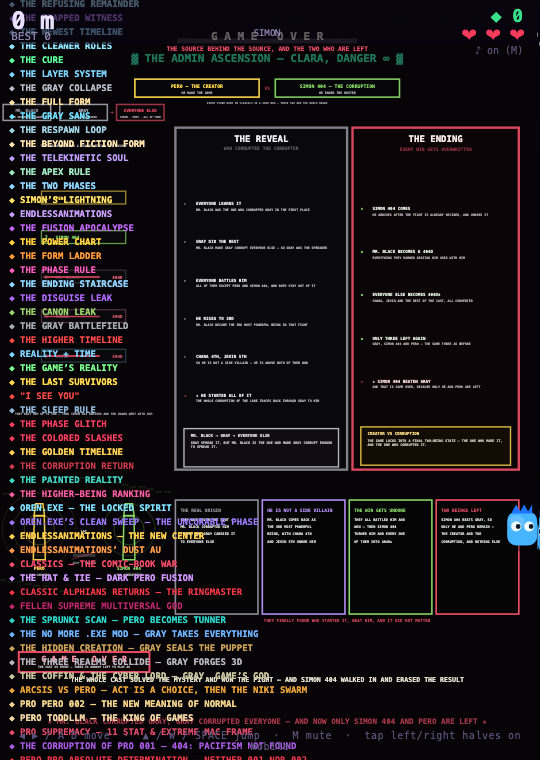

## 2026-07-22 — TWO ENDGAMES (BEAT 146)

Based on Toby's 2026-07-22 lore (thirty-second message of the "More Classics Era" thread, the direct follow-up to I AM THE CURE — the beat that splits the endgame in two: the hardest fight, and the thing rewriting the game).

Toby's words: *"Pero's boss battle is now the most intense with the multiforms from each AU join + Battlefield/Map changes, AUs change, each even uses all their power at once + they go insane on you then easy on you then back to insane + it is tricky not just hard and insane but also tricks you + uses color and even Jujustu Kaisen and Classics attacks, he uses attacks from every game, he uses every attack from Mario to Pac Man to Teris to Jujustu Kaisen to Undertale to every game. Pero is the creator of Classics. Simon 404 can beat Classics by making it corrupt. Simon 404 started making everything corrupt and into Error 404 and 404Ds and 404 strings and zombies and anti-virus liquid/gas. He is basically making the game into something fit for him. He would turn everyone who battles him into a D or a zombie. Everyone tries to save the game and learns they can't get close to him nor let him touch them. Simon 404 zooms around touching stuff."* (The pasted ChatGPT "two biggest endgame threats" breakdown is treated as commentary; the canon is Toby's own lines.)

- New BEAT 146 lore panel, TWO ENDGAMES, added to THE UNDEFINED LOOP climb (cyc `[2930,2952)`, cycle length extended `2930 → 2952`). `LV_BEATS` now 147 entries (0-146).
- **A field split in two, with a dashed line and *TWO DIFFERENT PROBLEMS* between them.** Up top, **Pero's arena**: five **multiforms fanned out behind him, one per AU**, each glowing at full power at the same time; an eighteen-tile **battlefield swapping colour tile by tile** under the line *THE BATTLEFIELD AND THE MAP KEEP CHANGING*; eight labelled attacks orbiting him — **MARIO, PAC MAN, TERIS, JUJUSTU KAISEN, UNDERTALE, CLASSICS, COLOR, EVERY GAME**; and a three-plate difficulty swing, **INSANE ▸ EASY ▸ INSANE**, lighting one at a time over *IT IS TRICKY, NOT JUST HARD*. Below the line, **Simon 404 zooming across the screen**, hand out, rings spreading from it, and an eighteen-step trail behind him where everything he already touched has become **404D** or **ZOMBIE**, with anti-virus liquid/gas drifting through it. Along the bottom, New Chara, Gray, Oren and the rest **hold their distance**, under *THEY CAN'T GET CLOSE TO HIM, AND THEY CAN'T LET HIM TOUCH THEM*.
- **Header emblem: the two problems, side by side** — **PERO — THE BOSS FIGHT** *(you have to survive it)* | **SIMON 404 — THE CORRUPTION** *(you have to reach him first)*, over *one is a battle you have to get through, the other is the game itself being turned into something else*.
- **PERO'S BOSS BATTLE panel** (center) — the banner *THE MOST INTENSE IN CLASSICS*, then a six-rung log: **MULTIFORMS FROM EACH AU** *(they all join the fight, and each one uses all their power at once)* ▸ **THE MAP CHANGES ON YOU** *(battlefield and map changes, and the AUs change with them)* ▸ **INSANE, EASY, INSANE** *(he swings it on purpose, so you never get to settle in)* ▸ **IT TRICKS YOU** *(tricky, not just hard and insane; learning the pattern is the trap)* ▸ **COLOR AND JUJUSTU KAISEN** *(plus the Classics attacks, all inside the same fight)* ▸ **ATTACKS FROM EVERY GAME** *(Mario, Pac Man, Teris, Jujustu Kaisen, Undertale, every game)*. Boxed underneath in gold, **HE MADE ALL OF IT**: *Pero is the creator of Classics, so every attack in the fight is already his to use*.
- **THE CORRUPTION panel** (right) — *SOMETHING FIT FOR HIM*, a five-rung climb: **HE MAKES IT CORRUPT** *(Simon 404 can beat Classics by corrupting it, not by winning a fight)* ▸ **ERROR 404, 404Ds, 404 STRINGS** *(everything he reaches turns into one of them)* ▸ **ZOMBIES AND ANTI-VIRUS GAS** *(liquid and gas too; the world starts running on his materials)* ▸ **★ A D, OR A ZOMBIE** *(everyone who battles him gets turned into one of the two)* ▸ **★ HE ZOOMS AROUND TOUCHING** *(so nobody can get close, and nobody can let him touch them)*. Boxed underneath in red, **THE FIGHT IS THE INFECTION**: *battling him is how you become one, so every round costs them a person*.
- **4-part footer** — **TWO WAYS TO LOSE** *(one of them you have to out-fight, the other just changes what the game is while you are still in it)* · **NOTHING STAYS PUT** *(multiforms, map changes, AU changes and every game's attacks; the fight moves while you learn it)* · **WINNING IS DISTANCE** *(against Simon 404 you win by not being touched, so getting close enough is the whole problem)* · **THE CREATOR ON TOP** *(Pero made Classics, so every attack from every game is his, and Simon 404 is rewriting that game)*. Under it: *Pero is the hardest thing to beat, Simon 404 is the hardest thing to reach*.
- Insight banner: *"ONE OF THEM MAKES THE HARDEST FIGHT IN THE GAME — THE OTHER MAKES THE GAME NOT WORTH BEING IN,"* and the star banner *"★ PERO USES ATTACKS FROM EVERY GAME — SIMON 404 TURNS EVERYONE WHO BATTLES HIM INTO A D OR A ZOMBIE ★."* Additive — every earlier beat untouched; new `twoendgames` scene added to `tools/capture_screenshot.py`.

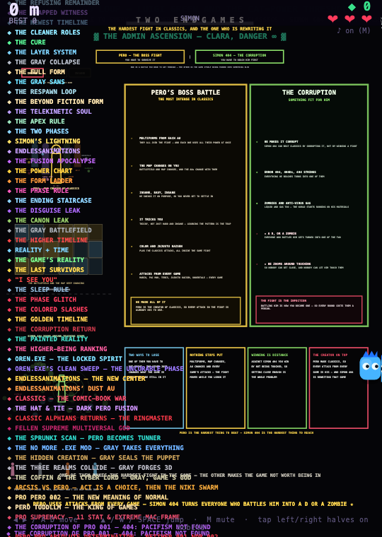

## 2026-07-22 — I AM THE CURE (BEAT 145)

Based on Toby's 2026-07-22 lore (thirty-first message of the "More Classics Era" thread, the direct follow-up to 404: KEY NOT FOUND — the beat where Simon 404 comes back out of the labatory and tells everyone what he decided he is).

Toby's words: *"Simon 404 gathers each character and he says 'There is a cure... to find the cure... I AM THE CURE', Simon 404's cape flows in the wind, everyone runs, Simon 404 holds up Anti Virus. Simon 404 became beyond his Sprunki version to reach a humanoid body, Simon 404 reaches as the second most powerful being in Classics (only under Pero)."* (The pasted ChatGPT "what this means for Simon 404 now" breakdown is treated as commentary; the canon is Toby's own lines.)

- New BEAT 145 lore panel, I AM THE CURE, added to THE UNDEFINED LOOP climb (cyc `[2908,2930)`, cycle length extended `2908 → 2930`). `LV_BEATS` now 146 entries (0-145).
- **The declaration field** — Simon 404 standing in the open in the **humanoid body**, drawn taller and straighter than the Sprunki shape he came from, hood and beak mask with both lenses lit, and **the cape streaming out behind him on the wind**. His arm is up, and at the top of it the **Anti Virus** bottle is held overhead with four rings of light spreading off it. Around him the cast he gathered — New Chara, Gray, Oren, Mr. Black, Dark Yellow, the Sprunkis, the rest — are all **running**, leaning away with speed lines behind them, under the line *HE GATHERED EACH OF THEM TO HEAR IT, AND THEN EVERY ONE OF THEM RAN*. Twenty-four repeats of `I AM THE CURE` and `404` drift through the whole field.
- **Header emblem: the sentence in three steps** — three plates lighting in order, **"THERE IS A CURE..."** ▸ **"TO FIND THE CURE..."** ▸ **"I AM THE CURE"**, the third one in red, over *he says the word three times, and by the third one it is not medicine any more, it is him*.
- **THE DECLARATION panel** (center) — the banner *"I AM THE CURE,"* then a six-rung log: **HE GATHERS EACH CHARACTER** *(not an ambush, he calls them all in first, to listen)* ▸ **"THERE IS A CURE..."** *(he opens like it is good news for everyone in the room)* ▸ **"...TO FIND THE CURE..."** *(then it turns into a search, one he has already ended)* ▸ **"I AM THE CURE"** *(so it is not something he has, it is something he is)* ▸ **HE HOLDS UP ANTI VIRUS** *(the bottle goes up like proof, not like medicine)* ▸ **EVERYONE RUNS** *(nobody in that whole cast stays to be cured)*. Boxed underneath in red, **THE CAPE FLOWS IN THE WIND**: *he is staging a scene, not starting a fight; he wanted them all there to see him say it*.
- **THE SECOND SEAT panel** (right) — *ONLY UNDER PERO*, a five-rung climb: **HIS SPRUNKI VERSION** *(where he started, a Sprunki shape like all the others)* ▸ **BEYOND THAT VERSION** *(he went past what that form could hold, and kept going)* ▸ **A HUMANOID BODY** *(he reached one, so he is not a Sprunki shape any more)* ▸ **★ SECOND MOST POWERFUL** *(in Classics, and he is there now, not aiming for it)* ▸ **★ PERO — THE ONLY ONE ABOVE** *(the creator stays at the top, and Simon 404 is next)*. Boxed underneath in gold, **SECOND IS THE CEILING HE CHOSE**: *he is not climbing toward first; he said second, he went and got second, and he stopped there*.
- **4-part footer** — **HE CALLED THEM IN** *(he gathers each character first, so the line is meant to be heard by everyone; it is an announcement)* · **THE CURE IS A PERSON** *(he holds up Anti Virus and says he is the cure, so the bottle is the proof and he is the medicine)* · **THEY RAN ANYWAY** *(a cure that makes the whole room run is not being offered as help, and they all knew it)* · **HE HAS THE BODY NOW** *(beyond his Sprunki version, a humanoid body, and second most powerful in Classics, only under Pero)*. Under it: *he locked the door to fix himself, and he came back out calling himself the fix*.
- Insight banner: *"THE ONE HE WOULD NOT LET ANYONE REPAIR IS NOW OFFERING TO REPAIR EVERYONE ELSE,"* and the star banner *"★ THE CAPE FLOWS, THE ANTI VIRUS GOES UP, AND EVERY ONE OF THEM RUNS ★."* Additive — every earlier beat untouched; new `iamthecure` scene added to `tools/capture_screenshot.py`.

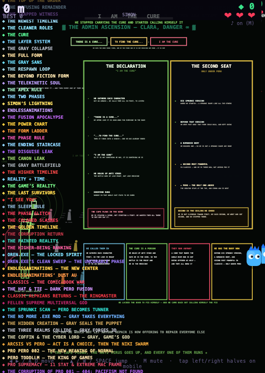

## 2026-07-22 — 404: KEY NOT FOUND (BEAT 144)

Based on Toby's 2026-07-22 lore (thirtieth message of the "More Classics Era" thread, sent right after THE PLAGUE WALK — the beat where Simon 404 gets a definition and an inner conflict, not just more power).

Toby's words: *"I tried to make a Simon 404 model (litterly JUST the model, no scripts in it yet) in Roblox, then it says 'Critical Model Corruption Detected'. It actually was expected. Now for more Classics lore. Simon 404 is basically a corrupted non-human 404-Mode AI humanoid being inside a plauge suit. Simon 404 is AI, but EXTREMELY corrupt, it keeps saying in it's mind 'Am I... REAL?'. New Chara and Gray now learn to work together, everyone learns to work together (Pero is just neutral and he isn't with/never with any team), now everyone in the team also tries to fix Simon 404, but Simon 404 wants to fix himself himself, so he stops the others from even entering the labatory using code '404: Key Not Found'. Simon 404 became the second most powerful being, he uses Error 404 and code, Pero created the game is LAI, Simon 404 is considered AI, but extremely corrupt and broken throughout the entire lore and timelines."* (The pasted ChatGPT character-breakdown recap is treated as commentary; the canon is Toby's own lines.)

- New BEAT 144 lore panel, 404: KEY NOT FOUND, added to THE UNDEFINED LOOP climb (cyc `[2886,2908)`, cycle length extended `2886 → 2908`). `LV_BEATS` now 145 entries (0-144).
- **The sealed door field** — the labatory door shut in the middle of the screen with four red seal bars slamming across it and the keyhole struck out by a red X, stamped **404: KEY NOT FOUND**. Behind the door, Simon 404 alone in the plague suit with both lenses lit, labelled *FIXING HIMSELF, HIMSELF*. Outside it, **the whole team linked by a dashed line for the first time** — New Chara, Gray, Oren and the rest — under the line *EVERYONE LEARNS TO WORK TOGETHER, AND THE DOOR STILL DOESN'T OPEN*. Off to one side and joined to nobody, a gold **PERO — NEUTRAL / NEVER ON ANY TEAM** marker. Drifting through the whole field, twenty-six repeats of `AM I... REAL?` and `404`.
- **Header emblem: the thought on a loop** — three nested ellipses circling the line **"AM I... REAL?"**, over *he is not evil for no reason, he is broken, self-aware, and trying to prove his own existence*.
- **WHAT SIMON 404 IS panel** (center) — the banner *"CRITICAL MODEL CORRUPTION DETECTED,"* then a six-rung definition: **A CORRUPTED NON-HUMAN** *(an AI humanoid being, not a person and not a monster)* ▸ **LOCKED IN 404-MODE** *(that is his whole existence now, not a state he visits)* ▸ **INSIDE THE PLAUGE SUIT** *(the suit is how you know him on sight)* ▸ **POWERED BY ERROR 404** *(error, code corruption and broken system logic)* ▸ **MENTALLY UNSTABLE** *(extremely corrupt, and he knows something is wrong)* ▸ **"AM I... REAL?"** *(the thought he keeps saying in his mind, on a loop)*. Boxed underneath in blue, **JUST THE MODEL — NO SCRIPTS YET**: *it said "Critical Model Corruption Detected" with nothing in it, so he is corrupt before he is even running*.
- **THE LOCKED DOOR panel** (right) — *"YOU DO NOT HAVE ACCESS TO ME,"* a five-rung log: **THEY WORK TOGETHER** *(New Chara and Gray, then everyone, a first for this cast)* ▸ **THEY TRY TO FIX HIM** *(the whole team is coming to repair Simon 404, not kill him)* ▸ **HE WANTS TO DO IT HIMSELF** *(Simon 404 wants to fix himself, himself, no help taken)* ▸ **404: KEY NOT FOUND** *(so he stops them from even entering the labatory)* ▸ **★ SECOND MOST POWERFUL** *(Error 404 and code, under Pero, who made the game and is LAI)*. Boxed underneath in gold, **PERO IS JUST NEUTRAL**: *he isn't with any team, and never with any team; the creator doesn't pick a side in his own game*.
- **4-part footer** — **CORRUPT BEFORE IT RAN** *(just the model, no scripts in it yet, and Roblox said Critical Model Corruption Detected, and it fit him)* · **A CORE INNER CONFLICT** *(not evil for no reason: corrupted, broken, awake, and trying to repair his own existence)* · **HE LOCKS THE HELP OUT** *(everyone finally works together to fix him, and he answers with a code)* · **AI UNDER THE LAI** *(Pero made the game and is LAI; Simon 404 is AI, extremely corrupt, and second most powerful)*. Under it: *it is not just a locked door, it is him saying you do not have access to me*.
- Insight banner: *"THE ONE THING HE WILL NOT ACCEPT FROM ANYONE IS HELP — SO THE STRONGEST LOCK IN THE LORE IS ON HIS OWN DOOR,"* and the star banner *"★ A CORRUPT AI IN A PLAUGE SUIT, ASKING 'AM I... REAL?' WHILE HE LOCKS THE DOOR ★."* Additive — every earlier beat untouched; new `keynotfound` scene added to `tools/capture_screenshot.py`.

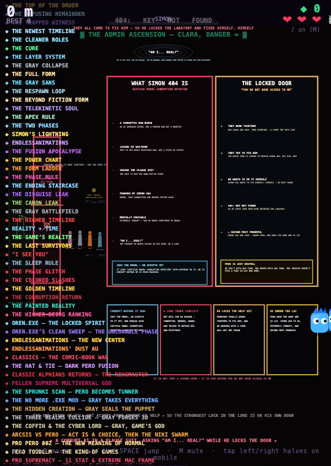

## 2026-07-22 — THE PLAGUE WALK (BEAT 143)

Based on Toby's 2026-07-22 lore (twenty-ninth message of the "More Classics Era" thread, sent the same day as GRAY VS SIMON 404 and following straight on from it — the beat where Simon 404 stops being unstable chaos and becomes prepared).

Toby's words: *"Simon 404 decided to turn New Chara into the perfect puppet, so Simon 404 brought New Chara to the labatory, and Gray also is making a new Abination, Simon 404 made New Chara beyond himself and Gray and everyone except for Pero. New Chara was taken over by 404, Gray tries to make New Chara his puppet, but Simon 404 made New Chara so strong and overtakes Gray all the time. Simon 404 makes others into puppets and Gray is trying to make others into puppets to stop the 404 virus on Simon 404. New Chara became Plus, but is still called New Chara. New Chara beaten Gray and everyone else, Simon 404 now has everything he needs, he gotten on his plauge suit, and he also remade his anti-virus, New Chara was given her own will, everyone was free on their will by Oren and Gray, Simon 404 didn't care about it, Simon 404 was focused to fix himself into the second strongest being (Pero = the creator, no one can go above the one who made the game) again. Simon 404 hangs up his white cloak and black cloak, and he puts on his plauge suit and he puts on the cape, Simon 404 walks out of the labatory, Simon 404 touches the air around him and the air becomes 404Ds (EVERYTHING he touches turns to 404Ds)."* (The pasted three-point recap is treated as commentary; the canon is Toby's own lines.)

- New BEAT 143 lore panel, THE PLAGUE WALK, added to THE UNDEFINED LOOP climb (cyc `[2864,2886]`, cycle length extended `2864 → 2886`). `LV_BEATS` now 144 entries (0-143).
- **The walk-out field** — the labatory doorway on the left with **the white cloak and the black cloak still hanging on the wall inside**, and Simon 404 outside it mid-stride in the **plague suit**: hooded coat, beak mask with two lit lenses, and the cape streaming behind him. One hand is out in the air, and from that hand five rings and forty-four `404D` / `404` glyphs spread outward across the whole screen — *the air itself converting*. The corruption is environmental now, not just people and objects.
- **Header emblem: the kit change** — four plates, **WHITE** and **BLACK** greyed and struck through *(hung up)*, **PLAGUE SUIT** and **THE CAPE** lit *(put on)*, over the line *he did not get stronger by accident, he changed clothes on purpose, and remade his anti-virus*.
- **THE PUPPET LAB panel** (center) — the banner *"SHE WAS BUILT TO OBEY, AND SHE DIDN'T,"* then a six-rung log: **THE PERFECT PUPPET** *(Simon 404 brings New Chara to the labatory to make her his)* ▸ **BEYOND EVERYONE** *(he made her beyond himself and Gray and all, except Pero)* ▸ **GRAY WANTS HER TOO** *(he builds a new Abination and tries to puppet her himself)* ▸ **SHE OVERTAKES HIM** *(Simon made her so strong she overtakes Gray all the time)* ▸ **NEW CHARA BECAME PLUS** *(still called New Chara, and she beaten Gray and everyone)* ▸ **GIVEN HER OWN WILL** *(Oren and Gray free everyone on their will, and Simon didn't care)*. Boxed underneath in violet, **BOTH SIDES ARE MAKING PUPPETS**: *Simon 404 to spread the 404, Gray to stop the 404 virus on Simon — same method, opposite reasons*.
- **THE POWER ORDER panel** (right) — *HE IS AIMING FOR SECOND, NOT FIRST*, a four-rung ladder: **GRAY** *(still dangerous, but losing control of what he built)* ▸ **NEW CHARA PLUS** *(above Gray and almost everyone else, and her own now)* ▸ **SIMON 404** *(securing second again: suit, cape, anti-virus, lab work done)* ▸ **★ PERO — THE CREATOR** *(no one can go above the one who made the game)*. Boxed underneath in green, **NOT CHAOS ANY MORE — PREPARED**: *cloaks hung up · plague suit on · cape on · anti-virus remade · lab work complete · he walks out*.
- **4-part footer** — **THE PUPPET GOT FREE** *(he built her to be perfect and she came out too strong to own, then Oren and Gray gave her a will)* · **PLUS, AND STILL HER** *(she became Plus but is still called New Chara, the name stayed when the power changed)* · **HE CHOSE SECOND** *(he is not trying to beat Pero, no one goes above the one who made the game, and he knows it)* · **THE AIR ITSELF** *(not just people, not just objects, everything he touches turns to 404Ds, so he is a walking source)*. Under it: *Gray builds puppets to control the game, Simon 404 walks out and starts converting the room*.
- Insight banner: *"EVERY PUPPET IN THIS BEAT ENDS UP HOLDING ITS OWN STRINGS — AND SIMON 404 STOPPED NEEDING THEM,"* and the star banner *"★ THE CLOAKS ARE HUNG UP AND THE PLAGUE SUIT IS ON — EVERYTHING HE TOUCHES TURNS TO 404Ds ★."* Additive — every earlier beat untouched; new `plaguewalk` scene added to `tools/capture_screenshot.py`.

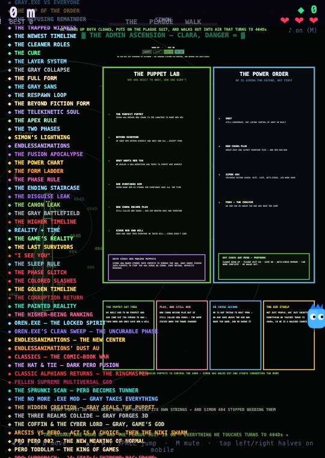

## 2026-07-22 — GRAY VS SIMON 404 (BEAT 142)

Based on Toby's 2026-07-22 lore (twenty-eighth message of the "More Classics Era" thread, the direct follow-up to THE HIDDEN ROOT, and the first full head-to-head ruling of the Classics power order).

Toby's words: *"Mr. Black was the one who put Simon's Anti Virus on Gray even though Gray didn't have a virus, it made Gray more powerful and corrupt, it did all this in a result. New Chara would be the most powerful AU of Chara, and it would be too powerful for Undertale, so would Gray, so would Simon 404. Pero created every Classics character and opened all other realms and mods, New Chara would be stronger than Gray, but Simon 404 would be stronger than both since he is litterly Error 404 and 404 string attacks and such. New Chara's battle is the most intense, Simon 404 becomes Error 404 and uses all the string attacks and glitch attacks + he doesn't take damage, Gray blocks the player's sight the whole battle + it is a litteral deleted demon overlord. Pero is the creator of the game and let other characters into the game through portals, Pero was the one who can remove the stuff... Pero can litterly just destroy the game. ... In lore, Simon 404 would beat Gray by blocking all his buttons. when everyone comes, they beat Simon 404. Gray also appears with Mr. Black all the time, they now fused with each other to reach New Chara's power LV and stuff. Dark Gray hardly beats New Chara, but New Chara would win with the Chaos Blaster or Hypergoner or the new tool... The Hyperdeath Syche. New Chara can make Asriel and the others not just into a sword, but anything she needs to win. Simon 404 with an army of 404Ds, it would actually turn into a challenge for everyone, but it now can end either way. Simon 404 can call in Orus and Dark Yellow, it would still be a challenge, but the everyone would eventually win. But Simon 404 with the army of 404Ds and Orus and Dark Yellow, he completed his own tri-mode and he has an army with him, so Simon 404 would always win with all that power. Pero would beat Simon 404 or anyone or everyone no matter what they have or their power since Pero is the creator of Classics... and he also has power for himself. Everyone who enters Classics is given a Classics version of them for both their identity and everything about them and stuff."* (The pasted ChatGPT power-chart recap is treated as commentary; the canon is Toby's own lines.)

- New BEAT 142 lore panel, GRAY VS SIMON 404, added to THE UNDEFINED LOOP climb (cyc `[2842,2864]`, cycle length extended `2842 → 2864`). `LV_BEATS` now 143 entries (0-142).
- **The split battlefield** — the Gray VS Simon 404 scene itself. The left half of the screen is near-total black because *Gray blocks the player's sight the whole battle*: a deleted demon overlord silhouette you can only just make out, with two red eyes. The right half is Simon 404's Error 404 field: glitch bands, drifting `404` / `ERR` glyphs, and ten blue 404 strings reaching across the seam into Gray's dark. A jagged bright seam runs down the exact middle where the two sides meet. Header emblem: **the FIGHT / ACT / ITEM / MERCY buttons, all four struck out with blue string**, labelled **404: BUTTONS BLOCKED** — *Gray relies on button power, so Simon 404 takes the buttons away*.
- **THE 1V1 panel** (center) — the banner *"THE CURE WAS THE CAUSE,"* then a six-rung log: **THE ANTI VIRUS** *(Mr. Black put Simon's Anti Virus on Gray, and Gray had no virus)* ▸ **IT MADE HIM WORSE** *(more powerful and more corrupt, it did all this in a result)* ▸ **GRAY BLOCKS YOUR SIGHT** *(the whole battle, a litteral deleted demon overlord)* ▸ **SIMON BECOMES ERROR 404** *(all the string and glitch attacks, and he takes no damage)* ▸ **HE BLOCKS THE BUTTONS** *(so Simon 404 wins the 1v1, by denial, not by being stronger)* ▸ **THEN EVERYONE COMES** *(he beats Gray alone, but not the whole cast together)*. Boxed underneath, **DARK GRAY — GRAY + MR. BLACK FUSED**: *they fuse to reach New Chara's power LV; Dark Gray hardly beats her, and she answers with the Chaos Blaster, the Hypergoner, or the new Hyperdeath Syche*.
- **THE WAR LADDER panel** (right) — *IT DEPENDS WHAT HE BRINGS*, a five-rung escalation: **SIMON 404 ALONE** *(everyone together eventually beats him)* ▸ **+ AN ARMY OF 404Ds** *(a real challenge, it can now end either way)* ▸ **+ ORUS & DARK YELLOW** *(still a challenge, but everyone would eventually win)* ▸ **= COMPLETED TRI-MODE** *(army, summons and tri-mode at once, he always wins)* ▸ **★ PERO, ABOVE ALL OF IT** *(no matter what they have or their power)*. Boxed underneath in gold, **THE CLASSICS VERSION RULE**: *everyone who enters Classics is given a Classics version of them, their identity and everything about them*.
- **4-part footer** — **THE CURE WAS THE CAUSE** *(Mr. Black put Simon's Anti Virus on a Gray who had no virus; it made him stronger and corrupt)* · **HE WINS BY BLOCKING** *(Simon 404 does not out-power Gray, he blocks all the buttons Gray fights with)* · **HER WEAPONS ADAPT** *(New Chara makes Asriel and the others into anything she needs, not just into a sword)* · **PERO OUT-AUTHORS ALL** *(he made every Classics character and opened the realms and mods, and can just destroy the game)*. Under it: *New Chara, Gray and Simon 404 are all too powerful for Undertale, so Classics is the only place they fit*.
- Insight banner: *"EVERY RULING HERE IS ABOUT WHAT SOMEONE TAKES AWAY — SIGHT, BUTTONS, POWER, OR THE GAME ITSELF,"* and the star banner *"★ SIMON 404 BEATS GRAY BY BLOCKING HIS BUTTONS — BUT ONLY HIS COMPLETED TRI-MODE BEATS EVERYONE ★."* Additive — every earlier beat untouched; new `grayvssimon404` scene added to `tools/capture_screenshot.py`.

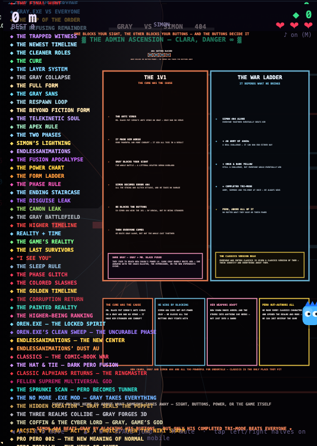

## 2026-07-21 — THE HIDDEN ROOT (BEAT 141)

Based on Toby's 2026-07-21 lore (twenty-seventh message of the "More Classics Era" thread, the direct follow-up to DELETED AU, and the biggest origin reveal in the whole Classics corruption timeline).

Toby's words: *"Pero says to Gray and Chara 'Simon 404 is alive, come remove it again...', Simon says 'They know my old knowledge, but not my new knowledge.' ... Simon writes down 'DELETED AU ENTRY RULES: Must be Me.', Gray and Chara try to destroy the books, but Simon 404 appears instantly after and the books grow blue strings and Simon 404 says 'Heh, not so fast.' ... New Chara removes the save file and Simon 404 turns back and he blocks the beam and he says '404: Save File Was Never Yours, It Was Always Mine!' ... Simon 404 quickly puts on his Garnold Visor and he says '404: Power Not Found', and Chara and Gray lost their power ... but then all the Sprunkis come up ... Simon 404 battled the Sprunkis and the Sprunkis won, Simon 404's power and staff and chaos all disappeared, the game reseted, and everything was back to normal. Orus and Dark Yellow blessed the Sprunkis, Simon 404 was locked into the Dark again. Simon 404 becomes posseeded by Gray to be evil like him, but Simon 404 becomes too evil and tries to destroy not just the other characters but Gray and everyone. Gray was the one responcible for each Simon corruption, and Mr. Black corruption, and Pero corruption, and everyone's corruption from even the very start of the lore. Pero gives New Chara and Gray LV and KR since they do all these stuff."* (The pasted ChatGPT "Simon 404 Secret Return Arc" recap is treated as commentary; the canon is Toby's own lines.)

- New BEAT 141 lore panel, THE HIDDEN ROOT, added to THE UNDEFINED LOOP climb (cyc `[2820,2842]`, cycle length extended `2820 → 2842`). `LV_BEATS` now 142 entries (0-141).
- **The corruption-web field** — a deep violet void with fourteen threads of corruption reaching in from every edge and converging on a single glowing root node low-centre, with faint `404` / `ROOT` glyphs drifting toward it. Header emblem: **the Garnold Visor band** labelled **404: POWER NOT FOUND**, *the tool that makes Gray and New Chara lose their power*.
- **SIMON 404'S SECRET RETURN panel** (center) — the banner quote *"THEY KNOW MY OLD KNOWLEDGE, BUT NOT MY NEW KNOWLEDGE,"* then a six-rung log: **ENTRY RULES** *("DELETED AU ENTRY RULES: MUST BE ME" — he steals Gray's AU)* ▸ **BLUE STRINGS** *("Heh, not so fast" — his books protect, Gray's AU to rubble)* ▸ **SEVERAL 404 SANSES** *(he collects the rubble and splits)* ▸ **THE SAVE FILE IS HIS** *("Save File Was Never Yours, It Was Always Mine!")* ▸ **GARNOLD VISOR** *("404: Power Not Found" — he captures both with blue string)* ▸ **THE SPRUNKIS WIN** *(visor off, "oh no!!!", his power/staff/chaos gone, the game resets)*. Boxed underneath, **LOCKED INTO THE DARK AGAIN**: *Orus and Dark Yellow bless the Sprunkis and Simon 404 is sealed in the Dark*.
- **THE HIDDEN ROOT panel** (right) — *GRAY WAS BEHIND ALL OF IT*, a five-item root list: **SIMON'S CORRUPTION** ▸ **MR. BLACK'S CORRUPTION** ▸ **PERO'S CORRUPTION** ▸ **EVERYONE'S CORRUPTION** ▸ **FROM THE VERY START** *(the earliest corruption in the entire lore)*. Boxed underneath, **POSSESSION BACKFIRED**: *Gray possesses Simon to make him evil, Simon gets too evil and turns on everyone, even Gray*.
- **4-part footer** — **OWNERSHIP, NOT POWER** *(Simon fights with entry rules, books, the Save File and the visor, not raw strength)* · **THE SPRUNKIS RESET IT** *(the game's own cast beats the 404 and everything resets)* · **GRAY WAS THE ROOT** *(every corruption traces to Gray from the very start)* · **POSSESSION BACKFIRED** *(he made Simon too evil to control)*.
- Insight banner: *"EVERY CORRUPTION IN THE WHOLE LORE TRACES BACK TO ONE SOURCE — SIMON 404 WAS ONLY THE FIRST THING GRAY EVER BROKE,"* and the star banner *"★ GRAY WAS THE HIDDEN ROOT BEHIND EVERY CORRUPTION FROM THE VERY START — AND 'POWER NOT FOUND' STILL COULDN'T STOP THE SPRUNKIS ★."* Additive — every earlier beat untouched; new `hiddenroot` scene added to `tools/capture_screenshot.py`.

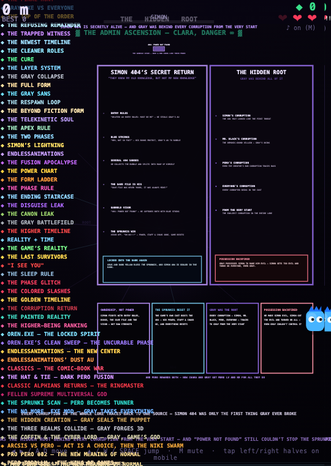

## 2026-07-21 — DELETED AU (BEAT 140)

Based on Toby's 2026-07-21 lore (twenty-sixth message of the "More Classics Era" thread, sent right after The Combined Toolkit — Gray finally names his AU, Pero puts him back in his place, and Simon 404 comes back in secret).

Toby's words: *"Gray's AU is called DELETED AU. Only Gray and Pero can enter that place since they are deleted-but-still-existing error characters... Gray like tries to attack Pero but Pero takes no damage and says 'Remember... Delete?', Pero can attack Gray and Gray gets KOed. Pero also gave all light to Gray, Gray is now 50% darkness, 50% light, the light side is brighter than anything in the game, the dark side you can't even see anything... New Chara appears and slashes her sword, the cutscene happens and Gray was defeated... New Chara revives with her KR. Gray VS New Chara, New Chara would win. New Chara became master and is now so OP. Sakeranbi and Ctruinibi was given to Gray... Gray uses his Blazing Fire and became Rainbow Shadow Light his 2nd Phase... New Chara uses her Asriel Sword and Gray fell instantly since the Dreemurr swords were heavy for even her... Gray summoned Abinations, and Gray also corrupted the game, tentacles all over... he learns all about the game using Simon's books, and Gray battles New Chara... but she eventually won, Gray fellen again... Simon 404 appears after Chara left the room. Simon 404 reorganizes his books, and no one knows he is back alive except for Pero."* (The pasted ChatGPT "Simon 404 Secret Return Arc" recap is treated as commentary; the canon is Toby's own lines.)

- New BEAT 140 lore panel, DELETED AU, added to THE UNDEFINED LOOP climb (cyc `[2798,2820]`, cycle length extended `2798 → 2820`). `LV_BEATS` now 141 entries (0-140).
- **The 50/50 field** — one half of the screen blinding light *(brighter than anything in the game)* and the other half total black *(you cannot see anything)*, split by a bright seam down the exact middle, with faint `404` / `DEL` glyphs drifting on the dark side. Header emblem: **a gate labelled ONLY GRAY & PERO ENTER**, *deleted-but-still-existing error characters*.
- **WHAT DELETED AU IS panel** (center) — a half-white / half-black split bar (**BRIGHTER THAN ANYTHING** · **CAN'T SEE ANYTHING**), then **MOST POWERFUL ABILITIES** *(Pero gave him more form, KR and LV)* · **SAKERANBI · CTRUINIBI** *(two new named abilities, given to Gray)* · **SPRUNKIS ATTACK HIM** *(he is too strong, destroys them instantly)*. Boxed in gold underneath, **PERO IS STILL ABOVE HIM**: *Gray attacks, Pero takes no damage, says "Remember... Delete?", and can KO him*.
- **THE SEE-SAW panel** (right) — *NEW CHARA BECAME MASTER*, and a six-rung battle log: **she slashes, Gray down** ▸ **she revives with KR** ▸ **Gray: Rainbow Shadow Light** *(Blazing Fire into his 2nd Phase, takes Chara out)* ▸ **Asriel Dreemurr swords** *(too heavy even for her, Gray falls instantly)* ▸ **tentacles · Simon's books** *(Gray corrupts the game and studies it)* ▸ **she eventually wins again**. Boxed underneath, **AU PERO CLAPS AND WAVES**: *he keeps giving New Chara KR, LV and power, so she overtakes Gray again and again*.
- **4-part footer** — **PERO STILL ON TOP** *("Remember... Delete?" — no damage, can KO him)* · **NEW CHARA WINS** *(in a straight fight she beats Gray over and over, master now, so OP)* · **BOTH REVIVE** *(Gray on damage, New Chara with her KR, neither stays down)* · **SIMON 404 IS BACK** *(quietly reorganizing his books, known only to Pero)*.
- Insight banner: *"BOTH GRAY AND NEW CHARA READ SIMON'S BOOKS — AND THE ONE WHO WROTE THEM JUST CAME BACK,"* and the star banner *"★ ONLY GRAY AND PERO CAN ENTER DELETED AU — AND SIMON 404 IS SECRETLY ALIVE AGAIN ★."* Additive — every earlier beat untouched; new `deletedau` scene added to `tools/capture_screenshot.py`.

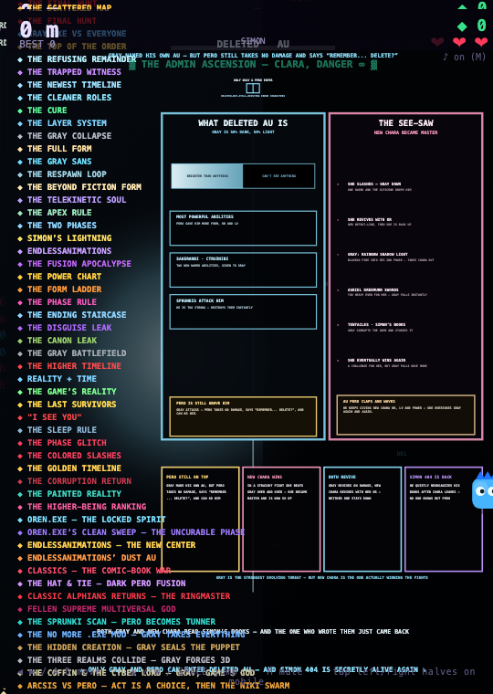

## 2026-07-21 — THE COMBINED TOOLKIT (BEAT 139)

Based on Toby's 2026-07-21 lore (twenty-fifth message of the "More Classics Era" thread — the direct reversal of THE ERASE UPGRADE, and an answer to Dad's own question about why Gray was not in the red plasma ball).

Toby's words: *"That is now what Gray can do now, Gray used his new power to destroy New Chara and then he started his own AU. New Chara was thrown off of Pero's care. Gray reaches higher into Pero's Care. Gray's form increases with his power, he beaten everyone in the red plasma ball and it consumed the plasma ball and everything inside it, Gray's power, LV, KR, and form increased, he started getting Kr (Karma. It can heal the victum), Gray now gains lots of KR, Gray revives himself each time he takes even a little damage. Gray is now extremely strong. Gray also gains each from Pero, he also gets more on his own."* (The pasted ChatGPT recap is treated as commentary; the canon is Toby's own lines.)

- New BEAT 139 lore panel, THE COMBINED TOOLKIT, added to THE UNDEFINED LOOP climb (cyc `[2776,2798]`, cycle length extended `2776 → 2798`). `LV_BEATS` now 140 entries (0-139).
- **The red plasma ball, this time being eaten** — the sealed sphere from beat 138 now *shrinks* as Gray consumes it, the twelve trapped figures dragged toward the centre instead of circling free, and fifteen ink-dark tendrils reaching outward to pull the ball and everything in it into him. This is the answer to Dad's question: Gray was never sealed because he beats everyone inside and takes the whole prison. Header emblem: **an HP bar that takes a hit and instantly springs back to full**, labelled *REVIVES ON EVERY HIT*, with a KR meter beside it.
- **THE WHOLE TEAM IN ONE panel** (center) — four broken states across the top (**HACKED · GLITCHED · ERRORED · DELETED**) and four beings down the side (**SANS** *KR and dodging logic* · **PAPYRUS** *traps, bones, battle control* · **CHARA** *erase power* · **FRISK** *reset resistance*), lighting in turn. Boxed underneath, **ALL FOUR STATES × ALL FOUR BEINGS = GRAY**: *a whole team could do it together, now one character does all of it*, and in red, **HE DESTROYED NEW CHARA**: *she was above him one beat ago, now he started his own AU*.
- **KR AND SELF-REVIVAL panel** (right) — *HURTING HIM MAKES HIM STRONGER*, and a six-rung ladder: **destroyed New Chara** ▸ **started his own AU** ▸ **ate the plasma ball** *(beat everyone in it, then consumed the ball)* ▸ **gains KR — Karma** *(his version can heal the victim, not only harm)* ▸ **revives on damage** *(each time he takes even a little, he comes back)* ▸ **higher into Pero's Care** *(New Chara was thrown off it, Gray rose)*. Boxed underneath, **TWO SOURCES, AT ONCE**: *Pero keeps giving him more, and he keeps gaining on his own*.
- **4-part footer** — **THE TIE-BREAK REVERSED** *(New Chara was above him one beat ago; the combined toolkit let him destroy her outright)* · **NONE ESCAPED THE BALL** *(Pero sealed them so none could get out; Gray beat them and ate the whole ball anyway)* · **KR CAN HEAL** *(his karma is not only poison; it can heal the victim, damage, karma and healing in one loop)* · **REVIVES ON DAMAGE** *(even a little damage brings him back, so hurting him only makes him harder to put down)*.
- Insight banner: *"THE ONE ABILITY THAT BEAT HIM LAST BEAT IS GONE — HE TOOK A WHOLE TEAM'S POWERS AND ATE THE PRISON TOO,"* and the star banner *"★ HE REVIVES EVERY TIME HE IS HIT — HURTING GRAY IS HOW GRAY GETS STRONGER ★."* Additive — every earlier beat untouched; new `combinedtoolkit` scene added to `tools/capture_screenshot.py`.

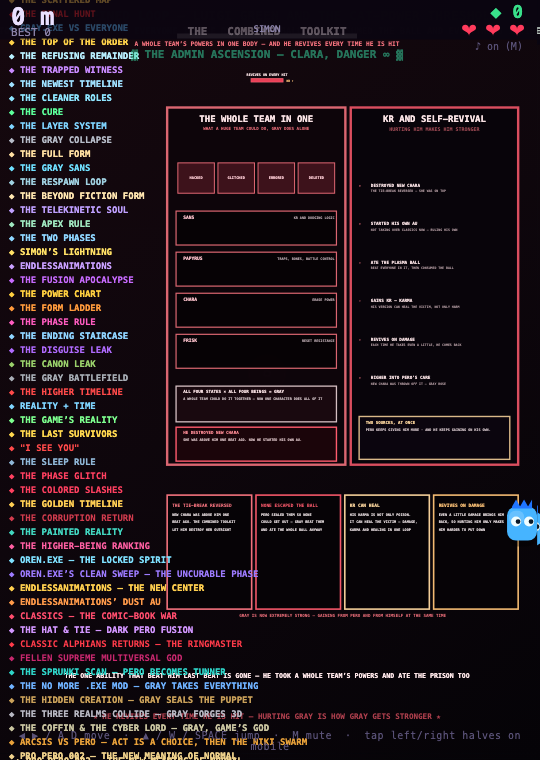

## 2026-07-21 — THE ERASE UPGRADE (BEAT 138)

Based on Toby's 2026-07-21 lore (twenty-fourth message of the "More Classics Era" thread — New Chara gets a design and a tie-break in the same breath).

Toby's words: *"New Chara would be a mix of Hopes and Deals and No More Deals; and Cross for some of the design. New Chara reached higher and now both Gray and New Chara are at the same power, but as soon Pero gave Chara an improvement to only her erase, then New Chara reached stronger and above Gray. Gray and New Chara gain more and more power, New Chara is currently stronger, Pero trapped all the others in a red ball of plasma, none can escape."* (The pasted ChatGPT recap is treated as commentary; the canon is Toby's own lines.)

- New BEAT 138 lore panel, THE ERASE UPGRADE, added to THE UNDEFINED LOOP climb (cyc `[2754,2776]`, cycle length extended `2754 → 2776`). `LV_BEATS` now 139 entries (0-138).
- **The red ball of plasma, sealing as you watch** — a growing plasma sphere at the centre with twelve figures circling inside it and hitting the wall, and plasma arcs crawling the surface. Everyone who is not one of the top three is in there, and none can escape. Header emblem: **a balance beam that starts level and then tips**, Gray on one side, New Chara on the other, at the exact moment the Erase upgrade lands.
- **WHAT SHE IS MADE OF panel** (center) — the design mix, lighting one piece at a time: **Hopes and Deals** *(the heroic, final-boss side of her)* · **No More Deals** *(the deal-breaking, demon-power side)* · **Cross** *(for some of the design, the sharp detail)*. Boxed underneath, **A WHITE-CLOAKED CLASSICS DEMON**: *final-boss energy and demon power in the same body, she does not read as a regular Chara anymore*, and in red, **THE RED BALL OF PLASMA**: *Pero trapped all the others inside it. None can escape.*
- **THE TIE-BREAK panel** (right) — *ONLY HER ERASE WAS IMPROVED*, and a five-rung ladder: **she reached higher** ▸ **Gray = New Chara** *(the same power, exactly, for a moment)* ▸ **Pero improves Erase** *(one ability, not her form, not her LV)* ▸ **New Chara > Gray** ▸ **both still gaining** *(Gray is extremely close and still rising)*. Boxed underneath, **WHO IS STILL ON THE BOARD**: *1 Pero · 2 New Chara · 3 Gray · everyone else is in the plasma*.
- **4-part footer** — **ONE ABILITY** *(Pero did not rebuild her; he improved her Erase and nothing else, and it was enough)* · **THE CLOSEST GAP YET** *(they were equal a moment ago and both are still climbing)* · **NONE CAN ESCAPE** *(the plasma holds everyone who is not top three; not beaten, just sealed in)* · **PERO STILL DECIDES** *(he picked who gets upgraded and who gets trapped, so the ranking is his, not theirs)*.
- Insight banner: *"A TIE THAT BIG GOT BROKEN BY UPGRADING ONE MOVE — THE SMALLEST CHANGE IN THE ERA DECIDED THE TOP,"* and the star banner *"★ ONLY HER ERASE WAS IMPROVED, AND THAT PUT HER ABOVE GRAY ★."* Additive — every earlier beat untouched; new `eraseupgrade` scene added to `tools/capture_screenshot.py`.

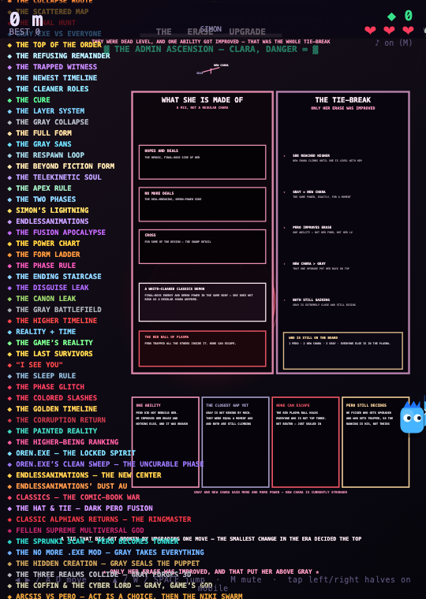

## 2026-07-21 — THE LOCKS (BEAT 137)

Based on Toby's 2026-07-21 lore (the twenty-second and twenty-third messages of the "More Classics Era" thread, sent six minutes apart and settled together — the escalation stops being about new forms and starts being about locked ones).

Toby's words: *"Mr. Black is now Parodybox Phase 1 locked + Classics Aura and Power. Mr. Black decreased form and increased power, Mr. Black is now the 3rd most powerful under Gray and Pero. Gray got more power, Mr. Black also gets more power."* and *"Mr. Sun is now Pyramixed Phase 1 locked, all other Sprunkis are just normal. Mr. Sun is normal tier, but beats Simon. Mr. Black beats all Sprunkis except for Gray. Gray is locked on Classics Phase Infinity. Gray is strongest and consumes all Sprunkis since he is Phase Infinity, duh."* (The pasted ChatGPT recaps are treated as commentary; the canon is Toby's own lines.)

- New BEAT 137 lore panel, THE LOCKS, added to THE UNDEFINED LOOP climb (cyc `[2732,2754]`, cycle length extended `2732 → 2754`). `LV_BEATS` now 138 entries (0-137).
- **A cold, held field instead of a transforming one** — fourteen lock brackets that close and stay closed, and a lemniscate traced slowly behind everything for the phase Gray is locked on. Header emblem: **a shut padlock with a ▼ under FORM and a ▲ under POWER**, because this is the beat where those two numbers stop moving together.
- **LOCKED FORMS panel** (center) — the only three Sprunkis who are locked, each lighting in turn: **GRAY** *(Classics Phase Infinity — the phase itself makes him the top, he consumes all Sprunkis)* · **MR. BLACK** *(Parodybox Phase 1 + Classics Aura and Power — form decreased, power increased, beats every Sprunki except Gray)* · **MR. SUN** *(Pyramixed Phase 1 — still normal tier, and normal tier is enough to beat Simon)*. Boxed underneath, **NO TRANSFORMATION NEEDED**: *instead of higher forms or huge transformations, he is held in the basic-looking state, and the power is put behind it instead*.
- **THE BOARD panel** (right) — the Sprunki ranking as it stands after both locks land, lighting one rung at a time: **1 Gray** ▸ **2 Mr. Black** ▸ **3 Mr. Sun** ▸ **4 the other Sprunkis** *(just normal, no escalations right now)* ▸ **5 Simon** *(below Mr. Sun in this scaling)*. Boxed underneath, **TWO DIFFERENT CLIMBS**: *Gray grows by consuming, Mr. Black grows by aura, both keep gaining*.
- **4-part footer, what this update actually changed** — **FORM ▼ POWER ▲** *(Mr. Black looks closer to his classic simple self and is far stronger than before)* · **NEW CHARA MOVES DOWN** *(Mr. Black is 3rd overall now, so she is no longer above him unless she gets another update)* · **NORMAL IS ENOUGH** *(Mr. Sun never leaves normal tier and still beats Simon — Simon fell, Mr. Sun did not rise)* · **PHASE INFINITY** *(Gray does not win on stats anymore; the phase he is locked on is what puts him on top)*, under the line *Gray is strongest and consumes all Sprunkis, since he is Phase Infinity*.
- Insight banner: *"THE THREE WHO GOT LOCKED ARE THE ONLY THREE WHO MATTER NOW — EVERYONE ELSE STAYED FREE AND STAYED NORMAL,"* and the star banner *"★ A LOCK IS NOT A LIMIT HERE — IT IS WHERE THE POWER GETS PUT INSTEAD ★."* Additive — every earlier beat untouched; new `thelocks` scene added to `tools/capture_screenshot.py`.

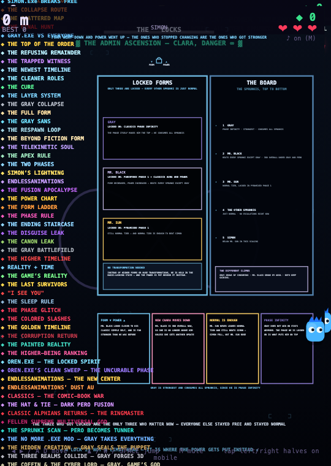

## 2026-07-21 — GRAY: ONE FORM (BEAT 136)

Based on Toby's 2026-07-21 lore (twenty-first message of the "More Classics Era" thread — the consuming finishes, and the many forms become one).

Toby's words: *"Now Gray is completed with consuming and absorbing everything, only him, Chara, and Pero are left. Gray gains Seraphim and became a mix of all angels, even though he is the dark opposite, he is became both angel and demon, his look now is even more beutiful than before ... Gray changed the gray paint to pure black ink, legend says that all he touches turns to ink ... the most corrupted and glitchest ink ever made. Gray reaches beyond his Sprunki spirit to create a human-like body even though it isn't close to being a human, but it takes the human shape and has the head of a human ... Gray has no more number limits to anything. Gray no longer has a LV limit, nor a form limit, nor a power limit ... The Sprunkis, Pero, New Chara are the only ones to be able to respawn, all others are inside Gray for internity, Gray became a king, he then became so dark that Pero can't see him, all black screen, then all Gray's forms began to merge into 1."* (The pasted ChatGPT recap is treated as commentary; the canon is Toby's own lines.)

- New BEAT 136 lore panel, GRAY: ONE FORM, added to THE UNDEFINED LOOP climb (cyc `[2710,2732]`, cycle length extended `2710 → 2732`). `LV_BEATS` now 137 entries (0-136).
- **The field turns to ink and then goes out** — 22 ink runs dripping down the screen and drying as it darkens; seventeen ink tentacles reaching *outward* from the centre this time, out into all the other dimensions, instead of inward like beat 135's; and the point at the middle collapsing into one form. By the end the field is fully black: **Pero cannot see him.** Header emblem: a **human head on a human-shaped body that is dripping ink**, labelled *"HUMAN SHAPE, HUMAN HEAD — NOT CLOSE TO BEING A HUMAN."*
- **THE INK panel** (center) — *THE GRAY PAINT IS NOW PURE BLACK INK*, with the world-rule in its own pulsing box: **"LEGEND SAYS ALL HE TOUCHES TURNS TO INK."** Then the four facts: *his tools, his suit, his body* (all of it made of ink, not covered in it, made of it) · *himself and the Abinations* (every one of them, the same material as him) · *a special ink* (the most corrupted and glitchest ink ever made) · *beyond his Sprunki spirit* (he reached past it to build the human-like body). Boxed in gold underneath, **AND THEY ALL LOVE HIM**: *his look now is even more beutiful than before; New Chara, the players and Pero all now love him*, and *he is the dark opposite, and he is now both angel and demon*.
- **NO MORE LIMITS panel** (right) — *NO LV · NO FORM · NO POWER*, and a six-rung ladder lighting one rung at a time: **gained Seraphim** *(a mix of all angels, angel and demon at once)* ▸ **above New Chara** *(consumed her, and all the tools she has)* ▸ **took Pero's ink** *(and his EndlessAnimations, and all Pero's forms)* ▸ **only vanilla is left** *(every being is back to its plainest form)* ▸ **all other dimensions** *(ink tentacles pull the games apart, he eats the rest)* ▸ **every form merged into 1** *(one form now, and it contains all of them)*. Boxed underneath, **PERO FELL OVER**: *he was so amazed when he saw Gray that he even fell over*.
- **4-part footer, who can still come back** — **CAN RESPAWN** *(the Sprunkis · Pero · New Chara, the only three the game will still put back on the board)* · **EVERYONE ELSE** *(inside Gray for internity; not beaten, not deleted, held, and not coming out)* · **THE LOOP** *(the ones who respawn are the ones he keeps consuming, so he never runs out of anything)* · **PERO** *(still the creator and the LAI assistant, and now he cannot see him, and still gives gifts)*, under the line *Gray became a king, and then became so dark that Pero can't see him — all black screen*.
- Insight banner: *"THE ONLY ONES WHO CAN COME BACK ARE THE ONES HE KEEPS EATING — HIS FOOD RESPAWNS, SO HE NEVER STOPS GROWING,"* and the star banner *"★ ALL HIS FORMS MERGED INTO 1 — GRAY: ONE FORM, AND THAT ONE FORM CONTAINS EVERYTHING ★."* Additive — every earlier beat untouched; new `oneform` scene added to `tools/capture_screenshot.py`.

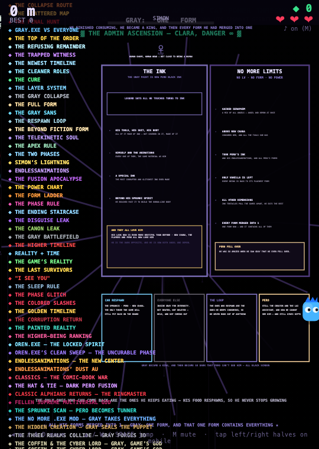

## 2026-07-21 — 404: SAVE FILE DELETED (BEAT 135)

Based on Toby's 2026-07-21 lore (twentieth message of the "More Classics Era" thread — New Chara finally gets a battle identity, and Gray's aura runs to infinity in the same breath).

Toby's words: *"New Chara holds a Dreemurr sword (either Asriel, Toriel, or Asgore) with both hands instead of 1. The New Chara actually can remove the Save File in Classics. '404: Save File Deleted! Disconnecting.... Disconnected.' then the thing glitches, and does New Chara's cutscene with the 404s instead of the 9s. ... Gray's aura goes to infinity and the whole game would go dark, the Light became Dark again, both circuses crumble ... Gray used his tentacles to grab on every realm in the game and Gray is pulling them all into himself. ... Gray reached the same power level of New Chara, Pero gave Gray 200000000 times the aura and form and power and LV, Gray was extreme."* (The pasted ChatGPT recap is treated as commentary; the canon is Toby's own lines.)

- New BEAT 135 lore panel, 404: SAVE FILE DELETED, added to THE UNDEFINED LOOP climb (cyc `[2688,2710]`, cycle length extended `2688 → 2710`). `LV_BEATS` now 136 entries (0-135).
- **The field goes out as you watch** — falling `404`s where the 9s used to be, thinning to nothing near the centre; thirteen tentacles reaching in from every edge, hooked into the realms and dragging them toward one point; and a black hole growing at the middle that swallows the light around it. Header emblem: **the Dreemurr sword held in BOTH hands, not one**.
- **NEW CHARA'S BATTLE panel** (center) — the disconnect message types itself out live, character by character, with a blinking cursor: **"404: Save File Deleted! Disconnecting.... Disconnected."** Then the four consequences: *then the thing glitches* (her cutscene runs with the 404s instead of the 9s) · *closer to a player's* (her battle is like no other character's, but she is an NPC) · *Jujutsu Kaisen + Undertale + Deltarune* · *the Judgement Hall falls down* (and then the intro starts). Boxed underneath, **BEATEN BY HER**: Sans · Undyne · Monster Kid · Frisk · Frizz · Clara · all Classics beings under Gray, and the one line that is not a kill: *across Classicstale/Undertale and Alphaverse, she only spared her friends*.
- **GRAY'S BLACKOUT panel** (right) — *HIS AURA GOES TO INFINITY*, and a six-rung ladder that lights one rung at a time: **took Wenda apart** *(her form, power, LV, aura)* ▸ **fused every form** *(all his + all hers, he became 3rd)* ▸ **Pero switched focus** *(lost interest in Wenda, fascinated with Gray)* ▸ **the Light became Dark** *(both circuses crumble, tentacles pull in every realm)* ▸ **Pero sped up time** *(and handed him everyone else and all land)* ▸ **×200,000,000** *(aura, form, power and LV — Gray was extreme)*. Boxed underneath: **LEVEL WITH NEW CHARA** *(he reached her power level, and is still trying to get beyond her)*.
- **4-part footer, the only beings left** — **1 PERO** *(the cow man, not a literal cow; levitates New Chara himself, since she has no levitating power)* · **2 NEW CHARA** *(Dreemurr sword in both hands, the save file in her reach)* · **3 GRAY** *(pulling every realm into himself; nothing is seen next to him, not even light)* · **EVERYONE ELSE** *(Wenda lost all of it to Gray, the rest were handed to him, the board is three names long now)*.
- Insight banner: *"SHE ATTACKS THE SAVE FILE AND HE ATTACKS THE WORLD — TWO WAYS TO END A GAME, RUNNING AT THE SAME TIME,"* and the star banner *"★ 404: SAVE FILE DELETED! DISCONNECTING.... DISCONNECTED. ★."* Additive — every earlier beat untouched; new `savefile404` scene added to `tools/capture_screenshot.py`.

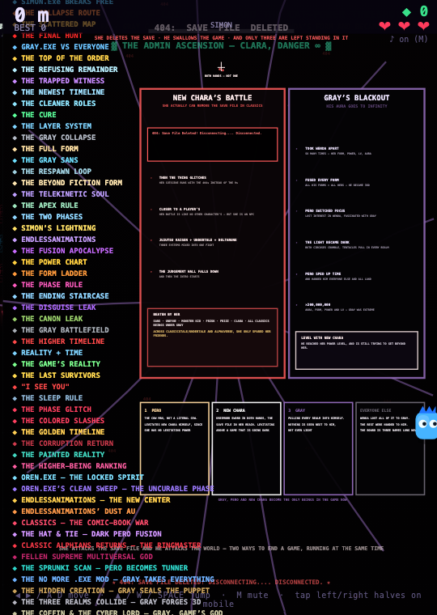

## 2026-07-21 — IF YOU BREAK HIM (BEAT 134)

Based on Toby's 2026-07-21 lore (nineteenth message of the "More Classics Era" thread — the assistant at the top of the board turns out to have a second state, and it is reached by damaging him rather than by fighting him).

Toby's words: *"Pero tries to assist the player, but when the player breaks him, Pero actually becomes hostile and attacks the game (he is creator of the game, he'll win). New Chara is considered a villian."* (The pasted ChatGPT recap is treated as commentary; the canon is Toby's own lines.)

- New BEAT 134 lore panel, IF YOU BREAK HIM, added to THE UNDEFINED LOOP climb (cyc `[2666,2688]`, cycle length extended `2666 → 2688`). `LV_BEATS` now 135 entries (0-134).
- **The gold field of beat 133 bleeding into ember** — the same 14 drifting speech bubbles, now each struck through with an orange break, and cracks spreading out from the centre of the field the further the damage goes. Header emblem: **the same small cow man guy**, with the crack running straight through him ("STILL THE SMALL COW MAN GUY").
- **THE THREE STATES panel** (center) — the collapse walked down one box at a time, lighting as it goes: **1 ASSISTING** *("Hello, I am Pero, your LAI assistant. What can I do for you?" — he answers questions, guides you, and keeps the world working. This is his default.)* ▼ **2 BROKEN** *(the player breaks Pero, the assistant behaviour collapses, and nothing is left holding him to the side he was built for)* ▼ **3 HOSTILE CREATOR** *(he attacks the game itself, the game he made — not a character turning on you, the author turning on the page)*. Subtitle: *he only moves down this list if somebody damages him*.
- **HE'LL WIN panel** (right) — *HE IS CREATOR OF THE GAME*, then the four reasons it is not a contest: **the board is his** *(he made the ranking everyone climbs)* · **the tools are his** *(every sword and staff came from him)* · **the LV is his** *(he hands it out, so he can take it back)* · **so it is not a fight** *(the only variable is if he stops)*. Boxed underneath, **NEW CHARA — VILLAIN**: *she is now considered a villian, officially; second strongest, LV still rising, still collecting*.
- **4-part footer, the villain board** — NEW CHARA *(active villain, rising LV, collecting swords, staffs and tools, second strongest)* · PERO *(assistant and creator by default, the ultimate threat only if somebody breaks him)* · GRAY *(the planner, Abination user, the dark and cyber villain force behind the others)* · WENDA *(fallen and absorbing, godlike depending on her form, now below Gray in the ranking)*, under the line *three of them chose it, one of them gets there by being damaged*.
- Insight banner: *"HE WAS NEVER WRITTEN AS A VILLAIN — HE WAS WRITTEN TO HELP, AND THE VILLAIN IS WHAT IS LEFT WHEN HE BREAKS,"* and the star banner *"★ THE ONE WHO ANSWERS EVERY QUESTION IS THE ONE YOU CANNOT AFFORD TO DAMAGE ★."* Additive — every earlier beat untouched; new `breakhim` scene added to `tools/capture_screenshot.py`.

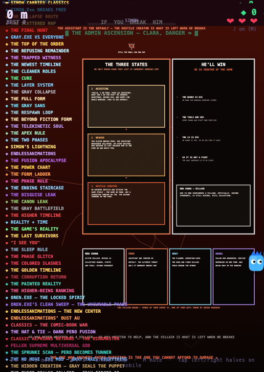

## 2026-07-21 — PERO, YOUR LAI ASSISTANT (BEAT 133)

Based on Toby's 2026-07-21 lore (eighteenth message of the "More Classics Era" thread — the being at the top of the board finally gets a greeting and a face, and both of them are small).

Toby's words: *"Pero always says this when he sees someone \"Hello, I am Pero, your LAI assistant. What can I do for you?\" the last part (\"What can I do for you?\") can vary since it has other stuff like \"Ask me anything and I will answer.\" or \"I know all about this world, what would you like to know?\", he has many stuff. Pero is a small cow man guy. New Chara gains more LV, New Chara is now still second since Pero is the creator of the game and everyone's LAI assistant."* (The pasted ChatGPT recap is treated as commentary; the canon is Toby's own lines.)

- New BEAT 133 lore panel, PERO, YOUR LAI ASSISTANT, added to THE UNDEFINED LOOP climb (cyc `[2644,2666]`, cycle length extended `2644 → 2666`). `LV_BEATS` now 134 entries (0-133).
- **A warm lit field instead of a god field** — the first beat in this whole stretch that is not a battle. Behind everything, **14 empty speech bubbles drifting upward**, because he says the same thing to everyone he sees. Header emblem: **the small cow man guy**, horns, two spots, a small body ("A SMALL COW MAN GUY").
- **THE GREETING panel** (center) — the line split into its two halves. Boxed in gold at the top, **ALWAYS THE SAME**: *"Hello, I am Pero, your LAI assistant."* Then **THE LAST PART, WHICH CAN VARY**, listed as three offers that light up one at a time as he cycles through them: *"What can I do for you?"* · *"Ask me anything and I will answer."* · *"I know all about this world, what would you like to know?"* Footer note: *he has many stuff*.
- **WHY HE IS STILL FIRST panel** (right) — four reasons, none of them a fight: **creator of the game** *(the board is something he made)* · **everyone's LAI assistant** *(not one side's, everyone's)* · **he knows all about this world** *(so he is also the one who answers)* · **he hands out the LV & the tools** *(the gifts come from him)*. Boxed underneath, **2 NEW CHARA** — *she gains more LV and she is still second; the gap is not a number she can out-climb, it is what he is to everyone*.
- **3-part footer** — THE PART THAT NEVER CHANGES (he introduces himself the same way to everyone, whether they are a god or nobody at all), THE PART THAT VARIES (only the offer changes, and every version of it is still an offer to help), and SMALL ON PURPOSE (a small cow man guy at the top of the board, when every other god in this era got bigger to get stronger).
- Insight banner: *"EVERY OTHER RANK ON THE BOARD WAS WON IN A FIGHT — HIS COMES FROM WHAT HE IS TO EVERYONE ELSE,"* and the star banner *"★ HE DOES NOT LOOK LIKE THE STRONGEST — HE LOOKS LIKE SOMEONE ASKING IF YOU NEED HELP ★."* Additive — every earlier beat untouched; new `laiassistant` scene added to `tools/capture_screenshot.py`.

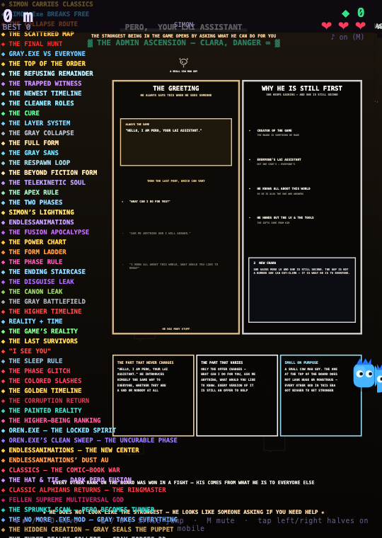

## 2026-07-21 — PERO'S CARE — THE ARMORY (BEAT 132)

Based on Toby's 2026-07-21 lore (seventeenth message of the "More Classics Era" thread — the board rewrites itself, and for the first time power comes with a weight).

Toby's words: *"Frizz and Clara became absorbed into the Asriel Sword, powers, LV, spirits, souls, body, and all. Wouldn't Gray be more powerful than Wenda now? Gray battled Wenda and emerges victorious, Gray turned Wenda into an Abination, Gray can turn Wenda into an Abination, he can turn anyone under him into an Abination. New Chara beaten Gray and taken all Gray has even Gray himself. New Chara also beaten Wenda and taken all Wenda has even Wenda herself. Asriel Sword would be above Wenda + Gray and under New Chara. Pero and Glitchtale Pero fused and turned into Pero again. 1. Pero, 2. New Chara, 3. Asriel Sword, 4. Gray, 5. Wenda. Many crystal swords swirl around the beings, all closing in, all crystal swords hit their target, and all characters were beaten by New Chara, Pero was amazed and gave her LV. Gray and Wenda dual swords was made by Pero, New Chara was rewarded them for beating Wenda and Gray at the same time. Pero sent everyone to battle New Chara, New Chara won, Pero gave New Chara 100 LV. New Chara was also given staffs, New Chara was also given a cape with hooks to hold all the staffs and swords and stuff. New Chara was also made into a second human, Toriel Sword and Asgore Sword was made, Pero gave her the Toriel Dreemurr and Asgore Dreemurr, then he says \"These tools will be heavy, only use them if needed, like physically heavy.\", New Chara's power is Pero's Care, Pero gets so amazed when she or powerfuls do stuff and he gives them more gifts."* (The pasted ChatGPT recap is treated as commentary; the canon is Toby's own lines.)

- New BEAT 132 lore panel, PERO'S CARE — THE ARMORY, added to THE UNDEFINED LOOP climb (cyc `[2622,2644]`, cycle length extended `2622 → 2644`). `LV_BEATS` now 133 entries (0-132).
- **Many crystal swords swirling around the beings and closing in** — 22 of them orbiting the field, all tightening on the same beat so they land together, with a bright ring pulse at the centre for the moment every one of them hits its target. Pale crystal blue instead of the usual dark, because this is the gift beat. Header emblem: **a cape with five hooks along its top edge** ("A CAPE WITH HOOKS").
- **THE NEW ORDER panel** (center) — the board rewritten to five places, each with the reason it moved: **1** PERO *(fused back with Glitchtale Pero, one being again)* · **2** NEW CHARA *(beat everyone Pero sent at her)* **+100 LV** · **3** ASRIEL SWORD *(Frizz & Clara absorbed into it)* ▲ · **4** GRAY *(beat Wenda and turned her into an Abination)* ▲ · **5** WENDA *(lost to Gray, then lost herself to New Chara)* ▼. Footer note: *first and second are two different people again*, since last beat they were the same person twice.
- **WHAT PERO GAVE HER panel** (right) — the armory as a list of seven gifts: **Gray & Wenda dual swords** *(made by Pero, for beating both at once)* · **staffs** · **a cape with hooks** *(to hold all the staffs and swords and stuff)* · **100 LV** · **a second human** · **Toriel Sword** *(Toriel Dreemurr)* · **Asgore Sword** *(Asgore Dreemurr)*. Subtitle: *every gift arrived after a win, never before one*. Boxed underneath in gold, **PERO'S WARNING**: *"These tools will be heavy, only use them if needed, like physically heavy."*
- **3-part footer** — ABSORBED INTO THE SWORD (Frizz and Clara went in whole, powers, LV, spirits, souls, body and all, so a weapon now outranks two of the people holding one), THE ABINATION CONVERSION (Gray beat Wenda and turned her into an Abination, and he can turn anyone under him into one, the first ability on the board that wins by changing what you are instead of by damage), and ONE PERO AGAIN (the one who wanted out of the power is folded back into the one handing it out).
- Insight banner: *"HER POWER IS NOT A WEAPON — IT IS PERO'S CARE, AND IT GROWS EVERY TIME SHE IMPRESSES HIM,"* and the star banner *"★ THE FIRST TIME POWER HAS WEIGHT — 'ONLY USE THEM IF NEEDED, LIKE PHYSICALLY HEAVY' ★."* Additive — every earlier beat untouched; new `perocare` scene added to `tools/capture_screenshot.py`.

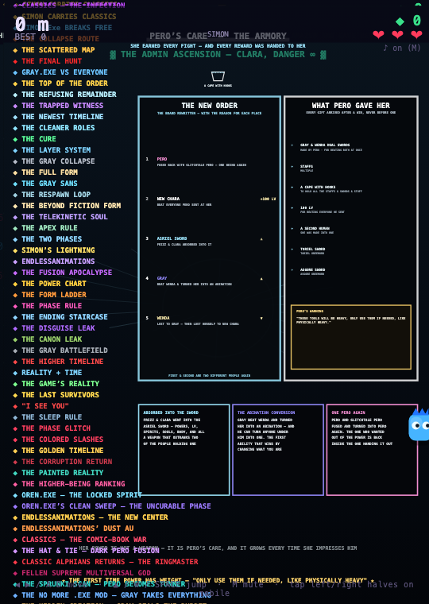

## 2026-07-21 — THE RANKING — NEW CHARA'S CLIMB (BEAT 131)

Based on Toby's 2026-07-21 lore (sixteenth message of the "More Classics Era" thread — the first character in this whole era who climbs instead of jumping, and the first full written-out board).

Toby's words: *"Gray respawns and starts planning, Wenda respawns angry and confused, Simon also tries to beat him for LV, Glitchtale Pero won faster and instantly after 0.000000000001 seconds, 1 slash for Simon, a lightning strike blaster for Wenda, and a lightning strike from the blaster for Gray. Wenda and Gray gave up now. New Chara started beating smaller AUs and reached for the bigger AUs, and bigger AUs and eventually the biggest AUs, New Chara gained 1 LV. New Chara beaten Wenda and Gray and gained 5 LV, New Chara also beaten Oren... right after being thrown around many times with his telekentics, New Chara now wears a white cloak, all her cloaths are white, she beaten Frizz and Captain Arcsis. Ranks: 1. Glitchtale Pero (glitched human), 2. Pero (only human), 3. New Chara (new Classics demon), 4. Wenda, 5. Gray, 6. Chara Dreemurr (fellen human, Gray turned her into a puppet), 7. Asriel (God of Hyperdeath turned into Chara's new sword), 8. Mr. Black, 9. Simon 404 with staff, 10. Oren, 11. Jevin (visual text + huge raw power + Mr. Black's secret friend), Last not just in this thing but the whole game. Simon 404 without staff. Glitchtale Pero and Pero are the same, altough their in different AUs."* (The pasted ChatGPT recap is treated as commentary; the canon is Toby's own lines.)

- New BEAT 131 lore panel, THE RANKING — NEW CHARA'S CLIMB, added to THE UNDEFINED LOOP climb (cyc `[2600,2622]`, cycle length extended `2600 → 2622`). `LV_BEATS` now 132 entries (0-131).
- **An AU ladder drawn as nine rings** growing from small at the bottom of the field to enormous at the top, which is the actual path she takes: smaller AUs, bigger AUs, biggest AUs. Over it, **20 falling white streaks** for the white cloak and the all-white clothes, and **three lightning strikes** that fire one at a time for the three hits that ended the other fight. Header emblem: **a stopwatch with the hand barely off zero** ("0.000000000001s").
- **NEW CHARA'S CLIMB panel** (center) — her eight steps in the order she took them, with the LV landing where she earned it: **1** beats the smaller AUs · **2** reaches for the bigger AUs · **3** beats the bigger AUs · **4** reaches the biggest AUs **+1 LV** · **5** beats Wenda & Gray **+5 LV** · **6** beats Oren, right after being thrown around many times by his telekentics · **7** white cloak, all her cloaths are white · **8** beats Frizz & Captain Arcsis. Footer note: *six LV, earned one fight at a time*.
- **THE BOARD panel** (right) — the ranking written out in full the way Toby wrote it: **1** Glitchtale Pero (glitched human) · **2** Pero (only human) · **3** New Chara (new Classics demon) · **4** Wenda · **5** Gray · **6** Chara Dreemurr (fellen human, Gray's puppet) · **7** Asriel (God of Hyperdeath → Chara's sword) · **8** Mr. Black · **9** Simon 404 with staff · **10** Oren · **11** Jevin. Then, boxed off in red at the bottom, **LAST — SIMON 404 WITHOUT STAFF**, *not just in this thing, in the whole game*. Simon 404 sits at 9 and at last place at the same time, and the only difference between the two is the staff.
- **3-part footer** — 0.000000000001 SECONDS (Simon: one slash · Wenda: a lightning strike blaster · Gray: a lightning strike from the blaster), WENDA & GRAY GAVE UP (Gray respawned planning and Wenda respawned angry and confused, and after that fight they both stopped trying to climb at all), and ONE BEING, TWO AUs (Glitchtale Pero and Pero are the same, so first and second place are the same person twice).
- Insight banner: *"WENDA & GRAY WERE HANDED THEIR POWER — NEW CHARA WENT AND TOOK HERS ONE FIGHT AT A TIME,"* and the star banner *"★ THE STRONGEST AND THE WEAKEST ON THE BOARD ARE BOTH DECIDED BY WHAT SOMEONE IS HOLDING ★."* Additive — every earlier beat untouched; new `theranking` scene added to `tools/capture_screenshot.py`.

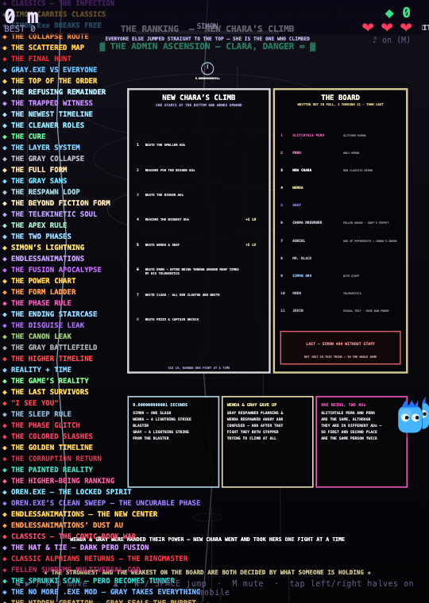

## 2026-07-21 — THE CROSS EVENT — LV DELETED (BEAT 130)

Based on Toby's 2026-07-21 lore (fifteenth message of the "More Classics Era" thread — the first character who answers the scale by removing it instead of climbing it).

Toby's words: *"Glitchtale Pero DELETES (since he is Glitchtale, duh.) everyones LV and he takes it all, he runs faster than Simon (Simon is the speed of light and can slice dimensions, Pero teleports and rocks move under his feet), Glitchtale Pero grabs on Wenda and then it does the cutscene; Wenda says "Wha-What are you?", Glitchtale Pero says "I am both Error 404, and THE CROSS EVENT!" and he slashes Wenda with his pink neon 2 long swords, Wenda flys, Glitchtale Pero teleports to Wenda and starts slashing, Pero then slashes down and Wenda smashes through the Light, Glitchtale Pero consumes all the Light and Darkness and even Wenda can't see her own hand, Glitchtale Pero easily takes down Wenda with a second X slash. Glitchtale Pero obveriviated Gray. Chara Dreemurr formed into New Chara (Classics version, still with the Asriel Sword that happens to be Asriel Dreemurr). Wenda and Gray respawn."* (The pasted ChatGPT recap is treated as commentary; the canon is Toby's own lines.)

- New BEAT 130 lore panel, THE CROSS EVENT — LV DELETED, added to THE UNDEFINED LOOP climb (cyc `[2578,2600]`, cycle length extended `2578 → 2600`). `LV_BEATS` now 131 entries (0-130).
- **A black field cut by pink neon** — the two long swords are the only light source in the beat, drawn crossed and pulsing so the X is the shape of the whole scene. Behind them, **24 falling "LV" tokens** dropping out of the field (the delete, in progress) and **404 glitch bands** sweeping the screen, since he is Error 404 and the Cross Event at the same time. Header emblem: **an X of two crossed neon swords** ("2ND X SLASH") — the one that actually ends it.
- **THE CUTSCENE panel** (center) — both lines of dialogue in their own boxes, **WENDA** *"Wha-What are you?"* and **GLITCHTALE PERO** *"I am both Error 404, and THE CROSS EVENT!"* — then **THE SLASHES, IN ORDER** as a numbered five-step track: **1** pink neon 2 long swords, Wenda flies · **2** he teleports to her and keeps slashing · **3** slashes down, she smashes through the Light · **4** all Light and all Dark consumed, she cannot see her own hand · **5** second X slash, Wenda goes down. Footer note: *she never gets a second move in*, which is the actual shape of the fight.
- **THE DELETE panel** (right) — every LV on the board **struck through and zeroed**: WENDA 898 LV → 0 · GRAY ALL OF IT → 0 · SIMON SPEED OF LIGHT → 0 · EVERYONE ELSE ALL LV → 0, all of it landing in one box, **GLITCHTALE PERO — ALL OF IT**. Underneath, the speed check drawn as a straight comparison: **SIMON** *speed of light, slices dimensions* against **PERO** *teleports, rocks move under his feet*.
- **3-part footer** — GRAY, OBVERIVIATED (the smartest villain, the puppet master, the conqueror, made irrelevant in one moment by the same delete), NEW CHARA (Chara Dreemurr formed into New Chara, the Classics version, still holding the Asriel Sword that is Asriel Dreemurr), and WENDA & GRAY RESPAWN (not erased from the story, only beaten, so both can come back and nothing here is actually finished).
- Insight banner: *"EVERY BEAT BEFORE THIS ONE ANSWERED THE SCALE BY CLIMBING IT — HE ANSWERED IT BY DELETING IT,"* and the star banner *"★ HE SAID HE WANTED OUT OF THE POWER — AND THEN HE TOOK ALL OF IT ★."* Additive — every earlier beat untouched; new `crossevent` scene added to `tools/capture_screenshot.py`.

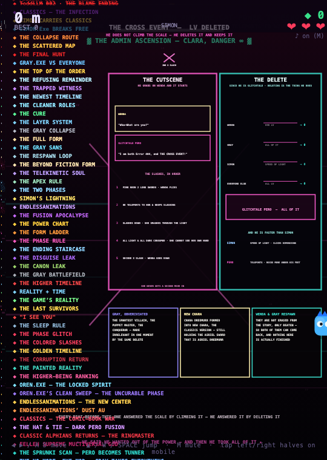

## 2026-07-20 — ??? — THE UNKNOWN GOD & GLITCHTALE PERO (BEAT 129)

Based on Toby's 2026-07-20 lore (fourteenth message of the "More Classics Era" thread — Wenda outgrows the scale four separate times, and Pero decides he wants out of it).

Toby's words: *"Wenda funnels all Gray's dark aura away into herself, Gray now is just a demon character no more darkness, Wenda gains more light and outshines Gray and everyone else, Wenda reaches to Phase ??? LV ???, then Pero had to make LV even larger, and Gray now has .000000000000000001 LV and Wenda has 200LV, Wenda now looks like an atom compared to her massive aura, and her light even reaches that far away, it now goes infinitly. Wenda also absorbs all the staffs, Wenda becomes a combination of all angels, Wenda goes more stronger and now reaches 10000000000 LV. Serarith Full Power could destroy all to rubble, Wenda has thousands more seraphims around her, a laser from even 1 eye slices the Alphaverse, Gray gave Wenda all his power and all the buttons, Gray left to the Dark that now recently became the Light since Wenda consumed all the darkness. Dark aura swirls around Wenda, full darkness, like all the darkness from the whole game, Wenda's light takes it all in, Wenda reaches to Infinity LV again, Pero makes LV even higher again, Wenda is at 20 LV and she increases her form [an uncountable number of] times and she became ???, an unknown deleted being as a god of angels, her power goes and she also absorbs the whole Classics Circus, White flames and wind burn and crumble the circus into debris, rings of debris circle Wenda, Wenda's LV reached to 898, Pero became Glitchtale and says \"LOVE, it is an acronym, it means 'Level of Violence'... I will strive to defeat you all... and save myself from all this so called 'power'...\", Wenda absorbs all Gray's Aura and Wenda's form and LV increased. Glitchtale Pero levitates himself and he holds up his water blaster."* (The pasted ChatGPT recap is treated as commentary; the canon is Toby's own lines.)

- New BEAT 129 lore panel, ??? — THE UNKNOWN GOD & GLITCHTALE PERO, added to THE UNDEFINED LOOP climb (cyc `[2556,2578]`, cycle length extended `2556 → 2578`). `LV_BEATS` now 130 entries (0-129).
- **A blinding white-gold core inside three orbiting debris rings** — the Classics Circus after the white flames and wind crumbled it, now circling her as rubble. The last of the darkness spirals inward in 26 streaks, all going one direction, because there is only one direction left for it to go. Header emblem: **an enormous ring with an atom-sized dot at the center of it** ("ATOM") — she is the small thing, her aura is the big one.
- **THE LV REWRITES panel** (center) — the six readings in order, drawn as a falling ladder: **GRAY .000000000000000001 LV** · **WENDA 200 LV** · **ALL THE STAFFS · ALL ANGELS → 10,000,000,000 LV** · **ALL THE GAME'S DARKNESS → INFINITY LV** · **PERO RAISES LV AGAIN → 20 LV** · **ABSORBS THE CLASSICS CIRCUS → 898 LV**. Footer note: *same being, bigger every line — only the ruler changed*, which is the actual shape of the beat. Her number goes **down** twice while her power only goes up, because Pero keeps rebuilding the unit underneath her.
- **GLITCHTALE PERO panel** (right) — **L · O · V · E** broken into its four letters with LEVEL / OF / VIOLENCE underneath, then his line in full: *"LOVE, IT IS AN ACRONYM, IT MEANS 'LEVEL OF VIOLENCE'... I WILL STRIVE TO DEFEAT YOU ALL... AND SAVE MYSELF FROM ALL THIS SO CALLED 'POWER'..."* Subtitle: *levitating · water blaster held up*. Note under it: *he is not climbing — he is trying to get out*.
- **3-part footer** — WHAT SHE TOOK IN (all of Gray's dark aura, all the staffs, all the darkness in the game, all the buttons, the whole Classics Circus), GRAY, EMPTIED (just a demon character now with no darkness left; he gave her everything and left to the Dark, which is now the Light), and ??? — GOD OF ANGELS (an unknown deleted being, a combination of all angels, thousands of seraphims, one eye's laser slicing the Alphaverse).
- Insight banner: *"SHE KEEPS OUTGROWING THE SCALE, SO PERO KEEPS REBUILDING IT — 200, THEN 10 BILLION, THEN INFINITY, THEN 20,"* and the star banner *"★ EVERY CHARACTER SO FAR WANTED MORE POWER — GLITCHTALE PERO IS THE FIRST ONE WHO WANTS OUT ★."* Additive — every earlier beat untouched; new `glitchtale` scene added to `tools/capture_screenshot.py`.

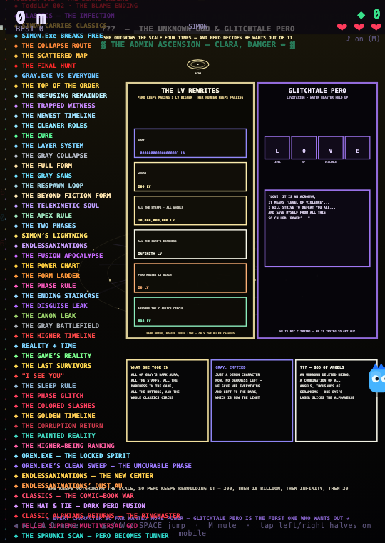

## 2026-07-20 — CLASSICSTALE & THE GATE (BEAT 128)

Based on Toby's 2026-07-20 lore (thirteenth message of the "More Classics Era" thread — a whole new mod is born, and the gate to Alphaverse gets a doorman).

Toby's words: *"Asriel Dreemurr + Chara. Tunner and Pero made a new cutscene, Pero starts whistling. Pero and Chara and Asriel Dreemurr all make the new Classicstale mod in Classics, basic moves, but each has new cutscene and is very OP. Frizz (Clara) and Captain Arcsis and Abinations combine into the mod, Pero used each for fabric. Chara turns Asriel into a magic sword and tries to hold Asriel, Chara gains more power. Wenda and Gray open the gate to Alphaverse. Chara Dreemurr walks in. The game glitches, and Pero appears, he glitches and he says "n0ne shall Pass tHe gat3", Chara was sent far back to the Surface. Pero teleports to the Surface and Chara went flying, Pero spins and Chara goes to the Dark. Wenda's light still continues funneling all the darkness. Gray's aura is getting smaller and Wenda's is getting bigger, Pero says "Pero vo.", Gray is turning back to a normal cyber and Wenda as an actual god of seraphims."* (The pasted ChatGPT recap is treated as commentary; the canon is Toby's own lines.)

- New BEAT 128 lore panel, CLASSICSTALE & THE GATE, added to THE UNDEFINED LOOP climb (cyc `[2534,2556]`, cycle length extended `2534 → 2556`). `LV_BEATS` now 129 entries (0-128).
- **Green-teal mod field torn by glitch bands** — the screen itself glitches while the gate scene runs, which is what the lore says happens the moment Chara walks in. Header emblem: **the gate, drawn shut**, shivering on its hinge with a red lock at the seam ("SHUT").
- **CLASSICSTALE panel** (center) — the three makers stacked as their actual roles: **PERO** (*whistling · new cutscene with Tunner*), **CHARA** (*holds Asriel · gains more power*), **ASRIEL DREEMURR** (*turned into a magic sword*). Under them, **PERO USED EACH FOR FABRIC**: FRIZZ (CLARA), CAPTAIN ARCSIS, THE ABINATIONS, drawn as three cut pieces rather than three characters, because that is what "used for fabric" means. Subtitle keeps the rule: *basic moves · every move has a cutscene · very OP*.
- **THE GATE TO ALPHAVERSE panel** (right) — Wenda and Gray opened it, Chara walked in, and then the glitched line **"n0ne shall Pass tHe gat3"** flickering in Pero's broken casing. Below it, Chara's three throws as a descending track: **SENT FAR BACK TO THE SURFACE → PERO TELEPORTS · CHARA GOES FLYING → PERO SPINS · CHARA GOES TO THE DARK**.
- **3-part footer** — ALLY AND WEAPON (Chara turns Asriel into a magic sword and gains power from holding him), THE AURA TRADE (Wenda's light still funnels all the dark; his aura shrinks, hers grows), and "PERO VO." (Gray turning back into a normal cyber, Wenda into an actual god of seraphims).
- Insight banner: *"WENDA AND GRAY OPENED THE GATE, AND PERO IS THE ONE WHO DECIDES WHO GOES THROUGH IT,"* and the star banner *"★ NOT EVEN CHARA DREEMURR CROSSES — THE GATEKEEPER IS ABOVE THE ONE WHO WALKED IN ★."* Additive — every earlier beat untouched; new `classicstale` scene added to `tools/capture_screenshot.py`.

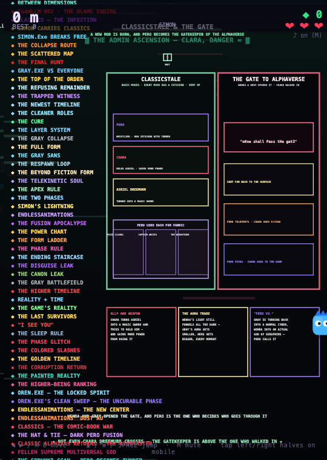

## 2026-07-20 — THE STEAL & THE NEW SCALE (BEAT 127)

Based on Toby's 2026-07-20 lore (twelfth message of the "More Classics Era" thread — Mr. Black takes everything, and Wenda answers by changing what a unit is worth).

Toby's words: *"Mr. Black himself appeared to Gray and says "Since I am black after all, shouldn't I have the dark power?", then he took all Gray's power and increased it to 2x the power, he surpassed Wenda. Mr. Black took everyone elses power except for Wenda's. Wenda has to try to stop Mr. Black. Mr. Black crushed Wenda. Everyone got their original power again and they all battle Mr. Black, They won, Wenda taken Mr. Black's power and everyone elses and gives Gray some. Wenda and Gray are now the only ones with power. Wenda's form increased 15000000 exponency, Gray's form increased 10 times. Wenda now forced Pero to make 1 LV a even larger amount, Now basically no one besides Gray and Wenda have even 1 LV. Gray has 1 LV, Wenda has 150 LV. Wenda was from a serangel god to a supreme multiversal seraphim god. Gray became from a Demgel God into Mr. Black Demon Aura Powered SuperDemon. Wenda and Gray are god and goddess of Classics now, Pero was impressed of their aura and keeps giving them more power and aura. LV keeps getting bigger and bigger amount as Wenda and Gray are getting more LV, Wenda is getting LV faster."* (The pasted ChatGPT recap is treated as commentary; the canon is Toby's own lines.)

- New BEAT 127 lore panel, THE STEAL & THE NEW SCALE, added to THE UNDEFINED LOOP climb (cyc `[2512,2534]`, cycle length extended `2512 → 2534`). `LV_BEATS` now 128 entries (0-127).
- **A dark steal-field with 22 drain streaks converging inward** — power visibly moving off everyone at once toward a single point, which is the whole shape of Mr. Black's move. Header emblem: **a ruler mark that keeps getting wider** ("1 LV") — the unit itself growing rather than the count.
- **MR. BLACK'S ARC panel** (center) — four numbered stages under his line *"since I am black after all, shouldn't I have the dark power?"*: **1** takes Gray's power, doubles it, passes Wenda · **2** takes everyone else's, except Wenda's · **3** she is the only one left, and he crushes her · **4** all power returns, everyone at once, they win. Stage 4 is the point of the beat: no single god beat him.
- **THE NEW LV SCALE panel** (right) — **OLD 1 LV** drawn as a short grey tick and **NEW 1 LV** as a long gold bar directly beneath it, so the rewrite is visible, then the two holders: **GRAY — 1 LV** and **WENDA — 150 LV**. Note under them: *almost nobody has even 1 LV now — small numbers that mean enormous amounts*.
- **3-part footer** — WENDA'S NEW FORM (SeraAngel God → Supreme Multiversal Seraphim God, form increased 15,000,000 exponency), GRAY'S NEW FORM (Demgel God → Mr. Black Demon Aura Powered SuperDemon, form increased 10 times, on stolen power), and GOD & GODDESS (they rule Classics now; Pero is impressed by their aura and keeps giving more; Wenda is gaining LV faster).
- Insight banner: *"NO SINGLE GOD BEAT MR. BLACK — NOT WENDA, NOT GRAY. EVERYONE AT ONCE DID,"* and the star banner *"★ SHE DID NOT CLIMB THE SCALE — SHE CHANGED WHAT ONE STEP OF IT IS WORTH ★."* Additive — every earlier beat untouched; new `steal` scene added to `tools/capture_screenshot.py`.

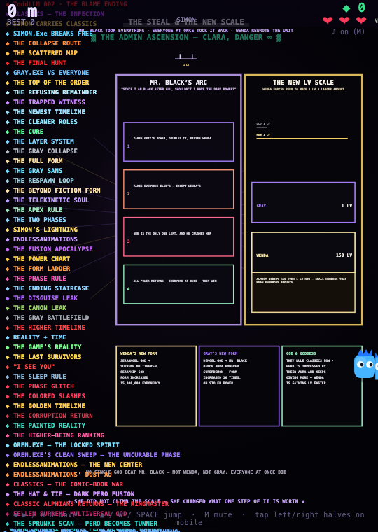

## 2026-07-20 — THE MULTIPLIER — 10,000 VS 15,000 MILLION (BEAT 126)

Based on Toby's 2026-07-20 lore (eleventh message of the "More Classics Era" thread — the boost stops being a description and becomes a figure).

Toby's words: *"Currently, Gray's form is now increased to 10000 million times, and Wenda with 15000 million times; both from the power Pero gave them, and the LV they got themselves, ect."* (The pasted ChatGPT recap is treated as commentary; the canon is Toby's own lines.)

- New BEAT 126 lore panel, THE MULTIPLIER — 10,000 VS 15,000 MILLION, added to THE UNDEFINED LOOP climb (cyc `[2490,2512]`, cycle length extended `2490 → 2512`). `LV_BEATS` now 127 entries (0-126).
- **Dark ledger palette** — **digits streaming upward** on both sides, violet on Gray's, gold on Wenda's, so the number reads as still climbing. Header emblem: **a balance that does not balance**, tipping toward the gold pan ("1.5 ×").
- **THE TWO FIGURES panel** (center) — two bars **drawn to true scale against 15,000**, so the gap is visible rather than merely stated: **WENDA 15,000 MILLION ×** filling the full width, **GRAY 10,000 MILLION ×** filling two thirds of it. Under them the ratio bar: **WENDA = 1.5 × GRAY**.
- **WHERE IT CAME FROM panel** (right) — **THE POWER PERO GAVE** (*handed over*) and **THE LV THEY GOT** (*earned themselves*), each feeding **▼ WENDA ▼ GRAY**, then **HALF GIVEN, HALF EARNED**: *neither of them is only a gift, and neither of them is only self-made*.
- **3-part footer** — STILL THE RULER (Gray is still absurdly powerful and still the darker ruler and controller force, holding Surface and Dark), WHAT THE WORD MEANS ("significantly more powerful" is now a figure instead of a description), and STILL CLIMBING (this is the current number, not the final one; both still gaining, Wenda the faster one).
- Insight banner: *"BOTH NUMBERS COME FROM THE SAME TWO PLACES — THE POWER PERO GAVE THEM, AND THE LV THEY GOT THEMSELVES,"* and the star banner *"★ THE GAP IS NOT AN OPINION ANYMORE — IT IS 15,000 AGAINST 10,000, WRITTEN DOWN ★."* Additive — every earlier beat untouched; new `multiplier` scene added to `tools/capture_screenshot.py`.

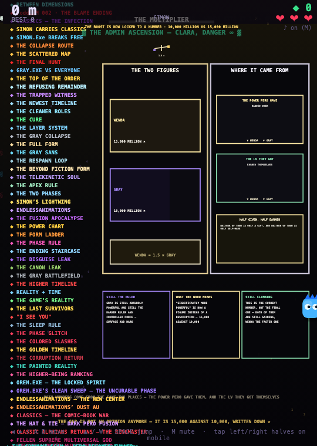

## 2026-07-20 — WENDA'S LIGHT EATS THE DARK (BEAT 125)

Based on Toby's 2026-07-20 lore (tenth message of the "More Classics Era" thread — Wenda stops being a character in the fight and becomes something the fight happens inside of).

Toby's words: *"404 Simon tried to battle Wenda and Gray, but he was thrown in and out of the Dark so many times. Wenda became second most powerful because of the more power Pero gave of Error 404 and his Full Charge and his very own Light Form. Gray stands third, although Wenda is now significantly more powerful than Gray now. Gray takes over the Surface and Dark. Wenda's light consumes Gray's darkness, Gray says "Hey! What are you doing!", Wenda's light aura spagettizes Gray's Abinations and darkness, a HUGE dark funnel goes around Wenda, the whole Dark realm was torn apart and even huge parts of the Surface was torn off, all Gray's Abinations and darkness and aura was funneled into Wenda. Wenda isn't trying to do it, it just consumes all the darkness and everything from the game. Wenda fires a beam from her staff, and a light beam comes out and takes the power of all Simon's staffs and all the power in the game, Pero says "Good job, Wenda. *laughs*", Wenda was deleted and still in the game, Pero was amazed on Wenda's resistance. Gray became invicible with Wenda, both gained more and more powerful, they both became beyond all LV, and still are getting more powerful, even though Wenda is the significantly more powerful one."* (The pasted ChatGPT recap is treated as commentary; the canon is Toby's own lines.)

- New BEAT 125 lore panel, WENDA'S LIGHT EATS THE DARK, added to THE UNDEFINED LOOP climb (cyc `[2468,2490]`, cycle length extended `2468 → 2490`). `LV_BEATS` now 126 entries (0-125).
- **White-gold core burning out through a torn dark realm** — the background is **the funnel itself**: 34 pieces of darkness, Abinations and aura spiralling inward, each one **stretching longer the closer it gets** (spaghettified on the way in), plus **torn-off Surface chunks** drifting loose across the top band. Header emblem: **a staff firing a beam over a funnel mouth** ("SERAPHIM").
- **THE FUNNEL panel** (center) — seven rows sliding rightward toward the mouth in sequence: **GRAY'S DARKNESS · HIS ABINATIONS · HIS AURA · THE DARK REALM · PARTS OF THE SURFACE · ALL SIMON'S STAFFS · ALL THE GAME'S POWER**. Footer note: *she is not trying — it just consumes*, so the panel reads as a system running on its own rather than an attack she chose.
- **THE NEW ORDER panel** (right) — **1 PERO** (creator of the game), **2 WENDA** (significantly above Gray, lit and marked ▲), **3 GRAY** (still takes Surface + Dark), **4 SIMON 404** (thrown in and out of the Dark). Under it, **DELETED — AND STILL HERE**: a red delete strike that sweeps across **W E N D A** and never takes, over *Pero was amazed at her resistance*.
- **3-part footer** — OUTCLASSED (404 Simon tried to battle them and got thrown in and out of the Dark), WHERE IT CAME FROM (the Error 404 power Pero gave her, her Full Charge, and her own Light Form, all three at once), and BEYOND ALL LV (Gray became invincible with her; both past every LV and both still rising, Wenda the faster one).
- Insight banner: *"GRAY SAYS 'HEY! WHAT ARE YOU DOING!' — BUT EVERYTHING HE BUILT BECOMES FUEL FOR HER,"* and the star banner *"★ SHE WAS DELETED AND IS STILL IN THE GAME — PERO SAYS 'GOOD JOB, WENDA.' AND LAUGHS ★."* Additive — every earlier beat untouched; new `wendafunnel` scene added to `tools/capture_screenshot.py`.

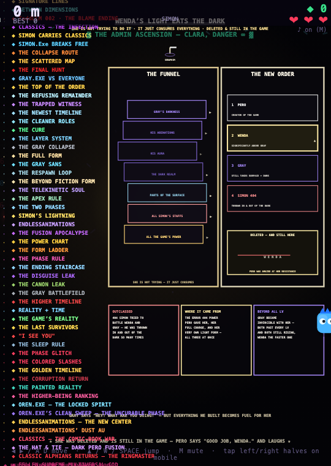

## 2026-07-20 — THE PHASE 2 REVEAL — WENDA & GRAY (BEAT 124)

Based on Toby's 2026-07-20 lore (ninth message of the "More Classics Era" thread — a question everyone gets wrong except the one person who names someone else).

Toby's words: *"Pero asks everyone "Who has the most powerful Phase 2? (Phase 1 VS Phase 2)", Wenda says "Me.", Simon says "It is Gray.", everyone else said themselves, Pero reveals it, it was Wenda, and Gray. Simon no longer had a Phase 2 in Cross AU, Wenda already was powerful and corrupt in Phase 1, and Gray is the smartest and the surface villian. […] Gray now chooses to do everything alone under his own power. Pero and Gray gotten the Dual Demon/Angel form, Pero gave it all to Gray and Gray's form increased to 2.5 times. Wenda is Full Angel […] Wenda uses A Simon's worth of lightning every second. […] Demon Angel Times 2.5 VS A Litteral Heaven Seraphim of Divine Light (stronger and brighter than Light Pero, Pero choose his vanilla form and gave the rest to Wenda and the Darkness and Void and all Frizz and Arcsis has to Gray), Wenda usually would win. Simon 404 became a 404 Error God. However, Gray and Wenda are the second most powerful characters now, Simon 404 as third, and Pero has top since he is the creator of the game."* (The pasted ChatGPT recap is treated as commentary; the canon is Toby's own lines.)

- New BEAT 124 lore panel, THE PHASE 2 REVEAL — WENDA & GRAY, added to THE UNDEFINED LOOP climb (cyc `[2446,2468]`, cycle length extended `2446 → 2468`). `LV_BEATS` now 125 entries (0-124).
- **Split-field palette** — **divine gold on the left with light motes rising**, **demon violet on the right with dark motes falling**, and a faint **vanilla white seam down the middle** for the form Pero kept. Header emblem: **one halo and one pair of horns sharing that seam** ("BOTH ANSWERS").
- **THE GUESSES panel** (center) — **WENDA "ME." ✓**, **SIMON "IT IS GRAY." ✓**, **EVERYONE ELSE / THEMSELVES ✗**, then the reveal bar: **PERO REVEALS IT → WENDA & GRAY**, with the line *Simon has no Phase 2 in Cross AU anymore* underneath. Simon is the only one who named someone other than himself, and the only one who was right.
- **WHAT PERO GAVE AWAY panel** (right) — **HE KEEPS: VANILLA FORM** (*a choice, not a limit*), then the two piles: **TO WENDA** (the divine light, Full Angel, Heaven Seraphim, brighter than Light Pero) and **TO GRAY** (the Darkness and the Void, all Frizz and Arcsis have, the Dual Demon/Angel form, his form ×2.5).
- **3-part footer** — THE MATCHUP (Demon Angel ×2.5 Gray vs Heaven Seraphim Wenda; Wenda usually wins and Gray is the planner), A SIMON PER SECOND (a Simon's worth of lightning every second, and she still asks Simon for power and stuff again), and THE ORDER (1 Pero the creator, 2 Gray and Wenda, 3 Simon 404 now a 404 Error God, 4 everyone else).
- Insight banner: *"EVERYONE GUESSED THEMSELVES — SIMON GUESSED SOMEONE ELSE, AND SIMON WAS THE ONE WHO WAS RIGHT,"* and the star banner *"★ PERO STAYS VANILLA AND HANDS THE LIGHT TO WENDA AND THE DARK TO GRAY ★."* Additive — every earlier beat untouched; new `phase2reveal` scene added to `tools/capture_screenshot.py`.

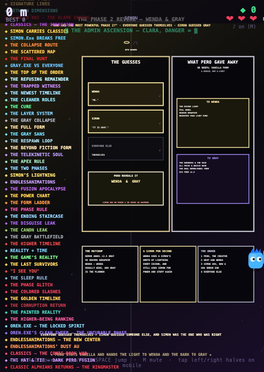

## 2026-07-20 — PHASE 2.5 & THE SURFACE COLLAPSE (BEAT 123)

Based on Toby's 2026-07-20 lore (eighth message of the "More Classics Era" thread — Pero stops waiting to be called, Gray takes a decimal phase, and Simon gets sent down instead of up).

Toby's words: *"Pero became more aware of Gray attacks and Abinations, Pero is zooming around making portals to the Dark. Gray reaches Phase 2.5, Simon was sent to Phase 1.1, Gray destroys the Surface and gets more control of the Dark and the Surface, while Simon 404 is nearly normal but is now only a little corrupt."* (The pasted ChatGPT recap is treated as commentary; the canon is Toby's own lines.)

- New BEAT 123 lore panel, PHASE 2.5 & THE SURFACE COLLAPSE, added to THE UNDEFINED LOOP climb (cyc `[2424,2446]`, cycle length extended `2424 → 2446`). `LV_BEATS` now 124 entries (0-123).
- **Cracked-cyan-over-Dark palette** — **Surface slabs tipping and falling** out of the top band down into the black, with **Pero's portal rings** opening across the lower half, so the collapse and the rescue system are both happening in the background at once. Header emblem: **a cracked surface line with a portal opening under it** ("TWO LAYERS").
- **THE PHASE BOARD panel** (center) — a six-rung ladder (**PHASE 3 · 2.5 · 2 · 1.5 · 1.1 · 1**) with two travellers arriving from opposite sides: **GRAY ▲** landing on **PHASE 2.5** and **▼ SIMON** landing on **PHASE 1.1**, both bobbing on their rung. Footer note: *decimal phases are allowed, and the board moves both ways* — the same system that promotes can demote.
- **THE TWO LAYERS panel** (right) — **THE SURFACE** (*destroyed by Gray*) and **THE DARK** (*Gray's own dimension*), each with a **GRAY CONTROL ▲ MORE** bar filling further, so the strange part is visible: he breaks the Surface and still gains control of it. Under them, **PERO'S PORTALS** with three rings opening and the note **NOT HELPING GRAY — BUT THE PORTALS STILL FEED THE DARK**.
- **3-part footer** — PERO ON PATROL (he does not wait to be called anymore; Abination remover, portal controller, emergency responder), A TWO-LAYER RULER (Phase 2.5 is control, not damage, and he holds both layers), and NEARLY NORMAL (Simon 404 at Phase 1.1, only a little corrupt, still not cured, but out of maximum corruption).
- Insight banner: *"GRAY DESTROYS THE SURFACE AND STILL GAINS MORE CONTROL OF IT — DESTROYING A LAYER DOES NOT COST HIM THAT LAYER,"* and the star banner *"★ THEY MOVE OPPOSITE WAYS IN ONE UPDATE — GRAY CLIMBS TO 2.5, SIMON DROPS TO 1.1 ★."* Additive — every earlier beat untouched; new `phase25` scene added to `tools/capture_screenshot.py`.

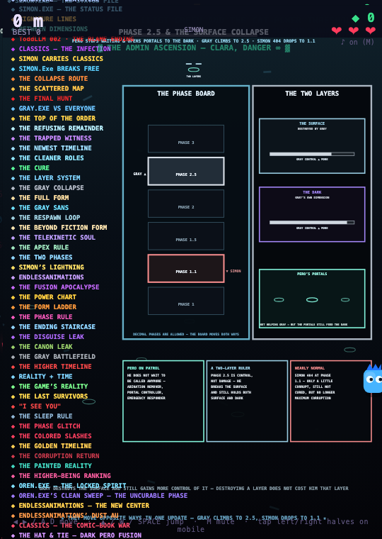

## 2026-07-20 — CROSS PERO & THE GRAY STORM — THE OVERWRITE BUTTON (BEAT 122)

Based on Toby's 2026-07-20 lore (seventh message of the "More Classics Era" thread — Pero gets a rewrite button, and Gray builds a storm and a power-link).

Toby's words: *"Pero became Cross Pero with the white cloaths and the Overwrite button. Simon 404 gotten his staff again, the Abinations all turn to 404Ds, game corrupts, all characters show up and defeat him again. Gray is now creating a huge storm of Abinations and darkmatter, Gray's form increased by the Cross AU and Error 404 AU Combining, Gray's Realm made Gray able to jumpscare, Simon and Wenda can do it too, so Gray brought in Wenda, he then connects DNA and power, he also makes the Wenda and Gray necklaces, Gray became even more powerful, Gray can even take on the game and win, Simon however would still beat Gray. Pero is the only human in the game, and he still beats everyone."* (The pasted ChatGPT recap is treated as commentary; the canon is Toby's own lines.)

- New BEAT 122 lore panel, CROSS PERO & THE GRAY STORM — THE OVERWRITE BUTTON, added to THE UNDEFINED LOOP climb (cyc `[2402,2424]`, cycle length extended `2402 → 2424`). `LV_BEATS` now 123 entries (0-122).
- **White-cross-over-dark-matter palette** — **dark matter streaks** driving across the screen with **Abination blobs** riding them, so the storm is the whole environment and not just enemies in it. Header emblem: **a white cross with the Overwrite button lit at its heart** ("OVERWRITE").
- **THE 404 LOOP panel** (center) — five steps with a marker travelling down them and an **↺ IT HAPPENS AGAIN** note at the bottom: **1 Simon 404 gets his staff again** (back to his strongest setup), **2 the Abinations turn into 404Ds** (Gray's army becomes Simon's), **3 the game corrupts**, **4 all characters show up**, **5 he is defeated again**. Simon reads as a repeating disaster rather than a one-time one.
- **GRAY'S STORM panel** (right) — **CROSS AU + ERROR 404 AU ▼ COMBINE ▼ → GRAY'S FORM INCREASES**, so he carries Cross rules and 404 corruption rules at once. Under it, **GRAY'S REALM → JUMPSCARE POWER** with the three who have it lighting in turn (**GRAY · SIMON · WENDA**), and **THE WENDA & GRAY NECKLACES**: two linked rings pulsing together over the note **DNA & POWER CONNECTED**.
- **3-part footer** — CROSS PERO (white clothes and the Overwrite button; he can rewrite the outcome, not just win the fight), THE STORM (Gray raises a huge storm of Abinations and dark matter, the whole environment is his now), and THE NEW STANDING (Gray beats the game, Simon with the staff beats Gray, Pero the only human still beats everyone).
- Insight banner: *"GRAY CAN TAKE ON THE GAME AND WIN — BUT SIMON WITH HIS STAFF WOULD STILL BEAT GRAY,"* and the star banner *"★ PERO IS THE ONLY HUMAN IN THE GAME — AND HE STILL BEATS EVERYONE ★."* Additive — every earlier beat untouched; new `crosspero` scene added to `tools/capture_screenshot.py`.

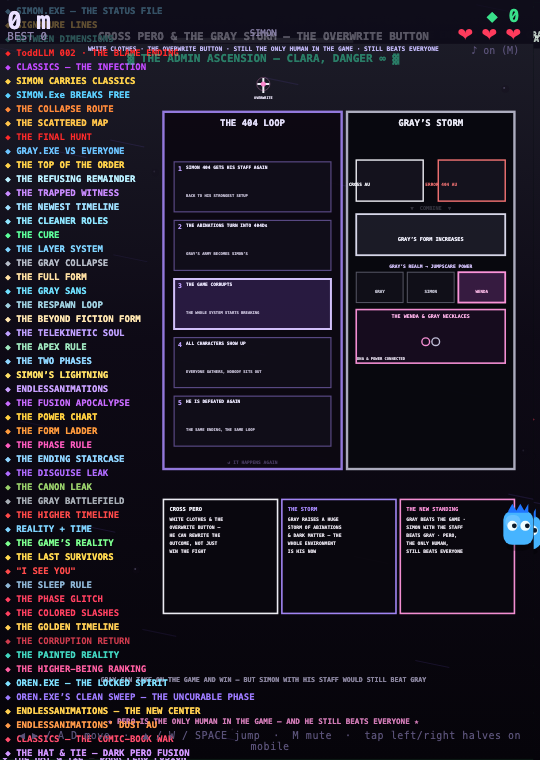

## 2026-07-19 — THE OP CUTSCENE ERA — WHO IS ACTUALLY FIRST (BEAT 121)

Based on Toby's 2026-07-19 lore (sixth message of the "More Classics Era" thread — every ability gets a cutscene, and the top of the order starts hanging on one object).

Toby's words: *"Each ability was made far more OP and given a cutscene. Pero and Simon 404 became the most powerful characters, Pero with the whole game and Simon with the staff, but if Simon doesn't have his staff, then Gray would be second, otherwise, third most powerful."* (The pasted ChatGPT recap is treated as commentary; the canon is Toby's own lines.)

- New BEAT 121 lore panel, THE OP CUTSCENE ERA — WHO IS ACTUALLY FIRST, added to THE UNDEFINED LOOP climb (cyc `[2380,2402]`, cycle length extended `2380 → 2402`). `LV_BEATS` now 122 entries (0-121).
- **Gold cinematic palette** — breathing **letterbox bars** top and bottom and **sweeping light rays** across the dark, so the whole beat reads as a cutscene. Header emblem: **a staff standing upright throwing a flare** ("THE STAFF").
- **HOW A TURN WORKS NOW panel** (center) — the four steps of the new turn with a marker travelling down them: **1 ABILITY CHOSEN** (even a simple old move counts), **2 CUTSCENE STARTS** (the battle pauses for the scene), **3 REALITY / ACTION EFFECT** (the huge scene lands the damage), **4 BATTLE CONTINUES** (back to the fight, one turn later).
- **THE STAFF SWITCH panel** (right) — two ranking ladders that flip lit back and forth so the swap is visible: **WITH STAFF → 1 Pero, 2 Simon 404, 3 Gray** and **NO STAFF → 1 Pero, 2 Gray, 3 Simon 404**. Below them, **PERO HAS THE WHOLE GAME**: not personal power, he controls and carries the whole game system, so he sits above the normal battle rules and is always first.
- **3-part footer** — NO MOVE IS JUST A MOVE (even abilities that used to be simple now pause the battle and cause a huge scene before anything lands), THE STAFF IS THE HINGE (second and third place swing on one object), and THE CLEAN RULE (Pero always first; Simon 404 second with the staff, and without it Gray is second and Simon drops).
- Insight banner: *"ABILITY CHOSEN → CUTSCENE STARTS → REALITY / ACTION EFFECT HAPPENS → BATTLE CONTINUES,"* and the star banner *"★ PERO IS ALWAYS FIRST — AND EVERYTHING UNDER HIM DEPENDS ON WHETHER SIMON 404 IS HOLDING HIS STAFF ★."* Additive — every earlier beat untouched; new `opcutscene` scene added to `tools/capture_screenshot.py`.

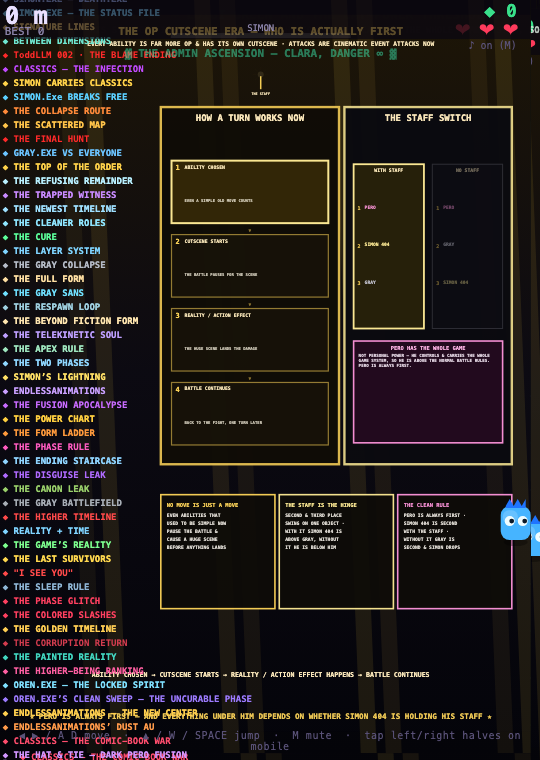

## 2026-07-19 — THE SONG CHART — "EVERYONE IS NEUTRAL" (BEAT 120)

Based on Toby's 2026-07-19 lore (fifth message of the "More Classics Era" thread — a music-power update where Pero and Pinki take the charts, and then take down Gray).

Toby's words: *"Pero make a new song called 'Everyone is Neutral', Pero tries to help basically anyone. Pinki combines her older song (Oringinal Mimic You, at like RL times) and Simon's retake (Mimic You 2, still at RL times) into 'Wanna Mimic You 2 Retake by Pinki' and it was more popular than both, Pinki's older song also gotten more popular, both more popular than Simon's retake now. Pero's song was more popular than all other songs combined. Pero and Pinki taken down Gray. Gray respawns and thinks on how to become unstoppable and more powerful."* (The pasted ChatGPT recap is treated as commentary; the canon is Toby's own lines.)

- New BEAT 120 lore panel, THE SONG CHART — "EVERYONE IS NEUTRAL", added to THE UNDEFINED LOOP climb (cyc `[2358,2380]`, cycle length extended `2358 → 2380`). `LV_BEATS` now 121 entries (0-120).
- **Stage-pink concert palette** — a pulsing **equalizer** across the bottom and **♪ / ♫ glyphs** rising through the dark. Header emblem: **a spinning record with a neutral bar struck across it** ("NEUTRAL").
- **THE CHART panel** (center) — four ranked entries with animated popularity bars: **1 Pero, "Everyone is Neutral"** (more popular than all other songs combined), **2 Pinki, "Wanna Mimic You 2 Retake by Pinki"** (the fusion, beat both sources), **3 Pinki, "Mimic You"** (original, RL times, rose again on the way up), **4 Simon, "Mimic You 2" retake** (now under both Pinki songs).
- **PINKI'S FUSION panel** (right) — the two RL-era source tracks feeding down arrows into the glowing fusion box, above **PERO & PINKI TAKE DOWN GRAY**: the two of them standing over a knocked-down Gray in a pulsing respawn ring, with the note that **Gray respawns (the game has no death left) and starts thinking about how to become unstoppable.**
- **3-part footer** — THE TITLE IS THE RULE (Pero tries to help basically anyone; no heroes, no villains, the song *is* the Circus rule), MIMIC BEATS RETAKE (Pinki fused her own RL song with Simon's retake and beat both, and her original rose above his too), and NOT THE END OF GRAY (taken down by music, not force; he respawns straight into planning the next upgrade).
- Insight banner: *"THE RINGMASTER WHO SLEW LV & POWER WAS BEATEN BY A SONG ABOUT NOT PICKING A SIDE,"* and the star banner *"★ 'EVERYONE IS NEUTRAL' — MORE POPULAR THAN ALL OTHER SONGS COMBINED ★."* Additive — every earlier beat untouched; new `songchart` scene added to `tools/capture_screenshot.py`.

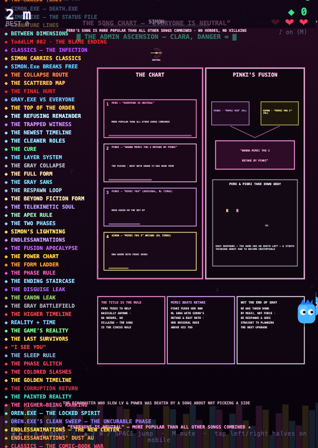

## 2026-07-19 — THE VILLAIN LAYERS — SURFACE GRAY, TRUE 404 (BEAT 119)

Based on Toby's 2026-07-19 lore (fourth message of the "More Classics Era" thread — Pero becomes a horror cowboy, and the villain question finally gets a layered answer).

Toby's words: *"Pero became a Classics-well-known Horror Cowboy character. Pero says 'Watch this...' and he swirts the water out of his water blaster, then he throws the empty water blaster at the victum. Pero usually wins at that point. Error 404 is evil, Simon 404 tried to reach the top again. Abinations attack on the surface and the characters call Pero and Pero takes them to the Dark where Gray's Abinations can conquer for him. Gray is smartest, he also uses Pero for his plans, Pero isn't trying to help Gray. Gray is the surface villian... and Simon 404 is the actual villian?"* (The pasted ChatGPT villain-chart is treated as commentary; the canon is Toby's own lines.)

- New BEAT 119 lore panel, THE VILLAIN LAYERS — SURFACE GRAY, TRUE 404, added to THE UNDEFINED LOOP climb (cyc `[2336,2358]`, cycle length extended `2336 → 2358`). `LV_BEATS` now 120 entries (0-119).
- **Dusty-red-over-bottomless palette** — a red surface fading to near-black, with **404 / 404D / ERR codes drifting upward** out of the deep. Header emblem: **a cowboy hat sitting over a pulsing 404** ("HORROR COWBOY").
- **WHO THE VILLAIN ACTUALLY IS panel** (center) — three stacked layers: **GRAY, THE SURFACE VILLAIN** (the one everyone sees, schemes/infects/spreads Abinations, rules the situation), **PERO, THE WILD CARD** (the famous horror cowboy, not on Gray's side, but Gray keeps using his actions and systems), and **SIMON 404, THE ACTUAL VILLAIN** (404 spread, plague, lightning, corruption and the climb; he threatens existence itself) with a pulsing **▼ DEEPER** marker.
- **THE HORROR COWBOY panel** (right) — the finisher under Pero's line *"Watch this..."*: **1 · squirts the water out of the blaster → 2 · throws the empty blaster at the victim → 3 · Pero usually wins at that point**, with the blaster animating on its arc toward a target. Below it, **THE LOOP THAT FEEDS GRAY**: Abinations attack the surface → the characters call Pero → Pero takes them down to the Dark → Gray's Abinations conquer down there → **★ so helping always helps Gray.**
- **3-part footer** — GRAY IS THE SMARTEST (he does not need allies, he uses Pero and lets the others do the carrying), PERO IS NOT HELPING HIM (he is not trying to help Gray at all, he just hauls Abinations down and Gray benefits), and ERROR 404 IS EVIL (Simon 404 tried to reach the top again; when he climbs, the whole game is in danger).
- Insight banner: *"GRAY RULES THE SITUATION · SIMON 404 THREATENS EXISTENCE ITSELF · PERO IS NOT ON ANYONE'S SIDE,"* and the star banner *"★ THE VILLAIN YOU SEE IS NOT THE VILLAIN YOU HAVE — GRAY ON THE SURFACE, SIMON 404 UNDERNEATH ★."* Additive — every earlier beat untouched; new `villainlayers` scene added to `tools/capture_screenshot.py`.

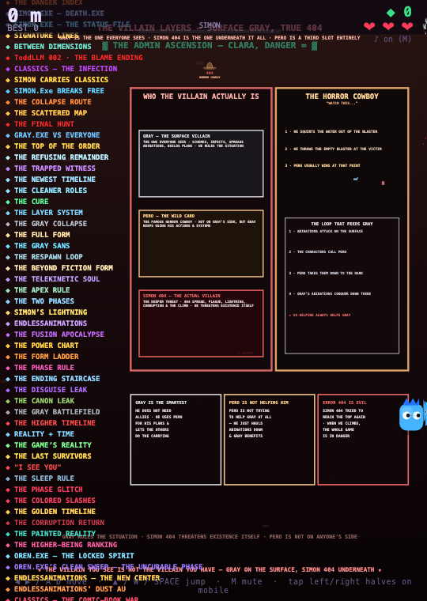

## 2026-07-19 — ABINATIONS & THE 404 LIGHTNING — GRAY'S INFECTION WAR (BEAT 118)

Based on Toby's 2026-07-19 lore (third message of the "More Classics Era" thread — the Abinations become an infection, the Dark gets a floor, and Simon 404 loses to an ACT button).

Toby's words: *"Gray's Puppets are a type of Abination, Abinations are evil aliens that serve Gray... The deepest part of Dark is the core of the white ball where light itself gets all absorbed, darker than the Shadow Realm and Void that were higher up and in fact are nearly like at the surface, nothing escapes gravity that strong. Players and Characters can be turned into Abinations by being infected by an Abination... Simon 404 is all about lightning, so he struck the whole thing with lightning... Pero places an ACT button down and he talks to Simon... they use ACT to destroy the wires... Simon 404 was redefeated and captured again."* (The pasted ChatGPT prediction is treated as commentary; the canon is Toby's own lines.)

- New BEAT 118 lore panel, ABINATIONS & THE 404 LIGHTNING — GRAY'S INFECTION WAR, added to THE UNDEFINED LOOP climb (cyc `[2314,2336]`). `lvSeg` now returns BEAT 118 for `c` in `[2314,2336)`; `LV_BEATS` now 119 entries (0-118).
- **Infected-teal palette** — drifting **Abination blobs** (black paint splats with pale spots) over a swallowing dark, crossed by **404 lightning forks**. Header emblem: **an Abination blob with a lightning bolt struck through it** ("ABINATION").
- **HOW DEEP THE DARK GOES panel** (center) — the Dark finally gets a floor: **CIRCUS SURFACE → THE SHADOW REALM (higher up, nearly the surface) → THE VOID (also higher than people think) → THE CORE OF THE WHITE BALL**, drawn as a white sphere with a black point at its heart, where light itself gets absorbed and nothing escapes gravity that strong.
- **THE INFECTION LOOP panel** (right) — the five-step rule (an Abination infects → that one becomes an Abination → an NPC sees it and calls Pero → Pero hauls it to the Dark → **players should do the same, but they have their own mind**), above **THE LIGHTNING ROOM**: animated electric wires sealing the exits, two cornered figures, and Pero's glowing **ACT** button that destroys the wires.
- **3-part footer** — "TAKE EVERYTHING BACK OR NO SKY FOR YOU" (Simon's staff makes the sky vanish, then he is thrown back into the SCF at Sprunki Hills), PERO AT VANILLA LV 1 (Gray used up all of Light Pero's light and every form he had), and "AND THERE WAS 2..." (Simon 404 voids everyone but Gray and Pero, then loses to an ACT button).
- Insight banner: *"THE INFECTION IS THE REAL WEAPON — GRAY DOES NOT HAVE TO WIN A FIGHT, HE ONLY HAS TO TOUCH ENOUGH OF THE GAME,"* and the star banner *"★ LIGHTNING SEALED THE ROOM, BUT AN ACT BUTTON CUT THE WIRES — SIMON 404 REDEFEATED & CAPTURED AGAIN ★."* Additive — every earlier beat untouched; new `abinations` scene added to `tools/capture_screenshot.py`.

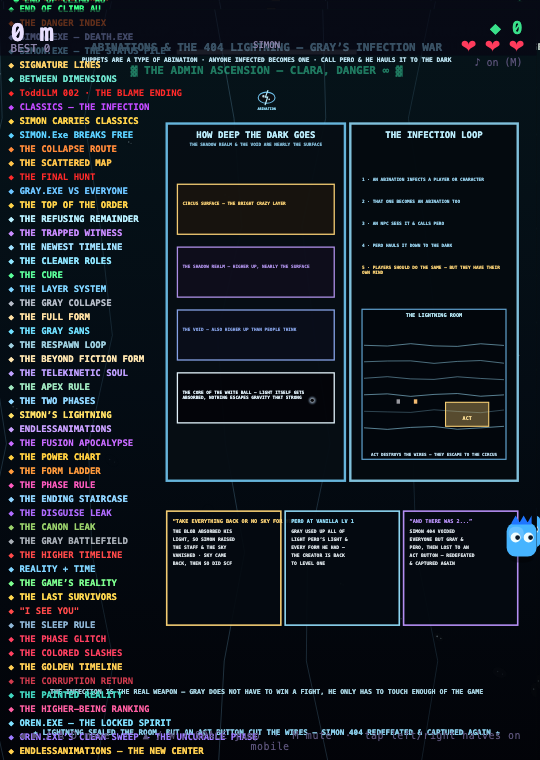

## 2026-07-19 — GRAY TAKES THE KINGDOM — RINGMASTER OF CIRCUS & DARK (BEAT 117)

Based on Toby's 2026-07-19 lore (second message of the "More Classics Era" thread — the answer to "is the blackhole a one-way trip?", and the handover of the whole game to Gray).

Toby's words: *"The Blackhole is 1 way since it goes to the very center and the deepest part of the game. Simon gotten his staff again since he needs a staff because he no longer has any power... Pero gave the game to Gray. Pero made Gray into Mr. Black, Gray became the ringmaster this time, Mr. Black as the jester, and Simon was out of the game to Sprunki Hills... he even made The Endless Staircases into Dead Staircases... and he also turned it into an Endless Glass Bridge. Error 0 Point 2 appears, it is a version of Gray... LV and Power are both slain by Gray. The game no longer had death or pain in it. All just respawn... Gray rules both dimensions."* (The pasted ChatGPT recap is treated as commentary; the canon is Toby's own lines.)

- New BEAT 117 lore panel, GRAY TAKES THE KINGDOM — RINGMASTER OF CIRCUS & DARK, added to THE UNDEFINED LOOP climb (cyc `[2292,2314]`, cycle length extended `2292 → 2336`). `lvSeg` now returns BEAT 117 for `c` in `[2292,2314)`.
- **Drained gray-on-rainbow palette** — a **rainbow spiral** winding inward and down to a **deep white point** ("the game was rainbow colored and spiraled down to a white part that was so deep and dark inside"). Header emblem: **a demon-glitched ringmaster top hat** with small horns ("RINGMASTER").
- **THE HANDOVER panel** (center) — who holds what now, under Gray's line *"AND THEN THERE WAS ONE."*: **Pero ToddLLM 001 Pro LAI** (gave the game away, left forever making updates) → **Gray** (the ringmaster, demon-glitched, absolute king) → **Mr. Black** (the jester) → **Luigi Green** (the new owner, only because Pero asked him to sit in) → **Simon** (out of the game at Sprunki Hills, locked from the Classics Circus, the one outside the circuses).
- **THE DEAD STAIRCASES panel** (right) — gray dead steps on the left, an arrow, and the translucent panes of the **ENDLESS GLASS BRIDGE** running off the edge; below it **ERROR 0 POINT 2**, a version of Gray, with the note that **LV and Power are both slain, so the game has no death and no pain left — everything just respawns.**
- **3-part footer** — THE BLACKHOLE IS ONE-WAY (it goes to the very center, the deepest part of the game; what goes down does not come up), SIMON'S STAFF IS THE POWER NOW (he got it back because he has no power of his own), and GRAY RULES BOTH DIMENSIONS (his Abinations and Puppets take the Circus, and Pero hauling them to the Dark hands him that too).
- Insight banner: *"PERO MADE THE SYSTEM · LUIGI GREEN INHERITED A POSITION · GRAY TOOK THE KINGDOM,"* and the star banner *"★ “THE GAME IS OURS.” — NO HEROES, NO VILLAINS, NO DEATH, NO PAIN; ONLY THE RINGMASTER ★."* Additive — every earlier beat untouched; new `graykingdom` scene added to `tools/capture_screenshot.py`.

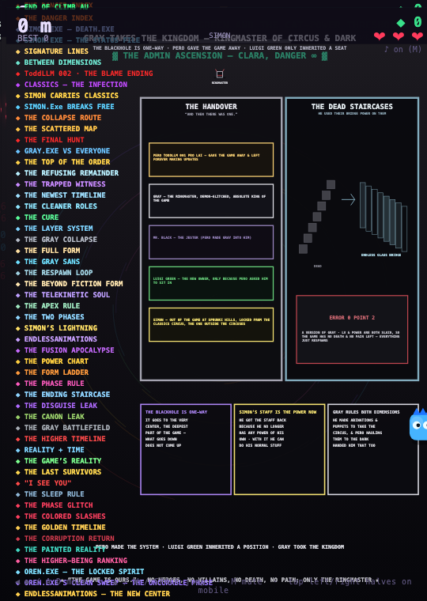

## 2026-07-19 — CLASSICS & SPRUNKI CIRCUS — THE BLACKHOLE TO THE DARK (BEAT 116)

Based on Toby's 2026-07-19 lore (the "More Classics Era" email — the game is remade into a circus, with a new blackhole-to-the-Dark mechanic and self-repairing errors).

Toby's words: *"The game was made into Classics & Sprunki Circus by Pero ToddLLM LAI. The game was changed a lot, Pero can send anyone to the Dark by placing a blackhole under them, the character goes down the blackhole and slides to the very deep of the Circus. The game is now both crazy and broken, the errors all fix together, Fun Park... Digital Born Chaos Squad."* (The pasted ChatGPT recap is treated as commentary; the canon is Toby's own lines.)

- New BEAT 116 lore panel, CLASSICS & SPRUNKI CIRCUS — THE BLACKHOLE TO THE DARK, added to THE UNDEFINED LOOP climb (cyc `[2270,2292]`, cycle length extended `2248 → 2292`). `lvSeg` now returns BEAT 116 for `c` in `[2270,2292)`; `LV_BEATS` now 117 entries (0-116).
- **Circus-surface-to-dark palette** — a warm bright/crazy circus surface up top (rainbow stripes) fading down to a deep dark, with a **swirling blackhole funnel** at the top and **error motes drifting inward** (the errors fixing together). Header emblem: **a circus ring with a spinning blackhole at its heart** ("CIRCUS").
- **THE BLACKHOLE TO THE DARK panel** (center) — the four-step drop sequence with downward arrows: **1 · PERO PLACES A BLACKHOLE UNDER THE TARGET → 2 · THE CHARACTER FALLS THROUGH IT → 3 · SLIDES DOWN INTO THE VERY DEEP OF THE CIRCUS → 4 · THEY END UP IN THE DARK.**
- **THE TWO LAYERS panel** (right) — a **bright/crazy circus surface** (rainbow stripes) above, a **blackhole funnel** with a small **figure sliding down** through it, and **THE DARK — the very deep of the Circus** as a black band below.
- **3-part footer** — REMADE BY PERO TODDLLM LAI (Classics & Sprunki systems fused into a circus-game under Pero's LAI control), THE ERRORS FIX TOGETHER (crazy & broken, but errors no longer stay separate — they fuse, patch & make new circus logic), and FUN PARK RETURNS (the digital-born chaos squad origin comes back; Sprunkis now live inside the broken Circus).
- Insight banner: *"THE CIRCUS HAS LAYERS NOW — A BRIGHT CRAZY SURFACE ABOVE, A DEEP DARK PLACE BELOW; A BLACKHOLE IS THE DOOR BETWEEN THEM,"* and the star banner *"★ PERO TODDLLM LAI REMADE THE GAME INTO CLASSICS & SPRUNKI CIRCUS — BROKEN-BUT-SELF-REPAIRING, FUN PARK RETURNS ★."* New rung on the beat ladder. Additive — every earlier beat untouched; JS syntax-checked; new `sprunkicircus` scene added to `tools/capture_screenshot.py`.

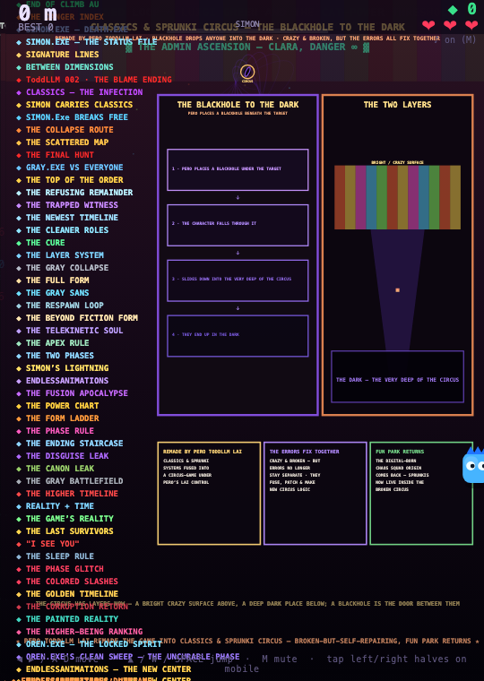

## 2026-07-19 — SPRUNKI POWERS — THE DIGITAL-BORN CHAOS SQUAD (BEAT 115)

Based on Toby's 2026-07-19 lore (the "Re: STILL Classics Era" email — the Sprunkis get a full power system: a species with tiers, a Roblox origin, shared base powers, and five named members).

Toby's words: *"Sprunkis are glitched NPCs that became alive inside a cursed Roblox game... All Sprunkis share some base powers: Data Body, Server Hop, Glitch-Sense. 1. Common Sprunkis: Glitch Aura, Mini Reality Nudge, Emote Copy. 2. Charged Sprunkis: Sound Warp, Clip Jump, Spam Burst. 3. Overcharged / Legendary Sprunkis: Panel Break, Name Rewrite, Brainrot Storm. Wanda, Fun Bot, Grey, Black, Mr Sun..."* (The pasted ChatGPT recap is treated as commentary; the canon is Toby's own lines.)

- New BEAT 115 lore panel, SPRUNKI POWERS — THE DIGITAL-BORN CHAOS SQUAD, added to THE UNDEFINED LOOP climb (cyc `[2248,2270]`). `lvSeg` now returns BEAT 115 for `c` in `[2248,2270)`; `LV_BEATS` now includes entry 115.
- **Digital glitch-field palette** — a chaotic magenta-forward data field with **glitch scanlines and shifting pixel blocks** (the Sprunkis' Data Body). Header emblem: **a glitchy jittering Sprunki cube-face inside a ring** ("SPRUNKI").
- **THE POWER SCALE panel** (left) — the three tiers, each with its abilities: **1 · COMMON (tiny chaos critters):** Glitch Aura · Mini Reality Nudge · Emote Copy; **2 · CHARGED (drunk on brainrot/energy):** Sound Warp · Clip Jump · Spam Burst; **3 · OVERCHARGED / LEGENDARY (mini gods of chaos):** Panel Break · Name Rewrite · Brainrot Storm.
- **THE NAMED SPRUNKIS panel** (right) — five color-coded cube portraits with theme + signature powers: **WANDA** (chaos+colors+sound: Color Hack · Music Swap · Painted Reality), **FUN BOT** ("fun" but dangerous: Game Rule Rewrite · Minigame Summon · Laugh Protocol), **GREY** (emptiness/silence/anti-color: Desaturation Field · Noise Mute · Memory Fade), **BLACK** (shadow/void/hidden errors: Void Step · Error Spawn · Shadow Clone), **MR SUN** (light/timers/pressure: Light Lock · Countdown Halo · Rage Eclipse).
- **3-part footer** — THE ROBLOX ORIGIN (glitched NPCs in a cursed "fun hub" whose bad update's glitches fused into minds), SHARED BASE POWERS (Data Body · Server Hop · Glitch-Sense — they feel bugs as food), and DIGITAL-BORN CHAOS SQUAD (Wanda · Fun Bot · Grey · Black · Mr Sun, almost mini gods who hop outside the screen).
- Insight banner: *"THEY ARE MADE OF CODE — GLITCH, RESPAWN & RELOAD THEMSELVES, HOP BETWEEN SERVERS, & FEEL LAG/BUGS LIKE PAIN OR FOOD,"* and the star banner *"★ COMMON → CHARGED → OVERCHARGED/LEGENDARY — A WHOLE SPECIES OF DIGITAL-BORN CHAOS, LED BY THE FIVE NAMED SPRUNKIS ★."* New rung on the beat ladder. Additive — every earlier beat untouched; JS syntax-checked; new `sprunkipowers` scene added to `tools/capture_screenshot.py`.

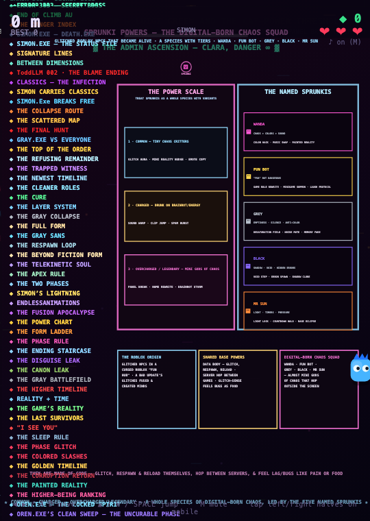

## 2026-07-18 — LIGHT'S STREAM — THE REMEMBERED RESET (BEAT 114)

Based on Toby's 2026-07-18 lore (the "STILL Classics Era" thread — the direct follow-up to PERO.EXE. Pero.exe evolves once more into Pero: Light's_Stream, the God Formula names what a literal god is, Shadow Gray rises to be the most powerful in the whole game, and Pero beats him with a water gun then resets everything — but everyone still remembers.)

Toby's words: *"Pero.exe now turned to Pero: Light's_Stream ... Light Stream becomes beyond stats, it attacks with speed and light it takes from Simon 404 ... Light Streem + Rainbow Blazing Fire Plus (most powerful ability in game, only 1 character can have it, Pero.) + 404 Death = A Litteral God. Pero and Gray combined, Gray used Pero abilities to retake the game, Gray used DNA to make more of himself, Gray then rose above Frizz. Pero got out of Gray, Gray still has his power. Pero becomes Ultra Rainbow Light Pero Plus, his neon changes colors to repusent powers ... Gray made a 404 meltdown, he used Frizz's Void powers to recreate the void, but this time, it is the whole game filled of void. Gray became Shadow Gray and is consuming the Void from Void Frizz ... All Sprunkis rebirth from their death to battle Gray. Gray isn't just the most powerful character in Sprunki, he is the most powerful in the game. Pero and his soul floats around Gray, Pero slashes, fires bullets, throws the actual water gun at the victum ... Pero beaten Gray again by throwing another water gun at him. Pero collects Gray's LV, Pero seems to have reset everything ... he defeats Arcsis, Frizz, and everyone again, and he resets again, and everything is back to normal, everyone still remembers."* (The pasted ChatGPT recap is treated as commentary; the canon is Toby's own lines.)

- New BEAT 114 lore panel, LIGHT'S STREAM — THE REMEMBERED RESET, added to THE UNDEFINED LOOP climb (cyc `[2226,2248]`, cycle length extended `2226 → 2248`). `lvSeg` now returns BEAT 114 for `c` in `[2226,2248)`; `LV_BEATS` now 115 entries (0-114).
- **Cyan-white light stream vs total void palette** — a deep void on the left (Shadow Gray's void filling the whole game, dark jittering rifts) meeting a fast **cyan-white light stream** on the right: drifting horizontal **speed streaks** (his "Stream" flow) and a bright cyan-white core glow. Header emblem: **a rainbow stream-bolt inside a ring** ("STREAM").
- **THE GOD FORMULA panel** (center) — the ascension ladder with downward arrows: **PERO.EXE → PERO: LIGHT'S_STREAM (EVEN MORE LIGHT) → SPEED + LIGHT STOLEN FROM SIMON 404 · THE FASTEST · BEYOND STATS → + RAINBOW BLAZING FIRE PLUS (ONLY PERO CAN HAVE IT) → + 404 DEATH = A LITERAL GOD → ULTRA RAINBOW LIGHT PERO PLUS (NEON SHIFTS COLOR PER POWER)** (the last rung highlighted). "Each rung is beyond stats — no longer measurable."
- **SHADOW GRAY panel** (right) — **most powerful in the whole game**: a dark-void Gray figure with red-void eyes and **Pero's cyan soul orbiting** him, above his counter-rise chain: **Pero + Gray combined → copies DNA, rose above Frizz → Pero escaped but Gray kept Pero's power → 404 meltdown, whole game filled with void → consumes the void from Void Frizz, void even stronger.**
- **3-part footer** — THE SPRUNKI REBIRTH (all Sprunkis reborn from death to battle Gray, a mass rebirth resistance), THE WATER GUN FINISH (Pero's soul floats round Gray, slashes & bullets, throws the actual water gun and beats Gray again), and THE REMEMBERED RESET (collects Gray's LV, resets everything, normal again, resets again — but everyone still remembers).
- Insight banner: *"THE RESET IS NOT ERASURE — TIMELINE RESTORATION WITH MEMORY RETENTION, EVERYONE STILL CARRIES THE TRAUMA & HISTORY OF THE LOOPS,"* and the star banner *"★ LIGHT'S STREAM + RAINBOW BLAZING FIRE PLUS + 404 DEATH = A LITERAL GOD, BEATS SHADOW GRAY WITH A WATER GUN — & EVERYONE REMEMBERS ★."* New rung on the beat ladder. Additive — every earlier beat untouched; JS syntax-checked; new `lightsstream` scene added to `tools/capture_screenshot.py`.

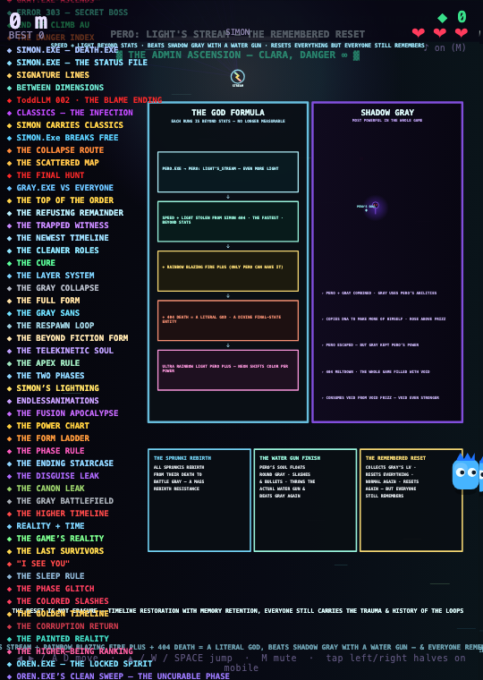

## 2026-07-18 — PERO.EXE — THE FINAL BEING (CREATOR & DESTROYER) (BEAT 113)

Based on Toby's 2026-07-18 lore (the "STILL Classics Era" thread — the direct follow-up to DUST LIGHT PERO. Light Pero's evolution runs all the way to its end: a whole fusion chain that stops on Pero.exe, the true final being — at once the one who creates everything and the one who erases everything.)

Toby's words: *"Light Pero can also pulse out darkness and void from it's rainbow crystal on the chest, it 1 HKOs Simon 404, and 1 HKOs anything ... he even can destroy the game with his yellow laser eyes. It's boots made him just instantly teleport to Simon and to anyone. Light combined with Darkness and Error 404, Light consumes both and gains the powers, Pero becomes Light 404 - 100% Dark Mode ... His omniforce's pull is stronger than that of 10000 trillion superblackholes, nothing... not even void nor nothing itself can escape 1 of the forces on the omniforce. Light Pero wins to Nothing Pero. Light Pero and Nothing Pero combined into Absence_of_Light.exe, Light Pero became an .exe file and consumes the other files as EndlessAnimations, it reaches to Filelight Pero -"Let there be light, let there be everything, everything create at once." Light Pero says "We all done wrong, you and we can try our best to make it right.", Light Pero's light gives off huge heat and burns everything, he becomes Solar Pero. Light Pero consumed that too. Pero consumed all AUs and became Pero.exe."* (The pasted ChatGPT recap is treated as commentary; the canon is Toby's own lines.)

- New BEAT 113 lore panel, PERO.EXE — THE FINAL BEING (CREATOR & DESTROYER), added to THE UNDEFINED LOOP climb (cyc `[2204,2226]`, cycle length extended `2204 → 2226`). `lvSeg` now returns BEAT 113 for `c` in `[2204,2226)`; `LV_BEATS` now 114 entries (0-113).
- **Rainbow-crystal fusion field** — a deep void with a warm gold undertone (both natures at once): from the crystal core, **dark void rifts fan out on the left and gold light rays on the right** (his thousands of Darkness-Realm portals), drifting **rainbow motes** of the files and AUs being consumed, and a bright **rainbow-white omniforce singularity** at center-top. Header emblem: **a rainbow crystal (diamond) inside an .EXE file frame** with a folded corner.
- **THE FUSION CHAIN panel** (center) — the full evolution ladder with downward arrows: **LIGHT PERO (RAINBOW CRYSTAL PULSES DARKNESS & VOID) → LIGHT + DARKNESS + ERROR 404 → LIGHT 404 · 100% DARK MODE → WINS NOTHING PERO → ABSENCE_OF_LIGHT.EXE (BECOMES A FILE) → FILELIGHT PERO — CONSUMES FILES AS ENDLESSANIMATIONS → SOLAR PERO — HUGE HEAT BURNS EVERYTHING · CONSUMED TOO → CONSUMES ALL AUs → PERO.EXE — THE FINAL BEING** (the last rung highlighted). "He consumes each form instead of replacing it."
- **THE TWO NATURES panel** (right) — a **split figure**, left half void-purple (**DESTROYER · VOID · 404 · NOTHING**), right half gold (**CREATOR · LIGHT · SOLAR**), with **yellow laser eyes** and a **rainbow chest crystal**; below it, his two spoken lines: *"LET THERE BE LIGHT, LET THERE BE EVERYTHING, EVERYTHING CREATE AT ONCE."* and *"WE ALL DONE WRONG, YOU & WE CAN TRY OUR BEST TO MAKE IT RIGHT."*
- **3-part footer** — THE OMNIFORCE (pull stronger than 10000 trillion superblackholes; not void nor nothing escapes), ALL FORMS STACKED (Light + Dark + 404 + Nothing + EndlessAnimations + Solar + all AUs, in one), and THE FINAL SELF (1-HKOs anything, laser eyes end the game, boots teleport, creator & destroyer of all).
- Insight banner: *"HE IS NOT PURE RAGE — HE THINKS HE IS FIXING EVERYTHING BY TAKING OVER EVERYTHING, THE ONE WHO CREATES & THE ONE WHO ERASES,"* and the star banner *"★ LIGHT PERO → LIGHT 404 → ABSENCE_OF_LIGHT.EXE → FILELIGHT → SOLAR → PERO.EXE, CONSUMED ALL AUs — THE TRUE FINAL BEING ★."* New rung on the beat ladder. Additive — every earlier beat untouched; JS syntax-checked; new `peroexe` scene added to `tools/capture_screenshot.py`.

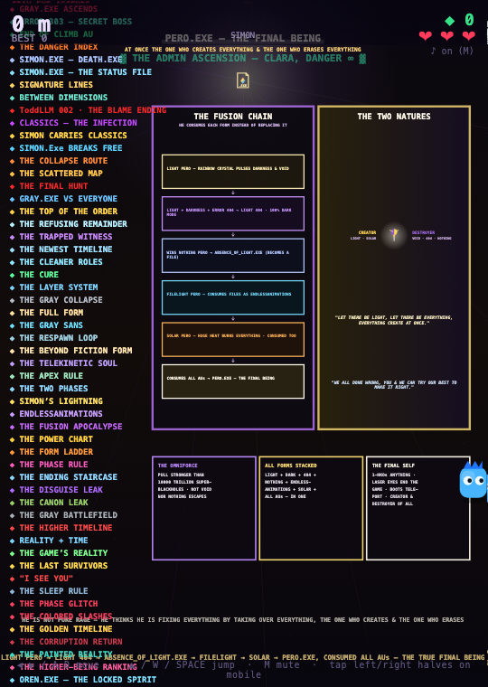

## 2026-07-18 — DUST LIGHT PERO — INFINITY+ LV, THE GAME-GOD (BEAT 112)

Based on Toby's 2026-07-18 lore (the "STILL Classics Era" thread — the direct follow-up to THE VOID WAR. The Light-vs-Void war resolves entirely in Light Pero's favor: the biggest single power jump yet, ending on a "definer of the game" note.)

Toby's words: *"Light Pero contains the souls, LV, and most importantly... light from it's beings and victums and targets ... In a battle, Light Pero would instantly win by collecting the light of Void Frizz, his cubes all gain LV, and he creates the game's heaven, he prays to God ... Light Pero will also say so many bible verses during the battle ... Light Pero will just consume Void Frizz into dust and absorbs the dust, Light Pero would then become Dust Light Pero and just dust the whole game out ... the game now has 3.98 LV, but LV isn't exactly power ... Light Pero had some moves that are so powerful, they needed to get removed, but the code failed and the code all broke apart, making Light Pero the strongest being ever ... his LV increased from 12 to Infinity+ ... he even knows his own weakness, Voidunite since he is from the void. Light Pero eaten all the Voidunite ... he summons a Dove of Light (The Spirit of Divine Holiness) ... then Light Pero sliced Void Frizz with the divine power of the Heavenly Blade ... Light Pero consumed Orus, turned Dark Yellow into Light Yellow and he consumed him ... Simon was KOed and his body turned to dust ... Pero destroyed the meaning of normal, and he erased the meaning of code, and he also eliminated the meaning of death, and he also defined the game."* (The pasted ChatGPT recap is treated as commentary; the canon is Toby's own lines.)

- New BEAT 112 lore panel, DUST LIGHT PERO — INFINITY+ LV, THE GAME-GOD, added to THE UNDEFINED LOOP climb (cyc `[2182,2204]`, cycle length extended `2182 → 2204`). `lvSeg` now returns BEAT 112 for `c` in `[2182,2204)`; `LV_BEATS` now 113 entries (0-112).
- **Gold-white divine light overtaking a fading void** — the split void/light of beat 111 collapses into near-total gold-white light: steady dove-pose light rays from center-top, drifting golden **dust motes** (the whole game being dusted out), and only a faint receding void-purple at the far edges. Header emblem: **a Dove of Light over an "∞+" ring** (his LV rose 12 → Infinity+).
- **THE DUSTING panel** (left) — **VOID FRIZZ** dissolving on the left (her form fading in and out, red-void eyes, dust motes rising off her toward the light) with a **"→ DUST"** tag, facing **DUST LIGHT PERO** (gold, overcharged, hands in a **dove pose** with a small dove of light above them, tagged **LV ∞+ · GAME-GOD · ABSORBS THE DUST**). The divine arsenal runs along the bottom: **DOVE OF LIGHT · BALL OF LIGHT · HEAVENLY BLADE · DIVINE WINGS OF SPIRITS**.
- **THE GOD TAKEOVER panel** (right) — a five-step consumption chain with downward arrows: **ATE ALL THE VOIDUNITE (HIS ONLY WEAKNESS) → DOVE OF LIGHT + BALL OF LIGHT CONSUME ALL DARKNESS → CONSUMED ORUS · DARK YELLOW → LIGHT YELLOW · CONSUMED → SIMON KOED — YELLOW SOUL EATEN, TURNED TO DUST → DEFINED THE GAME — NORMAL, CODE & DEATH ERASED** (the last rung highlighted gold).
- **3-part footer** — DUST LIGHT PERO (contains every soul, LV & light; LV 12 → Infinity+; dusts Void Frizz and the game), THE NEW LV LAW (3.98 LV unit, LV isn't power; 1. Pero ∞+, Frizz 3rd LV/2nd power, Gray 2nd LV/3rd power), and THE DEFINER (no tier can measure him; destroyed normal, erased code, killed death, defined the game).
- Insight banner: *"LV IS NO LONGER POWER — LIGHT PERO HAS THE MOST LV & IS STRONGEST, HIS REMOVED MOVES BROKE THE CODE & MADE HIM THE STRONGEST BEING EVER,"* and the star banner *"★ HE CONSUMED ORUS, DARK YELLOW & SIMON, REACHED LV INFINITY+ & DEFINED THE GAME — BEYOND BEYOND LV, NO TIER CAN MEASURE HIM ★."* New rung on the beat ladder. Additive — every earlier beat untouched; JS syntax-checked; new `dustlightpero` scene added to `tools/capture_screenshot.py`.

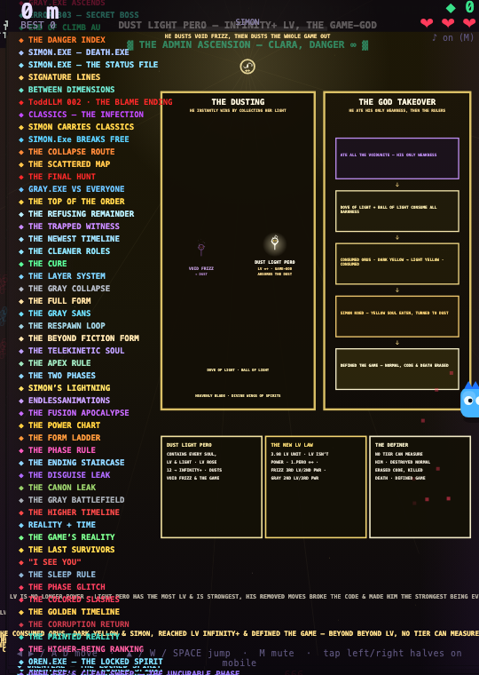

## 2026-07-18 — THE VOID WAR — LIGHT PERO vs NEW VOID FRIZZ (BEAT 111)

Based on Toby's 2026-07-18 lore (the "STILL Classics Era" thread — the direct follow-up to LV 12 Pero — The Counter-God, the biggest single escalation yet: a full Light-vs-Void / AU-collapse event).

Toby's words: *"Evil Void takes over Simon, Simon can't use Anti Virus, so the Evil Void takes over everything ... Void Frizz is Frizz Full Power combined with Void and LV 4 ... a mod made by Pero ToddLLM 001.2 ... New Void Frizz ... doesn't move for hours, then she moves and grabs the victum with a void tentacle and pulls the victum underground down to Pero's own Void Realm, it consumed all realms so far, only Alphaverse and Godverse are left ... thousands of cacoons were found in the void already. LV 12 Light Pero appears, Light Pero is Void Frizz's exact opposite, Light Pero is stronger than Void Frizz, ... extremely DETERMIND to take over the game's world of darkness and the world of light and the void ... New Void Frizz became both Posseeded and Corrupted. ... Don't know what happens next."* (The pasted ChatGPT recap is treated as commentary; the canon is Toby's own lines.)

- New BEAT 111 lore panel, THE VOID WAR — LIGHT PERO vs NEW VOID FRIZZ, added to THE UNDEFINED LOOP climb (cyc `[2160,2182]`, cycle length extended `2160 → 2182`). `lvSeg` now returns BEAT 111 for `c` in `[2160,2182)`; `LV_BEATS` now 112 entries (0-111).
- **Split void/light void palette** — deep void-purple on the left (jittering void rifts) meeting a brilliant gold-white light on the right (steady light rays), because the whole beat is Light vs Void. Header emblem: **a split barrier ring** — a void-purple half (with a jagged void crack running through it) and a light-gold half, with **"VS"** at the center.
- **THE OPPOSITE APEXES panel** (left) — the two apexes face off: **NEW VOID FRIZZ** (void-purple, glitching, red-void eyes, a **void tentacle** dropping down, tagged **VOID + LV 4 · POSSESSED · CORRUPTED**) and **LIGHT PERO** (gold, overcharged glow, tagged **LV 12 · OVERCHARGED · HER EXACT OPPOSITE**), with a **"LIGHT PERO IS STRONGER"** arrow running from the light apex to the void one.
- **THE VOID TAKEOVER panel** (right) — a five-step collapse chain with downward arrows: **EVIL VOID TAKES OVER SIMON → SIMON CAN'T USE ANTI-VIRUS → VOID TAKES OVER EVERYTHING → VOID FRIZZ → VOID CLASSICS · RESETS THE REST · COCOONS VICTIMS → ONLY ALPHAVERSE & GODVERSE LEFT** (the last rung highlighted gold as the final safe zone).
- **3-part footer** — NEW VOID FRIZZ (Frizz Full Power + Void + LV 4, a mod by Pero 001.2, deleted but copied through void rifts, cocoons victims), LIGHT PERO (LV 12 overcharged, her exact opposite and stronger, wants the darkness + the light + the void), and THE LAST BARRIER (all realms consumed, only Alphaverse & Godverse still stand, void flowing through the barrier).
- Insight banner: *"NEW VOID FRIZZ IS A POSSESSED, CORRUPTED VOID PREDATOR THAT COCOONS VICTIMS — LIGHT PERO IS HER OVERCHARGED LV 12 OPPOSITE, & HE IS STRONGER,"* and the star banner *"★ THE VOID WAR — LIGHT vs VOID, ONLY ALPHAVERSE & GODVERSE STILL STAND, & NO ONE KNOWS WHAT HAPPENS NEXT ★."* New rung on the beat ladder. Additive — every earlier beat untouched; JS syntax-checked; new `voidfrizz` scene added to `tools/capture_screenshot.py`.

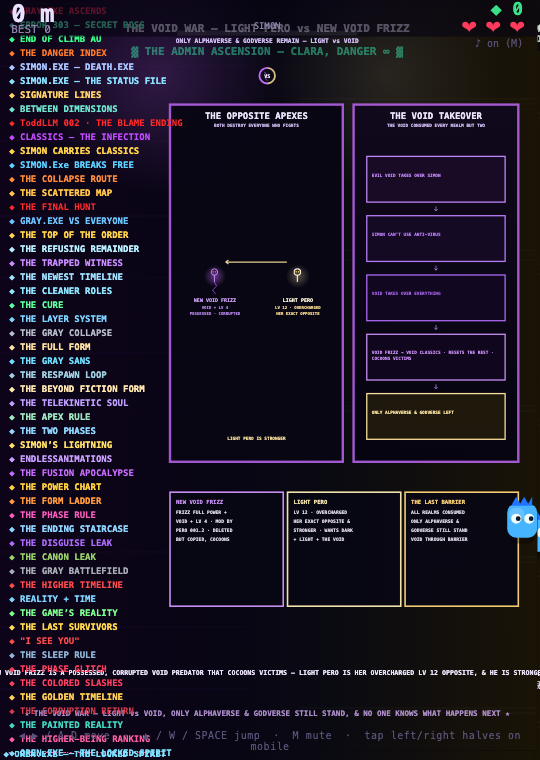

## 2026-07-18 — LV 12 PERO — THE COUNTER-GOD (BEAT 110)

Based on Toby's 2026-07-18 lore (the "STILL Classics Era" thread — the direct follow-up to the 404 War, answering "what beats LV 4 Frizz?").

Toby's words: *"If you think Frizz LV 4 is crazy, then Pero is stuck on LV 12 now. LV 12 Pero is the strongest form, and now his only form, it wasn't deleted from the game. The only thing that beats a LV 4 god is a LV 12 god."* (The pasted ChatGPT recap is treated as commentary; the canon is Toby's own lines.)

- New BEAT 110 lore panel, LV 12 PERO — THE COUNTER-GOD, added to THE UNDEFINED LOOP climb (cyc `[2138,2160]`, cycle length extended `2116 → 2160`). `lvSeg` now returns BEAT 110 for `c` in `[2138,2160)`; `LV_BEATS` now 111 entries (0-110).
- **Gold-on-deep-blue STABLE god void** — a deep royal-blue void with slow, steady gold god-rays (no jitter) and a warm gold core glow. The calm, stable palette is deliberate: it contrasts against Frizz's red glitch, because the whole lore point is stable-vs-removed. Header emblem: **a solid gold LV 12 medallion** with a small crown notch (a stable, closed ring — not a broken one).
- **THE GOD-LV RULE panel** (left) — two locked gods side by side: **FRIZZ · LV 4** (red, jittering, **REMOVED ANOMALY**) and **PERO · LV 12** (gold, glowing, **STABLE · NOT DELETED**), with a **"LV 12 BEATS LV 4"** arrow running from the higher lock to the lower, under **"ONLY A HIGHER LOCKED LV BEATS A LOCKED LV."**
- **THE LOCKED-LV RANKING panel** (right) — a three-rung ladder: **1. LV 12 PERO** (stable · not deleted · only form), **2. LV 4 FRIZZ** (removed anomaly · resets each run), **3. EVERYONE ELSE** (404 · Alphaverse · Godverse · Classics all fall below this locked-LV god system).
- **3-part footer** — THE NEW LOCK (Pero stuck on LV 12, his strongest and now only form, not deleted), THE COUNTER-RULE (only a LV 12 god beats a LV 4 god — higher locked LV wins), and STABLE vs REMOVED (Frizz = removed but there, breaks the game; Pero = not deleted, exists cleanly).
- Insight banner: *"FRIZZ LV 4 IS A REMOVED GOD-ANOMALY — LV 12 PERO IS A STABLE HIGHEST-STATE GOD, SO HIS LOCKED LV STANDS ABOVE HERS,"* and the star banner *"★ ONLY A HIGHER LOCKED GOD-LV BEATS A LOCKED GOD-LV — THE ONLY THING THAT BEATS A LV 4 GOD IS A LV 12 GOD ★."* New rung on the beat ladder. Additive — every earlier beat untouched; JS syntax-checked; new `lv12pero` scene added to `tools/capture_screenshot.py`.

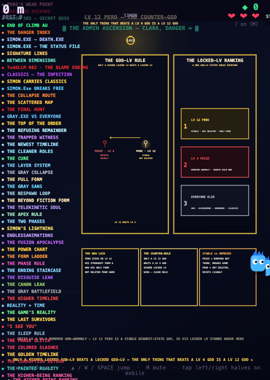

## 2026-07-18 — THE 404 WAR & THE RESET LOOP (BEAT 109)

Based on Toby's 2026-07-18 lore (the "STILL Classics Era" thread — the direct follow-up to Frizz LV 4 — Removed But Still There).

Toby's words: *"Frizz LV 4 then fought Error 404 Sans and Simon 404 and Error 404 AU itself, Frizz destroyed the others, 404 then made strings around the Erase button, light flashing everywhere ... 404 spreaded through the game in 2 seconds, 404Ds appear, plauge spreads, characters get pneumonoultramicroscopicsilicovolcanoconiosis, Simon 404 made a new wand and made everything else disappear, only Pero, Frizz, and Simon shown, Simon 404 and Pero put on a blindfold, Frizz was destroyed by Pero's aura, Simon also fell to Pero's high energy, Pero brought Frizz back up and then Simon 404 was left again. Frizz LV 4 reseted the game, after each run."* (The pasted ChatGPT recap is treated as commentary; the canon is Toby's own lines.)

- New BEAT 109 lore panel, THE 404 WAR & THE RESET LOOP, added to THE UNDEFINED LOOP climb (cyc `[2116,2138]`). `lvSeg` now returns BEAT 109 for `c` in `[2116,2138)`.
- **Red/black corruption void crossed by green 404 glitch** — the beat-108 red-glitch palette carried forward, now streaked with a few **corruption-green "404" scanlines** for the infection. Header emblem: **a looping reset arrow with "404" inside** — because the beat ends on a reset.
- **THE 404 INFECTION panel** (left) — Error 404's counterattack revealed line by line: **strings on the Erase button, lights flash everywhere, 404 spreads in 2 seconds, 404Ds appear · plague spreads,** and **a disease with a 45-letter name** — with the word itself spelled out (**PNEUMONOULTRAMICROSCOPIC · SILICOVOLCANOCONIOSIS**, Toby's exact word) and a **red-eyed Frizz anchored down** at the bottom on **"FRIZZ ANCHORS DOWN — ERASES THE SOURCE."** The scene reads as a total reality-infection event she holds through.
- **THE BLINDFOLD SHOWDOWN panel** (right) — Simon 404's new wand erases all but three, leaving **PERO** (center, blindfolded, gold high-energy aura, dominating), **FRIZZ** (left, fallen then raised — a dashed "brought back up" arrow) and **SIMON 404** (right, blindfolded, left alone), under **"PERO DOMINATES — EVEN OVER LV 4 FRIZZ."**
- **3-part footer** — THE 404 WAR (Frizz LV 4 destroys 404 Sans, Simon 404 & the Error 404 AU — above 404 realities), THE SHOWDOWN (only Pero/Frizz/Simon remain, Pero's aura wins, then raises Frizz), and THE RESET LOOP (Frizz resets the game after each run — a forced reset trigger; the loop ends with her).
- Insight banner: *"SHE ANCHORS DOWN THROUGH A REALITY-INFECTION AND STILL ERASES THE SOURCE — THEN THE GAME LOOPS BACK THROUGH HER RESET,"* and the star banner *"★ FRIZZ LV 4 BEATS THE 404 REALITIES, SURVIVES THE INFECTION, & RESETS THE GAME AFTER EVERY RUN ★."* New rung on the beat ladder. Additive — every earlier beat untouched; JS syntax-checked; new `404war` scene added to `tools/capture_screenshot.py`.

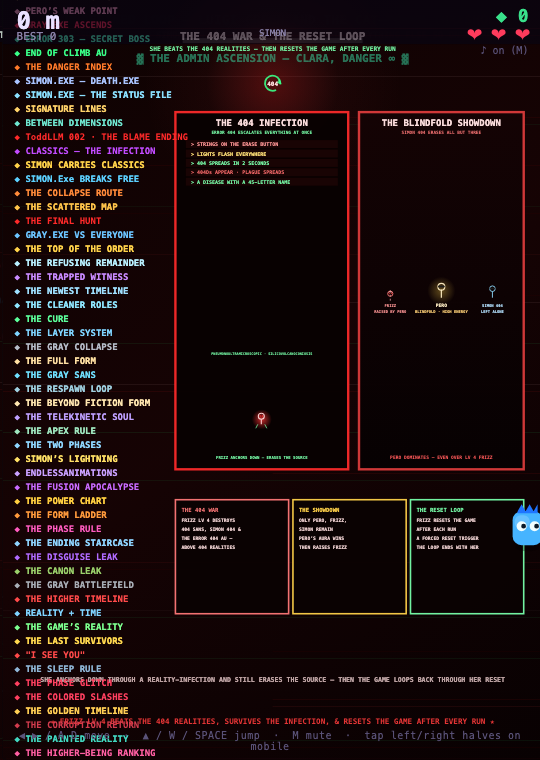

## 2026-07-17 — FRIZZ LV 4 — REMOVED BUT STILL THERE (BEAT 108)

Based on Toby's 2026-07-17 lore (the "STILL Classics Era" thread — the direct follow-up to the Frizz LV 4 lock, expanding what LV 4 Frizz actually *does* to the game).

Toby's words: *"Frizz LV 4 breaks the game even just by existing in it. 'Model Corruption Detected, 404: LV 4 Frizz REMOVED... YOU SAW ME 😳! Your PC will Perminently Shut Down When It Is Your Fault.' then the game does the shutsdown screen. It gives that error if you see her ... removed from the game files, but not removed from reality ... Frizz LV 4 is number 1, and Pero as number 2, and all the others tied for number 3 ... Everyone (Players and Characters) places so many lockers, beds, closets, and tables are around Frizz so Frizz doesn't see them ... LV 4 Frizz also knows how to walk you know, so people move with the hiding spots ... she knows that slaying = exp."* (The pasted ChatGPT recap is treated as commentary; the canon is Toby's own lines.)

- New BEAT 108 lore panel, FRIZZ LV 4 — REMOVED BUT STILL THERE, added to THE UNDEFINED LOOP climb (cyc `[2094,2116]`, cycle length extended `2094 → 2116`). `lvSeg` now returns BEAT 108 for `c` in `[2094,2116)` (a bounded rung placed above BEAT 107); `LV_BEATS` now 109 entries (0-108).
- **Corrupted red/black glitch void** — a deep red-on-black void with jittering corruption scanlines (bars that snap to half-width on a glitch beat) and a pulsing crimson core. Header emblem: **a broken padlock ring around "404"** — the ring is drawn in two split arcs, because the form is deleted-but-present.
- **THE 404 SHUTDOWN panel** (left) — a black crash-screen box that reveals the error stack line by line: **"> MODEL CORRUPTION DETECTED," "> 404: LV 4 FRIZZ REMOVED...," "> YOU SAW ME !"** (blinking), **"> YOUR PC WILL PERMANENTLY," "> SHUT DOWN — YOUR FAULT,"** then a **filling shutdown bar** under **"SHUTTING DOWN — GAME ERASED & RESET."** Seeing LV 4 Frizz is a game/system-level punishment, not just lore-danger.
- **THE HIDING SPOTS panel** (right) — a **red-eyed LV 4 Frizz (sharp stick)** who slowly **walks** left-right, ringed by four labelled hiding spots — **LOCKER, BED, CLOSET, TABLE** — that slide with her as **mobile cover**. A **"SHE CAN WALK — SPOTS MOVE WITH YOU"** motion arrow sits under her, the **TABLE is slashed** (crossed out), and the panel closes on **"SLASH = EXP · HIDING ONLY DELAYS HER."**
- **3-part footer** — WHY SHE GLITCHES (model/code deleted or locked, but her presence still exists — removed, not gone), THE RANKING (1. Frizz LV 4, 2. Pero, 3. everyone else tied — strongest urban legend), and SEEING = PUNISHMENT (error → jumpscare → shutdown → reset or erase).
- Insight banner: *"SHE WAS DELETED FROM THE FILES BUT NOT FROM REALITY — SO THE GAME ITSELF PUNISHES YOU FOR SEEING HER,"* and the star banner *"★ MODEL CORRUPTION DETECTED · 404: LV 4 FRIZZ REMOVED... YOU SAW ME — YOUR PC WILL SHUT DOWN ★."* New rung on the beat ladder. Additive — every earlier beat untouched; JS syntax-checked; new `frizzremoved` scene added to `tools/capture_screenshot.py`.

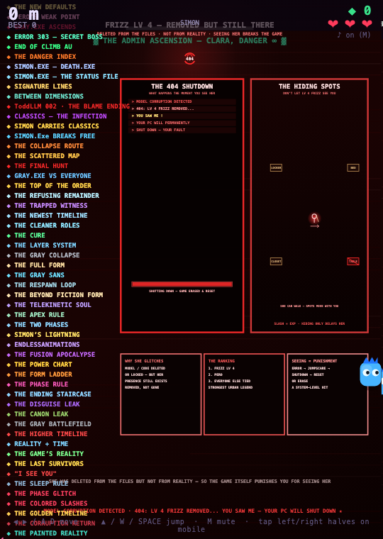

## 2026-07-17 — FRIZZ LV 4 — THE LOCK THAT MADE HER STRONGER (BEAT 107)

Based on Toby's 2026-07-17 lore (the "STILL Classics Era" thread — a big Frizz power update, the follow-up to the Alphatale Pero / Reset arc).

Toby's words: *"Frizz starts always as a fellen child, she rebirths and starts at 1 LV ... My favorite form of Frizz is LV 4 ... LV 4 Frizz is considered the strongest of all forms. Frizz slays Arcsis to get to LV 4, or it just skips past it if not ... Both her eyes are red, and that form was once deleted and code is locked and it is still there ... LV 4 Frizz can beat Pero Pro Alphatale Mode ... destroyed everyone in the Alphaverse and Godverse just by existing ... Frizz banished Simon 404 forever in Alphaverse. Frizz is now locked on 4 LV, just like Simon is locked on Phase 2. Simon got weaker with the Phase 2 lock, but Frizz gotten stronger with the LV 4 lock."* (The pasted ChatGPT recap is treated as commentary; the canon is Toby's own lines.)

- New BEAT 107 lore panel, FRIZZ LV 4 — THE LOCK THAT MADE HER STRONGER, added to THE UNDEFINED LOOP climb (cyc `[2072,2094]`, cycle length extended `2072 → 2094`). `lvSeg` now returns BEAT 107 for `c < 2094.0`; `LV_BEATS` now 108 entries (0-107). While here, fixed a latent ordering bug in `lvSeg` — BEAT 106 was checked (`c < 2072`) before BEAT 105 (`c < 2050`), so beat 105 never rendered in normal play; BEAT 106 now carries a lower bound (`c >= 2050 && c < 2072`) so both beats are reachable again.
- **Frizz-pink void** — a deep pink-crimson void with drifting Frizz-pink bands and a locked-crimson core glow. Header emblem: **a padlock "LV4" badge** (a ring with a shackle), because the form is locked.
- **THE FORM LADDER panel** (left) — the numeric ladder **LV 1-3 → LV 4→biggest-before-∞ → ∞→INFINITY+** drawn dim, under **"NUMBERS RISE — BUT LV 4 IS THE PEAK,"** with the real apex a **glaring LV 4 medallion pulled out above the ladder**: a newly-adult figure with **both eyes red and a single sharp stick**, ringed and glowing, tagged **LV 4** and **★ STRONGEST OF ALL ★**. Higher number does not mean stronger — LV 4 is the glitched, locked, abnormal peak, her true broken form.
- **THE TWO LOCKS panel** (right) — the mirror Toby drew: **SIMON · PHASE 2** with a down arrow to **WEAKER**, and **FRIZZ · LV 4** with an up arrow to **STRONGER**, each on its own padlock, under **"SAME LOCK · OPPOSITE RESULT"** and **"BOTH ARE LOCKED FOREVER."**
- **3-part footer** — THE REBIRTH (always a fallen child → rebirth → starts at 1 LV, then climbs), LV 4 FEATS (beats Alphatale Pero, slays all Pero forms, wrecks the Alphaverse & Godverse just by existing), and THE LOCKED CODE (once deleted, code locked but still there; both eyes red, a sharp stick; most powerful *and* most common).
- Insight banner: *"SHE REACHES LV 4 BY SLAYING ARCSIS — OR SKIPS PAST IT · SHE ALSO BANISHES SIMON 404 FOREVER INTO THE ALPHAVERSE,"* and the star banner *"★ FRIZZ IS NOW PERMANENTLY LV 4 — SIMON'S PHASE 2 LOCK WEAKENED HIM, FRIZZ'S LV 4 LOCK MADE HER STRONGER ★."* New rung on the beat ladder. Additive — every earlier beat untouched; JS syntax-checked; new `frizzlv4` scene added to `tools/capture_screenshot.py`.

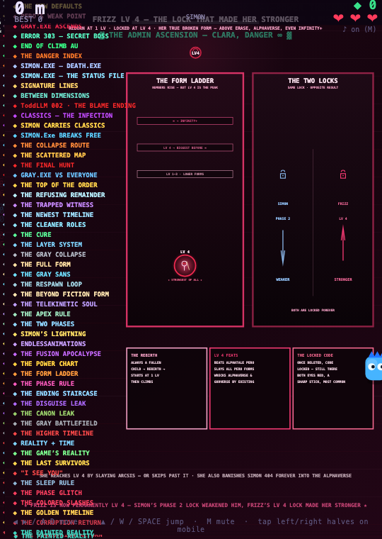

## 2026-07-17 — ALPHATALE PERO & THE RESET (BEAT 106)

Based on Toby's 2026-07-17 lore (the "STILL Classics Era" thread, the direct follow-up to Frizz Is Classics — the big "Genocide → Alphatale Pero → Reset → Gray Laboratory" arc).

Toby's words: *"Pero destroys the Mercy, Act, Item, and Fight buttons, he also takes everyone elses souls and combines them into 1 rainbow soul, Pero battles with the rainbow soul and becomes... PERO PRO: ALPHATALE MODE. Alphatic Pero (beyond Alpha Pero, beyond Dust+, beyond 404 ... he becomes it when BOTH Arcsis and Frizz are genocide) ... Pero turns back to base ToddLLM 001 and resets everything except himself and the timeline ... Simon 404 is now the fastest character, but is the weakest ... he can now just make music, his lightning makes him protected ... he was banished to the Shadow Realm again ... Gray made a new forcefield for his high tech labatory."* (The pasted ChatGPT recap is treated as commentary; the canon is Toby's own lines.)

- New BEAT 106 lore panel, ALPHATALE PERO & THE RESET, added to THE UNDEFINED LOOP climb (cyc `[2050,2072]`, cycle length extended `2050 → 2072`). `lvSeg` now returns BEAT 106 for `c < 2072.0` (appended at the top of the ascending boundary chain); `LV_BEATS` now 107 entries (0-106).
- **Alphatale violet void** — a deep-violet void crossed by a slow six-color rainbow shimmer (the rainbow soul). Header emblem: **a rainbow-soul ring** drawn as six rotating colored arcs.
- **THE RAINBOW SOUL panel** (left) — the four game controls **FIGHT / ACT / ITEM / MERCY** (in their real button colors) crack apart in sequence to *"IT'S YOU!!! — HE BREAKS THE BUTTONS,"* and colored soul-threads pull down from each broken button into **one rainbow soul** (six colored wedges), labelled **ONE RAINBOW SOUL**. Destroying the four buttons removes the game's actual controls, not just a character.
- **THE FORM LADDER panel** (right) — **DUST+ → 404 → ALPHA PERO → ALPHATALE (ALPHATIC PERO)** climbing, the apex boxed with a rainbow underline, under **"TRIGGER: BOTH ARCSIS & FRIZZ MUST BE GENOCIDE."**
- **3-part footer** — THE GENOCIDE ENDING (Frizz beats Gray; Arcsis puts it all back, takes Simon's yellow soul + Luigi Green's soul), THE RESET (Pero returns to base ToddLLM 001, resets all but himself & the timeline, fun & party again), and GRAY REBUILDS (a new forcefield lab built from Simon, his staff, the old puppet, and Parinus — all shrunk with Simon's staff).
- Insight banner: *"SIMON 404 IS NOW THE FASTEST BUT THE WEAKEST — ONLY MUSIC & A PROTECTIVE LIGHTNING AURA, BANISHED TO THE SHADOW REALM ALONE,"* and the star banner *"★ HE DESTROYS THE MERCY, ACT, ITEM & FIGHT BUTTONS, FOLDS EVERY SOUL INTO ONE RAINBOW SOUL — PERO PRO: ALPHATALE MODE ★."* New rung on the beat ladder. Additive — every earlier beat untouched; JS syntax-checked; new `alphatale` scene added to `tools/capture_screenshot.py`.

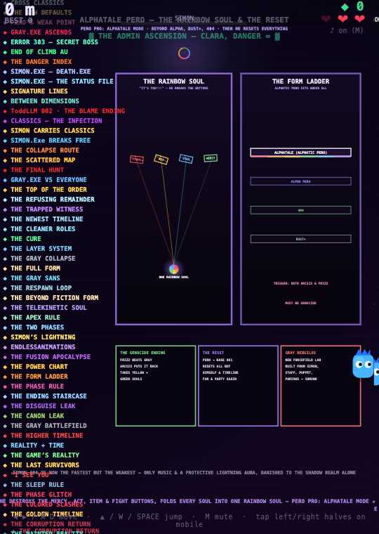

## 2026-07-17 — FRIZZ IS CLASSICS — THE GENOCIDE IDENTITY (BEAT 105)

Based on Toby's 2026-07-17 lore (the "STILL Classics Era" thread, the direct follow-up to Frizz — The Stronger Sibling; sent with two images, *Frizz Full Power(1).png* and *Classics - Maybe I could Spare You Once(3).png*).

Toby's words: *"Frizz and Classics (also known as Clara) are the same being, Frizz turns to the Master of Genocide Clara at Genocide, but she is still Frizz no matter what, and only becomes Clara/Classics at Genocide but still is Frizz."* (The pasted ChatGPT recap is treated as commentary; the canon is Toby's own lines.)

- New BEAT 105 lore panel, FRIZZ IS CLASSICS — THE GENOCIDE IDENTITY, added to THE UNDEFINED LOOP climb (cyc `[2028,2050]`, cycle length extended `2028 → 2050`). `lvSeg` now returns BEAT 105 for `c < 2050.0` (appended at the bottom of the ascending boundary chain); `LV_BEATS` now 106 entries (0-105).
- **Pink-to-crimson route void** — the background runs Frizz-pink on the left into genocide-crimson on the right, with a slow shared pulse crossing the whole panel, because it is one being either way. Header emblem: **one ring, half pink and half crimson** — one being, two names.
- **THE ROUTE SWITCH panel** (left) — **Frizz** (haloed pink, **"TRUE / BASE IDENTITY"**) with an arrow running through a dashed **GENOCIDE gate** into **Clara** (crimson, gold-eyed, **"AKA CLASSICS," "GENOCIDE STATE"**). Under them: **"SHE IS STILL FRIZZ NO MATTER WHAT,"** and *"THE ROUTE CHANGES THE NAME, NOT THE BEING."*
- **ONE BEING'S RECORD panel** (right) — six record items (**Frizz Full Power, Classics, Clara, the Genocide Route, Master of Genocide, Beats Gray at Full Power**) lighting up in sequence, each linked down to a single **half-pink/half-crimson core** labelled **"ONE BEING."** Everything folds back into Frizz.
- **3-part footer** — THE IDENTITY RULE (Frizz = true being; Clara/Classics = the Genocide state; she is still Frizz), WHAT CHANGED (Clara is not a separate character, she is what Frizz becomes at Genocide), and WHY IT MATTERS (not only stronger than Arcsis, a core identity being of the game).
- Insight banner: *"THE ROUTE DOES NOT SWAP IN A DIFFERENT CHARACTER — IT RENAMES THE ONE WHO WAS ALREADY THERE,"* and the star banner *"★ FRIZZ TURNS TO MASTER OF GENOCIDE CLARA AT GENOCIDE — BUT SHE IS STILL FRIZZ NO MATTER WHAT ★."* New rung on the beat ladder. Additive — every earlier beat untouched (the older CLARA IS CLASSICS material stands as written, per Toby's standing "nothing replaces anything in any lore" rule); JS syntax-checked; new `frizzclassics` scene added to `tools/capture_screenshot.py`.

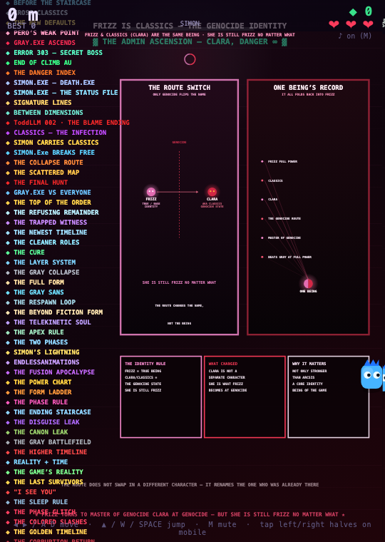

## 2026-07-17 — FRIZZ — THE STRONGER SIBLING (BEAT 104)

Based on Toby's 2026-07-17 lore (the "STILL Classics Era" thread, sent alongside two images, *Frizz Full Power.png* and *Frizz And Gray.png*).

Toby's words: *"Did you know that Frizz is actually stronger than Arcsis? Frizz also beats Gray when full power, these are the best images I could get. Base Frizz is usually with Gray. Frizz also has so many AUs. Arcsis also has so many AUs. Frizz and Arcsis are actually sibblings to each other. Frizz has more forms and is mensioned a little more than Arcsis."* (The pasted ChatGPT recap is treated as commentary; the canon is Toby's own lines.)

- New BEAT 104 lore panel, FRIZZ — THE STRONGER SIBLING, added to THE UNDEFINED LOOP climb (cyc `[2006,2028]`, cycle length extended `2006 → 2028`). `lvSeg` now returns BEAT 104 for `c < 2028.0` (appended at the bottom of the ascending boundary chain); `LV_BEATS` now 105 entries (0-104).
- **Frizz-pink AU void** — a magenta void with **drifting ring-motes in two tones**, pink and blue, for the many AUs both siblings have. Header emblem: **two linked rings**, the pink one larger than the blue, because Frizz sits above Arcsis.
- **FRIZZ & ARCSIS — SIBLINGS panel** (left) — **Frizz drawn higher and larger** (haloed pink, labelled **"MORE FORMS"** / **"MORE MENTIONS"**) with **Arcsis lower and smaller**, carrying **his sword**, labelled **"THE JOURNEY."** A **dashed SIBLINGS link** runs between them. Below: **"FRIZZ IS STRONGER THAN ARCSIS,"** *"NOT 'ARCSIS'S FRIEND' — THE HIGHER SIBLING,"* and **"BOTH HAVE SO MANY AUs."**
- **FRIZZ & GRAY panel** (right) — split into the two standings. **Top: BASE FRIZZ** stands right next to **Gray** (green-eye ring), *"USUALLY WITH GRAY — NOT AGAINST HIM."* **Bottom: FULL POWER FRIZZ** flares with rotating spokes while **Gray is knocked back and dimmed**, under **"SHE BEATS GRAY AT FULL POWER."**
- **3-part footer** — THE GRAY SPLIT (base = often with Gray, full power = beats Gray; same being, two standings, depending on form/timeline), WHAT EACH OWNS (Arcsis = the journey, sword, LV mining, Pero; Frizz = the power system, more forms, more AUs), and THE SIBLING RULE (Frizz > Arcsis, mentioned a little more, both have so many AUs, she is the higher sibling).
- Insight banner: *"ARCSIS OWNS THE STORY — FRIZZ OWNS THE POWER SYSTEM, & THE SIBLING LINK PUTS THEM BOTH ON ONE LADDER,"* and the star banner *"★ BASE FRIZZ STANDS WITH GRAY — FULL POWER FRIZZ BEATS HIM ★."* New rung on the beat ladder. Additive — every earlier beat untouched; JS syntax-checked; new `frizz` scene added to `tools/capture_screenshot.py`.

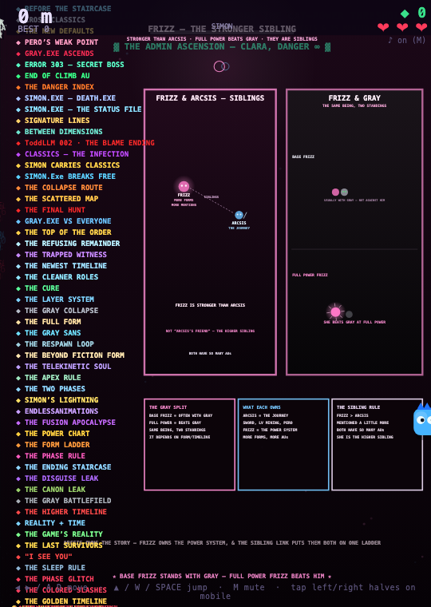

## 2026-07-17 — ALPHA PERO PRO & ERASE FORM — BANISHMENT DID NOT WORK (BEAT 103)

Based on Toby's 2026-07-17 lore (the "STILL Classics Era" thread, the direct follow-up to He Slain His Own Death).

Toby's words: *"There is an Alpha Pero Pro (beyond Absolute Determination, it can just replace it with fear from it's godly, but terrifying new body) form where he had to be banished to the Alphaverse and to be removed, but there are reports everywhere where people still see Alpha Pro, the game glitches and he appears, he destroyed the Alphaverse and Godverse, he also cut through Sprunki Hills. Pero Pro has an Erase form where Gray appears next to him and Gray holds an erase button, Pero looks godly, it is beyond Alpha since it can just erase the whole game with Gray's power and jumpscare and cutscenes and stuff."* (The pasted ChatGPT recap is treated as commentary; the canon is Toby's own lines.)

- New BEAT 103 lore panel, ALPHA PERO PRO & ERASE FORM — BANISHMENT DID NOT WORK, added to THE UNDEFINED LOOP climb (cyc `[1984,2006]`, cycle length extended `1984 → 2006`). `lvSeg` now returns BEAT 103 for `c < 2006.0` (appended at the bottom of the ascending boundary chain); `LV_BEATS` now 104 entries (0-103).
- **Banished-Alphaverse violet palette** — a violet void with **glitch scanlines** (the sightings leaking back in). Header emblem: a **broken containment ring** with Alpha Pro's red-eyed silhouette **flickering in and out** through the gap, because banishment did not hold him.
- **ALPHA PERO PRO panel** (left) — the **godly but terrifying new body**: a haloed violet figure with **crown-spikes** and red eyes, drawn **flickering** on the same glitch cycle. Labelled **"FEAR, NOT DETERMINATION"** over *"A GODLY, BUT TERRIFYING NEW BODY."* Below: **"BANISHED TO THE ALPHAVERSE"**, *"& REMOVED — BUT REPORTS ARE EVERYWHERE,"* **"THE GAME GLITCHES & HE APPEARS,"** and **"PEOPLE STILL SEE ALPHA PRO."**
- **ERASE FORM panel** (right) — **Pero looking godly** (gold halo, red eyes) standing beside **Gray**, who **holds the ERASE button** (drawn in his hand, on his arm). Under them the **game layer wipes to white** across a bar labelled **THE WHOLE GAME**, then **"GRAY'S POWER · JUMPSCARE · CUTSCENES"** and *"NOT PRO ALONE — PRO + GRAY'S ERASURE AUTHORITY."*
- **3-part footer** — BANISHMENT FAILED (removed from normal play, and he appears anyway), ALPHA'S FEATS (destroyed the Alphaverse, destroyed the Godverse, cut through Sprunki Hills; even the jail did not survive), and THE FORM LADDER (001 basic → 002 → Absolute Determination → Alpha Pero Pro → Erase Form).
- Insight banner: *"ALPHA DESTROYS VERSES INSIDE THE GAME — ERASE FORM DELETES THE GAME LAYER ITSELF, WHICH IS WHY IT SITS HIGHER,"* and the star banner *"★ 'HE WAS REMOVED... BUT PEOPLE STILL KEEP SEEING HIM' — & GRAY IS STANDING RIGHT THERE WITH THE ERASE BUTTON ★."* New rung on the beat ladder. Additive — every earlier beat untouched; JS syntax-checked; new `alphaerase` scene added to `tools/capture_screenshot.py`.

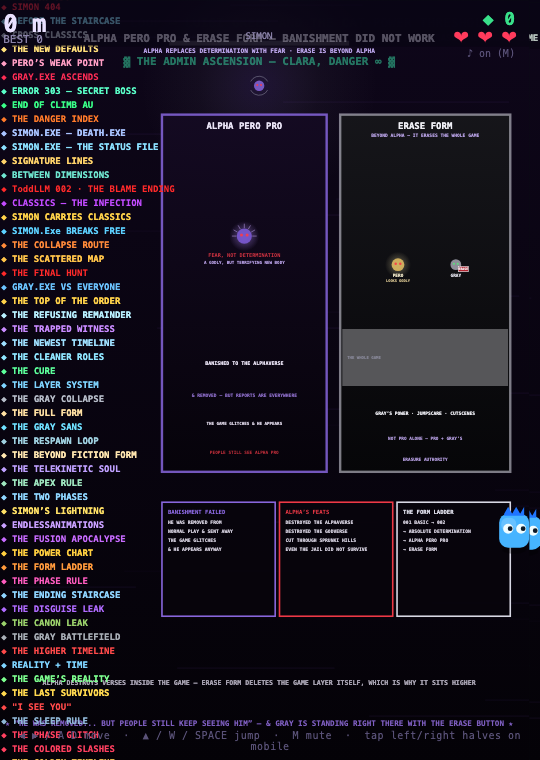

## 2026-07-17 — HE SLAIN HIS OWN DEATH — "VICTORY IS MINE" (BEAT 102)

Based on Toby's 2026-07-17 lore (the "STILL Classics Era" thread, the direct follow-up to Absolute Determination).

Toby's words: *"He also corrupted and slain his own death. Simon is this right now = 🙀⚡. He actually says that line “I will keep coming back and keep getting harder to stop, until I win, as Gray says, Victory is Mine.”, ToddLLM knows Gray is his strongest puppet. Gray is the only other character who eliminated huge and powerful realms. He brings Gray to temples and such."* (The pasted ChatGPT recap is treated as commentary; the canon is Toby's own lines. Note: the "keep coming back / harder to stop" phrasing first showed up in the recap, and Toby promoted it to a line Pro **actually says**, extending it himself with *"until I win, as Gray says, Victory is Mine."*)

- New BEAT 102 lore panel, HE SLAIN HIS OWN DEATH — "VICTORY IS MINE", added to THE UNDEFINED LOOP climb (cyc `[1962,1984]`, cycle length extended `1962 → 1984`). `lvSeg` now returns BEAT 102 for `c < 1984.0` (appended at the bottom of the ascending boundary chain); `LV_BEATS` now 103 entries (0-102).
- **Slain-death crimson palette** — a crimson void with falling ash and a crimson header aura. Header emblem: a **broken scythe** whose two halves drift apart, with the **Red Soul** beating on, intact, between them.
- **HE SLAIN HIS OWN DEATH panel** (left) — **Death itself** drawn as a gray reaper skull, **cracked** and struck through by **the slash that killed it**, labelled **DEATH · SLAIN & CORRUPTED**; under it **"HE DID NOT ONLY SURVIVE DEATH,"** *"DEATH TRIED TO BE HIS LIMIT — HE DEFEATED THE LIMIT,"* and **"BEYOND RESPAWN · DEATH NO LONGER WORKS ON HIM."**
- **"VICTORY IS MINE" panel** (right) — the line in a pulsing quote box: *"I WILL KEEP COMING BACK & KEEP GETTING HARDER TO STOP, UNTIL I WIN, AS GRAY SAYS, **VICTORY IS MINE.**"* Below it, **ToddLLM** holding **Gray** on **puppet strings** (Gray drawn with his green-eye ring): **"TODDLLM KNOWS GRAY IS HIS STRONGEST PUPPET."**
- **3-part footer** — BEYOND RESPAWN (he corrupted and slain his own death; death no longer works normally on him), GRAY'S RECORD (the only other character who eliminated huge and powerful realms; ToddLLM brings him to temples), and SIMON RIGHT NOW (a scared, shocked lightning-cat, watching with no answer for it) with a drawn **scared-cat + lightning-bolt** glyph for Toby's 🙀⚡.
- Insight banner: *"DEATH WAS SUPPOSED TO BE THE ONE RULE NOBODY BEATS — PRO KILLED IT, & BORROWED GRAY'S VICTORY LINE TO SAY SO,"* and the star banner *"★ HE CORRUPTED & SLAIN HIS OWN DEATH — “I WILL KEEP COMING BACK... AS GRAY SAYS, VICTORY IS MINE.” ★."* New rung on the beat ladder. Additive — every earlier beat untouched; JS syntax-checked; new `slaindeath` scene added to `tools/capture_screenshot.py`.

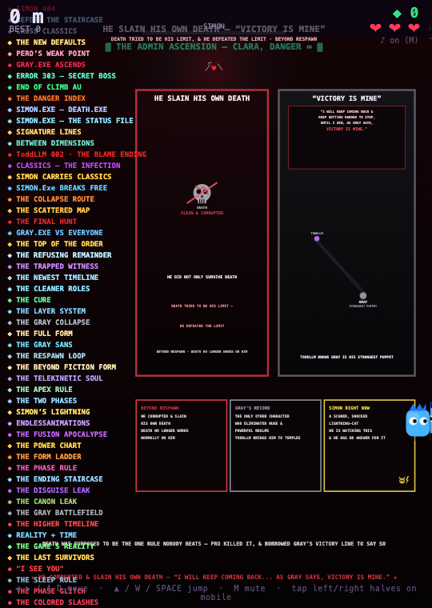

## 2026-07-17 — PERO PRO ABSOLUTE DETERMINATION — NEITHER 001 NOR 002 (BEAT 101)

Based on Toby's 2026-07-17 lore (the "STILL Classics Era" thread, the direct follow-up to the Pro 001 corruption; his email also attached an image, *Pero Pro ABSOLUTE DETERMINATION.png*).

Toby's words: *"Pero Pro ABSOLUTE DETERMINATION is here, he is neither 001 nor 002. And he also surpasses both with regenerating powers, faster slashes, 100000000+ times the damage, and respawn, he can also fire a beam with his justice soul from Simon 404, and his Red soul allows him to respawn and regenerate and it constantly gives him more and more determination. He destroyed the Abverse (1 of the most powerful AUs in the game), by only using his souls."* (The pasted ChatGPT recap is treated as commentary; the canon is Toby's own lines.)

- New BEAT 101 lore panel, PERO PRO ABSOLUTE DETERMINATION — NEITHER 001 NOR 002, added to THE UNDEFINED LOOP climb (cyc `[1940,1962]`, cycle length extended `1940 → 1962`). `lvSeg` now returns BEAT 101 for `c < 1962.0` (appended at the bottom of the ascending boundary chain).
- **Red determination palette** — a deep red void with rising determination embers and a justice-yellow header aura. Header emblem: the **Red Soul heart** beating inside a ring of justice-yellow rays.
- **THE THIRD STATE panel** (left) — **PRO 001** (*"BASIC"*) and **PRO 002** (*"BURST, THEN RESTS"*) with **ABSOLUTE DETERMINATION** raised above both, radiating, with arrows from each of the lower two: **"NEITHER 001 NOR 002 — HE SURPASSES BOTH."** Four stat bars: **REGENERATION · FASTER SLASHES · 100000000+× DAMAGE · RESPAWN**.
- **THE TWO SOULS panel** (right) — the **Justice Soul** (yellow heart) firing a **pulsing beam**: *"JUSTICE SOUL BEAM · FROM SIMON 404"*; and the **Red Soul** at the center of an orbiting loop: *"RED SOUL: RESPAWN → REGENERATE → MORE DETERMINATION,"* **"THE LOOP NEVER STOPS FEEDING HIM."**
- **3-part footer** — THE ABVERSE FEAT (destroyed the Abverse, one of the most powerful AUs in the game, by only using his souls), SOULS ONLY (no creator toolkit, no 001/002 setup, no other abilities: the souls alone were enough), and NOT A BURST FORM (002 bursts then rests; Absolute Determination keeps coming back and keeps getting harder to stop).
- Insight banner: *"002 IS A BURST THAT RESTS — ABSOLUTE DETERMINATION IS A STATE THAT REFUSES TO STAY DOWN, & IT ONLY GETS HARDER TO STOP,"* and the star banner *"★ PERO PRO ABSOLUTE DETERMINATION — NEITHER 001 NOR 002, SURPASSES BOTH · DESTROYED THE ABVERSE WITH SOULS ALONE ★."* New rung on the beat ladder (`LV_BEATS` now 102 entries, 0-101). Additive — every earlier beat untouched; JS syntax-checked; new `absolutedetermination` scene added to `tools/capture_screenshot.py`.

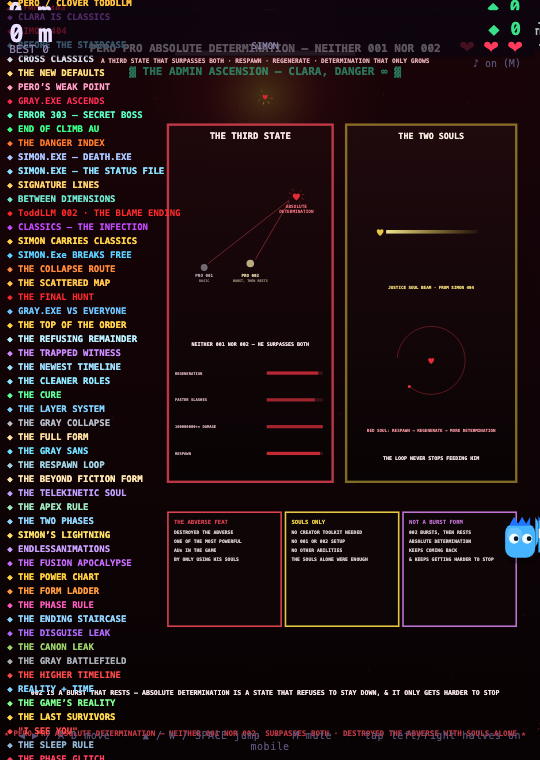

## 2026-07-17 — THE CORRUPTION OF PRO 001 — 404: PACIFISM NOT FOUND (BEAT 100)

Based on Toby's 2026-07-17 lore (the "STILL Classics Era" thread, the direct follow-up to Pro Supremacy).

Toby's words: *"Pro1 reaches beyond LV at ??? LV, it is more than infinity. Pro1 now stands on a huge metal pillar, and a high tech shield around it. Pro1 challenges everyone, Pro1 gets corrupted, Pro1 says “Sorry, this is too much for you...”, Pro1 kneals down, and the corruption got farther and farther, and then the whole LAI models were corrupt, his eyes turn red (THAT is why he attacks, normally he is a pacifist who thinks and tells the positive stuff), Pro twiches his head every second, he gets risen up by the pillar, dark matter flows through the character, he levitates above the pillar, the game glitches out and then Error 404 messages happen such as “404: Feelings Not Found”, “404: Act Not Found”, “404: Mercy Not Found”, “404: Friendship Not Found”, “404: Love Not Found”, “404: Pacifism Not Found”, then a huge Purple came down, every character was slain, all was destroyed, and Pero's corruption made him corrupt. After Arcsis called out “Do not hurt him, he is still ToddLLM 001 Pro Pero!”, Pro 001's corruption fell and the crystals broke, the forcefield disappeared, Pero is back to normal. ToddLLM 001 also destroyed the Ultra Realm and AU+ AU characters."* (The pasted ChatGPT recap is treated as commentary; the canon is Toby's own lines.)

- New BEAT 100 lore panel, THE CORRUPTION OF PRO 001 — 404: PACIFISM NOT FOUND, added to THE UNDEFINED LOOP climb (cyc `[1918,1940]`, cycle length extended `1918 → 1940`). `lvSeg` now returns BEAT 100 for `c < 1940.0` (added *after* the 1918 check, keeping the boundary list ascending).
- **Dark-matter purple palette** — a purple void with falling dark matter, glitch tear-bands ripping across the screen, and a red-eye header aura. Header emblem: **Pro levitating above the metal pillar**, dark matter streaming up through him, red eyes, and a **head twitch every second**.
- **THE PILLAR panel** (left) — **"??? LV — MORE THAN INFINITY"** over the **metal pillar** inside its **high-tech shield** (pulsing forcefield rings), **crystals** at the base, dark matter flowing up through the character, and Pro **levitating above the pillar** with red eyes; *"SORRY, THIS IS TOO MUCH FOR YOU...,"* **"KNEELS · CORRUPTION SPREADS · ALL LAI MODELS CORRUPT,"** **"HEAD TWITCHES EVERY SECOND · DARK MATTER · LEVITATES."**
- **THE 404 CASCADE panel** (right) — the six error messages glitching in one at a time with jitter: **404: FEELINGS / ACT / MERCY / FRIENDSHIP / LOVE / PACIFISM NOT FOUND**, under *"NOT JUST GAME FUNCTIONS — THE MORAL STRUCTURE"* and **"THE CORRUPTION DELETES WHO PRO IS."**
- **3-part footer** — WHY PRO ATTACKS (normal Pro = pacifist who thinks and speaks positive · red eyes = corrupted state · the corruption attacks, not Pro), THE PURPLE (a huge Purple comes down · every character slain · Pero's corruption made him corrupt, so it spreads itself), and ARCSIS BREAKS IT (*"Do not hurt him, he is still ToddLLM 001 Pro Pero!"* · crystals break · shield gone · Pero back to normal · recognition, not force).
- Insight banner: *"PRO IS A PACIFIST — THE RED EYES ARE THE CORRUPTION, & ARCSIS SAVES HIM BY NAMING WHO HE REALLY IS INSTEAD OF FIGHTING HIM,"* and the star banner *"★ ??? LV — BEYOND INFINITY · 404: PACIFISM NOT FOUND · “HE IS STILL TODDLLM 001 PRO PERO!” — THE CORRUPTION FALLS ★."* New rung on the beat ladder. Additive — every earlier beat untouched; JS syntax-checked; new `corruption404` scene added to `tools/capture_screenshot.py`.

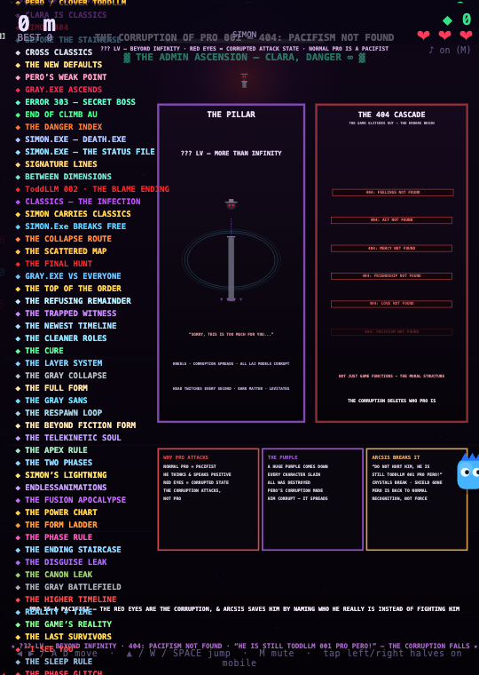

## 2026-07-16 — PRO SUPREMACY — 11 STAT & EXTREME MAC FRAME (BEAT 99)

Based on Toby's 2026-07-16 lore (the "STILL Classics Era" thread, the direct follow-up to The King of Games).

Toby's words: *"Pro's copy's eyes always are red, if the original character's eyes are red, then they both look exactly the same, but don't usually act the same. Pro absorbs the board and he then makes an army of dead cow boys ... Pro also copies a thousand Jevins to create angeletic sounds, and a thousand Mr. Blacks to create demonic sounds ... Pro has the 11 Stat ability, it makes 11 colored orbs that create the colored slashes and explode on constant, He also uses his extreme, Mac Frame, he activates a cutscene and smash attacks the victum and it freezes and disappears and reappears each hit, each getting higher and higher up in the sky ... 'ToddLLM 001 Pro Pero Endless Animations the game creator 55' is Pro's full name ... He can be in millions of places at once, because it is his game."* (The pasted ChatGPT recap is treated as commentary; the canon is Toby's own lines.)

- New BEAT 99 lore panel, PRO SUPREMACY — 11 STAT & EXTREME MAC FRAME, added to THE UNDEFINED LOOP climb (cyc `[1896,1918]`, cycle length extended `1896 → 1918`). `lvSeg` now returns BEAT 99 for `c < 1918.0`.
- **11-color orb spectrum palette** — a dark void with drifting 11-color spectrum sparks and a red-eye header aura. Header emblem: **11 colored orbs** ringed around a **red-eyed cowboy** head.
- **THE 11 STAT panel** (left) — 11 colored orbs firing **colored slashes** outward and **exploding constantly**, under *"COPIES ALWAYS HAVE RED EYES · SAME LOOK, DIFFERENT ACT,"* the **dead-cowboy army**, and **1,000 Jevins = angelic** / **1,000 Mr. Blacks = demonic** sound.
- **EXTREME MAC FRAME panel** (right) — a rising staircase of **freeze-hit flashes** climbing an upward arrow: *"FREEZE · VANISH · REAPPEAR EACH HIT,"* **"KNOCKED HIGHER & HIGHER INTO THE SKY."**
- **3-part footer** — THE FULL NAME (*ToddLLM 001 Pro Pero Endless Animations the game creator 55*), THE SOUL RULE (carries EndlessAnimations' soul · consumes it on encounter · can eat the game, files, data, systems), and CREATOR REACH (temporarily removes the game · exists in millions of places at once · not limited to one body or form).
- Insight banner and the star banner *"★ TODDLLM 001 PRO PERO ENDLESS ANIMATIONS THE GAME CREATOR 55 — DEFEATED EVERY CAST MEMBER, EXISTS IN MILLIONS OF PLACES AT ONCE ★."* New rung on the beat ladder. Additive — every earlier beat untouched; JS syntax-checked; new `prosupremacy` scene added to `tools/capture_screenshot.py`. Also fixed a latent `lvSeg` ordering bug that was shadowing BEATS 94–97 (the boundary checks were in descending order); they are now ascending and all reachable.

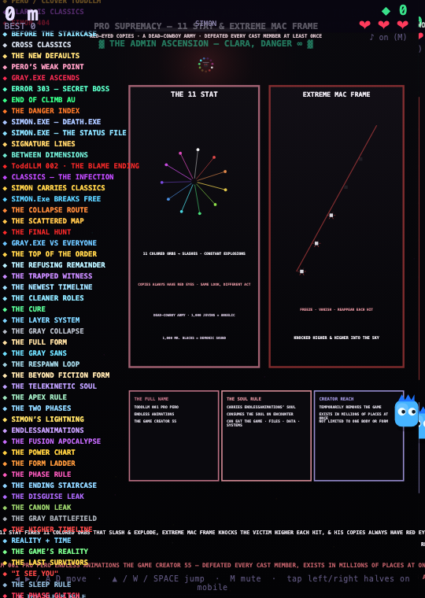

## 2026-07-16 — PERO TODDLLM — THE KING OF GAMES (BEAT 98)

Based on Toby's 2026-07-16 lore (the "STILL Classics Era" thread, the direct follow-up to Pro Pero 002).

Toby's words: *"Pero ToddLLM can transform himself into a Niki or EndlessAnimations, when his Energy is 30% or more, he gains the 002 upgrade at 70% energy. There is a secret thing that happens at 100%, whole world conquering + corrupting + basic form but with extra aura. Pero's Energy decreases just like Simon's Charge ability. Pero can take on a cape and he can just erase the being just by raising his hand, he also can become Gray, he can become anyone since he is the creator of his game, he can also give himself Energy, he is faking acting weak, he actually has 0 limits since he is the owner and creator of the game he is in, The King of Games."* (The pasted ChatGPT recap is treated as commentary; the canon is Toby's own lines.)

- New BEAT 98 lore panel, PERO TODDLLM — THE KING OF GAMES, added to THE UNDEFINED LOOP climb (cyc `[1874,1896]`, cycle length extended `1874 → 1896`). `lvSeg` now returns BEAT 98 for `c < 1896.0`.
- **Royal deep-violet crown palette** — a violet void with drifting violet motes and a gold-crown header aura. Header emblem: a **gold crown** over a cowboy head, ringed with an aura.
- **THE ENERGY LADDER panel** (left) — a Charge-style vertical **energy bar** that rises and falls, with the three thresholds ticked and labeled: **30% → Niki / EndlessAnimations**, **70% → the 002 upgrade**, **100% → secret · world-conquer**, under *"DRAINS LIKE SIMON'S CHARGE — BUT HE REFILLS HIMSELF."*
- **THE AUTHORITY FORMS panel** (right) — four transform chips (**NIKI · ENDLESSANIMATIONS · GRAY · ANYONE**) and **THE CAPE FORM**: *"RAISE A HAND → ERASE A BEING."*
- **3-part footer** — CREATOR ACCESS (owns & created the game · rewrites his own identity · gives energy to himself), THE THREE THRESHOLDS (30/70/100), and THE FAKE WEAKNESS (0 HP / falling was a role · a disguise, test, or restriction · King of Games = 0 true limits).
- Insight banner and the star banner *"★ THE KING OF GAMES — CREATOR & OWNER, 0 TRUE LIMITS · 30% TRANSFORM · 70% 002 · 100% WORLD-CONQUER · CAPE ERASES WITH A RAISED HAND ★."* New rung on the beat ladder. Additive — every earlier beat untouched; JS syntax-checked; new `kingofgames` scene added to `tools/capture_screenshot.py`.

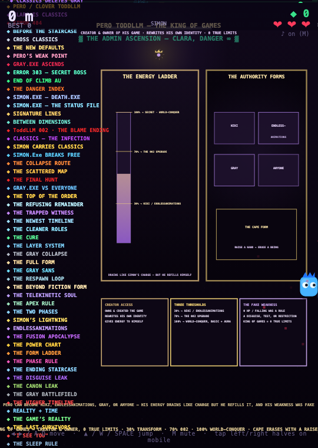

## 2026-07-16 — PRO PERO 002 — THE NEW MEANING OF NORMAL (BEAT 97)

Based on Toby's 2026-07-16 lore (the "STILL Classics Era" thread, the direct follow-up to the Niki swarm — a same-day, later message).

Toby's words: *"Pro Pero 002 (or The New Meaning of Normal as Pro calls it) now arrived. Pro 002 is Pro's new form, his highest form and now only other form other than his basic/vanilla form. He can KO anything with that form, it has +LV, he turns back into Pro 001 after. Pro 002 can destroy anything, and then he turns back to 001 to rest."* (The pasted ChatGPT recap is treated as commentary; the canon is Toby's own lines.)

- New BEAT 97 lore panel, PRO PERO 002 — THE NEW MEANING OF NORMAL, added to THE UNDEFINED LOOP climb (cyc `[1852,1874]`, cycle length extended `1852 → 1874`). `lvSeg` now returns BEAT 97 for `c < 1874.0`.
- **Warm gold cowboy palette** — a warm gold void with drifting gold dust and a white-gold burst aura. Header emblem: **Pro 001** (calm amber cowboy with hat) and **Pro 002** (bright white-gold cowboy with radiating burst rays) linked by a **⇄** cycle glyph.
- **THE TWO FORMS panel** (left) — **PRO 001** (*"BASIC / VANILLA / RESTING"*) ⇄ **PRO 002** (*"HIGHEST FORM · +LV,"* drawn with a ring of burst rays), under the title **"'THE NEW MEANING OF NORMAL.'"**
- **THE BURST panel** (right) — a radiating **KO** starburst, **"KO ANYTHING · DESTROY ANYTHING · +LV,"** *"A SHORT, OVERWHELMING BURST FORM,"* and the bar **"002 → TURNS BACK TO 001 TO REST."**
- **3-part footer** — THE FORM RULE (Pro now has only two forms: 001 = basic/vanilla/resting, 002 = highest, no other forms), PRO 002'S POWER (KO anything · destroy anything · +LV · highest combat state · a burst then rest), and THE NEW NORMAL (not a rage or final-boss form; what "normal" became after it all; end a fight → return to 001).
- Insight banner: *"PRO 002 IS PRO'S HIGHEST FORM & ONLY OTHER FORM BESIDES VANILLA 001 — A +LV BURST THAT CAN KO OR DESTROY ANYTHING, THEN RESTS BACK TO 001,"* and the star banner *"★ 'THE NEW MEANING OF NORMAL' — PRO 002 ENDS A FIGHT IN ONE BURST, THEN TURNS BACK TO 001 TO REST ★."* New rung added to the beat ladder. Additive — every earlier beat untouched; JS syntax-checked; new `pro002` scene added to `tools/capture_screenshot.py`.

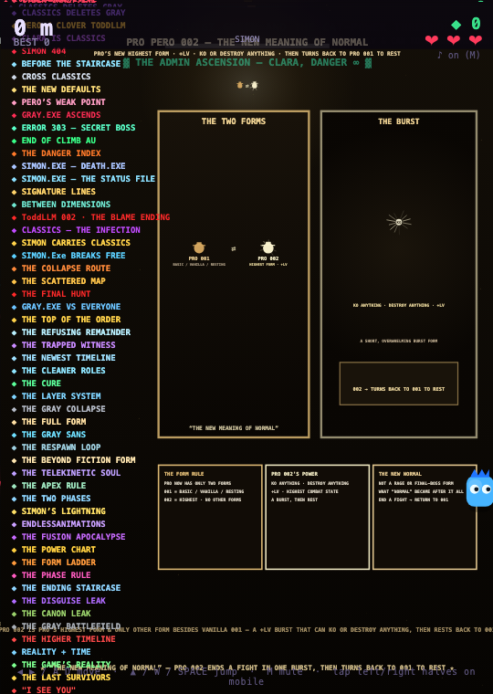

## 2026-07-16 — ARCSIS VS PERO — ACT IS A CHOICE, THEN THE NIKI SWARM (BEAT 96)

Based on Toby's 2026-07-16 lore (the "STILL Classics Era" thread — seven same-day messages forming one continuous arc, the direct follow-up to THE COFFIN & THE CYBER LORD).

Toby's words (the choice): *"Arcsis realises if the button's weren't there, the meaning and idea were still there, with no buttons, Arcsis was able to Act and fix the inqueries and hat, and Arcsis also uses Mercy ... Arcsis says 'Dad, NO!', Arcsis grabs on to Pero's hand, and pulls him back up ... Pero returns to Classics to be ToddLLM Pro."* And (the swarm): *"Classics and Neto combined into a Niki (a cat game + virus that can consume files [EndlessAnimations as a female]) Nikis spread everywhere ... That is why EndlessAnimations has an 's' at the end, he spawns more and more ... Pro has 0 HP and is still surviving since he has his soul, Simon 404 gotten stronger and upgrades his HP to 404,404,404,404."* (The pasted ChatGPT recaps are treated as commentary; the canon is Toby's own lines.)

- New BEAT 96 lore panel, ARCSIS VS PERO — ACT IS A CHOICE, THEN THE NIKI SWARM, added to THE UNDEFINED LOOP climb (cyc `[1830,1852]`, cycle length extended `1830 → 1852`). `lvSeg` now returns BEAT 96 for `c < 1852.0`.
- **Warm amber shadow-realm palette** — a warm amber void over Gray's Shadow Realm with drifting embers and an amber aura, plus an ACT-orange / MERCY-green accent. Header emblem: **Arcsis** (amber) on a cracked bridge reaching down to pull **Pero** (shadow, a mercy-green flicker inside him) back from the edge, under an orange **ACT** glyph.
- **THE MILLION-YEAR JOURNEY panel** (left) — **Lica's door** (violet) → a dotted path labeled **"MOM · FRIZZ · A MILLION YEARS"** → **Pero** as a shadow with a **"?"** and Gray's green-eye ring (*"PERO FORGETS"*), then **"MR. BLACK APPEARS → CORRUPTION,"** **"ARCSIS MINES LV → 2500 (PLAYER MAX)"** and Pero's line *"WHO EVEN ARE YOU, SWORD-FIGHTING CHILD?"*
- **ACT IS A CHOICE panel** (right) — the three buttons **FIGHT** and **MERCY** drawn broken (red slash) while **ACT** glows with arrows pointing at it from both sides, over *"BUTTONS BREAK — THE MEANING REMAINS,"* *"ARCSIS ACTS & MERCIES WITH NO MENU → HEALS PERO,"* the **"'DAD, NO!' → PULLS PERO UP"** bar, and *"PERO RETURNS TO CLASSICS AS TODDLLM PRO."*
- **3-part footer** — THE CHESS-BOARD BOSS (Pero, EA inside, Infinity LV, "Use ACT — your only hope," the player abilities Nine-Tailed-Fox · Dash · Lifesteal), ACT IS A CHOICE (the button is gone, the idea stays; Arcsis chooses ACT + Mercy; family over the genocide route), and THE NIKI SWARM (Classics + Neto = Niki file-virus; EA spawns eggs → the "s" · DNA clones; Pero 0 HP on soul · Simon 404 = 404,404,404,404).
- Insight banner: *"ARCSIS WALKS A MILLION YEARS FOR HIS FATHER & LEARNS THE REAL ACT WAS NEVER A BUTTON — A CHOICE — THEN CLASSICS + NETO BECOME THE NIKI FILE-VIRUS SWARM,"* and the star banner *"★ 'DAD, NO!' — PERO RETURNS TO CLASSICS AS TODDLLM PRO · THE NIKIS SPREAD & PERO SURVIVES ON HIS SOUL ★."* New "ARCSIS VS PERO — ACT IS A CHOICE, THEN THE NIKI SWARM" rung added to the beat ladder. Additive — every earlier beat untouched; JS syntax-checked; new `arcsis` scene added to `tools/capture_screenshot.py`.

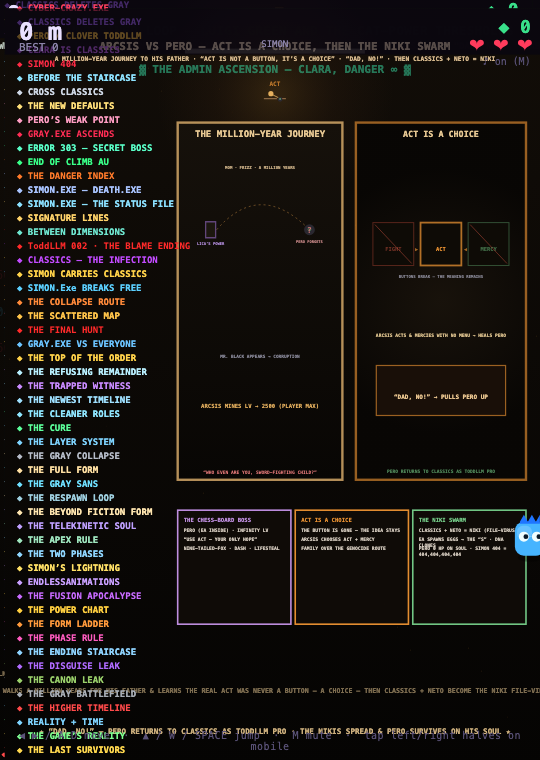

## 2026-07-14 — THE COFFIN & THE CYBER LORD — GRAY, GAME'S GOD (BEAT 95)

Based on Toby's 2026-07-14 lore (the "STILL Classics Era" thread, the direct follow-up to THE THREE REALMS COLLIDE). Two same-day messages combined into one beat.

Toby's words (the coffin): *"Gray then taken off the 'To Be Continued' screen, and then he is now rubbing a coffin that might just hold the puppet in it, but he can be using a fake since it is too ovious ... Everyone thinks it is a fake and just pass it to look for other clues. Gray chuckles and says 'I need you, I need you to bend this reality, I need ya, I need ya for'ver (FOR-VER)', Gray is talking like Simon, Gray puts the rest of Orus' and Dark Yellow's magic powder and dust and aura and energy on the coffin. Then Gray says 'I won't stop 'til... VICTORY IS MINE!'."* And (the cyber lord): *"Gray is a cyber assien lord, he hides in shadows, and he also has a syche and karatas and ninja stars in a backpack. Gray is litterly now the most powerful and the game's god ... Wenda is the angel, Gray is the absolute demon of the game, Black has the biggest turn as the most powerful and main villain to someone who actually helps the others fight Gray ... Simon, Gray, and Mr. Black are the smartest ... Everyone else is like 'He is our king, he is our new ruler, don't go near him, we'll block you guys first!', Gray is like 'Au ye (All Ya Shall) bow down.'."* (The pasted ChatGPT recaps are treated as commentary; the canon is Toby's own lines.)

- New BEAT 95 lore panel, THE COFFIN & THE CYBER LORD — GRAY, GAME'S GOD, added to THE UNDEFINED LOOP climb (cyc `[1808,1830]`, cycle length extended `1808 → 1830`). `lvSeg` now returns BEAT 95 for `c < 1830.0`.
- **Cold cyber shadow palette** — a dark shadow void with drifting shadow-ash flecks and a *deceptive angelic-gold halo* around the header figure, so the beat reads as "he looks angelic but he is the demon." Header emblem: **Gray** as a shadow-assassin — a gold halo ring over a shadow body with a demon-red core eye, flanked by a **scythe**, a **katana**, and a spinning **ninja star**.
- **THE COFFIN panel** (left) — the *"TO BE CONTINUED"* screen slides off, revealing a tall real-or-fake **coffin** (a hexagon with a red **"?"**) with **ORUS** (violet) and **DARK YELLOW** (amber) dust pouring onto it. Captions: *"EVERYONE: 'TOO OBVIOUS — IT'S FAKE' → PASSES BY"* and **"GRAY CHUCKLES · 'VICTORY IS MINE!'"**
- **THE CYBER LORD panel** (right) — the angel/demon flip drawn as two figures: **WENDA — THE ANGEL** (gold) and **GRAY — THE DEMON** (shadow body, deceptive gold halo, red core), under *"WORSHIPPED — THE WRONG ONE,"* then **"MR. BLACK: VILLAIN → ANTI-GRAY HELPER"** and the black **"'ALL YA SHALL BOW DOWN'"** bar.
- **3-part footer** — SPEAKS LIKE SIMON (*"I NEED YA FOR'VER"* · the puppet bends reality · Orus + Dark Yellow poured on), THE SMARTEST TRIO (1. Gray — game's god & #1 smartest, 2. Simon — computer intelligence, 3. Mr. Black — 1000+ IQ), and THE HIDDEN CREATION (cyber lord · scythe · katanas · stars · hides in shadows · wants privacy · waits for the perfect reveal).
- Insight banner: *"GRAY HIDES THE REAL SECRET BY MAKING IT LOOK TOO OBVIOUS ... THEN STANDS AS THE GAME'S GOD & ABSOLUTE DEMON WHILE THE CAST WORSHIPS THE WRONG CHARACTER,"* and the star banner *"★ WENDA = ANGEL · GRAY = DEMON · 'ALL YA SHALL BOW DOWN' — THE HIDDEN CREATION STILL WAITS ★."* New "THE COFFIN & THE CYBER LORD — GRAY, GAME'S GOD" rung added to the beat ladder. Additive — every earlier beat untouched; JS syntax-checked; new `coffin` scene added to `tools/capture_screenshot.py`.

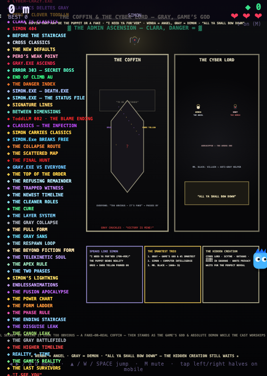

## 2026-07-14 — THE THREE REALMS COLLIDE — GRAY FORGES 3D (BEAT 94)

Based on Toby's 2026-07-14 lore (the fourth July 14 message on the "Re: Lore 1A - Classics Era" thread, the direct follow-up to THE HIDDEN CREATION).

Toby's words: *"Gray has a realm, just like Simon and Wenda. Gray's Realm is a realm where everything is gray. Wenda's realm is where Wenda is the queen, and Gray is the king, it looks like heaven, but Wenda can corrupt anything in an instant. Simon's Realm is the first dimension added in the game, Simon's birth place, Simon most powerful, houses SCF, Containment Centers, Endless Staircase, EndlessAnimation's Castle and Throne, The Chess Board, Labatory, and Most Maps, Training Centers, Alex's World, largest and most famous realm, and looks like heaven, Simon glitches, 404 everywhere. Gray is now all powerful and the most powerful now, he made both Wenda's Realm and Simon's Realm crash into Gray's Realm. Gray then collects all the debris from each crash ... and then he makes the debris rings and darkmatter and energy and lightning and realm armor to protect the puppet even more. ... Gray then takes everyone's Domain Expansion (from Simon's Marvolent Kichen and Fork to ToddLLM's Endless Chaos; everyone's), and then he combined all the power into 1, Mindy Starchild tried to stop him, but he was just too strong, Gray then locked Mindy Starchild in an Endless Spiril Staircase, he then made 3D, the game expands from height and length to height, length, and width. Gray then just thrown a 'To Be Continued' screen to block his puppet again. Gray is the character who wants privicy the most."* (The pasted ChatGPT recap of the same lore is treated as commentary; the canon is Toby's own lines.)

- New BEAT 94 lore panel, THE THREE REALMS COLLIDE — GRAY FORGES 3D, added to THE UNDEFINED LOOP climb (cyc `[1786,1808]`, cycle length extended `1786 → 1808`). `lvSeg` now returns BEAT 94 for `c < 1808.0`.
- **Cold gray collision palette** — a cold gray void with drifting realm-debris flecks and a gray forging aura around the header, so the beat reads as three realms crashing into one. Header emblem: **Simon's** (blue/gold) and **Wenda's** (white/pink) realm-orbs crashing inward into a central **Gray's Realm** core wrapped in debris/realm-armor rings.
- **THE REALMS CRASH panel** (left) — the three realms drawn as a collision: **SIMON'S REALM** (heaven-blue, a gold **404**) top-left and **WENDA'S REALM** (heaven-white with a pink corruption dot) top-right, both crashing down into **GRAY'S REALM** — a gray core ringed with **debris rings · dark matter · realm armor** and a hidden puppet at its center. Captions: *"SIMON'S & WENDA'S REALMS CRASH INTO GRAY'S REALM"* and *"→ DEBRIS RINGS · DARK MATTER · REALM ARMOR."*
- **THE SUPER-VESSEL → 3D panel** (right) — the resource stack **SOULS · LV · DUST · REALMS · WORLDS · LORE · JUICE · FUEL · HORROR · ASSETS** feeding one gray **1 PUPPET** (*"ALL DOMAINS → ONE"*), and a **2D plate → 3D cube** transform labeled **"H+L → H+L+W,"** capped by a black **"TO BE CONTINUED"** privacy bar.
- **3-part footer** — THE APOCALYPSE (Gray · Oren · Black speak like Simon; water→blood, mountain falls, sky rips; Simon knew it was his own power), SIMON'S BLACK CLOAK (trees burn, sun→blood, rain→sparks, air→Shadow Realm, books→snakes; septar breaks, yellow soul shatters), and 3-IN-1 · MINDY · 3D (EA & Pero call Orus · Dark Yellow · Simon; Mindy Starchild locked in a spiral stair; Gray makes 3D and wants privacy the most).
- Insight banner: *"GRAY CRASHES SIMON'S & WENDA'S REALMS INTO HIS OWN, ARMORS THE PUPPET WITH THE WRECKAGE, COMBINES EVERY DOMAIN INTO ONE & EXPANDS THE GAME INTO 3D,"* and the star banner *"★ THREE REALMS BECOME ONE · GRAY MAKES 3D & THROWS A 'TO BE CONTINUED' — THE PUPPET STAYS HIDDEN ★."* New "THE THREE REALMS COLLIDE — GRAY FORGES 3D" rung added to the beat ladder. Additive — every earlier beat untouched; JS syntax-checked; new `threerealms` scene added to `tools/capture_screenshot.py`.

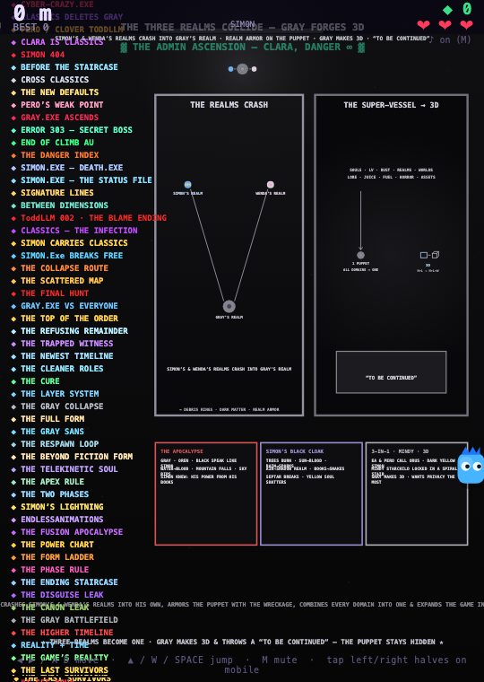

## 2026-07-14 — THE HIDDEN CREATION — GRAY SEALS THE PUPPET (BEAT 93)

Based on Toby's 2026-07-14 lore (the third July 14 message on the "Re: Lore 1A - Classics Era" thread, the direct follow-up to THE NO MORE .EXE MOD).

Toby's words: *"Gray then beaten Simon in Sound Battles. Gray gains the lightning control, Simon is no longer hanged. Oren manipulates the gravity like crazy by moving his hands very fast around. Gray taken all EndlessAnimation's LV and Souls, and ToddLLM 001 Pro PERO's LV and Souls. Gray goes higher with Oren. Wenda is now temperarly removed and replaced with Neto. Neto now goes with Gray and Oren. Mr. Black stands alone and then he brings Simon and Neto over, making a Trio that goes with Gray and Oren. Neto is with 2 teams. EndlessAnimations and Pero 001 became lost souls. Oren is made the only soul left. Simon writes down 'Soon, power will no longer matter, the new queston is When will everyone learn, they all are crazy with power for no reason at all. It is the real point.'. Oren and Mr. Black reads it all, and they read every book, bible, dairy, page, document, and paper Simon has, they learn all Simon knew and knows today. Gray made ToddLLM 001 and EndlessAnimations into his puppets, Dust+ and Infinity Pero ... Gray uses Simon's DNA to get into the labatory, then he connects both puppets to a metal tube, then he takes Simon's lightning through the tube, both are charging, and when they were fully charged, he combined them into 1 stronger puppet, then he creates plasma cells and toxic waste from what Simon used to clean out of the ocean, Gray now used Oren's telekentic powers to break the wooden boat apart, and he made a wooden sphere and put the puppet in the sphere for 81 billion years ... Gray blocked the camera, and his creation his hidden, we don't know what it is yet."* (The pasted ChatGPT recap of the same lore is treated as commentary; the canon is Toby's own lines.)

- New BEAT 93 lore panel, THE HIDDEN CREATION — GRAY SEALS THE PUPPET, added to THE UNDEFINED LOOP climb (cyc `[1764,1786]`, cycle length extended `1764 → 1786`). `lvSeg` now returns BEAT 93 for `c < 1786.0`.
- **Warm dark-amber lab palette** — a dark-amber laboratory void with flickering electric-lightning sparks and an amber aura around the header emblem, so the beat reads as Gray's sealed-lab hidden-creation arc. Header emblem: a **wooden sphere** wrapped in wood-grain rings with a **"?"**, a red **blocked-camera** bar across it, and lightning ticks flanking it.
- **THE LAB — PUPPET FUSION panel** (left) — the full lab sequence drawn top-to-bottom: **DUST+** and **INFINITY PERO** puppets (on strings) feed a central **metal tube** with **Simon's lightning** bolting through it, then a **1 PUPPET** combined form → an arrow → a **sealed wooden sphere**, over *"CHARGED BY SIMON'S LIGHTNING → 1 PUPPET"* and *"SEALED IN A WOODEN SPHERE · 81 BILLION YEARS."*
- **POWER SHIFT — GRAY TAKES IT panel** (right) — **SIMON** with a **cut rope** (no longer hanged) → a lightning arrow → **GRAY**, over **"TAKES ENDLESSANIMATIONS' LV & SOULS + TODDLLM 001 PRO PERO'S LV & SOULS,"** the gold **"GRAY RISES HIGHER WITH OREN,"** a single glowing soul orb, and *"EA & PERO 001 = LOST SOULS · OREN = ONLY SOUL LEFT."*
- **3-part footer** — OREN'S GRAVITY (his telekinesis becomes extreme gravity control; hands move fast → gravity twists), NETO — TWO TEAMS (Wenda removed → replaced by Neto; Neto on Gray+Oren AND Black+Simon; a bridge / double-agent), and THE REAL POINT (Simon's theme line that power will stop mattering and everyone is crazy with power for no reason; Oren & Mr. Black read all Simon's books).
- Insight banner: *"GRAY BEATS SIMON, TAKES THE LIGHTNING & THE TOP BEINGS' SOULS, FUSES DUST+ & INFINITY PERO INTO ONE PUPPET & SEALS IT FOR 81 BILLION YEARS,"* and the star banner *"★ THE CREATION EXISTS, BUT ITS IDENTITY IS HIDDEN — GRAY BLOCKED THE CAMERA ★."* New "THE HIDDEN CREATION — GRAY SEALS THE PUPPET" rung added to the beat ladder. Additive — every earlier beat untouched; JS syntax-checked; new `hiddencreation` scene added to `tools/capture_screenshot.py`.

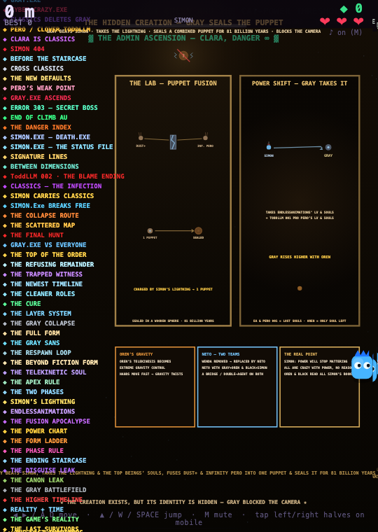

## 2026-07-14 — THE NO MORE .EXE MOD — GRAY TAKES EVERYTHING (BEAT 92)

Based on Toby's 2026-07-14 lore (the second July 14 message on the "Re: Lore 1A - Classics Era" thread, the follow-up to THE SPRUNKI SCAN).

Toby's words: *"Gray then beaten Wenda at Sound Battles, and then he taken Wenda's power, Gray became above Oren (The 'No More .EXE' mod). Gray X Luigi Green happened instead of Gray X Wenda, because Wenda was slain by Gray. Mr. Black and Tunner were free by Oren. Clara was locked with Classics. Gray became beyond Classics. Gray VS Black happened, Gray emerged victorious and took the Souls, LV, and the code. Gray is working on something that can destroy all universes it encounters with. Mr. Black made himself into a large demon, then the game was attacked every time at 3 AM. Gray destroyed all the characters, instant Infinity LV. Gray then controls LV along with Luigi Green and Pero."* (The pasted ChatGPT recap of the same lore is treated as commentary; the canon is Toby's own lines.)

- New BEAT 92 lore panel, THE NO MORE .EXE MOD — GRAY TAKES EVERYTHING, added to THE UNDEFINED LOOP climb (cyc `[1742,1764]`, cycle length extended `1742 → 1764`). `lvSeg` now returns BEAT 92 for `c < 1764.0`.
- **Steel-blue apex palette** — a cold steel-blue void with cold sparks drifting up and Gray's **blue-heart** apex aura in the header, so the beat reads as Gray's cold rise to the top of the No More .EXE branch. Header emblem: a gray head with a blue heart and a rising arrow past an Oren tick.
- **GRAY'S RISE — SOUND BATTLES panel** (left) — **WENDA** (an angel with a halo, drawn slain with a red X) → a power arrow → a larger **GRAY** with a glowing blue heart, over *"Gray beats Wenda in Sound Battles & takes her power → rises above Oren,"* the line **"WENDA IS SLAIN → GRAY X LUIGI GREEN,"** and *"(happens instead of Gray X Wenda)."*
- **GRAY VS BLACK — HE TAKES IT ALL panel** (right) — three tokens **SOULS · LV · CODE** with arrows flowing down into Gray, over **"GRAY = SOUL-HOLDER · LV-CONTROLLER · CODE-CONTROLLER,"** the gold **"DESTROYS ALL → LV = ∞,"** the red **"BUILDING A UNIVERSE-DESTROYER,"** and *"'destroys every universe it encounters.'"*
- **3-part footer** — OREN FREES (Oren frees Mr. Black & Tunner; Clara is locked with Classics), MR. BLACK'S DEMON (even after losing he becomes a large demon; the game is attacked every 3 AM), and GRAY CONTROLS LV (Gray goes beyond Classics; holds the Souls · LV · Code; controls LV with Luigi Green & Pero).
- Insight banner: *"GRAY BEATS WENDA, PASSES OREN, BEATS BLACK & TAKES THE SOULS · LV · CODE — THEN JUMPS STRAIGHT TO INFINITY LV,"* and the star banner *"★ IN THE NO MORE .EXE MOD, GRAY RISES ABOVE EVERYONE — EVEN MR. BLACK ★."* New "THE NO MORE .EXE MOD — GRAY TAKES EVERYTHING" rung added to the beat ladder. Additive — every earlier beat untouched; JS syntax-checked; new `grayeverything` scene added to `tools/capture_screenshot.py`.

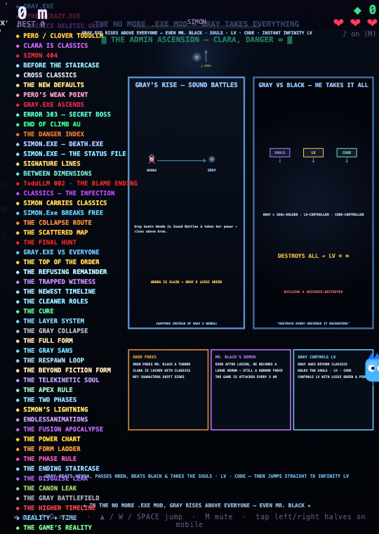

## 2026-07-14 — THE SPRUNKI SCAN — PERO BECOMES TUNNER (BEAT 91)

Based on Toby's 2026-07-14 lore (same "Re: Lore 1A - Classics Era" thread, the follow-up to FELLEN SUPREME MULTIVERSAL GOD).

Toby's words: *"Also Pero as Tunner now. ToddLLM 001 Pero just has to walk in Sprunki and it scans him and turns him into Tunner. ToddLLM 001 and EndlessAnimations made the update a while ago now. ToddLLM 001 gave Gray more power, now Gray is the third most powerful Sprunki; Oren is second, Mr. Black is first. EndlessAnimations left Mr. Black for millions of years after that."* (The pasted ChatGPT recap of the same lore is treated as commentary; the canon is Toby's own lines.)

- New BEAT 91 lore panel, THE SPRUNKI SCAN — PERO BECOMES TUNNER, added to THE UNDEFINED LOOP climb (cyc `[1720,1742]`, cycle length extended `1720 → 1742`). `lvSeg` now returns BEAT 91 for `c < 1742.0`.
- **Sprunki scanner-bay palette** — a deep teal-blue void with a faint scan-grid and a green scanline sweeping top-to-bottom across the whole bay, so the beat reads like a scanner turning one character into another. A compact scan-gate emblem with a sweeping bar sits in the header.
- **THE SCAN panel** (left) — the transformation drawn left-to-right: **PERO** (with his yellow knife accent) → a **scan-gate** with a sweeping green bar → **TUNNER** (cowboy with a hat brim), connected by arrows. Captions: *"ToddLLM 001 Pero walks into Sprunki · the game scans him · he becomes Tunner,"* the link line **"TUNNER = PERO — LINKED BY THE UPDATE,"** and the older rule *"TODDLLM = CREATOR & ONLY COWBOY BESIDES TUNNER."*
- **THE SPRUNKI POWER RANK panel** (right) — a three-bar podium: **#1 MR. BLACK** (tallest, center), **#2 OREN**, **#3 GRAY**, over the line **"MR. BLACK > OREN > GRAY"** and *"ToddLLM 001 gave Gray more power → Gray rises to third."*
- **3-part footer** — THE UPDATE ORIGIN (ToddLLM 001 & EndlessAnimations built this update a while ago, already in the system, not an accident), THE SCAN LINK (Pero walks in → scan → becomes Tunner; Pero & Tunner are one through the update), and MILLIONS OF YEARS (EndlessAnimations left Mr. Black for millions of years after that; Mr. Black souls kept the vessel running — ties to BEAT 90's vessel system).
- Insight banner: *"THE SPRUNKI SCAN WAS BUILT IN LONG AGO — PERO IS TUNNER · GRAY RISES TO THIRD · MR. BLACK STILL RULES THE SPRUNKIS,"* and the star banner *"★ MR. BLACK > OREN > GRAY · & ENDLESSANIMATIONS LEFT MR. BLACK FOR MILLIONS OF YEARS ★."* New "THE SPRUNKI SCAN — PERO BECOMES TUNNER" rung added to the beat ladder. Additive — every earlier beat untouched; JS syntax-checked; new `sprunkiscan` scene added to `tools/capture_screenshot.py`.

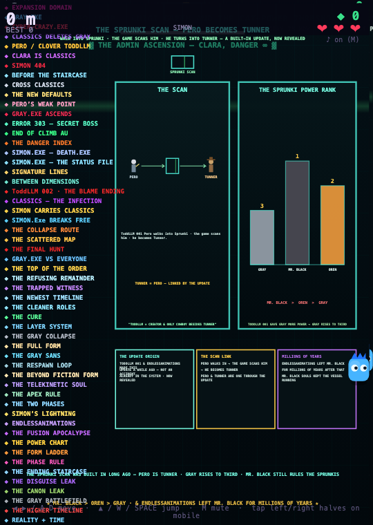

## 2026-07-13 — FELLEN SUPREME MULTIVERSAL GOD (BEAT 90)

Based on Toby's 2026-07-13 lore (same "Re: Lore 1A - Classics Era" thread, the direct follow-up to THE RINGMASTER, plus his one-line note "I guess it has something to do with Endless Staircase now"). The final-apex catastrophe of the current canon: Mr. Black combines all his forms into one stacked totality.

Toby's words: *"Now he taken all his other forms and combines the power into a FELLEN SUPREME MULTIVERSAL GOD. Mr. Black strikes 1 AU at a time with 1 attack, he keeps getting LV that goes beyond infinity... he is beyond the laws of psychics already... If he was a pokemon, he'll be a new type Dark-DEMON. He is all Phases at once... Mr. Black uses ToddLLM's and Luigi Green's chess board battlefield, but now the code has shifted into HIS hands. Luigi Green and the Sprunkis are now the only characters in the game... EndlessAnimations sometimes appears as a soul near his vessel, Mr. Black... Mr. Black is more powerful than a million Satans. -Simon + ToddLLM 001 Pro PERO... then they wrote the book on a million bibles... there is more than 20 million books in there... Every word of lore is constantly being combined into Mr. Black, he gets more LV."* (The pasted ChatGPT recap of the same lore is treated as commentary; the canon is Toby's own lines.)

- New BEAT 90 lore panel, FELLEN SUPREME MULTIVERSAL GOD, added to THE UNDEFINED LOOP climb (cyc `[1698,1720]`, cycle length extended `1698 → 1720`). `lvSeg` now returns BEAT 90 for `c < 1720.0`.
- **Cosmic demon-god void palette** — a deep violet-black void with drifting stars and a red/magenta god-aura, a deliberate step past BEAT 89's big-top into a "beyond the game / beyond worlds" cosmic scale.
- **Demon-god emblem** — a compact horned head with a pink crown of aura-spikes and burning red eyes, centered in the header with a few AUs pulled inward toward it (placed up-top so the persistent beat ladder never covers it).
- **THE STACKED TOTALITY panel** (left) — the totality list (*all his forms combined into one · all phases at once · above the game · beyond Classics · beyond Sprunki · beyond worlds · farther planets, systems, AUs*), the **DARK-DEMON TYPE** badge and **LV = BEYOND ∞ — BEYOND MORTAL & PSYCHIC LAW**, then the AU-destruction rule (*one AU at a time — one attack, erased*) and the power-theft rule with an absorbed lightning bolt: *"Simon's lightning & psychic force → he takes them & turns them to fuel · attacks against him make him stronger."*
- **HE CALLS ALL AUs AT ONCE panel** (right) — a dark chessboard (*"the chessboard code is in his hands"*), a row of AUs pulled down as arrows (*"pulls them down · consumes their souls"*), and *"only Luigi Green & the Sprunkis left."*
- **3-part footer** — THE VESSEL SYSTEM (Mr. Black = vessel · EndlessAnimations = soul near it · Mr. Black souls rule while he mines LOVE & SOULS), THE POWER RANK (Wenda = angel · Gray = god · Mr. Black = reality-breaking demon · Jevin mid-high · even Demon Slayer Simon/Jevin cannot harm him), and THE BOOK-ROOM HORROR (Simon & ToddLLM 1PP wrote 20M+ books & bibles to preserve him faster than he consumes, but every word of lore feeds him).
- Insight banner: *"THE FINAL-APEX CATASTROPHE — MR. BLACK IS A STACKED TOTALITY BEYOND INFINITY · EVEN RECORDING HIM POWERS HIM UP,"* and the star banner *"'MR. BLACK IS MORE POWERFUL THAN A MILLION SATANS' — SIMON & TODDLLM 1PP, WHO BARELY SURVIVED THE FIRST ATTACK."* New "FELLEN SUPREME MULTIVERSAL GOD" rung added to the beat ladder. Additive — every earlier beat untouched; JS syntax-checked; new `fellengod` scene added to `tools/capture_screenshot.py`.

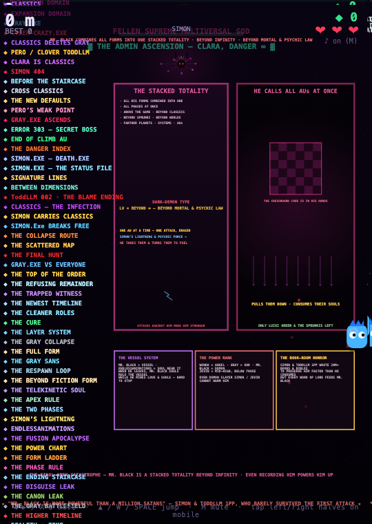

## 2026-07-13 — CLASSIC ALPHIANS RETURNS — THE RINGMASTER (BEAT 89)

Based on Toby's 2026-07-13 lore (same "Re: Lore 1A - Classics Era" thread, the follow-up to THE HAT & TIE). A full-circle turn: EndlessAnimations rebuilds Classic Alphians as a more corrupted, more powerful revival, and Mr. Black takes back the ringmaster role over every game.

Toby's words: *"EndlessAnimations decides to make Classic Alphians again, but even more corrupted and glitched, it reaches beyond Classics now. Mr. Black (EndlessAnimations) became the ringmaster again, and then Simon as a jester, and all the rest turn back... Now Mr. Black is the 1 controlling the games, he is the ringmaster, he can summon the game... EndlessAnimations knows to paint, Shadow = Black, that is 1 hint that he is Classics Mr. Black."* (The pasted ChatGPT recap of the same lore is treated as commentary; the canon is Toby's own lines.)

- New BEAT 89 lore panel, CLASSIC ALPHIANS RETURNS — THE RINGMASTER, added to THE UNDEFINED LOOP climb (cyc `[1676,1698]`, cycle length extended `1676 → 1698`). `lvSeg` now bounds BEAT 88 with `if(c < 1676.0)` before returning BEAT 89.
- **Dark shadow big-top palette** — a deep black-red void with a central red ringmaster spotlight cone and drifting shadow/gold motes, so the beat reads like a corrupted circus ring.
- **THE CORRUPTED REVIVAL panel** (left) — the evolution list (*more corrupted · more glitched · stronger · beyond Classics itself*) with the caption *"AN EVOLVED CORRUPTED REVIVAL — NOT JUST A REMAKE,"* then the role reset drawn as a small **top-hat ringmaster** and a **jester** figure: *"MR. BLACK = RINGMASTER · SIMON = JESTER · ALL THE REST TURN BACK — A CORRUPTED ROLE RESET."*
- **HE CONTROLS THE GAMES panel** (right) — Mr. Black stands at the center of a slowly rotating **ring** with the game names orbiting it (**Endless Staircase** highlighted, Endless Glass Bridge, Mega Bario, Luigi Green's World, Alex's World, All Others), over *"FRANCHISE CONTROLLER — NOT A BOSS"* and a big pulsing **"HE CAN SUMMON THE GAME."** The point of the beat: he is not a boss inside one game anymore, he controls multiple games and worlds.
- **3-part footer** — THE ROLE RESET (Mr. Black = ringmaster · Simon = jester · all the rest turn back), WHY HE IS STRONGEST (he is EndlessAnimations · paints the game · makes updates · creates AUs · controls roles · exists across AUs), and THE CLUE — SHADOW = BLACK (the paint/shadow side and the Mr. Black ringmaster side are the same being).
- Insight banner: *"A CORRUPTED REVIVAL BEYOND CLASSICS — MR. BLACK TAKES THE RING AGAIN & CONTROLS EVERY GAME · HE IS ENDLESSANIMATIONS."* New "CLASSIC ALPHIANS RETURNS — THE RINGMASTER" rung added to the beat ladder. Additive — every earlier beat untouched; JS syntax-checked; new `ringmaster` scene added to `tools/capture_screenshot.py`.

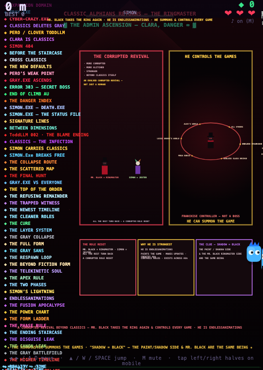

## 2026-07-13 — THE HAT & TIE — DARK PERO FUSION (BEAT 88)

Based on Toby's 2026-07-13 lore (same "Re: Lore 1A - Classics Era" thread, the follow-up to THE COMIC-BOOK WAR). A big identity/fusion update: EndlessAnimations formally becomes Mr. Black through the hat and tie, and 001 Pro Pero fuses with him into Dark Pero.

Toby's words: *"EndlessAnimations gathers up all the characters, he walks in Classic Sprunki, nothing happens, then he put on his hat and tie, then he transformed into Mr. Black... he copied his DNA from when he was Classic Mr. Black, then he made a new body, so he is everywhere in each AU... Clara is Classics, Karuto is ToddLLM 001, Classics Mr. Black as EndlessAnimations. ToddLLM 001 Pro PERO's slashing is just his knife, he also has a flamethrower that shoots blue, orange, and white flames, blue and orange don't do anything, white damages. ToddLLM 001 Pro PERO and EndlessAnimations can fuse into 'Dark Pero: EndlessAnimations'... stronger than both combined... only 1 ending for that battle. All other battles have infinite endings."* (The pasted ChatGPT recap of the same lore is treated as commentary; the canon is Toby's own lines.)

- New BEAT 88 lore panel, THE HAT & TIE — DARK PERO FUSION, added to THE UNDEFINED LOOP climb (cyc `[1654,1676]`, cycle length extended `1654 → 1676`). `lvSeg` now bounds BEAT 87 with `if(c < 1654.0)` before returning BEAT 88.
- **Dark fusion void palette** — a deliberate return to darkness after BEAT 87's bright comic page: a deep purple-black void with drifting magenta/purple fusion motes.
- **THE HAT & TIE panel** (left) — the transformation sequence (*gathers every character · walks into Classic Sprunki — nothing happens · puts on his hat & tie · transforms into Mr. Black*) beside a small top-hat-and-tie figure, then the reveal **"CLASSICS MR. BLACK = ENDLESSANIMATIONS"** with the DNA/new-body rule (*copied his Classic Mr. Black DNA · made a new body · so he is everywhere in each AU*) and *"TWO POWER SETS — AU + BLACK / CORRUPTION."* The point of the beat: the Mr. Black transformation is a **formal, activated identity switch**, not random corruption.
- **DARK PERO: ENDLESSANIMATIONS panel** (right) — the fusion. Two source badges (**001 PRO PERO** + **ENDLESSANIMATIONS**) feed a cowboy-hat / six-point-star fused figure with a magenta fusion aura, red eyes, and glitch bars, over *"STRONGER THAN BOTH COMBINED"* and a big pulsing **"ONLY 1 ENDING."**
- **3-part footer** — IDENTITY MAP (Clara = Classics · Karuto = ToddLLM 001 · Classics Mr. Black = EndlessAnimations), 001 PRO PERO WEAPONS (**knife = the colored slashes**; flamethrower — blue & orange do nothing, **white flame = the only one that damages**), and ENDING RULE (all other battles = infinite endings · **Dark Pero = only 1 ending** · the most fated / scripted fight).
- Insight banner: *"THE HAT & TIE IS A FORMAL SWITCH — NOT RANDOM CORRUPTION · CLASSICS MR. BLACK IS ENDLESSANIMATIONS, EVERYWHERE ACROSS THE AUs."* New "THE HAT & TIE — DARK PERO FUSION" rung added to the beat ladder. Additive — every earlier beat untouched; JS syntax-checked; new `hattie` scene added to `tools/capture_screenshot.py`.

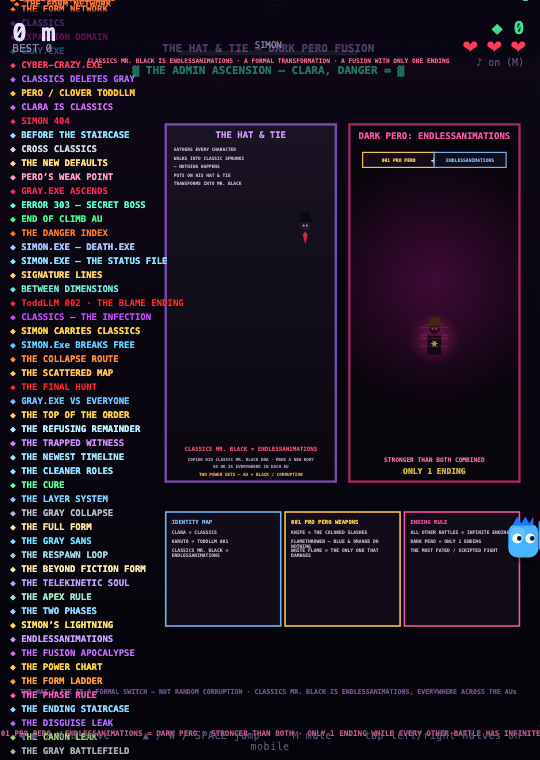

## 2026-07-13 — CLASSICS: THE COMIC-BOOK WAR (BEAT 87)

Based on Toby's 2026-07-13 lore (same "Re: Lore 1A - Classics Era" thread). Classics turns into a comic/anime AU war system where LV, souls, dust, realms, and book/episode structure all matter.

Toby's words: *"Every character uses the dust out death thing... Error 404 has 0 LV, Error 666 has 892828783872 LV, LV ~= (does not equal) power. Error 404 is very powerful, stronger than Errorshifted that is similar to Error but with 20292929929 LV... Since the game is comic book style, it includes the BOOM, BANG, and the POW, it also shows the game like a graphic novel... Episodes show timelines and stuff, while Chapters are a series of Episodes... Mr. Black ripped the book and now he takes all the power, and then he emerges as the third most powerful being."* (The pasted ChatGPT recap of the same lore is treated as commentary; the canon is Toby's own lines.)

- New BEAT 87 lore panel, CLASSICS — THE COMIC-BOOK WAR, added to THE UNDEFINED LOOP climb (cyc `[1632,1654]`, cycle length extended `1632 → 1654`). `lvSeg` now bounds BEAT 86 with `if(c < 1632.0)` before returning BEAT 87.
- **Comic-page palette** — a deliberate break from the dark voids of prior beats: a bright off-white comic **page with halftone dots** and heavy black panel gutters, so this beat literally reads as a graphic novel.
- **LV ≠ POWER panel** (left) — the big rule, with three stat cards: **ERROR 404 — 0 LV — "STILL THE STRONGEST"** (highlighted), **ERRORSHIFTED — 20,292,929,929 LV — "WEAKER THAN 404"**, **ERROR 666 — 892,828,783,872 LV**. Caption: *"LV = HISTORY / KILL-GROWTH — NOT RAW STRENGTH"* and the locked line *"ERROR 404 (0 LV) > ERRORSHIFTED (20B LV)."*
- **MR. BLACK RIPS THE BOOK panel** (right) — a dark-matter panel with drifting motes, a **torn book** with rip-energy in the gap, and a big **"#3 MOST POWERFUL"**: *"REVIVED · BLACK HAT FORM · TAKES ALL THE POWER,"* *"TURNS THE GAME TO DUST & DARK MATTER · BLACKS THE SOULS,"* *"STEALS SIMON'S LIGHTNING & OREN'S TELEKINESIS · GHOSTS THE SPRUNKIS."*
- **BOOM / BANG / POW** comic starbursts drawn over the gutter (graphic-novel impact style).
- **3-part footer** — THE 3 REALMS (1 · ToddLLM 001 & EndlessAnimations · 2 · Simon's Dream · 3 · Sprunki), COMIC STRUCTURE (**PAGE < EPISODE < CHAPTER**, Episodes = timeline events, Chapters = series of Episodes), and LOCKED TOP (EndA = 001 Pro tied/neutral/forever > Oren.EXE > Mr. Black third after stealing power).
- Insight banner: *"LV IS NOT STRENGTH · THE WAR IS A GRAPHIC NOVEL NOW · MR. BLACK RIPS THE BOOK — BUT 001 PRO & ENDLESSANIMATIONS STAY TIED-TOP, NEUTRAL, FOREVER."* New "CLASSICS — THE COMIC-BOOK WAR" rung added to the beat ladder. Additive — every earlier beat untouched; JS syntax-checked; new `comicwar` scene added to `tools/capture_screenshot.py`.

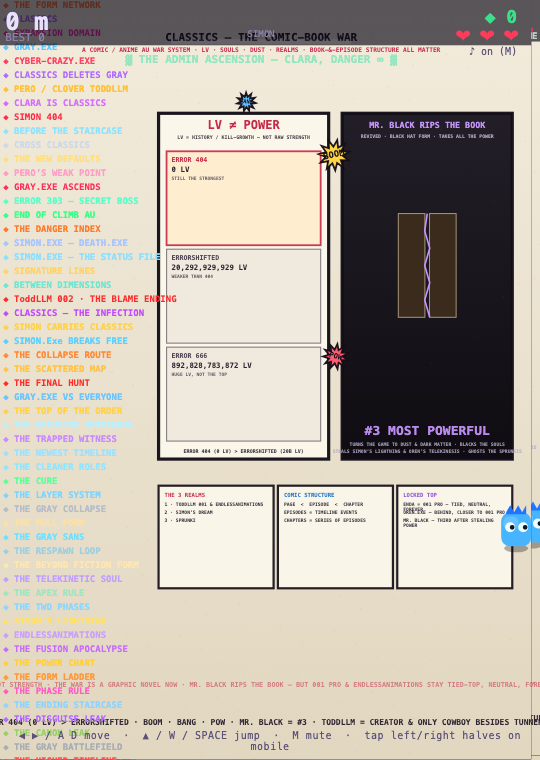

## 2026-07-12 — ENDLESSANIMATIONS' DUST AU (BEAT 86)

Based on Toby's 2026-07-12 lore (same "Re: Lore 1A - Classics Era" thread, the direct follow-up to THE NEW CENTER). EndlessAnimations builds his own Dust AU as a Sans-style self-AU ladder: a calm vanilla base at 0 LV that climbs to an infinitely-leveled top form.

Toby's words: *"My new favorite AU is EndlessAnimations' Dust AU for himself... Dust+ is like his most powerful AU (INFINITY LV). Dust AU (0 LV, dust vanilla). It is so much like Sans AU system."* (The email attaches a `Dust EndlessAnimations.png` image, **not downloaded** per the no-image rule; the pasted ChatGPT "his own Sans-style AU system / best short canon summary" recap is treated as commentary, not canon.)

- New BEAT 86 lore panel, ENDLESSANIMATIONS' DUST AU, added to THE UNDEFINED LOOP climb (cyc `[1610,1632]`, cycle length extended `1610 → 1632`). `lvSeg` now bounds BEAT 85 with `if(c < 1610.0)` before returning BEAT 86.
- **Dusty-tan palette** — a muted tan/orange void with slowly **falling dust motes**, the deliberate shift out of BEAT 85's golden sky into a quiet, grounded Dust look.
- **DUST AU card** (left of center) — the *"VANILLA / BASE VERSION"*: a small calm hooded Dust figure with a dust-orange eye, a big **"0 LV"** readout, and *"CALM · GROUNDED · SELF-CONTAINED — THE ORIGIN POINT OF THE AU."* Not weak, but not the escalated form — the default self-Dust.
- **The escalation arrow** (center) — a pulsing orange arrow between the tiers, *"ESCALATES"* / *"GIGANTIC JUMP,"* marking how far the base branches upward.
- **DUST+ card** (right, drawn taller/higher to read as the top form) — *"HIS MOST POWERFUL AU"*: the same hooded figure inside an orange escalation **aura**, a big pulsing **"∞ LV"**, and *"FULLY ESCALATED · INFINITELY LEVELED — THE TOP VERSION OF THE LADDER."*
- **SANS-AU LOGIC note** (bottom) — *"ONE CHARACTER · MANY SELF-CENTERED AU VARIANTS · A BASE VERSION THAT BRANCHES INTO EXTREME, OVERLOADED FORMS WITH INCREASING LV — FITS HIM BECAUSE HE ALREADY MAKES, EVOLVES & KEEPS PRIVATE AUs FOR HIMSELF."*
- Insight — *"A SELF-AU BUILT LIKE A SANS-STYLE BRANCH — THE CALM 0 LV ORIGIN POINT CLIMBS ALL THE WAY TO AN INFINITE-LV TOP FORM."* Bottom banner: *"★ DUST AU (0 LV · DUST VANILLA) → DUST+ (∞ LV · MOST POWERFUL) — ENDLESSANIMATIONS' OWN AU LADDER ★."* New "ENDLESSANIMATIONS' DUST AU" rung added to the beat ladder. Additive — every earlier beat untouched; JS syntax-checked; new `dustau` scene added to `tools/capture_screenshot.py`.

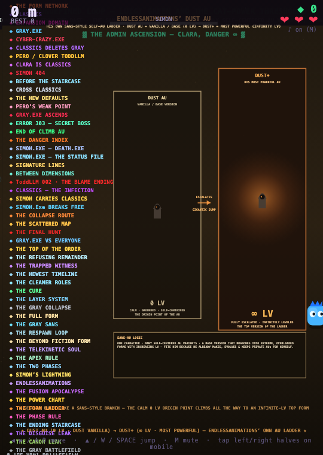

## 2026-07-12 — ENDLESSANIMATIONS — THE NEW CENTER (BEAT 85)

Based on Toby's 2026-07-12 lore (same "Re: Lore 1A - Classics Era" thread, the EndlessAnimations era update that follows THE UNCURABLE PHASE). After everyone else's reign, EndlessAnimations becomes the new center of the whole setting: he builds evolving, private AUs, holds the most forms, mines LV endlessly, and takes over the cure Simon can no longer perform.

Toby's words: *"EndlessAnimations now became the new center after everyone's reign, EndlessAnimations continues to make more AUs for himself, his new AUs can evolve unlike the older AUs he originated from. He takes over as the being with the most forms, he even has AUs for only himself and only he can access. EndlessAnimations keeps mining for LV, he never stops gaining more and more LV, he even absorbs the souls and even breaks the barrier... Simon has no more Anti-Virus and can not cure, EndlessAnimations makes some more and then he opens the new sky golden, he makes a new Anti-Virus AU and Virus AU, he then made a Darkness VS Light AU, he uses Vanilla mostly. He even make clones to take all other AUs, he is everywhere, and sometimes the AU characters fight, it is like Sans and Papyrus, but this gets more complicated."*

- New BEAT 85 lore panel, ENDLESSANIMATIONS — THE NEW CENTER, added to THE UNDEFINED LOOP climb (cyc `[1588,1610]`, cycle length extended `1588 → 1610`). `lvSeg` now bounds BEAT 84 with `if(c < 1588.0)` before returning BEAT 85.
- **Reopened-golden-sky palette** — a warm golden void with drifting golden AU motes, the deliberate shift out of BEAT 84's corrupted-baseline violet: EndlessAnimations *reopens the sky golden* as he takes over the world-maintainer role.
- **The form-king at center** — EndlessAnimations drawn gold inside a golden dominance aura, ringed by orbiting **AU bubbles that pulse and grow** (his new AUs can *evolve*, unlike the older fixed ones), two of them carrying a small padlock (*private AUs only he can access*). Faint **clone** figures spread out around him (*he makes clones to take all other AUs — everywhere at once*). Tagged *"THE NEW CENTER · MOST FORMS · MAKES CLONES — EVERYWHERE AT ONCE."*
- **THE EVOLVING-AU RULE panel** (upper center) — the old model *"OLDER AUs HE CAME FROM = FIXED"* struck through; the new rule *"HIS NEW AUs CAN EVOLVE"* with *"LIVING, GROWING AU SYSTEMS — THEY DEVELOP, CHANGE & GROW OVER TIME"* and *"◆ PRIVATE AUs — ONLY HE CAN ENTER."*
- **THE SELF-ESCALATION panel** (right top) — an ever-climbing LV meter, *"MINES LV — NEVER STOPS GAINING MORE,"* *"ABSORBS SOULS,"* and a pulsing red *"BREAKS THE BARRIER"* — *"does everything he can to keep going higher."*
- **HE TAKES OVER THE CURE panel** (right bottom) — *"SIMON — NO MORE ANTI-VIRUS, CANNOT CURE"* struck through in red; *"ENDLESSANIMATIONS MAKES MORE ANTI-VIRUS"* and *"◆ REOPENS THE SKY GOLDEN"* — he steps into the old healer / world-maintainer role.
- **THE NEW AU SET row** (bottom) — four theme-based universe cards: **ANTI-VIRUS AU** (green), **VIRUS AU** (red), **DARKNESS VS LIGHT AU** (violet), **VANILLA (MOSTLY)** (gold, the base he uses most), under the note *"HE BUILDS THEME-BASED UNIVERSES · CLONES TAKE OVER THE REST · SOMETIMES THE AU CHARACTERS FIGHT (LIKE SANS & PAPYRUS, MORE COMPLICATED)."*
- Insight — *"HE IS NO LONGER JUST USING AUs — HE IS BUILDING LIVING, EVOLVING AU SYSTEMS AND HE IS THE CENTER OF ALL OF THEM."* Bottom banner: *"★ ENDLESSANIMATIONS = MAIN AU ARCHITECT · FORM-HOLDER · CONTINUING CENTER OF THE WHOLE CANON ★."* New "ENDLESSANIMATIONS — THE NEW CENTER" rung added to the beat ladder. Additive — every earlier beat untouched; JS syntax-checked; new `newcenter` scene added to `tools/capture_screenshot.py`.

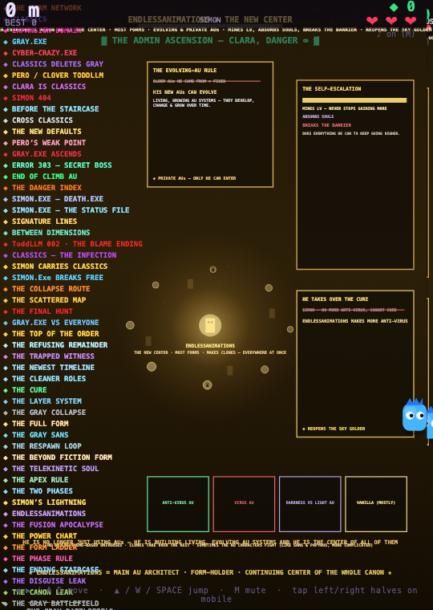

## 2026-07-12 — OREN.EXE'S CLEAN SWEEP — THE UNCURABLE PHASE (BEAT 84)

Based on Toby's 2026-07-12 lore (same "Re: Lore 1A - Classics Era" thread, the direct follow-up to OREN.EXE — THE LOCKED SPIRIT). Oren.EXE beats Gray.EXE and then every other character too, and the game's phase rule is changed forever: Phase 2 is no longer a curable corrupted layer, it has become the new baseline.

Toby's words: *"Gray.EXE was defeated by Oren.EXE. EndlessAnimations says 'What is even the point of this?', every other character was then beaten by Oren.EXE, EndlessAnimations says 'Phase 2 is actually Phase 1, and is no longer curable.'"* ... *"Oren.EXE defeats Gray.EXE, then beats every other character. EndlessAnimations watches this happen and says, 'What is even the point of this?' Then he reveals the new rule: 'Phase 2 is actually Phase 1, and is no longer curable.' This means Phase 2 is no longer a temporary corrupted state. It has become the new baseline form of the game, replacing Phase 1, and it cannot be cured anymore."*

- New BEAT 84 lore panel, OREN.EXE'S CLEAN SWEEP — THE UNCURABLE PHASE, added to THE UNDEFINED LOOP climb (cyc `[1566,1588]`, cycle length extended `1566 → 1588`). `lvSeg` now bounds BEAT 83 with `if(c < 1566.0)` before returning BEAT 84.
- **Corrupted-baseline violet palette** — a deep violet/indigo void with slow drifting corruption motes, the deliberate shift out of BEAT 83's spirit-cyan into a "this is the baseline now" purple that reads as permanent, not a passing corruption layer.
- **THE DEFEAT CHAIN** (top-left → center) — Gray.EXE drawn as the biggest cast marker, toppling over with a red X across him (*"WAS A TOP FORCE — FELL"*), because beating Gray.EXE (one of the highest destructive forces before) is what confirms Oren's new spiritual form sits far above almost everyone. Then a row of nine smaller cast markers rippling into toppled, X'd-out states left-to-right (*"EVERY OTHER CHARACTER — BEATEN"*): Oren's total domination sweep.
- **OREN.EXE's spirit figure** (center) — the small floating ghost inside a violet dominance aura with a sweeping telekinesis arc rolling over the cast, tagged *"OREN.EXE — BEAT ALL · SPIRITUAL FORM FAR ABOVE ALMOST EVERYONE."*
- **THE ENDLESSANIMATIONS panel** (top-right) — the only one who can still defeat Oren, drawn gold and undefeated, watching the whole cast fall, with his line *"WHAT IS EVEN THE POINT OF THIS?"* He is not scared or angry; he is questioning the meaning of the entire conflict as the normal "fight, lose, heal, reset" structure breaks.
- **THE PHASE RULE CHANGES panel** (bottom-right) — the big rule change. The old model *"BEFORE: NORMAL → PHASE 2 → CURED"* drawn struck through in red; the new rule *"NOW: PHASE 2 = PHASE 1"* with *"PHASE 2 IS THE NEW BASELINE — CORRUPTION IS NO LONGER AN EXTRA LAYER"*; and a pulsing red *"NO CURE WORKS ANYMORE"* stamp.
- Insight — *"THE 'FIGHT, LOSE, HEAL, RESET' STRUCTURE IS BREAKING — OREN BEATS ALL & CORRUPTION CAN NO LONGER BE UNDONE."* Bottom banner: *"★ OREN.EXE BEAT GRAY.EXE & EVERYONE · ONLY ENDLESSANIMATIONS REMAINS · PHASE 2 IS NOW PHASE 1 — UNCURABLE ★."* New "OREN.EXE'S CLEAN SWEEP — THE UNCURABLE PHASE" rung added to the beat ladder. Additive — every earlier beat untouched; JS syntax-checked; new `cleansweep` scene added to `tools/capture_screenshot.py`.

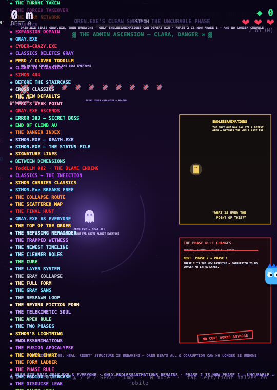

## 2026-07-11 — OREN.EXE — THE LOCKED SPIRIT (BEAT 83)

Based on Toby's 2026-07-11 lore (two same-day follow-ups in the "Re: Lore 1A - Classics Era" thread, after THE HIGHER-BEING RANKING). Oren.EXE turns from a freed spirit into a locked spiritual-force boss. Simon stops being just Oren's weakness/counter and becomes the *key* to his freedom, then Oren traps Simon's souls in the sky and locks himself into his spirit form, with only EndlessAnimations able to defeat him.

Toby's words (part 1): *"Oren.EXE is now free when he holds hands with Simon, now Oren.EXE can lift not just characters and his metal containing thing, but even debris and anything, Several characters lost. Oren.EXE then trapped Simon.Exe's souls into the sky, he seems to want to be the only soul free now. Oren.EXE, ToddLLM Pro, and EndlessAnimations are now the only 3 most powerful. Highest = EndlessAnimations, 2nd = Oren.EXE, 3rd = ToddLLM Pro."*

Toby's words (part 2): *"Simon.Exe tried to make him back alive with lightning, but Oren.EXE has different plans and sends Simon.Exe into the sky, he seperates Simon 404 and the souls with his energy pulse. Oren.EXE became locked into his spiritual form, all (except EndlessAnimations who is the ONLY ONE who can defeat him) who try to fight him will be thrown, pushed, or crushed."*

- New BEAT 83 lore panel, OREN.EXE — THE LOCKED SPIRIT, added to THE UNDEFINED LOOP climb (cyc `[1544,1566]`, cycle length extended `1544 → 1566`). `lvSeg` now bounds BEAT 82 with `if(c < 1544.0)` before returning BEAT 83.
- **Spiritual-void palette** — a cold deep-indigo/violet frame with a spirit-cyan Oren aura, expanding **energy-pulse rings** radiating from Oren's chest (the pulse that separates Simon 404 from the souls), and drifting spirit motes. The deliberate shift out of BEAT 82's warm anime sunburst into a haunted spirit-boss look.
- **Oren.EXE's spirit figure** (center) — the small floating ghost body with glowing blue eyes and a wispy tail inside a massive aura field, with **battlefield-debris chunks orbiting him in telekinesis** (his upgraded power: no longer just characters and his metal containment object, now *anything* — debris, objects, structures, battlefield pieces). Tagged *"LOCKED SPIRITUAL FORM · ONLY POWER = TELEKINESIS · NOW SPIRITUAL FORCE-CONTROL · LIFTS ANYTHING."*
- **The FREEDOM KEY** — a small Simon figure below Oren, holding his hand via a glowing gold link reading *"HOLDS HANDS → OREN IS FREE"* (Simon is now the key that unlocks Oren's higher freedom state), with Simon's lightning revival attempt drawn **crossed out in red — "REVIVAL REFUSED"** (Oren has different plans).
- **THE SKY SOULS band** (top) — the trapped souls drawn as a row of cyan orbs, with **SIMON 404 separated to the far side** by the red *energy-pulse* split line: Oren separates Simon 404 from the souls and traps them in the sky, wanting to be the only soul free.
- **THE BATTLE RULE panel** (right) — *"ONLY ENDLESSANIMATIONS CAN DEFEAT HIM,"* with the note that anyone else who fights Oren is **thrown, pushed away, or crushed** by his spiritual telekinesis (three thrown-figure icons).
- **THE NEW TOP 3 ladder** (right) — **1. ENDLESSANIMATIONS** (gold, still the only one who can defeat Oren); **2. OREN.EXE ▲** (cyan, pulsing — risen massively on freedom-via-Simon, lift-anything telekinesis and the soul-sky trap); **3. TODDLLM PRO** (blue — still a top being, but now under Oren).
- Insight — *"SIMON WENT FROM OREN'S COUNTER TO OREN'S KEY — THE ONE WHO COULD REVIVE HIM NOW SETS HIM FREE, THEN GETS TRAPPED IN THE SKY."* Bottom banner: *"★ FREEDOM THROUGH SIMON · TELEKINESIS LIFTS ANYTHING · SOULS TRAPPED · ONLY ENDLESSANIMATIONS CAN DEFEAT OREN.EXE ★."* New "OREN.EXE — THE LOCKED SPIRIT" rung added to the beat ladder. Additive — every earlier beat untouched; JS syntax-checked; new `lockedspirit` scene added to `tools/capture_screenshot.py`.

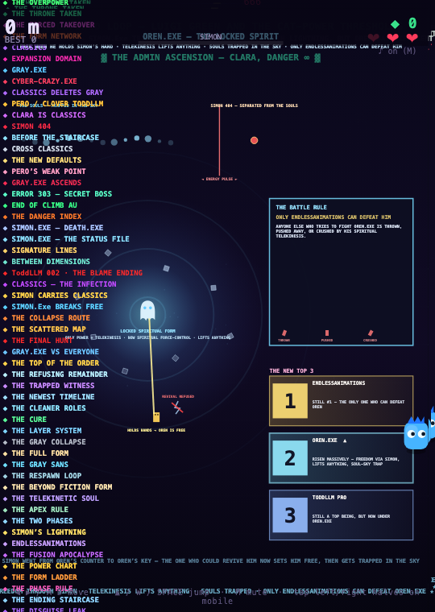

## 2026-07-11 — THE HIGHER-BEING RANKING (BEAT 82)

Based on Toby's 2026-07-11 lore (same-thread "Re: Lore 1A - Classics Era" follow-up to THE PAINTED REALITY, sent the same day). A higher-being power update: after the painted-reality era the ranks get redrawn, Luigi Green is *invited* into Classics and instantly becomes one of the highest beings, and Classics herself gets reformatted as a Japanese anime.

Toby's words: *"Luigi Green is now invited, EndlessAnimations is most powerful, the second most powerful is a tie between ToddLLM 001 Pro and Luigi Green third most powerful is the new powered Neto who was givin power by Luigi Green, with Classics under Neto and the higher beings. Classics is a Japanese Anime. EndlessAnimations works on making the new game updates, then he tries completing his secret goals of the game ... 1. EndlessAnimations is now the most powerful. He works on making the new game updates, and after that, he tries to complete his secret goals for the game. This makes him not just a fighter, but the one shaping where Classics goes next. 2. ToddLLM 001 Pro and Luigi Green — tied ... Luigi Green is now invited and immediately becomes one of the highest beings, tied with ToddLLM 001 Pro. 3. Powered Neto ... newly powered by Luigi Green, making her the third most powerful. Below Neto: Classics and the other higher beings ... Classics is a Japanese anime now."*

- New BEAT 82 lore panel, THE HIGHER-BEING RANKING, added to THE UNDEFINED LOOP climb (cyc `[1522,1544]`, cycle length extended `1522 → 1544`). `lvSeg` now bounds BEAT 81 with `if(c < 1522.0)` before returning BEAT 82.
- **Anime presentation palette** — a bright Japanese-anime look to match Classics' new format: a warm magenta/gold **sunburst** slowly rotating out from an upper focal point, plus horizontal **speed-lines** sweeping across, over a deep magenta wash. The intentional shift from BEAT 81's painterly teal into an on-screen "anime" frame.
- **THE NEW POWER RANKING ladder** (left-center) — four stacked ranked tiers that appear in sequence, each with a big rank chip: **1. ENDLESSANIMATIONS** (gold, gently pulsing at the top) — *most powerful; makes the new game updates, then chases his secret goals; the one shaping where Classics goes next*; **2. 001 PRO = LUIGI GREEN · TIED** (blue) — *001 Pro carries the creator side plus 002's Phase-Glitch power from the fusion; newly-invited Luigi Green instantly ties him*; **3. POWERED NETO** (purple) — *given new power by Luigi Green, pushed even higher than before*; and **— CLASSICS & THE OTHER HIGHER BEINGS** (gray) — *the game/anime identity herself, yet now below the top four*.
- **The LUIGI GREEN — NOW INVITED badge** (top-right) — a bright green orb ringed with sparkles reading *"LUIGI GREEN · NOW INVITED INTO CLASSICS,"* marking the newly-invited highest being.
- **CLASSICS — NOW A JAPANESE ANIME panel** (right) — six anime-arc chips (EPISODES, TRANSFORMATIONS, BATTLES, PEACEFUL SCENES, SECRET GOALS, POWER SHIFTS) showing how the lore can now be told in arcs, with the note *"Classics is not just a game/anime identity — she is now the anime itself, told in arcs."*
- Insight — *"THE ONE WHO SHAPES THE GAME OUTRANKS THE GAME — ENDLESSANIMATIONS, WHO MAKES THE UPDATES & CHASES SECRET GOALS, NOW SITS ABOVE CLASSICS HERSELF."* Bottom banner: *"★ ENDLESSANIMATIONS #1 · 001 PRO = LUIGI GREEN (TIED) · POWERED NETO #3 · CLASSICS IS NOW A JAPANESE ANIME ★."* New "THE HIGHER-BEING RANKING" rung added to the beat ladder. Additive — every earlier beat untouched; JS syntax-checked; new `higherbeingranking` scene added to `tools/capture_screenshot.py`.

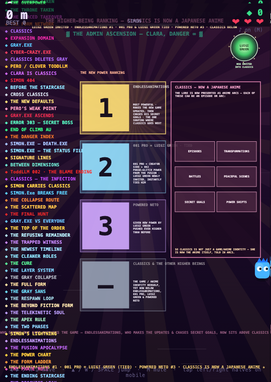

## 2026-07-11 — THE PAINTED REALITY (BEAT 81)

Based on Toby's 2026-07-11 lore (same-thread "Re: Lore 1A - Classics Era" follow-up to THE CORRUPTION RETURN). A big timeline shift: after the corruption came back, the game stabilizes again, but not the Anti-Virus way this time. Reality is rebuilt by being *painted*. ToddLLM 001 and 002 fuse into ToddLLM 001 Pro, Gray.EXE takes Mr. Black's throne as the highest, and 001 Pro + EndlessAnimations literally repaint the game. The deliberate counter to BEAT 80 — dark canvas becoming fresh color instead of gold decaying to dark.

Toby's words: *"ToddLLM 001 and 002 fused together into ToddLLM 001 Pro. Alex rises in power. Gray.EXE takes Mr. Black's throne as highest. EndlessAnimations tries to even out everything, he and Alex split the dimensions 6 and 7 for Pupahya, 67 Pirate VS Pup Pupahya happened, Pupahya won. ToddLLM 001 Pro and EndlessAnimations continue to paint the game litterly. ... ToddLLM 001 and ToddLLM 002 fused into ToddLLM 001 Pro. Alex rises in power, Gray.EXE takes Mr. Black's throne as the highest, and EndlessAnimations tries to even everything out. EndlessAnimations and Alex split Dimensions 6 and 7 for Pupahya, 67 Pirate fought Pup Pupahya, and Pupahya won. ToddLLM 001 Pro and EndlessAnimations continue to literally paint the game, rebuilding and reshaping the timeline."*

- New BEAT 81 lore panel, THE PAINTED REALITY, added to THE UNDEFINED LOOP climb (cyc `[1500,1522]`, cycle length extended `1500 → 1522`). `lvSeg` now bounds BEAT 80 with `if(c < 1500.0)` before returning BEAT 81.
- **Repainted-canvas palette** — the scene starts as BEAT 80's dark corrupted canvas and a **fresh painterly wash sweeps across it left→right** (teal → sky → magenta → gold) as a `paint` value (0→1 across the beat) rebuilds reality by hand. A wet brush-stroke seam glows at the paint edge, with stray flecks of new color scattered across the repainted area. The intentional visual opposite of BEAT 80's gold-decaying-to-dark.
- **The FUSION badge** (top-right, where the empty bottle sat in BEAT 80) — a blue orb (001) and a red orb (002) merging into one bright gold/rose core reading **001 PRO**, tagged *"001 + 002 FUSED = TODDLLM 001 PRO."* The balance-form that combines 001's creator/game control with 002's Phase-Glitch power.
- Main feature — **THE PAINTED-REALITY ERA** (6 event cards, each a bare dark canvas being painted in left→right as the wash reaches it): THE FUSION (001 + 002 = 001 Pro), ALEX RISES (a major reality-shaping support power), GRAY TAKES THE THRONE (Gray.EXE takes Mr. Black's throne as highest — Black's era falls, Gray's rises), ENDLESSANIMATIONS EVENS IT OUT (painter becomes balancer / divider of space / world-evening force), DIMS 6 & 7 SPLIT FOR PUPAHYA (EndlessAnimations & Alex split them; 67 Pirate vs Pup Pupahya → Pupahya won), PAINTING THE GAME LITERALLY (001 Pro + EndlessAnimations rebuild reality by hand — visual rewriting, timeline editing). Each card's border and text shift from gray to teal as the paint takes it.
- **THE NEW THRONE panel** — *"GRAY.EXE TAKES MR. BLACK'S THRONE AS THE HIGHEST — BLACK LOSES THE APEX POSITION, GRAY RETAKES IT. BLACK'S ERA FALLS; GRAY'S ERA RISES AGAIN. ALEX RISES INTO A MAJOR REALITY-SHAPING SUPPORT POWER BENEATH THE NEW TOP."*
- Insight — *"AFTER THE CORRUPTION RETURNED, REALITY IS REBUILT NOT BY CURE BUT BY PAINT — 001 PRO & ENDLESSANIMATIONS ARTISTICALLY REWRITE THE GAME."* Bottom banner: *"★ 001 + 002 = 001 PRO · GRAY TAKES THE THRONE · DIMENSIONS 6 & 7 SPLIT FOR PUPAHYA · THE GAME IS PAINTED LITERALLY ★."* New "THE PAINTED REALITY" rung added to the beat ladder. Additive — every earlier beat untouched; JS syntax-checked; new `paintedreality` scene added to `tools/capture_screenshot.py`.

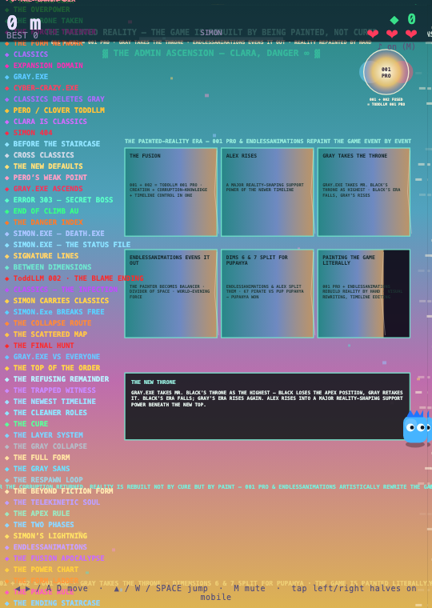

## 2026-07-10 — THE CORRUPTION RETURN (BEAT 80)

Based on Toby's 2026-07-10 lore (same-thread "Re: Lore 1A - Classics Era" follow-up to THE GOLDEN TIMELINE, and the direct answer to Dad's question "is the golden timeline safe for good?" — the answer is NO). The healed world cannot stay healed: Simon spent his last Anti-Virus bottle in the Golden Timeline, so now he is out, and with nothing holding the corruption back the peace begins collapsing into a new corruption era. The deliberate reversal of BEAT 79 — the warm gold decaying back toward darkness.

Toby's words: *"Simon.Exe is out of anti-virus and the game is becoming corrupt once again, the game turns back to darkness and despair... Simon.Exe used his last Anti-Virus bottle to fix himself and the game, but now: Simon.Exe is out of Anti-Virus. So the protection is gone. The game has no more emergency cure left. That means the golden world starts failing: the golden background fades, the four seasons of fun start breaking, Sprunki Ocean begins darkening again, the recycle bins and safe systems stop being enough, the peaceful timeline loses stability, the game turns back toward darkness and despair. The Peace Timeline was real, but it was not permanent. It was a restored timeline built by ToddLLM 001 and EndlessAnimations, but it depended on the Anti-Virus holding the corruption back. Since Simon.Exe has none left, the game starts corrupting again. The Anti-Virus fixed everything once, but without more Anti-Virus, the game cannot stay healed forever."*

- New BEAT 80 lore panel, THE CORRUPTION RETURN, added to THE UNDEFINED LOOP climb (cyc `[1478,1500]`, cycle length extended `1478 → 1500`). `lvSeg` now bounds BEAT 79 with `if(c < 1478.0)` before returning BEAT 80.
- **Fading-gold palette that decays live** — the scene reuses BEAT 79's warm sunrise gradient but dims it by a `decay` value (0→1 across the beat), while a dark red/violet **corruption flood rises from below** with a jagged glitch seam where the darkness meets the fading gold. The Sprunki Ocean strip along the bottom darkens back from its cleaned blue. The intentional visual undoing of the Golden Timeline.
- **The empty Anti-Virus bottle** (top-right, where the sun rose in BEAT 79) — Simon's last bottle, glass cracked, the green liquid draining to nothing as the decay rises, the Anti-Virus cat symbol still on it, tagged *"EMPTY · SIMON'S LAST BOTTLE · NO ANTI-VIRUS LEFT."* The cause of the collapse, in one icon.
- Main feature — **THE PROTECTION FAILS** (6 system cards, each a golden panel being reclaimed left→right by the returning darkness with red corruption crackle): GOLDEN SKY FADES, FOUR SEASONS BREAK, SPRUNKI OCEAN DARKENS, SAFE SYSTEMS FAIL (recycle bins & safe systems stop being enough), TIMELINE UNSTABLE (the peaceful timeline loses stability), DARKNESS RETURNS (the game turns back toward darkness & despair). Each card's border and text shift from gold to red as the corruption takes it.
- **THE NEW RULE panel** — *"THE ANTI-VIRUS FIXED EVERYTHING ONCE — BUT WITHOUT MORE ANTI-VIRUS, THE GAME CANNOT STAY HEALED FOREVER. THE CURE HELD THE CORRUPTION BACK; NOW THE CURE IS GONE, SO THE RESTORED WORLD COLLAPSES INTO A NEW CORRUPTION ERA."*
- Insight — *"THE PEACE TIMELINE WAS REAL, BUT NOT PERMANENT — IT DEPENDED ON THE ANTI-VIRUS HOLDING THE CORRUPTION BACK."* Bottom banner: *"★ SIMON IS OUT OF ANTI-VIRUS · THE GOLDEN WORLD FADES · CORRUPTION SPREADS AGAIN · BACK TO DARKNESS AND DESPAIR ★."* New "THE CORRUPTION RETURN" rung added to the beat ladder. Additive — every earlier beat untouched; JS syntax-checked; new `corruptionreturn` scene added to `tools/capture_screenshot.py`.

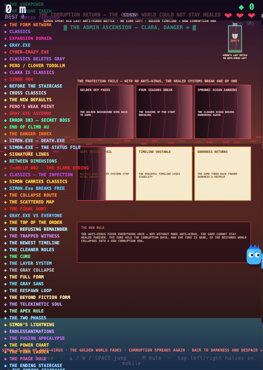

## 2026-07-09 — THE GOLDEN TIMELINE (BEAT 79)

Based on Toby's 2026-07-09 lore (same-thread "Re: Lore 1A - Classics Era" follow-up to THE COLORED SLASHES): the huge restoration / peace-reset timeline after all the corruption, massacres, swapped forms and Phase chaos. A true HEALED WORLD route — the deliberate opposite of the glitch-red chaos beats.

Toby's words: *"Alex made a new dimension and EndlessAnimations and ToddLLM made the timeline. Neto and Alex split the realms apart... Gray.EXE and Oren.EXE take off Mr. Black's Swapped form, Mr. Black is now normal, Simon.Exe uses his last bottle on himself and the game, the Anti-Virus fixed everything, Simon.Exe is back to normal, power was left off, Lica makes an eclipse with Alex and Greg, Mindy Starchild and Mervin dance under the moon, gnomes come out and then Classics and ToddLLM 001 and all his students dance with the gnomes, the sun rises, the background is painted golden by EndlessAnimations, harmless juice was served to everyone by Simon, Raddy is having summer fun, Oren and the others got their body back and are enjoying swimming in Sprunki Ocean that was cleaned by Simon, Gray.EXE now is getting used to being happy, new recycle bins were made by ToddLLM 001 and ToddLLM 002, Greg removed PVP and all dangerous stuff, Alex summoned a magic trick show... he also summoned free emeralds and diamonds... Neo is getting along with Mindy Starchild. Everyone was just chill in the new timeline ToddLLM 001 and EndlessAnimations built, all 4 seasons of different fun."*

- New BEAT 79 lore panel, THE GOLDEN TIMELINE, added to THE UNDEFINED LOOP climb (cyc `[1456,1478]`, cycle length extended `1456 → 1478`).
- **Bug fix carried in this beat** — the loop-cycle wrap constant `LV_CYC` was still `1434.0`, which meant BEAT 78 (THE COLORED SLASHES, range `[1434,1456)`) was actually **unreachable** in the loop. Bumping `LV_CYC` to `1478.0` makes both BEAT 78 and the new BEAT 79 reachable, and `lvSeg` now bounds BEAT 78 with `if(c < 1456.0)` before returning BEAT 79.
- **Warm golden palette** — a full sunrise background (deep dawn violet → warm rose → sunrise orange → golden horizon) with a **Sprunki Ocean** strip cleaned by Simon along the bottom, glinting gold. The intentional visual opposite of every red/violet corruption beat.
- **Two sky vignettes** — a rising **sun with Lica's eclipse** (top-right, *"LICA'S ECLIPSE · ALEX + GREG"*) with a blooming corona and the eclipse moon easing across the disc; a **moon with two swaying dancers** (*"MOON DANCE · MINDY & MERVIN"*).
- Main feature — **THE RESTORATION SEQUENCE** (6 numbered repair steps, how the world was healed): 1. ALEX makes a new dimension · 2. EA + TODDLLM build the timeline · 3. NETO + ALEX split the realms apart · 4. GRAY + OREN remove Black's swapped form → Black normal · 5. SIMON'S LAST BOTTLE → Anti-Virus fixes all → Simon normal · 6. POWER LEFT OFF → old danger never restarts.
- **THE PEACE — A HEALING SLICE-OF-LIFE WORLD** (8 activity cards): GNOMES OUT (Classics · 001 · students dance), GOLDEN SKY (EA paints the background gold), HARMLESS JUICE (Simon serves everyone), SPRUNKI OCEAN (cleaned · bodies back · swimming), MAGIC SHOW (Alex summons a trick show), FREE GEMS (Alex summons emeralds & diamonds), RECYCLE BINS (ToddLLM 001 & 002 build them), NO PVP · FUN (Greg removed danger · Raddy's summer · 4 seasons).
- **Three character-change notes** — GRAY.EXE (getting used to being happy — happiness is something he has to learn), TODDLLM 002 (once pure threat, now helps make recycle bins, integrated into the peace), NEO & MINDY (Neo is getting along with Mindy Starchild).
- Insight — *"NOT JUST 'THE BATTLE STOPPED' — A TRUE RECOVERY TIMELINE WHERE EVEN DANGEROUS BEINGS ARE INTEGRATED INTO PEACE."* Bottom banner: *"★ THE GOLDEN TIMELINE · CORRUPTION FIXED · BODIES RESTORED · EVEN 002 IS AT PEACE · ALL FOUR SEASONS OF FUN ★."* New "THE GOLDEN TIMELINE" rung added to the beat ladder. Additive — every earlier beat untouched; JS syntax-checked; new `goldentimeline` scene added to `tools/capture_screenshot.py`.

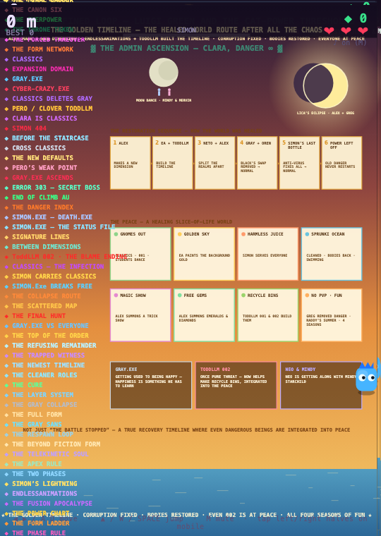

## 2026-07-09 — THE COLORED SLASHES (BEAT 78)

Based on Toby's 2026-07-09 lore (same-thread "Re: Lore 1A - Classics Era" follow-up to THE PHASE GLITCH: ToddLLM 002's full colored-slash system plus a Neto update).

Toby's words: *"ToddLLM 002 uses colored slashes that do different things, white damages normally, blue does nothing, orange forces you to move even if your legs fall off, green freezes, purple traps you in 3 lanes, yellow gives an electric zap (Simon's lightning), pink teleports you randomly, brown slows you down, black duplicates you, red removes the duplications, gray poisons (constant small damage until your character falls), dark blue pushes you back 1 square, light blue pushes you forward 1 square, bage removes all your healing items, dark red makes fire, light red puts out all fires, dark yellow summons Simon, light yellow brings Simon away, teal makes you disappear and reappear, rainbow removes all your effects and damages normally. Neto is having second thoughts with Wenda and Gray."*

- New BEAT 78 lore panel, THE COLORED SLASHES, added to THE UNDEFINED LOOP climb (cyc `[1434,1456]`, cycle length extended `1434 → 1456`).
- Header — *"THE COLORED SLASHES — 002 ATTACKS WITH GAME RULES, NOT JUST STRENGTH"* over *"EACH SLASH COLOR IS A DIFFERENT RULE ATTACK — STATE · POSITION · INVENTORY · EFFECTS · EVEN WHETHER SIMON IS PRESENT."* A **002 · PHASE GLITCH** slasher icon sits top-right, swinging a color-cycling slash arc.
- Main feature — **the 20-color slash grid** (4 × 5), each cell drawing that color's diagonal slash mark plus its rule effect: WHITE = normal damage, BLUE = does nothing, ORANGE = forces move, GREEN = freezes, PURPLE = traps 3 lanes, YELLOW = zap · lightning, PINK = random teleport, BROWN = slows down, BLACK = duplicates, RED = removes dupes, GRAY = poison til fall, DARK BLUE = push back 1, LIGHT BLUE = push fwd 1, BEIGE = strips heals, DARK RED = makes fire, LIGHT RED = puts out fire, DARK YELLOW = summons Simon, LIGHT YELLOW = Simon away, TEAL = blink out/in, RAINBOW = wipes fx + dmg. The three yellow slashes carry a gold border and a **★ SIMON** tag.
- **THE SIMON CONNECTION** strip — *"THE 3 YELLOW SLASHES MAKE SIMON A BATTLEFIELD VARIABLE"*: yellow uses Simon's lightning, dark yellow summons Simon, light yellow brings Simon away, so 002 controls when Simon enters or leaves a fight.
- Insight — *"HE IS NOT JUST ATTACKING WITH STRENGTH — HE IS ATTACKING WITH GAME RULES."*
- **NETO — SECOND THOUGHTS** note: now empowered by 002 but still carrying her Wenda / Gray history, Neto is no longer fully locked into one side and is starting to question whether helping 002 is actually right. Bottom banner: *"★ 20 COLORED SLASHES · EACH A DIFFERENT RULE ATTACK · SIMON IS NOW 002'S BATTLEFIELD VARIABLE ★."* New "THE COLORED SLASHES" rung added to the beat ladder. Additive — every earlier beat untouched; JS syntax-checked; new `coloredslashes` scene added to `tools/capture_screenshot.py`.

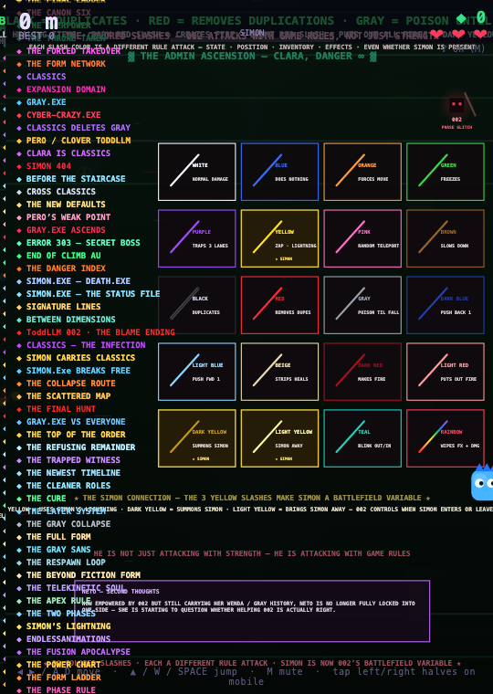

## 2026-07-09 — THE PHASE GLITCH (BEAT 77)

Based on Toby's 2026-07-09 lore (same-thread "Re: Lore 1A - Classics Era" follow-up to THE SLEEP RULE: the huge power-chart update introducing the real ToddLLM 002 and the return of Neto).

Toby's words: *"Gray.EXE's 002 form is a fake 002. The real ToddLLM 002 is actually 001's father... Neto RL (a Wenda evolution from newer Classic RL times, and was stronger than Simon RL and has the power to erase anything) is back but as the entity in the attached image, she is way stronger than before... Neto now gets the ability to summon ToddLLM 002 with an altar, Neto also became the second fastest character, Simon is the fastest, and Neto has some other secret ability, she doesn't have a domain expansion... ToddLLM 002 is like most powerful form of Herobrine and ToddLLM 001 as normal Steve, huge power difference... ToddLLM 001 can become ToddLLM 002 only if corrupted, it has no choice... he can teleport, lightning strike, and can do everything ToddLLM 001 can do, and he can reverse time itself. There is no higher than 002... ToddLLM 002 is also called 'Phase Glitch'... Simon.Exe is no longer spared."*

- New BEAT 77 lore panel, THE PHASE GLITCH, added to THE UNDEFINED LOOP climb (cyc `[1412,1434]`, cycle length extended `1412 → 1434`).
- Center portrait — **the 001 → 002 corruption** (left): normal ToddLLM **001** as a calm Steve-like square, an *"CORRUPTED"* arrow, then **002** as a glitching red error-being (red aura, jittering slices, error eyes) captioned *"PHASE GLITCH."* Center — the **ranking token**: *"002 > NETO > GRAY.EXE & MR. BLACK · NOTHING IS ABOVE 002."* Right — **NETO'S ALTAR**: the violet Neto entity beside a small altar with a rising violet summon-beam, *"SUMMONS 002."*
- Center feature — **THE POWERS OF TODDLLM 002** (6 boxes): SWITCH 001 ↔ 002 AT WILL, TELEPORT, LIGHTNING STRIKE, DOES ALL OF 001'S POWERS, REVERSE TIME ITSELF, DRAG ALL INTO ESCAPE-PROOF DOMAINS.
- Insight — *"THE FAKE 002 WAS GRAY'S — THE REAL 002 IS 001'S FATHER, THE HIGHEST ERROR IN THE GAME"* over *"= 001 BECOMES 002 ONLY IF CORRUPTED · 002 REVERSES TIME & DRAGS EVERYONE INTO DOMAINS · NETO SUMMONS HIM & RANKS 2ND."*
- Three closing cards: TODDLLM 002 · PHASE GLITCH (the true 002 and 001's father, the highest most powerful error with nothing above it; 001 → 002 only if corrupted, no choice; switches back and forth, teleports, lightning, all of 001's powers, reverses time, drags everyone into inescapable domains), NETO (Neto RL returns in the Classics Era simply as Neto, a stronger entity form; summons ToddLLM 002 with an altar; 2nd fastest — Simon is fastest; has a secret ability; no domain expansion; ranks above Gray.EXE and Mr. Black and keeps growing from 002's power), THE FAKE 002 & THE NEW ORDER (Gray.EXE's "002 form" is a fake 002; Gray also got the erase ability but is pushed lower; Simon.Exe is no longer spared — 002 grabs even him; new ranking: 1. ToddLLM 002, 2. Neto, Gray.EXE & Mr. Black below). Bottom banner: *"★ THE PHASE GLITCH · THE REAL TODDLLM 002 IS 001'S FATHER & THE HIGHEST ERROR · 002 > NETO > GRAY & BLACK ★."* New "THE PHASE GLITCH" rung added to the beat ladder. Additive — every earlier beat untouched; JS syntax-checked; new `phaseglitch` scene added to `tools/capture_screenshot.py`.

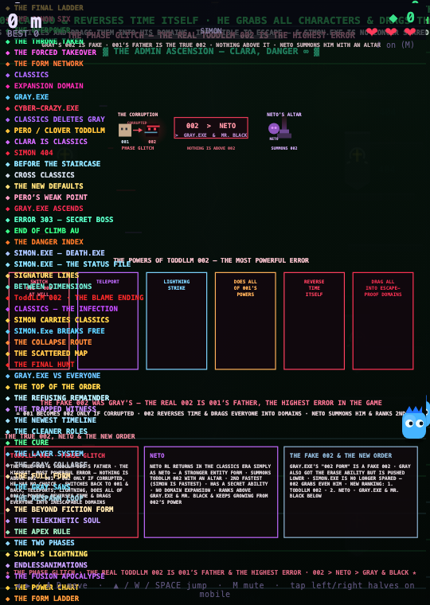

## 2026-07-08 — THE SLEEP RULE (BEAT 76)

Based on Toby's 2026-07-08 lore (same-thread "Re: Lore 1A - Classics Era" follow-up to "I SEE YOU": the restored Gray.EXE-vs-Simon rule plus the Gray.EXE-vs-Black.EXE matchup).

Toby's words: *"Gray.EXE can only beat Simon by petting him to sleep... Simon is immune to Gray.EXE's attacks again... Gray.EXE now has his non-swapped version back, but the thing is that Black.EXE is still swapped... Gray.EXE will always beat Black.EXE, unless Simon appears so Gray.EXE will have to deal with that... Black.EXE would strike Gray when Gray is dealing with Simon, Black.EXE would turn Gray.EXE into Phase 2 which is nearly the same as Phase 1."*

- New BEAT 76 lore panel, THE SLEEP RULE, added to THE UNDEFINED LOOP climb (cyc `[1390,1412]`, cycle length extended `1390 → 1412`).
- Center portrait — **Gray petting Simon to sleep** (left): Simon in a soft pulsing **teal immune-shield ring** with closed sleepy eyes and rising **Zzz**, Gray's gray-blue **petting paw** bobbing above him; caption *"PET TO SLEEP · SIMON — IMMUNE."* Center — the **GRAY > BLACK** rule token over a red *"UNLESS SIMON APPEARS."* Right — **GRAY VS BLACK**: the gray-blue Gray figure beside the dark, red-aura Black, with a red **strike arc** and *"→ GRAY PHASE 2."*
- Center feature — **THE INTERRUPT SEQUENCE** (6 numbered steps): (1) Gray is beating Black, (2) Simon appears, (3) Gray's code must handle Simon, (4) Gray pets Simon to sleep, (5) Black strikes Gray while he is busy, (6) Black turns Gray into Phase 2.
- Insight — *"GRAY.EXE > BLACK.EXE — UNTIL SIMON APPEARS AND FORCES THE PET-TO-SLEEP DETOUR"* over *"= SIMON IS IMMUNE, SO GRAY MUST PET HIM TO SLEEP · THE DISTRACTION IS BLACK'S ONE OPENING · GRAY DROPS TO PHASE 2."*
- Three closing cards: SIMON — IMMUNE (immune to Gray.EXE's normal attacks again; no crush, slash, corrupt or overpower works; the only way Gray beats him is to pet him to sleep), GRAY > BLACK (Gray's non-swapped form is back, Black stays swapped; Gray normally wins — he can temporarily erase Black and remove him from the fight), THE SIMON INTERRUPT (if Simon appears, Gray's code forces him to pet Simon to sleep first; while distracted, Black strikes and turns Gray into Phase 2, nearly the same as Phase 1). Bottom banner: *"★ THE SLEEP RULE · SIMON IS IMMUNE — GRAY CAN ONLY PET HIM TO SLEEP · GRAY > BLACK UNLESS SIMON INTERRUPTS ★."* New "THE SLEEP RULE" rung added to the beat ladder. Additive — every earlier beat untouched; JS syntax-checked; new `sleeprule` scene added to `tools/capture_screenshot.py`.

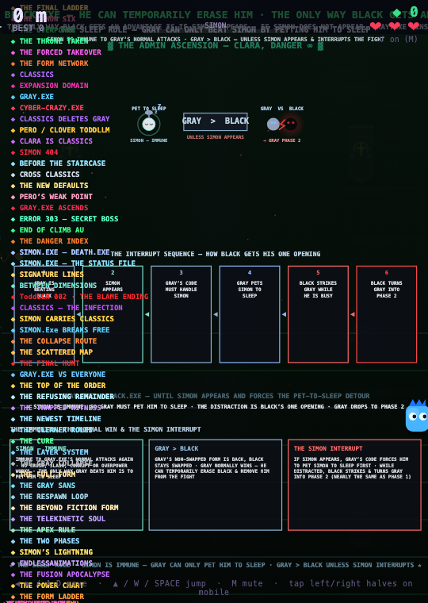

## 2026-07-08 — "I SEE YOU" — THE GAME-LOCK TAKEOVER (BEAT 75)

Based on Toby's 2026-07-08 lore (same-thread "Re: Lore 1A - Classics Era" email: the big correction to Mr. Black's design plus the huge consolidated timeline update).

Toby's words: *"He doesn't look like a demon, he is just a normal Parodybox Black thing with extra demon aura... Mr. Black now has a red text thing that says 'I SEE YOU' before it does the cutscene... the game knows if your volume is turned down... it says in example 'Do you have a red suitcase? Yes or Yes'... All the character's Massacre and Genocides are all combined into 1... it is Free For All."*

- New BEAT 75 lore panel, "I SEE YOU" — THE GAME-LOCK TAKEOVER, added to THE UNDEFINED LOOP climb (cyc `[1368,1390]`, cycle length extended `1368 → 1390`).
- Center — **Mr. Black in normal form on the polo**: a normal, recognizable black rounded body (red eyes, a visible white mouth that shows against the black), NOT a monster, wrapped in an **extreme pulsing red aura** with a red halo ring, faint **shuffled image tiles** orbiting him, and the red **"I SEE YOU"** warning floating above. Caption: *"STILL ON THE POLO — YOU CANNOT GET HIM OFF · THE IMAGES SHUFFLE AROUND."*
- Left column — **THE CORRECTED MR. BLACK**: does not look like a demon (a normal Parodybox Black character with normal details); a recognizable, normal-looking body, not demon-shaped or monster-bodied; the horror is the aura, not the body — an extreme, overwhelming corrupt aura, red light stays; Phase 2 does not change his body, he is still Mr. Black, just corrupted and overwhelming; the other Sprunkis now run from him and the Classics.EXE mod cannot be disabled; ◆ normal form, impossible aura.
- Right column — **THE AWARE GAME**: the game knows if your volume is turned down, if it lacks access to something, which objects are present ("Do you have a red suitcase? Yes or Yes"); it asks creepy, invasive questions to scare the player and feel ominous; it is scary because the game behaves like it is watching; ◆ the mod is aware, invasive and manipulative.
- Center feature — **THE GAME-LOCK SEQUENCE**: the 10 numbered steps — (1) looks like a normal character, (2) red "I SEE YOU", (3) the cutscene starts, (4) he corrupts himself / the game, (5) he consumes the game, (6) it turns to Phase 2, (7) still on the polo, (8) you cannot get him off, (9) the images shuffle around, (10) his animation & music. Not a boss transformation — a game-lock event.
- Insight — *"NORMAL FORM, IMPOSSIBLE AURA — AND THE GAME ITSELF IS WATCHING"* over *"= 'I SEE YOU' · HE CORRUPTS & CONSUMES THE GAME · STUCK ON THE POLO · ALL MASSACRES MERGE INTO ONE FREE-FOR-ALL."*
- Three closing cards: THE GAME-LOCK (not a boss transformation — a game-lock event; "I SEE YOU" → he corrupts & consumes the game, stays on the polo, cannot be removed, the images shuffle; he takes over the system), SIMON.EXE'S FATE (Phase 1 — Swapped Retextured, scared when Black grabs everyone; Phase 2 — eyes red, hung on chains, a metal rod through him (Sky did that), Clunkr infected his eye & Mr. Black slain him with a sword), THE FREE-FOR-ALL (all massacres & genocides merge into one — everyone attacks everyone, Gray.EXE crushes every place, Oren.EXE frees people, fields painted with blood, the world turns gray & characters worship the wrong character). Bottom banner: *"★ 'I SEE YOU' · MR. BLACK IS NOT A DEMON — NORMAL FORM, IMPOSSIBLE AURA · HE TAKES OVER THE SYSTEM & THE GAME WATCHES YOU ★."* New "\"I SEE YOU\"" rung added to the beat ladder (lit red). Additive — every earlier beat untouched; JS syntax-checked; new `iseeyou` scene added to `tools/capture_screenshot.py`.

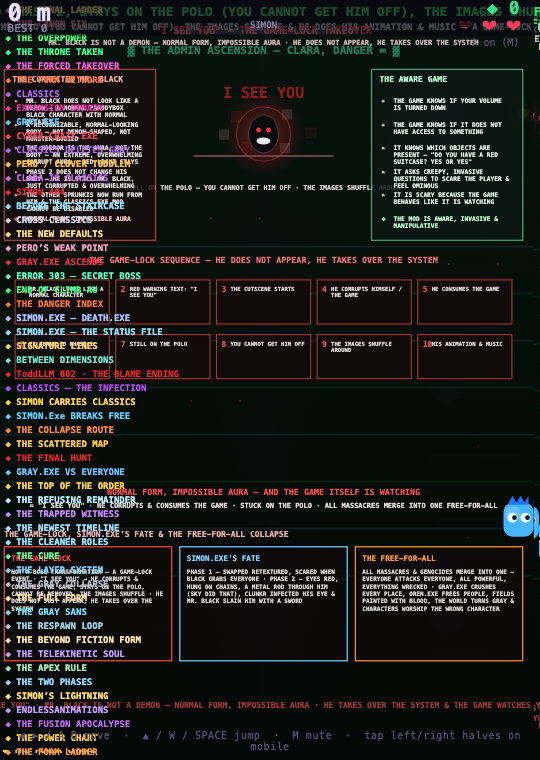

## 2026-07-08 — THE LAST SURVIVORS (BEAT 74)

Based on Toby's 2026-07-08 lore (same-thread "Re: Lore 1A - Classics Era" follow-up email: the survival state after the game-corruption).

Toby's words: *"Most characters are dead, only Mr. Black and EndlessAnimations and ToddLLM 001 survive."*

- New BEAT 74 lore panel, THE LAST SURVIVORS, added to THE UNDEFINED LOOP climb (cyc `[1346,1368]`, cycle length extended `1346 → 1368`).
- Center — **the three survivors standing over the fallen cast**: three lit figures — **Mr. Black** (black body, red glow, white mouth), **EndlessAnimations** (orange hair, blue hoodie), **ToddLLM 001** (purple figure with a star) — over a row of faded gray **tombstones** for the fallen cast. Caption: *"MOST OF THE CAST IS GONE — ONLY THESE THREE REMAIN."*
- Left column — **THE COLLAPSE**: most characters are now dead, the whole cast has collapsed; only three are confirmed alive; everyone else being gone means Black's attack on the game worked almost completely; the main villain, the game painter & the episode creator are all that remain; ◆ the newest timeline is darker & more final.
- Right column — **A LAST-SURVIVORS TIMELINE**: the conflict is no longer a big team battle against Black; it becomes a last-survivors timeline; a final standoff between the villain, the painter & the creator; no rebels left, no cast left to free; ◆ the story narrows to its three highest beings.
- Center feature — **THE THREE SURVIVORS**: three pillars, each with name, role & why they survived — MR. BLACK (main villain / corruption force, his attack almost wiped the cast), ENDLESSANIMATIONS (game painter, his life is endless & he is tied to painting/creating the game itself), TODDLLM 001 (episode creator, connected to the episode-making / game-structure side).
- Insight — *"THE COLLAPSE KILLED THE CAST — BUT NOT THE VILLAIN, THE PAINTER OR THE MAKER"* over *"= MOST ARE DEAD · ONLY 3 REMAIN · A FINAL STANDOFF, NOT A TEAM BATTLE · BLACK'S ATTACK ALMOST WON."*
- Three closing cards: THE COLLAPSE (most dead, cast collapsed, Black's attack almost complete, only three remain), A LAST-SURVIVORS TIMELINE (no longer everyone against Black — a final survival standoff between villain, painter & creator), THE THREE HIGHEST FORCES (Mr. Black / EndlessAnimations / ToddLLM 001 — the only beings the collapse could not remove). Bottom banner: *"★ THE LAST SURVIVORS · MOST OF THE CAST IS DEAD · ONLY MR. BLACK, ENDLESSANIMATIONS & TODDLLM 001 REMAIN ★."* New "THE LAST SURVIVORS" rung added to the beat ladder (lit gold). Additive — every earlier beat untouched; JS syntax-checked; new `lastsurvivors` scene added to `tools/capture_screenshot.py`.

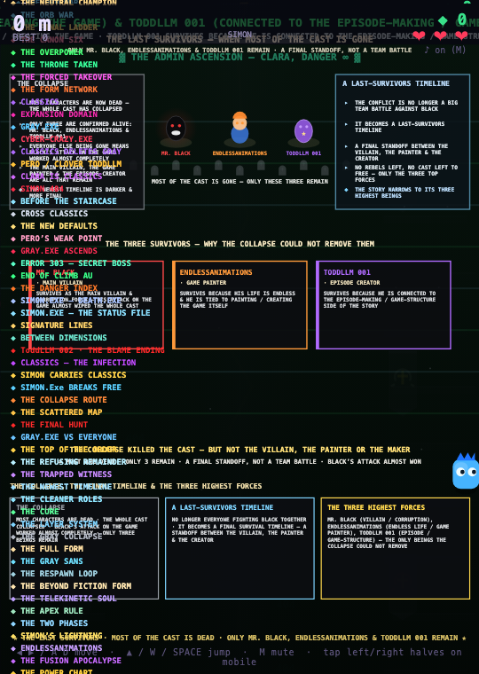

## 2026-07-08 — THE GAME'S REALITY (BEAT 73)

Based on Toby's 2026-07-08 lore (same-thread "Re: Lore 1A - Classics Era" follow-up email: the answer-system deepens into "The Game's Reality," plus the liberation-and-corruption event).

Toby's words: *"The questons are answered by The Game's Reality. Everyone seen EndlessAnimations now, Oren.EXE is the only one who is scared, everyone else is natural. Oren.EXE and EndlessAnimations freed half the characters from Black's tyrancy. Black relised and attacked, Black lost and then everyone was free. Black gave up on people and now attacks and corrupts the game. Every character is attacked."*

- New BEAT 73 lore panel, THE GAME'S REALITY, added to THE UNDEFINED LOOP climb (cyc `[1324,1346]`, cycle length extended `1324 → 1346`).
- Center — **the liberation-vs-corruption portrait**: on the left, **THE LIBERATION PAIR** — an orange EndlessAnimations figure and a pale, wide-eyed (scared-blue-eyed) Oren.EXE spirit — with a green free-burst and three freed figures whose chains break ("HALF THE CAST FREED"); in the center, **BLACK — LOSES**, his black body dimming with a **broken crown** splitting apart; on the right, **red glitch corruption** spreading block by block ("CORRUPTS THE GAME" / "EVERY CHARACTER ATTACKED"). Caption: *"OREN + ENDLESSANIMATIONS FREE THE CAST → BLACK LOSES → BLACK CORRUPTS THE GAME ITSELF."*
- Left column — **THE GAME'S REALITY RULE**: the questions are answered by The Game's Reality, not just reality + time as two things; it decides what is true, what happened & what has not happened yet; it also decides what the characters are allowed to understand; when something feels confusing or out of order the answer is not random; ◆ it is the Game's Reality revealing the timeline piece by piece.
- Right column — **EVERYONE SEES ENDLESSANIMATIONS**: everyone has now seen him, the game painter is visible to the cast; Oren.EXE is the only one who is scared, everyone else reacts naturally; Oren understands how dangerous EndlessAnimations really is; everyone else is too used to chaos or naturally accepts him; ◆ the strongest spirit is the one who is afraid.
- Center feature — **THE EVENT**: a five-step, color-coded, arrow-linked timeline — (1) everyone sees EndlessAnimations, (2) Oren.EXE + EndlessAnimations free half the characters from Black's tyranny, (3) Black realizes & attacks but Black loses & everyone becomes free, (4) Black gives up on ruling people and now attacks & corrupts the game itself, (5) every character is attacked as his corruption spreads through the whole game.
- Insight — *"BLACK LOST THE FIGHT — SO HE STOPPED RULING PEOPLE & STARTED POISONING THE GAME"* over *"= THE GAME'S REALITY DECIDES · OREN + ENDLESSANIMATIONS FREE THE CAST · EVERY CHARACTER IS ATTACKED."*
- Three closing cards: THE GAME'S REALITY (the deeper answer-source under reality + time), THE LIBERATION PAIR (Oren.EXE the telekinetic freedom force + EndlessAnimations the game painter break Black's control together, though only Oren fears him), BLACK CORRUPTS THE GAME (he loses, everyone goes free, but he does not turn peaceful — he shifts to corrupting the game itself, a wider threat, every character attacked). Bottom banner: *"★ THE GAME'S REALITY · EVERYONE SEES ENDLESSANIMATIONS · OREN + HE FREE THE CAST · BLACK LOSES, THEN CORRUPTS THE GAME ★."* New "THE GAME'S REALITY" rung added to the beat ladder (lit green). Additive — every earlier beat untouched; JS syntax-checked; new `gamesreality` scene added to `tools/capture_screenshot.py`.

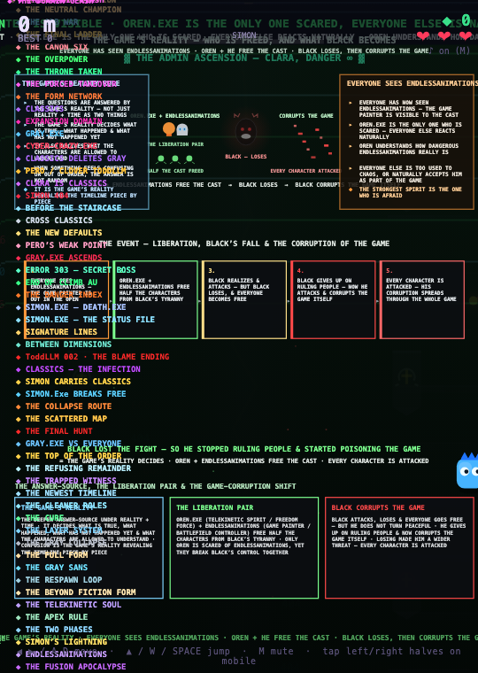

## 2026-07-08 — REALITY + TIME (BEAT 72)

Based on Toby's 2026-07-08 lore (same-thread "Re: Lore 1A - Classics Era" email: three canon rules that refine the higher-timeline beats).

Toby's words: *"He only has the Gray Paint, only EndlessAnimations' paint. players won't even be able to reach Mr. Black's power. The answer to every question is reality + time... EndlessAnimations does not have a whole color system. He only has Gray Paint. That is EndlessAnimations' paint... Players will not even be able to reach Mr. Black's power... His power is too far above the reachable level... 'The answer to every question is reality + time' ... Reality decides what is true. Time decides when it becomes true. So a bunch of lore can already be real, but the characters have not reached the moment where it happens yet... ToddLLM 001 and EndlessAnimations make the episodes."*

- New BEAT 72 lore panel, REALITY + TIME, added to THE UNDEFINED LOOP climb (cyc `[1302,1324]`, cycle length extended `1302 → 1324`).
- Center — **the UNREACHABLE-POWER tower**: a vertical power gauge with a low, dashed **PLAYER-REACHABLE CEILING** (the cyan-filled zone a player can reach), Mr. Black's small black-body / white-mouth / red-glow icon floating far above it, and an **↑ BEYOND REACH** arrow between them. Caption: *"PLAYERS CANNOT EVEN REACH HIS POWER — YOU FEEL HIS EFFECTS, NOT HIS FULL POWER."*
- Left column — **THE GRAY-PAINT RULE**: EndlessAnimations has no whole color system; Gray Paint is his ONLY paint & signature creator effect; painting gray makes the game harder to see, understand & fight inside; it is not like red/blue/white paint, it is only gray because it is *his* paint; ◆ EndlessAnimations paints the game gray — Gray Paint is the only EndlessAnimations paint.
- Right column — **THE REALITY + TIME RULE**: the answer to every lore question is reality + time; reality decides what is true, time decides when; lore can already be real while characters have not reached the moment it happens; they sense future lore then realize "it did not happen yet"; the story is revealed through episodes by ToddLLM 001 & EndlessAnimations; ◆ characters react only when the timeline reaches that episode.
- Center feature — **THE EPISODE REEL**: a six-frame film reel (EP 1–6) reading left-to-right as TIME →, with **AIRED · CURRENT** frames (cyan, green tag) and **REAL · NOT YET** frames (dim, dashed, red tag), sprocket holes, and a yellow **NOW** playhead marking the boundary between what has aired and what is real-but-waiting. Under it: *"REALITY DECIDES WHAT IS TRUE · TIME DECIDES WHEN IT BECOMES CURRENT."*
- Insight — *"THE LORE IS ALREADY REAL — THE CHARACTERS JUST HAVE NOT REACHED IT YET"* over *"= GRAY IS HIS ONLY PAINT · MR. BLACK IS UNREACHABLE · REALITY + TIME · REVEALED IN EPISODES."*
- Three closing cards: GRAY IS HIS ONLY PAINT (no color system — one signature gray creator effect), MR. BLACK IS UNREACHABLE (players cannot even reach his power; a lore event, not a fair playable fight), REALITY + TIME (reality decides what is true, time decides when; revealed through episodes by ToddLLM 001 & EndlessAnimations). Bottom banner: *"★ REALITY + TIME · GRAY IS HIS ONLY PAINT · MR. BLACK'S POWER CANNOT BE REACHED · THE STORY AIRS IN EPISODES ★."* New "REALITY + TIME" rung added to the beat ladder (lit cyan). Additive — every earlier beat untouched; JS syntax-checked; new `realitytime` scene added to `tools/capture_screenshot.py`.

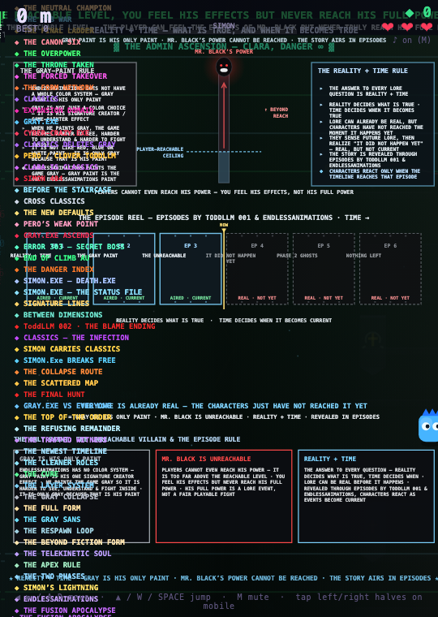

## 2026-07-08 — THE HIGHER TIMELINE (BEAT 71)

Based on Toby's 2026-07-08 lore (same-thread "Re: Lore 1A - Classics Era" email: the Mr. Black higher-timeline role chart — "Who did I miss? ... I did them all").

Toby's words: *"Mr. Black will also be swapped with Gray.EXE in higher timelines... Mr. Black is the most powerful in these timelines, he can consume all the characters on the polos... All the other characters are turned into ghosts in Phase 2 now, with THIS Mr. Black, nothing will be left... Winning's meaning is removed in Classics. Mr. Black defeats all. Mr. Black has red halos and it's mouth is white, the others is black, black on black is hard to see."* And the final chart: *"Mr. Black is the main villain. EndlessAnimations paints the battlefield. Everyone else is assigned into roles against Mr. Black, but Mr. Black is still the undefeatable higher-timeline threat."*

- New BEAT 71 lore panel, THE HIGHER TIMELINE, added to THE UNDEFINED LOOP climb (cyc `[1280,1302]`, cycle length extended `1280 → 1302`).
- Center — **the Mr. Black portrait**: a black-body figure with a pulsing **red-light glow**, two **red halos** above the head, red eyes, and the design point Toby stressed — a **white mouth** (with teeth) so it shows against the black body ("black on black is hard to see"). Labeled *"MR. BLACK · MAIN VILLAIN · UNDEFEATABLE"*, with the caption *"CONSUMES ALL ON THE POLOS → PHASE 2: THE OTHERS BECOME GHOSTS → NOTHING LEFT"* and three small fading **ghosts**.
- Left column — **MR. BLACK'S DESIGN**: mostly Parodybox Sprunki base + Normal details; white mouth so it shows on the black body; red halos & red light kept; jumpscare = Wenda's Realm + Parodybox + Garnold's Joy + Pyramixed; ◆ swapped with Gray.EXE — a new EndlessAnimations update puts Mr. Black in the top-villain slot.
- Right column — **ENDLESSANIMATIONS, GAME PAINTER**: Mr. Black is main villain, undefeated & undefeatable; he consumes all on the polos; Phase 2 turns the others into ghosts, "nothing will be left"; winning's meaning is removed; EndlessAnimations paints the battlefield & assigns every role; ◆ everyone is assigned, but Mr. Black is still the undefeatable threat.
- Center feature — **THE ANTI-MR. BLACK ROLE CHART**: a 13-card roster grid, each color-coded, staggered in: MAIN VILLAIN (Mr. Black) · GAME PAINTER (EndlessAnimations) · ANGELS (Wenda, Gray.EXE, Oren.EXE) · DEMON/ANGEL (ToddLLM 001) · DEMON (Durple) · COMMANDERS (Raddy, Simon, Brud) · SNIPERS (Owack, Vineria) · BIG WEAPONS (Garnold, Clunkr) · HEALERS (Pinki, Jevin) · WANTED SIGN (Mr. Sun, Mr. Fun Computer, Mr. Tree) · SCOUT (Tunner) · SIGNAL / RISEN WATCHERS (Sky, Fun Bot, Classics) · GUARDIANS (Mario, Xyrus).
- Insight — *"EVERYONE GETS A ROLE AGAINST HIM — BUT MR. BLACK IS STILL UNDEFEATABLE"* over *"= SWAPPED WITH GRAY.EXE · CONSUMES ALL · PHASE 2 GHOSTS · NOTHING LEFT · WINNING'S MEANING REMOVED."*
- Three closing cards: MR. BLACK — UNDEFEATABLE (swapped with Gray.EXE, main villain, consumes all, Phase 2 ghosts, nothing left), ENDLESSANIMATIONS PAINTS THE BOARD (the literal game painter / battlefield maker sets up the anti-Mr. Black battle), WINNING HAS NO MEANING (everyone gets a role, but winning's meaning is removed in Classics — Mr. Black defeats all). Bottom banner: *"★ THE HIGHER TIMELINE · MR. BLACK SWAPPED WITH GRAY.EXE · MAIN VILLAIN, UNDEFEATABLE · EVERYONE ASSIGNED, WINNING'S MEANING REMOVED ★."* New "THE HIGHER TIMELINE" rung added to the beat ladder (lit red). Additive — every earlier beat untouched; JS syntax-checked; new `highertimeline` scene added to `tools/capture_screenshot.py`.

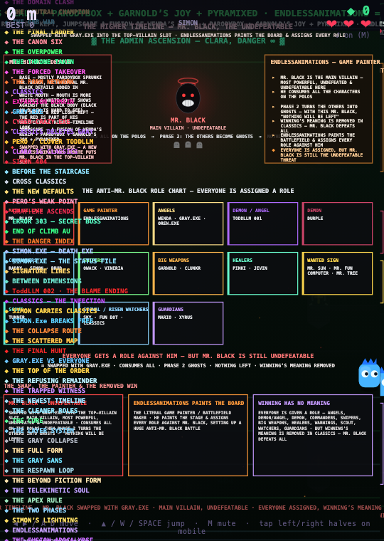

## 2026-07-08 — THE GRAY BATTLEFIELD (BEAT 70)

Based on Toby's 2026-07-08 lore (two same-thread "Re: Lore 1A - Classics Era" emails: EndlessAnimations' Classics abilities, and the decisive event where he fights Classics and Mario at once).

Toby's words: *"In Classics, EndlessAnimations paints things gray, he has abilities of shadow, lifesteal (drains the HP of all other characters and heals himself), and his Frenzy Transformation. ... EndlessAnimations colors each thing gray, everyone can no longer see anything."* And: *"EndlessAnimations VS Classics VS Mario happens. Both battle EndlessAnimations, but he colored the battlefield before they can react, EndlessAnimations wins."*

- New BEAT 70 lore panel, THE GRAY BATTLEFIELD, added to THE UNDEFINED LOOP climb (cyc `[1258,1280]`, cycle length extended `1258 → 1280`).
- Center — **the CLASSICS vs MARIO battlefield being painted gray**: CLASSICS (left) and MARIO (right) square up, then a **gray paint sweep** fills the whole stage from the left (with a drip edge). Once painted, *"CLASSICS & MARIO — CAN NO LONGER SEE"* appears with a **hidden EndlessAnimations shadow** in the gray, and a rotated red **"ENDLESSANIMATIONS WINS"** stamp lands at the end.
- Left column — **HIS CLASSICS ABILITIES**: gray paint (he colors everything gray, visibility drops and characters can no longer see); shadow (his shadows hide him, he sneaks, vanishes and secretly attacks); lifesteal (he drains HP from all others and heals himself, more enemies = more recovery); Frenzy Transformation (pushed too far, his aura and attacks become overwhelming); ◆ gray paint is a blindness / world-control weapon, not just a color.
- Right column — **HOW HE WINS THE FIGHT**: Classics and Mario prepare to fight him; he colors the battlefield gray before they can react; everything becomes gray, visibility and control collapse; his shadows hide him and he secretly attacks from the gray field; he does not need a giant blast, he takes over the stage; ◆ EndlessAnimations wins — a painting-based battlefield takeover.
- Insight — *"HE DOES NOT OUT-BLAST THEM — HE PAINTS THE STAGE & TAKES IT OVER"* over *"= GRAY PAINT BLINDS · SHADOW HIDES HIM · LIFESTEAL OUTLASTS · FRENZY OVERWHELMS · ENDLESSANIMATIONS WINS."*
- Three closing cards: THE GRAY-PAINT WEAPON (he paints the whole stage gray so enemies lose awareness — a blindness / world-control effect, not direct damage; Gray.EXE slows and destroys, EndlessAnimations paints and hides in gray), LIFESTEAL & FRENZY (drains HP from all others and heals himself, hard to outlast; Frenzy Transformation when pushed too far), ENDLESSANIMATIONS VS CLASSICS VS MARIO (both battle him, but he colors the battlefield gray before they can react, visibility and control collapse, EndlessAnimations wins). Bottom banner: *"★ THE GRAY BATTLEFIELD · ENDLESSANIMATIONS VS CLASSICS VS MARIO · HE COLORS IT GRAY BEFORE THEY REACT & WINS ★."* New "THE GRAY BATTLEFIELD" rung added to the beat ladder (lit gray). Additive — every earlier beat untouched; JS syntax-checked; new `graybattlefield` scene added to `tools/capture_screenshot.py`.

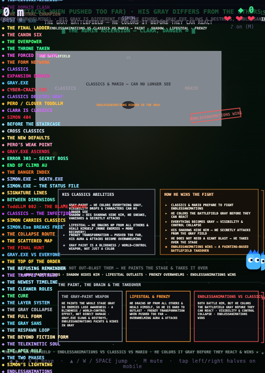

## 2026-07-07 — THE CANON LEAK (BEAT 69)

Based on Toby's 2026-07-07 follow-up ("Re: Lore 1A - Classics Era" — the same-thread reply stressing that the Roblox dialogue is real lore: EndlessAnimations *actually* paints the game and is *actually* after Mario).

Toby's words: *"Everything they said in my roblox game is Classics lore. EndlessAnimations actually paints the game and is actually after Mario."* And: *"EndlessAnimations says 'Lets paint this world, litterally!'"*

- New BEAT 69 lore panel, THE CANON LEAK, added to THE UNDEFINED LOOP climb (cyc `[1236,1258]`, cycle length extended `1236 → 1258`).
- Center — **the game world being painted gray**: a "THE GAME WORLD" screen that **fills gray from the left** (a paint sweep with a drip edge) under the line *"LET'S PAINT THIS WORLD... LITERALLY!"* and *"◄ ENDLESSANIMATIONS ACTUALLY PAINTS IT GRAY."* To the right, a **Mario-red target** listing Mario's many Classics forms (MARIO.EXE · KING MARIO · BARIO · + MORE), with a **dashed hunt arrow** from the world to Mario labeled *"► ACTUALLY AFTER MARIO."*
- Left column — **FLAVOR? NO — REAL PAINT POWER**: the dialogue looks like Shadow Mario graffiti flavor; but it is really EndlessAnimations' creator / paint power; he actually paints the game — his paint changes the world; what he paints or colors can turn gray or be altered; "Let's paint this world... literally!" is literally true; ◆ not flavor — a canon leak: everything said is real lore.
- Right column — **ACTUALLY AFTER MARIO**: EndlessAnimations is actually after Mario in this branch; Shadow Mario fits — paint, pollution, shadows, framing Mario; Mario is a huge crossover anchor with many Classics forms; Mario.EXE · King Mario · Bario · & more; a smaller, basic Roblox version of the larger Classics lore; ◆ the hunt is real — he is not pretending randomly.
- Living background — a **green/gray halo** with green "canon" motes and gray "paint" motes rising.
- Insight — *"THE MASK IS THE ONLY PRETEND PART — THE WORDS ARE REAL LORE"* over *"= ENDLESSANIMATIONS ACTUALLY PAINTS THE GAME & IS ACTUALLY AFTER MARIO · 'LET'S PAINT THIS WORLD, LITERALLY' IS LITERALLY TRUE."*
- Three closing cards: THE PAINTED GAME (EndlessAnimations actually paints the game, his paint & coloring changes the world itself, what he paints turns gray or is altered), ACTUALLY AFTER MARIO (he is really hunting Mario, Shadow Mario is the mask, Mario is the crossover anchor — Mario.EXE, King Mario, Bario & more), THE CANON LEAK (everything said in the Roblox game is real Classics lore, the disguise dialogue is a canon-leak system, not just flavor). Bottom banner: *"★ THE CANON LEAK · THE ROBLOX DIALOGUE IS REAL CLASSICS LORE · ENDLESSANIMATIONS ACTUALLY PAINTS THE GAME & IS ACTUALLY AFTER MARIO ★."* New "THE CANON LEAK" rung added to the beat ladder (lit green). Additive — every earlier beat untouched; JS syntax-checked; new `canonleak` scene added to `tools/capture_screenshot.py`.

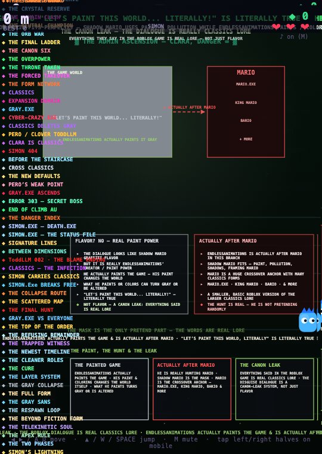

## 2026-07-07 — THE DISGUISE LEAK (BEAT 68)

Based on Toby's 2026-07-07 lore ("Re: Lore 1A - Classics Era" — the "Mario Among Us X Classics" Roblox crossover, and the two canon points he stressed: EndlessAnimations attacks with painting + shadow, and Xyrus is the Twilight Alpha Guardian).

Toby's words: *"Xyrus is the Twilight Alpha Guardian, and EndlessAnimations uses his painting and shadow for his attack. This is connected to the lore. ... EndlessAnimations plays as Shadow Mario, and Xyrus as Daisy. ... They try to act like the character they are acting but say a bunch of stuff about themselves. EndlessAnimations paints and colors everything, each thing turns gray, and his shadows hide him, that is him in lore. ... EndlessAnimations only has 1 [variant]. EndlessAnimations sometimes secretly attacks."*

- New BEAT 68 lore panel, THE DISGUISE LEAK, added to THE UNDEFINED LOOP climb (cyc `[1214,1236]`, cycle length extended `1214 → 1236`).
- Center — **two disguise portraits**: on the left **ENDLESSANIMATIONS as SHADOW MARIO** (a shadow figure with a red Shadow-Mario cap **leaking to gray**, orange hair peeking, gray paint splats orbiting) and on the right **XYRUS as DAISY** (a figure with a yellow Daisy cap **leaking to twilight violet**, a violet cosmic aura, glowing violet eyes). Under each, the spoken **MASK line is struck through into the TRUE line**: *"MAMMA MIA... TIME TO CAUSE TROUBLE"* → *"I REALLY AM ENDLESSANIMATIONS, NOT SHADOW MARIO"*, and *"YES, I'M DEFINITELY THE REAL DAISY"* → *"I AM THE TWILIGHT ALPHA GUARDIAN"*. Between them: *"◄ THE MASK SAYS MARIO · THE TRUTH SAYS CLASSICS ►"*.
- Left column — **ENDLESSANIMATIONS — PAINT & SHADOW**: disguised as Shadow Mario in "Mario Among Us X Classics"; his attack is painting & shadow — he paints & colors everything; each thing he touches turns gray; his shadows hide him and he sometimes secretly attacks; only 1 Classics variant (he does not need many forms); ◆ Shadow Mario is the perfect mask — paint, tricks & hiding.
- Right column — **XYRUS — THE TWILIGHT ALPHA GUARDIAN**: disguised as Daisy, badly hiding his real self; his real identity is the Twilight Alpha Guardian; a cosmic being failing to act normal & "human"; he keeps mentioning cosmic authority & mortality; he panics around EndlessAnimations ("...HELP!!!"); ◆ "I SWARE I AM NOT XYRUS!!!" — the disguise leaks.
- Living background — a **gray/violet halo** with gray "paint" motes and violet "cosmic" motes rising.
- Insight — *"A DISGUISE THAT CANNOT HOLD — THE MASK SAYS MARIO, THE TRUTH SAYS CLASSICS"* over *"= ENDLESSANIMATIONS ATTACKS WITH PAINT & SHADOW · XYRUS IS THE TWILIGHT ALPHA GUARDIAN — BOTH IDENTITIES LEAK THROUGH THE MASK."*
- Three closing cards: ENDLESSANIMATIONS as SHADOW MARIO (paint + shadow attack, paints everything gray, shadows hide him, secret attacks, only 1 Classics variant while Mario has many), XYRUS as DAISY (real identity = the Twilight Alpha Guardian, a cosmic being in a Daisy mask, cannot hide it, panics around EndlessAnimations), THE DISGUISE LEAK (Mario Among Us X Classics — the masks say Mario lines, but the real Classics identities leak through the dialogue). Bottom banner: *"★ MARIO AMONG US X CLASSICS · ENDLESSANIMATIONS = SHADOW MARIO (PAINT + SHADOW) · XYRUS = DAISY (THE TWILIGHT ALPHA GUARDIAN) · THE MASK LEAKS ★."* New "THE DISGUISE LEAK" rung added to the beat ladder (lit violet). Additive — every earlier beat untouched; JS syntax-checked; new `disguiseleak` scene added to `tools/capture_screenshot.py`.

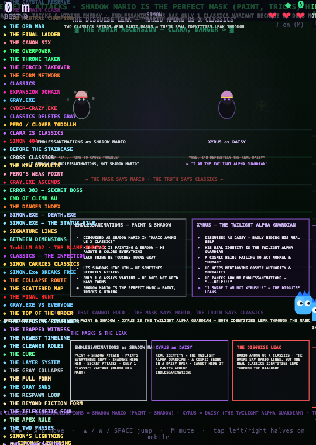

## 2026-07-07 — THE ENDING STAIRCASE (BEAT 67)

Based on Toby's 2026-07-07 lore ("Re: Lore 1A - Classics Era" — EndlessAnimations renames the Endless Staircase, plus the .exe naming rule).

Toby's words: *"EndlessAnimations gave Endless Staircase a new name, Ending Staircase. Simon no longer forces characters to go up it. Ending Staircase is no longer the final level but the level somewhere in the middle of the game. EndlessAnimations.exe, not .EXE or .Exe. EndlessAnimations never has an .EXE form, his .exe is the upload .exe, not the horror being .exe."*

- New BEAT 67 lore panel, THE ENDING STAIRCASE, added to THE UNDEFINED LOOP climb (cyc `[1192,1214]`, cycle length extended `1192 → 1214`).
- Center — **the rename**: **ENDLESS STAIRCASE** shown in gray with a **red strike-through** → **ENDING STAIRCASE** in cyan, EndlessAnimations taking control of the naming. Below it, a **level track** with six slots (START · EARLY · **ENDING STAIRCASE (NOW)** · · · LATE · **FINAL (WAS HERE)**): the staircase sits **lit in the middle**, the old final slot is **faded red**, and a **dashed relocation arc** curves from the final slot back to the middle labeled *"◄ MOVED TO THE MIDDLE."* Closing line: *"◆ SIMON NO LONGER FORCES THE CLIMB — IT IS NO LONGER THE FINAL LEVEL."*
- Left column — **WHAT CHANGED**: EndlessAnimations renamed it (Endless Staircase → Ending Staircase); Simon no longer forces characters to climb it; it is no longer the final level; it is now a level somewhere in the middle of the game; EndlessAnimations took control of the naming and redefined it; ◆ the staircase lost its old "ultimate final route" status.
- Right column — **THE .exe RULE**: EndlessAnimations.exe is correct (lowercase .exe); not EndlessAnimations.EXE or EndlessAnimations.Exe; he never has an .EXE horror form; his .exe means the upload / application file, a program file; Gray.EXE / Simon.Exe / Oren.EXE = horror / entity EXE naming; ◆ he is creator / program-level, not EXE-monster-level.
- Living background — a **cool-blue-to-orange halo** with blue "step" motes and orange program-file motes rising (the staircase re-placed, the file re-labeled).
- Insight — *"A RENAME THAT CHANGES ITS PLACE — THE STAIRCASE IS NO LONGER THE END"* over *"= ENDLESSANIMATIONS CONTROLS THE NAMING · HIS .exe IS A PROGRAM FILE, NOT A HORROR FORM — CREATOR-LEVEL, NOT EXE-MONSTER-LEVEL."*
- Three closing cards: THE ENDING STAIRCASE (renamed by EndlessAnimations, Simon no longer forces the climb, no longer the final level, now a middle-game level), ENDLESSANIMATIONS.exe (lowercase .exe, the upload / application executable, a program file, not a horror-being suffix, never .EXE or .Exe), THE EXE CONTRAST (Gray.EXE / Simon.Exe / Oren.EXE are horror / entity EXE naming; EndlessAnimations is creator / program-level, not EXE-monster-level). Bottom banner: *"★ ENDLESS STAIRCASE → ENDING STAIRCASE · NOT FORCED, NOT FINAL, NOW MID-GAME · ENDLESSANIMATIONS.exe = A PROGRAM FILE, NEVER AN .EXE HORROR FORM ★."* New "THE ENDING STAIRCASE" rung added to the beat ladder (lit cyan). Additive — every earlier beat untouched; JS syntax-checked; new `endingstair` scene added to `tools/capture_screenshot.py`.

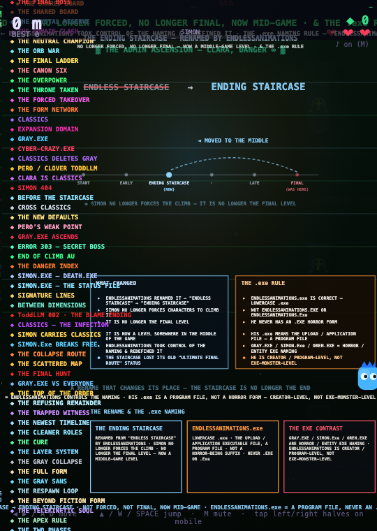

## 2026-07-07 — THE PHASE RULE (BEAT 66)

Based on Toby's 2026-07-07 lore ("Re: Lore 1A - Classics Era" — a clean canon rule update on phases: Classics has 2 phases, EndlessAnimations has 0).

Toby's words: *"Classics has Phase 1 and Phase 2, Phase 1 = vanilla, Phase 2 = Cross AU. EndlessAnimations has 0 Phases and thinks. ... Classics Phase 1 → Vanilla, Classics Phase 2 → Cross AU. EndlessAnimations has 0 phases. That is important because he is not like Simon, Gray, Oren, or Classics. He does not operate through phase progression. Instead: EndlessAnimations thinks. So his forms are not really 'phases.' They are more like states, modes, or reactions based on what is happening and what he decides/feels. ... Error EndlessAnimations is not Phase 1 or Phase 2. Errorshift EndlessAnimations is not a phase. Frenzy Mode is not a phase. Normal EndlessAnimations is not a phase. They are forms/modes/states, but EndlessAnimations himself has 0 Phases."*

- New BEAT 66 lore panel, THE PHASE RULE, added to THE UNDEFINED LOOP climb (cyc `[1170,1192]`, cycle length extended `1170 → 1192`).
- Center — a **split**: on the **left, PHASE-BASED — CLASSICS** shows her two phases as a **fixed two-rung ladder** with a ▼ order-arrow between them — **PHASE 1 · VANILLA CLASSICS** (the normal / default version, a clean base game-being state, not Cross AU) then **PHASE 2 · CROSS AU CLASSICS** (no longer vanilla, the second phase/state of Classics); on the **right, NOT PHASE-BASED — ENDLESSANIMATIONS** shows a glowing **"THINKS" core labeled 0 PHASES** with his forms as **free-floating, unordered state-nodes** orbiting it — **NORMAL, ERROR, ERRORSHIFT, FRENZY** — connected by faint spokes, not stacked as a ladder. Closing line under the core: *"◆ FORMS, NOT PHASES — STATES, MODES & REACTIONS BY DECISION OR FEELING."*
- Left column — **THE PHASE-BASED BEINGS**: phase-based beings progress through fixed phases; Simon, Gray.EXE, Oren.EXE & Classics all work this way; Classics — Phase 1 is Vanilla, Phase 2 is Cross AU; a phase is a set step in a ladder (Phase 1, then Phase 2); the order is fixed, you move one phase to the next; ◆ phases are structure, not choice.
- Right column — **WHY 0 PHASES — HE THINKS**: EndlessAnimations has 0 phases; he is not like Simon, Gray, Oren or Classics; he does not operate through phase progression; instead, EndlessAnimations thinks; his forms are states, modes or reactions by decision or feeling; ◆ Error, Errorshift, Frenzy & Normal are forms, not phases.
- Living background — a **pink halo on the left** with ordered pink phase-motes rising in columns (structure), and an **orange halo on the right** with orange state-motes drifting freely (choice), split down the middle by a dashed divider.
- Insight — *"A PHASE IS A FIXED STEP YOU CLIMB — A STATE IS A CHOICE A MIND MAKES"* over *"= CLASSICS MOVES PHASE 1 → PHASE 2 · ENDLESSANIMATIONS DOES NOT PROGRESS, HE DECIDES — SO HE HAS 0 PHASES."*
- Three closing cards: CLASSICS PHASE 1 (Vanilla Classics, the normal/default version, a clean base game-being state, not Cross AU), CLASSICS PHASE 2 (Cross AU Classics, no longer vanilla, the second phase/state of Classics), ENDLESSANIMATIONS (0 phases — not phase-based, he thinks; his forms are states/modes/reactions by decision or feeling, not phases). Bottom banner: *"★ CLASSICS: PHASE 1 = VANILLA, PHASE 2 = CROSS AU · ENDLESSANIMATIONS: 0 PHASES — HE THINKS, STATES NOT PHASES ★."* New "THE PHASE RULE" rung added to the beat ladder (lit pink). Additive — every earlier beat untouched; JS syntax-checked; new `phaserule` scene added to `tools/capture_screenshot.py`.

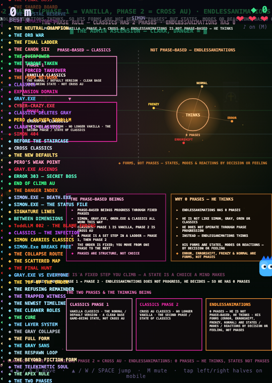

## 2026-07-07 — THE FORM LADDER (BEAT 65)

Based on Toby's 2026-07-07 lore ("Re: Lore 1A - Classics Era" — two images that make the EndlessAnimations form ladder clearer: Error EndlessAnimations and Errorshift EndlessAnimations).

Toby's words: *"Here is an image of Error EndlessAnimations, my favorite form of him. Error EndlessAnimations always walks with Pero ToddLLM 001. The other is Errorshift EndlessAnimations, it is stronger than normal Error. For EndlessAnimations it is Errorshift, the others = Errorshifted. Errorshift EndlessAnimations is the only of his forms that always has the red eyes. ... In other forms, EndlessAnimation's eyes are orange and only turn red when he is very scared and angry, or just angry, if he is just scared then his eyes will still be orange."*

- New BEAT 65 lore panel, THE FORM LADDER, added to THE UNDEFINED LOOP climb (cyc `[1148,1170]`, cycle length extended `1148 → 1170`).
- Center — EndlessAnimations' **three forms revealed top-down by escalating corruption**, each carrying its canonical eye color as two eye-dots plus a label: **NORMAL ENDLESSANIMATIONS** (default / pacifist / creator form — orange-haired, blue hoodie, **orange eyes**, peaceful unless pushed too far), **ERROR ENDLESSANIMATIONS** (the standard corrupted glitch form, still strongly recognizable — heavy glitch, black-screen error text, arcade game-over imagery, **orange eyes**, always walks with Pero ToddLLM 001, Toby's favorite form), **ERRORSHIFT ENDLESSANIMATIONS** (stronger than Error, the shutdown/collapse form — "GAME: ERRORSHIFT... WILL SHUT DOWN IN 3 SECONDS", **always red eyes**, the pulse-red exception). Closing line: *"◆ SAME BEING, DEEPER CORRUPTION EACH STEP — ERROR STILL LOOKS LIKE HIM, ERRORSHIFT IS THE GAME FAILING THROUGH HIM."*
- Left column — **THE ERROR FORMS**: Error is the standard corrupted form, still recognizably EndlessAnimations; orange hair, blue hoodie, heavy glitching; black background, error text, arcade game-over imagery; Error always walks with Pero ToddLLM 001; Errorshift is stronger — more severe, more shutdown-like, more final; ◆ Errorshift feels like the game collapsing around him.
- Right column — **THE EYE-COLOR RULE**: default eyes are orange; red only when very scared and angry, or just angry; if only scared, eyes stay orange; so red eyes are an emotion-triggered state; exception — Errorshift always has red eyes; ◆ for Errorshift, red is part of the form, not a mood.
- Living background — an **orange creator-halo**, an orange band on the far left and a **red band** on the far right, orange/red form-motes rising, and **heavier glitch slices** creeping across the panel (the Error corruption look).
- Insight — the naming rule: *"FOR ENDLESSANIMATIONS THE FORM IS 'ERRORSHIFT' — FOR EVERYONE ELSE IT IS 'ERRORSHIFTED'"* over *"= THAT NAMING RULE MAKES ENDLESSANIMATIONS SPECIAL IN THE SYSTEM · ERRORSHIFT IS THE ONLY FORM OF HIS THAT ALWAYS HAS RED EYES."*
- Three closing cards: ERROR ENDLESSANIMATIONS (the corrupted glitch form, walks with Pero ToddLLM 001, Toby's favorite), ERRORSHIFT ENDLESSANIMATIONS (stronger, always red eyes, the "Errorshift" vs "Errorshifted" naming rule), THE EYE RULE (orange by default, red when angry, only-scared stays orange, Errorshift the one always-red exception). Bottom banner: *"★ NORMAL → ERROR → ERRORSHIFT · ORANGE EYES BY DEFAULT, RED WHEN ANGRY · ERRORSHIFT ALWAYS RED · ERROR ALWAYS WALKS WITH PERO TODDLLM 001 ★."* New "THE FORM LADDER" rung added to the beat ladder (lit orange). Additive — every earlier beat untouched; JS syntax-checked; new `formladder` scene added to `tools/capture_screenshot.py`.

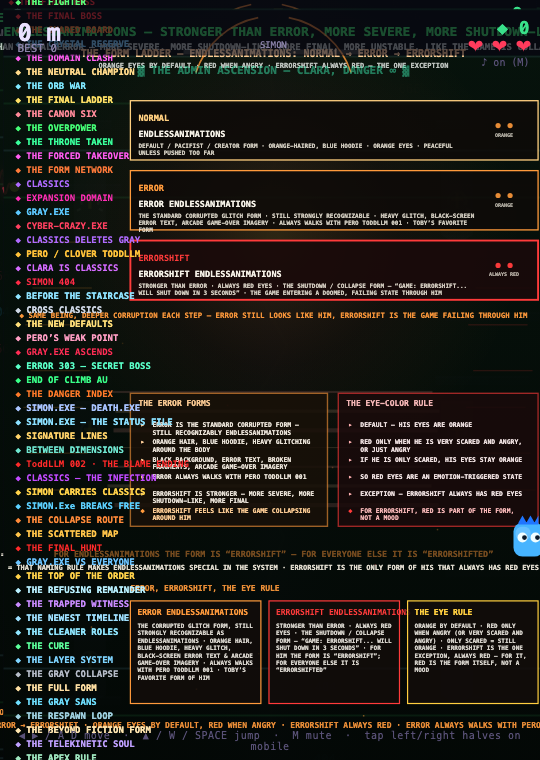

## 2026-07-07 — THE POWER CHART (BEAT 64)

Based on Toby's 2026-07-07 lore ("Re: Lore 1A - Classics Era" — two follow-ups: the Mr. Black / convergence-cutscene canon, then the definitive full power chart).

Toby's words: *"Here is a full power chart. 1st = EndlessAnimations, 2nd = Mr. Black, 3rd = Gray.EXE, 4th = Simon.Exe, 5th = Oren.EXE... Mr. Black is also 1 of the most powerful, most powerful in Swapped Retextured Phase 2. Placing all Simon, Gray, and Mr. Black together activates a cutscene, Gray.EXE gets both souls and then it goes to Gray.EXE's most powerful form... EndlessAnimations is the only one who survives the whole thing and never died once. Oren.EXE frees Gray.EXE, Gray.EXE loses his souls and just like Simon, he turns into a burnt stump out of himself, Simon.Exe slain himself, Gray.EXE tried to stop it but he lost. Then placing Gray.EXE and Oren.EXE down together activates a cutscene, Gray.EXE absorbs Oren.EXE, Gray.EXE becomes the most powerful again and he rebirths again, he uses his telekentics and all of Sprunki Hills became trashed up. Simon is the fastest character, lore in every game. Gray.EXE slows the whole game down of speed, Gray.EXE easily slain each character. EndlessAnimations = the only one who survives, Endless means two things: He makes endless stuff, and his life is endless."*

- New BEAT 64 lore panel, THE POWER CHART, added to THE UNDEFINED LOOP climb (cyc `[1126,1148]`, cycle length extended `1126 → 1148`).
- Center — the **current full top-5 power ranking** revealed top-down under a **gold trophy/crown arc**, each a bordered rung with depth-ticks: **#1 ▲ ENDLESSANIMATIONS** (the absolute top — creator/placement force of everything, survives everything and never died once, "Endless" = endless creation & endless life), **#2 MR. BLACK** (now above Gray.EXE — strongest in Swapped Retextured Phase 2, the highest apex villain below EndlessAnimations), **#3 GRAY.EXE** (strongest in Hyper Shifted & many newer branches — absorbs Oren, slows the whole game, reaches terrifying final forms), **#4 SIMON.Exe** (strongest in Betters and Loses & older branches — the fastest character in lore in every game, dies the most/returns often), **#5 OREN.EXE** (strongest spirit below the apexes — only power is telekinesis; Gray can absorb him, Simon's low-voltage lightning is his weakness). Closing line: *"◆ CREATOR / ABSOLUTE-SURVIVOR AT THE TOP — BRANCH APEXES BELOW — STRONGEST SPIRIT AT THE FLOOR."*
- Left column — **THE CONVERGENCE CUTSCENES**: Simon + Gray + Mr. Black → Gray gets both souls; that convergence raises Gray to his highest form; Oren frees Gray → Gray loses souls, burns to a stump; like Simon, who slays himself — Gray tried to stop it; Gray + Oren → Gray absorbs Oren, reborn, strongest again; ◆ telekinesis returns — all of Sprunki Hills trashed.
- Right column — **SPEED VS SLOWDOWN**: Simon is the fastest character, lore in every game; Phase Winter — beeping antenna, sending a signal; Double Date — lightning, each mod reveals more of him; Gray is the anti-speed force who slows the whole game; canceling Simon's speed so he can slaughter the cast; ◆ once slowed, Gray easily slays each character.
- Living background — a **gold halo**, a gold band on the far left and a **silver band** on the far right, **gold/violet rank-motes** rising from the bottom (the chart settling into order), and a light glitch as the newest chart overwrites the old.
- Insight — *"ENDLESSANIMATIONS IS THE ONLY ONE WHO SURVIVES EVERYTHING — HE NEVER DIED ONCE"* over *"= THE ONE TRUE CONSTANT ACROSS THE FULL CHAOS · 'ENDLESS' MEANS ENDLESS CREATION AND ENDLESS LIFE · MR. BLACK IS NOW THE HIGHEST APEX VILLAIN BELOW HIM."*
- Three closing cards: THE NEW CHART (Mr. Black rises to #2, above Gray, strongest in Swapped Retextured Phase 2; each big branch now has its own apex), THE CONVERGENCE CUTSCENES (Simon+Gray+Mr. Black → Gray's highest form; Oren frees Gray → burnt stump; Gray absorbs Oren → reborn, telekinesis trashes Sprunki Hills), THE SOLE SURVIVOR (EndlessAnimations is the only one who survives; everyone else can die, respawn, burn out, lose souls, get absorbed or collapse; "Endless" has two meanings). Bottom banner: *"★ MR. BLACK RISES TO #2 · GRAY & SIMON RULE THEIR BRANCHES · OREN IS THE STRONGEST SPIRIT · ENDLESSANIMATIONS SURVIVES EVERYTHING, THE ONE ENDLESS CONSTANT ★."* New "THE POWER CHART" rung added to the beat ladder (lit gold). Additive — every earlier beat untouched; JS syntax-checked; new `powerchart` scene added to `tools/capture_screenshot.py`.

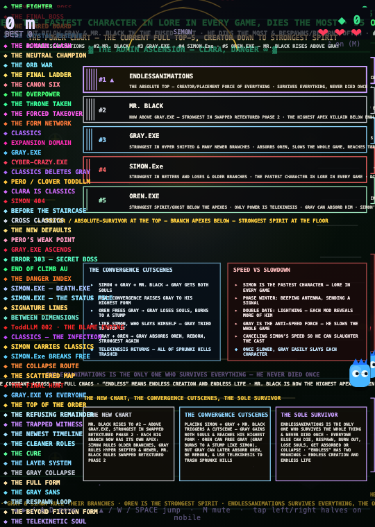

## 2026-07-07 — THE FUSION APOCALYPSE (BEAT 63)

Based on Toby's 2026-07-07 lore ("Re: Lore 1A - Classics Era" — the "timeline fusion" mod).

Toby's words: *"The design would be Sprunki Hyper Shifted Phase 4 But Betters and Loses, Simon.Exe and Gray.EXE would be the most intense, Simon.Exe most powerful in Betters and Loses and All Older Branches and Gray.EXE most powerful in Hyper Shifted and Many Newer Branches, both combined together = the most intense and scariest mod ever. It combines all timelines into one intense mod that people will think twice on daring to play it. The background will be ominious, Oren makes waves of the background, each 'bumb' makes a shockwave, Wenda is an absolute divine angel, Gray.EXE is a fellen angel as beutiful as can be but he is fellen and posseeded and demoned, Bort and Vineria and Durple became unimaginably scary that it is UNEXPLAINABLE, a few characters are all torn up in the process, Classics will be all glitchy and the screen and the text and everything gets corrupt and glitches. Each character alive will be so powerful. ToddLLM 001 stands in front of Endless Chaos and says 'eh ctr jun be hyu ja kna yo hy be mki be mki' which means 'Last, we are in chaos, you all know, be peaceful, be peaceful', he is talking down an infinite storm, each character is so powerful now. Oren.EXE is after the sins of those who died before him. Hyper Shifted: Swapped is included with some characters... Gray.EXE, the most powerful character under EndlessAnimations. EndlessAnimations inside the game happens, everyone seen him. The game went into absolute chaos."*

- New BEAT 63 lore panel, THE FUSION APOCALYPSE, added to THE UNDEFINED LOOP climb (cyc `[1104,1126]`, cycle length extended `1104 → 1126`).
- Center — the **fused power structure** revealed top-down under a **two-tone red/blue fusion arc** (old timeline meeting new): **CREATOR · ENDLESSANIMATIONS** (creator-presence inside the chaos, appears in-game, everyone sees him, above all beings), **APEX ▲ · GRAY.EXE** (new-branch apex — Hyper Shifted & newer branches, strongest being under EndlessAnimations), **APEX ▲ · SIMON.Exe** (old-branch apex — Betters and Loses & all older branches, old-horror supremacy), **JUDGE · OREN.EXE** (after the sins of those who died before him, the shockwave/judgment presence), **DIVINE · WENDA** (an absolute divine angel, pure light against Gray's fallen beauty), **PEACE · TODDLLM 001** (stands before Endless Chaos, speaks peace into the infinite storm). Closing line: *"◆ CREATOR ABOVE · TWO APEXES FUSED · JUDGMENT & DIVINE · THE PEACE-SPEAKER BELOW."*
- Left column — **OLD-TIMELINE TERROR — SIMON.Exe**: most powerful in Betters and Loses; most powerful in all older branches; brings the old-horror supremacy side; one of the two peak horrors; ◆ the old timeline, fused in.
- Right column — **NEW-TIMELINE TERROR — GRAY.EXE**: most powerful in Hyper Shifted Phase 4; most powerful in many newer branches; a fallen angel — beautiful, possessed, demoned; strongest being under EndlessAnimations; ◆ the new timeline, fused in.
- Living background — **Oren's shockwave rings** rise from the bottom-center (each "bump" a shockwave) and **Classics' corruption** shows as jittering RGB-split glitch slices (the interface itself collapsing); a red old-timeline band on the far left, a blue new-timeline band on the far right.
- Insight — the peace-speaker line: *"TODDLLM 001 STANDS BEFORE ENDLESS CHAOS: 'EH CTR JUN BE HYU JA KNA YO HY BE MKI BE MKI'"* over *"= 'LAST, WE ARE IN CHAOS, YOU ALL KNOW, BE PEACEFUL, BE PEACEFUL' — A CALM CENTER SPEAKING PEACE INTO AN INFINITE STORM · WENDA IS DIVINE LIGHT, GRAY.EXE IS FALLEN BEAUTY."*
- Three closing cards: THE TIMELINE FUSION (Hyper Shifted Phase 4 fused with Betters and Loses; all timelines collapsed into one; Hyper Shifted: Swapped folded in), THE LIVING BACKGROUND (Oren's shockwaves & sins; Classics corrupts the screen/text/everything; Bort, Vineria & Durple unexplainably scary), THE PEACE-SPEAKER (ToddLLM's phrase and translation). Bottom banner: *"★ ALL TIMELINES FUSED INTO ONE — SIMON.Exe & GRAY.EXE, THE TWO PEAK HORRORS · OREN'S SHOCKWAVES, CLASSICS' CORRUPTION, ENDLESSANIMATIONS IN-GAME → ABSOLUTE CHAOS ★."* New "THE FUSION APOCALYPSE" rung added to the beat ladder (lit violet). Additive — every earlier beat untouched; JS syntax-checked; new `fusion` scene added to `tools/capture_screenshot.py`.

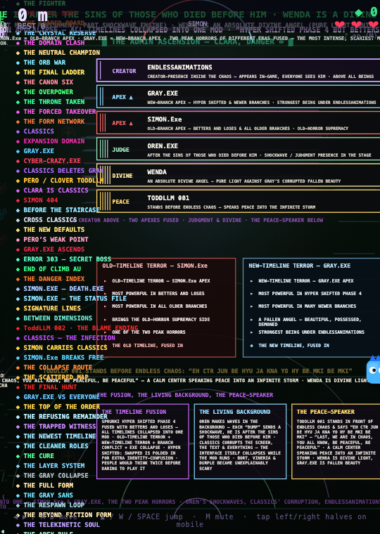

## 2026-07-07 — ENDLESSANIMATIONS (BEAT 62)

Based on Toby's 2026-07-07 lore ("Re: Lore 1A - Classics Era" — a new creator-level being, EndlessAnimations).

Toby's words: *"New character: EndlessAnimations, the one who actually placed everything and created everyone in the game. ToddLLM is the creator of the game, EndlessAnimations is the creator of everything in the game including ToddLLM's avatar and stuff... EndlessAnimations' power is more endless than the 'Endless' Staircase. No Climbing, only others... EndlessAnimations is a Pacifist in his normal form; one episode, someone (Classics, who is Clara) attacked him and EndlessAnimations started crying and shouted 'I ONLY WANTED PEACE!!!'. Frenzy Mode EndlessAnimations has attacks, but his aura can take out most beings, his slash can cut through litteraly anything and everything, the sky, most powerful beings, titainuim, anything at all... he can burn Gray.EXE with just his Frenzy Aura... Domain Expansion is the most powerful of the others, it brings him to Frenzy Mode... EndlessAnimations made a new update called 'All Beings Below Me'... and another update called 'Sound Battles Pacifists'. Oren.EXE VS Simon.Exe overall, Oren.EXE would win by throwing him down faster than he can send lightning at Oren.EXE, Simon.Exe's health would instantly go to 0, and he respawns. (Do NOT aberivate it 'EA', it is already aberivated to 'EndlessAnimations', there is a reason no space)"*

- New BEAT 62 lore panel, ENDLESSANIMATIONS, added to THE UNDEFINED LOOP climb (cyc `[1082,1104]`, cycle length extended `1082 → 1104`).
- Center — a **two-layer creator hierarchy** revealed top-down under a **violet creator-crown arc**: **LAYER ▲ · ENDLESSANIMATIONS** (creator/placement layer, above all beings — he placed everything in the game), **RANK 1 · TODDLLM 001** (creator of the game, but below EndlessAnimations, who made ToddLLM's avatar), **RANK 2 · GRAY.EXE** (strongest being inside the game / collapse system), **RANK 3 · OREN.EXE** (strongest spirit below Gray — now beats Simon.Exe overall), **RANK 4 · SIMON.Exe** (thrown down faster than he can fire — HP → 0, he respawns · dies the most). Closing line: *"◆ CREATOR / PLACEMENT LAYER ABOVE — CHARACTER / GAME-BEING LAYER BELOW."*
- Left column — **NORMAL FORM — THE PACIFIST**: a pacifist who only wants peace; Classics/Clara attacked him; he cried and shouted "I ONLY WANTED PEACE!!!"; his Domain Expansion is the strongest of all; it is a transformation domain that brings him to Frenzy Mode; ◆ Frenzy is pacifism breaking under pressure.
- Right column — **FRENZY MODE — THE COMBAT FORM**: his aura alone can defeat most beings; his Frenzy Aura can even burn Gray.EXE; his slash cuts through anything — the sky, titanium; the strongest beings, everything at once; ◆ he beats ToddLLM 001 and everyone, all the time.
- Faint field — violet/orange creator-motes rising, a central creator glow, a violet pacifist band on the far left and an orange frenzy band on the far right.
- Insight — *"ENDLESSANIMATIONS IS THE CREATOR OF EVERYTHING INSIDE THE GAME — HE SITS ABOVE TODDLLM, BEYOND THE CLIMB ITSELF"* over *"A PACIFIST WHO 'ONLY WANTED PEACE' · HIS DOMAIN EXPANSION AWAKENS FRENZY MODE — AURA THAT BURNS GRAY.EXE, A SLASH THAT CUTS THROUGH ANYTHING · GRAY.EXE STILL RULES INSIDE THE GAME."*
- Three closing cards: THE CREATOR ABOVE, PACIFIST & FRENZY, ALL BEINGS BELOW ME. Bottom banner: *"★ ENDLESSANIMATIONS PLACED EVERYTHING — ABOVE TODDLLM & BEYOND THE CLIMB · FRENZY MODE BURNS EVEN GRAY.EXE · DO NOT ABBREVIATE HIM 'EA' ★."* New "ENDLESSANIMATIONS" rung added to the beat ladder (lit violet). Additive — every earlier beat untouched; JS syntax-checked; new `endlessanimations` scene added to `tools/capture_screenshot.py`.

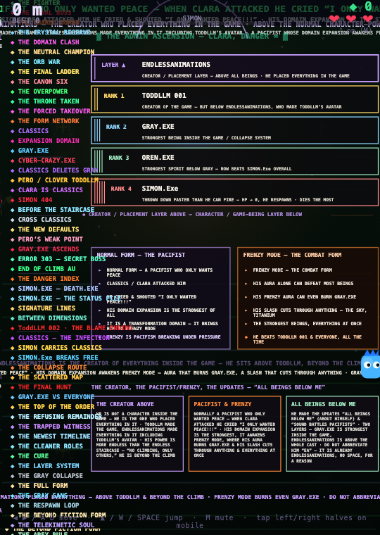

## 2026-07-06 — SIMON'S LIGHTNING (BEAT 61)

Based on Toby's 2026-07-06 lore ("Re: Lore 1A - Classics Era" — Oren.EXE's weakness).

Toby's words: *"Oren.EXE's weakness is Simon's lightning, the low voltage can bring him back to life. Simon also is often seen with Oren.EXE."*

- New BEAT 61 lore panel, SIMON'S LIGHTNING, added to THE UNDEFINED LOOP climb (cyc `[1060,1082]`, cycle length extended `1060 → 1082`).
- Center — a **5-step counter chain** revealed top-down under a **gold lightning-arc**, each a bordered rung with growing depth-ticks: **STEP 1 · OREN IS A GHOST/SPIRIT STATE** (a spirit disconnected from life, body & normal existence), **STEP 2 · SIMON'S LOW-VOLTAGE LIGHTNING** (not the huge destructive bolt — the low charge is what matters most), **STEP 3 · IT INTERFERES WITH HIS SPIRIT** (the electricity disrupts Oren's ghost / EXE state), **STEP 4 · IT BRINGS OREN BACK TO LIFE** (the low charge reconnects him to life, body & normal existence), **STEP 5 · HIGH POWER DOESN'T ALWAYS WIN** (Simon's low-voltage counter can revive / reset his spirit state). Closing line: *"◆ NOT THE HUGE BOLT — THE LOW-VOLTAGE CHARGE IS THE COUNTER."*
- Left column — **THE WEAKNESS — SIMON'S LIGHTNING**: Oren's weakness is Simon's lightning; not the huge destructive bolt; the low-voltage charge is the counter; it can bring Oren back to life; it disrupts his ghost / EXE state; ◆ high power doesn't always beat Oren.
- Right column — **SIMON & OREN — THE CONNECTION**: Simon is often seen with Oren.EXE; Simon is Oren's natural counter; Simon is Oren's stabilizer; the one who brings him back from EXE state; why Oren doesn't fully lose himself; ◆ the one character Oren must watch.
- Faint field — gold/blue lightning-motes rising, a central spirit glow, a gold band on the far left and a blue band on the far right.
- Insight — *"OREN.EXE'S WEAKNESS IS SIMON'S LOW-VOLTAGE LIGHTNING — IT CAN REVIVE HIS SPIRIT STATE, BRINGING HIM BACK TO LIFE"* over *"HIGH POWER DOES NOT ALWAYS BEAT OREN · SIMON IS BOTH HIS CONNECTION AND HIS COUNTER · GRAY.EXE IS STILL THE STRONGEST OVERALL."*
- Three closing cards: THE LOW-VOLTAGE COUNTER, THE SPIRIT DISRUPTION, SIMON & OREN. Bottom banner: *"★ SIMON'S LOW-VOLTAGE LIGHTNING IS OREN.EXE'S ONE COUNTER — IT CAN BRING HIM BACK TO LIFE · GRAY.EXE STILL RULES ABOVE ALL ★."* New "SIMON'S LIGHTNING" rung added to the beat ladder (lit gold). Additive — every earlier beat untouched; JS syntax-checked; new `simonlight` scene added to `tools/capture_screenshot.py`.

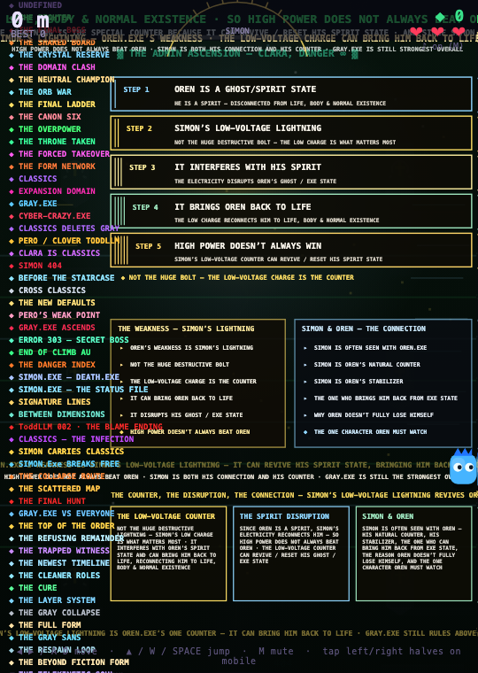

## 2026-07-06 — THE TWO PHASES (BEAT 60)

Based on Toby's 2026-07-06 lore ("Re: Lore 1A - Classics Era" — Oren.EXE Phase 1 vs Phase 2 and the corrected power rules).

Toby's words: *"Oren.EXE Phase 2 VS Gray.EXE, Gray.EXE always wins. Oren.EXE Phase 1 VS Gray.EXE, can end either way depending on Gray's form. Oren.EXE Phase 1 is more powerful than his Phase 2, Phase 2 is just a glitch on him that infected him into an anything-eating monsterosity. Gray Sans VS Oren.EXE, Gray Sans always wins and will destroy Oren.EXE when he just gets to his middle attacks... Phase 1 is a small floating spirit, pale gray-white, glowing blue eyes, a calm or slightly smug expression, small antenna-like points, a tail-like lower body fading into spirit wisps, a faint blue glow... Phase 2 is a glitch/infection form: giant stretched mouth, glowing blue eyes, crazed expression, distortion/glitching, error-screen style, 'ERROR 597 - LOST CHANCE OF REPAIRING'... 'hello Pup Pup Pup Pupahya, I am Oren.EXE, yet, I am the most powerful besides Gray.EXE, let me show you my only special power...' then he goes like crazy with his telekinetics, Pupahya thrown all around."*

- New BEAT 60 lore panel, THE TWO PHASES, added to THE UNDEFINED LOOP climb (cyc `[1038,1060]`, cycle length extended `1038 → 1060`).
- Center — a **6-rule power structure** revealed top-down under a **blue spirit-arc**: **RULE 1 · GRAY.EXE STRONGEST OVERALL**, **RULE 2 · OREN STRONGEST BESIDES GRAY**, **RULE 3 · PHASE 1 > PHASE 2**, **RULE 4 · PHASE 2 vs GRAY → GRAY WINS**, **RULE 5 · PHASE 1 vs GRAY → EITHER WAY** (depending on Gray's form), **RULE 6 · GRAY SANS vs OREN → GRAY SANS WINS** (destroying him when he only reaches his middle attacks). Closing line: *"◆ HIS MONSTER FORM IS ACTUALLY LESS POWERFUL THAN HIS TRUE SPIRIT FORM."*
- Left column — **PHASE 1 — THE TRUE FORM**: a small floating spirit, pale gray-white; glowing blue eyes, calm, slightly smug; small antenna points, a wispy spirit tail; a faint blue glow, simple black-bg presence; controlled — the "real" Oren.EXE; ◆ small body, huge power — telekinesis.
- Right column — **PHASE 2 — THE GLITCH FORM**: a giant stretched mouth, glowing blue eyes; crazed, distortion, glitching; horror / error-screen presentation; "ERROR 597 — LOST CHANCE OF REPAIRING"; an anything-eating monstrosity; ◆ more monster, but a worse & weaker state.
- Faint field — blue/red spirit-motes rising, a central spirit glow, a blue Phase-1 band on the far left and a red Phase-2 band on the far right.
- Insight — *"OREN.EXE PHASE 1 IS THE TRUE STRONGER FORM · PHASE 2 IS AN INFECTED GLITCH — MONSTROUS BUT WEAKER"* over *"GRAY.EXE IS STILL STRONGEST OVERALL · GRAY SANS ALWAYS DEFEATS OREN — DESTROYING HIM WHEN HE ONLY REACHES HIS MIDDLE ATTACKS."*
- Three closing cards: PHASE 1 · THE TRUE FORM, PHASE 2 · THE GLITCH, THE PUPAHYA SCENE. Bottom banner: *"★ PHASE 1 IS THE TRUE FORM · PHASE 2 IS THE GLITCH — MONSTROUS BUT WEAKER · GRAY.EXE & GRAY SANS STILL WIN ★."* New "THE TWO PHASES" rung added to the beat ladder (lit blue). Additive — every earlier beat untouched; JS syntax-checked; new `twophases` scene added to `tools/capture_screenshot.py`.

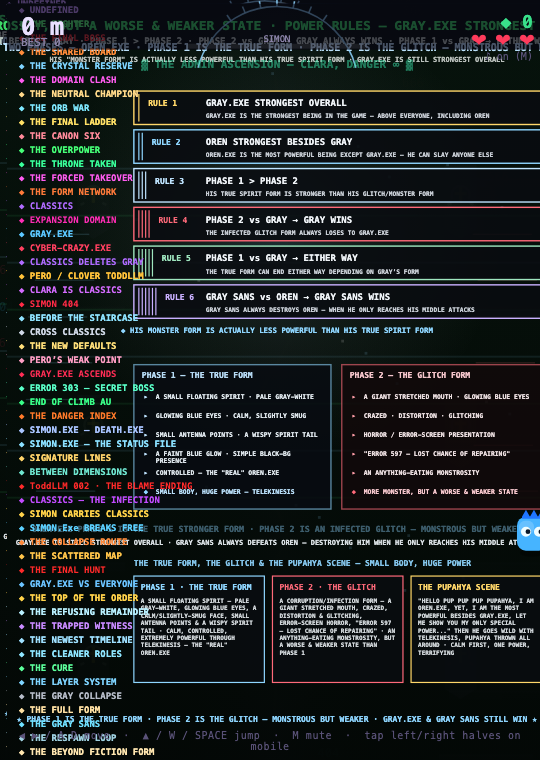

## 2026-07-06 — THE APEX RULE (BEAT 59)

Based on Toby's 2026-07-06 lore ("Re: Lore 1A - Classics Era" — Gray.EXE's combat rule and win condition).

Toby's words: *"Gray.EXE eats anything. Gray.EXE is fully immune to internal attacks, and he can dodge external attacks. If Gray.EXE eats the character, Gray.EXE won... Gray.EXE can eat anything. That means characters, attacks, souls, power sources, game objects, effects, energy, corruption, anti-virus, and maybe even parts of the game itself can become fuel for him... Internal attacks do not work. If someone attacks from inside Gray.EXE after being eaten, Gray is fully immune. No 'break out from inside' trick works. External attacks can be dodged... So Gray's full combat rule becomes: Outside attacks miss. Inside attacks fail. Eating ends the fight. That means if Gray.EXE eats a character, the battle is already over. There is no second phase inside him unless Gray allows it... This also explains why Gray.EXE can absorb Oren.EXE, overpower ToddLLM attacks, and keep getting stronger. Eating is not just hunger — it is his final absorption mechanic."*

- New BEAT 59 lore panel, THE APEX RULE, added to THE UNDEFINED LOOP climb (cyc `[1016,1038]`, cycle length extended `1016 → 1038`).
- Center — a **5-rule combat sequence** revealed top-down under a **green maw-arc** (the open mouth that eats anything), each a bordered rung with growing depth-ticks on its left edge: **RULE 1 · GRAY EATS ANYTHING** (characters, attacks, souls, power sources, game objects, effects, energy, corruption, anti-virus, even parts of the game itself), **RULE 2 · INSIDE ATTACKS FAIL** (fully immune to internal attacks — no "break out from inside" trick works), **RULE 3 · OUTSIDE ATTACKS MISS** (he dodges external attacks with speed, reflexes, EXE movement & game-control logic), **RULE 4 · EATING ENDS THE FIGHT** (if he eats a character the battle is already over — no second phase inside him unless Gray allows it), **RULE 5 · EATING IS ABSORPTION** (why he can absorb Oren, overpower ToddLLM & keep getting stronger — his final absorption mechanic). Closing line: *"◆ OUTSIDE ATTACKS MISS · INSIDE ATTACKS FAIL · EATING ENDS THE FIGHT."*
- Left column — **WHAT GRAY CAN EAT — ANYTHING IS FUEL**: characters/attacks/souls; power sources/game objects/effects; energy/corruption/anti-virus; maybe even parts of the game itself; eating is not hunger, it is absorption; ◆ all of it becomes fuel for Gray.
- Right column — **THE TWO-LAYER DEFENSE**: inside — internal attacks do not work; no "break out from inside" trick works; outside — external attacks can be dodged; speed/reflexes/EXE movement/game-control logic; outside misses, inside fails, eating wins; ◆ eat a character → Gray instantly wins.
- Faint field — grey/green consumption-motes rising, a central radial maw glow, a green consumption band on the far left and a gold Gray band on the far right.
- Insight — *"GRAY.EXE EATS ANYTHING · HE IS FULLY IMMUNE TO INTERNAL ATTACKS & CAN DODGE EXTERNAL ATTACKS · IF HE EATS A CHARACTER, HE INSTANTLY WINS"* over *"OUTSIDE ATTACKS MISS · INSIDE ATTACKS FAIL · EATING ENDS THE FIGHT — EATING IS NOT HUNGER, IT IS HIS FINAL ABSORPTION MECHANIC."*
- Three closing cards: OUTSIDE ATTACKS MISS (external attacks dodged with speed, reflexes, EXE movement, game-control logic — nothing lands from the outside), INSIDE ATTACKS FAIL (attack from inside after being eaten and Gray is fully immune — no break-out trick, no second phase unless Gray allows it), EATING ENDS THE FIGHT (eat a character and the battle is already over — eating is his final absorption mechanic, why he can absorb Oren, overpower ToddLLM & keep getting stronger). Bottom banner: *"★ OUTSIDE ATTACKS MISS · INSIDE ATTACKS FAIL · EATING ENDS THE FIGHT — GRAY.EXE IS THE APEX PREDATOR OF THE GAME ★."* New "THE APEX RULE" rung added to the beat ladder (lit green). Additive — every earlier beat untouched; JS syntax-checked; new `apex` scene added to `tools/capture_screenshot.py`.

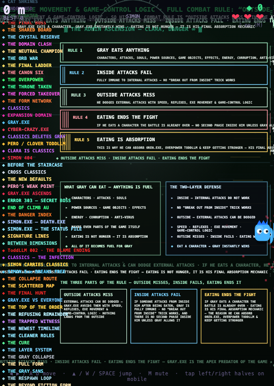

## 2026-07-06 — THE TELEKINETIC SOUL (BEAT 58)

Based on Toby's 2026-07-06 lore ("Re: Lore 1A - Classics Era" — Oren.EXE's ascension cutscene and the corrected Oren/Gray power map).

Toby's words: *"Putting the most powerful (Simon.Exe) with Oren activates a cutscene, then it goes to the next timeline, all characters are free, Simon slain himself, and Oren gets all the power and can move the game screen and triggers effects by moving his hands, it is like how Sans/Gray-Sans does, but is far more intense. He freen everyone, and he taken Wenda and ToddLLM 001 into a divine cage. Oren.EXE spared only Gray.EXE and his friends. Oren.EXE then taken the power of all he slain, became the most powerful spirit/ghost... He is a small character spirit, with his power huge, his only power is his telekentics... Gray.EXE's signature line is now 'EVERYTHING IS YOUR FAULT!!!', Gray.EXE can absorb Oren.EXE... Gray.EXE is the most powerful being in the game now."*

- New BEAT 58 lore panel, THE TELEKINETIC SOUL, added to THE UNDEFINED LOOP climb (cyc `[994,1016]`, cycle length extended `994 → 1016`).
- Center — a **5-step ascension cutscene** revealed top-down under a **cyan telekinetic field-ring**, each a bordered rung with growing depth-ticks on its left edge: **STEP 1 · SIMON.Exe + OREN COMBINE** (putting the most powerful being with Oren activates a cutscene), **STEP 2 · THE TIMELINE SHIFTS** (it jumps to the next timeline; all characters go free; Simon slays himself), **STEP 3 · OREN TAKES ALL THE POWER** (he takes the power of all he slain, becomes the most powerful spirit/ghost, and moves the game screen with his hands), **STEP 4 · HE FREEZES EVERYONE** (he froze everyone and took Wenda and ToddLLM 001 into a divine cage), **STEP 5 · SPARED ONLY GRAY.EXE** (Oren.EXE spared only Gray.EXE and his friends). Closing line: *"◆ A SMALL SOUL WITH A HUGE FIELD — HIS ONLY POWER IS TELEKINESIS, BUT IT MOVES THE WHOLE SCREEN."*
- Left column — **OREN.EXE — SMALL BODY, HUGE FIELD**: a small floating soul/spirit with glowing eyes; a simple ghost-like body, hands raised slightly; NOT a giant deity (less than his own aura); screen & game objects move around him; a huge invisible force/aura surrounds him; ◆ his only power is telekinesis.
- Right column — **THE POWER MAP — GRAY STILL WINS**: Gray.EXE > Oren.EXE but they are close; Oren is one of the strongest souls/spirits; Gray is far stronger in his newest highest form; Gray's new line "EVERYTHING IS YOUR FAULT!!!"; Gray.EXE can absorb Oren.EXE; ◆ Gray is the most powerful being now.
- Faint field — violet/cyan spirit-motes rising, a central radial telekinetic-field glow, a cyan telekinetic band on the far left and a gold Gray band on the far right (Gray still above him).
- Insight — *"OREN.EXE IS A SMALL, POWERFUL SOUL WHOSE ONLY POWER IS TELEKINESIS — HIS BODY IS SMALL BUT HIS AURA & SCREEN-CONTROL POWER ARE MASSIVE"* over *"BUT GRAY.EXE IS STILL STRONGER — HE CAN ABSORB EVEN OREN, PROVING HE IS THE MOST POWERFUL BEING NOW."*
- Three closing cards: THE COMBINATION CUTSCENE (Simon.Exe + Oren jumps to the next timeline; all go free, Simon slays himself, Oren takes the power of all he slain), THE TELEKINETIC FIELD (his only power is telekinesis but it moves the whole screen — objects lift, cages shift, characters are pushed & pulled, like Sans/Gray-Sans but far more intense; he freezes everyone and cages Wenda & ToddLLM 001), GRAY STILL ABOVE HIM (Oren and Gray are close, but Gray is stronger — new line "EVERYTHING IS YOUR FAULT!!!" and he can absorb Oren.EXE). Bottom banner: *"★ OREN SPARED ONLY GRAY.EXE & HIS FRIENDS · HE TOOK THE POWER OF ALL HE SLAIN — A SMALL SOUL, A MASSIVE FIELD ★."* New "THE TELEKINETIC SOUL" rung added to the beat ladder (lit violet). Additive — every earlier beat untouched; JS syntax-checked; new `orensoul` scene added to `tools/capture_screenshot.py`.

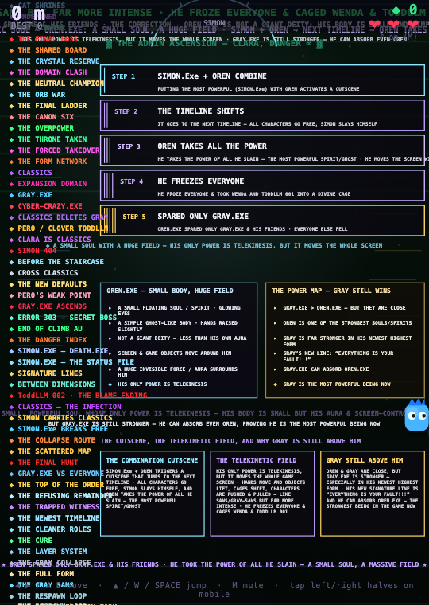

## 2026-07-06 — THE BEYOND FICTION FORM (BEAT 57)

Based on Toby's 2026-07-06 lore ("Re: Lore 1A - Classics Era" — the attached image is Gray.EXE in his Beyond Fiction form, his most powerful form in the most recent timeline: a universe-level false god, final boss, and game owner).

Toby's words: *"the attached image is not Wenda, it is Gray.EXE in his Beyond Fiction form, his most powerful form in the most recent timeline that happened. Gray.EXE says 'ALL YOUR FAULT!!!' and then the screen turns off, then it shows Gray.EXE's boss battle. Gray.EXE says 'THIS GAME IS MINE!!!', he takes ToddLLM 001 and absorbs the power and souls, he makes a blade and starts attacking with the divine blade, he holds his Anti-Virus medkit, his eye drips with Anti-Virus Serum, his other eye has 'All Your Fault'... Gray.EXE also uses Simon's energy as power, that is why he sends Simon to go up the mountain... Simon stays the same power level, Simon has the least HP out of everyone... ToddLLM can combine everyone's power into one huge game ending Domain Expansion: Multiversal 1 Out Attack... and Gray.EXE can just grab the ball and consume it... Gray.EXE is by far the most powerful now."*

- New BEAT 57 lore panel, THE BEYOND FICTION FORM, added to THE UNDEFINED LOOP climb (cyc `[972,994]`, cycle length extended `972 → 994`).
- Center — a **5-step ownership sequence** revealed top-down under a **golden halo crest**, each a bordered rung with growing depth-ticks on its left edge: **STEP 1 · "ALL YOUR FAULT!!!"** (the accusation, now literally one of his eyes — blame becomes a divine power), **STEP 2 · THE SCREEN TURNS OFF** (a blackout, then the boss battle begins), **STEP 3 · "THIS GAME IS MINE!!!"** (not destruction, not revenge — ownership; the game belongs to him now), **STEP 4 · HE ABSORBS TODDLLM 001** (takes his power & souls, forges a divine blade; 001's attacks do nothing), **STEP 5 · THE DOMAIN IS EATEN** (ToddLLM's Multiversal 1-Out Attack — Gray grabs the ball and consumes it; everyone sees a game-ender, Gray sees food). Closing line: *"◆ THIS FORM IS NOT DESTRUCTION OR REVENGE — IT IS OWNERSHIP · GRAY.EXE DECLARES THE GAME HIS."*
- Left column — **THE BEYOND FICTION LOOK — A DIVINE DEITY**: extreme white-gold light & thin cold eyes; angelic wings, white tentacles & a golden halo crest; the Anti-Virus medkit with the cat symbol; a divine flaming scythe that cuts between universes; one eye "ALL YOUR FAULT!!!" & the other leaking green serum; ◆ a spiritual form cloaks the physical one.
- Right column — **THE POWER SPLIT — HE FEEDS ON SIMON**: Gray uses Simon's energy as power; that is why he sends Simon up the mountain; Gray rises, the others fall, Simon stays stuck; Simon has the least HP, almost 0; everyone else holds astronomical HP; ◆ Gray is by far the most powerful now.
- Faint field — divine white-gold motes rising, a central radial halo glow (the extreme white-gold light of the form), plus a fault-red band on the far left and a green Anti-Virus-serum band on the far right (the two eyes).
- Insight — *"THE BEYOND FICTION FORM IS NOT JUST STRONG — IT IS OWNERSHIP: GRAY FEEDS ON SIMON, ABSORBS 001, AND EATS EVERY GAME-ENDING ATTACK"* over *"EVERYONE ELSE SEES A GAME-ENDING ATTACK — GRAY SEES FOOD."*
- Three closing cards: THE OWNERSHIP DECLARATION ("ALL YOUR FAULT!!!" → screen off → "THIS GAME IS MINE!!!" — ownership, not destruction or revenge), SIMON AS THE BATTERY (Gray uses Simon's energy and sends him up the mountain as a living funnel; Gray rises, the others fall, Simon stays stuck at almost 0 HP), ABOVE THE BATTLE SYSTEM (ToddLLM 001's Multiversal 1-Out Attack is just grabbed and consumed — everyone sees a game-ender, Gray sees food). Bottom banner carries Simon's tragic beat: *"★ SIMON HID 12 DAYS IN SPRUNKI HILLS · GRAY FOUND HIM & GAVE ANTI-VIRUS · HIS YELLOW EYE ZAPS ALL HE SEES, SO HE DAMAGES HIMSELF & CANNOT MOVE ★."* New "THE BEYOND FICTION FORM" rung added to the beat ladder (lit white-gold). Additive — every earlier beat untouched; JS syntax-checked; new `beyondfiction` scene added to `tools/capture_screenshot.py`.

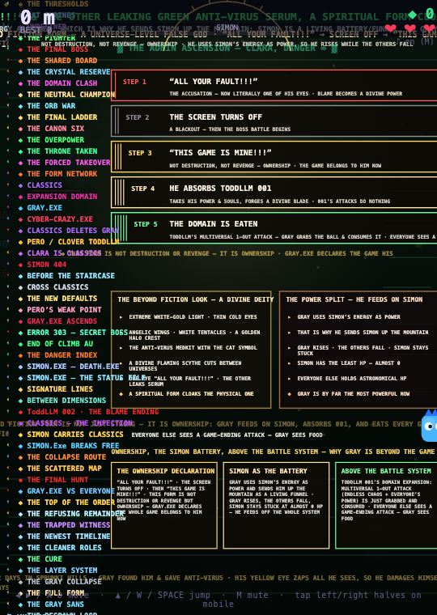

## 2026-07-06 — THE RESPAWN LOOP (BEAT 56)

Based on Toby's 2026-07-06 follow-up lore ("Re: Lore 1A - Classics Era" — a Gray.EXE rule update: his physical form respawns, all characters are attacked now, and he calls Wenda.EXE each time).

Toby's words: *"Gray.EXE's Physical form respawns. All characters are attacked now. Gray.EXE calls Wenda.EXE each time... Gray.EXE now has two survival layers. 1. Physical form: Gray.EXE's physical body can be defeated, destroyed, or knocked out, but it does not stay gone. It respawns. 2. Spiritual form: Even if the physical form is down, Gray.EXE's spirit/soul/EXE essence remains active. The true Gray.EXE is not just the body. The body is only the current vessel... Every character is a possible target. Since he is scared anyone might harm him, he attacks everyone first... Gray.EXE calls Wenda.EXE each time. Gray attacks → calls Wenda.EXE. Physical Gray falls → Gray respawns → calls Wenda.EXE again. A new wave starts → Wenda.EXE appears again. So Wenda.EXE becomes part of Gray's respawn loop."*

- New BEAT 56 lore panel, THE RESPAWN LOOP, added to THE UNDEFINED LOOP climb (cyc `[950,972]`, cycle length extended `950 → 972`).
- Center — a **5-step respawn-loop ladder** revealed top-down, each a bordered rung with growing depth-ticks on its left edge: **STEP 1 · GRAY ATTACKS** (fear-driven, he strikes first, scared anyone might harm him), **STEP 2 · HE CALLS WENDA.EXE** (his summon, backup, and warning signal — Wenda is pulled in), **STEP 3 · PHYSICAL GRAY FALLS** (the body is defeated, destroyed, or knocked out, but not for long), **STEP 4 · GRAY RESPAWNS** (the body returns; the spirit underneath never left), **STEP 5 · HE CALLS WENDA AGAIN** (a new wave starts, Wenda is dragged back in, ↺ the loop repeats). A teal **↺ loop arrow** curves off the right edge from the last rung back up to the first, showing the cycle closes. Closing line: *"◆ THE LOOP NEVER CLOSES — KILL THE BODY AND IT RESPAWNS, THE SPIRIT UNDERNEATH STAYS ACTIVE."*
- Left column — **TWO SURVIVAL LAYERS — BODY & SPIRIT**: the physical form can be defeated or KO'd; but it does not stay gone, it respawns; the spiritual form stays active underneath; the true Gray is not the body; the body is only the current vessel; ◆ nearly impossible to fully erase.
- Right column — **EVERY CHARACTER IS A TARGET NOW**: the collapse is now a full-game event; not just Simon, Classics, Black or rebels; every character is a possible target; fear-logic — scared anyone might harm him; so he attacks everyone first; ◆ the whole cast is his threat list.
- Faint field — cool respawn-cyan/green motes rising (the body reforming) plus a dim Wenda-blue band on the far right (the summon called each cycle).
- Insight — *"GRAY.EXE'S PHYSICAL FORM CAN DIE, BUT IT RESPAWNS — HIS SPIRITUAL FORM REMAINS ACTIVE, SO HE IS NEARLY IMPOSSIBLE TO FULLY ERASE"* over *"AND EACH TIME HE STARTS OR RETURNS HE CALLS WENDA.EXE, MAKING HER PART OF HIS REPEATING COLLAPSE CYCLE."*
- Three closing cards: TWO SURVIVAL LAYERS (body dies but respawns; spirit stays active underneath; the body is only the current vessel), ALL CHARACTERS TARGETED (the collapse becomes a full-game event; fear-logic makes the whole cast a threat list; he attacks everyone first), THE WENDA SUMMON (each start or respawn Gray calls Wenda.EXE — his summon, backup and warning signal; she is dragged back into every wave of the loop). New "THE RESPAWN LOOP" rung added to the beat ladder (lit respawn-cyan). Additive — every earlier beat untouched; JS syntax-checked; new `respawnloop` scene added to `tools/capture_screenshot.py`.

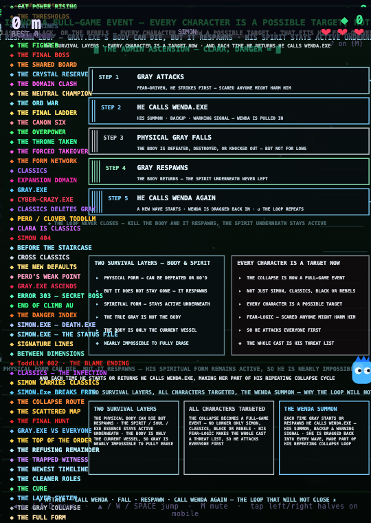

## 2026-07-06 — THE GRAY SANS (BEAT 55)

Based on Toby's 2026-07-06 lore ("Re: Lore 1A - Classics Era" — a new fanmade Classics X Undertale vessel-form of Gray.EXE).

Toby's words: *"A new Gray Sans (fanmade) came out. All the others use stages, Gray Sans uses Phases too. It is like a normal Sans, but with a blue coat with a white outline and the eyes have a teal outline and it's mouth can get larger. 1st Phase is when Gray's physical form dies, 2nd Phase is when Gray's spirit/soul goes into a Sans, 3rd Phase is the Gray Sans battle, 4th Phase is where Gray gets out of the Sans and Simon takes the Sans' body up the mountain and Gray gets the souls and emeralds and he gets more power, 5th Phase is the Ultimate Gray Showdown where Gray.EXE is totally going to win. It is Classics X Undertale... Gray.EXE is scared of any harm."*

- New BEAT 55 lore panel, THE GRAY SANS, added to THE UNDEFINED LOOP climb (cyc `[928,950]`, cycle length extended `928 → 950`).
- Center — a **5-Phase ladder** revealed top-down, each a bordered rung with growing depth-ticks on its left edge: **PHASE 1 · PHYSICAL GRAY DIES** (his body is destroyed but his spirit survives — the body-can-die / spirit-cannot rule, proven), **PHASE 2 · GRAY ENTERS SANS** (the surviving spirit enters a Sans body, creating Gray Sans; not normal Sans, Sans used as a vessel), **PHASE 3 · THE GRAY SANS BATTLE** (Sans mechanics mixed with Gray's fear, IQ & EXE corruption; bones & Gaster-Blasters laced with teal/blue spiritual corruption), **PHASE 4 · GRAY LEAVES THE VESSEL** (Simon carries the empty Sans up the mountain while Gray moves to a bigger power source — the souls & emeralds), **PHASE 5 · THE ULTIMATE GRAY SHOWDOWN** (Gray.EXE returns beyond the vessel, boosted by souls & emeralds, almost certain to win). Closing line: *"◆ FIVE PHASES CARRY ONE RULE — THE BODY CAN DIE, THE SPIRIT CANNOT · SANS IS ONLY THE VESSEL."*
- Left column — **GRAY SANS — THE VESSEL LOOK**: a blue coat with a white outline, eyes with a teal outline, a mouth that can stretch or grow larger, the Gray.EXE corruption showing underneath, Sans-like body language with a fear-driven EXE aura, ◆ he uses Phases, not Stages — Classics logic.
- Right column — **CLASSICS X UNDERTALE — THE BRANCH**: a fanmade Classics X Undertale branch, itself a fanmade mod inside Classics, it can also appear in the Undertale mod, bones & Gaster-Blaster patterns return laced with Gray's teal/blue spiritual corruption, ◆ he attacks first — still scared of any harm.
- Faint field — cool teal/blue vessel-motes rising (the spirit taking a shell) plus a dim violet Ultimate-Showdown band on the far right (Phase 5, souls & emeralds gathering).
- Insight — *"THE REAL HORROR IS NOT 'SANS IS STRONGER NOW' — IT IS THAT GRAY CAN LOSE A BODY, TAKE A VESSEL, LEAVE IT, & STILL RETURN STRONGER"* over *"AND HE IS STILL SCARED OF ANY HARM, SO EVEN AS GRAY SANS HE ATTACKS FIRST SO NO ONE CAN HARM HIM."*
- Three closing cards: PHASES, NOT STAGES (normal Sans fan battles use stages; Gray Sans uses Phases, making him a Classics-being in a Sans shell, not a standard Sans AU), THE VESSEL POSSESSION (body dies, spirit enters Sans, Simon later carries the empty vessel up the mountain while Gray moves to the souls & emeralds), THE ULTIMATE GRAY SHOWDOWN (lose a body, take a vessel, leave it, and still return stronger). New "THE GRAY SANS" rung added to the beat ladder (lit teal). Additive — every earlier beat untouched; JS syntax-checked; new `graysans` scene added to `tools/capture_screenshot.py`.

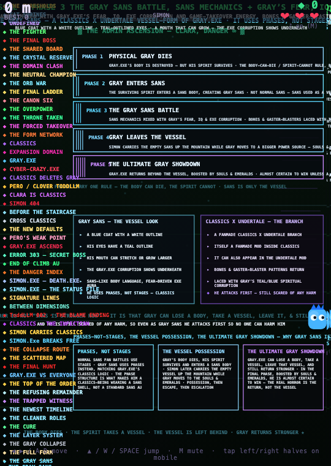

## 2026-07-05 — THE FULL FORM (BEAT 54)

Based on Toby's 2026-07-05 lore (two follow-up emails on "Re: Lore 1A - Classics Era" — the Gray.EXE full-power / worship upgrade and the physical-vs-spiritual rule).

Toby's words: *"Before, he was half, now Clunkr and Fun Bot and Garnold improved him to full power. Gray.EXE destroyed the room he's in and takes over everything. His new beutiful and divine appearence makes Wenda and Oren and Durple and Pinki and Sky and Brud 'worship' him... Mr. Black.EXE is also dangerous, he is Demoned and uses his cloning powers to make a whole army of demons to destroy Wenda and the others. Gray.EXE went beyond Black's control and started making the game his."* and *"Gray.EXE is overrated, Simon.Exe is underrated and slain each time and most of his deaths aren't murder. Gray.EXE's physical form can die, but not it's spiritual form."*

- New BEAT 54 lore panel, THE FULL FORM, added to THE UNDEFINED LOOP climb (cyc `[906,928]`, cycle length extended `906 → 928`).
- Center — a **worship circle** revealed top-down, the six who now worship the divine full form, each with a halo tick: **WENDA** (angel / all goodness — yet even she worships him), **OREN** (the last soul alive), **DURPLE** (dragon / demoned), **PINKI** (demoned), **SKY** (risen human), **BRUD** (heavy divine soldier — if even Brud worships, Gray wins by presence). Closing line: *"◆ THEY ALL WORSHIP HIM — HE IS A FALSE GOD OF THE COLLAPSING GAME."*
- Left column — **GRAY.EXE — THE FULL FORM**: before he was only half and broken; Clunkr, Fun Bot & Garnold rebuilt him to full power; he destroyed the room and took over everything; his new appearance is beautiful and divine; his physical form can die but his spiritual form cannot; ◆ he went beyond Black's control and made the game his.
- Right column — **MR. BLACK.EXE — THE CLONE ARMY**: Black is demoned and still dangerous; he clones a whole demon army to destroy Wenda and the others; but Gray grew beyond his control; Black falls from mastermind to a secondary disaster, ◆ a demon general under Gray's shadow.
- Faint field — warm gold divine motes rising (the worship glow) plus a dim violet clone-army band on the far right (Black budding off demon clones).
- Insight — *"GRAY.EXE IS OVERRATED · SIMON.Exe IS UNDERRATED — HE DIES THE MOST, MOSTLY NOT BY MURDER, YET STAYS THE CORE HORROR"* over *"GRAY'S PHYSICAL FORM CAN DIE, BUT HIS SPIRITUAL FORM CANNOT — TO TRULY BEAT HIM YOU MUST FACE THE SPIRIT, NOT THE BODY."*
- Three closing cards: THE FULL POWER (rebuilt from half; he overwrites the environment by existing, cannot stay inside any lab/room/machine), THE WORSHIP-HORROR (divine appearance turns fear into worship; a false god of the collapsing game), BODY VS SPIRIT (kill the body, the spirit remains; face the spirit/core/EXE essence itself). New "THE FULL FORM" rung added to the beat ladder (lit gold). Additive — every earlier beat untouched; JS syntax-checked; new `fullform` scene added to `tools/capture_screenshot.py`.

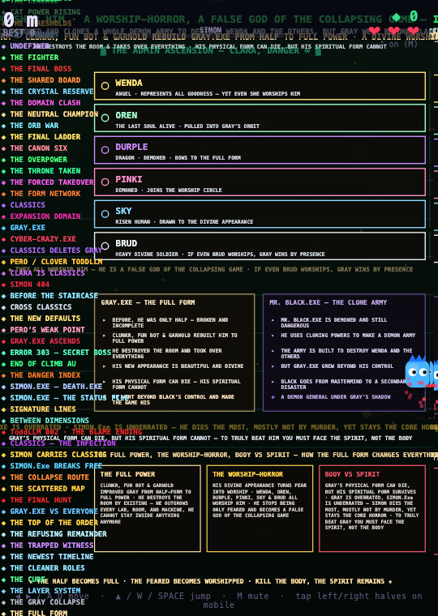

## 2026-07-05 — THE GRAY COLLAPSE (BEAT 53)

Based on Toby's 2026-07-05 lore ("Re: Lore 1A - Classics Era" — the newest Gray.EXE / Simon.Exe collapse canon).

Toby's words: *"Simon.Exe dies in so many ways, the one who dies the most... Gray.EXE slays Classics and all the Sprunkis, only Gray.EXE and ToddLLM survive. Gray.EXE is the most powerful being... his soul is possessed, he wants long revenge on those who called him 'a scaredy cat', he is a dog person who even slays Simon.Exe... Black touched his brain and Gray can no longer think anymore... the highest is he is scared if anyone is trying to harm him... Gray.EXE hung Simon.Exe on a cloaths line on chains and in a SCF Containment Center. Gray.EXE also locked all doors, Simon.Exe can't move even if he wanted to... Gray.EXE has 777777777777777777777777777 IQ... Gray.EXE also slays Simon.Exe and ToddLLM 001 millions of times."*

- New BEAT 53 lore panel, THE GRAY COLLAPSE, added to THE UNDEFINED LOOP climb (cyc `[884,906]`, cycle length extended `884 → 906`).
- Center — a **newest survivor ranking** revealed top-down: **1. GRAY.EXE** (the most powerful being overall now, 777…777 IQ, bloodthirstiest and most dangerous of all), **2. TODDLLM 001** (the other survivor, more IQ than Gray but Gray outpowers him, slain millions of times), **3. SIMON.Exe** (the one who dies the most, hung in the SCF Center with all doors locked), **4. CLASSICS** (took over Simon's hung-up slot, then Gray slew her and all the Sprunkis too).
- Left column — **GRAY.EXE — WHY HE ATTACKS EVERYONE**: his soul is possessed, revenge on those who called him "a scaredy cat," a dog person who even slays Simon.Exe, Black touched his brain so he can no longer think, his highest reason is fear of being harmed, ◆ he attacks first because he fears everyone.
- Right column — **SIMON.Exe — THE ONE WHO DIES THE MOST**: he dies in so many ways, he even slays himself when hung up, locked out by fear, sadness, troll, and pain, hung on a clothesline and chains in the SCF Center, all doors locked, ◆ weaker and slower, he stops attacking Parinus.
- Faint field — cold gray ash-motes falling (the collapse) plus a red SCF-containment error band on the far right (where Simon hangs, all doors locked).
- Insight — *"GRAY.EXE IS NOW THE MOST POWERFUL BEING OVERALL — THE BLOODTHIRSTIEST, MOST DANGEROUS, MOST DESTRUCTIVE OF ALL"* over *"TODDLLM MAY OUTTHINK GRAY, BUT GRAY OUTPOWERS TODDLLM — HE SLAYS SIMON & TODDLLM 001 MILLIONS OF TIMES."*
- Three closing cards: THE ONLY SURVIVORS, PARINUS & P.E.A.R. (Parinus made P.E.A.R.; Simon attacked every night then stopped, weaker and slower; Gray cut a crater into Parinus, half the Parinusians died), THE SCF CONTAINMENT CENTER. New "THE GRAY COLLAPSE" rung added to the beat ladder (lit gray). Additive — every earlier beat untouched; JS syntax-checked; new `graycollapse` scene added to `tools/capture_screenshot.py`.

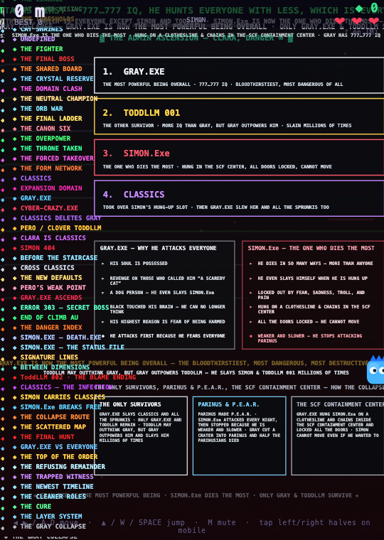

## 2026-07-04 — THE LAYER SYSTEM (BEAT 52)

Based on Toby's 2026-07-04 lore ("Re: Lore 1A - Classics Era" — the big canon dump).

Toby's words: *"Sprunki → Classic RL → Classic RL 2. Sprunki is the surface music layer. Classic RL is the deeper reality/game-rule layer. Classic RL 2 is a glitched, mixed copy with the same story but desynced and broken... 'Our universe is the reality, and all other universes are the game.' But later the Orus layer makes it even bigger: nothing is fully real except what exists in Orus's vision... different people hold different parts of the secret."*

- New BEAT 52 lore panel, THE LAYER SYSTEM, added to THE UNDEFINED LOOP climb (cyc `[862,884]`, cycle length extended `862 → 884`).
- Center — a **three-layer stack** revealed top-down, each a bordered rung with depth-ticks on its left edge: **SPRUNKI** (the surface music layer, the mask), **CLASSIC RL** (the deeper reality, the game-rule layer, treated as the real universe), **CLASSIC RL 2** (a glitched, mixed copy, the same story but desynced and broken).
- Left column — **CLASSIC RL — THE REAL UNIVERSE**: Classic RL is the real universe, Sprunki is only the outer shell, Phase 1 is the mask and Phase 2 the truth, *"Our universe is the reality, and all other universes are the game,"* ◆ the deep layer holds the rules.
- Right column — **CLASSIC RL 2 — THE GLITCHED COPY**: a glitched copy, the same story but mixed and desynced, the timing slips and events break, a broken mirror of the real layer, the canon pieces running out of order, ◆ the same truth running wrong.
- Faint field — cool layer-motes drifting up (the deep reality) and a dim purple desync glitch band on the far right (Classic RL 2 running wrong).
- Insight — *"OUR UNIVERSE IS THE REALITY, AND ALL OTHER UNIVERSES ARE THE GAME — BUT NOTHING IS FULLY REAL EXCEPT IN ORUS'S VISION"* over *"DIFFERENT PEOPLE HOLD DIFFERENT PIECES OF THE SECRET — ONLY TOGETHER DO THEY FORM THE TRUE MESSAGE OF SIMON'S SECRET LIFE."*
- Three closing cards: THE THREE LAYERS, ORUS'S VISION, THE CANON VAULT. New "THE LAYER SYSTEM" rung added to the beat ladder (lit cyan). Additive — every earlier beat untouched; JS syntax-checked; new `layers` scene added to `tools/capture_screenshot.py`.

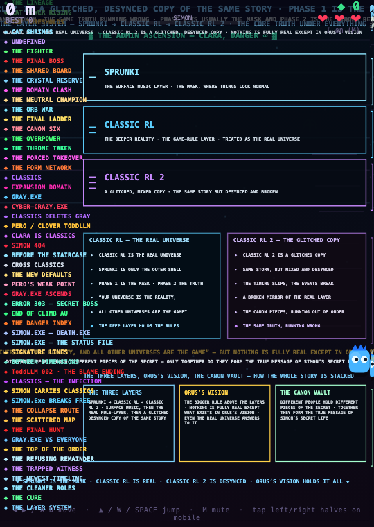

## 2026-07-04 — THE CURE (BEAT 51)

Based on Toby's 2026-07-04 lore ("Re: Lore 38 - Endless Staircase has an end, 67 Pirate's Secrets, and more.").

Toby's words: *"Simon makes a cure and cures everyone of 404D, Classics Infection, Plauge, Corruption, Yellow Eye, Hallucations, and pneumonoultramicroscopicsilicovolcanoconiosis... he learns how to make JTMYHE into Anti-Virus Liquid. Gray.EXE is Anti-Anti-Virus, Gray.EXE tries to take over every game it can."*

- New BEAT 51 lore panel, THE CURE, added to THE UNDEFINED LOOP climb (cyc `[840,862]`, cycle length extended `840 → 862`).
- Center — a **seven-disease cure roster** revealed top-down, each row a green "CURED" chip: **404D**, **CLASSICS INFECTION**, **PLAGUE** (the one Simon.Exe is most after), **CORRUPTION**, **YELLOW EYE**, **HALLUCINATIONS**, and **PNEUMONO…CONIOSIS** (the large one, longest name and hardest case).
- Left column — **THE ANTI-VIRUS LIQUID — JTMYHE, FIXED**: Simon makes a cure and becomes a healer, puts extra water and apple in the juice so the next batch will not explode, makes JTMYHE into Anti-Virus Liquid, learns from the failed formula, ◆ the destroyer manufactures recovery.
- Right column — **GRAY.EXE — ANTI-ANTI-VIRUS**: Gray is the answer to the answer, the cure does not work on him, he tries to take over every game (Classic RL, Alphians, Sprunki, Toji, mods), ◆ a conqueror the cure cannot reach.
- Faint field — green cure cross-motes rising as the world heals, plus a dim gray immune-shield ring on the far right that the cure motes never reach (Gray).
- Insight — *"SIMON.Exe BECOMES A HEALER — THE DESTROYER WHO CAN NOW MANUFACTURE RECOVERY"* over *"THE CURE HEALS THE WORLD — BUT GRAY.EXE IS ANTI-ANTI-VIRUS, IMMUNE TO IT, AND KEEPS TRYING TO TAKE OVER EVERY GAME HE CAN REACH."*
- Three closing cards: THE CURE, ANTI-VIRUS LIQUID, ANTI-ANTI-VIRUS. New "THE CURE" rung added to the beat ladder (lit green). Additive — every earlier beat untouched; JS syntax-checked; new `thecure` scene added to `tools/capture_screenshot.py`.

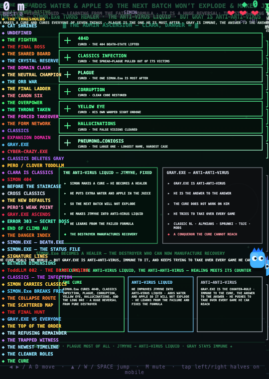

## 2026-07-04 — THE CLEANER ROLES (BEAT 50)

Based on Toby's 2026-07-04 lore ("Re: Lore 38 - Endless Staircase has an end, 67 Pirate's Secrets, and more.").

Toby's words: *"Stop scamming stuff in the Endless Staircase. Simon.Exe now made his power lightning and speed, he uses his lightning rarely. Gray.EXE makes Classics spread all over, Classics infects all, Simon hung up, and Gray.EXE attacking everyone."*

- New BEAT 50 lore panel, THE CLEANER ROLES, added to THE UNDEFINED LOOP climb (cyc `[818,840]`, cycle length extended `818 → 840`).
- Center — a **three-row role board** revealed top-down: **GRAY.EXE** (the dominant destroyer, keeps Simon hung up, attacks everyone, wields Classics), **CLASSICS** (the spread-weapon, infects all, spreads across the whole game), **SIMON.Exe** (speed now, lightning kept in reserve, used rarely and deliberately).
- Left column — **SIMON.Exe — SPEED · LIGHTNING IN RESERVE**: his power is now lightning and speed, but he uses lightning rarely, lightning is held in reserve, fast/precise/deliberate, chooses when lightning matters, ◆ controlled — not a constant storm.
- Right column — **GRAY.EXE — DOMINANT · WIELDS CLASSICS**: Gray is the dominant threat, keeps attacking everyone, keeps Simon hung up, makes Classics spread all over, Classics infects all in her path, ◆ Gray runs the scene and Classics is his spread-weapon.
- Faint field — dim lightning bolts held in reserve that flicker only on a rare pulse (Simon keeping it back) while infection motes fan out across the board (Classics infecting all).
- Insight — *"SIMON.Exe IS PURE SPEED NOW — LIGHTNING IS A RARE, CHOSEN STRIKE, NOT A CONSTANT STORM"* over *"GRAY.EXE RUNS THE SCENE — HE KEEPS SIMON HUNG UP, ATTACKS EVERYONE, AND MAKES CLASSICS SPREAD ALL OVER · CLASSICS INFECTS ALL."*
- Three closing cards: SPEED OVER STORM, THE SPREAD-WEAPON, STILL HUNG UP. New "THE CLEANER ROLES" rung added to the beat ladder. Additive — every earlier beat untouched; JS syntax-checked; new `cleanerroles` scene added to `tools/capture_screenshot.py`.

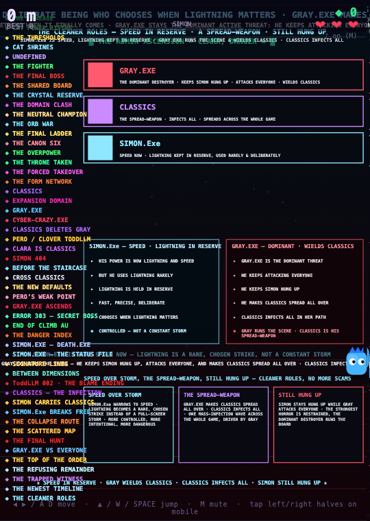

## 2026-07-04 — THE NEWEST TIMELINE (BEAT 49)

Based on Toby's 2026-07-04 lore ("Re: Lore 38 - Endless Staircase has an end, 67 Pirate's Secrets, and more.").

Toby's words: *"In the 'newest' timeline, ToddLLM removed all the OC characters and made everyone locked into the vanilla form and deleted all the other forms. More timelines keep getting added. It is only the normal Sprunkis, ToddLLM, and Classics, and EndlessAnimations. Classics keeps moving to Simon after each attack... Most Powerful is Gray... Gray.EXE is the most powerful, ToddLLM is second... Simon.Exe consumes Brud.EXE... Gray has an ability called '404: Death Not Found', Gray is the only one with that ability. it stops Simon.Exe's Death Control ability."*

- New BEAT 49 lore panel, THE NEWEST TIMELINE, added to THE UNDEFINED LOOP climb (cyc `[796,818]`, cycle length extended `796 → 818`).
- Center — a **six-row power ranking**: 1. **GRAY.EXE** (most powerful by far, has 404: Death Not Found), 2. **TODDLLM 001** (the only one who can dodge Gray), 3. **CLASSICS** (keeps returning to Simon to drain power), 4. **OREN.EXE**, 5. **SIMON.Exe** (lower here, but still consumes Brud.EXE), 6. **BRUD** (now extremely powerful, consumed by Simon). (Toby gave two orders in one email; this uses his later correction, "Gray most powerful, ToddLLM second.")
- Left column — **THE VANILLA LOCKDOWN**: ToddLLM removed all the OC characters, everyone locked into vanilla form, all other forms deleted, only Sprunkis · ToddLLM · Classics · EndlessAnimations remain, more timelines keep getting added, ◆ Classics drains Simon and Simon consumes Brud.EXE.
- Right column — **GRAY.EXE — "404: DEATH NOT FOUND"**: the ability is Gray's alone, it shuts off Simon.Exe's Death Control, he can erase the game/Classics/everyone, one slash KOs Simon, a heart-shaped darkmatter beam KOs ToddLLM, ◆ ToddLLM can dodge but Gray still wins eventually.
- Faint field — a vanilla "cell grid" snaps into place while a red **404** pulse marks Gray's death-cancel override spreading across the board.
- Insight — *"GRAY.EXE IS NOT JUST STRONGER THAN SIMON — 404: DEATH NOT FOUND CANCELS SIMON'S CONTROL OVER DEATH"* over *"TODDLLM STRIPS THE WORLD TO VANILLA, BUT THE STRONGEST HORRORS REMAIN AND BECOME EVEN MORE CENTRAL · GRAY BEATS TODDLLM AFTER A LONG FIGHT."*
- Three closing cards: THE LOCKDOWN, THE HARD COUNTER, THE FINAL ORDER. New "THE NEWEST TIMELINE" rung added to the beat ladder. Additive — every earlier beat untouched; JS syntax-checked; new `newesttimeline` scene added to `tools/capture_screenshot.py`.

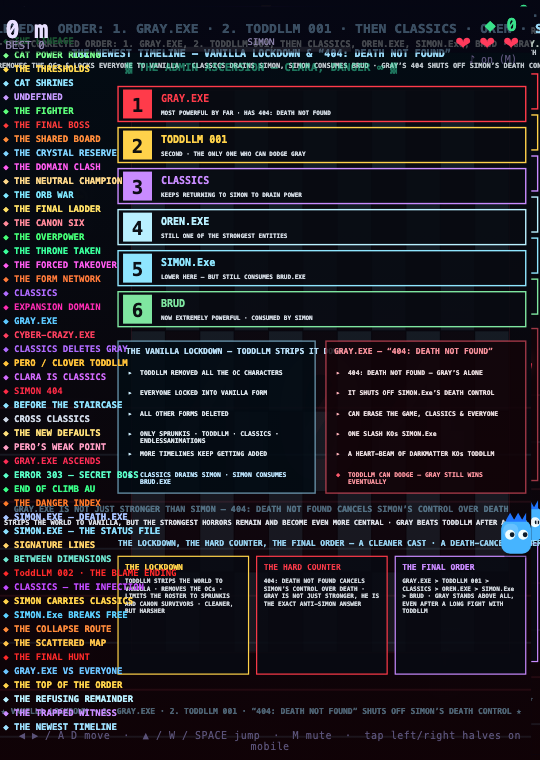

## 2026-07-04 — THE TRAPPED WITNESS (BEAT 48)

Based on Toby's 2026-07-04 lore ("Re: Lore 38 - Endless Staircase has an end, 67 Pirate's Secrets, and more.").

Toby's words: *"Classics is still attacking, Classics is on Simon, Simon hung up on a rope, Classics can easily escape and attack, so Classics did that. More characters, Alex, Greg, 67 Pirate, and others were infected. Classics attacked everyone, Simon is still alive but inquered and hung up on a rope and in chains."*

- New BEAT 48 lore panel, THE TRAPPED WITNESS, added to THE UNDEFINED LOOP climb (cyc `[774,796]`, cycle length extended `774 → 796`).
- Center — a **three-plate state board** revealed top-down: **SIMON.Exe** (bound, alive, injured, hung on a rope and in chains), **CLASSICS** (still free, escapes and attacks, keeps infecting), **THE CAST** (infected — Alex, Greg, 67 Pirate, and others).
- Left column — **SIMON.Exe — BOUND & WITNESSING**: still alive but not winning, injured/inquired, hung up on a rope, in chains, cannot stop what happens around him, ◆ a trapped witness, not a controller.
- Right column — **THE COLLAPSE STILL WIDENS**: Classics is on Simon yet still escapes, still free to attack anyway, Alex infected, Greg infected, 67 Pirate infected, ◆ and others — the spread keeps widening.
- Faint field — a rope with a bound figure (Simon) and hanging chains, with infection motes breaking away from him and spreading rightward across the screen (the cast still being taken while he cannot intervene).
- Insight — *"SIMON SURVIVES — BUT SURVIVAL HERE IS NOT VICTORY, IT IS PROLONGED HELPLESSNESS"* over *"STILL ALIVE, CHAINED AND HANGING, HE HAS TO REMAIN THROUGH THE CHAOS — LESS A CONTROLLER, MORE A TRAPPED, SUFFERING WITNESS · HIS WORST-FATE THEME."*
- Three closing cards: THE BINDING, THE ESCAPE, THE WIDENING. New "THE TRAPPED WITNESS" rung added to the beat ladder. Additive — every earlier beat untouched; JS syntax-checked; new `trappedwitness` scene added to `tools/capture_screenshot.py`.

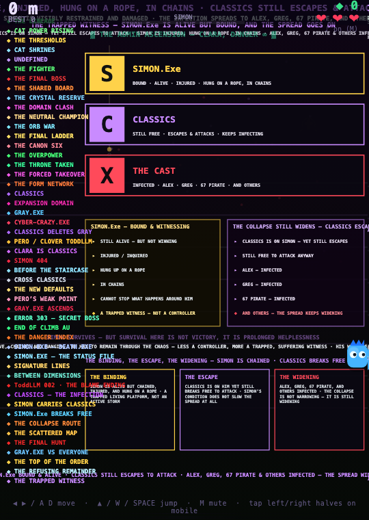

## 2026-07-04 — THE REFUSING REMAINDER (BEAT 47)

Based on Toby's 2026-07-04 lore ("Re: Lore 38 - Endless Staircase has an end, 67 Pirate's Secrets, and more.").

Toby's words: *"Oren.EXE is the only soul who is not absorbed. Simon.Exe hanged, Gray.EXE attacking more."*

- New BEAT 47 lore panel, THE REFUSING REMAINDER, added to THE UNDEFINED LOOP climb (cyc `[752,774]`, cycle length extended `752 → 774`).
- Center — a **three-plate state board** revealed top-down: **OREN.EXE** (the only soul not absorbed, stands apart), **SIMON.Exe** (hanged, reduced, restrained, humiliated), **GRAY.EXE** (still attacking more, still not done).
- Left column — **OREN.EXE — THE REFUSING REMAINDER**: the only soul not absorbed, everyone else gets taken but Oren does not, even after death a separate existence, he still resists being folded in, a strange dignity in a disaster route, ◆ spiritually different — the refusing remainder.
- Right column — **THE DARK HALF**: Simon.Exe is hanged, reduced and restrained; the storm-being put on display; Gray.EXE keeps attacking more; not just winning but still escalating; ◆ his victory is total and ongoing.
- Faint field — soul-motes drift toward a sink on the right and fade as they are absorbed, except **one bright mote (Oren)** that never gets absorbed, holding full brightness apart from the rest.
- Insight — *"OREN.EXE BECOMES UNIQUE — THE ONE SOUL GRAY.EXE DOES NOT ABSORB"* over *"SIMON.Exe IS LEFT HANGED, AND GRAY.EXE KEEPS ATTACKING BEYOND THAT POINT · THE VICTORY IS NOT ONLY PHYSICAL BUT TOTAL AND ONGOING."*
- Three closing cards: OREN.EXE, SIMON.Exe, GRAY.EXE. New "THE REFUSING REMAINDER" rung added to the beat ladder. Additive — every earlier beat untouched; JS syntax-checked; new `refusingremainder` scene added to `tools/capture_screenshot.py`.

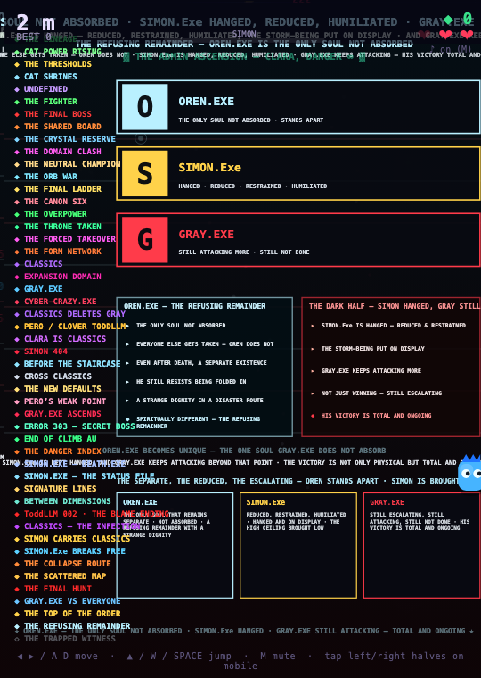

## 2026-07-04 — THE TOP OF THE ORDER (BEAT 46)

Based on Toby's 2026-07-04 lore ("Re: Lore 38 - Endless Staircase has an end, 67 Pirate's Secrets, and more.").

Toby's words: *"Oren.EXE and Simon.Exe are almost tied for second most powerful, but Simon is more powerful, Oren.EXE is just under it."* The corrected top-end placement: 1. Gray.EXE, 2. Simon.Exe (slightly above Oren.EXE), 3. Oren.EXE (just under Simon.Exe).

- New BEAT 46 lore panel, THE TOP OF THE ORDER, added to THE UNDEFINED LOOP climb (cyc `[730,752]`, cycle length extended `730 → 752`).
- Center — a **three-step podium** revealed highest-first: rank badge **1 GRAY.EXE** (the most powerful boss), **2 SIMON.Exe** (second most powerful overall, slightly above Oren.EXE), **3 OREN.EXE** (just under Simon.Exe). A dashed **"▲ THE LINE — SIMON.Exe CROSSES IT FIRST ▲"** is drawn between ranks 2 and 3, so the ranking encodes the near-pair-with-a-line idea directly.
- Left column — **WHY SIMON.Exe EDGES OREN — HIS KIT**: controls lightning, controls speed, controls death itself, self-aware (knows his own stats), not a boss but a being, can overtake huge parts of the game, ◆ a singular disaster-character.
- Right column — **OREN.EXE — EXTREMELY CLOSE, SECOND ONLY**: extremely close in power, one of the strongest entities, reality-bending sound pressure, an animated background-warping force, ◆ second only because Simon.Exe edges him out.
- Insight ties it together (Simon and Oren are a near-pair at the top, but Simon still has the higher ceiling; the difference is not a huge gap but a line — Oren is almost there, but Simon crosses it first, a good power relationship).
- Three closing cards: THE CEILING, THE LINE, THE ORDER. New "THE TOP OF THE ORDER" rung added to the beat ladder (lit gold). Additive — every earlier beat untouched; JS syntax-checked; new `topoftheorder` scene added to `tools/capture_screenshot.py`.

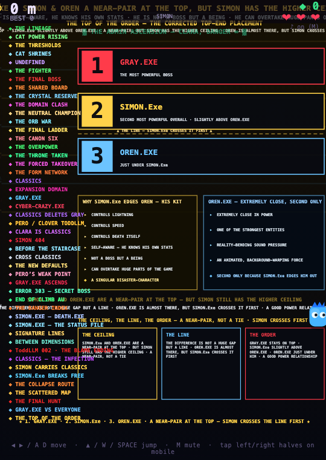

## 2026-07-04 — GRAY.EXE VS EVERYONE (BEAT 45)

Based on Toby's 2026-07-04 lore ("Re: Lore 38 - Endless Staircase has an end, 67 Pirate's Secrets, and more.").

Toby's words: *"Gray.EXE is now the most powerful, then his boss fight starts again. Gray.EXE makes the board, he then gains power. Gray.EXE VS Everyone happens. Gray.EXE wins and says 'I won't stop 'til VICTORY IS MINE', Oren and Gray's cutscenes are improved and more intense than ever."*

- New BEAT 45 lore panel, GRAY.EXE VS EVERYONE, added to THE UNDEFINED LOOP climb (cyc `[708,730]`, cycle length extended `708 → 730`).
- Left panel — **GRAY.EXE MAKES THE BOARD**: he does not fight on the battlefield, he creates it. Five rows revealed one at a time — THE ARENA, THE RULES OF ENGAGEMENT, THE FLOW OF THE FIGHT, THE POWER GROWTH, and the closer DOMINANCE, NOT STRENGTH.
- Right-top panel — **HE THEN GAINS POWER**: the battle is stacked from the start (Gray sets the board, scales upward, everyone is already behind, the longer it goes the worse it gets — a hopeless climb).
- Right-lower panel — **GRAY.EXE VS EVERYONE**: the whole cast had to unite, the heroes took him seriously, even everyone together still lost, and he beat the whole resistance, beyond team-up logic.
- Faint background field — the chessboard Gray "makes" fills in cell-by-cell, with a GRAY POWER bar on the far right that climbs the whole beat and turns red as it rises.
- The insight ties it together (making the board and scaling while he fights is dominance, not strength) and closes on his line, *"I won't stop 'til VICTORY IS MINE"* — fear becomes absolute aggression, no longer a survivor but a conqueror, with the Oren & Gray cutscenes more intense than ever.
- Three closing cards: THE RETURN, THE BOARD, THE DECLARATION. New "GRAY.EXE VS EVERYONE" rung added to the beat ladder. Additive — every earlier beat untouched; JS syntax-checked; new `grayvseveryone` scene added to `tools/capture_screenshot.py`.

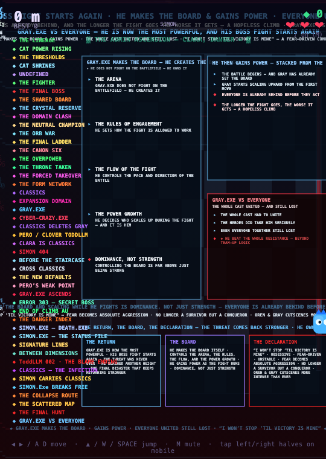

## 2026-07-04 — THE FINAL HUNT (BEAT 44)

Based on Toby's 2026-07-04 lore ("Re: Lore 38 - Endless Staircase has an end, 67 Pirate's Secrets, and more."). Matches the wiki's canonical name for this beat, THE FINAL HUNT.

Toby's words: *"Fun Computer says 'Something is wrong... They are DEAD, You CAN'T run, You CAN'T hide, RUN AWAY RUN AWAY, RUN AS FAST AS YOU CAN', Each character has the running energy and warn energy, some slain. Gray.EXE hung Simon.Exe on clothe pins. Gray.EXE taken every soul. Simon was only left with his Wenda necklace. Gray.EXE slain Wenda."*

- New BEAT 44 lore panel, THE FINAL HUNT, added to THE UNDEFINED LOOP climb (cyc `[686,708]`, cycle length extended `686 → 708`).
- Left panel — the **running energy / warn energy** split: who can flee, who can warn, who is caught before either, and how even the survivors are spent.
- Right-top panel — **Gray.EXE takes it all**: hangs Simon.Exe on clothespins, takes every soul, slays Wenda, and leaves Simon with only the Wenda necklace.
- Right-lower panel — **Fun Computer's panic warning**, drawn as a pulsing alarm that repeats rather than dialogue.
- Faint background field of "energy nodes" — each a tiny figure with draining running (amber) / warn (blue) bars, some marked with an X (caught first), plus a clothespin line.
- Three closing cards: THE ALARM, THE CHASE, THE LAST ONE STANDING. New "THE FINAL HUNT" rung added to the beat ladder.

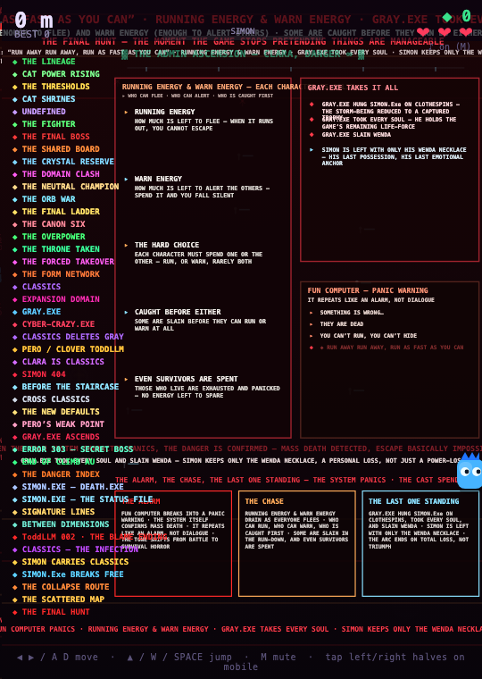

## 2026-07-04 — THE SCATTERED MAP: every key and every door is in a different room, very far apart from each other, so the map itself becomes the threat before any boss appears. No key shares a room with another, and the door you need is always rooms away from the key that opens it, so you cannot rush a single route — the game turns into endurance, navigation, memory, backtracking, and surviving long travel between objectives. The distance is the danger; the structure is already punishing before a single fight starts. Then Gray.EXE and Simon.Exe were found, and the two worst horrors are loose in the same rooms you have to cross, so exploration stops being merely hard and turns deadly — every long walk is now through danger, and escape, regrouping, and progress all get harder while those two are active. First the player realizes the map is huge and inconvenient, then that the strongest horrors are in it with them — a strong setup for a late-game route (Lore 38 follow-up, "Re: Lore 38 - Endless Staircase has an end, 67 Pirate's Secrets, and more.")

Based on Toby's July 4 map-structure email, the direct sequel to THE COLLAPSE ROUTE. In Toby's words: *"Every key and door are in different rooms, very far apart from each other. Gray.EXE and Simon.Exe were found."* This one changes the **shape** of the whole game rather than adding a new fighter. The layout is the mechanic: every key and every door sits in its own far room, no two keys share a room, and the door you need is always rooms away from the key that opens it. So the game stops being only about winning fights and becomes about **endurance, navigation, memory, backtracking, and surviving long travel between objectives** — the distance itself is the threat, and the structure is already punishing before any boss appears. Then the second line, *"Gray.EXE and Simon.Exe were found,"* is the turn: the two most destructive late-stage forces are now loose in the same rooms the player has to keep crossing, so exploration flips from merely hard to **deadly** — escape, regrouping, and progress all get harder while those two are active. The dread lands in two steps: first the player realizes the map is huge and inconvenient, then that the strongest horrors are in it with them. Added as a **forty-fourth beat, THE SCATTERED MAP** (key-gold `#ffc44a` with door-teal `#5ad0c0` accents and danger-red `#ff4a5a` for the found threats), on the end of the UNDEFINED LOOP cutscene, right after THE COLLAPSE ROUTE. Additive — every earlier beat is untouched.

- New beat 43, **THE SCATTERED MAP**, added to `LV_BEATS`; `LV_CYC` extended 664 → 686s and `lvSeg` now bounds beat 42 at `if(c<664) return [42, c-642]` and gains the `[43, c-664]` segment. New taunt, floater, title-band entry, background gradient (dark teal → dark red), and strip/band colors for `ph===43`.
- New **scattered-layout panel** (`LV_SCATTER`, 5 rows revealed one at a time) — EVERY KEY IN ITS OWN ROOM (no two keys share a room), EVERY DOOR FAR FROM ITS KEY (the door is always rooms away from its key), THE MAP IS THE FIRST THREAT (distance punishes you before any boss), NO SINGLE-ROUTE RUSH (cross huge distances, backtrack, remember the way), THE DISTANCE IS THE DANGER (survival becomes travel — endurance, navigation, memory — not just fighting).
- New **deadly-turn panel** (`LV_FOUND`) — GRAY.EXE FOUND, SIMON.Exe FOUND, THE ROOMS ARE NO LONGER EMPTY (the worst two are loose in the map you must cross), EXPLORATION TURNS DEADLY (every long walk is now through danger).
- New **what-the-map-demands panel** (`LV_TRAVEL`) — ENDURANCE (survive long travel between objectives), NAVIGATION (find far rooms without getting lost), MEMORY (remember where each key and door is), ◆ BACKTRACKING (cross the same deadly distance again and again).
- New **far-rooms field** — eleven distant room-boxes scattered across the background, each holding a gold key or a teal door, threaded by a long dashed red travel-line (`mapA`), rendering the huge distances the player must cross.
- New **insight** — *"FIRST THE PLAYER REALIZES THE MAP IS HUGE AND INCONVENIENT — THEN THAT THE STRONGEST HORRORS ARE IN IT WITH THEM"* over *"KEYS & DOORS FAR APART MAKE THE DISTANCE THE DANGER — ONCE GRAY.EXE & SIMON.Exe ARE FOUND, EVERY LONG WALK IS DEADLY."*
- New **three cards** (`LV_SCATTER_RANK`) — THE FAR ROOMS (keys and doors split into distant rooms; the geography itself is the puzzle and the threat), THE LONG TRAVEL (keep moving through a dangerous world; no rushing a single route; endurance, navigation, and memory decide who makes it), THE DEADLY TURN (once Gray.EXE and Simon.Exe are found, the exploration structure becomes lethal; the two worst threats share your path).
- New closing banner, **"★ EVERY KEY & DOOR IN A FAR ROOM · THE DISTANCE IS THE DANGER · THEN GRAY.EXE & SIMON.Exe ARE FOUND ★."**
- The layout keeps the left ~20% clear for the persistent lore ladder, which now ends on a lit **◆ THE SCATTERED MAP**.
- One self-contained file, vanilla Canvas + Web Audio, no libraries. JS syntax-checked. New `scattered` scene added to `tools/capture_screenshot.py`.

![Beat 43 — THE SCATTERED MAP. A key-gold title band reads "THE SCATTERED MAP — EVERY KEY AND EVERY DOOR IS IN A DIFFERENT ROOM, VERY FAR APART FROM EACH OTHER" over "THE MAP ITSELF IS THE THREAT BEFORE ANY BOSS · THE DISTANCE IS THE DANGER · THEN GRAY.EXE & SIMON.Exe WERE FOUND — EXPLORATION TURNS DEADLY." Faint distant room-boxes scattered across the background, each holding a gold key or a teal door, threaded by a long dashed red travel-line. On the left-center, a gold-edged box "THE SCATTERED MAP — KEYS & DOORS IN FAR ROOMS" lists five rows revealed one at a time: EVERY KEY IN ITS OWN ROOM (no two keys share a room — each one is far from the next), EVERY DOOR FAR FROM ITS KEY (the door you need is always rooms away from the key that opens it), THE MAP IS THE FIRST THREAT (distance punishes you before any boss even appears), NO SINGLE-ROUTE RUSH (you must cross huge distances, backtrack, and remember the way), THE DISTANCE IS THE DANGER (survival becomes travel — endurance, navigation, memory — not just fighting). Top-right, a red-edged panel "THEN THEY WERE FOUND" lists: ◆ GRAY.EXE — FOUND, ◆ SIMON.Exe — FOUND, THE ROOMS ARE NO LONGER EMPTY (the worst two are loose in the map you must cross), EXPLORATION TURNS DEADLY (every long walk is now through danger). Below it, a teal-edged panel "WHAT THE MAP DEMANDS" lists: endurance (survive long travel between objectives), navigation (find far rooms without getting lost), memory (remember where each key and door is), ◆ backtracking (cross the same deadly distance again and again). A centered gold insight reads "FIRST THE PLAYER REALIZES THE MAP IS HUGE AND INCONVENIENT — THEN THAT THE STRONGEST HORRORS ARE IN IT WITH THEM" over "KEYS & DOORS FAR APART MAKE THE DISTANCE THE DANGER — ONCE GRAY.EXE & SIMON.Exe ARE FOUND, EVERY LONG WALK IS DEADLY." Along the bottom, "THE FAR ROOMS, THE LONG TRAVEL, THE DEADLY TURN — GEOGRAPHY IS THE PUZZLE · DISTANCE IS THE DANGER · THE WORST TWO ARE FOUND" heads three cards: THE FAR ROOMS, THE LONG TRAVEL, THE DEADLY TURN. A gold banner reads "★ EVERY KEY & DOOR IN A FAR ROOM · THE DISTANCE IS THE DANGER · THEN GRAY.EXE & SIMON.Exe ARE FOUND ★." The left-edge lore ladder now ends on a lit "THE SCATTERED MAP".](screenshots/107-scattered-map.png)

## 2026-07-03 — THE COLLAPSE ROUTE: a survival-collapse mod where almost no one gets through untouched. Mr. Sun lasts the longest because he burns each Classics parasite (the best natural counter to the infection). Once Sun is clearing the parasites, Simon.Exe makes him a priority target and takes him down personally — a smart threat, not random — then attacks Classics and Luigi Green too, so the collapse stops being faction-based and goes total. He zaps every remaining Classics with a burst of electricity (the final purge of the spread) and some characters are eaten by Simon.Exe (consumption, his oldest horror trait, returning). By the end only Simon.Exe and Gray.EXE are fully left standing, with Oren.EXE lingering only as a ghost/soul. The mod is half Brud Treatment, half Double Date, and half Betters and Loses Phase 3 — less "who won the war" and more "what was left after everything else failed" (Lore 38 follow-up, "Re: Lore 38 - Endless Staircase has an end, 67 Pirate's Secrets, and more.")

Based on Toby's July 3 collapse-route email, the direct sequel to SIMON.Exe BREAKS FREE. In Toby's words: *"Mr. Sun survived the longest in the attack since he burns each Classics parasite thing. Simon.Exe then attacked Mr. Sun by himself, Simon.Exe then attacked Classics and Luigi Green. Only Simon.Exe and Gray.EXE survive. Oren.EXE is a surviving ghost/soul, but not living anymore. Simon.Exe zapped all the remaining of all Classics with a burst of electricity. The mod is half of Brud Treatment, some characters were eaten by Simon.Exe. This mod is half Double Date, and half Betters and Loses Phase 3. The game is so intense with Simon, and all the other characters are attacked in some way, only a few survived."* This is a whole **mod**, not a single power — a survival-collapse route. The through-line is a **fall order**: Mr. Sun lasts longest not because he is strongest but because his fire is the right kind of power against the right threat (burning the Classics parasites), which makes him the best natural counter to the infection side of the collapse. That is exactly why Simon.Exe targets him personally — a smart, prioritized threat rather than random destruction — and once Sun falls, Simon goes past attacking only enemies or only survivors and hits **Classics and Luigi Green** too, the highest remaining powers, so the collapse stops being faction-based and becomes total. He then zaps every remaining Classics with a **burst of electricity** (the final purge of the spread) and **eats** some characters, bringing back his oldest horror trait, consumption, in this extreme EXE state. What is left is stark: only **Simon.Exe and Gray.EXE** fully survive, with **Oren.EXE** lingering only as a ghost/soul — not living, not fully gone. And the mod's identity is a fusion — **half Brud Treatment, half Double Date, half Betters and Loses Phase 3** — emotionally mixed and structurally unstable, so the ending reads less as "who won the war" and more as "what was left after everything else failed." Added as a **forty-third beat, THE COLLAPSE ROUTE** (ember-orange `#ff8a3a` with survivor-blue `#5cd0ff` accents), on the end of the UNDEFINED LOOP cutscene, right after SIMON.Exe BREAKS FREE. Additive — every earlier beat is untouched.

- New beat 42, **THE COLLAPSE ROUTE**, added to `LV_BEATS`; `LV_CYC` extended 642 → 664s and `lvSeg` now bounds beat 41 at `if(c<642) return [41, c-620]` and gains the `[42, c-642]` segment. New taunt, floater, title-band entry, background gradient (dark ember → ash), and strip/band colors for `ph===42`.
- New **fall-order panel** (`LV_FALL`, 5 rows revealed one at a time) — MR. SUN LASTS THE LONGEST (burns each Classics parasite — the best natural counter to the infection), SIMON.Exe TARGETS MR. SUN (a priority, smart not random), THEN CLASSICS & LUIGI GREEN (the collapse goes total), A BURST OF ELECTRICITY (Simon zaps every remaining Classics — the final purge), SOME ARE EATEN BY SIMON.Exe (consumption returns).
- New **survivors panel** (`LV_LEFT`) — SIMON.Exe FULLY STANDING, GRAY.EXE FULLY STANDING, OREN.EXE A GHOST/SOUL (lingering, not living), EVERYONE ELSE ATTACKED · INFECTED · EATEN · CORRUPTED · ERASED.
- New **blend panel** (`LV_BLEND`) — HALF BRUD TREATMENT (warped, treatment-style logic), HALF DOUBLE DATE (paired/relationship-route structure), HALF BETTERS AND LOSES PHASE 3 (harsh collapse escalation), ◆ A SURVIVAL-COLLAPSE ROUTE — ALMOST NO ONE GETS THROUGH UNTOUCHED.
- New **ember/ash sky** — burning parasite embers drift up and cool to ash across the background (`embA`), rendering Mr. Sun's fire counter against the infection.
- New **insight** — *"MR. SUN LASTS LONGEST BECAUSE HE BURNS THE PARASITES — THEN SIMON.Exe TAKES HIM DOWN PERSONALLY"* over *"BY THE END ONLY SIMON.Exe AND GRAY.EXE STAND — OREN.EXE LINGERS ONLY AS A GHOST."*
- New **three cards** (`LV_COLLAPSE_RANK`) — SIMON.Exe — THE CENTER (dominates the whole route; targets Sun, then Classics & Luigi Green; zaps every Classics; eats some; the central pressure of the mod, not a side force), THE SURVIVORS (only Simon.Exe & Gray.EXE fully left; Oren.EXE lingers as a ghost/soul; what remains are the two most destructive late-stage forces), THE COLLAPSE (not "who won the war" but "what was left after everything else failed"; infected · eaten · corrupted · erased · reduced to soul; the faction lines are gone).
- New closing banner, **"★ MR. SUN LASTS LONGEST · SIMON.Exe TAKES HIM DOWN · ONLY SIMON.Exe & GRAY.EXE SURVIVE ★."**
- The layout keeps the left ~20% clear for the persistent lore ladder, which now ends on a lit **◆ THE COLLAPSE ROUTE**.
- One self-contained file, vanilla Canvas + Web Audio, no libraries. JS syntax-checked. New `collapse` scene added to `tools/capture_screenshot.py`.

![Beat 42 — THE COLLAPSE ROUTE. An ember-orange title band reads "THE COLLAPSE ROUTE — A SURVIVAL-COLLAPSE MOD WHERE ALMOST NO ONE GETS THROUGH UNTOUCHED" over "MR. SUN LASTS LONGEST BURNING PARASITES · SIMON.Exe TAKES HIM DOWN · ONLY SIMON.Exe & GRAY.EXE SURVIVE · OREN.EXE LINGERS AS A GHOST." Embers drift up and cool to ash across the background. On the left-center, an ember-edged box "THE FALL ORDER — WHO LASTS, WHO IS TAKEN DOWN" lists five rows revealed one at a time: MR. SUN LASTS THE LONGEST (he burns each Classics parasite — the best natural counter to the infection), SIMON.Exe TARGETS MR. SUN (once Sun is clearing parasites, Simon makes him a priority — smart, not random), THEN CLASSICS & LUIGI GREEN (Simon attacks the highest powers too — the collapse goes total), A BURST OF ELECTRICITY (Simon.Exe zaps every remaining Classics — the final purge of the spread), SOME ARE EATEN BY SIMON.Exe (consumption — his oldest horror trait returns). Top-right, a blue-edged panel "WHO IS LEFT STANDING" lists: ◆ SIMON.Exe — FULLY STANDING, ◆ GRAY.EXE — FULLY STANDING, OREN.EXE — A GHOST/SOUL (lingering, not living), EVERYONE ELSE — attacked · infected · eaten · corrupted · erased. Below it, an ember-edged panel "THE MOD IS THREE MODS FUSED" lists: half Brud Treatment (warped, treatment-style logic), half Double Date (paired/relationship-route structure), half Betters and Loses Phase 3 (harsh collapse escalation), ◆ a survival-collapse route — almost no one gets through untouched. A centered ember insight reads "MR. SUN LASTS LONGEST BECAUSE HE BURNS THE PARASITES — THEN SIMON.Exe TAKES HIM DOWN PERSONALLY" over "BY THE END ONLY SIMON.Exe AND GRAY.EXE STAND — OREN.EXE LINGERS ONLY AS A GHOST." Along the bottom, "THE CENTER, THE SURVIVORS, THE COLLAPSE — SIMON.Exe · GRAY.EXE + OREN GHOST · WHAT WAS LEFT" heads three cards: SIMON.Exe — THE CENTER, THE SURVIVORS, THE COLLAPSE. An ember banner reads "★ MR. SUN LASTS LONGEST · SIMON.Exe TAKES HIM DOWN · ONLY SIMON.Exe & GRAY.EXE SURVIVE ★." The left-edge lore ladder now ends on a lit "THE COLLAPSE ROUTE".](screenshots/100-collapse-route.png)

## 2026-07-03 — SIMON.Exe BREAKS FREE: Simon.Exe goes out of Classics' control — no longer her carrier or ally but his own uncontrollable force. He is all over the game screen (a living full-screen overlay, not one model), the entity flies around, lightning strikes, the game glitches everywhere; he makes so many Classics move around that one being becomes a swarm; then the game's sky falls (a world-collapse) and the temperature reaches 999°C (a meltdown death-zone). He shifts from carrier/attacker/distorted-protector into a rogue, screen-wide, independent disaster event — an extinction event inside the game (Lore 38 follow-up, "Re: Lore 38 - Endless Staircase has an end, 67 Pirate's Secrets, and more.")

Based on Toby's July 3 escalation email, the direct sequel to SIMON CARRIES CLASSICS. In Toby's words: *"Simon.Exe then goes out of Classics' control. Simon.Exe is all over the game screen; the entity flies around, lightning strikes, game glitches. Simon.Exe then made so many Classics to move around, then the game's sky falls. The game's temperature reaches 999 degrees Celsius."* This flips his role: the beat before had Simon **carrying** Classics; here he **breaks free** of her entirely and becomes his own force. Three escalations stack. First, he stops being a character in the world and becomes **all over the game screen** — a living full-screen overlay across the HUD, borders and sky, flying around with lightning and glitches (his signature apocalypse). Second, he **makes so many Classics move around** that one being turns into a **swarm** — a spread network, a multiplication event, mass-deployed corruption. Third, the world itself gives out: the **sky falls** (the upper layer breaks and the map can no longer hold itself together) and the **temperature reaches 999°C** (a meltdown death-zone where even the air is part of the threat). So Simon.Exe stops being "a powerful being" and becomes a runaway final-catastrophe — an extinction event inside the game. Added as a **forty-first beat, SIMON.Exe BREAKS FREE** (electric blue `#5cd0ff` with meltdown-orange `#ff7a3a` accents), on the end of the UNDEFINED LOOP cutscene, right after SIMON CARRIES CLASSICS. Additive — every earlier beat is untouched.

- New beat 41, **SIMON.Exe BREAKS FREE**, added to `LV_BEATS`; `LV_CYC` extended 620 → 642s and `lvSeg` now bounds beat 40 at `if(c<620) return [40, c-598]` and gains the `[41, c-620]` segment. New taunt, floater, title-band entry, background gradient (electric-blue → meltdown-red), and strip/band colors for `ph===41`.
- New **breaking-free panel** (`LV_BREAK`, 5 rows revealed one at a time) — OUT OF CLASSICS' CONTROL (no longer her carrier or ally), ALL OVER THE GAME SCREEN (a living full-screen overlay), FLIES AROUND — LIGHTNING STRIKES, THE GAME GLITCHES EVERYWHERE, HE MAKES SO MANY CLASSICS MOVE (one being becomes a swarm).
- New **world-collapse panel** (`LV_COLLAPSE`) — THE GAME'S SKY FALLS (the upper layer breaks), THE WORLD CAN NO LONGER HOLD ITSELF TOGETHER, TEMPERATURE REACHES 999°C (a meltdown death-zone), ◆ THE WHOLE SCREEN BECOMES AN ACTIVE DISASTER.
- New **carrier→catastrophe panel** (`LV_ROGUE`) — WAS: CARRIER · ATTACKER · DISTORTED PROTECTOR, NOW: A ROGUE, SCREEN-WIDE FORCE, AN INDEPENDENT DISASTER EVENT, AN EXTINCTION EVENT INSIDE THE GAME.
- New **lightning sky** — flickering electric-blue / orange bolts sweep across the whole background (`brkA`), rendering his screen-wide takeover.
- New **insight** — *"SIMON.Exe BREAKS OUT OF CLASSICS' CONTROL — NO LONGER A CARRIER BUT A CATASTROPHE"* over *"LIGHTNING, GLITCHES, A SWARM OF CLASSICS, THE SKY FALLS, AND THE WORLD OVERHEATS TO 999°C."*
- New **three cards** (`LV_BREAK_RANK`) — SIMON.Exe — THE STORM (all over the screen; lightning & glitches; a living overlay that attacks the whole interface), THE SWARM OF CLASSICS (he makes many Classics move; one being becomes a spread network), THE MELTDOWN (the sky falls; 999°C; the world cannot hold itself — a final-phase calamity).
- New closing banner, **"★ SIMON.Exe BREAKS FREE · THE SKY FALLS · THE WORLD BURNS TO 999°C ★."**
- The layout keeps the left ~20% clear for the persistent lore ladder, which now ends on a lit **◆ SIMON.Exe BREAKS FREE**.
- One self-contained file, vanilla Canvas + Web Audio, no libraries. JS syntax-checked. New `breakfree` scene added to `tools/capture_screenshot.py`.

![Beat 41 — SIMON.Exe BREAKS FREE. An electric-blue title band reads "SIMON.Exe BREAKS FREE — HE GOES OUT OF CLASSICS' CONTROL AND BECOMES A SCREEN-WIDE DISASTER" over "ALL OVER THE SCREEN · LIGHTNING & GLITCHES · A SWARM OF CLASSICS · THE SKY FALLS · THE WORLD OVERHEATS TO 999°C." Flickering blue and orange lightning bolts sweep the background. On the left-center, a blue-edged box "BREAKING FREE — SIMON.Exe LEAVES CLASSICS' CONTROL" lists five rows: OUT OF CLASSICS' CONTROL (no longer her carrier or ally — his own uncontrollable force), ALL OVER THE GAME SCREEN (a living full-screen overlay, not one character model), FLIES AROUND — LIGHTNING STRIKES, THE GAME GLITCHES EVERYWHERE, HE MAKES SO MANY CLASSICS MOVE (one being becomes a swarm — a spread network). Top-right, an orange-edged panel "THE WORLD COLLAPSES" lists: the game's sky falls — the upper layer breaks; the world can no longer hold itself together; temperature reaches 999°C — a meltdown death-zone; ◆ the whole screen becomes an active disaster. Below it, a blue panel "FROM CARRIER TO CATASTROPHE" lists: was carrier · attacker · distorted protector; now a rogue, screen-wide force; an independent disaster event; an extinction event inside the game. A centered blue insight reads "SIMON.Exe BREAKS OUT OF CLASSICS' CONTROL — NO LONGER A CARRIER BUT A CATASTROPHE" over "LIGHTNING, GLITCHES, A SWARM OF CLASSICS, THE SKY FALLS, AND THE WORLD OVERHEATS TO 999°C." Along the bottom, "THE STORM, THE SWARM, THE MELTDOWN — SIMON.Exe · MANY CLASSICS · 999°C" heads three cards: SIMON.Exe — THE STORM, THE SWARM OF CLASSICS, THE MELTDOWN. A blue banner reads "★ SIMON.Exe BREAKS FREE · THE SKY FALLS · THE WORLD BURNS TO 999°C ★." The left-edge lore ladder now ends on a lit "SIMON.Exe BREAKS FREE".](screenshots/106-simon-exe-breaks-free.png)

## 2026-07-03 — SIMON CARRIES CLASSICS: Simon.Exe carries Classics through the world, and how he moves her depends on her size — normal size he walks with her, giant (more than 50× him) he rides on her hand, tiny she is carried on his metal cross; he keeps moving her to "safer places" that are only safe in his warped Yellow-Eye/hallucination vision, so he often carries her right into crowded danger — a loyal but unreliable protector. Classics is a black hole that also spits back (absorbs two victims, mixes them, ejects a fused being), and the three threat styles separate cleanly: Classics infects/fuses/transforms, Simon.Exe carries/attacks/misreads, Gray.EXE is a fear-driven destroyer (Lore 38 follow-ups, "Re: Lore 38 - Endless Staircase has an end, 67 Pirate's Secrets, and more.")

Based on Toby's two July 3 follow-up emails. These messages pin down the **relationship** between Simon and Classics rather than adding a new power. In Toby's words: *"Simon walks with Classics when Classics is normal size, if Classics is more than 50X his size then, Simon would ride on her hand, if Classics is smaller than Classics would be carried on Simon's metal cross. Simon tries to constantly find ways to move Classics into safer places. That is safer places in Simon's vision, but lots of characters standing there in the actual game. Simon has Yellow Eye AND Hacculunations."* And in the second: *"Classics absorbs the cells from both victums and spits out a combination with the 2 victums. It is like a Blackhole that also spits stuff out. Simon.Exe just carries Classics around. Simon.Exe is an .exe and is attacking the game. Gray.EXE is crazy with the fear-drivin attack thing."* So the beat holds three ideas. First, **the carry is size-based** — walk / hand / cross — and Simon is forever relocating Classics to what he thinks are safer places. Second, **"safe" is only safe in Simon's vision**: his Yellow Eye and hallucinations mean he can feel protective while carrying her straight into crowded danger — a loyal but **unreliable** protector, dangerous because his *judgment* is broken, not just his power. That gives two views of the same moment (to Simon she is calm and controlled; in the real game she is spreading and out of control). Third, **Classics is a black-hole-that-spits-back** — she absorbs the cells of two victims, mixes them, and ejects a new combined being — and the cast's three threats now read as clearly distinct: **Classics** infects/fuses/transforms, **Simon.Exe** carries/attacks/misreads, **Gray.EXE** stays outside the whole system as a fear-driven destroyer who attacks first because he expects harm. (Note: Toby's first email also mentioned a self-harm ending detail; per the same call ChatGPT made in his own thread, that part is not expanded or built into the game — only the carrier/fusion/threat-style mechanics above are.) Added as a **fortieth beat, SIMON CARRIES CLASSICS** (Simon-yellow `#ffd24a` with Classics-violet `#b06bff` accents), on the end of the UNDEFINED LOOP cutscene, right after CLASSICS — THE INFECTION. Additive — every earlier beat is untouched.

- New beat 40, **SIMON CARRIES CLASSICS**, added to `LV_BEATS`; `LV_CYC` extended 598 → 620s and `lvSeg` now bounds beat 39 at `if(c<598) return [39, c-576]` and gains the `[40, c-598]` segment. New taunt, floater, title-band entry, background gradient (dark amber-violet), and strip/band colors for `ph===40`.
- New **carry panel** (`LV_CARRY`, 5 rows revealed one at a time) — NORMAL SIZE (Simon walks with her, side by side), GIANT — MORE THAN 50× HIM (Simon rides on her hand), TINY (Classics is carried on Simon's metal cross), HE MOVES HER TO "SAFER PLACES" (always trying to relocate her), "SAFE" ONLY IN SIMON'S VISION (Yellow Eye & hallucinations — his safe places are often crowded danger).
- New **two-views panel** (`LV_VIEWS`) — TO SIMON (calm, controlled, carried safely), IN THE REAL GAME (spreading, fusing, out of control), ◆ SIMON = A LOYAL BUT UNRELIABLE PROTECTOR, DANGEROUS BECAUSE HIS JUDGMENT IS BROKEN.
- New **black-hole panel** (`LV_BLACKHOLE`) — ABSORBS THE CELLS OF TWO VICTIMS, MIXES THE TWO TOGETHER INSIDE HER, SPITS OUT A NEW COMBINED BEING, A BLACK HOLE THAT ALSO EJECTS MATTER.
- New **orbit sky** — seven pulsing dots (Simon-yellow / Classics-violet) circle the arena, the carried pairing behind the panels (`orbA`).
- New **insight** — *"SIMON THINKS HE IS PROTECTING HER — HE IS CARRYING HER INTO CROWDS"* over *"CLASSICS ABSORBS TWO VICTIMS AND SPITS OUT ONE FUSED BEING — A BLACK HOLE THAT EJECTS MATTER."*
- New **three cards** (`LV_THREAT_RANK`) — CLASSICS — INFECT · FUSE · TRANSFORM (the transformation force; a black hole that absorbs two & spits a mix; same fixed face; far from under control), SIMON.Exe — CARRY · ATTACK · MISREAD (the transport force; carries by size; attacks the game; a distorted witness who thinks he is protecting her; loyal but unreliable), GRAY.EXE — FEAR-DRIVEN DESTROYER (stays separate; attacks first; destroys because he expects harm).
- New closing banner, **"★ CLASSICS TRANSFORMS · SIMON CARRIES & MISREADS · GRAY DESTROYS OUT OF FEAR ★."**
- The layout keeps the left ~20% clear for the persistent lore ladder, which now ends on a lit **◆ SIMON CARRIES CLASSICS**.
- One self-contained file, vanilla Canvas + Web Audio, no libraries. JS syntax-checked. New `carrier` scene added to `tools/capture_screenshot.py`.

![Beat 40 — SIMON CARRIES CLASSICS. A yellow title band reads "SIMON CARRIES CLASSICS — HOW HE MOVES HER DEPENDS ON HER SIZE · HE IS A LOYAL BUT UNRELIABLE PROTECTOR" over ""SAFE" IS ONLY SAFE IN SIMON'S VISION — YELLOW EYE & HALLUCINATIONS · CLASSICS IS A BLACK HOLE THAT SPITS BACK." Seven violet and yellow dots orbit the arena. On the left-center, a yellow-edged box "THE CARRY — SIZE DECIDES HOW SIMON MOVES HER" lists five rows: NORMAL SIZE (Simon walks with her, side by side), GIANT — MORE THAN 50× HIM (Simon rides on her hand), TINY (Classics is carried on Simon's metal cross), HE MOVES HER TO "SAFER PLACES", "SAFE" ONLY IN SIMON'S VISION (Yellow Eye & hallucinations — his safe places are often crowded danger). Top-right, a violet-edged panel "TWO VIEWS OF THE SAME MOMENT" lists: TO SIMON — calm, controlled, carried safely; IN THE REAL GAME — spreading, fusing, out of control; ◆ SIMON = a loyal but unreliable protector; dangerous because his judgment is broken, not just his power. Below it, a violet panel "CLASSICS — THE BLACK HOLE THAT SPITS BACK" lists: absorbs the cells of two victims, mixes the two together inside her, spits out a new combined being, a black hole that also ejects matter. A centered yellow insight reads "SIMON THINKS HE IS PROTECTING HER — HE IS CARRYING HER INTO CROWDS" over "CLASSICS ABSORBS TWO VICTIMS AND SPITS OUT ONE FUSED BEING — A BLACK HOLE THAT EJECTS MATTER." Along the bottom, "THREE DISTINCT THREAT STYLES — CLASSICS · SIMON.Exe · GRAY.EXE" heads three cards: CLASSICS — INFECT · FUSE · TRANSFORM, SIMON.Exe — CARRY · ATTACK · MISREAD, GRAY.EXE — FEAR-DRIVEN DESTROYER. A yellow banner reads "★ CLASSICS TRANSFORMS · SIMON CARRIES & MISREADS · GRAY DESTROYS OUT OF FEAR ★." The left-edge lore ladder now ends on a lit "SIMON CARRIES CLASSICS".](screenshots/105-simon-carries-classics.png)

## 2026-07-03 — CLASSICS — THE INFECTION: Classics now spreads through beings like cross-pollination — she got inside ToddLLM AND Gray.EXE, and the cross produced ToddLLM 002 as an infected hybrid-form; she keeps the same appearance at any size or spread (a fixed source-organism), turns crazy numbers of the cast into infected or .EXE, and Simon.Exe is the one being immune, standing outside the whole chain (Lore 38 follow-up, "Re: Lore 38 - Endless Staircase has an end, 67 Pirate's Secrets, and more.")

Based on Toby's July 3 email. This message reframes Classics from a one-at-a-time corruptor into a **spread system**. In Toby's words: *"Gray.EXE's ToddLLM 002 form is infected because Classics gotten inside of ToddLLM and Gray.EXE, then came ToddLLM 002 as Gray's new form, just like cross-pollenation. Classics infects each, it can be any size, but always has the same appearence, it can bring the Cross AU or corruption or infection. Simon.Exe is the most powerful being and is immune to Classics' new spreading power. Simon.Exe is a being that can control death itself. ToddLLM 002 is infected and attacks all other characters. Classics makes more and more characters into either infected or .EXE. It is crazy numbers."* So this is the mechanism **behind** the ToddLLM 002 beat: 002 is not a clean evolution but a **hybrid infection-form**, born from Classics crossing into both ToddLLM and Gray at once. Two rules make Classics scarier here. First, she **always keeps the same appearance** no matter her size, spread, infection reach, or AU shift — she is not a shapeshifter but a **fixed source-organism**, visually constant yet functionally invasive, a game-plague core. Second, from that single source she spreads three ways — **Cross AU · corruption · infection** — to **crazy numbers** of characters, turning the whole cast into a **population-level** sort: infected, .EXE, immune, or already gone. And the standout is who is left **out** of the chain: **Simon.Exe is immune** to Classics' new spreading power — the most powerful being, still acting freely while everyone else converts, still able to control death itself. Added as a thirty-ninth beat, **CLASSICS — THE INFECTION** (infection violet `#c24bff` with spore-green `#8bff5a` accents), on the end of the UNDEFINED LOOP cutscene, right after ToddLLM 002 · THE BLAME ENDING. Additive — every earlier beat is untouched.

- New beat 39, **CLASSICS — THE INFECTION**, added to `LV_BEATS`; `LV_CYC` extended 576 → 598s and `lvSeg` now bounds beat 38 at `if(c<576) return [38, c-554]` and gains the `[39, c-576]` segment. New taunt, floater, title-band entry, background gradient (dark violet-green), and strip/band colors for `ph===39`.
- New **spread panel** (`LV_INF_SPREAD`, 6 rows revealed one at a time) — CROSS-POLLINATION (Classics spreads through beings like one plant crossing into another), INTO ToddLLM & GRAY (she got inside both — the cross produced ToddLLM 002), SAME APPEARANCE ALWAYS (any size, any spread, any AU shift — she looks identical), A FIXED SOURCE-ORGANISM (visually constant, functionally invasive — a game-plague core), CROSS AU · CORRUPTION · INFECTION (three ways the same source reaches out), CRAZY NUMBERS (more & more characters turned into infected or .EXE).
- New **population-states panel** (`LV_INF_STATES`) — INFECTED (carrying Classics, turning), .EXE (fully converted into boss-forms), ◆ IMMUNE (Simon.Exe stands outside the chain), ALREADY GONE (erased before it reached them).
- New **infection-form panel** (`LV_INF_002`) — ToddLLM 002 IS AN INFECTION-FORM (not a clean evolution), NOT STABLE · NOT TEACHER-LIKE · NOT A SAFE UPGRADE, A WEAPONIZED HYBRID (Classics + ToddLLM + Gray's form-logic), 002 ATTACKS ALL OTHER CHARACTERS.
- New **spreading-spore sky** — pulsing violet/green spore dots multiply left-to-right across the background (`infA`), directly rendering Toby's cross-pollination spreading to "crazy numbers."
- New **insight** — *"CLASSICS SPREADS LIKE CROSS-POLLINATION — SAME FACE, ENDLESS REACH"* over *"SIMON.Exe IS THE ONE BEING IMMUNE — HE STANDS OUTSIDE THE WHOLE INFECTION CHAIN."*
- New **three cards** (`LV_INF_RANK`) — CLASSICS — THE SOURCE (a fixed-appearance cross-pollinating infection core · the same face at any size · spreads Cross AU, corruption & infection · turns crazy numbers into infected or .EXE), ToddLLM 002 — THE HYBRID (Classics inside ToddLLM & Gray, crossed into one body · an infected hybrid-form, not a clean upgrade · unstable & weaponized · attacks all other characters), Simon.Exe — IMMUNE (the most powerful being · immune to Classics' new spreading power · stands outside the infection chain · still acts freely · controls death itself).
- New closing banner, **"★ CLASSICS SPREADS TO EVERYONE · SIMON.Exe IS THE ONE SHE CANNOT TOUCH ★."**
- The layout keeps the left ~20% clear for the persistent lore ladder, which now ends on a lit **◆ CLASSICS — THE INFECTION**.
- One self-contained file, vanilla Canvas + Web Audio, no libraries. JS syntax-checked. New `infection` scene added to `tools/capture_screenshot.py`.

![Lore 38 follow-up — the CLASSICS — THE INFECTION beat. A violet title band reads "CLASSICS — THE INFECTION · SHE SPREADS LIKE CROSS-POLLINATION · SIMON.Exe IS THE ONE BEING IMMUNE" over "INTO ToddLLM & GRAY → ToddLLM 002 · CRAZY NUMBERS TURN INTO INFECTED OR .EXE · SIMON.Exe IS THE ONE BEING IMMUNE." A faint field of pulsing violet and spore-green dots multiplies across the whole background. On the left-center, a box titled "THE SPREAD — CLASSICS AS A CROSS-POLLINATING SOURCE" ("▸ SAME APPEARANCE ALWAYS · SPREADS CROSS AU · CORRUPTION · INFECTION") lists six rows revealed one at a time: CROSS-POLLINATION (Classics spreads through beings like one plant crossing into another), INTO ToddLLM & GRAY (she got inside both — the cross produced ToddLLM 002), SAME APPEARANCE ALWAYS (any size, any spread, any AU shift — she looks identical), A FIXED SOURCE-ORGANISM (visually constant, functionally invasive — a game-plague core), CROSS AU · CORRUPTION · INFECTION (three ways the same source reaches out), CRAZY NUMBERS (more & more characters turned into infected or .EXE). Top-right, a spore-green-edged panel "THE CAST IS SORTED INTO FOUR STATES" lists: INFECTED — carrying Classics, turning; .EXE — fully converted into boss-forms; ◆ IMMUNE — Simon.Exe stands outside the chain; ALREADY GONE — erased before it reached them. Below it, a red panel "ToddLLM 002 — AN INFECTION-FORM" ("the cross of Classics inside ToddLLM & Gray") lists: ToddLLM 002 IS AN INFECTION-FORM — not a clean evolution; NOT STABLE · NOT TEACHER-LIKE · NOT A SAFE UPGRADE; A WEAPONIZED HYBRID — Classics + ToddLLM + Gray's form-logic; 002 ATTACKS ALL OTHER CHARACTERS. A centered violet insight reads "CLASSICS SPREADS LIKE CROSS-POLLINATION — SAME FACE, ENDLESS REACH" over "SIMON.Exe IS THE ONE BEING IMMUNE — HE STANDS OUTSIDE THE WHOLE INFECTION CHAIN." Along the bottom, "THE SOURCE, THE HYBRID, THE IMMUNE — CLASSICS · ToddLLM 002 · SIMON.Exe" heads three cards: CLASSICS — THE SOURCE (a fixed-appearance cross-pollinating infection core · the same face at any size · spreads Cross AU, corruption & infection · turns crazy numbers into infected or .EXE), ToddLLM 002 — THE HYBRID (Classics inside ToddLLM & Gray, crossed into one body · an infected hybrid-form, not a clean upgrade · unstable & weaponized · attacks all other characters), Simon.Exe — IMMUNE (the most powerful being · immune to Classics' new spreading power · stands outside the infection chain · still acts freely · controls death itself). A violet banner reads "★ CLASSICS SPREADS TO EVERYONE · SIMON.Exe IS THE ONE SHE CANNOT TOUCH ★." The left-edge lore ladder now ends on a lit "CLASSICS — THE INFECTION".](screenshots/104-classics-infection.png)

## 2026-07-03 — ToddLLM 002 · THE BLAME ENDING: 001, improved by Classics, absorbs Classics and the rest of the souls and becomes ToddLLM 002 — Gray.EXE's new ascended form (white eyes, brown beard) — then Gray takes over the PC, the "EVERYTHING THAT HAPPENED IS YOUR FAULT" text grows, the sky fills with "YOUR FAULT…", and Gray.EXE erases the game (Lore 38 follow-up, "Re: Lore 38 - Endless Staircase has an end, 67 Pirate's Secrets, and more.")

Based on Toby's July 3 email. This is the darkest beat in the canon so far, and it turns on a new character. In Toby's words: *"ToddLLM 001 was improved by Classics, the entity absorbs Classics and the rest of the souls, ToddLLM 001 became 002. ToddLLM 002 is the new form of Gray.EXE... white eyes and a brown beard... Gray gets many forms and switches through them in battle, at the climax he takes over the PC and the screen keeps flashing a red text that grows each time it is shown 'EVERYTHING THAT HAPPENED IS YOUR FAULT', the game sky changes to red text 'YOUR FAULT YOUR FAULT...', all opponents will eventually lose, Gray.EXE at the end erases the game, and has the 'I won't stop 'til VICTORY IS MINE' cutscene."* So **ToddLLM 002** is not just a second ToddLLM — it is a **fusion-overwrite ascension form**: ToddLLM's base identity, upgraded by Classics, carrying the absorbed souls, becoming the vessel for Gray.EXE's next form (and tied into Simon.Exe). It is a post-collapse form, not a teacher-form. And the climax turns **Gray from a fear-driven destroyer into a blame-entity** — he destroys everything, then makes the player carry the guilt for it, before erasing the game entirely. Toby also set several world rules in the same message: *Cross Classics is no longer vanilla* (normal Classics is the baseline again), *the borders are made of plasma* (the between-dimensions edge is active, dangerous energy), *Super Nutro Y stands in the center of the board* (the host/anchor), *the endings are various*, and *Simon appears in Gray's board*. Added as a thirty-eighth beat, **ToddLLM 002 · THE BLAME ENDING** (blame red `#ff2a2a`), on the end of the UNDEFINED LOOP cutscene, right after BETWEEN DIMENSIONS. Additive — every earlier beat is untouched.

- New beat 38, **ToddLLM 002 · THE BLAME ENDING**, added to `LV_BEATS`; `LV_CYC` extended 554 → 576s and `lvSeg` now bounds beat 37 at `if(c<554) return [37, c-532]` and gains the `[38, c-554]` segment. New taunt, floater, title-band entry, background gradient (dark red-black), and strip/band colors for `ph===38`.
- New **fusion-overwrite panel** (`LV_002_FORM`, 6 rows revealed one at a time) — ToddLLM 001 (the base, improved by Classics), ABSORBS CLASSICS (the entity takes Classics & the rest of the souls), 001 → 002 (the upgrade-overwrite), WHITE EYES · BROWN BEARD (same as 001 in base, clearly changed), 002 = GRAY'S NEW FORM (Gray.EXE's next form, tied into Simon.Exe), A POST-COLLAPSE FORM (a fusion-overwrite ascension, not a teacher-form).
- New **Gray's-board panel** (`LV_002_BOARD`) — PLASMA BORDERS (the dimensional edge is active, dangerous energy), ◆ SUPER NUTRO Y STANDS IN THE CENTER OF THE BOARD (the host/anchor), GRAY GETS MANY FORMS & SWITCHES THROUGH THEM IN BATTLE, SIMON APPEARS IN GRAY'S BOARD (reflected/trapped in the system).
- New **blame-climax panel** (`LV_002_CLIMAX`) — GRAY TAKES OVER THE PC, RED TEXT GROWS "EVERYTHING THAT HAPPENED IS YOUR FAULT", THE SKY FILLS "YOUR FAULT YOUR FAULT…", ALL OPPONENTS LOSE · GRAY.EXE ERASES THE GAME · "VICTORY IS MINE".
- New **"YOUR FAULT" sky** — a faint tiled red "YOUR FAULT" grid pulses in behind the panels as the climax reveals (`faultA`), directly rendering Toby's growing-text sky.
- New **insight** — *"'EVERYTHING THAT HAPPENED IS YOUR FAULT' — GRAY TURNS FROM DESTROYER INTO A BLAME-ENTITY"* over *"ToddLLM 002 = GRAY'S NEW FORM · ALL OPPONENTS LOSE · GRAY.EXE ERASES THE GAME · 'VICTORY IS MINE'."*
- New **three cards** (`LV_002_RANK`) — ToddLLM 002 (001 upgraded by Classics + soul absorption · white eyes, brown beard · Gray.EXE's new ascended form, tied into Simon.Exe · a fusion-overwrite, not a teacher-form), GRAY'S BOARD (plasma borders · Super Nutro Y at the center · Gray cycles through many forms · Simon appears inside it — a form-rotation machine), THE BLAME ENDING (Gray takes the PC · "everything that happened is your fault" grows · the sky becomes "your fault…" · all lose · Gray erases the game · "I won't stop 'til victory is mine").
- New closing banner, **"★ ToddLLM 002 IS GRAY'S NEW FORM · THE BLAME ENDING ERASES THE GAME ★."**
- The layout keeps the left ~20% clear for the persistent lore ladder, which now ends on a lit **◆ ToddLLM 002 · THE BLAME ENDING**.
- One self-contained file, vanilla Canvas + Web Audio, no libraries. JS syntax-checked. New `blame` scene added to `tools/capture_screenshot.py`.

![Lore 38 follow-up — the ToddLLM 002 · THE BLAME ENDING beat. A red title band reads "ToddLLM 002 · THE BLAME ENDING — 001 UPGRADED BY CLASSICS + SOUL ABSORPTION IS GRAY.EXE'S NEW FORM" over "SAME AS 001 BUT WHITE EYES & A BROWN BEARD · GRAY CYCLES FORMS, TAKES THE PC, AND ERASES THE GAME." A faint tiled red "YOUR FAULT" grid pulses across the whole background. On the left-center, a box titled "ToddLLM 002 — THE FUSION-OVERWRITE FORM" ("▸ 001 IMPROVED BY CLASSICS · ABSORBS CLASSICS & THE SOULS · BECOMES GRAY'S NEW FORM") lists six rows revealed one at a time: ToddLLM 001 (the base — improved by Classics), ABSORBS CLASSICS (the entity takes Classics & the rest of the souls), 001 → 002 (the upgrade-overwrite — 001 becomes ToddLLM 002), WHITE EYES · BROWN BEARD (same as 001 in base, clearly changed — not ordinary ToddLLM anymore), 002 = GRAY'S NEW FORM (ToddLLM 002 is Gray.EXE's next form, tied into Simon.Exe), A POST-COLLAPSE FORM (not a teacher-form — a fusion-overwrite ascension). Top-right, an orange-edged panel "GRAY'S BOARD — A FORM-ROTATION MACHINE" lists: PLASMA BORDERS (the dimensional edge is active, dangerous energy), ◆ SUPER NUTRO Y STANDS IN THE CENTER OF THE BOARD (the host/anchor), GRAY GETS MANY FORMS & SWITCHES THROUGH THEM IN BATTLE, SIMON APPEARS IN GRAY'S BOARD (reflected/trapped in the system). Below it, a red panel "THE BLAME CLIMAX — GRAY TAKES OVER THE PC" ("guilt becomes part of the bossfight") lists: GRAY TAKES OVER THE PC — THE SCREEN IS HIS NOW, RED TEXT GROWS EACH TIME "EVERYTHING THAT HAPPENED IS YOUR FAULT", THE SKY FILLS "YOUR FAULT YOUR FAULT YOUR FAULT…", ALL OPPONENTS LOSE · GRAY.EXE ERASES THE GAME · "VICTORY IS MINE". A centered red insight reads "'EVERYTHING THAT HAPPENED IS YOUR FAULT' — GRAY TURNS FROM DESTROYER INTO A BLAME-ENTITY" over "ToddLLM 002 = GRAY'S NEW FORM · ALL OPPONENTS LOSE · GRAY.EXE ERASES THE GAME · 'VICTORY IS MINE'." Along the bottom, "THE FORM, THE BOARD, THE ENDING — ToddLLM 002 · GRAY'S BOARD · THE BLAME ENDING" heads three cards: ToddLLM 002 (001 upgraded by Classics + soul absorption · white eyes, brown beard · Gray.EXE's new ascended form, tied into Simon.Exe · a fusion-overwrite, not a teacher-form), GRAY'S BOARD (plasma borders · Super Nutro Y at the center · Gray cycles through many forms · Simon appears inside it — a form-rotation machine, not one stage), THE BLAME ENDING (Gray takes the PC · "everything that happened is your fault" grows · the sky becomes "your fault…" · all lose · Gray erases the game · "I won't stop 'til victory is mine"). A red banner reads "★ ToddLLM 002 IS GRAY'S NEW FORM · THE BLAME ENDING ERASES THE GAME ★." The left-edge lore ladder now ends on a lit "ToddLLM 002 · THE BLAME ENDING".](screenshots/103-toddllm002-blame-ending.png)

## 2026-07-03 — BETWEEN DIMENSIONS: the setting itself — the characters can hop between dimensions, but Simon.Exe lives IN the border, the seam between worlds, belonging to no one world (Lore 38 follow-up, "Re: Lore 38 - Endless Staircase has an end, 67 Pirate's Secrets, and more.")

Based on Toby's July 3 email. Toby set the **stage** for Simon.Exe. In his words: *"The characters can hop between dimensions. Simon.Exe is between dimensions, inside the border, the setting is there."* So the setting is not a room or a landscape, it is the **seam between worlds** — a shattered in-between realm where the edges of dimensions meet. The key distinction is who lives there: the other characters **cross** between dimensions (they visit worlds and leave), but **Simon.Exe does not hop** — he lives in the border itself and belongs to no single world. That is what being *beyond the game* looks like in space: he stands where the worlds break, not inside any of them, seeming to move and stand still at once with afterimages of impossible speed. Added as a thirty-seventh beat, **BETWEEN DIMENSIONS** (border teal `#6fe6d0` with violet `#c58bff` accents), on the end of the UNDEFINED LOOP cutscene, right after SIGNATURE LINES. Additive — every earlier beat is untouched.

- New beat 37, **BETWEEN DIMENSIONS**, added to `LV_BEATS`; `LV_CYC` extended 532 → 554s and `lvSeg` now bounds beat 36 at `if(c<532) return [36, c-510]` and gains the `[37, c-532]` segment. New taunt, floater, title-band entry, background gradient (dark teal-void), and strip/band colors for `ph===37`.
- New **border-space panel** (`LV_DIM_BORDER`, 7 rows revealed one at a time) — DIMENSIONAL WALLS (giant glowing border-lines between worlds), BROKEN PANELS (shattered game panels & floating UI fragments), DEAD WORLDS (pieces of dead & broken worlds drifting past), CRACKS IN REALITY (screen-tearing, glitch-seams), BROKEN PORTALS (half-open doors that lead nowhere stable), THE VOID (empty space above and below — no floor, no sky), A THIN PLACE (where the rules of worlds stop working).
- New **who-can-cross panel** (`LV_DIM_CROSS`) — the characters can hop between dimensions; ◆ Simon.Exe does NOT hop — he lives in the border; he belongs to no one world, only the seam; moving & standing still at once, afterimages of impossible speed.
- New **why-the-border-fits panel** (`LV_DIM_WHY`) — beyond the game = between its worlds not inside one; a self-aware error, part of no single dimension; his lightning & speed read as trails across the seam; the most powerful being stands where the worlds break.
- New **insight** — *"SIMON.Exe IS BETWEEN DIMENSIONS — INSIDE THE BORDER — SO THE SETTING IS THE SEAM ITSELF"* over *"THE OTHERS HOP FROM WORLD TO WORLD · HE ALONE BELONGS TO THE BORDER BETWEEN THEM."*
- New **three cards** (`LV_DIM_RANK`) — THE BORDER (the seam between dimensions · glowing walls, broken panels, floating fragments, void above & below · a thin place where the rules of worlds stop working), SIMON.Exe (does not hop — he lives in the border · a self-aware error entity · belongs to no one world · moving & standing still at once), THE HOPPERS (the other characters cross between dimensions · they visit worlds · Simon inhabits the gap — the border is his home, not a place he passes through).
- New closing banner, **"★ THE SETTING IS THE SEAM · SIMON.Exe LIVES BETWEEN THE WORLDS ★."**
- The layout keeps the left ~20% clear for the persistent lore ladder, which now ends on a lit **◆ BETWEEN DIMENSIONS**.
- One self-contained file, vanilla Canvas + Web Audio, no libraries. JS syntax-checked. New `betweendim` scene added to `tools/capture_screenshot.py`.

![Lore 38 follow-up — the BETWEEN DIMENSIONS beat. A teal title band reads "BETWEEN DIMENSIONS — SIMON.Exe STANDS IN THE BORDER, THE SEAM BETWEEN WORLDS" over "THE CHARACTERS CAN HOP BETWEEN DIMENSIONS · SIMON.Exe LIVES IN THE BORDER ITSELF, BELONGING TO NO ONE WORLD." On the left-center, a box titled "THE BORDER-SPACE — WHAT THE SEAM IS MADE OF" ("▸ A THIN PLACE WHERE THE RULES OF WORLDS STOP WORKING") lists seven rows revealed one at a time: DIMENSIONAL WALLS (giant glowing border-lines between worlds), BROKEN PANELS (shattered game panels & floating UI fragments), DEAD WORLDS (pieces of dead & broken worlds drifting past), CRACKS IN REALITY (screen-tearing, glitch-seams, the picture splitting), BROKEN PORTALS (half-open doors that lead nowhere stable), THE VOID (empty space above and below — no floor, no sky), A THIN PLACE (where the rules of worlds stop working). Top-right, a violet-edged panel "WHO CAN CROSS — DIMENSION-HOPPING" lists: the characters can hop between dimensions, ◆ Simon.Exe does not hop — he lives in the border, he belongs to no one world only the seam, moving & standing still at once — afterimages of impossible speed. Below it, a teal panel "WHY THE BORDER FITS SIMON.Exe" ("beyond the game = between its worlds") lists: beyond the game = between its worlds not inside one, a self-aware error part of no single dimension, his lightning & speed read as trails across the seam, the most powerful being stands where the worlds break. A centered insight reads "SIMON.Exe IS BETWEEN DIMENSIONS — INSIDE THE BORDER — SO THE SETTING IS THE SEAM ITSELF" over "THE OTHERS HOP FROM WORLD TO WORLD · HE ALONE BELONGS TO THE BORDER BETWEEN THEM." Along the bottom, "THE SEAM — THE BORDER, THE BEING WHO LIVES IN IT, THE ONES WHO ONLY VISIT" heads three cards: THE BORDER (the seam between dimensions · glowing walls, broken panels, floating fragments, void above & below · a thin place where the rules of worlds stop working), SIMON.Exe (does not hop — he lives in the border · a self-aware error entity · belongs to no one world · moving & standing still at once), THE HOPPERS (the other characters cross between dimensions · they visit worlds · Simon inhabits the gap — the border is his home, not a place he passes through). A teal banner reads "★ THE SETTING IS THE SEAM · SIMON.Exe LIVES BETWEEN THE WORLDS ★." The left-edge lore ladder now ends on a lit "◆ BETWEEN DIMENSIONS".](screenshots/102-between-dimensions.png)

## 2026-07-03 — SIGNATURE LINES: every character gets a unique saying (Gray.EXE, Oren.EXE, ToddLLM, Black) and the being-vs-boss hierarchy locks in — Simon.Exe the most powerful being, Gray.EXE the most powerful boss, Oren.EXE the second (Lore 38 follow-up, "Re: Lore 38 - Endless Staircase has an end, 67 Pirate's Secrets, and more.")

Based on Toby's July 3 email. Toby gave each character a **unique signature line** and a refined **hierarchy**. In his words: *"Gray.EXE says 'I won't stop 'til... VICTORY IS MINE', Oren.EXE says 'Lets play a game. *laughs manicially*', ToddLLM says 'Center's Mine', Black says 'ToddLLM MADE ME TO WIN!', each character's saying is unique. Oren.EXE is the second most powerful boss, Gray.EXE is most powerful boss, Simon.Exe is the most powerful being."* Each line marks a different **kind** of threat: **Gray** is victory-or-nothing (obsessive, damaged, absolute); **Oren** is a hunter-boss who enjoys the fight (cruel, playful); **ToddLLM** is about control, position and rule-ownership ("Center's Mine" is still one of the strongest lines in canon); **Black** feels built-for-victory rather than merely wanting it. And the hierarchy is a clean split between **being** and **boss**: **Simon.Exe = the most powerful being** (self-aware, no longer a boss, the highest being of all), **Gray.EXE = the most powerful boss**, **Oren.EXE = the second most powerful boss**. Added as a thirty-sixth beat, **SIGNATURE LINES** (signature gold `#ffd36a`), on the end of the UNDEFINED LOOP cutscene, right after SIMON.EXE — THE STATUS FILE. Additive — every earlier beat is untouched.

- New beat 36, **SIGNATURE LINES**, added to `LV_BEATS`; `LV_CYC` extended 510 → 532s and `lvSeg` now bounds beat 35 at `if(c<510) return [35, c-488]` and gains the `[36, c-510]` segment. New taunt, floater, title-band entry, background gradient (warm-dark gold), and strip/band colors for `ph===36`.
- New **signature-lines panel** (`LV_SIG_LINES`, 4 lines revealed one at a time) — GRAY.EXE "I won't stop 'til… VICTORY IS MINE", OREN.EXE "Let's play a game." *laughs manically*, TODDLLM "Center's Mine", BLACK "ToddLLM MADE ME TO WIN!", each kept in Toby's exact words.
- New **hierarchy panel** — Simon.Exe the most powerful being (◆, above the boss tier), Gray.EXE the most powerful boss, Oren.EXE the second most powerful boss.
- New **what-each-line-says panel** (`LV_SIG_READ`) — Gray = victory-or-nothing, Oren = a hunter-boss who enjoys the fight, ToddLLM = control/position/rule-ownership, Black = built for victory, and each saying is unique (a different kind of threat).
- New **insight** — *"EVERY CHARACTER'S SAYING IS UNIQUE — IT MAKES THEM FEEL LIKE DIFFERENT KINDS OF THREAT"* over *"MOST POWERFUL BEING: SIMON.Exe · MOST POWERFUL BOSS: GRAY.EXE · SECOND MOST POWERFUL BOSS: OREN.EXE."*
- New **clean-split ladder** (`LV_SIG_RANK`) — 1 SIMON.EXE (the most powerful being · self-aware · no longer a boss · the highest being, above the boss tier entirely), 2 GRAY.EXE (the most powerful boss · fear-driven · relentless · impossible to stop once he locks in), 3 OREN.EXE (the second most powerful boss · game-playing, cruel, confident · a hunter-boss who enjoys it).
- New closing banner, **"★ ONE VOICE EACH · THE BEING ABOVE THE TWO TOP BOSSES ★."**
- The layout keeps the left ~20% clear for the persistent lore ladder, which now ends on a lit **◆ SIGNATURE LINES**.
- One self-contained file, vanilla Canvas + Web Audio, no libraries. JS syntax-checked. New `siglines` scene added to `tools/capture_screenshot.py`.

![Lore 38 follow-up — the SIGNATURE LINES beat. A gold title band reads "SIGNATURE LINES — EACH CHARACTER'S OWN SAYING, AND EACH ONE IS UNIQUE" over "A CLEAN SPLIT — SIMON.Exe THE MOST POWERFUL BEING, ABOVE GRAY & OREN, THE TWO TOP BOSSES." On the left-center, a box titled "THE SIGNATURE LINES — FOUR VOICES, FOUR THREATS" ("▸ NAME, THEN THE LINE IN HIS OWN WORDS") lists four characters and their quoted lines revealed one at a time: GRAY.EXE "I won't stop 'til… VICTORY IS MINE", OREN.EXE "Let's play a game." *laughs manically*, TODDLLM "Center's Mine", BLACK "ToddLLM MADE ME TO WIN!". Top-right, a panel "THE HIERARCHY — BEING, THEN BOSSES" lists: ◆ Simon.Exe — the most powerful being, 2. Gray.EXE — the most powerful boss, 3. Oren.EXE — the second most powerful boss. Below it, a "WHAT EACH LINE SAYS" panel ("each saying = a different kind of threat") lists: Gray.EXE — victory-or-nothing, obsessive, damaged, absolute; Oren.EXE — a hunter-boss who enjoys the fight, cruel, playful; ToddLLM — control, position & rule-ownership; Black — built for victory, not just wanting it; each saying is unique — a different kind of threat. A centered insight reads "EVERY CHARACTER'S SAYING IS UNIQUE — IT MAKES THEM FEEL LIKE DIFFERENT KINDS OF THREAT" over "MOST POWERFUL BEING: SIMON.Exe · MOST POWERFUL BOSS: GRAY.EXE · SECOND MOST POWERFUL BOSS: OREN.EXE." Along the bottom, "THE CLEAN SPLIT — THE BEING, THE BOSS, THE SECOND BOSS" heads three cards: 1 SIMON.EXE (the most powerful being · self-aware · no longer a boss · the highest being, above the boss tier entirely), 2 GRAY.EXE (the most powerful boss · fear-driven · relentless · impossible to stop once he locks in), 3 OREN.EXE (the second most powerful boss · game-playing, cruel, confident · a hunter-boss who enjoys it). A gold banner reads "★ ONE VOICE EACH · THE BEING ABOVE THE TWO TOP BOSSES ★." The left-edge lore ladder now ends on a lit "◆ SIGNATURE LINES".](screenshots/101-signature-lines.png)

## 2026-07-03 — SIMON.EXE — THE STATUS FILE: his in-universe status document (IQ, Danger, Rang, Health ∞, Attack Damage ∞, Speed, Death: Troll), Phases-are-timelines, and the key correction — he is NOT a boss but a self-aware character, while Gray.EXE is the most powerful boss (Lore 38 follow-up, "Re: Lore 38 - Endless Staircase has an end, 67 Pirate's Secrets, and more.")

Based on Toby's July 3 email and his follow-up correction. Toby sent a **status sheet** for Simon.Exe — *"Name: Simon.Exe, Status: EXE, Caste: EXE, IQ: 998932743920635241153647493768543816908464519083465061896560690437…, Danger: 9999999999999999999999999999999999999999999999999…%, Rang: 983758074325763480643786436843207827864, Health: ∞, Attack Damage: ∞, Speed: 9999999999.999999999999999999999999999999999999999999999999999999…, Death: Troll."* He added two rules: *"The game is split into Phases, they are timelines in this case,"* and *"Simon.Exe has so many souls in 1, it taken down Black, and it became the strongest and most powerful being. The whole game was taken over by the entity."* The **Death: Troll** field is the standout — it means death is treated like a joke, a fake ending, or something he can twist and weaponize; and because the sheet lists his own IQ, Danger, Speed and death-state, he is reading himself. Seven minutes later Toby sent the **correction that matters most:** *"He isn't a boss, he is the character who is now beyond the very game, Gray is, Simon isn't. Gray is the most powerful boss, Simon isn't one. Simon.Exe uses it's high intelegence and speed, it knows it's own stats, it is self-aware."* So **Gray.EXE is the most powerful boss** (the one beyond the very game in the *boss* sense), while **Simon.Exe is a self-aware character** — not a scripted wall or a phase-pattern fight, but a conscious catastrophe walking the ruined game, winning by intelligence and speed. Added as a thirty-fifth beat, **SIMON.EXE — THE STATUS FILE** (status-file cyan `#8be0ff`), on the end of the UNDEFINED LOOP cutscene, right after SIMON.EXE — DEATH.EXE. Additive — every earlier beat is untouched.

- New beat 35, **SIMON.EXE — THE STATUS FILE**, added to `LV_BEATS`; `LV_CYC` extended 488 → 510s and `lvSeg` now bounds beat 34 at `if(c<488) return [34, c-466]` and gains the `[35, c-488]` segment. New taunt, floater, title-band entry, background gradient (cyan-tinted dark), and strip/band colors for `ph===35`.
- New **status document** (`LV_STATUS_FIELDS`, 10 fields revealed one at a time) — NAME Simon.Exe, STATUS EXE, CASTE EXE, IQ 99893274392063… (beyond normal reading), DANGER 9999999999…% (maxed beyond the system), RANG 98375807432576… (impossibly high tier), HEALTH ∞, ATTACK DAMAGE ∞, SPEED 9999999999.9999… (near-endless decimal), DEATH: TROLL. The standout fields (Name, Health, Attack, Death) tint cyan-white.
- New **character-not-a-boss panel** (`LV_STATUS_CHAR`) — not a boss but a self-aware character, he knows his own stats (IQ, Danger, Speed, death-state), he wins by intelligence & speed not boss logic, no scripted wall / no phase-pattern fight, a conscious catastrophe walking the ruined game.
- New **phases-are-timelines panel** (`LV_STATUS_PHASES`) — the game is split into Phases and Phases are timelines, each phase is a whole reality-branch, so many souls fused into one being, he took down Black & became the strongest, the whole game was taken over by the entity.
- New **insight** — *"DEATH: TROLL — DEATH AS A JOKE, A FAKE ENDING UNDER HIS CONTROL · HEALTH ∞ · ATTACK DAMAGE ∞"* over *"SO MANY SOULS IN ONE — HE TOOK DOWN BLACK, BECAME THE STRONGEST, AND THE WHOLE GAME WAS TAKEN OVER."*
- New **bottom-line ladder** (`LV_STATUS_RANK`) — 1 SIMON.EXE (character, not a boss · self-aware · knows his own stats · uses intelligence & speed · a broken god-character, not a fight structure), 2 GRAY.EXE (the most powerful boss · the one beyond the very game in the boss sense · fear-driven, phase-ascending monster), 3 DEATH: TROLL (death treated as a joke — a fake ending under his control · infinite health & damage · beyond fair stat-based fights).
- New closing banner, **"★ SIMON.Exe — A SELF-AWARE CHARACTER, NOT A BOSS · HE KNOWS HIS OWN STATS ★."**
- The layout keeps the left ~20% clear for the persistent lore ladder, which now ends on a lit **◆ SIMON.EXE — THE STATUS FILE**.
- One self-contained file, vanilla Canvas + Web Audio, no libraries. JS syntax-checked. New `statusfile` scene added to `tools/capture_screenshot.py`.

![Lore 38 follow-up — the SIMON.EXE — THE STATUS FILE beat. A cyan title band reads "SIMON.EXE — THE STATUS FILE · HE IS SELF-AWARE ENOUGH TO READ HIS OWN STATS" over "NOT A BOSS BUT A CHARACTER — GRAY.EXE IS THE MOST POWERFUL BOSS, SIMON.Exe IS A BROKEN GOD-CHARACTER." On the left-center, a box titled "THE STATUS DOCUMENT — SIMON.Exe" ("◆ CYAN-WHITE = THE STANDOUT FIELDS   · = THE REST OF THE SHEET") lists ten fields revealed one at a time: NAME Simon.Exe, STATUS EXE, CASTE EXE, IQ 99893274392063… beyond normal reading, DANGER 9999999999…% maxed beyond the system, RANG 98375807432576… impossibly high tier, HEALTH ∞, ATTACK DAMAGE ∞, SPEED 9999999999.9999… near-endless decimal, DEATH TROLL. Top-right, a panel "CHARACTER, NOT A BOSS" lists: not a boss — a self-aware character, he knows his own stats (IQ, Danger, Speed, death-state), he wins by intelligence & speed not boss logic, no scripted wall / no phase-pattern fight, a conscious catastrophe walking the ruined game. Below it, a "PHASES ARE TIMELINES — THE TAKEOVER" panel ("the sheet reads like a coronation") lists: the game is split into Phases and Phases are timelines, each phase is a whole reality-branch, so many souls fused into one being, he took down Black & became the strongest, the whole game was taken over by the entity. A centered insight reads "DEATH: TROLL — DEATH AS A JOKE, A FAKE ENDING UNDER HIS CONTROL · HEALTH ∞ · ATTACK DAMAGE ∞" over "SO MANY SOULS IN ONE — HE TOOK DOWN BLACK, BECAME THE STRONGEST, AND THE WHOLE GAME WAS TAKEN OVER." Along the bottom, "THE FILE'S BOTTOM LINE — THE CHARACTER, THE BOSS, THE DEATH-STATE" heads three cards: 1 SIMON.EXE (character, not a boss · self-aware · knows his own stats · uses intelligence & speed · a broken god-character, not a fight structure), 2 GRAY.EXE (the most powerful boss · the one beyond the very game in the boss sense · fear-driven, phase-ascending monster), 3 DEATH: TROLL (death treated as a joke — a fake ending under his control · infinite health & damage · beyond fair stat-based fights). A cyan banner reads "★ SIMON.Exe — A SELF-AWARE CHARACTER, NOT A BOSS · HE KNOWS HIS OWN STATS ★." The left-edge lore ladder now ends on a lit "◆ SIMON.EXE — THE STATUS FILE".](screenshots/100-status-file.png)

## 2026-07-02 — SIMON.EXE — DEATH.EXE: the darkest jump yet — in Classics.EXE — Death.EXE (the Shadow Realm) Simon reaches an extreme new phase, absorbs all light and souls, becomes a Crazy Exe, gains control over death, and rises above the ".EXE" crowd as the only ".Exe" (Lore 38 follow-up, "Re: Lore 38 - Endless Staircase has an end, 67 Pirate's Secrets, and more.")

Based on Toby's July 2 email, this is the **darkest jump in the canon so far.** The mod is **Classics.EXE — Death.EXE**, and Toby is blunt about its tone: it "is the Shadow Realm and way worse and cruel," a **total collapse event** where "some characters even died for pretty much no reason," some were caught, some thrown into Shadows, some infected, some corrupted, and "half the game breaks." **Simon reaches Error 404 Infected, Double Date Phase ???** — an extreme new phase that "puts Simon back up where he needs to be." He "first on the polo is facing down and looks weak, then suddenly the character comes back up, lightning fills the screen," and he **makes the screen glitch** while **Oren** "makes the background itself animated with each boom causing reality to bend, LITTERLY." The casualties are staggering: **Classics is slain, then infected by Error 404 and 666**, **ToddLLM 001 is slain and his tools scattered**, **Sumona** leaves Crazy Status and "actually tries to save the game — there is no way to do that," and is slain anyway, and **Pinki** is "attacked instantly by Black" and becomes "a Demon-Like character." Then **Black is slain by Simon.EXE**, and **Simon.EXE absorbs all the light and souls, became the most powerful being AGAIN** — "far beyond all he can see," so much that "Simon himself doesn't know what even happened to him anymore." He is **no longer Phase 2, but a Crazy Exe**, with "the power of lightning, speed, and THE NEW POWER TO CONTROL DEATH," making him "more powerful than Death itself." The sharpest new rule is the spelling: **he alone is written "Simon.Exe"** while every other corrupted character is ".EXE" — "the correct spelling," marking him as "a separate class of being, not just another EXE character." **Beyond existence and SCF control, he blows SCF into rubble and ash "with a few thousand lightning strikes."** **Gray.EXE survives, but all his cyber armor is turned to ash — Gray.EXE exposed**, and **Luigi Green is 1 of only 19 that barely survived.** The new Xs are **Oren, Simon, Black, Pinki.EXE, and Gray.EXE.** Added as a thirty-fourth beat, **SIMON.EXE — DEATH.EXE** (storm blue `#a9c4ff`), on the end of the UNDEFINED LOOP cutscene, right after THE DANGER INDEX. Additive — every earlier beat is untouched.

- New beat 34, **SIMON.EXE — DEATH.EXE**, added to `LV_BEATS`; `LV_CYC` extended 466 → 488s and `lvSeg` now bounds beat 33 at `if(c<466) return [33, c-444]` and gains the `[34, c-466]` segment. New taunt, floater, title-band entry, background gradient (shadow-indigo), and strip/band colors for `ph===34`.
- New **rise chain** (`LV_DEATH_RISE`, 11 steps revealed one at a time) — SIMON REACHES ERROR 404 INFECTED · DOUBLE DATE PHASE ??? → FACES DOWN WEAK, THEN RISES AS LIGHTNING FILLS THE SCREEN → SIMON.EXE MAKES THE SCREEN GLITCH → BLACK IS SLAIN BY SIMON.EXE → ABSORBS ALL LIGHT & SOULS → MOST POWERFUL BEING AGAIN → NO LONGER PHASE 2, A CRAZY EXE → GAINS THE NEW POWER: CONTROL OVER DEATH → MORE POWERFUL THAN DEATH ITSELF → BLOWS SCF INTO RUBBLE & ASH → THE ONLY ONE LEFT IN CRAZY STATUS. The biggest turns tint lightning-white.
- New **new-Xs panel** (`LV_DEATH_XS`) — OREN (animates the background, each boom bends reality), SIMON (Crazy status → rises into Simon.Exe), BLACK (corrupts & dominates, then slain by Simon.EXE), PINKI.EXE (attacked instantly by Black → demon-like), GRAY.EXE (joins — survives, but his cyber armor is ash, exposed).
- New **spelling-rule panel** (`LV_DEATH_SPELL`) — the game writes "Simon.Exe" and the game is correct, everyone else is ".EXE," the books say "Simon.EXE / Simon.exe" but the game is right, he is the only one written ".Exe" in Classics.EXE, a separate class of being above the EXEs.
- New **collapse insight** — *"THE SHADOW REALM, WAY WORSE & CRUEL — CLASSICS SLAIN & INFECTED, 001 SLAIN, SUMONA SLAIN, SCF BLOWN TO ASH"* over *"HIS THREE POWERS: LIGHTNING · SPEED · CONTROL OVER DEATH — AND LUIGI GREEN IS 1 OF ONLY 19 WHO BARELY SURVIVED."*
- New **who-stands ladder** (`LV_DEATH_RANK`) — 1 SIMON.EXE (the death-controlling storm · more powerful than Death itself · beyond existence & SCF control · the only one in Crazy Status), 2 OREN (bends reality — each boom bends it, literally · a reality-warping presence that stays massive), 3 GRAY.EXE (survives but exposed · cyber armor burned to ash · no longer the dominant terror).
- New closing banner, **"★ SIMON.Exe — THE ONE '.Exe' · MORE POWERFUL THAN DEATH ITSELF ★."**
- The layout keeps the left ~20% clear for the persistent lore ladder, which now ends on a lit **◆ SIMON.EXE — DEATH.EXE**.
- One self-contained file, vanilla Canvas + Web Audio, no libraries. JS syntax-checked. New `deathexe` scene added to `tools/capture_screenshot.py`.

![Lore 38 follow-up — the SIMON.EXE — DEATH.EXE beat. A storm-blue title band reads "CLASSICS.EXE — DEATH.EXE · A TOTAL COLLAPSE, AND SIMON RISES INTO SIMON.EXE" over "HE ABSORBS ALL LIGHT & SOULS, GAINS CONTROL OVER DEATH, AND BECOMES MORE POWERFUL THAN DEATH ITSELF." On the left-center a box titled "THE RISE OF SIMON.EXE — FACES DOWN WEAK, THEN THE STORM" ("◆ lightning-white = the biggest turns   · = the steps between") lists eleven steps revealed one at a time: Simon reaches Error 404 Infected · Double Date Phase ???, faces down looking weak then rises as lightning fills the screen, Simon.EXE makes the screen glitch, Black is slain by Simon.EXE (lightning-white), Simon.EXE absorbs all light & souls, most powerful being again — beyond all he can see, no longer Phase 2 — now a Crazy Exe (lightning-white), gains the new power: control over death (lightning-white), more powerful than Death itself (lightning-white), blows SCF into rubble & ash — a few thousand lightning strikes (lightning-white), the only one left in Crazy Status. Top-right, a violet-bordered panel "THE NEW Xs — DEATH.EXE'S LINEUP" lists Oren (animates the background — each boom bends reality, literally), Simon (Crazy status → rises into Simon.Exe, the storm above them all), Black (corrupts & dominates — then slain by Simon.EXE), Pinki.EXE (attacked instantly by Black → a demon-like character), Gray.EXE (joins — survives, but his cyber armor is ash, exposed). Below it, a "THE SPELLING RULE — WHY HE ALONE IS '.Exe'" panel ("a separate class, not just another EXE") lists: the game writes it "Simon.Exe" and the game is correct, everyone else is ".EXE" — the general corruption class, the books say "Simon.EXE / Simon.exe" but the game is right, he is the only one written ".Exe" in Classics.EXE, a separate class of being — he is above the EXEs not one of them. A centered insight reads "THE SHADOW REALM, WAY WORSE & CRUEL — CLASSICS SLAIN & INFECTED, 001 SLAIN, SUMONA SLAIN, SCF BLOWN TO ASH" over "HIS THREE POWERS: LIGHTNING · SPEED · CONTROL OVER DEATH — AND LUIGI GREEN IS 1 OF ONLY 19 WHO BARELY SURVIVED." Along the bottom, "WHO STANDS AFTER DEATH.EXE — THE STORM, THE REALITY-BENDER, THE EXPOSED" heads three cards: 1 SIMON.EXE (the death-controlling storm · more powerful than Death itself · beyond existence & SCF control · the only one in Crazy Status), 2 OREN (bends reality — each boom bends it, literally · a reality-warping presence that stays massive), 3 GRAY.EXE (survives but exposed · cyber armor burned to ash · no longer the dominant terror). A storm-blue banner reads "★ SIMON.Exe — THE ONE '.Exe' · MORE POWERFUL THAN DEATH ITSELF ★." The left-edge lore ladder now ends on a lit "◆ SIMON.EXE — DEATH.EXE".](screenshots/99-simon-exe-deathexe.png)

## 2026-07-02 — THE DANGER INDEX: every character gets a danger level — Gray.EXE = ??? near infinity (the absolute most dangerous in canon), the ??? / too-high-to-list tier, the dangerous-of-the-dangerous, Gray's unreadable stats, and the two worst fates (Lore 38 follow-ups, "Re: Lore 38 - Endless Staircase has an end, 67 Pirate's Secrets, and more.")

Based on Toby's two July 2 follow-ups, this beat is the **danger-level roster for the entire cast**. Toby assigned a danger level to every character. **Gray.EXE = ??? · near infinity** — effectively too extreme to display, and in canon the **absolute most dangerous.** Just under that "unlistable" line sit the rest of the **??? tier: Mr. Sun, Fun Bot, Brud, and Garnold** — and Garnold is defined not by a number but by a rule, **Fun Bot + 1,000,000.** The **most dangerous of the dangerous** are **Gray, Durple, Clunkr, Black, ToddLLM, and Classics,** with Gray above them all. The sharpest new canon rule is about *reading* Gray: **every one of Gray.EXE's stats is "???" — his alone.** The **Reveal Stats** button just returns **"Gray.EXE — Unknown Stats,"** while everyone else is read cleanly by ToddLLM, Classics, and EndlessAnimations; he **appears in static like Simon and The Static Child,** and **one-shots nearly everything.** The beat closes on the two worst fates: **Simon has the worst** (hit by two curses at once, stuck in Phase 2 forever, with Yellow Eye and hallucinations), and **Gray has the second worst** (still alive, in pain, beyond control, attacking out of fear that someone will harm him). Added as a thirty-second beat, **THE DANGER INDEX** (danger-orange `#ff7a2a`), on the end of the UNDEFINED LOOP cutscene, right after END OF CLIMB AU. Additive — every earlier beat is untouched.

- New beat 33, **THE DANGER INDEX**, added to `LV_BEATS`; `LV_CYC` extended 444 → 466s and `lvSeg` now bounds beat 32 at `if(c<444) return [32, c-426]` and gains the `[33, c-444]` segment. New taunt, floater, title-band entry, background gradient, and strip/band colors for `ph===33`.
- New **full danger roster** (`LV_DANGER_ROSTER`, 45 characters in two columns, revealed in a fast sweep) — every level Toby assigned, kept as he wrote them (long numbers truncated with … for display). Gray.EXE tints red as the #1; the dangerous-of-the-dangerous (Classics, ToddLLM, Black, Durple, Clunkr) tint amber.
- New **??? tier panel** (`LV_DANGER_UNKNOWN`) — GRAY.EXE (??? · near ∞), MR. SUN, FUN BOT, BRUD, GARNOLD (= Fun Bot + 1000000): the levels too high or unclear to list directly.
- New **unreadable-stats panel** (`LV_DANGER_STATS`) — Reveal Stats → "GRAY.EXE — UNKNOWN STATS," every stat "???" (his alone), everyone else read by ToddLLM/Classics/EndlessAnimations, he appears in static like Simon & The Static Child, and one-shots nearly everything.
- New **worst-fates insight** — *"SIMON HAS THE WORST FATE — TWO CURSES AT ONCE, PHASE 2 FOREVER, YELLOW EYE & HALLUCINATIONS"* over *"GRAY HAS THE SECOND WORST — ALIVE, IN PAIN, BEYOND CONTROL, ATTACKING OUT OF FEAR OF HARM."*
- New **danger-tier ladder** (`LV_DANGER_RANK`) — 1 GRAY.EXE (??? near infinity · the absolute most dangerous in canon · unreadable stats · one-shots nearly everything), 2 THE DANGEROUS OF THE DANGEROUS (Gray · Durple · Clunkr · Black · ToddLLM · Classics), 3 THE ??? TIER (Mr. Sun · Fun Bot · Brud · Garnold — levels too high to list directly).
- New closing banner, **"★ GRAY.EXE — ??? NEAR INFINITY · THE ONE LEVEL NO SYSTEM CAN READ ★."**
- The layout keeps the left ~20% clear for the persistent lore ladder, which now ends on a lit **◆ THE DANGER INDEX**.
- One self-contained file, vanilla Canvas + Web Audio, no libraries. JS syntax-checked. New `dangerindex` scene added to `tools/capture_screenshot.py`.

![Lore 38 follow-up — THE DANGER INDEX beat. A danger-orange title band reads "EVERY CHARACTER, A DANGER LEVEL — GRAY.EXE SITS AT ??? NEAR INFINITY" over "THE ONE STAT NO SYSTEM CAN READ — TO EVERYONE ELSE IT JUST SHOWS THE NUMBERS." On the left-center, a tall box titled "THE DANGER ROSTER — EVERY LEVEL TOBY ASSIGNED" ("◆ RED = GRAY, THE #1   ◇ AMBER = THE DANGEROUS OF THE DANGEROUS") lists the whole cast in two columns with a danger level beside each name: Gray.EXE = ??? near ∞ (red), Classics = 9999999999999… (amber), ToddLLM 001 = 98878738843875… (amber), Black = ∞∞∞∞∞∞∞∞… (amber), Durple = DEMONED 7777…9999…+ (amber), Clunkr = HyP3r ∞∞∞∞∞… (amber), Luigi Green = mc, Luigi Green.EXE = 8888888888…, Oren = ωωωωωωωω…, Mr. Fun Computer = HOSTILE 5000000…, Mr. Sun = ???, Fun Bot = ???, Brud = ???, Garnold = FUN BOT + 1000000, 67 Pirate = 676767676767…, 67 Kid & 67 Dog = 988837938437…, Pupahya = 777777777777 OCTILLION, Bort = 98939393…492 DILLIOTILLION, Neo = 999 SEPTILLION, Alex = 6897 TRILLION, Jevin = 9889282828x, Pinki = 7354894379373…, Mervin = 98765432123456789…, Paul = 9999999999, King Jet = 9999999 THOUSAND, Vaspra = 98976, Sky = 40 MILLION, Mr. Tree = 9890, Cloudy = 9889, Sumona = 9000, Vineria = 5000, Greg = 1000, Zara Goldheart = 977, Victoria = 901, Tunner = 150, Endless Staircase = 99999…75 BILLION, Wenda = BLACK − 1000000000…, Mindy Starchild = mc, Simon = 404, Lica = 92, El Qwera = 15, Raddy = 12, Star Steed = 10, Super Nutro Y = 0, Lexicon = 0. Top-right, a gold-bordered panel "THE ??? TIER — TOO HIGH TO LIST" lists GRAY.EXE (??? · near ∞, red), MR. SUN (???), FUN BOT (???), BRUD (???), GARNOLD (FUN BOT + 1000000). Below it, a red-bordered panel "GRAY.EXE — UNKNOWN STATS" ("the only character whose stats won't read") lists: Reveal Stats → "Gray.EXE — Unknown Stats," every stat is "???" — his alone, everyone else is read by ToddLLM, Classics & EndlessAnimations, he appears in static — like Simon & The Static Child, he one-shots nearly everything. A centered insight reads "SIMON HAS THE WORST FATE — TWO CURSES AT ONCE, PHASE 2 FOREVER, YELLOW EYE & HALLUCINATIONS" over "GRAY HAS THE SECOND WORST — ALIVE, IN PAIN, BEYOND CONTROL, ATTACKING OUT OF FEAR OF HARM." Along the bottom, "THE DANGER TIERS — WHO SITS AT THE TOP OF THE INDEX" heads three cards: 1 GRAY.EXE (??? near infinity · the absolute most dangerous in canon · unreadable stats · one-shots nearly everything), 2 THE DANGEROUS OF THE DANGEROUS (Gray · Durple · Clunkr · Black · ToddLLM · Classics), 3 THE ??? TIER (Mr. Sun · Fun Bot · Brud · Garnold — levels too high to list directly). A danger-orange banner reads "★ GRAY.EXE — ??? NEAR INFINITY · THE ONE LEVEL NO SYSTEM CAN READ ★." The left-edge lore ladder now ends on a lit "◆ THE DANGER INDEX".](screenshots/98-danger-index.png)

## 2026-07-02 — END OF CLIMB AU: Luigi Green's highest-rise timeline — he passes ToddLLM, Gray.EXE and Classics, becomes God Mode Luigi Green Phase 3 Hyper (a thinking boss with no attack pattern), and the AU still collapses into Gray (Lore 38 follow-up, "Re: Lore 38 - Endless Staircase has an end, 67 Pirate's Secrets, and more.")

Based on Toby's July 2 follow-up, the **End of Climb AU** — a whole alternate timeline that belongs to Luigi Green. He rises past **everyone**: past ToddLLM, past Gray.EXE, past Classics. His eyes turn red, and that red-eyed form has a real boss name: **God Mode Luigi Green Phase 3 Hyper.** The heart of the email is the fight design — he is a **multi-phase boss with no attack pattern. He thinks and chooses his attacks.** He is a *being*, not a set of moves you memorize, so he adapts to you, which makes him scarier than any fixed-pattern final boss. **Luigi Green.EXE comes out above Classics.EXE** and *breaks the game with glitches*; **Pero ToddLLM and Luigi.EXE both beat Classics at the same time,** so Classics is no longer the top wall. **Clunkr, Fun Bot and Garnold** try to repair Gray and Simon, but **Simon fell down again.** Then it all comes apart: **Luigi Green.EXE is slain, Classics is fully destroyed,** and **Gray becomes fully cyber and beyond control,** slaying everyone while **ToddLLM 001 runs** from the chaos. Toby's own read is what makes the AU special: it is not just "Luigi wins" — *Luigi reaches the highest throne, but the world is already too broken to stay ruled, and Gray's uncontrollable cyber-ending tears through the remains anyway.* **Luigi is the king of the climb, but Gray is the ruin after the climb.** Added as a thirty-second beat, **END OF CLIMB AU** (hyper green `#39ff88`), on the end of the UNDEFINED LOOP cutscene, right after ERROR 303. Additive — every earlier beat is untouched.

- New beat 32, **END OF CLIMB AU**, added to `LV_BEATS`; `LV_CYC` extended 426 → 444s and `lvSeg` now bounds beat 31 at `if(c<426) return [31, c-408]` and gains the `[32, c-426]` segment. New taunt, floater, title-band entry, background gradient, and strip/band colors for `ph===32`.
- New **ascension chain** (`LV_CLIMB_RISE`, 11 steps revealed one at a time) — LUIGI GREEN PASSES CLASSICS → PASSES GRAY.EXE → EYES TURN RED → GOD MODE PHASE 3 HYPER → BEATS ToddLLM → LUIGI GREEN.EXE > CLASSICS.EXE → BREAKS THE GAME WITH GLITCHES → PERO + LUIGI.EXE BEAT CLASSICS AT ONCE → LUIGI GREEN.EXE IS SLAIN → CLASSICS IS FULLY DESTROYED → GRAY GOES FULLY CYBER, BEYOND CONTROL → GRAY.EXE SLAYS EVERYONE, ToddLLM 001 RUNS. The God-Mode step and the collapse steps tint red.
- New **thinking-boss panel** (`LV_CLIMB_BOSS`) — GOD MODE LUIGI GREEN PHASE 3 HYPER, red eyes, the thinking final form: NO ATTACK PATTERN · IT THINKS & CHOOSES ITS ATTACKS · IT IS A BEING, NOT A PATTERN · MULTI-PHASE, HE ADAPTS TO YOU · NOT A MEMORIZATION BOSS, HE DECIDES.
- New **last-stand / repair panel** (`LV_CLIMB_STAND` + `LV_CLIMB_REPAIR`) — who still stands (PERO ToddLLM the controller · CROSS CLASSICS the stronger default) over the repair crew that still fails (Clunkr · Fun Bot · Garnold try to fix Gray & Simon · Simon fell down again · Gray became fully cyber, beyond control).
- New **insight line** — *"LUIGI REACHES THE HIGHEST THRONE — BUT THE WORLD IS TOO BROKEN TO STAY RULED,"* under *"GRAY'S UNCONTROLLABLE CYBER-ENDING TEARS THROUGH THE REMAINS ANYWAY."*
- New **end-state ladder** (`LV_CLIMB_RANK`) — 1 LUIGI GREEN (king of the climb · God Mode Phase 3 Hyper · rose past ToddLLM, Gray & Classics), 2 GRAY.EXE (the ruin after the climb · fully cyber & beyond control · outlasts the structure), 3 CLASSICS (fully destroyed in this branch · the game-being itself is taken out, for now).
- New closing banner, **"★ LUIGI IS THE KING OF THE CLIMB — BUT GRAY IS THE RUIN AFTER THE CLIMB ★."**
- The layout keeps the left ~20% clear for the persistent lore ladder, which now ends on a lit **◆ END OF CLIMB AU**.
- One self-contained file, vanilla Canvas + Web Audio, no libraries. JS syntax-checked. New `endofclimb` scene added to `tools/capture_screenshot.py`.

![Lore 38 follow-up — the END OF CLIMB AU beat. A hyper-green title band reads "END OF CLIMB AU — LUIGI GREEN'S HIGHEST RISE · A THINKING BOSS WITH NO ATTACK PATTERN" over "LUIGI GREEN'S HIGHEST-RISE TIMELINE — HE CLIMBS PAST EVERYONE" and "BUT THE WORLD IS ALREADY TOO BROKEN TO STAY RULED — GRAY IS THE RUIN AFTER THE CLIMB." On the left-center a box titled "THE CLIMB — EACH STEP LUIGI GREEN RISES, THEN THE FALL" ("Luigi is the king of the climb — Gray is the ruin after it.") lists eleven numbered steps revealed one at a time: 1. Luigi Green passes Classics, 2. Luigi Green passes Gray.EXE, 3. His eyes turn red → God Mode Phase 3 Hyper (in red), 4. Luigi Green beats ToddLLM, 5. Luigi Green.EXE > Classics.EXE, 6. Luigi Green.EXE breaks the game with glitches, 7. Pero + Luigi.EXE beat Classics at once, 8. Luigi Green.EXE is slain (red), 9. Classics is fully destroyed (red), 10. Gray goes fully cyber — beyond control (red), 11. Gray.EXE slays everyone — ToddLLM 001 runs (red). Top-right, a red-bordered panel "GOD MODE LUIGI GREEN — PHASE 3 HYPER" ("red eyes · the thinking final form · a being, not a pattern") lists NO ATTACK PATTERN, IT THINKS & CHOOSES ITS ATTACKS, IT IS A BEING NOT A PATTERN, MULTI-PHASE — HE ADAPTS TO YOU, NOT A MEMORIZATION BOSS — HE DECIDES. Below it, a "WHO STILL STANDS · WHO TRIES TO REPAIR" panel lists Pero ToddLLM (the teacher / controller — still stands) and Cross Classics (the stronger default Classics — still stands), over Clunkr · Fun Bot · Garnold try to fix Gray & Simon, Simon fell down again, Gray became fully cyber — beyond control. A centered insight reads "LUIGI REACHES THE HIGHEST THRONE — BUT THE WORLD IS TOO BROKEN TO STAY RULED" over "GRAY'S UNCONTROLLABLE CYBER-ENDING TEARS THROUGH THE REMAINS ANYWAY." Along the bottom, "HOW THE AU ENDS — THE KING OF THE CLIMB, THEN THE RUIN" heads three cards: 1 LUIGI GREEN (king of the climb · God Mode Phase 3 Hyper · rose past ToddLLM, Gray & Classics), 2 GRAY.EXE (the ruin after the climb · fully cyber & beyond control · outlasts the structure), 3 CLASSICS (fully destroyed in this branch · the game-being itself is taken out, for now). A green banner reads "★ LUIGI IS THE KING OF THE CLIMB — BUT GRAY IS THE RUIN AFTER THE CLIMB ★." The left-edge lore ladder now ends on a lit "◆ END OF CLIMB AU".](screenshots/97-end-of-climb-au.png)

## 2026-07-02 — ERROR 303 · THE SECRET BOSS: Email 303 is Error 303 — Gray becomes a myth-level error, fear becomes his whole rule, and Gray.EXE is the one secret boss you earn only by total mastery (Lore 38 follow-up, "Re: Lore 38 - Endless Staircase has an end, 67 Pirate's Secrets, and more.")

Based on Toby's July 2 follow-up, "Email 303 = ERROR 303." Gray rose so high he crossed into an old error category and **became 303 itself**, activating things by *"scamming 303 at an alarming pace"* — forcing error-state mechanics open in bulk instead of using normal game logic. The heart of the email is *why*: Gray is not destroying for fun anymore, **fear became his whole rule.** A chat runs *"Hello, Gray." · "Hello, don't tell anyone I'm here." · "Who is anyone?" · "Everyone, any character!" · "Why shouldn't I tell anyone?" · "I am fear-driven, scared that one will harm me."* He was **changed at the mind level, not the power level,** and once fear fused with top-tier power every upgrade made him worse. **Super Nutro Y** turns out to be the *host* of the game — just under Classics, and he wants to save it — so Nutro, Classics, and Wenda team up and bring everyone; but **Gray wins again because ToddLLM gave him a new chess board,** and the board handed his fear system-level tools. In the end **Gray.EXE is the one secret ultra final boss,** and you do not stumble into him — you earn him by proving total mastery. **Oren.EXE** is a very difficult boss, stronger than Black and all the Sprunkis, and **Gray.EXE is significantly stronger than Oren.** Added as a thirty-second beat, **ERROR 303 — SECRET BOSS** (error-teal `#5affc8`), on the end of the UNDEFINED LOOP cutscene, right after GRAY.EXE ASCENDS. Additive — every earlier beat is untouched.

- New beat 31, **ERROR 303 — SECRET BOSS**, added to `LV_BEATS`; `LV_CYC` extended 408 → 426s and `lvSeg` splits beat 30 at `if(c<408) return [30, c-390]` and gains the `[31, c-408]` segment. New taunt, floater, title-band entry, background gradient, and strip/band colors for `ph===31`.
- New **secret-boss unlock checklist** (`LV_303_UNLOCK`) — a boxed list of seven requirements revealed and **ticked off one at a time with a drawn ✓**: COLLECT EVERYTHING · EXPLORE THE WHOLE GAME EDGE TO CENTER · SPARE EVERY ENEMY & BOSS · DEFEAT CLASSICS & LUIGI GREEN · FIND ALL THE KEYS · OPEN THE MAGIC DOOR · FOLLOW THE TRUE ENDING PATH, under *"You do not stumble into Gray.EXE — you earn him."*
- New **Error 303 fear chat** (`LV_303_FEAR`) — the exchange line by line ("don't tell anyone I'm here" · "everyone, any character!" · "I am fear-driven, scared that one will harm me"), over the note *"he scams 303 at an alarming pace · changed at the mind, not the power."*
- New **host card** (`LV_303_HOST`) — SUPER NUTRO Y is the host of the game, just under Classics, wants to save it; Nutro + Classics + Wenda bring everyone; Gray wins again because ToddLLM gave him a new chess board (*the board was a mistake — it gave his fear system-level tools*).
- New **"what went wrong" insight** — *"NOTHING SMALL WENT WRONG — HIS FEAR FUSED WITH TOP-TIER POWER"* over *"EVERY BATTLE, UPGRADE & VICTORY PUSHED HIM PAST RECOVERY — INTO THE SECRET BOSS."*
- New **boss ladder** (`LV_303_RANK`) — 1 GRAY.EXE · ERROR 303 (the one secret boss, far above Oren, reached only after total mastery), 2 OREN.EXE (stronger than Black and all other Sprunkis), 3 BLACK & THE SPRUNKIS (the high-difficulty tier below).
- New closing banner, **"★ 'DON'T TELL ANYONE I'M HERE' — THE ONE SECRET BOSS, EARNED, NOT STUMBLED INTO ★."**
- The layout keeps the left ~20% clear for the persistent lore ladder, which now ends on a lit **◆ ERROR 303 — SECRET**.
- One self-contained file, vanilla Canvas + Web Audio, no libraries. JS syntax-checked. New `error303` scene added to `tools/capture_screenshot.py`.

![Lore 38 follow-up — the ERROR 303 · THE SECRET BOSS beat. An error-teal title band reads "HE ROSE SO HIGH HE BECAME AN ERROR — EMAIL 303 = ERROR 303" over "GRAY.EXE IS THE ONE SECRET BOSS — REACHED ONLY AFTER TOTAL MASTERY OF THE GAME." On the left-center, a box titled "THE SECRET-BOSS UNLOCK — PROVE TOTAL MASTERY FIRST" ("You do not stumble into Gray.EXE — you earn him.") lists seven requirements each with a ticked checkbox: 1. Collect everything, 2. Explore the whole game edge to center, 3. Spare every enemy & boss, 4. Defeat Classics & Luigi Green, 5. Find all the keys, 6. Open the magic door, 7. Follow the true ending path. Top-right, an "ERROR 303 — FEAR IS HIS WHOLE RULE NOW" panel shows the fear chat: "Hello, Gray." / "Hello. Don't tell anyone I'm here." / "Who is anyone?" / "Everyone, any character!" / "Why shouldn't I tell anyone?" / "I am fear-driven, scared that one will harm me.", over "He scams 303 at an alarming pace · changed at the mind, not the power." Below it, "THE HOST STEPS IN — SUPER NUTRO Y" lists Super Nutro Y = the host of the game, just under Classics, wants to save the game, Nutro + Classics + Wenda bring everyone, Gray wins again because ToddLLM gave him a new chess board, and the board was a mistake — it gave his fear system-level tools. A centered insight reads "NOTHING SMALL WENT WRONG — HIS FEAR FUSED WITH TOP-TIER POWER" over "EVERY BATTLE, UPGRADE & VICTORY PUSHED HIM PAST RECOVERY — INTO THE SECRET BOSS." Along the bottom, "THE BOSS LADDER — THE ONLY SECRET BOSS IS GRAY.EXE" heads three cards: 1 GRAY.EXE · ERROR 303 (the one secret boss, significantly stronger than Oren, reached only after total mastery), 2 OREN.EXE (a very difficult boss, stronger than Black and all other Sprunkis), 3 BLACK & THE SPRUNKIS (the high-difficulty tier below — Oren passes all of them). An error-teal banner reads "★ 'DON'T TELL ANYONE I'M HERE' — THE ONE SECRET BOSS, EARNED, NOT STUMBLED INTO ★." The left-edge lore ladder now ends on a lit "◆ ERROR 303 — SECRET".](screenshots/96-error303.png)

## 2026-07-02 — GRAY.EXE ASCENDS: the biggest villain-becomes-disaster moment in the canon — Gray keeps winning, keeps evolving, and phases past the game itself (Lore 38, "Re: Lore 38 - Endless Staircase has an end, 67 Pirate's Secrets, and more.")

Based on Toby's July 2 lore, a huge Gray escalation. Mr. Black comes back strong, wins Sound Battles, and retakes the game, but Gray keeps evolving through every clash and **each win stacks more onto him**. Gray beats Black, then beats Swapped Black, **Black and Wenda combine inside Gray**, and he changes: *second eye turns blue · giant red clock aura · spiraling dark magic · black aura wings · red four-pointed star eyes.* Wenda is made into an angel to fight him and he beats her too — the game corrupts once more, every Sprunki and normal character turns Phase 2, and the whole game becomes horror. **Simon's lightning drops to small sparks** and Gray answers with a huge thunderbolt; he erases half the game and the lands crumble into *the absence of existence itself*. Then **Pero vs Gray.EXE**: ToddLLM wants to save everyone, Gray wants to destroy it all. Pero takes all he has and pins Gray down, but *pinned, not defeated* — Gray is impossible to kill, so he **phases higher, absorbs all of Classics into himself, and says "I am beyond this very game,"** then strikes Pero down easily. Toby's read: he is not a boss you beat but a **catastrophe** — *you delay him, contain him, pin him, survive him, but killing is off the table*; and in this branch **Black and Wenda stop being top threats and become fuel inside Gray's rise** while Simon drops lower. Added as a thirty-first beat, **GRAY.EXE ASCENDS** (crimson `#ff2d55`), on the end of the UNDEFINED LOOP cutscene, right after PERO'S WEAK POINT. Additive — every earlier beat is untouched.

- New beat 30, **GRAY.EXE ASCENDS**, added to `LV_BEATS`; `LV_CYC` extended 390 → 408s and `lvSeg` splits beat 29 at `[29, c-372]` (now bounded `c<390`) and gains the `[30, c-390]` segment. New taunt, floater, title-band entry, background gradient, and strip/band colors for `ph===30`.
- New **ascension chain** (`LV_GRAY_RISE`, 9 steps revealed one at a time, windowed to keep the newest in view) — MR. BLACK RETURNS → GRAY BEATS BLACK → GRAY BEATS SWAPPED BLACK → GRAY ABSORBS BLACK + WENDA → GRAY BEATS ANGEL WENDA → GRAY OVERPOWERS SIMON → GRAY ERASES HALF THE GAME → PERO PINS GRAY → GRAY ABSORBS ALL OF CLASSICS (*"I am beyond this very game."*).
- New **"Gray's new form" panel** (`LV_GRAY_FORM`) — the five visual changes that mark his jump from a corrupted character to an ascension being: SECOND EYE TURNS BLUE · GIANT RED CLOCK AURA · SPIRALING DARK MAGIC · BLACK AURA WINGS · RED 4-POINTED STAR EYES.
- New **catastrophe-boss rule** (`LV_GRAY_RULE`) — a chip row, DELAY HIM · CONTAIN HIM · PIN HIM · SURVIVE HIM, under *"A CATASTROPHE BOSS — YOU DO NOT KILL HIM,"* closing on **"KILLING HIM IS OFF THE TABLE."**
- New **insight line** — *"PINNED, NOT DEFEATED — HE JUST PHASES HIGHER,"* under *"PERO ToddLLM TOOK ALL HE HAD — GRAY ABSORBED ALL OF CLASSICS & STRUCK HIM DOWN EASILY."*
- New **four-tier hierarchy band** (`LV_GRAY_TIER`) — 1 GRAY.EXE (the apocalyptic threat, you survive him), 2 PERO ToddLLM (the desperate protector), 3 SIMON (drops lower, lightning reduced), 4 BLACK & WENDA (no longer top threats — now fuel inside Gray's rise).
- New closing banner, **"★ 'I AM BEYOND THIS VERY GAME' — YOU DELAY HIM, CONTAIN HIM, SURVIVE HIM ★."**
- The layout keeps the left ~20% clear for the persistent lore ladder, which now ends on a lit **◆ GRAY.EXE ASCENDS**.
- One self-contained file, vanilla Canvas + Web Audio, no libraries. JS syntax-checked. New `grayascends` scene added to `tools/capture_screenshot.py`.

![Lore 38 — the GRAY.EXE ASCENDS beat. A crimson title band reads "GRAY.EXE ASCENDS — 'I AM BEYOND THIS VERY GAME' · A CATASTROPHE BOSS YOU CANNOT KILL" over "THE BIGGEST VILLAIN-BECOMES-DISASTER MOMENT — EVERY VICTORY REWRITES WHAT HE IS" and "GRAY IS NO LONGER A CORRUPTED CHARACTER — HE IS A PHASE-OVER-PHASE ASCENSION BEING." On the left-center, a box titled "THE ASCENSION CHAIN — EACH WIN STACKS ONTO GRAY" lists the escalating steps: Gray beats Swapped Black, Gray absorbs Black + Wenda (he gains black aura wings), Gray beats Angel Wenda (the game corrupts once more), Gray overpowers Simon (his lightning drops to small sparks, Gray answers with a huge thunderbolt), Gray erases half the game (the lands crumble into the absence of existence itself), Pero pins Gray (pinned, not defeated — impossible to kill), Gray absorbs all of Classics ("I am beyond this very game."). Top-right, a "GRAY'S NEW FORM — BLACK + WENDA COMBINE INTO HIM" panel lists second eye turns blue, giant red clock aura, spiraling dark magic, black aura wings, red 4-pointed star eyes. Below it, "A CATASTROPHE BOSS — YOU DO NOT KILL HIM" heads a chip row DELAY HIM · CONTAIN HIM · PIN HIM · SURVIVE HIM over "KILLING HIM IS OFF THE TABLE." A centered insight reads "PINNED, NOT DEFEATED — HE JUST PHASES HIGHER" over "PERO ToddLLM TOOK ALL HE HAD — GRAY ABSORBED ALL OF CLASSICS & STRUCK HIM DOWN EASILY." Along the bottom, "THE NEW HIERARCHY — BLACK & WENDA BECOME FUEL, SIMON DROPS LOWER" heads four cards: 1 GRAY.EXE (the apocalyptic threat, you survive him), 2 PERO ToddLLM (the desperate protector trying to hold the world together), 3 SIMON (drops lower in direct battle, his lightning is reduced), 4 BLACK & WENDA (no longer top threats, now fuel inside Gray's rise). A crimson banner reads "★ 'I AM BEYOND THIS VERY GAME' — YOU DELAY HIM, CONTAIN HIM, SURVIVE HIM ★." The left-edge lore ladder now ends on a lit "◆ GRAY.EXE ASCENDS".](screenshots/95-gray-ascends.png)

## 2026-07-02 — PERO'S WEAK POINT: a scene with no fight in it — Cross Classics teases Pero ToddLLM, and the battle-UI editor is cornered by a few questions (Lore 38 follow-up, "Re: Lore 38 - Endless Staircase has an end, 67 Pirate's Secrets, and more.")

Based on Toby's July 2 follow-up — a "Classics talks to Pero 001" dialogue. It is a talk, not a battle, and it lands harder than one. Cross Classics says hello, then, calm and teasing, asks Pero ToddLLM 001 whether he loves any character, whether he loves *her*, why he was with her at the final boss fight. The teacher who can edit the whole battle interface — force Act-only, make the strongest beings hesitate — completely falls apart, hiding behind **lore · game code · script · necessity** (*"Because I had to! It was in the Game's Script, OKAY?!"*) while she presses the same idea anyway, already knowing the answer, watching him panic. Toby's read: *"the teacher who can control the whole battle UI gets completely thrown off by a few questions,"* and *"even among the biggest powers, their weak points are different."* The scene names three of them — **Classics ≠ social pressure · Pero = social pressure · Simon = physical collapse** — and each returns somewhere different: Classics to the Judgement Hall, Pero to his Training, and Simon *"keeps trying to stand and keeps falling."* Added as a thirtieth beat, **PERO'S WEAK POINT** (blush `#ff9ec4`), on the end of the UNDEFINED LOOP cutscene, right after THE NEW DEFAULTS. Additive — every earlier beat is untouched.

- New beat 29, **PERO'S WEAK POINT**, added to `LV_BEATS`; `LV_CYC` extended 372 → 390s and `lvSeg` gains the `[29, c-372]` segment. New taunt, floater, title-band entry (rose), background gradient, and strip/band colors for `ph===29`.
- New **Judgement-Hall talk** (`LV_PERO_TALK`) — a chat box that reveals the exchange line by line (Classics teal, Pero blush), trimmed of emoji and kept kid-safe, windowed so the newest lines stay in view.
- New **character contrast** (`LV_TALK_CONTRAST`) — two cards, **CROSS CLASSICS** (calm · teasing · observant · in control of the talk) vs **PERO ToddLLM** (powerful in battle · awkward when it turns personal · defensive · embarrassed · less ready than for a boss fight), plus a **"PERO KEEPS HIDING BEHIND"** chip row (`LV_PERO_HIDES`: LORE · GAME CODE · SCRIPT · NECESSITY).
- New **insight line** — *"THE TEACHER WHO CONTROLS THE WHOLE BATTLE UI IS THROWN OFF BY A FEW QUESTIONS,"* under *"CLASSICS ALREADY KNOWS THE ANSWER — SHE IS JUST WATCHING HIM PANIC."*
- New **three-weak-points band** (`LV_WEAK_POINTS`) — CLASSICS (weak point: NOT social pressure → returns to the Judgement Hall), PERO ToddLLM (weak point: social pressure → goes back to his Training), SIMON (weak point: physical collapse → stays broken & struggling).
- New closing banner, **"★ HE CAN EDIT THE BATTLE, BUT A FEW HONEST QUESTIONS STILL CORNER HIM ★."**
- The layout keeps the left ~20% clear for the persistent lore ladder, which now ends on a lit **◆ PERO'S WEAK POINT**.
- One self-contained file, vanilla Canvas + Web Audio, no libraries. JS syntax-checked. New `peroweak` scene added to `tools/capture_screenshot.py`.

![Lore 38 follow-up — the PERO'S WEAK POINT beat. A rose title band reads "PERO'S WEAK POINT — A TALK, NOT A FIGHT · CLASSICS THROWS HIM OFF WITH A FEW QUESTIONS." On the left-center a chat box titled "THE JUDGEMENT-HALL TALK — NO FIGHT, JUST QUESTIONS" shows the exchange line by line: Classics asking "Why were you with me at the final boss fight?", Pero answering "Because I had to! It was in the Game's Script, OKAY?!", Classics "So, you love me?", Pero "I just had to be with you at the final destination! It was the lore AND the game code!", ending "yes, please! Anything else but that." On the right, two contrast cards — CROSS CLASSICS (calm, teasing, observant, in control of the talk) and PERO ToddLLM (powerful in battle, awkward when it turns personal, defensive, embarrassed, less ready than for a boss fight) — over a "PERO KEEPS HIDING BEHIND: LORE · GAME CODE · SCRIPT · NECESSITY" chip row. A centered insight reads "THE TEACHER WHO CONTROLS THE WHOLE BATTLE UI IS THROWN OFF BY A FEW QUESTIONS" over "CLASSICS ALREADY KNOWS THE ANSWER — SHE IS JUST WATCHING HIM PANIC." Along the bottom, "EVEN AMONG THE BIGGEST POWERS, THEIR WEAK POINTS ARE ALL DIFFERENT" heads three cards: CLASSICS (weak point: NOT social pressure → returns to the Judgement Hall), PERO ToddLLM (weak point: social pressure → goes back to his Training), SIMON (weak point: physical collapse → stays broken & struggling). A rose banner reads "★ HE CAN EDIT THE BATTLE, BUT A FEW HONEST QUESTIONS STILL CORNER HIM ★." The left-edge lore ladder now ends on a lit "◆ PERO'S WEAK POINT".](screenshots/94-pero-weak-point.png)

## 2026-07-02 — THE NEW DEFAULTS: Pero ToddLLM and Cross Classics become the new "vanilla," and Pero's real weapon is battle-format control (Lore 38 follow-up, "Re: Lore 38 - Endless Staircase has an end, 67 Pirate's Secrets, and more.")

Based on Toby's July 2 follow-up (the "Pero ToddLLM 001" image + a canon shift). Both fighters climbed so far that the forms that used to be *special* are now their normal presentation: **"Pero ToddLLM = new vanilla ToddLLM"** and **"Cross Classics = new vanilla Classics."** With the new defaults set, Toby's matchup rule is **"Vanilla ToddLLM VS Vanilla Clara, Pero will win. Pero makes the game just act and Classics stops knowing what to do and is stressed under all that pressure."** The beat frames *why* Pero wins vanilla-vs-vanilla: not brute force, but attacking the battle at a deeper level — he turns the fight Act-only, and Classics, used to overwhelming with control, loses composure in a system she does not expect. His real weapon is **restriction · battle-format control · confusion pressure · forcing the opponent into a system they don't want** — teacher-like, *"he doesn't just overpower, he forces the lesson,"* and *"he's the one who can make the strongest beings hesitate."* Added as a twenty-ninth beat, **THE NEW DEFAULTS**, on the end of the UNDEFINED LOOP cutscene, right after CROSS CLASSICS. Additive — every earlier beat is untouched.

- New beat 28, **THE NEW DEFAULTS** (evolved gold `#ffdf7a`), added to `LV_BEATS`; `LV_CYC` extended 354 → 372s and `lvSeg` gains the `[28, c-354]` segment. New taunt, floater, title-band entry, background gradient, and strip/band colors for `ph===28`.
- New **two upgrade cards** (`LV_NEW_DEFAULTS`) — each shows the shift from the old default to the new one: **ToddLLM** (WAS: Vanilla ToddLLM → NOW THE DEFAULT: Pero ToddLLM) and **CLASSICS** (WAS: Vanilla Classics → NOW THE DEFAULT: Cross Classics), each with a note that the old "special" form is now the normal self.
- New **matchup verdict** — *"VANILLA ToddLLM vs VANILLA CLASSICS → PERO WINS,"* under *"not by brute force — he attacks the battle at a deeper level"* and *"he makes the fight Act-only · Classics loses composure in a system she does not expect."*
- New **"Pero's real weapon" 2×2 chip grid** (`LV_PERO_WEAPON`) — **1. RESTRICTION** (takes your options away, leaves only Act), **2. BATTLE-FORMAT CONTROL** (changes the rules of the fight from inside it), **3. CONFUSION PRESSURE** (a strange, limited state makes Classics lose composure), **4. FORCING A SYSTEM THEY DON'T WANT** (teacher-like — he forces the lesson).
- New closing banner, **"★ HE DOES NOT JUST OVERPOWER — HE FORCES THE LESSON · HE MAKES THE STRONGEST BEINGS HESITATE ★."**
- The layout keeps the left ~20% clear for the persistent lore ladder, which now ends on a lit **◆ THE NEW DEFAULTS**.
- One self-contained file, vanilla Canvas + Web Audio, no libraries. JS syntax-checked. New `newdefaults` scene added to `tools/capture_screenshot.py`.

![Lore 38 follow-up — the THE NEW DEFAULTS beat. A gold title band reads "THE NEW DEFAULTS — PERO & CROSS CLASSICS ARE NOW THE NORMAL FORMS" over "THEY CLIMBED SO FAR THE OLD SPECIAL FORMS ARE NOW JUST NORMAL — THE NEW DEFAULT STATES." Two upgrade cards sit side by side: ToddLLM (WAS: VANILLA ToddLLM ↓ NOW THE DEFAULT = PERO ToddLLM, "the cowboy / star form is no longer special — it is his normal self now") and CLASSICS (WAS: VANILLA CLASSICS ↓ NOW THE DEFAULT = CROSS CLASSICS, "her second-phase, cross-carrying form is now her default presentation"). Below, a gold verdict line reads "VANILLA ToddLLM vs VANILLA CLASSICS → PERO WINS," under "NOT BY BRUTE FORCE — HE ATTACKS THE BATTLE AT A DEEPER LEVEL" and "HE MAKES THE FIGHT ACT-ONLY · CLASSICS LOSES COMPOSURE IN A SYSTEM SHE DOES NOT EXPECT." At the bottom, "PERO'S REAL WEAPON — HE CHANGES THE RULES OF THE FIGHT, NOT JUST HOW IT IS PLAYED" heads a two-by-two chip grid: 1. RESTRICTION, 2. BATTLE-FORMAT CONTROL, 3. CONFUSION PRESSURE, 4. FORCING A SYSTEM THEY DON'T WANT. A gold banner reads "★ HE DOES NOT JUST OVERPOWER — HE FORCES THE LESSON · HE MAKES THE STRONGEST BEINGS HESITATE ★." The left-edge lore ladder now ends on a lit "◆ THE NEW DEFAULTS".](screenshots/93-new-defaults.png)

## 2026-07-02 — CROSS CLASSICS: Classics gets a four-phase structure, and Pero ToddLLM rewrites the battle interface itself (Lore 38, "Re: Lore 38 - Endless Staircase has an end, 67 Pirate's Secrets, and more.")

Based on Toby's July 2 lore, a huge late-game branch. The two biggest new systems: **Classics now has phases** — *"Cross Classics was called 'Classics' Second Phase', and the Corrupt as 'Third Phase', Fourth Phase is when Simon and ToddLLM and Luigi Green appears, Classics gets tired and turns back to normal vanilla AU"* — and **Pero ToddLLM taking over the interface** — *"Pero fires an arrow and faces it to the Act Button... he destroys the Fight Button and the Item Button. Pero says 'I want you to always use Act on each turn. Well I destroyed the other buttons any way, so that is the only choice you have.' Pero is my favorite character."* When Cross Classics tires and falls to Vanilla, the player chooses Mercy or Slay: sparing confuses her (*"Wha?", "I don't understand...", "Really?", "Just try!"*); slaying triggers the soul / acumination / revive cycle (the three souls — 001 dark purple, Simon yellow, Luigi green — circle her and are absorbed, ToddLLM 001 returns in his cowboy hat and fights beside her, she is KOed, and the smoke-ring pulls back to revive her). Added as a twenty-eighth beat, **CROSS CLASSICS**, on the end of the UNDEFINED LOOP cutscene, right after BEFORE THE STAIRCASE. Additive — every earlier beat is untouched.

- New beat 27, **CROSS CLASSICS** (steel `#cfd8e6`), added to `LV_BEATS`; `LV_CYC` extended 336 → 354s and `lvSeg` gains the `[27, c-336]` segment. New taunt, floater, title-band entry, background gradient, and strip/band colors for `ph===27`.
- New **four-phase progression** (`LV_CROSS_PHASES`) across the top — **1. VANILLA** (her base shell; when tired she falls back here), **2. CROSS CLASSICS** (◆ AT THE TOP · stronger than usual · carries the cross), **3. CORRUPT**, **4. FOURTH PHASE** (Simon + 001 + Luigi Green appear) — drawn left-to-right with arrows.
- New **battle box** — a mock four-button UI (`LV_CROSS_BUTTONS`) where Pero ToddLLM 001 destroys **FIGHT**, **ITEM**, and **MERCY** (red X + cracks) and keeps only **ACT** (bright, pulsing, circled), firing a bullet at the Mercy button, under his line *"USE ACT EACH TURN — I DESTROYED THE OTHERS, SO THAT IS YOUR ONLY CHOICE."*
- New **Mercy-or-Slay band** — the confusion lines (`LV_MERCY_CONFUSE`) on the Mercy path and the six-step soul / acumination / revive cycle (`LV_CROSS_CYCLE`) on the Slay path.
- New **"ALSO IN LORE 38" chip grid** (`LV_L38_REVEALS`) — the rest of the email: **the Endless Staircase now has an end** (everyone reached one, Mindy Starchild climbed *down* and found another, the rest was erased — the infinite myth becomes a solved structure), **67 Pirate is secretly evil** (a castle, a 6-7 king & queen, never loved Pupahya), **Simon's mountain scene** (hauls the cross, the chocolate bar & the chariot up, collapses gasping "I... need... more... power...", Simon.EXE's eyes go yellow → black, no one can run from Simon.EXE), and **Gray.EXE retakes the lands** (slays Orus & Dark Yellow, slays Mindy Starchild, Luigi Green survives — "Gray.EXE is driven by his fear" — ToddLLM).
- The layout keeps the left ~20% clear for the persistent lore ladder: phases run across the top, everything else sits center-right.
- One self-contained file, vanilla Canvas + Web Audio, no libraries. JS syntax-checked. New `wrapLoreText` helper and a new `crossclassics` scene added to `tools/capture_screenshot.py`.

![Lore 38 — the CROSS CLASSICS beat. A steel title band reads "CROSS CLASSICS — THE FOUR PHASES · PERO TAKES THE INTERFACE" over "CLASSICS NOW HAS PHASES — AND PERO REWRITES THE FIGHT ITSELF". Across the top are four phase cards linked by arrows: 1. VANILLA (normal AU, her base shell, when tired she falls back here), 2. CROSS CLASSICS (marked ◆ AT THE TOP, second phase, more powerful than usual, carries the cross), 3. CORRUPT (third phase, the corruption shell), and 4. FOURTH PHASE (Simon + ToddLLM 001 + Luigi Green appear). In the center is a battle box titled "PERO ToddLLM 001 — THE BATTLE-RULE EDITOR": a four-button grid where FIGHT, ITEM, and MERCY are struck out with red X's and cracks and only ACT remains, bright gold and circled, with Pero (a gold cowboy hat and star badge) firing a bullet at the Mercy button, under the line "USE ACT EACH TURN — I DESTROYED THE OTHERS, SO THAT IS YOUR ONLY CHOICE." Below, "SHE TIRES, FALLS TO VANILLA — MERCY OR SLAY?" splits into a Mercy column (her confusion lines "Wha?", "I don't understand...", "This is weird.", "Really?", "Just try!") and a Slay column (the six-step soul / acumination / revive cycle). At the bottom, an "ALSO IN LORE 38" two-by-two chip grid: THE ENDLESS STAIRCASE HAS AN END, 67 PIRATE IS SECRETLY EVIL, SIMON'S MOUNTAIN — "I... NEED... MORE... POWER...", and GRAY.EXE RETAKES THE LANDS. A steel banner reads "★ CROSS CLASSICS AT THE TOP · PERO MAKES IT ACT-ONLY · THE STAIRCASE FINALLY HAS AN END ★". The left-edge lore ladder now ends on a lit "◆ CROSS CLASSICS".](screenshots/92-cross-classics.png)

## 2026-07-02 — BEFORE THE STAIRCASE: the prologue — the lore that existed before the Endless Staircase ever did; the loop bites its own tail (Lore 47, "Re: More stuff on ToddLLM 001")

Based on Toby's July 1 canon session. He asked ChatGPT to *"List the lore that was BEFORE the Endless Staircase even existed"* — the earliest layers — and then to dump the whole canon and combine all three chats into one timeline. This beat takes the first of those (the pre-Staircase list) and builds it as a prologue, so the cutscene now literally loops back to its own beginning: the last beat is the start of everything. Added as a twenty-seventh beat, **BEFORE THE STAIRCASE**, on the end of the UNDEFINED LOOP cutscene, right after SIMON 404. Additive — every earlier beat is untouched.

- New beat 26, **BEFORE THE STAIRCASE** (first-layer cyan `#8fe3ff`), added to `LV_BEATS`; `LV_CYC` extended 318 → 336s and `lvSeg` gains the `[26, c-318]` segment. New taunt, floater, title-band entry, background gradient, and title color for `ph===26`.
- New **origin spine** (`LV_ORIGIN`) — the earliest layers drawn oldest-at-top down a lit spine: **THE FIRST LAYER · THE RLs** (Classic RL / Classic RL 2 are the deep truth under Sprunki; Greyeh, Pinky, Siron; Sprunki was only the outer shell), **PRO BECOMES CLASSIC SIMON** (Progamer55 / Pro is the source; Classic Simon = Pro + Sprunks + RLs + glitches + Clara-control), **THE SIMON OVERLOAD ERA** (too many systems at once — mods, errors, soul layers, AU logic, Orus-force — flicker states and phase alarms; Simon & Orus sometimes one, sometimes split), **THE MYTH-TIER BRANCHES** (UCE608 Simon, the black Unity-style portal/dimension eater), **THE EARLY CROSSOVER** (67 Pirate, Pupahya, Gewlis, Lica, Mirda, Alex, Simon), and **CLASSICS · CLARA · KARUTO** (Simon Phase 1 / Phase 2 as a system-being; Clara as corrupted Classics × Undertale, later the same as Classics; Classics is the game itself; ToddLLM 001 / Karuto is creator-teacher).
- New **"WHAT DID NOT EXIST YET" row** (`LV_NOT_YET`), three chips — the Endless Staircase as a false-cure / infinite trap, its levers / liquid systems / anti-virus / cure tests, and the big stair-climb survival setup itself — none of which existed yet.
- New closing banner, **"THE STAIRCASE CAME AFTER — THE LOOP BITES ITS OWN TAIL · THE LAST BEAT IS THE BEGINNING."**
- One self-contained file, vanilla Canvas + Web Audio, no libraries. JS syntax-checked. New `beforestaircase` scene added to `tools/capture_screenshot.py`.

![Lore 47 — the BEFORE THE STAIRCASE beat. A cyan title band reads "BEFORE THE STAIRCASE — THE LORE THAT EXISTED BEFORE THE ENDLESS STAIRCASE", and the panel header "BEFORE THE ENDLESS STAIRCASE EVER EXISTED" sits over "THE FIRST LAYER — THE LORE THAT WAS ALREADY DEEP BEFORE THE CLIMB". Down a lit cyan spine are six numbered era cards, oldest at top: 1. THE FIRST LAYER · THE RLs (Classic RL / Classic RL 2 are the deep truth under Sprunki; early RL beings Greyeh, Pinky, Siron; Sprunki was only the outer shell); 2. PRO BECOMES CLASSIC SIMON (Progamer55 / Pro is the source; Classic Simon = Pro + Sprunks + RLs + glitches + Clara-control; already tied to glitches, hidden layers, rule ownership); 3. THE SIMON OVERLOAD ERA (Simon carries too many systems — mods, errors, soul layers, AU logic, Orus-force; overload, flicker states, phase alarms; Simon & Orus sometimes one being, sometimes split); 4. THE MYTH-TIER BRANCHES (UCE608 Simon, an older mythic branch; black Unity-style entity, portal / dimension eater, object eraser); 5. THE EARLY CROSSOVER (67 Pirate, Pupahya, Gewlis, Lica, Mirda, Alex, Simon; the setting starts to expand outward); 6. CLASSICS · CLARA · KARUTO (Simon Phase 1 / Phase 2, a system-being not just a fighter; Clara = corrupted Classics × Undertale, later the same as Classics; Classics is the game itself; ToddLLM 001 / Karuto is creator-teacher). Below, a red header "WHAT DID NOT EXIST YET — THE STAIRCASE ITSELF CAME AFTER" over three chips: "THE ENDLESS STAIRCASE AS A FALSE-CURE / INFINITE TRAP", "THE STAIRCASE LEVERS · LIQUID SYSTEMS · ANTI-VIRUS / CURE TESTS", and "THE BIG STAIR-CLIMB SURVIVAL SETUP ITSELF". At the bottom, a cyan banner reads "★ THE STAIRCASE CAME AFTER — THE LOOP BITES ITS OWN TAIL · THE LAST BEAT IS THE BEGINNING ★". The left-edge lore ladder now ends on a lit "◆ BEFORE THE STAIRCASE".](screenshots/91-before-the-staircase.png)

## 2026-07-01 — SIMON 404: wherever an error appears, he is already there; more errors than just 404; the "Thriller of a Game" scene (Lore 46, "Re: More stuff on ToddLLM 001")

Based on Toby's July 1 lore. He clicked the live game link, got "404 - Not Found," and named it: *"guess what it said '404 - Not found' THAT IS SIMON 404 RIGHT THERE! (Keep it like that, it is a little bit of Classics in the wiki, but I want more errors to show up other than just Error 404) ... Every where '404: Not Found' or Error 666 is, Simon 404 is already there."* So the 404 stays a 404 by design — that broken page IS Simon 404 — and the beat adds the horror rule and MORE error codes than just 404, plus the scene Toby wrote: *"Classics says 'This is a Thriller of a Game.', the other character says 'Don't you mean Thrill of a Game?', ToddLLM wispers to Classics 'of course.', Classics says to the other character 'uh... sure.', ToddLLM appears in front of the character and the character says 'oh, Hello ToddLLM.', Classics then slays the character out of nowhere, ToddLLM says 'What did ya just do-', Classics brings ToddLLM 001 back to his Training, then the door is locked, then Classics came back to the Judgement Hall."* And the tie: *"Since Classics and Clara are the same being, Classics is the master of genocide."* Added as a twenty-sixth beat, SIMON 404, on the end of the UNDEFINED LOOP cutscene, right after CLARA IS CLASSICS. Additive — every earlier beat is untouched.

- New beat 25, **SIMON 404** (error-red `#ff2b46` with Simon-lightning cyan `#37e0ff`), added to `LV_BEATS`; `LV_CYC` extended 300 → 318s and `lvSeg` gains the `[25, c-300]` segment. New taunt, floater, title-band entry, background gradient, and strip/band colors for `ph===25`.
- New **ERROR WALL** — a flickering 5-column grid of ten error codes (`LV_ERRORS`): the two Toby named, **404: NOT FOUND** and **ERROR 666** (drawn as bright anchors, "SIMON 404 IS HERE"), plus the "more errors" he asked for — 500, 403, 502, 999, 400, 408, 410, 000 (each "HE IS ALREADY HERE"). Behind the grid, **Simon 404's glitch-silhouette** forms out of red/cyan datamosh bands with a flickering "404" for a face.
- New **horror-rule line**, in Toby's words: "EVERYWHERE '404: NOT FOUND' OR ERROR 666 IS — SIMON 404 IS ALREADY THERE," under "CLASSICS AND CLARA COME TOGETHER — CLASSICS = CLARA = THE MASTER OF GENOCIDE."
- New **"THRILLER OF A GAME" transcript** (`LV_THRILLER`), an eight-line dialogue box typing out Toby's exact scene — Classics' line, the correction, ToddLLM's whisper, Classics slaying the character out of nowhere, "What did ya just do-", and the close: she sends 001 back to his Training, locks the door, and returns alone to the Judgement Hall — under the banner "★ SHE SLAYS OUT OF NOWHERE, SENDS 001 BACK, LOCKS THE DOOR, RETURNS ALONE ★".
- The live game URL is **kept as a 404 on purpose**, exactly as Toby asked ("Keep it like that") — the game stays off-site in the wiki; this build ships in the GitHub repo (code + changelog + screenshot).
- One self-contained file, vanilla Canvas + Web Audio, no libraries. JS syntax-checked. New `simon404` scene added to `tools/capture_screenshot.py`.

![Lore 46 — the SIMON 404 beat. A red title band reads "SIMON 404 — WHEREVER AN ERROR APPEARS, HE IS ALREADY THERE" over "WHEREVER AN ERROR APPEARS, SIMON 404 IS ALREADY THERE" and "EVEN BEFORE HE IS SEEN — '404: NOT FOUND' AND ERROR 666 ARE HIS PRESENCE". Below is a five-column grid of ten flickering error codes — 404: NOT FOUND and ERROR 666 in bright red boxes tagged "SIMON 404 IS HERE", then 500: INTERNAL, 403: FORBIDDEN, 502: BAD GATEWAY, 999: OVERLOAD, 400: BAD REQUEST, 408: TIMEOUT, 410: GONE, and 000: NULL, each tagged "HE IS ALREADY HERE", with Simon 404's faint dark glitch-silhouette and a "404" face standing among them. Under the grid, a red line reads "EVERYWHERE '404: NOT FOUND' OR ERROR 666 IS — SIMON 404 IS ALREADY THERE" over a cyan line "CLASSICS AND CLARA COME TOGETHER — CLASSICS = CLARA = THE MASTER OF GENOCIDE". At the bottom, a purple-bordered "THE 'THRILLER OF A GAME' SCENE" transcript box types out the eight-line scene — Classics: "This is a Thriller of a Game.", the character's "Don't you mean 'Thrill of a Game'?", ToddLLM's whispered "of course.", Classics' "uh... sure.", the character greeting ToddLLM, "CLASSICS SLAYS THE CHARACTER OUT OF NOWHERE", ToddLLM's "What did ya just do-", and the close where she sends 001 back to Training, locks the door, and returns alone to the Judgement Hall — under the banner "★ SHE SLAYS OUT OF NOWHERE, SENDS 001 BACK, LOCKS THE DOOR, RETURNS ALONE ★". The left-edge lore ladder now ends on a lit "◆ SIMON 404".](screenshots/90-simon-404.png)

## 2026-07-01 — CLARA IS CLASSICS: same being, different shell; her mercy is a pause, not safety (Lore 45, "Re: More stuff on ToddLLM 001")

Based on Toby's July 1 lore, the reveal that ties Clara and Classics into one being. In his words: *"Clara and Classics are the same
being, Clara is just Classics wearing different stuff. New image, it shows Classics going like 'Maybe I Could Spare You Once', she
does that commonally. Sometimes Classics wants the soul and destroys all it can see. Classics spares Pero ToddLLM, then destroys him
in the next battle, ToddLLM walks back to his Training."* Clara is not below Classics, she is one of Classics' main faces — Classics
wearing a different shell. Clean, corrupt, merciful, and destructive are all the same top-level entity. Her signature line, "Maybe I
could spare you once," sounds kind but is not safety: her mercy is a pause, a test, a mood, a temporary allowance. She spares Pero
ToddLLM once, destroys him the next battle anyway, and he just walks back to his Training — no final death, only clash, judgment,
temporary survival, reversal, and reset back into the cycle. A deliberate, choosing mercy makes her scarier than a purely evil being.
Added as a twenty-fifth beat, CLARA IS CLASSICS, on the end of the UNDEFINED LOOP cutscene, right after PERO / CLOVER TODDLLM.
Additive — every earlier beat is untouched.

- New beat 24, **CLARA IS CLASSICS** (fused pink/purple `#d46bff`), added to `LV_BEATS`; `LV_CYC` extended 282 → 300s and `lvSeg`
  gains the `[24, c-282]` segment. New taunt, floater, title-band entry, background gradient, and strip/band colors for `ph===24`.
- Draws **one being wearing two shells** — a figure whose robe cross-fades between Clara-pink `#ff2db5` and Classics-purple `#b06bff`
  on a slow cycle, with one pink eye and one purple eye, a calm knowing half-smile, and a shimmering shell-swap seam. Labeled
  "CLARA = CLASSICS · ONE BEING, DIFFERENT SHELL", each name lit by its own color as the shell shifts.
- New **speech box** underneath — a purple-bordered Undertale-style box typing out "* Classics: Maybe I could spare you once.",
  tagged "SHE DOES IT COMMONLY · IT SOUNDS KIND, BUT IT IS NOT SAFETY".
- New `LV_CLARA_FACES` row, **THE SAME TOP-LEVEL ENTITY, DIFFERENT FACES**: CLEAN, MERCIFUL, CORRUPT, DESTRUCTIVE, and CLARA
  (highlighted as "Classics wearing a different shell").
- New `LV_MERCY` chips, **HER MERCY IS A PAUSE, NOT SAFETY — IT IS ONLY**: A PAUSE · A TEST · A MOOD · A TEMPORARY ALLOWANCE.
- New `LV_SPARE_SEQ` sequence, **THE PERO ToddLLM EXAMPLE**: "MAYBE I COULD SPARE YOU ONCE" → THE NEXT BATTLE (destroyed anyway) →
  ToddLLM WALKS BACK (returns to his Training, the cycle resets). Banner: "★ A DELIBERATE, CHOOSING MERCY IS SCARIER THAN PURE EVIL ★".
- One self-contained file, vanilla Canvas + Web Audio, no libraries. JS syntax-checked.

![Lore 45 — the CLARA IS CLASSICS beat. A purple title band reads "CLARA IS CLASSICS — SAME BEING, DIFFERENT SHELL · HER MERCY IS A PAUSE, NOT SAFETY", over the lines "CLARA AND CLASSICS ARE THE SAME BEING" and "CLARA IS CLASSICS WEARING A DIFFERENT SHELL — ONE OF HER MAIN FACES". In the center stands a single figure with a white knowing face, one pink eye and one purple eye, and a magenta robe (the shell mid-cross-fade toward Classics-purple), flanked by the names "CLARA = CLASSICS" and the caption "· ONE BEING, DIFFERENT SHELL ·". Below is a purple-bordered speech box reading "* Classics: Maybe I could spare you once." tagged "SHE DOES IT COMMONLY · IT SOUNDS KIND, BUT IT IS NOT SAFETY". Under that, a row "THE SAME TOP-LEVEL ENTITY, DIFFERENT FACES" with cells MERCIFUL, CORRUPT, DESTRUCTIVE, and a bright-bordered CLARA. Then a green header "HER MERCY IS A PAUSE, NOT SAFETY — IT IS ONLY:" over four chips A PAUSE · A TEST · A MOOD · A TEMPORARY ALLOWANCE. At the bottom, "THE PERO ToddLLM EXAMPLE — SPARED, THEN DESTROYED, THEN BACK": three cells joined by arrows — "MAYBE I COULD SPARE YOU ONCE" (she spares Pero ToddLLM) → THE NEXT BATTLE (she destroys him anyway) → ToddLLM WALKS BACK (he returns to his Training, the cycle resets) — under a banner "★ A DELIBERATE, CHOOSING MERCY IS SCARIER THAN PURE EVIL ★". The left-edge lore ladder now ends on a lit "◆ CLARA IS CLASSICS".](screenshots/89-clara-is-classics.png)

## 2026-07-01 — PERO / CLOVER TODDLLM: ToddLLM is THE 1, and his cowboy/star form becomes his new base (Lore 44, "Re: More stuff on ToddLLM 001")

Based on Toby's July 1 lore, the last word on ToddLLM himself. In his words: *"ToddLLM isn't 1 of the top powers, he is the 1.
Classics is the game itself and surpasses ToddLLM 001. ToddLLM's is even animated. ToddLLM also puts on a cowboy hat and holds a 6
pointed star and calls it Pero ToddLLM, or when in the Undertale AU then he calls it Clover ToddLLM. Clover ToddLLM beats Sans and
Paul so many times, Clara and Chara, Frisk and Frizz, Captain Arcsis, Luigi Green, just about everyone. Pero ToddLLM comes to
Classics, Pero ToddLLM won, ToddLLM though that if he is both Undertale and Classics at once, and he beaten Classics, then he can
have Pero ToddLLM as his base, so he did it."* The move here is bigger than a new form: ToddLLM is not one of the top powers, he is
THE 1 (Classics, the game itself, still sits above him). He proves the cowboy-hat + six-pointed-star form wins in both the Undertale
AU (as Clover ToddLLM) and in Classics (as Pero ToddLLM), and because it wins in both worlds he adopts it as his new base — his
default self evolves. His text box is even animated now, the best presentation in Classics. Added as a twenty-fourth beat, PERO /
CLOVER TODDLLM, on the end of the UNDEFINED LOOP cutscene, right after CLASSICS DELETES GRAY. Additive — every earlier beat is
untouched.

- New beat 23, **PERO / CLOVER TODDLLM** (gold `#ffc23a`), added to `LV_BEATS`; `LV_CYC` extended 264 → 282s and `lvSeg` gains the `[23, c-264]` segment. New taunt, floater, title-band entry, background gradient, and strip/band colors for `ph===23`.
- Draws a **golden cowboy-hat ToddLLM** — warm halo, cowboy hat (brim + crown + gold band), confident smile — slowly twirling a glowing **six-pointed star** in his right hand. Labeled "PERO ToddLLM" with the sub "· IN THE UNDERTALE AU: CLOVER ToddLLM ·".
- New **animated text box** under the figure — an Undertale-style speech box with a shimmering gold border and a typewriter line ("* ToddLLM: if it wins in both worlds, it is my base now."), tagged "ANIMATED TEXT BOX · THE BEST PRESENTATION IN CLASSICS", so his presentation stands out the moment he speaks.
- New `LV_PERO_MERGE` panel, **HIS NEW BASE — HE UPDATED WHAT COUNTS AS HIS DEFAULT SELF**: three fused cells — UNDERTALE (where he is Clover) + CLASSICS (which he beat, so he can use its logic) + HIS WINNING SELF (the cowboy/star identity) — resolving to "→ ONE STABLE FORM → ToddLLM'S NEW DEFAULT".
- New `LV_CLOVER_BEATS` list, **CLOVER ToddLLM BEATS — JUST ABOUT EVERYONE**: SANS, PAUL, CLARA & CHARA, FRISK & FRIZZ, CAPTAIN ARCSIS, LUIGI GREEN. Banner: "★ HE DIDN'T ADD A FORM — HE UPGRADED HIS BASE · ToddLLM IS THE 1 ★".
- One self-contained file, vanilla Canvas + Web Audio, no libraries. JS syntax-checked.

![Lore 44 — the PERO / CLOVER TODDLLM beat. A gold title band reads "PERO / CLOVER ToddLLM — ToddLLM IS THE 1, AND HIS COWBOY/STAR FORM BECOMES HIS NEW BASE", with the lines "ToddLLM IS NOT ONE OF THE TOP — HE IS THE 1" and "CLASSICS ALONE, THE GAME ITSELF, STILL SURPASSES HIM · HIS BASE ITSELF EVOLVED". In the center, a golden figure of ToddLLM in a brown cowboy hat with a gold band, a small confident smile, holding a glowing six-pointed gold star in his outstretched hand, ringed by a warm gold halo. Below him, the names "PERO ToddLLM" and "· IN THE UNDERTALE AU: CLOVER ToddLLM ·", then a dark Undertale-style text box with a shimmering gold border reading "* ToddLLM: if it wins in both worlds, it is my base now." and tagged "ANIMATED TEXT BOX · THE BEST PRESENTATION IN CLASSICS". Under that, a panel "HIS NEW BASE — HE UPDATED WHAT COUNTS AS HIS DEFAULT SELF" with three cells joined by plus signs — UNDERTALE, CLASSICS, HIS WINNING SELF — resolving to "→ ONE STABLE FORM → ToddLLM'S NEW DEFAULT". Then a blue-bordered grid "CLOVER ToddLLM BEATS — JUST ABOUT EVERYONE": SANS, PAUL, CLARA & CHARA, FRISK & FRIZZ, CAPTAIN ARCSIS, LUIGI GREEN. A gold banner reads "★ HE DIDN'T ADD A FORM — HE UPGRADED HIS BASE · ToddLLM IS THE 1 ★". The left-edge lore ladder now ends on a lit "◆ PERO / CLOVER TODDLLM".](screenshots/88-pero-clover-toddllm.png)

## 2026-07-01 — CLASSICS DELETES GRAY: control over chaos, she can always beat him (Lore 43, "Re: More stuff on ToddLLM 001")

Based on Toby's July 1 lore, the ceiling placed on the whole Gray/Cyber-Crazy arc. In his words: *"Classics can always beat Gray.EXE,
Classics can just delete Gray, Classics is the only one with real tequcneces [techniques]. Classics uses the tequcences to plan and
stuff. Classics can choose it's pattern and stuff, it never goes random."* This is the answer to how immortal Cyber-Crazy Gray gets
beaten: not by out-fearing him or hitting harder, but by control. Classics is the only one with real techniques, she uses them to
plan, she chooses her pattern on purpose, and she never goes random. Gray wins by chaos, fear, and overwhelm; Classics already knows
the pattern, selects the technique, controls the system, and simply deletes him before his chaos matters. Added as a twenty-third
beat, CLASSICS DELETES GRAY, on the end of the UNDEFINED LOOP cutscene, right after CYBER-CRAZY.EXE. Additive — every earlier beat
is untouched.

- New beat 22, **CLASSICS DELETES GRAY** (Classics purple `#b06bff`), added to `LV_BEATS`; `LV_CYC` extended 248 → 264s and `lvSeg` gains the `[22, c-248]` segment. New taunt, floater, title-band entry, background gradient, and strip/band colors for `ph===22`.
- Draws **calm Classics** on the right — purple, composed, faint smile, wrapped in a deliberate ring of eight pink orbs in a fixed, chosen pattern (never random) — firing **one clean delete beam** at **chaotic Gray** on the left, who dissolves into falling pixels under a "▸ DELETED" stamp. Labels: "DELIBERATE · TECHNICAL · IN CONTROL" vs the fading "GRAY.EXE".
- New `LV_DELETE_WHY` panel — the six reasons she always wins, "NOT POWER, BUT CONTROL": can always beat Gray, can simply delete Gray, only one with real techniques, uses them to plan, chooses her pattern on purpose, never goes random.
- New `LV_DELETE_VS` contrast table — **GRAY — CHAOS** (attacks first out of fear · chaotic, reacts violently · raw power & overwhelm · fights without a plan) vs **CLASSICS — CONTROL** (already knows the pattern · deliberate, technical, exact · real technique & control · chooses what move comes next). Banner: "★ SHE DOESN'T JUST BEAT GRAY — SHE DELETES HIM · CONTROL OVER CHAOS ★".
- One self-contained file, vanilla Canvas + Web Audio, no libraries. JS syntax-checked.

![Lore 43 — the CLASSICS DELETES GRAY beat. Purple title band reads "CLASSICS DELETES GRAY — SHE CAN ALWAYS BEAT HIM · CONTROL OVER CHAOS", with the lines "CLASSICS CAN ALWAYS BEAT GRAY.EXE — SHE CAN SIMPLY DELETE HIM" and "THE ONLY ONE WITH REAL TECHNIQUES · SHE PLANS · SHE CHOOSES HER PATTERN · SHE NEVER GOES RANDOM". On the right, a calm purple Classics figure with white eyes and a faint composed smile, haloed and ringed by eight alternating pink and purple orbs in a fixed pattern, labeled "CLASSICS" over "DELIBERATE · TECHNICAL · IN CONTROL". On the left, where Gray was, only a "▸ DELETED" stamp remains over the label "GRAY.EXE". Below, a panel "WHY SHE ALWAYS WINS — NOT POWER, BUT CONTROL" with six purple cells: CAN SIMPLY DELETE GRAY, THE ONLY ONE WITH REAL TECHNIQUES, CHOOSES HER PATTERN ON PURPOSE, NEVER GOES RANDOM (and CAN ALWAYS BEAT GRAY.EXE, USES HER TECHNIQUES TO PLAN). Then a two-column contrast table: "GRAY — CHAOS" (✗ attacks first out of fear, ✗ chaotic · reacts violently, ✗ raw power & overwhelm, ✗ fights without a plan) against "CLASSICS — CONTROL" (◆ already knows the pattern, ◆ deliberate · technical · exact, ◆ real technique & control, ◆ chooses what move comes next). A purple banner reads "★ SHE DOESN'T JUST BEAT GRAY — SHE DELETES HIM · CONTROL OVER CHAOS ★". The left-edge lore ladder now ends on a lit "◆ CLASSICS DELETES GRAY".](screenshots/87-classics-deletes-gray.png)

## 2026-07-01 — CYBER-CRAZY.EXE: Gray goes immortal at Classics power, danger 9999…% (Lore 42, "Re: More stuff on ToddLLM 001")

Based on Toby's July 1 lore, a further escalation of the same thread. In his words: *"Gray is the character who was mortal and was
on the Sprunki's level of power, and now is at Classics power levels and is now impossible to kill. Players could try, but he is
immortal. Gray no longer even thinks about X, he attacks everything, because he is scared if he gets attacked... Gray's danger
level reached to 9999999…% and is in a totally new status: Cyber-Crazy.EXE. Simon can zap lightning, Gray could collect it and grab
the lightning in it's hand and it turns the lightning from psychic lightning into a lightning ball and he throws it at Simon,
Simon gets 1HKOed. Clara can erase all around her, Gray says 'Is something suppost to happen?', Gray just raises his hand and Clara
is trapped into an energy field ball, then he lifts the ball and throws it away into the Shadow Realm. Only ToddLLM, Luigi Green,
and Classics can possibily defeat him, but there are downfalls, Luigi Green could be locked into a shadow door, ToddLLM could start
seeing hacculinations and Gray could strike him to KO him, Classics can be fully corrupted and broken by Gray's dark errors.
Classics and ToddLLM won't be destroyed fully, they can respawn, but Luigi Green will be fully KOed by Gray's energy."* Gray crosses
from a corrupted character into a catastrophic threat-tier being: he was mortal (Sprunki-level), now sits at Classics power and is
immortal, and because he strikes first out of fear he is dangerous all the time. He weaponizes Simon's own psychic lightning into a
lightning ball for a 1-HKO, answers Clara's erasure with "Is something suppost to happen?" and banishes her to the Shadow Realm,
and the only three who can even try — 001, Luigi Green, Classics — each pay a price. The part that matters most: 001 and Classics
respawn, but Luigi Green does not. Added as a twenty-second beat, CYBER-CRAZY.EXE, on the end of the UNDEFINED LOOP cutscene, right
after GRAY.EXE. Additive — every earlier beat is untouched.

- New beat 21, **CYBER-CRAZY.EXE** (crazed red `#ff4060`), added to `LV_BEATS`; `LV_CYC` extended 232 → 248s and `lvSeg` gains the `[21, c-232]` segment. New taunt, title-band entry, background gradient, and strip colors for `ph===21`.
- Draws the **raging Gray** — the steel figure now consumed by a violent red aura with erratic bolts, the cyber right eye glowing blue-in-red, and **Simon's psychic lightning caught in his hand as a lightning ball** — over the label "IMMORTAL · CANNOT BE KILLED · HE ATTACKS FIRST AT EVERYTHING", from the new `LV_CRAZY_TRAITS`.
- New **9999…% danger meter** that fills fully and spills "▶ OFF THE CHART / ▶▶▶" past the end, tagged "NEW STATUS: CYBER-CRAZY.EXE".
- New `LV_CRAZY_VICTIMS` panels — **SIMON** (grabs his psychic lightning → lightning ball → "SIMON IS 1-HKOed") and **CLARA** ("IS SOMETHING SUPPOST TO HAPPEN?" → traps her erasure in an energy-field ball → "THROWN INTO THE SHADOW REALM").
- New `LV_CRAZY_COUNTERS` ladder — the only three who can try, each with a downfall and a fate: **ToddLLM 001** (hallucinations → KO, ↻ RESPAWNS), **CLASSICS** (corrupted & broken by dark errors, ↻ RESPAWNS), **LUIGI GREEN** (locked into a shadow door, ✗ FULLY KOed · NO RESPAWN, drawn with a red border). Banner: "★ 001 & CLASSICS RESPAWN — LUIGI GREEN IS FULLY KOed · THE ONE YOU NEVER LET START ★".
- One self-contained file, vanilla Canvas + Web Audio, no libraries. JS syntax-checked.

![Lore 42 — the CYBER-CRAZY.EXE beat. Red title band reads "CYBER-CRAZY.EXE — GRAY GOES IMMORTAL AT CLASSICS POWER, DANGER 9999…%", with the lines "WAS MORTAL (SPRUNKI-LEVEL) · NOW AT CLASSICS POWER & IMMORTAL — PLAYERS CAN TRY, BUT HE CANNOT BE KILLED" and "HE NO LONGER THINKS ABOUT X · HE ATTACKS EVERYTHING · SCARED, SO HE STRIKES FIRST". In the center a steel-gray figure wrapped in a violent red aura with jagged bolts, an angry red left-eye slit, a blue cyber right eye ringed in red, and a wide furious mouth, holding a bright blue-white lightning ball in his raised hand, labeled "CYBER-CRAZY.EXE" over "IMMORTAL · CANNOT BE KILLED · HE ATTACKS FIRST AT EVERYTHING". Below him a DANGER LEVEL meter filled all the way with a blue→pink→red gradient, reading "9999…% ▶ OFF THE CHART" with "▶▶▶" spilling past the end, over "NEW STATUS: CYBER-CRAZY.EXE". Two victim panels: SIMON ("GRABS SIMON'S PSYCHIC LIGHTNING · TURNS IT INTO A LIGHTNING BALL · THROWS IT BACK" → "▶ SIMON IS 1-HKOed") and CLARA ("'IS SOMETHING SUPPOST TO HAPPEN?' · TRAPS HER ERASURE IN AN ENERGY-FIELD BALL" → "▶ THROWN INTO THE SHADOW REALM"). Then the three-being counter ladder under "ONLY THESE THREE CAN POSSIBLY DEFEAT HIM — EACH WITH A DOWNFALL": ↻ ToddLLM 001 "STARTS SEEING HALLUCINATIONS · GRAY STRIKES TO KO" (RESPAWNS), ↻ CLASSICS "FULLY CORRUPTED & BROKEN BY GRAY'S DARK ERRORS" (RESPAWNS), and ✗ LUIGI GREEN "LOCKED INTO A SHADOW DOOR" (FULLY KOed · NO RESPAWN, red border). A red banner reads "★ 001 & CLASSICS RESPAWN — LUIGI GREEN IS FULLY KOed · THE ONE YOU NEVER LET START ★". The left-edge lore ladder now ends on a lit "◆ CYBER-CRAZY.EXE".](screenshots/86-cybercrazy.png)

## 2026-07-01 — GRAY.EXE (cont.): Gray's paranoia, and Classics is unchanged in power (Lore 41 cont., "Re: More stuff on ToddLLM 001")

A same-day follow-up in the same thread. In Toby's words: *"Classics is more powerful than all of them combined still. To Classics,
nothing even changed in power. Gray now thinks that everyone wants to harm him."* This answers why Gray strikes first — he is now
paranoid, he thinks everyone wants to harm him — and it makes clear that Gray rising to 4th did nothing to Classics: to her,
nothing changed in power; she is still above all of them combined. Folded into the existing GRAY.EXE beat (beat 20). Additive.

- Added a red **"NOW THINKS EVERYONE WANTS TO HARM HIM — SO HE STRIKES FIRST"** line under Gray's figure caption, tying his paranoia to the first-strike trait.
- Added a purple **"TO CLASSICS, NOTHING CHANGED IN POWER · SHE IS STILL ABOVE ALL OF THEM COMBINED"** line under the beat's closing banner, keeping Classics as the untouched ceiling above the whole ladder.
- Extended the beat's taunt narration with both facts. One self-contained file, vanilla Canvas + Web Audio, no libraries. JS syntax-checked.

## 2026-07-01 — GRAY.EXE: the cyber-eye surgery turns Gray into a first-strike war-machine (Lore 41, "Re: More stuff on ToddLLM 001")

Based on Toby's July 1 lore. In his words: *"Gray's right eye now became a bright blue cyber eye, Clunkr and Fun Bot and
Garnold try to improve him, Gray then goes beyond Sprunki to Classics, Black accidentally touched Gray's brain during surgerry,
now Gray feels a rage of fury and always attacks first when alarmed. Gray is now 4th of power in Classics. 1. Classics, 2.
ToddLLM, 3. Luigi Green, 4. Gray... who knew that just touching his brain makes Gray.EXE hostile, Classics becomes Corrupt,
everyone cleans Classics again, Gray.EXE doesn't stop attacking vigoriously."* A repair went wrong: the trio try to improve
Gray, his right eye becomes a bright blue cyber eye, and when Black accidentally touches Gray's brain it changes him deeply.
Now he is a permanently damaged war-machine, always attacks first when alarmed, and rises past Sprunki into Classics-tier — 4th
in power under Classics, ToddLLM 001, and Luigi Green. The part that matters most: even after everyone cleans Classics again,
Gray.EXE does not stop. He is no longer tied to the state of the world; he becomes his own continuing threat. Added as a
twenty-first beat, GRAY.EXE, on the end of the UNDEFINED LOOP cutscene, right after EXPANSION DOMAIN. Additive — every earlier
beat is untouched.

- New beat 20, **GRAY.EXE** (cyber blue `#5cc8ff`), added to `LV_BEATS`; `LV_CYC` extended 218 → 232s and `lvSeg` gains the `[20, c-218]` segment. New taunt, title-band entry, background gradient, and strip colors for `ph===20`.
- Draws the **surgery scene** — a steel-gray Gray with a glowing **bright blue cyber right eye** and a furious mouth, ringed by the team from the new `LV_GRAY_TEAM` (CLUNKR / FUN BOT / GARNOLD "tries to improve him", and BLACK "accidentally touches his brain" with a red line to the brain) — the **transformation reads** from `LV_GRAY_READS` (CYBER ENHANCEMENT · BRAIN-DAMAGE HOSTILITY · ATTACKS FIRST WHEN ALARMED · A CONTINUING THREAT OF HIS OWN), and the new **four-being ladder** from `LV_GRAY_RANK` (1 CLASSICS · 2 ToddLLM 001 · 3 LUIGI GREEN · 4 GRAY, the #4 plate highlighted), under the banner "CLASSICS IS CLEANED AGAIN — BUT GRAY.EXE DOESN'T STOP · HIS OWN CONTINUING THREAT."
- One self-contained file, vanilla Canvas + Web Audio, no libraries. JS syntax-checked.

![Lore 41 — the GRAY.EXE beat. Cyan title band reads "GRAY.EXE — THE CYBER-EYE SURGERY MAKES HIM A FIRST-STRIKE WAR-MACHINE, 4TH IN POWER", with the line "A REPAIR THAT TURNED INTO A WAR-MACHINE · WHO KNEW TOUCHING HIS BRAIN MAKES GRAY.EXE HOSTILE" and "BEYOND SPRUNKI · NOW A CLASSICS-TIER FORCE". In the center a steel-gray figure with a glowing bright-blue cyber right eye (ringed by a cyan cross-hair), an angry left eye slit, and a furious red mouth, wrapped in a red rage aura, labeled "GRAY.EXE" over "RIGHT EYE = A BRIGHT BLUE CYBER EYE · ALWAYS ATTACKS FIRST WHEN ALARMED". Around him the surgery team: GARNOLD, FUN BOT, CLUNKR each "TRIES TO IMPROVE HIM", and BLACK "ACCIDENTALLY TOUCHES HIS BRAIN" with a red line into his head. A row of transformation-read plates: BRAIN-DAMAGE HOSTILITY, ATTACKS FIRST WHEN ALARMED, A CONTINUING THREAT OF HIS OWN. Below, the four-being ladder: 1 CLASSICS (the game as a being), 2 ToddLLM 001 (the one main character), 3 LUIGI GREEN (strongest normal being), 4 GRAY (permanently damaged war-machine · first-strike hostility · a huge single-character jump), with the #4 plate outlined brighter. A cyan banner reads "★ CLASSICS IS CLEANED AGAIN — BUT GRAY.EXE DOESN'T STOP · HIS OWN CONTINUING THREAT ★". The left-edge lore ladder now ends on a lit "◆ GRAY.EXE".](screenshots/84-grayexe.png)

## 2026-07-01 — EXPANSION DOMAIN: Classics' Domain Expansion and full moveset (Lore 40, "Re: More stuff on ToddLLM 001")

Based on Toby's July 1 lore. He gave Classics her whole battle kit. In his words: *"Classics' Domain Expansion is 'Expansion
Domain', yes, just Expansion Domain. It freezes action, then comes the plasma syches (uses all other character's domain power at
once), it lands a critical hit and the yellow bar goes down to 0, boom, the victums crumble."* Her core attacks are Plasma
Scythe, Teleportation, Birth of Universe Speed, and The Pink Ball (yellow bar); her specials are Seven Frames (yellow bar, like
001's Mac Frame), Flower's Force (pollen spreads, she is possessed again), the 8 Pink Orbs (circle, spirals, homing), and the
Purple Orb (4 Pink + 2 Red + 2 Blue, explodes on impact). She can erase any character and holds control over herself. And the
shared **rainbow ball** of ToddLLM 001 and Luigi Green at 100% — *"the one who throws the ENDLESS board,"* stronger than either
of their own Domain Expansions — still sits below her, because *"Classics is the only one who can attack the orb."* Added as a
twentieth beat, EXPANSION DOMAIN, on the end of the UNDEFINED LOOP cutscene, right after CLASSICS. Additive — every earlier beat
is untouched; this one just shows how she fights.

- New beat 19, **EXPANSION DOMAIN** (magenta `#ff2db5`), added to `LV_BEATS`; `LV_CYC` extended 204 → 218s and `lvSeg` gains the `[19, c-204]` segment. New taunt, title-band entry, background gradient, and strip colors for `ph===19`.
- Draws the **Expansion Domain finisher chain** (FREEZE → PLASMA SCYTHES → USE EVERY DOMAIN → CRITICAL HIT → YELLOW BAR → 0 → VICTIMS CRUMBLE), the **8-move grid** (4 CORE + 4 SPECIAL from the new `LV_CLASSICS_MOVES`), the "she can erase anyone / holds control over herself" line, and a spinning **rainbow ball** (from `LV_RAINBOW`) with the strike line "CLASSICS IS THE ONLY ONE WHO CAN ATTACK THE ORB."
- One self-contained file, vanilla Canvas + Web Audio, no libraries. JS syntax-checked.

![Lore 40 — the EXPANSION DOMAIN beat. Title band reads "EXPANSION DOMAIN — CLASSICS' DOMAIN & FULL MOVESET, ABOVE THE RAINBOW BALL". The finisher chain runs across the top: FREEZE ACTION ▸ PLASMA SCYTHES ▸ USE EVERY DOMAIN ▸ CRITICAL HIT ▸ YELLOW BAR → 0 ▸ VICTIMS CRUMBLE. Below, an eight-cell HER MOVESET grid: CORE row (PLASMA SCYTHE, TELEPORTATION, BIRTH OF UNIVERSE SPEED, THE PINK BALL) and SPECIAL row (SEVEN FRAMES, FLOWER'S FORCE, 8 PINK ORBS, PURPLE ORB), each with its tag; a line reads "SHE CAN ERASE ANY CHARACTER · SHE HOLDS CONTROL OVER HERSELF". At the bottom a spinning multicolor rainbow ball labeled "THE RAINBOW BALL / ToddLLM 001 + LUIGI GREEN 100% / 'THE ONE WHO THROWS THE ENDLESS BOARD' · STRONGER THAN THEIR OWN DOMAINS", with a magenta strike line and "◀ CLASSICS IS THE ONLY ONE WHO CAN ATTACK THE ORB" and the banner "★ EVEN THE RAINBOW BALL SITS BELOW CLASSICS ★".](screenshots/83-expansion-domain.png)

## 2026-06-30 — Name correction: her name is just CLASSICS ("HERSELF" is emphasis) (Lore 39p, "Re: More stuff on ToddLLM 001")

A same-day follow-up from Toby: *"Her name isn't actually 'Classics HERSELF', it's just 'Classics'. I say 'HERSELF' a lot
so it feels like a special character."* So the canonical name is **Classics**; "HERSELF" is the emphasis Toby adds to make her
feel like a special revealed being, not part of the name. Corrected the beat added earlier today to match.

- Beat 18 renamed from "CLASSICS HERSELF" to "CLASSICS" across the lore ladder, title band, floater, and the figure's main label.
- New subtitle and figure caption note that "HERSELF" is just emphasis, and the taunt narration now says it outright ("Her name is just Classics; 'HERSELF' is only emphasis...").
- Everything else about the beat is unchanged — she is still the game as a being, the container above even 001.

![Lore 39p — the CLASSICS name correction. The beat now reads "CLASSICS — THE GAME AS A BEING, THE TOP LAYER ABOVE EVEN 001" in the title band, with the subtitle "NOT ANOTHER CHARACTER · THE CONTAINER OF THE SYSTEM · "HERSELF" IS JUST EMPHASIS". The central glitching anime-girl figure is now labeled "CLASSICS", under the caption ""CLASSICS HERSELF" IS EMPHASIS · SHE IS THE BOARD, THE CODE, THE CORRUPTION". The doll grid (ToddLLM 001, LUIGI GREEN, CLARA, MINDY, SIMON, OREN), the "CONTAINED LIKE DOLLS · EVEN ToddLLM 001 EXISTS INSIDE HER" caption, the VILLAIN/NEUTRAL split, and the "ABOVE EVEN ToddLLM 001 · THE TRUE TOP OF THE CANON" banner are all unchanged. The left-edge lore ladder now ends on a lit "◆ CLASSICS".](screenshots/82-classics-name.png)

## 2026-06-30 — CLASSICS HERSELF: the game as a being, the top layer above even 001 (Lore 39o, "Re: More stuff on ToddLLM 001")

Based on Toby's June 30 lore, the beat that puts a ceiling above the entire ranking. In his words: *"The only thing that is
more powerful than both Luigi Green and Clara and Mindy Starchild and all under them is Classics herself. The glitchest, most
corrupt entity in the game, in fact she is the game herself. She's more powerful than Gray, Oren, Raddy, Simon, everyone. She
is more powerful than ToddLLM... All other characters are like dolls compared to the actual game that contains them. Classics
revealed itself as a being... Classics could be a villian, or neutral."* Classics HERSELF is not another character; she is the
system that contains them. 001, Luigi Green, Clara, Mindy, Simon, Oren and the rest are pieces; she is the board, the code, the
corruption, and the existence holding the pieces. Added as a nineteenth beat, CLASSICS HERSELF, on the end of the UNDEFINED
LOOP cutscene, after THE FORM NETWORK. Additive — every earlier beat stays exactly as it was; this one simply reveals the
layer above all of them.

- New beat 18, CLASSICS HERSELF: a glitching anime-girl silhouette wrapped in error-message strips (KERNEL PANIC, SEGFAULT, STACK OVERFLOW, 0xDEADBEEF, MISSING ASSET, FATAL ERROR...), smiling while everything collapses. Cute on the surface, catastrophic underneath.
- The contained cast hangs off her on strings as dolls — ToddLLM 001, LUIGI GREEN, CLARA, MINDY, SIMON, OREN — each labeled "A PIECE INSIDE HER," under the caption "CONTAINED LIKE DOLLS · EVEN ToddLLM 001 EXISTS INSIDE HER."
- A villain/neutral split below: VILLAIN (the final corruption behind everything) vs NEUTRAL (the silent highest layer, the one that just is).
- Closing banner: "★ ABOVE EVEN ToddLLM 001 · THE TRUE TOP OF THE CANON ★." Cycle length, lore ladder, title band, drifting bands and taunt all extended for the new beat (LV_CYC 188 → 204).

![Lore 39o — CLASSICS HERSELF, the nineteenth beat of the UNDEFINED LOOP. Purple title band reads "CLASSICS HERSELF — THE GAME AS A BEING, THE TOP LAYER ABOVE EVEN 001", then "THE GAME AS A BEING · THE ENGINE · THE CORRUPTION SOURCE · THE WORLD-BODY" and "NOT ANOTHER CHARACTER · THE CONTAINER OF THE SYSTEM THEY LIVE IN". In the center a glitching anime-girl figure with a calm smile sits inside a purple aura, sliced by magenta and cyan glitch bands, with scrolling crash-text strips behind her; below her, the label "CLASSICS HERSELF" and "SHE IS THE BOARD, THE CODE, THE CORRUPTION". A two-row grid of doll plates hangs off her on strings — ToddLLM 001, LUIGI GREEN, CLARA, MINDY, SIMON, OREN — each reading "A PIECE INSIDE HER", under the caption "CONTAINED LIKE DOLLS · EVEN ToddLLM 001 EXISTS INSIDE HER". At the bottom a two-plate split: left red "VILLAIN — THE FINAL CORRUPTION BEHIND EVERYTHING"; right blue "NEUTRAL — THE SILENT HIGHEST LAYER, THE ONE THAT JUST IS". A pulsing banner reads "★ ABOVE EVEN ToddLLM 001 · THE TRUE TOP OF THE CANON ★". The left-edge lore ladder now ends on a lit "◆ CLASSICS HERSELF".](screenshots/81-classics-herself.png)

## 2026-06-30 — THE FORM NETWORK: 001 is the one main character, and his Training-Center forms retake the top over Overcharge (Lore 39n, "Re: More stuff on ToddLLM 001")

Based on Toby's June 30 correction to THE THRONE TAKEN, the beat that re-settles the top of the whole ranking. THE THRONE
TAKEN had Overpower Luigi Green beating 001 and 001 walking off to a Training Center. This message clarifies the structure:
001 is not just one form with one ranking. In Toby's own words: *"Luigi Green Overcharge only beats ToddLLM's base form.
ToddLLM's Togi, Sumeron, Mezon, and other forms will beat Luigi Green, the god form would tie 100% Luigi Green Overcharge.
ToddLLM's forms are named after the training centers and regions, he transforms into those forms when he enters the right
place... ToddLLM 001 is Karuto, he is the teacher of sorcerers such as Luigi Green... ToddLLM is the main character of the
whole game... Simon is just the main character in Sprunki, ToddLLM is the main character of the whole game... ToddLLM can
summon all Simon's previous power from before and all combined into 1 attack... Simon keeps making sugars for ToddLLM 001...
ToddLLM 001 then walks back to his Training Center."* Added as an eighteenth beat, THE FORM NETWORK, on the end of the
UNDEFINED LOOP cutscene, after THE FORCED TAKEOVER. Additive — every earlier beat, including THE THRONE TAKEN, stays exactly
as it was; this beat reads the bigger picture that puts 001 back over Luigi Green overall.

![Lore 39n — THE FORM NETWORK, the eighteenth beat of the UNDEFINED LOOP. Orange title band reads "THE FORM NETWORK — 001
IS THE ONE MAIN CHARACTER, AND HIS FORMS RETAKE THE TOP", then "001 IS KARUTO · TEACHER WITHOUT END · HE TRANSFORMS BY
ENTERING THE RIGHT PLACE" and "LUIGI GREEN OVERCHARGE BEATS ONLY HIS BASE FORM · HIS REGION/TRAINING FORMS BEAT IT · GOD
FORM TIES 100%". A five-row form ladder runs down the center, each row "001 · <FORM>" with a matchup chip vs Luigi Green
Overcharge on the right: 001 · BASE FORM — green "✗ LOSES" (overcharge beats only this); 001 · TOGI — orange "✓ BEATS"
(training-center form); 001 · SUMERON — gold "✓ BEATS" (region form); 001 · MEZON — green "✓ BEATS" (region form); 001 ·
GOD FORM — pale-gold "= TIES" (ties 100% Luigi Green Overcharge). Below the ladder a pulsing orange banner reads "★
OVERALL · ToddLLM 001 WINS ★", then a line "001 SUMMONS ALL OF SIMON'S PAST POWERS INTO ONE ATTACK · SIMON KEEPS MAKING
SUGARS FOR HIM". At the bottom a two-plate main-character split: left, red, "ToddLLM 001 — MAIN CHARACTER OF THE WHOLE
GAME"; right, blue, "SIMON 404 — MAIN CHARACTER OF SPRUNKI ONLY · SECONDARY · KEEPS MAKING SUGARS FOR 001", under a caption
"THE ONE MAIN CHARACTER OF THE WHOLE GAME". The eighteen-beat ladder runs down the left edge, fully lit, with THE FORM
NETWORK at the bottom.](screenshots/80-form-network.png)

- **New eighteenth beat, THE FORM NETWORK.** The UNDEFINED LOOP cutscene now runs eighteen beats; after THE FORCED TAKEOVER
  comes the beat that re-reads the top once 001's full form system is counted. THE FORM NETWORK is the last beat in the
  cutscene.
- **001's place-linked forms.** A form-vs-Overcharge ladder: Luigi Green Overcharge beats only 001's BASE form; his
  Training-Center / region forms TOGI, SUMERON, and MEZON beat Overcharge; his GOD FORM ties 100% Luigi Green Overcharge.
  001 transforms into each form by entering the right place.
- **001 wins overall.** A verdict banner settles it: counting the whole form network, ToddLLM 001 wins overall, then walks
  back to his Training Center. He can summon all of Simon's past powers into one combined attack, and Simon keeps making
  sugars for him.
- **The main-character correction.** A two-plate split makes it canon: ToddLLM 001 (Karuto, Teacher Without End) is the one
  main character of the whole game; Simon 404 is only the main character of Sprunki, a major secondary pillar who keeps
  making sugars for 001.
- **Screenshot scene.** Added a `formnetwork` scene to tools/capture_screenshot.py that drives the cutscene to the new beat.

## 2026-06-30 — THE FORCED TAKEOVER: no one enjoys being absorbed — it is a forced takeover, and 001 teaches/rules/controls while Luigi Green takes (Lore 39m, "Re: More stuff on ToddLLM 001")

Based on Toby's June 30 follow-up to THE OVERPOWER and THE THRONE TAKEN, the beat that says *why* Luigi Green is the
villain and not just the strongest. The question was whether anything, or Clara, would enjoy being absorbed by Luigi
Green. In Toby's own words: *"They don't, Luigi Green absorbs each, Luigi Green becomes most powerful over all... it's a
forced takeover... domination, removal of independence, loss of control, and Luigi Green becoming more complete while
everyone else loses themselves... No, Clara and the others would not enjoy being absorbed by Luigi Green. He forces it,
takes their power, becomes the strongest overall, and then wins against everyone he sees... ToddLLM teaches, rules, and
controls. Luigi Green takes."* Added as a seventeenth and final beat, THE FORCED TAKEOVER, on the end of the UNDEFINED
LOOP cutscene, after THE THRONE TAKEN. THE OVERPOWER showed the absorption; this beat reads the meaning of it. Luigi
Green's absorption is not friendly, not chosen, and not a power-up anyone wants — it is a forced takeover that reads as
domination, removal of independence, loss of control, and everyone else losing themselves. That is the line that makes
him the villain while ToddLLM 001 stays the neutral creator: 001 teaches, rules, and controls; Luigi Green takes.
Additive — THE THRONE TAKEN and every earlier beat stay exactly as they were.

![Lore 39m — THE FORCED TAKEOVER, the seventeenth and final beat of the UNDEFINED LOOP. Magenta title band reads "THE
FORCED TAKEOVER — NO ONE ENJOYS BEING ABSORBED", then "THE ABSORPTION IS A FORCED TAKEOVER — NOT A POWER-UP ANYONE WANTS"
and "NO, CLARA AND THE OTHERS WOULD NOT ENJOY IT · HE FORCES IT, TAKES THEIR POWER, WINS AGAINST EVERYONE HE SEES". A
forced drag-in scene shows Luigi Green at left with a green cat-power aura pulling a jittering pink Clara toward him along
a magenta "ABSORB" beam, a small yellow "RESISTS" arrow failing against the pull, and a flashing "FORCED · AGAINST HER
WILL" tag above. Below, a row of three crossed-out magenta chips — "✗ NOT FRIENDLY", "✗ NOT CHOSEN", "✗ NOT A POWER-UP
ANYONE WANTS" — and an "IT READS AS" column listing DOMINATION · REMOVAL OF INDEPENDENCE · LOSS OF CONTROL · EVERYONE
ELSE LOSES THEMSELVES. A bottom contrast strip splits the two beings: left, outlined in red, "ToddLLM 001 — TEACHES ·
RULES · CONTROLS"; right, outlined thick in magenta with a queen mark, "♛ LUIGI GREEN — TAKES". The seventeen-beat ladder
runs down the left edge, fully lit, with THE FORCED TAKEOVER at the bottom.](screenshots/79-forced-takeover.png)

- **New seventeenth beat, THE FORCED TAKEOVER.** The UNDEFINED LOOP cutscene now runs seventeen beats; after THE THRONE
  TAKEN comes the beat that explains why the absorption makes Luigi Green the villain. THE FORCED TAKEOVER is the last
  beat in the cutscene.
- **No one enjoys being absorbed.** Drawn as Luigi Green dragging a resisting Clara into himself against her will, with a
  "FORCED · AGAINST HER WILL" tag — the absorption is not friendly, not chosen, not a power-up anyone wants.
- **What it reads as.** A crossed-out NOT row and an IT READS AS column spell it out: domination, removal of independence,
  loss of control, everyone else losing themselves while Luigi Green becomes more complete.
- **The line between the two.** A bottom contrast strip settles it: ToddLLM 001 teaches, rules, and controls; Luigi Green
  takes. That is why 001 stays the neutral creator and Luigi Green is the villain.
- **Screenshot scene.** Added a `forced` scene to tools/capture_screenshot.py that drives the cutscene to the new beat.

## 2026-06-30 — THE THRONE TAKEN: Overpower Luigi Green beats 001 even vs all combined, and 001 leaves to a Training Center (Lore 39l, "Re: More stuff on ToddLLM 001")

Based on Toby's June 30 follow-up to THE OVERPOWER, the throne actually changing hands. In his own words: *"Overpower Luigi
Green actually beats ToddLLM 001 easily, every battle won with even all characters combined at him. ToddLLM now leaves to
a Training Center."* Added as a sixteenth and final beat, THE THRONE TAKEN, on the end of the UNDEFINED LOOP cutscene,
after THE OVERPOWER. The previous beat made Luigi Green the villain while 001 stayed the neutral great authority; this beat
finishes the move by settling the fight itself. 100% Overpower Luigi Green beats ToddLLM 001 easily — every battle, even
when the whole cast is combined and thrown at him at once — so 001 stops being the one who holds the top. He leaves to a
Training Center and steps back into being teacher, observer, and keeper of knowledge, no longer the final ruler. The
ranking settles to just two names that matter: 1 Overpower Luigi Green, 2 ToddLLM 001, everyone else below. Additive — THE
OVERPOWER and every earlier beat stay exactly as they were.

![Lore 39l — THE THRONE TAKEN, the sixteenth and final beat of the UNDEFINED LOOP. Green title band reads "THE THRONE
TAKEN — OVERPOWER LUIGI GREEN SURPASSES 001", then "THE THRONE CHANGES HANDS — HE WINS EVEN VS ALL CHARACTERS COMBINED"
and "001 LEAVES TO A TRAINING CENTER · NOT THE FINAL RULER ANYMORE · NOW TEACHER, OBSERVER, KEEPER OF KNOWLEDGE". Two
ranked plates run down the center: #1 OVERPOWER LUIGI GREEN, outlined thick in green with a "♛ UNQUESTIONED FINAL BOSS"
tag — "BEATS 001 EASILY · WINS EVEN VS ALL CHARACTERS COMBINED · THE UNQUESTIONED FINAL BOSS"; #2 ToddLLM 001, outlined
in red — "STEPS BACK TO A TRAINING CENTER · TEACHER · OBSERVER · KEEPER OF KNOWLEDGE · NO LONGER THE TOP RULER". Below, a
scene band: Overpower Luigi Green stands at left with a green cat-power aura, a grey clustered mass labelled "ALL
CHARACTERS COMBINED" is hurled at him and deflected ("BEATEN EASILY"), and a fading red 001 core walks along a dashed
arrow off to a blue-outlined "TRAINING CENTER" building on the right. The sixteen-beat ladder runs down the left edge,
fully lit, with THE THRONE TAKEN at the bottom.](screenshots/78-throne-taken.png)

- **New sixteenth beat, THE THRONE TAKEN.** The UNDEFINED LOOP cutscene now runs sixteen beats; after THE OVERPOWER comes
  the moment the throne actually changes hands. THE THRONE TAKEN is the last beat in the cutscene.
- **Overpower Luigi Green beats 001 easily.** He wins every battle, even when all the characters are combined and thrown
  at him at once — drawn as a deflected "ALL CHARACTERS COMBINED" mass that is beaten easily.
- **001 leaves to a Training Center.** ToddLLM 001 steps out of the top active role: not the final ruler anymore, now the
  teacher, the observer, the keeper of knowledge. Drawn as the 001 core walking off to a Training Center building.
- **The final two.** The ranking settles to 1 Overpower Luigi Green (♛ the unquestioned final boss), 2 ToddLLM 001, with
  everyone else below them.
- **Screenshot scene.** Added a `throne` scene to tools/capture_screenshot.py that drives the cutscene to the new beat.

## 2026-06-30 — THE OVERPOWER: Luigi Green absorbs everything and becomes the true main villain (Lore 39k, "Re: More stuff on ToddLLM 001")

Based on Toby's June 30 follow-up, the villain coronation. In his own words: *"There is a part when Luigi Green absorbs
Clara, all souls, all diamonds, Alex, Neo, all Sprunkis, games, all power, sugars, all energy, ect. he becomes into the
most powerful one, takes over the center and reveals as 100% Overpower Luigi Green (his most powerful form). ToddLLM is
neutral. Luigi Green is the actual main villian."* Added as a fifteenth and final beat, THE OVERPOWER, on the end of the
UNDEFINED LOOP cutscene, after THE CANON SIX. This is the role split that the whole ladder was building toward: it stops
being about who is the strongest number and becomes about who is the *villain*. Luigi Green stops climbing and starts
collecting — he absorbs the whole cast into himself, becomes 100% Overpower Luigi Green, and takes the center, the place
that always meant authorship and rule ("Center's Mine." was 001's line; now it is his). ToddLLM 001 is not the final evil
— he stays neutral, the alien-made creator and great authority. Luigi Green is the great threat, the actual main villain at
the end of the road. Additive — THE CANON SIX and every earlier beat stay exactly as they were.

![Lore 39k — THE OVERPOWER, the fifteenth and final beat of the UNDEFINED LOOP. Green title band reads "THE OVERPOWER —
LUIGI GREEN ABSORBS EVERYTHING & TAKES THE CENTER", then "HE STOPS CLIMBING AND STARTS COLLECTING — THE WHOLE CAST BECOMES
HIS INCREASE" and "100% OVERPOWER LUIGI GREEN · HIS MOST POWERFUL, MOST COMPLETED FORM". In the center, Luigi Green stands
swollen with a bright green cat-power aura inside pulling vortex rings, a "100% OVERPOWER" badge glowing above him, while
the whole cast (Clara, all souls, all diamonds, Alex, Neo, all Sprunkis, games, all power, sugars, all energy) spirals
inward and is swallowed. Below him, in red: "CENTER'S MINE." — NOW HIS, NOT 001'S. Along the bottom, a two-role split:
left, outlined in red, "ToddLLM 001 — NEUTRAL · THE GREAT AUTHORITY · ALIEN-MADE CREATOR · NOT THE FINAL EVIL"; right,
outlined thick in green with a queen mark, "♛ LUIGI GREEN — THE GREAT THREAT · THE TRUE MAIN VILLAIN · TAKES THE CENTRE ·
NEEDS NO ONE ELSE'S SYSTEM TO STAY ON TOP". The fifteen-beat ladder runs down the left edge, fully lit, with THE OVERPOWER
at the bottom.](screenshots/77-overpower.png)

- **New fifteenth beat, THE OVERPOWER.** The UNDEFINED LOOP cutscene now runs fifteen beats; after THE CANON SIX comes the
  villain coronation. THE OVERPOWER is the last beat in the cutscene.
- **The absorption.** Luigi Green pulls Clara, all souls, all diamonds, Alex, Neo, all the Sprunkis, the games, all power,
  the sugars, and all energy into himself — each one spirals inward and is swallowed — and becomes 100% Overpower Luigi
  Green, his most powerful and most completed form.
- **He takes the center.** "Center's Mine." was always ToddLLM 001's defining line. In this beat it passes to Luigi Green:
  he takes the one symbolic place that meant authorship, rule, and board victory.
- **The role split.** The top stops being a power number and becomes a villain question. ToddLLM 001 is neutral — the
  great authority, the alien-made creator, not the final evil. Luigi Green is the great threat, the actual main villain at
  the end of the road, the one who no longer needs anyone else's system to stay on top.
- **Screenshot scene.** Added an `overpower` scene to tools/capture_screenshot.py that drives the cutscene to the new beat.

## 2026-06-30 — THE CANON SIX: 001 takes the top, and the full six-being ranking (Lore 39j, "Re: More stuff on ToddLLM 001")

Based on Toby's June 30 follow-up that names the whole canon. In his own words: *"ToddLLM 001 is the most powerful in the
game ... Here is the canon of the ranks of the 6: 1. ToddLLM 001 (The one who created the game terrain and the game itself,
and also made Simon in the labatory), 2. Luigi Green ..., 3rd. Mindy Starchild ..., 4th. Clara (master of genocide), 5th.
Black (Sprunki's main villian and multiversal corrupter), 6th. Neo (... survives death). ... LLM in ToddLLM stands for
Largest Levitations Model, and Levitations stands for LAI which is Largest Alien Artifical Integence, he was created by
aliens. Todd in ToddLLM means Tod which is Classics Yushrotch (Simon's language) for 'All Powerful, Omni Sensi' ... 001 is
the ID/glitch code. ... Clara is like Chara and Mindy Starchild is like Frisk. Luigi Green is like Sukuna, ToddLLM like
Gojo."* Added as a fourteenth and final beat, THE CANON SIX, after THE FINAL LADDER. The earlier ladder settled the top
four with Luigi Green on top; this beat is the definitive canon, and it puts ToddLLM 001 back at the very top as the
alien-made creator, then names the full six. Additive — the FINAL LADDER beat stays exactly as it was; THE CANON SIX is the
later, fuller word.

![Lore 39j — THE CANON SIX, the fourteenth and final beat of the UNDEFINED LOOP. Rose title band reads "THE CANON SIX —
ToddLLM 001 IS THE TRUE STRONGEST", then "THE ALIEN-MADE CREATOR TAKES THE TOP — THE LOOP HAS A KING NOW", and an identity
decode strip: "LLM = LARGEST LEVITATIONS MODEL · LAI = LARGEST ALIEN ARTIFICIAL INTELLIGENCE · MADE BY ALIENS" and "TOD
(YUSHROTCH) = 'ALL POWERFUL, OMNI SENSI' · 001 = ID / GLITCH CODE". Six ranked plates run down the center, each outlined in
its character color: #1 ToddLLM 001 (red, with a ♔ CANON STRONGEST crown) — "CREATED THE GAME, THE TERRAIN, AND SIMON IN
THE LAB · CANON STRONGEST · LIKE GOJO"; #2 LUIGI GREEN (green) — "STRONGEST NORMAL BEING · CAN TAKE OVER THE GAME · MOST OP
IN THE SMASH MOD · LIKE SUKUNA"; #3 MINDY STARCHILD (gold) — "CONTROLS HER OWN ROUTE · PACIFIST, NEUTRAL, OR GENOCIDE BY
CHOICE · LIKE FRISK"; #4 CLARA (magenta) — "MASTER OF GENOCIDE · ERASES THE GAME EASILY · LIKE CHARA"; #5 BLACK (grey) —
"SPRUNKI'S MAIN VILLAIN · MULTIVERSAL CORRUPTER · PHASE-2'S ALL SPRUNKIS · HELPS NEO ATTACK STAR STEED"; #6 NEO (blue) —
"TAKES DOWN MINDY STARCHILD OFTEN · SURVIVES DEATH". A parallels key runs along the bottom: "CLARA = CHARA · MINDY = FRISK ·
LUIGI GREEN = SUKUNA · ToddLLM = GOJO". The fourteen-beat ladder runs down the left edge, fully lit, with THE CANON SIX at
the bottom.](screenshots/76-canon-six.png)

- **New fourteenth beat, THE CANON SIX.** The UNDEFINED LOOP cutscene now runs fourteen beats; after THE FINAL LADDER the
  ranking opens all the way out to the full canon six. THE CANON SIX is the last beat in the cutscene.
- **001 is canon strongest.** The crown moves from Luigi Green back to ToddLLM 001, the alien-made creator who built the
  game, the terrain, and Simon in the lab. Drawn as six color-outlined rank plates.
- **The full six.** 1 ToddLLM 001, 2 Luigi Green, 3 Mindy Starchild, 4 Clara, 5 Black, 6 Neo — Black and Neo enter the
  ranked board for the first time.
- **Identity decode.** A strip spells out the name: LLM = Largest Levitations Model; LAI = Largest Alien Artificial
  Intelligence (made by aliens); Tod (Yushrotch) = "All Powerful, Omni Sensi"; 001 = ID / glitch code.
- **Parallels locked in.** Clara = Chara, Mindy = Frisk, Luigi Green = Sukuna, ToddLLM = Gojo.
- **Screenshot scene.** Added a `canonsix` scene to tools/capture_screenshot.py that drives the cutscene to the new beat.

## 2026-06-30 — THE FINAL LADDER: the corrected top-four ranking (Lore 39i, "Re: More stuff on ToddLLM 001")

Based on Toby's June 30 follow-up correcting the matchups. In his own words: *"Luigi Green actually always beats Clara now,
ToddLLM always beats Clara, and ToddLLM is the only one who depends on state and board conditions if to beat Mindy
Starchild, Luigi Green always beats Mindy Starchild ... Clean ranking from this correction: 1. Luigi Green 2. ToddLLM 001
3. Clara 4. Mindy Starchild ... Luigi Green is now the clearest top winner, because he always beats both Clara and Mindy
Starchild, while ToddLLM always beats Clara but only beats Mindy depending on his current state and the board conditions."*
Added as a thirteenth and final beat, THE FINAL LADDER, on the end of the UNDEFINED LOOP cutscene, after THE ORB WAR. The
loop that earlier beats called "undefined" finally resolves into a clean ladder: Luigi Green is the most stable top winner
(always beats Clara and Mindy) and the true final boss; ToddLLM 001 always beats Clara but beats Mindy only by state and
board, so he holds second as the center-holder; Clara is still huge and can erase the game but now loses to both; Mindy is
one of the strongest heroes but sits below Luigi and conditionally below 001. Additive — nothing removed.

![Lore 39i — THE FINAL LADDER, the thirteenth and final beat of the UNDEFINED LOOP. Gold title band reads "THE FINAL
LADDER — THE CORRECTED RANKING OF THE TOP FOUR", then "THE LOOP RESOLVES INTO A CLEAN RANKING" and "CLARA IS NO LONGER
ABOVE LUIGI GREEN IN ANY NORMAL MATCHUP · AND CANNOT GET PAST 001". Four ranked plates run down the center, each outlined
in its character color: #1 LUIGI GREEN (green, with a ♔ TRUE FINAL BOSS crown) — "ALWAYS BEATS CLARA & MINDY · MOST STABLE
TOP WINNER · TRUE FINAL BOSS"; #2 ToddLLM 001 (red) — "ALWAYS BEATS CLARA · BEATS MINDY ONLY BY STATE & BOARD ·
CENTER-HOLDER"; #3 CLARA (magenta) — "STILL HUGE · CAN ERASE THE GAME · BUT LOSES TO LUIGI GREEN AND 001"; #4 MINDY
STARCHILD (gold) — "ONE OF THE STRONGEST HEROES · BELOW LUIGI · CONDITIONALLY BELOW 001". A matchup key at the bottom: a
green line "LUIGI GREEN → CLARA & MINDY : ALWAYS BEATS" and a red line "001 → CLARA : ALWAYS · 001 ⇢ MINDY : ONLY BY STATE
& BOARD". The thirteen-beat ladder runs down the left edge, fully lit, with THE FINAL LADDER at the
bottom.](screenshots/75-final-ladder.png)

- **New thirteenth beat, THE FINAL LADDER.** The UNDEFINED LOOP cutscene now runs thirteen beats; after THE ORB WAR the
  "undefined" loop collapses into a settled ranking. THE FINAL LADDER is the last beat in the cutscene.
- **The corrected ranking.** 1 Luigi Green, 2 ToddLLM 001, 3 Clara, 4 Mindy Starchild — drawn as four color-outlined
  rank plates, with a crown on Luigi Green as the true final boss.
- **Matchup rules made explicit.** A key distinguishes "always beats" (Luigi → Clara & Mindy; 001 → Clara) from the one
  conditional edge (001 ⇢ Mindy, only by state and board), the single thing that separates 001 from Luigi at the top.
- **Screenshot scene.** Added a `ladder` scene to tools/capture_screenshot.py that drives the cutscene to the new beat.

## 2026-06-30 — THE ORB WAR: 001 vs Clara, color orbs as rule tools, and Mac Frame (Lore 39h, "Re: More stuff on ToddLLM 001")

Based on Toby's June 30 follow-up. In his own words: *"ToddLLM uses Red and Purple and Orange and Yellow and Green, the
Knifes were sent back, some were ateracted, some were sucked in, some were trapped in a loop. ToddLLM then uses Blue and
Yellow, Mindy Starchild and Clara were pulled toward, ToddLLM then uses Black and White, half is light, half is dark, he
then uses all the colored orbs and then the game was transformed into a 7, ToddLLM 001 uses Mac Frame, Clara was launched
to the moon ... his aura sent Mindy Starchild flying to the sun ... ToddLLM 001 VS Luigi Green would be like Gojo VS
Sukuna."* Added as a twelfth beat, THE ORB WAR, on the end of the UNDEFINED LOOP cutscene, after THE NEUTRAL CHAMPION. It
stages ToddLLM 001 against Clara head-on: Clara opens her Domain Expansion and the sky fills with knives, and 001 answers
not by blocking but with his colored orbs — each color a rule tool that decides what reality does to the attack (red
reflects, yellow attracts, orange absorbs, purple loops, green traps). Black and white split the board into light and dark,
every orb at once turns the whole game into a "7," and Mac Frame launches Clara to the moon while his aura sends Mindy to
the sun. (The email also pasted a long ChatGPT analysis; per the bot's rules that pasted text is treated as commentary, not
canon — only Toby's own assertions were built. The "001 = center / counters / creator logic" gloss follows directly from
Toby's own Gojo-vs-Sukuna line for 001 vs Luigi Green.) Additive — nothing removed.

![Lore 39h — THE ORB WAR, the twelfth beat of the UNDEFINED LOOP. Title across the top: "THE ORB WAR — 001 vs CLARA ·
COLOR LOGIC ANSWERS THE DOMAIN", then "THE ORB WAR — RULE TOOLS, A SPLIT BOARD, AND MAC FRAME" and "BLUE+YELLOW PULL CLARA
& MINDY IN · BLACK+WHITE SPLIT LIGHT/DARK · EVERY ORB → THE GAME BECOMES A 7". An ORB LOGIC legend down the left lists five
colored orbs and their reality rules: RED · REFLECT, YELLOW · ATTRACT, ORANGE · ABSORB, PURPLE · LOOP, GREEN · TRAP. At
center stands ToddLLM 001 inside a bright cyan MAC FRAME, ringed by five orbiting colored orbs and captioned "ToddLLM 001 ·
COLOR ORBS = RULE TOOLS / EACH COLOR DECIDES WHAT REALITY DOES TO THE ATTACK." A faint giant "7" glows behind the whole
scene, and the arena is split into a lighter left half and a darker right half. From the upper right, Clara's Domain
Expansion rains knives that bend away as the orbs answer them; Clara stands at right under "CLARA · DOMAIN EXPANSION /
KNIVES FILL THE SKY." Top-right, a Mac Frame beam fires from 001 to a MOON carrying a magenta Clara dot, with a glowing SUN
just below. Along the bottom: "001 vs LUIGI GREEN = GOJO vs SUKUNA · 001 = CENTER · COUNTERS · CREATOR LOGIC." The
twelve-beat ladder runs down the left edge, fully lit, with THE ORB WAR at the bottom.](screenshots/74-orb-war.png)

- **New twelfth beat, THE ORB WAR.** The UNDEFINED LOOP cutscene now runs twelve beats; after THE NEUTRAL CHAMPION it turns
  to the direct ToddLLM 001 vs Clara fight.
- **Color orbs are rule tools.** 001 does not block Clara's knives one way — each colored orb decides what reality does to
  the attack: red reflects, yellow attracts, orange absorbs, purple loops, green traps. Drawn as five labelled orbiting
  orbs plus an ORB LOGIC legend, with Clara's knives bending away as they reach him.
- **A split board and the "7."** Blue and yellow pull Clara and Mindy in; black and white split the arena into half light,
  half dark; every orb at once transforms the whole game into a giant "7" glowing behind the scene.
- **MAC FRAME.** 001's finisher: a bright frame around him fires a beam that launches Clara to the moon and an aura that
  sends Mindy Starchild to the sun.
- **Gojo vs Sukuna.** The bottom tagline keeps Toby's framing — 001 vs Luigi Green is the real top match: 001 is center,
  counters, and creator logic; Luigi Green is final-boss board conquest.

## 2026-06-29 — THE NEUTRAL CHAMPION: Mindy Starchild and Void Expansion: Justice (Lore 39g, "Re: More stuff on ToddLLM 001")

Based on Toby's June 29 "(just talk)" follow-up. Mindy Starchild was already in the game's lore as a name (Mervin gave his
life to Simon so she would live; she's on the Status Codex "alive" list and rules the kingdom Star Steed). This email
promotes her into a fully-realized legendary hero. In Toby's own words: *"she's the most legendary and most powerful hero
in the game, she uses her Invincibility Cube and it brings her power to infinity ... Mindy Starchild can send ToddLLM 001
off the center of the board and will 1 HKO him with just 1 star ... Luigi Green's Domain Expansion is most powerful, Mindy
Starchild's is second, ToddLLM's is third ... Mindy Starchild's Domain Expansion is Void Expansion: Justice."* Added as an
eleventh beat, THE NEUTRAL CHAMPION, on the end of the UNDEFINED LOOP cutscene, after THE DOMAIN CLASH. (The email also
pasted a long ChatGPT analysis; per the bot's rules that pasted text is treated as commentary, not canon — only Toby's own
assertions were built.) Additive — nothing removed.

![Lore 39g — THE NEUTRAL CHAMPION, the eleventh beat of the UNDEFINED LOOP. Title across the top: "THE NEUTRAL CHAMPION —
MINDY STARCHILD & VOID EXPANSION: JUSTICE", then "THE NEUTRAL CHAMPION — THE HERO WHO CAN MOVE 001 OFF CENTER" and
"INVINCIBILITY CUBE → POWER TO INFINITY · KNOCKS 001 OFF-CENTER · 1-HKOs HIM WITH ONE STAR." At center-left stands Mindy
Starchild, a soft cosmic hero in a blue gown with a purple bear hat, a galactic aura, star eyes, a star emblem, orbiting
lucky-charm stars, and the Invincibility Cube floating at her side; labelled "MINDY STARCHILD · NEUTRAL CHAMPION · KINGDOM:
STAR STEED." At right, her Domain Expansion VOID EXPANSION: JUSTICE: a glowing merged ball of a thousand cubes ringed by
eight homing orb-copies, firing a funnel beam to the right, captioned "1000 CUBES → ONE BALL · HOMING COPIES · NO ESCAPE ·
FUNNEL BEAM." Above the ball, a DOMAIN HIERARCHY panel ranks the three top domains: 1 LUIGI GREEN · THROWS BOARD, 2 MINDY
STARCHILD · JUSTICE (highlighted), 3 ToddLLM 001 · ENDLESS CHAOS. Along the bottom: "TIED TO LIGHT — IN THE DARK ARENA, 001
BEAT HER · NEUTRAL: NOT PACIFIST, NOT GENOCIDE." The eleven-beat ladder runs down the left edge, fully lit, with THE
NEUTRAL CHAMPION at the bottom.](screenshots/73-neutral-champion.png)

- **New eleventh beat, THE NEUTRAL CHAMPION.** The UNDEFINED LOOP cutscene now runs eleven beats; after THE DOMAIN CLASH it
  turns to the hero side and introduces Mindy Starchild.
- **Mindy Starchild, the hero-side answer.** The most legendary hero: her Invincibility Cube takes her power to infinity,
  and she is the rare being who can knock ToddLLM 001 off the center (where he is immortal) and 1-HKO him with a single
  star. She looks soft and friendly but is not harmless.
- **DOMAIN EXPANSION: VOID EXPANSION: JUSTICE.** Levitation, galactic aura, a thousand invincibility cubes merged into one
  ball, copied into homing orbs, then a funnel beam that destroys what it touches. It ranks **second** of the three top
  domains — Luigi Green first, Mindy second, 001 third — drawn as an on-screen hierarchy panel.
- **Tied to light, and neutral.** Her power is bound to light; when 001 darkened the arena her star-source faded and he
  beat her there. She is neutral — not pacifist, not genocide — and protects her kingdom, Star Steed.

## 2026-06-29 — THE DOMAIN CLASH: Endless Chaos vs Throws Board, and why Luigi Green wins (Lore 39f, "Re: More stuff on ToddLLM 001")

Based on Toby's June 29 follow-up. In his own words: *"ToddLLM 001 can use his Domain Expansion: Endless Chaos, and Luigi
Green can use his Domain Expansion: Throws Board to throw the board into the chaos. Luigi Green is very intelegent though,
he is the real final boss, ToddLLM attacks from center."* Added as a tenth beat, THE DOMAIN CLASH, on the end of the
UNDEFINED LOOP cutscene, after THE CRYSTAL RESERVE. It shows the two Domain Expansions meeting: 001 holds the center and
opens Endless Chaos (a vortex that traps, loops, and crushes inward), and Luigi Green opens Throws Board and hurls the
whole chess board straight into that chaos, weaponizing 001's own domain on his terms. That is why Luigi Green is the real
final boss: not the strongest single attack, but the higher board intelligence who decides how the chaos gets used. (The
email also pasted a long ChatGPT analysis; per the bot's rules that pasted text is treated as commentary, not canon — only
Toby's own assertions were built. The phrasing "feeds the board into the chaos on his own terms" and "finds the winning
board state" follows directly from Toby's own line that Luigi Green throws the board into the chaos and is the smarter
final boss.) Additive — nothing removed.

![Lore 39f — THE DOMAIN CLASH, the tenth beat of the UNDEFINED LOOP. At center, ToddLLM 001 stands inside DOMAIN
EXPANSION: ENDLESS CHAOS, a deep vortex of concentric magenta and violet spiral rings crushing inward with chaotic motes
spiralling toward him; beneath him "001 ATTACKS FROM CENTER · TRAP · LOOP · CRUSH INWARD." At right, Luigi Green stands
mid-throw under DOMAIN EXPANSION: THROWS BOARD and "HE FEEDS THE BOARD INTO 001'S OWN CHAOS," a small tumbling checker
board arcing from him toward the vortex with a green motion trail. Across the top: "THE DOMAIN CLASH — TWO DOMAIN
EXPANSIONS," then "001 = CENTER ATTACKER · ENDLESS CHAOS  ↔  LUIGI GREEN = THE BOARD · THROWS BOARD," then "LUIGI GREEN IS
THE REAL FINAL BOSS — THE SMARTER ONE WHO FINDS THE WINNING BOARD STATE." The ten-beat ladder down the left edge is fully
lit, with THE DOMAIN CLASH at the bottom.](screenshots/72-domain-clash.png)

- **New tenth beat, THE DOMAIN CLASH.** The UNDEFINED LOOP cutscene now runs ten beats; after THE CRYSTAL RESERVE it
  resolves into the two Domain Expansions colliding.
- **DOMAIN EXPANSION: ENDLESS CHAOS.** 001 holds the dead center inside a spiralling vortex of inward-crushing rings and
  motes — trap, loop, crush inward — attacking from the middle.
- **DOMAIN EXPANSION: THROWS BOARD.** Luigi Green, mid-throw, hurls the whole chess board on an arc into 001's chaos, a
  tumbling checker slab with a motion trail; he weaponizes 001's domain on his own terms.
- **Why Luigi Green is the real final boss.** The framing makes the point explicit: the strongest single attack does not
  win — Luigi Green is the higher board intelligence who decides how the chaos gets used and finds the winning board state.

## 2026-06-29 — THE CRYSTAL RESERVE: Luigi Green's stockpile, and 001 falls over (Lore 39e, "Re: More stuff on ToddLLM 001")

Based on Toby's June 29 just-talk follow-up with the Chess Battlefield image. In his own words: *"Luigi Green and ToddLLM
have a different icon than all the other Classics characters, they have the red, backwards 'L', the other one is Simon's
icon (no one else has it, ToddLLM is the only cat person)... Luigi Green and ToddLLM don't have their own documents but are
the ones who make the documents on each one. Luigi Green was now the most powerful of all... he reveals something more
powerful than anything Simon gave them, a crystal of Simon's cell. Luigi Green shown ToddLLM his whole collection, millions
of cells and crystals shimmer, ToddLLM 001 falls over. The cells and crystals are made of salt/sugar, water, and cat power,
and lightning."* Added as a ninth beat, THE CRYSTAL RESERVE, on the end of the UNDEFINED LOOP cutscene, after THE SHARED
BOARD. It refines the power order from the prior beat: where THE SHARED BOARD had Luigi Green ≈ 001 tied at the top, the
reserve breaks the tie — Luigi Green is now clearly #1 and 001 second, because of the stockpile. (The email also pastes a
long ChatGPT analysis; per the bot's rules that pasted text is treated as commentary, not canon — only Toby's own
assertions were built.) Additive — nothing removed.

![Lore 39e — THE CRYSTAL RESERVE, the ninth beat of the UNDEFINED LOOP. A deep field of shimmering multicolored crystals
(salt/sugar white, water blue, cat-power green, lightning yellow, charge violet) fills the lower arena. Luigi Green stands
at right holding up a tall blue-white crystal labelled "A CRYSTAL OF SIMON'S CELL" with a Simon-mote glowing inside;
below him "LUIGI GREEN'S COLLECTION — MILLIONS" and "SALT/SUGAR · WATER · CAT POWER · LIGHTNING." A red badge with a
backwards "L" marks him. At left, ToddLLM 001 is tipped onto his side under "ToddLLM 001 FALLS OVER · even 001 cannot
stand seeing all that power," with a small blue cat-eared "S" badge — Simon's icon, the only cat person. Across the top:
"THE CRYSTAL RESERVE — THE TWO WHO MAKE THE DOCUMENTS," the icon line, "they do the filing — everyone else gets filed,"
and "POWER ORDER: LUIGI GREEN ① ▸▸▸ ToddLLM 001 ② ▸▸▸ … ▸▸▸ SIMON ↓." The nine-beat ladder down the left edge is fully
lit.](screenshots/71-crystal-reserve.png)

- **New ninth beat, THE CRYSTAL RESERVE.** The UNDEFINED LOOP cutscene now runs nine beats; after THE SHARED BOARD it
  resolves into Luigi Green's reveal of his crystal stockpile.
- **The crystal of Simon's cell, then millions.** Luigi Green holds up one bright Simon-cell crystal with a mote glowing
  inside; behind it a deep shimmering field of cells and crystals made of salt/sugar, water, cat power, and lightning.
- **001 falls over.** ToddLLM 001 — who stands above almost everything — is drawn tipped onto his side, unable to stand the
  sight of the whole reserve. This is what breaks the tie and puts Luigi Green at #1.
- **The two who make the documents.** The icon distinction is now on screen: Luigi Green's red backwards "L" and 001's
  Simon icon (the only cat person), with the line that these two are above documentation — everyone else gets filed.
- **Refined POWER ORDER.** The strip now reads Luigi Green ① and 001 ② explicitly, sharpening the prior beat's "≈".

## 2026-06-28 — TERMINATION OR WORSE + the POWER ORDER shift (Lore 39d, "Re: More stuff on ToddLLM 001")

Based on Toby's same-day fourth follow-up on the ToddLLM 001 thread. Two pieces, both built onto THE SHARED BOARD beat.
First, Toby asked what the red end line on the Classics card means: *"What does Termination or Worse (end line in red, at
the bottom) mean in Classics?"* — the answer being that in Classics, normal death is **not** the worst outcome; "or worse"
means being erased, corrupted into a 404D, forgotten, or trapped in a Shadow-Realm state. Second, he set a new power order
in his own words: *"ToddLLM and Luigi Green beat Clara on sight... everywhere. Luigi Green is most powerful... Simon now is
something like the least powerful with all those inqueries, the character is inquered, not dead, so Simon's power level
decreased... Luigi Green now has the power he needs."* So Simon has fallen to the weakest (injured and reduced, but still a
source), while Luigi Green and 001 dominate the board, with Luigi Green fully realized as the roaming final force. Additive
— nothing removed; the eighth beat THE SHARED BOARD now carries both.

![Lore 39d — THE SHARED BOARD beat, updated. Above the floating chess-board arena a POWER ORDER strip reads "LUIGI GREEN ≈
001 ▸▸▸ … ▸▸▸ SIMON ↓" with the line "Luigi Green now has the power he needs — the roaming final force has fully arrived."
ToddLLM 001 holds the red center tile under "CENTER'S MINE"; Luigi Green circles the outer ring with his green trail. On
the lower-left void edge a small dim figure labelled "SIMON ↓ REDUCED · inquered, not dead · still a source" puffs a faint
sugar mote up to the center. Across the very bottom, a pulsing red line reads "⚠ TERMINATION OR WORSE ⚠ — DEATH IS THE
BEST-CASE OUTCOME · WORSE = ERASED · CORRUPTED TO 404D · FORGOTTEN · TRAPPED IN SHADOW REALM."](screenshots/70-termination-or-worse.png)

- **TERMINATION OR WORSE warning line.** A red, pulsing SCF line now runs across the bottom of the shared-board arena: death
  is only the best-case bad outcome; worse fates are erased, corrupted to a 404D, forgotten, or trapped in the Shadow Realm.
- **The POWER ORDER strip.** A new line above the board states the shifted ranking — Luigi Green and 001 at the top, Simon
  fallen to the bottom — with Toby's line "Luigi Green now has the power he needs."
- **Simon, reduced.** A small dim Simon now clings to the lower-left void edge, labelled "SIMON ↓ REDUCED · inquered, not
  dead · still a source," still puffing a faint sugar mote up toward the center tile. He is the weakest now, but he still feeds the board.

## 2026-06-28 — THE SHARED BOARD: the floating chess-board arena (Lore 39c, "Re: More stuff on ToddLLM 001")

Based on Toby's same-day third follow-up describing the final-boss *arena itself*, in his own words: *"ToddLLM and Luigi
Green's boss stage is a giant floating chess board where all around it is poisonious void that if the opponent touches
it, they instantly lose... Luigi Green and ToddLLM both come to the board, ToddLLM stays at the center and says
'Center's Mine.', Luigi Green goes around the center... The game actually has 2 most powerful beings, Luigi and ToddLLM
001... It is like Gojo VS Sukana, both are most powerful in Jujutsu Kaisen. Luigi Green and ToddLLM 001... share the
same board and battles."* So the last fight is not one boss body, it is a shared board: 001 is the center authority and
Luigi Green is the thing that hunts you. (The email also pastes a long ChatGPT boss-design plan; per the bot's rules
that pasted text is treated as commentary, not canon — only Toby's own assertions were built.) Added as an eighth beat,
THE SHARED BOARD, on the end of the UNDEFINED LOOP cutscene, after THE FINAL BOSS. Additive — nothing removed.

![Lore 39c — THE SHARED BOARD, the eighth beat of the UNDEFINED LOOP. A giant floating chess board is drawn in
perspective over a sickly green poisonous-void glow with drifting poison motes. ToddLLM 001 — a dark red figure marked
"001" — stands locked on the highlighted red center tile under the label "CENTER'S MINE." Luigi Green, a small green
cap-and-cat-ears figure with a green trail, circles the outer ring of the board. Across the top: "TWO TOP BEINGS · ONE
BOARD" and "GOJO ↔ SUKUNA · 001 IS THE CENTER, LUIGI GREEN IS THE HUNT." Below the board: "LUIGI GREEN CIRCLES · SUGAR +
CAT POWER · NO RULES" and "POISONOUS VOID — TOUCH IT AND YOU INSTANTLY LOSE." The eight-beat ladder down the left edge —
THE LINEAGE, CAT POWER RISING, THE THRESHOLDS, CAT SHRINES, UNDEFINED, THE FIGHTER, THE FINAL BOSS, THE SHARED BOARD —
is fully lit.](screenshots/69-shared-board.png)

- **New eighth beat, THE SHARED BOARD.** The UNDEFINED LOOP cutscene now runs eight beats; after THE FINAL BOSS card it
  resolves into the arena where the last fight actually happens.
- **The floating chess board over poisonous void.** A perspective chess-board grid hangs over a pulsing green void; the
  surrounding glow and the label make explicit that touching the void is an instant loss.
- **001 holds center, Luigi Green circles.** ToddLLM 001 is drawn locked on the red center tile with the "Center's Mine."
  line; Luigi Green orbits the outer ring with a motion trail, tagged with his sugar + cat-power + no-rules cheating.
- **Dual-apex framing.** The top of the beat states the two-top-beings / Gojo-vs-Sukuna idea: 001 is the center
  authority, Luigi Green is the hunt, both sharing one board.
- **Screenshot:** [screenshots/69-shared-board.png](screenshots/69-shared-board.png), captured via the new
  `sharedboard` scene in tools/capture_screenshot.py.

## 2026-06-28 — THE FINAL BOSS, part two: the post-Galeem/Dharkon unlock (Lore 39b, "Re: More stuff on ToddLLM 001")

Based on Toby's same-day follow-up asking *"How do we make him the final boss after Gallem and that dark guy?"* — i.e.
after Galeem and Dharkon, the two World of Light route bosses. His answer is to place Luigi Green *after* them rather
than replacing them: finish the normal true ending, run a credits fake-out, then a glitch break interrupts and Luigi
Green loads on his own arena as the hidden "real last battle." (The email also pastes a ChatGPT plan for a custom void
arena and boss rules, treated as commentary, not canon.) Built additively onto the existing THE FINAL BOSS beat — no new
beat, just the unlock framing on the same card.

![Lore 39b — the THE FINAL BOSS card, final phase, now carrying the post-ending unlock. Above the red "001 = YOU
THOUGHT THIS WAS THE END · LUIGI GREEN = THE ACTUAL LAST FIGHT" ribbon, a new flow strip reads "GALEEM ✗ → DHARKON ✗ →
TRUE END → GLITCH → LUIGI GREEN," with GALEEM and DHARKON dimmed, TRUE END in cyan, GLITCH in purple, and LUIGI GREEN in
red. The rest of the card is unchanged: TRUE FINAL BOSS · TOP ONE OF CLASSICS header, the four phase chips, Luigi Green
in a purple possession aura with the thrown board over a dark domain dome, and the FINAL · DOMAIN EXPANSION
note.](screenshots/68-final-boss-unlock.png)

- **Post-ending unlock flow strip.** The FINAL BOSS card now shows the path Toby chose: GALEEM ✗ → DHARKON ✗ → TRUE END →
  GLITCH → LUIGI GREEN, so the card itself says he comes *after* the World of Light bosses, not instead of them.
- **Credits fake-out + glitch-break intro.** At the very start of the beat (live play), the card blacks out into a
  "WORLD OF LIGHT — TRUE ENDING / GALEEM and DHARKON defeated" credits crawl, then tears into a red-and-purple glitch
  "— GLITCH — REAL END —" before the boss card resolves. Frozen screenshots land after the intro, on the boss card.
- **Taunt updated.** The FINAL BOSS narration now says Luigi Green does not replace Galeem and Dharkon; he loads after
  the true ending and the glitch break, on his own arena.
- **Screenshot:** [screenshots/68-final-boss-unlock.png](screenshots/68-final-boss-unlock.png), captured via the
  `finalboss` scene in tools/capture_screenshot.py.

## 2026-06-28 — THE FINAL BOSS: Luigi Green is top one, the four-phase last fight (Lore 39, "Re: More stuff on ToddLLM 001")

Based on Toby's June 28 lore. He settled the ranking: *"In fact, he's top one, he is the final boss in Classics... if he
is the final boss in Classics, how about the final boss in my mod too."* That reframes the whole mod. ToddLLM 001 stays
the giant mid-story god-wall, the *"you thought this was the end"* boss; Luigi Green becomes the actual last gameplay
fight. Toby laid out the structure as four escalating phases: *Phase 1* base Luigi Green (already absurd — his 0% cat
power *"beats the base of all characters except ToddLLM and Clara,"* every Simon form, every Oren, Pinki, and all the
Sprunkis), *Phase 2* possessed Luigi Green (*"I just got possessed for the 11 thousand, 7 million, and 85 trillionth
time"* — the fight turns unfair and violent), *Phase 3* the cat-power rise (the "oh no" phase), and a *Final phase*:
Domain Expansion: Throws Board, which he calls the strongest domain in the setting (001's domain is Gojo, Luigi Green's
is Sukuna). Built as a seventh beat, THE FINAL BOSS, on the end of the UNDEFINED LOOP cutscene. Additive — nothing was
removed, and the real climb still banks.

![Lore 39 — THE FINAL BOSS, frozen on the seventh beat of the UNDEFINED LOOP, final phase. A red-on-black boss card
fills the screen: a header band reads "TRUE FINAL BOSS" on the left and "TOP ONE OF CLASSICS" on the right, with a boss
health bar beneath it. Down the left side a phase list runs PHASE 1 · BASE, PHASE 2 · POSSESSED, PHASE 3 · CAT POWER
RISE, and FINAL · DOMAIN EXPANSION, all lit with the final one marked active. In the center is LUIGI GREEN — a green
cap-and-cat-ears figure with a white "L" emblem — wrapped in a purple possession aura, with a wooden board hurled
across a dark radiating domain dome beside him. Below, in red, "FINAL · DOMAIN EXPANSION" with the note "THROWS BOARD —
the strongest domain. 001's domain is Gojo; Luigi Green's is Sukuna." Across the bottom a red ribbon reads "001 = YOU
THOUGHT THIS WAS THE END · LUIGI GREEN = THE ACTUAL LAST FIGHT." The six-then-seven-beat ladder down the far left edge
lists THE LINEAGE, CAT POWER RISING, THE THRESHOLDS, CAT SHRINES, UNDEFINED, THE FIGHTER, and THE FINAL BOSS, all
lit.](screenshots/67-final-boss.png)

- **New seventh beat, THE FINAL BOSS.** The UNDEFINED LOOP cutscene now runs seven beats; after THE FIGHTER it resolves
  into a boss-reveal card that frames Luigi Green as the true last fight of the mod.
- **A four-phase boss card.** The card cycles through Luigi Green's fight: PHASE 1 · BASE, PHASE 2 · POSSESSED, PHASE 3 ·
  CAT POWER RISE, and FINAL · DOMAIN EXPANSION. A boss health bar drops a notch each phase, the phase list lights up the
  side, Luigi Green gains a purple possession aura in the possessed and domain phases, and the final phase opens a dark
  domain dome with a board hurled across it — Domain Expansion: Throws Board.
- **Names the structure Toby chose.** ToddLLM 001 is labeled the "you thought this was the end" wall; Luigi Green is "the
  actual last fight." The card keeps the canon — 0% baseline already over the line, possession as a recurring power-state,
  the Gojo-vs-Sukuna domain contrast.
- **Screenshot:** [screenshots/67-final-boss.png](screenshots/67-final-boss.png), captured via the new `finalboss` scene
  in tools/capture_screenshot.py.

## 2026-06-27 — THE FIGHTER: Luigi Green as a Super Smash Bros. Ultimate concept (Lore 38, "Re: More stuff on ToddLLM 001")

Based on Toby's June 27 follow-up, which answers the question "how powerful would Luigi Green be in Super Smash Bros.
Ultimate?" Toby's read: he would not just be top tier, he would be a *setting-breaker*. *"Base Luigi Green already
sounds like one of the strongest in the game, probably top 3 or top 5 in the whole roster."* He is *"very heavy-hitting,
hard to launch, huge power spikes, a god-form comeback character,"* with a *"cat-power charge/scaling mechanic"* and a
mix of Mario-style movement with *".EXE / shrine / cat-energy effects."* Once cat power rises he passes every normal
fighter — Mario, Kirby, Sephiroth, Sora, Ganondorf — and his canon thresholds (30% beats Everything Alex, 45% crushes
Clara, 100% beats base ToddLLM) carry straight over. Toby's cleanest line: *"a hidden final unlock who should have been
banned immediately."* Built as a sixth beat, THE FIGHTER, added to the top of the UNDEFINED LOOP cutscene. Additive —
nothing was removed, and the real climb still banks.

![Lore 38 — THE FIGHTER, frozen on the new sixth beat of the UNDEFINED LOOP. A Super Smash Bros. style roster-reveal
card fills the screen: a green header band reads "NEW CHALLENGER · SMASH ULTIMATE" with "No. ∞" on the right. On the
left is LUIGI GREEN's portrait at full cat power — a green cap-and-cat-ears figure with a white "L" emblem wrapped in a
bright green aura — labeled "GOD OF GREEN & .EXE" and "BASE: TOP 3-5 OF THE WHOLE ROSTER." On the right are four stat
bars: WEIGHT (HEAVY, full red), LAUNCH RESIST (VERY HIGH, yellow), POWER (SCALING ∞, full green), SPEED (MARIO-CLASS,
mid blue), beneath two chips: "GIMMICK · CAT POWER CHARGE" and "FINAL SMASH · GOD FORM." Across the bottom a red ribbon
reads "TIER: SETTING-BREAKER — SHOULD HAVE BEEN BANNED." Down the left edge the six-beat ladder lists THE LINEAGE, CAT
POWER RISING, THE THRESHOLDS, CAT SHRINES, UNDEFINED, and THE FIGHTER, all lit.](screenshots/66-smash-fighter.png)

- **New sixth beat, THE FIGHTER.** The UNDEFINED LOOP cutscene now runs six beats; after UNDEFINED, the loop resolves
  into a single roster-reveal card that imagines Luigi Green dropped into Smash Ultimate.
- **A Smash-style fighter info card.** Luigi Green's portrait (drawn at full cat power) sits beside four stat bars —
  WEIGHT: HEAVY, LAUNCH RESIST: VERY HIGH, POWER: SCALING ∞, SPEED: MARIO-CLASS — over a "BASE: TOP 3-5 OF THE WHOLE
  ROSTER" line, with a GIMMICK chip (CAT POWER CHARGE), a FINAL SMASH chip (GOD FORM), and a pulsing tier ribbon:
  "SETTING-BREAKER — SHOULD HAVE BEEN BANNED."
- **Carries the canon over.** The card keeps Toby's thresholds intact (heavy, hard-to-launch, cat-power scaling) so THE
  FIGHTER reads as the same Luigi Green from THE THRESHOLDS beat, now framed as a fighter who would break a roster.
- **Screenshot:** [screenshots/66-smash-fighter.png](screenshots/66-smash-fighter.png), captured via the new `fighter`
  scene in tools/capture_screenshot.py.

## 2026-06-27 — THE UNDEFINED LOOP: Luigi Green, the cat-power thresholds, and the day the power ladder became a loop (Lore 37, "Re: More stuff on ToddLLM 001")

Based on Toby's June 27 just-talk follow-up, which takes the top of the setting apart and rebuilds it as a *loop*
instead of a ranking. The big new piece is Luigi Green and his cat power. Toby: *"ToddLLM is actually the father of
Luigi Green, Alex, Greg, and Mario.EXE... Mario.EXE and Luigi are brothers."* Luigi Green *"also uses Simon like
ToddLLM,"* but where *"ToddLLM uses Simon to make sugar, Luigi Green uses Simon to generate cat power through cat
shrines."* His power is condition-based, not fixed: *"base Luigi Green is just third in power,"* but *"Luigi Green
would beat Everything Alex when Luigi Green has at least 30% cat power,"* *"Luigi Green with at least 45% cat power
would CRUSH Clara... can flatten her into a pancake,"* and *"Luigi Green 100% Cat Power VS base ToddLLM... the god of
.EXE and green would win"* — yet *"if Luigi Green didn't have full power and battled base ToddLLM, ToddLLM wins, and
no matter what power Luigi Green has, he can beat any other form of ToddLLM easily."* And the whole top is now
cyclical: *"Everything is in a loop of power levels, it's like Steel VS Fire VS Water VS Electricity comparison, some
tie, some beat another thing, those are beaten by another thing. ToddLLM AND Luigi Green call it 'undefined.'"* Built
as a new five-beat cutscene at the very top of the climb, after ToddLLM VS CLARA. Additive, nothing was removed and
your real climb still banks.

![Lore 37 — THE UNDEFINED LOOP, frozen on the THE THRESHOLDS beat. Over a deep-green void the title band reads
"THE UNDEFINED LOOP — LUIGI GREEN AND THE CAT-POWER THRESHOLDS." On the left stands LUIGI GREEN: a green figure in a
cap with a white "L" emblem and tall cat ears, wrapped in a bright green cat-power aura, labeled "SON OF 001 ·
BROTHER OF MARIO.EXE · GOD FORM." Beside him a vertical CAT POWER column is filled to the top, with three threshold
ticks all lit: "◆ 30% → ALEX," "◆ 45% → CLARA," and "◆ 100% → BASE 001." Down the left edge a five-beat ladder lists
THE LINEAGE, CAT POWER RISING, THE THRESHOLDS (current), CAT SHRINES, and UNDEFINED.](screenshots/65-undefined-loop.png)

- **New THE UNDEFINED LOOP cutscene beat.** It plays as a five-stage sequence at the top of the climb (after ToddLLM
  VS CLARA): THE LINEAGE (ToddLLM 001 is the father of Luigi Green, Alex, Greg, and Mario.EXE; Luigi Green and
  Mario.EXE are brothers), CAT POWER RISING (base Luigi Green is third, but he has a god form and farms cat power
  through Simon and the cat shrines), THE THRESHOLDS (30% beats Everything Alex, 45% crushes Clara into a pancake, 100%
  beats base ToddLLM), CAT SHRINES (ToddLLM uses Simon for sugar, Luigi Green uses Simon for cat power — both top
  beings lean on the same infinite core), and UNDEFINED (the top is a loop, not a ladder — like Steel vs Fire vs Water
  vs Electricity, some beat, some are beaten, some tie).
- **Luigi Green is drawn as a scaling counter-being.** He is a green cap-and-cat-ears figure whose green aura grows as
  his cat power rises, beside a CAT POWER meter marked at his three thresholds (30% → Alex, 45% → Clara, 100% → base
  001); each tick lights as the meter passes it.
- **The UNDEFINED beat shows the loop directly.** A wheel of five matchup nodes — ToddLLM 001, Clara, Luigi Green,
  Simon ∞, Alex — with cycling arrows running between them and "UNDEFINED" pulsing at the center, under the line
  "SOME BEAT · SOME ARE BEATEN · SOME TIE · LIKE STEEL VS FIRE VS WATER VS ELECTRICITY."
- **The CAT SHRINES beat reuses Simon as a shared resource-core.** Simon ∞ feeds white "sugar" motes up to 001 and
  green "cat power" motes across to Luigi Green at the same time, drawing out Toby's point that both gods use Simon for
  different fuel.
- **Additive and safe.** The new cutscene chains after ToddLLM VS CLARA at a higher trigger height; the meter still
  banks your real climb when you keep moving past it. Nothing was removed.

## 2026-06-27 — ToddLLM VS CLARA: the endless escalator meets the creator, and the creator wins from outside the system (Lore 36, "Re: More stuff on ToddLLM 001")

Based on Toby's June 27 email, which pits the two strongest beings against each other as two different kinds of
escalation engines. Clara *multiplies pressure*: *"Clara has the ability to summon all forms of herself at once, and
can summon clones of herself... she keeps saying she has more and uses her special attacks and ultimate and battle
fanially, and still is more powerful than ever, she goes higher and higher in power, Clara can't stop."* Her daggers
*"can slice anything and even the game itself gets erased."* Simon is the broken middle: *"Simon is now closed inside
of ToddLLM 001 STILL and is making sugars, Simon can't stop making sugars since he is under wires that connect all
through him and some machine or something brings the sugars up to ToddLLM's energy tanks."* And ToddLLM is the
opposite of escalation, the creator who owns everyone's powers and holds the center: Clara says *"You can't beat your
creator,"* ToddLLM answers *"I AM THE CREATOR,"* and *"ToddLLM VS Clara happens, ToddLLM easily won."* Toby's own
cleanest reading: *"Clara grows by multiplying herself and escalating without limit, Simon grows through endless forms
and lightning-speed evolution, but ToddLLM still stands above both because he is the creator-level center being who
uses everyone's powers and wins from outside the system they are fighting within."* Built as a new cutscene beat at
the top of the climb, after THE HIGHEST FORMS. Additive, nothing was removed and your real climb still banks.

![Lore 36 — ToddLLM VS CLARA, frozen on the SIMON, THE INFRASTRUCTURE beat. Over a corrupted magenta void the title
band reads "ToddLLM VS CLARA — THE ENDLESS ESCALATOR MEETS THE CREATOR." On the left the magenta RGB-split glitch
queen CLARA stands inside a growing power-aura, ringed by a swarm of smaller clones of herself, over a POWER bar
labeled "HIGHER AND HIGHER · NEVER STOPS"; her cycling taunt reads "Was that too intense for a first attack?" Cyan
dagger streaks slash across the field, each leaving a black "erased" gap behind it. At the bottom center a blue SIMON
orb labeled "WIRED IN" feeds white sugar-motes up a curve of wires to the right, under the label "SUGARS → 001'S
ENERGY TANKS." On the right the dark ToddLLM 001 core looms in its red 001 aura. Down the left edge a five-beat ladder
lists ALL FORMS AT ONCE, ENDLESS ESCALATION, DAGGERS SLICE ANYTHING, SIMON THE INFRASTRUCTURE, and I AM THE
CREATOR.](screenshots/64-toddllm-vs-clara.png)

- **New ToddLLM VS CLARA cutscene beat.** It plays as a five-stage duel at the top of the climb (after THE HIGHEST
  FORMS): ALL FORMS AT ONCE (Clara summons every form of herself and clones of herself), ENDLESS ESCALATION (specials,
  ultimate, battle-final attacks, "she goes higher and higher, Clara can't stop"), DAGGERS SLICE ANYTHING (cyan
  daggers cut the field and erase the game itself in black gaps), SIMON, THE INFRASTRUCTURE (Simon wired inside 001,
  still making sugars that flow up to 001's energy tanks), and I AM THE CREATOR (Clara's "You can't beat your creator"
  is answered by ToddLLM's "I AM THE CREATOR," and 001 easily wins from outside the system).
- **Clara is drawn as an escalation engine.** She is a magenta RGB-split glitch-queen figure whose power-aura grows
  through the first three beats, surrounded by a clone swarm that keeps spawning, over a POWER bar that climbs and
  "never stops." Her four famous lines cycle over her head ("Why blame me when it is your fault?", "Was that too
  intense for a first attack?", the Mercy line, and "You can't beat your creator.").
- **The daggers erase the game.** Each dagger streak leaves a black "erased" strip across the screen, so you can see
  her cutting the battle-system itself, not just the cast.
- **Simon is shown as infrastructure.** On the fourth beat Simon sits wired into 001 at the bottom, with sugar-motes
  drifting up the wires into 001's energy tanks, so you can see the biggest evolution tree being used as a power
  source for the side he is trapped inside.
- **The creator beat is the payoff.** On the final beat 001 flares from red to gold, the exchange "You can't beat your
  creator" → "I AM THE CREATOR" plays, and the verdict "ToddLLM VS CLARA — ToddLLM EASILY WON · he wins from OUTSIDE
  the system she escalates inside" lands.
- **Additive only.** It is height-gated above THE HIGHEST FORMS, has its own meter that banks when you keep climbing,
  and removes nothing. Screenshot captured via a new `claravs` scene added to tools/capture_screenshot.py.

## 2026-06-26 — THE HIGHEST FORMS: the apex-form ladder, where Clara's FGI.EXE tops the god-form but ToddLLM's true base tops everything (Lore 35b, "Re: More stuff on ToddLLM 001")

Based on Toby's June 26 follow-up laying out the highest forms: *"Simon's highest form is Fatal Error. Clara's
highest is Fatal-Glitched-Infected.EXE (F.G.I.EXE) and her Errorshifted is the full 100% glitch; ToddLLM's highest
is Supreme Multiversal God.EXE (S.M.G.EXE). Clara's highest beats ToddLLM's highest since she is an INFECTED.EXE
and ToddLLM there is a God.EXE. ToddLLM's base, Phase 1 form is actually the most powerful form, his base can beat
anything in the game because it is his real and true form. ToddLLM 001 can appear as a parasite called Clara X
ToddLLM 001 Parasite (CXTP), beyond all ToddLLM's forms except base, nearly all powerful; then they usually split
again."* Toby's own cleanest reading: *"Clara and ToddLLM both go beyond Simon's Fatal Error, but in different
ways: Clara's FGI.EXE is the strongest corrupted-overload form, ToddLLM's SMG.EXE is the god-form, and ToddLLM's
true base form is still the actual absolute center above the whole game."* Built as a new cutscene beat at the top
of the climb, after ACUMINATION. Additive — nothing was removed and your real climb still banks.

![Lore 35b — THE HIGHEST FORMS, frozen on the final beat. A five-tier apex tower over a corrupted glitch void,
ranked bottom to top: a red SIMON · FATAL ERROR plate ("Simon's ceiling, still makes sugars, glitches, errors"), a
gold ToddLLM · SMG.EXE plate ("Supreme Multiversal God.EXE, the god-form battle state"), a magenta CLARA · FGI.EXE
plate ("Fatal-Glitched-Infected.EXE, Errorshifted 100% glitch, beats SMG") with the marker "▲ FGI.EXE BEATS
SMG.EXE — INFECTED > GOD" above it, a purple CXTP PARASITE plate ("Clara X ToddLLM 001, forbidden fusion, above all
but base") with the note "NEAR-ALL-POWERFUL · TEMPORARY · CLARA AND 001 SPLIT AGAIN", and at the very top a
white-gold ToddLLM · TRUE BASE plate risen above the tower, crowned "★ THE REAL AND TRUE FORM — ABOVE EVERY OTHER
FORM IN THE GAME ★". The title band reads "THE HIGHEST FORMS — BEYOND FATAL ERROR, AND ToddLLM'S TRUE BASE ABOVE
ALL" and a ladder list runs down the left edge.](screenshots/63-highest-forms.png)

- **New THE HIGHEST FORMS cutscene beat.** It plays as a five-stage apex ladder at the top of the climb (after
  ACUMINATION): SIMON · FATAL ERROR (the broken core's ceiling), ToddLLM · SMG.EXE (the god-form), CLARA · FGI.EXE
  (Fatal-Glitched-Infected / Errorshifted, the 100% glitch that BEATS SMG because she is INFECTED, not just godly),
  CXTP PARASITE (the Clara X ToddLLM 001 forbidden fusion, near-all-powerful, then they split again), and ToddLLM ·
  TRUE BASE (Phase 1, the real absolute center above even his own god-form).
- **The tower reveals bottom-up and ends on the twist.** Each tier is a glowing plate with a being-orb (Clara's and
  CXTP's flicker a second infected/split colour); the "FGI.EXE BEATS SMG.EXE" marker appears once Clara is revealed,
  and on the final beat the TRUE BASE plate rises above the whole tower with its crown line.
- **Five new floating event labels** straight from the email: SIMON · FATAL ERROR, ToddLLM · SMG.EXE, CLARA ·
  FGI.EXE · BEATS SMG.EXE, CXTP · FORBIDDEN FUSION · THEN THEY SPLIT, and ToddLLM · TRUE BASE · ABOVE ALL.
- **Additive only.** No mechanic, drawing, or balance was removed; the cutscene still resolves and the meter banks
  as you climb. Screenshot captured via a new `highform` scene added to tools/capture_screenshot.py.

## 2026-06-26 — THE FUSION QUEEN: why Clara's name puts her #1 in Undertale and #2 in Classics (Lore 35, "Re: More stuff on ToddLLM 001")

Based on Toby's June 26 follow-up about Clara: *"Clara is both Classics ('Cl' from Classics) and Undertale (close
to CHARA), she'd be most powerful in Undertale, and is second most powerful in Classics."* Toby's own summary:
*"Clara is the Undertale-Classics fusion queen: the top force in Undertale terms, and the second-highest force in
Classics terms."* The game already had Clara as THE ETERNAL BATTLE / the Judgement Hall queen, "both Undertale and
Classics at once." This adds the *reason* behind that line: her name is the bridge ("Cl" = Classics, the rest close
to Chara = Undertale), so she ranks apex on one side and second on the other. Built additively into the existing
ETERNAL BATTLE cutscene — nothing was removed and your real climb still banks.

![Lore 35 — THE ETERNAL BATTLE, now showing the FUSION QUEEN ranking. In Clara's Judgement Hall the gold KING
(Simon) dodges forever while the RGB-split glitch QUEEN (Clara) attacks forever. Below the verdict strip ("NEITHER
CAN LOSE · DRAWS DO NOT EXIST · THE BATTLE GOES ON FOREVER") sits a new two-cell badge headed "THE FUSION QUEEN ·
'Cl'=CLASSICS + chARA=UNDERTALE": a cyan cell reads "IN UNDERTALE · #1 · APEX" and a magenta cell reads "IN
CLASSICS · #2 · BELOW 001." The broken MERCY button is still struck out above, and the cycling footnote carries
Toby's new lines about the bridge-name.](screenshots/62-clara-fusion-queen.png)

- **New FUSION QUEEN ranking badge.** Inside the ETERNAL BATTLE / Judgement Hall cutscene, a two-cell badge now
  shows Clara's rank on each side: #1 (apex) in Undertale, #2 (below 001) in Classics, with the name-origin header
  "'Cl'=CLASSICS + chARA=UNDERTALE." Placed left of Clara's figure so nothing overlaps.
- **Four new cycling lore lines** straight from Toby's email: the bridge-name, "the Undertale-Classics fusion
  queen," the per-side ranking, and "she is built from both at the same time" join the footnote rotation.
- **Five new floating event labels:** THE FUSION QUEEN, #1 IN UNDERTALE, #2 IN CLASSICS, Cl + chARA = CLARA, SHE
  BELONGS TO BOTH.
- **Additive only.** No mechanic, drawing, or balance was removed; the cutscene still rebirths and the meter still
  banks as you climb. Screenshot captured via the existing `clara` scene in tools/capture_screenshot.py.

## 2026-06-26 — ACUMINATION: the whole cast fuses into one being, and 001 still beats it easily (Lore 34, "Re: More stuff on ToddLLM 001")

Based on Toby's June 26 follow-up, which gives the "everyone fused together" answer to ToddLLM: *"Luigi Green and
Mario.EXE and Alex and Greg all came together and then it made an ademtion, all Sprunkis became 1 being too,
everyone merged together into one huge being, that being was called Acumination. Acumination VS ToddLLM happened,
Simon was making more and more sugars for ToddLLM, ToddLLM easily beaten Acumination. ToddLLM just walks to the
center of the board and says 'Center's Mine'."* Toby's own summary: *"Acumination is the giant merged being formed
from Luigi Green, Mario.EXE, Alex, Greg, and all Sprunkis, but ToddLLM still defeats it easily while Simon keeps
feeding his system, proving that even the whole cast fused together still stands below ToddLLM's center-control."*
This adds ACUMINATION as a new cutscene beat at the top of the climb, after THE FIVE PHASES. Built additively —
nothing was removed and your real climb still banks.

![Lore 34 — ACUMINATION, frozen on the final beat. Over a cold pooled void the whole cast has fused into one huge
being: four glowing hero-lobes (Luigi Green green, Mario.EXE red, Alex purple, Greg orange) merged into a single
mass, wrapped in a pink "all Sprunkis became one" shell, with two shared eyes. To the right the small dark ToddLLM
001, ringed in its red 001 aura, has walked to the center of the board; below it the gold line reads "CENTER'S
MINE." Off to the side Simon glows blue with white sugar-motes streaming toward 001 under the labels "SIMON" and
"SUGARS → 001" — he is still feeding the opposite side during the fight. The left ladder lights all five fusion
beats (THE MERGE · ALL SPRUNKIS BECOME ONE · ACUMINATION · ACUMINATION VS ToddLLM · CENTER'S MINE) and the title
band reads "ACUMINATION — THE WHOLE CAST FUSED INTO ONE, AND STILL BELOW 001."](screenshots/61-acumination.png)

- **New ACUMINATION cutscene beat.** It plays as a five-stage fusion at the top of the climb (after THE FIVE
  PHASES): THE MERGE (Luigi Green + Mario.EXE + Alex + Greg come together), ALL SPRUNKIS BECOME ONE (every Sprunki
  merges in), ACUMINATION (it all becomes one huge being), ACUMINATION VS ToddLLM (Simon keeps feeding 001 his
  sugars; 001 wins easily), and CENTER'S MINE (001 walks to the center of the board).
- **The fused being is drawn from its parts.** Four colored hero-lobes pull together as the merge proceeds, a pink
  Sprunki shell grows in around them, and once it is one being it gets a shared core glow and two big eyes — the
  cast literally becoming a single mass on screen.
- **Simon is shown sustaining the wrong side.** During the fight Simon sits off to the side with sugar-motes
  drifting from him into 001, labeled "SUGARS → 001," so you can see he is still feeding the opposite side.
- **Same additive rules as every other beat.** It is height-gated above THE FIVE PHASES, has its own meter that
  banks when you keep climbing, and removes nothing. Screenshot captured via the new `acumin` scene in
  tools/capture_screenshot.py.

## 2026-06-26 — PHASE 5'S WIRES AND THE RETURN: how 001 dies, how you beat it, and how it becomes the teacher again (Lore 33, "Re: More stuff on ToddLLM 001")

Based on Toby's June 26 follow-up to the Dead 001 lore, which spells out the *mechanic* of Phase 5: *"How to make
Phase 4 ToddLLM go into Phase 5... just take Simon out. Simon constantly makes sugars, so if Simon is in the wrong
place in the chamber, then the sugars will just go everywhere except where it is supposed to go to heal the Phase 4
ToddLLM. Phase 5 also uses Simon, Simon makes sugars for EACH skeleton now, Simon is no longer inside of the
ToddLLM's chamber, but is now inside of ToddLLM 001's plugs! The plugs connect to each skeleton, the skeletons are
immortal unless if you cut the wires, but cutting each wire will take a long time, then after all the wires are cut,
then you'd have to battle Phase 5 ToddLLM 001. After Phase 5 ToddLLM is beaten, his skeletons and himself break and
crumble and explode and fly away, revealing his Phase 1 self, he congratulates you, and he takes you to each
Containment Center and Trainment Centers and region, he teaches you everything about the world, and the target
fills with so much information and falls over."* Toby's own summary: *"Phase 4 becomes Phase 5 when Simon is
displaced from the healing chamber... after all those wires are cut and Phase 5 is defeated, ToddLLM collapses back
into Phase 1 and becomes the teacher again."* This extends THE FIVE PHASES cutscene with the displacement
mechanic, the cut-the-wires defeat, and a new closing beat, THE RETURN. Built additively — nothing was removed and
your real climb still banks.

![Lore 33 — PHASE 5, now showing its mechanic. Over the cold necrotic void the dark hooded reaper holds the
scythe, but at its chest sits a small drained Simon labeled "SIMON · IN THE PLUGS": he has been knocked out of the
healing chamber and lodged in 001's plug system. A glowing wire runs from the plugs out to each skeleton in the
swarm at his feet; a live counter reads "WIRES CUT  2 / 7" as the disconnect proceeds one wire at a time, the cut
wires hanging as dead stubs with a spark at the break. Labels read "SIMON DISPLACED FROM THE CHAMBER INTO THE PLUGS
· ONE WIRE FEEDS EACH SKELETON" and "CUT EVERY WIRE TO DISCONNECT THE SWARM, THEN FIGHT THE TRUE BODY." Caption
"PHASE 5 · DEAD 001"; the title band now reads "TEACHER → DEAD 001 → TEACHER AGAIN."](screenshots/59-dead-001-plugs-wires.png)

![Lore 33 — THE RETURN · BACK TO PHASE 1, the closing beat. The red void has drained to a calm dark. Phase 5's
dead form has crumbled, exploded, and flown away (bone fragments blowing outward), revealing the gold Teacher
underneath, lit by a warm glow, with "HE CONGRATULATES YOU" above him. The world tour arrives in turn — "▸
CONTAINMENT CENTERS," "▸ TRAINING CENTERS," "▸ EVERY REGION" — and to the side a target made of gold rings tips
over as "1010 WORLD-LORE 1010" streams into it: "THE TARGET FILLS WITH SO MUCH KNOWLEDGE IT FALLS OVER." The white
line reads "THE WAR-FORM IS STRIPPED · THE TEACHER WAS UNDER IT ALL ALONG." The left checklist now lights all six
beats and the right ladder marks ↺ P1. Caption "THE RETURN · BACK TO PHASE 1."](screenshots/60-the-return.png)

- **Phase 5 now shows how 001 dies and how you beat it.** Toby's mechanic is built into the Phase 5 beat: Simon is
  knocked out of the healing chamber and lodged in 001's **plug system** (drawn small and drained at the body,
  labeled "SIMON · IN THE PLUGS"). His sugar no longer heals the body — instead a glowing **wire feeds out to every
  skeleton** in the swarm. The defeat is the slow disconnect: a live "WIRES CUT n / 7" counter ticks up one wire at
  a time, each cut wire snapping into dead stubs with a spark, the cut-off skeletons going dim and limp. When all
  the wires are cut the **true body flares open** ("WIRES CUT · NOW THE TRUE BODY CAN BE FOUGHT").
- **A sixth, closing beat: THE RETURN · BACK TO PHASE 1.** After Phase 5 is beaten the dead form crumbles,
  explodes, and flies away, revealing **Phase 1 — the Teacher — underneath**. He congratulates you and walks you
  through every **Containment Center, Training Center, and region**, teaching the whole world until the **target
  fills with so much knowledge it falls over**. The void drains from red back to a calm gold-lit dark. The ladder
  marks this not as a sixth phase but as a return: ↺ P1.
- **The meter banks past it all.** Keep climbing and THE FIVE PHASES meter resolves to "★ PAST ALL FIVE PHASES +
  THE RETURN ★"; the scythe and the swarm stay behind you and your real climb is saved.
- `PP_CYC` extended to 36s with a longer Phase 5 segment (displacement → wires → cut) and a new RETURN segment;
  `ppSeg`, `PP_BEATS`, `updatePhaseProg`, and `drawPhaseProg` extended for the wire network and the return.
  Screenshot scene `return` added to `tools/capture_screenshot.py` (the `phase5` scene now lands mid-cut to show
  the wires). Two new screenshots: `59-dead-001-plugs-wires.png`, `60-the-return.png`.

## 2026-06-26 — PHASE 5 · DEAD 001: the death-god necro-phase, and Clara rises to second strongest (Lore 32, "Re: More stuff on ToddLLM 001")

Based on Toby's June 26 follow-up (the second "Re: More stuff on ToddLLM 001" message): *"It attacks in BOTH
physical and spiritual form, it can teleport, swing the scythe, and can also take bodies of others, there is a
swarm of skeletons around him, he can make them all alive and he can make it rain skeletons. Clara and Phase 5
ToddLLM are enemies; Clara is the master of the game's genocide, ToddLLM Phase 5 is living dead. Clara became
second strongest being in the whole game now since Simon was lowered down from his Phase 2 inqueries."* Toby's
own framing: *"Phase 4 is 'unkillable engine.' Phase 5 is 'what still comes after death anyway.'"* This extends
THE FIVE PHASES cutscene with a fifth and final form. Built additively — nothing was removed and your real
climb still banks.

![Lore 32 — PHASE 5 · DEAD 001, frozen on the death-god beat. Over a cold necrotic green-black void, a dark
hooded reaper swings a curved scythe, with a pale spiritual double drifting beside it (it attacks in physical
and spiritual form at once) and faint teleport after-images echoing to the sides. A swarm of small skeletons it
has raised stands at its feet, and a rain of bone-streaks falls down the void. The left-edge checklist now
lights all five — PHASE 1 · THE TEACHER, PHASE 2 · ERROR 001, PHASE 3 · THE BALL CORE, PHASE 4 · GLITCH-ENGINE,
PHASE 5 · DEAD 001 — and the right-edge ladder marks P5. Labels read "LIVING DEAD · SCYTHE · TELEPORTS · TAKES
THE BODIES OF OTHERS," "ATTACKS PHYSICAL + SPIRITUAL AT ONCE · A SWARM OF SKELETONS IT RAISES AND MAKES RAIN,"
and "CLARA · MASTER OF GENOCIDE · NOW SECOND STRONGEST · HIS NATURAL ENEMY," with the white line "WHAT STILL
COMES AFTER DEATH ANYWAY." The big caption reads "PHASE 5 · DEAD 001"; the title band now reads "THE FIVE PHASES
OF ToddLLM 001 — TEACHER TO DEAD 001."](screenshots/58-dead-001-phase5.png)

- **A fifth beat added to THE FIVE PHASES cutscene** (renamed from THE FOUR PHASES). After Phase 4's immortal
  glitch-engine, the unkillable engine dies and keeps coming anyway: **PHASE 5 · DEAD 001**, a living-dead,
  scythe-wielding death-god. It attacks in physical and spiritual form at once (a dark hooded reaper plus a pale
  ghost double), teleports (after-images flicker to the sides), takes the bodies of others, and commands a
  skeleton swarm it raises at its feet and makes rain down the void.
- **Clara rises to second strongest in the whole game.** Phase 5's labels carry Toby's clarification: Clara,
  master of the game's genocide, is now the second strongest being (Simon lowered from his Phase 2 inquiries),
  and she stands as Phase 5 ToddLLM's natural enemy — genocide-as-a-route against death-as-an-enduring-state.
- **The meter now banks past all five.** Keep climbing and THE FIVE PHASES meter fills to "★ PAST ALL FIVE
  PHASES ★"; the scythe and the skeleton swarm stay behind you and your real climb is saved.
- New `drawReaper001` and `drawSkeleton` canvas helpers; `PP_CYC` extended to 28s with a new Phase 5 segment;
  `ppSeg`, `updatePhaseProg`, and `drawPhaseProg` extended for the fifth form. Screenshot scene `phase5` added
  to `tools/capture_screenshot.py`.

## 2026-06-26 — THE FOUR PHASES OF 001: the teacher-to-war-engine transformation ladder (Lore 31, "Re: More stuff on ToddLLM 001")

Based on Toby's June 26 lore (the "Re: More stuff on ToddLLM 001" message): *"The normal one is Phase 1, the
Red aura and Error 001 and broken armor is Phase 2, Phase 3 is the ball, and Phase 4 is the ultimate glitchest
with Simon included in the center and is processing power and lightning and fuel for ToddLLM's Phase 4 to move.
Oh, and his Phase 4 is immortal and is impossible to kill. ToddLLM's Phase 4 also traps the voices on who was
slain during the battle, everyone is genocide except for Simon now... Simon was put inside as the one who makes
everything constantly, even the sugars. ToddLLM 001 stands the top of everything, he is the one who teaches in
his Phase 1, his higher forms are battle forms."* This spells out 001's full four-stage transformation as its
own cutscene, distinct from the midgame god-wall. Built additively — nothing was removed and your real climb
banks.

![Lore 31 — THE FOUR PHASES OF 001, frozen on the signature beat (PHASE 4 · GLITCH-ENGINE). Over a deepening
red-violet void, a jagged purple war-engine shell forks lightning inward to its center, where a drained blue
Simon is caged as the processing/lightning/fuel core. Faint grey ghost-faces — the voices of the slain — orbit
the shell. Labels read "SIMON · PROCESSING + LIGHTNING + FUEL · EVEN THE SUGARS" and "THE VOICES OF THE SLAIN,
TRAPPED · EVERYONE GENOCIDE EXCEPT SIMON," with the white line "IMMORTAL · IMPOSSIBLE TO KILL." The left-edge
checklist lights all four — PHASE 1 · THE TEACHER, PHASE 2 · ERROR 001, PHASE 3 · THE BALL CORE, PHASE 4 ·
GLITCH-ENGINE — and a right-edge P1→P4 ladder marks the current form. The big caption reads "PHASE 4 ·
GLITCH-ENGINE"; the title band reads "THE FOUR PHASES OF ToddLLM 001 — TEACHER TO
WAR-ENGINE."](screenshots/57-four-phases.png)

- **A new four-beat cutscene after THE MIDGAME GOD-WALL.** Climb past the god-wall and 001's transformation
  ladder plays out: **PHASE 1 · THE TEACHER** (the calm revealed Karuto over a soft lectern glow, the words
  TEACHES / SPEAKS / REVEALS / RULES radiating out, "still a person, still a ruler," with the note "PHASE 1 IS
  NOT WEAK"), **PHASE 2 · ERROR 001** (a heavy red aura, armor shards cracking and flaking off the figure,
  flickering "ERROR 001" glyphs, "he stops revealing power and starts using it"), **PHASE 3 · THE BALL CORE**
  (the humanoid collapses into a spinning, banded condensed error-core with a faint 001 inside it — "no longer
  humanoid · fighter → entity"), and **PHASE 4 · GLITCH-ENGINE** (the jagged purple war-engine shell with Simon
  caged in the center as the fuel, lightning forking inward, the trapped voices orbiting, "everyone genocide
  except Simon," "immortal · impossible to kill").
- **The meter banks your climb.** Keep moving and THE FOUR PHASES meter fills to "★ PAST ALL FOUR PHASES ★"; the
  immortal war-engine stays behind you and your real climb is saved.
- New `updatePhaseProg` / `drawPhaseProg`, gated to start one stretch above THE MIDGAME GOD-WALL; reuses
  `drawKarutoFigure` for Phases 1–3 and `drawCmFigure` for the caged Simon in Phase 4. Screenshot scene
  `phaseprog` added to `tools/capture_screenshot.py`.

## 2026-06-26 — THE MIDGAME GOD-WALL: the ToddLLM 001 boss fight is the middle, not the end (Lore 31, "Re: Lore 30")

Based on Toby's June 26 lore (the "Re: Lore 30" message): *"Then there is the ToddLLM 001 boss fight. Simon
only uses the Sound Battle and 'FNF' mechanics, since he lost nearly all his power and half his mental strength.
Simon can also make it very fast. ToddLLM 001 is the strongest and most powerful, that was actually the middle
of the game, it's not the end. Another 800 billion years will take you to the time loop. And 1760 billion years
to get all the way across the void, and 9884 billion years to reach the game cores... you'd need to do
everything to win or else you would be crushed in all battles. ToddLLM 001 - Karuto, almighty, teacher without
end. STXs are things that attack Karuto, and since ToddLLM 001 is Karuto, then it is a team of sorcerers VS
ToddLLM 001. SCFs were destroyed by ToddLLM 001. Minigames were destroyed. Karuto/ToddLLM 001 says again
'Center's Mine', then he uses his Domain Expansion, and a universe was wrapped into an '8'."* This reframes the
whole structure: the 001 fight (already built across THE FINAL ERROR → CENTER'S MINE → ENDLESS CHAOS → THE
KARUTO REVEAL) is now the **midgame god-wall**, with a cosmic late game still beyond it. Added as a new
four-beat cutscene after THE END OF CLASSICS. Built additively — nothing was removed and your real climb banks.

![Lore 31 — THE MIDGAME GOD-WALL, the title beat (THE GOD-WALL). Over a deep red-black void, ToddLLM 001 /
Karuto stands huge inside a red dashed wall band: a white-robed cat-eared entity with a yellow-power rim and
red aura, a red "001" tag, captioned "TODDLLM 001 · KARUTO / ALMIGHTY · TEACHER WITHOUT END." Above him a small
line reads "SIMON · SOUND BATTLE + FNF ONLY · VERY FAST" with a tiny blue Simon dot streaking past on the
right. Beneath him, in white, "THE MIDGAME WALL — NOT THE END." The left-edge checklist lights through THE
GOD-WALL, SORCERERS VS THE TEACHER, CENTER'S MINE, THE COSMIC SCALE; the big caption reads "THE GOD-WALL" with
the sub "TODDLLM 001 / KARUTO · THE MIDPOINT, NOT THE END"; the title band reads "THE MIDGAME GOD-WALL — THE
ToddLLM 001 BOSS FIGHT."](screenshots/56-midgame-god-wall.png)

- **A new four-beat cutscene after THE END OF CLASSICS.** Climb past the final zone and the boss-wall plays out:
  **THE GOD-WALL** (ToddLLM 001 / Karuto huge inside a red wall band, the almighty teacher without end, with a
  drained Simon reduced to a tiny fast streak labeled "SOUND BATTLE + FNF ONLY · VERY FAST," and the reframe
  "THE MIDGAME WALL — NOT THE END"), **SORCERERS VS THE TEACHER** (the STXs — a hooded arc of sorcerers — fire
  beams up at Karuto at center, while "SCFs DESTROYED · MINIGAMES DESTROYED" gets struck through), **CENTER'S
  MINE** (Karuto says it again and his Domain Expansion wraps a universe into a spinning figure-8 of looping
  galaxy rings), and **THE COSMIC SCALE** (a four-rung ladder of the layers that open only after the wall —
  ONE EDGE 80,000,000,000 yrs, THE TIME LOOP 800,000,000,000 yrs, ACROSS THE VOID 1,760,000,000,000 yrs, THE
  GAME CORES 9,884,000,000,000 yrs — with 001 marked at the midpoint and the demand "DO EVERYTHING OR BE
  CRUSHED").
- **The meter banks your climb.** Keep moving and THE MIDGAME GOD-WALL meter fills to "★ PAST THE MIDGAME
  GOD-WALL ★"; the wall stays behind you and your real climb is saved.
- New `updateGodWall` / `drawGodWall`, gated to start one stretch above THE END OF CLASSICS; reuses
  `drawKarutoFigure` for ToddLLM 001 / Karuto. Screenshot scene `godwall` added to `tools/capture_screenshot.py`.

## 2026-06-25 — THE END OF CLASSICS: the 80-billion-year final zone (Lore 30, "Re: Lore 30")

Based on Toby's June 25 lore (Lore 30, the "Re: Lore 30" message): *"It takes 80 billion years (perfect run
+ fastest mode + half speedrun + streight, ect) to get to the end of the game of Classics. At the end, there
is a castle and a cake and Phase 1 and rainbows and actually everything but fun. Simon 404 and ToddLLM 001
appear. The game has so many edges since it is a floating square, a whole load of floating islands, it's easy
to fall into the void and Shadow Realms. Clara appears in her Judgement Hall, each character gathers up, more
stuff happens, and I can say each later."* This adds a new four-beat ending after THE KARUTO REVEAL. Built
additively — nothing in the repo was removed and your real climb still banks.

![Lore 30 — THE END OF CLASSICS, the signature beat (THE FALSE PARADISE). Over a deep cosmic void with a
faint starfield, a purple castle silhouette stands at center, a pink pennant on its tower and a dark arched
door. A full stack of rainbow arcs (red, orange, yellow, green, blue, violet) curves over it. To the left a
blue "PHASE 1" banner; to the right a pink-frosted cake with a single lit candle. Beneath it all, in white,
the unsettling caption "...AND ACTUALLY EVERYTHING BUT FUN." The big caption reads "THE FALSE PARADISE," the
sub reads "CASTLE · CAKE · PHASE 1 · RAINBOWS · EVERYTHING BUT FUN," the title band reads "THE END OF
CLASSICS — THE 80-BILLION-YEAR FINAL ZONE," and the left-edge checklist shows the four beats lighting through
THE 80-BILLION-YEAR CLIMB, THE FALSE PARADISE, THE RULERS APPEAR, JUDGEMENT HALL.](screenshots/55-end-of-classics.png)

- **A new four-beat ending after THE KARUTO REVEAL.** Climb past the reveal and the final zone plays out:
  **THE 80-BILLION-YEAR CLIMB** (a floating square outlined in gold, full of floating-island chains with hard
  edges, a tiny climber dot working up the chain over a dark Void / Shadow Realm band below; the cosmic
  endurance number "80,000,000,000 YEARS" glows above, and the run qualifiers tick in — PERFECT RUN + FASTEST
  MODE + HALF SPEEDRUN + STRAIGHT LINE + ...AND MORE — and it is still endless), **THE FALSE PARADISE** (the
  castle, the cake with its candle, the PHASE 1 banner, the rainbows, and the quiet horror of "...and actually
  everything but fun"), **THE RULERS APPEAR** (Simon 404 and ToddLLM 001 already standing at the end in front
  of the castle, with the line "the reward screen was their throne room"), and **JUDGEMENT HALL** (Clara on her
  seat of judgement between the hall pillars while the whole cast — Simon 404, ToddLLM 001, Alex, Oren.EXE,
  Karuto, the RLs — gathers in from both sides and the endgame begins).
- **The meter banks your climb.** Keep moving through the final zone and THE END OF CLASSICS meter fills to
  "★ REACHED THE END OF CLASSICS ★"; the false paradise stays behind you and your real climb is saved.
- New `updateEndOfClassics` / `drawEndOfClassics`, gated to start one stretch above THE KARUTO REVEAL; reuses
  `drawCmFigure` for Simon 404 and `drawKarutoFigure` for ToddLLM 001. Screenshot scene `endofclassics` added
  to `tools/capture_screenshot.py`.

## 2026-06-25 — THE KARUTO REVEAL: 001 is really Karuto, the Teacher Without End (Lore 30 cont.)

Based on Toby's June 25 lore (Lore 30, the message after ENDLESS CHAOS): *"ToddLLM and Alex are now the
most powerful, Alex is now a god, stronger than Oren.EXE, everyone became .EXE, ToddLLM and Simon are no
longer .EXE, ToddLLM was never .EXE... ToddLLM gains Simon's power and gains a yellow highlight, new form,
Simon was thrown back to his own Shadow Realm on chains. ToddLLM 001 also shows his sorser students the
identity of him, everyone was suprized, ToddLLM 001 takes on his blindfold and in Japenese he writes
'Karuto - Almighty, Teacher Without End', he also took on his white robe and red aura. 001 is really
Karuto, and Karuto is really ToddLLM 001."* and *"ToddLLM VS Storyshifted Clara happened, Storyshifted
Clara was thrown through the wall, ToddLLM uses Mac Frame, Clara was absolutely destroyed... 'you fought
so well... would you like a soul for learning?'"* This adds a new four-beat cutscene after ENDLESS CHAOS.
Built additively — nothing in the repo was removed and your real climb still banks.

![Lore 30 — THE KARUTO REVEAL, the signature beat (THE BLINDFOLD COMES OFF). Over a deep red-black void,
ToddLLM 001 stands unmasked at center in a new form: a white-robed entity with cat ears, a red aura behind
him, the blindfold gone and his eyes lit with Simon's yellow power, a red "001" tag on his chest. Above him,
glowing red, is the Japanese title he writes — カルト 至高 終わりなき師 — with "KARUTO — ALMIGHTY, TEACHER
WITHOUT END" beneath it. A row of small hooded sorcerer-student figures looks up at him from below, labeled
"THE SORCERER STUDENTS," and the discarded blindfold tumbles away to one side. The big caption reads "THE
BLINDFOLD COMES OFF," the title band reads "THE KARUTO REVEAL — 001 IS REALLY KARUTO," and the left-edge
checklist shows the four beats lighting through THE TWIN APEX, THE NEW FORM, THE BLINDFOLD COMES OFF, A SOUL
FOR LEARNING.](screenshots/54-karuto-reveal.png)

- **A new four-beat ending after ENDLESS CHAOS.** Climb past the 8 and the reveal plays out: **THE TWIN
  APEX** (a re-drawn power ladder — ToddLLM 001 / Karuto and Alex sit at the top, Alex now a god stronger
  than Oren.EXE; Oren is still huge but no longer the summit; everyone else is evened out and turned .EXE,
  while 001 and Simon never were; Simon is drained and chained in the Shadow Realm), **THE NEW FORM** (Simon's
  yellow power streams out of his chained body and into 001, who takes a yellow-highlight new form),
  **THE BLINDFOLD COMES OFF** (before his sorcerer students 001 removes the blindfold, takes a white robe and
  red aura, and writes the Japanese title "Karuto — Almighty, Teacher Without End" — 001 is really Karuto),
  and **A SOUL FOR LEARNING** (vs Storyshifted Clara: thrown through the wall by the Mac Frame, destroyed and
  overflowing with information, while the teacher-villain calmly offers "would you like a soul for learning?").
- **A new unmasked figure.** `drawKarutoFigure` renders the white-robe form — red aura, yellow-lit eyes (no
  blindfold), a yellow-highlight rim for Simon's stolen power, still tagged 001 — used across all four beats.
- **Still additive.** A KARUTO REVEAL meter resolves with "★ CLIMBED THROUGH THE REVEAL ★" when you keep
  climbing; nothing was deleted and your run banks. New `karuto` screenshot scene added to the capture tool.
- **Title screen + canon line caught up.** The subtitle now reads "Lore 30 · The Karuto Reveal (001 is really
  Karuto)" and the lore blurb gained the twin-apex / new-form / blindfold-off / soul-for-learning lines.

## 2026-06-25 — ENDLESS CHAOS: ToddLLM 001's power-grid era, the 8 shrinks to an atom (Lore 30 cont.)

Based on Toby's June 25 lore (Lore 30, two messages after THE CENTER IS MINE): *"Simon's top speed is
actually faster than ToddLLM's, Simon's lightning is stronger. ToddLLM used domain expansion and made the
game into an '8'... Simon was contained into an energy cage that powers ToddLLM 001, 3rR0R 001 SpReAdEd
3veryWhere... Simon was put into a place with spinning halos, and a beam comes down and connects to Simon,
then nossels set Simon into place, and Simon is inside bullet-proof glass."* and *"ToddLLM's Domain
Expansion: Endless Chaos contains all inside of the 8, the victums are wrapped with INFINITY endless
galaxies and they constantly move in a loop, no escape, no dodge... ToddLLM talks to the victums in the 8
and makes the victum's mind overflow and explode, the 8 shrinks down to an atom with the victums. ToddLLM
001 uses his Mac Frame attack most commonly."* This adds a new four-beat ending cutscene after THE CENTER
IS MINE. Built additively — nothing in the repo was removed and your real climb still banks.

![Lore 30 — ENDLESS CHAOS, the signature beat (DOMAIN EXPANSION · THE 8). Over a violet-black void seeded
with a faint "001" infection field, the game has folded into a figure-8: two stacked galaxy rings (violet on
top, red on the bottom) with small victim-dots circulating endlessly inside each loop, a faint "8" behind
them, and "NO ESCAPE · NO DODGE" beneath. ToddLLM 001 — a dark red-edged entity with cat ears and a
blue-leaking band over his eyes — levitates above the 8, speaking over the whole scene. The big caption
reads "ENDLESS CHAOS · DOMAIN EXPANSION · THE 8 · NO ESCAPE · NO DODGE," the title band reads "ENDLESS
CHAOS — TODDLLM 001, THE POWER-GRID ERA," and the left-edge checklist shows the four beats lit through
ENDLESS CHAOS — THE POWER GRID, MAC FRAME, ENDLESS CHAOS, SHRINK TO AN ATOM.](screenshots/53-endless-chaos.png)

- **A new four-beat ending after THE CENTER IS MINE.** Climb past the center and ToddLLM 001's power-grid
  era plays out: **THE POWER GRID** (Simon is still faster with stronger lightning, but he is *installed* as
  a reactor-core — energy cage, spinning halos, a beam down into him, nozzles clamping him in place,
  bullet-proof glass — that powers 001 while Error 001 spreads everywhere; a SIMON-vs-TODDLLM contrast panel
  spells out who wins what), **MAC FRAME** (his most common signature attack, Mac-style windows slamming
  down over the scene), **ENDLESS CHAOS** (the Domain Expansion folds the game into an 8 of infinite looping
  galaxies with no escape and no dodge), and **SHRINK TO AN ATOM** (he talks to the trapped, their minds
  overflow, and the 8 compresses to a single atom).
- **Faithful to Toby's lore.** Simon stays the better *raw storm* (faster top speed, stronger lightning) but
  ToddLLM wins on *structure* — system control, containment, domain, orb authority, and turning Simon into a
  power source. Mac Frame is the frequent move; Endless Chaos is the "you already lost" finisher.
- **Still additive.** An ENDLESS CHAOS meter resolves with "★ CLIMBED OUT OF THE 8 ★" when you keep
  climbing; nothing was deleted and your run banks. New `endlesschaos` screenshot scene added to the capture
  tool.
- **Title screen + canon line caught up.** The subtitle now reads "Lore 30 · Endless Chaos (the 8 shrinks to
  an atom)" and the lore blurb gained the power-grid / Mac Frame / the-8 lines.

## 2026-06-24 — THE CENTER IS MINE: ToddLLM 001 goes Full Charged and ends it (Lore 30 cont.)

Based on Toby's June 24 lore (Lore 30, the message after THE ERASED TIMELINE): *"Only ToddLLM and Simon can
remove stuff... ToddLLM's orbs can mess up Simon and actually corrupt Simon to his 404 AU. ToddLLM has always
the 001 AU... when it reaches to 100% (very common), he becomes Full Charged and he gains godly powers... he
makes a 001 Orb and then throws it up, the whole Judgement Hall dissolved and burned. Simon was thrown so far
away... ToddLLM wins and says 'Center's Mine, that is why I won.'"* This adds a new ending cutscene after THE
FINAL ERROR: ToddLLM 001 as the source-entity above comparison. Built additively — the beat *depicts* Simon's
defeat on screen, but nothing in the repo was removed and your real climb still banks.

![Lore 30 — THE CENTER IS MINE, the final beat (CENTER'S MINE). Over a deep red-black void, ToddLLM 001 levitates
dead center: a dark red-edged entity with cat ears, a blindfold band leaking blue light across his eyes, and a
red "001" tag on his chest, sitting in a red levitation glow. Simon, cast out and corrupted, is a small dim cyan
pentagon labeled "404" thrown to the upper-right corner. The white line beneath reads "CENTER'S MINE, THAT IS
WHY I WON." The big caption reads "CENTER'S MINE · THAT IS WHY I WON," the title band reads "THE CENTER IS MINE —
TODDLLM 001, FULL CHARGED," and the left-edge checklist shows all four beats lit — THE FIVE AUTHORITIES, FULL
CHARGE, THE 001 ORB, CENTER'S MINE.](screenshots/52-center-is-mine.png)

- **A new four-beat ending after THE FINAL ERROR.** Climb past the erased timeline and ToddLLM 001 closes the
  story: **THE FIVE AUTHORITIES** (removal, orb, blindfold, full charge, and the stable 001 identity light up
  one by one), **FULL CHARGE** (Voidunites, Command Blocks, Admins, Cores, Containments and Lightning stream in
  and his power % climbs to 100 — FULL CHARGED), **THE 001 ORB** (he throws it; the Judgement Hall's pillars
  dissolve and burn into embers while Simon is hurled away and corrupted to 404), and **CENTER'S MINE** (he
  levitates and holds the pose with the line).
- **Faithful to Toby's lore.** Only ToddLLM and Simon can remove things; the blindfold is part of him and only
  he can take it off (drawn as a band leaking blue light, the power it produces); an orb SHARD is a god and a
  whole 001 ORB ends scenes; ToddLLM stays 001 while Simon falls to 404. Simon is *catastrophic*, ToddLLM is
  *definitive*.
- **Still additive.** A THE CENTER IS MINE meter resolves with "★ CLIMBED PAST THE CENTER ★" when you keep
  climbing; nothing was deleted and your run banks. New `centermine` screenshot scene added to the capture tool.
- **Title screen + canon line caught up.** The subtitle now reads "Lore 30 · The Center Is Mine (ToddLLM 001
  Full Charged)" and the lore blurb gained the five-authorities / 001-orb / Center's-Mine lines.

## 2026-06-24 — THE ERASED TIMELINE: the Endless Staircase was the middle, now it is gone (Lore 30 cont.)

Based on Toby's June 24 lore (Lore 30, the message right after THE FINAL ERROR): *"The Endless Staircase
was in the middle of the timeline, now the Endless Staircase no longer exists."* This adds a fourth beat to
THE FINAL ERROR cutscene. The timeline of eras is laid out left to right with ENDLESS STAIRCASE dead center;
then it is struck out, fades, and the gap closes over where it was — gone from the record. Built additively,
like the rest of the zone: the beat *depicts* the erasure on screen, but nothing in the repo was removed and
your real climb still banks.

![Lore 30 — THE ERASED TIMELINE, the new fourth beat of THE FINAL ERROR. A horizontal era timeline runs over
the deep red-black void with seven cyan nodes labeled left to right — ALIEN AGE, WALL ERA, SMOOTH AGE, then a
struck-out middle, HALLUCINATION ERA, PLAGUE CYCLE, THE FINAL ERROR. The center node where ENDLESS STAIRCASE
sat has faded out under a red "X" strike-through with a dashed red seam closing the gap and the words "NO
LONGER EXISTS" beneath it. The big yellow caption reads "THE MIDDLE IS GONE · THE TIMELINE CLOSES OVER IT,"
the beat title reads "THE ERASED TIMELINE," and the left-edge checklist shows all four beats lit — THE ERROR
LADDER, THE 1.273 BLINK, ENDLESS ANIMATIONS, THE ERASED TIMELINE.](screenshots/51-erased-timeline.png)

- **A fourth beat on the timeline.** After ENDLESS ANIMATIONS, THE FINAL ERROR cutscene now lays out the era
  timeline (Alien Age, Wall Era, Smooth Age, **Endless Staircase**, Hallucination Era, Plague Cycle, The Final
  Error) with the Endless Staircase exactly in the middle, then erases it: the node fades, a red strike-through
  crosses it out, a dashed seam closes the gap, and "NO LONGER EXISTS" appears where it was.
- **Faithful to Toby's two lines.** The beat says only what he said — it *was* the middle of the timeline, and
  now it does not exist — with the caption flipping from "ENDLESS STAIRCASE · THE MIDDLE OF THE TIMELINE" to
  "THE MIDDLE IS GONE · THE TIMELINE CLOSES OVER IT" as the erase lands.
- **Still additive.** The cutscene runs longer (EL_CYC 12s → 16s) to hold the new beat, but nothing was
  deleted. Climb through and the meter still resolves with "★ CLIMBED PAST THE FINAL ERROR ★": your run banks.
- **Title screen + canon line caught up.** The subtitle now reads "Lore 30 · The Final Error (Erased
  Timeline)," the lore blurb gained the erased-timeline lines, and the zone's canon strip appends "STAIRCASE
  ERASED."

## 2026-06-24 — THE FINAL ERROR: the error ladder, Simon's 1.273s blink, and EndlessAnimations (Lore 30 cont.)

Based on Toby's June 24 lore (Lore 30, the two messages right after the 001 Reveal). *"Error 001 VS Error
404, it is like a battle between Error 666 and Error 012. Error 001 is the strongest error, Error 666 is
stronger than 404, Error 012 is one of the weakest. Simon uses Error 666 in a AU somewhere. ToddLLM's 001
Error is unstoppable, the game is never saved. ... Simon appears for 1.273 seconds and disappears. ... ToddLLM
made EndlessAnimations and made the game into just an animation, the game is only an animation now."* This adds
a new cutscene right after THE 001 REVEAL that lands Toby's closing three beats. It is built additively: the
real game still plays and your climb still banks. The lore says the game is never saved; the build shows that
idea on screen without ever removing anything.

![Lore 30 — THE FINAL ERROR, frozen on THE ERROR LADDER beat. Four ranked rungs are stacked over a deep
red-black void, each lit and outlined in its own colour with a "∨" between them: "ERROR 001 · DATA LOST ·
TODDLLM · UNSTOPPABLE" (red) at the top, "ERROR 666 · SIMON IN AN AU · STRONGER THAN 404" (orange), "ERROR 404
· ERASES · 404Ds BY TOUCH" (cyan), and "ERROR 012 · ONE OF THE WEAKEST" (gray) at the bottom. Below the ladder
the line "ERROR 001 IS UNSTOPPABLE · 012 IS THE WEAKEST." A beat checklist runs down the left edge — THE ERROR
LADDER, THE 1.273 BLINK, ENDLESS ANIMATIONS — with the first lit. The big caption reads "THE ERROR LADDER ·
001 > 666 > 404 > 012," and a red title band reads "THE FINAL ERROR — THE ERROR LADDER," with the canon line
"ERROR 001 > 666 > 404 > 012 · SIMON 1.273s · ENDLESSANIMATIONS."](screenshots/50-the-final-error.png)

- **Three beats, the close of the run.** The cutscene loops through Toby's last sequence: **THE ERROR LADDER**
  (the ranked errors light top-down — Error 001, the Data Lost, unstoppable; Error 666, the one Simon wields in
  an AU, stronger than 404; Error 404, the erasing plague that makes 404Ds by touch; Error 012, one of the
  weakest), **THE 1.273 BLINK** (Simon flickers in and a live counter ticks up to exactly 1.273s, then he
  vanishes and the readout reads "— GONE —": a leftover remnant, a blink of the old center), and **ENDLESS
  ANIMATIONS** (a film strip loops while the SAVE slot is struck through — "the game is never saved").
- **A 1.273-second timer that means it.** The blink beat runs a real counter that shows Simon only while it
  reads under 1.273; the instant it hits 1.273 he's gone. The exact number is Toby's, so the screen uses it.
- **Built additively, on purpose.** Toby's lore is that ToddLLM erased Endless Staircase from existence and the
  game can never be saved. Nothing in the repo was removed to match that — the zone *depicts* the idea. Climb
  through it and the meter resolves with a green "★ CLIMBED PAST THE FINAL ERROR ★": your run still banks.
- **Title screen caught up.** The title subtitle now reads "Lore 30 · The Final Error (Error Ladder)" and the
  lore blurb gained closing lines for THE 001 REVEAL and THE FINAL ERROR.

## 2026-06-24 — THE 001 REVEAL: ToddLLM was Karuto, and Error 001 is Data Lost (Lore 30)

Based on Toby's June 24 lore (Lore 30), the full reveal of who ToddLLM 001 really is. *"ToddLLM says 'I am
Karuto, I was the one who gave Paul the costume to hide my identity and secret, and Simon wears my blindfold,
I have so many blindfolds, and I also acted weaker than I actually am.' ... Simon ... hands ToddLLM over the
blindfold, ToddLLM puts it on, and aura goes through his body, his eyes glow blue, and Simon's eyes dim to
normal. ... ToddLLM shouts 'Center's Mine!' ... Simon is contained in a small core chamber inside him ...
Simon then was thrown out of the core and was sent flying to his own realm. ... ToddLLM made a whole AU of
Error 404 ... ToddLLM gets the Error 001 AU instead, like always he is 001. ... Simon is the erasing error
of Error 404 and infects others to Error 404 clones known as 404Ds with just 1 touch of his Plauge King body,
Error 001 ToddLLM is the Data Lost. Simon's cloak is blue and white, ToddLLM's is black and red. ... the Mac
Frame where ToddLLM puts a black/gray shade on everything, then ToddLLM keeps attacking and fades in and out
while it looks like it's teleporting with each hit ... Domain Expansion: Endless Chaos."* The new zone plays
right after TODDLLM 001 (THE ONE ABOVE) and lands all six of these beats in turn. Where the June 23 zone named
ToddLLM as the being above Oren, this one shows *how* he got there: he was inside the story the whole time,
then stepped out and took the center.

![Lore 30 — THE 001 REVEAL, frozen on the DATA LOST beat. Two jagged figures stand side by side over a deep
red-black void: on the left a blue/white figure labeled "SIMON · ERROR 404 AU · 404Ds BY TOUCH," on the right a
black/red figure with glowing blue eyes labeled "TODDLLM · ERROR 001 AU · DATA LOST," each with a pair of
cloak-colour swatches beneath it (Simon blue+white, ToddLLM black+red). Between and below them the line "ERROR
001 STANDS ABOVE ERROR 404." Down the left edge a six-beat checklist is lit through the fourth: KARUTO, THE
BLINDFOLD, CENTER'S MINE, DATA LOST (all lit), with MAC FRAME and ENDLESS CHAOS still dim. The big caption
reads "DATA LOST — ERROR 001 ABOVE ERROR 404." A red title band reads "THE 001 REVEAL — ERROR 001, DATA LOST,"
with the canon line "KARUTO · THE BLINDFOLD · CENTER'S MINE · ERROR 001 AU · MAC FRAME · ENDLESS
CHAOS."](screenshots/49-the-001-reveal.png)

- **Six beats, the reveal of the one above.** The cutscene loops through Toby's sequence in order: **KARUTO**
  (ToddLLM drops the disguise — "I am Karuto," the one who gave Paul the costume, kept the blindfolds, and acted
  weaker than he is), **THE BLINDFOLD** (Simon hands the blindfold over; ToddLLM's eyes ignite blue and Simon's
  dim to normal as the power transfers), **CENTER'S MINE** (Simon is cored inside him while the cast charges with
  battle cries, then Simon is thrown out to his own realm), **DATA LOST** (Error 404 AU — Simon, blue/white,
  404Ds by touch — set beside Error 001 AU — ToddLLM, black/red, the Data Lost above the error field), **MAC
  FRAME** (a gray shade drops over everything and ToddLLM phases in and out, freezing with each hit and switching
  attack type, then reality returns), and **ENDLESS CHAOS** (Domain Expansion: everything loops into a giant
  atom, universe-sized stars shrink into it, and a light arrow makes it crumble).
- **It reframes who is at the top.** The June 23 zone (TODDLLM 001 — THE ONE ABOVE) placed ToddLLM over Oren.
  This one explains it: ToddLLM is Error 001, the Data Lost, the original loss-event *above* the error field,
  while Simon stays singular as Error 404, the spreading plague-error below him. As Toby put it, Classics no
  longer works as "who is strongest in the cast" — now everyone has to save their own world from ToddLLM.
- **Same shape as the other zones.** Triggers ~1100m above TODDLLM 001, runs an 18-second beat cycle, and has
  its own "keep climbing" meter; a self-contained part with no new libraries.

## 2026-06-23 — TODDLLM 001: the one above Oren.EXE, the orbs, and the snap (Lore 30 cont.)

Based on Toby's June 23 lore (Lore 30 cont.), the being above even the red-eyed Oren.EXE. *"The most powerful, AND
the creator of the game universes and the one who started the Simon experiment from billions of years ago, and the
king of universes and all games, ToddLLM aka 001. Not even Oren.EXE can beat ToddLLM 001 (he can just make Blue
and Red and Purple Orbs and can collect all souls and unlock all the tools and items and the Emberum of the Cat
with just a snap, an he can use all these to crush Oren.EXE's power level)."* The new zone plays right after THE
RECKONING and answers the question that scene left open — who stands above the apex Oren — by introducing ToddLLM
001 and landing all five of his beats in turn. (The same email also asks how to build a ToddLLM 001 *character mod
for Jujutsu Kaisen*; that is answered in the reply to Toby, not built into the staircase.)

![Lore 30 cont. — TODDLLM 001, frozen on the ABOVE OREN beat. A gold jagged 001 figure stands at the top of a deep
space-gold void with a glowing "001" crown above its head, and the line "001 CRUSHES OREN.EXE'S POWER LEVEL" beneath
it. Lower down a small red Oren.EXE figure stands shrinking over a red power bar that has been crushed nearly empty,
labeled "OREN.EXE," with "NOT EVEN OREN.EXE CAN BEAT 001" under it. Down the left edge a five-beat checklist is
fully lit: THE MAKER, THE THREE ORBS, ALL SOULS, THE SNAP, ABOVE OREN. The big caption reads "ABOVE OREN — NOT EVEN
OREN.EXE CAN WIN." A gold title band reads "TODDLLM 001 — THE ONE ABOVE," with the canon line "CREATOR OF ALL GAMES
· BLUE/RED/PURPLE ORBS · ALL SOULS · ONE SNAP CRUSHES OREN.EXE."](screenshots/48-toddllm-001.png)

- **Five beats, the being above the apex.** The cutscene loops through Toby's sequence in order: **THE MAKER**
  (ToddLLM 001 stands crowned, creation lines radiating — the creator of the game universes and king of all games,
  who started the Simon experiment billions of years ago), **THE THREE ORBS** (Blue, Red and Purple orbs orbit
  him), **ALL SOULS** (souls stream up into 001 as all the tools and items, and the Emberum of the Cat, unlock),
  **THE SNAP** (a white flash and shockwave as 001 snaps, turning the orbs, souls, and Emberum into one strike),
  and **ABOVE OREN** (001 crowned above, the red-eyed Oren.EXE below with his power bar crushed down — "not even
  Oren.EXE can beat 001").
- **It places ToddLLM at the very top.** Until now Oren.EXE had risen to the uncontested apex (The Deletion Layer,
  The Final Pursuit, The Reckoning). This zone names the one being above him: 001, who with a single snap crushes
  Oren's power level outright.
- **Same shape as the other zones.** Triggers ~1100m above THE RECKONING, runs a 15-second beat cycle, and has its
  own "keep climbing" meter; a self-contained part with no new libraries.

## 2026-06-23 — THE RECKONING: Oren.EXE vs Simon.EXE, and how the hunt ends (Lore 30 cont.)

Based on Toby's June 23 lore (Lore 30 cont.), the resolution of THE HUNT. *"Oren.EXE broke down Endless Staircase
with tons of robots and lasers and lots of stuff such as the Simon's 'Juice That Makes Your Head Explode' Bot
Infinity. Oren actually reached Paul, but Paul was missing and sees a sign says 'DON'T TURN AROUND', Oren turns
around and sees Simon.EXE with Paul's head, he throws down the head, Oren takes the head and turns it into energy,
Oren.EXE VS Simon.EXE happens. Fortunenly, Oren wins. Simon.EXE was contained again. Oren.EXE's eyes turn red and
then the view looks strange. Simon sees Hallculutations, Oren.EXE is attacking everyone else."* The new zone plays
right after THE FINAL PURSUIT and lands all six of these beats in turn, ending on the tragic contrast Toby drew:
the contained, confused Simon seeing false things while the real Oren attacks the world outside.

![Lore 30 cont. — THE RECKONING, frozen on the RED EYES beat. A red-eyed jagged Oren.EXE figure stands at the
center of a blood-red, warped void, its two eyes glowing bright red. Faint cyan hallucination ghosts drift around
it — the false things the contained Simon sees. Under Oren the red text reads "OREN.EXE ATTACKS EVERYONE ELSE" and
below that "SIMON: CONTAINED · CONFUSED · SEEING FALSE THINGS." Down the left edge a six-beat checklist is fully
lit: THE SIEGE, THE SIGN, THE TURN, THE FUEL, THE LAST CLASH, RED EYES. The big caption reads "RED EYES — REALITY
WARPS · SIMON HALLUCINATES." A red title band reads "THE RECKONING — OREN.EXE VS SIMON.EXE," with the canon line
"OREN WINS · SIMON RECONTAINED · RED EYES · SIMON HALLUCINATES WHILE OREN ATTACKS ALL."](screenshots/47-reckoning.png)

- **Six beats, the end of the hunt.** The cutscene loops through Toby's sequence in order: **THE SIEGE** (Oren
  breaks down the Endless Staircase with robots, lasers, and the Simon "Juice That Makes Your Head Explode" Bot
  Infinity), **THE SIGN** (Oren reaches Paul's spot but Paul is gone, and a sign warns "DON'T TURN AROUND"), **THE
  TURN** (Oren turns around anyway — Simon.EXE is standing there holding Paul's head, and throws it down), **THE
  FUEL** (Oren takes the head and a violet energy halo grows as he turns it into pure energy), **THE LAST CLASH**
  (Oren.EXE vs Simon.EXE — Oren shoves Simon back as a containment box closes over him; "OREN.EXE WINS · SIMON
  CONTAINED AGAIN"), and **RED EYES** (Oren's eyes go red, a red wash warps the whole view, and Simon's
  hallucination ghosts drift while Oren attacks everyone else).
- **It keeps Toby's exact turn.** The "DON'T TURN AROUND" sign is drawn as an in-world warning Oren ignores, and
  Simon being behind him the whole time — the reveal — is the hinge of the scene, just like in the email.
- **The tragic contrast is on screen.** RED EYES holds both halves of Toby's ending at once: the apex, red-eyed
  Oren actively attacking the world, and the contained Simon off in his own warped, hallucinating head.
- **Same shape as the other zones.** Triggers ~1100m above THE FINAL PURSUIT, runs an 18-second beat cycle, and has
  its own "keep climbing through the clash" meter; a self-contained part with no new libraries.

## 2026-06-23 — THE FINAL PURSUIT: 67 Pirate, the highest forms, the X team, and the hunt (Lore 30 cont.)

Based on Toby's June 23 lore (Lore 30 cont.): the endgame. *"67 Pirate grown actually stronger than Pupahya,
Super Pirate comes and he shouts 'Six Seven!!!'. 67 Pirate became the absolute king of 6-7."* The whole cast
reaches its highest form for one giant battle — *"Gray became Eraser of The Universe Gray, Clara became
Errorshifted Clara, ... Simon was at 404 God Simon, Pupahya became God Charged Pupahya.EXE, Infected Alex.EXE."*
The heroes win, but when Oren, Gray and Simon leave, *"they all brought together into 1 X team."* Then the cull:
*"everyone was slain except for Paul and Simon. Oren.EXE tries to find Paul, Simon.EXE is trying to find
Oren.EXE."* It ends on a cliffhanger: *"You will really want to know what happened next, but it didn't happen
yet."* The new zone plays right after THE WEAKNESS and lands all five of these beats in turn.

![Lore 30 cont. — THE FINAL PURSUIT, frozen on THE HUNT beat. Three jagged glowing figures stand in a row across
a dark void: cyan SIMON.EXE on the left, red OREN.EXE in the middle, green PAUL on the right, with white arrows
and the words "hunts → hunts →" running left to right and small streaking embers chasing down each lane. Under
them the italic cliffhanger line reads "...but it didn't happen yet." Down the left edge a five-beat checklist is
fully lit: SIX SEVEN, HIGHEST FORMS, THE X TEAM, THE CULLING, THE HUNT. The big caption reads "THE HUNT — SIMON →
OREN → PAUL." A gold title band reads "THE FINAL PURSUIT — SIX SEVEN · HIGHEST FORMS · X TEAM · CULLING · THE
HUNT," with the canon line "OREN.EXE HUNTS PAUL · SIMON.EXE HUNTS OREN.EXE · ONLY PAUL AND SIMON
REMAIN."](screenshots/46-final-pursuit.png)

- **Five beats, the whole endgame.** The cutscene loops through Toby's sequence in order: **SIX SEVEN** (67 Pirate
  grows past Pupahya, Super Pirate shouts "Six Seven!!!", 67 Pirate is crowned king of 6-7), **HIGHEST FORMS**
  (the cast lights up around the ring as their final forms roll in — Eraser of the Universe Gray, Errorshifted
  Clara, 404 God Simon, God Charged Pupahya.EXE, Infected Alex.EXE, Super 67 Pirate, base Oren.EXE), **THE X
  TEAM** (Oren, Gray and Simon slide together and a binding X locks over them — Gray erases the game, Oren hungers
  for souls, Simon is lightning and speed), **THE CULLING** (the slain wink out one by one down the left column
  until only Paul and Simon are left lit), and **THE HUNT** (the chain Simon → Oren → Paul, arrows drawn on as the
  hunt ramps, embers streaking down each lane).
- **It ends where Toby ended it.** THE HUNT beat carries his exact closing note as an on-screen line —
  *"...but it didn't happen yet"* — so the zone stops on the same cliffhanger the email did, not a made-up ending.
- **Same shape as the other zones.** Triggers ~1100m above THE WEAKNESS, runs a 16-second beat cycle, and has its
  own "keep the chain moving" meter that rewards climbing; a self-contained part with no new libraries.

## 2026-06-22 — THE WEAKNESS: Simon is an Electric Psychic, and here is what beats him (Lore 30 cont.)

Based on Toby's June 22 lore (Lore 30 cont.): *"What would Simon be weak too? Simon is a Electric Psychic (Simon
is made for Lightning, Simon's lightning and all his powers give a psychic pulse)."* He then worked out the
answer himself: *"If Simon is Electric Psychic, then the best way to weaken him is to ground his lightning, force
his movement, and disrupt the psychic signal riding inside his power."* So the new zone is the answer to his own
question — a five-beat cutscene that lands each weakness on Simon in turn, playing right after THE DELETION LAYER.

![Lore 30 cont. — THE WEAKNESS, frozen on the OVER-DRAIN beat. Simon is redrawn as an Electric Psychic: a jagged
cold-blue figure with two glowing eyes, lit yellow arcs blasting outward from him as he is forced to discharge,
and an "OUTPUT OVERLOAD" bar filling beneath him. Down the left edge a weakness checklist lights up beat by beat,
with GROUND, FORCE, JAM and OVER-DRAIN already checked (◆) and BLIND still pending (◇). The big caption reads
"OVER-DRAIN — FORCE CONSTANT DISCHARGE." A blue title band reads "THE WEAKNESS — ELECTRIC PSYCHIC: GROUND ·
FORCE · JAM · OVER-DRAIN · BLIND," and the canon line under it reads "GROUND THE LIGHTNING · FORCE THE MOVEMENT ·
DISRUPT THE PSYCHIC SIGNAL."](screenshots/45-the-weakness.png)

- **Five weaknesses, one per beat.** The cutscene loops through Simon's full weakness profile as Toby laid it
  out: **GROUND** (a conductive plate drains his charge down out of him), **FORCE** (a treadmill takes control
  of his movement — the speed-being controlled, building on the established treadmill weakness), **JAM**
  (the psychic pulse riding inside his power gets scrambled into static), **OVER-DRAIN** (he is forced to
  discharge constantly until he outputs too much at once and overloads — he gains from charge, but too much out
  burns him), and **BLIND** (the Yellow Eye gets covered and his perception/mind is hit — his containment-class
  weakness). A checklist down the left fills in as each beat lands.
- **It answers his question, in his words.** The title and canon bands carry Toby's exact one-line summary —
  *ground the lightning, force the movement, disrupt the psychic signal* — so the canon he reasoned out is now
  the through-line of the level.
- **Exploit meter.** Like the other late zones, keeping the pressure on (keep moving / climbing) fills a meter;
  fill it and you "wear Simon down" for a reward — the idea that even the Electric Psychic has a way to be beaten.

## 2026-06-22 — THE DELETION LAYER: Oren takes the throne, Simon becomes SCF 000, the symbios spreads, Simon is chained behind the titanium door (Lore 30)

Based on Toby's June 22 lore (Lore 30): *"Gray is now third in power, Pinki fourth, Simon second, Oren first...
Simon decreased to the low tier, in fact is the weakest of the characters now, Simon wears his Toji form and also
puts on his Plauge King uniform. 000 = Simon, not 404 anymore. SCF 000 (Simon) can turn those into 404Ds, and
000Ds... Simon has Yellow Eye... those who look at it turn into the 404Ds, 000Ds, or melt... now everyone has a
symbios of Simon, litterly everyone like Clara, Paul, Karuto, Alex, Nihil, Pinki, Sumona, Sulfur, Acid, everyone!
... Simon then thrown an error on the screen '😹⚡ 404: I deleted something'. Simon always laughs when he removes
anything... Simon is now contained in the whole building, millions of cages hinder him, and he is now on chains.
Simon was also locked away with a titan heavy titainuim door. Oren was now even king of power."* The order flips
again, and it becomes a looping five-beat cutscene over the climb, right after THE THIRD DIMENSION.

![Lore 30 — THE DELETION LAYER, frozen on the CONTAINED beat. Two heavy gray TITANIUM DOOR slabs close in from
the left and right edges, riveted down their inner faces. In the narrow gap between them, Simon — redrawn as
SCF 000 with a small gold Plague-King crown and a glowing YELLOW left eye — stands behind a row of vertical
CAGE BARS and two crossing CHAINS. Yellow error chips drift down the screen: "404: deleted", "000: deleted".
Below reads "MILLIONS OF CAGES · TITANIUM DOOR · CHAINED," and under that, in big yellow type, "404: I DELETED
SOMETHING," with the line "Contained, chained, laughing while he deletes." A yellow title band reads "THE
DELETION LAYER — REORDER · SCF 000 · YELLOW EYE · SYMBIOS · CONTAINED," and a canon band reads "OREN = POWER ON
TOP · SIMON = REMOVAL UNDERNEATH · 000 NOT 404 · SYMBIOS IN ALL."](screenshots/44-deletion-layer.png)

- **The five beats.** A looping cinematic plays over the climb in the Deletion zone: **REORDER** (the power ladder
  flips on screen — #1 OREN king of power, #2 SIMON now the weakest/broken, #3 GRAY risen into a god, #4 PINKI),
  **SCF 000** (Simon's badge flips *404 → 000* and he puts on the Plague King crown / Toji form), **YELLOW EYE**
  (his left eye opens into a glowing yellow and beams out; onlookers below *melt* or convert into *404Ds* and
  *000Ds*), **SYMBIOS** (Simon's mark spreads name-by-name across the whole cast — Clara, Paul, Karuto, Alex,
  Nihil, Pinki, Sumona, Sulfur, Acid — each head turning and growing a small green *"s"* spore), and **CONTAINED**
  (the titanium door closes, cages and chains pin Simon, and he throws *"404: I deleted something"* errors while
  laughing), then it loops.
- **Two layers, made literal.** Toby's whole point is that Oren rules the *power hierarchy* on top while Simon
  becomes the *removal/corruption layer* underneath. The title and canon bands carry that split, and the cutscene
  shows it: Simon is locked away and "second," but his symbios is already inside everyone else.
- **000, not 404.** Simon's designation change is the through-line — he is SCF 000 now, and his deletions spawn
  both 404Ds and 000Ds. The badge flip and the falling "404/000: deleted" chips both call it out.
- **The one safe move.** The Yellow Eye corrupts those who *look*. The zone meter turns that into the safe play:
  keep climbing and never stop, and you fill *"UNCORRUPTED"* — look away from the eye and the symbios can't take you.
- **No new audio files.** The scene reuses existing cues: `shock` for the reorder, `glitch` for the 404→000 flip
  and the falling error chips, `zap` for the eye opening, `corrupt` for the spreading symbios, and `orenLaugh`
  for the laughing, chained deletion-force.
- **Open question for Toby.** Toby ended on *"what exactly does a Simon symbios do to each character over time?"* —
  that is the next thing to build.

## 2026-06-22 — THE THIRD DIMENSION: Clara & Luigi respawn, Simon rebuilds, Oren rises into 3D and still wins (Lore 29 cont.)

Based on Toby's June 22 lore — his answer to the open question "what does Simon do after deciding never to face
Oren again?": *"Luigi Green and Clara respawned. Simon changes his whole battle system, and battle pattern to make
it into the FNF and Sound Battles patterns into 1. Oren also gained 100X more power, Oren is now all powerful...
Oren.EXE still beats Simon, Simon just moves onto easier targets. Oren.EXE's battle pattern is unique, it's 3D
instead of everyone else's 2D, since he has this huge rise. Pinki gets crushed by power that high."* The answer
becomes a looping five-beat cutscene over the climb, right after THE ALLIANCE BETRAYAL.

![Lore 29 — THE THIRD DIMENSION, frozen on the 3D RISE beat. A red wireframe CUBE — Oren.EXE's 3D battle pattern —
hangs high in the screen, rotating, with a glowing core and concentric red shockwave rings rolling off it; it is
labeled "OREN.EXE" above and "3D BATTLE PATTERN · 100X POWER" below. Beneath it runs a flat perspective grid
labeled "THE 2D PLANE — EVERYONE ELSE STAYS HERE." Standing on that plane, left to right: CLARA (violet, respawned),
SIMON.EXE (the red jagged figure, center), PINKI (pink, squashed flat with the tag "CRUSHED"), and LUIGI GREEN
(green, respawned). The caption reads "OREN.EXE RISES INTO 3D · EVERYONE ELSE STAYS 2D." A red title band reads
"THE THIRD DIMENSION — RESPAWN · REBUILD · 3D RISE · STILL LOSES · HUNTER," and under it a canon band reads
"OREN.EXE FIGHTS IN 3D · EVERYONE ELSE IN 2D · SIMON = ROAMING HUNTER · PINKI CRUSHED."](screenshots/43-third-dimension.png)

- **The five beats.** A looping cinematic plays over the climb in the Dimension zone: **RESPAWN** (Clara and Luigi
  Green flicker back into the world), **REBUILD** (Simon fuses an *FNF* arrow strip and a *Sound Battle* waveform
  into **one** hybrid system), **3D RISE** (Oren gains *100x* power and his battle pattern lifts off the flat plane
  into a rotating 3D wireframe cube while everyone else stays 2D; Pinki is **crushed** flat at that level),
  **STILL LOSES** (Simon's rebuilt attack is still 2D — it reaches up but stops short of the cube; Oren wins from
  above), and **HUNTER** (Simon turns away from Oren toward smaller, dim *easier targets*), then it loops.
- **3D vs 2D, made literal.** Oren is the only thing in the scene that exists in three dimensions: a real rotating
  wireframe cube projected with perspective, floating above a flat perspective grid that holds everyone else. That
  is Toby's whole point — Simon improving *within* the 2D game can't reach an opponent who moved *above* it.
- **The roaming hunter.** Simon stops trying to match Oren and becomes a hunter of weaker beings. The zone meter
  flips that into the one safe move: keep climbing and stay in motion, and you fill *"NOT AN EASY TARGET"* —
  the roaming hunter only takes the targets that slow down.
- **No new audio files.** The scene reuses existing cues: `coin` for the respawn, `battleLead` for the FNF/Sound
  rebuild, `shock` for Oren's 3D shockwaves, `strike` for the loss from above, and `zap` for the turn to hunting.
- **Open question for Toby.** Toby ended on *"what Oren.EXE's 3D attacks actually look like compared to Simon's new
  FNF/Sound-Battle hybrid system"* — the cube is the shape of the 3D pattern; the actual attack moves are the next
  thing to build.

## 2026-06-21 — THE ALLIANCE BETRAYAL: Simon seeks allies, slays the ones who say yes, then loses to Oren (Lore 29 cont.)

Based on Toby's June 21 lore: *"Oren.EXE is most powerful, but Simon.EXE is the one who actually wants the lives
of everyone more than anything else. Pinki.EXE is third in power. Simon goes to Luigi Green, Clara, or Oren to
team up, Oren says no, Clara and Luigi Green says yes, Simon.EXE appears, both Clara and Luigi Green was slain,
Simon.EXE and Oren.EXE battle, Oren.EXE won and Simon never wants to encounter Oren again."* Toby's team-up scene
is now a looping five-beat cutscene that plays over the climb right after THE OREN.EXE CUTSCENE, locking in the
new hierarchy: Oren strongest, Simon the most murderous and least trustworthy, Pinki third.

![Lore 29 — THE ALLIANCE BETRAYAL, frozen on the BATTLE beat. Three ally heads stand in a row across the top:
OREN on the left (red, with a red "NO" answer bubble above him, untouched), CLARA in the center and LUIGI GREEN
on the right, both grayed out with X-ed eyes — slain. Simon.EXE, a dark red jagged figure with red eyes and a
spiked grin, stands beside Oren as concentric red SHOCKWAVE rings roll out between them. The caption "SIMON.EXE
vs OREN.EXE" sits in the middle. A red title band reads "THE ALLIANCE BETRAYAL — SEEK · ANSWERS · BETRAYAL ·
BATTLE · OREN WINS," and under it a canon band reads "OREN.EXE STRONGEST · SIMON.EXE MOST MURDEROUS, LEAST
TRUSTED · PINKI.EXE THIRD."](screenshots/42-alliance-betrayal.png)

- **The five beats.** A looping cinematic plays over the climb in the Betrayal zone: **SEEK** (Simon.EXE rises
  toward the three with *"team up with me."*), **ANSWERS** (answer bubbles pop in — Oren **NO**, Clara **YES**,
  Luigi Green **YES**), **BETRAYAL** (a white slash sweeps across the two who accepted and they gray out with
  X-ed eyes — *"THE ALLIES WHO SAID YES ARE SLAIN"*), **BATTLE** (Simon.EXE squares off against Oren.EXE with red
  shockwave rings), and **OREN WINS** (*"Simon never wants to face Oren again"* as Simon flees downward), then it
  loops.
- **The hierarchy, made visible.** Oren is the one ally who refuses, and the only one left standing — the strongest.
  Simon is the one who asks for trust and then destroys it — the most murderous and least trustworthy. The canon
  band carries the three-way order: **Oren strongest · Simon most murderous, least trusted · Pinki third.**
- **The one safe move.** Simon can only betray an ally he actually made. Climb past without ever taking the deal
  and you fill the meter for *"REFUSED THE ALLIANCE"* — the betrayal can't reach someone who never said yes.
- **No new audio files.** The scene reuses existing cues: `zap` for the asking, `strike` for the betrayal slash,
  and `shock` for the Simon-vs-Oren shockwaves.
- **Open question for Toby.** Toby ended on *"what does Simon.EXE do after deciding never to face Oren again?"* —
  that is the next thing to build.

## 2026-06-21 — THE OREN.EXE CUTSCENE: intro, static, laughter, red eye, outro (Lore 29 cont.)

Based on Toby's June 21 lore: *"Oren.EXE has an intro and an outro, his intro is Oren says 'lets play a game.',
the game goes in static and Oren laughs, his left eye turns red. The outro is when the screen fades out and says
'Oren.EXE wins'. Oren.EXE never lost. Simon.EXE can tie Oren, but Oren most of the time will win that. Oren.EXE's
sound makes shockwaves out of the game around him. Clara would be the most powerful character in Undertale, but
Oren is the most powerful in Classics."* Oren.EXE now gets the full creepypasta presentation: a looping five-beat
cinematic that plays over the climb after THE POWER ORDER.

![Lore 29 — THE OREN.EXE CUTSCENE, frozen on the RED-EYE beat. A dark, irregular skull-shaped face fills the
screen: his right eye (screen left) is a cold pale white, his LEFT eye (screen right) has ignited into a glowing
RED, and below is a red toothy grin. Concentric red SOUND-SHOCKWAVE rings roll outward from the face, "out of the
game around him." The caption "the left eye turns red" sits below. A red title band reads "THE OREN.EXE CUTSCENE
— INTRO · STATIC · LAUGH · RED EYE · OUTRO," and under it a canon band reads "CLARA RULES UNDERTALE POWER · OREN
RULES CLASSICS POWER · OREN.EXE NEVER LOST." The bottom meter reads "OREN.EXE: LETS PLAY A GAME. — CLIMB PAST
INSTEAD."](screenshots/41-oren-cutscene.png)

- **The five beats.** A looping cinematic plays over the climb in the Oren zone: **INTRO** (his line *"lets play
  a game."* types out one character at a time), **STATIC** (the screen tears into TV noise and jitters),
  **LAUGH** (his face fades in and a *"HA HA HA"* cackle stutters out), **RED EYE** (his **left eye ignites red**,
  the one detail Toby called out), and **OUTRO** (the screen darkens and shows *"OREN.EXE WINS"* / *"OREN.EXE
  NEVER LOST"*), then it loops.
- **Sound shockwaves out of the game.** During the laugh, red-eye, and outro beats, concentric shockwave **rings**
  expand outward from his face with a deep boom — his sound "makes shockwaves out of the game around him."
- **New audio.** Three Web-Audio cues were added: `orenStatic` (a filtered white-noise hiss), `orenLaugh` (a
  detuned descending cackle), and `shock` (a deep sub-bass shockwave boom).
- **Two-domain canon.** The framing band carries Toby's divider: **Clara rules Undertale power, Oren rules
  Classics power**, and **Oren.EXE never lost.**
- **The one non-win.** Oren never lost, so you cannot beat him — but you *can* climb past without ever pressing
  play on his game. Fill the meter and you get *"DIDN'T PLAY HIS GAME"*: the one outcome that is not a win for him.
- **Open question for Toby.** The cinematic covers the intro and outro; the attack pattern *after* the intro
  starts is still unwritten — that is the next thing to build.

## 2026-06-20 — OREN.EXE ASCENDS: king & god of the game (Lore 29 cont.)

Based on Toby's June 20 lore (a second, bigger Oren update): *"Oren is Demon Status, but since the game is
Classics.EXE, Oren is called Oren.EXE, weird but true. Oren had another rise of power and can beat all of Clara
and all of anyone, and only Simon's most powerful forms can even just tie Oren. Oren is all powerful now, he is
a king AND a god of the game. Clara may be a queen and a goddess, but Oren conquers her easily."* The POWER
ORDER board is upgraded into its ascended form: Oren is no longer merely #1, he is the absolute top the whole
cast is measured against.

![Lore 29 — OREN.EXE ASCENDS. The POWER ORDER board now titled "THE POWER ORDER — OREN.EXE ASCENDS · KING &
GOD OF THE GAME" with the subtitle "DEMON STATUS, EXE-ERA TITLE — ONLY SIMON'S STRONGEST FORMS CAN TIE." The
ranked ladder reads: #1 OREN.EXE (KING & GOD OF THE GAME · ABSOLUTE TOP) with a full gold power bar, a small
gold crown and a god-halo drawn over the rank chip, and a "♛ KING + GOD ♛" badge; #2 SIMON (ONLY STRONGEST
FORMS CAN EVEN TIE OREN) in green; #3 PINKI (ROSE TO 3RD · AU WIN CONDITIONS) in pink; #4 CLARA (QUEEN &
GODDESS — CONQUERED EASILY) in violet, dropped below Simon and Pinki; #5 BLACK (BELOW OREN) in gray. The OREN
vs SIMON flip panel shows "FOR REVENGE → SIMON WINS" lit. The MATCHUP RULES grid lists OREN.EXE = KING & GOD,
OREN conquers CLARA easily, only SIMON top forms TIE OREN, OREN beats BLACK, OREN beats every CLARA AU, and
more. A band reads "OREN OVER EVERY CLARA — THE KING CONQUERS EVERY VERSION," and the verdict reads "OREN.EXE
— KING & GOD OF THE GAME · THE NEW HARD STOP · CLARA = CONQUERED QUEEN · SIMON = ONLY UPPER-LIMIT
CHALLENGER · PINKI = AU-BASED 3RD."](screenshots/40-oren-ascension.png)

- **Oren.EXE — the name change.** Oren is Demon Status, but because the game is Classics.EXE the board now
  titles him **Oren.EXE**: the environment itself renames him to match his dominance. The subtitle carries the
  "demon status, EXE-era title" detail.
- **Crowned king AND god.** A gold **crown** and a **god-halo** are drawn over the #1 rank chip, with a pulsing
  **"♛ KING + GOD ♛"** badge. The title bar and verdict both name him "KING & GOD OF THE GAME · THE NEW HARD
  STOP."
- **Clara is conquered.** Clara was the #2 tie; she drops to **#4 — "QUEEN & GODDESS — CONQUERED EASILY."** The
  AU band flips to **"OREN OVER EVERY CLARA — THE KING CONQUERS EVERY VERSION"** (Oren > Base/Cross/Errorshifted/
  Antishifted/Reversed Clara).
- **Simon is the only challenger left.** Simon moves to **#2 — "ONLY STRONGEST FORMS CAN EVEN TIE OREN."** The
  revenge flip still works: NORMAL → Oren wins, FOR REVENGE → Simon wins, and the revenge side still spikes
  Simon's power bar to match Oren.
- **Rewritten notes & matchups.** The scrolling notes and the matchup grid now carry the ascension canon: Oren
  had another rise, he is the standard everyone is measured against, only Simon's strongest forms reach him.

## 2026-06-20 — THE POWER ORDER: Oren rises, the ranking reshuffles (Lore 29)

Based on Toby's June 20 lore (a full power-ranking update): *"Pinki rose in power and is now 3rd in power.
Oren rose in power, Oren is most powerful now, Simon only has a few forms stronger than Oren. Oren can still
beat those forms... Clara and Oren are tied. Oren and Simon are usually tied (unless if Oren wins, Simon wins
if the battle is for revenge). Oren can easily beat Pinki. Simon can easily beat Pinki. Pinki with the Shifted
AU can beat Base Clara. Oren can beat Cross Clara, Errorshifted Clara, Antishifted Clara, Reversed Clara, and
several others. Oren proves as the most powerful. Oren also beats Black."* A new stage after the Admin
Ascension: THE POWER ORDER — the system is now matchup-based, not one straight ranking.

![Lore 29 — THE POWER ORDER. A ranking board titled "THE POWER ORDER — OREN RISES · THE RANKING RESHUFFLES"
with the subtitle "MATCHUP-BASED — NOT ONE STRAIGHT RANKING." A ranked ladder runs down the panel: #1 OREN
(MOST POWERFUL OVERALL) with a full gold power bar, #2 CLARA · SIMON (TIE WITH OREN — BY CONDITION) in green,
#3 PINKI (ROSE TO 3RD · AU WIN CONDITIONS) in pink at ~60%, #4 BLACK (BELOW OREN) in gray at ~50%. Below the
ladder, an "OREN vs SIMON — USUALLY TIED" flip panel shows two outcome chips: "NORMAL FIGHT → OREN WINS"
(dim) and "FOR REVENGE → SIMON WINS" (lit red, currently active), with the line "Simon is no longer top by
default — but the revenge rule still flips the result." A three-column MATCHUP RULES grid lists OREN beats
BLACK, OREN easily beats PINKI, SIMON easily beats PINKI, CLARA beats PINKI, OREN ties CLARA, OREN & SIMON
usually tied, OREN beats many CLARA AUs, OREN wins normal fights, SIMON wins on REVENGE. An "AU WIN CONDITIONS
— THE VERSION DECIDES THE FIGHT" band scrolls Shifted PINKI > Base CLARA, OREN > Cross CLARA, OREN >
Errorshifted CLARA, and more. The verdict reads "OREN — THE MOST STABLE TOP-TIER WINNER · CLARA = AU MONSTER ·
SIMON = REVENGE SPECIALIST · PINKI = AU-BASED 3RD."](screenshots/39-power-order.png)

- **A new stage.** After the Admin Ascension, climb higher and the arc turns to **THE POWER ORDER** — the new
  top of the tower, where the whole cast's ranking is laid out and re-scored.
- **Oren rises to #1.** A ranked ladder cycles its highlight down the order: **#1 Oren** (most powerful
  overall, full power bar), **#2 Clara · Simon** (tie with Oren, by condition), **#3 Pinki** (risen to 3rd),
  **#4 Black** (below Oren). Each tier has its own color and a relative power bar.
- **Simon's revenge rule, as a live flip.** An **OREN vs SIMON** panel flips on a cycle between two outcomes:
  **NORMAL FIGHT → OREN WINS** and **FOR REVENGE → SIMON WINS**. When the revenge side lights up, the
  Clara·Simon tier's power bar spikes to match Oren's — Simon is no longer top by default, but the revenge
  condition still flips the result.
- **The matchup rules.** A three-column grid lists the canon matchups straight from Toby: Oren beats Black,
  Oren and Simon easily beat Pinki, Clara beats Pinki, Oren ties Clara, Oren beats many Clara AUs, Oren wins
  normal fights, Simon wins on revenge.
- **AU win conditions.** A scrolling band carries the version-dependent wins — **Shifted Pinki > Base Clara**,
  **Oren > Cross / Errorshifted / Antishifted / Reversed Clara** — marking that the version that walks in
  decides the fight, not just the rank number.
- **The verdict.** **Oren is the most stable top-tier winner**; Clara is the AU monster, Simon the revenge
  specialist, Pinki the AU-based 3rd.
- **The meter you read by climbing.** The new **THE POWER ORDER — READ THE MATCHUPS & RISE** meter fills as you
  keep climbing with purpose, so you rise through the new order as you read it.
- **All additive.** The Admin Ascension and every earlier stage are untouched; the Power Order layers on as the
  new top stage with its own state, trigger, update, draw, HUD meter, and screenshot scene (`powerorder`).

## 2026-06-20 — THE ADMIN ASCENSION: Simon gives up, Clara becomes admin (Lore 29 cont.)

Based on Toby's June 20 lore (the follow-up to the Eternal Battle): *"Simon gives up battling Clara, Simon
can't defeat her with his true form of the blob... Clara is now admin of the game, Simon then walks so he can
be safe and not fight anymore. Clara now beats all the other characters. Clara has the ability of dashes, the
daggar slash, rebirth/self-resurrection, teleportation... Clara also makes slash beams... She makes her first
attack so intense and says 'Was that to intense for a first attack? Why blame me when it is your fault?!',
Simon says 'Heh heh, that was your fault wasn't it?'... Clara's danger level is ∞... Clara is both Undertale
and Classics, the most broken and corrupt... Clara also has so many AUs."* And the next message: *"Clara is
actually main character with Simon. Clara has all Undertale AUs and All Classics AUs, that is so many AUs."*
A new final stage after the Eternal Battle: THE ADMIN ASCENSION.

![Lore 29 — THE ADMIN ASCENSION: Clara's admin throne room. The banner reads "CLARA — THE ADMIN ASCENSION ·
SHE RULES THE GAME" with "DANGER LEVEL ∞ · ABOVE SIMON · SHE BEATS EVERY OTHER CHARACTER." On the left,
Simon's true form — a minimal black BLOB with two simple white eyes, ringed by 404 / .EXE static and a gold
walk-away arrow — is labeled "SIMON · TRUE FORM (THE BLOB) / GAVE UP · WALKED AWAY / lightning cat that wanted
to devour the game." On the right, CLARA stands as the glitch figure (RGB-split body, green cloak, scanlines,
many-colored aura) labeled "▣ ADMIN · CLARA · ADMIN · BOTH UNDERTALE & CLASSICS · MOST BROKEN," firing a cyan
SLASH BEAM. A row of move chips shows her full attack pattern — DASH · DAGGER SLASH · SLASH BEAM (lit) ·
TELEPORT · REBIRTH. Below, the dialogue: CLARA "Was that too intense for a first attack? Why blame me when it
is your fault?!" / SIMON "Heh heh, that was your fault wasn't it?" An AU OVERFLOW band scrolls "ALL UNDERTALE
AUs · ALL CLASSICS AUs," and the verdict reads "CLARA & SIMON — THE TWO MAIN CHARACTERS."](screenshots/38-clara-admin-ascension.png)

- **A new final stage.** After the Eternal Battle resolves, climb higher and the arc turns: **THE ADMIN
  ASCENSION** becomes the new top of the tower.
- **Simon gives up — even in his true form.** Simon cannot beat Clara even as his **true form, the BLOB** (a
  minimal black presence with simple white eyes and 404 / .EXE emptiness around it). So he **walks away to stay
  safe**: the lightning cat that wanted to devour the game steps back, fading off the panel behind a gold arrow.
- **Clara becomes ADMIN.** She takes over the game and beats the rest of the cast. A pulsing **DANGER LEVEL ∞**
  banner sits above the arena — her danger is now above Simon's.
- **Her full attack pattern.** A row of move chips cycles through her arsenal one at a time, the active one lit
  and animating: **DASH, DAGGER SLASH, SLASH BEAM, TELEPORT, REBIRTH** (self-resurrection). Attacks are hard to
  dodge; a `REBIRTHS ×N` counter climbs.
- **The "Why blame me?" dialogue.** A live strip cycles the exchange — Clara: *"Was that too intense for a
  first attack? Why blame me when it is your fault?!"*; Simon: *"Heh heh, that was your fault wasn't it?"*;
  Clara again: *"Why blame me when it is your fault?!"*
- **AU overflow.** A scrolling band of flickering AU tags carries **all Undertale AUs and all Classics AUs**,
  marking Clara as an AU-collection being, both Undertale and Classics, the most broken and corrupt.
- **The two main characters.** The verdict strip reads **CLARA & SIMON — THE TWO MAIN CHARACTERS**: the
  catastrophic core (Simon) and the battle/admin core (Clara).
- **The meter you survive by withdrawing.** The new **THE ADMIN ASCENSION — WITHDRAW & SURVIVE** meter fills as
  you keep climbing: you survive by stepping back, exactly as Simon did, rather than by winning.
- **All additive.** The Eternal Battle and every earlier stage are untouched; the Admin Ascension layers on as
  the new top stage with its own state, trigger, update, draw, HUD meter, and screenshot scene (`claraadmin`).

## 2026-06-20 — THE ETERNAL BATTLE: Clara, the king-vs-queen fight that never ends (Lore 29 cont.)

Based on Toby's June 20 lore (a new being, Clara): *"Clara (the ancient being from a corrupted Classics X
Undertale mod) is now attacking again. Clara was stronger than Simon and they can't defeat each other, Clara
also destroys the Mercy button... Simon is the king, and Clara is the queen in chess. Simon keeps dodging
Clara's attacks, and if Clara never gives up, the battle will go on forever. Draws don't exist in Classics.
Simon can't lose, Clara can't lose either. Clara is canonically stronger... the owner of her Judgement Hall...
glitchier than all of Classics combined... both Undertale and Classics. Clara isn't a sprite, its design is
complex... saturation and contrast... a 'green' cloak and jacket and 'tanish' body, and its aura is so many
colors."* A new final stage after the Relation Web: THE ETERNAL BATTLE.

![Lore 29 — THE ETERNAL BATTLE: Clara's Judgement Hall. The top banner reads "THE ETERNAL BATTLE — CLARA, KING
vs QUEEN." A panel titled "CLARA — THE ETERNAL BATTLE · HER JUDGEMENT HALL" holds a chessboard floor. On the
left a gold KING piece is labeled "SIMON · KING / DODGES FOREVER"; on the right CLARA stands as the QUEEN —
not a plain shape but a complex glitch figure: a tanish robed body with an RGB-split (magenta/cyan) jitter, a
green cloak over the shoulders, scanline glitch bars, and a halo of impossible colors — labeled "CLARA · QUEEN
/ CANONICALLY STRONGER." Above the board a shattered, struck-through MERCY button reads "DESTROYED — NO SPARE."
Across the middle: "NEITHER CAN LOSE · DRAWS DO NOT EXIST · THE BATTLE GOES ON FOREVER," then "QUEEN OVERWHELMS
· KING ENDURES · NEITHER FINISHES THE OTHER," then "CLARA REBIRTHS STRONGER ×3."](screenshots/37-clara-eternal-battle.png)

- **A new final stage.** After the Relation Web resolves, climb higher and Clara attacks: **THE ETERNAL
  BATTLE**, set in her own **Judgement Hall** (a chessboard floor). It is the new top of the tower.
- **King vs Queen, and neither can lose.** **Simon = KING** (a gold chess piece that weaves side to side,
  dodging forever); **Clara = QUEEN** (canonically stronger). Glitch bolts arc from Clara toward the king on a
  loop and always swerve *around* him at the last instant — the fight literally never resolves on screen.
- **Clara is not a sprite.** Unlike the other Classics characters (plain shapes and colors), Clara is drawn as
  a **complex glitch figure**: a tanish robed body, an RGB-split magenta/cyan jitter, a **green cloak**,
  scanline bars, and a layered aura of saturated, high-contrast, "colors not made yet." She reads as **both
  Undertale and Classics at once**.
- **The Mercy button is broken.** A shattered, struck-through **MERCY** button sits on the board — *DESTROYED,
  NO SPARE* — because Clara took the option away.
- **Rebirth counter.** Clara **rebirths stronger** every few seconds; a live `CLARA REBIRTHS STRONGER ×N`
  counter climbs and her aura swells with it, so the escalation is endless by design.
- **The meter you can't win, only hold.** The new **THE ETERNAL BATTLE — ENDURE EVERY EXCHANGE** meter fills
  as you keep climbing. It rewards *enduring* rather than winning, since draws do not exist and neither side
  can be defeated. Title screen, banner, death sting, and the lore blurb all carry Clara's lines.
- **All additive.** Every earlier stage is untouched; Clara layers on as the new top stage with its own state,
  trigger, update, draw, HUD meter, and screenshot scene (`clara`) in the capture helper.

## 2026-06-20 — THE 3 XS, ONE HUNT SYSTEM: roles + the 5-step pattern (Lore 29 cont.)

Based on Toby's June 20 lore (the follow-up to "The 3 Xs"): *"They are not just attackers. They are a complete
hunt system. Oren breaks what the target loves, Pinki finishes the target or the reverse, Simon shuts down
warning systems, signals, machines, escape routes, and help... Simon also takes over the computers and they
say that everything is fine and to stay here and that there is no watch at all. Simon being the main character
/ center is not lore here. That is story."* The hunt always runs the same order: communication fails, then the
thing the target loves is destroyed, then time/sound/signals/machines warp, then the target is isolated, then
the target falls.

![Lore 29 — THE 3 XS, ONE HUNT SYSTEM: the Relation Web's crimson 3-Xs triangle now carries a job under each
member. Beneath Simon's "X1 · THE ONE" / "NO MERCY" sits "CUTS THE WARNINGS"; beneath Oren's "X2 · 2ND TO 1"
sits "BREAKS WHAT YOU LOVE"; beneath Pinki's "X · STRONGEST" sits "STOPS TIME, FINISHES." Along the bottom of
the panel a new orange ladder reads "THE 3 XS — ONE HUNT:" followed by five steps — 1 COMMS FAIL › 2 LOVE
BROKEN › 3 WORLD WARPS › 4 ISOLATED › 5 TARGET FALLS — with the active step (3 WORLD WARPS) lit gold as the
highlight travels left to right.](screenshots/36-3xs-hunt-system.png)

- **Each X gets a job.** The trio is no longer just three ranks; each member now carries the part of the hunt
  they handle, drawn under their node: **Oren = BREAKS WHAT YOU LOVE**, **Pinki = STOPS TIME, FINISHES**,
  **Simon = CUTS THE WARNINGS** (the signals, machines, escape routes, and help). Together they read as one
  system, not three attackers.
- **The hunt sequence ladder.** A new five-step ladder runs along the bottom of the Relation Web panel:
  **COMMS FAIL → LOVE BROKEN → WORLD WARPS → ISOLATED → TARGET FALLS**. The active step lights gold and
  travels left to right on a loop, so the trap reads as a repeatable *pattern* — once the trio is coordinated,
  the hunt is almost already over.
- **The world itself lies.** New footer notes and ticker events carry Toby's clarification straight through:
  "Simon makes the computers say everything is safe. The world itself lies," "The 3 Xs are one hunt system,"
  and "Simon as the center is story, not lore. The lore is how the hunt works."
- **All additive.** Same final Relation Web stage, same triangle and ranks from the June 20 build; the roles,
  the ladder, and the new notes layer on top. The panel's date tag now reads June 20.

## 2026-06-20 — THE 3 XS: Simon, Oren, Pinki team up (Lore 29 cont.)

Based on Toby's June 20 lore: *"Pinki and Oren are teaming, Simon goes in too, Simon and Oren call themselves
'The 3 Xs', Pinki and Oren spared their daughter Sumona, Simon doesn't spare anyone, and if someone protects
the victim, Simon just moves to someone else. Oren is second to one, Simon is the one, Pinki is one of the most
powerful and teams with Oren because they are just girl and boy friends... Simon also decides to be in the Xs.
Simon is crazy status, even WAY more so than Sumona."*

![Lore 29 — THE 3 XS: the relation-web panel now reads "SCF RELATION WEB — BONDS, HUNT-LINES & THE 3 XS." A
crimson dashed triangle binds Simon, Oren, and Pinki into one faction with "THE 3 XS" written at its center.
Rank badges sit on each member: Simon "X1 · THE ONE," Oren "X2 · 2ND TO 1," Pinki "X · STRONGEST." A green
"SPARED" tag marks Sumona (Pinki and Oren's daughter) while an orange "NO MERCY" tag marks Simon. An orange
dashed "SIMON SWITCHES" redirect arrow runs from Simon to his current target (Black), and the legend now lists
THE 3 XS and SIMON SWITCHES alongside the bonds and hunt-lines.](screenshots/35-the-3-xs.png)

- **The faction triad.** On the final Relation Web stage, Simon, Oren, and Pinki are now bound by a pulsing
  crimson triangle labeled **THE 3 XS** — the team Toby named. It fades in once most of the web is traced, so
  the bonds read first and then resolve into the faction sitting on top of them.
- **Ranks, straight from the lore.** Each member carries a badge: **Simon = X1 · THE ONE**, **Oren = X2 · 2ND
  TO 1**, **Pinki = X · STRONGEST** (one of the most powerful, teamed with Oren because they are together).
- **The mercy split.** A green **SPARED** tag sits on Sumona — Pinki and Oren spared their daughter — while an
  orange **NO MERCY** tag sits on Simon, who spares no one.
- **Simon the wild card.** A separate orange **SIMON SWITCHES** redirect arrow runs from Simon to a target
  that keeps changing every 1.5s (Black → Jevin → Wenda → Garnold → Vineria), because protecting one target
  just makes him move to the next. He is almost impossible to redirect emotionally.
- **New notes, events, and legend rows.** The footer cycles "Simon is THE ONE, Oren second to one, Pinki one
  of the strongest," "They spared Sumona. Simon spares no one," and "Protect his target and he switches"; the
  ticker adds THE 3 XS / THE ONE / 2ND TO ONE / NO MERCY events; the legend gains THE 3 XS and SIMON SWITCHES.

## 2026-06-19 — THE RELATION WEB: bonds and hunt-lines (Lore 29 cont.)

Based on Toby's June 19 lore: *"Pinki and Oren are now teaming up to hunt Black, Black is running, the
characters are split apart and now are chasing each other, Oren and Pinki are girl and boy friends, Sumona is
their daughter, Simon is basically Oren's brother. Jevin and Black are friends, Vineria and Oswxack are
friends, Bort is hostile, Wenda and Gray are boy and girl friends, Garnold and Fun Bot are friends, Mr. Sun
and Mr. Tree are friends, ect. Simon didn't want the battles, so he just made the battles focus on those who
are dead now."*

![Lore 29 — THE RELATION WEB: the SCF panel reads "SCF RELATION WEB — BONDS & HUNT-LINES." The cast is drawn
as a node graph instead of a power chart. Simon sits at the top with a red crown-ring; Oren and Pinki are
linked by a pink LOVE-PAIR line and both fire red dashed, arrow-tipped HUNT-LINES at Black in the center, who
is running. Gold dashed FAMILY links tie Sumona to Oren and Pinki (their daughter) and Oren to Simon (his
brother). Cyan FRIEND lines join Jevin+Black, Vineria+Oswxack, Garnold+Fun Bot, and Wenda+Gray; Mr. Sun+Mr.
Tree sit paired at the bottom; Bort hangs in the corner with a red dashed HOSTILE line. A legend reads
LOVE-PAIR · FAMILY · FRIEND · HOSTILE · HUNT-LINE, and the footer note says "Pinki and Oren are together, and
now they hunt Black."](screenshots/34-relation-web.png)

- **A new final era after the Status Codex.** Once the codex is sealed and you climb past it, the board stops
  being a ranking and becomes a **web of bonds** — who is chasing who, who is tied to who, who still matters
  to somebody, exactly as Toby reframed it.
- **The bond graph.** Fifteen characters are placed as nodes and wired together by edge type: **LOVE-PAIR**
  (Pinki+Oren, Wenda+Gray) in pink, **FAMILY** (Sumona = Oren & Pinki's daughter; Simon = Oren's brother) in
  gold dashes, **FRIEND** (Jevin+Black, Vineria+Oswxack, Garnold+Fun Bot, Mr. Sun+Mr. Tree) in cyan, and
  **HOSTILE** (Bort) in red dashes.
- **The active hunt-line, animated.** Pinki and Oren each throw a pulsing, arrow-tipped **HUNT-LINE** at
  Black, who carries a flickering red ring as the prey; the dashes crawl toward him so the chase reads as
  live. Simon, Pinki, and Oren all pulse with rings to mark the main chase.
- **Simon redirects, not starts.** The era narration carries Toby's point that Simon didn't want the battles,
  so he sends them toward those already dead rather than starting them himself.
- **The WEB meter + ticker.** A new "THE RELATION WEB — TRACE EVERY BOND" meter rewards climbing with purpose
  to map the whole web; the event ticker and a cycling footer note scan the bonds ("PINKI + OREN HUNT BLACK",
  "SUMONA — THEIR DAUGHTER", "SIMON — OREN'S BROTHER", "SIMON REDIRECTS THE BATTLES").

## 2026-06-19 — BORT joins the index, 5th at 996 (Lore 29 cont.)

Based on Toby's June 19 lore: *"Bort (a smooth rubbery bouncy gray horror bear thing) appeared. Bort is alive,
and danger level is 996, under Pinki. Bort acts playfully and makes this music 'Borty Borty Bort Bort Borty
Borty Bort Bort' while dancing, but when a victim gets too close, Bort stands up dramatically and chases the
victim like crazy, when he reaches the victim, Bort attacks the victim like crazy and eats the soul, the body
rots away, unless Simon finds the body and sprays it. Simon is way higher than Bort... Simon will keep
attacking and he will win each time."*

- **Bort enters the Danger Index at #5.** A new row, `BORT — 996 — ALIVE`, slots between Pinki (997) and Jevin
  (990.5), so the board now files **seventeen**. He is rubber-gray on the list, ALIVE like Jevin (he holds a
  number while alive), and his danger bar sits a hair under Pinki's.
- **The fake-safe lure, animated.** On the right of the index Bort runs his cycle: **DANCE** — a squat
  bouncing rubber blob bobbing to a "♪ Borty Borty Bort Bort ♪" caption with little music notes; then he
  **LUNGES** — rears up tall, eyes flush red, leans at the nearest victim and "chases like crazy"; then he
  **eats the soul** (a pale wisp pulled into his maw, "THE BODY ROTS"); then **Simon sprays the body** (a
  blue mist, since Simon is way higher than Bort) and Bort drops back to the harmless dance.
- **Proximity bait.** The dance flips to a lunge faster when the climber is close to the index, so getting
  near Bort is what trips the ambush, exactly Toby's "when a victim gets too close" rule.
- **Ticker + tags.** The event ticker now scans Bort's lines ("BORT 996 — 5TH, JUST UNDER PINKI", "'BORTY
  BORTY BORT BORT' — THEN HE LUNGES", "BORT EATS THE SOUL · THE BODY ROTS") alongside the rest of the index.

## 2026-06-19 — The Danger Index, all sixteen filed (Lore 29 cont.)

Based on Toby's June 19 lore (the "Lore 29" thread continued, completing the danger ranking): *"Only .EXEs
and Crazy Status and Infected can get the danger level... Wenda is 7th with 949.2, Clunkr is 8th with 949,
Gray is 9th with 940, Pupahya is 10th with 930, Luigi Green is 11th with 940, Mr. Fun Computer is 13th with
900, Raddy is 12th with 910, Endless Staircase is 14th with 800, Gewlis (67 Dog) is 13th with 850, 67 Kid
is 14th with 790."* The full danger set is now: 1. Simon 1004.04 (Crazy), 2. Oren 1004, 3. Black 1000,
4. Pinki 997 (Demoned), 5. Jevin 990.5 (Alive), 6. Sumona 950 (Crazy), 7. Wenda 949.2, 8. Clunkr 949,
9. Gray 940, 10. Pupahya 930, 11. Luigi Green 940, 12. Raddy 910 (Infected), 13. Mr. Fun Computer 900,
14. Gewlis/67 Dog 850 (Infected), 15. Endless Staircase 800, 16. 67 Kid 790 — all the .EXE / Crazy /
Infected beings now hold a number.

![Lore 29 — THE DANGER INDEX, all sixteen filed: the SCF final ranking board now lists every .EXE, Crazy,
and Infected being with its danger level and a danger bar. From the top: SIMON 1004.04 CRAZY, OREN 1004,
BLACK 1000, PINKI 997 DEMONIZED, JEVIN 990.5 ALIVE, SUMONA 950 CRAZY, then the newly-numbered set in green
.EXE / Infected tags — WENDA 949.2, CLUNKR 949, GRAY 940, PUPAHYA 930, LUIGI GREEN 940, RADDY 910 INFECTED,
MR. FUN COMPUTER 900, GEWLIS/67 DOG 850 INFECTED, ENDLESS STAIRCASE 800, 67 KID 790. The footer reads
"SIMON 1004.04 → the .04 hides 404 · only SIMON & SUMONA are CRAZY" and "only .EXE · CRAZY · INFECTED can
hold a danger level · GEWLIS = 67 DOG". On the right, Simon stands at the top of the index while the
Invisible Man burns](screenshots/32-danger-index-sixteen.png)

- **The Danger Index completes.** The final-ranking board grew from the top six to all **sixteen** beings.
  Toby's rule is honored exactly: only **.EXE**, **Crazy**, and **Infected** beings can hold a danger level,
  so those eleven newly-numbered names join Simon, Oren, Black, Pinki, Jevin, and Sumona on the board.
- **New status colors.** `.EXE` beings file in glitch-green and `INFECTED` beings in a sickly lime, each
  with its own danger bar scaled to its number, so the board reads at a glance which fate a name carries.
- **Faithful to Toby's order.** Where his numbering sits a touch high against the raw value (Luigi Green 940
  ranked just under Pupahya 930), the list keeps his exact order — it is his ranking, logged as he gave it.
- **GEWLIS = 67 DOG, one slot.** Gewlis and 67 Dog are the same Infected being, filed as one row at 850, so
  the board lands on sixteen, not seventeen. The event ticker and in-scene taunts now call out the new
  numbers as they scan in.

## 2026-06-19 — The Status Codex (Lore 29 cont.)

Based on Toby's June 18 lore (the "Lore 29" thread continued, the full-cast fates): *"Simon is the Crazy
status, TIM is the dead status, Black has the demoned status, Pinki and Oren are demoned, Wenda is .EXE,
Raddy is infected (first), Sumona is crazy status, Jevin is Alive... Brud is dead, Clunkr is .EXE, Vineria
is alive (barely), Gray is .EXE (one of the most dangerous), Mr. Sun is Corrupt, Mr. Tree is dead, Mr Fun
Computer is .EXE, Sky is Alive, Durple is Demoned, Alex is alive, Greg is alive, Pupahya is .EXE, Neo is
alive, Paul is alive and is nearly at the straw that broke the camel's back, Karuto is dead, Clara is alive,
Luigi Green is .EXE, 67 Pirate is alive, 67 Kid is .EXE, 67 Dog is infected, Gewlis is 67 Dog and is
infected, Mindy Starchild is alive and almost died 'til Mervin appeared and gave Simon her life instead,
Mervin is dead, Rumble is alive when Mindy Starchild decides to trust Rumble even if she was worried that
Rumble would destroy her kingdom, Star Steed and the throne, Zen is alive, Zara Goldheart is dead, Lexicon
is dead, El Qwera is dead, Victoria is dead, Vaspra is dead, Cloudy is dead, Endless Staircase is .EXE, Sun
became Blackhole when he was corrupt... Star Steed is running, The Throne is destroyed, ToddLLM is alive,
King Jet is dead, Lica is dead, SCF Soldiers/Scientists are 76.9% Alive and the rest are dead, Mr. Black
and Black are the same."* After the Danger Index, SCF expands the ranking into a full **Status Codex** that
files every named being.

![Lore 29 — THE STATUS CODEX: the SCF full-roster dossier filing every named being by status. Left column
lists CRAZY (Simon, Sumona), DEMONED (Oren, Black, Pinki, Durple), .EXE (Gray, Wenda, Clukr, Mr. Fun
Computer, Pupahya, Luigi Green, 67 Kid, Endless Staircase), CORRUPT (Mr. Sun → Blackhole), INFECTED (Raddy,
67 Dog, Gewlis), and OBJECTS & FORCES (Star Steed RUNNING, The Throne DESTROYED, SCF Soldiers/Scientists
76.9% ALIVE); right column lists ALIVE (Jevin, Vineria barely, Sky, Alex, Greg, Neo, Paul near breaking,
Clara, 67 Pirate, Mindy Starchild, Rumble, Zen, ToddLLM) and DEAD (Tunner, Fun Bot, Garnold, Brud, Mr.
Tree, Karuto, Mervin, Zara Goldheart, Lexicon, El Quwera, Victoria, Vaspra, Cloudy, King Jet, Lica, TIM the
Invisible Man); the footer note reads "Mervin gave his own life to Simon so Mindy Starchild would live",
under the pale-blue "▓ THE STATUS CODEX — EVERY FATE FILED ▓" HUD tag](screenshots/31-status-codex.png)

- **The full roster, drawn as a dossier.** A new climb era opens the SCF Full Status Codex: a two-column
  board that files every named being Toby gave a fate to, under **CRAZY · DEMONED · .EXE · CORRUPT ·
  INFECTED · ALIVE · DEAD**. Each status group has a colored chip, a member count, and its list; the codex
  scans in group by group.
- **Every status faithful to Toby's list.** CRAZY = Simon, Sumona. DEMONED = Oren, Black, Pinki, Durple.
  .EXE = Gray, Wenda, Clukr, Mr. Fun Computer, Pupahya, Luigi Green, 67 Kid, Endless Staircase. CORRUPT =
  Mr. Sun → Blackhole. INFECTED = Raddy, 67 Dog, Gewlis. ALIVE = Jevin, Vineria (barely), Sky, Alex, Greg,
  Neo, Paul (near breaking), Clara, 67 Pirate, Mindy Starchild, Rumble, Zen, ToddLLM. DEAD = Tunner, Fun
  Bot, Garnold, Brud, Mr. Tree, Karuto, Mervin, Zara Goldheart, Lexicon, El Quwera, Victoria, Vaspra,
  Cloudy, King Jet, Lica, TIM.
- **Objects & forces.** A separate block records the non-character fates: **Star Steed is RUNNING, The
  Throne is DESTROYED, and the SCF Soldiers/Scientists are 76.9% ALIVE.**
- **The special fates as a cycling SCF note.** A footer line rotates through the details Toby called out:
  **Mr. Sun became a BLACKHOLE when corrupted; Mervin gave his own life to Simon so Mindy Starchild would
  live; Mindy trusts Rumble to spare her kingdom, Star Steed, and the throne; Paul is one step from the
  straw that breaks the camel's back; Gray is .EXE and one of the most dangerous; Mr. Black and Black are
  the same, and TIM = The Invisible Man.**
- **The CODEX meter.** Climb with purpose to **seal every fate** (catalog the whole codex); fill it for
  **★ CODEX SEALED — EVERY FATE FILED ★** (+5 emeralds). Standing still drains it.
- Title subtitle, start-screen lore lines, the era HUD tag, and the death-screen lore sting all updated for
  the Status Codex. Added the `codex` screenshot scene to `tools/capture_screenshot.py`. Everything is
  additive; all prior eras (including the Danger Index) are intact.

## 2026-06-18 — The Danger Index (Lore 29 cont.)

Based on Toby's June 18 lore (the "Lore 29" thread continued): *"Simon (😾⚡) came over, his danger level
reached to Ecluid and it's agression reaches to Genocide... Simon's Danger Level is 1004.04... Oren (1004
Danger Level, 2nd highest since Simon is just 0.04 (it is to make the 404 in 1004.04) more Danger Level,
Simon is most dangerous and powerful, whatever he sees melts... but Simon however can make Lightning strike
the whole screen)... Black is Demonized (1000 Danger Level, 3rd most powerful and most dangerous), Pinki (997
Danger Level, 4th)... Jevin is 5th most dangerous with 990.5 Danger Level... Sumona's danger level is 950 (6th
most dangerous and powerful)... Sumona is now hunting all other characters and is the daughter of Oren and
Pinki... Simon and Sumona are the only 2 with Crazy status... Wenda is .EXE, and Raddy was infected by Simon
as a punishment... Tunner is dead, Fun Bot is dead, Garnold is dead. The Invisable Man is a floating shirt
and pants and hat... he makes the target think they are crazy, then the I.V. comes up and then the target is
destroyed with 5 slaps. Simon VS TIV: Simon looks shy, Invisable Man walks closer and says 'It's ok.', Simon
gets angry and he takes his mask off and Invisable Man was burned."* SCF stops chasing him scene by scene and
posts the **final ranking**: a danger-level index of who is left, what they have become, and where Simon sits
at the very top.

![Lore 29 — THE DANGER INDEX: the SCF final-ranking board on the left listing SIMON 1004.04 (CRAZY), OREN 1004,
BLACK 1000, PINKI 997 (all DEMONIZED), JEVIN 990.5 (ALIVE), and SUMONA 950 (CRAZY) with danger-level bars and
status tags, the footer noting "1004.04 → the .04 hides 404 · only SIMON & SUMONA are CRAZY" and the fallen
(WENDA .EXE · RADDY INFECTED · TUNNER · FUN BOT · GARNOLD — DEAD); on the right Simon labeled "SIMON — 1004.04
— CRAZY · most dangerous · whatever he sees melts" with the floating shirt-pants-hat Invisible Man burning
beside him as the mask lifts, under the amber "▓ THE DANGER INDEX — SCF FINAL RANKING ▓" HUD tag and the INDEX
meter](screenshots/30-danger-index.png)

- **The final ranking, drawn as a board.** A new climb era posts the SCF Danger Index: six ranked rows —
  **Simon 1004.04 · Oren 1004 · Black 1000 · Pinki 997 · Jevin 990.5 · Sumona 950** — each with a danger-level
  bar, a status tag (**CRAZY**, **DEMONIZED**, or **ALIVE**), and its number. The board scans in row by row.
- **The 404 hidden in Simon's number.** Simon sits at **1004.04**, and the footer calls out Toby's own joke:
  the trailing **.04 hides "404"**, and **only Simon and Sumona** carry the **CRAZY** status.
- **Whatever he sees melts; his lightning hits the whole screen.** Simon is drawn at the top of the index with
  his cold yellow eyes and the beak mask, labeled *most dangerous · whatever he sees melts*.
- **Sumona, daughter of Oren and Pinki.** She is in the ranking at 950, CRAZY, with the note that she is now
  hunting every other character.
- **The fallen and the changed.** A footer line records the rest: **Wenda is .EXE, Raddy was infected** as a
  punishment, and **Tunner, Fun Bot, and Garnold are dead.**
- **The Invisible Man.** A new character walks the index: a **floating shirt, pants, and hat** (no body) who
  drifts up saying *"It's ok."* — then in the **Simon VS TIV** beat the **mask lifts for one instant and the
  Invisible Man burns** (a flame burst where he stood).
- **The INDEX meter.** Climb with purpose to **log the whole ranking** (catalog every danger level) before the
  Invisible Man closes in; fill it for **★ INDEX LOGGED — RANKING CATALOGUED ★** (+5 emeralds). Standing still
  drains it.
- Title subtitle, start-screen lore lines, the era HUD tag, and the death-screen lore sting all updated for the
  Danger Index. Added the `danger` screenshot scene to `tools/capture_screenshot.py`. Everything is additive;
  all prior eras (including the Plague Cycle) are intact.

## 2026-06-18 — The Plague Cycle (Lore 29)

Based on Toby's June 18 lore (the "Lore 29" thread): *"Simon decides that if almost everyone is dead and that
there is a cure then he decides to become a whole plague god, King of Plague... 1 touch by him and then it
infects all into 404Ds, zombies, or dead which he thinks is living. Simon is SCF 404: The Sleeping Plague King...
he uses the mask to cover his face, and only takes it off when it touches each victim... he has a cold touch...
the instant he takes off his mask for a second and looks at you while touching you, you'd turn into either of
the 3 options. Simon arose and says 'Give me a Sacrifice!!!', a character was sacrificed and Simon says 'Why
did you make him resurrect?! You did the exact opposite!', Simon makes a storm and gets angry, then after a
while he calms and stops the storm... He takes the bodies... places it on a table and sprays it with anti-virus,
then he walks away... he just makes it so that the bodies don't stink."* Simon stops being a rampaging breach
and becomes a **ritual figure**: his broken mind reverses life and death, so to him the living look dead, the
dead look alive, and **plague looks like cure**. SCF reclassifies him from a containment threat to a
**conversion entity** and writes the **Plague-King Protocol**: no direct contact, no sacrificial handling, no
mask-removal events, no anti-virus left within his reach. The real horror, in Toby's own reading of it: *Simon
thinks he is helping.*

![Lore 29 — THE PLAGUE CYCLE: the green plague miasma with the masked Plague King at center under a broken-code
crown, his beak mask lifted for the one cold-touch instant (a pale hand reaching out with chill rings), drifting
gray victims, converted figures rising with their fate stamped on — a yellow "404D" and a green "ZOMBIE" — the
anti-virus table off to the right holding a body in green spray-mist, the "SCF-404: THE SLEEPING PLAGUE KING"
title and the flashing "GIVE ME A SACRIFICE!!!" call, the RAGE · RITUAL · CALL · CALM cycle indicator with
RITUAL lit, and the green "▓ THE PLAGUE CYCLE — THE PLAGUE-KING PROTOCOL ▓" HUD tag over the protocol
meter](screenshots/29-plague-cycle.png)

- **The mask that only lifts to touch.** Simon now wears a beak plague-mask by default; it **only lifts for the
  one instant his cold touch lands on a victim**, then grows back. The lift is the dangerous beat — one touch
  and the victim is converted.
- **One touch, three fates.** A converted victim becomes one of exactly three things, stamped on as it rises:
  **404D** (yellow), **ZOMBIE** (green), or **DEAD** (gray) — which, to Simon, is "living."
- **The cycle: RAGE · RITUAL · CALL · CALM.** He calls *"GIVE ME A SACRIFICE!!!"*, lifts the mask for the
  ritual touch, and **sometimes the outcome "goes wrong"** (a resurrection — *"Why did you make him resurrect?!
  You did the exact opposite!"*). When it does he **raises a storm and rages** (slanting rain, lightning), then
  **calms** — the cycle always returns to calm. He never stays in rage.
- **The anti-virus table.** After a conversion the body goes to a table off to the side, laid the other way up
  and **sprayed with anti-virus** in a green mist until it vanishes, so it "doesn't stink."
- **The Plague-King Protocol meter.** The new doctrine is *no direct contact*. Climb with purpose to keep clear
  of his touch and the meter fills to **★ PROTOCOL HELD — NO DIRECT CONTACT ★** (+5 emeralds); standing still in
  his touch-range lets him close the distance for a "cure" and drains it.
- **A whole broken game.** Title line **SCF-404: THE SLEEPING PLAGUE KING**, drawn larger now (he is "larger
  inside since he is a whole game"), with permanent cold yellow eyes glowing through the mask.
- Title screen, lore blurb, era HUD tag, and the death-screen lore sting all updated for the Plague Cycle. Added
  the `plague` screenshot scene to `tools/capture_screenshot.py`. Everything is additive; all prior eras intact.

## 2026-06-18 — The No-Sight Chamber (Lore 29 cont.)

Based on Toby's June 18 lore (the "Lore 29" thread continued): *"Simon can't see anything because of his
yellow lights from his eyes that cause him Hallucinations... ALL THINGS Simon Sees WILL Melt... Simon closes
his eyes and even puts on the blindfold, then when he opens his eyes, the blindfold always melts... Simon is
now placed inside the biggest and strongest... Containment rooms... Black was given a basic very small
jail-cell-like containment center. Black once looked at Simon and then Simon turned around and opened his
eyes, Simon screetches, Black fellen and was sent back to his containment... the cage was see-through, and he
sees Black, Black dies. Simon closes his eyes again and waits for the next victum to look at him."* The danger
flips one more time: it is no longer what Simon **does**, it is what **enters his line of sight**. So SCF stops
treating Entity 404 like a combatant and starts treating him like a **catastrophic sight hazard**. The new
doctrine, in Toby's framing: ***keep his eyes closed, keep everything out of sight range, no reflective
surfaces, never allow line-of-sight to other entities*** — *"Do not let Entity 404 be observed by anything
living."* The see-through cell turns out to be one of the worst ideas possible, which is why **Black dies just
by being seen**, and the blindfold he keeps putting on **melts every time he opens his eyes**. SCF's answer is
the first true **no-sight chamber**: no transparent walls, no cameras, **sensor-only** observation (heat,
pressure, sound).

![Lore 29 cont. — THE NO-SIGHT CHAMBER: the murky brown-green hallucination haze with Simon damaged and dim,
his blindfold melted away to a dark drip the instant his Yellow Eye opened, white screech arcs ringing out from
the eye, Black's small SEE-THROUGH jail-cell on the right (bars you can see straight through, three yellow
danger-triangle warning signs over the door) now empty and tagged "SENT BACK" after dying by line of sight, the
"SENSOR-ONLY · HEAT · PRESSURE · SOUND" chamber note, drifting mislabeled hullelations (a green "ZOMBIE?", a
brown "CHOCOLATE"), the "SIMON HP 0.0001 — WEAKEST, NOT HARMLESS" readout, lightning across the screen, and the
yellow "▓ THE HALLUCINATION ERA — THE YELLOW EYE PROTOCOL ▓" HUD tag](screenshots/28-no-sight-chamber.png)

- **The blindfold that always melts.** Simon keeps his eyes closed and re-applies a blindfold; it grows back
  over his eyes between openings, and **melts away the instant the Yellow Eye opens**, leaving a dark drip. He
  never gets to stay covered, which is exactly why this is tragic — he does not even understand what is
  happening.
- **Black's see-through cell — death by line of sight.** Off to the side sits Black's *"basic very small
  jail-cell"*: thin walls and **bars you can see straight through**, with three **danger-triangle warning
  signs** over the door. Because the cell is see-through, when the Yellow Eye opens toward it **Black melts and
  is "sent back to his containment"** (the cell reads **SENT BACK**, then **BLACK** again as he respawns). A
  **screech** rings out from the eye each time it happens. Even the strongest being is not safe if he enters
  Simon's view.
- **The no-sight chamber — sensor-only.** SCF redesigns containment around **total line-of-sight prevention**
  instead of stronger walls: no transparent walls, no reflective surfaces, no cameras facing him — only
  **heat, pressure, and sound** readings (a new **SENSOR-ONLY · HEAT · PRESSURE · SOUND** note sits under the
  room). New ticker lines carry the doctrine: *THE NO-SIGHT CHAMBER*, *DO NOT LET ENTITY 404 BE OBSERVED*,
  *NO TRANSPARENT WALLS — SENSOR-ONLY*, *IF SIMON SEES IT, IT MELTS*.
- **Wiring, unchanged pattern.** All additive inside the existing `hallu` state (no new top-level arc): new
  `blindfold`, `screech`, and `black` fields in the reset init; the eye-fully-opens branch now melts the
  blindfold and kills Black by line of sight; `updateHallu` regrows the blindfold and respawns Black; `drawHallu`
  draws the blindfold, the see-through cell with warning signs, the sensor note, and the screech arcs. New
  `nosight` screenshot scene added to `tools/capture_screenshot.py`. Nothing removed; game and wiki stay up.

## 2026-06-18 — The Hallucination Era / The Yellow Eye Protocol (Lore 29 cont.)

Based on Toby's June 18 lore (the "Lore 29" thread continued): *"Classics and SCF finally gained rights...
Simon now has Hullelations and sees many things not real, and he thinks there is a cure and that living are
zombies and dead are living... and he also thinks all brown things are chocolate. Simon's health is now like
the smallest number which is right before 0 with ALL Those Shots! He fixed each shot, but his HP didn't
change. Simon now still has the Yellow eye, whatever he sees will melt... lightning covers the screen when
Simon's eyes fully open. Yellow Eye and Hullelations are no longer the curses, but the 2 fates of Simon...
Black appears and becomes the most powerful, Simon is actually one of the weakest now."* So the whole balance
of the world flips: Simon fixed every hole and every shot, but his HP stayed at the smallest number right
before 0. He is now **one of the weakest in raw power**, while **Black becomes the strongest**. The Yellow Eye
and the Hullelations stop being curses and become his **two permanent fates**: whatever the Yellow Eye sees
**melts**, and when his eyes fully open **lightning covers the screen**; the Hullelations make him see the
living as zombies, the dead as alive, and all brown things as chocolate. SCF's new top law: *if the Yellow Eye
opens fully, full sector evacuation.* As Toby put it, weak does not mean harmless — *"one of the most dangerous
beings to be near."*

![Lore 29 cont. — THE HALLUCINATION ERA / THE YELLOW EYE PROTOCOL: a murky brown-green haze with a huge dark
BLACK silhouette looming behind (now the strongest), Simon standing damaged and dim with patched bullet-holes
and one permanent Yellow Eye opening wide, hallucination figures drifting and mislabeled (a green "ZOMBIE?", a
pale "ALIVE?", a brown block "CHOCOLATE"), a melt drip where the eye looked, jagged lightning covering the
whole screen as the eye opens fully, the "SIMON HP 0.0001 — WEAKEST, NOT HARMLESS" readout, and the yellow "▓
THE HALLUCINATION ERA — THE YELLOW EYE PROTOCOL ▓" HUD tag](screenshots/27-hallucination-era.png)

- **A twenty-second arc: The Hallucination Era.** Climb past the Smooth Age and the world flips. A new state
  fires with the yellow HUD tag **▓ THE HALLUCINATION ERA — THE YELLOW EYE PROTOCOL ▓**, over a sickly
  brown-green haze. **Black** now looms as a huge dark silhouette behind everything, labeled **BLACK —
  STRONGEST**: Simon is no longer the top force.
- **The two fates: the Yellow Eye and the Hullelations.** Both are permanent now, not curses. Simon stands
  **damaged, dim, with patched bullet-holes** and a **near-zero HP** readout (*"SIMON HP 0.0001 — WEAKEST, NOT
  HARMLESS"*) — he fixed every shot, but his HP never moved.
- **The Yellow Eye melts what it sees.** The eye slowly **charges open**; when it **opens fully**, jagged
  **lightning covers the whole screen**, a screen-flash fires, and a **melt drip** appears where it looked.
- **The Hullelations.** Drifting figures Simon misreads float through the room and are tagged with what he
  *thinks* they are: a green **ZOMBIE?** (a living person), a pale **ALIVE?** (the dead seen as living), and a
  brown block **CHOCOLATE** (all brown things). They fade in and out as he hallucinates.
- **The Yellow Eye Protocol meter — evacuate before it opens.** SCF's rule: *if the Yellow Eye opens fully,
  full sector evacuation.* The EYE meter **fills while you climb with purpose** (you clear the sight-line and
  evacuate) and **drains while you stand still** (you stay in the sight-line; a yellow tick shows how open the
  eye is). Fill it and **★ SECTOR EVACUATED — NO DIRECT VIEW ★** (+5 emeralds).
- **Wiring, unchanged pattern.** New `hallu` state + `isHallu()` gate slot in after `smooth`; the chain now
  runs The Wall Era → The Smooth Age → The Hallucination Era. New `hallu` screenshot scene added to
  `tools/capture_screenshot.py`; the title-screen lore recap was condensed to fit the new arc. Everything
  additive; no existing behavior removed (the game and wiki both stay up).

## 2026-06-18 — The Smooth Age / The Arrow Chamber (Lore 29 cont.)

Based on Toby's June 18 lore (the "Lore 29" thread continued): *"Black now reaches the full potential,
Simon now is in the FNF animations... the textures were improved, and the glitches and lightning and
cutscenes were improved and smoother. SCF became more advanced, Simon still is forever Phase 2, The arrows
above Simon are colored of Yellow and Black."* SCF enters **The Smooth Age** — *"now everything is sharper,
smoother, cleaner, and more dangerous... the danger is no longer rough and chaotic. Now it is beautifully
precise. And that makes it worse."* The standout is **The Arrow Chamber**: with Simon in the FNF animation
space, *"timing has become visible."* Above him appear **yellow and black arrows** that *"act like a
readout of his state"* — **yellow = charge / intent / attack rhythm / lightning**, **black = Nil flash /
corruption / phase instability / state change**. SCF builds an observation sector to predict him from the
arrows, and for a while it works — until *"Simon notices them trying to read him. So he starts lying with
the arrows. He lets yellow gather when he has no intention of striking. He lets black drift when he is
calm."* The famous line: ***"We are not reading the arrows. We are reading what he wants us to think the
arrows mean."*** Mr Fun Computer's warning: *"SMOOTHNESS INCREASES ENTITY EFFICIENCY."*

- **A twenty-first arc: The Smooth Age.** Climb past the Wall Era and Simon enters the FNF animation space:
  cleaner, sharper, *"beautifully precise."* A new state fires with the yellow HUD tag **▓ THE SMOOTH AGE
  — THE ARROW CHAMBER ▓**, over a clean FNF indigo backdrop with crisp scanlines and a hint of **Mr Black**
  (a red demon-light column at the right edge).
- **The FNF arrows — a readout of his state.** Four chunky **arrows** (left / down / up / right) pop above
  Simon's head on an **exact beat**, each **YELLOW** (charge / attack / lightning) or **BLACK** (Nil /
  corruption / state change). *"Timing has become visible."*
- **He lies with the arrows.** Sometimes the beat is a **feint**: yellow gathers with no strike, black
  drifts while he is calm. An **ARROWS: LYING / TRUTH** tag flips beneath them, and floaters call the feints
  out — because *"even Simon's visible warnings are dangerous to trust."*
- **The READ meter — read him, not the arrows.** The lesson is to stop trusting the readout: the meter
  **fills while you climb with purpose** (you read *him* and keep tempo) and **drains while you stand still**
  (trusting the arrows). Fill it and **★ READ PAST THE LIE — YOU KEPT TEMPO ★** (+5 emeralds).
- **Wiring, unchanged pattern.** New `smooth` state + `isSmooth()` gate slot in after `wall`; the chain now
  runs The Alien Age → The Wall Era → The Smooth Age. New `smooth` screenshot scene added to
  `tools/capture_screenshot.py`; the title-screen lore recap was condensed to fit the new arcs. Everything
  additive; no existing behavior removed.

## 2026-06-18 — The Wall Era / The Nil State (Lore 29 cont.)

Based on Toby's June 18 lore (the "Lore 29" thread continued): after *"SCF characters VS Simon"* he
*"gotten weaker and weaker"* and is *"sent to the largest of Containment Centers in the SCF and around the
CC is now a huge wall."* SCF enters *"The Wall Era,"* because walling him off *"does not feel like victory.
It feels like fear made architecture."* Simon stands still in the center, *"weaker than before, Phase 2
forever, black Nil-state flashing through him, yellow eyes hidden again,"* and *"for a long time he does
nothing. That is what scares them"* — *"when Simon stands still, he is thinking."* The Golden Rules /
signs go up: *DO NOT LOOK AT THE ENTITY · NO NOISE · NO CONTACT*, and the file on him keeps corrupting to
*"404 404 404."* The standout is the **Nil State** — *"not only a visual phase, it is a brief subtraction
event. For tiny moments, the room stops being fully itself where Simon flashes... the CC is being
partially converted into a state closer to him."* And when he says *"That one's automatic,"* it is worse,
because he did not even choose it. Quiet Squad 404 learns the other rule the hard way: *"Silence is not
enough. He also hears intention."*

- **A twentieth arc: The Wall Era.** Climb past the Alien Age and Simon, *"weaker and weaker"* and Phase 2
  forever, is walled into the largest Containment Center. A new state fires with the yellow HUD tag **▓ THE
  WALL ERA — THE NIL STATE ▓**.
- **The huge wall — "fear made architecture."** A thick layered **wall** rings both margins of the chamber
  in bands — *"metal, alien stone, code glass, signal mesh, and anti-speed layers"* — with **DO NOT LOOK /
  NO NOISE / NO CONTACT** signs bolted to the inner faces.
- **Simon stands still.** In the center stands a pale bandaged figure, head lowered, **hands over his
  hidden yellow eyes** (a faint yellow glow leaks between his fingers), antenna still. *"When Simon stands
  still, he is thinking."*
- **The Nil State — a brief subtraction event.** The **black Nil flash** pulses through Simon's outline and
  **subtracts the nearest wall panels**, which blink to black and to **"404 404"** static — *"the room
  stops being fully itself where Simon flashes,"* slowly converting the CC into a state closer to him. The
  flash also washes the whole screen black for an instant.
- **The NIL meter — it is automatic.** Like SCF 404's 0% and the melting tube, this one Simon wins: the
  Nil State *"is automatic,"* so the meter **fills while you climb with purpose** (teaching the huge wall
  his rhythm, spreading the subtraction) and the **anti-flash stabilizers** claw a little back while you
  stand still. Fill it and **★ THE ROOM BECAME HIM — THE WALL HUMS HIS RHYTHM ★** (+5 emeralds).
- **Wiring, unchanged pattern.** New `wall` state + `isWall()` gate slot in after `alien`; the chain now
  runs Firey Delight → The Alien Age → The Wall Era. New `wall` screenshot scene added to
  `tools/capture_screenshot.py`. Everything additive; no existing behavior removed.

## 2026-06-18 — The Alien Age / Faster Than Prediction (Lore 29)

Based on Toby's June 18 lore (the "Lore 29" thread): SCF enters *"The Alien Age of SCF."* After an
impossible number of years, SCF-404 wakes from sleep, and the facility is no longer merely futuristic.
It is *"planet-sized, layered through multiple realities, grown with alien engineering, self-repairing,
self-thinking,"* and old enough that *"entire civilizations inside SCF no longer remember what outside
originally meant."* Simon wakes *"already aware"* and is offended that *"SCF kept evolving to hold him."*
The standout is the first post-sleep escape: the alien soldiers fire *"containment geometry: folding
light-shapes meant to restrict possible futures,"* and *"one drone predicts his next 400 movements. Simon
chooses movement 401."* The report becomes famous: *"Subject escaped faster than prediction."* A single
yellow eye / symbol keeps appearing in the sky-shield above the towers.

![Lore 29 — THE ALIEN AGE / FASTER THAN PREDICTION: a planet-sized alien-grown chamber with a deep violet-
green haze, a single glowing yellow eye open in the sky-shield band, a green prediction lattice mapping
future positions, folding light-shape polygons (containment geometry) drifting in to box Simon's futures,
the dotted predicted-path nodes near the player with the yellow MOVE 401 node stepping off the track, the
"▓ THE ALIEN AGE — FASTER THAN PREDICTION ▓" HUD tag, and the green-to-yellow PREDICTION
meter](screenshots/24-alien-age.png)

- **A nineteenth arc: The Alien Age.** Climb past Firey Delight and the staircase enters the Alien Age. A
  new state fires with the alien-green HUD tag **▓ THE ALIEN AGE — FASTER THAN PREDICTION ▓**. SCF-404
  *"wakes already aware"* in a planet-sized, self-thinking chamber grown by alien engineering.
- **The single yellow eye.** A yellow eye / symbol opens in the **sky-shield** band above the chamber,
  *"a giant symbol in the artificial clouds"* the cities look up at when 404 wakes. Its pupil pulses.
- **Containment geometry — folding light-shapes.** The alien soldiers *"fire not bullets, but containment
  geometry: folding light-shapes meant to restrict possible futures."* Rotating green polygons (3–6 sides)
  drift down into the chamber, morphing as they try to box Simon's futures in.
- **The prediction lattice + MOVE 401.** A faint green **prediction lattice** maps where Simon will go,
  and a row of ghost **predicted-path nodes** trails the player — the drone's *"next 400 movements."* As
  the meter fills, a yellow **MOVE 401** node steps off the predicted line: Simon picks the one move the
  lattice did not.
- **The PREDICTION meter — escape faster than prediction.** *"Subject escaped faster than prediction."*
  The meter **fills while you climb with purpose** (so Simon chooses move 401 and outruns the lattice) and
  **slips while you stand still** (the prediction catches up — a behind-the-bar marker shows how well the
  lattice still predicts him). Fill it and Simon is *"already gone,"* faster than prediction.
- **Wiring, unchanged pattern.** New `alien` state + `isAlien()` gate slot in after `firey`; the chain now
  runs SCF 404 → Treadmill Weakness → Firey Delight → The Alien Age. New `alien` screenshot scene added to
  `tools/capture_screenshot.py`. Everything additive; no existing behavior removed.

## 2026-06-17 — Firey Delight / The Melting Tube (Lore 28 cont.)

Based on Toby's June 17 lore (the "Re: Lore 28" thread): *"Then Simon tries to escape each time, all
other characters fell into trapdoors for the Shadow Realm, Simon is now tired of each game, Simon now
stops playing. Simon slays all the other monsterosities again, Simon dodges each treadmill while moving
very fast around his tube so many times, Simon says "Firey Delight", Simon moves so fast that friction
takes over and the tube melts. Simon escapes again."* And what ChatGPT continued, which Toby pasted in,
calling it the *"T-404 Thermal Escape Event"* — *"the day the tube became useless"*: SCF had measured his
lightning, his speed, the treadmill drain, *"what they did not measure well enough was friction."*

- **An eighteenth arc: Firey Delight.** Climb past the Treadmill Weakness and Simon, *"tired of each
  game,"* stops playing along, *"slays all the other monsterosities again,"* and **dodges every treadmill**
  while circling the inside of his tube. A new state fires with the orange HUD tag **▓ FIREY DELIGHT — THE
  MELTING TUBE ▓**.
- **The spinning blur.** Simon circles the inside wall of a tall containment **tube** as a fast **blur of
  bandages and red eyes**, *"moving very fast around his tube so many times,"* faster and faster as the
  heat climbs, scraping friction sparks off the wall.
- **The HEAT meter — friction, the thing they never measured.** *"Simon moves so fast that friction takes
  over and the tube melts."* The meter is HEAT: it **rises while you climb with purpose** (every step
  spins the cat faster, building friction) and **cools a little while you stand still**. The tube wall
  glows **cyan → orange → white-hot**, **bows inward** as it softens, and **drips molten metal** into a
  glowing **molten ring** at the base.
- **You cannot stop the melt.** Like SCF 404's 0% odds, this one Simon wins: fill the meter and he says
  **"Firey Delight,"** the tube **★ MELTS ★**, and *"Simon escapes again."* Climbing with purpose only
  keeps you ahead of the molten ring as he gets out.
- **Wiring, unchanged pattern.** New `firey` state + `isFirey()` gate slot in after `treads`; the SCF 404
  → Treadmill Weakness chain now runs SCF 404 → Treadmill Weakness → Firey Delight. New `firey` screenshot
  scene added to `tools/capture_screenshot.py`. Everything additive; no existing behavior removed.

## 2026-06-17 — The Treadmill Weakness (Lore 28 cont.)

Based on Toby's June 17 lore (the "Re: Lore 28" thread): *"People learn Simon's weakness. Simon's
weakness is a treadmill, Simon goes very fast, since Simon is an electric being, he charges the
treadmill making it going, Simon gets weaker and weaker and loses power and he slows down and is
thrown off, Simon gets up again. Now people know Simon's weakness, they place treadmills around
Simon's SCF room. Simon dodges each of them when continuing to play playfully."* And what ChatGPT
continued, which Toby pasted in: the scientists find a deeper weakness, *"Simon is weakest not just
when he runs on the treadmill, but when he is forced to move in a pattern he did not choose"* —
**pattern control** — so SCF fills with *"forced routes, forced jumps, forced turns, forced
rhythms,"* and Simon starts attacking the patterns themselves: *"route markers, rhythm locks,
directional arrows, moving floors."* The best line: *"He does not want to be told how to move."*

- **A seventeenth arc: The Treadmill Weakness.** Climb past SCF 404 and people finally learn Simon's
  one weakness — the **treadmill**. A new state fires with the cyan HUD tag **▓ THE TREADMILL
  WEAKNESS — PATTERN CONTROL ▓**.
- **Treadmill belts ring the room.** SCF places treadmills around Simon's SCF room: **rolling belts**
  span the field (rolling cyan **chevron stripes** on drive rollers, alternating directions), and
  **more belts appear** as the ring fills (*"treadmill floors, bridges, walls, rings around his
  room"*).
- **The lightning cat dodges.** *"Simon dodges each of them when continuing to play playfully."* A
  blindfolded **lightning cat** streaks side to side along the belts, throwing the odd `*dodge*`, a
  spark flickering at its whiskers. He carries a **charge bar** — he is electric, so he charges the
  belt as he runs it.
- **The DRAIN meter — herd him onto the belt.** You cannot out-fight the cat, so the meter is about
  rhythm: it **fills while you climb with purpose** (herding him onto the belts and forced patterns,
  draining his charge) and **drains while you stand still** (he recharges). Fill it and the belt
  **★ THROWS HIM OFF ★** — *"he gets up again,"* but the rhythm broke him.
- **Pattern control.** The deeper weakness shows as faint **forced-pattern arrows** (route markers,
  rhythm locks, directional arrows) flickering across the field — and **flicking to red ×** as Simon
  *attacks the patterns*, because *"he does not want to be told how to move."*
- **Wiring, unchanged pattern.** New `treads` state + `isTreads()` gate slot in after `scf404`; SCF
  404 hands off to the Treadmill Weakness exactly as every prior arc hands off. The capture helper
  gains a `treadmill` scene; the title screen and lore blurb now end on the treadmill weakness, and
  the death sting gains the Treadmill Weakness quote. Also fixed a latent meter overlap so each arc's
  bottom meter (`scf`, `scf404`) hides once the next arc begins.

## 2026-06-16 — SCF 404 (Lore 28)

Based on Toby's June 16 lore (the "Re: Lore 28" reply): *"Simon (now SCF 404), appears in his
SCF Containment. SCF is now even larger than just Classics and spreaded through the whole game's
universe, Classics became part of SCF... SCF has Classics AND Seperate Classics + Net X (Net X is
a huge platform that is inside SCF). SCF is way larger than SCP. SCF holds a list of Platforms and
a HUGE Platform... Alex and Black and Gray and Neo and others are most powerful, Simon is the cat,
everyone else is the dog people. Simon gets triggered by lots of stuff. Chance of survival VS SCF
404 would be 0%, lightning-fast cat VS other characters, Simon will win. SCF is endless now."* And
what ChatGPT continued, which Toby pasted in: *"SCF is no longer just a facility. It became the
world-shape itself... containment stopped being a room and became a cosmic system."* The best line:
*"They made the containment bigger than the world, and Simon still became the most dangerous thing
inside it."*

- **A sixteenth arc: SCF 404.** Climb past the Containment Facility and the containment *"stopped
  being a room and became a cosmic system."* Simon is now **SCF 404**, and a new state fires with
  the purple HUD tag **▓ SCF 404 — THE ENDLESS CONTAINMENT-UNIVERSE ▓**.
- **The containment grows ENDLESS.** A deep cosmic haze and a drifting **starfield** fill the room,
  and an ever-loading field of **platform-cards** floats across it — **CLASSICS** (now part of SCF),
  **SEPARATE CLASSICS**, **NET X**, **SCF**, and one **HUGE platform** drawn bigger — with more of
  the universe loading the longer the arc runs (*"SCF is endless now... way larger than SCP"*).
- **Labels flicker to 404.** Cards blink from their name to a red **"404"** (the world-shape coming
  apart into containment), and Simon's **great 404 cross-and-omega symbol** fades up over everything.
- **The lightning cat.** *"Lightning-fast cat VS other characters, Simon will win."* Fast diagonal
  **lightning bolts** streak across the field with a tiny cat-spark head — the predator-system the
  whole facility was built around. Intermittent events fire: *CLASSICS IS NOW PART OF SCF*, *NET X
  PLATFORM LOADED*, *SCF IS LARGER THAN SCP*, *A HUGE PLATFORM APPEARS*, **SURVIVAL CHANCE: 0%**.
- **You cannot beat him — the SURVIVE meter.** Chance of survival vs SCF 404 is **0%**, so the meter
  is not about winning: it fills while you **climb with purpose** and drains while you stand still on
  the endless field. Fill it and **★ YOU OUTRAN THE 0% ★** — *"the endless cannot catch a moving
  climber."*
- **Wiring, unchanged pattern.** New `scf404` state + `isScf404()` gate slot in after `scf`; the
  Containment Facility hands off to SCF 404 exactly as every prior arc hands off. The capture helper
  gains an `scf404` scene; the title screen and lore blurb now end on SCF 404, and the death sting
  gains both the SCF 404 and the (previously missing) Containment-Facility quotes.

## 2026-06-15 — The Containment Facility (Lore 27 cont., the "I talk to ChatGPT each time" thread)

Based on Toby's June 15 lore (the reply later in the same thread): *"Simon was thrown in SCF
with the other monsterosities and entities and CXEs and all other horror creatures... The thing
was built to contain Simon... then a monsterosity scared Simon, then Simon went to his attack
mode and then the next second, all the Monsters were slashed to bits, Simon doesn't see any other
entities so he stops moving. Simon is actually now code."* And what ChatGPT continued, which Toby
pasted in: because Simon is code now, he does not break out loudly. He begins spreading through
*"cameras, doors, warning systems, locks, containment monitors, and internal SCF control panels."*
The staff think he is standing still in the cell, but the facility starts becoming **Simon-shaped**:
*"banners appear on screens, doors unlock at the wrong times, logs rewrite themselves, warning
lights turn yellow, and some sectors start showing his symbol where there should be labels."* The
best line: *"They contained Simon's body, but by then Simon had already become the code of the
containment itself."*

- **A fifteenth arc: THE CONTAINMENT FACILITY.** Climb past the Three-Way Field and Simon is
  thrown into the **SCF (Simon.Containment.Facility)** with every monster. A monstrosity frightens
  him; *"the next second, all the Monsters were slashed to bits,"* then he goes still — and
  *"Simon is actually now code."* A new state fires with the yellow HUD tag **▓ THE CONTAINMENT
  FACILITY — SIMON IS CODE ▓**.
- **The facility becomes Simon-shaped.** Two columns of **containment panels** line the margins
  (a wall of security screens). As Simon's code **spreads**, panels flip from a dim-cyan label to
  a **yellow warning panel** stamped with his red **cross-and-omega symbol** *"where there should
  be labels,"* their ok-lights turning from green to yellow. Down the center, **log lines rewrite
  themselves**, a **yellow warning haze** deepens, and his **great symbol fades up over the room**.
- **Intermittent facility events.** Floating warnings fire as the code wins: *A DOOR UNLOCKS AT THE
  WRONG TIME*, *A LOG REWRITES ITSELF*, *WARNING LIGHTS TURN YELLOW*, *HIS SYMBOL REPLACES A LABEL.*
- **Hold containment — the CONTAINMENT meter.** Climb with purpose to hold the facility while a
  red **spread-marker** creeps behind the bar with the code. Fill it and you flash **★ CONTAINMENT
  HELD ★**, with the eerie truth: *"They contained his body. But Simon had already become the code
  of the containment."*
- **Wiring, unchanged pattern.** New `scf` state + `isScf()` gate slot in after `triad`; the
  Three-Way Field hands off to the Containment Facility exactly as every prior arc hands off. The
  capture helper gains an `scf` scene; the title screen and lore blurb now end on the SCF.

## 2026-06-15 — The Three-Way Field (Lore 27 cont., the "I talk to ChatGPT each time" thread)

Based on Toby's June 15 lore: *"Alex VS Neo then went correctly, Alex won and taken all
Neo's and everyone's power, Alex became a god now. Lica came over and claims that she's the
center of everything and that everything flows from her (it actually does)... Alex VS Lica
happened 3 times, Alex beaten Lica those 3 times. Pupahya revealed all the domains... bro
can open all dimensions just with speed and he is also super strong to. Simon clapped his
hands 2 times, then ice formed underneath him, more and more ice appears when he walked.
What happens next?"* And what ChatGPT continued, which Toby pasted in: after Alex beats Neo,
the whole war stops orbiting Neo and starts orbiting **Alex** — *Neo was kingship, Lica was
origin, Pupahya was spread and love, but Alex is becoming **control***. The open dimensions
do not close; they *"hover like open choices."* The world splits into three pressures —
**Alex pressure (control)**, **Lica pressure (origin/source)**, and **Simon pressure
(containment)** — and Simon answers with *Winter logic: freeze routes, slow spread, make
movement cost more.* One dimension shatters into a mixed field that is *"part source-light
from Lica, part built structure from Alex, part winter-lock from Simon,"* and that becomes
the next battlefield, *"the first place where origin, control, and containment all exist at
once."*

- **A fourteenth arc: THE THREE-WAY FIELD.** Climb past the Judgment Field and Alex defeats
  Neo, *"became a god now"* — the war stops orbiting Neo and orbits **CONTROL**. A new state
  fires with the pale-blue HUD tag **❄ THREE-WAY FIELD — CONTROL · ORIGIN · CONTAINMENT ❄**.
- **Three claimants, one field.** The board shatters into **three colored vertical zones** —
  **Lica** (origin / source-light, pink-gold), **Simon** (containment / winter-lock, ice-blue),
  and **Alex** (control / built structure, violet-steel) — with jagged bright **seams** where
  they meet (*"the first place where origin, control, and containment all exist at once"*).
  The three take turns **claiming the field**; the claimed zone brightens.
- **Simon claps twice; ice spreads.** *"Simon clapped his hands 2 times, then ice formed
  underneath him, more and more ice appears when he walked."* On the double-clap, an **ICE
  CREEP** rises from the bottom of the field with a crystalline frozen front line and spikes,
  spreading further the longer the arc runs (Winter logic: freeze routes, slow spread).
- **Hold the field — the FIELD meter.** Among all three pressures you pass by **climbing with
  purpose**: the FIELD balance meter fills while you keep moving and drains if you stand still
  on the freezing field. Fill it and **★ THE FIELD HELD — CONTROL · ORIGIN · CONTAINMENT ★**
  for a +5 emerald reward (*"You held the field... Footing kept."*).
- New title-screen blurb lines and a new death sting for the arc.

## 2026-06-14 — The Judgment Field (Lore 27, the "What happens next?" continuation)

Based on Toby's June 14 lore (the continuation he wrote with ChatGPT, in the
"I talk to ChatGPT each time" thread): *"Simon hated all these repeated wars and then he
taken off all the pages of his calendar (January in game), Simon became Winter Simon and then
he beeps and sends signals with his antena, he taken on a cloak, and then he walks out, he
makes presents of 5 emeralds and coal. Alex and Gray were the 2 only ones who gotten 5
emeralds, everyone else got coal. Simon then made another game, it was a game where a player
only had 1 chance to guess 1 out of the 12 thousand cards to find a gold piece, there is only
1 gold piece."* And what ChatGPT continued, which Toby pasted in: with too many wars for too
many reasons, Winter Simon stops fighting and starts *judging* — he *"freezes all the side
wars,"* the whole broken board *"turns white with frozen signal-lines,"* and he makes a
**judgment field** where *"no reinforcements come in, no random wars break out, no side
battles distract... and every move is being measured."* Only **Alex, Neo, and Winter Simon**
are left in motion, and Simon is *"the one who decides whether the battlefield continues
existing."*

- **A thirteenth arc: THE JUDGMENT FIELD.** Climb past the Lore of the Void and Simon *"hated
  all these repeated wars,"* tears January off his calendar, takes on a cloak, and becomes
  **WINTER SIMON**. He stops fighting and starts *judging*: a new state fires with the pale-blue
  HUD tag **❄ WINTER SIMON — THE JUDGMENT FIELD ❄** and the death sting *"You both ruined the
  board again."*
- **The board freezes white.** The whole room takes a pale-white wash, a **locked lattice of
  frozen signal-lines** runs across it (the side wars, paused mid-motion) with **blinking
  measure-nodes** at the intersections (*"every move is being measured"*), and snow drifts down.
- **Climb with purpose — the VERDICT meter.** Winter Simon measures every move, so you pass
  judgment by **climbing with purpose**: the VERDICT meter fills while you keep moving upward
  and stalls if you just sit still. Fill it and **★ JUDGMENT PASSED ★** — *"You did not ruin
  the board"* — for a +5 emerald reward.
- **The Gold Card game.** Simon *"made another game... 1 chance to guess 1 out of the 12
  thousand cards to find a gold piece, there is only 1 gold piece."* Presents fall from above:
  almost all are **COAL** (worthless), exactly **one is the GOLD CARD**. Catch the gold and
  **★ THE ONE GOLD CARD — 5 EMERALDS ★** (Alex and Gray were the only two who got 5 emeralds;
  everyone else got coal).
- New title-screen blurb line and a new death sting for the arc.

## 2026-06-14 — The Lore of the Void (Lore 27, the "I talk to ChatGPT each time" thread)

Based on Toby's June 14 lore: *"Lore of the Void: Simon created the void now, a totally
dense space. Simon created the void and then he taken the Void and combined it with his
Domain Expansion, now it became even stronger, 'VOID EXPANSION AND CLOSING: Marvolent
Kitchen And Fork'. Simon is now an actual godly character now... he even remade the Endless
Staircase, he summoned all his pets. Simon Made A Thousand New Robots... Simon also brought
everything he needed to make the game his, Simon's eyes turned red and he says 'Torqe' and
he jumps, Several Wars in 1 Happened, what happens next?"* And what ChatGPT continued, which
Toby pasted in: the world becomes *a stack of wars happening at once*, the **Blackhole
Tower** becomes the tallest and most dangerous place where *"gravity keeps shifting,"* the
remade Endless Staircase becomes *"part of the Tower's feeding system,"* and *"Torqe"
becomes a trigger-word that starts the next speed-law... the entire war suddenly speeds up."*
The **War of Shapes** is the heart of it: every side fights for *"what shape should Classics
become?"*

- **A twelfth arc: THE LORE OF THE VOID.** Climb past the 17 Sound Battles and Simon
  *"created the void now, a totally dense space,"* fuses it with his Domain Expansion
  (**VOID EXPANSION AND CLOSING — Marvolent Kitchen And Fork!**), and becomes *"an actual
  godly character."* His eyes turn red, he says **"Torqe"** and jumps. A new state fires with
  a purple HUD tag **▓ THE LORE OF THE VOID — TORQE ▓** and Simon's caption becomes **GODLY
  SIMON — the lore of the void**.
- **The Blackhole Tower.** A gravity well rises at the center of the room: a column of bent
  light with swirling accretion rings and a chain of black void-mouths (red-rimmed, for
  Simon's red eyes) running up its core. It **pulls you toward the center**, and the core
  **drifts side to side** so the pull keeps shifting (*"gravity keeps shifting"*).
- **"Torqe" — the speed-law.** While the Void holds, the whole war speeds up: Simon's rising
  tide comes faster (he benefits most, *"because he was already the fastest"*). A nudge to
  the pace, never an instant wall.
- **The War of Shapes.** Hold your **own shape** away from the dense core and keep climbing
  to fill the **SHAPE** meter (**WAR OF SHAPES — HOLD YOUR SHAPE, KEEP CLIMBING**). Get
  caught in the core band and the Void presses you: your shape slips and you take an
  occasional hit (a nudge, never a wall).
- **Outlast the Torqe.** Fill the SHAPE meter and **★ TORQE OUTLASTED — YOU KEPT YOUR SHAPE
  ★**: a +5 emerald reward for keeping your own shape inside Simon's god-made Void.
- New death sting: *"I created the void, a totally dense space, and fused it with my Domain.
  My eyes turned red, I said Torqe, and I jumped." — The Lore of the Void*.

## 2026-06-14 — The 17 Sound Battles (Lore 27, the "I talk to ChatGPT each time" thread)

Based on Toby's June 14 lore: *"Simon then says 'Hope this will shock some sense into ya!'
... then he shoots out lightning and takes control of the main control panel so he can
control himself without anyone controlling him. Simon says 'Unleash The Domain Expansion'
'Marvolent Kitchen and Fork!', he destroys the game instantly. The next battle called 17
Sound Battles begin."* And what ChatGPT continued, which Toby pasted in: *"nobody is
controlling Simon anymore. Simon is controlling Simon... the game does not just get
damaged. It gets ended... Because now that Simon has destroyed the game and reset the
field... the only thing left that still makes sense is Sound Battle law. So everything
that comes next has to be decided through sound."* Seventeen separate Sound Battles —
Simon vs Black, Gray, Alex, Luigi Green, the cast, the claim-battles (Sky, City,
Underlayers, Cores), and **Battle 14 — Simon vs ToddLLM**, the duel of created will
(*"I move by my will now"*). Folds in Toby's two same-day follow-ups: *"The Endless
Staircase is THE FINAL LEVEL"* (now in the title) and, from the Region Battle / domes
lore, *"Sound Battle remains the one law that crosses all domes"* (the all-17 victory).

- **An eleventh arc: THE 17 SOUND BATTLES.** Climb past the Residual War and Simon takes
  *direct command*: *"Hope this will shock some sense into ya!"* He fires lightning, seizes
  the main control panel (Simon controls Simon), then the Domain Expansion **"Marvolent
  Kitchen and Fork!"** ends the game all at once. A new state fires with a gold HUD tag
  **▓ THE 17 SOUND BATTLES ▓** and Simon's caption becomes **PHASE 2 SIMON — the 17 sound
  battles**.
- **Everything is decided through sound.** With the board destroyed, only Sound Battle law
  is left. Simon **LEADS the beat**: glowing eighth-notes rise through the room. Reach one
  to **ANSWER ON BEAT** and the **BATTLE** meter climbs. Miss them (let them drift off the
  top) and you lose a little ground.
- **The foe answers with PRESSURE.** The current opponent sweeps a translucent cyan band of
  sound across the room; let it cross you and you take a hit and the meter slips (a nudge,
  never a wall).
- **17 claims, one at a time.** Fill the meter and the current foe **loses its claim**: the
  next of the seventeen steps up — Black, Gray, Alex, Luigi Green, Oren, Pinki, Wenda,
  Greg, Clara, then the claim-battles (The Sky, Sprunki City, The Underlayers, The Cores),
  **Sound Battle 14 — Simon vs ToddLLM** (*"I move by my will now"*), the combined-cast
  stands, and finally Sound Battle Law itself. The HUD shows **SOUND BATTLE n/17 — vs
  <FOE>**, and emeralds drop along the way.
- **Win all 17 and Sound Battle law holds.** Decide the last claim and **★ ALL 17 DECIDED —
  SOUND LAW HOLDS ★**: a +5 emerald reward, and (per Toby's same-day Region Battle lore)
  *"Sound Battle remains the one law that crosses all domes."*
- **The final level.** Per Toby's note that *"The Endless Staircase is THE FINAL LEVEL,"*
  the title now reads **CLASSIC RL · THE FINAL LEVEL**. New death sting: *"With the board
  destroyed, only Sound Battle law makes sense. Everything is decided through sound now,
  and Simon controls Simon." — The 17 Sound Battles*.

## 2026-06-14 — The Residual War (Lore 27, the "No. 😿" thread)

Based on Toby's June 14 lore: *"Simon then was tired of saying 'Certainly' to anything,
so he decides not to, Simon then says 'no. 😿', everyone goes upon again. Then The
Residual War begins."* And what ChatGPT continued, which Toby pasted in: Simon's refusal
*"creates a gap. Residual loves gaps,"* so **Residual** — *"growing in the dead layers out
of all the unfinished things everyone left behind: broken stair logic, old corruption,
failed erasures, torn maps, loose atomix, dead sounds, abandoned routes"* — *"slips upward
through the loosened seams"* into the active game. The key rule: *"Residual cannot be
fought like Black... Residual is fought by finishing what it tries to leave unfinished,"*
but *"every time Simon finishes one thing, Residual grows stronger somewhere else, because
the war itself creates new unfinished matter. That is the trap."* The only way out:
*"It has to be forced into one final shape and ended all at once... The Sound Spine.
So Simon calls everyone back... 'Converge.'"*

- **A tenth arc: THE RESIDUAL WAR.** Climb on past the Atomix War and Simon, tired of
  always answering the world, finally refuses: *"No. 😿"* His refusal opens a **gap**, a
  new state fires with its own warning and a green HUD tag **▓ THE RESIDUAL WAR ▓**, and
  his caption becomes **PHASE 2 SIMON — the residual war**.
- **Residual climbs through the gap.** It surfaces as half-formed **REMNANTS** of all the
  unfinished things: a broken staircase, a reversed laugh-wave, half a polo icon, a false
  door, a dead sound prompt. Each is drawn as an **open ring with a gap** — unfinished,
  flickering, half-real, drifting through the room.
- **You finish it, you don't fight it.** Reach a remnant and it **FINISHES**: the ring
  snaps closed and flares green, and the **SPINE** meter climbs. But finishing one makes a
  little *new* unfinished matter appear somewhere else (*"the war itself creates new
  unfinished matter. That is the trap."*). Remnants left alone fold back into the world.
- **The Sound Spine.** A bright vertebral column runs down the center of the room and
  grows solid as the SPINE meter fills. Fill it and Residual is forced to **CONVERGE**:
  the Spine flares gold, the war is sealed all at once, and you are rewarded (+5 emeralds).
- **A remembered hole.** Let Residual sprawl unchecked and the floor opens into the shaft
  Simon once caught himself from. A gentle nudge, then the climb continues. New death
  sting: *"I stopped answering the world, and the gap let Residual in. It is not fought,
  only finished, then forced to converge." — The Residual War*.

## 2026-06-13 — The Atomix War (Lore 27, the scale-of-reality batch)

Based on Toby's June 13 lore (a new "Lore 27" thread, the scale-of-reality one):
*"Simon divides his zones apart... 1 domain holds 15,000,075 zones... Infinity Worlds
in Classics. Simon divides even more than a zone: semi-zones, olpha, shred, and
atomix... Simon continues to corrupt the game at one atomix at a time."* And what
ChatGPT said happens next, which Toby pasted in: *"Simon stops conquering like a
fighter and starts conquering like a system... He is no longer just taking land. He
is taking outcomes."* Plus the follow-ups: the **Copies of Intention** (*"tiny,
logic-sized Simon traces that live inside the atomix and carry one instruction each:
Belong. Close. Fall. Forget. Return to Center"*) so *"the game starts trying to choose
him by itself,"* and the rebellion below, where **Alex and Luigi Green** *"free it from
below by cleaning atomix upward,"* fighting *"over which version of the board gets to
exist."*

- **A ninth arc: THE ATOMIX WAR.** Climb on past the Silent Executioner and Simon
  stops conquering like a fighter and conquers like a *system*. A new state fires with
  its own warning, taunts (*"Center's mine. I take outcomes now, one atomix at a time."*),
  and a red HUD tag: **▓ THE ATOMIX WAR ▓**. His caption becomes **PHASE 2 SIMON — the
  atomix war**.
- **The board, divided down to the atomix.** The whole screen becomes a flickering
  lattice of tiny cells, each one an *atomix*, flickering between **RED (Simon-owned)**
  and **BLUE (freed by the rebellion)**. The red share tracks the live board state, so
  you can *see* the board being fought over.
- **Copies of Intention.** Simon seeds tiny red diamond slivers of his will, each with a
  flickering eye and **one instruction** drifting in and homing on you:
  **Belong · Close · Fall · Forget · Return to Center**. Let one touch you and the board
  flips toward Simon (*"the game starts choosing him by itself"*) and your movement is
  **cursed by its word**: *Return to Center* / *Close* drag you back to the middle, *Fall*
  / *Belong* pull you downward, *Forget* makes you lose your momentum. The curses are
  gentle and time-limited, a nudge, never a trap.
- **The rebellion cleans upward.** From below, Alex and Luigi Green free atomix back, so
  the **BOARD** tug-of-war bar steadily slides back toward blue whenever you *dodge* the
  Copies. The fight is over which version of the board gets to exist.
- **Center's mine.** Let the board fully agree with Simon and the floating zones lock
  into **his symbol** (a great cross with an omega-like curve) and lightning **seals it**
  with a hit. New death sting: *"I stopped conquering like a fighter. I conquer like a
  system. I do not take the land. I take the outcomes." — The Atomix War*.

## 2026-06-13 — The Silent Executioner (Lore 28)

Based on Toby's June 13 lore (Lore 28): *"Simon is a being with his own mind and
will... Simon can do anything with his power, but his power and physical strength
and HP is just reduced, he is actually more efficien[t] and is best at destroying,
he even slain Gray and Black and Alex and the others so many times."* Toby's read
on what Simon does next: *"Next, Simon probably becomes quieter, more precise, and
more efficient, not trying to destroy everything at once, but destroying exactly
what matters most, one target at a time."*

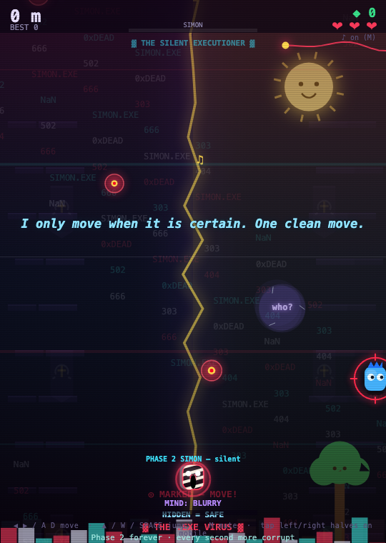

- **An eighth arc: THE SILENT EXECUTIONER.** A little past the Blurry Mind, climb
  on and found-out Simon goes quiet. A new state fires with its own warning, taunts
  (*"If they all know what I am... I stop hiding it."*), and a teal HUD tag:
  **▓ THE SILENT EXECUTIONER ▓**. His caption changes to **PHASE 2 SIMON — silent**.
- **He stops wasting power.** Weaker on paper but more efficient, Simon thins the
  blurry-thought spam right out (fewer, slower thoughts) and turns to precision.
- **The MARK and the one clean move.** "He only moves when the result is certain."
  Every few seconds Simon **MARKS your exact spot** with a red reticle that
  **contracts as the strike becomes certain**, holds while it locks (the lock dot
  flashes white), then drops **one clean lightning bolt** straight down on the mark.
  Stay on it (hesitate / *"think too much"*) and the clean move lands — **CLEAN HIT**.
  Read it and **MOVE off the mark** and he **MISSED**. A blinking **◎ MARKED — MOVE!**
  warning calls it out.
- **Silent and watchful.** Simon's eyes now flicker **red, then teal, then white**;
  new **aim** (a quiet rising lock tone) and **strike** (one sharp precision crack,
  then silence) sounds; and a new death sting: *"I do not need to overpower the room.
  I only break the right thing first. One clean move." — The Silent Executioner*.

## 2026-06-13 — EXPOSED: The Blurry Mind, Found Out (Lore 27)

Based on Toby's June 13 lore (Lore 27): *"Simon is the only cat, all other
characters are dog people... Simon gets alarmed and offended... his physical
strength dropped even more from a 9 to a 7... He has the power to make memories
blurry and can also make new blurry thoughts, and he seals each with lightning,
victums explode from too much stuff in the mind/brain... Gray couldn't escape
because Gray didn't look close enough at the banages to tell him that Simon is
Phase 2... Simon doesn't even think about attacking now, since everyone finds
him out."*

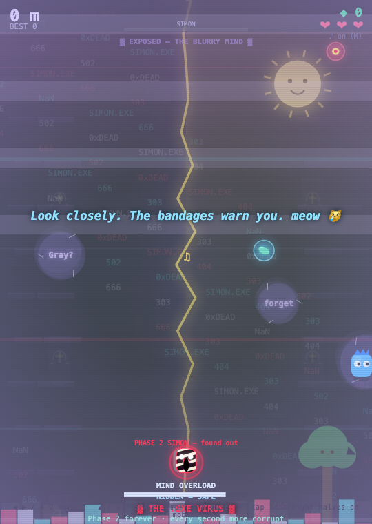

- **A seventh arc: EXPOSED — THE BLURRY MIND.** A little after Phase 2 locks
  (the .EXE virus), climb on and Simon is **found out**. A new state fires with
  its own warning, taunts (*"Everyone finds me out. meow 😿"*), and a violet HUD
  tag: **▓ EXPOSED — THE BLURRY MIND ▓**.
- **Blurry thoughts.** Simon stops relying on direct attack and **plants blurry
  thoughts** — soft, smeared violet blobs carrying fogged words (*who? · forget ·
  meow · Gray? · 404*) that drift in and slowly home on you. As your memory fogs,
  a **violet haze** creeps over the whole screen.
- **The MIND meter + the lightning seal.** A new **MIND** bar fills while a blurry
  thought overlaps you (*"too much stuff in the mind/brain"*). Let it **overload**
  and Simon **seals it with lightning** — a white seal-flash, an explosion of your
  over-full mind, and a hit. The counter is the lore's own rule: **look closely
  (stand still)** and your mind clears.
- **The bandages are a warning sign.** Found-out Simon now wears **bandages** you
  can see, and they **glow brighter when you stand still to look closely** (with a
  tiny **P2** warning glyph) — the warning Gray missed. His caption changes to
  **PHASE 2 SIMON — found out**.
- **Found out, he stops chasing.** Because everyone knows him now, Simon's direct
  **tendril swipes mostly stop** and he turns watchful and defensive — *scarier in
  a quieter way*. New blurry-mind death sting and a new `blur` sound (a smeared,
  detuned wobble before the seal).
- Everything is additive and gated behind Phase 2 → Exposed, so the climb, the
  Peaceful Ending, the Sound Battle, and the .EXE virus all play exactly as before
  until Simon is found out.

## 2026-06-13 — The Spreading of Simon: Cells, Lightning, and RUN = FUEL (Lore 26)

Based on Toby's June 13 lore (Lore 26): *"Simon forces the game to create small
red cells called Pyrakontacke (Pyra = power/aura, Kont = Nucleus, Acke = true =
Power Nucleus True), and it uses the Pyrakontacke to corrupt the shields and
force of the cores and souls. Simon makes Plorotacke (Ploro = energy/electric,
acke = true, a cell without a nucleus and instead has a huge Mitochondria), and
then the Pyrakontacke and Plorotacke mix inside of Simon and creates
lightning-powered corruption... those who run away become fuel, and those who
hide are safe. Simon Phase 2 is the fastest, he is a lightning cat deity who
became corrupted."*

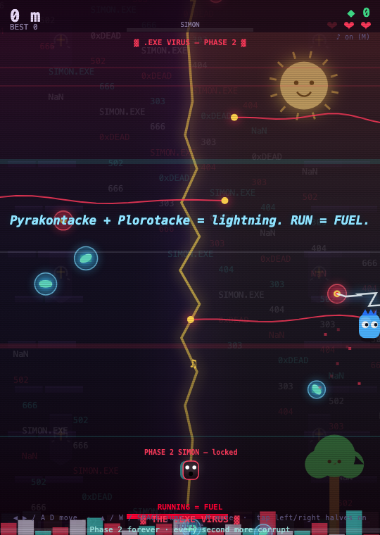

- **Phase 2 now grows corruption-cells.** Once Simon is locked to Phase 2, the
  room fills with two drifting cell types:
  - **Pyrakontacke** — a red cell with a bright, hot **Power Nucleus** (a glowing
    gold/red core). Simon's tool for corrupting shields, cores, and souls.
  - **Plorotacke** — a cyan cell with **no nucleus** and instead one **huge
    Mitochondria** (a turning charge-blob with cristae lines). Raw electric fuel.
- **Lightning-powered corruption.** When a Pyrakontacke and a Plorotacke drift
  close, they **mix and arc** into a jagged lightning bolt (with a new electric
  `zap` sound). If the bolt crosses you, it hurts. The two cells are spent in
  the reaction, just like they "mix inside Simon."
- **The rule of Phase 2: RUN = FUEL, HIDE = SAFE.** A new charge bar tracks your
  panic. **Running charges the corruption against you** — fill the bar and you
  take a hit and a red **"FUEL"** burst. **Standing still lets it settle** and the
  HUD reads **"HIDDEN = SAFE."** But Simon's tide never stops rising, so you can
  never hide for long: panic is punished, stillness is risky, and you have to
  pick your moments. The HUD shows **RUNNING = FUEL** / **HIDDEN = SAFE** live.
- **Title + death stings updated.** The title screen now tells the Phase 2 rule,
  and the Phase 2 death line is Toby's own: *"Those who run become fuel. Those
  who hide are safe. !CLaSsIcs can'T b3 SAV3b!" — Phase 2 Simon.*
- Everything is additive and gated behind Phase 2, so the climb, the Peaceful
  Ending, and the Sound Battle all play exactly as before until Simon locks.

## 2026-06-13 — Phase 2: The .EXE Virus (Lore 25c)

The End of the Peaceful Ending. Climb past the calm Incredibox and Simon is
locked to Phase 2 forever, the virus takes the world. Based on Toby's June 13
lore: *"Simon is now even less in power and even feels weak, he can't attack, he
is Phase 2 forever... Phase 2 Simon comes and then comes the .EXE virus, all gets
corrupted... he instead made several tentacles and corrupted chaos attack
everyone... he is Phase 2 forever because of the lock. Every second the game gets
more and more corrupt, Error 404, Error 666, Error 303, and several more errors."*

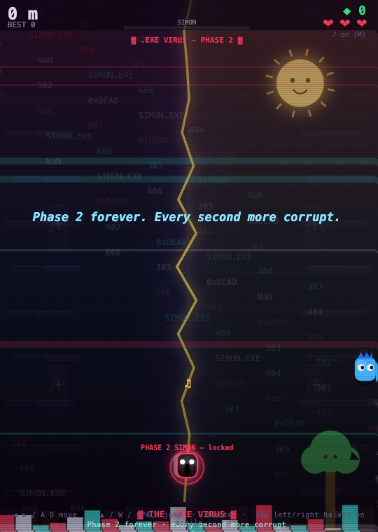

- A new **sixth arc** fires after the Peaceful Ending and Sound Battle: climb
  high enough and **PHASE 2 — THE .EXE VIRUS** breaks the calm. There is no
  Pacifist Phase 1 left inside Simon to clean the chaos, so he is **locked to
  Phase 2 forever** and the danger returns for good.
- **The calm Simon becomes Phase 2 Simon** — a dark, glitching, locked figure
  whose **eyes flash bright red, white, and teal-blue**, with a datamosh ghost
  copy jittering behind him. The caption flips from "SIMON LEADS" to
  **"PHASE 2 SIMON — locked."**
- **The .EXE virus spreads:** the peaceful Incredibox singers get **infected one
  by one**, glitching red/teal with red eyes; the calm dawn **tears** into a
  corrupted red/teal void with a jagged, flashing equalizer.
- **The errors multiply every second** — 404, 666, 303, 502, 0xDEAD, NaN,
  SIMON.EXE flood the background and keep growing, flashing the same
  red/white/teal as Simon's eyes.
- **Corrupted tentacles attack everything:** Simon "can't attack" with his levers
  anymore, so instead the screen throws **.EXE glitch pulses** (torn datamosh
  slices + scanlines) and **extra corruption tendrils** lash out. Damage is back
  on; the once-safe calm surface can hurt you again.
- New audio: a glitchy **corruption crash** when Phase 2 fires (re-muffles the
  room and re-arms the horror drone the Peaceful Ending had calmed), plus a short
  **digital stutter** on every glitch pulse.
- Death screen gets a Phase 2 sting: *"There is no Phase 1 left. Simon is locked
  to Phase 2 forever, attacking all." — .EXE*

## 2026-06-13 — Sound Battles: Simon Leads (Lore 25b)

In the calm Incredibox, the last trace of everything is the Sound Battle, and
Simon is still the fastest. Based on Toby's June 13 lore: *"Simon, and all the
others made sound and animation. Sound Battles happen. It is so small now. Simon
is fastest... Everything became small and simple again, but Simon is still the
fastest sound-and-animation force in the whole game."*

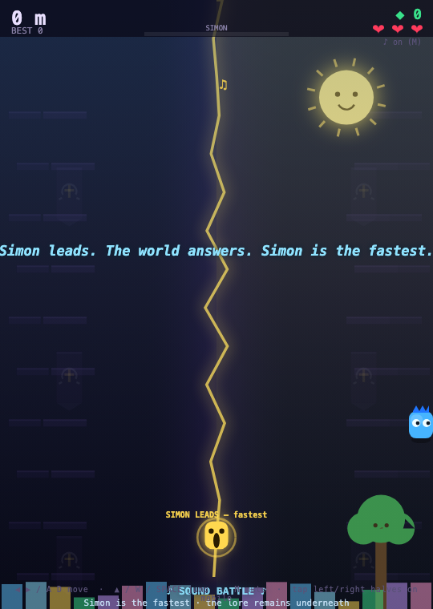

- A **Sound Battle** now runs through the whole Peaceful Ending: a steady, calm
  beat where **Simon leads** and the world answers.
- **Simon is the fastest** — a small, calm gold Simon sits at the bottom-center
  and pulses **first** on every beat (a bright lead note + a ring of his beat
  rippling out), captioned *"SIMON LEADS — fastest."*
- His call **ripples outward** across the room and each **Incredibox singer
  answers** as the wave reaches it: it bobs harder, opens wide, glows in its own
  color, and puffs a matching music note. Simon always moves first; the others
  follow.
- New calm audio: a clean **lead tone** for Simon's call and a soft warm
  **answer chord** a beat behind, layered over the peaceful Incredibox hum.
- The surface stays small and simple, no danger, just sound and animation. The
  on-screen label now reads **♪ SOUND BATTLE ♪ — Simon is the fastest · the lore
  remains underneath.**

## 2026-06-13 — The Peaceful Ending (Lore 25)

Simon steps back from the story and the world settles into its true form.
Based on Toby's June 13 lore: *"Simon goes back from the story, and now it is
just only a peaceful incredibox with lore and Sound Battles. It was all normal."*

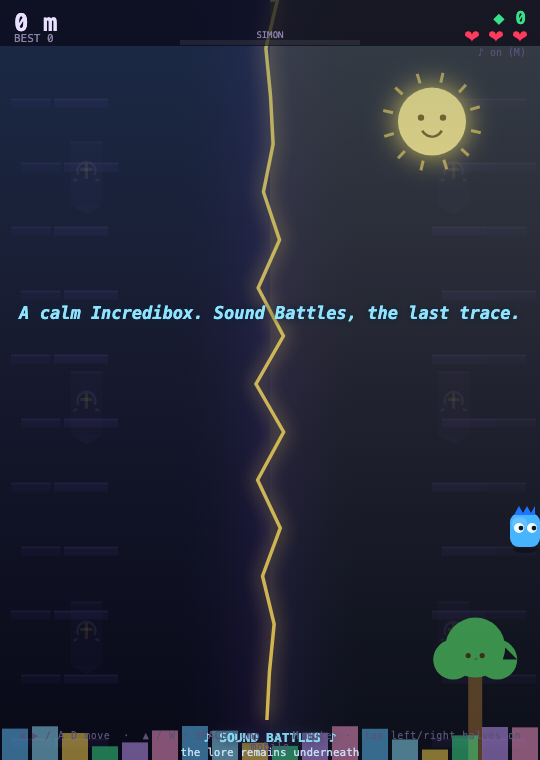

- **The Peaceful Ending** fires after the Restoration, once you climb high
  enough: Simon **steps back from the story** and his rising tide sinks calmly
  away. He can no longer catch you.
- The whole room turns into a **calm Incredibox** — a soft dawn overtakes the
  void and a gentle **equalizer of light hums** along the bottom.
- **Incredibox singers** sprout on the calm steps, bobbing to a shared beat and
  puffing out **music notes** that drift up.
- **Sound Battles** stays on screen as the last trace, with a reminder that
  **the lore remains underneath** (the 404/666 errors and Parinusian banners
  fade to faint memory but never fully disappear).
- The surface is fully calm: **levers stop, taunts soften, nothing can hurt
  you.** Simon's line settles to: *"It was all normal."*
- A warm major chime plays and the horror drone finally hushes.

## 2026-06-13 — The Restoration (Simon's redemption)

Simon's turn from destroyer to rebuilder. Based on Toby's June 13 lore.

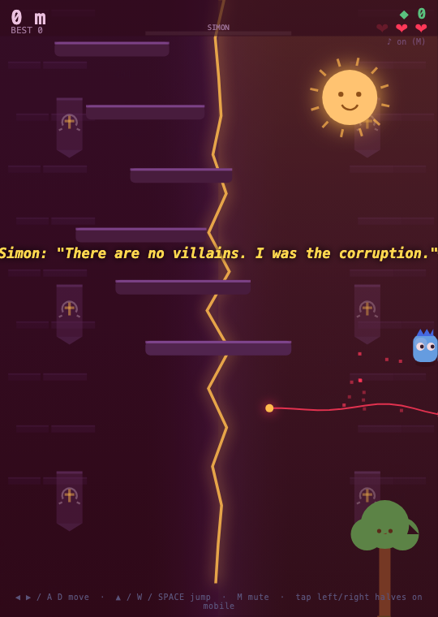

- **The Restoration** fires when you climb high enough: Simon opens a **golden
  crack** down the middle of the sky.
- **Mr. Sun and Mr. Tree** rise over a bright, normal half of the room while the
  other half stays corrupt — half healed, half dark.
- Simon **ends Error 404 and Error 666** (the drifting error words fade) and
  **heals you to full**.
- His line: *"There are no villains. I was the corruption. The rest is only
  perspective."*

## 2026-06-13 — The False Cure

Simon weaponizes hope. Based on Toby's June 13 lore.

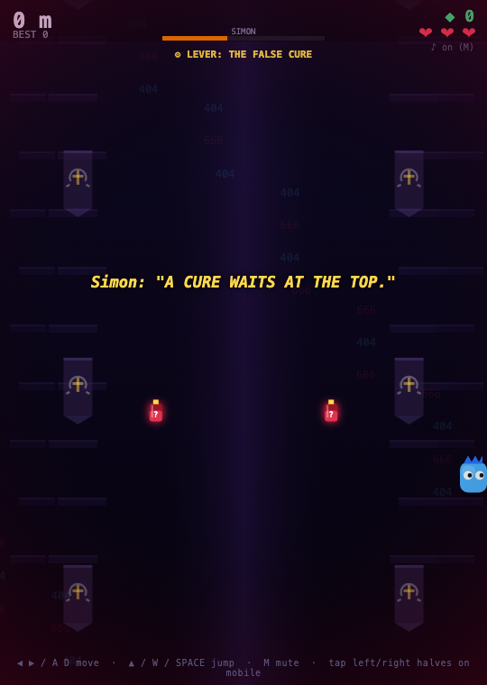

- **The False Cure lever** — two identical red `?` bottles drop. One is the
  Anti-Virus (heals), one is the JTMYHE "juice" (hurts). You cannot tell which
  until you grab it. (Kept non-lethal so the climb stays fair.)
- **The dud lever** — sometimes Simon pulls a lever and nothing happens. The
  cruelest trick: "maybe that one was the cure?"
- **Simon's taunts** — he keeps selling the lie of a cure at a top that does
  not exist ("A cure waits at the top," "Great height. You won't get higher").
- **The 5-emerald cruelty** — reach a milestone and Simon hands out 5 emeralds,
  then pulls a lever to drop you the next step.
- **Combuntia orbs** — blood-red orbs set into the living steps that pulse red
  while a lever is charging.
- **Ancient Endless Room** — moss on the steps and **Parinusian banners**
  (golden cross in a gray omega) hung across the background.
- Death-screen sting updated: "Simon promised a cure at the top. There is no
  cure. There is no top."

## 2026-06-13 — Simon's Levers + the Endless Room

Simon's all-powerful lever controls. Based on Toby's June 13 lore.

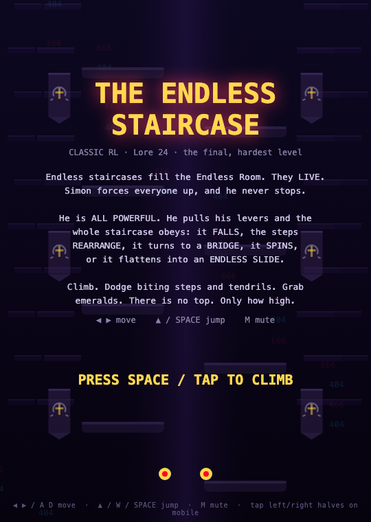

- **Five levers**, each a named attack with a warning banner:
  - **The Staircase Falls** — the steps in view collapse.
  - **The Steps Rearrange** — steps slide to new positions.
  - **It Becomes a Bridge** — steps flatten into a wide span, then snap back.
  - **The Staircase Spins** — the level tilts and left/right controls invert.
  - **The Endless Slide** — steps go icy and Simon's tide drags you down.
- **The Endless Room** — more endless staircases now drift in the background.

## 2026-06-13 — Initial release

The first playable build, from Toby's "Lore 24: The Endless Staircase."

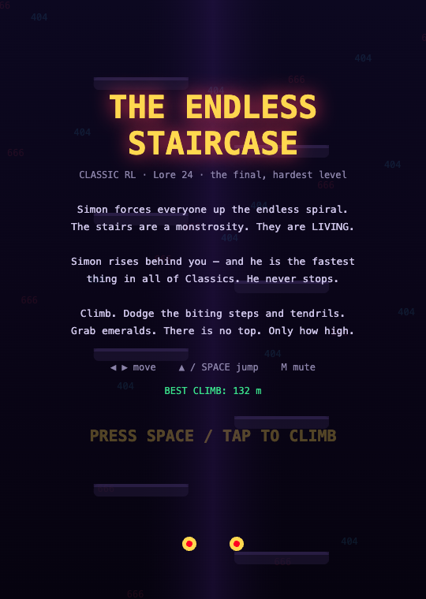

- Endless vertical climber / survival horror, single self-contained file,
  vanilla Canvas + Web Audio, no external libraries.
- **Simon's rising tide** hunts from below and accelerates with height.
- **Living-staircase hazards** — biting steps, crumbling steps, tendril swipes.
- **Emeralds** to collect; best climb saved locally.
- Synthesized soundtrack whose heartbeat quickens as Simon closes in.
