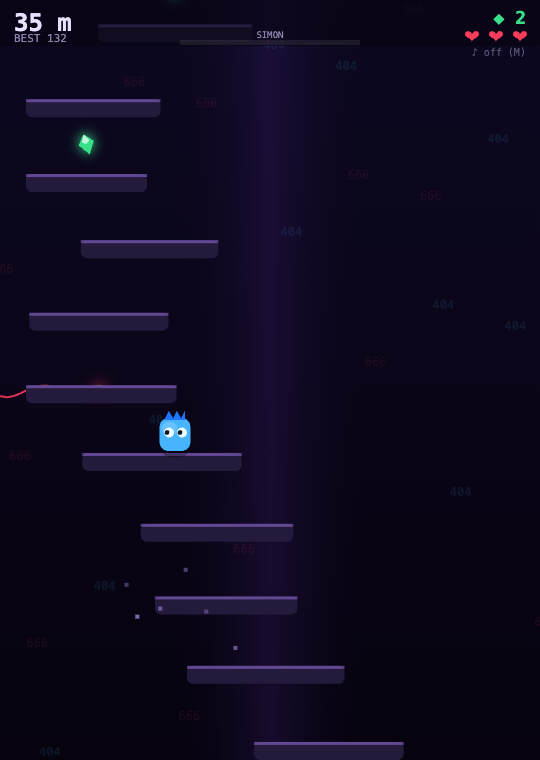
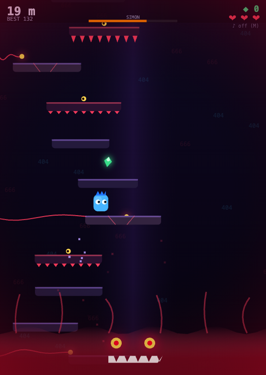

# The Endless Staircase 🪜🟡

> *"everyone is forced by Simon to walk endlessly up the endless spiral staircase... the final, hardest, scariest, and longest level in the game. The Endless Staircase also tries to attack players, Simon will chase the characters up. The stairs themselves is a monstrosity, it is living!"*

A browser game built from the **newest chapter** of the *Secret of Simon's Lore* / **Classic RL** universe (Lore 24, June 12 2026). It's an endless vertical climber / survival horror. There is no top — only how high you get before Simon catches you.

**▶ Play it (no install): https://d1hysvqh647i13.cloudfront.net/game/endless-staircase/**

## The three horrors, all at once

1. **Simon chases you from below** — a rising tide of red error-flesh with glaring eyes and a jagged grin. He is *the fastest thing in all of Classics*, so he accelerates and lunges. He never trails far behind.
2. **The staircase is alive and attacks** — biting steps that snap their teeth if you linger, crumbling steps that drop away, and tendrils that swipe across the tower.
3. **The climb never ends** — score is meters climbed. Grab **emeralds** (Simon's currency) on the way up.

| Climb | Simon's rising tide |
|---|---|
|  |  |

## Controls

| Action | Keys |
|---|---|
| Move | `←` `→` or `A` `D` |
| Jump | `↑` / `W` / `Space` |
| Mute / unmute | `M` |
| Start / retry | `Space` / `Enter` / tap |
| Mobile | tap left/right half to move, tap the top quarter to jump |

## Tech

A single self-contained `index.html`. **Zero external libraries** — vanilla HTML5 Canvas + the Web Audio API.

- Fixed-timestep physics (one-way platforms, coyote time, air control).
- Procedurally generated, reachability-constrained staircase.
- Fully synthesized soundtrack: a climbing pulse + heartbeat that quickens and muffles as Simon closes in, plus jump / coin / hit / roar SFX and a horror drone.
- Best climb saved to `localStorage`.

Run locally: just open `index.html` in any browser (or `python3 -m http.server` and visit it).

## Lore

Part of an ever-growing universe centered on **Simon (Yellow)** in **Classic RL**. Lore wiki: https://d1hysvqh647i13.cloudfront.net/ · this game's wiki entry: https://d1hysvqh647i13.cloudfront.net/wiki/mods/endless-staircase/

Created with [Claude Code](https://claude.com/claude-code). Lore by Toby.
